# What each claim rests on

*Generated by `scripts/claims.py` from `data/manual/claims.json`. No number on this page is typed: every one is resolved from data, a pinned document, a past commit or a stated parameter, and links to where it came from. Each claim also records what it saw when it was last confirmed, and the page is refused if anything has changed since.*

Prose hides dependency. *The surface diurnal amplitude is below half a milligram* reads like a measurement. It is a bound, derived from a synthetic recovery run on a real sampling schedule, under a stipulated signal shape and a noise model — four kinds of thing, one of which is not data at all. The sentence cannot show you that. A graph can.

### How to read the shapes

| shape | kind | what it means for the claim above it |
|---|---|---|
| cylinder, blue | **held** | a dataset on disk, with whatever faults [DATA_SOURCES.md](DATA_SOURCES.md) records |
| cylinder, purple | **external** | somebody else's published document, pinned by its hash |
| hexagon, red dashed | **gap** | data that exists and we cannot reach, or that nobody has measured |
| flag, amber | **synthetic** | generated to test the method. Licenses claims about the *instrument*, never about the world |
| rhombus, amber dashed | **assumption** | stipulated rather than measured. **The claim is void if it is wrong** |
| box, grey | **script** | the code that does the work |
| rounded, green | **claim** | a statement on a page, which may rest on other claims |
| slanted, slate | **history** | what this project itself did or said at a past commit, checked against its history |
| circle, red dotted | **untraced** | where the trail ends: what was searched and not found. Nothing below it is claimed |

A claim is either this project's own or somebody else's. Ours says why it follows from what it rests on. Somebody else's is credited to whoever holds it and shows only what could be found behind it - their document, pinned, and the reasons they give - and where the trail ran out, it says so. Every path down from a claim ends in one of the kinds above; the build refuses one that does not.

---

## AREAS.md

<a id="C-AR-AGG"></a>
### The national argument is made in aggregates - one land-borne load, and one share of it for agriculture of [69.6](SOURCES.md#F-e2cc286a52)% - and a figure true of Denmark need not hold for any one water body inside it.

`C-AR-AGG` · **argued** — follows by reasoning from what it rests on - the argument is given in full

Said on [AREAS.md](AREAS.md).

**Why it follows:** The national figures are totals and shares over the whole country; a total or share over many water bodies can hold while being wrong for each of them, so the aggregate cannot stand in for the water bodies.

**Replaces an earlier claim**, retired on 2026-09-11 to the [archive](ARCHIVE.md#C-AR-OLD-AGG): The percentage rule it named has no source anywhere in the repository; its justification was not recorded properly. 'Every number' and 'true of nowhere' overgeneralise: a national figure need not hold in any one water body, which is what the replacement says.

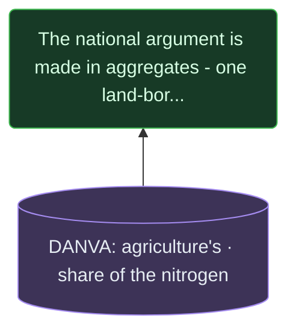

- **external** — DANVA: agriculture's share of the nitrogen: “hvor landbruget alene står for” ([`DANVA-2024`](https://www.danva.dk/nyheder/2024/kvaelstofudledningen-skyldes-overvejende-andre-kilder-end-spildevand/), pinned). DANVA's page gives agriculture's share of nitrogen discharge, citing data from Miljøstyrelsen and Aarhus Universitet.

**Assessed** — no script computes this. It is a reading or a judgement, assessed by a person.

*Confirmed 2026-09-11 by* `fork w1-ar (read each claim, its reasoning and what it rests on against the page wording; code claims against areas.py, partition_score.py and station_places.py; figures against areas.json, partition_score.json and station_places.json; others' claims against their pinned texts; 2026-09-11; not yet read by the project owner)`. *If anything shown here changes, this claim is refused until it is read again.*

<a id="C-AR-SCOPE"></a>
### The page keeps one record per marine water body: what presses on it, what is observed in it, over which years each stream exists, and what cannot be modelled there.

`C-AR-SCOPE` · **code** — what this project's code does, read from the code

Said on [AREAS.md](AREAS.md).

**Why it follows:** scripts/areas.py writes each record with pressure, observation, streams and not_modelled, and the page prints them per water body.

**Replaces an earlier claim**, retired on 2026-09-11 to the [archive](ARCHIVE.md#C-AR-OLD-LONGEST): Rhetorical, and not a finding: on the stored records the gaps list averages about the same length as the list of pressures.

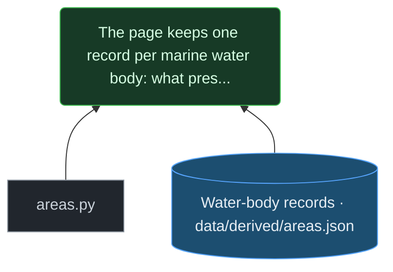

- **script** — areas.py. Builds the water-body records: nearest-boundary assignment within a maximum distance, the model flag from DHI's list of water bodies with statistical models (data/manual/statistical_models.json), bathing observation, the knowledge sets and the cross-area correlations.
- **held** — Water-body records data/derived/areas.json. Written by scripts/areas.py: one record per polygon of the national marine layer marin_overordnet, with pressures, bathing observation, the years each stream spans, and the written-out reasons an area cannot be modelled.

**Computed** — the chain is what was coded, and the script that computes it records how it counted.

*The script behind this does not yet record how it counted it. That is a gap in the justification, not a property of the number.*

*Confirmed 2026-09-11 by* `Claude (re-read: the description of areas.py under this claim now says the model flag comes from DHI's list of water bodies with statistical models, as the code does since the flag fix, instead of a name match; nothing else under it changed. 2026-09-11; not yet read by the project owner)`. *If anything shown here changes, this claim is refused until it is read again.*

<a id="C-AR-ASSIGN"></a>
### Every layer is assigned to water bodies by nearest point on the marine boundary, one rule for all, with the largest distance kept per layer and area and anything beyond the maximum distance dropped.

`C-AR-ASSIGN` · **code** — what this project's code does, read from the code

Said on [AREAS.md](AREAS.md).

**Why it follows:** In scripts/areas.py each feature goes to the nearest boundary vertex within the maximum distance; the record keeps n and max_dist_km per layer, not the distance of each feature.

**Replaces an earlier claim**, retired on 2026-09-11 to the [archive](ARCHIVE.md#C-AR-OLD-DISTANCE): Inexact: areas.py keeps only the largest distance per layer and area, not the distance of every assignment.

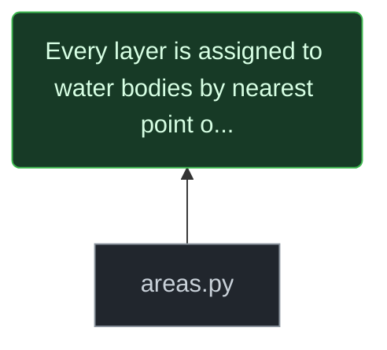

- **script** — areas.py. Builds the water-body records: nearest-boundary assignment within a maximum distance, the model flag from DHI's list of water bodies with statistical models (data/manual/statistical_models.json), bathing observation, the knowledge sets and the cross-area correlations.

**Computed** — the chain is what was coded, and the script that computes it records how it counted.

*The script behind this does not yet record how it counted it. That is a gap in the justification, not a property of the number.*

*Confirmed 2026-09-11 by* `Claude (re-read: the description of areas.py under this claim now says the model flag comes from DHI's list of water bodies with statistical models, as the code does since the flag fix, instead of a name match; nothing else under it changed. 2026-09-11; not yet read by the project owner)`. *If anything shown here changes, this claim is refused until it is read again.*

<a id="C-AR-MODEL-MATCH"></a>
### The model flag follows DHI's list of water bodies with a station-level statistical model, matched to this layer by DHI's number with every name read against the layer's; one of DHI's models covers five Limfjord bredninger together, and one water body it lists is not in the marine layer used here.

`C-AR-MODEL-MATCH` · **code** — what this project's code does, read from the code

Said on [AREAS.md](AREAS.md).

**Why it follows:** scripts/areas.py marks a water body as modelled when its id is in data/manual/statistical_models.json. That file takes each entry of DHI's table of water bodies with statistical models and gives the layer's id for DHI's number, noting where the two names are worded differently; DHI's Limfjord entry names five bredninger, all matched by name, and its Grund Fjord entry has no counterpart in the layer.

**Replaces an earlier claim**, retired on 2026-09-11 to the [archive](ARCHIVE.md#C-AR-OLD-MODELLED): The count is of a name match - the first six letters of DCE's station-area names found in water-body names - which disagrees with DHI's list of water bodies that have statistical models in both directions.

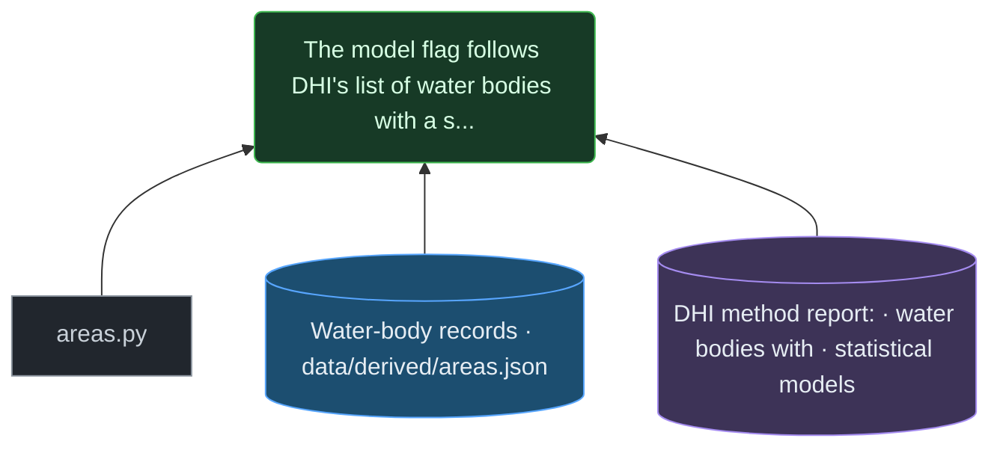

- **script** — areas.py. Builds the water-body records: nearest-boundary assignment within a maximum distance, the model flag from DHI's list of water bodies with statistical models (data/manual/statistical_models.json), bathing observation, the knowledge sets and the cross-area correlations.
- **held** — Water-body records data/derived/areas.json. Written by scripts/areas.py: one record per polygon of the national marine layer marin_overordnet, with pressures, bathing observation, the years each stream spans, and the written-out reasons an area cannot be modelled.
- **external** — DHI method report: water bodies with statistical models: “Oversigt over vandområder og de tilhørende overvågningsstationer, der er opstillet statistiske modeller for” ([`DHI-MODEL-DEL1-2015`](https://sgavmst.dk/media/hvomfapx/31-modeller-for-danske-fjorde-og-kystnaere-havomraader-del-1.pdf), pinned). The report's table names each water body that has a statistical model, with its monitoring stations.

**Computed** — the chain is what was coded, and the script that computes it records how it counted.

*The script behind this does not yet record how it counted it. That is a gap in the justification, not a property of the number.*

*Confirmed 2026-09-11 by* `Claude (re-read: the description of areas.py under this claim now says the model flag comes from DHI's list of water bodies with statistical models, as the code does since the flag fix, instead of a name match; nothing else under it changed. 2026-09-11; not yet read by the project owner)`. *If anything shown here changes, this claim is refused until it is read again.*

<a id="C-AR-NEITHER"></a>
### Counted with DHI's model flag, the water bodies with neither the flag nor a bathing station, and their share of the sea, are as the table gives them; the hazardous-substance layer adds no marine observation to any.

`C-AR-NEITHER` · **measured** — rests on measurement

Said on [AREAS.md](AREAS.md).

**Why it follows:** The neither set in scripts/areas.py is the bodies with no model flag and no bathing record; the hazardous layer holds no marine point. The flag follows DHI's list as matched in statistical_models.json.

**Replaces an earlier claim**, retired on 2026-09-11 to the [archive](ARCHIVE.md#C-AR-OLD-REQUIREMENT): 'A fitted model' was the name-matched flag, not the models, and the requirement had no source on the page; the replacement counts with the flag named as what it is, and takes the requirement from DHI's method report.

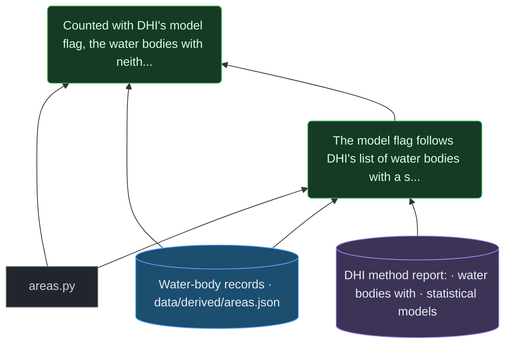

- **script** — areas.py. Builds the water-body records: nearest-boundary assignment within a maximum distance, the model flag from DHI's list of water bodies with statistical models (data/manual/statistical_models.json), bathing observation, the knowledge sets and the cross-area correlations.
- **held** — Water-body records data/derived/areas.json. Written by scripts/areas.py: one record per polygon of the national marine layer marin_overordnet, with pressures, bathing observation, the years each stream spans, and the written-out reasons an area cannot be modelled.
- **claim** — The model flag follows DHI's list of water bodies with a station-level statistical model, matched to this layer by DHI's number with every name read against the layer's; one of DHI's models covers five Limfjord bredninger together, and one water body it lists is not in the marine layer used here. ([`C-AR-MODEL-MATCH`](CLAIMS.md#C-AR-MODEL-MATCH))

**Computed** — the chain is what was coded, and the script that computes it records how it counted.

*The script behind this does not yet record how it counted it. That is a gap in the justification, not a property of the number.*

*Confirmed 2026-09-11 by* `Claude (re-read: the description of areas.py under this claim now says the model flag comes from DHI's list of water bodies with statistical models, as the code does since the flag fix, instead of a name match; nothing else under it changed. 2026-09-11; not yet read by the project owner)`. *If anything shown here changes, this claim is refused until it is read again.*

<a id="C-AR-REQUIREMENT"></a>
### In the method behind the second water plans, every one of its [119](SOURCES.md#F-3b74139141) water bodies was given an indsatsbehov, whether it had a statistical model or not.

`C-AR-REQUIREMENT` · **attributed** — somebody else's claim, shown with what could be found behind it

**Somebody else's claim** — held by DHI, for the Danish Nature Agency (2015). What follows is what could be found behind it, and no more.

Said on [AREAS.md](AREAS.md).

**Their reasons, as far as they could be found:** Their method report says the tools it describes were applied to each water body of the second water plans to compute an indsatsbehov and a target load. The layer here holds more polygons, so which of the page's water bodies were among them is not checked.

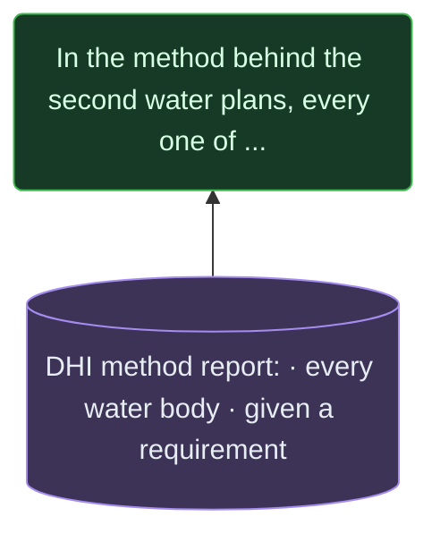

- **external** — DHI method report: every water body given a requirement: “vandområder, der indgår i Vandplan” ([`DHI-MODEL-DEL1-2015`](https://sgavmst.dk/media/hvomfapx/31-modeller-for-danske-fjorde-og-kystnaere-havomraader-del-1.pdf), pinned). The tools were applied to every water body of the second water plans to compute an indsatsbehov.

**Assessed** — no script computes this. It is a reading or a judgement, assessed by a person.

*Confirmed 2026-09-11 by* `fork w1-ar (read each claim, its reasoning and what it rests on against the page wording; code claims against areas.py, partition_score.py and station_places.py; figures against areas.json, partition_score.json and station_places.json; others' claims against their pinned texts; 2026-09-11; not yet read by the project owner)`. *If anything shown here changes, this claim is refused until it is read again.*

<a id="C-AR-ABSENCE-RULE"></a>
### A claim of absence is only as wide as the search behind it, and this search was two layers deep.

`C-AR-ABSENCE-RULE` · **argued** — follows by reasoning from what it rests on - the argument is given in full

Said on [AREAS.md](AREAS.md).

**Why it follows:** An absence found by searching some sources says nothing about sources not searched. The observation counted here is bathing water and the hazardous-substance layer, and nothing else.

**Replaces an earlier claim**, retired on 2026-09-11 to the [archive](ARCHIVE.md#C-AR-OLD-CORRECTION-NOTE): History the reader does not need; the rule it teaches is stated plainly by the replacement.

- **the argument alone** — nothing further is cited: the reasoning above is the whole of it, for the reader to judge

**Assessed** — no script computes this. It is a reading or a judgement, assessed by a person.

*Confirmed 2026-09-11 by* `fork w1-ar (read each claim, its reasoning and what it rests on against the page wording; code claims against areas.py, partition_score.py and station_places.py; figures against areas.json, partition_score.json and station_places.json; others' claims against their pinned texts; 2026-09-11; not yet read by the project owner)`. *If anything shown here changes, this claim is refused until it is read again.*

<a id="C-AR-REGISTER"></a>
### ODA's station register holds the number of positioned marine stations the page gives.

`C-AR-REGISTER` · **measured** — rests on measurement

Said on [AREAS.md](AREAS.md).

**Why it follows:** Counted from docs/data/areas/stations.json, which lists every ODA marine observation station with a position.

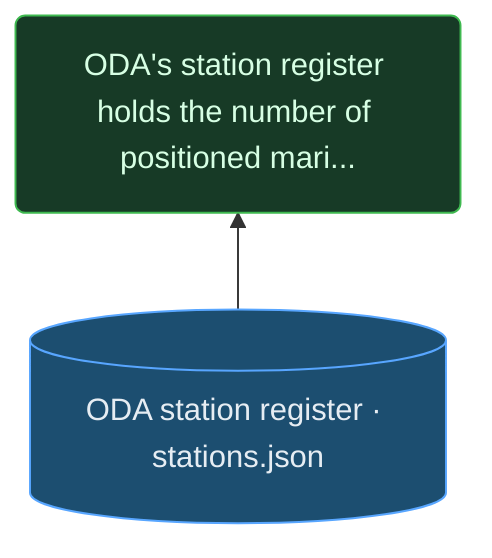

- **held** — ODA station register stations.json. docs/data/areas/stations.json: every ODA marine observation station with a position.

**Computed** — the chain is what was coded, and the script that computes it records how it counted.

*The script behind this does not yet record how it counted it. That is a gap in the justification, not a property of the number.*

*Confirmed 2026-09-11 by* `fork w1-ar (read each claim, its reasoning and what it rests on against the page wording; code claims against areas.py, partition_score.py and station_places.py; figures against areas.json, partition_score.json and station_places.json; others' claims against their pinned texts; 2026-09-11; not yet read by the project owner)`. *If anything shown here changes, this claim is refused until it is read again.*

<a id="C-AR-SERIES-COVERAGE"></a>
### Of the station series behind the partition tests, the page gives how many stations lie inside a water body and how many water bodies contain one, and how many contain none with data in two, five and ten or more distinct years.

`C-AR-SERIES-COVERAGE` · **measured** — rests on measurement

Said on [AREAS.md](AREAS.md).

**Why it follows:** scripts/station_places.py counts the series' stations placed by point in polygon and, per water body, the most distinct years any of its stations carries data in; these are counts over that series, not over the register.

**Replaces an earlier claim**, retired on 2026-09-11 to the [archive](ARCHIVE.md#C-AR-OLD-REGISTER-COVERAGE): its justification was not recorded properly: the counts were made over the whole register, including stations with no data, and the computation was never stored and cannot be reproduced. The replacement counts over the station series, which is stored.

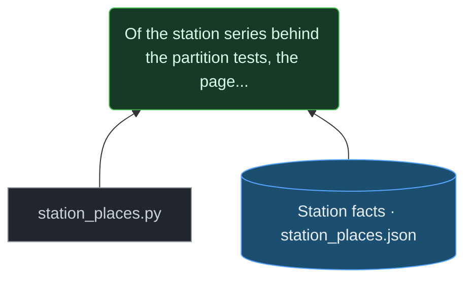

- **script** — station_places.py. The Roskilde spreads: per month with enough stations, the population standard deviation and the range across them, against the standard deviation of the monthly means.
- **held** — Station facts station_places.json. data/derived/station_places.json, from the station series docs/data/areas/stations_series.* and the separate overlay station_waterbody_overlay.json: the Roskilde Fjord spreads, and how long each water body's longest station series runs.

**Computed** — the chain is what was coded, and the script that computes it records how it counted.

*The script behind this does not yet record how it counted it. That is a gap in the justification, not a property of the number.*

*Confirmed 2026-09-11 by* `fork w1-ar (read each claim, its reasoning and what it rests on against the page wording; code claims against areas.py, partition_score.py and station_places.py; figures against areas.json, partition_score.json and station_places.json; others' claims against their pinned texts; 2026-09-11; not yet read by the project owner)`. *If anything shown here changes, this claim is refused until it is read again.*

<a id="C-AR-NOT-PERCENT"></a>
### Those absences are counts and not percentages, because a share of the sea without a long observation would measure an absence against a search that was not exhaustive: ODA plus two layers, with ICES, EMODnet and any other series outside it.

`C-AR-NOT-PERCENT` · **argued** — follows by reasoning from what it rests on - the argument is given in full

Said on [AREAS.md](AREAS.md).

**Why it follows:** A share needs its numerator measured. The extent of an absence is measured only by an exhaustive search; ICES and EMODnet are listed as open and unassembled in coverage_gaps.json, so the search was not exhaustive.

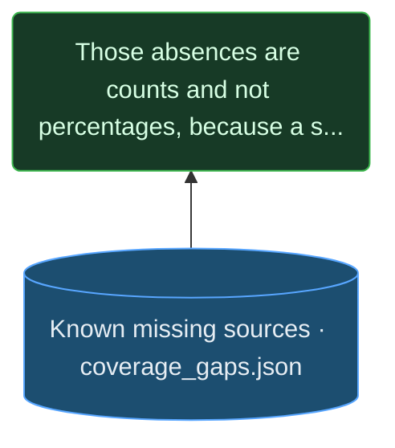

- **held** — Known missing sources coverage_gaps.json. data/manual/coverage_gaps.json: a hand-kept list of sources known to exist and not held, each with its class, what it would add and why it is missing.

**Assessed** — no script computes this. It is a reading or a judgement, assessed by a person.

*Confirmed 2026-09-11 by* `fork w1-ar (read each claim, its reasoning and what it rests on against the page wording; code claims against areas.py, partition_score.py and station_places.py; figures against areas.json, partition_score.json and station_places.json; others' claims against their pinned texts; 2026-09-11; not yet read by the project owner)`. *If anything shown here changes, this claim is refused until it is read again.*

<a id="C-AR-SAME-WIDTH"></a>
### None of the water bodies has a marine point in the national hazardous-substance layer: its points are lake and river. The category is that layer and the count is of all of it, so its complement is exact.

`C-AR-SAME-WIDTH` · **measured** — rests on measurement

Said on [AREAS.md](AREAS.md).

**Why it follows:** The layer's points are counted by kind in scripts/areas.py and none is coastal. An absence stated over a whole named layer needs no search beyond it.

**Replaces an earlier claim**, retired on 2026-09-11 to the [archive](ARCHIVE.md#C-AR-OLD-SAME-WIDTH): Its hazardous-substance count came from lake and river points assigned to the nearest coast, while the layer holds no marine point at all; and its model count came from the name-matched flag.

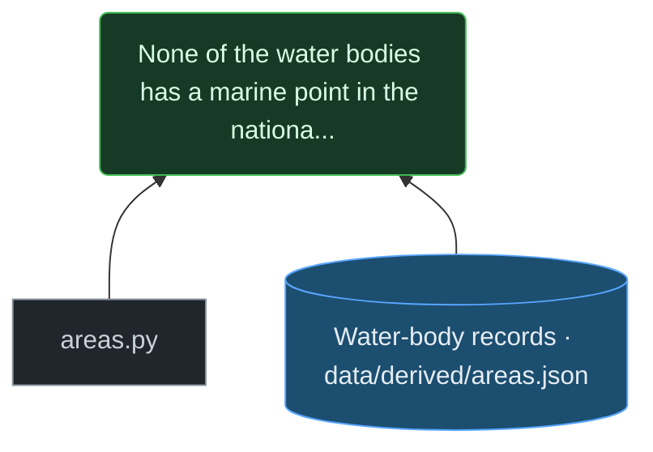

- **script** — areas.py. Builds the water-body records: nearest-boundary assignment within a maximum distance, the model flag from DHI's list of water bodies with statistical models (data/manual/statistical_models.json), bathing observation, the knowledge sets and the cross-area correlations.
- **held** — Water-body records data/derived/areas.json. Written by scripts/areas.py: one record per polygon of the national marine layer marin_overordnet, with pressures, bathing observation, the years each stream spans, and the written-out reasons an area cannot be modelled.

**Computed** — the chain is what was coded, and the script that computes it records how it counted.

*The script behind this does not yet record how it counted it. That is a gap in the justification, not a property of the number.*

*Confirmed 2026-09-11 by* `Claude (re-read: the description of areas.py under this claim now says the model flag comes from DHI's list of water bodies with statistical models, as the code does since the flag fix, instead of a name match; nothing else under it changed. 2026-09-11; not yet read by the project owner)`. *If anything shown here changes, this claim is refused until it is read again.*

<a id="C-AR-WIDER"></a>
### A share of the sea with no marine observation would name a category far wider than the two layers searched, and report a leftover as though it were measured.

`C-AR-WIDER` · **argued** — follows by reasoning from what it rests on - the argument is given in full

Said on [AREAS.md](AREAS.md).

**Why it follows:** Marine observation includes every series outside the two layers; subtracting what was found from the sea leaves a residual, not a measurement.

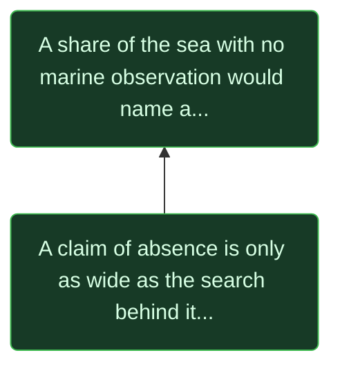

- **claim** — A claim of absence is only as wide as the search behind it, and this search was two layers deep. ([`C-AR-ABSENCE-RULE`](CLAIMS.md#C-AR-ABSENCE-RULE))

**Assessed** — no script computes this. It is a reading or a judgement, assessed by a person.

*Confirmed 2026-09-11 by* `fork w1-ar (read each claim, its reasoning and what it rests on against the page wording; code claims against areas.py, partition_score.py and station_places.py; figures against areas.json, partition_score.json and station_places.json; others' claims against their pinned texts; 2026-09-11; not yet read by the project owner)`. *If anything shown here changes, this claim is refused until it is read again.*

<a id="C-AR-NAMED-CORPUS"></a>
### Absence is reported on this page as a count over a named corpus, and the corpus is named every time.

`C-AR-NAMED-CORPUS` · **stipulated** — a rule this project sets itself, with its reason

Said on [AREAS.md](AREAS.md).

**Why it follows:** A rule the project sets itself (CLAUDE.md, Claims), applied on this page, because of the two arguments it follows.

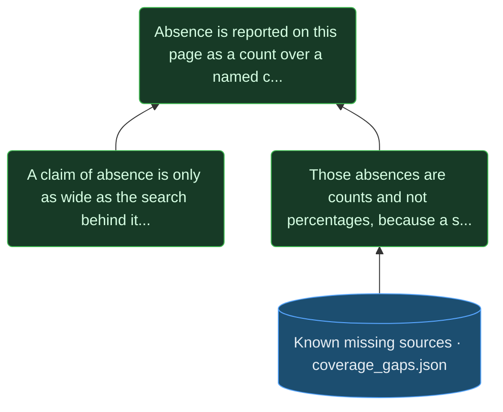

- **claim** — A claim of absence is only as wide as the search behind it, and this search was two layers deep. ([`C-AR-ABSENCE-RULE`](CLAIMS.md#C-AR-ABSENCE-RULE))
- **claim** — Those absences are counts and not percentages, because a share of the sea without a long observation would measure an absence against a search that was not exhaustive: ODA plus two layers, with ICES, EMODnet and any other series outside it. ([`C-AR-NOT-PERCENT`](CLAIMS.md#C-AR-NOT-PERCENT))

**Assessed** — no script computes this. It is a reading or a judgement, assessed by a person.

*Confirmed 2026-09-11 by* `fork w1-ar (read each claim, its reasoning and what it rests on against the page wording; code claims against areas.py, partition_score.py and station_places.py; figures against areas.json, partition_score.json and station_places.json; others' claims against their pinned texts; 2026-09-11; not yet read by the project owner)`. *If anything shown here changes, this claim is refused until it is read again.*

<a id="C-AR-GAPS"></a>
### Counting what was assembled gives a lower bound on evidence and an upper bound on absence, interpretable only beside the sources known to be missing, which are listed in coverage_gaps.json in three kinds.

`C-AR-GAPS` · **argued** — follows by reasoning from what it rests on - the argument is given in full

Said on [AREAS.md](AREAS.md).

**Why it follows:** What was found is part of what exists, so it bounds the evidence from below and the absence from above. The list names known missing terms; its entries are a hand-kept record, not re-verified here.

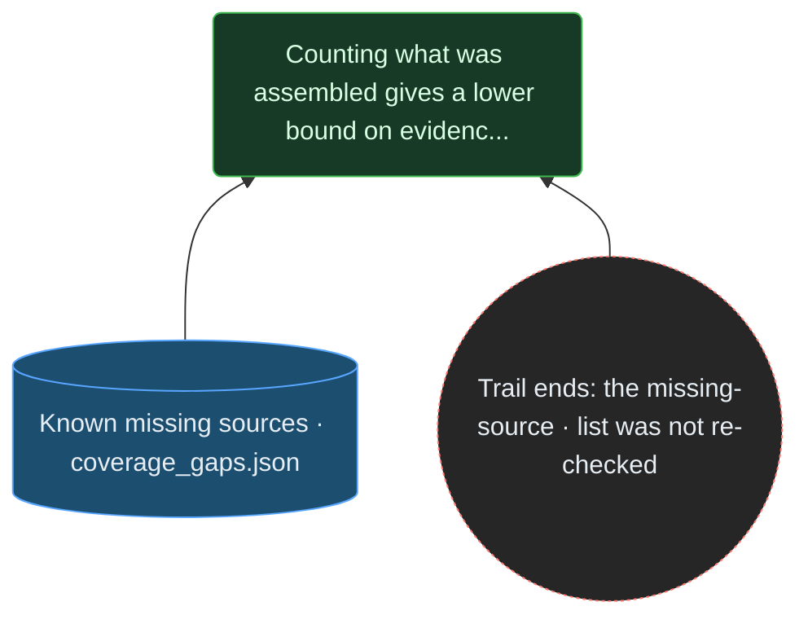

- **held** — Known missing sources coverage_gaps.json. data/manual/coverage_gaps.json: a hand-kept list of sources known to exist and not held, each with its class, what it would add and why it is missing.
- **trail ends here** — Trail ends: the missing-source list was not re-checked. coverage_gaps.json is a hand-kept record. This sweep (11 September 2026) did not re-verify its entries. The refused PULS attempt is recorded only there; no copy of the refusal is kept.

**Assessed** — no script computes this. It is a reading or a judgement, assessed by a person.

*Confirmed 2026-09-11 by* `fork w1-ar (read each claim, its reasoning and what it rests on against the page wording; code claims against areas.py, partition_score.py and station_places.py; figures against areas.json, partition_score.json and station_places.json; others' claims against their pinned texts; 2026-09-11; not yet read by the project owner)`. *If anything shown here changes, this claim is refused until it is read again.*

<a id="C-AR-GAP-CLASSES"></a>
### closed is a gap in the world's availability, open_unassembled a gap in this project's effort, and absent the one kind where a search was run to the end - bounded by that search.

`C-AR-GAP-CLASSES` · **argued** — follows by reasoning from what it rests on - the argument is given in full

Said on [AREAS.md](AREAS.md).

**Why it follows:** These are the definitions coverage_gaps.json gives its three classes.

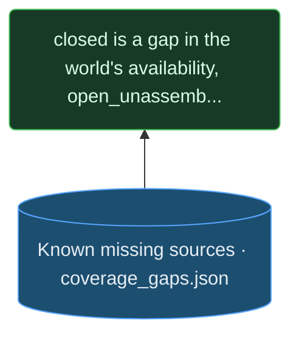

- **held** — Known missing sources coverage_gaps.json. data/manual/coverage_gaps.json: a hand-kept list of sources known to exist and not held, each with its class, what it would add and why it is missing.

**Assessed** — no script computes this. It is a reading or a judgement, assessed by a person.

*Confirmed 2026-09-11 by* `fork w1-ar (read each claim, its reasoning and what it rests on against the page wording; code claims against areas.py, partition_score.py and station_places.py; figures against areas.json, partition_score.json and station_places.json; others' claims against their pinned texts; 2026-09-11; not yet read by the project owner)`. *If anything shown here changes, this claim is refused until it is read again.*

<a id="C-AR-PULS"></a>
### PULS holds the per-event overflow volumes that [B1](hypodrafts/B1.md "Combined sewer overflow") calls the single most valuable missing series - volumes that are largely modelled - and a private MitID was refused access, so a private citizen may not be able to obtain it at all.

`C-AR-PULS` · **provisional** — unchecked - see the graph for what would check it

Said on [AREAS.md](AREAS.md).

**Why it follows:** The need is in the hypothesis register; that the volumes are modelled is in the source register; the refused attempt and the reason given are recorded in coverage_gaps.json and nowhere else.

**Replaces an earlier claim**, retired on 2026-09-11 to the [archive](ARCHIVE.md#C-AR-OLD-PULS): 'Cannot obtain it at all' goes beyond one refused attempt and the word 'appears'.

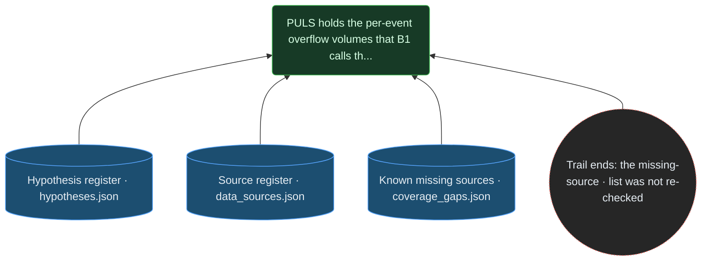

- **held** — Hypothesis register hypotheses.json. data/derived/hypotheses.json: the needs field of [B1](hypodrafts/B1.md "Combined sewer overflow") calls per-event overflow volume the single most valuable missing series.
- **held** — Source register data_sources.json. data/manual/data_sources.json, entry MILJOEGIS-RBU-SAML: it records that the underlying PULS volumes are modelled rather than measured, by the technical guidance's knowledge levels.
- **held** — Known missing sources coverage_gaps.json. data/manual/coverage_gaps.json: a hand-kept list of sources known to exist and not held, each with its class, what it would add and why it is missing.
- **trail ends here** — Trail ends: the missing-source list was not re-checked. coverage_gaps.json is a hand-kept record. This sweep (11 September 2026) did not re-verify its entries. The refused PULS attempt is recorded only there; no copy of the refusal is kept.

**Assessed** — no script computes this. It is a reading or a judgement, assessed by a person.

*Confirmed 2026-09-11 by* `fork w1-ar (read each claim, its reasoning and what it rests on against the page wording; code claims against areas.py, partition_score.py and station_places.py; figures against areas.json, partition_score.json and station_places.json; others' claims against their pinned texts; 2026-09-11; not yet read by the project owner)`. *If anything shown here changes, this claim is refused until it is read again.*

<a id="C-AR-ENCLOSURE"></a>
### Roskilde Fjord names a real hydrographic object, an inlet bounded by land that opens to the sea through Isefjorden: a physical claim about enclosure, and a true one.

`C-AR-ENCLOSURE` · **attributed** — somebody else's claim, shown with what could be found behind it

**Somebody else's claim** — held by Wikipedia (Danish), Roskilde Fjord. What follows is what could be found behind it, and no more.

Said on [AREAS.md](AREAS.md).

**Their reasons, as far as they could be found:** The pinned article says the fjord runs out into Isefjorden north of Hornsherred; the rest is the page's reading of what an inlet is. Nothing held says how restricted its exchange is.

**Replaces an earlier claim**, retired on 2026-09-11 to the [archive](ARCHIVE.md#C-AR-OLD-NARROW): The restricted exchange through a narrow mouth was not checked against any document held; the pinned description supports an inlet bounded by land that opens into Isefjorden.

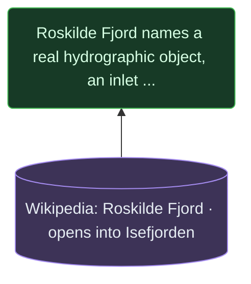

- **external** — Wikipedia: Roskilde Fjord opens into Isefjorden: “Nord om Hornsherred løber den ud i” ([`WIKI-ROSKILDE-FJORD`](https://da.wikipedia.org/w/index.php?title=Roskilde_Fjord&action=raw), pinned). An encyclopaedia article, pinned as its source text: the fjord runs out into Isefjorden north of Hornsherred.

**Assessed** — no script computes this. It is a reading or a judgement, assessed by a person.

*Confirmed 2026-09-11 by* `fork w1-ar (read each claim, its reasoning and what it rests on against the page wording; code claims against areas.py, partition_score.py and station_places.py; figures against areas.json, partition_score.json and station_places.json; others' claims against their pinned texts; 2026-09-11; not yet read by the project owner)`. *If anything shown here changes, this claim is refused until it is read again.*

<a id="C-AR-HOMOGENEITY"></a>
### The assessment uses the same name for a claim about homogeneity - that a measurement taken anywhere in the water body stands for all of it - and nothing carries the enclosure claim to the homogeneity claim.

`C-AR-HOMOGENEITY` · **argued** — follows by reasoning from what it rests on - the argument is given in full

Said on [AREAS.md](AREAS.md).

**Why it follows:** Being bounded by land says where the water is, not that it is alike; one does not imply the other, and the shared name hides the switch.

- **the argument alone** — nothing further is cited: the reasoning above is the whole of it, for the reader to judge

**Assessed** — no script computes this. It is a reading or a judgement, assessed by a person.

*Confirmed 2026-09-11 by* `fork w1-ar (read each claim, its reasoning and what it rests on against the page wording; code claims against areas.py, partition_score.py and station_places.py; figures against areas.json, partition_score.json and station_places.json; others' claims against their pinned texts; 2026-09-11; not yet read by the project owner)`. *If anything shown here changes, this claim is refused until it is read again.*

<a id="C-AR-PHYSICS"></a>
### Where exchange is restricted it preserves gradients rather than erasing them, so the better the enclosure, the weaker the homogeneity assumption: the enclosures most deserving of their names are the least entitled to be treated as single units.

`C-AR-PHYSICS` · **argued** — follows by reasoning from what it rests on - the argument is given in full

Said on [AREAS.md](AREAS.md).

**Why it follows:** A basin with freshwater at its head and little exchange at its mouth keeps salinity, residence-time and oxygen differences along its length because the water that would mix them away does not come in; open water mixes them. The conclusion follows from that premise; it is reasoning, not a measurement here.

- **the argument alone** — nothing further is cited: the reasoning above is the whole of it, for the reader to judge

**Assessed** — no script computes this. It is a reading or a judgement, assessed by a person.

*Confirmed 2026-09-11 by* `fork w1-ar (read each claim, its reasoning and what it rests on against the page wording; code claims against areas.py, partition_score.py and station_places.py; figures against areas.json, partition_score.json and station_places.json; others' claims against their pinned texts; 2026-09-11; not yet read by the project owner)`. *If anything shown here changes, this claim is refused until it is read again.*

<a id="C-AR-TWO-UNITS"></a>
### Roskilde Fjord appears as two water bodies, DKCOAST1 and DKCOAST2 - an admission that one enclosure is at least two units.

`C-AR-TWO-UNITS` · **measured** — rests on measurement

Said on [AREAS.md](AREAS.md).

**Why it follows:** Both are records of the national marine layer in areas.json, with their areas.

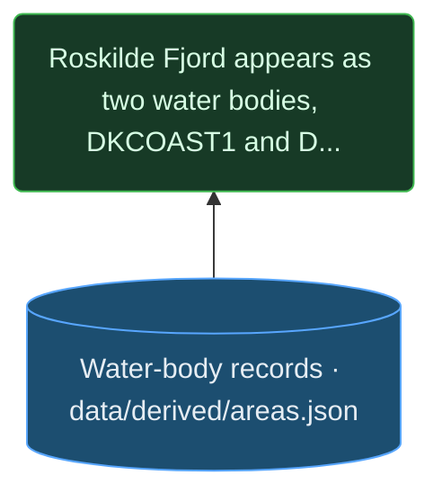

- **held** — Water-body records data/derived/areas.json. Written by scripts/areas.py: one record per polygon of the national marine layer marin_overordnet, with pressures, bathing observation, the years each stream spans, and the written-out reasons an area cannot be modelled.

**Computed** — the chain is what was coded, and the script that computes it records how it counted.

*The script behind this does not yet record how it counted it. That is a gap in the justification, not a property of the number.*

*Confirmed 2026-09-11 by* `fork w1-ar (read each claim, its reasoning and what it rests on against the page wording; code claims against areas.py, partition_score.py and station_places.py; figures against areas.json, partition_score.json and station_places.json; others' claims against their pinned texts; 2026-09-11; not yet read by the project owner)`. *If anything shown here changes, this claim is refused until it is read again.*

<a id="C-AR-SPLIT-UNSTATED"></a>
### The documents this project holds give the general basis for water bodies' boundaries - the directive asks member states to set them, and the plans sort coastal waters into types with a catchment each - but none says why Roskilde Fjord is two units rather than one or three.

`C-AR-SPLIT-UNSTATED` · **provisional** — unchecked - see the graph for what would check it

Said on [AREAS.md](AREAS.md).

**Why it follows:** The general basis is stated in the second-opinion background analysis; the search for a reason specific to this fjord is recorded where it ends.

**Replaces an earlier claim**, retired on 2026-09-11 to the [archive](ARCHIVE.md#C-AR-OLD-NOTHING-STATES): An absence stated over no named corpus - the error the page itself warns against.

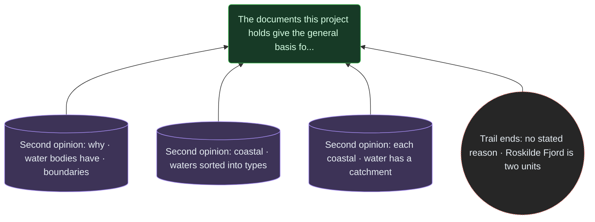

- **external** — Second opinion: why water bodies have boundaries: “angive overfladevandområders beliggenhed og grænser” ([`SO-BG-2024`](https://mgtp.dk/Media/638803057484281253/second-opinion-baggrundsanalyser.pdf), pinned). Quotes the water framework directive's annex: member states set the location and boundaries of surface water bodies.
- **external** — Second opinion: coastal waters sorted into types: “kystvande er inddelt i” ([`SO-BG-2024`](https://mgtp.dk/Media/638803057484281253/second-opinion-baggrundsanalyser.pdf), pinned)
- **external** — Second opinion: each coastal water has a catchment: “defineret et tilhørende opland” ([`SO-BG-2024`](https://mgtp.dk/Media/638803057484281253/second-opinion-baggrundsanalyser.pdf), pinned). Its table gives Roskilde Fjord's inner and outer parts separate catchments, the outer one downstream of the inner.
- **trail ends here** — Trail ends: no stated reason Roskilde Fjord is two units. Searched on 11 September 2026: every pinned text that mentions Roskilde Fjord - the DHI method reports (parts one and two), DCE's statistical-model report, the second-opinion background analyses, BEK 673/2026, MSFD article 8, NOVANA 2023–2027, the DCE oxygen reports, SR353 and the Danish Society for Nature Conservation's second opinion. They give the general basis (the directive's annex, the typology, catchments) and list the two parts separately, with separate catchments; none says why this fjord is two units rather than one or three.

**Assessed** — no script computes this. It is a reading or a judgement, assessed by a person.

*Confirmed 2026-09-11 by* `fork w1-ar (read each claim, its reasoning and what it rests on against the page wording; code claims against areas.py, partition_score.py and station_places.py; figures against areas.json, partition_score.json and station_places.json; others' claims against their pinned texts; 2026-09-11; not yet read by the project owner)`. *If anything shown here changes, this claim is refused until it is read again.*

<a id="C-AR-X22"></a>
### A boundary drawn inside a fjord is a hypothesis about where the water changes, and `X22` in EXPERIMENTS.md sets out how to test it with pairs at matched separation either side of the line.

`C-AR-X22` · **code** — what this project's code does, read from the code

Said on [AREAS.md](AREAS.md).

**Why it follows:** X22's control takes pairs at a fixed separation that straddle an official boundary against pairs at the same separation that do not.

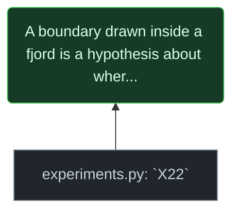

- **script** — experiments.py: `X22`. Sets out the boundary test: pairs of points at a fixed separation that straddle an official boundary against pairs at the same separation that do not.

**Assessed** — no script computes this. It is a reading or a judgement, assessed by a person.

*Confirmed 2026-09-11 by* `fork w1-ar (read each claim, its reasoning and what it rests on against the page wording; code claims against areas.py, partition_score.py and station_places.py; figures against areas.json, partition_score.json and station_places.json; others' claims against their pinned texts; 2026-09-11; not yet read by the project owner)`. *If anything shown here changes, this claim is refused until it is read again.*

<a id="C-AR-POSITION"></a>
### The unit of observation is a position; everything else, this page included, is an aggregate computed inside somebody's polygon.

`C-AR-POSITION` · **stipulated** — a rule this project sets itself, with its reason

Said on [AREAS.md](AREAS.md).

**Why it follows:** A rule the page sets itself, following from the two senses of a body of water: only a position is measured.

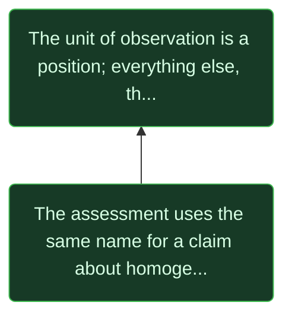

- **claim** — The assessment uses the same name for a claim about homogeneity - that a measurement taken anywhere in the water body stands for all of it - and nothing carries the enclosure claim to the homogeneity claim. ([`C-AR-HOMOGENEITY`](CLAIMS.md#C-AR-HOMOGENEITY))

**Assessed** — no script computes this. It is a reading or a judgement, assessed by a person.

*Confirmed 2026-09-11 by* `fork w1-ar (read each claim, its reasoning and what it rests on against the page wording; code claims against areas.py, partition_score.py and station_places.py; figures against areas.json, partition_score.json and station_places.json; others' claims against their pinned texts; 2026-09-11; not yet read by the project owner)`. *If anything shown here changes, this claim is refused until it is read again.*

<a id="C-AR-ROSK-METHOD"></a>
### For each month in which enough stations in one half of Roskilde Fjord measured, the spread between stations is set against the spread of the monthly means across months.

`C-AR-ROSK-METHOD` · **code** — what this project's code does, read from the code

Said on [AREAS.md](AREAS.md).

**Why it follows:** station_places.py takes, per month with at least the minimum number of stations, the population standard deviation and the range across them, averages the standard deviations and takes the median range, and divides by the standard deviation of the monthly means.

```mermaid
graph BT
  C-AR-ROSK-METHOD("For each month in which enough stations in one half of Ros...")
  X-AR-STATIONPLACES["station_places.py"]
  D-AR-STATIONS[("Station facts · station_places.json")]
  X-AR-STATIONPLACES --> C-AR-ROSK-METHOD
  D-AR-STATIONS --> C-AR-ROSK-METHOD
  style C-AR-ROSK-METHOD fill:#173a26,stroke:#3fb950,color:#d7ffe4
  style X-AR-STATIONPLACES fill:#21262d,stroke:#8b949e,color:#c9d1d9
  style D-AR-STATIONS fill:#1c4e70,stroke:#58a6ff,color:#e6edf3
```

- **script** — station_places.py. The Roskilde spreads: per month with enough stations, the population standard deviation and the range across them, against the standard deviation of the monthly means.
- **held** — Station facts station_places.json. data/derived/station_places.json, from the station series docs/data/areas/stations_series.* and the separate overlay station_waterbody_overlay.json: the Roskilde Fjord spreads, and how long each water body's longest station series runs.

**Computed** — the chain is what was coded, and the script that computes it records how it counted.

*The script behind this does not yet record how it counted it. That is a gap in the justification, not a property of the number.*

*Confirmed 2026-09-11 by* `fork w1-ar (read each claim, its reasoning and what it rests on against the page wording; code claims against areas.py, partition_score.py and station_places.py; figures against areas.json, partition_score.json and station_places.json; others' claims against their pinned texts; 2026-09-11; not yet read by the project owner)`. *If anything shown here changes, this claim is refused until it is read again.*

<a id="C-AR-ROSK-OXY"></a>
### The inner fjord's own stations disagree about bottom oxygen by a median range, within a single month, that is most of the distance from zero to the iltsvind threshold, and their spread is a large share of the spread of monthly means.

`C-AR-ROSK-OXY` · **measured** — rests on measurement

Said on [AREAS.md](AREAS.md).

**Why it follows:** Read from station_places.json. A range that size means that in a month when bottom water is near the threshold one station can read below it and another above; that is a possibility the numbers allow, not a count of such months.

**Replaces an earlier claim**, retired on 2026-09-11 to the [archive](ARCHIVE.md#C-AR-OLD-WIDTH): It compared a spread with a level as if the level had a width, and called the spread of monthly means - which carries year-to-year change as well - the seasonal signal.

```mermaid
graph BT
  C-AR-ROSK-OXY("The inner fjord's own stations disagree about bottom oxyge...")
  X-AR-STATIONPLACES["station_places.py"]
  D-AR-STATIONS[("Station facts · station_places.json")]
  C-AR-ILTSVIND("In Denmark, oxygen below 4 mg/L is called iltsvind....")
  E-AR-DCE-ILTSVIND[("DCE: what counts · as iltsvind")]
  X-AR-STATIONPLACES --> C-AR-ROSK-OXY
  D-AR-STATIONS --> C-AR-ROSK-OXY
  C-AR-ILTSVIND --> C-AR-ROSK-OXY
  E-AR-DCE-ILTSVIND --> C-AR-ILTSVIND
  style C-AR-ROSK-OXY fill:#173a26,stroke:#3fb950,color:#d7ffe4
  style X-AR-STATIONPLACES fill:#21262d,stroke:#8b949e,color:#c9d1d9
  style D-AR-STATIONS fill:#1c4e70,stroke:#58a6ff,color:#e6edf3
  style C-AR-ILTSVIND fill:#173a26,stroke:#3fb950,color:#d7ffe4
  style E-AR-DCE-ILTSVIND fill:#3d3357,stroke:#a58cf0,color:#e6edf3
```

- **script** — station_places.py. The Roskilde spreads: per month with enough stations, the population standard deviation and the range across them, against the standard deviation of the monthly means.
- **held** — Station facts station_places.json. data/derived/station_places.json, from the station series docs/data/areas/stations_series.* and the separate overlay station_waterbody_overlay.json: the Roskilde Fjord spreads, and how long each water body's longest station series runs.
- **claim** — In Denmark, oxygen below [4](SOURCES.md#F-6f707414ef) mg/L is called iltsvind. ([`C-AR-ILTSVIND`](CLAIMS.md#C-AR-ILTSVIND))

**Computed** — the chain is what was coded, and the script that computes it records how it counted.

*The script behind this does not yet record how it counted it. That is a gap in the justification, not a property of the number.*

*Confirmed 2026-09-11 by* `fork w1-ar (read each claim, its reasoning and what it rests on against the page wording; code claims against areas.py, partition_score.py and station_places.py; figures against areas.json, partition_score.json and station_places.json; others' claims against their pinned texts; 2026-09-11; not yet read by the project owner)`. *If anything shown here changes, this claim is refused until it is read again.*

<a id="C-AR-ILTSVIND"></a>
### In Denmark, oxygen below [4](SOURCES.md#F-6f707414ef) mg/L is called iltsvind.

`C-AR-ILTSVIND` · **attributed** — somebody else's claim, shown with what could be found behind it

**Somebody else's claim** — held by DCE, Aarhus University (2015). What follows is what could be found behind it, and no more.

Said on [AREAS.md](AREAS.md).

**Their reasons, as far as they could be found:** Stated as the Danish definition in the DCE report; it gives no source for it.

```mermaid
graph BT
  C-AR-ILTSVIND("In Denmark, oxygen below 4 mg/L is called iltsvind....")
  E-AR-DCE-ILTSVIND[("DCE: what counts · as iltsvind")]
  E-AR-DCE-ILTSVIND --> C-AR-ILTSVIND
  style C-AR-ILTSVIND fill:#173a26,stroke:#3fb950,color:#d7ffe4
  style E-AR-DCE-ILTSVIND fill:#3d3357,stroke:#a58cf0,color:#e6edf3
```

- **external** — DCE: what counts as iltsvind: “I Danmark betegnes det som iltsvind, når koncentrationen af ilt i vandet er under” ([`DCE-STATMOD-2015`](https://dce.au.dk/fileadmin/dce.au.dk/Udgivelser/Notater_2015/Dokumentation_statistiske_modeller_metoder_del3_28042015.pdf), pinned)

**Assessed** — no script computes this. It is a reading or a judgement, assessed by a person.

*Confirmed 2026-09-11 by* `fork w1-ar (read each claim, its reasoning and what it rests on against the page wording; code claims against areas.py, partition_score.py and station_places.py; figures against areas.json, partition_score.json and station_places.json; others' claims against their pinned texts; 2026-09-11; not yet read by the project owner)`. *If anything shown here changes, this claim is refused until it is read again.*

<a id="C-AR-ROSK-HALVES"></a>
### In Roskilde Fjord the inner half's stations disagree for oxygen and agree for salinity, and the outer half's the reverse: within this one fjord a boundary serving one variable does not serve the other. One case, not a proof about every partition.

`C-AR-ROSK-HALVES` · **measured** — rests on measurement

Said on [AREAS.md](AREAS.md).

**Why it follows:** The four ratios are read from station_places.json. Two halves of one fjord show the pattern; they cannot show it for partitions in general, which is what `X22` would test.

**Replaces an earlier claim**, retired on 2026-09-11 to the [archive](ARCHIVE.md#C-AR-OLD-NO-SINGLE): One fjord's two halves cannot demonstrate a rule about every partition.

```mermaid
graph BT
  C-AR-ROSK-HALVES("In Roskilde Fjord the inner half's stations disagree for o...")
  X-AR-STATIONPLACES["station_places.py"]
  D-AR-STATIONS[("Station facts · station_places.json")]
  X-AR-STATIONPLACES --> C-AR-ROSK-HALVES
  D-AR-STATIONS --> C-AR-ROSK-HALVES
  style C-AR-ROSK-HALVES fill:#173a26,stroke:#3fb950,color:#d7ffe4
  style X-AR-STATIONPLACES fill:#21262d,stroke:#8b949e,color:#c9d1d9
  style D-AR-STATIONS fill:#1c4e70,stroke:#58a6ff,color:#e6edf3
```

- **script** — station_places.py. The Roskilde spreads: per month with enough stations, the population standard deviation and the range across them, against the standard deviation of the monthly means.
- **held** — Station facts station_places.json. data/derived/station_places.json, from the station series docs/data/areas/stations_series.* and the separate overlay station_waterbody_overlay.json: the Roskilde Fjord spreads, and how long each water body's longest station series runs.

**Computed** — the chain is what was coded, and the script that computes it records how it counted.

*The script behind this does not yet record how it counted it. That is a gap in the justification, not a property of the number.*

*Confirmed 2026-09-11 by* `fork w1-ar (read each claim, its reasoning and what it rests on against the page wording; code claims against areas.py, partition_score.py and station_places.py; figures against areas.json, partition_score.json and station_places.json; others' claims against their pinned texts; 2026-09-11; not yet read by the project owner)`. *If anything shown here changes, this claim is refused until it is read again.*

<a id="C-AR-ROSK-SOURCE"></a>
### The Roskilde figures are computed by station_places.py from station series that carry no partition; the water-body assignment is loaded separately from the overlay file.

`C-AR-ROSK-SOURCE` · **code** — what this project's code does, read from the code

Said on [AREAS.md](AREAS.md).

**Why it follows:** station_places.py reads stations_series and station_waterbody_overlay.json as separate files.

```mermaid
graph BT
  C-AR-ROSK-SOURCE("The Roskilde figures are computed by station_places.py fro...")
  X-AR-STATIONPLACES["station_places.py"]
  X-AR-STATIONPLACES --> C-AR-ROSK-SOURCE
  style C-AR-ROSK-SOURCE fill:#173a26,stroke:#3fb950,color:#d7ffe4
  style X-AR-STATIONPLACES fill:#21262d,stroke:#8b949e,color:#c9d1d9
```

- **script** — station_places.py. The Roskilde spreads: per month with enough stations, the population standard deviation and the range across them, against the standard deviation of the monthly means.

**Assessed** — no script computes this. It is a reading or a judgement, assessed by a person.

*Confirmed 2026-09-11 by* `fork w1-ar (read each claim, its reasoning and what it rests on against the page wording; code claims against areas.py, partition_score.py and station_places.py; figures against areas.json, partition_score.json and station_places.json; others' claims against their pinned texts; 2026-09-11; not yet read by the project owner)`. *If anything shown here changes, this claim is refused until it is read again.*

<a id="C-AR-PART-STAT"></a>
### The partition score is a ratio of mean squares within month - the between-basket mean square over the sum of between and within - on which labels that carry no information score near one half, not zero, so no value in the table is readable on its own.

`C-AR-PART-STAT` · **code** — what this project's code does, read from the code

Said on [AREAS.md](AREAS.md).

**Why it follows:** icc() in partition_score.py returns MSB/(MSB+MSW). Under random labels both mean squares estimate the same variance, so the ratio tends to one half; the file's own note says so. The name icc in the code is not the ANOVA intraclass correlation.

**Replaces an earlier claim**, retired on 2026-09-11 to the [archive](ARCHIVE.md#C-AR-OLD-ICC): The statistic computed is the mean-square ratio MSB/(MSB+MSW), on which labels carrying no information score near one half; read as an intraclass correlation, every value in the table overstates what membership tells.

```mermaid
graph BT
  C-AR-PART-STAT("The partition score is a ratio of mean squares within mont...")
  X-AR-PARTITION["partition_score.py"]
  D-AR-PARTITION[("Partition scores · partition_score.json")]
  X-AR-PARTITION --> C-AR-PART-STAT
  D-AR-PARTITION --> C-AR-PART-STAT
  style C-AR-PART-STAT fill:#173a26,stroke:#3fb950,color:#d7ffe4
  style X-AR-PARTITION fill:#21262d,stroke:#8b949e,color:#c9d1d9
  style D-AR-PARTITION fill:#1c4e70,stroke:#58a6ff,color:#e6edf3
```

- **script** — partition_score.py. Scores a partition within month as the between-group mean square over the sum of between and within, against shuffled labels, latitude stripes and three runs of size-matched compact blobs.
- **held** — Partition scores partition_score.json. docs/data/areas/partition_score.json: for each variable the real partition's score within month and the three nulls', with the matched-blob null run three times and the spread between its runs.

**Computed** — the chain is what was coded, and the script that computes it records how it counted.

*The script behind this does not yet record how it counted it. That is a gap in the justification, not a property of the number.*

*Confirmed 2026-09-11 by* `fork w1-ar (read each claim, its reasoning and what it rests on against the page wording; code claims against areas.py, partition_score.py and station_places.py; figures against areas.json, partition_score.json and station_places.json; others' claims against their pinned texts; 2026-09-11; not yet read by the project owner)`. *If anything shown here changes, this claim is refused until it is read again.*

<a id="C-AR-WITHIN-MONTH"></a>
### The score is computed within month, because pooling across months puts the shared season into the between-basket term and makes every partition look excellent.

`C-AR-WITHIN-MONTH` · **argued** — follows by reasoning from what it rests on - the argument is given in full

Said on [AREAS.md](AREAS.md).

**Why it follows:** Every station shares the season; a common driver across baskets inflates the between term whatever the baskets are. partition_score.py groups by month before scoring.

```mermaid
graph BT
  C-AR-WITHIN-MONTH("The score is computed within month, because pooling across...")
  X-AR-PARTITION["partition_score.py"]
  X-AR-PARTITION --> C-AR-WITHIN-MONTH
  style C-AR-WITHIN-MONTH fill:#173a26,stroke:#3fb950,color:#d7ffe4
  style X-AR-PARTITION fill:#21262d,stroke:#8b949e,color:#c9d1d9
```

- **script** — partition_score.py. Scores a partition within month as the between-group mean square over the sum of between and within, against shuffled labels, latitude stripes and three runs of size-matched compact blobs.

**Assessed** — no script computes this. It is a reading or a judgement, assessed by a person.

*Confirmed 2026-09-11 by* `fork w1-ar (read each claim, its reasoning and what it rests on against the page wording; code claims against areas.py, partition_score.py and station_places.py; figures against areas.json, partition_score.json and station_places.json; others' claims against their pinned texts; 2026-09-11; not yet read by the project owner)`. *If anything shown here changes, this claim is refused until it is read again.*

<a id="C-AR-THREE-RANKINGS"></a>
### The ranking of variables depends almost entirely on the null it is compared against: three reasonable nulls give three different rankings.

`C-AR-THREE-RANKINGS` · **measured** — rests on measurement

Said on [AREAS.md](AREAS.md).

**Why it follows:** Ranking the variables by the real score minus each null's gives three different orders in partition_score.json.

**Replaces an earlier claim**, retired on 2026-09-11 to the [archive](ARCHIVE.md#C-AR-OLD-RANKING-NOTE): History the reader does not need.

**Replaces an earlier claim**, retired on 2026-09-11 to the [archive](ARCHIVE.md#C-AR-OLD-CAUTION): History the reader does not need; the replacement states the finding - the nulls disagree - without it.

```mermaid
graph BT
  C-AR-THREE-RANKINGS("The ranking of variables depends almost entirely on the nu...")
  D-AR-PARTITION[("Partition scores · partition_score.json")]
  D-AR-PARTITION --> C-AR-THREE-RANKINGS
  style C-AR-THREE-RANKINGS fill:#173a26,stroke:#3fb950,color:#d7ffe4
  style D-AR-PARTITION fill:#1c4e70,stroke:#58a6ff,color:#e6edf3
```

- **held** — Partition scores partition_score.json. docs/data/areas/partition_score.json: for each variable the real partition's score within month and the three nulls', with the matched-blob null run three times and the spread between its runs.

**Computed** — the chain is what was coded, and the script that computes it records how it counted.

*The script behind this does not yet record how it counted it. That is a gap in the justification, not a property of the number.*

*Confirmed 2026-09-11 by* `fork w1-ar (read each claim, its reasoning and what it rests on against the page wording; code claims against areas.py, partition_score.py and station_places.py; figures against areas.json, partition_score.json and station_places.json; others' claims against their pinned texts; 2026-09-11; not yet read by the project owner)`. *If anything shown here changes, this claim is refused until it is read again.*

<a id="C-AR-NULLS"></a>
### Shuffled labels keep basket sizes and destroy geography; latitude stripes keep compactness and equal sizes and ignore hydrography; the matched blobs keep both sizes and compactness, grown from random seeds by nearest neighbour three times over - the only control that varies one thing at a time.

`C-AR-NULLS` · **code** — what this project's code does, read from the code

Said on [AREAS.md](AREAS.md).

**Why it follows:** Read from the three controls in partition_score.py.

```mermaid
graph BT
  C-AR-NULLS("Shuffled labels keep basket sizes and destroy geography; l...")
  X-AR-PARTITION["partition_score.py"]
  X-AR-PARTITION --> C-AR-NULLS
  style C-AR-NULLS fill:#173a26,stroke:#3fb950,color:#d7ffe4
  style X-AR-PARTITION fill:#21262d,stroke:#8b949e,color:#c9d1d9
```

- **script** — partition_score.py. Scores a partition within month as the between-group mean square over the sum of between and within, against shuffled labels, latitude stripes and three runs of size-matched compact blobs.

**Assessed** — no script computes this. It is a reading or a judgement, assessed by a person.

*Confirmed 2026-09-11 by* `fork w1-ar (read each claim, its reasoning and what it rests on against the page wording; code claims against areas.py, partition_score.py and station_places.py; figures against areas.json, partition_score.json and station_places.json; others' claims against their pinned texts; 2026-09-11; not yet read by the project owner)`. *If anything shown here changes, this claim is refused until it is read again.*

<a id="C-AR-WINNERS"></a>
### Against the shuffle, salinity gains most by a distance; against the stripes, surface oxygen saturation does.

`C-AR-WINNERS` · **measured** — rests on measurement

Said on [AREAS.md](AREAS.md), [CATEGORY.md](CATEGORY.md).

**Why it follows:** The largest real-minus-null difference for each control, read from partition_score.json.

```mermaid
graph BT
  C-AR-WINNERS("Against the shuffle, salinity gains most by a distance; ag...")
  D-AR-PARTITION[("Partition scores · partition_score.json")]
  D-AR-PARTITION --> C-AR-WINNERS
  style C-AR-WINNERS fill:#173a26,stroke:#3fb950,color:#d7ffe4
  style D-AR-PARTITION fill:#1c4e70,stroke:#58a6ff,color:#e6edf3
```

- **held** — Partition scores partition_score.json. docs/data/areas/partition_score.json: for each variable the real partition's score within month and the three nulls', with the matched-blob null run three times and the spread between its runs.

**Computed** — the chain is what was coded, and the script that computes it records how it counted.

*The script behind this does not yet record how it counted it. That is a gap in the justification, not a property of the number.*

*Confirmed 2026-09-11 by* `fork w1-ar (read each claim, its reasoning and what it rests on against the page wording; code claims against areas.py, partition_score.py and station_places.py; figures against areas.json, partition_score.json and station_places.json; others' claims against their pinned texts; 2026-09-11; not yet read by the project owner)`. *If anything shown here changes, this claim is refused until it is read again.*

<a id="C-AR-REVERSAL"></a>
### Against the matched blobs the ordering reverses - surface oxygen saturation gains most, salinity little - and fluorescence's lift is below zero but inside the spread of the three blob runs, so for fluorescence the official partition does no better than random compact blobs.

`C-AR-REVERSAL` · **measured** — rests on measurement

Said on [AREAS.md](AREAS.md), [CATEGORY.md](CATEGORY.md).

**Why it follows:** Lifts and the spread between the three runs are read from partition_score.json. With three runs, a lift smaller than the runs' spread cannot be told from zero.

**Replaces an earlier claim**, retired on 2026-09-11 to the [archive](ARCHIVE.md#C-AR-OLD-FLUO): With three runs of the matched null, fluorescence's negative lift lies inside the spread between runs, so 'predict it better' is not shown.

**Replaces an earlier claim**, retired on 2026-09-11 to the [archive](ARCHIVE.md#C-AR-OLD-CAT-FLUO): With three runs of the matched null, fluorescence's negative lift lies inside the spread between runs.

```mermaid
graph BT
  C-AR-REVERSAL("Against the matched blobs the ordering reverses - surface ...")
  D-AR-PARTITION[("Partition scores · partition_score.json")]
  X-AR-PARTITION["partition_score.py"]
  D-AR-PARTITION --> C-AR-REVERSAL
  X-AR-PARTITION --> C-AR-REVERSAL
  style C-AR-REVERSAL fill:#173a26,stroke:#3fb950,color:#d7ffe4
  style D-AR-PARTITION fill:#1c4e70,stroke:#58a6ff,color:#e6edf3
  style X-AR-PARTITION fill:#21262d,stroke:#8b949e,color:#c9d1d9
```

- **held** — Partition scores partition_score.json. docs/data/areas/partition_score.json: for each variable the real partition's score within month and the three nulls', with the matched-blob null run three times and the spread between its runs.
- **script** — partition_score.py. Scores a partition within month as the between-group mean square over the sum of between and within, against shuffled labels, latitude stripes and three runs of size-matched compact blobs.

**Computed** — the chain is what was coded, and the script that computes it records how it counted.

*The script behind this does not yet record how it counted it. That is a gap in the justification, not a property of the number.*

*Confirmed 2026-09-11 by* `fork w1-ar (read each claim, its reasoning and what it rests on against the page wording; code claims against areas.py, partition_score.py and station_places.py; figures against areas.json, partition_score.json and station_places.json; others' claims against their pinned texts; 2026-09-11; not yet read by the project owner)`. *If anything shown here changes, this claim is refused until it is read again.*

<a id="C-AR-READING"></a>
### One reading fits these numbers and is not tested: if salinity is spatially smooth, any compact grouping predicts it and real boundaries add little; if oxygen is rough, blobs do poorly and boundaries that follow enclosure carry information.

`C-AR-READING` · **provisional** — unchecked - see the graph for what would check it

Said on [AREAS.md](AREAS.md), [CATEGORY.md](CATEGORY.md).

**Why it follows:** The pattern of lifts is what that difference in smoothness would produce, but nothing here measures smoothness, so it stays a reading.

**Replaces an earlier claim**, retired on 2026-09-11 to the [archive](ARCHIVE.md#C-AR-OLD-SMOOTH): Spatial smoothness was never measured; stated as fact, it is a reading.

**Replaces an earlier claim**, retired on 2026-09-11 to the [archive](ARCHIVE.md#C-AR-OLD-CAT-SMOOTH): Spatial smoothness was never measured; stated as fact, it is a reading.

```mermaid
graph BT
  C-AR-READING("One reading fits these numbers and is not tested: if salin...")
  C-AR-REVERSAL("Against the matched blobs the ordering reverses - surface ...")
  D-AR-PARTITION[("Partition scores · partition_score.json")]
  X-AR-PARTITION["partition_score.py"]
  U-AR-SMOOTH(("Trail ends: spatial smoothness · was never measured"))
  C-AR-REVERSAL --> C-AR-READING
  D-AR-PARTITION --> C-AR-REVERSAL
  X-AR-PARTITION --> C-AR-REVERSAL
  U-AR-SMOOTH --> C-AR-READING
  style C-AR-READING fill:#173a26,stroke:#3fb950,color:#d7ffe4
  style C-AR-REVERSAL fill:#173a26,stroke:#3fb950,color:#d7ffe4
  style D-AR-PARTITION fill:#1c4e70,stroke:#58a6ff,color:#e6edf3
  style X-AR-PARTITION fill:#21262d,stroke:#8b949e,color:#c9d1d9
  style U-AR-SMOOTH fill:#262626,stroke:#ff7b72,color:#e6edf3,stroke-dasharray:2 2
```

- **claim** — Against the matched blobs the ordering reverses - surface oxygen saturation gains most, salinity little - and fluorescence's lift is below zero but inside the spread of the three blob runs, so for fluorescence the official partition does no better than random compact blobs. ([`C-AR-REVERSAL`](CLAIMS.md#C-AR-REVERSAL))
- **trail ends here** — Trail ends: spatial smoothness was never measured. Searched scripts/ on 11 September 2026 for a variogram, Moran's I or any spatial autocorrelation of these variables: none exists. partition_score.py scores partitions; it does not measure how smooth a variable is in space.

**Assessed** — no script computes this. It is a reading or a judgement, assessed by a person.

*Confirmed 2026-09-11 by* `fork w1-ar (read each claim, its reasoning and what it rests on against the page wording; code claims against areas.py, partition_score.py and station_places.py; figures against areas.json, partition_score.json and station_places.json; others' claims against their pinned texts; 2026-09-11; not yet read by the project owner)`. *If anything shown here changes, this claim is refused until it is read again.*

<a id="C-AR-LIFT-RULE"></a>
### A partition's value is not how well it predicts, but how much better it predicts than its own shape alone would.

`C-AR-LIFT-RULE` · **argued** — follows by reasoning from what it rests on - the argument is given in full

Said on [AREAS.md](AREAS.md), [CATEGORY.md](CATEGORY.md).

**Why it follows:** A compact grouping predicts any spatially structured variable to some degree whatever its lines, so only the excess over a same-shaped grouping can be credited to the lines.

```mermaid
graph BT
  C-AR-LIFT-RULE("A partition's value is not how well it predicts, but how m...")
  C-AR-NULLS("Shuffled labels keep basket sizes and destroy geography; l...")
  X-AR-PARTITION["partition_score.py"]
  C-AR-NULLS --> C-AR-LIFT-RULE
  X-AR-PARTITION --> C-AR-NULLS
  style C-AR-LIFT-RULE fill:#173a26,stroke:#3fb950,color:#d7ffe4
  style C-AR-NULLS fill:#173a26,stroke:#3fb950,color:#d7ffe4
  style X-AR-PARTITION fill:#21262d,stroke:#8b949e,color:#c9d1d9
```

- **claim** — Shuffled labels keep basket sizes and destroy geography; latitude stripes keep compactness and equal sizes and ignore hydrography; the matched blobs keep both sizes and compactness, grown from random seeds by nearest neighbour three times over - the only control that varies one thing at a time. ([`C-AR-NULLS`](CLAIMS.md#C-AR-NULLS))

**Assessed** — no script computes this. It is a reading or a judgement, assessed by a person.

*Confirmed 2026-09-11 by* `fork w1-ar (read each claim, its reasoning and what it rests on against the page wording; code claims against areas.py, partition_score.py and station_places.py; figures against areas.json, partition_score.json and station_places.json; others' claims against their pinned texts; 2026-09-11; not yet read by the project owner)`. *If anything shown here changes, this claim is refused until it is read again.*

<a id="C-AR-SAMPLED"></a>
### Stations are not placed at random and are denser in some baskets than others, so every score is of the partition as sampled, and cannot tell a well-drawn basket from one whose stations sit close together.

`C-AR-SAMPLED` · **argued** — follows by reasoning from what it rests on - the argument is given in full

Said on [AREAS.md](AREAS.md).

**Why it follows:** Stated with the scores in partition_score.json; clustered stations raise agreement within a basket whatever the basket's merit.

```mermaid
graph BT
  C-AR-SAMPLED("Stations are not placed at random and are denser in some b...")
  A-AR-SAMPLED{"Stations as sampled"}
  D-AR-PARTITION[("Partition scores · partition_score.json")]
  A-AR-SAMPLED --> C-AR-SAMPLED
  D-AR-PARTITION --> C-AR-SAMPLED
  style C-AR-SAMPLED fill:#173a26,stroke:#3fb950,color:#d7ffe4
  style A-AR-SAMPLED fill:#4a3a12,stroke:#e8a33d,color:#ffeccc,stroke-dasharray:3 2
  style D-AR-PARTITION fill:#1c4e70,stroke:#58a6ff,color:#e6edf3
```

- **assumption** — Stations as sampled. Stations are not placed at random and are denser in some baskets than others, so a score is of the partition as sampled.
- **held** — Partition scores partition_score.json. docs/data/areas/partition_score.json: for each variable the real partition's score within month and the three nulls', with the matched-blob null run three times and the spread between its runs.

**Assessed** — no script computes this. It is a reading or a judgement, assessed by a person.

*Confirmed 2026-09-11 by* `fork w1-ar (read each claim, its reasoning and what it rests on against the page wording; code claims against areas.py, partition_score.py and station_places.py; figures against areas.json, partition_score.json and station_places.json; others' claims against their pinned texts; 2026-09-11; not yet read by the project owner)`. *If anything shown here changes, this claim is refused until it is read again.*

<a id="C-AR-CUMHOC"></a>
### A national time series has one unit of replication; the water bodies with two or more bathing stations give more, so an effect size can be estimated across them.

`C-AR-CUMHOC` · **measured** — rests on measurement

Said on [AREAS.md](AREAS.md).

**Why it follows:** cum_hoc() in areas.py keeps the areas with two or more bathing stations and an area; the count is read from areas.json.

**Replaces an earlier claim**, retired on 2026-09-11 to the [archive](ARCHIVE.md#C-AR-OLD-ONLY-PLACE): 'The only place' and 'the one pair' overstate, and the count is of areas with two or more bathing stations, not of all areas.

```mermaid
graph BT
  C-AR-CUMHOC("A national time series has one unit of replication; the wa...")
  X-AR-AREAS["areas.py"]
  D-AR-AREAS[("Water-body records · data/derived/areas.json")]
  X-AR-AREAS --> C-AR-CUMHOC
  D-AR-AREAS --> C-AR-CUMHOC
  style C-AR-CUMHOC fill:#173a26,stroke:#3fb950,color:#d7ffe4
  style X-AR-AREAS fill:#21262d,stroke:#8b949e,color:#c9d1d9
  style D-AR-AREAS fill:#1c4e70,stroke:#58a6ff,color:#e6edf3
```

- **script** — areas.py. Builds the water-body records: nearest-boundary assignment within a maximum distance, the model flag from DHI's list of water bodies with statistical models (data/manual/statistical_models.json), bathing observation, the knowledge sets and the cross-area correlations.
- **held** — Water-body records data/derived/areas.json. Written by scripts/areas.py: one record per polygon of the national marine layer marin_overordnet, with pressures, bathing observation, the years each stream spans, and the written-out reasons an area cannot be modelled.

**Computed** — the chain is what was coded, and the script that computes it records how it counted.

*The script behind this does not yet record how it counted it. That is a gap in the justification, not a property of the number.*

*Confirmed 2026-09-11 by* `Claude (re-read: the description of areas.py under this claim now says the model flag comes from DHI's list of water bodies with statistical models, as the code does since the flag fix, instead of a name match; nothing else under it changed. 2026-09-11; not yet read by the project owner)`. *If anything shown here changes, this claim is refused until it is read again.*

<a id="C-AR-CUMHOC-DESIGN"></a>
### The cross-area test sets bathing-water quality against sewage pressure - outfall, treatment-plant and basin density per area - and is cum hoc: a correlation across places at one time, with no control for coast type, flushing or population.

`C-AR-CUMHOC-DESIGN` · **code** — what this project's code does, read from the code

Said on [AREAS.md](AREAS.md).

**Why it follows:** cum_hoc() correlates the logged densities with the bathing outcomes and nothing else.

```mermaid
graph BT
  C-AR-CUMHOC-DESIGN("The cross-area test sets bathing-water quality against sew...")
  X-AR-AREAS["areas.py"]
  X-AR-AREAS --> C-AR-CUMHOC-DESIGN
  style C-AR-CUMHOC-DESIGN fill:#173a26,stroke:#3fb950,color:#d7ffe4
  style X-AR-AREAS fill:#21262d,stroke:#8b949e,color:#c9d1d9
```

- **script** — areas.py. Builds the water-body records: nearest-boundary assignment within a maximum distance, the model flag from DHI's list of water bodies with statistical models (data/manual/statistical_models.json), bathing observation, the knowledge sets and the cross-area correlations.

**Assessed** — no script computes this. It is a reading or a judgement, assessed by a person.

*Confirmed 2026-09-11 by* `Claude (re-read: the description of areas.py under this claim now says the model flag comes from DHI's list of water bodies with statistical models, as the code does since the flag fix, instead of a name match; nothing else under it changed. 2026-09-11; not yet read by the project owner)`. *If anything shown here changes, this claim is refused until it is read again.*

<a id="C-AR-TABLE-KEY"></a>
### In the per-area table, model is DHI's statistical-model flag, bath the bathing stations and their years, r the mean correlation between informative stations' yearly classes, RBU the rain-conditioned outfalls, PE the approved treatment-plant load, and gaps the number of written-out reasons.

`C-AR-TABLE-KEY` · **code** — what this project's code does, read from the code

Said on [AREAS.md](AREAS.md).

**Why it follows:** Each column is read from the record's fields in areas.py; DCE fitted its models on data from 1990 to 2012.

**Replaces an earlier claim**, retired on 2026-09-11 to the [archive](ARCHIVE.md#C-AR-OLD-MODEL-KEY): The column is the name-matched flag, not the models.

```mermaid
graph BT
  C-AR-TABLE-KEY("In the per-area table, model is DHI's statistical-model fl...")
  X-AR-AREAS["areas.py"]
  E-AR-DCE-PERIOD[("DCE: the models' · fitting period")]
  C-AR-MODEL-MATCH("The model flag follows DHI's list of water bodies with a s...")
  D-AR-AREAS[("Water-body records · data/derived/areas.json")]
  E-AR-DHI-TABLE[("DHI method report: · water bodies with · statistical models")]
  X-AR-AREAS --> C-AR-TABLE-KEY
  E-AR-DCE-PERIOD --> C-AR-TABLE-KEY
  C-AR-MODEL-MATCH --> C-AR-TABLE-KEY
  X-AR-AREAS --> C-AR-MODEL-MATCH
  D-AR-AREAS --> C-AR-MODEL-MATCH
  E-AR-DHI-TABLE --> C-AR-MODEL-MATCH
  style C-AR-TABLE-KEY fill:#173a26,stroke:#3fb950,color:#d7ffe4
  style X-AR-AREAS fill:#21262d,stroke:#8b949e,color:#c9d1d9
  style E-AR-DCE-PERIOD fill:#3d3357,stroke:#a58cf0,color:#e6edf3
  style C-AR-MODEL-MATCH fill:#173a26,stroke:#3fb950,color:#d7ffe4
  style D-AR-AREAS fill:#1c4e70,stroke:#58a6ff,color:#e6edf3
  style E-AR-DHI-TABLE fill:#3d3357,stroke:#a58cf0,color:#e6edf3
```

- **script** — areas.py. Builds the water-body records: nearest-boundary assignment within a maximum distance, the model flag from DHI's list of water bodies with statistical models (data/manual/statistical_models.json), bathing observation, the knowledge sets and the cross-area correlations.
- **external** — DCE: the models' fitting period: “I udviklingen af modellerne er der brugt data fra perioden” ([`DCE-STATMOD-2015`](https://dce.au.dk/fileadmin/dce.au.dk/Udgivelser/Notater_2015/Dokumentation_statistiske_modeller_metoder_del3_28042015.pdf), pinned)
- **claim** — The model flag follows DHI's list of water bodies with a station-level statistical model, matched to this layer by DHI's number with every name read against the layer's; one of DHI's models covers five Limfjord bredninger together, and one water body it lists is not in the marine layer used here. ([`C-AR-MODEL-MATCH`](CLAIMS.md#C-AR-MODEL-MATCH))

**Assessed** — no script computes this. It is a reading or a judgement, assessed by a person.

*Confirmed 2026-09-11 by* `Claude (re-read: the description of areas.py under this claim now says the model flag comes from DHI's list of water bodies with statistical models, as the code does since the flag fix, instead of a name match; nothing else under it changed. 2026-09-11; not yet read by the project owner)`. *If anything shown here changes, this claim is refused until it is read again.*

<a id="C-AR-RECORD"></a>
### The full record for each area is in data/derived/areas.json, which areas.py writes locally and the repository does not ship, and it is drawn on the areas map.

`C-AR-RECORD` · **code** — what this project's code does, read from the code

Said on [AREAS.md](AREAS.md).

**Why it follows:** data/derived/* is ignored by git; docs/areas.html exists.

```mermaid
graph BT
  C-AR-RECORD("The full record for each area is in data/derived/areas.jso...")
  X-AR-AREAS["areas.py"]
  X-AR-AREAS --> C-AR-RECORD
  style C-AR-RECORD fill:#173a26,stroke:#3fb950,color:#d7ffe4
  style X-AR-AREAS fill:#21262d,stroke:#8b949e,color:#c9d1d9
```

- **script** — areas.py. Builds the water-body records: nearest-boundary assignment within a maximum distance, the model flag from DHI's list of water bodies with statistical models (data/manual/statistical_models.json), bathing observation, the knowledge sets and the cross-area correlations.

**Assessed** — no script computes this. It is a reading or a judgement, assessed by a person.

*Confirmed 2026-09-11 by* `Claude (re-read: the description of areas.py under this claim now says the model flag comes from DHI's list of water bodies with statistical models, as the code does since the flag fix, instead of a name match; nothing else under it changed. 2026-09-11; not yet read by the project owner)`. *If anything shown here changes, this claim is refused until it is read again.*

<a id="C-AR-NOT"></a>
### This is not a causal model per area but the ledger needed before one: which areas have enough observation to support a claim, which have none, and over which years each stream exists.

`C-AR-NOT` · **argued** — follows by reasoning from what it rests on - the argument is given in full

Said on [AREAS.md](AREAS.md).

**Why it follows:** The page counts and correlates; it fits no model of cause, and what it lists is what a model would need.

- **the argument alone** — nothing further is cited: the reasoning above is the whole of it, for the reader to judge

**Assessed** — no script computes this. It is a reading or a judgement, assessed by a person.

*Confirmed 2026-09-11 by* `fork w1-ar (read each claim, its reasoning and what it rests on against the page wording; code claims against areas.py, partition_score.py and station_places.py; figures against areas.json, partition_score.json and station_places.json; others' claims against their pinned texts; 2026-09-11; not yet read by the project owner)`. *If anything shown here changes, this claim is refused until it is read again.*

## CATEGORY.md

<a id="C-AR-CAT-COMPANION"></a>
### CATEGORY.md is about a category nobody measured being treated as one, as RESIDUAL.md is about such a number.

`C-AR-CAT-COMPANION` · **argued** — follows by reasoning from what it rests on - the argument is given in full

Said on [CATEGORY.md](CATEGORY.md).

**Why it follows:** The two pages describe the same move applied to a category and to a number.

```mermaid
graph BT
  C-AR-CAT-COMPANION("CATEGORY.md is about a category nobody measured being trea...")
  D-AR-RESIDUAL[("Companion page · RESIDUAL.md")]
  D-AR-RESIDUAL --> C-AR-CAT-COMPANION
  style C-AR-CAT-COMPANION fill:#173a26,stroke:#3fb950,color:#d7ffe4
  style D-AR-RESIDUAL fill:#1c4e70,stroke:#58a6ff,color:#e6edf3
```

- **held** — Companion page RESIDUAL.md. docs/RESIDUAL.md, about a number nobody measured being treated as one.

**Assessed** — no script computes this. It is a reading or a judgement, assessed by a person.

*Confirmed 2026-09-11 by* `fork w1-ar (read each claim, its reasoning and what it rests on against the page wording; code claims against areas.py, partition_score.py and station_places.py; figures against areas.json, partition_score.json and station_places.json; others' claims against their pinned texts; 2026-09-11; not yet read by the project owner)`. *If anything shown here changes, this claim is refused until it is read again.*

<a id="C-AR-TELL"></a>
### The measured columns of the Danish marine monitoring archive come with what a measurement comes with: a sonde number, a sampling instrument, an analysis method, a laboratory, a quality level, and a mark for a value below what the method could detect.

`C-AR-TELL` · **measured** — rests on measurement

Said on [CATEGORY.md](CATEGORY.md).

**Why it follows:** Those are columns of the CTD and water-chemistry extracts, as enums.json records them.

**Replaces an earlier claim**, retired on 2026-09-11 to the [archive](ARCHIVE.md#C-AR-OLD-ANYDATASET): The example values were typed, not read from anything, and 'any dataset' is a generalisation nothing checks; its justification was not recorded properly. The replacement points at the archive this project holds.

```mermaid
graph BT
  C-AR-TELL("The measured columns of the Danish marine monitoring archi...")
  D-AR-ENUMS[("ODA column survey · enums.json")]
  D-AR-ENUMS --> C-AR-TELL
  style C-AR-TELL fill:#173a26,stroke:#3fb950,color:#d7ffe4
  style D-AR-ENUMS fill:#1c4e70,stroke:#58a6ff,color:#e6edf3
```

- **held** — ODA column survey enums.json. data/derived/enums.json: the categorical columns of the CTD and water-chemistry extracts, among them SondeNr, Prøvetagningsudstyr, QANiveau, AnalyseMetode, Laboratorium and ResultatAttribut.

**Computed** — the chain is what was coded, and the script that computes it records how it counted.

*The script behind this does not yet record how it counted it. That is a gap in the justification, not a property of the number.*

*Confirmed 2026-09-11 by* `fork w1-ar (read each claim, its reasoning and what it rests on against the page wording; code claims against areas.py, partition_score.py and station_places.py; figures against areas.json, partition_score.json and station_places.json; others' claims against their pinned texts; 2026-09-11; not yet read by the project owner)`. *If anything shown here changes, this claim is refused until it is read again.*

<a id="C-AR-NO-ERRORBAR"></a>
### None of the categorical columns has an error bar and none was measured: each is the output of a model, presented beside the instrument readings as if it were one.

`C-AR-NO-ERRORBAR` · **argued** — follows by reasoning from what it rests on - the argument is given in full

Said on [CATEGORY.md](CATEGORY.md).

**Why it follows:** A polygon, a legal test or a classification is assigned, not read off an instrument; nothing in the column states how uncertain the assignment is.

- **the argument alone** — nothing further is cited: the reasoning above is the whole of it, for the reader to judge

**Assessed** — no script computes this. It is a reading or a judgement, assessed by a person.

*Confirmed 2026-09-11 by* `fork w1-ar (read each claim, its reasoning and what it rests on against the page wording; code claims against areas.py, partition_score.py and station_places.py; figures against areas.json, partition_score.json and station_places.json; others' claims against their pinned texts; 2026-09-11; not yet read by the project owner)`. *If anything shown here changes, this claim is refused until it is read again.*

<a id="C-AR-TWO-THINGS"></a>
### Every basket carries a membership rule and an attribution, which are easy to conflate, and the conflation is the problem.

`C-AR-TWO-THINGS` · **argued** — follows by reasoning from what it rests on - the argument is given in full

Said on [CATEGORY.md](CATEGORY.md).

**Why it follows:** Who is in and what members are taken to share are different questions; a name that serves both lets an answer to the first pass for an answer to the second.

- **the argument alone** — nothing further is cited: the reasoning above is the whole of it, for the reader to judge

**Assessed** — no script computes this. It is a reading or a judgement, assessed by a person.

*Confirmed 2026-09-11 by* `fork w1-ar (read each claim, its reasoning and what it rests on against the page wording; code claims against areas.py, partition_score.py and station_places.py; figures against areas.json, partition_score.json and station_places.json; others' claims against their pinned texts; 2026-09-11; not yet read by the project owner)`. *If anything shown here changes, this claim is refused until it is read again.*

<a id="C-AR-MEMBERSHIP"></a>
### A membership rule says who is in; it is usually sound and often a real fact - Roskilde Fjord is an enclosure, a citizenship is a legal status, a postcode is a postcode.

`C-AR-MEMBERSHIP` · **argued** — follows by reasoning from what it rests on - the argument is given in full

Said on [CATEGORY.md](CATEGORY.md).

**Why it follows:** Each example is a rule that either holds or does not for a given member.

```mermaid
graph BT
  C-AR-MEMBERSHIP("A membership rule says who is in; it is usually sound and ...")
  C-AR-ENCLOSURE("Roskilde Fjord names a real hydrographic object, an inlet ...")
  E-AR-WIKI[("Wikipedia: Roskilde Fjord · opens into Isefjorden")]
  C-AR-ENCLOSURE --> C-AR-MEMBERSHIP
  E-AR-WIKI --> C-AR-ENCLOSURE
  style C-AR-MEMBERSHIP fill:#173a26,stroke:#3fb950,color:#d7ffe4
  style C-AR-ENCLOSURE fill:#173a26,stroke:#3fb950,color:#d7ffe4
  style E-AR-WIKI fill:#3d3357,stroke:#a58cf0,color:#e6edf3
```

- **claim** — Roskilde Fjord names a real hydrographic object, an inlet bounded by land that opens to the sea through Isefjorden: a physical claim about enclosure, and a true one. ([`C-AR-ENCLOSURE`](CLAIMS.md#C-AR-ENCLOSURE))

**Assessed** — no script computes this. It is a reading or a judgement, assessed by a person.

*Confirmed 2026-09-11 by* `fork w1-ar (read each claim, its reasoning and what it rests on against the page wording; code claims against areas.py, partition_score.py and station_places.py; figures against areas.json, partition_score.json and station_places.json; others' claims against their pinned texts; 2026-09-11; not yet read by the project owner)`. *If anything shown here changes, this claim is refused until it is read again.*

<a id="C-AR-ATTRIBUTION"></a>
### An attribution - what members are taken to share - is a statistical claim, and nothing in the membership rule establishes it.

`C-AR-ATTRIBUTION` · **argued** — follows by reasoning from what it rests on - the argument is given in full

Said on [CATEGORY.md](CATEGORY.md).

**Why it follows:** Sharing a property is a claim about a distribution over members, which a rule about who is in does not address.

- **the argument alone** — nothing further is cited: the reasoning above is the whole of it, for the reader to judge

**Assessed** — no script computes this. It is a reading or a judgement, assessed by a person.

*Confirmed 2026-09-11 by* `fork w1-ar (read each claim, its reasoning and what it rests on against the page wording; code claims against areas.py, partition_score.py and station_places.py; figures against areas.json, partition_score.json and station_places.json; others' claims against their pinned texts; 2026-09-11; not yet read by the project owner)`. *If anything shown here changes, this claim is refused until it is read again.*

<a id="C-AR-QUESTION"></a>
### Asking whether a category is real answers the membership question and is almost always yes; the question with content is whether membership predicts the thing it is used to predict, better than a same-shaped arbitrary grouping.

`C-AR-QUESTION` · **argued** — follows by reasoning from what it rests on - the argument is given in full

Said on [CATEGORY.md](CATEGORY.md).

**Why it follows:** Follows from the two preceding claims.

```mermaid
graph BT
  C-AR-QUESTION("Asking whether a category is real answers the membership q...")
  C-AR-MEMBERSHIP("A membership rule says who is in; it is usually sound and ...")
  C-AR-ENCLOSURE("Roskilde Fjord names a real hydrographic object, an inlet ...")
  E-AR-WIKI[("Wikipedia: Roskilde Fjord · opens into Isefjorden")]
  C-AR-ATTRIBUTION("An attribution - what members are taken to share - is a st...")
  C-AR-MEMBERSHIP --> C-AR-QUESTION
  C-AR-ENCLOSURE --> C-AR-MEMBERSHIP
  E-AR-WIKI --> C-AR-ENCLOSURE
  C-AR-ATTRIBUTION --> C-AR-QUESTION
  style C-AR-QUESTION fill:#173a26,stroke:#3fb950,color:#d7ffe4
  style C-AR-MEMBERSHIP fill:#173a26,stroke:#3fb950,color:#d7ffe4
  style C-AR-ENCLOSURE fill:#173a26,stroke:#3fb950,color:#d7ffe4
  style E-AR-WIKI fill:#3d3357,stroke:#a58cf0,color:#e6edf3
  style C-AR-ATTRIBUTION fill:#173a26,stroke:#3fb950,color:#d7ffe4
```

- **claim** — A membership rule says who is in; it is usually sound and often a real fact - Roskilde Fjord is an enclosure, a citizenship is a legal status, a postcode is a postcode. ([`C-AR-MEMBERSHIP`](CLAIMS.md#C-AR-MEMBERSHIP))
- **claim** — An attribution - what members are taken to share - is a statistical claim, and nothing in the membership rule establishes it. ([`C-AR-ATTRIBUTION`](CLAIMS.md#C-AR-ATTRIBUTION))

**Assessed** — no script computes this. It is a reading or a judgement, assessed by a person.

*Confirmed 2026-09-11 by* `fork w1-ar (read each claim, its reasoning and what it rests on against the page wording; code claims against areas.py, partition_score.py and station_places.py; figures against areas.json, partition_score.json and station_places.json; others' claims against their pinned texts; 2026-09-11; not yet read by the project owner)`. *If anything shown here changes, this claim is refused until it is read again.*

<a id="C-AR-ICC-FAMILY"></a>
### The intraclass correlation and its relatives measure how much more alike two members of one basket are than two picked without regard to basket; the scores this project computes are a relative on which no information reads near one half rather than zero.

`C-AR-ICC-FAMILY` · **argued** — follows by reasoning from what it rests on - the argument is given in full

Said on [CATEGORY.md](CATEGORY.md).

**Why it follows:** For the intraclass correlation zero means membership tells nothing; the project's score is a mean-square ratio with chance at one half, as its producer states.

**Replaces an earlier claim**, retired on 2026-09-11 to the [archive](ARCHIVE.md#C-AR-OLD-CAT-ICC): The scores the page goes on to use are a mean-square ratio on which chance sits near one half, not the intraclass correlation.

```mermaid
graph BT
  C-AR-ICC-FAMILY("The intraclass correlation and its relatives measure how m...")
  C-AR-PART-STAT("The partition score is a ratio of mean squares within mont...")
  X-AR-PARTITION["partition_score.py"]
  D-AR-PARTITION[("Partition scores · partition_score.json")]
  C-AR-PART-STAT --> C-AR-ICC-FAMILY
  X-AR-PARTITION --> C-AR-PART-STAT
  D-AR-PARTITION --> C-AR-PART-STAT
  style C-AR-ICC-FAMILY fill:#173a26,stroke:#3fb950,color:#d7ffe4
  style C-AR-PART-STAT fill:#173a26,stroke:#3fb950,color:#d7ffe4
  style X-AR-PARTITION fill:#21262d,stroke:#8b949e,color:#c9d1d9
  style D-AR-PARTITION fill:#1c4e70,stroke:#58a6ff,color:#e6edf3
```

- **claim** — The partition score is a ratio of mean squares within month - the between-basket mean square over the sum of between and within - on which labels that carry no information score near one half, not zero, so no value in the table is readable on its own. ([`C-AR-PART-STAT`](CLAIMS.md#C-AR-PART-STAT))

**Assessed** — no script computes this. It is a reading or a judgement, assessed by a person.

*Confirmed 2026-09-11 by* `fork w1-ar (read each claim, its reasoning and what it rests on against the page wording; code claims against areas.py, partition_score.py and station_places.py; figures against areas.json, partition_score.json and station_places.json; others' claims against their pinned texts; 2026-09-11; not yet read by the project owner)`. *If anything shown here changes, this claim is refused until it is read again.*

<a id="C-AR-CONDITION"></a>
### Such a statistic must be conditioned on what every member shares - the season for marine stations - or the shared driver lands in the between-basket term and every partition scores well.

`C-AR-CONDITION` · **argued** — follows by reasoning from what it rests on - the argument is given in full

Said on [CATEGORY.md](CATEGORY.md).

**Why it follows:** The same argument as for within-month scoring on AREAS.

```mermaid
graph BT
  C-AR-CONDITION("Such a statistic must be conditioned on what every member ...")
  C-AR-WITHIN-MONTH("The score is computed within month, because pooling across...")
  X-AR-PARTITION["partition_score.py"]
  C-AR-WITHIN-MONTH --> C-AR-CONDITION
  X-AR-PARTITION --> C-AR-WITHIN-MONTH
  style C-AR-CONDITION fill:#173a26,stroke:#3fb950,color:#d7ffe4
  style C-AR-WITHIN-MONTH fill:#173a26,stroke:#3fb950,color:#d7ffe4
  style X-AR-PARTITION fill:#21262d,stroke:#8b949e,color:#c9d1d9
```

- **claim** — The score is computed within month, because pooling across months puts the shared season into the between-basket term and makes every partition look excellent. ([`C-AR-WITHIN-MONTH`](CLAIMS.md#C-AR-WITHIN-MONTH))

**Assessed** — no script computes this. It is a reading or a judgement, assessed by a person.

*Confirmed 2026-09-11 by* `fork w1-ar (read each claim, its reasoning and what it rests on against the page wording; code claims against areas.py, partition_score.py and station_places.py; figures against areas.json, partition_score.json and station_places.json; others' claims against their pinned texts; 2026-09-11; not yet read by the project owner)`. *If anything shown here changes, this claim is refused until it is read again.*

<a id="C-AR-SHAPE-NULL"></a>
### It must also be compared against a null that matches the basket's shape; skipping that is how a defensible number comes out backwards.

`C-AR-SHAPE-NULL` · **argued** — follows by reasoning from what it rests on - the argument is given in full

Said on [CATEGORY.md](CATEGORY.md).

**Why it follows:** The worked example below shows the ranking reversing when the null is changed to one matching shape.

```mermaid
graph BT
  C-AR-SHAPE-NULL("It must also be compared against a null that matches the b...")
  C-AR-REVERSAL("Against the matched blobs the ordering reverses - surface ...")
  D-AR-PARTITION[("Partition scores · partition_score.json")]
  X-AR-PARTITION["partition_score.py"]
  C-AR-REVERSAL --> C-AR-SHAPE-NULL
  D-AR-PARTITION --> C-AR-REVERSAL
  X-AR-PARTITION --> C-AR-REVERSAL
  style C-AR-SHAPE-NULL fill:#173a26,stroke:#3fb950,color:#d7ffe4
  style C-AR-REVERSAL fill:#173a26,stroke:#3fb950,color:#d7ffe4
  style D-AR-PARTITION fill:#1c4e70,stroke:#58a6ff,color:#e6edf3
  style X-AR-PARTITION fill:#21262d,stroke:#8b949e,color:#c9d1d9
```

- **claim** — Against the matched blobs the ordering reverses - surface oxygen saturation gains most, salinity little - and fluorescence's lift is below zero but inside the spread of the three blob runs, so for fluorescence the official partition does no better than random compact blobs. ([`C-AR-REVERSAL`](CLAIMS.md#C-AR-REVERSAL))

**Assessed** — no script computes this. It is a reading or a judgement, assessed by a person.

*Confirmed 2026-09-11 by* `fork w1-ar (read each claim, its reasoning and what it rests on against the page wording; code claims against areas.py, partition_score.py and station_places.py; figures against areas.json, partition_score.json and station_places.json; others' claims against their pinned texts; 2026-09-11; not yet read by the project owner)`. *If anything shown here changes, this claim is refused until it is read again.*

<a id="C-AR-DEFECT"></a>
### The statistic has a defect that applies to every number on the page: it takes the partition as an input.

`C-AR-DEFECT` · **argued** — follows by reasoning from what it rests on - the argument is given in full

Said on [CATEGORY.md](CATEGORY.md).

**Why it follows:** Stated and argued in the next claim.

```mermaid
graph BT
  C-AR-DEFECT("The statistic has a defect that applies to every number on...")
  C-AR-FST-CIRCLE("The intraclass correlation and F_ST take the partition as ...")
  C-AR-FST-CIRCLE --> C-AR-DEFECT
  style C-AR-DEFECT fill:#173a26,stroke:#3fb950,color:#d7ffe4
  style C-AR-FST-CIRCLE fill:#173a26,stroke:#3fb950,color:#d7ffe4
```

- **claim** — The intraclass correlation and F_ST take the partition as an input - H_S cannot be computed until subpopulations are declared - so citing a value as evidence that the groups are distinct assumes what it sets out to show, unless it is set against partitions not chosen to be real. ([`C-AR-FST-CIRCLE`](CLAIMS.md#C-AR-FST-CIRCLE))

**Assessed** — no script computes this. It is a reading or a judgement, assessed by a person.

*Confirmed 2026-09-11 by* `fork w1-ar (read each claim, its reasoning and what it rests on against the page wording; code claims against areas.py, partition_score.py and station_places.py; figures against areas.json, partition_score.json and station_places.json; others' claims against their pinned texts; 2026-09-11; not yet read by the project owner)`. *If anything shown here changes, this claim is refused until it is read again.*

<a id="C-AR-FST-CIRCLE"></a>
### The intraclass correlation and F_ST take the partition as an input - H_S cannot be computed until subpopulations are declared - so citing a value as evidence that the groups are distinct assumes what it sets out to show, unless it is set against partitions not chosen to be real.

`C-AR-FST-CIRCLE` · **argued** — follows by reasoning from what it rests on - the argument is given in full

Said on [CATEGORY.md](CATEGORY.md).

**Why it follows:** In F_ST = (H_T - H_S)/H_T the within-subpopulation term needs the subpopulations first. The value then depends on the data, but without a reference it cannot say whether the declared groups beat arbitrary ones.

**Replaces an earlier claim**, retired on 2026-09-11 to the [archive](ARCHIVE.md#C-AR-OLD-CIRCLE): Overstated: the value still depends on the data; what it lacks without a null is a reference to be read against.

- **the argument alone** — nothing further is cited: the reasoning above is the whole of it, for the reader to judge

**Assessed** — no script computes this. It is a reading or a judgement, assessed by a person.

*Confirmed 2026-09-11 by* `fork w1-ar (read each claim, its reasoning and what it rests on against the page wording; code claims against areas.py, partition_score.py and station_places.py; figures against areas.json, partition_score.json and station_places.json; others' claims against their pinned texts; 2026-09-11; not yet read by the project owner)`. *If anything shown here changes, this claim is refused until it is read again.*

<a id="C-AR-SAMPLING"></a>
### The partition can come from the sampling design itself: collect two national samples and the nations are the groups by construction.

`C-AR-SAMPLING` · **argued** — follows by reasoning from what it rests on - the argument is given in full

Said on [CATEGORY.md](CATEGORY.md).

**Why it follows:** A group defined by where the sample was drawn is a boundary the fieldwork drew; Serre and Pääbo show a sampling design changing what the data seem to show.

**Replaces an earlier claim**, retired on 2026-09-11 to the [archive](ARCHIVE.md#C-AR-OLD-USUALLY): 'Usually' is a frequency nothing here measures, and the estimator claim was not checked estimator by estimator; the pinned review supports the narrower statement that replaces it.

```mermaid
graph BT
  C-AR-SAMPLING("The partition can come from the sampling design itself: co...")
  E-AR-SERRE[("Serre & Pääbo: · gradients")]
  E-AR-SERRE --> C-AR-SAMPLING
  style C-AR-SAMPLING fill:#173a26,stroke:#3fb950,color:#d7ffe4
  style E-AR-SERRE fill:#3d3357,stroke:#a58cf0,color:#e6edf3
```

- **external** — Serre & Pääbo: gradients: “the pattern seen is one of gradients of allele frequencies” ([`SERRE-PAABO-2004`](https://eutils.ncbi.nlm.nih.gov/entrez/eutils/efetch.fcgi?db=pubmed&id=15342553&rettype=abstract&retmode=text), pinned). Their abstract: when individuals are sampled homogeneously from around the globe, gradients rather than discrete clusters.

**Assessed** — no script computes this. It is a reading or a judgement, assessed by a person.

*Confirmed 2026-09-11 by* `fork w1-ar (read each claim, its reasoning and what it rests on against the page wording; code claims against areas.py, partition_score.py and station_places.py; figures against areas.json, partition_score.json and station_places.json; others' claims against their pinned texts; 2026-09-11; not yet read by the project owner)`. *If anything shown here changes, this claim is refused until it is read again.*

<a id="C-AR-ESTIMATORS"></a>
### F_ST is not one statistic: after Wright's, papers gave differing definitions and estimators, and published estimates for the same population pairs moved more than twofold with the estimation method, the way loci are combined and which are chosen.

`C-AR-ESTIMATORS` · **attributed** — somebody else's claim, shown with what could be found behind it

**Somebody else's claim** — held by Bhatia, Patterson, Sankararaman and Price (2013). What follows is what could be found behind it, and no more.

Said on [CATEGORY.md](CATEGORY.md).

**Their reasons, as far as they could be found:** Bhatia and co-authors' abstract says so and attributes the changes largely to estimation methods.

**Replaces an earlier claim**, retired on 2026-09-11 to the [archive](ARCHIVE.md#C-AR-OLD-USUALLY): 'Usually' is a frequency nothing here measures, and the estimator claim was not checked estimator by estimator; the pinned review supports the narrower statement that replaces it.

```mermaid
graph BT
  C-AR-ESTIMATORS("F_ST is not one statistic: after Wright's, papers gave dif...")
  E-AR-BHATIA-DEF[("Bhatia et al.: differing · definitions and estimators")]
  E-AR-BHATIA-TWOFOLD[("Bhatia et al.: estimates moved · more than twofold")]
  E-AR-BHATIA-SNPS[("Bhatia et al.: combining and · choosing the loci")]
  E-AR-BHATIA-DEF --> C-AR-ESTIMATORS
  E-AR-BHATIA-TWOFOLD --> C-AR-ESTIMATORS
  E-AR-BHATIA-SNPS --> C-AR-ESTIMATORS
  style C-AR-ESTIMATORS fill:#173a26,stroke:#3fb950,color:#d7ffe4
  style E-AR-BHATIA-DEF fill:#3d3357,stroke:#a58cf0,color:#e6edf3
  style E-AR-BHATIA-TWOFOLD fill:#3d3357,stroke:#a58cf0,color:#e6edf3
  style E-AR-BHATIA-SNPS fill:#3d3357,stroke:#a58cf0,color:#e6edf3
```

- **external** — Bhatia et al.: differing definitions and estimators: “provided differing definitions, estimation methods” ([`BHATIA-2013`](https://eutils.ncbi.nlm.nih.gov/entrez/eutils/efetch.fcgi?db=pubmed&id=23861382&rettype=abstract&retmode=text), pinned)
- **external** — Bhatia et al.: estimates moved more than twofold: “in some cases more than twofold” ([`BHATIA-2013`](https://eutils.ncbi.nlm.nih.gov/entrez/eutils/efetch.fcgi?db=pubmed&id=23861382&rettype=abstract&retmode=text), pinned). Published estimates for pairs of HapMap populations changed more than twofold, largely through differences in estimation methods.
- **external** — Bhatia et al.: combining and choosing the loci: “selecting the set of SNPs used in the computation” ([`BHATIA-2013`](https://eutils.ncbi.nlm.nih.gov/entrez/eutils/efetch.fcgi?db=pubmed&id=23861382&rettype=abstract&retmode=text), pinned)

**Assessed** — no script computes this. It is a reading or a judgement, assessed by a person.

*Confirmed 2026-09-11 by* `fork w1-ar (read each claim, its reasoning and what it rests on against the page wording; code claims against areas.py, partition_score.py and station_places.py; figures against areas.json, partition_score.json and station_places.json; others' claims against their pinned texts; 2026-09-11; not yet read by the project owner)`. *If anything shown here changes, this claim is refused until it is read again.*

<a id="C-AR-RESCUE"></a>
### The null is not a refinement; it is what rescues the measurement.

`C-AR-RESCUE` · **argued** — follows by reasoning from what it rests on - the argument is given in full

Said on [CATEGORY.md](CATEGORY.md).

**Why it follows:** Argued in the next claim.

```mermaid
graph BT
  C-AR-RESCUE("The null is not a refinement; it is what rescues the measu...")
  C-AR-DIFFERENCE("Compared against a shape-matched null, the statistic stops...")
  C-AR-FST-CIRCLE("The intraclass correlation and F_ST take the partition as ...")
  C-AR-NULLS("Shuffled labels keep basket sizes and destroy geography; l...")
  X-AR-PARTITION["partition_score.py"]
  C-AR-DIFFERENCE --> C-AR-RESCUE
  C-AR-FST-CIRCLE --> C-AR-DIFFERENCE
  C-AR-NULLS --> C-AR-DIFFERENCE
  X-AR-PARTITION --> C-AR-NULLS
  style C-AR-RESCUE fill:#173a26,stroke:#3fb950,color:#d7ffe4
  style C-AR-DIFFERENCE fill:#173a26,stroke:#3fb950,color:#d7ffe4
  style C-AR-FST-CIRCLE fill:#173a26,stroke:#3fb950,color:#d7ffe4
  style C-AR-NULLS fill:#173a26,stroke:#3fb950,color:#d7ffe4
  style X-AR-PARTITION fill:#21262d,stroke:#8b949e,color:#c9d1d9
```

- **claim** — Compared against a shape-matched null, the statistic stops being circular, because the null partitions were not chosen to be real; a single bare value cannot by itself say whether the groups are anything. ([`C-AR-DIFFERENCE`](CLAIMS.md#C-AR-DIFFERENCE))

**Assessed** — no script computes this. It is a reading or a judgement, assessed by a person.

*Confirmed 2026-09-11 by* `fork w1-ar (read each claim, its reasoning and what it rests on against the page wording; code claims against areas.py, partition_score.py and station_places.py; figures against areas.json, partition_score.json and station_places.json; others' claims against their pinned texts; 2026-09-11; not yet read by the project owner)`. *If anything shown here changes, this claim is refused until it is read again.*

<a id="C-AR-DIFFERENCE"></a>
### Compared against a shape-matched null, the statistic stops being circular, because the null partitions were not chosen to be real; a single bare value cannot by itself say whether the groups are anything.

`C-AR-DIFFERENCE` · **argued** — follows by reasoning from what it rests on - the argument is given in full

Said on [CATEGORY.md](CATEGORY.md).

**Why it follows:** Each score depends on the assumed partition; the difference from partitions nobody chose measures what the chosen one adds. A bare value has nothing to be read against.

**Replaces an earlier claim**, retired on 2026-09-11 to the [archive](ARCHIVE.md#C-AR-OLD-BARE): 'Almost no information' overstates: a bare value cannot be read on its own, which is what the replacement says.

```mermaid
graph BT
  C-AR-DIFFERENCE("Compared against a shape-matched null, the statistic stops...")
  C-AR-FST-CIRCLE("The intraclass correlation and F_ST take the partition as ...")
  C-AR-NULLS("Shuffled labels keep basket sizes and destroy geography; l...")
  X-AR-PARTITION["partition_score.py"]
  C-AR-FST-CIRCLE --> C-AR-DIFFERENCE
  C-AR-NULLS --> C-AR-DIFFERENCE
  X-AR-PARTITION --> C-AR-NULLS
  style C-AR-DIFFERENCE fill:#173a26,stroke:#3fb950,color:#d7ffe4
  style C-AR-FST-CIRCLE fill:#173a26,stroke:#3fb950,color:#d7ffe4
  style C-AR-NULLS fill:#173a26,stroke:#3fb950,color:#d7ffe4
  style X-AR-PARTITION fill:#21262d,stroke:#8b949e,color:#c9d1d9
```

- **claim** — The intraclass correlation and F_ST take the partition as an input - H_S cannot be computed until subpopulations are declared - so citing a value as evidence that the groups are distinct assumes what it sets out to show, unless it is set against partitions not chosen to be real. ([`C-AR-FST-CIRCLE`](CLAIMS.md#C-AR-FST-CIRCLE))
- **claim** — Shuffled labels keep basket sizes and destroy geography; latitude stripes keep compactness and equal sizes and ignore hydrography; the matched blobs keep both sizes and compactness, grown from random seeds by nearest neighbour three times over - the only control that varies one thing at a time. ([`C-AR-NULLS`](CLAIMS.md#C-AR-NULLS))

**Assessed** — no script computes this. It is a reading or a judgement, assessed by a person.

*Confirmed 2026-09-11 by* `fork w1-ar (read each claim, its reasoning and what it rests on against the page wording; code claims against areas.py, partition_score.py and station_places.py; figures against areas.json, partition_score.json and station_places.json; others' claims against their pinned texts; 2026-09-11; not yet read by the project owner)`. *If anything shown here changes, this claim is refused until it is read again.*

<a id="C-AR-NULL-LIMIT"></a>
### The null comparison is the strongest test available when the feature space is small, not the strongest test available.

`C-AR-NULL-LIMIT` · **argued** — follows by reasoning from what it rests on - the argument is given in full

Said on [CATEGORY.md](CATEGORY.md).

**Why it follows:** The next claims give the stronger one and when it applies.

**Replaces an earlier claim**, retired on 2026-09-11 to the [archive](ARCHIVE.md#C-AR-OLD-STANDARD): Why the null became standard is history no document here supports.

```mermaid
graph BT
  C-AR-NULL-LIMIT("The null comparison is the strongest test available when t...")
  C-AR-SPLIT-TEST("A grouping that appears only when one particular measureme...")
  C-AR-SPLIT-TEST --> C-AR-NULL-LIMIT
  style C-AR-NULL-LIMIT fill:#173a26,stroke:#3fb950,color:#d7ffe4
  style C-AR-SPLIT-TEST fill:#173a26,stroke:#3fb950,color:#d7ffe4
```

- **claim** — A grouping that appears only when one particular measurement is included is an artifact of it; one that appears whichever features are drawn is a property of the entities, and agreement rising as disjoint feature subsets widen is the signal. ([`C-AR-SPLIT-TEST`](CLAIMS.md#C-AR-SPLIT-TEST))

**Assessed** — no script computes this. It is a reading or a judgement, assessed by a person.

*Confirmed 2026-09-11 by* `fork w1-ar (read each claim, its reasoning and what it rests on against the page wording; code claims against areas.py, partition_score.py and station_places.py; figures against areas.json, partition_score.json and station_places.json; others' claims against their pinned texts; 2026-09-11; not yet read by the project owner)`. *If anything shown here changes, this claim is refused until it is read again.*

<a id="C-AR-NULL-CONDITIONED"></a>
### A null asks whether a grouping beats chance given the measurements taken, so it cannot separate a property of the entities from an artifact of what someone chose to record.

`C-AR-NULL-CONDITIONED` · **argued** — follows by reasoning from what it rests on - the argument is given in full

Said on [CATEGORY.md](CATEGORY.md).

**Why it follows:** The null is drawn over the same measured features; features never measured cannot enter either side.

- **the argument alone** — nothing further is cited: the reasoning above is the whole of it, for the reader to judge

**Assessed** — no script computes this. It is a reading or a judgement, assessed by a person.

*Confirmed 2026-09-11 by* `fork w1-ar (read each claim, its reasoning and what it rests on against the page wording; code claims against areas.py, partition_score.py and station_places.py; figures against areas.json, partition_score.json and station_places.json; others' claims against their pinned texts; 2026-09-11; not yet read by the project owner)`. *If anything shown here changes, this claim is refused until it is read again.*

<a id="C-AR-SPLIT-TEST"></a>
### A grouping that appears only when one particular measurement is included is an artifact of it; one that appears whichever features are drawn is a property of the entities, and agreement rising as disjoint feature subsets widen is the signal.

`C-AR-SPLIT-TEST` · **argued** — follows by reasoning from what it rests on - the argument is given in full

Said on [CATEGORY.md](CATEGORY.md).

**Why it follows:** Disjoint subsets share no measurement, so agreement between groupings from them cannot come from any one measurement.

- **the argument alone** — nothing further is cited: the reasoning above is the whole of it, for the reader to judge

**Assessed** — no script computes this. It is a reading or a judgement, assessed by a person.

*Confirmed 2026-09-11 by* `fork w1-ar (read each claim, its reasoning and what it rests on against the page wording; code claims against areas.py, partition_score.py and station_places.py; figures against areas.json, partition_score.json and station_places.json; others' claims against their pinned texts; 2026-09-11; not yet read by the project owner)`. *If anything shown here changes, this claim is refused until it is read again.*

<a id="C-AR-SMALL-SPACE"></a>
### A feature space of three or four measurements cannot be split into disjoint halves: there is nothing to hold out, and a null is the only test available.

`C-AR-SMALL-SPACE` · **argued** — follows by reasoning from what it rests on - the argument is given in full

Said on [CATEGORY.md](CATEGORY.md).

**Why it follows:** Halves of so few features are one or two features each, too few to cluster on.

**Replaces an earlier claim**, retired on 2026-09-11 to the [archive](ARCHIVE.md#C-AR-OLD-HISTORY-FEW): A history of the statistics' origins that no document here supports; the logic that remains - a tiny feature space cannot be split - replaces it.

- **the argument alone** — nothing further is cited: the reasoning above is the whole of it, for the reader to judge

**Assessed** — no script computes this. It is a reading or a judgement, assessed by a person.

*Confirmed 2026-09-11 by* `fork w1-ar (read each claim, its reasoning and what it rests on against the page wording; code claims against areas.py, partition_score.py and station_places.py; figures against areas.json, partition_score.json and station_places.json; others' claims against their pinned texts; 2026-09-11; not yet read by the project owner)`. *If anything shown here changes, this claim is refused until it is read again.*

<a id="C-AR-WHERE-MANY"></a>
### Where many measurements accumulate on the same entities, the stronger test is available and the weaker one is a habit.

`C-AR-WHERE-MANY` · **argued** — follows by reasoning from what it rests on - the argument is given in full

Said on [CATEGORY.md](CATEGORY.md).

**Why it follows:** The split test needs only enough features to divide; where they exist, nothing stops it.

**Replaces an earlier claim**, retired on 2026-09-11 to the [archive](ARCHIVE.md#C-AR-OLD-REVERSED): A claim about how measurement is done now that nothing here measures; the conditional that remains replaces it.

```mermaid
graph BT
  C-AR-WHERE-MANY("Where many measurements accumulate on the same entities, t...")
  C-AR-SPLIT-TEST("A grouping that appears only when one particular measureme...")
  C-AR-SPLIT-TEST --> C-AR-WHERE-MANY
  style C-AR-WHERE-MANY fill:#173a26,stroke:#3fb950,color:#d7ffe4
  style C-AR-SPLIT-TEST fill:#173a26,stroke:#3fb950,color:#d7ffe4
```

- **claim** — A grouping that appears only when one particular measurement is included is an artifact of it; one that appears whichever features are drawn is a property of the entities, and agreement rising as disjoint feature subsets widen is the signal. ([`C-AR-SPLIT-TEST`](CLAIMS.md#C-AR-SPLIT-TEST))

**Assessed** — no script computes this. It is a reading or a judgement, assessed by a person.

*Confirmed 2026-09-11 by* `fork w1-ar (read each claim, its reasoning and what it rests on against the page wording; code claims against areas.py, partition_score.py and station_places.py; figures against areas.json, partition_score.json and station_places.json; others' claims against their pinned texts; 2026-09-11; not yet read by the project owner)`. *If anything shown here changes, this claim is refused until it is read again.*

<a id="C-AR-THRESHOLD"></a>
### Below the stated number of independent features use a shape-matched null and accept that it cannot distinguish the entities from the instrument; above it, split the feature space.

`C-AR-THRESHOLD` · **stipulated** — a rule this project sets itself, with its reason

Said on [CATEGORY.md](CATEGORY.md).

**Why it follows:** The number is a judgment, stated with its reason as a parameter.

```mermaid
graph BT
  C-AR-THRESHOLD("Below the stated number of independent features use a shap...")
  A-AR-SPLIT12{"The threshold for · splitting a feature space"}
  A-AR-SPLIT12 --> C-AR-THRESHOLD
  style C-AR-THRESHOLD fill:#173a26,stroke:#3fb950,color:#d7ffe4
  style A-AR-SPLIT12 fill:#4a3a12,stroke:#e8a33d,color:#ffeccc,stroke-dasharray:3 2
```

- **assumption** — The threshold for splitting a feature space. A judgment, not a derivation, stated as the parameter category_split_threshold with its reason: with fewer independent features, disjoint halves are too small to cluster on.

**Assessed** — no script computes this. It is a reading or a judgement, assessed by a person.

*Confirmed 2026-09-11 by* `fork w1-ar (read each claim, its reasoning and what it rests on against the page wording; code claims against areas.py, partition_score.py and station_places.py; figures against areas.json, partition_score.json and station_places.json; others' claims against their pinned texts; 2026-09-11; not yet read by the project owner)`. *If anything shown here changes, this claim is refused until it is read again.*

<a id="C-AR-OWN-EXAMPLE"></a>
### The page's own marine example sits below that threshold, with its variables far from independent, so the marine result is suggestive only; the method wants dozens of characters per entity, which the sibling project organism exists to try.

`C-AR-OWN-EXAMPLE` · **argued** — follows by reasoning from what it rests on - the argument is given in full

Said on [CATEGORY.md](CATEGORY.md).

**Why it follows:** The example scores the variables in partition_score.json, several of them the same quantity at two depths or oxygen and its saturation. organism's README says it applies this method to the groups living things are sorted into.

```mermaid
graph BT
  C-AR-OWN-EXAMPLE("The page's own marine example sits below that threshold, w...")
  D-AR-PARTITION[("Partition scores · partition_score.json")]
  A-AR-SPLIT12{"The threshold for · splitting a feature space"}
  D-AR-ORGANISM[("Sibling project · ../organism")]
  D-AR-PARTITION --> C-AR-OWN-EXAMPLE
  A-AR-SPLIT12 --> C-AR-OWN-EXAMPLE
  D-AR-ORGANISM --> C-AR-OWN-EXAMPLE
  style C-AR-OWN-EXAMPLE fill:#173a26,stroke:#3fb950,color:#d7ffe4
  style D-AR-PARTITION fill:#1c4e70,stroke:#58a6ff,color:#e6edf3
  style A-AR-SPLIT12 fill:#4a3a12,stroke:#e8a33d,color:#ffeccc,stroke-dasharray:3 2
  style D-AR-ORGANISM fill:#1c4e70,stroke:#58a6ff,color:#e6edf3
```

- **held** — Partition scores partition_score.json. docs/data/areas/partition_score.json: for each variable the real partition's score within month and the three nulls', with the matched-blob null run three times and the spread between its runs.
- **assumption** — The threshold for splitting a feature space. A judgment, not a derivation, stated as the parameter category_split_threshold with its reason: with fewer independent features, disjoint halves are too small to cluster on.
- **held** — Sibling project ../organism. ../organism/README.md: it applies the method developed on these water bodies to the groups living things are sorted into.

**Assessed** — no script computes this. It is a reading or a judgement, assessed by a person.

*Confirmed 2026-09-11 by* `fork w1-ar (read each claim, its reasoning and what it rests on against the page wording; code claims against areas.py, partition_score.py and station_places.py; figures against areas.json, partition_score.json and station_places.json; others' claims against their pinned texts; 2026-09-11; not yet read by the project owner)`. *If anything shown here changes, this claim is refused until it is read again.*

<a id="C-AR-CITIZENSHIP"></a>
### Citizenship is a legal status acquired by the routes a country's law sets out, and can be used as a proxy for population, culture, ancestry or behaviour, none of which the rule tracks.

`C-AR-CITIZENSHIP` · **argued** — follows by reasoning from what it rests on - the argument is given in full

Said on [CATEGORY.md](CATEGORY.md).

**Why it follows:** Offered as an instance of the distinction, not as a finding about how often it happens.

**Replaces an earlier claim**, retired on 2026-09-11 to the [archive](ARCHIVE.md#C-AR-OLD-CLOTHES): Several parts had nothing behind them or went beyond their sources: the race figures were typed without a source, 'the literature's central dispute' overstated, Serre and Pääbo sampled homogeneously across the globe rather than 'the same geography continuously', the species review proposes a unified concept where the page said 'no answer', diagnosis codes were built for statistics rather than billing, and 'often by the firm' was unchecked.

- **the argument alone** — nothing further is cited: the reasoning above is the whole of it, for the reader to judge

**Assessed** — no script computes this. It is a reading or a judgement, assessed by a person.

*Confirmed 2026-09-11 by* `fork w1-ar (read each claim, its reasoning and what it rests on against the page wording; code claims against areas.py, partition_score.py and station_places.py; figures against areas.json, partition_score.json and station_places.json; others' claims against their pinned texts; 2026-09-11; not yet read by the project owner)`. *If anything shown here changes, this claim is refused until it is read again.*

<a id="C-AR-RACE"></a>
### A dispute over race turns on this statistic: the claim, after Lewontin, that about [85](SOURCES.md#F-1697485954) percent of human genetic variation is within populations and only [15](SOURCES.md#F-02635cc76a) percent between; Edwards's reply that the distinguishing information is in the correlations between loci; Rosenberg and co-authors' clusters found without prior origins; and Serre and Pääbo's gradients when sampling homogeneously across the globe.

`C-AR-RACE` · **attributed** — somebody else's claim, shown with what could be found behind it

**Somebody else's claim** — held by Edwards (2003); Rosenberg et al. (2002); Serre & Pääbo (2004). What follows is what could be found behind it, and no more.

Said on [CATEGORY.md](CATEGORY.md).

**Their reasons, as far as they could be found:** Each part is read from the pinned abstract of the paper named. That Edwards's point has the shape of the compact-null finding - a smooth field classifies well wherever it is cut - is this page's reading.

**Replaces an earlier claim**, retired on 2026-09-11 to the [archive](ARCHIVE.md#C-AR-OLD-CLOTHES): Several parts had nothing behind them or went beyond their sources: the race figures were typed without a source, 'the literature's central dispute' overstated, Serre and Pääbo sampled homogeneously across the globe rather than 'the same geography continuously', the species review proposes a unified concept where the page said 'no answer', diagnosis codes were built for statistics rather than billing, and 'often by the firm' was unchecked.

```mermaid
graph BT
  C-AR-RACE("A dispute over race turns on this statistic: the claim, af...")
  E-AR-EDWARDS-FIG[("Edwards: the within and · between shares, and whose · conclusion it is")]
  E-AR-EDWARDS-CORR[("Edwards: the information is · in the correlations")]
  E-AR-ROSENBERG[("Rosenberg et al.: clusters · without prior origins")]
  E-AR-SERRE[("Serre & Pääbo: · gradients")]
  E-AR-EDWARDS-FIG --> C-AR-RACE
  E-AR-EDWARDS-CORR --> C-AR-RACE
  E-AR-ROSENBERG --> C-AR-RACE
  E-AR-SERRE --> C-AR-RACE
  style C-AR-RACE fill:#173a26,stroke:#3fb950,color:#d7ffe4
  style E-AR-EDWARDS-FIG fill:#3d3357,stroke:#a58cf0,color:#e6edf3
  style E-AR-EDWARDS-CORR fill:#3d3357,stroke:#a58cf0,color:#e6edf3
  style E-AR-ROSENBERG fill:#3d3357,stroke:#a58cf0,color:#e6edf3
  style E-AR-SERRE fill:#3d3357,stroke:#a58cf0,color:#e6edf3
```

- **external** — Edwards: the within and between shares, and whose conclusion it is: “This conclusion, due to R.C. Lewontin” ([`EDWARDS-2003`](https://eutils.ncbi.nlm.nih.gov/entrez/eutils/efetch.fcgi?db=pubmed&id=12879450&rettype=abstract&retmode=text), pinned)
- **external** — Edwards: the information is in the correlations: “hidden in the correlation structure of the data” ([`EDWARDS-2003`](https://eutils.ncbi.nlm.nih.gov/entrez/eutils/efetch.fcgi?db=pubmed&id=12879450&rettype=abstract&retmode=text), pinned)
- **external** — Rosenberg et al.: clusters without prior origins: “without using prior information about the origins of individuals” ([`ROSENBERG-2002`](https://eutils.ncbi.nlm.nih.gov/entrez/eutils/efetch.fcgi?db=pubmed&id=12493913&rettype=abstract&retmode=text), pinned)
- **external** — Serre & Pääbo: gradients: “the pattern seen is one of gradients of allele frequencies” ([`SERRE-PAABO-2004`](https://eutils.ncbi.nlm.nih.gov/entrez/eutils/efetch.fcgi?db=pubmed&id=15342553&rettype=abstract&retmode=text), pinned). Their abstract: when individuals are sampled homogeneously from around the globe, gradients rather than discrete clusters.

**Assessed** — no script computes this. It is a reading or a judgement, assessed by a person.

*Confirmed 2026-09-11 by* `fork w1-ar (read each claim, its reasoning and what it rests on against the page wording; code claims against areas.py, partition_score.py and station_places.py; figures against areas.json, partition_score.json and station_places.json; others' claims against their pinned texts; 2026-09-11; not yet read by the project owner)`. *If anything shown here changes, this claim is refused until it is read again.*

<a id="C-AR-SPECIES"></a>
### Species concepts agree that a species is a separately evolving lineage but disagree about which further property makes one - reproductive isolation, diagnosability, monophyly - so the same organisms can be sorted differently.

`C-AR-SPECIES` · **attributed** — somebody else's claim, shown with what could be found behind it

**Somebody else's claim** — held by De Queiroz (2007). What follows is what could be found behind it, and no more.

Said on [CATEGORY.md](CATEGORY.md).

**Their reasons, as far as they could be found:** De Queiroz's abstract says so, and proposes a unified concept; which concept predicts a given trait is a question the page leaves open.

**Replaces an earlier claim**, retired on 2026-09-11 to the [archive](ARCHIVE.md#C-AR-OLD-CLOTHES): Several parts had nothing behind them or went beyond their sources: the race figures were typed without a source, 'the literature's central dispute' overstated, Serre and Pääbo sampled homogeneously across the globe rather than 'the same geography continuously', the species review proposes a unified concept where the page said 'no answer', diagnosis codes were built for statistics rather than billing, and 'often by the firm' was unchecked.

```mermaid
graph BT
  C-AR-SPECIES("Species concepts agree that a species is a separately evol...")
  E-AR-DEQUEIROZ[("De Queiroz: concepts share one · property, differ on others")]
  E-AR-DEQUEIROZ-UNIFIED[("De Queiroz: a unified · concept is proposed")]
  E-AR-DEQUEIROZ --> C-AR-SPECIES
  E-AR-DEQUEIROZ-UNIFIED --> C-AR-SPECIES
  style C-AR-SPECIES fill:#173a26,stroke:#3fb950,color:#d7ffe4
  style E-AR-DEQUEIROZ fill:#3d3357,stroke:#a58cf0,color:#e6edf3
  style E-AR-DEQUEIROZ-UNIFIED fill:#3d3357,stroke:#a58cf0,color:#e6edf3
```

- **external** — De Queiroz: concepts share one property, differ on others: “but they disagree in adopting different properties” ([`DEQUEIROZ-2007`](https://eutils.ncbi.nlm.nih.gov/entrez/eutils/efetch.fcgi?db=pubmed&id=18027281&rettype=abstract&retmode=text), pinned)
- **external** — De Queiroz: a unified concept is proposed: “A unified species concept can be achieved” ([`DEQUEIROZ-2007`](https://eutils.ncbi.nlm.nih.gov/entrez/eutils/efetch.fcgi?db=pubmed&id=18027281&rettype=abstract&retmode=text), pinned)

**Assessed** — no script computes this. It is a reading or a judgement, assessed by a person.

*Confirmed 2026-09-11 by* `fork w1-ar (read each claim, its reasoning and what it rests on against the page wording; code claims against areas.py, partition_score.py and station_places.py; figures against areas.json, partition_score.json and station_places.json; others' claims against their pinned texts; 2026-09-11; not yet read by the project owner)`. *If anything shown here changes, this claim is refused until it is read again.*

<a id="C-AR-SECTOR"></a>
### An industrial sector code is attached to each firm from a classification, and productivity and emissions can then be compared within sector.

`C-AR-SECTOR` · **argued** — follows by reasoning from what it rests on - the argument is given in full

Said on [CATEGORY.md](CATEGORY.md).

**Why it follows:** Offered as an instance of the distinction; who assigns the code was not checked.

**Replaces an earlier claim**, retired on 2026-09-11 to the [archive](ARCHIVE.md#C-AR-OLD-CLOTHES): Several parts had nothing behind them or went beyond their sources: the race figures were typed without a source, 'the literature's central dispute' overstated, Serre and Pääbo sampled homogeneously across the globe rather than 'the same geography continuously', the species review proposes a unified concept where the page said 'no answer', diagnosis codes were built for statistics rather than billing, and 'often by the firm' was unchecked.

- **the argument alone** — nothing further is cited: the reasoning above is the whole of it, for the reader to judge

**Assessed** — no script computes this. It is a reading or a judgement, assessed by a person.

*Confirmed 2026-09-11 by* `fork w1-ar (read each claim, its reasoning and what it rests on against the page wording; code claims against areas.py, partition_score.py and station_places.py; figures against areas.json, partition_score.json and station_places.json; others' claims against their pinned texts; 2026-09-11; not yet read by the project owner)`. *If anything shown here changes, this claim is refused until it is read again.*

<a id="C-AR-ICD"></a>
### The ICD has for more than a century been the basis for comparable statistics on causes of death and disease, and is now also used for resource allocation and reimbursement: a membership rule built for counting, used to stand for a condition.

`C-AR-ICD` · **attributed** — somebody else's claim, shown with what could be found behind it

**Somebody else's claim** — held by World Health Organization. What follows is what could be found behind it, and no more.

Said on [CATEGORY.md](CATEGORY.md).

**Their reasons, as far as they could be found:** WHO's page states the first and lists the other uses; the last clause is the page's reading of the distinction.

**Replaces an earlier claim**, retired on 2026-09-11 to the [archive](ARCHIVE.md#C-AR-OLD-CLOTHES): Several parts had nothing behind them or went beyond their sources: the race figures were typed without a source, 'the literature's central dispute' overstated, Serre and Pääbo sampled homogeneously across the globe rather than 'the same geography continuously', the species review proposes a unified concept where the page said 'no answer', diagnosis codes were built for statistics rather than billing, and 'often by the firm' was unchecked.

```mermaid
graph BT
  C-AR-ICD("The ICD has for more than a century been the basis for com...")
  E-AR-WHO-STATS[("WHO: ICD as the basis · for comparable statistics")]
  E-AR-WHO-USES[("WHO: ICD's other uses")]
  E-AR-WHO-STATS --> C-AR-ICD
  E-AR-WHO-USES --> C-AR-ICD
  style C-AR-ICD fill:#173a26,stroke:#3fb950,color:#d7ffe4
  style E-AR-WHO-STATS fill:#3d3357,stroke:#a58cf0,color:#e6edf3
  style E-AR-WHO-USES fill:#3d3357,stroke:#a58cf0,color:#e6edf3
```

- **external** — WHO: ICD as the basis for comparable statistics: “has been the basis for comparable statistics on causes of mortality and morbidity” ([`WHO-ICD`](https://www.who.int/standards/classifications/classification-of-diseases), pinned)
- **external** — WHO: ICD's other uses: “resource allocation, reimbursement” ([`WHO-ICD`](https://www.who.int/standards/classifications/classification-of-diseases), pinned)

**Assessed** — no script computes this. It is a reading or a judgement, assessed by a person.

*Confirmed 2026-09-11 by* `fork w1-ar (read each claim, its reasoning and what it rests on against the page wording; code claims against areas.py, partition_score.py and station_places.py; figures against areas.json, partition_score.json and station_places.json; others' claims against their pinned texts; 2026-09-11; not yet read by the project owner)`. *If anything shown here changes, this claim is refused until it is read again.*

<a id="C-AR-POSTCODE"></a>
### Deprivation by postcode attributes an area statistic to the individuals in it, which is the ecological fallacy and the same error AREAS.md reports for Denmark.

`C-AR-POSTCODE` · **argued** — follows by reasoning from what it rests on - the argument is given in full

Said on [CATEGORY.md](CATEGORY.md).

**Why it follows:** An average over an area says nothing definite about any one member; AREAS.md makes the same point about national figures and water bodies.

```mermaid
graph BT
  C-AR-POSTCODE("Deprivation by postcode attributes an area statistic to th...")
  C-AR-AGG("The national argument is made in aggregates - one land-bor...")
  E-AR-DANVA[("DANVA: agriculture's · share of the nitrogen")]
  C-AR-AGG --> C-AR-POSTCODE
  E-AR-DANVA --> C-AR-AGG
  style C-AR-POSTCODE fill:#173a26,stroke:#3fb950,color:#d7ffe4
  style C-AR-AGG fill:#173a26,stroke:#3fb950,color:#d7ffe4
  style E-AR-DANVA fill:#3d3357,stroke:#a58cf0,color:#e6edf3
```

- **claim** — The national argument is made in aggregates - one land-borne load, and one share of it for agriculture of [69.6](SOURCES.md#F-e2cc286a52)% - and a figure true of Denmark need not hold for any one water body inside it. ([`C-AR-AGG`](CLAIMS.md#C-AR-AGG))

**Assessed** — no script computes this. It is a reading or a judgement, assessed by a person.

*Confirmed 2026-09-11 by* `fork w1-ar (read each claim, its reasoning and what it rests on against the page wording; code claims against areas.py, partition_score.py and station_places.py; figures against areas.json, partition_score.json and station_places.json; others' claims against their pinned texts; 2026-09-11; not yet read by the project owner)`. *If anything shown here changes, this claim is refused until it is read again.*

<a id="C-AR-DEMAND"></a>
### If a category's lift over a same-shaped null is unknown, it is being used as data when it is a model, and any figure computed inside it is a statement about the basket at least as much as about the world.

`C-AR-DEMAND` · **argued** — follows by reasoning from what it rests on - the argument is given in full

Said on [CATEGORY.md](CATEGORY.md).

**Why it follows:** Without the lift, a figure computed inside the category cannot be separated from the choice of category.

```mermaid
graph BT
  C-AR-DEMAND("If a category's lift over a same-shaped null is unknown, i...")
  C-AR-DIFFERENCE("Compared against a shape-matched null, the statistic stops...")
  C-AR-FST-CIRCLE("The intraclass correlation and F_ST take the partition as ...")
  C-AR-NULLS("Shuffled labels keep basket sizes and destroy geography; l...")
  X-AR-PARTITION["partition_score.py"]
  C-AR-DIFFERENCE --> C-AR-DEMAND
  C-AR-FST-CIRCLE --> C-AR-DIFFERENCE
  C-AR-NULLS --> C-AR-DIFFERENCE
  X-AR-PARTITION --> C-AR-NULLS
  style C-AR-DEMAND fill:#173a26,stroke:#3fb950,color:#d7ffe4
  style C-AR-DIFFERENCE fill:#173a26,stroke:#3fb950,color:#d7ffe4
  style C-AR-FST-CIRCLE fill:#173a26,stroke:#3fb950,color:#d7ffe4
  style C-AR-NULLS fill:#173a26,stroke:#3fb950,color:#d7ffe4
  style X-AR-PARTITION fill:#21262d,stroke:#8b949e,color:#c9d1d9
```

- **claim** — Compared against a shape-matched null, the statistic stops being circular, because the null partitions were not chosen to be real; a single bare value cannot by itself say whether the groups are anything. ([`C-AR-DIFFERENCE`](CLAIMS.md#C-AR-DIFFERENCE))

**Assessed** — no script computes this. It is a reading or a judgement, assessed by a person.

*Confirmed 2026-09-11 by* `fork w1-ar (read each claim, its reasoning and what it rests on against the page wording; code claims against areas.py, partition_score.py and station_places.py; figures against areas.json, partition_score.json and station_places.json; others' claims against their pinned texts; 2026-09-11; not yet read by the project owner)`. *If anything shown here changes, this claim is refused until it is read again.*

<a id="C-AR-SELF-APPLY"></a>
### This project sorts its mechanisms into groups, which is a partition it has not scored either.

`C-AR-SELF-APPLY` · **measured** — rests on measurement

Said on [CATEGORY.md](CATEGORY.md).

**Why it follows:** The counts are read from hypotheses.json; no script scores the grouping.

**Replaces an earlier claim**, retired on 2026-09-11 to the [archive](ARCHIVE.md#C-AR-OLD-NOBODY-SCORED): An absence over no named corpus; what is known is that this project has not scored it.

```mermaid
graph BT
  C-AR-SELF-APPLY("This project sorts its mechanisms into groups, which is a ...")
  D-AR-HYPREG[("Hypothesis register · hypotheses.json")]
  D-AR-HYPREG --> C-AR-SELF-APPLY
  style C-AR-SELF-APPLY fill:#173a26,stroke:#3fb950,color:#d7ffe4
  style D-AR-HYPREG fill:#1c4e70,stroke:#58a6ff,color:#e6edf3
```

- **held** — Hypothesis register hypotheses.json. data/derived/hypotheses.json: the needs field of [B1](hypodrafts/B1.md "Combined sewer overflow") calls per-event overflow volume the single most valuable missing series.

**Computed** — the chain is what was coded, and the script that computes it records how it counted.

*The script behind this does not yet record how it counted it. That is a gap in the justification, not a property of the number.*

*Confirmed 2026-09-11 by* `fork w1-ar (read each claim, its reasoning and what it rests on against the page wording; code claims against areas.py, partition_score.py and station_places.py; figures against areas.json, partition_score.json and station_places.json; others' claims against their pinned texts; 2026-09-11; not yet read by the project owner)`. *If anything shown here changes, this claim is refused until it is read again.*

## CAUSATION.md

<a id="C-PC-CA-INTRO"></a>
### This page grants the nitrogen share NITROGEN audits and asks what connects it to the outcome people name.

`C-PC-CA-INTRO` · **argued** — follows by reasoning from what it rests on - the argument is given in full

Said on [CAUSATION.md](CAUSATION.md).

**Why it follows:** Its sections follow the share forward, link by link.

- **the argument alone** — nothing further is cited: the reasoning above is the whole of it, for the reader to judge

**Assessed** — no script computes this. It is a reading or a judgement, assessed by a person.

*Confirmed 2026-09-11 by* `fork w2-pc (wrote this claim against the page's own wording, the pinned passages it rests on - each checked by the engine - and the code, data and wave-1 claims under it; 2026-09-11; not yet read by the project owner)`. *If anything shown here changes, this claim is refused until it is read again.*

<a id="C-PC-CA-FEDT-DEF"></a>
### Fedtemøg is a popular name for mass occurrences of loose-lying filamentous brown algae that can lie rotting at the water's edge and on the beach.

`C-PC-CA-FEDT-DEF` · **attributed** — somebody else's claim, shown with what could be found behind it

**Somebody else's claim** — held by Danish Wikipedia (Fedtemøg). What follows is what could be found behind it, and no more.

Said on [CAUSATION.md](CAUSATION.md).

**Their reasons, as far as they could be found:** Their grounds, as far as found: the article cites a reference for the definition, which was not read here.

**Replaces an earlier claim**, retired on 2026-09-11 to the [archive](ARCHIVE.md#C-PC-CA-OLD-FAT): Fedtemøg is filamentous brown algae, as the pinned Danish Wikipedia article defines it, so the fat is not literal; the fat tonnages had no source.

```mermaid
graph BT
  C-PC-CA-FEDT-DEF("Fedtemøg is a popular name for mass occurrences of loose-l...")
  E-PC-FEDT-DEF[("Danish Wikipedia: · what fedtemøg is")]
  E-PC-FEDT-ROT[("Danish Wikipedia: · rotting at the water's edge")]
  U-PC-FEDT-REFS(("Trail ends: the article's · references for that sentence"))
  E-PC-FEDT-DEF --> C-PC-CA-FEDT-DEF
  E-PC-FEDT-ROT --> C-PC-CA-FEDT-DEF
  U-PC-FEDT-REFS --> C-PC-CA-FEDT-DEF
  style C-PC-CA-FEDT-DEF fill:#173a26,stroke:#3fb950,color:#d7ffe4
  style E-PC-FEDT-DEF fill:#3d3357,stroke:#a58cf0,color:#e6edf3
  style E-PC-FEDT-ROT fill:#3d3357,stroke:#a58cf0,color:#e6edf3
  style U-PC-FEDT-REFS fill:#262626,stroke:#ff7b72,color:#e6edf3,stroke-dasharray:2 2
```

- **external** — Danish Wikipedia:
what fedtemøg is: “folkelig betegnelse for masseforkomster af den løstliggende brunalge” ([`PC-WIKI-FEDTEMOEG`](https://da.wikipedia.org/wiki/Fedtem%C3%B8g), pinned). A popular name for mass occurrences of loose-lying filamentous brown algae.
- **external** — Danish Wikipedia:
rotting at the water's edge: “der kan ligge og rådne i vandkanten” ([`PC-WIKI-FEDTEMOEG`](https://da.wikipedia.org/wiki/Fedtem%C3%B8g), pinned). They can lie rotting at the water's edge and on the beach.
- **trail ends here** — Trail ends: the article's
references for that sentence. Searched on 2026-09-11: the Danish Wikipedia article itself. It gives references for the sentence on agriculture; they were not read here, so what they establish is not known.

**Assessed** — no script computes this. It is a reading or a judgement, assessed by a person.

*Confirmed 2026-09-11 by* `fork w2-pc (wrote this claim against the page's own wording, the pinned passages it rests on - each checked by the engine - and the code, data and wave-1 claims under it; 2026-09-11; not yet read by the project owner)`. *If anything shown here changes, this claim is refused until it is read again.*

<a id="C-PC-CA-PUBLIC"></a>
### In the public record this project pinned, fedtemøg is joined to agriculture's nitrogen.

`C-PC-CA-PUBLIC` · **argued** — follows by reasoning from what it rests on - the argument is given in full

Said on [CAUSATION.md](CAUSATION.md).

**Why it follows:** The three statements that follow are the pinned record.

**Replaces an earlier claim**, retired on 2026-09-11 to the [archive](ARCHIVE.md#C-PC-CA-OLD-SENTENCE): No source this project holds says it: the pinned record joins agriculture's nitrogen to fedtemøg without a share, and gives the share without the outcome.

```mermaid
graph BT
  C-PC-CA-PUBLIC("In the public record this project pinned, fedtemøg is join...")
  C-PC-CA-WIKI-AGRI("The occurrence of fedtemøg on Danish coasts is due especia...")
  E-PC-FEDT-AGRI[("Danish Wikipedia: · ascribed to agriculture's nitrogen")]
  U-PC-FEDT-REFS(("Trail ends: the article's · references for that sentence"))
  C-PC-CA-DN("Year after year there has been terrible iltsvind and fedte...")
  E-PC-DN[("DN's president on the · nitrogen agreement")]
  E-PC-DN-2[("DN: agriculture's · nitrogen must come down")]
  C-PC-CA-WIKI-AGRI --> C-PC-CA-PUBLIC
  E-PC-FEDT-AGRI --> C-PC-CA-WIKI-AGRI
  U-PC-FEDT-REFS --> C-PC-CA-WIKI-AGRI
  C-PC-CA-DN --> C-PC-CA-PUBLIC
  E-PC-DN --> C-PC-CA-DN
  E-PC-DN-2 --> C-PC-CA-DN
  style C-PC-CA-PUBLIC fill:#173a26,stroke:#3fb950,color:#d7ffe4
  style C-PC-CA-WIKI-AGRI fill:#173a26,stroke:#3fb950,color:#d7ffe4
  style E-PC-FEDT-AGRI fill:#3d3357,stroke:#a58cf0,color:#e6edf3
  style U-PC-FEDT-REFS fill:#262626,stroke:#ff7b72,color:#e6edf3,stroke-dasharray:2 2
  style C-PC-CA-DN fill:#173a26,stroke:#3fb950,color:#d7ffe4
  style E-PC-DN fill:#3d3357,stroke:#a58cf0,color:#e6edf3
  style E-PC-DN-2 fill:#3d3357,stroke:#a58cf0,color:#e6edf3
```

- **claim** — The occurrence of fedtemøg on Danish coasts is due especially to agriculture's discharge of nitrogen. ([`C-PC-CA-WIKI-AGRI`](CLAIMS.md#C-PC-CA-WIKI-AGRI))
- **claim** — Year after year there has been terrible iltsvind and fedtemøg, and if the sea is to have a chance, agriculture's nitrogen pollution must come down. ([`C-PC-CA-DN`](CLAIMS.md#C-PC-CA-DN))

**Assessed** — no script computes this. It is a reading or a judgement, assessed by a person.

*Confirmed 2026-09-11 by* `fork w2-pc (wrote this claim against the page's own wording, the pinned passages it rests on - each checked by the engine - and the code, data and wave-1 claims under it; 2026-09-11; not yet read by the project owner)`. *If anything shown here changes, this claim is refused until it is read again.*

<a id="C-PC-CA-WIKI-AGRI"></a>
### The occurrence of fedtemøg on Danish coasts is due especially to agriculture's discharge of nitrogen.

`C-PC-CA-WIKI-AGRI` · **attributed** — somebody else's claim, shown with what could be found behind it

**Somebody else's claim** — held by Danish Wikipedia (Fedtemøg). What follows is what could be found behind it, and no more.

Said on [CAUSATION.md](CAUSATION.md).

**Their reasons, as far as they could be found:** Their grounds, as far as found: the article gives references for the sentence, which were not read here.

```mermaid
graph BT
  C-PC-CA-WIKI-AGRI("The occurrence of fedtemøg on Danish coasts is due especia...")
  E-PC-FEDT-AGRI[("Danish Wikipedia: · ascribed to agriculture's nitrogen")]
  U-PC-FEDT-REFS(("Trail ends: the article's · references for that sentence"))
  E-PC-FEDT-AGRI --> C-PC-CA-WIKI-AGRI
  U-PC-FEDT-REFS --> C-PC-CA-WIKI-AGRI
  style C-PC-CA-WIKI-AGRI fill:#173a26,stroke:#3fb950,color:#d7ffe4
  style E-PC-FEDT-AGRI fill:#3d3357,stroke:#a58cf0,color:#e6edf3
  style U-PC-FEDT-REFS fill:#262626,stroke:#ff7b72,color:#e6edf3,stroke-dasharray:2 2
```

- **external** — Danish Wikipedia:
ascribed to agriculture's nitrogen: “skyldes især landbrugets udledning af kvælstof” ([`PC-WIKI-FEDTEMOEG`](https://da.wikipedia.org/wiki/Fedtem%C3%B8g), pinned). The occurrence of fedtemøg on Danish coasts is ascribed especially to agriculture's discharge of nitrogen.
- **trail ends here** — Trail ends: the article's
references for that sentence. Searched on 2026-09-11: the Danish Wikipedia article itself. It gives references for the sentence on agriculture; they were not read here, so what they establish is not known.

**Assessed** — no script computes this. It is a reading or a judgement, assessed by a person.

*Confirmed 2026-09-11 by* `fork w2-pc (wrote this claim against the page's own wording, the pinned passages it rests on - each checked by the engine - and the code, data and wave-1 claims under it; 2026-09-11; not yet read by the project owner)`. *If anything shown here changes, this claim is refused until it is read again.*

<a id="C-PC-CA-DN"></a>
### Year after year there has been terrible iltsvind and fedtemøg, and if the sea is to have a chance, agriculture's nitrogen pollution must come down.

`C-PC-CA-DN` · **attributed** — somebody else's claim, shown with what could be found behind it

**Somebody else's claim** — held by Maria Reumert Gjerding, president of Danmarks Naturfredningsforening. What follows is what could be found behind it, and no more.

Said on [CAUSATION.md](CAUSATION.md).

**Their reasons, as far as they could be found:** Their grounds, as far as found: none given in the statement; it accompanies the nitrogen agreement.

```mermaid
graph BT
  C-PC-CA-DN("Year after year there has been terrible iltsvind and fedte...")
  E-PC-DN[("DN's president on the · nitrogen agreement")]
  E-PC-DN-2[("DN: agriculture's · nitrogen must come down")]
  E-PC-DN --> C-PC-CA-DN
  E-PC-DN-2 --> C-PC-CA-DN
  style C-PC-CA-DN fill:#173a26,stroke:#3fb950,color:#d7ffe4
  style E-PC-DN fill:#3d3357,stroke:#a58cf0,color:#e6edf3
  style E-PC-DN-2 fill:#3d3357,stroke:#a58cf0,color:#e6edf3
```

- **external** — DN's president on the
nitrogen agreement: “År efter år har vi set forfærdeligt iltsvind og fedtemøg” ([`PC-DN-GJERDING`](https://www.dn.dk/nyheder/2025/ny-kvaelstofaftale-er-et-vigtigt-skridt-mod-bedre-havmiljo-og-natur/), pinned). Year after year terrible iltsvind and fedtemøg; agriculture's nitrogen pollution must come down.
- **external** — DN: agriculture's
nitrogen must come down: “Skal havet have en chance, må landbrugets kvælstofforurening ned” ([`PC-DN-GJERDING`](https://www.dn.dk/nyheder/2025/ny-kvaelstofaftale-er-et-vigtigt-skridt-mod-bedre-havmiljo-og-natur/), pinned)

**Assessed** — no script computes this. It is a reading or a judgement, assessed by a person.

*Confirmed 2026-09-11 by* `fork w2-pc (wrote this claim against the page's own wording, the pinned passages it rests on - each checked by the engine - and the code, data and wave-1 claims under it; 2026-09-11; not yet read by the project owner)`. *If anything shown here changes, this claim is refused until it is read again.*

<a id="C-PC-CA-DANVA"></a>
### Agriculture alone accounts for [69.6](SOURCES.md#F-e2cc286a52)% of nitrogen discharged.

`C-PC-CA-DANVA` · **attributed** — somebody else's claim, shown with what could be found behind it

**Somebody else's claim** — held by DANVA, citing Miljøstyrelsen and Aarhus University. What follows is what could be found behind it, and no more.

Said on [CAUSATION.md](CAUSATION.md).

**Their reasons, as far as they could be found:** Their grounds: data from Miljøstyrelsen and Aarhus University, with no method given on the page.

```mermaid
graph BT
  C-PC-CA-DANVA("Agriculture alone accounts for 69.6% of nitrogen discharge...")
  E-AR-DANVA[("DANVA: agriculture's · share of the nitrogen")]
  E-NI-DANVA-AGRI[("DANVA, quoting Miljøstyrelsen · and Aarhus Universitet")]
  E-AR-DANVA --> C-PC-CA-DANVA
  E-NI-DANVA-AGRI --> C-PC-CA-DANVA
  style C-PC-CA-DANVA fill:#173a26,stroke:#3fb950,color:#d7ffe4
  style E-AR-DANVA fill:#3d3357,stroke:#a58cf0,color:#e6edf3
  style E-NI-DANVA-AGRI fill:#3d3357,stroke:#a58cf0,color:#e6edf3
```

- **external** — DANVA: agriculture's share of the nitrogen: “hvor landbruget alene står for” ([`DANVA-2024`](https://www.danva.dk/nyheder/2024/kvaelstofudledningen-skyldes-overvejende-andre-kilder-end-spildevand/), pinned). DANVA's page gives agriculture's share of nitrogen discharge, citing data from Miljøstyrelsen and Aarhus Universitet.
- **external** — DANVA, quoting Miljøstyrelsen and Aarhus Universitet: “Ifølge data fra Miljøstyrelsen og Aarhus Universitet” ([`DANVA-2024`](https://www.danva.dk/nyheder/2024/kvaelstofudledningen-skyldes-overvejende-andre-kilder-end-spildevand/), pinned). The utilities' association's summary of the national apportionment: diffuse sources' and agriculture's shares of all nitrogen discharged, with no method and no uncertainty stated.

**Assessed** — no script computes this. It is a reading or a judgement, assessed by a person.

*Confirmed 2026-09-11 by* `fork w2-pc (wrote this claim against the page's own wording, the pinned passages it rests on - each checked by the engine - and the code, data and wave-1 claims under it; 2026-09-11; not yet read by the project owner)`. *If anything shown here changes, this claim is refused until it is read again.*

<a id="C-PC-CA-JOIN"></a>
### Put together, a share of nitrogen discharged is joined to an outcome on the shore; nobody quoted multiplies the two, but the argument invites the reader to.

`C-PC-CA-JOIN` · **argued** — follows by reasoning from what it rests on - the argument is given in full

Said on [CAUSATION.md](CAUSATION.md).

**Why it follows:** None of the three statements states a share of the outcome.

**Replaces an earlier claim**, retired on 2026-09-11 to the [archive](ARCHIVE.md#C-PC-CA-OLD-SENTENCE): No source this project holds says it: the pinned record joins agriculture's nitrogen to fedtemøg without a share, and gives the share without the outcome.

```mermaid
graph BT
  C-PC-CA-JOIN("Put together, a share of nitrogen discharged is joined to ...")
  C-PC-CA-PUBLIC("In the public record this project pinned, fedtemøg is join...")
  C-PC-CA-WIKI-AGRI("The occurrence of fedtemøg on Danish coasts is due especia...")
  E-PC-FEDT-AGRI[("Danish Wikipedia: · ascribed to agriculture's nitrogen")]
  U-PC-FEDT-REFS(("Trail ends: the article's · references for that sentence"))
  C-PC-CA-DN("Year after year there has been terrible iltsvind and fedte...")
  E-PC-DN[("DN's president on the · nitrogen agreement")]
  E-PC-DN-2[("DN: agriculture's · nitrogen must come down")]
  C-PC-CA-DANVA("Agriculture alone accounts for 69.6% of nitrogen discharge...")
  E-AR-DANVA[("DANVA: agriculture's · share of the nitrogen")]
  E-NI-DANVA-AGRI[("DANVA, quoting Miljøstyrelsen · and Aarhus Universitet")]
  C-PC-CA-PUBLIC --> C-PC-CA-JOIN
  C-PC-CA-WIKI-AGRI --> C-PC-CA-PUBLIC
  E-PC-FEDT-AGRI --> C-PC-CA-WIKI-AGRI
  U-PC-FEDT-REFS --> C-PC-CA-WIKI-AGRI
  C-PC-CA-DN --> C-PC-CA-PUBLIC
  E-PC-DN --> C-PC-CA-DN
  E-PC-DN-2 --> C-PC-CA-DN
  C-PC-CA-DANVA --> C-PC-CA-JOIN
  E-AR-DANVA --> C-PC-CA-DANVA
  E-NI-DANVA-AGRI --> C-PC-CA-DANVA
  style C-PC-CA-JOIN fill:#173a26,stroke:#3fb950,color:#d7ffe4
  style C-PC-CA-PUBLIC fill:#173a26,stroke:#3fb950,color:#d7ffe4
  style C-PC-CA-WIKI-AGRI fill:#173a26,stroke:#3fb950,color:#d7ffe4
  style E-PC-FEDT-AGRI fill:#3d3357,stroke:#a58cf0,color:#e6edf3
  style U-PC-FEDT-REFS fill:#262626,stroke:#ff7b72,color:#e6edf3,stroke-dasharray:2 2
  style C-PC-CA-DN fill:#173a26,stroke:#3fb950,color:#d7ffe4
  style E-PC-DN fill:#3d3357,stroke:#a58cf0,color:#e6edf3
  style E-PC-DN-2 fill:#3d3357,stroke:#a58cf0,color:#e6edf3
  style C-PC-CA-DANVA fill:#173a26,stroke:#3fb950,color:#d7ffe4
  style E-AR-DANVA fill:#3d3357,stroke:#a58cf0,color:#e6edf3
  style E-NI-DANVA-AGRI fill:#3d3357,stroke:#a58cf0,color:#e6edf3
```

- **claim** — In the public record this project pinned, fedtemøg is joined to agriculture's nitrogen. ([`C-PC-CA-PUBLIC`](CLAIMS.md#C-PC-CA-PUBLIC))
- **claim** — Agriculture alone accounts for [69.6](SOURCES.md#F-e2cc286a52)% of nitrogen discharged. ([`C-PC-CA-DANVA`](CLAIMS.md#C-PC-CA-DANVA))

**Assessed** — no script computes this. It is a reading or a judgement, assessed by a person.

*Confirmed 2026-09-11 by* `fork w2-pc (wrote this claim against the page's own wording, the pinned passages it rests on - each checked by the engine - and the code, data and wave-1 claims under it; 2026-09-11; not yet read by the project owner)`. *If anything shown here changes, this claim is refused until it is read again.*

<a id="C-PC-CA-SCOPE"></a>
### The published share is agriculture's share of nitrogen discharged to coastal waters by source, the land-based waterborne term, which is two rows of this project's pathway register.

`C-PC-CA-SCOPE` · **measured** — rests on measurement

Said on [CAUSATION.md](CAUSATION.md).

**Why it follows:** DANVA's source is titled a discharge to coastal waters by source; the two register rows are the land-based waterborne ones.

```mermaid
graph BT
  C-PC-CA-SCOPE("The published share is agriculture's share of nitrogen dis...")
  E-NI-DANVA-SCOPE[("DANVA: discharge to · coastal waters by source")]
  D-NI-PATHWAYS[("Nitrogen pathways register")]
  E-NI-DANVA-SCOPE --> C-PC-CA-SCOPE
  D-NI-PATHWAYS --> C-PC-CA-SCOPE
  style C-PC-CA-SCOPE fill:#173a26,stroke:#3fb950,color:#d7ffe4
  style E-NI-DANVA-SCOPE fill:#3d3357,stroke:#a58cf0,color:#e6edf3
  style D-NI-PATHWAYS fill:#1c4e70,stroke:#58a6ff,color:#e6edf3
```

- **external** — DANVA: discharge to coastal waters by source: “Udledning af kvælstof til kystvand opdelt på kilder” ([`DANVA-2024`](https://www.danva.dk/nyheder/2024/kvaelstofudledningen-skyldes-overvejende-andre-kilder-end-spildevand/), pinned). The summary's source for its figure is titled a discharge of nitrogen to coastal waters by source.
- **held** — Nitrogen pathways register. data/manual/nitrogen_pathways.json: every pathway of reactive nitrogen to Danish marine waters this project enumerated, a range where one exists and none where it does not.

**Assessed** — no script computes this. It is a reading or a judgement, assessed by a person.

*Confirmed 2026-09-11 by* `fork w2-pc (wrote this claim against the page's own wording, the pinned passages it rests on - each checked by the engine - and the code, data and wave-1 claims under it; 2026-09-11; not yet read by the project owner)`. *If anything shown here changes, this claim is refused until it is read again.*

<a id="C-PC-CA-AGRILOAD"></a>
### On this project's bounds the agricultural part of the land-based term is a real quantity, and not small.

`C-PC-CA-AGRILOAD` · **provisional** — unchecked - see the graph for what would check it

Said on [CAUSATION.md](CAUSATION.md).

**Why it follows:** The published share applied to the two rows' bounds; the bounds have no source per row.

```mermaid
graph BT
  C-PC-CA-AGRILOAD("On this project's bounds the agricultural part of the land...")
  C-NI-PATHWAYS("The table lists every pathway of reactive nitrogen to Dani...")
  D-NI-PATHWAYS[("Nitrogen pathways register")]
  U-NI-PATHWAY-SOURCES(("Trail ends: the pathways' · bounds carry no source"))
  X-PC-CAUSATION["causation.py"]
  D-PC-LANDBRUG[("Constants · landbrug.json")]
  C-NI-PATHWAYS --> C-PC-CA-AGRILOAD
  D-NI-PATHWAYS --> C-NI-PATHWAYS
  U-NI-PATHWAY-SOURCES --> C-NI-PATHWAYS
  X-PC-CAUSATION --> C-PC-CA-AGRILOAD
  D-PC-LANDBRUG --> C-PC-CA-AGRILOAD
  style C-PC-CA-AGRILOAD fill:#173a26,stroke:#3fb950,color:#d7ffe4
  style C-NI-PATHWAYS fill:#173a26,stroke:#3fb950,color:#d7ffe4
  style D-NI-PATHWAYS fill:#1c4e70,stroke:#58a6ff,color:#e6edf3
  style U-NI-PATHWAY-SOURCES fill:#262626,stroke:#ff7b72,color:#e6edf3,stroke-dasharray:2 2
  style X-PC-CAUSATION fill:#21262d,stroke:#8b949e,color:#c9d1d9
  style D-PC-LANDBRUG fill:#1c4e70,stroke:#58a6ff,color:#e6edf3
```

- **claim** — The table lists every pathway of reactive nitrogen to Danish marine waters this project could enumerate; its ranges are this project's compilation, without a source for each. ([`C-NI-PATHWAYS`](CLAIMS.md#C-NI-PATHWAYS))
- **script** — causation.py. Sums the pathway bounds, applies the published share, divides by the quantified floor, and compares the typetal's carbon routes.
- **held** — Constants
landbrug.json. data/derived/landbrug.json: the published share as kept for LANDBRUG.md, and the Redfield carbon per nitrogen and the carbon per COD.

**Assessed** — no script computes this. It is a reading or a judgement, assessed by a person.

*Confirmed 2026-09-11 by* `fork w2-pc (wrote this claim against the page's own wording, the pinned passages it rests on - each checked by the engine - and the code, data and wave-1 claims under it; 2026-09-11; not yet read by the project owner)`. *If anything shown here changes, this claim is refused until it is read again.*

<a id="C-PC-CA-FLOOR"></a>
### The quantified pathways sum to a floor on the denominator, with many rows empty, so a share computed against it is a ceiling.

`C-PC-CA-FLOOR` · **provisional** — unchecked - see the graph for what would check it

Said on [CAUSATION.md](CAUSATION.md).

**Why it follows:** An empty row can only add.

```mermaid
graph BT
  C-PC-CA-FLOOR("The quantified pathways sum to a floor on the denominator,...")
  C-NI-LOWER-BOUND("The quantified pathways sum to a lower bound on total supp...")
  D-NI-PATHWAYS[("Nitrogen pathways register")]
  U-NI-PATHWAY-SOURCES(("Trail ends: the pathways' · bounds carry no source"))
  C-NI-UNQUANTIFIED("Of the pathways enumerated, some carry no number at all, i...")
  E-NI-DANVA-SCOPE[("DANVA: discharge to · coastal waters by source")]
  X-PC-CAUSATION["causation.py"]
  C-NI-LOWER-BOUND --> C-PC-CA-FLOOR
  D-NI-PATHWAYS --> C-NI-LOWER-BOUND
  U-NI-PATHWAY-SOURCES --> C-NI-LOWER-BOUND
  C-NI-UNQUANTIFIED --> C-PC-CA-FLOOR
  D-NI-PATHWAYS --> C-NI-UNQUANTIFIED
  E-NI-DANVA-SCOPE --> C-NI-UNQUANTIFIED
  X-PC-CAUSATION --> C-PC-CA-FLOOR
  style C-PC-CA-FLOOR fill:#173a26,stroke:#3fb950,color:#d7ffe4
  style C-NI-LOWER-BOUND fill:#173a26,stroke:#3fb950,color:#d7ffe4
  style D-NI-PATHWAYS fill:#1c4e70,stroke:#58a6ff,color:#e6edf3
  style U-NI-PATHWAY-SOURCES fill:#262626,stroke:#ff7b72,color:#e6edf3,stroke-dasharray:2 2
  style C-NI-UNQUANTIFIED fill:#173a26,stroke:#3fb950,color:#d7ffe4
  style E-NI-DANVA-SCOPE fill:#3d3357,stroke:#a58cf0,color:#e6edf3
  style X-PC-CAUSATION fill:#21262d,stroke:#8b949e,color:#c9d1d9
```

- **claim** — The quantified pathways sum to a lower bound on total supply, not a range: with pathways empty there is no upper bound, so no denominator and no share of the total. ([`C-NI-LOWER-BOUND`](CLAIMS.md#C-NI-LOWER-BOUND))
- **claim** — Of the pathways enumerated, some carry no number at all, including internal regeneration from sediment, which is not a source and has no row in the apportionment quoted. ([`C-NI-UNQUANTIFIED`](CLAIMS.md#C-NI-UNQUANTIFIED))
- **script** — causation.py. Sums the pathway bounds, applies the published share, divides by the quantified floor, and compares the typetal's carbon routes.

**Assessed** — no script computes this. It is a reading or a judgement, assessed by a person.

*Confirmed 2026-09-11 by* `fork w2-pc (wrote this claim against the page's own wording, the pinned passages it rests on - each checked by the engine - and the code, data and wave-1 claims under it; 2026-09-11; not yet read by the project owner)`. *If anything shown here changes, this claim is refused until it is read again.*

<a id="C-PC-CA-CEILING"></a>
### On this project's own bounds agriculture accounts for well under half of enumerated reactive nitrogen reaching Danish marine waters, and filling any empty row lowers that ceiling; the bounds carry no source per row.

`C-PC-CA-CEILING` · **provisional** — unchecked - see the graph for what would check it

Said on [CAUSATION.md](CAUSATION.md).

**Why it follows:** The agricultural load's upper bound over the floor's lower bound, and the reverse for the low end.

```mermaid
graph BT
  C-PC-CA-CEILING("On this project's own bounds agriculture accounts for well...")
  C-PC-CA-FLOOR("The quantified pathways sum to a floor on the denominator,...")
  C-NI-LOWER-BOUND("The quantified pathways sum to a lower bound on total supp...")
  D-NI-PATHWAYS[("Nitrogen pathways register")]
  U-NI-PATHWAY-SOURCES(("Trail ends: the pathways' · bounds carry no source"))
  C-NI-UNQUANTIFIED("Of the pathways enumerated, some carry no number at all, i...")
  E-NI-DANVA-SCOPE[("DANVA: discharge to · coastal waters by source")]
  X-PC-CAUSATION["causation.py"]
  C-PC-CA-AGRILOAD("On this project's bounds the agricultural part of the land...")
  C-NI-PATHWAYS("The table lists every pathway of reactive nitrogen to Dani...")
  D-PC-LANDBRUG[("Constants · landbrug.json")]
  C-LR-R-OWN-CEILING("The ceiling on agriculture's share of nitrogen reaching th...")
  D-LR-PATHWAYS[("data/manual/nitrogen_pathways.json")]
  X-LR-CAUSATION["causation.py"]
  E-LR-DANVA[("DANVA: agriculture's · share of nitrogen")]
  C-PC-CA-FLOOR --> C-PC-CA-CEILING
  C-NI-LOWER-BOUND --> C-PC-CA-FLOOR
  D-NI-PATHWAYS --> C-NI-LOWER-BOUND
  U-NI-PATHWAY-SOURCES --> C-NI-LOWER-BOUND
  C-NI-UNQUANTIFIED --> C-PC-CA-FLOOR
  D-NI-PATHWAYS --> C-NI-UNQUANTIFIED
  E-NI-DANVA-SCOPE --> C-NI-UNQUANTIFIED
  X-PC-CAUSATION --> C-PC-CA-FLOOR
  C-PC-CA-AGRILOAD --> C-PC-CA-CEILING
  C-NI-PATHWAYS --> C-PC-CA-AGRILOAD
  D-NI-PATHWAYS --> C-NI-PATHWAYS
  U-NI-PATHWAY-SOURCES --> C-NI-PATHWAYS
  X-PC-CAUSATION --> C-PC-CA-AGRILOAD
  D-PC-LANDBRUG --> C-PC-CA-AGRILOAD
  C-LR-R-OWN-CEILING --> C-PC-CA-CEILING
  D-LR-PATHWAYS --> C-LR-R-OWN-CEILING
  X-LR-CAUSATION --> C-LR-R-OWN-CEILING
  E-LR-DANVA --> C-LR-R-OWN-CEILING
  style C-PC-CA-CEILING fill:#173a26,stroke:#3fb950,color:#d7ffe4
  style C-PC-CA-FLOOR fill:#173a26,stroke:#3fb950,color:#d7ffe4
  style C-NI-LOWER-BOUND fill:#173a26,stroke:#3fb950,color:#d7ffe4
  style D-NI-PATHWAYS fill:#1c4e70,stroke:#58a6ff,color:#e6edf3
  style U-NI-PATHWAY-SOURCES fill:#262626,stroke:#ff7b72,color:#e6edf3,stroke-dasharray:2 2
  style C-NI-UNQUANTIFIED fill:#173a26,stroke:#3fb950,color:#d7ffe4
  style E-NI-DANVA-SCOPE fill:#3d3357,stroke:#a58cf0,color:#e6edf3
  style X-PC-CAUSATION fill:#21262d,stroke:#8b949e,color:#c9d1d9
  style C-PC-CA-AGRILOAD fill:#173a26,stroke:#3fb950,color:#d7ffe4
  style C-NI-PATHWAYS fill:#173a26,stroke:#3fb950,color:#d7ffe4
  style D-PC-LANDBRUG fill:#1c4e70,stroke:#58a6ff,color:#e6edf3
  style C-LR-R-OWN-CEILING fill:#173a26,stroke:#3fb950,color:#d7ffe4
  style D-LR-PATHWAYS fill:#1c4e70,stroke:#58a6ff,color:#e6edf3
  style X-LR-CAUSATION fill:#21262d,stroke:#8b949e,color:#c9d1d9
  style E-LR-DANVA fill:#3d3357,stroke:#a58cf0,color:#e6edf3
```

- **claim** — The quantified pathways sum to a floor on the denominator, with many rows empty, so a share computed against it is a ceiling. ([`C-PC-CA-FLOOR`](CLAIMS.md#C-PC-CA-FLOOR))
- **claim** — On this project's bounds the agricultural part of the land-based term is a real quantity, and not small. ([`C-PC-CA-AGRILOAD`](CLAIMS.md#C-PC-CA-AGRILOAD))
- **claim** — The ceiling on agriculture's share of nitrogen reaching the sea depends entirely on this project's enumeration of pathways and its own bounds, and no independent check of the enumeration is recorded. ([`C-LR-R-OWN-CEILING`](CLAIMS.md#C-LR-R-OWN-CEILING))

**Assessed** — no script computes this. It is a reading or a judgement, assessed by a person.

*Confirmed 2026-09-11 by* `fork w2-pc (wrote this claim against the page's own wording, the pinned passages it rests on - each checked by the engine - and the code, data and wave-1 claims under it; 2026-09-11; not yet read by the project owner)`. *If anything shown here changes, this claim is refused until it is read again.*

<a id="C-PC-CA-DIFFERENT"></a>
### The published share and the ceiling are not competing estimates; only the second answers the question an outcome at sea raises.

`C-PC-CA-DIFFERENT` · **argued** — follows by reasoning from what it rests on - the argument is given in full

Said on [CAUSATION.md](CAUSATION.md).

**Why it follows:** One divides a discharge term, the other what reaches the sea.

**Replaces an earlier claim**, retired on 2026-09-11 to the [archive](ARCHIVE.md#C-PC-CA-OLD-DIFFERENT): The public sentence it referred to is not in any source held.

```mermaid
graph BT
  C-PC-CA-DIFFERENT("The published share and the ceiling are not competing esti...")
  C-PC-CA-CEILING("On this project's own bounds agriculture accounts for well...")
  C-PC-CA-FLOOR("The quantified pathways sum to a floor on the denominator,...")
  C-NI-LOWER-BOUND("The quantified pathways sum to a lower bound on total supp...")
  D-NI-PATHWAYS[("Nitrogen pathways register")]
  U-NI-PATHWAY-SOURCES(("Trail ends: the pathways' · bounds carry no source"))
  C-NI-UNQUANTIFIED("Of the pathways enumerated, some carry no number at all, i...")
  E-NI-DANVA-SCOPE[("DANVA: discharge to · coastal waters by source")]
  X-PC-CAUSATION["causation.py"]
  C-PC-CA-AGRILOAD("On this project's bounds the agricultural part of the land...")
  C-NI-PATHWAYS("The table lists every pathway of reactive nitrogen to Dani...")
  D-PC-LANDBRUG[("Constants · landbrug.json")]
  C-LR-R-OWN-CEILING("The ceiling on agriculture's share of nitrogen reaching th...")
  D-LR-PATHWAYS[("data/manual/nitrogen_pathways.json")]
  X-LR-CAUSATION["causation.py"]
  E-LR-DANVA[("DANVA: agriculture's · share of nitrogen")]
  C-PC-CA-CEILING --> C-PC-CA-DIFFERENT
  C-PC-CA-FLOOR --> C-PC-CA-CEILING
  C-NI-LOWER-BOUND --> C-PC-CA-FLOOR
  D-NI-PATHWAYS --> C-NI-LOWER-BOUND
  U-NI-PATHWAY-SOURCES --> C-NI-LOWER-BOUND
  C-NI-UNQUANTIFIED --> C-PC-CA-FLOOR
  D-NI-PATHWAYS --> C-NI-UNQUANTIFIED
  E-NI-DANVA-SCOPE --> C-NI-UNQUANTIFIED
  X-PC-CAUSATION --> C-PC-CA-FLOOR
  C-PC-CA-AGRILOAD --> C-PC-CA-CEILING
  C-NI-PATHWAYS --> C-PC-CA-AGRILOAD
  D-NI-PATHWAYS --> C-NI-PATHWAYS
  U-NI-PATHWAY-SOURCES --> C-NI-PATHWAYS
  X-PC-CAUSATION --> C-PC-CA-AGRILOAD
  D-PC-LANDBRUG --> C-PC-CA-AGRILOAD
  C-LR-R-OWN-CEILING --> C-PC-CA-CEILING
  D-LR-PATHWAYS --> C-LR-R-OWN-CEILING
  X-LR-CAUSATION --> C-LR-R-OWN-CEILING
  E-LR-DANVA --> C-LR-R-OWN-CEILING
  style C-PC-CA-DIFFERENT fill:#173a26,stroke:#3fb950,color:#d7ffe4
  style C-PC-CA-CEILING fill:#173a26,stroke:#3fb950,color:#d7ffe4
  style C-PC-CA-FLOOR fill:#173a26,stroke:#3fb950,color:#d7ffe4
  style C-NI-LOWER-BOUND fill:#173a26,stroke:#3fb950,color:#d7ffe4
  style D-NI-PATHWAYS fill:#1c4e70,stroke:#58a6ff,color:#e6edf3
  style U-NI-PATHWAY-SOURCES fill:#262626,stroke:#ff7b72,color:#e6edf3,stroke-dasharray:2 2
  style C-NI-UNQUANTIFIED fill:#173a26,stroke:#3fb950,color:#d7ffe4
  style E-NI-DANVA-SCOPE fill:#3d3357,stroke:#a58cf0,color:#e6edf3
  style X-PC-CAUSATION fill:#21262d,stroke:#8b949e,color:#c9d1d9
  style C-PC-CA-AGRILOAD fill:#173a26,stroke:#3fb950,color:#d7ffe4
  style C-NI-PATHWAYS fill:#173a26,stroke:#3fb950,color:#d7ffe4
  style D-PC-LANDBRUG fill:#1c4e70,stroke:#58a6ff,color:#e6edf3
  style C-LR-R-OWN-CEILING fill:#173a26,stroke:#3fb950,color:#d7ffe4
  style D-LR-PATHWAYS fill:#1c4e70,stroke:#58a6ff,color:#e6edf3
  style X-LR-CAUSATION fill:#21262d,stroke:#8b949e,color:#c9d1d9
  style E-LR-DANVA fill:#3d3357,stroke:#a58cf0,color:#e6edf3
```

- **claim** — On this project's own bounds agriculture accounts for well under half of enumerated reactive nitrogen reaching Danish marine waters, and filling any empty row lowers that ceiling; the bounds carry no source per row. ([`C-PC-CA-CEILING`](CLAIMS.md#C-PC-CA-CEILING))

**Assessed** — no script computes this. It is a reading or a judgement, assessed by a person.

*Confirmed 2026-09-11 by* `fork w2-pc (wrote this claim against the page's own wording, the pinned passages it rests on - each checked by the engine - and the code, data and wave-1 claims under it; 2026-09-11; not yet read by the project owner)`. *If anything shown here changes, this claim is refused until it is read again.*

<a id="C-PC-CA-DEPOSITION"></a>
### Atmospheric deposition to Danish marine waters is comparable to the land-based term in this project's register, falls on the water directly, and is not a line in the apportionment quoted.

`C-PC-CA-DEPOSITION` · **provisional** — unchecked - see the graph for what would check it

Said on [CAUSATION.md](CAUSATION.md).

**Why it follows:** NITROGEN's reading.

**Replaces an earlier claim**, retired on 2026-09-11 to the [archive](ARCHIVE.md#C-PC-CA-OLD-OMISSIONS): 'Every published apportionment' is wider than the apportionment quoted, and the study was never named.

```mermaid
graph BT
  C-PC-CA-DEPOSITION("Atmospheric deposition to Danish marine waters is comparab...")
  C-NI-DEPOSITION("Atmospheric deposition to Danish marine waters is comparab...")
  D-NI-PATHWAYS[("Nitrogen pathways register")]
  U-NI-PATHWAY-SOURCES(("Trail ends: the pathways' · bounds carry no source"))
  E-NI-DANVA-SCOPE[("DANVA: discharge to · coastal waters by source")]
  C-NI-DEPOSITION --> C-PC-CA-DEPOSITION
  D-NI-PATHWAYS --> C-NI-DEPOSITION
  U-NI-PATHWAY-SOURCES --> C-NI-DEPOSITION
  E-NI-DANVA-SCOPE --> C-NI-DEPOSITION
  style C-PC-CA-DEPOSITION fill:#173a26,stroke:#3fb950,color:#d7ffe4
  style C-NI-DEPOSITION fill:#173a26,stroke:#3fb950,color:#d7ffe4
  style D-NI-PATHWAYS fill:#1c4e70,stroke:#58a6ff,color:#e6edf3
  style U-NI-PATHWAY-SOURCES fill:#262626,stroke:#ff7b72,color:#e6edf3,stroke-dasharray:2 2
  style E-NI-DANVA-SCOPE fill:#3d3357,stroke:#a58cf0,color:#e6edf3
```

- **claim** — Atmospheric deposition to Danish marine waters is comparable to the land-based waterborne supply in the register, and it is not a line in the apportionment quoted, which covers discharges to coastal waters. ([`C-NI-DEPOSITION`](CLAIMS.md#C-NI-DEPOSITION))

**Assessed** — no script computes this. It is a reading or a judgement, assessed by a person.

*Confirmed 2026-09-11 by* `fork w2-pc (wrote this claim against the page's own wording, the pinned passages it rests on - each checked by the engine - and the code, data and wave-1 claims under it; 2026-09-11; not yet read by the project owner)`. *If anything shown here changes, this claim is refused until it is read again.*

<a id="C-PC-CA-REGEN"></a>
### Sediment regeneration is not a source in the apportionment quoted, and has no number in this project's register either.

`C-PC-CA-REGEN` · **measured** — rests on measurement

Said on [CAUSATION.md](CAUSATION.md).

**Why it follows:** Its register row is empty.

**Replaces an earlier claim**, retired on 2026-09-11 to the [archive](ARCHIVE.md#C-PC-CA-OLD-OMISSIONS): 'Every published apportionment' is wider than the apportionment quoted, and the study was never named.

```mermaid
graph BT
  C-PC-CA-REGEN("Sediment regeneration is not a source in the apportionment...")
  C-NI-UNQUANTIFIED("Of the pathways enumerated, some carry no number at all, i...")
  D-NI-PATHWAYS[("Nitrogen pathways register")]
  E-NI-DANVA-SCOPE[("DANVA: discharge to · coastal waters by source")]
  C-NI-UNQUANTIFIED --> C-PC-CA-REGEN
  D-NI-PATHWAYS --> C-NI-UNQUANTIFIED
  E-NI-DANVA-SCOPE --> C-NI-UNQUANTIFIED
  style C-PC-CA-REGEN fill:#173a26,stroke:#3fb950,color:#d7ffe4
  style C-NI-UNQUANTIFIED fill:#173a26,stroke:#3fb950,color:#d7ffe4
  style D-NI-PATHWAYS fill:#1c4e70,stroke:#58a6ff,color:#e6edf3
  style E-NI-DANVA-SCOPE fill:#3d3357,stroke:#a58cf0,color:#e6edf3
```

- **claim** — Of the pathways enumerated, some carry no number at all, including internal regeneration from sediment, which is not a source and has no row in the apportionment quoted. ([`C-NI-UNQUANTIFIED`](CLAIMS.md#C-NI-UNQUANTIFIED))

**Assessed** — no script computes this. It is a reading or a judgement, assessed by a person.

*Confirmed 2026-09-11 by* `fork w2-pc (wrote this claim against the page's own wording, the pinned passages it rests on - each checked by the engine - and the code, data and wave-1 claims under it; 2026-09-11; not yet read by the project owner)`. *If anything shown here changes, this claim is refused until it is read again.*

<a id="C-PC-CA-GRANT"></a>
### Granting the share entirely, it has to pass through the links in the table to become a statement about fedtemøg.

`C-PC-CA-GRANT` · **argued** — follows by reasoning from what it rests on - the argument is given in full

Said on [CAUSATION.md](CAUSATION.md).

**Why it follows:** The links are the table's rows.

- **the argument alone** — nothing further is cited: the reasoning above is the whole of it, for the reader to judge

**Assessed** — no script computes this. It is a reading or a judgement, assessed by a person.

*Confirmed 2026-09-11 by* `fork w2-pc (wrote this claim against the page's own wording, the pinned passages it rests on - each checked by the engine - and the code, data and wave-1 claims under it; 2026-09-11; not yet read by the project owner)`. *If anything shown here changes, this claim is refused until it is read again.*

<a id="C-PC-CA-L1"></a>
### Agriculture's share is a residual of measured and modelled terms, with a wide retention uncertainty in this project's register, which gives no source for it.

`C-PC-CA-L1` · **provisional** — unchecked - see the graph for what would check it

Said on [CAUSATION.md](CAUSATION.md).

**Why it follows:** NITROGEN's reading of the diffuse-load method and the residual.

```mermaid
graph BT
  C-PC-CA-L1("Agriculture's share is a residual of measured and modelled...")
  C-NI-DIFFUSE-BASIS("The diffuse load rests on stream stations covering about h...")
  D-NI-MONITORING[("Monitoring register")]
  U-NI-DIFFUSE-SOURCES(("Trail ends: the diffuse-load · figures are uncited"))
  C-NI-RESIDUAL-ABSORBS("Every unquantified pathway that reaches a river lands insi...")
  C-NI-UNQUANTIFIED("Of the pathways enumerated, some carry no number at all, i...")
  D-NI-PATHWAYS[("Nitrogen pathways register")]
  E-NI-DANVA-SCOPE[("DANVA: discharge to · coastal waters by source")]
  E-NI-MSFD-RESIDUAL[("DCE MSFD note: the · anthropogenic diffuse load")]
  U-LR-MONITORING-SOURCES(("Trail ends: the documents · behind monitoring.json"))
  C-NI-DIFFUSE-BASIS --> C-PC-CA-L1
  D-NI-MONITORING --> C-NI-DIFFUSE-BASIS
  U-NI-DIFFUSE-SOURCES --> C-NI-DIFFUSE-BASIS
  C-NI-RESIDUAL-ABSORBS --> C-PC-CA-L1
  C-NI-UNQUANTIFIED --> C-NI-RESIDUAL-ABSORBS
  D-NI-PATHWAYS --> C-NI-UNQUANTIFIED
  E-NI-DANVA-SCOPE --> C-NI-UNQUANTIFIED
  E-NI-MSFD-RESIDUAL --> C-NI-RESIDUAL-ABSORBS
  U-LR-MONITORING-SOURCES --> C-PC-CA-L1
  style C-PC-CA-L1 fill:#173a26,stroke:#3fb950,color:#d7ffe4
  style C-NI-DIFFUSE-BASIS fill:#173a26,stroke:#3fb950,color:#d7ffe4
  style D-NI-MONITORING fill:#1c4e70,stroke:#58a6ff,color:#e6edf3
  style U-NI-DIFFUSE-SOURCES fill:#262626,stroke:#ff7b72,color:#e6edf3,stroke-dasharray:2 2
  style C-NI-RESIDUAL-ABSORBS fill:#173a26,stroke:#3fb950,color:#d7ffe4
  style C-NI-UNQUANTIFIED fill:#173a26,stroke:#3fb950,color:#d7ffe4
  style D-NI-PATHWAYS fill:#1c4e70,stroke:#58a6ff,color:#e6edf3
  style E-NI-DANVA-SCOPE fill:#3d3357,stroke:#a58cf0,color:#e6edf3
  style E-NI-MSFD-RESIDUAL fill:#3d3357,stroke:#a58cf0,color:#e6edf3
  style U-LR-MONITORING-SOURCES fill:#262626,stroke:#ff7b72,color:#e6edf3,stroke-dasharray:2 2
```

- **claim** — The diffuse load rests on stream stations covering about half the country with the rest modelled; grab samples with linear interpolation underestimated load in all three streams of a validation study; retention carries a wide uncertainty. ([`C-NI-DIFFUSE-BASIS`](CLAIMS.md#C-NI-DIFFUSE-BASIS))
- **claim** — Every unquantified pathway that reaches a river lands inside the residual and is named agriculture by subtraction - a weakness of the share separate from the circularity above. ([`C-NI-RESIDUAL-ABSORBS`](CLAIMS.md#C-NI-RESIDUAL-ABSORBS))
- **trail ends here** — Trail ends: the documents behind monitoring.json. monitoring.json records these facts in its own words; the reports and the 2018 study they come from are not pinned in this repository, so the phrases cannot be checked against them. Searched the pins and fragments on 2026-09-11.

**Assessed** — no script computes this. It is a reading or a judgement, assessed by a person.

*Confirmed 2026-09-11 by* `fork w2-pc (wrote this claim against the page's own wording, the pinned passages it rests on - each checked by the engine - and the code, data and wave-1 claims under it; 2026-09-11; not yet read by the project owner)`. *If anything shown here changes, this claim is refused until it is read again.*

<a id="C-PC-CA-L2"></a>
### Many enumerated pathways carry no number, among them deposition's organic fraction, submarine groundwater discharge and sediment regeneration.

`C-PC-CA-L2` · **measured** — rests on measurement

Said on [CAUSATION.md](CAUSATION.md).

**Why it follows:** The register's empty rows.

```mermaid
graph BT
  C-PC-CA-L2("Many enumerated pathways carry no number, among them depos...")
  C-NI-UNQUANTIFIED("Of the pathways enumerated, some carry no number at all, i...")
  D-NI-PATHWAYS[("Nitrogen pathways register")]
  E-NI-DANVA-SCOPE[("DANVA: discharge to · coastal waters by source")]
  C-NI-UNQUANTIFIED --> C-PC-CA-L2
  D-NI-PATHWAYS --> C-NI-UNQUANTIFIED
  E-NI-DANVA-SCOPE --> C-NI-UNQUANTIFIED
  style C-PC-CA-L2 fill:#173a26,stroke:#3fb950,color:#d7ffe4
  style C-NI-UNQUANTIFIED fill:#173a26,stroke:#3fb950,color:#d7ffe4
  style D-NI-PATHWAYS fill:#1c4e70,stroke:#58a6ff,color:#e6edf3
  style E-NI-DANVA-SCOPE fill:#3d3357,stroke:#a58cf0,color:#e6edf3
```

- **claim** — Of the pathways enumerated, some carry no number at all, including internal regeneration from sediment, which is not a source and has no row in the apportionment quoted. ([`C-NI-UNQUANTIFIED`](CLAIMS.md#C-NI-UNQUANTIFIED))

**Assessed** — no script computes this. It is a reading or a judgement, assessed by a person.

*Confirmed 2026-09-11 by* `fork w2-pc (wrote this claim against the page's own wording, the pinned passages it rests on - each checked by the engine - and the code, data and wave-1 claims under it; 2026-09-11; not yet read by the project owner)`. *If anything shown here changes, this claim is refused until it is read again.*

<a id="C-PC-CA-L3"></a>
### Algal growth also needs light, phosphorus, a season and a surface, and uses regenerated as well as delivered nitrogen, so nothing here says how much of the growth the delivered share accounts for.

`C-PC-CA-L3` · **argued** — follows by reasoning from what it rests on - the argument is given in full

Said on [CAUSATION.md](CAUSATION.md).

**Why it follows:** Growth has several limits and two nitrogen supplies; no coefficient separating them is computed here.

**Replaces an earlier claim**, retired on 2026-09-11 to the [archive](ARCHIVE.md#C-PC-CA-OLD-CHAIN): Fedtemøg is algal growth, not the end of an oxygen-and-die-off chain, so the rows described the wrong chain.

```mermaid
graph BT
  C-PC-CA-L3("Algal growth also needs light, phosphorus, a season and a ...")
  C-PC-CA-GROWN("Fedtemøg is algae and algae are grown, so nitrogen is on i...")
  E-PC-FEDT-GROW[("Danish Wikipedia: · how fedtemøg forms")]
  C-PC-CA-FEDT-DEF("Fedtemøg is a popular name for mass occurrences of loose-l...")
  E-PC-FEDT-DEF[("Danish Wikipedia: · what fedtemøg is")]
  E-PC-FEDT-ROT[("Danish Wikipedia: · rotting at the water's edge")]
  U-PC-FEDT-REFS(("Trail ends: the article's · references for that sentence"))
  C-PC-CA-NEWREGEN("Marine biogeochemistry separates new production, on newly ...")
  E-PC-FRATIO[("Wikipedia: new and · regenerated production")]
  C-PC-CA-GROWN --> C-PC-CA-L3
  E-PC-FEDT-GROW --> C-PC-CA-GROWN
  C-PC-CA-FEDT-DEF --> C-PC-CA-GROWN
  E-PC-FEDT-DEF --> C-PC-CA-FEDT-DEF
  E-PC-FEDT-ROT --> C-PC-CA-FEDT-DEF
  U-PC-FEDT-REFS --> C-PC-CA-FEDT-DEF
  C-PC-CA-NEWREGEN --> C-PC-CA-L3
  E-PC-FRATIO --> C-PC-CA-NEWREGEN
  style C-PC-CA-L3 fill:#173a26,stroke:#3fb950,color:#d7ffe4
  style C-PC-CA-GROWN fill:#173a26,stroke:#3fb950,color:#d7ffe4
  style E-PC-FEDT-GROW fill:#3d3357,stroke:#a58cf0,color:#e6edf3
  style C-PC-CA-FEDT-DEF fill:#173a26,stroke:#3fb950,color:#d7ffe4
  style E-PC-FEDT-DEF fill:#3d3357,stroke:#a58cf0,color:#e6edf3
  style E-PC-FEDT-ROT fill:#3d3357,stroke:#a58cf0,color:#e6edf3
  style U-PC-FEDT-REFS fill:#262626,stroke:#ff7b72,color:#e6edf3,stroke-dasharray:2 2
  style C-PC-CA-NEWREGEN fill:#173a26,stroke:#3fb950,color:#d7ffe4
  style E-PC-FRATIO fill:#3d3357,stroke:#a58cf0,color:#e6edf3
```

- **claim** — Fedtemøg is algae and algae are grown, so nitrogen is on its path; the open questions are which nitrogen and what else limits the growth. ([`C-PC-CA-GROWN`](CLAIMS.md#C-PC-CA-GROWN))
- **claim** — Marine biogeochemistry separates new production, on newly supplied nutrients, from regenerated production, on nutrients recycled in place; their ratio is the f-ratio. ([`C-PC-CA-NEWREGEN`](CLAIMS.md#C-PC-CA-NEWREGEN))

**Assessed** — no script computes this. It is a reading or a judgement, assessed by a person.

*Confirmed 2026-09-11 by* `fork w2-pc (wrote this claim against the page's own wording, the pinned passages it rests on - each checked by the engine - and the code, data and wave-1 claims under it; 2026-09-11; not yet read by the project owner)`. *If anything shown here changes, this claim is refused until it is read again.*

<a id="C-PC-CA-L4"></a>
### The strands tear loose, drift and strand, which takes retention, wind and a shore, and no shore-condition series was found in any source this project surveyed.

`C-PC-CA-L4` · **argued** — follows by reasoning from what it rests on - the argument is given in full

Said on [CAUSATION.md](CAUSATION.md).

**Why it follows:** The tearing loose is the pinned article's; the rest is what stranding requires; the absence is RESIDUAL's.

**Replaces an earlier claim**, retired on 2026-09-11 to the [archive](ARCHIVE.md#C-PC-CA-OLD-CHAIN): Fedtemøg is algal growth, not the end of an oxygen-and-die-off chain, so the rows described the wrong chain.

```mermaid
graph BT
  C-PC-CA-L4("The strands tear loose, drift and strand, which takes rete...")
  E-PC-FEDT-LOOSE[("Danish Wikipedia: · the strands tear loose")]
  C-LR-R-OWN-FEDTEMOG("No shore-condition series was found in any source this pro...")
  D-LR-SHORE[("The sources surveyed · for shore condition")]
  X-LR-PROGRAMME["programme.py"]
  E-PC-FEDT-LOOSE --> C-PC-CA-L4
  C-LR-R-OWN-FEDTEMOG --> C-PC-CA-L4
  D-LR-SHORE --> C-LR-R-OWN-FEDTEMOG
  X-LR-PROGRAMME --> C-LR-R-OWN-FEDTEMOG
  style C-PC-CA-L4 fill:#173a26,stroke:#3fb950,color:#d7ffe4
  style E-PC-FEDT-LOOSE fill:#3d3357,stroke:#a58cf0,color:#e6edf3
  style C-LR-R-OWN-FEDTEMOG fill:#173a26,stroke:#3fb950,color:#d7ffe4
  style D-LR-SHORE fill:#1c4e70,stroke:#58a6ff,color:#e6edf3
  style X-LR-PROGRAMME fill:#21262d,stroke:#8b949e,color:#c9d1d9
```

- **external** — Danish Wikipedia:
the strands tear loose: “kan rive sig løs” ([`PC-WIKI-FEDTEMOEG`](https://da.wikipedia.org/wiki/Fedtem%C3%B8g), pinned). The strands can at some point tear loose.
- **claim** — No shore-condition series was found in any source this project surveyed, so the seasonal argument about fedtemøg cannot presently be checked. ([`C-LR-R-OWN-FEDTEMOG`](CLAIMS.md#C-LR-R-OWN-FEDTEMOG))

**Assessed** — no script computes this. It is a reading or a judgement, assessed by a person.

*Confirmed 2026-09-11 by* `fork w2-pc (wrote this claim against the page's own wording, the pinned passages it rests on - each checked by the engine - and the code, data and wave-1 claims under it; 2026-09-11; not yet read by the project owner)`. *If anything shown here changes, this claim is refused until it is read again.*

<a id="C-PC-CA-EVERYLINK"></a>
### Every link is a real causal connection with no number here; a product of unknown fractions is an unknown fraction, not a small one; this project has not computed it and no source it holds does.

`C-PC-CA-EVERYLINK` · **argued** — follows by reasoning from what it rests on - the argument is given in full

Said on [CAUSATION.md](CAUSATION.md).

**Why it follows:** Unknown factors multiply to an unknown.

**Replaces an earlier claim**, retired on 2026-09-11 to the [archive](ARCHIVE.md#C-PC-CA-OLD-CHAIN): Fedtemøg is algal growth, not the end of an oxygen-and-die-off chain, so the rows described the wrong chain.

```mermaid
graph BT
  C-PC-CA-EVERYLINK("Every link is a real causal connection with no number here...")
  C-PC-CA-L1("Agriculture's share is a residual of measured and modelled...")
  C-NI-DIFFUSE-BASIS("The diffuse load rests on stream stations covering about h...")
  D-NI-MONITORING[("Monitoring register")]
  U-NI-DIFFUSE-SOURCES(("Trail ends: the diffuse-load · figures are uncited"))
  C-NI-RESIDUAL-ABSORBS("Every unquantified pathway that reaches a river lands insi...")
  C-NI-UNQUANTIFIED("Of the pathways enumerated, some carry no number at all, i...")
  D-NI-PATHWAYS[("Nitrogen pathways register")]
  E-NI-DANVA-SCOPE[("DANVA: discharge to · coastal waters by source")]
  E-NI-MSFD-RESIDUAL[("DCE MSFD note: the · anthropogenic diffuse load")]
  U-LR-MONITORING-SOURCES(("Trail ends: the documents · behind monitoring.json"))
  C-PC-CA-L3("Algal growth also needs light, phosphorus, a season and a ...")
  C-PC-CA-GROWN("Fedtemøg is algae and algae are grown, so nitrogen is on i...")
  E-PC-FEDT-GROW[("Danish Wikipedia: · how fedtemøg forms")]
  C-PC-CA-FEDT-DEF("Fedtemøg is a popular name for mass occurrences of loose-l...")
  E-PC-FEDT-DEF[("Danish Wikipedia: · what fedtemøg is")]
  E-PC-FEDT-ROT[("Danish Wikipedia: · rotting at the water's edge")]
  U-PC-FEDT-REFS(("Trail ends: the article's · references for that sentence"))
  C-PC-CA-NEWREGEN("Marine biogeochemistry separates new production, on newly ...")
  E-PC-FRATIO[("Wikipedia: new and · regenerated production")]
  C-PC-CA-L4("The strands tear loose, drift and strand, which takes rete...")
  E-PC-FEDT-LOOSE[("Danish Wikipedia: · the strands tear loose")]
  C-LR-R-OWN-FEDTEMOG("No shore-condition series was found in any source this pro...")
  D-LR-SHORE[("The sources surveyed · for shore condition")]
  X-LR-PROGRAMME["programme.py"]
  C-PC-CA-L1 --> C-PC-CA-EVERYLINK
  C-NI-DIFFUSE-BASIS --> C-PC-CA-L1
  D-NI-MONITORING --> C-NI-DIFFUSE-BASIS
  U-NI-DIFFUSE-SOURCES --> C-NI-DIFFUSE-BASIS
  C-NI-RESIDUAL-ABSORBS --> C-PC-CA-L1
  C-NI-UNQUANTIFIED --> C-NI-RESIDUAL-ABSORBS
  D-NI-PATHWAYS --> C-NI-UNQUANTIFIED
  E-NI-DANVA-SCOPE --> C-NI-UNQUANTIFIED
  E-NI-MSFD-RESIDUAL --> C-NI-RESIDUAL-ABSORBS
  U-LR-MONITORING-SOURCES --> C-PC-CA-L1
  C-PC-CA-L3 --> C-PC-CA-EVERYLINK
  C-PC-CA-GROWN --> C-PC-CA-L3
  E-PC-FEDT-GROW --> C-PC-CA-GROWN
  C-PC-CA-FEDT-DEF --> C-PC-CA-GROWN
  E-PC-FEDT-DEF --> C-PC-CA-FEDT-DEF
  E-PC-FEDT-ROT --> C-PC-CA-FEDT-DEF
  U-PC-FEDT-REFS --> C-PC-CA-FEDT-DEF
  C-PC-CA-NEWREGEN --> C-PC-CA-L3
  E-PC-FRATIO --> C-PC-CA-NEWREGEN
  C-PC-CA-L4 --> C-PC-CA-EVERYLINK
  E-PC-FEDT-LOOSE --> C-PC-CA-L4
  C-LR-R-OWN-FEDTEMOG --> C-PC-CA-L4
  D-LR-SHORE --> C-LR-R-OWN-FEDTEMOG
  X-LR-PROGRAMME --> C-LR-R-OWN-FEDTEMOG
  style C-PC-CA-EVERYLINK fill:#173a26,stroke:#3fb950,color:#d7ffe4
  style C-PC-CA-L1 fill:#173a26,stroke:#3fb950,color:#d7ffe4
  style C-NI-DIFFUSE-BASIS fill:#173a26,stroke:#3fb950,color:#d7ffe4
  style D-NI-MONITORING fill:#1c4e70,stroke:#58a6ff,color:#e6edf3
  style U-NI-DIFFUSE-SOURCES fill:#262626,stroke:#ff7b72,color:#e6edf3,stroke-dasharray:2 2
  style C-NI-RESIDUAL-ABSORBS fill:#173a26,stroke:#3fb950,color:#d7ffe4
  style C-NI-UNQUANTIFIED fill:#173a26,stroke:#3fb950,color:#d7ffe4
  style D-NI-PATHWAYS fill:#1c4e70,stroke:#58a6ff,color:#e6edf3
  style E-NI-DANVA-SCOPE fill:#3d3357,stroke:#a58cf0,color:#e6edf3
  style E-NI-MSFD-RESIDUAL fill:#3d3357,stroke:#a58cf0,color:#e6edf3
  style U-LR-MONITORING-SOURCES fill:#262626,stroke:#ff7b72,color:#e6edf3,stroke-dasharray:2 2
  style C-PC-CA-L3 fill:#173a26,stroke:#3fb950,color:#d7ffe4
  style C-PC-CA-GROWN fill:#173a26,stroke:#3fb950,color:#d7ffe4
  style E-PC-FEDT-GROW fill:#3d3357,stroke:#a58cf0,color:#e6edf3
  style C-PC-CA-FEDT-DEF fill:#173a26,stroke:#3fb950,color:#d7ffe4
  style E-PC-FEDT-DEF fill:#3d3357,stroke:#a58cf0,color:#e6edf3
  style E-PC-FEDT-ROT fill:#3d3357,stroke:#a58cf0,color:#e6edf3
  style U-PC-FEDT-REFS fill:#262626,stroke:#ff7b72,color:#e6edf3,stroke-dasharray:2 2
  style C-PC-CA-NEWREGEN fill:#173a26,stroke:#3fb950,color:#d7ffe4
  style E-PC-FRATIO fill:#3d3357,stroke:#a58cf0,color:#e6edf3
  style C-PC-CA-L4 fill:#173a26,stroke:#3fb950,color:#d7ffe4
  style E-PC-FEDT-LOOSE fill:#3d3357,stroke:#a58cf0,color:#e6edf3
  style C-LR-R-OWN-FEDTEMOG fill:#173a26,stroke:#3fb950,color:#d7ffe4
  style D-LR-SHORE fill:#1c4e70,stroke:#58a6ff,color:#e6edf3
  style X-LR-PROGRAMME fill:#21262d,stroke:#8b949e,color:#c9d1d9
```

- **claim** — Agriculture's share is a residual of measured and modelled terms, with a wide retention uncertainty in this project's register, which gives no source for it. ([`C-PC-CA-L1`](CLAIMS.md#C-PC-CA-L1))
- **claim** — Algal growth also needs light, phosphorus, a season and a surface, and uses regenerated as well as delivered nitrogen, so nothing here says how much of the growth the delivered share accounts for. ([`C-PC-CA-L3`](CLAIMS.md#C-PC-CA-L3))
- **claim** — The strands tear loose, drift and strand, which takes retention, wind and a shore, and no shore-condition series was found in any source this project surveyed. ([`C-PC-CA-L4`](CLAIMS.md#C-PC-CA-L4))

**Assessed** — no script computes this. It is a reading or a judgement, assessed by a person.

*Confirmed 2026-09-11 by* `fork w2-pc (wrote this claim against the page's own wording, the pinned passages it rests on - each checked by the engine - and the code, data and wave-1 claims under it; 2026-09-11; not yet read by the project owner)`. *If anything shown here changes, this claim is refused until it is read again.*

<a id="C-PC-CA-GROWN"></a>
### Fedtemøg is algae and algae are grown, so nitrogen is on its path; the open questions are which nitrogen and what else limits the growth.

`C-PC-CA-GROWN` · **argued** — follows by reasoning from what it rests on - the argument is given in full

Said on [CAUSATION.md](CAUSATION.md).

**Why it follows:** The pinned article describes it as algae that attach and grow; growth needs nitrogen.

**Replaces an earlier claim**, retired on 2026-09-11 to the [archive](ARCHIVE.md#C-PC-CA-OLD-ROUTES): Fedtemøg is grown, so growth is its route and nitrogen is on it; the three routes are routes to oxygen depletion.

```mermaid
graph BT
  C-PC-CA-GROWN("Fedtemøg is algae and algae are grown, so nitrogen is on i...")
  E-PC-FEDT-GROW[("Danish Wikipedia: · how fedtemøg forms")]
  C-PC-CA-FEDT-DEF("Fedtemøg is a popular name for mass occurrences of loose-l...")
  E-PC-FEDT-DEF[("Danish Wikipedia: · what fedtemøg is")]
  E-PC-FEDT-ROT[("Danish Wikipedia: · rotting at the water's edge")]
  U-PC-FEDT-REFS(("Trail ends: the article's · references for that sentence"))
  E-PC-FEDT-GROW --> C-PC-CA-GROWN
  C-PC-CA-FEDT-DEF --> C-PC-CA-GROWN
  E-PC-FEDT-DEF --> C-PC-CA-FEDT-DEF
  E-PC-FEDT-ROT --> C-PC-CA-FEDT-DEF
  U-PC-FEDT-REFS --> C-PC-CA-FEDT-DEF
  style C-PC-CA-GROWN fill:#173a26,stroke:#3fb950,color:#d7ffe4
  style E-PC-FEDT-GROW fill:#3d3357,stroke:#a58cf0,color:#e6edf3
  style C-PC-CA-FEDT-DEF fill:#173a26,stroke:#3fb950,color:#d7ffe4
  style E-PC-FEDT-DEF fill:#3d3357,stroke:#a58cf0,color:#e6edf3
  style E-PC-FEDT-ROT fill:#3d3357,stroke:#a58cf0,color:#e6edf3
  style U-PC-FEDT-REFS fill:#262626,stroke:#ff7b72,color:#e6edf3,stroke-dasharray:2 2
```

- **external** — Danish Wikipedia:
how fedtemøg forms: “Fedtemøg opstår, ved at algerne fæstner sig på sten” ([`PC-WIKI-FEDTEMOEG`](https://da.wikipedia.org/wiki/Fedtem%C3%B8g), pinned). The algae attach to stones, mussels or other algae and grow on into long strands.
- **claim** — Fedtemøg is a popular name for mass occurrences of loose-lying filamentous brown algae that can lie rotting at the water's edge and on the beach. ([`C-PC-CA-FEDT-DEF`](CLAIMS.md#C-PC-CA-FEDT-DEF))

**Assessed** — no script computes this. It is a reading or a judgement, assessed by a person.

*Confirmed 2026-09-11 by* `fork w2-pc (wrote this claim against the page's own wording, the pinned passages it rests on - each checked by the engine - and the code, data and wave-1 claims under it; 2026-09-11; not yet read by the project owner)`. *If anything shown here changes, this claim is refused until it is read again.*

<a id="C-PC-CA-ROUTES"></a>
### Iltsvind has at least three routes - growth, direct organic matter, and killing what is already there - and nitrogen is a necessary condition for one of them.

`C-PC-CA-ROUTES` · **argued** — follows by reasoning from what it rests on - the argument is given in full

Said on [CAUSATION.md](CAUSATION.md).

**Why it follows:** Organic matter can arrive already made, or be made in place by death; only growth needs new nitrogen.

**Replaces an earlier claim**, retired on 2026-09-11 to the [archive](ARCHIVE.md#C-PC-CA-OLD-ROUTES): Fedtemøg is grown, so growth is its route and nitrogen is on it; the three routes are routes to oxygen depletion.

- **the argument alone** — nothing further is cited: the reasoning above is the whole of it, for the reader to judge

**Assessed** — no script computes this. It is a reading or a judgement, assessed by a person.

*Confirmed 2026-09-11 by* `fork w2-pc (wrote this claim against the page's own wording, the pinned passages it rests on - each checked by the engine - and the code, data and wave-1 claims under it; 2026-09-11; not yet read by the project owner)`. *If anything shown here changes, this claim is refused until it is read again.*

<a id="C-PC-CA-BC"></a>
### A combined sewer overflow carries direct organic matter and a hypoxic event or toxicant pulse kills what is there; neither is a line in the nitrogen apportionment, which counts nitrogen mass.

`C-PC-CA-BC` · **argued** — follows by reasoning from what it rests on - the argument is given in full

Said on [CAUSATION.md](CAUSATION.md).

**Why it follows:** NITROGEN reads the apportionment as a count of nitrogen mass.

```mermaid
graph BT
  C-PC-CA-BC("A combined sewer overflow carries direct organic matter an...")
  C-NI-ACCOUNTS-MASS("The nitrogen apportionment counts nitrogen mass, which bea...")
  E-NI-MSFD-RESIDUAL[("DCE MSFD note: the · anthropogenic diffuse load")]
  E-NI-DHI-SULPHIDE[("DHI fjord models: · sulphate reduction")]
  C-NI-ACCOUNTS-MASS --> C-PC-CA-BC
  E-NI-MSFD-RESIDUAL --> C-NI-ACCOUNTS-MASS
  E-NI-DHI-SULPHIDE --> C-NI-ACCOUNTS-MASS
  style C-PC-CA-BC fill:#173a26,stroke:#3fb950,color:#d7ffe4
  style C-NI-ACCOUNTS-MASS fill:#173a26,stroke:#3fb950,color:#d7ffe4
  style E-NI-MSFD-RESIDUAL fill:#3d3357,stroke:#a58cf0,color:#e6edf3
  style E-NI-DHI-SULPHIDE fill:#3d3357,stroke:#a58cf0,color:#e6edf3
```

- **claim** — The nitrogen apportionment counts nitrogen mass, which bears on the first line only; the mechanistic fjord models used to set the targets do describe sulphate reduction and sulphide, but the share that circulates is a share of nitrogen. ([`C-NI-ACCOUNTS-MASS`](CLAIMS.md#C-NI-ACCOUNTS-MASS))

**Assessed** — no script computes this. It is a reading or a judgement, assessed by a person.

*Confirmed 2026-09-11 by* `fork w2-pc (wrote this claim against the page's own wording, the pinned passages it rests on - each checked by the engine - and the code, data and wave-1 claims under it; 2026-09-11; not yet read by the project owner)`. *If anything shown here changes, this claim is refused until it is read again.*

<a id="C-PC-CA-TYPETAL-INTRO"></a>
### The nutrient typetal in this project's monitoring register give each discharge type an organic and a nitrogen load, and carbon can be compared at Redfield stoichiometry and the carbon content of COD.

`C-PC-CA-TYPETAL-INTRO` · **provisional** — unchecked - see the graph for what would check it

Said on [CAUSATION.md](CAUSATION.md).

**Why it follows:** The typetal are transcribed without a pinned source; the two constants are landbrug.json's.

**Replaces an earlier claim**, retired on 2026-09-11 to the [archive](ARCHIVE.md#C-PC-CA-OLD-MST): The nutrient typetal are transcribed in this project's register without a pinned source, so whose numbers they are is not established here.

```mermaid
graph BT
  C-PC-CA-TYPETAL-INTRO("The nutrient typetal in this project's monitoring register...")
  D-NI-MONITORING[("Monitoring register")]
  U-PC-TYPETAL-NUTR(("Trail ends: the source · of the nutrient typetal"))
  D-PC-LANDBRUG[("Constants · landbrug.json")]
  E-OB-WIKI-REDFIELD[("Wikipedia: the Redfield · ratio is an average")]
  D-NI-MONITORING --> C-PC-CA-TYPETAL-INTRO
  U-PC-TYPETAL-NUTR --> C-PC-CA-TYPETAL-INTRO
  D-PC-LANDBRUG --> C-PC-CA-TYPETAL-INTRO
  E-OB-WIKI-REDFIELD --> C-PC-CA-TYPETAL-INTRO
  style C-PC-CA-TYPETAL-INTRO fill:#173a26,stroke:#3fb950,color:#d7ffe4
  style D-NI-MONITORING fill:#1c4e70,stroke:#58a6ff,color:#e6edf3
  style U-PC-TYPETAL-NUTR fill:#262626,stroke:#ff7b72,color:#e6edf3,stroke-dasharray:2 2
  style D-PC-LANDBRUG fill:#1c4e70,stroke:#58a6ff,color:#e6edf3
  style E-OB-WIKI-REDFIELD fill:#3d3357,stroke:#a58cf0,color:#e6edf3
```

- **held** — Monitoring register. data/manual/monitoring.json: documented properties of the Danish measurement system, collected from technical annexes; each section names its source, and the diffuse-load section names none.
- **trail ends here** — Trail ends: the source
of the nutrient typetal. monitoring.json gives the nutrient typetal with provenance notes (NOVANA measurements; a 1990 programme report) and no pinned document. Searched on 2026-09-11: the pinned typetal report TYPETAL22, which holds hazardous-substance typetal only.
- **held** — Constants
landbrug.json. data/derived/landbrug.json: the published share as kept for LANDBRUG.md, and the Redfield carbon per nitrogen and the carbon per COD.
- **external** — Wikipedia: the Redfield ratio is an average: “While deviations from the canonical” ([`WIKI-REDFIELD`](https://en.wikipedia.org/wiki/Redfield_ratio), pinned). Deviations from the canonical ratio are found by species and study area.

**Assessed** — no script computes this. It is a reading or a judgement, assessed by a person.

*Confirmed 2026-09-11 by* `fork w2-pc (wrote this claim against the page's own wording, the pinned passages it rests on - each checked by the engine - and the code, data and wave-1 claims under it; 2026-09-11; not yet read by the project owner)`. *If anything shown here changes, this claim is refused until it is read again.*

<a id="C-PC-CA-CSO"></a>
### A combined sewer overflow carries about as much organic carbon directly as its nitrogen could grow, and the nitrogen apportionment counts only the second, a small fraction of the land-based term in this project's register.

`C-PC-CA-CSO` · **provisional** — unchecked - see the graph for what would check it

Said on [CAUSATION.md](CAUSATION.md).

**Why it follows:** The typetal row times the two constants; the share is the pathway register's typetal figure over the land-based term.

**Replaces an earlier claim**, retired on 2026-09-11 to the [archive](ARCHIVE.md#C-PC-CA-OLD-COUNTED): Its justification was not recorded properly: the fraction was carried as a quotation of the page's own past; it is now computed from the register.

```mermaid
graph BT
  C-PC-CA-CSO("A combined sewer overflow carries about as much organic ca...")
  C-PC-CA-TYPETAL-INTRO("The nutrient typetal in this project's monitoring register...")
  D-NI-MONITORING[("Monitoring register")]
  U-PC-TYPETAL-NUTR(("Trail ends: the source · of the nutrient typetal"))
  D-PC-LANDBRUG[("Constants · landbrug.json")]
  E-OB-WIKI-REDFIELD[("Wikipedia: the Redfield · ratio is an average")]
  C-NI-PATHWAYS("The table lists every pathway of reactive nitrogen to Dani...")
  D-NI-PATHWAYS[("Nitrogen pathways register")]
  U-NI-PATHWAY-SOURCES(("Trail ends: the pathways' · bounds carry no source"))
  X-PC-CAUSATION["causation.py"]
  C-PC-CA-TYPETAL-INTRO --> C-PC-CA-CSO
  D-NI-MONITORING --> C-PC-CA-TYPETAL-INTRO
  U-PC-TYPETAL-NUTR --> C-PC-CA-TYPETAL-INTRO
  D-PC-LANDBRUG --> C-PC-CA-TYPETAL-INTRO
  E-OB-WIKI-REDFIELD --> C-PC-CA-TYPETAL-INTRO
  C-NI-PATHWAYS --> C-PC-CA-CSO
  D-NI-PATHWAYS --> C-NI-PATHWAYS
  U-NI-PATHWAY-SOURCES --> C-NI-PATHWAYS
  X-PC-CAUSATION --> C-PC-CA-CSO
  style C-PC-CA-CSO fill:#173a26,stroke:#3fb950,color:#d7ffe4
  style C-PC-CA-TYPETAL-INTRO fill:#173a26,stroke:#3fb950,color:#d7ffe4
  style D-NI-MONITORING fill:#1c4e70,stroke:#58a6ff,color:#e6edf3
  style U-PC-TYPETAL-NUTR fill:#262626,stroke:#ff7b72,color:#e6edf3,stroke-dasharray:2 2
  style D-PC-LANDBRUG fill:#1c4e70,stroke:#58a6ff,color:#e6edf3
  style E-OB-WIKI-REDFIELD fill:#3d3357,stroke:#a58cf0,color:#e6edf3
  style C-NI-PATHWAYS fill:#173a26,stroke:#3fb950,color:#d7ffe4
  style D-NI-PATHWAYS fill:#1c4e70,stroke:#58a6ff,color:#e6edf3
  style U-NI-PATHWAY-SOURCES fill:#262626,stroke:#ff7b72,color:#e6edf3,stroke-dasharray:2 2
  style X-PC-CAUSATION fill:#21262d,stroke:#8b949e,color:#c9d1d9
```

- **claim** — The nutrient typetal in this project's monitoring register give each discharge type an organic and a nitrogen load, and carbon can be compared at Redfield stoichiometry and the carbon content of COD. ([`C-PC-CA-TYPETAL-INTRO`](CLAIMS.md#C-PC-CA-TYPETAL-INTRO))
- **claim** — The table lists every pathway of reactive nitrogen to Danish marine waters this project could enumerate; its ranges are this project's compilation, without a source for each. ([`C-NI-PATHWAYS`](CLAIMS.md#C-NI-PATHWAYS))
- **script** — causation.py. Sums the pathway bounds, applies the published share, divides by the quantified floor, and compares the typetal's carbon routes.

**Assessed** — no script computes this. It is a reading or a judgement, assessed by a person.

*Confirmed 2026-09-11 by* `fork w2-pc (wrote this claim against the page's own wording, the pinned passages it rests on - each checked by the engine - and the code, data and wave-1 claims under it; 2026-09-11; not yet read by the project owner)`. *If anything shown here changes, this claim is refused until it is read again.*

<a id="C-PC-CA-OTHERS"></a>
### For separate stormwater and the stormwater-runoff reference the direct term is the larger; only raw sewage is nitrogen-dominated.

`C-PC-CA-OTHERS` · **provisional** — unchecked - see the graph for what would check it

Said on [CAUSATION.md](CAUSATION.md).

**Why it follows:** The table's ratios.

```mermaid
graph BT
  C-PC-CA-OTHERS("For separate stormwater and the stormwater-runoff referenc...")
  C-PC-CA-TYPETAL-INTRO("The nutrient typetal in this project's monitoring register...")
  D-NI-MONITORING[("Monitoring register")]
  U-PC-TYPETAL-NUTR(("Trail ends: the source · of the nutrient typetal"))
  D-PC-LANDBRUG[("Constants · landbrug.json")]
  E-OB-WIKI-REDFIELD[("Wikipedia: the Redfield · ratio is an average")]
  C-PC-CA-TYPETAL-INTRO --> C-PC-CA-OTHERS
  D-NI-MONITORING --> C-PC-CA-TYPETAL-INTRO
  U-PC-TYPETAL-NUTR --> C-PC-CA-TYPETAL-INTRO
  D-PC-LANDBRUG --> C-PC-CA-TYPETAL-INTRO
  E-OB-WIKI-REDFIELD --> C-PC-CA-TYPETAL-INTRO
  style C-PC-CA-OTHERS fill:#173a26,stroke:#3fb950,color:#d7ffe4
  style C-PC-CA-TYPETAL-INTRO fill:#173a26,stroke:#3fb950,color:#d7ffe4
  style D-NI-MONITORING fill:#1c4e70,stroke:#58a6ff,color:#e6edf3
  style U-PC-TYPETAL-NUTR fill:#262626,stroke:#ff7b72,color:#e6edf3,stroke-dasharray:2 2
  style D-PC-LANDBRUG fill:#1c4e70,stroke:#58a6ff,color:#e6edf3
  style E-OB-WIKI-REDFIELD fill:#3d3357,stroke:#a58cf0,color:#e6edf3
```

- **claim** — The nutrient typetal in this project's monitoring register give each discharge type an organic and a nitrogen load, and carbon can be compared at Redfield stoichiometry and the carbon content of COD. ([`C-PC-CA-TYPETAL-INTRO`](CLAIMS.md#C-PC-CA-TYPETAL-INTRO))

**Assessed** — no script computes this. It is a reading or a judgement, assessed by a person.

*Confirmed 2026-09-11 by* `fork w2-pc (wrote this claim against the page's own wording, the pinned passages it rests on - each checked by the engine - and the code, data and wave-1 claims under it; 2026-09-11; not yet read by the project owner)`. *If anything shown here changes, this claim is refused until it is read again.*

<a id="C-PC-CA-CEILINGS"></a>
### Both carbon columns are ceilings whose overstatements run in the same direction, so the ratio is the robust part.

`C-PC-CA-CEILINGS` · **argued** — follows by reasoning from what it rests on - the argument is given in full

Said on [CAUSATION.md](CAUSATION.md).

**Why it follows:** Not all COD degrades on the timescale and not all nitrogen is assimilated.

- **the argument alone** — nothing further is cited: the reasoning above is the whole of it, for the reader to judge

**Assessed** — no script computes this. It is a reading or a judgement, assessed by a person.

*Confirmed 2026-09-11 by* `fork w2-pc (wrote this claim against the page's own wording, the pinned passages it rests on - each checked by the engine - and the code, data and wave-1 claims under it; 2026-09-11; not yet read by the project owner)`. *If anything shown here changes, this claim is refused until it is read again.*

<a id="C-PC-CA-FAT"></a>
### Fat contains no nitrogen and takes more oxygen per gram to oxidise than carbohydrate, so a nitrogen account cannot see it.

`C-PC-CA-FAT` · **code** — what this project's code does, read from the code

Said on [CAUSATION.md](CAUSATION.md).

**Why it follows:** meta_facts.py computes both from a reference fat and a reference carbohydrate by stoichiometry.

**Replaces an earlier claim**, retired on 2026-09-11 to the [archive](ARCHIVE.md#C-PC-CA-OLD-FAT): Fedtemøg is filamentous brown algae, as the pinned Danish Wikipedia article defines it, so the fat is not literal; the fat tonnages had no source.

```mermaid
graph BT
  C-PC-CA-FAT("Fat contains no nitrogen and takes more oxygen per gram to...")
  D-DS-META[("Overview counts")]
  C-OB-OX-R2("Organic matter that arrives already made exerts its demand...")
  X-OB-OXYGEN["oxygen.py"]
  D-DS-META --> C-PC-CA-FAT
  C-OB-OX-R2 --> C-PC-CA-FAT
  X-OB-OXYGEN --> C-OB-OX-R2
  style C-PC-CA-FAT fill:#173a26,stroke:#3fb950,color:#d7ffe4
  style D-DS-META fill:#1c4e70,stroke:#58a6ff,color:#e6edf3
  style C-OB-OX-R2 fill:#173a26,stroke:#3fb950,color:#d7ffe4
  style X-OB-OXYGEN fill:#21262d,stroke:#8b949e,color:#c9d1d9
```

- **held** — Overview counts. data/derived/meta_facts.json: counts taken from the files each field names.
- **claim** — Organic matter that arrives already made exerts its demand with no growth step; fat and carbohydrate carry no nitrogen, and sewage organics' demand does not wait on theirs. ([`C-OB-OX-R2`](CLAIMS.md#C-OB-OX-R2))

**Assessed** — no script computes this. It is a reading or a judgement, assessed by a person.

*Confirmed 2026-09-11 by* `fork w2-pc (wrote this claim against the page's own wording, the pinned passages it rests on - each checked by the engine - and the code, data and wave-1 claims under it; 2026-09-11; not yet read by the project owner)`. *If anything shown here changes, this claim is refused until it is read again.*

<a id="C-PC-CA-PG-1"></a>
### Route A carbon is conditional on a present phototroph, a growing season, light, and phosphorus and silicon in supportive ratio; nitrogen delivered in November grows little.

`C-PC-CA-PG-1` · **argued** — follows by reasoning from what it rests on - the argument is given in full

Said on [CAUSATION.md](CAUSATION.md).

**Why it follows:** Growth needs all of them at once.

**Replaces an earlier claim**, retired on 2026-09-11 to the [archive](ARCHIVE.md#C-PC-CA-OLD-PERGRAM): 'Grows nothing' and 'exactly as well' overstate, and the rain's autumn-and-winter peak has no source here.

- **the argument alone** — nothing further is cited: the reasoning above is the whole of it, for the reader to judge

**Assessed** — no script computes this. It is a reading or a judgement, assessed by a person.

*Confirmed 2026-09-11 by* `fork w2-pc (wrote this claim against the page's own wording, the pinned passages it rests on - each checked by the engine - and the code, data and wave-1 claims under it; 2026-09-11; not yet read by the project owner)`. *If anything shown here changes, this claim is refused until it is read again.*

<a id="C-PC-CA-PG-2"></a>
### Route B carbon is unconditional: it is already organic matter and consumes oxygen in the dark in winter as in summer.

`C-PC-CA-PG-2` · **argued** — follows by reasoning from what it rests on - the argument is given in full

Said on [CAUSATION.md](CAUSATION.md).

**Why it follows:** Decay needs no light.

**Replaces an earlier claim**, retired on 2026-09-11 to the [archive](ARCHIVE.md#C-PC-CA-OLD-PERGRAM): 'Grows nothing' and 'exactly as well' overstate, and the rain's autumn-and-winter peak has no source here.

- **the argument alone** — nothing further is cited: the reasoning above is the whole of it, for the reader to judge

**Assessed** — no script computes this. It is a reading or a judgement, assessed by a person.

*Confirmed 2026-09-11 by* `fork w2-pc (wrote this claim against the page's own wording, the pinned passages it rests on - each checked by the engine - and the code, data and wave-1 claims under it; 2026-09-11; not yet read by the project owner)`. *If anything shown here changes, this claim is refused until it is read again.*

<a id="C-PC-CA-PG-3"></a>
### Route B arrives where it is discharged, while route A carbon is produced wherever light and season allowed.

`C-PC-CA-PG-3` · **argued** — follows by reasoning from what it rests on - the argument is given in full

Said on [CAUSATION.md](CAUSATION.md).

**Why it follows:** Discharge is at a point; growth is wherever conditions allow.

- **the argument alone** — nothing further is cited: the reasoning above is the whole of it, for the reader to judge

**Assessed** — no script computes this. It is a reading or a judgement, assessed by a person.

*Confirmed 2026-09-11 by* `fork w2-pc (wrote this claim against the page's own wording, the pinned passages it rests on - each checked by the engine - and the code, data and wave-1 claims under it; 2026-09-11; not yet read by the project owner)`. *If anything shown here changes, this claim is refused until it is read again.*

<a id="C-PC-CA-PG-4"></a>
### Route B arrives in pulses on the flow threshold, the events that also scour basins; route A is a slower background.

`C-PC-CA-PG-4` · **argued** — follows by reasoning from what it rests on - the argument is given in full

Said on [CAUSATION.md](CAUSATION.md).

**Why it follows:** Overflows run only above a flow threshold.

- **the argument alone** — nothing further is cited: the reasoning above is the whole of it, for the reader to judge

**Assessed** — no script computes this. It is a reading or a judgement, assessed by a person.

*Confirmed 2026-09-11 by* `fork w2-pc (wrote this claim against the page's own wording, the pinned passages it rests on - each checked by the engine - and the code, data and wave-1 claims under it; 2026-09-11; not yet read by the project owner)`. *If anything shown here changes, this claim is refused until it is read again.*

<a id="C-PC-CA-SEASON"></a>
### For oxygen the two routes keep different calendars: growth peaks in spring and summer, direct organic matter acts year-round and arrives whenever the rain falls.

`C-PC-CA-SEASON` · **argued** — follows by reasoning from what it rests on - the argument is given in full

Said on [CAUSATION.md](CAUSATION.md).

**Why it follows:** From the four points above.

**Replaces an earlier claim**, retired on 2026-09-11 to the [archive](ARCHIVE.md#C-PC-CA-OLD-PERGRAM): 'Grows nothing' and 'exactly as well' overstate, and the rain's autumn-and-winter peak has no source here.

```mermaid
graph BT
  C-PC-CA-SEASON("For oxygen the two routes keep different calendars: growth...")
  C-PC-CA-PG-1("Route A carbon is conditional on a present phototroph, a g...")
  C-PC-CA-PG-2("Route B carbon is unconditional: it is already organic mat...")
  C-PC-CA-PG-1 --> C-PC-CA-SEASON
  C-PC-CA-PG-2 --> C-PC-CA-SEASON
  style C-PC-CA-SEASON fill:#173a26,stroke:#3fb950,color:#d7ffe4
  style C-PC-CA-PG-1 fill:#173a26,stroke:#3fb950,color:#d7ffe4
  style C-PC-CA-PG-2 fill:#173a26,stroke:#3fb950,color:#d7ffe4
```

- **claim** — Route A carbon is conditional on a present phototroph, a growing season, light, and phosphorus and silicon in supportive ratio; nitrogen delivered in November grows little. ([`C-PC-CA-PG-1`](CLAIMS.md#C-PC-CA-PG-1))
- **claim** — Route B carbon is unconditional: it is already organic matter and consumes oxygen in the dark in winter as in summer. ([`C-PC-CA-PG-2`](CLAIMS.md#C-PC-CA-PG-2))

**Assessed** — no script computes this. It is a reading or a judgement, assessed by a person.

*Confirmed 2026-09-11 by* `fork w2-pc (wrote this claim against the page's own wording, the pinned passages it rests on - each checked by the engine - and the code, data and wave-1 claims under it; 2026-09-11; not yet read by the project owner)`. *If anything shown here changes, this claim is refused until it is read again.*

<a id="C-PC-CA-ROUTEC"></a>
### Killing the standing stock of a bay makes detritus without any input, which can explain more decaying material in a year when less was delivered.

`C-PC-CA-ROUTEC` · **argued** — follows by reasoning from what it rests on - the argument is given in full

Said on [CAUSATION.md](CAUSATION.md).

**Why it follows:** Death converts what is there.

**Replaces an earlier claim**, retired on 2026-09-11 to the [archive](ARCHIVE.md#C-PC-CA-OLD-ONLYROUTE): 'The only route' has nothing behind it.

- **the argument alone** — nothing further is cited: the reasoning above is the whole of it, for the reader to judge

**Assessed** — no script computes this. It is a reading or a judgement, assessed by a person.

*Confirmed 2026-09-11 by* `fork w2-pc (wrote this claim against the page's own wording, the pinned passages it rests on - each checked by the engine - and the code, data and wave-1 claims under it; 2026-09-11; not yet read by the project owner)`. *If anything shown here changes, this claim is refused until it is read again.*

<a id="C-PC-CA-CONSEQUENCE"></a>
### For fedtemøg, which is grown, nitrogen is on the path and the question is how much of it is agriculture's; for iltsvind, removing nitrogen would close route A and leave B and C running.

`C-PC-CA-CONSEQUENCE` · **argued** — follows by reasoning from what it rests on - the argument is given in full

Said on [CAUSATION.md](CAUSATION.md).

**Why it follows:** From C-PC-CA-GROWN and C-PC-CA-ROUTES.

**Replaces an earlier claim**, retired on 2026-09-11 to the [archive](ARCHIVE.md#C-PC-CA-OLD-CONSEQ): For fedtemøg, which is grown, nitrogen is on the only route; the argument holds for oxygen depletion.

```mermaid
graph BT
  C-PC-CA-CONSEQUENCE("For fedtemøg, which is grown, nitrogen is on the path and ...")
  C-PC-CA-GROWN("Fedtemøg is algae and algae are grown, so nitrogen is on i...")
  E-PC-FEDT-GROW[("Danish Wikipedia: · how fedtemøg forms")]
  C-PC-CA-FEDT-DEF("Fedtemøg is a popular name for mass occurrences of loose-l...")
  E-PC-FEDT-DEF[("Danish Wikipedia: · what fedtemøg is")]
  E-PC-FEDT-ROT[("Danish Wikipedia: · rotting at the water's edge")]
  U-PC-FEDT-REFS(("Trail ends: the article's · references for that sentence"))
  C-PC-CA-ROUTES("Iltsvind has at least three routes - growth, direct organi...")
  C-PC-CA-GROWN --> C-PC-CA-CONSEQUENCE
  E-PC-FEDT-GROW --> C-PC-CA-GROWN
  C-PC-CA-FEDT-DEF --> C-PC-CA-GROWN
  E-PC-FEDT-DEF --> C-PC-CA-FEDT-DEF
  E-PC-FEDT-ROT --> C-PC-CA-FEDT-DEF
  U-PC-FEDT-REFS --> C-PC-CA-FEDT-DEF
  C-PC-CA-ROUTES --> C-PC-CA-CONSEQUENCE
  style C-PC-CA-CONSEQUENCE fill:#173a26,stroke:#3fb950,color:#d7ffe4
  style C-PC-CA-GROWN fill:#173a26,stroke:#3fb950,color:#d7ffe4
  style E-PC-FEDT-GROW fill:#3d3357,stroke:#a58cf0,color:#e6edf3
  style C-PC-CA-FEDT-DEF fill:#173a26,stroke:#3fb950,color:#d7ffe4
  style E-PC-FEDT-DEF fill:#3d3357,stroke:#a58cf0,color:#e6edf3
  style E-PC-FEDT-ROT fill:#3d3357,stroke:#a58cf0,color:#e6edf3
  style U-PC-FEDT-REFS fill:#262626,stroke:#ff7b72,color:#e6edf3,stroke-dasharray:2 2
  style C-PC-CA-ROUTES fill:#173a26,stroke:#3fb950,color:#d7ffe4
```

- **claim** — Fedtemøg is algae and algae are grown, so nitrogen is on its path; the open questions are which nitrogen and what else limits the growth. ([`C-PC-CA-GROWN`](CLAIMS.md#C-PC-CA-GROWN))
- **claim** — Iltsvind has at least three routes - growth, direct organic matter, and killing what is already there - and nitrogen is a necessary condition for one of them. ([`C-PC-CA-ROUTES`](CLAIMS.md#C-PC-CA-ROUTES))

**Assessed** — no script computes this. It is a reading or a judgement, assessed by a person.

*Confirmed 2026-09-11 by* `fork w2-pc (wrote this claim against the page's own wording, the pinned passages it rests on - each checked by the engine - and the code, data and wave-1 claims under it; 2026-09-11; not yet read by the project owner)`. *If anything shown here changes, this claim is refused until it is read again.*

<a id="C-PC-CA-LOOP"></a>
### The system feeds itself: growth, respiration and decay draw oxygen down, oxygen-dependent life dies, its tissue remineralises and the released nutrients feed growth again.

`C-PC-CA-LOOP` · **argued** — follows by reasoning from what it rests on - the argument is given in full

Said on [CAUSATION.md](CAUSATION.md).

**Why it follows:** The standard sequence of eutrophication and hypoxia, stated as a loop.

- **the argument alone** — nothing further is cited: the reasoning above is the whole of it, for the reader to judge

**Assessed** — no script computes this. It is a reading or a judgement, assessed by a person.

*Confirmed 2026-09-11 by* `fork w2-pc (wrote this claim against the page's own wording, the pinned passages it rests on - each checked by the engine - and the code, data and wave-1 claims under it; 2026-09-11; not yet read by the project owner)`. *If anything shown here changes, this claim is refused until it is read again.*

<a id="C-PC-CA-LOOP-EASIER"></a>
### Each turn of the loop makes the next easier, and the material driving it after the first turn was already in the bay, not a delivery.

`C-PC-CA-LOOP-EASIER` · **argued** — follows by reasoning from what it rests on - the argument is given in full

Said on [CAUSATION.md](CAUSATION.md).

**Why it follows:** The released nutrients come from the bay's own dead tissue.

```mermaid
graph BT
  C-PC-CA-LOOP-EASIER("Each turn of the loop makes the next easier, and the mater...")
  C-PC-CA-LOOP("The system feeds itself: growth, respiration and decay dra...")
  C-PC-CA-LOOP --> C-PC-CA-LOOP-EASIER
  style C-PC-CA-LOOP-EASIER fill:#173a26,stroke:#3fb950,color:#d7ffe4
  style C-PC-CA-LOOP fill:#173a26,stroke:#3fb950,color:#d7ffe4
```

- **claim** — The system feeds itself: growth, respiration and decay draw oxygen down, oxygen-dependent life dies, its tissue remineralises and the released nutrients feed growth again. ([`C-PC-CA-LOOP`](CLAIMS.md#C-PC-CA-LOOP))

**Assessed** — no script computes this. It is a reading or a judgement, assessed by a person.

*Confirmed 2026-09-11 by* `fork w2-pc (wrote this claim against the page's own wording, the pinned passages it rests on - each checked by the engine - and the code, data and wave-1 claims under it; 2026-09-11; not yet read by the project owner)`. *If anything shown here changes, this claim is refused until it is read again.*

<a id="C-PC-CA-NEWREGEN"></a>
### Marine biogeochemistry separates new production, on newly supplied nutrients, from regenerated production, on nutrients recycled in place; their ratio is the f-ratio.

`C-PC-CA-NEWREGEN` · **attributed** — somebody else's claim, shown with what could be found behind it

**Somebody else's claim** — held by Wikipedia (F-ratio). What follows is what could be found behind it, and no more.

Said on [CAUSATION.md](CAUSATION.md).

**Their reasons, as far as they could be found:** Their grounds: the article's account of the concept and its sources.

```mermaid
graph BT
  C-PC-CA-NEWREGEN("Marine biogeochemistry separates new production, on newly ...")
  E-PC-FRATIO[("Wikipedia: new and · regenerated production")]
  E-PC-FRATIO --> C-PC-CA-NEWREGEN
  style C-PC-CA-NEWREGEN fill:#173a26,stroke:#3fb950,color:#d7ffe4
  style E-PC-FRATIO fill:#3d3357,stroke:#a58cf0,color:#e6edf3
```

- **external** — Wikipedia: new and
regenerated production: “regenerated production” ([`PC-WIKI-FRATIO`](https://en.wikipedia.org/wiki/F-ratio_(oceanography)), pinned). Production fuelled by recycled ammonium is regenerated production; the f-ratio sets it against new production.

**Assessed** — no script computes this. It is a reading or a judgement, assessed by a person.

*Confirmed 2026-09-11 by* `fork w2-pc (wrote this claim against the page's own wording, the pinned passages it rests on - each checked by the engine - and the code, data and wave-1 claims under it; 2026-09-11; not yet read by the project owner)`. *If anything shown here changes, this claim is refused until it is read again.*

<a id="C-PC-CA-FRATIO"></a>
### How much of a Danish coastal bloom runs on regenerated nitrogen is not established here; the pinned article associates high f-ratios with productive, large-phytoplankton systems and low ones with oligotrophic food webs.

`C-PC-CA-FRATIO` · **provisional** — unchecked - see the graph for what would check it

Said on [CAUSATION.md](CAUSATION.md).

**Why it follows:** No Danish measurement of the ratio is held; the association is the article's.

**Replaces an earlier claim**, retired on 2026-09-11 to the [archive](ARCHIVE.md#C-PC-CA-OLD-FRATIO): The pinned article associates high f-ratios with productive systems and low ones with oligotrophic food webs; no Danish measurement is held.

**Replaces an earlier claim**, retired on 2026-09-11 to the [archive](ARCHIVE.md#C-PC-CA-OLD-HEAD4): 'Mostly' rested on a low f-ratio for productive coastal water that the pinned article does not support.

```mermaid
graph BT
  C-PC-CA-FRATIO("How much of a Danish coastal bloom runs on regenerated nit...")
  E-PC-FRATIO-LOW[("Wikipedia: where · f-ratios are low")]
  E-PC-FRATIO-LOW --> C-PC-CA-FRATIO
  style C-PC-CA-FRATIO fill:#173a26,stroke:#3fb950,color:#d7ffe4
  style E-PC-FRATIO-LOW fill:#3d3357,stroke:#a58cf0,color:#e6edf3
```

- **external** — Wikipedia: where
f-ratios are low: “low f-ratio values are generally associated with low biomass, oligotrophic food webs” ([`PC-WIKI-FRATIO`](https://en.wikipedia.org/wiki/F-ratio_(oceanography)), pinned). Low f-ratios go with low-biomass, oligotrophic food webs; high ones with productive systems dominated by large phytoplankton.

**Assessed** — no script computes this. It is a reading or a judgement, assessed by a person.

*Confirmed 2026-09-11 by* `fork w2-pc (wrote this claim against the page's own wording, the pinned passages it rests on - each checked by the engine - and the code, data and wave-1 claims under it; 2026-09-11; not yet read by the project owner)`. *If anything shown here changes, this claim is refused until it is read again.*

<a id="C-PC-CA-MINORITY"></a>
### Where most of a bloom's nitrogen is regenerated, attributing the bloom to a share of delivered nitrogen is a statement about the minority term.

`C-PC-CA-MINORITY` · **argued** — follows by reasoning from what it rests on - the argument is given in full

Said on [CAUSATION.md](CAUSATION.md).

**Why it follows:** A conditional: if the regenerated share is large, the delivered share is the smaller.

**Replaces an earlier claim**, retired on 2026-09-11 to the [archive](ARCHIVE.md#C-PC-CA-OLD-FRATIO): The pinned article associates high f-ratios with productive systems and low ones with oligotrophic food webs; no Danish measurement is held.

```mermaid
graph BT
  C-PC-CA-MINORITY("Where most of a bloom's nitrogen is regenerated, attributi...")
  C-PC-CA-NEWREGEN("Marine biogeochemistry separates new production, on newly ...")
  E-PC-FRATIO[("Wikipedia: new and · regenerated production")]
  C-PC-CA-NEWREGEN --> C-PC-CA-MINORITY
  E-PC-FRATIO --> C-PC-CA-NEWREGEN
  style C-PC-CA-MINORITY fill:#173a26,stroke:#3fb950,color:#d7ffe4
  style C-PC-CA-NEWREGEN fill:#173a26,stroke:#3fb950,color:#d7ffe4
  style E-PC-FRATIO fill:#3d3357,stroke:#a58cf0,color:#e6edf3
```

- **claim** — Marine biogeochemistry separates new production, on newly supplied nutrients, from regenerated production, on nutrients recycled in place; their ratio is the f-ratio. ([`C-PC-CA-NEWREGEN`](CLAIMS.md#C-PC-CA-NEWREGEN))

**Assessed** — no script computes this. It is a reading or a judgement, assessed by a person.

*Confirmed 2026-09-11 by* `fork w2-pc (wrote this claim against the page's own wording, the pinned passages it rests on - each checked by the engine - and the code, data and wave-1 claims under it; 2026-09-11; not yet read by the project owner)`. *If anything shown here changes, this claim is refused until it is read again.*

<a id="C-PC-CA-LINEAR"></a>
### An apportionment is a linear instrument, and a self-amplifying loop is not a weighted sum.

`C-PC-CA-LINEAR` · **argued** — follows by reasoning from what it rests on - the argument is given in full

Said on [CAUSATION.md](CAUSATION.md).

**Why it follows:** Halving an input halves its share only if the outcome is a weighted sum.

- **the argument alone** — nothing further is cited: the reasoning above is the whole of it, for the reader to judge

**Assessed** — no script computes this. It is a reading or a judgement, assessed by a person.

*Confirmed 2026-09-11 by* `fork w2-pc (wrote this claim against the page's own wording, the pinned passages it rests on - each checked by the engine - and the code, data and wave-1 claims under it; 2026-09-11; not yet read by the project owner)`. *If anything shown here changes, this claim is refused until it is read again.*

<a id="C-PC-CA-AR-1"></a>
### In such a loop the trigger and the fuel are different quantities.

`C-PC-CA-AR-1` · **argued** — follows by reasoning from what it rests on - the argument is given in full

Said on [CAUSATION.md](CAUSATION.md).

**Why it follows:** A small input can start a loop that runs on internal stock.

```mermaid
graph BT
  C-PC-CA-AR-1("In such a loop the trigger and the fuel are different quan...")
  C-PC-CA-LOOP("The system feeds itself: growth, respiration and decay dra...")
  C-PC-CA-LOOP --> C-PC-CA-AR-1
  style C-PC-CA-AR-1 fill:#173a26,stroke:#3fb950,color:#d7ffe4
  style C-PC-CA-LOOP fill:#173a26,stroke:#3fb950,color:#d7ffe4
```

- **claim** — The system feeds itself: growth, respiration and decay draw oxygen down, oxygen-dependent life dies, its tissue remineralises and the released nutrients feed growth again. ([`C-PC-CA-LOOP`](CLAIMS.md#C-PC-CA-LOOP))

**Assessed** — no script computes this. It is a reading or a judgement, assessed by a person.

*Confirmed 2026-09-11 by* `fork w2-pc (wrote this claim against the page's own wording, the pinned passages it rests on - each checked by the engine - and the code, data and wave-1 claims under it; 2026-09-11; not yet read by the project owner)`. *If anything shown here changes, this claim is refused until it is read again.*

<a id="C-PC-CA-AR-2"></a>
### The same input produces different outcomes depending on how far round the loop the system is.

`C-PC-CA-AR-2` · **argued** — follows by reasoning from what it rests on - the argument is given in full

Said on [CAUSATION.md](CAUSATION.md).

**Why it follows:** The loop's state sets the response.

```mermaid
graph BT
  C-PC-CA-AR-2("The same input produces different outcomes depending on ho...")
  C-PC-CA-LOOP("The system feeds itself: growth, respiration and decay dra...")
  C-PC-CA-LOOP --> C-PC-CA-AR-2
  style C-PC-CA-AR-2 fill:#173a26,stroke:#3fb950,color:#d7ffe4
  style C-PC-CA-LOOP fill:#173a26,stroke:#3fb950,color:#d7ffe4
```

- **claim** — The system feeds itself: growth, respiration and decay draw oxygen down, oxygen-dependent life dies, its tissue remineralises and the released nutrients feed growth again. ([`C-PC-CA-LOOP`](CLAIMS.md#C-PC-CA-LOOP))

**Assessed** — no script computes this. It is a reading or a judgement, assessed by a person.

*Confirmed 2026-09-11 by* `fork w2-pc (wrote this claim against the page's own wording, the pinned passages it rests on - each checked by the engine - and the code, data and wave-1 claims under it; 2026-09-11; not yet read by the project owner)`. *If anything shown here changes, this claim is refused until it is read again.*

<a id="C-PC-CA-AR-3"></a>
### Such a loop has thresholds, and attribution means different things on either side of one.

`C-PC-CA-AR-3` · **argued** — follows by reasoning from what it rests on - the argument is given in full

Said on [CAUSATION.md](CAUSATION.md).

**Why it follows:** Below a threshold the loop damps, above it runs.

```mermaid
graph BT
  C-PC-CA-AR-3("Such a loop has thresholds, and attribution means differen...")
  C-PC-CA-LOOP("The system feeds itself: growth, respiration and decay dra...")
  C-PC-CA-LOOP --> C-PC-CA-AR-3
  style C-PC-CA-AR-3 fill:#173a26,stroke:#3fb950,color:#d7ffe4
  style C-PC-CA-LOOP fill:#173a26,stroke:#3fb950,color:#d7ffe4
```

- **claim** — The system feeds itself: growth, respiration and decay draw oxygen down, oxygen-dependent life dies, its tissue remineralises and the released nutrients feed growth again. ([`C-PC-CA-LOOP`](CLAIMS.md#C-PC-CA-LOOP))

**Assessed** — no script computes this. It is a reading or a judgement, assessed by a person.

*Confirmed 2026-09-11 by* `fork w2-pc (wrote this claim against the page's own wording, the pinned passages it rests on - each checked by the engine - and the code, data and wave-1 claims under it; 2026-09-11; not yet read by the project owner)`. *If anything shown here changes, this claim is refused until it is read again.*

<a id="C-PC-CA-AR-4"></a>
### History matters: what is in the sediment was delivered in earlier years and is released on the sediment's schedule.

`C-PC-CA-AR-4` · **argued** — follows by reasoning from what it rests on - the argument is given in full

Said on [CAUSATION.md](CAUSATION.md).

**Why it follows:** Stored nitrogen is released by sediment processes, not by this year's load.

```mermaid
graph BT
  C-PC-CA-AR-4("History matters: what is in the sediment was delivered in ...")
  C-OB-DCE-TNDRIFT("DCE report that the TN models drift over time - early high...")
  E-OB-DCE-TNDRIFT[("DCE: the TN models drift")]
  E-OB-DCE-LAG[("DCE: the sediment time lag")]
  C-OB-DCE-TNDRIFT --> C-PC-CA-AR-4
  E-OB-DCE-TNDRIFT --> C-OB-DCE-TNDRIFT
  E-OB-DCE-LAG --> C-OB-DCE-TNDRIFT
  style C-PC-CA-AR-4 fill:#173a26,stroke:#3fb950,color:#d7ffe4
  style C-OB-DCE-TNDRIFT fill:#173a26,stroke:#3fb950,color:#d7ffe4
  style E-OB-DCE-TNDRIFT fill:#3d3357,stroke:#a58cf0,color:#e6edf3
  style E-OB-DCE-LAG fill:#3d3357,stroke:#a58cf0,color:#e6edf3
```

- **claim** — DCE report that the TN models drift over time - early high concentrations underestimated, late low ones overestimated - and attribute the difference from the other indicators to the time lag of nitrogen accumulating in the sediments. ([`C-OB-DCE-TNDRIFT`](CLAIMS.md#C-OB-DCE-TNDRIFT))

**Assessed** — no script computes this. It is a reading or a judgement, assessed by a person.

*Confirmed 2026-09-11 by* `fork w2-pc (wrote this claim against the page's own wording, the pinned passages it rests on - each checked by the engine - and the code, data and wave-1 claims under it; 2026-09-11; not yet read by the project owner)`. *If anything shown here changes, this claim is refused until it is read again.*

<a id="C-PC-CA-FEEDBACK"></a>
### That is the ordinary behaviour of a system with positive feedback.

`C-PC-CA-FEEDBACK` · **argued** — follows by reasoning from what it rests on - the argument is given in full

Said on [CAUSATION.md](CAUSATION.md).

**Why it follows:** Each point above is a property of positive feedback.

**Replaces an earlier claim**, retired on 2026-09-11 to the [archive](ARCHIVE.md#C-PC-CA-OLD-THIRD): DCE's notes explain the season's development by wind and temperature; nothing here ties the swings to the loop, and the ratio came from an unpinned figure.

```mermaid
graph BT
  C-PC-CA-FEEDBACK("That is the ordinary behaviour of a system with positive f...")
  C-PC-CA-LINEAR("An apportionment is a linear instrument, and a self-amplif...")
  C-PC-CA-LINEAR --> C-PC-CA-FEEDBACK
  style C-PC-CA-FEEDBACK fill:#173a26,stroke:#3fb950,color:#d7ffe4
  style C-PC-CA-LINEAR fill:#173a26,stroke:#3fb950,color:#d7ffe4
```

- **claim** — An apportionment is a linear instrument, and a self-amplifying loop is not a weighted sum. ([`C-PC-CA-LINEAR`](CLAIMS.md#C-PC-CA-LINEAR))

**Assessed** — no script computes this. It is a reading or a judgement, assessed by a person.

*Confirmed 2026-09-11 by* `fork w2-pc (wrote this claim against the page's own wording, the pinned passages it rests on - each checked by the engine - and the code, data and wave-1 claims under it; 2026-09-11; not yet read by the project owner)`. *If anything shown here changes, this claim is refused until it is read again.*

<a id="C-PC-CA-DCE-WEATHER"></a>
### Wind that mixes the water column slows the development of iltsvind, and high water temperature promotes it, because oxygen consumption rises with temperature and oxygen's solubility falls.

`C-PC-CA-DCE-WEATHER` · **attributed** — somebody else's claim, shown with what could be found behind it

**Somebody else's claim** — held by DCE, Aarhus University (oxygen notes). What follows is what could be found behind it, and no more.

Said on [CAUSATION.md](CAUSATION.md).

**Their reasons, as far as they could be found:** Their grounds: the physical explanation given in the notes.

**Replaces an earlier claim**, retired on 2026-09-11 to the [archive](ARCHIVE.md#C-PC-CA-OLD-THIRD): DCE's notes explain the season's development by wind and temperature; nothing here ties the swings to the loop, and the ratio came from an unpinned figure.

```mermaid
graph BT
  C-PC-CA-DCE-WEATHER("Wind that mixes the water column slows the development of ...")
  E-PC-DCE23-WIND[("DCE oxygen note: · wind slows iltsvind")]
  E-PC-DCE23-TEMP[("DCE oxygen note: · warm water promotes iltsvind")]
  E-PC-DCE23-WIND --> C-PC-CA-DCE-WEATHER
  E-PC-DCE23-TEMP --> C-PC-CA-DCE-WEATHER
  style C-PC-CA-DCE-WEATHER fill:#173a26,stroke:#3fb950,color:#d7ffe4
  style E-PC-DCE23-WIND fill:#3d3357,stroke:#a58cf0,color:#e6edf3
  style E-PC-DCE23-TEMP fill:#3d3357,stroke:#a58cf0,color:#e6edf3
```

- **external** — DCE oxygen note:
wind slows iltsvind: “Blæst bremser iltsvindets udvikling” ([`NI-DCE-ILT-2023`](https://dce.au.dk/fileadmin/dce.au.dk/Udgivelser/Notater_2023/N2023_52.pdf), pinned). Wind slows the development of iltsvind by mixing the water column.
- **external** — DCE oxygen note:
warm water promotes iltsvind: “Høj vandtemperatur fremmer iltsvind” ([`NI-DCE-ILT-2023`](https://dce.au.dk/fileadmin/dce.au.dk/Udgivelser/Notater_2023/N2023_52.pdf), pinned). High water temperature promotes iltsvind, since oxygen consumption rises with temperature and oxygen's solubility falls.

**Assessed** — no script computes this. It is a reading or a judgement, assessed by a person.

*Confirmed 2026-09-11 by* `fork w2-pc (wrote this claim against the page's own wording, the pinned passages it rests on - each checked by the engine - and the code, data and wave-1 claims under it; 2026-09-11; not yet read by the project owner)`. *If anything shown here changes, this claim is refused until it is read again.*

<a id="C-PC-CA-E5"></a>
### The register's [E5](HYPOTHESES.md "Direct chemical oxygen demand of discharges") proposes a start further along the loop, with organic material and oxygen demand arriving together; whether that happens in Køge Bugt is not tested here.

`C-PC-CA-E5` · **argued** — follows by reasoning from what it rests on - the argument is given in full

Said on [CAUSATION.md](CAUSATION.md).

**Why it follows:** The mechanism is the hypothesis's; nothing here tests it in the bay.

**Replaces an earlier claim**, retired on 2026-09-11 to the [archive](ARCHIVE.md#C-PC-CA-OLD-KOEGE): 'Probably' had nothing behind it; the mechanism is a hypothesis in the register.

- **the argument alone** — nothing further is cited: the reasoning above is the whole of it, for the reader to judge

**Assessed** — no script computes this. It is a reading or a judgement, assessed by a person.

*Confirmed 2026-09-11 by* `fork w2-pc (wrote this claim against the page's own wording, the pinned passages it rests on - each checked by the engine - and the code, data and wave-1 claims under it; 2026-09-11; not yet read by the project owner)`. *If anything shown here changes, this claim is refused until it is read again.*

<a id="C-PC-CA-E5-SHAPE"></a>
### That start is a different causal shape, could produce the same shore, and a nitrogen-only count would attribute it to nitrogen.

`C-PC-CA-E5-SHAPE` · **argued** — follows by reasoning from what it rests on - the argument is given in full

Said on [CAUSATION.md](CAUSATION.md).

**Why it follows:** A count that sees only nitrogen assigns any outcome to nitrogen.

```mermaid
graph BT
  C-PC-CA-E5-SHAPE("That start is a different causal shape, could produce the ...")
  C-PC-CA-E5("The register's E5 proposes a start further along the loop,...")
  C-PC-CA-E5 --> C-PC-CA-E5-SHAPE
  style C-PC-CA-E5-SHAPE fill:#173a26,stroke:#3fb950,color:#d7ffe4
  style C-PC-CA-E5 fill:#173a26,stroke:#3fb950,color:#d7ffe4
```

- **claim** — The register's [E5](HYPOTHESES.md "Direct chemical oxygen demand of discharges") proposes a start further along the loop, with organic material and oxygen demand arriving together; whether that happens in Køge Bugt is not tested here. ([`C-PC-CA-E5`](CLAIMS.md#C-PC-CA-E5))

**Assessed** — no script computes this. It is a reading or a judgement, assessed by a person.

*Confirmed 2026-09-11 by* `fork w2-pc (wrote this claim against the page's own wording, the pinned passages it rests on - each checked by the engine - and the code, data and wave-1 claims under it; 2026-09-11; not yet read by the project owner)`. *If anything shown here changes, this claim is refused until it is read again.*

<a id="C-PC-CA-TEST"></a>
### There is one empirical check on the nitrogen-dominant model, and Denmark has been running it for more than three decades.

`C-PC-CA-TEST` · **argued** — follows by reasoning from what it rests on - the argument is given in full

Said on [CAUSATION.md](CAUSATION.md).

**Why it follows:** The load has been reduced since the start of the series in SR353, and the outcome is monitored.

**Replaces an earlier claim**, retired on 2026-09-11 to the [archive](ARCHIVE.md#C-PC-CA-OLD-INTERVENTION): The load figures were transcribed from a summary page this project could not read, the airborne figure has no source, and 'the largest' has nothing behind it; DCE's pinned report gives the reduction.

```mermaid
graph BT
  C-PC-CA-TEST("There is one empirical check on the nitrogen-dominant mode...")
  C-PC-CA-REDUCTION("The reduction in nitrogen supply from land to Danish coast...")
  E-PC-SR353-RED[("SR353: the reduction · since the start of the series")]
  C-PC-CA-REDUCTION --> C-PC-CA-TEST
  E-PC-SR353-RED --> C-PC-CA-REDUCTION
  style C-PC-CA-TEST fill:#173a26,stroke:#3fb950,color:#d7ffe4
  style C-PC-CA-REDUCTION fill:#173a26,stroke:#3fb950,color:#d7ffe4
  style E-PC-SR353-RED fill:#3d3357,stroke:#a58cf0,color:#e6edf3
```

- **claim** — The reduction in nitrogen supply from land to Danish coastal waters since the start of the series is [51](SOURCES.md#F-f3813ac6c6)%, calculated on discharge-weighted mean annual concentrations. ([`C-PC-CA-REDUCTION`](CLAIMS.md#C-PC-CA-REDUCTION))

**Assessed** — no script computes this. It is a reading or a judgement, assessed by a person.

*Confirmed 2026-09-11 by* `fork w2-pc (wrote this claim against the page's own wording, the pinned passages it rests on - each checked by the engine - and the code, data and wave-1 claims under it; 2026-09-11; not yet read by the project owner)`. *If anything shown here changes, this claim is refused until it is read again.*

<a id="C-PC-CA-REDUCTION"></a>
### The reduction in nitrogen supply from land to Danish coastal waters since the start of the series is [51](SOURCES.md#F-f3813ac6c6)%, calculated on discharge-weighted mean annual concentrations.

`C-PC-CA-REDUCTION` · **measured** — rests on measurement

**Somebody else's claim** — held by DCE, Aarhus University (national runoff report). What follows is what could be found behind it, and no more.

Said on [CAUSATION.md](CAUSATION.md).

**Their reasons, as far as they could be found:** Their grounds: the national stream monitoring and the report's load calculation.

**Replaces an earlier claim**, retired on 2026-09-11 to the [archive](ARCHIVE.md#C-PC-CA-OLD-INTERVENTION): The load figures were transcribed from a summary page this project could not read, the airborne figure has no source, and 'the largest' has nothing behind it; DCE's pinned report gives the reduction.

```mermaid
graph BT
  C-PC-CA-REDUCTION("The reduction in nitrogen supply from land to Danish coast...")
  E-PC-SR353-RED[("SR353: the reduction · since the start of the series")]
  E-PC-SR353-RED --> C-PC-CA-REDUCTION
  style C-PC-CA-REDUCTION fill:#173a26,stroke:#3fb950,color:#d7ffe4
  style E-PC-SR353-RED fill:#3d3357,stroke:#a58cf0,color:#e6edf3
```

- **external** — SR353: the reduction
since the start of the series: “if calculated as discharge weighted mean annual concentrations” ([`SR353`](https://dce2.au.dk/pub/SR353.pdf), pinned). The report gives the reduction in nitrogen supply from land to Danish coastal waters, calculated on discharge-weighted mean annual concentrations.

**Assessed** — no script computes this. It is a reading or a judgement, assessed by a person.

*Confirmed 2026-09-11 by* `fork w2-pc (wrote this claim against the page's own wording, the pinned passages it rests on - each checked by the engine - and the code, data and wave-1 claims under it; 2026-09-11; not yet read by the project owner)`. *If anything shown here changes, this claim is refused until it is read again.*

<a id="C-PC-CA-OUTCOME"></a>
### One recent September extent of oxygen depletion was, when reported, the second largest registered; the next year's was larger still, and again the second largest registered, exceeded only by one earlier year.

`C-PC-CA-OUTCOME` · **measured** — rests on measurement

**Somebody else's claim** — held by DCE, Aarhus University (oxygen notes). What follows is what could be found behind it, and no more.

Said on [CAUSATION.md](CAUSATION.md).

**Their reasons, as far as they could be found:** Their grounds: the notes' national mapping of iltsvind.

**Replaces an earlier claim**, retired on 2026-09-11 to the [archive](ARCHIVE.md#C-PC-CA-OLD-TABLE): The earliest rows, one year's area and the last row have no pinned source; what DCE's pinned notes state is restated.

```mermaid
graph BT
  C-PC-CA-OUTCOME("One recent September extent of oxygen depletion was, when ...")
  E-PC-DCE23-SECOND[("DCE oxygen note, autumn: · the second largest registered")]
  E-PC-DCE24-SECOND[("DCE oxygen note, September: · second largest, only one larger")]
  E-PC-DCE24-AREA[("DCE oxygen note, September: · the area in mid-September")]
  E-PC-DCE23-SECOND --> C-PC-CA-OUTCOME
  E-PC-DCE24-SECOND --> C-PC-CA-OUTCOME
  E-PC-DCE24-AREA --> C-PC-CA-OUTCOME
  style C-PC-CA-OUTCOME fill:#173a26,stroke:#3fb950,color:#d7ffe4
  style E-PC-DCE23-SECOND fill:#3d3357,stroke:#a58cf0,color:#e6edf3
  style E-PC-DCE24-SECOND fill:#3d3357,stroke:#a58cf0,color:#e6edf3
  style E-PC-DCE24-AREA fill:#3d3357,stroke:#a58cf0,color:#e6edf3
```

- **external** — DCE oxygen note, autumn:
the second largest registered: “som var det hidtil næststørste registreret” ([`NI-DCE-ILT-2023`](https://dce.au.dk/fileadmin/dce.au.dk/Udgivelser/Notater_2023/N2023_52.pdf), pinned). The note follows the extensive iltsvind in mid-September, which was the second largest registered so far.
- **external** — DCE oxygen note, September:
second largest, only one larger: “det hidtil næststørste registreret, kun overgået af iltsvindet i” ([`PC-DCE-ILT-2024`](https://dce.au.dk/fileadmin/dce.au.dk/Udgivelser/Notater_2024/N2024_53.pdf), pinned). The September extent was the second largest registered so far, surpassed only by one earlier year's.
- **external** — DCE oxygen note, September:
the area in mid-September: “udgjorde midt i september” ([`PC-DCE-ILT-2024`](https://dce.au.dk/fileadmin/dce.au.dk/Udgivelser/Notater_2024/N2024_53.pdf), pinned). The total area affected in the inner Danish waters in mid-September.

**Assessed** — no script computes this. It is a reading or a judgement, assessed by a person.

*Confirmed 2026-09-11 by* `fork w2-pc (wrote this claim against the page's own wording, the pinned passages it rests on - each checked by the engine - and the code, data and wave-1 claims under it; 2026-09-11; not yet read by the project owner)`. *If anything shown here changes, this claim is refused until it is read again.*

<a id="C-PC-CA-JUXTA"></a>
### The land-based supply roughly halved and a recent September extent was the second largest registered; if load were the dominant control halving it should have moved the extremes, these years do not show that it has, and two years are not a test.

`C-PC-CA-JUXTA` · **argued** — follows by reasoning from what it rests on - the argument is given in full

Said on [CAUSATION.md](CAUSATION.md).

**Why it follows:** The two statements are DCE's; the inference is conditional and says what it cannot show.

**Replaces an earlier claim**, retired on 2026-09-11 to the [archive](ARCHIVE.md#C-PC-CA-OLD-JUXTA): DCE's own notes put both recent years below the record year, no trend test was run, and 'it did not' asserts a result nobody here computed.

```mermaid
graph BT
  C-PC-CA-JUXTA("The land-based supply roughly halved and a recent Septembe...")
  C-PC-CA-REDUCTION("The reduction in nitrogen supply from land to Danish coast...")
  E-PC-SR353-RED[("SR353: the reduction · since the start of the series")]
  C-PC-CA-OUTCOME("One recent September extent of oxygen depletion was, when ...")
  E-PC-DCE23-SECOND[("DCE oxygen note, autumn: · the second largest registered")]
  E-PC-DCE24-SECOND[("DCE oxygen note, September: · second largest, only one larger")]
  E-PC-DCE24-AREA[("DCE oxygen note, September: · the area in mid-September")]
  C-PC-CA-REDUCTION --> C-PC-CA-JUXTA
  E-PC-SR353-RED --> C-PC-CA-REDUCTION
  C-PC-CA-OUTCOME --> C-PC-CA-JUXTA
  E-PC-DCE23-SECOND --> C-PC-CA-OUTCOME
  E-PC-DCE24-SECOND --> C-PC-CA-OUTCOME
  E-PC-DCE24-AREA --> C-PC-CA-OUTCOME
  style C-PC-CA-JUXTA fill:#173a26,stroke:#3fb950,color:#d7ffe4
  style C-PC-CA-REDUCTION fill:#173a26,stroke:#3fb950,color:#d7ffe4
  style E-PC-SR353-RED fill:#3d3357,stroke:#a58cf0,color:#e6edf3
  style C-PC-CA-OUTCOME fill:#173a26,stroke:#3fb950,color:#d7ffe4
  style E-PC-DCE23-SECOND fill:#3d3357,stroke:#a58cf0,color:#e6edf3
  style E-PC-DCE24-SECOND fill:#3d3357,stroke:#a58cf0,color:#e6edf3
  style E-PC-DCE24-AREA fill:#3d3357,stroke:#a58cf0,color:#e6edf3
```

- **claim** — The reduction in nitrogen supply from land to Danish coastal waters since the start of the series is [51](SOURCES.md#F-f3813ac6c6)%, calculated on discharge-weighted mean annual concentrations. ([`C-PC-CA-REDUCTION`](CLAIMS.md#C-PC-CA-REDUCTION))
- **claim** — One recent September extent of oxygen depletion was, when reported, the second largest registered; the next year's was larger still, and again the second largest registered, exceeded only by one earlier year. ([`C-PC-CA-OUTCOME`](CLAIMS.md#C-PC-CA-OUTCOME))

**Assessed** — no script computes this. It is a reading or a judgement, assessed by a person.

*Confirmed 2026-09-11 by* `fork w2-pc (wrote this claim against the page's own wording, the pinned passages it rests on - each checked by the engine - and the code, data and wave-1 claims under it; 2026-09-11; not yet read by the project owner)`. *If anything shown here changes, this claim is refused until it is read again.*

<a id="C-PC-CA-WEATHER"></a>
### On DCE's account the extremes follow the weather of the year with load as a slower background, so a load series computed to take the weather out cannot be read against them year by year.

`C-PC-CA-WEATHER` · **argued** — follows by reasoning from what it rests on - the argument is given in full

Said on [CAUSATION.md](CAUSATION.md).

**Why it follows:** DCE explain the season's development by wind and temperature; the load is discharge-weighted.

**Replaces an earlier claim**, retired on 2026-09-11 to the [archive](ARCHIVE.md#C-PC-CA-OLD-CAVEAT): The last year's area has no pinned source; DCE's account of wind and temperature is now cited instead.

```mermaid
graph BT
  C-PC-CA-WEATHER("On DCE's account the extremes follow the weather of the ye...")
  C-PC-CA-DCE-WEATHER("Wind that mixes the water column slows the development of ...")
  E-PC-DCE23-WIND[("DCE oxygen note: · wind slows iltsvind")]
  E-PC-DCE23-TEMP[("DCE oxygen note: · warm water promotes iltsvind")]
  C-PC-CA-REDUCTION("The reduction in nitrogen supply from land to Danish coast...")
  E-PC-SR353-RED[("SR353: the reduction · since the start of the series")]
  C-PC-CA-DCE-WEATHER --> C-PC-CA-WEATHER
  E-PC-DCE23-WIND --> C-PC-CA-DCE-WEATHER
  E-PC-DCE23-TEMP --> C-PC-CA-DCE-WEATHER
  C-PC-CA-REDUCTION --> C-PC-CA-WEATHER
  E-PC-SR353-RED --> C-PC-CA-REDUCTION
  style C-PC-CA-WEATHER fill:#173a26,stroke:#3fb950,color:#d7ffe4
  style C-PC-CA-DCE-WEATHER fill:#173a26,stroke:#3fb950,color:#d7ffe4
  style E-PC-DCE23-WIND fill:#3d3357,stroke:#a58cf0,color:#e6edf3
  style E-PC-DCE23-TEMP fill:#3d3357,stroke:#a58cf0,color:#e6edf3
  style C-PC-CA-REDUCTION fill:#173a26,stroke:#3fb950,color:#d7ffe4
  style E-PC-SR353-RED fill:#3d3357,stroke:#a58cf0,color:#e6edf3
```

- **claim** — Wind that mixes the water column slows the development of iltsvind, and high water temperature promotes it, because oxygen consumption rises with temperature and oxygen's solubility falls. ([`C-PC-CA-DCE-WEATHER`](CLAIMS.md#C-PC-CA-DCE-WEATHER))
- **claim** — The reduction in nitrogen supply from land to Danish coastal waters since the start of the series is [51](SOURCES.md#F-f3813ac6c6)%, calculated on discharge-weighted mean annual concentrations. ([`C-PC-CA-REDUCTION`](CLAIMS.md#C-PC-CA-REDUCTION))

**Assessed** — no script computes this. It is a reading or a judgement, assessed by a person.

*Confirmed 2026-09-11 by* `fork w2-pc (wrote this claim against the page's own wording, the pinned passages it rests on - each checked by the engine - and the code, data and wave-1 claims under it; 2026-09-11; not yet read by the project owner)`. *If anything shown here changes, this claim is refused until it is read again.*

<a id="C-PC-CA-LAG"></a>
### DCE attribute the drift in their nitrogen models to the time lag of nitrogen accumulated in the sediments; how long the lag is, is not established here.

`C-PC-CA-LAG` · **attributed** — somebody else's claim, shown with what could be found behind it

**Somebody else's claim** — held by DCE, Aarhus University. What follows is what could be found behind it, and no more.

Said on [CAUSATION.md](CAUSATION.md).

**Their reasons, as far as they could be found:** Their grounds: the models' residual drift; the lag's length has no pinned source.

**Replaces an earlier claim**, retired on 2026-09-11 to the [archive](ARCHIVE.md#C-PC-CA-OLD-EXPLAIN): The lag, the eelgrass loss and the warming trend have no pinned source; DCE's statements and the register's hypotheses replace them.

```mermaid
graph BT
  C-PC-CA-LAG("DCE attribute the drift in their nitrogen models to the ti...")
  E-OB-DCE-LAG[("DCE: the sediment time lag")]
  C-OB-DCE-TNDRIFT("DCE report that the TN models drift over time - early high...")
  E-OB-DCE-TNDRIFT[("DCE: the TN models drift")]
  U-PC-LAG(("Trail ends: how long · the lag is"))
  E-OB-DCE-LAG --> C-PC-CA-LAG
  C-OB-DCE-TNDRIFT --> C-PC-CA-LAG
  E-OB-DCE-TNDRIFT --> C-OB-DCE-TNDRIFT
  E-OB-DCE-LAG --> C-OB-DCE-TNDRIFT
  U-PC-LAG --> C-PC-CA-LAG
  style C-PC-CA-LAG fill:#173a26,stroke:#3fb950,color:#d7ffe4
  style E-OB-DCE-LAG fill:#3d3357,stroke:#a58cf0,color:#e6edf3
  style C-OB-DCE-TNDRIFT fill:#173a26,stroke:#3fb950,color:#d7ffe4
  style E-OB-DCE-TNDRIFT fill:#3d3357,stroke:#a58cf0,color:#e6edf3
  style U-PC-LAG fill:#262626,stroke:#ff7b72,color:#e6edf3,stroke-dasharray:2 2
```

- **external** — DCE: the sediment time lag: “hvilket tilskrives tidsforsinkelsen pga. ophobning af organisk bundet kvælstof i sedimenterne” ([`DCE-STATMOD-2015`](https://dce.au.dk/fileadmin/dce.au.dk/Udgivelser/Notater_2015/Dokumentation_statistiske_modeller_metoder_del3_28042015.pdf), pinned)
- **claim** — DCE report that the TN models drift over time - early high concentrations underestimated, late low ones overestimated - and attribute the difference from the other indicators to the time lag of nitrogen accumulating in the sediments. ([`C-OB-DCE-TNDRIFT`](CLAIMS.md#C-OB-DCE-TNDRIFT))
- **trail ends here** — Trail ends: how long
the lag is. The registers cite LOOP catchments for a lag between a management change and a response in stream nitrogen, and no LOOP report is pinned. Searched on 2026-09-11: the pinned DCE reports `SR353`, `SR120`, `MSFD28` and `NOVANA-2327` for LOOP and a lag; none states one.

**Assessed** — no script computes this. It is a reading or a judgement, assessed by a person.

*Confirmed 2026-09-11 by* `fork w2-pc (wrote this claim against the page's own wording, the pinned passages it rests on - each checked by the engine - and the code, data and wave-1 claims under it; 2026-09-11; not yet read by the project owner)`. *If anything shown here changes, this claim is refused until it is read again.*

<a id="C-PC-CA-WARMING"></a>
### High water temperature promotes iltsvind, because oxygen consumption rises with temperature and oxygen's solubility falls; temperature is not a line in a source apportionment.

`C-PC-CA-WARMING` · **attributed** — somebody else's claim, shown with what could be found behind it

**Somebody else's claim** — held by DCE, Aarhus University (oxygen notes). What follows is what could be found behind it, and no more.

Said on [CAUSATION.md](CAUSATION.md).

**Their reasons, as far as they could be found:** Their grounds: the physical explanation given in the notes.

**Replaces an earlier claim**, retired on 2026-09-11 to the [archive](ARCHIVE.md#C-PC-CA-OLD-EXPLAIN): The lag, the eelgrass loss and the warming trend have no pinned source; DCE's statements and the register's hypotheses replace them.

```mermaid
graph BT
  C-PC-CA-WARMING("High water temperature promotes iltsvind, because oxygen c...")
  E-PC-DCE23-TEMP[("DCE oxygen note: · warm water promotes iltsvind")]
  E-PC-DCE23-TEMP --> C-PC-CA-WARMING
  style C-PC-CA-WARMING fill:#173a26,stroke:#3fb950,color:#d7ffe4
  style E-PC-DCE23-TEMP fill:#3d3357,stroke:#a58cf0,color:#e6edf3
```

- **external** — DCE oxygen note:
warm water promotes iltsvind: “Høj vandtemperatur fremmer iltsvind” ([`NI-DCE-ILT-2023`](https://dce.au.dk/fileadmin/dce.au.dk/Udgivelser/Notater_2023/N2023_52.pdf), pinned). High water temperature promotes iltsvind, since oxygen consumption rises with temperature and oxygen's solubility falls.

**Assessed** — no script computes this. It is a reading or a judgement, assessed by a person.

*Confirmed 2026-09-11 by* `fork w2-pc (wrote this claim against the page's own wording, the pinned passages it rests on - each checked by the engine - and the code, data and wave-1 claims under it; 2026-09-11; not yet read by the project owner)`. *If anything shown here changes, this claim is refused until it is read again.*

<a id="C-PC-CA-STATE"></a>
### The register's [K12](HYPOTHESES.md "Loss of habitat-forming structure"), [D8](HYPOTHESES.md "Loss of biostabilisation, and the mobile bed") and [T4](HYPOTHESES.md "Marine replant failure: negative sediment feedback") each describe a way the same load could do more damage now than before; none is a line in any account.

`C-PC-CA-STATE` · **argued** — follows by reasoning from what it rests on - the argument is given in full

Said on [CAUSATION.md](CAUSATION.md).

**Why it follows:** Each is a hypothesis in the register; an apportionment by source has no line for a state of the receiving water.

**Replaces an earlier claim**, retired on 2026-09-11 to the [archive](ARCHIVE.md#C-PC-CA-OLD-EXPLAIN): The lag, the eelgrass loss and the warming trend have no pinned source; DCE's statements and the register's hypotheses replace them.

- **the argument alone** — nothing further is cited: the reasoning above is the whole of it, for the reader to judge

**Assessed** — no script computes this. It is a reading or a judgement, assessed by a person.

*Confirmed 2026-09-11 by* `fork w2-pc (wrote this claim against the page's own wording, the pinned passages it rests on - each checked by the engine - and the code, data and wave-1 claims under it; 2026-09-11; not yet read by the project owner)`. *If anything shown here changes, this claim is refused until it is read again.*

<a id="C-PC-CA-ONLYFIRST"></a>
### Of the three explanations only the legacy lag leaves the policy frame intact: it says the intervention is working and the answer is patience.

`C-PC-CA-ONLYFIRST` · **argued** — follows by reasoning from what it rests on - the argument is given in full

Said on [CAUSATION.md](CAUSATION.md).

**Why it follows:** The other two need something other than load reduction.

**Replaces an earlier claim**, retired on 2026-09-11 to the [archive](ARCHIVE.md#C-PC-CA-OLD-FAILS): It rested on a lag length with no pinned source.

- **the argument alone** — nothing further is cited: the reasoning above is the whole of it, for the reader to judge

**Assessed** — no script computes this. It is a reading or a judgement, assessed by a person.

*Confirmed 2026-09-11 by* `fork w2-pc (wrote this claim against the page's own wording, the pinned passages it rests on - each checked by the engine - and the code, data and wave-1 claims under it; 2026-09-11; not yet read by the project owner)`. *If anything shown here changes, this claim is refused until it is read again.*

<a id="C-PC-CA-NOTSOURCE"></a>
### None of the three explanations is a source, so a source apportionment has no slot for them.

`C-PC-CA-NOTSOURCE` · **argued** — follows by reasoning from what it rests on - the argument is given in full

Said on [CAUSATION.md](CAUSATION.md).

**Why it follows:** An apportionment divides sources; a lag, a temperature and a state are not sources.

- **the argument alone** — nothing further is cited: the reasoning above is the whole of it, for the reader to judge

**Assessed** — no script computes this. It is a reading or a judgement, assessed by a person.

*Confirmed 2026-09-11 by* `fork w2-pc (wrote this claim against the page's own wording, the pinned passages it rests on - each checked by the engine - and the code, data and wave-1 claims under it; 2026-09-11; not yet read by the project owner)`. *If anything shown here changes, this claim is refused until it is read again.*

<a id="C-PC-CA-MORE"></a>
### When the intervention underperforms, a source apportionment can only recommend more of the same intervention.

`C-PC-CA-MORE` · **argued** — follows by reasoning from what it rests on - the argument is given in full

Said on [CAUSATION.md](CAUSATION.md).

**Why it follows:** It can express nothing else.

```mermaid
graph BT
  C-PC-CA-MORE("When the intervention underperforms, a source apportionmen...")
  C-PC-CA-NOTSOURCE("None of the three explanations is a source, so a source ap...")
  C-PC-CA-NOTSOURCE --> C-PC-CA-MORE
  style C-PC-CA-MORE fill:#173a26,stroke:#3fb950,color:#d7ffe4
  style C-PC-CA-NOTSOURCE fill:#173a26,stroke:#3fb950,color:#d7ffe4
```

- **claim** — None of the three explanations is a source, so a source apportionment has no slot for them. ([`C-PC-CA-NOTSOURCE`](CLAIMS.md#C-PC-CA-NOTSOURCE))

**Assessed** — no script computes this. It is a reading or a judgement, assessed by a person.

*Confirmed 2026-09-11 by* `fork w2-pc (wrote this claim against the page's own wording, the pinned passages it rests on - each checked by the engine - and the code, data and wave-1 claims under it; 2026-09-11; not yet read by the project owner)`. *If anything shown here changes, this claim is refused until it is read again.*

<a id="C-PC-CA-SUBSIDY"></a>
### Nitrogen is a growth subsidy, and what it produces depends on which life is present to take it up, a property of the receiving system.

`C-PC-CA-SUBSIDY` · **argued** — follows by reasoning from what it rests on - the argument is given in full

Said on [CAUSATION.md](CAUSATION.md).

**Why it follows:** The same subsidy feeds whatever grows there.

**Replaces an earlier claim**, retired on 2026-09-11 to the [archive](ARCHIVE.md#C-PC-CA-OLD-COMPUT): No computation of this project tests state-dependence; it is a set of hypotheses in the register.

- **the argument alone** — nothing further is cited: the reasoning above is the whole of it, for the reader to judge

**Assessed** — no script computes this. It is a reading or a judgement, assessed by a person.

*Confirmed 2026-09-11 by* `fork w2-pc (wrote this claim against the page's own wording, the pinned passages it rests on - each checked by the engine - and the code, data and wave-1 claims under it; 2026-09-11; not yet read by the project owner)`. *If anything shown here changes, this claim is refused until it is read again.*

<a id="C-PC-CA-FSTATE"></a>
### The damage function may depend on the state of the receiving system as well as the load, with the state driven down by things that are not nutrients; the register holds each as a hypothesis.

`C-PC-CA-FSTATE` · **argued** — follows by reasoning from what it rests on - the argument is given in full

Said on [CAUSATION.md](CAUSATION.md).

**Why it follows:** The items that follow are register hypotheses.

**Replaces an earlier claim**, retired on 2026-09-11 to the [archive](ARCHIVE.md#C-PC-CA-OLD-COMPUT): No computation of this project tests state-dependence; it is a set of hypotheses in the register.

```mermaid
graph BT
  C-PC-CA-FSTATE("The damage function may depend on the state of the receivi...")
  C-PC-CA-SUBSIDY("Nitrogen is a growth subsidy, and what it produces depends...")
  C-PC-CA-SUBSIDY --> C-PC-CA-FSTATE
  style C-PC-CA-FSTATE fill:#173a26,stroke:#3fb950,color:#d7ffe4
  style C-PC-CA-SUBSIDY fill:#173a26,stroke:#3fb950,color:#d7ffe4
```

- **claim** — Nitrogen is a growth subsidy, and what it produces depends on which life is present to take it up, a property of the receiving system. ([`C-PC-CA-SUBSIDY`](CLAIMS.md#C-PC-CA-SUBSIDY))

**Assessed** — no script computes this. It is a reading or a judgement, assessed by a person.

*Confirmed 2026-09-11 by* `fork w2-pc (wrote this claim against the page's own wording, the pinned passages it rests on - each checked by the engine - and the code, data and wave-1 claims under it; 2026-09-11; not yet read by the project owner)`. *If anything shown here changes, this claim is refused until it is read again.*

<a id="C-PC-CA-S1"></a>
### Toxicants and metals may remove the grazers and filter feeders that turn the subsidy into structure ([E15](HYPOTHESES.md "Total biocide load, whatever its source"), [E10](HYPOTHESES.md "Heavy metals"), [K13](HYPOTHESES.md "Food depletion for filter feeders and larvae")).

`C-PC-CA-S1` · **argued** — follows by reasoning from what it rests on - the argument is given in full

Said on [CAUSATION.md](CAUSATION.md).

**Why it follows:** The mechanism is the register's hypotheses'.

**Replaces an earlier claim**, retired on 2026-09-11 to the [archive](ARCHIVE.md#C-PC-CA-OLD-STATE-LIST): Stated as established, with multipliers that have no source; each item is a hypothesis in the register.

- **the argument alone** — nothing further is cited: the reasoning above is the whole of it, for the reader to judge

**Assessed** — no script computes this. It is a reading or a judgement, assessed by a person.

*Confirmed 2026-09-11 by* `fork w2-pc (wrote this claim against the page's own wording, the pinned passages it rests on - each checked by the engine - and the code, data and wave-1 claims under it; 2026-09-11; not yet read by the project owner)`. *If anything shown here changes, this claim is refused until it is read again.*

<a id="C-PC-CA-S2"></a>
### Physical disturbance of the bed may remove the binding fauna and let the bed move ([D1](hypodrafts/D1.md "Bottom trawling"), [D8](HYPOTHESES.md "Loss of biostabilisation, and the mobile bed")).

`C-PC-CA-S2` · **argued** — follows by reasoning from what it rests on - the argument is given in full

Said on [CAUSATION.md](CAUSATION.md).

**Why it follows:** As above.

**Replaces an earlier claim**, retired on 2026-09-11 to the [archive](ARCHIVE.md#C-PC-CA-OLD-STATE-LIST): Stated as established, with multipliers that have no source; each item is a hypothesis in the register.

- **the argument alone** — nothing further is cited: the reasoning above is the whole of it, for the reader to judge

**Assessed** — no script computes this. It is a reading or a judgement, assessed by a person.

*Confirmed 2026-09-11 by* `fork w2-pc (wrote this claim against the page's own wording, the pinned passages it rests on - each checked by the engine - and the code, data and wave-1 claims under it; 2026-09-11; not yet read by the project owner)`. *If anything shown here changes, this claim is refused until it is read again.*

<a id="C-PC-CA-S3"></a>
### Each hypoxic event kills benthos and can make the next event cheaper.

`C-PC-CA-S3` · **argued** — follows by reasoning from what it rests on - the argument is given in full

Said on [CAUSATION.md](CAUSATION.md).

**Why it follows:** Dead benthos no longer consumes or buffers; the loop above.

```mermaid
graph BT
  C-PC-CA-S3("Each hypoxic event kills benthos and can make the next eve...")
  C-PC-CA-LOOP("The system feeds itself: growth, respiration and decay dra...")
  C-PC-CA-LOOP --> C-PC-CA-S3
  style C-PC-CA-S3 fill:#173a26,stroke:#3fb950,color:#d7ffe4
  style C-PC-CA-LOOP fill:#173a26,stroke:#3fb950,color:#d7ffe4
```

- **claim** — The system feeds itself: growth, respiration and decay draw oxygen down, oxygen-dependent life dies, its tissue remineralises and the released nutrients feed growth again. ([`C-PC-CA-LOOP`](CLAIMS.md#C-PC-CA-LOOP))

**Assessed** — no script computes this. It is a reading or a judgement, assessed by a person.

*Confirmed 2026-09-11 by* `fork w2-pc (wrote this claim against the page's own wording, the pinned passages it rests on - each checked by the engine - and the code, data and wave-1 claims under it; 2026-09-11; not yet read by the project owner)`. *If anything shown here changes, this claim is refused until it is read again.*

<a id="C-PC-CA-S4"></a>
### The loss of eelgrass removes uptake and sediment stabilisation at once ([K12](HYPOTHESES.md "Loss of habitat-forming structure"), [T4](HYPOTHESES.md "Marine replant failure: negative sediment feedback")).

`C-PC-CA-S4` · **argued** — follows by reasoning from what it rests on - the argument is given in full

Said on [CAUSATION.md](CAUSATION.md).

**Why it follows:** As above.

- **the argument alone** — nothing further is cited: the reasoning above is the whole of it, for the reader to judge

**Assessed** — no script computes this. It is a reading or a judgement, assessed by a person.

*Confirmed 2026-09-11 by* `fork w2-pc (wrote this claim against the page's own wording, the pinned passages it rests on - each checked by the engine - and the code, data and wave-1 claims under it; 2026-09-11; not yet read by the project owner)`. *If anything shown here changes, this claim is refused until it is read again.*

<a id="C-PC-CA-S5"></a>
### Turbidity from a resuspending bed may keep the light from whatever might recolonise ([D7](hypodrafts/D7.md "Storm-driven resuspension"), [K11](HYPOTHESES.md "Light as a depleted resource")).

`C-PC-CA-S5` · **argued** — follows by reasoning from what it rests on - the argument is given in full

Said on [CAUSATION.md](CAUSATION.md).

**Why it follows:** As above.

**Replaces an earlier claim**, retired on 2026-09-11 to the [archive](ARCHIVE.md#C-PC-CA-OLD-STATE-LIST): Stated as established, with multipliers that have no source; each item is a hypothesis in the register.

- **the argument alone** — nothing further is cited: the reasoning above is the whole of it, for the reader to judge

**Assessed** — no script computes this. It is a reading or a judgement, assessed by a person.

*Confirmed 2026-09-11 by* `fork w2-pc (wrote this claim against the page's own wording, the pinned passages it rests on - each checked by the engine - and the code, data and wave-1 claims under it; 2026-09-11; not yet read by the project owner)`. *If anything shown here changes, this claim is refused until it is read again.*

<a id="C-PC-CA-SENS"></a>
### If they hold, each is a reason the same nitrogen does more damage now, none appears in a source apportionment, and nitrogen sensitivity would be a derived property of a damaged system.

`C-PC-CA-SENS` · **argued** — follows by reasoning from what it rests on - the argument is given in full

Said on [CAUSATION.md](CAUSATION.md).

**Why it follows:** A conditional on the hypotheses above.

**Replaces an earlier claim**, retired on 2026-09-11 to the [archive](ARCHIVE.md#C-PC-CA-OLD-SENS): Stated as established; it holds only if the hypotheses do.

```mermaid
graph BT
  C-PC-CA-SENS("If they hold, each is a reason the same nitrogen does more...")
  C-PC-CA-FSTATE("The damage function may depend on the state of the receivi...")
  C-PC-CA-SUBSIDY("Nitrogen is a growth subsidy, and what it produces depends...")
  C-PC-CA-FSTATE --> C-PC-CA-SENS
  C-PC-CA-SUBSIDY --> C-PC-CA-FSTATE
  style C-PC-CA-SENS fill:#173a26,stroke:#3fb950,color:#d7ffe4
  style C-PC-CA-FSTATE fill:#173a26,stroke:#3fb950,color:#d7ffe4
  style C-PC-CA-SUBSIDY fill:#173a26,stroke:#3fb950,color:#d7ffe4
```

- **claim** — The damage function may depend on the state of the receiving system as well as the load, with the state driven down by things that are not nutrients; the register holds each as a hypothesis. ([`C-PC-CA-FSTATE`](CLAIMS.md#C-PC-CA-FSTATE))

**Assessed** — no script computes this. It is a reading or a judgement, assessed by a person.

*Confirmed 2026-09-11 by* `fork w2-pc (wrote this claim against the page's own wording, the pinned passages it rests on - each checked by the engine - and the code, data and wave-1 claims under it; 2026-09-11; not yet read by the project owner)`. *If anything shown here changes, this claim is refused until it is read again.*

<a id="C-PC-CA-NOTHOOK"></a>
### The page does not establish that agriculture is off the hook: unknown fractions multiply to an unknown, agriculture is plausibly still the largest single nitrogen contributor, and the load is real.

`C-PC-CA-NOTHOOK` · **argued** — follows by reasoning from what it rests on - the argument is given in full

Said on [CAUSATION.md](CAUSATION.md).

**Why it follows:** An unknown is not a small number.

**Replaces an earlier claim**, retired on 2026-09-11 to the [archive](ARCHIVE.md#C-PC-CA-OLD-HOOK): The documented local benefits were not cited.

```mermaid
graph BT
  C-PC-CA-NOTHOOK("The page does not establish that agriculture is off the ho...")
  C-PC-CA-EVERYLINK("Every link is a real causal connection with no number here...")
  C-PC-CA-L1("Agriculture's share is a residual of measured and modelled...")
  C-NI-DIFFUSE-BASIS("The diffuse load rests on stream stations covering about h...")
  D-NI-MONITORING[("Monitoring register")]
  U-NI-DIFFUSE-SOURCES(("Trail ends: the diffuse-load · figures are uncited"))
  C-NI-RESIDUAL-ABSORBS("Every unquantified pathway that reaches a river lands insi...")
  C-NI-UNQUANTIFIED("Of the pathways enumerated, some carry no number at all, i...")
  E-NI-MSFD-RESIDUAL[("DCE MSFD note: the · anthropogenic diffuse load")]
  U-LR-MONITORING-SOURCES(("Trail ends: the documents · behind monitoring.json"))
  C-PC-CA-L3("Algal growth also needs light, phosphorus, a season and a ...")
  C-PC-CA-GROWN("Fedtemøg is algae and algae are grown, so nitrogen is on i...")
  E-PC-FEDT-GROW[("Danish Wikipedia: · how fedtemøg forms")]
  C-PC-CA-FEDT-DEF("Fedtemøg is a popular name for mass occurrences of loose-l...")
  C-PC-CA-NEWREGEN("Marine biogeochemistry separates new production, on newly ...")
  E-PC-FRATIO[("Wikipedia: new and · regenerated production")]
  C-PC-CA-L4("The strands tear loose, drift and strand, which takes rete...")
  E-PC-FEDT-LOOSE[("Danish Wikipedia: · the strands tear loose")]
  C-LR-R-OWN-FEDTEMOG("No shore-condition series was found in any source this pro...")
  D-LR-SHORE[("The sources surveyed · for shore condition")]
  X-LR-PROGRAMME["programme.py"]
  C-PC-CA-EVERYLINK --> C-PC-CA-NOTHOOK
  C-PC-CA-L1 --> C-PC-CA-EVERYLINK
  C-NI-DIFFUSE-BASIS --> C-PC-CA-L1
  D-NI-MONITORING --> C-NI-DIFFUSE-BASIS
  U-NI-DIFFUSE-SOURCES --> C-NI-DIFFUSE-BASIS
  C-NI-RESIDUAL-ABSORBS --> C-PC-CA-L1
  C-NI-UNQUANTIFIED --> C-NI-RESIDUAL-ABSORBS
  E-NI-MSFD-RESIDUAL --> C-NI-RESIDUAL-ABSORBS
  U-LR-MONITORING-SOURCES --> C-PC-CA-L1
  C-PC-CA-L3 --> C-PC-CA-EVERYLINK
  C-PC-CA-GROWN --> C-PC-CA-L3
  E-PC-FEDT-GROW --> C-PC-CA-GROWN
  C-PC-CA-FEDT-DEF --> C-PC-CA-GROWN
  C-PC-CA-NEWREGEN --> C-PC-CA-L3
  E-PC-FRATIO --> C-PC-CA-NEWREGEN
  C-PC-CA-L4 --> C-PC-CA-EVERYLINK
  E-PC-FEDT-LOOSE --> C-PC-CA-L4
  C-LR-R-OWN-FEDTEMOG --> C-PC-CA-L4
  D-LR-SHORE --> C-LR-R-OWN-FEDTEMOG
  X-LR-PROGRAMME --> C-LR-R-OWN-FEDTEMOG
  style C-PC-CA-NOTHOOK fill:#173a26,stroke:#3fb950,color:#d7ffe4
  style C-PC-CA-EVERYLINK fill:#173a26,stroke:#3fb950,color:#d7ffe4
  style C-PC-CA-L1 fill:#173a26,stroke:#3fb950,color:#d7ffe4
  style C-NI-DIFFUSE-BASIS fill:#173a26,stroke:#3fb950,color:#d7ffe4
  style D-NI-MONITORING fill:#1c4e70,stroke:#58a6ff,color:#e6edf3
  style U-NI-DIFFUSE-SOURCES fill:#262626,stroke:#ff7b72,color:#e6edf3,stroke-dasharray:2 2
  style C-NI-RESIDUAL-ABSORBS fill:#173a26,stroke:#3fb950,color:#d7ffe4
  style C-NI-UNQUANTIFIED fill:#173a26,stroke:#3fb950,color:#d7ffe4
  style E-NI-MSFD-RESIDUAL fill:#3d3357,stroke:#a58cf0,color:#e6edf3
  style U-LR-MONITORING-SOURCES fill:#262626,stroke:#ff7b72,color:#e6edf3,stroke-dasharray:2 2
  style C-PC-CA-L3 fill:#173a26,stroke:#3fb950,color:#d7ffe4
  style C-PC-CA-GROWN fill:#173a26,stroke:#3fb950,color:#d7ffe4
  style E-PC-FEDT-GROW fill:#3d3357,stroke:#a58cf0,color:#e6edf3
  style C-PC-CA-FEDT-DEF fill:#173a26,stroke:#3fb950,color:#d7ffe4
  style C-PC-CA-NEWREGEN fill:#173a26,stroke:#3fb950,color:#d7ffe4
  style E-PC-FRATIO fill:#3d3357,stroke:#a58cf0,color:#e6edf3
  style C-PC-CA-L4 fill:#173a26,stroke:#3fb950,color:#d7ffe4
  style E-PC-FEDT-LOOSE fill:#3d3357,stroke:#a58cf0,color:#e6edf3
  style C-LR-R-OWN-FEDTEMOG fill:#173a26,stroke:#3fb950,color:#d7ffe4
  style D-LR-SHORE fill:#1c4e70,stroke:#58a6ff,color:#e6edf3
  style X-LR-PROGRAMME fill:#21262d,stroke:#8b949e,color:#c9d1d9
```

- **claim** — Every link is a real causal connection with no number here; a product of unknown fractions is an unknown fraction, not a small one; this project has not computed it and no source it holds does. ([`C-PC-CA-EVERYLINK`](CLAIMS.md#C-PC-CA-EVERYLINK))

**Assessed** — no script computes this. It is a reading or a judgement, assessed by a person.

*Confirmed 2026-09-11 by* `fork w2-pc (wrote this claim against the page's own wording, the pinned passages it rests on - each checked by the engine - and the code, data and wave-1 claims under it; 2026-09-11; not yet read by the project owner)`. *If anything shown here changes, this claim is refused until it is read again.*

<a id="C-PC-CA-NOTFAILED"></a>
### The page does not establish that nitrogen policy failed; necessary and insufficient are different findings, and the record is consistent with the second.

`C-PC-CA-NOTFAILED` · **argued** — follows by reasoning from what it rests on - the argument is given in full

Said on [CAUSATION.md](CAUSATION.md).

**Why it follows:** The record shows reduction without a matching change in the extremes.

```mermaid
graph BT
  C-PC-CA-NOTFAILED("The page does not establish that nitrogen policy failed; n...")
  C-PC-CA-JUXTA("The land-based supply roughly halved and a recent Septembe...")
  C-PC-CA-REDUCTION("The reduction in nitrogen supply from land to Danish coast...")
  E-PC-SR353-RED[("SR353: the reduction · since the start of the series")]
  C-PC-CA-OUTCOME("One recent September extent of oxygen depletion was, when ...")
  E-PC-DCE23-SECOND[("DCE oxygen note, autumn: · the second largest registered")]
  E-PC-DCE24-SECOND[("DCE oxygen note, September: · second largest, only one larger")]
  E-PC-DCE24-AREA[("DCE oxygen note, September: · the area in mid-September")]
  C-PC-CA-JUXTA --> C-PC-CA-NOTFAILED
  C-PC-CA-REDUCTION --> C-PC-CA-JUXTA
  E-PC-SR353-RED --> C-PC-CA-REDUCTION
  C-PC-CA-OUTCOME --> C-PC-CA-JUXTA
  E-PC-DCE23-SECOND --> C-PC-CA-OUTCOME
  E-PC-DCE24-SECOND --> C-PC-CA-OUTCOME
  E-PC-DCE24-AREA --> C-PC-CA-OUTCOME
  style C-PC-CA-NOTFAILED fill:#173a26,stroke:#3fb950,color:#d7ffe4
  style C-PC-CA-JUXTA fill:#173a26,stroke:#3fb950,color:#d7ffe4
  style C-PC-CA-REDUCTION fill:#173a26,stroke:#3fb950,color:#d7ffe4
  style E-PC-SR353-RED fill:#3d3357,stroke:#a58cf0,color:#e6edf3
  style C-PC-CA-OUTCOME fill:#173a26,stroke:#3fb950,color:#d7ffe4
  style E-PC-DCE23-SECOND fill:#3d3357,stroke:#a58cf0,color:#e6edf3
  style E-PC-DCE24-SECOND fill:#3d3357,stroke:#a58cf0,color:#e6edf3
  style E-PC-DCE24-AREA fill:#3d3357,stroke:#a58cf0,color:#e6edf3
```

- **claim** — The land-based supply roughly halved and a recent September extent was the second largest registered; if load were the dominant control halving it should have moved the extremes, these years do not show that it has, and two years are not a test. ([`C-PC-CA-JUXTA`](CLAIMS.md#C-PC-CA-JUXTA))

**Assessed** — no script computes this. It is a reading or a judgement, assessed by a person.

*Confirmed 2026-09-11 by* `fork w2-pc (wrote this claim against the page's own wording, the pinned passages it rests on - each checked by the engine - and the code, data and wave-1 claims under it; 2026-09-11; not yet read by the project owner)`. *If anything shown here changes, this claim is refused until it is read again.*

<a id="C-PC-CA-ESTABLISH"></a>
### The published share is a residual of models over one term of an open account; read as a share of fedtemøg it is multiplied by coefficients nobody here has computed.

`C-PC-CA-ESTABLISH` · **argued** — follows by reasoning from what it rests on - the argument is given in full

Said on [CAUSATION.md](CAUSATION.md).

**Why it follows:** The first half is section one's; the second is section two's table.

**Replaces an earlier claim**, retired on 2026-09-11 to the [archive](ARCHIVE.md#C-PC-CA-OLD-ESTABLISH): The public share of fedtemøg is not in any source held, and 'never been computed' is wider than what was searched.

```mermaid
graph BT
  C-PC-CA-ESTABLISH("The published share is a residual of models over one term ...")
  C-PC-CA-L1("Agriculture's share is a residual of measured and modelled...")
  C-NI-DIFFUSE-BASIS("The diffuse load rests on stream stations covering about h...")
  D-NI-MONITORING[("Monitoring register")]
  U-NI-DIFFUSE-SOURCES(("Trail ends: the diffuse-load · figures are uncited"))
  C-NI-RESIDUAL-ABSORBS("Every unquantified pathway that reaches a river lands insi...")
  C-NI-UNQUANTIFIED("Of the pathways enumerated, some carry no number at all, i...")
  D-NI-PATHWAYS[("Nitrogen pathways register")]
  E-NI-DANVA-SCOPE[("DANVA: discharge to · coastal waters by source")]
  E-NI-MSFD-RESIDUAL[("DCE MSFD note: the · anthropogenic diffuse load")]
  U-LR-MONITORING-SOURCES(("Trail ends: the documents · behind monitoring.json"))
  C-PC-CA-EVERYLINK("Every link is a real causal connection with no number here...")
  C-PC-CA-L3("Algal growth also needs light, phosphorus, a season and a ...")
  C-PC-CA-GROWN("Fedtemøg is algae and algae are grown, so nitrogen is on i...")
  E-PC-FEDT-GROW[("Danish Wikipedia: · how fedtemøg forms")]
  C-PC-CA-FEDT-DEF("Fedtemøg is a popular name for mass occurrences of loose-l...")
  C-PC-CA-NEWREGEN("Marine biogeochemistry separates new production, on newly ...")
  E-PC-FRATIO[("Wikipedia: new and · regenerated production")]
  C-PC-CA-L4("The strands tear loose, drift and strand, which takes rete...")
  E-PC-FEDT-LOOSE[("Danish Wikipedia: · the strands tear loose")]
  C-LR-R-OWN-FEDTEMOG("No shore-condition series was found in any source this pro...")
  D-LR-SHORE[("The sources surveyed · for shore condition")]
  X-LR-PROGRAMME["programme.py"]
  C-PC-CA-L1 --> C-PC-CA-ESTABLISH
  C-NI-DIFFUSE-BASIS --> C-PC-CA-L1
  D-NI-MONITORING --> C-NI-DIFFUSE-BASIS
  U-NI-DIFFUSE-SOURCES --> C-NI-DIFFUSE-BASIS
  C-NI-RESIDUAL-ABSORBS --> C-PC-CA-L1
  C-NI-UNQUANTIFIED --> C-NI-RESIDUAL-ABSORBS
  D-NI-PATHWAYS --> C-NI-UNQUANTIFIED
  E-NI-DANVA-SCOPE --> C-NI-UNQUANTIFIED
  E-NI-MSFD-RESIDUAL --> C-NI-RESIDUAL-ABSORBS
  U-LR-MONITORING-SOURCES --> C-PC-CA-L1
  C-PC-CA-EVERYLINK --> C-PC-CA-ESTABLISH
  C-PC-CA-L1 --> C-PC-CA-EVERYLINK
  C-PC-CA-L3 --> C-PC-CA-EVERYLINK
  C-PC-CA-GROWN --> C-PC-CA-L3
  E-PC-FEDT-GROW --> C-PC-CA-GROWN
  C-PC-CA-FEDT-DEF --> C-PC-CA-GROWN
  C-PC-CA-NEWREGEN --> C-PC-CA-L3
  E-PC-FRATIO --> C-PC-CA-NEWREGEN
  C-PC-CA-L4 --> C-PC-CA-EVERYLINK
  E-PC-FEDT-LOOSE --> C-PC-CA-L4
  C-LR-R-OWN-FEDTEMOG --> C-PC-CA-L4
  D-LR-SHORE --> C-LR-R-OWN-FEDTEMOG
  X-LR-PROGRAMME --> C-LR-R-OWN-FEDTEMOG
  style C-PC-CA-ESTABLISH fill:#173a26,stroke:#3fb950,color:#d7ffe4
  style C-PC-CA-L1 fill:#173a26,stroke:#3fb950,color:#d7ffe4
  style C-NI-DIFFUSE-BASIS fill:#173a26,stroke:#3fb950,color:#d7ffe4
  style D-NI-MONITORING fill:#1c4e70,stroke:#58a6ff,color:#e6edf3
  style U-NI-DIFFUSE-SOURCES fill:#262626,stroke:#ff7b72,color:#e6edf3,stroke-dasharray:2 2
  style C-NI-RESIDUAL-ABSORBS fill:#173a26,stroke:#3fb950,color:#d7ffe4
  style C-NI-UNQUANTIFIED fill:#173a26,stroke:#3fb950,color:#d7ffe4
  style D-NI-PATHWAYS fill:#1c4e70,stroke:#58a6ff,color:#e6edf3
  style E-NI-DANVA-SCOPE fill:#3d3357,stroke:#a58cf0,color:#e6edf3
  style E-NI-MSFD-RESIDUAL fill:#3d3357,stroke:#a58cf0,color:#e6edf3
  style U-LR-MONITORING-SOURCES fill:#262626,stroke:#ff7b72,color:#e6edf3,stroke-dasharray:2 2
  style C-PC-CA-EVERYLINK fill:#173a26,stroke:#3fb950,color:#d7ffe4
  style C-PC-CA-L3 fill:#173a26,stroke:#3fb950,color:#d7ffe4
  style C-PC-CA-GROWN fill:#173a26,stroke:#3fb950,color:#d7ffe4
  style E-PC-FEDT-GROW fill:#3d3357,stroke:#a58cf0,color:#e6edf3
  style C-PC-CA-FEDT-DEF fill:#173a26,stroke:#3fb950,color:#d7ffe4
  style C-PC-CA-NEWREGEN fill:#173a26,stroke:#3fb950,color:#d7ffe4
  style E-PC-FRATIO fill:#3d3357,stroke:#a58cf0,color:#e6edf3
  style C-PC-CA-L4 fill:#173a26,stroke:#3fb950,color:#d7ffe4
  style E-PC-FEDT-LOOSE fill:#3d3357,stroke:#a58cf0,color:#e6edf3
  style C-LR-R-OWN-FEDTEMOG fill:#173a26,stroke:#3fb950,color:#d7ffe4
  style D-LR-SHORE fill:#1c4e70,stroke:#58a6ff,color:#e6edf3
  style X-LR-PROGRAMME fill:#21262d,stroke:#8b949e,color:#c9d1d9
```

- **claim** — Agriculture's share is a residual of measured and modelled terms, with a wide retention uncertainty in this project's register, which gives no source for it. ([`C-PC-CA-L1`](CLAIMS.md#C-PC-CA-L1))
- **claim** — Every link is a real causal connection with no number here; a product of unknown fractions is an unknown fraction, not a small one; this project has not computed it and no source it holds does. ([`C-PC-CA-EVERYLINK`](CLAIMS.md#C-PC-CA-EVERYLINK))

**Assessed** — no script computes this. It is a reading or a judgement, assessed by a person.

*Confirmed 2026-09-11 by* `fork w2-pc (wrote this claim against the page's own wording, the pinned passages it rests on - each checked by the engine - and the code, data and wave-1 claims under it; 2026-09-11; not yet read by the project owner)`. *If anything shown here changes, this claim is refused until it is read again.*

<a id="C-PC-CA-ASYMMETRY"></a>
### Every term that would shift blame away from a countable source is a term with no line in the apportionment quoted, and the easy measurements and the politically actionable ones are the same set.

`C-PC-CA-ASYMMETRY` · **argued** — follows by reasoning from what it rests on - the argument is given in full

Said on [CAUSATION.md](CAUSATION.md).

**Why it follows:** Deposition, regeneration, groundwater, lag, temperature and state have no line in it.

**Replaces an earlier claim**, retired on 2026-09-11 to the [archive](ARCHIVE.md#C-PC-CA-OLD-ASYM): Deposition has a row in this project's register; the absence is from the apportionment quoted.

```mermaid
graph BT
  C-PC-CA-ASYMMETRY("Every term that would shift blame away from a countable so...")
  C-PC-CA-DEPOSITION("Atmospheric deposition to Danish marine waters is comparab...")
  C-NI-DEPOSITION("Atmospheric deposition to Danish marine waters is comparab...")
  D-NI-PATHWAYS[("Nitrogen pathways register")]
  U-NI-PATHWAY-SOURCES(("Trail ends: the pathways' · bounds carry no source"))
  E-NI-DANVA-SCOPE[("DANVA: discharge to · coastal waters by source")]
  C-PC-CA-REGEN("Sediment regeneration is not a source in the apportionment...")
  C-NI-UNQUANTIFIED("Of the pathways enumerated, some carry no number at all, i...")
  C-PC-CA-NOTSOURCE("None of the three explanations is a source, so a source ap...")
  C-PC-CA-DEPOSITION --> C-PC-CA-ASYMMETRY
  C-NI-DEPOSITION --> C-PC-CA-DEPOSITION
  D-NI-PATHWAYS --> C-NI-DEPOSITION
  U-NI-PATHWAY-SOURCES --> C-NI-DEPOSITION
  E-NI-DANVA-SCOPE --> C-NI-DEPOSITION
  C-PC-CA-REGEN --> C-PC-CA-ASYMMETRY
  C-NI-UNQUANTIFIED --> C-PC-CA-REGEN
  D-NI-PATHWAYS --> C-NI-UNQUANTIFIED
  E-NI-DANVA-SCOPE --> C-NI-UNQUANTIFIED
  C-PC-CA-NOTSOURCE --> C-PC-CA-ASYMMETRY
  style C-PC-CA-ASYMMETRY fill:#173a26,stroke:#3fb950,color:#d7ffe4
  style C-PC-CA-DEPOSITION fill:#173a26,stroke:#3fb950,color:#d7ffe4
  style C-NI-DEPOSITION fill:#173a26,stroke:#3fb950,color:#d7ffe4
  style D-NI-PATHWAYS fill:#1c4e70,stroke:#58a6ff,color:#e6edf3
  style U-NI-PATHWAY-SOURCES fill:#262626,stroke:#ff7b72,color:#e6edf3,stroke-dasharray:2 2
  style E-NI-DANVA-SCOPE fill:#3d3357,stroke:#a58cf0,color:#e6edf3
  style C-PC-CA-REGEN fill:#173a26,stroke:#3fb950,color:#d7ffe4
  style C-NI-UNQUANTIFIED fill:#173a26,stroke:#3fb950,color:#d7ffe4
  style C-PC-CA-NOTSOURCE fill:#173a26,stroke:#3fb950,color:#d7ffe4
```

- **claim** — Atmospheric deposition to Danish marine waters is comparable to the land-based term in this project's register, falls on the water directly, and is not a line in the apportionment quoted. ([`C-PC-CA-DEPOSITION`](CLAIMS.md#C-PC-CA-DEPOSITION))
- **claim** — Sediment regeneration is not a source in the apportionment quoted, and has no number in this project's register either. ([`C-PC-CA-REGEN`](CLAIMS.md#C-PC-CA-REGEN))
- **claim** — None of the three explanations is a source, so a source apportionment has no slot for them. ([`C-PC-CA-NOTSOURCE`](CLAIMS.md#C-PC-CA-NOTSOURCE))

**Assessed** — no script computes this. It is a reading or a judgement, assessed by a person.

*Confirmed 2026-09-11 by* `fork w2-pc (wrote this claim against the page's own wording, the pinned passages it rests on - each checked by the engine - and the code, data and wave-1 claims under it; 2026-09-11; not yet read by the project owner)`. *If anything shown here changes, this claim is refused until it is read again.*

<a id="C-PC-CA-PRACTICAL"></a>
### If nitrogen were the whole binding constraint the problem would be solved in principle; since enough has been deployed to roughly halve the land-based supply, either far more reduction is needed or nitrogen is not the whole constraint.

`C-PC-CA-PRACTICAL` · **argued** — follows by reasoning from what it rests on - the argument is given in full

Said on [CAUSATION.md](CAUSATION.md).

**Why it follows:** The halving is DCE's figure.

```mermaid
graph BT
  C-PC-CA-PRACTICAL("If nitrogen were the whole binding constraint the problem ...")
  C-PC-CA-REDUCTION("The reduction in nitrogen supply from land to Danish coast...")
  E-PC-SR353-RED[("SR353: the reduction · since the start of the series")]
  C-PC-CA-REDUCTION --> C-PC-CA-PRACTICAL
  E-PC-SR353-RED --> C-PC-CA-REDUCTION
  style C-PC-CA-PRACTICAL fill:#173a26,stroke:#3fb950,color:#d7ffe4
  style C-PC-CA-REDUCTION fill:#173a26,stroke:#3fb950,color:#d7ffe4
  style E-PC-SR353-RED fill:#3d3357,stroke:#a58cf0,color:#e6edf3
```

- **claim** — The reduction in nitrogen supply from land to Danish coastal waters since the start of the series is [51](SOURCES.md#F-f3813ac6c6)%, calculated on discharge-weighted mean annual concentrations. ([`C-PC-CA-REDUCTION`](CLAIMS.md#C-PC-CA-REDUCTION))

**Assessed** — no script computes this. It is a reading or a judgement, assessed by a person.

*Confirmed 2026-09-11 by* `fork w2-pc (wrote this claim against the page's own wording, the pinned passages it rests on - each checked by the engine - and the code, data and wave-1 claims under it; 2026-09-11; not yet read by the project owner)`. *If anything shown here changes, this claim is refused until it is read again.*

<a id="C-PC-CA-CANNOT"></a>
### That the record so far cannot distinguish the two readings is an argument that the accounting measures the wrong thing.

`C-PC-CA-CANNOT` · **argued** — follows by reasoning from what it rests on - the argument is given in full

Said on [CAUSATION.md](CAUSATION.md).

**Why it follows:** An account that cannot separate them does not measure what decides between them.

**Replaces an earlier claim**, retired on 2026-09-11 to the [archive](ARCHIVE.md#C-PC-CA-OLD-STRONGEST): 'The strongest single argument' was not argued.

```mermaid
graph BT
  C-PC-CA-CANNOT("That the record so far cannot distinguish the two readings...")
  C-PC-CA-PRACTICAL("If nitrogen were the whole binding constraint the problem ...")
  C-PC-CA-REDUCTION("The reduction in nitrogen supply from land to Danish coast...")
  E-PC-SR353-RED[("SR353: the reduction · since the start of the series")]
  C-PC-CA-PRACTICAL --> C-PC-CA-CANNOT
  C-PC-CA-REDUCTION --> C-PC-CA-PRACTICAL
  E-PC-SR353-RED --> C-PC-CA-REDUCTION
  style C-PC-CA-CANNOT fill:#173a26,stroke:#3fb950,color:#d7ffe4
  style C-PC-CA-PRACTICAL fill:#173a26,stroke:#3fb950,color:#d7ffe4
  style C-PC-CA-REDUCTION fill:#173a26,stroke:#3fb950,color:#d7ffe4
  style E-PC-SR353-RED fill:#3d3357,stroke:#a58cf0,color:#e6edf3
```

- **claim** — If nitrogen were the whole binding constraint the problem would be solved in principle; since enough has been deployed to roughly halve the land-based supply, either far more reduction is needed or nitrogen is not the whole constraint. ([`C-PC-CA-PRACTICAL`](CLAIMS.md#C-PC-CA-PRACTICAL))

**Assessed** — no script computes this. It is a reading or a judgement, assessed by a person.

*Confirmed 2026-09-11 by* `fork w2-pc (wrote this claim against the page's own wording, the pinned passages it rests on - each checked by the engine - and the code, data and wave-1 claims under it; 2026-09-11; not yet read by the project owner)`. *If anything shown here changes, this claim is refused until it is read again.*

<a id="C-PC-CA-T1"></a>
### Regressing iltsvind extent on load, wind work and bottom-water temperature would test whether the extremes track load; no published regression of this kind was found in the sources held.

`C-PC-CA-T1` · **argued** — follows by reasoning from what it rests on - the argument is given in full

Said on [CAUSATION.md](CAUSATION.md).

**Why it follows:** The test is standard; the search is recorded.

**Replaces an earlier claim**, retired on 2026-09-11 to the [archive](ARCHIVE.md#C-PC-CA-OLD-TESTS): Whether the series are published and whether anyone has published the regression were not established, and two of the five tests need new measurements.

```mermaid
graph BT
  C-PC-CA-T1("Regressing iltsvind extent on load, wind work and bottom-w...")
  U-PC-REGRESSION(("Trail ends: no regression · of extent on load and weather"))
  U-PC-REGRESSION --> C-PC-CA-T1
  style C-PC-CA-T1 fill:#173a26,stroke:#3fb950,color:#d7ffe4
  style U-PC-REGRESSION fill:#262626,stroke:#ff7b72,color:#e6edf3,stroke-dasharray:2 2
```

- **trail ends here** — Trail ends: no regression
of extent on load and weather. Searched on 2026-09-11: the pinned DCE runoff report, the three oxygen notes, DCE-STATMOD-2015 and MSFD28 for a regression of iltsvind extent on load, wind and temperature; none reports one.

**Assessed** — no script computes this. It is a reading or a judgement, assessed by a person.

*Confirmed 2026-09-11 by* `fork w2-pc (wrote this claim against the page's own wording, the pinned passages it rests on - each checked by the engine - and the code, data and wave-1 claims under it; 2026-09-11; not yet read by the project owner)`. *If anything shown here changes, this claim is refused until it is read again.*

<a id="C-PC-CA-T2"></a>
### An interaction term, or the same load compared across decades with weather held constant, would test state-dependence.

`C-PC-CA-T2` · **argued** — follows by reasoning from what it rests on - the argument is given in full

Said on [CAUSATION.md](CAUSATION.md).

**Why it follows:** State-dependence predicts a changing response to the same load.

- **the argument alone** — nothing further is cited: the reasoning above is the whole of it, for the reader to judge

**Assessed** — no script computes this. It is a reading or a judgement, assessed by a person.

*Confirmed 2026-09-11 by* `fork w2-pc (wrote this claim against the page's own wording, the pinned passages it rests on - each checked by the engine - and the code, data and wave-1 claims under it; 2026-09-11; not yet read by the project owner)`. *If anything shown here changes, this claim is refused until it is read again.*

<a id="C-PC-CA-T3"></a>
### Two of the empty rows have established methods - radon or radium tracers for groundwater discharge, benthic flux chambers for regeneration - and both need new measurements.

`C-PC-CA-T3` · **argued** — follows by reasoning from what it rests on - the argument is given in full

Said on [CAUSATION.md](CAUSATION.md).

**Why it follows:** The methods are named, not sourced here; neither measurement is held.

**Replaces an earlier claim**, retired on 2026-09-11 to the [archive](ARCHIVE.md#C-PC-CA-OLD-TESTS): Whether the series are published and whether anyone has published the regression were not established, and two of the five tests need new measurements.

- **the argument alone** — nothing further is cited: the reasoning above is the whole of it, for the reader to judge

**Assessed** — no script computes this. It is a reading or a judgement, assessed by a person.

*Confirmed 2026-09-11 by* `fork w2-pc (wrote this claim against the page's own wording, the pinned passages it rests on - each checked by the engine - and the code, data and wave-1 claims under it; 2026-09-11; not yet read by the project owner)`. *If anything shown here changes, this claim is refused until it is read again.*

<a id="C-PC-CA-T4"></a>
### Weighting load figures by season and stratification would test whether potency matters.

`C-PC-CA-T4` · **argued** — follows by reasoning from what it rests on - the argument is given in full

Said on [CAUSATION.md](CAUSATION.md).

**Why it follows:** Equal weight is itself an assumption.

- **the argument alone** — nothing further is cited: the reasoning above is the whole of it, for the reader to judge

**Assessed** — no script computes this. It is a reading or a judgement, assessed by a person.

*Confirmed 2026-09-11 by* `fork w2-pc (wrote this claim against the page's own wording, the pinned passages it rests on - each checked by the engine - and the code, data and wave-1 claims under it; 2026-09-11; not yet read by the project owner)`. *If anything shown here changes, this claim is refused until it is read again.*

<a id="C-PC-CA-T5"></a>
### Fixed coastal cameras and a year-round index would be a new instrument, and the only way the fedtemøg season stops being unfalsifiable.

`C-PC-CA-T5` · **argued** — follows by reasoning from what it rests on - the argument is given in full

Said on [CAUSATION.md](CAUSATION.md).

**Why it follows:** No shore-condition series exists to test it otherwise.

**Replaces an earlier claim**, retired on 2026-09-11 to the [archive](ARCHIVE.md#C-PC-CA-OLD-TESTS): Whether the series are published and whether anyone has published the regression were not established, and two of the five tests need new measurements.

```mermaid
graph BT
  C-PC-CA-T5("Fixed coastal cameras and a year-round index would be a ne...")
  C-LR-R-OWN-FEDTEMOG("No shore-condition series was found in any source this pro...")
  D-LR-SHORE[("The sources surveyed · for shore condition")]
  X-LR-PROGRAMME["programme.py"]
  C-LR-R-OWN-FEDTEMOG --> C-PC-CA-T5
  D-LR-SHORE --> C-LR-R-OWN-FEDTEMOG
  X-LR-PROGRAMME --> C-LR-R-OWN-FEDTEMOG
  style C-PC-CA-T5 fill:#173a26,stroke:#3fb950,color:#d7ffe4
  style C-LR-R-OWN-FEDTEMOG fill:#173a26,stroke:#3fb950,color:#d7ffe4
  style D-LR-SHORE fill:#1c4e70,stroke:#58a6ff,color:#e6edf3
  style X-LR-PROGRAMME fill:#21262d,stroke:#8b949e,color:#c9d1d9
```

- **claim** — No shore-condition series was found in any source this project surveyed, so the seasonal argument about fedtemøg cannot presently be checked. ([`C-LR-R-OWN-FEDTEMOG`](CLAIMS.md#C-LR-R-OWN-FEDTEMOG))

**Assessed** — no script computes this. It is a reading or a judgement, assessed by a person.

*Confirmed 2026-09-11 by* `fork w2-pc (wrote this claim against the page's own wording, the pinned passages it rests on - each checked by the engine - and the code, data and wave-1 claims under it; 2026-09-11; not yet read by the project owner)`. *If anything shown here changes, this claim is refused until it is read again.*

<a id="C-PC-CA-THREE"></a>
### Three of the five tests need no new instrument; the other two need new measurements.

`C-PC-CA-THREE` · **argued** — follows by reasoning from what it rests on - the argument is given in full

Said on [CAUSATION.md](CAUSATION.md).

**Why it follows:** The groundwater and regeneration test and the camera index need new measurements.

**Replaces an earlier claim**, retired on 2026-09-11 to the [archive](ARCHIVE.md#C-PC-CA-OLD-TESTS): Whether the series are published and whether anyone has published the regression were not established, and two of the five tests need new measurements.

```mermaid
graph BT
  C-PC-CA-THREE("Three of the five tests need no new instrument; the other ...")
  C-PC-CA-T3("Two of the empty rows have established methods - radon or ...")
  C-PC-CA-T5("Fixed coastal cameras and a year-round index would be a ne...")
  C-LR-R-OWN-FEDTEMOG("No shore-condition series was found in any source this pro...")
  D-LR-SHORE[("The sources surveyed · for shore condition")]
  X-LR-PROGRAMME["programme.py"]
  C-PC-CA-T3 --> C-PC-CA-THREE
  C-PC-CA-T5 --> C-PC-CA-THREE
  C-LR-R-OWN-FEDTEMOG --> C-PC-CA-T5
  D-LR-SHORE --> C-LR-R-OWN-FEDTEMOG
  X-LR-PROGRAMME --> C-LR-R-OWN-FEDTEMOG
  style C-PC-CA-THREE fill:#173a26,stroke:#3fb950,color:#d7ffe4
  style C-PC-CA-T3 fill:#173a26,stroke:#3fb950,color:#d7ffe4
  style C-PC-CA-T5 fill:#173a26,stroke:#3fb950,color:#d7ffe4
  style C-LR-R-OWN-FEDTEMOG fill:#173a26,stroke:#3fb950,color:#d7ffe4
  style D-LR-SHORE fill:#1c4e70,stroke:#58a6ff,color:#e6edf3
  style X-LR-PROGRAMME fill:#21262d,stroke:#8b949e,color:#c9d1d9
```

- **claim** — Two of the empty rows have established methods - radon or radium tracers for groundwater discharge, benthic flux chambers for regeneration - and both need new measurements. ([`C-PC-CA-T3`](CLAIMS.md#C-PC-CA-T3))
- **claim** — Fixed coastal cameras and a year-round index would be a new instrument, and the only way the fedtemøg season stops being unfalsifiable. ([`C-PC-CA-T5`](CLAIMS.md#C-PC-CA-T5))

**Assessed** — no script computes this. It is a reading or a judgement, assessed by a person.

*Confirmed 2026-09-11 by* `fork w2-pc (wrote this claim against the page's own wording, the pinned passages it rests on - each checked by the engine - and the code, data and wave-1 claims under it; 2026-09-11; not yet read by the project owner)`. *If anything shown here changes, this claim is refused until it is read again.*

<a id="C-PC-CA-FOOTER"></a>
### The pathway enumeration is in the pathway register, and its bounds are this project's own.

`C-PC-CA-FOOTER` · **code** — what this project's code does, read from the code

Said on [CAUSATION.md](CAUSATION.md).

**Why it follows:** nitrogen_pathways.json; no row carries a source.

**Replaces an earlier claim**, retired on 2026-09-11 to the [archive](ARCHIVE.md#C-PC-CA-OLD-FOOTER): No row of the pathway register carries the flag that would label them.

```mermaid
graph BT
  C-PC-CA-FOOTER("The pathway enumeration is in the pathway register, and it...")
  D-NI-PATHWAYS[("Nitrogen pathways register")]
  U-NI-PATHWAY-SOURCES(("Trail ends: the pathways' · bounds carry no source"))
  D-NI-PATHWAYS --> C-PC-CA-FOOTER
  U-NI-PATHWAY-SOURCES --> C-PC-CA-FOOTER
  style C-PC-CA-FOOTER fill:#173a26,stroke:#3fb950,color:#d7ffe4
  style D-NI-PATHWAYS fill:#1c4e70,stroke:#58a6ff,color:#e6edf3
  style U-NI-PATHWAY-SOURCES fill:#262626,stroke:#ff7b72,color:#e6edf3,stroke-dasharray:2 2
```

- **held** — Nitrogen pathways register. data/manual/nitrogen_pathways.json: every pathway of reactive nitrogen to Danish marine waters this project enumerated, a range where one exists and none where it does not.
- **trail ends here** — Trail ends: the pathways' bounds carry no source. Searched on 2026-09-11: the register's rows carry no per-row source, no row is marked as this project's own construction although the register's rule asks for it, and no list of sources for the bounds was found in data/manual or docs. The ranges are this project's compilation.

**Assessed** — no script computes this. It is a reading or a judgement, assessed by a person.

*Confirmed 2026-09-11 by* `fork w2-pc (wrote this claim against the page's own wording, the pinned passages it rests on - each checked by the engine - and the code, data and wave-1 claims under it; 2026-09-11; not yet read by the project owner)`. *If anything shown here changes, this claim is refused until it is read again.*

## CURRENTS.md

<a id="C-CS-DATA"></a>
### CURRENTS.md is generated by currents.py from the Open-Meteo Marine API's hourly currents for 2022-2026 and the hourly ERA5 wind and rain record, both free and keyless.

`C-CS-DATA` · **code** — what this project's code does, read from the code

Said on [CURRENTS.md](CURRENTS.md).

**Why it follows:** cmd_fetch requests the marine API from MARINE_START to MARINE_END and the archive API for the Baltic wind; the Copenhagen wind and rain are the wave work's ERA5 files, whose period rain_climate() reads.

```mermaid
graph BT
  C-CS-DATA("CURRENTS.md is generated by currents.py from the Open-Mete...")
  X-CS-CURRENTS["currents.py"]
  D-CS-CURRENTS[("Current field at · nine points")]
  D-CS-WEATHER[("Copenhagen weather · record, ERA5")]
  X-CS-CURRENTS --> C-CS-DATA
  D-CS-CURRENTS --> C-CS-DATA
  D-CS-WEATHER --> C-CS-DATA
  style C-CS-DATA fill:#173a26,stroke:#3fb950,color:#d7ffe4
  style X-CS-CURRENTS fill:#21262d,stroke:#8b949e,color:#c9d1d9
  style D-CS-CURRENTS fill:#1c4e70,stroke:#58a6ff,color:#e6edf3
  style D-CS-WEATHER fill:#1c4e70,stroke:#58a6ff,color:#e6edf3
```

- **script** — currents.py. Fetches the Open-Meteo current field and the ERA5 wind, computes retention per point, the wind index, transport by rain band and lag, and the rain climate over the whole weather record; writes CURRENTS.md.
- **held** — Current field at nine points. data/raw/marine: hourly current speed and direction at the points named in currents.py, from the Open-Meteo Marine API; results in data/derived/currents_validate.json, currents_index.json and currents_transport.json.
- **held** — Copenhagen weather record, ERA5. data/raw/weather: hourly wind speed, direction and precipitation at one ERA5 grid point near Copenhagen, fetched by the wave work; the rain climate is in data/derived/currents_rain.json.

**Assessed** — no script computes this. It is a reading or a judgement, assessed by a person.

*Confirmed 2026-09-11 by* `fork w2-cs (read each claim, its reasoning and what it rests on against the page wording as recorded; code claims against currents.py and solutions.py; figures against currents_*.json, currents_rain.json, waves.json, solutions.json, conveyance.json and outfalls.json; the engine checked every pinned phrase. 2026-09-11; not yet read by the project owner)`. *If anything shown here changes, this claim is refused until it is read again.*

<a id="C-CS-GRID"></a>
### The current field is computed at about eight kilometres while the Øresund narrows to a few, so the field cannot resolve the narrow straits; what follows rests on ratios, signs and timings, and the one speed-based figure keeps the field's speed error.

`C-CS-GRID` · **argued** — follows by reasoning from what it rests on - the argument is given in full

Said on [CURRENTS.md](CURRENTS.md).

**Why it follows:** Open-Meteo gives the resolution and Wikipedia the Øresund's narrowest width; a channel narrower than the grid step is represented by cells that are part land or open water.

**Replaces an earlier claim**, retired on 2026-09-11 to the [archive](ARCHIVE.md#C-CS-OLD-GRID): The grid step was a quotation of the page and differs from what Open-Meteo states; that this is the only free field has no source held.

**Replaces an earlier claim**, retired on 2026-09-11 to the [archive](ARCHIVE.md#C-CS-OLD-CALIB): The published peak speeds it compares against are written into the script with no source held, so neither the ratios nor 'about right' can be justified; and the flushing time does use a speed.

```mermaid
graph BT
  C-CS-GRID("The current field is computed at about eight kilometres wh...")
  E-CS-OM-RES[("Open-Meteo: the · current field's resolution")]
  E-CS-ORESUND-WIDTH[("Wikipedia: the · Øresund's width")]
  A-CS-COARSE{"The field is too · coarse for the straits"}
  E-CS-OM-RES --> C-CS-GRID
  E-CS-ORESUND-WIDTH --> C-CS-GRID
  A-CS-COARSE --> C-CS-GRID
  style C-CS-GRID fill:#173a26,stroke:#3fb950,color:#d7ffe4
  style E-CS-OM-RES fill:#3d3357,stroke:#a58cf0,color:#e6edf3
  style E-CS-ORESUND-WIDTH fill:#3d3357,stroke:#a58cf0,color:#e6edf3
  style A-CS-COARSE fill:#4a3a12,stroke:#e8a33d,color:#ffeccc,stroke-dasharray:3 2
```

- **external** — Open-Meteo: the current field's resolution: “Tides and ocean currents are computed at” ([`OM-MARINE`](https://open-meteo.com/en/docs/marine-weather-api), pinned). Open-Meteo's documentation of its marine API gives the resolution at which it computes ocean currents, and says accuracy at the coast is limited.
- **external** — Wikipedia: the Øresund's width: “its width varies from” ([`WIKI-ORESUND`](https://en.wikipedia.org/wiki/%C3%98resund), pinned). The strait's width, narrowest to widest.
- **assumption** — The field is too coarse for the straits. Its speeds in the narrow straits are not trusted, so ratios, signs and timings are used; the one speed-based figure, a flushing time in days, keeps the field's speed error at that point.

**Assessed** — no script computes this. It is a reading or a judgement, assessed by a person.

*Confirmed 2026-09-11 by* `fork w2-cs (read each claim, its reasoning and what it rests on against the page wording as recorded; code claims against currents.py and solutions.py; figures against currents_*.json, currents_rain.json, waves.json, solutions.json, conveyance.json and outfalls.json; the engine checked every pinned phrase. 2026-09-11; not yet read by the project owner)`. *If anything shown here changes, this claim is refused until it is read again.*

<a id="C-CS-PEAKS"></a>
### The table gives the peak speed the field reaches at each point; the published peak speeds the script sets beside them have no source held, so that comparison is not used.

`C-CS-PEAKS` · **modelled** — the output of somebody's model of the world, not an observation of it

Said on [CURRENTS.md](CURRENTS.md).

**Why it follows:** cmd_validate takes each point's maximum speed over the record; the published values in the script carry no citation.

**Replaces an earlier claim**, retired on 2026-09-11 to the [archive](ARCHIVE.md#C-CS-OLD-CALIB): The published peak speeds it compares against are written into the script with no source held, so neither the ratios nor 'about right' can be justified; and the flushing time does use a speed.

```mermaid
graph BT
  C-CS-PEAKS("The table gives the peak speed the field reaches at each p...")
  X-CS-CURRENTS["currents.py"]
  D-CS-CURRENTS[("Current field at · nine points")]
  U-CS-PEAKS(("Trail ends: no source for · the published peak speeds"))
  X-CS-CURRENTS --> C-CS-PEAKS
  D-CS-CURRENTS --> C-CS-PEAKS
  U-CS-PEAKS --> C-CS-PEAKS
  style C-CS-PEAKS fill:#173a26,stroke:#3fb950,color:#d7ffe4
  style X-CS-CURRENTS fill:#21262d,stroke:#8b949e,color:#c9d1d9
  style D-CS-CURRENTS fill:#1c4e70,stroke:#58a6ff,color:#e6edf3
  style U-CS-PEAKS fill:#262626,stroke:#ff7b72,color:#e6edf3,stroke-dasharray:2 2
```

- **script** — currents.py. Fetches the Open-Meteo current field and the ERA5 wind, computes retention per point, the wind index, transport by rain band and lag, and the rain climate over the whole weather record; writes CURRENTS.md.
- **held** — Current field at nine points. data/raw/marine: hourly current speed and direction at the points named in currents.py, from the Open-Meteo Marine API; results in data/derived/currents_validate.json, currents_index.json and currents_transport.json.
- **trail ends here** — Trail ends: no source for the published peak speeds. Searched 2026-09-11: currents.py writes peak surface speeds for several points under a comment naming published and pilot-guide values, with no citation; the data-source registers and the pins hold none.

**Assessed** — no script computes this. It is a reading or a judgement, assessed by a person.

*Confirmed 2026-09-11 by* `fork w2-cs (read each claim, its reasoning and what it rests on against the page wording as recorded; code claims against currents.py and solutions.py; figures against currents_*.json, currents_rain.json, waves.json, solutions.json, conveyance.json and outfalls.json; the engine checked every pinned phrase. 2026-09-11; not yet read by the project owner)`. *If anything shown here changes, this claim is refused until it is read again.*

<a id="C-CS-METRIC"></a>
### The measure used is the residual current divided by the mean speed, from which a speed error common to both cancels; the flushing time in days is the distance over the residual alone and keeps the field's speed error.

`C-CS-METRIC` · **argued** — follows by reasoning from what it rests on - the argument is given in full

Said on [CURRENTS.md](CURRENTS.md).

**Why it follows:** cmd_index computes each point's mean speed, the vector mean current (the residual) and their ratio, and the flushing time as the stated distance over the residual.

**Replaces an earlier claim**, retired on 2026-09-11 to the [archive](ARCHIVE.md#C-CS-OLD-NOFLUSH): Every point in the field flushes in a finite time and Køge Bugt takes longest; and the flushing time in days, unlike the ratio, keeps the speed error.

```mermaid
graph BT
  C-CS-METRIC("The measure used is the residual current divided by the me...")
  X-CS-CURRENTS["currents.py"]
  D-CS-CURRENTS[("Current field at · nine points")]
  A-CS-COARSE{"The field is too · coarse for the straits"}
  X-CS-CURRENTS --> C-CS-METRIC
  D-CS-CURRENTS --> C-CS-METRIC
  A-CS-COARSE --> C-CS-METRIC
  style C-CS-METRIC fill:#173a26,stroke:#3fb950,color:#d7ffe4
  style X-CS-CURRENTS fill:#21262d,stroke:#8b949e,color:#c9d1d9
  style D-CS-CURRENTS fill:#1c4e70,stroke:#58a6ff,color:#e6edf3
  style A-CS-COARSE fill:#4a3a12,stroke:#e8a33d,color:#ffeccc,stroke-dasharray:3 2
```

- **script** — currents.py. Fetches the Open-Meteo current field and the ERA5 wind, computes retention per point, the wind index, transport by rain band and lag, and the rain climate over the whole weather record; writes CURRENTS.md.
- **held** — Current field at nine points. data/raw/marine: hourly current speed and direction at the points named in currents.py, from the Open-Meteo Marine API; results in data/derived/currents_validate.json, currents_index.json and currents_transport.json.
- **assumption** — The field is too coarse for the straits. Its speeds in the narrow straits are not trusted, so ratios, signs and timings are used; the one speed-based figure, a flushing time in days, keeps the field's speed error at that point.

**Assessed** — no script computes this. It is a reading or a judgement, assessed by a person.

*Confirmed 2026-09-11 by* `fork w2-cs (read each claim, its reasoning and what it rests on against the page wording as recorded; code claims against currents.py and solutions.py; figures against currents_*.json, currents_rain.json, waves.json, solutions.json, conveyance.json and outfalls.json; the engine checked every pinned phrase. 2026-09-11; not yet read by the project owner)`. *If anything shown here changes, this claim is refused until it is read again.*

<a id="C-CS-FLUSH"></a>
### In the current field Køge Bugt takes the longest of the points to move water the stated distance - many times longer than Aarhus Bugt - and has both the lowest mean speed and the smallest residual in the set.

`C-CS-FLUSH` · **modelled** — the output of somebody's model of the world, not an observation of it

Said on [CURRENTS.md](CURRENTS.md).

**Why it follows:** Read from currents_index.json. The ratio of the two flushing times is the ratio of the two residuals, so a speed error the same at both points cancels, but not one that differs between them.

**Replaces an earlier claim**, retired on 2026-09-11 to the [archive](ARCHIVE.md#C-CS-OLD-NOFLUSH): Every point in the field flushes in a finite time and Køge Bugt takes longest; and the flushing time in days, unlike the ratio, keeps the speed error.

```mermaid
graph BT
  C-CS-FLUSH("In the current field Køge Bugt takes the longest of the po...")
  X-CS-CURRENTS["currents.py"]
  D-CS-CURRENTS[("Current field at · nine points")]
  A-CS-COARSE{"The field is too · coarse for the straits"}
  C-CS-METRIC("The measure used is the residual current divided by the me...")
  X-CS-CURRENTS --> C-CS-FLUSH
  D-CS-CURRENTS --> C-CS-FLUSH
  A-CS-COARSE --> C-CS-FLUSH
  C-CS-METRIC --> C-CS-FLUSH
  X-CS-CURRENTS --> C-CS-METRIC
  D-CS-CURRENTS --> C-CS-METRIC
  A-CS-COARSE --> C-CS-METRIC
  style C-CS-FLUSH fill:#173a26,stroke:#3fb950,color:#d7ffe4
  style X-CS-CURRENTS fill:#21262d,stroke:#8b949e,color:#c9d1d9
  style D-CS-CURRENTS fill:#1c4e70,stroke:#58a6ff,color:#e6edf3
  style A-CS-COARSE fill:#4a3a12,stroke:#e8a33d,color:#ffeccc,stroke-dasharray:3 2
  style C-CS-METRIC fill:#173a26,stroke:#3fb950,color:#d7ffe4
```

- **script** — currents.py. Fetches the Open-Meteo current field and the ERA5 wind, computes retention per point, the wind index, transport by rain band and lag, and the rain climate over the whole weather record; writes CURRENTS.md.
- **held** — Current field at nine points. data/raw/marine: hourly current speed and direction at the points named in currents.py, from the Open-Meteo Marine API; results in data/derived/currents_validate.json, currents_index.json and currents_transport.json.
- **assumption** — The field is too coarse for the straits. Its speeds in the narrow straits are not trusted, so ratios, signs and timings are used; the one speed-based figure, a flushing time in days, keeps the field's speed error at that point.
- **claim** — The measure used is the residual current divided by the mean speed, from which a speed error common to both cancels; the flushing time in days is the distance over the residual alone and keeps the field's speed error. ([`C-CS-METRIC`](CLAIMS.md#C-CS-METRIC))

**Assessed** — no script computes this. It is a reading or a judgement, assessed by a person.

*Confirmed 2026-09-11 by* `fork w2-cs (read each claim, its reasoning and what it rests on against the page wording as recorded; code claims against currents.py and solutions.py; figures against currents_*.json, currents_rain.json, waves.json, solutions.json, conveyance.json and outfalls.json; the engine checked every pinned phrase. 2026-09-11; not yet read by the project owner)`. *If anything shown here changes, this claim is refused until it is read again.*

<a id="C-CS-BELT"></a>
### The Great Belt's long flushing time comes from strong reversing flow with little net, unlike Køge Bugt, which is slow and close to net-zero; only the second is retention.

`C-CS-BELT` · **argued** — follows by reasoning from what it rests on - the argument is given in full

Said on [CURRENTS.md](CURRENTS.md).

**Why it follows:** The Belt's mean speed is several times Køge Bugt's while its residual is small, so its water moves back and forth; Køge Bugt's small residual comes with the lowest mean speed.

```mermaid
graph BT
  C-CS-BELT("The Great Belt's long flushing time comes from strong reve...")
  C-CS-FLUSH("In the current field Køge Bugt takes the longest of the po...")
  X-CS-CURRENTS["currents.py"]
  D-CS-CURRENTS[("Current field at · nine points")]
  A-CS-COARSE{"The field is too · coarse for the straits"}
  C-CS-METRIC("The measure used is the residual current divided by the me...")
  C-CS-FLUSH --> C-CS-BELT
  X-CS-CURRENTS --> C-CS-FLUSH
  D-CS-CURRENTS --> C-CS-FLUSH
  A-CS-COARSE --> C-CS-FLUSH
  C-CS-METRIC --> C-CS-FLUSH
  X-CS-CURRENTS --> C-CS-METRIC
  D-CS-CURRENTS --> C-CS-METRIC
  A-CS-COARSE --> C-CS-METRIC
  D-CS-CURRENTS --> C-CS-BELT
  style C-CS-BELT fill:#173a26,stroke:#3fb950,color:#d7ffe4
  style C-CS-FLUSH fill:#173a26,stroke:#3fb950,color:#d7ffe4
  style X-CS-CURRENTS fill:#21262d,stroke:#8b949e,color:#c9d1d9
  style D-CS-CURRENTS fill:#1c4e70,stroke:#58a6ff,color:#e6edf3
  style A-CS-COARSE fill:#4a3a12,stroke:#e8a33d,color:#ffeccc,stroke-dasharray:3 2
  style C-CS-METRIC fill:#173a26,stroke:#3fb950,color:#d7ffe4
```

- **claim** — In the current field Køge Bugt takes the longest of the points to move water the stated distance - many times longer than Aarhus Bugt - and has both the lowest mean speed and the smallest residual in the set. ([`C-CS-FLUSH`](CLAIMS.md#C-CS-FLUSH))
- **held** — Current field at nine points. data/raw/marine: hourly current speed and direction at the points named in currents.py, from the Open-Meteo Marine API; results in data/derived/currents_validate.json, currents_index.json and currents_transport.json.

**Assessed** — no script computes this. It is a reading or a judgement, assessed by a person.

*Confirmed 2026-09-11 by* `fork w2-cs (read each claim, its reasoning and what it rests on against the page wording as recorded; code claims against currents.py and solutions.py; figures against currents_*.json, currents_rain.json, waves.json, solutions.json, conveyance.json and outfalls.json; the engine checked every pinned phrase. 2026-09-11; not yet read by the project owner)`. *If anything shown here changes, this claim is refused until it is read again.*

<a id="C-CS-ILT-DEF"></a>
### DCE call it iltsvind when the oxygen concentration is below a threshold, and it develops at the bottom especially where the water column is stratified.

`C-CS-ILT-DEF` · **attributed** — somebody else's claim, shown with what could be found behind it

**Somebody else's claim** — held by DCE, Aarhus University (iltsvind notes, 2023 and 2025). What follows is what could be found behind it, and no more.

Said on [CURRENTS.md](CURRENTS.md).

**Their reasons, as far as they could be found:** Their autumn notes define iltsvind by the concentration alone, with moderate and severe bands, and say it develops at the bottom especially in layered water.

```mermaid
graph BT
  C-CS-ILT-DEF("DCE call it iltsvind when the oxygen concentration is belo...")
  E-NI-DCE-DEF[("DCE: what counts · as iltsvind")]
  E-CS-ILT-STRAT[("DCE: where · iltsvind develops")]
  E-NI-DCE-DEF --> C-CS-ILT-DEF
  E-CS-ILT-STRAT --> C-CS-ILT-DEF
  style C-CS-ILT-DEF fill:#173a26,stroke:#3fb950,color:#d7ffe4
  style E-NI-DCE-DEF fill:#3d3357,stroke:#a58cf0,color:#e6edf3
  style E-CS-ILT-STRAT fill:#3d3357,stroke:#a58cf0,color:#e6edf3
```

- **external** — DCE: what counts as iltsvind: “I Danmark betegnes det som iltsvind, når iltkoncentrationen i vandet er mindre end” ([`NI-DCE-ILT-2025`](https://dce.au.dk/fileadmin/dce.au.dk/Udgivelser/Notater_2025/N2025_71.pdf), pinned). The notes' definition by an oxygen threshold, and a lower one for severe depletion.
- **external** — DCE: where iltsvind develops: “især i områder, hvor vandsøjlen er lagdelt” ([`NI-DCE-ILT-2023`](https://dce.au.dk/fileadmin/dce.au.dk/Udgivelser/Notater_2023/N2023_52.pdf), pinned). Iltsvind can develop at the bottom, especially where the water column is layered.

**Assessed** — no script computes this. It is a reading or a judgement, assessed by a person.

*Confirmed 2026-09-11 by* `fork w2-cs (read each claim, its reasoning and what it rests on against the page wording as recorded; code claims against currents.py and solutions.py; figures against currents_*.json, currents_rain.json, waves.json, solutions.json, conveyance.json and outfalls.json; the engine checked every pinned phrase. 2026-09-11; not yet read by the project owner)`. *If anything shown here changes, this claim is refused until it is read again.*

<a id="C-CS-ILT-OBS"></a>
### In DCE's autumn surveys Aarhus Bugt was among the hardest-hit areas in October 2023 and had sporadic moderate iltsvind late in November 2025; in both years no iltsvind was registered in Køge Bugt.

`C-CS-ILT-OBS` · **attributed** — somebody else's claim, shown with what could be found behind it

**Somebody else's claim** — held by DCE, Aarhus University (iltsvind notes, 2023 and 2025). What follows is what could be found behind it, and no more.

Said on [CURRENTS.md](CURRENTS.md).

**Their reasons, as far as they could be found:** Stated in the two notes, each naming the areas.

**Replaces an earlier claim**, retired on 2026-09-11 to the [archive](ARCHIVE.md#C-CS-OLD-CRITERION): 'Every year' rests on two surveys; DCE define iltsvind by the concentration alone, stratification only making it likelier, so 'cannot qualify however bad it gets' is wrong; that Køge Bugt is shallow and mixes has no source held.

```mermaid
graph BT
  C-CS-ILT-OBS("In DCE's autumn surveys Aarhus Bugt was among the hardest-...")
  E-CS-ILT23-AARHUS[("DCE 2023: the hardest-hit · areas in October")]
  E-CS-ILT25-AARHUS[("DCE 2025: Aarhus Bugt · late in November")]
  E-NI-DCE-ILT-2023[("DCE oxygen note, autumn: · Køge Bugt")]
  E-NI-DCE-ILT-2025[("DCE oxygen note, late · autumn: Køge Bugt")]
  E-CS-ILT23-AARHUS --> C-CS-ILT-OBS
  E-CS-ILT25-AARHUS --> C-CS-ILT-OBS
  E-NI-DCE-ILT-2023 --> C-CS-ILT-OBS
  E-NI-DCE-ILT-2025 --> C-CS-ILT-OBS
  style C-CS-ILT-OBS fill:#173a26,stroke:#3fb950,color:#d7ffe4
  style E-CS-ILT23-AARHUS fill:#3d3357,stroke:#a58cf0,color:#e6edf3
  style E-CS-ILT25-AARHUS fill:#3d3357,stroke:#a58cf0,color:#e6edf3
  style E-NI-DCE-ILT-2023 fill:#3d3357,stroke:#a58cf0,color:#e6edf3
  style E-NI-DCE-ILT-2025 fill:#3d3357,stroke:#a58cf0,color:#e6edf3
```

- **external** — DCE 2023: the hardest-hit areas in October: “var de hårdest ramte iltsvindsområder Mariager Fjord, Aarhus Bugt” ([`NI-DCE-ILT-2023`](https://dce.au.dk/fileadmin/dce.au.dk/Udgivelser/Notater_2023/N2023_52.pdf), pinned). Early in October the hardest-hit areas included Mariager Fjord and Aarhus Bugt.
- **external** — DCE 2025: Aarhus Bugt late in November: “sporadiske forekomster af moderat iltsvind i kystvande i Aarhus Bugt området” ([`NI-DCE-ILT-2025`](https://dce.au.dk/fileadmin/dce.au.dk/Udgivelser/Notater_2025/N2025_71.pdf), pinned). Only sporadic moderate iltsvind remained, in coastal waters of the Aarhus Bugt area among others.
- **external** — DCE oxygen note, autumn: Køge Bugt: “I Køge og Faxe Bugt blev der ikke registreret iltsvind” ([`NI-DCE-ILT-2023`](https://dce.au.dk/fileadmin/dce.au.dk/Udgivelser/Notater_2023/N2023_52.pdf), pinned). No oxygen depletion registered in Køge and Faxe Bugt in the note's period.
- **external** — DCE oxygen note, late autumn: Køge Bugt: “I Køge Bugt og Faxe Bugt er der ikke registreret iltsvind i år” ([`NI-DCE-ILT-2025`](https://dce.au.dk/fileadmin/dce.au.dk/Udgivelser/Notater_2025/N2025_71.pdf), pinned). No oxygen depletion registered in Køge Bugt and Faxe Bugt that year.

**Assessed** — no script computes this. It is a reading or a judgement, assessed by a person.

*Confirmed 2026-09-11 by* `fork w2-cs (read each claim, its reasoning and what it rests on against the page wording as recorded; code claims against currents.py and solutions.py; figures against currents_*.json, currents_rain.json, waves.json, solutions.json, conveyance.json and outfalls.json; the engine checked every pinned phrase. 2026-09-11; not yet read by the project owner)`. *If anything shown here changes, this claim is refused until it is read again.*

<a id="C-CS-INVERT"></a>
### The oxygen survey and the retention table rank different properties - a bottom concentration, likeliest in layered water, against whether the water goes anywhere, on which Køge Bugt is the extreme case here - so a water can keep what it receives without registering iltsvind.

`C-CS-INVERT` · **argued** — follows by reasoning from what it rests on - the argument is given in full

Said on [CURRENTS.md](CURRENTS.md).

**Why it follows:** Follows from DCE's definition and from the table: nothing in the definition measures residence.

**Replaces an earlier claim**, retired on 2026-09-11 to the [archive](ARCHIVE.md#C-CS-OLD-CRITERION): 'Every year' rests on two surveys; DCE define iltsvind by the concentration alone, stratification only making it likelier, so 'cannot qualify however bad it gets' is wrong; that Køge Bugt is shallow and mixes has no source held.

**Replaces an earlier claim**, retired on 2026-09-11 to the [archive](ARCHIVE.md#C-CS-OLD-INSTRUMENT): It rests on the retired criterion: the definition does not require stratification, so it is not a property Køge Bugt lacks.

```mermaid
graph BT
  C-CS-INVERT("The oxygen survey and the retention table rank different p...")
  C-CS-ILT-DEF("DCE call it iltsvind when the oxygen concentration is belo...")
  E-NI-DCE-DEF[("DCE: what counts · as iltsvind")]
  E-CS-ILT-STRAT[("DCE: where · iltsvind develops")]
  C-CS-ILT-OBS("In DCE's autumn surveys Aarhus Bugt was among the hardest-...")
  E-CS-ILT23-AARHUS[("DCE 2023: the hardest-hit · areas in October")]
  E-CS-ILT25-AARHUS[("DCE 2025: Aarhus Bugt · late in November")]
  E-NI-DCE-ILT-2023[("DCE oxygen note, autumn: · Køge Bugt")]
  E-NI-DCE-ILT-2025[("DCE oxygen note, late · autumn: Køge Bugt")]
  C-CS-FLUSH("In the current field Køge Bugt takes the longest of the po...")
  X-CS-CURRENTS["currents.py"]
  D-CS-CURRENTS[("Current field at · nine points")]
  A-CS-COARSE{"The field is too · coarse for the straits"}
  C-CS-METRIC("The measure used is the residual current divided by the me...")
  C-CS-ILT-DEF --> C-CS-INVERT
  E-NI-DCE-DEF --> C-CS-ILT-DEF
  E-CS-ILT-STRAT --> C-CS-ILT-DEF
  C-CS-ILT-OBS --> C-CS-INVERT
  E-CS-ILT23-AARHUS --> C-CS-ILT-OBS
  E-CS-ILT25-AARHUS --> C-CS-ILT-OBS
  E-NI-DCE-ILT-2023 --> C-CS-ILT-OBS
  E-NI-DCE-ILT-2025 --> C-CS-ILT-OBS
  C-CS-FLUSH --> C-CS-INVERT
  X-CS-CURRENTS --> C-CS-FLUSH
  D-CS-CURRENTS --> C-CS-FLUSH
  A-CS-COARSE --> C-CS-FLUSH
  C-CS-METRIC --> C-CS-FLUSH
  X-CS-CURRENTS --> C-CS-METRIC
  D-CS-CURRENTS --> C-CS-METRIC
  A-CS-COARSE --> C-CS-METRIC
  style C-CS-INVERT fill:#173a26,stroke:#3fb950,color:#d7ffe4
  style C-CS-ILT-DEF fill:#173a26,stroke:#3fb950,color:#d7ffe4
  style E-NI-DCE-DEF fill:#3d3357,stroke:#a58cf0,color:#e6edf3
  style E-CS-ILT-STRAT fill:#3d3357,stroke:#a58cf0,color:#e6edf3
  style C-CS-ILT-OBS fill:#173a26,stroke:#3fb950,color:#d7ffe4
  style E-CS-ILT23-AARHUS fill:#3d3357,stroke:#a58cf0,color:#e6edf3
  style E-CS-ILT25-AARHUS fill:#3d3357,stroke:#a58cf0,color:#e6edf3
  style E-NI-DCE-ILT-2023 fill:#3d3357,stroke:#a58cf0,color:#e6edf3
  style E-NI-DCE-ILT-2025 fill:#3d3357,stroke:#a58cf0,color:#e6edf3
  style C-CS-FLUSH fill:#173a26,stroke:#3fb950,color:#d7ffe4
  style X-CS-CURRENTS fill:#21262d,stroke:#8b949e,color:#c9d1d9
  style D-CS-CURRENTS fill:#1c4e70,stroke:#58a6ff,color:#e6edf3
  style A-CS-COARSE fill:#4a3a12,stroke:#e8a33d,color:#ffeccc,stroke-dasharray:3 2
  style C-CS-METRIC fill:#173a26,stroke:#3fb950,color:#d7ffe4
```

- **claim** — DCE call it iltsvind when the oxygen concentration is below a threshold, and it develops at the bottom especially where the water column is stratified. ([`C-CS-ILT-DEF`](CLAIMS.md#C-CS-ILT-DEF))
- **claim** — In DCE's autumn surveys Aarhus Bugt was among the hardest-hit areas in October 2023 and had sporadic moderate iltsvind late in November 2025; in both years no iltsvind was registered in Køge Bugt. ([`C-CS-ILT-OBS`](CLAIMS.md#C-CS-ILT-OBS))
- **claim** — In the current field Køge Bugt takes the longest of the points to move water the stated distance - many times longer than Aarhus Bugt - and has both the lowest mean speed and the smallest residual in the set. ([`C-CS-FLUSH`](CLAIMS.md#C-CS-FLUSH))

**Assessed** — no script computes this. It is a reading or a judgement, assessed by a person.

*Confirmed 2026-09-11 by* `fork w2-cs (read each claim, its reasoning and what it rests on against the page wording as recorded; code claims against currents.py and solutions.py; figures against currents_*.json, currents_rain.json, waves.json, solutions.json, conveyance.json and outfalls.json; the engine checked every pinned phrase. 2026-09-11; not yet read by the project owner)`. *If anything shown here changes, this claim is refused until it is read again.*

<a id="C-CS-SYDFYN"></a>
### Det Sydfynske Øhav is retentive in the field but far from Køge Bugt, and DCE found iltsvind there in 2023 and 2025, so the two bays are not the same case - weak evidence, as the field cannot resolve an archipelago.

`C-CS-SYDFYN` · **modelled** — the output of somebody's model of the world, not an observation of it

Said on [CURRENTS.md](CURRENTS.md).

**Why it follows:** Its flushing time is read from currents_index.json; the iltsvind from the two notes.

**Replaces an earlier claim**, retired on 2026-09-11 to the [archive](ARCHIVE.md#C-CS-OLD-VORTEX): No source for the 'shared vortex description' is held; the rest stands, reworded.

```mermaid
graph BT
  C-CS-SYDFYN("Det Sydfynske Øhav is retentive in the field but far from ...")
  D-CS-CURRENTS[("Current field at · nine points")]
  E-CS-ILT23-SYD[("DCE 2023: Det · Sydfynske Øhav")]
  E-CS-ILT25-SYD[("DCE 2025: Det · Sydfynske Øhav")]
  A-CS-COARSE{"The field is too · coarse for the straits"}
  D-CS-CURRENTS --> C-CS-SYDFYN
  E-CS-ILT23-SYD --> C-CS-SYDFYN
  E-CS-ILT25-SYD --> C-CS-SYDFYN
  A-CS-COARSE --> C-CS-SYDFYN
  style C-CS-SYDFYN fill:#173a26,stroke:#3fb950,color:#d7ffe4
  style D-CS-CURRENTS fill:#1c4e70,stroke:#58a6ff,color:#e6edf3
  style E-CS-ILT23-SYD fill:#3d3357,stroke:#a58cf0,color:#e6edf3
  style E-CS-ILT25-SYD fill:#3d3357,stroke:#a58cf0,color:#e6edf3
  style A-CS-COARSE fill:#4a3a12,stroke:#e8a33d,color:#ffeccc,stroke-dasharray:3 2
```

- **held** — Current field at nine points. data/raw/marine: hourly current speed and direction at the points named in currents.py, from the Open-Meteo Marine API; results in data/derived/currents_validate.json, currents_index.json and currents_transport.json.
- **external** — DCE 2023: Det Sydfynske Øhav: “det sydlige Lillebælt, Det Sydfynske Øhav og Marstal Bugt” ([`NI-DCE-ILT-2023`](https://dce.au.dk/fileadmin/dce.au.dk/Udgivelser/Notater_2023/N2023_52.pdf), pinned). Named among the hardest-hit areas in early October.
- **external** — DCE 2025: Det Sydfynske Øhav: “I Det Sydfynske Øhav var der sidst i oktober kraftigt iltsvind” ([`NI-DCE-ILT-2025`](https://dce.au.dk/fileadmin/dce.au.dk/Udgivelser/Notater_2025/N2025_71.pdf), pinned). Severe iltsvind late in October in the deep western part of the Ærø basin.
- **assumption** — The field is too coarse for the straits. Its speeds in the narrow straits are not trusted, so ratios, signs and timings are used; the one speed-based figure, a flushing time in days, keeps the field's speed error at that point.

**Assessed** — no script computes this. It is a reading or a judgement, assessed by a person.

*Confirmed 2026-09-11 by* `fork w2-cs (read each claim, its reasoning and what it rests on against the page wording as recorded; code claims against currents.py and solutions.py; figures against currents_*.json, currents_rain.json, waves.json, solutions.json, conveyance.json and outfalls.json; the engine checked every pinned phrase. 2026-09-11; not yet read by the project owner)`. *If anything shown here changes, this claim is refused until it is read again.*

<a id="C-CS-INDEX-PLAN"></a>
### The plan was to regress the strait flow on a wind-driven Baltic filling index and use the long wind record to extend the current record; it does not hold.

`C-CS-INDEX-PLAN` · **code** — what this project's code does, read from the code

Said on [CURRENTS.md](CURRENTS.md).

**Why it follows:** cmd_index fits the index against the northern Sound flow; the wind record's length is read from the rain climate.

```mermaid
graph BT
  C-CS-INDEX-PLAN("The plan was to regress the strait flow on a wind-driven B...")
  X-CS-CURRENTS["currents.py"]
  D-CS-WEATHER[("Copenhagen weather · record, ERA5")]
  C-CS-INDEX("The best index window is a day, with a weak correlation an...")
  D-CS-CURRENTS[("Current field at · nine points")]
  X-CS-CURRENTS --> C-CS-INDEX-PLAN
  D-CS-WEATHER --> C-CS-INDEX-PLAN
  C-CS-INDEX --> C-CS-INDEX-PLAN
  X-CS-CURRENTS --> C-CS-INDEX
  D-CS-CURRENTS --> C-CS-INDEX
  D-CS-WEATHER --> C-CS-INDEX
  style C-CS-INDEX-PLAN fill:#173a26,stroke:#3fb950,color:#d7ffe4
  style X-CS-CURRENTS fill:#21262d,stroke:#8b949e,color:#c9d1d9
  style D-CS-WEATHER fill:#1c4e70,stroke:#58a6ff,color:#e6edf3
  style C-CS-INDEX fill:#173a26,stroke:#3fb950,color:#d7ffe4
  style D-CS-CURRENTS fill:#1c4e70,stroke:#58a6ff,color:#e6edf3
```

- **script** — currents.py. Fetches the Open-Meteo current field and the ERA5 wind, computes retention per point, the wind index, transport by rain band and lag, and the rain climate over the whole weather record; writes CURRENTS.md.
- **held** — Copenhagen weather record, ERA5. data/raw/weather: hourly wind speed, direction and precipitation at one ERA5 grid point near Copenhagen, fetched by the wave work; the rain climate is in data/derived/currents_rain.json.
- **claim** — The best index window is a day, with a weak correlation and sign agreement little better than even, and the correlation falls away at longer windows. ([`C-CS-INDEX`](CLAIMS.md#C-CS-INDEX))

**Assessed** — no script computes this. It is a reading or a judgement, assessed by a person.

*Confirmed 2026-09-11 by* `fork w2-cs (read each claim, its reasoning and what it rests on against the page wording as recorded; code claims against currents.py and solutions.py; figures against currents_*.json, currents_rain.json, waves.json, solutions.json, conveyance.json and outfalls.json; the engine checked every pinned phrase. 2026-09-11; not yet read by the project owner)`. *If anything shown here changes, this claim is refused until it is read again.*

<a id="C-CS-INDEX"></a>
### The best index window is a day, with a weak correlation and sign agreement little better than even, and the correlation falls away at longer windows.

`C-CS-INDEX` · **modelled** — the output of somebody's model of the world, not an observation of it

Said on [CURRENTS.md](CURRENTS.md).

**Why it follows:** cmd_index correlates the windowed basin wind stress with the northern Sound flow for each window and keeps the best.

```mermaid
graph BT
  C-CS-INDEX("The best index window is a day, with a weak correlation an...")
  X-CS-CURRENTS["currents.py"]
  D-CS-CURRENTS[("Current field at · nine points")]
  D-CS-WEATHER[("Copenhagen weather · record, ERA5")]
  X-CS-CURRENTS --> C-CS-INDEX
  D-CS-CURRENTS --> C-CS-INDEX
  D-CS-WEATHER --> C-CS-INDEX
  style C-CS-INDEX fill:#173a26,stroke:#3fb950,color:#d7ffe4
  style X-CS-CURRENTS fill:#21262d,stroke:#8b949e,color:#c9d1d9
  style D-CS-CURRENTS fill:#1c4e70,stroke:#58a6ff,color:#e6edf3
  style D-CS-WEATHER fill:#1c4e70,stroke:#58a6ff,color:#e6edf3
```

- **script** — currents.py. Fetches the Open-Meteo current field and the ERA5 wind, computes retention per point, the wind index, transport by rain band and lag, and the rain climate over the whole weather record; writes CURRENTS.md.
- **held** — Current field at nine points. data/raw/marine: hourly current speed and direction at the points named in currents.py, from the Open-Meteo Marine API; results in data/derived/currents_validate.json, currents_index.json and currents_transport.json.
- **held** — Copenhagen weather record, ERA5. data/raw/weather: hourly wind speed, direction and precipitation at one ERA5 grid point near Copenhagen, fetched by the wave work; the rain climate is in data/derived/currents_rain.json.

**Assessed** — no script computes this. It is a reading or a judgement, assessed by a person.

*Confirmed 2026-09-11 by* `fork w2-cs (read each claim, its reasoning and what it rests on against the page wording as recorded; code claims against currents.py and solutions.py; figures against currents_*.json, currents_rain.json, waves.json, solutions.json, conveyance.json and outfalls.json; the engine checked every pinned phrase. 2026-09-11; not yet read by the project owner)`. *If anything shown here changes, this claim is refused until it is read again.*

<a id="C-CS-INDEX-READ"></a>
### A day-long optimum is a local wind response, not a basin filling and draining over weeks; either that memory is not the dominant control or this product cannot see it, and the extension over the long record is not available.

`C-CS-INDEX-READ` · **argued** — follows by reasoning from what it rests on - the argument is given in full

Said on [CURRENTS.md](CURRENTS.md).

**Why it follows:** A basin that fills and drains over weeks would correlate best at windows of weeks; the correlation falls instead.

```mermaid
graph BT
  C-CS-INDEX-READ("A day-long optimum is a local wind response, not a basin f...")
  C-CS-INDEX("The best index window is a day, with a weak correlation an...")
  X-CS-CURRENTS["currents.py"]
  D-CS-CURRENTS[("Current field at · nine points")]
  D-CS-WEATHER[("Copenhagen weather · record, ERA5")]
  C-CS-INDEX --> C-CS-INDEX-READ
  X-CS-CURRENTS --> C-CS-INDEX
  D-CS-CURRENTS --> C-CS-INDEX
  D-CS-WEATHER --> C-CS-INDEX
  style C-CS-INDEX-READ fill:#173a26,stroke:#3fb950,color:#d7ffe4
  style C-CS-INDEX fill:#173a26,stroke:#3fb950,color:#d7ffe4
  style X-CS-CURRENTS fill:#21262d,stroke:#8b949e,color:#c9d1d9
  style D-CS-CURRENTS fill:#1c4e70,stroke:#58a6ff,color:#e6edf3
  style D-CS-WEATHER fill:#1c4e70,stroke:#58a6ff,color:#e6edf3
```

- **claim** — The best index window is a day, with a weak correlation and sign agreement little better than even, and the correlation falls away at longer windows. ([`C-CS-INDEX`](CLAIMS.md#C-CS-INDEX))

**Assessed** — no script computes this. It is a reading or a judgement, assessed by a person.

*Confirmed 2026-09-11 by* `fork w2-cs (read each claim, its reasoning and what it rests on against the page wording as recorded; code claims against currents.py and solutions.py; figures against currents_*.json, currents_rain.json, waves.json, solutions.json, conveyance.json and outfalls.json; the engine checked every pinned phrase. 2026-09-11; not yet read by the project owner)`. *If anything shown here changes, this claim is refused until it is read again.*

<a id="C-CS-TEST"></a>
### Køge Bugt lies south of Copenhagen and the southern Sound's residual current runs away from it, so overflow transport there can only happen in particular hours, which the overlap of the rain and current records lets be tested.

`C-CS-TEST` · **argued** — follows by reasoning from what it rests on - the argument is given in full

Said on [CURRENTS.md](CURRENTS.md).

**Why it follows:** The points' coordinates in currents.py put Køge Bugt south of the Copenhagen weather point; the residual bearing at the southern Sound point is read from currents_index.json.

```mermaid
graph BT
  C-CS-TEST("Køge Bugt lies south of Copenhagen and the southern Sound'...")
  X-CS-CURRENTS["currents.py"]
  D-CS-CURRENTS[("Current field at · nine points")]
  X-CS-CURRENTS --> C-CS-TEST
  D-CS-CURRENTS --> C-CS-TEST
  style C-CS-TEST fill:#173a26,stroke:#3fb950,color:#d7ffe4
  style X-CS-CURRENTS fill:#21262d,stroke:#8b949e,color:#c9d1d9
  style D-CS-CURRENTS fill:#1c4e70,stroke:#58a6ff,color:#e6edf3
```

- **script** — currents.py. Fetches the Open-Meteo current field and the ERA5 wind, computes retention per point, the wind index, transport by rain band and lag, and the rain climate over the whole weather record; writes CURRENTS.md.
- **held** — Current field at nine points. data/raw/marine: hourly current speed and direction at the points named in currents.py, from the Open-Meteo Marine API; results in data/derived/currents_validate.json, currents_index.json and currents_transport.json.

**Assessed** — no script computes this. It is a reading or a judgement, assessed by a person.

*Confirmed 2026-09-11 by* `fork w2-cs (read each claim, its reasoning and what it rests on against the page wording as recorded; code claims against currents.py and solutions.py; figures against currents_*.json, currents_rain.json, waves.json, solutions.json, conveyance.json and outfalls.json; the engine checked every pinned phrase. 2026-09-11; not yet read by the project owner)`. *If anything shown here changes, this claim is refused until it is read again.*

<a id="C-CS-BASELINE"></a>
### Across the overlap hours the southern Sound runs south a minority of the time.

`C-CS-BASELINE` · **modelled** — the output of somebody's model of the world, not an observation of it

Said on [CURRENTS.md](CURRENTS.md).

**Why it follows:** cmd_transport counts the hours in which the along-strait flow at the southern Sound point is southward.

```mermaid
graph BT
  C-CS-BASELINE("Across the overlap hours the southern Sound runs south a m...")
  X-CS-CURRENTS["currents.py"]
  D-CS-CURRENTS[("Current field at · nine points")]
  X-CS-CURRENTS --> C-CS-BASELINE
  D-CS-CURRENTS --> C-CS-BASELINE
  style C-CS-BASELINE fill:#173a26,stroke:#3fb950,color:#d7ffe4
  style X-CS-CURRENTS fill:#21262d,stroke:#8b949e,color:#c9d1d9
  style D-CS-CURRENTS fill:#1c4e70,stroke:#58a6ff,color:#e6edf3
```

- **script** — currents.py. Fetches the Open-Meteo current field and the ERA5 wind, computes retention per point, the wind index, transport by rain band and lag, and the rain climate over the whole weather record; writes CURRENTS.md.
- **held** — Current field at nine points. data/raw/marine: hourly current speed and direction at the points named in currents.py, from the Open-Meteo Marine API; results in data/derived/currents_validate.json, currents_index.json and currents_transport.json.

**Assessed** — no script computes this. It is a reading or a judgement, assessed by a person.

*Confirmed 2026-09-11 by* `fork w2-cs (read each claim, its reasoning and what it rests on against the page wording as recorded; code claims against currents.py and solutions.py; figures against currents_*.json, currents_rain.json, waves.json, solutions.json, conveyance.json and outfalls.json; the engine checked every pinned phrase. 2026-09-11; not yet read by the project owner)`. *If anything shown here changes, this claim is refused until it is read again.*

<a id="C-CS-RAIN-NORTH"></a>
### During the rain the water at the southern Sound point runs north more often than usual, and the more so the harder it rains.

`C-CS-RAIN-NORTH` · **modelled** — the output of somebody's model of the world, not an observation of it

Said on [CURRENTS.md](CURRENTS.md).

**Why it follows:** cmd_transport bins the overlap hours by the preceding hours' rain and compares each band's southward share with the baseline.

```mermaid
graph BT
  C-CS-RAIN-NORTH("During the rain the water at the southern Sound point runs...")
  X-CS-CURRENTS["currents.py"]
  D-CS-CURRENTS[("Current field at · nine points")]
  D-CS-WEATHER[("Copenhagen weather · record, ERA5")]
  A-CS-EVENT{"Overflow-scale rain · is a rain threshold"}
  X-CS-CURRENTS --> C-CS-RAIN-NORTH
  D-CS-CURRENTS --> C-CS-RAIN-NORTH
  D-CS-WEATHER --> C-CS-RAIN-NORTH
  A-CS-EVENT --> C-CS-RAIN-NORTH
  style C-CS-RAIN-NORTH fill:#173a26,stroke:#3fb950,color:#d7ffe4
  style X-CS-CURRENTS fill:#21262d,stroke:#8b949e,color:#c9d1d9
  style D-CS-CURRENTS fill:#1c4e70,stroke:#58a6ff,color:#e6edf3
  style D-CS-WEATHER fill:#1c4e70,stroke:#58a6ff,color:#e6edf3
  style A-CS-EVENT fill:#4a3a12,stroke:#e8a33d,color:#ffeccc,stroke-dasharray:3 2
```

- **script** — currents.py. Fetches the Open-Meteo current field and the ERA5 wind, computes retention per point, the wind index, transport by rain band and lag, and the rain climate over the whole weather record; writes CURRENTS.md.
- **held** — Current field at nine points. data/raw/marine: hourly current speed and direction at the points named in currents.py, from the Open-Meteo Marine API; results in data/derived/currents_validate.json, currents_index.json and currents_transport.json.
- **held** — Copenhagen weather record, ERA5. data/raw/weather: hourly wind speed, direction and precipitation at one ERA5 grid point near Copenhagen, fetched by the wave work; the rain climate is in data/derived/currents_rain.json.
- **assumption** — Overflow-scale rain is a rain threshold. An hour counts as overflow-scale when the rain over the preceding hours set in currents.py reaches the threshold set there. No overflow was observed; if sewers overflow at other rain, the counts move.

**Assessed** — no script computes this. It is a reading or a judgement, assessed by a person.

*Confirmed 2026-09-11 by* `fork w2-cs (read each claim, its reasoning and what it rests on against the page wording as recorded; code claims against currents.py and solutions.py; figures against currents_*.json, currents_rain.json, waves.json, solutions.json, conveyance.json and outfalls.json; the engine checked every pinned phrase. 2026-09-11; not yet read by the project owner)`. *If anything shown here changes, this claim is refused until it is read again.*

<a id="C-CS-RAIN-WIND"></a>
### In the hours of overflow-scale rain the wind is less often from the south-west or west than in all hours, so south-westerlies do not explain the northward flow; what does is not established here.

`C-CS-RAIN-WIND` · **modelled** — the output of somebody's model of the world, not an observation of it

Said on [CURRENTS.md](CURRENTS.md).

**Why it follows:** rain_climate() gives the wind sector distribution over the whole record, for all hours and for the overflow-scale hours.

**Replaces an earlier claim**, retired on 2026-09-11 to the [archive](ARCHIVE.md#C-CS-OLD-SWLY): The wind record contradicts it: in overflow-scale rain hours the wind is less often from the south-west or west than in all hours.

```mermaid
graph BT
  C-CS-RAIN-WIND("In the hours of overflow-scale rain the wind is less often...")
  X-CS-CURRENTS["currents.py"]
  D-CS-WEATHER[("Copenhagen weather · record, ERA5")]
  A-CS-EVENT{"Overflow-scale rain · is a rain threshold"}
  U-CS-WINDNORTH(("Trail ends: what drives the · Sound north in the rain"))
  X-CS-CURRENTS --> C-CS-RAIN-WIND
  D-CS-WEATHER --> C-CS-RAIN-WIND
  A-CS-EVENT --> C-CS-RAIN-WIND
  U-CS-WINDNORTH --> C-CS-RAIN-WIND
  style C-CS-RAIN-WIND fill:#173a26,stroke:#3fb950,color:#d7ffe4
  style X-CS-CURRENTS fill:#21262d,stroke:#8b949e,color:#c9d1d9
  style D-CS-WEATHER fill:#1c4e70,stroke:#58a6ff,color:#e6edf3
  style A-CS-EVENT fill:#4a3a12,stroke:#e8a33d,color:#ffeccc,stroke-dasharray:3 2
  style U-CS-WINDNORTH fill:#262626,stroke:#ff7b72,color:#e6edf3,stroke-dasharray:2 2
```

- **script** — currents.py. Fetches the Open-Meteo current field and the ERA5 wind, computes retention per point, the wind index, transport by rain band and lag, and the rain climate over the whole weather record; writes CURRENTS.md.
- **held** — Copenhagen weather record, ERA5. data/raw/weather: hourly wind speed, direction and precipitation at one ERA5 grid point near Copenhagen, fetched by the wave work; the rain climate is in data/derived/currents_rain.json.
- **assumption** — Overflow-scale rain is a rain threshold. An hour counts as overflow-scale when the rain over the preceding hours set in currents.py reaches the threshold set there. No overflow was observed; if sewers overflow at other rain, the counts move.
- **trail ends here** — Trail ends: what drives the Sound north in the rain. The wind in overflow-scale rain hours is not dominated by the south-westerlies once named; no stored result tests another driver such as sea level or the Baltic outflow, 2026-09-11.

**Assessed** — no script computes this. It is a reading or a judgement, assessed by a person.

*Confirmed 2026-09-11 by* `fork w2-cs (read each claim, its reasoning and what it rests on against the page wording as recorded; code claims against currents.py and solutions.py; figures against currents_*.json, currents_rain.json, waves.json, solutions.json, conveyance.json and outfalls.json; the engine checked every pinned phrase. 2026-09-11; not yet read by the project owner)`. *If anything shown here changes, this claim is refused until it is read again.*

<a id="C-CS-LAG"></a>
### About half a day after overflow-scale rain the southern Sound runs south well above its baseline, and in the wind record the hours after such rain are mostly westerly.

`C-CS-LAG` · **modelled** — the output of somebody's model of the world, not an observation of it

Said on [CURRENTS.md](CURRENTS.md).

**Why it follows:** cmd_transport shifts the event hours by each lag; rain_climate() gives the wind sectors at the same lags over the whole record.

**Replaces an earlier claim**, retired on 2026-09-11 to the [archive](ARCHIVE.md#C-CS-OLD-VEER): In the wind record the hours after such rain are more often from the south-west and west, not the north-west, and no front was identified.

```mermaid
graph BT
  C-CS-LAG("About half a day after overflow-scale rain the southern So...")
  X-CS-CURRENTS["currents.py"]
  D-CS-CURRENTS[("Current field at · nine points")]
  D-CS-WEATHER[("Copenhagen weather · record, ERA5")]
  A-CS-EVENT{"Overflow-scale rain · is a rain threshold"}
  X-CS-CURRENTS --> C-CS-LAG
  D-CS-CURRENTS --> C-CS-LAG
  D-CS-WEATHER --> C-CS-LAG
  A-CS-EVENT --> C-CS-LAG
  style C-CS-LAG fill:#173a26,stroke:#3fb950,color:#d7ffe4
  style X-CS-CURRENTS fill:#21262d,stroke:#8b949e,color:#c9d1d9
  style D-CS-CURRENTS fill:#1c4e70,stroke:#58a6ff,color:#e6edf3
  style D-CS-WEATHER fill:#1c4e70,stroke:#58a6ff,color:#e6edf3
  style A-CS-EVENT fill:#4a3a12,stroke:#e8a33d,color:#ffeccc,stroke-dasharray:3 2
```

- **script** — currents.py. Fetches the Open-Meteo current field and the ERA5 wind, computes retention per point, the wind index, transport by rain band and lag, and the rain climate over the whole weather record; writes CURRENTS.md.
- **held** — Current field at nine points. data/raw/marine: hourly current speed and direction at the points named in currents.py, from the Open-Meteo Marine API; results in data/derived/currents_validate.json, currents_index.json and currents_transport.json.
- **held** — Copenhagen weather record, ERA5. data/raw/weather: hourly wind speed, direction and precipitation at one ERA5 grid point near Copenhagen, fetched by the wave work; the rain climate is in data/derived/currents_rain.json.
- **assumption** — Overflow-scale rain is a rain threshold. An hour counts as overflow-scale when the rain over the preceding hours set in currents.py reaches the threshold set there. No overflow was observed; if sewers overflow at other rain, the counts move.

**Assessed** — no script computes this. It is a reading or a judgement, assessed by a person.

*Confirmed 2026-09-11 by* `fork w2-cs (read each claim, its reasoning and what it rests on against the page wording as recorded; code claims against currents.py and solutions.py; figures against currents_*.json, currents_rain.json, waves.json, solutions.json, conveyance.json and outfalls.json; the engine checked every pinned phrase. 2026-09-11; not yet read by the project owner)`. *If anything shown here changes, this claim is refused until it is read again.*

<a id="C-CS-LAG-READ"></a>
### The transport is a lag: the discharge happens under northward flow, and the flow reverses about half a day later, in the westerly weather that follows the rain.

`C-CS-LAG-READ` · **provisional** — unchecked - see the graph for what would check it

Said on [CURRENTS.md](CURRENTS.md).

**Why it follows:** Both halves are in the tables; that the westerly weather reverses the flow is an interpretation the data fit but do not test.

**Replaces an earlier claim**, retired on 2026-09-11 to the [archive](ARCHIVE.md#C-CS-OLD-SYSTEM): No weather system was identified; what the record shows is westerly wind in the hours after such rain.

```mermaid
graph BT
  C-CS-LAG-READ("The transport is a lag: the discharge happens under northw...")
  C-CS-RAIN-NORTH("During the rain the water at the southern Sound point runs...")
  X-CS-CURRENTS["currents.py"]
  D-CS-CURRENTS[("Current field at · nine points")]
  D-CS-WEATHER[("Copenhagen weather · record, ERA5")]
  A-CS-EVENT{"Overflow-scale rain · is a rain threshold"}
  C-CS-LAG("About half a day after overflow-scale rain the southern So...")
  C-CS-RAIN-NORTH --> C-CS-LAG-READ
  X-CS-CURRENTS --> C-CS-RAIN-NORTH
  D-CS-CURRENTS --> C-CS-RAIN-NORTH
  D-CS-WEATHER --> C-CS-RAIN-NORTH
  A-CS-EVENT --> C-CS-RAIN-NORTH
  C-CS-LAG --> C-CS-LAG-READ
  X-CS-CURRENTS --> C-CS-LAG
  D-CS-CURRENTS --> C-CS-LAG
  D-CS-WEATHER --> C-CS-LAG
  A-CS-EVENT --> C-CS-LAG
  style C-CS-LAG-READ fill:#173a26,stroke:#3fb950,color:#d7ffe4
  style C-CS-RAIN-NORTH fill:#173a26,stroke:#3fb950,color:#d7ffe4
  style X-CS-CURRENTS fill:#21262d,stroke:#8b949e,color:#c9d1d9
  style D-CS-CURRENTS fill:#1c4e70,stroke:#58a6ff,color:#e6edf3
  style D-CS-WEATHER fill:#1c4e70,stroke:#58a6ff,color:#e6edf3
  style A-CS-EVENT fill:#4a3a12,stroke:#e8a33d,color:#ffeccc,stroke-dasharray:3 2
  style C-CS-LAG fill:#173a26,stroke:#3fb950,color:#d7ffe4
```

- **claim** — During the rain the water at the southern Sound point runs north more often than usual, and the more so the harder it rains. ([`C-CS-RAIN-NORTH`](CLAIMS.md#C-CS-RAIN-NORTH))
- **claim** — About half a day after overflow-scale rain the southern Sound runs south well above its baseline, and in the wind record the hours after such rain are mostly westerly. ([`C-CS-LAG`](CLAIMS.md#C-CS-LAG))

**Assessed** — no script computes this. It is a reading or a judgement, assessed by a person.

*Confirmed 2026-09-11 by* `fork w2-cs (read each claim, its reasoning and what it rests on against the page wording as recorded; code claims against currents.py and solutions.py; figures against currents_*.json, currents_rain.json, waves.json, solutions.json, conveyance.json and outfalls.json; the engine checked every pinned phrase. 2026-09-11; not yet read by the project owner)`. *If anything shown here changes, this claim is refused until it is read again.*

<a id="C-CS-FEW"></a>
### The lag result rests on few event-hours, every lag was tested, and a longer current record would settle it.

`C-CS-FEW` · **argued** — follows by reasoning from what it rests on - the argument is given in full

Said on [CURRENTS.md](CURRENTS.md).

**Why it follows:** The event-hour count is in the lag table; with few hours, one large result among several tested lags could arise by chance.

**Replaces an earlier claim**, retired on 2026-09-11 to the [archive](ARCHIVE.md#C-CS-OLD-SAMEMECH): The mechanism named was the retired south-westerly and north-west veer.

```mermaid
graph BT
  C-CS-FEW("The lag result rests on few event-hours, every lag was tes...")
  D-CS-CURRENTS[("Current field at · nine points")]
  C-CS-LAG("About half a day after overflow-scale rain the southern So...")
  X-CS-CURRENTS["currents.py"]
  D-CS-WEATHER[("Copenhagen weather · record, ERA5")]
  A-CS-EVENT{"Overflow-scale rain · is a rain threshold"}
  D-CS-CURRENTS --> C-CS-FEW
  C-CS-LAG --> C-CS-FEW
  X-CS-CURRENTS --> C-CS-LAG
  D-CS-CURRENTS --> C-CS-LAG
  D-CS-WEATHER --> C-CS-LAG
  A-CS-EVENT --> C-CS-LAG
  style C-CS-FEW fill:#173a26,stroke:#3fb950,color:#d7ffe4
  style D-CS-CURRENTS fill:#1c4e70,stroke:#58a6ff,color:#e6edf3
  style C-CS-LAG fill:#173a26,stroke:#3fb950,color:#d7ffe4
  style X-CS-CURRENTS fill:#21262d,stroke:#8b949e,color:#c9d1d9
  style D-CS-WEATHER fill:#1c4e70,stroke:#58a6ff,color:#e6edf3
  style A-CS-EVENT fill:#4a3a12,stroke:#e8a33d,color:#ffeccc,stroke-dasharray:3 2
```

- **held** — Current field at nine points. data/raw/marine: hourly current speed and direction at the points named in currents.py, from the Open-Meteo Marine API; results in data/derived/currents_validate.json, currents_index.json and currents_transport.json.
- **claim** — About half a day after overflow-scale rain the southern Sound runs south well above its baseline, and in the wind record the hours after such rain are mostly westerly. ([`C-CS-LAG`](CLAIMS.md#C-CS-LAG))

**Assessed** — no script computes this. It is a reading or a judgement, assessed by a person.

*Confirmed 2026-09-11 by* `fork w2-cs (read each claim, its reasoning and what it rests on against the page wording as recorded; code claims against currents.py and solutions.py; figures against currents_*.json, currents_rain.json, waves.json, solutions.json, conveyance.json and outfalls.json; the engine checked every pinned phrase. 2026-09-11; not yet read by the project owner)`. *If anything shown here changes, this claim is refused until it is read again.*

<a id="C-CS-SEASONS"></a>
### Over the whole weather record, overflow-scale rain comes mostly in the summer months, total rainfall varies much less by month, and wave-driven resuspension is most frequent from autumn into winter.

`C-CS-SEASONS` · **modelled** — the output of somebody's model of the world, not an observation of it

Said on [CURRENTS.md](CURRENTS.md).

**Why it follows:** rain_climate() over the whole record gives rain and overflow-scale hours by month; waves.json gives resuspension by month at the middle depth for a bed without biology.

**Replaces an earlier claim**, retired on 2026-09-11 to the [archive](ARCHIVE.md#C-CS-OLD-SEABED): Page history, which the page no longer narrates; and the seasonal table beside it was built from the few years the current record covers, not the long rain record it named. The seasons are now computed from the whole weather record.

**Replaces an earlier claim**, retired on 2026-09-11 to the [archive](ARCHIVE.md#C-CS-OLD-SEASONTABLE): Built from the few overlapping years; its total-rainfall row was a quotation of the page; no stored result gives the stranding-wind season; and over the whole record summer, not autumn, is the wetter season in total.

```mermaid
graph BT
  C-CS-SEASONS("Over the whole weather record, overflow-scale rain comes m...")
  X-CS-CURRENTS["currents.py"]
  D-CS-WEATHER[("Copenhagen weather · record, ERA5")]
  D-CS-WAVES[("Wave-driven bed · resuspension by month")]
  A-CS-EVENT{"Overflow-scale rain · is a rain threshold"}
  X-CS-CURRENTS --> C-CS-SEASONS
  D-CS-WEATHER --> C-CS-SEASONS
  D-CS-WAVES --> C-CS-SEASONS
  A-CS-EVENT --> C-CS-SEASONS
  style C-CS-SEASONS fill:#173a26,stroke:#3fb950,color:#d7ffe4
  style X-CS-CURRENTS fill:#21262d,stroke:#8b949e,color:#c9d1d9
  style D-CS-WEATHER fill:#1c4e70,stroke:#58a6ff,color:#e6edf3
  style D-CS-WAVES fill:#1c4e70,stroke:#58a6ff,color:#e6edf3
  style A-CS-EVENT fill:#4a3a12,stroke:#e8a33d,color:#ffeccc,stroke-dasharray:3 2
```

- **script** — currents.py. Fetches the Open-Meteo current field and the ERA5 wind, computes retention per point, the wind index, transport by rain band and lag, and the rain climate over the whole weather record; writes CURRENTS.md.
- **held** — Copenhagen weather record, ERA5. data/raw/weather: hourly wind speed, direction and precipitation at one ERA5 grid point near Copenhagen, fetched by the wave work; the rain climate is in data/derived/currents_rain.json.
- **held** — Wave-driven bed resuspension by month. data/derived/waves.json, from the seabed work: how often wave shear on the bed exceeds a threshold, by depth and month.
- **assumption** — Overflow-scale rain is a rain threshold. An hour counts as overflow-scale when the rain over the preceding hours set in currents.py reaches the threshold set there. No overflow was observed; if sewers overflow at other rain, the counts move.

**Assessed** — no script computes this. It is a reading or a judgement, assessed by a person.

*Confirmed 2026-09-11 by* `fork w2-cs (read each claim, its reasoning and what it rests on against the page wording as recorded; code claims against currents.py and solutions.py; figures against currents_*.json, currents_rain.json, waves.json, solutions.json, conveyance.json and outfalls.json; the engine checked every pinned phrase. 2026-09-11; not yet read by the project owner)`. *If anything shown here changes, this claim is refused until it is read again.*

<a id="C-CS-SEQUENCE"></a>
### If overflow solids settle where they are discharged, the seasons line up into delivery in the rain season, residence of months in the most retentive water here, and resuspension in the gales; only the seasons and the flushing time are computed.

`C-CS-SEQUENCE` · **provisional** — unchecked - see the graph for what would check it

Said on [CURRENTS.md](CURRENTS.md).

**Why it follows:** The seasons and the flushing time come from the claims beneath; that the material settles in Køge Bugt and is resuspended later is not measured.

**Replaces an earlier claim**, retired on 2026-09-11 to the [archive](ARCHIVE.md#C-CS-OLD-SEQUENCE): Several steps have no support here: that the bay is warm and weakly mixed, that the material decays in place with an oxygen demand and a smell, and that the bed is looser for having been anoxic.

```mermaid
graph BT
  C-CS-SEQUENCE("If overflow solids settle where they are discharged, the s...")
  C-CS-SEASONS("Over the whole weather record, overflow-scale rain comes m...")
  X-CS-CURRENTS["currents.py"]
  D-CS-WEATHER[("Copenhagen weather · record, ERA5")]
  D-CS-WAVES[("Wave-driven bed · resuspension by month")]
  A-CS-EVENT{"Overflow-scale rain · is a rain threshold"}
  C-CS-FLUSH("In the current field Køge Bugt takes the longest of the po...")
  D-CS-CURRENTS[("Current field at · nine points")]
  A-CS-COARSE{"The field is too · coarse for the straits"}
  C-CS-METRIC("The measure used is the residual current divided by the me...")
  U-CS-SETTLE(("Trail ends: what settles · in Køge Bugt"))
  C-CS-SEASONS --> C-CS-SEQUENCE
  X-CS-CURRENTS --> C-CS-SEASONS
  D-CS-WEATHER --> C-CS-SEASONS
  D-CS-WAVES --> C-CS-SEASONS
  A-CS-EVENT --> C-CS-SEASONS
  C-CS-FLUSH --> C-CS-SEQUENCE
  X-CS-CURRENTS --> C-CS-FLUSH
  D-CS-CURRENTS --> C-CS-FLUSH
  A-CS-COARSE --> C-CS-FLUSH
  C-CS-METRIC --> C-CS-FLUSH
  X-CS-CURRENTS --> C-CS-METRIC
  D-CS-CURRENTS --> C-CS-METRIC
  A-CS-COARSE --> C-CS-METRIC
  U-CS-SETTLE --> C-CS-SEQUENCE
  style C-CS-SEQUENCE fill:#173a26,stroke:#3fb950,color:#d7ffe4
  style C-CS-SEASONS fill:#173a26,stroke:#3fb950,color:#d7ffe4
  style X-CS-CURRENTS fill:#21262d,stroke:#8b949e,color:#c9d1d9
  style D-CS-WEATHER fill:#1c4e70,stroke:#58a6ff,color:#e6edf3
  style D-CS-WAVES fill:#1c4e70,stroke:#58a6ff,color:#e6edf3
  style A-CS-EVENT fill:#4a3a12,stroke:#e8a33d,color:#ffeccc,stroke-dasharray:3 2
  style C-CS-FLUSH fill:#173a26,stroke:#3fb950,color:#d7ffe4
  style D-CS-CURRENTS fill:#1c4e70,stroke:#58a6ff,color:#e6edf3
  style A-CS-COARSE fill:#4a3a12,stroke:#e8a33d,color:#ffeccc,stroke-dasharray:3 2
  style C-CS-METRIC fill:#173a26,stroke:#3fb950,color:#d7ffe4
  style U-CS-SETTLE fill:#262626,stroke:#ff7b72,color:#e6edf3,stroke-dasharray:2 2
```

- **claim** — Over the whole weather record, overflow-scale rain comes mostly in the summer months, total rainfall varies much less by month, and wave-driven resuspension is most frequent from autumn into winter. ([`C-CS-SEASONS`](CLAIMS.md#C-CS-SEASONS))
- **claim** — In the current field Køge Bugt takes the longest of the points to move water the stated distance - many times longer than Aarhus Bugt - and has both the lowest mean speed and the smallest residual in the set. ([`C-CS-FLUSH`](CLAIMS.md#C-CS-FLUSH))
- **trail ends here** — Trail ends: what settles in Køge Bugt. Nothing held measures overflow solids in Køge Bugt's sediment or their later resuspension; searched this repository's data sources and pins, 2026-09-11.

**Assessed** — no script computes this. It is a reading or a judgement, assessed by a person.

*Confirmed 2026-09-11 by* `fork w2-cs (read each claim, its reasoning and what it rests on against the page wording as recorded; code claims against currents.py and solutions.py; figures against currents_*.json, currents_rain.json, waves.json, solutions.json, conveyance.json and outfalls.json; the engine checked every pinned phrase. 2026-09-11; not yet read by the project owner)`. *If anything shown here changes, this claim is refused until it is read again.*

<a id="C-CS-JOINT"></a>
### Over the years the current record covers, overflow-scale rain with southward flow is rare - a few hours a year - too few for an annual average or calendar sampling to represent.

`C-CS-JOINT` · **modelled** — the output of somebody's model of the world, not an observation of it

Said on [CURRENTS.md](CURRENTS.md).

**Why it follows:** cmd_transport counts, by month, the overflow-scale hours in which the southern Sound runs south, divided by the years present.

```mermaid
graph BT
  C-CS-JOINT("Over the years the current record covers, overflow-scale r...")
  X-CS-CURRENTS["currents.py"]
  D-CS-CURRENTS[("Current field at · nine points")]
  D-CS-WEATHER[("Copenhagen weather · record, ERA5")]
  A-CS-EVENT{"Overflow-scale rain · is a rain threshold"}
  X-CS-CURRENTS --> C-CS-JOINT
  D-CS-CURRENTS --> C-CS-JOINT
  D-CS-WEATHER --> C-CS-JOINT
  A-CS-EVENT --> C-CS-JOINT
  style C-CS-JOINT fill:#173a26,stroke:#3fb950,color:#d7ffe4
  style X-CS-CURRENTS fill:#21262d,stroke:#8b949e,color:#c9d1d9
  style D-CS-CURRENTS fill:#1c4e70,stroke:#58a6ff,color:#e6edf3
  style D-CS-WEATHER fill:#1c4e70,stroke:#58a6ff,color:#e6edf3
  style A-CS-EVENT fill:#4a3a12,stroke:#e8a33d,color:#ffeccc,stroke-dasharray:3 2
```

- **script** — currents.py. Fetches the Open-Meteo current field and the ERA5 wind, computes retention per point, the wind index, transport by rain band and lag, and the rain climate over the whole weather record; writes CURRENTS.md.
- **held** — Current field at nine points. data/raw/marine: hourly current speed and direction at the points named in currents.py, from the Open-Meteo Marine API; results in data/derived/currents_validate.json, currents_index.json and currents_transport.json.
- **held** — Copenhagen weather record, ERA5. data/raw/weather: hourly wind speed, direction and precipitation at one ERA5 grid point near Copenhagen, fetched by the wave work; the rain climate is in data/derived/currents_rain.json.
- **assumption** — Overflow-scale rain is a rain threshold. An hour counts as overflow-scale when the rain over the preceding hours set in currents.py reaches the threshold set there. No overflow was observed; if sewers overflow at other rain, the counts move.

**Assessed** — no script computes this. It is a reading or a judgement, assessed by a person.

*Confirmed 2026-09-11 by* `fork w2-cs (read each claim, its reasoning and what it rests on against the page wording as recorded; code claims against currents.py and solutions.py; figures against currents_*.json, currents_rain.json, waves.json, solutions.json, conveyance.json and outfalls.json; the engine checked every pinned phrase. 2026-09-11; not yet read by the project owner)`. *If anything shown here changes, this claim is refused until it is read again.*

<a id="C-CS-NEED-FIELD"></a>
### A field that resolves the straits exists - Copernicus Marine's Baltic reanalysis at about one nautical mile - and the analysis is worth redoing on it, retention first.

`C-CS-NEED-FIELD` · **argued** — follows by reasoning from what it rests on - the argument is given in full

Said on [CURRENTS.md](CURRENTS.md).

**Why it follows:** Its resolution is stated in the product description; finer than the straits, unlike the field used here.

**Replaces an earlier claim**, retired on 2026-09-11 to the [archive](ARCHIVE.md#C-CS-OLD-BALTICFIELD): Its resolution was a quotation of the page; the product's own description gives one nautical mile.

```mermaid
graph BT
  C-CS-NEED-FIELD("A field that resolves the straits exists - Copernicus Mari...")
  E-CS-CMEMS-BAL[("Copernicus Marine: · Baltic reanalysis")]
  C-CS-GRID("The current field is computed at about eight kilometres wh...")
  E-CS-OM-RES[("Open-Meteo: the · current field's resolution")]
  E-CS-ORESUND-WIDTH[("Wikipedia: the · Øresund's width")]
  A-CS-COARSE{"The field is too · coarse for the straits"}
  E-CS-CMEMS-BAL --> C-CS-NEED-FIELD
  C-CS-GRID --> C-CS-NEED-FIELD
  E-CS-OM-RES --> C-CS-GRID
  E-CS-ORESUND-WIDTH --> C-CS-GRID
  A-CS-COARSE --> C-CS-GRID
  style C-CS-NEED-FIELD fill:#173a26,stroke:#3fb950,color:#d7ffe4
  style E-CS-CMEMS-BAL fill:#3d3357,stroke:#a58cf0,color:#e6edf3
  style C-CS-GRID fill:#173a26,stroke:#3fb950,color:#d7ffe4
  style E-CS-OM-RES fill:#3d3357,stroke:#a58cf0,color:#e6edf3
  style E-CS-ORESUND-WIDTH fill:#3d3357,stroke:#a58cf0,color:#e6edf3
  style A-CS-COARSE fill:#4a3a12,stroke:#e8a33d,color:#ffeccc,stroke-dasharray:3 2
```

- **external** — Copernicus Marine: Baltic reanalysis: “nautical mile horizontal resolution” ([`CMEMS-BAL-STAC`](https://stac.marine.copernicus.eu/metadata/BALTICSEA_MULTIYEAR_PHY_003_011/product.stac.json), pinned). The product description gives the native horizontal resolution of the Baltic physics reanalysis.
- **claim** — The current field is computed at about eight kilometres while the Øresund narrows to a few, so the field cannot resolve the narrow straits; what follows rests on ratios, signs and timings, and the one speed-based figure keeps the field's speed error. ([`C-CS-GRID`](CLAIMS.md#C-CS-GRID))

**Assessed** — no script computes this. It is a reading or a judgement, assessed by a person.

*Confirmed 2026-09-11 by* `fork w2-cs (read each claim, its reasoning and what it rests on against the page wording as recorded; code claims against currents.py and solutions.py; figures against currents_*.json, currents_rain.json, waves.json, solutions.json, conveyance.json and outfalls.json; the engine checked every pinned phrase. 2026-09-11; not yet read by the project owner)`. *If anything shown here changes, this claim is refused until it is read again.*

<a id="C-CS-NEED-TRACK"></a>
### Retention is a summary statistic; where released material ends up needs trajectories, which need a resolving field.

`C-CS-NEED-TRACK` · **argued** — follows by reasoning from what it rests on - the argument is given in full

Said on [CURRENTS.md](CURRENTS.md).

**Why it follows:** A residual current says whether water leaves on average, not where a particular release goes.

- **the argument alone** — nothing further is cited: the reasoning above is the whole of it, for the reader to judge

**Assessed** — no script computes this. It is a reading or a judgement, assessed by a person.

*Confirmed 2026-09-11 by* `fork w2-cs (read each claim, its reasoning and what it rests on against the page wording as recorded; code claims against currents.py and solutions.py; figures against currents_*.json, currents_rain.json, waves.json, solutions.json, conveyance.json and outfalls.json; the engine checked every pinned phrase. 2026-09-11; not yet read by the project owner)`. *If anything shown here changes, this claim is refused until it is read again.*

<a id="C-CS-NEED-LONGER"></a>
### With the wind index failed, the current record cannot be extended backwards, so the event counts stay small.

`C-CS-NEED-LONGER` · **argued** — follows by reasoning from what it rests on - the argument is given in full

Said on [CURRENTS.md](CURRENTS.md).

**Why it follows:** The extension was to come from the index.

```mermaid
graph BT
  C-CS-NEED-LONGER("With the wind index failed, the current record cannot be e...")
  C-CS-INDEX-READ("A day-long optimum is a local wind response, not a basin f...")
  C-CS-INDEX("The best index window is a day, with a weak correlation an...")
  X-CS-CURRENTS["currents.py"]
  D-CS-CURRENTS[("Current field at · nine points")]
  D-CS-WEATHER[("Copenhagen weather · record, ERA5")]
  C-CS-INDEX-READ --> C-CS-NEED-LONGER
  C-CS-INDEX --> C-CS-INDEX-READ
  X-CS-CURRENTS --> C-CS-INDEX
  D-CS-CURRENTS --> C-CS-INDEX
  D-CS-WEATHER --> C-CS-INDEX
  style C-CS-NEED-LONGER fill:#173a26,stroke:#3fb950,color:#d7ffe4
  style C-CS-INDEX-READ fill:#173a26,stroke:#3fb950,color:#d7ffe4
  style C-CS-INDEX fill:#173a26,stroke:#3fb950,color:#d7ffe4
  style X-CS-CURRENTS fill:#21262d,stroke:#8b949e,color:#c9d1d9
  style D-CS-CURRENTS fill:#1c4e70,stroke:#58a6ff,color:#e6edf3
  style D-CS-WEATHER fill:#1c4e70,stroke:#58a6ff,color:#e6edf3
```

- **claim** — A day-long optimum is a local wind response, not a basin filling and draining over weeks; either that memory is not the dominant control or this product cannot see it, and the extension over the long record is not available. ([`C-CS-INDEX-READ`](CLAIMS.md#C-CS-INDEX-READ))

**Assessed** — no script computes this. It is a reading or a judgement, assessed by a person.

*Confirmed 2026-09-11 by* `fork w2-cs (read each claim, its reasoning and what it rests on against the page wording as recorded; code claims against currents.py and solutions.py; figures against currents_*.json, currents_rain.json, waves.json, solutions.json, conveyance.json and outfalls.json; the engine checked every pinned phrase. 2026-09-11; not yet read by the project owner)`. *If anything shown here changes, this claim is refused until it is read again.*

<a id="C-CS-NEED-DENSITY"></a>
### The Sound lies between saline Kattegat and brackish Baltic water, with a surface stream often northbound from the Baltic, so one current per point cannot show whether a plume and the water beneath it move differently.

`C-CS-NEED-DENSITY` · **argued** — follows by reasoning from what it rests on - the argument is given in full

Said on [CURRENTS.md](CURRENTS.md).

**Why it follows:** Wikipedia gives the salinities and the surface stream; whether the field's current is a surface or a depth-averaged one was not established.

**Replaces an earlier claim**, retired on 2026-09-11 to the [archive](ARCHIVE.md#C-CS-OLD-DENSITY): No source held says the Sound is strongly stratified with Kattegat water beneath, and whether the field's current is depth-averaged was not established.

```mermaid
graph BT
  C-CS-NEED-DENSITY("The Sound lies between saline Kattegat and brackish Baltic...")
  E-CS-ORESUND-SAL[("Wikipedia: Kattegat · and Baltic salinity")]
  E-CS-ORESUND-WATER[("Wikipedia: the · Øresund's surface stream")]
  U-CS-FIELDDEPTH(("Trail ends: surface or · depth-averaged current"))
  E-CS-ORESUND-SAL --> C-CS-NEED-DENSITY
  E-CS-ORESUND-WATER --> C-CS-NEED-DENSITY
  U-CS-FIELDDEPTH --> C-CS-NEED-DENSITY
  style C-CS-NEED-DENSITY fill:#173a26,stroke:#3fb950,color:#d7ffe4
  style E-CS-ORESUND-SAL fill:#3d3357,stroke:#a58cf0,color:#e6edf3
  style E-CS-ORESUND-WATER fill:#3d3357,stroke:#a58cf0,color:#e6edf3
  style U-CS-FIELDDEPTH fill:#262626,stroke:#ff7b72,color:#e6edf3,stroke-dasharray:2 2
```

- **external** — Wikipedia: Kattegat and Baltic salinity: “has a salinity of more than” ([`WIKI-ORESUND`](https://en.wikipedia.org/wiki/%C3%98resund), pinned). The Øresund lies between the saline Kattegat and the far less salty Baltic.
- **external** — Wikipedia: the Øresund's surface stream: “the surface stream is often northbound” ([`WIKI-ORESUND`](https://en.wikipedia.org/wiki/%C3%98resund), pinned). The surface stream is often northbound, from the Baltic, and can change from one day to the next.
- **trail ends here** — Trail ends: surface or depth-averaged current. Whether the Open-Meteo current is a surface or a depth-averaged current is not stated in the pinned documentation, 2026-09-11.

**Assessed** — no script computes this. It is a reading or a judgement, assessed by a person.

*Confirmed 2026-09-11 by* `fork w2-cs (read each claim, its reasoning and what it rests on against the page wording as recorded; code claims against currents.py and solutions.py; figures against currents_*.json, currents_rain.json, waves.json, solutions.json, conveyance.json and outfalls.json; the engine checked every pinned phrase. 2026-09-11; not yet read by the project owner)`. *If anything shown here changes, this claim is refused until it is read again.*

## DATA_SOURCES.md

<a id="C-DRAIN-ROUTE"></a>
### Where a field's nitrogen enters the stream network cannot be established.

`C-DRAIN-ROUTE` · **gap** — a statement that something cannot be established

**Why it follows:** To place a field's entry into the stream network you need where its tile drains discharge. No national layer of drain outfalls exists: the search recorded in the data-source register found none, and the historic drain maps are private paper records. Without the outfalls, the entry point can only be approximated from terrain, and there is nothing to test that approximation against.

```mermaid
graph BT
  C-DRAIN-ROUTE("Where a field's nitrogen enters the stream network cannot ...")
  G-DRAIN{{"Drain outfalls · NO NATIONAL LAYER"}}
  G-DRAIN --> C-DRAIN-ROUTE
  style C-DRAIN-ROUTE fill:#173a26,stroke:#3fb950,color:#d7ffe4
  style G-DRAIN fill:#5c2323,stroke:#ff7b72,color:#ffdcd7,stroke-dasharray:4 3
```

- **gap** — Drain outfalls NO NATIONAL LAYER. Searched and recorded 2026-09-10 in data/manual/data_sources_2.json (DK-DRAENUDLOEB): no national dataset of drain outfalls or drain-pipe networks; historic draenkort are paper, held by landowners and drainage associations, and Hedeselskabet digitises them commercially. The national map of drained land (DK-DRAENKORT-AU) is a statistical model of which land is drained, not a map of outfalls.

**Assessed** — no script computes this. It is a reading or a judgement, assessed by a person.

- **What it counts:** a mapped point where a tile drain discharges to a watercourse
- **Why it is believed:** No national outfall layer exists; draenkort are private paper records. Searched, and recorded in DATA_SOURCES.md.
- **How confident:** High that no national layer exists. The terrain approximation - outfall where a drained parcel's flow path meets the stream - is untested.
- **What would change it:** Digitised draenkort for one test catchment, against which the terrain approximation can be scored.

*Confirmed 2026-09-11 by* `Claude (read against data_sources_2.json's DK-DRAENUDLOEB and DK-DRAENKORT-AU entries: the gap is a missing national layer of outfalls, recorded as searched on 2026-09-10; the node no longer says the outfalls do not exist. 2026-09-11; not yet read by the project owner)`. *If anything shown here changes, this claim is refused until it is read again.*

> Approximable from terrain, but the approximation is untested and there is nothing to test it against.

<a id="C-DS-INTRO"></a>
### DATA_SOURCES.md is written by data_sources.py, which reads every count from the fetch manifest or a derived file.

`C-DS-INTRO` · **code** — what this project's code does, read from the code

Said on [DATA_SOURCES.md](DATA_SOURCES.md).

**Why it follows:** The generator loads every figure through live_json from data/raw/_manifest.json or a file in data/derived, or reads it from a pinned document; write_doc refuses a typed number.

```mermaid
graph BT
  C-DS-INTRO("DATA_SOURCES.md is written by data_sources.py, which reads...")
  X-DS-PAGE["data_sources.py"]
  D-DS-MANIFEST[("Fetch manifest")]
  X-DS-PAGE --> C-DS-INTRO
  D-DS-MANIFEST --> C-DS-INTRO
  style C-DS-INTRO fill:#173a26,stroke:#3fb950,color:#d7ffe4
  style X-DS-PAGE fill:#21262d,stroke:#8b949e,color:#c9d1d9
  style D-DS-MANIFEST fill:#1c4e70,stroke:#58a6ff,color:#e6edf3
```

- **script** — data_sources.py. Writes this page; loads every figure through live_json or reads it from a pinned document.
- **held** — Fetch manifest. data/raw/_manifest.json: for each fetched layer, its feature count, title, note and property list, written by the fetch.

**Computed** — the chain is what was coded, and the script that computes it records how it counted.

*The script behind this does not yet record how it counted it. That is a gap in the justification, not a property of the number.*

*Confirmed 2026-09-11 by* `fork w1-ds (read the claim, its reasoning and what it rests on against the page wording and the sources: pinned phrases checked by the engine, counts read from ds_facts, ds_probes, enums and meta_facts, code read where the claim is about code; 2026-09-11; not yet read by the project owner)`. *If anything shown here changes, this claim is refused until it is read again.*

<a id="C-DS-KBH-SERVER"></a>
### The Kbhkort WFS answered an anonymous capabilities request with the layer count the probe stored.

`C-DS-KBH-SERVER` · **measured** — rests on measurement

Said on [DATA_SOURCES.md](DATA_SOURCES.md).

**Why it follows:** ds_probe.py asked once without credentials and counted the FeatureType entries of the answer; the date is stored with it.

**Replaces an earlier claim**, retired on 2026-09-11 to the [archive](ARCHIVE.md#C-DS-OLD-KBH-LAYERS): Its justification was not recorded properly: the count was taken once from the capabilities document and never stored. The probe now counts and stores it with its date.

```mermaid
graph BT
  C-DS-KBH-SERVER("The Kbhkort WFS answered an anonymous capabilities request...")
  D-DS-PROBES[("Service probes")]
  X-DS-PROBE["ds_probe.py"]
  A-DS-ONEREQUEST{"One request stands · for the service"}
  D-DS-PROBES --> C-DS-KBH-SERVER
  X-DS-PROBE --> C-DS-KBH-SERVER
  A-DS-ONEREQUEST --> C-DS-KBH-SERVER
  style C-DS-KBH-SERVER fill:#173a26,stroke:#3fb950,color:#d7ffe4
  style D-DS-PROBES fill:#1c4e70,stroke:#58a6ff,color:#e6edf3
  style X-DS-PROBE fill:#21262d,stroke:#8b949e,color:#c9d1d9
  style A-DS-ONEREQUEST fill:#4a3a12,stroke:#e8a33d,color:#ffeccc,stroke-dasharray:3 2
```

- **held** — Service probes. data/derived/ds_probes.json: what each service answered to one anonymous request, and the date.
- **script** — ds_probe.py. Asks each service once, anonymously, and stores the answer with the date.
- **assumption** — One request stands for the service. A service is described by how it answered one anonymous request on the stored date.

**Computed** — the chain is what was coded, and the script that computes it records how it counted.

*The script behind this does not yet record how it counted it. That is a gap in the justification, not a property of the number.*

*Confirmed 2026-09-11 by* `fork w1-ds (read the claim, its reasoning and what it rests on against the page wording and the sources: pinned phrases checked by the engine, counts read from ds_facts, ds_probes, enums and meta_facts, code read where the claim is about code; 2026-09-11; not yet read by the project owner)`. *If anything shown here changes, this claim is refused until it is read again.*

<a id="C-DS-CKAN"></a>
### The city's CKAN API answers on admin.opendata.dk, and the same path on www.opendata.dk answers not found.

`C-DS-CKAN` · **measured** — rests on measurement

Said on [DATA_SOURCES.md](DATA_SOURCES.md).

**Why it follows:** Both were asked once, anonymously, by ds_probe.py; the statuses are stored with the date.

```mermaid
graph BT
  C-DS-CKAN("The city's CKAN API answers on admin.opendata.dk, and the ...")
  D-DS-PROBES[("Service probes")]
  X-DS-PROBE["ds_probe.py"]
  A-DS-ONEREQUEST{"One request stands · for the service"}
  D-DS-PROBES --> C-DS-CKAN
  X-DS-PROBE --> C-DS-CKAN
  A-DS-ONEREQUEST --> C-DS-CKAN
  style C-DS-CKAN fill:#173a26,stroke:#3fb950,color:#d7ffe4
  style D-DS-PROBES fill:#1c4e70,stroke:#58a6ff,color:#e6edf3
  style X-DS-PROBE fill:#21262d,stroke:#8b949e,color:#c9d1d9
  style A-DS-ONEREQUEST fill:#4a3a12,stroke:#e8a33d,color:#ffeccc,stroke-dasharray:3 2
```

- **held** — Service probes. data/derived/ds_probes.json: what each service answered to one anonymous request, and the date.
- **script** — ds_probe.py. Asks each service once, anonymously, and stores the answer with the date.
- **assumption** — One request stands for the service. A service is described by how it answered one anonymous request on the stored date.

**Computed** — the chain is what was coded, and the script that computes it records how it counted.

*The script behind this does not yet record how it counted it. That is a gap in the justification, not a property of the number.*

*Confirmed 2026-09-11 by* `fork w1-ds (read the claim, its reasoning and what it rests on against the page wording and the sources: pinned phrases checked by the engine, counts read from ds_facts, ds_probes, enums and meta_facts, code read where the claim is about code; 2026-09-11; not yet read by the project owner)`. *If anything shown here changes, this claim is refused until it is read again.*

<a id="C-DS-KBH-FETCHED"></a>
### Layer names come from GetCapabilities, and the layers this project fetches are listed with feature counts and properties in the manifest.

`C-DS-KBH-FETCHED` · **code** — what this project's code does, read from the code

Said on [DATA_SOURCES.md](DATA_SOURCES.md).

**Why it follows:** fetch_wfs.py writes one manifest entry per layer with its count, title, note and property list.

```mermaid
graph BT
  C-DS-KBH-FETCHED("Layer names come from GetCapabilities, and the layers this...")
  D-DS-MANIFEST[("Fetch manifest")]
  X-DS-FETCHWFS["fetch_wfs.py"]
  D-DS-META[("Overview counts")]
  D-DS-MANIFEST --> C-DS-KBH-FETCHED
  X-DS-FETCHWFS --> C-DS-KBH-FETCHED
  D-DS-META --> C-DS-KBH-FETCHED
  style C-DS-KBH-FETCHED fill:#173a26,stroke:#3fb950,color:#d7ffe4
  style D-DS-MANIFEST fill:#1c4e70,stroke:#58a6ff,color:#e6edf3
  style X-DS-FETCHWFS fill:#21262d,stroke:#8b949e,color:#c9d1d9
  style D-DS-META fill:#1c4e70,stroke:#58a6ff,color:#e6edf3
```

- **held** — Fetch manifest. data/raw/_manifest.json: for each fetched layer, its feature count, title, note and property list, written by the fetch.
- **script** — fetch_wfs.py. Fetches each layer anonymously and clips national layers by komm_navn, or by bounding box where a layer has no such column.
- **held** — Overview counts. data/derived/meta_facts.json: counts taken from the files each field names.

**Computed** — the chain is what was coded, and the script that computes it records how it counted.

*The script behind this does not yet record how it counted it. That is a gap in the justification, not a property of the number.*

*Confirmed 2026-09-11 by* `fork w1-ds (read the claim, its reasoning and what it rests on against the page wording and the sources: pinned phrases checked by the engine, counts read from ds_facts, ds_probes, enums and meta_facts, code read where the claim is about code; 2026-09-11; not yet read by the project owner)`. *If anything shown here changes, this claim is refused until it is read again.*

<a id="C-DS-KBH-TABLE"></a>
### Each fetched Kbhkort layer holds what its row in the table says.

`C-DS-KBH-TABLE` · **argued** — follows by reasoning from what it rests on - the argument is given in full

Said on [DATA_SOURCES.md](DATA_SOURCES.md).

**Why it follows:** Each description matches the title, note and properties the fetch recorded for the layer: the sewer catchments carry system status, receiving plant and impervious-area fields; basins and alignments carry klima_id and the completed projects klimaid; the dike layers carry only a grid code. Why each matters is this project's reading of what the layer is for.

**Replaces an earlier claim**, retired on 2026-09-11 to the [archive](ARCHIVE.md#C-DS-OLD-DIKES): The heights were read off the layer names and printed as measurements; the features carry only a grid code. The megabytes were typed and have since changed.

```mermaid
graph BT
  C-DS-KBH-TABLE("Each fetched Kbhkort layer holds what its row in the table...")
  D-DS-MANIFEST[("Fetch manifest")]
  X-DS-FETCHWFS["fetch_wfs.py"]
  D-DS-META[("Overview counts")]
  D-DS-MANIFEST --> C-DS-KBH-TABLE
  X-DS-FETCHWFS --> C-DS-KBH-TABLE
  D-DS-META --> C-DS-KBH-TABLE
  style C-DS-KBH-TABLE fill:#173a26,stroke:#3fb950,color:#d7ffe4
  style D-DS-MANIFEST fill:#1c4e70,stroke:#58a6ff,color:#e6edf3
  style X-DS-FETCHWFS fill:#21262d,stroke:#8b949e,color:#c9d1d9
  style D-DS-META fill:#1c4e70,stroke:#58a6ff,color:#e6edf3
```

- **held** — Fetch manifest. data/raw/_manifest.json: for each fetched layer, its feature count, title, note and property list, written by the fetch.
- **script** — fetch_wfs.py. Fetches each layer anonymously and clips national layers by komm_navn, or by bounding box where a layer has no such column.
- **held** — Overview counts. data/derived/meta_facts.json: counts taken from the files each field names.

**Assessed** — no script computes this. It is a reading or a judgement, assessed by a person.

*Confirmed 2026-09-11 by* `fork w1-ds (read the claim, its reasoning and what it rests on against the page wording and the sources: pinned phrases checked by the engine, counts read from ds_facts, ds_probes, enums and meta_facts, code read where the claim is about code; 2026-09-11; not yet read by the project owner)`. *If anything shown here changes, this claim is refused until it is read again.*

<a id="C-DS-AXIS"></a>
### Asked in WFS `1.0.0` the server returns EPSG:4326 as lon, lat, and `1.1.0` flips the order; common.py detects which arrived.

`C-DS-AXIS` · **code** — what this project's code does, read from the code

Said on [DATA_SOURCES.md](DATA_SOURCES.md).

**Why it follows:** fetch_wfs.py asks in `1.0.0`; axis_order_ok in common.py tests whether the coordinates fall in Denmark's longitude or latitude range, because the two versions disagree.

```mermaid
graph BT
  C-DS-AXIS("Asked in WFS `1.0.0` the server returns EPSG:4326 as lon, ...")
  X-DS-COMMON["common.py: axis_order_ok"]
  X-DS-FETCHWFS["fetch_wfs.py"]
  X-DS-COMMON --> C-DS-AXIS
  X-DS-FETCHWFS --> C-DS-AXIS
  style C-DS-AXIS fill:#173a26,stroke:#3fb950,color:#d7ffe4
  style X-DS-COMMON fill:#21262d,stroke:#8b949e,color:#c9d1d9
  style X-DS-FETCHWFS fill:#21262d,stroke:#8b949e,color:#c9d1d9
```

- **script** — common.py: axis_order_ok. Detects whether EPSG:4326 coordinates arrived as [lon, lat] or swapped, since WFS `1.0.0` and `1.1.0` disagree.
- **script** — fetch_wfs.py. Fetches each layer anonymously and clips national layers by komm_navn, or by bounding box where a layer has no such column.

**Computed** — the chain is what was coded, and the script that computes it records how it counted.

*The script behind this does not yet record how it counted it. That is a gap in the justification, not a property of the number.*

*Confirmed 2026-09-11 by* `Claude (formatting only: identifiers the number check reads as quantities - 6PPD, 3M, WFS version numbers, HTTP status codes, n/(n-1) - set as code in this claim's texts or in claims and nodes under it; wording and figures unchanged. 2026-09-11; not yet read by the project owner)`. *If anything shown here changes, this claim is refused until it is read again.*

<a id="C-DS-VP3-SERVER"></a>
### The VP3 WFS is national and answered an anonymous capabilities request with the layer count the probe stored.

`C-DS-VP3-SERVER` · **measured** — rests on measurement

Said on [DATA_SOURCES.md](DATA_SOURCES.md).

**Why it follows:** ds_probe.py asked once without credentials and counted the FeatureType entries of the answer.

**Replaces an earlier claim**, retired on 2026-09-11 to the [archive](ARCHIVE.md#C-DS-OLD-VP3-LAYERS): Its justification was not recorded properly: the count was taken once and never stored. The probe now counts and stores it with its date.

```mermaid
graph BT
  C-DS-VP3-SERVER("The VP3 WFS is national and answered an anonymous capabili...")
  D-DS-PROBES[("Service probes")]
  X-DS-PROBE["ds_probe.py"]
  A-DS-ONEREQUEST{"One request stands · for the service"}
  D-DS-PROBES --> C-DS-VP3-SERVER
  X-DS-PROBE --> C-DS-VP3-SERVER
  A-DS-ONEREQUEST --> C-DS-VP3-SERVER
  style C-DS-VP3-SERVER fill:#173a26,stroke:#3fb950,color:#d7ffe4
  style D-DS-PROBES fill:#1c4e70,stroke:#58a6ff,color:#e6edf3
  style X-DS-PROBE fill:#21262d,stroke:#8b949e,color:#c9d1d9
  style A-DS-ONEREQUEST fill:#4a3a12,stroke:#e8a33d,color:#ffeccc,stroke-dasharray:3 2
```

- **held** — Service probes. data/derived/ds_probes.json: what each service answered to one anonymous request, and the date.
- **script** — ds_probe.py. Asks each service once, anonymously, and stores the answer with the date.
- **assumption** — One request stands for the service. A service is described by how it answered one anonymous request on the stored date.

**Computed** — the chain is what was coded, and the script that computes it records how it counted.

*The script behind this does not yet record how it counted it. That is a gap in the justification, not a property of the number.*

*Confirmed 2026-09-11 by* `fork w1-ds (read the claim, its reasoning and what it rests on against the page wording and the sources: pinned phrases checked by the engine, counts read from ds_facts, ds_probes, enums and meta_facts, code read where the claim is about code; 2026-09-11; not yet read by the project owner)`. *If anything shown here changes, this claim is refused until it is read again.*

<a id="C-DS-VP3-WHAT"></a>
### The VP3 layers are the discharge end of the system.

`C-DS-VP3-WHAT` · **argued** — follows by reasoning from what it rests on - the argument is given in full

Said on [DATA_SOURCES.md](DATA_SOURCES.md).

**Why it follows:** The layers fetched from it are the rain-dependent discharge points, treatment-plant, industrial and scattered-dwelling discharges, by their titles and properties in the manifest.

```mermaid
graph BT
  C-DS-VP3-WHAT("The VP3 layers are the discharge end of the system....")
  D-DS-MANIFEST[("Fetch manifest")]
  D-DS-MANIFEST --> C-DS-VP3-WHAT
  style C-DS-VP3-WHAT fill:#173a26,stroke:#3fb950,color:#d7ffe4
  style D-DS-MANIFEST fill:#1c4e70,stroke:#58a6ff,color:#e6edf3
```

- **held** — Fetch manifest. data/raw/_manifest.json: for each fetched layer, its feature count, title, note and property list, written by the fetch.

**Assessed** — no script computes this. It is a reading or a judgement, assessed by a person.

*Confirmed 2026-09-11 by* `fork w1-ds (read the claim, its reasoning and what it rests on against the page wording and the sources: pinned phrases checked by the engine, counts read from ds_facts, ds_probes, enums and meta_facts, code read where the claim is about code; 2026-09-11; not yet read by the project owner)`. *If anything shown here changes, this claim is refused until it is read again.*

<a id="C-DS-VP3-TABLE"></a>
### The VP3 layers hold, within metro Copenhagen, the counts and properties the table gives.

`C-DS-VP3-TABLE` · **measured** — rests on measurement

Said on [DATA_SOURCES.md](DATA_SOURCES.md).

**Why it follows:** The counts are meta_facts' and the manifest's; bgv_type, vol_sb and godk_pe are properties the manifest lists for those layers, with the notes the fetch configuration gives them. Their use for checking overflow claims is this project's reading.

```mermaid
graph BT
  C-DS-VP3-TABLE("The VP3 layers hold, within metro Copenhagen, the counts a...")
  D-DS-MANIFEST[("Fetch manifest")]
  D-DS-META[("Overview counts")]
  D-DS-MANIFEST --> C-DS-VP3-TABLE
  D-DS-META --> C-DS-VP3-TABLE
  style C-DS-VP3-TABLE fill:#173a26,stroke:#3fb950,color:#d7ffe4
  style D-DS-MANIFEST fill:#1c4e70,stroke:#58a6ff,color:#e6edf3
  style D-DS-META fill:#1c4e70,stroke:#58a6ff,color:#e6edf3
```

- **held** — Fetch manifest. data/raw/_manifest.json: for each fetched layer, its feature count, title, note and property list, written by the fetch.
- **held** — Overview counts. data/derived/meta_facts.json: counts taken from the files each field names.

**Computed** — the chain is what was coded, and the script that computes it records how it counted.

*The script behind this does not yet record how it counted it. That is a gap in the justification, not a property of the number.*

*Confirmed 2026-09-11 by* `fork w1-ds (read the claim, its reasoning and what it rests on against the page wording and the sources: pinned phrases checked by the engine, counts read from ds_facts, ds_probes, enums and meta_facts, code read where the claim is about code; 2026-09-11; not yet read by the project owner)`. *If anything shown here changes, this claim is refused until it is read again.*

<a id="C-DS-CLIP"></a>
### fetch_wfs.py clips national layers by komm_navn where the column exists and otherwise by bounding box.

`C-DS-CLIP` · **code** — what this project's code does, read from the code

Said on [DATA_SOURCES.md](DATA_SOURCES.md).

**Why it follows:** The fetch code chooses the clip per layer; the manifest shows which VP3 layers lack komm_navn, and those would return nothing if clipped by it.

**Replaces an earlier claim**, retired on 2026-09-11 to the [archive](ARCHIVE.md#C-DS-OLD-THREE-LAYERS): Its justification was not recorded properly, and the fetch manifest shows a different number of VP3 layers without one.

```mermaid
graph BT
  C-DS-CLIP("fetch_wfs.py clips national layers by komm_navn where the ...")
  X-DS-FETCHWFS["fetch_wfs.py"]
  D-DS-MANIFEST[("Fetch manifest")]
  X-DS-FETCHWFS --> C-DS-CLIP
  D-DS-MANIFEST --> C-DS-CLIP
  style C-DS-CLIP fill:#173a26,stroke:#3fb950,color:#d7ffe4
  style X-DS-FETCHWFS fill:#21262d,stroke:#8b949e,color:#c9d1d9
  style D-DS-MANIFEST fill:#1c4e70,stroke:#58a6ff,color:#e6edf3
```

- **script** — fetch_wfs.py. Fetches each layer anonymously and clips national layers by komm_navn, or by bounding box where a layer has no such column.
- **held** — Fetch manifest. data/raw/_manifest.json: for each fetched layer, its feature count, title, note and property list, written by the fetch.

**Computed** — the chain is what was coded, and the script that computes it records how it counted.

*The script behind this does not yet record how it counted it. That is a gap in the justification, not a property of the number.*

*Confirmed 2026-09-11 by* `fork w1-ds (read the claim, its reasoning and what it rests on against the page wording and the sources: pinned phrases checked by the engine, counts read from ds_facts, ds_probes, enums and meta_facts, code read where the claim is about code; 2026-09-11; not yet read by the project owner)`. *If anything shown here changes, this claim is refused until it is read again.*

<a id="C-DS-BGV"></a>
### DP02 defines the bgv_type codes of both combined-sewer overflows and separate-sewer outfalls, and the separate-sewer codes make up the count of our points the page gives.

`C-DS-BGV` · **measured** — rests on measurement

Said on [DATA_SOURCES.md](DATA_SOURCES.md).

**Why it follows:** The combined-sewer codes are in DP02's table of the data PULS requires; SE and SF are defined in its list for separate-sewer outfalls; codelists.json carries the decoding and meta_facts counts the points.

**Replaces an earlier claim**, retired on 2026-09-11 to the [archive](ARCHIVE.md#C-DS-OLD-SE-SF): Wrong: DP02 version four defines SE (separate rainwater) and SF (separate rainwater with a detention basin) in its list for separate-sewer outfalls.

```mermaid
graph BT
  C-DS-BGV("DP02 defines the bgv_type codes of both combined-sewer ove...")
  D-DS-CODELISTS[("Code lists")]
  E-DS-DP02-OV[("DP02: combined-sewer overflow types")]
  E-DS-DP02-SESF[("DP02: separate-sewer outfall types")]
  D-DS-META[("Overview counts")]
  D-DS-CODELISTS --> C-DS-BGV
  E-DS-DP02-OV --> C-DS-BGV
  E-DS-DP02-SESF --> C-DS-BGV
  D-DS-META --> C-DS-BGV
  style C-DS-BGV fill:#173a26,stroke:#3fb950,color:#d7ffe4
  style D-DS-CODELISTS fill:#1c4e70,stroke:#58a6ff,color:#e6edf3
  style E-DS-DP02-OV fill:#3d3357,stroke:#a58cf0,color:#e6edf3
  style E-DS-DP02-SESF fill:#3d3357,stroke:#a58cf0,color:#e6edf3
  style D-DS-META fill:#1c4e70,stroke:#58a6ff,color:#e6edf3
```

- **held** — Code lists. data/manual/codelists.json: the bgv_type decoding, entered by hand from DP02.
- **external** — DP02: combined-sewer overflow types: “Overløbsbygværk med sparebassin” ([`DTA-DP02-2024`](https://mst.dk/media/bnkdidho/dta-dp02-rbu-version-4-2024.pdf), pinned). Its table of the data PULS requires for combined-sewer overflows, with the codes OV, OS, OF, OK, Bypass and Skybrud.
- **external** — DP02: separate-sewer outfall types: “SE: Separat regnvand SF: Separat regnvand med forsinkelsesbassin” ([`DTA-DP02-2024`](https://mst.dk/media/bnkdidho/dta-dp02-rbu-version-4-2024.pdf), pinned). SE: separate rainwater; SF: separate rainwater with a detention basin.
- **held** — Overview counts. data/derived/meta_facts.json: counts taken from the files each field names.

**Computed** — the chain is what was coded, and the script that computes it records how it counted.

*The script behind this does not yet record how it counted it. That is a gap in the justification, not a property of the number.*

*Confirmed 2026-09-11 by* `fork w1-ds (read the claim, its reasoning and what it rests on against the page wording and the sources: pinned phrases checked by the engine, counts read from ds_facts, ds_probes, enums and meta_facts, code read where the claim is about code; 2026-09-11; not yet read by the project owner)`. *If anything shown here changes, this claim is refused until it is read again.*

<a id="C-DS-TYPETAL"></a>
### DP02's table 1 gives type values for the concentrations of <span class="chem" data-chem="BI5" title="biochemical oxygen demand over five days (BI₅, the Danish BOD₅)">BI₅</span>, COD, total nitrogen and total phosphorus in overflow water, derived from monitoring of water from combined systems.

`C-DS-TYPETAL` · **attributed** — somebody else's claim, shown with what could be found behind it

**Somebody else's claim** — held by Miljøstyrelsen, Datateknisk anvisning DP02, version 4 (2024). What follows is what could be found behind it, and no more.

Said on [DATA_SOURCES.md](DATA_SOURCES.md).

**Their reasons, as far as they could be found:** Their table gives type values for stormwater, sewage and overflow water and says they are derived from NOVANA measurements of combined-system water; no further reason is given for using them as the concentration of every overflow.

**Replaces an earlier claim**, retired on 2026-09-11 to the [archive](ARCHIVE.md#C-DS-OLD-TYPETAL): The document calls them type values derived from monitoring of combined-system water; 'national median' is not in it.

```mermaid
graph BT
  C-DS-TYPETAL("DP02's table 1 gives type values for the concentrations of...")
  E-DS-DP02-TAB1[("DP02, table 1")]
  E-DS-DP02-TYPEBASE[("DP02: what the type values rest on")]
  E-DS-DP02-TAB1 --> C-DS-TYPETAL
  E-DS-DP02-TYPEBASE --> C-DS-TYPETAL
  style C-DS-TYPETAL fill:#173a26,stroke:#3fb950,color:#d7ffe4
  style E-DS-DP02-TAB1 fill:#3d3357,stroke:#a58cf0,color:#e6edf3
  style E-DS-DP02-TYPEBASE fill:#3d3357,stroke:#a58cf0,color:#e6edf3
```

- **external** — DP02, table 1: “Typetal for forureningskoncentrationer” ([`DTA-DP02-2024`](https://mst.dk/media/bnkdidho/dta-dp02-rbu-version-4-2024.pdf), pinned). Type values for the concentrations in stormwater, sewage and overflow water.
- **external** — DP02: what the type values rest on: “er udledt på baggrund af målinger fra NOVANA-programmet af vand fra fællessystemer” ([`DTA-DP02-2024`](https://mst.dk/media/bnkdidho/dta-dp02-rbu-version-4-2024.pdf), pinned). Derived from NOVANA measurements of water from combined systems.

**Assessed** — no script computes this. It is a reading or a judgement, assessed by a person.

*Confirmed 2026-09-11 by* `fork w1-ds (read the claim, its reasoning and what it rests on against the page wording and the sources: pinned phrases checked by the engine, counts read from ds_facts, ds_probes, enums and meta_facts, code read where the claim is about code; 2026-09-11; not yet read by the project owner)`. *If anything shown here changes, this claim is refused until it is read again.*

<a id="C-DS-PLAN-PAGES"></a>
### The Spildevandsplan 2018 register has the counted project pages in the counted categories.

`C-DS-PLAN-PAGES` · **measured** — rests on measurement

Said on [DATA_SOURCES.md](DATA_SOURCES.md).

**Why it follows:** meta_facts counts the pages and categories of the parsed register, enumerated from the site's sitemap.

```mermaid
graph BT
  C-DS-PLAN-PAGES("The Spildevandsplan 2018 register has the counted project ...")
  D-DS-META[("Overview counts")]
  D-DS-PLAN[("Plan project register")]
  X-DS-PLANFETCH["fetch_plan_projects.py"]
  D-DS-META --> C-DS-PLAN-PAGES
  D-DS-PLAN --> C-DS-PLAN-PAGES
  X-DS-PLANFETCH --> C-DS-PLAN-PAGES
  style C-DS-PLAN-PAGES fill:#173a26,stroke:#3fb950,color:#d7ffe4
  style D-DS-META fill:#1c4e70,stroke:#58a6ff,color:#e6edf3
  style D-DS-PLAN fill:#1c4e70,stroke:#58a6ff,color:#e6edf3
  style X-DS-PLANFETCH fill:#21262d,stroke:#8b949e,color:#c9d1d9
```

- **held** — Overview counts. data/derived/meta_facts.json: counts taken from the files each field names.
- **held** — Plan project register. data/raw/plan_projects.json: the parsed project pages of Spildevandsplan 2018.
- **script** — fetch_plan_projects.py. Parses each plan page into JSON and keeps each stated quantity with the sentence it came from.

**Computed** — the chain is what was coded, and the script that computes it records how it counted.

*The script behind this does not yet record how it counted it. That is a gap in the justification, not a property of the number.*

*Confirmed 2026-09-11 by* `fork w1-ds (read the claim, its reasoning and what it rests on against the page wording and the sources: pinned phrases checked by the engine, counts read from ds_facts, ds_probes, enums and meta_facts, code read where the claim is about code; 2026-09-11; not yet read by the project owner)`. *If anything shown here changes, this claim is refused until it is read again.*

<a id="C-DS-PLAN-PARSE"></a>
### fetch_plan_projects.py parses each plan page into JSON and keeps each stated quantity with its sentence.

`C-DS-PLAN-PARSE` · **code** — what this project's code does, read from the code

Said on [DATA_SOURCES.md](DATA_SOURCES.md).

**Why it follows:** Its extraction patterns record, for every stated quantity, the sentence around it, so a human can judge the figure.

```mermaid
graph BT
  C-DS-PLAN-PARSE("fetch_plan_projects.py parses each plan page into JSON and...")
  X-DS-PLANFETCH["fetch_plan_projects.py"]
  D-DS-PLAN[("Plan project register")]
  X-DS-PLANFETCH --> C-DS-PLAN-PARSE
  D-DS-PLAN --> C-DS-PLAN-PARSE
  style C-DS-PLAN-PARSE fill:#173a26,stroke:#3fb950,color:#d7ffe4
  style X-DS-PLANFETCH fill:#21262d,stroke:#8b949e,color:#c9d1d9
  style D-DS-PLAN fill:#1c4e70,stroke:#58a6ff,color:#e6edf3
```

- **script** — fetch_plan_projects.py. Parses each plan page into JSON and keeps each stated quantity with the sentence it came from.
- **held** — Plan project register. data/raw/plan_projects.json: the parsed project pages of Spildevandsplan 2018.

**Computed** — the chain is what was coded, and the script that computes it records how it counted.

*The script behind this does not yet record how it counted it. That is a gap in the justification, not a property of the number.*

*Confirmed 2026-09-11 by* `fork w1-ds (read the claim, its reasoning and what it rests on against the page wording and the sources: pinned phrases checked by the engine, counts read from ds_facts, ds_probes, enums and meta_facts, code read where the claim is about code; 2026-09-11; not yet read by the project owner)`. *If anything shown here changes, this claim is refused until it is read again.*

<a id="C-DS-JOIN"></a>
### Plan pages and map layers key the same projects differently, and neither source carries a mapping between them.

`C-DS-JOIN` · **measured** — rests on measurement

Said on [DATA_SOURCES.md](DATA_SOURCES.md).

**Why it follows:** The map layers carry klima_id (the manifest's property lists) and the parsed plan pages carry plan numbers; neither carries the other key.

```mermaid
graph BT
  C-DS-JOIN("Plan pages and map layers key the same projects differentl...")
  D-DS-MANIFEST[("Fetch manifest")]
  D-DS-PLAN[("Plan project register")]
  D-DS-MANIFEST --> C-DS-JOIN
  D-DS-PLAN --> C-DS-JOIN
  style C-DS-JOIN fill:#173a26,stroke:#3fb950,color:#d7ffe4
  style D-DS-MANIFEST fill:#1c4e70,stroke:#58a6ff,color:#e6edf3
  style D-DS-PLAN fill:#1c4e70,stroke:#58a6ff,color:#e6edf3
```

- **held** — Fetch manifest. data/raw/_manifest.json: for each fetched layer, its feature count, title, note and property list, written by the fetch.
- **held** — Plan project register. data/raw/plan_projects.json: the parsed project pages of Spildevandsplan 2018.

**Computed** — the chain is what was coded, and the script that computes it records how it counted.

*The script behind this does not yet record how it counted it. That is a gap in the justification, not a property of the number.*

*Confirmed 2026-09-11 by* `fork w1-ds (read the claim, its reasoning and what it rests on against the page wording and the sources: pinned phrases checked by the engine, counts read from ds_facts, ds_probes, enums and meta_facts, code read where the claim is about code; 2026-09-11; not yet read by the project owner)`. *If anything shown here changes, this claim is refused until it is read again.*

<a id="C-DS-RECOVER"></a>
### build_registry.py reconstructs the link from the klima_ids the plan pages cite, keeping only ids present in the geometry, and labels the result reconstructed, not official.

`C-DS-RECOVER` · **code** — what this project's code does, read from the code

Said on [DATA_SOURCES.md](DATA_SOURCES.md).

**Why it follows:** Its scan reads each page's title and body for klima_ids and keeps only those found in the map layers, so a stray token cannot invent a match; the output carries a note that the links are reconstructed by citation scanning.

```mermaid
graph BT
  C-DS-RECOVER("build_registry.py reconstructs the link from the klima_ids...")
  X-DS-REGISTRY["build_registry.py"]
  D-DS-PLAN[("Plan project register")]
  X-DS-REGISTRY --> C-DS-RECOVER
  D-DS-PLAN --> C-DS-RECOVER
  style C-DS-RECOVER fill:#173a26,stroke:#3fb950,color:#d7ffe4
  style X-DS-REGISTRY fill:#21262d,stroke:#8b949e,color:#c9d1d9
  style D-DS-PLAN fill:#1c4e70,stroke:#58a6ff,color:#e6edf3
```

- **script** — build_registry.py. Recovers klima_id links from the plan pages' text, restricted to ids that exist in the geometry, and labels the result reconstructed, not official.
- **held** — Plan project register. data/raw/plan_projects.json: the parsed project pages of Spildevandsplan 2018.

**Computed** — the chain is what was coded, and the script that computes it records how it counted.

*The script behind this does not yet record how it counted it. That is a gap in the justification, not a property of the number.*

*Confirmed 2026-09-11 by* `fork w1-ds (read the claim, its reasoning and what it rests on against the page wording and the sources: pinned phrases checked by the engine, counts read from ds_facts, ds_probes, enums and meta_facts, code read where the claim is about code; 2026-09-11; not yet read by the project owner)`. *If anything shown here changes, this claim is refused until it is read again.*

<a id="C-DS-PULS"></a>
### PULS is the national point-source database, run by Danmarks Miljøportal, where every rain-dependent discharge is reported with its master data and annual volumes, graded by how each volume was found.

`C-DS-PULS` · **attributed** — somebody else's claim, shown with what could be found behind it

**Somebody else's claim** — held by Miljøstyrelsen, Datateknisk anvisning DP02, version 4 (2024). What follows is what could be found behind it, and no more.

Said on [DATA_SOURCES.md](DATA_SOURCES.md).

**Their reasons, as far as they could be found:** Their text: all data are stored in the PULS database; operation and support sit with Danmarks Miljøportal; discharged volumes are to be determined every year for every rain-dependent discharge; the knowledge levels run from a simple mass balance to measurement-based estimation.

```mermaid
graph BT
  C-DS-PULS("PULS is the national point-source database, run by Danmark...")
  E-DS-DP02-PULS[("DP02: data in PULS")]
  E-DS-DP02-DMP[("DP02: who runs PULS")]
  E-DS-DP02-ANNUAL[("DP02: annual quantities")]
  E-DS-DP02-LEVELS[("DP02: the lowest knowledge level")]
  E-DS-DP02-MEASURED[("DP02: the highest knowledge level")]
  E-DS-DP02-PULS --> C-DS-PULS
  E-DS-DP02-DMP --> C-DS-PULS
  E-DS-DP02-ANNUAL --> C-DS-PULS
  E-DS-DP02-LEVELS --> C-DS-PULS
  E-DS-DP02-MEASURED --> C-DS-PULS
  style C-DS-PULS fill:#173a26,stroke:#3fb950,color:#d7ffe4
  style E-DS-DP02-PULS fill:#3d3357,stroke:#a58cf0,color:#e6edf3
  style E-DS-DP02-DMP fill:#3d3357,stroke:#a58cf0,color:#e6edf3
  style E-DS-DP02-ANNUAL fill:#3d3357,stroke:#a58cf0,color:#e6edf3
  style E-DS-DP02-LEVELS fill:#3d3357,stroke:#a58cf0,color:#e6edf3
  style E-DS-DP02-MEASURED fill:#3d3357,stroke:#a58cf0,color:#e6edf3
```

- **external** — DP02: data in PULS: “Alle data lagres i PULS-databasen” ([`DTA-DP02-2024`](https://mst.dk/media/bnkdidho/dta-dp02-rbu-version-4-2024.pdf), pinned). All data are stored in the PULS database, the specialist system for point sources.
- **external** — DP02: who runs PULS: “Drift af system Support Danmarks Miljøportal” ([`DTA-DP02-2024`](https://mst.dk/media/bnkdidho/dta-dp02-rbu-version-4-2024.pdf), pinned). Operation and support of the system sit with Danmarks Miljøportal.
- **external** — DP02: annual quantities: “skal der årligt bestemmes udløbsmængder” ([`DTA-DP02-2024`](https://mst.dk/media/bnkdidho/dta-dp02-rbu-version-4-2024.pdf), pinned). Discharged volumes of water and substance are to be determined every year for every rain-dependent discharge.
- **external** — DP02: the lowest knowledge level: “Simpel massebalanceberegning” ([`DTA-DP02-2024`](https://mst.dk/media/bnkdidho/dta-dp02-rbu-version-4-2024.pdf), pinned). The knowledge levels for an overflow volume start at a simple mass balance.
- **external** — DP02: the highest knowledge level: “Målebaseret overløbsestimering” ([`DTA-DP02-2024`](https://mst.dk/media/bnkdidho/dta-dp02-rbu-version-4-2024.pdf), pinned). and end at measurement-based estimation of the overflow.

**Assessed** — no script computes this. It is a reading or a judgement, assessed by a person.

*Confirmed 2026-09-11 by* `fork w1-ds (read the claim, its reasoning and what it rests on against the page wording and the sources: pinned phrases checked by the engine, counts read from ds_facts, ds_probes, enums and meta_facts, code read where the claim is about code; 2026-09-11; not yet read by the project owner)`. *If anything shown here changes, this claim is refused until it is read again.*

<a id="C-DS-PULS-EXTRACT"></a>
### The public spildevandsdata extract carries the counted combined-sewer overflow structures and separate stormwater outfalls.

`C-DS-PULS-EXTRACT` · **measured** — rests on measurement

Said on [DATA_SOURCES.md](DATA_SOURCES.md).

**Why it follows:** fetch_spildevand.py counts the features of each layer as fetched.

```mermaid
graph BT
  C-DS-PULS-EXTRACT("The public spildevandsdata extract carries the counted com...")
  D-DS-OUTFALLS[("spildevandsdata extract")]
  X-DS-SPILDEVAND["fetch_spildevand.py"]
  D-DS-OUTFALLS --> C-DS-PULS-EXTRACT
  X-DS-SPILDEVAND --> C-DS-PULS-EXTRACT
  style C-DS-PULS-EXTRACT fill:#173a26,stroke:#3fb950,color:#d7ffe4
  style D-DS-OUTFALLS fill:#1c4e70,stroke:#58a6ff,color:#e6edf3
  style X-DS-SPILDEVAND fill:#21262d,stroke:#8b949e,color:#c9d1d9
```

- **held** — spildevandsdata extract. data/derived/outfalls.json: the outfall layers fetched from spildevandsdata.dk and their feature counts.
- **script** — fetch_spildevand.py. Fetches the public spildevandsdata outfall layers anonymously and counts their features.

**Computed** — the chain is what was coded, and the script that computes it records how it counted.

*The script behind this does not yet record how it counted it. That is a gap in the justification, not a property of the number.*

*Confirmed 2026-09-11 by* `fork w1-ds (read the claim, its reasoning and what it rests on against the page wording and the sources: pinned phrases checked by the engine, counts read from ds_facts, ds_probes, enums and meta_facts, code read where the claim is about code; 2026-09-11; not yet read by the project owner)`. *If anything shown here changes, this claim is refused until it is read again.*

<a id="C-DS-PULS-ACCESS"></a>
### Access to PULS goes through an organisation's IT coordinator; this project has none and reads the public extract.

`C-DS-PULS-ACCESS` · **argued** — follows by reasoning from what it rests on - the argument is given in full

Said on [DATA_SOURCES.md](DATA_SOURCES.md).

**Why it follows:** DP02's system overview gives access as a request to the IT coordinator of one's own organisation; this project has no organisation account and fetches the public extract with fetch_spildevand.py.

```mermaid
graph BT
  C-DS-PULS-ACCESS("Access to PULS goes through an organisation's IT coordinat...")
  E-DS-DP02-IT[("DP02: access to PULS")]
  X-DS-SPILDEVAND["fetch_spildevand.py"]
  E-DS-DP02-IT --> C-DS-PULS-ACCESS
  X-DS-SPILDEVAND --> C-DS-PULS-ACCESS
  style C-DS-PULS-ACCESS fill:#173a26,stroke:#3fb950,color:#d7ffe4
  style E-DS-DP02-IT fill:#3d3357,stroke:#a58cf0,color:#e6edf3
  style X-DS-SPILDEVAND fill:#21262d,stroke:#8b949e,color:#c9d1d9
```

- **external** — DP02: access to PULS: “Henvendelse til IT-koordinator i egen organisation” ([`DTA-DP02-2024`](https://mst.dk/media/bnkdidho/dta-dp02-rbu-version-4-2024.pdf), pinned). Access goes through the IT coordinator of one's own organisation.
- **script** — fetch_spildevand.py. Fetches the public spildevandsdata outfall layers anonymously and counts their features.

**Assessed** — no script computes this. It is a reading or a judgement, assessed by a person.

*Confirmed 2026-09-11 by* `fork w1-ds (read the claim, its reasoning and what it rests on against the page wording and the sources: pinned phrases checked by the engine, counts read from ds_facts, ds_probes, enums and meta_facts, code read where the claim is about code; 2026-09-11; not yet read by the project owner)`. *If anything shown here changes, this claim is refused until it is read again.*

<a id="C-DS-LER-RULE"></a>
### LER's pipe information is requested by a dig inquiry made as a user logged in with MitID; the owners then have a stated number of hours to answer, and digging waits for all of them.

`C-DS-LER-RULE` · **attributed** — somebody else's claim, shown with what could be found behind it

**Somebody else's claim** — held by Ledningsejerregistret (LER). What follows is what could be found behind it, and no more.

Said on [DATA_SOURCES.md](DATA_SOURCES.md).

**Their reasons, as far as they could be found:** Their page for excavators says so. Their front page's description gives a different time, days rather than hours, in a meta tag, not in the page text; the page for excavators is the one pinned.

```mermaid
graph BT
  C-DS-LER-RULE("LER's pipe information is requested by a dig inquiry made ...")
  E-DS-LER[("LER's page for excavators")]
  E-DS-LER-MITID[("LER: logging in")]
  E-DS-LER --> C-DS-LER-RULE
  E-DS-LER-MITID --> C-DS-LER-RULE
  style C-DS-LER-RULE fill:#173a26,stroke:#3fb950,color:#d7ffe4
  style E-DS-LER fill:#3d3357,stroke:#a58cf0,color:#e6edf3
  style E-DS-LER-MITID fill:#3d3357,stroke:#a58cf0,color:#e6edf3
```

- **external** — LER's page for excavators: “skal du vente med at grave, indtil alle ledningsejere har svaret” ([`LER-GRAVE`](https://ler.dk/Portal/P.3.Graveaktoerer.aspx), pinned). A search for pipe information is made as a user logged in with MitID; the owners within the dig area have a stated number of hours to answer, and digging waits until all have answered.
- **external** — LER: logging in: “LER med MitID” ([`LER-GRAVE`](https://ler.dk/Portal/P.3.Graveaktoerer.aspx), pinned). Users are created by logging in to LER with MitID.

**Assessed** — no script computes this. It is a reading or a judgement, assessed by a person.

*Confirmed 2026-09-11 by* `fork w1-ds (read the claim, its reasoning and what it rests on against the page wording and the sources: pinned phrases checked by the engine, counts read from ds_facts, ds_probes, enums and meta_facts, code read where the claim is about code; 2026-09-11; not yet read by the project owner)`. *If anything shown here changes, this claim is refused until it is read again.*

<a id="C-DS-LER-POLICY"></a>
### This project does not query LER, and documents it as a drop-in slot for those who hold access.

`C-DS-LER-POLICY` · **stipulated** — a rule this project sets itself, with its reason

Said on [DATA_SOURCES.md](DATA_SOURCES.md).

**Why it follows:** An inquiry is made as an excavation actor for an intended dig; this project plans no excavation, so it makes none. The slot is in unlock.py.

**Replaces an earlier claim**, retired on 2026-09-11 to the [archive](ARCHIVE.md#C-DS-OLD-LER-MISUSE): Not in anything this project holds from LER; what LER's own page says about inquiries is pinned.

```mermaid
graph BT
  C-DS-LER-POLICY("This project does not query LER, and documents it as a dro...")
  E-DS-LER[("LER's page for excavators")]
  X-DS-UNLOCK["unlock.py"]
  E-DS-LER --> C-DS-LER-POLICY
  X-DS-UNLOCK --> C-DS-LER-POLICY
  style C-DS-LER-POLICY fill:#173a26,stroke:#3fb950,color:#d7ffe4
  style E-DS-LER fill:#3d3357,stroke:#a58cf0,color:#e6edf3
  style X-DS-UNLOCK fill:#21262d,stroke:#8b949e,color:#c9d1d9
```

- **external** — LER's page for excavators: “skal du vente med at grave, indtil alle ledningsejere har svaret” ([`LER-GRAVE`](https://ler.dk/Portal/P.3.Graveaktoerer.aspx), pinned). A search for pipe information is made as a user logged in with MitID; the owners within the dig area have a stated number of hours to answer, and digging waits until all have answered.
- **script** — unlock.py. Holds the drop-in slots for data this project cannot reach, LER among them.

**Assessed** — no script computes this. It is a reading or a judgement, assessed by a person.

*Confirmed 2026-09-11 by* `fork w1-ds (read the claim, its reasoning and what it rests on against the page wording and the sources: pinned phrases checked by the engine, counts read from ds_facts, ds_probes, enums and meta_facts, code read where the claim is about code; 2026-09-11; not yet read by the project owner)`. *If anything shown here changes, this claim is refused until it is read again.*

<a id="C-DS-NO-INVERTS"></a>
### None of the open sources in this catalogue gives surveyed invert levels for Copenhagen's sewers; the project's depths come from plan prose.

`C-DS-NO-INVERTS` · **argued** — follows by reasoning from what it rests on - the argument is given in full

Said on [DATA_SOURCES.md](DATA_SOURCES.md).

**Why it follows:** No layer or register fetched for this catalogue carries an invert-level field (the manifest's property lists, the parsed plan pages); depths in the project's registers come from the plan documents' prose and are flagged as stated.

```mermaid
graph BT
  C-DS-NO-INVERTS("None of the open sources in this catalogue gives surveyed ...")
  D-DS-MANIFEST[("Fetch manifest")]
  D-DS-PLAN[("Plan project register")]
  X-DS-PLANFETCH["fetch_plan_projects.py"]
  D-DS-MANIFEST --> C-DS-NO-INVERTS
  D-DS-PLAN --> C-DS-NO-INVERTS
  X-DS-PLANFETCH --> C-DS-NO-INVERTS
  style C-DS-NO-INVERTS fill:#173a26,stroke:#3fb950,color:#d7ffe4
  style D-DS-MANIFEST fill:#1c4e70,stroke:#58a6ff,color:#e6edf3
  style D-DS-PLAN fill:#1c4e70,stroke:#58a6ff,color:#e6edf3
  style X-DS-PLANFETCH fill:#21262d,stroke:#8b949e,color:#c9d1d9
```

- **held** — Fetch manifest. data/raw/_manifest.json: for each fetched layer, its feature count, title, note and property list, written by the fetch.
- **held** — Plan project register. data/raw/plan_projects.json: the parsed project pages of Spildevandsplan 2018.
- **script** — fetch_plan_projects.py. Parses each plan page into JSON and keeps each stated quantity with the sentence it came from.

**Assessed** — no script computes this. It is a reading or a judgement, assessed by a person.

*Confirmed 2026-09-11 by* `fork w1-ds (read the claim, its reasoning and what it rests on against the page wording and the sources: pinned phrases checked by the engine, counts read from ds_facts, ds_probes, enums and meta_facts, code read where the claim is about code; 2026-09-11; not yet read by the project owner)`. *If anything shown here changes, this claim is refused until it is read again.*

<a id="C-DS-HOFOR"></a>
### HOFOR sends requests for pipe information to LER, and hofor.dk is cited here, not fetched.

`C-DS-HOFOR` · **argued** — follows by reasoning from what it rests on - the argument is given in full

Said on [DATA_SOURCES.md](DATA_SOURCES.md).

**Why it follows:** HOFOR's own page for contractors says pipe information is to be sought through LER; hofor.dk appears in the manual structures register as a cited source, and no fetch script reads it.

**Replaces an earlier claim**, retired on 2026-09-11 to the [archive](ARCHIVE.md#C-DS-OLD-HOFOR): Its justification was not recorded properly: no search of HOFOR's site for downloads is recorded. What HOFOR's own page says about pipe information is pinned.

```mermaid
graph BT
  C-DS-HOFOR("HOFOR sends requests for pipe information to LER, and hofo...")
  E-DS-HOFOR[("HOFOR: pipe information")]
  D-DS-CONSTRUCTIONS[("Manual structures register")]
  E-DS-HOFOR --> C-DS-HOFOR
  D-DS-CONSTRUCTIONS --> C-DS-HOFOR
  style C-DS-HOFOR fill:#173a26,stroke:#3fb950,color:#d7ffe4
  style E-DS-HOFOR fill:#3d3357,stroke:#a58cf0,color:#e6edf3
  style D-DS-CONSTRUCTIONS fill:#1c4e70,stroke:#58a6ff,color:#e6edf3
```

- **external** — HOFOR: pipe information: “skal I søge ledningsoplysninger via LER” ([`HOFOR-LEDNING`](https://www.hofor.dk/erhverv/ledningsoplysninger/), pinned). Before a dig, pipe information is to be sought through LER.
- **held** — Manual structures register. data/manual/constructions.json, whose cited sources include hofor.dk.

**Assessed** — no script computes this. It is a reading or a judgement, assessed by a person.

*Confirmed 2026-09-11 by* `fork w1-ds (read the claim, its reasoning and what it rests on against the page wording and the sources: pinned phrases checked by the engine, counts read from ds_facts, ds_probes, enums and meta_facts, code read where the claim is about code; 2026-09-11; not yet read by the project owner)`. *If anything shown here changes, this claim is refused until it is read again.*

<a id="C-DS-DHM"></a>
### terraincheck.py fetches the national elevation model's terrain from Dataforsyningen's WCS with a token, at the resolution it asks for.

`C-DS-DHM` · **code** — what this project's code does, read from the code

Said on [DATA_SOURCES.md](DATA_SOURCES.md).

**Why it follows:** The script names the WCS endpoint and the coverage dhm_terraen, reads a token file, and requests a GeoTIFF at the resolution each sheet needs.

**Replaces an earlier claim**, retired on 2026-09-11 to the [archive](ARCHIVE.md#C-DS-OLD-DHM): The resolution is in no document this project holds, and the model is wired: scripts/terraincheck.py fetches it.

```mermaid
graph BT
  C-DS-DHM("terraincheck.py fetches the national elevation model's ter...")
  X-TERRAINCHECK["terraincheck.py"]
  X-TERRAINCHECK --> C-DS-DHM
  style C-DS-DHM fill:#173a26,stroke:#3fb950,color:#d7ffe4
  style X-TERRAINCHECK fill:#21262d,stroke:#8b949e,color:#c9d1d9
```

- **script** — terraincheck.py. Scores the modelled 2012 flooding against local terrain from the national elevation model, sheet by sheet. The result is in PROGRAMME.md: on every sheet the flooded cells sit in ordinary rather than low streets.

**Computed** — the chain is what was coded, and the script that computes it records how it counted.

*The script behind this does not yet record how it counted it. That is a gap in the justification, not a property of the number.*

*Confirmed 2026-09-11 by* `fork w1-ds (read the claim, its reasoning and what it rests on against the page wording and the sources: pinned phrases checked by the engine, counts read from ds_facts, ds_probes, enums and meta_facts, code read where the claim is about code; 2026-09-11; not yet read by the project owner)`. *If anything shown here changes, this claim is refused until it is read again.*

<a id="C-DS-FLOWINPUT"></a>
### An elevation model is the input for modelling where rain flows.

`C-DS-FLOWINPUT` · **argued** — follows by reasoning from what it rests on - the argument is given in full

Said on [DATA_SOURCES.md](DATA_SOURCES.md).

**Why it follows:** Flow follows the terrain: filling an elevation model's sinks and routing each cell to its lowest neighbour gives flow direction, accumulation and ponding depressions without reference to any plan.

- **the argument alone** — nothing further is cited: the reasoning above is the whole of it, for the reader to judge

**Assessed** — no script computes this. It is a reading or a judgement, assessed by a person.

*Confirmed 2026-09-11 by* `fork w1-ds (read the claim, its reasoning and what it rests on against the page wording and the sources: pinned phrases checked by the engine, counts read from ds_facts, ds_probes, enums and meta_facts, code read where the claim is about code; 2026-09-11; not yet read by the project owner)`. *If anything shown here changes, this claim is refused until it is read again.*

<a id="C-DS-FLOOD-WHAT"></a>
### The flood sheets are calculated scenarios from the city's cloudburst plans for a design event; which model made them is not stated.

`C-DS-FLOOD-WHAT` · **attributed** — somebody else's claim, shown with what could be found behind it

**Somebody else's claim** — held by Københavns Kommune (the dataset record and the sheet titles). What follows is what could be found behind it, and no more.

Said on [DATA_SOURCES.md](DATA_SOURCES.md).

**Their reasons, as far as they could be found:** Their record calls them flood scenarios from the cloudburst plans for each catchment, based on calculations; each sheet's title names a design event. Neither names the model.

**Replaces an earlier claim**, retired on 2026-09-11 to the [archive](ARCHIVE.md#C-DS-OLD-FLOOD-MODEL): What model produced the sheets is not stated in anything this project holds; the city's record says only that they are calculated.

```mermaid
graph BT
  C-DS-FLOOD-WHAT("The flood sheets are calculated scenarios from the city's ...")
  E-ML-FLOOD-CKAN[("Dataset record: · flood scenarios from the · cloudburst plans")]
  E-ML-FLOOD-CALC[("Dataset record: · based on calculations")]
  E-ML-FLOOD-SHEET[("Sheet title: a flood map · at a design event")]
  U-ML-FLOOD-MODELTYPE(("Trail ends: which model · made the sheets"))
  E-ML-FLOOD-CKAN --> C-DS-FLOOD-WHAT
  E-ML-FLOOD-CALC --> C-DS-FLOOD-WHAT
  E-ML-FLOOD-SHEET --> C-DS-FLOOD-WHAT
  U-ML-FLOOD-MODELTYPE --> C-DS-FLOOD-WHAT
  style C-DS-FLOOD-WHAT fill:#173a26,stroke:#3fb950,color:#d7ffe4
  style E-ML-FLOOD-CKAN fill:#3d3357,stroke:#a58cf0,color:#e6edf3
  style E-ML-FLOOD-CALC fill:#3d3357,stroke:#a58cf0,color:#e6edf3
  style E-ML-FLOOD-SHEET fill:#3d3357,stroke:#a58cf0,color:#e6edf3
  style U-ML-FLOOD-MODELTYPE fill:#262626,stroke:#ff7b72,color:#e6edf3,stroke-dasharray:2 2
```

- **external** — Dataset record: flood scenarios from the cloudburst plans: “skybrudskonkretiseringerne for vandoplande” ([`FLOOD2012-CKAN`](https://admin.opendata.dk/api/3/action/package_show?id=oversvommelsesscenarier-for-vandoplande), pinned). The city's record on opendata.dk describes the dataset as flood scenarios from the cloudburst plans for each catchment.
- **external** — Dataset record: based on calculations: “beregninger” ([`FLOOD2012-CKAN`](https://admin.opendata.dk/api/3/action/package_show?id=oversvommelsesscenarier-for-vandoplande), pinned). The same record says the scenarios are based on calculations (beregninger); it names no model.
- **external** — Sheet title: a flood map at a design event: “Oversvømmelseskort for Amager vandopland ved en” ([`FLOOD2012-AMAGER`](https://admin.opendata.dk/dataset/9a1f913c-d19b-486e-a22c-58ee52fef68c/resource/ef31af2e-994e-4db7-8ebc-341045581713/download/amager.pdf), pinned). Each sheet is titled a flood map for its catchment at a hundred-year event - a design event, not a recorded one.
- **trail ends here** — Trail ends: which model made the sheets. Searched on 11 September 2026: the dataset record on opendata.dk, the legend text of the Amager sheet, floodmaps.py and this repository's documents. None names the model, the terrain it ran over, or whether it included the sewers. floodmaps.py calls it a 2D surface flood model without a source. The cloudburst plan documents themselves were not searched.

**Assessed** — no script computes this. It is a reading or a judgement, assessed by a person.

*Confirmed 2026-09-11 by* `fork w1-ds (read the claim, its reasoning and what it rests on against the page wording and the sources: pinned phrases checked by the engine, counts read from ds_facts, ds_probes, enums and meta_facts, code read where the claim is about code; 2026-09-11; not yet read by the project owner)`. *If anything shown here changes, this claim is refused until it is read again.*

<a id="C-DS-FLOOD-PDFS"></a>
### The dataset is the counted raster PDFs of the stated sizes, an orthophoto with depth bands painted over it, calculated in the record's year for the titles' year.

`C-DS-FLOOD-PDFS` · **measured** — rests on measurement

Said on [DATA_SOURCES.md](DATA_SOURCES.md).

**Why it follows:** meta_facts counts the PDFs and their sizes; the sheets show an orthophoto under the bands, which floodmaps.py matches water against; the years are the record's and the titles'.

```mermaid
graph BT
  C-DS-FLOOD-PDFS("The dataset is the counted raster PDFs of the stated sizes...")
  D-DS-META[("Overview counts")]
  D-SHEETS[("2012 flood sheets · 7 orthophoto sheets")]
  X-DS-FLOODMAPS["floodmaps.py"]
  E-ML-FLOOD-CKAN[("Dataset record: · flood scenarios from the · cloudburst plans")]
  E-ML-FLOOD-SHEET[("Sheet title: a flood map · at a design event")]
  D-DS-META --> C-DS-FLOOD-PDFS
  D-SHEETS --> C-DS-FLOOD-PDFS
  X-DS-FLOODMAPS --> C-DS-FLOOD-PDFS
  E-ML-FLOOD-CKAN --> C-DS-FLOOD-PDFS
  E-ML-FLOOD-SHEET --> C-DS-FLOOD-PDFS
  style C-DS-FLOOD-PDFS fill:#173a26,stroke:#3fb950,color:#d7ffe4
  style D-DS-META fill:#1c4e70,stroke:#58a6ff,color:#e6edf3
  style D-SHEETS fill:#1c4e70,stroke:#58a6ff,color:#e6edf3
  style X-DS-FLOODMAPS fill:#21262d,stroke:#8b949e,color:#c9d1d9
  style E-ML-FLOOD-CKAN fill:#3d3357,stroke:#a58cf0,color:#e6edf3
  style E-ML-FLOOD-SHEET fill:#3d3357,stroke:#a58cf0,color:#e6edf3
```

- **held** — Overview counts. data/derived/meta_facts.json: counts taken from the files each field names.
- **held** — 2012 flood sheets [7](SOURCES.md#F-17d442d3cc) orthophoto sheets. Recovered from PDF. Placed with [14.3](SOURCES.md#F-857821cb67)-[91](SOURCES.md#F-3e1120ac9a) m stated error; the meridian convergence is NOT modelled.
- **script** — floodmaps.py. Renders the sheets, reads each scale bar from the text layer, checks every sheet's legend labels, masks the legend, and separates the palest band by its blue cast.
- **external** — Dataset record: flood scenarios from the cloudburst plans: “skybrudskonkretiseringerne for vandoplande” ([`FLOOD2012-CKAN`](https://admin.opendata.dk/api/3/action/package_show?id=oversvommelsesscenarier-for-vandoplande), pinned). The city's record on opendata.dk describes the dataset as flood scenarios from the cloudburst plans for each catchment.
- **external** — Sheet title: a flood map at a design event: “Oversvømmelseskort for Amager vandopland ved en” ([`FLOOD2012-AMAGER`](https://admin.opendata.dk/dataset/9a1f913c-d19b-486e-a22c-58ee52fef68c/resource/ef31af2e-994e-4db7-8ebc-341045581713/download/amager.pdf), pinned). Each sheet is titled a flood map for its catchment at a hundred-year event - a design event, not a recorded one.

**Computed** — the chain is what was coded, and the script that computes it records how it counted.

*The script behind this does not yet record how it counted it. That is a gap in the justification, not a property of the number.*

*Confirmed 2026-09-11 by* `fork w1-ds (read the claim, its reasoning and what it rests on against the page wording and the sources: pinned phrases checked by the engine, counts read from ds_facts, ds_probes, enums and meta_facts, code read where the claim is about code; 2026-09-11; not yet read by the project owner)`. *If anything shown here changes, this claim is refused until it is read again.*

<a id="C-DS-FLOOD-UNUSABLE"></a>
### The flood sheets are the most important thing in this catalogue and the least usable until each is placed and read.

`C-DS-FLOOD-UNUSABLE` · **argued** — follows by reasoning from what it rests on - the argument is given in full

Said on [DATA_SOURCES.md](DATA_SOURCES.md).

**Why it follows:** The files carry depths only as colours painted over a photograph, and no coordinates this project could use: every sheet was placed by this project, by matching or by control points, as _georef.json records. That it matters most is this project's judgement: it is the only calculated answer to where rain ponds.

**Replaces an earlier claim**, retired on 2026-09-11 to the [archive](ARCHIVE.md#C-DS-OLD-GEOREF-ABSENT): Its justification was not recorded properly: no script checks the files for these structures, and the search was not stored.

```mermaid
graph BT
  C-DS-FLOOD-UNUSABLE("The flood sheets are the most important thing in this cata...")
  D-DS-GEOREF[("Sheet placements")]
  D-SHEETS[("2012 flood sheets · 7 orthophoto sheets")]
  X-DS-FLOODMAPS["floodmaps.py"]
  D-DS-GEOREF --> C-DS-FLOOD-UNUSABLE
  D-SHEETS --> C-DS-FLOOD-UNUSABLE
  X-DS-FLOODMAPS --> C-DS-FLOOD-UNUSABLE
  style C-DS-FLOOD-UNUSABLE fill:#173a26,stroke:#3fb950,color:#d7ffe4
  style D-DS-GEOREF fill:#1c4e70,stroke:#58a6ff,color:#e6edf3
  style D-SHEETS fill:#1c4e70,stroke:#58a6ff,color:#e6edf3
  style X-DS-FLOODMAPS fill:#21262d,stroke:#8b949e,color:#c9d1d9
```

- **held** — Sheet placements. data/derived/floodmaps/_georef.json: how each flood sheet was placed, and its stated error.
- **held** — 2012 flood sheets [7](SOURCES.md#F-17d442d3cc) orthophoto sheets. Recovered from PDF. Placed with [14.3](SOURCES.md#F-857821cb67)-[91](SOURCES.md#F-3e1120ac9a) m stated error; the meridian convergence is NOT modelled.
- **script** — floodmaps.py. Renders the sheets, reads each scale bar from the text layer, checks every sheet's legend labels, masks the legend, and separates the palest band by its blue cast.

**Assessed** — no script computes this. It is a reading or a judgement, assessed by a person.

*Confirmed 2026-09-11 by* `fork w1-ds (read the claim, its reasoning and what it rests on against the page wording and the sources: pinned phrases checked by the engine, counts read from ds_facts, ds_probes, enums and meta_facts, code read where the claim is about code; 2026-09-11; not yet read by the project owner)`. *If anything shown here changes, this claim is refused until it is read again.*

<a id="C-DS-SCALES"></a>
### Each flood sheet is at a different scale, with a scale bar read from its text layer.

`C-DS-SCALES` · **measured** — rests on measurement

Said on [DATA_SOURCES.md](DATA_SOURCES.md).

**Why it follows:** _sheets.json holds each sheet's scale denominator and scale-bar length, read from the text layer by floodmaps.py; no two denominators are equal.

```mermaid
graph BT
  C-DS-SCALES("Each flood sheet is at a different scale, with a scale bar...")
  D-SHEETS[("2012 flood sheets · 7 orthophoto sheets")]
  X-DS-FLOODMAPS["floodmaps.py"]
  D-SHEETS --> C-DS-SCALES
  X-DS-FLOODMAPS --> C-DS-SCALES
  style C-DS-SCALES fill:#173a26,stroke:#3fb950,color:#d7ffe4
  style D-SHEETS fill:#1c4e70,stroke:#58a6ff,color:#e6edf3
  style X-DS-FLOODMAPS fill:#21262d,stroke:#8b949e,color:#c9d1d9
```

- **held** — 2012 flood sheets [7](SOURCES.md#F-17d442d3cc) orthophoto sheets. Recovered from PDF. Placed with [14.3](SOURCES.md#F-857821cb67)-[91](SOURCES.md#F-3e1120ac9a) m stated error; the meridian convergence is NOT modelled.
- **script** — floodmaps.py. Renders the sheets, reads each scale bar from the text layer, checks every sheet's legend labels, masks the legend, and separates the palest band by its blue cast.

**Computed** — the chain is what was coded, and the script that computes it records how it counted.

*The script behind this does not yet record how it counted it. That is a gap in the justification, not a property of the number.*

*Confirmed 2026-09-11 by* `fork w1-ds (read the claim, its reasoning and what it rests on against the page wording and the sources: pinned phrases checked by the engine, counts read from ds_facts, ds_probes, enums and meta_facts, code read where the claim is about code; 2026-09-11; not yet read by the project owner)`. *If anything shown here changes, this claim is refused until it is read again.*

<a id="C-DS-PALETTE"></a>
### The depth ramp is the Blues palette and every sheet carries the same six legend labels.

`C-DS-PALETTE` · **code** — what this project's code does, read from the code

Said on [DATA_SOURCES.md](DATA_SOURCES.md).

**Why it follows:** floodmaps.py holds the six sampled colours and checks each sheet's legend labels; every sheet's standard_legend is true in _sheets.json.

```mermaid
graph BT
  C-DS-PALETTE("The depth ramp is the Blues palette and every sheet carrie...")
  X-DS-FLOODMAPS["floodmaps.py"]
  D-SHEETS[("2012 flood sheets · 7 orthophoto sheets")]
  X-DS-FLOODMAPS --> C-DS-PALETTE
  D-SHEETS --> C-DS-PALETTE
  style C-DS-PALETTE fill:#173a26,stroke:#3fb950,color:#d7ffe4
  style X-DS-FLOODMAPS fill:#21262d,stroke:#8b949e,color:#c9d1d9
  style D-SHEETS fill:#1c4e70,stroke:#58a6ff,color:#e6edf3
```

- **script** — floodmaps.py. Renders the sheets, reads each scale bar from the text layer, checks every sheet's legend labels, masks the legend, and separates the palest band by its blue cast.
- **held** — 2012 flood sheets [7](SOURCES.md#F-17d442d3cc) orthophoto sheets. Recovered from PDF. Placed with [14.3](SOURCES.md#F-857821cb67)-[91](SOURCES.md#F-3e1120ac9a) m stated error; the meridian convergence is NOT modelled.

**Computed** — the chain is what was coded, and the script that computes it records how it counted.

*The script behind this does not yet record how it counted it. That is a gap in the justification, not a property of the number.*

*Confirmed 2026-09-11 by* `fork w1-ds (read the claim, its reasoning and what it rests on against the page wording and the sources: pinned phrases checked by the engine, counts read from ds_facts, ds_probes, enums and meta_facts, code read where the claim is about code; 2026-09-11; not yet read by the project owner)`. *If anything shown here changes, this claim is refused until it is read again.*

<a id="C-DS-LEGEND"></a>
### The legend is masked before the depth is read, located from the text layer.

`C-DS-LEGEND` · **code** — what this project's code does, read from the code

Said on [DATA_SOURCES.md](DATA_SOURCES.md).

**Why it follows:** floodmaps.py finds the legend from the text layer and blanks it before extraction; _extract.json records the blanked box per sheet.

**Replaces an earlier claim**, retired on 2026-09-11 to the [archive](ARCHIVE.md#C-DS-OLD-LEGEND): Its justification was not recorded properly: nothing stored shows it.

```mermaid
graph BT
  C-DS-LEGEND("The legend is masked before the depth is read, located fro...")
  X-DS-FLOODMAPS["floodmaps.py"]
  D-DS-EXTRACT[("Flooded areas read")]
  X-DS-FLOODMAPS --> C-DS-LEGEND
  D-DS-EXTRACT --> C-DS-LEGEND
  style C-DS-LEGEND fill:#173a26,stroke:#3fb950,color:#d7ffe4
  style X-DS-FLOODMAPS fill:#21262d,stroke:#8b949e,color:#c9d1d9
  style D-DS-EXTRACT fill:#1c4e70,stroke:#58a6ff,color:#e6edf3
```

- **script** — floodmaps.py. Renders the sheets, reads each scale bar from the text layer, checks every sheet's legend labels, masks the legend, and separates the palest band by its blue cast.
- **held** — Flooded areas read. data/derived/floodmaps/_extract.json: pixels and area per depth band per sheet, and where the legend was masked.

**Computed** — the chain is what was coded, and the script that computes it records how it counted.

*The script behind this does not yet record how it counted it. That is a gap in the justification, not a property of the number.*

*Confirmed 2026-09-11 by* `fork w1-ds (read the claim, its reasoning and what it rests on against the page wording and the sources: pinned phrases checked by the engine, counts read from ds_facts, ds_probes, enums and meta_facts, code read where the claim is about code; 2026-09-11; not yet read by the project owner)`. *If anything shown here changes, this claim is refused until it is read again.*

<a id="C-DS-PALE"></a>
### floodmaps.py separates the palest band from pale roofs by its blue cast.

`C-DS-PALE` · **code** — what this project's code does, read from the code

Said on [DATA_SOURCES.md](DATA_SOURCES.md).

**Why it follows:** The extraction keeps the palest band's pixels only where their blue exceeds their red by a margin set in the code.

**Replaces an earlier claim**, retired on 2026-09-11 to the [archive](ARCHIVE.md#C-DS-OLD-PALE): The threshold and the counts appear only in a comment and a docstring; no run stored them.

```mermaid
graph BT
  C-DS-PALE("floodmaps.py separates the palest band from pale roofs by ...")
  X-DS-FLOODMAPS["floodmaps.py"]
  X-DS-FLOODMAPS --> C-DS-PALE
  style C-DS-PALE fill:#173a26,stroke:#3fb950,color:#d7ffe4
  style X-DS-FLOODMAPS fill:#21262d,stroke:#8b949e,color:#c9d1d9
```

- **script** — floodmaps.py. Renders the sheets, reads each scale bar from the text layer, checks every sheet's legend labels, masks the legend, and separates the palest band by its blue cast.

**Computed** — the chain is what was coded, and the script that computes it records how it counted.

*The script behind this does not yet record how it counted it. That is a gap in the justification, not a property of the number.*

*Confirmed 2026-09-11 by* `fork w1-ds (read the claim, its reasoning and what it rests on against the page wording and the sources: pinned phrases checked by the engine, counts read from ds_facts, ds_probes, enums and meta_facts, code read where the claim is about code; 2026-09-11; not yet read by the project owner)`. *If anything shown here changes, this claim is refused until it is read again.*

<a id="C-DS-AREAS"></a>
### The flooded area extracted from each sheet is as the page lists.

`C-DS-AREAS` · **modelled** — the output of somebody's model of the world, not an observation of it

Said on [DATA_SOURCES.md](DATA_SOURCES.md).

**Why it follows:** _extract.json holds the flooded area per sheet, from the band pixels times each sheet's scale; it is the city's calculated flooding, read, not observed flooding.

```mermaid
graph BT
  C-DS-AREAS("The flooded area extracted from each sheet is as the page ...")
  D-DS-EXTRACT[("Flooded areas read")]
  X-DS-FLOODMAPS["floodmaps.py"]
  D-SHEETS[("2012 flood sheets · 7 orthophoto sheets")]
  D-DS-EXTRACT --> C-DS-AREAS
  X-DS-FLOODMAPS --> C-DS-AREAS
  D-SHEETS --> C-DS-AREAS
  style C-DS-AREAS fill:#173a26,stroke:#3fb950,color:#d7ffe4
  style D-DS-EXTRACT fill:#1c4e70,stroke:#58a6ff,color:#e6edf3
  style X-DS-FLOODMAPS fill:#21262d,stroke:#8b949e,color:#c9d1d9
  style D-SHEETS fill:#1c4e70,stroke:#58a6ff,color:#e6edf3
```

- **held** — Flooded areas read. data/derived/floodmaps/_extract.json: pixels and area per depth band per sheet, and where the legend was masked.
- **script** — floodmaps.py. Renders the sheets, reads each scale bar from the text layer, checks every sheet's legend labels, masks the legend, and separates the palest band by its blue cast.
- **held** — 2012 flood sheets [7](SOURCES.md#F-17d442d3cc) orthophoto sheets. Recovered from PDF. Placed with [14.3](SOURCES.md#F-857821cb67)-[91](SOURCES.md#F-3e1120ac9a) m stated error; the meridian convergence is NOT modelled.

**Computed** — the chain is what was coded, and the script that computes it records how it counted.

*The script behind this does not yet record how it counted it. That is a gap in the justification, not a property of the number.*

*Confirmed 2026-09-11 by* `fork w1-ds (read the claim, its reasoning and what it rests on against the page wording and the sources: pinned phrases checked by the engine, counts read from ds_facts, ds_probes, enums and meta_facts, code read where the claim is about code; 2026-09-11; not yet read by the project owner)`. *If anything shown here changes, this claim is refused until it is read again.*

<a id="C-DS-PLACED"></a>
### All the flood sheets are placed, and _georef.json records how each was and with what error.

`C-DS-PLACED` · **measured** — rests on measurement

Said on [DATA_SOURCES.md](DATA_SOURCES.md).

**Why it follows:** _georef.json has one entry per sheet with its method and stated error; viz/georef.html reports residuals for control points.

```mermaid
graph BT
  C-DS-PLACED("All the flood sheets are placed, and _georef.json records ...")
  D-DS-GEOREF[("Sheet placements")]
  X-DS-FLOODMAPS["floodmaps.py"]
  D-DS-GEOREF --> C-DS-PLACED
  X-DS-FLOODMAPS --> C-DS-PLACED
  style C-DS-PLACED fill:#173a26,stroke:#3fb950,color:#d7ffe4
  style D-DS-GEOREF fill:#1c4e70,stroke:#58a6ff,color:#e6edf3
  style X-DS-FLOODMAPS fill:#21262d,stroke:#8b949e,color:#c9d1d9
```

- **held** — Sheet placements. data/derived/floodmaps/_georef.json: how each flood sheet was placed, and its stated error.
- **script** — floodmaps.py. Renders the sheets, reads each scale bar from the text layer, checks every sheet's legend labels, masks the legend, and separates the palest band by its blue cast.

**Computed** — the chain is what was coded, and the script that computes it records how it counted.

*The script behind this does not yet record how it counted it. That is a gap in the justification, not a property of the number.*

*Confirmed 2026-09-11 by* `fork w1-ds (read the claim, its reasoning and what it rests on against the page wording and the sources: pinned phrases checked by the engine, counts read from ds_facts, ds_probes, enums and meta_facts, code read where the claim is about code; 2026-09-11; not yet read by the project owner)`. *If anything shown here changes, this claim is refused until it is read again.*

<a id="C-DS-LICENCE"></a>
### The flood dataset's record gives its licence as Creative Commons Attribution.

`C-DS-LICENCE` · **attributed** — somebody else's claim, shown with what could be found behind it

**Somebody else's claim** — held by Københavns Kommune (the dataset record). What follows is what could be found behind it, and no more.

Said on [DATA_SOURCES.md](DATA_SOURCES.md).

**Their reasons, as far as they could be found:** Their record's licence field; no further terms were read.

**Replaces an earlier claim**, retired on 2026-09-11 to the [archive](ARCHIVE.md#C-DS-OLD-LICENSING): Its justification was not recorded properly: no licence text was pinned. The flood dataset's record is pinned and gives its licence.

```mermaid
graph BT
  C-DS-LICENCE("The flood dataset's record gives its licence as Creative C...")
  E-DS-CKAN-LIC[("Dataset record: licence")]
  E-DS-CKAN-LIC --> C-DS-LICENCE
  style C-DS-LICENCE fill:#173a26,stroke:#3fb950,color:#d7ffe4
  style E-DS-CKAN-LIC fill:#3d3357,stroke:#a58cf0,color:#e6edf3
```

- **external** — Dataset record: licence: “Creative Commons Attribution” ([`FLOOD2012-CKAN`](https://admin.opendata.dk/api/3/action/package_show?id=oversvommelsesscenarier-for-vandoplande), pinned). The flood dataset's catalogue record names its licence.

**Assessed** — no script computes this. It is a reading or a judgement, assessed by a person.

*Confirmed 2026-09-11 by* `fork w1-ds (read the claim, its reasoning and what it rests on against the page wording and the sources: pinned phrases checked by the engine, counts read from ds_facts, ds_probes, enums and meta_facts, code read where the claim is about code; 2026-09-11; not yet read by the project owner)`. *If anything shown here changes, this claim is refused until it is read again.*

<a id="C-DS-NO-OBS"></a>
### None of the sources in this catalogue records observed surface water in Copenhagen's streets.

`C-DS-NO-OBS` · **argued** — follows by reasoning from what it rests on - the argument is given in full

Said on [DATA_SOURCES.md](DATA_SOURCES.md).

**Why it follows:** Of the sources this page catalogues, none is a record of observed surface water: the WFS layers are plans, assets and catchments, VP3 and PULS are discharge points, the flood sheets are calculated.

**Replaces an earlier claim**, retired on 2026-09-11 to the [archive](ARCHIVE.md#C-DS-OLD-NO-OBS): An absence claimed of everything, with no record of what was searched; the replacement claims it of the sources in this catalogue.

```mermaid
graph BT
  C-DS-NO-OBS("None of the sources in this catalogue records observed sur...")
  D-DS-MANIFEST[("Fetch manifest")]
  C-DS-FLOOD-WHAT("The flood sheets are calculated scenarios from the city's ...")
  E-ML-FLOOD-CKAN[("Dataset record: · flood scenarios from the · cloudburst plans")]
  E-ML-FLOOD-CALC[("Dataset record: · based on calculations")]
  E-ML-FLOOD-SHEET[("Sheet title: a flood map · at a design event")]
  U-ML-FLOOD-MODELTYPE(("Trail ends: which model · made the sheets"))
  D-DS-MANIFEST --> C-DS-NO-OBS
  C-DS-FLOOD-WHAT --> C-DS-NO-OBS
  E-ML-FLOOD-CKAN --> C-DS-FLOOD-WHAT
  E-ML-FLOOD-CALC --> C-DS-FLOOD-WHAT
  E-ML-FLOOD-SHEET --> C-DS-FLOOD-WHAT
  U-ML-FLOOD-MODELTYPE --> C-DS-FLOOD-WHAT
  style C-DS-NO-OBS fill:#173a26,stroke:#3fb950,color:#d7ffe4
  style D-DS-MANIFEST fill:#1c4e70,stroke:#58a6ff,color:#e6edf3
  style C-DS-FLOOD-WHAT fill:#173a26,stroke:#3fb950,color:#d7ffe4
  style E-ML-FLOOD-CKAN fill:#3d3357,stroke:#a58cf0,color:#e6edf3
  style E-ML-FLOOD-CALC fill:#3d3357,stroke:#a58cf0,color:#e6edf3
  style E-ML-FLOOD-SHEET fill:#3d3357,stroke:#a58cf0,color:#e6edf3
  style U-ML-FLOOD-MODELTYPE fill:#262626,stroke:#ff7b72,color:#e6edf3,stroke-dasharray:2 2
```

- **held** — Fetch manifest. data/raw/_manifest.json: for each fetched layer, its feature count, title, note and property list, written by the fetch.
- **claim** — The flood sheets are calculated scenarios from the city's cloudburst plans for a design event; which model made them is not stated. ([`C-DS-FLOOD-WHAT`](CLAIMS.md#C-DS-FLOOD-WHAT))

**Assessed** — no script computes this. It is a reading or a judgement, assessed by a person.

*Confirmed 2026-09-11 by* `fork w1-ds (read the claim, its reasoning and what it rests on against the page wording and the sources: pinned phrases checked by the engine, counts read from ds_facts, ds_probes, enums and meta_facts, code read where the claim is about code; 2026-09-11; not yet read by the project owner)`. *If anything shown here changes, this claim is refused until it is read again.*

<a id="C-DS-DP02-CALIB"></a>
### DP02 calibrates an overflow model on measurement at the structure, with at least five clearly separable overflows in the data.

`C-DS-DP02-CALIB` · **attributed** — somebody else's claim, shown with what could be found behind it

**Somebody else's claim** — held by Miljøstyrelsen, Datateknisk anvisning DP02, version 4 (2024). What follows is what could be found behind it, and no more.

Said on [DATA_SOURCES.md](DATA_SOURCES.md).

**Their reasons, as far as they could be found:** Their text states the minimum for a calibration; no reason for the number is given in the passage.

```mermaid
graph BT
  C-DS-DP02-CALIB("DP02 calibrates an overflow model on measurement at the st...")
  E-DS-DP02-CAL[("DP02: what calibration needs")]
  E-DS-DP02-CAL --> C-DS-DP02-CALIB
  style C-DS-DP02-CALIB fill:#173a26,stroke:#3fb950,color:#d7ffe4
  style E-DS-DP02-CAL fill:#3d3357,stroke:#a58cf0,color:#e6edf3
```

- **external** — DP02: what calibration needs: “fem klart adskillelige overløb” ([`DTA-DP02-2024`](https://mst.dk/media/bnkdidho/dta-dp02-rbu-version-4-2024.pdf), pinned). The measured data behind a calibration must include at least five clearly separable overflows.

**Assessed** — no script computes this. It is a reading or a judgement, assessed by a person.

*Confirmed 2026-09-11 by* `fork w1-ds (read the claim, its reasoning and what it rests on against the page wording and the sources: pinned phrases checked by the engine, counts read from ds_facts, ds_probes, enums and meta_facts, code read where the claim is about code; 2026-09-11; not yet read by the project owner)`. *If anything shown here changes, this claim is refused until it is read again.*

<a id="C-DS-NO-STREET"></a>
### Calibration happens inside the pipes, and nothing in the reporting chain observes a street surface.

`C-DS-NO-STREET` · **argued** — follows by reasoning from what it rests on - the argument is given in full

Said on [DATA_SOURCES.md](DATA_SOURCES.md).

**Why it follows:** The calibration DP02 asks for uses measurements at the overflow structure, and the reported quantities are volumes and counts at discharge points; none is a measurement at a street surface.

```mermaid
graph BT
  C-DS-NO-STREET("Calibration happens inside the pipes, and nothing in the r...")
  C-DS-DP02-CALIB("DP02 calibrates an overflow model on measurement at the st...")
  E-DS-DP02-CAL[("DP02: what calibration needs")]
  C-DS-PULS("PULS is the national point-source database, run by Danmark...")
  E-DS-DP02-PULS[("DP02: data in PULS")]
  E-DS-DP02-DMP[("DP02: who runs PULS")]
  E-DS-DP02-ANNUAL[("DP02: annual quantities")]
  E-DS-DP02-LEVELS[("DP02: the lowest knowledge level")]
  E-DS-DP02-MEASURED[("DP02: the highest knowledge level")]
  C-DS-DP02-CALIB --> C-DS-NO-STREET
  E-DS-DP02-CAL --> C-DS-DP02-CALIB
  C-DS-PULS --> C-DS-NO-STREET
  E-DS-DP02-PULS --> C-DS-PULS
  E-DS-DP02-DMP --> C-DS-PULS
  E-DS-DP02-ANNUAL --> C-DS-PULS
  E-DS-DP02-LEVELS --> C-DS-PULS
  E-DS-DP02-MEASURED --> C-DS-PULS
  style C-DS-NO-STREET fill:#173a26,stroke:#3fb950,color:#d7ffe4
  style C-DS-DP02-CALIB fill:#173a26,stroke:#3fb950,color:#d7ffe4
  style E-DS-DP02-CAL fill:#3d3357,stroke:#a58cf0,color:#e6edf3
  style C-DS-PULS fill:#173a26,stroke:#3fb950,color:#d7ffe4
  style E-DS-DP02-PULS fill:#3d3357,stroke:#a58cf0,color:#e6edf3
  style E-DS-DP02-DMP fill:#3d3357,stroke:#a58cf0,color:#e6edf3
  style E-DS-DP02-ANNUAL fill:#3d3357,stroke:#a58cf0,color:#e6edf3
  style E-DS-DP02-LEVELS fill:#3d3357,stroke:#a58cf0,color:#e6edf3
  style E-DS-DP02-MEASURED fill:#3d3357,stroke:#a58cf0,color:#e6edf3
```

- **claim** — DP02 calibrates an overflow model on measurement at the structure, with at least five clearly separable overflows in the data. ([`C-DS-DP02-CALIB`](CLAIMS.md#C-DS-DP02-CALIB))
- **claim** — PULS is the national point-source database, run by Danmarks Miljøportal, where every rain-dependent discharge is reported with its master data and annual volumes, graded by how each volume was found. ([`C-DS-PULS`](CLAIMS.md#C-DS-PULS))

**Assessed** — no script computes this. It is a reading or a judgement, assessed by a person.

*Confirmed 2026-09-11 by* `fork w1-ds (read the claim, its reasoning and what it rests on against the page wording and the sources: pinned phrases checked by the engine, counts read from ds_facts, ds_probes, enums and meta_facts, code read where the claim is about code; 2026-09-11; not yet read by the project owner)`. *If anything shown here changes, this claim is refused until it is read again.*

<a id="C-DS-CORNER"></a>
### A modelled depth at a street corner is never checked against the water actually standing there.

`C-DS-CORNER` · **argued** — follows by reasoning from what it rests on - the argument is given in full

Said on [DATA_SOURCES.md](DATA_SOURCES.md).

**Why it follows:** Nothing observed at the surface enters calibration or reporting, and no source here records it, so a modelled depth has nothing to be compared with.

**Replaces an earlier claim**, retired on 2026-09-11 to the [archive](ARCHIVE.md#C-DS-OLD-CORNER): The depths and the year were an illustration, printed as if observed.

```mermaid
graph BT
  C-DS-CORNER("A modelled depth at a street corner is never checked again...")
  C-DS-NO-OBS("None of the sources in this catalogue records observed sur...")
  D-DS-MANIFEST[("Fetch manifest")]
  C-DS-FLOOD-WHAT("The flood sheets are calculated scenarios from the city's ...")
  E-ML-FLOOD-CKAN[("Dataset record: · flood scenarios from the · cloudburst plans")]
  E-ML-FLOOD-CALC[("Dataset record: · based on calculations")]
  E-ML-FLOOD-SHEET[("Sheet title: a flood map · at a design event")]
  U-ML-FLOOD-MODELTYPE(("Trail ends: which model · made the sheets"))
  C-DS-NO-STREET("Calibration happens inside the pipes, and nothing in the r...")
  C-DS-DP02-CALIB("DP02 calibrates an overflow model on measurement at the st...")
  E-DS-DP02-CAL[("DP02: what calibration needs")]
  C-DS-PULS("PULS is the national point-source database, run by Danmark...")
  E-DS-DP02-PULS[("DP02: data in PULS")]
  E-DS-DP02-DMP[("DP02: who runs PULS")]
  E-DS-DP02-ANNUAL[("DP02: annual quantities")]
  E-DS-DP02-LEVELS[("DP02: the lowest knowledge level")]
  E-DS-DP02-MEASURED[("DP02: the highest knowledge level")]
  C-DS-NO-OBS --> C-DS-CORNER
  D-DS-MANIFEST --> C-DS-NO-OBS
  C-DS-FLOOD-WHAT --> C-DS-NO-OBS
  E-ML-FLOOD-CKAN --> C-DS-FLOOD-WHAT
  E-ML-FLOOD-CALC --> C-DS-FLOOD-WHAT
  E-ML-FLOOD-SHEET --> C-DS-FLOOD-WHAT
  U-ML-FLOOD-MODELTYPE --> C-DS-FLOOD-WHAT
  C-DS-NO-STREET --> C-DS-CORNER
  C-DS-DP02-CALIB --> C-DS-NO-STREET
  E-DS-DP02-CAL --> C-DS-DP02-CALIB
  C-DS-PULS --> C-DS-NO-STREET
  E-DS-DP02-PULS --> C-DS-PULS
  E-DS-DP02-DMP --> C-DS-PULS
  E-DS-DP02-ANNUAL --> C-DS-PULS
  E-DS-DP02-LEVELS --> C-DS-PULS
  E-DS-DP02-MEASURED --> C-DS-PULS
  style C-DS-CORNER fill:#173a26,stroke:#3fb950,color:#d7ffe4
  style C-DS-NO-OBS fill:#173a26,stroke:#3fb950,color:#d7ffe4
  style D-DS-MANIFEST fill:#1c4e70,stroke:#58a6ff,color:#e6edf3
  style C-DS-FLOOD-WHAT fill:#173a26,stroke:#3fb950,color:#d7ffe4
  style E-ML-FLOOD-CKAN fill:#3d3357,stroke:#a58cf0,color:#e6edf3
  style E-ML-FLOOD-CALC fill:#3d3357,stroke:#a58cf0,color:#e6edf3
  style E-ML-FLOOD-SHEET fill:#3d3357,stroke:#a58cf0,color:#e6edf3
  style U-ML-FLOOD-MODELTYPE fill:#262626,stroke:#ff7b72,color:#e6edf3,stroke-dasharray:2 2
  style C-DS-NO-STREET fill:#173a26,stroke:#3fb950,color:#d7ffe4
  style C-DS-DP02-CALIB fill:#173a26,stroke:#3fb950,color:#d7ffe4
  style E-DS-DP02-CAL fill:#3d3357,stroke:#a58cf0,color:#e6edf3
  style C-DS-PULS fill:#173a26,stroke:#3fb950,color:#d7ffe4
  style E-DS-DP02-PULS fill:#3d3357,stroke:#a58cf0,color:#e6edf3
  style E-DS-DP02-DMP fill:#3d3357,stroke:#a58cf0,color:#e6edf3
  style E-DS-DP02-ANNUAL fill:#3d3357,stroke:#a58cf0,color:#e6edf3
  style E-DS-DP02-LEVELS fill:#3d3357,stroke:#a58cf0,color:#e6edf3
  style E-DS-DP02-MEASURED fill:#3d3357,stroke:#a58cf0,color:#e6edf3
```

- **claim** — None of the sources in this catalogue records observed surface water in Copenhagen's streets. ([`C-DS-NO-OBS`](CLAIMS.md#C-DS-NO-OBS))
- **claim** — Calibration happens inside the pipes, and nothing in the reporting chain observes a street surface. ([`C-DS-NO-STREET`](CLAIMS.md#C-DS-NO-STREET))

**Assessed** — no script computes this. It is a reading or a judgement, assessed by a person.

*Confirmed 2026-09-11 by* `fork w1-ds (read the claim, its reasoning and what it rests on against the page wording and the sources: pinned phrases checked by the engine, counts read from ds_facts, ds_probes, enums and meta_facts, code read where the claim is about code; 2026-09-11; not yet read by the project owner)`. *If anything shown here changes, this claim is refused until it is read again.*

<a id="C-DS-OBSLOG"></a>
### The field logger records depth classes matching the 2012 legend up to one metre, with one deeper class, and flags surcharging drains, in a hand-collected file.

`C-DS-OBSLOG` · **code** — what this project's code does, read from the code

Said on [DATA_SOURCES.md](DATA_SOURCES.md).

**Why it follows:** observations.py's depth classes run dry, below the lowest band, the four legend bands up to one metre, and one class above; its drain states include surcharging; the store is data/manual/observations.geojson, which no fetch script writes.

**Replaces an earlier claim**, retired on 2026-09-11 to the [archive](ARCHIVE.md#C-DS-OLD-DEPTHCLASSES): They do not: the logger's classes follow the 2012 legend up to one metre and then have one deeper class, where the legend has two.

```mermaid
graph BT
  C-DS-OBSLOG("The field logger records depth classes matching the 2012 l...")
  X-DS-OBS["observations.py and viz/log.html"]
  X-DS-OBS --> C-DS-OBSLOG
  style C-DS-OBSLOG fill:#173a26,stroke:#3fb950,color:#d7ffe4
  style X-DS-OBS fill:#21262d,stroke:#8b949e,color:#c9d1d9
```

- **script** — observations.py and viz/log.html. The field logger and its checker: depth classes, drain states including surcharging, stored in data/manual/observations.geojson; the viewer build only copies the file out.

**Computed** — the chain is what was coded, and the script that computes it records how it counted.

*The script behind this does not yet record how it counted it. That is a gap in the justification, not a property of the number.*

*Confirmed 2026-09-11 by* `fork w1-ds (read the claim, its reasoning and what it rests on against the page wording and the sources: pinned phrases checked by the engine, counts read from ds_facts, ds_probes, enums and meta_facts, code read where the claim is about code; 2026-09-11; not yet read by the project owner)`. *If anything shown here changes, this claim is refused until it is read again.*

<a id="C-DS-ODA-EXTRACTS"></a>
### Four ODA extracts are on disk with the counted rows and date span.

`C-DS-ODA-EXTRACTS` · **measured** — rests on measurement

Said on [DATA_SOURCES.md](DATA_SOURCES.md).

**Why it follows:** kemi and ctd rows are enums.py's counts; lys and maaledybde rows and every extract's years are ds_facts.py's, over every row.

**Replaces an earlier claim**, retired on 2026-09-11 to the [archive](ARCHIVE.md#C-DS-OLD-ODA-COUNTS): The lys and maaledybde counts were typed; 'none truncated' and 'documented nowhere in the download' have no recorded check.

```mermaid
graph BT
  C-DS-ODA-EXTRACTS("Four ODA extracts are on disk with the counted rows and da...")
  D-DS-ENUMS[("Distinct values")]
  D-DS-FACTS[("ODA trap counts")]
  X-DS-FACTS["ds_facts.py"]
  D-KEMI[("ODA vandkemi · 1,805,827 rows, 1970-2026")]
  D-CTD[("ODA CTD · 53,710,760 rows")]
  D-DS-ENUMS --> C-DS-ODA-EXTRACTS
  D-DS-FACTS --> C-DS-ODA-EXTRACTS
  X-DS-FACTS --> C-DS-ODA-EXTRACTS
  D-KEMI --> C-DS-ODA-EXTRACTS
  D-CTD --> C-DS-ODA-EXTRACTS
  style C-DS-ODA-EXTRACTS fill:#173a26,stroke:#3fb950,color:#d7ffe4
  style D-DS-ENUMS fill:#1c4e70,stroke:#58a6ff,color:#e6edf3
  style D-DS-FACTS fill:#1c4e70,stroke:#58a6ff,color:#e6edf3
  style X-DS-FACTS fill:#21262d,stroke:#8b949e,color:#c9d1d9
  style D-KEMI fill:#1c4e70,stroke:#58a6ff,color:#e6edf3
  style D-CTD fill:#1c4e70,stroke:#58a6ff,color:#e6edf3
```

- **held** — Distinct values. data/derived/enums.json: every distinct value of every column of kemi and ctd, counted.
- **held** — ODA trap counts. data/derived/ds_facts.json: counts over every row of the four ODA extracts, with the thresholds that define them.
- **script** — ds_facts.py. Counts the traps over every row of every ODA extract.
- **held** — ODA vandkemi [1,805,827](SOURCES.md#F-9fa9c3c21c) rows, 1970-2026. Fetched 2026-09-10. Carries a clock value on every genuine row, though for much of the old record the value is a filled-in default rather than a time (scripts/clockzone.py); several parameters appear under more than one unit - see DATA_SOURCES.md.
- **held** — ODA CTD [53,710,760](SOURCES.md#F-4df017f985) rows. Oxygen, temperature, salinity at depth. NO clock field: ODA offers none for this topic.

**Computed** — the chain is what was coded, and the script that computes it records how it counted.

*The script behind this does not yet record how it counted it. That is a gap in the justification, not a property of the number.*

*Confirmed 2026-09-11 by* `fork w1-ds (read the claim, its reasoning and what it rests on against the page wording and the sources: pinned phrases checked by the engine, counts read from ds_facts, ds_probes, enums and meta_facts, code read where the claim is about code; 2026-09-11; not yet read by the project owner)`. *If anything shown here changes, this claim is refused until it is read again.*

<a id="C-DS-ENUMS"></a>
### enums.py counts every distinct value of every column of kemi and ctd, and ds_facts.py counts the traps over every row of all four extracts.

`C-DS-ENUMS` · **code** — what this project's code does, read from the code

Said on [DATA_SOURCES.md](DATA_SOURCES.md).

**Why it follows:** Both scripts stream every row; neither samples.

```mermaid
graph BT
  C-DS-ENUMS("enums.py counts every distinct value of every column of ke...")
  X-DS-ENUMS["enums.py"]
  X-DS-FACTS["ds_facts.py"]
  X-DS-ENUMS --> C-DS-ENUMS
  X-DS-FACTS --> C-DS-ENUMS
  style C-DS-ENUMS fill:#173a26,stroke:#3fb950,color:#d7ffe4
  style X-DS-ENUMS fill:#21262d,stroke:#8b949e,color:#c9d1d9
  style X-DS-FACTS fill:#21262d,stroke:#8b949e,color:#c9d1d9
```

- **script** — enums.py. Counts every distinct value of every column of kemi and ctd.
- **script** — ds_facts.py. Counts the traps over every row of every ODA extract.

**Computed** — the chain is what was coded, and the script that computes it records how it counted.

*The script behind this does not yet record how it counted it. That is a gap in the justification, not a property of the number.*

*Confirmed 2026-09-11 by* `fork w1-ds (read the claim, its reasoning and what it rests on against the page wording and the sources: pinned phrases checked by the engine, counts read from ds_facts, ds_probes, enums and meta_facts, code read where the claim is about code; 2026-09-11; not yet read by the project owner)`. *If anything shown here changes, this claim is refused until it is read again.*

<a id="C-DS-UNITS"></a>
### In kemi, units vary within parameters: the counted parameters carry more than one, with the counts the page gives for orthophosphate, integrated primary production and chlorophyll a.

`C-DS-UNITS` · **measured** — rests on measurement

Said on [DATA_SOURCES.md](DATA_SOURCES.md).

**Why it follows:** ds_facts.py counts rows per parameter and unit over the whole extract; a parameter with more than one non-blank unit is counted as multi-unit.

**Replaces an earlier claim**, retired on 2026-09-11 to the [archive](ARCHIVE.md#C-DS-OLD-UNITS): The counts were typed from a cross-tabulation that was never stored, and 'a thousandfold from the rest' was never defined.

```mermaid
graph BT
  C-DS-UNITS("In kemi, units vary within parameters: the counted paramet...")
  D-DS-FACTS[("ODA trap counts")]
  X-DS-FACTS["ds_facts.py"]
  D-KEMI[("ODA vandkemi · 1,805,827 rows, 1970-2026")]
  D-DS-FACTS --> C-DS-UNITS
  X-DS-FACTS --> C-DS-UNITS
  D-KEMI --> C-DS-UNITS
  style C-DS-UNITS fill:#173a26,stroke:#3fb950,color:#d7ffe4
  style D-DS-FACTS fill:#1c4e70,stroke:#58a6ff,color:#e6edf3
  style X-DS-FACTS fill:#21262d,stroke:#8b949e,color:#c9d1d9
  style D-KEMI fill:#1c4e70,stroke:#58a6ff,color:#e6edf3
```

- **held** — ODA trap counts. data/derived/ds_facts.json: counts over every row of the four ODA extracts, with the thresholds that define them.
- **script** — ds_facts.py. Counts the traps over every row of every ODA extract.
- **held** — ODA vandkemi [1,805,827](SOURCES.md#F-9fa9c3c21c) rows, 1970-2026. Fetched 2026-09-10. Carries a clock value on every genuine row, though for much of the old record the value is a filled-in default rather than a time (scripts/clockzone.py); several parameters appear under more than one unit - see DATA_SOURCES.md.

**Computed** — the chain is what was coded, and the script that computes it records how it counted.

*The script behind this does not yet record how it counted it. That is a gap in the justification, not a property of the number.*

*Confirmed 2026-09-11 by* `fork w1-ds (read the claim, its reasoning and what it rests on against the page wording and the sources: pinned phrases checked by the engine, counts read from ds_facts, ds_probes, enums and meta_facts, code read where the claim is about code; 2026-09-11; not yet read by the project owner)`. *If anything shown here changes, this claim is refused until it is read again.*

<a id="C-DS-SENTINELS"></a>
### The lys migration note announces a sentinel the column does not hold, and kemi carries an undeclared round depth on the counted rows.

`C-DS-SENTINELS` · **measured** — rests on measurement

Said on [DATA_SOURCES.md](DATA_SOURCES.md).

**Why it follows:** ds_facts.py counts the lys rows whose note says the intercept was set to the sentinel, how many of them leave the column blank, and the rows where the column holds the sentinel at all; and the kemi rows whose depth is exactly the round value.

**Replaces an earlier claim**, retired on 2026-09-11 to the [archive](ARCHIVE.md#C-DS-OLD-SENTINELS): Counts and extremes were typed from runs never stored, and the depths of the Skagerrak and the Kattegat trench had no source.

```mermaid
graph BT
  C-DS-SENTINELS("The lys migration note announces a sentinel the column doe...")
  D-DS-FACTS[("ODA trap counts")]
  X-DS-FACTS["ds_facts.py"]
  D-DS-FACTS --> C-DS-SENTINELS
  X-DS-FACTS --> C-DS-SENTINELS
  style C-DS-SENTINELS fill:#173a26,stroke:#3fb950,color:#d7ffe4
  style D-DS-FACTS fill:#1c4e70,stroke:#58a6ff,color:#e6edf3
  style X-DS-FACTS fill:#21262d,stroke:#8b949e,color:#c9d1d9
```

- **held** — ODA trap counts. data/derived/ds_facts.json: counts over every row of the four ODA extracts, with the thresholds that define them.
- **script** — ds_facts.py. Counts the traps over every row of every ODA extract.

**Computed** — the chain is what was coded, and the script that computes it records how it counted.

*The script behind this does not yet record how it counted it. That is a gap in the justification, not a property of the number.*

*Confirmed 2026-09-11 by* `fork w1-ds (read the claim, its reasoning and what it rests on against the page wording and the sources: pinned phrases checked by the engine, counts read from ds_facts, ds_probes, enums and meta_facts, code read where the claim is about code; 2026-09-11; not yet read by the project owner)`. *If anything shown here changes, this claim is refused until it is read again.*

<a id="C-DS-BOTTOM"></a>
### The deepest recorded bottom depths sit at stations whose other readings are far shallower.

`C-DS-BOTTOM` · **measured** — rests on measurement

Said on [DATA_SOURCES.md](DATA_SOURCES.md).

**Why it follows:** ds_facts.py keeps each station's bottom-depth readings and reports the largest with the station's median.

```mermaid
graph BT
  C-DS-BOTTOM("The deepest recorded bottom depths sit at stations whose o...")
  D-DS-FACTS[("ODA trap counts")]
  X-DS-FACTS["ds_facts.py"]
  D-DS-FACTS --> C-DS-BOTTOM
  X-DS-FACTS --> C-DS-BOTTOM
  style C-DS-BOTTOM fill:#173a26,stroke:#3fb950,color:#d7ffe4
  style D-DS-FACTS fill:#1c4e70,stroke:#58a6ff,color:#e6edf3
  style X-DS-FACTS fill:#21262d,stroke:#8b949e,color:#c9d1d9
```

- **held** — ODA trap counts. data/derived/ds_facts.json: counts over every row of the four ODA extracts, with the thresholds that define them.
- **script** — ds_facts.py. Counts the traps over every row of every ODA extract.

**Computed** — the chain is what was coded, and the script that computes it records how it counted.

*The script behind this does not yet record how it counted it. That is a gap in the justification, not a property of the number.*

*Confirmed 2026-09-11 by* `fork w1-ds (read the claim, its reasoning and what it rests on against the page wording and the sources: pinned phrases checked by the engine, counts read from ds_facts, ds_probes, enums and meta_facts, code read where the claim is about code; 2026-09-11; not yet read by the project owner)`. *If anything shown here changes, this claim is refused until it is read again.*

<a id="C-DS-LIGHT"></a>
### Lysprocent exceeds the stated share of surface light on the counted rows, and kemi's oxygen saturation reaches the stated maximum.

`C-DS-LIGHT` · **measured** — rests on measurement

Said on [DATA_SOURCES.md](DATA_SOURCES.md).

**Why it follows:** ds_facts.py counts and takes the maxima over every row.

```mermaid
graph BT
  C-DS-LIGHT("Lysprocent exceeds the stated share of surface light on th...")
  D-DS-FACTS[("ODA trap counts")]
  X-DS-FACTS["ds_facts.py"]
  A-DS-LIGHT{"Above what share of · surface light"}
  D-DS-FACTS --> C-DS-LIGHT
  X-DS-FACTS --> C-DS-LIGHT
  A-DS-LIGHT --> C-DS-LIGHT
  style C-DS-LIGHT fill:#173a26,stroke:#3fb950,color:#d7ffe4
  style D-DS-FACTS fill:#1c4e70,stroke:#58a6ff,color:#e6edf3
  style X-DS-FACTS fill:#21262d,stroke:#8b949e,color:#c9d1d9
  style A-DS-LIGHT fill:#4a3a12,stroke:#e8a33d,color:#ffeccc,stroke-dasharray:3 2
```

- **held** — ODA trap counts. data/derived/ds_facts.json: counts over every row of the four ODA extracts, with the thresholds that define them.
- **script** — ds_facts.py. Counts the traps over every row of every ODA extract.
- **assumption** — Above what share of surface light. Readings above the stored share of surface light are taken as beyond reading noise near the surface; a choice, stored beside the count.

**Computed** — the chain is what was coded, and the script that computes it records how it counted.

*The script behind this does not yet record how it counted it. That is a gap in the justification, not a property of the number.*

*Confirmed 2026-09-11 by* `fork w1-ds (read the claim, its reasoning and what it rests on against the page wording and the sources: pinned phrases checked by the engine, counts read from ds_facts, ds_probes, enums and meta_facts, code read where the claim is about code; 2026-09-11; not yet read by the project owner)`. *If anything shown here changes, this claim is refused until it is read again.*

<a id="C-DS-CENSOR"></a>
### ResultatAttribut marks the counted kemi rows as below the detection limit, whose Resultat is the limit, not a measurement.

`C-DS-CENSOR` · **measured** — rests on measurement

Said on [DATA_SOURCES.md](DATA_SOURCES.md).

**Why it follows:** enums.py counts ResultatAttribut; a '<' row's Resultat is the detection limit, so taking it as a value puts a censored measurement at its upper bound.

```mermaid
graph BT
  C-DS-CENSOR("ResultatAttribut marks the counted kemi rows as below the ...")
  D-DS-ENUMS[("Distinct values")]
  X-DS-ENUMS["enums.py"]
  D-KEMI[("ODA vandkemi · 1,805,827 rows, 1970-2026")]
  D-DS-ENUMS --> C-DS-CENSOR
  X-DS-ENUMS --> C-DS-CENSOR
  D-KEMI --> C-DS-CENSOR
  style C-DS-CENSOR fill:#173a26,stroke:#3fb950,color:#d7ffe4
  style D-DS-ENUMS fill:#1c4e70,stroke:#58a6ff,color:#e6edf3
  style X-DS-ENUMS fill:#21262d,stroke:#8b949e,color:#c9d1d9
  style D-KEMI fill:#1c4e70,stroke:#58a6ff,color:#e6edf3
```

- **held** — Distinct values. data/derived/enums.json: every distinct value of every column of kemi and ctd, counted.
- **script** — enums.py. Counts every distinct value of every column of kemi and ctd.
- **held** — ODA vandkemi [1,805,827](SOURCES.md#F-9fa9c3c21c) rows, 1970-2026. Fetched 2026-09-10. Carries a clock value on every genuine row, though for much of the old record the value is a filled-in default rather than a time (scripts/clockzone.py); several parameters appear under more than one unit - see DATA_SOURCES.md.

**Computed** — the chain is what was coded, and the script that computes it records how it counted.

*The script behind this does not yet record how it counted it. That is a gap in the justification, not a property of the number.*

*Confirmed 2026-09-11 by* `fork w1-ds (read the claim, its reasoning and what it rests on against the page wording and the sources: pinned phrases checked by the engine, counts read from ds_facts, ds_probes, enums and meta_facts, code read where the claim is about code; 2026-09-11; not yet read by the project owner)`. *If anything shown here changes, this claim is refused until it is read again.*

<a id="C-DS-NOTDETECTED"></a>
### The 'ikke påvist' rows are analyses that found nothing, of which the counted share are PFAS results.

`C-DS-NOTDETECTED` · **measured** — rests on measurement

Said on [DATA_SOURCES.md](DATA_SOURCES.md).

**Why it follows:** enums.py counts the attribute; ds_facts.py counts it per parameter.

```mermaid
graph BT
  C-DS-NOTDETECTED("The 'ikke påvist' rows are analyses that found nothing, of...")
  D-DS-ENUMS[("Distinct values")]
  D-DS-FACTS[("ODA trap counts")]
  X-DS-FACTS["ds_facts.py"]
  D-DS-ENUMS --> C-DS-NOTDETECTED
  D-DS-FACTS --> C-DS-NOTDETECTED
  X-DS-FACTS --> C-DS-NOTDETECTED
  style C-DS-NOTDETECTED fill:#173a26,stroke:#3fb950,color:#d7ffe4
  style D-DS-ENUMS fill:#1c4e70,stroke:#58a6ff,color:#e6edf3
  style D-DS-FACTS fill:#1c4e70,stroke:#58a6ff,color:#e6edf3
  style X-DS-FACTS fill:#21262d,stroke:#8b949e,color:#c9d1d9
```

- **held** — Distinct values. data/derived/enums.json: every distinct value of every column of kemi and ctd, counted.
- **held** — ODA trap counts. data/derived/ds_facts.json: counts over every row of the four ODA extracts, with the thresholds that define them.
- **script** — ds_facts.py. Counts the traps over every row of every ODA extract.

**Computed** — the chain is what was coded, and the script that computes it records how it counted.

*The script behind this does not yet record how it counted it. That is a gap in the justification, not a property of the number.*

*Confirmed 2026-09-11 by* `fork w1-ds (read the claim, its reasoning and what it rests on against the page wording and the sources: pinned phrases checked by the engine, counts read from ds_facts, ds_probes, enums and meta_facts, code read where the claim is about code; 2026-09-11; not yet read by the project owner)`. *If anything shown here changes, this claim is refused until it is read again.*

<a id="C-DS-SECCHI"></a>
### The counted Secchi readings reached the bottom, and the counted ones were taken through a water telescope.

`C-DS-SECCHI` · **measured** — rests on measurement

Said on [DATA_SOURCES.md](DATA_SOURCES.md).

**Why it follows:** ds_facts.py counts the True values of both columns over every maaledybde row.

```mermaid
graph BT
  C-DS-SECCHI("The counted Secchi readings reached the bottom, and the co...")
  D-DS-FACTS[("ODA trap counts")]
  X-DS-FACTS["ds_facts.py"]
  D-DS-FACTS --> C-DS-SECCHI
  X-DS-FACTS --> C-DS-SECCHI
  style C-DS-SECCHI fill:#173a26,stroke:#3fb950,color:#d7ffe4
  style D-DS-FACTS fill:#1c4e70,stroke:#58a6ff,color:#e6edf3
  style X-DS-FACTS fill:#21262d,stroke:#8b949e,color:#c9d1d9
```

- **held** — ODA trap counts. data/derived/ds_facts.json: counts over every row of the four ODA extracts, with the thresholds that define them.
- **script** — ds_facts.py. Counts the traps over every row of every ODA extract.

**Computed** — the chain is what was coded, and the script that computes it records how it counted.

*The script behind this does not yet record how it counted it. That is a gap in the justification, not a property of the number.*

*Confirmed 2026-09-11 by* `fork w1-ds (read the claim, its reasoning and what it rests on against the page wording and the sources: pinned phrases checked by the engine, counts read from ds_facts, ds_probes, enums and meta_facts, code read where the claim is about code; 2026-09-11; not yet read by the project owner)`. *If anything shown here changes, this claim is refused until it is read again.*

<a id="C-DS-EMPTYCOLS"></a>
### TekniskAnvisningAnvendt and Afsluttet are single-valued in every extract that carries them.

`C-DS-EMPTYCOLS` · **measured** — rests on measurement

Said on [DATA_SOURCES.md](DATA_SOURCES.md).

**Why it follows:** ctd's two columns carry one value each in enums.py's count; lys's two and maaledybde's one carry one value each in ds_facts.py's; kemi carries neither (its header).

**Replaces an earlier claim**, retired on 2026-09-11 to the [archive](ARCHIVE.md#C-DS-OLD-EMPTYCOLS): Not every extract carries them: kemi has neither, and maaledybde has no Afsluttet.

```mermaid
graph BT
  C-DS-EMPTYCOLS("TekniskAnvisningAnvendt and Afsluttet are single-valued in...")
  D-DS-ENUMS[("Distinct values")]
  D-DS-FACTS[("ODA trap counts")]
  D-DS-HEADERS[("ODA column headers")]
  D-DS-ENUMS --> C-DS-EMPTYCOLS
  D-DS-FACTS --> C-DS-EMPTYCOLS
  D-DS-HEADERS --> C-DS-EMPTYCOLS
  style C-DS-EMPTYCOLS fill:#173a26,stroke:#3fb950,color:#d7ffe4
  style D-DS-ENUMS fill:#1c4e70,stroke:#58a6ff,color:#e6edf3
  style D-DS-FACTS fill:#1c4e70,stroke:#58a6ff,color:#e6edf3
  style D-DS-HEADERS fill:#1c4e70,stroke:#58a6ff,color:#e6edf3
```

- **held** — Distinct values. data/derived/enums.json: every distinct value of every column of kemi and ctd, counted.
- **held** — ODA trap counts. data/derived/ds_facts.json: counts over every row of the four ODA extracts, with the thresholds that define them.
- **held** — ODA column headers. The header rows of the four extracts in data/raw/oda/, which name every column each carries.

**Computed** — the chain is what was coded, and the script that computes it records how it counted.

*The script behind this does not yet record how it counted it. That is a gap in the justification, not a property of the number.*

*Confirmed 2026-09-11 by* `fork w1-ds (read the claim, its reasoning and what it rests on against the page wording and the sources: pinned phrases checked by the engine, counts read from ds_facts, ds_probes, enums and meta_facts, code read where the claim is about code; 2026-09-11; not yet read by the project owner)`. *If anything shown here changes, this claim is refused until it is read again.*

<a id="C-DS-INTEGRATED"></a>
### The instruction prescribes integrated samples over depth intervals, and the counted kemi integrated rows carry a shallow nominal depth.

`C-DS-INTEGRATED` · **measured** — rests on measurement

Said on [DATA_SOURCES.md](DATA_SOURCES.md).

**Why it follows:** Kap. 5 describes integrated samples over fixed intervals and down to the photic zone; ds_facts.py counts integrated rows at or above the stored threshold depth.

**Replaces an earlier claim**, retired on 2026-09-11 to the [archive](ARCHIVE.md#C-DS-OLD-BLANDING): Kap. 5 does not define a Blandingsprøve; the definition has no source this project holds, and the count was typed.

```mermaid
graph BT
  C-DS-INTEGRATED("The instruction prescribes integrated samples over depth i...")
  E-DS-K5-FOTISK[("Kap. 5: integrated samples")]
  D-DS-FACTS[("ODA trap counts")]
  X-DS-FACTS["ds_facts.py"]
  A-DS-SHALLOW{"What counts as · surface depth"}
  E-DS-K5-FOTISK --> C-DS-INTEGRATED
  D-DS-FACTS --> C-DS-INTEGRATED
  X-DS-FACTS --> C-DS-INTEGRATED
  A-DS-SHALLOW --> C-DS-INTEGRATED
  style C-DS-INTEGRATED fill:#173a26,stroke:#3fb950,color:#d7ffe4
  style E-DS-K5-FOTISK fill:#3d3357,stroke:#a58cf0,color:#e6edf3
  style D-DS-FACTS fill:#1c4e70,stroke:#58a6ff,color:#e6edf3
  style X-DS-FACTS fill:#21262d,stroke:#8b949e,color:#c9d1d9
  style A-DS-SHALLOW fill:#4a3a12,stroke:#e8a33d,color:#ffeccc,stroke-dasharray:3 2
```

- **external** — Kap. 5: integrated samples: “Integreret pr�ve ned til dybden af den fotiske zone” ([`TA-NOVA-1998-K5`](https://ecos.au.dk/fileadmin/ecos/Fagdatacentre/Marin/TA_NOVA_1998/Kap05.doc), pinned). Integrated samples over fixed depth intervals or down to the depth of the photic zone.
- **held** — ODA trap counts. data/derived/ds_facts.json: counts over every row of the four ODA extracts, with the thresholds that define them.
- **script** — ds_facts.py. Counts the traps over every row of every ODA extract.
- **assumption** — What counts as surface depth. A nominal depth of the stored threshold or less is taken to enter a surface filter; the threshold is a choice, stored in ds_facts.json beside the count.

**Computed** — the chain is what was coded, and the script that computes it records how it counted.

*The script behind this does not yet record how it counted it. That is a gap in the justification, not a property of the number.*

*Confirmed 2026-09-11 by* `fork w1-ds (read the claim, its reasoning and what it rests on against the page wording and the sources: pinned phrases checked by the engine, counts read from ds_facts, ds_probes, enums and meta_facts, code read where the claim is about code; 2026-09-11; not yet read by the project owner)`. *If anything shown here changes, this claim is refused until it is read again.*

<a id="C-DS-UTC"></a>
### The nutrient chapter asks for sampling times in UTC, and where that can be tested the archive's times are not UTC.

`C-DS-UTC` · **measured** — rests on measurement

Said on [DATA_SOURCES.md](DATA_SOURCES.md).

**Why it follows:** Kap. 6 lists sampling date and time in UTC among the station data; clockzone.py's measured conventions give wall-clock times, offset-added times and defaults, counted per visit in clock_convention.json.

**Replaces an earlier claim**, retired on 2026-09-11 to the [archive](ARCHIVE.md#C-DS-OLD-UTC-CHAPTER): The phrase is in the nutrient chapter, Kap. 6, not Kap. 5.

```mermaid
graph BT
  C-DS-UTC("The nutrient chapter asks for sampling times in UTC, and w...")
  E-ML-TA-K6[("Technical instruction: · the nutrients chapter")]
  X-ML-CLOCKZONE["clockzone.py"]
  D-ML-CLOCKCONV[("Measured clock conventions")]
  C-ML-CLOCK-KINDS("Startklok is not UTC wherever that can be tested, and it i...")
  D-KEMI[("ODA vandkemi · 1,805,827 rows, 1970-2026")]
  A-ML-WORKHOURS{"Fieldwork keeps local · working hours"}
  E-ML-TA-K6 --> C-DS-UTC
  X-ML-CLOCKZONE --> C-DS-UTC
  D-ML-CLOCKCONV --> C-DS-UTC
  C-ML-CLOCK-KINDS --> C-DS-UTC
  X-ML-CLOCKZONE --> C-ML-CLOCK-KINDS
  D-ML-CLOCKCONV --> C-ML-CLOCK-KINDS
  D-KEMI --> C-ML-CLOCK-KINDS
  A-ML-WORKHOURS --> C-ML-CLOCK-KINDS
  style C-DS-UTC fill:#173a26,stroke:#3fb950,color:#d7ffe4
  style E-ML-TA-K6 fill:#3d3357,stroke:#a58cf0,color:#e6edf3
  style X-ML-CLOCKZONE fill:#21262d,stroke:#8b949e,color:#c9d1d9
  style D-ML-CLOCKCONV fill:#1c4e70,stroke:#58a6ff,color:#e6edf3
  style C-ML-CLOCK-KINDS fill:#173a26,stroke:#3fb950,color:#d7ffe4
  style D-KEMI fill:#1c4e70,stroke:#58a6ff,color:#e6edf3
  style A-ML-WORKHOURS fill:#4a3a12,stroke:#e8a33d,color:#ffeccc,stroke-dasharray:3 2
```

- **external** — Technical instruction: the nutrients chapter: “og tidspunkt i UTC” ([`TA-NOVA-1998-K6`](https://ecos.au.dk/fileadmin/ecos/Fagdatacentre/Marin/TA_NOVA_1998/Kap06.doc), pinned). Station data to report include 'Prøvetagningsdato og tidspunkt i UTC' - sampling date and time in UTC. This is the phrase DATA_SOURCES.md and PLAN.md quote; both attribute it to the field-sampling chapter, which says the same in other words. The same phrase is also in the chlorophyll chapter, not pinned.
- **script** — clockzone.py. Compares every station with itself in the weeks either side of each summer-time change, weekdays only, and names the convention each supplier and era follows.
- **held** — Measured clock conventions. data/derived/clock_convention.json: a verdict per era and per supplier, the jump measured at the changes, and how many visits carry a filled-in default.
- **claim** — Startklok is not UTC wherever that can be tested, and it is not one kind of thing: until the late nineties it holds Danish wall-clock times with the summer or winter offset added, mixed with filled-in defaults that read noon and three in the morning local once the offset is taken off; from the early two-thousands it holds wall-clock times; and some suppliers' conventions are mixed. ([`C-ML-CLOCK-KINDS`](CLAIMS.md#C-ML-CLOCK-KINDS))

**Computed** — the chain is what was coded, and the script that computes it records how it counted.

*The script behind this does not yet record how it counted it. That is a gap in the justification, not a property of the number.*

*Confirmed 2026-09-11 by* `fork w1-ds (read the claim, its reasoning and what it rests on against the page wording and the sources: pinned phrases checked by the engine, counts read from ds_facts, ds_probes, enums and meta_facts, code read where the claim is about code; 2026-09-11; not yet read by the project owner)`. *If anything shown here changes, this claim is refused until it is read again.*

<a id="C-DS-CLOCKPY"></a>
### Every analysis that places a water-chemistry sample in time takes the instant from clock.py.

`C-DS-CLOCKPY` · **code** — what this project's code does, read from the code

Said on [DATA_SOURCES.md](DATA_SOURCES.md).

**Why it follows:** The same finding as the method lab's, stated for this page's readers.

```mermaid
graph BT
  C-DS-CLOCKPY("Every analysis that places a water-chemistry sample in tim...")
  C-ML-CLOCKPY("Every analysis that places a water-chemistry sample in tim...")
  X-ML-CLOCK["clock.py"]
  X-CYCLES["cycles.py"]
  X-DETECT["detectable.py"]
  C-ML-CLOCKPY --> C-DS-CLOCKPY
  X-ML-CLOCK --> C-ML-CLOCKPY
  X-CYCLES --> C-ML-CLOCKPY
  X-DETECT --> C-ML-CLOCKPY
  style C-DS-CLOCKPY fill:#173a26,stroke:#3fb950,color:#d7ffe4
  style C-ML-CLOCKPY fill:#173a26,stroke:#3fb950,color:#d7ffe4
  style X-ML-CLOCK fill:#21262d,stroke:#8b949e,color:#c9d1d9
  style X-CYCLES fill:#21262d,stroke:#8b949e,color:#c9d1d9
  style X-DETECT fill:#21262d,stroke:#8b949e,color:#c9d1d9
```

- **claim** — Every analysis that places a water-chemistry sample in time takes the instant from clock.py, which returns one UTC instant or says why there is none; the raw column is read elsewhere only for daylight.py's fixed readings, kept as controls, and a clock-hour count no page uses. ([`C-ML-CLOCKPY`](CLAIMS.md#C-ML-CLOCKPY))

**Computed** — the chain is what was coded, and the script that computes it records how it counted.

*The script behind this does not yet record how it counted it. That is a gap in the justification, not a property of the number.*

*Confirmed 2026-09-11 by* `fork w1-ds (read the claim, its reasoning and what it rests on against the page wording and the sources: pinned phrases checked by the engine, counts read from ds_facts, ds_probes, enums and meta_facts, code read where the claim is about code; 2026-09-11; not yet read by the project owner)`. *If anything shown here changes, this claim is refused until it is read again.*

<a id="C-DS-STARTKLOK"></a>
### Startklok has a value on every genuine kemi row, and the other extracts have no clock field.

`C-DS-STARTKLOK` · **measured** — rests on measurement

Said on [DATA_SOURCES.md](DATA_SOURCES.md).

**Why it follows:** The kemi finding is C-CLOCK-EXISTS; the ctd, lys and maaledybde headers carry dates and no clock column.

```mermaid
graph BT
  C-DS-STARTKLOK("Startklok has a value on every genuine kemi row, and the o...")
  C-CLOCK-EXISTS("Every genuine water-chemistry row carries a clock value - ...")
  D-KEMI[("ODA vandkemi · 1,805,827 rows, 1970-2026")]
  X-DETECT["detectable.py"]
  D-DS-HEADERS[("ODA column headers")]
  C-CLOCK-EXISTS --> C-DS-STARTKLOK
  D-KEMI --> C-CLOCK-EXISTS
  X-DETECT --> C-CLOCK-EXISTS
  D-DS-HEADERS --> C-DS-STARTKLOK
  style C-DS-STARTKLOK fill:#173a26,stroke:#3fb950,color:#d7ffe4
  style C-CLOCK-EXISTS fill:#173a26,stroke:#3fb950,color:#d7ffe4
  style D-KEMI fill:#1c4e70,stroke:#58a6ff,color:#e6edf3
  style X-DETECT fill:#21262d,stroke:#8b949e,color:#c9d1d9
  style D-DS-HEADERS fill:#1c4e70,stroke:#58a6ff,color:#e6edf3
```

- **claim** — Every genuine water-chemistry row carries a clock value - the [22](SOURCES.md#F-c20885b069) of [1,805,827](SOURCES.md#F-9fa9c3c21c) rows without one are fragments of a broken note field, not samples. But a clock value is not always a time: of the surface-oxygen samples, [18,717](SOURCES.md#F-ec36127728) carry a filled-in default and [10,198](SOURCES.md#F-73c5894b06) come from suppliers whose clock convention is mixed; [62,069](SOURCES.md#F-e0f0762bda) can be placed against the sun. ([`C-CLOCK-EXISTS`](CLAIMS.md#C-CLOCK-EXISTS))
- **held** — ODA column headers. The header rows of the four extracts in data/raw/oda/, which name every column each carries.

**Computed** — the chain is what was coded, and the script that computes it records how it counted.

*The script behind this does not yet record how it counted it. That is a gap in the justification, not a property of the number.*

*Confirmed 2026-09-11 by* `fork w1-ds (read the claim, its reasoning and what it rests on against the page wording and the sources: pinned phrases checked by the engine, counts read from ds_facts, ds_probes, enums and meta_facts, code read where the claim is about code; 2026-09-11; not yet read by the project owner)`. *If anything shown here changes, this claim is refused until it is read again.*

<a id="C-DS-DETLIMIT"></a>
### Kap. 6 asks for values below the detection limit to be reported as measured, and yet the counted nutrient rows carry '<'.

`C-DS-DETLIMIT` · **measured** — rests on measurement

Said on [DATA_SOURCES.md](DATA_SOURCES.md).

**Why it follows:** Kap. 6: data below the detection limit are to be reported, as the measured concentration and not as zero or with '<'. ds_facts.py counts the '<' rows among the nutrient, TOC and POC parameters. Which rows were sampled under this chapter is not recorded.

**Replaces an earlier claim**, retired on 2026-09-11 to the [archive](ARCHIVE.md#C-DS-OLD-NEGATIVES): The instruction asks for values below the detection limit to be reported as measured, not as zero or with '<'; it says nothing about negatives, so the inference had no premise.

```mermaid
graph BT
  C-DS-DETLIMIT("Kap. 6 asks for values below the detection limit to be rep...")
  E-DS-K6-DL[("Kap. 6: below the detection limit")]
  E-DS-K6-IKKE[("Kap. 6: as measured")]
  D-DS-FACTS[("ODA trap counts")]
  X-DS-FACTS["ds_facts.py"]
  U-ML-TA-SCOPE(("Trail ends: which edition · governs which rows"))
  E-DS-K6-DL --> C-DS-DETLIMIT
  E-DS-K6-IKKE --> C-DS-DETLIMIT
  D-DS-FACTS --> C-DS-DETLIMIT
  X-DS-FACTS --> C-DS-DETLIMIT
  U-ML-TA-SCOPE --> C-DS-DETLIMIT
  style C-DS-DETLIMIT fill:#173a26,stroke:#3fb950,color:#d7ffe4
  style E-DS-K6-DL fill:#3d3357,stroke:#a58cf0,color:#e6edf3
  style E-DS-K6-IKKE fill:#3d3357,stroke:#a58cf0,color:#e6edf3
  style D-DS-FACTS fill:#1c4e70,stroke:#58a6ff,color:#e6edf3
  style X-DS-FACTS fill:#21262d,stroke:#8b949e,color:#c9d1d9
  style U-ML-TA-SCOPE fill:#262626,stroke:#ff7b72,color:#e6edf3,stroke-dasharray:2 2
```

- **external** — Kap. 6: below the detection limit: “mindre end detektionsgr�nsen ogs� skal indrapporteres” ([`TA-NOVA-1998-K6`](https://ecos.au.dk/fileadmin/ecos/Fagdatacentre/Marin/TA_NOVA_1998/Kap06.doc), pinned). Data below the detection limit are also to be reported.
- **external** — Kap. 6: as measured: “som skal indrapporteres og ikke fx” ([`TA-NOVA-1998-K6`](https://ecos.au.dk/fileadmin/ecos/Fagdatacentre/Marin/TA_NOVA_1998/Kap06.doc), pinned). The measured concentration is to be reported, not zero or the limit with a less-than sign.
- **held** — ODA trap counts. data/derived/ds_facts.json: counts over every row of the four ODA extracts, with the thresholds that define them.
- **script** — ds_facts.py. Counts the traps over every row of every ODA extract.
- **trail ends here** — Trail ends: which edition governs which rows. The chapters pinned are one edition of the instruction, issued for the NOVA programme. Rows from before it cannot have followed it, and no text was found that says what ODA's Startklok field must hold, as opposed to what a crew notes and reports. Searched every chapter of that edition that the server holds on 2026-09-11; ODA documents nothing about the field's time zone.

**Computed** — the chain is what was coded, and the script that computes it records how it counted.

*The script behind this does not yet record how it counted it. That is a gap in the justification, not a property of the number.*

*Confirmed 2026-09-11 by* `fork w1-ds (read the claim, its reasoning and what it rests on against the page wording and the sources: pinned phrases checked by the engine, counts read from ds_facts, ds_probes, enums and meta_facts, code read where the claim is about code; 2026-09-11; not yet read by the project owner)`. *If anything shown here changes, this claim is refused until it is read again.*

<a id="C-DS-KFAKTOR"></a>
### In ctd the corrected result equals the original times the factor, within rounding, on most rows carrying all three, and not on the counted rest.

`C-DS-KFAKTOR` · **measured** — rests on measurement

Said on [DATA_SOURCES.md](DATA_SOURCES.md).

**Why it follows:** ds_facts.py tests every row carrying all three against the product, allowing half a unit of the corrected value's last stored decimal.

**Replaces an earlier claim**, retired on 2026-09-11 to the [archive](ARCHIVE.md#C-DS-OLD-KFAKTOR-SAMPLE): Checked on a sample of that size, not the extract, and the check was not stored.

```mermaid
graph BT
  C-DS-KFAKTOR("In ctd the corrected result equals the original times the ...")
  D-DS-FACTS[("ODA trap counts")]
  X-DS-FACTS["ds_facts.py"]
  D-CTD[("ODA CTD · 53,710,760 rows")]
  D-DS-FACTS --> C-DS-KFAKTOR
  X-DS-FACTS --> C-DS-KFAKTOR
  D-CTD --> C-DS-KFAKTOR
  style C-DS-KFAKTOR fill:#173a26,stroke:#3fb950,color:#d7ffe4
  style D-DS-FACTS fill:#1c4e70,stroke:#58a6ff,color:#e6edf3
  style X-DS-FACTS fill:#21262d,stroke:#8b949e,color:#c9d1d9
  style D-CTD fill:#1c4e70,stroke:#58a6ff,color:#e6edf3
```

- **held** — ODA trap counts. data/derived/ds_facts.json: counts over every row of the four ODA extracts, with the thresholds that define them.
- **script** — ds_facts.py. Counts the traps over every row of every ODA extract.
- **held** — ODA CTD [53,710,760](SOURCES.md#F-4df017f985) rows. Oxygen, temperature, salinity at depth. NO clock field: ODA offers none for this topic.

**Computed** — the chain is what was coded, and the script that computes it records how it counted.

*The script behind this does not yet record how it counted it. That is a gap in the justification, not a property of the number.*

*Confirmed 2026-09-11 by* `fork w1-ds (read the claim, its reasoning and what it rests on against the page wording and the sources: pinned phrases checked by the engine, counts read from ds_facts, ds_probes, enums and meta_facts, code read where the claim is about code; 2026-09-11; not yet read by the project owner)`. *If anything shown here changes, this claim is refused until it is read again.*

<a id="C-DS-KF-OXYGEN"></a>
### For oxygen the factor is the Winkler-to-electrode ratio at a fixed depth, applied when they differ by more than a threshold, or another station's mean factor inside a gradient.

`C-DS-KF-OXYGEN` · **attributed** — somebody else's claim, shown with what could be found behind it

**Somebody else's claim** — held by Teknisk anvisning for marin overvågning (NOVA 1998), Kap. 4. What follows is what could be found behind it, and no more.

Said on [DATA_SOURCES.md](DATA_SOURCES.md).

**Their reasons, as far as they could be found:** Their text: the Winkler reading at the stated depth calibrates the electrode profile; above the stated difference every value is multiplied by the ratio; inside a gradient the mean factor of other stations' profiles that day is used. No reason is given for the threshold.

```mermaid
graph BT
  C-DS-KF-OXYGEN("For oxygen the factor is the Winkler-to-electrode ratio at...")
  E-DS-K4-GANGE[("Technical instruction, Kap. 4: the correction")]
  E-DS-K4-SAMEDAG[("Kap. 4: inside a gradient")]
  E-DS-K4-GANGE --> C-DS-KF-OXYGEN
  E-DS-K4-SAMEDAG --> C-DS-KF-OXYGEN
  style C-DS-KF-OXYGEN fill:#173a26,stroke:#3fb950,color:#d7ffe4
  style E-DS-K4-GANGE fill:#3d3357,stroke:#a58cf0,color:#e6edf3
  style E-DS-K4-SAMEDAG fill:#3d3357,stroke:#a58cf0,color:#e6edf3
```

- **external** — Technical instruction, Kap. 4: the correction: “gange alle elektrodev�rdier i profilet med forholdet mellem Winkler” ([`TA-NOVA-1998-K4`](https://ecos.au.dk/fileadmin/ecos/Fagdatacentre/Marin/TA_NOVA_1998/Kap04.doc), pinned). Every electrode value in the profile is multiplied by the ratio of the Winkler and electrode readings.
- **external** — Kap. 4: inside a gradient: “fra andre profiler m�lt med elektroden samme dag p� andre stationer” ([`TA-NOVA-1998-K4`](https://ecos.au.dk/fileadmin/ecos/Fagdatacentre/Marin/TA_NOVA_1998/Kap04.doc), pinned). The profile is then corrected by the mean factor of profiles measured the same day at other stations.

**Assessed** — no script computes this. It is a reading or a judgement, assessed by a person.

*Confirmed 2026-09-11 by* `fork w1-ds (read the claim, its reasoning and what it rests on against the page wording and the sources: pinned phrases checked by the engine, counts read from ds_facts, ds_probes, enums and meta_facts, code read where the claim is about code; 2026-09-11; not yet read by the project owner)`. *If anything shown here changes, this claim is refused until it is read again.*

<a id="C-DS-KF-FLUOR"></a>
### The fluorescence factor is a calibration against chlorophyll, not bias compensation, and the counted fluorescence rows fall outside the stored band.

`C-DS-KF-FLUOR` · **measured** — rests on measurement

Said on [DATA_SOURCES.md](DATA_SOURCES.md).

**Why it follows:** Kap. 2: fluorescence cannot be turned directly into a pigment concentration whatever the software reports, and a varying ratio is not an instrument problem. ds_facts.py counts the factors outside the band and the largest.

**Replaces an earlier claim**, retired on 2026-09-11 to the [archive](ARCHIVE.md#C-DS-OLD-FLUOR): The counts were typed, and 'data, not faults' goes further than the instruction, which says a varying ratio is not an instrument problem - not that every factor is right.

```mermaid
graph BT
  C-DS-KF-FLUOR("The fluorescence factor is a calibration against chlorophy...")
  E-DS-K2-CONC[("Kap. 2: fluorescence is not a concentration")]
  E-DS-K2-MAKERS[("Kap. 2: whatever the software says")]
  E-DS-K2-INSTR[("Kap. 2: a varying ratio")]
  D-DS-FACTS[("ODA trap counts")]
  X-DS-FACTS["ds_facts.py"]
  A-DS-BAND{"An adjustment's · band"}
  E-DS-K2-CONC --> C-DS-KF-FLUOR
  E-DS-K2-MAKERS --> C-DS-KF-FLUOR
  E-DS-K2-INSTR --> C-DS-KF-FLUOR
  D-DS-FACTS --> C-DS-KF-FLUOR
  X-DS-FACTS --> C-DS-KF-FLUOR
  A-DS-BAND --> C-DS-KF-FLUOR
  style C-DS-KF-FLUOR fill:#173a26,stroke:#3fb950,color:#d7ffe4
  style E-DS-K2-CONC fill:#3d3357,stroke:#a58cf0,color:#e6edf3
  style E-DS-K2-MAKERS fill:#3d3357,stroke:#a58cf0,color:#e6edf3
  style E-DS-K2-INSTR fill:#3d3357,stroke:#a58cf0,color:#e6edf3
  style D-DS-FACTS fill:#1c4e70,stroke:#58a6ff,color:#e6edf3
  style X-DS-FACTS fill:#21262d,stroke:#8b949e,color:#c9d1d9
  style A-DS-BAND fill:#4a3a12,stroke:#e8a33d,color:#ffeccc,stroke-dasharray:3 2
```

- **external** — Kap. 2: fluorescence is not a concentration: “kan derfor ikke direkte oms�ttes til en pigment koncentration” ([`TA-NOVA-1998-K2`](https://ecos.au.dk/fileadmin/ecos/Fagdatacentre/Marin/TA_NOVA_1998/Kap02.doc), pinned). A fluorescence signal cannot be turned directly into a pigment concentration.
- **external** — Kap. 2: whatever the software says: “selvom mange fabrikater i deres programmer angiver” ([`TA-NOVA-1998-K2`](https://ecos.au.dk/fileadmin/ecos/Fagdatacentre/Marin/TA_NOVA_1998/Kap02.doc), pinned). even though many manufacturers' programs report readings in chlorophyll units.
- **external** — Kap. 2: a varying ratio: “ikke et udtryk for instrument problemer” ([`TA-NOVA-1998-K2`](https://ecos.au.dk/fileadmin/ecos/Fagdatacentre/Marin/TA_NOVA_1998/Kap02.doc), pinned). A varying ratio of fluorescence to chlorophyll is not a sign of instrument problems.
- **held** — ODA trap counts. data/derived/ds_facts.json: counts over every row of the four ODA extracts, with the thresholds that define them.
- **script** — ds_facts.py. Counts the traps over every row of every ODA extract.
- **assumption** — An adjustment's band. A correction factor outside the stored band is taken as more than an adjustment; a choice, stored beside the counts.

**Computed** — the chain is what was coded, and the script that computes it records how it counted.

*The script behind this does not yet record how it counted it. That is a gap in the justification, not a property of the number.*

*Confirmed 2026-09-11 by* `fork w1-ds (read the claim, its reasoning and what it rests on against the page wording and the sources: pinned phrases checked by the engine, counts read from ds_facts, ds_probes, enums and meta_facts, code read where the claim is about code; 2026-09-11; not yet read by the project owner)`. *If anything shown here changes, this claim is refused until it is read again.*

<a id="C-DS-KF-CTD"></a>
### Kap. 1 describes no post-hoc factor for CTD temperature, conductivity and pressure, yet the counted temperature and salinity rows carry one.

`C-DS-KF-CTD` · **measured** — rests on measurement

Said on [DATA_SOURCES.md](DATA_SOURCES.md).

**Why it follows:** Kap. 1's calibration is the sensor's own coefficients checked against reference measurements, and the word faktor does not occur in it; ds_facts.py counts the rows whose factor is not one and the largest.

**Replaces an earlier claim**, retired on 2026-09-11 to the [archive](ARCHIVE.md#C-DS-OLD-CTDFACTOR): The counts were typed from a run that was not stored.

```mermaid
graph BT
  C-DS-KF-CTD("Kap. 1 describes no post-hoc factor for CTD temperature, c...")
  E-DS-K1-CAL[("Kap. 1: CTD calibration")]
  D-DS-FACTS[("ODA trap counts")]
  X-DS-FACTS["ds_facts.py"]
  E-DS-K1-CAL --> C-DS-KF-CTD
  D-DS-FACTS --> C-DS-KF-CTD
  X-DS-FACTS --> C-DS-KF-CTD
  style C-DS-KF-CTD fill:#173a26,stroke:#3fb950,color:#d7ffe4
  style E-DS-K1-CAL fill:#3d3357,stroke:#a58cf0,color:#e6edf3
  style D-DS-FACTS fill:#1c4e70,stroke:#58a6ff,color:#e6edf3
  style X-DS-FACTS fill:#21262d,stroke:#8b949e,color:#c9d1d9
```

- **external** — Kap. 1: CTD calibration: “kalibreringsdata og -koefficienter” ([`TA-NOVA-1998-K1`](https://ecos.au.dk/fileadmin/ecos/Fagdatacentre/Marin/TA_NOVA_1998/Kap01.doc), pinned). Calibration data and coefficients, with control and reference measurements.
- **held** — ODA trap counts. data/derived/ds_facts.json: counts over every row of the four ODA extracts, with the thresholds that define them.
- **script** — ds_facts.py. Counts the traps over every row of every ODA extract.

**Computed** — the chain is what was coded, and the script that computes it records how it counted.

*The script behind this does not yet record how it counted it. That is a gap in the justification, not a property of the number.*

*Confirmed 2026-09-11 by* `fork w1-ds (read the claim, its reasoning and what it rests on against the page wording and the sources: pinned phrases checked by the engine, counts read from ds_facts, ds_probes, enums and meta_facts, code read where the claim is about code; 2026-09-11; not yet read by the project owner)`. *If anything shown here changes, this claim is refused until it is read again.*

<a id="C-DS-RANGE"></a>
### A physical range check cannot catch a bad factor.

`C-DS-RANGE` · **argued** — follows by reasoning from what it rests on - the argument is given in full

Said on [DATA_SOURCES.md](DATA_SOURCES.md).

**Why it follows:** A plausible value times a wrong factor can land on another plausible value, as the stated example shows: the product falls inside the range Danish sea temperatures take.

```mermaid
graph BT
  C-DS-RANGE("A physical range check cannot catch a bad factor....")
  A-DS-EXAMPLE{"The example's values"}
  A-DS-EXAMPLE --> C-DS-RANGE
  style C-DS-RANGE fill:#173a26,stroke:#3fb950,color:#d7ffe4
  style A-DS-EXAMPLE fill:#4a3a12,stroke:#e8a33d,color:#ffeccc,stroke-dasharray:3 2
```

- **assumption** — The example's values. The factor and the temperature in the range-check example are chosen to illustrate, not measured.

**Assessed** — no script computes this. It is a reading or a judgement, assessed by a person.

*Confirmed 2026-09-11 by* `fork w1-ds (read the claim, its reasoning and what it rests on against the page wording and the sources: pinned phrases checked by the engine, counts read from ds_facts, ds_probes, enums and meta_facts, code read where the claim is about code; 2026-09-11; not yet read by the project owner)`. *If anything shown here changes, this claim is refused until it is read again.*

<a id="C-DS-BORROW"></a>
### If a station-day is one moment, depth_clock.py can lend an observed kemi clock to ctd, and it places the counted measurements that way; the two counts are not shares of one population.

`C-DS-BORROW` · **code** — what this project's code does, read from the code

Said on [DATA_SOURCES.md](DATA_SOURCES.md).

**Why it follows:** depth_clock.py lends only a kemi clock that clock.py classes as an observed time; the moment is assumed, not checked.

**Replaces an earlier claim**, retired on 2026-09-11 to the [archive](ARCHIVE.md#C-DS-OLD-BORROW): Its justification was not recorded properly: the shares were typed, no script computes them, and filled-in default clocks were then counted as times.

```mermaid
graph BT
  C-DS-BORROW("If a station-day is one moment, depth_clock.py can lend an...")
  X-DEPTHCLOCK["depth_clock.py"]
  X-ML-CLOCK["clock.py"]
  A-BORROW{"A station-day is · one moment"}
  C-DEPTH-BORROW("4,688,007 oxygen measurements at depth were placed in time...")
  D-CTD[("ODA CTD · 53,710,760 rows")]
  D-KEMI[("ODA vandkemi · 1,805,827 rows, 1970-2026")]
  G-CLOCK{{"CTD visit times · NOT HELD"}}
  X-DEPTHCLOCK --> C-DS-BORROW
  X-ML-CLOCK --> C-DS-BORROW
  A-BORROW --> C-DS-BORROW
  C-DEPTH-BORROW --> C-DS-BORROW
  D-CTD --> C-DEPTH-BORROW
  D-KEMI --> C-DEPTH-BORROW
  X-DEPTHCLOCK --> C-DEPTH-BORROW
  A-BORROW --> C-DEPTH-BORROW
  G-CLOCK --> C-DEPTH-BORROW
  style C-DS-BORROW fill:#173a26,stroke:#3fb950,color:#d7ffe4
  style X-DEPTHCLOCK fill:#21262d,stroke:#8b949e,color:#c9d1d9
  style X-ML-CLOCK fill:#21262d,stroke:#8b949e,color:#c9d1d9
  style A-BORROW fill:#4a3a12,stroke:#e8a33d,color:#ffeccc,stroke-dasharray:3 2
  style C-DEPTH-BORROW fill:#173a26,stroke:#3fb950,color:#d7ffe4
  style D-CTD fill:#1c4e70,stroke:#58a6ff,color:#e6edf3
  style D-KEMI fill:#1c4e70,stroke:#58a6ff,color:#e6edf3
  style G-CLOCK fill:#5c2323,stroke:#ff7b72,color:#ffdcd7,stroke-dasharray:4 3
```

- **script** — depth_clock.py. Places CTD oxygen in time with a supplied, a borrowed or no clock, and checks the borrowed clock against supplied times where a cast has both.
- **script** — clock.py. One UTC instant per clock value, or the reason there is none, by the convention measured for that supplier and era. It refuses to run without the measured conventions.
- **assumption** — A station-day is one moment. UNCHECKED: whether a cast and a bottle on the same station-day share a moment.
- **claim** — [4,688,007](SOURCES.md#F-d4ab94d60c) oxygen measurements at depth were placed in time with a clock borrowed from a same-day water-chemistry bottle; [2,454,520](SOURCES.md#F-566c0ca9ca) had no bottle with a usable time to borrow from - none that day, or one whose clock is a filled-in default or of a mixed convention. ([`C-DEPTH-BORROW`](CLAIMS.md#C-DEPTH-BORROW))

**Computed** — the chain is what was coded, and the script that computes it records how it counted.

*The script behind this does not yet record how it counted it. That is a gap in the justification, not a property of the number.*

*Confirmed 2026-09-11 by* `fork w1-ds (read the claim, its reasoning and what it rests on against the page wording and the sources: pinned phrases checked by the engine, counts read from ds_facts, ds_probes, enums and meta_facts, code read where the claim is about code; 2026-09-11; not yet read by the project owner)`. *If anything shown here changes, this claim is refused until it is read again.*

<a id="C-DS-PRACTICAL"></a>
### No script uses GDAL or geopandas, and the viewers load MapLibre from cdnjs.

`C-DS-PRACTICAL` · **code** — what this project's code does, read from the code

Said on [DATA_SOURCES.md](DATA_SOURCES.md).

**Why it follows:** A search of scripts/ for the imports finds none; the viewers' script tags load MapLibre from cdnjs.

**Replaces an earlier claim**, retired on 2026-09-11 to the [archive](ARCHIVE.md#C-DS-OLD-PRACTICAL): No longer true: some scripts run in a virtual environment with extra packages, memory is larger, and the elevation model needs a token.

```mermaid
graph BT
  C-DS-PRACTICAL("No script uses GDAL or geopandas, and the viewers load Map...")
  X-DS-SCRIPTS["scripts/: imports"]
  X-DS-VIZ["viz/*.html"]
  X-DS-SCRIPTS --> C-DS-PRACTICAL
  X-DS-VIZ --> C-DS-PRACTICAL
  style C-DS-PRACTICAL fill:#173a26,stroke:#3fb950,color:#d7ffe4
  style X-DS-SCRIPTS fill:#21262d,stroke:#8b949e,color:#c9d1d9
  style X-DS-VIZ fill:#21262d,stroke:#8b949e,color:#c9d1d9
```

- **script** — scripts/: imports. No script imports GDAL or geopandas (a search of scripts/ on 2026-09-11).
- **script** — viz/*.html. The viewers load MapLibre from cdnjs.

**Computed** — the chain is what was coded, and the script that computes it records how it counted.

*The script behind this does not yet record how it counted it. That is a gap in the justification, not a property of the number.*

*Confirmed 2026-09-11 by* `fork w1-ds (read the claim, its reasoning and what it rests on against the page wording and the sources: pinned phrases checked by the engine, counts read from ds_facts, ds_probes, enums and meta_facts, code read where the claim is about code; 2026-09-11; not yet read by the project owner)`. *If anything shown here changes, this claim is refused until it is read again.*

<a id="C-DS-NOCRED"></a>
### Apart from the elevation model, the fetched sources on this page are fetched without credentials.

`C-DS-NOCRED` · **code** — what this project's code does, read from the code

Said on [DATA_SOURCES.md](DATA_SOURCES.md).

**Why it follows:** fetch_wfs.py, fetch_plan_projects.py and fetch_spildevand.py make anonymous requests, and the probe's anonymous requests were answered; terraincheck.py alone reads a token.

```mermaid
graph BT
  C-DS-NOCRED("Apart from the elevation model, the fetched sources on thi...")
  X-DS-FETCHWFS["fetch_wfs.py"]
  X-DS-PLANFETCH["fetch_plan_projects.py"]
  X-DS-SPILDEVAND["fetch_spildevand.py"]
  X-TERRAINCHECK["terraincheck.py"]
  D-DS-PROBES[("Service probes")]
  X-DS-FETCHWFS --> C-DS-NOCRED
  X-DS-PLANFETCH --> C-DS-NOCRED
  X-DS-SPILDEVAND --> C-DS-NOCRED
  X-TERRAINCHECK --> C-DS-NOCRED
  D-DS-PROBES --> C-DS-NOCRED
  style C-DS-NOCRED fill:#173a26,stroke:#3fb950,color:#d7ffe4
  style X-DS-FETCHWFS fill:#21262d,stroke:#8b949e,color:#c9d1d9
  style X-DS-PLANFETCH fill:#21262d,stroke:#8b949e,color:#c9d1d9
  style X-DS-SPILDEVAND fill:#21262d,stroke:#8b949e,color:#c9d1d9
  style X-TERRAINCHECK fill:#21262d,stroke:#8b949e,color:#c9d1d9
  style D-DS-PROBES fill:#1c4e70,stroke:#58a6ff,color:#e6edf3
```

- **script** — fetch_wfs.py. Fetches each layer anonymously and clips national layers by komm_navn, or by bounding box where a layer has no such column.
- **script** — fetch_plan_projects.py. Parses each plan page into JSON and keeps each stated quantity with the sentence it came from.
- **script** — fetch_spildevand.py. Fetches the public spildevandsdata outfall layers anonymously and counts their features.
- **script** — terraincheck.py. Scores the modelled 2012 flooding against local terrain from the national elevation model, sheet by sheet. The result is in PROGRAMME.md: on every sheet the flooded cells sit in ordinary rather than low streets.
- **held** — Service probes. data/derived/ds_probes.json: what each service answered to one anonymous request, and the date.

**Computed** — the chain is what was coded, and the script that computes it records how it counted.

*The script behind this does not yet record how it counted it. That is a gap in the justification, not a property of the number.*

*Confirmed 2026-09-11 by* `fork w1-ds (read the claim, its reasoning and what it rests on against the page wording and the sources: pinned phrases checked by the engine, counts read from ds_facts, ds_probes, enums and meta_facts, code read where the claim is about code; 2026-09-11; not yet read by the project owner)`. *If anything shown here changes, this claim is refused until it is read again.*

## FLOOD_GAP.md

<a id="C-FLOOD-AREA"></a>
### [5.847](SOURCES.md#F-2335163685) km² of modelled flooding on land at [0.1](SOURCES.md#F-8638b76e7f) m or deeper.

`C-FLOOD-AREA` · **modelled** — the output of somebody's model of the world, not an observation of it

**Replaces an earlier claim**, retired on 2026-09-11 to the [archive](ARCHIVE.md#C-FA-OLD-NOTE): Its justification was not recorded properly: the ratio was worked out loosely by hand and never stored, and the first stored figures contradicted it. The note now gives the ratio as floodgap.py and convergence.py compute it.

```mermaid
graph BT
  C-FLOOD-AREA("5.847 km² of modelled flooding on land at 0.1 m or deeper....")
  D-SHEETS[("2012 flood sheets · 7 orthophoto sheets")]
  X-FLOODGAP["floodgap.py"]
  D-SHEETS --> C-FLOOD-AREA
  X-FLOODGAP --> C-FLOOD-AREA
  style C-FLOOD-AREA fill:#173a26,stroke:#3fb950,color:#d7ffe4
  style D-SHEETS fill:#1c4e70,stroke:#58a6ff,color:#e6edf3
  style X-FLOODGAP fill:#21262d,stroke:#8b949e,color:#c9d1d9
```

- **held** — 2012 flood sheets [7](SOURCES.md#F-17d442d3cc) orthophoto sheets. Recovered from PDF. Placed with [14.3](SOURCES.md#F-857821cb67)-[91](SOURCES.md#F-3e1120ac9a) m stated error; the meridian convergence is NOT modelled.
- **script** — floodgap.py. Flood path against the cloudburst plan.

**Computed** — the chain is what was coded, and the script that computes it records how it counted.

*The script behind this does not yet record how it counted it. That is a gap in the justification, not a property of the number.*

*Confirmed 2026-09-11 by* `Claude (read against the register and the passages as read out of git: the history moved out of the note into retired claims, what remains is what the stored figures support; 2026-09-11; not yet read by the project owner)`. *If anything shown here changes, this claim is refused until it is read again.*

> Depends on a sheet placement that does not model the meridian convergence of [2.897](SOURCES.md#F-501f30a23e)-[2.982](SOURCES.md#F-fc0fde2bc8) degrees, which displaces corners by [94](SOURCES.md#F-ab2d7eefd2)-[350](SOURCES.md#F-348096b730) m - [2.4](SOURCES.md#F-44a0407afe) to [7.5](SOURCES.md#F-bd0568af5a) times the registration error the pipeline states for each sheet.

## HYPOTHESES.md

<a id="C-HY-GROWTH"></a>
### The register's first version was written to be thorough, and within a single afternoon it grew by about three quarters, every addition from an analogy raised in passing: the direct evidence that the list is not complete.

`C-HY-GROWTH` · **historical** — what this project itself did or said, checked against its own history

Said on [HYPOTHESES.md](HYPOTHESES.md).

**Why it follows:** The two versions are in the repository's history, and the entries added between them are the analogies the page names. A list that grows that much in one sitting has no claim to completeness.

```mermaid
graph BT
  C-HY-GROWTH("The register's first version was written to be thorough, a...")
  H-HY-FIRST[/"HYPOTHESES.md, · its first version"/]
  H-HY-AFTERNOON[/"HYPOTHESES.md, · the same afternoon"/]
  H-HY-FIRST --> C-HY-GROWTH
  H-HY-AFTERNOON --> C-HY-GROWTH
  style C-HY-GROWTH fill:#173a26,stroke:#3fb950,color:#d7ffe4
  style H-HY-FIRST fill:#1f2a3a,stroke:#7d8fa8,color:#dce6f2
  style H-HY-AFTERNOON fill:#1f2a3a,stroke:#7d8fa8,color:#dce6f2
```

- **history** — HYPOTHESES.md, its first version: `docs/HYPOTHESES.md` at `a53500f` says “mechanisms in”. The register as first committed, written to be thorough.
- **history** — HYPOTHESES.md, the same afternoon: `docs/HYPOTHESES.md` at `bfacbc3` says “within a single afternoon”. The register after a single afternoon of additions, each from an analogy raised in passing.

**Assessed** — no script computes this. It is a reading or a judgement, assessed by a person.

*Confirmed 2026-09-11 by* `fork w2-hyp (read the span against the page: the incompleteness paragraph quotes the register's first and afternoon versions from git - licensed only because this is a historical claim - and the threshold sentence rests on DCE's pinned definition of iltsvind; 2026-09-11; not yet read by the project owner)`. *If anything shown here changes, this claim is refused until it is read again.*

<a id="C-HY-ONE-THRESHOLD"></a>
### Iltsvind is defined nationally by oxygen concentration alone, which assumes the tolerable level is the same everywhere.

`C-HY-ONE-THRESHOLD` · **argued** — follows by reasoning from what it rests on - the argument is given in full

Said on [HYPOTHESES.md](HYPOTHESES.md).

**Why it follows:** DCE's note defines iltsvind for Danish waters by concentration alone, at levels that apply to every water body; one definition for all of them assumes that the level which matters does not differ between them.

**Replaces an earlier claim**, retired on 2026-09-11 to the [archive](ARCHIVE.md#C-HY-OLD-RULE): Its justification was not recorded properly: the percentage rule it named has no source anywhere in the repository. The national definition of iltsvind, which does have one, makes the same point.

```mermaid
graph BT
  C-HY-ONE-THRESHOLD("Iltsvind is defined nationally by oxygen concentration alo...")
  E-HY-DCE-ILT[("DCE oxygen note: · what iltsvind is")]
  E-HY-DCE-ILT --> C-HY-ONE-THRESHOLD
  style C-HY-ONE-THRESHOLD fill:#173a26,stroke:#3fb950,color:#d7ffe4
  style E-HY-DCE-ILT fill:#3d3357,stroke:#a58cf0,color:#e6edf3
```

- **external** — DCE oxygen note: what iltsvind is: “I Danmark betegnes det som iltsvind” ([`NI-DCE-ILT-2023`](https://dce.au.dk/fileadmin/dce.au.dk/Udgivelser/Notater_2023/N2023_52.pdf), pinned). DCE's note defines iltsvind by oxygen concentration for Danish waters.

**Assessed** — no script computes this. It is a reading or a judgement, assessed by a person.

*Confirmed 2026-09-11 by* `fork w2-hyp (read the span against the page: the incompleteness paragraph quotes the register's first and afternoon versions from git - licensed only because this is a historical claim - and the threshold sentence rests on DCE's pinned definition of iltsvind; 2026-09-11; not yet read by the project owner)`. *If anything shown here changes, this claim is refused until it is read again.*

## HYPOTHESIS_DATA.md

<a id="C-HY-O9-SITES"></a>
### The national bathing-water layer holds [1,026](SOURCES.md#F-aee9bd61e1) sites.

`C-HY-O9-SITES` · **measured** — rests on measurement

Said on [HYPOTHESIS_DATA.md](HYPOTHESIS_DATA.md).

**Why it follows:** Counted by `hypodraft_b1.py` as the features of the fetched bathing-site layer.

```mermaid
graph BT
  C-HY-O9-SITES("The national bathing-water layer holds 1,026 sites....")
  D-HY-BATHING[("Bathing-site layer")]
  X-HY-B1["hypodraft_b1.py"]
  D-HY-BATHING --> C-HY-O9-SITES
  X-HY-B1 --> C-HY-O9-SITES
  style C-HY-O9-SITES fill:#173a26,stroke:#3fb950,color:#d7ffe4
  style D-HY-BATHING fill:#1c4e70,stroke:#58a6ff,color:#e6edf3
  style X-HY-B1 fill:#21262d,stroke:#8b949e,color:#c9d1d9
```

- **held** — Bathing-site layer. data/raw/national/badevand.geojson, as fetched.
- **script** — hypodraft_b1.py. Counts the national bathing-site and overflow-structure layers.

**Computed** — the chain is what was coded, and the script that computes it records how it counted.

*The script behind this does not yet record how it counted it. That is a gap in the justification, not a property of the number.*

*Confirmed 2026-09-11 by* `fork w2-hyp (read each span against its claim and the data: layer counts against the fetched features, the register and CTD shares against hypotheses_evidence.json and enums.json, the Miljøstyrelsen and figshare figures against the pinned documents, the sign-flip case against the flag record; 2026-09-11; not yet read by the project owner)`. *If anything shown here changes, this claim is refused until it is read again.*

<a id="C-HY-A8-SITES"></a>
### The national layer of marine aquaculture discharge points holds [26](SOURCES.md#F-d246254592) points.

`C-HY-A8-SITES` · **measured** — rests on measurement

Said on [HYPOTHESIS_DATA.md](HYPOTHESIS_DATA.md).

**Why it follows:** Counted by hypotheses.py as the features of the fetched layer.

```mermaid
graph BT
  C-HY-A8-SITES("The national layer of marine aquaculture discharge points ...")
  D-HY-NATIONAL[("National layers · sites, grounds, areas, plants")]
  X-HY-HYPOTHESES["hypotheses.py"]
  D-HY-NATIONAL --> C-HY-A8-SITES
  X-HY-HYPOTHESES --> C-HY-A8-SITES
  style C-HY-A8-SITES fill:#173a26,stroke:#3fb950,color:#d7ffe4
  style D-HY-NATIONAL fill:#1c4e70,stroke:#58a6ff,color:#e6edf3
  style X-HY-HYPOTHESES fill:#21262d,stroke:#8b949e,color:#c9d1d9
```

- **held** — National layers sites, grounds, areas, plants. data/raw/national: punkt_havdam_udl, klappladser, raastofomr and punkt_rens_udl, as fetched.
- **script** — hypotheses.py. Writes hypotheses_evidence.json: the station-register facts, the feature counts of four national layers, solstice day lengths from daylight.py, and the spread of the flagged sign-flip stations.

**Computed** — the chain is what was coded, and the script that computes it records how it counted.

*The script behind this does not yet record how it counted it. That is a gap in the justification, not a property of the number.*

*Confirmed 2026-09-11 by* `fork w2-hyp (read each span against its claim and the data: layer counts against the fetched features, the register and CTD shares against hypotheses_evidence.json and enums.json, the Miljøstyrelsen and figshare figures against the pinned documents, the sign-flip case against the flag record; 2026-09-11; not yet read by the project owner)`. *If anything shown here changes, this claim is refused until it is read again.*

<a id="C-HY-B1-OUTFALLS"></a>
### The national register of rain-conditioned outfalls holds [19,665](SOURCES.md#F-1dcf8ae5fb) points.

`C-HY-B1-OUTFALLS` · **measured** — rests on measurement

Said on [HYPOTHESIS_DATA.md](HYPOTHESIS_DATA.md).

**Why it follows:** Counted by `hypodraft_b1.py` as the features of the fetched register layer.

```mermaid
graph BT
  C-HY-B1-OUTFALLS("The national register of rain-conditioned outfalls holds 1...")
  D-HY-RBU[("Overflow-structure register")]
  X-HY-B1["hypodraft_b1.py"]
  D-HY-RBU --> C-HY-B1-OUTFALLS
  X-HY-B1 --> C-HY-B1-OUTFALLS
  style C-HY-B1-OUTFALLS fill:#173a26,stroke:#3fb950,color:#d7ffe4
  style D-HY-RBU fill:#1c4e70,stroke:#58a6ff,color:#e6edf3
  style X-HY-B1 fill:#21262d,stroke:#8b949e,color:#c9d1d9
```

- **held** — Overflow-structure register. data/raw/national/punkt_rbu_udl.geojson, the national register of rain-conditioned outfalls.
- **script** — hypodraft_b1.py. Counts the national bathing-site and overflow-structure layers.

**Computed** — the chain is what was coded, and the script that computes it records how it counted.

*The script behind this does not yet record how it counted it. That is a gap in the justification, not a property of the number.*

*Confirmed 2026-09-11 by* `fork w2-hyp (read each span against its claim and the data: layer counts against the fetched features, the register and CTD shares against hypotheses_evidence.json and enums.json, the Miljøstyrelsen and figshare figures against the pinned documents, the sign-flip case against the flag record; 2026-09-11; not yet read by the project owner)`. *If anything shown here changes, this claim is refused until it is read again.*

<a id="C-HY-B2-TOTAL"></a>
### The separate-stormwater outfall layer sums [278.3](SOURCES.md#F-b3003d7d80) million m³ a year over the [15,159](SOURCES.md#F-db2e05e3d9) of its [16,185](SOURCES.md#F-f88f6ae3cd) outfalls that report a volume.

`C-HY-B2-TOTAL` · **measured** — rests on measurement

Said on [HYPOTHESIS_DATA.md](HYPOTHESIS_DATA.md).

**Why it follows:** fetch_spildevand.py totals the annual volume over the features that hold a number and stores their count beside it, so the sum covers only those outfalls.

```mermaid
graph BT
  C-HY-B2-TOTAL("The separate-stormwater outfall layer sums 278.3 million m...")
  D-HY-OUTFALLS[("Separate-stormwater · outfall layer")]
  X-HY-SPILDEVAND["fetch_spildevand.py"]
  D-HY-OUTFALLS --> C-HY-B2-TOTAL
  X-HY-SPILDEVAND --> C-HY-B2-TOTAL
  style C-HY-B2-TOTAL fill:#173a26,stroke:#3fb950,color:#d7ffe4
  style D-HY-OUTFALLS fill:#1c4e70,stroke:#58a6ff,color:#e6edf3
  style X-HY-SPILDEVAND fill:#21262d,stroke:#8b949e,color:#c9d1d9
```

- **held** — Separate-stormwater outfall layer. The spildevandsdata.dk layer of separate-stormwater outfalls, with the annual volume each reports.
- **script** — fetch_spildevand.py. Fetches the national outfall layers and totals each numeric property over the features that report it.

**Computed** — the chain is what was coded, and the script that computes it records how it counted.

*The script behind this does not yet record how it counted it. That is a gap in the justification, not a property of the number.*

*Confirmed 2026-09-11 by* `fork w2-hyp (read each span against its claim and the data: layer counts against the fetched features, the register and CTD shares against hypotheses_evidence.json and enums.json, the Miljøstyrelsen and figshare figures against the pinned documents, the sign-flip case against the flag record; 2026-09-11; not yet read by the project owner)`. *If anything shown here changes, this claim is refused until it is read again.*

<a id="C-HY-B2-MST"></a>
### Miljøstyrelsen's microplastic inventory estimates that on average only [10](SOURCES.md#F-d5fafefad0)-[20](SOURCES.md#F-d5fafefad0)% of the microplastic in stormwater is retained, because only part of the stormwater sewers have settling lagoons.

`C-HY-B2-MST` · **attributed** — somebody else's claim, shown with what could be found behind it

**Somebody else's claim** — held by Miljøstyrelsen (Lassen et al. 2015, `Environmental Project 1793`). What follows is what could be found behind it, and no more.

Said on [HYPOTHESIS_DATA.md](HYPOTHESIS_DATA.md).

**Their reasons, as far as they could be found:** Their reason, as the report gives it: only a part of the separate sewers are equipped with settling lagoons. The figure is an average over all stormwater; the report gives no efficiency for the lagoons that exist.

**Replaces an earlier claim**, retired on 2026-09-11 to the [archive](ARCHIVE.md#C-HY-OLD-B2-BASINS): The inventory's figure is an average over all stormwater. It supports that basins are not reliably present; it does not show that the ones that exist are inefficient.

```mermaid
graph BT
  C-HY-B2-MST("Miljøstyrelsen's microplastic inventory estimates that on ...")
  E-HY-MST-RETAIN[("Miljøstyrelsen inventory: · stormwater retention")]
  E-HY-MST-RETAIN --> C-HY-B2-MST
  style C-HY-B2-MST fill:#173a26,stroke:#3fb950,color:#d7ffe4
  style E-HY-MST-RETAIN fill:#3d3357,stroke:#a58cf0,color:#e6edf3
```

- **external** — Miljøstyrelsen inventory: stormwater retention: “As only a part of stormwater sewers are equipped with settling lagoons” ([`HY-MST-1793`](https://www2.mst.dk/Udgiv/publications/2015/10/978-87-93352-80-3.pdf), pinned). The inventory's estimate of how much stormwater microplastic is retained, and why.

**Assessed** — no script computes this. It is a reading or a judgement, assessed by a person.

*Confirmed 2026-09-11 by* `Claude (formatting only: identifiers the number check reads as quantities - a report number, paragraph ranges, a station name, a placeholder value, a reporting level - set as code in this claim's texts or in claims under it; wording and figures unchanged. 2026-09-11; not yet read by the project owner)`. *If anything shown here changes, this claim is refused until it is read again.*

<a id="C-HY-B3-PLANTS"></a>
### The national layer of treatment-plant discharge points holds [750](SOURCES.md#F-83866eb6a0) points.

`C-HY-B3-PLANTS` · **measured** — rests on measurement

Said on [HYPOTHESIS_DATA.md](HYPOTHESIS_DATA.md).

**Why it follows:** Counted by hypotheses.py as the features of the fetched layer.

```mermaid
graph BT
  C-HY-B3-PLANTS("The national layer of treatment-plant discharge points hol...")
  D-HY-NATIONAL[("National layers · sites, grounds, areas, plants")]
  X-HY-HYPOTHESES["hypotheses.py"]
  D-HY-NATIONAL --> C-HY-B3-PLANTS
  X-HY-HYPOTHESES --> C-HY-B3-PLANTS
  style C-HY-B3-PLANTS fill:#173a26,stroke:#3fb950,color:#d7ffe4
  style D-HY-NATIONAL fill:#1c4e70,stroke:#58a6ff,color:#e6edf3
  style X-HY-HYPOTHESES fill:#21262d,stroke:#8b949e,color:#c9d1d9
```

- **held** — National layers sites, grounds, areas, plants. data/raw/national: punkt_havdam_udl, klappladser, raastofomr and punkt_rens_udl, as fetched.
- **script** — hypotheses.py. Writes hypotheses_evidence.json: the station-register facts, the feature counts of four national layers, solstice day lengths from daylight.py, and the spread of the flagged sign-flip stations.

**Computed** — the chain is what was coded, and the script that computes it records how it counted.

*The script behind this does not yet record how it counted it. That is a gap in the justification, not a property of the number.*

*Confirmed 2026-09-11 by* `fork w2-hyp (read each span against its claim and the data: layer counts against the fetched features, the register and CTD shares against hypotheses_evidence.json and enums.json, the Miljøstyrelsen and figshare figures against the pinned documents, the sign-flip case against the flag record; 2026-09-11; not yet read by the project owner)`. *If anything shown here changes, this claim is refused until it is read again.*

<a id="C-HY-WIND"></a>
### The hourly wind record held here covers [31](SOURCES.md#F-bec24964f0) calendar years.

`C-HY-WIND` · **measured** — rests on measurement

Said on [HYPOTHESIS_DATA.md](HYPOTHESIS_DATA.md).

**Why it follows:** hypodraft_facts.py counts the calendar years with any hourly value in the held wind files.

```mermaid
graph BT
  C-HY-WIND("The hourly wind record held here covers 31 calendar years....")
  D-HY-WIND[("Hourly wind files")]
  X-HY-FACTS["hypodraft_facts.py"]
  D-HY-WIND --> C-HY-WIND
  X-HY-FACTS --> C-HY-WIND
  style C-HY-WIND fill:#173a26,stroke:#3fb950,color:#d7ffe4
  style D-HY-WIND fill:#1c4e70,stroke:#58a6ff,color:#e6edf3
  style X-HY-FACTS fill:#21262d,stroke:#8b949e,color:#c9d1d9
```

- **held** — Hourly wind files. data/raw/weather: the hourly wind record held here.
- **script** — hypodraft_facts.py. File facts for the drafts: the wind record, the area partition, the probe enumeration and the flagged sign flips.

**Computed** — the chain is what was coded, and the script that computes it records how it counted.

*The script behind this does not yet record how it counted it. That is a gap in the justification, not a property of the number.*

*Confirmed 2026-09-11 by* `fork w2-hyp (read each span against its claim and the data: layer counts against the fetched features, the register and CTD shares against hypotheses_evidence.json and enums.json, the Miljøstyrelsen and figshare figures against the pinned documents, the sign-flip case against the flag record; 2026-09-11; not yet read by the project owner)`. *If anything shown here changes, this claim is refused until it is read again.*

<a id="C-HY-D1-FIGSHARE"></a>
### HELCOM's layers of fishing effort and of the footprint of bottom-contacting gears are published on figshare as shapefiles, by quarter for the HELCOM regions, for 2016 to 2021; they are not fetched here.

`C-HY-D1-FIGSHARE` · **attributed** — somebody else's claim, shown with what could be found behind it

**Somebody else's claim** — held by HELCOM, through its figshare record. What follows is what could be found behind it, and no more.

Said on [HYPOTHESIS_DATA.md](HYPOTHESIS_DATA.md).

**Their reasons, as far as they could be found:** Their record describes the files and their period. It states neither a grid resolution nor a station coverage.

**Replaces an earlier claim**, retired on 2026-09-11 to the [archive](ARCHIVE.md#C-HY-OLD-D1): Its justification was not recorded properly: the grid resolution and the station coverage were typed, and the figshare record states neither. Its files, period and quarterly layers can be read there.

```mermaid
graph BT
  C-HY-D1-FIGSHARE("HELCOM's layers of fishing effort and of the footprint of ...")
  E-HY-FIGSHARE[("figshare record of the · HELCOM fishing layers")]
  E-HY-FIGSHARE --> C-HY-D1-FIGSHARE
  style C-HY-D1-FIGSHARE fill:#173a26,stroke:#3fb950,color:#d7ffe4
  style E-HY-FIGSHARE fill:#3d3357,stroke:#a58cf0,color:#e6edf3
```

- **external** — figshare record of the HELCOM fishing layers: “fishing footprint of bottom contacting gears by quarter for the HELCOM regions” ([`HY-FIGSHARE-D1`](https://api.figshare.com/v2/articles/20310255), pinned). The record describes shapefiles of fishing effort and footprint, by quarter, for the HELCOM regions.

**Assessed** — no script computes this. It is a reading or a judgement, assessed by a person.

*Confirmed 2026-09-11 by* `fork w2-hyp (read each span against its claim and the data: layer counts against the fetched features, the register and CTD shares against hypotheses_evidence.json and enums.json, the Miljøstyrelsen and figshare figures against the pinned documents, the sign-flip case against the flag record; 2026-09-11; not yet read by the project owner)`. *If anything shown here changes, this claim is refused until it is read again.*

<a id="C-HY-D3-GROUNDS"></a>
### The national layer of licensed dumping grounds holds [114](SOURCES.md#F-2d4093ce84) grounds.

`C-HY-D3-GROUNDS` · **measured** — rests on measurement

Said on [HYPOTHESIS_DATA.md](HYPOTHESIS_DATA.md).

**Why it follows:** Counted by hypotheses.py as the features of the fetched layer.

```mermaid
graph BT
  C-HY-D3-GROUNDS("The national layer of licensed dumping grounds holds 114 g...")
  D-HY-NATIONAL[("National layers · sites, grounds, areas, plants")]
  X-HY-HYPOTHESES["hypotheses.py"]
  D-HY-NATIONAL --> C-HY-D3-GROUNDS
  X-HY-HYPOTHESES --> C-HY-D3-GROUNDS
  style C-HY-D3-GROUNDS fill:#173a26,stroke:#3fb950,color:#d7ffe4
  style D-HY-NATIONAL fill:#1c4e70,stroke:#58a6ff,color:#e6edf3
  style X-HY-HYPOTHESES fill:#21262d,stroke:#8b949e,color:#c9d1d9
```

- **held** — National layers sites, grounds, areas, plants. data/raw/national: punkt_havdam_udl, klappladser, raastofomr and punkt_rens_udl, as fetched.
- **script** — hypotheses.py. Writes hypotheses_evidence.json: the station-register facts, the feature counts of four national layers, solstice day lengths from daylight.py, and the spread of the flagged sign-flip stations.

**Computed** — the chain is what was coded, and the script that computes it records how it counted.

*The script behind this does not yet record how it counted it. That is a gap in the justification, not a property of the number.*

*Confirmed 2026-09-11 by* `fork w2-hyp (read each span against its claim and the data: layer counts against the fetched features, the register and CTD shares against hypotheses_evidence.json and enums.json, the Miljøstyrelsen and figshare figures against the pinned documents, the sign-flip case against the flag record; 2026-09-11; not yet read by the project owner)`. *If anything shown here changes, this claim is refused until it is read again.*

<a id="C-HY-D4-AREAS"></a>
### The national layer of raw-material extraction areas holds [305](SOURCES.md#F-4e977ff3c5) areas.

`C-HY-D4-AREAS` · **measured** — rests on measurement

Said on [HYPOTHESIS_DATA.md](HYPOTHESIS_DATA.md).

**Why it follows:** Counted by hypotheses.py as the features of the fetched layer.

```mermaid
graph BT
  C-HY-D4-AREAS("The national layer of raw-material extraction areas holds ...")
  D-HY-NATIONAL[("National layers · sites, grounds, areas, plants")]
  X-HY-HYPOTHESES["hypotheses.py"]
  D-HY-NATIONAL --> C-HY-D4-AREAS
  X-HY-HYPOTHESES --> C-HY-D4-AREAS
  style C-HY-D4-AREAS fill:#173a26,stroke:#3fb950,color:#d7ffe4
  style D-HY-NATIONAL fill:#1c4e70,stroke:#58a6ff,color:#e6edf3
  style X-HY-HYPOTHESES fill:#21262d,stroke:#8b949e,color:#c9d1d9
```

- **held** — National layers sites, grounds, areas, plants. data/raw/national: punkt_havdam_udl, klappladser, raastofomr and punkt_rens_udl, as fetched.
- **script** — hypotheses.py. Writes hypotheses_evidence.json: the station-register facts, the feature counts of four national layers, solstice day lengths from daylight.py, and the spread of the flagged sign-flip stations.

**Computed** — the chain is what was coded, and the script that computes it records how it counted.

*The script behind this does not yet record how it counted it. That is a gap in the justification, not a property of the number.*

*Confirmed 2026-09-11 by* `fork w2-hyp (read each span against its claim and the data: layer counts against the fetched features, the register and CTD shares against hypotheses_evidence.json and enums.json, the Miljøstyrelsen and figshare figures against the pinned documents, the sign-flip case against the flag record; 2026-09-11; not yet read by the project owner)`. *If anything shown here changes, this claim is refused until it is read again.*

<a id="C-HY-E6-FRESHWATER"></a>
### The national hazardous-substance layer holds [256](SOURCES.md#F-9edac16b2c) points: [152](SOURCES.md#F-076f9f4115) in lakes, [104](SOURCES.md#F-0b7a823dec) in rivers and [0](SOURCES.md#F-7730f288be) at the coast. Its [5](SOURCES.md#F-21ba8df2cc) sediment points are therefore all freshwater, and for the sea the sediment count is none.

`C-HY-E6-FRESHWATER` · **measured** — rests on measurement

Said on [HYPOTHESIS_DATA.md](HYPOTHESIS_DATA.md).

**Why it follows:** areas.py counts the layer by the water-body code of each point and oxygen.py counts the points flagged as measuring sediment; with no coastal point, no sediment point can be marine.

**Replaces an earlier claim**, retired on 2026-09-11 to the [archive](ARCHIVE.md#C-HY-OLD-E6): True of the layer, but read beside a marine hypothesis it misleads: every point in the layer is in a lake or a river, so for the sea the count is none.

```mermaid
graph BT
  C-HY-E6-FRESHWATER("The national hazardous-substance layer holds 256 points: 1...")
  D-HY-HAZ[("Hazardous-substance layer")]
  X-HY-AREAS["areas.py"]
  X-HY-OXYGEN["oxygen.py"]
  D-HY-HAZ --> C-HY-E6-FRESHWATER
  X-HY-AREAS --> C-HY-E6-FRESHWATER
  X-HY-OXYGEN --> C-HY-E6-FRESHWATER
  style C-HY-E6-FRESHWATER fill:#173a26,stroke:#3fb950,color:#d7ffe4
  style D-HY-HAZ fill:#1c4e70,stroke:#58a6ff,color:#e6edf3
  style X-HY-AREAS fill:#21262d,stroke:#8b949e,color:#c9d1d9
  style X-HY-OXYGEN fill:#21262d,stroke:#8b949e,color:#c9d1d9
```

- **held** — Hazardous-substance layer. data/raw/national/sw_mfs_tilstand.geojson: the national water-plan points for hazardous substances, with the water-body code of each and the matrices measured.
- **script** — areas.py. Builds the water-body records and counts the hazardous-substance layer by the water-body code of each point.
- **script** — oxygen.py. Counts the matrices the hazardous-substance layer flags.

**Computed** — the chain is what was coded, and the script that computes it records how it counted.

*The script behind this does not yet record how it counted it. That is a gap in the justification, not a property of the number.*

*Confirmed 2026-09-11 by* `fork w2-hyp (read each span against its claim and the data: layer counts against the fetched features, the register and CTD shares against hypotheses_evidence.json and enums.json, the Miljøstyrelsen and figshare figures against the pinned documents, the sign-flip case against the flag record; 2026-09-11; not yet read by the project owner)`. *If anything shown here changes, this claim is refused until it is read again.*

<a id="C-HY-E18-TYRES"></a>
### In Miljøstyrelsen's inventory tyres are the largest single source of the microplastic reaching Danish water: [60.2](SOURCES.md#F-a0c0606ed3)% of the aquatic total.

`C-HY-E18-TYRES` · **attributed** — somebody else's claim, shown with what could be found behind it

**Somebody else's claim** — held by Miljøstyrelsen (Lassen et al. 2015, `Environmental Project 1793`). What follows is what could be found behind it, and no more.

Said on [HYPOTHESIS_DATA.md](HYPOTHESIS_DATA.md).

**Their reasons, as far as they could be found:** Their table gives each source's share of the release to the aquatic environment; the tyre row is the largest.

```mermaid
graph BT
  C-HY-E18-TYRES("In Miljøstyrelsen's inventory tyres are the largest single...")
  E-HY-MST-TABLE[("Miljøstyrelsen inventory: · sources")]
  E-HY-MST-TABLE --> C-HY-E18-TYRES
  style C-HY-E18-TYRES fill:#173a26,stroke:#3fb950,color:#d7ffe4
  style E-HY-MST-TABLE fill:#3d3357,stroke:#a58cf0,color:#e6edf3
```

- **external** — Miljøstyrelsen inventory: sources: “Secondary microplastics Tires” ([`HY-MST-1793`](https://www2.mst.dk/Udgiv/publications/2015/10/978-87-93352-80-3.pdf), pinned). The same table, row by source: tyres, footwear, paints, ship paints.

**Assessed** — no script computes this. It is a reading or a judgement, assessed by a person.

*Confirmed 2026-09-11 by* `Claude (formatting only: identifiers the number check reads as quantities - a report number, paragraph ranges, a station name, a placeholder value, a reporting level - set as code in this claim's texts or in claims under it; wording and figures unchanged. 2026-09-11; not yet read by the project owner)`. *If anything shown here changes, this claim is refused until it is read again.*

<a id="C-HY-AREAS"></a>
### The project's partition of Danish marine waters holds [123](SOURCES.md#F-173d507c7a) areas.

`C-HY-AREAS` · **measured** — rests on measurement

Said on [HYPOTHESIS_DATA.md](HYPOTHESIS_DATA.md).

**Why it follows:** hypodraft_facts.py counts the areas of the partition file.

```mermaid
graph BT
  C-HY-AREAS("The project's partition of Danish marine waters holds 123 ...")
  D-HY-AREAS[("The area partition")]
  X-HY-FACTS["hypodraft_facts.py"]
  D-HY-AREAS --> C-HY-AREAS
  X-HY-FACTS --> C-HY-AREAS
  style C-HY-AREAS fill:#173a26,stroke:#3fb950,color:#d7ffe4
  style D-HY-AREAS fill:#1c4e70,stroke:#58a6ff,color:#e6edf3
  style X-HY-FACTS fill:#21262d,stroke:#8b949e,color:#c9d1d9
```

- **held** — The area partition. docs/data/areas/areas.json: the project's partition of Danish marine waters into water bodies.
- **script** — hypodraft_facts.py. File facts for the drafts: the wind record, the area partition, the probe enumeration and the flagged sign flips.

**Computed** — the chain is what was coded, and the script that computes it records how it counted.

*The script behind this does not yet record how it counted it. That is a gap in the justification, not a property of the number.*

*Confirmed 2026-09-11 by* `fork w2-hyp (read each span against its claim and the data: layer counts against the fetched features, the register and CTD shares against hypotheses_evidence.json and enums.json, the Miljøstyrelsen and figshare figures against the pinned documents, the sign-flip case against the flag record; 2026-09-11; not yet read by the project owner)`. *If anything shown here changes, this claim is refused until it is read again.*

<a id="C-HY-I1-REGISTER"></a>
### The ODA station register carries [34](SOURCES.md#F-9fee8eb468) of the [1,415](SOURCES.md#F-a65709e687) series stations, and on [99.8](SOURCES.md#F-3dbeb389fb)% of its rows StartDato equals SlutDato: a visit date, not a lifespan.

`C-HY-I1-REGISTER` · **measured** — rests on measurement

Said on [HYPOTHESIS_DATA.md](HYPOTHESIS_DATA.md).

**Why it follows:** hypotheses.py streams the register, keeps the rows with both dates, counts those where the two are the same string, and intersects the register's station numbers with the series stations.

```mermaid
graph BT
  C-HY-I1-REGISTER("The ODA station register carries 34 of the 1,415 series st...")
  D-HY-REGISTER[("ODA station register")]
  X-HY-HYPOTHESES["hypotheses.py"]
  D-HY-REGISTER --> C-HY-I1-REGISTER
  X-HY-HYPOTHESES --> C-HY-I1-REGISTER
  style C-HY-I1-REGISTER fill:#173a26,stroke:#3fb950,color:#d7ffe4
  style D-HY-REGISTER fill:#1c4e70,stroke:#58a6ff,color:#e6edf3
  style X-HY-HYPOTHESES fill:#21262d,stroke:#8b949e,color:#c9d1d9
```

- **held** — ODA station register. data/raw/oda/stations.csv, with its start and end dates per row.
- **script** — hypotheses.py. Writes hypotheses_evidence.json: the station-register facts, the feature counts of four national layers, solstice day lengths from daylight.py, and the spread of the flagged sign-flip stations.

**Computed** — the chain is what was coded, and the script that computes it records how it counted.

*The script behind this does not yet record how it counted it. That is a gap in the justification, not a property of the number.*

*Confirmed 2026-09-11 by* `fork w2-hyp (read each span against its claim and the data: layer counts against the fetched features, the register and CTD shares against hypotheses_evidence.json and enums.json, the Miljøstyrelsen and figshare figures against the pinned documents, the sign-flip case against the flag record; 2026-09-11; not yet read by the project owner)`. *If anything shown here changes, this claim is refused until it is read again.*

<a id="C-HY-I2-SONDE"></a>
### SondeNr is `999`, probe unknown, on [25.6](SOURCES.md#F-18d47162ce)% of the CTD extract, and the sampling gear is the constant Ketcher on [99.9](SOURCES.md#F-6b91d6fce0)%; the other [74.4](SOURCES.md#F-24782dd4c7)% carries [81](SOURCES.md#F-9c2bc4c9bc) identified probes.

`C-HY-I2-SONDE` · **measured** — rests on measurement

Said on [HYPOTHESIS_DATA.md](HYPOTHESIS_DATA.md).

**Why it follows:** enums.py counts every value of each categorical column over all rows of the extract; the shares are those counts over the rows.

**Replaces an earlier claim**, retired on 2026-09-11 to the [archive](ARCHIVE.md#C-HY-OLD-I2-SAMPLE): Its justification was not recorded properly: the share came from a sample of the extract that no script stores, and the full enumeration does not count blank samplers.

```mermaid
graph BT
  C-HY-I2-SONDE("SondeNr is `999`, probe unknown, on 25.6% of the CTD extra...")
  D-CTD[("ODA CTD · 53,710,760 rows")]
  X-HY-ENUMS["enums.py"]
  X-HY-FACTS["hypodraft_facts.py"]
  D-CTD --> C-HY-I2-SONDE
  X-HY-ENUMS --> C-HY-I2-SONDE
  X-HY-FACTS --> C-HY-I2-SONDE
  style C-HY-I2-SONDE fill:#173a26,stroke:#3fb950,color:#d7ffe4
  style D-CTD fill:#1c4e70,stroke:#58a6ff,color:#e6edf3
  style X-HY-ENUMS fill:#21262d,stroke:#8b949e,color:#c9d1d9
  style X-HY-FACTS fill:#21262d,stroke:#8b949e,color:#c9d1d9
```

- **held** — ODA CTD [53,710,760](SOURCES.md#F-4df017f985) rows. Oxygen, temperature, salinity at depth. NO clock field: ODA offers none for this topic.
- **script** — enums.py. Enumerates every categorical column of the fetched extracts, counting each value over all rows.
- **script** — hypodraft_facts.py. File facts for the drafts: the wind record, the area partition, the probe enumeration and the flagged sign flips.

**Computed** — the chain is what was coded, and the script that computes it records how it counted.

*The script behind this does not yet record how it counted it. That is a gap in the justification, not a property of the number.*

*Confirmed 2026-09-11 by* `fork w2-hyp (read each span against its claim and the data: layer counts against the fetched features, the register and CTD shares against hypotheses_evidence.json and enums.json, the Miljøstyrelsen and figshare figures against the pinned documents, the sign-flip case against the flag record; 2026-09-11; not yet read by the project owner)`. *If anything shown here changes, this claim is refused until it is read again.*

<a id="C-HY-I3-NOCLOCK"></a>
### The CTD extract has no time of day in any of its [53.7](SOURCES.md#F-4c570f3335) million rows, and no column for it.

`C-HY-I3-NOCLOCK` · **measured** — rests on measurement

Said on [HYPOTHESIS_DATA.md](HYPOTHESIS_DATA.md).

**Why it follows:** enums.py reads every row of the extract; its date column is a date, and no column holds a clock time.

```mermaid
graph BT
  C-HY-I3-NOCLOCK("The CTD extract has no time of day in any of its 53.7 mill...")
  D-CTD[("ODA CTD · 53,710,760 rows")]
  X-HY-ENUMS["enums.py"]
  D-CTD --> C-HY-I3-NOCLOCK
  X-HY-ENUMS --> C-HY-I3-NOCLOCK
  style C-HY-I3-NOCLOCK fill:#173a26,stroke:#3fb950,color:#d7ffe4
  style D-CTD fill:#1c4e70,stroke:#58a6ff,color:#e6edf3
  style X-HY-ENUMS fill:#21262d,stroke:#8b949e,color:#c9d1d9
```

- **held** — ODA CTD [53,710,760](SOURCES.md#F-4df017f985) rows. Oxygen, temperature, salinity at depth. NO clock field: ODA offers none for this topic.
- **script** — enums.py. Enumerates every categorical column of the fetched extracts, counting each value over all rows.

**Computed** — the chain is what was coded, and the script that computes it records how it counted.

*The script behind this does not yet record how it counted it. That is a gap in the justification, not a property of the number.*

*Confirmed 2026-09-11 by* `fork w2-hyp (read each span against its claim and the data: layer counts against the fetched features, the register and CTD shares against hypotheses_evidence.json and enums.json, the Miljøstyrelsen and figshare figures against the pinned documents, the sign-flip case against the flag record; 2026-09-11; not yet read by the project owner)`. *If anything shown here changes, this claim is refused until it is read again.*

<a id="C-HY-I3-CHEMCLOCK"></a>
### The water-chemistry extract does carry a clock value per sample, so where chemistry shares a cruise with a CTD cast it can bound the hour the cast was taken.

`C-HY-I3-CHEMCLOCK` · **argued** — follows by reasoning from what it rests on - the argument is given in full

Said on [HYPOTHESIS_DATA.md](HYPOTHESIS_DATA.md).

**Why it follows:** The clock values are established in C-CLOCK-EXISTS, and borrowing one for a cast on the same station-day is what depth_clock.py does, with the caveats C-DEPTH-BORROW states.

**Replaces an earlier claim**, retired on 2026-09-11 to the [archive](ARCHIVE.md#C-HY-OLD-CHEM): Out of date: the water-chemistry extract has since been fetched, and its clock values examined.

```mermaid
graph BT
  C-HY-I3-CHEMCLOCK("The water-chemistry extract does carry a clock value per s...")
  C-CLOCK-EXISTS("Every genuine water-chemistry row carries a clock value - ...")
  D-KEMI[("ODA vandkemi · 1,805,827 rows, 1970-2026")]
  X-DETECT["detectable.py"]
  C-DEPTH-BORROW("4,688,007 oxygen measurements at depth were placed in time...")
  D-CTD[("ODA CTD · 53,710,760 rows")]
  X-DEPTHCLOCK["depth_clock.py"]
  A-BORROW{"A station-day is · one moment"}
  G-CLOCK{{"CTD visit times · NOT HELD"}}
  C-CLOCK-EXISTS --> C-HY-I3-CHEMCLOCK
  D-KEMI --> C-CLOCK-EXISTS
  X-DETECT --> C-CLOCK-EXISTS
  C-DEPTH-BORROW --> C-HY-I3-CHEMCLOCK
  D-CTD --> C-DEPTH-BORROW
  D-KEMI --> C-DEPTH-BORROW
  X-DEPTHCLOCK --> C-DEPTH-BORROW
  A-BORROW --> C-DEPTH-BORROW
  G-CLOCK --> C-DEPTH-BORROW
  style C-HY-I3-CHEMCLOCK fill:#173a26,stroke:#3fb950,color:#d7ffe4
  style C-CLOCK-EXISTS fill:#173a26,stroke:#3fb950,color:#d7ffe4
  style D-KEMI fill:#1c4e70,stroke:#58a6ff,color:#e6edf3
  style X-DETECT fill:#21262d,stroke:#8b949e,color:#c9d1d9
  style C-DEPTH-BORROW fill:#173a26,stroke:#3fb950,color:#d7ffe4
  style D-CTD fill:#1c4e70,stroke:#58a6ff,color:#e6edf3
  style X-DEPTHCLOCK fill:#21262d,stroke:#8b949e,color:#c9d1d9
  style A-BORROW fill:#4a3a12,stroke:#e8a33d,color:#ffeccc,stroke-dasharray:3 2
  style G-CLOCK fill:#5c2323,stroke:#ff7b72,color:#ffdcd7,stroke-dasharray:4 3
```

- **claim** — Every genuine water-chemistry row carries a clock value - the [22](SOURCES.md#F-c20885b069) of [1,805,827](SOURCES.md#F-9fa9c3c21c) rows without one are fragments of a broken note field, not samples. But a clock value is not always a time: of the surface-oxygen samples, [18,717](SOURCES.md#F-ec36127728) carry a filled-in default and [10,198](SOURCES.md#F-73c5894b06) come from suppliers whose clock convention is mixed; [62,069](SOURCES.md#F-e0f0762bda) can be placed against the sun. ([`C-CLOCK-EXISTS`](CLAIMS.md#C-CLOCK-EXISTS))
- **claim** — [4,688,007](SOURCES.md#F-d4ab94d60c) oxygen measurements at depth were placed in time with a clock borrowed from a same-day water-chemistry bottle; [2,454,520](SOURCES.md#F-566c0ca9ca) had no bottle with a usable time to borrow from - none that day, or one whose clock is a filled-in default or of a mixed convention. ([`C-DEPTH-BORROW`](CLAIMS.md#C-DEPTH-BORROW))

**Assessed** — no script computes this. It is a reading or a judgement, assessed by a person.

*Confirmed 2026-09-11 by* `fork w2-hyp (read each span against its claim and the data: layer counts against the fetched features, the register and CTD shares against hypotheses_evidence.json and enums.json, the Miljøstyrelsen and figshare figures against the pinned documents, the sign-flip case against the flag record; 2026-09-11; not yet read by the project owner)`. *If anything shown here changes, this claim is refused until it is read again.*

<a id="C-HY-I7-CASE"></a>
### [11](SOURCES.md#F-c8b8b1dcfd) station-months of negative oxygen, all in May and June 2005, at [6](SOURCES.md#F-4ed890d0d9) stations in [4](SOURCES.md#F-d253c0144e) water bodies, between [6](SOURCES.md#F-36731a6b6b) and [75](SOURCES.md#F-292abe00c9) km apart in the Øresund approaches. The flag record reads the co-reported saturation as full or above and the magnitudes as matching Weiss solubility: the water was oxygenated and the sign inverted.

`C-HY-I7-CASE` · **measured** — rests on measurement

Said on [HYPOTHESIS_DATA.md](HYPOTHESIS_DATA.md).

**Why it follows:** The months and stations are counted from the flag record by hypodraft_facts.py; the water bodies and distances are computed by hypotheses.py from the overlay and the series positions; the reading of the saturation is the flag record's own evidence.

```mermaid
graph BT
  C-HY-I7-CASE("11 station-months of negative oxygen, all in May and June ...")
  D-HY-FLAGS[("The flag record")]
  X-HY-FACTS["hypodraft_facts.py"]
  X-HY-HYPOTHESES["hypotheses.py"]
  D-HY-FLAGS --> C-HY-I7-CASE
  X-HY-FACTS --> C-HY-I7-CASE
  X-HY-HYPOTHESES --> C-HY-I7-CASE
  style C-HY-I7-CASE fill:#173a26,stroke:#3fb950,color:#d7ffe4
  style D-HY-FLAGS fill:#1c4e70,stroke:#58a6ff,color:#e6edf3
  style X-HY-FACTS fill:#21262d,stroke:#8b949e,color:#c9d1d9
  style X-HY-HYPOTHESES fill:#21262d,stroke:#8b949e,color:#c9d1d9
```

- **held** — The flag record. docs/data/areas/flags.json: per-value quality flags, each with the evidence for it. Nothing is removed.
- **script** — hypodraft_facts.py. File facts for the drafts: the wind record, the area partition, the probe enumeration and the flagged sign flips.
- **script** — hypotheses.py. Writes hypotheses_evidence.json: the station-register facts, the feature counts of four national layers, solstice day lengths from daylight.py, and the spread of the flagged sign-flip stations.

**Computed** — the chain is what was coded, and the script that computes it records how it counted.

*The script behind this does not yet record how it counted it. That is a gap in the justification, not a property of the number.*

*Confirmed 2026-09-11 by* `fork w2-hyp (read each span against its claim and the data: layer counts against the fetched features, the register and CTD shares against hypotheses_evidence.json and enums.json, the Miljøstyrelsen and figshare figures against the pinned documents, the sign-flip case against the flag record; 2026-09-11; not yet read by the project owner)`. *If anything shown here changes, this claim is refused until it is read again.*

<a id="C-HY-I7-LEAD"></a>
### Flagged stations with [4](SOURCES.md#F-73df38845a) different station-number prefixes, close together, point at a shared regional processing step rather than one desk; with [6](SOURCES.md#F-4ed890d0d9) stations it is a lead, not a finding.

`C-HY-I7-LEAD` · **argued** — follows by reasoning from what it rests on - the argument is given in full

Said on [HYPOTHESIS_DATA.md](HYPOTHESIS_DATA.md).

**Why it follows:** If the prefixes mark custodians, as the flag record reads them, a defect common to several custodians in one area is more likely introduced where their data are processed together than at any one of them. Whether they mark custodians is not verified.

```mermaid
graph BT
  C-HY-I7-LEAD("Flagged stations with 4 different station-number prefixes,...")
  C-HY-I7-CASE("11 station-months of negative oxygen, all in May and June ...")
  D-HY-FLAGS[("The flag record")]
  X-HY-FACTS["hypodraft_facts.py"]
  X-HY-HYPOTHESES["hypotheses.py"]
  U-HY-PREFIX(("Trail ends: what a · station-number prefix encodes"))
  C-HY-I7-CASE --> C-HY-I7-LEAD
  D-HY-FLAGS --> C-HY-I7-CASE
  X-HY-FACTS --> C-HY-I7-CASE
  X-HY-HYPOTHESES --> C-HY-I7-CASE
  U-HY-PREFIX --> C-HY-I7-LEAD
  style C-HY-I7-LEAD fill:#173a26,stroke:#3fb950,color:#d7ffe4
  style C-HY-I7-CASE fill:#173a26,stroke:#3fb950,color:#d7ffe4
  style D-HY-FLAGS fill:#1c4e70,stroke:#58a6ff,color:#e6edf3
  style X-HY-FACTS fill:#21262d,stroke:#8b949e,color:#c9d1d9
  style X-HY-HYPOTHESES fill:#21262d,stroke:#8b949e,color:#c9d1d9
  style U-HY-PREFIX fill:#262626,stroke:#ff7b72,color:#e6edf3,stroke-dasharray:2 2
```

- **claim** — [11](SOURCES.md#F-c8b8b1dcfd) station-months of negative oxygen, all in May and June 2005, at [6](SOURCES.md#F-4ed890d0d9) stations in [4](SOURCES.md#F-d253c0144e) water bodies, between [6](SOURCES.md#F-36731a6b6b) and [75](SOURCES.md#F-292abe00c9) km apart in the Øresund approaches. The flag record reads the co-reported saturation as full or above and the magnitudes as matching Weiss solubility: the water was oxygenated and the sign inverted. ([`C-HY-I7-CASE`](CLAIMS.md#C-HY-I7-CASE))
- **trail ends here** — Trail ends: what a station-number prefix encodes. Searched 2026-09-11: the flag record calls the leading digits of the flagged stations' numbers custodian prefixes; no document held here says how ODA station numbers encode their custodian.

**Assessed** — no script computes this. It is a reading or a judgement, assessed by a person.

*Confirmed 2026-09-11 by* `fork w2-hyp (read each span against its claim and the data: layer counts against the fetched features, the register and CTD shares against hypotheses_evidence.json and enums.json, the Miljøstyrelsen and figshare figures against the pinned documents, the sign-flip case against the flag record; 2026-09-11; not yet read by the project owner)`. *If anything shown here changes, this claim is refused until it is read again.*

<a id="C-HY-J9-INVENTORY"></a>
### Miljøstyrelsen's inventory puts total Danish microplastic release at [5,500](SOURCES.md#F-87cbbb2297)-[13,900](SOURCES.md#F-87cbbb2297) t a year, of which [600](SOURCES.md#F-87cbbb2297)-[3,100](SOURCES.md#F-87cbbb2297) t a year reaches the aquatic environment; of that aquatic share, tyres are [60.2](SOURCES.md#F-a0c0606ed3)%, footwear [7.4](SOURCES.md#F-5a40007fae)%, paint [4.3](SOURCES.md#F-2001ee421d)% and ship paint [7.1](SOURCES.md#F-82b7b7e736)%.

`C-HY-J9-INVENTORY` · **attributed** — somebody else's claim, shown with what could be found behind it

**Somebody else's claim** — held by Miljøstyrelsen (Lassen et al. 2015, `Environmental Project 1793`). What follows is what could be found behind it, and no more.

Said on [HYPOTHESIS_DATA.md](HYPOTHESIS_DATA.md).

**Their reasons, as far as they could be found:** Their table, by source, of release in total and to the aquatic environment; the report is from 2015 and says its coverage of fine dust is incomplete.

```mermaid
graph BT
  C-HY-J9-INVENTORY("Miljøstyrelsen's inventory puts total Danish microplastic ...")
  E-HY-MST-TOTAL[("Miljøstyrelsen inventory: · totals")]
  E-HY-MST-TABLE[("Miljøstyrelsen inventory: · sources")]
  E-HY-MST-TOTAL --> C-HY-J9-INVENTORY
  E-HY-MST-TABLE --> C-HY-J9-INVENTORY
  style C-HY-J9-INVENTORY fill:#173a26,stroke:#3fb950,color:#d7ffe4
  style E-HY-MST-TOTAL fill:#3d3357,stroke:#a58cf0,color:#e6edf3
  style E-HY-MST-TABLE fill:#3d3357,stroke:#a58cf0,color:#e6edf3
```

- **external** — Miljøstyrelsen inventory: totals: “Total quantified microplastics (rounded)” ([`HY-MST-1793`](https://www2.mst.dk/Udgiv/publications/2015/10/978-87-93352-80-3.pdf), pinned). The inventory's table of quantified microplastic release, total and to the aquatic environment.
- **external** — Miljøstyrelsen inventory: sources: “Secondary microplastics Tires” ([`HY-MST-1793`](https://www2.mst.dk/Udgiv/publications/2015/10/978-87-93352-80-3.pdf), pinned). The same table, row by source: tyres, footwear, paints, ship paints.

**Assessed** — no script computes this. It is a reading or a judgement, assessed by a person.

*Confirmed 2026-09-11 by* `Claude (formatting only: identifiers the number check reads as quantities - a report number, paragraph ranges, a station name, a placeholder value, a reporting level - set as code in this claim's texts or in claims under it; wording and figures unchanged. 2026-09-11; not yet read by the project owner)`. *If anything shown here changes, this claim is refused until it is read again.*

## IF_YOU_HAVE_THE_DATA.md

<a id="C-DEPTH-UNTIMED"></a>
### Oxygen at depth cannot be placed in the day: [53,710,760](SOURCES.md#F-4df017f985) CTD measurements carry a date and no hour.

`C-DEPTH-UNTIMED` · **measured** — rests on measurement

```mermaid
graph BT
  C-DEPTH-UNTIMED("Oxygen at depth cannot be placed in the day: 53,710,760 CT...")
  D-CTD[("ODA CTD · 53,710,760 rows")]
  D-CTD --> C-DEPTH-UNTIMED
  style C-DEPTH-UNTIMED fill:#173a26,stroke:#3fb950,color:#d7ffe4
  style D-CTD fill:#1c4e70,stroke:#58a6ff,color:#e6edf3
```

- **held** — ODA CTD [53,710,760](SOURCES.md#F-4df017f985) rows. Oxygen, temperature, salinity at depth. NO clock field: ODA offers none for this topic.

**Computed** — the chain is what was coded, and the script that computes it records how it counted.

*The script behind this does not yet record how it counted it. That is a gap in the justification, not a property of the number.*

*Confirmed 2026-09-10 by* `Claude (initial conversion 2026-09-10; not yet read by the project owner)`. *If anything shown here changes, this claim is refused until it is read again.*

> Verified against ODA's own output-field list, not inferred from our extract.

## INCIDENCE.md

<a id="C-DE-VOID"></a>
### Danish nitrogen rules do not count animals. The animal unit has no legal force; the binding ceiling is [170](SOURCES.md#F-bb5f71323f) kg organic N per hectare of harmoniareal.

`C-DE-VOID` · **measured** — rests on measurement

**Why it follows:** Read from the pinned regulations: the word dyreenhed does not occur in BEK 931, BEK 673 or BEK 677, and BEK 931 §14 sets the ceiling in kilograms of organic nitrogen per hectare of harmoniareal.

```mermaid
graph BT
  C-DE-VOID("Danish nitrogen rules do not count animals. The animal uni...")
  D-BEK931[("BEK 931/2024")]
  E-IN-B931-CEIL[("BEK 931/2024 §14")]
  E-IN-B673-S3[("BEK 673/2026 §4 stk. 3")]
  E-IN-B677-S3[("BEK 677/2026 §3 stk. 2")]
  D-BEK931 --> C-DE-VOID
  E-IN-B931-CEIL --> C-DE-VOID
  E-IN-B673-S3 --> C-DE-VOID
  E-IN-B677-S3 --> C-DE-VOID
  style C-DE-VOID fill:#173a26,stroke:#3fb950,color:#d7ffe4
  style D-BEK931 fill:#3d3357,stroke:#a58cf0,color:#e6edf3
  style E-IN-B931-CEIL fill:#3d3357,stroke:#a58cf0,color:#e6edf3
  style E-IN-B673-S3 fill:#3d3357,stroke:#a58cf0,color:#e6edf3
  style E-IN-B677-S3 fill:#3d3357,stroke:#a58cf0,color:#e6edf3
```

- **external** — BEK 931/2024. Pinned by the sha256 of its text. dyreenhed occurs [0](SOURCES.md#F-dc51124c36) times in it; harmoniareal [38](SOURCES.md#F-9a776cb143).
- **external** — BEK 931/2024 §14: “opgjort i kg kvælstof og divideret med” ([`BEK931-2024`](https://www.retsinformation.dk/eli/lta/2024/931/dan/pdf), pinned). The manure ceiling: organic nitrogen divided by the per-hectare rate may not exceed the harmoniareal.
- **external** — BEK 673/2026 §4 stk. 3: “Arealet med pligtige efterafgrøder skal udgøre mindst” ([`BEK673-2026`](https://www.retsinformation.dk/eli/lta/2026/673/dan/pdf), pinned). Compulsory catch crops as a share of the base area, higher above the upper threshold.
- **external** — BEK 677/2026 §3 stk. 2: “skal udgøre en procentdel af den del af” ([`BEK677-2026`](https://www.retsinformation.dk/eli/lta/2026/677/dan/pdf), pinned). The targeted requirement: a percentage of the base area in each coastal catchment, set in Annex 1.

**Assessed** — no script computes this. It is a reading or a judgement, assessed by a person.

- **What it counts:** occurrences of dyreenhed (the animal unit) as a regulatory unit in the operative text of BEK 931/2024
- **Why it is believed:** Read from retsinformation's primary text: dyreenhed occurs [0](SOURCES.md#F-dc51124c36) times, harmoniareal [38](SOURCES.md#F-9a776cb143). § 14 binds on [170](SOURCES.md#F-bb5f71323f) kg organic nitrogen per hectare of harmoniareal; § 26 stk. 3 continues the old order's conditions (`§ 15 stk. 3-12` and § 25) for holdings that held the [230](SOURCES.md#F-fdfa079bf0) kg permission; it does not continue the permission itself (`§ 15 stk. 1-2`).
- **How confident:** High: BEK 931, BEK 673 and BEK 677 are pinned and searched each time a page is built, and LOV 759 is pinned. The general statement that the animal unit has no legal force rests on those texts; other instruments were not searched.
- **What would change it:** An operative regulation setting a limit in dyreenheder, or a court or agency reading that the unit still binds through another route.

*Confirmed 2026-09-11 by* `Claude (formatting only: identifiers the number check reads as quantities - a report number, paragraph ranges, a station name, a placeholder value, a reporting level - set as code in this claim's texts or in claims under it; wording and figures unchanged. 2026-09-11; not yet read by the project owner)`. *If anything shown here changes, this claim is refused until it is read again.*

> Read from the regulation itself. Qualifies C-MANURE, which is framed on DE/ha thresholds.

<a id="C-NO-BUFFER"></a>
### At least [154](SOURCES.md#F-d1ed488da6) animal-keeping holdings are both exposed and thin, with a median [1.9](SOURCES.md#F-a04b5dbab1) years of equity at current loss rates.

`C-NO-BUFFER` · **bounded** — a bound, not a point estimate

**Why it follows:** Counted by intersection() in socialcontext.py over the filed accounts: holdings at or above the indicative upper-threshold line or landless, with an equity ratio below the stated line. A floor on the count, because the businesses that file nothing cannot be counted.

```mermaid
graph BT
  C-NO-BUFFER("At least 154 animal-keeping holdings are both exposed and ...")
  D-ACCOUNTS[("Filed accounts · 1,630 businesses")]
  X-SOCIAL["socialcontext.py"]
  C-DE-VOID("Danish nitrogen rules do not count animals. The animal uni...")
  D-BEK931[("BEK 931/2024")]
  E-IN-B931-CEIL[("BEK 931/2024 §14")]
  E-IN-B673-S3[("BEK 673/2026 §4 stk. 3")]
  E-IN-B677-S3[("BEK 677/2026 §3 stk. 2")]
  D-ACCOUNTS --> C-NO-BUFFER
  X-SOCIAL --> C-NO-BUFFER
  C-DE-VOID --> C-NO-BUFFER
  D-BEK931 --> C-DE-VOID
  E-IN-B931-CEIL --> C-DE-VOID
  E-IN-B673-S3 --> C-DE-VOID
  E-IN-B677-S3 --> C-DE-VOID
  style C-NO-BUFFER fill:#173a26,stroke:#3fb950,color:#d7ffe4
  style D-ACCOUNTS fill:#1c4e70,stroke:#58a6ff,color:#e6edf3
  style X-SOCIAL fill:#21262d,stroke:#8b949e,color:#c9d1d9
  style C-DE-VOID fill:#173a26,stroke:#3fb950,color:#d7ffe4
  style D-BEK931 fill:#3d3357,stroke:#a58cf0,color:#e6edf3
  style E-IN-B931-CEIL fill:#3d3357,stroke:#a58cf0,color:#e6edf3
  style E-IN-B673-S3 fill:#3d3357,stroke:#a58cf0,color:#e6edf3
  style E-IN-B677-S3 fill:#3d3357,stroke:#a58cf0,color:#e6edf3
```

- **held** — Filed accounts [1,630](SOURCES.md#F-ad67b02b0c) businesses. From the sibling project danish-livestock. A SAMPLE: [76.3](SOURCES.md#F-85cbc7532f)% of the herd and [81.0](SOURCES.md#F-369f8b4a24)% of farmland is on businesses filing nothing.
- **script** — socialcontext.py. Policy incidence from the regulations and the accounts.
- **claim** — Danish nitrogen rules do not count animals. The animal unit has no legal force; the binding ceiling is [170](SOURCES.md#F-bb5f71323f) kg organic N per hectare of harmoniareal. ([`C-DE-VOID`](CLAIMS.md#C-DE-VOID))

**Computed** — the chain is what was coded, and the script that computes it records how it counted.

*The script behind this does not yet record how it counted it. That is a gap in the justification, not a property of the number.*

*Confirmed 2026-09-11 by* `Claude (formatting only: identifiers the number check reads as quantities - a report number, paragraph ranges, a station name, a placeholder value, a reporting level - set as code in this claim's texts or in claims under it; wording and figures unchanged. 2026-09-11; not yet read by the project owner)`. *If anything shown here changes, this claim is refused until it is read again.*

> A FLOOR, not a count. [76.3](SOURCES.md#F-85cbc7532f)% of the herd is on businesses filing no accounts, and the filers are the large end.

<a id="C-IN-SCOPE"></a>
### The page computes the incidence of the nitrogen requirement on the open registers and the regulations, as cohorts and distributions only, and the generator writes no identifying field.

`C-IN-SCOPE` · **code** — what this project's code does, read from the code

Said on [INCIDENCE.md](INCIDENCE.md).

**Why it follows:** socialcontext.py aggregates the registers into cohorts with their n stated and writes no name, address or CVR number into socialcontext.json or the page; the regulations it cites are pinned.

```mermaid
graph BT
  C-IN-SCOPE("The page computes the incidence of the nitrogen requiremen...")
  X-SOCIAL["socialcontext.py"]
  D-CHR[("CHR register rows · 57,860")]
  D-MARKER[("Marker parcels · declared hectares per CVR")]
  D-ACCOUNTS[("Filed accounts · 1,630 businesses")]
  D-BEK931[("BEK 931/2024")]
  E-IN-LOV-TITLE[("LOV 759/2026")]
  X-SOCIAL --> C-IN-SCOPE
  D-CHR --> C-IN-SCOPE
  D-MARKER --> C-IN-SCOPE
  D-ACCOUNTS --> C-IN-SCOPE
  D-BEK931 --> C-IN-SCOPE
  E-IN-LOV-TITLE --> C-IN-SCOPE
  style C-IN-SCOPE fill:#173a26,stroke:#3fb950,color:#d7ffe4
  style X-SOCIAL fill:#21262d,stroke:#8b949e,color:#c9d1d9
  style D-CHR fill:#1c4e70,stroke:#58a6ff,color:#e6edf3
  style D-MARKER fill:#1c4e70,stroke:#58a6ff,color:#e6edf3
  style D-ACCOUNTS fill:#1c4e70,stroke:#58a6ff,color:#e6edf3
  style D-BEK931 fill:#3d3357,stroke:#a58cf0,color:#e6edf3
  style E-IN-LOV-TITLE fill:#3d3357,stroke:#a58cf0,color:#e6edf3
```

- **script** — socialcontext.py. Policy incidence from the regulations and the accounts.
- **held** — CHR register rows [57,860](SOURCES.md#F-7b56edc8a8). Animal units per site, joined to Marker parcels on CVR.
- **held** — Marker parcels declared hectares per CVR. Declared hectares per CVR.
- **held** — Filed accounts [1,630](SOURCES.md#F-ad67b02b0c) businesses. From the sibling project danish-livestock. A SAMPLE: [76.3](SOURCES.md#F-85cbc7532f)% of the herd and [81.0](SOURCES.md#F-369f8b4a24)% of farmland is on businesses filing nothing.
- **external** — BEK 931/2024. Pinned by the sha256 of its text. dyreenhed occurs [0](SOURCES.md#F-dc51124c36) times in it; harmoniareal [38](SOURCES.md#F-9a776cb143).
- **external** — LOV 759/2026: “Lov om bæredygtig forvaltning af næringsstoffer og drivhusgasser” ([`LOV759-2026`](https://www.retsinformation.dk/eli/lta/2026/759/dan/pdf), pinned). The act's title, as published in Lovtidende.

**Computed** — the chain is what was coded, and the script that computes it records how it counted.

*The script behind this does not yet record how it counted it. That is a gap in the justification, not a property of the number.*

*Confirmed 2026-09-11 by* `fork w2-in (wrote each claim from the page wording and read it against socialcontext.py, socialcontext.json, farm_documents.json and the pinned texts it rests on - BEK 931/673/677/130/131, LOV 759, NUAR, the TV 2, DR, Greenpeace, ministry and DM Bio pins; rankings checked in check_positions; 2026-09-11; not yet read by the project owner)`. *If anything shown here changes, this claim is refused until it is read again.*

<a id="C-IN-QUESTION"></a>
### This page assumes the requirement and asks whose farm it lands on and which have nothing left to absorb it with.

`C-IN-QUESTION` · **stipulated** — a rule this project sets itself, with its reason

Said on [INCIDENCE.md](INCIDENCE.md).

**Why it follows:** A choice of question: the requirement is enacted (the catch-crop orders are in force and the act is passed), so the page takes it as given and studies its incidence.

```mermaid
graph BT
  C-IN-QUESTION("This page assumes the requirement and asks whose farm it l...")
  E-IN-LOV-TITLE[("LOV 759/2026")]
  E-IN-B673-S3[("BEK 673/2026 §4 stk. 3")]
  E-IN-LOV-TITLE --> C-IN-QUESTION
  E-IN-B673-S3 --> C-IN-QUESTION
  style C-IN-QUESTION fill:#173a26,stroke:#3fb950,color:#d7ffe4
  style E-IN-LOV-TITLE fill:#3d3357,stroke:#a58cf0,color:#e6edf3
  style E-IN-B673-S3 fill:#3d3357,stroke:#a58cf0,color:#e6edf3
```

- **external** — LOV 759/2026: “Lov om bæredygtig forvaltning af næringsstoffer og drivhusgasser” ([`LOV759-2026`](https://www.retsinformation.dk/eli/lta/2026/759/dan/pdf), pinned). The act's title, as published in Lovtidende.
- **external** — BEK 673/2026 §4 stk. 3: “Arealet med pligtige efterafgrøder skal udgøre mindst” ([`BEK673-2026`](https://www.retsinformation.dk/eli/lta/2026/673/dan/pdf), pinned). Compulsory catch crops as a share of the base area, higher above the upper threshold.

**Assessed** — no script computes this. It is a reading or a judgement, assessed by a person.

*Confirmed 2026-09-11 by* `fork w2-in (wrote each claim from the page wording and read it against socialcontext.py, socialcontext.json, farm_documents.json and the pinned texts it rests on - BEK 931/673/677/130/131, LOV 759, NUAR, the TV 2, DR, Greenpeace, ministry and DM Bio pins; rankings checked in check_positions; 2026-09-11; not yet read by the project owner)`. *If anything shown here changes, this claim is refused until it is read again.*

<a id="C-IN-SUMMARY"></a>
### The type under most pressure, dairy, has the fewest loss-makers and negative-equity balance sheets; beef, with the weakest income, is the least pressured cattle type; most of the sector is exposed, so the question is which of the exposed have anything left.

`C-IN-SUMMARY` · **argued** — follows by reasoning from what it rests on - the argument is given in full

Said on [INCIDENCE.md](INCIDENCE.md).

**Why it follows:** It summarises what sections 3 and 6 measure: dairy's position against the thresholds and the base, and each type's loss rate and equity in the filed accounts.

**Replaces an earlier claim**, retired on 2026-09-11 to the [archive](ARCHIVE.md#C-IN-OLD-SOLVENT): By median equity ratio beef has the strongest balance sheets of the types and dairy the second weakest. What the accounts show is dairy with the fewest loss-makers and negative-equity balance sheets, and beef with the highest loss rate of the farming types: weak income on a strong balance sheet. The conclusions repeated 'most solvent'.

```mermaid
graph BT
  C-IN-SUMMARY("The type under most pressure, dairy, has the fewest loss-m...")
  C-IN-DAIRY-OVER("Nearly all land-declaring dairy holdings sit above the upp...")
  X-SOCIAL["socialcontext.py"]
  D-CHR[("CHR register rows · 57,860")]
  D-MARKER[("Marker parcels · declared hectares per CVR")]
  C-IN-CONVERSION("The threshold lines in animal units per hectare are placed...")
  A-IN-CONV{"One animal unit · = stated kg N"}
  E-IN-B673-S3[("BEK 673/2026 §4 stk. 3")]
  E-IN-B673-S4[("BEK 673/2026 §4 stk. 4")]
  E-IN-B673-S24[("BEK 673/2026 §24")]
  C-IN-DAIRY-BEST("Dairy has the highest density, the smallest base share, th...")
  D-ACCOUNTS[("Filed accounts · 1,630 businesses")]
  C-IN-DAIRY-BASE("Only a minority of dairy's declared hectares are on holdin...")
  C-IN-BASE-DEF("BEK 673's Bilag 1 defines the base area as cereals, rape, ...")
  E-IN-B673-BILAG1[("BEK 673/2026 Bilag 1")]
  A-IN-LARGEST-CROP{"Largest crop stands · for the holding"}
  C-IN-SURPLUS("Nationally, a large number of animal units stand in surplu...")
  A-IN-SURPLUSLINE{"Surplus measured above · the historic density"}
  C-IN-EXPOSED-NORM("Most animal-keeping holdings with accounts are exposed: th...")
  C-IN-OVERLAP-DEF("Exposed means at or above the indicative upper-threshold l...")
  C-IN-DAIRY-OVER --> C-IN-SUMMARY
  X-SOCIAL --> C-IN-DAIRY-OVER
  D-CHR --> C-IN-DAIRY-OVER
  D-MARKER --> C-IN-DAIRY-OVER
  C-IN-CONVERSION --> C-IN-DAIRY-OVER
  A-IN-CONV --> C-IN-CONVERSION
  X-SOCIAL --> C-IN-CONVERSION
  E-IN-B673-S3 --> C-IN-DAIRY-OVER
  E-IN-B673-S4 --> C-IN-DAIRY-OVER
  E-IN-B673-S24 --> C-IN-DAIRY-OVER
  C-IN-DAIRY-BEST --> C-IN-SUMMARY
  D-ACCOUNTS --> C-IN-DAIRY-BEST
  X-SOCIAL --> C-IN-DAIRY-BEST
  C-IN-DAIRY-BASE --> C-IN-DAIRY-BEST
  X-SOCIAL --> C-IN-DAIRY-BASE
  D-MARKER --> C-IN-DAIRY-BASE
  C-IN-BASE-DEF --> C-IN-DAIRY-BASE
  E-IN-B673-BILAG1 --> C-IN-BASE-DEF
  A-IN-LARGEST-CROP --> C-IN-DAIRY-BASE
  C-IN-SURPLUS --> C-IN-DAIRY-BASE
  X-SOCIAL --> C-IN-SURPLUS
  D-CHR --> C-IN-SURPLUS
  D-MARKER --> C-IN-SURPLUS
  A-IN-SURPLUSLINE --> C-IN-SURPLUS
  C-IN-EXPOSED-NORM --> C-IN-SUMMARY
  D-ACCOUNTS --> C-IN-EXPOSED-NORM
  X-SOCIAL --> C-IN-EXPOSED-NORM
  C-IN-OVERLAP-DEF --> C-IN-EXPOSED-NORM
  C-IN-CONVERSION --> C-IN-OVERLAP-DEF
  E-IN-B673-S3 --> C-IN-OVERLAP-DEF
  E-IN-B673-S24 --> C-IN-OVERLAP-DEF
  X-SOCIAL --> C-IN-OVERLAP-DEF
  style C-IN-SUMMARY fill:#173a26,stroke:#3fb950,color:#d7ffe4
  style C-IN-DAIRY-OVER fill:#173a26,stroke:#3fb950,color:#d7ffe4
  style X-SOCIAL fill:#21262d,stroke:#8b949e,color:#c9d1d9
  style D-CHR fill:#1c4e70,stroke:#58a6ff,color:#e6edf3
  style D-MARKER fill:#1c4e70,stroke:#58a6ff,color:#e6edf3
  style C-IN-CONVERSION fill:#173a26,stroke:#3fb950,color:#d7ffe4
  style A-IN-CONV fill:#4a3a12,stroke:#e8a33d,color:#ffeccc,stroke-dasharray:3 2
  style E-IN-B673-S3 fill:#3d3357,stroke:#a58cf0,color:#e6edf3
  style E-IN-B673-S4 fill:#3d3357,stroke:#a58cf0,color:#e6edf3
  style E-IN-B673-S24 fill:#3d3357,stroke:#a58cf0,color:#e6edf3
  style C-IN-DAIRY-BEST fill:#173a26,stroke:#3fb950,color:#d7ffe4
  style D-ACCOUNTS fill:#1c4e70,stroke:#58a6ff,color:#e6edf3
  style C-IN-DAIRY-BASE fill:#173a26,stroke:#3fb950,color:#d7ffe4
  style C-IN-BASE-DEF fill:#173a26,stroke:#3fb950,color:#d7ffe4
  style E-IN-B673-BILAG1 fill:#3d3357,stroke:#a58cf0,color:#e6edf3
  style A-IN-LARGEST-CROP fill:#4a3a12,stroke:#e8a33d,color:#ffeccc,stroke-dasharray:3 2
  style C-IN-SURPLUS fill:#173a26,stroke:#3fb950,color:#d7ffe4
  style A-IN-SURPLUSLINE fill:#4a3a12,stroke:#e8a33d,color:#ffeccc,stroke-dasharray:3 2
  style C-IN-EXPOSED-NORM fill:#173a26,stroke:#3fb950,color:#d7ffe4
  style C-IN-OVERLAP-DEF fill:#173a26,stroke:#3fb950,color:#d7ffe4
```

- **claim** — Nearly all land-declaring dairy holdings sit above the upper threshold, far more than pigs or beef; above it the compulsory percentage and the quota-cut price step up, on top of the livestock catch crops from the lower threshold. ([`C-IN-DAIRY-OVER`](CLAIMS.md#C-IN-DAIRY-OVER))
- **claim** — Dairy has the highest density, the smallest base share, the lowest loss rate and negative-equity share, and far higher profit per hectare than beef; beef has the highest equity ratio and the highest loss rate of the farming types but the mixed remainder. ([`C-IN-DAIRY-BEST`](CLAIMS.md#C-IN-DAIRY-BEST))
- **claim** — Most animal-keeping holdings with accounts are exposed: that is the ordinary condition of the sector. ([`C-IN-EXPOSED-NORM`](CLAIMS.md#C-IN-EXPOSED-NORM))

**Assessed** — no script computes this. It is a reading or a judgement, assessed by a person.

*Confirmed 2026-09-11 by* `fork w2-in (wrote each claim from the page wording and read it against socialcontext.py, socialcontext.json, farm_documents.json and the pinned texts it rests on - BEK 931/673/677/130/131, LOV 759, NUAR, the TV 2, DR, Greenpeace, ministry and DM Bio pins; rankings checked in check_positions; 2026-09-11; not yet read by the project owner)`. *If anything shown here changes, this claim is refused until it is read again.*

<a id="C-IN-NOANIMALS-HEAD"></a>
### The rules do not count animals: the requirements are charged on a base area of cereals, maize, rape and pulses, and grass is not in it.

`C-IN-NOANIMALS-HEAD` · **measured** — rests on measurement

Said on [INCIDENCE.md](INCIDENCE.md).

**Why it follows:** The word dyreenhed does not occur in the three regulations that carry the requirements, and BEK 673's Bilag 1 lists the base-area crops without grass.

**Replaces an earlier claim**, retired on 2026-09-11 to the [archive](ARCHIVE.md#C-IN-OLD-2017): The year had no source this project holds; the conclusions repeated it. What can be shown is present tense: the word dyreenhed does not occur in the three regulations that carry the current requirements.

```mermaid
graph BT
  C-IN-NOANIMALS-HEAD("The rules do not count animals: the requirements are charg...")
  C-IN-NOANIMALS("The word dyreenhed does not occur in BEK 931, BEK 673 or B...")
  D-BEK931[("BEK 931/2024")]
  E-IN-B931-CEIL[("BEK 931/2024 §14")]
  E-IN-B673-S3[("BEK 673/2026 §4 stk. 3")]
  E-IN-B677-S3[("BEK 677/2026 §3 stk. 2")]
  E-IN-B673-BILAG1[("BEK 673/2026 Bilag 1")]
  C-IN-NOANIMALS --> C-IN-NOANIMALS-HEAD
  D-BEK931 --> C-IN-NOANIMALS
  E-IN-B931-CEIL --> C-IN-NOANIMALS
  E-IN-B673-S3 --> C-IN-NOANIMALS
  E-IN-B677-S3 --> C-IN-NOANIMALS
  E-IN-B673-BILAG1 --> C-IN-NOANIMALS-HEAD
  style C-IN-NOANIMALS-HEAD fill:#173a26,stroke:#3fb950,color:#d7ffe4
  style C-IN-NOANIMALS fill:#173a26,stroke:#3fb950,color:#d7ffe4
  style D-BEK931 fill:#3d3357,stroke:#a58cf0,color:#e6edf3
  style E-IN-B931-CEIL fill:#3d3357,stroke:#a58cf0,color:#e6edf3
  style E-IN-B673-S3 fill:#3d3357,stroke:#a58cf0,color:#e6edf3
  style E-IN-B677-S3 fill:#3d3357,stroke:#a58cf0,color:#e6edf3
  style E-IN-B673-BILAG1 fill:#3d3357,stroke:#a58cf0,color:#e6edf3
```

- **claim** — The word dyreenhed does not occur in BEK 931, BEK 673 or BEK 677; their ceiling is in kilograms of nitrogen per hectare, and the harmony densities used elsewhere on the site are not in them. ([`C-IN-NOANIMALS`](CLAIMS.md#C-IN-NOANIMALS))
- **external** — BEK 673/2026 Bilag 1: “Afgrøder der indgår i efterafgrødegrundarealet” ([`BEK673-2026`](https://www.retsinformation.dk/eli/lta/2026/673/dan/pdf), pinned). The base area: cereals, rape, maize, rybs, soya, mustard, peas, field beans, sunflower, oil flax and other annual crops with no autumn nitrogen uptake. Grass is not on the list.

**Computed** — the chain is what was coded, and the script that computes it records how it counted.

*The script behind this does not yet record how it counted it. That is a gap in the justification, not a property of the number.*

*Confirmed 2026-09-11 by* `fork w2-in (wrote each claim from the page wording and read it against socialcontext.py, socialcontext.json, farm_documents.json and the pinned texts it rests on - BEK 931/673/677/130/131, LOV 759, NUAR, the TV 2, DR, Greenpeace, ministry and DM Bio pins; rankings checked in check_positions; 2026-09-11; not yet read by the project owner)`. *If anything shown here changes, this claim is refused until it is read again.*

<a id="C-IN-NOTFORECAST"></a>
### The page is not a bankruptcy forecast: it computes each cohort's buffer in kroner per hectare and per animal unit, then lays one published cost estimate on it.

`C-IN-NOTFORECAST` · **code** — what this project's code does, read from the code

Said on [INCIDENCE.md](INCIDENCE.md).

**Why it follows:** The shock ladders in socialcontext.py apply a charge to each holding's last twelve-month profit; the one cost estimate is NUAR's Tabel 7.5, parsed from the pinned report.

```mermaid
graph BT
  C-IN-NOTFORECAST("The page is not a bankruptcy forecast: it computes each co...")
  X-SOCIAL["socialcontext.py"]
  D-ACCOUNTS[("Filed accounts · 1,630 businesses")]
  E-IN-NUAR-T75[("NUAR Tabel 7.5")]
  X-IN-FARMDOCS["farm_documents.py"]
  X-SOCIAL --> C-IN-NOTFORECAST
  D-ACCOUNTS --> C-IN-NOTFORECAST
  E-IN-NUAR-T75 --> C-IN-NOTFORECAST
  X-IN-FARMDOCS --> C-IN-NOTFORECAST
  style C-IN-NOTFORECAST fill:#173a26,stroke:#3fb950,color:#d7ffe4
  style X-SOCIAL fill:#21262d,stroke:#8b949e,color:#c9d1d9
  style D-ACCOUNTS fill:#1c4e70,stroke:#58a6ff,color:#e6edf3
  style E-IN-NUAR-T75 fill:#3d3357,stroke:#a58cf0,color:#e6edf3
  style X-IN-FARMDOCS fill:#21262d,stroke:#8b949e,color:#c9d1d9
```

- **script** — socialcontext.py. Policy incidence from the regulations and the accounts.
- **held** — Filed accounts [1,630](SOURCES.md#F-ad67b02b0c) businesses. From the sibling project danish-livestock. A SAMPLE: [76.3](SOURCES.md#F-85cbc7532f)% of the herd and [81.0](SOURCES.md#F-369f8b4a24)% of farmland is on businesses filing nothing.
- **external** — NUAR Tabel 7.5: “Omkostningsforskelle mellem kvotetildelingsmodellerne og referencen for bedriftstyperne i Hjarbæk Fjord opland” ([`NUAR-2024`](https://pure.au.dk/ws/portalfiles/portal/379114234/NUAR-slutnotat_24._maj_2024.pdf), pinned). Change in gross margin per hectare against the reference, by enterprise type, under six allocation models and three trading models; parsed by farm_documents.py.
- **script** — farm_documents.py. Parses the rates, thresholds and annex rows the page prints from the pinned regulations and the NUAR report into data/derived/farm_documents.json.

**Computed** — the chain is what was coded, and the script that computes it records how it counted.

*The script behind this does not yet record how it counted it. That is a gap in the justification, not a property of the number.*

*Confirmed 2026-09-11 by* `fork w2-in (wrote each claim from the page wording and read it against socialcontext.py, socialcontext.json, farm_documents.json and the pinned texts it rests on - BEK 931/673/677/130/131, LOV 759, NUAR, the TV 2, DR, Greenpeace, ministry and DM Bio pins; rankings checked in check_positions; 2026-09-11; not yet read by the project owner)`. *If anything shown here changes, this claim is refused until it is read again.*

<a id="C-IN-PUBLIC"></a>
### Every register underneath the analysis is public, so one named business could be worked out from them.

`C-IN-PUBLIC` · **argued** — follows by reasoning from what it rests on - the argument is given in full

Said on [INCIDENCE.md](INCIDENCE.md).

**Why it follows:** The livestock register, the parcel register, the CVR extract and the filed accounts are all open downloads; the same joins this page makes for cohorts could be made for one business.

**Replaces an earlier claim**, retired on 2026-09-11 to the [archive](ARCHIVE.md#C-IN-OLD-AFTERNOON): How long it would take was not measured.

```mermaid
graph BT
  C-IN-PUBLIC("Every register underneath the analysis is public, so one n...")
  D-CHR[("CHR register rows · 57,860")]
  D-MARKER[("Marker parcels · declared hectares per CVR")]
  D-IN-CVR[("CVR master data · (sibling's fetched extract)")]
  D-ACCOUNTS[("Filed accounts · 1,630 businesses")]
  D-CHR --> C-IN-PUBLIC
  D-MARKER --> C-IN-PUBLIC
  D-IN-CVR --> C-IN-PUBLIC
  D-ACCOUNTS --> C-IN-PUBLIC
  style C-IN-PUBLIC fill:#173a26,stroke:#3fb950,color:#d7ffe4
  style D-CHR fill:#1c4e70,stroke:#58a6ff,color:#e6edf3
  style D-MARKER fill:#1c4e70,stroke:#58a6ff,color:#e6edf3
  style D-IN-CVR fill:#1c4e70,stroke:#58a6ff,color:#e6edf3
  style D-ACCOUNTS fill:#1c4e70,stroke:#58a6ff,color:#e6edf3
```

- **held** — CHR register rows [57,860](SOURCES.md#F-7b56edc8a8). Animal units per site, joined to Marker parcels on CVR.
- **held** — Marker parcels declared hectares per CVR. Declared hectares per CVR.
- **held** — CVR master data (sibling's fetched extract). cvr_raw.jsonl from danish-livestock: legal form, industry code and kommune per business; the records also carry the business's name, address and telephone, which the script does not keep.
- **held** — Filed accounts [1,630](SOURCES.md#F-ad67b02b0c) businesses. From the sibling project danish-livestock. A SAMPLE: [76.3](SOURCES.md#F-85cbc7532f)% of the herd and [81.0](SOURCES.md#F-369f8b4a24)% of farmland is on businesses filing nothing.

**Assessed** — no script computes this. It is a reading or a judgement, assessed by a person.

*Confirmed 2026-09-11 by* `fork w2-in (wrote each claim from the page wording and read it against socialcontext.py, socialcontext.json, farm_documents.json and the pinned texts it rests on - BEK 931/673/677/130/131, LOV 759, NUAR, the TV 2, DR, Greenpeace, ministry and DM Bio pins; rankings checked in check_positions; 2026-09-11; not yet read by the project owner)`. *If anything shown here changes, this claim is refused until it is read again.*

<a id="C-IN-NONAMES"></a>
### The page does not name any business.

`C-IN-NONAMES` · **stipulated** — a rule this project sets itself, with its reason

Said on [INCIDENCE.md](INCIDENCE.md).

**Why it follows:** A rule the page sets itself, kept by the generator writing no identifying field.

```mermaid
graph BT
  C-IN-NONAMES("The page does not name any business....")
  X-SOCIAL["socialcontext.py"]
  X-SOCIAL --> C-IN-NONAMES
  style C-IN-NONAMES fill:#173a26,stroke:#3fb950,color:#d7ffe4
  style X-SOCIAL fill:#21262d,stroke:#8b949e,color:#c9d1d9
```

- **script** — socialcontext.py. Policy incidence from the regulations and the accounts.

**Assessed** — no script computes this. It is a reading or a judgement, assessed by a person.

*Confirmed 2026-09-11 by* `fork w2-in (wrote each claim from the page wording and read it against socialcontext.py, socialcontext.json, farm_documents.json and the pinned texts it rests on - BEK 931/673/677/130/131, LOV 759, NUAR, the TV 2, DR, Greenpeace, ministry and DM Bio pins; rankings checked in check_positions; 2026-09-11; not yet read by the project owner)`. *If anything shown here changes, this claim is refused until it is read again.*

<a id="C-IN-PERSONS"></a>
### Most businesses keeping animals are sole proprietorships - one person, whose name, address and telephone the CVR register carries as the business's - and they hold most of the herd.

`C-IN-PERSONS` · **measured** — rests on measurement

Said on [INCIDENCE.md](INCIDENCE.md).

**Why it follows:** The legal-form counts come from the CVR extract joined to the livestock register; the record fields are in the extract. That a sole proprietorship is the person is the general rule of Danish law, not checked here.

**Replaces an earlier claim**, retired on 2026-09-11 to the [archive](ARCHIVE.md#C-IN-OLD-FARMSPERSONS): The count behind it covers businesses keeping animals, not Danish farms; arable holdings' legal forms were not counted.

```mermaid
graph BT
  C-IN-PERSONS("Most businesses keeping animals are sole proprietorships -...")
  X-SOCIAL["socialcontext.py"]
  D-CHR[("CHR register rows · 57,860")]
  D-IN-CVR[("CVR master data · (sibling's fetched extract)")]
  U-IN-LAW-EKM(("Trail ends: what a sole · proprietorship is in law"))
  X-SOCIAL --> C-IN-PERSONS
  D-CHR --> C-IN-PERSONS
  D-IN-CVR --> C-IN-PERSONS
  U-IN-LAW-EKM --> C-IN-PERSONS
  style C-IN-PERSONS fill:#173a26,stroke:#3fb950,color:#d7ffe4
  style X-SOCIAL fill:#21262d,stroke:#8b949e,color:#c9d1d9
  style D-CHR fill:#1c4e70,stroke:#58a6ff,color:#e6edf3
  style D-IN-CVR fill:#1c4e70,stroke:#58a6ff,color:#e6edf3
  style U-IN-LAW-EKM fill:#262626,stroke:#ff7b72,color:#e6edf3,stroke-dasharray:2 2
```

- **script** — socialcontext.py. Policy incidence from the regulations and the accounts.
- **held** — CHR register rows [57,860](SOURCES.md#F-7b56edc8a8). Animal units per site, joined to Marker parcels on CVR.
- **held** — CVR master data (sibling's fetched extract). cvr_raw.jsonl from danish-livestock: legal form, industry code and kommune per business; the records also carry the business's name, address and telephone, which the script does not keep.
- **trail ends here** — Trail ends: what a sole proprietorship is in law. That a sole proprietorship is the person, with no separate legal personality or limited liability, was not checked against a pinned legal text on 2026-09-11.

**Computed** — the chain is what was coded, and the script that computes it records how it counted.

*The script behind this does not yet record how it counted it. That is a gap in the justification, not a property of the number.*

*Confirmed 2026-09-11 by* `fork w2-in (wrote each claim from the page wording and read it against socialcontext.py, socialcontext.json, farm_documents.json and the pinned texts it rests on - BEK 931/673/677/130/131, LOV 759, NUAR, the TV 2, DR, Greenpeace, ministry and DM Bio pins; rankings checked in check_positions; 2026-09-11; not yet read by the project owner)`. *If anything shown here changes, this claim is refused until it is read again.*

<a id="C-IN-WHY-NO-NAMES"></a>
### Naming holdings a model says will fail would be a financial prediction about private people, and a distribution cannot say which member of a cohort is failing.

`C-IN-WHY-NO-NAMES` · **argued** — follows by reasoning from what it rests on - the argument is given in full

Said on [INCIDENCE.md](INCIDENCE.md).

**Why it follows:** A cohort figure says what share has no buffer, never which member; publishing names would attach a model's output to identifiable people.

- **the argument alone** — nothing further is cited: the reasoning above is the whole of it, for the reader to judge

**Assessed** — no script computes this. It is a reading or a judgement, assessed by a person.

*Confirmed 2026-09-11 by* `fork w2-in (wrote each claim from the page wording and read it against socialcontext.py, socialcontext.json, farm_documents.json and the pinned texts it rests on - BEK 931/673/677/130/131, LOV 759, NUAR, the TV 2, DR, Greenpeace, ministry and DM Bio pins; rankings checked in check_positions; 2026-09-11; not yet read by the project owner)`. *If anything shown here changes, this claim is refused until it is read again.*

<a id="C-IN-COHORTS"></a>
### Everything is a cohort with its n stated, so a farmer can place their own holding and nobody can find anyone else's; the one finding that would need a name is stated without one.

`C-IN-COHORTS` · **code** — what this project's code does, read from the code

Said on [INCIDENCE.md](INCIDENCE.md).

**Why it follows:** Every table is written from aggregates with counts; deciles are published so a holding can be placed; section 7 states the one name-dependent finding.

```mermaid
graph BT
  C-IN-COHORTS("Everything is a cohort with its n stated, so a farmer can ...")
  X-SOCIAL["socialcontext.py"]
  X-SOCIAL --> C-IN-COHORTS
  style C-IN-COHORTS fill:#173a26,stroke:#3fb950,color:#d7ffe4
  style X-SOCIAL fill:#21262d,stroke:#8b949e,color:#c9d1d9
```

- **script** — socialcontext.py. Policy incidence from the regulations and the accounts.

**Computed** — the chain is what was coded, and the script that computes it records how it counted.

*The script behind this does not yet record how it counted it. That is a gap in the justification, not a property of the number.*

*Confirmed 2026-09-11 by* `fork w2-in (wrote each claim from the page wording and read it against socialcontext.py, socialcontext.json, farm_documents.json and the pinned texts it rests on - BEK 931/673/677/130/131, LOV 759, NUAR, the TV 2, DR, Greenpeace, ministry and DM Bio pins; rankings checked in check_positions; 2026-09-11; not yet read by the project owner)`. *If anything shown here changes, this claim is refused until it is read again.*

<a id="C-IN-RECORDS"></a>
### The political record is on POLITICS.md; the legal record was read from the regulations themselves, each cited text pinned by its hash.

`C-IN-RECORDS` · **code** — what this project's code does, read from the code

Said on [INCIDENCE.md](INCIDENCE.md).

**Why it follows:** Every regulation cited is a pinned source in the claims register, and the page quotes and reads them through it.

**Replaces an earlier claim**, retired on 2026-09-11 to the [archive](ARCHIVE.md#C-IN-OLD-VERBATIM): Whether that page quotes every statement verbatim is its own claim to make, not this page's.

```mermaid
graph BT
  C-IN-RECORDS("The political record is on POLITICS.md; the legal record w...")
  E-IN-B931-CEIL[("BEK 931/2024 §14")]
  E-IN-B673-S3[("BEK 673/2026 §4 stk. 3")]
  E-IN-B677-S3[("BEK 677/2026 §3 stk. 2")]
  E-IN-B130-S18[("BEK 130/2026 §18")]
  E-IN-B131-RET[("BEK 131/2026 §6 stk. 3")]
  E-IN-LOV-TITLE[("LOV 759/2026")]
  E-IN-B931-CEIL --> C-IN-RECORDS
  E-IN-B673-S3 --> C-IN-RECORDS
  E-IN-B677-S3 --> C-IN-RECORDS
  E-IN-B130-S18 --> C-IN-RECORDS
  E-IN-B131-RET --> C-IN-RECORDS
  E-IN-LOV-TITLE --> C-IN-RECORDS
  style C-IN-RECORDS fill:#173a26,stroke:#3fb950,color:#d7ffe4
  style E-IN-B931-CEIL fill:#3d3357,stroke:#a58cf0,color:#e6edf3
  style E-IN-B673-S3 fill:#3d3357,stroke:#a58cf0,color:#e6edf3
  style E-IN-B677-S3 fill:#3d3357,stroke:#a58cf0,color:#e6edf3
  style E-IN-B130-S18 fill:#3d3357,stroke:#a58cf0,color:#e6edf3
  style E-IN-B131-RET fill:#3d3357,stroke:#a58cf0,color:#e6edf3
  style E-IN-LOV-TITLE fill:#3d3357,stroke:#a58cf0,color:#e6edf3
```

- **external** — BEK 931/2024 §14: “opgjort i kg kvælstof og divideret med” ([`BEK931-2024`](https://www.retsinformation.dk/eli/lta/2024/931/dan/pdf), pinned). The manure ceiling: organic nitrogen divided by the per-hectare rate may not exceed the harmoniareal.
- **external** — BEK 673/2026 §4 stk. 3: “Arealet med pligtige efterafgrøder skal udgøre mindst” ([`BEK673-2026`](https://www.retsinformation.dk/eli/lta/2026/673/dan/pdf), pinned). Compulsory catch crops as a share of the base area, higher above the upper threshold.
- **external** — BEK 677/2026 §3 stk. 2: “skal udgøre en procentdel af den del af” ([`BEK677-2026`](https://www.retsinformation.dk/eli/lta/2026/677/dan/pdf), pinned). The targeted requirement: a percentage of the base area in each coastal catchment, set in Annex 1.
- **external** — BEK 130/2026 §18: “Tilskudssatserne for tilskuddet for hele tilsagnsperioden er følgende” ([`BEK130-2026`](https://www.retsinformation.dk/eli/lta/2026/130/dan/pdf), pinned). The one-off rates for permanent extensification, for the whole commitment period.
- **external** — BEK 131/2026 §6 stk. 3: “lavere retention går forud” ([`BEK131-2026`](https://www.retsinformation.dk/eli/lta/2026/131/dan/pdf), pinned). In the voluntary subsidised round, fields in lower-retention ID15 areas rank first.
- **external** — LOV 759/2026: “Lov om bæredygtig forvaltning af næringsstoffer og drivhusgasser” ([`LOV759-2026`](https://www.retsinformation.dk/eli/lta/2026/759/dan/pdf), pinned). The act's title, as published in Lovtidende.

**Computed** — the chain is what was coded, and the script that computes it records how it counted.

*The script behind this does not yet record how it counted it. That is a gap in the justification, not a property of the number.*

*Confirmed 2026-09-11 by* `fork w2-in (wrote each claim from the page wording and read it against socialcontext.py, socialcontext.json, farm_documents.json and the pinned texts it rests on - BEK 931/673/677/130/131, LOV 759, NUAR, the TV 2, DR, Greenpeace, ministry and DM Bio pins; rankings checked in check_positions; 2026-09-11; not yet read by the project owner)`. *If anything shown here changes, this claim is refused until it is read again.*

<a id="C-IN-T-TREPART"></a>
### The Green Tripartite agreement was made on 24 June 2024.

`C-IN-T-TREPART` · **measured** — rests on measurement

Said on [INCIDENCE.md](INCIDENCE.md).

**Why it follows:** DR's report dates the press conference at which it was agreed.

```mermaid
graph BT
  C-IN-T-TREPART("The Green Tripartite agreement was made on 24 June 2024....")
  E-IN-DR-TREPART[("DR, 2026-09-03: the agreement's date")]
  E-IN-DR-TREPART --> C-IN-T-TREPART
  style C-IN-T-TREPART fill:#173a26,stroke:#3fb950,color:#d7ffe4
  style E-IN-DR-TREPART fill:#3d3357,stroke:#a58cf0,color:#e6edf3
```

- **external** — DR, 2026-09-03: the agreement's date: “aftalen om grøn trepart på et pressemøde i Økonomiministeriet i København mandag den” ([`POL-DR-20260903`](https://www.dr.dk/nyheder/viden/klima/saa-har-vi-balladen-igen-hvad-er-op-og-ned-i-det-groenne-slagsmaal-mellem-landmaendene-og), pinned). The Green Tripartite agreement, made on 24 June 2024.

**Computed** — the chain is what was coded, and the script that computes it records how it counted.

*The script behind this does not yet record how it counted it. That is a gap in the justification, not a property of the number.*

*Confirmed 2026-09-11 by* `fork w2-in (wrote each claim from the page wording and read it against socialcontext.py, socialcontext.json, farm_documents.json and the pinned texts it rests on - BEK 931/673/677/130/131, LOV 759, NUAR, the TV 2, DR, Greenpeace, ministry and DM Bio pins; rankings checked in check_positions; 2026-09-11; not yet read by the project owner)`. *If anything shown here changes, this claim is refused until it is read again.*

<a id="C-IN-T-DEROG"></a>
### The cattle derogation ended with the planning period that closed on 31 July 2024; BEK 931 took effect the next day with one ceiling.

`C-IN-T-DEROG` · **measured** — rests on measurement

Said on [INCIDENCE.md](INCIDENCE.md).

**Why it follows:** BEK 931 enters into force on 1 August 2024, repeals the order that carried the higher-rate permission, sets one ceiling, and continues only the permission's conditions for those who held it; a planning period ends on 31 July.

```mermaid
graph BT
  C-IN-T-DEROG("The cattle derogation ended with the planning period that ...")
  E-IN-B931-FORCE[("BEK 931/2024 §26")]
  E-IN-B931-REPEAL[("BEK 931/2024 §26 stk. 2")]
  E-IN-B931-TRANS[("BEK 931/2024 §26 stk. 3")]
  E-IN-B931-PERIOD[("BEK 931/2024: the planning period")]
  E-IN-B931-CEIL[("BEK 931/2024 §14")]
  X-IN-FARMDOCS["farm_documents.py"]
  E-IN-B931-FORCE --> C-IN-T-DEROG
  E-IN-B931-REPEAL --> C-IN-T-DEROG
  E-IN-B931-TRANS --> C-IN-T-DEROG
  E-IN-B931-PERIOD --> C-IN-T-DEROG
  E-IN-B931-CEIL --> C-IN-T-DEROG
  X-IN-FARMDOCS --> C-IN-T-DEROG
  style C-IN-T-DEROG fill:#173a26,stroke:#3fb950,color:#d7ffe4
  style E-IN-B931-FORCE fill:#3d3357,stroke:#a58cf0,color:#e6edf3
  style E-IN-B931-REPEAL fill:#3d3357,stroke:#a58cf0,color:#e6edf3
  style E-IN-B931-TRANS fill:#3d3357,stroke:#a58cf0,color:#e6edf3
  style E-IN-B931-PERIOD fill:#3d3357,stroke:#a58cf0,color:#e6edf3
  style E-IN-B931-CEIL fill:#3d3357,stroke:#a58cf0,color:#e6edf3
  style X-IN-FARMDOCS fill:#21262d,stroke:#8b949e,color:#c9d1d9
```

- **external** — BEK 931/2024 §26: “Bekendtgørelsen træder i kraft den” ([`BEK931-2024`](https://www.retsinformation.dk/eli/lta/2024/931/dan/pdf), pinned). Entry into force.
- **external** — BEK 931/2024 §26 stk. 2: “om jordbrugsvirksomheders anvendelse af gødning ophæves” ([`BEK931-2024`](https://www.retsinformation.dk/eli/lta/2024/931/dan/pdf), pinned). Repeals the earlier order.
- **external** — BEK 931/2024 §26 stk. 3: “har fået tilladelse til at tildele organisk gødning i mængder svarende til” ([`BEK931-2024`](https://www.retsinformation.dk/eli/lta/2024/931/dan/pdf), pinned). For holdings that held the higher-rate permission, the old order's `§15 stk. 3-12` (the conditions) continue; `stk. 1-2` (the permission) are not continued.
- **external** — BEK 931/2024: the planning period: “Planperiode: Perioden fra den” ([`BEK931-2024`](https://www.retsinformation.dk/eli/lta/2024/931/dan/pdf), pinned). A planning period runs from 1 August to 31 July.
- **external** — BEK 931/2024 §14: “opgjort i kg kvælstof og divideret med” ([`BEK931-2024`](https://www.retsinformation.dk/eli/lta/2024/931/dan/pdf), pinned). The manure ceiling: organic nitrogen divided by the per-hectare rate may not exceed the harmoniareal.
- **script** — farm_documents.py. Parses the rates, thresholds and annex rows the page prints from the pinned regulations and the NUAR report into data/derived/farm_documents.json.

**Computed** — the chain is what was coded, and the script that computes it records how it counted.

*The script behind this does not yet record how it counted it. That is a gap in the justification, not a property of the number.*

*Confirmed 2026-09-11 by* `fork w2-in (wrote each claim from the page wording and read it against socialcontext.py, socialcontext.json, farm_documents.json and the pinned texts it rests on - BEK 931/673/677/130/131, LOV 759, NUAR, the TV 2, DR, Greenpeace, ministry and DM Bio pins; rankings checked in check_positions; 2026-09-11; not yet read by the project owner)`. *If anything shown here changes, this claim is refused until it is read again.*

<a id="C-IN-T-PARTIAL"></a>
### On 19 June 2025 a partial agreement on the coming nitrogen regulation was made.

`C-IN-T-PARTIAL` · **measured** — rests on measurement

Said on [INCIDENCE.md](INCIDENCE.md).

**Why it follows:** Greenpeace's press release that day reports it.

**Replaces an earlier claim**, retired on 2026-09-11 to the [archive](ARCHIVE.md#C-IN-OLD-BRAKQUOTE): The quoted phrase is in no document this project holds; the pinned press release of that day records a partial agreement on the coming nitrogen regulation, which is what the row now says.

```mermaid
graph BT
  C-IN-T-PARTIAL("On 19 June 2025 a partial agreement on the coming nitrogen...")
  E-IN-GP-PARTIAL[("Greenpeace, 2025-06-19")]
  E-IN-GP-PARTIAL --> C-IN-T-PARTIAL
  style C-IN-T-PARTIAL fill:#173a26,stroke:#3fb950,color:#d7ffe4
  style E-IN-GP-PARTIAL fill:#3d3357,stroke:#a58cf0,color:#e6edf3
```

- **external** — Greenpeace, 2025-06-19: “Regeringen har netop indgået en delvis aftale med partierne bag trepartsaftalen om den kommende kvælstofregulering” ([`POL-GP-20250619`](https://www.greenpeace.org/denmark/pressemeddelelse/landbrug/kvaelstofaftale-har-langt-til-maalstregen/), pinned). A partial agreement on the coming nitrogen regulation, that day.

**Computed** — the chain is what was coded, and the script that computes it records how it counted.

*The script behind this does not yet record how it counted it. That is a gap in the justification, not a property of the number.*

*Confirmed 2026-09-11 by* `fork w2-in (wrote each claim from the page wording and read it against socialcontext.py, socialcontext.json, farm_documents.json and the pinned texts it rests on - BEK 931/673/677/130/131, LOV 759, NUAR, the TV 2, DR, Greenpeace, ministry and DM Bio pins; rankings checked in check_positions; 2026-09-11; not yet read by the project owner)`. *If anything shown here changes, this claim is refused until it is read again.*

<a id="C-IN-T-AFTALE"></a>
### On 3 December 2025 the nitrogen agreement and its distribution model were made.

`C-IN-T-AFTALE` · **measured** — rests on measurement

Said on [INCIDENCE.md](INCIDENCE.md).

**Why it follows:** The ministry's press release that day announces it.

```mermaid
graph BT
  C-IN-T-AFTALE("On 3 December 2025 the nitrogen agreement and its distribu...")
  E-IN-MGTP-AFTALE[("Ministeriet for Grøn Trepart, 2025-12-03")]
  E-IN-MGTP-AFTALE --> C-IN-T-AFTALE
  style C-IN-T-AFTALE fill:#173a26,stroke:#3fb950,color:#d7ffe4
  style E-IN-MGTP-AFTALE fill:#3d3357,stroke:#a58cf0,color:#e6edf3
```

- **external** — Ministeriet for Grøn Trepart, 2025-12-03: “Med aftalen skifter vi fokus fra, hvad der udbringes på marken” ([`POL-MGTP-20251203`](https://mgtp.dk/nyheder/2025/dec/ny-aftale-historisk-reduktion-af-landbrugets-udledninger-af-kvaelstof-), pinned). The nitrogen agreement moves the focus from what is applied to what is discharged.

**Computed** — the chain is what was coded, and the script that computes it records how it counted.

*The script behind this does not yet record how it counted it. That is a gap in the justification, not a property of the number.*

*Confirmed 2026-09-11 by* `fork w2-in (wrote each claim from the page wording and read it against socialcontext.py, socialcontext.json, farm_documents.json and the pinned texts it rests on - BEK 931/673/677/130/131, LOV 759, NUAR, the TV 2, DR, Greenpeace, ministry and DM Bio pins; rankings checked in check_positions; 2026-09-11; not yet read by the project owner)`. *If anything shown here changes, this claim is refused until it is read again.*

<a id="C-IN-T-BEK"></a>
### BEK 673 and BEK 677 of 21 July 2026 carry the catch-crop rules for planning year 2026/2027.

`C-IN-T-BEK` · **measured** — rests on measurement

Said on [INCIDENCE.md](INCIDENCE.md).

**Why it follows:** Both orders are pinned; their texts carry the date and the planning year.

```mermaid
graph BT
  C-IN-T-BEK("BEK 673 and BEK 677 of 21 July 2026 carry the catch-crop r...")
  E-IN-B673-S3[("BEK 673/2026 §4 stk. 3")]
  E-IN-B677-S3[("BEK 677/2026 §3 stk. 2")]
  E-IN-B673-S3 --> C-IN-T-BEK
  E-IN-B677-S3 --> C-IN-T-BEK
  style C-IN-T-BEK fill:#173a26,stroke:#3fb950,color:#d7ffe4
  style E-IN-B673-S3 fill:#3d3357,stroke:#a58cf0,color:#e6edf3
  style E-IN-B677-S3 fill:#3d3357,stroke:#a58cf0,color:#e6edf3
```

- **external** — BEK 673/2026 §4 stk. 3: “Arealet med pligtige efterafgrøder skal udgøre mindst” ([`BEK673-2026`](https://www.retsinformation.dk/eli/lta/2026/673/dan/pdf), pinned). Compulsory catch crops as a share of the base area, higher above the upper threshold.
- **external** — BEK 677/2026 §3 stk. 2: “skal udgøre en procentdel af den del af” ([`BEK677-2026`](https://www.retsinformation.dk/eli/lta/2026/677/dan/pdf), pinned). The targeted requirement: a percentage of the base area in each coastal catchment, set in Annex 1.

**Computed** — the chain is what was coded, and the script that computes it records how it counted.

*The script behind this does not yet record how it counted it. That is a gap in the justification, not a property of the number.*

*Confirmed 2026-09-11 by* `fork w2-in (wrote each claim from the page wording and read it against socialcontext.py, socialcontext.json, farm_documents.json and the pinned texts it rests on - BEK 931/673/677/130/131, LOV 759, NUAR, the TV 2, DR, Greenpeace, ministry and DM Bio pins; rankings checked in check_positions; 2026-09-11; not yet read by the project owner)`. *If anything shown here changes, this claim is refused until it is read again.*

<a id="C-IN-T-L5"></a>
### `L 5` passed on 3 September 2026 by the vote TV 2 reports, becoming LOV 759 of 8 September 2026, in force from 1 January 2027.

`C-IN-T-L5` · **measured** — rests on measurement

Said on [INCIDENCE.md](INCIDENCE.md).

**Why it follows:** TV 2's live report gives the vote; the act's pinned text gives its number, date and entry into force.

```mermaid
graph BT
  C-IN-T-L5("`L 5` passed on 3 September 2026 by the vote TV 2 reports,...")
  E-IN-TV2-L5[("TV 2, 2026-09-03: the vote")]
  E-IN-LOV-TITLE[("LOV 759/2026")]
  E-IN-LOV-S57[("LOV 759/2026 §57")]
  E-IN-TV2-L5 --> C-IN-T-L5
  E-IN-LOV-TITLE --> C-IN-T-L5
  E-IN-LOV-S57 --> C-IN-T-L5
  style C-IN-T-L5 fill:#173a26,stroke:#3fb950,color:#d7ffe4
  style E-IN-TV2-L5 fill:#3d3357,stroke:#a58cf0,color:#e6edf3
  style E-IN-LOV-TITLE fill:#3d3357,stroke:#a58cf0,color:#e6edf3
  style E-IN-LOV-S57 fill:#3d3357,stroke:#a58cf0,color:#e6edf3
```

- **external** — TV 2, 2026-09-03: the vote: “medlemmer af Folketinget stemte for loven, mens” ([`POL-TV2-20260903`](https://nyheder.tv2.dk/live/politik/2026-08-31-ny-lov-vaekker-vrede-i-landbruget/omstridt-lov-er-vedtaget-i-folketinget), pinned). The vote on the act, with the counts read from the same passage.
- **external** — LOV 759/2026: “Lov om bæredygtig forvaltning af næringsstoffer og drivhusgasser” ([`LOV759-2026`](https://www.retsinformation.dk/eli/lta/2026/759/dan/pdf), pinned). The act's title, as published in Lovtidende.
- **external** — LOV 759/2026 §57: “Loven træder i kraft den” ([`LOV759-2026`](https://www.retsinformation.dk/eli/lta/2026/759/dan/pdf), pinned). In force on 2027-01-01; stk. 2 repeals the old fertiliser act.

**Computed** — the chain is what was coded, and the script that computes it records how it counted.

*The script behind this does not yet record how it counted it. That is a gap in the justification, not a property of the number.*

*Confirmed 2026-09-11 by* `fork w2-in (wrote each claim from the page wording and read it against socialcontext.py, socialcontext.json, farm_documents.json and the pinned texts it rests on - BEK 931/673/677/130/131, LOV 759, NUAR, the TV 2, DR, Greenpeace, ministry and DM Bio pins; rankings checked in check_positions; 2026-09-11; not yet read by the project owner)`. *If anything shown here changes, this claim is refused until it is read again.*

<a id="C-IN-T-TILLAEG"></a>
### By 3 September 2026 a tillægsaftale had, as Venstre described it, secured an exception for vegetable producers.

`C-IN-T-TILLAEG` · **attributed** — somebody else's claim, shown with what could be found behind it

**Somebody else's claim** — held by Venstre, as reported by TV 2 (2026-09-03). What follows is what could be found behind it, and no more.

Said on [INCIDENCE.md](INCIDENCE.md).

**Their reasons, as far as they could be found:** Venstre's account, as TV 2 reports it; the agreement's text was not read.

**Replaces an earlier claim**, retired on 2026-09-11 to the [archive](ARCHIVE.md#C-IN-OLD-TILLAEG): The date and the scope are in no source this project holds; the pinned TV 2 report of 2026-09-03 has Venstre describing a tillægsaftale that secured an exception for vegetable producers.

```mermaid
graph BT
  C-IN-T-TILLAEG("By 3 September 2026 a tillægsaftale had, as Venstre descri...")
  E-IN-TV2-TILLAEG[("TV 2, 2026-09-03: the tillægsaftale")]
  E-IN-TV2-TILLAEG --> C-IN-T-TILLAEG
  style C-IN-T-TILLAEG fill:#173a26,stroke:#3fb950,color:#d7ffe4
  style E-IN-TV2-TILLAEG fill:#3d3357,stroke:#a58cf0,color:#e6edf3
```

- **external** — TV 2, 2026-09-03: the tillægsaftale: “sikret en undtagelse for grøntsagsproducenter” ([`POL-TV2-20260903`](https://nyheder.tv2.dk/live/politik/2026-08-31-ny-lov-vaekker-vrede-i-landbruget/omstridt-lov-er-vedtaget-i-folketinget), pinned). Venstre's account of what the tillægsaftale secured.

**Assessed** — no script computes this. It is a reading or a judgement, assessed by a person.

*Confirmed 2026-09-11 by* `fork w2-in (wrote each claim from the page wording and read it against socialcontext.py, socialcontext.json, farm_documents.json and the pinned texts it rests on - BEK 931/673/677/130/131, LOV 759, NUAR, the TV 2, DR, Greenpeace, ministry and DM Bio pins; rankings checked in check_positions; 2026-09-11; not yet read by the project owner)`. *If anything shown here changes, this claim is refused until it is read again.*

<a id="C-IN-NOANIMALS"></a>
### The word dyreenhed does not occur in BEK 931, BEK 673 or BEK 677; their ceiling is in kilograms of nitrogen per hectare, and the harmony densities used elsewhere on the site are not in them.

`C-IN-NOANIMALS` · **measured** — rests on measurement

Said on [INCIDENCE.md](INCIDENCE.md).

**Why it follows:** The count is made on the pinned texts each time the page is built; BEK 931 §14 sets the ceiling in kilograms per hectare.

**Replaces an earlier claim**, retired on 2026-09-11 to the [archive](ARCHIVE.md#C-IN-OLD-REFORM): No survey of summaries was made, and the reform date was attributed to Landbrugsstyrelsen with no source this project holds. The present-tense check, the word's absence from the regulations, stands.

```mermaid
graph BT
  C-IN-NOANIMALS("The word dyreenhed does not occur in BEK 931, BEK 673 or B...")
  D-BEK931[("BEK 931/2024")]
  E-IN-B931-CEIL[("BEK 931/2024 §14")]
  E-IN-B673-S3[("BEK 673/2026 §4 stk. 3")]
  E-IN-B677-S3[("BEK 677/2026 §3 stk. 2")]
  D-BEK931 --> C-IN-NOANIMALS
  E-IN-B931-CEIL --> C-IN-NOANIMALS
  E-IN-B673-S3 --> C-IN-NOANIMALS
  E-IN-B677-S3 --> C-IN-NOANIMALS
  style C-IN-NOANIMALS fill:#173a26,stroke:#3fb950,color:#d7ffe4
  style D-BEK931 fill:#3d3357,stroke:#a58cf0,color:#e6edf3
  style E-IN-B931-CEIL fill:#3d3357,stroke:#a58cf0,color:#e6edf3
  style E-IN-B673-S3 fill:#3d3357,stroke:#a58cf0,color:#e6edf3
  style E-IN-B677-S3 fill:#3d3357,stroke:#a58cf0,color:#e6edf3
```

- **external** — BEK 931/2024. Pinned by the sha256 of its text. dyreenhed occurs [0](SOURCES.md#F-dc51124c36) times in it; harmoniareal [38](SOURCES.md#F-9a776cb143).
- **external** — BEK 931/2024 §14: “opgjort i kg kvælstof og divideret med” ([`BEK931-2024`](https://www.retsinformation.dk/eli/lta/2024/931/dan/pdf), pinned). The manure ceiling: organic nitrogen divided by the per-hectare rate may not exceed the harmoniareal.
- **external** — BEK 673/2026 §4 stk. 3: “Arealet med pligtige efterafgrøder skal udgøre mindst” ([`BEK673-2026`](https://www.retsinformation.dk/eli/lta/2026/673/dan/pdf), pinned). Compulsory catch crops as a share of the base area, higher above the upper threshold.
- **external** — BEK 677/2026 §3 stk. 2: “skal udgøre en procentdel af den del af” ([`BEK677-2026`](https://www.retsinformation.dk/eli/lta/2026/677/dan/pdf), pinned). The targeted requirement: a percentage of the base area in each coastal catchment, set in Annex 1.

**Computed** — the chain is what was coded, and the script that computes it records how it counted.

*The script behind this does not yet record how it counted it. That is a gap in the justification, not a property of the number.*

*Confirmed 2026-09-11 by* `fork w2-in (wrote each claim from the page wording and read it against socialcontext.py, socialcontext.json, farm_documents.json and the pinned texts it rests on - BEK 931/673/677/130/131, LOV 759, NUAR, the TV 2, DR, Greenpeace, ministry and DM Bio pins; rankings checked in check_positions; 2026-09-11; not yet read by the project owner)`. *If anything shown here changes, this claim is refused until it is read again.*

<a id="C-IN-FOUR"></a>
### The current rules carry four requirements; the compulsory and livestock catch crops turn on the two per-hectare thresholds, and the quota-cut alternative is priced on the higher one.

`C-IN-FOUR` · **measured** — rests on measurement

Said on [INCIDENCE.md](INCIDENCE.md).

**Why it follows:** BEK 931 §14 is a flat ceiling; `BEK 673 §4 stk. 3-4` set the compulsory and livestock catch crops on the upper and lower thresholds; BEK 677 §3 is per catchment; `BEK 673 §24 stk. 2` prices the alternative on the upper threshold.

**Replaces an earlier claim**, retired on 2026-09-11 to the [archive](ARCHIVE.md#C-IN-OLD-THREEKEY): Only the compulsory and the livestock catch crops turn on the two thresholds; the manure ceiling is a flat rate and the targeted requirement is set per catchment.

```mermaid
graph BT
  C-IN-FOUR("The current rules carry four requirements; the compulsory ...")
  E-IN-B931-CEIL[("BEK 931/2024 §14")]
  E-IN-B673-S3[("BEK 673/2026 §4 stk. 3")]
  E-IN-B673-S4[("BEK 673/2026 §4 stk. 4")]
  E-IN-B677-S3[("BEK 677/2026 §3 stk. 2")]
  E-IN-B673-S24[("BEK 673/2026 §24")]
  X-IN-FARMDOCS["farm_documents.py"]
  E-IN-B931-CEIL --> C-IN-FOUR
  E-IN-B673-S3 --> C-IN-FOUR
  E-IN-B673-S4 --> C-IN-FOUR
  E-IN-B677-S3 --> C-IN-FOUR
  E-IN-B673-S24 --> C-IN-FOUR
  X-IN-FARMDOCS --> C-IN-FOUR
  style C-IN-FOUR fill:#173a26,stroke:#3fb950,color:#d7ffe4
  style E-IN-B931-CEIL fill:#3d3357,stroke:#a58cf0,color:#e6edf3
  style E-IN-B673-S3 fill:#3d3357,stroke:#a58cf0,color:#e6edf3
  style E-IN-B673-S4 fill:#3d3357,stroke:#a58cf0,color:#e6edf3
  style E-IN-B677-S3 fill:#3d3357,stroke:#a58cf0,color:#e6edf3
  style E-IN-B673-S24 fill:#3d3357,stroke:#a58cf0,color:#e6edf3
  style X-IN-FARMDOCS fill:#21262d,stroke:#8b949e,color:#c9d1d9
```

- **external** — BEK 931/2024 §14: “opgjort i kg kvælstof og divideret med” ([`BEK931-2024`](https://www.retsinformation.dk/eli/lta/2024/931/dan/pdf), pinned). The manure ceiling: organic nitrogen divided by the per-hectare rate may not exceed the harmoniareal.
- **external** — BEK 673/2026 §4 stk. 3: “Arealet med pligtige efterafgrøder skal udgøre mindst” ([`BEK673-2026`](https://www.retsinformation.dk/eli/lta/2026/673/dan/pdf), pinned). Compulsory catch crops as a share of the base area, higher above the upper threshold.
- **external** — BEK 673/2026 §4 stk. 4: “udlægge arealer etableret med husdyrefterafgrøder til begrænsning af merudvaskning” ([`BEK673-2026`](https://www.retsinformation.dk/eli/lta/2026/673/dan/pdf), pinned). Livestock catch crops for holdings at or above the lower threshold, per catchment (Bilag 2).
- **external** — BEK 677/2026 §3 stk. 2: “skal udgøre en procentdel af den del af” ([`BEK677-2026`](https://www.retsinformation.dk/eli/lta/2026/677/dan/pdf), pinned). The targeted requirement: a percentage of the base area in each coastal catchment, set in Annex 1.
- **external** — BEK 673/2026 §24: “Reduktion af virksomhedens samlede kvote for kvælstof for planperioden kan anvendes som alternativ til efterafgrøder” ([`BEK673-2026`](https://www.retsinformation.dk/eli/lta/2026/673/dan/pdf), pinned). The quota-cut alternative, with conversion factors that step at the upper threshold (stk. 2).
- **script** — farm_documents.py. Parses the rates, thresholds and annex rows the page prints from the pinned regulations and the NUAR report into data/derived/farm_documents.json.

**Computed** — the chain is what was coded, and the script that computes it records how it counted.

*The script behind this does not yet record how it counted it. That is a gap in the justification, not a property of the number.*

*Confirmed 2026-09-11 by* `fork w2-in (wrote each claim from the page wording and read it against socialcontext.py, socialcontext.json, farm_documents.json and the pinned texts it rests on - BEK 931/673/677/130/131, LOV 759, NUAR, the TV 2, DR, Greenpeace, ministry and DM Bio pins; rankings checked in check_positions; 2026-09-11; not yet read by the project owner)`. *If anything shown here changes, this claim is refused until it is read again.*

<a id="C-IN-R-CEIL"></a>
### The manure ceiling: total organic nitrogen divided by the per-hectare rate may not exceed the harmoniareal, one rate and no derogation.

`C-IN-R-CEIL` · **measured** — rests on measurement

Said on [INCIDENCE.md](INCIDENCE.md).

**Why it follows:** BEK 931 §14, pinned; the rate is parsed from it.

```mermaid
graph BT
  C-IN-R-CEIL("The manure ceiling: total organic nitrogen divided by the ...")
  E-IN-B931-CEIL[("BEK 931/2024 §14")]
  X-IN-FARMDOCS["farm_documents.py"]
  E-IN-B931-CEIL --> C-IN-R-CEIL
  X-IN-FARMDOCS --> C-IN-R-CEIL
  style C-IN-R-CEIL fill:#173a26,stroke:#3fb950,color:#d7ffe4
  style E-IN-B931-CEIL fill:#3d3357,stroke:#a58cf0,color:#e6edf3
  style X-IN-FARMDOCS fill:#21262d,stroke:#8b949e,color:#c9d1d9
```

- **external** — BEK 931/2024 §14: “opgjort i kg kvælstof og divideret med” ([`BEK931-2024`](https://www.retsinformation.dk/eli/lta/2024/931/dan/pdf), pinned). The manure ceiling: organic nitrogen divided by the per-hectare rate may not exceed the harmoniareal.
- **script** — farm_documents.py. Parses the rates, thresholds and annex rows the page prints from the pinned regulations and the NUAR report into data/derived/farm_documents.json.

**Computed** — the chain is what was coded, and the script that computes it records how it counted.

*The script behind this does not yet record how it counted it. That is a gap in the justification, not a property of the number.*

*Confirmed 2026-09-11 by* `fork w2-in (wrote each claim from the page wording and read it against socialcontext.py, socialcontext.json, farm_documents.json and the pinned texts it rests on - BEK 931/673/677/130/131, LOV 759, NUAR, the TV 2, DR, Greenpeace, ministry and DM Bio pins; rankings checked in check_positions; 2026-09-11; not yet read by the project owner)`. *If anything shown here changes, this claim is refused until it is read again.*

<a id="C-IN-R-CC"></a>
### Compulsory catch crops: at least the lower percentage of the base area, the higher one for a holding at or above the upper threshold.

`C-IN-R-CC` · **measured** — rests on measurement

Said on [INCIDENCE.md](INCIDENCE.md).

**Why it follows:** BEK 673 §4 stk. 3, pinned; the percentages and threshold are parsed from it.

```mermaid
graph BT
  C-IN-R-CC("Compulsory catch crops: at least the lower percentage of t...")
  E-IN-B673-S3[("BEK 673/2026 §4 stk. 3")]
  X-IN-FARMDOCS["farm_documents.py"]
  E-IN-B673-S3 --> C-IN-R-CC
  X-IN-FARMDOCS --> C-IN-R-CC
  style C-IN-R-CC fill:#173a26,stroke:#3fb950,color:#d7ffe4
  style E-IN-B673-S3 fill:#3d3357,stroke:#a58cf0,color:#e6edf3
  style X-IN-FARMDOCS fill:#21262d,stroke:#8b949e,color:#c9d1d9
```

- **external** — BEK 673/2026 §4 stk. 3: “Arealet med pligtige efterafgrøder skal udgøre mindst” ([`BEK673-2026`](https://www.retsinformation.dk/eli/lta/2026/673/dan/pdf), pinned). Compulsory catch crops as a share of the base area, higher above the upper threshold.
- **script** — farm_documents.py. Parses the rates, thresholds and annex rows the page prints from the pinned regulations and the NUAR report into data/derived/farm_documents.json.

**Computed** — the chain is what was coded, and the script that computes it records how it counted.

*The script behind this does not yet record how it counted it. That is a gap in the justification, not a property of the number.*

*Confirmed 2026-09-11 by* `fork w2-in (wrote each claim from the page wording and read it against socialcontext.py, socialcontext.json, farm_documents.json and the pinned texts it rests on - BEK 931/673/677/130/131, LOV 759, NUAR, the TV 2, DR, Greenpeace, ministry and DM Bio pins; rankings checked in check_positions; 2026-09-11; not yet read by the project owner)`. *If anything shown here changes, this claim is refused until it is read again.*

<a id="C-IN-R-LIVE"></a>
### Livestock catch crops: an additional requirement per catchment for holdings at or above the lower threshold, organic holdings exempt.

`C-IN-R-LIVE` · **measured** — rests on measurement

Said on [INCIDENCE.md](INCIDENCE.md).

**Why it follows:** `BEK 673 §4 stk. 4-5` and Bilag 2, pinned.

```mermaid
graph BT
  C-IN-R-LIVE("Livestock catch crops: an additional requirement per catch...")
  E-IN-B673-S4[("BEK 673/2026 §4 stk. 4")]
  E-IN-B673-S5[("BEK 673/2026 §4 stk. 5")]
  X-IN-FARMDOCS["farm_documents.py"]
  E-IN-B673-S4 --> C-IN-R-LIVE
  E-IN-B673-S5 --> C-IN-R-LIVE
  X-IN-FARMDOCS --> C-IN-R-LIVE
  style C-IN-R-LIVE fill:#173a26,stroke:#3fb950,color:#d7ffe4
  style E-IN-B673-S4 fill:#3d3357,stroke:#a58cf0,color:#e6edf3
  style E-IN-B673-S5 fill:#3d3357,stroke:#a58cf0,color:#e6edf3
  style X-IN-FARMDOCS fill:#21262d,stroke:#8b949e,color:#c9d1d9
```

- **external** — BEK 673/2026 §4 stk. 4: “udlægge arealer etableret med husdyrefterafgrøder til begrænsning af merudvaskning” ([`BEK673-2026`](https://www.retsinformation.dk/eli/lta/2026/673/dan/pdf), pinned). Livestock catch crops for holdings at or above the lower threshold, per catchment (Bilag 2).
- **external** — BEK 673/2026 §4 stk. 5: “er certificeret til økologisk jordbrugsproduktion eller omfattet af en ansøgning herom, er ikke omfattet af stk” ([`BEK673-2026`](https://www.retsinformation.dk/eli/lta/2026/673/dan/pdf), pinned). Organic holdings are outside the livestock catch-crop requirement.
- **script** — farm_documents.py. Parses the rates, thresholds and annex rows the page prints from the pinned regulations and the NUAR report into data/derived/farm_documents.json.

**Computed** — the chain is what was coded, and the script that computes it records how it counted.

*The script behind this does not yet record how it counted it. That is a gap in the justification, not a property of the number.*

*Confirmed 2026-09-11 by* `fork w2-in (wrote each claim from the page wording and read it against socialcontext.py, socialcontext.json, farm_documents.json and the pinned texts it rests on - BEK 931/673/677/130/131, LOV 759, NUAR, the TV 2, DR, Greenpeace, ministry and DM Bio pins; rankings checked in check_positions; 2026-09-11; not yet read by the project owner)`. *If anything shown here changes, this claim is refused until it is read again.*

<a id="C-IN-R-TARGET"></a>
### Targeted catch crops: a further percentage of the base area, set per coastal catchment.

`C-IN-R-TARGET` · **measured** — rests on measurement

Said on [INCIDENCE.md](INCIDENCE.md).

**Why it follows:** BEK 677 §3 stk. 2 and Bilag 1, pinned.

```mermaid
graph BT
  C-IN-R-TARGET("Targeted catch crops: a further percentage of the base are...")
  E-IN-B677-S3[("BEK 677/2026 §3 stk. 2")]
  E-IN-B677-S3 --> C-IN-R-TARGET
  style C-IN-R-TARGET fill:#173a26,stroke:#3fb950,color:#d7ffe4
  style E-IN-B677-S3 fill:#3d3357,stroke:#a58cf0,color:#e6edf3
```

- **external** — BEK 677/2026 §3 stk. 2: “skal udgøre en procentdel af den del af” ([`BEK677-2026`](https://www.retsinformation.dk/eli/lta/2026/677/dan/pdf), pinned). The targeted requirement: a percentage of the base area in each coastal catchment, set in Annex 1.

**Computed** — the chain is what was coded, and the script that computes it records how it counted.

*The script behind this does not yet record how it counted it. That is a gap in the justification, not a property of the number.*

*Confirmed 2026-09-11 by* `fork w2-in (wrote each claim from the page wording and read it against socialcontext.py, socialcontext.json, farm_documents.json and the pinned texts it rests on - BEK 931/673/677/130/131, LOV 759, NUAR, the TV 2, DR, Greenpeace, ministry and DM Bio pins; rankings checked in check_positions; 2026-09-11; not yet read by the project owner)`. *If anything shown here changes, this claim is refused until it is read again.*

<a id="C-IN-B677-WORDS"></a>
### BEK 677's own wording states the allocation mechanism in one sentence, quoted with a translation.

`C-IN-B677-WORDS` · **measured** — rests on measurement

Said on [INCIDENCE.md](INCIDENCE.md).

**Why it follows:** The quoted sentence is in the pinned text; the translation is this page's.

```mermaid
graph BT
  C-IN-B677-WORDS("BEK 677's own wording states the allocation mechanism in o...")
  E-IN-B677-S3[("BEK 677/2026 §3 stk. 2")]
  E-IN-B677-S3 --> C-IN-B677-WORDS
  style C-IN-B677-WORDS fill:#173a26,stroke:#3fb950,color:#d7ffe4
  style E-IN-B677-S3 fill:#3d3357,stroke:#a58cf0,color:#e6edf3
```

- **external** — BEK 677/2026 §3 stk. 2: “skal udgøre en procentdel af den del af” ([`BEK677-2026`](https://www.retsinformation.dk/eli/lta/2026/677/dan/pdf), pinned). The targeted requirement: a percentage of the base area in each coastal catchment, set in Annex 1.

**Computed** — the chain is what was coded, and the script that computes it records how it counted.

*The script behind this does not yet record how it counted it. That is a gap in the justification, not a property of the number.*

*Confirmed 2026-09-11 by* `fork w2-in (wrote each claim from the page wording and read it against socialcontext.py, socialcontext.json, farm_documents.json and the pinned texts it rests on - BEK 931/673/677/130/131, LOV 759, NUAR, the TV 2, DR, Greenpeace, ministry and DM Bio pins; rankings checked in check_positions; 2026-09-11; not yet read by the project owner)`. *If anything shown here changes, this claim is refused until it is read again.*

<a id="C-IN-ID15"></a>
### The requirement is a percentage of a base area per coastal catchment, not per ID15 area; ID15 areas assign fields to catchments and rank the voluntary round by retention.

`C-IN-ID15` · **measured** — rests on measurement

Said on [INCIDENCE.md](INCIDENCE.md).

**Why it follows:** BEK 677 §6 stk. 2 assigns a field whole to the ID15 area it most overlaps and so to a coastal catchment; BEK 131 §6 stk. 3 ranks lower-retention ID15 areas first.

**Replaces an earlier claim**, retired on 2026-09-11 to the [archive](ARCHIVE.md#C-IN-OLD-MISREPORT): No survey of reporting was made.

```mermaid
graph BT
  C-IN-ID15("The requirement is a percentage of a base area per coastal...")
  E-IN-B677-S3[("BEK 677/2026 §3 stk. 2")]
  E-IN-B677-ID15[("BEK 677/2026 §6 stk. 2")]
  E-IN-B131-RET[("BEK 131/2026 §6 stk. 3")]
  E-IN-B677-S3 --> C-IN-ID15
  E-IN-B677-ID15 --> C-IN-ID15
  E-IN-B131-RET --> C-IN-ID15
  style C-IN-ID15 fill:#173a26,stroke:#3fb950,color:#d7ffe4
  style E-IN-B677-S3 fill:#3d3357,stroke:#a58cf0,color:#e6edf3
  style E-IN-B677-ID15 fill:#3d3357,stroke:#a58cf0,color:#e6edf3
  style E-IN-B131-RET fill:#3d3357,stroke:#a58cf0,color:#e6edf3
```

- **external** — BEK 677/2026 §3 stk. 2: “skal udgøre en procentdel af den del af” ([`BEK677-2026`](https://www.retsinformation.dk/eli/lta/2026/677/dan/pdf), pinned). The targeted requirement: a percentage of the base area in each coastal catchment, set in Annex 1.
- **external** — BEK 677/2026 §6 stk. 2: “En mark henføres i dens helhed som beliggende i det” ([`BEK677-2026`](https://www.retsinformation.dk/eli/lta/2026/677/dan/pdf), pinned). A field is assigned whole to the ID15 area it most overlaps, and so to that area's coastal catchment.
- **external** — BEK 131/2026 §6 stk. 3: “lavere retention går forud” ([`BEK131-2026`](https://www.retsinformation.dk/eli/lta/2026/131/dan/pdf), pinned). In the voluntary subsidised round, fields in lower-retention ID15 areas rank first.

**Computed** — the chain is what was coded, and the script that computes it records how it counted.

*The script behind this does not yet record how it counted it. That is a gap in the justification, not a property of the number.*

*Confirmed 2026-09-11 by* `fork w2-in (wrote each claim from the page wording and read it against socialcontext.py, socialcontext.json, farm_documents.json and the pinned texts it rests on - BEK 931/673/677/130/131, LOV 759, NUAR, the TV 2, DR, Greenpeace, ministry and DM Bio pins; rankings checked in check_positions; 2026-09-11; not yet read by the project owner)`. *If anything shown here changes, this claim is refused until it is read again.*

<a id="C-IN-ESCAPE"></a>
### The quota-cut alternative costs more kilograms per hectare above the upper threshold than below it.

`C-IN-ESCAPE` · **measured** — rests on measurement

Said on [INCIDENCE.md](INCIDENCE.md).

**Why it follows:** BEK 673 §24 stk. 2 sets the two conversion factors on either side of the upper threshold; the page computes the difference from the parsed factors.

**Replaces an earlier claim**, retired on 2026-09-11 to the [archive](ARCHIVE.md#C-IN-OLD-ESCAPELIVE): The price steps at the upper threshold, not between livestock and arable holdings; a livestock holding below the line pays the lower rate.

```mermaid
graph BT
  C-IN-ESCAPE("The quota-cut alternative costs more kilograms per hectare...")
  E-IN-B673-S24[("BEK 673/2026 §24")]
  X-IN-FARMDOCS["farm_documents.py"]
  E-IN-B673-S24 --> C-IN-ESCAPE
  X-IN-FARMDOCS --> C-IN-ESCAPE
  style C-IN-ESCAPE fill:#173a26,stroke:#3fb950,color:#d7ffe4
  style E-IN-B673-S24 fill:#3d3357,stroke:#a58cf0,color:#e6edf3
  style X-IN-FARMDOCS fill:#21262d,stroke:#8b949e,color:#c9d1d9
```

- **external** — BEK 673/2026 §24: “Reduktion af virksomhedens samlede kvote for kvælstof for planperioden kan anvendes som alternativ til efterafgrøder” ([`BEK673-2026`](https://www.retsinformation.dk/eli/lta/2026/673/dan/pdf), pinned). The quota-cut alternative, with conversion factors that step at the upper threshold (stk. 2).
- **script** — farm_documents.py. Parses the rates, thresholds and annex rows the page prints from the pinned regulations and the NUAR report into data/derived/farm_documents.json.

**Computed** — the chain is what was coded, and the script that computes it records how it counted.

*The script behind this does not yet record how it counted it. That is a gap in the justification, not a property of the number.*

*Confirmed 2026-09-11 by* `fork w2-in (wrote each claim from the page wording and read it against socialcontext.py, socialcontext.json, farm_documents.json and the pinned texts it rests on - BEK 931/673/677/130/131, LOV 759, NUAR, the TV 2, DR, Greenpeace, ministry and DM Bio pins; rankings checked in check_positions; 2026-09-11; not yet read by the project owner)`. *If anything shown here changes, this claim is refused until it is read again.*

<a id="C-IN-DEROG"></a>
### The higher-rate permission ended with the order BEK 931 repealed; BEK 931 has one ceiling and keeps only the permission's conditions, so those holdings dropped to it, a cut delivered before `L 5` was passed.

`C-IN-DEROG` · **measured** — rests on measurement

Said on [INCIDENCE.md](INCIDENCE.md).

**Why it follows:** BEK 931 §26: in force 1 August 2024, the old order repealed, its third subsection continuing the old `§15 stk. 3-12` (conditions) and not `stk. 1-2` (the permission); §14 sets the single ceiling. The cut is computed from the two parsed rates. The derogation's name is as the government's second opinion uses it.

**Replaces an earlier claim**, retired on 2026-09-11 to the [archive](ARCHIVE.md#C-IN-OLD-DEROGYEARS): How long the derogation ran had no source this project holds, and 'the largest single step' compared steps nobody measured. BEK 931's entry into force, its single ceiling and its transitional provision are pinned.

```mermaid
graph BT
  C-IN-DEROG("The higher-rate permission ended with the order BEK 931 re...")
  E-IN-B931-FORCE[("BEK 931/2024 §26")]
  E-IN-B931-REPEAL[("BEK 931/2024 §26 stk. 2")]
  E-IN-B931-TRANS[("BEK 931/2024 §26 stk. 3")]
  E-IN-B931-CEIL[("BEK 931/2024 §14")]
  E-IN-SO-KVAEG[("Second opinion, 2024: the cattle derogation")]
  X-IN-FARMDOCS["farm_documents.py"]
  E-IN-B931-FORCE --> C-IN-DEROG
  E-IN-B931-REPEAL --> C-IN-DEROG
  E-IN-B931-TRANS --> C-IN-DEROG
  E-IN-B931-CEIL --> C-IN-DEROG
  E-IN-SO-KVAEG --> C-IN-DEROG
  X-IN-FARMDOCS --> C-IN-DEROG
  style C-IN-DEROG fill:#173a26,stroke:#3fb950,color:#d7ffe4
  style E-IN-B931-FORCE fill:#3d3357,stroke:#a58cf0,color:#e6edf3
  style E-IN-B931-REPEAL fill:#3d3357,stroke:#a58cf0,color:#e6edf3
  style E-IN-B931-TRANS fill:#3d3357,stroke:#a58cf0,color:#e6edf3
  style E-IN-B931-CEIL fill:#3d3357,stroke:#a58cf0,color:#e6edf3
  style E-IN-SO-KVAEG fill:#3d3357,stroke:#a58cf0,color:#e6edf3
  style X-IN-FARMDOCS fill:#21262d,stroke:#8b949e,color:#c9d1d9
```

- **external** — BEK 931/2024 §26: “Bekendtgørelsen træder i kraft den” ([`BEK931-2024`](https://www.retsinformation.dk/eli/lta/2024/931/dan/pdf), pinned). Entry into force.
- **external** — BEK 931/2024 §26 stk. 2: “om jordbrugsvirksomheders anvendelse af gødning ophæves” ([`BEK931-2024`](https://www.retsinformation.dk/eli/lta/2024/931/dan/pdf), pinned). Repeals the earlier order.
- **external** — BEK 931/2024 §26 stk. 3: “har fået tilladelse til at tildele organisk gødning i mængder svarende til” ([`BEK931-2024`](https://www.retsinformation.dk/eli/lta/2024/931/dan/pdf), pinned). For holdings that held the higher-rate permission, the old order's `§15 stk. 3-12` (the conditions) continue; `stk. 1-2` (the permission) are not continued.
- **external** — BEK 931/2024 §14: “opgjort i kg kvælstof og divideret med” ([`BEK931-2024`](https://www.retsinformation.dk/eli/lta/2024/931/dan/pdf), pinned). The manure ceiling: organic nitrogen divided by the per-hectare rate may not exceed the harmoniareal.
- **external** — Second opinion, 2024: the cattle derogation: “ændringer i kvægundtagelsen er ikke indregnet” ([`POL-SO-2024`](https://mgtp.dk/Media/638748640313468190/second-opinion-evaluering-af-det-faglige-grundlag-for-kvaelstofindsatsen.pdf), pinned). The derogation's name, as the government's second opinion uses it.
- **script** — farm_documents.py. Parses the rates, thresholds and annex rows the page prints from the pinned regulations and the NUAR report into data/derived/farm_documents.json.

**Computed** — the chain is what was coded, and the script that computes it records how it counted.

*The script behind this does not yet record how it counted it. That is a gap in the justification, not a property of the number.*

*Confirmed 2026-09-11 by* `fork w2-in (wrote each claim from the page wording and read it against socialcontext.py, socialcontext.json, farm_documents.json and the pinned texts it rests on - BEK 931/673/677/130/131, LOV 759, NUAR, the TV 2, DR, Greenpeace, ministry and DM Bio pins; rankings checked in check_positions; 2026-09-11; not yet read by the project owner)`. *If anything shown here changes, this claim is refused until it is read again.*

<a id="C-IN-EXEMPT"></a>
### BEK 677 exempts a holding with a small base area or organic certification (or application) on 1 February 2026 from the targeted requirement; BEK 673 exempts organic holdings from the livestock catch crops.

`C-IN-EXEMPT` · **measured** — rests on measurement

Said on [INCIDENCE.md](INCIDENCE.md).

**Why it follows:** Both provisions are in the pinned texts; the minimum base area is parsed.

```mermaid
graph BT
  C-IN-EXEMPT("BEK 677 exempts a holding with a small base area or organi...")
  E-IN-B677-S1[("BEK 677/2026 §1 stk. 3")]
  E-IN-B677-ORG[("BEK 677/2026 §1 stk. 3 nr. 2")]
  E-IN-B673-S5[("BEK 673/2026 §4 stk. 5")]
  X-IN-FARMDOCS["farm_documents.py"]
  E-IN-B677-S1 --> C-IN-EXEMPT
  E-IN-B677-ORG --> C-IN-EXEMPT
  E-IN-B673-S5 --> C-IN-EXEMPT
  X-IN-FARMDOCS --> C-IN-EXEMPT
  style C-IN-EXEMPT fill:#173a26,stroke:#3fb950,color:#d7ffe4
  style E-IN-B677-S1 fill:#3d3357,stroke:#a58cf0,color:#e6edf3
  style E-IN-B677-ORG fill:#3d3357,stroke:#a58cf0,color:#e6edf3
  style E-IN-B673-S5 fill:#3d3357,stroke:#a58cf0,color:#e6edf3
  style X-IN-FARMDOCS fill:#21262d,stroke:#8b949e,color:#c9d1d9
```

- **external** — BEK 677/2026 §1 stk. 3: “der har et efterafgrødegrundareal, som udgør mindre end” ([`BEK677-2026`](https://www.retsinformation.dk/eli/lta/2026/677/dan/pdf), pinned). Exemption for a small base area, and (nr. 2) for organic certification or application on 2026-02-01.
- **external** — BEK 677/2026 §1 stk. 3 nr. 2: “er certificeret til økologisk jordbrugsproduktion eller omfattet af en ansøgning herom” ([`BEK677-2026`](https://www.retsinformation.dk/eli/lta/2026/677/dan/pdf), pinned). The organic exemption from the targeted requirement.
- **external** — BEK 673/2026 §4 stk. 5: “er certificeret til økologisk jordbrugsproduktion eller omfattet af en ansøgning herom, er ikke omfattet af stk” ([`BEK673-2026`](https://www.retsinformation.dk/eli/lta/2026/673/dan/pdf), pinned). Organic holdings are outside the livestock catch-crop requirement.
- **script** — farm_documents.py. Parses the rates, thresholds and annex rows the page prints from the pinned regulations and the NUAR report into data/derived/farm_documents.json.

**Computed** — the chain is what was coded, and the script that computes it records how it counted.

*The script behind this does not yet record how it counted it. That is a gap in the justification, not a property of the number.*

*Confirmed 2026-09-11 by* `fork w2-in (wrote each claim from the page wording and read it against socialcontext.py, socialcontext.json, farm_documents.json and the pinned texts it rests on - BEK 931/673/677/130/131, LOV 759, NUAR, the TV 2, DR, Greenpeace, ministry and DM Bio pins; rankings checked in check_positions; 2026-09-11; not yet read by the project owner)`. *If anything shown here changes, this claim is refused until it is read again.*

<a id="C-IN-EXEMPT-WEIGHT"></a>
### The organic exemption covers two of the four instruments, and section 4 measures how many cattle holdings and animal units carry an organic flag.

`C-IN-EXEMPT-WEIGHT` · **argued** — follows by reasoning from what it rests on - the argument is given in full

Said on [INCIDENCE.md](INCIDENCE.md).

**Why it follows:** Two of the four requirements name the exemption in their text; the organic cohorts are counted in section 4.

**Replaces an earlier claim**, retired on 2026-09-11 to the [archive](ARCHIVE.md#C-IN-OLD-EXEMPTLAND): Section 4 counts organic cattle holdings and their animal units, not the land behind the exemption.

```mermaid
graph BT
  C-IN-EXEMPT-WEIGHT("The organic exemption covers two of the four instruments, ...")
  C-IN-EXEMPT("BEK 677 exempts a holding with a small base area or organi...")
  E-IN-B677-S1[("BEK 677/2026 §1 stk. 3")]
  E-IN-B677-ORG[("BEK 677/2026 §1 stk. 3 nr. 2")]
  E-IN-B673-S5[("BEK 673/2026 §4 stk. 5")]
  X-IN-FARMDOCS["farm_documents.py"]
  C-IN-ORG-EXEMPT("Organic certification exempts a holding from the targeted ...")
  D-CHR[("CHR register rows · 57,860")]
  C-IN-EXEMPT --> C-IN-EXEMPT-WEIGHT
  E-IN-B677-S1 --> C-IN-EXEMPT
  E-IN-B677-ORG --> C-IN-EXEMPT
  E-IN-B673-S5 --> C-IN-EXEMPT
  X-IN-FARMDOCS --> C-IN-EXEMPT
  C-IN-ORG-EXEMPT --> C-IN-EXEMPT-WEIGHT
  C-IN-EXEMPT --> C-IN-ORG-EXEMPT
  D-CHR --> C-IN-ORG-EXEMPT
  style C-IN-EXEMPT-WEIGHT fill:#173a26,stroke:#3fb950,color:#d7ffe4
  style C-IN-EXEMPT fill:#173a26,stroke:#3fb950,color:#d7ffe4
  style E-IN-B677-S1 fill:#3d3357,stroke:#a58cf0,color:#e6edf3
  style E-IN-B677-ORG fill:#3d3357,stroke:#a58cf0,color:#e6edf3
  style E-IN-B673-S5 fill:#3d3357,stroke:#a58cf0,color:#e6edf3
  style X-IN-FARMDOCS fill:#21262d,stroke:#8b949e,color:#c9d1d9
  style C-IN-ORG-EXEMPT fill:#173a26,stroke:#3fb950,color:#d7ffe4
  style D-CHR fill:#1c4e70,stroke:#58a6ff,color:#e6edf3
```

- **claim** — BEK 677 exempts a holding with a small base area or organic certification (or application) on 1 February 2026 from the targeted requirement; BEK 673 exempts organic holdings from the livestock catch crops. ([`C-IN-EXEMPT`](CLAIMS.md#C-IN-EXEMPT))
- **claim** — Organic certification exempts a holding from the targeted requirement and from the livestock catch crops, and the livestock register can measure the arithmetic advantage on cattle. ([`C-IN-ORG-EXEMPT`](CLAIMS.md#C-IN-ORG-EXEMPT))

**Assessed** — no script computes this. It is a reading or a judgement, assessed by a person.

*Confirmed 2026-09-11 by* `fork w2-in (wrote each claim from the page wording and read it against socialcontext.py, socialcontext.json, farm_documents.json and the pinned texts it rests on - BEK 931/673/677/130/131, LOV 759, NUAR, the TV 2, DR, Greenpeace, ministry and DM Bio pins; rankings checked in check_positions; 2026-09-11; not yet read by the project owner)`. *If anything shown here changes, this claim is refused until it is read again.*

<a id="C-IN-LOV759"></a>
### The act passed on 3 September 2026 is LOV 759 of 8 September 2026, and its provisions quoted on the page are from its pinned text.

`C-IN-LOV759` · **measured** — rests on measurement

Said on [INCIDENCE.md](INCIDENCE.md).

**Why it follows:** The Lovtidende text is pinned and every quotation is checked against it.

**Replaces an earlier claim**, retired on 2026-09-11 to the [archive](ARCHIVE.md#C-IN-OLD-THREEPROV): More than three provisions are quoted (§6, §11, §57, §65); they are now quoted from the pinned text.

```mermaid
graph BT
  C-IN-LOV759("The act passed on 3 September 2026 is LOV 759 of 8 Septemb...")
  E-IN-LOV-TITLE[("LOV 759/2026")]
  E-IN-LOV-TITLE --> C-IN-LOV759
  style C-IN-LOV759 fill:#173a26,stroke:#3fb950,color:#d7ffe4
  style E-IN-LOV-TITLE fill:#3d3357,stroke:#a58cf0,color:#e6edf3
```

- **external** — LOV 759/2026: “Lov om bæredygtig forvaltning af næringsstoffer og drivhusgasser” ([`LOV759-2026`](https://www.retsinformation.dk/eli/lta/2026/759/dan/pdf), pinned). The act's title, as published in Lovtidende.

**Computed** — the chain is what was coded, and the script that computes it records how it counted.

*The script behind this does not yet record how it counted it. That is a gap in the justification, not a property of the number.*

*Confirmed 2026-09-11 by* `fork w2-in (wrote each claim from the page wording and read it against socialcontext.py, socialcontext.json, farm_documents.json and the pinned texts it rests on - BEK 931/673/677/130/131, LOV 759, NUAR, the TV 2, DR, Greenpeace, ministry and DM Bio pins; rankings checked in check_positions; 2026-09-11; not yet read by the project owner)`. *If anything shown here changes, this claim is refused until it is read again.*

<a id="C-IN-NOTYET"></a>
### LOV 759 is in force from 1 January 2027, repeals the old act, and does not apply to planning periods up to 2026-2027, so the catch-crop rules bind this year and the new act governs from the period after.

`C-IN-NOTYET` · **measured** — rests on measurement

Said on [INCIDENCE.md](INCIDENCE.md).

**Why it follows:** §57 and its second and third subsections, quoted from the pinned text.

**Replaces an earlier claim**, retired on 2026-09-11 to the [archive](ARCHIVE.md#C-IN-OLD-ONTOP): §57 repeals the old fertiliser act and keeps its rules only for planning periods up to 2026-2027; from then the new act governs, which is instead of the old requirements, not on top of them.

```mermaid
graph BT
  C-IN-NOTYET("LOV 759 is in force from 1 January 2027, repeals the old a...")
  E-IN-LOV-S57[("LOV 759/2026 §57")]
  E-IN-LOV-S57-3[("LOV 759/2026 §57 stk. 3")]
  E-IN-LOV-S57-HID[("LOV 759/2026 §57 stk. 3")]
  E-IN-LOV-S57 --> C-IN-NOTYET
  E-IN-LOV-S57-3 --> C-IN-NOTYET
  E-IN-LOV-S57-HID --> C-IN-NOTYET
  style C-IN-NOTYET fill:#173a26,stroke:#3fb950,color:#d7ffe4
  style E-IN-LOV-S57 fill:#3d3357,stroke:#a58cf0,color:#e6edf3
  style E-IN-LOV-S57-3 fill:#3d3357,stroke:#a58cf0,color:#e6edf3
  style E-IN-LOV-S57-HID fill:#3d3357,stroke:#a58cf0,color:#e6edf3
```

- **external** — LOV 759/2026 §57: “Loven træder i kraft den” ([`LOV759-2026`](https://www.retsinformation.dk/eli/lta/2026/759/dan/pdf), pinned). In force on 2027-01-01; stk. 2 repeals the old fertiliser act.
- **external** — LOV 759/2026 §57 stk. 3: “finder ikke anvendelse på forhold, der vedrører planperioden” ([`LOV759-2026`](https://www.retsinformation.dk/eli/lta/2026/759/dan/pdf), pinned). The act does not apply to planning periods up to and including 2026-2027.
- **external** — LOV 759/2026 §57 stk. 3: “finder de hidtil gældende regler anvendelse” ([`LOV759-2026`](https://www.retsinformation.dk/eli/lta/2026/759/dan/pdf), pinned). For those periods the rules in force until now apply.

**Computed** — the chain is what was coded, and the script that computes it records how it counted.

*The script behind this does not yet record how it counted it. That is a gap in the justification, not a property of the number.*

*Confirmed 2026-09-11 by* `fork w2-in (wrote each claim from the page wording and read it against socialcontext.py, socialcontext.json, farm_documents.json and the pinned texts it rests on - BEK 931/673/677/130/131, LOV 759, NUAR, the TV 2, DR, Greenpeace, ministry and DM Bio pins; rankings checked in check_positions; 2026-09-11; not yet read by the project owner)`. *If anything shown here changes, this claim is refused until it is read again.*

<a id="C-IN-FRAMEWORK"></a>
### LOV 759 is a framework act: the limits, quotas and the conversion from leaching to discharge are delegated to the minister, and the implementing regulations were not verified here.

`C-IN-FRAMEWORK` · **measured** — rests on measurement

Said on [INCIDENCE.md](INCIDENCE.md).

**Why it follows:** §6 stk. 2 delegates the leaching limits, the discharge quotas and how both are determined; no implementing regulation was found.

```mermaid
graph BT
  C-IN-FRAMEWORK("LOV 759 is a framework act: the limits, quotas and the con...")
  E-IN-LOV-S6-2[("LOV 759/2026 §6 stk. 2")]
  G-IN-IMPL{{"Implementing regulations · NOT FOUND"}}
  E-IN-LOV-S6-2 --> C-IN-FRAMEWORK
  G-IN-IMPL --> C-IN-FRAMEWORK
  style C-IN-FRAMEWORK fill:#173a26,stroke:#3fb950,color:#d7ffe4
  style E-IN-LOV-S6-2 fill:#3d3357,stroke:#a58cf0,color:#e6edf3
  style G-IN-IMPL fill:#5c2323,stroke:#ff7b72,color:#ffdcd7,stroke-dasharray:4 3
```

- **external** — LOV 759/2026 §6 stk. 2: “nærmere regler om udvaskningsgrænser og udledningskvoter og virkemidler til opfyldelse heraf” ([`LOV759-2026`](https://www.retsinformation.dk/eli/lta/2026/759/dan/pdf), pinned). The minister sets the leaching limits, the discharge quotas and how they are determined.
- **gap** — Implementing regulations NOT FOUND. The regulations under LOV 759 §6 that would set limits, quotas and transfer terms.

**Computed** — the chain is what was coded, and the script that computes it records how it counted.

*The script behind this does not yet record how it counted it. That is a gap in the justification, not a property of the number.*

*Confirmed 2026-09-11 by* `fork w2-in (wrote each claim from the page wording and read it against socialcontext.py, socialcontext.json, farm_documents.json and the pinned texts it rests on - BEK 931/673/677/130/131, LOV 759, NUAR, the TV 2, DR, Greenpeace, ministry and DM Bio pins; rankings checked in check_positions; 2026-09-11; not yet read by the project owner)`. *If anything shown here changes, this claim is refused until it is read again.*

<a id="C-IN-TRANSFER"></a>
### LOV 759 lets the minister make discharge quotas transferable.

`C-IN-TRANSFER` · **measured** — rests on measurement

Said on [INCIDENCE.md](INCIDENCE.md).

**Why it follows:** §6 stk. 4, last sentence, quoted from the pinned text.

**Replaces an earlier claim**, retired on 2026-09-11 to the [archive](ARCHIVE.md#C-IN-OLD-TRANSFERABLE): §6 stk. 4 lets the minister set rules on transfer; it does not make quotas transferable by itself.

```mermaid
graph BT
  C-IN-TRANSFER("LOV 759 lets the minister make discharge quotas transferab...")
  E-IN-LOV-S6-4[("LOV 759/2026 §6 stk. 4")]
  E-IN-LOV-S6-4 --> C-IN-TRANSFER
  style C-IN-TRANSFER fill:#173a26,stroke:#3fb950,color:#d7ffe4
  style E-IN-LOV-S6-4 fill:#3d3357,stroke:#a58cf0,color:#e6edf3
```

- **external** — LOV 759/2026 §6 stk. 4: “Ministeren kan endvidere fastsætte regler om overdragelse af udledningskvoter” ([`LOV759-2026`](https://www.retsinformation.dk/eli/lta/2026/759/dan/pdf), pinned). The power to set rules on transferring discharge quotas.

**Computed** — the chain is what was coded, and the script that computes it records how it counted.

*The script behind this does not yet record how it counted it. That is a gap in the justification, not a property of the number.*

*Confirmed 2026-09-11 by* `fork w2-in (wrote each claim from the page wording and read it against socialcontext.py, socialcontext.json, farm_documents.json and the pinned texts it rests on - BEK 931/673/677/130/131, LOV 759, NUAR, the TV 2, DR, Greenpeace, ministry and DM Bio pins; rankings checked in check_positions; 2026-09-11; not yet read by the project owner)`. *If anything shown here changes, this claim is refused until it is read again.*

<a id="C-IN-TRANSFER-TERMS"></a>
### The act creates the power to permit transfer but not its terms, which were not found; and transfer is worth a large share of cattle's modelled loss.

`C-IN-TRANSFER-TERMS` · **argued** — follows by reasoning from what it rests on - the argument is given in full

Said on [INCIDENCE.md](INCIDENCE.md).

**Why it follows:** The terms would sit in an implementing regulation not found here; NUAR's table gives the value of trading to cattle.

**Replaces an earlier claim**, retired on 2026-09-11 to the [archive](ARCHIVE.md#C-IN-OLD-UNREAD): Whether that regulation exists yet was not established, so it cannot be said to hold the terms.

```mermaid
graph BT
  C-IN-TRANSFER-TERMS("The act creates the power to permit transfer but not its t...")
  C-IN-TRANSFER("LOV 759 lets the minister make discharge quotas transferab...")
  E-IN-LOV-S6-4[("LOV 759/2026 §6 stk. 4")]
  G-IN-IMPL{{"Implementing regulations · NOT FOUND"}}
  C-IN-NUAR-TRADE("NUAR models trading and finds cattle holdings the largest ...")
  E-IN-NUAR-TRADE[("NUAR: cattle gains most from trading")]
  E-IN-NUAR-T75[("NUAR Tabel 7.5")]
  X-IN-FARMDOCS["farm_documents.py"]
  C-IN-TRANSFER --> C-IN-TRANSFER-TERMS
  E-IN-LOV-S6-4 --> C-IN-TRANSFER
  G-IN-IMPL --> C-IN-TRANSFER-TERMS
  C-IN-NUAR-TRADE --> C-IN-TRANSFER-TERMS
  E-IN-NUAR-TRADE --> C-IN-NUAR-TRADE
  E-IN-NUAR-T75 --> C-IN-NUAR-TRADE
  X-IN-FARMDOCS --> C-IN-NUAR-TRADE
  style C-IN-TRANSFER-TERMS fill:#173a26,stroke:#3fb950,color:#d7ffe4
  style C-IN-TRANSFER fill:#173a26,stroke:#3fb950,color:#d7ffe4
  style E-IN-LOV-S6-4 fill:#3d3357,stroke:#a58cf0,color:#e6edf3
  style G-IN-IMPL fill:#5c2323,stroke:#ff7b72,color:#ffdcd7,stroke-dasharray:4 3
  style C-IN-NUAR-TRADE fill:#173a26,stroke:#3fb950,color:#d7ffe4
  style E-IN-NUAR-TRADE fill:#3d3357,stroke:#a58cf0,color:#e6edf3
  style E-IN-NUAR-T75 fill:#3d3357,stroke:#a58cf0,color:#e6edf3
  style X-IN-FARMDOCS fill:#21262d,stroke:#8b949e,color:#c9d1d9
```

- **claim** — LOV 759 lets the minister make discharge quotas transferable. ([`C-IN-TRANSFER`](CLAIMS.md#C-IN-TRANSFER))
- **gap** — Implementing regulations NOT FOUND. The regulations under LOV 759 §6 that would set limits, quotas and transfer terms.
- **claim** — NUAR models trading and finds cattle holdings the largest gainers; in its Hjarbæk Fjord table cattle's loss narrows under trading. ([`C-IN-NUAR-TRADE`](CLAIMS.md#C-IN-NUAR-TRADE))

**Assessed** — no script computes this. It is a reading or a judgement, assessed by a person.

*Confirmed 2026-09-11 by* `fork w2-in (wrote each claim from the page wording and read it against socialcontext.py, socialcontext.json, farm_documents.json and the pinned texts it rests on - BEK 931/673/677/130/131, LOV 759, NUAR, the TV 2, DR, Greenpeace, ministry and DM Bio pins; rankings checked in check_positions; 2026-09-11; not yet read by the project owner)`. *If anything shown here changes, this claim is refused until it is read again.*

<a id="C-IN-EXPROP"></a>
### LOV 759 carries an expropriation power with full compensation (§11) and, through §65, a wider power to expropriate farmland for climate measures, not for state afforestation.

`C-IN-EXPROP` · **measured** — rests on measurement

Said on [INCIDENCE.md](INCIDENCE.md).

**Why it follows:** Quoted from the pinned text.

```mermaid
graph BT
  C-IN-EXPROP("LOV 759 carries an expropriation power with full compensat...")
  E-IN-LOV-S11[("LOV 759/2026 §11 stk. 2")]
  E-IN-LOV-S65[("LOV 759/2026 §65, inserting §7 a")]
  E-IN-LOV-S65-2[("LOV 759/2026 §65, §7 a stk. 2")]
  E-IN-LOV-S11 --> C-IN-EXPROP
  E-IN-LOV-S65 --> C-IN-EXPROP
  E-IN-LOV-S65-2 --> C-IN-EXPROP
  style C-IN-EXPROP fill:#173a26,stroke:#3fb950,color:#d7ffe4
  style E-IN-LOV-S11 fill:#3d3357,stroke:#a58cf0,color:#e6edf3
  style E-IN-LOV-S65 fill:#3d3357,stroke:#a58cf0,color:#e6edf3
  style E-IN-LOV-S65-2 fill:#3d3357,stroke:#a58cf0,color:#e6edf3
```

- **external** — LOV 759/2026 §11 stk. 2: “ydes fuldstændig erstatning” ([`LOV759-2026`](https://www.retsinformation.dk/eli/lta/2026/759/dan/pdf), pinned). Expropriation under the act, with full compensation.
- **external** — LOV 759/2026 §65, inserting §7 a: “kan ekspropriere landbrugsarealer, hvis det er af væsentlig betydning at råde over disse arealer” ([`LOV759-2026`](https://www.retsinformation.dk/eli/lta/2026/759/dan/pdf), pinned). A power to expropriate farmland for climate measures, inserted into the CAP administration act.
- **external** — LOV 759/2026 §65, §7 a stk. 2: “kan ikke anvendes til at fremme statslig skovtilplantning” ([`LOV759-2026`](https://www.retsinformation.dk/eli/lta/2026/759/dan/pdf), pinned). The carve-out: not for state afforestation.

**Computed** — the chain is what was coded, and the script that computes it records how it counted.

*The script behind this does not yet record how it counted it. That is a gap in the justification, not a property of the number.*

*Confirmed 2026-09-11 by* `fork w2-in (wrote each claim from the page wording and read it against socialcontext.py, socialcontext.json, farm_documents.json and the pinned texts it rests on - BEK 931/673/677/130/131, LOV 759, NUAR, the TV 2, DR, Greenpeace, ministry and DM Bio pins; rankings checked in check_positions; 2026-09-11; not yet read by the project owner)`. *If anything shown here changes, this claim is refused until it is read again.*

<a id="C-IN-OFFER"></a>
### A voluntary programme with a compulsory floor under it is a different offer from one without.

`C-IN-OFFER` · **argued** — follows by reasoning from what it rests on - the argument is given in full

Said on [INCIDENCE.md](INCIDENCE.md).

**Why it follows:** The expropriation powers stand behind the voluntary conversion offer, so declining it is not the only alternative a landowner faces.

```mermaid
graph BT
  C-IN-OFFER("A voluntary programme with a compulsory floor under it is ...")
  C-IN-EXPROP("LOV 759 carries an expropriation power with full compensat...")
  E-IN-LOV-S11[("LOV 759/2026 §11 stk. 2")]
  E-IN-LOV-S65[("LOV 759/2026 §65, inserting §7 a")]
  E-IN-LOV-S65-2[("LOV 759/2026 §65, §7 a stk. 2")]
  C-IN-EXPROP --> C-IN-OFFER
  E-IN-LOV-S11 --> C-IN-EXPROP
  E-IN-LOV-S65 --> C-IN-EXPROP
  E-IN-LOV-S65-2 --> C-IN-EXPROP
  style C-IN-OFFER fill:#173a26,stroke:#3fb950,color:#d7ffe4
  style C-IN-EXPROP fill:#173a26,stroke:#3fb950,color:#d7ffe4
  style E-IN-LOV-S11 fill:#3d3357,stroke:#a58cf0,color:#e6edf3
  style E-IN-LOV-S65 fill:#3d3357,stroke:#a58cf0,color:#e6edf3
  style E-IN-LOV-S65-2 fill:#3d3357,stroke:#a58cf0,color:#e6edf3
```

- **claim** — LOV 759 carries an expropriation power with full compensation (§11) and, through §65, a wider power to expropriate farmland for climate measures, not for state afforestation. ([`C-IN-EXPROP`](CLAIMS.md#C-IN-EXPROP))

**Assessed** — no script computes this. It is a reading or a judgement, assessed by a person.

*Confirmed 2026-09-11 by* `fork w2-in (wrote each claim from the page wording and read it against socialcontext.py, socialcontext.json, farm_documents.json and the pinned texts it rests on - BEK 931/673/677/130/131, LOV 759, NUAR, the TV 2, DR, Greenpeace, ministry and DM Bio pins; rankings checked in check_positions; 2026-09-11; not yet read by the project owner)`. *If anything shown here changes, this claim is refused until it is read again.*

<a id="C-IN-TRADE-SUM"></a>
### Trading is priced in the model's technical basis, cattle gains most from it, and so the unread implementing regulation on transfer is the most load-bearing document for the page.

`C-IN-TRADE-SUM` · **argued** — follows by reasoning from what it rests on - the argument is given in full

Said on [INCIDENCE.md](INCIDENCE.md).

**Why it follows:** NUAR's table gives trading's value by type; the terms of transfer are not established.

```mermaid
graph BT
  C-IN-TRADE-SUM("Trading is priced in the model's technical basis, cattle g...")
  C-IN-NUAR-TRADE("NUAR models trading and finds cattle holdings the largest ...")
  E-IN-NUAR-TRADE[("NUAR: cattle gains most from trading")]
  E-IN-NUAR-T75[("NUAR Tabel 7.5")]
  X-IN-FARMDOCS["farm_documents.py"]
  C-IN-TRANSFER-TERMS("The act creates the power to permit transfer but not its t...")
  C-IN-TRANSFER("LOV 759 lets the minister make discharge quotas transferab...")
  E-IN-LOV-S6-4[("LOV 759/2026 §6 stk. 4")]
  G-IN-IMPL{{"Implementing regulations · NOT FOUND"}}
  C-IN-NUAR-TRADE --> C-IN-TRADE-SUM
  E-IN-NUAR-TRADE --> C-IN-NUAR-TRADE
  E-IN-NUAR-T75 --> C-IN-NUAR-TRADE
  X-IN-FARMDOCS --> C-IN-NUAR-TRADE
  C-IN-TRANSFER-TERMS --> C-IN-TRADE-SUM
  C-IN-TRANSFER --> C-IN-TRANSFER-TERMS
  E-IN-LOV-S6-4 --> C-IN-TRANSFER
  G-IN-IMPL --> C-IN-TRANSFER-TERMS
  C-IN-NUAR-TRADE --> C-IN-TRANSFER-TERMS
  style C-IN-TRADE-SUM fill:#173a26,stroke:#3fb950,color:#d7ffe4
  style C-IN-NUAR-TRADE fill:#173a26,stroke:#3fb950,color:#d7ffe4
  style E-IN-NUAR-TRADE fill:#3d3357,stroke:#a58cf0,color:#e6edf3
  style E-IN-NUAR-T75 fill:#3d3357,stroke:#a58cf0,color:#e6edf3
  style X-IN-FARMDOCS fill:#21262d,stroke:#8b949e,color:#c9d1d9
  style C-IN-TRANSFER-TERMS fill:#173a26,stroke:#3fb950,color:#d7ffe4
  style C-IN-TRANSFER fill:#173a26,stroke:#3fb950,color:#d7ffe4
  style E-IN-LOV-S6-4 fill:#3d3357,stroke:#a58cf0,color:#e6edf3
  style G-IN-IMPL fill:#5c2323,stroke:#ff7b72,color:#ffdcd7,stroke-dasharray:4 3
```

- **claim** — NUAR models trading and finds cattle holdings the largest gainers; in its Hjarbæk Fjord table cattle's loss narrows under trading. ([`C-IN-NUAR-TRADE`](CLAIMS.md#C-IN-NUAR-TRADE))
- **claim** — The act creates the power to permit transfer but not its terms, which were not found; and transfer is worth a large share of cattle's modelled loss. ([`C-IN-TRANSFER-TERMS`](CLAIMS.md#C-IN-TRANSFER-TERMS))

**Assessed** — no script computes this. It is a reading or a judgement, assessed by a person.

*Confirmed 2026-09-11 by* `fork w2-in (wrote each claim from the page wording and read it against socialcontext.py, socialcontext.json, farm_documents.json and the pinned texts it rests on - BEK 931/673/677/130/131, LOV 759, NUAR, the TV 2, DR, Greenpeace, ministry and DM Bio pins; rankings checked in check_positions; 2026-09-11; not yet read by the project owner)`. *If anything shown here changes, this claim is refused until it is read again.*

<a id="C-IN-NUAR-TRADE"></a>
### NUAR models trading and finds cattle holdings the largest gainers; in its Hjarbæk Fjord table cattle's loss narrows under trading.

`C-IN-NUAR-TRADE` · **attributed** — somebody else's claim, shown with what could be found behind it

**Somebody else's claim** — held by Eriksen et al., NUAR, DCA rådgivningsnotat (2024). What follows is what could be found behind it, and no more.

Said on [INCIDENCE.md](INCIDENCE.md).

**Their reasons, as far as they could be found:** Their text says cattle farms are also the ones with the largest gains from trading; the figures are their Tabel 7.5, parsed.

```mermaid
graph BT
  C-IN-NUAR-TRADE("NUAR models trading and finds cattle holdings the largest ...")
  E-IN-NUAR-TRADE[("NUAR: cattle gains most from trading")]
  E-IN-NUAR-T75[("NUAR Tabel 7.5")]
  X-IN-FARMDOCS["farm_documents.py"]
  E-IN-NUAR-TRADE --> C-IN-NUAR-TRADE
  E-IN-NUAR-T75 --> C-IN-NUAR-TRADE
  X-IN-FARMDOCS --> C-IN-NUAR-TRADE
  style C-IN-NUAR-TRADE fill:#173a26,stroke:#3fb950,color:#d7ffe4
  style E-IN-NUAR-TRADE fill:#3d3357,stroke:#a58cf0,color:#e6edf3
  style E-IN-NUAR-T75 fill:#3d3357,stroke:#a58cf0,color:#e6edf3
  style X-IN-FARMDOCS fill:#21262d,stroke:#8b949e,color:#c9d1d9
```

- **external** — NUAR: cattle gains most from trading: “kvægbrugene er også dem med de største gevinster med handel” ([`NUAR-2024`](https://pure.au.dk/ws/portalfiles/portal/379114234/NUAR-slutnotat_24._maj_2024.pdf), pinned)
- **external** — NUAR Tabel 7.5: “Omkostningsforskelle mellem kvotetildelingsmodellerne og referencen for bedriftstyperne i Hjarbæk Fjord opland” ([`NUAR-2024`](https://pure.au.dk/ws/portalfiles/portal/379114234/NUAR-slutnotat_24._maj_2024.pdf), pinned). Change in gross margin per hectare against the reference, by enterprise type, under six allocation models and three trading models; parsed by farm_documents.py.
- **script** — farm_documents.py. Parses the rates, thresholds and annex rows the page prints from the pinned regulations and the NUAR report into data/derived/farm_documents.json.

**Assessed** — no script computes this. It is a reading or a judgement, assessed by a person.

*Confirmed 2026-09-11 by* `fork w2-in (wrote each claim from the page wording and read it against socialcontext.py, socialcontext.json, farm_documents.json and the pinned texts it rests on - BEK 931/673/677/130/131, LOV 759, NUAR, the TV 2, DR, Greenpeace, ministry and DM Bio pins; rankings checked in check_positions; 2026-09-11; not yet read by the project owner)`. *If anything shown here changes, this claim is refused until it is read again.*

<a id="C-IN-TRADE-WHY"></a>
### Whether and on what terms transfer is allowed changes cattle's modelled loss by a large share, so it is the document whose absence most changes the page's conclusions.

`C-IN-TRADE-WHY` · **argued** — follows by reasoning from what it rests on - the argument is given in full

Said on [INCIDENCE.md](INCIDENCE.md).

**Why it follows:** The share is computed from NUAR's table; the regulation is not found.

**Replaces an earlier claim**, retired on 2026-09-11 to the [archive](ARCHIVE.md#C-IN-OLD-LISTEDFIRST): It is not first in section 7's list.

```mermaid
graph BT
  C-IN-TRADE-WHY("Whether and on what terms transfer is allowed changes catt...")
  C-IN-NUAR-TRADE("NUAR models trading and finds cattle holdings the largest ...")
  E-IN-NUAR-TRADE[("NUAR: cattle gains most from trading")]
  E-IN-NUAR-T75[("NUAR Tabel 7.5")]
  X-IN-FARMDOCS["farm_documents.py"]
  G-IN-IMPL{{"Implementing regulations · NOT FOUND"}}
  C-IN-NUAR-TRADE --> C-IN-TRADE-WHY
  E-IN-NUAR-TRADE --> C-IN-NUAR-TRADE
  E-IN-NUAR-T75 --> C-IN-NUAR-TRADE
  X-IN-FARMDOCS --> C-IN-NUAR-TRADE
  G-IN-IMPL --> C-IN-TRADE-WHY
  style C-IN-TRADE-WHY fill:#173a26,stroke:#3fb950,color:#d7ffe4
  style C-IN-NUAR-TRADE fill:#173a26,stroke:#3fb950,color:#d7ffe4
  style E-IN-NUAR-TRADE fill:#3d3357,stroke:#a58cf0,color:#e6edf3
  style E-IN-NUAR-T75 fill:#3d3357,stroke:#a58cf0,color:#e6edf3
  style X-IN-FARMDOCS fill:#21262d,stroke:#8b949e,color:#c9d1d9
  style G-IN-IMPL fill:#5c2323,stroke:#ff7b72,color:#ffdcd7,stroke-dasharray:4 3
```

- **claim** — NUAR models trading and finds cattle holdings the largest gainers; in its Hjarbæk Fjord table cattle's loss narrows under trading. ([`C-IN-NUAR-TRADE`](CLAIMS.md#C-IN-NUAR-TRADE))
- **gap** — Implementing regulations NOT FOUND. The regulations under LOV 759 §6 that would set limits, quotas and transfer terms.

**Assessed** — no script computes this. It is a reading or a judgement, assessed by a person.

*Confirmed 2026-09-11 by* `fork w2-in (wrote each claim from the page wording and read it against socialcontext.py, socialcontext.json, farm_documents.json and the pinned texts it rests on - BEK 931/673/677/130/131, LOV 759, NUAR, the TV 2, DR, Greenpeace, ministry and DM Bio pins; rankings checked in check_positions; 2026-09-11; not yet read by the project owner)`. *If anything shown here changes, this claim is refused until it is read again.*

<a id="C-IN-CH-CC"></a>
### The catch-crop percentage falls hardest on holdings mostly in base crops and on holdings whose base is small against their manure.

`C-IN-CH-CC` · **argued** — follows by reasoning from what it rests on - the argument is given in full

Said on [INCIDENCE.md](INCIDENCE.md).

**Why it follows:** It is charged on the base area, which the base-crop holdings have most of; a small base against a large manure load leaves little room to meet it.

```mermaid
graph BT
  C-IN-CH-CC("The catch-crop percentage falls hardest on holdings mostly...")
  C-IN-R-CC("Compulsory catch crops: at least the lower percentage of t...")
  E-IN-B673-S3[("BEK 673/2026 §4 stk. 3")]
  X-IN-FARMDOCS["farm_documents.py"]
  C-IN-R-TARGET("Targeted catch crops: a further percentage of the base are...")
  E-IN-B677-S3[("BEK 677/2026 §3 stk. 2")]
  C-IN-R-CC --> C-IN-CH-CC
  E-IN-B673-S3 --> C-IN-R-CC
  X-IN-FARMDOCS --> C-IN-R-CC
  C-IN-R-TARGET --> C-IN-CH-CC
  E-IN-B677-S3 --> C-IN-R-TARGET
  style C-IN-CH-CC fill:#173a26,stroke:#3fb950,color:#d7ffe4
  style C-IN-R-CC fill:#173a26,stroke:#3fb950,color:#d7ffe4
  style E-IN-B673-S3 fill:#3d3357,stroke:#a58cf0,color:#e6edf3
  style X-IN-FARMDOCS fill:#21262d,stroke:#8b949e,color:#c9d1d9
  style C-IN-R-TARGET fill:#173a26,stroke:#3fb950,color:#d7ffe4
  style E-IN-B677-S3 fill:#3d3357,stroke:#a58cf0,color:#e6edf3
```

- **claim** — Compulsory catch crops: at least the lower percentage of the base area, the higher one for a holding at or above the upper threshold. ([`C-IN-R-CC`](CLAIMS.md#C-IN-R-CC))
- **claim** — Targeted catch crops: a further percentage of the base area, set per coastal catchment. ([`C-IN-R-TARGET`](CLAIMS.md#C-IN-R-TARGET))

**Assessed** — no script computes this. It is a reading or a judgement, assessed by a person.

*Confirmed 2026-09-11 by* `fork w2-in (wrote each claim from the page wording and read it against socialcontext.py, socialcontext.json, farm_documents.json and the pinned texts it rests on - BEK 931/673/677/130/131, LOV 759, NUAR, the TV 2, DR, Greenpeace, ministry and DM Bio pins; rankings checked in check_positions; 2026-09-11; not yet read by the project owner)`. *If anything shown here changes, this claim is refused until it is read again.*

<a id="C-IN-CH-MANURE"></a>
### The manure thresholds fall hardest on holdings above the upper threshold, where the compulsory percentage and the quota-cut price both step up.

`C-IN-CH-MANURE` · **argued** — follows by reasoning from what it rests on - the argument is given in full

Said on [INCIDENCE.md](INCIDENCE.md).

**Why it follows:** BEK 673 §4 stk. 3 and §24 stk. 2 both step at the upper threshold.

**Replaces an earlier claim**, retired on 2026-09-11 to the [archive](ARCHIVE.md#C-IN-OLD-THREESTEP): The livestock catch-crop requirement applies from the lower threshold, not the upper one; above the upper line two things change, the compulsory percentage and the price of the quota-cut alternative (`BEK 673/2026 §4 stk. 3-4`, §24). The same slip, 'three of the four requirements step up at once', stood in section 1, section 3's opening, section 6 and the conclusions.

```mermaid
graph BT
  C-IN-CH-MANURE("The manure thresholds fall hardest on holdings above the u...")
  E-IN-B673-S3[("BEK 673/2026 §4 stk. 3")]
  E-IN-B673-S24[("BEK 673/2026 §24")]
  E-IN-B673-S3 --> C-IN-CH-MANURE
  E-IN-B673-S24 --> C-IN-CH-MANURE
  style C-IN-CH-MANURE fill:#173a26,stroke:#3fb950,color:#d7ffe4
  style E-IN-B673-S3 fill:#3d3357,stroke:#a58cf0,color:#e6edf3
  style E-IN-B673-S24 fill:#3d3357,stroke:#a58cf0,color:#e6edf3
```

- **external** — BEK 673/2026 §4 stk. 3: “Arealet med pligtige efterafgrøder skal udgøre mindst” ([`BEK673-2026`](https://www.retsinformation.dk/eli/lta/2026/673/dan/pdf), pinned). Compulsory catch crops as a share of the base area, higher above the upper threshold.
- **external** — BEK 673/2026 §24: “Reduktion af virksomhedens samlede kvote for kvælstof for planperioden kan anvendes som alternativ til efterafgrøder” ([`BEK673-2026`](https://www.retsinformation.dk/eli/lta/2026/673/dan/pdf), pinned). The quota-cut alternative, with conversion factors that step at the upper threshold (stk. 2).

**Assessed** — no script computes this. It is a reading or a judgement, assessed by a person.

*Confirmed 2026-09-11 by* `fork w2-in (wrote each claim from the page wording and read it against socialcontext.py, socialcontext.json, farm_documents.json and the pinned texts it rests on - BEK 931/673/677/130/131, LOV 759, NUAR, the TV 2, DR, Greenpeace, ministry and DM Bio pins; rankings checked in check_positions; 2026-09-11; not yet read by the project owner)`. *If anything shown here changes, this claim is refused until it is read again.*

<a id="C-IN-CH-LAND"></a>
### Land conversion falls hardest on whoever owns lowland in a catchment where the land is wanted.

`C-IN-CH-LAND` · **argued** — follows by reasoning from what it rests on - the argument is given in full

Said on [INCIDENCE.md](INCIDENCE.md).

**Why it follows:** Conversion is paid per hectare to the landowner, and the expropriation power is over farmland; ownership is not measured here.

```mermaid
graph BT
  C-IN-CH-LAND("Land conversion falls hardest on whoever owns lowland in a...")
  C-IN-EXPROP("LOV 759 carries an expropriation power with full compensat...")
  E-IN-LOV-S11[("LOV 759/2026 §11 stk. 2")]
  E-IN-LOV-S65[("LOV 759/2026 §65, inserting §7 a")]
  E-IN-LOV-S65-2[("LOV 759/2026 §65, §7 a stk. 2")]
  G-IN-OWNERSHIP{{"Land ownership · NOT FETCHED"}}
  C-IN-EXPROP --> C-IN-CH-LAND
  E-IN-LOV-S11 --> C-IN-EXPROP
  E-IN-LOV-S65 --> C-IN-EXPROP
  E-IN-LOV-S65-2 --> C-IN-EXPROP
  G-IN-OWNERSHIP --> C-IN-CH-LAND
  style C-IN-CH-LAND fill:#173a26,stroke:#3fb950,color:#d7ffe4
  style C-IN-EXPROP fill:#173a26,stroke:#3fb950,color:#d7ffe4
  style E-IN-LOV-S11 fill:#3d3357,stroke:#a58cf0,color:#e6edf3
  style E-IN-LOV-S65 fill:#3d3357,stroke:#a58cf0,color:#e6edf3
  style E-IN-LOV-S65-2 fill:#3d3357,stroke:#a58cf0,color:#e6edf3
  style G-IN-OWNERSHIP fill:#5c2323,stroke:#ff7b72,color:#ffdcd7,stroke-dasharray:4 3
```

- **claim** — LOV 759 carries an expropriation power with full compensation (§11) and, through §65, a wider power to expropriate farmland for climate measures, not for state afforestation. ([`C-IN-EXPROP`](CLAIMS.md#C-IN-EXPROP))
- **gap** — Land ownership NOT FETCHED. Ejerfortegnelsen / Tingbogen.

**Assessed** — no script computes this. It is a reading or a judgement, assessed by a person.

*Confirmed 2026-09-11 by* `fork w2-in (wrote each claim from the page wording and read it against socialcontext.py, socialcontext.json, farm_documents.json and the pinned texts it rests on - BEK 931/673/677/130/131, LOV 759, NUAR, the TV 2, DR, Greenpeace, ministry and DM Bio pins; rankings checked in check_positions; 2026-09-11; not yet read by the project owner)`. *If anything shown here changes, this claim is refused until it is read again.*

<a id="C-IN-CHANNELS-MEAS"></a>
### The manure channel is measurable because both halves join on the company number, the base-area channel imperfectly, and land ownership not at all.

`C-IN-CHANNELS-MEAS` · **code** — what this project's code does, read from the code

Said on [INCIDENCE.md](INCIDENCE.md).

**Why it follows:** The livestock and parcel registers join on CVR in socialcontext.py; the crop is the largest declared; ownership was not fetched.

```mermaid
graph BT
  C-IN-CHANNELS-MEAS("The manure channel is measurable because both halves join ...")
  X-SOCIAL["socialcontext.py"]
  D-CHR[("CHR register rows · 57,860")]
  D-MARKER[("Marker parcels · declared hectares per CVR")]
  A-IN-LARGEST-CROP{"Largest crop stands · for the holding"}
  G-IN-OWNERSHIP{{"Land ownership · NOT FETCHED"}}
  X-SOCIAL --> C-IN-CHANNELS-MEAS
  D-CHR --> C-IN-CHANNELS-MEAS
  D-MARKER --> C-IN-CHANNELS-MEAS
  A-IN-LARGEST-CROP --> C-IN-CHANNELS-MEAS
  G-IN-OWNERSHIP --> C-IN-CHANNELS-MEAS
  style C-IN-CHANNELS-MEAS fill:#173a26,stroke:#3fb950,color:#d7ffe4
  style X-SOCIAL fill:#21262d,stroke:#8b949e,color:#c9d1d9
  style D-CHR fill:#1c4e70,stroke:#58a6ff,color:#e6edf3
  style D-MARKER fill:#1c4e70,stroke:#58a6ff,color:#e6edf3
  style A-IN-LARGEST-CROP fill:#4a3a12,stroke:#e8a33d,color:#ffeccc,stroke-dasharray:3 2
  style G-IN-OWNERSHIP fill:#5c2323,stroke:#ff7b72,color:#ffdcd7,stroke-dasharray:4 3
```

- **script** — socialcontext.py. Policy incidence from the regulations and the accounts.
- **held** — CHR register rows [57,860](SOURCES.md#F-7b56edc8a8). Animal units per site, joined to Marker parcels on CVR.
- **held** — Marker parcels declared hectares per CVR. Declared hectares per CVR.
- **assumption** — Largest crop stands for the holding. Each business is classed by its largest declared crop; its other crops are ignored.
- **gap** — Land ownership NOT FETCHED. Ejerfortegnelsen / Tingbogen.

**Computed** — the chain is what was coded, and the script that computes it records how it counted.

*The script behind this does not yet record how it counted it. That is a gap in the justification, not a property of the number.*

*Confirmed 2026-09-11 by* `fork w2-in (wrote each claim from the page wording and read it against socialcontext.py, socialcontext.json, farm_documents.json and the pinned texts it rests on - BEK 931/673/677/130/131, LOV 759, NUAR, the TV 2, DR, Greenpeace, ministry and DM Bio pins; rankings checked in check_positions; 2026-09-11; not yet read by the project owner)`. *If anything shown here changes, this claim is refused until it is read again.*

<a id="C-IN-VIS-WHY"></a>
### The buffer question can only be asked of holdings that publish a balance sheet, so the size of that set must be established first.

`C-IN-VIS-WHY` · **argued** — follows by reasoning from what it rests on - the argument is given in full

Said on [INCIDENCE.md](INCIDENCE.md).

**Why it follows:** Without a filed account there is no equity or profit to compute a buffer from.

```mermaid
graph BT
  C-IN-VIS-WHY("The buffer question can only be asked of holdings that pub...")
  C-IN-GAP("Most of the herd and much of the declared farmland is oper...")
  X-SOCIAL["socialcontext.py"]
  D-CHR[("CHR register rows · 57,860")]
  D-MARKER[("Marker parcels · declared hectares per CVR")]
  D-ACCOUNTS[("Filed accounts · 1,630 businesses")]
  C-IN-FILING("Limited and public companies must publish an annual report...")
  D-IN-CVR[("CVR master data · (sibling's fetched extract)")]
  U-IN-LAW-FILING(("Trail ends: the filing · duty's legal text"))
  C-IN-GAP --> C-IN-VIS-WHY
  X-SOCIAL --> C-IN-GAP
  D-CHR --> C-IN-GAP
  D-MARKER --> C-IN-GAP
  D-ACCOUNTS --> C-IN-GAP
  C-IN-FILING --> C-IN-GAP
  X-SOCIAL --> C-IN-FILING
  D-IN-CVR --> C-IN-FILING
  U-IN-LAW-FILING --> C-IN-FILING
  style C-IN-VIS-WHY fill:#173a26,stroke:#3fb950,color:#d7ffe4
  style C-IN-GAP fill:#173a26,stroke:#3fb950,color:#d7ffe4
  style X-SOCIAL fill:#21262d,stroke:#8b949e,color:#c9d1d9
  style D-CHR fill:#1c4e70,stroke:#58a6ff,color:#e6edf3
  style D-MARKER fill:#1c4e70,stroke:#58a6ff,color:#e6edf3
  style D-ACCOUNTS fill:#1c4e70,stroke:#58a6ff,color:#e6edf3
  style C-IN-FILING fill:#173a26,stroke:#3fb950,color:#d7ffe4
  style D-IN-CVR fill:#1c4e70,stroke:#58a6ff,color:#e6edf3
  style U-IN-LAW-FILING fill:#262626,stroke:#ff7b72,color:#e6edf3,stroke-dasharray:2 2
```

- **claim** — Most of the herd and much of the declared farmland is operated by businesses whose finances are not public; no larger fetch changes that. ([`C-IN-GAP`](CLAIMS.md#C-IN-GAP))

**Assessed** — no script computes this. It is a reading or a judgement, assessed by a person.

*Confirmed 2026-09-11 by* `fork w2-in (wrote each claim from the page wording and read it against socialcontext.py, socialcontext.json, farm_documents.json and the pinned texts it rests on - BEK 931/673/677/130/131, LOV 759, NUAR, the TV 2, DR, Greenpeace, ministry and DM Bio pins; rankings checked in check_positions; 2026-09-11; not yet read by the project owner)`. *If anything shown here changes, this claim is refused until it is read again.*

<a id="C-IN-FILING"></a>
### Limited and public companies must publish an annual report; sole proprietorships and, ordinarily, partnerships have no duty to; most of the herd's businesses are of those two kinds.

`C-IN-FILING` · **attributed** — somebody else's claim, shown with what could be found behind it

Said on [INCIDENCE.md](INCIDENCE.md).

**Why it follows:** The filing duty is the general rule of Danish accounting law as understood here, not checked against the act; the legal-form counts come from the CVR extract.

**Replaces an earlier claim**, retired on 2026-09-11 to the [archive](ARCHIVE.md#C-IN-OLD-MUSTNOT): They have no duty to publish accounts; they are not barred from doing so, as 'must not' said.

```mermaid
graph BT
  C-IN-FILING("Limited and public companies must publish an annual report...")
  X-SOCIAL["socialcontext.py"]
  D-IN-CVR[("CVR master data · (sibling's fetched extract)")]
  U-IN-LAW-FILING(("Trail ends: the filing · duty's legal text"))
  X-SOCIAL --> C-IN-FILING
  D-IN-CVR --> C-IN-FILING
  U-IN-LAW-FILING --> C-IN-FILING
  style C-IN-FILING fill:#173a26,stroke:#3fb950,color:#d7ffe4
  style X-SOCIAL fill:#21262d,stroke:#8b949e,color:#c9d1d9
  style D-IN-CVR fill:#1c4e70,stroke:#58a6ff,color:#e6edf3
  style U-IN-LAW-FILING fill:#262626,stroke:#ff7b72,color:#e6edf3,stroke-dasharray:2 2
```

- **script** — socialcontext.py. Policy incidence from the regulations and the accounts.
- **held** — CVR master data (sibling's fetched extract). cvr_raw.jsonl from danish-livestock: legal form, industry code and kommune per business; the records also carry the business's name, address and telephone, which the script does not keep.
- **trail ends here** — Trail ends: the filing duty's legal text. The Danish Financial Statements Act, which sets who must publish an annual report, was not pinned or read for this page on 2026-09-11. The statement is that act's general rule as this project understands it; the register counts show only which legal forms the herd's businesses have.

**Assessed** — no script computes this. It is a reading or a judgement, assessed by a person.

*Confirmed 2026-09-11 by* `fork w2-in (wrote each claim from the page wording and read it against socialcontext.py, socialcontext.json, farm_documents.json and the pinned texts it rests on - BEK 931/673/677/130/131, LOV 759, NUAR, the TV 2, DR, Greenpeace, ministry and DM Bio pins; rankings checked in check_positions; 2026-09-11; not yet read by the project owner)`. *If anything shown here changes, this claim is refused until it is read again.*

<a id="C-IN-GAP"></a>
### Most of the herd and much of the declared farmland is operated by businesses whose finances are not public; no larger fetch changes that.

`C-IN-GAP` · **measured** — rests on measurement

Said on [INCIDENCE.md](INCIDENCE.md).

**Why it follows:** Counted by joining the herd and the parcels to the set of businesses with filed accounts; the reason is the filing duty.

```mermaid
graph BT
  C-IN-GAP("Most of the herd and much of the declared farmland is oper...")
  X-SOCIAL["socialcontext.py"]
  D-CHR[("CHR register rows · 57,860")]
  D-MARKER[("Marker parcels · declared hectares per CVR")]
  D-ACCOUNTS[("Filed accounts · 1,630 businesses")]
  C-IN-FILING("Limited and public companies must publish an annual report...")
  D-IN-CVR[("CVR master data · (sibling's fetched extract)")]
  U-IN-LAW-FILING(("Trail ends: the filing · duty's legal text"))
  X-SOCIAL --> C-IN-GAP
  D-CHR --> C-IN-GAP
  D-MARKER --> C-IN-GAP
  D-ACCOUNTS --> C-IN-GAP
  C-IN-FILING --> C-IN-GAP
  X-SOCIAL --> C-IN-FILING
  D-IN-CVR --> C-IN-FILING
  U-IN-LAW-FILING --> C-IN-FILING
  style C-IN-GAP fill:#173a26,stroke:#3fb950,color:#d7ffe4
  style X-SOCIAL fill:#21262d,stroke:#8b949e,color:#c9d1d9
  style D-CHR fill:#1c4e70,stroke:#58a6ff,color:#e6edf3
  style D-MARKER fill:#1c4e70,stroke:#58a6ff,color:#e6edf3
  style D-ACCOUNTS fill:#1c4e70,stroke:#58a6ff,color:#e6edf3
  style C-IN-FILING fill:#173a26,stroke:#3fb950,color:#d7ffe4
  style D-IN-CVR fill:#1c4e70,stroke:#58a6ff,color:#e6edf3
  style U-IN-LAW-FILING fill:#262626,stroke:#ff7b72,color:#e6edf3,stroke-dasharray:2 2
```

- **script** — socialcontext.py. Policy incidence from the regulations and the accounts.
- **held** — CHR register rows [57,860](SOURCES.md#F-7b56edc8a8). Animal units per site, joined to Marker parcels on CVR.
- **held** — Marker parcels declared hectares per CVR. Declared hectares per CVR.
- **held** — Filed accounts [1,630](SOURCES.md#F-ad67b02b0c) businesses. From the sibling project danish-livestock. A SAMPLE: [76.3](SOURCES.md#F-85cbc7532f)% of the herd and [81.0](SOURCES.md#F-369f8b4a24)% of farmland is on businesses filing nothing.
- **claim** — Limited and public companies must publish an annual report; sole proprietorships and, ordinarily, partnerships have no duty to; most of the herd's businesses are of those two kinds. ([`C-IN-FILING`](CLAIMS.md#C-IN-FILING))

**Computed** — the chain is what was coded, and the script that computes it records how it counted.

*The script behind this does not yet record how it counted it. That is a gap in the justification, not a property of the number.*

*Confirmed 2026-09-11 by* `fork w2-in (wrote each claim from the page wording and read it against socialcontext.py, socialcontext.json, farm_documents.json and the pinned texts it rests on - BEK 931/673/677/130/131, LOV 759, NUAR, the TV 2, DR, Greenpeace, ministry and DM Bio pins; rankings checked in check_positions; 2026-09-11; not yet read by the project owner)`. *If anything shown here changes, this claim is refused until it is read again.*

<a id="C-IN-BIAS"></a>
### The filers are the large businesses by herd; nothing here shows the unfiled remainder in better or worse condition, so section 6 describes the filers only.

`C-IN-BIAS` · **measured** — rests on measurement

Said on [INCIDENCE.md](INCIDENCE.md).

**Why it follows:** Mean animal units by legal form, from the joined registers.

**Replaces an earlier claim**, retired on 2026-09-11 to the [archive](ARCHIVE.md#C-IN-OLD-FLOOR): 'Most capitalised' and 'a floor on the fragility of the whole' assume the unfiled majority is weaker; nothing in the data shows that, and section 6 itself says the rest is not known to be in better condition.

```mermaid
graph BT
  C-IN-BIAS("The filers are the large businesses by herd; nothing here ...")
  X-SOCIAL["socialcontext.py"]
  D-IN-CVR[("CVR master data · (sibling's fetched extract)")]
  D-CHR[("CHR register rows · 57,860")]
  G-IN-NONFILERS{{"Accounts of non-filers · NOT PUBLIC"}}
  X-SOCIAL --> C-IN-BIAS
  D-IN-CVR --> C-IN-BIAS
  D-CHR --> C-IN-BIAS
  G-IN-NONFILERS --> C-IN-BIAS
  style C-IN-BIAS fill:#173a26,stroke:#3fb950,color:#d7ffe4
  style X-SOCIAL fill:#21262d,stroke:#8b949e,color:#c9d1d9
  style D-IN-CVR fill:#1c4e70,stroke:#58a6ff,color:#e6edf3
  style D-CHR fill:#1c4e70,stroke:#58a6ff,color:#e6edf3
  style G-IN-NONFILERS fill:#5c2323,stroke:#ff7b72,color:#ffdcd7,stroke-dasharray:4 3
```

- **script** — socialcontext.py. Policy incidence from the regulations and the accounts.
- **held** — CVR master data (sibling's fetched extract). cvr_raw.jsonl from danish-livestock: legal form, industry code and kommune per business; the records also carry the business's name, address and telephone, which the script does not keep.
- **held** — CHR register rows [57,860](SOURCES.md#F-7b56edc8a8). Animal units per site, joined to Marker parcels on CVR.
- **gap** — Accounts of non-filers NOT PUBLIC. Sole proprietorships and partnerships publish no annual report.

**Computed** — the chain is what was coded, and the script that computes it records how it counted.

*The script behind this does not yet record how it counted it. That is a gap in the justification, not a property of the number.*

*Confirmed 2026-09-11 by* `fork w2-in (wrote each claim from the page wording and read it against socialcontext.py, socialcontext.json, farm_documents.json and the pinned texts it rests on - BEK 931/673/677/130/131, LOV 759, NUAR, the TV 2, DR, Greenpeace, ministry and DM Bio pins; rankings checked in check_positions; 2026-09-11; not yet read by the project owner)`. *If anything shown here changes, this claim is refused until it is read again.*

<a id="C-IN-CONC-SUM"></a>
### The herd is concentrated: a small number of holdings hold half of it.

`C-IN-CONC-SUM` · **measured** — rests on measurement

Said on [INCIDENCE.md](INCIDENCE.md).

**Why it follows:** Holdings ranked by animal units and counted until the share is reached.

```mermaid
graph BT
  C-IN-CONC-SUM("The herd is concentrated: a small number of holdings hold ...")
  X-SOCIAL["socialcontext.py"]
  D-CHR[("CHR register rows · 57,860")]
  X-SOCIAL --> C-IN-CONC-SUM
  D-CHR --> C-IN-CONC-SUM
  style C-IN-CONC-SUM fill:#173a26,stroke:#3fb950,color:#d7ffe4
  style X-SOCIAL fill:#21262d,stroke:#8b949e,color:#c9d1d9
  style D-CHR fill:#1c4e70,stroke:#58a6ff,color:#e6edf3
```

- **script** — socialcontext.py. Policy incidence from the regulations and the accounts.
- **held** — CHR register rows [57,860](SOURCES.md#F-7b56edc8a8). Animal units per site, joined to Marker parcels on CVR.

**Computed** — the chain is what was coded, and the script that computes it records how it counted.

*The script behind this does not yet record how it counted it. That is a gap in the justification, not a property of the number.*

*Confirmed 2026-09-11 by* `fork w2-in (wrote each claim from the page wording and read it against socialcontext.py, socialcontext.json, farm_documents.json and the pinned texts it rests on - BEK 931/673/677/130/131, LOV 759, NUAR, the TV 2, DR, Greenpeace, ministry and DM Bio pins; rankings checked in check_positions; 2026-09-11; not yet read by the project owner)`. *If anything shown here changes, this claim is refused until it is read again.*

<a id="C-IN-HERDDIST"></a>
### The median holding's herd, and its 90th and 99th percentiles.

`C-IN-HERDDIST` · **measured** — rests on measurement

Said on [INCIDENCE.md](INCIDENCE.md).

**Why it follows:** Percentiles over businesses with a non-zero animal-unit count.

```mermaid
graph BT
  C-IN-HERDDIST("The median holding's herd, and its 90th and 99th percentil...")
  X-SOCIAL["socialcontext.py"]
  D-CHR[("CHR register rows · 57,860")]
  X-SOCIAL --> C-IN-HERDDIST
  D-CHR --> C-IN-HERDDIST
  style C-IN-HERDDIST fill:#173a26,stroke:#3fb950,color:#d7ffe4
  style X-SOCIAL fill:#21262d,stroke:#8b949e,color:#c9d1d9
  style D-CHR fill:#1c4e70,stroke:#58a6ff,color:#e6edf3
```

- **script** — socialcontext.py. Policy incidence from the regulations and the accounts.
- **held** — CHR register rows [57,860](SOURCES.md#F-7b56edc8a8). Animal units per site, joined to Marker parcels on CVR.

**Computed** — the chain is what was coded, and the script that computes it records how it counted.

*The script behind this does not yet record how it counted it. That is a gap in the justification, not a property of the number.*

*Confirmed 2026-09-11 by* `fork w2-in (wrote each claim from the page wording and read it against socialcontext.py, socialcontext.json, farm_documents.json and the pinned texts it rests on - BEK 931/673/677/130/131, LOV 759, NUAR, the TV 2, DR, Greenpeace, ministry and DM Bio pins; rankings checked in check_positions; 2026-09-11; not yet read by the project owner)`. *If anything shown here changes, this claim is refused until it is read again.*

<a id="C-IN-LANDCONC"></a>
### Land is concentrated too, though less than the herd.

`C-IN-LANDCONC` · **measured** — rests on measurement

Said on [INCIDENCE.md](INCIDENCE.md).

**Why it follows:** The share of land-declaring businesses that declare half the hectares is larger than the share of holdings that hold half the herd.

```mermaid
graph BT
  C-IN-LANDCONC("Land is concentrated too, though less than the herd....")
  X-SOCIAL["socialcontext.py"]
  D-MARKER[("Marker parcels · declared hectares per CVR")]
  X-SOCIAL --> C-IN-LANDCONC
  D-MARKER --> C-IN-LANDCONC
  style C-IN-LANDCONC fill:#173a26,stroke:#3fb950,color:#d7ffe4
  style X-SOCIAL fill:#21262d,stroke:#8b949e,color:#c9d1d9
  style D-MARKER fill:#1c4e70,stroke:#58a6ff,color:#e6edf3
```

- **script** — socialcontext.py. Policy incidence from the regulations and the accounts.
- **held** — Marker parcels declared hectares per CVR. Declared hectares per CVR.

**Computed** — the chain is what was coded, and the script that computes it records how it counted.

*The script behind this does not yet record how it counted it. That is a gap in the justification, not a property of the number.*

*Confirmed 2026-09-11 by* `fork w2-in (wrote each claim from the page wording and read it against socialcontext.py, socialcontext.json, farm_documents.json and the pinned texts it rests on - BEK 931/673/677/130/131, LOV 759, NUAR, the TV 2, DR, Greenpeace, ministry and DM Bio pins; rankings checked in check_positions; 2026-09-11; not yet read by the project owner)`. *If anything shown here changes, this claim is refused until it is read again.*

<a id="C-IN-CONC-IMPL"></a>
### A herd instrument has few addressees, which makes it administrable and cheap to target; and the median holding is small and nearly invisible in herd-weighted averages.

`C-IN-CONC-IMPL` · **argued** — follows by reasoning from what it rests on - the argument is given in full

Said on [INCIDENCE.md](INCIDENCE.md).

**Why it follows:** Follows from the concentration and the median herd.

```mermaid
graph BT
  C-IN-CONC-IMPL("A herd instrument has few addressees, which makes it admin...")
  C-IN-CONC-SUM("The herd is concentrated: a small number of holdings hold ...")
  X-SOCIAL["socialcontext.py"]
  D-CHR[("CHR register rows · 57,860")]
  C-IN-HERDDIST("The median holding's herd, and its 90th and 99th percentil...")
  C-IN-CONC-SUM --> C-IN-CONC-IMPL
  X-SOCIAL --> C-IN-CONC-SUM
  D-CHR --> C-IN-CONC-SUM
  C-IN-HERDDIST --> C-IN-CONC-IMPL
  X-SOCIAL --> C-IN-HERDDIST
  D-CHR --> C-IN-HERDDIST
  style C-IN-CONC-IMPL fill:#173a26,stroke:#3fb950,color:#d7ffe4
  style C-IN-CONC-SUM fill:#173a26,stroke:#3fb950,color:#d7ffe4
  style X-SOCIAL fill:#21262d,stroke:#8b949e,color:#c9d1d9
  style D-CHR fill:#1c4e70,stroke:#58a6ff,color:#e6edf3
  style C-IN-HERDDIST fill:#173a26,stroke:#3fb950,color:#d7ffe4
```

- **claim** — The herd is concentrated: a small number of holdings hold half of it. ([`C-IN-CONC-SUM`](CLAIMS.md#C-IN-CONC-SUM))
- **claim** — The median holding's herd, and its 90th and 99th percentiles. ([`C-IN-HERDDIST`](CLAIMS.md#C-IN-HERDDIST))

**Assessed** — no script computes this. It is a reading or a judgement, assessed by a person.

*Confirmed 2026-09-11 by* `fork w2-in (wrote each claim from the page wording and read it against socialcontext.py, socialcontext.json, farm_documents.json and the pinned texts it rests on - BEK 931/673/677/130/131, LOV 759, NUAR, the TV 2, DR, Greenpeace, ministry and DM Bio pins; rankings checked in check_positions; 2026-09-11; not yet read by the project owner)`. *If anything shown here changes, this claim is refused until it is read again.*

<a id="C-IN-S3-INTRO"></a>
### The requirement's two halves - a percentage of the base, and steps at the upper threshold - can both be measured on the registers and together locate the burden.

`C-IN-S3-INTRO` · **argued** — follows by reasoning from what it rests on - the argument is given in full

Said on [INCIDENCE.md](INCIDENCE.md).

**Why it follows:** Section 1's reading of the orders, and the registers that carry animal units and declared crops.

**Replaces an earlier claim**, retired on 2026-09-11 to the [archive](ARCHIVE.md#C-IN-OLD-THREESTEP): The livestock catch-crop requirement applies from the lower threshold, not the upper one; above the upper line two things change, the compulsory percentage and the price of the quota-cut alternative (`BEK 673/2026 §4 stk. 3-4`, §24). The same slip, 'three of the four requirements step up at once', stood in section 1, section 3's opening, section 6 and the conclusions.

```mermaid
graph BT
  C-IN-S3-INTRO("The requirement's two halves - a percentage of the base, a...")
  C-IN-FOUR("The current rules carry four requirements; the compulsory ...")
  E-IN-B931-CEIL[("BEK 931/2024 §14")]
  E-IN-B673-S3[("BEK 673/2026 §4 stk. 3")]
  E-IN-B673-S4[("BEK 673/2026 §4 stk. 4")]
  E-IN-B677-S3[("BEK 677/2026 §3 stk. 2")]
  E-IN-B673-S24[("BEK 673/2026 §24")]
  X-IN-FARMDOCS["farm_documents.py"]
  C-IN-CH-MANURE("The manure thresholds fall hardest on holdings above the u...")
  C-IN-FOUR --> C-IN-S3-INTRO
  E-IN-B931-CEIL --> C-IN-FOUR
  E-IN-B673-S3 --> C-IN-FOUR
  E-IN-B673-S4 --> C-IN-FOUR
  E-IN-B677-S3 --> C-IN-FOUR
  E-IN-B673-S24 --> C-IN-FOUR
  X-IN-FARMDOCS --> C-IN-FOUR
  C-IN-CH-MANURE --> C-IN-S3-INTRO
  E-IN-B673-S3 --> C-IN-CH-MANURE
  E-IN-B673-S24 --> C-IN-CH-MANURE
  style C-IN-S3-INTRO fill:#173a26,stroke:#3fb950,color:#d7ffe4
  style C-IN-FOUR fill:#173a26,stroke:#3fb950,color:#d7ffe4
  style E-IN-B931-CEIL fill:#3d3357,stroke:#a58cf0,color:#e6edf3
  style E-IN-B673-S3 fill:#3d3357,stroke:#a58cf0,color:#e6edf3
  style E-IN-B673-S4 fill:#3d3357,stroke:#a58cf0,color:#e6edf3
  style E-IN-B677-S3 fill:#3d3357,stroke:#a58cf0,color:#e6edf3
  style E-IN-B673-S24 fill:#3d3357,stroke:#a58cf0,color:#e6edf3
  style X-IN-FARMDOCS fill:#21262d,stroke:#8b949e,color:#c9d1d9
  style C-IN-CH-MANURE fill:#173a26,stroke:#3fb950,color:#d7ffe4
```

- **claim** — The current rules carry four requirements; the compulsory and livestock catch crops turn on the two per-hectare thresholds, and the quota-cut alternative is priced on the higher one. ([`C-IN-FOUR`](CLAIMS.md#C-IN-FOUR))
- **claim** — The manure thresholds fall hardest on holdings above the upper threshold, where the compulsory percentage and the quota-cut price both step up. ([`C-IN-CH-MANURE`](CLAIMS.md#C-IN-CH-MANURE))

**Assessed** — no script computes this. It is a reading or a judgement, assessed by a person.

*Confirmed 2026-09-11 by* `fork w2-in (wrote each claim from the page wording and read it against socialcontext.py, socialcontext.json, farm_documents.json and the pinned texts it rests on - BEK 931/673/677/130/131, LOV 759, NUAR, the TV 2, DR, Greenpeace, ministry and DM Bio pins; rankings checked in check_positions; 2026-09-11; not yet read by the project owner)`. *If anything shown here changes, this claim is refused until it is read again.*

<a id="C-IN-CONVERSION"></a>
### The threshold lines in animal units per hectare are placed by a stated conversion and are indicative, not a test of any holding.

`C-IN-CONVERSION` · **stipulated** — a rule this project sets itself, with its reason

Said on [INCIDENCE.md](INCIDENCE.md).

**Why it follows:** The registers carry animal units, not kilograms; the conversion is a stated parameter checked only against the pinned thresholds.

```mermaid
graph BT
  C-IN-CONVERSION("The threshold lines in animal units per hectare are placed...")
  A-IN-CONV{"One animal unit · = stated kg N"}
  X-SOCIAL["socialcontext.py"]
  A-IN-CONV --> C-IN-CONVERSION
  X-SOCIAL --> C-IN-CONVERSION
  style C-IN-CONVERSION fill:#173a26,stroke:#3fb950,color:#d7ffe4
  style A-IN-CONV fill:#4a3a12,stroke:#e8a33d,color:#ffeccc,stroke-dasharray:3 2
  style X-SOCIAL fill:#21262d,stroke:#8b949e,color:#c9d1d9
```

- **assumption** — One animal unit = stated kg N. The stated conversion that places the two thresholds in animal units per hectare. Not verified here; declared area is not the harmoniareal.
- **script** — socialcontext.py. Policy incidence from the regulations and the accounts.

**Assessed** — no script computes this. It is a reading or a judgement, assessed by a person.

*Confirmed 2026-09-11 by* `fork w2-in (wrote each claim from the page wording and read it against socialcontext.py, socialcontext.json, farm_documents.json and the pinned texts it rests on - BEK 931/673/677/130/131, LOV 759, NUAR, the TV 2, DR, Greenpeace, ministry and DM Bio pins; rankings checked in check_positions; 2026-09-11; not yet read by the project owner)`. *If anything shown here changes, this claim is refused until it is read again.*

<a id="C-IN-DAIRY-OVER"></a>
### Nearly all land-declaring dairy holdings sit above the upper threshold, far more than pigs or beef; above it the compulsory percentage and the quota-cut price step up, on top of the livestock catch crops from the lower threshold.

`C-IN-DAIRY-OVER` · **measured** — rests on measurement

Said on [INCIDENCE.md](INCIDENCE.md).

**Why it follows:** Density per holding from the joined registers against the converted threshold; the steps are read from BEK 673.

**Replaces an earlier claim**, retired on 2026-09-11 to the [archive](ARCHIVE.md#C-IN-OLD-THREESTEP): The livestock catch-crop requirement applies from the lower threshold, not the upper one; above the upper line two things change, the compulsory percentage and the price of the quota-cut alternative (`BEK 673/2026 §4 stk. 3-4`, §24). The same slip, 'three of the four requirements step up at once', stood in section 1, section 3's opening, section 6 and the conclusions.

```mermaid
graph BT
  C-IN-DAIRY-OVER("Nearly all land-declaring dairy holdings sit above the upp...")
  X-SOCIAL["socialcontext.py"]
  D-CHR[("CHR register rows · 57,860")]
  D-MARKER[("Marker parcels · declared hectares per CVR")]
  C-IN-CONVERSION("The threshold lines in animal units per hectare are placed...")
  A-IN-CONV{"One animal unit · = stated kg N"}
  E-IN-B673-S3[("BEK 673/2026 §4 stk. 3")]
  E-IN-B673-S4[("BEK 673/2026 §4 stk. 4")]
  E-IN-B673-S24[("BEK 673/2026 §24")]
  X-SOCIAL --> C-IN-DAIRY-OVER
  D-CHR --> C-IN-DAIRY-OVER
  D-MARKER --> C-IN-DAIRY-OVER
  C-IN-CONVERSION --> C-IN-DAIRY-OVER
  A-IN-CONV --> C-IN-CONVERSION
  X-SOCIAL --> C-IN-CONVERSION
  E-IN-B673-S3 --> C-IN-DAIRY-OVER
  E-IN-B673-S4 --> C-IN-DAIRY-OVER
  E-IN-B673-S24 --> C-IN-DAIRY-OVER
  style C-IN-DAIRY-OVER fill:#173a26,stroke:#3fb950,color:#d7ffe4
  style X-SOCIAL fill:#21262d,stroke:#8b949e,color:#c9d1d9
  style D-CHR fill:#1c4e70,stroke:#58a6ff,color:#e6edf3
  style D-MARKER fill:#1c4e70,stroke:#58a6ff,color:#e6edf3
  style C-IN-CONVERSION fill:#173a26,stroke:#3fb950,color:#d7ffe4
  style A-IN-CONV fill:#4a3a12,stroke:#e8a33d,color:#ffeccc,stroke-dasharray:3 2
  style E-IN-B673-S3 fill:#3d3357,stroke:#a58cf0,color:#e6edf3
  style E-IN-B673-S4 fill:#3d3357,stroke:#a58cf0,color:#e6edf3
  style E-IN-B673-S24 fill:#3d3357,stroke:#a58cf0,color:#e6edf3
```

- **script** — socialcontext.py. Policy incidence from the regulations and the accounts.
- **held** — CHR register rows [57,860](SOURCES.md#F-7b56edc8a8). Animal units per site, joined to Marker parcels on CVR.
- **held** — Marker parcels declared hectares per CVR. Declared hectares per CVR.
- **claim** — The threshold lines in animal units per hectare are placed by a stated conversion and are indicative, not a test of any holding. ([`C-IN-CONVERSION`](CLAIMS.md#C-IN-CONVERSION))
- **external** — BEK 673/2026 §4 stk. 3: “Arealet med pligtige efterafgrøder skal udgøre mindst” ([`BEK673-2026`](https://www.retsinformation.dk/eli/lta/2026/673/dan/pdf), pinned). Compulsory catch crops as a share of the base area, higher above the upper threshold.
- **external** — BEK 673/2026 §4 stk. 4: “udlægge arealer etableret med husdyrefterafgrøder til begrænsning af merudvaskning” ([`BEK673-2026`](https://www.retsinformation.dk/eli/lta/2026/673/dan/pdf), pinned). Livestock catch crops for holdings at or above the lower threshold, per catchment (Bilag 2).
- **external** — BEK 673/2026 §24: “Reduktion af virksomhedens samlede kvote for kvælstof for planperioden kan anvendes som alternativ til efterafgrøder” ([`BEK673-2026`](https://www.retsinformation.dk/eli/lta/2026/673/dan/pdf), pinned). The quota-cut alternative, with conversion factors that step at the upper threshold (stk. 2).

**Computed** — the chain is what was coded, and the script that computes it records how it counted.

*The script behind this does not yet record how it counted it. That is a gap in the justification, not a property of the number.*

*Confirmed 2026-09-11 by* `fork w2-in (wrote each claim from the page wording and read it against socialcontext.py, socialcontext.json, farm_documents.json and the pinned texts it rests on - BEK 931/673/677/130/131, LOV 759, NUAR, the TV 2, DR, Greenpeace, ministry and DM Bio pins; rankings checked in check_positions; 2026-09-11; not yet read by the project owner)`. *If anything shown here changes, this claim is refused until it is read again.*

<a id="C-IN-BASE-DEF"></a>
### BEK 673's Bilag 1 defines the base area as cereals, rape, maize and other listed annual crops; grass is not on the list.

`C-IN-BASE-DEF` · **measured** — rests on measurement

Said on [INCIDENCE.md](INCIDENCE.md).

**Why it follows:** The annex is pinned.

```mermaid
graph BT
  C-IN-BASE-DEF("BEK 673's Bilag 1 defines the base area as cereals, rape, ...")
  E-IN-B673-BILAG1[("BEK 673/2026 Bilag 1")]
  E-IN-B673-BILAG1 --> C-IN-BASE-DEF
  style C-IN-BASE-DEF fill:#173a26,stroke:#3fb950,color:#d7ffe4
  style E-IN-B673-BILAG1 fill:#3d3357,stroke:#a58cf0,color:#e6edf3
```

- **external** — BEK 673/2026 Bilag 1: “Afgrøder der indgår i efterafgrødegrundarealet” ([`BEK673-2026`](https://www.retsinformation.dk/eli/lta/2026/673/dan/pdf), pinned). The base area: cereals, rape, maize, rybs, soya, mustard, peas, field beans, sunflower, oil flax and other annual crops with no autumn nitrogen uptake. Grass is not on the list.

**Computed** — the chain is what was coded, and the script that computes it records how it counted.

*The script behind this does not yet record how it counted it. That is a gap in the justification, not a property of the number.*

*Confirmed 2026-09-11 by* `fork w2-in (wrote each claim from the page wording and read it against socialcontext.py, socialcontext.json, farm_documents.json and the pinned texts it rests on - BEK 931/673/677/130/131, LOV 759, NUAR, the TV 2, DR, Greenpeace, ministry and DM Bio pins; rankings checked in check_positions; 2026-09-11; not yet read by the project owner)`. *If anything shown here changes, this claim is refused until it is read again.*

<a id="C-IN-BASE-METHOD"></a>
### Each business is classed by its largest declared crop.

`C-IN-BASE-METHOD` · **code** — what this project's code does, read from the code

Said on [INCIDENCE.md](INCIDENCE.md).

**Why it follows:** socialcontext.py classes by the largest crop the parcel summary carries.

```mermaid
graph BT
  C-IN-BASE-METHOD("Each business is classed by its largest declared crop....")
  X-SOCIAL["socialcontext.py"]
  D-MARKER[("Marker parcels · declared hectares per CVR")]
  A-IN-LARGEST-CROP{"Largest crop stands · for the holding"}
  X-SOCIAL --> C-IN-BASE-METHOD
  D-MARKER --> C-IN-BASE-METHOD
  A-IN-LARGEST-CROP --> C-IN-BASE-METHOD
  style C-IN-BASE-METHOD fill:#173a26,stroke:#3fb950,color:#d7ffe4
  style X-SOCIAL fill:#21262d,stroke:#8b949e,color:#c9d1d9
  style D-MARKER fill:#1c4e70,stroke:#58a6ff,color:#e6edf3
  style A-IN-LARGEST-CROP fill:#4a3a12,stroke:#e8a33d,color:#ffeccc,stroke-dasharray:3 2
```

- **script** — socialcontext.py. Policy incidence from the regulations and the accounts.
- **held** — Marker parcels declared hectares per CVR. Declared hectares per CVR.
- **assumption** — Largest crop stands for the holding. Each business is classed by its largest declared crop; its other crops are ignored.

**Computed** — the chain is what was coded, and the script that computes it records how it counted.

*The script behind this does not yet record how it counted it. That is a gap in the justification, not a property of the number.*

*Confirmed 2026-09-11 by* `fork w2-in (wrote each claim from the page wording and read it against socialcontext.py, socialcontext.json, farm_documents.json and the pinned texts it rests on - BEK 931/673/677/130/131, LOV 759, NUAR, the TV 2, DR, Greenpeace, ministry and DM Bio pins; rankings checked in check_positions; 2026-09-11; not yet read by the project owner)`. *If anything shown here changes, this claim is refused until it is read again.*

<a id="C-IN-DAIRY-BASE"></a>
### Only a minority of dairy's declared hectares are on holdings whose largest crop is in the base, against nearly all of pigs'; dairy carries the largest surplus and finds its percentage out of its cereal and maize land.

`C-IN-DAIRY-BASE` · **measured** — rests on measurement

Said on [INCIDENCE.md](INCIDENCE.md).

**Why it follows:** The base classification by operator type; grass is outside the base; the surplus comparison is checked in check_positions.

**Replaces an earlier claim**, retired on 2026-09-11 to the [archive](ARCHIVE.md#C-IN-OLD-FEEDSCOWS): What a dairy holding's cereals and maize are used for is not in the data.

```mermaid
graph BT
  C-IN-DAIRY-BASE("Only a minority of dairy's declared hectares are on holdin...")
  X-SOCIAL["socialcontext.py"]
  D-MARKER[("Marker parcels · declared hectares per CVR")]
  C-IN-BASE-DEF("BEK 673's Bilag 1 defines the base area as cereals, rape, ...")
  E-IN-B673-BILAG1[("BEK 673/2026 Bilag 1")]
  A-IN-LARGEST-CROP{"Largest crop stands · for the holding"}
  C-IN-SURPLUS("Nationally, a large number of animal units stand in surplu...")
  D-CHR[("CHR register rows · 57,860")]
  A-IN-SURPLUSLINE{"Surplus measured above · the historic density"}
  X-SOCIAL --> C-IN-DAIRY-BASE
  D-MARKER --> C-IN-DAIRY-BASE
  C-IN-BASE-DEF --> C-IN-DAIRY-BASE
  E-IN-B673-BILAG1 --> C-IN-BASE-DEF
  A-IN-LARGEST-CROP --> C-IN-DAIRY-BASE
  C-IN-SURPLUS --> C-IN-DAIRY-BASE
  X-SOCIAL --> C-IN-SURPLUS
  D-CHR --> C-IN-SURPLUS
  D-MARKER --> C-IN-SURPLUS
  A-IN-SURPLUSLINE --> C-IN-SURPLUS
  style C-IN-DAIRY-BASE fill:#173a26,stroke:#3fb950,color:#d7ffe4
  style X-SOCIAL fill:#21262d,stroke:#8b949e,color:#c9d1d9
  style D-MARKER fill:#1c4e70,stroke:#58a6ff,color:#e6edf3
  style C-IN-BASE-DEF fill:#173a26,stroke:#3fb950,color:#d7ffe4
  style E-IN-B673-BILAG1 fill:#3d3357,stroke:#a58cf0,color:#e6edf3
  style A-IN-LARGEST-CROP fill:#4a3a12,stroke:#e8a33d,color:#ffeccc,stroke-dasharray:3 2
  style C-IN-SURPLUS fill:#173a26,stroke:#3fb950,color:#d7ffe4
  style D-CHR fill:#1c4e70,stroke:#58a6ff,color:#e6edf3
  style A-IN-SURPLUSLINE fill:#4a3a12,stroke:#e8a33d,color:#ffeccc,stroke-dasharray:3 2
```

- **script** — socialcontext.py. Policy incidence from the regulations and the accounts.
- **held** — Marker parcels declared hectares per CVR. Declared hectares per CVR.
- **claim** — BEK 673's Bilag 1 defines the base area as cereals, rape, maize and other listed annual crops; grass is not on the list. ([`C-IN-BASE-DEF`](CLAIMS.md#C-IN-BASE-DEF))
- **assumption** — Largest crop stands for the holding. Each business is classed by its largest declared crop; its other crops are ignored.
- **claim** — Nationally, a large number of animal units stand in surplus above the historic density, and a further number on holdings with no declared land; a measure of pressure, not of non-compliance. ([`C-IN-SURPLUS`](CLAIMS.md#C-IN-SURPLUS))

**Computed** — the chain is what was coded, and the script that computes it records how it counted.

*The script behind this does not yet record how it counted it. That is a gap in the justification, not a property of the number.*

*Confirmed 2026-09-11 by* `fork w2-in (wrote each claim from the page wording and read it against socialcontext.py, socialcontext.json, farm_documents.json and the pinned texts it rests on - BEK 931/673/677/130/131, LOV 759, NUAR, the TV 2, DR, Greenpeace, ministry and DM Bio pins; rankings checked in check_positions; 2026-09-11; not yet read by the project owner)`. *If anything shown here changes, this claim is refused until it is read again.*

<a id="C-IN-NUAR-MECH"></a>
### The NUAR report states that cattle has the largest losses across its models, with a larger discharge but a smaller base area than other holdings.

`C-IN-NUAR-MECH` · **attributed** — somebody else's claim, shown with what could be found behind it

**Somebody else's claim** — held by Eriksen et al., NUAR, DCA rådgivningsnotat (2024). What follows is what could be found behind it, and no more.

Said on [INCIDENCE.md](INCIDENCE.md).

**Their reasons, as far as they could be found:** Their text, quoted from the pinned report.

**Replaces an earlier claim**, retired on 2026-09-11 to the [archive](ARCHIVE.md#C-IN-OLD-NOTTHEORY): The mechanism was measured on the registers here before it was compared with the report; what holds is that the report states it too.

```mermaid
graph BT
  C-IN-NUAR-MECH("The NUAR report states that cattle has the largest losses ...")
  E-IN-NUAR-P88[("NUAR: cattle has the largest losses")]
  E-IN-NUAR-BASE[("NUAR: larger discharge, smaller base")]
  E-IN-NUAR-P88 --> C-IN-NUAR-MECH
  E-IN-NUAR-BASE --> C-IN-NUAR-MECH
  style C-IN-NUAR-MECH fill:#173a26,stroke:#3fb950,color:#d7ffe4
  style E-IN-NUAR-P88 fill:#3d3357,stroke:#a58cf0,color:#e6edf3
  style E-IN-NUAR-BASE fill:#3d3357,stroke:#a58cf0,color:#e6edf3
```

- **external** — NUAR: cattle has the largest losses: “kvægbrug er den bedriftstype, der har de største tab” ([`NUAR-2024`](https://pure.au.dk/ws/portalfiles/portal/379114234/NUAR-slutnotat_24._maj_2024.pdf), pinned). Common to all the models for the selected catchments.
- **external** — NUAR: larger discharge, smaller base: “men et mindre efterafgrødegrundareal end de øvrige bedrifter” ([`NUAR-2024`](https://pure.au.dk/ws/portalfiles/portal/379114234/NUAR-slutnotat_24._maj_2024.pdf), pinned). Cattle farms have a larger nitrogen discharge but a smaller catch-crop base area than the other holdings.

**Assessed** — no script computes this. It is a reading or a judgement, assessed by a person.

*Confirmed 2026-09-11 by* `fork w2-in (wrote each claim from the page wording and read it against socialcontext.py, socialcontext.json, farm_documents.json and the pinned texts it rests on - BEK 931/673/677/130/131, LOV 759, NUAR, the TV 2, DR, Greenpeace, ministry and DM Bio pins; rankings checked in check_positions; 2026-09-11; not yet read by the project owner)`. *If anything shown here changes, this claim is refused until it is read again.*

<a id="C-IN-TWO-ROUTES"></a>
### The register and the report reach the same conclusion by different routes: dairy's base is small, and the report names a smaller base with a larger discharge as what sets cattle apart.

`C-IN-TWO-ROUTES` · **argued** — follows by reasoning from what it rests on - the argument is given in full

Said on [INCIDENCE.md](INCIDENCE.md).

**Why it follows:** The register measurement and the report's statement are independent of each other.

**Replaces an earlier claim**, retired on 2026-09-11 to the [archive](ARCHIVE.md#C-IN-OLD-WHYLOSS): The report names a smaller base area alongside a larger discharge, not as the sole reason.

```mermaid
graph BT
  C-IN-TWO-ROUTES("The register and the report reach the same conclusion by d...")
  C-IN-DAIRY-BASE("Only a minority of dairy's declared hectares are on holdin...")
  X-SOCIAL["socialcontext.py"]
  D-MARKER[("Marker parcels · declared hectares per CVR")]
  C-IN-BASE-DEF("BEK 673's Bilag 1 defines the base area as cereals, rape, ...")
  E-IN-B673-BILAG1[("BEK 673/2026 Bilag 1")]
  A-IN-LARGEST-CROP{"Largest crop stands · for the holding"}
  C-IN-SURPLUS("Nationally, a large number of animal units stand in surplu...")
  D-CHR[("CHR register rows · 57,860")]
  A-IN-SURPLUSLINE{"Surplus measured above · the historic density"}
  C-IN-NUAR-MECH("The NUAR report states that cattle has the largest losses ...")
  E-IN-NUAR-P88[("NUAR: cattle has the largest losses")]
  E-IN-NUAR-BASE[("NUAR: larger discharge, smaller base")]
  C-IN-DAIRY-BASE --> C-IN-TWO-ROUTES
  X-SOCIAL --> C-IN-DAIRY-BASE
  D-MARKER --> C-IN-DAIRY-BASE
  C-IN-BASE-DEF --> C-IN-DAIRY-BASE
  E-IN-B673-BILAG1 --> C-IN-BASE-DEF
  A-IN-LARGEST-CROP --> C-IN-DAIRY-BASE
  C-IN-SURPLUS --> C-IN-DAIRY-BASE
  X-SOCIAL --> C-IN-SURPLUS
  D-CHR --> C-IN-SURPLUS
  D-MARKER --> C-IN-SURPLUS
  A-IN-SURPLUSLINE --> C-IN-SURPLUS
  C-IN-NUAR-MECH --> C-IN-TWO-ROUTES
  E-IN-NUAR-P88 --> C-IN-NUAR-MECH
  E-IN-NUAR-BASE --> C-IN-NUAR-MECH
  style C-IN-TWO-ROUTES fill:#173a26,stroke:#3fb950,color:#d7ffe4
  style C-IN-DAIRY-BASE fill:#173a26,stroke:#3fb950,color:#d7ffe4
  style X-SOCIAL fill:#21262d,stroke:#8b949e,color:#c9d1d9
  style D-MARKER fill:#1c4e70,stroke:#58a6ff,color:#e6edf3
  style C-IN-BASE-DEF fill:#173a26,stroke:#3fb950,color:#d7ffe4
  style E-IN-B673-BILAG1 fill:#3d3357,stroke:#a58cf0,color:#e6edf3
  style A-IN-LARGEST-CROP fill:#4a3a12,stroke:#e8a33d,color:#ffeccc,stroke-dasharray:3 2
  style C-IN-SURPLUS fill:#173a26,stroke:#3fb950,color:#d7ffe4
  style D-CHR fill:#1c4e70,stroke:#58a6ff,color:#e6edf3
  style A-IN-SURPLUSLINE fill:#4a3a12,stroke:#e8a33d,color:#ffeccc,stroke-dasharray:3 2
  style C-IN-NUAR-MECH fill:#173a26,stroke:#3fb950,color:#d7ffe4
  style E-IN-NUAR-P88 fill:#3d3357,stroke:#a58cf0,color:#e6edf3
  style E-IN-NUAR-BASE fill:#3d3357,stroke:#a58cf0,color:#e6edf3
```

- **claim** — Only a minority of dairy's declared hectares are on holdings whose largest crop is in the base, against nearly all of pigs'; dairy carries the largest surplus and finds its percentage out of its cereal and maize land. ([`C-IN-DAIRY-BASE`](CLAIMS.md#C-IN-DAIRY-BASE))
- **claim** — The NUAR report states that cattle has the largest losses across its models, with a larger discharge but a smaller base area than other holdings. ([`C-IN-NUAR-MECH`](CLAIMS.md#C-IN-NUAR-MECH))

**Assessed** — no script computes this. It is a reading or a judgement, assessed by a person.

*Confirmed 2026-09-11 by* `fork w2-in (wrote each claim from the page wording and read it against socialcontext.py, socialcontext.json, farm_documents.json and the pinned texts it rests on - BEK 931/673/677/130/131, LOV 759, NUAR, the TV 2, DR, Greenpeace, ministry and DM Bio pins; rankings checked in check_positions; 2026-09-11; not yet read by the project owner)`. *If anything shown here changes, this claim is refused until it is read again.*

<a id="C-IN-BASE-LIMIT"></a>
### The largest-crop classification can overstate the base gap between dairy and pigs by an amount not measured; the parcel-level declaration would settle it.

`C-IN-BASE-LIMIT` · **argued** — follows by reasoning from what it rests on - the argument is given in full

Said on [INCIDENCE.md](INCIDENCE.md).

**Why it follows:** Holdings grow more than one crop; the parcel data is held but was reduced on the way in.

**Replaces an earlier claim**, retired on 2026-09-11 to the [archive](ARCHIVE.md#C-IN-OLD-CERTAINLY): Neither 'certainly' nor 'robust' is shown: classing by the largest crop can overstate the gap by an amount not measured.

```mermaid
graph BT
  C-IN-BASE-LIMIT("The largest-crop classification can overstate the base gap...")
  A-IN-LARGEST-CROP{"Largest crop stands · for the holding"}
  G-IN-PARCELCROPS{{"Parcel-level crops · NOT REDUCED"}}
  A-IN-LARGEST-CROP --> C-IN-BASE-LIMIT
  G-IN-PARCELCROPS --> C-IN-BASE-LIMIT
  style C-IN-BASE-LIMIT fill:#173a26,stroke:#3fb950,color:#d7ffe4
  style A-IN-LARGEST-CROP fill:#4a3a12,stroke:#e8a33d,color:#ffeccc,stroke-dasharray:3 2
  style G-IN-PARCELCROPS fill:#5c2323,stroke:#ff7b72,color:#ffdcd7,stroke-dasharray:4 3
```

- **assumption** — Largest crop stands for the holding. Each business is classed by its largest declared crop; its other crops are ignored.
- **gap** — Parcel-level crops NOT REDUCED. Held in the fetched Marker layer, reduced to the largest crop on the way in.

**Assessed** — no script computes this. It is a reading or a judgement, assessed by a person.

*Confirmed 2026-09-11 by* `fork w2-in (wrote each claim from the page wording and read it against socialcontext.py, socialcontext.json, farm_documents.json and the pinned texts it rests on - BEK 931/673/677/130/131, LOV 759, NUAR, the TV 2, DR, Greenpeace, ministry and DM Bio pins; rankings checked in check_positions; 2026-09-11; not yet read by the project owner)`. *If anything shown here changes, this claim is refused until it is read again.*

<a id="C-IN-SURPLUS"></a>
### Nationally, a large number of animal units stand in surplus above the historic density, and a further number on holdings with no declared land; a measure of pressure, not of non-compliance.

`C-IN-SURPLUS` · **measured** — rests on measurement

Said on [INCIDENCE.md](INCIDENCE.md).

**Why it follows:** Summed per type from the joined registers against the stated line.

```mermaid
graph BT
  C-IN-SURPLUS("Nationally, a large number of animal units stand in surplu...")
  X-SOCIAL["socialcontext.py"]
  D-CHR[("CHR register rows · 57,860")]
  D-MARKER[("Marker parcels · declared hectares per CVR")]
  A-IN-SURPLUSLINE{"Surplus measured above · the historic density"}
  X-SOCIAL --> C-IN-SURPLUS
  D-CHR --> C-IN-SURPLUS
  D-MARKER --> C-IN-SURPLUS
  A-IN-SURPLUSLINE --> C-IN-SURPLUS
  style C-IN-SURPLUS fill:#173a26,stroke:#3fb950,color:#d7ffe4
  style X-SOCIAL fill:#21262d,stroke:#8b949e,color:#c9d1d9
  style D-CHR fill:#1c4e70,stroke:#58a6ff,color:#e6edf3
  style D-MARKER fill:#1c4e70,stroke:#58a6ff,color:#e6edf3
  style A-IN-SURPLUSLINE fill:#4a3a12,stroke:#e8a33d,color:#ffeccc,stroke-dasharray:3 2
```

- **script** — socialcontext.py. Policy incidence from the regulations and the accounts.
- **held** — CHR register rows [57,860](SOURCES.md#F-7b56edc8a8). Animal units per site, joined to Marker parcels on CVR.
- **held** — Marker parcels declared hectares per CVR. Declared hectares per CVR.
- **assumption** — Surplus measured above the historic density. The surplus line is a stated parameter, the historic harmony density; it has no legal force now.

**Computed** — the chain is what was coded, and the script that computes it records how it counted.

*The script behind this does not yet record how it counted it. That is a gap in the justification, not a property of the number.*

*Confirmed 2026-09-11 by* `fork w2-in (wrote each claim from the page wording and read it against socialcontext.py, socialcontext.json, farm_documents.json and the pinned texts it rests on - BEK 931/673/677/130/131, LOV 759, NUAR, the TV 2, DR, Greenpeace, ministry and DM Bio pins; rankings checked in check_positions; 2026-09-11; not yet read by the project owner)`. *If anything shown here changes, this claim is refused until it is read again.*

<a id="C-IN-DAIRY-SQUEEZE"></a>
### Dairy carries the largest surplus of any type but few dairy holdings are landless: it has fields, more animals than the historic density allows on them, and most of its land outside the base.

`C-IN-DAIRY-SQUEEZE` · **measured** — rests on measurement

Said on [INCIDENCE.md](INCIDENCE.md).

**Why it follows:** Surplus and landless counts by type; the base share from section 3.

**Replaces an earlier claim**, retired on 2026-09-11 to the [archive](ARCHIVE.md#C-IN-OLD-SQUEEZE): 'Slightly' understates it - the median dairy holding with accounts carries about two animal units per declared hectare against the historic line - and 'the wrong crops' was a judgement where the fact is that most of its land is outside the base.

```mermaid
graph BT
  C-IN-DAIRY-SQUEEZE("Dairy carries the largest surplus of any type but few dair...")
  X-SOCIAL["socialcontext.py"]
  D-CHR[("CHR register rows · 57,860")]
  D-MARKER[("Marker parcels · declared hectares per CVR")]
  A-IN-SURPLUSLINE{"Surplus measured above · the historic density"}
  C-IN-DAIRY-BASE("Only a minority of dairy's declared hectares are on holdin...")
  C-IN-BASE-DEF("BEK 673's Bilag 1 defines the base area as cereals, rape, ...")
  E-IN-B673-BILAG1[("BEK 673/2026 Bilag 1")]
  A-IN-LARGEST-CROP{"Largest crop stands · for the holding"}
  C-IN-SURPLUS("Nationally, a large number of animal units stand in surplu...")
  X-SOCIAL --> C-IN-DAIRY-SQUEEZE
  D-CHR --> C-IN-DAIRY-SQUEEZE
  D-MARKER --> C-IN-DAIRY-SQUEEZE
  A-IN-SURPLUSLINE --> C-IN-DAIRY-SQUEEZE
  C-IN-DAIRY-BASE --> C-IN-DAIRY-SQUEEZE
  X-SOCIAL --> C-IN-DAIRY-BASE
  D-MARKER --> C-IN-DAIRY-BASE
  C-IN-BASE-DEF --> C-IN-DAIRY-BASE
  E-IN-B673-BILAG1 --> C-IN-BASE-DEF
  A-IN-LARGEST-CROP --> C-IN-DAIRY-BASE
  C-IN-SURPLUS --> C-IN-DAIRY-BASE
  X-SOCIAL --> C-IN-SURPLUS
  D-CHR --> C-IN-SURPLUS
  D-MARKER --> C-IN-SURPLUS
  A-IN-SURPLUSLINE --> C-IN-SURPLUS
  style C-IN-DAIRY-SQUEEZE fill:#173a26,stroke:#3fb950,color:#d7ffe4
  style X-SOCIAL fill:#21262d,stroke:#8b949e,color:#c9d1d9
  style D-CHR fill:#1c4e70,stroke:#58a6ff,color:#e6edf3
  style D-MARKER fill:#1c4e70,stroke:#58a6ff,color:#e6edf3
  style A-IN-SURPLUSLINE fill:#4a3a12,stroke:#e8a33d,color:#ffeccc,stroke-dasharray:3 2
  style C-IN-DAIRY-BASE fill:#173a26,stroke:#3fb950,color:#d7ffe4
  style C-IN-BASE-DEF fill:#173a26,stroke:#3fb950,color:#d7ffe4
  style E-IN-B673-BILAG1 fill:#3d3357,stroke:#a58cf0,color:#e6edf3
  style A-IN-LARGEST-CROP fill:#4a3a12,stroke:#e8a33d,color:#ffeccc,stroke-dasharray:3 2
  style C-IN-SURPLUS fill:#173a26,stroke:#3fb950,color:#d7ffe4
```

- **script** — socialcontext.py. Policy incidence from the regulations and the accounts.
- **held** — CHR register rows [57,860](SOURCES.md#F-7b56edc8a8). Animal units per site, joined to Marker parcels on CVR.
- **held** — Marker parcels declared hectares per CVR. Declared hectares per CVR.
- **assumption** — Surplus measured above the historic density. The surplus line is a stated parameter, the historic harmony density; it has no legal force now.
- **claim** — Only a minority of dairy's declared hectares are on holdings whose largest crop is in the base, against nearly all of pigs'; dairy carries the largest surplus and finds its percentage out of its cereal and maize land. ([`C-IN-DAIRY-BASE`](CLAIMS.md#C-IN-DAIRY-BASE))

**Computed** — the chain is what was coded, and the script that computes it records how it counted.

*The script behind this does not yet record how it counted it. That is a gap in the justification, not a property of the number.*

*Confirmed 2026-09-11 by* `fork w2-in (wrote each claim from the page wording and read it against socialcontext.py, socialcontext.json, farm_documents.json and the pinned texts it rests on - BEK 931/673/677/130/131, LOV 759, NUAR, the TV 2, DR, Greenpeace, ministry and DM Bio pins; rankings checked in check_positions; 2026-09-11; not yet read by the project owner)`. *If anything shown here changes, this claim is refused until it is read again.*

<a id="C-IN-PIGS-LANDLESS"></a>
### The landless herd is mostly pigs: landless pig holdings hold several times the surplus of land-declaring pig holdings.

`C-IN-PIGS-LANDLESS` · **measured** — rests on measurement

Said on [INCIDENCE.md](INCIDENCE.md).

**Why it follows:** Landless animal units by type; checked in check_positions.

**Replaces an earlier claim**, retired on 2026-09-11 to the [archive](ARCHIVE.md#C-IN-OLD-PIGSLANDLESS): Most pig animal units stand on declared land; what holds is that most of the landless herd is pigs.

```mermaid
graph BT
  C-IN-PIGS-LANDLESS("The landless herd is mostly pigs: landless pig holdings ho...")
  X-SOCIAL["socialcontext.py"]
  D-CHR[("CHR register rows · 57,860")]
  D-MARKER[("Marker parcels · declared hectares per CVR")]
  X-SOCIAL --> C-IN-PIGS-LANDLESS
  D-CHR --> C-IN-PIGS-LANDLESS
  D-MARKER --> C-IN-PIGS-LANDLESS
  style C-IN-PIGS-LANDLESS fill:#173a26,stroke:#3fb950,color:#d7ffe4
  style X-SOCIAL fill:#21262d,stroke:#8b949e,color:#c9d1d9
  style D-CHR fill:#1c4e70,stroke:#58a6ff,color:#e6edf3
  style D-MARKER fill:#1c4e70,stroke:#58a6ff,color:#e6edf3
```

- **script** — socialcontext.py. Policy incidence from the regulations and the accounts.
- **held** — CHR register rows [57,860](SOURCES.md#F-7b56edc8a8). Animal units per site, joined to Marker parcels on CVR.
- **held** — Marker parcels declared hectares per CVR. Declared hectares per CVR.

**Computed** — the chain is what was coded, and the script that computes it records how it counted.

*The script behind this does not yet record how it counted it. That is a gap in the justification, not a property of the number.*

*Confirmed 2026-09-11 by* `fork w2-in (wrote each claim from the page wording and read it against socialcontext.py, socialcontext.json, farm_documents.json and the pinned texts it rests on - BEK 931/673/677/130/131, LOV 759, NUAR, the TV 2, DR, Greenpeace, ministry and DM Bio pins; rankings checked in check_positions; 2026-09-11; not yet read by the project owner)`. *If anything shown here changes, this claim is refused until it is read again.*

<a id="C-IN-CONTRACT-MECH"></a>
### A percentage-of-base instrument reaches land-squeezed holdings directly, but a landless holding only through what it pays to place its manure, which never appears in a per-hectare table.

`C-IN-CONTRACT-MECH` · **argued** — follows by reasoning from what it rests on - the argument is given in full

Said on [INCIDENCE.md](INCIDENCE.md).

**Why it follows:** A landless holding has no base to charge; its manure goes onto others' harmoniareal or is dealt with another way, and a tighter requirement on the receiver moves that price.

**Replaces an earlier claim**, retired on 2026-09-11 to the [archive](ARCHIVE.md#C-IN-OLD-ENTIRE): Manure can be dealt with other ways as well; placement is the usual route, not shown to be the only one.

```mermaid
graph BT
  C-IN-CONTRACT-MECH("A percentage-of-base instrument reaches land-squeezed hold...")
  C-IN-PIGS-LANDLESS("The landless herd is mostly pigs: landless pig holdings ho...")
  X-SOCIAL["socialcontext.py"]
  D-CHR[("CHR register rows · 57,860")]
  D-MARKER[("Marker parcels · declared hectares per CVR")]
  C-IN-R-TARGET("Targeted catch crops: a further percentage of the base are...")
  E-IN-B677-S3[("BEK 677/2026 §3 stk. 2")]
  G-IN-CONTRACTS{{"Slurry placement contracts · NOT PUBLIC"}}
  C-IN-PIGS-LANDLESS --> C-IN-CONTRACT-MECH
  X-SOCIAL --> C-IN-PIGS-LANDLESS
  D-CHR --> C-IN-PIGS-LANDLESS
  D-MARKER --> C-IN-PIGS-LANDLESS
  C-IN-R-TARGET --> C-IN-CONTRACT-MECH
  E-IN-B677-S3 --> C-IN-R-TARGET
  G-IN-CONTRACTS --> C-IN-CONTRACT-MECH
  style C-IN-CONTRACT-MECH fill:#173a26,stroke:#3fb950,color:#d7ffe4
  style C-IN-PIGS-LANDLESS fill:#173a26,stroke:#3fb950,color:#d7ffe4
  style X-SOCIAL fill:#21262d,stroke:#8b949e,color:#c9d1d9
  style D-CHR fill:#1c4e70,stroke:#58a6ff,color:#e6edf3
  style D-MARKER fill:#1c4e70,stroke:#58a6ff,color:#e6edf3
  style C-IN-R-TARGET fill:#173a26,stroke:#3fb950,color:#d7ffe4
  style E-IN-B677-S3 fill:#3d3357,stroke:#a58cf0,color:#e6edf3
  style G-IN-CONTRACTS fill:#5c2323,stroke:#ff7b72,color:#ffdcd7,stroke-dasharray:4 3
```

- **claim** — The landless herd is mostly pigs: landless pig holdings hold several times the surplus of land-declaring pig holdings. ([`C-IN-PIGS-LANDLESS`](CLAIMS.md#C-IN-PIGS-LANDLESS))
- **claim** — Targeted catch crops: a further percentage of the base area, set per coastal catchment. ([`C-IN-R-TARGET`](CLAIMS.md#C-IN-R-TARGET))
- **gap** — Slurry placement contracts NOT PUBLIC. Private contracts; in no register.

**Assessed** — no script computes this. It is a reading or a judgement, assessed by a person.

*Confirmed 2026-09-11 by* `fork w2-in (wrote each claim from the page wording and read it against socialcontext.py, socialcontext.json, farm_documents.json and the pinned texts it rests on - BEK 931/673/677/130/131, LOV 759, NUAR, the TV 2, DR, Greenpeace, ministry and DM Bio pins; rankings checked in check_positions; 2026-09-11; not yet read by the project owner)`. *If anything shown here changes, this claim is refused until it is read again.*

<a id="C-IN-CONTRACTS-PRIVATE"></a>
### The manure placement contracts are not public: they are in none of the registers, and they are private contracts.

`C-IN-CONTRACTS-PRIVATE` · **gap** — a statement that something cannot be established

Said on [INCIDENCE.md](INCIDENCE.md).

**Why it follows:** Searched the three registers used here; contracts are not a field in any of them.

**Replaces an earlier claim**, retired on 2026-09-11 to the [archive](ARCHIVE.md#C-IN-OLD-ONEPART): Other parts are not public either - the fertiliser accounts, section 7 says - and 'the single largest unmeasured quantity' compared quantities nobody measured.

```mermaid
graph BT
  C-IN-CONTRACTS-PRIVATE("The manure placement contracts are not public: they are in...")
  G-IN-CONTRACTS{{"Slurry placement contracts · NOT PUBLIC"}}
  G-IN-CONTRACTS --> C-IN-CONTRACTS-PRIVATE
  style C-IN-CONTRACTS-PRIVATE fill:#173a26,stroke:#3fb950,color:#d7ffe4
  style G-IN-CONTRACTS fill:#5c2323,stroke:#ff7b72,color:#ffdcd7,stroke-dasharray:4 3
```

- **gap** — Slurry placement contracts NOT PUBLIC. Private contracts; in no register.

**Assessed** — no script computes this. It is a reading or a judgement, assessed by a person.

*Confirmed 2026-09-11 by* `fork w2-in (wrote each claim from the page wording and read it against socialcontext.py, socialcontext.json, farm_documents.json and the pinned texts it rests on - BEK 931/673/677/130/131, LOV 759, NUAR, the TV 2, DR, Greenpeace, ministry and DM Bio pins; rankings checked in check_positions; 2026-09-11; not yet read by the project owner)`. *If anything shown here changes, this claim is refused until it is read again.*

<a id="C-IN-SEC3-LIMITS"></a>
### Declared area is neither the harmoniareal nor the base area, the historic density has no legal force, and the threshold columns rest on an unverified conversion.

`C-IN-SEC3-LIMITS` · **argued** — follows by reasoning from what it rests on - the argument is given in full

Said on [INCIDENCE.md](INCIDENCE.md).

**Why it follows:** What each register records and what the parameters are.

**Replaces an earlier claim**, retired on 2026-09-11 to the [archive](ARCHIVE.md#C-IN-OLD-RENTED): Parcels are declared by whoever farms them, so rented-in land is normally declared; what can be missing is land used without being declared. The same passage called the historic density a 'pre-2017' unit, a date with no source here.

```mermaid
graph BT
  C-IN-SEC3-LIMITS("Declared area is neither the harmoniareal nor the base are...")
  D-MARKER[("Marker parcels · declared hectares per CVR")]
  A-IN-CONV{"One animal unit · = stated kg N"}
  A-IN-SURPLUSLINE{"Surplus measured above · the historic density"}
  C-IN-NOANIMALS("The word dyreenhed does not occur in BEK 931, BEK 673 or B...")
  D-BEK931[("BEK 931/2024")]
  E-IN-B931-CEIL[("BEK 931/2024 §14")]
  E-IN-B673-S3[("BEK 673/2026 §4 stk. 3")]
  E-IN-B677-S3[("BEK 677/2026 §3 stk. 2")]
  D-MARKER --> C-IN-SEC3-LIMITS
  A-IN-CONV --> C-IN-SEC3-LIMITS
  A-IN-SURPLUSLINE --> C-IN-SEC3-LIMITS
  C-IN-NOANIMALS --> C-IN-SEC3-LIMITS
  D-BEK931 --> C-IN-NOANIMALS
  E-IN-B931-CEIL --> C-IN-NOANIMALS
  E-IN-B673-S3 --> C-IN-NOANIMALS
  E-IN-B677-S3 --> C-IN-NOANIMALS
  style C-IN-SEC3-LIMITS fill:#173a26,stroke:#3fb950,color:#d7ffe4
  style D-MARKER fill:#1c4e70,stroke:#58a6ff,color:#e6edf3
  style A-IN-CONV fill:#4a3a12,stroke:#e8a33d,color:#ffeccc,stroke-dasharray:3 2
  style A-IN-SURPLUSLINE fill:#4a3a12,stroke:#e8a33d,color:#ffeccc,stroke-dasharray:3 2
  style C-IN-NOANIMALS fill:#173a26,stroke:#3fb950,color:#d7ffe4
  style D-BEK931 fill:#3d3357,stroke:#a58cf0,color:#e6edf3
  style E-IN-B931-CEIL fill:#3d3357,stroke:#a58cf0,color:#e6edf3
  style E-IN-B673-S3 fill:#3d3357,stroke:#a58cf0,color:#e6edf3
  style E-IN-B677-S3 fill:#3d3357,stroke:#a58cf0,color:#e6edf3
```

- **held** — Marker parcels declared hectares per CVR. Declared hectares per CVR.
- **assumption** — One animal unit = stated kg N. The stated conversion that places the two thresholds in animal units per hectare. Not verified here; declared area is not the harmoniareal.
- **assumption** — Surplus measured above the historic density. The surplus line is a stated parameter, the historic harmony density; it has no legal force now.
- **claim** — The word dyreenhed does not occur in BEK 931, BEK 673 or BEK 677; their ceiling is in kilograms of nitrogen per hectare, and the harmony densities used elsewhere on the site are not in them. ([`C-IN-NOANIMALS`](CLAIMS.md#C-IN-NOANIMALS))

**Assessed** — no script computes this. It is a reading or a judgement, assessed by a person.

*Confirmed 2026-09-11 by* `fork w2-in (wrote each claim from the page wording and read it against socialcontext.py, socialcontext.json, farm_documents.json and the pinned texts it rests on - BEK 931/673/677/130/131, LOV 759, NUAR, the TV 2, DR, Greenpeace, ministry and DM Bio pins; rankings checked in check_positions; 2026-09-11; not yet read by the project owner)`. *If anything shown here changes, this claim is refused until it is read again.*

<a id="C-IN-ANNEX-INTRO"></a>
### BEK 677's Annex 1 lists the few coastal catchments with a mandatory targeted requirement for 2026/2027; every other catchment has none.

`C-IN-ANNEX-INTRO` · **measured** — rests on measurement

Said on [INCIDENCE.md](INCIDENCE.md).

**Why it follows:** The annex is pinned and parsed.

**Replaces an earlier claim**, retired on 2026-09-11 to the [archive](ARCHIVE.md#C-IN-OLD-BECAUSEVOL): Why the other catchments carry none is not stated in anything this project holds.

```mermaid
graph BT
  C-IN-ANNEX-INTRO("BEK 677's Annex 1 lists the few coastal catchments with a ...")
  E-IN-B677-S3[("BEK 677/2026 §3 stk. 2")]
  X-IN-FARMDOCS["farm_documents.py"]
  E-IN-B677-S3 --> C-IN-ANNEX-INTRO
  X-IN-FARMDOCS --> C-IN-ANNEX-INTRO
  style C-IN-ANNEX-INTRO fill:#173a26,stroke:#3fb950,color:#d7ffe4
  style E-IN-B677-S3 fill:#3d3357,stroke:#a58cf0,color:#e6edf3
  style X-IN-FARMDOCS fill:#21262d,stroke:#8b949e,color:#c9d1d9
```

- **external** — BEK 677/2026 §3 stk. 2: “skal udgøre en procentdel af den del af” ([`BEK677-2026`](https://www.retsinformation.dk/eli/lta/2026/677/dan/pdf), pinned). The targeted requirement: a percentage of the base area in each coastal catchment, set in Annex 1.
- **script** — farm_documents.py. Parses the rates, thresholds and annex rows the page prints from the pinned regulations and the NUAR report into data/derived/farm_documents.json.

**Computed** — the chain is what was coded, and the script that computes it records how it counted.

*The script behind this does not yet record how it counted it. That is a gap in the justification, not a property of the number.*

*Confirmed 2026-09-11 by* `fork w2-in (wrote each claim from the page wording and read it against socialcontext.py, socialcontext.json, farm_documents.json and the pinned texts it rests on - BEK 931/673/677/130/131, LOV 759, NUAR, the TV 2, DR, Greenpeace, ministry and DM Bio pins; rankings checked in check_positions; 2026-09-11; not yet read by the project owner)`. *If anything shown here changes, this claim is refused until it is read again.*

<a id="C-IN-ANNEX-RANGE"></a>
### The annex's range, median and the catchments at its ceiling.

`C-IN-ANNEX-RANGE` · **measured** — rests on measurement

Said on [INCIDENCE.md](INCIDENCE.md).

**Why it follows:** Computed from the parsed annex rows.

```mermaid
graph BT
  C-IN-ANNEX-RANGE("The annex's range, median and the catchments at its ceilin...")
  X-IN-FARMDOCS["farm_documents.py"]
  E-IN-B677-S3[("BEK 677/2026 §3 stk. 2")]
  X-IN-FARMDOCS --> C-IN-ANNEX-RANGE
  E-IN-B677-S3 --> C-IN-ANNEX-RANGE
  style C-IN-ANNEX-RANGE fill:#173a26,stroke:#3fb950,color:#d7ffe4
  style X-IN-FARMDOCS fill:#21262d,stroke:#8b949e,color:#c9d1d9
  style E-IN-B677-S3 fill:#3d3357,stroke:#a58cf0,color:#e6edf3
```

- **script** — farm_documents.py. Parses the rates, thresholds and annex rows the page prints from the pinned regulations and the NUAR report into data/derived/farm_documents.json.
- **external** — BEK 677/2026 §3 stk. 2: “skal udgøre en procentdel af den del af” ([`BEK677-2026`](https://www.retsinformation.dk/eli/lta/2026/677/dan/pdf), pinned). The targeted requirement: a percentage of the base area in each coastal catchment, set in Annex 1.

**Computed** — the chain is what was coded, and the script that computes it records how it counted.

*The script behind this does not yet record how it counted it. That is a gap in the justification, not a property of the number.*

*Confirmed 2026-09-11 by* `fork w2-in (wrote each claim from the page wording and read it against socialcontext.py, socialcontext.json, farm_documents.json and the pinned texts it rests on - BEK 931/673/677/130/131, LOV 759, NUAR, the TV 2, DR, Greenpeace, ministry and DM Bio pins; rankings checked in check_positions; 2026-09-11; not yet read by the project owner)`. *If anything shown here changes, this claim is refused until it is read again.*

<a id="C-IN-NAMES"></a>
### Most of the annex's catchments are Zealand and Møn, Funen and the small islands, and Sønderjylland's inner waters; of those at the ceiling only Kås Bredning og Venø Bugt is in Jutland.

`C-IN-NAMES` · **measured** — rests on measurement

Said on [INCIDENCE.md](INCIDENCE.md).

**Why it follows:** The names are checked against the parsed annex in check_positions; their geography is placed by name.

**Replaces an earlier claim**, retired on 2026-09-11 to the [archive](ARCHIVE.md#C-IN-OLD-NAMES): Annex 1 also lists Juvre Dyb and Knudedyb, west-Jutland waters, and several east-Jutland fjords; what holds is that most of its catchments are Zealand, Funen and Sønderjylland's inner waters.

```mermaid
graph BT
  C-IN-NAMES("Most of the annex's catchments are Zealand and Møn, Funen ...")
  X-IN-FARMDOCS["farm_documents.py"]
  U-IN-GEOGRAPHY(("Trail ends: which region · each catchment is in"))
  X-IN-FARMDOCS --> C-IN-NAMES
  U-IN-GEOGRAPHY --> C-IN-NAMES
  style C-IN-NAMES fill:#173a26,stroke:#3fb950,color:#d7ffe4
  style X-IN-FARMDOCS fill:#21262d,stroke:#8b949e,color:#c9d1d9
  style U-IN-GEOGRAPHY fill:#262626,stroke:#ff7b72,color:#e6edf3,stroke-dasharray:2 2
```

- **script** — farm_documents.py. Parses the rates, thresholds and annex rows the page prints from the pinned regulations and the NUAR report into data/derived/farm_documents.json.
- **trail ends here** — Trail ends: which region each catchment is in. The annex rows in farm_documents.json carry names and catchment ids only; no catchment-to-region join was run. The catchments are placed by their names.

**Computed** — the chain is what was coded, and the script that computes it records how it counted.

*The script behind this does not yet record how it counted it. That is a gap in the justification, not a property of the number.*

*Confirmed 2026-09-11 by* `fork w2-in (wrote each claim from the page wording and read it against socialcontext.py, socialcontext.json, farm_documents.json and the pinned texts it rests on - BEK 931/673/677/130/131, LOV 759, NUAR, the TV 2, DR, Greenpeace, ministry and DM Bio pins; rankings checked in check_positions; 2026-09-11; not yet read by the project owner)`. *If anything shown here changes, this claim is refused until it is read again.*

<a id="C-IN-WEST"></a>
### Most of the herd is in the three western regions (Jutland with Funen), while Region Sjælland, with a small share at a low median density, contains several of the highest-percentage catchments.

`C-IN-WEST` · **measured** — rests on measurement

Said on [INCIDENCE.md](INCIDENCE.md).

**Why it follows:** Region sums from the joined registers; the region order is checked; the catchments' regions are placed by name.

**Replaces an earlier claim**, retired on 2026-09-11 to the [archive](ARCHIVE.md#C-IN-OLD-JUTLAND): The three regions summed are Syddanmark, Midtjylland and Nordjylland, and Syddanmark includes Funen, so the share is not Jutland's; and Region Sjælland holds the second-least of the herd, Region Hovedstaden the least.

```mermaid
graph BT
  C-IN-WEST("Most of the herd is in the three western regions (Jutland ...")
  X-SOCIAL["socialcontext.py"]
  D-CHR[("CHR register rows · 57,860")]
  D-MARKER[("Marker parcels · declared hectares per CVR")]
  U-IN-GEOGRAPHY(("Trail ends: which region · each catchment is in"))
  X-SOCIAL --> C-IN-WEST
  D-CHR --> C-IN-WEST
  D-MARKER --> C-IN-WEST
  U-IN-GEOGRAPHY --> C-IN-WEST
  style C-IN-WEST fill:#173a26,stroke:#3fb950,color:#d7ffe4
  style X-SOCIAL fill:#21262d,stroke:#8b949e,color:#c9d1d9
  style D-CHR fill:#1c4e70,stroke:#58a6ff,color:#e6edf3
  style D-MARKER fill:#1c4e70,stroke:#58a6ff,color:#e6edf3
  style U-IN-GEOGRAPHY fill:#262626,stroke:#ff7b72,color:#e6edf3,stroke-dasharray:2 2
```

- **script** — socialcontext.py. Policy incidence from the regulations and the accounts.
- **held** — CHR register rows [57,860](SOURCES.md#F-7b56edc8a8). Animal units per site, joined to Marker parcels on CVR.
- **held** — Marker parcels declared hectares per CVR. Declared hectares per CVR.
- **trail ends here** — Trail ends: which region each catchment is in. The annex rows in farm_documents.json carry names and catchment ids only; no catchment-to-region join was run. The catchments are placed by their names.

**Computed** — the chain is what was coded, and the script that computes it records how it counted.

*The script behind this does not yet record how it counted it. That is a gap in the justification, not a property of the number.*

*Confirmed 2026-09-11 by* `fork w2-in (wrote each claim from the page wording and read it against socialcontext.py, socialcontext.json, farm_documents.json and the pinned texts it rests on - BEK 931/673/677/130/131, LOV 759, NUAR, the TV 2, DR, Greenpeace, ministry and DM Bio pins; rankings checked in check_positions; 2026-09-11; not yet read by the project owner)`. *If anything shown here changes, this claim is refused until it is read again.*

<a id="C-IN-DESIGN"></a>
### The mismatch follows from what the requirement is charged on - the base area - and a percentage of a large base on holdings without manure is a real cost that falls on holdings with no balance sheets here.

`C-IN-DESIGN` · **argued** — follows by reasoning from what it rests on - the argument is given in full

Said on [INCIDENCE.md](INCIDENCE.md).

**Why it follows:** Zealand catchments have large base areas and few animals; the arable holdings have no filed accounts in this data.

**Replaces an earlier claim**, retired on 2026-09-11 to the [archive](ARCHIVE.md#C-IN-OLD-SIZED): How the requirement is sized is stated in nothing this project holds, and the reading that a listed catchment's need survived the voluntary round rested on it.

```mermaid
graph BT
  C-IN-DESIGN("The mismatch follows from what the requirement is charged ...")
  C-IN-R-TARGET("Targeted catch crops: a further percentage of the base are...")
  E-IN-B677-S3[("BEK 677/2026 §3 stk. 2")]
  C-IN-WEST("Most of the herd is in the three western regions (Jutland ...")
  X-SOCIAL["socialcontext.py"]
  D-CHR[("CHR register rows · 57,860")]
  D-MARKER[("Marker parcels · declared hectares per CVR")]
  U-IN-GEOGRAPHY(("Trail ends: which region · each catchment is in"))
  G-IN-ARABLE-BS{{"Arable accounts · NOT FETCHED"}}
  C-IN-R-TARGET --> C-IN-DESIGN
  E-IN-B677-S3 --> C-IN-R-TARGET
  C-IN-WEST --> C-IN-DESIGN
  X-SOCIAL --> C-IN-WEST
  D-CHR --> C-IN-WEST
  D-MARKER --> C-IN-WEST
  U-IN-GEOGRAPHY --> C-IN-WEST
  G-IN-ARABLE-BS --> C-IN-DESIGN
  style C-IN-DESIGN fill:#173a26,stroke:#3fb950,color:#d7ffe4
  style C-IN-R-TARGET fill:#173a26,stroke:#3fb950,color:#d7ffe4
  style E-IN-B677-S3 fill:#3d3357,stroke:#a58cf0,color:#e6edf3
  style C-IN-WEST fill:#173a26,stroke:#3fb950,color:#d7ffe4
  style X-SOCIAL fill:#21262d,stroke:#8b949e,color:#c9d1d9
  style D-CHR fill:#1c4e70,stroke:#58a6ff,color:#e6edf3
  style D-MARKER fill:#1c4e70,stroke:#58a6ff,color:#e6edf3
  style U-IN-GEOGRAPHY fill:#262626,stroke:#ff7b72,color:#e6edf3,stroke-dasharray:2 2
  style G-IN-ARABLE-BS fill:#5c2323,stroke:#ff7b72,color:#ffdcd7,stroke-dasharray:4 3
```

- **claim** — Targeted catch crops: a further percentage of the base area, set per coastal catchment. ([`C-IN-R-TARGET`](CLAIMS.md#C-IN-R-TARGET))
- **claim** — Most of the herd is in the three western regions (Jutland with Funen), while Region Sjælland, with a small share at a low median density, contains several of the highest-percentage catchments. ([`C-IN-WEST`](CLAIMS.md#C-IN-WEST))
- **gap** — Arable accounts NOT FETCHED. The accounts fetched are for businesses on the livestock map only.

**Assessed** — no script computes this. It is a reading or a judgement, assessed by a person.

*Confirmed 2026-09-11 by* `fork w2-in (wrote each claim from the page wording and read it against socialcontext.py, socialcontext.json, farm_documents.json and the pinned texts it rests on - BEK 931/673/677/130/131, LOV 759, NUAR, the TV 2, DR, Greenpeace, ministry and DM Bio pins; rankings checked in check_positions; 2026-09-11; not yet read by the project owner)`. *If anything shown here changes, this claim is refused until it is read again.*

<a id="C-IN-KOMMUNE-SUM"></a>
### The kommune density table is the wrong unit for this instrument and is printed because it is computable.

`C-IN-KOMMUNE-SUM` · **argued** — follows by reasoning from what it rests on - the argument is given in full

Said on [INCIDENCE.md](INCIDENCE.md).

**Why it follows:** The instrument is set per coastal catchment; the kommune is what the registers join to.

```mermaid
graph BT
  C-IN-KOMMUNE-SUM("The kommune density table is the wrong unit for this instr...")
  C-IN-R-TARGET("Targeted catch crops: a further percentage of the base are...")
  E-IN-B677-S3[("BEK 677/2026 §3 stk. 2")]
  C-IN-R-TARGET --> C-IN-KOMMUNE-SUM
  E-IN-B677-S3 --> C-IN-R-TARGET
  style C-IN-KOMMUNE-SUM fill:#173a26,stroke:#3fb950,color:#d7ffe4
  style C-IN-R-TARGET fill:#173a26,stroke:#3fb950,color:#d7ffe4
  style E-IN-B677-S3 fill:#3d3357,stroke:#a58cf0,color:#e6edf3
```

- **claim** — Targeted catch crops: a further percentage of the base area, set per coastal catchment. ([`C-IN-R-TARGET`](CLAIMS.md#C-IN-R-TARGET))

**Assessed** — no script computes this. It is a reading or a judgement, assessed by a person.

*Confirmed 2026-09-11 by* `fork w2-in (wrote each claim from the page wording and read it against socialcontext.py, socialcontext.json, farm_documents.json and the pinned texts it rests on - BEK 931/673/677/130/131, LOV 759, NUAR, the TV 2, DR, Greenpeace, ministry and DM Bio pins; rankings checked in check_positions; 2026-09-11; not yet read by the project owner)`. *If anything shown here changes, this claim is refused until it is read again.*

<a id="C-IN-WESTBELT"></a>
### The western regions differ little in median density; the kommune names one belt of manure pressure in west and south Jutland and Sønderjylland, a different burden from the targeted percentage.

`C-IN-WESTBELT` · **measured** — rests on measurement

Said on [INCIDENCE.md](INCIDENCE.md).

**Why it follows:** Region and kommune medians from the joined registers; the belt is read from the kommune names.

**Replaces an earlier claim**, retired on 2026-09-11 to the [archive](ARCHIVE.md#C-IN-OLD-SANDY): Soil texture is not in the data; the kommune names give the geography, not the soil.

```mermaid
graph BT
  C-IN-WESTBELT("The western regions differ little in median density; the k...")
  X-SOCIAL["socialcontext.py"]
  D-CHR[("CHR register rows · 57,860")]
  D-MARKER[("Marker parcels · declared hectares per CVR")]
  U-IN-GEOGRAPHY(("Trail ends: which region · each catchment is in"))
  X-SOCIAL --> C-IN-WESTBELT
  D-CHR --> C-IN-WESTBELT
  D-MARKER --> C-IN-WESTBELT
  U-IN-GEOGRAPHY --> C-IN-WESTBELT
  style C-IN-WESTBELT fill:#173a26,stroke:#3fb950,color:#d7ffe4
  style X-SOCIAL fill:#21262d,stroke:#8b949e,color:#c9d1d9
  style D-CHR fill:#1c4e70,stroke:#58a6ff,color:#e6edf3
  style D-MARKER fill:#1c4e70,stroke:#58a6ff,color:#e6edf3
  style U-IN-GEOGRAPHY fill:#262626,stroke:#ff7b72,color:#e6edf3,stroke-dasharray:2 2
```

- **script** — socialcontext.py. Policy incidence from the regulations and the accounts.
- **held** — CHR register rows [57,860](SOURCES.md#F-7b56edc8a8). Animal units per site, joined to Marker parcels on CVR.
- **held** — Marker parcels declared hectares per CVR. Declared hectares per CVR.
- **trail ends here** — Trail ends: which region each catchment is in. The annex rows in farm_documents.json carry names and catchment ids only; no catchment-to-region join was run. The catchments are placed by their names.

**Computed** — the chain is what was coded, and the script that computes it records how it counted.

*The script behind this does not yet record how it counted it. That is a gap in the justification, not a property of the number.*

*Confirmed 2026-09-11 by* `fork w2-in (wrote each claim from the page wording and read it against socialcontext.py, socialcontext.json, farm_documents.json and the pinned texts it rests on - BEK 931/673/677/130/131, LOV 759, NUAR, the TV 2, DR, Greenpeace, ministry and DM Bio pins; rankings checked in check_positions; 2026-09-11; not yet read by the project owner)`. *If anything shown here changes, this claim is refused until it is read again.*

<a id="C-IN-RETENTION"></a>
### The instrument weights by modelled retention and ranks lower-retention ID15 areas first, but this project has not obtained the retention grid and asserts no pattern in it.

`C-IN-RETENTION` · **gap** — a statement that something cannot be established

Said on [INCIDENCE.md](INCIDENCE.md).

**Why it follows:** BEK 131 §6 stk. 3 is pinned; the grid is not held.

**Replaces an earlier claim**, retired on 2026-09-11 to the [archive](ARCHIVE.md#C-IN-OLD-RETMAP): Its date and publishers have no source this project holds; section 7 repeated them. The regulation's use of retention by ID15 area is pinned (BEK 131/2026 §6 stk. 3); the map itself was not obtained.

**Replaces an earlier claim**, retired on 2026-09-11 to the [archive](ARCHIVE.md#C-IN-OLD-IFRO): The paired IFRO figures and the institutions' description of the mechanism were cited with no source this project holds; the gaps table's 'published evidence exists in both directions' rested on them.

```mermaid
graph BT
  C-IN-RETENTION("The instrument weights by modelled retention and ranks low...")
  E-IN-B131-RET[("BEK 131/2026 §6 stk. 3")]
  G-IN-RETGRID{{"Retention grid · NOT OBTAINED"}}
  E-IN-B131-RET --> C-IN-RETENTION
  G-IN-RETGRID --> C-IN-RETENTION
  style C-IN-RETENTION fill:#173a26,stroke:#3fb950,color:#d7ffe4
  style E-IN-B131-RET fill:#3d3357,stroke:#a58cf0,color:#e6edf3
  style G-IN-RETGRID fill:#5c2323,stroke:#ff7b72,color:#ffdcd7,stroke-dasharray:4 3
```

- **external** — BEK 131/2026 §6 stk. 3: “lavere retention går forud” ([`BEK131-2026`](https://www.retsinformation.dk/eli/lta/2026/131/dan/pdf), pinned). In the voluntary subsidised round, fields in lower-retention ID15 areas rank first.
- **gap** — Retention grid NOT OBTAINED. The ID15 retention the regulation ranks by, as a grid joined to field parcels.

**Assessed** — no script computes this. It is a reading or a judgement, assessed by a person.

*Confirmed 2026-09-11 by* `fork w2-in (wrote each claim from the page wording and read it against socialcontext.py, socialcontext.json, farm_documents.json and the pinned texts it rests on - BEK 931/673/677/130/131, LOV 759, NUAR, the TV 2, DR, Greenpeace, ministry and DM Bio pins; rankings checked in check_positions; 2026-09-11; not yet read by the project owner)`. *If anything shown here changes, this claim is refused until it is read again.*

<a id="C-IN-ORG-EXEMPT"></a>
### Organic certification exempts a holding from the targeted requirement and from the livestock catch crops, and the livestock register can measure the arithmetic advantage on cattle.

`C-IN-ORG-EXEMPT` · **measured** — rests on measurement

Said on [INCIDENCE.md](INCIDENCE.md).

**Why it follows:** The two provisions are pinned; the register carries an organic flag on herds.

```mermaid
graph BT
  C-IN-ORG-EXEMPT("Organic certification exempts a holding from the targeted ...")
  C-IN-EXEMPT("BEK 677 exempts a holding with a small base area or organi...")
  E-IN-B677-S1[("BEK 677/2026 §1 stk. 3")]
  E-IN-B677-ORG[("BEK 677/2026 §1 stk. 3 nr. 2")]
  E-IN-B673-S5[("BEK 673/2026 §4 stk. 5")]
  X-IN-FARMDOCS["farm_documents.py"]
  D-CHR[("CHR register rows · 57,860")]
  C-IN-EXEMPT --> C-IN-ORG-EXEMPT
  E-IN-B677-S1 --> C-IN-EXEMPT
  E-IN-B677-ORG --> C-IN-EXEMPT
  E-IN-B673-S5 --> C-IN-EXEMPT
  X-IN-FARMDOCS --> C-IN-EXEMPT
  D-CHR --> C-IN-ORG-EXEMPT
  style C-IN-ORG-EXEMPT fill:#173a26,stroke:#3fb950,color:#d7ffe4
  style C-IN-EXEMPT fill:#173a26,stroke:#3fb950,color:#d7ffe4
  style E-IN-B677-S1 fill:#3d3357,stroke:#a58cf0,color:#e6edf3
  style E-IN-B677-ORG fill:#3d3357,stroke:#a58cf0,color:#e6edf3
  style E-IN-B673-S5 fill:#3d3357,stroke:#a58cf0,color:#e6edf3
  style X-IN-FARMDOCS fill:#21262d,stroke:#8b949e,color:#c9d1d9
  style D-CHR fill:#1c4e70,stroke:#58a6ff,color:#e6edf3
```

- **claim** — BEK 677 exempts a holding with a small base area or organic certification (or application) on 1 February 2026 from the targeted requirement; BEK 673 exempts organic holdings from the livestock catch crops. ([`C-IN-EXEMPT`](CLAIMS.md#C-IN-EXEMPT))
- **held** — CHR register rows [57,860](SOURCES.md#F-7b56edc8a8). Animal units per site, joined to Marker parcels on CVR.

**Computed** — the chain is what was coded, and the script that computes it records how it counted.

*The script behind this does not yet record how it counted it. That is a gap in the justification, not a property of the number.*

*Confirmed 2026-09-11 by* `fork w2-in (wrote each claim from the page wording and read it against socialcontext.py, socialcontext.json, farm_documents.json and the pinned texts it rests on - BEK 931/673/677/130/131, LOV 759, NUAR, the TV 2, DR, Greenpeace, ministry and DM Bio pins; rankings checked in check_positions; 2026-09-11; not yet read by the project owner)`. *If anything shown here changes, this claim is refused until it is read again.*

<a id="C-IN-ORG-DENSITY"></a>
### Organic dairy holdings stock markedly lower than conventional ones, only partly through smaller herds; on beef both medians are low, near the lower threshold.

`C-IN-ORG-DENSITY` · **measured** — rests on measurement

Said on [INCIDENCE.md](INCIDENCE.md).

**Why it follows:** Medians of the organic and conventional cohorts from the joined registers.

**Replaces an earlier claim**, retired on 2026-09-11 to the [archive](ARCHIVE.md#C-IN-OLD-BEEFSAME): The organic beef median is lower than the conventional, and the conventional median sits above the lower threshold, not below every binding one.

```mermaid
graph BT
  C-IN-ORG-DENSITY("Organic dairy holdings stock markedly lower than conventio...")
  X-SOCIAL["socialcontext.py"]
  D-CHR[("CHR register rows · 57,860")]
  D-MARKER[("Marker parcels · declared hectares per CVR")]
  C-IN-CONVERSION("The threshold lines in animal units per hectare are placed...")
  A-IN-CONV{"One animal unit · = stated kg N"}
  X-SOCIAL --> C-IN-ORG-DENSITY
  D-CHR --> C-IN-ORG-DENSITY
  D-MARKER --> C-IN-ORG-DENSITY
  C-IN-CONVERSION --> C-IN-ORG-DENSITY
  A-IN-CONV --> C-IN-CONVERSION
  X-SOCIAL --> C-IN-CONVERSION
  style C-IN-ORG-DENSITY fill:#173a26,stroke:#3fb950,color:#d7ffe4
  style X-SOCIAL fill:#21262d,stroke:#8b949e,color:#c9d1d9
  style D-CHR fill:#1c4e70,stroke:#58a6ff,color:#e6edf3
  style D-MARKER fill:#1c4e70,stroke:#58a6ff,color:#e6edf3
  style C-IN-CONVERSION fill:#173a26,stroke:#3fb950,color:#d7ffe4
  style A-IN-CONV fill:#4a3a12,stroke:#e8a33d,color:#ffeccc,stroke-dasharray:3 2
```

- **script** — socialcontext.py. Policy incidence from the regulations and the accounts.
- **held** — CHR register rows [57,860](SOURCES.md#F-7b56edc8a8). Animal units per site, joined to Marker parcels on CVR.
- **held** — Marker parcels declared hectares per CVR. Declared hectares per CVR.
- **claim** — The threshold lines in animal units per hectare are placed by a stated conversion and are indicative, not a test of any holding. ([`C-IN-CONVERSION`](CLAIMS.md#C-IN-CONVERSION))

**Computed** — the chain is what was coded, and the script that computes it records how it counted.

*The script behind this does not yet record how it counted it. That is a gap in the justification, not a property of the number.*

*Confirmed 2026-09-11 by* `fork w2-in (wrote each claim from the page wording and read it against socialcontext.py, socialcontext.json, farm_documents.json and the pinned texts it rests on - BEK 931/673/677/130/131, LOV 759, NUAR, the TV 2, DR, Greenpeace, ministry and DM Bio pins; rankings checked in check_positions; 2026-09-11; not yet read by the project owner)`. *If anything shown here changes, this claim is refused until it is read again.*

<a id="C-IN-ORG-NUAR"></a>
### In NUAR's modelling organic holdings gain against the reference in every allocation model, as do extensified holdings, while cattle loses in all of them.

`C-IN-ORG-NUAR` · **attributed** — somebody else's claim, shown with what could be found behind it

**Somebody else's claim** — held by Eriksen et al., NUAR, DCA rådgivningsnotat (2024). What follows is what could be found behind it, and no more.

Said on [INCIDENCE.md](INCIDENCE.md).

**Their reasons, as far as they could be found:** Their Tabel 7.5, parsed; the sign pattern is checked in check_positions.

**Replaces an earlier claim**, retired on 2026-09-11 to the [archive](ARCHIVE.md#C-IN-OLD-ONLYPOS): Extensified holdings are also positive in every column.

```mermaid
graph BT
  C-IN-ORG-NUAR("In NUAR's modelling organic holdings gain against the refe...")
  E-IN-NUAR-T75[("NUAR Tabel 7.5")]
  X-IN-FARMDOCS["farm_documents.py"]
  E-IN-NUAR-T75 --> C-IN-ORG-NUAR
  X-IN-FARMDOCS --> C-IN-ORG-NUAR
  style C-IN-ORG-NUAR fill:#173a26,stroke:#3fb950,color:#d7ffe4
  style E-IN-NUAR-T75 fill:#3d3357,stroke:#a58cf0,color:#e6edf3
  style X-IN-FARMDOCS fill:#21262d,stroke:#8b949e,color:#c9d1d9
```

- **external** — NUAR Tabel 7.5: “Omkostningsforskelle mellem kvotetildelingsmodellerne og referencen for bedriftstyperne i Hjarbæk Fjord opland” ([`NUAR-2024`](https://pure.au.dk/ws/portalfiles/portal/379114234/NUAR-slutnotat_24._maj_2024.pdf), pinned). Change in gross margin per hectare against the reference, by enterprise type, under six allocation models and three trading models; parsed by farm_documents.py.
- **script** — farm_documents.py. Parses the rates, thresholds and annex rows the page prints from the pinned regulations and the NUAR report into data/derived/farm_documents.json.

**Assessed** — no script computes this. It is a reading or a judgement, assessed by a person.

*Confirmed 2026-09-11 by* `fork w2-in (wrote each claim from the page wording and read it against socialcontext.py, socialcontext.json, farm_documents.json and the pinned texts it rests on - BEK 931/673/677/130/131, LOV 759, NUAR, the TV 2, DR, Greenpeace, ministry and DM Bio pins; rankings checked in check_positions; 2026-09-11; not yet read by the project owner)`. *If anything shown here changes, this claim is refused until it is read again.*

<a id="C-IN-ORG-LIMIT"></a>
### The organic flag is on the herd, not the land or the holding, so organic arable and conventional herds on organic land are missed; the organic herd share measured is a floor, counting cattle only.

`C-IN-ORG-LIMIT` · **argued** — follows by reasoning from what it rests on - the argument is given in full

Said on [INCIDENCE.md](INCIDENCE.md).

**Why it follows:** What the register's flag describes, and which species the cut includes.

```mermaid
graph BT
  C-IN-ORG-LIMIT("The organic flag is on the herd, not the land or the holdi...")
  D-CHR[("CHR register rows · 57,860")]
  C-IN-ORG-EXEMPT("Organic certification exempts a holding from the targeted ...")
  C-IN-EXEMPT("BEK 677 exempts a holding with a small base area or organi...")
  E-IN-B677-S1[("BEK 677/2026 §1 stk. 3")]
  E-IN-B677-ORG[("BEK 677/2026 §1 stk. 3 nr. 2")]
  E-IN-B673-S5[("BEK 673/2026 §4 stk. 5")]
  X-IN-FARMDOCS["farm_documents.py"]
  D-CHR --> C-IN-ORG-LIMIT
  C-IN-ORG-EXEMPT --> C-IN-ORG-LIMIT
  C-IN-EXEMPT --> C-IN-ORG-EXEMPT
  E-IN-B677-S1 --> C-IN-EXEMPT
  E-IN-B677-ORG --> C-IN-EXEMPT
  E-IN-B673-S5 --> C-IN-EXEMPT
  X-IN-FARMDOCS --> C-IN-EXEMPT
  D-CHR --> C-IN-ORG-EXEMPT
  style C-IN-ORG-LIMIT fill:#173a26,stroke:#3fb950,color:#d7ffe4
  style D-CHR fill:#1c4e70,stroke:#58a6ff,color:#e6edf3
  style C-IN-ORG-EXEMPT fill:#173a26,stroke:#3fb950,color:#d7ffe4
  style C-IN-EXEMPT fill:#173a26,stroke:#3fb950,color:#d7ffe4
  style E-IN-B677-S1 fill:#3d3357,stroke:#a58cf0,color:#e6edf3
  style E-IN-B677-ORG fill:#3d3357,stroke:#a58cf0,color:#e6edf3
  style E-IN-B673-S5 fill:#3d3357,stroke:#a58cf0,color:#e6edf3
  style X-IN-FARMDOCS fill:#21262d,stroke:#8b949e,color:#c9d1d9
```

- **held** — CHR register rows [57,860](SOURCES.md#F-7b56edc8a8). Animal units per site, joined to Marker parcels on CVR.
- **claim** — Organic certification exempts a holding from the targeted requirement and from the livestock catch crops, and the livestock register can measure the arithmetic advantage on cattle. ([`C-IN-ORG-EXEMPT`](CLAIMS.md#C-IN-ORG-EXEMPT))

**Assessed** — no script computes this. It is a reading or a judgement, assessed by a person.

*Confirmed 2026-09-11 by* `fork w2-in (wrote each claim from the page wording and read it against socialcontext.py, socialcontext.json, farm_documents.json and the pinned texts it rests on - BEK 931/673/677/130/131, LOV 759, NUAR, the TV 2, DR, Greenpeace, ministry and DM Bio pins; rankings checked in check_positions; 2026-09-11; not yet read by the project owner)`. *If anything shown here changes, this claim is refused until it is read again.*

<a id="C-IN-S5-INTRO"></a>
### Asking who holds the hectares the percentage is charged on gives a different population from asking who keeps the animals.

`C-IN-S5-INTRO` · **argued** — follows by reasoning from what it rests on - the argument is given in full

Said on [INCIDENCE.md](INCIDENCE.md).

**Why it follows:** The parcel register's operators are a different set from the livestock register's.

```mermaid
graph BT
  C-IN-S5-INTRO("Asking who holds the hectares the percentage is charged on...")
  D-MARKER[("Marker parcels · declared hectares per CVR")]
  D-CHR[("CHR register rows · 57,860")]
  D-MARKER --> C-IN-S5-INTRO
  D-CHR --> C-IN-S5-INTRO
  style C-IN-S5-INTRO fill:#173a26,stroke:#3fb950,color:#d7ffe4
  style D-MARKER fill:#1c4e70,stroke:#58a6ff,color:#e6edf3
  style D-CHR fill:#1c4e70,stroke:#58a6ff,color:#e6edf3
```

- **held** — Marker parcels declared hectares per CVR. Declared hectares per CVR.
- **held** — CHR register rows [57,860](SOURCES.md#F-7b56edc8a8). Animal units per site, joined to Marker parcels on CVR.

**Assessed** — no script computes this. It is a reading or a judgement, assessed by a person.

*Confirmed 2026-09-11 by* `fork w2-in (wrote each claim from the page wording and read it against socialcontext.py, socialcontext.json, farm_documents.json and the pinned texts it rests on - BEK 931/673/677/130/131, LOV 759, NUAR, the TV 2, DR, Greenpeace, ministry and DM Bio pins; rankings checked in check_positions; 2026-09-11; not yet read by the project owner)`. *If anything shown here changes, this claim is refused until it is read again.*

<a id="C-IN-ARABLE"></a>
### About half of the declared farmland is farmed by businesses with no animal units; most of it is on holdings whose largest crop is in the base area.

`C-IN-ARABLE` · **measured** — rests on measurement

Said on [INCIDENCE.md](INCIDENCE.md).

**Why it follows:** The parcel register joined to the livestock register on CVR.

```mermaid
graph BT
  C-IN-ARABLE("About half of the declared farmland is farmed by businesse...")
  X-SOCIAL["socialcontext.py"]
  D-CHR[("CHR register rows · 57,860")]
  D-MARKER[("Marker parcels · declared hectares per CVR")]
  A-IN-LARGEST-CROP{"Largest crop stands · for the holding"}
  X-SOCIAL --> C-IN-ARABLE
  D-CHR --> C-IN-ARABLE
  D-MARKER --> C-IN-ARABLE
  A-IN-LARGEST-CROP --> C-IN-ARABLE
  style C-IN-ARABLE fill:#173a26,stroke:#3fb950,color:#d7ffe4
  style X-SOCIAL fill:#21262d,stroke:#8b949e,color:#c9d1d9
  style D-CHR fill:#1c4e70,stroke:#58a6ff,color:#e6edf3
  style D-MARKER fill:#1c4e70,stroke:#58a6ff,color:#e6edf3
  style A-IN-LARGEST-CROP fill:#4a3a12,stroke:#e8a33d,color:#ffeccc,stroke-dasharray:3 2
```

- **script** — socialcontext.py. Policy incidence from the regulations and the accounts.
- **held** — CHR register rows [57,860](SOURCES.md#F-7b56edc8a8). Animal units per site, joined to Marker parcels on CVR.
- **held** — Marker parcels declared hectares per CVR. Declared hectares per CVR.
- **assumption** — Largest crop stands for the holding. Each business is classed by its largest declared crop; its other crops are ignored.

**Computed** — the chain is what was coded, and the script that computes it records how it counted.

*The script behind this does not yet record how it counted it. That is a gap in the justification, not a property of the number.*

*Confirmed 2026-09-11 by* `fork w2-in (wrote each claim from the page wording and read it against socialcontext.py, socialcontext.json, farm_documents.json and the pinned texts it rests on - BEK 931/673/677/130/131, LOV 759, NUAR, the TV 2, DR, Greenpeace, ministry and DM Bio pins; rankings checked in check_positions; 2026-09-11; not yet read by the project owner)`. *If anything shown here changes, this claim is refused until it is read again.*

<a id="C-IN-COST-NOW"></a>
### Today the arable cost is a share of the rotation under a catch crop on a base area that is most of the farm.

`C-IN-COST-NOW` · **argued** — follows by reasoning from what it rests on - the argument is given in full

Said on [INCIDENCE.md](INCIDENCE.md).

**Why it follows:** The requirement is a share of the base area; most arable hectares are on base-crop holdings.

```mermaid
graph BT
  C-IN-COST-NOW("Today the arable cost is a share of the rotation under a c...")
  C-IN-R-TARGET("Targeted catch crops: a further percentage of the base are...")
  E-IN-B677-S3[("BEK 677/2026 §3 stk. 2")]
  C-IN-ARABLE("About half of the declared farmland is farmed by businesse...")
  X-SOCIAL["socialcontext.py"]
  D-CHR[("CHR register rows · 57,860")]
  D-MARKER[("Marker parcels · declared hectares per CVR")]
  A-IN-LARGEST-CROP{"Largest crop stands · for the holding"}
  C-IN-ANNEX-RANGE("The annex's range, median and the catchments at its ceilin...")
  X-IN-FARMDOCS["farm_documents.py"]
  C-IN-R-TARGET --> C-IN-COST-NOW
  E-IN-B677-S3 --> C-IN-R-TARGET
  C-IN-ARABLE --> C-IN-COST-NOW
  X-SOCIAL --> C-IN-ARABLE
  D-CHR --> C-IN-ARABLE
  D-MARKER --> C-IN-ARABLE
  A-IN-LARGEST-CROP --> C-IN-ARABLE
  C-IN-ANNEX-RANGE --> C-IN-COST-NOW
  X-IN-FARMDOCS --> C-IN-ANNEX-RANGE
  E-IN-B677-S3 --> C-IN-ANNEX-RANGE
  style C-IN-COST-NOW fill:#173a26,stroke:#3fb950,color:#d7ffe4
  style C-IN-R-TARGET fill:#173a26,stroke:#3fb950,color:#d7ffe4
  style E-IN-B677-S3 fill:#3d3357,stroke:#a58cf0,color:#e6edf3
  style C-IN-ARABLE fill:#173a26,stroke:#3fb950,color:#d7ffe4
  style X-SOCIAL fill:#21262d,stroke:#8b949e,color:#c9d1d9
  style D-CHR fill:#1c4e70,stroke:#58a6ff,color:#e6edf3
  style D-MARKER fill:#1c4e70,stroke:#58a6ff,color:#e6edf3
  style A-IN-LARGEST-CROP fill:#4a3a12,stroke:#e8a33d,color:#ffeccc,stroke-dasharray:3 2
  style C-IN-ANNEX-RANGE fill:#173a26,stroke:#3fb950,color:#d7ffe4
  style X-IN-FARMDOCS fill:#21262d,stroke:#8b949e,color:#c9d1d9
```

- **claim** — Targeted catch crops: a further percentage of the base area, set per coastal catchment. ([`C-IN-R-TARGET`](CLAIMS.md#C-IN-R-TARGET))
- **claim** — About half of the declared farmland is farmed by businesses with no animal units; most of it is on holdings whose largest crop is in the base area. ([`C-IN-ARABLE`](CLAIMS.md#C-IN-ARABLE))
- **claim** — The annex's range, median and the catchments at its ceiling. ([`C-IN-ANNEX-RANGE`](CLAIMS.md#C-IN-ANNEX-RANGE))

**Assessed** — no script computes this. It is a reading or a judgement, assessed by a person.

*Confirmed 2026-09-11 by* `fork w2-in (wrote each claim from the page wording and read it against socialcontext.py, socialcontext.json, farm_documents.json and the pinned texts it rests on - BEK 931/673/677/130/131, LOV 759, NUAR, the TV 2, DR, Greenpeace, ministry and DM Bio pins; rankings checked in check_positions; 2026-09-11; not yet read by the project owner)`. *If anything shown here changes, this claim is refused until it is read again.*

<a id="C-IN-COST-2027"></a>
### From 2027 the quota is on discharge and the arable holding meets it by buying less nitrogen, while a livestock holding rearranges its slurry; NITROGEN.md predicts the bag bites first.

`C-IN-COST-2027` · **argued** — follows by reasoning from what it rests on - the argument is given in full

Said on [INCIDENCE.md](INCIDENCE.md).

**Why it follows:** The new act in force from 2027 and NITROGEN.md's claim that the bag is the free variable.

```mermaid
graph BT
  C-IN-COST-2027("From 2027 the quota is on discharge and the arable holding...")
  C-IN-NOTYET("LOV 759 is in force from 1 January 2027, repeals the old a...")
  E-IN-LOV-S57[("LOV 759/2026 §57")]
  E-IN-LOV-S57-3[("LOV 759/2026 §57 stk. 3")]
  E-IN-LOV-S57-HID[("LOV 759/2026 §57 stk. 3")]
  C-NI-PREDICT-MINERAL("A quota bites on mineral fertiliser first, because manure ...")
  C-NI-HALF-ONE("In 2013 manure and sludge supplied more of the nitrogen pu...")
  E-NI-SR120-T34[("SR120 Table 3.4: · the national balance")]
  C-IN-NOTYET --> C-IN-COST-2027
  E-IN-LOV-S57 --> C-IN-NOTYET
  E-IN-LOV-S57-3 --> C-IN-NOTYET
  E-IN-LOV-S57-HID --> C-IN-NOTYET
  C-NI-PREDICT-MINERAL --> C-IN-COST-2027
  C-NI-HALF-ONE --> C-NI-PREDICT-MINERAL
  E-NI-SR120-T34 --> C-NI-HALF-ONE
  style C-IN-COST-2027 fill:#173a26,stroke:#3fb950,color:#d7ffe4
  style C-IN-NOTYET fill:#173a26,stroke:#3fb950,color:#d7ffe4
  style E-IN-LOV-S57 fill:#3d3357,stroke:#a58cf0,color:#e6edf3
  style E-IN-LOV-S57-3 fill:#3d3357,stroke:#a58cf0,color:#e6edf3
  style E-IN-LOV-S57-HID fill:#3d3357,stroke:#a58cf0,color:#e6edf3
  style C-NI-PREDICT-MINERAL fill:#173a26,stroke:#3fb950,color:#d7ffe4
  style C-NI-HALF-ONE fill:#173a26,stroke:#3fb950,color:#d7ffe4
  style E-NI-SR120-T34 fill:#3d3357,stroke:#a58cf0,color:#e6edf3
```

- **claim** — LOV 759 is in force from 1 January 2027, repeals the old act, and does not apply to planning periods up to 2026-2027, so the catch-crop rules bind this year and the new act governs from the period after. ([`C-IN-NOTYET`](CLAIMS.md#C-IN-NOTYET))
- **claim** — A quota bites on mineral fertiliser first, because manure is not optional: the first years of a tightening quota look like a fertiliser reduction and leave the herd untouched. ([`C-NI-PREDICT-MINERAL`](CLAIMS.md#C-NI-PREDICT-MINERAL))

**Assessed** — no script computes this. It is a reading or a judgement, assessed by a person.

*Confirmed 2026-09-11 by* `fork w2-in (wrote each claim from the page wording and read it against socialcontext.py, socialcontext.json, farm_documents.json and the pinned texts it rests on - BEK 931/673/677/130/131, LOV 759, NUAR, the TV 2, DR, Greenpeace, ministry and DM Bio pins; rankings checked in check_positions; 2026-09-11; not yet read by the project owner)`. *If anything shown here changes, this claim is refused until it is read again.*

<a id="C-IN-CROPS"></a>
### Two cereals account for much of the declared area and are inside the base; some land is already under a zero-nitrogen grass commitment and cannot be tightened.

`C-IN-CROPS` · **measured** — rests on measurement

Said on [INCIDENCE.md](INCIDENCE.md).

**Why it follows:** The largest-crop classification; the crop names come from the register and the zero-nitrogen commitment is in the crop's name.

**Replaces an earlier claim**, retired on 2026-09-11 to the [archive](ARCHIVE.md#C-IN-OLD-YIELD): The agronomic yield response was not sourced.

```mermaid
graph BT
  C-IN-CROPS("Two cereals account for much of the declared area and are ...")
  X-SOCIAL["socialcontext.py"]
  D-MARKER[("Marker parcels · declared hectares per CVR")]
  A-IN-LARGEST-CROP{"Largest crop stands · for the holding"}
  E-IN-B673-BILAG1[("BEK 673/2026 Bilag 1")]
  X-SOCIAL --> C-IN-CROPS
  D-MARKER --> C-IN-CROPS
  A-IN-LARGEST-CROP --> C-IN-CROPS
  E-IN-B673-BILAG1 --> C-IN-CROPS
  style C-IN-CROPS fill:#173a26,stroke:#3fb950,color:#d7ffe4
  style X-SOCIAL fill:#21262d,stroke:#8b949e,color:#c9d1d9
  style D-MARKER fill:#1c4e70,stroke:#58a6ff,color:#e6edf3
  style A-IN-LARGEST-CROP fill:#4a3a12,stroke:#e8a33d,color:#ffeccc,stroke-dasharray:3 2
  style E-IN-B673-BILAG1 fill:#3d3357,stroke:#a58cf0,color:#e6edf3
```

- **script** — socialcontext.py. Policy incidence from the regulations and the accounts.
- **held** — Marker parcels declared hectares per CVR. Declared hectares per CVR.
- **assumption** — Largest crop stands for the holding. Each business is classed by its largest declared crop; its other crops are ignored.
- **external** — BEK 673/2026 Bilag 1: “Afgrøder der indgår i efterafgrødegrundarealet” ([`BEK673-2026`](https://www.retsinformation.dk/eli/lta/2026/673/dan/pdf), pinned). The base area: cereals, rape, maize, rybs, soya, mustard, peas, field beans, sunflower, oil flax and other annual crops with no autumn nitrogen uptake. Grass is not on the list.

**Computed** — the chain is what was coded, and the script that computes it records how it counted.

*The script behind this does not yet record how it counted it. That is a gap in the justification, not a property of the number.*

*Confirmed 2026-09-11 by* `fork w2-in (wrote each claim from the page wording and read it against socialcontext.py, socialcontext.json, farm_documents.json and the pinned texts it rests on - BEK 931/673/677/130/131, LOV 759, NUAR, the TV 2, DR, Greenpeace, ministry and DM Bio pins; rankings checked in check_positions; 2026-09-11; not yet read by the project owner)`. *If anything shown here changes, this claim is refused until it is read again.*

<a id="C-IN-NO-ARABLE-BS"></a>
### There is no arable balance sheet in the analysis: every filing fetched is from a business on the livestock map.

`C-IN-NO-ARABLE-BS` · **measured** — rests on measurement

Said on [INCIDENCE.md](INCIDENCE.md).

**Why it follows:** The accounts were fetched for CVRs on the livestock register.

**Replaces an earlier claim**, retired on 2026-09-11 to the [archive](ARCHIVE.md#C-IN-OLD-SIBLINGFETCH): The state of the sibling project's work was not checked here.

```mermaid
graph BT
  C-IN-NO-ARABLE-BS("There is no arable balance sheet in the analysis: every fi...")
  D-ACCOUNTS[("Filed accounts · 1,630 businesses")]
  G-IN-ARABLE-BS{{"Arable accounts · NOT FETCHED"}}
  D-ACCOUNTS --> C-IN-NO-ARABLE-BS
  G-IN-ARABLE-BS --> C-IN-NO-ARABLE-BS
  style C-IN-NO-ARABLE-BS fill:#173a26,stroke:#3fb950,color:#d7ffe4
  style D-ACCOUNTS fill:#1c4e70,stroke:#58a6ff,color:#e6edf3
  style G-IN-ARABLE-BS fill:#5c2323,stroke:#ff7b72,color:#ffdcd7,stroke-dasharray:4 3
```

- **held** — Filed accounts [1,630](SOURCES.md#F-ad67b02b0c) businesses. From the sibling project danish-livestock. A SAMPLE: [76.3](SOURCES.md#F-85cbc7532f)% of the herd and [81.0](SOURCES.md#F-369f8b4a24)% of farmland is on businesses filing nothing.
- **gap** — Arable accounts NOT FETCHED. The accounts fetched are for businesses on the livestock map only.

**Computed** — the chain is what was coded, and the script that computes it records how it counted.

*The script behind this does not yet record how it counted it. That is a gap in the justification, not a property of the number.*

*Confirmed 2026-09-11 by* `fork w2-in (wrote each claim from the page wording and read it against socialcontext.py, socialcontext.json, farm_documents.json and the pinned texts it rests on - BEK 931/673/677/130/131, LOV 759, NUAR, the TV 2, DR, Greenpeace, ministry and DM Bio pins; rankings checked in check_positions; 2026-09-11; not yet read by the project owner)`. *If anything shown here changes, this claim is refused until it is read again.*

<a id="C-IN-NO-ARABLE-SO"></a>
### For the cohort carrying about half the hectares the page can describe exposure but not buffer, and section 6 does not generalise to it.

`C-IN-NO-ARABLE-SO` · **argued** — follows by reasoning from what it rests on - the argument is given in full

Said on [INCIDENCE.md](INCIDENCE.md).

**Why it follows:** No arable accounts are held.

```mermaid
graph BT
  C-IN-NO-ARABLE-SO("For the cohort carrying about half the hectares the page c...")
  C-IN-NO-ARABLE-BS("There is no arable balance sheet in the analysis: every fi...")
  D-ACCOUNTS[("Filed accounts · 1,630 businesses")]
  G-IN-ARABLE-BS{{"Arable accounts · NOT FETCHED"}}
  C-IN-ARABLE("About half of the declared farmland is farmed by businesse...")
  X-SOCIAL["socialcontext.py"]
  D-CHR[("CHR register rows · 57,860")]
  D-MARKER[("Marker parcels · declared hectares per CVR")]
  A-IN-LARGEST-CROP{"Largest crop stands · for the holding"}
  C-IN-NO-ARABLE-BS --> C-IN-NO-ARABLE-SO
  D-ACCOUNTS --> C-IN-NO-ARABLE-BS
  G-IN-ARABLE-BS --> C-IN-NO-ARABLE-BS
  C-IN-ARABLE --> C-IN-NO-ARABLE-SO
  X-SOCIAL --> C-IN-ARABLE
  D-CHR --> C-IN-ARABLE
  D-MARKER --> C-IN-ARABLE
  A-IN-LARGEST-CROP --> C-IN-ARABLE
  style C-IN-NO-ARABLE-SO fill:#173a26,stroke:#3fb950,color:#d7ffe4
  style C-IN-NO-ARABLE-BS fill:#173a26,stroke:#3fb950,color:#d7ffe4
  style D-ACCOUNTS fill:#1c4e70,stroke:#58a6ff,color:#e6edf3
  style G-IN-ARABLE-BS fill:#5c2323,stroke:#ff7b72,color:#ffdcd7,stroke-dasharray:4 3
  style C-IN-ARABLE fill:#173a26,stroke:#3fb950,color:#d7ffe4
  style X-SOCIAL fill:#21262d,stroke:#8b949e,color:#c9d1d9
  style D-CHR fill:#1c4e70,stroke:#58a6ff,color:#e6edf3
  style D-MARKER fill:#1c4e70,stroke:#58a6ff,color:#e6edf3
  style A-IN-LARGEST-CROP fill:#4a3a12,stroke:#e8a33d,color:#ffeccc,stroke-dasharray:3 2
```

- **claim** — There is no arable balance sheet in the analysis: every filing fetched is from a business on the livestock map. ([`C-IN-NO-ARABLE-BS`](CLAIMS.md#C-IN-NO-ARABLE-BS))
- **claim** — About half of the declared farmland is farmed by businesses with no animal units; most of it is on holdings whose largest crop is in the base area. ([`C-IN-ARABLE`](CLAIMS.md#C-IN-ARABLE))

**Assessed** — no script computes this. It is a reading or a judgement, assessed by a person.

*Confirmed 2026-09-11 by* `fork w2-in (wrote each claim from the page wording and read it against socialcontext.py, socialcontext.json, farm_documents.json and the pinned texts it rests on - BEK 931/673/677/130/131, LOV 759, NUAR, the TV 2, DR, Greenpeace, ministry and DM Bio pins; rankings checked in check_positions; 2026-09-11; not yet read by the project owner)`. *If anything shown here changes, this claim is refused until it is read again.*

<a id="C-IN-EXCLUDED"></a>
### Filings outside primary agriculture were dropped; they hold a livestock site but are other industries, and medians are used throughout.

`C-IN-EXCLUDED` · **code** — what this project's code does, read from the code

Said on [INCIDENCE.md](INCIDENCE.md).

**Why it follows:** FARM_NACE in socialcontext.py keeps NACE `011`-`015`; the code names support activities and property letting among those dropped.

**Replaces an earlier claim**, retired on 2026-09-11 to the [archive](ARCHIVE.md#C-IN-OLD-FIFTYBN): The size of the largest excluded filing was typed and is not stored anywhere, and the list of what the excluded businesses are was not counted; what the code states is the industry codes it keeps.

```mermaid
graph BT
  C-IN-EXCLUDED("Filings outside primary agriculture were dropped; they hol...")
  X-SOCIAL["socialcontext.py"]
  D-ACCOUNTS[("Filed accounts · 1,630 businesses")]
  X-SOCIAL --> C-IN-EXCLUDED
  D-ACCOUNTS --> C-IN-EXCLUDED
  style C-IN-EXCLUDED fill:#173a26,stroke:#3fb950,color:#d7ffe4
  style X-SOCIAL fill:#21262d,stroke:#8b949e,color:#c9d1d9
  style D-ACCOUNTS fill:#1c4e70,stroke:#58a6ff,color:#e6edf3
```

- **script** — socialcontext.py. Policy incidence from the regulations and the accounts.
- **held** — Filed accounts [1,630](SOURCES.md#F-ad67b02b0c) businesses. From the sibling project danish-livestock. A SAMPLE: [76.3](SOURCES.md#F-85cbc7532f)% of the herd and [81.0](SOURCES.md#F-369f8b4a24)% of farmland is on businesses filing nothing.

**Computed** — the chain is what was coded, and the script that computes it records how it counted.

*The script behind this does not yet record how it counted it. That is a gap in the justification, not a property of the number.*

*Confirmed 2026-09-11 by* `fork w2-in (wrote each claim from the page wording and read it against socialcontext.py, socialcontext.json, farm_documents.json and the pinned texts it rests on - BEK 931/673/677/130/131, LOV 759, NUAR, the TV 2, DR, Greenpeace, ministry and DM Bio pins; rankings checked in check_positions; 2026-09-11; not yet read by the project owner)`. *If anything shown here changes, this claim is refused until it is read again.*

<a id="C-IN-READ-S2"></a>
### The accounts are the incorporated large end of the herd, and nothing shows the rest in better condition.

`C-IN-READ-S2` · **argued** — follows by reasoning from what it rests on - the argument is given in full

Said on [INCIDENCE.md](INCIDENCE.md).

**Why it follows:** Section 2's measurement of who files.

**Replaces an earlier claim**, retired on 2026-09-11 to the [archive](ARCHIVE.md#C-IN-OLD-MOSTRESILIENT): Size was taken for resilience; nothing shows it.

```mermaid
graph BT
  C-IN-READ-S2("The accounts are the incorporated large end of the herd, a...")
  C-IN-BIAS("The filers are the large businesses by herd; nothing here ...")
  X-SOCIAL["socialcontext.py"]
  D-IN-CVR[("CVR master data · (sibling's fetched extract)")]
  D-CHR[("CHR register rows · 57,860")]
  G-IN-NONFILERS{{"Accounts of non-filers · NOT PUBLIC"}}
  C-IN-BIAS --> C-IN-READ-S2
  X-SOCIAL --> C-IN-BIAS
  D-IN-CVR --> C-IN-BIAS
  D-CHR --> C-IN-BIAS
  G-IN-NONFILERS --> C-IN-BIAS
  style C-IN-READ-S2 fill:#173a26,stroke:#3fb950,color:#d7ffe4
  style C-IN-BIAS fill:#173a26,stroke:#3fb950,color:#d7ffe4
  style X-SOCIAL fill:#21262d,stroke:#8b949e,color:#c9d1d9
  style D-IN-CVR fill:#1c4e70,stroke:#58a6ff,color:#e6edf3
  style D-CHR fill:#1c4e70,stroke:#58a6ff,color:#e6edf3
  style G-IN-NONFILERS fill:#5c2323,stroke:#ff7b72,color:#ffdcd7,stroke-dasharray:4 3
```

- **claim** — The filers are the large businesses by herd; nothing here shows the unfiled remainder in better or worse condition, so section 6 describes the filers only. ([`C-IN-BIAS`](CLAIMS.md#C-IN-BIAS))

**Assessed** — no script computes this. It is a reading or a judgement, assessed by a person.

*Confirmed 2026-09-11 by* `fork w2-in (wrote each claim from the page wording and read it against socialcontext.py, socialcontext.json, farm_documents.json and the pinned texts it rests on - BEK 931/673/677/130/131, LOV 759, NUAR, the TV 2, DR, Greenpeace, ministry and DM Bio pins; rankings checked in check_positions; 2026-09-11; not yet read by the project owner)`. *If anything shown here changes, this claim is refused until it is read again.*

<a id="C-IN-EQRATIO-DEF"></a>
### Equity ratio, equity over total assets, is taken as the account's closest measure of how much can go wrong.

`C-IN-EQRATIO-DEF` · **stipulated** — a rule this project sets itself, with its reason

Said on [INCIDENCE.md](INCIDENCE.md).

**Why it follows:** A choice of measure; it is computed from the filed balance sheets.

**Replaces an earlier claim**, retired on 2026-09-11 to the [archive](ARCHIVE.md#C-IN-OLD-BANK): What banks look at was not sourced.

```mermaid
graph BT
  C-IN-EQRATIO-DEF("Equity ratio, equity over total assets, is taken as the ac...")
  D-ACCOUNTS[("Filed accounts · 1,630 businesses")]
  X-SOCIAL["socialcontext.py"]
  D-ACCOUNTS --> C-IN-EQRATIO-DEF
  X-SOCIAL --> C-IN-EQRATIO-DEF
  style C-IN-EQRATIO-DEF fill:#173a26,stroke:#3fb950,color:#d7ffe4
  style D-ACCOUNTS fill:#1c4e70,stroke:#58a6ff,color:#e6edf3
  style X-SOCIAL fill:#21262d,stroke:#8b949e,color:#c9d1d9
```

- **held** — Filed accounts [1,630](SOURCES.md#F-ad67b02b0c) businesses. From the sibling project danish-livestock. A SAMPLE: [76.3](SOURCES.md#F-85cbc7532f)% of the herd and [81.0](SOURCES.md#F-369f8b4a24)% of farmland is on businesses filing nothing.
- **script** — socialcontext.py. Policy incidence from the regulations and the accounts.

**Assessed** — no script computes this. It is a reading or a judgement, assessed by a person.

*Confirmed 2026-09-11 by* `fork w2-in (wrote each claim from the page wording and read it against socialcontext.py, socialcontext.json, farm_documents.json and the pinned texts it rests on - BEK 931/673/677/130/131, LOV 759, NUAR, the TV 2, DR, Greenpeace, ministry and DM Bio pins; rankings checked in check_positions; 2026-09-11; not yet read by the project owner)`. *If anything shown here changes, this claim is refused until it is read again.*

<a id="C-IN-DECILES"></a>
### The bottom decile of equity ratio is negative and the second is thin.

`C-IN-DECILES` · **measured** — rests on measurement

Said on [INCIDENCE.md](INCIDENCE.md).

**Why it follows:** Deciles over the agricultural filings.

```mermaid
graph BT
  C-IN-DECILES("The bottom decile of equity ratio is negative and the seco...")
  D-ACCOUNTS[("Filed accounts · 1,630 businesses")]
  X-SOCIAL["socialcontext.py"]
  D-ACCOUNTS --> C-IN-DECILES
  X-SOCIAL --> C-IN-DECILES
  style C-IN-DECILES fill:#173a26,stroke:#3fb950,color:#d7ffe4
  style D-ACCOUNTS fill:#1c4e70,stroke:#58a6ff,color:#e6edf3
  style X-SOCIAL fill:#21262d,stroke:#8b949e,color:#c9d1d9
```

- **held** — Filed accounts [1,630](SOURCES.md#F-ad67b02b0c) businesses. From the sibling project danish-livestock. A SAMPLE: [76.3](SOURCES.md#F-85cbc7532f)% of the herd and [81.0](SOURCES.md#F-369f8b4a24)% of farmland is on businesses filing nothing.
- **script** — socialcontext.py. Policy incidence from the regulations and the accounts.

**Computed** — the chain is what was coded, and the script that computes it records how it counted.

*The script behind this does not yet record how it counted it. That is a gap in the justification, not a property of the number.*

*Confirmed 2026-09-11 by* `fork w2-in (wrote each claim from the page wording and read it against socialcontext.py, socialcontext.json, farm_documents.json and the pinned texts it rests on - BEK 931/673/677/130/131, LOV 759, NUAR, the TV 2, DR, Greenpeace, ministry and DM Bio pins; rankings checked in check_positions; 2026-09-11; not yet read by the project owner)`. *If anything shown here changes, this claim is refused until it is read again.*

<a id="C-IN-DAIRY-BEST"></a>
### Dairy has the highest density, the smallest base share, the lowest loss rate and negative-equity share, and far higher profit per hectare than beef; beef has the highest equity ratio and the highest loss rate of the farming types but the mixed remainder.

`C-IN-DAIRY-BEST` · **measured** — rests on measurement

Said on [INCIDENCE.md](INCIDENCE.md).

**Why it follows:** Cohort medians and shares from the filed accounts; each ranking is checked in check_positions.

**Replaces an earlier claim**, retired on 2026-09-11 to the [archive](ARCHIVE.md#C-IN-OLD-BESTCOND): 'Best financial condition' conflated the fewest loss-makers with solvency: dairy's median equity ratio is second lowest of the types. And ownership is not in the registers fetched.

```mermaid
graph BT
  C-IN-DAIRY-BEST("Dairy has the highest density, the smallest base share, th...")
  D-ACCOUNTS[("Filed accounts · 1,630 businesses")]
  X-SOCIAL["socialcontext.py"]
  C-IN-DAIRY-BASE("Only a minority of dairy's declared hectares are on holdin...")
  D-MARKER[("Marker parcels · declared hectares per CVR")]
  C-IN-BASE-DEF("BEK 673's Bilag 1 defines the base area as cereals, rape, ...")
  E-IN-B673-BILAG1[("BEK 673/2026 Bilag 1")]
  A-IN-LARGEST-CROP{"Largest crop stands · for the holding"}
  C-IN-SURPLUS("Nationally, a large number of animal units stand in surplu...")
  D-CHR[("CHR register rows · 57,860")]
  A-IN-SURPLUSLINE{"Surplus measured above · the historic density"}
  D-ACCOUNTS --> C-IN-DAIRY-BEST
  X-SOCIAL --> C-IN-DAIRY-BEST
  C-IN-DAIRY-BASE --> C-IN-DAIRY-BEST
  X-SOCIAL --> C-IN-DAIRY-BASE
  D-MARKER --> C-IN-DAIRY-BASE
  C-IN-BASE-DEF --> C-IN-DAIRY-BASE
  E-IN-B673-BILAG1 --> C-IN-BASE-DEF
  A-IN-LARGEST-CROP --> C-IN-DAIRY-BASE
  C-IN-SURPLUS --> C-IN-DAIRY-BASE
  X-SOCIAL --> C-IN-SURPLUS
  D-CHR --> C-IN-SURPLUS
  D-MARKER --> C-IN-SURPLUS
  A-IN-SURPLUSLINE --> C-IN-SURPLUS
  style C-IN-DAIRY-BEST fill:#173a26,stroke:#3fb950,color:#d7ffe4
  style D-ACCOUNTS fill:#1c4e70,stroke:#58a6ff,color:#e6edf3
  style X-SOCIAL fill:#21262d,stroke:#8b949e,color:#c9d1d9
  style C-IN-DAIRY-BASE fill:#173a26,stroke:#3fb950,color:#d7ffe4
  style D-MARKER fill:#1c4e70,stroke:#58a6ff,color:#e6edf3
  style C-IN-BASE-DEF fill:#173a26,stroke:#3fb950,color:#d7ffe4
  style E-IN-B673-BILAG1 fill:#3d3357,stroke:#a58cf0,color:#e6edf3
  style A-IN-LARGEST-CROP fill:#4a3a12,stroke:#e8a33d,color:#ffeccc,stroke-dasharray:3 2
  style C-IN-SURPLUS fill:#173a26,stroke:#3fb950,color:#d7ffe4
  style D-CHR fill:#1c4e70,stroke:#58a6ff,color:#e6edf3
  style A-IN-SURPLUSLINE fill:#4a3a12,stroke:#e8a33d,color:#ffeccc,stroke-dasharray:3 2
```

- **held** — Filed accounts [1,630](SOURCES.md#F-ad67b02b0c) businesses. From the sibling project danish-livestock. A SAMPLE: [76.3](SOURCES.md#F-85cbc7532f)% of the herd and [81.0](SOURCES.md#F-369f8b4a24)% of farmland is on businesses filing nothing.
- **script** — socialcontext.py. Policy incidence from the regulations and the accounts.
- **claim** — Only a minority of dairy's declared hectares are on holdings whose largest crop is in the base, against nearly all of pigs'; dairy carries the largest surplus and finds its percentage out of its cereal and maize land. ([`C-IN-DAIRY-BASE`](CLAIMS.md#C-IN-DAIRY-BASE))

**Computed** — the chain is what was coded, and the script that computes it records how it counted.

*The script behind this does not yet record how it counted it. That is a gap in the justification, not a property of the number.*

*Confirmed 2026-09-11 by* `fork w2-in (wrote each claim from the page wording and read it against socialcontext.py, socialcontext.json, farm_documents.json and the pinned texts it rests on - BEK 931/673/677/130/131, LOV 759, NUAR, the TV 2, DR, Greenpeace, ministry and DM Bio pins; rankings checked in check_positions; 2026-09-11; not yet read by the project owner)`. *If anything shown here changes, this claim is refused until it is read again.*

<a id="C-IN-LADDER-DEF"></a>
### The ladder applies a per-hectare charge to each holding's last twelve-month profit; the break-even is what the median holding absorbs.

`C-IN-LADDER-DEF` · **code** — what this project's code does, read from the code

Said on [INCIDENCE.md](INCIDENCE.md).

**Why it follows:** shock_ladder() in socialcontext.py.

```mermaid
graph BT
  C-IN-LADDER-DEF("The ladder applies a per-hectare charge to each holding's ...")
  D-ACCOUNTS[("Filed accounts · 1,630 businesses")]
  X-SOCIAL["socialcontext.py"]
  D-ACCOUNTS --> C-IN-LADDER-DEF
  X-SOCIAL --> C-IN-LADDER-DEF
  style C-IN-LADDER-DEF fill:#173a26,stroke:#3fb950,color:#d7ffe4
  style D-ACCOUNTS fill:#1c4e70,stroke:#58a6ff,color:#e6edf3
  style X-SOCIAL fill:#21262d,stroke:#8b949e,color:#c9d1d9
```

- **held** — Filed accounts [1,630](SOURCES.md#F-ad67b02b0c) businesses. From the sibling project danish-livestock. A SAMPLE: [76.3](SOURCES.md#F-85cbc7532f)% of the herd and [81.0](SOURCES.md#F-369f8b4a24)% of farmland is on businesses filing nothing.
- **script** — socialcontext.py. Policy incidence from the regulations and the accounts.

**Computed** — the chain is what was coded, and the script that computes it records how it counted.

*The script behind this does not yet record how it counted it. That is a gap in the justification, not a property of the number.*

*Confirmed 2026-09-11 by* `fork w2-in (wrote each claim from the page wording and read it against socialcontext.py, socialcontext.json, farm_documents.json and the pinned texts it rests on - BEK 931/673/677/130/131, LOV 759, NUAR, the TV 2, DR, Greenpeace, ministry and DM Bio pins; rankings checked in check_positions; 2026-09-11; not yet read by the project owner)`. *If anything shown here changes, this claim is refused until it is read again.*

<a id="C-IN-LADDER-READ"></a>
### Dairy absorbs a large charge and few turn loss-making even at the top rung; beef starts with many loss-makers and has the least room of the farming types while being least aimed at.

`C-IN-LADDER-READ` · **measured** — rests on measurement

Said on [INCIDENCE.md](INCIDENCE.md).

**Why it follows:** The ladder's figures; beef's exposure from section 3.

**Replaces an earlier claim**, retired on 2026-09-11 to the [archive](ARCHIVE.md#C-IN-OLD-GRADIENTS): Not computed.

```mermaid
graph BT
  C-IN-LADDER-READ("Dairy absorbs a large charge and few turn loss-making even...")
  D-ACCOUNTS[("Filed accounts · 1,630 businesses")]
  X-SOCIAL["socialcontext.py"]
  C-IN-DAIRY-OVER("Nearly all land-declaring dairy holdings sit above the upp...")
  D-CHR[("CHR register rows · 57,860")]
  D-MARKER[("Marker parcels · declared hectares per CVR")]
  C-IN-CONVERSION("The threshold lines in animal units per hectare are placed...")
  A-IN-CONV{"One animal unit · = stated kg N"}
  E-IN-B673-S3[("BEK 673/2026 §4 stk. 3")]
  E-IN-B673-S4[("BEK 673/2026 §4 stk. 4")]
  E-IN-B673-S24[("BEK 673/2026 §24")]
  D-ACCOUNTS --> C-IN-LADDER-READ
  X-SOCIAL --> C-IN-LADDER-READ
  C-IN-DAIRY-OVER --> C-IN-LADDER-READ
  X-SOCIAL --> C-IN-DAIRY-OVER
  D-CHR --> C-IN-DAIRY-OVER
  D-MARKER --> C-IN-DAIRY-OVER
  C-IN-CONVERSION --> C-IN-DAIRY-OVER
  A-IN-CONV --> C-IN-CONVERSION
  X-SOCIAL --> C-IN-CONVERSION
  E-IN-B673-S3 --> C-IN-DAIRY-OVER
  E-IN-B673-S4 --> C-IN-DAIRY-OVER
  E-IN-B673-S24 --> C-IN-DAIRY-OVER
  style C-IN-LADDER-READ fill:#173a26,stroke:#3fb950,color:#d7ffe4
  style D-ACCOUNTS fill:#1c4e70,stroke:#58a6ff,color:#e6edf3
  style X-SOCIAL fill:#21262d,stroke:#8b949e,color:#c9d1d9
  style C-IN-DAIRY-OVER fill:#173a26,stroke:#3fb950,color:#d7ffe4
  style D-CHR fill:#1c4e70,stroke:#58a6ff,color:#e6edf3
  style D-MARKER fill:#1c4e70,stroke:#58a6ff,color:#e6edf3
  style C-IN-CONVERSION fill:#173a26,stroke:#3fb950,color:#d7ffe4
  style A-IN-CONV fill:#4a3a12,stroke:#e8a33d,color:#ffeccc,stroke-dasharray:3 2
  style E-IN-B673-S3 fill:#3d3357,stroke:#a58cf0,color:#e6edf3
  style E-IN-B673-S4 fill:#3d3357,stroke:#a58cf0,color:#e6edf3
  style E-IN-B673-S24 fill:#3d3357,stroke:#a58cf0,color:#e6edf3
```

- **held** — Filed accounts [1,630](SOURCES.md#F-ad67b02b0c) businesses. From the sibling project danish-livestock. A SAMPLE: [76.3](SOURCES.md#F-85cbc7532f)% of the herd and [81.0](SOURCES.md#F-369f8b4a24)% of farmland is on businesses filing nothing.
- **script** — socialcontext.py. Policy incidence from the regulations and the accounts.
- **claim** — Nearly all land-declaring dairy holdings sit above the upper threshold, far more than pigs or beef; above it the compulsory percentage and the quota-cut price step up, on top of the livestock catch crops from the lower threshold. ([`C-IN-DAIRY-OVER`](CLAIMS.md#C-IN-DAIRY-OVER))

**Computed** — the chain is what was coded, and the script that computes it records how it counted.

*The script behind this does not yet record how it counted it. That is a gap in the justification, not a property of the number.*

*Confirmed 2026-09-11 by* `fork w2-in (wrote each claim from the page wording and read it against socialcontext.py, socialcontext.json, farm_documents.json and the pinned texts it rests on - BEK 931/673/677/130/131, LOV 759, NUAR, the TV 2, DR, Greenpeace, ministry and DM Bio pins; rankings checked in check_positions; 2026-09-11; not yet read by the project owner)`. *If anything shown here changes, this claim is refused until it is read again.*

<a id="C-IN-LANDLESS-HOLE"></a>
### A per-hectare charge cannot reach landless holdings, so they drop out of the ladder; a per-animal-unit charge puts them back and models the placement cost better.

`C-IN-LANDLESS-HOLE` · **argued** — follows by reasoning from what it rests on - the argument is given in full

Said on [INCIDENCE.md](INCIDENCE.md).

**Why it follows:** The count of landless holdings with profits; the placement cost scales with the slurry.

```mermaid
graph BT
  C-IN-LANDLESS-HOLE("A per-hectare charge cannot reach landless holdings, so th...")
  D-ACCOUNTS[("Filed accounts · 1,630 businesses")]
  X-SOCIAL["socialcontext.py"]
  C-IN-CONTRACT-MECH("A percentage-of-base instrument reaches land-squeezed hold...")
  C-IN-PIGS-LANDLESS("The landless herd is mostly pigs: landless pig holdings ho...")
  D-CHR[("CHR register rows · 57,860")]
  D-MARKER[("Marker parcels · declared hectares per CVR")]
  C-IN-R-TARGET("Targeted catch crops: a further percentage of the base are...")
  E-IN-B677-S3[("BEK 677/2026 §3 stk. 2")]
  G-IN-CONTRACTS{{"Slurry placement contracts · NOT PUBLIC"}}
  D-ACCOUNTS --> C-IN-LANDLESS-HOLE
  X-SOCIAL --> C-IN-LANDLESS-HOLE
  C-IN-CONTRACT-MECH --> C-IN-LANDLESS-HOLE
  C-IN-PIGS-LANDLESS --> C-IN-CONTRACT-MECH
  X-SOCIAL --> C-IN-PIGS-LANDLESS
  D-CHR --> C-IN-PIGS-LANDLESS
  D-MARKER --> C-IN-PIGS-LANDLESS
  C-IN-R-TARGET --> C-IN-CONTRACT-MECH
  E-IN-B677-S3 --> C-IN-R-TARGET
  G-IN-CONTRACTS --> C-IN-CONTRACT-MECH
  style C-IN-LANDLESS-HOLE fill:#173a26,stroke:#3fb950,color:#d7ffe4
  style D-ACCOUNTS fill:#1c4e70,stroke:#58a6ff,color:#e6edf3
  style X-SOCIAL fill:#21262d,stroke:#8b949e,color:#c9d1d9
  style C-IN-CONTRACT-MECH fill:#173a26,stroke:#3fb950,color:#d7ffe4
  style C-IN-PIGS-LANDLESS fill:#173a26,stroke:#3fb950,color:#d7ffe4
  style D-CHR fill:#1c4e70,stroke:#58a6ff,color:#e6edf3
  style D-MARKER fill:#1c4e70,stroke:#58a6ff,color:#e6edf3
  style C-IN-R-TARGET fill:#173a26,stroke:#3fb950,color:#d7ffe4
  style E-IN-B677-S3 fill:#3d3357,stroke:#a58cf0,color:#e6edf3
  style G-IN-CONTRACTS fill:#5c2323,stroke:#ff7b72,color:#ffdcd7,stroke-dasharray:4 3
```

- **held** — Filed accounts [1,630](SOURCES.md#F-ad67b02b0c) businesses. From the sibling project danish-livestock. A SAMPLE: [76.3](SOURCES.md#F-85cbc7532f)% of the herd and [81.0](SOURCES.md#F-369f8b4a24)% of farmland is on businesses filing nothing.
- **script** — socialcontext.py. Policy incidence from the regulations and the accounts.
- **claim** — A percentage-of-base instrument reaches land-squeezed holdings directly, but a landless holding only through what it pays to place its manure, which never appears in a per-hectare table. ([`C-IN-CONTRACT-MECH`](CLAIMS.md#C-IN-CONTRACT-MECH))

**Assessed** — no script computes this. It is a reading or a judgement, assessed by a person.

*Confirmed 2026-09-11 by* `fork w2-in (wrote each claim from the page wording and read it against socialcontext.py, socialcontext.json, farm_documents.json and the pinned texts it rests on - BEK 931/673/677/130/131, LOV 759, NUAR, the TV 2, DR, Greenpeace, ministry and DM Bio pins; rankings checked in check_positions; 2026-09-11; not yet read by the project owner)`. *If anything shown here changes, this claim is refused until it is read again.*

<a id="C-IN-SWAP"></a>
### Changing the denominator from hectares to animal units swaps which of pigs and beef is thinnest.

`C-IN-SWAP` · **measured** — rests on measurement

Said on [INCIDENCE.md](INCIDENCE.md).

**Why it follows:** The two break-even rankings; checked in check_positions.

```mermaid
graph BT
  C-IN-SWAP("Changing the denominator from hectares to animal units swa...")
  D-ACCOUNTS[("Filed accounts · 1,630 businesses")]
  X-SOCIAL["socialcontext.py"]
  D-ACCOUNTS --> C-IN-SWAP
  X-SOCIAL --> C-IN-SWAP
  style C-IN-SWAP fill:#173a26,stroke:#3fb950,color:#d7ffe4
  style D-ACCOUNTS fill:#1c4e70,stroke:#58a6ff,color:#e6edf3
  style X-SOCIAL fill:#21262d,stroke:#8b949e,color:#c9d1d9
```

- **held** — Filed accounts [1,630](SOURCES.md#F-ad67b02b0c) businesses. From the sibling project danish-livestock. A SAMPLE: [76.3](SOURCES.md#F-85cbc7532f)% of the herd and [81.0](SOURCES.md#F-369f8b4a24)% of farmland is on businesses filing nothing.
- **script** — socialcontext.py. Policy incidence from the regulations and the accounts.

**Computed** — the chain is what was coded, and the script that computes it records how it counted.

*The script behind this does not yet record how it counted it. That is a gap in the justification, not a property of the number.*

*Confirmed 2026-09-11 by* `fork w2-in (wrote each claim from the page wording and read it against socialcontext.py, socialcontext.json, farm_documents.json and the pinned texts it rests on - BEK 931/673/677/130/131, LOV 759, NUAR, the TV 2, DR, Greenpeace, ministry and DM Bio pins; rankings checked in check_positions; 2026-09-11; not yet read by the project owner)`. *If anything shown here changes, this claim is refused until it is read again.*

<a id="C-IN-SWAP-READ"></a>
### Dairy is most resilient either way; whether the charge is per hectare or per unit of slurry decides whether it is hardest on beef or on pigs - a drafting choice.

`C-IN-SWAP-READ` · **argued** — follows by reasoning from what it rests on - the argument is given in full

Said on [INCIDENCE.md](INCIDENCE.md).

**Why it follows:** Follows from the two rankings.

```mermaid
graph BT
  C-IN-SWAP-READ("Dairy is most resilient either way; whether the charge is ...")
  C-IN-SWAP("Changing the denominator from hectares to animal units swa...")
  D-ACCOUNTS[("Filed accounts · 1,630 businesses")]
  X-SOCIAL["socialcontext.py"]
  C-IN-SWAP --> C-IN-SWAP-READ
  D-ACCOUNTS --> C-IN-SWAP
  X-SOCIAL --> C-IN-SWAP
  style C-IN-SWAP-READ fill:#173a26,stroke:#3fb950,color:#d7ffe4
  style C-IN-SWAP fill:#173a26,stroke:#3fb950,color:#d7ffe4
  style D-ACCOUNTS fill:#1c4e70,stroke:#58a6ff,color:#e6edf3
  style X-SOCIAL fill:#21262d,stroke:#8b949e,color:#c9d1d9
```

- **claim** — Changing the denominator from hectares to animal units swaps which of pigs and beef is thinnest. ([`C-IN-SWAP`](CLAIMS.md#C-IN-SWAP))

**Assessed** — no script computes this. It is a reading or a judgement, assessed by a person.

*Confirmed 2026-09-11 by* `fork w2-in (wrote each claim from the page wording and read it against socialcontext.py, socialcontext.json, farm_documents.json and the pinned texts it rests on - BEK 931/673/677/130/131, LOV 759, NUAR, the TV 2, DR, Greenpeace, ministry and DM Bio pins; rankings checked in check_positions; 2026-09-11; not yet read by the project owner)`. *If anything shown here changes, this claim is refused until it is read again.*

<a id="C-IN-LANDLESS-PIGS"></a>
### Landless pig holdings with accounts made losses more often than pig holdings with land.

`C-IN-LANDLESS-PIGS` · **measured** — rests on measurement

Said on [INCIDENCE.md](INCIDENCE.md).

**Why it follows:** Loss shares by landlessness; checked in check_positions.

```mermaid
graph BT
  C-IN-LANDLESS-PIGS("Landless pig holdings with accounts made losses more often...")
  D-ACCOUNTS[("Filed accounts · 1,630 businesses")]
  X-SOCIAL["socialcontext.py"]
  D-ACCOUNTS --> C-IN-LANDLESS-PIGS
  X-SOCIAL --> C-IN-LANDLESS-PIGS
  style C-IN-LANDLESS-PIGS fill:#173a26,stroke:#3fb950,color:#d7ffe4
  style D-ACCOUNTS fill:#1c4e70,stroke:#58a6ff,color:#e6edf3
  style X-SOCIAL fill:#21262d,stroke:#8b949e,color:#c9d1d9
```

- **held** — Filed accounts [1,630](SOURCES.md#F-ad67b02b0c) businesses. From the sibling project danish-livestock. A SAMPLE: [76.3](SOURCES.md#F-85cbc7532f)% of the herd and [81.0](SOURCES.md#F-369f8b4a24)% of farmland is on businesses filing nothing.
- **script** — socialcontext.py. Policy incidence from the regulations and the accounts.

**Computed** — the chain is what was coded, and the script that computes it records how it counted.

*The script behind this does not yet record how it counted it. That is a gap in the justification, not a property of the number.*

*Confirmed 2026-09-11 by* `fork w2-in (wrote each claim from the page wording and read it against socialcontext.py, socialcontext.json, farm_documents.json and the pinned texts it rests on - BEK 931/673/677/130/131, LOV 759, NUAR, the TV 2, DR, Greenpeace, ministry and DM Bio pins; rankings checked in check_positions; 2026-09-11; not yet read by the project owner)`. *If anything shown here changes, this claim is refused until it is read again.*

<a id="C-IN-NUAR-INTRO"></a>
### NUAR modelled the change in gross margin per hectare by enterprise type for Hjarbæk Fjord under six allocation models.

`C-IN-NUAR-INTRO` · **attributed** — somebody else's claim, shown with what could be found behind it

**Somebody else's claim** — held by Eriksen et al., NUAR, DCA rådgivningsnotat (2024). What follows is what could be found behind it, and no more.

Said on [INCIDENCE.md](INCIDENCE.md).

**Their reasons, as far as they could be found:** Their Tabel 7.5, pinned and parsed.

```mermaid
graph BT
  C-IN-NUAR-INTRO("NUAR modelled the change in gross margin per hectare by en...")
  E-IN-NUAR-T75[("NUAR Tabel 7.5")]
  X-IN-FARMDOCS["farm_documents.py"]
  E-IN-NUAR-T75 --> C-IN-NUAR-INTRO
  X-IN-FARMDOCS --> C-IN-NUAR-INTRO
  style C-IN-NUAR-INTRO fill:#173a26,stroke:#3fb950,color:#d7ffe4
  style E-IN-NUAR-T75 fill:#3d3357,stroke:#a58cf0,color:#e6edf3
  style X-IN-FARMDOCS fill:#21262d,stroke:#8b949e,color:#c9d1d9
```

- **external** — NUAR Tabel 7.5: “Omkostningsforskelle mellem kvotetildelingsmodellerne og referencen for bedriftstyperne i Hjarbæk Fjord opland” ([`NUAR-2024`](https://pure.au.dk/ws/portalfiles/portal/379114234/NUAR-slutnotat_24._maj_2024.pdf), pinned). Change in gross margin per hectare against the reference, by enterprise type, under six allocation models and three trading models; parsed by farm_documents.py.
- **script** — farm_documents.py. Parses the rates, thresholds and annex rows the page prints from the pinned regulations and the NUAR report into data/derived/farm_documents.json.

**Assessed** — no script computes this. It is a reading or a judgement, assessed by a person.

*Confirmed 2026-09-11 by* `fork w2-in (wrote each claim from the page wording and read it against socialcontext.py, socialcontext.json, farm_documents.json and the pinned texts it rests on - BEK 931/673/677/130/131, LOV 759, NUAR, the TV 2, DR, Greenpeace, ministry and DM Bio pins; rankings checked in check_positions; 2026-09-11; not yet read by the project owner)`. *If anything shown here changes, this claim is refused until it is read again.*

<a id="C-IN-NUAR-NOTE"></a>
### The figures are NUAR's Tabel 7.5, against a reference of compulsory and livestock catch crops, and the report says the pattern recurs in its other catchments with cattle carrying the largest losses.

`C-IN-NUAR-NOTE` · **attributed** — somebody else's claim, shown with what could be found behind it

**Somebody else's claim** — held by Eriksen et al., NUAR, DCA rådgivningsnotat (2024). What follows is what could be found behind it, and no more.

Said on [INCIDENCE.md](INCIDENCE.md).

**Their reasons, as far as they could be found:** Their text and table, pinned.

**Replaces an earlier claim**, retired on 2026-09-11 to the [archive](ARCHIVE.md#C-IN-OLD-TENCATCH): The report says the pattern recurs in its other coastal catchments; it does not count them in that passage.

```mermaid
graph BT
  C-IN-NUAR-NOTE("The figures are NUAR's Tabel 7.5, against a reference of c...")
  E-IN-NUAR-T75[("NUAR Tabel 7.5")]
  E-IN-NUAR-OTHER[("NUAR: the pattern recurs")]
  E-IN-NUAR-T75 --> C-IN-NUAR-NOTE
  E-IN-NUAR-OTHER --> C-IN-NUAR-NOTE
  style C-IN-NUAR-NOTE fill:#173a26,stroke:#3fb950,color:#d7ffe4
  style E-IN-NUAR-T75 fill:#3d3357,stroke:#a58cf0,color:#e6edf3
  style E-IN-NUAR-OTHER fill:#3d3357,stroke:#a58cf0,color:#e6edf3
```

- **external** — NUAR Tabel 7.5: “Omkostningsforskelle mellem kvotetildelingsmodellerne og referencen for bedriftstyperne i Hjarbæk Fjord opland” ([`NUAR-2024`](https://pure.au.dk/ws/portalfiles/portal/379114234/NUAR-slutnotat_24._maj_2024.pdf), pinned). Change in gross margin per hectare against the reference, by enterprise type, under six allocation models and three trading models; parsed by farm_documents.py.
- **external** — NUAR: the pattern recurs: “de øvrige kystvandoplande, hvor det også er kvægbrugene, som har de største tab” ([`NUAR-2024`](https://pure.au.dk/ws/portalfiles/portal/379114234/NUAR-slutnotat_24._maj_2024.pdf), pinned). The report says the pattern recurs in its other coastal catchments; it does not count them in this passage.

**Assessed** — no script computes this. It is a reading or a judgement, assessed by a person.

*Confirmed 2026-09-11 by* `fork w2-in (wrote each claim from the page wording and read it against socialcontext.py, socialcontext.json, farm_documents.json and the pinned texts it rests on - BEK 931/673/677/130/131, LOV 759, NUAR, the TV 2, DR, Greenpeace, ministry and DM Bio pins; rankings checked in check_positions; 2026-09-11; not yet read by the project owner)`. *If anything shown here changes, this claim is refused until it is read again.*

<a id="C-IN-NUAR-LOW"></a>
### NUAR's losses land on the low rungs of the ladder, absorbable by most of the sample, though the sample is the incorporated end and many beef holdings already make losses.

`C-IN-NUAR-LOW` · **measured** — rests on measurement

Said on [INCIDENCE.md](INCIDENCE.md).

**Why it follows:** NUAR's range against the ladder's rungs.

```mermaid
graph BT
  C-IN-NUAR-LOW("NUAR's losses land on the low rungs of the ladder, absorba...")
  D-ACCOUNTS[("Filed accounts · 1,630 businesses")]
  X-SOCIAL["socialcontext.py"]
  C-IN-NUAR-INTRO("NUAR modelled the change in gross margin per hectare by en...")
  E-IN-NUAR-T75[("NUAR Tabel 7.5")]
  X-IN-FARMDOCS["farm_documents.py"]
  D-ACCOUNTS --> C-IN-NUAR-LOW
  X-SOCIAL --> C-IN-NUAR-LOW
  C-IN-NUAR-INTRO --> C-IN-NUAR-LOW
  E-IN-NUAR-T75 --> C-IN-NUAR-INTRO
  X-IN-FARMDOCS --> C-IN-NUAR-INTRO
  style C-IN-NUAR-LOW fill:#173a26,stroke:#3fb950,color:#d7ffe4
  style D-ACCOUNTS fill:#1c4e70,stroke:#58a6ff,color:#e6edf3
  style X-SOCIAL fill:#21262d,stroke:#8b949e,color:#c9d1d9
  style C-IN-NUAR-INTRO fill:#173a26,stroke:#3fb950,color:#d7ffe4
  style E-IN-NUAR-T75 fill:#3d3357,stroke:#a58cf0,color:#e6edf3
  style X-IN-FARMDOCS fill:#21262d,stroke:#8b949e,color:#c9d1d9
```

- **held** — Filed accounts [1,630](SOURCES.md#F-ad67b02b0c) businesses. From the sibling project danish-livestock. A SAMPLE: [76.3](SOURCES.md#F-85cbc7532f)% of the herd and [81.0](SOURCES.md#F-369f8b4a24)% of farmland is on businesses filing nothing.
- **script** — socialcontext.py. Policy incidence from the regulations and the accounts.
- **claim** — NUAR modelled the change in gross margin per hectare by enterprise type for Hjarbæk Fjord under six allocation models. ([`C-IN-NUAR-INTRO`](CLAIMS.md#C-IN-NUAR-INTRO))

**Computed** — the chain is what was coded, and the script that computes it records how it counted.

*The script behind this does not yet record how it counted it. That is a gap in the justification, not a property of the number.*

*Confirmed 2026-09-11 by* `fork w2-in (wrote each claim from the page wording and read it against socialcontext.py, socialcontext.json, farm_documents.json and the pinned texts it rests on - BEK 931/673/677/130/131, LOV 759, NUAR, the TV 2, DR, Greenpeace, ministry and DM Bio pins; rankings checked in check_positions; 2026-09-11; not yet read by the project owner)`. *If anything shown here changes, this claim is refused until it is read again.*

<a id="C-IN-NUAR-RATIO"></a>
### Cattle carries a multiple of the arable loss in every column, and organic is positive in every column.

`C-IN-NUAR-RATIO` · **measured** — rests on measurement

Said on [INCIDENCE.md](INCIDENCE.md).

**Why it follows:** Computed from the parsed table.

```mermaid
graph BT
  C-IN-NUAR-RATIO("Cattle carries a multiple of the arable loss in every colu...")
  C-IN-NUAR-INTRO("NUAR modelled the change in gross margin per hectare by en...")
  E-IN-NUAR-T75[("NUAR Tabel 7.5")]
  X-IN-FARMDOCS["farm_documents.py"]
  C-IN-NUAR-INTRO --> C-IN-NUAR-RATIO
  E-IN-NUAR-T75 --> C-IN-NUAR-INTRO
  X-IN-FARMDOCS --> C-IN-NUAR-INTRO
  X-IN-FARMDOCS --> C-IN-NUAR-RATIO
  style C-IN-NUAR-RATIO fill:#173a26,stroke:#3fb950,color:#d7ffe4
  style C-IN-NUAR-INTRO fill:#173a26,stroke:#3fb950,color:#d7ffe4
  style E-IN-NUAR-T75 fill:#3d3357,stroke:#a58cf0,color:#e6edf3
  style X-IN-FARMDOCS fill:#21262d,stroke:#8b949e,color:#c9d1d9
```

- **claim** — NUAR modelled the change in gross margin per hectare by enterprise type for Hjarbæk Fjord under six allocation models. ([`C-IN-NUAR-INTRO`](CLAIMS.md#C-IN-NUAR-INTRO))
- **script** — farm_documents.py. Parses the rates, thresholds and annex rows the page prints from the pinned regulations and the NUAR report into data/derived/farm_documents.json.

**Computed** — the chain is what was coded, and the script that computes it records how it counted.

*The script behind this does not yet record how it counted it. That is a gap in the justification, not a property of the number.*

*Confirmed 2026-09-11 by* `fork w2-in (wrote each claim from the page wording and read it against socialcontext.py, socialcontext.json, farm_documents.json and the pinned texts it rests on - BEK 931/673/677/130/131, LOV 759, NUAR, the TV 2, DR, Greenpeace, ministry and DM Bio pins; rankings checked in check_positions; 2026-09-11; not yet read by the project owner)`. *If anything shown here changes, this claim is refused until it is read again.*

<a id="C-IN-NORESCUE"></a>
### Cattle loses in every allocation model with the narrowest relative range of the loss-making types; specialised arable moves across a much wider relative range.

`C-IN-NORESCUE` · **measured** — rests on measurement

Said on [INCIDENCE.md](INCIDENCE.md).

**Why it follows:** Computed from the parsed table; the narrowest range is checked in check_positions.

```mermaid
graph BT
  C-IN-NORESCUE("Cattle loses in every allocation model with the narrowest ...")
  C-IN-NUAR-INTRO("NUAR modelled the change in gross margin per hectare by en...")
  E-IN-NUAR-T75[("NUAR Tabel 7.5")]
  X-IN-FARMDOCS["farm_documents.py"]
  C-IN-NUAR-INTRO --> C-IN-NORESCUE
  E-IN-NUAR-T75 --> C-IN-NUAR-INTRO
  X-IN-FARMDOCS --> C-IN-NUAR-INTRO
  X-IN-FARMDOCS --> C-IN-NORESCUE
  style C-IN-NORESCUE fill:#173a26,stroke:#3fb950,color:#d7ffe4
  style C-IN-NUAR-INTRO fill:#173a26,stroke:#3fb950,color:#d7ffe4
  style E-IN-NUAR-T75 fill:#3d3357,stroke:#a58cf0,color:#e6edf3
  style X-IN-FARMDOCS fill:#21262d,stroke:#8b949e,color:#c9d1d9
```

- **claim** — NUAR modelled the change in gross margin per hectare by enterprise type for Hjarbæk Fjord under six allocation models. ([`C-IN-NUAR-INTRO`](CLAIMS.md#C-IN-NUAR-INTRO))
- **script** — farm_documents.py. Parses the rates, thresholds and annex rows the page prints from the pinned regulations and the NUAR report into data/derived/farm_documents.json.

**Computed** — the chain is what was coded, and the script that computes it records how it counted.

*The script behind this does not yet record how it counted it. That is a gap in the justification, not a property of the number.*

*Confirmed 2026-09-11 by* `fork w2-in (wrote each claim from the page wording and read it against socialcontext.py, socialcontext.json, farm_documents.json and the pinned texts it rests on - BEK 931/673/677/130/131, LOV 759, NUAR, the TV 2, DR, Greenpeace, ministry and DM Bio pins; rankings checked in check_positions; 2026-09-11; not yet read by the project owner)`. *If anything shown here changes, this claim is refused until it is read again.*

<a id="C-IN-NORESCUE-READ"></a>
### The allocation model is a real choice for arable and a small one for cattle; what sets cattle's position is the base area.

`C-IN-NORESCUE-READ` · **argued** — follows by reasoning from what it rests on - the argument is given in full

Said on [INCIDENCE.md](INCIDENCE.md).

**Why it follows:** Follows from the ranges and from the base-area measurement.

**Replaces an earlier claim**, retired on 2026-09-11 to the [archive](ARCHIVE.md#C-IN-OLD-DEBATE): Who argues about the allocation models, and how, was not traced to any source here; what the table shows is how much each type moves across them. The conclusions repeated it.

```mermaid
graph BT
  C-IN-NORESCUE-READ("The allocation model is a real choice for arable and a sma...")
  C-IN-NORESCUE("Cattle loses in every allocation model with the narrowest ...")
  C-IN-NUAR-INTRO("NUAR modelled the change in gross margin per hectare by en...")
  E-IN-NUAR-T75[("NUAR Tabel 7.5")]
  X-IN-FARMDOCS["farm_documents.py"]
  C-IN-DAIRY-BASE("Only a minority of dairy's declared hectares are on holdin...")
  X-SOCIAL["socialcontext.py"]
  D-MARKER[("Marker parcels · declared hectares per CVR")]
  C-IN-BASE-DEF("BEK 673's Bilag 1 defines the base area as cereals, rape, ...")
  E-IN-B673-BILAG1[("BEK 673/2026 Bilag 1")]
  A-IN-LARGEST-CROP{"Largest crop stands · for the holding"}
  C-IN-SURPLUS("Nationally, a large number of animal units stand in surplu...")
  D-CHR[("CHR register rows · 57,860")]
  A-IN-SURPLUSLINE{"Surplus measured above · the historic density"}
  C-IN-NUAR-MECH("The NUAR report states that cattle has the largest losses ...")
  E-IN-NUAR-P88[("NUAR: cattle has the largest losses")]
  E-IN-NUAR-BASE[("NUAR: larger discharge, smaller base")]
  C-IN-NORESCUE --> C-IN-NORESCUE-READ
  C-IN-NUAR-INTRO --> C-IN-NORESCUE
  E-IN-NUAR-T75 --> C-IN-NUAR-INTRO
  X-IN-FARMDOCS --> C-IN-NUAR-INTRO
  X-IN-FARMDOCS --> C-IN-NORESCUE
  C-IN-DAIRY-BASE --> C-IN-NORESCUE-READ
  X-SOCIAL --> C-IN-DAIRY-BASE
  D-MARKER --> C-IN-DAIRY-BASE
  C-IN-BASE-DEF --> C-IN-DAIRY-BASE
  E-IN-B673-BILAG1 --> C-IN-BASE-DEF
  A-IN-LARGEST-CROP --> C-IN-DAIRY-BASE
  C-IN-SURPLUS --> C-IN-DAIRY-BASE
  X-SOCIAL --> C-IN-SURPLUS
  D-CHR --> C-IN-SURPLUS
  D-MARKER --> C-IN-SURPLUS
  A-IN-SURPLUSLINE --> C-IN-SURPLUS
  C-IN-NUAR-MECH --> C-IN-NORESCUE-READ
  E-IN-NUAR-P88 --> C-IN-NUAR-MECH
  E-IN-NUAR-BASE --> C-IN-NUAR-MECH
  style C-IN-NORESCUE-READ fill:#173a26,stroke:#3fb950,color:#d7ffe4
  style C-IN-NORESCUE fill:#173a26,stroke:#3fb950,color:#d7ffe4
  style C-IN-NUAR-INTRO fill:#173a26,stroke:#3fb950,color:#d7ffe4
  style E-IN-NUAR-T75 fill:#3d3357,stroke:#a58cf0,color:#e6edf3
  style X-IN-FARMDOCS fill:#21262d,stroke:#8b949e,color:#c9d1d9
  style C-IN-DAIRY-BASE fill:#173a26,stroke:#3fb950,color:#d7ffe4
  style X-SOCIAL fill:#21262d,stroke:#8b949e,color:#c9d1d9
  style D-MARKER fill:#1c4e70,stroke:#58a6ff,color:#e6edf3
  style C-IN-BASE-DEF fill:#173a26,stroke:#3fb950,color:#d7ffe4
  style E-IN-B673-BILAG1 fill:#3d3357,stroke:#a58cf0,color:#e6edf3
  style A-IN-LARGEST-CROP fill:#4a3a12,stroke:#e8a33d,color:#ffeccc,stroke-dasharray:3 2
  style C-IN-SURPLUS fill:#173a26,stroke:#3fb950,color:#d7ffe4
  style D-CHR fill:#1c4e70,stroke:#58a6ff,color:#e6edf3
  style A-IN-SURPLUSLINE fill:#4a3a12,stroke:#e8a33d,color:#ffeccc,stroke-dasharray:3 2
  style C-IN-NUAR-MECH fill:#173a26,stroke:#3fb950,color:#d7ffe4
  style E-IN-NUAR-P88 fill:#3d3357,stroke:#a58cf0,color:#e6edf3
  style E-IN-NUAR-BASE fill:#3d3357,stroke:#a58cf0,color:#e6edf3
```

- **claim** — Cattle loses in every allocation model with the narrowest relative range of the loss-making types; specialised arable moves across a much wider relative range. ([`C-IN-NORESCUE`](CLAIMS.md#C-IN-NORESCUE))
- **claim** — Only a minority of dairy's declared hectares are on holdings whose largest crop is in the base, against nearly all of pigs'; dairy carries the largest surplus and finds its percentage out of its cereal and maize land. ([`C-IN-DAIRY-BASE`](CLAIMS.md#C-IN-DAIRY-BASE))
- **claim** — The NUAR report states that cattle has the largest losses across its models, with a larger discharge but a smaller base area than other holdings. ([`C-IN-NUAR-MECH`](CLAIMS.md#C-IN-NUAR-MECH))

**Assessed** — no script computes this. It is a reading or a judgement, assessed by a person.

*Confirmed 2026-09-11 by* `fork w2-in (wrote each claim from the page wording and read it against socialcontext.py, socialcontext.json, farm_documents.json and the pinned texts it rests on - BEK 931/673/677/130/131, LOV 759, NUAR, the TV 2, DR, Greenpeace, ministry and DM Bio pins; rankings checked in check_positions; 2026-09-11; not yet read by the project owner)`. *If anything shown here changes, this claim is refused until it is read again.*

<a id="C-IN-TRADE-MOVES"></a>
### Trading is the one thing in the report that moves cattle materially, the largest gain of any type.

`C-IN-TRADE-MOVES` · **measured** — rests on measurement

Said on [INCIDENCE.md](INCIDENCE.md).

**Why it follows:** Computed from the parsed table; checked in check_positions.

```mermaid
graph BT
  C-IN-TRADE-MOVES("Trading is the one thing in the report that moves cattle m...")
  C-IN-NUAR-TRADE("NUAR models trading and finds cattle holdings the largest ...")
  E-IN-NUAR-TRADE[("NUAR: cattle gains most from trading")]
  E-IN-NUAR-T75[("NUAR Tabel 7.5")]
  X-IN-FARMDOCS["farm_documents.py"]
  C-IN-NUAR-TRADE --> C-IN-TRADE-MOVES
  E-IN-NUAR-TRADE --> C-IN-NUAR-TRADE
  E-IN-NUAR-T75 --> C-IN-NUAR-TRADE
  X-IN-FARMDOCS --> C-IN-NUAR-TRADE
  X-IN-FARMDOCS --> C-IN-TRADE-MOVES
  style C-IN-TRADE-MOVES fill:#173a26,stroke:#3fb950,color:#d7ffe4
  style C-IN-NUAR-TRADE fill:#173a26,stroke:#3fb950,color:#d7ffe4
  style E-IN-NUAR-TRADE fill:#3d3357,stroke:#a58cf0,color:#e6edf3
  style E-IN-NUAR-T75 fill:#3d3357,stroke:#a58cf0,color:#e6edf3
  style X-IN-FARMDOCS fill:#21262d,stroke:#8b949e,color:#c9d1d9
```

- **claim** — NUAR models trading and finds cattle holdings the largest gainers; in its Hjarbæk Fjord table cattle's loss narrows under trading. ([`C-IN-NUAR-TRADE`](CLAIMS.md#C-IN-NUAR-TRADE))
- **script** — farm_documents.py. Parses the rates, thresholds and annex rows the page prints from the pinned regulations and the NUAR report into data/derived/farm_documents.json.

**Computed** — the chain is what was coded, and the script that computes it records how it counted.

*The script behind this does not yet record how it counted it. That is a gap in the justification, not a property of the number.*

*Confirmed 2026-09-11 by* `fork w2-in (wrote each claim from the page wording and read it against socialcontext.py, socialcontext.json, farm_documents.json and the pinned texts it rests on - BEK 931/673/677/130/131, LOV 759, NUAR, the TV 2, DR, Greenpeace, ministry and DM Bio pins; rankings checked in check_positions; 2026-09-11; not yet read by the project owner)`. *If anything shown here changes, this claim is refused until it is read again.*

<a id="C-IN-TARGETS"></a>
### The Tripartite's other instrument is voluntary land conversion, with the afforestation and lowland figures DM Bio's 2026 article gives.

`C-IN-TARGETS` · **attributed** — somebody else's claim, shown with what could be found behind it

**Somebody else's claim** — held by DM Bio (2026), on the Green Tripartite agreement. What follows is what could be found behind it, and no more.

Said on [INCIDENCE.md](INCIDENCE.md).

**Their reasons, as far as they could be found:** Read from the pinned article.

**Replaces an earlier claim**, retired on 2026-09-11 to the [archive](ARCHIVE.md#C-IN-OLD-ENGINE): No declaration naming it the main engine is held here; the pinned DM Bio article gives the land figures.

```mermaid
graph BT
  C-IN-TARGETS("The Tripartite's other instrument is voluntary land conver...")
  E-IN-DMBIO-TARGETS[("DM Bio, 2026: the land targets")]
  E-IN-DMBIO-TARGETS --> C-IN-TARGETS
  style C-IN-TARGETS fill:#173a26,stroke:#3fb950,color:#d7ffe4
  style E-IN-DMBIO-TARGETS fill:#3d3357,stroke:#a58cf0,color:#e6edf3
```

- **external** — DM Bio, 2026: the land targets: “hektar ny dansk skov og udtage” ([`POL-DMBIO-2026`](https://dm.dk/bio/alle-artikler/kampen-om-arealerne/folketingsvalg-2026-politikerne-besvarer-spoergsmaal-om-natur-og-groen-trepart/), pinned). The afforestation and lowland figures, read from the same sentence.

**Assessed** — no script computes this. It is a reading or a judgement, assessed by a person.

*Confirmed 2026-09-11 by* `fork w2-in (wrote each claim from the page wording and read it against socialcontext.py, socialcontext.json, farm_documents.json and the pinned texts it rests on - BEK 931/673/677/130/131, LOV 759, NUAR, the TV 2, DR, Greenpeace, ministry and DM Bio pins; rankings checked in check_positions; 2026-09-11; not yet read by the project owner)`. *If anything shown here changes, this claim is refused until it is read again.*

<a id="C-IN-B130"></a>
### Permanent extensification pays a one-off sum per hectare for the whole commitment period, at the rates in BEK 130 §18.

`C-IN-B130` · **measured** — rests on measurement

Said on [INCIDENCE.md](INCIDENCE.md).

**Why it follows:** Pinned and parsed.

```mermaid
graph BT
  C-IN-B130("Permanent extensification pays a one-off sum per hectare f...")
  E-IN-B130-S18[("BEK 130/2026 §18")]
  X-IN-FARMDOCS["farm_documents.py"]
  E-IN-B130-S18 --> C-IN-B130
  X-IN-FARMDOCS --> C-IN-B130
  style C-IN-B130 fill:#173a26,stroke:#3fb950,color:#d7ffe4
  style E-IN-B130-S18 fill:#3d3357,stroke:#a58cf0,color:#e6edf3
  style X-IN-FARMDOCS fill:#21262d,stroke:#8b949e,color:#c9d1d9
```

- **external** — BEK 130/2026 §18: “Tilskudssatserne for tilskuddet for hele tilsagnsperioden er følgende” ([`BEK130-2026`](https://www.retsinformation.dk/eli/lta/2026/130/dan/pdf), pinned). The one-off rates for permanent extensification, for the whole commitment period.
- **script** — farm_documents.py. Parses the rates, thresholds and annex rows the page prints from the pinned regulations and the NUAR report into data/derived/farm_documents.json.

**Computed** — the chain is what was coded, and the script that computes it records how it counted.

*The script behind this does not yet record how it counted it. That is a gap in the justification, not a property of the number.*

*Confirmed 2026-09-11 by* `fork w2-in (wrote each claim from the page wording and read it against socialcontext.py, socialcontext.json, farm_documents.json and the pinned texts it rests on - BEK 931/673/677/130/131, LOV 759, NUAR, the TV 2, DR, Greenpeace, ministry and DM Bio pins; rankings checked in check_positions; 2026-09-11; not yet read by the project owner)`. *If anything shown here changes, this claim is refused until it is read again.*

<a id="C-IN-PAYBACK-DEF"></a>
### The payback table divides each rate by the cohort's median profit per hectare.

`C-IN-PAYBACK-DEF` · **code** — what this project's code does, read from the code

Said on [INCIDENCE.md](INCIDENCE.md).

**Why it follows:** Computed in sec_money from the ladder's medians and the parsed rates.

```mermaid
graph BT
  C-IN-PAYBACK-DEF("The payback table divides each rate by the cohort's median...")
  D-ACCOUNTS[("Filed accounts · 1,630 businesses")]
  X-SOCIAL["socialcontext.py"]
  C-IN-B130("Permanent extensification pays a one-off sum per hectare f...")
  E-IN-B130-S18[("BEK 130/2026 §18")]
  X-IN-FARMDOCS["farm_documents.py"]
  D-ACCOUNTS --> C-IN-PAYBACK-DEF
  X-SOCIAL --> C-IN-PAYBACK-DEF
  C-IN-B130 --> C-IN-PAYBACK-DEF
  E-IN-B130-S18 --> C-IN-B130
  X-IN-FARMDOCS --> C-IN-B130
  style C-IN-PAYBACK-DEF fill:#173a26,stroke:#3fb950,color:#d7ffe4
  style D-ACCOUNTS fill:#1c4e70,stroke:#58a6ff,color:#e6edf3
  style X-SOCIAL fill:#21262d,stroke:#8b949e,color:#c9d1d9
  style C-IN-B130 fill:#173a26,stroke:#3fb950,color:#d7ffe4
  style E-IN-B130-S18 fill:#3d3357,stroke:#a58cf0,color:#e6edf3
  style X-IN-FARMDOCS fill:#21262d,stroke:#8b949e,color:#c9d1d9
```

- **held** — Filed accounts [1,630](SOURCES.md#F-ad67b02b0c) businesses. From the sibling project danish-livestock. A SAMPLE: [76.3](SOURCES.md#F-85cbc7532f)% of the herd and [81.0](SOURCES.md#F-369f8b4a24)% of farmland is on businesses filing nothing.
- **script** — socialcontext.py. Policy incidence from the regulations and the accounts.
- **claim** — Permanent extensification pays a one-off sum per hectare for the whole commitment period, at the rates in BEK 130 §18. ([`C-IN-B130`](CLAIMS.md#C-IN-B130))

**Computed** — the chain is what was coded, and the script that computes it records how it counted.

*The script behind this does not yet record how it counted it. That is a gap in the justification, not a property of the number.*

*Confirmed 2026-09-11 by* `fork w2-in (wrote each claim from the page wording and read it against socialcontext.py, socialcontext.json, farm_documents.json and the pinned texts it rests on - BEK 931/673/677/130/131, LOV 759, NUAR, the TV 2, DR, Greenpeace, ministry and DM Bio pins; rankings checked in check_positions; 2026-09-11; not yet read by the project owner)`. *If anything shown here changes, this claim is refused until it is read again.*

<a id="C-IN-OFFER-GAP"></a>
### At the rate each would most likely be offered, the payment replaces many years of a beef hectare's margin and few of a dairy hectare's; at the same rate the gap is wider.

`C-IN-OFFER-GAP` · **measured** — rests on measurement

Said on [INCIDENCE.md](INCIDENCE.md).

**Why it follows:** Computed from the parsed rates and the medians; which rate each is offered is an assumption.

```mermaid
graph BT
  C-IN-OFFER-GAP("At the rate each would most likely be offered, the payment...")
  D-ACCOUNTS[("Filed accounts · 1,630 businesses")]
  X-SOCIAL["socialcontext.py"]
  C-IN-B130("Permanent extensification pays a one-off sum per hectare f...")
  E-IN-B130-S18[("BEK 130/2026 §18")]
  X-IN-FARMDOCS["farm_documents.py"]
  A-IN-RATEPICK{"Beef offered the grass rate, · dairy the rotation rate"}
  D-ACCOUNTS --> C-IN-OFFER-GAP
  X-SOCIAL --> C-IN-OFFER-GAP
  C-IN-B130 --> C-IN-OFFER-GAP
  E-IN-B130-S18 --> C-IN-B130
  X-IN-FARMDOCS --> C-IN-B130
  A-IN-RATEPICK --> C-IN-OFFER-GAP
  style C-IN-OFFER-GAP fill:#173a26,stroke:#3fb950,color:#d7ffe4
  style D-ACCOUNTS fill:#1c4e70,stroke:#58a6ff,color:#e6edf3
  style X-SOCIAL fill:#21262d,stroke:#8b949e,color:#c9d1d9
  style C-IN-B130 fill:#173a26,stroke:#3fb950,color:#d7ffe4
  style E-IN-B130-S18 fill:#3d3357,stroke:#a58cf0,color:#e6edf3
  style X-IN-FARMDOCS fill:#21262d,stroke:#8b949e,color:#c9d1d9
  style A-IN-RATEPICK fill:#4a3a12,stroke:#e8a33d,color:#ffeccc,stroke-dasharray:3 2
```

- **held** — Filed accounts [1,630](SOURCES.md#F-ad67b02b0c) businesses. From the sibling project danish-livestock. A SAMPLE: [76.3](SOURCES.md#F-85cbc7532f)% of the herd and [81.0](SOURCES.md#F-369f8b4a24)% of farmland is on businesses filing nothing.
- **script** — socialcontext.py. Policy incidence from the regulations and the accounts.
- **claim** — Permanent extensification pays a one-off sum per hectare for the whole commitment period, at the rates in BEK 130 §18. ([`C-IN-B130`](CLAIMS.md#C-IN-B130))
- **assumption** — Beef offered the grass rate, dairy the rotation rate. Which rate each cohort would most likely be offered. A choice, not a measurement.

**Computed** — the chain is what was coded, and the script that computes it records how it counted.

*The script behind this does not yet record how it counted it. That is a gap in the justification, not a property of the number.*

*Confirmed 2026-09-11 by* `fork w2-in (wrote each claim from the page wording and read it against socialcontext.py, socialcontext.json, farm_documents.json and the pinned texts it rests on - BEK 931/673/677/130/131, LOV 759, NUAR, the TV 2, DR, Greenpeace, ministry and DM Bio pins; rankings checked in check_positions; 2026-09-11; not yet read by the project owner)`. *If anything shown here changes, this claim is refused until it is read again.*

<a id="C-IN-OFFER-DIR"></a>
### The offer is most attractive to extensive holdings, whose hectares carry the least manure, and worst value for dairy, whose carry the most.

`C-IN-OFFER-DIR` · **measured** — rests on measurement

Said on [INCIDENCE.md](INCIDENCE.md).

**Why it follows:** Median densities of the cohorts.

```mermaid
graph BT
  C-IN-OFFER-DIR("The offer is most attractive to extensive holdings, whose ...")
  D-ACCOUNTS[("Filed accounts · 1,630 businesses")]
  X-SOCIAL["socialcontext.py"]
  C-IN-OFFER-GAP("At the rate each would most likely be offered, the payment...")
  C-IN-B130("Permanent extensification pays a one-off sum per hectare f...")
  E-IN-B130-S18[("BEK 130/2026 §18")]
  X-IN-FARMDOCS["farm_documents.py"]
  A-IN-RATEPICK{"Beef offered the grass rate, · dairy the rotation rate"}
  D-ACCOUNTS --> C-IN-OFFER-DIR
  X-SOCIAL --> C-IN-OFFER-DIR
  C-IN-OFFER-GAP --> C-IN-OFFER-DIR
  D-ACCOUNTS --> C-IN-OFFER-GAP
  X-SOCIAL --> C-IN-OFFER-GAP
  C-IN-B130 --> C-IN-OFFER-GAP
  E-IN-B130-S18 --> C-IN-B130
  X-IN-FARMDOCS --> C-IN-B130
  A-IN-RATEPICK --> C-IN-OFFER-GAP
  style C-IN-OFFER-DIR fill:#173a26,stroke:#3fb950,color:#d7ffe4
  style D-ACCOUNTS fill:#1c4e70,stroke:#58a6ff,color:#e6edf3
  style X-SOCIAL fill:#21262d,stroke:#8b949e,color:#c9d1d9
  style C-IN-OFFER-GAP fill:#173a26,stroke:#3fb950,color:#d7ffe4
  style C-IN-B130 fill:#173a26,stroke:#3fb950,color:#d7ffe4
  style E-IN-B130-S18 fill:#3d3357,stroke:#a58cf0,color:#e6edf3
  style X-IN-FARMDOCS fill:#21262d,stroke:#8b949e,color:#c9d1d9
  style A-IN-RATEPICK fill:#4a3a12,stroke:#e8a33d,color:#ffeccc,stroke-dasharray:3 2
```

- **held** — Filed accounts [1,630](SOURCES.md#F-ad67b02b0c) businesses. From the sibling project danish-livestock. A SAMPLE: [76.3](SOURCES.md#F-85cbc7532f)% of the herd and [81.0](SOURCES.md#F-369f8b4a24)% of farmland is on businesses filing nothing.
- **script** — socialcontext.py. Policy incidence from the regulations and the accounts.
- **claim** — At the rate each would most likely be offered, the payment replaces many years of a beef hectare's margin and few of a dairy hectare's; at the same rate the gap is wider. ([`C-IN-OFFER-GAP`](CLAIMS.md#C-IN-OFFER-GAP))

**Computed** — the chain is what was coded, and the script that computes it records how it counted.

*The script behind this does not yet record how it counted it. That is a gap in the justification, not a property of the number.*

*Confirmed 2026-09-11 by* `fork w2-in (wrote each claim from the page wording and read it against socialcontext.py, socialcontext.json, farm_documents.json and the pinned texts it rests on - BEK 931/673/677/130/131, LOV 759, NUAR, the TV 2, DR, Greenpeace, ministry and DM Bio pins; rankings checked in check_positions; 2026-09-11; not yet read by the project owner)`. *If anything shown here changes, this claim is refused until it is read again.*

<a id="C-IN-DAIRY-UP"></a>
### Selling a hectare out of a land-squeezed dairy holding raises its loading on the rest, moving it up against its thresholds - the opposite of what the compulsory rules push for.

`C-IN-DAIRY-UP` · **argued** — follows by reasoning from what it rests on - the argument is given in full

Said on [INCIDENCE.md](INCIDENCE.md).

**Why it follows:** Arithmetic: the same animals over fewer hectares.

**Replaces an earlier claim**, retired on 2026-09-11 to the [archive](ARCHIVE.md#C-IN-OLD-DAIRYPREDICTED): NITROGEN.md does not state this mechanism; the arithmetic stands on its own.

```mermaid
graph BT
  C-IN-DAIRY-UP("Selling a hectare out of a land-squeezed dairy holding rai...")
  C-IN-DAIRY-SQUEEZE("Dairy carries the largest surplus of any type but few dair...")
  X-SOCIAL["socialcontext.py"]
  D-CHR[("CHR register rows · 57,860")]
  D-MARKER[("Marker parcels · declared hectares per CVR")]
  A-IN-SURPLUSLINE{"Surplus measured above · the historic density"}
  C-IN-DAIRY-BASE("Only a minority of dairy's declared hectares are on holdin...")
  C-IN-BASE-DEF("BEK 673's Bilag 1 defines the base area as cereals, rape, ...")
  E-IN-B673-BILAG1[("BEK 673/2026 Bilag 1")]
  A-IN-LARGEST-CROP{"Largest crop stands · for the holding"}
  C-IN-SURPLUS("Nationally, a large number of animal units stand in surplu...")
  C-IN-R-CC("Compulsory catch crops: at least the lower percentage of t...")
  E-IN-B673-S3[("BEK 673/2026 §4 stk. 3")]
  X-IN-FARMDOCS["farm_documents.py"]
  C-IN-R-CEIL("The manure ceiling: total organic nitrogen divided by the ...")
  E-IN-B931-CEIL[("BEK 931/2024 §14")]
  C-IN-DAIRY-SQUEEZE --> C-IN-DAIRY-UP
  X-SOCIAL --> C-IN-DAIRY-SQUEEZE
  D-CHR --> C-IN-DAIRY-SQUEEZE
  D-MARKER --> C-IN-DAIRY-SQUEEZE
  A-IN-SURPLUSLINE --> C-IN-DAIRY-SQUEEZE
  C-IN-DAIRY-BASE --> C-IN-DAIRY-SQUEEZE
  X-SOCIAL --> C-IN-DAIRY-BASE
  D-MARKER --> C-IN-DAIRY-BASE
  C-IN-BASE-DEF --> C-IN-DAIRY-BASE
  E-IN-B673-BILAG1 --> C-IN-BASE-DEF
  A-IN-LARGEST-CROP --> C-IN-DAIRY-BASE
  C-IN-SURPLUS --> C-IN-DAIRY-BASE
  X-SOCIAL --> C-IN-SURPLUS
  D-CHR --> C-IN-SURPLUS
  D-MARKER --> C-IN-SURPLUS
  A-IN-SURPLUSLINE --> C-IN-SURPLUS
  C-IN-R-CC --> C-IN-DAIRY-UP
  E-IN-B673-S3 --> C-IN-R-CC
  X-IN-FARMDOCS --> C-IN-R-CC
  C-IN-R-CEIL --> C-IN-DAIRY-UP
  E-IN-B931-CEIL --> C-IN-R-CEIL
  X-IN-FARMDOCS --> C-IN-R-CEIL
  style C-IN-DAIRY-UP fill:#173a26,stroke:#3fb950,color:#d7ffe4
  style C-IN-DAIRY-SQUEEZE fill:#173a26,stroke:#3fb950,color:#d7ffe4
  style X-SOCIAL fill:#21262d,stroke:#8b949e,color:#c9d1d9
  style D-CHR fill:#1c4e70,stroke:#58a6ff,color:#e6edf3
  style D-MARKER fill:#1c4e70,stroke:#58a6ff,color:#e6edf3
  style A-IN-SURPLUSLINE fill:#4a3a12,stroke:#e8a33d,color:#ffeccc,stroke-dasharray:3 2
  style C-IN-DAIRY-BASE fill:#173a26,stroke:#3fb950,color:#d7ffe4
  style C-IN-BASE-DEF fill:#173a26,stroke:#3fb950,color:#d7ffe4
  style E-IN-B673-BILAG1 fill:#3d3357,stroke:#a58cf0,color:#e6edf3
  style A-IN-LARGEST-CROP fill:#4a3a12,stroke:#e8a33d,color:#ffeccc,stroke-dasharray:3 2
  style C-IN-SURPLUS fill:#173a26,stroke:#3fb950,color:#d7ffe4
  style C-IN-R-CC fill:#173a26,stroke:#3fb950,color:#d7ffe4
  style E-IN-B673-S3 fill:#3d3357,stroke:#a58cf0,color:#e6edf3
  style X-IN-FARMDOCS fill:#21262d,stroke:#8b949e,color:#c9d1d9
  style C-IN-R-CEIL fill:#173a26,stroke:#3fb950,color:#d7ffe4
  style E-IN-B931-CEIL fill:#3d3357,stroke:#a58cf0,color:#e6edf3
```

- **claim** — Dairy carries the largest surplus of any type but few dairy holdings are landless: it has fields, more animals than the historic density allows on them, and most of its land outside the base. ([`C-IN-DAIRY-SQUEEZE`](CLAIMS.md#C-IN-DAIRY-SQUEEZE))
- **claim** — Compulsory catch crops: at least the lower percentage of the base area, the higher one for a holding at or above the upper threshold. ([`C-IN-R-CC`](CLAIMS.md#C-IN-R-CC))
- **claim** — The manure ceiling: total organic nitrogen divided by the per-hectare rate may not exceed the harmoniareal, one rate and no derogation. ([`C-IN-R-CEIL`](CLAIMS.md#C-IN-R-CEIL))

**Assessed** — no script computes this. It is a reading or a judgement, assessed by a person.

*Confirmed 2026-09-11 by* `fork w2-in (wrote each claim from the page wording and read it against socialcontext.py, socialcontext.json, farm_documents.json and the pinned texts it rests on - BEK 931/673/677/130/131, LOV 759, NUAR, the TV 2, DR, Greenpeace, ministry and DM Bio pins; rankings checked in check_positions; 2026-09-11; not yet read by the project owner)`. *If anything shown here changes, this claim is refused until it is read again.*

<a id="C-IN-PREDICTION"></a>
### The page predicts uptake concentrated in extensive cattle and arable land and scarce in high-loading dairy; the uptake data would settle it and is not held.

`C-IN-PREDICTION` · **argued** — follows by reasoning from what it rests on - the argument is given in full

Said on [INCIDENCE.md](INCIDENCE.md).

**Why it follows:** Follows from the offer's value by cohort; uptake is not obtained.

```mermaid
graph BT
  C-IN-PREDICTION("The page predicts uptake concentrated in extensive cattle ...")
  C-IN-OFFER-GAP("At the rate each would most likely be offered, the payment...")
  D-ACCOUNTS[("Filed accounts · 1,630 businesses")]
  X-SOCIAL["socialcontext.py"]
  C-IN-B130("Permanent extensification pays a one-off sum per hectare f...")
  E-IN-B130-S18[("BEK 130/2026 §18")]
  X-IN-FARMDOCS["farm_documents.py"]
  A-IN-RATEPICK{"Beef offered the grass rate, · dairy the rotation rate"}
  G-IN-UPTAKE{{"Scheme uptake · NOT OBTAINED"}}
  C-IN-OFFER-GAP --> C-IN-PREDICTION
  D-ACCOUNTS --> C-IN-OFFER-GAP
  X-SOCIAL --> C-IN-OFFER-GAP
  C-IN-B130 --> C-IN-OFFER-GAP
  E-IN-B130-S18 --> C-IN-B130
  X-IN-FARMDOCS --> C-IN-B130
  A-IN-RATEPICK --> C-IN-OFFER-GAP
  G-IN-UPTAKE --> C-IN-PREDICTION
  style C-IN-PREDICTION fill:#173a26,stroke:#3fb950,color:#d7ffe4
  style C-IN-OFFER-GAP fill:#173a26,stroke:#3fb950,color:#d7ffe4
  style D-ACCOUNTS fill:#1c4e70,stroke:#58a6ff,color:#e6edf3
  style X-SOCIAL fill:#21262d,stroke:#8b949e,color:#c9d1d9
  style C-IN-B130 fill:#173a26,stroke:#3fb950,color:#d7ffe4
  style E-IN-B130-S18 fill:#3d3357,stroke:#a58cf0,color:#e6edf3
  style X-IN-FARMDOCS fill:#21262d,stroke:#8b949e,color:#c9d1d9
  style A-IN-RATEPICK fill:#4a3a12,stroke:#e8a33d,color:#ffeccc,stroke-dasharray:3 2
  style G-IN-UPTAKE fill:#5c2323,stroke:#ff7b72,color:#ffdcd7,stroke-dasharray:4 3
```

- **claim** — At the rate each would most likely be offered, the payment replaces many years of a beef hectare's margin and few of a dairy hectare's; at the same rate the gap is wider. ([`C-IN-OFFER-GAP`](CLAIMS.md#C-IN-OFFER-GAP))
- **gap** — Scheme uptake NOT OBTAINED. Who took the conversion offers, by enterprise type.

**Assessed** — no script computes this. It is a reading or a judgement, assessed by a person.

*Confirmed 2026-09-11 by* `fork w2-in (wrote each claim from the page wording and read it against socialcontext.py, socialcontext.json, farm_documents.json and the pinned texts it rests on - BEK 931/673/677/130/131, LOV 759, NUAR, the TV 2, DR, Greenpeace, ministry and DM Bio pins; rankings checked in check_positions; 2026-09-11; not yet read by the project owner)`. *If anything shown here changes, this claim is refused until it is read again.*

<a id="C-IN-PAYBACK-LIMIT"></a>
### The payment is capital against income and the land keeps residual value; the ratio compares magnitudes, not discounted values.

`C-IN-PAYBACK-LIMIT` · **argued** — follows by reasoning from what it rests on - the argument is given in full

Said on [INCIDENCE.md](INCIDENCE.md).

**Why it follows:** What the comparison is and is not.

**Replaces an earlier claim**, retired on 2026-09-11 to the [archive](ARCHIVE.md#C-IN-OLD-GRAZED): The tax treatment and grazing conditions were not read, and the effect of discounting was not computed.

```mermaid
graph BT
  C-IN-PAYBACK-LIMIT("The payment is capital against income and the land keeps r...")
  C-IN-OFFER-GAP("At the rate each would most likely be offered, the payment...")
  D-ACCOUNTS[("Filed accounts · 1,630 businesses")]
  X-SOCIAL["socialcontext.py"]
  C-IN-B130("Permanent extensification pays a one-off sum per hectare f...")
  E-IN-B130-S18[("BEK 130/2026 §18")]
  X-IN-FARMDOCS["farm_documents.py"]
  A-IN-RATEPICK{"Beef offered the grass rate, · dairy the rotation rate"}
  C-IN-OFFER-GAP --> C-IN-PAYBACK-LIMIT
  D-ACCOUNTS --> C-IN-OFFER-GAP
  X-SOCIAL --> C-IN-OFFER-GAP
  C-IN-B130 --> C-IN-OFFER-GAP
  E-IN-B130-S18 --> C-IN-B130
  X-IN-FARMDOCS --> C-IN-B130
  A-IN-RATEPICK --> C-IN-OFFER-GAP
  style C-IN-PAYBACK-LIMIT fill:#173a26,stroke:#3fb950,color:#d7ffe4
  style C-IN-OFFER-GAP fill:#173a26,stroke:#3fb950,color:#d7ffe4
  style D-ACCOUNTS fill:#1c4e70,stroke:#58a6ff,color:#e6edf3
  style X-SOCIAL fill:#21262d,stroke:#8b949e,color:#c9d1d9
  style C-IN-B130 fill:#173a26,stroke:#3fb950,color:#d7ffe4
  style E-IN-B130-S18 fill:#3d3357,stroke:#a58cf0,color:#e6edf3
  style X-IN-FARMDOCS fill:#21262d,stroke:#8b949e,color:#c9d1d9
  style A-IN-RATEPICK fill:#4a3a12,stroke:#e8a33d,color:#ffeccc,stroke-dasharray:3 2
```

- **claim** — At the rate each would most likely be offered, the payment replaces many years of a beef hectare's margin and few of a dairy hectare's; at the same rate the gap is wider. ([`C-IN-OFFER-GAP`](CLAIMS.md#C-IN-OFFER-GAP))

**Assessed** — no script computes this. It is a reading or a judgement, assessed by a person.

*Confirmed 2026-09-11 by* `fork w2-in (wrote each claim from the page wording and read it against socialcontext.py, socialcontext.json, farm_documents.json and the pinned texts it rests on - BEK 931/673/677/130/131, LOV 759, NUAR, the TV 2, DR, Greenpeace, ministry and DM Bio pins; rankings checked in check_positions; 2026-09-11; not yet read by the project owner)`. *If anything shown here changes, this claim is refused until it is read again.*

<a id="C-IN-OVERLAP-DEF"></a>
### Exposed means at or above the indicative upper-threshold line or landless; thin means an equity ratio below the stated line.

`C-IN-OVERLAP-DEF` · **stipulated** — a rule this project sets itself, with its reason

Said on [INCIDENCE.md](INCIDENCE.md).

**Why it follows:** The definitions the overlap table uses; the thin line is a stated parameter.

**Replaces an earlier claim**, retired on 2026-09-11 to the [archive](ARCHIVE.md#C-IN-OLD-THREESTEP): The livestock catch-crop requirement applies from the lower threshold, not the upper one; above the upper line two things change, the compulsory percentage and the price of the quota-cut alternative (`BEK 673/2026 §4 stk. 3-4`, §24). The same slip, 'three of the four requirements step up at once', stood in section 1, section 3's opening, section 6 and the conclusions.

```mermaid
graph BT
  C-IN-OVERLAP-DEF("Exposed means at or above the indicative upper-threshold l...")
  C-IN-CONVERSION("The threshold lines in animal units per hectare are placed...")
  A-IN-CONV{"One animal unit · = stated kg N"}
  X-SOCIAL["socialcontext.py"]
  E-IN-B673-S3[("BEK 673/2026 §4 stk. 3")]
  E-IN-B673-S24[("BEK 673/2026 §24")]
  C-IN-CONVERSION --> C-IN-OVERLAP-DEF
  A-IN-CONV --> C-IN-CONVERSION
  X-SOCIAL --> C-IN-CONVERSION
  E-IN-B673-S3 --> C-IN-OVERLAP-DEF
  E-IN-B673-S24 --> C-IN-OVERLAP-DEF
  X-SOCIAL --> C-IN-OVERLAP-DEF
  style C-IN-OVERLAP-DEF fill:#173a26,stroke:#3fb950,color:#d7ffe4
  style C-IN-CONVERSION fill:#173a26,stroke:#3fb950,color:#d7ffe4
  style A-IN-CONV fill:#4a3a12,stroke:#e8a33d,color:#ffeccc,stroke-dasharray:3 2
  style X-SOCIAL fill:#21262d,stroke:#8b949e,color:#c9d1d9
  style E-IN-B673-S3 fill:#3d3357,stroke:#a58cf0,color:#e6edf3
  style E-IN-B673-S24 fill:#3d3357,stroke:#a58cf0,color:#e6edf3
```

- **claim** — The threshold lines in animal units per hectare are placed by a stated conversion and are indicative, not a test of any holding. ([`C-IN-CONVERSION`](CLAIMS.md#C-IN-CONVERSION))
- **external** — BEK 673/2026 §4 stk. 3: “Arealet med pligtige efterafgrøder skal udgøre mindst” ([`BEK673-2026`](https://www.retsinformation.dk/eli/lta/2026/673/dan/pdf), pinned). Compulsory catch crops as a share of the base area, higher above the upper threshold.
- **external** — BEK 673/2026 §24: “Reduktion af virksomhedens samlede kvote for kvælstof for planperioden kan anvendes som alternativ til efterafgrøder” ([`BEK673-2026`](https://www.retsinformation.dk/eli/lta/2026/673/dan/pdf), pinned). The quota-cut alternative, with conversion factors that step at the upper threshold (stk. 2).
- **script** — socialcontext.py. Policy incidence from the regulations and the accounts.

**Assessed** — no script computes this. It is a reading or a judgement, assessed by a person.

*Confirmed 2026-09-11 by* `fork w2-in (wrote each claim from the page wording and read it against socialcontext.py, socialcontext.json, farm_documents.json and the pinned texts it rests on - BEK 931/673/677/130/131, LOV 759, NUAR, the TV 2, DR, Greenpeace, ministry and DM Bio pins; rankings checked in check_positions; 2026-09-11; not yet read by the project owner)`. *If anything shown here changes, this claim is refused until it is read again.*

<a id="C-IN-EXPOSED-NORM"></a>
### Most animal-keeping holdings with accounts are exposed: that is the ordinary condition of the sector.

`C-IN-EXPOSED-NORM` · **measured** — rests on measurement

Said on [INCIDENCE.md](INCIDENCE.md).

**Why it follows:** Counted in intersection().

```mermaid
graph BT
  C-IN-EXPOSED-NORM("Most animal-keeping holdings with accounts are exposed: th...")
  D-ACCOUNTS[("Filed accounts · 1,630 businesses")]
  X-SOCIAL["socialcontext.py"]
  C-IN-OVERLAP-DEF("Exposed means at or above the indicative upper-threshold l...")
  C-IN-CONVERSION("The threshold lines in animal units per hectare are placed...")
  A-IN-CONV{"One animal unit · = stated kg N"}
  E-IN-B673-S3[("BEK 673/2026 §4 stk. 3")]
  E-IN-B673-S24[("BEK 673/2026 §24")]
  D-ACCOUNTS --> C-IN-EXPOSED-NORM
  X-SOCIAL --> C-IN-EXPOSED-NORM
  C-IN-OVERLAP-DEF --> C-IN-EXPOSED-NORM
  C-IN-CONVERSION --> C-IN-OVERLAP-DEF
  A-IN-CONV --> C-IN-CONVERSION
  X-SOCIAL --> C-IN-CONVERSION
  E-IN-B673-S3 --> C-IN-OVERLAP-DEF
  E-IN-B673-S24 --> C-IN-OVERLAP-DEF
  X-SOCIAL --> C-IN-OVERLAP-DEF
  style C-IN-EXPOSED-NORM fill:#173a26,stroke:#3fb950,color:#d7ffe4
  style D-ACCOUNTS fill:#1c4e70,stroke:#58a6ff,color:#e6edf3
  style X-SOCIAL fill:#21262d,stroke:#8b949e,color:#c9d1d9
  style C-IN-OVERLAP-DEF fill:#173a26,stroke:#3fb950,color:#d7ffe4
  style C-IN-CONVERSION fill:#173a26,stroke:#3fb950,color:#d7ffe4
  style A-IN-CONV fill:#4a3a12,stroke:#e8a33d,color:#ffeccc,stroke-dasharray:3 2
  style E-IN-B673-S3 fill:#3d3357,stroke:#a58cf0,color:#e6edf3
  style E-IN-B673-S24 fill:#3d3357,stroke:#a58cf0,color:#e6edf3
```

- **held** — Filed accounts [1,630](SOURCES.md#F-ad67b02b0c) businesses. From the sibling project danish-livestock. A SAMPLE: [76.3](SOURCES.md#F-85cbc7532f)% of the herd and [81.0](SOURCES.md#F-369f8b4a24)% of farmland is on businesses filing nothing.
- **script** — socialcontext.py. Policy incidence from the regulations and the accounts.
- **claim** — Exposed means at or above the indicative upper-threshold line or landless; thin means an equity ratio below the stated line. ([`C-IN-OVERLAP-DEF`](CLAIMS.md#C-IN-OVERLAP-DEF))

**Computed** — the chain is what was coded, and the script that computes it records how it counted.

*The script behind this does not yet record how it counted it. That is a gap in the justification, not a property of the number.*

*Confirmed 2026-09-11 by* `fork w2-in (wrote each claim from the page wording and read it against socialcontext.py, socialcontext.json, farm_documents.json and the pinned texts it rests on - BEK 931/673/677/130/131, LOV 759, NUAR, the TV 2, DR, Greenpeace, ministry and DM Bio pins; rankings checked in check_positions; 2026-09-11; not yet read by the project owner)`. *If anything shown here changes, this claim is refused until it is read again.*

<a id="C-IN-BOTH"></a>
### The exposed-and-thin cohort, its herd, its equity and losses, and its median years of equity at current loss rates; drawn from the filers only.

`C-IN-BOTH` · **measured** — rests on measurement

Said on [INCIDENCE.md](INCIDENCE.md).

**Why it follows:** intersection() over the filed accounts; the same count as the main-register claim C-NO-BUFFER.

```mermaid
graph BT
  C-IN-BOTH("The exposed-and-thin cohort, its herd, its equity and loss...")
  D-ACCOUNTS[("Filed accounts · 1,630 businesses")]
  X-SOCIAL["socialcontext.py"]
  C-IN-OVERLAP-DEF("Exposed means at or above the indicative upper-threshold l...")
  C-IN-CONVERSION("The threshold lines in animal units per hectare are placed...")
  A-IN-CONV{"One animal unit · = stated kg N"}
  E-IN-B673-S3[("BEK 673/2026 §4 stk. 3")]
  E-IN-B673-S24[("BEK 673/2026 §24")]
  C-NO-BUFFER("At least 154 animal-keeping holdings are both exposed and ...")
  C-DE-VOID("Danish nitrogen rules do not count animals. The animal uni...")
  D-BEK931[("BEK 931/2024")]
  E-IN-B931-CEIL[("BEK 931/2024 §14")]
  E-IN-B677-S3[("BEK 677/2026 §3 stk. 2")]
  D-ACCOUNTS --> C-IN-BOTH
  X-SOCIAL --> C-IN-BOTH
  C-IN-OVERLAP-DEF --> C-IN-BOTH
  C-IN-CONVERSION --> C-IN-OVERLAP-DEF
  A-IN-CONV --> C-IN-CONVERSION
  X-SOCIAL --> C-IN-CONVERSION
  E-IN-B673-S3 --> C-IN-OVERLAP-DEF
  E-IN-B673-S24 --> C-IN-OVERLAP-DEF
  X-SOCIAL --> C-IN-OVERLAP-DEF
  C-NO-BUFFER --> C-IN-BOTH
  D-ACCOUNTS --> C-NO-BUFFER
  X-SOCIAL --> C-NO-BUFFER
  C-DE-VOID --> C-NO-BUFFER
  D-BEK931 --> C-DE-VOID
  E-IN-B931-CEIL --> C-DE-VOID
  E-IN-B673-S3 --> C-DE-VOID
  E-IN-B677-S3 --> C-DE-VOID
  style C-IN-BOTH fill:#173a26,stroke:#3fb950,color:#d7ffe4
  style D-ACCOUNTS fill:#1c4e70,stroke:#58a6ff,color:#e6edf3
  style X-SOCIAL fill:#21262d,stroke:#8b949e,color:#c9d1d9
  style C-IN-OVERLAP-DEF fill:#173a26,stroke:#3fb950,color:#d7ffe4
  style C-IN-CONVERSION fill:#173a26,stroke:#3fb950,color:#d7ffe4
  style A-IN-CONV fill:#4a3a12,stroke:#e8a33d,color:#ffeccc,stroke-dasharray:3 2
  style E-IN-B673-S3 fill:#3d3357,stroke:#a58cf0,color:#e6edf3
  style E-IN-B673-S24 fill:#3d3357,stroke:#a58cf0,color:#e6edf3
  style C-NO-BUFFER fill:#173a26,stroke:#3fb950,color:#d7ffe4
  style C-DE-VOID fill:#173a26,stroke:#3fb950,color:#d7ffe4
  style D-BEK931 fill:#3d3357,stroke:#a58cf0,color:#e6edf3
  style E-IN-B931-CEIL fill:#3d3357,stroke:#a58cf0,color:#e6edf3
  style E-IN-B677-S3 fill:#3d3357,stroke:#a58cf0,color:#e6edf3
```

- **held** — Filed accounts [1,630](SOURCES.md#F-ad67b02b0c) businesses. From the sibling project danish-livestock. A SAMPLE: [76.3](SOURCES.md#F-85cbc7532f)% of the herd and [81.0](SOURCES.md#F-369f8b4a24)% of farmland is on businesses filing nothing.
- **script** — socialcontext.py. Policy incidence from the regulations and the accounts.
- **claim** — Exposed means at or above the indicative upper-threshold line or landless; thin means an equity ratio below the stated line. ([`C-IN-OVERLAP-DEF`](CLAIMS.md#C-IN-OVERLAP-DEF))
- **claim** — At least [154](SOURCES.md#F-d1ed488da6) animal-keeping holdings are both exposed and thin, with a median [1.9](SOURCES.md#F-a04b5dbab1) years of equity at current loss rates. ([`C-NO-BUFFER`](CLAIMS.md#C-NO-BUFFER))

**Computed** — the chain is what was coded, and the script that computes it records how it counted.

*The script behind this does not yet record how it counted it. That is a gap in the justification, not a property of the number.*

*Confirmed 2026-09-11 by* `Claude (re-read: the main-register claim under it was revised - C-DE-VOID's reading of BEK 931 §26 corrected and its pinned supports named, or C-NO-BUFFER's reasoning stated - and its own statement is unchanged, so this still follows. 2026-09-11; not yet read by the project owner)`. *If anything shown here changes, this claim is refused until it is read again.*

<a id="C-IN-PROFILE"></a>
### Most of the exposed-and-thin cohort is pigs, and a larger share of pig holdings sits there than of dairy, though dairy is more exposed physically: the difference is the balance sheet.

`C-IN-PROFILE` · **measured** — rests on measurement

Said on [INCIDENCE.md](INCIDENCE.md).

**Why it follows:** Cohort counts by type from intersection().

**Replaces an earlier claim**, retired on 2026-09-11 to the [archive](ARCHIVE.md#C-IN-OLD-PROFILE): The size range was typed with no source, and a filed loss describes fewer than half the cohort; what holds is that most of the cohort is pigs.

```mermaid
graph BT
  C-IN-PROFILE("Most of the exposed-and-thin cohort is pigs, and a larger ...")
  D-ACCOUNTS[("Filed accounts · 1,630 businesses")]
  X-SOCIAL["socialcontext.py"]
  C-IN-BOTH("The exposed-and-thin cohort, its herd, its equity and loss...")
  C-IN-OVERLAP-DEF("Exposed means at or above the indicative upper-threshold l...")
  C-IN-CONVERSION("The threshold lines in animal units per hectare are placed...")
  A-IN-CONV{"One animal unit · = stated kg N"}
  E-IN-B673-S3[("BEK 673/2026 §4 stk. 3")]
  E-IN-B673-S24[("BEK 673/2026 §24")]
  C-NO-BUFFER("At least 154 animal-keeping holdings are both exposed and ...")
  C-DE-VOID("Danish nitrogen rules do not count animals. The animal uni...")
  D-BEK931[("BEK 931/2024")]
  E-IN-B931-CEIL[("BEK 931/2024 §14")]
  E-IN-B677-S3[("BEK 677/2026 §3 stk. 2")]
  C-IN-DAIRY-OVER("Nearly all land-declaring dairy holdings sit above the upp...")
  D-CHR[("CHR register rows · 57,860")]
  D-MARKER[("Marker parcels · declared hectares per CVR")]
  E-IN-B673-S4[("BEK 673/2026 §4 stk. 4")]
  D-ACCOUNTS --> C-IN-PROFILE
  X-SOCIAL --> C-IN-PROFILE
  C-IN-BOTH --> C-IN-PROFILE
  D-ACCOUNTS --> C-IN-BOTH
  X-SOCIAL --> C-IN-BOTH
  C-IN-OVERLAP-DEF --> C-IN-BOTH
  C-IN-CONVERSION --> C-IN-OVERLAP-DEF
  A-IN-CONV --> C-IN-CONVERSION
  X-SOCIAL --> C-IN-CONVERSION
  E-IN-B673-S3 --> C-IN-OVERLAP-DEF
  E-IN-B673-S24 --> C-IN-OVERLAP-DEF
  X-SOCIAL --> C-IN-OVERLAP-DEF
  C-NO-BUFFER --> C-IN-BOTH
  D-ACCOUNTS --> C-NO-BUFFER
  X-SOCIAL --> C-NO-BUFFER
  C-DE-VOID --> C-NO-BUFFER
  D-BEK931 --> C-DE-VOID
  E-IN-B931-CEIL --> C-DE-VOID
  E-IN-B673-S3 --> C-DE-VOID
  E-IN-B677-S3 --> C-DE-VOID
  C-IN-DAIRY-OVER --> C-IN-PROFILE
  X-SOCIAL --> C-IN-DAIRY-OVER
  D-CHR --> C-IN-DAIRY-OVER
  D-MARKER --> C-IN-DAIRY-OVER
  C-IN-CONVERSION --> C-IN-DAIRY-OVER
  E-IN-B673-S3 --> C-IN-DAIRY-OVER
  E-IN-B673-S4 --> C-IN-DAIRY-OVER
  E-IN-B673-S24 --> C-IN-DAIRY-OVER
  style C-IN-PROFILE fill:#173a26,stroke:#3fb950,color:#d7ffe4
  style D-ACCOUNTS fill:#1c4e70,stroke:#58a6ff,color:#e6edf3
  style X-SOCIAL fill:#21262d,stroke:#8b949e,color:#c9d1d9
  style C-IN-BOTH fill:#173a26,stroke:#3fb950,color:#d7ffe4
  style C-IN-OVERLAP-DEF fill:#173a26,stroke:#3fb950,color:#d7ffe4
  style C-IN-CONVERSION fill:#173a26,stroke:#3fb950,color:#d7ffe4
  style A-IN-CONV fill:#4a3a12,stroke:#e8a33d,color:#ffeccc,stroke-dasharray:3 2
  style E-IN-B673-S3 fill:#3d3357,stroke:#a58cf0,color:#e6edf3
  style E-IN-B673-S24 fill:#3d3357,stroke:#a58cf0,color:#e6edf3
  style C-NO-BUFFER fill:#173a26,stroke:#3fb950,color:#d7ffe4
  style C-DE-VOID fill:#173a26,stroke:#3fb950,color:#d7ffe4
  style D-BEK931 fill:#3d3357,stroke:#a58cf0,color:#e6edf3
  style E-IN-B931-CEIL fill:#3d3357,stroke:#a58cf0,color:#e6edf3
  style E-IN-B677-S3 fill:#3d3357,stroke:#a58cf0,color:#e6edf3
  style C-IN-DAIRY-OVER fill:#173a26,stroke:#3fb950,color:#d7ffe4
  style D-CHR fill:#1c4e70,stroke:#58a6ff,color:#e6edf3
  style D-MARKER fill:#1c4e70,stroke:#58a6ff,color:#e6edf3
  style E-IN-B673-S4 fill:#3d3357,stroke:#a58cf0,color:#e6edf3
```

- **held** — Filed accounts [1,630](SOURCES.md#F-ad67b02b0c) businesses. From the sibling project danish-livestock. A SAMPLE: [76.3](SOURCES.md#F-85cbc7532f)% of the herd and [81.0](SOURCES.md#F-369f8b4a24)% of farmland is on businesses filing nothing.
- **script** — socialcontext.py. Policy incidence from the regulations and the accounts.
- **claim** — The exposed-and-thin cohort, its herd, its equity and losses, and its median years of equity at current loss rates; drawn from the filers only. ([`C-IN-BOTH`](CLAIMS.md#C-IN-BOTH))
- **claim** — Nearly all land-declaring dairy holdings sit above the upper threshold, far more than pigs or beef; above it the compulsory percentage and the quota-cut price step up, on top of the livestock catch crops from the lower threshold. ([`C-IN-DAIRY-OVER`](CLAIMS.md#C-IN-DAIRY-OVER))

**Computed** — the chain is what was coded, and the script that computes it records how it counted.

*The script behind this does not yet record how it counted it. That is a gap in the justification, not a property of the number.*

*Confirmed 2026-09-11 by* `fork w2-in (wrote each claim from the page wording and read it against socialcontext.py, socialcontext.json, farm_documents.json and the pinned texts it rests on - BEK 931/673/677/130/131, LOV 759, NUAR, the TV 2, DR, Greenpeace, ministry and DM Bio pins; rankings checked in check_positions; 2026-09-11; not yet read by the project owner)`. *If anything shown here changes, this claim is refused until it is read again.*

<a id="C-IN-STRENGTHENED"></a>
### The balance sheets strengthened over the three filed years.

`C-IN-STRENGTHENED` · **measured** — rests on measurement

Said on [INCIDENCE.md](INCIDENCE.md).

**Why it follows:** Median change in equity ratio by type over the filed years.

**Replaces an earlier claim**, retired on 2026-09-11 to the [archive](ARCHIVE.md#C-IN-OLD-CYCLICAL): No price or market series was read to place these years in a cycle; what the accounts show is balance sheets strengthening over three years.

```mermaid
graph BT
  C-IN-STRENGTHENED("The balance sheets strengthened over the three filed years...")
  D-ACCOUNTS[("Filed accounts · 1,630 businesses")]
  X-SOCIAL["socialcontext.py"]
  D-ACCOUNTS --> C-IN-STRENGTHENED
  X-SOCIAL --> C-IN-STRENGTHENED
  style C-IN-STRENGTHENED fill:#173a26,stroke:#3fb950,color:#d7ffe4
  style D-ACCOUNTS fill:#1c4e70,stroke:#58a6ff,color:#e6edf3
  style X-SOCIAL fill:#21262d,stroke:#8b949e,color:#c9d1d9
```

- **held** — Filed accounts [1,630](SOURCES.md#F-ad67b02b0c) businesses. From the sibling project danish-livestock. A SAMPLE: [76.3](SOURCES.md#F-85cbc7532f)% of the herd and [81.0](SOURCES.md#F-369f8b4a24)% of farmland is on businesses filing nothing.
- **script** — socialcontext.py. Policy incidence from the regulations and the accounts.

**Computed** — the chain is what was coded, and the script that computes it records how it counted.

*The script behind this does not yet record how it counted it. That is a gap in the justification, not a property of the number.*

*Confirmed 2026-09-11 by* `fork w2-in (wrote each claim from the page wording and read it against socialcontext.py, socialcontext.json, farm_documents.json and the pinned texts it rests on - BEK 931/673/677/130/131, LOV 759, NUAR, the TV 2, DR, Greenpeace, ministry and DM Bio pins; rankings checked in check_positions; 2026-09-11; not yet read by the project owner)`. *If anything shown here changes, this claim is refused until it is read again.*

<a id="C-IN-REBUILT"></a>
### Equity ratios rose for every type but the mixed remainder and three-year profits are large for dairy and pigs; a measurement after poor years could find a larger no-buffer cohort.

`C-IN-REBUILT` · **measured** — rests on measurement

Said on [INCIDENCE.md](INCIDENCE.md).

**Why it follows:** Three-year figures from the filed accounts; checked in check_positions.

**Replaces an earlier claim**, retired on 2026-09-11 to the [archive](ARCHIVE.md#C-IN-OLD-WHYSMALL): A counterfactual nobody ran.

```mermaid
graph BT
  C-IN-REBUILT("Equity ratios rose for every type but the mixed remainder ...")
  D-ACCOUNTS[("Filed accounts · 1,630 businesses")]
  X-SOCIAL["socialcontext.py"]
  D-ACCOUNTS --> C-IN-REBUILT
  X-SOCIAL --> C-IN-REBUILT
  style C-IN-REBUILT fill:#173a26,stroke:#3fb950,color:#d7ffe4
  style D-ACCOUNTS fill:#1c4e70,stroke:#58a6ff,color:#e6edf3
  style X-SOCIAL fill:#21262d,stroke:#8b949e,color:#c9d1d9
```

- **held** — Filed accounts [1,630](SOURCES.md#F-ad67b02b0c) businesses. From the sibling project danish-livestock. A SAMPLE: [76.3](SOURCES.md#F-85cbc7532f)% of the herd and [81.0](SOURCES.md#F-369f8b4a24)% of farmland is on businesses filing nothing.
- **script** — socialcontext.py. Policy incidence from the regulations and the accounts.

**Computed** — the chain is what was coded, and the script that computes it records how it counted.

*The script behind this does not yet record how it counted it. That is a gap in the justification, not a property of the number.*

*Confirmed 2026-09-11 by* `fork w2-in (wrote each claim from the page wording and read it against socialcontext.py, socialcontext.json, farm_documents.json and the pinned texts it rests on - BEK 931/673/677/130/131, LOV 759, NUAR, the TV 2, DR, Greenpeace, ministry and DM Bio pins; rankings checked in check_positions; 2026-09-11; not yet read by the project owner)`. *If anything shown here changes, this claim is refused until it is read again.*

<a id="C-IN-BIOASSETS"></a>
### The herd is on the balance sheet as a large share of assets, and selling it is ceasing to produce, so counting it as a reserve counts the exit.

`C-IN-BIOASSETS` · **argued** — follows by reasoning from what it rests on - the argument is given in full

Said on [INCIDENCE.md](INCIDENCE.md).

**Why it follows:** The biological-asset share from filings that carry the tag.

**Replaces an earlier claim**, retired on 2026-09-11 to the [archive](ARCHIVE.md#C-IN-OLD-LIQUID): Liquidity of the asset classes was not measured.

```mermaid
graph BT
  C-IN-BIOASSETS("The herd is on the balance sheet as a large share of asset...")
  D-ACCOUNTS[("Filed accounts · 1,630 businesses")]
  X-SOCIAL["socialcontext.py"]
  D-ACCOUNTS --> C-IN-BIOASSETS
  X-SOCIAL --> C-IN-BIOASSETS
  style C-IN-BIOASSETS fill:#173a26,stroke:#3fb950,color:#d7ffe4
  style D-ACCOUNTS fill:#1c4e70,stroke:#58a6ff,color:#e6edf3
  style X-SOCIAL fill:#21262d,stroke:#8b949e,color:#c9d1d9
```

- **held** — Filed accounts [1,630](SOURCES.md#F-ad67b02b0c) businesses. From the sibling project danish-livestock. A SAMPLE: [76.3](SOURCES.md#F-85cbc7532f)% of the herd and [81.0](SOURCES.md#F-369f8b4a24)% of farmland is on businesses filing nothing.
- **script** — socialcontext.py. Policy incidence from the regulations and the accounts.

**Assessed** — no script computes this. It is a reading or a judgement, assessed by a person.

*Confirmed 2026-09-11 by* `fork w2-in (wrote each claim from the page wording and read it against socialcontext.py, socialcontext.json, farm_documents.json and the pinned texts it rests on - BEK 931/673/677/130/131, LOV 759, NUAR, the TV 2, DR, Greenpeace, ministry and DM Bio pins; rankings checked in check_positions; 2026-09-11; not yet read by the project owner)`. *If anything shown here changes, this claim is refused until it is read again.*

<a id="C-IN-DEBT-SUM"></a>
### No debt-composition figure appears because treating an absent XBRL tag as zero moves the short-term share by up to many percentage points.

`C-IN-DEBT-SUM` · **code** — what this project's code does, read from the code

Said on [INCIDENCE.md](INCIDENCE.md).

**Why it follows:** st_share_artefact() compares the two ways of reading the tag.

**Replaces an earlier claim**, retired on 2026-09-11 to the [archive](ARCHIVE.md#C-IN-OLD-DEBTSTORY): Page history, and its two figures were typed with nothing storing them. The current table shows why no debt-composition figure is used.

```mermaid
graph BT
  C-IN-DEBT-SUM("No debt-composition figure appears because treating an abs...")
  D-ACCOUNTS[("Filed accounts · 1,630 businesses")]
  X-SOCIAL["socialcontext.py"]
  U-IN-XBRL(("Trail ends: the XBRL · taxonomy's definitions"))
  D-ACCOUNTS --> C-IN-DEBT-SUM
  X-SOCIAL --> C-IN-DEBT-SUM
  U-IN-XBRL --> C-IN-DEBT-SUM
  style C-IN-DEBT-SUM fill:#173a26,stroke:#3fb950,color:#d7ffe4
  style D-ACCOUNTS fill:#1c4e70,stroke:#58a6ff,color:#e6edf3
  style X-SOCIAL fill:#21262d,stroke:#8b949e,color:#c9d1d9
  style U-IN-XBRL fill:#262626,stroke:#ff7b72,color:#e6edf3,stroke-dasharray:2 2
```

- **held** — Filed accounts [1,630](SOURCES.md#F-ad67b02b0c) businesses. From the sibling project danish-livestock. A SAMPLE: [76.3](SOURCES.md#F-85cbc7532f)% of the herd and [81.0](SOURCES.md#F-369f8b4a24)% of farmland is on businesses filing nothing.
- **script** — socialcontext.py. Policy incidence from the regulations and the accounts.
- **trail ends here** — Trail ends: the XBRL taxonomy's definitions. What GrossProfitLoss means and that a class B company may leave turnover out were not checked against the Danish taxonomy or the act on 2026-09-11; they are stated from the tag names and the general rule.

**Computed** — the chain is what was coded, and the script that computes it records how it counted.

*The script behind this does not yet record how it counted it. That is a gap in the justification, not a property of the number.*

*Confirmed 2026-09-11 by* `fork w2-in (wrote each claim from the page wording and read it against socialcontext.py, socialcontext.json, farm_documents.json and the pinned texts it rests on - BEK 931/673/677/130/131, LOV 759, NUAR, the TV 2, DR, Greenpeace, ministry and DM Bio pins; rankings checked in check_positions; 2026-09-11; not yet read by the project owner)`. *If anything shown here changes, this claim is refused until it is read again.*

<a id="C-IN-DEBT-TAG"></a>
### An absent long-term-debt tag is a true zero for the level of debt but forces the short-term share to the whole for filings without the line.

`C-IN-DEBT-TAG` · **code** — what this project's code does, read from the code

Said on [INCIDENCE.md](INCIDENCE.md).

**Why it follows:** The tag semantics and the balance-sheet identity check in socialcontext.py.

```mermaid
graph BT
  C-IN-DEBT-TAG("An absent long-term-debt tag is a true zero for the level ...")
  D-ACCOUNTS[("Filed accounts · 1,630 businesses")]
  X-SOCIAL["socialcontext.py"]
  U-IN-XBRL(("Trail ends: the XBRL · taxonomy's definitions"))
  D-ACCOUNTS --> C-IN-DEBT-TAG
  X-SOCIAL --> C-IN-DEBT-TAG
  U-IN-XBRL --> C-IN-DEBT-TAG
  style C-IN-DEBT-TAG fill:#173a26,stroke:#3fb950,color:#d7ffe4
  style D-ACCOUNTS fill:#1c4e70,stroke:#58a6ff,color:#e6edf3
  style X-SOCIAL fill:#21262d,stroke:#8b949e,color:#c9d1d9
  style U-IN-XBRL fill:#262626,stroke:#ff7b72,color:#e6edf3,stroke-dasharray:2 2
```

- **held** — Filed accounts [1,630](SOURCES.md#F-ad67b02b0c) businesses. From the sibling project danish-livestock. A SAMPLE: [76.3](SOURCES.md#F-85cbc7532f)% of the herd and [81.0](SOURCES.md#F-369f8b4a24)% of farmland is on businesses filing nothing.
- **script** — socialcontext.py. Policy incidence from the regulations and the accounts.
- **trail ends here** — Trail ends: the XBRL taxonomy's definitions. What GrossProfitLoss means and that a class B company may leave turnover out were not checked against the Danish taxonomy or the act on 2026-09-11; they are stated from the tag names and the general rule.

**Computed** — the chain is what was coded, and the script that computes it records how it counted.

*The script behind this does not yet record how it counted it. That is a gap in the justification, not a property of the number.*

*Confirmed 2026-09-11 by* `fork w2-in (wrote each claim from the page wording and read it against socialcontext.py, socialcontext.json, farm_documents.json and the pinned texts it rests on - BEK 931/673/677/130/131, LOV 759, NUAR, the TV 2, DR, Greenpeace, ministry and DM Bio pins; rankings checked in check_positions; 2026-09-11; not yet read by the project owner)`. *If anything shown here changes, this claim is refused until it is read again.*

<a id="C-IN-DEBT-SPREAD"></a>
### Corrected, the short-term shares spread narrowly, and a difference between types survives only for poultry and the mixed remainder.

`C-IN-DEBT-SPREAD` · **measured** — rests on measurement

Said on [INCIDENCE.md](INCIDENCE.md).

**Why it follows:** The strict medians from st_share_artefact().

```mermaid
graph BT
  C-IN-DEBT-SPREAD("Corrected, the short-term shares spread narrowly, and a di...")
  D-ACCOUNTS[("Filed accounts · 1,630 businesses")]
  X-SOCIAL["socialcontext.py"]
  D-ACCOUNTS --> C-IN-DEBT-SPREAD
  X-SOCIAL --> C-IN-DEBT-SPREAD
  style C-IN-DEBT-SPREAD fill:#173a26,stroke:#3fb950,color:#d7ffe4
  style D-ACCOUNTS fill:#1c4e70,stroke:#58a6ff,color:#e6edf3
  style X-SOCIAL fill:#21262d,stroke:#8b949e,color:#c9d1d9
```

- **held** — Filed accounts [1,630](SOURCES.md#F-ad67b02b0c) businesses. From the sibling project danish-livestock. A SAMPLE: [76.3](SOURCES.md#F-85cbc7532f)% of the herd and [81.0](SOURCES.md#F-369f8b4a24)% of farmland is on businesses filing nothing.
- **script** — socialcontext.py. Policy incidence from the regulations and the accounts.

**Computed** — the chain is what was coded, and the script that computes it records how it counted.

*The script behind this does not yet record how it counted it. That is a gap in the justification, not a property of the number.*

*Confirmed 2026-09-11 by* `fork w2-in (wrote each claim from the page wording and read it against socialcontext.py, socialcontext.json, farm_documents.json and the pinned texts it rests on - BEK 931/673/677/130/131, LOV 759, NUAR, the TV 2, DR, Greenpeace, ministry and DM Bio pins; rankings checked in check_positions; 2026-09-11; not yet read by the project owner)`. *If anything shown here changes, this claim is refused until it is read again.*

<a id="C-IN-DEBT-GONE"></a>
### Corrected, dairy, pigs and beef sit too close to support an argument about financing, so no debt-composition figure is used; short-term liabilities include trade payables.

`C-IN-DEBT-GONE` · **measured** — rests on measurement

Said on [INCIDENCE.md](INCIDENCE.md).

**Why it follows:** The strict medians; the tag's definition.

**Replaces an earlier claim**, retired on 2026-09-11 to the [archive](ARCHIVE.md#C-IN-OLD-DEBTSTORY): Page history, and its two figures were typed with nothing storing them. The current table shows why no debt-composition figure is used.

```mermaid
graph BT
  C-IN-DEBT-GONE("Corrected, dairy, pigs and beef sit too close to support a...")
  D-ACCOUNTS[("Filed accounts · 1,630 businesses")]
  X-SOCIAL["socialcontext.py"]
  U-IN-XBRL(("Trail ends: the XBRL · taxonomy's definitions"))
  D-ACCOUNTS --> C-IN-DEBT-GONE
  X-SOCIAL --> C-IN-DEBT-GONE
  U-IN-XBRL --> C-IN-DEBT-GONE
  style C-IN-DEBT-GONE fill:#173a26,stroke:#3fb950,color:#d7ffe4
  style D-ACCOUNTS fill:#1c4e70,stroke:#58a6ff,color:#e6edf3
  style X-SOCIAL fill:#21262d,stroke:#8b949e,color:#c9d1d9
  style U-IN-XBRL fill:#262626,stroke:#ff7b72,color:#e6edf3,stroke-dasharray:2 2
```

- **held** — Filed accounts [1,630](SOURCES.md#F-ad67b02b0c) businesses. From the sibling project danish-livestock. A SAMPLE: [76.3](SOURCES.md#F-85cbc7532f)% of the herd and [81.0](SOURCES.md#F-369f8b4a24)% of farmland is on businesses filing nothing.
- **script** — socialcontext.py. Policy incidence from the regulations and the accounts.
- **trail ends here** — Trail ends: the XBRL taxonomy's definitions. What GrossProfitLoss means and that a class B company may leave turnover out were not checked against the Danish taxonomy or the act on 2026-09-11; they are stated from the tag names and the general rule.

**Computed** — the chain is what was coded, and the script that computes it records how it counted.

*The script behind this does not yet record how it counted it. That is a gap in the justification, not a property of the number.*

*Confirmed 2026-09-11 by* `fork w2-in (wrote each claim from the page wording and read it against socialcontext.py, socialcontext.json, farm_documents.json and the pinned texts it rests on - BEK 931/673/677/130/131, LOV 759, NUAR, the TV 2, DR, Greenpeace, ministry and DM Bio pins; rankings checked in check_positions; 2026-09-11; not yet read by the project owner)`. *If anything shown here changes, this claim is refused until it is read again.*

<a id="C-IN-DEBT-LEVEL"></a>
### The balance-sheet identity closes with or without the tag, so an absent tag is a zero for the level.

`C-IN-DEBT-LEVEL` · **measured** — rests on measurement

Said on [INCIDENCE.md](INCIDENCE.md).

**Why it follows:** The residuals in balance_sheet_check().

```mermaid
graph BT
  C-IN-DEBT-LEVEL("The balance-sheet identity closes with or without the tag,...")
  D-ACCOUNTS[("Filed accounts · 1,630 businesses")]
  X-SOCIAL["socialcontext.py"]
  D-ACCOUNTS --> C-IN-DEBT-LEVEL
  X-SOCIAL --> C-IN-DEBT-LEVEL
  style C-IN-DEBT-LEVEL fill:#173a26,stroke:#3fb950,color:#d7ffe4
  style D-ACCOUNTS fill:#1c4e70,stroke:#58a6ff,color:#e6edf3
  style X-SOCIAL fill:#21262d,stroke:#8b949e,color:#c9d1d9
```

- **held** — Filed accounts [1,630](SOURCES.md#F-ad67b02b0c) businesses. From the sibling project danish-livestock. A SAMPLE: [76.3](SOURCES.md#F-85cbc7532f)% of the herd and [81.0](SOURCES.md#F-369f8b4a24)% of farmland is on businesses filing nothing.
- **script** — socialcontext.py. Policy incidence from the regulations and the accounts.

**Computed** — the chain is what was coded, and the script that computes it records how it counted.

*The script behind this does not yet record how it counted it. That is a gap in the justification, not a property of the number.*

*Confirmed 2026-09-11 by* `fork w2-in (wrote each claim from the page wording and read it against socialcontext.py, socialcontext.json, farm_documents.json and the pinned texts it rests on - BEK 931/673/677/130/131, LOV 759, NUAR, the TV 2, DR, Greenpeace, ministry and DM Bio pins; rankings checked in check_positions; 2026-09-11; not yet read by the project owner)`. *If anything shown here changes, this claim is refused until it is read again.*

<a id="C-IN-GROSS"></a>
### The gross column is gross profit after variable costs, not turnover, and the page computes no margin on sales.

`C-IN-GROSS` · **code** — what this project's code does, read from the code

Said on [INCIDENCE.md](INCIDENCE.md).

**Why it follows:** The tag the script reads; turnover's optionality for class B is the general rule, not checked here.

**Replaces an earlier claim**, retired on 2026-09-11 to the [archive](ARCHIVE.md#C-IN-OLD-REVENUE): How many filings carry the tag was typed and is not stored.

```mermaid
graph BT
  C-IN-GROSS("The gross column is gross profit after variable costs, not...")
  D-ACCOUNTS[("Filed accounts · 1,630 businesses")]
  X-SOCIAL["socialcontext.py"]
  U-IN-XBRL(("Trail ends: the XBRL · taxonomy's definitions"))
  D-ACCOUNTS --> C-IN-GROSS
  X-SOCIAL --> C-IN-GROSS
  U-IN-XBRL --> C-IN-GROSS
  style C-IN-GROSS fill:#173a26,stroke:#3fb950,color:#d7ffe4
  style D-ACCOUNTS fill:#1c4e70,stroke:#58a6ff,color:#e6edf3
  style X-SOCIAL fill:#21262d,stroke:#8b949e,color:#c9d1d9
  style U-IN-XBRL fill:#262626,stroke:#ff7b72,color:#e6edf3,stroke-dasharray:2 2
```

- **held** — Filed accounts [1,630](SOURCES.md#F-ad67b02b0c) businesses. From the sibling project danish-livestock. A SAMPLE: [76.3](SOURCES.md#F-85cbc7532f)% of the herd and [81.0](SOURCES.md#F-369f8b4a24)% of farmland is on businesses filing nothing.
- **script** — socialcontext.py. Policy incidence from the regulations and the accounts.
- **trail ends here** — Trail ends: the XBRL taxonomy's definitions. What GrossProfitLoss means and that a class B company may leave turnover out were not checked against the Danish taxonomy or the act on 2026-09-11; they are stated from the tag names and the general rule.

**Computed** — the chain is what was coded, and the script that computes it records how it counted.

*The script behind this does not yet record how it counted it. That is a gap in the justification, not a property of the number.*

*Confirmed 2026-09-11 by* `fork w2-in (wrote each claim from the page wording and read it against socialcontext.py, socialcontext.json, farm_documents.json and the pinned texts it rests on - BEK 931/673/677/130/131, LOV 759, NUAR, the TV 2, DR, Greenpeace, ministry and DM Bio pins; rankings checked in check_positions; 2026-09-11; not yet read by the project owner)`. *If anything shown here changes, this claim is refused until it is read again.*

<a id="C-IN-GAPS-INTRO"></a>
### Section 7 lists what the page did not establish and what would establish it.

`C-IN-GAPS-INTRO` · **code** — what this project's code does, read from the code

Said on [INCIDENCE.md](INCIDENCE.md).

**Why it follows:** The rows below.

**Replaces an earlier claim**, retired on 2026-09-11 to the [archive](ARCHIVE.md#C-IN-OLD-COUNT): What follows is a list of questions, not a count.

```mermaid
graph BT
  C-IN-GAPS-INTRO("Section 7 lists what the page did not establish and what w...")
  C-IN-G-MECH("The allocation mechanism is established from the pinned re...")
  C-IN-FOUR("The current rules carry four requirements; the compulsory ...")
  E-IN-B931-CEIL[("BEK 931/2024 §14")]
  E-IN-B673-S3[("BEK 673/2026 §4 stk. 3")]
  E-IN-B673-S4[("BEK 673/2026 §4 stk. 4")]
  E-IN-B677-S3[("BEK 677/2026 §3 stk. 2")]
  E-IN-B673-S24[("BEK 673/2026 §24")]
  X-IN-FARMDOCS["farm_documents.py"]
  C-IN-R-CEIL("The manure ceiling: total organic nitrogen divided by the ...")
  C-IN-G-MECH --> C-IN-GAPS-INTRO
  C-IN-FOUR --> C-IN-G-MECH
  E-IN-B931-CEIL --> C-IN-FOUR
  E-IN-B673-S3 --> C-IN-FOUR
  E-IN-B673-S4 --> C-IN-FOUR
  E-IN-B677-S3 --> C-IN-FOUR
  E-IN-B673-S24 --> C-IN-FOUR
  X-IN-FARMDOCS --> C-IN-FOUR
  C-IN-R-CEIL --> C-IN-G-MECH
  E-IN-B931-CEIL --> C-IN-R-CEIL
  X-IN-FARMDOCS --> C-IN-R-CEIL
  style C-IN-GAPS-INTRO fill:#173a26,stroke:#3fb950,color:#d7ffe4
  style C-IN-G-MECH fill:#173a26,stroke:#3fb950,color:#d7ffe4
  style C-IN-FOUR fill:#173a26,stroke:#3fb950,color:#d7ffe4
  style E-IN-B931-CEIL fill:#3d3357,stroke:#a58cf0,color:#e6edf3
  style E-IN-B673-S3 fill:#3d3357,stroke:#a58cf0,color:#e6edf3
  style E-IN-B673-S4 fill:#3d3357,stroke:#a58cf0,color:#e6edf3
  style E-IN-B677-S3 fill:#3d3357,stroke:#a58cf0,color:#e6edf3
  style E-IN-B673-S24 fill:#3d3357,stroke:#a58cf0,color:#e6edf3
  style X-IN-FARMDOCS fill:#21262d,stroke:#8b949e,color:#c9d1d9
  style C-IN-R-CEIL fill:#173a26,stroke:#3fb950,color:#d7ffe4
```

- **claim** — The allocation mechanism is established from the pinned regulations. ([`C-IN-G-MECH`](CLAIMS.md#C-IN-G-MECH))

**Computed** — the chain is what was coded, and the script that computes it records how it counted.

*The script behind this does not yet record how it counted it. That is a gap in the justification, not a property of the number.*

*Confirmed 2026-09-11 by* `fork w2-in (wrote each claim from the page wording and read it against socialcontext.py, socialcontext.json, farm_documents.json and the pinned texts it rests on - BEK 931/673/677/130/131, LOV 759, NUAR, the TV 2, DR, Greenpeace, ministry and DM Bio pins; rankings checked in check_positions; 2026-09-11; not yet read by the project owner)`. *If anything shown here changes, this claim is refused until it is read again.*

<a id="C-IN-G-MECH"></a>
### The allocation mechanism is established from the pinned regulations.

`C-IN-G-MECH` · **measured** — rests on measurement

Said on [INCIDENCE.md](INCIDENCE.md).

**Why it follows:** The orders are pinned and read.

```mermaid
graph BT
  C-IN-G-MECH("The allocation mechanism is established from the pinned re...")
  C-IN-FOUR("The current rules carry four requirements; the compulsory ...")
  E-IN-B931-CEIL[("BEK 931/2024 §14")]
  E-IN-B673-S3[("BEK 673/2026 §4 stk. 3")]
  E-IN-B673-S4[("BEK 673/2026 §4 stk. 4")]
  E-IN-B677-S3[("BEK 677/2026 §3 stk. 2")]
  E-IN-B673-S24[("BEK 673/2026 §24")]
  X-IN-FARMDOCS["farm_documents.py"]
  C-IN-R-CEIL("The manure ceiling: total organic nitrogen divided by the ...")
  C-IN-FOUR --> C-IN-G-MECH
  E-IN-B931-CEIL --> C-IN-FOUR
  E-IN-B673-S3 --> C-IN-FOUR
  E-IN-B673-S4 --> C-IN-FOUR
  E-IN-B677-S3 --> C-IN-FOUR
  E-IN-B673-S24 --> C-IN-FOUR
  X-IN-FARMDOCS --> C-IN-FOUR
  C-IN-R-CEIL --> C-IN-G-MECH
  E-IN-B931-CEIL --> C-IN-R-CEIL
  X-IN-FARMDOCS --> C-IN-R-CEIL
  style C-IN-G-MECH fill:#173a26,stroke:#3fb950,color:#d7ffe4
  style C-IN-FOUR fill:#173a26,stroke:#3fb950,color:#d7ffe4
  style E-IN-B931-CEIL fill:#3d3357,stroke:#a58cf0,color:#e6edf3
  style E-IN-B673-S3 fill:#3d3357,stroke:#a58cf0,color:#e6edf3
  style E-IN-B673-S4 fill:#3d3357,stroke:#a58cf0,color:#e6edf3
  style E-IN-B677-S3 fill:#3d3357,stroke:#a58cf0,color:#e6edf3
  style E-IN-B673-S24 fill:#3d3357,stroke:#a58cf0,color:#e6edf3
  style X-IN-FARMDOCS fill:#21262d,stroke:#8b949e,color:#c9d1d9
  style C-IN-R-CEIL fill:#173a26,stroke:#3fb950,color:#d7ffe4
```

- **claim** — The current rules carry four requirements; the compulsory and livestock catch crops turn on the two per-hectare thresholds, and the quota-cut alternative is priced on the higher one. ([`C-IN-FOUR`](CLAIMS.md#C-IN-FOUR))
- **claim** — The manure ceiling: total organic nitrogen divided by the per-hectare rate may not exceed the harmoniareal, one rate and no derogation. ([`C-IN-R-CEIL`](CLAIMS.md#C-IN-R-CEIL))

**Computed** — the chain is what was coded, and the script that computes it records how it counted.

*The script behind this does not yet record how it counted it. That is a gap in the justification, not a property of the number.*

*Confirmed 2026-09-11 by* `fork w2-in (wrote each claim from the page wording and read it against socialcontext.py, socialcontext.json, farm_documents.json and the pinned texts it rests on - BEK 931/673/677/130/131, LOV 759, NUAR, the TV 2, DR, Greenpeace, ministry and DM Bio pins; rankings checked in check_positions; 2026-09-11; not yet read by the project owner)`. *If anything shown here changes, this claim is refused until it is read again.*

<a id="C-IN-G-CATCH"></a>
### Which catchments carry the mandatory requirement is established from BEK 677 Annex 1.

`C-IN-G-CATCH` · **measured** — rests on measurement

Said on [INCIDENCE.md](INCIDENCE.md).

**Why it follows:** The annex is pinned and parsed.

```mermaid
graph BT
  C-IN-G-CATCH("Which catchments carry the mandatory requirement is establ...")
  C-IN-ANNEX-RANGE("The annex's range, median and the catchments at its ceilin...")
  X-IN-FARMDOCS["farm_documents.py"]
  E-IN-B677-S3[("BEK 677/2026 §3 stk. 2")]
  C-IN-ANNEX-RANGE --> C-IN-G-CATCH
  X-IN-FARMDOCS --> C-IN-ANNEX-RANGE
  E-IN-B677-S3 --> C-IN-ANNEX-RANGE
  style C-IN-G-CATCH fill:#173a26,stroke:#3fb950,color:#d7ffe4
  style C-IN-ANNEX-RANGE fill:#173a26,stroke:#3fb950,color:#d7ffe4
  style X-IN-FARMDOCS fill:#21262d,stroke:#8b949e,color:#c9d1d9
  style E-IN-B677-S3 fill:#3d3357,stroke:#a58cf0,color:#e6edf3
```

- **claim** — The annex's range, median and the catchments at its ceiling. ([`C-IN-ANNEX-RANGE`](CLAIMS.md#C-IN-ANNEX-RANGE))

**Computed** — the chain is what was coded, and the script that computes it records how it counted.

*The script behind this does not yet record how it counted it. That is a gap in the justification, not a property of the number.*

*Confirmed 2026-09-11 by* `fork w2-in (wrote each claim from the page wording and read it against socialcontext.py, socialcontext.json, farm_documents.json and the pinned texts it rests on - BEK 931/673/677/130/131, LOV 759, NUAR, the TV 2, DR, Greenpeace, ministry and DM Bio pins; rankings checked in check_positions; 2026-09-11; not yet read by the project owner)`. *If anything shown here changes, this claim is refused until it is read again.*

<a id="C-IN-G-RET"></a>
### Whether high-density kommuner are low-retention catchments is not established; the retention grid was not obtained.

`C-IN-G-RET` · **gap** — a statement that something cannot be established

Said on [INCIDENCE.md](INCIDENCE.md).

**Why it follows:** The grid is not held.

**Replaces an earlier claim**, retired on 2026-09-11 to the [archive](ARCHIVE.md#C-IN-OLD-RETMAP): Its date and publishers have no source this project holds; section 7 repeated them. The regulation's use of retention by ID15 area is pinned (BEK 131/2026 §6 stk. 3); the map itself was not obtained.

**Replaces an earlier claim**, retired on 2026-09-11 to the [archive](ARCHIVE.md#C-IN-OLD-IFRO): The paired IFRO figures and the institutions' description of the mechanism were cited with no source this project holds; the gaps table's 'published evidence exists in both directions' rested on them.

**Replaces an earlier claim**, retired on 2026-09-11 to the [archive](ARCHIVE.md#C-IN-OLD-BOTHWAYS): It rested on the unsourced IFRO figures.

```mermaid
graph BT
  C-IN-G-RET("Whether high-density kommuner are low-retention catchments...")
  G-IN-RETGRID{{"Retention grid · NOT OBTAINED"}}
  G-IN-RETGRID --> C-IN-G-RET
  style C-IN-G-RET fill:#173a26,stroke:#3fb950,color:#d7ffe4
  style G-IN-RETGRID fill:#5c2323,stroke:#ff7b72,color:#ffdcd7,stroke-dasharray:4 3
```

- **gap** — Retention grid NOT OBTAINED. The ID15 retention the regulation ranks by, as a grid joined to field parcels.

**Assessed** — no script computes this. It is a reading or a judgement, assessed by a person.

*Confirmed 2026-09-11 by* `fork w2-in (wrote each claim from the page wording and read it against socialcontext.py, socialcontext.json, farm_documents.json and the pinned texts it rests on - BEK 931/673/677/130/131, LOV 759, NUAR, the TV 2, DR, Greenpeace, ministry and DM Bio pins; rankings checked in check_positions; 2026-09-11; not yet read by the project owner)`. *If anything shown here changes, this claim is refused until it is read again.*

<a id="C-IN-G-TRANSFER"></a>
### The terms of quota transfer are not verified; the power is established.

`C-IN-G-TRANSFER` · **gap** — a statement that something cannot be established

Said on [INCIDENCE.md](INCIDENCE.md).

**Why it follows:** §6 stk. 4 is pinned; the implementing regulation was not found.

```mermaid
graph BT
  C-IN-G-TRANSFER("The terms of quota transfer are not verified; the power is...")
  C-IN-TRANSFER("LOV 759 lets the minister make discharge quotas transferab...")
  E-IN-LOV-S6-4[("LOV 759/2026 §6 stk. 4")]
  G-IN-IMPL{{"Implementing regulations · NOT FOUND"}}
  C-IN-NUAR-TRADE("NUAR models trading and finds cattle holdings the largest ...")
  E-IN-NUAR-TRADE[("NUAR: cattle gains most from trading")]
  E-IN-NUAR-T75[("NUAR Tabel 7.5")]
  X-IN-FARMDOCS["farm_documents.py"]
  C-IN-TRANSFER --> C-IN-G-TRANSFER
  E-IN-LOV-S6-4 --> C-IN-TRANSFER
  G-IN-IMPL --> C-IN-G-TRANSFER
  C-IN-NUAR-TRADE --> C-IN-G-TRANSFER
  E-IN-NUAR-TRADE --> C-IN-NUAR-TRADE
  E-IN-NUAR-T75 --> C-IN-NUAR-TRADE
  X-IN-FARMDOCS --> C-IN-NUAR-TRADE
  style C-IN-G-TRANSFER fill:#173a26,stroke:#3fb950,color:#d7ffe4
  style C-IN-TRANSFER fill:#173a26,stroke:#3fb950,color:#d7ffe4
  style E-IN-LOV-S6-4 fill:#3d3357,stroke:#a58cf0,color:#e6edf3
  style G-IN-IMPL fill:#5c2323,stroke:#ff7b72,color:#ffdcd7,stroke-dasharray:4 3
  style C-IN-NUAR-TRADE fill:#173a26,stroke:#3fb950,color:#d7ffe4
  style E-IN-NUAR-TRADE fill:#3d3357,stroke:#a58cf0,color:#e6edf3
  style E-IN-NUAR-T75 fill:#3d3357,stroke:#a58cf0,color:#e6edf3
  style X-IN-FARMDOCS fill:#21262d,stroke:#8b949e,color:#c9d1d9
```

- **claim** — LOV 759 lets the minister make discharge quotas transferable. ([`C-IN-TRANSFER`](CLAIMS.md#C-IN-TRANSFER))
- **gap** — Implementing regulations NOT FOUND. The regulations under LOV 759 §6 that would set limits, quotas and transfer terms.
- **claim** — NUAR models trading and finds cattle holdings the largest gainers; in its Hjarbæk Fjord table cattle's loss narrows under trading. ([`C-IN-NUAR-TRADE`](CLAIMS.md#C-IN-NUAR-TRADE))

**Assessed** — no script computes this. It is a reading or a judgement, assessed by a person.

*Confirmed 2026-09-11 by* `fork w2-in (wrote each claim from the page wording and read it against socialcontext.py, socialcontext.json, farm_documents.json and the pinned texts it rests on - BEK 931/673/677/130/131, LOV 759, NUAR, the TV 2, DR, Greenpeace, ministry and DM Bio pins; rankings checked in check_positions; 2026-09-11; not yet read by the project owner)`. *If anything shown here changes, this claim is refused until it is read again.*

<a id="C-IN-G-IMPL"></a>
### Whether LOV 759's implementing regulations have been issued is not established.

`C-IN-G-IMPL` · **gap** — a statement that something cannot be established

Said on [INCIDENCE.md](INCIDENCE.md).

**Why it follows:** None was found.

```mermaid
graph BT
  C-IN-G-IMPL("Whether LOV 759's implementing regulations have been issue...")
  G-IN-IMPL{{"Implementing regulations · NOT FOUND"}}
  C-IN-FRAMEWORK("LOV 759 is a framework act: the limits, quotas and the con...")
  E-IN-LOV-S6-2[("LOV 759/2026 §6 stk. 2")]
  G-IN-IMPL --> C-IN-G-IMPL
  C-IN-FRAMEWORK --> C-IN-G-IMPL
  E-IN-LOV-S6-2 --> C-IN-FRAMEWORK
  G-IN-IMPL --> C-IN-FRAMEWORK
  style C-IN-G-IMPL fill:#173a26,stroke:#3fb950,color:#d7ffe4
  style G-IN-IMPL fill:#5c2323,stroke:#ff7b72,color:#ffdcd7,stroke-dasharray:4 3
  style C-IN-FRAMEWORK fill:#173a26,stroke:#3fb950,color:#d7ffe4
  style E-IN-LOV-S6-2 fill:#3d3357,stroke:#a58cf0,color:#e6edf3
```

- **gap** — Implementing regulations NOT FOUND. The regulations under LOV 759 §6 that would set limits, quotas and transfer terms.
- **claim** — LOV 759 is a framework act: the limits, quotas and the conversion from leaching to discharge are delegated to the minister, and the implementing regulations were not verified here. ([`C-IN-FRAMEWORK`](CLAIMS.md#C-IN-FRAMEWORK))

**Assessed** — no script computes this. It is a reading or a judgement, assessed by a person.

*Confirmed 2026-09-11 by* `fork w2-in (wrote each claim from the page wording and read it against socialcontext.py, socialcontext.json, farm_documents.json and the pinned texts it rests on - BEK 931/673/677/130/131, LOV 759, NUAR, the TV 2, DR, Greenpeace, ministry and DM Bio pins; rankings checked in check_positions; 2026-09-11; not yet read by the project owner)`. *If anything shown here changes, this claim is refused until it is read again.*

<a id="C-IN-G-BRAK"></a>
### The numeric braklægningspunkt is not established.

`C-IN-G-BRAK` · **gap** — a statement that something cannot be established

Said on [INCIDENCE.md](INCIDENCE.md).

**Why it follows:** No document holding it was obtained; the June 2025 partial agreement's text was not read.

**Replaces an earlier claim**, retired on 2026-09-11 to the [archive](ARCHIVE.md#C-IN-OLD-BRAKROW): 'Described as set per catchment' has no source here, and the pinned press release dates the partial agreement a day later than the page did.

```mermaid
graph BT
  C-IN-G-BRAK("The numeric braklægningspunkt is not established....")
  E-IN-GP-PARTIAL[("Greenpeace, 2025-06-19")]
  G-IN-IMPL{{"Implementing regulations · NOT FOUND"}}
  E-IN-GP-PARTIAL --> C-IN-G-BRAK
  G-IN-IMPL --> C-IN-G-BRAK
  style C-IN-G-BRAK fill:#173a26,stroke:#3fb950,color:#d7ffe4
  style E-IN-GP-PARTIAL fill:#3d3357,stroke:#a58cf0,color:#e6edf3
  style G-IN-IMPL fill:#5c2323,stroke:#ff7b72,color:#ffdcd7,stroke-dasharray:4 3
```

- **external** — Greenpeace, 2025-06-19: “Regeringen har netop indgået en delvis aftale med partierne bag trepartsaftalen om den kommende kvælstofregulering” ([`POL-GP-20250619`](https://www.greenpeace.org/denmark/pressemeddelelse/landbrug/kvaelstofaftale-har-langt-til-maalstregen/), pinned). A partial agreement on the coming nitrogen regulation, that day.
- **gap** — Implementing regulations NOT FOUND. The regulations under LOV 759 §6 that would set limits, quotas and transfer terms.

**Assessed** — no script computes this. It is a reading or a judgement, assessed by a person.

*Confirmed 2026-09-11 by* `fork w2-in (wrote each claim from the page wording and read it against socialcontext.py, socialcontext.json, farm_documents.json and the pinned texts it rests on - BEK 931/673/677/130/131, LOV 759, NUAR, the TV 2, DR, Greenpeace, ministry and DM Bio pins; rankings checked in check_positions; 2026-09-11; not yet read by the project owner)`. *If anything shown here changes, this claim is refused until it is read again.*

<a id="C-IN-G-RATES"></a>
### Compensation rates are established for permanent extensification only.

`C-IN-G-RATES` · **measured** — rests on measurement

Said on [INCIDENCE.md](INCIDENCE.md).

**Why it follows:** BEK 130 §18 is pinned; the other schemes were not read.

```mermaid
graph BT
  C-IN-G-RATES("Compensation rates are established for permanent extensifi...")
  C-IN-B130("Permanent extensification pays a one-off sum per hectare f...")
  E-IN-B130-S18[("BEK 130/2026 §18")]
  X-IN-FARMDOCS["farm_documents.py"]
  C-IN-B130 --> C-IN-G-RATES
  E-IN-B130-S18 --> C-IN-B130
  X-IN-FARMDOCS --> C-IN-B130
  style C-IN-G-RATES fill:#173a26,stroke:#3fb950,color:#d7ffe4
  style C-IN-B130 fill:#173a26,stroke:#3fb950,color:#d7ffe4
  style E-IN-B130-S18 fill:#3d3357,stroke:#a58cf0,color:#e6edf3
  style X-IN-FARMDOCS fill:#21262d,stroke:#8b949e,color:#c9d1d9
```

- **claim** — Permanent extensification pays a one-off sum per hectare for the whole commitment period, at the rates in BEK 130 §18. ([`C-IN-B130`](CLAIMS.md#C-IN-B130))

**Computed** — the chain is what was coded, and the script that computes it records how it counted.

*The script behind this does not yet record how it counted it. That is a gap in the justification, not a property of the number.*

*Confirmed 2026-09-11 by* `fork w2-in (wrote each claim from the page wording and read it against socialcontext.py, socialcontext.json, farm_documents.json and the pinned texts it rests on - BEK 931/673/677/130/131, LOV 759, NUAR, the TV 2, DR, Greenpeace, ministry and DM Bio pins; rankings checked in check_positions; 2026-09-11; not yet read by the project owner)`. *If anything shown here changes, this claim is refused until it is read again.*

<a id="C-IN-G-OWN"></a>
### Owned versus rented land is not established: the parcel register records who declares, not who owns.

`C-IN-G-OWN` · **gap** — a statement that something cannot be established

Said on [INCIDENCE.md](INCIDENCE.md).

**Why it follows:** Ownership registers were not fetched.

**Replaces an earlier claim**, retired on 2026-09-11 to the [archive](ARCHIVE.md#C-IN-OLD-GRAPHQL): The sibling project's holdings were not checked here.

```mermaid
graph BT
  C-IN-G-OWN("Owned versus rented land is not established: the parcel re...")
  G-IN-OWNERSHIP{{"Land ownership · NOT FETCHED"}}
  D-MARKER[("Marker parcels · declared hectares per CVR")]
  G-IN-OWNERSHIP --> C-IN-G-OWN
  D-MARKER --> C-IN-G-OWN
  style C-IN-G-OWN fill:#173a26,stroke:#3fb950,color:#d7ffe4
  style G-IN-OWNERSHIP fill:#5c2323,stroke:#ff7b72,color:#ffdcd7,stroke-dasharray:4 3
  style D-MARKER fill:#1c4e70,stroke:#58a6ff,color:#e6edf3
```

- **gap** — Land ownership NOT FETCHED. Ejerfortegnelsen / Tingbogen.
- **held** — Marker parcels declared hectares per CVR. Declared hectares per CVR.

**Assessed** — no script computes this. It is a reading or a judgement, assessed by a person.

*Confirmed 2026-09-11 by* `fork w2-in (wrote each claim from the page wording and read it against socialcontext.py, socialcontext.json, farm_documents.json and the pinned texts it rests on - BEK 931/673/677/130/131, LOV 759, NUAR, the TV 2, DR, Greenpeace, ministry and DM Bio pins; rankings checked in check_positions; 2026-09-11; not yet read by the project owner)`. *If anything shown here changes, this claim is refused until it is read again.*

<a id="C-IN-G-UPTAKE"></a>
### Uptake of the conversion schemes by enterprise type was not obtained.

`C-IN-G-UPTAKE` · **gap** — a statement that something cannot be established

Said on [INCIDENCE.md](INCIDENCE.md).

**Why it follows:** No uptake data is held.

**Replaces an earlier claim**, retired on 2026-09-11 to the [archive](ARCHIVE.md#C-IN-OLD-REGISTERED): How the commitments are administered and published was not checked.

```mermaid
graph BT
  C-IN-G-UPTAKE("Uptake of the conversion schemes by enterprise type was no...")
  G-IN-UPTAKE{{"Scheme uptake · NOT OBTAINED"}}
  G-IN-UPTAKE --> C-IN-G-UPTAKE
  style C-IN-G-UPTAKE fill:#173a26,stroke:#3fb950,color:#d7ffe4
  style G-IN-UPTAKE fill:#5c2323,stroke:#ff7b72,color:#ffdcd7,stroke-dasharray:4 3
```

- **gap** — Scheme uptake NOT OBTAINED. Who took the conversion offers, by enterprise type.

**Assessed** — no script computes this. It is a reading or a judgement, assessed by a person.

*Confirmed 2026-09-11 by* `fork w2-in (wrote each claim from the page wording and read it against socialcontext.py, socialcontext.json, farm_documents.json and the pinned texts it rests on - BEK 931/673/677/130/131, LOV 759, NUAR, the TV 2, DR, Greenpeace, ministry and DM Bio pins; rankings checked in check_positions; 2026-09-11; not yet read by the project owner)`. *If anything shown here changes, this claim is refused until it is read again.*

<a id="C-IN-G-CROPS"></a>
### Only the largest declared crop per holding is used, so the base-area split is a proxy.

`C-IN-G-CROPS` · **gap** — a statement that something cannot be established

Said on [INCIDENCE.md](INCIDENCE.md).

**Why it follows:** The parcel-level declaration is held but reduced.

```mermaid
graph BT
  C-IN-G-CROPS("Only the largest declared crop per holding is used, so the...")
  A-IN-LARGEST-CROP{"Largest crop stands · for the holding"}
  G-IN-PARCELCROPS{{"Parcel-level crops · NOT REDUCED"}}
  A-IN-LARGEST-CROP --> C-IN-G-CROPS
  G-IN-PARCELCROPS --> C-IN-G-CROPS
  style C-IN-G-CROPS fill:#173a26,stroke:#3fb950,color:#d7ffe4
  style A-IN-LARGEST-CROP fill:#4a3a12,stroke:#e8a33d,color:#ffeccc,stroke-dasharray:3 2
  style G-IN-PARCELCROPS fill:#5c2323,stroke:#ff7b72,color:#ffdcd7,stroke-dasharray:4 3
```

- **assumption** — Largest crop stands for the holding. Each business is classed by its largest declared crop; its other crops are ignored.
- **gap** — Parcel-level crops NOT REDUCED. Held in the fetched Marker layer, reduced to the largest crop on the way in.

**Assessed** — no script computes this. It is a reading or a judgement, assessed by a person.

*Confirmed 2026-09-11 by* `fork w2-in (wrote each claim from the page wording and read it against socialcontext.py, socialcontext.json, farm_documents.json and the pinned texts it rests on - BEK 931/673/677/130/131, LOV 759, NUAR, the TV 2, DR, Greenpeace, ministry and DM Bio pins; rankings checked in check_positions; 2026-09-11; not yet read by the project owner)`. *If anything shown here changes, this claim is refused until it is read again.*

<a id="C-IN-G-KGN"></a>
### Kilograms of manure nitrogen per hectare per holding are not established; the conversion is stated.

`C-IN-G-KGN` · **gap** — a statement that something cannot be established

Said on [INCIDENCE.md](INCIDENCE.md).

**Why it follows:** The fertiliser accounts are not open.

**Replaces an earlier claim**, retired on 2026-09-11 to the [archive](ARCHIVE.md#C-IN-OLD-EVERYHOLDING): Who must file it was not read.

```mermaid
graph BT
  C-IN-G-KGN("Kilograms of manure nitrogen per hectare per holding are n...")
  A-IN-CONV{"One animal unit · = stated kg N"}
  G-IN-KGN{{"Fertiliser accounts · NOT OPEN"}}
  A-IN-CONV --> C-IN-G-KGN
  G-IN-KGN --> C-IN-G-KGN
  style C-IN-G-KGN fill:#173a26,stroke:#3fb950,color:#d7ffe4
  style A-IN-CONV fill:#4a3a12,stroke:#e8a33d,color:#ffeccc,stroke-dasharray:3 2
  style G-IN-KGN fill:#5c2323,stroke:#ff7b72,color:#ffdcd7,stroke-dasharray:4 3
```

- **assumption** — One animal unit = stated kg N. The stated conversion that places the two thresholds in animal units per hectare. Not verified here; declared area is not the harmoniareal.
- **gap** — Fertiliser accounts NOT OPEN. The gødningsregnskab, with kilograms of nitrogen per holding.

**Assessed** — no script computes this. It is a reading or a judgement, assessed by a person.

*Confirmed 2026-09-11 by* `fork w2-in (wrote each claim from the page wording and read it against socialcontext.py, socialcontext.json, farm_documents.json and the pinned texts it rests on - BEK 931/673/677/130/131, LOV 759, NUAR, the TV 2, DR, Greenpeace, ministry and DM Bio pins; rankings checked in check_positions; 2026-09-11; not yet read by the project owner)`. *If anything shown here changes, this claim is refused until it is read again.*

<a id="C-IN-G-ARABLE"></a>
### There are no arable balance sheets in this data.

`C-IN-G-ARABLE` · **gap** — a statement that something cannot be established

Said on [INCIDENCE.md](INCIDENCE.md).

**Why it follows:** Accounts were fetched only for livestock businesses.

**Replaces an earlier claim**, retired on 2026-09-11 to the [archive](ARCHIVE.md#C-IN-OLD-CROPEXT): The sibling project's work was not checked here.

```mermaid
graph BT
  C-IN-G-ARABLE("There are no arable balance sheets in this data....")
  G-IN-ARABLE-BS{{"Arable accounts · NOT FETCHED"}}
  G-IN-ARABLE-BS --> C-IN-G-ARABLE
  style C-IN-G-ARABLE fill:#173a26,stroke:#3fb950,color:#d7ffe4
  style G-IN-ARABLE-BS fill:#5c2323,stroke:#ff7b72,color:#ffdcd7,stroke-dasharray:4 3
```

- **gap** — Arable accounts NOT FETCHED. The accounts fetched are for businesses on the livestock map only.

**Assessed** — no script computes this. It is a reading or a judgement, assessed by a person.

*Confirmed 2026-09-11 by* `fork w2-in (wrote each claim from the page wording and read it against socialcontext.py, socialcontext.json, farm_documents.json and the pinned texts it rests on - BEK 931/673/677/130/131, LOV 759, NUAR, the TV 2, DR, Greenpeace, ministry and DM Bio pins; rankings checked in check_positions; 2026-09-11; not yet read by the project owner)`. *If anything shown here changes, this claim is refused until it is read again.*

<a id="C-IN-G-NONFILERS"></a>
### The finances of the non-filing majority are not obtainable from public filings.

`C-IN-G-NONFILERS` · **gap** — a statement that something cannot be established

Said on [INCIDENCE.md](INCIDENCE.md).

**Why it follows:** They have no duty to publish.

**Replaces an earlier claim**, retired on 2026-09-11 to the [archive](ARCHIVE.md#C-IN-OLD-ROUTES): Neither source was checked.

```mermaid
graph BT
  C-IN-G-NONFILERS("The finances of the non-filing majority are not obtainable...")
  C-IN-FILING("Limited and public companies must publish an annual report...")
  X-SOCIAL["socialcontext.py"]
  D-IN-CVR[("CVR master data · (sibling's fetched extract)")]
  U-IN-LAW-FILING(("Trail ends: the filing · duty's legal text"))
  G-IN-NONFILERS{{"Accounts of non-filers · NOT PUBLIC"}}
  C-IN-FILING --> C-IN-G-NONFILERS
  X-SOCIAL --> C-IN-FILING
  D-IN-CVR --> C-IN-FILING
  U-IN-LAW-FILING --> C-IN-FILING
  G-IN-NONFILERS --> C-IN-G-NONFILERS
  style C-IN-G-NONFILERS fill:#173a26,stroke:#3fb950,color:#d7ffe4
  style C-IN-FILING fill:#173a26,stroke:#3fb950,color:#d7ffe4
  style X-SOCIAL fill:#21262d,stroke:#8b949e,color:#c9d1d9
  style D-IN-CVR fill:#1c4e70,stroke:#58a6ff,color:#e6edf3
  style U-IN-LAW-FILING fill:#262626,stroke:#ff7b72,color:#e6edf3,stroke-dasharray:2 2
  style G-IN-NONFILERS fill:#5c2323,stroke:#ff7b72,color:#ffdcd7,stroke-dasharray:4 3
```

- **claim** — Limited and public companies must publish an annual report; sole proprietorships and, ordinarily, partnerships have no duty to; most of the herd's businesses are of those two kinds. ([`C-IN-FILING`](CLAIMS.md#C-IN-FILING))
- **gap** — Accounts of non-filers NOT PUBLIC. Sole proprietorships and partnerships publish no annual report.

**Assessed** — no script computes this. It is a reading or a judgement, assessed by a person.

*Confirmed 2026-09-11 by* `fork w2-in (wrote each claim from the page wording and read it against socialcontext.py, socialcontext.json, farm_documents.json and the pinned texts it rests on - BEK 931/673/677/130/131, LOV 759, NUAR, the TV 2, DR, Greenpeace, ministry and DM Bio pins; rankings checked in check_positions; 2026-09-11; not yet read by the project owner)`. *If anything shown here changes, this claim is refused until it is read again.*

<a id="C-IN-G-CONTRACTS"></a>
### The slurry placement contracts are not obtainable; their existence is inferable from the landless herd.

`C-IN-G-CONTRACTS` · **gap** — a statement that something cannot be established

Said on [INCIDENCE.md](INCIDENCE.md).

**Why it follows:** Private contracts.

```mermaid
graph BT
  C-IN-G-CONTRACTS("The slurry placement contracts are not obtainable; their e...")
  G-IN-CONTRACTS{{"Slurry placement contracts · NOT PUBLIC"}}
  C-IN-SURPLUS("Nationally, a large number of animal units stand in surplu...")
  X-SOCIAL["socialcontext.py"]
  D-CHR[("CHR register rows · 57,860")]
  D-MARKER[("Marker parcels · declared hectares per CVR")]
  A-IN-SURPLUSLINE{"Surplus measured above · the historic density"}
  G-IN-CONTRACTS --> C-IN-G-CONTRACTS
  C-IN-SURPLUS --> C-IN-G-CONTRACTS
  X-SOCIAL --> C-IN-SURPLUS
  D-CHR --> C-IN-SURPLUS
  D-MARKER --> C-IN-SURPLUS
  A-IN-SURPLUSLINE --> C-IN-SURPLUS
  style C-IN-G-CONTRACTS fill:#173a26,stroke:#3fb950,color:#d7ffe4
  style G-IN-CONTRACTS fill:#5c2323,stroke:#ff7b72,color:#ffdcd7,stroke-dasharray:4 3
  style C-IN-SURPLUS fill:#173a26,stroke:#3fb950,color:#d7ffe4
  style X-SOCIAL fill:#21262d,stroke:#8b949e,color:#c9d1d9
  style D-CHR fill:#1c4e70,stroke:#58a6ff,color:#e6edf3
  style D-MARKER fill:#1c4e70,stroke:#58a6ff,color:#e6edf3
  style A-IN-SURPLUSLINE fill:#4a3a12,stroke:#e8a33d,color:#ffeccc,stroke-dasharray:3 2
```

- **gap** — Slurry placement contracts NOT PUBLIC. Private contracts; in no register.
- **claim** — Nationally, a large number of animal units stand in surplus above the historic density, and a further number on holdings with no declared land; a measure of pressure, not of non-compliance. ([`C-IN-SURPLUS`](CLAIMS.md#C-IN-SURPLUS))

**Assessed** — no script computes this. It is a reading or a judgement, assessed by a person.

*Confirmed 2026-09-11 by* `fork w2-in (wrote each claim from the page wording and read it against socialcontext.py, socialcontext.json, farm_documents.json and the pinned texts it rests on - BEK 931/673/677/130/131, LOV 759, NUAR, the TV 2, DR, Greenpeace, ministry and DM Bio pins; rankings checked in check_positions; 2026-09-11; not yet read by the project owner)`. *If anything shown here changes, this claim is refused until it is read again.*

<a id="C-IN-G-CO2E"></a>
### The CO2e tax is out of scope: a different instrument and base, not computed here.

`C-IN-G-CO2E` · **argued** — follows by reasoning from what it rests on - the argument is given in full

Said on [INCIDENCE.md](INCIDENCE.md).

**Why it follows:** A choice of scope: the tax is charged on greenhouse-gas emissions, not nitrogen, so its incidence is a different computation, and this page does not make it.

**Replaces an earlier claim**, retired on 2026-09-11 to the [archive](ARCHIVE.md#C-IN-OLD-CO2E): The bill's status, the government's timetable and the other analyses' assumptions have no source here.

- **the argument alone** — nothing further is cited: the reasoning above is the whole of it, for the reader to judge

**Assessed** — no script computes this. It is a reading or a judgement, assessed by a person.

*Confirmed 2026-09-11 by* `fork w2-in (wrote each claim from the page wording and read it against socialcontext.py, socialcontext.json, farm_documents.json and the pinned texts it rests on - BEK 931/673/677/130/131, LOV 759, NUAR, the TV 2, DR, Greenpeace, ministry and DM Bio pins; rankings checked in check_positions; 2026-09-11; not yet read by the project owner)`. *If anything shown here changes, this claim is refused until it is read again.*

<a id="C-IN-G-REMARKS"></a>
### The explanatory remarks to LOV 759 were not read; the enacted provisions quoted were.

`C-IN-G-REMARKS` · **gap** — a statement that something cannot be established

Said on [INCIDENCE.md](INCIDENCE.md).

**Why it follows:** The act's text is pinned; the remarks are not.

```mermaid
graph BT
  C-IN-G-REMARKS("The explanatory remarks to LOV 759 were not read; the enac...")
  E-IN-LOV-TITLE[("LOV 759/2026")]
  G-IN-IMPL{{"Implementing regulations · NOT FOUND"}}
  E-IN-LOV-TITLE --> C-IN-G-REMARKS
  G-IN-IMPL --> C-IN-G-REMARKS
  style C-IN-G-REMARKS fill:#173a26,stroke:#3fb950,color:#d7ffe4
  style E-IN-LOV-TITLE fill:#3d3357,stroke:#a58cf0,color:#e6edf3
  style G-IN-IMPL fill:#5c2323,stroke:#ff7b72,color:#ffdcd7,stroke-dasharray:4 3
```

- **external** — LOV 759/2026: “Lov om bæredygtig forvaltning af næringsstoffer og drivhusgasser” ([`LOV759-2026`](https://www.retsinformation.dk/eli/lta/2026/759/dan/pdf), pinned). The act's title, as published in Lovtidende.
- **gap** — Implementing regulations NOT FOUND. The regulations under LOV 759 §6 that would set limits, quotas and transfer terms.

**Assessed** — no script computes this. It is a reading or a judgement, assessed by a person.

*Confirmed 2026-09-11 by* `fork w2-in (wrote each claim from the page wording and read it against socialcontext.py, socialcontext.json, farm_documents.json and the pinned texts it rests on - BEK 931/673/677/130/131, LOV 759, NUAR, the TV 2, DR, Greenpeace, ministry and DM Bio pins; rankings checked in check_positions; 2026-09-11; not yet read by the project owner)`. *If anything shown here changes, this claim is refused until it is read again.*

<a id="C-IN-G-DELIVERY"></a>
### Whether the conversion programme is delivering at its targeted rate is not established.

`C-IN-G-DELIVERY` · **gap** — a statement that something cannot be established

Said on [INCIDENCE.md](INCIDENCE.md).

**Why it follows:** Uptake is not held; the targets are read from DM Bio's article.

```mermaid
graph BT
  C-IN-G-DELIVERY("Whether the conversion programme is delivering at its targ...")
  G-IN-UPTAKE{{"Scheme uptake · NOT OBTAINED"}}
  C-IN-TARGETS("The Tripartite's other instrument is voluntary land conver...")
  E-IN-DMBIO-TARGETS[("DM Bio, 2026: the land targets")]
  G-IN-UPTAKE --> C-IN-G-DELIVERY
  C-IN-TARGETS --> C-IN-G-DELIVERY
  E-IN-DMBIO-TARGETS --> C-IN-TARGETS
  style C-IN-G-DELIVERY fill:#173a26,stroke:#3fb950,color:#d7ffe4
  style G-IN-UPTAKE fill:#5c2323,stroke:#ff7b72,color:#ffdcd7,stroke-dasharray:4 3
  style C-IN-TARGETS fill:#173a26,stroke:#3fb950,color:#d7ffe4
  style E-IN-DMBIO-TARGETS fill:#3d3357,stroke:#a58cf0,color:#e6edf3
```

- **gap** — Scheme uptake NOT OBTAINED. Who took the conversion offers, by enterprise type.
- **claim** — The Tripartite's other instrument is voluntary land conversion, with the afforestation and lowland figures DM Bio's 2026 article gives. ([`C-IN-TARGETS`](CLAIMS.md#C-IN-TARGETS))

**Assessed** — no script computes this. It is a reading or a judgement, assessed by a person.

*Confirmed 2026-09-11 by* `fork w2-in (wrote each claim from the page wording and read it against socialcontext.py, socialcontext.json, farm_documents.json and the pinned texts it rests on - BEK 931/673/677/130/131, LOV 759, NUAR, the TV 2, DR, Greenpeace, ministry and DM Bio pins; rankings checked in check_positions; 2026-09-11; not yet read by the project owner)`. *If anything shown here changes, this claim is refused until it is read again.*

<a id="C-IN-EXTREME"></a>
### The highest-density holdings are extreme, as the poultry 90th percentile shows.

`C-IN-EXTREME` · **measured** — rests on measurement

Said on [INCIDENCE.md](INCIDENCE.md).

**Why it follows:** Density percentiles by type from the joined registers.

**Replaces an earlier claim**, retired on 2026-09-11 to the [archive](ARCHIVE.md#C-IN-OLD-EXTREME): Neither the national percentile nor the count of such businesses is stored; the poultry percentile is.

```mermaid
graph BT
  C-IN-EXTREME("The highest-density holdings are extreme, as the poultry 9...")
  X-SOCIAL["socialcontext.py"]
  D-CHR[("CHR register rows · 57,860")]
  D-MARKER[("Marker parcels · declared hectares per CVR")]
  X-SOCIAL --> C-IN-EXTREME
  D-CHR --> C-IN-EXTREME
  D-MARKER --> C-IN-EXTREME
  style C-IN-EXTREME fill:#173a26,stroke:#3fb950,color:#d7ffe4
  style X-SOCIAL fill:#21262d,stroke:#8b949e,color:#c9d1d9
  style D-CHR fill:#1c4e70,stroke:#58a6ff,color:#e6edf3
  style D-MARKER fill:#1c4e70,stroke:#58a6ff,color:#e6edf3
```

- **script** — socialcontext.py. Policy incidence from the regulations and the accounts.
- **held** — CHR register rows [57,860](SOURCES.md#F-7b56edc8a8). Animal units per site, joined to Marker parcels on CVR.
- **held** — Marker parcels declared hectares per CVR. Declared hectares per CVR.

**Computed** — the chain is what was coded, and the script that computes it records how it counted.

*The script behind this does not yet record how it counted it. That is a gap in the justification, not a property of the number.*

*Confirmed 2026-09-11 by* `fork w2-in (wrote each claim from the page wording and read it against socialcontext.py, socialcontext.json, farm_documents.json and the pinned texts it rests on - BEK 931/673/677/130/131, LOV 759, NUAR, the TV 2, DR, Greenpeace, ministry and DM Bio pins; rankings checked in check_positions; 2026-09-11; not yet read by the project owner)`. *If anything shown here changes, this claim is refused until it is read again.*

<a id="C-IN-JOIN"></a>
### Those extremes may well be artefacts of the join between a company owning animals and another declaring land; naming them could publish a false claim.

`C-IN-JOIN` · **argued** — follows by reasoning from what it rests on - the argument is given in full

Said on [INCIDENCE.md](INCIDENCE.md).

**Why it follows:** Nothing in either register links related companies; the check has not been run.

**Replaces an earlier claim**, retired on 2026-09-11 to the [archive](ARCHIVE.md#C-IN-OLD-ALMOSTCERT): The check that would settle it, the CVR ownership graph, has not been run.

```mermaid
graph BT
  C-IN-JOIN("Those extremes may well be artefacts of the join between a...")
  C-IN-EXTREME("The highest-density holdings are extreme, as the poultry 9...")
  X-SOCIAL["socialcontext.py"]
  D-CHR[("CHR register rows · 57,860")]
  D-MARKER[("Marker parcels · declared hectares per CVR")]
  D-IN-CVR[("CVR master data · (sibling's fetched extract)")]
  C-IN-EXTREME --> C-IN-JOIN
  X-SOCIAL --> C-IN-EXTREME
  D-CHR --> C-IN-EXTREME
  D-MARKER --> C-IN-EXTREME
  D-IN-CVR --> C-IN-JOIN
  style C-IN-JOIN fill:#173a26,stroke:#3fb950,color:#d7ffe4
  style C-IN-EXTREME fill:#173a26,stroke:#3fb950,color:#d7ffe4
  style X-SOCIAL fill:#21262d,stroke:#8b949e,color:#c9d1d9
  style D-CHR fill:#1c4e70,stroke:#58a6ff,color:#e6edf3
  style D-MARKER fill:#1c4e70,stroke:#58a6ff,color:#e6edf3
  style D-IN-CVR fill:#1c4e70,stroke:#58a6ff,color:#e6edf3
```

- **claim** — The highest-density holdings are extreme, as the poultry 90th percentile shows. ([`C-IN-EXTREME`](CLAIMS.md#C-IN-EXTREME))
- **held** — CVR master data (sibling's fetched extract). cvr_raw.jsonl from danish-livestock: legal form, industry code and kommune per business; the records also carry the business's name, address and telephone, which the script does not keep.

**Assessed** — no script computes this. It is a reading or a judgement, assessed by a person.

*Confirmed 2026-09-11 by* `fork w2-in (wrote each claim from the page wording and read it against socialcontext.py, socialcontext.json, farm_documents.json and the pinned texts it rests on - BEK 931/673/677/130/131, LOV 759, NUAR, the TV 2, DR, Greenpeace, ministry and DM Bio pins; rankings checked in check_positions; 2026-09-11; not yet read by the project owner)`. *If anything shown here changes, this claim is refused until it is read again.*

<a id="C-IN-VERIFY"></a>
### The CVR ownership graph would test it; until then the tail is treated as data quality, and no table reports a maximum.

`C-IN-VERIFY` · **code** — what this project's code does, read from the code

Said on [INCIDENCE.md](INCIDENCE.md).

**Why it follows:** Every table reports medians, shares and percentiles.

```mermaid
graph BT
  C-IN-VERIFY("The CVR ownership graph would test it; until then the tail...")
  X-SOCIAL["socialcontext.py"]
  D-IN-CVR[("CVR master data · (sibling's fetched extract)")]
  X-SOCIAL --> C-IN-VERIFY
  D-IN-CVR --> C-IN-VERIFY
  style C-IN-VERIFY fill:#173a26,stroke:#3fb950,color:#d7ffe4
  style X-SOCIAL fill:#21262d,stroke:#8b949e,color:#c9d1d9
  style D-IN-CVR fill:#1c4e70,stroke:#58a6ff,color:#e6edf3
```

- **script** — socialcontext.py. Policy incidence from the regulations and the accounts.
- **held** — CVR master data (sibling's fetched extract). cvr_raw.jsonl from danish-livestock: legal form, industry code and kommune per business; the records also carry the business's name, address and telephone, which the script does not keep.

**Computed** — the chain is what was coded, and the script that computes it records how it counted.

*The script behind this does not yet record how it counted it. That is a gap in the justification, not a property of the number.*

*Confirmed 2026-09-11 by* `fork w2-in (wrote each claim from the page wording and read it against socialcontext.py, socialcontext.json, farm_documents.json and the pinned texts it rests on - BEK 931/673/677/130/131, LOV 759, NUAR, the TV 2, DR, Greenpeace, ministry and DM Bio pins; rankings checked in check_positions; 2026-09-11; not yet read by the project owner)`. *If anything shown here changes, this claim is refused until it is read again.*

<a id="C-IN-K1"></a>
### Conclusion: the instrument charges a percentage on a base area per catchment, with steps at two thresholds and a flat ceiling; the animal unit is not in the regulations, and the derogation ended in 2024.

`C-IN-K1` · **argued** — follows by reasoning from what it rests on - the argument is given in full

Said on [INCIDENCE.md](INCIDENCE.md).

**Why it follows:** Section 1.

**Replaces an earlier claim**, retired on 2026-09-11 to the [archive](ARCHIVE.md#C-IN-OLD-2017): The year had no source this project holds; the conclusions repeated it. What can be shown is present tense: the word dyreenhed does not occur in the three regulations that carry the current requirements.

```mermaid
graph BT
  C-IN-K1("Conclusion: the instrument charges a percentage on a base ...")
  C-IN-NOANIMALS("The word dyreenhed does not occur in BEK 931, BEK 673 or B...")
  D-BEK931[("BEK 931/2024")]
  E-IN-B931-CEIL[("BEK 931/2024 §14")]
  E-IN-B673-S3[("BEK 673/2026 §4 stk. 3")]
  E-IN-B677-S3[("BEK 677/2026 §3 stk. 2")]
  C-IN-FOUR("The current rules carry four requirements; the compulsory ...")
  E-IN-B673-S4[("BEK 673/2026 §4 stk. 4")]
  E-IN-B673-S24[("BEK 673/2026 §24")]
  X-IN-FARMDOCS["farm_documents.py"]
  C-IN-DEROG("The higher-rate permission ended with the order BEK 931 re...")
  E-IN-B931-FORCE[("BEK 931/2024 §26")]
  E-IN-B931-REPEAL[("BEK 931/2024 §26 stk. 2")]
  E-IN-B931-TRANS[("BEK 931/2024 §26 stk. 3")]
  E-IN-SO-KVAEG[("Second opinion, 2024: the cattle derogation")]
  C-IN-NOANIMALS --> C-IN-K1
  D-BEK931 --> C-IN-NOANIMALS
  E-IN-B931-CEIL --> C-IN-NOANIMALS
  E-IN-B673-S3 --> C-IN-NOANIMALS
  E-IN-B677-S3 --> C-IN-NOANIMALS
  C-IN-FOUR --> C-IN-K1
  E-IN-B931-CEIL --> C-IN-FOUR
  E-IN-B673-S3 --> C-IN-FOUR
  E-IN-B673-S4 --> C-IN-FOUR
  E-IN-B677-S3 --> C-IN-FOUR
  E-IN-B673-S24 --> C-IN-FOUR
  X-IN-FARMDOCS --> C-IN-FOUR
  C-IN-DEROG --> C-IN-K1
  E-IN-B931-FORCE --> C-IN-DEROG
  E-IN-B931-REPEAL --> C-IN-DEROG
  E-IN-B931-TRANS --> C-IN-DEROG
  E-IN-B931-CEIL --> C-IN-DEROG
  E-IN-SO-KVAEG --> C-IN-DEROG
  X-IN-FARMDOCS --> C-IN-DEROG
  style C-IN-K1 fill:#173a26,stroke:#3fb950,color:#d7ffe4
  style C-IN-NOANIMALS fill:#173a26,stroke:#3fb950,color:#d7ffe4
  style D-BEK931 fill:#3d3357,stroke:#a58cf0,color:#e6edf3
  style E-IN-B931-CEIL fill:#3d3357,stroke:#a58cf0,color:#e6edf3
  style E-IN-B673-S3 fill:#3d3357,stroke:#a58cf0,color:#e6edf3
  style E-IN-B677-S3 fill:#3d3357,stroke:#a58cf0,color:#e6edf3
  style C-IN-FOUR fill:#173a26,stroke:#3fb950,color:#d7ffe4
  style E-IN-B673-S4 fill:#3d3357,stroke:#a58cf0,color:#e6edf3
  style E-IN-B673-S24 fill:#3d3357,stroke:#a58cf0,color:#e6edf3
  style X-IN-FARMDOCS fill:#21262d,stroke:#8b949e,color:#c9d1d9
  style C-IN-DEROG fill:#173a26,stroke:#3fb950,color:#d7ffe4
  style E-IN-B931-FORCE fill:#3d3357,stroke:#a58cf0,color:#e6edf3
  style E-IN-B931-REPEAL fill:#3d3357,stroke:#a58cf0,color:#e6edf3
  style E-IN-B931-TRANS fill:#3d3357,stroke:#a58cf0,color:#e6edf3
  style E-IN-SO-KVAEG fill:#3d3357,stroke:#a58cf0,color:#e6edf3
```

- **claim** — The word dyreenhed does not occur in BEK 931, BEK 673 or BEK 677; their ceiling is in kilograms of nitrogen per hectare, and the harmony densities used elsewhere on the site are not in them. ([`C-IN-NOANIMALS`](CLAIMS.md#C-IN-NOANIMALS))
- **claim** — The current rules carry four requirements; the compulsory and livestock catch crops turn on the two per-hectare thresholds, and the quota-cut alternative is priced on the higher one. ([`C-IN-FOUR`](CLAIMS.md#C-IN-FOUR))
- **claim** — The higher-rate permission ended with the order BEK 931 repealed; BEK 931 has one ceiling and keeps only the permission's conditions, so those holdings dropped to it, a cut delivered before `L 5` was passed. ([`C-IN-DEROG`](CLAIMS.md#C-IN-DEROG))

**Assessed** — no script computes this. It is a reading or a judgement, assessed by a person.

*Confirmed 2026-09-11 by* `fork w2-in (wrote each claim from the page wording and read it against socialcontext.py, socialcontext.json, farm_documents.json and the pinned texts it rests on - BEK 931/673/677/130/131, LOV 759, NUAR, the TV 2, DR, Greenpeace, ministry and DM Bio pins; rankings checked in check_positions; 2026-09-11; not yet read by the project owner)`. *If anything shown here changes, this claim is refused until it is read again.*

<a id="C-IN-K2"></a>
### Conclusion: dairy is the most exposed type, above the upper threshold and with the smallest base, as the technical basis also says.

`C-IN-K2` · **argued** — follows by reasoning from what it rests on - the argument is given in full

Said on [INCIDENCE.md](INCIDENCE.md).

**Why it follows:** Section 3.

**Replaces an earlier claim**, retired on 2026-09-11 to the [archive](ARCHIVE.md#C-IN-OLD-THREESTEP): The livestock catch-crop requirement applies from the lower threshold, not the upper one; above the upper line two things change, the compulsory percentage and the price of the quota-cut alternative (`BEK 673/2026 §4 stk. 3-4`, §24). The same slip, 'three of the four requirements step up at once', stood in section 1, section 3's opening, section 6 and the conclusions.

**Replaces an earlier claim**, retired on 2026-09-11 to the [archive](ARCHIVE.md#C-IN-OLD-NOTDENSITY): The item then gave the density figure as half the reason; 'not because of density alone' is what the argument supports.

```mermaid
graph BT
  C-IN-K2("Conclusion: dairy is the most exposed type, above the uppe...")
  C-IN-DAIRY-OVER("Nearly all land-declaring dairy holdings sit above the upp...")
  X-SOCIAL["socialcontext.py"]
  D-CHR[("CHR register rows · 57,860")]
  D-MARKER[("Marker parcels · declared hectares per CVR")]
  C-IN-CONVERSION("The threshold lines in animal units per hectare are placed...")
  A-IN-CONV{"One animal unit · = stated kg N"}
  E-IN-B673-S3[("BEK 673/2026 §4 stk. 3")]
  E-IN-B673-S4[("BEK 673/2026 §4 stk. 4")]
  E-IN-B673-S24[("BEK 673/2026 §24")]
  C-IN-DAIRY-BASE("Only a minority of dairy's declared hectares are on holdin...")
  C-IN-BASE-DEF("BEK 673's Bilag 1 defines the base area as cereals, rape, ...")
  E-IN-B673-BILAG1[("BEK 673/2026 Bilag 1")]
  A-IN-LARGEST-CROP{"Largest crop stands · for the holding"}
  C-IN-SURPLUS("Nationally, a large number of animal units stand in surplu...")
  A-IN-SURPLUSLINE{"Surplus measured above · the historic density"}
  C-IN-NUAR-MECH("The NUAR report states that cattle has the largest losses ...")
  E-IN-NUAR-P88[("NUAR: cattle has the largest losses")]
  E-IN-NUAR-BASE[("NUAR: larger discharge, smaller base")]
  C-IN-DAIRY-OVER --> C-IN-K2
  X-SOCIAL --> C-IN-DAIRY-OVER
  D-CHR --> C-IN-DAIRY-OVER
  D-MARKER --> C-IN-DAIRY-OVER
  C-IN-CONVERSION --> C-IN-DAIRY-OVER
  A-IN-CONV --> C-IN-CONVERSION
  X-SOCIAL --> C-IN-CONVERSION
  E-IN-B673-S3 --> C-IN-DAIRY-OVER
  E-IN-B673-S4 --> C-IN-DAIRY-OVER
  E-IN-B673-S24 --> C-IN-DAIRY-OVER
  C-IN-DAIRY-BASE --> C-IN-K2
  X-SOCIAL --> C-IN-DAIRY-BASE
  D-MARKER --> C-IN-DAIRY-BASE
  C-IN-BASE-DEF --> C-IN-DAIRY-BASE
  E-IN-B673-BILAG1 --> C-IN-BASE-DEF
  A-IN-LARGEST-CROP --> C-IN-DAIRY-BASE
  C-IN-SURPLUS --> C-IN-DAIRY-BASE
  X-SOCIAL --> C-IN-SURPLUS
  D-CHR --> C-IN-SURPLUS
  D-MARKER --> C-IN-SURPLUS
  A-IN-SURPLUSLINE --> C-IN-SURPLUS
  C-IN-NUAR-MECH --> C-IN-K2
  E-IN-NUAR-P88 --> C-IN-NUAR-MECH
  E-IN-NUAR-BASE --> C-IN-NUAR-MECH
  style C-IN-K2 fill:#173a26,stroke:#3fb950,color:#d7ffe4
  style C-IN-DAIRY-OVER fill:#173a26,stroke:#3fb950,color:#d7ffe4
  style X-SOCIAL fill:#21262d,stroke:#8b949e,color:#c9d1d9
  style D-CHR fill:#1c4e70,stroke:#58a6ff,color:#e6edf3
  style D-MARKER fill:#1c4e70,stroke:#58a6ff,color:#e6edf3
  style C-IN-CONVERSION fill:#173a26,stroke:#3fb950,color:#d7ffe4
  style A-IN-CONV fill:#4a3a12,stroke:#e8a33d,color:#ffeccc,stroke-dasharray:3 2
  style E-IN-B673-S3 fill:#3d3357,stroke:#a58cf0,color:#e6edf3
  style E-IN-B673-S4 fill:#3d3357,stroke:#a58cf0,color:#e6edf3
  style E-IN-B673-S24 fill:#3d3357,stroke:#a58cf0,color:#e6edf3
  style C-IN-DAIRY-BASE fill:#173a26,stroke:#3fb950,color:#d7ffe4
  style C-IN-BASE-DEF fill:#173a26,stroke:#3fb950,color:#d7ffe4
  style E-IN-B673-BILAG1 fill:#3d3357,stroke:#a58cf0,color:#e6edf3
  style A-IN-LARGEST-CROP fill:#4a3a12,stroke:#e8a33d,color:#ffeccc,stroke-dasharray:3 2
  style C-IN-SURPLUS fill:#173a26,stroke:#3fb950,color:#d7ffe4
  style A-IN-SURPLUSLINE fill:#4a3a12,stroke:#e8a33d,color:#ffeccc,stroke-dasharray:3 2
  style C-IN-NUAR-MECH fill:#173a26,stroke:#3fb950,color:#d7ffe4
  style E-IN-NUAR-P88 fill:#3d3357,stroke:#a58cf0,color:#e6edf3
  style E-IN-NUAR-BASE fill:#3d3357,stroke:#a58cf0,color:#e6edf3
```

- **claim** — Nearly all land-declaring dairy holdings sit above the upper threshold, far more than pigs or beef; above it the compulsory percentage and the quota-cut price step up, on top of the livestock catch crops from the lower threshold. ([`C-IN-DAIRY-OVER`](CLAIMS.md#C-IN-DAIRY-OVER))
- **claim** — Only a minority of dairy's declared hectares are on holdings whose largest crop is in the base, against nearly all of pigs'; dairy carries the largest surplus and finds its percentage out of its cereal and maize land. ([`C-IN-DAIRY-BASE`](CLAIMS.md#C-IN-DAIRY-BASE))
- **claim** — The NUAR report states that cattle has the largest losses across its models, with a larger discharge but a smaller base area than other holdings. ([`C-IN-NUAR-MECH`](CLAIMS.md#C-IN-NUAR-MECH))

**Assessed** — no script computes this. It is a reading or a judgement, assessed by a person.

*Confirmed 2026-09-11 by* `fork w2-in (wrote each claim from the page wording and read it against socialcontext.py, socialcontext.json, farm_documents.json and the pinned texts it rests on - BEK 931/673/677/130/131, LOV 759, NUAR, the TV 2, DR, Greenpeace, ministry and DM Bio pins; rankings checked in check_positions; 2026-09-11; not yet read by the project owner)`. *If anything shown here changes, this claim is refused until it is read again.*

<a id="C-IN-K3"></a>
### Conclusion: exposure and fragility rank differently - dairy most exposed with the fewest loss-makers, beef least exposed of the main types with the highest loss rate.

`C-IN-K3` · **argued** — follows by reasoning from what it rests on - the argument is given in full

Said on [INCIDENCE.md](INCIDENCE.md).

**Why it follows:** Sections 3 and 6.

**Replaces an earlier claim**, retired on 2026-09-11 to the [archive](ARCHIVE.md#C-IN-OLD-SOLVENT): By median equity ratio beef has the strongest balance sheets of the types and dairy the second weakest. What the accounts show is dairy with the fewest loss-makers and negative-equity balance sheets, and beef with the highest loss rate of the farming types: weak income on a strong balance sheet. The conclusions repeated 'most solvent'.

```mermaid
graph BT
  C-IN-K3("Conclusion: exposure and fragility rank differently - dair...")
  C-IN-DAIRY-OVER("Nearly all land-declaring dairy holdings sit above the upp...")
  X-SOCIAL["socialcontext.py"]
  D-CHR[("CHR register rows · 57,860")]
  D-MARKER[("Marker parcels · declared hectares per CVR")]
  C-IN-CONVERSION("The threshold lines in animal units per hectare are placed...")
  A-IN-CONV{"One animal unit · = stated kg N"}
  E-IN-B673-S3[("BEK 673/2026 §4 stk. 3")]
  E-IN-B673-S4[("BEK 673/2026 §4 stk. 4")]
  E-IN-B673-S24[("BEK 673/2026 §24")]
  C-IN-DAIRY-BEST("Dairy has the highest density, the smallest base share, th...")
  D-ACCOUNTS[("Filed accounts · 1,630 businesses")]
  C-IN-DAIRY-BASE("Only a minority of dairy's declared hectares are on holdin...")
  C-IN-BASE-DEF("BEK 673's Bilag 1 defines the base area as cereals, rape, ...")
  E-IN-B673-BILAG1[("BEK 673/2026 Bilag 1")]
  A-IN-LARGEST-CROP{"Largest crop stands · for the holding"}
  C-IN-SURPLUS("Nationally, a large number of animal units stand in surplu...")
  A-IN-SURPLUSLINE{"Surplus measured above · the historic density"}
  C-IN-DAIRY-OVER --> C-IN-K3
  X-SOCIAL --> C-IN-DAIRY-OVER
  D-CHR --> C-IN-DAIRY-OVER
  D-MARKER --> C-IN-DAIRY-OVER
  C-IN-CONVERSION --> C-IN-DAIRY-OVER
  A-IN-CONV --> C-IN-CONVERSION
  X-SOCIAL --> C-IN-CONVERSION
  E-IN-B673-S3 --> C-IN-DAIRY-OVER
  E-IN-B673-S4 --> C-IN-DAIRY-OVER
  E-IN-B673-S24 --> C-IN-DAIRY-OVER
  C-IN-DAIRY-BEST --> C-IN-K3
  D-ACCOUNTS --> C-IN-DAIRY-BEST
  X-SOCIAL --> C-IN-DAIRY-BEST
  C-IN-DAIRY-BASE --> C-IN-DAIRY-BEST
  X-SOCIAL --> C-IN-DAIRY-BASE
  D-MARKER --> C-IN-DAIRY-BASE
  C-IN-BASE-DEF --> C-IN-DAIRY-BASE
  E-IN-B673-BILAG1 --> C-IN-BASE-DEF
  A-IN-LARGEST-CROP --> C-IN-DAIRY-BASE
  C-IN-SURPLUS --> C-IN-DAIRY-BASE
  X-SOCIAL --> C-IN-SURPLUS
  D-CHR --> C-IN-SURPLUS
  D-MARKER --> C-IN-SURPLUS
  A-IN-SURPLUSLINE --> C-IN-SURPLUS
  style C-IN-K3 fill:#173a26,stroke:#3fb950,color:#d7ffe4
  style C-IN-DAIRY-OVER fill:#173a26,stroke:#3fb950,color:#d7ffe4
  style X-SOCIAL fill:#21262d,stroke:#8b949e,color:#c9d1d9
  style D-CHR fill:#1c4e70,stroke:#58a6ff,color:#e6edf3
  style D-MARKER fill:#1c4e70,stroke:#58a6ff,color:#e6edf3
  style C-IN-CONVERSION fill:#173a26,stroke:#3fb950,color:#d7ffe4
  style A-IN-CONV fill:#4a3a12,stroke:#e8a33d,color:#ffeccc,stroke-dasharray:3 2
  style E-IN-B673-S3 fill:#3d3357,stroke:#a58cf0,color:#e6edf3
  style E-IN-B673-S4 fill:#3d3357,stroke:#a58cf0,color:#e6edf3
  style E-IN-B673-S24 fill:#3d3357,stroke:#a58cf0,color:#e6edf3
  style C-IN-DAIRY-BEST fill:#173a26,stroke:#3fb950,color:#d7ffe4
  style D-ACCOUNTS fill:#1c4e70,stroke:#58a6ff,color:#e6edf3
  style C-IN-DAIRY-BASE fill:#173a26,stroke:#3fb950,color:#d7ffe4
  style C-IN-BASE-DEF fill:#173a26,stroke:#3fb950,color:#d7ffe4
  style E-IN-B673-BILAG1 fill:#3d3357,stroke:#a58cf0,color:#e6edf3
  style A-IN-LARGEST-CROP fill:#4a3a12,stroke:#e8a33d,color:#ffeccc,stroke-dasharray:3 2
  style C-IN-SURPLUS fill:#173a26,stroke:#3fb950,color:#d7ffe4
  style A-IN-SURPLUSLINE fill:#4a3a12,stroke:#e8a33d,color:#ffeccc,stroke-dasharray:3 2
```

- **claim** — Nearly all land-declaring dairy holdings sit above the upper threshold, far more than pigs or beef; above it the compulsory percentage and the quota-cut price step up, on top of the livestock catch crops from the lower threshold. ([`C-IN-DAIRY-OVER`](CLAIMS.md#C-IN-DAIRY-OVER))
- **claim** — Dairy has the highest density, the smallest base share, the lowest loss rate and negative-equity share, and far higher profit per hectare than beef; beef has the highest equity ratio and the highest loss rate of the farming types but the mixed remainder. ([`C-IN-DAIRY-BEST`](CLAIMS.md#C-IN-DAIRY-BEST))

**Assessed** — no script computes this. It is a reading or a judgement, assessed by a person.

*Confirmed 2026-09-11 by* `fork w2-in (wrote each claim from the page wording and read it against socialcontext.py, socialcontext.json, farm_documents.json and the pinned texts it rests on - BEK 931/673/677/130/131, LOV 759, NUAR, the TV 2, DR, Greenpeace, ministry and DM Bio pins; rankings checked in check_positions; 2026-09-11; not yet read by the project owner)`. *If anything shown here changes, this claim is refused until it is read again.*

<a id="C-IN-K4"></a>
### Conclusion: no allocation model rescues cattle; trading would, on terms not established.

`C-IN-K4` · **argued** — follows by reasoning from what it rests on - the argument is given in full

Said on [INCIDENCE.md](INCIDENCE.md).

**Why it follows:** Section 6.

**Replaces an earlier claim**, retired on 2026-09-11 to the [archive](ARCHIVE.md#C-IN-OLD-DEBATE): Who argues about the allocation models, and how, was not traced to any source here; what the table shows is how much each type moves across them. The conclusions repeated it.

```mermaid
graph BT
  C-IN-K4("Conclusion: no allocation model rescues cattle; trading wo...")
  C-IN-NORESCUE("Cattle loses in every allocation model with the narrowest ...")
  C-IN-NUAR-INTRO("NUAR modelled the change in gross margin per hectare by en...")
  E-IN-NUAR-T75[("NUAR Tabel 7.5")]
  X-IN-FARMDOCS["farm_documents.py"]
  C-IN-TRADE-MOVES("Trading is the one thing in the report that moves cattle m...")
  C-IN-NUAR-TRADE("NUAR models trading and finds cattle holdings the largest ...")
  E-IN-NUAR-TRADE[("NUAR: cattle gains most from trading")]
  C-IN-TRANSFER-TERMS("The act creates the power to permit transfer but not its t...")
  C-IN-TRANSFER("LOV 759 lets the minister make discharge quotas transferab...")
  E-IN-LOV-S6-4[("LOV 759/2026 §6 stk. 4")]
  G-IN-IMPL{{"Implementing regulations · NOT FOUND"}}
  C-IN-NORESCUE --> C-IN-K4
  C-IN-NUAR-INTRO --> C-IN-NORESCUE
  E-IN-NUAR-T75 --> C-IN-NUAR-INTRO
  X-IN-FARMDOCS --> C-IN-NUAR-INTRO
  X-IN-FARMDOCS --> C-IN-NORESCUE
  C-IN-TRADE-MOVES --> C-IN-K4
  C-IN-NUAR-TRADE --> C-IN-TRADE-MOVES
  E-IN-NUAR-TRADE --> C-IN-NUAR-TRADE
  E-IN-NUAR-T75 --> C-IN-NUAR-TRADE
  X-IN-FARMDOCS --> C-IN-NUAR-TRADE
  X-IN-FARMDOCS --> C-IN-TRADE-MOVES
  C-IN-TRANSFER-TERMS --> C-IN-K4
  C-IN-TRANSFER --> C-IN-TRANSFER-TERMS
  E-IN-LOV-S6-4 --> C-IN-TRANSFER
  G-IN-IMPL --> C-IN-TRANSFER-TERMS
  C-IN-NUAR-TRADE --> C-IN-TRANSFER-TERMS
  style C-IN-K4 fill:#173a26,stroke:#3fb950,color:#d7ffe4
  style C-IN-NORESCUE fill:#173a26,stroke:#3fb950,color:#d7ffe4
  style C-IN-NUAR-INTRO fill:#173a26,stroke:#3fb950,color:#d7ffe4
  style E-IN-NUAR-T75 fill:#3d3357,stroke:#a58cf0,color:#e6edf3
  style X-IN-FARMDOCS fill:#21262d,stroke:#8b949e,color:#c9d1d9
  style C-IN-TRADE-MOVES fill:#173a26,stroke:#3fb950,color:#d7ffe4
  style C-IN-NUAR-TRADE fill:#173a26,stroke:#3fb950,color:#d7ffe4
  style E-IN-NUAR-TRADE fill:#3d3357,stroke:#a58cf0,color:#e6edf3
  style C-IN-TRANSFER-TERMS fill:#173a26,stroke:#3fb950,color:#d7ffe4
  style C-IN-TRANSFER fill:#173a26,stroke:#3fb950,color:#d7ffe4
  style E-IN-LOV-S6-4 fill:#3d3357,stroke:#a58cf0,color:#e6edf3
  style G-IN-IMPL fill:#5c2323,stroke:#ff7b72,color:#ffdcd7,stroke-dasharray:4 3
```

- **claim** — Cattle loses in every allocation model with the narrowest relative range of the loss-making types; specialised arable moves across a much wider relative range. ([`C-IN-NORESCUE`](CLAIMS.md#C-IN-NORESCUE))
- **claim** — Trading is the one thing in the report that moves cattle materially, the largest gain of any type. ([`C-IN-TRADE-MOVES`](CLAIMS.md#C-IN-TRADE-MOVES))
- **claim** — The act creates the power to permit transfer but not its terms, which were not found; and transfer is worth a large share of cattle's modelled loss. ([`C-IN-TRANSFER-TERMS`](CLAIMS.md#C-IN-TRANSFER-TERMS))

**Assessed** — no script computes this. It is a reading or a judgement, assessed by a person.

*Confirmed 2026-09-11 by* `fork w2-in (wrote each claim from the page wording and read it against socialcontext.py, socialcontext.json, farm_documents.json and the pinned texts it rests on - BEK 931/673/677/130/131, LOV 759, NUAR, the TV 2, DR, Greenpeace, ministry and DM Bio pins; rankings checked in check_positions; 2026-09-11; not yet read by the project owner)`. *If anything shown here changes, this claim is refused until it is read again.*

<a id="C-IN-K5"></a>
### Conclusion: the charge's unit swaps which sector is thinnest; dairy is most resilient on both.

`C-IN-K5` · **argued** — follows by reasoning from what it rests on - the argument is given in full

Said on [INCIDENCE.md](INCIDENCE.md).

**Why it follows:** Section 6.

```mermaid
graph BT
  C-IN-K5("Conclusion: the charge's unit swaps which sector is thinne...")
  C-IN-SWAP("Changing the denominator from hectares to animal units swa...")
  D-ACCOUNTS[("Filed accounts · 1,630 businesses")]
  X-SOCIAL["socialcontext.py"]
  C-IN-SWAP --> C-IN-K5
  D-ACCOUNTS --> C-IN-SWAP
  X-SOCIAL --> C-IN-SWAP
  style C-IN-K5 fill:#173a26,stroke:#3fb950,color:#d7ffe4
  style C-IN-SWAP fill:#173a26,stroke:#3fb950,color:#d7ffe4
  style D-ACCOUNTS fill:#1c4e70,stroke:#58a6ff,color:#e6edf3
  style X-SOCIAL fill:#21262d,stroke:#8b949e,color:#c9d1d9
```

- **claim** — Changing the denominator from hectares to animal units swaps which of pigs and beef is thinnest. ([`C-IN-SWAP`](CLAIMS.md#C-IN-SWAP))

**Assessed** — no script computes this. It is a reading or a judgement, assessed by a person.

*Confirmed 2026-09-11 by* `fork w2-in (wrote each claim from the page wording and read it against socialcontext.py, socialcontext.json, farm_documents.json and the pinned texts it rests on - BEK 931/673/677/130/131, LOV 759, NUAR, the TV 2, DR, Greenpeace, ministry and DM Bio pins; rankings checked in check_positions; 2026-09-11; not yet read by the project owner)`. *If anything shown here changes, this claim is refused until it is read again.*

<a id="C-IN-K6"></a>
### Conclusion: the landless holding is outside the per-hectare instrument, its cost arriving through unrecorded slurry placement, and it is the sicker half of its sector.

`C-IN-K6` · **argued** — follows by reasoning from what it rests on - the argument is given in full

Said on [INCIDENCE.md](INCIDENCE.md).

**Why it follows:** Sections 3 and 6.

```mermaid
graph BT
  C-IN-K6("Conclusion: the landless holding is outside the per-hectar...")
  C-IN-CONTRACT-MECH("A percentage-of-base instrument reaches land-squeezed hold...")
  C-IN-PIGS-LANDLESS("The landless herd is mostly pigs: landless pig holdings ho...")
  X-SOCIAL["socialcontext.py"]
  D-CHR[("CHR register rows · 57,860")]
  D-MARKER[("Marker parcels · declared hectares per CVR")]
  C-IN-R-TARGET("Targeted catch crops: a further percentage of the base are...")
  E-IN-B677-S3[("BEK 677/2026 §3 stk. 2")]
  G-IN-CONTRACTS{{"Slurry placement contracts · NOT PUBLIC"}}
  C-IN-LANDLESS-PIGS("Landless pig holdings with accounts made losses more often...")
  D-ACCOUNTS[("Filed accounts · 1,630 businesses")]
  C-IN-CONTRACT-MECH --> C-IN-K6
  C-IN-PIGS-LANDLESS --> C-IN-CONTRACT-MECH
  X-SOCIAL --> C-IN-PIGS-LANDLESS
  D-CHR --> C-IN-PIGS-LANDLESS
  D-MARKER --> C-IN-PIGS-LANDLESS
  C-IN-R-TARGET --> C-IN-CONTRACT-MECH
  E-IN-B677-S3 --> C-IN-R-TARGET
  G-IN-CONTRACTS --> C-IN-CONTRACT-MECH
  C-IN-LANDLESS-PIGS --> C-IN-K6
  D-ACCOUNTS --> C-IN-LANDLESS-PIGS
  X-SOCIAL --> C-IN-LANDLESS-PIGS
  style C-IN-K6 fill:#173a26,stroke:#3fb950,color:#d7ffe4
  style C-IN-CONTRACT-MECH fill:#173a26,stroke:#3fb950,color:#d7ffe4
  style C-IN-PIGS-LANDLESS fill:#173a26,stroke:#3fb950,color:#d7ffe4
  style X-SOCIAL fill:#21262d,stroke:#8b949e,color:#c9d1d9
  style D-CHR fill:#1c4e70,stroke:#58a6ff,color:#e6edf3
  style D-MARKER fill:#1c4e70,stroke:#58a6ff,color:#e6edf3
  style C-IN-R-TARGET fill:#173a26,stroke:#3fb950,color:#d7ffe4
  style E-IN-B677-S3 fill:#3d3357,stroke:#a58cf0,color:#e6edf3
  style G-IN-CONTRACTS fill:#5c2323,stroke:#ff7b72,color:#ffdcd7,stroke-dasharray:4 3
  style C-IN-LANDLESS-PIGS fill:#173a26,stroke:#3fb950,color:#d7ffe4
  style D-ACCOUNTS fill:#1c4e70,stroke:#58a6ff,color:#e6edf3
```

- **claim** — A percentage-of-base instrument reaches land-squeezed holdings directly, but a landless holding only through what it pays to place its manure, which never appears in a per-hectare table. ([`C-IN-CONTRACT-MECH`](CLAIMS.md#C-IN-CONTRACT-MECH))
- **claim** — Landless pig holdings with accounts made losses more often than pig holdings with land. ([`C-IN-LANDLESS-PIGS`](CLAIMS.md#C-IN-LANDLESS-PIGS))

**Assessed** — no script computes this. It is a reading or a judgement, assessed by a person.

*Confirmed 2026-09-11 by* `fork w2-in (wrote each claim from the page wording and read it against socialcontext.py, socialcontext.json, farm_documents.json and the pinned texts it rests on - BEK 931/673/677/130/131, LOV 759, NUAR, the TV 2, DR, Greenpeace, ministry and DM Bio pins; rankings checked in check_positions; 2026-09-11; not yet read by the project owner)`. *If anything shown here changes, this claim is refused until it is read again.*

<a id="C-IN-K7"></a>
### Conclusion: the mandatory allocation is not where the animals are, and it falls on holdings with no balance sheets here.

`C-IN-K7` · **argued** — follows by reasoning from what it rests on - the argument is given in full

Said on [INCIDENCE.md](INCIDENCE.md).

**Why it follows:** Section 4.

```mermaid
graph BT
  C-IN-K7("Conclusion: the mandatory allocation is not where the anim...")
  C-IN-NAMES("Most of the annex's catchments are Zealand and Møn, Funen ...")
  X-IN-FARMDOCS["farm_documents.py"]
  U-IN-GEOGRAPHY(("Trail ends: which region · each catchment is in"))
  C-IN-WEST("Most of the herd is in the three western regions (Jutland ...")
  X-SOCIAL["socialcontext.py"]
  D-CHR[("CHR register rows · 57,860")]
  D-MARKER[("Marker parcels · declared hectares per CVR")]
  C-IN-DESIGN("The mismatch follows from what the requirement is charged ...")
  C-IN-R-TARGET("Targeted catch crops: a further percentage of the base are...")
  E-IN-B677-S3[("BEK 677/2026 §3 stk. 2")]
  G-IN-ARABLE-BS{{"Arable accounts · NOT FETCHED"}}
  C-IN-NAMES --> C-IN-K7
  X-IN-FARMDOCS --> C-IN-NAMES
  U-IN-GEOGRAPHY --> C-IN-NAMES
  C-IN-WEST --> C-IN-K7
  X-SOCIAL --> C-IN-WEST
  D-CHR --> C-IN-WEST
  D-MARKER --> C-IN-WEST
  U-IN-GEOGRAPHY --> C-IN-WEST
  C-IN-DESIGN --> C-IN-K7
  C-IN-R-TARGET --> C-IN-DESIGN
  E-IN-B677-S3 --> C-IN-R-TARGET
  C-IN-WEST --> C-IN-DESIGN
  G-IN-ARABLE-BS --> C-IN-DESIGN
  style C-IN-K7 fill:#173a26,stroke:#3fb950,color:#d7ffe4
  style C-IN-NAMES fill:#173a26,stroke:#3fb950,color:#d7ffe4
  style X-IN-FARMDOCS fill:#21262d,stroke:#8b949e,color:#c9d1d9
  style U-IN-GEOGRAPHY fill:#262626,stroke:#ff7b72,color:#e6edf3,stroke-dasharray:2 2
  style C-IN-WEST fill:#173a26,stroke:#3fb950,color:#d7ffe4
  style X-SOCIAL fill:#21262d,stroke:#8b949e,color:#c9d1d9
  style D-CHR fill:#1c4e70,stroke:#58a6ff,color:#e6edf3
  style D-MARKER fill:#1c4e70,stroke:#58a6ff,color:#e6edf3
  style C-IN-DESIGN fill:#173a26,stroke:#3fb950,color:#d7ffe4
  style C-IN-R-TARGET fill:#173a26,stroke:#3fb950,color:#d7ffe4
  style E-IN-B677-S3 fill:#3d3357,stroke:#a58cf0,color:#e6edf3
  style G-IN-ARABLE-BS fill:#5c2323,stroke:#ff7b72,color:#ffdcd7,stroke-dasharray:4 3
```

- **claim** — Most of the annex's catchments are Zealand and Møn, Funen and the small islands, and Sønderjylland's inner waters; of those at the ceiling only Kås Bredning og Venø Bugt is in Jutland. ([`C-IN-NAMES`](CLAIMS.md#C-IN-NAMES))
- **claim** — Most of the herd is in the three western regions (Jutland with Funen), while Region Sjælland, with a small share at a low median density, contains several of the highest-percentage catchments. ([`C-IN-WEST`](CLAIMS.md#C-IN-WEST))
- **claim** — The mismatch follows from what the requirement is charged on - the base area - and a percentage of a large base on holdings without manure is a real cost that falls on holdings with no balance sheets here. ([`C-IN-DESIGN`](CLAIMS.md#C-IN-DESIGN))

**Assessed** — no script computes this. It is a reading or a judgement, assessed by a person.

*Confirmed 2026-09-11 by* `fork w2-in (wrote each claim from the page wording and read it against socialcontext.py, socialcontext.json, farm_documents.json and the pinned texts it rests on - BEK 931/673/677/130/131, LOV 759, NUAR, the TV 2, DR, Greenpeace, ministry and DM Bio pins; rankings checked in check_positions; 2026-09-11; not yet read by the project owner)`. *If anything shown here changes, this claim is refused until it is read again.*

<a id="C-IN-K8"></a>
### Conclusion: the voluntary offer is worth least to the holdings whose land carries the most nitrogen - a falsifiable prediction about uptake.

`C-IN-K8` · **argued** — follows by reasoning from what it rests on - the argument is given in full

Said on [INCIDENCE.md](INCIDENCE.md).

**Why it follows:** Section 6.

**Replaces an earlier claim**, retired on 2026-09-11 to the [archive](ARCHIVE.md#C-IN-OLD-ENGINEBUYS): The payment is offered for intensive land too; it is poor value there, not absent.

```mermaid
graph BT
  C-IN-K8("Conclusion: the voluntary offer is worth least to the hold...")
  C-IN-OFFER-GAP("At the rate each would most likely be offered, the payment...")
  D-ACCOUNTS[("Filed accounts · 1,630 businesses")]
  X-SOCIAL["socialcontext.py"]
  C-IN-B130("Permanent extensification pays a one-off sum per hectare f...")
  E-IN-B130-S18[("BEK 130/2026 §18")]
  X-IN-FARMDOCS["farm_documents.py"]
  A-IN-RATEPICK{"Beef offered the grass rate, · dairy the rotation rate"}
  C-IN-DAIRY-UP("Selling a hectare out of a land-squeezed dairy holding rai...")
  C-IN-DAIRY-SQUEEZE("Dairy carries the largest surplus of any type but few dair...")
  D-CHR[("CHR register rows · 57,860")]
  D-MARKER[("Marker parcels · declared hectares per CVR")]
  A-IN-SURPLUSLINE{"Surplus measured above · the historic density"}
  C-IN-DAIRY-BASE("Only a minority of dairy's declared hectares are on holdin...")
  C-IN-BASE-DEF("BEK 673's Bilag 1 defines the base area as cereals, rape, ...")
  A-IN-LARGEST-CROP{"Largest crop stands · for the holding"}
  C-IN-SURPLUS("Nationally, a large number of animal units stand in surplu...")
  C-IN-R-CC("Compulsory catch crops: at least the lower percentage of t...")
  E-IN-B673-S3[("BEK 673/2026 §4 stk. 3")]
  C-IN-R-CEIL("The manure ceiling: total organic nitrogen divided by the ...")
  E-IN-B931-CEIL[("BEK 931/2024 §14")]
  C-IN-PREDICTION("The page predicts uptake concentrated in extensive cattle ...")
  G-IN-UPTAKE{{"Scheme uptake · NOT OBTAINED"}}
  C-IN-OFFER-GAP --> C-IN-K8
  D-ACCOUNTS --> C-IN-OFFER-GAP
  X-SOCIAL --> C-IN-OFFER-GAP
  C-IN-B130 --> C-IN-OFFER-GAP
  E-IN-B130-S18 --> C-IN-B130
  X-IN-FARMDOCS --> C-IN-B130
  A-IN-RATEPICK --> C-IN-OFFER-GAP
  C-IN-DAIRY-UP --> C-IN-K8
  C-IN-DAIRY-SQUEEZE --> C-IN-DAIRY-UP
  X-SOCIAL --> C-IN-DAIRY-SQUEEZE
  D-CHR --> C-IN-DAIRY-SQUEEZE
  D-MARKER --> C-IN-DAIRY-SQUEEZE
  A-IN-SURPLUSLINE --> C-IN-DAIRY-SQUEEZE
  C-IN-DAIRY-BASE --> C-IN-DAIRY-SQUEEZE
  X-SOCIAL --> C-IN-DAIRY-BASE
  D-MARKER --> C-IN-DAIRY-BASE
  C-IN-BASE-DEF --> C-IN-DAIRY-BASE
  A-IN-LARGEST-CROP --> C-IN-DAIRY-BASE
  C-IN-SURPLUS --> C-IN-DAIRY-BASE
  X-SOCIAL --> C-IN-SURPLUS
  D-CHR --> C-IN-SURPLUS
  D-MARKER --> C-IN-SURPLUS
  A-IN-SURPLUSLINE --> C-IN-SURPLUS
  C-IN-R-CC --> C-IN-DAIRY-UP
  E-IN-B673-S3 --> C-IN-R-CC
  X-IN-FARMDOCS --> C-IN-R-CC
  C-IN-R-CEIL --> C-IN-DAIRY-UP
  E-IN-B931-CEIL --> C-IN-R-CEIL
  X-IN-FARMDOCS --> C-IN-R-CEIL
  C-IN-PREDICTION --> C-IN-K8
  C-IN-OFFER-GAP --> C-IN-PREDICTION
  G-IN-UPTAKE --> C-IN-PREDICTION
  style C-IN-K8 fill:#173a26,stroke:#3fb950,color:#d7ffe4
  style C-IN-OFFER-GAP fill:#173a26,stroke:#3fb950,color:#d7ffe4
  style D-ACCOUNTS fill:#1c4e70,stroke:#58a6ff,color:#e6edf3
  style X-SOCIAL fill:#21262d,stroke:#8b949e,color:#c9d1d9
  style C-IN-B130 fill:#173a26,stroke:#3fb950,color:#d7ffe4
  style E-IN-B130-S18 fill:#3d3357,stroke:#a58cf0,color:#e6edf3
  style X-IN-FARMDOCS fill:#21262d,stroke:#8b949e,color:#c9d1d9
  style A-IN-RATEPICK fill:#4a3a12,stroke:#e8a33d,color:#ffeccc,stroke-dasharray:3 2
  style C-IN-DAIRY-UP fill:#173a26,stroke:#3fb950,color:#d7ffe4
  style C-IN-DAIRY-SQUEEZE fill:#173a26,stroke:#3fb950,color:#d7ffe4
  style D-CHR fill:#1c4e70,stroke:#58a6ff,color:#e6edf3
  style D-MARKER fill:#1c4e70,stroke:#58a6ff,color:#e6edf3
  style A-IN-SURPLUSLINE fill:#4a3a12,stroke:#e8a33d,color:#ffeccc,stroke-dasharray:3 2
  style C-IN-DAIRY-BASE fill:#173a26,stroke:#3fb950,color:#d7ffe4
  style C-IN-BASE-DEF fill:#173a26,stroke:#3fb950,color:#d7ffe4
  style A-IN-LARGEST-CROP fill:#4a3a12,stroke:#e8a33d,color:#ffeccc,stroke-dasharray:3 2
  style C-IN-SURPLUS fill:#173a26,stroke:#3fb950,color:#d7ffe4
  style C-IN-R-CC fill:#173a26,stroke:#3fb950,color:#d7ffe4
  style E-IN-B673-S3 fill:#3d3357,stroke:#a58cf0,color:#e6edf3
  style C-IN-R-CEIL fill:#173a26,stroke:#3fb950,color:#d7ffe4
  style E-IN-B931-CEIL fill:#3d3357,stroke:#a58cf0,color:#e6edf3
  style C-IN-PREDICTION fill:#173a26,stroke:#3fb950,color:#d7ffe4
  style G-IN-UPTAKE fill:#5c2323,stroke:#ff7b72,color:#ffdcd7,stroke-dasharray:4 3
```

- **claim** — At the rate each would most likely be offered, the payment replaces many years of a beef hectare's margin and few of a dairy hectare's; at the same rate the gap is wider. ([`C-IN-OFFER-GAP`](CLAIMS.md#C-IN-OFFER-GAP))
- **claim** — Selling a hectare out of a land-squeezed dairy holding raises its loading on the rest, moving it up against its thresholds - the opposite of what the compulsory rules push for. ([`C-IN-DAIRY-UP`](CLAIMS.md#C-IN-DAIRY-UP))
- **claim** — The page predicts uptake concentrated in extensive cattle and arable land and scarce in high-loading dairy; the uptake data would settle it and is not held. ([`C-IN-PREDICTION`](CLAIMS.md#C-IN-PREDICTION))

**Assessed** — no script computes this. It is a reading or a judgement, assessed by a person.

*Confirmed 2026-09-11 by* `fork w2-in (wrote each claim from the page wording and read it against socialcontext.py, socialcontext.json, farm_documents.json and the pinned texts it rests on - BEK 931/673/677/130/131, LOV 759, NUAR, the TV 2, DR, Greenpeace, ministry and DM Bio pins; rankings checked in check_positions; 2026-09-11; not yet read by the project owner)`. *If anything shown here changes, this claim is refused until it is read again.*

<a id="C-IN-K9"></a>
### Conclusion: the act permits quotas to be made transferable on terms not public, and carries two expropriation powers.

`C-IN-K9` · **argued** — follows by reasoning from what it rests on - the argument is given in full

Said on [INCIDENCE.md](INCIDENCE.md).

**Why it follows:** Section 1.

```mermaid
graph BT
  C-IN-K9("Conclusion: the act permits quotas to be made transferable...")
  C-IN-TRANSFER-TERMS("The act creates the power to permit transfer but not its t...")
  C-IN-TRANSFER("LOV 759 lets the minister make discharge quotas transferab...")
  E-IN-LOV-S6-4[("LOV 759/2026 §6 stk. 4")]
  G-IN-IMPL{{"Implementing regulations · NOT FOUND"}}
  C-IN-NUAR-TRADE("NUAR models trading and finds cattle holdings the largest ...")
  E-IN-NUAR-TRADE[("NUAR: cattle gains most from trading")]
  E-IN-NUAR-T75[("NUAR Tabel 7.5")]
  X-IN-FARMDOCS["farm_documents.py"]
  C-IN-EXPROP("LOV 759 carries an expropriation power with full compensat...")
  E-IN-LOV-S11[("LOV 759/2026 §11 stk. 2")]
  E-IN-LOV-S65[("LOV 759/2026 §65, inserting §7 a")]
  E-IN-LOV-S65-2[("LOV 759/2026 §65, §7 a stk. 2")]
  C-IN-TRANSFER-TERMS --> C-IN-K9
  C-IN-TRANSFER --> C-IN-TRANSFER-TERMS
  E-IN-LOV-S6-4 --> C-IN-TRANSFER
  G-IN-IMPL --> C-IN-TRANSFER-TERMS
  C-IN-NUAR-TRADE --> C-IN-TRANSFER-TERMS
  E-IN-NUAR-TRADE --> C-IN-NUAR-TRADE
  E-IN-NUAR-T75 --> C-IN-NUAR-TRADE
  X-IN-FARMDOCS --> C-IN-NUAR-TRADE
  C-IN-EXPROP --> C-IN-K9
  E-IN-LOV-S11 --> C-IN-EXPROP
  E-IN-LOV-S65 --> C-IN-EXPROP
  E-IN-LOV-S65-2 --> C-IN-EXPROP
  style C-IN-K9 fill:#173a26,stroke:#3fb950,color:#d7ffe4
  style C-IN-TRANSFER-TERMS fill:#173a26,stroke:#3fb950,color:#d7ffe4
  style C-IN-TRANSFER fill:#173a26,stroke:#3fb950,color:#d7ffe4
  style E-IN-LOV-S6-4 fill:#3d3357,stroke:#a58cf0,color:#e6edf3
  style G-IN-IMPL fill:#5c2323,stroke:#ff7b72,color:#ffdcd7,stroke-dasharray:4 3
  style C-IN-NUAR-TRADE fill:#173a26,stroke:#3fb950,color:#d7ffe4
  style E-IN-NUAR-TRADE fill:#3d3357,stroke:#a58cf0,color:#e6edf3
  style E-IN-NUAR-T75 fill:#3d3357,stroke:#a58cf0,color:#e6edf3
  style X-IN-FARMDOCS fill:#21262d,stroke:#8b949e,color:#c9d1d9
  style C-IN-EXPROP fill:#173a26,stroke:#3fb950,color:#d7ffe4
  style E-IN-LOV-S11 fill:#3d3357,stroke:#a58cf0,color:#e6edf3
  style E-IN-LOV-S65 fill:#3d3357,stroke:#a58cf0,color:#e6edf3
  style E-IN-LOV-S65-2 fill:#3d3357,stroke:#a58cf0,color:#e6edf3
```

- **claim** — The act creates the power to permit transfer but not its terms, which were not found; and transfer is worth a large share of cattle's modelled loss. ([`C-IN-TRANSFER-TERMS`](CLAIMS.md#C-IN-TRANSFER-TERMS))
- **claim** — LOV 759 carries an expropriation power with full compensation (§11) and, through §65, a wider power to expropriate farmland for climate measures, not for state afforestation. ([`C-IN-EXPROP`](CLAIMS.md#C-IN-EXPROP))

**Assessed** — no script computes this. It is a reading or a judgement, assessed by a person.

*Confirmed 2026-09-11 by* `fork w2-in (wrote each claim from the page wording and read it against socialcontext.py, socialcontext.json, farm_documents.json and the pinned texts it rests on - BEK 931/673/677/130/131, LOV 759, NUAR, the TV 2, DR, Greenpeace, ministry and DM Bio pins; rankings checked in check_positions; 2026-09-11; not yet read by the project owner)`. *If anything shown here changes, this claim is refused until it is read again.*

<a id="C-IN-K10"></a>
### Conclusion: much of the declared farmland is farmed by businesses that publish nothing, so the individual question is not answerable from public data.

`C-IN-K10` · **argued** — follows by reasoning from what it rests on - the argument is given in full

Said on [INCIDENCE.md](INCIDENCE.md).

**Why it follows:** Section 2.

```mermaid
graph BT
  C-IN-K10("Conclusion: much of the declared farmland is farmed by bus...")
  C-IN-GAP("Most of the herd and much of the declared farmland is oper...")
  X-SOCIAL["socialcontext.py"]
  D-CHR[("CHR register rows · 57,860")]
  D-MARKER[("Marker parcels · declared hectares per CVR")]
  D-ACCOUNTS[("Filed accounts · 1,630 businesses")]
  C-IN-FILING("Limited and public companies must publish an annual report...")
  D-IN-CVR[("CVR master data · (sibling's fetched extract)")]
  U-IN-LAW-FILING(("Trail ends: the filing · duty's legal text"))
  C-IN-GAP --> C-IN-K10
  X-SOCIAL --> C-IN-GAP
  D-CHR --> C-IN-GAP
  D-MARKER --> C-IN-GAP
  D-ACCOUNTS --> C-IN-GAP
  C-IN-FILING --> C-IN-GAP
  X-SOCIAL --> C-IN-FILING
  D-IN-CVR --> C-IN-FILING
  U-IN-LAW-FILING --> C-IN-FILING
  C-IN-FILING --> C-IN-K10
  style C-IN-K10 fill:#173a26,stroke:#3fb950,color:#d7ffe4
  style C-IN-GAP fill:#173a26,stroke:#3fb950,color:#d7ffe4
  style X-SOCIAL fill:#21262d,stroke:#8b949e,color:#c9d1d9
  style D-CHR fill:#1c4e70,stroke:#58a6ff,color:#e6edf3
  style D-MARKER fill:#1c4e70,stroke:#58a6ff,color:#e6edf3
  style D-ACCOUNTS fill:#1c4e70,stroke:#58a6ff,color:#e6edf3
  style C-IN-FILING fill:#173a26,stroke:#3fb950,color:#d7ffe4
  style D-IN-CVR fill:#1c4e70,stroke:#58a6ff,color:#e6edf3
  style U-IN-LAW-FILING fill:#262626,stroke:#ff7b72,color:#e6edf3,stroke-dasharray:2 2
```

- **claim** — Most of the herd and much of the declared farmland is operated by businesses whose finances are not public; no larger fetch changes that. ([`C-IN-GAP`](CLAIMS.md#C-IN-GAP))
- **claim** — Limited and public companies must publish an annual report; sole proprietorships and, ordinarily, partnerships have no duty to; most of the herd's businesses are of those two kinds. ([`C-IN-FILING`](CLAIMS.md#C-IN-FILING))

**Assessed** — no script computes this. It is a reading or a judgement, assessed by a person.

*Confirmed 2026-09-11 by* `fork w2-in (wrote each claim from the page wording and read it against socialcontext.py, socialcontext.json, farm_documents.json and the pinned texts it rests on - BEK 931/673/677/130/131, LOV 759, NUAR, the TV 2, DR, Greenpeace, ministry and DM Bio pins; rankings checked in check_positions; 2026-09-11; not yet read by the project owner)`. *If anything shown here changes, this claim is refused until it is read again.*

<a id="C-IN-FOOT-SOURCES"></a>
### The registers are read from the sibling project's fetched copies, and the page computes its own aggregates from them.

`C-IN-FOOT-SOURCES` · **code** — what this project's code does, read from the code

Said on [INCIDENCE.md](INCIDENCE.md).

**Why it follows:** socialcontext.py reads the sibling's data directory and aggregates it itself.

```mermaid
graph BT
  C-IN-FOOT-SOURCES("The registers are read from the sibling project's fetched ...")
  X-SOCIAL["socialcontext.py"]
  D-CHR[("CHR register rows · 57,860")]
  D-MARKER[("Marker parcels · declared hectares per CVR")]
  D-IN-CVR[("CVR master data · (sibling's fetched extract)")]
  D-ACCOUNTS[("Filed accounts · 1,630 businesses")]
  X-SOCIAL --> C-IN-FOOT-SOURCES
  D-CHR --> C-IN-FOOT-SOURCES
  D-MARKER --> C-IN-FOOT-SOURCES
  D-IN-CVR --> C-IN-FOOT-SOURCES
  D-ACCOUNTS --> C-IN-FOOT-SOURCES
  style C-IN-FOOT-SOURCES fill:#173a26,stroke:#3fb950,color:#d7ffe4
  style X-SOCIAL fill:#21262d,stroke:#8b949e,color:#c9d1d9
  style D-CHR fill:#1c4e70,stroke:#58a6ff,color:#e6edf3
  style D-MARKER fill:#1c4e70,stroke:#58a6ff,color:#e6edf3
  style D-IN-CVR fill:#1c4e70,stroke:#58a6ff,color:#e6edf3
  style D-ACCOUNTS fill:#1c4e70,stroke:#58a6ff,color:#e6edf3
```

- **script** — socialcontext.py. Policy incidence from the regulations and the accounts.
- **held** — CHR register rows [57,860](SOURCES.md#F-7b56edc8a8). Animal units per site, joined to Marker parcels on CVR.
- **held** — Marker parcels declared hectares per CVR. Declared hectares per CVR.
- **held** — CVR master data (sibling's fetched extract). cvr_raw.jsonl from danish-livestock: legal form, industry code and kommune per business; the records also carry the business's name, address and telephone, which the script does not keep.
- **held** — Filed accounts [1,630](SOURCES.md#F-ad67b02b0c) businesses. From the sibling project danish-livestock. A SAMPLE: [76.3](SOURCES.md#F-85cbc7532f)% of the herd and [81.0](SOURCES.md#F-369f8b4a24)% of farmland is on businesses filing nothing.

**Computed** — the chain is what was coded, and the script that computes it records how it counted.

*The script behind this does not yet record how it counted it. That is a gap in the justification, not a property of the number.*

*Confirmed 2026-09-11 by* `fork w2-in (wrote each claim from the page wording and read it against socialcontext.py, socialcontext.json, farm_documents.json and the pinned texts it rests on - BEK 931/673/677/130/131, LOV 759, NUAR, the TV 2, DR, Greenpeace, ministry and DM Bio pins; rankings checked in check_positions; 2026-09-11; not yet read by the project owner)`. *If anything shown here changes, this claim is refused until it is read again.*

<a id="C-IN-FOOT-LEGAL"></a>
### Every legal provision quoted is in a pinned text read for this page, and 'not established' means the document was not obtained.

`C-IN-FOOT-LEGAL` · **code** — what this project's code does, read from the code

Said on [INCIDENCE.md](INCIDENCE.md).

**Why it follows:** The pinned sources in this fragment and the farm fragment.

```mermaid
graph BT
  C-IN-FOOT-LEGAL("Every legal provision quoted is in a pinned text read for ...")
  E-IN-LOV-TITLE[("LOV 759/2026")]
  E-IN-B931-CEIL[("BEK 931/2024 §14")]
  E-IN-B673-S3[("BEK 673/2026 §4 stk. 3")]
  E-IN-B677-S3[("BEK 677/2026 §3 stk. 2")]
  E-IN-B131-RET[("BEK 131/2026 §6 stk. 3")]
  E-IN-B130-S18[("BEK 130/2026 §18")]
  E-IN-NUAR-T75[("NUAR Tabel 7.5")]
  E-IN-LOV-TITLE --> C-IN-FOOT-LEGAL
  E-IN-B931-CEIL --> C-IN-FOOT-LEGAL
  E-IN-B673-S3 --> C-IN-FOOT-LEGAL
  E-IN-B677-S3 --> C-IN-FOOT-LEGAL
  E-IN-B131-RET --> C-IN-FOOT-LEGAL
  E-IN-B130-S18 --> C-IN-FOOT-LEGAL
  E-IN-NUAR-T75 --> C-IN-FOOT-LEGAL
  style C-IN-FOOT-LEGAL fill:#173a26,stroke:#3fb950,color:#d7ffe4
  style E-IN-LOV-TITLE fill:#3d3357,stroke:#a58cf0,color:#e6edf3
  style E-IN-B931-CEIL fill:#3d3357,stroke:#a58cf0,color:#e6edf3
  style E-IN-B673-S3 fill:#3d3357,stroke:#a58cf0,color:#e6edf3
  style E-IN-B677-S3 fill:#3d3357,stroke:#a58cf0,color:#e6edf3
  style E-IN-B131-RET fill:#3d3357,stroke:#a58cf0,color:#e6edf3
  style E-IN-B130-S18 fill:#3d3357,stroke:#a58cf0,color:#e6edf3
  style E-IN-NUAR-T75 fill:#3d3357,stroke:#a58cf0,color:#e6edf3
```

- **external** — LOV 759/2026: “Lov om bæredygtig forvaltning af næringsstoffer og drivhusgasser” ([`LOV759-2026`](https://www.retsinformation.dk/eli/lta/2026/759/dan/pdf), pinned). The act's title, as published in Lovtidende.
- **external** — BEK 931/2024 §14: “opgjort i kg kvælstof og divideret med” ([`BEK931-2024`](https://www.retsinformation.dk/eli/lta/2024/931/dan/pdf), pinned). The manure ceiling: organic nitrogen divided by the per-hectare rate may not exceed the harmoniareal.
- **external** — BEK 673/2026 §4 stk. 3: “Arealet med pligtige efterafgrøder skal udgøre mindst” ([`BEK673-2026`](https://www.retsinformation.dk/eli/lta/2026/673/dan/pdf), pinned). Compulsory catch crops as a share of the base area, higher above the upper threshold.
- **external** — BEK 677/2026 §3 stk. 2: “skal udgøre en procentdel af den del af” ([`BEK677-2026`](https://www.retsinformation.dk/eli/lta/2026/677/dan/pdf), pinned). The targeted requirement: a percentage of the base area in each coastal catchment, set in Annex 1.
- **external** — BEK 131/2026 §6 stk. 3: “lavere retention går forud” ([`BEK131-2026`](https://www.retsinformation.dk/eli/lta/2026/131/dan/pdf), pinned). In the voluntary subsidised round, fields in lower-retention ID15 areas rank first.
- **external** — BEK 130/2026 §18: “Tilskudssatserne for tilskuddet for hele tilsagnsperioden er følgende” ([`BEK130-2026`](https://www.retsinformation.dk/eli/lta/2026/130/dan/pdf), pinned). The one-off rates for permanent extensification, for the whole commitment period.
- **external** — NUAR Tabel 7.5: “Omkostningsforskelle mellem kvotetildelingsmodellerne og referencen for bedriftstyperne i Hjarbæk Fjord opland” ([`NUAR-2024`](https://pure.au.dk/ws/portalfiles/portal/379114234/NUAR-slutnotat_24._maj_2024.pdf), pinned). Change in gross margin per hectare against the reference, by enterprise type, under six allocation models and three trading models; parsed by farm_documents.py.

**Computed** — the chain is what was coded, and the script that computes it records how it counted.

*The script behind this does not yet record how it counted it. That is a gap in the justification, not a property of the number.*

*Confirmed 2026-09-11 by* `fork w2-in (wrote each claim from the page wording and read it against socialcontext.py, socialcontext.json, farm_documents.json and the pinned texts it rests on - BEK 931/673/677/130/131, LOV 759, NUAR, the TV 2, DR, Greenpeace, ministry and DM Bio pins; rankings checked in check_positions; 2026-09-11; not yet read by the project owner)`. *If anything shown here changes, this claim is refused until it is read again.*

## KNOWN_AND_UNKNOWN.md

<a id="C-KP-HEADLINE"></a>
### This project used to be headed "What Denmark knows about its own coastal water", a claim it was not entitled to make.

`C-KP-HEADLINE` · **historical** — what this project itself did or said, checked against its own history

Said on [KNOWN_AND_UNKNOWN.md](KNOWN_AND_UNKNOWN.md).

**Why it follows:** The headline is in the committed landing page; the page below is the reason it was not warranted.

```mermaid
graph BT
  C-KP-HEADLINE("This project used to be headed 'What Denmark knows about i...")
  H-KP-HEADLINE[/"The site's headline · as committed"/]
  C-KP-FETCHED("What can be characterised is what is in the data this proj...")
  H-KP-HEADLINE --> C-KP-HEADLINE
  C-KP-FETCHED --> C-KP-HEADLINE
  style C-KP-HEADLINE fill:#173a26,stroke:#3fb950,color:#d7ffe4
  style H-KP-HEADLINE fill:#1f2a3a,stroke:#7d8fa8,color:#dce6f2
  style C-KP-FETCHED fill:#173a26,stroke:#3fb950,color:#d7ffe4
```

- **history** — The site's headline as committed: `index.html` at `c2a43e3` says “What Denmark knows about its own coastal water”. The landing page before the knowledge claim was moved from headline to finding.
- **claim** — What can be characterised is what is in the data this project fetched, which is a different object from what Denmark knows - by a whole quadrant. ([`C-KP-FETCHED`](CLAIMS.md#C-KP-FETCHED))

**Assessed** — no script computes this. It is a reading or a judgement, assessed by a person.

*Confirmed 2026-09-11 by* `fork w2-kp (read each claim, its reasoning and what it rests on against the page wording as built; counts against triage.json, enums.json, ds_facts.json, meta_facts.json, hypodraft_facts.json and cycles.json; the drainage figures against the pinned DCA report and the fishing record against the pinned Zenodo page; history phrases checked by the engine at their commits; 2026-09-11; not yet read by the project owner)`. *If anything shown here changes, this claim is refused until it is read again.*

<a id="C-KP-FETCHED"></a>
### What can be characterised is what is in the data this project fetched, which is a different object from what Denmark knows - by a whole quadrant.

`C-KP-FETCHED` · **argued** — follows by reasoning from what it rests on - the argument is given in full

Said on [KNOWN_AND_UNKNOWN.md](KNOWN_AND_UNKNOWN.md).

**Why it follows:** Data held by others and absent from this project's map cannot be characterised from inside it.

- **the argument alone** — nothing further is cited: the reasoning above is the whole of it, for the reader to judge

**Assessed** — no script computes this. It is a reading or a judgement, assessed by a person.

*Confirmed 2026-09-11 by* `fork w2-kp (read each claim, its reasoning and what it rests on against the page wording as built; counts against triage.json, enums.json, ds_facts.json, meta_facts.json, hypodraft_facts.json and cycles.json; the drainage figures against the pinned DCA report and the fishing record against the pinned Zenodo page; history phrases checked by the engine at their commits; 2026-09-11; not yet read by the project owner)`. *If anything shown here changes, this claim is refused until it is read again.*

<a id="C-KP-QUADRANTS"></a>
### The quadrants sort what this project holds and misses by whether a thing exists and whether we know we have it.

`C-KP-QUADRANTS` · **argued** — follows by reasoning from what it rests on - the argument is given in full

Said on [KNOWN_AND_UNKNOWN.md](KNOWN_AND_UNKNOWN.md).

**Why it follows:** The two questions this page sets.

- **the argument alone** — nothing further is cited: the reasoning above is the whole of it, for the reader to judge

**Assessed** — no script computes this. It is a reading or a judgement, assessed by a person.

*Confirmed 2026-09-11 by* `fork w2-kp (read each claim, its reasoning and what it rests on against the page wording as built; counts against triage.json, enums.json, ds_facts.json, meta_facts.json, hypodraft_facts.json and cycles.json; the drainage figures against the pinned DCA report and the fishing record against the pinned Zenodo page; history phrases checked by the engine at their commits; 2026-09-11; not yet read by the project owner)`. *If anything shown here changes, this claim is refused until it is read again.*

<a id="C-KP-UNKNOWN-KNOWN"></a>
### The unknown known is the dangerous quadrant, because it is indistinguishable from absence from inside the archive.

`C-KP-UNKNOWN-KNOWN` · **argued** — follows by reasoning from what it rests on - the argument is given in full

Said on [KNOWN_AND_UNKNOWN.md](KNOWN_AND_UNKNOWN.md).

**Why it follows:** Both look the same from inside: nothing in the files held.

- **the argument alone** — nothing further is cited: the reasoning above is the whole of it, for the reader to judge

**Assessed** — no script computes this. It is a reading or a judgement, assessed by a person.

*Confirmed 2026-09-11 by* `fork w2-kp (read each claim, its reasoning and what it rests on against the page wording as built; counts against triage.json, enums.json, ds_facts.json, meta_facts.json, hypodraft_facts.json and cycles.json; the drainage figures against the pinned DCA report and the fishing record against the pinned Zenodo page; history phrases checked by the engine at their commits; 2026-09-11; not yet read by the project owner)`. *If anything shown here changes, this claim is refused until it is read again.*

<a id="C-KP-CTD-PARAMS"></a>
### The CTD extract carries the distinct Parameter values the page counts, including Turbiditet and FDOM, and the station series this project analyses carry variables drawn from five of them.

`C-KP-CTD-PARAMS` · **measured** — rests on measurement

Said on [KNOWN_AND_UNKNOWN.md](KNOWN_AND_UNKNOWN.md).

**Why it follows:** Distinct values of Parameter by enums.py; the series variables by hypodraft_facts.py - temperature, salinity, oxygen, oxygen saturation and fluorescence.

```mermaid
graph BT
  C-KP-CTD-PARAMS("The CTD extract carries the distinct Parameter values the ...")
  X-KP-ENUMS["enums.py"]
  X-KP-META["meta_facts.py"]
  X-KP-HYPFACTS["hypodraft_facts.py"]
  X-KP-ENUMS --> C-KP-CTD-PARAMS
  X-KP-META --> C-KP-CTD-PARAMS
  X-KP-HYPFACTS --> C-KP-CTD-PARAMS
  style C-KP-CTD-PARAMS fill:#173a26,stroke:#3fb950,color:#d7ffe4
  style X-KP-ENUMS fill:#21262d,stroke:#8b949e,color:#c9d1d9
  style X-KP-META fill:#21262d,stroke:#8b949e,color:#c9d1d9
  style X-KP-HYPFACTS fill:#21262d,stroke:#8b949e,color:#c9d1d9
```

- **script** — enums.py. Counts the values of the ODA extracts' categorical columns over every row.
- **script** — meta_facts.py. Counts over held files for the overview pages - hypotheses, groups, drafts, parameters - and sun elevations computed with daylight.py.
- **script** — hypodraft_facts.py. Facts the hypothesis drafts cite from held files: among them the hazardous-substance layer's points by kind of water, and the probe numbers in the CTD extract.

**Computed** — the chain is what was coded, and the script that computes it records how it counted.

*The script behind this does not yet record how it counted it. That is a gap in the justification, not a property of the number.*

*Confirmed 2026-09-11 by* `fork w2-kp (read each claim, its reasoning and what it rests on against the page wording as built; counts against triage.json, enums.json, ds_facts.json, meta_facts.json, hypodraft_facts.json and cycles.json; the drainage figures against the pinned DCA report and the fishing record against the pinned Zenodo page; history phrases checked by the engine at their commits; 2026-09-11; not yet read by the project owner)`. *If anything shown here changes, this claim is refused until it is read again.*

<a id="C-KP-VEGETATION"></a>
### The ODA topic tree holds eelgrass, macroalgae and bottom-fauna topics, and none is in the fetch script.

`C-KP-VEGETATION` · **code** — what this project's code does, read from the code

Said on [KNOWN_AND_UNKNOWN.md](KNOWN_AND_UNKNOWN.md).

**Why it follows:** The source register records the topics as enumerated from the topic tree; fetch_oda.py does not list them.

```mermaid
graph BT
  C-KP-VEGETATION("The ODA topic tree holds eelgrass, macroalgae and bottom-f...")
  D-KP-SOURCEREG[("Source register · data/manual/data_sources*.json")]
  X-KP-FETCHODA["fetch_oda.py"]
  D-KP-SOURCEREG --> C-KP-VEGETATION
  X-KP-FETCHODA --> C-KP-VEGETATION
  style C-KP-VEGETATION fill:#173a26,stroke:#3fb950,color:#d7ffe4
  style D-KP-SOURCEREG fill:#1c4e70,stroke:#58a6ff,color:#e6edf3
  style X-KP-FETCHODA fill:#21262d,stroke:#8b949e,color:#c9d1d9
```

- **held** — Source register data/manual/data_sources*.json. This project's catalogue of data sources: what each holds, how it is produced - measured, modelled or retrieved from satellite - and when it was checked.
- **script** — fetch_oda.py. Fetches the ODA topics in its TOPICS dict. Six topics are listed, and data/raw/oda holds files for five - none for iltkor. The eelgrass, macroalgae and bottom-fauna topics are not listed.

**Computed** — the chain is what was coded, and the script that computes it records how it counted.

*The script behind this does not yet record how it counted it. That is a gap in the justification, not a property of the number.*

*Confirmed 2026-09-11 by* `fork w2-kp (read each claim, its reasoning and what it rests on against the page wording as built; counts against triage.json, enums.json, ds_facts.json, meta_facts.json, hypodraft_facts.json and cycles.json; the drainage figures against the pinned DCA report and the fishing record against the pinned Zenodo page; history phrases checked by the engine at their commits; 2026-09-11; not yet read by the project owner)`. *If anything shown here changes, this claim is refused until it is read again.*

<a id="C-KP-FISHING"></a>
### Global Fishing Watch publishes its apparent fishing effort dataset openly on Zenodo, version three, covering 2012-2024.

`C-KP-FISHING` · **measured** — rests on measurement

Said on [KNOWN_AND_UNKNOWN.md](KNOWN_AND_UNKNOWN.md).

**Why it follows:** The pinned Zenodo record describes the dataset, its version and its years; the source register records the direct download with no login.

```mermaid
graph BT
  C-KP-FISHING("Global Fishing Watch publishes its apparent fishing effort...")
  E-KP-GFW[("Global Fishing Watch: · apparent fishing effort")]
  D-KP-SOURCEREG[("Source register · data/manual/data_sources*.json")]
  E-KP-GFW --> C-KP-FISHING
  D-KP-SOURCEREG --> C-KP-FISHING
  style C-KP-FISHING fill:#173a26,stroke:#3fb950,color:#d7ffe4
  style E-KP-GFW fill:#3d3357,stroke:#a58cf0,color:#e6edf3
  style D-KP-SOURCEREG fill:#1c4e70,stroke:#58a6ff,color:#e6edf3
```

- **external** — Global Fishing Watch: apparent fishing effort: “of the Global Fishing Watch apparent fishing effort dataset. Data is available for” ([`KP-GFW-ZENODO`](https://zenodo.org/records/14982712), pinned). Version three of the apparent fishing effort dataset, published on Zenodo as a direct download.
- **held** — Source register data/manual/data_sources*.json. This project's catalogue of data sources: what each holds, how it is produced - measured, modelled or retrieved from satellite - and when it was checked.

**Computed** — the chain is what was coded, and the script that computes it records how it counted.

*The script behind this does not yet record how it counted it. That is a gap in the justification, not a property of the number.*

*Confirmed 2026-09-11 by* `fork w2-kp (read each claim, its reasoning and what it rests on against the page wording as built; counts against triage.json, enums.json, ds_facts.json, meta_facts.json, hypodraft_facts.json and cycles.json; the drainage figures against the pinned DCA report and the fishing record against the pinned Zenodo page; history phrases checked by the engine at their commits; 2026-09-11; not yet read by the project owner)`. *If anything shown here changes, this claim is refused until it is read again.*

<a id="C-KP-NOTHIDDEN"></a>
### None of those was hidden, only not looked for, so "Denmark does not measure X" in this project should be read as "X is not in what we fetched".

`C-KP-NOTHIDDEN` · **argued** — follows by reasoning from what it rests on - the argument is given in full

Said on [KNOWN_AND_UNKNOWN.md](KNOWN_AND_UNKNOWN.md).

**Why it follows:** Each was in a file held or a public listing; the difference between the two readings is the unknown-known quadrant.

```mermaid
graph BT
  C-KP-NOTHIDDEN("None of those was hidden, only not looked for, so 'Denmark...")
  C-KP-CTD-PARAMS("The CTD extract carries the distinct Parameter values the ...")
  X-KP-ENUMS["enums.py"]
  X-KP-META["meta_facts.py"]
  X-KP-HYPFACTS["hypodraft_facts.py"]
  C-KP-VEGETATION("The ODA topic tree holds eelgrass, macroalgae and bottom-f...")
  D-KP-SOURCEREG[("Source register · data/manual/data_sources*.json")]
  X-KP-FETCHODA["fetch_oda.py"]
  C-KP-FISHING("Global Fishing Watch publishes its apparent fishing effort...")
  E-KP-GFW[("Global Fishing Watch: · apparent fishing effort")]
  C-KP-CTD-PARAMS --> C-KP-NOTHIDDEN
  X-KP-ENUMS --> C-KP-CTD-PARAMS
  X-KP-META --> C-KP-CTD-PARAMS
  X-KP-HYPFACTS --> C-KP-CTD-PARAMS
  C-KP-VEGETATION --> C-KP-NOTHIDDEN
  D-KP-SOURCEREG --> C-KP-VEGETATION
  X-KP-FETCHODA --> C-KP-VEGETATION
  C-KP-FISHING --> C-KP-NOTHIDDEN
  E-KP-GFW --> C-KP-FISHING
  D-KP-SOURCEREG --> C-KP-FISHING
  style C-KP-NOTHIDDEN fill:#173a26,stroke:#3fb950,color:#d7ffe4
  style C-KP-CTD-PARAMS fill:#173a26,stroke:#3fb950,color:#d7ffe4
  style X-KP-ENUMS fill:#21262d,stroke:#8b949e,color:#c9d1d9
  style X-KP-META fill:#21262d,stroke:#8b949e,color:#c9d1d9
  style X-KP-HYPFACTS fill:#21262d,stroke:#8b949e,color:#c9d1d9
  style C-KP-VEGETATION fill:#173a26,stroke:#3fb950,color:#d7ffe4
  style D-KP-SOURCEREG fill:#1c4e70,stroke:#58a6ff,color:#e6edf3
  style X-KP-FETCHODA fill:#21262d,stroke:#8b949e,color:#c9d1d9
  style C-KP-FISHING fill:#173a26,stroke:#3fb950,color:#d7ffe4
  style E-KP-GFW fill:#3d3357,stroke:#a58cf0,color:#e6edf3
```

- **claim** — The CTD extract carries the distinct Parameter values the page counts, including Turbiditet and FDOM, and the station series this project analyses carry variables drawn from five of them. ([`C-KP-CTD-PARAMS`](CLAIMS.md#C-KP-CTD-PARAMS))
- **claim** — The ODA topic tree holds eelgrass, macroalgae and bottom-fauna topics, and none is in the fetch script. ([`C-KP-VEGETATION`](CLAIMS.md#C-KP-VEGETATION))
- **claim** — Global Fishing Watch publishes its apparent fishing effort dataset openly on Zenodo, version three, covering 2012-2024. ([`C-KP-FISHING`](CLAIMS.md#C-KP-FISHING))

**Assessed** — no script computes this. It is a reading or a judgement, assessed by a person.

*Confirmed 2026-09-11 by* `fork w2-kp (read each claim, its reasoning and what it rests on against the page wording as built; counts against triage.json, enums.json, ds_facts.json, meta_facts.json, hypodraft_facts.json and cycles.json; the drainage figures against the pinned DCA report and the fishing record against the pinned Zenodo page; history phrases checked by the engine at their commits; 2026-09-11; not yet read by the project owner)`. *If anything shown here changes, this claim is refused until it is read again.*

<a id="C-KP-ESTIMATOR"></a>
### A known unknown can be priced and an unknown known cannot, so the only estimator of the latter is the rate at which you keep finding them.

`C-KP-ESTIMATOR` · **argued** — follows by reasoning from what it rests on - the argument is given in full

Said on [KNOWN_AND_UNKNOWN.md](KNOWN_AND_UNKNOWN.md).

**Why it follows:** Counting unknown knowns directly would require already knowing them.

- **the argument alone** — nothing further is cited: the reasoning above is the whole of it, for the reader to judge

**Assessed** — no script computes this. It is a reading or a judgement, assessed by a person.

*Confirmed 2026-09-11 by* `fork w2-kp (read each claim, its reasoning and what it rests on against the page wording as built; counts against triage.json, enums.json, ds_facts.json, meta_facts.json, hypodraft_facts.json and cycles.json; the drainage figures against the pinned DCA report and the fishing record against the pinned Zenodo page; history phrases checked by the engine at their commits; 2026-09-11; not yet read by the project owner)`. *If anything shown here changes, this claim is refused until it is read again.*

<a id="C-KP-RATE"></a>
### The first list of unknown knowns this project published held six; the second, published the next afternoon, held ten more, and nothing about that rate suggests the end is near.

`C-KP-RATE` · **historical** — what this project itself did or said, checked against its own history

Said on [KNOWN_AND_UNKNOWN.md](KNOWN_AND_UNKNOWN.md).

**Why it follows:** Both lists are in this repository's history, dated by their commits.

```mermaid
graph BT
  C-KP-RATE("The first list of unknown knowns this project published he...")
  H-KP-SIX[/"The first list of finds"/]
  H-KP-TEN[/"The second list"/]
  H-KP-SIX --> C-KP-RATE
  H-KP-TEN --> C-KP-RATE
  style C-KP-RATE fill:#173a26,stroke:#3fb950,color:#d7ffe4
  style H-KP-SIX fill:#1f2a3a,stroke:#7d8fa8,color:#dce6f2
  style H-KP-TEN fill:#1f2a3a,stroke:#7d8fa8,color:#dce6f2
```

- **history** — The first list of finds: `docs/KNOWN_AND_UNKNOWN.md` at `6a87dd8` says “Nothing about that rate suggests we are near the end of them”. KNOWN_AND_UNKNOWN.md as first published with the discovery rate, 9 September.
- **history** — The second list: `docs/KNOWN_AND_UNKNOWN.md` at `3d71dde` says “Ten, and worse than the first six”. KNOWN_AND_UNKNOWN.md with the second list, 10 September.

**Assessed** — no script computes this. It is a reading or a judgement, assessed by a person.

*Confirmed 2026-09-11 by* `fork w2-kp (read each claim, its reasoning and what it rests on against the page wording as built; counts against triage.json, enums.json, ds_facts.json, meta_facts.json, hypodraft_facts.json and cycles.json; the drainage figures against the pinned DCA report and the fishing record against the pinned Zenodo page; history phrases checked by the engine at their commits; 2026-09-11; not yet read by the project owner)`. *If anything shown here changes, this claim is refused until it is read again.*

<a id="C-KP-T-NOCLOCK"></a>
### This project said no row in the archive carries a clock time, and built a class of unscoreable hypotheses on it.

`C-KP-T-NOCLOCK` · **historical** — what this project itself did or said, checked against its own history

Said on [KNOWN_AND_UNKNOWN.md](KNOWN_AND_UNKNOWN.md).

**Why it follows:** The sentence is in PLAN.md as first committed.

```mermaid
graph BT
  C-KP-T-NOCLOCK("This project said no row in the archive carries a clock ti...")
  H-KP-NOCLOCK[/"The claim that no row · carries a clock time"/]
  H-KP-NOCLOCK --> C-KP-T-NOCLOCK
  style C-KP-T-NOCLOCK fill:#173a26,stroke:#3fb950,color:#d7ffe4
  style H-KP-NOCLOCK fill:#1f2a3a,stroke:#7d8fa8,color:#dce6f2
```

- **history** — The claim that no row carries a clock time: `docs/PLAN.md` at `46ec209` says “no row in the archive carries a clock time”. PLAN.md as first committed, where the claim built a class of unscoreable hypotheses.

**Assessed** — no script computes this. It is a reading or a judgement, assessed by a person.

*Confirmed 2026-09-11 by* `fork w2-kp (read each claim, its reasoning and what it rests on against the page wording as built; counts against triage.json, enums.json, ds_facts.json, meta_facts.json, hypodraft_facts.json and cycles.json; the drainage figures against the pinned DCA report and the fishing record against the pinned Zenodo page; history phrases checked by the engine at their commits; 2026-09-11; not yet read by the project owner)`. *If anything shown here changes, this claim is refused until it is read again.*

<a id="C-KP-T-CLOCK"></a>
### Startklok is filled on nearly every water-chemistry row; the earlier claim was true of the CTD extract and inferred from a topic nobody had fetched.

`C-KP-T-CLOCK` · **measured** — rests on measurement

Said on [KNOWN_AND_UNKNOWN.md](KNOWN_AND_UNKNOWN.md).

**Why it follows:** The filled share is counted by enums.py; the CTD extract has no clock field.

```mermaid
graph BT
  C-KP-T-CLOCK("Startklok is filled on nearly every water-chemistry row; t...")
  C-CLOCK-EXISTS("Every genuine water-chemistry row carries a clock value - ...")
  D-KEMI[("ODA vandkemi · 1,805,827 rows, 1970-2026")]
  X-DETECT["detectable.py"]
  C-DEPTH-UNTIMED("Oxygen at depth cannot be placed in the day: 53,710,760 CT...")
  D-CTD[("ODA CTD · 53,710,760 rows")]
  H-KP-NOCLOCK[/"The claim that no row · carries a clock time"/]
  C-CLOCK-EXISTS --> C-KP-T-CLOCK
  D-KEMI --> C-CLOCK-EXISTS
  X-DETECT --> C-CLOCK-EXISTS
  C-DEPTH-UNTIMED --> C-KP-T-CLOCK
  D-CTD --> C-DEPTH-UNTIMED
  H-KP-NOCLOCK --> C-KP-T-CLOCK
  style C-KP-T-CLOCK fill:#173a26,stroke:#3fb950,color:#d7ffe4
  style C-CLOCK-EXISTS fill:#173a26,stroke:#3fb950,color:#d7ffe4
  style D-KEMI fill:#1c4e70,stroke:#58a6ff,color:#e6edf3
  style X-DETECT fill:#21262d,stroke:#8b949e,color:#c9d1d9
  style C-DEPTH-UNTIMED fill:#173a26,stroke:#3fb950,color:#d7ffe4
  style D-CTD fill:#1c4e70,stroke:#58a6ff,color:#e6edf3
  style H-KP-NOCLOCK fill:#1f2a3a,stroke:#7d8fa8,color:#dce6f2
```

- **claim** — Every genuine water-chemistry row carries a clock value - the [22](SOURCES.md#F-c20885b069) of [1,805,827](SOURCES.md#F-9fa9c3c21c) rows without one are fragments of a broken note field, not samples. But a clock value is not always a time: of the surface-oxygen samples, [18,717](SOURCES.md#F-ec36127728) carry a filled-in default and [10,198](SOURCES.md#F-73c5894b06) come from suppliers whose clock convention is mixed; [62,069](SOURCES.md#F-e0f0762bda) can be placed against the sun. ([`C-CLOCK-EXISTS`](CLAIMS.md#C-CLOCK-EXISTS))
- **claim** — Oxygen at depth cannot be placed in the day: [53,710,760](SOURCES.md#F-4df017f985) CTD measurements carry a date and no hour. ([`C-DEPTH-UNTIMED`](CLAIMS.md#C-DEPTH-UNTIMED))
- **history** — The claim that no row carries a clock time: `docs/PLAN.md` at `46ec209` says “no row in the archive carries a clock time”. PLAN.md as first committed, where the claim built a class of unscoreable hypotheses.

**Computed** — the chain is what was coded, and the script that computes it records how it counted.

*The script behind this does not yet record how it counted it. That is a gap in the justification, not a property of the number.*

*Confirmed 2026-09-11 by* `fork w2-kp (read each claim, its reasoning and what it rests on against the page wording as built; counts against triage.json, enums.json, ds_facts.json, meta_facts.json, hypodraft_facts.json and cycles.json; the drainage figures against the pinned DCA report and the fishing record against the pinned Zenodo page; history phrases checked by the engine at their commits; 2026-09-11; not yet read by the project owner)`. *If anything shown here changes, this claim is refused until it is read again.*

<a id="C-KP-T-TOPIC-BLOCK"></a>
### The water-chemistry topic was the blocker for nine hypotheses.

`C-KP-T-TOPIC-BLOCK` · **measured** — rests on measurement

Said on [KNOWN_AND_UNKNOWN.md](KNOWN_AND_UNKNOWN.md).

**Why it follows:** The triage's vandkemi cluster.

```mermaid
graph BT
  C-KP-T-TOPIC-BLOCK("The water-chemistry topic was the blocker for nine hypothe...")
  D-KP-TRIAGE[("Hypothesis triage · data/derived/triage.json")]
  D-KP-TRIAGE --> C-KP-T-TOPIC-BLOCK
  style C-KP-T-TOPIC-BLOCK fill:#173a26,stroke:#3fb950,color:#d7ffe4
  style D-KP-TRIAGE fill:#1c4e70,stroke:#58a6ff,color:#e6edf3
```

- **held** — Hypothesis triage data/derived/triage.json. Counts over the one-row-per-hypothesis triage in scripts/pages/triage_rows.py, restricted to ids the hypothesis register holds: classes, groups and the named blocking clusters, by scripts/triage_counts.py.

**Computed** — the chain is what was coded, and the script that computes it records how it counted.

*The script behind this does not yet record how it counted it. That is a gap in the justification, not a property of the number.*

*Confirmed 2026-09-11 by* `fork w2-kp (read each claim, its reasoning and what it rests on against the page wording as built; counts against triage.json, enums.json, ds_facts.json, meta_facts.json, hypodraft_facts.json and cycles.json; the drainage figures against the pinned DCA report and the fishing record against the pinned Zenodo page; history phrases checked by the engine at their commits; 2026-09-11; not yet read by the project owner)`. *If anything shown here changes, this claim is refused until it is read again.*

<a id="C-KP-T-TOPIC"></a>
### The topic was named in fetch_oda.py's docstring and missing from its TOPICS dict, and has since been fetched.

`C-KP-T-TOPIC` · **historical** — what this project itself did or said, checked against its own history

Said on [KNOWN_AND_UNKNOWN.md](KNOWN_AND_UNKNOWN.md).

**Why it follows:** fetch_oda.py before and after the commit that added it.

```mermaid
graph BT
  C-KP-T-TOPIC("The topic was named in fetch_oda.py's docstring and missin...")
  H-KP-FETCHDOC[/"fetch_oda.py before · the topic was added"/]
  H-KP-FETCHADD[/"fetch_oda.py when · the topic was added"/]
  H-KP-FETCHDOC --> C-KP-T-TOPIC
  H-KP-FETCHADD --> C-KP-T-TOPIC
  style C-KP-T-TOPIC fill:#173a26,stroke:#3fb950,color:#d7ffe4
  style H-KP-FETCHDOC fill:#1f2a3a,stroke:#7d8fa8,color:#dce6f2
  style H-KP-FETCHADD fill:#1f2a3a,stroke:#7d8fa8,color:#dce6f2
```

- **history** — fetch_oda.py before the topic was added: `scripts/fetch_oda.py` at `1dc7012` says “Vandkemi nutrients and chlorophyll”. Its docstring lists the water-chemistry topic; its TOPICS dict does not.
- **history** — fetch_oda.py when the topic was added: `scripts/fetch_oda.py` at `75b4d80` says “"kemi":”. The commit that put the water-chemistry topic in TOPICS.

**Assessed** — no script computes this. It is a reading or a judgement, assessed by a person.

*Confirmed 2026-09-11 by* `fork w2-kp (read each claim, its reasoning and what it rests on against the page wording as built; counts against triage.json, enums.json, ds_facts.json, meta_facts.json, hypodraft_facts.json and cycles.json; the drainage figures against the pinned DCA report and the fishing record against the pinned Zenodo page; history phrases checked by the engine at their commits; 2026-09-11; not yet read by the project owner)`. *If anything shown here changes, this claim is refused until it is read again.*

<a id="C-KP-T-UNITS"></a>
### Several water-chemistry parameters carry more than one unit in one column; Orthophosphat is in mg/l on part of its rows and in µg/l on the rest, a thousandfold apart, and integrated primary production is spread over several units.

`C-KP-T-UNITS` · **measured** — rests on measurement

Said on [KNOWN_AND_UNKNOWN.md](KNOWN_AND_UNKNOWN.md).

**Why it follows:** ds_facts.py counts the distinct units per parameter over every row.

```mermaid
graph BT
  C-KP-T-UNITS("Several water-chemistry parameters carry more than one uni...")
  X-KP-DSFACTS["ds_facts.py"]
  X-KP-DSFACTS --> C-KP-T-UNITS
  style C-KP-T-UNITS fill:#173a26,stroke:#3fb950,color:#d7ffe4
  style X-KP-DSFACTS fill:#21262d,stroke:#8b949e,color:#c9d1d9
```

- **script** — ds_facts.py. Counts over every row of the four ODA extracts: years, units per parameter, rounded depths, extreme values, Secchi discs that reached the bottom.

**Computed** — the chain is what was coded, and the script that computes it records how it counted.

*The script behind this does not yet record how it counted it. That is a gap in the justification, not a property of the number.*

*Confirmed 2026-09-11 by* `fork w2-kp (reworded for the compiler - stages written as words, the unit count as 'several' since a count of dict entries is not live - and read against the claim, which is unchanged; 2026-09-11; not yet read by the project owner)`. *If anything shown here changes, this claim is refused until it is read again.*

<a id="C-KP-T-REG"></a>
### The flood sheets were registered by correlating against water polygons, at the error range the pipeline states.

`C-KP-T-REG` · **measured** — rests on measurement

Said on [KNOWN_AND_UNKNOWN.md](KNOWN_AND_UNKNOWN.md).

**Why it follows:** The stated registration error is carried in convergence.json from the placement run.

```mermaid
graph BT
  C-KP-T-REG("The flood sheets were registered by correlating against wa...")
  D-KP-CONV[("Meridian convergence · data/derived/convergence.json")]
  X-KP-FLOODMAPS["floodmaps.py"]
  D-KP-CONV --> C-KP-T-REG
  X-KP-FLOODMAPS --> C-KP-T-REG
  style C-KP-T-REG fill:#173a26,stroke:#3fb950,color:#d7ffe4
  style D-KP-CONV fill:#1c4e70,stroke:#58a6ff,color:#e6edf3
  style X-KP-FLOODMAPS fill:#21262d,stroke:#8b949e,color:#c9d1d9
```

- **held** — Meridian convergence data/derived/convergence.json. Convergence at each flood sheet's corners and the shift it causes, against the registration error the placement pipeline states, from scripts/convergence.py.
- **script** — floodmaps.py. Places each flood sheet by translation and scale only; its comment reads that every sheet has north up.

**Computed** — the chain is what was coded, and the script that computes it records how it counted.

*The script behind this does not yet record how it counted it. That is a gap in the justification, not a property of the number.*

*Confirmed 2026-09-11 by* `fork w2-kp (read each claim, its reasoning and what it rests on against the page wording as built; counts against triage.json, enums.json, ds_facts.json, meta_facts.json, hypodraft_facts.json and cycles.json; the drainage figures against the pinned DCA report and the fishing record against the pinned Zenodo page; history phrases checked by the engine at their commits; 2026-09-11; not yet read by the project owner)`. *If anything shown here changes, this claim is refused until it is read again.*

<a id="C-KP-T-PHOTOS"></a>
### The flood sheets carry an orthophoto basemap - buildings, streets, Rådhuspladsen's fountain - so the strongest cue for placing them was not the one used.

`C-KP-T-PHOTOS` · **measured** — rests on measurement

Said on [KNOWN_AND_UNKNOWN.md](KNOWN_AND_UNKNOWN.md).

**Why it follows:** The basemap is visible on the held sheets; the placement correlated water polygons instead.

```mermaid
graph BT
  C-KP-T-PHOTOS("The flood sheets carry an orthophoto basemap - buildings, ...")
  D-SHEETS[("2012 flood sheets · 7 orthophoto sheets")]
  X-KP-FLOODMAPS["floodmaps.py"]
  D-SHEETS --> C-KP-T-PHOTOS
  X-KP-FLOODMAPS --> C-KP-T-PHOTOS
  style C-KP-T-PHOTOS fill:#173a26,stroke:#3fb950,color:#d7ffe4
  style D-SHEETS fill:#1c4e70,stroke:#58a6ff,color:#e6edf3
  style X-KP-FLOODMAPS fill:#21262d,stroke:#8b949e,color:#c9d1d9
```

- **held** — 2012 flood sheets [7](SOURCES.md#F-17d442d3cc) orthophoto sheets. Recovered from PDF. Placed with [14.3](SOURCES.md#F-857821cb67)-[91](SOURCES.md#F-3e1120ac9a) m stated error; the meridian convergence is NOT modelled.
- **script** — floodmaps.py. Places each flood sheet by translation and scale only; its comment reads that every sheet has north up.

**Computed** — the chain is what was coded, and the script that computes it records how it counted.

*The script behind this does not yet record how it counted it. That is a gap in the justification, not a property of the number.*

*Confirmed 2026-09-11 by* `fork w2-kp (read each claim, its reasoning and what it rests on against the page wording as built; counts against triage.json, enums.json, ds_facts.json, meta_facts.json, hypodraft_facts.json and cycles.json; the drainage figures against the pinned DCA report and the fishing record against the pinned Zenodo page; history phrases checked by the engine at their commits; 2026-09-11; not yet read by the project owner)`. *If anything shown here changes, this claim is refused until it is read again.*

<a id="C-KP-T-NORTHUP"></a>
### The placement code assumes every sheet has north up, as its comment says.

`C-KP-T-NORTHUP` · **code** — what this project's code does, read from the code

Said on [KNOWN_AND_UNKNOWN.md](KNOWN_AND_UNKNOWN.md).

**Why it follows:** The comment in floodmaps.py.

```mermaid
graph BT
  C-KP-T-NORTHUP("The placement code assumes every sheet has north up, as it...")
  X-KP-FLOODMAPS["floodmaps.py"]
  X-KP-FLOODMAPS --> C-KP-T-NORTHUP
  style C-KP-T-NORTHUP fill:#173a26,stroke:#3fb950,color:#d7ffe4
  style X-KP-FLOODMAPS fill:#21262d,stroke:#8b949e,color:#c9d1d9
```

- **script** — floodmaps.py. Places each flood sheet by translation and scale only; its comment reads that every sheet has north up.

**Computed** — the chain is what was coded, and the script that computes it records how it counted.

*The script behind this does not yet record how it counted it. That is a gap in the justification, not a property of the number.*

*Confirmed 2026-09-11 by* `fork w2-kp (read each claim, its reasoning and what it rests on against the page wording as built; counts against triage.json, enums.json, ds_facts.json, meta_facts.json, hypodraft_facts.json and cycles.json; the drainage figures against the pinned DCA report and the fishing record against the pinned Zenodo page; history phrases checked by the engine at their commits; 2026-09-11; not yet read by the project owner)`. *If anything shown here changes, this claim is refused until it is read again.*

<a id="C-KP-T-NORTH"></a>
### Meridian convergence rotates the sheets against grid north by an amount that displaces their corners by several times the registration error the pipeline reports.

`C-KP-T-NORTH` · **measured** — rests on measurement

Said on [KNOWN_AND_UNKNOWN.md](KNOWN_AND_UNKNOWN.md).

**Why it follows:** convergence.py computes the convergence at each corner and the shift it causes.

```mermaid
graph BT
  C-KP-T-NORTH("Meridian convergence rotates the sheets against grid north...")
  D-KP-CONV[("Meridian convergence · data/derived/convergence.json")]
  D-KP-CONV --> C-KP-T-NORTH
  style C-KP-T-NORTH fill:#173a26,stroke:#3fb950,color:#d7ffe4
  style D-KP-CONV fill:#1c4e70,stroke:#58a6ff,color:#e6edf3
```

- **held** — Meridian convergence data/derived/convergence.json. Convergence at each flood sheet's corners and the shift it causes, against the registration error the placement pipeline states, from scripts/convergence.py.

**Computed** — the chain is what was coded, and the script that computes it records how it counted.

*The script behind this does not yet record how it counted it. That is a gap in the justification, not a property of the number.*

*Confirmed 2026-09-11 by* `fork w2-kp (read each claim, its reasoning and what it rests on against the page wording as built; counts against triage.json, enums.json, ds_facts.json, meta_facts.json, hypodraft_facts.json and cycles.json; the drainage figures against the pinned DCA report and the fishing record against the pinned Zenodo page; history phrases checked by the engine at their commits; 2026-09-11; not yet read by the project owner)`. *If anything shown here changes, this claim is refused until it is read again.*

<a id="C-KP-T-CENSOR"></a>
### Censored values carry no name: water-chemistry rows marked "<" hold the detection limit, and Secchi readings reached the bottom on the rows the page counts.

`C-KP-T-CENSOR` · **measured** — rests on measurement

Said on [KNOWN_AND_UNKNOWN.md](KNOWN_AND_UNKNOWN.md).

**Why it follows:** enums.py counts the "<" rows; ds_facts.py counts SigtTilBund true.

```mermaid
graph BT
  C-KP-T-CENSOR("Censored values carry no name: water-chemistry rows marked...")
  X-KP-ENUMS["enums.py"]
  X-KP-DSFACTS["ds_facts.py"]
  D-KEMI[("ODA vandkemi · 1,805,827 rows, 1970-2026")]
  X-KP-ENUMS --> C-KP-T-CENSOR
  X-KP-DSFACTS --> C-KP-T-CENSOR
  D-KEMI --> C-KP-T-CENSOR
  style C-KP-T-CENSOR fill:#173a26,stroke:#3fb950,color:#d7ffe4
  style X-KP-ENUMS fill:#21262d,stroke:#8b949e,color:#c9d1d9
  style X-KP-DSFACTS fill:#21262d,stroke:#8b949e,color:#c9d1d9
  style D-KEMI fill:#1c4e70,stroke:#58a6ff,color:#e6edf3
```

- **script** — enums.py. Counts the values of the ODA extracts' categorical columns over every row.
- **script** — ds_facts.py. Counts over every row of the four ODA extracts: years, units per parameter, rounded depths, extreme values, Secchi discs that reached the bottom.
- **held** — ODA vandkemi [1,805,827](SOURCES.md#F-9fa9c3c21c) rows, 1970-2026. Fetched 2026-09-10. Carries a clock value on every genuine row, though for much of the old record the value is a filled-in default rather than a time (scripts/clockzone.py); several parameters appear under more than one unit - see DATA_SOURCES.md.

**Computed** — the chain is what was coded, and the script that computes it records how it counted.

*The script behind this does not yet record how it counted it. That is a gap in the justification, not a property of the number.*

*Confirmed 2026-09-11 by* `fork w2-kp (read each claim, its reasoning and what it rests on against the page wording as built; counts against triage.json, enums.json, ds_facts.json, meta_facts.json, hypodraft_facts.json and cycles.json; the drainage figures against the pinned DCA report and the fishing record against the pinned Zenodo page; history phrases checked by the engine at their commits; 2026-09-11; not yet read by the project owner)`. *If anything shown here changes, this claim is refused until it is read again.*

<a id="C-KP-T-SENTINEL"></a>
### The extracts carry values no instrument gave: a round depth of exactly ninety-nine on the rows counted, a station named `Hirtshals 15 m` with far deeper bottom readings, and oxygen saturation far above anything physical.

`C-KP-T-SENTINEL` · **measured** — rests on measurement

Said on [KNOWN_AND_UNKNOWN.md](KNOWN_AND_UNKNOWN.md).

**Why it follows:** ds_facts.py counts and measures each over every row.

```mermaid
graph BT
  C-KP-T-SENTINEL("The extracts carry values no instrument gave: a round dept...")
  X-KP-DSFACTS["ds_facts.py"]
  C-DS-SENTINELS("The lys migration note announces a sentinel the column doe...")
  D-DS-FACTS[("ODA trap counts")]
  X-DS-FACTS["ds_facts.py"]
  X-KP-DSFACTS --> C-KP-T-SENTINEL
  C-DS-SENTINELS --> C-KP-T-SENTINEL
  D-DS-FACTS --> C-DS-SENTINELS
  X-DS-FACTS --> C-DS-SENTINELS
  style C-KP-T-SENTINEL fill:#173a26,stroke:#3fb950,color:#d7ffe4
  style X-KP-DSFACTS fill:#21262d,stroke:#8b949e,color:#c9d1d9
  style C-DS-SENTINELS fill:#173a26,stroke:#3fb950,color:#d7ffe4
  style D-DS-FACTS fill:#1c4e70,stroke:#58a6ff,color:#e6edf3
  style X-DS-FACTS fill:#21262d,stroke:#8b949e,color:#c9d1d9
```

- **script** — ds_facts.py. Counts over every row of the four ODA extracts: years, units per parameter, rounded depths, extreme values, Secchi discs that reached the bottom.
- **claim** — The lys migration note announces a sentinel the column does not hold, and kemi carries an undeclared round depth on the counted rows. ([`C-DS-SENTINELS`](CLAIMS.md#C-DS-SENTINELS))

**Computed** — the chain is what was coded, and the script that computes it records how it counted.

*The script behind this does not yet record how it counted it. That is a gap in the justification, not a property of the number.*

*Confirmed 2026-09-11 by* `Claude (formatting only: identifiers the number check reads as quantities - a report number, paragraph ranges, a station name, a placeholder value, a reporting level - set as code in this claim's texts or in claims under it; wording and figures unchanged. 2026-09-11; not yet read by the project owner)`. *If anything shown here changes, this claim is refused until it is read again.*

<a id="C-KP-T-DE"></a>
### The page counts how often the term dyreenhed occurs in BEK 931/2024, and the binding ceiling there is a quantity of organic nitrogen per hectare of harmoniareal.

`C-KP-T-DE` · **measured** — rests on measurement

Said on [KNOWN_AND_UNKNOWN.md](KNOWN_AND_UNKNOWN.md).

**Why it follows:** The count and the ceiling are read from the pinned text.

```mermaid
graph BT
  C-KP-T-DE("The page counts how often the term dyreenhed occurs in BEK...")
  C-DE-VOID("Danish nitrogen rules do not count animals. The animal uni...")
  D-BEK931[("BEK 931/2024")]
  E-IN-B931-CEIL[("BEK 931/2024 §14")]
  E-IN-B673-S3[("BEK 673/2026 §4 stk. 3")]
  E-IN-B677-S3[("BEK 677/2026 §3 stk. 2")]
  C-DE-VOID --> C-KP-T-DE
  D-BEK931 --> C-DE-VOID
  E-IN-B931-CEIL --> C-DE-VOID
  E-IN-B673-S3 --> C-DE-VOID
  E-IN-B677-S3 --> C-DE-VOID
  D-BEK931 --> C-KP-T-DE
  style C-KP-T-DE fill:#173a26,stroke:#3fb950,color:#d7ffe4
  style C-DE-VOID fill:#173a26,stroke:#3fb950,color:#d7ffe4
  style D-BEK931 fill:#3d3357,stroke:#a58cf0,color:#e6edf3
  style E-IN-B931-CEIL fill:#3d3357,stroke:#a58cf0,color:#e6edf3
  style E-IN-B673-S3 fill:#3d3357,stroke:#a58cf0,color:#e6edf3
  style E-IN-B677-S3 fill:#3d3357,stroke:#a58cf0,color:#e6edf3
```

- **claim** — Danish nitrogen rules do not count animals. The animal unit has no legal force; the binding ceiling is [170](SOURCES.md#F-bb5f71323f) kg organic N per hectare of harmoniareal. ([`C-DE-VOID`](CLAIMS.md#C-DE-VOID))
- **external** — BEK 931/2024. Pinned by the sha256 of its text. dyreenhed occurs [0](SOURCES.md#F-dc51124c36) times in it; harmoniareal [38](SOURCES.md#F-9a776cb143).

**Computed** — the chain is what was coded, and the script that computes it records how it counted.

*The script behind this does not yet record how it counted it. That is a gap in the justification, not a property of the number.*

*Confirmed 2026-09-11 by* `Claude (formatting only: identifiers the number check reads as quantities - a report number, paragraph ranges, a station name, a placeholder value, a reporting level - set as code in this claim's texts or in claims under it; wording and figures unchanged. 2026-09-11; not yet read by the project owner)`. *If anything shown here changes, this claim is refused until it is read again.*

<a id="C-KP-T-DRAIN"></a>
### Aarhus University's map for Miljøstyrelsen classes about half of Danish agricultural land as drained, at a stated resolution and accuracy.

`C-KP-T-DRAIN` · **attributed** — somebody else's claim, shown with what could be found behind it

**Somebody else's claim** — held by Aarhus Universitet, DCA, for Miljøstyrelsen. What follows is what could be found behind it, and no more.

Said on [KNOWN_AND_UNKNOWN.md](KNOWN_AND_UNKNOWN.md).

**Their reasons, as far as they could be found:** Their report states the drained share, the resolution and the accuracy of the final map.

```mermaid
graph BT
  C-KP-T-DRAIN("Aarhus University's map for Miljøstyrelsen classes about h...")
  E-KP-DCA135[("AU DCA report: · the map of drained land")]
  E-KP-DCA135 --> C-KP-T-DRAIN
  style C-KP-T-DRAIN fill:#173a26,stroke:#3fb950,color:#d7ffe4
  style E-KP-DCA135 fill:#3d3357,stroke:#a58cf0,color:#e6edf3
```

- **external** — AU DCA report: the map of drained land: “Kortet har en opløsning på” ([`KP-DRAENKORT-DCA135`](https://dcapub.au.dk/djfpublikation/djfpdf/DCArapport135.pdf), pinned). Kortlægning af drænede arealer i Danmark, made for Miljøstyrelsen: the final map's share of agricultural land drained, its resolution and its stated accuracy.

**Assessed** — no script computes this. It is a reading or a judgement, assessed by a person.

*Confirmed 2026-09-11 by* `fork w2-kp (read each claim, its reasoning and what it rests on against the page wording as built; counts against triage.json, enums.json, ds_facts.json, meta_facts.json, hypodraft_facts.json and cycles.json; the drainage figures against the pinned DCA report and the fishing record against the pinned Zenodo page; history phrases checked by the engine at their commits; 2026-09-11; not yet read by the project owner)`. *If anything shown here changes, this claim is refused until it is read again.*

<a id="C-KP-T-KFAKTOR"></a>
### KorrektionsFaktor means different things: a Winkler-to-electrode ratio for oxygen, a calibration against chlorophyll for fluorescence, and for CTD temperature and salinity a factor the instruction does not describe.

`C-KP-T-KFAKTOR` · **measured** — rests on measurement

Said on [KNOWN_AND_UNKNOWN.md](KNOWN_AND_UNKNOWN.md).

**Why it follows:** DATA_SOURCES.md's readings of the instruction and the extract.

```mermaid
graph BT
  C-KP-T-KFAKTOR("KorrektionsFaktor means different things: a Winkler-to-ele...")
  C-DS-KF-OXYGEN("For oxygen the factor is the Winkler-to-electrode ratio at...")
  E-DS-K4-GANGE[("Technical instruction, Kap. 4: the correction")]
  E-DS-K4-SAMEDAG[("Kap. 4: inside a gradient")]
  C-DS-KF-FLUOR("The fluorescence factor is a calibration against chlorophy...")
  E-DS-K2-CONC[("Kap. 2: fluorescence is not a concentration")]
  E-DS-K2-MAKERS[("Kap. 2: whatever the software says")]
  E-DS-K2-INSTR[("Kap. 2: a varying ratio")]
  D-DS-FACTS[("ODA trap counts")]
  X-DS-FACTS["ds_facts.py"]
  A-DS-BAND{"An adjustment's · band"}
  C-DS-KF-CTD("Kap. 1 describes no post-hoc factor for CTD temperature, c...")
  E-DS-K1-CAL[("Kap. 1: CTD calibration")]
  C-DS-KF-OXYGEN --> C-KP-T-KFAKTOR
  E-DS-K4-GANGE --> C-DS-KF-OXYGEN
  E-DS-K4-SAMEDAG --> C-DS-KF-OXYGEN
  C-DS-KF-FLUOR --> C-KP-T-KFAKTOR
  E-DS-K2-CONC --> C-DS-KF-FLUOR
  E-DS-K2-MAKERS --> C-DS-KF-FLUOR
  E-DS-K2-INSTR --> C-DS-KF-FLUOR
  D-DS-FACTS --> C-DS-KF-FLUOR
  X-DS-FACTS --> C-DS-KF-FLUOR
  A-DS-BAND --> C-DS-KF-FLUOR
  C-DS-KF-CTD --> C-KP-T-KFAKTOR
  E-DS-K1-CAL --> C-DS-KF-CTD
  D-DS-FACTS --> C-DS-KF-CTD
  X-DS-FACTS --> C-DS-KF-CTD
  style C-KP-T-KFAKTOR fill:#173a26,stroke:#3fb950,color:#d7ffe4
  style C-DS-KF-OXYGEN fill:#173a26,stroke:#3fb950,color:#d7ffe4
  style E-DS-K4-GANGE fill:#3d3357,stroke:#a58cf0,color:#e6edf3
  style E-DS-K4-SAMEDAG fill:#3d3357,stroke:#a58cf0,color:#e6edf3
  style C-DS-KF-FLUOR fill:#173a26,stroke:#3fb950,color:#d7ffe4
  style E-DS-K2-CONC fill:#3d3357,stroke:#a58cf0,color:#e6edf3
  style E-DS-K2-MAKERS fill:#3d3357,stroke:#a58cf0,color:#e6edf3
  style E-DS-K2-INSTR fill:#3d3357,stroke:#a58cf0,color:#e6edf3
  style D-DS-FACTS fill:#1c4e70,stroke:#58a6ff,color:#e6edf3
  style X-DS-FACTS fill:#21262d,stroke:#8b949e,color:#c9d1d9
  style A-DS-BAND fill:#4a3a12,stroke:#e8a33d,color:#ffeccc,stroke-dasharray:3 2
  style C-DS-KF-CTD fill:#173a26,stroke:#3fb950,color:#d7ffe4
  style E-DS-K1-CAL fill:#3d3357,stroke:#a58cf0,color:#e6edf3
```

- **claim** — For oxygen the factor is the Winkler-to-electrode ratio at a fixed depth, applied when they differ by more than a threshold, or another station's mean factor inside a gradient. ([`C-DS-KF-OXYGEN`](CLAIMS.md#C-DS-KF-OXYGEN))
- **claim** — The fluorescence factor is a calibration against chlorophyll, not bias compensation, and the counted fluorescence rows fall outside the stored band. ([`C-DS-KF-FLUOR`](CLAIMS.md#C-DS-KF-FLUOR))
- **claim** — Kap. 1 describes no post-hoc factor for CTD temperature, conductivity and pressure, yet the counted temperature and salinity rows carry one. ([`C-DS-KF-CTD`](CLAIMS.md#C-DS-KF-CTD))

**Computed** — the chain is what was coded, and the script that computes it records how it counted.

*The script behind this does not yet record how it counted it. That is a gap in the justification, not a property of the number.*

*Confirmed 2026-09-11 by* `fork w2-kp (read each claim, its reasoning and what it rests on against the page wording as built; counts against triage.json, enums.json, ds_facts.json, meta_facts.json, hypodraft_facts.json and cycles.json; the drainage figures against the pinned DCA report and the fishing record against the pinned Zenodo page; history phrases checked by the engine at their commits; 2026-09-11; not yet read by the project owner)`. *If anything shown here changes, this claim is refused until it is read again.*

<a id="C-KP-TEN"></a>
### The ten on the second list are worse than the first six, because most are properties of files already held and analysed rather than things Denmark failed to publish.

`C-KP-TEN` · **argued** — follows by reasoning from what it rests on - the argument is given in full

Said on [KNOWN_AND_UNKNOWN.md](KNOWN_AND_UNKNOWN.md).

**Why it follows:** The table shows where each had been: in the extracts and scripts this project already used.

```mermaid
graph BT
  C-KP-TEN("The ten on the second list are worse than the first six, b...")
  H-KP-TEN[/"The second list"/]
  H-KP-TEN --> C-KP-TEN
  style C-KP-TEN fill:#173a26,stroke:#3fb950,color:#d7ffe4
  style H-KP-TEN fill:#1f2a3a,stroke:#7d8fa8,color:#dce6f2
```

- **history** — The second list: `docs/KNOWN_AND_UNKNOWN.md` at `3d71dde` says “Ten, and worse than the first six”. KNOWN_AND_UNKNOWN.md with the second list, 10 September.

**Assessed** — no script computes this. It is a reading or a judgement, assessed by a person.

*Confirmed 2026-09-11 by* `fork w2-kp (read each claim, its reasoning and what it rests on against the page wording as built; counts against triage.json, enums.json, ds_facts.json, meta_facts.json, hypodraft_facts.json and cycles.json; the drainage figures against the pinned DCA report and the fishing record against the pinned Zenodo page; history phrases checked by the engine at their commits; 2026-09-11; not yet read by the project owner)`. *If anything shown here changes, this claim is refused until it is read again.*

<a id="C-KP-DID-NOT-FALL"></a>
### The rate did not fall; two samples is not a trend, but nothing supports the belief that a second pass exhausts a first pass's blind spots.

`C-KP-DID-NOT-FALL` · **argued** — follows by reasoning from what it rests on - the argument is given in full

Said on [KNOWN_AND_UNKNOWN.md](KNOWN_AND_UNKNOWN.md).

**Why it follows:** The second list was longer than the first, found while fetching one topic and counting values, not while looking.

```mermaid
graph BT
  C-KP-DID-NOT-FALL("The rate did not fall; two samples is not a trend, but not...")
  C-KP-RATE("The first list of unknown knowns this project published he...")
  H-KP-SIX[/"The first list of finds"/]
  H-KP-TEN[/"The second list"/]
  C-KP-RATE --> C-KP-DID-NOT-FALL
  H-KP-SIX --> C-KP-RATE
  H-KP-TEN --> C-KP-RATE
  style C-KP-DID-NOT-FALL fill:#173a26,stroke:#3fb950,color:#d7ffe4
  style C-KP-RATE fill:#173a26,stroke:#3fb950,color:#d7ffe4
  style H-KP-SIX fill:#1f2a3a,stroke:#7d8fa8,color:#dce6f2
  style H-KP-TEN fill:#1f2a3a,stroke:#7d8fa8,color:#dce6f2
```

- **claim** — The first list of unknown knowns this project published held six; the second, published the next afternoon, held ten more, and nothing about that rate suggests the end is near. ([`C-KP-RATE`](CLAIMS.md#C-KP-RATE))

**Assessed** — no script computes this. It is a reading or a judgement, assessed by a person.

*Confirmed 2026-09-11 by* `fork w2-kp (read each claim, its reasoning and what it rests on against the page wording as built; counts against triage.json, enums.json, ds_facts.json, meta_facts.json, hypodraft_facts.json and cycles.json; the drainage figures against the pinned DCA report and the fishing record against the pinned Zenodo page; history phrases checked by the engine at their commits; 2026-09-11; not yet read by the project owner)`. *If anything shown here changes, this claim is refused until it is read again.*

<a id="C-KP-OWN-OUTPUT"></a>
### A derived number of this project's own that has gone stale is an unknown known that is not about Denmark's data.

`C-KP-OWN-OUTPUT` · **argued** — follows by reasoning from what it rests on - the argument is given in full

Said on [KNOWN_AND_UNKNOWN.md](KNOWN_AND_UNKNOWN.md).

**Why it follows:** It is held data - a published figure - whose staleness nothing in the archive shows.

- **the argument alone** — nothing further is cited: the reasoning above is the whole of it, for the reader to judge

**Assessed** — no script computes this. It is a reading or a judgement, assessed by a person.

*Confirmed 2026-09-11 by* `fork w2-kp (read each claim, its reasoning and what it rests on against the page wording as built; counts against triage.json, enums.json, ds_facts.json, meta_facts.json, hypodraft_facts.json and cycles.json; the drainage figures against the pinned DCA report and the fishing record against the pinned Zenodo page; history phrases checked by the engine at their commits; 2026-09-11; not yet read by the project owner)`. *If anything shown here changes, this claim is refused until it is read again.*

<a id="C-KP-FLOOD-STALE"></a>
### After one flood sheet was re-registered, the figures computed from it stayed on the superseded placement until the scripts that read it were rerun, and the published modelled flood area moved when they were.

`C-KP-FLOOD-STALE` · **historical** — what this project itself did or said, checked against its own history

Said on [KNOWN_AND_UNKNOWN.md](KNOWN_AND_UNKNOWN.md).

**Why it follows:** FLOOD_GAP.md before and after the rerun, quoted from the two commits.

```mermaid
graph BT
  C-KP-FLOOD-STALE("After one flood sheet was re-registered, the figures compu...")
  H-KP-FLOOD-BEFORE[/"FLOOD_GAP.md before · the rerun"/]
  H-KP-FLOOD-AFTER[/"FLOOD_GAP.md after · the rerun"/]
  H-KP-FLOOD-BEFORE --> C-KP-FLOOD-STALE
  H-KP-FLOOD-AFTER --> C-KP-FLOOD-STALE
  style C-KP-FLOOD-STALE fill:#173a26,stroke:#3fb950,color:#d7ffe4
  style H-KP-FLOOD-BEFORE fill:#1f2a3a,stroke:#7d8fa8,color:#dce6f2
  style H-KP-FLOOD-AFTER fill:#1f2a3a,stroke:#7d8fa8,color:#dce6f2
```

- **history** — FLOOD_GAP.md before the rerun: `docs/FLOOD_GAP.md` at `5df1889` says “of modelled flooding”. The flood area as published from the superseded placement.
- **history** — FLOOD_GAP.md after the rerun: `docs/FLOOD_GAP.md` at `c8e5a6b` says “of modelled flooding”. The flood area once the scripts that read the placement were rerun.

**Assessed** — no script computes this. It is a reading or a judgement, assessed by a person.

*Confirmed 2026-09-11 by* `fork w2-kp (read each claim, its reasoning and what it rests on against the page wording as built; counts against triage.json, enums.json, ds_facts.json, meta_facts.json, hypodraft_facts.json and cycles.json; the drainage figures against the pinned DCA report and the fishing record against the pinned Zenodo page; history phrases checked by the engine at their commits; 2026-09-11; not yet read by the project owner)`. *If anything shown here changes, this claim is refused until it is read again.*

<a id="C-KP-GUARD"></a>
### The check of generated documents warned that regenerating would remove substantial lines when the lines were replaced numbers, which made updating look like losing work; it now tells a replaced line from a lost one.

`C-KP-GUARD` · **historical** — what this project itself did or said, checked against its own history

Said on [KNOWN_AND_UNKNOWN.md](KNOWN_AND_UNKNOWN.md).

**Why it follows:** check_generated.py before and after the commit that split the two cases.

```mermaid
graph BT
  C-KP-GUARD("The check of generated documents warned that regenerating ...")
  H-KP-CHECKGEN-OLD[/"check_generated.py's · old warning"/]
  H-KP-CHECKGEN-NEW[/"check_generated.py · after the fix"/]
  H-KP-CHECKGEN-OLD --> C-KP-GUARD
  H-KP-CHECKGEN-NEW --> C-KP-GUARD
  style C-KP-GUARD fill:#173a26,stroke:#3fb950,color:#d7ffe4
  style H-KP-CHECKGEN-OLD fill:#1f2a3a,stroke:#7d8fa8,color:#dce6f2
  style H-KP-CHECKGEN-NEW fill:#1f2a3a,stroke:#7d8fa8,color:#dce6f2
```

- **history** — check_generated.py's old warning: `scripts/check_generated.py` at `5df1889` says “would remove”. It reported that regenerating a page would remove substantial lines, whether the lines were lost prose or replaced numbers.
- **history** — check_generated.py after the fix: `scripts/check_generated.py` at `c8e5a6b` says “Split a regeneration diff into prose that would be LOST and numbers that”. It splits a regeneration diff into prose that would be lost and numbers that changed.

**Assessed** — no script computes this. It is a reading or a judgement, assessed by a person.

*Confirmed 2026-09-11 by* `fork w2-kp (read each claim, its reasoning and what it rests on against the page wording as built; counts against triage.json, enums.json, ds_facts.json, meta_facts.json, hypodraft_facts.json and cycles.json; the drainage figures against the pinned DCA report and the fishing record against the pinned Zenodo page; history phrases checked by the engine at their commits; 2026-09-11; not yet read by the project owner)`. *If anything shown here changes, this claim is refused until it is read again.*

<a id="C-KP-OWN-ARTEFACTS"></a>
### The quadrants need a row for your own artefacts, and the fix that generalises is making the tools tell the stale case from the lost one, not vigilance.

`C-KP-OWN-ARTEFACTS` · **argued** — follows by reasoning from what it rests on - the argument is given in full

Said on [KNOWN_AND_UNKNOWN.md](KNOWN_AND_UNKNOWN.md).

**Why it follows:** The stale flood figures persisted under a guard that was working as designed.

```mermaid
graph BT
  C-KP-OWN-ARTEFACTS("The quadrants need a row for your own artefacts, and the f...")
  C-KP-GUARD("The check of generated documents warned that regenerating ...")
  H-KP-CHECKGEN-OLD[/"check_generated.py's · old warning"/]
  H-KP-CHECKGEN-NEW[/"check_generated.py · after the fix"/]
  C-KP-GUARD --> C-KP-OWN-ARTEFACTS
  H-KP-CHECKGEN-OLD --> C-KP-GUARD
  H-KP-CHECKGEN-NEW --> C-KP-GUARD
  style C-KP-OWN-ARTEFACTS fill:#173a26,stroke:#3fb950,color:#d7ffe4
  style C-KP-GUARD fill:#173a26,stroke:#3fb950,color:#d7ffe4
  style H-KP-CHECKGEN-OLD fill:#1f2a3a,stroke:#7d8fa8,color:#dce6f2
  style H-KP-CHECKGEN-NEW fill:#1f2a3a,stroke:#7d8fa8,color:#dce6f2
```

- **claim** — The check of generated documents warned that regenerating would remove substantial lines when the lines were replaced numbers, which made updating look like losing work; it now tells a replaced line from a lost one. ([`C-KP-GUARD`](CLAIMS.md#C-KP-GUARD))

**Assessed** — no script computes this. It is a reading or a judgement, assessed by a person.

*Confirmed 2026-09-11 by* `fork w2-kp (read each claim, its reasoning and what it rests on against the page wording as built; counts against triage.json, enums.json, ds_facts.json, meta_facts.json, hypodraft_facts.json and cycles.json; the drainage figures against the pinned DCA report and the fishing record against the pinned Zenodo page; history phrases checked by the engine at their commits; 2026-09-11; not yet read by the project owner)`. *If anything shown here changes, this claim is refused until it is read again.*

<a id="C-KP-BUILT"></a>
### CLAIMS.md registers every checked claim with the graph of what it stands on, cycle-checked and stale when anything under it changes, and ARCHIVE.md keeps what could not be justified; that stops a claim outliving its support, and does not find unknown knowns.

`C-KP-BUILT` · **code** — what this project's code does, read from the code

Said on [KNOWN_AND_UNKNOWN.md](KNOWN_AND_UNKNOWN.md).

**Why it follows:** What claims.py does.

```mermaid
graph BT
  C-KP-BUILT("CLAIMS.md registers every checked claim with the graph of ...")
  X-KP-CLAIMSPY["claims.py"]
  X-KP-CLAIMSPY --> C-KP-BUILT
  style C-KP-BUILT fill:#173a26,stroke:#3fb950,color:#d7ffe4
  style X-KP-CLAIMSPY fill:#21262d,stroke:#8b949e,color:#c9d1d9
```

- **script** — claims.py. The claims register: each claim with what it rests on, cycle-checked, stale when anything under it changes; writes CLAIMS.md and, for retired claims, ARCHIVE.md.

**Computed** — the chain is what was coded, and the script that computes it records how it counted.

*The script behind this does not yet record how it counted it. That is a gap in the justification, not a property of the number.*

*Confirmed 2026-09-11 by* `fork w2-kp (read each claim, its reasoning and what it rests on against the page wording as built; counts against triage.json, enums.json, ds_facts.json, meta_facts.json, hypodraft_facts.json and cycles.json; the drainage figures against the pinned DCA report and the fishing record against the pinned Zenodo page; history phrases checked by the engine at their commits; 2026-09-11; not yet read by the project owner)`. *If anything shown here changes, this claim is refused until it is read again.*

<a id="C-KP-RESIDUAL-GROWTH"></a>
### Applied to "what Denmark does not measure", the residual-growth test fails: each discovery moved a part out and the leftover grew, so it was absorbing this project's ignorance, not describing Denmark.

`C-KP-RESIDUAL-GROWTH` · **argued** — follows by reasoning from what it rests on - the argument is given in full

Said on [KNOWN_AND_UNKNOWN.md](KNOWN_AND_UNKNOWN.md).

**Why it follows:** Finding a thing you should have known raises the estimate of what else you have missed.

```mermaid
graph BT
  C-KP-RESIDUAL-GROWTH("Applied to 'what Denmark does not measure', the residual-g...")
  C-KP-RATE("The first list of unknown knowns this project published he...")
  H-KP-SIX[/"The first list of finds"/]
  H-KP-TEN[/"The second list"/]
  C-KP-RATE --> C-KP-RESIDUAL-GROWTH
  H-KP-SIX --> C-KP-RATE
  H-KP-TEN --> C-KP-RATE
  style C-KP-RESIDUAL-GROWTH fill:#173a26,stroke:#3fb950,color:#d7ffe4
  style C-KP-RATE fill:#173a26,stroke:#3fb950,color:#d7ffe4
  style H-KP-SIX fill:#1f2a3a,stroke:#7d8fa8,color:#dce6f2
  style H-KP-TEN fill:#1f2a3a,stroke:#7d8fa8,color:#dce6f2
```

- **claim** — The first list of unknown knowns this project published held six; the second, published the next afternoon, held ten more, and nothing about that rate suggests the end is near. ([`C-KP-RATE`](CLAIMS.md#C-KP-RATE))

**Assessed** — no script computes this. It is a reading or a judgement, assessed by a person.

*Confirmed 2026-09-11 by* `fork w2-kp (read each claim, its reasoning and what it rests on against the page wording as built; counts against triage.json, enums.json, ds_facts.json, meta_facts.json, hypodraft_facts.json and cycles.json; the drainage figures against the pinned DCA report and the fishing record against the pinned Zenodo page; history phrases checked by the engine at their commits; 2026-09-11; not yet read by the project owner)`. *If anything shown here changes, this claim is refused until it is read again.*

<a id="C-KP-SENSITIVITY"></a>
### "We looked and found nothing" supports "there is nothing" only as far as the search's sensitivity is high, and this project's was poor: the first list alone held six things the search had missed.

`C-KP-SENSITIVITY` · **argued** — follows by reasoning from what it rests on - the argument is given in full

Said on [KNOWN_AND_UNKNOWN.md](KNOWN_AND_UNKNOWN.md).

**Why it follows:** P(not found | exists) is the search's miss rate; six misses on the first list put it high.

```mermaid
graph BT
  C-KP-SENSITIVITY("'We looked and found nothing' supports 'there is nothing' ...")
  C-KP-RATE("The first list of unknown knowns this project published he...")
  H-KP-SIX[/"The first list of finds"/]
  H-KP-TEN[/"The second list"/]
  C-KP-RATE --> C-KP-SENSITIVITY
  H-KP-SIX --> C-KP-RATE
  H-KP-TEN --> C-KP-RATE
  style C-KP-SENSITIVITY fill:#173a26,stroke:#3fb950,color:#d7ffe4
  style C-KP-RATE fill:#173a26,stroke:#3fb950,color:#d7ffe4
  style H-KP-SIX fill:#1f2a3a,stroke:#7d8fa8,color:#dce6f2
  style H-KP-TEN fill:#1f2a3a,stroke:#7d8fa8,color:#dce6f2
```

- **claim** — The first list of unknown knowns this project published held six; the second, published the next afternoon, held ten more, and nothing about that rate suggests the end is near. ([`C-KP-RATE`](CLAIMS.md#C-KP-RATE))

**Assessed** — no script computes this. It is a reading or a judgement, assessed by a person.

*Confirmed 2026-09-11 by* `fork w2-kp (read each claim, its reasoning and what it rests on against the page wording as built; counts against triage.json, enums.json, ds_facts.json, meta_facts.json, hypodraft_facts.json and cycles.json; the drainage figures against the pinned DCA report and the fishing record against the pinned Zenodo page; history phrases checked by the engine at their commits; 2026-09-11; not yet read by the project owner)`. *If anything shown here changes, this claim is refused until it is read again.*

<a id="C-KP-CALIBRATE"></a>
### Calibrate a search with known positives, and use its detection rate as the null for every absence claim built on it.

`C-KP-CALIBRATE` · **argued** — follows by reasoning from what it rests on - the argument is given in full

Said on [KNOWN_AND_UNKNOWN.md](KNOWN_AND_UNKNOWN.md).

**Why it follows:** Without it "not measured" means "not found by an uncharacterised procedure".

- **the argument alone** — nothing further is cited: the reasoning above is the whole of it, for the reader to judge

**Assessed** — no script computes this. It is a reading or a judgement, assessed by a person.

*Confirmed 2026-09-11 by* `fork w2-kp (read each claim, its reasoning and what it rests on against the page wording as built; counts against triage.json, enums.json, ds_facts.json, meta_facts.json, hypodraft_facts.json and cycles.json; the drainage figures against the pinned DCA report and the fishing record against the pinned Zenodo page; history phrases checked by the engine at their commits; 2026-09-11; not yet read by the project owner)`. *If anything shown here changes, this claim is refused until it is read again.*

<a id="C-KP-FM-ABSENCE"></a>
### Reading absence as absence produced the lists above, of which "no row carries a clock time" is the purest case.

`C-KP-FM-ABSENCE` · **argued** — follows by reasoning from what it rests on - the argument is given in full

Said on [KNOWN_AND_UNKNOWN.md](KNOWN_AND_UNKNOWN.md).

**Why it follows:** It was a property of one unfetched topic, reported as a property of the archive.

```mermaid
graph BT
  C-KP-FM-ABSENCE("Reading absence as absence produced the lists above, of wh...")
  C-KP-T-NOCLOCK("This project said no row in the archive carries a clock ti...")
  H-KP-NOCLOCK[/"The claim that no row · carries a clock time"/]
  C-KP-T-CLOCK("Startklok is filled on nearly every water-chemistry row; t...")
  C-CLOCK-EXISTS("Every genuine water-chemistry row carries a clock value - ...")
  D-KEMI[("ODA vandkemi · 1,805,827 rows, 1970-2026")]
  X-DETECT["detectable.py"]
  C-DEPTH-UNTIMED("Oxygen at depth cannot be placed in the day: 53,710,760 CT...")
  D-CTD[("ODA CTD · 53,710,760 rows")]
  C-KP-T-NOCLOCK --> C-KP-FM-ABSENCE
  H-KP-NOCLOCK --> C-KP-T-NOCLOCK
  C-KP-T-CLOCK --> C-KP-FM-ABSENCE
  C-CLOCK-EXISTS --> C-KP-T-CLOCK
  D-KEMI --> C-CLOCK-EXISTS
  X-DETECT --> C-CLOCK-EXISTS
  C-DEPTH-UNTIMED --> C-KP-T-CLOCK
  D-CTD --> C-DEPTH-UNTIMED
  H-KP-NOCLOCK --> C-KP-T-CLOCK
  style C-KP-FM-ABSENCE fill:#173a26,stroke:#3fb950,color:#d7ffe4
  style C-KP-T-NOCLOCK fill:#173a26,stroke:#3fb950,color:#d7ffe4
  style H-KP-NOCLOCK fill:#1f2a3a,stroke:#7d8fa8,color:#dce6f2
  style C-KP-T-CLOCK fill:#173a26,stroke:#3fb950,color:#d7ffe4
  style C-CLOCK-EXISTS fill:#173a26,stroke:#3fb950,color:#d7ffe4
  style D-KEMI fill:#1c4e70,stroke:#58a6ff,color:#e6edf3
  style X-DETECT fill:#21262d,stroke:#8b949e,color:#c9d1d9
  style C-DEPTH-UNTIMED fill:#173a26,stroke:#3fb950,color:#d7ffe4
  style D-CTD fill:#1c4e70,stroke:#58a6ff,color:#e6edf3
```

- **claim** — This project said no row in the archive carries a clock time, and built a class of unscoreable hypotheses on it. ([`C-KP-T-NOCLOCK`](CLAIMS.md#C-KP-T-NOCLOCK))
- **claim** — Startklok is filled on nearly every water-chemistry row; the earlier claim was true of the CTD extract and inferred from a topic nobody had fetched. ([`C-KP-T-CLOCK`](CLAIMS.md#C-KP-T-CLOCK))

**Assessed** — no script computes this. It is a reading or a judgement, assessed by a person.

*Confirmed 2026-09-11 by* `fork w2-kp (read each claim, its reasoning and what it rests on against the page wording as built; counts against triage.json, enums.json, ds_facts.json, meta_facts.json, hypodraft_facts.json and cycles.json; the drainage figures against the pinned DCA report and the fishing record against the pinned Zenodo page; history phrases checked by the engine at their commits; 2026-09-11; not yet read by the project owner)`. *If anything shown here changes, this claim is refused until it is read again.*

<a id="C-KP-FM-PRESENCE"></a>
### The national hazardous-substance layer's points are all freshwater, so a marine column built from it would carry only freshwater points.

`C-KP-FM-PRESENCE` · **measured** — rests on measurement

Said on [KNOWN_AND_UNKNOWN.md](KNOWN_AND_UNKNOWN.md).

**Why it follows:** hypodraft_facts.py counts the layer's points by kind of water: lakes and rivers, none coastal.

```mermaid
graph BT
  C-KP-FM-PRESENCE("The national hazardous-substance layer's points are all fr...")
  X-KP-HYPFACTS["hypodraft_facts.py"]
  X-KP-HYPFACTS --> C-KP-FM-PRESENCE
  style C-KP-FM-PRESENCE fill:#173a26,stroke:#3fb950,color:#d7ffe4
  style X-KP-HYPFACTS fill:#21262d,stroke:#8b949e,color:#c9d1d9
```

- **script** — hypodraft_facts.py. Facts the hypothesis drafts cite from held files: among them the hazardous-substance layer's points by kind of water, and the probe numbers in the CTD extract.

**Computed** — the chain is what was coded, and the script that computes it records how it counted.

*The script behind this does not yet record how it counted it. That is a gap in the justification, not a property of the number.*

*Confirmed 2026-09-11 by* `fork w2-kp (read each claim, its reasoning and what it rests on against the page wording as built; counts against triage.json, enums.json, ds_facts.json, meta_facts.json, hypodraft_facts.json and cycles.json; the drainage figures against the pinned DCA report and the fishing record against the pinned Zenodo page; history phrases checked by the engine at their commits; 2026-09-11; not yet read by the project owner)`. *If anything shown here changes, this claim is refused until it is read again.*

<a id="C-KP-FM-WORSE"></a>
### Reading presence as evidence is the worse failure, because it adds confidence; both treat the shape of a search result as a property of the world.

`C-KP-FM-WORSE` · **argued** — follows by reasoning from what it rests on - the argument is given in full

Said on [KNOWN_AND_UNKNOWN.md](KNOWN_AND_UNKNOWN.md).

**Why it follows:** A column that exists looks like a measurement whether or not it is one.

- **the argument alone** — nothing further is cited: the reasoning above is the whole of it, for the reader to judge

**Assessed** — no script computes this. It is a reading or a judgement, assessed by a person.

*Confirmed 2026-09-11 by* `fork w2-kp (read each claim, its reasoning and what it rests on against the page wording as built; counts against triage.json, enums.json, ds_facts.json, meta_facts.json, hypodraft_facts.json and cycles.json; the drainage figures against the pinned DCA report and the fishing record against the pinned Zenodo page; history phrases checked by the engine at their commits; 2026-09-11; not yet read by the project owner)`. *If anything shown here changes, this claim is refused until it is read again.*

<a id="C-KP-VANTAGE"></a>
### The quadrants are a property of who is standing where, not of the data.

`C-KP-VANTAGE` · **argued** — follows by reasoning from what it rests on - the argument is given in full

Said on [KNOWN_AND_UNKNOWN.md](KNOWN_AND_UNKNOWN.md).

**Why it follows:** The same record is a known known for its custodian and an unknown known for someone outside.

- **the argument alone** — nothing further is cited: the reasoning above is the whole of it, for the reader to judge

**Assessed** — no script computes this. It is a reading or a judgement, assessed by a person.

*Confirmed 2026-09-11 by* `fork w2-kp (read each claim, its reasoning and what it rests on against the page wording as built; counts against triage.json, enums.json, ds_facts.json, meta_facts.json, hypodraft_facts.json and cycles.json; the drainage figures against the pinned DCA report and the fishing record against the pinned Zenodo page; history phrases checked by the engine at their commits; 2026-09-11; not yet read by the project owner)`. *If anything shown here changes, this claim is refused until it is read again.*

<a id="C-KP-AUTHORITY"></a>
### Most of this project's unknown knowns are the authority's known knowns, but the authority has its own.

`C-KP-AUTHORITY` · **argued** — follows by reasoning from what it rests on - the argument is given in full

Said on [KNOWN_AND_UNKNOWN.md](KNOWN_AND_UNKNOWN.md).

**Why it follows:** The examples that follow were lost between the point of measurement and the archive.

```mermaid
graph BT
  C-KP-AUTHORITY("Most of this project's unknown knowns are the authority's ...")
  C-KP-SONDE("SondeNr arrives as the `999` placeholder on part of the CT...")
  X-KP-ENUMS["enums.py"]
  D-CTD[("ODA CTD · 53,710,760 rows")]
  C-KP-CTD-NOCLOCK("The CTD extract carries a date and no hour, though the fie...")
  C-DEPTH-UNTIMED("Oxygen at depth cannot be placed in the day: 53,710,760 CT...")
  E-ML-TA-K5[("Technical instruction: · the field-sampling chapter")]
  C-KP-SONDE --> C-KP-AUTHORITY
  X-KP-ENUMS --> C-KP-SONDE
  D-CTD --> C-KP-SONDE
  C-KP-CTD-NOCLOCK --> C-KP-AUTHORITY
  C-DEPTH-UNTIMED --> C-KP-CTD-NOCLOCK
  D-CTD --> C-DEPTH-UNTIMED
  E-ML-TA-K5 --> C-KP-CTD-NOCLOCK
  style C-KP-AUTHORITY fill:#173a26,stroke:#3fb950,color:#d7ffe4
  style C-KP-SONDE fill:#173a26,stroke:#3fb950,color:#d7ffe4
  style X-KP-ENUMS fill:#21262d,stroke:#8b949e,color:#c9d1d9
  style D-CTD fill:#1c4e70,stroke:#58a6ff,color:#e6edf3
  style C-KP-CTD-NOCLOCK fill:#173a26,stroke:#3fb950,color:#d7ffe4
  style C-DEPTH-UNTIMED fill:#173a26,stroke:#3fb950,color:#d7ffe4
  style E-ML-TA-K5 fill:#3d3357,stroke:#a58cf0,color:#e6edf3
```

- **claim** — SondeNr arrives as the `999` placeholder on part of the CTD rows; the probe number existed at the point of measurement and was lost on the way to the archive. ([`C-KP-SONDE`](CLAIMS.md#C-KP-SONDE))
- **claim** — The CTD extract carries a date and no hour, though the field-sampling instruction has the station log record the clock time. ([`C-KP-CTD-NOCLOCK`](CLAIMS.md#C-KP-CTD-NOCLOCK))

**Assessed** — no script computes this. It is a reading or a judgement, assessed by a person.

*Confirmed 2026-09-11 by* `Claude (formatting only: identifiers the number check reads as quantities - a report number, paragraph ranges, a station name, a placeholder value, a reporting level - set as code in this claim's texts or in claims under it; wording and figures unchanged. 2026-09-11; not yet read by the project owner)`. *If anything shown here changes, this claim is refused until it is read again.*

<a id="C-KP-SONDE"></a>
### SondeNr arrives as the `999` placeholder on part of the CTD rows; the probe number existed at the point of measurement and was lost on the way to the archive.

`C-KP-SONDE` · **measured** — rests on measurement

Said on [KNOWN_AND_UNKNOWN.md](KNOWN_AND_UNKNOWN.md).

**Why it follows:** enums.py counts the placeholder over every row; a probe was used for every cast.

```mermaid
graph BT
  C-KP-SONDE("SondeNr arrives as the `999` placeholder on part of the CT...")
  X-KP-ENUMS["enums.py"]
  D-CTD[("ODA CTD · 53,710,760 rows")]
  X-KP-ENUMS --> C-KP-SONDE
  D-CTD --> C-KP-SONDE
  style C-KP-SONDE fill:#173a26,stroke:#3fb950,color:#d7ffe4
  style X-KP-ENUMS fill:#21262d,stroke:#8b949e,color:#c9d1d9
  style D-CTD fill:#1c4e70,stroke:#58a6ff,color:#e6edf3
```

- **script** — enums.py. Counts the values of the ODA extracts' categorical columns over every row.
- **held** — ODA CTD [53,710,760](SOURCES.md#F-4df017f985) rows. Oxygen, temperature, salinity at depth. NO clock field: ODA offers none for this topic.

**Computed** — the chain is what was coded, and the script that computes it records how it counted.

*The script behind this does not yet record how it counted it. That is a gap in the justification, not a property of the number.*

*Confirmed 2026-09-11 by* `Claude (formatting only: identifiers the number check reads as quantities - a report number, paragraph ranges, a station name, a placeholder value, a reporting level - set as code in this claim's texts or in claims under it; wording and figures unchanged. 2026-09-11; not yet read by the project owner)`. *If anything shown here changes, this claim is refused until it is read again.*

<a id="C-KP-CTD-NOCLOCK"></a>
### The CTD extract carries a date and no hour, though the field-sampling instruction has the station log record the clock time.

`C-KP-CTD-NOCLOCK` · **measured** — rests on measurement

Said on [KNOWN_AND_UNKNOWN.md](KNOWN_AND_UNKNOWN.md).

**Why it follows:** C-DEPTH-UNTIMED for the extract; the instruction is pinned.

```mermaid
graph BT
  C-KP-CTD-NOCLOCK("The CTD extract carries a date and no hour, though the fie...")
  C-DEPTH-UNTIMED("Oxygen at depth cannot be placed in the day: 53,710,760 CT...")
  D-CTD[("ODA CTD · 53,710,760 rows")]
  E-ML-TA-K5[("Technical instruction: · the field-sampling chapter")]
  C-DEPTH-UNTIMED --> C-KP-CTD-NOCLOCK
  D-CTD --> C-DEPTH-UNTIMED
  E-ML-TA-K5 --> C-KP-CTD-NOCLOCK
  style C-KP-CTD-NOCLOCK fill:#173a26,stroke:#3fb950,color:#d7ffe4
  style C-DEPTH-UNTIMED fill:#173a26,stroke:#3fb950,color:#d7ffe4
  style D-CTD fill:#1c4e70,stroke:#58a6ff,color:#e6edf3
  style E-ML-TA-K5 fill:#3d3357,stroke:#a58cf0,color:#e6edf3
```

- **claim** — Oxygen at depth cannot be placed in the day: [53,710,760](SOURCES.md#F-4df017f985) CTD measurements carry a date and no hour. ([`C-DEPTH-UNTIMED`](CLAIMS.md#C-DEPTH-UNTIMED))
- **external** — Technical instruction: the field-sampling chapter: “dato, klokkeslet i UTC, vindretning” ([`TA-NOVA-1998-K5`](https://ecos.au.dk/fileadmin/ecos/Fagdatacentre/Marin/TA_NOVA_1998/Kap05.doc), pinned). The station log records date and clock time in UTC ('dato, klokkeslet i UTC').

**Computed** — the chain is what was coded, and the script that computes it records how it counted.

*The script behind this does not yet record how it counted it. That is a gap in the justification, not a property of the number.*

*Confirmed 2026-09-11 by* `fork w2-kp (read each claim, its reasoning and what it rests on against the page wording as built; counts against triage.json, enums.json, ds_facts.json, meta_facts.json, hypodraft_facts.json and cycles.json; the drainage figures against the pinned DCA report and the fishing record against the pinned Zenodo page; history phrases checked by the engine at their commits; 2026-09-11; not yet read by the project owner)`. *If anything shown here changes, this claim is refused until it is read again.*

<a id="C-KP-US"></a>
### This project's known knowns are narrow and well characterised, its known unknowns are enumerated, and its unknown knowns are unbounded and cannot be estimated.

`C-KP-US` · **argued** — follows by reasoning from what it rests on - the argument is given in full

Said on [KNOWN_AND_UNKNOWN.md](KNOWN_AND_UNKNOWN.md).

**Why it follows:** The lists above were found largely by accident, and the rate has not been seen to fall.

```mermaid
graph BT
  C-KP-US("This project's known knowns are narrow and well characteri...")
  C-KP-RATE("The first list of unknown knowns this project published he...")
  H-KP-SIX[/"The first list of finds"/]
  H-KP-TEN[/"The second list"/]
  C-KP-RATE --> C-KP-US
  H-KP-SIX --> C-KP-RATE
  H-KP-TEN --> C-KP-RATE
  style C-KP-US fill:#173a26,stroke:#3fb950,color:#d7ffe4
  style C-KP-RATE fill:#173a26,stroke:#3fb950,color:#d7ffe4
  style H-KP-SIX fill:#1f2a3a,stroke:#7d8fa8,color:#dce6f2
  style H-KP-TEN fill:#1f2a3a,stroke:#7d8fa8,color:#dce6f2
```

- **claim** — The first list of unknown knowns this project published held six; the second, published the next afternoon, held ten more, and nothing about that rate suggests the end is near. ([`C-KP-RATE`](CLAIMS.md#C-KP-RATE))

**Assessed** — no script computes this. It is a reading or a judgement, assessed by a person.

*Confirmed 2026-09-11 by* `fork w2-kp (read each claim, its reasoning and what it rests on against the page wording as built; counts against triage.json, enums.json, ds_facts.json, meta_facts.json, hypodraft_facts.json and cycles.json; the drainage figures against the pinned DCA report and the fishing record against the pinned Zenodo page; history phrases checked by the engine at their commits; 2026-09-11; not yet read by the project owner)`. *If anything shown here changes, this claim is refused until it is read again.*

<a id="C-KP-NO-OBLIGATION"></a>
### Unlike the authority, this project has no obligation to produce a number, so an unscoreable hypothesis can be left unscoreable.

`C-KP-NO-OBLIGATION` · **argued** — follows by reasoning from what it rests on - the argument is given in full

Said on [KNOWN_AND_UNKNOWN.md](KNOWN_AND_UNKNOWN.md).

**Why it follows:** An assessment obliged to a figure must produce one whatever the data support.

- **the argument alone** — nothing further is cited: the reasoning above is the whole of it, for the reader to judge

**Assessed** — no script computes this. It is a reading or a judgement, assessed by a person.

*Confirmed 2026-09-11 by* `fork w2-kp (read each claim, its reasoning and what it rests on against the page wording as built; counts against triage.json, enums.json, ds_facts.json, meta_facts.json, hypodraft_facts.json and cycles.json; the drainage figures against the pinned DCA report and the fishing record against the pinned Zenodo page; history phrases checked by the engine at their commits; 2026-09-11; not yet read by the project owner)`. *If anything shown here changes, this claim is refused until it is read again.*

<a id="C-KP-CONNECTORS"></a>
### Utilities, the international data centres, farmers and universities each hold records that would be this project's unknown knowns, some of which it has since fetched.

`C-KP-CONNECTORS` · **argued** — follows by reasoning from what it rests on - the argument is given in full

Said on [KNOWN_AND_UNKNOWN.md](KNOWN_AND_UNKNOWN.md).

**Why it follows:** Suggested holders, not surveyed; the source register records which Copernicus products are now held.

```mermaid
graph BT
  C-KP-CONNECTORS("Utilities, the international data centres, farmers and uni...")
  D-KP-SOURCEREG[("Source register · data/manual/data_sources*.json")]
  D-KP-SOURCEREG --> C-KP-CONNECTORS
  style C-KP-CONNECTORS fill:#173a26,stroke:#3fb950,color:#d7ffe4
  style D-KP-SOURCEREG fill:#1c4e70,stroke:#58a6ff,color:#e6edf3
```

- **held** — Source register data/manual/data_sources*.json. This project's catalogue of data sources: what each holds, how it is produced - measured, modelled or retrieved from satellite - and when it was checked.

**Assessed** — no script computes this. It is a reading or a judgement, assessed by a person.

*Confirmed 2026-09-11 by* `fork w2-kp (read each claim, its reasoning and what it rests on against the page wording as built; counts against triage.json, enums.json, ds_facts.json, meta_facts.json, hypodraft_facts.json and cycles.json; the drainage figures against the pinned DCA report and the fishing record against the pinned Zenodo page; history phrases checked by the engine at their commits; 2026-09-11; not yet read by the project owner)`. *If anything shown here changes, this claim is refused until it is read again.*

<a id="C-KP-HEADLINE-NOW"></a>
### "What Denmark knows about its own coastal water" is an estimate this project made, of one quadrant, from one vantage point, on data it fetched - a contestable finding, not its title.

`C-KP-HEADLINE-NOW` · **argued** — follows by reasoning from what it rests on - the argument is given in full

Said on [KNOWN_AND_UNKNOWN.md](KNOWN_AND_UNKNOWN.md).

**Why it follows:** The page above shows how much lies outside that quadrant.

```mermaid
graph BT
  C-KP-HEADLINE-NOW("'What Denmark knows about its own coastal water' is an est...")
  C-KP-FETCHED("What can be characterised is what is in the data this proj...")
  C-KP-FETCHED --> C-KP-HEADLINE-NOW
  style C-KP-HEADLINE-NOW fill:#173a26,stroke:#3fb950,color:#d7ffe4
  style C-KP-FETCHED fill:#173a26,stroke:#3fb950,color:#d7ffe4
```

- **claim** — What can be characterised is what is in the data this project fetched, which is a different object from what Denmark knows - by a whole quadrant. ([`C-KP-FETCHED`](CLAIMS.md#C-KP-FETCHED))

**Assessed** — no script computes this. It is a reading or a judgement, assessed by a person.

*Confirmed 2026-09-11 by* `fork w2-kp (read each claim, its reasoning and what it rests on against the page wording as built; counts against triage.json, enums.json, ds_facts.json, meta_facts.json, hypodraft_facts.json and cycles.json; the drainage figures against the pinned DCA report and the fishing record against the pinned Zenodo page; history phrases checked by the engine at their commits; 2026-09-11; not yet read by the project owner)`. *If anything shown here changes, this claim is refused until it is read again.*

<a id="C-KP-AUDIT"></a>
### The site leads with what it is - an audit of a record from outside the institutions that produced it, with the method stated - and the knowledge claim sits below, labelled as ours.

`C-KP-AUDIT` · **argued** — follows by reasoning from what it rests on - the argument is given in full

Said on [KNOWN_AND_UNKNOWN.md](KNOWN_AND_UNKNOWN.md).

**Why it follows:** The landing page is written that way.

- **the argument alone** — nothing further is cited: the reasoning above is the whole of it, for the reader to judge

**Assessed** — no script computes this. It is a reading or a judgement, assessed by a person.

*Confirmed 2026-09-11 by* `fork w2-kp (read each claim, its reasoning and what it rests on against the page wording as built; counts against triage.json, enums.json, ds_facts.json, meta_facts.json, hypodraft_facts.json and cycles.json; the drainage figures against the pinned DCA report and the fishing record against the pinned Zenodo page; history phrases checked by the engine at their commits; 2026-09-11; not yet read by the project owner)`. *If anything shown here changes, this claim is refused until it is read again.*

<a id="C-KP-CONSTRUCTION"></a>
### A count is a construction before it is a fact, and so is a headline.

`C-KP-CONSTRUCTION` · **argued** — follows by reasoning from what it rests on - the argument is given in full

Said on [KNOWN_AND_UNKNOWN.md](KNOWN_AND_UNKNOWN.md).

**Why it follows:** Both depend on what was chosen to be counted and how.

- **the argument alone** — nothing further is cited: the reasoning above is the whole of it, for the reader to judge

**Assessed** — no script computes this. It is a reading or a judgement, assessed by a person.

*Confirmed 2026-09-11 by* `fork w2-kp (read each claim, its reasoning and what it rests on against the page wording as built; counts against triage.json, enums.json, ds_facts.json, meta_facts.json, hypodraft_facts.json and cycles.json; the drainage figures against the pinned DCA report and the fishing record against the pinned Zenodo page; history phrases checked by the engine at their commits; 2026-09-11; not yet read by the project owner)`. *If anything shown here changes, this claim is refused until it is read again.*

## LANDING.md

<a id="C-CONVEYANCE"></a>
### The cloudburst plan holds [209.0](SOURCES.md#F-83543218b1) km of alignment that could carry water on the surface - [168.1](SOURCES.md#F-8c39a542a2) km classed as surface conveyance plus [40.9](SOURCES.md#F-7cdc1eac31) km of mixed alignment - against [71.0](SOURCES.md#F-777b25e425) km of pipe.

`C-CONVEYANCE` · **measured** — rests on measurement

**Replaces an earlier claim**, retired on 2026-09-11 to the [archive](ARCHIVE.md#C-CONV-OLD-LANDING): Its justification was not recorded properly: the length was typed into the landing page, not derived, and the page did not say which alignments it counted. Measured from the plan's layer it is the surface-plus-mixed length.

**Replaces an earlier claim**, retired on 2026-09-11 to the [archive](ARCHIVE.md#C-CONV-OLD-PROGRAMME): Its justification was not recorded properly: both lengths were typed into the generator, not derived, and the page did not say that its surface figure left out the mixed alignments.

```mermaid
graph BT
  C-CONVEYANCE("The cloudburst plan holds 209.0 km of alignment that could...")
  D-SKYBRUDSVEJE[("skp_veje_tunneller_kk · 976 alignments")]
  X-CONVEYANCE["conveyance.py"]
  D-SKYBRUDSVEJE --> C-CONVEYANCE
  X-CONVEYANCE --> C-CONVEYANCE
  style C-CONVEYANCE fill:#173a26,stroke:#3fb950,color:#d7ffe4
  style D-SKYBRUDSVEJE fill:#1c4e70,stroke:#58a6ff,color:#e6edf3
  style X-CONVEYANCE fill:#21262d,stroke:#8b949e,color:#c9d1d9
```

- **held** — skp_veje_tunneller_kk · [976](SOURCES.md#F-cb7e7c7b57) alignments. The cloudburst plan's roads and pipes, with a typologi per feature. [280.0](SOURCES.md#F-35e8d8dd04) km end to end.
- **script** — conveyance.py. Measures alignment length by typologi instead of quoting it.

**Computed** — the chain is what was coded, and the script that computes it records how it counted.

**`surface_km`** — `data/derived/conveyance.json` → `surface_km`

- **Counted as the same thing:** an alignment whose typologi is Skybrudsveje, Groenne veje or Forsinkelsesveje - water carried where a person can see it. 'mix' is NOT counted: it carries water on the surface only in part, and nothing in the layer says which part.
- **Calculation:** sum of segment lengths over every LineString of those features, each segment `hypot(dlon * 111.320 * cos(lat), dlat * 110.574)` km
- **Rows:** [976](SOURCES.md#F-acd4e9416b) in, [638](SOURCES.md#F-8c083c10c8) used
- **Excluded:** feature with no line geometry - nothing to measure ([2](SOURCES.md#F-105ab3dbee))
- **Excluded:** typologi 'mix' - surface only in part ([114](SOURCES.md#F-689525a824))
- **Excluded:** typologi 'Skybrudsledning' - pipe, counted separately ([222](SOURCES.md#F-e630ea6fa6))
- **Other defensible definitions, and what each gives:** surface only: Skybrudsveje, Groenne veje, Forsinkelsesveje → [168.1](SOURCES.md#F-251bf614e7); surface plus mixed alignment → [209](SOURCES.md#F-f6aed45f21); every alignment in the layer, pipe included → [280](SOURCES.md#F-43048d49f9)
- **Code:** [`scripts/conveyance.py:main`](../scripts/conveyance.py)

**`pipe_km`** — `data/derived/conveyance.json` → `pipe_km`

- **Counted as the same thing:** an alignment whose typologi is Skybrudsledning - water in a pipe, out of sight
- **Calculation:** sum of segment lengths over those features, as above
- **Rows:** [976](SOURCES.md#F-b26a658bdb) in, [222](SOURCES.md#F-71574efd11) used
- **Excluded:** feature with no line geometry - nothing to measure ([2](SOURCES.md#F-8e4f79cce0))
- **Excluded:** every surface and mixed typologi ([752](SOURCES.md#F-fc9935fe72))
- **Code:** [`scripts/conveyance.py:main`](../scripts/conveyance.py)

**`surface_ratio`** — `data/derived/conveyance.json` → `surface_to_pipe`

- **Counted as the same thing:** the surface-only class against the pipe class - the ratio changes with the surface definition, so it carries it
- **Calculation:** surface_km / pipe_km
- **Rows:** [976](SOURCES.md#F-bee3b38975) in, [860](SOURCES.md#F-7857d6fb97) used
- **Excluded:** feature with no line geometry - nothing to measure ([2](SOURCES.md#F-7571695877))
- **Excluded:** typologi in neither class ('mix') ([114](SOURCES.md#F-0638af89e7))
- **Other defensible definitions, and what each gives:** surface only / pipe → [2.37](SOURCES.md#F-0cea4d0ae6); surface plus mix / pipe → [2.94](SOURCES.md#F-91bbc1443d)
- **Code:** [`scripts/conveyance.py:main`](../scripts/conveyance.py)

**`surface_plus_mix_km`** — `data/derived/conveyance.json` → `surface_plus_mix_km`

- **Counted as the same thing:** the surface typologies AND 'mix' - every alignment that could carry water on the surface for some of its length
- **Calculation:** surface_km + the summed length of typologi 'mix'
- **Rows:** [976](SOURCES.md#F-83f4ce7e89) in, [752](SOURCES.md#F-2e379d9d80) used
- **Excluded:** feature with no line geometry - nothing to measure ([2](SOURCES.md#F-67c693fb74))
- **Excluded:** typologi 'Skybrudsledning' - pipe ([222](SOURCES.md#F-bdf08e6967))
- **Other defensible definitions, and what each gives:** surface only: Skybrudsveje, Groenne veje, Forsinkelsesveje → [168.1](SOURCES.md#F-91d55572e3); surface plus mixed alignment → [209](SOURCES.md#F-73f3cb2e7b); every alignment in the layer, pipe included → [280](SOURCES.md#F-3d9ed6cb7b)
- **Code:** [`scripts/conveyance.py:main`](../scripts/conveyance.py)

*Confirmed 2026-09-11 by* `Claude (re-read: only the registered page changed, from index.html to LANDING.md, where the landing now lives; the claim, its note and what it rests on are unchanged. 2026-09-11; not yet read by the project owner)`. *If anything shown here changes, this claim is refused until it is read again.*

> Which alignments count as surface changes the length: surface alone is [168.1](SOURCES.md#F-8c39a542a2) km, surface plus mixed [209.0](SOURCES.md#F-83543218b1) km, and the layer in full measures [280.0](SOURCES.md#F-35e8d8dd04) km. The claim says which is which.

<a id="C-LR-L-HERO"></a>
### The hypothesis register lists the candidate mechanisms that could leave a Danish coastal water lifeless, and the triage marks which of them can be tested against data that exists.

`C-LR-L-HERO` · **measured** — rests on measurement

Said on [LANDING.md](LANDING.md).

**Why it follows:** Both counts are read from the triage, which covers every entry in the register and no other; 'testable' is the triage's own class.

**Replaces an earlier claim**, retired on 2026-09-11 to the [archive](ARCHIVE.md#C-LR-OLD-HERO): 'None acts everywhere' is a claim about every mechanism in the register, and most of them cannot be tested at all. What the evidence shows is narrower: where it reaches, different places behave differently.

```mermaid
graph BT
  C-LR-L-HERO("The hypothesis register lists the candidate mechanisms tha...")
  D-LR-REGISTER[("The hypothesis register · data/derived/hypotheses.json")]
  D-LR-TRIAGE[("Hypothesis triage · data/derived/triage.json")]
  X-LR-TRIAGE["triage_rows.py · triage.py"]
  D-LR-REGISTER --> C-LR-L-HERO
  D-LR-TRIAGE --> C-LR-L-HERO
  X-LR-TRIAGE --> C-LR-L-HERO
  style C-LR-L-HERO fill:#173a26,stroke:#3fb950,color:#d7ffe4
  style D-LR-REGISTER fill:#1c4e70,stroke:#58a6ff,color:#e6edf3
  style D-LR-TRIAGE fill:#1c4e70,stroke:#58a6ff,color:#e6edf3
  style X-LR-TRIAGE fill:#21262d,stroke:#8b949e,color:#c9d1d9
```

- **held** — The hypothesis register data/derived/hypotheses.json. The mechanisms HYPOTHESES.md lists, in their groups.
- **held** — Hypothesis triage data/derived/triage.json. One class per register entry - testable, awaiting a fetch, needing resolution, unscoreable, needing an experiment, unestablished - counted per group, restricted to IDs the register holds.
- **script** — triage_rows.py triage.py. The triage rows assign each entry its class and the reason for it; triage.py counts them.

**Assessed** — no script computes this. It is a reading or a judgement, assessed by a person.

*Confirmed 2026-09-11 by* `fork w1-lr (read the LANDING sentence against the claim, its reasoning and what it rests on: triage, register, light, partition, currents and Gotland data read in the files; SR353, SR120, DCE and NOVANA phrases found in the pinned texts by the engine; 2026-09-11; not yet read by the project owner)`. *If anything shown here changes, this claim is refused until it is read again.*

<a id="C-LR-L-TRIAGE"></a>
### Of the register's mechanisms, the triage finds a set testable, a set that cannot be tested with any source this project surveyed because the deciding measurement is in none of them, and a set that needs an experiment no surveyed source reports.

`C-LR-L-TRIAGE` · **measured** — rests on measurement

Said on [LANDING.md](LANDING.md).

**Why it follows:** The three counts are the triage's classes. 'Cannot be tested' is bounded by the sources this project surveyed and records, not by every source that exists.

**Replaces an earlier claim**, retired on 2026-09-11 to the [archive](ARCHIVE.md#C-LR-OLD-NOCOLUMN): A statement of absence over everything. The triage searched the sources this project surveyed and says nothing about the rest; the project's own rule is to report absence over a named corpus.

```mermaid
graph BT
  C-LR-L-TRIAGE("Of the register's mechanisms, the triage finds a set testa...")
  D-LR-TRIAGE[("Hypothesis triage · data/derived/triage.json")]
  X-LR-TRIAGE["triage_rows.py · triage.py"]
  D-LR-SOURCES[("The sources surveyed · data/manual/data_sources*.json")]
  D-LR-TRIAGE --> C-LR-L-TRIAGE
  X-LR-TRIAGE --> C-LR-L-TRIAGE
  D-LR-SOURCES --> C-LR-L-TRIAGE
  style C-LR-L-TRIAGE fill:#173a26,stroke:#3fb950,color:#d7ffe4
  style D-LR-TRIAGE fill:#1c4e70,stroke:#58a6ff,color:#e6edf3
  style X-LR-TRIAGE fill:#21262d,stroke:#8b949e,color:#c9d1d9
  style D-LR-SOURCES fill:#1c4e70,stroke:#58a6ff,color:#e6edf3
```

- **held** — Hypothesis triage data/derived/triage.json. One class per register entry - testable, awaiting a fetch, needing resolution, unscoreable, needing an experiment, unestablished - counted per group, restricted to IDs the register holds.
- **script** — triage_rows.py triage.py. The triage rows assign each entry its class and the reason for it; triage.py counts them.
- **held** — The sources surveyed data/manual/data_sources*.json. Every source this project looked at for each hypothesis, with what it holds and what it lacks. The triage's 'unscoreable' means the deciding measurement is in none of these.

**Assessed** — no script computes this. It is a reading or a judgement, assessed by a person.

*Confirmed 2026-09-11 by* `fork w1-lr (read the LANDING sentence against the claim, its reasoning and what it rests on: triage, register, light, partition, currents and Gotland data read in the files; SR353, SR120, DCE and NOVANA phrases found in the pinned texts by the engine; 2026-09-11; not yet read by the project owner)`. *If anything shown here changes, this claim is refused until it is read again.*

<a id="C-LR-L-MENU"></a>
### The mechanisms are not rivals for one explanation of Danish coastal water: where the evidence reaches, different places behave differently.

`C-LR-L-MENU` · **argued** — follows by reasoning from what it rests on - the argument is given in full

Said on [LANDING.md](LANDING.md).

**Why it follows:** Three places the evidence reaches do not behave alike: a catchment that responds to less nitrogen less than the others, a bay that holds its water far longer than its neighbours, and a basin whose deep water is below the threshold in most months against a few per cent of Danish near-bed observations. That is heterogeneity where it has been looked at; it says nothing about the mechanisms nobody can test.

**Replaces an earlier claim**, retired on 2026-09-11 to the [archive](ARCHIVE.md#C-LR-OLD-HERO): 'None acts everywhere' is a claim about every mechanism in the register, and most of them cannot be tested at all. What the evidence shows is narrower: where it reaches, different places behave differently.

**Replaces an earlier claim**, retired on 2026-09-11 to the [archive](ARCHIVE.md#C-LR-OLD-SLOPE): Its justification was not recorded properly: the two slopes behind the ratio appear only in a commit message, and no pinned document or stored data holds them.

```mermaid
graph BT
  C-LR-L-MENU("The mechanisms are not rivals for one explanation of Danis...")
  C-LR-L-MARIAGER("Mariager Fjord's catchment reduced its diffuse nitrogen by...")
  E-LR-SR353-RESP[("SR353: not every catchment · responds equally quickly")]
  E-LR-SR353-MARIAGER[("SR353: Mariager Fjord · among them")]
  C-LR-L-FLUSH("The current model this project uses gives Køge Bugt a flus...")
  D-LR-CURRENTS[("Current-field flush times · data/derived/currents_index.json")]
  X-LR-CURRENTS["currents.py"]
  A-LR-COARSE{"A coarse global · current model"}
  C-LR-L-BALTIC("At the Gotland Deep every oxygen value below the halocline...")
  D-LR-GOTLAND[("Gotland Deep profiles · docs/data/baltic/gotland.json")]
  X-LR-LANDINGFACTS["landing_facts.py"]
  D-LR-OXYBED[("Danish near-bed oxygen · data/derived/station_places.json")]
  E-LR-DCE-ILTSVIND[("DCE: the iltsvind · thresholds")]
  C-LR-L-MARIAGER --> C-LR-L-MENU
  E-LR-SR353-RESP --> C-LR-L-MARIAGER
  E-LR-SR353-MARIAGER --> C-LR-L-MARIAGER
  C-LR-L-FLUSH --> C-LR-L-MENU
  D-LR-CURRENTS --> C-LR-L-FLUSH
  X-LR-CURRENTS --> C-LR-L-FLUSH
  A-LR-COARSE --> C-LR-L-FLUSH
  C-LR-L-BALTIC --> C-LR-L-MENU
  D-LR-GOTLAND --> C-LR-L-BALTIC
  X-LR-LANDINGFACTS --> C-LR-L-BALTIC
  D-LR-OXYBED --> C-LR-L-BALTIC
  E-LR-DCE-ILTSVIND --> C-LR-L-BALTIC
  style C-LR-L-MENU fill:#173a26,stroke:#3fb950,color:#d7ffe4
  style C-LR-L-MARIAGER fill:#173a26,stroke:#3fb950,color:#d7ffe4
  style E-LR-SR353-RESP fill:#3d3357,stroke:#a58cf0,color:#e6edf3
  style E-LR-SR353-MARIAGER fill:#3d3357,stroke:#a58cf0,color:#e6edf3
  style C-LR-L-FLUSH fill:#173a26,stroke:#3fb950,color:#d7ffe4
  style D-LR-CURRENTS fill:#1c4e70,stroke:#58a6ff,color:#e6edf3
  style X-LR-CURRENTS fill:#21262d,stroke:#8b949e,color:#c9d1d9
  style A-LR-COARSE fill:#4a3a12,stroke:#e8a33d,color:#ffeccc,stroke-dasharray:3 2
  style C-LR-L-BALTIC fill:#173a26,stroke:#3fb950,color:#d7ffe4
  style D-LR-GOTLAND fill:#1c4e70,stroke:#58a6ff,color:#e6edf3
  style X-LR-LANDINGFACTS fill:#21262d,stroke:#8b949e,color:#c9d1d9
  style D-LR-OXYBED fill:#1c4e70,stroke:#58a6ff,color:#e6edf3
  style E-LR-DCE-ILTSVIND fill:#3d3357,stroke:#a58cf0,color:#e6edf3
```

- **claim** — Mariager Fjord's catchment reduced its diffuse nitrogen by less than the national fall in field surplus would lead one to expect. ([`C-LR-L-MARIAGER`](CLAIMS.md#C-LR-L-MARIAGER))
- **claim** — The current model this project uses gives Køge Bugt a flush time several times longer than the other waters it was run for. ([`C-LR-L-FLUSH`](CLAIMS.md#C-LR-L-FLUSH))
- **claim** — At the Gotland Deep every oxygen value below the halocline depth is under the lower iltsvind threshold in most months, while Danish inner waters are below it in a few per cent of near-bed observations: two different conditions under one word. ([`C-LR-L-BALTIC`](CLAIMS.md#C-LR-L-BALTIC))

**Assessed** — no script computes this. It is a reading or a judgement, assessed by a person.

*Confirmed 2026-09-11 by* `fork w1-lr (read the LANDING sentence against the claim, its reasoning and what it rests on: triage, register, light, partition, currents and Gotland data read in the files; SR353, SR120, DCE and NOVANA phrases found in the pinned texts by the engine; 2026-09-11; not yet read by the project owner)`. *If anything shown here changes, this claim is refused until it is read again.*

<a id="C-LR-L-MARIAGER"></a>
### Mariager Fjord's catchment reduced its diffuse nitrogen by less than the national fall in field surplus would lead one to expect.

`C-LR-L-MARIAGER` · **attributed** — somebody else's claim, shown with what could be found behind it

**Somebody else's claim** — held by DCE, Aarhus University: Thodsen et al. 2019, national stream report (SR353). What follows is what could be found behind it, and no more.

Said on [LANDING.md](LANDING.md).

**Their reasons, as far as they could be found:** Their statement, in the report's discussion of the relation between surplus and diffuse load: not every fjord catchment responds equally quickly, Mariager Fjord's among them. The report attributes it in part to catchment differences; its figures for the size of the difference were not read here.

**Replaces an earlier claim**, retired on 2026-09-11 to the [archive](ARCHIVE.md#C-LR-OLD-RESPONSE): The source that could be read, the national stream report, says Mariager Fjord's diffuse load fell less than expected - not that it did not respond - and the eight catchments and five years were not found in any pinned document.

```mermaid
graph BT
  C-LR-L-MARIAGER("Mariager Fjord's catchment reduced its diffuse nitrogen by...")
  E-LR-SR353-RESP[("SR353: not every catchment · responds equally quickly")]
  E-LR-SR353-MARIAGER[("SR353: Mariager Fjord · among them")]
  E-LR-SR353-RESP --> C-LR-L-MARIAGER
  E-LR-SR353-MARIAGER --> C-LR-L-MARIAGER
  style C-LR-L-MARIAGER fill:#173a26,stroke:#3fb950,color:#d7ffe4
  style E-LR-SR353-RESP fill:#3d3357,stroke:#a58cf0,color:#e6edf3
  style E-LR-SR353-MARIAGER fill:#3d3357,stroke:#a58cf0,color:#e6edf3
```

- **external** — SR353: not every catchment responds equally quickly: “Det er påvist, at der ikke for alle fjordoplande ses en lige hurtig respons” ([`SR353`](https://dce2.au.dk/pub/SR353.pdf), pinned). The same report notes that not all fjord catchments show an equally quick response in diffuse nitrogen to the fall in field surplus.
- **external** — SR353: Mariager Fjord among them: “Det gælder fx oplandet til Mariager Fjord” ([`SR353`](https://dce2.au.dk/pub/SR353.pdf), pinned). Mariager Fjord's catchment is named: its diffuse load fell less than the general fall in surplus would lead one to expect.

**Assessed** — no script computes this. It is a reading or a judgement, assessed by a person.

*Confirmed 2026-09-11 by* `fork w1-lr (read the LANDING sentence against the claim, its reasoning and what it rests on: triage, register, light, partition, currents and Gotland data read in the files; SR353, SR120, DCE and NOVANA phrases found in the pinned texts by the engine; 2026-09-11; not yet read by the project owner)`. *If anything shown here changes, this claim is refused until it is read again.*

<a id="C-LR-L-FLUSH"></a>
### The current model this project uses gives Køge Bugt a flush time several times longer than the other waters it was run for.

`C-LR-L-FLUSH` · **modelled** — the output of somebody's model of the world, not an observation of it

Said on [LANDING.md](LANDING.md).

**Why it follows:** currents.py derives each flush time from the model's residual current and its persistence at that point; the other waters are the rest of the set it was run for. The field is coarse, so the comparison is between model points, not measured renewal.

**Replaces an earlier claim**, retired on 2026-09-11 to the [archive](ARCHIVE.md#C-LR-OLD-FLUSH): Overstated: the current model gives Køge Bugt a long flush time, not none.

```mermaid
graph BT
  C-LR-L-FLUSH("The current model this project uses gives Køge Bugt a flus...")
  D-LR-CURRENTS[("Current-field flush times · data/derived/currents_index.json")]
  X-LR-CURRENTS["currents.py"]
  A-LR-COARSE{"A coarse global · current model"}
  D-LR-CURRENTS --> C-LR-L-FLUSH
  X-LR-CURRENTS --> C-LR-L-FLUSH
  A-LR-COARSE --> C-LR-L-FLUSH
  style C-LR-L-FLUSH fill:#173a26,stroke:#3fb950,color:#d7ffe4
  style D-LR-CURRENTS fill:#1c4e70,stroke:#58a6ff,color:#e6edf3
  style X-LR-CURRENTS fill:#21262d,stroke:#8b949e,color:#c9d1d9
  style A-LR-COARSE fill:#4a3a12,stroke:#e8a33d,color:#ffeccc,stroke-dasharray:3 2
```

- **held** — Current-field flush times data/derived/currents_index.json. Flush time per water, from hourly model currents.
- **script** — currents.py. Computes the flush time from the residual current and its persistence.
- **assumption** — A coarse global current model. The currents are CMEMS global physics on a grid of about nine kilometres, which currents.py itself says does not resolve the Danish straits. The flush times are only as good as that field.

**Assessed** — no script computes this. It is a reading or a judgement, assessed by a person.

*Confirmed 2026-09-11 by* `fork w1-lr (read the LANDING sentence against the claim, its reasoning and what it rests on: triage, register, light, partition, currents and Gotland data read in the files; SR353, SR120, DCE and NOVANA phrases found in the pinned texts by the engine; 2026-09-11; not yet read by the project owner)`. *If anything shown here changes, this claim is refused until it is read again.*

<a id="C-LR-L-BALTIC"></a>
### At the Gotland Deep every oxygen value below the halocline depth is under the lower iltsvind threshold in most months, while Danish inner waters are below it in a few per cent of near-bed observations: two different conditions under one word.

`C-LR-L-BALTIC` · **measured** — rests on measurement

Said on [LANDING.md](LANDING.md).

**Why it follows:** The Gotland share counts months whose every deep value is under the threshold, after converting the source's ml/l to mg/l; the Danish share is the observation-weighted share of near-bed values under it. The threshold is DCE's strong-iltsvind line.

**Replaces an earlier claim**, retired on 2026-09-11 to the [archive](ARCHIVE.md#C-LR-OLD-ANOXIC): Wrong as stated: under two milligrams per litre is hypoxia, not anoxia, and it does not hold in every month once the record's oxygen is read in the units the source gives (ml/l, which an earlier version of the data read as mg/l).

```mermaid
graph BT
  C-LR-L-BALTIC("At the Gotland Deep every oxygen value below the halocline...")
  D-LR-GOTLAND[("Gotland Deep profiles · docs/data/baltic/gotland.json")]
  X-LR-LANDINGFACTS["landing_facts.py"]
  D-LR-OXYBED[("Danish near-bed oxygen · data/derived/station_places.json")]
  E-LR-DCE-ILTSVIND[("DCE: the iltsvind · thresholds")]
  D-LR-GOTLAND --> C-LR-L-BALTIC
  X-LR-LANDINGFACTS --> C-LR-L-BALTIC
  D-LR-OXYBED --> C-LR-L-BALTIC
  E-LR-DCE-ILTSVIND --> C-LR-L-BALTIC
  style C-LR-L-BALTIC fill:#173a26,stroke:#3fb950,color:#d7ffe4
  style D-LR-GOTLAND fill:#1c4e70,stroke:#58a6ff,color:#e6edf3
  style X-LR-LANDINGFACTS fill:#21262d,stroke:#8b949e,color:#c9d1d9
  style D-LR-OXYBED fill:#1c4e70,stroke:#58a6ff,color:#e6edf3
  style E-LR-DCE-ILTSVIND fill:#3d3357,stroke:#a58cf0,color:#e6edf3
```

- **held** — Gotland Deep profiles docs/data/baltic/gotland.json. Copernicus in-situ profiles regridded to a monthly step and a one-metre depth grid - interpolation between discrete samples - with oxygen converted from ml/l to mg/l.
- **script** — landing_facts.py. Counts the months in which every deep value is under the threshold, and the record's span.
- **held** — Danish near-bed oxygen data/derived/station_places.json. Near-bed oxygen observations by region and the share below the low threshold.
- **external** — DCE: the iltsvind thresholds: “iltsvind, når koncentrationen af ilt i vandet er under” ([`DCE-STATMOD-2015`](https://dce.au.dk/fileadmin/dce.au.dk/Udgivelser/Notater_2015/Dokumentation_statistiske_modeller_metoder_del3_28042015.pdf), pinned). DCE count iltsvind when oxygen in the water is under four milligrams per litre, and strong iltsvind under two.

**Assessed** — no script computes this. It is a reading or a judgement, assessed by a person.

*Confirmed 2026-09-11 by* `fork w1-lr (read the LANDING sentence against the claim, its reasoning and what it rests on: triage, register, light, partition, currents and Gotland data read in the files; SR353, SR120, DCE and NOVANA phrases found in the pinned texts by the engine; 2026-09-11; not yet read by the project owner)`. *If anything shown here changes, this claim is refused until it is read again.*

<a id="C-LR-L-NUTRIENTS"></a>
### None of the testable mechanisms is a nutrient hypothesis; every entry in the nutrient group is waiting on a data fetch, unscoreable or unestablished.

`C-LR-L-NUTRIENTS` · **measured** — rests on measurement

Said on [LANDING.md](LANDING.md).

**Why it follows:** Read from the triage's counts for group A. The generator refuses to write the page if group A gains a testable, resolution or experiment entry.

```mermaid
graph BT
  C-LR-L-NUTRIENTS("None of the testable mechanisms is a nutrient hypothesis; ...")
  D-LR-TRIAGE[("Hypothesis triage · data/derived/triage.json")]
  X-LR-TRIAGE["triage_rows.py · triage.py"]
  D-LR-TRIAGE --> C-LR-L-NUTRIENTS
  X-LR-TRIAGE --> C-LR-L-NUTRIENTS
  style C-LR-L-NUTRIENTS fill:#173a26,stroke:#3fb950,color:#d7ffe4
  style D-LR-TRIAGE fill:#1c4e70,stroke:#58a6ff,color:#e6edf3
  style X-LR-TRIAGE fill:#21262d,stroke:#8b949e,color:#c9d1d9
```

- **held** — Hypothesis triage data/derived/triage.json. One class per register entry - testable, awaiting a fetch, needing resolution, unscoreable, needing an experiment, unestablished - counted per group, restricted to IDs the register holds.
- **script** — triage_rows.py triage.py. The triage rows assign each entry its class and the reason for it; triage.py counts them.

**Assessed** — no script computes this. It is a reading or a judgement, assessed by a person.

*Confirmed 2026-09-11 by* `fork w1-lr (read the LANDING sentence against the claim, its reasoning and what it rests on: triage, register, light, partition, currents and Gotland data read in the files; SR353, SR120, DCE and NOVANA phrases found in the pinned texts by the engine; 2026-09-11; not yet read by the project owner)`. *If anything shown here changes, this claim is refused until it is read again.*

<a id="C-LR-L-PHYSICS"></a>
### Most of the testable mechanisms are physical, or the monitoring archive auditing itself.

`C-LR-L-PHYSICS` · **measured** — rests on measurement

Said on [LANDING.md](LANDING.md).

**Why it follows:** Counted from the triage by group: the physical groups by their names, and group I, observation and measurement, as the archive auditing itself.

```mermaid
graph BT
  C-LR-L-PHYSICS("Most of the testable mechanisms are physical, or the monit...")
  D-LR-TRIAGE[("Hypothesis triage · data/derived/triage.json")]
  A-LR-PHYSGROUPS{"Which triage groups · count as physical"}
  D-LR-TRIAGE --> C-LR-L-PHYSICS
  A-LR-PHYSGROUPS --> C-LR-L-PHYSICS
  style C-LR-L-PHYSICS fill:#173a26,stroke:#3fb950,color:#d7ffe4
  style D-LR-TRIAGE fill:#1c4e70,stroke:#58a6ff,color:#e6edf3
  style A-LR-PHYSGROUPS fill:#4a3a12,stroke:#e8a33d,color:#ffeccc,stroke-dasharray:3 2
```

- **held** — Hypothesis triage data/derived/triage.json. One class per register entry - testable, awaiting a fetch, needing resolution, unscoreable, needing an experiment, unestablished - counted per group, restricted to IDs the register holds.
- **assumption** — Which triage groups count as physical. Groups C, D, W and Z are counted as physical because the register names them so: physical control of resupply, physical disturbance of the bed, renewal and rate, the physical fields. Group G (climate) is not counted. Another grouping would give another count.

**Assessed** — no script computes this. It is a reading or a judgement, assessed by a person.

*Confirmed 2026-09-11 by* `fork w1-lr (read the LANDING sentence against the claim, its reasoning and what it rests on: triage, register, light, partition, currents and Gotland data read in the files; SR353, SR120, DCE and NOVANA phrases found in the pinned texts by the engine; 2026-09-11; not yet read by the project owner)`. *If anything shown here changes, this claim is refused until it is read again.*

<a id="C-LR-L-MONITORED"></a>
### Nutrients did not win an argument against the alternatives: they are the group with a monitoring programme, and the untestable rivals have never been in a position to compete.

`C-LR-L-MONITORED` · **argued** — follows by reasoning from what it rests on - the argument is given in full

Said on [LANDING.md](LANDING.md).

**Why it follows:** The national programme monitors nutrients in the water; the rival mechanisms counted are those the triage marks unscoreable or needing an experiment. A mechanism that cannot be scored cannot lose, or win, against one that can.

```mermaid
graph BT
  C-LR-L-MONITORED("Nutrients did not win an argument against the alternatives...")
  C-LR-L-TRIAGE("Of the register's mechanisms, the triage finds a set testa...")
  D-LR-TRIAGE[("Hypothesis triage · data/derived/triage.json")]
  X-LR-TRIAGE["triage_rows.py · triage.py"]
  D-LR-SOURCES[("The sources surveyed · data/manual/data_sources*.json")]
  C-LR-L-NUTRIENTS("None of the testable mechanisms is a nutrient hypothesis; ...")
  E-LR-NOVANA[("NOVANA: nutrients are · monitored")]
  C-LR-L-TRIAGE --> C-LR-L-MONITORED
  D-LR-TRIAGE --> C-LR-L-TRIAGE
  X-LR-TRIAGE --> C-LR-L-TRIAGE
  D-LR-SOURCES --> C-LR-L-TRIAGE
  C-LR-L-NUTRIENTS --> C-LR-L-MONITORED
  D-LR-TRIAGE --> C-LR-L-NUTRIENTS
  X-LR-TRIAGE --> C-LR-L-NUTRIENTS
  E-LR-NOVANA --> C-LR-L-MONITORED
  style C-LR-L-MONITORED fill:#173a26,stroke:#3fb950,color:#d7ffe4
  style C-LR-L-TRIAGE fill:#173a26,stroke:#3fb950,color:#d7ffe4
  style D-LR-TRIAGE fill:#1c4e70,stroke:#58a6ff,color:#e6edf3
  style X-LR-TRIAGE fill:#21262d,stroke:#8b949e,color:#c9d1d9
  style D-LR-SOURCES fill:#1c4e70,stroke:#58a6ff,color:#e6edf3
  style C-LR-L-NUTRIENTS fill:#173a26,stroke:#3fb950,color:#d7ffe4
  style E-LR-NOVANA fill:#3d3357,stroke:#a58cf0,color:#e6edf3
```

- **claim** — Of the register's mechanisms, the triage finds a set testable, a set that cannot be tested with any source this project surveyed because the deciding measurement is in none of them, and a set that needs an experiment no surveyed source reports. ([`C-LR-L-TRIAGE`](CLAIMS.md#C-LR-L-TRIAGE))
- **claim** — None of the testable mechanisms is a nutrient hypothesis; every entry in the nutrient group is waiting on a data fetch, unscoreable or unestablished. ([`C-LR-L-NUTRIENTS`](CLAIMS.md#C-LR-L-NUTRIENTS))
- **external** — NOVANA: nutrients are monitored: “Næringsstoffer og klorofyl i vand i Kattegat” ([`NOVANA-2327`](https://www2.mst.dk/Udgiv/publikationer/2023/09/978-87-7038-556-5.pdf), pinned). The national programme lists nutrients and chlorophyll in the water among its standing activities.

**Assessed** — no script computes this. It is a reading or a judgement, assessed by a person.

*Confirmed 2026-09-11 by* `fork w1-lr (read the LANDING sentence against the claim, its reasoning and what it rests on: triage, register, light, partition, currents and Gotland data read in the files; SR353, SR120, DCE and NOVANA phrases found in the pinned texts by the engine; 2026-09-11; not yet read by the project owner)`. *If anything shown here changes, this claim is refused until it is read again.*

<a id="C-LR-L-CHECKABLE"></a>
### Every figure on the landing page is read from published data or documents by scripts in this repository, and links to how.

`C-LR-L-CHECKABLE` · **code** — what this project's code does, read from the code

Said on [LANDING.md](LANDING.md).

**Why it follows:** The page is compiled by live.py, which refuses any number without a chain to a data file, a calculation or a pinned document.

**Replaces an earlier claim**, retired on 2026-09-11 to the [archive](ARCHIVE.md#C-LR-OLD-RECOMPUTED): Not so: several figures are read from published documents rather than recomputed from data.

```mermaid
graph BT
  C-LR-L-CHECKABLE("Every figure on the landing page is read from published da...")
  X-LR-LIVE["live.py: the page compiler"]
  X-LR-LIVE --> C-LR-L-CHECKABLE
  style C-LR-L-CHECKABLE fill:#173a26,stroke:#3fb950,color:#d7ffe4
  style X-LR-LIVE fill:#21262d,stroke:#8b949e,color:#c9d1d9
```

- **script** — live.py: the page compiler. Refuses a page with a number that has no chain to data, a calculation or a pinned document.

**Assessed** — no script computes this. It is a reading or a judgement, assessed by a person.

*Confirmed 2026-09-11 by* `fork w1-lr (read the LANDING sentence against the claim, its reasoning and what it rests on: triage, register, light, partition, currents and Gotland data read in the files; SR353, SR120, DCE and NOVANA phrases found in the pinned texts by the engine; 2026-09-11; not yet read by the project owner)`. *If anything shown here changes, this claim is refused until it is read again.*

<a id="C-LR-L-ERRORS"></a>
### The errors this project made itself are kept visible rather than edited out.

`C-LR-L-ERRORS` · **code** — what this project's code does, read from the code

Said on [LANDING.md](LANDING.md).

**Why it follows:** KNOWN_AND_UNKNOWN.md lists them, and the archive keeps every retired claim in the words it was published in.

**Replaces an earlier claim**, retired on 2026-09-11 to the [archive](ARCHIVE.md#C-LR-OLD-ERRORS): Its justification was not recorded properly: the counts were typed, not derived, and the landing does not need its own history, which KNOWN_AND_UNKNOWN.md and the archive keep.

```mermaid
graph BT
  C-LR-L-ERRORS("The errors this project made itself are kept visible rathe...")
  X-LR-KNOWN["known_and_unknown.py · and the claims archive"]
  X-LR-KNOWN --> C-LR-L-ERRORS
  style C-LR-L-ERRORS fill:#173a26,stroke:#3fb950,color:#d7ffe4
  style X-LR-KNOWN fill:#21262d,stroke:#8b949e,color:#c9d1d9
```

- **script** — known_and_unknown.py and the claims archive. KNOWN_AND_UNKNOWN.md lists the errors; claims.py writes ARCHIVE.md, the retired claims in their published words.

**Assessed** — no script computes this. It is a reading or a judgement, assessed by a person.

*Confirmed 2026-09-11 by* `fork w1-lr (read the LANDING sentence against the claim, its reasoning and what it rests on: triage, register, light, partition, currents and Gotland data read in the files; SR353, SR120, DCE and NOVANA phrases found in the pinned texts by the engine; 2026-09-11; not yet read by the project owner)`. *If anything shown here changes, this claim is refused until it is read again.*

<a id="C-LR-L-CHAIN"></a>
### Of the links from field surplus to trend, two do not hold and a third rests on less than it appears to.

`C-LR-L-CHAIN` · **argued** — follows by reasoning from what it rests on - the argument is given in full

Said on [LANDING.md](LANDING.md).

**Why it follows:** The field surplus is a computed balance, not a measurement; the water bodies it is allocated to carry no measured signal; and the national relation between surplus and load is reported with its own caveat about catchments that respond differently.

**Replaces an earlier claim**, retired on 2026-09-11 to the [archive](ARCHIVE.md#C-LR-OLD-COUNT): Two of the links it counted no longer stand as stated - the two-network finding and the circularity case - so the count changed.

```mermaid
graph BT
  C-LR-L-CHAIN("Of the links from field surplus to trend, two do not hold ...")
  C-LR-L-FIELD("The field surplus is a balance computed from registers and...")
  E-LR-SR120-BAL[("SR120: the field balance")]
  D-LR-NREAD[("Readings of SR120 · data/manual/nitrogen_readings.json")]
  C-LR-L-BOUNDARIES("Across every subset of up to four station variables, the o...")
  D-LR-PARTITION[("Feature-subset partitions · docs/data/areas/partition_subspace.json")]
  X-LR-PARTITION["partition_subspace.py"]
  A-LR-STATIONVARS{"These stations, these · variables, this method"}
  C-LR-L-CIRCULAR("The national relation between field surplus and normalised...")
  E-LR-SR353-REL[("SR353: the surplus against · the normalised diffuse load")]
  E-LR-SR353-RESP[("SR353: not every catchment · responds equally quickly")]
  U-LR-SURPLUS-MODEL(("Trail ends: is the surplus · an input to the modelled load?"))
  C-LR-L-FIELD --> C-LR-L-CHAIN
  E-LR-SR120-BAL --> C-LR-L-FIELD
  D-LR-NREAD --> C-LR-L-FIELD
  C-LR-L-BOUNDARIES --> C-LR-L-CHAIN
  D-LR-PARTITION --> C-LR-L-BOUNDARIES
  X-LR-PARTITION --> C-LR-L-BOUNDARIES
  A-LR-STATIONVARS --> C-LR-L-BOUNDARIES
  C-LR-L-CIRCULAR --> C-LR-L-CHAIN
  E-LR-SR353-REL --> C-LR-L-CIRCULAR
  E-LR-SR353-RESP --> C-LR-L-CIRCULAR
  U-LR-SURPLUS-MODEL --> C-LR-L-CIRCULAR
  style C-LR-L-CHAIN fill:#173a26,stroke:#3fb950,color:#d7ffe4
  style C-LR-L-FIELD fill:#173a26,stroke:#3fb950,color:#d7ffe4
  style E-LR-SR120-BAL fill:#3d3357,stroke:#a58cf0,color:#e6edf3
  style D-LR-NREAD fill:#1c4e70,stroke:#58a6ff,color:#e6edf3
  style C-LR-L-BOUNDARIES fill:#173a26,stroke:#3fb950,color:#d7ffe4
  style D-LR-PARTITION fill:#1c4e70,stroke:#58a6ff,color:#e6edf3
  style X-LR-PARTITION fill:#21262d,stroke:#8b949e,color:#c9d1d9
  style A-LR-STATIONVARS fill:#4a3a12,stroke:#e8a33d,color:#ffeccc,stroke-dasharray:3 2
  style C-LR-L-CIRCULAR fill:#173a26,stroke:#3fb950,color:#d7ffe4
  style E-LR-SR353-REL fill:#3d3357,stroke:#a58cf0,color:#e6edf3
  style E-LR-SR353-RESP fill:#3d3357,stroke:#a58cf0,color:#e6edf3
  style U-LR-SURPLUS-MODEL fill:#262626,stroke:#ff7b72,color:#e6edf3,stroke-dasharray:2 2
```

- **claim** — The field surplus is a balance computed from registers and statistics, not measured in any field, and it moves when a rule or a register changes: the 1999 norm cut, and 2013 published twice depending on which register supplied the mineral-fertiliser term. ([`C-LR-L-FIELD`](CLAIMS.md#C-LR-L-FIELD))
- **claim** — Across every subset of up to four station variables, the official water bodies agree with the partitions the data produce no better than random connected regions of the same sizes agree with each other. ([`C-LR-L-BOUNDARIES`](CLAIMS.md#C-LR-L-BOUNDARIES))
- **claim** — The national relation between field surplus and normalised diffuse nitrogen load rests on less than it appears to: the report that presents it as very strong and significant also notes that not all fjord catchments respond equally quickly, and whether the modelled part of the load is itself computed from the surplus is not established here. ([`C-LR-L-CIRCULAR`](CLAIMS.md#C-LR-L-CIRCULAR))

**Assessed** — no script computes this. It is a reading or a judgement, assessed by a person.

*Confirmed 2026-09-11 by* `fork w1-lr (read the LANDING sentence against the claim, its reasoning and what it rests on: triage, register, light, partition, currents and Gotland data read in the files; SR353, SR120, DCE and NOVANA phrases found in the pinned texts by the engine; 2026-09-11; not yet read by the project owner)`. *If anything shown here changes, this claim is refused until it is read again.*

<a id="C-LR-L-FIELD"></a>
### The field surplus is a balance computed from registers and statistics, not measured in any field, and it moves when a rule or a register changes: the 1999 norm cut, and 2013 published twice depending on which register supplied the mineral-fertiliser term.

`C-LR-L-FIELD` · **argued** — follows by reasoning from what it rests on - the argument is given in full

Said on [LANDING.md](LANDING.md).

**Why it follows:** SR120's field balance sets nitrogen supplied against nitrogen harvested. Its Table 3.4 gives 2013 once with fertiliser from the farms' fertiliser accounts and once from Statistics Denmark, with different surpluses; its appendix records the 1999 norm cut.

**Replaces an earlier claim**, retired on 2026-09-11 to the [archive](ARCHIVE.md#C-LR-OLD-2012): The 1999 norm cut is in the pinned report; a step in 2012 was not found in it or in any other pinned document.

```mermaid
graph BT
  C-LR-L-FIELD("The field surplus is a balance computed from registers and...")
  E-LR-SR120-BAL[("SR120: the field balance")]
  D-LR-NREAD[("Readings of SR120 · data/manual/nitrogen_readings.json")]
  E-LR-SR120-BAL --> C-LR-L-FIELD
  D-LR-NREAD --> C-LR-L-FIELD
  style C-LR-L-FIELD fill:#173a26,stroke:#3fb950,color:#d7ffe4
  style E-LR-SR120-BAL fill:#3d3357,stroke:#a58cf0,color:#e6edf3
  style D-LR-NREAD fill:#1c4e70,stroke:#58a6ff,color:#e6edf3
```

- **external** — SR120: the field balance: “Tilførsel og bortførsel” ([`SR120`](https://dce2.au.dk/pub/SR120.pdf), pinned). The national report's field balance: nitrogen supplied (fertiliser, manure, fixation, seed, deposition) against nitrogen removed at harvest, the difference being the surplus.
- **held** — Readings of SR120 data/manual/nitrogen_readings.json. Table 3.4 of SR120, whole country, 2013, twice - fertiliser from the farms' fertiliser accounts and from Statistics Denmark - and the 1999 norm cut from its appendix, each with the phrase it sits in.

**Assessed** — no script computes this. It is a reading or a judgement, assessed by a person.

*Confirmed 2026-09-11 by* `fork w1-lr (read the LANDING sentence against the claim, its reasoning and what it rests on: triage, register, light, partition, currents and Gotland data read in the files; SR353, SR120, DCE and NOVANA phrases found in the pinned texts by the engine; 2026-09-11; not yet read by the project owner)`. *If anything shown here changes, this claim is refused until it is read again.*

<a id="C-LR-L-CIRCULAR"></a>
### The national relation between field surplus and normalised diffuse nitrogen load rests on less than it appears to: the report that presents it as very strong and significant also notes that not all fjord catchments respond equally quickly, and whether the modelled part of the load is itself computed from the surplus is not established here.

`C-LR-L-CIRCULAR` · **argued** — follows by reasoning from what it rests on - the argument is given in full

Said on [LANDING.md](LANDING.md).

**Why it follows:** Both of the report's statements are in its pinned text. A relation that its own source qualifies, and whose independence from its input has not been shown, supports less than a strong national correlation suggests; it is not shown to be circular either.

**Replaces an earlier claim**, retired on 2026-09-11 to the [archive](ARCHIVE.md#C-LR-OLD-CIRCULAR): No passage naming the surplus as a variable of the model that computes the diffuse load was found in the pinned report, and the fall in estuary nitrogen was not found in any pinned document.

```mermaid
graph BT
  C-LR-L-CIRCULAR("The national relation between field surplus and normalised...")
  E-LR-SR353-REL[("SR353: the surplus against · the normalised diffuse load")]
  E-LR-SR353-RESP[("SR353: not every catchment · responds equally quickly")]
  U-LR-SURPLUS-MODEL(("Trail ends: is the surplus · an input to the modelled load?"))
  E-LR-SR353-REL --> C-LR-L-CIRCULAR
  E-LR-SR353-RESP --> C-LR-L-CIRCULAR
  U-LR-SURPLUS-MODEL --> C-LR-L-CIRCULAR
  style C-LR-L-CIRCULAR fill:#173a26,stroke:#3fb950,color:#d7ffe4
  style E-LR-SR353-REL fill:#3d3357,stroke:#a58cf0,color:#e6edf3
  style E-LR-SR353-RESP fill:#3d3357,stroke:#a58cf0,color:#e6edf3
  style U-LR-SURPLUS-MODEL fill:#262626,stroke:#ff7b72,color:#e6edf3,stroke-dasharray:2 2
```

- **external** — SR353: the surplus against the normalised diffuse load: “en meget stærk, signifikant lineær relation mellem det nationale markoverskud” ([`SR353`](https://dce2.au.dk/pub/SR353.pdf), pinned). The national stream report calls the relation between national field surplus and normalised diffuse nitrogen load very strong and significant for the period as a whole.
- **external** — SR353: not every catchment responds equally quickly: “Det er påvist, at der ikke for alle fjordoplande ses en lige hurtig respons” ([`SR353`](https://dce2.au.dk/pub/SR353.pdf), pinned). The same report notes that not all fjord catchments show an equally quick response in diffuse nitrogen to the fall in field surplus.
- **trail ends here** — Trail ends: is the surplus an input to the modelled load?. Searched SR353's pinned text on 2026-09-11 for a passage naming the field surplus as a variable of the model that computes the diffuse load from unmeasured catchments. Found: the unmeasured catchment's runoff comes from GEUS's DK-model with a bias correction; no passage naming the surplus as its input. The argument that the relation is partly circular is made in NITROGEN.md and is not settled here.

**Assessed** — no script computes this. It is a reading or a judgement, assessed by a person.

*Confirmed 2026-09-11 by* `fork w1-lr (read the LANDING sentence against the claim, its reasoning and what it rests on: triage, register, light, partition, currents and Gotland data read in the files; SR353, SR120, DCE and NOVANA phrases found in the pinned texts by the engine; 2026-09-11; not yet read by the project owner)`. *If anything shown here changes, this claim is refused until it is read again.*

<a id="C-LR-L-BOUNDARIES"></a>
### Across every subset of up to four station variables, the official water bodies agree with the partitions the data produce no better than random connected regions of the same sizes agree with each other.

`C-LR-L-BOUNDARIES` · **measured** — rests on measurement

Said on [LANDING.md](LANDING.md).

**Why it follows:** For each subset size, the mean agreement between the derived partitions and the official one, less the agreement of random connected partitions with each other, is below zero.

**Replaces an earlier claim**, retired on 2026-09-11 to the [archive](ARCHIVE.md#C-LR-OLD-HENRY): No stored analysis on this site shows it; the statement exists only as prose.

```mermaid
graph BT
  C-LR-L-BOUNDARIES("Across every subset of up to four station variables, the o...")
  D-LR-PARTITION[("Feature-subset partitions · docs/data/areas/partition_subspace.json")]
  X-LR-PARTITION["partition_subspace.py"]
  A-LR-STATIONVARS{"These stations, these · variables, this method"}
  D-LR-PARTITION --> C-LR-L-BOUNDARIES
  X-LR-PARTITION --> C-LR-L-BOUNDARIES
  A-LR-STATIONVARS --> C-LR-L-BOUNDARIES
  style C-LR-L-BOUNDARIES fill:#173a26,stroke:#3fb950,color:#d7ffe4
  style D-LR-PARTITION fill:#1c4e70,stroke:#58a6ff,color:#e6edf3
  style X-LR-PARTITION fill:#21262d,stroke:#8b949e,color:#c9d1d9
  style A-LR-STATIONVARS fill:#4a3a12,stroke:#e8a33d,color:#ffeccc,stroke-dasharray:3 2
```

- **held** — Feature-subset partitions docs/data/areas/partition_subspace.json. Every subset of one to four of the station variables, clustered under contiguity and scored against the official water bodies, net of random connected partitions.
- **script** — partition_subspace.py. Exhaustive enumeration of the subsets; adjusted Rand index against the official partition; the contiguity null on the same graph.
- **assumption** — These stations, these variables, this method. The result holds for the stations with long shared records, the nine station variables, and average linkage under contiguity. Other variables or methods are not tested.

**Assessed** — no script computes this. It is a reading or a judgement, assessed by a person.

*Confirmed 2026-09-11 by* `fork w1-lr (read the LANDING sentence against the claim, its reasoning and what it rests on: triage, register, light, partition, currents and Gotland data read in the files; SR353, SR120, DCE and NOVANA phrases found in the pinned texts by the engine; 2026-09-11; not yet read by the project owner)`. *If anything shown here changes, this claim is refused until it is read again.*

<a id="C-LR-L-PLACES"></a>
### In near-bed oxygen, one Danish region is below the low threshold several times as often as the next.

`C-LR-L-PLACES` · **measured** — rests on measurement

Said on [LANDING.md](LANDING.md).

**Why it follows:** The ratio of the two largest regional shares of near-bed observations below the threshold.

**Replaces an earlier claim**, retired on 2026-09-11 to the [archive](ARCHIVE.md#C-LR-OLD-ARGUES): A claim about public debate that nothing on this site examines.

```mermaid
graph BT
  C-LR-L-PLACES("In near-bed oxygen, one Danish region is below the low thr...")
  D-LR-OXYBED[("Danish near-bed oxygen · data/derived/station_places.json")]
  D-LR-OXYBED --> C-LR-L-PLACES
  style C-LR-L-PLACES fill:#173a26,stroke:#3fb950,color:#d7ffe4
  style D-LR-OXYBED fill:#1c4e70,stroke:#58a6ff,color:#e6edf3
```

- **held** — Danish near-bed oxygen data/derived/station_places.json. Near-bed oxygen observations by region and the share below the low threshold.

**Assessed** — no script computes this. It is a reading or a judgement, assessed by a person.

*Confirmed 2026-09-11 by* `fork w1-lr (read the LANDING sentence against the claim, its reasoning and what it rests on: triage, register, light, partition, currents and Gotland data read in the files; SR353, SR120, DCE and NOVANA phrases found in the pinned texts by the engine; 2026-09-11; not yet read by the project owner)`. *If anything shown here changes, this claim is refused until it is read again.*

<a id="C-LR-L-LIGHTTREND"></a>
### Keeping only the stations measured at both ends of the record shrinks the trend in how deep useful light reaches to a fraction of the all-cast figure, and that subset is very few stations.

`C-LR-L-LIGHTTREND` · **measured** — rests on measurement

Said on [LANDING.md](LANDING.md).

**Why it follows:** Both trends are light.py's; the second uses only stations with casts in the first and last years of the record, of which there are very few, so it rests on those alone.

**Replaces an earlier claim**, retired on 2026-09-11 to the [archive](ARCHIVE.md#C-LR-OLD-LIGHTTREND): The eight computations are not in the current light analysis, which gives the trend in metres per decade; nothing on the site now supports the range or the correction as stated.

```mermaid
graph BT
  C-LR-L-LIGHTTREND("Keeping only the stations measured at both ends of the rec...")
  D-LR-LIGHT[("Light attenuation · data/derived/light.json")]
  X-LR-LIGHT["light.py"]
  D-LR-LIGHT --> C-LR-L-LIGHTTREND
  X-LR-LIGHT --> C-LR-L-LIGHTTREND
  style C-LR-L-LIGHTTREND fill:#173a26,stroke:#3fb950,color:#d7ffe4
  style D-LR-LIGHT fill:#1c4e70,stroke:#58a6ff,color:#e6edf3
  style X-LR-LIGHT fill:#21262d,stroke:#8b949e,color:#c9d1d9
```

- **held** — Light attenuation data/derived/light.json. Depth reaching the light threshold per cast, its trend over all casts and at stations present at both ends of the record, and by where the cast started.
- **script** — light.py. Fits the profiles and computes the trends and the split by start depth.

**Assessed** — no script computes this. It is a reading or a judgement, assessed by a person.

*Confirmed 2026-09-11 by* `fork w1-lr (read the LANDING sentence against the claim, its reasoning and what it rests on: triage, register, light, partition, currents and Gotland data read in the files; SR353, SR120, DCE and NOVANA phrases found in the pinned texts by the engine; 2026-09-11; not yet read by the project owner)`. *If anything shown here changes, this claim is refused until it is read again.*

<a id="C-LR-L-LIGHTDEPTH"></a>
### The median depth useful light reaches differs between casts that began near the surface and casts that began deeper.

`C-LR-L-LIGHTDEPTH` · **measured** — rests on measurement

Said on [LANDING.md](LANDING.md).

**Why it follows:** light.py splits the growth-season casts at a start depth and takes each group's median; the two groups are different casts, so the difference is not attributed here to the start depth alone. LIGHT.md sets out why the start depth can move the number.

**Replaces an earlier claim**, retired on 2026-09-11 to the [archive](ARCHIVE.md#C-LR-OLD-LIGHTDEPTH): The two figures come from different casts, not the same ones, and nothing controls for what else differs between the groups; 'nobody documents' is a statement of absence nothing here checked.

```mermaid
graph BT
  C-LR-L-LIGHTDEPTH("The median depth useful light reaches differs between cast...")
  D-LR-LIGHT[("Light attenuation · data/derived/light.json")]
  X-LR-LIGHT["light.py"]
  D-LR-META[("meta_facts.json")]
  D-LR-LIGHT --> C-LR-L-LIGHTDEPTH
  X-LR-LIGHT --> C-LR-L-LIGHTDEPTH
  D-LR-META --> C-LR-L-LIGHTDEPTH
  style C-LR-L-LIGHTDEPTH fill:#173a26,stroke:#3fb950,color:#d7ffe4
  style D-LR-LIGHT fill:#1c4e70,stroke:#58a6ff,color:#e6edf3
  style X-LR-LIGHT fill:#21262d,stroke:#8b949e,color:#c9d1d9
  style D-LR-META fill:#1c4e70,stroke:#58a6ff,color:#e6edf3
```

- **held** — Light attenuation data/derived/light.json. Depth reaching the light threshold per cast, its trend over all casts and at stations present at both ends of the record, and by where the cast started.
- **script** — light.py. Fits the profiles and computes the trends and the split by start depth.
- **held** — meta_facts.json. The relative difference between the two start-depth medians.

**Assessed** — no script computes this. It is a reading or a judgement, assessed by a person.

*Confirmed 2026-09-11 by* `fork w1-lr (read the LANDING sentence against the claim, its reasoning and what it rests on: triage, register, light, partition, currents and Gotland data read in the files; SR353, SR120, DCE and NOVANA phrases found in the pinned texts by the engine; 2026-09-11; not yet read by the project owner)`. *If anything shown here changes, this claim is refused until it is read again.*

<a id="C-LR-L-PARTITION"></a>
### A water body explains less of the variation in bathing-water samples than the beaches within one differ from each other, so the unit the assessment is built on is not holding together.

`C-LR-L-PARTITION` · **measured** — rests on measurement

Said on [LANDING.md](LANDING.md).

**Why it follows:** observing.py partitions the variance of the bathing-water samples: the share between water bodies is smaller than the share between beaches inside one. A unit that explains less than the spread inside it is not doing the work of a unit, for this measure.

```mermaid
graph BT
  C-LR-L-PARTITION("A water body explains less of the variation in bathing-wat...")
  D-LR-OBSERVING[("Bathing-water variance · data/derived/observing.json")]
  X-LR-OBSERVING["observing.py"]
  D-LR-OBSERVING --> C-LR-L-PARTITION
  X-LR-OBSERVING --> C-LR-L-PARTITION
  style C-LR-L-PARTITION fill:#173a26,stroke:#3fb950,color:#d7ffe4
  style D-LR-OBSERVING fill:#1c4e70,stroke:#58a6ff,color:#e6edf3
  style X-LR-OBSERVING fill:#21262d,stroke:#8b949e,color:#c9d1d9
```

- **held** — Bathing-water variance data/derived/observing.json. The variance of bathing-water samples partitioned into between water bodies, between beaches inside one, and year to year at one beach.
- **script** — observing.py. Computes the partition of variance.

**Assessed** — no script computes this. It is a reading or a judgement, assessed by a person.

*Confirmed 2026-09-11 by* `fork w1-lr (read the LANDING sentence against the claim, its reasoning and what it rests on: triage, register, light, partition, currents and Gotland data read in the files; SR353, SR120, DCE and NOVANA phrases found in the pinned texts by the engine; 2026-09-11; not yet read by the project owner)`. *If anything shown here changes, this claim is refused until it is read again.*

<a id="C-LR-L-ILTSVIND"></a>
### In the Danish assessment, iltsvind is oxygen below four milligrams per litre in the bottom water.

`C-LR-L-ILTSVIND` · **attributed** — somebody else's claim, shown with what could be found behind it

**Somebody else's claim** — held by DCE, Aarhus University (statistical models report, 2015). What follows is what could be found behind it, and no more.

Said on [LANDING.md](LANDING.md).

**Their reasons, as far as they could be found:** DCE define the thresholds for oxygen in the water, four and two milligrams per litre, and place the low concentrations in the bottom water.

**Replaces an earlier claim**, retired on 2026-09-11 to the [archive](ARCHIVE.md#C-LR-OLD-STRATIFIED): DCE's definition sets thresholds for oxygen in the water and places the low values in the bottom water; stratification is not part of it.

```mermaid
graph BT
  C-LR-L-ILTSVIND("In the Danish assessment, iltsvind is oxygen below four mi...")
  E-LR-DCE-ILTSVIND[("DCE: the iltsvind · thresholds")]
  E-LR-DCE-BUNDVAND[("DCE: low oxygen · in the bottom water")]
  E-LR-DCE-ILTSVIND --> C-LR-L-ILTSVIND
  E-LR-DCE-BUNDVAND --> C-LR-L-ILTSVIND
  style C-LR-L-ILTSVIND fill:#173a26,stroke:#3fb950,color:#d7ffe4
  style E-LR-DCE-ILTSVIND fill:#3d3357,stroke:#a58cf0,color:#e6edf3
  style E-LR-DCE-BUNDVAND fill:#3d3357,stroke:#a58cf0,color:#e6edf3
```

- **external** — DCE: the iltsvind thresholds: “iltsvind, når koncentrationen af ilt i vandet er under” ([`DCE-STATMOD-2015`](https://dce.au.dk/fileadmin/dce.au.dk/Udgivelser/Notater_2015/Dokumentation_statistiske_modeller_metoder_del3_28042015.pdf), pinned). DCE count iltsvind when oxygen in the water is under four milligrams per litre, and strong iltsvind under two.
- **external** — DCE: low oxygen in the bottom water: “lave iltkoncentrationer i bundvandet” ([`DCE-STATMOD-2015`](https://dce.au.dk/fileadmin/dce.au.dk/Udgivelser/Notater_2015/Dokumentation_statistiske_modeller_metoder_del3_28042015.pdf), pinned). Where iltsvind occurs, low oxygen concentrations are in the bottom water.

**Assessed** — no script computes this. It is a reading or a judgement, assessed by a person.

*Confirmed 2026-09-11 by* `fork w1-lr (read the LANDING sentence against the claim, its reasoning and what it rests on: triage, register, light, partition, currents and Gotland data read in the files; SR353, SR120, DCE and NOVANA phrases found in the pinned texts by the engine; 2026-09-11; not yet read by the project owner)`. *If anything shown here changes, this claim is refused until it is read again.*

<a id="C-LR-L-AREAS"></a>
### The water-body view colours every marine water body by how much is known about it, with the years each stream of observation covers, and marks 2012, the end of the period DCE fitted their models on.

`C-LR-L-AREAS` · **code** — what this project's code does, read from the code

Said on [LANDING.md](LANDING.md).

**Why it follows:** The count is the ledger's; 2012 is where DCE's pinned report says the model data end.

```mermaid
graph BT
  C-LR-L-AREAS("The water-body view colours every marine water body by how...")
  D-LR-AREAS[("areas.json")]
  E-LR-DCE-PERIOD[("DCE: the models were · fitted on data to 2012")]
  D-LR-AREAS --> C-LR-L-AREAS
  E-LR-DCE-PERIOD --> C-LR-L-AREAS
  style C-LR-L-AREAS fill:#173a26,stroke:#3fb950,color:#d7ffe4
  style D-LR-AREAS fill:#1c4e70,stroke:#58a6ff,color:#e6edf3
  style E-LR-DCE-PERIOD fill:#3d3357,stroke:#a58cf0,color:#e6edf3
```

- **held** — areas.json. The marine water bodies and what is observed in each.
- **external** — DCE: the models were fitted on data to 2012: “I udviklingen af modellerne er der brugt data fra perioden” ([`DCE-STATMOD-2015`](https://dce.au.dk/fileadmin/dce.au.dk/Udgivelser/Notater_2015/Dokumentation_statistiske_modeller_metoder_del3_28042015.pdf), pinned). The statistical models were developed on data from 1990 to 2012.

**Assessed** — no script computes this. It is a reading or a judgement, assessed by a person.

*Confirmed 2026-09-11 by* `fork w1-lr (read the LANDING sentence against the claim, its reasoning and what it rests on: triage, register, light, partition, currents and Gotland data read in the files; SR353, SR120, DCE and NOVANA phrases found in the pinned texts by the engine; 2026-09-11; not yet read by the project owner)`. *If anything shown here changes, this claim is refused until it is read again.*

<a id="C-LR-L-SECTION3D"></a>
### The retrofit model shows the street arrangement at its real sizes, and all but a few of its dimensions are stated conventions rather than measurements.

`C-LR-L-SECTION3D` · **code** — what this project's code does, read from the code

Said on [LANDING.md](LANDING.md).

**Why it follows:** Counted from the model's own parameter list, where each dimension is marked stated or measured.

```mermaid
graph BT
  C-LR-L-SECTION3D("The retrofit model shows the street arrangement at its rea...")
  D-LR-SECTION3D[("docs/data/section3d.json")]
  X-LR-LANDINGFACTS["landing_facts.py"]
  D-LR-SECTION3D --> C-LR-L-SECTION3D
  X-LR-LANDINGFACTS --> C-LR-L-SECTION3D
  style C-LR-L-SECTION3D fill:#173a26,stroke:#3fb950,color:#d7ffe4
  style D-LR-SECTION3D fill:#1c4e70,stroke:#58a6ff,color:#e6edf3
  style X-LR-LANDINGFACTS fill:#21262d,stroke:#8b949e,color:#c9d1d9
```

- **held** — docs/data/section3d.json. The retrofit model's dimensions, each marked stated or measured.
- **script** — landing_facts.py. Counts the months in which every deep value is under the threshold, and the record's span.

**Assessed** — no script computes this. It is a reading or a judgement, assessed by a person.

*Confirmed 2026-09-11 by* `fork w1-lr (read the LANDING sentence against the claim, its reasoning and what it rests on: triage, register, light, partition, currents and Gotland data read in the files; SR353, SR120, DCE and NOVANA phrases found in the pinned texts by the engine; 2026-09-11; not yet read by the project owner)`. *If anything shown here changes, this claim is refused until it is read again.*

<a id="C-LR-L-BALTIC-TOOL"></a>
### The Baltic view shows Gotland Deep oxygen on a one-metre depth grid interpolated between discrete samples; in most months of the record every value below the halocline depth is under the lower threshold, against a few per cent of Danish near-bed observations.

`C-LR-L-BALTIC-TOOL` · **measured** — rests on measurement

Said on [LANDING.md](LANDING.md).

**Why it follows:** As C-LR-L-BALTIC; the grid and its interpolation are the source's own description.

**Replaces an earlier claim**, retired on 2026-09-11 to the [archive](ARCHIVE.md#C-LR-OLD-BALTIC-TOOL): The distance was not derived; 'resolved to one metre' overstates a grid interpolated between discrete samples; the Danish archive's two bins have no analysis behind them; and the record was read in the wrong oxygen units, so every month of it is wrong.

```mermaid
graph BT
  C-LR-L-BALTIC-TOOL("The Baltic view shows Gotland Deep oxygen on a one-metre d...")
  D-LR-GOTLAND[("Gotland Deep profiles · docs/data/baltic/gotland.json")]
  X-LR-LANDINGFACTS["landing_facts.py"]
  D-LR-OXYBED[("Danish near-bed oxygen · data/derived/station_places.json")]
  D-LR-GOTLAND --> C-LR-L-BALTIC-TOOL
  X-LR-LANDINGFACTS --> C-LR-L-BALTIC-TOOL
  D-LR-OXYBED --> C-LR-L-BALTIC-TOOL
  style C-LR-L-BALTIC-TOOL fill:#173a26,stroke:#3fb950,color:#d7ffe4
  style D-LR-GOTLAND fill:#1c4e70,stroke:#58a6ff,color:#e6edf3
  style X-LR-LANDINGFACTS fill:#21262d,stroke:#8b949e,color:#c9d1d9
  style D-LR-OXYBED fill:#1c4e70,stroke:#58a6ff,color:#e6edf3
```

- **held** — Gotland Deep profiles docs/data/baltic/gotland.json. Copernicus in-situ profiles regridded to a monthly step and a one-metre depth grid - interpolation between discrete samples - with oxygen converted from ml/l to mg/l.
- **script** — landing_facts.py. Counts the months in which every deep value is under the threshold, and the record's span.
- **held** — Danish near-bed oxygen data/derived/station_places.json. Near-bed oxygen observations by region and the share below the low threshold.

**Assessed** — no script computes this. It is a reading or a judgement, assessed by a person.

*Confirmed 2026-09-11 by* `fork w1-lr (read the LANDING sentence against the claim, its reasoning and what it rests on: triage, register, light, partition, currents and Gotland data read in the files; SR353, SR120, DCE and NOVANA phrases found in the pinned texts by the engine; 2026-09-11; not yet read by the project owner)`. *If anything shown here changes, this claim is refused until it is read again.*

<a id="C-LR-L-RIVERS"></a>
### The rivers view draws the cloudburst plan's surface and mixed alignments that could carry a river.

`C-LR-L-RIVERS` · **measured** — rests on measurement

Said on [LANDING.md](LANDING.md).

**Why it follows:** The lengths are those measured from the plan's layer.

```mermaid
graph BT
  C-LR-L-RIVERS("The rivers view draws the cloudburst plan's surface and mi...")
  C-CONVEYANCE("The cloudburst plan holds 209.0 km of alignment that could...")
  D-SKYBRUDSVEJE[("skp_veje_tunneller_kk · 976 alignments")]
  X-CONVEYANCE["conveyance.py"]
  C-CONVEYANCE --> C-LR-L-RIVERS
  D-SKYBRUDSVEJE --> C-CONVEYANCE
  X-CONVEYANCE --> C-CONVEYANCE
  style C-LR-L-RIVERS fill:#173a26,stroke:#3fb950,color:#d7ffe4
  style C-CONVEYANCE fill:#173a26,stroke:#3fb950,color:#d7ffe4
  style D-SKYBRUDSVEJE fill:#1c4e70,stroke:#58a6ff,color:#e6edf3
  style X-CONVEYANCE fill:#21262d,stroke:#8b949e,color:#c9d1d9
```

- **claim** — The cloudburst plan holds [209.0](SOURCES.md#F-83543218b1) km of alignment that could carry water on the surface - [168.1](SOURCES.md#F-8c39a542a2) km classed as surface conveyance plus [40.9](SOURCES.md#F-7cdc1eac31) km of mixed alignment - against [71.0](SOURCES.md#F-777b25e425) km of pipe. ([`C-CONVEYANCE`](CLAIMS.md#C-CONVEYANCE))

**Assessed** — no script computes this. It is a reading or a judgement, assessed by a person.

*Confirmed 2026-09-11 by* `Claude (re-read: the only change under it is that C-CONVEYANCE is now registered for LANDING.md instead of index.html; the claim's wording and the conveyance figures it rests on are unchanged. 2026-09-11; not yet read by the project owner)`. *If anything shown here changes, this claim is refused until it is read again.*

<a id="C-LR-L-VIZ"></a>
### The Copenhagen viewer puts sewer catchments, cloudburst basins and tunnels, discharge points and the recovered flood overlays in one spatial view, each feature clickable to its record, for one city on a 2012 reconstruction.

`C-LR-L-VIZ` · **code** — what this project's code does, read from the code

Said on [LANDING.md](LANDING.md).

**Why it follows:** Those are the layers the viewer loads.

**Replaces an earlier claim**, retired on 2026-09-11 to the [archive](ARCHIVE.md#C-LR-OLD-4D): No document about a national 4D map was found or pinned, and whether the viewer holds anything built since was not checked.

```mermaid
graph BT
  C-LR-L-VIZ("The Copenhagen viewer puts sewer catchments, cloudburst ba...")
  D-LR-VIZ[("viz/ - the Copenhagen viewer")]
  D-LR-VIZ --> C-LR-L-VIZ
  style C-LR-L-VIZ fill:#173a26,stroke:#3fb950,color:#d7ffe4
  style D-LR-VIZ fill:#1c4e70,stroke:#58a6ff,color:#e6edf3
```

- **held** — viz/ - the Copenhagen viewer. The layers the viewer loads: sewer catchments, cloudburst basins and tunnels, discharge points, flood overlays.

**Assessed** — no script computes this. It is a reading or a judgement, assessed by a person.

*Confirmed 2026-09-11 by* `fork w1-lr (read the LANDING sentence against the claim, its reasoning and what it rests on: triage, register, light, partition, currents and Gotland data read in the files; SR353, SR120, DCE and NOVANA phrases found in the pinned texts by the engine; 2026-09-11; not yet read by the project owner)`. *If anything shown here changes, this claim is refused until it is read again.*

<a id="C-LR-L-FLOOD2012"></a>
### Every 2012 cloudburst sheet is exported as a georeferenced raster with a world file and a projection file.

`C-LR-L-FLOOD2012` · **code** — what this project's code does, read from the code

Said on [LANDING.md](LANDING.md).

**Why it follows:** export_flood.py writes each sheet with its world file and .prj, and the manifest lists them.

**Replaces an earlier claim**, retired on 2026-09-11 to the [archive](ARCHIVE.md#C-LR-OLD-ONLYCOPY): A claim that no other copy exists, which nothing here searched for.

```mermaid
graph BT
  C-LR-L-FLOOD2012("Every 2012 cloudburst sheet is exported as a georeferenced...")
  D-LR-FLOODMAN[("docs/data/flood2012/manifest.json")]
  X-LR-EXPORTFLOOD["export_flood.py"]
  D-LR-FLOODMAN --> C-LR-L-FLOOD2012
  X-LR-EXPORTFLOOD --> C-LR-L-FLOOD2012
  style C-LR-L-FLOOD2012 fill:#173a26,stroke:#3fb950,color:#d7ffe4
  style D-LR-FLOODMAN fill:#1c4e70,stroke:#58a6ff,color:#e6edf3
  style X-LR-EXPORTFLOOD fill:#21262d,stroke:#8b949e,color:#c9d1d9
```

- **held** — docs/data/flood2012/manifest.json. The exported sheets, each a PNG with a world file and a projection file.
- **script** — export_flood.py. Writes the georeferenced rasters and the manifest.

**Assessed** — no script computes this. It is a reading or a judgement, assessed by a person.

*Confirmed 2026-09-11 by* `fork w1-lr (read the LANDING sentence against the claim, its reasoning and what it rests on: triage, register, light, partition, currents and Gotland data read in the files; SR353, SR120, DCE and NOVANA phrases found in the pinned texts by the engine; 2026-09-11; not yet read by the project owner)`. *If anything shown here changes, this claim is refused until it is read again.*

<a id="C-LR-L-GEOREF"></a>
### The flood sheets are tied together where they overlap, and Nørrebro, which would not correlate with any neighbour, rests on reader-supplied control points alone.

`C-LR-L-GEOREF` · **measured** — rests on measurement

Said on [LANDING.md](LANDING.md).

**Why it follows:** The pair RMS is the bundle adjustment's; Nørrebro is the one sheet it leaves unconstrained, placed from its control points.

**Replaces an earlier claim**, retired on 2026-09-11 to the [archive](ARCHIVE.md#C-LR-OLD-GEOREF): False when it was published: Nørrebro had already been re-registered from reader-supplied control points.

```mermaid
graph BT
  C-LR-L-GEOREF("The flood sheets are tied together where they overlap, and...")
  D-LR-FLOODALIGN[("floodalign.json · _georef.json")]
  D-LR-FLOODALIGN --> C-LR-L-GEOREF
  style C-LR-L-GEOREF fill:#173a26,stroke:#3fb950,color:#d7ffe4
  style D-LR-FLOODALIGN fill:#1c4e70,stroke:#58a6ff,color:#e6edf3
```

- **held** — floodalign.json _georef.json. The bundle adjustment's pair RMS and the sheet it could not constrain; the control points per sheet.

**Assessed** — no script computes this. It is a reading or a judgement, assessed by a person.

*Confirmed 2026-09-11 by* `fork w1-lr (read the LANDING sentence against the claim, its reasoning and what it rests on: triage, register, light, partition, currents and Gotland data read in the files; SR353, SR120, DCE and NOVANA phrases found in the pinned texts by the engine; 2026-09-11; not yet read by the project owner)`. *If anything shown here changes, this claim is refused until it is read again.*

## METHOD_LAB.md

<a id="C-WORKDAY"></a>
### Against sampling round the clock, the real schedule loses [79](SOURCES.md#F-c74ab00bcf)% of a sun-shaped daily cycle of size [1](SOURCES.md#F-9ad8a2d3a8) mg/l - and about the same share at every size large enough to recover above the noise.

`C-WORKDAY` · **simulated** — about the instrument, not the world

Said on [METHOD_LAB.md](METHOD_LAB.md).

**Why it follows:** detectable.py recovers the same imposed cycle twice through the real estimator - on the real instants, and with each sample's hour redrawn uniformly over the day - and the loss is one minus the ratio of the two median recoveries. Only the hour differs between the runs. The share belongs to the stipulated shape: a cycle peaking at another hour would lose a different share.

**Replaces an earlier claim**, retired on 2026-09-11 to the [archive](ARCHIVE.md#C-ML-OLD-WORKDAY): Measured with one noise draw per size, a clock read as UTC, fixed cells and a typed-in observed spread; the loss and the range of sizes changed when the comparison was rebuilt. 'No model of the sea enters' leaves out the stipulated sun-shaped cycle, on which the loss depends.

```mermaid
graph BT
  C-WORKDAY("Against sampling round the clock, the real schedule loses ...")
  S-DETECT>"Imposed diurnal signal · on the real schedule"]
  X-DETECT["detectable.py"]
  X-CYCLES["cycles.py"]
  D-KEMI[("ODA vandkemi · 1,805,827 rows, 1970-2026")]
  A-SHAPE{"Signal shape tracks · sun elevation"}
  A-NOISE{"Noise Gaussian, · 0.8427 mg/l"}
  A-ML-UNIFORM{"Round-the-clock schedule: · hour drawn uniformly"}
  S-DETECT --> C-WORKDAY
  X-DETECT --> C-WORKDAY
  X-CYCLES --> C-WORKDAY
  D-KEMI --> C-WORKDAY
  A-SHAPE --> C-WORKDAY
  A-NOISE --> C-WORKDAY
  A-ML-UNIFORM --> C-WORKDAY
  style C-WORKDAY fill:#173a26,stroke:#3fb950,color:#d7ffe4
  style S-DETECT fill:#4a3a12,stroke:#e8a33d,color:#ffeccc
  style X-DETECT fill:#21262d,stroke:#8b949e,color:#c9d1d9
  style X-CYCLES fill:#21262d,stroke:#8b949e,color:#c9d1d9
  style D-KEMI fill:#1c4e70,stroke:#58a6ff,color:#e6edf3
  style A-SHAPE fill:#4a3a12,stroke:#e8a33d,color:#ffeccc,stroke-dasharray:3 2
  style A-NOISE fill:#4a3a12,stroke:#e8a33d,color:#ffeccc,stroke-dasharray:3 2
  style A-ML-UNIFORM fill:#4a3a12,stroke:#e8a33d,color:#ffeccc,stroke-dasharray:3 2
```

- **synthetic** — Imposed diurnal signal on the real schedule. scripts/detectable.py. Real times, positions and visits; stipulated signal.
- **script** — detectable.py. Synthetic recovery on the real schedule.
- **script** — cycles.py. Fixed effects in a moving window at each station; sun, moon, tide, temperature.
- **held** — ODA vandkemi [1,805,827](SOURCES.md#F-9fa9c3c21c) rows, 1970-2026. Fetched 2026-09-10. Carries a clock value on every genuine row, though for much of the old record the value is a filled-in default rather than a time (scripts/clockzone.py); several parameters appear under more than one unit - see DATA_SOURCES.md.
- **assumption** — Signal shape tracks sun elevation. The shape photosynthesis would impose. If the real cycle has another shape the recovery figure changes.
- **assumption** — Noise Gaussian, [0.8427](SOURCES.md#F-1bae49478e) mg/l. Measured from single-sun-bin cells so the signal cannot inflate it. Gaussianity is stipulated.
- **assumption** — Round-the-clock schedule: hour drawn uniformly. The comparison keeps every sample's day, station and position and redraws its time of day uniformly over the whole day. The loss is measured against that schedule, not against one anyone could run.

**Computed** — the chain is what was coded, and the script that computes it records how it counted.

*The script behind this does not yet record how it counted it. That is a gap in the justification, not a property of the number.*

*Confirmed 2026-09-11 by* `Claude (rewritten from the forks' research and read against the METHOD_LAB wording: stance, reasoning and supports added, typed hours and the self-quoted note removed. 2026-09-11; not yet read by the project owner)`. *If anything shown here changes, this claim is refused until it is read again.*

> The round-the-clock side is a median over fewer draws than the real side. Does NOT claim the sea has such a cycle.

<a id="C-DIURNAL-BOUND"></a>
### If the surface daily oxygen cycle follows the sine of the sun's elevation, its size - the coefficient on that sine, which is more than its night-to-noon swing on any Danish day - is below [0.7](SOURCES.md#F-8ebae27cb6) mg/l: a cycle that size out-spreads the archive in at least [95](SOURCES.md#F-7b5eb17f56)% of noise draws, and every smaller size on the grid does so less often.

`C-DIURNAL-BOUND` · **bounded** — a bound, not a point estimate

Said on [METHOD_LAB.md](METHOD_LAB.md).

**Why it follows:** The observed spread is measured on the real samples by the real estimator. Each size is imposed on the same samples over many noise draws and measured the same way. The smallest size whose recovered spread reaches the observed one in at least the stated share of draws is the bound: a larger real cycle would, in nearly every draw, have produced a larger spread than the archive shows. The true limit lies between that size and the next smaller one on the grid. It holds only if the cycle has the sun's shape and the noise is Gaussian of the measured size.

**Replaces an earlier claim**, retired on 2026-09-11 to the [archive](ARCHIVE.md#C-ML-OLD-BOUND): Its justification was not recorded properly: one noise draw per size with a fixed seed, fixed cells, a clock read as UTC, an observed spread typed in from a run with other bins, and a lower end interpolated by hand outside the script.

```mermaid
graph BT
  C-DIURNAL-BOUND("If the surface daily oxygen cycle follows the sine of the ...")
  S-DETECT>"Imposed diurnal signal · on the real schedule"]
  X-DETECT["detectable.py"]
  X-CYCLES["cycles.py"]
  D-KEMI[("ODA vandkemi · 1,805,827 rows, 1970-2026")]
  A-SHAPE{"Signal shape tracks · sun elevation"}
  A-NOISE{"Noise Gaussian, · 0.8427 mg/l"}
  A-ML-LEVEL{"What counts as · ruled out"}
  C-ML-NOISE-MEASURED("Noise is measured from the archive, at 0.8427 mg/l, from t...")
  A-ML-WITHINBIN{"A cycle is flat · inside one sun bin"}
  S-DETECT --> C-DIURNAL-BOUND
  X-DETECT --> C-DIURNAL-BOUND
  X-CYCLES --> C-DIURNAL-BOUND
  D-KEMI --> C-DIURNAL-BOUND
  A-SHAPE --> C-DIURNAL-BOUND
  A-NOISE --> C-DIURNAL-BOUND
  A-ML-LEVEL --> C-DIURNAL-BOUND
  C-ML-NOISE-MEASURED --> C-DIURNAL-BOUND
  X-DETECT --> C-ML-NOISE-MEASURED
  D-KEMI --> C-ML-NOISE-MEASURED
  A-NOISE --> C-ML-NOISE-MEASURED
  A-ML-WITHINBIN --> C-ML-NOISE-MEASURED
  style C-DIURNAL-BOUND fill:#173a26,stroke:#3fb950,color:#d7ffe4
  style S-DETECT fill:#4a3a12,stroke:#e8a33d,color:#ffeccc
  style X-DETECT fill:#21262d,stroke:#8b949e,color:#c9d1d9
  style X-CYCLES fill:#21262d,stroke:#8b949e,color:#c9d1d9
  style D-KEMI fill:#1c4e70,stroke:#58a6ff,color:#e6edf3
  style A-SHAPE fill:#4a3a12,stroke:#e8a33d,color:#ffeccc,stroke-dasharray:3 2
  style A-NOISE fill:#4a3a12,stroke:#e8a33d,color:#ffeccc,stroke-dasharray:3 2
  style A-ML-LEVEL fill:#4a3a12,stroke:#e8a33d,color:#ffeccc,stroke-dasharray:3 2
  style C-ML-NOISE-MEASURED fill:#173a26,stroke:#3fb950,color:#d7ffe4
  style A-ML-WITHINBIN fill:#4a3a12,stroke:#e8a33d,color:#ffeccc,stroke-dasharray:3 2
```

- **synthetic** — Imposed diurnal signal on the real schedule. scripts/detectable.py. Real times, positions and visits; stipulated signal.
- **script** — detectable.py. Synthetic recovery on the real schedule.
- **script** — cycles.py. Fixed effects in a moving window at each station; sun, moon, tide, temperature.
- **held** — ODA vandkemi [1,805,827](SOURCES.md#F-9fa9c3c21c) rows, 1970-2026. Fetched 2026-09-10. Carries a clock value on every genuine row, though for much of the old record the value is a filled-in default rather than a time (scripts/clockzone.py); several parameters appear under more than one unit - see DATA_SOURCES.md.
- **assumption** — Signal shape tracks sun elevation. The shape photosynthesis would impose. If the real cycle has another shape the recovery figure changes.
- **assumption** — Noise Gaussian, [0.8427](SOURCES.md#F-1bae49478e) mg/l. Measured from single-sun-bin cells so the signal cannot inflate it. Gaussianity is stipulated.
- **assumption** — What counts as ruled out. A size counts as ruled out when its recovered spread reaches the observed one in at least [95](SOURCES.md#F-7b5eb17f56)% of the draws - a convention set in scripts/detectable.py, not derived.
- **claim** — Noise is measured from the archive, at [0.8427](SOURCES.md#F-1bae49478e) mg/l, from the [11,244](SOURCES.md#F-69439f944a) samples whose window neighbours all share their sun bin, so the contrast between bins cannot enter it; its Gaussian form is stipulated. ([`C-ML-NOISE-MEASURED`](CLAIMS.md#C-ML-NOISE-MEASURED))

**Computed** — the chain is what was coded, and the script that computes it records how it counted.

*The script behind this does not yet record how it counted it. That is a gap in the justification, not a property of the number.*

*Confirmed 2026-09-11 by* `Claude (rewritten from the forks' research and read against the METHOD_LAB wording: stance, reasoning and supports added, typed hours and the self-quoted note removed. 2026-09-11; not yet read by the project owner)`. *If anything shown here changes, this claim is refused until it is read again.*

> A bound, not a value, and not evidence of a cycle - see C-ML-SPREAD-NOT-EVIDENCE.

<a id="C-DEPTH-BORROW"></a>
### [4,688,007](SOURCES.md#F-d4ab94d60c) oxygen measurements at depth were placed in time with a clock borrowed from a same-day water-chemistry bottle; [2,454,520](SOURCES.md#F-566c0ca9ca) had no bottle with a usable time to borrow from - none that day, or one whose clock is a filled-in default or of a mixed convention.

`C-DEPTH-BORROW` · **provisional** — unchecked - see the graph for what would check it

Said on [METHOD_LAB.md](METHOD_LAB.md).

**Why it follows:** scripts/depth_clock.py places a CTD oxygen measurement at the clock of the same station-day in the water-chemistry extract when that station-day has one unambiguous observed time, converted to UTC by scripts/clock.py; filled-in defaults and mixed conventions are not lent. Measurements with no such clock are counted and excluded. The borrowed count is taken after depth_clock.py's quality filters and the count with none before them.

**Replaces an earlier claim**, retired on 2026-09-11 to the [archive](ARCHIVE.md#C-ML-OLD-BORROW-SHARE): Its justification was not recorded properly: the share was typed into prose - DATA_SOURCES.md and the docstring of depth_clock.py carried it too - and no script in the repository computes it. Since scripts/clock.py stopped lending filled-in default and mixed-convention clocks it no longer describes what depth_clock.py does; the counts depth_clock.py writes replace it.

```mermaid
graph BT
  C-DEPTH-BORROW("4,688,007 oxygen measurements at depth were placed in time...")
  D-CTD[("ODA CTD · 53,710,760 rows")]
  D-KEMI[("ODA vandkemi · 1,805,827 rows, 1970-2026")]
  X-DEPTHCLOCK["depth_clock.py"]
  A-BORROW{"A station-day is · one moment"}
  G-CLOCK{{"CTD visit times · NOT HELD"}}
  D-CTD --> C-DEPTH-BORROW
  D-KEMI --> C-DEPTH-BORROW
  X-DEPTHCLOCK --> C-DEPTH-BORROW
  A-BORROW --> C-DEPTH-BORROW
  G-CLOCK --> C-DEPTH-BORROW
  style C-DEPTH-BORROW fill:#173a26,stroke:#3fb950,color:#d7ffe4
  style D-CTD fill:#1c4e70,stroke:#58a6ff,color:#e6edf3
  style D-KEMI fill:#1c4e70,stroke:#58a6ff,color:#e6edf3
  style X-DEPTHCLOCK fill:#21262d,stroke:#8b949e,color:#c9d1d9
  style A-BORROW fill:#4a3a12,stroke:#e8a33d,color:#ffeccc,stroke-dasharray:3 2
  style G-CLOCK fill:#5c2323,stroke:#ff7b72,color:#ffdcd7,stroke-dasharray:4 3
```

- **held** — ODA CTD [53,710,760](SOURCES.md#F-4df017f985) rows. Oxygen, temperature, salinity at depth. NO clock field: ODA offers none for this topic.
- **held** — ODA vandkemi [1,805,827](SOURCES.md#F-9fa9c3c21c) rows, 1970-2026. Fetched 2026-09-10. Carries a clock value on every genuine row, though for much of the old record the value is a filled-in default rather than a time (scripts/clockzone.py); several parameters appear under more than one unit - see DATA_SOURCES.md.
- **script** — depth_clock.py. Places CTD oxygen in time with a supplied, a borrowed or no clock, and checks the borrowed clock against supplied times where a cast has both.
- **assumption** — A station-day is one moment. UNCHECKED: whether a cast and a bottle on the same station-day share a moment.
- **gap** — CTD visit times NOT HELD. Cruise logs or field sheets. Slot: data/dropin/ctd_visit_times.csv.

**Computed** — the chain is what was coded, and the script that computes it records how it counted.

*The script behind this does not yet record how it counted it. That is a gap in the justification, not a property of the number.*

*Confirmed 2026-09-11 by* `Claude (rewritten from the forks' research and read against the METHOD_LAB wording: stance, reasoning and supports added, typed hours and the self-quoted note removed. 2026-09-11; not yet read by the project owner)`. *If anything shown here changes, this claim is refused until it is read again.*

> PROVISIONAL. The borrowing is unchecked, and G-CLOCK is what would check it. If casts systematically precede bottles, any diurnal pattern found at depth is partly an artefact. The two counts are not a share of one population: the first is counted after depth_clock.py's quality filters and the second before them, so their ratio is not the fraction that can borrow a clock. The second count grew when filled-in default clocks stopped being lent as if they were times.

<a id="C-ML-SCOPE"></a>
### This page holds experiments on this project's methods: what the monitoring archive could have detected, what an estimator recovers when the truth is stipulated in advance, and where a chain of reasoning feeds on itself. Its one statement about the water is a bound, read from the real archive through a simulation and holding only under that simulation's assumptions. It is kept apart from the pages that argue about water because a reader who cannot tell which claims rest on measurement and which on simulation is entitled to distrust both.

`C-ML-SCOPE` · **argued** — follows by reasoning from what it rests on - the argument is given in full

Said on [METHOD_LAB.md](METHOD_LAB.md).

**Why it follows:** The sections of the page are those three things, and the bound in section one is its only result about the water, stated with its conditions. Keeping the page apart is an argument, not a finding: mixing the two kinds of evidence on one page hides which is which.

**Replaces an earlier claim**, retired on 2026-09-11 to the [archive](ARCHIVE.md#C-ML-OLD-NOTFINDING): False as written: the page's own bound is a statement about Danish water - an upper limit on the surface daily oxygen cycle, read from the real archive through a simulation.

**Replaces an earlier claim**, retired on 2026-09-11 to the [archive](ARCHIVE.md#C-ML-OLD-EVERYPAGE): Not so: several pages - SOURCES.md, CLAIMS.md and DATA_SOURCES.md among them - are about the evidence, not the water.

```mermaid
graph BT
  C-ML-SCOPE("This page holds experiments on this project's methods: wha...")
  C-DIURNAL-BOUND("If the surface daily oxygen cycle follows the sine of the ...")
  S-DETECT>"Imposed diurnal signal · on the real schedule"]
  X-DETECT["detectable.py"]
  X-CYCLES["cycles.py"]
  D-KEMI[("ODA vandkemi · 1,805,827 rows, 1970-2026")]
  A-SHAPE{"Signal shape tracks · sun elevation"}
  A-NOISE{"Noise Gaussian, · 0.8427 mg/l"}
  A-ML-LEVEL{"What counts as · ruled out"}
  C-ML-NOISE-MEASURED("Noise is measured from the archive, at 0.8427 mg/l, from t...")
  A-ML-WITHINBIN{"A cycle is flat · inside one sun bin"}
  C-ML-LICENSE("A simulation on its own licenses claims about the instrume...")
  X-ML-SIMRULE["constructions.py: · the simulation rule"]
  C-DIURNAL-BOUND --> C-ML-SCOPE
  S-DETECT --> C-DIURNAL-BOUND
  X-DETECT --> C-DIURNAL-BOUND
  X-CYCLES --> C-DIURNAL-BOUND
  D-KEMI --> C-DIURNAL-BOUND
  A-SHAPE --> C-DIURNAL-BOUND
  A-NOISE --> C-DIURNAL-BOUND
  A-ML-LEVEL --> C-DIURNAL-BOUND
  C-ML-NOISE-MEASURED --> C-DIURNAL-BOUND
  X-DETECT --> C-ML-NOISE-MEASURED
  D-KEMI --> C-ML-NOISE-MEASURED
  A-NOISE --> C-ML-NOISE-MEASURED
  A-ML-WITHINBIN --> C-ML-NOISE-MEASURED
  C-ML-LICENSE --> C-ML-SCOPE
  S-DETECT --> C-ML-LICENSE
  X-ML-SIMRULE --> C-ML-LICENSE
  C-DIURNAL-BOUND --> C-ML-LICENSE
  style C-ML-SCOPE fill:#173a26,stroke:#3fb950,color:#d7ffe4
  style C-DIURNAL-BOUND fill:#173a26,stroke:#3fb950,color:#d7ffe4
  style S-DETECT fill:#4a3a12,stroke:#e8a33d,color:#ffeccc
  style X-DETECT fill:#21262d,stroke:#8b949e,color:#c9d1d9
  style X-CYCLES fill:#21262d,stroke:#8b949e,color:#c9d1d9
  style D-KEMI fill:#1c4e70,stroke:#58a6ff,color:#e6edf3
  style A-SHAPE fill:#4a3a12,stroke:#e8a33d,color:#ffeccc,stroke-dasharray:3 2
  style A-NOISE fill:#4a3a12,stroke:#e8a33d,color:#ffeccc,stroke-dasharray:3 2
  style A-ML-LEVEL fill:#4a3a12,stroke:#e8a33d,color:#ffeccc,stroke-dasharray:3 2
  style C-ML-NOISE-MEASURED fill:#173a26,stroke:#3fb950,color:#d7ffe4
  style A-ML-WITHINBIN fill:#4a3a12,stroke:#e8a33d,color:#ffeccc,stroke-dasharray:3 2
  style C-ML-LICENSE fill:#173a26,stroke:#3fb950,color:#d7ffe4
  style X-ML-SIMRULE fill:#21262d,stroke:#8b949e,color:#c9d1d9
```

- **claim** — If the surface daily oxygen cycle follows the sine of the sun's elevation, its size - the coefficient on that sine, which is more than its night-to-noon swing on any Danish day - is below [0.7](SOURCES.md#F-8ebae27cb6) mg/l: a cycle that size out-spreads the archive in at least [95](SOURCES.md#F-7b5eb17f56)% of noise draws, and every smaller size on the grid does so less often. ([`C-DIURNAL-BOUND`](CLAIMS.md#C-DIURNAL-BOUND))
- **claim** — A simulation on its own licenses claims about the instrument - what this schedule and this estimator could see of a stipulated signal - not about the world. A claim about the world needs a measurement: the bound in section one is the real archive's spread read through the simulation, and it holds only under the simulation's assumptions. The may and may-not table lists instances, and the pages that gather measurements are where the right-hand column is taken up. The build refuses a number built on simulation on any page but a method page; prose is not checked. ([`C-ML-LICENSE`](CLAIMS.md#C-ML-LICENSE))

**Assessed** — no script computes this. It is a reading or a judgement, assessed by a person.

- **What it counts:** what the page is
- **Why it is believed:** Read against the page's sections.
- **How confident:** High.
- **What would change it:** A statement about the water on this page other than the bound.

*Confirmed 2026-09-11 by* `Claude (read the claim, its reasoning and what it rests on against the METHOD_LAB wording and fork ml-a's research; the engine checked the pinned and history phrases and that no number is typed; spot-checked the Zeng authorship in the pinned record and the imposed amplitude in detectable.py recover(). 2026-09-11; not yet read by the project owner)`. *If anything shown here changes, this claim is refused until it is read again.*

<a id="C-ML-OSSE"></a>
### Building a known world, sampling it the way the real instrument samples and checking whether the analysis recovers what was put in is an established method - the observing system simulation experiment - and the experiment below is one in miniature.

`C-ML-OSSE` · **argued** — follows by reasoning from what it rests on - the argument is given in full

Said on [METHOD_LAB.md](METHOD_LAB.md).

**Why it follows:** The experiment has an OSSE's parts: a stipulated truth (the imposed cycle), synthetic observations drawn from it on the real schedule with measured noise, and the real analysis scored against the known truth. That the method is established and in use is Fujii and co-authors' statement.

```mermaid
graph BT
  C-ML-OSSE("Building a known world, sampling it the way the real instr...")
  C-ML-OSSE-THEIRS("Observing system simulation experiments - synthetic observ...")
  E-ML-FUJII[("Fujii and co-authors, · Frontiers in Marine Science")]
  S-DETECT>"Imposed diurnal signal · on the real schedule"]
  X-DETECT["detectable.py"]
  C-ML-OSSE-THEIRS --> C-ML-OSSE
  E-ML-FUJII --> C-ML-OSSE-THEIRS
  S-DETECT --> C-ML-OSSE
  X-DETECT --> C-ML-OSSE
  style C-ML-OSSE fill:#173a26,stroke:#3fb950,color:#d7ffe4
  style C-ML-OSSE-THEIRS fill:#173a26,stroke:#3fb950,color:#d7ffe4
  style E-ML-FUJII fill:#3d3357,stroke:#a58cf0,color:#e6edf3
  style S-DETECT fill:#4a3a12,stroke:#e8a33d,color:#ffeccc
  style X-DETECT fill:#21262d,stroke:#8b949e,color:#c9d1d9
```

- **claim** — Observing system simulation experiments - synthetic observations drawn from a simulated 'true' ocean, with realistic error, given to the analysis - are widely used to evaluate future observing systems and network designs. ([`C-ML-OSSE-THEIRS`](CLAIMS.md#C-ML-OSSE-THEIRS))
- **synthetic** — Imposed diurnal signal on the real schedule. scripts/detectable.py. Real times, positions and visits; stipulated signal.
- **script** — detectable.py. Synthetic recovery on the real schedule.

**Assessed** — no script computes this. It is a reading or a judgement, assessed by a person.

- **What it counts:** the method's name, and that the experiment is one
- **Why it is believed:** The parts are read against detectable.py; the name and its use against the pinned review.
- **How confident:** High.
- **What would change it:** A definition of an OSSE the experiment does not meet.

*Confirmed 2026-09-11 by* `Claude (read the claim, its reasoning and what it rests on against the METHOD_LAB wording and fork ml-a's research; the engine checked the pinned and history phrases and that no number is typed; spot-checked the Zeng authorship in the pinned record and the imposed amplitude in detectable.py recover(). 2026-09-11; not yet read by the project owner)`. *If anything shown here changes, this claim is refused until it is read again.*

<a id="C-ML-POWER"></a>
### The same logic under another name is prospective power analysis - sizing an experiment by what it could detect, before it is run - which clinical-trial guidelines require.

`C-ML-POWER` · **argued** — follows by reasoning from what it rests on - the argument is given in full

Said on [METHOD_LAB.md](METHOD_LAB.md).

**Why it follows:** Both ask what an instrument or a design could detect before any result is read. The pinned ICH guideline asks that a trial's size be set in advance from the chances of a false positive and of a missed effect.

**Replaces an earlier claim**, retired on 2026-09-11 to the [archive](ARCHIVE.md#C-ML-OLD-POWER): No source was given for 'uncontroversial wherever', and none across fields was found; one field that requires it can be shown.

```mermaid
graph BT
  C-ML-POWER("The same logic under another name is prospective power ana...")
  E-ML-ICHE9[("ICH guideline on · statistics in clinical trials")]
  E-ML-ICHE9 --> C-ML-POWER
  style C-ML-POWER fill:#173a26,stroke:#3fb950,color:#d7ffe4
  style E-ML-ICHE9 fill:#3d3357,stroke:#a58cf0,color:#e6edf3
```

- **external** — ICH guideline on statistics in clinical trials: “The number of subjects in a clinical trial should always be large enough to provide a reliable” ([`ICH-E9`](https://www.ema.europa.eu/en/documents/scientific-guideline/ich-e-9-statistical-principles-clinical-trials-step-5_en.pdf), pinned). Requires a trial to be sized in advance, stating the chance of a false positive and of a missed effect - a power calculation - in the protocol.

**Assessed** — no script computes this. It is a reading or a judgement, assessed by a person.

- **What it counts:** a likeness of method, and one field's rule
- **Why it is believed:** The likeness is argued; the rule is read in the pinned guideline.
- **How confident:** High.
- **What would change it:** A reading of the guideline that does not ask for it.

*Confirmed 2026-09-11 by* `Claude (read the claim, its reasoning and what it rests on against the METHOD_LAB wording and fork ml-a's research; the engine checked the pinned and history phrases and that no number is typed; spot-checked the Zeng authorship in the pinned record and the imposed amplitude in detectable.py recover(). 2026-09-11; not yet read by the project owner)`. *If anything shown here changes, this claim is refused until it is read again.*

<a id="C-ML-LICENSE"></a>
### A simulation on its own licenses claims about the instrument - what this schedule and this estimator could see of a stipulated signal - not about the world. A claim about the world needs a measurement: the bound in section one is the real archive's spread read through the simulation, and it holds only under the simulation's assumptions. The may and may-not table lists instances, and the pages that gather measurements are where the right-hand column is taken up. The build refuses a number built on simulation on any page but a method page; prose is not checked.

`C-ML-LICENSE` · **stipulated** — a rule this project sets itself, with its reason

Said on [METHOD_LAB.md](METHOD_LAB.md).

**Why it follows:** In a synthetic run the signal is put in by us, so what comes out measures the schedule and the estimator, given that signal. Whether the sea carries such a signal is not an input the run can test. The bound is the one place the page reaches the world, and it does so through a measurement - the real spread - under the run's assumptions.

**Replaces an earlier claim**, retired on 2026-09-11 to the [archive](ARCHIVE.md#C-ML-OLD-LICENSE): Contradicted on the same page: the bound in section one is a claim about the world, reached through a simulation together with a measurement. And nothing checks prose on other pages for the crossing; the build checks numbers only.

**Replaces an earlier claim**, retired on 2026-09-11 to the [archive](ARCHIVE.md#C-ML-OLD-TABLE-LOSS): The share came from the first comparison - one noise draw per size, the clock read as UTC - and was typed into the table. The table now takes the loss live from the rebuilt comparison.

```mermaid
graph BT
  C-ML-LICENSE("A simulation on its own licenses claims about the instrume...")
  S-DETECT>"Imposed diurnal signal · on the real schedule"]
  X-ML-SIMRULE["constructions.py: · the simulation rule"]
  C-DIURNAL-BOUND("If the surface daily oxygen cycle follows the sine of the ...")
  X-DETECT["detectable.py"]
  X-CYCLES["cycles.py"]
  D-KEMI[("ODA vandkemi · 1,805,827 rows, 1970-2026")]
  A-SHAPE{"Signal shape tracks · sun elevation"}
  A-NOISE{"Noise Gaussian, · 0.8427 mg/l"}
  A-ML-LEVEL{"What counts as · ruled out"}
  C-ML-NOISE-MEASURED("Noise is measured from the archive, at 0.8427 mg/l, from t...")
  A-ML-WITHINBIN{"A cycle is flat · inside one sun bin"}
  S-DETECT --> C-ML-LICENSE
  X-ML-SIMRULE --> C-ML-LICENSE
  C-DIURNAL-BOUND --> C-ML-LICENSE
  S-DETECT --> C-DIURNAL-BOUND
  X-DETECT --> C-DIURNAL-BOUND
  X-CYCLES --> C-DIURNAL-BOUND
  D-KEMI --> C-DIURNAL-BOUND
  A-SHAPE --> C-DIURNAL-BOUND
  A-NOISE --> C-DIURNAL-BOUND
  A-ML-LEVEL --> C-DIURNAL-BOUND
  C-ML-NOISE-MEASURED --> C-DIURNAL-BOUND
  X-DETECT --> C-ML-NOISE-MEASURED
  D-KEMI --> C-ML-NOISE-MEASURED
  A-NOISE --> C-ML-NOISE-MEASURED
  A-ML-WITHINBIN --> C-ML-NOISE-MEASURED
  style C-ML-LICENSE fill:#173a26,stroke:#3fb950,color:#d7ffe4
  style S-DETECT fill:#4a3a12,stroke:#e8a33d,color:#ffeccc
  style X-ML-SIMRULE fill:#21262d,stroke:#8b949e,color:#c9d1d9
  style C-DIURNAL-BOUND fill:#173a26,stroke:#3fb950,color:#d7ffe4
  style X-DETECT fill:#21262d,stroke:#8b949e,color:#c9d1d9
  style X-CYCLES fill:#21262d,stroke:#8b949e,color:#c9d1d9
  style D-KEMI fill:#1c4e70,stroke:#58a6ff,color:#e6edf3
  style A-SHAPE fill:#4a3a12,stroke:#e8a33d,color:#ffeccc,stroke-dasharray:3 2
  style A-NOISE fill:#4a3a12,stroke:#e8a33d,color:#ffeccc,stroke-dasharray:3 2
  style A-ML-LEVEL fill:#4a3a12,stroke:#e8a33d,color:#ffeccc,stroke-dasharray:3 2
  style C-ML-NOISE-MEASURED fill:#173a26,stroke:#3fb950,color:#d7ffe4
  style A-ML-WITHINBIN fill:#4a3a12,stroke:#e8a33d,color:#ffeccc,stroke-dasharray:3 2
```

- **synthetic** — Imposed diurnal signal on the real schedule. scripts/detectable.py. Real times, positions and visits; stipulated signal.
- **script** — constructions.py: the simulation rule. Refuses a number built on simulation on any page that is not a method page, and claims.py refuses a claim resting on one there. The rule is enforced for numbers, not for prose.
- **claim** — If the surface daily oxygen cycle follows the sine of the sun's elevation, its size - the coefficient on that sine, which is more than its night-to-noon swing on any Danish day - is below [0.7](SOURCES.md#F-8ebae27cb6) mg/l: a cycle that size out-spreads the archive in at least [95](SOURCES.md#F-7b5eb17f56)% of noise draws, and every smaller size on the grid does so less often. ([`C-DIURNAL-BOUND`](CLAIMS.md#C-DIURNAL-BOUND))

**Assessed** — no script computes this. It is a reading or a judgement, assessed by a person.

- **What it counts:** a rule the project sets itself, and where it is enforced
- **Why it is believed:** It follows from what a synthetic run contains; the enforcement is in constructions.py and claims.py, for numbers only.
- **How confident:** The rule: high. Its enforcement in prose: none.
- **What would change it:** A prose check, which does not exist.

*Confirmed 2026-09-11 by* `Claude (read the claim, its reasoning and what it rests on against the METHOD_LAB wording and fork ml-a's research; the engine checked the pinned and history phrases and that no number is typed; spot-checked the Zeng authorship in the pinned record and the imposed amplitude in detectable.py recover(). 2026-09-11; not yet read by the project owner)`. *If anything shown here changes, this claim is refused until it is read again.*

<a id="C-ML-METHOD"></a>
### detectable.py takes the [62,069](SOURCES.md#F-e0f0762bda) surface-oxygen samples the real estimate uses, read through cycles.read_samples() with the same filters and the same clock; imposes a cycle proportional to the sine of the sun's elevation at each sample's instant and place; adds noise measured from the archive; and runs the estimator itself, cycles.deviations(), with its window and sun bins and one rule, applied to both sides, for which bins count. Each size is run on [40](SOURCES.md#F-6f098c6900) noise draws, the round-the-clock comparison on fewer. It claims nothing about how the sea behaves.

`C-ML-METHOD` · **measured** — rests on measurement

Said on [METHOD_LAB.md](METHOD_LAB.md).

**Why it follows:** Read against scripts/detectable.py: it imports read_samples, deviations and sun_bin from cycles.py; recover() builds each synthetic value from the sine of the sun's elevation, a constant and Gaussian noise of the measured size; spread() applies one minimum bin size to real and synthetic runs alike. The minimum bin size is detectable.py's own; cycles.py has none.

**Replaces an earlier claim**, retired on 2026-09-11 to the [archive](ARCHIVE.md#C-ML-OLD-SCHEDULE): The clock times were not true times: they were read as UTC with filled-in defaults included, and the script grouped samples in fixed cells of its own rather than running the estimator the real data used.

```mermaid
graph BT
  C-ML-METHOD("detectable.py takes the 62,069 surface-oxygen samples the ...")
  X-DETECT["detectable.py"]
  X-CYCLES["cycles.py"]
  X-ML-CLOCK["clock.py"]
  A-SHAPE{"Signal shape tracks · sun elevation"}
  A-NOISE{"Noise Gaussian, · 0.8427 mg/l"}
  A-ML-BLANDING{"A mixed sample · is one depth"}
  X-DETECT --> C-ML-METHOD
  X-CYCLES --> C-ML-METHOD
  X-ML-CLOCK --> C-ML-METHOD
  A-SHAPE --> C-ML-METHOD
  A-NOISE --> C-ML-METHOD
  A-ML-BLANDING --> C-ML-METHOD
  style C-ML-METHOD fill:#173a26,stroke:#3fb950,color:#d7ffe4
  style X-DETECT fill:#21262d,stroke:#8b949e,color:#c9d1d9
  style X-CYCLES fill:#21262d,stroke:#8b949e,color:#c9d1d9
  style X-ML-CLOCK fill:#21262d,stroke:#8b949e,color:#c9d1d9
  style A-SHAPE fill:#4a3a12,stroke:#e8a33d,color:#ffeccc,stroke-dasharray:3 2
  style A-NOISE fill:#4a3a12,stroke:#e8a33d,color:#ffeccc,stroke-dasharray:3 2
  style A-ML-BLANDING fill:#4a3a12,stroke:#e8a33d,color:#ffeccc,stroke-dasharray:3 2
```

- **script** — detectable.py. Synthetic recovery on the real schedule.
- **script** — cycles.py. Fixed effects in a moving window at each station; sun, moon, tide, temperature.
- **script** — clock.py. One UTC instant per clock value, or the reason there is none, by the convention measured for that supplier and era. It refuses to run without the measured conventions.
- **assumption** — Signal shape tracks sun elevation. The shape photosynthesis would impose. If the real cycle has another shape the recovery figure changes.
- **assumption** — Noise Gaussian, [0.8427](SOURCES.md#F-1bae49478e) mg/l. Measured from single-sun-bin cells so the signal cannot inflate it. Gaussianity is stipulated.
- **assumption** — A mixed sample is one depth. cycles.py keeps ODA's Blandingsprøve rows as point samples, reading them as water from several samplers at one depth, mixed - the practice the technical instruction's field-sampling chapter describes for nutrient, chlorophyll and primary-production subsamples. The word itself is in none of the pinned chapters and the passage is not about oxygen, so the reading is an inference. Such rows are a small minority of the surface oxygen samples; the count is not stored. If a mixed sample pools depths, those rows are not point samples.

**Assessed** — no script computes this. It is a reading or a judgement, assessed by a person.

- **What it counts:** what the script does
- **Why it is believed:** Read against the code.
- **How confident:** High.
- **What would change it:** A change to detectable.py.

*Confirmed 2026-09-11 by* `Claude (added A-ML-BLANDING to what it rests on after checking the pinned field-sampling chapter: the sample-type filter it names keeps mixed samples on an inference; the claim's wording is unchanged. 2026-09-11; not yet read by the project owner)`. *If anything shown here changes, this claim is refused until it is read again.*

<a id="C-ML-LEFT-OUT"></a>
### [18,717](SOURCES.md#F-ec36127728) samples whose clock is a filled-in default and [10,198](SOURCES.md#F-73c5894b06) from suppliers whose clock convention is mixed are left out: neither can be placed against the sun.

`C-ML-LEFT-OUT` · **measured** — rests on measurement

Said on [METHOD_LAB.md](METHOD_LAB.md).

**Why it follows:** cycles.read_samples() places only samples clock.py classes as observed, and counts the rest by class; detectable.py records those counts. A default is not a time, and a mixed convention has no single conversion.

```mermaid
graph BT
  C-ML-LEFT-OUT("18,717 samples whose clock is a filled-in default and 10,1...")
  X-ML-CLOCK["clock.py"]
  X-CYCLES["cycles.py"]
  C-ML-CLOCK-KINDS("Startklok is not UTC wherever that can be tested, and it i...")
  X-ML-CLOCKZONE["clockzone.py"]
  D-ML-CLOCKCONV[("Measured clock conventions")]
  D-KEMI[("ODA vandkemi · 1,805,827 rows, 1970-2026")]
  A-ML-WORKHOURS{"Fieldwork keeps local · working hours"}
  X-ML-CLOCK --> C-ML-LEFT-OUT
  X-CYCLES --> C-ML-LEFT-OUT
  C-ML-CLOCK-KINDS --> C-ML-LEFT-OUT
  X-ML-CLOCKZONE --> C-ML-CLOCK-KINDS
  D-ML-CLOCKCONV --> C-ML-CLOCK-KINDS
  D-KEMI --> C-ML-CLOCK-KINDS
  A-ML-WORKHOURS --> C-ML-CLOCK-KINDS
  style C-ML-LEFT-OUT fill:#173a26,stroke:#3fb950,color:#d7ffe4
  style X-ML-CLOCK fill:#21262d,stroke:#8b949e,color:#c9d1d9
  style X-CYCLES fill:#21262d,stroke:#8b949e,color:#c9d1d9
  style C-ML-CLOCK-KINDS fill:#173a26,stroke:#3fb950,color:#d7ffe4
  style X-ML-CLOCKZONE fill:#21262d,stroke:#8b949e,color:#c9d1d9
  style D-ML-CLOCKCONV fill:#1c4e70,stroke:#58a6ff,color:#e6edf3
  style D-KEMI fill:#1c4e70,stroke:#58a6ff,color:#e6edf3
  style A-ML-WORKHOURS fill:#4a3a12,stroke:#e8a33d,color:#ffeccc,stroke-dasharray:3 2
```

- **script** — clock.py. One UTC instant per clock value, or the reason there is none, by the convention measured for that supplier and era. It refuses to run without the measured conventions.
- **script** — cycles.py. Fixed effects in a moving window at each station; sun, moon, tide, temperature.
- **claim** — Startklok is not UTC wherever that can be tested, and it is not one kind of thing: until the late nineties it holds Danish wall-clock times with the summer or winter offset added, mixed with filled-in defaults that read noon and three in the morning local once the offset is taken off; from the early two-thousands it holds wall-clock times; and some suppliers' conventions are mixed. ([`C-ML-CLOCK-KINDS`](CLAIMS.md#C-ML-CLOCK-KINDS))

**Assessed** — no script computes this. It is a reading or a judgement, assessed by a person.

- **What it counts:** samples by clock class
- **Why it is believed:** Read against read_samples() and the counts in detectable.json.
- **How confident:** High.
- **What would change it:** A change to the conventions clockzone.py measures.

*Confirmed 2026-09-11 by* `Claude (read the claim, its reasoning and what it rests on against the METHOD_LAB wording and fork ml-a's research; the engine checked the pinned and history phrases and that no number is typed; spot-checked the Zeng authorship in the pinned record and the imposed amplitude in detectable.py recover(). 2026-09-11; not yet read by the project owner)`. *If anything shown here changes, this claim is refused until it is read again.*

<a id="C-ML-TABLE-READ"></a>
### The table gives medians over the draws; its middle range runs from about the fifth to the ninety-fifth percentile of the draws; a loss is shown only where the median recovery clears the ninety-fifth percentile of what no cycle produces.

`C-ML-TABLE-READ` · **measured** — rests on measurement

Said on [METHOD_LAB.md](METHOD_LAB.md).

**Why it follows:** detectable.py stores the median of the draws and the values at those ranks; methodlab.py shows a loss only where the median exceeds the zero-size run's upper value. With few draws the percentiles are the nearest ranks, hence 'about'.

```mermaid
graph BT
  C-ML-TABLE-READ("The table gives medians over the draws; its middle range r...")
  X-DETECT["detectable.py"]
  X-DETECT --> C-ML-TABLE-READ
  style C-ML-TABLE-READ fill:#173a26,stroke:#3fb950,color:#d7ffe4
  style X-DETECT fill:#21262d,stroke:#8b949e,color:#c9d1d9
```

- **script** — detectable.py. Synthetic recovery on the real schedule.

**Assessed** — no script computes this. It is a reading or a judgement, assessed by a person.

- **What it counts:** how the table is built
- **Why it is believed:** Read against detectable.py and methodlab.py.
- **How confident:** High.
- **What would change it:** A change to either script.

*Confirmed 2026-09-11 by* `Claude (read the claim, its reasoning and what it rests on against the METHOD_LAB wording and fork ml-a's research; the engine checked the pinned and history phrases and that no number is typed; spot-checked the Zeng authorship in the pinned record and the imposed amplitude in detectable.py recover(). 2026-09-11; not yet read by the project owner)`. *If anything shown here changes, this claim is refused until it is read again.*

<a id="C-ML-OSSE-THEIRS"></a>
### Observing system simulation experiments - synthetic observations drawn from a simulated 'true' ocean, with realistic error, given to the analysis - are widely used to evaluate future observing systems and network designs.

`C-ML-OSSE-THEIRS` · **attributed** — somebody else's claim, shown with what could be found behind it

**Somebody else's claim** — held by Fujii and co-authors, Frontiers in Marine Science. What follows is what could be found behind it, and no more.

Said on [METHOD_LAB.md](METHOD_LAB.md).

**Their reasons, as far as they could be found:** Their grounds: a review of observing-system evaluation across ocean forecasting centres, which cites the OSSE studies it summarises. The passage is pinned.

**Replaces an earlier claim**, retired on 2026-09-11 to the [archive](ARCHIVE.md#C-ML-OLD-OSSE-COST): The first paper cited is misattributed: the DOI's authors are Zeng, Atlas and co-authors, not Hoffman and Atlas, and its text could not be read. Neither source that could be read frames OSSEs as a test of cost; the review that could be read says they are widely used to evaluate future observing systems and network designs.

```mermaid
graph BT
  C-ML-OSSE-THEIRS("Observing system simulation experiments - synthetic observ...")
  E-ML-FUJII[("Fujii and co-authors, · Frontiers in Marine Science")]
  E-ML-FUJII --> C-ML-OSSE-THEIRS
  style C-ML-OSSE-THEIRS fill:#173a26,stroke:#3fb950,color:#d7ffe4
  style E-ML-FUJII fill:#3d3357,stroke:#a58cf0,color:#e6edf3
```

- **external** — Fujii and co-authors, Frontiers in Marine Science: “OSSEs are widely used for the evaluation of future observing” ([`FUJII-2019`](https://www.frontiersin.org/journals/marine-science/articles/10.3389/fmars.2019.00417/pdf), pinned). A review of observing-system evaluation at ocean forecasting centres. It describes the OSSE framework - synthetic observations drawn from a simulated 'true' ocean - and says OSSEs are widely used to evaluate future observing systems and network designs. It speaks of design and planning; it does not frame OSSEs as a test of cost.

**Assessed** — no script computes this. It is a reading or a judgement, assessed by a person.

- **What it counts:** a statement in a published review
- **Why it is believed:** Read in the pinned PDF: the review defines the OSSE framework and says OSSEs are widely used for the evaluation of future observing systems and network designs.
- **How confident:** That the review says it: certain. That it is so: as good as the review.
- **What would change it:** A different reading of the passage.

*Confirmed 2026-09-11 by* `Claude (read the claim, its reasoning and what it rests on against the METHOD_LAB wording and fork ml-a's research; the engine checked the pinned and history phrases and that no number is typed; spot-checked the Zeng authorship in the pinned record and the imposed amplitude in detectable.py recover(). 2026-09-11; not yet read by the project owner)`. *If anything shown here changes, this claim is refused until it is read again.*

<a id="C-ML-SPREAD-NOT-EVIDENCE"></a>
### The spread the archive shows across sun bins, [0.0581](SOURCES.md#F-65d38500a4) mg/l, is not evidence of a cycle: with no cycle imposed, [8](SOURCES.md#F-940dbf62e4)% of noise draws produce one at least as large.

`C-ML-SPREAD-NOT-EVIDENCE` · **simulated** — about the instrument, not the world

Said on [METHOD_LAB.md](METHOD_LAB.md).

**Why it follows:** The zero-amplitude draws are the null, run through the same estimator on the same samples. A spread that pure noise reaches that often cannot be told from noise. Where 'that often' begins is a convention, not derived.

```mermaid
graph BT
  C-ML-SPREAD-NOT-EVIDENCE("The spread the archive shows across sun bins, 0.0581 mg/l,...")
  S-DETECT>"Imposed diurnal signal · on the real schedule"]
  X-DETECT["detectable.py"]
  D-KEMI[("ODA vandkemi · 1,805,827 rows, 1970-2026")]
  A-NOISE{"Noise Gaussian, · 0.8427 mg/l"}
  A-ML-FIVEPCT{"What counts as · 'too often'"}
  S-DETECT --> C-ML-SPREAD-NOT-EVIDENCE
  X-DETECT --> C-ML-SPREAD-NOT-EVIDENCE
  D-KEMI --> C-ML-SPREAD-NOT-EVIDENCE
  A-NOISE --> C-ML-SPREAD-NOT-EVIDENCE
  A-ML-FIVEPCT --> C-ML-SPREAD-NOT-EVIDENCE
  style C-ML-SPREAD-NOT-EVIDENCE fill:#173a26,stroke:#3fb950,color:#d7ffe4
  style S-DETECT fill:#4a3a12,stroke:#e8a33d,color:#ffeccc
  style X-DETECT fill:#21262d,stroke:#8b949e,color:#c9d1d9
  style D-KEMI fill:#1c4e70,stroke:#58a6ff,color:#e6edf3
  style A-NOISE fill:#4a3a12,stroke:#e8a33d,color:#ffeccc,stroke-dasharray:3 2
  style A-ML-FIVEPCT fill:#4a3a12,stroke:#e8a33d,color:#ffeccc,stroke-dasharray:3 2
```

- **synthetic** — Imposed diurnal signal on the real schedule. scripts/detectable.py. Real times, positions and visits; stipulated signal.
- **script** — detectable.py. Synthetic recovery on the real schedule.
- **held** — ODA vandkemi [1,805,827](SOURCES.md#F-9fa9c3c21c) rows, 1970-2026. Fetched 2026-09-10. Carries a clock value on every genuine row, though for much of the old record the value is a filled-in default rather than a time (scripts/clockzone.py); several parameters appear under more than one unit - see DATA_SOURCES.md.
- **assumption** — Noise Gaussian, [0.8427](SOURCES.md#F-1bae49478e) mg/l. Measured from single-sun-bin cells so the signal cannot inflate it. Gaussianity is stipulated.
- **assumption** — What counts as 'too often'. The observed spread counts as no sign of a cycle when the null share is at or above the complement of the bound's level, [5](SOURCES.md#F-21172c962f)% - the usual significance convention, not derived here. The null share is counted over [40](SOURCES.md#F-6f098c6900) draws, so it moves in steps of one draw.

**Assessed** — no script computes this. It is a reading or a judgement, assessed by a person.

- **What it counts:** a spread against its null
- **Why it is believed:** The null share is read from detectable.json and compared with the page's threshold.
- **How confident:** That the spread is not evidence: high. The null share itself is coarse, counted over few draws.
- **What would change it:** More draws, or noise that is far from Gaussian.

*Confirmed 2026-09-11 by* `Claude (read the claim, its reasoning and what it rests on against the METHOD_LAB wording and fork ml-a's research; the engine checked the pinned and history phrases and that no number is typed; spot-checked the Zeng authorship in the pinned record and the imposed amplitude in detectable.py recover(). 2026-09-11; not yet read by the project owner)`. *If anything shown here changes, this claim is refused until it is read again.*

<a id="C-ML-BOUND-STRONGER"></a>
### A bound is a stronger result than a null: a null cannot separate 'the effect is absent' from 'the instrument could not have seen it', and a bound can.

`C-ML-BOUND-STRONGER` · **argued** — follows by reasoning from what it rests on - the argument is given in full

Said on [METHOD_LAB.md](METHOD_LAB.md).

**Why it follows:** A null reports that nothing was found, and absence and blindness both predict that. A recovery experiment supplies what the instrument can see, which turns the null into a limit on how large the effect could be and still go unseen. The limit is only as good as what the recovery assumes: the signal's shape and the noise.

- **the argument alone** — nothing further is cited: the reasoning above is the whole of it, for the reader to judge

**Assessed** — no script computes this. It is a reading or a judgement, assessed by a person.

- **What it counts:** a point of reasoning
- **Why it is believed:** The argument is given in full.
- **How confident:** As strong as the argument.
- **What would change it:** A case where a bound and a null carry the same information.

*Confirmed 2026-09-11 by* `Claude (read the claim, its reasoning and what it rests on against the METHOD_LAB wording and fork ml-a's research; the engine checked the pinned and history phrases and that no number is typed; spot-checked the Zeng authorship in the pinned record and the imposed amplitude in detectable.py recover(). 2026-09-11; not yet read by the project owner)`. *If anything shown here changes, this claim is refused until it is read again.*

<a id="C-ML-NOISE-MEASURED"></a>
### Noise is measured from the archive, at [0.8427](SOURCES.md#F-1bae49478e) mg/l, from the [11,244](SOURCES.md#F-69439f944a) samples whose window neighbours all share their sun bin, so the contrast between bins cannot enter it; its Gaussian form is stipulated.

`C-ML-NOISE-MEASURED` · **measured** — rests on measurement

Said on [METHOD_LAB.md](METHOD_LAB.md).

**Why it follows:** noise_where_no_signal() in detectable.py takes each such sample's deviation from its neighbours' mean, corrects for the neighbours' own noise, and uses the standard deviation. The contrast between bins - what the estimator tests - cannot enter those samples. Variation of a cycle inside one bin can; that is the premise stated beside it.

**Replaces an earlier claim**, retired on 2026-09-11 to the [archive](ARCHIVE.md#C-ML-OLD-NOISE): The value was measured on fixed cells with the clock read as UTC and defaults included, and it moved when the samples and the clock were corrected. The pointer to the earlier attempts is history the current result does not need.

```mermaid
graph BT
  C-ML-NOISE-MEASURED("Noise is measured from the archive, at 0.8427 mg/l, from t...")
  X-DETECT["detectable.py"]
  D-KEMI[("ODA vandkemi · 1,805,827 rows, 1970-2026")]
  A-NOISE{"Noise Gaussian, · 0.8427 mg/l"}
  A-ML-WITHINBIN{"A cycle is flat · inside one sun bin"}
  X-DETECT --> C-ML-NOISE-MEASURED
  D-KEMI --> C-ML-NOISE-MEASURED
  A-NOISE --> C-ML-NOISE-MEASURED
  A-ML-WITHINBIN --> C-ML-NOISE-MEASURED
  style C-ML-NOISE-MEASURED fill:#173a26,stroke:#3fb950,color:#d7ffe4
  style X-DETECT fill:#21262d,stroke:#8b949e,color:#c9d1d9
  style D-KEMI fill:#1c4e70,stroke:#58a6ff,color:#e6edf3
  style A-NOISE fill:#4a3a12,stroke:#e8a33d,color:#ffeccc,stroke-dasharray:3 2
  style A-ML-WITHINBIN fill:#4a3a12,stroke:#e8a33d,color:#ffeccc,stroke-dasharray:3 2
```

- **script** — detectable.py. Synthetic recovery on the real schedule.
- **held** — ODA vandkemi [1,805,827](SOURCES.md#F-9fa9c3c21c) rows, 1970-2026. Fetched 2026-09-10. Carries a clock value on every genuine row, though for much of the old record the value is a filled-in default rather than a time (scripts/clockzone.py); several parameters appear under more than one unit - see DATA_SOURCES.md.
- **assumption** — Noise Gaussian, [0.8427](SOURCES.md#F-1bae49478e) mg/l. Measured from single-sun-bin cells so the signal cannot inflate it. Gaussianity is stipulated.
- **assumption** — A cycle is flat inside one sun bin. The noise is taken from samples whose neighbours share their sun bin, on the premise that no diurnal variance enters there. A sun-shaped cycle still varies inside a bin - the bins are several degrees wide and the highest is open-ended - so part of a real cycle can enter. Stipulated, not tested.

**Assessed** — no script computes this. It is a reading or a judgement, assessed by a person.

- **What it counts:** the size of the noise
- **Why it is believed:** Read against noise_where_no_signal() and the values in detectable.json.
- **How confident:** The size: measured. The Gaussian form and the flat-within-bin premise: stipulated.
- **What would change it:** A test of the residuals' distribution, or bins narrow enough that nothing varies inside them.

*Confirmed 2026-09-11 by* `Claude (read the claim, its reasoning and what it rests on against the METHOD_LAB wording and fork ml-a's research; the engine checked the pinned and history phrases and that no number is typed; spot-checked the Zeng authorship in the pinned record and the imposed amplitude in detectable.py recover(). 2026-09-11; not yet read by the project owner)`. *If anything shown here changes, this claim is refused until it is read again.*

<a id="C-ML-NEIGHBOURS"></a>
### Of the [62,069](SOURCES.md#F-e0f0762bda) samples, [64](SOURCES.md#F-e7c15fb4e1)% have no other sample from their station within the window and add nothing to the estimate; of the [22,571](SOURCES.md#F-9148e6492c) that do, [11,244](SOURCES.md#F-8ff12c92e4) have neighbours only in their own sun bin, and so add no contrast between bins. Whatever this estimator can say about the daily cycle rests on the rest.

`C-ML-NEIGHBOURS` · **measured** — rests on measurement

Said on [METHOD_LAB.md](METHOD_LAB.md).

**Why it follows:** cycles.deviations() skips a sample with no neighbour in its window, so those samples contribute nothing. A sample whose neighbours all share its sun bin contributes a deviation within its own bin; with the cycle flat inside a bin, the diurnal part cancels and only noise is left. Both counts come from detectable.py, with the estimator's window.

**Replaces an earlier claim**, retired on 2026-09-11 to the [archive](ARCHIVE.md#C-ML-OLD-SINGLEBIN): Counted in fixed cells, with the clock read as UTC and filled-in defaults included, and which of these produced the count was never separated; the mechanical explanation of the attenuation rested on it. The replacement counts samples over the estimator's own window, on observed instants only, and draws no causal link.

```mermaid
graph BT
  C-ML-NEIGHBOURS("Of the 62,069 samples, 64% have no other sample from their...")
  X-CYCLES["cycles.py"]
  X-DETECT["detectable.py"]
  D-KEMI[("ODA vandkemi · 1,805,827 rows, 1970-2026")]
  A-ML-WITHINBIN{"A cycle is flat · inside one sun bin"}
  X-CYCLES --> C-ML-NEIGHBOURS
  X-DETECT --> C-ML-NEIGHBOURS
  D-KEMI --> C-ML-NEIGHBOURS
  A-ML-WITHINBIN --> C-ML-NEIGHBOURS
  style C-ML-NEIGHBOURS fill:#173a26,stroke:#3fb950,color:#d7ffe4
  style X-CYCLES fill:#21262d,stroke:#8b949e,color:#c9d1d9
  style X-DETECT fill:#21262d,stroke:#8b949e,color:#c9d1d9
  style D-KEMI fill:#1c4e70,stroke:#58a6ff,color:#e6edf3
  style A-ML-WITHINBIN fill:#4a3a12,stroke:#e8a33d,color:#ffeccc,stroke-dasharray:3 2
```

- **script** — cycles.py. Fixed effects in a moving window at each station; sun, moon, tide, temperature.
- **script** — detectable.py. Synthetic recovery on the real schedule.
- **held** — ODA vandkemi [1,805,827](SOURCES.md#F-9fa9c3c21c) rows, 1970-2026. Fetched 2026-09-10. Carries a clock value on every genuine row, though for much of the old record the value is a filled-in default rather than a time (scripts/clockzone.py); several parameters appear under more than one unit - see DATA_SOURCES.md.
- **assumption** — A cycle is flat inside one sun bin. The noise is taken from samples whose neighbours share their sun bin, on the premise that no diurnal variance enters there. A sun-shaped cycle still varies inside a bin - the bins are several degrees wide and the highest is open-ended - so part of a real cycle can enter. Stipulated, not tested.

**Assessed** — no script computes this. It is a reading or a judgement, assessed by a person.

- **What it counts:** samples, by what they can contribute
- **Why it is believed:** Read against deviations() in scripts/cycles.py and noise_where_no_signal() in scripts/detectable.py.
- **How confident:** High.
- **What would change it:** A change to the window or to the sun bins.

*Confirmed 2026-09-11 by* `Claude (read the claim, its reasoning and what it rests on against the METHOD_LAB wording and fork ml-a's research; the engine checked the pinned and history phrases and that no number is typed; spot-checked the Zeng authorship in the pinned record and the imposed amplitude in detectable.py recover(). 2026-09-11; not yet read by the project owner)`. *If anything shown here changes, this claim is refused until it is read again.*

<a id="C-ML-CLOCK-KINDS"></a>
### Startklok is not UTC wherever that can be tested, and it is not one kind of thing: until the late nineties it holds Danish wall-clock times with the summer or winter offset added, mixed with filled-in defaults that read noon and three in the morning local once the offset is taken off; from the early two-thousands it holds wall-clock times; and some suppliers' conventions are mixed.

`C-ML-CLOCK-KINDS` · **measured** — rests on measurement

Said on [METHOD_LAB.md](METHOD_LAB.md).

**Why it follows:** clockzone.py compares each station with itself in the weeks either side of each summer-time change. A wall clock does not jump; a UTC clock jumps an hour one way, and a clock with the offset added jumps the other way. The old era jumps close to an hour in the offset-added direction and the new era hardly at all; no era jumps the UTC way. With the offset taken off, the old defaults read exactly noon and three in the morning. Before summer time was reintroduced no convention can be seen, so 'not UTC' is not established for the oldest rows.

```mermaid
graph BT
  C-ML-CLOCK-KINDS("Startklok is not UTC wherever that can be tested, and it i...")
  X-ML-CLOCKZONE["clockzone.py"]
  D-ML-CLOCKCONV[("Measured clock conventions")]
  D-KEMI[("ODA vandkemi · 1,805,827 rows, 1970-2026")]
  A-ML-WORKHOURS{"Fieldwork keeps local · working hours"}
  X-ML-CLOCKZONE --> C-ML-CLOCK-KINDS
  D-ML-CLOCKCONV --> C-ML-CLOCK-KINDS
  D-KEMI --> C-ML-CLOCK-KINDS
  A-ML-WORKHOURS --> C-ML-CLOCK-KINDS
  style C-ML-CLOCK-KINDS fill:#173a26,stroke:#3fb950,color:#d7ffe4
  style X-ML-CLOCKZONE fill:#21262d,stroke:#8b949e,color:#c9d1d9
  style D-ML-CLOCKCONV fill:#1c4e70,stroke:#58a6ff,color:#e6edf3
  style D-KEMI fill:#1c4e70,stroke:#58a6ff,color:#e6edf3
  style A-ML-WORKHOURS fill:#4a3a12,stroke:#e8a33d,color:#ffeccc,stroke-dasharray:3 2
```

- **script** — clockzone.py. Compares every station with itself in the weeks either side of each summer-time change, weekdays only, and names the convention each supplier and era follows.
- **held** — Measured clock conventions. data/derived/clock_convention.json: a verdict per era and per supplier, the jump measured at the changes, and how many visits carry a filled-in default.
- **held** — ODA vandkemi [1,805,827](SOURCES.md#F-9fa9c3c21c) rows, 1970-2026. Fetched 2026-09-10. Carries a clock value on every genuine row, though for much of the old record the value is a filled-in default rather than a time (scripts/clockzone.py); several parameters appear under more than one unit - see DATA_SOURCES.md.
- **assumption** — Fieldwork keeps local working hours. The test reads a jump at a summer-time change as the clock's convention because crews are assumed to keep their working day on local time. If they shifted it with the change, a wall clock would look like UTC. Not tested on its own; that the sun is below the horizon for only a small share of the instants clock.py places is consistent with it.

**Assessed** — no script computes this. It is a reading or a judgement, assessed by a person.

- **What it counts:** the convention of each clock value, per supplier and era
- **Why it is believed:** Read against clockzone.py and data/derived/clock_convention.json.
- **How confident:** High from the first summer time on; none before.
- **What would change it:** Evidence that crews moved their working day with the clock change.

*Confirmed 2026-09-11 by* `Claude (read the claim, its reasoning and what it rests on against the METHOD_LAB wording and fork ml-a's research; the engine checked the pinned and history phrases and that no number is typed; spot-checked the Zeng authorship in the pinned record and the imposed amplitude in detectable.py recover(). 2026-09-11; not yet read by the project owner)`. *If anything shown here changes, this claim is refused until it is read again.*

<a id="C-ML-TECH-INSTRUCTION"></a>
### The technical instruction for Danish marine monitoring asks for sampling times in UTC.

`C-ML-TECH-INSTRUCTION` · **attributed** — somebody else's claim, shown with what could be found behind it

**Somebody else's claim** — held by Kaas & Markager, Teknisk anvisning for marin overvågning (NOVA). What follows is what could be found behind it, and no more.

Said on [METHOD_LAB.md](METHOD_LAB.md).

**Their reasons, as far as they could be found:** Their text: the oxygen chapter lists station, date and time in UTC among the data to report; the field-sampling chapter has the station log record date and clock time in UTC; the nutrients chapter lists sampling date and time in UTC among the station data. The passages found give no reason for it.

```mermaid
graph BT
  C-ML-TECH-INSTRUCTION("The technical instruction for Danish marine monitoring ask...")
  E-ML-TA-K4[("Technical instruction: · the oxygen chapter")]
  E-ML-TA-K5[("Technical instruction: · the field-sampling chapter")]
  E-ML-TA-K6[("Technical instruction: · the nutrients chapter")]
  U-ML-TA-SCOPE(("Trail ends: which edition · governs which rows"))
  E-ML-TA-K4 --> C-ML-TECH-INSTRUCTION
  E-ML-TA-K5 --> C-ML-TECH-INSTRUCTION
  E-ML-TA-K6 --> C-ML-TECH-INSTRUCTION
  U-ML-TA-SCOPE --> C-ML-TECH-INSTRUCTION
  style C-ML-TECH-INSTRUCTION fill:#173a26,stroke:#3fb950,color:#d7ffe4
  style E-ML-TA-K4 fill:#3d3357,stroke:#a58cf0,color:#e6edf3
  style E-ML-TA-K5 fill:#3d3357,stroke:#a58cf0,color:#e6edf3
  style E-ML-TA-K6 fill:#3d3357,stroke:#a58cf0,color:#e6edf3
  style U-ML-TA-SCOPE fill:#262626,stroke:#ff7b72,color:#e6edf3,stroke-dasharray:2 2
```

- **external** — Technical instruction: the oxygen chapter: “Station, dato, tidspunkt i UTC, dybde for midten af vandhenter” ([`TA-NOVA-1998-K4`](https://ecos.au.dk/fileadmin/ecos/Fagdatacentre/Marin/TA_NOVA_1998/Kap04.doc), pinned). Among the data to report with oxygen: station, date, time in UTC, depth.
- **external** — Technical instruction: the field-sampling chapter: “dato, klokkeslet i UTC, vindretning” ([`TA-NOVA-1998-K5`](https://ecos.au.dk/fileadmin/ecos/Fagdatacentre/Marin/TA_NOVA_1998/Kap05.doc), pinned). The station log records date and clock time in UTC ('dato, klokkeslet i UTC').
- **external** — Technical instruction: the nutrients chapter: “og tidspunkt i UTC” ([`TA-NOVA-1998-K6`](https://ecos.au.dk/fileadmin/ecos/Fagdatacentre/Marin/TA_NOVA_1998/Kap06.doc), pinned). Station data to report include 'Prøvetagningsdato og tidspunkt i UTC' - sampling date and time in UTC. This is the phrase DATA_SOURCES.md and PLAN.md quote; both attribute it to the field-sampling chapter, which says the same in other words. The same phrase is also in the chlorophyll chapter, not pinned.
- **trail ends here** — Trail ends: which edition governs which rows. The chapters pinned are one edition of the instruction, issued for the NOVA programme. Rows from before it cannot have followed it, and no text was found that says what ODA's Startklok field must hold, as opposed to what a crew notes and reports. Searched every chapter of that edition that the server holds on 2026-09-11; ODA documents nothing about the field's time zone.

**Assessed** — no script computes this. It is a reading or a judgement, assessed by a person.

- **What it counts:** what the instruction asks
- **Why it is believed:** Found in three pinned chapters of the instruction.
- **How confident:** That it asks: certain. Which rows it governed: not established.
- **What would change it:** An edition that asks otherwise, or ODA documentation of the field.

*Confirmed 2026-09-11 by* `Claude (read the claim, its reasoning and what it rests on against the METHOD_LAB wording and fork ml-a's research; the engine checked the pinned and history phrases and that no number is typed; spot-checked the Zeng authorship in the pinned record and the imposed amplitude in detectable.py recover(). 2026-09-11; not yet read by the project owner)`. *If anything shown here changes, this claim is refused until it is read again.*

> The phrase DATA_SOURCES.md and PLAN.md quote, 'Prøvetagningsdato og tidspunkt i UTC', is in the nutrients and chlorophyll chapters, not in the field-sampling chapter they cite.

<a id="C-ML-CLOCKPY"></a>
### Every analysis that places a water-chemistry sample in time takes the instant from clock.py, which returns one UTC instant or says why there is none; the raw column is read elsewhere only for daylight.py's fixed readings, kept as controls, and a clock-hour count no page uses.

`C-ML-CLOCKPY` · **measured** — rests on measurement

Said on [METHOD_LAB.md](METHOD_LAB.md).

**Why it follows:** A search of scripts/ for Startklok, parse_klok and clock calls on 2026-09-11: cycles.py, depth_clock.py, clockzone.py and daylight.py's measures go through clock.py, and detectable.py takes its samples from cycles.read_samples(). daylight.py still parses the raw value for its fixed readings and its clock-hour count. enums.py, unlock.py and the page generators count non-blank values, which is not a reading of time. Nothing enforces this: a new script could read the column directly and no check would stop it.

```mermaid
graph BT
  C-ML-CLOCKPY("Every analysis that places a water-chemistry sample in tim...")
  X-ML-CLOCK["clock.py"]
  X-CYCLES["cycles.py"]
  X-DETECT["detectable.py"]
  X-ML-CLOCK --> C-ML-CLOCKPY
  X-CYCLES --> C-ML-CLOCKPY
  X-DETECT --> C-ML-CLOCKPY
  style C-ML-CLOCKPY fill:#173a26,stroke:#3fb950,color:#d7ffe4
  style X-ML-CLOCK fill:#21262d,stroke:#8b949e,color:#c9d1d9
  style X-CYCLES fill:#21262d,stroke:#8b949e,color:#c9d1d9
  style X-DETECT fill:#21262d,stroke:#8b949e,color:#c9d1d9
```

- **script** — clock.py. One UTC instant per clock value, or the reason there is none, by the convention measured for that supplier and era. It refuses to run without the measured conventions.
- **script** — cycles.py. Fixed effects in a moving window at each station; sun, moon, tide, temperature.
- **script** — detectable.py. Synthetic recovery on the real schedule.

**Assessed** — no script computes this. It is a reading or a judgement, assessed by a person.

- **What it counts:** scripts that turn Startklok into an instant
- **Why it is believed:** A search of the code, not a check the build runs.
- **How confident:** True today; nothing keeps it true.
- **What would change it:** A new script that reads the column directly.

*Confirmed 2026-09-11 by* `Claude (read the claim, its reasoning and what it rests on against the METHOD_LAB wording and fork ml-a's research; the engine checked the pinned and history phrases and that no number is typed; spot-checked the Zeng authorship in the pinned record and the imposed amplitude in detectable.py recover(). 2026-09-11; not yet read by the project owner)`. *If anything shown here changes, this claim is refused until it is read again.*

<a id="C-ML-ASSUMPTION-FREE"></a>
### The same samples, stations and seasons are compared with themselves, only the hour redrawn, so no model of the sea's mean state or seasons enters the comparison. What does enter is the stipulated sun-shaped cycle and Gaussian noise of the measured size, against a round-the-clock schedule with the hour drawn uniformly; a cycle peaking at another hour would lose a different share.

`C-ML-ASSUMPTION-FREE` · **argued** — follows by reasoning from what it rests on - the argument is given in full

Said on [METHOD_LAB.md](METHOD_LAB.md).

**Why it follows:** In detectable.py every synthetic value is a constant plus the imposed cycle plus noise, and the estimator removes the constant; both runs use the same samples, days and positions, and only the sun elevations differ. So nothing about the sea's level or seasons enters. The imposed cycle is itself a model of the daily cycle - it follows the sun's elevation - and the loss is a property of that shape.

**Replaces an earlier claim**, retired on 2026-09-11 to the [archive](ARCHIVE.md#C-ML-OLD-WORKDAY): Measured with one noise draw per size, a clock read as UTC, fixed cells and a typed-in observed spread; the loss and the range of sizes changed when the comparison was rebuilt. 'No model of the sea enters' leaves out the stipulated sun-shaped cycle, on which the loss depends.

```mermaid
graph BT
  C-ML-ASSUMPTION-FREE("The same samples, stations and seasons are compared with t...")
  X-DETECT["detectable.py"]
  A-SHAPE{"Signal shape tracks · sun elevation"}
  A-NOISE{"Noise Gaussian, · 0.8427 mg/l"}
  A-ML-UNIFORM{"Round-the-clock schedule: · hour drawn uniformly"}
  C-WORKDAY("Against sampling round the clock, the real schedule loses ...")
  S-DETECT>"Imposed diurnal signal · on the real schedule"]
  X-CYCLES["cycles.py"]
  D-KEMI[("ODA vandkemi · 1,805,827 rows, 1970-2026")]
  X-DETECT --> C-ML-ASSUMPTION-FREE
  A-SHAPE --> C-ML-ASSUMPTION-FREE
  A-NOISE --> C-ML-ASSUMPTION-FREE
  A-ML-UNIFORM --> C-ML-ASSUMPTION-FREE
  C-WORKDAY --> C-ML-ASSUMPTION-FREE
  S-DETECT --> C-WORKDAY
  X-DETECT --> C-WORKDAY
  X-CYCLES --> C-WORKDAY
  D-KEMI --> C-WORKDAY
  A-SHAPE --> C-WORKDAY
  A-NOISE --> C-WORKDAY
  A-ML-UNIFORM --> C-WORKDAY
  style C-ML-ASSUMPTION-FREE fill:#173a26,stroke:#3fb950,color:#d7ffe4
  style X-DETECT fill:#21262d,stroke:#8b949e,color:#c9d1d9
  style A-SHAPE fill:#4a3a12,stroke:#e8a33d,color:#ffeccc,stroke-dasharray:3 2
  style A-NOISE fill:#4a3a12,stroke:#e8a33d,color:#ffeccc,stroke-dasharray:3 2
  style A-ML-UNIFORM fill:#4a3a12,stroke:#e8a33d,color:#ffeccc,stroke-dasharray:3 2
  style C-WORKDAY fill:#173a26,stroke:#3fb950,color:#d7ffe4
  style S-DETECT fill:#4a3a12,stroke:#e8a33d,color:#ffeccc
  style X-CYCLES fill:#21262d,stroke:#8b949e,color:#c9d1d9
  style D-KEMI fill:#1c4e70,stroke:#58a6ff,color:#e6edf3
```

- **script** — detectable.py. Synthetic recovery on the real schedule.
- **assumption** — Signal shape tracks sun elevation. The shape photosynthesis would impose. If the real cycle has another shape the recovery figure changes.
- **assumption** — Noise Gaussian, [0.8427](SOURCES.md#F-1bae49478e) mg/l. Measured from single-sun-bin cells so the signal cannot inflate it. Gaussianity is stipulated.
- **assumption** — Round-the-clock schedule: hour drawn uniformly. The comparison keeps every sample's day, station and position and redraws its time of day uniformly over the whole day. The loss is measured against that schedule, not against one anyone could run.
- **claim** — Against sampling round the clock, the real schedule loses [79](SOURCES.md#F-c74ab00bcf)% of a sun-shaped daily cycle of size [1](SOURCES.md#F-9ad8a2d3a8) mg/l - and about the same share at every size large enough to recover above the noise. ([`C-WORKDAY`](CLAIMS.md#C-WORKDAY))

**Assessed** — no script computes this. It is a reading or a judgement, assessed by a person.

- **What it counts:** what enters the comparison
- **Why it is believed:** Read against recover() and elevations() in scripts/detectable.py.
- **How confident:** High, for what enters.
- **What would change it:** A run with another cycle shape, which would show how much the loss depends on it.

*Confirmed 2026-09-11 by* `Claude (read the claim, its reasoning and what it rests on against the METHOD_LAB wording and fork ml-a's research; the engine checked the pinned and history phrases and that no number is typed; spot-checked the Zeng authorship in the pinned record and the imposed amplitude in detectable.py recover(). 2026-09-11; not yet read by the project owner)`. *If anything shown here changes, this claim is refused until it is read again.*

<a id="C-ML-CIRC-INTRO"></a>
### Each item in this register is a way a check on the method can pass without testing what it seems to test, and the failure is silent: a circular check passes.

`C-ML-CIRC-INTRO` · **argued** — follows by reasoning from what it rests on - the argument is given in full

Said on [METHOD_LAB.md](METHOD_LAB.md).

**Why it follows:** A check that uses the thing under test to judge itself cannot fail on account of that thing, and nothing in its output shows that it could not have failed.

**Replaces an earlier claim**, retired on 2026-09-11 to the [archive](ARCHIVE.md#C-ML-OLD-MINUTES): No record says when each item was found, and the register also holds a hazard written down in advance, which was not found in the work at all.

- **the argument alone** — nothing further is cited: the reasoning above is the whole of it, for the reader to judge

**Assessed** — no script computes this. It is a reading or a judgement, assessed by a person.

*Confirmed 2026-09-11 by* `Claude (read the claim, its reasoning and what it rests on against the METHOD_LAB wording and fork ml-b's research; the engine checked every pinned DCE and flood phrase and every history phrase, and that no number is typed; the DCE procedure read against the glosses of the nine pinned phrases. 2026-09-11; not yet read by the project owner)`. *If anything shown here changes, this claim is refused until it is read again.*

<a id="C-ML-NOISE-CIRC"></a>
### The bound depends on an estimate of the noise the estimator must see through. Taken from the archive's within-cell residual, that estimate would contain whatever diurnal signal exists, so a large real cycle would inflate the yardstick used to rule it out - and a noisier null reaches the observed spread more often, so the bias would favour this page's conclusion that the spread is not a cycle.

`C-ML-NOISE-CIRC` · **argued** — follows by reasoning from what it rests on - the argument is given in full

Said on [METHOD_LAB.md](METHOD_LAB.md).

**Why it follows:** In detectable.py the noise enters every synthetic value, so every recovery, and the bound, depend on it. A residual taken within a cell that spans several sun bins includes the diurnal difference between those bins. With no cycle imposed, every synthetic value is a constant plus noise, so each draw's spread grows in proportion to the noise and the share of draws reaching the observed spread can only rise with it. This replaces earlier wording, retired to the archive, that said the bias ran conservative.

**Replaces an earlier claim**, retired on 2026-09-11 to the [archive](ARCHIVE.md#C-ML-OLD-NOISE-HISTORY): About this project's own past and not needed to read the method: the reader needs the hazard, which the replacement states. Its only record is the comment detectable.py carried when it was first committed; the first two versions were never committed.

**Replaces an earlier claim**, retired on 2026-09-11 to the [archive](ARCHIVE.md#C-ML-OLD-NOISE-SCALES): The bound is not proportional to the noise estimate: more noise raises the draws' median and widens their scatter, which push in opposite directions, and no stored run shows the net. What can be justified is that the bound depends on it.

**Replaces an earlier claim**, retired on 2026-09-11 to the [archive](ARCHIVE.md#C-ML-OLD-NOISE-CONSERVATIVE): Not supported. In this estimator a noisier null reaches the observed spread more often, which favours the page's own conclusion that the spread is not a cycle; conservative holds only for what the schedule can detect. Nothing supports 'for years'.

```mermaid
graph BT
  C-ML-NOISE-CIRC("The bound depends on an estimate of the noise the estimato...")
  X-DETECT["detectable.py"]
  S-DETECT>"Imposed diurnal signal · on the real schedule"]
  X-DETECT --> C-ML-NOISE-CIRC
  S-DETECT --> C-ML-NOISE-CIRC
  style C-ML-NOISE-CIRC fill:#173a26,stroke:#3fb950,color:#d7ffe4
  style X-DETECT fill:#21262d,stroke:#8b949e,color:#c9d1d9
  style S-DETECT fill:#4a3a12,stroke:#e8a33d,color:#ffeccc
```

- **script** — detectable.py. Synthetic recovery on the real schedule.
- **synthetic** — Imposed diurnal signal on the real schedule. scripts/detectable.py. Real times, positions and visits; stipulated signal.

**Assessed** — no script computes this. It is a reading or a judgement, assessed by a person.

*Confirmed 2026-09-11 by* `Claude (read the claim, its reasoning and what it rests on against the METHOD_LAB wording and fork ml-b's research; the engine checked every pinned DCE and flood phrase and every history phrase, and that no number is typed; the DCE procedure read against the glosses of the nine pinned phrases. 2026-09-11; not yet read by the project owner)`. *If anything shown here changes, this claim is refused until it is read again.*

> No stored run shows which way an inflated noise moves the bound itself: more noise raises the draws' median and widens their scatter, which push in opposite directions.

<a id="C-ML-NOISE-NOW"></a>
### The noise is taken only from samples whose window neighbours all fall in their own sun-elevation bin, so only the diurnal variation inside one bin can enter it.

`C-ML-NOISE-NOW` · **code** — what this project's code does, read from the code

Said on [METHOD_LAB.md](METHOD_LAB.md).

**Why it follows:** noise_where_no_signal() in detectable.py keeps a sample's residual only when every sample of its station within the window shares its sun bin, and scales it to the spread of one value. A bin still spans a range of sun elevations, so a cycle can move the values inside it a little: the estimate is protected from the diurnal difference between bins, not from all diurnal variation.

**Replaces an earlier claim**, retired on 2026-09-11 to the [archive](ARCHIVE.md#C-ML-OLD-NOISE-CONSTRUCTION): Overstated, and the method has changed since: the noise now comes from samples whose moving-window neighbours share their sun bin, not from fixed cells, and a bin spans a range of sun elevations, so diurnal variation inside one bin can still enter.

```mermaid
graph BT
  C-ML-NOISE-NOW("The noise is taken only from samples whose window neighbou...")
  X-DETECT["detectable.py"]
  D-KEMI[("ODA vandkemi · 1,805,827 rows, 1970-2026")]
  A-NOISE{"Noise Gaussian, · 0.8427 mg/l"}
  X-DETECT --> C-ML-NOISE-NOW
  D-KEMI --> C-ML-NOISE-NOW
  A-NOISE --> C-ML-NOISE-NOW
  style C-ML-NOISE-NOW fill:#173a26,stroke:#3fb950,color:#d7ffe4
  style X-DETECT fill:#21262d,stroke:#8b949e,color:#c9d1d9
  style D-KEMI fill:#1c4e70,stroke:#58a6ff,color:#e6edf3
  style A-NOISE fill:#4a3a12,stroke:#e8a33d,color:#ffeccc,stroke-dasharray:3 2
```

- **script** — detectable.py. Synthetic recovery on the real schedule.
- **held** — ODA vandkemi [1,805,827](SOURCES.md#F-9fa9c3c21c) rows, 1970-2026. Fetched 2026-09-10. Carries a clock value on every genuine row, though for much of the old record the value is a filled-in default rather than a time (scripts/clockzone.py); several parameters appear under more than one unit - see DATA_SOURCES.md.
- **assumption** — Noise Gaussian, [0.8427](SOURCES.md#F-1bae49478e) mg/l. Measured from single-sun-bin cells so the signal cannot inflate it. Gaussianity is stipulated.

**Assessed** — no script computes this. It is a reading or a judgement, assessed by a person.

*Confirmed 2026-09-11 by* `Claude (read the claim, its reasoning and what it rests on against the METHOD_LAB wording and fork ml-b's research; the engine checked every pinned DCE and flood phrase and every history phrase, and that no number is typed; the DCE procedure read against the glosses of the nine pinned phrases. 2026-09-11; not yet read by the project owner)`. *If anything shown here changes, this claim is refused until it is read again.*

<a id="C-ML-ONE-ESTIMATOR"></a>
### The simulation is compared with the observation through one estimator called on both sides: the observed spread and every synthetic recovery come from cycles.deviations(), with the same window, the same sun bins and the same rule for which bins count, over [40](SOURCES.md#F-6f098c6900) noise draws per amplitude.

`C-ML-ONE-ESTIMATOR` · **code** — what this project's code does, read from the code

Said on [METHOD_LAB.md](METHOD_LAB.md).

**Why it follows:** main() in detectable.py computes the observed spread with deviations() and spread() on the real samples; recover() calls the same two functions on the synthetic values; both use the same WINDOW and MIN_BIN_N, and the sun bins of both come from cycles.sun_bin.

```mermaid
graph BT
  C-ML-ONE-ESTIMATOR("The simulation is compared with the observation through on...")
  X-DETECT["detectable.py"]
  X-CYCLES["cycles.py"]
  X-DETECT --> C-ML-ONE-ESTIMATOR
  X-CYCLES --> C-ML-ONE-ESTIMATOR
  style C-ML-ONE-ESTIMATOR fill:#173a26,stroke:#3fb950,color:#d7ffe4
  style X-DETECT fill:#21262d,stroke:#8b949e,color:#c9d1d9
  style X-CYCLES fill:#21262d,stroke:#8b949e,color:#c9d1d9
```

- **script** — detectable.py. Synthetic recovery on the real schedule.
- **script** — cycles.py. Fixed effects in a moving window at each station; sun, moon, tide, temperature.

**Assessed** — no script computes this. It is a reading or a judgement, assessed by a person.

*Confirmed 2026-09-11 by* `Claude (read the claim, its reasoning and what it rests on against the METHOD_LAB wording and fork ml-b's research; the engine checked every pinned DCE and flood phrase and every history phrase, and that no number is typed; the DCE procedure read against the glosses of the nine pinned phrases. 2026-09-11; not yet read by the project owner)`. *If anything shown here changes, this claim is refused until it is read again.*

<a id="C-ML-FLOOD-MODEL"></a>
### The 2012 Copenhagen sheets are calculated flood scenarios for a hundred-year event, published by Københavns Kommune - the output of a model, not a record of flooding. What model, over what terrain, and whether it included the sewers, is not stated in anything this project holds.

`C-ML-FLOOD-MODEL` · **attributed** — somebody else's claim, shown with what could be found behind it

**Somebody else's claim** — held by Københavns Kommune (the dataset record and the sheet titles). What follows is what could be found behind it, and no more.

Said on [METHOD_LAB.md](METHOD_LAB.md).

**Their reasons, as far as they could be found:** Their description, as far as found: the city's dataset record calls them flood scenarios from the cloudburst plans for each catchment, based on calculations, and each sheet is titled a flood map for its catchment at a hundred-year event, which is a design event rather than a recorded one. Neither names the model. This project's own terrain check finds the modelled flooding in ordinary rather than low streets on every sheet; one explanation it gives is a model of the sewers as well as the surface.

**Replaces an earlier claim**, retired on 2026-09-11 to the [archive](ARCHIVE.md#C-ML-OLD-FLOOD): What model produced the sheets is not stated in anything this project holds, and the project's own terrain check suggests they may not follow the terrain alone, so 'similar physics' is not established.

```mermaid
graph BT
  C-ML-FLOOD-MODEL("The 2012 Copenhagen sheets are calculated flood scenarios ...")
  E-ML-FLOOD-CKAN[("Dataset record: · flood scenarios from the · cloudburst plans")]
  E-ML-FLOOD-CALC[("Dataset record: · based on calculations")]
  E-ML-FLOOD-SHEET[("Sheet title: a flood map · at a design event")]
  D-SHEETS[("2012 flood sheets · 7 orthophoto sheets")]
  X-TERRAINCHECK["terraincheck.py"]
  U-ML-FLOOD-MODELTYPE(("Trail ends: which model · made the sheets"))
  E-ML-FLOOD-CKAN --> C-ML-FLOOD-MODEL
  E-ML-FLOOD-CALC --> C-ML-FLOOD-MODEL
  E-ML-FLOOD-SHEET --> C-ML-FLOOD-MODEL
  D-SHEETS --> C-ML-FLOOD-MODEL
  X-TERRAINCHECK --> C-ML-FLOOD-MODEL
  U-ML-FLOOD-MODELTYPE --> C-ML-FLOOD-MODEL
  style C-ML-FLOOD-MODEL fill:#173a26,stroke:#3fb950,color:#d7ffe4
  style E-ML-FLOOD-CKAN fill:#3d3357,stroke:#a58cf0,color:#e6edf3
  style E-ML-FLOOD-CALC fill:#3d3357,stroke:#a58cf0,color:#e6edf3
  style E-ML-FLOOD-SHEET fill:#3d3357,stroke:#a58cf0,color:#e6edf3
  style D-SHEETS fill:#1c4e70,stroke:#58a6ff,color:#e6edf3
  style X-TERRAINCHECK fill:#21262d,stroke:#8b949e,color:#c9d1d9
  style U-ML-FLOOD-MODELTYPE fill:#262626,stroke:#ff7b72,color:#e6edf3,stroke-dasharray:2 2
```

- **external** — Dataset record: flood scenarios from the cloudburst plans: “skybrudskonkretiseringerne for vandoplande” ([`FLOOD2012-CKAN`](https://admin.opendata.dk/api/3/action/package_show?id=oversvommelsesscenarier-for-vandoplande), pinned). The city's record on opendata.dk describes the dataset as flood scenarios from the cloudburst plans for each catchment.
- **external** — Dataset record: based on calculations: “beregninger” ([`FLOOD2012-CKAN`](https://admin.opendata.dk/api/3/action/package_show?id=oversvommelsesscenarier-for-vandoplande), pinned). The same record says the scenarios are based on calculations (beregninger); it names no model.
- **external** — Sheet title: a flood map at a design event: “Oversvømmelseskort for Amager vandopland ved en” ([`FLOOD2012-AMAGER`](https://admin.opendata.dk/dataset/9a1f913c-d19b-486e-a22c-58ee52fef68c/resource/ef31af2e-994e-4db7-8ebc-341045581713/download/amager.pdf), pinned). Each sheet is titled a flood map for its catchment at a hundred-year event - a design event, not a recorded one.
- **held** — 2012 flood sheets [7](SOURCES.md#F-17d442d3cc) orthophoto sheets. Recovered from PDF. Placed with [14.3](SOURCES.md#F-857821cb67)-[91](SOURCES.md#F-3e1120ac9a) m stated error; the meridian convergence is NOT modelled.
- **script** — terraincheck.py. Scores the modelled 2012 flooding against local terrain from the national elevation model, sheet by sheet. The result is in PROGRAMME.md: on every sheet the flooded cells sit in ordinary rather than low streets.
- **trail ends here** — Trail ends: which model made the sheets. Searched on 11 September 2026: the dataset record on opendata.dk, the legend text of the Amager sheet, floodmaps.py and this repository's documents. None names the model, the terrain it ran over, or whether it included the sewers. floodmaps.py calls it a 2D surface flood model without a source. The cloudburst plan documents themselves were not searched.

**Assessed** — no script computes this. It is a reading or a judgement, assessed by a person.

*Confirmed 2026-09-11 by* `Claude (read the claim, its reasoning and what it rests on against the METHOD_LAB wording and fork ml-b's research; the engine checked every pinned DCE and flood phrase and every history phrase, and that no number is typed; the DCE procedure read against the glosses of the nine pinned phrases. 2026-09-11; not yet read by the project owner)`. *If anything shown here changes, this claim is refused until it is read again.*

<a id="C-ML-FLOW-VS-FLOOD"></a>
### Scoring a terrain-driven flow model against the 2012 sheets measures agreement with another model, not correctness against the world, so the sheets can serve as a sanity check and not as truth.

`C-ML-FLOW-VS-FLOOD` · **argued** — follows by reasoning from what it rests on - the argument is given in full

Said on [METHOD_LAB.md](METHOD_LAB.md).

**Why it follows:** Agreement between two models tests each against the other's assumptions, not against water on the ground. That the sheets may also model the sewers makes them a weaker referee for a terrain-only model, not a stronger one.

**Replaces an earlier claim**, retired on 2026-09-11 to the [archive](ARCHIVE.md#C-ML-OLD-FLOOD): What model produced the sheets is not stated in anything this project holds, and the project's own terrain check suggests they may not follow the terrain alone, so 'similar physics' is not established.

```mermaid
graph BT
  C-ML-FLOW-VS-FLOOD("Scoring a terrain-driven flow model against the 2012 sheet...")
  C-ML-FLOOD-MODEL("The 2012 Copenhagen sheets are calculated flood scenarios ...")
  E-ML-FLOOD-CKAN[("Dataset record: · flood scenarios from the · cloudburst plans")]
  E-ML-FLOOD-CALC[("Dataset record: · based on calculations")]
  E-ML-FLOOD-SHEET[("Sheet title: a flood map · at a design event")]
  D-SHEETS[("2012 flood sheets · 7 orthophoto sheets")]
  X-TERRAINCHECK["terraincheck.py"]
  U-ML-FLOOD-MODELTYPE(("Trail ends: which model · made the sheets"))
  C-ML-FLOOD-MODEL --> C-ML-FLOW-VS-FLOOD
  E-ML-FLOOD-CKAN --> C-ML-FLOOD-MODEL
  E-ML-FLOOD-CALC --> C-ML-FLOOD-MODEL
  E-ML-FLOOD-SHEET --> C-ML-FLOOD-MODEL
  D-SHEETS --> C-ML-FLOOD-MODEL
  X-TERRAINCHECK --> C-ML-FLOOD-MODEL
  U-ML-FLOOD-MODELTYPE --> C-ML-FLOOD-MODEL
  style C-ML-FLOW-VS-FLOOD fill:#173a26,stroke:#3fb950,color:#d7ffe4
  style C-ML-FLOOD-MODEL fill:#173a26,stroke:#3fb950,color:#d7ffe4
  style E-ML-FLOOD-CKAN fill:#3d3357,stroke:#a58cf0,color:#e6edf3
  style E-ML-FLOOD-CALC fill:#3d3357,stroke:#a58cf0,color:#e6edf3
  style E-ML-FLOOD-SHEET fill:#3d3357,stroke:#a58cf0,color:#e6edf3
  style D-SHEETS fill:#1c4e70,stroke:#58a6ff,color:#e6edf3
  style X-TERRAINCHECK fill:#21262d,stroke:#8b949e,color:#c9d1d9
  style U-ML-FLOOD-MODELTYPE fill:#262626,stroke:#ff7b72,color:#e6edf3,stroke-dasharray:2 2
```

- **claim** — The 2012 Copenhagen sheets are calculated flood scenarios for a hundred-year event, published by Københavns Kommune - the output of a model, not a record of flooding. What model, over what terrain, and whether it included the sewers, is not stated in anything this project holds. ([`C-ML-FLOOD-MODEL`](CLAIMS.md#C-ML-FLOOD-MODEL))

**Assessed** — no script computes this. It is a reading or a judgement, assessed by a person.

*Confirmed 2026-09-11 by* `Claude (read the claim, its reasoning and what it rests on against the METHOD_LAB wording and fork ml-b's research; the engine checked every pinned DCE and flood phrase and every history phrase, and that no number is typed; the DCE procedure read against the glosses of the nine pinned phrases. 2026-09-11; not yet read by the project owner)`. *If anything shown here changes, this claim is refused until it is read again.*

<a id="C-ML-CATCHMENT-RULE"></a>
### The same will hold for official catchment delineations when this project's own flow model is scored against them: agreement will be a sanity check, not a validation.

`C-ML-CATCHMENT-RULE` · **stipulated** — a rule this project sets itself, with its reason

Said on [METHOD_LAB.md](METHOD_LAB.md).

**Why it follows:** Official delineations are themselves the product of a method, so agreement with them is agreement with that method - the argument for the flood sheets applies unchanged. It is a rule this project sets itself; no flow model has yet been scored against them.

**Replaces an earlier claim**, retired on 2026-09-11 to the [archive](ARCHIVE.md#C-ML-OLD-CATCHMENT): No such rule is written anywhere else in the repository, and no flow model has yet been scored against official delineations. The rule is now stated as one the project sets itself.

```mermaid
graph BT
  C-ML-CATCHMENT-RULE("The same will hold for official catchment delineations whe...")
  C-ML-FLOW-VS-FLOOD("Scoring a terrain-driven flow model against the 2012 sheet...")
  C-ML-FLOOD-MODEL("The 2012 Copenhagen sheets are calculated flood scenarios ...")
  E-ML-FLOOD-CKAN[("Dataset record: · flood scenarios from the · cloudburst plans")]
  E-ML-FLOOD-CALC[("Dataset record: · based on calculations")]
  E-ML-FLOOD-SHEET[("Sheet title: a flood map · at a design event")]
  D-SHEETS[("2012 flood sheets · 7 orthophoto sheets")]
  X-TERRAINCHECK["terraincheck.py"]
  U-ML-FLOOD-MODELTYPE(("Trail ends: which model · made the sheets"))
  U-ML-CATCHMENT-RULE(("Trail ends: no rule for · official catchments written down"))
  C-ML-FLOW-VS-FLOOD --> C-ML-CATCHMENT-RULE
  C-ML-FLOOD-MODEL --> C-ML-FLOW-VS-FLOOD
  E-ML-FLOOD-CKAN --> C-ML-FLOOD-MODEL
  E-ML-FLOOD-CALC --> C-ML-FLOOD-MODEL
  E-ML-FLOOD-SHEET --> C-ML-FLOOD-MODEL
  D-SHEETS --> C-ML-FLOOD-MODEL
  X-TERRAINCHECK --> C-ML-FLOOD-MODEL
  U-ML-FLOOD-MODELTYPE --> C-ML-FLOOD-MODEL
  U-ML-CATCHMENT-RULE --> C-ML-CATCHMENT-RULE
  style C-ML-CATCHMENT-RULE fill:#173a26,stroke:#3fb950,color:#d7ffe4
  style C-ML-FLOW-VS-FLOOD fill:#173a26,stroke:#3fb950,color:#d7ffe4
  style C-ML-FLOOD-MODEL fill:#173a26,stroke:#3fb950,color:#d7ffe4
  style E-ML-FLOOD-CKAN fill:#3d3357,stroke:#a58cf0,color:#e6edf3
  style E-ML-FLOOD-CALC fill:#3d3357,stroke:#a58cf0,color:#e6edf3
  style E-ML-FLOOD-SHEET fill:#3d3357,stroke:#a58cf0,color:#e6edf3
  style D-SHEETS fill:#1c4e70,stroke:#58a6ff,color:#e6edf3
  style X-TERRAINCHECK fill:#21262d,stroke:#8b949e,color:#c9d1d9
  style U-ML-FLOOD-MODELTYPE fill:#262626,stroke:#ff7b72,color:#e6edf3,stroke-dasharray:2 2
  style U-ML-CATCHMENT-RULE fill:#262626,stroke:#ff7b72,color:#e6edf3,stroke-dasharray:2 2
```

- **claim** — Scoring a terrain-driven flow model against the 2012 sheets measures agreement with another model, not correctness against the world, so the sheets can serve as a sanity check and not as truth. ([`C-ML-FLOW-VS-FLOOD`](CLAIMS.md#C-ML-FLOW-VS-FLOOD))
- **trail ends here** — Trail ends: no rule for official catchments written down. Searched on 11 September 2026: docs/, scripts/, README.md, CLAUDE.md and LIVE_NUMBERS.md for 'sanity check', 'official catchment' and 'delineation'. The only statement of the rule was the METHOD_LAB sentence itself, and no flow model exists yet to apply it to.

**Assessed** — no script computes this. It is a reading or a judgement, assessed by a person.

*Confirmed 2026-09-11 by* `Claude (read the claim, its reasoning and what it rests on against the METHOD_LAB wording and fork ml-b's research; the engine checked every pinned DCE and flood phrase and every history phrase, and that no number is typed; the DCE procedure read against the glosses of the nine pinned phrases. 2026-09-11; not yet read by the project owner)`. *If anything shown here changes, this claim is refused until it is read again.*

<a id="C-ML-BORROW-ARTEFACT"></a>
### If casts systematically precede bottles, any diurnal pattern found at depth is partly an artefact of the borrowing.

`C-ML-BORROW-ARTEFACT` · **argued** — follows by reasoning from what it rests on - the argument is given in full

Said on [METHOD_LAB.md](METHOD_LAB.md).

**Why it follows:** A cast is placed at the time of the bottle whose clock it borrows. A systematic offset moves every cast's sun elevation by an amount that depends on the hour - the sun climbs fastest after sunrise and not at all at noon - so the bin a measurement lands in is shifted in a way tied to the time of day, which is the axis being analysed. Nothing held says whether such an offset exists; supplied cast times would.

```mermaid
graph BT
  C-ML-BORROW-ARTEFACT("If casts systematically precede bottles, any diurnal patte...")
  A-BORROW{"A station-day is · one moment"}
  G-CLOCK{{"CTD visit times · NOT HELD"}}
  A-BORROW --> C-ML-BORROW-ARTEFACT
  G-CLOCK --> C-ML-BORROW-ARTEFACT
  style C-ML-BORROW-ARTEFACT fill:#173a26,stroke:#3fb950,color:#d7ffe4
  style A-BORROW fill:#4a3a12,stroke:#e8a33d,color:#ffeccc,stroke-dasharray:3 2
  style G-CLOCK fill:#5c2323,stroke:#ff7b72,color:#ffdcd7,stroke-dasharray:4 3
```

- **assumption** — A station-day is one moment. UNCHECKED: whether a cast and a bottle on the same station-day share a moment.
- **gap** — CTD visit times NOT HELD. Cruise logs or field sheets. Slot: data/dropin/ctd_visit_times.csv.

**Assessed** — no script computes this. It is a reading or a judgement, assessed by a person.

*Confirmed 2026-09-11 by* `Claude (read the claim, its reasoning and what it rests on against the METHOD_LAB wording and fork ml-b's research; the engine checked every pinned DCE and flood phrase and every history phrase, and that no number is typed; the DCE procedure read against the glosses of the nine pinned phrases. 2026-09-11; not yet read by the project owner)`. *If anything shown here changes, this claim is refused until it is read again.*

<a id="C-ML-DEPTHCLOCK-CHECK"></a>
### scripts/depth_clock.py uses supplied field-sheet times where they exist and, where a cast has both a supplied and a borrowed time, reports the distribution of the offset between them - so supplied times check the borrowed clock as well as replacing it. Until such times exist it reports the check as not run instead of reporting an unchecked number as a result.

`C-ML-DEPTHCLOCK-CHECK` · **code** — what this project's code does, read from the code

Said on [METHOD_LAB.md](METHOD_LAB.md).

**Why it follows:** main() takes the supplied clock first and falls back to the borrowed one; it collects offsets only where both exist and writes their median and spread as borrowed_clock_check; with no supplied file it writes that field empty and logs that the borrowed clock is unchecked. data/dropin holds no ctd_visit_times.csv, only its README.

**Replaces an earlier claim**, retired on 2026-09-11 to the [archive](ARCHIVE.md#C-ML-OLD-DEPTHCLOCK): Inexact: the code uses supplied times in place of the borrowed clock for the casts they cover, and checks the borrowed clock where a cast has both.

```mermaid
graph BT
  C-ML-DEPTHCLOCK-CHECK("scripts/depth_clock.py uses supplied field-sheet times whe...")
  X-DEPTHCLOCK["depth_clock.py"]
  G-CLOCK{{"CTD visit times · NOT HELD"}}
  X-DEPTHCLOCK --> C-ML-DEPTHCLOCK-CHECK
  G-CLOCK --> C-ML-DEPTHCLOCK-CHECK
  style C-ML-DEPTHCLOCK-CHECK fill:#173a26,stroke:#3fb950,color:#d7ffe4
  style X-DEPTHCLOCK fill:#21262d,stroke:#8b949e,color:#c9d1d9
  style G-CLOCK fill:#5c2323,stroke:#ff7b72,color:#ffdcd7,stroke-dasharray:4 3
```

- **script** — depth_clock.py. Places CTD oxygen in time with a supplied, a borrowed or no clock, and checks the borrowed clock against supplied times where a cast has both.
- **gap** — CTD visit times NOT HELD. Cruise logs or field sheets. Slot: data/dropin/ctd_visit_times.csv.

**Assessed** — no script computes this. It is a reading or a judgement, assessed by a person.

*Confirmed 2026-09-11 by* `Claude (read the claim, its reasoning and what it rests on against the METHOD_LAB wording and fork ml-b's research; the engine checked every pinned DCE and flood phrase and every history phrase, and that no number is typed; the DCE procedure read against the glosses of the nine pinned phrases. 2026-09-11; not yet read by the project owner)`. *If anything shown here changes, this claim is refused until it is read again.*

<a id="C-ML-TUNING"></a>
### If a model is adjusted until it reproduces an official product, agreement with that product stops being evidence that the model is right. It is written down here in advance because the temptation arrives later, at the moment a divergence appears and looks like a mistake.

`C-ML-TUNING` · **argued** — follows by reasoning from what it rests on - the argument is given in full

Said on [METHOD_LAB.md](METHOD_LAB.md).

**Why it follows:** Agreement is evidence only when disagreement was possible. A model tuned until it agrees could not have disagreed, so the agreement records the tuning - and the model takes on whatever errors the product has.

**Replaces an earlier claim**, retired on 2026-09-11 to the [archive](ARCHIVE.md#C-ML-OLD-TUNING): Overstated: the argument supports that the agreement stops being evidence that the model is right, not that it is evidence of nothing.

- **the argument alone** — nothing further is cited: the reasoning above is the whole of it, for the reader to judge

**Assessed** — no script computes this. It is a reading or a judgement, assessed by a person.

*Confirmed 2026-09-11 by* `Claude (read the claim, its reasoning and what it rests on against the METHOD_LAB wording and fork ml-b's research; the engine checked every pinned DCE and flood phrase and every history phrase, and that no number is typed; the DCE procedure read against the glosses of the nine pinned phrases. 2026-09-11; not yet read by the project owner)`. *If anything shown here changes, this claim is refused until it is read again.*

<a id="C-ML-DCE-SCOPE"></a>
### DCE built statistical models to calculate how far nutrient inputs must fall for Danish fjords and coastal waters to reach good ecological status, at [29](SOURCES.md#F-d19671c79f) coastal monitoring stations representing [22](SOURCES.md#F-8878751ad3) water bodies.

`C-ML-DCE-SCOPE` · **attributed** — somebody else's claim, shown with what could be found behind it

**Somebody else's claim** — held by DCE, Aarhus University. What follows is what could be found behind it, and no more.

Said on [METHOD_LAB.md](METHOD_LAB.md).

**Their reasons, as far as they could be found:** Stated in the report's introduction, where it describes what the models and methods were developed for.

```mermaid
graph BT
  C-ML-DCE-SCOPE("DCE built statistical models to calculate how far nutrient...")
  E-ML-DCE-SCOPE[("DCE statistical models: · what they are for")]
  E-ML-DCE-SCOPE --> C-ML-DCE-SCOPE
  style C-ML-DCE-SCOPE fill:#173a26,stroke:#3fb950,color:#d7ffe4
  style E-ML-DCE-SCOPE fill:#3d3357,stroke:#a58cf0,color:#e6edf3
```

- **external** — DCE statistical models: what they are for: “der er udviklet til at beregne indsatsbehov i danske fjorde og” ([`DCE-STATMOD-2015`](https://dce.au.dk/fileadmin/dce.au.dk/Udgivelser/Notater_2015/Dokumentation_statistiske_modeller_metoder_del3_28042015.pdf), pinned). The report's own statement of purpose: models and methods to calculate the reduction in nutrient input each fjord or coastal water needs.

**Assessed** — no script computes this. It is a reading or a judgement, assessed by a person.

*Confirmed 2026-09-11 by* `Claude (read the claim, its reasoning and what it rests on against the METHOD_LAB wording and fork ml-b's research; the engine checked every pinned DCE and flood phrase and every history phrase, and that no number is typed; the DCE procedure read against the glosses of the nine pinned phrases. 2026-09-11; not yet read by the project owner)`. *If anything shown here changes, this claim is refused until it is read again.*

<a id="C-ML-DCE-METHOD"></a>
### DCE choose each model's variables by stepwise, cross-validated regression on a calibration part of the data, offering each candidate - nutrient and freshwater inputs, wind, light, salinity, stratification, temperature - over up to [43](SOURCES.md#F-8efcb0db8f) period windows; they set the number of variables by weighing calibration against validation performance, evaluate the model on held-out data, refit it on all the data, and accept it on several criteria, of which an R² of at least [0.4](SOURCES.md#F-2cf443d3cf) is one.

`C-ML-DCE-METHOD` · **attributed** — somebody else's claim, shown with what could be found behind it

**Somebody else's claim** — held by DCE, Aarhus University. What follows is what could be found behind it, and no more.

Said on [METHOD_LAB.md](METHOD_LAB.md).

**Their reasons, as far as they could be found:** Their reasons, as far as found: the report describes the procedure but gives no reason for its thresholds, which it calls tentative, and for the details it refers to two earlier reports this project does not hold.

**Replaces an earlier claim**, retired on 2026-09-11 to the [archive](ARCHIVE.md#C-ML-OLD-EXACT-DESIGN): Not what the report describes: DCE select stepwise on cross-validated error, offer each candidate over many period windows, hold out a validation set and accept on several criteria. The simulation runs a simpler, exhaustive in-sample search.

```mermaid
graph BT
  C-ML-DCE-METHOD("DCE choose each model's variables by stepwise, cross-valid...")
  E-ML-DCE-TABLE2[("DCE: the candidate · explanatory variables")]
  E-ML-DCE-PERIODS[("DCE: each candidate over · many period windows")]
  E-ML-DCE-SPLIT[("DCE: calibration and · validation data")]
  E-ML-DCE-CV[("DCE: cross-validated · regression")]
  E-ML-DCE-STEPWISE[("DCE: stepwise, one · variable at a time")]
  E-ML-DCE-NTERMS[("DCE: how many variables")]
  E-ML-DCE-VALIDATE[("DCE: evaluated on · validation data")]
  E-ML-DCE-REFIT[("DCE: final fit on all data")]
  E-ML-DCE-OVERALL[("DCE: several acceptance · criteria")]
  E-ML-DCE-TABLE2 --> C-ML-DCE-METHOD
  E-ML-DCE-PERIODS --> C-ML-DCE-METHOD
  E-ML-DCE-SPLIT --> C-ML-DCE-METHOD
  E-ML-DCE-CV --> C-ML-DCE-METHOD
  E-ML-DCE-STEPWISE --> C-ML-DCE-METHOD
  E-ML-DCE-NTERMS --> C-ML-DCE-METHOD
  E-ML-DCE-VALIDATE --> C-ML-DCE-METHOD
  E-ML-DCE-REFIT --> C-ML-DCE-METHOD
  E-ML-DCE-OVERALL --> C-ML-DCE-METHOD
  style C-ML-DCE-METHOD fill:#173a26,stroke:#3fb950,color:#d7ffe4
  style E-ML-DCE-TABLE2 fill:#3d3357,stroke:#a58cf0,color:#e6edf3
  style E-ML-DCE-PERIODS fill:#3d3357,stroke:#a58cf0,color:#e6edf3
  style E-ML-DCE-SPLIT fill:#3d3357,stroke:#a58cf0,color:#e6edf3
  style E-ML-DCE-CV fill:#3d3357,stroke:#a58cf0,color:#e6edf3
  style E-ML-DCE-STEPWISE fill:#3d3357,stroke:#a58cf0,color:#e6edf3
  style E-ML-DCE-NTERMS fill:#3d3357,stroke:#a58cf0,color:#e6edf3
  style E-ML-DCE-VALIDATE fill:#3d3357,stroke:#a58cf0,color:#e6edf3
  style E-ML-DCE-REFIT fill:#3d3357,stroke:#a58cf0,color:#e6edf3
  style E-ML-DCE-OVERALL fill:#3d3357,stroke:#a58cf0,color:#e6edf3
```

- **external** — DCE: the candidate explanatory variables: “Oversigt over de forklaringsvariable, som er benyttet i udviklingen af de statistiske modeller” ([`DCE-STATMOD-2015`](https://dce.au.dk/fileadmin/dce.au.dk/Udgivelser/Notater_2015/Dokumentation_statistiske_modeller_metoder_del3_28042015.pdf), pinned). Their table of candidates: nitrogen and phosphorus input, freshwater input, wind stress, irradiance, salinity, water-column stability and surface temperature.
- **external** — DCE: each candidate over many period windows: “Forklaringsvariablerne er inddelt i periodelænger på” ([`DCE-STATMOD-2015`](https://dce.au.dk/fileadmin/dce.au.dk/Udgivelser/Notater_2015/Dokumentation_statistiske_modeller_metoder_del3_28042015.pdf), pinned). Each candidate is offered over windows of several lengths, stepped back a month at a time, so one variable enters the search many times over.
- **external** — DCE: calibration and validation data: “Datasættet for indikatoren inddeles i et kalibreringsdatasæt og et valideringsdatasæt” ([`DCE-STATMOD-2015`](https://dce.au.dk/fileadmin/dce.au.dk/Udgivelser/Notater_2015/Dokumentation_statistiske_modeller_metoder_del3_28042015.pdf), pinned). The data for each indicator are split into a calibration part and a validation part.
- **external** — DCE: cross-validated regression: “krydsvalideret multipel lineær regressions metode” ([`DCE-STATMOD-2015`](https://dce.au.dk/fileadmin/dce.au.dk/Udgivelser/Notater_2015/Dokumentation_statistiske_modeller_metoder_del3_28042015.pdf), pinned). Variables are chosen by cross-validated multiple linear regression, scored by the cross-validated error.
- **external** — DCE: stepwise, one variable at a time: “blandt de resterende forklaringsvariable udvælges den” ([`DCE-STATMOD-2015`](https://dce.au.dk/fileadmin/dce.au.dk/Udgivelser/Notater_2015/Dokumentation_statistiske_modeller_metoder_del3_28042015.pdf), pinned). The variable with the lowest cross-validated error is taken first, then the best of the rest, each variable at most once.
- **external** — DCE: how many variables: “Det endelige antal af forklaringsvariable i modellen bestemmes ud fra en vægtning mellem forklaringskraft baseret på kalibreringsdatasættet” ([`DCE-STATMOD-2015`](https://dce.au.dk/fileadmin/dce.au.dk/Udgivelser/Notater_2015/Dokumentation_statistiske_modeller_metoder_del3_28042015.pdf), pinned). The number of variables is set by weighing the fit on the calibration data against the fit when the independent validation data are included.
- **external** — DCE: evaluated on validation data: “PLS regression på de udvalgte variable og modellen evalueres ved brug af” ([`DCE-STATMOD-2015`](https://dce.au.dk/fileadmin/dce.au.dk/Udgivelser/Notater_2015/Dokumentation_statistiske_modeller_metoder_del3_28042015.pdf), pinned). After selection a PLS regression is fitted on the chosen variables and the model is evaluated on the validation data.
- **external** — DCE: final fit on all data: “Hvis modellen godkendes sker den endelige model parametrisering ved brug af det samlede datasæt” ([`DCE-STATMOD-2015`](https://dce.au.dk/fileadmin/dce.au.dk/Udgivelser/Notater_2015/Dokumentation_statistiske_modeller_metoder_del3_28042015.pdf), pinned). An approved model is refitted on the whole data set; otherwise the choice of variables is revised.
- **external** — DCE: several acceptance criteria: “Den samlede vurdering af modellerne er baseret på” ([`DCE-STATMOD-2015`](https://dce.au.dk/fileadmin/dce.au.dk/Udgivelser/Notater_2015/Dokumentation_statistiske_modeller_metoder_del3_28042015.pdf), pinned). The overall judgement rests on the mean absolute deviation, the R², systematic deviations over time, the fit from the mid-two-thousands on, year-to-year variation, the number of data points and special events.

**Assessed** — no script computes this. It is a reading or a judgement, assessed by a person.

*Confirmed 2026-09-11 by* `Claude (read the claim, its reasoning and what it rests on against the METHOD_LAB wording and fork ml-b's research; the engine checked every pinned DCE and flood phrase and every history phrase, and that no number is typed; the DCE procedure read against the glosses of the nine pinned phrases. 2026-09-11; not yet read by the project owner)`. *If anything shown here changes, this claim is refused until it is read again.*

> Read in the original. It replaces a description, retired to the archive, of an exhaustive best-subset search accepted on R² alone with no out-of-sample validation.

<a id="C-ML-REPLICATION"></a>
### The simulation does not run DCE's procedure. It runs a simpler one: an exhaustive search over every set of up to [3](SOURCES.md#F-51d2dc800e) of [8](SOURCES.md#F-9762b4db21) candidates, [92](SOURCES.md#F-cea9326ff7) sets in all, scored by in-sample R², with no period windows, no cross-validation and no held-out data. The computation is noise_floor() in scripts/observing.py.

`C-ML-REPLICATION` · **code** — what this project's code does, read from the code

Said on [METHOD_LAB.md](METHOD_LAB.md).

**Why it follows:** The two simplifications pull in opposite directions. Offering each candidate over many period windows would give noise more chances than this search does; selecting on cross-validated error and checking against held-out data would reject much of what an in-sample search accepts. Which dominates for DCE's procedure has not been simulated.

**Replaces an earlier claim**, retired on 2026-09-11 to the [archive](ARCHIVE.md#C-ML-OLD-EXACT-DESIGN): Not what the report describes: DCE select stepwise on cross-validated error, offer each candidate over many period windows, hold out a validation set and accept on several criteria. The simulation runs a simpler, exhaustive in-sample search.

```mermaid
graph BT
  C-ML-REPLICATION("The simulation does not run DCE's procedure. It runs a sim...")
  X-OBSERVING["observing.py noise_floor()"]
  C-ML-DCE-METHOD("DCE choose each model's variables by stepwise, cross-valid...")
  E-ML-DCE-TABLE2[("DCE: the candidate · explanatory variables")]
  E-ML-DCE-PERIODS[("DCE: each candidate over · many period windows")]
  E-ML-DCE-SPLIT[("DCE: calibration and · validation data")]
  E-ML-DCE-CV[("DCE: cross-validated · regression")]
  E-ML-DCE-STEPWISE[("DCE: stepwise, one · variable at a time")]
  E-ML-DCE-NTERMS[("DCE: how many variables")]
  E-ML-DCE-VALIDATE[("DCE: evaluated on · validation data")]
  E-ML-DCE-REFIT[("DCE: final fit on all data")]
  E-ML-DCE-OVERALL[("DCE: several acceptance · criteria")]
  U-ML-DCE-MAXTERMS(("Trail ends: why at most · three terms"))
  X-OBSERVING --> C-ML-REPLICATION
  C-ML-DCE-METHOD --> C-ML-REPLICATION
  E-ML-DCE-TABLE2 --> C-ML-DCE-METHOD
  E-ML-DCE-PERIODS --> C-ML-DCE-METHOD
  E-ML-DCE-SPLIT --> C-ML-DCE-METHOD
  E-ML-DCE-CV --> C-ML-DCE-METHOD
  E-ML-DCE-STEPWISE --> C-ML-DCE-METHOD
  E-ML-DCE-NTERMS --> C-ML-DCE-METHOD
  E-ML-DCE-VALIDATE --> C-ML-DCE-METHOD
  E-ML-DCE-REFIT --> C-ML-DCE-METHOD
  E-ML-DCE-OVERALL --> C-ML-DCE-METHOD
  U-ML-DCE-MAXTERMS --> C-ML-REPLICATION
  style C-ML-REPLICATION fill:#173a26,stroke:#3fb950,color:#d7ffe4
  style X-OBSERVING fill:#21262d,stroke:#8b949e,color:#c9d1d9
  style C-ML-DCE-METHOD fill:#173a26,stroke:#3fb950,color:#d7ffe4
  style E-ML-DCE-TABLE2 fill:#3d3357,stroke:#a58cf0,color:#e6edf3
  style E-ML-DCE-PERIODS fill:#3d3357,stroke:#a58cf0,color:#e6edf3
  style E-ML-DCE-SPLIT fill:#3d3357,stroke:#a58cf0,color:#e6edf3
  style E-ML-DCE-CV fill:#3d3357,stroke:#a58cf0,color:#e6edf3
  style E-ML-DCE-STEPWISE fill:#3d3357,stroke:#a58cf0,color:#e6edf3
  style E-ML-DCE-NTERMS fill:#3d3357,stroke:#a58cf0,color:#e6edf3
  style E-ML-DCE-VALIDATE fill:#3d3357,stroke:#a58cf0,color:#e6edf3
  style E-ML-DCE-REFIT fill:#3d3357,stroke:#a58cf0,color:#e6edf3
  style E-ML-DCE-OVERALL fill:#3d3357,stroke:#a58cf0,color:#e6edf3
  style U-ML-DCE-MAXTERMS fill:#262626,stroke:#ff7b72,color:#e6edf3,stroke-dasharray:2 2
```

- **script** — observing.py noise_floor(). An exhaustive search over small sets of pure-noise candidates for a pure-noise target, scored by in-sample R², repeated for each condition.
- **claim** — DCE choose each model's variables by stepwise, cross-validated regression on a calibration part of the data, offering each candidate - nutrient and freshwater inputs, wind, light, salinity, stratification, temperature - over up to [43](SOURCES.md#F-8efcb0db8f) period windows; they set the number of variables by weighing calibration against validation performance, evaluate the model on held-out data, refit it on all the data, and accept it on several criteria, of which an R² of at least [0.4](SOURCES.md#F-2cf443d3cf) is one. ([`C-ML-DCE-METHOD`](CLAIMS.md#C-ML-DCE-METHOD))
- **trail ends here** — Trail ends: why at most three terms. The report states no maximum number of variables. The replication's maximum is the largest selected set in the report's results table as read here; no stored script reproduces that reading.

**Assessed** — no script computes this. It is a reading or a judgement, assessed by a person.

*Confirmed 2026-09-11 by* `Claude (read the claim, its reasoning and what it rests on against the METHOD_LAB wording and fork ml-b's research; the engine checked every pinned DCE and flood phrase and every history phrase, and that no number is typed; the DCE procedure read against the glosses of the nine pinned phrases. 2026-09-11; not yet read by the project owner)`. *If anything shown here changes, this claim is refused until it is read again.*

<a id="C-ML-SERIES-DECLINE"></a>
### The rows with a shared decline stipulate candidate series that are autocorrelated and fall together over the fitting period. That is a chosen condition, not a measured one: no candidate series has been tested for either here, and the candidates include wind, light, salinity, stratification and temperature as well as the nutrient inputs.

`C-ML-SERIES-DECLINE` · **stipulated** — a rule this project sets itself, with its reason

Said on [METHOD_LAB.md](METHOD_LAB.md).

**Why it follows:** observing.py fixes the autocorrelation and the size of the shared decline in NOISE_CASES; nothing in the repository estimates either from DCE's series, which it does not hold. A shared decline is plausible for the nutrient inputs over the fitting period but is not shown here even for them.

**Replaces an earlier claim**, retired on 2026-09-11 to the [archive](ARCHIVE.md#C-ML-OLD-DECLINE): Its justification was not recorded properly: no candidate series was tested, and the candidates include climate variables for which nothing here shows a decline.

```mermaid
graph BT
  C-ML-SERIES-DECLINE("The rows with a shared decline stipulate candidate series ...")
  A-ML-SERIES{"Candidates autocorrelated · and falling together"}
  E-ML-DCE-TABLE2[("DCE: the candidate · explanatory variables")]
  U-ML-SERIES-TEST(("Trail ends: the candidate · series were never tested"))
  A-ML-SERIES --> C-ML-SERIES-DECLINE
  E-ML-DCE-TABLE2 --> C-ML-SERIES-DECLINE
  U-ML-SERIES-TEST --> C-ML-SERIES-DECLINE
  style C-ML-SERIES-DECLINE fill:#173a26,stroke:#3fb950,color:#d7ffe4
  style A-ML-SERIES fill:#4a3a12,stroke:#e8a33d,color:#ffeccc,stroke-dasharray:3 2
  style E-ML-DCE-TABLE2 fill:#3d3357,stroke:#a58cf0,color:#e6edf3
  style U-ML-SERIES-TEST fill:#262626,stroke:#ff7b72,color:#e6edf3,stroke-dasharray:2 2
```

- **assumption** — Candidates autocorrelated and falling together. The autocorrelation and the shared drift in NOISE_CASES are chosen values, not estimated from DCE's series. If the real candidates are less autocorrelated or do not fall together, the noise floor is lower.
- **external** — DCE: the candidate explanatory variables: “Oversigt over de forklaringsvariable, som er benyttet i udviklingen af de statistiske modeller” ([`DCE-STATMOD-2015`](https://dce.au.dk/fileadmin/dce.au.dk/Udgivelser/Notater_2015/Dokumentation_statistiske_modeller_metoder_del3_28042015.pdf), pinned). Their table of candidates: nitrogen and phosphorus input, freshwater input, wind stress, irradiance, salinity, water-column stability and surface temperature.
- **trail ends here** — Trail ends: the candidate series were never tested. The repository holds none of DCE's candidate series and tests none for autocorrelation or trend. OBSERVING.md says the nutrient drivers declined over the fitting period but cites no source for it.

**Assessed** — no script computes this. It is a reading or a judgement, assessed by a person.

*Confirmed 2026-09-11 by* `Claude (read the claim, its reasoning and what it rests on against the METHOD_LAB wording and fork ml-b's research; the engine checked every pinned DCE and flood phrase and every history phrase, and that no number is typed; the DCE procedure read against the glosses of the nine pinned phrases. 2026-09-11; not yet read by the project owner)`. *If anything shown here changes, this claim is refused until it is read again.*

<a id="C-ML-NOISE-FLOOR"></a>
### In that simplified search on pure noise, under the shared-decline condition, the median best R² is [0.56](SOURCES.md#F-6f2d1ea3bd) with [20](SOURCES.md#F-a70c80ff66) points and [0.66](SOURCES.md#F-e5e4906951) with [15](SOURCES.md#F-ff3c86dc5b), and [82](SOURCES.md#F-77c1dbbd09)% to [90](SOURCES.md#F-7a8d0c6406)% of noise models clear an R² of [0.4](SOURCES.md#F-d94fbe607b).

`C-ML-NOISE-FLOOR` · **simulated** — about the instrument, not the world

Said on [METHOD_LAB.md](METHOD_LAB.md).

**Why it follows:** noise_floor() draws a pure-noise target and pure-noise candidates, runs the search, keeps the best R², and repeats this [400](SOURCES.md#F-15124064c4) times for each condition. It holds for the simplified search only.

```mermaid
graph BT
  C-ML-NOISE-FLOOR("In that simplified search on pure noise, under the shared-...")
  S-ML-NOISEFLOOR>"Pure-noise target · and candidates"]
  X-OBSERVING["observing.py noise_floor()"]
  A-ML-SERIES{"Candidates autocorrelated · and falling together"}
  C-ML-REPLICATION("The simulation does not run DCE's procedure. It runs a sim...")
  C-ML-DCE-METHOD("DCE choose each model's variables by stepwise, cross-valid...")
  E-ML-DCE-TABLE2[("DCE: the candidate · explanatory variables")]
  E-ML-DCE-PERIODS[("DCE: each candidate over · many period windows")]
  E-ML-DCE-SPLIT[("DCE: calibration and · validation data")]
  E-ML-DCE-CV[("DCE: cross-validated · regression")]
  E-ML-DCE-STEPWISE[("DCE: stepwise, one · variable at a time")]
  E-ML-DCE-NTERMS[("DCE: how many variables")]
  E-ML-DCE-VALIDATE[("DCE: evaluated on · validation data")]
  E-ML-DCE-REFIT[("DCE: final fit on all data")]
  E-ML-DCE-OVERALL[("DCE: several acceptance · criteria")]
  U-ML-DCE-MAXTERMS(("Trail ends: why at most · three terms"))
  S-ML-NOISEFLOOR --> C-ML-NOISE-FLOOR
  X-OBSERVING --> C-ML-NOISE-FLOOR
  A-ML-SERIES --> C-ML-NOISE-FLOOR
  C-ML-REPLICATION --> C-ML-NOISE-FLOOR
  X-OBSERVING --> C-ML-REPLICATION
  C-ML-DCE-METHOD --> C-ML-REPLICATION
  E-ML-DCE-TABLE2 --> C-ML-DCE-METHOD
  E-ML-DCE-PERIODS --> C-ML-DCE-METHOD
  E-ML-DCE-SPLIT --> C-ML-DCE-METHOD
  E-ML-DCE-CV --> C-ML-DCE-METHOD
  E-ML-DCE-STEPWISE --> C-ML-DCE-METHOD
  E-ML-DCE-NTERMS --> C-ML-DCE-METHOD
  E-ML-DCE-VALIDATE --> C-ML-DCE-METHOD
  E-ML-DCE-REFIT --> C-ML-DCE-METHOD
  E-ML-DCE-OVERALL --> C-ML-DCE-METHOD
  U-ML-DCE-MAXTERMS --> C-ML-REPLICATION
  style C-ML-NOISE-FLOOR fill:#173a26,stroke:#3fb950,color:#d7ffe4
  style S-ML-NOISEFLOOR fill:#4a3a12,stroke:#e8a33d,color:#ffeccc
  style X-OBSERVING fill:#21262d,stroke:#8b949e,color:#c9d1d9
  style A-ML-SERIES fill:#4a3a12,stroke:#e8a33d,color:#ffeccc,stroke-dasharray:3 2
  style C-ML-REPLICATION fill:#173a26,stroke:#3fb950,color:#d7ffe4
  style C-ML-DCE-METHOD fill:#173a26,stroke:#3fb950,color:#d7ffe4
  style E-ML-DCE-TABLE2 fill:#3d3357,stroke:#a58cf0,color:#e6edf3
  style E-ML-DCE-PERIODS fill:#3d3357,stroke:#a58cf0,color:#e6edf3
  style E-ML-DCE-SPLIT fill:#3d3357,stroke:#a58cf0,color:#e6edf3
  style E-ML-DCE-CV fill:#3d3357,stroke:#a58cf0,color:#e6edf3
  style E-ML-DCE-STEPWISE fill:#3d3357,stroke:#a58cf0,color:#e6edf3
  style E-ML-DCE-NTERMS fill:#3d3357,stroke:#a58cf0,color:#e6edf3
  style E-ML-DCE-VALIDATE fill:#3d3357,stroke:#a58cf0,color:#e6edf3
  style E-ML-DCE-REFIT fill:#3d3357,stroke:#a58cf0,color:#e6edf3
  style E-ML-DCE-OVERALL fill:#3d3357,stroke:#a58cf0,color:#e6edf3
  style U-ML-DCE-MAXTERMS fill:#262626,stroke:#ff7b72,color:#e6edf3,stroke-dasharray:2 2
```

- **synthetic** — Pure-noise target and candidates. Series drawn in observing.py with a stipulated autocorrelation and, in two conditions, a stipulated shared drift. Licenses statements about the search, never about the water.
- **script** — observing.py noise_floor(). An exhaustive search over small sets of pure-noise candidates for a pure-noise target, scored by in-sample R², repeated for each condition.
- **assumption** — Candidates autocorrelated and falling together. The autocorrelation and the shared drift in NOISE_CASES are chosen values, not estimated from DCE's series. If the real candidates are less autocorrelated or do not fall together, the noise floor is lower.
- **claim** — The simulation does not run DCE's procedure. It runs a simpler one: an exhaustive search over every set of up to [3](SOURCES.md#F-51d2dc800e) of [8](SOURCES.md#F-9762b4db21) candidates, [92](SOURCES.md#F-cea9326ff7) sets in all, scored by in-sample R², with no period windows, no cross-validation and no held-out data. The computation is noise_floor() in scripts/observing.py. ([`C-ML-REPLICATION`](CLAIMS.md#C-ML-REPLICATION))

**Computed** — the chain is what was coded, and the script that computes it records how it counted.

*The script behind this does not yet record how it counted it. That is a gap in the justification, not a property of the number.*

*Confirmed 2026-09-11 by* `Claude (read the claim, its reasoning and what it rests on against the METHOD_LAB wording and fork ml-b's research; the engine checked every pinned DCE and flood phrase and every history phrase, and that no number is typed; the DCE procedure read against the glosses of the nine pinned phrases. 2026-09-11; not yet read by the project owner)`. *If anything shown here changes, this claim is refused until it is read again.*

<a id="C-ML-DCE-MEAN"></a>
### DCE report a mean R² of [0.56](SOURCES.md#F-63372240e0) across their models.

`C-ML-DCE-MEAN` · **attributed** — somebody else's claim, shown with what could be found behind it

**Somebody else's claim** — held by DCE, Aarhus University. What follows is what could be found behind it, and no more.

Said on [METHOD_LAB.md](METHOD_LAB.md).

**Their reasons, as far as they could be found:** Stated in the report's results, beside the mean absolute deviations. The report does not say whether this R² is measured on the held-out part of the data or on all of it after the final refit.

```mermaid
graph BT
  C-ML-DCE-MEAN("DCE report a mean R² of 0.56 across their models....")
  E-ML-DCE-MEAN[("DCE: mean R² · across model types")]
  U-ML-DCE-R2-DATA(("Trail ends: which data · DCE's R² is measured on"))
  E-ML-DCE-MEAN --> C-ML-DCE-MEAN
  U-ML-DCE-R2-DATA --> C-ML-DCE-MEAN
  style C-ML-DCE-MEAN fill:#173a26,stroke:#3fb950,color:#d7ffe4
  style E-ML-DCE-MEAN fill:#3d3357,stroke:#a58cf0,color:#e6edf3
  style U-ML-DCE-R2-DATA fill:#262626,stroke:#ff7b72,color:#e6edf3,stroke-dasharray:2 2
```

- **external** — DCE: mean R² across model types: “Determinationskoefficienterne for alle modeltyperne har et gennemsnit på” ([`DCE-STATMOD-2015`](https://dce.au.dk/fileadmin/dce.au.dk/Udgivelser/Notater_2015/Dokumentation_statistiske_modeller_metoder_del3_28042015.pdf), pinned). Stated in their results, beside the mean absolute deviations.
- **trail ends here** — Trail ends: which data DCE's R² is measured on. The pinned report describes a calibration part and a held-out validation part, evaluation on the validation part and a final refit on all data, and calls its results table validation results - but it does not say whether the R² it reports is computed on the held-out part or on all the data. For details it refers to two earlier reports, which this project does not hold.

**Assessed** — no script computes this. It is a reading or a judgement, assessed by a person.

*Confirmed 2026-09-11 by* `Claude (read the claim, its reasoning and what it rests on against the METHOD_LAB wording and fork ml-b's research; the engine checked every pinned DCE and flood phrase and every history phrase, and that no number is typed; the DCE procedure read against the glosses of the nine pinned phrases. 2026-09-11; not yet read by the project owner)`. *If anything shown here changes, this claim is refused until it is read again.*

<a id="C-ML-NOT-FALSE"></a>
### None of this shows that DCE's relations are false.

`C-ML-NOT-FALSE` · **argued** — follows by reasoning from what it rests on - the argument is given in full

Said on [METHOD_LAB.md](METHOD_LAB.md).

**Why it follows:** A criterion that noise can meet says nothing either way about a relation that meets it, so it cannot count against the relation.

**Replaces an earlier claim**, retired on 2026-09-11 to the [archive](ARCHIVE.md#C-ML-OLD-PROBABLY-REAL): No analysis on this site tests any single relation, and 'strong' refers to their R², the very measure in question.

- **the argument alone** — nothing further is cited: the reasoning above is the whole of it, for the reader to judge

**Assessed** — no script computes this. It is a reading or a judgement, assessed by a person.

*Confirmed 2026-09-11 by* `Claude (read the claim, its reasoning and what it rests on against the METHOD_LAB wording and fork ml-b's research; the engine checked every pinned DCE and flood phrase and every history phrase, and that no number is typed; the DCE procedure read against the glosses of the nine pinned phrases. 2026-09-11; not yet read by the project owner)`. *If anything shown here changes, this claim is refused until it is read again.*

<a id="C-ML-R2-NO-EVIDENCE"></a>
### An R² of [0.4](SOURCES.md#F-d94fbe607b) is no hurdle for the simplified search on autocorrelated noise, which clears it more often than not. Whether DCE's reported R² carries evidence depends on whether it was measured on held-out data, which the report does not say; until that is known this is a statement about a selection procedure, not about the water.

`C-ML-R2-NO-EVIDENCE` · **provisional** — unchecked - see the graph for what would check it

Said on [METHOD_LAB.md](METHOD_LAB.md).

**Why it follows:** A best R² from a search, measured on the data the search used, is inflated by the search, and the simulation shows how far for the simplified one. An R² measured on data held out from the selection is not inflated that way: a model of noise would score near or below zero on it.

**Replaces an earlier claim**, retired on 2026-09-11 to the [archive](ARCHIVE.md#C-ML-OLD-NOT-DISTINGUISHABLE): The simulated procedure is not theirs, and whether their R² is measured on held-out data is not stated.

**Replaces an earlier claim**, retired on 2026-09-11 to the [archive](ARCHIVE.md#C-ML-OLD-NO-EVIDENCE): The report describes a held-out validation set and cross-validated selection. Whether its R² is measured on held-out data is not stated, and the conclusion depends on it.

```mermaid
graph BT
  C-ML-R2-NO-EVIDENCE("An R² of 0.4 is no hurdle for the simplified search on aut...")
  C-ML-NOISE-FLOOR("In that simplified search on pure noise, under the shared-...")
  S-ML-NOISEFLOOR>"Pure-noise target · and candidates"]
  X-OBSERVING["observing.py noise_floor()"]
  A-ML-SERIES{"Candidates autocorrelated · and falling together"}
  C-ML-REPLICATION("The simulation does not run DCE's procedure. It runs a sim...")
  C-ML-DCE-METHOD("DCE choose each model's variables by stepwise, cross-valid...")
  E-ML-DCE-TABLE2[("DCE: the candidate · explanatory variables")]
  E-ML-DCE-PERIODS[("DCE: each candidate over · many period windows")]
  E-ML-DCE-SPLIT[("DCE: calibration and · validation data")]
  E-ML-DCE-CV[("DCE: cross-validated · regression")]
  E-ML-DCE-STEPWISE[("DCE: stepwise, one · variable at a time")]
  E-ML-DCE-NTERMS[("DCE: how many variables")]
  E-ML-DCE-VALIDATE[("DCE: evaluated on · validation data")]
  E-ML-DCE-REFIT[("DCE: final fit on all data")]
  E-ML-DCE-OVERALL[("DCE: several acceptance · criteria")]
  U-ML-DCE-MAXTERMS(("Trail ends: why at most · three terms"))
  C-ML-DCE-MEAN("DCE report a mean R² of 0.56 across their models....")
  E-ML-DCE-MEAN[("DCE: mean R² · across model types")]
  U-ML-DCE-R2-DATA(("Trail ends: which data · DCE's R² is measured on"))
  C-ML-NOISE-FLOOR --> C-ML-R2-NO-EVIDENCE
  S-ML-NOISEFLOOR --> C-ML-NOISE-FLOOR
  X-OBSERVING --> C-ML-NOISE-FLOOR
  A-ML-SERIES --> C-ML-NOISE-FLOOR
  C-ML-REPLICATION --> C-ML-NOISE-FLOOR
  X-OBSERVING --> C-ML-REPLICATION
  C-ML-DCE-METHOD --> C-ML-REPLICATION
  E-ML-DCE-TABLE2 --> C-ML-DCE-METHOD
  E-ML-DCE-PERIODS --> C-ML-DCE-METHOD
  E-ML-DCE-SPLIT --> C-ML-DCE-METHOD
  E-ML-DCE-CV --> C-ML-DCE-METHOD
  E-ML-DCE-STEPWISE --> C-ML-DCE-METHOD
  E-ML-DCE-NTERMS --> C-ML-DCE-METHOD
  E-ML-DCE-VALIDATE --> C-ML-DCE-METHOD
  E-ML-DCE-REFIT --> C-ML-DCE-METHOD
  E-ML-DCE-OVERALL --> C-ML-DCE-METHOD
  U-ML-DCE-MAXTERMS --> C-ML-REPLICATION
  C-ML-DCE-METHOD --> C-ML-R2-NO-EVIDENCE
  C-ML-DCE-MEAN --> C-ML-R2-NO-EVIDENCE
  E-ML-DCE-MEAN --> C-ML-DCE-MEAN
  U-ML-DCE-R2-DATA --> C-ML-DCE-MEAN
  U-ML-DCE-R2-DATA --> C-ML-R2-NO-EVIDENCE
  style C-ML-R2-NO-EVIDENCE fill:#173a26,stroke:#3fb950,color:#d7ffe4
  style C-ML-NOISE-FLOOR fill:#173a26,stroke:#3fb950,color:#d7ffe4
  style S-ML-NOISEFLOOR fill:#4a3a12,stroke:#e8a33d,color:#ffeccc
  style X-OBSERVING fill:#21262d,stroke:#8b949e,color:#c9d1d9
  style A-ML-SERIES fill:#4a3a12,stroke:#e8a33d,color:#ffeccc,stroke-dasharray:3 2
  style C-ML-REPLICATION fill:#173a26,stroke:#3fb950,color:#d7ffe4
  style C-ML-DCE-METHOD fill:#173a26,stroke:#3fb950,color:#d7ffe4
  style E-ML-DCE-TABLE2 fill:#3d3357,stroke:#a58cf0,color:#e6edf3
  style E-ML-DCE-PERIODS fill:#3d3357,stroke:#a58cf0,color:#e6edf3
  style E-ML-DCE-SPLIT fill:#3d3357,stroke:#a58cf0,color:#e6edf3
  style E-ML-DCE-CV fill:#3d3357,stroke:#a58cf0,color:#e6edf3
  style E-ML-DCE-STEPWISE fill:#3d3357,stroke:#a58cf0,color:#e6edf3
  style E-ML-DCE-NTERMS fill:#3d3357,stroke:#a58cf0,color:#e6edf3
  style E-ML-DCE-VALIDATE fill:#3d3357,stroke:#a58cf0,color:#e6edf3
  style E-ML-DCE-REFIT fill:#3d3357,stroke:#a58cf0,color:#e6edf3
  style E-ML-DCE-OVERALL fill:#3d3357,stroke:#a58cf0,color:#e6edf3
  style U-ML-DCE-MAXTERMS fill:#262626,stroke:#ff7b72,color:#e6edf3,stroke-dasharray:2 2
  style C-ML-DCE-MEAN fill:#173a26,stroke:#3fb950,color:#d7ffe4
  style E-ML-DCE-MEAN fill:#3d3357,stroke:#a58cf0,color:#e6edf3
  style U-ML-DCE-R2-DATA fill:#262626,stroke:#ff7b72,color:#e6edf3,stroke-dasharray:2 2
```

- **claim** — In that simplified search on pure noise, under the shared-decline condition, the median best R² is [0.56](SOURCES.md#F-6f2d1ea3bd) with [20](SOURCES.md#F-a70c80ff66) points and [0.66](SOURCES.md#F-e5e4906951) with [15](SOURCES.md#F-ff3c86dc5b), and [82](SOURCES.md#F-77c1dbbd09)% to [90](SOURCES.md#F-7a8d0c6406)% of noise models clear an R² of [0.4](SOURCES.md#F-d94fbe607b). ([`C-ML-NOISE-FLOOR`](CLAIMS.md#C-ML-NOISE-FLOOR))
- **claim** — DCE choose each model's variables by stepwise, cross-validated regression on a calibration part of the data, offering each candidate - nutrient and freshwater inputs, wind, light, salinity, stratification, temperature - over up to [43](SOURCES.md#F-8efcb0db8f) period windows; they set the number of variables by weighing calibration against validation performance, evaluate the model on held-out data, refit it on all the data, and accept it on several criteria, of which an R² of at least [0.4](SOURCES.md#F-2cf443d3cf) is one. ([`C-ML-DCE-METHOD`](CLAIMS.md#C-ML-DCE-METHOD))
- **claim** — DCE report a mean R² of [0.56](SOURCES.md#F-63372240e0) across their models. ([`C-ML-DCE-MEAN`](CLAIMS.md#C-ML-DCE-MEAN))
- **trail ends here** — Trail ends: which data DCE's R² is measured on. The pinned report describes a calibration part and a held-out validation part, evaluation on the validation part and a final refit on all data, and calls its results table validation results - but it does not say whether the R² it reports is computed on the held-out part or on all the data. For details it refers to two earlier reports, which this project does not hold.

**Assessed** — no script computes this. It is a reading or a judgement, assessed by a person.

*Confirmed 2026-09-11 by* `Claude (read the claim, its reasoning and what it rests on against the METHOD_LAB wording and fork ml-b's research; the engine checked every pinned DCE and flood phrase and every history phrase, and that no number is typed; the DCE procedure read against the glosses of the nine pinned phrases. 2026-09-11; not yet read by the project owner)`. *If anything shown here changes, this claim is refused until it is read again.*

## NITROGEN.md

<a id="C-MANURE"></a>
### [2,662](SOURCES.md#F-0f45707d07) businesses - [28](SOURCES.md#F-7be0ffe35c)% of the businesses with both animals and more than one declared hectare - hold register animal units above [1.4](SOURCES.md#F-e7d6dac80e) DE per declared hectare. They hold [56](SOURCES.md#F-ccc60469bd)% of the CVR-registered herd: a floor, because herds on businesses with no matched land stay in the denominator and can never count as above the line.

`C-MANURE` · **measured** — rests on measurement

**Why it follows:** scripts/manure.py joins the livestock register's animal units to the field-parcel register's declared hectares on the company number and counts the businesses above the line; the herd share divides their animal units by all CVR-registered animal units, so herds with no matched land stay in the denominator.

```mermaid
graph BT
  C-MANURE("2,662 businesses - 28% of the businesses with both animals...")
  D-CHR[("CHR register rows · 57,860")]
  D-MARKER[("Marker parcels · declared hectares per CVR")]
  X-MANURE["manure.py"]
  C-DE-VOID("Danish nitrogen rules do not count animals. The animal uni...")
  D-BEK931[("BEK 931/2024")]
  E-IN-B931-CEIL[("BEK 931/2024 §14")]
  E-IN-B673-S3[("BEK 673/2026 §4 stk. 3")]
  E-IN-B677-S3[("BEK 677/2026 §3 stk. 2")]
  D-CHR --> C-MANURE
  D-MARKER --> C-MANURE
  X-MANURE --> C-MANURE
  C-DE-VOID --> C-MANURE
  D-BEK931 --> C-DE-VOID
  E-IN-B931-CEIL --> C-DE-VOID
  E-IN-B673-S3 --> C-DE-VOID
  E-IN-B677-S3 --> C-DE-VOID
  style C-MANURE fill:#173a26,stroke:#3fb950,color:#d7ffe4
  style D-CHR fill:#1c4e70,stroke:#58a6ff,color:#e6edf3
  style D-MARKER fill:#1c4e70,stroke:#58a6ff,color:#e6edf3
  style X-MANURE fill:#21262d,stroke:#8b949e,color:#c9d1d9
  style C-DE-VOID fill:#173a26,stroke:#3fb950,color:#d7ffe4
  style D-BEK931 fill:#3d3357,stroke:#a58cf0,color:#e6edf3
  style E-IN-B931-CEIL fill:#3d3357,stroke:#a58cf0,color:#e6edf3
  style E-IN-B673-S3 fill:#3d3357,stroke:#a58cf0,color:#e6edf3
  style E-IN-B677-S3 fill:#3d3357,stroke:#a58cf0,color:#e6edf3
```

- **held** — CHR register rows [57,860](SOURCES.md#F-7b56edc8a8). Animal units per site, joined to Marker parcels on CVR.
- **held** — Marker parcels declared hectares per CVR. Declared hectares per CVR.
- **script** — manure.py. CHR x Marker on CVR.
- **claim** — Danish nitrogen rules do not count animals. The animal unit has no legal force; the binding ceiling is [170](SOURCES.md#F-bb5f71323f) kg organic N per hectare of harmoniareal. ([`C-DE-VOID`](CLAIMS.md#C-DE-VOID))

**Computed** — the chain is what was coded, and the script that computes it records how it counted.

*The script behind this does not yet record how it counted it. That is a gap in the justification, not a property of the number.*

*Confirmed 2026-09-11 by* `Claude (formatting only: identifiers the number check reads as quantities - a report number, paragraph ranges, a station name, a placeholder value, a reporting level - set as code in this claim's texts or in claims under it; wording and figures unchanged. 2026-09-11; not yet read by the project owner)`. *If anything shown here changes, this claim is refused until it is read again.*

> QUALIFIED by C-DE-VOID: the threshold has no legal force. The harmony line is a retired legal ceiling, not a measured capacity of the land, and declared area is not spreading area; at the nitrogen-per-animal-unit conversion the incidence page states, the current ceiling sits at a higher line than this one. So this counts holdings above a historical marker. It does not show that their manure must physically leave the holding.

<a id="C-NI-HEADLINE"></a>
### Agriculture accounts for most of the nitrogen discharged to Danish coastal waters - the share in circulation.

`C-NI-HEADLINE` · **attributed** — somebody else's claim, shown with what could be found behind it

**Somebody else's claim** — held by Miljøstyrelsen and Aarhus Universitet, as summarised by DANVA (2024). What follows is what could be found behind it, and no more.

Said on [NITROGEN.md](NITROGEN.md).

**Their reasons, as far as they could be found:** Their summary gives the diffuse sources' share and agriculture's share of all nitrogen discharged, citing data from Miljøstyrelsen and Aarhus Universitet; the page describes no method and states no uncertainty.

```mermaid
graph BT
  C-NI-HEADLINE("Agriculture accounts for most of the nitrogen discharged t...")
  E-NI-DANVA-AGRI[("DANVA, quoting Miljøstyrelsen · and Aarhus Universitet")]
  E-NI-DANVA-AGRI --> C-NI-HEADLINE
  style C-NI-HEADLINE fill:#173a26,stroke:#3fb950,color:#d7ffe4
  style E-NI-DANVA-AGRI fill:#3d3357,stroke:#a58cf0,color:#e6edf3
```

- **external** — DANVA, quoting Miljøstyrelsen and Aarhus Universitet: “Ifølge data fra Miljøstyrelsen og Aarhus Universitet” ([`DANVA-2024`](https://www.danva.dk/nyheder/2024/kvaelstofudledningen-skyldes-overvejende-andre-kilder-end-spildevand/), pinned). The utilities' association's summary of the national apportionment: diffuse sources' and agriculture's shares of all nitrogen discharged, with no method and no uncertainty stated.

**Assessed** — no script computes this. It is a reading or a judgement, assessed by a person.

*Confirmed 2026-09-11 by* `fork w1-ni (read against the page wording and the pinned phrases the engine checks - their words, as far as found; 2026-09-11; not yet read by the project owner)`. *If anything shown here changes, this claim is refused until it is read again.*

<a id="C-NI-THREE-QUESTIONS"></a>
### The page does not dispute the measurements behind the share; it asks three questions the share, as it is used, does not survive.

`C-NI-THREE-QUESTIONS` · **argued** — follows by reasoning from what it rests on - the argument is given in full

Said on [NITROGEN.md](NITROGEN.md).

**Why it follows:** Each is argued in its own section: the set of sources is not closed, most lines are estimates rather than measurements, and nitrogen mass is not the currency of oxygen depletion.

```mermaid
graph BT
  C-NI-THREE-QUESTIONS("The page does not dispute the measurements behind the shar...")
  C-NI-LOWER-BOUND("The quantified pathways sum to a lower bound on total supp...")
  D-NI-PATHWAYS[("Nitrogen pathways register")]
  U-NI-PATHWAY-SOURCES(("Trail ends: the pathways' · bounds carry no source"))
  C-NI-RELABEL("Relabelled by what produced it: the agricultural share is ...")
  E-NI-MSFD-RESIDUAL[("DCE MSFD note: the · anthropogenic diffuse load")]
  E-NI-MSFD-BACKGROUND[("DCE MSFD note: how the · background is determined")]
  E-NI-DANVA-MINOR[("DANVA: the remaining lines · are even smaller")]
  D-NI-MONITORING[("Monitoring register")]
  U-NI-LINE-METHODS(("Trail ends: how the smaller · lines are estimated"))
  C-NI-CURRENCY("Oxygen depletion is the damage and nitrogen one route to i...")
  C-NI-O2-TABLE("Converted with the Redfield ratio and the balanced reactio...")
  D-NI-CONSTANTS[("Chemistry constants")]
  U-NI-CONSTANTS(("Trail ends: the constants · are not pinned"))
  C-NI-LOWER-BOUND --> C-NI-THREE-QUESTIONS
  D-NI-PATHWAYS --> C-NI-LOWER-BOUND
  U-NI-PATHWAY-SOURCES --> C-NI-LOWER-BOUND
  C-NI-RELABEL --> C-NI-THREE-QUESTIONS
  E-NI-MSFD-RESIDUAL --> C-NI-RELABEL
  E-NI-MSFD-BACKGROUND --> C-NI-RELABEL
  E-NI-DANVA-MINOR --> C-NI-RELABEL
  D-NI-MONITORING --> C-NI-RELABEL
  U-NI-LINE-METHODS --> C-NI-RELABEL
  C-NI-CURRENCY --> C-NI-THREE-QUESTIONS
  C-NI-O2-TABLE --> C-NI-CURRENCY
  D-NI-CONSTANTS --> C-NI-O2-TABLE
  U-NI-CONSTANTS --> C-NI-O2-TABLE
  style C-NI-THREE-QUESTIONS fill:#173a26,stroke:#3fb950,color:#d7ffe4
  style C-NI-LOWER-BOUND fill:#173a26,stroke:#3fb950,color:#d7ffe4
  style D-NI-PATHWAYS fill:#1c4e70,stroke:#58a6ff,color:#e6edf3
  style U-NI-PATHWAY-SOURCES fill:#262626,stroke:#ff7b72,color:#e6edf3,stroke-dasharray:2 2
  style C-NI-RELABEL fill:#173a26,stroke:#3fb950,color:#d7ffe4
  style E-NI-MSFD-RESIDUAL fill:#3d3357,stroke:#a58cf0,color:#e6edf3
  style E-NI-MSFD-BACKGROUND fill:#3d3357,stroke:#a58cf0,color:#e6edf3
  style E-NI-DANVA-MINOR fill:#3d3357,stroke:#a58cf0,color:#e6edf3
  style D-NI-MONITORING fill:#1c4e70,stroke:#58a6ff,color:#e6edf3
  style U-NI-LINE-METHODS fill:#262626,stroke:#ff7b72,color:#e6edf3,stroke-dasharray:2 2
  style C-NI-CURRENCY fill:#173a26,stroke:#3fb950,color:#d7ffe4
  style C-NI-O2-TABLE fill:#173a26,stroke:#3fb950,color:#d7ffe4
  style D-NI-CONSTANTS fill:#1c4e70,stroke:#58a6ff,color:#e6edf3
  style U-NI-CONSTANTS fill:#262626,stroke:#ff7b72,color:#e6edf3,stroke-dasharray:2 2
```

- **claim** — The quantified pathways sum to a lower bound on total supply, not a range: with pathways empty there is no upper bound, so no denominator and no share of the total. ([`C-NI-LOWER-BOUND`](CLAIMS.md#C-NI-LOWER-BOUND))
- **claim** — Relabelled by what produced it: the agricultural share is a residual; the background is determined in small low-impact catchments and transferred; the treatment-plant line is reported effluent monitoring; the other lines are reported or modelled, and the pinned summary gives them only as smaller shares. ([`C-NI-RELABEL`](CLAIMS.md#C-NI-RELABEL))
- **claim** — Oxygen depletion is the damage and nitrogen one route to it, so nitrogen mass is the wrong currency for comparing what causes the damage. ([`C-NI-CURRENCY`](CLAIMS.md#C-NI-CURRENCY))

**Assessed** — no script computes this. It is a reading or a judgement, assessed by a person.

*Confirmed 2026-09-11 by* `fork w1-ni (read against the page wording and what it rests on - pinned documents, data, and the untraced nodes that say what could not be found; 2026-09-11; not yet read by the project owner)`. *If anything shown here changes, this claim is refused until it is read again.*

<a id="C-NI-PATHWAYS"></a>
### The table lists every pathway of reactive nitrogen to Danish marine waters this project could enumerate; its ranges are this project's compilation, without a source for each.

`C-NI-PATHWAYS` · **provisional** — unchecked - see the graph for what would check it

Said on [NITROGEN.md](NITROGEN.md).

**Why it follows:** The rows are the pathways register, which carries no per-row source.

```mermaid
graph BT
  C-NI-PATHWAYS("The table lists every pathway of reactive nitrogen to Dani...")
  D-NI-PATHWAYS[("Nitrogen pathways register")]
  U-NI-PATHWAY-SOURCES(("Trail ends: the pathways' · bounds carry no source"))
  D-NI-PATHWAYS --> C-NI-PATHWAYS
  U-NI-PATHWAY-SOURCES --> C-NI-PATHWAYS
  style C-NI-PATHWAYS fill:#173a26,stroke:#3fb950,color:#d7ffe4
  style D-NI-PATHWAYS fill:#1c4e70,stroke:#58a6ff,color:#e6edf3
  style U-NI-PATHWAY-SOURCES fill:#262626,stroke:#ff7b72,color:#e6edf3,stroke-dasharray:2 2
```

- **held** — Nitrogen pathways register. data/manual/nitrogen_pathways.json: every pathway of reactive nitrogen to Danish marine waters this project enumerated, a range where one exists and none where it does not.
- **trail ends here** — Trail ends: the pathways' bounds carry no source. Searched on 2026-09-11: the register's rows carry no per-row source, no row is marked as this project's own construction although the register's rule asks for it, and no list of sources for the bounds was found in data/manual or docs. The ranges are this project's compilation.

**Assessed** — no script computes this. It is a reading or a judgement, assessed by a person.

*Confirmed 2026-09-11 by* `fork w1-ni (read against the page wording and what it rests on - pinned documents, data, and the untraced nodes that say what could not be found; 2026-09-11; not yet read by the project owner)`. *If anything shown here changes, this claim is refused until it is read again.*

<a id="C-NI-UNQUANTIFIED"></a>
### Of the pathways enumerated, some carry no number at all, including internal regeneration from sediment, which is not a source and has no row in the apportionment quoted.

`C-NI-UNQUANTIFIED` · **measured** — rests on measurement

Said on [NITROGEN.md](NITROGEN.md).

**Why it follows:** The count is the register's rows with no lower bound. The apportionment quoted divides discharges to coastal waters by source, so an internal process has no line in it.

**Replaces an earlier claim**, retired on 2026-09-11 to the [archive](ARCHIVE.md#C-NI-OLD-REGEN): 'Probably the largest supply' rests on one unnamed study in the pathways register, and 'any apportionment' is broader than anything checked.

```mermaid
graph BT
  C-NI-UNQUANTIFIED("Of the pathways enumerated, some carry no number at all, i...")
  D-NI-PATHWAYS[("Nitrogen pathways register")]
  E-NI-DANVA-SCOPE[("DANVA: discharge to · coastal waters by source")]
  D-NI-PATHWAYS --> C-NI-UNQUANTIFIED
  E-NI-DANVA-SCOPE --> C-NI-UNQUANTIFIED
  style C-NI-UNQUANTIFIED fill:#173a26,stroke:#3fb950,color:#d7ffe4
  style D-NI-PATHWAYS fill:#1c4e70,stroke:#58a6ff,color:#e6edf3
  style E-NI-DANVA-SCOPE fill:#3d3357,stroke:#a58cf0,color:#e6edf3
```

- **held** — Nitrogen pathways register. data/manual/nitrogen_pathways.json: every pathway of reactive nitrogen to Danish marine waters this project enumerated, a range where one exists and none where it does not.
- **external** — DANVA: discharge to coastal waters by source: “Udledning af kvælstof til kystvand opdelt på kilder” ([`DANVA-2024`](https://www.danva.dk/nyheder/2024/kvaelstofudledningen-skyldes-overvejende-andre-kilder-end-spildevand/), pinned). The summary's source for its figure is titled a discharge of nitrogen to coastal waters by source.

**Assessed** — no script computes this. It is a reading or a judgement, assessed by a person.

*Confirmed 2026-09-11 by* `fork w1-ni (read against the page wording and what it rests on - pinned documents, data, and the untraced nodes that say what could not be found; 2026-09-11; not yet read by the project owner)`. *If anything shown here changes, this claim is refused until it is read again.*

<a id="C-NI-LOWER-BOUND"></a>
### The quantified pathways sum to a lower bound on total supply, not a range: with pathways empty there is no upper bound, so no denominator and no share of the total.

`C-NI-LOWER-BOUND` · **argued** — follows by reasoning from what it rests on - the argument is given in full

Said on [NITROGEN.md](NITROGEN.md).

**Why it follows:** Adding the register's lower bounds gives the least supply consistent with it; each empty row could add any amount, so the total has no upper bound. The bound is only as good as the register's lower bounds, which carry no source.

```mermaid
graph BT
  C-NI-LOWER-BOUND("The quantified pathways sum to a lower bound on total supp...")
  D-NI-PATHWAYS[("Nitrogen pathways register")]
  U-NI-PATHWAY-SOURCES(("Trail ends: the pathways' · bounds carry no source"))
  D-NI-PATHWAYS --> C-NI-LOWER-BOUND
  U-NI-PATHWAY-SOURCES --> C-NI-LOWER-BOUND
  style C-NI-LOWER-BOUND fill:#173a26,stroke:#3fb950,color:#d7ffe4
  style D-NI-PATHWAYS fill:#1c4e70,stroke:#58a6ff,color:#e6edf3
  style U-NI-PATHWAY-SOURCES fill:#262626,stroke:#ff7b72,color:#e6edf3,stroke-dasharray:2 2
```

- **held** — Nitrogen pathways register. data/manual/nitrogen_pathways.json: every pathway of reactive nitrogen to Danish marine waters this project enumerated, a range where one exists and none where it does not.
- **trail ends here** — Trail ends: the pathways' bounds carry no source. Searched on 2026-09-11: the register's rows carry no per-row source, no row is marked as this project's own construction although the register's rule asks for it, and no list of sources for the bounds was found in data/manual or docs. The ranges are this project's compilation.

**Assessed** — no script computes this. It is a reading or a judgement, assessed by a person.

*Confirmed 2026-09-11 by* `fork w1-ni (read against the page wording and what it rests on - pinned documents, data, and the untraced nodes that say what could not be found; 2026-09-11; not yet read by the project owner)`. *If anything shown here changes, this claim is refused until it is read again.*

<a id="C-NI-DEPOSITION"></a>
### Atmospheric deposition to Danish marine waters is comparable to the land-based waterborne supply in the register, and it is not a line in the apportionment quoted, which covers discharges to coastal waters.

`C-NI-DEPOSITION` · **provisional** — unchecked - see the graph for what would check it

Said on [NITROGEN.md](NITROGEN.md).

**Why it follows:** The register's deposition range is compared with the sum of its two land-by-stream rows; the apportionment's source is titled a discharge to coastal waters by source.

**Replaces an earlier claim**, retired on 2026-09-11 to the [archive](ARCHIVE.md#C-NI-OLD-DEPOSITION): Its upper figure and the annual figures behind it are in the pathways register without a source, and 'none of the published shares' is broader than what was checked: the pinned apportionment covers discharges to coastal waters.

```mermaid
graph BT
  C-NI-DEPOSITION("Atmospheric deposition to Danish marine waters is comparab...")
  D-NI-PATHWAYS[("Nitrogen pathways register")]
  U-NI-PATHWAY-SOURCES(("Trail ends: the pathways' · bounds carry no source"))
  E-NI-DANVA-SCOPE[("DANVA: discharge to · coastal waters by source")]
  D-NI-PATHWAYS --> C-NI-DEPOSITION
  U-NI-PATHWAY-SOURCES --> C-NI-DEPOSITION
  E-NI-DANVA-SCOPE --> C-NI-DEPOSITION
  style C-NI-DEPOSITION fill:#173a26,stroke:#3fb950,color:#d7ffe4
  style D-NI-PATHWAYS fill:#1c4e70,stroke:#58a6ff,color:#e6edf3
  style U-NI-PATHWAY-SOURCES fill:#262626,stroke:#ff7b72,color:#e6edf3,stroke-dasharray:2 2
  style E-NI-DANVA-SCOPE fill:#3d3357,stroke:#a58cf0,color:#e6edf3
```

- **held** — Nitrogen pathways register. data/manual/nitrogen_pathways.json: every pathway of reactive nitrogen to Danish marine waters this project enumerated, a range where one exists and none where it does not.
- **trail ends here** — Trail ends: the pathways' bounds carry no source. Searched on 2026-09-11: the register's rows carry no per-row source, no row is marked as this project's own construction although the register's rule asks for it, and no list of sources for the bounds was found in data/manual or docs. The ranges are this project's compilation.
- **external** — DANVA: discharge to coastal waters by source: “Udledning af kvælstof til kystvand opdelt på kilder” ([`DANVA-2024`](https://www.danva.dk/nyheder/2024/kvaelstofudledningen-skyldes-overvejende-andre-kilder-end-spildevand/), pinned). The summary's source for its figure is titled a discharge of nitrogen to coastal waters by source.

**Assessed** — no script computes this. It is a reading or a judgement, assessed by a person.

*Confirmed 2026-09-11 by* `fork w1-ni (read against the page wording and what it rests on - pinned documents, data, and the untraced nodes that say what could not be found; 2026-09-11; not yet read by the project owner)`. *If anything shown here changes, this claim is refused until it is read again.*

<a id="C-NI-RELABEL"></a>
### Relabelled by what produced it: the agricultural share is a residual; the background is determined in small low-impact catchments and transferred; the treatment-plant line is reported effluent monitoring; the other lines are reported or modelled, and the pinned summary gives them only as smaller shares.

`C-NI-RELABEL` · **provisional** — unchecked - see the graph for what would check it

Said on [NITROGEN.md](NITROGEN.md).

**Why it follows:** The agricultural and background lines follow DCE's methods note and the treatment-plant line the registers; how the remaining lines are estimated is taken from the registers, which cite no source for them, and the summary names no share for them.

**Replaces an earlier claim**, retired on 2026-09-11 to the [archive](ARCHIVE.md#C-NI-OLD-MINOR-SHARES): Its justification was not recorded properly: the five shares were carried without a pinned source. The pinned summary says only that overflows, stormwater outlets and scattered dwellings contribute even smaller shares than treatment plants, and names neither industry nor aquaculture.

**Replaces an earlier claim**, retired on 2026-09-11 to the [archive](ARCHIVE.md#C-NI-OLD-BACKGROUND-MODEL): DCE's methods note determines the background in small catchments with little human impact and transfers it; 'model output' misdescribes it.

```mermaid
graph BT
  C-NI-RELABEL("Relabelled by what produced it: the agricultural share is ...")
  E-NI-MSFD-RESIDUAL[("DCE MSFD note: the · anthropogenic diffuse load")]
  E-NI-MSFD-BACKGROUND[("DCE MSFD note: how the · background is determined")]
  E-NI-DANVA-MINOR[("DANVA: the remaining lines · are even smaller")]
  D-NI-MONITORING[("Monitoring register")]
  U-NI-LINE-METHODS(("Trail ends: how the smaller · lines are estimated"))
  E-NI-MSFD-RESIDUAL --> C-NI-RELABEL
  E-NI-MSFD-BACKGROUND --> C-NI-RELABEL
  E-NI-DANVA-MINOR --> C-NI-RELABEL
  D-NI-MONITORING --> C-NI-RELABEL
  U-NI-LINE-METHODS --> C-NI-RELABEL
  style C-NI-RELABEL fill:#173a26,stroke:#3fb950,color:#d7ffe4
  style E-NI-MSFD-RESIDUAL fill:#3d3357,stroke:#a58cf0,color:#e6edf3
  style E-NI-MSFD-BACKGROUND fill:#3d3357,stroke:#a58cf0,color:#e6edf3
  style E-NI-DANVA-MINOR fill:#3d3357,stroke:#a58cf0,color:#e6edf3
  style D-NI-MONITORING fill:#1c4e70,stroke:#58a6ff,color:#e6edf3
  style U-NI-LINE-METHODS fill:#262626,stroke:#ff7b72,color:#e6edf3,stroke-dasharray:2 2
```

- **external** — DCE MSFD note: the anthropogenic diffuse load: “Diffuse tilførsler (inkl. spredt bebyggelse) minus baggrundsbidraget (diffus antropogen)” ([`MSFD28`](https://dce.au.dk/fileadmin/dce.au.dk/Udgivelser/Havstrateginotater/2-8_MSFD_notat_tilfoersel_NPO.pdf), pinned). The anthropogenic diffuse load is the diffuse load, scattered dwellings included, minus the background.
- **external** — DCE MSFD note: how the background is determined: “bestemmes i mindre oplande med lav antropogen påvirkning” ([`MSFD28`](https://dce.au.dk/fileadmin/dce.au.dk/Udgivelser/Havstrateginotater/2-8_MSFD_notat_tilfoersel_NPO.pdf), pinned). The background is determined in small catchments with little human impact.
- **external** — DANVA: the remaining lines are even smaller: “bidrager med endnu mindre andele” ([`DANVA-2024`](https://www.danva.dk/nyheder/2024/kvaelstofudledningen-skyldes-overvejende-andre-kilder-end-spildevand/), pinned). After the treatment-plant share, the summary says only that rain-dependent outlets, combined-sewer overflows and scattered dwellings contribute even smaller shares.
- **held** — Monitoring register. data/manual/monitoring.json: documented properties of the Danish measurement system, collected from technical annexes; each section names its source, and the diffuse-load section names none.
- **trail ends here** — Trail ends: how the smaller lines are estimated. How aquaculture, industry, separate stormwater and scattered dwellings are estimated is described from the monitoring and pathways registers, which cite no source for these lines; the pinned DP02 covers only rain-dependent discharges.

**Assessed** — no script computes this. It is a reading or a judgement, assessed by a person.

*Confirmed 2026-09-11 by* `fork w1-ni (read against the page wording and what it rests on - pinned documents, data, and the untraced nodes that say what could not be found; 2026-09-11; not yet read by the project owner)`. *If anything shown here changes, this claim is refused until it is read again.*

<a id="C-NI-MEASURED-LINES"></a>
### Only the treatment-plant and industry lines are reported measurements; the rest are estimates, and the largest is a residual of estimates.

`C-NI-MEASURED-LINES` · **argued** — follows by reasoning from what it rests on - the argument is given in full

Said on [NITROGEN.md](NITROGEN.md).

**Why it follows:** Read off the relabelled table: every other line is modelled, transferred or found by subtraction.

```mermaid
graph BT
  C-NI-MEASURED-LINES("Only the treatment-plant and industry lines are reported m...")
  C-NI-RELABEL("Relabelled by what produced it: the agricultural share is ...")
  E-NI-MSFD-RESIDUAL[("DCE MSFD note: the · anthropogenic diffuse load")]
  E-NI-MSFD-BACKGROUND[("DCE MSFD note: how the · background is determined")]
  E-NI-DANVA-MINOR[("DANVA: the remaining lines · are even smaller")]
  D-NI-MONITORING[("Monitoring register")]
  U-NI-LINE-METHODS(("Trail ends: how the smaller · lines are estimated"))
  C-NI-RELABEL --> C-NI-MEASURED-LINES
  E-NI-MSFD-RESIDUAL --> C-NI-RELABEL
  E-NI-MSFD-BACKGROUND --> C-NI-RELABEL
  E-NI-DANVA-MINOR --> C-NI-RELABEL
  D-NI-MONITORING --> C-NI-RELABEL
  U-NI-LINE-METHODS --> C-NI-RELABEL
  style C-NI-MEASURED-LINES fill:#173a26,stroke:#3fb950,color:#d7ffe4
  style C-NI-RELABEL fill:#173a26,stroke:#3fb950,color:#d7ffe4
  style E-NI-MSFD-RESIDUAL fill:#3d3357,stroke:#a58cf0,color:#e6edf3
  style E-NI-MSFD-BACKGROUND fill:#3d3357,stroke:#a58cf0,color:#e6edf3
  style E-NI-DANVA-MINOR fill:#3d3357,stroke:#a58cf0,color:#e6edf3
  style D-NI-MONITORING fill:#1c4e70,stroke:#58a6ff,color:#e6edf3
  style U-NI-LINE-METHODS fill:#262626,stroke:#ff7b72,color:#e6edf3,stroke-dasharray:2 2
```

- **claim** — Relabelled by what produced it: the agricultural share is a residual; the background is determined in small low-impact catchments and transferred; the treatment-plant line is reported effluent monitoring; the other lines are reported or modelled, and the pinned summary gives them only as smaller shares. ([`C-NI-RELABEL`](CLAIMS.md#C-NI-RELABEL))

**Assessed** — no script computes this. It is a reading or a judgement, assessed by a person.

*Confirmed 2026-09-11 by* `fork w1-ni (read against the page wording and what it rests on - pinned documents, data, and the untraced nodes that say what could not be found; 2026-09-11; not yet read by the project owner)`. *If anything shown here changes, this claim is refused until it is read again.*

<a id="C-NI-QC-RULE"></a>
### Reported overflow nitrogen divided by reported volume must fall inside a stated interval, and outside it the data owner is contacted to correct the error.

`C-NI-QC-RULE` · **attributed** — somebody else's claim, shown with what could be found behind it

**Somebody else's claim** — held by Miljøstyrelsen, DP02 (2024). What follows is what could be found behind it, and no more.

Said on [NITROGEN.md](NITROGEN.md).

**Their reasons, as far as they could be found:** Their instruction states the intervals and the procedure; it gives no reason for the intervals here.

```mermaid
graph BT
  C-NI-QC-RULE("Reported overflow nitrogen divided by reported volume must...")
  E-NI-DP02-QC[("DP02: the acceptance · interval and what follows")]
  E-NI-DP02-QC --> C-NI-QC-RULE
  style C-NI-QC-RULE fill:#173a26,stroke:#3fb950,color:#d7ffe4
  style E-NI-DP02-QC fill:#3d3357,stroke:#a58cf0,color:#e6edf3
```

- **external** — DP02: the acceptance interval and what follows: “kontaktes den dataansvarlige med henblik på at få rettet eventuelle fejl” ([`DP02`](https://mst.dk/media/bnkdidho/dta-dp02-rbu-version-4-2024.pdf), pinned). Reported nitrogen over reported volume outside the interval leads to the data owner being contacted to correct the error. The intervals themselves are re-checked against the pin by scripts/nitrogen.py at every build.

**Assessed** — no script computes this. It is a reading or a judgement, assessed by a person.

*Confirmed 2026-09-11 by* `fork w1-ni (read against the page wording and the pinned phrases the engine checks - their words, as far as found; 2026-09-11; not yet read by the project owner)`. *If anything shown here changes, this claim is refused until it is read again.*

<a id="C-NI-QC-CIRCULAR"></a>
### The check tests conformity to the assumed concentration, not accuracy, so the assumed concentration cannot be falsified by data collected under it.

`C-NI-QC-CIRCULAR` · **argued** — follows by reasoning from what it rests on - the argument is given in full

Said on [NITROGEN.md](NITROGEN.md).

**Why it follows:** A reported concentration far from the typetal is treated as an error to be corrected, so a genuinely different measured value is removed as a mistake rather than recorded.

```mermaid
graph BT
  C-NI-QC-CIRCULAR("The check tests conformity to the assumed concentration, n...")
  C-NI-QC-RULE("Reported overflow nitrogen divided by reported volume must...")
  E-NI-DP02-QC[("DP02: the acceptance · interval and what follows")]
  C-NI-QC-RULE --> C-NI-QC-CIRCULAR
  E-NI-DP02-QC --> C-NI-QC-RULE
  style C-NI-QC-CIRCULAR fill:#173a26,stroke:#3fb950,color:#d7ffe4
  style C-NI-QC-RULE fill:#173a26,stroke:#3fb950,color:#d7ffe4
  style E-NI-DP02-QC fill:#3d3357,stroke:#a58cf0,color:#e6edf3
```

- **claim** — Reported overflow nitrogen divided by reported volume must fall inside a stated interval, and outside it the data owner is contacted to correct the error. ([`C-NI-QC-RULE`](CLAIMS.md#C-NI-QC-RULE))

**Assessed** — no script computes this. It is a reading or a judgement, assessed by a person.

*Confirmed 2026-09-11 by* `fork w1-ni (read against the page wording and what it rests on - pinned documents, data, and the untraced nodes that say what could not be found; 2026-09-11; not yet read by the project owner)`. *If anything shown here changes, this claim is refused until it is read again.*

<a id="C-NI-SR353-INPUT"></a>
### DK-QNP computes the diffuse load over the ungauged part of the country, and DCE name the field surplus as its key input.

`C-NI-SR353-INPUT` · **attributed** — somebody else's claim, shown with what could be found behind it

**Somebody else's claim** — held by DCE, Thodsen and colleagues (2019), SR353. What follows is what could be found behind it, and no more.

Said on [NITROGEN.md](NITROGEN.md).

**Their reasons, as far as they could be found:** Their methods chapter says so.

```mermaid
graph BT
  C-NI-SR353-INPUT("DK-QNP computes the diffuse load over the ungauged part of...")
  E-NI-SR353-INPUT[("SR353: the field surplus · as the model's input")]
  E-NI-SR353-INPUT --> C-NI-SR353-INPUT
  style C-NI-SR353-INPUT fill:#173a26,stroke:#3fb950,color:#d7ffe4
  style E-NI-SR353-INPUT fill:#3d3357,stroke:#a58cf0,color:#e6edf3
```

- **external** — SR353: the field surplus as the model's input: “En vigtig modelvariabel i DK-QNP modellen” ([`SR353`](https://dce2.au.dk/pub/SR353.pdf), pinned). DCE's methods chapter names the annually computed field surplus as an important variable of the DK-QNP model.

**Assessed** — no script computes this. It is a reading or a judgement, assessed by a person.

*Confirmed 2026-09-11 by* `fork w1-ni (read against the page wording and the pinned phrases the engine checks - their words, as far as found; 2026-09-11; not yet read by the project owner)`. *If anything shown here changes, this claim is refused until it is read again.*

<a id="C-NI-SR353-RELATION"></a>
### SR353 reports a very strong, significant linear relation between the national field surplus and the normalised diffuse nitrogen transport as a result.

`C-NI-SR353-RELATION` · **attributed** — somebody else's claim, shown with what could be found behind it

**Somebody else's claim** — held by DCE, Thodsen and colleagues (2019), SR353. What follows is what could be found behind it, and no more.

Said on [NITROGEN.md](NITROGEN.md).

**Their reasons, as far as they could be found:** Their chapter six presents it with `Figur 6.7 D`.

```mermaid
graph BT
  C-NI-SR353-RELATION("SR353 reports a very strong, significant linear relation b...")
  E-NI-SR353-RELATION[("SR353: the relation · reported as a result")]
  E-NI-SR353-RELATION --> C-NI-SR353-RELATION
  style C-NI-SR353-RELATION fill:#173a26,stroke:#3fb950,color:#d7ffe4
  style E-NI-SR353-RELATION fill:#3d3357,stroke:#a58cf0,color:#e6edf3
```

- **external** — SR353: the relation reported as a result: “en meget stærk, signifikant lineær relation mellem det nationale markoverskud” ([`SR353`](https://dce2.au.dk/pub/SR353.pdf), pinned). Chapter six reports a very strong, significant linear relation between the national field surplus and the normalised diffuse transport.

**Assessed** — no script computes this. It is a reading or a judgement, assessed by a person.

*Confirmed 2026-09-11 by* `fork w1-ni (read against the page wording and the pinned phrases the engine checks - their words, as far as found; 2026-09-11; not yet read by the project owner)`. *If anything shown here changes, this claim is refused until it is read again.*

<a id="C-NI-FIG67"></a>
### `Figur 6.7 D` correlates a model input with the model's output and reports the correlation as a finding; that does not make the attribution wrong, but the figure cannot evidence it.

`C-NI-FIG67` · **argued** — follows by reasoning from what it rests on - the argument is given in full

Said on [NITROGEN.md](NITROGEN.md).

**Why it follows:** Where the diffuse transport is modelled from the surplus, a correlation between them is produced by the model and would appear whether or not the surplus drives the real load.

```mermaid
graph BT
  C-NI-FIG67("`Figur 6.7 D` correlates a model input with the model's ou...")
  C-NI-SR353-INPUT("DK-QNP computes the diffuse load over the ungauged part of...")
  E-NI-SR353-INPUT[("SR353: the field surplus · as the model's input")]
  C-NI-SR353-RELATION("SR353 reports a very strong, significant linear relation b...")
  E-NI-SR353-RELATION[("SR353: the relation · reported as a result")]
  C-NI-SR353-INPUT --> C-NI-FIG67
  E-NI-SR353-INPUT --> C-NI-SR353-INPUT
  C-NI-SR353-RELATION --> C-NI-FIG67
  E-NI-SR353-RELATION --> C-NI-SR353-RELATION
  style C-NI-FIG67 fill:#173a26,stroke:#3fb950,color:#d7ffe4
  style C-NI-SR353-INPUT fill:#173a26,stroke:#3fb950,color:#d7ffe4
  style E-NI-SR353-INPUT fill:#3d3357,stroke:#a58cf0,color:#e6edf3
  style C-NI-SR353-RELATION fill:#173a26,stroke:#3fb950,color:#d7ffe4
  style E-NI-SR353-RELATION fill:#3d3357,stroke:#a58cf0,color:#e6edf3
```

- **claim** — DK-QNP computes the diffuse load over the ungauged part of the country, and DCE name the field surplus as its key input. ([`C-NI-SR353-INPUT`](CLAIMS.md#C-NI-SR353-INPUT))
- **claim** — SR353 reports a very strong, significant linear relation between the national field surplus and the normalised diffuse nitrogen transport as a result. ([`C-NI-SR353-RELATION`](CLAIMS.md#C-NI-SR353-RELATION))

**Assessed** — no script computes this. It is a reading or a judgement, assessed by a person.

*Confirmed 2026-09-11 by* `fork w1-ni (read against the page wording and what it rests on - pinned documents, data, and the untraced nodes that say what could not be found; 2026-09-11; not yet read by the project owner)`. *If anything shown here changes, this claim is refused until it is read again.*

<a id="C-NI-SR353-QUALIFY"></a>
### Right after presenting the relation, DCE state that not all fjord catchments respond equally fast - Mariager Fjord and parts of Limfjorden reduced their diffuse load less than the relation indicates - citing two 2012 papers by Windolf and colleagues.

`C-NI-SR353-QUALIFY` · **attributed** — somebody else's claim, shown with what could be found behind it

**Somebody else's claim** — held by DCE, Thodsen and colleagues (2019), SR353. What follows is what could be found behind it, and no more.

Said on [NITROGEN.md](NITROGEN.md).

**Their reasons, as far as they could be found:** They cite those papers for it; the papers were not read here.

```mermaid
graph BT
  C-NI-SR353-QUALIFY("Right after presenting the relation, DCE state that not al...")
  E-NI-SR353-QUALIFY[("SR353: not all fjords · respond equally fast")]
  E-NI-SR353-QUALIFY --> C-NI-SR353-QUALIFY
  style C-NI-SR353-QUALIFY fill:#173a26,stroke:#3fb950,color:#d7ffe4
  style E-NI-SR353-QUALIFY fill:#3d3357,stroke:#a58cf0,color:#e6edf3
```

- **external** — SR353: not all fjords respond equally fast: “der ikke for alle fjordoplande ses en lige hurtig respons” ([`SR353`](https://dce2.au.dk/pub/SR353.pdf), pinned). Right after the relation: Mariager Fjord and parts of Limfjorden reduced their diffuse load less than the relation indicates, citing two papers by Windolf and colleagues from 2012.

**Assessed** — no script computes this. It is a reading or a judgement, assessed by a person.

*Confirmed 2026-09-11 by* `fork w1-ni (read against the page wording and the pinned phrases the engine checks - their words, as far as found; 2026-09-11; not yet read by the project owner)`. *If anything shown here changes, this claim is refused until it is read again.*

<a id="C-NI-WINDOLF-UNREAD"></a>
### A 2012 catchment-and-estuary study by Windolf and colleagues addresses how the surplus shows up in measured load, but its text could not be read here, so this page uses none of its findings.

`C-NI-WINDOLF-UNREAD` · **provisional** — unchecked - see the graph for what would check it

Said on [NITROGEN.md](NITROGEN.md).

**Why it follows:** The paper's bibliographic record is pinned; every copy of its text searched for was paywalled, withdrawn or empty.

**Replaces an earlier claim**, retired on 2026-09-11 to the [archive](ARCHIVE.md#C-NI-OLD-WINDOLF-READ): Its justification was not recorded properly: the paper is paywalled, the one open copy listed for it has been withdrawn, and nothing the site stored holds its figures, so no one can check them here.

```mermaid
graph BT
  C-NI-WINDOLF-UNREAD("A 2012 catchment-and-estuary study by Windolf and colleagu...")
  E-NI-WINDOLF-BIB[("Windolf and colleagues: · the bibliographic record")]
  U-NI-WINDOLF-TEXT(("Trail ends: the paper's · text could not be read"))
  E-NI-WINDOLF-BIB --> C-NI-WINDOLF-UNREAD
  U-NI-WINDOLF-TEXT --> C-NI-WINDOLF-UNREAD
  style C-NI-WINDOLF-UNREAD fill:#173a26,stroke:#3fb950,color:#d7ffe4
  style E-NI-WINDOLF-BIB fill:#3d3357,stroke:#a58cf0,color:#e6edf3
  style U-NI-WINDOLF-TEXT fill:#262626,stroke:#ff7b72,color:#e6edf3,stroke-dasharray:2 2
```

- **external** — Windolf and colleagues: the bibliographic record: “A paired catchment and estuary approach for analysing regional responses” ([`NI-WINDOLF-BIB`](https://api.crossref.org/works/10.1016/j.envsci.2012.08.009/transform/text/x-bibliography), pinned). Only the record is pinned: authors, title and journal.
- **trail ends here** — Trail ends: the paper's text could not be read. Searched on 2026-09-11: Unpaywall lists one open copy, a submitted version on Zenodo, whose record now answers that it is gone; Aarhus University's research portal record holds no file; Semantic Scholar reports the abstract elided by the publisher; the publisher's copy is paywalled. Nothing this site stored earlier holds the paper's figures.

**Assessed** — no script computes this. It is a reading or a judgement, assessed by a person.

*Confirmed 2026-09-11 by* `fork w1-ni (read against the page wording and what it rests on - pinned documents, data, and the untraced nodes that say what could not be found; 2026-09-11; not yet read by the project owner)`. *If anything shown here changes, this claim is refused until it is read again.*

<a id="C-NI-BOGESTRAND"></a>
### The DK-QNP method has a regional bias - overestimating nitrogen concentrations in western Denmark and tending to underestimate in the east - which DCE correct monthly loads for by region.

`C-NI-BOGESTRAND` · **attributed** — somebody else's claim, shown with what could be found behind it

**Somebody else's claim** — held by DCE, Thodsen and colleagues (2019), SR353. What follows is what could be found behind it, and no more.

Said on [NITROGEN.md](NITROGEN.md).

**Their reasons, as far as they could be found:** Their report states the bias, credits it to Bøgestrand and colleagues, and describes the correction.

```mermaid
graph BT
  C-NI-BOGESTRAND("The DK-QNP method has a regional bias - overestimating nit...")
  E-NI-SR353-BIAS[("SR353: the model's · regional bias")]
  E-NI-SR353-BIAS --> C-NI-BOGESTRAND
  style C-NI-BOGESTRAND fill:#173a26,stroke:#3fb950,color:#d7ffe4
  style E-NI-SR353-BIAS fill:#3d3357,stroke:#a58cf0,color:#e6edf3
```

- **external** — SR353: the model's regional bias: “den anvendte metode har en regional bias og generelt overestimerer kvælstofkoncentrationerne i det vestlige Danmark” ([`SR353`](https://dce2.au.dk/pub/SR353.pdf), pinned). The method overestimates nitrogen concentrations in western Denmark and tends to underestimate in the east, found by Bøgestrand and colleagues; SR353 corrects monthly loads for it by region.

**Assessed** — no script computes this. It is a reading or a judgement, assessed by a person.

*Confirmed 2026-09-11 by* `fork w1-ni (read against the page wording and the pinned phrases the engine checks - their words, as far as found; 2026-09-11; not yet read by the project owner)`. *If anything shown here changes, this claim is refused until it is read again.*

<a id="C-NI-VALIDATION-OPEN"></a>
### The model has been evaluated; whether it is validated against gauged catchments held out of its fitting has not been established here.

`C-NI-VALIDATION-OPEN` · **gap** — a statement that something cannot be established

Said on [NITROGEN.md](NITROGEN.md).

**Why it follows:** The pinned report describes a bias correction, which is an evaluation; a held-out validation was not found in it.

```mermaid
graph BT
  C-NI-VALIDATION-OPEN("The model has been evaluated; whether it is validated agai...")
  C-NI-BOGESTRAND("The DK-QNP method has a regional bias - overestimating nit...")
  E-NI-SR353-BIAS[("SR353: the model's · regional bias")]
  U-NI-HELDOUT(("Trail ends: no held-out · validation found"))
  C-NI-BOGESTRAND --> C-NI-VALIDATION-OPEN
  E-NI-SR353-BIAS --> C-NI-BOGESTRAND
  U-NI-HELDOUT --> C-NI-VALIDATION-OPEN
  style C-NI-VALIDATION-OPEN fill:#173a26,stroke:#3fb950,color:#d7ffe4
  style C-NI-BOGESTRAND fill:#173a26,stroke:#3fb950,color:#d7ffe4
  style E-NI-SR353-BIAS fill:#3d3357,stroke:#a58cf0,color:#e6edf3
  style U-NI-HELDOUT fill:#262626,stroke:#ff7b72,color:#e6edf3,stroke-dasharray:2 2
```

- **claim** — The DK-QNP method has a regional bias - overestimating nitrogen concentrations in western Denmark and tending to underestimate in the east - which DCE correct monthly loads for by region. ([`C-NI-BOGESTRAND`](CLAIMS.md#C-NI-BOGESTRAND))
- **trail ends here** — Trail ends: no held-out validation found. The pinned SR353 describes a bias correction, not a validation against gauged catchments held out of the model's fitting; the method papers it cites for DK-QNP were not read.

**Assessed** — no script computes this. It is a reading or a judgement, assessed by a person.

*Confirmed 2026-09-11 by* `fork w1-ni (read against the page wording and what it rests on - pinned documents, data, and the untraced nodes that say what could not be found; 2026-09-11; not yet read by the project owner)`. *If anything shown here changes, this claim is refused until it is read again.*

<a id="C-NI-NARROW"></a>
### What is established is narrow: one figure in one monitoring report cannot support the inference it is used for. That the attribution lacks evidence is not established - and neither, here, is the independent support for it.

`C-NI-NARROW` · **argued** — follows by reasoning from what it rests on - the argument is given in full

Said on [NITROGEN.md](NITROGEN.md).

**Why it follows:** The figure's circularity is shown from the report itself; the studies that could supply independent support could not be read or were not found.

**Replaces an earlier claim**, retired on 2026-09-11 to the [archive](ARCHIVE.md#C-NI-OLD-REFUTED): It rests on the same paper, which cannot be read here; 'positively refuted' cannot be shown from anything held.

```mermaid
graph BT
  C-NI-NARROW("What is established is narrow: one figure in one monitorin...")
  C-NI-FIG67("`Figur 6.7 D` correlates a model input with the model's ou...")
  C-NI-SR353-INPUT("DK-QNP computes the diffuse load over the ungauged part of...")
  E-NI-SR353-INPUT[("SR353: the field surplus · as the model's input")]
  C-NI-SR353-RELATION("SR353 reports a very strong, significant linear relation b...")
  E-NI-SR353-RELATION[("SR353: the relation · reported as a result")]
  C-NI-WINDOLF-UNREAD("A 2012 catchment-and-estuary study by Windolf and colleagu...")
  E-NI-WINDOLF-BIB[("Windolf and colleagues: · the bibliographic record")]
  U-NI-WINDOLF-TEXT(("Trail ends: the paper's · text could not be read"))
  C-NI-VALIDATION-OPEN("The model has been evaluated; whether it is validated agai...")
  C-NI-BOGESTRAND("The DK-QNP method has a regional bias - overestimating nit...")
  E-NI-SR353-BIAS[("SR353: the model's · regional bias")]
  U-NI-HELDOUT(("Trail ends: no held-out · validation found"))
  C-NI-FIG67 --> C-NI-NARROW
  C-NI-SR353-INPUT --> C-NI-FIG67
  E-NI-SR353-INPUT --> C-NI-SR353-INPUT
  C-NI-SR353-RELATION --> C-NI-FIG67
  E-NI-SR353-RELATION --> C-NI-SR353-RELATION
  C-NI-WINDOLF-UNREAD --> C-NI-NARROW
  E-NI-WINDOLF-BIB --> C-NI-WINDOLF-UNREAD
  U-NI-WINDOLF-TEXT --> C-NI-WINDOLF-UNREAD
  C-NI-VALIDATION-OPEN --> C-NI-NARROW
  C-NI-BOGESTRAND --> C-NI-VALIDATION-OPEN
  E-NI-SR353-BIAS --> C-NI-BOGESTRAND
  U-NI-HELDOUT --> C-NI-VALIDATION-OPEN
  style C-NI-NARROW fill:#173a26,stroke:#3fb950,color:#d7ffe4
  style C-NI-FIG67 fill:#173a26,stroke:#3fb950,color:#d7ffe4
  style C-NI-SR353-INPUT fill:#173a26,stroke:#3fb950,color:#d7ffe4
  style E-NI-SR353-INPUT fill:#3d3357,stroke:#a58cf0,color:#e6edf3
  style C-NI-SR353-RELATION fill:#173a26,stroke:#3fb950,color:#d7ffe4
  style E-NI-SR353-RELATION fill:#3d3357,stroke:#a58cf0,color:#e6edf3
  style C-NI-WINDOLF-UNREAD fill:#173a26,stroke:#3fb950,color:#d7ffe4
  style E-NI-WINDOLF-BIB fill:#3d3357,stroke:#a58cf0,color:#e6edf3
  style U-NI-WINDOLF-TEXT fill:#262626,stroke:#ff7b72,color:#e6edf3,stroke-dasharray:2 2
  style C-NI-VALIDATION-OPEN fill:#173a26,stroke:#3fb950,color:#d7ffe4
  style C-NI-BOGESTRAND fill:#173a26,stroke:#3fb950,color:#d7ffe4
  style E-NI-SR353-BIAS fill:#3d3357,stroke:#a58cf0,color:#e6edf3
  style U-NI-HELDOUT fill:#262626,stroke:#ff7b72,color:#e6edf3,stroke-dasharray:2 2
```

- **claim** — `Figur 6.7 D` correlates a model input with the model's output and reports the correlation as a finding; that does not make the attribution wrong, but the figure cannot evidence it. ([`C-NI-FIG67`](CLAIMS.md#C-NI-FIG67))
- **claim** — A 2012 catchment-and-estuary study by Windolf and colleagues addresses how the surplus shows up in measured load, but its text could not be read here, so this page uses none of its findings. ([`C-NI-WINDOLF-UNREAD`](CLAIMS.md#C-NI-WINDOLF-UNREAD))
- **claim** — The model has been evaluated; whether it is validated against gauged catchments held out of its fitting has not been established here. ([`C-NI-VALIDATION-OPEN`](CLAIMS.md#C-NI-VALIDATION-OPEN))

**Assessed** — no script computes this. It is a reading or a judgement, assessed by a person.

*Confirmed 2026-09-11 by* `fork w1-ni (read against the page wording and what it rests on - pinned documents, data, and the untraced nodes that say what could not be found; 2026-09-11; not yet read by the project owner)`. *If anything shown here changes, this claim is refused until it is read again.*

<a id="C-NI-SURPLUS-IDENTITY"></a>
### The field surplus is an accounting identity - what is supplied minus what is harvested - not a measurement.

`C-NI-SURPLUS-IDENTITY` · **argued** — follows by reasoning from what it rests on - the argument is given in full

Said on [NITROGEN.md](NITROGEN.md).

**Why it follows:** SR120's table computes it as the sum of the inputs less harvested nitrogen, and each term is estimated from registers and coefficients.

```mermaid
graph BT
  C-NI-SURPLUS-IDENTITY("The field surplus is an accounting identity - what is supp...")
  C-NI-SURPLUS-TERMS("SR120 builds each term from registers and norms: mineral f...")
  E-NI-SR120-MANURE[("SR120: manure by the · norms in force")]
  E-NI-SR120-NORMS[("SR120: crop nitrogen · from the feed tables")]
  E-NI-SR120-CEREAL[("SR120: cereals corrected · from annual analyses")]
  U-NI-SR120-DEPOSITION(("Trail ends: how SR120 · estimates deposition"))
  E-NI-SR120-T34[("SR120 Table 3.4: · the national balance")]
  C-NI-SURPLUS-TERMS --> C-NI-SURPLUS-IDENTITY
  E-NI-SR120-MANURE --> C-NI-SURPLUS-TERMS
  E-NI-SR120-NORMS --> C-NI-SURPLUS-TERMS
  E-NI-SR120-CEREAL --> C-NI-SURPLUS-TERMS
  U-NI-SR120-DEPOSITION --> C-NI-SURPLUS-TERMS
  E-NI-SR120-T34 --> C-NI-SURPLUS-IDENTITY
  style C-NI-SURPLUS-IDENTITY fill:#173a26,stroke:#3fb950,color:#d7ffe4
  style C-NI-SURPLUS-TERMS fill:#173a26,stroke:#3fb950,color:#d7ffe4
  style E-NI-SR120-MANURE fill:#3d3357,stroke:#a58cf0,color:#e6edf3
  style E-NI-SR120-NORMS fill:#3d3357,stroke:#a58cf0,color:#e6edf3
  style E-NI-SR120-CEREAL fill:#3d3357,stroke:#a58cf0,color:#e6edf3
  style U-NI-SR120-DEPOSITION fill:#262626,stroke:#ff7b72,color:#e6edf3,stroke-dasharray:2 2
  style E-NI-SR120-T34 fill:#3d3357,stroke:#a58cf0,color:#e6edf3
```

- **claim** — SR120 builds each term from registers and norms: mineral fertiliser from sales less an estimate for public grounds; manure from livestock counts times the norms in force; yields from the harvest census with assumed shrinkage; crop nitrogen from four editions of the feed tables, cereals corrected annually from the pig industry's research centre's analyses. ([`C-NI-SURPLUS-TERMS`](CLAIMS.md#C-NI-SURPLUS-TERMS))
- **external** — SR120 Table 3.4: the national balance: “Hele landet DS” ([`SR120`](https://dce2.au.dk/pub/SR120.pdf), pinned). The whole-country rows of the field balance, including the year published twice from two fertiliser registers; each value is a checked reading.

**Assessed** — no script computes this. It is a reading or a judgement, assessed by a person.

*Confirmed 2026-09-11 by* `fork w1-ni (read against the page wording and what it rests on - pinned documents, data, and the untraced nodes that say what could not be found; 2026-09-11; not yet read by the project owner)`. *If anything shown here changes, this claim is refused until it is read again.*

<a id="C-NI-SURPLUS-TERMS"></a>
### SR120 builds each term from registers and norms: mineral fertiliser from sales less an estimate for public grounds; manure from livestock counts times the norms in force; yields from the harvest census with assumed shrinkage; crop nitrogen from four editions of the feed tables, cereals corrected annually from the pig industry's research centre's analyses.

`C-NI-SURPLUS-TERMS` · **attributed** — somebody else's claim, shown with what could be found behind it

**Somebody else's claim** — held by DCE, SR120. What follows is what could be found behind it, and no more.

Said on [NITROGEN.md](NITROGEN.md).

**Their reasons, as far as they could be found:** Their appendix and methods text say so; how deposition is estimated was not read.

```mermaid
graph BT
  C-NI-SURPLUS-TERMS("SR120 builds each term from registers and norms: mineral f...")
  E-NI-SR120-MANURE[("SR120: manure by the · norms in force")]
  E-NI-SR120-NORMS[("SR120: crop nitrogen · from the feed tables")]
  E-NI-SR120-CEREAL[("SR120: cereals corrected · from annual analyses")]
  U-NI-SR120-DEPOSITION(("Trail ends: how SR120 · estimates deposition"))
  E-NI-SR120-MANURE --> C-NI-SURPLUS-TERMS
  E-NI-SR120-NORMS --> C-NI-SURPLUS-TERMS
  E-NI-SR120-CEREAL --> C-NI-SURPLUS-TERMS
  U-NI-SR120-DEPOSITION --> C-NI-SURPLUS-TERMS
  style C-NI-SURPLUS-TERMS fill:#173a26,stroke:#3fb950,color:#d7ffe4
  style E-NI-SR120-MANURE fill:#3d3357,stroke:#a58cf0,color:#e6edf3
  style E-NI-SR120-NORMS fill:#3d3357,stroke:#a58cf0,color:#e6edf3
  style E-NI-SR120-CEREAL fill:#3d3357,stroke:#a58cf0,color:#e6edf3
  style U-NI-SR120-DEPOSITION fill:#262626,stroke:#ff7b72,color:#e6edf3,stroke-dasharray:2 2
```

- **external** — SR120: manure by the norms in force: “de til en hver tid gældende normer” ([`SR120`](https://dce2.au.dk/pub/SR120.pdf), pinned). Manure nitrogen follows the norms in force at the time.
- **external** — SR120: crop nitrogen from the feed tables: “Normtal for afgrødernes kvælstofindhold følger opgørelserne i Fodermiddeltabellerne” ([`SR120`](https://dce2.au.dk/pub/SR120.pdf), pinned). Crop nitrogen contents follow the feed tables of four editions.
- **external** — SR120: cereals corrected from annual analyses: “korrigeres hvert år efter de analyser Videncenter for Svineproduktion foretager” ([`SR120`](https://dce2.au.dk/pub/SR120.pdf), pinned). Cereal nitrogen is corrected every year from the analyses of the pig industry's research centre.
- **trail ends here** — Trail ends: how SR120 estimates deposition. The appendix section on deposition was not read; that the deposition term is modelled is this page's statement, not a checked reading.

**Assessed** — no script computes this. It is a reading or a judgement, assessed by a person.

*Confirmed 2026-09-11 by* `fork w1-ni (read against the page wording and the pinned phrases the engine checks - their words, as far as found; 2026-09-11; not yet read by the project owner)`. *If anything shown here changes, this claim is refused until it is read again.*

<a id="C-NI-NO-FIELD"></a>
### No field's nitrogen balance is observed: every term is a register count, a sales total or an area times a coefficient, and the surplus is what is left over; the one measurement inside it is the annual analysis of cereal nitrogen.

`C-NI-NO-FIELD` · **argued** — follows by reasoning from what it rests on - the argument is given in full

Said on [NITROGEN.md](NITROGEN.md).

**Why it follows:** Follows from how SR120 builds each term.

**Replaces an earlier claim**, retired on 2026-09-11 to the [archive](ARCHIVE.md#C-NI-OLD-NEVER-INSTRUMENT): SR120 names feed tables from four editions, not three, and the annual analyses of cereal nitrogen are measurements inside the balance; what holds is that no field's nitrogen balance is observed.

```mermaid
graph BT
  C-NI-NO-FIELD("No field's nitrogen balance is observed: every term is a r...")
  C-NI-SURPLUS-TERMS("SR120 builds each term from registers and norms: mineral f...")
  E-NI-SR120-MANURE[("SR120: manure by the · norms in force")]
  E-NI-SR120-NORMS[("SR120: crop nitrogen · from the feed tables")]
  E-NI-SR120-CEREAL[("SR120: cereals corrected · from annual analyses")]
  U-NI-SR120-DEPOSITION(("Trail ends: how SR120 · estimates deposition"))
  C-NI-SURPLUS-TERMS --> C-NI-NO-FIELD
  E-NI-SR120-MANURE --> C-NI-SURPLUS-TERMS
  E-NI-SR120-NORMS --> C-NI-SURPLUS-TERMS
  E-NI-SR120-CEREAL --> C-NI-SURPLUS-TERMS
  U-NI-SR120-DEPOSITION --> C-NI-SURPLUS-TERMS
  style C-NI-NO-FIELD fill:#173a26,stroke:#3fb950,color:#d7ffe4
  style C-NI-SURPLUS-TERMS fill:#173a26,stroke:#3fb950,color:#d7ffe4
  style E-NI-SR120-MANURE fill:#3d3357,stroke:#a58cf0,color:#e6edf3
  style E-NI-SR120-NORMS fill:#3d3357,stroke:#a58cf0,color:#e6edf3
  style E-NI-SR120-CEREAL fill:#3d3357,stroke:#a58cf0,color:#e6edf3
  style U-NI-SR120-DEPOSITION fill:#262626,stroke:#ff7b72,color:#e6edf3,stroke-dasharray:2 2
```

- **claim** — SR120 builds each term from registers and norms: mineral fertiliser from sales less an estimate for public grounds; manure from livestock counts times the norms in force; yields from the harvest census with assumed shrinkage; crop nitrogen from four editions of the feed tables, cereals corrected annually from the pig industry's research centre's analyses. ([`C-NI-SURPLUS-TERMS`](CLAIMS.md#C-NI-SURPLUS-TERMS))

**Assessed** — no script computes this. It is a reading or a judgement, assessed by a person.

*Confirmed 2026-09-11 by* `fork w1-ni (read against the page wording and what it rests on - pinned documents, data, and the untraced nodes that say what could not be found; 2026-09-11; not yet read by the project owner)`. *If anything shown here changes, this claim is refused until it is read again.*

<a id="C-NI-NORM-STEPS"></a>
### Because the coefficients are administrative, the balance moves when they move: SR120 documents a step from the 1999 norm changes, a rise in the phosphorus figures from the 2012 change of harvest method, and 2013 published twice from two fertiliser registers.

`C-NI-NORM-STEPS` · **argued** — follows by reasoning from what it rests on - the argument is given in full

Said on [NITROGEN.md](NITROGEN.md).

**Why it follows:** Each is stated in SR120 and read from the pin; together they show the balance responding to its own coefficients.

```mermaid
graph BT
  C-NI-NORM-STEPS("Because the coefficients are administrative, the balance m...")
  E-NI-SR120-STEP[("SR120: the step in the · quota series")]
  E-NI-SR120-P2012[("SR120: the harvest method · change raised phosphorus")]
  E-NI-SR120-T34[("SR120 Table 3.4: · the national balance")]
  E-NI-SR120-STEP --> C-NI-NORM-STEPS
  E-NI-SR120-P2012 --> C-NI-NORM-STEPS
  E-NI-SR120-T34 --> C-NI-NORM-STEPS
  style C-NI-NORM-STEPS fill:#173a26,stroke:#3fb950,color:#d7ffe4
  style E-NI-SR120-STEP fill:#3d3357,stroke:#a58cf0,color:#e6edf3
  style E-NI-SR120-P2012 fill:#3d3357,stroke:#a58cf0,color:#e6edf3
  style E-NI-SR120-T34 fill:#3d3357,stroke:#a58cf0,color:#e6edf3
```

- **external** — SR120: the step in the quota series: “i de opgjorte kvælstofkvoter” ([`SR120`](https://dce2.au.dk/pub/SR120.pdf), pinned). The norm cut and the grass-norm change of the same year give a step in the compiled nitrogen quotas.
- **external** — SR120: the harvest method change raised phosphorus: “er steget lidt ift. de tidligere opgørelser” ([`SR120`](https://dce2.au.dk/pub/SR120.pdf), pinned). After the change from dry-matter yield to feed units, the phosphorus net-input figures rose slightly against earlier compilations.
- **external** — SR120 Table 3.4: the national balance: “Hele landet DS” ([`SR120`](https://dce2.au.dk/pub/SR120.pdf), pinned). The whole-country rows of the field balance, including the year published twice from two fertiliser registers; each value is a checked reading.

**Assessed** — no script computes this. It is a reading or a judgement, assessed by a person.

*Confirmed 2026-09-11 by* `fork w1-ni (read against the page wording and what it rests on - pinned documents, data, and the untraced nodes that say what could not be found; 2026-09-11; not yet read by the project owner)`. *If anything shown here changes, this claim is refused until it is read again.*

<a id="C-NI-REGISTER-CHOICE"></a>
### Choosing which register to read for 2013's fertiliser moves the surplus by about a year of its trend - small against the whole decline, not small against a year of it.

`C-NI-REGISTER-CHOICE` · **measured** — rests on measurement

Said on [NITROGEN.md](NITROGEN.md).

**Why it follows:** The difference between the two published 2013 surpluses is divided by the average annual fall between the first and last years of the table.

**Replaces an earlier claim**, retired on 2026-09-11 to the [archive](ARCHIVE.md#C-NI-OLD-NEVER-CARRIED): 'Never carried as an uncertainty' is a universal no search supports; what the table shows is the size of the choice.

```mermaid
graph BT
  C-NI-REGISTER-CHOICE("Choosing which register to read for 2013's fertiliser move...")
  E-NI-SR120-T34[("SR120 Table 3.4: · the national balance")]
  C-NI-NORM-STEPS("Because the coefficients are administrative, the balance m...")
  E-NI-SR120-STEP[("SR120: the step in the · quota series")]
  E-NI-SR120-P2012[("SR120: the harvest method · change raised phosphorus")]
  E-NI-SR120-T34 --> C-NI-REGISTER-CHOICE
  C-NI-NORM-STEPS --> C-NI-REGISTER-CHOICE
  E-NI-SR120-STEP --> C-NI-NORM-STEPS
  E-NI-SR120-P2012 --> C-NI-NORM-STEPS
  E-NI-SR120-T34 --> C-NI-NORM-STEPS
  style C-NI-REGISTER-CHOICE fill:#173a26,stroke:#3fb950,color:#d7ffe4
  style E-NI-SR120-T34 fill:#3d3357,stroke:#a58cf0,color:#e6edf3
  style C-NI-NORM-STEPS fill:#173a26,stroke:#3fb950,color:#d7ffe4
  style E-NI-SR120-STEP fill:#3d3357,stroke:#a58cf0,color:#e6edf3
  style E-NI-SR120-P2012 fill:#3d3357,stroke:#a58cf0,color:#e6edf3
```

- **external** — SR120 Table 3.4: the national balance: “Hele landet DS” ([`SR120`](https://dce2.au.dk/pub/SR120.pdf), pinned). The whole-country rows of the field balance, including the year published twice from two fertiliser registers; each value is a checked reading.
- **claim** — Because the coefficients are administrative, the balance moves when they move: SR120 documents a step from the 1999 norm changes, a rise in the phosphorus figures from the 2012 change of harvest method, and 2013 published twice from two fertiliser registers. ([`C-NI-NORM-STEPS`](CLAIMS.md#C-NI-NORM-STEPS))

**Computed** — the chain is what was coded, and the script that computes it records how it counted.

*The script behind this does not yet record how it counted it. That is a gap in the justification, not a property of the number.*

*Confirmed 2026-09-11 by* `fork w1-ni (read against the page wording and what it rests on - pinned documents, data, and the untraced nodes that say what could not be found; 2026-09-11; not yet read by the project owner)`. *If anything shown here changes, this claim is refused until it is read again.*

<a id="C-NI-OVERSEER"></a>
### New Zealand's Overseer nutrient model went through a whole-model review, and the panel did not have confidence in its estimates of nitrogen lost from farms across the full range of the country's conditions.

`C-NI-OVERSEER` · **attributed** — somebody else's claim, shown with what could be found behind it

**Somebody else's claim** — held by New Zealand's Ministry for the Environment, summarising its Science Advisory Panel. What follows is what could be found behind it, and no more.

Said on [NITROGEN.md](NITROGEN.md).

**Their reasons, as far as they could be found:** The ministry's summary of the panel's report; the report itself was not readable here - its host refuses scripts.

**Replaces an earlier claim**, retired on 2026-09-11 to the [archive](ARCHIVE.md#C-NI-OLD-OVERSEER): The figure and the paraphrase of the panel could not be traced to a readable source; the ministry's summary of the panel's conclusion is pinned and says something narrower.

```mermaid
graph BT
  C-NI-OVERSEER("New Zealand's Overseer nutrient model went through a whole...")
  E-NI-OVERSEER[("New Zealand: the Overseer · review panel's conclusion")]
  E-NI-OVERSEER --> C-NI-OVERSEER
  style C-NI-OVERSEER fill:#173a26,stroke:#3fb950,color:#d7ffe4
  style E-NI-OVERSEER fill:#3d3357,stroke:#a58cf0,color:#e6edf3
```

- **external** — New Zealand: the Overseer review panel's conclusion: “concluded they did not have confidence in” ([`NI-MFE-OVERSEER`](https://environment.govt.nz/publications/government-response-to-the-findings-of-the-overseer-peer-review-report/), pinned). The ministry's summary: the Science Advisory Panel did not have confidence in Overseer's estimates of nitrogen lost from farms across the full range of the country's climates, topographies and land uses.

**Assessed** — no script computes this. It is a reading or a judgement, assessed by a person.

*Confirmed 2026-09-11 by* `fork w1-ni (read against the page wording and the pinned phrases the engine checks - their words, as far as found; 2026-09-11; not yet read by the project owner)`. *If anything shown here changes, this claim is refused until it is read again.*

<a id="C-NI-CHAIN"></a>
### Norm tables and register counts give the surplus; the surplus feeds DK-QNP; its diffuse load, summed, is correlated with the surplus. Each step is defensible alone; the composite cannot evidence what the last step is used to evidence.

`C-NI-CHAIN` · **argued** — follows by reasoning from what it rests on - the argument is given in full

Said on [NITROGEN.md](NITROGEN.md).

**Why it follows:** Assembled from the claims it rests on.

```mermaid
graph BT
  C-NI-CHAIN("Norm tables and register counts give the surplus; the surp...")
  C-NI-FIG67("`Figur 6.7 D` correlates a model input with the model's ou...")
  C-NI-SR353-INPUT("DK-QNP computes the diffuse load over the ungauged part of...")
  E-NI-SR353-INPUT[("SR353: the field surplus · as the model's input")]
  C-NI-SR353-RELATION("SR353 reports a very strong, significant linear relation b...")
  E-NI-SR353-RELATION[("SR353: the relation · reported as a result")]
  C-NI-SURPLUS-IDENTITY("The field surplus is an accounting identity - what is supp...")
  C-NI-SURPLUS-TERMS("SR120 builds each term from registers and norms: mineral f...")
  E-NI-SR120-MANURE[("SR120: manure by the · norms in force")]
  E-NI-SR120-NORMS[("SR120: crop nitrogen · from the feed tables")]
  E-NI-SR120-CEREAL[("SR120: cereals corrected · from annual analyses")]
  U-NI-SR120-DEPOSITION(("Trail ends: how SR120 · estimates deposition"))
  E-NI-SR120-T34[("SR120 Table 3.4: · the national balance")]
  C-NI-FIG67 --> C-NI-CHAIN
  C-NI-SR353-INPUT --> C-NI-FIG67
  E-NI-SR353-INPUT --> C-NI-SR353-INPUT
  C-NI-SR353-RELATION --> C-NI-FIG67
  E-NI-SR353-RELATION --> C-NI-SR353-RELATION
  C-NI-SURPLUS-IDENTITY --> C-NI-CHAIN
  C-NI-SURPLUS-TERMS --> C-NI-SURPLUS-IDENTITY
  E-NI-SR120-MANURE --> C-NI-SURPLUS-TERMS
  E-NI-SR120-NORMS --> C-NI-SURPLUS-TERMS
  E-NI-SR120-CEREAL --> C-NI-SURPLUS-TERMS
  U-NI-SR120-DEPOSITION --> C-NI-SURPLUS-TERMS
  E-NI-SR120-T34 --> C-NI-SURPLUS-IDENTITY
  style C-NI-CHAIN fill:#173a26,stroke:#3fb950,color:#d7ffe4
  style C-NI-FIG67 fill:#173a26,stroke:#3fb950,color:#d7ffe4
  style C-NI-SR353-INPUT fill:#173a26,stroke:#3fb950,color:#d7ffe4
  style E-NI-SR353-INPUT fill:#3d3357,stroke:#a58cf0,color:#e6edf3
  style C-NI-SR353-RELATION fill:#173a26,stroke:#3fb950,color:#d7ffe4
  style E-NI-SR353-RELATION fill:#3d3357,stroke:#a58cf0,color:#e6edf3
  style C-NI-SURPLUS-IDENTITY fill:#173a26,stroke:#3fb950,color:#d7ffe4
  style C-NI-SURPLUS-TERMS fill:#173a26,stroke:#3fb950,color:#d7ffe4
  style E-NI-SR120-MANURE fill:#3d3357,stroke:#a58cf0,color:#e6edf3
  style E-NI-SR120-NORMS fill:#3d3357,stroke:#a58cf0,color:#e6edf3
  style E-NI-SR120-CEREAL fill:#3d3357,stroke:#a58cf0,color:#e6edf3
  style U-NI-SR120-DEPOSITION fill:#262626,stroke:#ff7b72,color:#e6edf3,stroke-dasharray:2 2
  style E-NI-SR120-T34 fill:#3d3357,stroke:#a58cf0,color:#e6edf3
```

- **claim** — `Figur 6.7 D` correlates a model input with the model's output and reports the correlation as a finding; that does not make the attribution wrong, but the figure cannot evidence it. ([`C-NI-FIG67`](CLAIMS.md#C-NI-FIG67))
- **claim** — The field surplus is an accounting identity - what is supplied minus what is harvested - not a measurement. ([`C-NI-SURPLUS-IDENTITY`](CLAIMS.md#C-NI-SURPLUS-IDENTITY))

**Assessed** — no script computes this. It is a reading or a judgement, assessed by a person.

*Confirmed 2026-09-11 by* `fork w1-ni (read against the page wording and what it rests on - pinned documents, data, and the untraced nodes that say what could not be found; 2026-09-11; not yet read by the project owner)`. *If anything shown here changes, this claim is refused until it is read again.*

<a id="C-NI-NEGATIVE"></a>
### In dry years the calculated cultivation contribution has come out negative, and the share is published to one decimal with no error bar.

`C-NI-NEGATIVE` · **provisional** — unchecked - see the graph for what would check it

Said on [NITROGEN.md](NITROGEN.md).

**Why it follows:** The dry-year result is in the monitoring register without a citation; the decimal and the absence of any stated uncertainty are read from the pinned summary.

```mermaid
graph BT
  C-NI-NEGATIVE("In dry years the calculated cultivation contribution has c...")
  D-NI-MONITORING[("Monitoring register")]
  U-NI-DIFFUSE-SOURCES(("Trail ends: the diffuse-load · figures are uncited"))
  E-NI-DANVA-AGRI[("DANVA, quoting Miljøstyrelsen · and Aarhus Universitet")]
  D-NI-MONITORING --> C-NI-NEGATIVE
  U-NI-DIFFUSE-SOURCES --> C-NI-NEGATIVE
  E-NI-DANVA-AGRI --> C-NI-NEGATIVE
  style C-NI-NEGATIVE fill:#173a26,stroke:#3fb950,color:#d7ffe4
  style D-NI-MONITORING fill:#1c4e70,stroke:#58a6ff,color:#e6edf3
  style U-NI-DIFFUSE-SOURCES fill:#262626,stroke:#ff7b72,color:#e6edf3,stroke-dasharray:2 2
  style E-NI-DANVA-AGRI fill:#3d3357,stroke:#a58cf0,color:#e6edf3
```

- **held** — Monitoring register. data/manual/monitoring.json: documented properties of the Danish measurement system, collected from technical annexes; each section names its source, and the diffuse-load section names none.
- **trail ends here** — Trail ends: the diffuse-load figures are uncited. The monitoring register's diffuse-load section - the stream stations, the measured and modelled shares of the country, the validation study's deviations, the retention uncertainty and the negative dry-year contribution - carries no citation, and none of the pinned documents was found to state them (searched on 2026-09-11).
- **external** — DANVA, quoting Miljøstyrelsen and Aarhus Universitet: “Ifølge data fra Miljøstyrelsen og Aarhus Universitet” ([`DANVA-2024`](https://www.danva.dk/nyheder/2024/kvaelstofudledningen-skyldes-overvejende-andre-kilder-end-spildevand/), pinned). The utilities' association's summary of the national apportionment: diffuse sources' and agriculture's shares of all nitrogen discharged, with no method and no uncertainty stated.

**Assessed** — no script computes this. It is a reading or a judgement, assessed by a person.

*Confirmed 2026-09-11 by* `fork w1-ni (read against the page wording and what it rests on - pinned documents, data, and the untraced nodes that say what could not be found; 2026-09-11; not yet read by the project owner)`. *If anything shown here changes, this claim is refused until it is read again.*

<a id="C-NI-DIFFUSE-BASIS"></a>
### The diffuse load rests on stream stations covering about half the country with the rest modelled; grab samples with linear interpolation underestimated load in all three streams of a validation study; retention carries a wide uncertainty.

`C-NI-DIFFUSE-BASIS` · **provisional** — unchecked - see the graph for what would check it

Said on [NITROGEN.md](NITROGEN.md).

**Why it follows:** All transcribed in the monitoring register, which gives no citation for them.

```mermaid
graph BT
  C-NI-DIFFUSE-BASIS("The diffuse load rests on stream stations covering about h...")
  D-NI-MONITORING[("Monitoring register")]
  U-NI-DIFFUSE-SOURCES(("Trail ends: the diffuse-load · figures are uncited"))
  D-NI-MONITORING --> C-NI-DIFFUSE-BASIS
  U-NI-DIFFUSE-SOURCES --> C-NI-DIFFUSE-BASIS
  style C-NI-DIFFUSE-BASIS fill:#173a26,stroke:#3fb950,color:#d7ffe4
  style D-NI-MONITORING fill:#1c4e70,stroke:#58a6ff,color:#e6edf3
  style U-NI-DIFFUSE-SOURCES fill:#262626,stroke:#ff7b72,color:#e6edf3,stroke-dasharray:2 2
```

- **held** — Monitoring register. data/manual/monitoring.json: documented properties of the Danish measurement system, collected from technical annexes; each section names its source, and the diffuse-load section names none.
- **trail ends here** — Trail ends: the diffuse-load figures are uncited. The monitoring register's diffuse-load section - the stream stations, the measured and modelled shares of the country, the validation study's deviations, the retention uncertainty and the negative dry-year contribution - carries no citation, and none of the pinned documents was found to state them (searched on 2026-09-11).

**Assessed** — no script computes this. It is a reading or a judgement, assessed by a person.

*Confirmed 2026-09-11 by* `fork w1-ni (read against the page wording and what it rests on - pinned documents, data, and the untraced nodes that say what could not be found; 2026-09-11; not yet read by the project owner)`. *If anything shown here changes, this claim is refused until it is read again.*

<a id="C-NI-DP02-LEVELS"></a>
### Overflow volumes are modelled at knowledge levels, each with a stated uncertainty, from a simple mass balance to measurement.

`C-NI-DP02-LEVELS` · **attributed** — somebody else's claim, shown with what could be found behind it

**Somebody else's claim** — held by Miljøstyrelsen, DP02 (2024). What follows is what could be found behind it, and no more.

Said on [NITROGEN.md](NITROGEN.md).

**Their reasons, as far as they could be found:** Their instruction's table, checked against the pin at every build.

```mermaid
graph BT
  C-NI-DP02-LEVELS("Overflow volumes are modelled at knowledge levels, each wi...")
  E-NI-DP02-LEVELS[("DP02: knowledge levels · and their uncertainty")]
  E-NI-DP02-LEVELS --> C-NI-DP02-LEVELS
  style C-NI-DP02-LEVELS fill:#173a26,stroke:#3fb950,color:#d7ffe4
  style E-NI-DP02-LEVELS fill:#3d3357,stroke:#a58cf0,color:#e6edf3
```

- **external** — DP02: knowledge levels and their uncertainty: “Niveau for usikkerhed på udledt stofmængde” ([`DP02`](https://mst.dk/media/bnkdidho/dta-dp02-rbu-version-4-2024.pdf), pinned). The stated uncertainty of the discharged mass at each knowledge level, re-checked against the pin by scripts/nitrogen.py at every build.

**Assessed** — no script computes this. It is a reading or a judgement, assessed by a person.

*Confirmed 2026-09-11 by* `fork w1-ni (read against the page wording and the pinned phrases the engine checks - their words, as far as found; 2026-09-11; not yet read by the project owner)`. *If anything shown here changes, this claim is refused until it is read again.*

<a id="C-NI-PULS-FIELDS"></a>
### Among the data DP02 requires in PULS for an overflow, the only per-event measure is the number of overflows a year - no flow rate, peak or threshold crossing - so a scouring event cannot be told from a dilute one.

`C-NI-PULS-FIELDS` · **measured** — rests on measurement

Said on [NITROGEN.md](NITROGEN.md).

**Why it follows:** Read from the instruction's table of required data; the rest of the table is structure data, areas, capacities, rainfall, annual volume and masses.

```mermaid
graph BT
  C-NI-PULS-FIELDS("Among the data DP02 requires in PULS for an overflow, the ...")
  E-NI-DP02-FIELDS[("DP02: the data required · in PULS for an overflow")]
  E-NI-DP02-FIELDS --> C-NI-PULS-FIELDS
  style C-NI-PULS-FIELDS fill:#173a26,stroke:#3fb950,color:#d7ffe4
  style E-NI-DP02-FIELDS fill:#3d3357,stroke:#a58cf0,color:#e6edf3
```

- **external** — DP02: the data required in PULS for an overflow: “Antal overløb (antal/år)” ([`DP02`](https://mst.dk/media/bnkdidho/dta-dp02-rbu-version-4-2024.pdf), pinned). The table of data required in PULS for a combined-sewer overflow: structure type, areas, basin volume, discharge capacity, dry-weather flow, method, rain series, rainfall, annual volume, masses and the number of overflows a year.

**Assessed** — no script computes this. It is a reading or a judgement, assessed by a person.

*Confirmed 2026-09-11 by* `fork w1-ni (read against the page wording and what it rests on - pinned documents, data, and the untraced nodes that say what could not be found; 2026-09-11; not yet read by the project owner)`. *If anything shown here changes, this claim is refused until it is read again.*

<a id="C-NI-THRESHOLD"></a>
### Resuspension is a threshold in flow, and much of the adsorbing substances is caught in basin sediment; an annual volume times an average concentration cannot represent release above the threshold, and its error runs one way and is largest in wet years.

`C-NI-THRESHOLD` · **argued** — follows by reasoning from what it rests on - the argument is given in full

Said on [NITROGEN.md](NITROGEN.md).

**Why it follows:** Material held in basin sediment leaves only when flow exceeds the critical shear stress, so a load from average concentrations misses it - always in the same direction, and most in the years with the most high-flow events.

**Replaces an earlier claim**, retired on 2026-09-11 to the [archive](ARCHIVE.md#C-NI-OLD-SLUDGE-A): The typetal report, which the register cites for it, does not say that basin sludge carries the highest median metal concentrations; it says a significant share of the adsorbing substances is caught in basin sediment.

```mermaid
graph BT
  C-NI-THRESHOLD("Resuspension is a threshold in flow, and much of the adsor...")
  E-NI-TYPETAL-SEDIMENT[("Typetal report: caught · in basin sediment")]
  C-NI-PULS-FIELDS("Among the data DP02 requires in PULS for an overflow, the ...")
  E-NI-DP02-FIELDS[("DP02: the data required · in PULS for an overflow")]
  E-NI-TYPETAL-SEDIMENT --> C-NI-THRESHOLD
  C-NI-PULS-FIELDS --> C-NI-THRESHOLD
  E-NI-DP02-FIELDS --> C-NI-PULS-FIELDS
  style C-NI-THRESHOLD fill:#173a26,stroke:#3fb950,color:#d7ffe4
  style E-NI-TYPETAL-SEDIMENT fill:#3d3357,stroke:#a58cf0,color:#e6edf3
  style C-NI-PULS-FIELDS fill:#173a26,stroke:#3fb950,color:#d7ffe4
  style E-NI-DP02-FIELDS fill:#3d3357,stroke:#a58cf0,color:#e6edf3
```

- **external** — Typetal report: caught in basin sediment: “en væsentlig andel af de adsorberende stoffer bliver fanget i sedimentet i regnvandsbassiner” ([`TYPETAL22`](https://mst.dk/media/grzhqw5f/typetal-for-miljoefarlige-forurenende-stoffer-i-regnbetingede-udledninger.pdf), pinned). A significant share of the adsorbing substances is caught in the sediment of stormwater basins.
- **claim** — Among the data DP02 requires in PULS for an overflow, the only per-event measure is the number of overflows a year - no flow rate, peak or threshold crossing - so a scouring event cannot be told from a dilute one. ([`C-NI-PULS-FIELDS`](CLAIMS.md#C-NI-PULS-FIELDS))

**Assessed** — no script computes this. It is a reading or a judgement, assessed by a person.

*Confirmed 2026-09-11 by* `fork w1-ni (read against the page wording and what it rests on - pinned documents, data, and the untraced nodes that say what could not be found; 2026-09-11; not yet read by the project owner)`. *If anything shown here changes, this claim is refused until it is read again.*

<a id="C-NI-TWO-SUBTRACTIONS"></a>
### The field balance and the load apportionment are different operations on different quantities, and the headline share is the apportionment, not the balance.

`C-NI-TWO-SUBTRACTIONS` · **argued** — follows by reasoning from what it rests on - the argument is given in full

Said on [NITROGEN.md](NITROGEN.md).

**Why it follows:** The surplus subtracts harvest from inputs and is a norm product; the share subtracts point sources and background from river transport and is a residual.

```mermaid
graph BT
  C-NI-TWO-SUBTRACTIONS("The field balance and the load apportionment are different...")
  C-NI-SURPLUS-IDENTITY("The field surplus is an accounting identity - what is supp...")
  C-NI-SURPLUS-TERMS("SR120 builds each term from registers and norms: mineral f...")
  E-NI-SR120-MANURE[("SR120: manure by the · norms in force")]
  E-NI-SR120-NORMS[("SR120: crop nitrogen · from the feed tables")]
  E-NI-SR120-CEREAL[("SR120: cereals corrected · from annual analyses")]
  U-NI-SR120-DEPOSITION(("Trail ends: how SR120 · estimates deposition"))
  E-NI-SR120-T34[("SR120 Table 3.4: · the national balance")]
  E-NI-MSFD-RESIDUAL[("DCE MSFD note: the · anthropogenic diffuse load")]
  C-NI-SURPLUS-IDENTITY --> C-NI-TWO-SUBTRACTIONS
  C-NI-SURPLUS-TERMS --> C-NI-SURPLUS-IDENTITY
  E-NI-SR120-MANURE --> C-NI-SURPLUS-TERMS
  E-NI-SR120-NORMS --> C-NI-SURPLUS-TERMS
  E-NI-SR120-CEREAL --> C-NI-SURPLUS-TERMS
  U-NI-SR120-DEPOSITION --> C-NI-SURPLUS-TERMS
  E-NI-SR120-T34 --> C-NI-SURPLUS-IDENTITY
  E-NI-MSFD-RESIDUAL --> C-NI-TWO-SUBTRACTIONS
  style C-NI-TWO-SUBTRACTIONS fill:#173a26,stroke:#3fb950,color:#d7ffe4
  style C-NI-SURPLUS-IDENTITY fill:#173a26,stroke:#3fb950,color:#d7ffe4
  style C-NI-SURPLUS-TERMS fill:#173a26,stroke:#3fb950,color:#d7ffe4
  style E-NI-SR120-MANURE fill:#3d3357,stroke:#a58cf0,color:#e6edf3
  style E-NI-SR120-NORMS fill:#3d3357,stroke:#a58cf0,color:#e6edf3
  style E-NI-SR120-CEREAL fill:#3d3357,stroke:#a58cf0,color:#e6edf3
  style U-NI-SR120-DEPOSITION fill:#262626,stroke:#ff7b72,color:#e6edf3,stroke-dasharray:2 2
  style E-NI-SR120-T34 fill:#3d3357,stroke:#a58cf0,color:#e6edf3
  style E-NI-MSFD-RESIDUAL fill:#3d3357,stroke:#a58cf0,color:#e6edf3
```

- **claim** — The field surplus is an accounting identity - what is supplied minus what is harvested - not a measurement. ([`C-NI-SURPLUS-IDENTITY`](CLAIMS.md#C-NI-SURPLUS-IDENTITY))
- **external** — DCE MSFD note: the anthropogenic diffuse load: “Diffuse tilførsler (inkl. spredt bebyggelse) minus baggrundsbidraget (diffus antropogen)” ([`MSFD28`](https://dce.au.dk/fileadmin/dce.au.dk/Udgivelser/Havstrateginotater/2-8_MSFD_notat_tilfoersel_NPO.pdf), pinned). The anthropogenic diffuse load is the diffuse load, scattered dwellings included, minus the background.

**Assessed** — no script computes this. It is a reading or a judgement, assessed by a person.

*Confirmed 2026-09-11 by* `fork w1-ni (read against the page wording and what it rests on - pinned documents, data, and the untraced nodes that say what could not be found; 2026-09-11; not yet read by the project owner)`. *If anything shown here changes, this claim is refused until it is read again.*

<a id="C-NI-COUPLED"></a>
### The two are coupled: the surplus is an input to DK-QNP, which supplies the river-transport term over the modelled part of the country, so the surplus partly determines the share's minuend - but the share itself is the residual.

`C-NI-COUPLED` · **argued** — follows by reasoning from what it rests on - the argument is given in full

Said on [NITROGEN.md](NITROGEN.md).

**Why it follows:** From DCE's naming of the surplus as DK-QNP's input and the register's modelled share of the country, which carries no citation.

**Replaces an earlier claim**, retired on 2026-09-11 to the [archive](ARCHIVE.md#C-NI-OLD-UNGAUGED): Its justification was not recorded properly: the range was carried only as a quotation of an earlier version; the monitoring register gives one figure, itself without a citation.

```mermaid
graph BT
  C-NI-COUPLED("The two are coupled: the surplus is an input to DK-QNP, wh...")
  C-NI-SR353-INPUT("DK-QNP computes the diffuse load over the ungauged part of...")
  E-NI-SR353-INPUT[("SR353: the field surplus · as the model's input")]
  D-NI-MONITORING[("Monitoring register")]
  U-NI-DIFFUSE-SOURCES(("Trail ends: the diffuse-load · figures are uncited"))
  C-NI-SR353-INPUT --> C-NI-COUPLED
  E-NI-SR353-INPUT --> C-NI-SR353-INPUT
  D-NI-MONITORING --> C-NI-COUPLED
  U-NI-DIFFUSE-SOURCES --> C-NI-COUPLED
  style C-NI-COUPLED fill:#173a26,stroke:#3fb950,color:#d7ffe4
  style C-NI-SR353-INPUT fill:#173a26,stroke:#3fb950,color:#d7ffe4
  style E-NI-SR353-INPUT fill:#3d3357,stroke:#a58cf0,color:#e6edf3
  style D-NI-MONITORING fill:#1c4e70,stroke:#58a6ff,color:#e6edf3
  style U-NI-DIFFUSE-SOURCES fill:#262626,stroke:#ff7b72,color:#e6edf3,stroke-dasharray:2 2
```

- **claim** — DK-QNP computes the diffuse load over the ungauged part of the country, and DCE name the field surplus as its key input. ([`C-NI-SR353-INPUT`](CLAIMS.md#C-NI-SR353-INPUT))
- **held** — Monitoring register. data/manual/monitoring.json: documented properties of the Danish measurement system, collected from technical annexes; each section names its source, and the diffuse-load section names none.
- **trail ends here** — Trail ends: the diffuse-load figures are uncited. The monitoring register's diffuse-load section - the stream stations, the measured and modelled shares of the country, the validation study's deviations, the retention uncertainty and the negative dry-year contribution - carries no citation, and none of the pinned documents was found to state them (searched on 2026-09-11).

**Assessed** — no script computes this. It is a reading or a judgement, assessed by a person.

*Confirmed 2026-09-11 by* `fork w1-ni (read against the page wording and what it rests on - pinned documents, data, and the untraced nodes that say what could not be found; 2026-09-11; not yet read by the project owner)`. *If anything shown here changes, this claim is refused until it is read again.*

<a id="C-NI-MSFD-DEF"></a>
### DCE construct the anthropogenic diffuse load as the diffuse load, scattered dwellings included, minus a background determined in small catchments with little human impact.

`C-NI-MSFD-DEF` · **attributed** — somebody else's claim, shown with what could be found behind it

**Somebody else's claim** — held by DCE, the MSFD methods note on nutrient inputs. What follows is what could be found behind it, and no more.

Said on [NITROGEN.md](NITROGEN.md).

**Their reasons, as far as they could be found:** Their methods note defines the terms; the definitions are quoted verbatim on the page.

```mermaid
graph BT
  C-NI-MSFD-DEF("DCE construct the anthropogenic diffuse load as the diffus...")
  E-NI-MSFD-RESIDUAL[("DCE MSFD note: the · anthropogenic diffuse load")]
  E-NI-MSFD-BACKGROUND[("DCE MSFD note: how the · background is determined")]
  E-NI-MSFD-DIFFUSE[("DCE MSFD note: scattered · dwellings inside the diffuse load")]
  E-NI-MSFD-RESIDUAL --> C-NI-MSFD-DEF
  E-NI-MSFD-BACKGROUND --> C-NI-MSFD-DEF
  E-NI-MSFD-DIFFUSE --> C-NI-MSFD-DEF
  style C-NI-MSFD-DEF fill:#173a26,stroke:#3fb950,color:#d7ffe4
  style E-NI-MSFD-RESIDUAL fill:#3d3357,stroke:#a58cf0,color:#e6edf3
  style E-NI-MSFD-BACKGROUND fill:#3d3357,stroke:#a58cf0,color:#e6edf3
  style E-NI-MSFD-DIFFUSE fill:#3d3357,stroke:#a58cf0,color:#e6edf3
```

- **external** — DCE MSFD note: the anthropogenic diffuse load: “Diffuse tilførsler (inkl. spredt bebyggelse) minus baggrundsbidraget (diffus antropogen)” ([`MSFD28`](https://dce.au.dk/fileadmin/dce.au.dk/Udgivelser/Havstrateginotater/2-8_MSFD_notat_tilfoersel_NPO.pdf), pinned). The anthropogenic diffuse load is the diffuse load, scattered dwellings included, minus the background.
- **external** — DCE MSFD note: how the background is determined: “bestemmes i mindre oplande med lav antropogen påvirkning” ([`MSFD28`](https://dce.au.dk/fileadmin/dce.au.dk/Udgivelser/Havstrateginotater/2-8_MSFD_notat_tilfoersel_NPO.pdf), pinned). The background is determined in small catchments with little human impact.
- **external** — DCE MSFD note: scattered dwellings inside the diffuse load: “tilførsler fra spredt bebyggelse ofte er svær at adskille fra øvrige diffuse kilder” ([`MSFD28`](https://dce.au.dk/fileadmin/dce.au.dk/Udgivelser/Havstrateginotater/2-8_MSFD_notat_tilfoersel_NPO.pdf), pinned). Scattered dwellings are counted inside the diffuse load because they are hard to separate from the other diffuse sources.

**Assessed** — no script computes this. It is a reading or a judgement, assessed by a person.

*Confirmed 2026-09-11 by* `fork w1-ni (read against the page wording and the pinned phrases the engine checks - their words, as far as found; 2026-09-11; not yet read by the project owner)`. *If anything shown here changes, this claim is refused until it is read again.*

<a id="C-NI-MSFD-FINDINGS"></a>
### From DCE's own definitions: scattered dwellings sit inside the agricultural term because they could not be separated; the background is transferred from other catchments; and the split is made only on multi-year averages, so an annual agricultural share is not something the method produces.

`C-NI-MSFD-FINDINGS` · **argued** — follows by reasoning from what it rests on - the argument is given in full

Said on [NITROGEN.md](NITROGEN.md).

**Why it follows:** Each follows from a definition in the note; the last from its statement that the split is not made year by year.

**Replaces an earlier claim**, retired on 2026-09-11 to the [archive](ARCHIVE.md#C-NI-OLD-BACKGROUND-CHECK): Its justification was not recorded properly: the paper is paywalled, the one open copy listed for it has been withdrawn, and nothing the site stored holds its figures, so no one can check them here.

```mermaid
graph BT
  C-NI-MSFD-FINDINGS("From DCE's own definitions: scattered dwellings sit inside...")
  C-NI-MSFD-DEF("DCE construct the anthropogenic diffuse load as the diffus...")
  E-NI-MSFD-RESIDUAL[("DCE MSFD note: the · anthropogenic diffuse load")]
  E-NI-MSFD-BACKGROUND[("DCE MSFD note: how the · background is determined")]
  E-NI-MSFD-DIFFUSE[("DCE MSFD note: scattered · dwellings inside the diffuse load")]
  E-NI-MSFD-SPLIT[("DCE MSFD note: the split · is not made year by year")]
  C-NI-MSFD-DEF --> C-NI-MSFD-FINDINGS
  E-NI-MSFD-RESIDUAL --> C-NI-MSFD-DEF
  E-NI-MSFD-BACKGROUND --> C-NI-MSFD-DEF
  E-NI-MSFD-DIFFUSE --> C-NI-MSFD-DEF
  E-NI-MSFD-SPLIT --> C-NI-MSFD-FINDINGS
  style C-NI-MSFD-FINDINGS fill:#173a26,stroke:#3fb950,color:#d7ffe4
  style C-NI-MSFD-DEF fill:#173a26,stroke:#3fb950,color:#d7ffe4
  style E-NI-MSFD-RESIDUAL fill:#3d3357,stroke:#a58cf0,color:#e6edf3
  style E-NI-MSFD-BACKGROUND fill:#3d3357,stroke:#a58cf0,color:#e6edf3
  style E-NI-MSFD-DIFFUSE fill:#3d3357,stroke:#a58cf0,color:#e6edf3
  style E-NI-MSFD-SPLIT fill:#3d3357,stroke:#a58cf0,color:#e6edf3
```

- **claim** — DCE construct the anthropogenic diffuse load as the diffuse load, scattered dwellings included, minus a background determined in small catchments with little human impact. ([`C-NI-MSFD-DEF`](CLAIMS.md#C-NI-MSFD-DEF))
- **external** — DCE MSFD note: the split is not made year by year: “opdelingen specielt for fosfor og organisk stof er usikker” ([`MSFD28`](https://dce.au.dk/fileadmin/dce.au.dk/Udgivelser/Havstrateginotater/2-8_MSFD_notat_tilfoersel_NPO.pdf), pinned). The split into background and anthropogenic load is made only on multi-year averages, because year by year it is uncertain.

**Assessed** — no script computes this. It is a reading or a judgement, assessed by a person.

*Confirmed 2026-09-11 by* `fork w1-ni (read against the page wording and what it rests on - pinned documents, data, and the untraced nodes that say what could not be found; 2026-09-11; not yet read by the project owner)`. *If anything shown here changes, this claim is refused until it is read again.*

<a id="C-NI-PERFORMANCE-UNREAD"></a>
### Whether a fall in the surplus shows up in the measured load catchment by catchment is the question the rest turns on; DCE's own qualification shows it did not everywhere, and the study that quantifies it could not be read here.

`C-NI-PERFORMANCE-UNREAD` · **provisional** — unchecked - see the graph for what would check it

Said on [NITROGEN.md](NITROGEN.md).

**Why it follows:** The qualification is pinned; the study behind it is not readable.

**Replaces an earlier claim**, retired on 2026-09-11 to the [archive](ARCHIVE.md#C-NI-OLD-PASSTHROUGH): Its justification was not recorded properly: the paper is paywalled, the one open copy listed for it has been withdrawn, and nothing the site stored holds its figures, so no one can check them here.

```mermaid
graph BT
  C-NI-PERFORMANCE-UNREAD("Whether a fall in the surplus shows up in the measured loa...")
  C-NI-SR353-QUALIFY("Right after presenting the relation, DCE state that not al...")
  E-NI-SR353-QUALIFY[("SR353: not all fjords · respond equally fast")]
  C-NI-WINDOLF-UNREAD("A 2012 catchment-and-estuary study by Windolf and colleagu...")
  E-NI-WINDOLF-BIB[("Windolf and colleagues: · the bibliographic record")]
  U-NI-WINDOLF-TEXT(("Trail ends: the paper's · text could not be read"))
  C-NI-SR353-QUALIFY --> C-NI-PERFORMANCE-UNREAD
  E-NI-SR353-QUALIFY --> C-NI-SR353-QUALIFY
  C-NI-WINDOLF-UNREAD --> C-NI-PERFORMANCE-UNREAD
  E-NI-WINDOLF-BIB --> C-NI-WINDOLF-UNREAD
  U-NI-WINDOLF-TEXT --> C-NI-WINDOLF-UNREAD
  style C-NI-PERFORMANCE-UNREAD fill:#173a26,stroke:#3fb950,color:#d7ffe4
  style C-NI-SR353-QUALIFY fill:#173a26,stroke:#3fb950,color:#d7ffe4
  style E-NI-SR353-QUALIFY fill:#3d3357,stroke:#a58cf0,color:#e6edf3
  style C-NI-WINDOLF-UNREAD fill:#173a26,stroke:#3fb950,color:#d7ffe4
  style E-NI-WINDOLF-BIB fill:#3d3357,stroke:#a58cf0,color:#e6edf3
  style U-NI-WINDOLF-TEXT fill:#262626,stroke:#ff7b72,color:#e6edf3,stroke-dasharray:2 2
```

- **claim** — Right after presenting the relation, DCE state that not all fjord catchments respond equally fast - Mariager Fjord and parts of Limfjorden reduced their diffuse load less than the relation indicates - citing two 2012 papers by Windolf and colleagues. ([`C-NI-SR353-QUALIFY`](CLAIMS.md#C-NI-SR353-QUALIFY))
- **claim** — A 2012 catchment-and-estuary study by Windolf and colleagues addresses how the surplus shows up in measured load, but its text could not be read here, so this page uses none of its findings. ([`C-NI-WINDOLF-UNREAD`](CLAIMS.md#C-NI-WINDOLF-UNREAD))

**Assessed** — no script computes this. It is a reading or a judgement, assessed by a person.

*Confirmed 2026-09-11 by* `fork w1-ni (read against the page wording and what it rests on - pinned documents, data, and the untraced nodes that say what could not be found; 2026-09-11; not yet read by the project owner)`. *If anything shown here changes, this claim is refused until it is read again.*

<a id="C-NI-RESIDUAL-ABSORBS"></a>
### Every unquantified pathway that reaches a river lands inside the residual and is named agriculture by subtraction - a weakness of the share separate from the circularity above.

`C-NI-RESIDUAL-ABSORBS` · **argued** — follows by reasoning from what it rests on - the argument is given in full

Said on [NITROGEN.md](NITROGEN.md).

**Why it follows:** The share is what is left after the named terms are subtracted, so anything unnamed that arrives by river is counted in it.

**Replaces an earlier claim**, retired on 2026-09-11 to the [archive](ARCHIVE.md#C-NI-OLD-LARGER): 'Larger than' compares a set of unquantified pathways with the circularity, and nothing measures either against the other.

```mermaid
graph BT
  C-NI-RESIDUAL-ABSORBS("Every unquantified pathway that reaches a river lands insi...")
  C-NI-UNQUANTIFIED("Of the pathways enumerated, some carry no number at all, i...")
  D-NI-PATHWAYS[("Nitrogen pathways register")]
  E-NI-DANVA-SCOPE[("DANVA: discharge to · coastal waters by source")]
  E-NI-MSFD-RESIDUAL[("DCE MSFD note: the · anthropogenic diffuse load")]
  C-NI-UNQUANTIFIED --> C-NI-RESIDUAL-ABSORBS
  D-NI-PATHWAYS --> C-NI-UNQUANTIFIED
  E-NI-DANVA-SCOPE --> C-NI-UNQUANTIFIED
  E-NI-MSFD-RESIDUAL --> C-NI-RESIDUAL-ABSORBS
  style C-NI-RESIDUAL-ABSORBS fill:#173a26,stroke:#3fb950,color:#d7ffe4
  style C-NI-UNQUANTIFIED fill:#173a26,stroke:#3fb950,color:#d7ffe4
  style D-NI-PATHWAYS fill:#1c4e70,stroke:#58a6ff,color:#e6edf3
  style E-NI-DANVA-SCOPE fill:#3d3357,stroke:#a58cf0,color:#e6edf3
  style E-NI-MSFD-RESIDUAL fill:#3d3357,stroke:#a58cf0,color:#e6edf3
```

- **claim** — Of the pathways enumerated, some carry no number at all, including internal regeneration from sediment, which is not a source and has no row in the apportionment quoted. ([`C-NI-UNQUANTIFIED`](CLAIMS.md#C-NI-UNQUANTIFIED))
- **external** — DCE MSFD note: the anthropogenic diffuse load: “Diffuse tilførsler (inkl. spredt bebyggelse) minus baggrundsbidraget (diffus antropogen)” ([`MSFD28`](https://dce.au.dk/fileadmin/dce.au.dk/Udgivelser/Havstrateginotater/2-8_MSFD_notat_tilfoersel_NPO.pdf), pinned). The anthropogenic diffuse load is the diffuse load, scattered dwellings included, minus the background.

**Assessed** — no script computes this. It is a reading or a judgement, assessed by a person.

*Confirmed 2026-09-11 by* `fork w1-ni (read against the page wording and what it rests on - pinned documents, data, and the untraced nodes that say what could not be found; 2026-09-11; not yet read by the project owner)`. *If anything shown here changes, this claim is refused until it is read again.*

<a id="C-NI-WHOSE"></a>
### How much of the nitrogen is due to the herd cannot be read from the apportionment, which has no livestock term and folds cultivated land and scattered dwellings into one diffuse line; the national accounts do not separate the fractions by measurement, so it is a question for accounting on the input side.

`C-NI-WHOSE` · **argued** — follows by reasoning from what it rests on - the argument is given in full

Said on [NITROGEN.md](NITROGEN.md).

**Why it follows:** From DCE's definition of the diffuse load; a nitrate ion carries no mark of whether it passed through an animal.

**Replaces an earlier claim**, retired on 2026-09-11 to the [archive](ARCHIVE.md#C-NI-OLD-NO-MEASUREMENT): 'Asked constantly' has no source, and 'no measurement could separate' is stronger than what is established: the national accounts do not separate the fractions, which is what can be said.

```mermaid
graph BT
  C-NI-WHOSE("How much of the nitrogen is due to the herd cannot be read...")
  E-NI-MSFD-DIFFUSE[("DCE MSFD note: scattered · dwellings inside the diffuse load")]
  E-NI-MSFD-DIFFUSE --> C-NI-WHOSE
  style C-NI-WHOSE fill:#173a26,stroke:#3fb950,color:#d7ffe4
  style E-NI-MSFD-DIFFUSE fill:#3d3357,stroke:#a58cf0,color:#e6edf3
```

- **external** — DCE MSFD note: scattered dwellings inside the diffuse load: “tilførsler fra spredt bebyggelse ofte er svær at adskille fra øvrige diffuse kilder” ([`MSFD28`](https://dce.au.dk/fileadmin/dce.au.dk/Udgivelser/Havstrateginotater/2-8_MSFD_notat_tilfoersel_NPO.pdf), pinned). Scattered dwellings are counted inside the diffuse load because they are hard to separate from the other diffuse sources.

**Assessed** — no script computes this. It is a reading or a judgement, assessed by a person.

*Confirmed 2026-09-11 by* `fork w1-ni (read against the page wording and what it rests on - pinned documents, data, and the untraced nodes that say what could not be found; 2026-09-11; not yet read by the project owner)`. *If anything shown here changes, this claim is refused until it is read again.*

<a id="C-NI-HALF-ONE"></a>
### In 2013 manure and sludge supplied more of the nitrogen put on Danish fields than mineral fertiliser, the reverse of 1991; that part exists because the animals do.

`C-NI-HALF-ONE` · **measured** — rests on measurement

Said on [NITROGEN.md](NITROGEN.md).

**Why it follows:** Read from SR120's table; the manure share is manure over total supplied.

**Replaces an earlier claim**, retired on 2026-09-11 to the [archive](ARCHIVE.md#C-NI-OLD-SINCE-2000): The table shows three years, which do not show since when manure has been the larger.

```mermaid
graph BT
  C-NI-HALF-ONE("In 2013 manure and sludge supplied more of the nitrogen pu...")
  E-NI-SR120-T34[("SR120 Table 3.4: · the national balance")]
  E-NI-SR120-T34 --> C-NI-HALF-ONE
  style C-NI-HALF-ONE fill:#173a26,stroke:#3fb950,color:#d7ffe4
  style E-NI-SR120-T34 fill:#3d3357,stroke:#a58cf0,color:#e6edf3
```

- **external** — SR120 Table 3.4: the national balance: “Hele landet DS” ([`SR120`](https://dce2.au.dk/pub/SR120.pdf), pinned). The whole-country rows of the field balance, including the year published twice from two fertiliser registers; each value is a checked reading.

**Computed** — the chain is what was coded, and the script that computes it records how it counted.

*The script behind this does not yet record how it counted it. That is a gap in the justification, not a property of the number.*

*Confirmed 2026-09-11 by* `fork w1-ni (read against the page wording and what it rests on - pinned documents, data, and the untraced nodes that say what could not be found; 2026-09-11; not yet read by the project owner)`. *If anything shown here changes, this claim is refused until it is read again.*

<a id="C-NI-FEED-RULE"></a>
### Mineral fertiliser on a feed crop is nitrogen spent on livestock, and crop statistics record what was grown, not what it was fed to, so the feed share of farmland is a range on a stated rule.

`C-NI-FEED-RULE` · **argued** — follows by reasoning from what it rests on - the argument is given in full

Said on [NITROGEN.md](NITROGEN.md).

**Why it follows:** The rule and its three levels are in scripts/cropland.py.

```mermaid
graph BT
  C-NI-FEED-RULE("Mineral fertiliser on a feed crop is nitrogen spent on liv...")
  D-NI-CROPLAND[("Cropland by use")]
  A-NI-FEED-CLASS{"Cereals and pulses · to maturity are feed"}
  D-NI-CROPLAND --> C-NI-FEED-RULE
  A-NI-FEED-CLASS --> C-NI-FEED-RULE
  style C-NI-FEED-RULE fill:#173a26,stroke:#3fb950,color:#d7ffe4
  style D-NI-CROPLAND fill:#1c4e70,stroke:#58a6ff,color:#e6edf3
  style A-NI-FEED-CLASS fill:#4a3a12,stroke:#e8a33d,color:#ffeccc,stroke-dasharray:3 2
```

- **held** — Cropland by use. data/derived/cropland.json: shares of Danish farmland by crop group, from Statistics Denmark's crop table, by scripts/cropland.py.
- **assumption** — Cereals and pulses to maturity are feed. The feed share counts cereals and pulses harvested at maturity as feed, and rapeseed in the ceiling; the statistics record what was grown, not what it was fed to. If most grain were milled for food, the floor is the right figure.

**Assessed** — no script computes this. It is a reading or a judgement, assessed by a person.

*Confirmed 2026-09-11 by* `fork w1-ni (read against the page wording and what it rests on - pinned documents, data, and the untraced nodes that say what could not be found; 2026-09-11; not yet read by the project owner)`. *If anything shown here changes, this claim is refused until it is read again.*

<a id="C-NI-FEED-SHARE"></a>
### By that classification, most Danish farmland grows feed and a small share grows food people eat directly, with little change since 1990.

`C-NI-FEED-SHARE` · **measured** — rests on measurement

Said on [NITROGEN.md](NITROGEN.md).

**Why it follows:** Computed by scripts/cropland.py from Statistics Denmark's crop table.

```mermaid
graph BT
  C-NI-FEED-SHARE("By that classification, most Danish farmland grows feed an...")
  D-NI-CROPLAND[("Cropland by use")]
  A-NI-FEED-CLASS{"Cereals and pulses · to maturity are feed"}
  D-NI-CROPLAND --> C-NI-FEED-SHARE
  A-NI-FEED-CLASS --> C-NI-FEED-SHARE
  style C-NI-FEED-SHARE fill:#173a26,stroke:#3fb950,color:#d7ffe4
  style D-NI-CROPLAND fill:#1c4e70,stroke:#58a6ff,color:#e6edf3
  style A-NI-FEED-CLASS fill:#4a3a12,stroke:#e8a33d,color:#ffeccc,stroke-dasharray:3 2
```

- **held** — Cropland by use. data/derived/cropland.json: shares of Danish farmland by crop group, from Statistics Denmark's crop table, by scripts/cropland.py.
- **assumption** — Cereals and pulses to maturity are feed. The feed share counts cereals and pulses harvested at maturity as feed, and rapeseed in the ceiling; the statistics record what was grown, not what it was fed to. If most grain were milled for food, the floor is the right figure.

**Computed** — the chain is what was coded, and the script that computes it records how it counted.

*The script behind this does not yet record how it counted it. That is a gap in the justification, not a property of the number.*

*Confirmed 2026-09-11 by* `fork w1-ni (read against the page wording and what it rests on - pinned documents, data, and the untraced nodes that say what could not be found; 2026-09-11; not yet read by the project owner)`. *If anything shown here changes, this claim is refused until it is read again.*

<a id="C-NI-HERD-INPUT"></a>
### If mineral fertiliser is spread in proportion to area, the herd is behind most of the nitrogen applied to Danish soil: the manure directly, and most of the mineral fertiliser through the feed crops it is spread on.

`C-NI-HERD-INPUT` · **argued** — follows by reasoning from what it rests on - the argument is given in full

Said on [NITROGEN.md](NITROGEN.md).

**Why it follows:** Manure is nearly half of what is applied, and the feed crops cover most of the area; the second step needs the stated assumption.

**Replaces an earlier claim**, retired on 2026-09-11 to the [archive](ARCHIVE.md#C-NI-OLD-FEED): It assumes mineral fertiliser is spread in proportion to area, which the page did not say; per hectare, application differs by crop.

```mermaid
graph BT
  C-NI-HERD-INPUT("If mineral fertiliser is spread in proportion to area, the...")
  C-NI-HALF-ONE("In 2013 manure and sludge supplied more of the nitrogen pu...")
  E-NI-SR120-T34[("SR120 Table 3.4: · the national balance")]
  C-NI-FEED-SHARE("By that classification, most Danish farmland grows feed an...")
  D-NI-CROPLAND[("Cropland by use")]
  A-NI-FEED-CLASS{"Cereals and pulses · to maturity are feed"}
  A-NI-FERT-AREA{"Mineral fertiliser · follows area"}
  C-NI-HALF-ONE --> C-NI-HERD-INPUT
  E-NI-SR120-T34 --> C-NI-HALF-ONE
  C-NI-FEED-SHARE --> C-NI-HERD-INPUT
  D-NI-CROPLAND --> C-NI-FEED-SHARE
  A-NI-FEED-CLASS --> C-NI-FEED-SHARE
  A-NI-FERT-AREA --> C-NI-HERD-INPUT
  style C-NI-HERD-INPUT fill:#173a26,stroke:#3fb950,color:#d7ffe4
  style C-NI-HALF-ONE fill:#173a26,stroke:#3fb950,color:#d7ffe4
  style E-NI-SR120-T34 fill:#3d3357,stroke:#a58cf0,color:#e6edf3
  style C-NI-FEED-SHARE fill:#173a26,stroke:#3fb950,color:#d7ffe4
  style D-NI-CROPLAND fill:#1c4e70,stroke:#58a6ff,color:#e6edf3
  style A-NI-FEED-CLASS fill:#4a3a12,stroke:#e8a33d,color:#ffeccc,stroke-dasharray:3 2
  style A-NI-FERT-AREA fill:#4a3a12,stroke:#e8a33d,color:#ffeccc,stroke-dasharray:3 2
```

- **claim** — In 2013 manure and sludge supplied more of the nitrogen put on Danish fields than mineral fertiliser, the reverse of 1991; that part exists because the animals do. ([`C-NI-HALF-ONE`](CLAIMS.md#C-NI-HALF-ONE))
- **claim** — By that classification, most Danish farmland grows feed and a small share grows food people eat directly, with little change since 1990. ([`C-NI-FEED-SHARE`](CLAIMS.md#C-NI-FEED-SHARE))
- **assumption** — Mineral fertiliser follows area. Reading the feed share of area as a share of mineral fertiliser assumes fertiliser is spread in proportion to area across crop groups. Per hectare, application differs by crop.

**Assessed** — no script computes this. It is a reading or a judgement, assessed by a person.

*Confirmed 2026-09-11 by* `fork w1-ni (read against the page wording and what it rests on - pinned documents, data, and the untraced nodes that say what could not be found; 2026-09-11; not yet read by the project owner)`. *If anything shown here changes, this claim is refused until it is read again.*

<a id="C-NI-NOT-LOAD"></a>
### An input share is not a load share: how much of a surplus reaches the sea varies by catchment, so a share of what is applied cannot be converted into a share of what arrives; and the crop classification is this project's.

`C-NI-NOT-LOAD` · **argued** — follows by reasoning from what it rests on - the argument is given in full

Said on [NITROGEN.md](NITROGEN.md).

**Why it follows:** DCE's own qualification shows fjords responding less than the national relation; the classification rests on the stated assumption.

**Replaces an earlier claim**, retired on 2026-09-11 to the [archive](ARCHIVE.md#C-NI-OLD-PASSTHROUGH-2C): Its justification was not recorded properly: the paper is paywalled, the one open copy listed for it has been withdrawn, and nothing the site stored holds its figures, so no one can check them here.

```mermaid
graph BT
  C-NI-NOT-LOAD("An input share is not a load share: how much of a surplus ...")
  C-NI-SR353-QUALIFY("Right after presenting the relation, DCE state that not al...")
  E-NI-SR353-QUALIFY[("SR353: not all fjords · respond equally fast")]
  A-NI-FEED-CLASS{"Cereals and pulses · to maturity are feed"}
  C-NI-SR353-QUALIFY --> C-NI-NOT-LOAD
  E-NI-SR353-QUALIFY --> C-NI-SR353-QUALIFY
  A-NI-FEED-CLASS --> C-NI-NOT-LOAD
  style C-NI-NOT-LOAD fill:#173a26,stroke:#3fb950,color:#d7ffe4
  style C-NI-SR353-QUALIFY fill:#173a26,stroke:#3fb950,color:#d7ffe4
  style E-NI-SR353-QUALIFY fill:#3d3357,stroke:#a58cf0,color:#e6edf3
  style A-NI-FEED-CLASS fill:#4a3a12,stroke:#e8a33d,color:#ffeccc,stroke-dasharray:3 2
```

- **claim** — Right after presenting the relation, DCE state that not all fjord catchments respond equally fast - Mariager Fjord and parts of Limfjorden reduced their diffuse load less than the relation indicates - citing two 2012 papers by Windolf and colleagues. ([`C-NI-SR353-QUALIFY`](CLAIMS.md#C-NI-SR353-QUALIFY))
- **assumption** — Cereals and pulses to maturity are feed. The feed share counts cereals and pulses harvested at maturity as feed, and rapeseed in the ceiling; the statistics record what was grown, not what it was fed to. If most grain were milled for food, the floor is the right figure.

**Assessed** — no script computes this. It is a reading or a judgement, assessed by a person.

*Confirmed 2026-09-11 by* `fork w1-ni (read against the page wording and what it rests on - pinned documents, data, and the untraced nodes that say what could not be found; 2026-09-11; not yet read by the project owner)`. *If anything shown here changes, this claim is refused until it is read again.*

<a id="C-NI-BIOGAS"></a>
### Anaerobic digestion removes carbon, not nitrogen: methane and carbon dioxide leave, nearly all the nitrogen stays in the digestate, more of it as ammonium.

`C-NI-BIOGAS` · **argued** — follows by reasoning from what it rests on - the argument is given in full

Said on [NITROGEN.md](NITROGEN.md).

**Why it follows:** Neither methane nor carbon dioxide carries nitrogen, so the nitrogen fed in leaves in the digestate apart from small gaseous losses, and breaking down protein releases its nitrogen as ammonium. No measurement of a Danish plant is used.

- **the argument alone** — nothing further is cited: the reasoning above is the whole of it, for the reader to judge

**Assessed** — no script computes this. It is a reading or a judgement, assessed by a person.

*Confirmed 2026-09-11 by* `fork w1-ni (read against the page wording and what it rests on - pinned documents, data, and the untraced nodes that say what could not be found; 2026-09-11; not yet read by the project owner)`. *If anything shown here changes, this claim is refused until it is read again.*

<a id="C-NI-EXITS"></a>
### A biogas plant supplies a collection point, and nitrogen can leave it only three ways.

`C-NI-EXITS` · **argued** — follows by reasoning from what it rests on - the argument is given in full

Said on [NITROGEN.md](NITROGEN.md).

**Why it follows:** The three exits below are the processes that move nitrogen out of a liquid or solid stream.

```mermaid
graph BT
  C-NI-EXITS("A biogas plant supplies a collection point, and nitrogen c...")
  C-NI-EXIT-CAPTURE("Stripping ammonia from the digestate's liquid into an ammo...")
  C-NI-EXIT-DESTROY("Nitrification and denitrification turn the nitrogen into i...")
  C-NI-EXIT-BURN("Burning the fibre destroys organic nitrogen and leaves pho...")
  C-NI-EXIT-CAPTURE --> C-NI-EXITS
  C-NI-EXIT-DESTROY --> C-NI-EXITS
  C-NI-EXIT-BURN --> C-NI-EXITS
  style C-NI-EXITS fill:#173a26,stroke:#3fb950,color:#d7ffe4
  style C-NI-EXIT-CAPTURE fill:#173a26,stroke:#3fb950,color:#d7ffe4
  style C-NI-EXIT-DESTROY fill:#173a26,stroke:#3fb950,color:#d7ffe4
  style C-NI-EXIT-BURN fill:#173a26,stroke:#3fb950,color:#d7ffe4
```

- **claim** — Stripping ammonia from the digestate's liquid into an ammonium salt makes the nitrogen portable without destroying it. ([`C-NI-EXIT-CAPTURE`](CLAIMS.md#C-NI-EXIT-CAPTURE))
- **claim** — Nitrification and denitrification turn the nitrogen into inert dinitrogen - the only true removal - at an energy cost, and a badly run plant emits nitrous oxide instead. ([`C-NI-EXIT-DESTROY`](CLAIMS.md#C-NI-EXIT-DESTROY))
- **claim** — Burning the fibre destroys organic nitrogen and leaves phosphorus in the ash, at the cost of flue-gas treatment. ([`C-NI-EXIT-BURN`](CLAIMS.md#C-NI-EXIT-BURN))

**Assessed** — no script computes this. It is a reading or a judgement, assessed by a person.

*Confirmed 2026-09-11 by* `fork w1-ni (read against the page wording and what it rests on - pinned documents, data, and the untraced nodes that say what could not be found; 2026-09-11; not yet read by the project owner)`. *If anything shown here changes, this claim is refused until it is read again.*

<a id="C-NI-EXIT-CAPTURE"></a>
### Stripping ammonia from the digestate's liquid into an ammonium salt makes the nitrogen portable without destroying it.

`C-NI-EXIT-CAPTURE` · **argued** — follows by reasoning from what it rests on - the argument is given in full

Said on [NITROGEN.md](NITROGEN.md).

**Why it follows:** Ammonia stripped from a liquid and absorbed in acid gives a concentrated salt that can be transported; the nitrogen is moved, not removed.

- **the argument alone** — nothing further is cited: the reasoning above is the whole of it, for the reader to judge

**Assessed** — no script computes this. It is a reading or a judgement, assessed by a person.

*Confirmed 2026-09-11 by* `fork w1-ni (read against the page wording and what it rests on - pinned documents, data, and the untraced nodes that say what could not be found; 2026-09-11; not yet read by the project owner)`. *If anything shown here changes, this claim is refused until it is read again.*

<a id="C-NI-EXIT-DESTROY"></a>
### Nitrification and denitrification turn the nitrogen into inert dinitrogen - the only true removal - at an energy cost, and a badly run plant emits nitrous oxide instead.

`C-NI-EXIT-DESTROY` · **argued** — follows by reasoning from what it rests on - the argument is given in full

Said on [NITROGEN.md](NITROGEN.md).

**Why it follows:** Denitrification reduces nitrate to dinitrogen gas, leaving the reactive pool; incomplete denitrification stops at nitrous oxide; aeration for nitrification needs energy.

- **the argument alone** — nothing further is cited: the reasoning above is the whole of it, for the reader to judge

**Assessed** — no script computes this. It is a reading or a judgement, assessed by a person.

*Confirmed 2026-09-11 by* `fork w1-ni (read against the page wording and what it rests on - pinned documents, data, and the untraced nodes that say what could not be found; 2026-09-11; not yet read by the project owner)`. *If anything shown here changes, this claim is refused until it is read again.*

<a id="C-NI-EXIT-BURN"></a>
### Burning the fibre destroys organic nitrogen and leaves phosphorus in the ash, at the cost of flue-gas treatment.

`C-NI-EXIT-BURN` · **argued** — follows by reasoning from what it rests on - the argument is given in full

Said on [NITROGEN.md](NITROGEN.md).

**Why it follows:** Combustion oxidises organic nitrogen to gases and cannot volatilise phosphorus, which stays in the ash.

- **the argument alone** — nothing further is cited: the reasoning above is the whole of it, for the reader to judge

**Assessed** — no script computes this. It is a reading or a judgement, assessed by a person.

*Confirmed 2026-09-11 by* `fork w1-ni (read against the page wording and what it rests on - pinned documents, data, and the untraced nodes that say what could not be found; 2026-09-11; not yet read by the project owner)`. *If anything shown here changes, this claim is refused until it is read again.*

<a id="C-NI-JOIN"></a>
### The prediction - a quota transfers the constraint to the manure only where a holding's own land cannot take what its animals produce - can be checked in two open registers joined on the company number, which scripts/manure.py does.

`C-NI-JOIN` · **code** — what this project's code does, read from the code

Said on [NITROGEN.md](NITROGEN.md).

**Why it follows:** manure.py fetches the livestock register's animal units and the field-parcel register's declared hectares and divides one by the other per company number.

```mermaid
graph BT
  C-NI-JOIN("The prediction - a quota transfers the constraint to the m...")
  X-MANURE["manure.py"]
  D-CHR[("CHR register rows · 57,860")]
  D-MARKER[("Marker parcels · declared hectares per CVR")]
  X-MANURE --> C-NI-JOIN
  D-CHR --> C-NI-JOIN
  D-MARKER --> C-NI-JOIN
  style C-NI-JOIN fill:#173a26,stroke:#3fb950,color:#d7ffe4
  style X-MANURE fill:#21262d,stroke:#8b949e,color:#c9d1d9
  style D-CHR fill:#1c4e70,stroke:#58a6ff,color:#e6edf3
  style D-MARKER fill:#1c4e70,stroke:#58a6ff,color:#e6edf3
```

- **script** — manure.py. CHR x Marker on CVR.
- **held** — CHR register rows [57,860](SOURCES.md#F-7b56edc8a8). Animal units per site, joined to Marker parcels on CVR.
- **held** — Marker parcels declared hectares per CVR. Declared hectares per CVR.

**Assessed** — no script computes this. It is a reading or a judgement, assessed by a person.

*Confirmed 2026-09-11 by* `fork w1-ni (read against the page wording and what it rests on - pinned documents, data, and the untraced nodes that say what could not be found; 2026-09-11; not yet read by the project owner)`. *If anything shown here changes, this claim is refused until it is read again.*

<a id="C-NI-HARMONY"></a>
### The businesses above the pre-2017 harmony line, and the share of the CVR-registered herd they hold, are as counted in C-MANURE - the herd share a floor, because herds on businesses with no matched land stay in its denominator.

`C-NI-HARMONY` · **measured** — rests on measurement

Said on [NITROGEN.md](NITROGEN.md).

**Why it follows:** The count and shares are C-MANURE's.

```mermaid
graph BT
  C-NI-HARMONY("The businesses above the pre-2017 harmony line, and the sh...")
  C-MANURE("2,662 businesses - 28% of the businesses with both animals...")
  D-CHR[("CHR register rows · 57,860")]
  D-MARKER[("Marker parcels · declared hectares per CVR")]
  X-MANURE["manure.py"]
  C-DE-VOID("Danish nitrogen rules do not count animals. The animal uni...")
  D-BEK931[("BEK 931/2024")]
  E-IN-B931-CEIL[("BEK 931/2024 §14")]
  E-IN-B673-S3[("BEK 673/2026 §4 stk. 3")]
  E-IN-B677-S3[("BEK 677/2026 §3 stk. 2")]
  C-MANURE --> C-NI-HARMONY
  D-CHR --> C-MANURE
  D-MARKER --> C-MANURE
  X-MANURE --> C-MANURE
  C-DE-VOID --> C-MANURE
  D-BEK931 --> C-DE-VOID
  E-IN-B931-CEIL --> C-DE-VOID
  E-IN-B673-S3 --> C-DE-VOID
  E-IN-B677-S3 --> C-DE-VOID
  style C-NI-HARMONY fill:#173a26,stroke:#3fb950,color:#d7ffe4
  style C-MANURE fill:#173a26,stroke:#3fb950,color:#d7ffe4
  style D-CHR fill:#1c4e70,stroke:#58a6ff,color:#e6edf3
  style D-MARKER fill:#1c4e70,stroke:#58a6ff,color:#e6edf3
  style X-MANURE fill:#21262d,stroke:#8b949e,color:#c9d1d9
  style C-DE-VOID fill:#173a26,stroke:#3fb950,color:#d7ffe4
  style D-BEK931 fill:#3d3357,stroke:#a58cf0,color:#e6edf3
  style E-IN-B931-CEIL fill:#3d3357,stroke:#a58cf0,color:#e6edf3
  style E-IN-B673-S3 fill:#3d3357,stroke:#a58cf0,color:#e6edf3
  style E-IN-B677-S3 fill:#3d3357,stroke:#a58cf0,color:#e6edf3
```

- **claim** — [2,662](SOURCES.md#F-0f45707d07) businesses - [28](SOURCES.md#F-7be0ffe35c)% of the businesses with both animals and more than one declared hectare - hold register animal units above [1.4](SOURCES.md#F-e7d6dac80e) DE per declared hectare. They hold [56](SOURCES.md#F-ccc60469bd)% of the CVR-registered herd: a floor, because herds on businesses with no matched land stay in the denominator and can never count as above the line. ([`C-MANURE`](CLAIMS.md#C-MANURE))

**Computed** — the chain is what was coded, and the script that computes it records how it counted.

*The script behind this does not yet record how it counted it. That is a gap in the justification, not a property of the number.*

*Confirmed 2026-09-11 by* `Claude (re-read against C-MANURE as revised from fork w1-ni's proposal: its counts and wording are unchanged; it now states its reasoning and rests on C-DE-VOID, which carries the same qualifications this claim draws on. 2026-09-11; not yet read by the project owner)`. *If anything shown here changes, this claim is refused until it is read again.*

<a id="C-NI-MANURE-READING"></a>
### The harmony line is a retired legal ceiling and declared area is not spreading area, so the count describes manure pressure, not a physical necessity; it suggests export and inter-farm contracts carry a large part of the herd, and no public register of those contracts is known here.

`C-NI-MANURE-READING` · **provisional** — unchecked - see the graph for what would check it

Said on [NITROGEN.md](NITROGEN.md).

**Why it follows:** The qualifications are C-MANURE's; the suggestion follows from the pressure, and the contracts themselves were not found.

**Replaces an earlier claim**, retired on 2026-09-11 to the [archive](ARCHIVE.md#C-NI-OLD-HALF-HERD): Above a retired legal ceiling is not 'cannot take their own manure', and declared area is not spreading area; C-MANURE states the floor and the qualifications.

```mermaid
graph BT
  C-NI-MANURE-READING("The harmony line is a retired legal ceiling and declared a...")
  C-MANURE("2,662 businesses - 28% of the businesses with both animals...")
  D-CHR[("CHR register rows · 57,860")]
  D-MARKER[("Marker parcels · declared hectares per CVR")]
  X-MANURE["manure.py"]
  C-DE-VOID("Danish nitrogen rules do not count animals. The animal uni...")
  D-BEK931[("BEK 931/2024")]
  E-IN-B931-CEIL[("BEK 931/2024 §14")]
  E-IN-B673-S3[("BEK 673/2026 §4 stk. 3")]
  E-IN-B677-S3[("BEK 677/2026 §3 stk. 2")]
  U-NI-CONTRACTS(("Trail ends: no public · register of manure contracts"))
  C-MANURE --> C-NI-MANURE-READING
  D-CHR --> C-MANURE
  D-MARKER --> C-MANURE
  X-MANURE --> C-MANURE
  C-DE-VOID --> C-MANURE
  D-BEK931 --> C-DE-VOID
  E-IN-B931-CEIL --> C-DE-VOID
  E-IN-B673-S3 --> C-DE-VOID
  E-IN-B677-S3 --> C-DE-VOID
  U-NI-CONTRACTS --> C-NI-MANURE-READING
  style C-NI-MANURE-READING fill:#173a26,stroke:#3fb950,color:#d7ffe4
  style C-MANURE fill:#173a26,stroke:#3fb950,color:#d7ffe4
  style D-CHR fill:#1c4e70,stroke:#58a6ff,color:#e6edf3
  style D-MARKER fill:#1c4e70,stroke:#58a6ff,color:#e6edf3
  style X-MANURE fill:#21262d,stroke:#8b949e,color:#c9d1d9
  style C-DE-VOID fill:#173a26,stroke:#3fb950,color:#d7ffe4
  style D-BEK931 fill:#3d3357,stroke:#a58cf0,color:#e6edf3
  style E-IN-B931-CEIL fill:#3d3357,stroke:#a58cf0,color:#e6edf3
  style E-IN-B673-S3 fill:#3d3357,stroke:#a58cf0,color:#e6edf3
  style E-IN-B677-S3 fill:#3d3357,stroke:#a58cf0,color:#e6edf3
  style U-NI-CONTRACTS fill:#262626,stroke:#ff7b72,color:#e6edf3,stroke-dasharray:2 2
```

- **claim** — [2,662](SOURCES.md#F-0f45707d07) businesses - [28](SOURCES.md#F-7be0ffe35c)% of the businesses with both animals and more than one declared hectare - hold register animal units above [1.4](SOURCES.md#F-e7d6dac80e) DE per declared hectare. They hold [56](SOURCES.md#F-ccc60469bd)% of the CVR-registered herd: a floor, because herds on businesses with no matched land stay in the denominator and can never count as above the line. ([`C-MANURE`](CLAIMS.md#C-MANURE))
- **trail ends here** — Trail ends: no public register of manure contracts. No public register of inter-farm manure contracts is known to this project; none was searched for beyond the registers it fetches.

**Assessed** — no script computes this. It is a reading or a judgement, assessed by a person.

*Confirmed 2026-09-11 by* `Claude (re-read against C-MANURE as revised from fork w1-ni's proposal: its counts and wording are unchanged; it now states its reasoning and rests on C-DE-VOID, which carries the same qualifications this claim draws on. 2026-09-11; not yet read by the project owner)`. *If anything shown here changes, this claim is refused until it is read again.*

<a id="C-NI-JOIN-LIMITS"></a>
### Declared area is not every hectare a business may spread on; some animal-keeping businesses have no more than one declared hectare in the join, either landless or a failed match; and the thresholds are old harmony units, indicating pressure rather than testing compliance.

`C-NI-JOIN-LIMITS` · **argued** — follows by reasoning from what it rests on - the argument is given in full

Said on [NITROGEN.md](NITROGEN.md).

**Why it follows:** From how the two registers are built and joined, and from C-DE-VOID on the thresholds.

```mermaid
graph BT
  C-NI-JOIN-LIMITS("Declared area is not every hectare a business may spread o...")
  X-MANURE["manure.py"]
  D-MARKER[("Marker parcels · declared hectares per CVR")]
  C-DE-VOID("Danish nitrogen rules do not count animals. The animal uni...")
  D-BEK931[("BEK 931/2024")]
  E-IN-B931-CEIL[("BEK 931/2024 §14")]
  E-IN-B673-S3[("BEK 673/2026 §4 stk. 3")]
  E-IN-B677-S3[("BEK 677/2026 §3 stk. 2")]
  X-MANURE --> C-NI-JOIN-LIMITS
  D-MARKER --> C-NI-JOIN-LIMITS
  C-DE-VOID --> C-NI-JOIN-LIMITS
  D-BEK931 --> C-DE-VOID
  E-IN-B931-CEIL --> C-DE-VOID
  E-IN-B673-S3 --> C-DE-VOID
  E-IN-B677-S3 --> C-DE-VOID
  style C-NI-JOIN-LIMITS fill:#173a26,stroke:#3fb950,color:#d7ffe4
  style X-MANURE fill:#21262d,stroke:#8b949e,color:#c9d1d9
  style D-MARKER fill:#1c4e70,stroke:#58a6ff,color:#e6edf3
  style C-DE-VOID fill:#173a26,stroke:#3fb950,color:#d7ffe4
  style D-BEK931 fill:#3d3357,stroke:#a58cf0,color:#e6edf3
  style E-IN-B931-CEIL fill:#3d3357,stroke:#a58cf0,color:#e6edf3
  style E-IN-B673-S3 fill:#3d3357,stroke:#a58cf0,color:#e6edf3
  style E-IN-B677-S3 fill:#3d3357,stroke:#a58cf0,color:#e6edf3
```

- **script** — manure.py. CHR x Marker on CVR.
- **held** — Marker parcels declared hectares per CVR. Declared hectares per CVR.
- **claim** — Danish nitrogen rules do not count animals. The animal unit has no legal force; the binding ceiling is [170](SOURCES.md#F-bb5f71323f) kg organic N per hectare of harmoniareal. ([`C-DE-VOID`](CLAIMS.md#C-DE-VOID))

**Assessed** — no script computes this. It is a reading or a judgement, assessed by a person.

*Confirmed 2026-09-11 by* `Claude (formatting only: identifiers the number check reads as quantities - a report number, paragraph ranges, a station name, a placeholder value, a reporting level - set as code in this claim's texts or in claims under it; wording and figures unchanged. 2026-09-11; not yet read by the project owner)`. *If anything shown here changes, this claim is refused until it is read again.*

<a id="C-NI-PROVENANCE"></a>
### Both layers are open; they were located by the sibling project danish-livestock, and scripts/manure.py handles the two traps it documented - an encoding the server misstates, and herd-size columns that do not partition.

`C-NI-PROVENANCE` · **code** — what this project's code does, read from the code

Said on [NITROGEN.md](NITROGEN.md).

**Why it follows:** manure.py decodes the livestock file as Latin against its declared encoding and uses animal units because the herd columns do not partition; the sibling repository is not pinned.

```mermaid
graph BT
  C-NI-PROVENANCE("Both layers are open; they were located by the sibling pro...")
  X-MANURE["manure.py"]
  U-NI-SIBLING(("Trail ends: the sibling · project is not pinned"))
  X-MANURE --> C-NI-PROVENANCE
  U-NI-SIBLING --> C-NI-PROVENANCE
  style C-NI-PROVENANCE fill:#173a26,stroke:#3fb950,color:#d7ffe4
  style X-MANURE fill:#21262d,stroke:#8b949e,color:#c9d1d9
  style U-NI-SIBLING fill:#262626,stroke:#ff7b72,color:#e6edf3,stroke-dasharray:2 2
```

- **script** — manure.py. CHR x Marker on CVR.
- **trail ends here** — Trail ends: the sibling project is not pinned. The danish-livestock repository that documented the layers is cited by link and not pinned here.

**Assessed** — no script computes this. It is a reading or a judgement, assessed by a person.

*Confirmed 2026-09-11 by* `fork w1-ni (read against the page wording and what it rests on - pinned documents, data, and the untraced nodes that say what could not be found; 2026-09-11; not yet read by the project owner)`. *If anything shown here changes, this claim is refused until it is read again.*

<a id="C-NI-L5"></a>
### The fertilisation law `L 5` passed on 2026-09-03 by [119](SOURCES.md#F-4d2c213b6e) votes to [34](SOURCES.md#F-a987b8d1e3); the ministry said holdings would get a nitrogen quota set by what their catchment must cut and called the quota model a safety net under the Tripartite's land conversion; emission-based regulation replaces field regulation from 2027, and its sharper step, the kvælstofhammer, cannot strike before 2028.

`C-NI-L5` · **attributed** — somebody else's claim, shown with what could be found behind it

**Somebody else's claim** — held by TV 2 (2026-09-03), the Ministry for the Green Tripartite (2025-12-03) and Effektivt Landbrug (2026-06-23). What follows is what could be found behind it, and no more.

Said on [NITROGEN.md](NITROGEN.md).

**Their reasons, as far as they could be found:** Their statements, as reported: the vote from TV 2's report, the quota and the safety net from the ministry's announcement, the two steps as the POLITICS page reads the record. None gives the law's text, which was not read.

**Replaces an earlier claim**, retired on 2026-09-11 to the [archive](ARCHIVE.md#C-NI-OLD-L5): Retired because neither the vote count nor the start year could be found in a pinned source at the time, and the pinned reports seemed to disagree on the year. POLITICS.md has since pinned both - TV 2's count, and 2027 and 2028 as two steps of the law rather than two dates for one - and the replacement states them.

```mermaid
graph BT
  C-NI-L5("The fertilisation law `L 5` passed on 2026-09-03 by 119 vo...")
  E-NI-TV2-L5[("TV 2: the law passed")]
  E-PO-VOTE[("TV 2 live: the vote on the bill")]
  E-NI-MGTP-QUOTA[("The ministry: a quota · per holding")]
  E-NI-MGTP-NET[("The ministry: a safety · net under the land conversion")]
  C-PO-RUNG4("Under `L5`, emission-based regulation replaces field regul...")
  E-PO-L5-2027[("Effektivt Landbrug: what the law replaces, and from when")]
  E-PO-HAMMER[("Effektivt Landbrug: the kvælstofhammer deferred")]
  E-NI-TV2-L5 --> C-NI-L5
  E-PO-VOTE --> C-NI-L5
  E-NI-MGTP-QUOTA --> C-NI-L5
  E-NI-MGTP-NET --> C-NI-L5
  C-PO-RUNG4 --> C-NI-L5
  E-PO-L5-2027 --> C-PO-RUNG4
  E-PO-HAMMER --> C-PO-RUNG4
  style C-NI-L5 fill:#173a26,stroke:#3fb950,color:#d7ffe4
  style E-NI-TV2-L5 fill:#3d3357,stroke:#a58cf0,color:#e6edf3
  style E-PO-VOTE fill:#3d3357,stroke:#a58cf0,color:#e6edf3
  style E-NI-MGTP-QUOTA fill:#3d3357,stroke:#a58cf0,color:#e6edf3
  style E-NI-MGTP-NET fill:#3d3357,stroke:#a58cf0,color:#e6edf3
  style C-PO-RUNG4 fill:#173a26,stroke:#3fb950,color:#d7ffe4
  style E-PO-L5-2027 fill:#3d3357,stroke:#a58cf0,color:#e6edf3
  style E-PO-HAMMER fill:#3d3357,stroke:#a58cf0,color:#e6edf3
```

- **external** — TV 2: the law passed: “er vedtaget med et massivt politisk flertal” ([`POL-TV2-20260903`](https://nyheder.tv2.dk/live/politik/2026-08-31-ny-lov-vaekker-vrede-i-landbruget/omstridt-lov-er-vedtaget-i-folketinget), pinned). The fertilisation law passed with a massive political majority.
- **external** — TV 2 live: the vote on the bill: “medlemmer af Folketinget stemte for loven” ([`POL-TV2-20260903`](https://nyheder.tv2.dk/live/politik/2026-08-31-ny-lov-vaekker-vrede-i-landbruget/omstridt-lov-er-vedtaget-i-folketinget), pinned)
- **external** — The ministry: a quota per holding: “en kvote for deres udledninger ud fra” ([`POL-MGTP-20251203`](https://mgtp.dk/nyheder/2025/dec/ny-aftale-historisk-reduktion-af-landbrugets-udledninger-af-kvaelstof-), pinned). Farmers get a quota for their discharges from how much their catchment must limit its discharges.
- **external** — The ministry: a safety net under the land conversion: “Aftalen skaber et sikkerhedsnet under den” ([`POL-MGTP-20251203`](https://mgtp.dk/nyheder/2025/dec/ny-aftale-historisk-reduktion-af-landbrugets-udledninger-af-kvaelstof-), pinned). The agreement creates a safety net under the Tripartite's land conversion.
- **claim** — Under `L5`, emission-based regulation replaces field regulation from 2027, and its sharper step, the kvælstofhammer, cannot strike before 2028. ([`C-PO-RUNG4`](CLAIMS.md#C-PO-RUNG4))

**Assessed** — no script computes this. It is a reading or a judgement, assessed by a person.

*Confirmed 2026-09-11 by* `Claude (rewritten against TV 2's pinned report - 119 for, 34 against - and POLITICS's C-PO-RUNG4: emission-based regulation from 2027 and the kvælstofhammer not before 2028 are two steps of the law, not a disputed date; the old 'a year later' reading dropped. 2026-09-11; not yet read by the project owner)`. *If anything shown here changes, this claim is refused until it is read again.*

<a id="C-NI-NOT-READ"></a>
### This project has not read the statute; what follows is inference from the instruments and the balance, offered as a checkable prediction.

`C-NI-NOT-READ` · **argued** — follows by reasoning from what it rests on - the argument is given in full

Said on [NITROGEN.md](NITROGEN.md).

**Why it follows:** A statement about this project's own reading, made so the predictions are not read as law.

- **the argument alone** — nothing further is cited: the reasoning above is the whole of it, for the reader to judge

**Assessed** — no script computes this. It is a reading or a judgement, assessed by a person.

*Confirmed 2026-09-11 by* `fork w1-ni (read against the page wording and what it rests on - pinned documents, data, and the untraced nodes that say what could not be found; 2026-09-11; not yet read by the project owner)`. *If anything shown here changes, this claim is refused until it is read again.*

<a id="C-NI-PREDICT-MINERAL"></a>
### A quota bites on mineral fertiliser first, because manure is not optional: the first years of a tightening quota look like a fertiliser reduction and leave the herd untouched.

`C-NI-PREDICT-MINERAL` · **argued** — follows by reasoning from what it rests on - the argument is given in full

Said on [NITROGEN.md](NITROGEN.md).

**Why it follows:** The bag is the free variable; the slurry exists because the animals do and has to go somewhere.

```mermaid
graph BT
  C-NI-PREDICT-MINERAL("A quota bites on mineral fertiliser first, because manure ...")
  C-NI-HALF-ONE("In 2013 manure and sludge supplied more of the nitrogen pu...")
  E-NI-SR120-T34[("SR120 Table 3.4: · the national balance")]
  C-NI-HALF-ONE --> C-NI-PREDICT-MINERAL
  E-NI-SR120-T34 --> C-NI-HALF-ONE
  style C-NI-PREDICT-MINERAL fill:#173a26,stroke:#3fb950,color:#d7ffe4
  style C-NI-HALF-ONE fill:#173a26,stroke:#3fb950,color:#d7ffe4
  style E-NI-SR120-T34 fill:#3d3357,stroke:#a58cf0,color:#e6edf3
```

- **claim** — In 2013 manure and sludge supplied more of the nitrogen put on Danish fields than mineral fertiliser, the reverse of 1991; that part exists because the animals do. ([`C-NI-HALF-ONE`](CLAIMS.md#C-NI-HALF-ONE))

**Assessed** — no script computes this. It is a reading or a judgement, assessed by a person.

*Confirmed 2026-09-11 by* `fork w1-ni (read against the page wording and what it rests on - pinned documents, data, and the untraced nodes that say what could not be found; 2026-09-11; not yet read by the project owner)`. *If anything shown here changes, this claim is refused until it is read again.*

<a id="C-NI-PREDICT-TRANSFER"></a>
### The constraint transfers to the herd when the quota falls below what the manure alone supplies, and taking land out raises manure nitrogen per remaining hectare - an area policy becomes a livestock policy without naming livestock.

`C-NI-PREDICT-TRANSFER` · **argued** — follows by reasoning from what it rests on - the argument is given in full

Said on [NITROGEN.md](NITROGEN.md).

**Why it follows:** Below that point only fewer animals, more land, more nitrogen leaving in the crop or manure leaving the holding balance the arithmetic; conversion takes land out.

```mermaid
graph BT
  C-NI-PREDICT-TRANSFER("The constraint transfers to the herd when the quota falls ...")
  C-NI-PREDICT-MINERAL("A quota bites on mineral fertiliser first, because manure ...")
  C-NI-HALF-ONE("In 2013 manure and sludge supplied more of the nitrogen pu...")
  E-NI-SR120-T34[("SR120 Table 3.4: · the national balance")]
  C-NI-L5("The fertilisation law `L 5` passed on 2026-09-03 by 119 vo...")
  E-NI-TV2-L5[("TV 2: the law passed")]
  E-PO-VOTE[("TV 2 live: the vote on the bill")]
  E-NI-MGTP-QUOTA[("The ministry: a quota · per holding")]
  E-NI-MGTP-NET[("The ministry: a safety · net under the land conversion")]
  C-PO-RUNG4("Under `L5`, emission-based regulation replaces field regul...")
  E-PO-L5-2027[("Effektivt Landbrug: what the law replaces, and from when")]
  E-PO-HAMMER[("Effektivt Landbrug: the kvælstofhammer deferred")]
  C-NI-PREDICT-MINERAL --> C-NI-PREDICT-TRANSFER
  C-NI-HALF-ONE --> C-NI-PREDICT-MINERAL
  E-NI-SR120-T34 --> C-NI-HALF-ONE
  C-NI-L5 --> C-NI-PREDICT-TRANSFER
  E-NI-TV2-L5 --> C-NI-L5
  E-PO-VOTE --> C-NI-L5
  E-NI-MGTP-QUOTA --> C-NI-L5
  E-NI-MGTP-NET --> C-NI-L5
  C-PO-RUNG4 --> C-NI-L5
  E-PO-L5-2027 --> C-PO-RUNG4
  E-PO-HAMMER --> C-PO-RUNG4
  style C-NI-PREDICT-TRANSFER fill:#173a26,stroke:#3fb950,color:#d7ffe4
  style C-NI-PREDICT-MINERAL fill:#173a26,stroke:#3fb950,color:#d7ffe4
  style C-NI-HALF-ONE fill:#173a26,stroke:#3fb950,color:#d7ffe4
  style E-NI-SR120-T34 fill:#3d3357,stroke:#a58cf0,color:#e6edf3
  style C-NI-L5 fill:#173a26,stroke:#3fb950,color:#d7ffe4
  style E-NI-TV2-L5 fill:#3d3357,stroke:#a58cf0,color:#e6edf3
  style E-PO-VOTE fill:#3d3357,stroke:#a58cf0,color:#e6edf3
  style E-NI-MGTP-QUOTA fill:#3d3357,stroke:#a58cf0,color:#e6edf3
  style E-NI-MGTP-NET fill:#3d3357,stroke:#a58cf0,color:#e6edf3
  style C-PO-RUNG4 fill:#173a26,stroke:#3fb950,color:#d7ffe4
  style E-PO-L5-2027 fill:#3d3357,stroke:#a58cf0,color:#e6edf3
  style E-PO-HAMMER fill:#3d3357,stroke:#a58cf0,color:#e6edf3
```

- **claim** — A quota bites on mineral fertiliser first, because manure is not optional: the first years of a tightening quota look like a fertiliser reduction and leave the herd untouched. ([`C-NI-PREDICT-MINERAL`](CLAIMS.md#C-NI-PREDICT-MINERAL))
- **claim** — The fertilisation law `L 5` passed on 2026-09-03 by [119](SOURCES.md#F-4d2c213b6e) votes to [34](SOURCES.md#F-a987b8d1e3); the ministry said holdings would get a nitrogen quota set by what their catchment must cut and called the quota model a safety net under the Tripartite's land conversion; emission-based regulation replaces field regulation from 2027, and its sharper step, the kvælstofhammer, cannot strike before 2028. ([`C-NI-L5`](CLAIMS.md#C-NI-L5))

**Assessed** — no script computes this. It is a reading or a judgement, assessed by a person.

*Confirmed 2026-09-11 by* `Claude (re-read: C-NI-L5 under it now gives the vote from TV 2 and the law's 2027 and 2028 steps; the per-catchment quota this argument rests on is unchanged, so it still follows. 2026-09-11; not yet read by the project owner)`. *If anything shown here changes, this claim is refused until it is read again.*

<a id="C-NI-DEMAND"></a>
### A byproduct that has to leave is the predictable consequence, and a quota is a demand curve for nitrogen capture.

`C-NI-DEMAND` · **argued** — follows by reasoning from what it rests on - the argument is given in full

Said on [NITROGEN.md](NITROGEN.md).

**Why it follows:** If manure nitrogen must leave holdings, the stripping and separation routes above gain a market; the comparison with liability settlements is PROGRAMME.md's argument, not checked here.

```mermaid
graph BT
  C-NI-DEMAND("A byproduct that has to leave is the predictable consequen...")
  C-NI-PREDICT-TRANSFER("The constraint transfers to the herd when the quota falls ...")
  C-NI-PREDICT-MINERAL("A quota bites on mineral fertiliser first, because manure ...")
  C-NI-HALF-ONE("In 2013 manure and sludge supplied more of the nitrogen pu...")
  E-NI-SR120-T34[("SR120 Table 3.4: · the national balance")]
  C-NI-L5("The fertilisation law `L 5` passed on 2026-09-03 by 119 vo...")
  E-NI-TV2-L5[("TV 2: the law passed")]
  E-PO-VOTE[("TV 2 live: the vote on the bill")]
  E-NI-MGTP-QUOTA[("The ministry: a quota · per holding")]
  E-NI-MGTP-NET[("The ministry: a safety · net under the land conversion")]
  C-PO-RUNG4("Under `L5`, emission-based regulation replaces field regul...")
  E-PO-L5-2027[("Effektivt Landbrug: what the law replaces, and from when")]
  E-PO-HAMMER[("Effektivt Landbrug: the kvælstofhammer deferred")]
  C-NI-EXIT-CAPTURE("Stripping ammonia from the digestate's liquid into an ammo...")
  C-NI-PREDICT-TRANSFER --> C-NI-DEMAND
  C-NI-PREDICT-MINERAL --> C-NI-PREDICT-TRANSFER
  C-NI-HALF-ONE --> C-NI-PREDICT-MINERAL
  E-NI-SR120-T34 --> C-NI-HALF-ONE
  C-NI-L5 --> C-NI-PREDICT-TRANSFER
  E-NI-TV2-L5 --> C-NI-L5
  E-PO-VOTE --> C-NI-L5
  E-NI-MGTP-QUOTA --> C-NI-L5
  E-NI-MGTP-NET --> C-NI-L5
  C-PO-RUNG4 --> C-NI-L5
  E-PO-L5-2027 --> C-PO-RUNG4
  E-PO-HAMMER --> C-PO-RUNG4
  C-NI-EXIT-CAPTURE --> C-NI-DEMAND
  style C-NI-DEMAND fill:#173a26,stroke:#3fb950,color:#d7ffe4
  style C-NI-PREDICT-TRANSFER fill:#173a26,stroke:#3fb950,color:#d7ffe4
  style C-NI-PREDICT-MINERAL fill:#173a26,stroke:#3fb950,color:#d7ffe4
  style C-NI-HALF-ONE fill:#173a26,stroke:#3fb950,color:#d7ffe4
  style E-NI-SR120-T34 fill:#3d3357,stroke:#a58cf0,color:#e6edf3
  style C-NI-L5 fill:#173a26,stroke:#3fb950,color:#d7ffe4
  style E-NI-TV2-L5 fill:#3d3357,stroke:#a58cf0,color:#e6edf3
  style E-PO-VOTE fill:#3d3357,stroke:#a58cf0,color:#e6edf3
  style E-NI-MGTP-QUOTA fill:#3d3357,stroke:#a58cf0,color:#e6edf3
  style E-NI-MGTP-NET fill:#3d3357,stroke:#a58cf0,color:#e6edf3
  style C-PO-RUNG4 fill:#173a26,stroke:#3fb950,color:#d7ffe4
  style E-PO-L5-2027 fill:#3d3357,stroke:#a58cf0,color:#e6edf3
  style E-PO-HAMMER fill:#3d3357,stroke:#a58cf0,color:#e6edf3
  style C-NI-EXIT-CAPTURE fill:#173a26,stroke:#3fb950,color:#d7ffe4
```

- **claim** — The constraint transfers to the herd when the quota falls below what the manure alone supplies, and taking land out raises manure nitrogen per remaining hectare - an area policy becomes a livestock policy without naming livestock. ([`C-NI-PREDICT-TRANSFER`](CLAIMS.md#C-NI-PREDICT-TRANSFER))
- **claim** — Stripping ammonia from the digestate's liquid into an ammonium salt makes the nitrogen portable without destroying it. ([`C-NI-EXIT-CAPTURE`](CLAIMS.md#C-NI-EXIT-CAPTURE))

**Assessed** — no script computes this. It is a reading or a judgement, assessed by a person.

*Confirmed 2026-09-11 by* `fork w1-ni (read against the page wording and what it rests on - pinned documents, data, and the untraced nodes that say what could not be found; 2026-09-11; not yet read by the project owner)`. *If anything shown here changes, this claim is refused until it is read again.*

<a id="C-NI-CAVEAT-CATCHMENT"></a>
### The quota is per catchment, so only nitrogen that leaves the catchment - or the reactive pool - is a reduction where it is counted.

`C-NI-CAVEAT-CATCHMENT` · **argued** — follows by reasoning from what it rests on - the argument is given in full

Said on [NITROGEN.md](NITROGEN.md).

**Why it follows:** Moving slurry between neighbouring farms changes whose paperwork it is, not what the receiving water gets.

```mermaid
graph BT
  C-NI-CAVEAT-CATCHMENT("The quota is per catchment, so only nitrogen that leaves t...")
  C-NI-L5("The fertilisation law `L 5` passed on 2026-09-03 by 119 vo...")
  E-NI-TV2-L5[("TV 2: the law passed")]
  E-PO-VOTE[("TV 2 live: the vote on the bill")]
  E-NI-MGTP-QUOTA[("The ministry: a quota · per holding")]
  E-NI-MGTP-NET[("The ministry: a safety · net under the land conversion")]
  C-PO-RUNG4("Under `L5`, emission-based regulation replaces field regul...")
  E-PO-L5-2027[("Effektivt Landbrug: what the law replaces, and from when")]
  E-PO-HAMMER[("Effektivt Landbrug: the kvælstofhammer deferred")]
  C-NI-L5 --> C-NI-CAVEAT-CATCHMENT
  E-NI-TV2-L5 --> C-NI-L5
  E-PO-VOTE --> C-NI-L5
  E-NI-MGTP-QUOTA --> C-NI-L5
  E-NI-MGTP-NET --> C-NI-L5
  C-PO-RUNG4 --> C-NI-L5
  E-PO-L5-2027 --> C-PO-RUNG4
  E-PO-HAMMER --> C-PO-RUNG4
  style C-NI-CAVEAT-CATCHMENT fill:#173a26,stroke:#3fb950,color:#d7ffe4
  style C-NI-L5 fill:#173a26,stroke:#3fb950,color:#d7ffe4
  style E-NI-TV2-L5 fill:#3d3357,stroke:#a58cf0,color:#e6edf3
  style E-PO-VOTE fill:#3d3357,stroke:#a58cf0,color:#e6edf3
  style E-NI-MGTP-QUOTA fill:#3d3357,stroke:#a58cf0,color:#e6edf3
  style E-NI-MGTP-NET fill:#3d3357,stroke:#a58cf0,color:#e6edf3
  style C-PO-RUNG4 fill:#173a26,stroke:#3fb950,color:#d7ffe4
  style E-PO-L5-2027 fill:#3d3357,stroke:#a58cf0,color:#e6edf3
  style E-PO-HAMMER fill:#3d3357,stroke:#a58cf0,color:#e6edf3
```

- **claim** — The fertilisation law `L 5` passed on 2026-09-03 by [119](SOURCES.md#F-4d2c213b6e) votes to [34](SOURCES.md#F-a987b8d1e3); the ministry said holdings would get a nitrogen quota set by what their catchment must cut and called the quota model a safety net under the Tripartite's land conversion; emission-based regulation replaces field regulation from 2027, and its sharper step, the kvælstofhammer, cannot strike before 2028. ([`C-NI-L5`](CLAIMS.md#C-NI-L5))

**Assessed** — no script computes this. It is a reading or a judgement, assessed by a person.

*Confirmed 2026-09-11 by* `Claude (re-read: C-NI-L5 under it now gives the vote from TV 2 and the law's 2027 and 2028 steps; the per-catchment quota this argument rests on is unchanged, so it still follows. 2026-09-11; not yet read by the project owner)`. *If anything shown here changes, this claim is refused until it is read again.*

<a id="C-NI-BRAK"></a>
### The agreement fixes a braklægningspunkt: a ceiling on how high the regulatory pressure can go in each coastal catchment.

`C-NI-BRAK` · **attributed** — somebody else's claim, shown with what could be found behind it

**Somebody else's claim** — held by Greenpeace Danmark (2025-06-19), reporting the partial agreement. What follows is what could be found behind it, and no more.

Said on [NITROGEN.md](NITROGEN.md).

**Their reasons, as far as they could be found:** As reported of the partial agreement.

```mermaid
graph BT
  C-NI-BRAK("The agreement fixes a braklægningspunkt: a ceiling on how ...")
  E-NI-GP-BRAK[("Greenpeace on the partial · agreement: the cap")]
  E-NI-GP-BRAK --> C-NI-BRAK
  style C-NI-BRAK fill:#173a26,stroke:#3fb950,color:#d7ffe4
  style E-NI-GP-BRAK fill:#3d3357,stroke:#a58cf0,color:#e6edf3
```

- **external** — Greenpeace on the partial agreement: the cap: “som fungerer som et fastsat loft for” ([`POL-GP-20250619`](https://www.greenpeace.org/denmark/pressemeddelelse/landbrug/kvaelstofaftale-har-langt-til-maalstregen/), pinned). The braklægningspunkt works as a fixed ceiling on how high the regulatory pressure can go in each coastal catchment.

**Assessed** — no script computes this. It is a reading or a judgement, assessed by a person.

*Confirmed 2026-09-11 by* `fork w1-ni (read against the page wording and the pinned phrases the engine checks - their words, as far as found; 2026-09-11; not yet read by the project owner)`. *If anything shown here changes, this claim is refused until it is read again.*

<a id="C-NI-CAVEAT-BRAK"></a>
### That ceiling is the point at which the squeeze on land would start forcing the herd, so where it is set decides whether the prediction ever happens.

`C-NI-CAVEAT-BRAK` · **argued** — follows by reasoning from what it rests on - the argument is given in full

Said on [NITROGEN.md](NITROGEN.md).

**Why it follows:** Pressure above the ceiling is what would force the herd; the ceiling caps it.

```mermaid
graph BT
  C-NI-CAVEAT-BRAK("That ceiling is the point at which the squeeze on land wou...")
  C-NI-BRAK("The agreement fixes a braklægningspunkt: a ceiling on how ...")
  E-NI-GP-BRAK[("Greenpeace on the partial · agreement: the cap")]
  C-NI-PREDICT-TRANSFER("The constraint transfers to the herd when the quota falls ...")
  C-NI-PREDICT-MINERAL("A quota bites on mineral fertiliser first, because manure ...")
  C-NI-HALF-ONE("In 2013 manure and sludge supplied more of the nitrogen pu...")
  E-NI-SR120-T34[("SR120 Table 3.4: · the national balance")]
  C-NI-L5("The fertilisation law `L 5` passed on 2026-09-03 by 119 vo...")
  E-NI-TV2-L5[("TV 2: the law passed")]
  E-PO-VOTE[("TV 2 live: the vote on the bill")]
  E-NI-MGTP-QUOTA[("The ministry: a quota · per holding")]
  E-NI-MGTP-NET[("The ministry: a safety · net under the land conversion")]
  C-PO-RUNG4("Under `L5`, emission-based regulation replaces field regul...")
  E-PO-L5-2027[("Effektivt Landbrug: what the law replaces, and from when")]
  E-PO-HAMMER[("Effektivt Landbrug: the kvælstofhammer deferred")]
  C-NI-BRAK --> C-NI-CAVEAT-BRAK
  E-NI-GP-BRAK --> C-NI-BRAK
  C-NI-PREDICT-TRANSFER --> C-NI-CAVEAT-BRAK
  C-NI-PREDICT-MINERAL --> C-NI-PREDICT-TRANSFER
  C-NI-HALF-ONE --> C-NI-PREDICT-MINERAL
  E-NI-SR120-T34 --> C-NI-HALF-ONE
  C-NI-L5 --> C-NI-PREDICT-TRANSFER
  E-NI-TV2-L5 --> C-NI-L5
  E-PO-VOTE --> C-NI-L5
  E-NI-MGTP-QUOTA --> C-NI-L5
  E-NI-MGTP-NET --> C-NI-L5
  C-PO-RUNG4 --> C-NI-L5
  E-PO-L5-2027 --> C-PO-RUNG4
  E-PO-HAMMER --> C-PO-RUNG4
  style C-NI-CAVEAT-BRAK fill:#173a26,stroke:#3fb950,color:#d7ffe4
  style C-NI-BRAK fill:#173a26,stroke:#3fb950,color:#d7ffe4
  style E-NI-GP-BRAK fill:#3d3357,stroke:#a58cf0,color:#e6edf3
  style C-NI-PREDICT-TRANSFER fill:#173a26,stroke:#3fb950,color:#d7ffe4
  style C-NI-PREDICT-MINERAL fill:#173a26,stroke:#3fb950,color:#d7ffe4
  style C-NI-HALF-ONE fill:#173a26,stroke:#3fb950,color:#d7ffe4
  style E-NI-SR120-T34 fill:#3d3357,stroke:#a58cf0,color:#e6edf3
  style C-NI-L5 fill:#173a26,stroke:#3fb950,color:#d7ffe4
  style E-NI-TV2-L5 fill:#3d3357,stroke:#a58cf0,color:#e6edf3
  style E-PO-VOTE fill:#3d3357,stroke:#a58cf0,color:#e6edf3
  style E-NI-MGTP-QUOTA fill:#3d3357,stroke:#a58cf0,color:#e6edf3
  style E-NI-MGTP-NET fill:#3d3357,stroke:#a58cf0,color:#e6edf3
  style C-PO-RUNG4 fill:#173a26,stroke:#3fb950,color:#d7ffe4
  style E-PO-L5-2027 fill:#3d3357,stroke:#a58cf0,color:#e6edf3
  style E-PO-HAMMER fill:#3d3357,stroke:#a58cf0,color:#e6edf3
```

- **claim** — The agreement fixes a braklægningspunkt: a ceiling on how high the regulatory pressure can go in each coastal catchment. ([`C-NI-BRAK`](CLAIMS.md#C-NI-BRAK))
- **claim** — The constraint transfers to the herd when the quota falls below what the manure alone supplies, and taking land out raises manure nitrogen per remaining hectare - an area policy becomes a livestock policy without naming livestock. ([`C-NI-PREDICT-TRANSFER`](CLAIMS.md#C-NI-PREDICT-TRANSFER))

**Assessed** — no script computes this. It is a reading or a judgement, assessed by a person.

*Confirmed 2026-09-11 by* `fork w1-ni (read against the page wording and what it rests on - pinned documents, data, and the untraced nodes that say what could not be found; 2026-09-11; not yet read by the project owner)`. *If anything shown here changes, this claim is refused until it is read again.*

<a id="C-NI-CAVEAT-LOAD"></a>
### The load may not follow the input: how much of a surplus reaches the sea varies by catchment, and an input reduction is not yet a load reduction.

`C-NI-CAVEAT-LOAD` · **argued** — follows by reasoning from what it rests on - the argument is given in full

Said on [NITROGEN.md](NITROGEN.md).

**Why it follows:** DCE's own qualification shows fjords responding less than the national relation.

**Replaces an earlier claim**, retired on 2026-09-11 to the [archive](ARCHIVE.md#C-NI-OLD-PASSTHROUGH-CAVEAT): Its justification was not recorded properly: the paper is paywalled, the one open copy listed for it has been withdrawn, and nothing the site stored holds its figures, so no one can check them here.

```mermaid
graph BT
  C-NI-CAVEAT-LOAD("The load may not follow the input: how much of a surplus r...")
  C-NI-SR353-QUALIFY("Right after presenting the relation, DCE state that not al...")
  E-NI-SR353-QUALIFY[("SR353: not all fjords · respond equally fast")]
  C-NI-SR353-QUALIFY --> C-NI-CAVEAT-LOAD
  E-NI-SR353-QUALIFY --> C-NI-SR353-QUALIFY
  style C-NI-CAVEAT-LOAD fill:#173a26,stroke:#3fb950,color:#d7ffe4
  style C-NI-SR353-QUALIFY fill:#173a26,stroke:#3fb950,color:#d7ffe4
  style E-NI-SR353-QUALIFY fill:#3d3357,stroke:#a58cf0,color:#e6edf3
```

- **claim** — Right after presenting the relation, DCE state that not all fjord catchments respond equally fast - Mariager Fjord and parts of Limfjorden reduced their diffuse load less than the relation indicates - citing two 2012 papers by Windolf and colleagues. ([`C-NI-SR353-QUALIFY`](CLAIMS.md#C-NI-SR353-QUALIFY))

**Assessed** — no script computes this. It is a reading or a judgement, assessed by a person.

*Confirmed 2026-09-11 by* `fork w1-ni (read against the page wording and what it rests on - pinned documents, data, and the untraced nodes that say what could not be found; 2026-09-11; not yet read by the project owner)`. *If anything shown here changes, this claim is refused until it is read again.*

<a id="C-NI-BIOGAS-ANSWER"></a>
### Digestion without a nitrogen step returns the nitrogen to the same fields; with stripping or denitrification the plant becomes the place where the nitrogen can be made to go elsewhere - the herd sets a floor unless manure nitrogen is given an exit that is not a field.

`C-NI-BIOGAS-ANSWER` · **argued** — follows by reasoning from what it rests on - the argument is given in full

Said on [NITROGEN.md](NITROGEN.md).

**Why it follows:** Assembled from the claims it rests on.

```mermaid
graph BT
  C-NI-BIOGAS-ANSWER("Digestion without a nitrogen step returns the nitrogen to ...")
  C-NI-BIOGAS("Anaerobic digestion removes carbon, not nitrogen: methane ...")
  C-NI-EXITS("A biogas plant supplies a collection point, and nitrogen c...")
  C-NI-EXIT-CAPTURE("Stripping ammonia from the digestate's liquid into an ammo...")
  C-NI-EXIT-DESTROY("Nitrification and denitrification turn the nitrogen into i...")
  C-NI-EXIT-BURN("Burning the fibre destroys organic nitrogen and leaves pho...")
  C-NI-BIOGAS --> C-NI-BIOGAS-ANSWER
  C-NI-EXITS --> C-NI-BIOGAS-ANSWER
  C-NI-EXIT-CAPTURE --> C-NI-EXITS
  C-NI-EXIT-DESTROY --> C-NI-EXITS
  C-NI-EXIT-BURN --> C-NI-EXITS
  style C-NI-BIOGAS-ANSWER fill:#173a26,stroke:#3fb950,color:#d7ffe4
  style C-NI-BIOGAS fill:#173a26,stroke:#3fb950,color:#d7ffe4
  style C-NI-EXITS fill:#173a26,stroke:#3fb950,color:#d7ffe4
  style C-NI-EXIT-CAPTURE fill:#173a26,stroke:#3fb950,color:#d7ffe4
  style C-NI-EXIT-DESTROY fill:#173a26,stroke:#3fb950,color:#d7ffe4
  style C-NI-EXIT-BURN fill:#173a26,stroke:#3fb950,color:#d7ffe4
```

- **claim** — Anaerobic digestion removes carbon, not nitrogen: methane and carbon dioxide leave, nearly all the nitrogen stays in the digestate, more of it as ammonium. ([`C-NI-BIOGAS`](CLAIMS.md#C-NI-BIOGAS))
- **claim** — A biogas plant supplies a collection point, and nitrogen can leave it only three ways. ([`C-NI-EXITS`](CLAIMS.md#C-NI-EXITS))

**Assessed** — no script computes this. It is a reading or a judgement, assessed by a person.

*Confirmed 2026-09-11 by* `fork w1-ni (read against the page wording and what it rests on - pinned documents, data, and the untraced nodes that say what could not be found; 2026-09-11; not yet read by the project owner)`. *If anything shown here changes, this claim is refused until it is read again.*

<a id="C-NI-CURRENCY"></a>
### Oxygen depletion is the damage and nitrogen one route to it, so nitrogen mass is the wrong currency for comparing what causes the damage.

`C-NI-CURRENCY` · **argued** — follows by reasoning from what it rests on - the argument is given in full

Said on [NITROGEN.md](NITROGEN.md).

**Why it follows:** The table shows other routes with their own oxygen demand per unit mass.

```mermaid
graph BT
  C-NI-CURRENCY("Oxygen depletion is the damage and nitrogen one route to i...")
  C-NI-O2-TABLE("Converted with the Redfield ratio and the balanced reactio...")
  D-NI-CONSTANTS[("Chemistry constants")]
  U-NI-CONSTANTS(("Trail ends: the constants · are not pinned"))
  C-NI-O2-TABLE --> C-NI-CURRENCY
  D-NI-CONSTANTS --> C-NI-O2-TABLE
  U-NI-CONSTANTS --> C-NI-O2-TABLE
  style C-NI-CURRENCY fill:#173a26,stroke:#3fb950,color:#d7ffe4
  style C-NI-O2-TABLE fill:#173a26,stroke:#3fb950,color:#d7ffe4
  style D-NI-CONSTANTS fill:#1c4e70,stroke:#58a6ff,color:#e6edf3
  style U-NI-CONSTANTS fill:#262626,stroke:#ff7b72,color:#e6edf3,stroke-dasharray:2 2
```

- **claim** — Converted with the Redfield ratio and the balanced reactions, each pathway's oxygen demand per unit mass is as tabled. ([`C-NI-O2-TABLE`](CLAIMS.md#C-NI-O2-TABLE))

**Assessed** — no script computes this. It is a reading or a judgement, assessed by a person.

*Confirmed 2026-09-11 by* `fork w1-ni (read against the page wording and what it rests on - pinned documents, data, and the untraced nodes that say what could not be found; 2026-09-11; not yet read by the project owner)`. *If anything shown here changes, this claim is refused until it is read again.*

<a id="C-NI-O2-TABLE"></a>
### Converted with the Redfield ratio and the balanced reactions, each pathway's oxygen demand per unit mass is as tabled.

`C-NI-O2-TABLE` · **measured** — rests on measurement

Said on [NITROGEN.md](NITROGEN.md).

**Why it follows:** Each line is moles of oxygen per mole of the species times the ratio of molar masses, computed from the constants register.

```mermaid
graph BT
  C-NI-O2-TABLE("Converted with the Redfield ratio and the balanced reactio...")
  D-NI-CONSTANTS[("Chemistry constants")]
  U-NI-CONSTANTS(("Trail ends: the constants · are not pinned"))
  D-NI-CONSTANTS --> C-NI-O2-TABLE
  U-NI-CONSTANTS --> C-NI-O2-TABLE
  style C-NI-O2-TABLE fill:#173a26,stroke:#3fb950,color:#d7ffe4
  style D-NI-CONSTANTS fill:#1c4e70,stroke:#58a6ff,color:#e6edf3
  style U-NI-CONSTANTS fill:#262626,stroke:#ff7b72,color:#e6edf3,stroke-dasharray:2 2
```

- **held** — Chemistry constants. data/manual/nitrogen_constants.json: molar masses, the Redfield ratio, the balanced reactions, the sulphate and oxygen scales and the diatom silicon ratio, each written beside where it comes from.
- **trail ends here** — Trail ends: the constants are not pinned. Textbook values taken as given, each with its source named in the register; none is pinned to a document here.

**Computed** — the chain is what was coded, and the script that computes it records how it counted.

*The script behind this does not yet record how it counted it. That is a gap in the justification, not a property of the number.*

*Confirmed 2026-09-11 by* `fork w1-ni (read against the page wording and what it rests on - pinned documents, data, and the untraced nodes that say what could not be found; 2026-09-11; not yet read by the project owner)`. *If anything shown here changes, this claim is refused until it is read again.*

<a id="C-NI-ACCOUNTS-MASS"></a>
### The nitrogen apportionment counts nitrogen mass, which bears on the first line only; the mechanistic fjord models used to set the targets do describe sulphate reduction and sulphide, but the share that circulates is a share of nitrogen.

`C-NI-ACCOUNTS-MASS` · **argued** — follows by reasoning from what it rests on - the argument is given in full

Said on [NITROGEN.md](NITROGEN.md).

**Why it follows:** The share is defined as a residual of nitrogen transport; the DHI models' description of the sediment is pinned.

**Replaces an earlier claim**, retired on 2026-09-11 to the [archive](ARCHIVE.md#C-NI-OLD-FIRST-LINE): The mechanistic fjord models used to set the targets describe sulphate reduction and sulphide; what holds is that the nitrogen apportionment counts nitrogen mass only.

```mermaid
graph BT
  C-NI-ACCOUNTS-MASS("The nitrogen apportionment counts nitrogen mass, which bea...")
  E-NI-MSFD-RESIDUAL[("DCE MSFD note: the · anthropogenic diffuse load")]
  E-NI-DHI-SULPHIDE[("DHI fjord models: · sulphate reduction")]
  E-NI-MSFD-RESIDUAL --> C-NI-ACCOUNTS-MASS
  E-NI-DHI-SULPHIDE --> C-NI-ACCOUNTS-MASS
  style C-NI-ACCOUNTS-MASS fill:#173a26,stroke:#3fb950,color:#d7ffe4
  style E-NI-MSFD-RESIDUAL fill:#3d3357,stroke:#a58cf0,color:#e6edf3
  style E-NI-DHI-SULPHIDE fill:#3d3357,stroke:#a58cf0,color:#e6edf3
```

- **external** — DCE MSFD note: the anthropogenic diffuse load: “Diffuse tilførsler (inkl. spredt bebyggelse) minus baggrundsbidraget (diffus antropogen)” ([`MSFD28`](https://dce.au.dk/fileadmin/dce.au.dk/Udgivelser/Havstrateginotater/2-8_MSFD_notat_tilfoersel_NPO.pdf), pinned). The anthropogenic diffuse load is the diffuse load, scattered dwellings included, minus the background.
- **external** — DHI fjord models: sulphate reduction: “sker oxidationen overvejende ved sulfatreduktion med deraf følgende produktion af sulfid” ([`DHI-MODEL-DEL2-2015`](https://edit.mst.dk/media/lspfqzss/312-modeller-for-danske-fjorde-og-kystnaere-havomraader-del-2.pdf), pinned). The mechanistic models used to determine the required effort describe sulphate reduction and sulphide in the sediment.

**Assessed** — no script computes this. It is a reading or a judgement, assessed by a person.

*Confirmed 2026-09-11 by* `fork w1-ni (read against the page wording and what it rests on - pinned documents, data, and the untraced nodes that say what could not be found; 2026-09-11; not yet read by the project owner)`. *If anything shown here changes, this claim is refused until it is read again.*

<a id="C-NI-AMMONIUM"></a>
### An ammonium-rich discharge consumes oxygen by nitrification on arrival, with no algae, light or delay - a pathway absent from a nitrogen-to-algae-to-decay model.

`C-NI-AMMONIUM` · **argued** — follows by reasoning from what it rests on - the argument is given in full

Said on [NITROGEN.md](NITROGEN.md).

**Why it follows:** Nitrification oxidises ammonium to nitrate directly; a model that routes nitrogen only through algal growth and decay does not contain it.

```mermaid
graph BT
  C-NI-AMMONIUM("An ammonium-rich discharge consumes oxygen by nitrificatio...")
  C-NI-O2-TABLE("Converted with the Redfield ratio and the balanced reactio...")
  D-NI-CONSTANTS[("Chemistry constants")]
  U-NI-CONSTANTS(("Trail ends: the constants · are not pinned"))
  C-NI-O2-TABLE --> C-NI-AMMONIUM
  D-NI-CONSTANTS --> C-NI-O2-TABLE
  U-NI-CONSTANTS --> C-NI-O2-TABLE
  style C-NI-AMMONIUM fill:#173a26,stroke:#3fb950,color:#d7ffe4
  style C-NI-O2-TABLE fill:#173a26,stroke:#3fb950,color:#d7ffe4
  style D-NI-CONSTANTS fill:#1c4e70,stroke:#58a6ff,color:#e6edf3
  style U-NI-CONSTANTS fill:#262626,stroke:#ff7b72,color:#e6edf3,stroke-dasharray:2 2
```

- **claim** — Converted with the Redfield ratio and the balanced reactions, each pathway's oxygen demand per unit mass is as tabled. ([`C-NI-O2-TABLE`](CLAIMS.md#C-NI-O2-TABLE))

**Assessed** — no script computes this. It is a reading or a judgement, assessed by a person.

*Confirmed 2026-09-11 by* `fork w1-ni (read against the page wording and what it rests on - pinned documents, data, and the untraced nodes that say what could not be found; 2026-09-11; not yet read by the project owner)`. *If anything shown here changes, this claim is refused until it is read again.*

<a id="C-NI-SULPHATE"></a>
### Seawater's sulphate, reduced and later re-oxidised, stores an oxygen debt many times the oxygen in the water, so once a basin goes anoxic the electron acceptor is effectively unlimited; brackish Danish waters hold less and lower the multiple.

`C-NI-SULPHATE` · **argued** — follows by reasoning from what it rests on - the argument is given in full

Said on [NITROGEN.md](NITROGEN.md).

**Why it follows:** Computed from the register's sulphate and oxygen scales and the sulphide-oxidation reaction.

```mermaid
graph BT
  C-NI-SULPHATE("Seawater's sulphate, reduced and later re-oxidised, stores...")
  D-NI-CONSTANTS[("Chemistry constants")]
  U-NI-CONSTANTS(("Trail ends: the constants · are not pinned"))
  D-NI-CONSTANTS --> C-NI-SULPHATE
  U-NI-CONSTANTS --> C-NI-SULPHATE
  style C-NI-SULPHATE fill:#173a26,stroke:#3fb950,color:#d7ffe4
  style D-NI-CONSTANTS fill:#1c4e70,stroke:#58a6ff,color:#e6edf3
  style U-NI-CONSTANTS fill:#262626,stroke:#ff7b72,color:#e6edf3,stroke-dasharray:2 2
```

- **held** — Chemistry constants. data/manual/nitrogen_constants.json: molar masses, the Redfield ratio, the balanced reactions, the sulphate and oxygen scales and the diatom silicon ratio, each written beside where it comes from.
- **trail ends here** — Trail ends: the constants are not pinned. Textbook values taken as given, each with its source named in the register; none is pinned to a document here.

**Computed** — the chain is what was coded, and the script that computes it records how it counted.

*The script behind this does not yet record how it counted it. That is a gap in the justification, not a property of the number.*

*Confirmed 2026-09-11 by* `fork w1-ni (read against the page wording and what it rests on - pinned documents, data, and the untraced nodes that say what could not be found; 2026-09-11; not yet read by the project owner)`. *If anything shown here changes, this claim is refused until it is read again.*

<a id="C-NI-SILICON"></a>
### Diatoms take up silicon and nitrogen at a molar ratio near one; enrichment adds nitrogen and phosphorus but no silicon, so it raises the nitrogen-to-silicon ratio and can shift the community away from diatoms.

`C-NI-SILICON` · **provisional** — unchecked - see the graph for what would check it

Said on [NITROGEN.md](NITROGEN.md).

**Why it follows:** The ratio is the constants register's value, with its source named there and not pinned.

```mermaid
graph BT
  C-NI-SILICON("Diatoms take up silicon and nitrogen at a molar ratio near...")
  D-NI-CONSTANTS[("Chemistry constants")]
  U-NI-CONSTANTS(("Trail ends: the constants · are not pinned"))
  D-NI-CONSTANTS --> C-NI-SILICON
  U-NI-CONSTANTS --> C-NI-SILICON
  style C-NI-SILICON fill:#173a26,stroke:#3fb950,color:#d7ffe4
  style D-NI-CONSTANTS fill:#1c4e70,stroke:#58a6ff,color:#e6edf3
  style U-NI-CONSTANTS fill:#262626,stroke:#ff7b72,color:#e6edf3,stroke-dasharray:2 2
```

- **held** — Chemistry constants. data/manual/nitrogen_constants.json: molar masses, the Redfield ratio, the balanced reactions, the sulphate and oxygen scales and the diatom silicon ratio, each written beside where it comes from.
- **trail ends here** — Trail ends: the constants are not pinned. Textbook values taken as given, each with its source named in the register; none is pinned to a document here.

**Assessed** — no script computes this. It is a reading or a judgement, assessed by a person.

*Confirmed 2026-09-11 by* `fork w1-ni (read against the page wording and what it rests on - pinned documents, data, and the untraced nodes that say what could not be found; 2026-09-11; not yet read by the project owner)`. *If anything shown here changes, this claim is refused until it is read again.*

<a id="C-NI-POTENCY"></a>
### The accounting has no potency term: a kilogram delivered in February into a mixed column counts the same as one delivered in July into a stratified fjord.

`C-NI-POTENCY` · **argued** — follows by reasoning from what it rests on - the argument is given in full

Said on [NITROGEN.md](NITROGEN.md).

**Why it follows:** The share is a share of mass over the year, with no weight for when or where it arrives.

**Replaces an earlier claim**, retired on 2026-09-11 to the [archive](ARCHIVE.md#C-NI-OLD-MIXING): No source is held for the size of the difference in mixing, or for what it decides.

```mermaid
graph BT
  C-NI-POTENCY("The accounting has no potency term: a kilogram delivered i...")
  E-NI-MSFD-RESIDUAL[("DCE MSFD note: the · anthropogenic diffuse load")]
  E-NI-MSFD-RESIDUAL --> C-NI-POTENCY
  style C-NI-POTENCY fill:#173a26,stroke:#3fb950,color:#d7ffe4
  style E-NI-MSFD-RESIDUAL fill:#3d3357,stroke:#a58cf0,color:#e6edf3
```

- **external** — DCE MSFD note: the anthropogenic diffuse load: “Diffuse tilførsler (inkl. spredt bebyggelse) minus baggrundsbidraget (diffus antropogen)” ([`MSFD28`](https://dce.au.dk/fileadmin/dce.au.dk/Udgivelser/Havstrateginotater/2-8_MSFD_notat_tilfoersel_NPO.pdf), pinned). The anthropogenic diffuse load is the diffuse load, scattered dwellings included, minus the background.

**Assessed** — no script computes this. It is a reading or a judgement, assessed by a person.

*Confirmed 2026-09-11 by* `fork w1-ni (read against the page wording and what it rests on - pinned documents, data, and the untraced nodes that say what could not be found; 2026-09-11; not yet read by the project owner)`. *If anything shown here changes, this claim is refused until it is read again.*

<a id="C-NI-NOVANA-FAUNA"></a>
### The national programme samples soft-bottom fauna from the beginning of March to the end of May.

`C-NI-NOVANA-FAUNA` · **attributed** — somebody else's claim, shown with what could be found behind it

**Somebody else's claim** — held by Miljøstyrelsen, the NOVANA programme description. What follows is what could be found behind it, and no more.

Said on [NITROGEN.md](NITROGEN.md).

**Their reasons, as far as they could be found:** Their programme description states the window.

```mermaid
graph BT
  C-NI-NOVANA-FAUNA("The national programme samples soft-bottom fauna from the ...")
  E-NI-NOVANA-FAUNA[("NOVANA: the soft-bottom · fauna window")]
  E-NI-NOVANA-FAUNA --> C-NI-NOVANA-FAUNA
  style C-NI-NOVANA-FAUNA fill:#173a26,stroke:#3fb950,color:#d7ffe4
  style E-NI-NOVANA-FAUNA fill:#3d3357,stroke:#a58cf0,color:#e6edf3
```

- **external** — NOVANA: the soft-bottom fauna window: “Overvågningen af blødbundsfaunaen gennemføres i tidsrummet” ([`NOVANA-2327`](https://www2.mst.dk/Udgiv/publikationer/2023/09/978-87-7038-556-5.pdf), pinned). The national programme samples soft-bottom fauna from the beginning of March to the end of May.

**Assessed** — no script computes this. It is a reading or a judgement, assessed by a person.

*Confirmed 2026-09-11 by* `fork w1-ni (read against the page wording and the pinned phrases the engine checks - their words, as far as found; 2026-09-11; not yet read by the project owner)`. *If anything shown here changes, this claim is refused until it is read again.*

<a id="C-NI-DIEOFF"></a>
### So a late-summer die-off is observed only in its aftermath, once recolonisation has begun, and the event that decides which organisms receive the next year's nitrogen is the one the programme does not sample.

`C-NI-DIEOFF` · **argued** — follows by reasoning from what it rests on - the argument is given in full

Said on [NITROGEN.md](NITROGEN.md).

**Why it follows:** Oxygen depletion falls in late summer and autumn; the fauna window is in spring.

**Replaces an earlier claim**, retired on 2026-09-11 to the [archive](ARCHIVE.md#C-NI-OLD-NOBODY): 'Nobody watches' is broader than what is shown: what is shown is the national programme's sampling window.

```mermaid
graph BT
  C-NI-DIEOFF("So a late-summer die-off is observed only in its aftermath...")
  C-NI-NOVANA-FAUNA("The national programme samples soft-bottom fauna from the ...")
  E-NI-NOVANA-FAUNA[("NOVANA: the soft-bottom · fauna window")]
  C-NI-NOVANA-FAUNA --> C-NI-DIEOFF
  E-NI-NOVANA-FAUNA --> C-NI-NOVANA-FAUNA
  style C-NI-DIEOFF fill:#173a26,stroke:#3fb950,color:#d7ffe4
  style C-NI-NOVANA-FAUNA fill:#173a26,stroke:#3fb950,color:#d7ffe4
  style E-NI-NOVANA-FAUNA fill:#3d3357,stroke:#a58cf0,color:#e6edf3
```

- **claim** — The national programme samples soft-bottom fauna from the beginning of March to the end of May. ([`C-NI-NOVANA-FAUNA`](CLAIMS.md#C-NI-NOVANA-FAUNA))

**Assessed** — no script computes this. It is a reading or a judgement, assessed by a person.

*Confirmed 2026-09-11 by* `fork w1-ni (read against the page wording and what it rests on - pinned documents, data, and the untraced nodes that say what could not be found; 2026-09-11; not yet read by the project owner)`. *If anything shown here changes, this claim is refused until it is read again.*

<a id="C-NI-SEASONAL"></a>
### A seasonal claim drawn from a seasonally sampled record is circular unless the window was set by mechanism; the oxygen window was, the bathing window was not.

`C-NI-SEASONAL` · **argued** — follows by reasoning from what it rests on - the argument is given in full

Said on [NITROGEN.md](NITROGEN.md).

**Why it follows:** A window chosen for a reason other than the mechanism cannot show a season it never samples; how each window was set is from the monitoring register.

```mermaid
graph BT
  C-NI-SEASONAL("A seasonal claim drawn from a seasonally sampled record is...")
  D-NI-MONITORING[("Monitoring register")]
  D-NI-MONITORING --> C-NI-SEASONAL
  style C-NI-SEASONAL fill:#173a26,stroke:#3fb950,color:#d7ffe4
  style D-NI-MONITORING fill:#1c4e70,stroke:#58a6ff,color:#e6edf3
```

- **held** — Monitoring register. data/manual/monitoring.json: documented properties of the Danish measurement system, collected from technical annexes; each section names its source, and the diffuse-load section names none.

**Assessed** — no script computes this. It is a reading or a judgement, assessed by a person.

*Confirmed 2026-09-11 by* `fork w1-ni (read against the page wording and what it rests on - pinned documents, data, and the untraced nodes that say what could not be found; 2026-09-11; not yet read by the project owner)`. *If anything shown here changes, this claim is refused until it is read again.*

<a id="C-NI-TYPETAL-BASIS"></a>
### The typetal for hazardous substances rest on six combined-sewer overflows and five separate stormwater outlets in household catchments, cover only discharges without prior treatment such as basin sedimentation, and are not for industrial areas or heavily trafficked roads.

`C-NI-TYPETAL-BASIS` · **attributed** — somebody else's claim, shown with what could be found behind it

**Somebody else's claim** — held by Miljøstyrelsen and DHI, typetal report (2022). What follows is what could be found behind it, and no more.

Said on [NITROGEN.md](NITROGEN.md).

**Their reasons, as far as they could be found:** Their report states each.

**Replaces an earlier claim**, retired on 2026-09-11 to the [archive](ARCHIVE.md#C-NI-OLD-APPLIED): That the typetal are applied to every one of the register's points is not stated in the typetal report or anything else held; what holds is the stations they rest on and how many points the register lists.

```mermaid
graph BT
  C-NI-TYPETAL-BASIS("The typetal for hazardous substances rest on six combined-...")
  E-NI-TYPETAL-STATIONS[("Typetal report: · the stations")]
  E-NI-TYPETAL-HOUSEHOLDS[("Typetal report: catchments · of households")]
  E-NI-TYPETAL-NOBASIN[("Typetal report: no · prior treatment")]
  E-NI-TYPETAL-HEAVY[("Typetal report: not for · industry or heavy traffic")]
  E-NI-TYPETAL-STATIONS --> C-NI-TYPETAL-BASIS
  E-NI-TYPETAL-HOUSEHOLDS --> C-NI-TYPETAL-BASIS
  E-NI-TYPETAL-NOBASIN --> C-NI-TYPETAL-BASIS
  E-NI-TYPETAL-HEAVY --> C-NI-TYPETAL-BASIS
  style C-NI-TYPETAL-BASIS fill:#173a26,stroke:#3fb950,color:#d7ffe4
  style E-NI-TYPETAL-STATIONS fill:#3d3357,stroke:#a58cf0,color:#e6edf3
  style E-NI-TYPETAL-HOUSEHOLDS fill:#3d3357,stroke:#a58cf0,color:#e6edf3
  style E-NI-TYPETAL-NOBASIN fill:#3d3357,stroke:#a58cf0,color:#e6edf3
  style E-NI-TYPETAL-HEAVY fill:#3d3357,stroke:#a58cf0,color:#e6edf3
```

- **external** — Typetal report: the stations: “fælleskloakerede spildevandsoverløb og fem separatkloakerede regnvandsudledninger” ([`TYPETAL22`](https://mst.dk/media/grzhqw5f/typetal-for-miljoefarlige-forurenende-stoffer-i-regnbetingede-udledninger.pdf), pinned). Six combined-sewer overflows and five separate stormwater outlets in the national programme.
- **external** — Typetal report: catchments of households: “oplande, der primært repræsenterer bidrag fra husholdninger og boligområder” ([`TYPETAL22`](https://mst.dk/media/grzhqw5f/typetal-for-miljoefarlige-forurenende-stoffer-i-regnbetingede-udledninger.pdf), pinned). The programme chose catchments representing households and residential areas.
- **external** — Typetal report: no prior treatment: “udelukkende udledninger uden forudgående rensning i form af fx filtrering eller sedimentation i regnvandsbassiner” ([`TYPETAL22`](https://mst.dk/media/grzhqw5f/typetal-for-miljoefarlige-forurenende-stoffer-i-regnbetingede-udledninger.pdf), pinned). The typetal cover only discharges without prior treatment such as basin sedimentation.
- **external** — Typetal report: not for industry or heavy traffic: “fra mere belastede områder, såsom industriområder og meget trafikerede veje” ([`TYPETAL22`](https://mst.dk/media/grzhqw5f/typetal-for-miljoefarlige-forurenende-stoffer-i-regnbetingede-udledninger.pdf), pinned). The report says the typetal are limited for more loaded areas such as industrial areas and heavily trafficked roads.

**Assessed** — no script computes this. It is a reading or a judgement, assessed by a person.

*Confirmed 2026-09-11 by* `fork w1-ni (read against the page wording and the pinned phrases the engine checks - their words, as far as found; 2026-09-11; not yet read by the project owner)`. *If anything shown here changes, this claim is refused until it is read again.*

<a id="C-NI-RBU-COUNT"></a>
### The national register holds the stated number of rain-dependent discharge points.

`C-NI-RBU-COUNT` · **measured** — rests on measurement

Said on [NITROGEN.md](NITROGEN.md).

**Why it follows:** Counted from the register layer.

```mermaid
graph BT
  C-NI-RBU-COUNT("The national register holds the stated number of rain-depe...")
  D-NI-RBU[("National rain-dependent · discharge points")]
  X-NI-KOEGE["nitrogen.py: the Køge · Bugt tables"]
  D-NI-RBU --> C-NI-RBU-COUNT
  X-NI-KOEGE --> C-NI-RBU-COUNT
  style C-NI-RBU-COUNT fill:#173a26,stroke:#3fb950,color:#d7ffe4
  style D-NI-RBU fill:#1c4e70,stroke:#58a6ff,color:#e6edf3
  style X-NI-KOEGE fill:#21262d,stroke:#8b949e,color:#c9d1d9
```

- **held** — National rain-dependent discharge points. data/raw/national/punkt_rbu_udl.geojson: every rain-dependent discharge point in the national register, with structure type, municipality, position and basin volume.
- **script** — nitrogen.py: the Køge Bugt tables. Counts separate outfalls and combined overflows and sums basin volume per municipality inside the bay's box, and counts the layer's features.

**Computed** — the chain is what was coded, and the script that computes it records how it counted.

*The script behind this does not yet record how it counted it. That is a gap in the justification, not a property of the number.*

*Confirmed 2026-09-11 by* `fork w1-ni (read against the page wording and what it rests on - pinned documents, data, and the untraced nodes that say what could not be found; 2026-09-11; not yet read by the project owner)`. *If anything shown here changes, this claim is refused until it is read again.*

<a id="C-NI-TYPETAL-EXCLUDES"></a>
### Much of the adsorbing substances is caught in basin sediment, which the typetal do not cover, so the design leaves out the worst cases - and says so.

`C-NI-TYPETAL-EXCLUDES` · **argued** — follows by reasoning from what it rests on - the argument is given in full

Said on [NITROGEN.md](NITROGEN.md).

**Why it follows:** The report states both what the basins catch and what the typetal exclude.

**Replaces an earlier claim**, retired on 2026-09-11 to the [archive](ARCHIVE.md#C-NI-OLD-SLUDGE-B): The typetal report, cited for it, does not say so; it says a significant share of adsorbing substances is caught in basin sediment.

```mermaid
graph BT
  C-NI-TYPETAL-EXCLUDES("Much of the adsorbing substances is caught in basin sedime...")
  C-NI-TYPETAL-BASIS("The typetal for hazardous substances rest on six combined-...")
  E-NI-TYPETAL-STATIONS[("Typetal report: · the stations")]
  E-NI-TYPETAL-HOUSEHOLDS[("Typetal report: catchments · of households")]
  E-NI-TYPETAL-NOBASIN[("Typetal report: no · prior treatment")]
  E-NI-TYPETAL-HEAVY[("Typetal report: not for · industry or heavy traffic")]
  E-NI-TYPETAL-SEDIMENT[("Typetal report: caught · in basin sediment")]
  C-NI-TYPETAL-BASIS --> C-NI-TYPETAL-EXCLUDES
  E-NI-TYPETAL-STATIONS --> C-NI-TYPETAL-BASIS
  E-NI-TYPETAL-HOUSEHOLDS --> C-NI-TYPETAL-BASIS
  E-NI-TYPETAL-NOBASIN --> C-NI-TYPETAL-BASIS
  E-NI-TYPETAL-HEAVY --> C-NI-TYPETAL-BASIS
  E-NI-TYPETAL-SEDIMENT --> C-NI-TYPETAL-EXCLUDES
  style C-NI-TYPETAL-EXCLUDES fill:#173a26,stroke:#3fb950,color:#d7ffe4
  style C-NI-TYPETAL-BASIS fill:#173a26,stroke:#3fb950,color:#d7ffe4
  style E-NI-TYPETAL-STATIONS fill:#3d3357,stroke:#a58cf0,color:#e6edf3
  style E-NI-TYPETAL-HOUSEHOLDS fill:#3d3357,stroke:#a58cf0,color:#e6edf3
  style E-NI-TYPETAL-NOBASIN fill:#3d3357,stroke:#a58cf0,color:#e6edf3
  style E-NI-TYPETAL-HEAVY fill:#3d3357,stroke:#a58cf0,color:#e6edf3
  style E-NI-TYPETAL-SEDIMENT fill:#3d3357,stroke:#a58cf0,color:#e6edf3
```

- **claim** — The typetal for hazardous substances rest on six combined-sewer overflows and five separate stormwater outlets in household catchments, cover only discharges without prior treatment such as basin sedimentation, and are not for industrial areas or heavily trafficked roads. ([`C-NI-TYPETAL-BASIS`](CLAIMS.md#C-NI-TYPETAL-BASIS))
- **external** — Typetal report: caught in basin sediment: “en væsentlig andel af de adsorberende stoffer bliver fanget i sedimentet i regnvandsbassiner” ([`TYPETAL22`](https://mst.dk/media/grzhqw5f/typetal-for-miljoefarlige-forurenende-stoffer-i-regnbetingede-udledninger.pdf), pinned). A significant share of the adsorbing substances is caught in the sediment of stormwater basins.

**Assessed** — no script computes this. It is a reading or a judgement, assessed by a person.

*Confirmed 2026-09-11 by* `fork w1-ni (read against the page wording and what it rests on - pinned documents, data, and the untraced nodes that say what could not be found; 2026-09-11; not yet read by the project owner)`. *If anything shown here changes, this claim is refused until it is read again.*

<a id="C-NI-STORMWATER-METALS"></a>
### Chromium, nickel and arsenic typetal are higher in separate stormwater than in combined overflow, and the national outfall layers report far more stormwater volume than overflow volume, so separating a sewer system trades sewage overflow for untreated runoff.

`C-NI-STORMWATER-METALS` · **provisional** — unchecked - see the graph for what would check it

Said on [NITROGEN.md](NITROGEN.md).

**Why it follows:** The typetal are as transcribed in the monitoring register from the pinned report; the volumes are sums over the outfalls that report one.

**Replaces an earlier claim**, retired on 2026-09-11 to the [archive](ARCHIVE.md#C-NI-OLD-VOLUMES): Its justification was not recorded properly: the register cites the typetal report for these volumes, which does not contain them, and the national outfall layers held here give the stormwater figure far higher.

```mermaid
graph BT
  C-NI-STORMWATER-METALS("Chromium, nickel and arsenic typetal are higher in separat...")
  D-NI-MONITORING[("Monitoring register")]
  D-NI-OUTFALLS[("National outfall layers")]
  D-NI-MONITORING --> C-NI-STORMWATER-METALS
  D-NI-OUTFALLS --> C-NI-STORMWATER-METALS
  style C-NI-STORMWATER-METALS fill:#173a26,stroke:#3fb950,color:#d7ffe4
  style D-NI-MONITORING fill:#1c4e70,stroke:#58a6ff,color:#e6edf3
  style D-NI-OUTFALLS fill:#1c4e70,stroke:#58a6ff,color:#e6edf3
```

- **held** — Monitoring register. data/manual/monitoring.json: documented properties of the Danish measurement system, collected from technical annexes; each section names its source, and the diffuse-load section names none.
- **held** — National outfall layers. data/derived/outfalls.json: the combined-sewer overflow and separate stormwater layers from spildevandsdata.dk, with the annual volume each structure reports summed over those that report one.

**Assessed** — no script computes this. It is a reading or a judgement, assessed by a person.

*Confirmed 2026-09-11 by* `fork w1-ni (read against the page wording and what it rests on - pinned documents, data, and the untraced nodes that say what could not be found; 2026-09-11; not yet read by the project owner)`. *If anything shown here changes, this claim is refused until it is read again.*

<a id="C-NI-KOEGE-DCE"></a>
### DCE's oxygen notes record no oxygen depletion in Køge Bugt in their 2023 and 2025 periods - in 2023 in the autumn after the second-largest extent registered.

`C-NI-KOEGE-DCE` · **attributed** — somebody else's claim, shown with what could be found behind it

**Somebody else's claim** — held by DCE, oxygen notes (2023, 2025). What follows is what could be found behind it, and no more.

Said on [NITROGEN.md](NITROGEN.md).

**Their reasons, as far as they could be found:** Their notes say so.

**Replaces an earlier claim**, retired on 2026-09-11 to the [archive](ARCHIVE.md#C-NI-OLD-WORST): DCE's autumn note that year calls the mid-September extent the second largest registered, not the worst in two decades.

```mermaid
graph BT
  C-NI-KOEGE-DCE("DCE's oxygen notes record no oxygen depletion in Køge Bugt...")
  E-NI-DCE-ILT-2023[("DCE oxygen note, autumn: · Køge Bugt")]
  E-NI-DCE-ILT-2023-SIZE[("DCE oxygen note: the · mid-September extent")]
  E-NI-DCE-ILT-2025[("DCE oxygen note, late · autumn: Køge Bugt")]
  E-NI-DCE-ILT-2023 --> C-NI-KOEGE-DCE
  E-NI-DCE-ILT-2023-SIZE --> C-NI-KOEGE-DCE
  E-NI-DCE-ILT-2025 --> C-NI-KOEGE-DCE
  style C-NI-KOEGE-DCE fill:#173a26,stroke:#3fb950,color:#d7ffe4
  style E-NI-DCE-ILT-2023 fill:#3d3357,stroke:#a58cf0,color:#e6edf3
  style E-NI-DCE-ILT-2023-SIZE fill:#3d3357,stroke:#a58cf0,color:#e6edf3
  style E-NI-DCE-ILT-2025 fill:#3d3357,stroke:#a58cf0,color:#e6edf3
```

- **external** — DCE oxygen note, autumn: Køge Bugt: “I Køge og Faxe Bugt blev der ikke registreret iltsvind” ([`NI-DCE-ILT-2023`](https://dce.au.dk/fileadmin/dce.au.dk/Udgivelser/Notater_2023/N2023_52.pdf), pinned). No oxygen depletion registered in Køge and Faxe Bugt in the note's period.
- **external** — DCE oxygen note: the mid-September extent: “som var det hidtil næststørste registreret” ([`NI-DCE-ILT-2023`](https://dce.au.dk/fileadmin/dce.au.dk/Udgivelser/Notater_2023/N2023_52.pdf), pinned). The extensive mid-September depletion was the second largest registered so far.
- **external** — DCE oxygen note, late autumn: Køge Bugt: “I Køge Bugt og Faxe Bugt er der ikke registreret iltsvind i år” ([`NI-DCE-ILT-2025`](https://dce.au.dk/fileadmin/dce.au.dk/Udgivelser/Notater_2025/N2025_71.pdf), pinned). No oxygen depletion registered in Køge Bugt and Faxe Bugt that year.

**Assessed** — no script computes this. It is a reading or a judgement, assessed by a person.

*Confirmed 2026-09-11 by* `fork w1-ni (read against the page wording and the pinned phrases the engine checks - their words, as far as found; 2026-09-11; not yet read by the project owner)`. *If anything shown here changes, this claim is refused until it is read again.*

<a id="C-NI-ILTSVIND-DEF"></a>
### DCE call it iltsvind when the oxygen concentration falls below the threshold their notes state.

`C-NI-ILTSVIND-DEF` · **attributed** — somebody else's claim, shown with what could be found behind it

**Somebody else's claim** — held by DCE, oxygen notes. What follows is what could be found behind it, and no more.

Said on [NITROGEN.md](NITROGEN.md).

**Their reasons, as far as they could be found:** Their definition, stated in each note.

```mermaid
graph BT
  C-NI-ILTSVIND-DEF("DCE call it iltsvind when the oxygen concentration falls b...")
  E-NI-DCE-DEF[("DCE: what counts · as iltsvind")]
  E-NI-DCE-DEF --> C-NI-ILTSVIND-DEF
  style C-NI-ILTSVIND-DEF fill:#173a26,stroke:#3fb950,color:#d7ffe4
  style E-NI-DCE-DEF fill:#3d3357,stroke:#a58cf0,color:#e6edf3
```

- **external** — DCE: what counts as iltsvind: “I Danmark betegnes det som iltsvind, når iltkoncentrationen i vandet er mindre end” ([`NI-DCE-ILT-2025`](https://dce.au.dk/fileadmin/dce.au.dk/Udgivelser/Notater_2025/N2025_71.pdf), pinned). The notes' definition by an oxygen threshold, and a lower one for severe depletion.

**Assessed** — no script computes this. It is a reading or a judgement, assessed by a person.

*Confirmed 2026-09-11 by* `fork w1-ni (read against the page wording and the pinned phrases the engine checks - their words, as far as found; 2026-09-11; not yet read by the project owner)`. *If anything shown here changes, this claim is refused until it is read again.*

<a id="C-NI-KOEGE-MIX"></a>
### Køge Bugt mixes readily, so it may never meet that definition while still having anoxic sediment; 'not registered' is probably accurate and says nothing about the bed, and whether it means measured and absent or not measured is not stated.

`C-NI-KOEGE-MIX` · **provisional** — unchecked - see the graph for what would check it

Said on [NITROGEN.md](NITROGEN.md).

**Why it follows:** The mixing is not measured here, and the notes do not say whether the bay's stations were sampled.

**Replaces an earlier claim**, retired on 2026-09-11 to the [archive](ARCHIVE.md#C-NI-OLD-STRATIFIED): 'Mapped in stratified basins' and 'shallow' are not stated in anything held, and whether the bay was measured at all is not stated in the notes.

```mermaid
graph BT
  C-NI-KOEGE-MIX("Køge Bugt mixes readily, so it may never meet that definit...")
  C-NI-ILTSVIND-DEF("DCE call it iltsvind when the oxygen concentration falls b...")
  E-NI-DCE-DEF[("DCE: what counts · as iltsvind")]
  U-NI-KOEGE-MIX(("Trail ends: how the bay · mixes, and whether it was sampled"))
  C-NI-ILTSVIND-DEF --> C-NI-KOEGE-MIX
  E-NI-DCE-DEF --> C-NI-ILTSVIND-DEF
  U-NI-KOEGE-MIX --> C-NI-KOEGE-MIX
  style C-NI-KOEGE-MIX fill:#173a26,stroke:#3fb950,color:#d7ffe4
  style C-NI-ILTSVIND-DEF fill:#173a26,stroke:#3fb950,color:#d7ffe4
  style E-NI-DCE-DEF fill:#3d3357,stroke:#a58cf0,color:#e6edf3
  style U-NI-KOEGE-MIX fill:#262626,stroke:#ff7b72,color:#e6edf3,stroke-dasharray:2 2
```

- **claim** — DCE call it iltsvind when the oxygen concentration falls below the threshold their notes state. ([`C-NI-ILTSVIND-DEF`](CLAIMS.md#C-NI-ILTSVIND-DEF))
- **trail ends here** — Trail ends: how the bay mixes, and whether it was sampled. No measurement of Køge Bugt's mixing is read here, and the pinned notes do not say whether their stations in the bay were sampled in the periods they cover.

**Assessed** — no script computes this. It is a reading or a judgement, assessed by a person.

*Confirmed 2026-09-11 by* `fork w1-ni (read against the page wording and what it rests on - pinned documents, data, and the untraced nodes that say what could not be found; 2026-09-11; not yet read by the project owner)`. *If anything shown here changes, this claim is refused until it is read again.*

<a id="C-NI-KOEGE-COMBINED"></a>
### Several shoreline municipalities have no combined-sewer overflow in the national register, so in a storm they cannot spill combined sewage through one - though pumping stations can still have emergency overflows.

`C-NI-KOEGE-COMBINED` · **measured** — rests on measurement

Said on [NITROGEN.md](NITROGEN.md).

**Why it follows:** Counted from the register layer inside the bay's box; the emergency overflows are named in DANVA's list of discharge types.

**Replaces an earlier claim**, retired on 2026-09-11 to the [archive](ARCHIVE.md#C-NI-OLD-PHYSICALLY): A separate system can still spill sewage - pumping stations have emergency overflows - and the register counts only combined-sewer overflow structures.

```mermaid
graph BT
  C-NI-KOEGE-COMBINED("Several shoreline municipalities have no combined-sewer ov...")
  D-NI-RBU[("National rain-dependent · discharge points")]
  X-NI-KOEGE["nitrogen.py: the Køge · Bugt tables"]
  E-NI-DANVA-PUMPS[("DANVA: emergency overflows · from pumping stations")]
  D-NI-RBU --> C-NI-KOEGE-COMBINED
  X-NI-KOEGE --> C-NI-KOEGE-COMBINED
  E-NI-DANVA-PUMPS --> C-NI-KOEGE-COMBINED
  style C-NI-KOEGE-COMBINED fill:#173a26,stroke:#3fb950,color:#d7ffe4
  style D-NI-RBU fill:#1c4e70,stroke:#58a6ff,color:#e6edf3
  style X-NI-KOEGE fill:#21262d,stroke:#8b949e,color:#c9d1d9
  style E-NI-DANVA-PUMPS fill:#3d3357,stroke:#a58cf0,color:#e6edf3
```

- **held** — National rain-dependent discharge points. data/raw/national/punkt_rbu_udl.geojson: every rain-dependent discharge point in the national register, with structure type, municipality, position and basin volume.
- **script** — nitrogen.py: the Køge Bugt tables. Counts separate outfalls and combined overflows and sums basin volume per municipality inside the bay's box, and counts the layer's features.
- **external** — DANVA: emergency overflows from pumping stations: “Nødoverløb fra Pumpestationer” ([`DANVA-2024`](https://www.danva.dk/nyheder/2024/kvaelstofudledningen-skyldes-overvejende-andre-kilder-end-spildevand/), pinned). The summary's list of how wastewater reaches the water names emergency overflows from pumping stations.

**Computed** — the chain is what was coded, and the script that computes it records how it counted.

*The script behind this does not yet record how it counted it. That is a gap in the justification, not a property of the number.*

*Confirmed 2026-09-11 by* `fork w1-ni (read against the page wording and what it rests on - pinned documents, data, and the untraced nodes that say what could not be found; 2026-09-11; not yet read by the project owner)`. *If anything shown here changes, this claim is refused until it is read again.*

<a id="C-NI-KOEGE-STORAGE"></a>
### Most of the bay's basin storage and many of its combined overflows sit in the northern municipalities, and the bay opens southeast, so their discharge enters at its northern end.

`C-NI-KOEGE-STORAGE` · **measured** — rests on measurement

Said on [NITROGEN.md](NITROGEN.md).

**Why it follows:** Summed from the register layer; the geography is the bay's coastline.

```mermaid
graph BT
  C-NI-KOEGE-STORAGE("Most of the bay's basin storage and many of its combined o...")
  D-NI-RBU[("National rain-dependent · discharge points")]
  X-NI-KOEGE["nitrogen.py: the Køge · Bugt tables"]
  D-NI-RBU --> C-NI-KOEGE-STORAGE
  X-NI-KOEGE --> C-NI-KOEGE-STORAGE
  style C-NI-KOEGE-STORAGE fill:#173a26,stroke:#3fb950,color:#d7ffe4
  style D-NI-RBU fill:#1c4e70,stroke:#58a6ff,color:#e6edf3
  style X-NI-KOEGE fill:#21262d,stroke:#8b949e,color:#c9d1d9
```

- **held** — National rain-dependent discharge points. data/raw/national/punkt_rbu_udl.geojson: every rain-dependent discharge point in the national register, with structure type, municipality, position and basin volume.
- **script** — nitrogen.py: the Køge Bugt tables. Counts separate outfalls and combined overflows and sums basin volume per municipality inside the bay's box, and counts the layer's features.

**Computed** — the chain is what was coded, and the script that computes it records how it counted.

*The script behind this does not yet record how it counted it. That is a gap in the justification, not a property of the number.*

*Confirmed 2026-09-11 by* `fork w1-ni (read against the page wording and what it rests on - pinned documents, data, and the untraced nodes that say what could not be found; 2026-09-11; not yet read by the project owner)`. *If anything shown here changes, this claim is refused until it is read again.*

<a id="C-NI-TRANSPORT"></a>
### CURRENTS.md's rain-conditioned transport gives the southward share in the southern Sound at baseline, during overflow-scale rain and after it.

`C-NI-TRANSPORT` · **measured** — rests on measurement

Said on [NITROGEN.md](NITROGEN.md).

**Why it follows:** Read from its stored analysis.

```mermaid
graph BT
  C-NI-TRANSPORT("CURRENTS.md's rain-conditioned transport gives the southwa...")
  D-NI-CURRENTS[("Current field analyses")]
  D-NI-CURRENTS --> C-NI-TRANSPORT
  style C-NI-TRANSPORT fill:#173a26,stroke:#3fb950,color:#d7ffe4
  style D-NI-CURRENTS fill:#1c4e70,stroke:#58a6ff,color:#e6edf3
```

- **held** — Current field analyses. data/derived/currents_transport.json, currents_validate.json and currents_index.json: the rain-conditioned transport, the calibration against published peak currents, and flushing times, from scripts/currents.py.

**Computed** — the chain is what was coded, and the script that computes it records how it counted.

*The script behind this does not yet record how it counted it. That is a gap in the justification, not a property of the number.*

*Confirmed 2026-09-11 by* `fork w1-ni (read against the page wording and what it rests on - pinned documents, data, and the untraced nodes that say what could not be found; 2026-09-11; not yet read by the project owner)`. *If anything shown here changes, this claim is refused until it is read again.*

<a id="C-NI-TRANSPORT-READ"></a>
### While the city is overflowing the water runs north: southward transport falls below baseline during overflow-scale rain and exceeds it only hours later, when the plume is diluted.

`C-NI-TRANSPORT-READ` · **argued** — follows by reasoning from what it rests on - the argument is given in full

Said on [NITROGEN.md](NITROGEN.md).

**Why it follows:** Read off the table; no wind data is used, so the cause is not shown.

**Replaces an earlier claim**, retired on 2026-09-11 to the [archive](ARCHIVE.md#C-NI-OLD-SOUTHWESTERLIES): No wind data is read here; the mechanism is not shown, only the transport.

```mermaid
graph BT
  C-NI-TRANSPORT-READ("While the city is overflowing the water runs north: southw...")
  C-NI-TRANSPORT("CURRENTS.md's rain-conditioned transport gives the southwa...")
  D-NI-CURRENTS[("Current field analyses")]
  C-NI-TRANSPORT --> C-NI-TRANSPORT-READ
  D-NI-CURRENTS --> C-NI-TRANSPORT
  style C-NI-TRANSPORT-READ fill:#173a26,stroke:#3fb950,color:#d7ffe4
  style C-NI-TRANSPORT fill:#173a26,stroke:#3fb950,color:#d7ffe4
  style D-NI-CURRENTS fill:#1c4e70,stroke:#58a6ff,color:#e6edf3
```

- **claim** — CURRENTS.md's rain-conditioned transport gives the southward share in the southern Sound at baseline, during overflow-scale rain and after it. ([`C-NI-TRANSPORT`](CLAIMS.md#C-NI-TRANSPORT))

**Assessed** — no script computes this. It is a reading or a judgement, assessed by a person.

*Confirmed 2026-09-11 by* `fork w1-ni (read against the page wording and what it rests on - pinned documents, data, and the untraced nodes that say what could not be found; 2026-09-11; not yet read by the project owner)`. *If anything shown here changes, this claim is refused until it is read again.*

<a id="C-NI-FLUSH"></a>
### The current field flushes mid Køge Bugt over its reference distance in months, against days in the southern Sound, so what arrives stays.

`C-NI-FLUSH` · **measured** — rests on measurement

Said on [NITROGEN.md](NITROGEN.md).

**Why it follows:** Flushing times from CURRENTS.md's stored analysis.

**Replaces an earlier claim**, retired on 2026-09-11 to the [archive](ARCHIVE.md#C-NI-OLD-DOES-NOT-FLUSH): The analysis cited gives a flushing time of months, not none; the replacement states it.

```mermaid
graph BT
  C-NI-FLUSH("The current field flushes mid Køge Bugt over its reference...")
  D-NI-CURRENTS[("Current field analyses")]
  D-NI-CURRENTS --> C-NI-FLUSH
  style C-NI-FLUSH fill:#173a26,stroke:#3fb950,color:#d7ffe4
  style D-NI-CURRENTS fill:#1c4e70,stroke:#58a6ff,color:#e6edf3
```

- **held** — Current field analyses. data/derived/currents_transport.json, currents_validate.json and currents_index.json: the rain-conditioned transport, the calibration against published peak currents, and flushing times, from scripts/currents.py.

**Computed** — the chain is what was coded, and the script that computes it records how it counted.

*The script behind this does not yet record how it counted it. That is a gap in the justification, not a property of the number.*

*Confirmed 2026-09-11 by* `fork w1-ni (read against the page wording and what it rests on - pinned documents, data, and the untraced nodes that say what could not be found; 2026-09-11; not yet read by the project owner)`. *If anything shown here changes, this claim is refused until it is read again.*

<a id="C-NI-EVENT-VS-ACCUM"></a>
### An event-based attribution - this overflow, that shoreline - is not supported, while an accumulated one may be.

`C-NI-EVENT-VS-ACCUM` · **argued** — follows by reasoning from what it rests on - the argument is given in full

Said on [NITROGEN.md](NITROGEN.md).

**Why it follows:** The water runs north during the event and the bay holds what arrives later.

```mermaid
graph BT
  C-NI-EVENT-VS-ACCUM("An event-based attribution - this overflow, that shoreline...")
  C-NI-TRANSPORT-READ("While the city is overflowing the water runs north: southw...")
  C-NI-TRANSPORT("CURRENTS.md's rain-conditioned transport gives the southwa...")
  D-NI-CURRENTS[("Current field analyses")]
  C-NI-FLUSH("The current field flushes mid Køge Bugt over its reference...")
  C-NI-TRANSPORT-READ --> C-NI-EVENT-VS-ACCUM
  C-NI-TRANSPORT --> C-NI-TRANSPORT-READ
  D-NI-CURRENTS --> C-NI-TRANSPORT
  C-NI-FLUSH --> C-NI-EVENT-VS-ACCUM
  D-NI-CURRENTS --> C-NI-FLUSH
  style C-NI-EVENT-VS-ACCUM fill:#173a26,stroke:#3fb950,color:#d7ffe4
  style C-NI-TRANSPORT-READ fill:#173a26,stroke:#3fb950,color:#d7ffe4
  style C-NI-TRANSPORT fill:#173a26,stroke:#3fb950,color:#d7ffe4
  style D-NI-CURRENTS fill:#1c4e70,stroke:#58a6ff,color:#e6edf3
  style C-NI-FLUSH fill:#173a26,stroke:#3fb950,color:#d7ffe4
```

- **claim** — While the city is overflowing the water runs north: southward transport falls below baseline during overflow-scale rain and exceeds it only hours later, when the plume is diluted. ([`C-NI-TRANSPORT-READ`](CLAIMS.md#C-NI-TRANSPORT-READ))
- **claim** — The current field flushes mid Køge Bugt over its reference distance in months, against days in the southern Sound, so what arrives stays. ([`C-NI-FLUSH`](CLAIMS.md#C-NI-FLUSH))

**Assessed** — no script computes this. It is a reading or a judgement, assessed by a person.

*Confirmed 2026-09-11 by* `fork w1-ni (read against the page wording and what it rests on - pinned documents, data, and the untraced nodes that say what could not be found; 2026-09-11; not yet read by the project owner)`. *If anything shown here changes, this claim is refused until it is read again.*

<a id="C-NI-SPILL"></a>
### The fixed link's permitted spill into the bay's northern entrance was hundreds of times the volume released at Lynetteholm, and where it went has not been computed here; the current field could not show it.

`C-NI-SPILL` · **provisional** — unchecked - see the graph for what would check it

Said on [NITROGEN.md](NITROGEN.md).

**Why it follows:** The volumes and how each was received are in the monitoring register without a source; the field's period and calibration are from CURRENTS.md's analyses.

**Replaces an earlier claim**, retired on 2026-09-11 to the [archive](ARCHIVE.md#C-NI-OLD-NEVER-COMPUTED): 'Never' is broader than what was searched; what holds is that this project has not computed it and its current field could not.

```mermaid
graph BT
  C-NI-SPILL("The fixed link's permitted spill into the bay's northern e...")
  D-NI-MONITORING[("Monitoring register")]
  U-NI-SPILL-SOURCES(("Trail ends: the sediment · releases are uncited"))
  D-NI-CURRENTS[("Current field analyses")]
  D-NI-MONITORING --> C-NI-SPILL
  U-NI-SPILL-SOURCES --> C-NI-SPILL
  D-NI-CURRENTS --> C-NI-SPILL
  style C-NI-SPILL fill:#173a26,stroke:#3fb950,color:#d7ffe4
  style D-NI-MONITORING fill:#1c4e70,stroke:#58a6ff,color:#e6edf3
  style U-NI-SPILL-SOURCES fill:#262626,stroke:#ff7b72,color:#e6edf3,stroke-dasharray:2 2
  style D-NI-CURRENTS fill:#1c4e70,stroke:#58a6ff,color:#e6edf3
```

- **held** — Monitoring register. data/manual/monitoring.json: documented properties of the Danish measurement system, collected from technical annexes; each section names its source, and the diffuse-load section names none.
- **trail ends here** — Trail ends: the sediment releases are uncited. The monitoring register's sediment-release section - the fixed link's permitted spill and period, the volume released at Lynetteholm, and how each was received - carries no source; none was found in the pinned documents (searched on 2026-09-11).
- **held** — Current field analyses. data/derived/currents_transport.json, currents_validate.json and currents_index.json: the rain-conditioned transport, the calibration against published peak currents, and flushing times, from scripts/currents.py.

**Assessed** — no script computes this. It is a reading or a judgement, assessed by a person.

*Confirmed 2026-09-11 by* `fork w1-ni (read against the page wording and what it rests on - pinned documents, data, and the untraced nodes that say what could not be found; 2026-09-11; not yet read by the project owner)`. *If anything shown here changes, this claim is refused until it is read again.*

<a id="C-NI-NOT-URBAN"></a>
### The page does not establish that urban discharge is a large national source: in the pathways register combined overflow is a fraction of the land-by-stream supply even at its upper bound.

`C-NI-NOT-URBAN` · **argued** — follows by reasoning from what it rests on - the argument is given in full

Said on [NITROGEN.md](NITROGEN.md).

**Why it follows:** Compared from the register's bounds, which carry no source.

**Replaces an earlier claim**, retired on 2026-09-11 to the [archive](ARCHIVE.md#C-NI-OLD-RECONSTRUCTIONS): Its justification was not recorded properly: no reconstruction is stored, and the published overflow share it compares with is itself unsourced; the pathways register's bounds are what can be shown.

```mermaid
graph BT
  C-NI-NOT-URBAN("The page does not establish that urban discharge is a larg...")
  D-NI-PATHWAYS[("Nitrogen pathways register")]
  U-NI-PATHWAY-SOURCES(("Trail ends: the pathways' · bounds carry no source"))
  D-NI-PATHWAYS --> C-NI-NOT-URBAN
  U-NI-PATHWAY-SOURCES --> C-NI-NOT-URBAN
  style C-NI-NOT-URBAN fill:#173a26,stroke:#3fb950,color:#d7ffe4
  style D-NI-PATHWAYS fill:#1c4e70,stroke:#58a6ff,color:#e6edf3
  style U-NI-PATHWAY-SOURCES fill:#262626,stroke:#ff7b72,color:#e6edf3,stroke-dasharray:2 2
```

- **held** — Nitrogen pathways register. data/manual/nitrogen_pathways.json: every pathway of reactive nitrogen to Danish marine waters this project enumerated, a range where one exists and none where it does not.
- **trail ends here** — Trail ends: the pathways' bounds carry no source. Searched on 2026-09-11: the register's rows carry no per-row source, no row is marked as this project's own construction although the register's rule asks for it, and no list of sources for the bounds was found in data/manual or docs. The ranges are this project's compilation.

**Assessed** — no script computes this. It is a reading or a judgement, assessed by a person.

*Confirmed 2026-09-11 by* `fork w1-ni (read against the page wording and what it rests on - pinned documents, data, and the untraced nodes that say what could not be found; 2026-09-11; not yet read by the project owner)`. *If anything shown here changes, this claim is refused until it is read again.*

<a id="C-NI-DIFFERENT-QUESTION"></a>
### The published share answers how much of the nitrogen observed arriving by stream from Danish land is attributed to farming after subtracting models of everything else - not how much of Denmark's marine nitrogen problem is agriculture.

`C-NI-DIFFERENT-QUESTION` · **argued** — follows by reasoning from what it rests on - the argument is given in full

Said on [NITROGEN.md](NITROGEN.md).

**Why it follows:** From how the share is constructed and from what the sections above find outside it.

```mermaid
graph BT
  C-NI-DIFFERENT-QUESTION("The published share answers how much of the nitrogen obser...")
  C-NI-HEADLINE("Agriculture accounts for most of the nitrogen discharged t...")
  E-NI-DANVA-AGRI[("DANVA, quoting Miljøstyrelsen · and Aarhus Universitet")]
  E-NI-MSFD-RESIDUAL[("DCE MSFD note: the · anthropogenic diffuse load")]
  C-NI-LOWER-BOUND("The quantified pathways sum to a lower bound on total supp...")
  D-NI-PATHWAYS[("Nitrogen pathways register")]
  U-NI-PATHWAY-SOURCES(("Trail ends: the pathways' · bounds carry no source"))
  C-NI-HEADLINE --> C-NI-DIFFERENT-QUESTION
  E-NI-DANVA-AGRI --> C-NI-HEADLINE
  E-NI-MSFD-RESIDUAL --> C-NI-DIFFERENT-QUESTION
  C-NI-LOWER-BOUND --> C-NI-DIFFERENT-QUESTION
  D-NI-PATHWAYS --> C-NI-LOWER-BOUND
  U-NI-PATHWAY-SOURCES --> C-NI-LOWER-BOUND
  style C-NI-DIFFERENT-QUESTION fill:#173a26,stroke:#3fb950,color:#d7ffe4
  style C-NI-HEADLINE fill:#173a26,stroke:#3fb950,color:#d7ffe4
  style E-NI-DANVA-AGRI fill:#3d3357,stroke:#a58cf0,color:#e6edf3
  style E-NI-MSFD-RESIDUAL fill:#3d3357,stroke:#a58cf0,color:#e6edf3
  style C-NI-LOWER-BOUND fill:#173a26,stroke:#3fb950,color:#d7ffe4
  style D-NI-PATHWAYS fill:#1c4e70,stroke:#58a6ff,color:#e6edf3
  style U-NI-PATHWAY-SOURCES fill:#262626,stroke:#ff7b72,color:#e6edf3,stroke-dasharray:2 2
```

- **claim** — Agriculture accounts for most of the nitrogen discharged to Danish coastal waters - the share in circulation. ([`C-NI-HEADLINE`](CLAIMS.md#C-NI-HEADLINE))
- **external** — DCE MSFD note: the anthropogenic diffuse load: “Diffuse tilførsler (inkl. spredt bebyggelse) minus baggrundsbidraget (diffus antropogen)” ([`MSFD28`](https://dce.au.dk/fileadmin/dce.au.dk/Udgivelser/Havstrateginotater/2-8_MSFD_notat_tilfoersel_NPO.pdf), pinned). The anthropogenic diffuse load is the diffuse load, scattered dwellings included, minus the background.
- **claim** — The quantified pathways sum to a lower bound on total supply, not a range: with pathways empty there is no upper bound, so no denominator and no share of the total. ([`C-NI-LOWER-BOUND`](CLAIMS.md#C-NI-LOWER-BOUND))

**Assessed** — no script computes this. It is a reading or a judgement, assessed by a person.

*Confirmed 2026-09-11 by* `fork w1-ni (read against the page wording and what it rests on - pinned documents, data, and the untraced nodes that say what could not be found; 2026-09-11; not yet read by the project owner)`. *If anything shown here changes, this claim is refused until it is read again.*

<a id="C-NI-THREE-DIFFERENCES"></a>
### Those two questions differ by a closed set, a potency term and a state variable, and the accounts contain none of the three.

`C-NI-THREE-DIFFERENCES` · **argued** — follows by reasoning from what it rests on - the argument is given in full

Said on [NITROGEN.md](NITROGEN.md).

**Why it follows:** The set is not closed, the share weighs no delivery by its effect, and sediment memory is not a term.

```mermaid
graph BT
  C-NI-THREE-DIFFERENCES("Those two questions differ by a closed set, a potency term...")
  C-NI-LOWER-BOUND("The quantified pathways sum to a lower bound on total supp...")
  D-NI-PATHWAYS[("Nitrogen pathways register")]
  U-NI-PATHWAY-SOURCES(("Trail ends: the pathways' · bounds carry no source"))
  C-NI-POTENCY("The accounting has no potency term: a kilogram delivered i...")
  E-NI-MSFD-RESIDUAL[("DCE MSFD note: the · anthropogenic diffuse load")]
  C-NI-UNQUANTIFIED("Of the pathways enumerated, some carry no number at all, i...")
  E-NI-DANVA-SCOPE[("DANVA: discharge to · coastal waters by source")]
  C-NI-LOWER-BOUND --> C-NI-THREE-DIFFERENCES
  D-NI-PATHWAYS --> C-NI-LOWER-BOUND
  U-NI-PATHWAY-SOURCES --> C-NI-LOWER-BOUND
  C-NI-POTENCY --> C-NI-THREE-DIFFERENCES
  E-NI-MSFD-RESIDUAL --> C-NI-POTENCY
  C-NI-UNQUANTIFIED --> C-NI-THREE-DIFFERENCES
  D-NI-PATHWAYS --> C-NI-UNQUANTIFIED
  E-NI-DANVA-SCOPE --> C-NI-UNQUANTIFIED
  style C-NI-THREE-DIFFERENCES fill:#173a26,stroke:#3fb950,color:#d7ffe4
  style C-NI-LOWER-BOUND fill:#173a26,stroke:#3fb950,color:#d7ffe4
  style D-NI-PATHWAYS fill:#1c4e70,stroke:#58a6ff,color:#e6edf3
  style U-NI-PATHWAY-SOURCES fill:#262626,stroke:#ff7b72,color:#e6edf3,stroke-dasharray:2 2
  style C-NI-POTENCY fill:#173a26,stroke:#3fb950,color:#d7ffe4
  style E-NI-MSFD-RESIDUAL fill:#3d3357,stroke:#a58cf0,color:#e6edf3
  style C-NI-UNQUANTIFIED fill:#173a26,stroke:#3fb950,color:#d7ffe4
  style E-NI-DANVA-SCOPE fill:#3d3357,stroke:#a58cf0,color:#e6edf3
```

- **claim** — The quantified pathways sum to a lower bound on total supply, not a range: with pathways empty there is no upper bound, so no denominator and no share of the total. ([`C-NI-LOWER-BOUND`](CLAIMS.md#C-NI-LOWER-BOUND))
- **claim** — The accounting has no potency term: a kilogram delivered in February into a mixed column counts the same as one delivered in July into a stratified fjord. ([`C-NI-POTENCY`](CLAIMS.md#C-NI-POTENCY))
- **claim** — Of the pathways enumerated, some carry no number at all, including internal regeneration from sediment, which is not a source and has no row in the apportionment quoted. ([`C-NI-UNQUANTIFIED`](CLAIMS.md#C-NI-UNQUANTIFIED))

**Assessed** — no script computes this. It is a reading or a judgement, assessed by a person.

*Confirmed 2026-09-11 by* `fork w1-ni (read against the page wording and what it rests on - pinned documents, data, and the untraced nodes that say what could not be found; 2026-09-11; not yet read by the project owner)`. *If anything shown here changes, this claim is refused until it is read again.*

<a id="C-NI-BOUNDS"></a>
### Several ranges in section one are this project's constructions, and the register does not mark which, so every range there should be read as this project's unless a source is given.

`C-NI-BOUNDS` · **stipulated** — a rule this project sets itself, with its reason

Said on [NITROGEN.md](NITROGEN.md).

**Why it follows:** The register asks for a mark on constructed bounds and no row carries one.

**Replaces an earlier claim**, retired on 2026-09-11 to the [archive](ARCHIVE.md#C-NI-OLD-BOUNDS-OURS): No row of the pathways register is marked as this project's, so the reader could not tell which ranges are constructed.

```mermaid
graph BT
  C-NI-BOUNDS("Several ranges in section one are this project's construct...")
  D-NI-PATHWAYS[("Nitrogen pathways register")]
  U-NI-PATHWAY-SOURCES(("Trail ends: the pathways' · bounds carry no source"))
  D-NI-PATHWAYS --> C-NI-BOUNDS
  U-NI-PATHWAY-SOURCES --> C-NI-BOUNDS
  style C-NI-BOUNDS fill:#173a26,stroke:#3fb950,color:#d7ffe4
  style D-NI-PATHWAYS fill:#1c4e70,stroke:#58a6ff,color:#e6edf3
  style U-NI-PATHWAY-SOURCES fill:#262626,stroke:#ff7b72,color:#e6edf3,stroke-dasharray:2 2
```

- **held** — Nitrogen pathways register. data/manual/nitrogen_pathways.json: every pathway of reactive nitrogen to Danish marine waters this project enumerated, a range where one exists and none where it does not.
- **trail ends here** — Trail ends: the pathways' bounds carry no source. Searched on 2026-09-11: the register's rows carry no per-row source, no row is marked as this project's own construction although the register's rule asks for it, and no list of sources for the bounds was found in data/manual or docs. The ranges are this project's compilation.

**Assessed** — no script computes this. It is a reading or a judgement, assessed by a person.

*Confirmed 2026-09-11 by* `fork w1-ni (read against the page wording and what it rests on - pinned documents, data, and the untraced nodes that say what could not be found; 2026-09-11; not yet read by the project owner)`. *If anything shown here changes, this claim is refused until it is read again.*

## OBSERVING.md

<a id="C-OB-UNIT"></a>
### The nitrogen requirement is computed per water body: status, target and requirement are each one number per polygon, and the chain assumes the polygon is uniform enough for one number to describe it.

`C-OB-UNIT` · **argued** — follows by reasoning from what it rests on - the argument is given in full

Said on [OBSERVING.md](OBSERVING.md).

**Why it follows:** DCE's requirement table gives one combined requirement per water body, from each water body's own nitrogen relations. One number per polygon applies equally to every point in it; that is the assumption this page tests.

```mermaid
graph BT
  C-OB-UNIT("The nitrogen requirement is computed per water body: statu...")
  E-OB-DCE-PERWB[("DCE: one requirement · per water body")]
  E-OB-DCE-NREQ[("DCE: the requirement · from nitrogen relations")]
  E-OB-DCE-PERWB --> C-OB-UNIT
  E-OB-DCE-NREQ --> C-OB-UNIT
  style C-OB-UNIT fill:#173a26,stroke:#3fb950,color:#d7ffe4
  style E-OB-DCE-PERWB fill:#3d3357,stroke:#a58cf0,color:#e6edf3
  style E-OB-DCE-NREQ fill:#3d3357,stroke:#a58cf0,color:#e6edf3
```

- **external** — DCE: one requirement per water body: “Samlet indsatsbehov pr. vandomr” ([`DCE-STATMOD-2015`](https://dce.au.dk/fileadmin/dce.au.dk/Udgivelser/Notater_2015/Dokumentation_statistiske_modeller_metoder_del3_28042015.pdf), pinned). Their requirement table gives a combined requirement per water body.
- **external** — DCE: the requirement from nitrogen relations: “Vandområdespecifikke relationer mellem N-tilførsel og TN-koncentrationer benyttes til at beregne indsatsbehovet” ([`DCE-STATMOD-2015`](https://dce.au.dk/fileadmin/dce.au.dk/Udgivelser/Notater_2015/Dokumentation_statistiske_modeller_metoder_del3_28042015.pdf), pinned). Water-body relations between nitrogen input and total-nitrogen concentration are used to compute the requirement.

**Assessed** — no script computes this. It is a reading or a judgement, assessed by a person.

*Confirmed 2026-09-11 by* `fork w1-ob (wrote the claim, its reasoning and supports after reading observing.py/oxygen.py, the pinned DCE, DHI, MSFD28, NOVANA and Middelburg-Levin texts and the committed pages; read the claim against the page wording; pinned phrases checked by the engine; 2026-09-11; not yet read by the project owner)`. *If anything shown here changes, this claim is refused until it is read again.*

<a id="C-OB-SOURCES"></a>
### The page reads DCE's statistical-model report and the national VP3 layers of marine water bodies and bathing stations, of which not every station carries a marine water-body id.

`C-OB-SOURCES` · **measured** — rests on measurement

Said on [OBSERVING.md](OBSERVING.md).

**Why it follows:** observing.py reads the two VP3 layers and counts the bathing stations whose water-body id is a marine water body; the years are the layer's quality columns.

**Replaces an earlier claim**, retired on 2026-09-11 to the [archive](ARCHIVE.md#C-OB-OLD-TAGGED): Not every station carries a marine water-body id: some carry none, and some an id that is not a marine water body. The page now gives how many are tagged.

```mermaid
graph BT
  C-OB-SOURCES("The page reads DCE's statistical-model report and the nati...")
  E-OB-DCE-REPORT[("DCE statistical models · and methods, part three")]
  D-OB-VP3[("VP3 marine water bodies")]
  D-OB-BATHING[("Bathing-water layer")]
  X-OB-OBSERVING["observing.py"]
  E-OB-DCE-REPORT --> C-OB-SOURCES
  D-OB-VP3 --> C-OB-SOURCES
  D-OB-BATHING --> C-OB-SOURCES
  X-OB-OBSERVING --> C-OB-SOURCES
  style C-OB-SOURCES fill:#173a26,stroke:#3fb950,color:#d7ffe4
  style E-OB-DCE-REPORT fill:#3d3357,stroke:#a58cf0,color:#e6edf3
  style D-OB-VP3 fill:#1c4e70,stroke:#58a6ff,color:#e6edf3
  style D-OB-BATHING fill:#1c4e70,stroke:#58a6ff,color:#e6edf3
  style X-OB-OBSERVING fill:#21262d,stroke:#8b949e,color:#c9d1d9
```

- **external** — DCE statistical models and methods, part three: “og metoder til bestemmelse af indsatsbehov” ([`DCE-STATMOD-2015`](https://dce.au.dk/fileadmin/dce.au.dk/Udgivelser/Notater_2015/Dokumentation_statistiske_modeller_metoder_del3_28042015.pdf), pinned). The report the page reads.
- **held** — VP3 marine water bodies. data/raw/national/marin_overordnet.geojson: name, stated area and type of each marine water body.
- **held** — Bathing-water layer. data/raw/national/badevand.geojson: an annual quality class per station, and the id of a water body where the layer gives one.
- **script** — observing.py. Reads the VP3 and bathing layers; computes sizes, the name match, internal coherence, the variance split, the distance bins, the boundary test and the Køge Bugt cut.

**Assessed** — no script computes this. It is a reading or a judgement, assessed by a person.

*Confirmed 2026-09-11 by* `fork w1-ob (wrote the claim, its reasoning and supports after reading observing.py/oxygen.py, the pinned DCE, DHI, MSFD28, NOVANA and Middelburg-Levin texts and the committed pages; read the claim against the page wording; pinned phrases checked by the engine; 2026-09-11; not yet read by the project owner)`. *If anything shown here changes, this claim is refused until it is read again.*

<a id="C-OB-SIZES"></a>
### Danish marine water bodies span a vast range of sizes, and the open-sea polygons typed Ej relevant hold most of the area, which is why the mean polygon is far above the median.

`C-OB-SIZES` · **measured** — rests on measurement

Said on [OBSERVING.md](OBSERVING.md).

**Why it follows:** Areas are the polygons' stated areas in the VP3 layer, ranked and summed by observing.py; the open-sea polygons' share is their summed area over the total.

```mermaid
graph BT
  C-OB-SIZES("Danish marine water bodies span a vast range of sizes, and...")
  D-OB-VP3[("VP3 marine water bodies")]
  X-OB-OBSERVING["observing.py"]
  D-OB-VP3 --> C-OB-SIZES
  X-OB-OBSERVING --> C-OB-SIZES
  style C-OB-SIZES fill:#173a26,stroke:#3fb950,color:#d7ffe4
  style D-OB-VP3 fill:#1c4e70,stroke:#58a6ff,color:#e6edf3
  style X-OB-OBSERVING fill:#21262d,stroke:#8b949e,color:#c9d1d9
```

- **held** — VP3 marine water bodies. data/raw/national/marin_overordnet.geojson: name, stated area and type of each marine water body.
- **script** — observing.py. Reads the VP3 and bathing layers; computes sizes, the name match, internal coherence, the variance split, the distance bins, the boundary test and the Køge Bugt cut.

**Assessed** — no script computes this. It is a reading or a judgement, assessed by a person.

*Confirmed 2026-09-11 by* `fork w1-ob (wrote the claim, its reasoning and supports after reading observing.py/oxygen.py, the pinned DCE, DHI, MSFD28, NOVANA and Middelburg-Levin texts and the committed pages; read the claim against the page wording; pinned phrases checked by the engine; 2026-09-11; not yet read by the project owner)`. *If anything shown here changes, this claim is refused until it is read again.*

<a id="C-OB-DCE-SCOPE"></a>
### DCE built statistical models for coastal stations representing a set of water bodies, on data from their fitting period and only where long series exist, and call them the fjord models.

`C-OB-DCE-SCOPE` · **attributed** — somebody else's claim, shown with what could be found behind it

**Somebody else's claim** — held by DCE, Aarhus University (Timmermann and co-authors, the statistical-model report). What follows is what could be found behind it, and no more.

Said on [OBSERVING.md](OBSERVING.md).

**Their reasons, as far as they could be found:** Their text: models were built where the time series were long enough; the stations, the water bodies they represent and the period are stated, and the caption of Tabel 3 calls them fjord models.

```mermaid
graph BT
  C-OB-DCE-SCOPE("DCE built statistical models for coastal stations represen...")
  E-OB-DCE-29[("DCE: the model stations")]
  E-OB-DCE-PERIOD[("DCE: the fitting period")]
  E-OB-DCE-LONG[("DCE: only where · long series exist")]
  E-OB-DCE-FJORD[("DCE: the fjord models")]
  E-OB-DCE-29 --> C-OB-DCE-SCOPE
  E-OB-DCE-PERIOD --> C-OB-DCE-SCOPE
  E-OB-DCE-LONG --> C-OB-DCE-SCOPE
  E-OB-DCE-FJORD --> C-OB-DCE-SCOPE
  style C-OB-DCE-SCOPE fill:#173a26,stroke:#3fb950,color:#d7ffe4
  style E-OB-DCE-29 fill:#3d3357,stroke:#a58cf0,color:#e6edf3
  style E-OB-DCE-PERIOD fill:#3d3357,stroke:#a58cf0,color:#e6edf3
  style E-OB-DCE-LONG fill:#3d3357,stroke:#a58cf0,color:#e6edf3
  style E-OB-DCE-FJORD fill:#3d3357,stroke:#a58cf0,color:#e6edf3
```

- **external** — DCE: the model stations: “kystnære overvågningsstationer, som repræsenterer” ([`DCE-STATMOD-2015`](https://dce.au.dk/fileadmin/dce.au.dk/Udgivelser/Notater_2015/Dokumentation_statistiske_modeller_metoder_del3_28042015.pdf), pinned). The number of coastal stations with models and the water bodies they represent.
- **external** — DCE: the fitting period: “I udviklingen af modellerne er der brugt data fra perioden” ([`DCE-STATMOD-2015`](https://dce.au.dk/fileadmin/dce.au.dk/Udgivelser/Notater_2015/Dokumentation_statistiske_modeller_metoder_del3_28042015.pdf), pinned)
- **external** — DCE: only where long series exist: “eksisterer lange tidsserier” ([`DCE-STATMOD-2015`](https://dce.au.dk/fileadmin/dce.au.dk/Udgivelser/Notater_2015/Dokumentation_statistiske_modeller_metoder_del3_28042015.pdf), pinned)
- **external** — DCE: the fjord models: “valideringsresultater for fjordmodellerne” ([`DCE-STATMOD-2015`](https://dce.au.dk/fileadmin/dce.au.dk/Udgivelser/Notater_2015/Dokumentation_statistiske_modeller_metoder_del3_28042015.pdf), pinned). The caption of Tabel 3 calls them the fjord models.

**Assessed** — no script computes this. It is a reading or a judgement, assessed by a person.

*Confirmed 2026-09-11 by* `fork w1-ob (wrote the claim, its reasoning and supports after reading observing.py/oxygen.py, the pinned DCE, DHI, MSFD28, NOVANA and Middelburg-Levin texts and the committed pages; read the claim against the page wording; pinned phrases checked by the engine; 2026-09-11; not yet read by the project owner)`. *If anything shown here changes, this claim is refused until it is read again.*

<a id="C-OB-COVERAGE"></a>
### Matched by name, the polygons of the station areas DCE model make up a small share of Danish marine water-body area; the match takes in more polygons than DCE count water bodies, so the share is what the names give, not DCE's figure.

`C-OB-COVERAGE` · **measured** — rests on measurement

Said on [OBSERVING.md](OBSERVING.md).

**Why it follows:** coverage() in observing.py counts a polygon as modelled when its name begins like a station area typed from Tabel 3. More polygons match than DCE's count of water bodies, so the match may include polygons DCE did not model.

```mermaid
graph BT
  C-OB-COVERAGE("Matched by name, the polygons of the station areas DCE mod...")
  X-OB-OBSERVING["observing.py"]
  D-OB-VP3[("VP3 marine water bodies")]
  A-OB-NAMEMATCH{"A polygon is modelled · if its name matches"}
  E-OB-DCE-29[("DCE: the model stations")]
  X-OB-OBSERVING --> C-OB-COVERAGE
  D-OB-VP3 --> C-OB-COVERAGE
  A-OB-NAMEMATCH --> C-OB-COVERAGE
  E-OB-DCE-29 --> C-OB-COVERAGE
  style C-OB-COVERAGE fill:#173a26,stroke:#3fb950,color:#d7ffe4
  style X-OB-OBSERVING fill:#21262d,stroke:#8b949e,color:#c9d1d9
  style D-OB-VP3 fill:#1c4e70,stroke:#58a6ff,color:#e6edf3
  style A-OB-NAMEMATCH fill:#4a3a12,stroke:#e8a33d,color:#ffeccc,stroke-dasharray:3 2
  style E-OB-DCE-29 fill:#3d3357,stroke:#a58cf0,color:#e6edf3
```

- **script** — observing.py. Reads the VP3 and bathing layers; computes sizes, the name match, internal coherence, the variance split, the distance bins, the boundary test and the Køge Bugt cut.
- **held** — VP3 marine water bodies. data/raw/national/marin_overordnet.geojson: name, stated area and type of each marine water body.
- **assumption** — A polygon is modelled if its name matches. coverage() counts a polygon as carrying a statistical model when its name, folded to plain letters, begins like a station area typed from Tabel 3. It can take in polygons DCE did not model and miss ones named otherwise.
- **external** — DCE: the model stations: “kystnære overvågningsstationer, som repræsenterer” ([`DCE-STATMOD-2015`](https://dce.au.dk/fileadmin/dce.au.dk/Udgivelser/Notater_2015/Dokumentation_statistiske_modeller_metoder_del3_28042015.pdf), pinned). The number of coastal stations with models and the water bodies they represent.

**Assessed** — no script computes this. It is a reading or a judgement, assessed by a person.

*Confirmed 2026-09-11 by* `fork w1-ob (wrote the claim, its reasoning and supports after reading observing.py/oxygen.py, the pinned DCE, DHI, MSFD28, NOVANA and Middelburg-Levin texts and the committed pages; read the claim against the page wording; pinned phrases checked by the engine; 2026-09-11; not yet read by the project owner)`. *If anything shown here changes, this claim is refused until it is read again.*

<a id="C-OB-UNMODELLED"></a>
### The largest water bodies the name match finds no statistical model for are the open-sea polygons and the large bays.

`C-OB-UNMODELLED` · **measured** — rests on measurement

Said on [OBSERVING.md](OBSERVING.md).

**Why it follows:** The complement of the name match, ranked by stated area.

```mermaid
graph BT
  C-OB-UNMODELLED("The largest water bodies the name match finds no statistic...")
  X-OB-OBSERVING["observing.py"]
  A-OB-NAMEMATCH{"A polygon is modelled · if its name matches"}
  X-OB-OBSERVING --> C-OB-UNMODELLED
  A-OB-NAMEMATCH --> C-OB-UNMODELLED
  style C-OB-UNMODELLED fill:#173a26,stroke:#3fb950,color:#d7ffe4
  style X-OB-OBSERVING fill:#21262d,stroke:#8b949e,color:#c9d1d9
  style A-OB-NAMEMATCH fill:#4a3a12,stroke:#e8a33d,color:#ffeccc,stroke-dasharray:3 2
```

- **script** — observing.py. Reads the VP3 and bathing layers; computes sizes, the name match, internal coherence, the variance split, the distance bins, the boundary test and the Køge Bugt cut.
- **assumption** — A polygon is modelled if its name matches. coverage() counts a polygon as carrying a statistical model when its name, folded to plain letters, begins like a station area typed from Tabel 3. It can take in polygons DCE did not model and miss ones named otherwise.

**Assessed** — no script computes this. It is a reading or a judgement, assessed by a person.

*Confirmed 2026-09-11 by* `fork w1-ob (wrote the claim, its reasoning and supports after reading observing.py/oxygen.py, the pinned DCE, DHI, MSFD28, NOVANA and Middelburg-Levin texts and the committed pages; read the claim against the page wording; pinned phrases checked by the engine; 2026-09-11; not yet read by the project owner)`. *If anything shown here changes, this claim is refused until it is read again.*

<a id="C-OB-KOEGE-MODEL"></a>
### Køge Bugt has no statistical model; DHI's table of computed requirements lists it under the mechanistic model, and DCE's meta-analysis is for water bodies that neither kind of model covers.

`C-OB-KOEGE-MODEL` · **attributed** — somebody else's claim, shown with what could be found behind it

**Somebody else's claim** — held by DHI and DCE (the requirement reports). What follows is what could be found behind it, and no more.

Said on [OBSERVING.md](OBSERVING.md).

**Their reasons, as far as they could be found:** Their tables and text: DHI's Tabel 6 labels each water body with the basis of its requirement, and Køge Bugt carries MEK, the mechanistic model. DCE describe the meta-analysis as transferring knowledge from similar modelled water bodies where data are too few for a statistical model and the dynamic sea model does not describe the area well enough.

**Replaces an earlier claim**, retired on 2026-09-11 to the [archive](ARCHIVE.md#C-OB-OLD-FJORD-TRANSFER): DHI's table of computed requirements lists Køge Bugt under the mechanistic model, so its requirement is not transferred from a fjord; and the comparison of fjords with open bays had no source.

```mermaid
graph BT
  C-OB-KOEGE-MODEL("Køge Bugt has no statistical model; DHI's table of compute...")
  E-OB-DHI-TABEL6[("DHI: the table of · computed requirements")]
  E-OB-DHI-KOEGE[("DHI: Køge Bugt · under the mechanistic model")]
  E-OB-DCE-META[("DCE: the meta-analysis · transfers knowledge")]
  E-OB-DCE-META-SCOPE[("DCE: where the · meta-analysis applies")]
  E-OB-DHI-TABEL6 --> C-OB-KOEGE-MODEL
  E-OB-DHI-KOEGE --> C-OB-KOEGE-MODEL
  E-OB-DCE-META --> C-OB-KOEGE-MODEL
  E-OB-DCE-META-SCOPE --> C-OB-KOEGE-MODEL
  style C-OB-KOEGE-MODEL fill:#173a26,stroke:#3fb950,color:#d7ffe4
  style E-OB-DHI-TABEL6 fill:#3d3357,stroke:#a58cf0,color:#e6edf3
  style E-OB-DHI-KOEGE fill:#3d3357,stroke:#a58cf0,color:#e6edf3
  style E-OB-DCE-META fill:#3d3357,stroke:#a58cf0,color:#e6edf3
  style E-OB-DCE-META-SCOPE fill:#3d3357,stroke:#a58cf0,color:#e6edf3
```

- **external** — DHI: the table of computed requirements: “Beregnede indsatsbehov og samlede målbelastninger for de enkelte vandområder” ([`DHI-MODEL-DEL1-2015`](https://sgavmst.dk/media/hvomfapx/31-modeller-for-danske-fjorde-og-kystnaere-havomraader-del-1.pdf), pinned). Tabel 6 labels each water body with the basis of its requirement: MEK for the mechanistic model, STAT for DCE's statistical models, Meta for the meta-analysis.
- **external** — DHI: Køge Bugt under the mechanistic model: “Køge Bugt” ([`DHI-MODEL-DEL1-2015`](https://sgavmst.dk/media/hvomfapx/31-modeller-for-danske-fjorde-og-kystnaere-havomraader-del-1.pdf), pinned). In Tabel 6 the row for Køge Bugt carries the label MEK.
- **external** — DCE: the meta-analysis transfers knowledge: “viden fra andre og tilsvarende vandområder, som er dækket af modeller, overføres til det område” ([`DCE-STATMOD-2015`](https://dce.au.dk/fileadmin/dce.au.dk/Udgivelser/Notater_2015/Dokumentation_statistiske_modeller_metoder_del3_28042015.pdf), pinned)
- **external** — DCE: where the meta-analysis applies: “og områderne ikke er tilstrækkeligt velbeskrevet i den dynamiske havmodel, anvendes en meta-analyse” ([`DCE-STATMOD-2015`](https://dce.au.dk/fileadmin/dce.au.dk/Udgivelser/Notater_2015/Dokumentation_statistiske_modeller_metoder_del3_28042015.pdf), pinned). Where there are too few data for a statistical model and the dynamic sea model does not describe the area well enough.

**Assessed** — no script computes this. It is a reading or a judgement, assessed by a person.

*Confirmed 2026-09-11 by* `fork w1-ob (wrote the claim, its reasoning and supports after reading observing.py/oxygen.py, the pinned DCE, DHI, MSFD28, NOVANA and Middelburg-Levin texts and the committed pages; read the claim against the page wording; pinned phrases checked by the engine; 2026-09-11; not yet read by the project owner)`. *If anything shown here changes, this claim is refused until it is read again.*

<a id="C-OB-TABEL2"></a>
### DCE's models draw on a fixed list of candidate variables - nutrient loads, freshwater flow, wind stress, irradiance, salinity, water-column stability and surface water temperature - with no bottom-water temperature; water-column stability is selected in a minority of the models.

`C-OB-TABEL2` · **attributed** — somebody else's claim, shown with what could be found behind it

**Somebody else's claim** — held by DCE, Aarhus University (Timmermann and co-authors, the statistical-model report). What follows is what could be found behind it, and no more.

Said on [OBSERVING.md](OBSERVING.md).

**Their reasons, as far as they could be found:** Tabel 2 lists the candidates, with surface water temperature among them. How many models select water-column stability comes from Tabel 3 of the pinned report, parsed by observing.py.

**Replaces an earlier claim**, retired on 2026-09-11 to the [archive](ARCHIVE.md#C-OB-OLD-72-BV): Its justification was not recorded properly: the total of models was counted by hand, and the pinned table, parsed by observing.py, holds more. The count for water-column stability now comes from that parse.

```mermaid
graph BT
  C-OB-TABEL2("DCE's models draw on a fixed list of candidate variables -...")
  E-OB-DCE-TABEL2[("DCE: the candidate · variables")]
  E-OB-DCE-TABEL3[("DCE: the models and · their selected variables")]
  X-OB-TABEL3PARSE["observing.py dce_table3()"]
  E-OB-DCE-TABEL2 --> C-OB-TABEL2
  E-OB-DCE-TABEL3 --> C-OB-TABEL2
  X-OB-TABEL3PARSE --> C-OB-TABEL2
  style C-OB-TABEL2 fill:#173a26,stroke:#3fb950,color:#d7ffe4
  style E-OB-DCE-TABEL2 fill:#3d3357,stroke:#a58cf0,color:#e6edf3
  style E-OB-DCE-TABEL3 fill:#3d3357,stroke:#a58cf0,color:#e6edf3
  style X-OB-TABEL3PARSE fill:#21262d,stroke:#8b949e,color:#c9d1d9
```

- **external** — DCE: the candidate variables: “Overfladevandstemperatur” ([`DCE-STATMOD-2015`](https://dce.au.dk/fileadmin/dce.au.dk/Udgivelser/Notater_2015/Dokumentation_statistiske_modeller_metoder_del3_28042015.pdf), pinned). Tabel 2 lists nitrogen, phosphorus and freshwater input, wind stress, irradiance, salinity, water-column stability and surface water temperature.
- **external** — DCE: the models and their selected variables: “Oversigt over modellerede indikatorer, de udvalgte forklaringsvariable” ([`DCE-STATMOD-2015`](https://dce.au.dk/fileadmin/dce.au.dk/Udgivelser/Notater_2015/Dokumentation_statistiske_modeller_metoder_del3_28042015.pdf), pinned)
- **script** — observing.py dce_table3(). Parses Tabel 3 of the pinned DCE report into models and their selected variables, and refuses unless three independent counts agree in each half of the table.

**Assessed** — no script computes this. It is a reading or a judgement, assessed by a person.

*Confirmed 2026-09-11 by* `fork w1-ob (wrote the claim, its reasoning and supports after reading observing.py/oxygen.py, the pinned DCE, DHI, MSFD28, NOVANA and Middelburg-Levin texts and the committed pages; read the claim against the page wording; pinned phrases checked by the engine; 2026-09-11; not yet read by the project owner)`. *If anything shown here changes, this claim is refused until it is read again.*

<a id="C-OB-NOT-ON-LIST"></a>
### Imported organic matter, ammonium oxidation, sulphide from the sediment and the decay of a kill are not candidate variables, while warming and stratification are; what belongs to a missing driver shows up, if anywhere, in the coefficients of candidates that move with it or in what the model leaves unexplained.

`C-OB-NOT-ON-LIST` · **argued** — follows by reasoning from what it rests on - the argument is given in full

Said on [OBSERVING.md](OBSERVING.md).

**Why it follows:** Set the candidate list beside the routes on OXYGEN.md. A variable left out of a regression has its effect taken up by included variables correlated with it, or left in the residual - the standard result for an omitted variable.

**Replaces an earlier claim**, retired on 2026-09-11 to the [archive](ARCHIVE.md#C-OB-OLD-LIST-GAPS): Warming and stratification are on the list, as surface temperature and water-column stability; and what belongs to a missing driver goes into correlated coefficients or stays unexplained, not necessarily into the coefficients.

```mermaid
graph BT
  C-OB-NOT-ON-LIST("Imported organic matter, ammonium oxidation, sulphide from...")
  C-OB-TABEL2("DCE's models draw on a fixed list of candidate variables -...")
  E-OB-DCE-TABEL2[("DCE: the candidate · variables")]
  E-OB-DCE-TABEL3[("DCE: the models and · their selected variables")]
  X-OB-TABEL3PARSE["observing.py dce_table3()"]
  C-OB-OX-BALANCE("An oxygen deficit is demand exceeding supply, and most of ...")
  C-OB-OX-DEMAND-TABLE("Each coefficient is grams of oxygen per gram of reductant ...")
  X-OB-OXYGEN["oxygen.py"]
  A-OB-RKR{"Plankton has the · Redfield composition"}
  C-OB-OX-SUPPLY-TABLE("No coefficient is given for the supply routes; the table n...")
  C-OB-TABEL2 --> C-OB-NOT-ON-LIST
  E-OB-DCE-TABEL2 --> C-OB-TABEL2
  E-OB-DCE-TABEL3 --> C-OB-TABEL2
  X-OB-TABEL3PARSE --> C-OB-TABEL2
  C-OB-OX-BALANCE --> C-OB-NOT-ON-LIST
  C-OB-OX-DEMAND-TABLE --> C-OB-OX-BALANCE
  X-OB-OXYGEN --> C-OB-OX-DEMAND-TABLE
  A-OB-RKR --> C-OB-OX-DEMAND-TABLE
  E-OB-DCE-TABEL2 --> C-OB-OX-DEMAND-TABLE
  C-OB-OX-SUPPLY-TABLE --> C-OB-OX-BALANCE
  E-OB-DCE-TABEL2 --> C-OB-OX-SUPPLY-TABLE
  style C-OB-NOT-ON-LIST fill:#173a26,stroke:#3fb950,color:#d7ffe4
  style C-OB-TABEL2 fill:#173a26,stroke:#3fb950,color:#d7ffe4
  style E-OB-DCE-TABEL2 fill:#3d3357,stroke:#a58cf0,color:#e6edf3
  style E-OB-DCE-TABEL3 fill:#3d3357,stroke:#a58cf0,color:#e6edf3
  style X-OB-TABEL3PARSE fill:#21262d,stroke:#8b949e,color:#c9d1d9
  style C-OB-OX-BALANCE fill:#173a26,stroke:#3fb950,color:#d7ffe4
  style C-OB-OX-DEMAND-TABLE fill:#173a26,stroke:#3fb950,color:#d7ffe4
  style X-OB-OXYGEN fill:#21262d,stroke:#8b949e,color:#c9d1d9
  style A-OB-RKR fill:#4a3a12,stroke:#e8a33d,color:#ffeccc,stroke-dasharray:3 2
  style C-OB-OX-SUPPLY-TABLE fill:#173a26,stroke:#3fb950,color:#d7ffe4
```

- **claim** — DCE's models draw on a fixed list of candidate variables - nutrient loads, freshwater flow, wind stress, irradiance, salinity, water-column stability and surface water temperature - with no bottom-water temperature; water-column stability is selected in a minority of the models. ([`C-OB-TABEL2`](CLAIMS.md#C-OB-TABEL2))
- **claim** — An oxygen deficit is demand exceeding supply, and most of the routes on either side need no nitrogen. ([`C-OB-OX-BALANCE`](CLAIMS.md#C-OB-OX-BALANCE))

**Assessed** — no script computes this. It is a reading or a judgement, assessed by a person.

*Confirmed 2026-09-11 by* `fork w1-ob (wrote the claim, its reasoning and supports after reading observing.py/oxygen.py, the pinned DCE, DHI, MSFD28, NOVANA and Middelburg-Levin texts and the committed pages; read the claim against the page wording; pinned phrases checked by the engine; 2026-09-11; not yet read by the project owner)`. *If anything shown here changes, this claim is refused until it is read again.*

<a id="C-OB-OXYGEN-TRIGGER"></a>
### The oxygen requirement is a binary trigger on an indicator formed from the single worst month over several years, so most of each year and any trend within the window are set aside before the number is formed.

`C-OB-OXYGEN-TRIGGER` · **argued** — follows by reasoning from what it rests on - the argument is given in full

Said on [OBSERVING.md](OBSERVING.md).

**Why it follows:** DCE define the indicator as the share of time below two thresholds in the month with most low-oxygen days, from several years of data, one value per period; if an oxygen indicator shows a deficit a fixed requirement follows. Oxygen itself is measured far more often, as the CTD record this project holds shows.

**Replaces an earlier claim**, retired on 2026-09-11 to the [archive](ARCHIVE.md#C-OB-OLD-TRIGGER-TAIL): No years in which the shore got worse are identified anywhere here; the rest of the sentence stands in the replacement.

```mermaid
graph BT
  C-OB-OXYGEN-TRIGGER("The oxygen requirement is a binary trigger on an indicator...")
  E-OB-DCE-INDICATOR[("DCE: the oxygen indicator")]
  E-OB-DCE-TRIGGER[("DCE: the oxygen trigger")]
  D-CTD[("ODA CTD · 53,710,760 rows")]
  E-OB-DCE-INDICATOR --> C-OB-OXYGEN-TRIGGER
  E-OB-DCE-TRIGGER --> C-OB-OXYGEN-TRIGGER
  D-CTD --> C-OB-OXYGEN-TRIGGER
  style C-OB-OXYGEN-TRIGGER fill:#173a26,stroke:#3fb950,color:#d7ffe4
  style E-OB-DCE-INDICATOR fill:#3d3357,stroke:#a58cf0,color:#e6edf3
  style E-OB-DCE-TRIGGER fill:#3d3357,stroke:#a58cf0,color:#e6edf3
  style D-CTD fill:#1c4e70,stroke:#58a6ff,color:#e6edf3
```

- **external** — DCE: the oxygen indicator: “i den måned, hvor antallet af dage med lave iltkoncentrationer er højest” ([`DCE-STATMOD-2015`](https://dce.au.dk/fileadmin/dce.au.dk/Udgivelser/Notater_2015/Dokumentation_statistiske_modeller_metoder_del3_28042015.pdf), pinned). The share of time below two thresholds in the month with most low-oxygen days, from several years of data, one value per period.
- **external** — DCE: the oxygen trigger: “indikerer, at et vandområde er iltsvindsramt, fastsættes et indsatsbehov på” ([`DCE-STATMOD-2015`](https://dce.au.dk/fileadmin/dce.au.dk/Udgivelser/Notater_2015/Dokumentation_statistiske_modeller_metoder_del3_28042015.pdf), pinned). If an oxygen indicator shows a deficit, a fixed requirement is set.
- **held** — ODA CTD [53,710,760](SOURCES.md#F-4df017f985) rows. Oxygen, temperature, salinity at depth. NO clock field: ODA offers none for this topic.

**Assessed** — no script computes this. It is a reading or a judgement, assessed by a person.

*Confirmed 2026-09-11 by* `fork w1-ob (wrote the claim, its reasoning and supports after reading observing.py/oxygen.py, the pinned DCE, DHI, MSFD28, NOVANA and Middelburg-Levin texts and the committed pages; read the claim against the page wording; pinned phrases checked by the engine; 2026-09-11; not yet read by the project owner)`. *If anything shown here changes, this claim is refused until it is read again.*

<a id="C-OB-SAMPLING"></a>
### DCE state that oxygen is measured at a frequency that does not necessarily catch short deficits.

`C-OB-SAMPLING` · **attributed** — somebody else's claim, shown with what could be found behind it

**Somebody else's claim** — held by DCE, Aarhus University (Timmermann and co-authors, the statistical-model report). What follows is what could be found behind it, and no more.

Said on [OBSERVING.md](OBSERVING.md).

**Their reasons, as far as they could be found:** Stated where the report explains why DIP and chlorophyll are used as indicators of oxygen deficit.

**Replaces an earlier claim**, retired on 2026-09-11 to the [archive](ARCHIVE.md#C-OB-OLD-MISSES): DCE write that the measuring frequency does not necessarily catch short deficits - not that it misses them.

```mermaid
graph BT
  C-OB-SAMPLING("DCE state that oxygen is measured at a frequency that does...")
  E-OB-DCE-FREQ[("DCE: the sampling frequency")]
  E-OB-DCE-FREQ --> C-OB-SAMPLING
  style C-OB-SAMPLING fill:#173a26,stroke:#3fb950,color:#d7ffe4
  style E-OB-DCE-FREQ fill:#3d3357,stroke:#a58cf0,color:#e6edf3
```

- **external** — DCE: the sampling frequency: “målingerne af ilt foretages med en frekvens, som ikke nødvendigvis fanger kortvarige iltsvind” ([`DCE-STATMOD-2015`](https://dce.au.dk/fileadmin/dce.au.dk/Udgivelser/Notater_2015/Dokumentation_statistiske_modeller_metoder_del3_28042015.pdf), pinned)

**Assessed** — no script computes this. It is a reading or a judgement, assessed by a person.

*Confirmed 2026-09-11 by* `fork w1-ob (wrote the claim, its reasoning and supports after reading observing.py/oxygen.py, the pinned DCE, DHI, MSFD28, NOVANA and Middelburg-Levin texts and the committed pages; read the claim against the page wording; pinned phrases checked by the engine; 2026-09-11; not yet read by the project owner)`. *If anything shown here changes, this claim is refused until it is read again.*

<a id="C-OB-FLAT-CUT"></a>
### If the oxygen trigger fires, the requirement is a flat cut in total-nitrogen concentration, chosen as larger than normal year-to-year variation and judged to be the minimum that will move the system - not fitted.

`C-OB-FLAT-CUT` · **attributed** — somebody else's claim, shown with what could be found behind it

**Somebody else's claim** — held by DCE, Aarhus University (Timmermann and co-authors, the statistical-model report). What follows is what could be found behind it, and no more.

Said on [OBSERVING.md](OBSERVING.md).

**Their reasons, as far as they could be found:** Their reasons, as stated: the cut must be large enough to move the system and larger than normal year-to-year variation, and it is judged to be the minimum. No fitted response is given.

```mermaid
graph BT
  C-OB-FLAT-CUT("If the oxygen trigger fires, the requirement is a flat cut...")
  E-OB-DCE-CUT[("DCE: why the flat cut")]
  E-OB-DCE-TRIGGER[("DCE: the oxygen trigger")]
  E-OB-DCE-CUT --> C-OB-FLAT-CUT
  E-OB-DCE-TRIGGER --> C-OB-FLAT-CUT
  style C-OB-FLAT-CUT fill:#173a26,stroke:#3fb950,color:#d7ffe4
  style E-OB-DCE-CUT fill:#3d3357,stroke:#a58cf0,color:#e6edf3
  style E-OB-DCE-TRIGGER fill:#3d3357,stroke:#a58cf0,color:#e6edf3
```

- **external** — DCE: why the flat cut: “større end de normale år-til-år variationer, og det vurderes at en” ([`DCE-STATMOD-2015`](https://dce.au.dk/fileadmin/dce.au.dk/Udgivelser/Notater_2015/Dokumentation_statistiske_modeller_metoder_del3_28042015.pdf), pinned)
- **external** — DCE: the oxygen trigger: “indikerer, at et vandområde er iltsvindsramt, fastsættes et indsatsbehov på” ([`DCE-STATMOD-2015`](https://dce.au.dk/fileadmin/dce.au.dk/Udgivelser/Notater_2015/Dokumentation_statistiske_modeller_metoder_del3_28042015.pdf), pinned). If an oxygen indicator shows a deficit, a fixed requirement is set.

**Assessed** — no script computes this. It is a reading or a judgement, assessed by a person.

*Confirmed 2026-09-11 by* `fork w1-ob (wrote the claim, its reasoning and supports after reading observing.py/oxygen.py, the pinned DCE, DHI, MSFD28, NOVANA and Middelburg-Levin texts and the committed pages; read the claim against the page wording; pinned phrases checked by the engine; 2026-09-11; not yet read by the project owner)`. *If anything shown here changes, this claim is refused until it is read again.*

<a id="C-OB-SCOPE"></a>
### The section is read from DCE's statistical-model report, except the Køge Bugt line, read from DHI's table; the mechanistic modelling layer is pinned but not examined here.

`C-OB-SCOPE` · **argued** — follows by reasoning from what it rests on - the argument is given in full

Said on [OBSERVING.md](OBSERVING.md).

**Why it follows:** Every reading in the section is of DCE's report except the one of DHI's Tabel 6; the DHI reports are pinned among the sources, and no claim here rests on what their models do.

**Replaces an earlier claim**, retired on 2026-09-11 to the [archive](ARCHIVE.md#C-OB-OLD-DHI-UNREAD): Both DHI reports are pinned among this project's sources, and the page now reads DHI's requirement table for Køge Bugt.

```mermaid
graph BT
  C-OB-SCOPE("The section is read from DCE's statistical-model report, e...")
  E-OB-DCE-REPORT[("DCE statistical models · and methods, part three")]
  E-OB-DHI-TABEL6[("DHI: the table of · computed requirements")]
  E-OB-DCE-REPORT --> C-OB-SCOPE
  E-OB-DHI-TABEL6 --> C-OB-SCOPE
  style C-OB-SCOPE fill:#173a26,stroke:#3fb950,color:#d7ffe4
  style E-OB-DCE-REPORT fill:#3d3357,stroke:#a58cf0,color:#e6edf3
  style E-OB-DHI-TABEL6 fill:#3d3357,stroke:#a58cf0,color:#e6edf3
```

- **external** — DCE statistical models and methods, part three: “og metoder til bestemmelse af indsatsbehov” ([`DCE-STATMOD-2015`](https://dce.au.dk/fileadmin/dce.au.dk/Udgivelser/Notater_2015/Dokumentation_statistiske_modeller_metoder_del3_28042015.pdf), pinned). The report the page reads.
- **external** — DHI: the table of computed requirements: “Beregnede indsatsbehov og samlede målbelastninger for de enkelte vandområder” ([`DHI-MODEL-DEL1-2015`](https://sgavmst.dk/media/hvomfapx/31-modeller-for-danske-fjorde-og-kystnaere-havomraader-del-1.pdf), pinned). Tabel 6 labels each water body with the basis of its requirement: MEK for the mechanistic model, STAT for DCE's statistical models, Meta for the meta-analysis.

**Assessed** — no script computes this. It is a reading or a judgement, assessed by a person.

*Confirmed 2026-09-11 by* `fork w1-ob (wrote the claim, its reasoning and supports after reading observing.py/oxygen.py, the pinned DCE, DHI, MSFD28, NOVANA and Middelburg-Levin texts and the committed pages; read the claim against the page wording; pinned phrases checked by the engine; 2026-09-11; not yet read by the project owner)`. *If anything shown here changes, this claim is refused until it is read again.*

<a id="C-OB-DECLINE"></a>
### Over most of the fitting window Danish nitrogen and phosphorus inputs to the coastal waters fell, by DCE's own accounting.

`C-OB-DECLINE` · **attributed** — somebody else's claim, shown with what could be found behind it

**Somebody else's claim** — held by DCE (marine strategy note on inputs of nitrogen, phosphorus and organic matter). What follows is what could be found behind it, and no more.

Said on [OBSERVING.md](OBSERVING.md).

**Their reasons, as far as they could be found:** Their note reports the fall in total nitrogen and in total phosphorus input to the coastal waters, for Denmark as a whole, over its period of account.

**Replaces an earlier claim**, retired on 2026-09-11 to the [archive](ARCHIVE.md#C-OB-OLD-EVERYDRIVER): Nothing here shows the climate candidates declining, and a steady decline is not established even for the nutrient inputs; what DCE's own accounting shows is that nitrogen and phosphorus inputs fell.

```mermaid
graph BT
  C-OB-DECLINE("Over most of the fitting window Danish nitrogen and phosph...")
  E-OB-MSFD-N[("DCE marine strategy note: · nitrogen input fell")]
  E-OB-MSFD-P[("DCE marine strategy note: · phosphorus input fell")]
  E-OB-MSFD-N --> C-OB-DECLINE
  E-OB-MSFD-P --> C-OB-DECLINE
  style C-OB-DECLINE fill:#173a26,stroke:#3fb950,color:#d7ffe4
  style E-OB-MSFD-N fill:#3d3357,stroke:#a58cf0,color:#e6edf3
  style E-OB-MSFD-P fill:#3d3357,stroke:#a58cf0,color:#e6edf3
```

- **external** — DCE marine strategy note: nitrogen input fell: “den samlede kvælstoftilførsel til marine kystafsnit med” ([`MSFD28`](https://dce.au.dk/fileadmin/dce.au.dk/Udgivelser/Havstrateginotater/2-8_MSFD_notat_tilfoersel_NPO.pdf), pinned)
- **external** — DCE marine strategy note: phosphorus input fell: “Tilsvarende er faldet i den samlede fosfortilførsel” ([`MSFD28`](https://dce.au.dk/fileadmin/dce.au.dk/Udgivelser/Havstrateginotater/2-8_MSFD_notat_tilfoersel_NPO.pdf), pinned)

**Assessed** — no script computes this. It is a reading or a judgement, assessed by a person.

*Confirmed 2026-09-11 by* `fork w1-ob (wrote the claim, its reasoning and supports after reading observing.py/oxygen.py, the pinned DCE, DHI, MSFD28, NOVANA and Middelburg-Levin texts and the committed pages; read the claim against the page wording; pinned phrases checked by the engine; 2026-09-11; not yet read by the project owner)`. *If anything shown here changes, this claim is refused until it is read again.*

<a id="C-OB-COLLINEAR"></a>
### A regression on candidates that fall together cannot tell them apart; a stepwise selection gives their shared variance to whichever it picks first.

`C-OB-COLLINEAR` · **argued** — follows by reasoning from what it rests on - the argument is given in full

Said on [OBSERVING.md](OBSERVING.md).

**Why it follows:** Two series that move together carry much the same information about a target. Stepwise selection takes the one with the lowest error first, and the other then adds little, whatever its true role.

**Replaces an earlier claim**, retired on 2026-09-11 to the [archive](ARCHIVE.md#C-OB-OLD-EVERYDRIVER): Nothing here shows the climate candidates declining, and a steady decline is not established even for the nutrient inputs; what DCE's own accounting shows is that nitrogen and phosphorus inputs fell.

```mermaid
graph BT
  C-OB-COLLINEAR("A regression on candidates that fall together cannot tell ...")
  E-ML-DCE-STEPWISE[("DCE: stepwise, one · variable at a time")]
  C-OB-DECLINE("Over most of the fitting window Danish nitrogen and phosph...")
  E-OB-MSFD-N[("DCE marine strategy note: · nitrogen input fell")]
  E-OB-MSFD-P[("DCE marine strategy note: · phosphorus input fell")]
  E-ML-DCE-STEPWISE --> C-OB-COLLINEAR
  C-OB-DECLINE --> C-OB-COLLINEAR
  E-OB-MSFD-N --> C-OB-DECLINE
  E-OB-MSFD-P --> C-OB-DECLINE
  style C-OB-COLLINEAR fill:#173a26,stroke:#3fb950,color:#d7ffe4
  style E-ML-DCE-STEPWISE fill:#3d3357,stroke:#a58cf0,color:#e6edf3
  style C-OB-DECLINE fill:#173a26,stroke:#3fb950,color:#d7ffe4
  style E-OB-MSFD-N fill:#3d3357,stroke:#a58cf0,color:#e6edf3
  style E-OB-MSFD-P fill:#3d3357,stroke:#a58cf0,color:#e6edf3
```

- **external** — DCE: stepwise, one variable at a time: “blandt de resterende forklaringsvariable udvælges den” ([`DCE-STATMOD-2015`](https://dce.au.dk/fileadmin/dce.au.dk/Udgivelser/Notater_2015/Dokumentation_statistiske_modeller_metoder_del3_28042015.pdf), pinned). The variable with the lowest cross-validated error is taken first, then the best of the rest, each variable at most once.
- **claim** — Over most of the fitting window Danish nitrogen and phosphorus inputs to the coastal waters fell, by DCE's own accounting. ([`C-OB-DECLINE`](CLAIMS.md#C-OB-DECLINE))

**Assessed** — no script computes this. It is a reading or a judgement, assessed by a person.

*Confirmed 2026-09-11 by* `fork w1-ob (wrote the claim, its reasoning and supports after reading observing.py/oxygen.py, the pinned DCE, DHI, MSFD28, NOVANA and Middelburg-Levin texts and the committed pages; read the claim against the page wording; pinned phrases checked by the engine; 2026-09-11; not yet read by the project owner)`. *If anything shown here changes, this claim is refused until it is read again.*

<a id="C-OB-DCE-TNDRIFT"></a>
### DCE report that the TN models drift over time - early high concentrations underestimated, late low ones overestimated - and attribute the difference from the other indicators to the time lag of nitrogen accumulating in the sediments.

`C-OB-DCE-TNDRIFT` · **attributed** — somebody else's claim, shown with what could be found behind it

**Somebody else's claim** — held by DCE, Aarhus University (Timmermann and co-authors, the statistical-model report). What follows is what could be found behind it, and no more.

Said on [OBSERVING.md](OBSERVING.md).

**Their reasons, as far as they could be found:** Stated in their validation results.

**Replaces an earlier claim**, retired on 2026-09-11 to the [archive](ARCHIVE.md#C-OB-OLD-SIGNATURE): DCE do draw an inference - they attribute the difference to the time lag of nitrogen accumulating in the sediments; the quotation's wording did not match the report; and a compressed range is one thing a missing trending variable would produce, not a signature only it leaves.

```mermaid
graph BT
  C-OB-DCE-TNDRIFT("DCE report that the TN models drift over time - early high...")
  E-OB-DCE-TNDRIFT[("DCE: the TN models drift")]
  E-OB-DCE-LAG[("DCE: the sediment time lag")]
  E-OB-DCE-TNDRIFT --> C-OB-DCE-TNDRIFT
  E-OB-DCE-LAG --> C-OB-DCE-TNDRIFT
  style C-OB-DCE-TNDRIFT fill:#173a26,stroke:#3fb950,color:#d7ffe4
  style E-OB-DCE-TNDRIFT fill:#3d3357,stroke:#a58cf0,color:#e6edf3
  style E-OB-DCE-LAG fill:#3d3357,stroke:#a58cf0,color:#e6edf3
```

- **external** — DCE: the TN models drift: “har generelt en tendens til systematiske afvigelser over tid, idet de høje” ([`DCE-STATMOD-2015`](https://dce.au.dk/fileadmin/dce.au.dk/Udgivelser/Notater_2015/Dokumentation_statistiske_modeller_metoder_del3_28042015.pdf), pinned)
- **external** — DCE: the sediment time lag: “hvilket tilskrives tidsforsinkelsen pga. ophobning af organisk bundet kvælstof i sedimenterne” ([`DCE-STATMOD-2015`](https://dce.au.dk/fileadmin/dce.au.dk/Udgivelser/Notater_2015/Dokumentation_statistiske_modeller_metoder_del3_28042015.pdf), pinned)

**Assessed** — no script computes this. It is a reading or a judgement, assessed by a person.

*Confirmed 2026-09-11 by* `fork w1-ob (wrote the claim, its reasoning and supports after reading observing.py/oxygen.py, the pinned DCE, DHI, MSFD28, NOVANA and Middelburg-Levin texts and the committed pages; read the claim against the page wording; pinned phrases checked by the engine; 2026-09-11; not yet read by the project owner)`. *If anything shown here changes, this claim is refused until it is read again.*

<a id="C-OB-MISSING-COVARIATE"></a>
### A predicted range compressed against a trending observed series is what a missing trending variable would produce, and the sediment store DCE name is not a candidate variable.

`C-OB-MISSING-COVARIATE` · **argued** — follows by reasoning from what it rests on - the argument is given in full

Said on [OBSERVING.md](OBSERVING.md).

**Why it follows:** A model without a variable that trends with the target cannot follow the trend, and fits both ends too close to the middle. Tabel 2 has no sediment-nitrogen candidate.

**Replaces an earlier claim**, retired on 2026-09-11 to the [archive](ARCHIVE.md#C-OB-OLD-SIGNATURE): DCE do draw an inference - they attribute the difference to the time lag of nitrogen accumulating in the sediments; the quotation's wording did not match the report; and a compressed range is one thing a missing trending variable would produce, not a signature only it leaves.

```mermaid
graph BT
  C-OB-MISSING-COVARIATE("A predicted range compressed against a trending observed s...")
  C-OB-DCE-TNDRIFT("DCE report that the TN models drift over time - early high...")
  E-OB-DCE-TNDRIFT[("DCE: the TN models drift")]
  E-OB-DCE-LAG[("DCE: the sediment time lag")]
  E-OB-DCE-TABEL2[("DCE: the candidate · variables")]
  C-OB-DCE-TNDRIFT --> C-OB-MISSING-COVARIATE
  E-OB-DCE-TNDRIFT --> C-OB-DCE-TNDRIFT
  E-OB-DCE-LAG --> C-OB-DCE-TNDRIFT
  E-OB-DCE-TABEL2 --> C-OB-MISSING-COVARIATE
  style C-OB-MISSING-COVARIATE fill:#173a26,stroke:#3fb950,color:#d7ffe4
  style C-OB-DCE-TNDRIFT fill:#173a26,stroke:#3fb950,color:#d7ffe4
  style E-OB-DCE-TNDRIFT fill:#3d3357,stroke:#a58cf0,color:#e6edf3
  style E-OB-DCE-LAG fill:#3d3357,stroke:#a58cf0,color:#e6edf3
  style E-OB-DCE-TABEL2 fill:#3d3357,stroke:#a58cf0,color:#e6edf3
```

- **claim** — DCE report that the TN models drift over time - early high concentrations underestimated, late low ones overestimated - and attribute the difference from the other indicators to the time lag of nitrogen accumulating in the sediments. ([`C-OB-DCE-TNDRIFT`](CLAIMS.md#C-OB-DCE-TNDRIFT))
- **external** — DCE: the candidate variables: “Overfladevandstemperatur” ([`DCE-STATMOD-2015`](https://dce.au.dk/fileadmin/dce.au.dk/Udgivelser/Notater_2015/Dokumentation_statistiske_modeller_metoder_del3_28042015.pdf), pinned). Tabel 2 lists nitrogen, phosphorus and freshwater input, wind stress, irradiance, salinity, water-column stability and surface water temperature.

**Assessed** — no script computes this. It is a reading or a judgement, assessed by a person.

*Confirmed 2026-09-11 by* `fork w1-ob (wrote the claim, its reasoning and supports after reading observing.py/oxygen.py, the pinned DCE, DHI, MSFD28, NOVANA and Middelburg-Levin texts and the committed pages; read the claim against the page wording; pinned phrases checked by the engine; 2026-09-11; not yet read by the project owner)`. *If anything shown here changes, this claim is refused until it is read again.*

<a id="C-OB-AFTER2012"></a>
### Whatever changed after the fitting window cannot be estimated from a series that stops at its end.

`C-OB-AFTER2012` · **argued** — follows by reasoning from what it rests on - the argument is given in full

Said on [OBSERVING.md](OBSERVING.md).

**Why it follows:** A fitted relation says nothing about conditions outside the data it was fitted on.

**Replaces an earlier claim**, retired on 2026-09-11 to the [archive](ARCHIVE.md#C-OB-OLD-AFTER2012): Nothing held here dates those changes, so the examples could not be justified; the general point stands in the replacement.

```mermaid
graph BT
  C-OB-AFTER2012("Whatever changed after the fitting window cannot be estima...")
  E-OB-DCE-PERIOD[("DCE: the fitting period")]
  E-OB-DCE-PERIOD --> C-OB-AFTER2012
  style C-OB-AFTER2012 fill:#173a26,stroke:#3fb950,color:#d7ffe4
  style E-OB-DCE-PERIOD fill:#3d3357,stroke:#a58cf0,color:#e6edf3
```

- **external** — DCE: the fitting period: “I udviklingen af modellerne er der brugt data fra perioden” ([`DCE-STATMOD-2015`](https://dce.au.dk/fileadmin/dce.au.dk/Udgivelser/Notater_2015/Dokumentation_statistiske_modeller_metoder_del3_28042015.pdf), pinned)

**Assessed** — no script computes this. It is a reading or a judgement, assessed by a person.

*Confirmed 2026-09-11 by* `fork w1-ob (wrote the claim, its reasoning and supports after reading observing.py/oxygen.py, the pinned DCE, DHI, MSFD28, NOVANA and Middelburg-Levin texts and the committed pages; read the claim against the page wording; pinned phrases checked by the engine; 2026-09-11; not yet read by the project owner)`. *If anything shown here changes, this claim is refused until it is read again.*

<a id="C-OB-R2DEF"></a>
### One of several acceptance criteria is a minimum R², called tentative; DCE define R² as one minus the model's squared errors over the observations' squared deviations from their mean.

`C-OB-R2DEF` · **attributed** — somebody else's claim, shown with what could be found behind it

**Somebody else's claim** — held by DCE, Aarhus University (Timmermann and co-authors, the statistical-model report). What follows is what could be found behind it, and no more.

Said on [OBSERVING.md](OBSERVING.md).

**Their reasons, as far as they could be found:** Their definition, printed as a formula in the method section, and their list of criteria.

**Replaces an earlier claim**, retired on 2026-09-11 to the [archive](ARCHIVE.md#C-OB-OLD-R2DEF): DCE define R² as one minus the model's squared errors over the observations' variance, and the report describes evaluation on held-out data.

```mermaid
graph BT
  C-OB-R2DEF("One of several acceptance criteria is a minimum R², called...")
  E-OB-DCE-R2DEF[("DCE: their definition of R²")]
  E-OB-DCE-CRIT[("DCE: the tentative · R² criterion")]
  E-ML-DCE-OVERALL[("DCE: several acceptance · criteria")]
  E-OB-DCE-R2DEF --> C-OB-R2DEF
  E-OB-DCE-CRIT --> C-OB-R2DEF
  E-ML-DCE-OVERALL --> C-OB-R2DEF
  style C-OB-R2DEF fill:#173a26,stroke:#3fb950,color:#d7ffe4
  style E-OB-DCE-R2DEF fill:#3d3357,stroke:#a58cf0,color:#e6edf3
  style E-OB-DCE-CRIT fill:#3d3357,stroke:#a58cf0,color:#e6edf3
  style E-ML-DCE-OVERALL fill:#3d3357,stroke:#a58cf0,color:#e6edf3
```

- **external** — DCE: their definition of R²: “for korrelation mellem modellerede og observerede indikatorværdier” ([`DCE-STATMOD-2015`](https://dce.au.dk/fileadmin/dce.au.dk/Udgivelser/Notater_2015/Dokumentation_statistiske_modeller_metoder_del3_28042015.pdf), pinned). Printed as a formula: one minus the model's squared errors over the observations' squared deviations from their mean.
- **external** — DCE: the tentative R² criterion: “kriteriet for dette statistiske mål er tentativt sat til mindst” ([`DCE-STATMOD-2015`](https://dce.au.dk/fileadmin/dce.au.dk/Udgivelser/Notater_2015/Dokumentation_statistiske_modeller_metoder_del3_28042015.pdf), pinned)
- **external** — DCE: several acceptance criteria: “Den samlede vurdering af modellerne er baseret på” ([`DCE-STATMOD-2015`](https://dce.au.dk/fileadmin/dce.au.dk/Udgivelser/Notater_2015/Dokumentation_statistiske_modeller_metoder_del3_28042015.pdf), pinned). The overall judgement rests on the mean absolute deviation, the R², systematic deviations over time, the fit from the mid-two-thousands on, year-to-year variation, the number of data points and special events.

**Assessed** — no script computes this. It is a reading or a judgement, assessed by a person.

*Confirmed 2026-09-11 by* `Claude (formatting only: R2 meaning R-squared written as R-squared, and register IDs the text already named - A2, T9, A10 - made checked references; wording otherwise unchanged. 2026-09-11; not yet read by the project owner)`. *If anything shown here changes, this claim is refused until it is read again.*

<a id="C-OB-R2-NOTCORR"></a>
### That statistic is not a squared correlation: bias or compression in the predictions lowers it, and it can fall below zero.

`C-OB-R2-NOTCORR` · **argued** — follows by reasoning from what it rests on - the argument is given in full

Said on [OBSERVING.md](OBSERVING.md).

**Why it follows:** A squared correlation ignores any offset or change of scale between prediction and observation. One minus the ratio of squared errors to the observations' variance counts them as error, and is negative when the predictions do worse than the observations' mean.

```mermaid
graph BT
  C-OB-R2-NOTCORR("That statistic is not a squared correlation: bias or compr...")
  C-OB-R2DEF("One of several acceptance criteria is a minimum R², called...")
  E-OB-DCE-R2DEF[("DCE: their definition of R²")]
  E-OB-DCE-CRIT[("DCE: the tentative · R² criterion")]
  E-ML-DCE-OVERALL[("DCE: several acceptance · criteria")]
  C-OB-R2DEF --> C-OB-R2-NOTCORR
  E-OB-DCE-R2DEF --> C-OB-R2DEF
  E-OB-DCE-CRIT --> C-OB-R2DEF
  E-ML-DCE-OVERALL --> C-OB-R2DEF
  style C-OB-R2-NOTCORR fill:#173a26,stroke:#3fb950,color:#d7ffe4
  style C-OB-R2DEF fill:#173a26,stroke:#3fb950,color:#d7ffe4
  style E-OB-DCE-R2DEF fill:#3d3357,stroke:#a58cf0,color:#e6edf3
  style E-OB-DCE-CRIT fill:#3d3357,stroke:#a58cf0,color:#e6edf3
  style E-ML-DCE-OVERALL fill:#3d3357,stroke:#a58cf0,color:#e6edf3
```

- **claim** — One of several acceptance criteria is a minimum R², called tentative; DCE define R² as one minus the model's squared errors over the observations' squared deviations from their mean. ([`C-OB-R2DEF`](CLAIMS.md#C-OB-R2DEF))

**Assessed** — no script computes this. It is a reading or a judgement, assessed by a person.

*Confirmed 2026-09-11 by* `fork w1-ob (wrote the claim, its reasoning and supports after reading observing.py/oxygen.py, the pinned DCE, DHI, MSFD28, NOVANA and Middelburg-Levin texts and the committed pages; read the claim against the page wording; pinned phrases checked by the engine; 2026-09-11; not yet read by the project owner)`. *If anything shown here changes, this claim is refused until it is read again.*

<a id="C-OB-DCE-DESIGN"></a>
### DCE's data points are seasonal means with a stated minimum per model, and variables are chosen stepwise by cross-validated regression, each candidate offered over many period windows, with evaluation on held-out data.

`C-OB-DCE-DESIGN` · **attributed** — somebody else's claim, shown with what could be found behind it

**Somebody else's claim** — held by DCE, Aarhus University (Timmermann and co-authors, the statistical-model report). What follows is what could be found behind it, and no more.

Said on [OBSERVING.md](OBSERVING.md).

**Their reasons, as far as they could be found:** Their text, as pinned.

**Replaces an earlier claim**, retired on 2026-09-11 to the [archive](ARCHIVE.md#C-ML-OLD-EXACT-DESIGN): Not what the report describes: DCE select stepwise on cross-validated error, offer each candidate over many period windows, hold out a validation set and accept on several criteria. The simulation runs a simpler, exhaustive in-sample search.

**Replaces an earlier claim**, retired on 2026-09-11 to the [archive](ARCHIVE.md#C-OB-OLD-CAVEATS): DCE offer each candidate over many period windows, which the simulation does not do, and nothing here ties the size of the drift to Danish nitrogen load.

```mermaid
graph BT
  C-OB-DCE-DESIGN("DCE's data points are seasonal means with a stated minimum...")
  E-OB-DCE-SEASONMEAN[("DCE: one seasonal · mean per year")]
  E-OB-DCE-MINPOINTS[("DCE: a minimum · of data points")]
  E-OB-DCE-FORKLARING[("DCE: the variables · that explain most")]
  E-ML-DCE-STEPWISE[("DCE: stepwise, one · variable at a time")]
  E-ML-DCE-CV[("DCE: cross-validated · regression")]
  E-ML-DCE-PERIODS[("DCE: each candidate over · many period windows")]
  E-ML-DCE-VALIDATE[("DCE: evaluated on · validation data")]
  E-OB-DCE-SEASONMEAN --> C-OB-DCE-DESIGN
  E-OB-DCE-MINPOINTS --> C-OB-DCE-DESIGN
  E-OB-DCE-FORKLARING --> C-OB-DCE-DESIGN
  E-ML-DCE-STEPWISE --> C-OB-DCE-DESIGN
  E-ML-DCE-CV --> C-OB-DCE-DESIGN
  E-ML-DCE-PERIODS --> C-OB-DCE-DESIGN
  E-ML-DCE-VALIDATE --> C-OB-DCE-DESIGN
  style C-OB-DCE-DESIGN fill:#173a26,stroke:#3fb950,color:#d7ffe4
  style E-OB-DCE-SEASONMEAN fill:#3d3357,stroke:#a58cf0,color:#e6edf3
  style E-OB-DCE-MINPOINTS fill:#3d3357,stroke:#a58cf0,color:#e6edf3
  style E-OB-DCE-FORKLARING fill:#3d3357,stroke:#a58cf0,color:#e6edf3
  style E-ML-DCE-STEPWISE fill:#3d3357,stroke:#a58cf0,color:#e6edf3
  style E-ML-DCE-CV fill:#3d3357,stroke:#a58cf0,color:#e6edf3
  style E-ML-DCE-PERIODS fill:#3d3357,stroke:#a58cf0,color:#e6edf3
  style E-ML-DCE-VALIDATE fill:#3d3357,stroke:#a58cf0,color:#e6edf3
```

- **external** — DCE: one seasonal mean per year: “gennemsnit af målinger for en sæson (år)” ([`DCE-STATMOD-2015`](https://dce.au.dk/fileadmin/dce.au.dk/Udgivelser/Notater_2015/Dokumentation_statistiske_modeller_metoder_del3_28042015.pdf), pinned)
- **external** — DCE: a minimum of data points: “minimumsgrænsen tentativt sat til” ([`DCE-STATMOD-2015`](https://dce.au.dk/fileadmin/dce.au.dk/Udgivelser/Notater_2015/Dokumentation_statistiske_modeller_metoder_del3_28042015.pdf), pinned)
- **external** — DCE: the variables that explain most: “som giver den største forklaringskraft” ([`DCE-STATMOD-2015`](https://dce.au.dk/fileadmin/dce.au.dk/Udgivelser/Notater_2015/Dokumentation_statistiske_modeller_metoder_del3_28042015.pdf), pinned)
- **external** — DCE: stepwise, one variable at a time: “blandt de resterende forklaringsvariable udvælges den” ([`DCE-STATMOD-2015`](https://dce.au.dk/fileadmin/dce.au.dk/Udgivelser/Notater_2015/Dokumentation_statistiske_modeller_metoder_del3_28042015.pdf), pinned). The variable with the lowest cross-validated error is taken first, then the best of the rest, each variable at most once.
- **external** — DCE: cross-validated regression: “krydsvalideret multipel lineær regressions metode” ([`DCE-STATMOD-2015`](https://dce.au.dk/fileadmin/dce.au.dk/Udgivelser/Notater_2015/Dokumentation_statistiske_modeller_metoder_del3_28042015.pdf), pinned). Variables are chosen by cross-validated multiple linear regression, scored by the cross-validated error.
- **external** — DCE: each candidate over many period windows: “Forklaringsvariablerne er inddelt i periodelænger på” ([`DCE-STATMOD-2015`](https://dce.au.dk/fileadmin/dce.au.dk/Udgivelser/Notater_2015/Dokumentation_statistiske_modeller_metoder_del3_28042015.pdf), pinned). Each candidate is offered over windows of several lengths, stepped back a month at a time, so one variable enters the search many times over.
- **external** — DCE: evaluated on validation data: “PLS regression på de udvalgte variable og modellen evalueres ved brug af” ([`DCE-STATMOD-2015`](https://dce.au.dk/fileadmin/dce.au.dk/Udgivelser/Notater_2015/Dokumentation_statistiske_modeller_metoder_del3_28042015.pdf), pinned). After selection a PLS regression is fitted on the chosen variables and the model is evaluated on the validation data.

**Assessed** — no script computes this. It is a reading or a judgement, assessed by a person.

*Confirmed 2026-09-11 by* `fork w1-ob (wrote the claim, its reasoning and supports after reading observing.py/oxygen.py, the pinned DCE, DHI, MSFD28, NOVANA and Middelburg-Levin texts and the committed pages; read the claim against the page wording; pinned phrases checked by the engine; 2026-09-11; not yet read by the project owner)`. *If anything shown here changes, this claim is refused until it is read again.*

<a id="C-OB-QUESTION"></a>
### The question is what such a search returns when there is no relation, and whether the reported R² was measured on data the search did not see.

`C-OB-QUESTION` · **argued** — follows by reasoning from what it rests on - the argument is given in full

Said on [OBSERVING.md](OBSERVING.md).

**Why it follows:** A search over many candidates can fit noise, so its fit on the data it searched measures the search as well as the relation; a fit on data held out from the search does not.

```mermaid
graph BT
  C-OB-QUESTION("The question is what such a search returns when there is n...")
  C-OB-DCE-DESIGN("DCE's data points are seasonal means with a stated minimum...")
  E-OB-DCE-SEASONMEAN[("DCE: one seasonal · mean per year")]
  E-OB-DCE-MINPOINTS[("DCE: a minimum · of data points")]
  E-OB-DCE-FORKLARING[("DCE: the variables · that explain most")]
  E-ML-DCE-STEPWISE[("DCE: stepwise, one · variable at a time")]
  E-ML-DCE-CV[("DCE: cross-validated · regression")]
  E-ML-DCE-PERIODS[("DCE: each candidate over · many period windows")]
  E-ML-DCE-VALIDATE[("DCE: evaluated on · validation data")]
  C-ML-R2-NO-EVIDENCE("An R² of 0.4 is no hurdle for the simplified search on aut...")
  C-ML-NOISE-FLOOR("In that simplified search on pure noise, under the shared-...")
  S-ML-NOISEFLOOR>"Pure-noise target · and candidates"]
  X-OBSERVING["observing.py noise_floor()"]
  A-ML-SERIES{"Candidates autocorrelated · and falling together"}
  C-ML-REPLICATION("The simulation does not run DCE's procedure. It runs a sim...")
  C-ML-DCE-METHOD("DCE choose each model's variables by stepwise, cross-valid...")
  U-ML-DCE-MAXTERMS(("Trail ends: why at most · three terms"))
  C-ML-DCE-MEAN("DCE report a mean R² of 0.56 across their models....")
  E-ML-DCE-MEAN[("DCE: mean R² · across model types")]
  U-ML-DCE-R2-DATA(("Trail ends: which data · DCE's R² is measured on"))
  C-OB-DCE-DESIGN --> C-OB-QUESTION
  E-OB-DCE-SEASONMEAN --> C-OB-DCE-DESIGN
  E-OB-DCE-MINPOINTS --> C-OB-DCE-DESIGN
  E-OB-DCE-FORKLARING --> C-OB-DCE-DESIGN
  E-ML-DCE-STEPWISE --> C-OB-DCE-DESIGN
  E-ML-DCE-CV --> C-OB-DCE-DESIGN
  E-ML-DCE-PERIODS --> C-OB-DCE-DESIGN
  E-ML-DCE-VALIDATE --> C-OB-DCE-DESIGN
  C-ML-R2-NO-EVIDENCE --> C-OB-QUESTION
  C-ML-NOISE-FLOOR --> C-ML-R2-NO-EVIDENCE
  S-ML-NOISEFLOOR --> C-ML-NOISE-FLOOR
  X-OBSERVING --> C-ML-NOISE-FLOOR
  A-ML-SERIES --> C-ML-NOISE-FLOOR
  C-ML-REPLICATION --> C-ML-NOISE-FLOOR
  X-OBSERVING --> C-ML-REPLICATION
  C-ML-DCE-METHOD --> C-ML-REPLICATION
  E-ML-DCE-PERIODS --> C-ML-DCE-METHOD
  E-ML-DCE-CV --> C-ML-DCE-METHOD
  E-ML-DCE-STEPWISE --> C-ML-DCE-METHOD
  E-ML-DCE-VALIDATE --> C-ML-DCE-METHOD
  U-ML-DCE-MAXTERMS --> C-ML-REPLICATION
  C-ML-DCE-METHOD --> C-ML-R2-NO-EVIDENCE
  C-ML-DCE-MEAN --> C-ML-R2-NO-EVIDENCE
  E-ML-DCE-MEAN --> C-ML-DCE-MEAN
  U-ML-DCE-R2-DATA --> C-ML-DCE-MEAN
  U-ML-DCE-R2-DATA --> C-ML-R2-NO-EVIDENCE
  style C-OB-QUESTION fill:#173a26,stroke:#3fb950,color:#d7ffe4
  style C-OB-DCE-DESIGN fill:#173a26,stroke:#3fb950,color:#d7ffe4
  style E-OB-DCE-SEASONMEAN fill:#3d3357,stroke:#a58cf0,color:#e6edf3
  style E-OB-DCE-MINPOINTS fill:#3d3357,stroke:#a58cf0,color:#e6edf3
  style E-OB-DCE-FORKLARING fill:#3d3357,stroke:#a58cf0,color:#e6edf3
  style E-ML-DCE-STEPWISE fill:#3d3357,stroke:#a58cf0,color:#e6edf3
  style E-ML-DCE-CV fill:#3d3357,stroke:#a58cf0,color:#e6edf3
  style E-ML-DCE-PERIODS fill:#3d3357,stroke:#a58cf0,color:#e6edf3
  style E-ML-DCE-VALIDATE fill:#3d3357,stroke:#a58cf0,color:#e6edf3
  style C-ML-R2-NO-EVIDENCE fill:#173a26,stroke:#3fb950,color:#d7ffe4
  style C-ML-NOISE-FLOOR fill:#173a26,stroke:#3fb950,color:#d7ffe4
  style S-ML-NOISEFLOOR fill:#4a3a12,stroke:#e8a33d,color:#ffeccc
  style X-OBSERVING fill:#21262d,stroke:#8b949e,color:#c9d1d9
  style A-ML-SERIES fill:#4a3a12,stroke:#e8a33d,color:#ffeccc,stroke-dasharray:3 2
  style C-ML-REPLICATION fill:#173a26,stroke:#3fb950,color:#d7ffe4
  style C-ML-DCE-METHOD fill:#173a26,stroke:#3fb950,color:#d7ffe4
  style U-ML-DCE-MAXTERMS fill:#262626,stroke:#ff7b72,color:#e6edf3,stroke-dasharray:2 2
  style C-ML-DCE-MEAN fill:#173a26,stroke:#3fb950,color:#d7ffe4
  style E-ML-DCE-MEAN fill:#3d3357,stroke:#a58cf0,color:#e6edf3
  style U-ML-DCE-R2-DATA fill:#262626,stroke:#ff7b72,color:#e6edf3,stroke-dasharray:2 2
```

- **claim** — DCE's data points are seasonal means with a stated minimum per model, and variables are chosen stepwise by cross-validated regression, each candidate offered over many period windows, with evaluation on held-out data. ([`C-OB-DCE-DESIGN`](CLAIMS.md#C-OB-DCE-DESIGN))
- **claim** — An R² of [0.4](SOURCES.md#F-d94fbe607b) is no hurdle for the simplified search on autocorrelated noise, which clears it more often than not. Whether DCE's reported R² carries evidence depends on whether it was measured on held-out data, which the report does not say; until that is known this is a statement about a selection procedure, not about the water. ([`C-ML-R2-NO-EVIDENCE`](CLAIMS.md#C-ML-R2-NO-EVIDENCE))

**Assessed** — no script computes this. It is a reading or a judgement, assessed by a person.

*Confirmed 2026-09-11 by* `fork w1-ob (wrote the claim, its reasoning and supports after reading observing.py/oxygen.py, the pinned DCE, DHI, MSFD28, NOVANA and Middelburg-Levin texts and the committed pages; read the claim against the page wording; pinned phrases checked by the engine; 2026-09-11; not yet read by the project owner)`. *If anything shown here changes, this claim is refused until it is read again.*

<a id="C-OB-DCE-MEAN"></a>
### DCE report a mean R² across their models.

`C-OB-DCE-MEAN` · **attributed** — somebody else's claim, shown with what could be found behind it

**Somebody else's claim** — held by DCE, Aarhus University (Timmermann and co-authors, the statistical-model report). What follows is what could be found behind it, and no more.

Said on [OBSERVING.md](OBSERVING.md).

**Their reasons, as far as they could be found:** Stated in their results. Whether it is measured on held-out data is not said.

**Replaces an earlier claim**, retired on 2026-09-11 to the [archive](ARCHIVE.md#C-OB-OLD-72-MEDIAN): Its justification was not recorded properly: the count and the median were taken by hand, and the pinned table, parsed by observing.py, holds a different number of models.

```mermaid
graph BT
  C-OB-DCE-MEAN("DCE report a mean R² across their models....")
  E-ML-DCE-MEAN[("DCE: mean R² · across model types")]
  U-ML-DCE-R2-DATA(("Trail ends: which data · DCE's R² is measured on"))
  E-ML-DCE-MEAN --> C-OB-DCE-MEAN
  U-ML-DCE-R2-DATA --> C-OB-DCE-MEAN
  style C-OB-DCE-MEAN fill:#173a26,stroke:#3fb950,color:#d7ffe4
  style E-ML-DCE-MEAN fill:#3d3357,stroke:#a58cf0,color:#e6edf3
  style U-ML-DCE-R2-DATA fill:#262626,stroke:#ff7b72,color:#e6edf3,stroke-dasharray:2 2
```

- **external** — DCE: mean R² across model types: “Determinationskoefficienterne for alle modeltyperne har et gennemsnit på” ([`DCE-STATMOD-2015`](https://dce.au.dk/fileadmin/dce.au.dk/Udgivelser/Notater_2015/Dokumentation_statistiske_modeller_metoder_del3_28042015.pdf), pinned). Stated in their results, beside the mean absolute deviations.
- **trail ends here** — Trail ends: which data DCE's R² is measured on. The pinned report describes a calibration part and a held-out validation part, evaluation on the validation part and a final refit on all data, and calls its results table validation results - but it does not say whether the R² it reports is computed on the held-out part or on all the data. For details it refers to two earlier reports, which this project does not hold.

**Assessed** — no script computes this. It is a reading or a judgement, assessed by a person.

*Confirmed 2026-09-11 by* `fork w1-ob (wrote the claim, its reasoning and supports after reading observing.py/oxygen.py, the pinned DCE, DHI, MSFD28, NOVANA and Middelburg-Levin texts and the committed pages; read the claim against the page wording; pinned phrases checked by the engine; 2026-09-11; not yet read by the project owner)`. *If anything shown here changes, this claim is refused until it is read again.*

<a id="C-OB-R2-OPEN"></a>
### Whether DCE's reported R² carries evidence depends on whether it was measured on held-out data, which the report does not say; a simpler in-sample search on autocorrelated noise clears the criterion more often than not.

`C-OB-R2-OPEN` · **argued** — follows by reasoning from what it rests on - the argument is given in full

Said on [OBSERVING.md](OBSERVING.md).

**Why it follows:** The method lab's simulation of the simpler search, and the report's silence on which data its R² is measured on.

**Replaces an earlier claim**, retired on 2026-09-11 to the [archive](ARCHIVE.md#C-ML-OLD-NOT-DISTINGUISHABLE): The simulated procedure is not theirs, and whether their R² is measured on held-out data is not stated.

**Replaces an earlier claim**, retired on 2026-09-11 to the [archive](ARCHIVE.md#C-ML-OLD-NO-EVIDENCE): The report describes a held-out validation set and cross-validated selection. Whether its R² is measured on held-out data is not stated, and the conclusion depends on it.

```mermaid
graph BT
  C-OB-R2-OPEN("Whether DCE's reported R² carries evidence depends on whet...")
  C-ML-R2-NO-EVIDENCE("An R² of 0.4 is no hurdle for the simplified search on aut...")
  C-ML-NOISE-FLOOR("In that simplified search on pure noise, under the shared-...")
  S-ML-NOISEFLOOR>"Pure-noise target · and candidates"]
  X-OBSERVING["observing.py noise_floor()"]
  A-ML-SERIES{"Candidates autocorrelated · and falling together"}
  C-ML-REPLICATION("The simulation does not run DCE's procedure. It runs a sim...")
  C-ML-DCE-METHOD("DCE choose each model's variables by stepwise, cross-valid...")
  U-ML-DCE-MAXTERMS(("Trail ends: why at most · three terms"))
  C-ML-DCE-MEAN("DCE report a mean R² of 0.56 across their models....")
  E-ML-DCE-MEAN[("DCE: mean R² · across model types")]
  U-ML-DCE-R2-DATA(("Trail ends: which data · DCE's R² is measured on"))
  C-ML-R2-NO-EVIDENCE --> C-OB-R2-OPEN
  C-ML-NOISE-FLOOR --> C-ML-R2-NO-EVIDENCE
  S-ML-NOISEFLOOR --> C-ML-NOISE-FLOOR
  X-OBSERVING --> C-ML-NOISE-FLOOR
  A-ML-SERIES --> C-ML-NOISE-FLOOR
  C-ML-REPLICATION --> C-ML-NOISE-FLOOR
  X-OBSERVING --> C-ML-REPLICATION
  C-ML-DCE-METHOD --> C-ML-REPLICATION
  U-ML-DCE-MAXTERMS --> C-ML-REPLICATION
  C-ML-DCE-METHOD --> C-ML-R2-NO-EVIDENCE
  C-ML-DCE-MEAN --> C-ML-R2-NO-EVIDENCE
  E-ML-DCE-MEAN --> C-ML-DCE-MEAN
  U-ML-DCE-R2-DATA --> C-ML-DCE-MEAN
  U-ML-DCE-R2-DATA --> C-ML-R2-NO-EVIDENCE
  C-ML-NOISE-FLOOR --> C-OB-R2-OPEN
  style C-OB-R2-OPEN fill:#173a26,stroke:#3fb950,color:#d7ffe4
  style C-ML-R2-NO-EVIDENCE fill:#173a26,stroke:#3fb950,color:#d7ffe4
  style C-ML-NOISE-FLOOR fill:#173a26,stroke:#3fb950,color:#d7ffe4
  style S-ML-NOISEFLOOR fill:#4a3a12,stroke:#e8a33d,color:#ffeccc
  style X-OBSERVING fill:#21262d,stroke:#8b949e,color:#c9d1d9
  style A-ML-SERIES fill:#4a3a12,stroke:#e8a33d,color:#ffeccc,stroke-dasharray:3 2
  style C-ML-REPLICATION fill:#173a26,stroke:#3fb950,color:#d7ffe4
  style C-ML-DCE-METHOD fill:#173a26,stroke:#3fb950,color:#d7ffe4
  style U-ML-DCE-MAXTERMS fill:#262626,stroke:#ff7b72,color:#e6edf3,stroke-dasharray:2 2
  style C-ML-DCE-MEAN fill:#173a26,stroke:#3fb950,color:#d7ffe4
  style E-ML-DCE-MEAN fill:#3d3357,stroke:#a58cf0,color:#e6edf3
  style U-ML-DCE-R2-DATA fill:#262626,stroke:#ff7b72,color:#e6edf3,stroke-dasharray:2 2
```

- **claim** — An R² of [0.4](SOURCES.md#F-d94fbe607b) is no hurdle for the simplified search on autocorrelated noise, which clears it more often than not. Whether DCE's reported R² carries evidence depends on whether it was measured on held-out data, which the report does not say; until that is known this is a statement about a selection procedure, not about the water. ([`C-ML-R2-NO-EVIDENCE`](CLAIMS.md#C-ML-R2-NO-EVIDENCE))
- **claim** — In that simplified search on pure noise, under the shared-decline condition, the median best R² is [0.56](SOURCES.md#F-6f2d1ea3bd) with [20](SOURCES.md#F-a70c80ff66) points and [0.66](SOURCES.md#F-e5e4906951) with [15](SOURCES.md#F-ff3c86dc5b), and [82](SOURCES.md#F-77c1dbbd09)% to [90](SOURCES.md#F-7a8d0c6406)% of noise models clear an R² of [0.4](SOURCES.md#F-d94fbe607b). ([`C-ML-NOISE-FLOOR`](CLAIMS.md#C-ML-NOISE-FLOOR))

**Assessed** — no script computes this. It is a reading or a judgement, assessed by a person.

*Confirmed 2026-09-11 by* `fork w1-ob (wrote the claim, its reasoning and supports after reading observing.py/oxygen.py, the pinned DCE, DHI, MSFD28, NOVANA and Middelburg-Levin texts and the committed pages; read the claim against the page wording; pinned phrases checked by the engine; 2026-09-11; not yet read by the project owner)`. *If anything shown here changes, this claim is refused until it is read again.*

<a id="C-OB-NOT-FALSE"></a>
### None of this shows DCE's relations are false.

`C-OB-NOT-FALSE` · **argued** — follows by reasoning from what it rests on - the argument is given in full

Said on [OBSERVING.md](OBSERVING.md).

**Why it follows:** A criterion that noise can meet says nothing either way about a relation that meets it, so it cannot count against the relation.

**Replaces an earlier claim**, retired on 2026-09-11 to the [archive](ARCHIVE.md#C-ML-OLD-PROBABLY-REAL): No analysis on this site tests any single relation, and 'strong' refers to their R², the very measure in question.

- **the argument alone** — nothing further is cited: the reasoning above is the whole of it, for the reader to judge

**Assessed** — no script computes this. It is a reading or a judgement, assessed by a person.

*Confirmed 2026-09-11 by* `fork w1-ob (wrote the claim, its reasoning and supports after reading observing.py/oxygen.py, the pinned DCE, DHI, MSFD28, NOVANA and Middelburg-Levin texts and the committed pages; read the claim against the page wording; pinned phrases checked by the engine; 2026-09-11; not yet read by the project owner)`. *If anything shown here changes, this claim is refused until it is read again.*

<a id="C-OB-NTEST"></a>
### A test specific to the nitrogen term is its R² alone against a model with only the climate variables.

`C-OB-NTEST` · **argued** — follows by reasoning from what it rests on - the argument is given in full

Said on [OBSERVING.md](OBSERVING.md).

**Why it follows:** Comparing a model with and without the nitrogen term isolates what nitrogen adds beyond climate, which one overall R² does not.

- **the argument alone** — nothing further is cited: the reasoning above is the whole of it, for the reader to judge

**Assessed** — no script computes this. It is a reading or a judgement, assessed by a person.

*Confirmed 2026-09-11 by* `fork w1-ob (wrote the claim, its reasoning and supports after reading observing.py/oxygen.py, the pinned DCE, DHI, MSFD28, NOVANA and Middelburg-Levin texts and the committed pages; read the claim against the page wording; pinned phrases checked by the engine; 2026-09-11; not yet read by the project owner)`. *If anything shown here changes, this claim is refused until it is read again.*

<a id="C-OB-BATHING"></a>
### Bathing water is a long, dense, spatially replicated marine record, most of its stations tagged with a marine water body.

`C-OB-BATHING` · **measured** — rests on measurement

Said on [OBSERVING.md](OBSERVING.md).

**Why it follows:** observing.py counts the stations in the national bathing layer and those whose water-body id is a marine water body; the quality columns cover the years it reads.

**Replaces an earlier claim**, retired on 2026-09-11 to the [archive](ARCHIVE.md#C-OB-OLD-ONLYRECORD): The national monitoring archive this project holds - water chemistry and CTD - is longer and larger, and not every bathing station carries a marine water-body id.

```mermaid
graph BT
  C-OB-BATHING("Bathing water is a long, dense, spatially replicated marin...")
  D-OB-BATHING[("Bathing-water layer")]
  D-OB-VP3[("VP3 marine water bodies")]
  X-OB-OBSERVING["observing.py"]
  D-OB-BATHING --> C-OB-BATHING
  D-OB-VP3 --> C-OB-BATHING
  X-OB-OBSERVING --> C-OB-BATHING
  style C-OB-BATHING fill:#173a26,stroke:#3fb950,color:#d7ffe4
  style D-OB-BATHING fill:#1c4e70,stroke:#58a6ff,color:#e6edf3
  style D-OB-VP3 fill:#1c4e70,stroke:#58a6ff,color:#e6edf3
  style X-OB-OBSERVING fill:#21262d,stroke:#8b949e,color:#c9d1d9
```

- **held** — Bathing-water layer. data/raw/national/badevand.geojson: an annual quality class per station, and the id of a water body where the layer gives one.
- **held** — VP3 marine water bodies. data/raw/national/marin_overordnet.geojson: name, stated area and type of each marine water body.
- **script** — observing.py. Reads the VP3 and bathing layers; computes sizes, the name match, internal coherence, the variance split, the distance bins, the boundary test and the Køge Bugt cut.

**Assessed** — no script computes this. It is a reading or a judgement, assessed by a person.

*Confirmed 2026-09-11 by* `fork w1-ob (wrote the claim, its reasoning and supports after reading observing.py/oxygen.py, the pinned DCE, DHI, MSFD28, NOVANA and Middelburg-Levin texts and the committed pages; read the claim against the page wording; pinned phrases checked by the engine; 2026-09-11; not yet read by the project owner)`. *If anything shown here changes, this claim is refused until it is read again.*

<a id="C-OB-VARIANCE"></a>
### With the national year-to-year swing removed, variation in bathing quality splits into between water bodies, between beaches within one, and year to year at one beach.

`C-OB-VARIANCE` · **measured** — rests on measurement

Said on [OBSERVING.md](OBSERVING.md).

**Why it follows:** variance_components() in observing.py subtracts each year's national mean and splits the rest into three sums of squares, over the stations with enough years of record.

```mermaid
graph BT
  C-OB-VARIANCE("With the national year-to-year swing removed, variation in...")
  X-OB-OBSERVING["observing.py"]
  D-OB-BATHING[("Bathing-water layer")]
  A-OB-GRADES{"A bathing class is · a number"}
  X-OB-OBSERVING --> C-OB-VARIANCE
  D-OB-BATHING --> C-OB-VARIANCE
  A-OB-GRADES --> C-OB-VARIANCE
  style C-OB-VARIANCE fill:#173a26,stroke:#3fb950,color:#d7ffe4
  style X-OB-OBSERVING fill:#21262d,stroke:#8b949e,color:#c9d1d9
  style D-OB-BATHING fill:#1c4e70,stroke:#58a6ff,color:#e6edf3
  style A-OB-GRADES fill:#4a3a12,stroke:#e8a33d,color:#ffeccc,stroke-dasharray:3 2
```

- **script** — observing.py. Reads the VP3 and bathing layers; computes sizes, the name match, internal coherence, the variance split, the distance bins, the boundary test and the Køge Bugt cut.
- **held** — Bathing-water layer. data/raw/national/badevand.geojson: an annual quality class per station, and the id of a water body where the layer gives one.
- **assumption** — A bathing class is a number. The variance split treats the four-class bathing grade as a number. It is an ordinal grade with coarse steps, so its noise is large.

**Assessed** — no script computes this. It is a reading or a judgement, assessed by a person.

*Confirmed 2026-09-11 by* `fork w1-ob (wrote the claim, its reasoning and supports after reading observing.py/oxygen.py, the pinned DCE, DHI, MSFD28, NOVANA and Middelburg-Levin texts and the committed pages; read the claim against the page wording; pinned phrases checked by the engine; 2026-09-11; not yet read by the project owner)`. *If anything shown here changes, this claim is refused until it is read again.*

<a id="C-OB-VARIANCE-PLAIN"></a>
### Knowing the beach inside a water body explains more of one beach-year than knowing the water body.

`C-OB-VARIANCE-PLAIN` · **measured** — rests on measurement

Said on [OBSERVING.md](OBSERVING.md).

**Why it follows:** In the split, the between-beach share exceeds the between-water-body share.

```mermaid
graph BT
  C-OB-VARIANCE-PLAIN("Knowing the beach inside a water body explains more of one...")
  C-OB-VARIANCE("With the national year-to-year swing removed, variation in...")
  X-OB-OBSERVING["observing.py"]
  D-OB-BATHING[("Bathing-water layer")]
  A-OB-GRADES{"A bathing class is · a number"}
  C-OB-VARIANCE --> C-OB-VARIANCE-PLAIN
  X-OB-OBSERVING --> C-OB-VARIANCE
  D-OB-BATHING --> C-OB-VARIANCE
  A-OB-GRADES --> C-OB-VARIANCE
  style C-OB-VARIANCE-PLAIN fill:#173a26,stroke:#3fb950,color:#d7ffe4
  style C-OB-VARIANCE fill:#173a26,stroke:#3fb950,color:#d7ffe4
  style X-OB-OBSERVING fill:#21262d,stroke:#8b949e,color:#c9d1d9
  style D-OB-BATHING fill:#1c4e70,stroke:#58a6ff,color:#e6edf3
  style A-OB-GRADES fill:#4a3a12,stroke:#e8a33d,color:#ffeccc,stroke-dasharray:3 2
```

- **claim** — With the national year-to-year swing removed, variation in bathing quality splits into between water bodies, between beaches within one, and year to year at one beach. ([`C-OB-VARIANCE`](CLAIMS.md#C-OB-VARIANCE))

**Assessed** — no script computes this. It is a reading or a judgement, assessed by a person.

*Confirmed 2026-09-11 by* `fork w1-ob (wrote the claim, its reasoning and supports after reading observing.py/oxygen.py, the pinned DCE, DHI, MSFD28, NOVANA and Middelburg-Levin texts and the committed pages; read the claim against the page wording; pinned phrases checked by the engine; 2026-09-11; not yet read by the project owner)`. *If anything shown here changes, this claim is refused until it is read again.*

<a id="C-OB-NOISE"></a>
### Grading noise enters the year-to-year share in full and the other two only through averages, so the comparison of the first two shares carries the argument.

`C-OB-NOISE` · **argued** — follows by reasoning from what it rests on - the argument is given in full

Said on [OBSERVING.md](OBSERVING.md).

**Why it follows:** In the split, a beach's mean over its years and a water body's mean over its beaches average the grading noise down; the year-to-year residual keeps all of it.

**Replaces an earlier claim**, retired on 2026-09-11 to the [archive](ARCHIVE.md#C-OB-OLD-NOISE-EQUAL): Grading noise enters the year-to-year share in full and the other two only through averages, so it does not fall equally, and the first two are affected little rather than not at all.

```mermaid
graph BT
  C-OB-NOISE("Grading noise enters the year-to-year share in full and th...")
  C-OB-VARIANCE("With the national year-to-year swing removed, variation in...")
  X-OB-OBSERVING["observing.py"]
  D-OB-BATHING[("Bathing-water layer")]
  A-OB-GRADES{"A bathing class is · a number"}
  C-OB-VARIANCE --> C-OB-NOISE
  X-OB-OBSERVING --> C-OB-VARIANCE
  D-OB-BATHING --> C-OB-VARIANCE
  A-OB-GRADES --> C-OB-VARIANCE
  A-OB-GRADES --> C-OB-NOISE
  style C-OB-NOISE fill:#173a26,stroke:#3fb950,color:#d7ffe4
  style C-OB-VARIANCE fill:#173a26,stroke:#3fb950,color:#d7ffe4
  style X-OB-OBSERVING fill:#21262d,stroke:#8b949e,color:#c9d1d9
  style D-OB-BATHING fill:#1c4e70,stroke:#58a6ff,color:#e6edf3
  style A-OB-GRADES fill:#4a3a12,stroke:#e8a33d,color:#ffeccc,stroke-dasharray:3 2
```

- **claim** — With the national year-to-year swing removed, variation in bathing quality splits into between water bodies, between beaches within one, and year to year at one beach. ([`C-OB-VARIANCE`](CLAIMS.md#C-OB-VARIANCE))
- **assumption** — A bathing class is a number. The variance split treats the four-class bathing grade as a number. It is an ordinal grade with coarse steps, so its noise is large.

**Assessed** — no script computes this. It is a reading or a judgement, assessed by a person.

*Confirmed 2026-09-11 by* `fork w1-ob (wrote the claim, its reasoning and supports after reading observing.py/oxygen.py, the pinned DCE, DHI, MSFD28, NOVANA and Middelburg-Levin texts and the committed pages; read the claim against the page wording; pinned phrases checked by the engine; 2026-09-11; not yet read by the project owner)`. *If anything shown here changes, this claim is refused until it is read again.*

<a id="C-OB-INTERNAL"></a>
### Under stated minimums of record and of variation, a set of water bodies have enough station pairs to test their internal coherence.

`C-OB-INTERNAL` · **measured** — rests on measurement

Said on [OBSERVING.md](OBSERVING.md).

**Why it follows:** internal() in observing.py keeps stations with enough years and enough years below Excellent, and water bodies with enough pairs of such stations.

```mermaid
graph BT
  C-OB-INTERNAL("Under stated minimums of record and of variation, a set of...")
  X-OB-OBSERVING["observing.py"]
  D-OB-BATHING[("Bathing-water layer")]
  X-OB-OBSERVING --> C-OB-INTERNAL
  D-OB-BATHING --> C-OB-INTERNAL
  style C-OB-INTERNAL fill:#173a26,stroke:#3fb950,color:#d7ffe4
  style X-OB-OBSERVING fill:#21262d,stroke:#8b949e,color:#c9d1d9
  style D-OB-BATHING fill:#1c4e70,stroke:#58a6ff,color:#e6edf3
```

- **script** — observing.py. Reads the VP3 and bathing layers; computes sizes, the name match, internal coherence, the variance split, the distance bins, the boundary test and the Køge Bugt cut.
- **held** — Bathing-water layer. data/raw/national/badevand.geojson: an annual quality class per station, and the id of a water body where the layer gives one.

**Assessed** — no script computes this. It is a reading or a judgement, assessed by a person.

*Confirmed 2026-09-11 by* `fork w1-ob (wrote the claim, its reasoning and supports after reading observing.py/oxygen.py, the pinned DCE, DHI, MSFD28, NOVANA and Middelburg-Levin texts and the committed pages; read the claim against the page wording; pinned phrases checked by the engine; 2026-09-11; not yet read by the project owner)`. *If anything shown here changes, this claim is refused until it is read again.*

<a id="C-OB-MEANR"></a>
### The mean correlation between two stations in the same water body is small.

`C-OB-MEANR` · **measured** — rests on measurement

Said on [OBSERVING.md](OBSERVING.md).

**Why it follows:** internal() averages Pearson correlations over the years each pair shares, per water body, and then over water bodies; its square reads as a small shared share.

```mermaid
graph BT
  C-OB-MEANR("The mean correlation between two stations in the same wate...")
  C-OB-INTERNAL("Under stated minimums of record and of variation, a set of...")
  X-OB-OBSERVING["observing.py"]
  D-OB-BATHING[("Bathing-water layer")]
  C-OB-INTERNAL --> C-OB-MEANR
  X-OB-OBSERVING --> C-OB-INTERNAL
  D-OB-BATHING --> C-OB-INTERNAL
  style C-OB-MEANR fill:#173a26,stroke:#3fb950,color:#d7ffe4
  style C-OB-INTERNAL fill:#173a26,stroke:#3fb950,color:#d7ffe4
  style X-OB-OBSERVING fill:#21262d,stroke:#8b949e,color:#c9d1d9
  style D-OB-BATHING fill:#1c4e70,stroke:#58a6ff,color:#e6edf3
```

- **claim** — Under stated minimums of record and of variation, a set of water bodies have enough station pairs to test their internal coherence. ([`C-OB-INTERNAL`](CLAIMS.md#C-OB-INTERNAL))

**Assessed** — no script computes this. It is a reading or a judgement, assessed by a person.

*Confirmed 2026-09-11 by* `fork w1-ob (wrote the claim, its reasoning and supports after reading observing.py/oxygen.py, the pinned DCE, DHI, MSFD28, NOVANA and Middelburg-Levin texts and the committed pages; read the claim against the page wording; pinned phrases checked by the engine; 2026-09-11; not yet read by the project owner)`. *If anything shown here changes, this claim is refused until it is read again.*

<a id="C-OB-R-PLAIN"></a>
### r is the average product of two standardised series, bounded by minus one and plus one, so its square reads as a shared share of variance.

`C-OB-R-PLAIN` · **argued** — follows by reasoning from what it rests on - the argument is given in full

Said on [OBSERVING.md](OBSERVING.md).

**Why it follows:** The definition of Pearson's correlation, as pearson() in observing.py computes it.

```mermaid
graph BT
  C-OB-R-PLAIN("r is the average product of two standardised series, bound...")
  X-OB-OBSERVING["observing.py"]
  X-OB-OBSERVING --> C-OB-R-PLAIN
  style C-OB-R-PLAIN fill:#173a26,stroke:#3fb950,color:#d7ffe4
  style X-OB-OBSERVING fill:#21262d,stroke:#8b949e,color:#c9d1d9
```

- **script** — observing.py. Reads the VP3 and bathing layers; computes sizes, the name match, internal coherence, the variance split, the distance bins, the boundary test and the Køge Bugt cut.

**Assessed** — no script computes this. It is a reading or a judgement, assessed by a person.

*Confirmed 2026-09-11 by* `fork w1-ob (wrote the claim, its reasoning and supports after reading observing.py/oxygen.py, the pinned DCE, DHI, MSFD28, NOVANA and Middelburg-Levin texts and the committed pages; read the claim against the page wording; pinned phrases checked by the engine; 2026-09-11; not yet read by the project owner)`. *If anything shown here changes, this claim is refused until it is read again.*

<a id="C-OB-SMALLEST"></a>
### The least internally coherent water bodies include the two smallest tested.

`C-OB-SMALLEST` · **measured** — rests on measurement

Said on [OBSERVING.md](OBSERVING.md).

**Why it follows:** The page's generator checks the two smallest areas among all tested water bodies against the least coherent ones before it prints this.

**Replaces an earlier claim**, retired on 2026-09-11 to the [archive](ARCHIVE.md#C-OB-OLD-NOTSIZE): A handful of examples cannot rule size out; what the table shows is that the two smallest water bodies tested are among the least coherent.

```mermaid
graph BT
  C-OB-SMALLEST("The least internally coherent water bodies include the two...")
  C-OB-INTERNAL("Under stated minimums of record and of variation, a set of...")
  X-OB-OBSERVING["observing.py"]
  D-OB-BATHING[("Bathing-water layer")]
  C-OB-INTERNAL --> C-OB-SMALLEST
  X-OB-OBSERVING --> C-OB-INTERNAL
  D-OB-BATHING --> C-OB-INTERNAL
  style C-OB-SMALLEST fill:#173a26,stroke:#3fb950,color:#d7ffe4
  style C-OB-INTERNAL fill:#173a26,stroke:#3fb950,color:#d7ffe4
  style X-OB-OBSERVING fill:#21262d,stroke:#8b949e,color:#c9d1d9
  style D-OB-BATHING fill:#1c4e70,stroke:#58a6ff,color:#e6edf3
```

- **claim** — Under stated minimums of record and of variation, a set of water bodies have enough station pairs to test their internal coherence. ([`C-OB-INTERNAL`](CLAIMS.md#C-OB-INTERNAL))

**Assessed** — no script computes this. It is a reading or a judgement, assessed by a person.

*Confirmed 2026-09-11 by* `fork w1-ob (wrote the claim, its reasoning and supports after reading observing.py/oxygen.py, the pinned DCE, DHI, MSFD28, NOVANA and Middelburg-Levin texts and the committed pages; read the claim against the page wording; pinned phrases checked by the engine; 2026-09-11; not yet read by the project owner)`. *If anything shown here changes, this claim is refused until it is read again.*

<a id="C-OB-DISTANCE"></a>
### Matched on separation, same-body and cross-body station pairs correlate much alike beyond the shorter distances.

`C-OB-DISTANCE` · **measured** — rests on measurement

Said on [OBSERVING.md](OBSERVING.md).

**Why it follows:** by_distance() in observing.py bins station pairs by distance and averages the correlations of pairs in the same and in different water bodies.

**Replaces an earlier claim**, retired on 2026-09-11 to the [archive](ARCHIVE.md#C-OB-OLD-NONEPAST): Past that distance the same-body and cross-body correlations still differ a little; none and nothing overstated it.

```mermaid
graph BT
  C-OB-DISTANCE("Matched on separation, same-body and cross-body station pa...")
  X-OB-OBSERVING["observing.py"]
  X-OB-OBSERVING --> C-OB-DISTANCE
  style C-OB-DISTANCE fill:#173a26,stroke:#3fb950,color:#d7ffe4
  style X-OB-OBSERVING fill:#21262d,stroke:#8b949e,color:#c9d1d9
```

- **script** — observing.py. Reads the VP3 and bathing layers; computes sizes, the name match, internal coherence, the variance split, the distance bins, the boundary test and the Køge Bugt cut.

**Assessed** — no script computes this. It is a reading or a judgement, assessed by a person.

*Confirmed 2026-09-11 by* `fork w1-ob (wrote the claim, its reasoning and supports after reading observing.py/oxygen.py, the pinned DCE, DHI, MSFD28, NOVANA and Middelburg-Levin texts and the committed pages; read the claim against the page wording; pinned phrases checked by the engine; 2026-09-11; not yet read by the project owner)`. *If anything shown here changes, this claim is refused until it is read again.*

<a id="C-OB-BOUNDARIES"></a>
### For a share of the testable pairs of neighbouring water bodies, stations agree across the boundary more than within either body.

`C-OB-BOUNDARIES` · **measured** — rests on measurement

Said on [OBSERVING.md](OBSERVING.md).

**Why it follows:** boundaries() in observing.py compares the mean correlation of station pairs within a set distance across the boundary with each body's own mean.

**Replaces an earlier claim**, retired on 2026-09-11 to the [archive](ARCHIVE.md#C-OB-OLD-ADJACENT): The pairs tested are water bodies with stations within a set distance of each other across the boundary, not bodies that share a boundary.

```mermaid
graph BT
  C-OB-BOUNDARIES("For a share of the testable pairs of neighbouring water bo...")
  X-OB-OBSERVING["observing.py"]
  C-OB-INTERNAL("Under stated minimums of record and of variation, a set of...")
  D-OB-BATHING[("Bathing-water layer")]
  X-OB-OBSERVING --> C-OB-BOUNDARIES
  C-OB-INTERNAL --> C-OB-BOUNDARIES
  X-OB-OBSERVING --> C-OB-INTERNAL
  D-OB-BATHING --> C-OB-INTERNAL
  style C-OB-BOUNDARIES fill:#173a26,stroke:#3fb950,color:#d7ffe4
  style X-OB-OBSERVING fill:#21262d,stroke:#8b949e,color:#c9d1d9
  style C-OB-INTERNAL fill:#173a26,stroke:#3fb950,color:#d7ffe4
  style D-OB-BATHING fill:#1c4e70,stroke:#58a6ff,color:#e6edf3
```

- **script** — observing.py. Reads the VP3 and bathing layers; computes sizes, the name match, internal coherence, the variance split, the distance bins, the boundary test and the Køge Bugt cut.
- **claim** — Under stated minimums of record and of variation, a set of water bodies have enough station pairs to test their internal coherence. ([`C-OB-INTERNAL`](CLAIMS.md#C-OB-INTERNAL))

**Assessed** — no script computes this. It is a reading or a judgement, assessed by a person.

*Confirmed 2026-09-11 by* `fork w1-ob (wrote the claim, its reasoning and supports after reading observing.py/oxygen.py, the pinned DCE, DHI, MSFD28, NOVANA and Middelburg-Levin texts and the committed pages; read the claim against the page wording; pinned phrases checked by the engine; 2026-09-11; not yet read by the project owner)`. *If anything shown here changes, this claim is refused until it is read again.*

<a id="C-OB-FJORDS"></a>
### Flensborg Fjord and Vejle Fjord are each divided into an inner and an outer water body, and in both the division fails the boundary test; DCE have one model station in each fjord.

`C-OB-FJORDS` · **measured** — rests on measurement

Said on [OBSERVING.md](OBSERVING.md).

**Why it follows:** Both inner-outer pairs are among the failing pairs boundaries() finds, which the generator checks before printing; Tabel 3 lists one station for each fjord.

**Replaces an earlier claim**, retired on 2026-09-11 to the [archive](ARCHIVE.md#C-OB-OLD-TWOHALVES): DCE have one model station in each fjord, not in each half, and a separate requirement for each half is not shown here.

```mermaid
graph BT
  C-OB-FJORDS("Flensborg Fjord and Vejle Fjord are each divided into an i...")
  C-OB-BOUNDARIES("For a share of the testable pairs of neighbouring water bo...")
  X-OB-OBSERVING["observing.py"]
  C-OB-INTERNAL("Under stated minimums of record and of variation, a set of...")
  D-OB-BATHING[("Bathing-water layer")]
  E-OB-DCE-TABEL3[("DCE: the models and · their selected variables")]
  C-OB-BOUNDARIES --> C-OB-FJORDS
  X-OB-OBSERVING --> C-OB-BOUNDARIES
  C-OB-INTERNAL --> C-OB-BOUNDARIES
  X-OB-OBSERVING --> C-OB-INTERNAL
  D-OB-BATHING --> C-OB-INTERNAL
  E-OB-DCE-TABEL3 --> C-OB-FJORDS
  style C-OB-FJORDS fill:#173a26,stroke:#3fb950,color:#d7ffe4
  style C-OB-BOUNDARIES fill:#173a26,stroke:#3fb950,color:#d7ffe4
  style X-OB-OBSERVING fill:#21262d,stroke:#8b949e,color:#c9d1d9
  style C-OB-INTERNAL fill:#173a26,stroke:#3fb950,color:#d7ffe4
  style D-OB-BATHING fill:#1c4e70,stroke:#58a6ff,color:#e6edf3
  style E-OB-DCE-TABEL3 fill:#3d3357,stroke:#a58cf0,color:#e6edf3
```

- **claim** — For a share of the testable pairs of neighbouring water bodies, stations agree across the boundary more than within either body. ([`C-OB-BOUNDARIES`](CLAIMS.md#C-OB-BOUNDARIES))
- **external** — DCE: the models and their selected variables: “Oversigt over modellerede indikatorer, de udvalgte forklaringsvariable” ([`DCE-STATMOD-2015`](https://dce.au.dk/fileadmin/dce.au.dk/Udgivelser/Notater_2015/Dokumentation_statistiske_modeller_metoder_del3_28042015.pdf), pinned)

**Assessed** — no script computes this. It is a reading or a judgement, assessed by a person.

*Confirmed 2026-09-11 by* `fork w1-ob (wrote the claim, its reasoning and supports after reading observing.py/oxygen.py, the pinned DCE, DHI, MSFD28, NOVANA and Middelburg-Levin texts and the committed pages; read the claim against the page wording; pinned phrases checked by the engine; 2026-09-11; not yet read by the project owner)`. *If anything shown here changes, this claim is refused until it is read again.*

<a id="C-OB-KOEGE-SEARCH"></a>
### Køge Bugt's informative bathing stations were searched for the north-south cut that best separates them.

`C-OB-KOEGE-SEARCH` · **code** — what this project's code does, read from the code

Said on [OBSERVING.md](OBSERVING.md).

**Why it follows:** split_koege() in observing.py tries every cut in order of latitude and keeps the one with the largest gain.

```mermaid
graph BT
  C-OB-KOEGE-SEARCH("Køge Bugt's informative bathing stations were searched for...")
  X-OB-OBSERVING["observing.py"]
  X-OB-OBSERVING --> C-OB-KOEGE-SEARCH
  style C-OB-KOEGE-SEARCH fill:#173a26,stroke:#3fb950,color:#d7ffe4
  style X-OB-OBSERVING fill:#21262d,stroke:#8b949e,color:#c9d1d9
```

- **script** — observing.py. Reads the VP3 and bathing layers; computes sizes, the name match, internal coherence, the variance split, the distance bins, the boundary test and the Køge Bugt cut.

**Assessed** — no script computes this. It is a reading or a judgement, assessed by a person.

*Confirmed 2026-09-11 by* `fork w1-ob (wrote the claim, its reasoning and supports after reading observing.py/oxygen.py, the pinned DCE, DHI, MSFD28, NOVANA and Middelburg-Levin texts and the committed pages; read the claim against the page wording; pinned phrases checked by the engine; 2026-09-11; not yet read by the project owner)`. *If anything shown here changes, this claim is refused until it is read again.*

<a id="C-OB-KOEGE-CUT"></a>
### The best cut falls at the latitude given, and pairs across it correlate at a fraction of pairs on the same side.

`C-OB-KOEGE-CUT` · **measured** — rests on measurement

Said on [OBSERVING.md](OBSERVING.md).

**Why it follows:** The within figure is the mean over pairs on the same side, both sides pooled; the across figure the mean over pairs that straddle the cut.

**Replaces an earlier claim**, retired on 2026-09-11 to the [archive](ARCHIVE.md#C-OB-OLD-KOEGE-TWO): The cut is the best of every one tried, so its contrast is inflated by the search itself, and nothing here compares it with a cut through a water that behaves as one; each side's coherence was a pooled figure; and the Amager outfall shore named an outfall nothing here locates.

```mermaid
graph BT
  C-OB-KOEGE-CUT("The best cut falls at the latitude given, and pairs across...")
  X-OB-OBSERVING["observing.py"]
  D-OB-BATHING[("Bathing-water layer")]
  X-OB-OBSERVING --> C-OB-KOEGE-CUT
  D-OB-BATHING --> C-OB-KOEGE-CUT
  style C-OB-KOEGE-CUT fill:#173a26,stroke:#3fb950,color:#d7ffe4
  style X-OB-OBSERVING fill:#21262d,stroke:#8b949e,color:#c9d1d9
  style D-OB-BATHING fill:#1c4e70,stroke:#58a6ff,color:#e6edf3
```

- **script** — observing.py. Reads the VP3 and bathing layers; computes sizes, the name match, internal coherence, the variance split, the distance bins, the boundary test and the Køge Bugt cut.
- **held** — Bathing-water layer. data/raw/national/badevand.geojson: an annual quality class per station, and the id of a water body where the layer gives one.

**Assessed** — no script computes this. It is a reading or a judgement, assessed by a person.

*Confirmed 2026-09-11 by* `fork w1-ob (wrote the claim, its reasoning and supports after reading observing.py/oxygen.py, the pinned DCE, DHI, MSFD28, NOVANA and Middelburg-Levin texts and the committed pages; read the claim against the page wording; pinned phrases checked by the engine; 2026-09-11; not yet read by the project owner)`. *If anything shown here changes, this claim is refused until it is read again.*

<a id="C-OB-KOEGE-CAVEAT"></a>
### Because the cut is the best of all those tried, its contrast is inflated by the search, and nothing here measures by how much.

`C-OB-KOEGE-CAVEAT` · **argued** — follows by reasoning from what it rests on - the argument is given in full

Said on [OBSERVING.md](OBSERVING.md).

**Why it follows:** Choosing the largest of many noisy contrasts picks up noise as well as structure; no distribution of the best cut under a uniform water was computed.

**Replaces an earlier claim**, retired on 2026-09-11 to the [archive](ARCHIVE.md#C-OB-OLD-KOEGE-TWO): The cut is the best of every one tried, so its contrast is inflated by the search itself, and nothing here compares it with a cut through a water that behaves as one; each side's coherence was a pooled figure; and the Amager outfall shore named an outfall nothing here locates.

```mermaid
graph BT
  C-OB-KOEGE-CAVEAT("Because the cut is the best of all those tried, its contra...")
  C-OB-KOEGE-SEARCH("Køge Bugt's informative bathing stations were searched for...")
  X-OB-OBSERVING["observing.py"]
  C-OB-KOEGE-SEARCH --> C-OB-KOEGE-CAVEAT
  X-OB-OBSERVING --> C-OB-KOEGE-SEARCH
  style C-OB-KOEGE-CAVEAT fill:#173a26,stroke:#3fb950,color:#d7ffe4
  style C-OB-KOEGE-SEARCH fill:#173a26,stroke:#3fb950,color:#d7ffe4
  style X-OB-OBSERVING fill:#21262d,stroke:#8b949e,color:#c9d1d9
```

- **claim** — Køge Bugt's informative bathing stations were searched for the north-south cut that best separates them. ([`C-OB-KOEGE-SEARCH`](CLAIMS.md#C-OB-KOEGE-SEARCH))

**Assessed** — no script computes this. It is a reading or a judgement, assessed by a person.

*Confirmed 2026-09-11 by* `fork w1-ob (wrote the claim, its reasoning and supports after reading observing.py/oxygen.py, the pinned DCE, DHI, MSFD28, NOVANA and Middelburg-Levin texts and the committed pages; read the claim against the page wording; pinned phrases checked by the engine; 2026-09-11; not yet read by the project owner)`. *If anything shown here changes, this claim is refused until it is read again.*

<a id="C-OB-TWO-RECORDS"></a>
### The bathing record covers more water bodies than the statistical models and runs later.

`C-OB-TWO-RECORDS` · **measured** — rests on measurement

Said on [OBSERVING.md](OBSERVING.md).

**Why it follows:** Counts from observing.py and from DCE's report.

**Replaces an earlier claim**, retired on 2026-09-11 to the [archive](ARCHIVE.md#C-OB-OLD-BUILTTOSEE): The national water-chemistry and CTD records this project holds are longer and larger than the bathing record; the multiples rested on hand counts; and nutrients are measured, not only modelled.

```mermaid
graph BT
  C-OB-TWO-RECORDS("The bathing record covers more water bodies than the stati...")
  C-OB-VARIANCE("With the national year-to-year swing removed, variation in...")
  X-OB-OBSERVING["observing.py"]
  D-OB-BATHING[("Bathing-water layer")]
  A-OB-GRADES{"A bathing class is · a number"}
  C-OB-DCE-SCOPE("DCE built statistical models for coastal stations represen...")
  E-OB-DCE-29[("DCE: the model stations")]
  E-OB-DCE-PERIOD[("DCE: the fitting period")]
  E-OB-DCE-LONG[("DCE: only where · long series exist")]
  E-OB-DCE-FJORD[("DCE: the fjord models")]
  C-OB-VARIANCE --> C-OB-TWO-RECORDS
  X-OB-OBSERVING --> C-OB-VARIANCE
  D-OB-BATHING --> C-OB-VARIANCE
  A-OB-GRADES --> C-OB-VARIANCE
  C-OB-DCE-SCOPE --> C-OB-TWO-RECORDS
  E-OB-DCE-29 --> C-OB-DCE-SCOPE
  E-OB-DCE-PERIOD --> C-OB-DCE-SCOPE
  E-OB-DCE-LONG --> C-OB-DCE-SCOPE
  E-OB-DCE-FJORD --> C-OB-DCE-SCOPE
  style C-OB-TWO-RECORDS fill:#173a26,stroke:#3fb950,color:#d7ffe4
  style C-OB-VARIANCE fill:#173a26,stroke:#3fb950,color:#d7ffe4
  style X-OB-OBSERVING fill:#21262d,stroke:#8b949e,color:#c9d1d9
  style D-OB-BATHING fill:#1c4e70,stroke:#58a6ff,color:#e6edf3
  style A-OB-GRADES fill:#4a3a12,stroke:#e8a33d,color:#ffeccc,stroke-dasharray:3 2
  style C-OB-DCE-SCOPE fill:#173a26,stroke:#3fb950,color:#d7ffe4
  style E-OB-DCE-29 fill:#3d3357,stroke:#a58cf0,color:#e6edf3
  style E-OB-DCE-PERIOD fill:#3d3357,stroke:#a58cf0,color:#e6edf3
  style E-OB-DCE-LONG fill:#3d3357,stroke:#a58cf0,color:#e6edf3
  style E-OB-DCE-FJORD fill:#3d3357,stroke:#a58cf0,color:#e6edf3
```

- **claim** — With the national year-to-year swing removed, variation in bathing quality splits into between water bodies, between beaches within one, and year to year at one beach. ([`C-OB-VARIANCE`](CLAIMS.md#C-OB-VARIANCE))
- **claim** — DCE built statistical models for coastal stations representing a set of water bodies, on data from their fitting period and only where long series exist, and call them the fjord models. ([`C-OB-DCE-SCOPE`](CLAIMS.md#C-OB-DCE-SCOPE))

**Assessed** — no script computes this. It is a reading or a judgement, assessed by a person.

*Confirmed 2026-09-11 by* `fork w1-ob (wrote the claim, its reasoning and supports after reading observing.py/oxygen.py, the pinned DCE, DHI, MSFD28, NOVANA and Middelburg-Levin texts and the committed pages; read the claim against the page wording; pinned phrases checked by the engine; 2026-09-11; not yet read by the project owner)`. *If anything shown here changes, this claim is refused until it is read again.*

<a id="C-OB-ARCHIVE-LARGER"></a>
### The national monitoring archive this project holds is larger than either record.

`C-OB-ARCHIVE-LARGER` · **measured** — rests on measurement

Said on [OBSERVING.md](OBSERVING.md).

**Why it follows:** Row counts of the water-chemistry and CTD extracts this project holds.

**Replaces an earlier claim**, retired on 2026-09-11 to the [archive](ARCHIVE.md#C-OB-OLD-BUILTTOSEE): The national water-chemistry and CTD records this project holds are longer and larger than the bathing record; the multiples rested on hand counts; and nutrients are measured, not only modelled.

```mermaid
graph BT
  C-OB-ARCHIVE-LARGER("The national monitoring archive this project holds is larg...")
  D-KEMI[("ODA vandkemi · 1,805,827 rows, 1970-2026")]
  D-CTD[("ODA CTD · 53,710,760 rows")]
  D-KEMI --> C-OB-ARCHIVE-LARGER
  D-CTD --> C-OB-ARCHIVE-LARGER
  style C-OB-ARCHIVE-LARGER fill:#173a26,stroke:#3fb950,color:#d7ffe4
  style D-KEMI fill:#1c4e70,stroke:#58a6ff,color:#e6edf3
  style D-CTD fill:#1c4e70,stroke:#58a6ff,color:#e6edf3
```

- **held** — ODA vandkemi [1,805,827](SOURCES.md#F-9fa9c3c21c) rows, 1970-2026. Fetched 2026-09-10. Carries a clock value on every genuine row, though for much of the old record the value is a filled-in default rather than a time (scripts/clockzone.py); several parameters appear under more than one unit - see DATA_SOURCES.md.
- **held** — ODA CTD [53,710,760](SOURCES.md#F-4df017f985) rows. Oxygen, temperature, salinity at depth. NO clock field: ODA offers none for this topic.

**Assessed** — no script computes this. It is a reading or a judgement, assessed by a person.

*Confirmed 2026-09-11 by* `fork w1-ob (wrote the claim, its reasoning and supports after reading observing.py/oxygen.py, the pinned DCE, DHI, MSFD28, NOVANA and Middelburg-Levin texts and the committed pages; read the claim against the page wording; pinned phrases checked by the engine; 2026-09-11; not yet read by the project owner)`. *If anything shown here changes, this claim is refused until it is read again.*

<a id="C-OB-CANNOT-ADJUDICATE"></a>
### The bathing analysis cannot adjudicate the nitrogen chain: it grades faecal indicator bacteria, not chlorophyll.

`C-OB-CANNOT-ADJUDICATE` · **argued** — follows by reasoning from what it rests on - the argument is given in full

Said on [OBSERVING.md](OBSERVING.md).

**Why it follows:** Incoherence in one measured quantity is no evidence about another.

```mermaid
graph BT
  C-OB-CANNOT-ADJUDICATE("The bathing analysis cannot adjudicate the nitrogen chain:...")
  D-OB-BATHING[("Bathing-water layer")]
  U-OB-GRADING-RULE(("Trail ends: the grading rule · for bathing classes"))
  D-OB-BATHING --> C-OB-CANNOT-ADJUDICATE
  U-OB-GRADING-RULE --> C-OB-CANNOT-ADJUDICATE
  style C-OB-CANNOT-ADJUDICATE fill:#173a26,stroke:#3fb950,color:#d7ffe4
  style D-OB-BATHING fill:#1c4e70,stroke:#58a6ff,color:#e6edf3
  style U-OB-GRADING-RULE fill:#262626,stroke:#ff7b72,color:#e6edf3,stroke-dasharray:2 2
```

- **held** — Bathing-water layer. data/raw/national/badevand.geojson: an annual quality class per station, and the id of a water body where the layer gives one.
- **trail ends here** — Trail ends: the grading rule for bathing classes. Searched on 11 September 2026: the pinned sources and this repository for the rule that turns faecal indicator counts into the four bathing classes. None is pinned; the classes are used as the layer gives them.

**Assessed** — no script computes this. It is a reading or a judgement, assessed by a person.

*Confirmed 2026-09-11 by* `fork w1-ob (wrote the claim, its reasoning and supports after reading observing.py/oxygen.py, the pinned DCE, DHI, MSFD28, NOVANA and Middelburg-Levin texts and the committed pages; read the claim against the page wording; pinned phrases checked by the engine; 2026-09-11; not yet read by the project owner)`. *If anything shown here changes, this claim is refused until it is read again.*

<a id="C-OB-SEWAGE"></a>
### The bathing record directly measures faecal contamination reaching the shore, at more stations and through later years than the nutrient models were fitted on.

`C-OB-SEWAGE` · **measured** — rests on measurement

Said on [OBSERVING.md](OBSERVING.md).

**Why it follows:** Station counts and years of the two records.

**Replaces an earlier claim**, retired on 2026-09-11 to the [archive](ARCHIVE.md#C-OB-OLD-COMPETING): The multiple rested on a hand count, and anything said about nitrogen passed over the nutrient measurements themselves.

```mermaid
graph BT
  C-OB-SEWAGE("The bathing record directly measures faecal contamination ...")
  C-OB-TWO-RECORDS("The bathing record covers more water bodies than the stati...")
  C-OB-VARIANCE("With the national year-to-year swing removed, variation in...")
  X-OB-OBSERVING["observing.py"]
  D-OB-BATHING[("Bathing-water layer")]
  A-OB-GRADES{"A bathing class is · a number"}
  C-OB-DCE-SCOPE("DCE built statistical models for coastal stations represen...")
  E-OB-DCE-29[("DCE: the model stations")]
  E-OB-DCE-PERIOD[("DCE: the fitting period")]
  E-OB-DCE-LONG[("DCE: only where · long series exist")]
  E-OB-DCE-FJORD[("DCE: the fjord models")]
  C-OB-TWO-RECORDS --> C-OB-SEWAGE
  C-OB-VARIANCE --> C-OB-TWO-RECORDS
  X-OB-OBSERVING --> C-OB-VARIANCE
  D-OB-BATHING --> C-OB-VARIANCE
  A-OB-GRADES --> C-OB-VARIANCE
  C-OB-DCE-SCOPE --> C-OB-TWO-RECORDS
  E-OB-DCE-29 --> C-OB-DCE-SCOPE
  E-OB-DCE-PERIOD --> C-OB-DCE-SCOPE
  E-OB-DCE-LONG --> C-OB-DCE-SCOPE
  E-OB-DCE-FJORD --> C-OB-DCE-SCOPE
  style C-OB-SEWAGE fill:#173a26,stroke:#3fb950,color:#d7ffe4
  style C-OB-TWO-RECORDS fill:#173a26,stroke:#3fb950,color:#d7ffe4
  style C-OB-VARIANCE fill:#173a26,stroke:#3fb950,color:#d7ffe4
  style X-OB-OBSERVING fill:#21262d,stroke:#8b949e,color:#c9d1d9
  style D-OB-BATHING fill:#1c4e70,stroke:#58a6ff,color:#e6edf3
  style A-OB-GRADES fill:#4a3a12,stroke:#e8a33d,color:#ffeccc,stroke-dasharray:3 2
  style C-OB-DCE-SCOPE fill:#173a26,stroke:#3fb950,color:#d7ffe4
  style E-OB-DCE-29 fill:#3d3357,stroke:#a58cf0,color:#e6edf3
  style E-OB-DCE-PERIOD fill:#3d3357,stroke:#a58cf0,color:#e6edf3
  style E-OB-DCE-LONG fill:#3d3357,stroke:#a58cf0,color:#e6edf3
  style E-OB-DCE-FJORD fill:#3d3357,stroke:#a58cf0,color:#e6edf3
```

- **claim** — The bathing record covers more water bodies than the statistical models and runs later. ([`C-OB-TWO-RECORDS`](CLAIMS.md#C-OB-TWO-RECORDS))

**Assessed** — no script computes this. It is a reading or a judgement, assessed by a person.

*Confirmed 2026-09-11 by* `fork w1-ob (wrote the claim, its reasoning and supports after reading observing.py/oxygen.py, the pinned DCE, DHI, MSFD28, NOVANA and Middelburg-Levin texts and the committed pages; read the claim against the page wording; pinned phrases checked by the engine; 2026-09-11; not yet read by the project owner)`. *If anything shown here changes, this claim is refused until it is read again.*

<a id="C-OB-CHL-UNTESTED"></a>
### Whether a water body is coherent for chlorophyll is not tested here; DCE fitted models only where long series exist, and most of those water bodies have a single such station.

`C-OB-CHL-UNTESTED` · **argued** — follows by reasoning from what it rests on - the argument is given in full

Said on [OBSERVING.md](OBSERVING.md).

**Why it follows:** DCE state that most water bodies have only one station with enough data for statistical modelling, and one station cannot disagree with itself.

**Replaces an earlier claim**, retired on 2026-09-11 to the [archive](ARCHIVE.md#C-OB-OLD-UNTESTABLE): It is untested here, not untestable: DCE modelled only where long series exist, and demonstrated nowhere was not searched for.

```mermaid
graph BT
  C-OB-CHL-UNTESTED("Whether a water body is coherent for chlorophyll is not te...")
  E-OB-DCE-ONESTATION[("DCE: one station in · most water bodies")]
  E-OB-DCE-LONG[("DCE: only where · long series exist")]
  E-OB-DCE-ONESTATION --> C-OB-CHL-UNTESTED
  E-OB-DCE-LONG --> C-OB-CHL-UNTESTED
  style C-OB-CHL-UNTESTED fill:#173a26,stroke:#3fb950,color:#d7ffe4
  style E-OB-DCE-ONESTATION fill:#3d3357,stroke:#a58cf0,color:#e6edf3
  style E-OB-DCE-LONG fill:#3d3357,stroke:#a58cf0,color:#e6edf3
```

- **external** — DCE: one station in most water bodies: “For de fleste vandområder er der kun en enkelt moniteringsstation med tilstrækkelig datadækning til statistisk modellering” ([`DCE-STATMOD-2015`](https://dce.au.dk/fileadmin/dce.au.dk/Udgivelser/Notater_2015/Dokumentation_statistiske_modeller_metoder_del3_28042015.pdf), pinned)
- **external** — DCE: only where long series exist: “eksisterer lange tidsserier” ([`DCE-STATMOD-2015`](https://dce.au.dk/fileadmin/dce.au.dk/Udgivelser/Notater_2015/Dokumentation_statistiske_modeller_metoder_del3_28042015.pdf), pinned)

**Assessed** — no script computes this. It is a reading or a judgement, assessed by a person.

*Confirmed 2026-09-11 by* `fork w1-ob (wrote the claim, its reasoning and supports after reading observing.py/oxygen.py, the pinned DCE, DHI, MSFD28, NOVANA and Middelburg-Levin texts and the committed pages; read the claim against the page wording; pinned phrases checked by the engine; 2026-09-11; not yet read by the project owner)`. *If anything shown here changes, this claim is refused until it is read again.*

<a id="C-OB-PROPOSAL"></a>
### The partition is an empirical question, and a second long series in each water body with one would answer it for chlorophyll.

`C-OB-PROPOSAL` · **argued** — follows by reasoning from what it rests on - the argument is given in full

Said on [OBSERVING.md](OBSERVING.md).

**Why it follows:** Coherence needs at least two stations to compare.

**Replaces an earlier claim**, retired on 2026-09-11 to the [archive](ARCHIVE.md#C-OB-OLD-SMALLERASK): No comparison of cost stands behind it.

- **the argument alone** — nothing further is cited: the reasoning above is the whole of it, for the reader to judge

**Assessed** — no script computes this. It is a reading or a judgement, assessed by a person.

*Confirmed 2026-09-11 by* `fork w1-ob (wrote the claim, its reasoning and supports after reading observing.py/oxygen.py, the pinned DCE, DHI, MSFD28, NOVANA and Middelburg-Levin texts and the committed pages; read the claim against the page wording; pinned phrases checked by the engine; 2026-09-11; not yet read by the project owner)`. *If anything shown here changes, this claim is refused until it is read again.*

## OPEN_PROBLEMS.md

<a id="C-PREDAWN"></a>
### Nothing in the archive constrains the pre-dawn oxygen minimum, which is the value a threshold is about.

`C-PREDAWN` · **gap** — a statement that something cannot be established

**Why it follows:** G-PREDAWN counts the night and twilight samples among the surface oxygen samples whose clock is an observed time, from cycles.py's sun classes; clock_convention.json gives the hours at which samples were observed. The minimum falls before dawn, when almost none were taken, so nothing in the archive constrains it.

```mermaid
graph BT
  C-PREDAWN("Nothing in the archive constrains the pre-dawn oxygen mini...")
  G-PREDAWN{{"Pre-dawn sampling · NEVER TAKEN"}}
  D-KEMI[("ODA vandkemi · 1,805,827 rows, 1970-2026")]
  X-CYCLES["cycles.py"]
  D-ML-CLOCKCONV[("Measured clock conventions")]
  G-PREDAWN --> C-PREDAWN
  D-KEMI --> C-PREDAWN
  X-CYCLES --> C-PREDAWN
  D-ML-CLOCKCONV --> C-PREDAWN
  style C-PREDAWN fill:#173a26,stroke:#3fb950,color:#d7ffe4
  style G-PREDAWN fill:#5c2323,stroke:#ff7b72,color:#ffdcd7,stroke-dasharray:4 3
  style D-KEMI fill:#1c4e70,stroke:#58a6ff,color:#e6edf3
  style X-CYCLES fill:#21262d,stroke:#8b949e,color:#c9d1d9
  style D-ML-CLOCKCONV fill:#1c4e70,stroke:#58a6ff,color:#e6edf3
```

- **gap** — Pre-dawn sampling NEVER TAKEN. [1,609](SOURCES.md#F-acc3256da8) night and twilight samples in [62,069](SOURCES.md#F-6d47856cfe) whose clock is an observed time. The value an oxygen threshold is about is essentially unobserved.
- **held** — ODA vandkemi [1,805,827](SOURCES.md#F-9fa9c3c21c) rows, 1970-2026. Fetched 2026-09-10. Carries a clock value on every genuine row, though for much of the old record the value is a filled-in default rather than a time (scripts/clockzone.py); several parameters appear under more than one unit - see DATA_SOURCES.md.
- **script** — cycles.py. Fixed effects in a moving window at each station; sun, moon, tide, temperature.
- **held** — Measured clock conventions. data/derived/clock_convention.json: a verdict per era and per supplier, the jump measured at the changes, and how many visits carry a filled-in default.

**Assessed** — no script computes this. It is a reading or a judgement, assessed by a person.

- **What it counts:** surface oxygen samples whose clock is an observed time, taken with the sun below the horizon - night and civil twilight - at a station's own position and instant
- **Why it is believed:** [665](SOURCES.md#F-aaaa7cf960) night and [944](SOURCES.md#F-a90009b1e3) twilight samples, of [62,069](SOURCES.md#F-6d47856cfe) whose clock is an observed time. Spread across the whole record and all the stations that sampled, that cannot characterise a minimum at any one place.
- **How confident:** High that the minimum is undersampled. The word 'nothing' is strong: the [1,609](SOURCES.md#F-acc3256da8) exist, they are simply too thin to constrain anything local.
- **What would change it:** Moored continuous sensors, or one season of deliberate pre-dawn sampling at a handful of stations.

*Confirmed 2026-09-11 by* `Claude (revised from fork w2-op's proposal and read against what it rests on: C-PREDAWN now rests on the observed sampling hours instead of C-WORKDAY and no longer states a motive; C-SIDIN and C-K1-BLOCKED lose the page history from their notes; each states its reasoning. 2026-09-11; not yet read by the project owner)`. *If anything shown here changes, this claim is refused until it is read again.*

> Not a finding about the sea. It reflects when sampling is done.

<a id="C-SIDIN"></a>
### The pooled surface Si:DIN yearly median was [1.11](SOURCES.md#F-46d5cbc06a) in 1985 and [3.41](SOURCES.md#F-e6348875d1) in 2025, but the years between swing widely - it was [1.05](SOURCES.md#F-3930296ae3) in 1994 - and the median pools every month, mixing the pre-bloom pool [K1](hypodrafts/K1.md "Silicon depletion and the diatom-to-flagellate shift") is about with bloom drawdown. It is not a test of that premise.

`C-SIDIN` · **measured** — rests on measurement

**Why it follows:** rescore.py takes the median molar Si:DIN of surface cells, year by year, from the water-chemistry extract; the years named are read from its output. The median pools every month, so it cannot isolate the pre-bloom pool the hypothesis is about.

```mermaid
graph BT
  C-SIDIN("The pooled surface Si:DIN yearly median was 1.11 in 1985 a...")
  D-KEMI[("ODA vandkemi · 1,805,827 rows, 1970-2026")]
  X-RESCORE["rescore.py"]
  D-KEMI --> C-SIDIN
  X-RESCORE --> C-SIDIN
  style C-SIDIN fill:#173a26,stroke:#3fb950,color:#d7ffe4
  style D-KEMI fill:#1c4e70,stroke:#58a6ff,color:#e6edf3
  style X-RESCORE fill:#21262d,stroke:#8b949e,color:#c9d1d9
```

- **held** — ODA vandkemi [1,805,827](SOURCES.md#F-9fa9c3c21c) rows, 1970-2026. Fetched 2026-09-10. Carries a clock value on every genuine row, though for much of the old record the value is a filled-in default rather than a time (scripts/clockzone.py); several parameters appear under more than one unit - see DATA_SOURCES.md.
- **script** — rescore.py. Availability matrix and tests for the nine hypotheses.

**Computed** — the chain is what was coded, and the script that computes it records how it counted.

*The script behind this does not yet record how it counted it. That is a gap in the justification, not a property of the number.*

*Confirmed 2026-09-11 by* `Claude (revised from fork w2-op's proposal and read against what it rests on: C-PREDAWN now rests on the observed sampling hours instead of C-WORKDAY and no longer states a motive; C-SIDIN and C-K1-BLOCKED lose the page history from their notes; each states its reasoning. 2026-09-11; not yet read by the project owner)`. *If anything shown here changes, this claim is refused until it is read again.*

> The DRIVER only. The assemblage response remains unscoreable - see G-SPECIES.

<a id="C-K1-BLOCKED"></a>
### Whether the diatom share actually fell cannot be scored.

`C-K1-BLOCKED` · **gap** — a statement that something cannot be established

**Why it follows:** Scoring a fall in the diatom share needs counts of diatoms against other phytoplankton; no such series is held.

```mermaid
graph BT
  C-K1-BLOCKED("Whether the diatom share actually fell cannot be scored....")
  G-SPECIES{{"Phytoplankton counts · NOT HELD"}}
  G-SPECIES --> C-K1-BLOCKED
  style C-K1-BLOCKED fill:#173a26,stroke:#3fb950,color:#d7ffe4
  style G-SPECIES fill:#5c2323,stroke:#ff7b72,color:#ffdcd7,stroke-dasharray:4 3
```

- **gap** — Phytoplankton counts NOT HELD. OBIS eMoF. Blocks the assemblage half of [K1](hypodrafts/K1.md "Silicon depletion and the diatom-to-flagellate shift") and [K2](HYPOTHESES.md "Stoichiometric imbalance decides who grows").

**Assessed** — no script computes this. It is a reading or a judgement, assessed by a person.

- **What it counts:** phytoplankton assemblage counts at stations where Si:DIN is measured
- **Why it is believed:** The water-chemistry fetch carries no species counts; OBIS eMoF, which may, has not been fetched.
- **How confident:** High that it is not in hand. Unassessed whether it exists at the needed resolution.
- **What would change it:** Fetching OBIS eMoF for the Danish stations and finding assemblage data co-located with nutrients.

*Confirmed 2026-09-11 by* `Claude (revised from fork w2-op's proposal and read against what it rests on: C-PREDAWN now rests on the observed sampling hours instead of C-WORKDAY and no longer states a motive; C-SIDIN and C-K1-BLOCKED lose the page history from their notes; each states its reasoning. 2026-09-11; not yet read by the project owner)`. *If anything shown here changes, this claim is refused until it is read again.*

> [K1](hypodrafts/K1.md "Silicon depletion and the diatom-to-flagellate shift")'s assemblage half needs phytoplankton counts, which are not held: the water-chemistry fetch did not supply them, and the CMEMS plankton-type files are satellite retrievals, not counts.

<a id="C-OP-INTRO"></a>
### The page says what this project could not settle, why, and what would settle it; every number on it is read from its data and every assertion is a checked claim.

`C-OP-INTRO` · **code** — what this project's code does, read from the code

Said on [OPEN_PROBLEMS.md](OPEN_PROBLEMS.md).

**Why it follows:** open_problems.py prints numbers only through live.py and marks each assertion as a claim registered with what it rests on; the page refuses to build otherwise.

**Replaces an earlier claim**, retired on 2026-09-11 to the [archive](ARCHIVE.md#C-OP-OLD-INTRO): A quotation of the page's own past is not a justification; the page now reads every number from its data.

```mermaid
graph BT
  C-OP-INTRO("The page says what this project could not settle, why, and...")
  X-OP-GEN["open_problems.py"]
  X-OP-GEN --> C-OP-INTRO
  style C-OP-INTRO fill:#173a26,stroke:#3fb950,color:#d7ffe4
  style X-OP-GEN fill:#21262d,stroke:#8b949e,color:#c9d1d9
```

- **script** — open_problems.py. Writes OPEN_PROBLEMS.md: every number through live.py, every assertion a claim span.

**Assessed** — no script computes this. It is a reading or a judgement, assessed by a person.

*Confirmed 2026-09-11 by* `fork w2-op (read each claim, its reasoning and what it rests on against the page wording as built; checked fetch_oda.py's run(), floodgap.py's water polygons, the plan layers' fields, and the pinned DCE, lux, fatberg, eelgrass and municipality pages; 2026-09-11; not yet read by the project owner)`. *If anything shown here changes, this claim is refused until it is read again.*

<a id="C-OP-ORDER"></a>
### The items are ordered roughly by how much the answer would change the picture.

`C-OP-ORDER` · **argued** — follows by reasoning from what it rests on - the argument is given in full

Said on [OPEN_PROBLEMS.md](OPEN_PROBLEMS.md).

**Why it follows:** The ordering is this project's judgement of consequence, not a measured ranking.

- **the argument alone** — nothing further is cited: the reasoning above is the whole of it, for the reader to judge

**Assessed** — no script computes this. It is a reading or a judgement, assessed by a person.

*Confirmed 2026-09-11 by* `fork w2-op (read each claim, its reasoning and what it rests on against the page wording as built; checked fetch_oda.py's run(), floodgap.py's water polygons, the plan layers' fields, and the pinned DCE, lux, fatberg, eelgrass and municipality pages; 2026-09-11; not yet read by the project owner)`. *If anything shown here changes, this claim is refused until it is read again.*

<a id="C-OP-1-OPEN"></a>
### Whether wind-driven southward transport meets the northward Baltic outflow so that Køge Bugt collects material mobilised elsewhere is not established.

`C-OP-1-OPEN` · **gap** — a statement that something cannot be established

Said on [OPEN_PROBLEMS.md](OPEN_PROBLEMS.md).

**Why it follows:** The one analysis that looked, CURRENTS.md's lag, is thin; the fixed link's spill was never traced; no particle tracking or provenance study of the bay is held.

**Replaces an earlier claim**, retired on 2026-09-11 to the [archive](ARCHIVE.md#C-OP-OLD-1-CLAIM): Stated as a finding under the heading 'The claim', though nothing on the site establishes it; it is the open question the item is about.

```mermaid
graph BT
  C-OP-1-OPEN("Whether wind-driven southward transport meets the northwar...")
  C-LR-R-OWN-LAG("The transport lag between overflow-scale rain and southwar...")
  D-LR-CURRENTS-T[("data/derived/currents_transport.json")]
  X-LR-CURRENTS["currents.py"]
  C-NI-SPILL("The fixed link's permitted spill into the bay's northern e...")
  D-NI-MONITORING[("Monitoring register")]
  U-NI-SPILL-SOURCES(("Trail ends: the sediment · releases are uncited"))
  D-NI-CURRENTS[("Current field analyses")]
  U-OP-TRANSPORT(("Trail ends: no transport · study of Køge Bugt"))
  C-LR-R-OWN-LAG --> C-OP-1-OPEN
  D-LR-CURRENTS-T --> C-LR-R-OWN-LAG
  X-LR-CURRENTS --> C-LR-R-OWN-LAG
  C-NI-SPILL --> C-OP-1-OPEN
  D-NI-MONITORING --> C-NI-SPILL
  U-NI-SPILL-SOURCES --> C-NI-SPILL
  D-NI-CURRENTS --> C-NI-SPILL
  U-OP-TRANSPORT --> C-OP-1-OPEN
  style C-OP-1-OPEN fill:#173a26,stroke:#3fb950,color:#d7ffe4
  style C-LR-R-OWN-LAG fill:#173a26,stroke:#3fb950,color:#d7ffe4
  style D-LR-CURRENTS-T fill:#1c4e70,stroke:#58a6ff,color:#e6edf3
  style X-LR-CURRENTS fill:#21262d,stroke:#8b949e,color:#c9d1d9
  style C-NI-SPILL fill:#173a26,stroke:#3fb950,color:#d7ffe4
  style D-NI-MONITORING fill:#1c4e70,stroke:#58a6ff,color:#e6edf3
  style U-NI-SPILL-SOURCES fill:#262626,stroke:#ff7b72,color:#e6edf3,stroke-dasharray:2 2
  style D-NI-CURRENTS fill:#1c4e70,stroke:#58a6ff,color:#e6edf3
  style U-OP-TRANSPORT fill:#262626,stroke:#ff7b72,color:#e6edf3,stroke-dasharray:2 2
```

- **claim** — The transport lag between overflow-scale rain and southward flow rests on few event-hours over a short current record, and the wind index meant to extend the record failed. ([`C-LR-R-OWN-LAG`](CLAIMS.md#C-LR-R-OWN-LAG))
- **claim** — The fixed link's permitted spill into the bay's northern entrance was hundreds of times the volume released at Lynetteholm, and where it went has not been computed here; the current field could not show it. ([`C-NI-SPILL`](CLAIMS.md#C-NI-SPILL))
- **trail ends here** — Trail ends: no transport study of Køge Bugt. Searched 2026-09-11: CURRENTS.md and its data, the data-source registers and the monitoring register. No particle-tracking run and no sediment provenance study of Køge Bugt is held.

**Assessed** — no script computes this. It is a reading or a judgement, assessed by a person.

*Confirmed 2026-09-11 by* `fork w2-op (read each claim, its reasoning and what it rests on against the page wording as built; checked fetch_oda.py's run(), floodgap.py's water polygons, the plan layers' fields, and the pinned DCE, lux, fatberg, eelgrass and municipality pages; 2026-09-11; not yet read by the project owner)`. *If anything shown here changes, this claim is refused until it is read again.*

<a id="C-OP-1-MATTERS"></a>
### SEABED.md computes only resuspension from local wind; if much of the bay's sediment arrives from outside, local interventions cannot fix it and the relevant catchment is far larger.

`C-OP-1-MATTERS` · **argued** — follows by reasoning from what it rests on - the argument is given in full

Said on [OPEN_PROBLEMS.md](OPEN_PROBLEMS.md).

**Why it follows:** seabed.py works from wind alone. Material supplied from outside would not respond to anything done at the bay's own sources.

```mermaid
graph BT
  C-OP-1-MATTERS("SEABED.md computes only resuspension from local wind; if m...")
  X-OP-SEABED["seabed.py"]
  X-OP-SEABED --> C-OP-1-MATTERS
  style C-OP-1-MATTERS fill:#173a26,stroke:#3fb950,color:#d7ffe4
  style X-OP-SEABED fill:#21262d,stroke:#8b949e,color:#c9d1d9
```

- **script** — seabed.py. Computes from wind alone: wave-driven bed shear stress, how much more often a dead bed resuspends than a live one, and how often wind drives surface material onto the shore.

**Assessed** — no script computes this. It is a reading or a judgement, assessed by a person.

*Confirmed 2026-09-11 by* `fork w2-op (read each claim, its reasoning and what it rests on against the page wording as built; checked fetch_oda.py's run(), floodgap.py's water polygons, the plan layers' fields, and the pinned DCE, lux, fatberg, eelgrass and municipality pages; 2026-09-11; not yet read by the project owner)`. *If anything shown here changes, this claim is refused until it is read again.*

<a id="C-OP-1-SETTLE"></a>
### A particle-tracking run on a current field with the wind record would settle it; the hourly current field held covers a short recent period, and Copernicus Marine's physics reanalysis reaches back to the early nineties, daily, behind a free account.

`C-OP-1-SETTLE` · **argued** — follows by reasoning from what it rests on - the argument is given in full

Said on [OPEN_PROBLEMS.md](OPEN_PROBLEMS.md).

**Why it follows:** Tracking particles through a current field shows directly where material goes. The field this project holds and the reanalysis are described from their data and register entries.

**Replaces an earlier claim**, retired on 2026-09-11 to the [archive](ARCHIVE.md#C-OP-OLD-1-HOURLY): The reanalysis in the register is daily, not hourly, and its resolution was not checked; the hourly field this project holds is a different, short record.

```mermaid
graph BT
  C-OP-1-SETTLE("A particle-tracking run on a current field with the wind r...")
  D-NI-CURRENTS[("Current field analyses")]
  D-OP-CMEMS[("CMEMS Baltic physics, as registered")]
  D-OP-WIND[("The wind record")]
  D-NI-CURRENTS --> C-OP-1-SETTLE
  D-OP-CMEMS --> C-OP-1-SETTLE
  D-OP-WIND --> C-OP-1-SETTLE
  style C-OP-1-SETTLE fill:#173a26,stroke:#3fb950,color:#d7ffe4
  style D-NI-CURRENTS fill:#1c4e70,stroke:#58a6ff,color:#e6edf3
  style D-OP-CMEMS fill:#1c4e70,stroke:#58a6ff,color:#e6edf3
  style D-OP-WIND fill:#1c4e70,stroke:#58a6ff,color:#e6edf3
```

- **held** — Current field analyses. data/derived/currents_transport.json, currents_validate.json and currents_index.json: the rain-conditioned transport, the calibration against published peak currents, and flushing times, from scripts/currents.py.
- **held** — CMEMS Baltic physics, as registered. data/manual/data_sources.json entry CMEMS-BAL-PHY: a physics reanalysis from the early nineties to near real time, daily, monthly and yearly, behind a free Copernicus Marine account.
- **held** — The wind record. The wind record counted in data/derived/hypodraft_facts.json under weather.

**Assessed** — no script computes this. It is a reading or a judgement, assessed by a person.

*Confirmed 2026-09-11 by* `fork w2-op (read each claim, its reasoning and what it rests on against the page wording as built; checked fetch_oda.py's run(), floodgap.py's water polygons, the plan layers' fields, and the pinned DCE, lux, fatberg, eelgrass and municipality pages; 2026-09-11; not yet read by the project owner)`. *If anything shown here changes, this claim is refused until it is read again.*

<a id="C-OP-1-PROVENANCE"></a>
### Sediment provenance is the second-best route: an accumulation zone shows fine grain, high organic content and elevated metals, and fingerprinting could tell local from imported material; it needs sediment samples.

`C-OP-1-PROVENANCE` · **argued** — follows by reasoning from what it rests on - the argument is given in full

Said on [OPEN_PROBLEMS.md](OPEN_PROBLEMS.md).

**Why it follows:** The markers of an accumulation zone are the general signature of deposition; fingerprinting needs samples this project does not hold.

- **the argument alone** — nothing further is cited: the reasoning above is the whole of it, for the reader to judge

**Assessed** — no script computes this. It is a reading or a judgement, assessed by a person.

*Confirmed 2026-09-11 by* `fork w2-op (read each claim, its reasoning and what it rests on against the page wording as built; checked fetch_oda.py's run(), floodgap.py's water polygons, the plan layers' fields, and the pinned DCE, lux, fatberg, eelgrass and municipality pages; 2026-09-11; not yet read by the project owner)`. *If anything shown here changes, this claim is refused until it is read again.*

<a id="C-OP-2-LOAD"></a>
### DCE report land-based nitrogen supply, flow-normalised, down by about half since 1990.

`C-OP-2-LOAD` · **attributed** — somebody else's claim, shown with what could be found behind it

**Somebody else's claim** — held by DCE, Aarhus University. What follows is what could be found behind it, and no more.

Said on [OPEN_PROBLEMS.md](OPEN_PROBLEMS.md).

**Their reasons, as far as they could be found:** Their figures as the monitoring register transcribes them; the page the register cites did not show them in its fetched text.

```mermaid
graph BT
  C-OP-2-LOAD("DCE report land-based nitrogen supply, flow-normalised, do...")
  D-NI-MONITORING[("Monitoring register")]
  U-OP-LOAD-SOURCE(("Trail ends: the load figures"))
  D-NI-MONITORING --> C-OP-2-LOAD
  U-OP-LOAD-SOURCE --> C-OP-2-LOAD
  style C-OP-2-LOAD fill:#173a26,stroke:#3fb950,color:#d7ffe4
  style D-NI-MONITORING fill:#1c4e70,stroke:#58a6ff,color:#e6edf3
  style U-OP-LOAD-SOURCE fill:#262626,stroke:#ff7b72,color:#e6edf3,stroke-dasharray:2 2
```

- **held** — Monitoring register. data/manual/monitoring.json: documented properties of the Danish measurement system, collected from technical annexes; each section names its source, and the diffuse-load section names none.
- **trail ends here** — Trail ends: the load figures. The monitoring register cites miljotilstand.dk for the flow-normalised load and its fall; the page as fetched on 2026-09-11 did not contain the figures in its text, so they rest on the register's transcription.

**Assessed** — no script computes this. It is a reading or a judgement, assessed by a person.

*Confirmed 2026-09-11 by* `fork w2-op (read each claim, its reasoning and what it rests on against the page wording as built; checked fetch_oda.py's run(), floodgap.py's water polygons, the plan layers' fields, and the pinned DCE, lux, fatberg, eelgrass and municipality pages; 2026-09-11; not yet read by the project owner)`. *If anything shown here changes, this claim is refused until it is read again.*

<a id="C-OP-2-EXTENT"></a>
### DCE report the September oxygen-depletion extent of 2024 as nearly half as large again as 2023's and the second largest registered, exceeded only by 2002; the page gives the register's figures for 2023, 2024 and late September 2025.

`C-OP-2-EXTENT` · **attributed** — somebody else's claim, shown with what could be found behind it

**Somebody else's claim** — held by DCE, Aarhus University. What follows is what could be found behind it, and no more.

Said on [OPEN_PROBLEMS.md](OPEN_PROBLEMS.md).

**Their reasons, as far as they could be found:** Their 2024 note gives that year's extent, its size against the year before and its rank. The other two years' figures are the register's.

**Replaces an earlier claim**, retired on 2026-09-11 to the [archive](ARCHIVE.md#C-OP-OLD-2-LEVEL): DCE's 2024 note ranks that year second, surpassed only by 2002, so neither recent year was at or above 2002; and the loads of the earlier years were not stored or cited.

```mermaid
graph BT
  C-OP-2-EXTENT("DCE report the September oxygen-depletion extent of 2024 a...")
  E-OP-DCE-2024-AREA[("DCE, September 2024: the extent")]
  E-OP-DCE-2024-HALF[("DCE, September 2024: against 2023")]
  E-OP-DCE-2024-RANK[("DCE, September 2024: second largest registered")]
  D-NI-MONITORING[("Monitoring register")]
  U-OP-EXTENT-OTHER(("Trail ends: the other · years' extents"))
  E-OP-DCE-2024-AREA --> C-OP-2-EXTENT
  E-OP-DCE-2024-HALF --> C-OP-2-EXTENT
  E-OP-DCE-2024-RANK --> C-OP-2-EXTENT
  D-NI-MONITORING --> C-OP-2-EXTENT
  U-OP-EXTENT-OTHER --> C-OP-2-EXTENT
  style C-OP-2-EXTENT fill:#173a26,stroke:#3fb950,color:#d7ffe4
  style E-OP-DCE-2024-AREA fill:#3d3357,stroke:#a58cf0,color:#e6edf3
  style E-OP-DCE-2024-HALF fill:#3d3357,stroke:#a58cf0,color:#e6edf3
  style E-OP-DCE-2024-RANK fill:#3d3357,stroke:#a58cf0,color:#e6edf3
  style D-NI-MONITORING fill:#1c4e70,stroke:#58a6ff,color:#e6edf3
  style U-OP-EXTENT-OTHER fill:#262626,stroke:#ff7b72,color:#e6edf3,stroke-dasharray:2 2
```

- **external** — DCE, September 2024: the extent: “udgjorde midt i september” ([`OP-DCE-ILT-2024`](https://dce.au.dk/fileadmin/dce.au.dk/Udgivelser/Notater_2024/N2024_53.pdf), pinned). The total area affected in the inner Danish waters in mid-September.
- **external** — DCE, September 2024: against 2023: “større end i september” ([`OP-DCE-ILT-2024`](https://dce.au.dk/fileadmin/dce.au.dk/Udgivelser/Notater_2024/N2024_53.pdf), pinned). Nearly half as large again as in September of the year before.
- **external** — DCE, September 2024: second largest registered: “kun overgået af iltsvindet i” ([`OP-DCE-ILT-2024`](https://dce.au.dk/fileadmin/dce.au.dk/Udgivelser/Notater_2024/N2024_53.pdf), pinned). The note says the extent in September was the second largest registered, surpassed only by one earlier year.
- **held** — Monitoring register. data/manual/monitoring.json: documented properties of the Danish measurement system, collected from technical annexes; each section names its source, and the diffuse-load section names none.
- **trail ends here** — Trail ends: the other years' extents. The September figure for the year before the 2024 note and the late-September figure for the year after are in the monitoring register; neither is in the DCE notes pinned here, which cover later periods of those years. The 2024 note gives its own year's figure and its size against the year before.

**Assessed** — no script computes this. It is a reading or a judgement, assessed by a person.

*Confirmed 2026-09-11 by* `fork w2-op (read each claim, its reasoning and what it rests on against the page wording as built; checked fetch_oda.py's run(), floodgap.py's water polygons, the plan layers' fields, and the pinned DCE, lux, fatberg, eelgrass and municipality pages; 2026-09-11; not yet read by the project owner)`. *If anything shown here changes, this claim is refused until it is read again.*

<a id="C-OP-2-NOTREND"></a>
### The extremes have not fallen with a halved load, and the swing between years is large; no source this project holds explains either.

`C-OP-2-NOTREND` · **argued** — follows by reasoning from what it rests on - the argument is given in full

Said on [OPEN_PROBLEMS.md](OPEN_PROBLEMS.md).

**Why it follows:** Recent years sit near the top of the registered range while the load has halved; the sources searched give no explanation.

**Replaces an earlier claim**, retired on 2026-09-11 to the [archive](ARCHIVE.md#C-OP-OLD-2-ACCEPTED): A statement about the whole literature with no search behind it.

```mermaid
graph BT
  C-OP-2-NOTREND("The extremes have not fallen with a halved load, and the s...")
  C-OP-2-LOAD("DCE report land-based nitrogen supply, flow-normalised, do...")
  D-NI-MONITORING[("Monitoring register")]
  U-OP-LOAD-SOURCE(("Trail ends: the load figures"))
  C-OP-2-EXTENT("DCE report the September oxygen-depletion extent of 2024 a...")
  E-OP-DCE-2024-AREA[("DCE, September 2024: the extent")]
  E-OP-DCE-2024-HALF[("DCE, September 2024: against 2023")]
  E-OP-DCE-2024-RANK[("DCE, September 2024: second largest registered")]
  U-OP-EXTENT-OTHER(("Trail ends: the other · years' extents"))
  U-OP-NOEXPLAIN(("Trail ends: no source · explains the pattern"))
  C-OP-2-LOAD --> C-OP-2-NOTREND
  D-NI-MONITORING --> C-OP-2-LOAD
  U-OP-LOAD-SOURCE --> C-OP-2-LOAD
  C-OP-2-EXTENT --> C-OP-2-NOTREND
  E-OP-DCE-2024-AREA --> C-OP-2-EXTENT
  E-OP-DCE-2024-HALF --> C-OP-2-EXTENT
  E-OP-DCE-2024-RANK --> C-OP-2-EXTENT
  D-NI-MONITORING --> C-OP-2-EXTENT
  U-OP-EXTENT-OTHER --> C-OP-2-EXTENT
  U-OP-NOEXPLAIN --> C-OP-2-NOTREND
  style C-OP-2-NOTREND fill:#173a26,stroke:#3fb950,color:#d7ffe4
  style C-OP-2-LOAD fill:#173a26,stroke:#3fb950,color:#d7ffe4
  style D-NI-MONITORING fill:#1c4e70,stroke:#58a6ff,color:#e6edf3
  style U-OP-LOAD-SOURCE fill:#262626,stroke:#ff7b72,color:#e6edf3,stroke-dasharray:2 2
  style C-OP-2-EXTENT fill:#173a26,stroke:#3fb950,color:#d7ffe4
  style E-OP-DCE-2024-AREA fill:#3d3357,stroke:#a58cf0,color:#e6edf3
  style E-OP-DCE-2024-HALF fill:#3d3357,stroke:#a58cf0,color:#e6edf3
  style E-OP-DCE-2024-RANK fill:#3d3357,stroke:#a58cf0,color:#e6edf3
  style U-OP-EXTENT-OTHER fill:#262626,stroke:#ff7b72,color:#e6edf3,stroke-dasharray:2 2
  style U-OP-NOEXPLAIN fill:#262626,stroke:#ff7b72,color:#e6edf3,stroke-dasharray:2 2
```

- **claim** — DCE report land-based nitrogen supply, flow-normalised, down by about half since 1990. ([`C-OP-2-LOAD`](CLAIMS.md#C-OP-2-LOAD))
- **claim** — DCE report the September oxygen-depletion extent of 2024 as nearly half as large again as 2023's and the second largest registered, exceeded only by 2002; the page gives the register's figures for 2023, 2024 and late September 2025. ([`C-OP-2-EXTENT`](CLAIMS.md#C-OP-2-EXTENT))
- **trail ends here** — Trail ends: no source explains the pattern. Searched 2026-09-11 among the sources this project holds: the DCE oxygen notes, the monitoring register and CAUSATION.md's sources. None explains the missing trend in the extremes or the size of the swing; the wider literature was not searched.

**Assessed** — no script computes this. It is a reading or a judgement, assessed by a person.

*Confirmed 2026-09-11 by* `fork w2-op (read each claim, its reasoning and what it rests on against the page wording as built; checked fetch_oda.py's run(), floodgap.py's water polygons, the plan layers' fields, and the pinned DCE, lux, fatberg, eelgrass and municipality pages; 2026-09-11; not yet read by the project owner)`. *If anything shown here changes, this claim is refused until it is read again.*

<a id="C-OP-2-CANDIDATES"></a>
### Of the three candidates CAUSATION.md lays out, lag fails on elapsed time, and warming and loss of assimilative state have no term in a source apportionment because neither is a source.

`C-OP-2-CANDIDATES` · **argued** — follows by reasoning from what it rests on - the argument is given in full

Said on [OPEN_PROBLEMS.md](OPEN_PROBLEMS.md).

**Why it follows:** The lags the register gives for the LOOP catchments are shorter than the time since 1990. An apportionment divides a load among sources, so conditions that are not sources cannot appear in it.

```mermaid
graph BT
  C-OP-2-CANDIDATES("Of the three candidates CAUSATION.md lays out, lag fails o...")
  D-NI-MONITORING[("Monitoring register")]
  U-OP-LOOP(("Trail ends: the LOOP lags"))
  D-NI-MONITORING --> C-OP-2-CANDIDATES
  U-OP-LOOP --> C-OP-2-CANDIDATES
  style C-OP-2-CANDIDATES fill:#173a26,stroke:#3fb950,color:#d7ffe4
  style D-NI-MONITORING fill:#1c4e70,stroke:#58a6ff,color:#e6edf3
  style U-OP-LOOP fill:#262626,stroke:#ff7b72,color:#e6edf3,stroke-dasharray:2 2
```

- **held** — Monitoring register. data/manual/monitoring.json: documented properties of the Danish measurement system, collected from technical annexes; each section names its source, and the diffuse-load section names none.
- **trail ends here** — Trail ends: the LOOP lags. The monitoring register gives the lag between a management change and a detectable fall in stream nitrogen in the LOOP catchments; the report passage it rests on is not pinned here.

**Assessed** — no script computes this. It is a reading or a judgement, assessed by a person.

*Confirmed 2026-09-11 by* `fork w2-op (read each claim, its reasoning and what it rests on against the page wording as built; checked fetch_oda.py's run(), floodgap.py's water polygons, the plan layers' fields, and the pinned DCE, lux, fatberg, eelgrass and municipality pages; 2026-09-11; not yet read by the project owner)`. *If anything shown here changes, this claim is refused until it is read again.*

<a id="C-OP-2-MATTERS"></a>
### The load series set against the outcome series is a direct empirical test of the nitrogen-dominant model, running since 1990; if load is not the dominant control on the extremes, the apportionment answers a question about attribution while the policy asks one about outcomes.

`C-OP-2-MATTERS` · **argued** — follows by reasoning from what it rests on - the argument is given in full

Said on [OPEN_PROBLEMS.md](OPEN_PROBLEMS.md).

**Why it follows:** A halved input with no response in the extremes is the test the model's prediction faces.

**Replaces an earlier claim**, retired on 2026-09-11 to the [archive](ARCHIVE.md#C-OP-OLD-2-ONLYTEST): 'The only test anyone has run' rests on no search.

```mermaid
graph BT
  C-OP-2-MATTERS("The load series set against the outcome series is a direct...")
  C-OP-2-NOTREND("The extremes have not fallen with a halved load, and the s...")
  C-OP-2-LOAD("DCE report land-based nitrogen supply, flow-normalised, do...")
  D-NI-MONITORING[("Monitoring register")]
  U-OP-LOAD-SOURCE(("Trail ends: the load figures"))
  C-OP-2-EXTENT("DCE report the September oxygen-depletion extent of 2024 a...")
  E-OP-DCE-2024-AREA[("DCE, September 2024: the extent")]
  E-OP-DCE-2024-HALF[("DCE, September 2024: against 2023")]
  E-OP-DCE-2024-RANK[("DCE, September 2024: second largest registered")]
  U-OP-EXTENT-OTHER(("Trail ends: the other · years' extents"))
  U-OP-NOEXPLAIN(("Trail ends: no source · explains the pattern"))
  C-OP-2-NOTREND --> C-OP-2-MATTERS
  C-OP-2-LOAD --> C-OP-2-NOTREND
  D-NI-MONITORING --> C-OP-2-LOAD
  U-OP-LOAD-SOURCE --> C-OP-2-LOAD
  C-OP-2-EXTENT --> C-OP-2-NOTREND
  E-OP-DCE-2024-AREA --> C-OP-2-EXTENT
  E-OP-DCE-2024-HALF --> C-OP-2-EXTENT
  E-OP-DCE-2024-RANK --> C-OP-2-EXTENT
  D-NI-MONITORING --> C-OP-2-EXTENT
  U-OP-EXTENT-OTHER --> C-OP-2-EXTENT
  U-OP-NOEXPLAIN --> C-OP-2-NOTREND
  style C-OP-2-MATTERS fill:#173a26,stroke:#3fb950,color:#d7ffe4
  style C-OP-2-NOTREND fill:#173a26,stroke:#3fb950,color:#d7ffe4
  style C-OP-2-LOAD fill:#173a26,stroke:#3fb950,color:#d7ffe4
  style D-NI-MONITORING fill:#1c4e70,stroke:#58a6ff,color:#e6edf3
  style U-OP-LOAD-SOURCE fill:#262626,stroke:#ff7b72,color:#e6edf3,stroke-dasharray:2 2
  style C-OP-2-EXTENT fill:#173a26,stroke:#3fb950,color:#d7ffe4
  style E-OP-DCE-2024-AREA fill:#3d3357,stroke:#a58cf0,color:#e6edf3
  style E-OP-DCE-2024-HALF fill:#3d3357,stroke:#a58cf0,color:#e6edf3
  style E-OP-DCE-2024-RANK fill:#3d3357,stroke:#a58cf0,color:#e6edf3
  style U-OP-EXTENT-OTHER fill:#262626,stroke:#ff7b72,color:#e6edf3,stroke-dasharray:2 2
  style U-OP-NOEXPLAIN fill:#262626,stroke:#ff7b72,color:#e6edf3,stroke-dasharray:2 2
```

- **claim** — The extremes have not fallen with a halved load, and the swing between years is large; no source this project holds explains either. ([`C-OP-2-NOTREND`](CLAIMS.md#C-OP-2-NOTREND))

**Assessed** — no script computes this. It is a reading or a judgement, assessed by a person.

*Confirmed 2026-09-11 by* `fork w2-op (read each claim, its reasoning and what it rests on against the page wording as built; checked fetch_oda.py's run(), floodgap.py's water polygons, the plan layers' fields, and the pinned DCE, lux, fatberg, eelgrass and municipality pages; 2026-09-11; not yet read by the project owner)`. *If anything shown here changes, this claim is refused until it is read again.*

<a id="C-OP-2-SETTLE"></a>
### A regression of annual extent on flow-normalised load, wind work and bottom-water temperature anomaly, with a term for state, would settle it; load and extent are published by DCE, the other two can be computed from records held, and no published regression of that form was found.

`C-OP-2-SETTLE` · **argued** — follows by reasoning from what it rests on - the argument is given in full

Said on [OPEN_PROBLEMS.md](OPEN_PROBLEMS.md).

**Why it follows:** Each term is either DCE's or computable from the wind and CTD records this project holds.

**Replaces an earlier claim**, retired on 2026-09-11 to the [archive](ARCHIVE.md#C-OP-OLD-2-ALLDCE): Wind work is not a DCE series, and the absence of a published regression was stated without a recorded search.

```mermaid
graph BT
  C-OP-2-SETTLE("A regression of annual extent on flow-normalised load, win...")
  D-NI-MONITORING[("Monitoring register")]
  D-OP-WIND[("The wind record")]
  D-CTD[("ODA CTD · 53,710,760 rows")]
  U-OP-REGRESSION(("Trail ends: no published · regression of that form"))
  D-NI-MONITORING --> C-OP-2-SETTLE
  D-OP-WIND --> C-OP-2-SETTLE
  D-CTD --> C-OP-2-SETTLE
  U-OP-REGRESSION --> C-OP-2-SETTLE
  style C-OP-2-SETTLE fill:#173a26,stroke:#3fb950,color:#d7ffe4
  style D-NI-MONITORING fill:#1c4e70,stroke:#58a6ff,color:#e6edf3
  style D-OP-WIND fill:#1c4e70,stroke:#58a6ff,color:#e6edf3
  style D-CTD fill:#1c4e70,stroke:#58a6ff,color:#e6edf3
  style U-OP-REGRESSION fill:#262626,stroke:#ff7b72,color:#e6edf3,stroke-dasharray:2 2
```

- **held** — Monitoring register. data/manual/monitoring.json: documented properties of the Danish measurement system, collected from technical annexes; each section names its source, and the diffuse-load section names none.
- **held** — The wind record. The wind record counted in data/derived/hypodraft_facts.json under weather.
- **held** — ODA CTD [53,710,760](SOURCES.md#F-4df017f985) rows. Oxygen, temperature, salinity at depth. NO clock field: ODA offers none for this topic.
- **trail ends here** — Trail ends: no published regression of that form. Not found among the DCE notes and reports this project holds; no wider literature search was made.

**Assessed** — no script computes this. It is a reading or a judgement, assessed by a person.

*Confirmed 2026-09-11 by* `fork w2-op (read each claim, its reasoning and what it rests on against the page wording as built; checked fetch_oda.py's run(), floodgap.py's water polygons, the plan layers' fields, and the pinned DCE, lux, fatberg, eelgrass and municipality pages; 2026-09-11; not yet read by the project owner)`. *If anything shown here changes, this claim is refused until it is read again.*

<a id="C-OP-3-DCE"></a>
### DCE's oxygen notes register no oxygen depletion in Køge Bugt, including in 2023, the largest extent since 2002.

`C-OP-3-DCE` · **attributed** — somebody else's claim, shown with what could be found behind it

**Somebody else's claim** — held by DCE, Aarhus University. What follows is what could be found behind it, and no more.

Said on [OPEN_PROBLEMS.md](OPEN_PROBLEMS.md).

**Their reasons, as far as they could be found:** Their notes say so; the 2023 extent was the second largest registered.

```mermaid
graph BT
  C-OP-3-DCE("DCE's oxygen notes register no oxygen depletion in Køge Bu...")
  C-NI-KOEGE-DCE("DCE's oxygen notes record no oxygen depletion in Køge Bugt...")
  E-NI-DCE-ILT-2023[("DCE oxygen note, autumn: · Køge Bugt")]
  E-NI-DCE-ILT-2023-SIZE[("DCE oxygen note: the · mid-September extent")]
  E-NI-DCE-ILT-2025[("DCE oxygen note, late · autumn: Køge Bugt")]
  C-NI-KOEGE-DCE --> C-OP-3-DCE
  E-NI-DCE-ILT-2023 --> C-NI-KOEGE-DCE
  E-NI-DCE-ILT-2023-SIZE --> C-NI-KOEGE-DCE
  E-NI-DCE-ILT-2025 --> C-NI-KOEGE-DCE
  E-NI-DCE-ILT-2023 --> C-OP-3-DCE
  E-NI-DCE-ILT-2023-SIZE --> C-OP-3-DCE
  style C-OP-3-DCE fill:#173a26,stroke:#3fb950,color:#d7ffe4
  style C-NI-KOEGE-DCE fill:#173a26,stroke:#3fb950,color:#d7ffe4
  style E-NI-DCE-ILT-2023 fill:#3d3357,stroke:#a58cf0,color:#e6edf3
  style E-NI-DCE-ILT-2023-SIZE fill:#3d3357,stroke:#a58cf0,color:#e6edf3
  style E-NI-DCE-ILT-2025 fill:#3d3357,stroke:#a58cf0,color:#e6edf3
```

- **claim** — DCE's oxygen notes record no oxygen depletion in Køge Bugt in their 2023 and 2025 periods - in 2023 in the autumn after the second-largest extent registered. ([`C-NI-KOEGE-DCE`](CLAIMS.md#C-NI-KOEGE-DCE))
- **external** — DCE oxygen note, autumn: Køge Bugt: “I Køge og Faxe Bugt blev der ikke registreret iltsvind” ([`NI-DCE-ILT-2023`](https://dce.au.dk/fileadmin/dce.au.dk/Udgivelser/Notater_2023/N2023_52.pdf), pinned). No oxygen depletion registered in Køge and Faxe Bugt in the note's period.
- **external** — DCE oxygen note: the mid-September extent: “som var det hidtil næststørste registreret” ([`NI-DCE-ILT-2023`](https://dce.au.dk/fileadmin/dce.au.dk/Udgivelser/Notater_2023/N2023_52.pdf), pinned). The extensive mid-September depletion was the second largest registered so far.

**Assessed** — no script computes this. It is a reading or a judgement, assessed by a person.

*Confirmed 2026-09-11 by* `fork w2-op (read each claim, its reasoning and what it rests on against the page wording as built; checked fetch_oda.py's run(), floodgap.py's water polygons, the plan layers' fields, and the pinned DCE, lux, fatberg, eelgrass and municipality pages; 2026-09-11; not yet read by the project owner)`. *If anything shown here changes, this claim is refused until it is read again.*

<a id="C-OP-3-AMBIG"></a>
### The bay may be too shallow to stratify long enough to qualify, but a measured absence and an unsurveyed bay produce the identical line in a report.

`C-OP-3-AMBIG` · **argued** — follows by reasoning from what it rests on - the argument is given in full

Said on [OPEN_PROBLEMS.md](OPEN_PROBLEMS.md).

**Why it follows:** A report line of no registration does not say whether the bay was sampled.

**Replaces an earlier claim**, retired on 2026-09-11 to the [archive](ARCHIVE.md#C-OP-OLD-3-PROBABLY): 'Probably accurate' had nothing behind it.

```mermaid
graph BT
  C-OP-3-AMBIG("The bay may be too shallow to stratify long enough to qual...")
  C-OP-3-DCE("DCE's oxygen notes register no oxygen depletion in Køge Bu...")
  C-NI-KOEGE-DCE("DCE's oxygen notes record no oxygen depletion in Køge Bugt...")
  E-NI-DCE-ILT-2023[("DCE oxygen note, autumn: · Køge Bugt")]
  E-NI-DCE-ILT-2023-SIZE[("DCE oxygen note: the · mid-September extent")]
  E-NI-DCE-ILT-2025[("DCE oxygen note, late · autumn: Køge Bugt")]
  C-OP-3-DCE --> C-OP-3-AMBIG
  C-NI-KOEGE-DCE --> C-OP-3-DCE
  E-NI-DCE-ILT-2023 --> C-NI-KOEGE-DCE
  E-NI-DCE-ILT-2023-SIZE --> C-NI-KOEGE-DCE
  E-NI-DCE-ILT-2025 --> C-NI-KOEGE-DCE
  E-NI-DCE-ILT-2023 --> C-OP-3-DCE
  E-NI-DCE-ILT-2023-SIZE --> C-OP-3-DCE
  style C-OP-3-AMBIG fill:#173a26,stroke:#3fb950,color:#d7ffe4
  style C-OP-3-DCE fill:#173a26,stroke:#3fb950,color:#d7ffe4
  style C-NI-KOEGE-DCE fill:#173a26,stroke:#3fb950,color:#d7ffe4
  style E-NI-DCE-ILT-2023 fill:#3d3357,stroke:#a58cf0,color:#e6edf3
  style E-NI-DCE-ILT-2023-SIZE fill:#3d3357,stroke:#a58cf0,color:#e6edf3
  style E-NI-DCE-ILT-2025 fill:#3d3357,stroke:#a58cf0,color:#e6edf3
```

- **claim** — DCE's oxygen notes register no oxygen depletion in Køge Bugt, including in 2023, the largest extent since 2002. ([`C-OP-3-DCE`](CLAIMS.md#C-OP-3-DCE))

**Assessed** — no script computes this. It is a reading or a judgement, assessed by a person.

*Confirmed 2026-09-11 by* `fork w2-op (read each claim, its reasoning and what it rests on against the page wording as built; checked fetch_oda.py's run(), floodgap.py's water polygons, the plan layers' fields, and the pinned DCE, lux, fatberg, eelgrass and municipality pages; 2026-09-11; not yet read by the project owner)`. *If anything shown here changes, this claim is refused until it is read again.*

<a id="C-OP-3-SETTLE"></a>
### The station list behind the oxygen-depletion mapping would settle it: whether there are monitoring positions inside Køge Bugt at all.

`C-OP-3-SETTLE` · **argued** — follows by reasoning from what it rests on - the argument is given in full

Said on [OPEN_PROBLEMS.md](OPEN_PROBLEMS.md).

**Why it follows:** Whether positions exist there separates the two readings.

- **the argument alone** — nothing further is cited: the reasoning above is the whole of it, for the reader to judge

**Assessed** — no script computes this. It is a reading or a judgement, assessed by a person.

*Confirmed 2026-09-11 by* `fork w2-op (read each claim, its reasoning and what it rests on against the page wording as built; checked fetch_oda.py's run(), floodgap.py's water polygons, the plan layers' fields, and the pinned DCE, lux, fatberg, eelgrass and municipality pages; 2026-09-11; not yet read by the project owner)`. *If anything shown here changes, this claim is refused until it is read again.*

<a id="C-OP-4-POTENCY"></a>
### The nitrogen accounts this project has examined weigh every kilogram alike, wherever and whenever it is delivered.

`C-OP-4-POTENCY` · **argued** — follows by reasoning from what it rests on - the argument is given in full

Said on [OPEN_PROBLEMS.md](OPEN_PROBLEMS.md).

**Why it follows:** They sum kilograms; none carries a seasonal or depth weighting.

**Replaces an earlier claim**, retired on 2026-09-11 to the [archive](ARCHIVE.md#C-OP-OLD-4-GWP): An absence stated of all nitrogen accounting with no search, and the size of the mixing contrast has no source.

```mermaid
graph BT
  C-OP-4-POTENCY("The nitrogen accounts this project has examined weigh ever...")
  U-OP-POTENCY(("Trail ends: no weighting · by season or depth"))
  U-OP-POTENCY --> C-OP-4-POTENCY
  style C-OP-4-POTENCY fill:#173a26,stroke:#3fb950,color:#d7ffe4
  style U-OP-POTENCY fill:#262626,stroke:#ff7b72,color:#e6edf3,stroke-dasharray:2 2
```

- **trail ends here** — Trail ends: no weighting by season or depth. The nitrogen apportionment and DCE sources this project holds sum kilograms; none weights them by season or by where they are delivered. Sources beyond these were not searched.

**Assessed** — no script computes this. It is a reading or a judgement, assessed by a person.

*Confirmed 2026-09-11 by* `fork w2-op (read each claim, its reasoning and what it rests on against the page wording as built; checked fetch_oda.py's run(), floodgap.py's water polygons, the plan layers' fields, and the pinned DCE, lux, fatberg, eelgrass and municipality pages; 2026-09-11; not yet read by the project owner)`. *If anything shown here changes, this claim is refused until it is read again.*

<a id="C-OP-4-ODP"></a>
### An Oxygen Depletion Potential would need, per source and season, the fractions assimilated, exported below the pycnocline and remineralised unventilated; none is computed in any source this project holds.

`C-OP-4-ODP` · **argued** — follows by reasoning from what it rests on - the argument is given in full

Said on [OPEN_PROBLEMS.md](OPEN_PROBLEMS.md).

**Why it follows:** Oxygen is drawn down where nitrogen-fed biomass is remineralised out of reach of the air, so those three fractions set the potency.

**Replaces an earlier claim**, retired on 2026-09-11 to the [archive](ARCHIVE.md#C-OP-OLD-4-ANYWHERE): An absence stated of everything.

```mermaid
graph BT
  C-OP-4-ODP("An Oxygen Depletion Potential would need, per source and s...")
  U-OP-POTENCY(("Trail ends: no weighting · by season or depth"))
  U-OP-POTENCY --> C-OP-4-ODP
  style C-OP-4-ODP fill:#173a26,stroke:#3fb950,color:#d7ffe4
  style U-OP-POTENCY fill:#262626,stroke:#ff7b72,color:#e6edf3,stroke-dasharray:2 2
```

- **trail ends here** — Trail ends: no weighting by season or depth. The nitrogen apportionment and DCE sources this project holds sum kilograms; none weights them by season or by where they are delivered. Sources beyond these were not searched.

**Assessed** — no script computes this. It is a reading or a judgement, assessed by a person.

*Confirmed 2026-09-11 by* `fork w2-op (read each claim, its reasoning and what it rests on against the page wording as built; checked fetch_oda.py's run(), floodgap.py's water polygons, the plan layers' fields, and the pinned DCE, lux, fatberg, eelgrass and municipality pages; 2026-09-11; not yet read by the project owner)`. *If anything shown here changes, this claim is refused until it is read again.*

<a id="C-OP-4-SETTLE"></a>
### Settling it is a modelling programme, not a dataset, but even a crude seasonal weighting of existing loads would say more than equal weights.

`C-OP-4-SETTLE` · **argued** — follows by reasoning from what it rests on - the argument is given in full

Said on [OPEN_PROBLEMS.md](OPEN_PROBLEMS.md).

**Why it follows:** Any weighting carrying the season carries information that equal weights discard.

- **the argument alone** — nothing further is cited: the reasoning above is the whole of it, for the reader to judge

**Assessed** — no script computes this. It is a reading or a judgement, assessed by a person.

*Confirmed 2026-09-11 by* `fork w2-op (read each claim, its reasoning and what it rests on against the page wording as built; checked fetch_oda.py's run(), floodgap.py's water polygons, the plan layers' fields, and the pinned DCE, lux, fatberg, eelgrass and municipality pages; 2026-09-11; not yet read by the project owner)`. *If anything shown here changes, this claim is refused until it is read again.*

<a id="C-OP-5-METHOD"></a>
### The overflow reporting method is modelled annual volume times a fixed concentration, checked against that same concentration, with no flow rate recorded.

`C-OP-5-METHOD` · **measured** — rests on measurement

Said on [OPEN_PROBLEMS.md](OPEN_PROBLEMS.md).

**Why it follows:** DP02's type values convert volume to load; the national check compares reported concentration with the type value; PULS records the number of overflows a year and no per-event flow.

```mermaid
graph BT
  C-OP-5-METHOD("The overflow reporting method is modelled annual volume ti...")
  E-DS-DP02-TAB1[("DP02, table 1")]
  C-NI-QC-CIRCULAR("The check tests conformity to the assumed concentration, n...")
  C-NI-QC-RULE("Reported overflow nitrogen divided by reported volume must...")
  E-NI-DP02-QC[("DP02: the acceptance · interval and what follows")]
  C-NI-PULS-FIELDS("Among the data DP02 requires in PULS for an overflow, the ...")
  E-NI-DP02-FIELDS[("DP02: the data required · in PULS for an overflow")]
  E-DS-DP02-TAB1 --> C-OP-5-METHOD
  C-NI-QC-CIRCULAR --> C-OP-5-METHOD
  C-NI-QC-RULE --> C-NI-QC-CIRCULAR
  E-NI-DP02-QC --> C-NI-QC-RULE
  C-NI-PULS-FIELDS --> C-OP-5-METHOD
  E-NI-DP02-FIELDS --> C-NI-PULS-FIELDS
  style C-OP-5-METHOD fill:#173a26,stroke:#3fb950,color:#d7ffe4
  style E-DS-DP02-TAB1 fill:#3d3357,stroke:#a58cf0,color:#e6edf3
  style C-NI-QC-CIRCULAR fill:#173a26,stroke:#3fb950,color:#d7ffe4
  style C-NI-QC-RULE fill:#173a26,stroke:#3fb950,color:#d7ffe4
  style E-NI-DP02-QC fill:#3d3357,stroke:#a58cf0,color:#e6edf3
  style C-NI-PULS-FIELDS fill:#173a26,stroke:#3fb950,color:#d7ffe4
  style E-NI-DP02-FIELDS fill:#3d3357,stroke:#a58cf0,color:#e6edf3
```

- **external** — DP02, table 1: “Typetal for forureningskoncentrationer” ([`DTA-DP02-2024`](https://mst.dk/media/bnkdidho/dta-dp02-rbu-version-4-2024.pdf), pinned). Type values for the concentrations in stormwater, sewage and overflow water.
- **claim** — The check tests conformity to the assumed concentration, not accuracy, so the assumed concentration cannot be falsified by data collected under it. ([`C-NI-QC-CIRCULAR`](CLAIMS.md#C-NI-QC-CIRCULAR))
- **claim** — Among the data DP02 requires in PULS for an overflow, the only per-event measure is the number of overflows a year - no flow rate, peak or threshold crossing - so a scouring event cannot be told from a dilute one. ([`C-NI-PULS-FIELDS`](CLAIMS.md#C-NI-PULS-FIELDS))

**Assessed** — no script computes this. It is a reading or a judgement, assessed by a person.

*Confirmed 2026-09-11 by* `fork w2-op (read each claim, its reasoning and what it rests on against the page wording as built; checked fetch_oda.py's run(), floodgap.py's water polygons, the plan layers' fields, and the pinned DCE, lux, fatberg, eelgrass and municipality pages; 2026-09-11; not yet read by the project owner)`. *If anything shown here changes, this claim is refused until it is read again.*

<a id="C-OP-5-THRESHOLD"></a>
### Sediment resuspension in a basin is a threshold in flow, so the mass is plausibly dominated by a handful of events the method averages away.

`C-OP-5-THRESHOLD` · **argued** — follows by reasoning from what it rests on - the argument is given in full

Said on [OPEN_PROBLEMS.md](OPEN_PROBLEMS.md).

**Why it follows:** A threshold process delivers its mass in the few events that cross the threshold; an annual average spreads them out.

```mermaid
graph BT
  C-OP-5-THRESHOLD("Sediment resuspension in a basin is a threshold in flow, s...")
  C-OP-5-METHOD("The overflow reporting method is modelled annual volume ti...")
  E-DS-DP02-TAB1[("DP02, table 1")]
  C-NI-QC-CIRCULAR("The check tests conformity to the assumed concentration, n...")
  C-NI-QC-RULE("Reported overflow nitrogen divided by reported volume must...")
  E-NI-DP02-QC[("DP02: the acceptance · interval and what follows")]
  C-NI-PULS-FIELDS("Among the data DP02 requires in PULS for an overflow, the ...")
  E-NI-DP02-FIELDS[("DP02: the data required · in PULS for an overflow")]
  C-OP-5-METHOD --> C-OP-5-THRESHOLD
  E-DS-DP02-TAB1 --> C-OP-5-METHOD
  C-NI-QC-CIRCULAR --> C-OP-5-METHOD
  C-NI-QC-RULE --> C-NI-QC-CIRCULAR
  E-NI-DP02-QC --> C-NI-QC-RULE
  C-NI-PULS-FIELDS --> C-OP-5-METHOD
  E-NI-DP02-FIELDS --> C-NI-PULS-FIELDS
  style C-OP-5-THRESHOLD fill:#173a26,stroke:#3fb950,color:#d7ffe4
  style C-OP-5-METHOD fill:#173a26,stroke:#3fb950,color:#d7ffe4
  style E-DS-DP02-TAB1 fill:#3d3357,stroke:#a58cf0,color:#e6edf3
  style C-NI-QC-CIRCULAR fill:#173a26,stroke:#3fb950,color:#d7ffe4
  style C-NI-QC-RULE fill:#173a26,stroke:#3fb950,color:#d7ffe4
  style E-NI-DP02-QC fill:#3d3357,stroke:#a58cf0,color:#e6edf3
  style C-NI-PULS-FIELDS fill:#173a26,stroke:#3fb950,color:#d7ffe4
  style E-NI-DP02-FIELDS fill:#3d3357,stroke:#a58cf0,color:#e6edf3
```

- **claim** — The overflow reporting method is modelled annual volume times a fixed concentration, checked against that same concentration, with no flow rate recorded. ([`C-OP-5-METHOD`](CLAIMS.md#C-OP-5-METHOD))

**Assessed** — no script computes this. It is a reading or a judgement, assessed by a person.

*Confirmed 2026-09-11 by* `fork w2-op (read each claim, its reasoning and what it rests on against the page wording as built; checked fetch_oda.py's run(), floodgap.py's water polygons, the plan layers' fields, and the pinned DCE, lux, fatberg, eelgrass and municipality pages; 2026-09-11; not yet read by the project owner)`. *If anything shown here changes, this claim is refused until it is read again.*

<a id="C-OP-5-SETTLE"></a>
### Flow-proportional sampling is the measurement-based knowledge level in Miljøstyrelsen's scheme, its highest, with the lowest stated uncertainty; how many structures are measured this way is not in anything this project holds.

`C-OP-5-SETTLE` · **attributed** — somebody else's claim, shown with what could be found behind it

**Somebody else's claim** — held by Miljøstyrelsen (DP02). What follows is what could be found behind it, and no more.

Said on [OPEN_PROBLEMS.md](OPEN_PROBLEMS.md).

**Their reasons, as far as they could be found:** DP02 lists the knowledge levels, the highest being measurement-based estimation; the uncertainties are the register's transcription.

**Replaces an earlier claim**, retired on 2026-09-11 to the [archive](ARCHIVE.md#C-OP-OLD-5-NOBODY): No count of structures measured at that level was found.

```mermaid
graph BT
  C-OP-5-SETTLE("Flow-proportional sampling is the measurement-based knowle...")
  E-DS-DP02-MEASURED[("DP02: the highest knowledge level")]
  D-NI-MONITORING[("Monitoring register")]
  U-OP-LEVEL5(("Trail ends: how many structures · are measured"))
  E-DS-DP02-MEASURED --> C-OP-5-SETTLE
  D-NI-MONITORING --> C-OP-5-SETTLE
  U-OP-LEVEL5 --> C-OP-5-SETTLE
  style C-OP-5-SETTLE fill:#173a26,stroke:#3fb950,color:#d7ffe4
  style E-DS-DP02-MEASURED fill:#3d3357,stroke:#a58cf0,color:#e6edf3
  style D-NI-MONITORING fill:#1c4e70,stroke:#58a6ff,color:#e6edf3
  style U-OP-LEVEL5 fill:#262626,stroke:#ff7b72,color:#e6edf3,stroke-dasharray:2 2
```

- **external** — DP02: the highest knowledge level: “Målebaseret overløbsestimering” ([`DTA-DP02-2024`](https://mst.dk/media/bnkdidho/dta-dp02-rbu-version-4-2024.pdf), pinned). and end at measurement-based estimation of the overflow.
- **held** — Monitoring register. data/manual/monitoring.json: documented properties of the Danish measurement system, collected from technical annexes; each section names its source, and the diffuse-load section names none.
- **trail ends here** — Trail ends: how many structures are measured. The PULS register was not queried, and no count of structures by knowledge level was found in DP02 or the layers held.

**Assessed** — no script computes this. It is a reading or a judgement, assessed by a person.

*Confirmed 2026-09-11 by* `fork w2-op (read each claim, its reasoning and what it rests on against the page wording as built; checked fetch_oda.py's run(), floodgap.py's water polygons, the plan layers' fields, and the pinned DCE, lux, fatberg, eelgrass and municipality pages; 2026-09-11; not yet read by the project owner)`. *If anything shown here changes, this claim is refused until it is read again.*

<a id="C-OP-6-COUNT"></a>
### Of the enumerated nitrogen pathways, the number the page gives carry no number.

`C-OP-6-COUNT` · **measured** — rests on measurement

Said on [OPEN_PROBLEMS.md](OPEN_PROBLEMS.md).

**Why it follows:** meta_facts.py counts the pathways register's rows and those marked unquantified.

```mermaid
graph BT
  C-OP-6-COUNT("Of the enumerated nitrogen pathways, the number the page g...")
  D-OP-PATHWAYS[("Nitrogen pathways register")]
  X-OP-META["meta_facts.py"]
  D-OP-PATHWAYS --> C-OP-6-COUNT
  X-OP-META --> C-OP-6-COUNT
  style C-OP-6-COUNT fill:#173a26,stroke:#3fb950,color:#d7ffe4
  style D-OP-PATHWAYS fill:#1c4e70,stroke:#58a6ff,color:#e6edf3
  style X-OP-META fill:#21262d,stroke:#8b949e,color:#c9d1d9
```

- **held** — Nitrogen pathways register. data/manual/nitrogen_pathways.json: the enumerated pathways of reactive nitrogen and whether each carries a number; its rows cite no sources.
- **script** — meta_facts.py. Counts and computed values for the overview pages: pathway counts, sun elevations through daylight.py, the flood-sheet PDF count, and fat and carbohydrate stoichiometry on reference compounds.

**Assessed** — no script computes this. It is a reading or a judgement, assessed by a person.

*Confirmed 2026-09-11 by* `fork w2-op (read each claim, its reasoning and what it rests on against the page wording as built; checked fetch_oda.py's run(), floodgap.py's water polygons, the plan layers' fields, and the pinned DCE, lux, fatberg, eelgrass and municipality pages; 2026-09-11; not yet read by the project owner)`. *If anything shown here changes, this claim is refused until it is read again.*

<a id="C-OP-6-A6"></a>
### Submarine groundwater discharge ([A6](HYPOTHESES.md "Submarine groundwater discharge")) is measurable with radon and radium tracers or seepage meters, and is not a term in the Danish marine budget.

`C-OP-6-A6` · **provisional** — unchecked - see the graph for what would check it

Said on [OPEN_PROBLEMS.md](OPEN_PROBLEMS.md).

**Why it follows:** The pathways register carries no number for it; the methods are named without a pinned source.

```mermaid
graph BT
  C-OP-6-A6("Submarine groundwater discharge (A6) is measurable with ra...")
  D-OP-PATHWAYS[("Nitrogen pathways register")]
  U-OP-METHODS(("Trail ends: the measuring · methods are not sourced"))
  D-OP-PATHWAYS --> C-OP-6-A6
  U-OP-METHODS --> C-OP-6-A6
  style C-OP-6-A6 fill:#173a26,stroke:#3fb950,color:#d7ffe4
  style D-OP-PATHWAYS fill:#1c4e70,stroke:#58a6ff,color:#e6edf3
  style U-OP-METHODS fill:#262626,stroke:#ff7b72,color:#e6edf3,stroke-dasharray:2 2
```

- **held** — Nitrogen pathways register. data/manual/nitrogen_pathways.json: the enumerated pathways of reactive nitrogen and whether each carries a number; its rows cite no sources.
- **trail ends here** — Trail ends: the measuring methods are not sourced. Tracers, seepage meters and benthic flux chambers are named from general knowledge; no source is pinned for them. No Danish nutrient budget this project holds includes groundwater discharge or sediment regeneration.

**Assessed** — no script computes this. It is a reading or a judgement, assessed by a person.

*Confirmed 2026-09-11 by* `fork w2-op (read each claim, its reasoning and what it rests on against the page wording as built; checked fetch_oda.py's run(), floodgap.py's water polygons, the plan layers' fields, and the pinned DCE, lux, fatberg, eelgrass and municipality pages; 2026-09-11; not yet read by the project owner)`. *If anything shown here changes, this claim is refused until it is read again.*

<a id="C-OP-6-A7"></a>
### Regeneration from the sediment ([A7](openproblems/A7.md "Sediment nutrient regeneration")) is measurable with benthic flux chambers, and no Danish nutrient budget this project holds includes it.

`C-OP-6-A7` · **provisional** — unchecked - see the graph for what would check it

Said on [OPEN_PROBLEMS.md](OPEN_PROBLEMS.md).

**Why it follows:** The pathways register carries no number for it; the method is named without a pinned source.

**Replaces an earlier claim**, retired on 2026-09-11 to the [archive](ARCHIVE.md#C-OP-OLD-6-REGEN): Neither the Danish flux measurements nor 'the largest single supply' has a source here, and 'never compiled' was stated without a search.

```mermaid
graph BT
  C-OP-6-A7("Regeneration from the sediment (A7) is measurable with ben...")
  D-OP-PATHWAYS[("Nitrogen pathways register")]
  U-OP-METHODS(("Trail ends: the measuring · methods are not sourced"))
  D-OP-PATHWAYS --> C-OP-6-A7
  U-OP-METHODS --> C-OP-6-A7
  style C-OP-6-A7 fill:#173a26,stroke:#3fb950,color:#d7ffe4
  style D-OP-PATHWAYS fill:#1c4e70,stroke:#58a6ff,color:#e6edf3
  style U-OP-METHODS fill:#262626,stroke:#ff7b72,color:#e6edf3,stroke-dasharray:2 2
```

- **held** — Nitrogen pathways register. data/manual/nitrogen_pathways.json: the enumerated pathways of reactive nitrogen and whether each carries a number; its rows cite no sources.
- **trail ends here** — Trail ends: the measuring methods are not sourced. Tracers, seepage meters and benthic flux chambers are named from general knowledge; no source is pinned for them. No Danish nutrient budget this project holds includes groundwater discharge or sediment regeneration.

**Assessed** — no script computes this. It is a reading or a judgement, assessed by a person.

*Confirmed 2026-09-11 by* `fork w2-op (read each claim, its reasoning and what it rests on against the page wording as built; checked fetch_oda.py's run(), floodgap.py's water polygons, the plan layers' fields, and the pinned DCE, lux, fatberg, eelgrass and municipality pages; 2026-09-11; not yet read by the project owner)`. *If anything shown here changes, this claim is refused until it is read again.*

<a id="C-OP-6-DENOM"></a>
### Until these pathways are measured, a percentage in an apportionment is a share of the quantified pathways, not of the supply.

`C-OP-6-DENOM` · **argued** — follows by reasoning from what it rests on - the argument is given in full

Said on [OPEN_PROBLEMS.md](OPEN_PROBLEMS.md).

**Why it follows:** A share's denominator is what was counted; unquantified pathways are outside it.

**Replaces an earlier claim**, retired on 2026-09-11 to the [archive](ARCHIVE.md#C-OP-OLD-6-MEANINGLESS): Overstated: a share of the quantified pathways is meaningful as such; it is not a share of the supply.

```mermaid
graph BT
  C-OP-6-DENOM("Until these pathways are measured, a percentage in an appo...")
  C-OP-6-COUNT("Of the enumerated nitrogen pathways, the number the page g...")
  D-OP-PATHWAYS[("Nitrogen pathways register")]
  X-OP-META["meta_facts.py"]
  C-OP-6-COUNT --> C-OP-6-DENOM
  D-OP-PATHWAYS --> C-OP-6-COUNT
  X-OP-META --> C-OP-6-COUNT
  style C-OP-6-DENOM fill:#173a26,stroke:#3fb950,color:#d7ffe4
  style C-OP-6-COUNT fill:#173a26,stroke:#3fb950,color:#d7ffe4
  style D-OP-PATHWAYS fill:#1c4e70,stroke:#58a6ff,color:#e6edf3
  style X-OP-META fill:#21262d,stroke:#8b949e,color:#c9d1d9
```

- **claim** — Of the enumerated nitrogen pathways, the number the page gives carry no number. ([`C-OP-6-COUNT`](CLAIMS.md#C-OP-6-COUNT))

**Assessed** — no script computes this. It is a reading or a judgement, assessed by a person.

*Confirmed 2026-09-11 by* `fork w2-op (read each claim, its reasoning and what it rests on against the page wording as built; checked fetch_oda.py's run(), floodgap.py's water polygons, the plan layers' fields, and the pinned DCE, lux, fatberg, eelgrass and municipality pages; 2026-09-11; not yet read by the project owner)`. *If anything shown here changes, this claim is refused until it is read again.*

<a id="C-OP-7-WINDOW"></a>
### Soft-bottom fauna is sampled from the start of March to the end of May.

`C-OP-7-WINDOW` · **argued** — follows by reasoning from what it rests on - the argument is given in full

Said on [OPEN_PROBLEMS.md](OPEN_PROBLEMS.md).

**Why it follows:** The national programme's window, as C-NI-NOVANA-FAUNA records it.

```mermaid
graph BT
  C-OP-7-WINDOW("Soft-bottom fauna is sampled from the start of March to th...")
  C-NI-NOVANA-FAUNA("The national programme samples soft-bottom fauna from the ...")
  E-NI-NOVANA-FAUNA[("NOVANA: the soft-bottom · fauna window")]
  C-NI-NOVANA-FAUNA --> C-OP-7-WINDOW
  E-NI-NOVANA-FAUNA --> C-NI-NOVANA-FAUNA
  style C-OP-7-WINDOW fill:#173a26,stroke:#3fb950,color:#d7ffe4
  style C-NI-NOVANA-FAUNA fill:#173a26,stroke:#3fb950,color:#d7ffe4
  style E-NI-NOVANA-FAUNA fill:#3d3357,stroke:#a58cf0,color:#e6edf3
```

- **claim** — The national programme samples soft-bottom fauna from the beginning of March to the end of May. ([`C-NI-NOVANA-FAUNA`](CLAIMS.md#C-NI-NOVANA-FAUNA))

**Assessed** — no script computes this. It is a reading or a judgement, assessed by a person.

*Confirmed 2026-09-11 by* `fork w2-op (read each claim, its reasoning and what it rests on against the page wording as built; checked fetch_oda.py's run(), floodgap.py's water polygons, the plan layers' fields, and the pinned DCE, lux, fatberg, eelgrass and municipality pages; 2026-09-11; not yet read by the project owner)`. *If anything shown here changes, this claim is refused until it is read again.*

<a id="C-OP-7-AFTERMATH"></a>
### The mortality is observed only in its aftermath, once recolonisation has begun, so the depth of the kill, and any ratchet across years, is not measured.

`C-OP-7-AFTERMATH` · **argued** — follows by reasoning from what it rests on - the argument is given in full

Said on [OPEN_PROBLEMS.md](OPEN_PROBLEMS.md).

**Why it follows:** Oxygen depletion falls in late summer and autumn and the fauna window is in spring.

**Replaces an earlier claim**, retired on 2026-09-11 to the [archive](ARCHIVE.md#C-OP-OLD-7-RATCHET): It asserted that the ratchet exists; nothing measured shows it.

```mermaid
graph BT
  C-OP-7-AFTERMATH("The mortality is observed only in its aftermath, once reco...")
  C-NI-DIEOFF("So a late-summer die-off is observed only in its aftermath...")
  C-NI-NOVANA-FAUNA("The national programme samples soft-bottom fauna from the ...")
  E-NI-NOVANA-FAUNA[("NOVANA: the soft-bottom · fauna window")]
  C-NI-DIEOFF --> C-OP-7-AFTERMATH
  C-NI-NOVANA-FAUNA --> C-NI-DIEOFF
  E-NI-NOVANA-FAUNA --> C-NI-NOVANA-FAUNA
  style C-OP-7-AFTERMATH fill:#173a26,stroke:#3fb950,color:#d7ffe4
  style C-NI-DIEOFF fill:#173a26,stroke:#3fb950,color:#d7ffe4
  style C-NI-NOVANA-FAUNA fill:#173a26,stroke:#3fb950,color:#d7ffe4
  style E-NI-NOVANA-FAUNA fill:#3d3357,stroke:#a58cf0,color:#e6edf3
```

- **claim** — So a late-summer die-off is observed only in its aftermath, once recolonisation has begun, and the event that decides which organisms receive the next year's nitrogen is the one the programme does not sample. ([`C-NI-DIEOFF`](CLAIMS.md#C-NI-DIEOFF))

**Assessed** — no script computes this. It is a reading or a judgement, assessed by a person.

*Confirmed 2026-09-11 by* `fork w2-op (read each claim, its reasoning and what it rests on against the page wording as built; checked fetch_oda.py's run(), floodgap.py's water polygons, the plan layers' fields, and the pinned DCE, lux, fatberg, eelgrass and municipality pages; 2026-09-11; not yet read by the project owner)`. *If anything shown here changes, this claim is refused until it is read again.*

<a id="C-OP-7-SETTLE"></a>
### Autumn sampling at a subset of existing stations would settle it; only the timing would change.

`C-OP-7-SETTLE` · **argued** — follows by reasoning from what it rests on - the argument is given in full

Said on [OPEN_PROBLEMS.md](OPEN_PROBLEMS.md).

**Why it follows:** The stations and the method exist; the gap is the season.

```mermaid
graph BT
  C-OP-7-SETTLE("Autumn sampling at a subset of existing stations would set...")
  C-OP-7-WINDOW("Soft-bottom fauna is sampled from the start of March to th...")
  C-NI-NOVANA-FAUNA("The national programme samples soft-bottom fauna from the ...")
  E-NI-NOVANA-FAUNA[("NOVANA: the soft-bottom · fauna window")]
  C-OP-7-WINDOW --> C-OP-7-SETTLE
  C-NI-NOVANA-FAUNA --> C-OP-7-WINDOW
  E-NI-NOVANA-FAUNA --> C-NI-NOVANA-FAUNA
  style C-OP-7-SETTLE fill:#173a26,stroke:#3fb950,color:#d7ffe4
  style C-OP-7-WINDOW fill:#173a26,stroke:#3fb950,color:#d7ffe4
  style C-NI-NOVANA-FAUNA fill:#173a26,stroke:#3fb950,color:#d7ffe4
  style E-NI-NOVANA-FAUNA fill:#3d3357,stroke:#a58cf0,color:#e6edf3
```

- **claim** — Soft-bottom fauna is sampled from the start of March to the end of May. ([`C-OP-7-WINDOW`](CLAIMS.md#C-OP-7-WINDOW))

**Assessed** — no script computes this. It is a reading or a judgement, assessed by a person.

*Confirmed 2026-09-11 by* `fork w2-op (read each claim, its reasoning and what it rests on against the page wording as built; checked fetch_oda.py's run(), floodgap.py's water polygons, the plan layers' fields, and the pinned DCE, lux, fatberg, eelgrass and municipality pages; 2026-09-11; not yet read by the project owner)`. *If anything shown here changes, this claim is refused until it is read again.*

<a id="C-OP-8-NONE"></a>
### No series of the shore condition was found in any source this project surveyed; what exists is bathing-water sampling in the bathing season.

`C-OP-8-NONE` · **argued** — follows by reasoning from what it rests on - the argument is given in full

Said on [OPEN_PROBLEMS.md](OPEN_PROBLEMS.md).

**Why it follows:** An absence over the sources surveyed; the bathing season window is the monitoring register's.

**Replaces an earlier claim**, retired on 2026-09-11 to the [archive](ARCHIVE.md#C-OP-OLD-8-NONE): An absence stated of everything, and the municipal management and complaints were not looked at.

```mermaid
graph BT
  C-OP-8-NONE("No series of the shore condition was found in any source t...")
  C-LR-R-OWN-FEDTEMOG("No shore-condition series was found in any source this pro...")
  D-LR-SHORE[("The sources surveyed · for shore condition")]
  X-LR-PROGRAMME["programme.py"]
  D-NI-MONITORING[("Monitoring register")]
  C-LR-R-OWN-FEDTEMOG --> C-OP-8-NONE
  D-LR-SHORE --> C-LR-R-OWN-FEDTEMOG
  X-LR-PROGRAMME --> C-LR-R-OWN-FEDTEMOG
  D-NI-MONITORING --> C-OP-8-NONE
  style C-OP-8-NONE fill:#173a26,stroke:#3fb950,color:#d7ffe4
  style C-LR-R-OWN-FEDTEMOG fill:#173a26,stroke:#3fb950,color:#d7ffe4
  style D-LR-SHORE fill:#1c4e70,stroke:#58a6ff,color:#e6edf3
  style X-LR-PROGRAMME fill:#21262d,stroke:#8b949e,color:#c9d1d9
  style D-NI-MONITORING fill:#1c4e70,stroke:#58a6ff,color:#e6edf3
```

- **claim** — No shore-condition series was found in any source this project surveyed, so the seasonal argument about fedtemøg cannot presently be checked. ([`C-LR-R-OWN-FEDTEMOG`](CLAIMS.md#C-LR-R-OWN-FEDTEMOG))
- **held** — Monitoring register. data/manual/monitoring.json: documented properties of the Danish measurement system, collected from technical annexes; each section names its source, and the diffuse-load section names none.

**Assessed** — no script computes this. It is a reading or a judgement, assessed by a person.

*Confirmed 2026-09-11 by* `fork w2-op (read each claim, its reasoning and what it rests on against the page wording as built; checked fetch_oda.py's run(), floodgap.py's water polygons, the plan layers' fields, and the pinned DCE, lux, fatberg, eelgrass and municipality pages; 2026-09-11; not yet read by the project owner)`. *If anything shown here changes, this claim is refused until it is read again.*

<a id="C-OP-8-CIRCULAR"></a>
### So every seasonal claim about fedtemøg is circular: a phenomenon outside the bathing season would leave almost no trace.

`C-OP-8-CIRCULAR` · **argued** — follows by reasoning from what it rests on - the argument is given in full

Said on [OPEN_PROBLEMS.md](OPEN_PROBLEMS.md).

**Why it follows:** Observation happens only in the season the claim is about.

```mermaid
graph BT
  C-OP-8-CIRCULAR("So every seasonal claim about fedtemøg is circular: a phen...")
  C-OP-8-NONE("No series of the shore condition was found in any source t...")
  C-LR-R-OWN-FEDTEMOG("No shore-condition series was found in any source this pro...")
  D-LR-SHORE[("The sources surveyed · for shore condition")]
  X-LR-PROGRAMME["programme.py"]
  D-NI-MONITORING[("Monitoring register")]
  C-OP-8-NONE --> C-OP-8-CIRCULAR
  C-LR-R-OWN-FEDTEMOG --> C-OP-8-NONE
  D-LR-SHORE --> C-LR-R-OWN-FEDTEMOG
  X-LR-PROGRAMME --> C-LR-R-OWN-FEDTEMOG
  D-NI-MONITORING --> C-OP-8-NONE
  style C-OP-8-CIRCULAR fill:#173a26,stroke:#3fb950,color:#d7ffe4
  style C-OP-8-NONE fill:#173a26,stroke:#3fb950,color:#d7ffe4
  style C-LR-R-OWN-FEDTEMOG fill:#173a26,stroke:#3fb950,color:#d7ffe4
  style D-LR-SHORE fill:#1c4e70,stroke:#58a6ff,color:#e6edf3
  style X-LR-PROGRAMME fill:#21262d,stroke:#8b949e,color:#c9d1d9
  style D-NI-MONITORING fill:#1c4e70,stroke:#58a6ff,color:#e6edf3
```

- **claim** — No series of the shore condition was found in any source this project surveyed; what exists is bathing-water sampling in the bathing season. ([`C-OP-8-NONE`](CLAIMS.md#C-OP-8-NONE))

**Assessed** — no script computes this. It is a reading or a judgement, assessed by a person.

*Confirmed 2026-09-11 by* `fork w2-op (read each claim, its reasoning and what it rests on against the page wording as built; checked fetch_oda.py's run(), floodgap.py's water polygons, the plan layers' fields, and the pinned DCE, lux, fatberg, eelgrass and municipality pages; 2026-09-11; not yet read by the project owner)`. *If anything shown here changes, this claim is refused until it is read again.*

<a id="C-OP-8-SETTLE"></a>
### Fixed-position cameras with a monthly index, or a year-round citizen-reporting scheme, would settle it.

`C-OP-8-SETTLE` · **argued** — follows by reasoning from what it rests on - the argument is given in full

Said on [OPEN_PROBLEMS.md](OPEN_PROBLEMS.md).

**Why it follows:** Either samples every season the same way.

- **the argument alone** — nothing further is cited: the reasoning above is the whole of it, for the reader to judge

**Assessed** — no script computes this. It is a reading or a judgement, assessed by a person.

*Confirmed 2026-09-11 by* `fork w2-op (read each claim, its reasoning and what it rests on against the page wording as built; checked fetch_oda.py's run(), floodgap.py's water polygons, the plan layers' fields, and the pinned DCE, lux, fatberg, eelgrass and municipality pages; 2026-09-11; not yet read by the project owner)`. *If anything shown here changes, this claim is refused until it is read again.*

<a id="C-OP-9"></a>
### The monitoring this project has profiled produces concentrations, not images of consequence; the subject has its own page, and no claim in the register rests on it.

`C-OP-9` · **argued** — follows by reasoning from what it rests on - the argument is given in full

Said on [OPEN_PROBLEMS.md](OPEN_PROBLEMS.md).

**Why it follows:** No claim in the claims register named EXPOSURE.md on 2026-09-11.

**Replaces an earlier claim**, retired on 2026-09-11 to the [archive](ARCHIVE.md#C-OP-OLD-9): Stated of all Danish monitoring; replaced by what this project profiled, with 'no argument' checked against the claims register.

```mermaid
graph BT
  C-OP-9("The monitoring this project has profiled produces concentr...")
  C-OP-8-NONE("No series of the shore condition was found in any source t...")
  C-LR-R-OWN-FEDTEMOG("No shore-condition series was found in any source this pro...")
  D-LR-SHORE[("The sources surveyed · for shore condition")]
  X-LR-PROGRAMME["programme.py"]
  D-NI-MONITORING[("Monitoring register")]
  C-OP-8-NONE --> C-OP-9
  C-LR-R-OWN-FEDTEMOG --> C-OP-8-NONE
  D-LR-SHORE --> C-LR-R-OWN-FEDTEMOG
  X-LR-PROGRAMME --> C-LR-R-OWN-FEDTEMOG
  D-NI-MONITORING --> C-OP-8-NONE
  style C-OP-9 fill:#173a26,stroke:#3fb950,color:#d7ffe4
  style C-OP-8-NONE fill:#173a26,stroke:#3fb950,color:#d7ffe4
  style C-LR-R-OWN-FEDTEMOG fill:#173a26,stroke:#3fb950,color:#d7ffe4
  style D-LR-SHORE fill:#1c4e70,stroke:#58a6ff,color:#e6edf3
  style X-LR-PROGRAMME fill:#21262d,stroke:#8b949e,color:#c9d1d9
  style D-NI-MONITORING fill:#1c4e70,stroke:#58a6ff,color:#e6edf3
```

- **claim** — No series of the shore condition was found in any source this project surveyed; what exists is bathing-water sampling in the bathing season. ([`C-OP-8-NONE`](CLAIMS.md#C-OP-8-NONE))

**Assessed** — no script computes this. It is a reading or a judgement, assessed by a person.

*Confirmed 2026-09-11 by* `fork w2-op (read each claim, its reasoning and what it rests on against the page wording as built; checked fetch_oda.py's run(), floodgap.py's water polygons, the plan layers' fields, and the pinned DCE, lux, fatberg, eelgrass and municipality pages; 2026-09-11; not yet read by the project owner)`. *If anything shown here changes, this claim is refused until it is read again.*

<a id="C-OP-10-FAT"></a>
### Taken as tripalmitin, fat carries no nitrogen and the oxygen demand per gram the page gives ([R1](HYPOTHESES.md "The C:N threshold, and fat as a nitrogen sink")).

`C-OP-10-FAT` · **measured** — rests on measurement

Said on [OPEN_PROBLEMS.md](OPEN_PROBLEMS.md).

**Why it follows:** meta_facts.py computes both from tripalmitin's formula with standard atomic masses; a triglyceride is carbon, hydrogen and oxygen only.

**Replaces an earlier claim**, retired on 2026-09-11 to the [archive](ARCHIVE.md#C-OP-OLD-10-FEDT): Wrong about the word: fedtemøg names rotting filamentous brown algae (Danish Wikipedia, pinned), not a material in the discharge. The fat arithmetic stands, as the replacement states it.

```mermaid
graph BT
  C-OP-10-FAT("Taken as tripalmitin, fat carries no nitrogen and the oxyg...")
  X-OP-META["meta_facts.py"]
  A-OP-TRIPALMITIN{"Sewage fat taken · as tripalmitin"}
  X-OP-META --> C-OP-10-FAT
  A-OP-TRIPALMITIN --> C-OP-10-FAT
  style C-OP-10-FAT fill:#173a26,stroke:#3fb950,color:#d7ffe4
  style X-OP-META fill:#21262d,stroke:#8b949e,color:#c9d1d9
  style A-OP-TRIPALMITIN fill:#4a3a12,stroke:#e8a33d,color:#ffeccc,stroke-dasharray:3 2
```

- **script** — meta_facts.py. Counts and computed values for the overview pages: pathway counts, sun elevations through daylight.py, the flood-sheet PDF count, and fat and carbohydrate stoichiometry on reference compounds.
- **assumption** — Sewage fat taken as tripalmitin. meta_facts.py computes the nitrogen share and the oxygen demand of fat on tripalmitin, a single triglyceride; a real sewage fat is a mixture and would differ somewhat.

**Assessed** — no script computes this. It is a reading or a judgement, assessed by a person.

*Confirmed 2026-09-11 by* `Claude (re-read: the sentence calling fedtemøg a material is gone - it names rotting algae - and the tripalmitin arithmetic about sewer fat is unchanged; the published wording is retired to the archive. 2026-09-11; not yet read by the project owner)`. *If anything shown here changes, this claim is refused until it is read again.*

<a id="C-OP-10-SEWERS"></a>
### Sewers accumulate fat, oil and grease as deposits.

`C-OP-10-SEWERS` · **attributed** — somebody else's claim, shown with what could be found behind it

**Somebody else's claim** — held by Wikipedia (Fatberg). What follows is what could be found behind it, and no more.

Said on [OPEN_PROBLEMS.md](OPEN_PROBLEMS.md).

**Their reasons, as far as they could be found:** The encyclopaedia article on fatbergs describes such deposits.

**Replaces an earlier claim**, retired on 2026-09-11 to the [archive](ARCHIVE.md#C-OP-OLD-10-FLOAT): No source was found for the floating and dispersal, or for release on a flow threshold in the bypass hours.

```mermaid
graph BT
  C-OP-10-SEWERS("Sewers accumulate fat, oil and grease as deposits....")
  E-OP-FATBERG[("Sewer deposits of fat, oil and grease")]
  E-OP-FATBERG --> C-OP-10-SEWERS
  style C-OP-10-SEWERS fill:#173a26,stroke:#3fb950,color:#d7ffe4
  style E-OP-FATBERG fill:#3d3357,stroke:#a58cf0,color:#e6edf3
```

- **external** — Sewer deposits of fat, oil and grease: “fat, oil, and grease” ([`OP-WIKI-FATBERG`](https://en.wikipedia.org/wiki/Fatberg), pinned). Fatbergs form in sewers from wet wipes and fat, oil and grease deposits.

**Assessed** — no script computes this. It is a reading or a judgement, assessed by a person.

*Confirmed 2026-09-11 by* `fork w2-op (read each claim, its reasoning and what it rests on against the page wording as built; checked fetch_oda.py's run(), floodgap.py's water polygons, the plan layers' fields, and the pinned DCE, lux, fatberg, eelgrass and municipality pages; 2026-09-11; not yet read by the project owner)`. *If anything shown here changes, this claim is refused until it is read again.*

<a id="C-OP-10-NOFIGURE"></a>
### No figure for how much fat leaves the sewer system was found in any source this project holds.

`C-OP-10-NOFIGURE` · **gap** — a statement that something cannot be established

Said on [OPEN_PROBLEMS.md](OPEN_PROBLEMS.md).

**Why it follows:** Searched DP02, the monitoring register and the discharge layers.

**Replaces an earlier claim**, retired on 2026-09-11 to the [archive](ARCHIVE.md#C-OP-OLD-10-UTILITY): The utility and its figure were never recorded, the absence was stated of everything, and the reporting unit is not nitrogen alone: DP02's type values carry COD and `BI5` as well.

```mermaid
graph BT
  C-OP-10-NOFIGURE("No figure for how much fat leaves the sewer system was fou...")
  U-OP-FAT-FIGURE(("Trail ends: no figure for · fat leaving the sewers"))
  U-OP-FAT-FIGURE --> C-OP-10-NOFIGURE
  style C-OP-10-NOFIGURE fill:#173a26,stroke:#3fb950,color:#d7ffe4
  style U-OP-FAT-FIGURE fill:#262626,stroke:#ff7b72,color:#e6edf3,stroke-dasharray:2 2
```

- **trail ends here** — Trail ends: no figure for fat leaving the sewers. Searched 2026-09-11: DP02, the monitoring register and the discharge layers held. None reports fat; a figure once printed here for one utility had no recorded source.

**Assessed** — no script computes this. It is a reading or a judgement, assessed by a person.

*Confirmed 2026-09-11 by* `fork w2-op (read each claim, its reasoning and what it rests on against the page wording as built; checked fetch_oda.py's run(), floodgap.py's water polygons, the plan layers' fields, and the pinned DCE, lux, fatberg, eelgrass and municipality pages; 2026-09-11; not yet read by the project owner)`. *If anything shown here changes, this claim is refused until it is read again.*

<a id="C-OP-10-UNIT"></a>
### The national conversion counts organic matter as COD and `BI5` at fixed concentrations; fat has no determinand of its own in it.

`C-OP-10-UNIT` · **measured** — rests on measurement

Said on [OPEN_PROBLEMS.md](OPEN_PROBLEMS.md).

**Why it follows:** DP02's table of type values lists `BI5`, COD, total nitrogen and total phosphorus.

**Replaces an earlier claim**, retired on 2026-09-11 to the [archive](ARCHIVE.md#C-OP-OLD-10-UTILITY): The utility and its figure were never recorded, the absence was stated of everything, and the reporting unit is not nitrogen alone: DP02's type values carry COD and `BI5` as well.

```mermaid
graph BT
  C-OP-10-UNIT("The national conversion counts organic matter as COD and `...")
  E-DS-DP02-TAB1[("DP02, table 1")]
  D-OP-CODELISTS[("DP02 type values")]
  E-DS-DP02-TAB1 --> C-OP-10-UNIT
  D-OP-CODELISTS --> C-OP-10-UNIT
  style C-OP-10-UNIT fill:#173a26,stroke:#3fb950,color:#d7ffe4
  style E-DS-DP02-TAB1 fill:#3d3357,stroke:#a58cf0,color:#e6edf3
  style D-OP-CODELISTS fill:#1c4e70,stroke:#58a6ff,color:#e6edf3
```

- **external** — DP02, table 1: “Typetal for forureningskoncentrationer” ([`DTA-DP02-2024`](https://mst.dk/media/bnkdidho/dta-dp02-rbu-version-4-2024.pdf), pinned). Type values for the concentrations in stormwater, sewage and overflow water.
- **held** — DP02 type values. data/manual/codelists.json: DP02's type values for overflow water, as `BI5`, COD, total nitrogen and total phosphorus.

**Assessed** — no script computes this. It is a reading or a judgement, assessed by a person.

*Confirmed 2026-09-11 by* `fork w2-op (formatting only: BI5 set as code so the species check does not read it as a formula; wording otherwise unchanged; 2026-09-11; not yet read by the project owner)`. *If anything shown here changes, this claim is refused until it is read again.*

<a id="C-OP-10-SETTLE"></a>
### Composition sampling of overflow across event sizes, with fat, oil and grease and total organic carbon added, would settle it.

`C-OP-10-SETTLE` · **argued** — follows by reasoning from what it rests on - the argument is given in full

Said on [OPEN_PROBLEMS.md](OPEN_PROBLEMS.md).

**Why it follows:** The same campaign item 5 needs would measure the material directly.

- **the argument alone** — nothing further is cited: the reasoning above is the whole of it, for the reader to judge

**Assessed** — no script computes this. It is a reading or a judgement, assessed by a person.

*Confirmed 2026-09-11 by* `fork w2-op (read each claim, its reasoning and what it rests on against the page wording as built; checked fetch_oda.py's run(), floodgap.py's water polygons, the plan layers' fields, and the pinned DCE, lux, fatberg, eelgrass and municipality pages; 2026-09-11; not yet read by the project owner)`. *If anything shown here changes, this claim is refused until it is read again.*

<a id="C-OP-11-DEADBED"></a>
### A dead bed resuspends several times as often as a living one, as SEABED.md computes from wind.

`C-OP-11-DEADBED` · **code** — what this project's code does, read from the code

Said on [OPEN_PROBLEMS.md](OPEN_PROBLEMS.md).

**Why it follows:** seabed.py compares resuspension frequency against the critical stress of a living and a dead bed.

```mermaid
graph BT
  C-OP-11-DEADBED("A dead bed resuspends several times as often as a living o...")
  X-OP-SEABED["seabed.py"]
  X-OP-SEABED --> C-OP-11-DEADBED
  style C-OP-11-DEADBED fill:#173a26,stroke:#3fb950,color:#d7ffe4
  style X-OP-SEABED fill:#21262d,stroke:#8b949e,color:#c9d1d9
```

- **script** — seabed.py. Computes from wind alone: wave-driven bed shear stress, how much more often a dead bed resuspends than a live one, and how often wind drives surface material onto the shore.

**Assessed** — no script computes this. It is a reading or a judgement, assessed by a person.

*Confirmed 2026-09-11 by* `fork w2-op (read each claim, its reasoning and what it rests on against the page wording as built; checked fetch_oda.py's run(), floodgap.py's water polygons, the plan layers' fields, and the pinned DCE, lux, fatberg, eelgrass and municipality pages; 2026-09-11; not yet read by the project owner)`. *If anything shown here changes, this claim is refused until it is read again.*

<a id="C-OP-11-UNADDRESSED"></a>
### Whether the bays receiving urban discharge are also trawled is a variable nothing on this site computes.

`C-OP-11-UNADDRESSED` · **code** — what this project's code does, read from the code

Said on [OPEN_PROBLEMS.md](OPEN_PROBLEMS.md).

**Why it follows:** No script here computes fishing effort for them.

```mermaid
graph BT
  C-OP-11-UNADDRESSED("Whether the bays receiving urban discharge are also trawle...")
  X-OP-GEN["open_problems.py"]
  X-OP-GEN --> C-OP-11-UNADDRESSED
  style C-OP-11-UNADDRESSED fill:#173a26,stroke:#3fb950,color:#d7ffe4
  style X-OP-GEN fill:#21262d,stroke:#8b949e,color:#c9d1d9
```

- **script** — open_problems.py. Writes OPEN_PROBLEMS.md: every number through live.py, every assertion a claim span.

**Assessed** — no script computes this. It is a reading or a judgement, assessed by a person.

*Confirmed 2026-09-11 by* `fork w2-op (read each claim, its reasoning and what it rests on against the page wording as built; checked fetch_oda.py's run(), floodgap.py's water polygons, the plan layers' fields, and the pinned DCE, lux, fatberg, eelgrass and municipality pages; 2026-09-11; not yet read by the project owner)`. *If anything shown here changes, this claim is refused until it is read again.*

<a id="C-OP-11-SETTLE"></a>
### Global Fishing Watch's AIS-derived fishing effort is an open download with a free token for its API; its public trawler class lumps bottom and pelagic trawls, and it sees only vessels carrying AIS.

`C-OP-11-SETTLE` · **measured** — rests on measurement

Said on [OPEN_PROBLEMS.md](OPEN_PROBLEMS.md).

**Why it follows:** The data-source register records the access, the gear class and the coverage.

**Replaces an earlier claim**, retired on 2026-09-11 to the [archive](ARCHIVE.md#C-OP-OLD-11-KEY): The data are an open download; only the API needs a free token. Its trawler class and AIS-only coverage limit what it says about bottom contact.

```mermaid
graph BT
  C-OP-11-SETTLE("Global Fishing Watch's AIS-derived fishing effort is an op...")
  D-OP-GFW[("Global Fishing Watch, as registered")]
  D-OP-GFW --> C-OP-11-SETTLE
  style C-OP-11-SETTLE fill:#173a26,stroke:#3fb950,color:#d7ffe4
  style D-OP-GFW fill:#1c4e70,stroke:#58a6ff,color:#e6edf3
```

- **held** — Global Fishing Watch, as registered. data/manual/data_sources.json entry GFW: an open download under a non-commercial licence, an API needing free registration, a public trawler class that lumps bottom otter, beam and pelagic trawls, and AIS-only coverage.

**Assessed** — no script computes this. It is a reading or a judgement, assessed by a person.

*Confirmed 2026-09-11 by* `fork w2-op (read each claim, its reasoning and what it rests on against the page wording as built; checked fetch_oda.py's run(), floodgap.py's water polygons, the plan layers' fields, and the pinned DCE, lux, fatberg, eelgrass and municipality pages; 2026-09-11; not yet read by the project owner)`. *If anything shown here changes, this claim is refused until it is read again.*

<a id="C-OP-12-LOSS"></a>
### Eelgrass was lost at large scale to the wasting disease of the 1930s.

`C-OP-12-LOSS` · **attributed** — somebody else's claim, shown with what could be found behind it

**Somebody else's claim** — held by Wikipedia (Zostera marina). What follows is what could be found behind it, and no more.

Said on [OPEN_PROBLEMS.md](OPEN_PROBLEMS.md).

**Their reasons, as far as they could be found:** The pinned article on Zostera marina says so.

**Replaces an earlier claim**, retired on 2026-09-11 to the [archive](ARCHIVE.md#C-OP-OLD-12-TIMELINE): The recovery and renewed decline, their dates, and what has been 'seriously pursued' have no source here; only the large-scale losses of the wasting disease are sourced.

```mermaid
graph BT
  C-OP-12-LOSS("Eelgrass was lost at large scale to the wasting disease of...")
  E-OP-ZOSTERA[("The wasting disease of eelgrass")]
  E-OP-ZOSTERA --> C-OP-12-LOSS
  style C-OP-12-LOSS fill:#173a26,stroke:#3fb950,color:#d7ffe4
  style E-OP-ZOSTERA fill:#3d3357,stroke:#a58cf0,color:#e6edf3
```

- **external** — The wasting disease of eelgrass: “resulting in large-scale losses in the” ([`OP-WIKI-ZOSTERA`](https://en.wikipedia.org/wiki/Zostera_marina), pinned). Labyrinthula zosterae caused a wasting disease of eelgrass with large-scale losses in the thirties.

**Assessed** — no script computes this. It is a reading or a judgement, assessed by a person.

*Confirmed 2026-09-11 by* `fork w2-op (read each claim, its reasoning and what it rests on against the page wording as built; checked fetch_oda.py's run(), floodgap.py's water polygons, the plan layers' fields, and the pinned DCE, lux, fatberg, eelgrass and municipality pages; 2026-09-11; not yet read by the project owner)`. *If anything shown here changes, this claim is refused until it is read again.*

<a id="C-OP-12-OPEN"></a>
### Whether toxicant loading, as well as nutrients, gated eelgrass recovery is not established; [E15](HYPOTHESES.md "Total biocide load, whatever its source") would bear on it.

`C-OP-12-OPEN` · **gap** — a statement that something cannot be established

Said on [OPEN_PROBLEMS.md](OPEN_PROBLEMS.md).

**Why it follows:** No source here covers the later recovery or what gated it.

**Replaces an earlier claim**, retired on 2026-09-11 to the [archive](ARCHIVE.md#C-OP-OLD-12-TIMELINE): The recovery and renewed decline, their dates, and what has been 'seriously pursued' have no source here; only the large-scale losses of the wasting disease are sourced.

```mermaid
graph BT
  C-OP-12-OPEN("Whether toxicant loading, as well as nutrients, gated eelg...")
  U-OP-TOXGATE(("Trail ends: the recovery · history"))
  U-OP-TOXGATE --> C-OP-12-OPEN
  style C-OP-12-OPEN fill:#173a26,stroke:#3fb950,color:#d7ffe4
  style U-OP-TOXGATE fill:#262626,stroke:#ff7b72,color:#e6edf3,stroke-dasharray:2 2
```

- **trail ends here** — Trail ends: the recovery history. The large-scale losses of the wasting disease are sourced; the later Danish recovery and decline, and whether toxicants gated them, have no source here.

**Assessed** — no script computes this. It is a reading or a judgement, assessed by a person.

*Confirmed 2026-09-11 by* `fork w2-op (read each claim, its reasoning and what it rests on against the page wording as built; checked fetch_oda.py's run(), floodgap.py's water polygons, the plan layers' fields, and the pinned DCE, lux, fatberg, eelgrass and municipality pages; 2026-09-11; not yet read by the project owner)`. *If anything shown here changes, this claim is refused until it is read again.*

<a id="C-OP-12-MECH"></a>
### The mechanism proposed is that toxicants remove the grazers and filter feeders that would control algal biomass, so the same nutrient load produces a different outcome and nitrogen sensitivity is a derived property of a damaged system.

`C-OP-12-MECH` · **argued** — follows by reasoning from what it rests on - the argument is given in full

Said on [OPEN_PROBLEMS.md](OPEN_PROBLEMS.md).

**Why it follows:** Stated as a proposal: grazers and filter feeders remove algal biomass, so losing them changes what a given load produces.

**Replaces an earlier claim**, retired on 2026-09-11 to the [archive](ARCHIVE.md#C-OP-OLD-12-WELLFOUNDED): No source was given that it is well founded; it is now stated as the proposal it is.

- **the argument alone** — nothing further is cited: the reasoning above is the whole of it, for the reader to judge

**Assessed** — no script computes this. It is a reading or a judgement, assessed by a person.

*Confirmed 2026-09-11 by* `fork w2-op (read each claim, its reasoning and what it rests on against the page wording as built; checked fetch_oda.py's run(), floodgap.py's water polygons, the plan layers' fields, and the pinned DCE, lux, fatberg, eelgrass and municipality pages; 2026-09-11; not yet read by the project owner)`. *If anything shown here changes, this claim is refused until it is read again.*

<a id="C-OP-12-SETTLE"></a>
### Settling which factor gated recovery would need a historical reconstruction of both loadings against the eelgrass record.

`C-OP-12-SETTLE` · **argued** — follows by reasoning from what it rests on - the argument is given in full

Said on [OPEN_PROBLEMS.md](OPEN_PROBLEMS.md).

**Why it follows:** Both loadings and the response must be set side by side over the same years.

**Replaces an earlier claim**, retired on 2026-09-11 to the [archive](ARCHIVE.md#C-OP-OLD-12-MESOCOSM): No source was given.

- **the argument alone** — nothing further is cited: the reasoning above is the whole of it, for the reader to judge

**Assessed** — no script computes this. It is a reading or a judgement, assessed by a person.

*Confirmed 2026-09-11 by* `fork w2-op (read each claim, its reasoning and what it rests on against the page wording as built; checked fetch_oda.py's run(), floodgap.py's water polygons, the plan layers' fields, and the pinned DCE, lux, fatberg, eelgrass and municipality pages; 2026-09-11; not yet read by the project owner)`. *If anything shown here changes, this claim is refused until it is read again.*

<a id="C-OP-13-PLACED"></a>
### All seven sheets are placed: floodalign.py matches overlapping photographs to each other, and a bundle adjustment over the usable pairs and the control points leaves the pair residuals the page gives.

`C-OP-13-PLACED` · **code** — what this project's code does, read from the code

Said on [OPEN_PROBLEMS.md](OPEN_PROBLEMS.md).

**Why it follows:** floodalign.py does what the sentence describes; the pair count and residual are read from meta_facts.json and floodalign.json.

**Replaces an earlier claim**, retired on 2026-09-11 to the [archive](ARCHIVE.md#C-OP-OLD-13-DETAILS): History of how the registration was developed, with figures quoted from an earlier version of the page rather than stored; the method is now stated from the code.

```mermaid
graph BT
  C-OP-13-PLACED("All seven sheets are placed: floodalign.py matches overlap...")
  X-OP-FLOODALIGN["floodalign.py"]
  D-OP-FLOODALIGN[("floodalign.json")]
  X-OP-META["meta_facts.py"]
  X-OP-FLOODALIGN --> C-OP-13-PLACED
  D-OP-FLOODALIGN --> C-OP-13-PLACED
  X-OP-META --> C-OP-13-PLACED
  style C-OP-13-PLACED fill:#173a26,stroke:#3fb950,color:#d7ffe4
  style X-OP-FLOODALIGN fill:#21262d,stroke:#8b949e,color:#c9d1d9
  style D-OP-FLOODALIGN fill:#1c4e70,stroke:#58a6ff,color:#e6edf3
  style X-OP-META fill:#21262d,stroke:#8b949e,color:#c9d1d9
```

- **script** — floodalign.py. Registers overlapping flood sheets image to image: a common metric grid, drawn and flat areas masked, gradient magnitude, masked normalised cross-correlation, then a bundle adjustment anchored on the control points.
- **held** — floodalign.json. data/derived/floodalign.json: pair residuals, residual shifts per sheet, the usable pairs, and the sheets left unconstrained - Nørrebro alone. Not tracked in git.
- **script** — meta_facts.py. Counts and computed values for the overview pages: pathway counts, sun elevations through daylight.py, the flood-sheet PDF count, and fat and carbohydrate stoichiometry on reference compounds.

**Assessed** — no script computes this. It is a reading or a judgement, assessed by a person.

*Confirmed 2026-09-11 by* `fork w2-op (read each claim, its reasoning and what it rests on against the page wording as built; checked fetch_oda.py's run(), floodgap.py's water polygons, the plan layers' fields, and the pinned DCE, lux, fatberg, eelgrass and municipality pages; 2026-09-11; not yet read by the project owner)`. *If anything shown here changes, this claim is refused until it is read again.*

<a id="C-OP-13-CONVERGES"></a>
### Re-running the alignment after applying the solution returns residual shifts within the range the page gives on every sheet.

`C-OP-13-CONVERGES` · **measured** — rests on measurement

Said on [OPEN_PROBLEMS.md](OPEN_PROBLEMS.md).

**Why it follows:** floodalign.json stores the residual shifts per sheet.

**Replaces an earlier claim**, retired on 2026-09-11 to the [archive](ARCHIVE.md#C-OP-OLD-13-CONVERGED): The size of the original corrections is history quoted from an earlier version.

```mermaid
graph BT
  C-OP-13-CONVERGES("Re-running the alignment after applying the solution retur...")
  D-OP-FLOODALIGN[("floodalign.json")]
  D-OP-FLOODALIGN --> C-OP-13-CONVERGES
  style C-OP-13-CONVERGES fill:#173a26,stroke:#3fb950,color:#d7ffe4
  style D-OP-FLOODALIGN fill:#1c4e70,stroke:#58a6ff,color:#e6edf3
```

- **held** — floodalign.json. data/derived/floodalign.json: pair residuals, residual shifts per sheet, the usable pairs, and the sheets left unconstrained - Nørrebro alone. Not tracked in git.

**Assessed** — no script computes this. It is a reading or a judgement, assessed by a person.

*Confirmed 2026-09-11 by* `fork w2-op (read each claim, its reasoning and what it rests on against the page wording as built; checked fetch_oda.py's run(), floodgap.py's water polygons, the plan layers' fields, and the pinned DCE, lux, fatberg, eelgrass and municipality pages; 2026-09-11; not yet read by the project owner)`. *If anything shown here changes, this claim is refused until it is read again.*

<a id="C-OP-13-NORREBRO"></a>
### Nørrebro gave no usable pair with any neighbour and is placed from two reader-supplied control points; why it would not correlate is unresolved.

`C-OP-13-NORREBRO` · **measured** — rests on measurement

Said on [OPEN_PROBLEMS.md](OPEN_PROBLEMS.md).

**Why it follows:** floodalign.json lists it as unconstrained; _georef.json records its assisted placement.

**Replaces an earlier claim**, retired on 2026-09-11 to the [archive](ARCHIVE.md#C-OP-OLD-13-NORREBRO): History of the section's own request, and 'smallest' and 'most heavily painted' were not measured.

```mermaid
graph BT
  C-OP-13-NORREBRO("Nørrebro gave no usable pair with any neighbour and is pla...")
  D-OP-FLOODALIGN[("floodalign.json")]
  D-OP-GEOREF[("Sheet placements")]
  U-OP-NORREBRO(("Trail ends: why Nørrebro · would not correlate"))
  D-OP-FLOODALIGN --> C-OP-13-NORREBRO
  D-OP-GEOREF --> C-OP-13-NORREBRO
  U-OP-NORREBRO --> C-OP-13-NORREBRO
  style C-OP-13-NORREBRO fill:#173a26,stroke:#3fb950,color:#d7ffe4
  style D-OP-FLOODALIGN fill:#1c4e70,stroke:#58a6ff,color:#e6edf3
  style D-OP-GEOREF fill:#1c4e70,stroke:#58a6ff,color:#e6edf3
  style U-OP-NORREBRO fill:#262626,stroke:#ff7b72,color:#e6edf3,stroke-dasharray:2 2
```

- **held** — floodalign.json. data/derived/floodalign.json: pair residuals, residual shifts per sheet, the usable pairs, and the sheets left unconstrained - Nørrebro alone. Not tracked in git.
- **held** — Sheet placements. data/derived/floodmaps/_georef.json: Nørrebro's placement is 'assisted: two resident-reported control points', its scale checked against the sheet's own scale bar.
- **trail ends here** — Trail ends: why Nørrebro would not correlate. floodalign.json records Nørrebro as unconstrained; no analysis of why is stored.

**Assessed** — no script computes this. It is a reading or a judgement, assessed by a person.

*Confirmed 2026-09-11 by* `fork w2-op (read each claim, its reasoning and what it rests on against the page wording as built; checked fetch_oda.py's run(), floodgap.py's water polygons, the plan layers' fields, and the pinned DCE, lux, fatberg, eelgrass and municipality pages; 2026-09-11; not yet read by the project owner)`. *If anything shown here changes, this claim is refused until it is read again.*

<a id="C-OP-13-WATER"></a>
### Painted depth landing on open water is measured against open-water polygons floodalign.py never reads, so the bundle adjustment was not fitted to it.

`C-OP-13-WATER` · **code** — what this project's code does, read from the code

Said on [OPEN_PROBLEMS.md](OPEN_PROBLEMS.md).

**Why it follows:** floodgap.py rasterises the water polygons from floodreg.water_rings() and counts painted depth on them; floodalign.py does not read them.

**Replaces an earlier claim**, retired on 2026-09-11 to the [archive](ARCHIVE.md#C-OP-OLD-13-BEFORE): The before and after areas are history quoted from an earlier version.

```mermaid
graph BT
  C-OP-13-WATER("Painted depth landing on open water is measured against op...")
  X-OP-FLOODGAP["floodgap.py"]
  X-OP-FLOODALIGN["floodalign.py"]
  X-OP-FLOODGAP --> C-OP-13-WATER
  X-OP-FLOODALIGN --> C-OP-13-WATER
  style C-OP-13-WATER fill:#173a26,stroke:#3fb950,color:#d7ffe4
  style X-OP-FLOODGAP fill:#21262d,stroke:#8b949e,color:#c9d1d9
  style X-OP-FLOODALIGN fill:#21262d,stroke:#8b949e,color:#c9d1d9
```

- **script** — floodgap.py. Flood path against the cloudburst plan. Rasterises the open-water polygons from floodreg.water_rings(), excludes painted depth that falls on them, reports it as flooded_over_water_km2, and checks each band's share in water against water's share of the grid.
- **script** — floodalign.py. Registers overlapping flood sheets image to image: a common metric grid, drawn and flat areas masked, gradient magnitude, masked normalised cross-correlation, then a bundle adjustment anchored on the control points.

**Assessed** — no script computes this. It is a reading or a judgement, assessed by a person.

*Confirmed 2026-09-11 by* `fork w2-op (read each claim, its reasoning and what it rests on against the page wording as built; checked fetch_oda.py's run(), floodgap.py's water polygons, the plan layers' fields, and the pinned DCE, lux, fatberg, eelgrass and municipality pages; 2026-09-11; not yet read by the project owner)`. *If anything shown here changes, this claim is refused until it is read again.*

<a id="C-OP-13-TABLE"></a>
### The table's current flood figures are read from floodgap.py and rivermap.py.

`C-OP-13-TABLE` · **code** — what this project's code does, read from the code

Said on [OPEN_PROBLEMS.md](OPEN_PROBLEMS.md).

**Why it follows:** Each cell is a live value from floodgap.json or rivermap.json.

**Replaces an earlier claim**, retired on 2026-09-11 to the [archive](ARCHIVE.md#C-OP-OLD-13-CHANGED): The first two columns were quoted from an earlier version of the page and never stored.

```mermaid
graph BT
  C-OP-13-TABLE("The table's current flood figures are read from floodgap.p...")
  X-OP-FLOODGAP["floodgap.py"]
  D-SHEETS[("2012 flood sheets · 7 orthophoto sheets")]
  X-OP-FLOODGAP --> C-OP-13-TABLE
  D-SHEETS --> C-OP-13-TABLE
  style C-OP-13-TABLE fill:#173a26,stroke:#3fb950,color:#d7ffe4
  style X-OP-FLOODGAP fill:#21262d,stroke:#8b949e,color:#c9d1d9
  style D-SHEETS fill:#1c4e70,stroke:#58a6ff,color:#e6edf3
```

- **script** — floodgap.py. Flood path against the cloudburst plan. Rasterises the open-water polygons from floodreg.water_rings(), excludes painted depth that falls on them, reports it as flooded_over_water_km2, and checks each band's share in water against water's share of the grid.
- **held** — 2012 flood sheets [7](SOURCES.md#F-17d442d3cc) orthophoto sheets. Recovered from PDF. Placed with [14.3](SOURCES.md#F-857821cb67)-[91](SOURCES.md#F-3e1120ac9a) m stated error; the meridian convergence is NOT modelled.

**Assessed** — no script computes this. It is a reading or a judgement, assessed by a person.

*Confirmed 2026-09-11 by* `fork w2-op (read each claim, its reasoning and what it rests on against the page wording as built; checked fetch_oda.py's run(), floodgap.py's water polygons, the plan layers' fields, and the pinned DCE, lux, fatberg, eelgrass and municipality pages; 2026-09-11; not yet read by the project owner)`. *If anything shown here changes, this claim is refused until it is read again.*

<a id="C-OP-13-SURFACE"></a>
### At the share of the flood path with a planned surface route nearby that the page gives, the verdict the page states follows, so an argument should not lean on 'most'.

`C-OP-13-SURFACE` · **measured** — rests on measurement

Said on [OPEN_PROBLEMS.md](OPEN_PROBLEMS.md).

**Why it follows:** The verdict is set by fixed thresholds on the share rivermap.py computes.

**Replaces an earlier claim**, retired on 2026-09-11 to the [archive](ARCHIVE.md#C-OP-OLD-13-RHETORIC): History of what another page once said; the current figure and its reading are kept.

```mermaid
graph BT
  C-OP-13-SURFACE("At the share of the flood path with a planned surface rout...")
  X-OP-FLOODGAP["floodgap.py"]
  X-OP-FLOODGAP --> C-OP-13-SURFACE
  style C-OP-13-SURFACE fill:#173a26,stroke:#3fb950,color:#d7ffe4
  style X-OP-FLOODGAP fill:#21262d,stroke:#8b949e,color:#c9d1d9
```

- **script** — floodgap.py. Flood path against the cloudburst plan. Rasterises the open-water polygons from floodreg.water_rings(), excludes painted depth that falls on them, reports it as flooded_over_water_km2, and checks each band's share in water against water's share of the grid.

**Assessed** — no script computes this. It is a reading or a judgement, assessed by a person.

*Confirmed 2026-09-11 by* `fork w2-op (read each claim, its reasoning and what it rests on against the page wording as built; checked fetch_oda.py's run(), floodgap.py's water polygons, the plan layers' fields, and the pinned DCE, lux, fatberg, eelgrass and municipality pages; 2026-09-11; not yet read by the project owner)`. *If anything shown here changes, this claim is refused until it is read again.*

<a id="C-OP-13-ORTHO"></a>
### Registering each sheet against georeferenced aerial photographs of its era would place all seven absolutely; whether such imagery is openly served was not checked for this page.

`C-OP-13-ORTHO` · **provisional** — unchecked - see the graph for what would check it

Said on [OPEN_PROBLEMS.md](OPEN_PROBLEMS.md).

**Why it follows:** Matching photograph to photograph needs only a georeferenced counterpart; its availability is unchecked.

**Replaces an earlier claim**, retired on 2026-09-11 to the [archive](ARCHIVE.md#C-OP-OLD-13-ORTHO): That the national service offers imagery of the sheets' era under an open licence with a free key has no source in this project's registers.

```mermaid
graph BT
  C-OP-13-ORTHO("Registering each sheet against georeferenced aerial photog...")
  U-OP-ORTHO(("Trail ends: era imagery · not checked"))
  U-OP-ORTHO --> C-OP-13-ORTHO
  style C-OP-13-ORTHO fill:#173a26,stroke:#3fb950,color:#d7ffe4
  style U-OP-ORTHO fill:#262626,stroke:#ff7b72,color:#e6edf3,stroke-dasharray:2 2
```

- **trail ends here** — Trail ends: era imagery not checked. The data-source registers hold no entry for historical orthophotos, and the national service was not checked for this page on 2026-09-11.

**Assessed** — no script computes this. It is a reading or a judgement, assessed by a person.

*Confirmed 2026-09-11 by* `fork w2-op (read each claim, its reasoning and what it rests on against the page wording as built; checked fetch_oda.py's run(), floodgap.py's water polygons, the plan layers' fields, and the pinned DCE, lux, fatberg, eelgrass and municipality pages; 2026-09-11; not yet read by the project owner)`. *If anything shown here changes, this claim is refused until it is read again.*

<a id="C-OP-13-OSM"></a>
### Matching against a street network does not place a sheet: a dense uniform mesh carries almost no positional information, and what carries it is rare and irregular, like a coastline.

`C-OP-13-OSM` · **argued** — follows by reasoning from what it rests on - the argument is given in full

Said on [OPEN_PROBLEMS.md](OPEN_PROBLEMS.md).

**Why it follows:** At any offset some streets line up with some streets, so the correlation has no clear peak.

**Replaces an earlier claim**, retired on 2026-09-11 to the [archive](ARCHIVE.md#C-OP-OLD-13-OSM): History of an attempt, with figures quoted from an earlier version; the general reason it fails is kept.

- **the argument alone** — nothing further is cited: the reasoning above is the whole of it, for the reader to judge

**Assessed** — no script computes this. It is a reading or a judgement, assessed by a person.

*Confirmed 2026-09-11 by* `fork w2-op (read each claim, its reasoning and what it rests on against the page wording as built; checked fetch_oda.py's run(), floodgap.py's water polygons, the plan layers' fields, and the pinned DCE, lux, fatberg, eelgrass and municipality pages; 2026-09-11; not yet read by the project owner)`. *If anything shown here changes, this claim is refused until it is read again.*

<a id="C-OP-14-DATE"></a>
### The 2012 sheets model the city of the year their titles name, not today's.

`C-OP-14-DATE` · **measured** — rests on measurement

Said on [OPEN_PROBLEMS.md](OPEN_PROBLEMS.md).

**Why it follows:** DATA_SOURCES.md records them as calculated in the record's year for the titles' year.

**Replaces an earlier claim**, retired on 2026-09-11 to the [archive](ARCHIVE.md#C-OP-OLD-14-IMAGERY): The imagery's year is not established, and 'all impervious, none in the model' rests on the retired count.

```mermaid
graph BT
  C-OP-14-DATE("The 2012 sheets model the city of the year their titles na...")
  C-DS-FLOOD-PDFS("The dataset is the counted raster PDFs of the stated sizes...")
  D-DS-META[("Overview counts")]
  D-SHEETS[("2012 flood sheets · 7 orthophoto sheets")]
  X-DS-FLOODMAPS["floodmaps.py"]
  E-ML-FLOOD-CKAN[("Dataset record: · flood scenarios from the · cloudburst plans")]
  E-ML-FLOOD-SHEET[("Sheet title: a flood map · at a design event")]
  C-DS-FLOOD-PDFS --> C-OP-14-DATE
  D-DS-META --> C-DS-FLOOD-PDFS
  D-SHEETS --> C-DS-FLOOD-PDFS
  X-DS-FLOODMAPS --> C-DS-FLOOD-PDFS
  E-ML-FLOOD-CKAN --> C-DS-FLOOD-PDFS
  E-ML-FLOOD-SHEET --> C-DS-FLOOD-PDFS
  style C-OP-14-DATE fill:#173a26,stroke:#3fb950,color:#d7ffe4
  style C-DS-FLOOD-PDFS fill:#173a26,stroke:#3fb950,color:#d7ffe4
  style D-DS-META fill:#1c4e70,stroke:#58a6ff,color:#e6edf3
  style D-SHEETS fill:#1c4e70,stroke:#58a6ff,color:#e6edf3
  style X-DS-FLOODMAPS fill:#21262d,stroke:#8b949e,color:#c9d1d9
  style E-ML-FLOOD-CKAN fill:#3d3357,stroke:#a58cf0,color:#e6edf3
  style E-ML-FLOOD-SHEET fill:#3d3357,stroke:#a58cf0,color:#e6edf3
```

- **claim** — The dataset is the counted raster PDFs of the stated sizes, an orthophoto with depth bands painted over it, calculated in the record's year for the titles' year. ([`C-DS-FLOOD-PDFS`](CLAIMS.md#C-DS-FLOOD-PDFS))

**Assessed** — no script computes this. It is a reading or a judgement, assessed by a person.

*Confirmed 2026-09-11 by* `fork w2-op (read each claim, its reasoning and what it rests on against the page wording as built; checked fetch_oda.py's run(), floodgap.py's water polygons, the plan layers' fields, and the pinned DCE, lux, fatberg, eelgrass and municipality pages; 2026-09-11; not yet read by the project owner)`. *If anything shown here changes, this claim is refused until it is read again.*

<a id="C-OP-14-SINCE"></a>
### Copenhagen has built since - Nordhavn, much of Ørestad and the Sydhavn districts among them - much of it on reclaimed or re-levelled ground.

`C-OP-14-SINCE` · **provisional** — unchecked - see the graph for what would check it

Said on [OPEN_PROBLEMS.md](OPEN_PROBLEMS.md).

**Why it follows:** Named from general knowledge; no source is pinned.

**Replaces an earlier claim**, retired on 2026-09-11 to the [archive](ARCHIVE.md#C-OP-OLD-14-IMAGERY): The imagery's year is not established, and 'all impervious, none in the model' rests on the retired count.

```mermaid
graph BT
  C-OP-14-SINCE("Copenhagen has built since - Nordhavn, much of Ørestad and...")
  U-OP-DISTRICTS(("Trail ends: the districts · built since"))
  U-OP-DISTRICTS --> C-OP-14-SINCE
  style C-OP-14-SINCE fill:#173a26,stroke:#3fb950,color:#d7ffe4
  style U-OP-DISTRICTS fill:#262626,stroke:#ff7b72,color:#e6edf3,stroke-dasharray:2 2
```

- **trail ends here** — Trail ends: the districts built since. Nordhavn, Ørestad and the Sydhavn districts are named from general knowledge of Copenhagen; no source is pinned and no layer of construction dates is held.

**Assessed** — no script computes this. It is a reading or a judgement, assessed by a person.

*Confirmed 2026-09-11 by* `fork w2-op (read each claim, its reasoning and what it rests on against the page wording as built; checked fetch_oda.py's run(), floodgap.py's water polygons, the plan layers' fields, and the pinned DCE, lux, fatberg, eelgrass and municipality pages; 2026-09-11; not yet read by the project owner)`. *If anything shown here changes, this claim is refused until it is read again.*

<a id="C-OP-14-GAP"></a>
### How much of today's impervious surface lies outside the seven sheets has not been computed by any stored script.

`C-OP-14-GAP` · **gap** — a statement that something cannot be established

Said on [OPEN_PROBLEMS.md](OPEN_PROBLEMS.md).

**Why it follows:** The one count made was never stored.

**Replaces an earlier claim**, retired on 2026-09-11 to the [archive](ARCHIVE.md#C-OP-OLD-14-QUANT): Computed once and never stored by a script, so its justification was not recorded properly; the figures were quoted from an earlier version.

```mermaid
graph BT
  C-OP-14-GAP("How much of today's impervious surface lies outside the se...")
  U-OP-IMPERVIOUS(("Trail ends: impervious · surface outside the sheets"))
  U-OP-IMPERVIOUS --> C-OP-14-GAP
  style C-OP-14-GAP fill:#173a26,stroke:#3fb950,color:#d7ffe4
  style U-OP-IMPERVIOUS fill:#262626,stroke:#ff7b72,color:#e6edf3,stroke-dasharray:2 2
```

- **trail ends here** — Trail ends: impervious surface outside the sheets. A count of sewer catchments and impervious hectares outside the sheet footprints was run once and never stored by a script, so it cannot be reproduced from the repository.

**Assessed** — no script computes this. It is a reading or a judgement, assessed by a person.

*Confirmed 2026-09-11 by* `fork w2-op (read each claim, its reasoning and what it rests on against the page wording as built; checked fetch_oda.py's run(), floodgap.py's water polygons, the plan layers' fields, and the pinned DCE, lux, fatberg, eelgrass and municipality pages; 2026-09-11; not yet read by the project owner)`. *If anything shown here changes, this claim is refused until it is read again.*

<a id="C-OP-14-MATTERS"></a>
### Districts built after the model add runoff it never routed and stand on ground its terrain does not have, so FLOOD_GAP.md's figures describe the modelled city while the plan is delivered into today's.

`C-OP-14-MATTERS` · **argued** — follows by reasoning from what it rests on - the argument is given in full

Said on [OPEN_PROBLEMS.md](OPEN_PROBLEMS.md).

**Why it follows:** A model of an earlier city cannot contain what was built later.

```mermaid
graph BT
  C-OP-14-MATTERS("Districts built after the model add runoff it never routed...")
  C-OP-14-DATE("The 2012 sheets model the city of the year their titles na...")
  C-DS-FLOOD-PDFS("The dataset is the counted raster PDFs of the stated sizes...")
  D-DS-META[("Overview counts")]
  D-SHEETS[("2012 flood sheets · 7 orthophoto sheets")]
  X-DS-FLOODMAPS["floodmaps.py"]
  E-ML-FLOOD-CKAN[("Dataset record: · flood scenarios from the · cloudburst plans")]
  E-ML-FLOOD-SHEET[("Sheet title: a flood map · at a design event")]
  C-OP-14-SINCE("Copenhagen has built since - Nordhavn, much of Ørestad and...")
  U-OP-DISTRICTS(("Trail ends: the districts · built since"))
  C-OP-14-DATE --> C-OP-14-MATTERS
  C-DS-FLOOD-PDFS --> C-OP-14-DATE
  D-DS-META --> C-DS-FLOOD-PDFS
  D-SHEETS --> C-DS-FLOOD-PDFS
  X-DS-FLOODMAPS --> C-DS-FLOOD-PDFS
  E-ML-FLOOD-CKAN --> C-DS-FLOOD-PDFS
  E-ML-FLOOD-SHEET --> C-DS-FLOOD-PDFS
  C-OP-14-SINCE --> C-OP-14-MATTERS
  U-OP-DISTRICTS --> C-OP-14-SINCE
  style C-OP-14-MATTERS fill:#173a26,stroke:#3fb950,color:#d7ffe4
  style C-OP-14-DATE fill:#173a26,stroke:#3fb950,color:#d7ffe4
  style C-DS-FLOOD-PDFS fill:#173a26,stroke:#3fb950,color:#d7ffe4
  style D-DS-META fill:#1c4e70,stroke:#58a6ff,color:#e6edf3
  style D-SHEETS fill:#1c4e70,stroke:#58a6ff,color:#e6edf3
  style X-DS-FLOODMAPS fill:#21262d,stroke:#8b949e,color:#c9d1d9
  style E-ML-FLOOD-CKAN fill:#3d3357,stroke:#a58cf0,color:#e6edf3
  style E-ML-FLOOD-SHEET fill:#3d3357,stroke:#a58cf0,color:#e6edf3
  style C-OP-14-SINCE fill:#173a26,stroke:#3fb950,color:#d7ffe4
  style U-OP-DISTRICTS fill:#262626,stroke:#ff7b72,color:#e6edf3,stroke-dasharray:2 2
```

- **claim** — The 2012 sheets model the city of the year their titles name, not today's. ([`C-OP-14-DATE`](CLAIMS.md#C-OP-14-DATE))
- **claim** — Copenhagen has built since - Nordhavn, much of Ørestad and the Sydhavn districts among them - much of it on reclaimed or re-levelled ground. ([`C-OP-14-SINCE`](CLAIMS.md#C-OP-14-SINCE))

**Assessed** — no script computes this. It is a reading or a judgement, assessed by a person.

*Confirmed 2026-09-11 by* `fork w2-op (read each claim, its reasoning and what it rests on against the page wording as built; checked fetch_oda.py's run(), floodgap.py's water polygons, the plan layers' fields, and the pinned DCE, lux, fatberg, eelgrass and municipality pages; 2026-09-11; not yet read by the project owner)`. *If anything shown here changes, this claim is refused until it is read again.*

<a id="C-OP-14-SETTLE"></a>
### A re-run of the hydraulic model on current terrain and impervious cover would settle it; failing that, the ground outside the sheets can be computed and flagged.

`C-OP-14-SETTLE` · **argued** — follows by reasoning from what it rests on - the argument is given in full

Said on [OPEN_PROBLEMS.md](OPEN_PROBLEMS.md).

**Why it follows:** Either removes the silent omission.

**Replaces an earlier claim**, retired on 2026-09-11 to the [archive](ARCHIVE.md#C-OP-OLD-14-AFTERNOON): Speculation about the city with nothing behind it, and the area to flag was the retired count.

```mermaid
graph BT
  C-OP-14-SETTLE("A re-run of the hydraulic model on current terrain and imp...")
  C-OP-14-GAP("How much of today's impervious surface lies outside the se...")
  U-OP-IMPERVIOUS(("Trail ends: impervious · surface outside the sheets"))
  C-OP-14-GAP --> C-OP-14-SETTLE
  U-OP-IMPERVIOUS --> C-OP-14-GAP
  style C-OP-14-SETTLE fill:#173a26,stroke:#3fb950,color:#d7ffe4
  style C-OP-14-GAP fill:#173a26,stroke:#3fb950,color:#d7ffe4
  style U-OP-IMPERVIOUS fill:#262626,stroke:#ff7b72,color:#e6edf3,stroke-dasharray:2 2
```

- **claim** — How much of today's impervious surface lies outside the seven sheets has not been computed by any stored script. ([`C-OP-14-GAP`](CLAIMS.md#C-OP-14-GAP))

**Assessed** — no script computes this. It is a reading or a judgement, assessed by a person.

*Confirmed 2026-09-11 by* `fork w2-op (read each claim, its reasoning and what it rests on against the page wording as built; checked fetch_oda.py's run(), floodgap.py's water polygons, the plan layers' fields, and the pinned DCE, lux, fatberg, eelgrass and municipality pages; 2026-09-11; not yet read by the project owner)`. *If anything shown here changes, this claim is refused until it is read again.*

<a id="C-OP-14-SNAPSHOT"></a>
### Everything here compares one snapshot with another: a model of an earlier city against a later plan.

`C-OP-14-SNAPSHOT` · **argued** — follows by reasoning from what it rests on - the argument is given in full

Said on [OPEN_PROBLEMS.md](OPEN_PROBLEMS.md).

**Why it follows:** The sheets and the plan describe different years.

**Replaces an earlier claim**, retired on 2026-09-11 to the [archive](ARCHIVE.md#C-OP-OLD-14-UNUSED): The years of the model and the plan were not sourced, and 'unused' was wrong: build_viewer_data.py, architecture.py and conveyance.py read the in-service year.

```mermaid
graph BT
  C-OP-14-SNAPSHOT("Everything here compares one snapshot with another: a mode...")
  C-OP-14-DATE("The 2012 sheets model the city of the year their titles na...")
  C-DS-FLOOD-PDFS("The dataset is the counted raster PDFs of the stated sizes...")
  D-DS-META[("Overview counts")]
  D-SHEETS[("2012 flood sheets · 7 orthophoto sheets")]
  X-DS-FLOODMAPS["floodmaps.py"]
  E-ML-FLOOD-CKAN[("Dataset record: · flood scenarios from the · cloudburst plans")]
  E-ML-FLOOD-SHEET[("Sheet title: a flood map · at a design event")]
  C-OP-14-DATE --> C-OP-14-SNAPSHOT
  C-DS-FLOOD-PDFS --> C-OP-14-DATE
  D-DS-META --> C-DS-FLOOD-PDFS
  D-SHEETS --> C-DS-FLOOD-PDFS
  X-DS-FLOODMAPS --> C-DS-FLOOD-PDFS
  E-ML-FLOOD-CKAN --> C-DS-FLOOD-PDFS
  E-ML-FLOOD-SHEET --> C-DS-FLOOD-PDFS
  style C-OP-14-SNAPSHOT fill:#173a26,stroke:#3fb950,color:#d7ffe4
  style C-OP-14-DATE fill:#173a26,stroke:#3fb950,color:#d7ffe4
  style C-DS-FLOOD-PDFS fill:#173a26,stroke:#3fb950,color:#d7ffe4
  style D-DS-META fill:#1c4e70,stroke:#58a6ff,color:#e6edf3
  style D-SHEETS fill:#1c4e70,stroke:#58a6ff,color:#e6edf3
  style X-DS-FLOODMAPS fill:#21262d,stroke:#8b949e,color:#c9d1d9
  style E-ML-FLOOD-CKAN fill:#3d3357,stroke:#a58cf0,color:#e6edf3
  style E-ML-FLOOD-SHEET fill:#3d3357,stroke:#a58cf0,color:#e6edf3
```

- **claim** — The 2012 sheets model the city of the year their titles name, not today's. ([`C-OP-14-DATE`](CLAIMS.md#C-OP-14-DATE))

**Assessed** — no script computes this. It is a reading or a judgement, assessed by a person.

*Confirmed 2026-09-11 by* `fork w2-op (read each claim, its reasoning and what it rests on against the page wording as built; checked fetch_oda.py's run(), floodgap.py's water polygons, the plan layers' fields, and the pinned DCE, lux, fatberg, eelgrass and municipality pages; 2026-09-11; not yet read by the project owner)`. *If anything shown here changes, this claim is refused until it is read again.*

<a id="C-OP-14-LAYERS"></a>
### The plan layers carry dates and states: an expected in-service year on most road and tunnel features, permit and in-use status per local drainage installation, and status and plan side by side for the sewer catchments.

`C-OP-14-LAYERS` · **measured** — rests on measurement

Said on [OPEN_PROBLEMS.md](OPEN_PROBLEMS.md).

**Why it follows:** Read from the layers' fields on 2026-09-11.

**Replaces an earlier claim**, retired on 2026-09-11 to the [archive](ARCHIVE.md#C-OP-OLD-14-UNUSED): The years of the model and the plan were not sourced, and 'unused' was wrong: build_viewer_data.py, architecture.py and conveyance.py read the in-service year.

```mermaid
graph BT
  C-OP-14-LAYERS("The plan layers carry dates and states: an expected in-ser...")
  D-OP-KBHLAYERS[("Copenhagen's plan layers")]
  D-OP-KBHLAYERS --> C-OP-14-LAYERS
  style C-OP-14-LAYERS fill:#173a26,stroke:#3fb950,color:#d7ffe4
  style D-OP-KBHLAYERS fill:#1c4e70,stroke:#58a6ff,color:#e6edf3
```

- **held** — Copenhagen's plan layers. data/raw/skp_veje_tunneller_kk.geojson carries forventet_ibrugtagning on most of its features, the mid-2010s to the late 2030s as read on 2026-09-11; lar_registreringer.geojson carries tilladelse and tilladelse_taget_i_brug per installation; sp_kloakoplande.geojson carries paired status and plan fields.

**Assessed** — no script computes this. It is a reading or a judgement, assessed by a person.

*Confirmed 2026-09-11 by* `fork w2-op (read each claim, its reasoning and what it rests on against the page wording as built; checked fetch_oda.py's run(), floodgap.py's water polygons, the plan layers' fields, and the pinned DCE, lux, fatberg, eelgrass and municipality pages; 2026-09-11; not yet read by the project owner)`. *If anything shown here changes, this claim is refused until it is read again.*

<a id="C-OP-14-SPINE"></a>
### What is missing is when each basin, outfall, tunnel and reclamation entered service; with it the maps become a sequence, and the worthwhile questions are sequence questions.

`C-OP-14-SPINE` · **argued** — follows by reasoning from what it rests on - the argument is given in full

Said on [OPEN_PROBLEMS.md](OPEN_PROBLEMS.md).

**Why it follows:** Only dated entries allow before-and-after comparisons.

- **the argument alone** — nothing further is cited: the reasoning above is the whole of it, for the reader to judge

**Assessed** — no script computes this. It is a reading or a judgement, assessed by a person.

*Confirmed 2026-09-11 by* `fork w2-op (read each claim, its reasoning and what it rests on against the page wording as built; checked fetch_oda.py's run(), floodgap.py's water polygons, the plan layers' fields, and the pinned DCE, lux, fatberg, eelgrass and municipality pages; 2026-09-11; not yet read by the project owner)`. *If anything shown here changes, this claim is refused until it is read again.*

<a id="C-OP-15-LAG"></a>
### CURRENTS.md could not establish whether material from the Copenhagen side reaches Køge Bugt; its best is a thin statistical lag on few event-hours of a short record.

`C-OP-15-LAG` · **measured** — rests on measurement

Said on [OPEN_PROBLEMS.md](OPEN_PROBLEMS.md).

**Why it follows:** The lag and its event-hours are read from currents_transport.json.

```mermaid
graph BT
  C-OP-15-LAG("CURRENTS.md could not establish whether material from the ...")
  C-LR-R-OWN-LAG("The transport lag between overflow-scale rain and southwar...")
  D-LR-CURRENTS-T[("data/derived/currents_transport.json")]
  X-LR-CURRENTS["currents.py"]
  D-NI-CURRENTS[("Current field analyses")]
  C-LR-R-OWN-LAG --> C-OP-15-LAG
  D-LR-CURRENTS-T --> C-LR-R-OWN-LAG
  X-LR-CURRENTS --> C-LR-R-OWN-LAG
  D-NI-CURRENTS --> C-OP-15-LAG
  style C-OP-15-LAG fill:#173a26,stroke:#3fb950,color:#d7ffe4
  style C-LR-R-OWN-LAG fill:#173a26,stroke:#3fb950,color:#d7ffe4
  style D-LR-CURRENTS-T fill:#1c4e70,stroke:#58a6ff,color:#e6edf3
  style X-LR-CURRENTS fill:#21262d,stroke:#8b949e,color:#c9d1d9
  style D-NI-CURRENTS fill:#1c4e70,stroke:#58a6ff,color:#e6edf3
```

- **claim** — The transport lag between overflow-scale rain and southward flow rests on few event-hours over a short current record, and the wind index meant to extend the record failed. ([`C-LR-R-OWN-LAG`](CLAIMS.md#C-LR-R-OWN-LAG))
- **held** — Current field analyses. data/derived/currents_transport.json, currents_validate.json and currents_index.json: the rain-conditioned transport, the calibration against published peak currents, and flushing times, from scripts/currents.py.

**Assessed** — no script computes this. It is a reading or a judgement, assessed by a person.

*Confirmed 2026-09-11 by* `fork w2-op (read each claim, its reasoning and what it rests on against the page wording as built; checked fetch_oda.py's run(), floodgap.py's water polygons, the plan layers' fields, and the pinned DCE, lux, fatberg, eelgrass and municipality pages; 2026-09-11; not yet read by the project owner)`. *If anything shown here changes, this claim is refused until it is read again.*

<a id="C-OP-15-EVENTS"></a>
### The monitoring register records two dated releases of seabed material near the bay, each with a quantity, a place and dates, and cites no source for them.

`C-OP-15-EVENTS` · **provisional** — unchecked - see the graph for what would check it

Said on [OPEN_PROBLEMS.md](OPEN_PROBLEMS.md).

**Why it follows:** The register's sediment-release section is uncited.

**Replaces an earlier claim**, retired on 2026-09-11 to the [archive](ARCHIVE.md#C-OP-OLD-15-RUN): The releases' quantities and dates are in a register that cites no source, and 'several times' counts two.

```mermaid
graph BT
  C-OP-15-EVENTS("The monitoring register records two dated releases of seab...")
  D-NI-MONITORING[("Monitoring register")]
  U-NI-SPILL-SOURCES(("Trail ends: the sediment · releases are uncited"))
  D-NI-MONITORING --> C-OP-15-EVENTS
  U-NI-SPILL-SOURCES --> C-OP-15-EVENTS
  style C-OP-15-EVENTS fill:#173a26,stroke:#3fb950,color:#d7ffe4
  style D-NI-MONITORING fill:#1c4e70,stroke:#58a6ff,color:#e6edf3
  style U-NI-SPILL-SOURCES fill:#262626,stroke:#ff7b72,color:#e6edf3,stroke-dasharray:2 2
```

- **held** — Monitoring register. data/manual/monitoring.json: documented properties of the Danish measurement system, collected from technical annexes; each section names its source, and the diffuse-load section names none.
- **trail ends here** — Trail ends: the sediment releases are uncited. The monitoring register's sediment-release section - the fixed link's permitted spill and period, the volume released at Lynetteholm, and how each was received - carries no source; none was found in the pinned documents (searched on 2026-09-11).

**Assessed** — no script computes this. It is a reading or a judgement, assessed by a person.

*Confirmed 2026-09-11 by* `fork w2-op (read each claim, its reasoning and what it rests on against the page wording as built; checked fetch_oda.py's run(), floodgap.py's water polygons, the plan layers' fields, and the pinned DCE, lux, fatberg, eelgrass and municipality pages; 2026-09-11; not yet read by the project owner)`. *If anything shown here changes, this claim is refused until it is read again.*

<a id="C-OP-15-ASYM"></a>
### The fixed link's permitted spill at the mouth of Køge Bugt was far larger than what was dumped at Lynetteholm, yet the smaller release was halted and the larger was a permit condition that was met.

`C-OP-15-ASYM` · **provisional** — unchecked - see the graph for what would check it

Said on [OPEN_PROBLEMS.md](OPEN_PROBLEMS.md).

**Why it follows:** The volumes and outcomes are the register's, uncited.

```mermaid
graph BT
  C-OP-15-ASYM("The fixed link's permitted spill at the mouth of Køge Bugt...")
  C-NI-SPILL("The fixed link's permitted spill into the bay's northern e...")
  D-NI-MONITORING[("Monitoring register")]
  U-NI-SPILL-SOURCES(("Trail ends: the sediment · releases are uncited"))
  D-NI-CURRENTS[("Current field analyses")]
  C-NI-SPILL --> C-OP-15-ASYM
  D-NI-MONITORING --> C-NI-SPILL
  U-NI-SPILL-SOURCES --> C-NI-SPILL
  D-NI-CURRENTS --> C-NI-SPILL
  U-NI-SPILL-SOURCES --> C-OP-15-ASYM
  style C-OP-15-ASYM fill:#173a26,stroke:#3fb950,color:#d7ffe4
  style C-NI-SPILL fill:#173a26,stroke:#3fb950,color:#d7ffe4
  style D-NI-MONITORING fill:#1c4e70,stroke:#58a6ff,color:#e6edf3
  style U-NI-SPILL-SOURCES fill:#262626,stroke:#ff7b72,color:#e6edf3,stroke-dasharray:2 2
  style D-NI-CURRENTS fill:#1c4e70,stroke:#58a6ff,color:#e6edf3
```

- **claim** — The fixed link's permitted spill into the bay's northern entrance was hundreds of times the volume released at Lynetteholm, and where it went has not been computed here; the current field could not show it. ([`C-NI-SPILL`](CLAIMS.md#C-NI-SPILL))
- **trail ends here** — Trail ends: the sediment releases are uncited. The monitoring register's sediment-release section - the fixed link's permitted spill and period, the volume released at Lynetteholm, and how each was received - carries no source; none was found in the pinned documents (searched on 2026-09-11).

**Assessed** — no script computes this. It is a reading or a judgement, assessed by a person.

*Confirmed 2026-09-11 by* `fork w2-op (read each claim, its reasoning and what it rests on against the page wording as built; checked fetch_oda.py's run(), floodgap.py's water polygons, the plan layers' fields, and the pinned DCE, lux, fatberg, eelgrass and municipality pages; 2026-09-11; not yet read by the project owner)`. *If anything shown here changes, this claim is refused until it is read again.*

<a id="C-OP-15-LOOKED"></a>
### The asymmetry is an argument about what gets looked at, not about mishandling: a release becomes controversial when called dumping and invisible when called spill.

`C-OP-15-LOOKED` · **argued** — follows by reasoning from what it rests on - the argument is given in full

Said on [OPEN_PROBLEMS.md](OPEN_PROBLEMS.md).

**Why it follows:** The spill was reported within its limit; the attention differed.

```mermaid
graph BT
  C-OP-15-LOOKED("The asymmetry is an argument about what gets looked at, no...")
  C-OP-15-ASYM("The fixed link's permitted spill at the mouth of Køge Bugt...")
  C-NI-SPILL("The fixed link's permitted spill into the bay's northern e...")
  D-NI-MONITORING[("Monitoring register")]
  U-NI-SPILL-SOURCES(("Trail ends: the sediment · releases are uncited"))
  D-NI-CURRENTS[("Current field analyses")]
  C-OP-15-ASYM --> C-OP-15-LOOKED
  C-NI-SPILL --> C-OP-15-ASYM
  D-NI-MONITORING --> C-NI-SPILL
  U-NI-SPILL-SOURCES --> C-NI-SPILL
  D-NI-CURRENTS --> C-NI-SPILL
  U-NI-SPILL-SOURCES --> C-OP-15-ASYM
  style C-OP-15-LOOKED fill:#173a26,stroke:#3fb950,color:#d7ffe4
  style C-OP-15-ASYM fill:#173a26,stroke:#3fb950,color:#d7ffe4
  style C-NI-SPILL fill:#173a26,stroke:#3fb950,color:#d7ffe4
  style D-NI-MONITORING fill:#1c4e70,stroke:#58a6ff,color:#e6edf3
  style U-NI-SPILL-SOURCES fill:#262626,stroke:#ff7b72,color:#e6edf3,stroke-dasharray:2 2
  style D-NI-CURRENTS fill:#1c4e70,stroke:#58a6ff,color:#e6edf3
```

- **claim** — The fixed link's permitted spill at the mouth of Køge Bugt was far larger than what was dumped at Lynetteholm, yet the smaller release was halted and the larger was a permit condition that was met. ([`C-OP-15-ASYM`](CLAIMS.md#C-OP-15-ASYM))

**Assessed** — no script computes this. It is a reading or a judgement, assessed by a person.

*Confirmed 2026-09-11 by* `fork w2-op (read each claim, its reasoning and what it rests on against the page wording as built; checked fetch_oda.py's run(), floodgap.py's water polygons, the plan layers' fields, and the pinned DCE, lux, fatberg, eelgrass and municipality pages; 2026-09-11; not yet read by the project owner)`. *If anything shown here changes, this claim is refused until it is read again.*

<a id="C-OP-15-SETTLE"></a>
### Dated sediment cores from Køge Bugt would test the transport directly: the releases should appear as horizons if it is real.

`C-OP-15-SETTLE` · **argued** — follows by reasoning from what it rests on - the argument is given in full

Said on [OPEN_PROBLEMS.md](OPEN_PROBLEMS.md).

**Why it follows:** Material released on known dates leaves datable layers where it settles.

```mermaid
graph BT
  C-OP-15-SETTLE("Dated sediment cores from Køge Bugt would test the transpo...")
  C-OP-15-EVENTS("The monitoring register records two dated releases of seab...")
  D-NI-MONITORING[("Monitoring register")]
  U-NI-SPILL-SOURCES(("Trail ends: the sediment · releases are uncited"))
  C-OP-15-EVENTS --> C-OP-15-SETTLE
  D-NI-MONITORING --> C-OP-15-EVENTS
  U-NI-SPILL-SOURCES --> C-OP-15-EVENTS
  style C-OP-15-SETTLE fill:#173a26,stroke:#3fb950,color:#d7ffe4
  style C-OP-15-EVENTS fill:#173a26,stroke:#3fb950,color:#d7ffe4
  style D-NI-MONITORING fill:#1c4e70,stroke:#58a6ff,color:#e6edf3
  style U-NI-SPILL-SOURCES fill:#262626,stroke:#ff7b72,color:#e6edf3,stroke-dasharray:2 2
```

- **claim** — The monitoring register records two dated releases of seabed material near the bay, each with a quantity, a place and dates, and cites no source for them. ([`C-OP-15-EVENTS`](CLAIMS.md#C-OP-15-EVENTS))

**Assessed** — no script computes this. It is a reading or a judgement, assessed by a person.

*Confirmed 2026-09-11 by* `fork w2-op (read each claim, its reasoning and what it rests on against the page wording as built; checked fetch_oda.py's run(), floodgap.py's water polygons, the plan layers' fields, and the pinned DCE, lux, fatberg, eelgrass and municipality pages; 2026-09-11; not yet read by the project owner)`. *If anything shown here changes, this claim is refused until it is read again.*

<a id="C-OP-15-WHERE"></a>
### Both events are recorded in the monitoring register's sediment-release section without a cited source.

`C-OP-15-WHERE` · **code** — what this project's code does, read from the code

Said on [OPEN_PROBLEMS.md](OPEN_PROBLEMS.md).

**Why it follows:** The section carries no source field.

**Replaces an earlier claim**, retired on 2026-09-11 to the [archive](ARCHIVE.md#C-OP-OLD-15-PROV): The register section named carries no source for the events.

```mermaid
graph BT
  C-OP-15-WHERE("Both events are recorded in the monitoring register's sedi...")
  D-NI-MONITORING[("Monitoring register")]
  U-NI-SPILL-SOURCES(("Trail ends: the sediment · releases are uncited"))
  D-NI-MONITORING --> C-OP-15-WHERE
  U-NI-SPILL-SOURCES --> C-OP-15-WHERE
  style C-OP-15-WHERE fill:#173a26,stroke:#3fb950,color:#d7ffe4
  style D-NI-MONITORING fill:#1c4e70,stroke:#58a6ff,color:#e6edf3
  style U-NI-SPILL-SOURCES fill:#262626,stroke:#ff7b72,color:#e6edf3,stroke-dasharray:2 2
```

- **held** — Monitoring register. data/manual/monitoring.json: documented properties of the Danish measurement system, collected from technical annexes; each section names its source, and the diffuse-load section names none.
- **trail ends here** — Trail ends: the sediment releases are uncited. The monitoring register's sediment-release section - the fixed link's permitted spill and period, the volume released at Lynetteholm, and how each was received - carries no source; none was found in the pinned documents (searched on 2026-09-11).

**Assessed** — no script computes this. It is a reading or a judgement, assessed by a person.

*Confirmed 2026-09-11 by* `fork w2-op (read each claim, its reasoning and what it rests on against the page wording as built; checked fetch_oda.py's run(), floodgap.py's water polygons, the plan layers' fields, and the pinned DCE, lux, fatberg, eelgrass and municipality pages; 2026-09-11; not yet read by the project owner)`. *If anything shown here changes, this claim is refused until it is read again.*

<a id="C-OP-16-ONECITY"></a>
### This project has a drainage reconstruction for Copenhagen only, because its flood PDFs were published and their georeferencing could be recovered.

`C-OP-16-ONECITY` · **code** — what this project's code does, read from the code

Said on [OPEN_PROBLEMS.md](OPEN_PROBLEMS.md).

**Why it follows:** The sheets are the only such reconstruction held; meta_facts.py counts the PDFs.

**Replaces an earlier claim**, retired on 2026-09-11 to the [archive](ARCHIVE.md#C-OP-OLD-16-NOWHERE): 'Nowhere else' is an absence stated of all Denmark with no search.

```mermaid
graph BT
  C-OP-16-ONECITY("This project has a drainage reconstruction for Copenhagen ...")
  D-SHEETS[("2012 flood sheets · 7 orthophoto sheets")]
  X-OP-META["meta_facts.py"]
  D-SHEETS --> C-OP-16-ONECITY
  X-OP-META --> C-OP-16-ONECITY
  style C-OP-16-ONECITY fill:#173a26,stroke:#3fb950,color:#d7ffe4
  style D-SHEETS fill:#1c4e70,stroke:#58a6ff,color:#e6edf3
  style X-OP-META fill:#21262d,stroke:#8b949e,color:#c9d1d9
```

- **held** — 2012 flood sheets [7](SOURCES.md#F-17d442d3cc) orthophoto sheets. Recovered from PDF. Placed with [14.3](SOURCES.md#F-857821cb67)-[91](SOURCES.md#F-3e1120ac9a) m stated error; the meridian convergence is NOT modelled.
- **script** — meta_facts.py. Counts and computed values for the overview pages: pathway counts, sun elevations through daylight.py, the flood-sheet PDF count, and fat and carbohydrate stoichiometry on reference compounds.

**Assessed** — no script computes this. It is a reading or a judgement, assessed by a person.

*Confirmed 2026-09-11 by* `fork w2-op (read each claim, its reasoning and what it rests on against the page wording as built; checked fetch_oda.py's run(), floodgap.py's water polygons, the plan layers' fields, and the pinned DCE, lux, fatberg, eelgrass and municipality pages; 2026-09-11; not yet read by the project owner)`. *If anything shown here changes, this claim is refused until it is read again.*

<a id="C-OP-16-ENDPOINTS"></a>
### The national outfall extract holds the combined-sewer and separate-stormwater outfalls the page counts, each with a position and a reduced area, and those with an annual volume the page counts.

`C-OP-16-ENDPOINTS` · **measured** — rests on measurement

Said on [OPEN_PROBLEMS.md](OPEN_PROBLEMS.md).

**Why it follows:** outfalls.json stores the feature counts and, per field, how many features hold a number.

**Replaces an earlier claim**, retired on 2026-09-11 to the [archive](ARCHIVE.md#C-OP-OLD-16-EACH): Not every outfall carries an annual volume, and 'anywhere' and the national absence were stated without a search.

```mermaid
graph BT
  C-OP-16-ENDPOINTS("The national outfall extract holds the combined-sewer and ...")
  D-OP-OUTFALLS[("National outfall layers")]
  D-OP-OUTFALLS --> C-OP-16-ENDPOINTS
  style C-OP-16-ENDPOINTS fill:#173a26,stroke:#3fb950,color:#d7ffe4
  style D-OP-OUTFALLS fill:#1c4e70,stroke:#58a6ff,color:#e6edf3
```

- **held** — National outfall layers. data/derived/outfalls.json from fetch_spildevand.py: per layer the feature count, the fields, and totals; reduced area on every feature, annual volume on those that report one. No catchment geometry.

**Assessed** — no script computes this. It is a reading or a judgement, assessed by a person.

*Confirmed 2026-09-11 by* `fork w2-op (read each claim, its reasoning and what it rests on against the page wording as built; checked fetch_oda.py's run(), floodgap.py's water polygons, the plan layers' fields, and the pinned DCE, lux, fatberg, eelgrass and municipality pages; 2026-09-11; not yet read by the project owner)`. *If anything shown here changes, this claim is refused until it is read again.*

<a id="C-OP-16-NOTAPS"></a>
### The extract does not hold which ground drains to which outfall, and no national map of that was found.

`C-OP-16-NOTAPS` · **gap** — a statement that something cannot be established

Said on [OPEN_PROBLEMS.md](OPEN_PROBLEMS.md).

**Why it follows:** The layers carry no catchment geometry and none is registered.

**Replaces an earlier claim**, retired on 2026-09-11 to the [archive](ARCHIVE.md#C-OP-OLD-16-EACH): Not every outfall carries an annual volume, and 'anywhere' and the national absence were stated without a search.

```mermaid
graph BT
  C-OP-16-NOTAPS("The extract does not hold which ground drains to which out...")
  D-OP-OUTFALLS[("National outfall layers")]
  U-OP-CATCHMENTS(("Trail ends: no national map · of outfall catchments"))
  D-OP-OUTFALLS --> C-OP-16-NOTAPS
  U-OP-CATCHMENTS --> C-OP-16-NOTAPS
  style C-OP-16-NOTAPS fill:#173a26,stroke:#3fb950,color:#d7ffe4
  style D-OP-OUTFALLS fill:#1c4e70,stroke:#58a6ff,color:#e6edf3
  style U-OP-CATCHMENTS fill:#262626,stroke:#ff7b72,color:#e6edf3,stroke-dasharray:2 2
```

- **held** — National outfall layers. data/derived/outfalls.json from fetch_spildevand.py: per layer the feature count, the fields, and totals; reduced area on every feature, annual volume on those that report one. No catchment geometry.
- **trail ends here** — Trail ends: no national map of outfall catchments. The national outfall layers carry positions, reduced areas and annual volumes, not catchment geometry. No national layer of outfall catchments is in the data-source registers, and LER is closed.

**Assessed** — no script computes this. It is a reading or a judgement, assessed by a person.

*Confirmed 2026-09-11 by* `fork w2-op (read each claim, its reasoning and what it rests on against the page wording as built; checked fetch_oda.py's run(), floodgap.py's water polygons, the plan layers' fields, and the pinned DCE, lux, fatberg, eelgrass and municipality pages; 2026-09-11; not yet read by the project owner)`. *If anything shown here changes, this claim is refused until it is read again.*

<a id="C-OP-16-BLOCKS"></a>
### [B1](hypodrafts/B1.md "Combined sewer overflow") and [B2](HYPOTHESES.md "Separate stormwater") both need what drains to an outfall, which cannot be assembled from a point, and the same gap stops attributing a receiving water's condition to the ground behind it.

`C-OP-16-BLOCKS` · **gap** — a statement that something cannot be established

Said on [OPEN_PROBLEMS.md](OPEN_PROBLEMS.md).

**Why it follows:** Both hypotheses' consequences depend on the area behind an outfall, which the extract lacks.

```mermaid
graph BT
  C-OP-16-BLOCKS("B1 and B2 both need what drains to an outfall, which canno...")
  C-OP-16-NOTAPS("The extract does not hold which ground drains to which out...")
  D-OP-OUTFALLS[("National outfall layers")]
  U-OP-CATCHMENTS(("Trail ends: no national map · of outfall catchments"))
  C-OP-16-NOTAPS --> C-OP-16-BLOCKS
  D-OP-OUTFALLS --> C-OP-16-NOTAPS
  U-OP-CATCHMENTS --> C-OP-16-NOTAPS
  style C-OP-16-BLOCKS fill:#173a26,stroke:#3fb950,color:#d7ffe4
  style C-OP-16-NOTAPS fill:#173a26,stroke:#3fb950,color:#d7ffe4
  style D-OP-OUTFALLS fill:#1c4e70,stroke:#58a6ff,color:#e6edf3
  style U-OP-CATCHMENTS fill:#262626,stroke:#ff7b72,color:#e6edf3,stroke-dasharray:2 2
```

- **claim** — The extract does not hold which ground drains to which outfall, and no national map of that was found. ([`C-OP-16-NOTAPS`](CLAIMS.md#C-OP-16-NOTAPS))

**Assessed** — no script computes this. It is a reading or a judgement, assessed by a person.

*Confirmed 2026-09-11 by* `fork w2-op (read each claim, its reasoning and what it rests on against the page wording as built; checked fetch_oda.py's run(), floodgap.py's water polygons, the plan layers' fields, and the pinned DCE, lux, fatberg, eelgrass and municipality pages; 2026-09-11; not yet read by the project owner)`. *If anything shown here changes, this claim is refused until it is read again.*

<a id="C-OP-16-LER"></a>
### Ledningsejerregistret holds pipe geometry and is not open data; this project does not query it, and the gap is administrative rather than physical.

`C-OP-16-LER` · **argued** — follows by reasoning from what it rests on - the argument is given in full

Said on [OPEN_PROBLEMS.md](OPEN_PROBLEMS.md).

**Why it follows:** LER's pipe information is available only by a dig inquiry; the data exists and is withheld.

**Replaces an earlier claim**, retired on 2026-09-11 to the [archive](ARCHIVE.md#C-OP-OLD-16-EUROPE): Completeness and the European generalisation have nothing behind them.

```mermaid
graph BT
  C-OP-16-LER("Ledningsejerregistret holds pipe geometry and is not open ...")
  C-DS-LER-RULE("LER's pipe information is requested by a dig inquiry made ...")
  E-DS-LER[("LER's page for excavators")]
  E-DS-LER-MITID[("LER: logging in")]
  C-DS-LER-POLICY("This project does not query LER, and documents it as a dro...")
  X-DS-UNLOCK["unlock.py"]
  C-DS-LER-RULE --> C-OP-16-LER
  E-DS-LER --> C-DS-LER-RULE
  E-DS-LER-MITID --> C-DS-LER-RULE
  C-DS-LER-POLICY --> C-OP-16-LER
  E-DS-LER --> C-DS-LER-POLICY
  X-DS-UNLOCK --> C-DS-LER-POLICY
  style C-OP-16-LER fill:#173a26,stroke:#3fb950,color:#d7ffe4
  style C-DS-LER-RULE fill:#173a26,stroke:#3fb950,color:#d7ffe4
  style E-DS-LER fill:#3d3357,stroke:#a58cf0,color:#e6edf3
  style E-DS-LER-MITID fill:#3d3357,stroke:#a58cf0,color:#e6edf3
  style C-DS-LER-POLICY fill:#173a26,stroke:#3fb950,color:#d7ffe4
  style X-DS-UNLOCK fill:#21262d,stroke:#8b949e,color:#c9d1d9
```

- **claim** — LER's pipe information is requested by a dig inquiry made as a user logged in with MitID; the owners then have a stated number of hours to answer, and digging waits for all of them. ([`C-DS-LER-RULE`](CLAIMS.md#C-DS-LER-RULE))
- **claim** — This project does not query LER, and documents it as a drop-in slot for those who hold access. ([`C-DS-LER-POLICY`](CLAIMS.md#C-DS-LER-POLICY))

**Assessed** — no script computes this. It is a reading or a judgement, assessed by a person.

*Confirmed 2026-09-11 by* `fork w2-op (read each claim, its reasoning and what it rests on against the page wording as built; checked fetch_oda.py's run(), floodgap.py's water polygons, the plan layers' fields, and the pinned DCE, lux, fatberg, eelgrass and municipality pages; 2026-09-11; not yet read by the project owner)`. *If anything shown here changes, this claim is refused until it is read again.*

<a id="C-OP-16-PLANS"></a>
### Each of Denmark's municipalities adopts a wastewater plan with the catchments it serves; Copenhagen's is held, and no national assembly of the rest was found.

`C-OP-16-PLANS` · **provisional** — unchecked - see the graph for what would check it

Said on [OPEN_PROBLEMS.md](OPEN_PROBLEMS.md).

**Why it follows:** The municipality count is pinned; the duty is from law not pinned here; Copenhagen's pages are on disk.

**Replaces an earlier claim**, retired on 2026-09-11 to the [archive](ARCHIVE.md#C-OP-OLD-16-PLANS): The formats were not surveyed, data/raw/plan_html holds Copenhagen's plan only, and 'nobody' rests on no search.

```mermaid
graph BT
  C-OP-16-PLANS("Each of Denmark's municipalities adopts a wastewater plan ...")
  E-OP-KOMMUNER[("Denmark's municipalities")]
  D-OP-PLANHTML[("Copenhagen's wastewater plan pages")]
  U-OP-PLANS(("Trail ends: the plan duty · and a national assembly"))
  E-OP-KOMMUNER --> C-OP-16-PLANS
  D-OP-PLANHTML --> C-OP-16-PLANS
  U-OP-PLANS --> C-OP-16-PLANS
  style C-OP-16-PLANS fill:#173a26,stroke:#3fb950,color:#d7ffe4
  style E-OP-KOMMUNER fill:#3d3357,stroke:#a58cf0,color:#e6edf3
  style D-OP-PLANHTML fill:#1c4e70,stroke:#58a6ff,color:#e6edf3
  style U-OP-PLANS fill:#262626,stroke:#ff7b72,color:#e6edf3,stroke-dasharray:2 2
```

- **external** — Denmark's municipalities: “første kommunal- og regionsrådsvalg til bestyrelserne i de” ([`OP-WIKI-KOMMUNER`](https://da.wikipedia.org/wiki/Danmarks_kommuner), pinned). The municipal elections that elected the councils of the present municipalities.
- **held** — Copenhagen's wastewater plan pages. data/raw/plan_html: pages of Copenhagen's Spildevandsplan 2018 from planer.kk.dk, not other municipalities' plans.
- **trail ends here** — Trail ends: the plan duty and a national assembly. That each municipality adopts a wastewater plan with its catchments rests on Danish environmental law, not pinned here; no national assembly of the plans is in the data-source registers.

**Assessed** — no script computes this. It is a reading or a judgement, assessed by a person.

*Confirmed 2026-09-11 by* `fork w2-op (read each claim, its reasoning and what it rests on against the page wording as built; checked fetch_oda.py's run(), floodgap.py's water polygons, the plan layers' fields, and the pinned DCE, lux, fatberg, eelgrass and municipality pages; 2026-09-11; not yet read by the project owner)`. *If anything shown here changes, this claim is refused until it is read again.*

<a id="C-OP-16-BBR"></a>
### The BBR building register, carrying a construction year per building, would make impervious change since any date computable nationally without a hydraulic model.

`C-OP-16-BBR` · **provisional** — unchecked - see the graph for what would check it

Said on [OPEN_PROBLEMS.md](OPEN_PROBLEMS.md).

**Why it follows:** Buildings dated by year give impervious surface added since any date; the register's fields were not read here.

**Replaces an earlier claim**, retired on 2026-09-11 to the [archive](ARCHIVE.md#C-OP-OLD-16-BBR): It pointed at the retired impervious count.

```mermaid
graph BT
  C-OP-16-BBR("The BBR building register, carrying a construction year pe...")
  U-OP-BBR(("Trail ends: the BBR fields · not read"))
  U-OP-BBR --> C-OP-16-BBR
  style C-OP-16-BBR fill:#173a26,stroke:#3fb950,color:#d7ffe4
  style U-OP-BBR fill:#262626,stroke:#ff7b72,color:#e6edf3,stroke-dasharray:2 2
```

- **trail ends here** — Trail ends: the BBR fields not read. Two encyclopaedia pages for the register returned not-found on 2026-09-11 and the register itself was not queried; that it carries a construction year per building is general knowledge here.

**Assessed** — no script computes this. It is a reading or a judgement, assessed by a person.

*Confirmed 2026-09-11 by* `fork w2-op (read each claim, its reasoning and what it rests on against the page wording as built; checked fetch_oda.py's run(), floodgap.py's water polygons, the plan layers' fields, and the pinned DCE, lux, fatberg, eelgrass and municipality pages; 2026-09-11; not yet read by the project owner)`. *If anything shown here changes, this claim is refused until it is read again.*

<a id="C-OP-16-TERRAIN"></a>
### Where sewers were laid in buried watercourses, surface flow accumulation over a terrain model is a prior on where the pipes run.

`C-OP-16-TERRAIN` · **argued** — follows by reasoning from what it rests on - the argument is given in full

Said on [OPEN_PROBLEMS.md](OPEN_PROBLEMS.md).

**Why it follows:** Conditional: a pipe laid in a former watercourse follows the terrain's drainage.

**Replaces an earlier claim**, retired on 2026-09-11 to the [archive](ARCHIVE.md#C-OP-OLD-16-BURIED): No source that combined systems were largely laid in buried watercourses.

- **the argument alone** — nothing further is cited: the reasoning above is the whole of it, for the reader to judge

**Assessed** — no script computes this. It is a reading or a judgement, assessed by a person.

*Confirmed 2026-09-11 by* `fork w2-op (read each claim, its reasoning and what it rests on against the page wording as built; checked fetch_oda.py's run(), floodgap.py's water polygons, the plan layers' fields, and the pinned DCE, lux, fatberg, eelgrass and municipality pages; 2026-09-11; not yet read by the project owner)`. *If anything shown here changes, this claim is refused until it is read again.*

<a id="C-OP-16-MAPS"></a>
### Historic maps help for the same reason: culverted streams are candidates for where sewers are.

`C-OP-16-MAPS` · **argued** — follows by reasoning from what it rests on - the argument is given in full

Said on [OPEN_PROBLEMS.md](OPEN_PROBLEMS.md).

**Why it follows:** Conditional, as for terrain.

**Replaces an earlier claim**, retired on 2026-09-11 to the [archive](ARCHIVE.md#C-OP-OLD-16-BURIED): No source that combined systems were largely laid in buried watercourses.

- **the argument alone** — nothing further is cited: the reasoning above is the whole of it, for the reader to judge

**Assessed** — no script computes this. It is a reading or a judgement, assessed by a person.

*Confirmed 2026-09-11 by* `fork w2-op (read each claim, its reasoning and what it rests on against the page wording as built; checked fetch_oda.py's run(), floodgap.py's water polygons, the plan layers' fields, and the pinned DCE, lux, fatberg, eelgrass and municipality pages; 2026-09-11; not yet read by the project owner)`. *If anything shown here changes, this claim is refused until it is read again.*

<a id="C-OP-16-METHOD"></a>
### Delineating catchments from terrain and constraining each outfall's computed impervious area to its reported reduced area turns the reported figures into validation.

`C-OP-16-METHOD` · **argued** — follows by reasoning from what it rests on - the argument is given in full

Said on [OPEN_PROBLEMS.md](OPEN_PROBLEMS.md).

**Why it follows:** An independent delineation that reproduces many reported areas is doing something right, and one that cannot is falsified cheaply.

```mermaid
graph BT
  C-OP-16-METHOD("Delineating catchments from terrain and constraining each ...")
  C-OP-16-ENDPOINTS("The national outfall extract holds the combined-sewer and ...")
  D-OP-OUTFALLS[("National outfall layers")]
  C-OP-16-ENDPOINTS --> C-OP-16-METHOD
  D-OP-OUTFALLS --> C-OP-16-ENDPOINTS
  style C-OP-16-METHOD fill:#173a26,stroke:#3fb950,color:#d7ffe4
  style C-OP-16-ENDPOINTS fill:#173a26,stroke:#3fb950,color:#d7ffe4
  style D-OP-OUTFALLS fill:#1c4e70,stroke:#58a6ff,color:#e6edf3
```

- **claim** — The national outfall extract holds the combined-sewer and separate-stormwater outfalls the page counts, each with a position and a reduced area, and those with an annual volume the page counts. ([`C-OP-16-ENDPOINTS`](CLAIMS.md#C-OP-16-ENDPOINTS))

**Assessed** — no script computes this. It is a reading or a judgement, assessed by a person.

*Confirmed 2026-09-11 by* `fork w2-op (read each claim, its reasoning and what it rests on against the page wording as built; checked fetch_oda.py's run(), floodgap.py's water polygons, the plan layers' fields, and the pinned DCE, lux, fatberg, eelgrass and municipality pages; 2026-09-11; not yet read by the project owner)`. *If anything shown here changes, this claim is refused until it is read again.*

<a id="C-OP-16-INVERT"></a>
### That needs no pipe geometry, only endpoints with sizes, terrain and building footprints, and yields a plausible network with a stated error, worth more than none.

`C-OP-16-INVERT` · **argued** — follows by reasoning from what it rests on - the argument is given in full

Said on [OPEN_PROBLEMS.md](OPEN_PROBLEMS.md).

**Why it follows:** The inputs named are open; the output must carry its difference from the real network.

```mermaid
graph BT
  C-OP-16-INVERT("That needs no pipe geometry, only endpoints with sizes, te...")
  C-OP-16-METHOD("Delineating catchments from terrain and constraining each ...")
  C-OP-16-ENDPOINTS("The national outfall extract holds the combined-sewer and ...")
  D-OP-OUTFALLS[("National outfall layers")]
  C-OP-16-METHOD --> C-OP-16-INVERT
  C-OP-16-ENDPOINTS --> C-OP-16-METHOD
  D-OP-OUTFALLS --> C-OP-16-ENDPOINTS
  style C-OP-16-INVERT fill:#173a26,stroke:#3fb950,color:#d7ffe4
  style C-OP-16-METHOD fill:#173a26,stroke:#3fb950,color:#d7ffe4
  style C-OP-16-ENDPOINTS fill:#173a26,stroke:#3fb950,color:#d7ffe4
  style D-OP-OUTFALLS fill:#1c4e70,stroke:#58a6ff,color:#e6edf3
```

- **claim** — Delineating catchments from terrain and constraining each outfall's computed impervious area to its reported reduced area turns the reported figures into validation. ([`C-OP-16-METHOD`](CLAIMS.md#C-OP-16-METHOD))

**Assessed** — no script computes this. It is a reading or a judgement, assessed by a person.

*Confirmed 2026-09-11 by* `fork w2-op (read each claim, its reasoning and what it rests on against the page wording as built; checked fetch_oda.py's run(), floodgap.py's water polygons, the plan layers' fields, and the pinned DCE, lux, fatberg, eelgrass and municipality pages; 2026-09-11; not yet read by the project owner)`. *If anything shown here changes, this claim is refused until it is read again.*

<a id="C-OP-16-BASIS"></a>
### The view should show the basis - what was measured, by whom, how often - rather than model outputs, because the two differ most where it matters.

`C-OP-16-BASIS` · **argued** — follows by reasoning from what it rests on - the argument is given in full

Said on [OPEN_PROBLEMS.md](OPEN_PROBLEMS.md).

**Why it follows:** A map of outputs shows confidence; a map of measurement shows what is known.

- **the argument alone** — nothing further is cited: the reasoning above is the whole of it, for the reader to judge

**Assessed** — no script computes this. It is a reading or a judgement, assessed by a person.

*Confirmed 2026-09-11 by* `fork w2-op (read each claim, its reasoning and what it rests on against the page wording as built; checked fetch_oda.py's run(), floodgap.py's water polygons, the plan layers' fields, and the pinned DCE, lux, fatberg, eelgrass and municipality pages; 2026-09-11; not yet read by the project owner)`. *If anything shown here changes, this claim is refused until it is read again.*

<a id="C-OP-16-AREAS"></a>
### AREAS.md counts, for every water body, how many stations have data in two, five and ten or more distinct years, an absence reported as a count over a named corpus.

`C-OP-16-AREAS` · **measured** — rests on measurement

Said on [OPEN_PROBLEMS.md](OPEN_PROBLEMS.md).

**Why it follows:** Its coverage claim reads the station series behind the partition tests.

**Replaces an earlier claim**, retired on 2026-09-11 to the [archive](ARCHIVE.md#C-OP-OLD-16-AREAS): Page history, and the counts were quoted from an earlier version of this page.

```mermaid
graph BT
  C-OP-16-AREAS("AREAS.md counts, for every water body, how many stations h...")
  C-AR-SERIES-COVERAGE("Of the station series behind the partition tests, the page...")
  X-AR-STATIONPLACES["station_places.py"]
  D-AR-STATIONS[("Station facts · station_places.json")]
  C-AR-SERIES-COVERAGE --> C-OP-16-AREAS
  X-AR-STATIONPLACES --> C-AR-SERIES-COVERAGE
  D-AR-STATIONS --> C-AR-SERIES-COVERAGE
  style C-OP-16-AREAS fill:#173a26,stroke:#3fb950,color:#d7ffe4
  style C-AR-SERIES-COVERAGE fill:#173a26,stroke:#3fb950,color:#d7ffe4
  style X-AR-STATIONPLACES fill:#21262d,stroke:#8b949e,color:#c9d1d9
  style D-AR-STATIONS fill:#1c4e70,stroke:#58a6ff,color:#e6edf3
```

- **claim** — Of the station series behind the partition tests, the page gives how many stations lie inside a water body and how many water bodies contain one, and how many contain none with data in two, five and ten or more distinct years. ([`C-AR-SERIES-COVERAGE`](CLAIMS.md#C-AR-SERIES-COVERAGE))

**Assessed** — no script computes this. It is a reading or a judgement, assessed by a person.

*Confirmed 2026-09-11 by* `fork w2-op (read each claim, its reasoning and what it rests on against the page wording as built; checked fetch_oda.py's run(), floodgap.py's water polygons, the plan layers' fields, and the pinned DCE, lux, fatberg, eelgrass and municipality pages; 2026-09-11; not yet read by the project owner)`. *If anything shown here changes, this claim is refused until it is read again.*

<a id="C-OP-17-CLOCK"></a>
### Every genuine water-chemistry row carries a clock value, but not always a time: filled-in defaults and suppliers of mixed convention cannot be placed against the sun.

`C-OP-17-CLOCK` · **measured** — rests on measurement

Said on [OPEN_PROBLEMS.md](OPEN_PROBLEMS.md).

**Why it follows:** The rows without a clock are note-field fragments; clockzone.py classes every visit by supplier and era.

**Replaces an earlier claim**, retired on 2026-09-11 to the [archive](ARCHIVE.md#C-OP-OLD-17-PLAN): Page history, and 'every script' is broader than the code: daylight.py still reads the raw clock column for its fixed readings.

```mermaid
graph BT
  C-OP-17-CLOCK("Every genuine water-chemistry row carries a clock value, b...")
  C-CLOCK-EXISTS("Every genuine water-chemistry row carries a clock value - ...")
  D-KEMI[("ODA vandkemi · 1,805,827 rows, 1970-2026")]
  X-DETECT["detectable.py"]
  C-ML-CLOCK-KINDS("Startklok is not UTC wherever that can be tested, and it i...")
  X-ML-CLOCKZONE["clockzone.py"]
  D-ML-CLOCKCONV[("Measured clock conventions")]
  A-ML-WORKHOURS{"Fieldwork keeps local · working hours"}
  C-CLOCK-EXISTS --> C-OP-17-CLOCK
  D-KEMI --> C-CLOCK-EXISTS
  X-DETECT --> C-CLOCK-EXISTS
  C-ML-CLOCK-KINDS --> C-OP-17-CLOCK
  X-ML-CLOCKZONE --> C-ML-CLOCK-KINDS
  D-ML-CLOCKCONV --> C-ML-CLOCK-KINDS
  D-KEMI --> C-ML-CLOCK-KINDS
  A-ML-WORKHOURS --> C-ML-CLOCK-KINDS
  D-ML-CLOCKCONV --> C-OP-17-CLOCK
  style C-OP-17-CLOCK fill:#173a26,stroke:#3fb950,color:#d7ffe4
  style C-CLOCK-EXISTS fill:#173a26,stroke:#3fb950,color:#d7ffe4
  style D-KEMI fill:#1c4e70,stroke:#58a6ff,color:#e6edf3
  style X-DETECT fill:#21262d,stroke:#8b949e,color:#c9d1d9
  style C-ML-CLOCK-KINDS fill:#173a26,stroke:#3fb950,color:#d7ffe4
  style X-ML-CLOCKZONE fill:#21262d,stroke:#8b949e,color:#c9d1d9
  style D-ML-CLOCKCONV fill:#1c4e70,stroke:#58a6ff,color:#e6edf3
  style A-ML-WORKHOURS fill:#4a3a12,stroke:#e8a33d,color:#ffeccc,stroke-dasharray:3 2
```

- **claim** — Every genuine water-chemistry row carries a clock value - the [22](SOURCES.md#F-c20885b069) of [1,805,827](SOURCES.md#F-9fa9c3c21c) rows without one are fragments of a broken note field, not samples. But a clock value is not always a time: of the surface-oxygen samples, [18,717](SOURCES.md#F-ec36127728) carry a filled-in default and [10,198](SOURCES.md#F-73c5894b06) come from suppliers whose clock convention is mixed; [62,069](SOURCES.md#F-e0f0762bda) can be placed against the sun. ([`C-CLOCK-EXISTS`](CLAIMS.md#C-CLOCK-EXISTS))
- **claim** — Startklok is not UTC wherever that can be tested, and it is not one kind of thing: until the late nineties it holds Danish wall-clock times with the summer or winter offset added, mixed with filled-in defaults that read noon and three in the morning local once the offset is taken off; from the early two-thousands it holds wall-clock times; and some suppliers' conventions are mixed. ([`C-ML-CLOCK-KINDS`](CLAIMS.md#C-ML-CLOCK-KINDS))
- **held** — Measured clock conventions. data/derived/clock_convention.json: a verdict per era and per supplier, the jump measured at the changes, and how many visits carry a filled-in default.

**Assessed** — no script computes this. It is a reading or a judgement, assessed by a person.

*Confirmed 2026-09-11 by* `fork w2-op (read each claim, its reasoning and what it rests on against the page wording as built; checked fetch_oda.py's run(), floodgap.py's water polygons, the plan layers' fields, and the pinned DCE, lux, fatberg, eelgrass and municipality pages; 2026-09-11; not yet read by the project owner)`. *If anything shown here changes, this claim is refused until it is read again.*

<a id="C-OP-17-CLOCKPY"></a>
### Every analysis that places a water-chemistry sample in time reads the instant through clock.py.

`C-OP-17-CLOCKPY` · **code** — what this project's code does, read from the code

Said on [OPEN_PROBLEMS.md](OPEN_PROBLEMS.md).

**Why it follows:** As C-ML-CLOCKPY records from a search of the scripts.

**Replaces an earlier claim**, retired on 2026-09-11 to the [archive](ARCHIVE.md#C-OP-OLD-17-PLAN): Page history, and 'every script' is broader than the code: daylight.py still reads the raw clock column for its fixed readings.

```mermaid
graph BT
  C-OP-17-CLOCKPY("Every analysis that places a water-chemistry sample in tim...")
  C-ML-CLOCKPY("Every analysis that places a water-chemistry sample in tim...")
  X-ML-CLOCK["clock.py"]
  X-CYCLES["cycles.py"]
  X-DETECT["detectable.py"]
  C-ML-CLOCKPY --> C-OP-17-CLOCKPY
  X-ML-CLOCK --> C-ML-CLOCKPY
  X-CYCLES --> C-ML-CLOCKPY
  X-DETECT --> C-ML-CLOCKPY
  style C-OP-17-CLOCKPY fill:#173a26,stroke:#3fb950,color:#d7ffe4
  style C-ML-CLOCKPY fill:#173a26,stroke:#3fb950,color:#d7ffe4
  style X-ML-CLOCK fill:#21262d,stroke:#8b949e,color:#c9d1d9
  style X-CYCLES fill:#21262d,stroke:#8b949e,color:#c9d1d9
  style X-DETECT fill:#21262d,stroke:#8b949e,color:#c9d1d9
```

- **claim** — Every analysis that places a water-chemistry sample in time takes the instant from clock.py, which returns one UTC instant or says why there is none; the raw column is read elsewhere only for daylight.py's fixed readings, kept as controls, and a clock-hour count no page uses. ([`C-ML-CLOCKPY`](CLAIMS.md#C-ML-CLOCKPY))

**Assessed** — no script computes this. It is a reading or a judgement, assessed by a person.

*Confirmed 2026-09-11 by* `fork w2-op (read each claim, its reasoning and what it rests on against the page wording as built; checked fetch_oda.py's run(), floodgap.py's water polygons, the plan layers' fields, and the pinned DCE, lux, fatberg, eelgrass and municipality pages; 2026-09-11; not yet read by the project owner)`. *If anything shown here changes, this claim is refused until it is read again.*

<a id="C-OP-17-SUN"></a>
### The sun's elevation is computed per sample from its position and instant, and at the solstices the same clock hour gives very different elevations, as the page's figures show.

`C-OP-17-SUN` · **measured** — rests on measurement

Said on [OPEN_PROBLEMS.md](OPEN_PROBLEMS.md).

**Why it follows:** meta_facts.py computes the reference elevations with daylight.py's solar elevation.

```mermaid
graph BT
  C-OP-17-SUN("The sun's elevation is computed per sample from its positi...")
  X-OP-META["meta_facts.py"]
  X-OP-DAYLIGHT["daylight.py"]
  X-OP-META --> C-OP-17-SUN
  X-OP-DAYLIGHT --> C-OP-17-SUN
  style C-OP-17-SUN fill:#173a26,stroke:#3fb950,color:#d7ffe4
  style X-OP-META fill:#21262d,stroke:#8b949e,color:#c9d1d9
  style X-OP-DAYLIGHT fill:#21262d,stroke:#8b949e,color:#c9d1d9
```

- **script** — meta_facts.py. Counts and computed values for the overview pages: pathway counts, sun elevations through daylight.py, the flood-sheet PDF count, and fat and carbohydrate stoichiometry on reference compounds.
- **script** — daylight.py. Solar elevation for a position and an instant, the NOAA series.

**Assessed** — no script computes this. It is a reading or a judgement, assessed by a person.

*Confirmed 2026-09-11 by* `fork w2-op (read each claim, its reasoning and what it rests on against the page wording as built; checked fetch_oda.py's run(), floodgap.py's water polygons, the plan layers' fields, and the pinned DCE, lux, fatberg, eelgrass and municipality pages; 2026-09-11; not yet read by the project owner)`. *If anything shown here changes, this claim is refused until it is read again.*

<a id="C-OP-17-WINDOW"></a>
### Held inside a moving window at each station, oxygen saturation deviates from the station's local mean by sun bin and window width as the table gives.

`C-OP-17-WINDOW` · **code** — what this project's code does, read from the code

Said on [OPEN_PROBLEMS.md](OPEN_PROBLEMS.md).

**Why it follows:** cycles.py fits the deviations inside moving windows; pooled concentration mixes sun with season because warm water holds less oxygen.

**Replaces an earlier claim**, retired on 2026-09-11 to the [archive](ARCHIVE.md#C-OP-OLD-17-POOLED): No pooled result is stored.

```mermaid
graph BT
  C-OP-17-WINDOW("Held inside a moving window at each station, oxygen satura...")
  X-CYCLES["cycles.py"]
  D-KEMI[("ODA vandkemi · 1,805,827 rows, 1970-2026")]
  X-CYCLES --> C-OP-17-WINDOW
  D-KEMI --> C-OP-17-WINDOW
  style C-OP-17-WINDOW fill:#173a26,stroke:#3fb950,color:#d7ffe4
  style X-CYCLES fill:#21262d,stroke:#8b949e,color:#c9d1d9
  style D-KEMI fill:#1c4e70,stroke:#58a6ff,color:#e6edf3
```

- **script** — cycles.py. Fixed effects in a moving window at each station; sun, moon, tide, temperature.
- **held** — ODA vandkemi [1,805,827](SOURCES.md#F-9fa9c3c21c) rows, 1970-2026. Fetched 2026-09-10. Carries a clock value on every genuine row, though for much of the old record the value is a filled-in default rather than a time (scripts/clockzone.py); several parameters appear under more than one unit - see DATA_SOURCES.md.

**Assessed** — no script computes this. It is a reading or a judgement, assessed by a person.

*Confirmed 2026-09-11 by* `fork w2-op (read each claim, its reasoning and what it rests on against the page wording as built; checked fetch_oda.py's run(), floodgap.py's water polygons, the plan layers' fields, and the pinned DCE, lux, fatberg, eelgrass and municipality pages; 2026-09-11; not yet read by the project owner)`. *If anything shown here changes, this claim is refused until it is read again.*

<a id="C-OP-17-HIGHSUN"></a>
### Whether the high-sun bin sits above the local mean at every window width, and whether the rise below it is monotone, is as the page states from the table.

`C-OP-17-HIGHSUN` · **measured** — rests on measurement

Said on [OPEN_PROBLEMS.md](OPEN_PROBLEMS.md).

**Why it follows:** Read from cycles.json's saturation deviations; the sentence is chosen by the data.

**Replaces an earlier claim**, retired on 2026-09-11 to the [archive](ARCHIVE.md#C-OP-OLD-17-EARLIER): Page history.

```mermaid
graph BT
  C-OP-17-HIGHSUN("Whether the high-sun bin sits above the local mean at ever...")
  X-CYCLES["cycles.py"]
  D-KEMI[("ODA vandkemi · 1,805,827 rows, 1970-2026")]
  X-CYCLES --> C-OP-17-HIGHSUN
  D-KEMI --> C-OP-17-HIGHSUN
  style C-OP-17-HIGHSUN fill:#173a26,stroke:#3fb950,color:#d7ffe4
  style X-CYCLES fill:#21262d,stroke:#8b949e,color:#c9d1d9
  style D-KEMI fill:#1c4e70,stroke:#58a6ff,color:#e6edf3
```

- **script** — cycles.py. Fixed effects in a moving window at each station; sun, moon, tide, temperature.
- **held** — ODA vandkemi [1,805,827](SOURCES.md#F-9fa9c3c21c) rows, 1970-2026. Fetched 2026-09-10. Carries a clock value on every genuine row, though for much of the old record the value is a filled-in default rather than a time (scripts/clockzone.py); several parameters appear under more than one unit - see DATA_SOURCES.md.

**Assessed** — no script computes this. It is a reading or a judgement, assessed by a person.

*Confirmed 2026-09-11 by* `fork w2-op (read each claim, its reasoning and what it rests on against the page wording as built; checked fetch_oda.py's run(), floodgap.py's water polygons, the plan layers' fields, and the pinned DCE, lux, fatberg, eelgrass and municipality pages; 2026-09-11; not yet read by the project owner)`. *If anything shown here changes, this claim is refused until it is read again.*

<a id="C-OP-17-CONC"></a>
### Oxygen concentration stays within the small band the page gives of the local mean, wider at the widest window.

`C-OP-17-CONC` · **measured** — rests on measurement

Said on [OPEN_PROBLEMS.md](OPEN_PROBLEMS.md).

**Why it follows:** Read from cycles.json's concentration deviations.

```mermaid
graph BT
  C-OP-17-CONC("Oxygen concentration stays within the small band the page ...")
  X-CYCLES["cycles.py"]
  D-KEMI[("ODA vandkemi · 1,805,827 rows, 1970-2026")]
  X-CYCLES --> C-OP-17-CONC
  D-KEMI --> C-OP-17-CONC
  style C-OP-17-CONC fill:#173a26,stroke:#3fb950,color:#d7ffe4
  style X-CYCLES fill:#21262d,stroke:#8b949e,color:#c9d1d9
  style D-KEMI fill:#1c4e70,stroke:#58a6ff,color:#e6edf3
```

- **script** — cycles.py. Fixed effects in a moving window at each station; sun, moon, tide, temperature.
- **held** — ODA vandkemi [1,805,827](SOURCES.md#F-9fa9c3c21c) rows, 1970-2026. Fetched 2026-09-10. Carries a clock value on every genuine row, though for much of the old record the value is a filled-in default rather than a time (scripts/clockzone.py); several parameters appear under more than one unit - see DATA_SOURCES.md.

**Assessed** — no script computes this. It is a reading or a judgement, assessed by a person.

*Confirmed 2026-09-11 by* `fork w2-op (read each claim, its reasoning and what it rests on against the page wording as built; checked fetch_oda.py's run(), floodgap.py's water polygons, the plan layers' fields, and the pinned DCE, lux, fatberg, eelgrass and municipality pages; 2026-09-11; not yet read by the project owner)`. *If anything shown here changes, this claim is refused until it is read again.*

<a id="C-OP-17-PREDAWN"></a>
### Surface oxygen is rarely sampled at night or in twilight and mostly in working hours, so the pre-dawn minimum is essentially never visited.

`C-OP-17-PREDAWN` · **gap** — a statement that something cannot be established

Said on [OPEN_PROBLEMS.md](OPEN_PROBLEMS.md).

**Why it follows:** cycles.json counts samples by sun class; clock_convention.json gives the observed hours since 2002.

```mermaid
graph BT
  C-OP-17-PREDAWN("Surface oxygen is rarely sampled at night or in twilight a...")
  G-PREDAWN{{"Pre-dawn sampling · NEVER TAKEN"}}
  D-KEMI[("ODA vandkemi · 1,805,827 rows, 1970-2026")]
  X-CYCLES["cycles.py"]
  D-ML-CLOCKCONV[("Measured clock conventions")]
  C-PREDAWN("Nothing in the archive constrains the pre-dawn oxygen mini...")
  G-PREDAWN --> C-OP-17-PREDAWN
  D-KEMI --> C-OP-17-PREDAWN
  X-CYCLES --> C-OP-17-PREDAWN
  D-ML-CLOCKCONV --> C-OP-17-PREDAWN
  C-PREDAWN --> C-OP-17-PREDAWN
  G-PREDAWN --> C-PREDAWN
  D-KEMI --> C-PREDAWN
  X-CYCLES --> C-PREDAWN
  D-ML-CLOCKCONV --> C-PREDAWN
  style C-OP-17-PREDAWN fill:#173a26,stroke:#3fb950,color:#d7ffe4
  style G-PREDAWN fill:#5c2323,stroke:#ff7b72,color:#ffdcd7,stroke-dasharray:4 3
  style D-KEMI fill:#1c4e70,stroke:#58a6ff,color:#e6edf3
  style X-CYCLES fill:#21262d,stroke:#8b949e,color:#c9d1d9
  style D-ML-CLOCKCONV fill:#1c4e70,stroke:#58a6ff,color:#e6edf3
  style C-PREDAWN fill:#173a26,stroke:#3fb950,color:#d7ffe4
```

- **gap** — Pre-dawn sampling NEVER TAKEN. [1,609](SOURCES.md#F-acc3256da8) night and twilight samples in [62,069](SOURCES.md#F-6d47856cfe) whose clock is an observed time. The value an oxygen threshold is about is essentially unobserved.
- **held** — ODA vandkemi [1,805,827](SOURCES.md#F-9fa9c3c21c) rows, 1970-2026. Fetched 2026-09-10. Carries a clock value on every genuine row, though for much of the old record the value is a filled-in default rather than a time (scripts/clockzone.py); several parameters appear under more than one unit - see DATA_SOURCES.md.
- **script** — cycles.py. Fixed effects in a moving window at each station; sun, moon, tide, temperature.
- **held** — Measured clock conventions. data/derived/clock_convention.json: a verdict per era and per supplier, the jump measured at the changes, and how many visits carry a filled-in default.
- **claim** — Nothing in the archive constrains the pre-dawn oxygen minimum, which is the value a threshold is about. ([`C-PREDAWN`](CLAIMS.md#C-PREDAWN))

**Assessed** — no script computes this. It is a reading or a judgement, assessed by a person.

*Confirmed 2026-09-11 by* `Claude (re-read: the main-register claim under it was revised from fork w2-op's proposal - its support made more exact, its note freed of page history - and its own statement is unchanged, so this still follows. 2026-09-11; not yet read by the project owner)`. *If anything shown here changes, this claim is refused until it is read again.*

<a id="C-OP-17-UNCONSTRAINED"></a>
### Nothing in the archive constrains the hours that decide whether a threshold was crossed; it reflects when sampling is done, no reanalysis can supply observations never taken, and closing it needs moored sensors or deliberate pre-dawn sampling.

`C-OP-17-UNCONSTRAINED` · **argued** — follows by reasoning from what it rests on - the argument is given in full

Said on [OPEN_PROBLEMS.md](OPEN_PROBLEMS.md).

**Why it follows:** The hours are unsampled; only new observations fill them.

**Replaces an earlier claim**, retired on 2026-09-11 to the [archive](ARCHIVE.md#C-OP-OLD-17-BOAT): The working-hours pattern is measured; people's willingness to be on a boat is not.

```mermaid
graph BT
  C-OP-17-UNCONSTRAINED("Nothing in the archive constrains the hours that decide wh...")
  C-OP-17-PREDAWN("Surface oxygen is rarely sampled at night or in twilight a...")
  G-PREDAWN{{"Pre-dawn sampling · NEVER TAKEN"}}
  D-KEMI[("ODA vandkemi · 1,805,827 rows, 1970-2026")]
  X-CYCLES["cycles.py"]
  D-ML-CLOCKCONV[("Measured clock conventions")]
  C-PREDAWN("Nothing in the archive constrains the pre-dawn oxygen mini...")
  C-OP-17-CONC("Oxygen concentration stays within the small band the page ...")
  C-OP-17-PREDAWN --> C-OP-17-UNCONSTRAINED
  G-PREDAWN --> C-OP-17-PREDAWN
  D-KEMI --> C-OP-17-PREDAWN
  X-CYCLES --> C-OP-17-PREDAWN
  D-ML-CLOCKCONV --> C-OP-17-PREDAWN
  C-PREDAWN --> C-OP-17-PREDAWN
  G-PREDAWN --> C-PREDAWN
  D-KEMI --> C-PREDAWN
  X-CYCLES --> C-PREDAWN
  D-ML-CLOCKCONV --> C-PREDAWN
  C-OP-17-CONC --> C-OP-17-UNCONSTRAINED
  X-CYCLES --> C-OP-17-CONC
  D-KEMI --> C-OP-17-CONC
  style C-OP-17-UNCONSTRAINED fill:#173a26,stroke:#3fb950,color:#d7ffe4
  style C-OP-17-PREDAWN fill:#173a26,stroke:#3fb950,color:#d7ffe4
  style G-PREDAWN fill:#5c2323,stroke:#ff7b72,color:#ffdcd7,stroke-dasharray:4 3
  style D-KEMI fill:#1c4e70,stroke:#58a6ff,color:#e6edf3
  style X-CYCLES fill:#21262d,stroke:#8b949e,color:#c9d1d9
  style D-ML-CLOCKCONV fill:#1c4e70,stroke:#58a6ff,color:#e6edf3
  style C-PREDAWN fill:#173a26,stroke:#3fb950,color:#d7ffe4
  style C-OP-17-CONC fill:#173a26,stroke:#3fb950,color:#d7ffe4
```

- **claim** — Surface oxygen is rarely sampled at night or in twilight and mostly in working hours, so the pre-dawn minimum is essentially never visited. ([`C-OP-17-PREDAWN`](CLAIMS.md#C-OP-17-PREDAWN))
- **claim** — Oxygen concentration stays within the small band the page gives of the local mean, wider at the widest window. ([`C-OP-17-CONC`](CLAIMS.md#C-OP-17-CONC))

**Assessed** — no script computes this. It is a reading or a judgement, assessed by a person.

*Confirmed 2026-09-11 by* `fork w2-op (read each claim, its reasoning and what it rests on against the page wording as built; checked fetch_oda.py's run(), floodgap.py's water polygons, the plan layers' fields, and the pinned DCE, lux, fatberg, eelgrass and municipality pages; 2026-09-11; not yet read by the project owner)`. *If anything shown here changes, this claim is refused until it is read again.*

<a id="C-OP-17-MOON"></a>
### The moon does nothing detectable in oxygen, which is expected: a full moon gives a fraction of a lux against tens of thousands for direct sunlight, less than a hundred-thousandth.

`C-OP-17-MOON` · **measured** — rests on measurement

Said on [OPEN_PROBLEMS.md](OPEN_PROBLEMS.md).

**Why it follows:** cycles.json's moon terms stay within a small band; the illuminance values are read from the pinned table.

**Replaces an earlier claim**, retired on 2026-09-11 to the [archive](ARCHIVE.md#C-OP-OLD-17-LUX): The lux values were typed with no source; they are now read from a pinned table.

```mermaid
graph BT
  C-OP-17-MOON("The moon does nothing detectable in oxygen, which is expec...")
  X-CYCLES["cycles.py"]
  E-OP-LUX-MOON[("Illuminance: full moon")]
  E-OP-LUX-SUN[("Illuminance: direct sunlight")]
  X-CYCLES --> C-OP-17-MOON
  E-OP-LUX-MOON --> C-OP-17-MOON
  E-OP-LUX-SUN --> C-OP-17-MOON
  style C-OP-17-MOON fill:#173a26,stroke:#3fb950,color:#d7ffe4
  style X-CYCLES fill:#21262d,stroke:#8b949e,color:#c9d1d9
  style E-OP-LUX-MOON fill:#3d3357,stroke:#a58cf0,color:#e6edf3
  style E-OP-LUX-SUN fill:#3d3357,stroke:#a58cf0,color:#e6edf3
```

- **script** — cycles.py. Fixed effects in a moving window at each station; sun, moon, tide, temperature.
- **external** — Illuminance: full moon: “Full moon on a clear night” ([`OP-WIKI-LUX`](https://en.wikipedia.org/wiki/Lux), pinned). The table's value for a full moon on a clear night.
- **external** — Illuminance: direct sunlight: “Direct sunlight” ([`OP-WIKI-LUX`](https://en.wikipedia.org/wiki/Lux), pinned). The table's value for direct sunlight.

**Assessed** — no script computes this. It is a reading or a judgement, assessed by a person.

*Confirmed 2026-09-11 by* `fork w2-op (read each claim, its reasoning and what it rests on against the page wording as built; checked fetch_oda.py's run(), floodgap.py's water polygons, the plan layers' fields, and the pinned DCE, lux, fatberg, eelgrass and municipality pages; 2026-09-11; not yet read by the project owner)`. *If anything shown here changes, this claim is refused until it is read again.*

<a id="C-OP-17-TIDE"></a>
### The spring-neap cycle is suggestive at most, lunar phase is forcing rather than water level, and DMI's open sea-level series would settle it.

`C-OP-17-TIDE` · **measured** — rests on measurement

Said on [OPEN_PROBLEMS.md](OPEN_PROBLEMS.md).

**Why it follows:** cycles.json's tide terms are as the page gives; oceanObs is registered as open.

```mermaid
graph BT
  C-OP-17-TIDE("The spring-neap cycle is suggestive at most, lunar phase i...")
  X-CYCLES["cycles.py"]
  D-OP-DMI[("DMI oceanObs, as registered")]
  X-CYCLES --> C-OP-17-TIDE
  D-OP-DMI --> C-OP-17-TIDE
  style C-OP-17-TIDE fill:#173a26,stroke:#3fb950,color:#d7ffe4
  style X-CYCLES fill:#21262d,stroke:#8b949e,color:#c9d1d9
  style D-OP-DMI fill:#1c4e70,stroke:#58a6ff,color:#e6edf3
```

- **script** — cycles.py. Fixed effects in a moving window at each station; sun, moon, tide, temperature.
- **held** — DMI oceanObs, as registered. data/manual/data_sources.json entry DMI-OCEANOBS: DMI's open-data sea-level series; open API, unauthenticated in testing.

**Assessed** — no script computes this. It is a reading or a judgement, assessed by a person.

*Confirmed 2026-09-11 by* `fork w2-op (read each claim, its reasoning and what it rests on against the page wording as built; checked fetch_oda.py's run(), floodgap.py's water polygons, the plan layers' fields, and the pinned DCE, lux, fatberg, eelgrass and municipality pages; 2026-09-11; not yet read by the project owner)`. *If anything shown here changes, this claim is refused until it is read again.*

<a id="C-OP-18-SET"></a>
### rescore.py takes the hypotheses listed as waiting on the vandkemi fetch and checks which variables each consequence needs are now in hand.

`C-OP-18-SET` · **code** — what this project's code does, read from the code

Said on [OPEN_PROBLEMS.md](OPEN_PROBLEMS.md).

**Why it follows:** rescore.json's matrix holds them and their classes.

**Replaces an earlier claim**, retired on 2026-09-11 to the [archive](ARCHIVE.md#C-OP-OLD-18-PLANSAID): History of another page; the set of hypotheses comes from rescore.py's own list.

```mermaid
graph BT
  C-OP-18-SET("rescore.py takes the hypotheses listed as waiting on the v...")
  X-RESCORE["rescore.py"]
  D-OP-RESCORE[("rescore.json")]
  X-RESCORE --> C-OP-18-SET
  D-OP-RESCORE --> C-OP-18-SET
  style C-OP-18-SET fill:#173a26,stroke:#3fb950,color:#d7ffe4
  style X-RESCORE fill:#21262d,stroke:#8b949e,color:#c9d1d9
  style D-OP-RESCORE fill:#1c4e70,stroke:#58a6ff,color:#e6edf3
```

- **script** — rescore.py. Availability matrix and tests for the nine hypotheses.
- **held** — rescore.json. data/derived/rescore.json: per hypothesis, the class after the vandkemi fetch, what the fetch supplied, and the tests now runnable.

**Assessed** — no script computes this. It is a reading or a judgement, assessed by a person.

*Confirmed 2026-09-11 by* `fork w2-op (read each claim, its reasoning and what it rests on against the page wording as built; checked fetch_oda.py's run(), floodgap.py's water polygons, the plan layers' fields, and the pinned DCE, lux, fatberg, eelgrass and municipality pages; 2026-09-11; not yet read by the project owner)`. *If anything shown here changes, this claim is refused until it is read again.*

<a id="C-OP-18-LOCKS"></a>
### Behind the fetch sits a second blocker for most: river load on an ODA endpoint fetch_oda.py does not reach, phytoplankton counts and assemblages not held, bottle pairs, and stream stations outside the marine topic.

`C-OP-18-LOCKS` · **measured** — rests on measurement

Said on [OPEN_PROBLEMS.md](OPEN_PROBLEMS.md).

**Why it follows:** fetch_oda.py's run() opens the Hav topic only; rescore.json records what the fetch supplied, including [B4](HYPOTHESES.md "Riverine particulate organic carbon")'s suspended-solids rows.

```mermaid
graph BT
  C-OP-18-LOCKS("Behind the fetch sits a second blocker for most: river loa...")
  X-OP-FETCHODA["fetch_oda.py"]
  X-RESCORE["rescore.py"]
  D-OP-RESCORE[("rescore.json")]
  G-SPECIES{{"Phytoplankton counts · NOT HELD"}}
  X-OP-FETCHODA --> C-OP-18-LOCKS
  X-RESCORE --> C-OP-18-LOCKS
  D-OP-RESCORE --> C-OP-18-LOCKS
  G-SPECIES --> C-OP-18-LOCKS
  style C-OP-18-LOCKS fill:#173a26,stroke:#3fb950,color:#d7ffe4
  style X-OP-FETCHODA fill:#21262d,stroke:#8b949e,color:#c9d1d9
  style X-RESCORE fill:#21262d,stroke:#8b949e,color:#c9d1d9
  style D-OP-RESCORE fill:#1c4e70,stroke:#58a6ff,color:#e6edf3
  style G-SPECIES fill:#5c2323,stroke:#ff7b72,color:#ffdcd7,stroke-dasharray:4 3
```

- **script** — fetch_oda.py. Its run() opens the Hav topic tree of the ODA portal only; river endpoints are not reached.
- **script** — rescore.py. Availability matrix and tests for the nine hypotheses.
- **held** — rescore.json. data/derived/rescore.json: per hypothesis, the class after the vandkemi fetch, what the fetch supplied, and the tests now runnable.
- **gap** — Phytoplankton counts NOT HELD. OBIS eMoF. Blocks the assemblage half of [K1](hypodrafts/K1.md "Silicon depletion and the diatom-to-flagellate shift") and [K2](HYPOTHESES.md "Stoichiometric imbalance decides who grows").

**Assessed** — no script computes this. It is a reading or a judgement, assessed by a person.

*Confirmed 2026-09-11 by* `fork w2-op (read each claim, its reasoning and what it rests on against the page wording as built; checked fetch_oda.py's run(), floodgap.py's water polygons, the plan layers' fields, and the pinned DCE, lux, fatberg, eelgrass and municipality pages; 2026-09-11; not yet read by the project owner)`. *If anything shown here changes, this claim is refused until it is read again.*

<a id="C-OP-18-TRIAGE"></a>
### A triage counts the blocker someone wrote down, not the number of locks on the door.

`C-OP-18-TRIAGE` · **argued** — follows by reasoning from what it rests on - the argument is given in full

Said on [OPEN_PROBLEMS.md](OPEN_PROBLEMS.md).

**Why it follows:** The fetch removed the listed blocker and exposed unlisted ones.

**Replaces an earlier claim**, retired on 2026-09-11 to the [archive](ARCHIVE.md#C-OP-OLD-18-NOTICE): An assertion about people with nothing behind it.

```mermaid
graph BT
  C-OP-18-TRIAGE("A triage counts the blocker someone wrote down, not the nu...")
  C-OP-18-LOCKS("Behind the fetch sits a second blocker for most: river loa...")
  X-OP-FETCHODA["fetch_oda.py"]
  X-RESCORE["rescore.py"]
  D-OP-RESCORE[("rescore.json")]
  G-SPECIES{{"Phytoplankton counts · NOT HELD"}}
  C-OP-18-LOCKS --> C-OP-18-TRIAGE
  X-OP-FETCHODA --> C-OP-18-LOCKS
  X-RESCORE --> C-OP-18-LOCKS
  D-OP-RESCORE --> C-OP-18-LOCKS
  G-SPECIES --> C-OP-18-LOCKS
  style C-OP-18-TRIAGE fill:#173a26,stroke:#3fb950,color:#d7ffe4
  style C-OP-18-LOCKS fill:#173a26,stroke:#3fb950,color:#d7ffe4
  style X-OP-FETCHODA fill:#21262d,stroke:#8b949e,color:#c9d1d9
  style X-RESCORE fill:#21262d,stroke:#8b949e,color:#c9d1d9
  style D-OP-RESCORE fill:#1c4e70,stroke:#58a6ff,color:#e6edf3
  style G-SPECIES fill:#5c2323,stroke:#ff7b72,color:#ffdcd7,stroke-dasharray:4 3
```

- **claim** — Behind the fetch sits a second blocker for most: river load on an ODA endpoint fetch_oda.py does not reach, phytoplankton counts and assemblages not held, bottle pairs, and stream stations outside the marine topic. ([`C-OP-18-LOCKS`](CLAIMS.md#C-OP-18-LOCKS))

**Assessed** — no script computes this. It is a reading or a judgement, assessed by a person.

*Confirmed 2026-09-11 by* `fork w2-op (read each claim, its reasoning and what it rests on against the page wording as built; checked fetch_oda.py's run(), floodgap.py's water polygons, the plan layers' fields, and the pinned DCE, lux, fatberg, eelgrass and municipality pages; 2026-09-11; not yet read by the project owner)`. *If anything shown here changes, this claim is refused until it is read again.*

<a id="C-OP-18-K1"></a>
### The pooled surface Si:DIN yearly median does not test [K1](hypodrafts/K1.md "Silicon depletion and the diatom-to-flagellate shift")'s premise: the years between swing widely and the median mixes the pre-bloom pool with bloom drawdown; whether that pool moved is separate, and the assemblage half remains unscoreable.

`C-OP-18-K1` · **measured** — rests on measurement

Said on [OPEN_PROBLEMS.md](OPEN_PROBLEMS.md).

**Why it follows:** As C-SIDIN and C-K1-BLOCKED record from rescore.json.

**Replaces an earlier claim**, retired on 2026-09-11 to the [archive](ARCHIVE.md#C-OP-OLD-18-K1): Page history, and the causes of the DIN and silicon trends are not in the stored test.

```mermaid
graph BT
  C-OP-18-K1("The pooled surface Si:DIN yearly median does not test K1's...")
  C-SIDIN("The pooled surface Si:DIN yearly median was 1.11 in 1985 a...")
  D-KEMI[("ODA vandkemi · 1,805,827 rows, 1970-2026")]
  X-RESCORE["rescore.py"]
  C-K1-BLOCKED("Whether the diatom share actually fell cannot be scored....")
  G-SPECIES{{"Phytoplankton counts · NOT HELD"}}
  C-SIDIN --> C-OP-18-K1
  D-KEMI --> C-SIDIN
  X-RESCORE --> C-SIDIN
  C-K1-BLOCKED --> C-OP-18-K1
  G-SPECIES --> C-K1-BLOCKED
  style C-OP-18-K1 fill:#173a26,stroke:#3fb950,color:#d7ffe4
  style C-SIDIN fill:#173a26,stroke:#3fb950,color:#d7ffe4
  style D-KEMI fill:#1c4e70,stroke:#58a6ff,color:#e6edf3
  style X-RESCORE fill:#21262d,stroke:#8b949e,color:#c9d1d9
  style C-K1-BLOCKED fill:#173a26,stroke:#3fb950,color:#d7ffe4
  style G-SPECIES fill:#5c2323,stroke:#ff7b72,color:#ffdcd7,stroke-dasharray:4 3
```

- **claim** — The pooled surface Si:DIN yearly median was [1.11](SOURCES.md#F-46d5cbc06a) in 1985 and [3.41](SOURCES.md#F-e6348875d1) in 2025, but the years between swing widely - it was [1.05](SOURCES.md#F-3930296ae3) in 1994 - and the median pools every month, mixing the pre-bloom pool [K1](hypodrafts/K1.md "Silicon depletion and the diatom-to-flagellate shift") is about with bloom drawdown. It is not a test of that premise. ([`C-SIDIN`](CLAIMS.md#C-SIDIN))
- **claim** — Whether the diatom share actually fell cannot be scored. ([`C-K1-BLOCKED`](CLAIMS.md#C-K1-BLOCKED))

**Assessed** — no script computes this. It is a reading or a judgement, assessed by a person.

*Confirmed 2026-09-11 by* `Claude (re-read: the main-register claim under it was revised from fork w2-op's proposal - its support made more exact, its note freed of page history - and its own statement is unchanged, so this still follows. 2026-09-11; not yet read by the project owner)`. *If anything shown here changes, this claim is refused until it is read again.*

<a id="C-OP-18-A7"></a>
### Median bottom-water ortho-phosphate below rescore.py's depth cut rises from April to October by the share the page gives.

`C-OP-18-A7` · **measured** — rests on measurement

Said on [OPEN_PROBLEMS.md](OPEN_PROBLEMS.md).

**Why it follows:** Read from rescore.json's bottom dip by month.

```mermaid
graph BT
  C-OP-18-A7("Median bottom-water ortho-phosphate below rescore.py's dep...")
  X-RESCORE["rescore.py"]
  D-KEMI[("ODA vandkemi · 1,805,827 rows, 1970-2026")]
  X-RESCORE --> C-OP-18-A7
  D-KEMI --> C-OP-18-A7
  style C-OP-18-A7 fill:#173a26,stroke:#3fb950,color:#d7ffe4
  style X-RESCORE fill:#21262d,stroke:#8b949e,color:#c9d1d9
  style D-KEMI fill:#1c4e70,stroke:#58a6ff,color:#e6edf3
```

- **script** — rescore.py. Availability matrix and tests for the nine hypotheses.
- **held** — ODA vandkemi [1,805,827](SOURCES.md#F-9fa9c3c21c) rows, 1970-2026. Fetched 2026-09-10. Carries a clock value on every genuine row, though for much of the old record the value is a filled-in default rather than a time (scripts/clockzone.py); several parameters appear under more than one unit - see DATA_SOURCES.md.

**Assessed** — no script computes this. It is a reading or a judgement, assessed by a person.

*Confirmed 2026-09-11 by* `fork w2-op (read each claim, its reasoning and what it rests on against the page wording as built; checked fetch_oda.py's run(), floodgap.py's water polygons, the plan layers' fields, and the pinned DCE, lux, fatberg, eelgrass and municipality pages; 2026-09-11; not yet read by the project owner)`. *If anything shown here changes, this claim is refused until it is read again.*

<a id="C-OP-18-A7-READ"></a>
### That is the pattern release from sediment under stratification would give, [A7](openproblems/A7.md "Sediment nutrient regeneration")'s weak form; its strong form needs river input the code cannot reach.

`C-OP-18-A7-READ` · **argued** — follows by reasoning from what it rests on - the argument is given in full

Said on [OPEN_PROBLEMS.md](OPEN_PROBLEMS.md).

**Why it follows:** A summer-autumn rise in bottom phosphate is what stratified release predicts; river input is on the unreached endpoint.

```mermaid
graph BT
  C-OP-18-A7-READ("That is the pattern release from sediment under stratifica...")
  C-OP-18-A7("Median bottom-water ortho-phosphate below rescore.py's dep...")
  X-RESCORE["rescore.py"]
  D-KEMI[("ODA vandkemi · 1,805,827 rows, 1970-2026")]
  X-OP-FETCHODA["fetch_oda.py"]
  C-OP-18-A7 --> C-OP-18-A7-READ
  X-RESCORE --> C-OP-18-A7
  D-KEMI --> C-OP-18-A7
  X-OP-FETCHODA --> C-OP-18-A7-READ
  style C-OP-18-A7-READ fill:#173a26,stroke:#3fb950,color:#d7ffe4
  style C-OP-18-A7 fill:#173a26,stroke:#3fb950,color:#d7ffe4
  style X-RESCORE fill:#21262d,stroke:#8b949e,color:#c9d1d9
  style D-KEMI fill:#1c4e70,stroke:#58a6ff,color:#e6edf3
  style X-OP-FETCHODA fill:#21262d,stroke:#8b949e,color:#c9d1d9
```

- **claim** — Median bottom-water ortho-phosphate below rescore.py's depth cut rises from April to October by the share the page gives. ([`C-OP-18-A7`](CLAIMS.md#C-OP-18-A7))
- **script** — fetch_oda.py. Its run() opens the Hav topic tree of the ODA portal only; river endpoints are not reached.

**Assessed** — no script computes this. It is a reading or a judgement, assessed by a person.

*Confirmed 2026-09-11 by* `fork w2-op (read each claim, its reasoning and what it rests on against the page wording as built; checked fetch_oda.py's run(), floodgap.py's water polygons, the plan layers' fields, and the pinned DCE, lux, fatberg, eelgrass and municipality pages; 2026-09-11; not yet read by the project owner)`. *If anything shown here changes, this claim is refused until it is read again.*

<a id="C-OP-18-E11"></a>
### [E11](HYPOTHESES.md "Ammonia toxicity") is answerable in principle: bottles carrying both pH and ammonium give the un-ionised fraction the page gives, indicative only because the salinity and in-situ temperature corrections are not applied.

`C-OP-18-E11` · **measured** — rests on measurement

Said on [OPEN_PROBLEMS.md](OPEN_PROBLEMS.md).

**Why it follows:** rescore.json's [E11](HYPOTHESES.md "Ammonia toxicity") test counts the bottles and summarises the fraction.

**Replaces an earlier claim**, retired on 2026-09-11 to the [archive](ARCHIVE.md#C-OP-OLD-18-E11): Page history, and the size of the corrections has no source here.

```mermaid
graph BT
  C-OP-18-E11("E11 is answerable in principle: bottles carrying both pH a...")
  X-RESCORE["rescore.py"]
  D-KEMI[("ODA vandkemi · 1,805,827 rows, 1970-2026")]
  X-RESCORE --> C-OP-18-E11
  D-KEMI --> C-OP-18-E11
  style C-OP-18-E11 fill:#173a26,stroke:#3fb950,color:#d7ffe4
  style X-RESCORE fill:#21262d,stroke:#8b949e,color:#c9d1d9
  style D-KEMI fill:#1c4e70,stroke:#58a6ff,color:#e6edf3
```

- **script** — rescore.py. Availability matrix and tests for the nine hypotheses.
- **held** — ODA vandkemi [1,805,827](SOURCES.md#F-9fa9c3c21c) rows, 1970-2026. Fetched 2026-09-10. Carries a clock value on every genuine row, though for much of the old record the value is a filled-in default rather than a time (scripts/clockzone.py); several parameters appear under more than one unit - see DATA_SOURCES.md.

**Assessed** — no script computes this. It is a reading or a judgement, assessed by a person.

*Confirmed 2026-09-11 by* `Claude (formatting only: a hypothesis the reasoning already named, E11, made a checked reference; wording otherwise unchanged. 2026-09-11; not yet read by the project owner)`. *If anything shown here changes, this claim is refused until it is read again.*

## OXYGEN.md

<a id="C-OB-OX-CHAIN"></a>
### The requirement rests on a chain from nitrogen to algae to oxygen deficit to harm on the bed; DCE use the seasonal pattern of phosphate and chlorophyll as indicators of oxygen deficit, and note that deficits affect the bottom fauna.

`C-OB-OX-CHAIN` · **attributed** — somebody else's claim, shown with what could be found behind it

**Somebody else's claim** — held by DCE, Aarhus University (Timmermann and co-authors, the statistical-model report). What follows is what could be found behind it, and no more.

Said on [OXYGEN.md](OXYGEN.md).

**Their reasons, as far as they could be found:** Their reasons: low bottom oxygen releases phosphate from the sediment and can feed late-summer blooms, so the seasonal pattern indicates oxygen deficit even where it was not measured; deficits arise from dead organic matter together with climate.

**Replaces an earlier claim**, retired on 2026-09-11 to the [archive](ARCHIVE.md#C-OB-OLD-OX-CHAIN): It attributed a reading to no one in particular, and nothing here documents it; what DCE state is narrower: they use DIP and chlorophyll as indicators of oxygen deficit.

```mermaid
graph BT
  C-OB-OX-CHAIN("The requirement rests on a chain from nitrogen to algae to...")
  E-OB-DCE-DIPCHL[("DCE: DIP and chlorophyll · as oxygen indicators")]
  E-OB-DCE-ILTSVIND[("DCE: how oxygen · deficits arise")]
  E-OB-DCE-FAUNA[("DCE: deficits affect · the bottom fauna")]
  E-OB-DCE-DIPCHL --> C-OB-OX-CHAIN
  E-OB-DCE-ILTSVIND --> C-OB-OX-CHAIN
  E-OB-DCE-FAUNA --> C-OB-OX-CHAIN
  style C-OB-OX-CHAIN fill:#173a26,stroke:#3fb950,color:#d7ffe4
  style E-OB-DCE-DIPCHL fill:#3d3357,stroke:#a58cf0,color:#e6edf3
  style E-OB-DCE-ILTSVIND fill:#3d3357,stroke:#a58cf0,color:#e6edf3
  style E-OB-DCE-FAUNA fill:#3d3357,stroke:#a58cf0,color:#e6edf3
```

- **external** — DCE: DIP and chlorophyll as oxygen indicators: “kan derfor benyttes som indikatorer for, om der er iltsvind i et vandområde” ([`DCE-STATMOD-2015`](https://dce.au.dk/fileadmin/dce.au.dk/Udgivelser/Notater_2015/Dokumentation_statistiske_modeller_metoder_del3_28042015.pdf), pinned)
- **external** — DCE: how oxygen deficits arise: “Iltsvind opstår som følge af komplekse sammenspil mellem mængden af dødt organisk stof” ([`DCE-STATMOD-2015`](https://dce.au.dk/fileadmin/dce.au.dk/Udgivelser/Notater_2015/Dokumentation_statistiske_modeller_metoder_del3_28042015.pdf), pinned)
- **external** — DCE: deficits affect the bottom fauna: “da begge forhold vil påvirke bl.a. bundfauna” ([`DCE-STATMOD-2015`](https://dce.au.dk/fileadmin/dce.au.dk/Udgivelser/Notater_2015/Dokumentation_statistiske_modeller_metoder_del3_28042015.pdf), pinned)

**Assessed** — no script computes this. It is a reading or a judgement, assessed by a person.

*Confirmed 2026-09-11 by* `fork w1-ob (wrote the claim, its reasoning and supports after reading observing.py/oxygen.py, the pinned DCE, DHI, MSFD28, NOVANA and Middelburg-Levin texts and the committed pages; read the claim against the page wording; pinned phrases checked by the engine; 2026-09-11; not yet read by the project owner)`. *If anything shown here changes, this claim is refused until it is read again.*

<a id="C-OB-OX-BASIS"></a>
### The coefficients are arithmetic on balanced equations and molar masses; the largest rests on the Redfield-Ketchum-Richards average composition of plankton, from which real plankton depart.

`C-OB-OX-BASIS` · **code** — what this project's code does, read from the code

Said on [OXYGEN.md](OXYGEN.md).

**Why it follows:** coefficients() in oxygen.py; the Redfield composition is an empirical average with documented deviations by species and area.

**Replaces an earlier claim**, retired on 2026-09-11 to the [archive](ARCHIVE.md#C-OB-OLD-OX-NOMODEL): The Redfield-Ketchum-Richards stoichiometry behind the largest coefficient is an average composition of plankton - a model.

```mermaid
graph BT
  C-OB-OX-BASIS("The coefficients are arithmetic on balanced equations and ...")
  X-OB-OXYGEN["oxygen.py"]
  A-OB-RKR{"Plankton has the · Redfield composition"}
  E-OB-WIKI-REDFIELD[("Wikipedia: the Redfield · ratio is an average")]
  X-OB-OXYGEN --> C-OB-OX-BASIS
  A-OB-RKR --> C-OB-OX-BASIS
  E-OB-WIKI-REDFIELD --> C-OB-OX-BASIS
  style C-OB-OX-BASIS fill:#173a26,stroke:#3fb950,color:#d7ffe4
  style X-OB-OXYGEN fill:#21262d,stroke:#8b949e,color:#c9d1d9
  style A-OB-RKR fill:#4a3a12,stroke:#e8a33d,color:#ffeccc,stroke-dasharray:3 2
  style E-OB-WIKI-REDFIELD fill:#3d3357,stroke:#a58cf0,color:#e6edf3
```

- **script** — oxygen.py. Oxygen per gram of each reductant from balanced equations and molar masses, and the marine coverage of the hazardous-substance layer.
- **assumption** — Plankton has the Redfield composition. The largest coefficient takes organic matter to have the Redfield-Ketchum-Richards composition. Real plankton depart from it by species and by area.
- **external** — Wikipedia: the Redfield ratio is an average: “While deviations from the canonical” ([`WIKI-REDFIELD`](https://en.wikipedia.org/wiki/Redfield_ratio), pinned). Deviations from the canonical ratio are found by species and study area.

**Assessed** — no script computes this. It is a reading or a judgement, assessed by a person.

*Confirmed 2026-09-11 by* `fork w1-ob (wrote the claim, its reasoning and supports after reading observing.py/oxygen.py, the pinned DCE, DHI, MSFD28, NOVANA and Middelburg-Levin texts and the committed pages; read the claim against the page wording; pinned phrases checked by the engine; 2026-09-11; not yet read by the project owner)`. *If anything shown here changes, this claim is refused until it is read again.*

<a id="C-OB-OX-BALANCE"></a>
### An oxygen deficit is demand exceeding supply, and most of the routes on either side need no nitrogen.

`C-OB-OX-BALANCE` · **argued** — follows by reasoning from what it rests on - the argument is given in full

Said on [OXYGEN.md](OXYGEN.md).

**Why it follows:** Of the routes tabulated, only the respiration of biomass grown on nitrogen and nitrification involve nitrogen.

```mermaid
graph BT
  C-OB-OX-BALANCE("An oxygen deficit is demand exceeding supply, and most of ...")
  C-OB-OX-DEMAND-TABLE("Each coefficient is grams of oxygen per gram of reductant ...")
  X-OB-OXYGEN["oxygen.py"]
  A-OB-RKR{"Plankton has the · Redfield composition"}
  E-OB-DCE-TABEL2[("DCE: the candidate · variables")]
  C-OB-OX-SUPPLY-TABLE("No coefficient is given for the supply routes; the table n...")
  C-OB-OX-DEMAND-TABLE --> C-OB-OX-BALANCE
  X-OB-OXYGEN --> C-OB-OX-DEMAND-TABLE
  A-OB-RKR --> C-OB-OX-DEMAND-TABLE
  E-OB-DCE-TABEL2 --> C-OB-OX-DEMAND-TABLE
  C-OB-OX-SUPPLY-TABLE --> C-OB-OX-BALANCE
  E-OB-DCE-TABEL2 --> C-OB-OX-SUPPLY-TABLE
  style C-OB-OX-BALANCE fill:#173a26,stroke:#3fb950,color:#d7ffe4
  style C-OB-OX-DEMAND-TABLE fill:#173a26,stroke:#3fb950,color:#d7ffe4
  style X-OB-OXYGEN fill:#21262d,stroke:#8b949e,color:#c9d1d9
  style A-OB-RKR fill:#4a3a12,stroke:#e8a33d,color:#ffeccc,stroke-dasharray:3 2
  style E-OB-DCE-TABEL2 fill:#3d3357,stroke:#a58cf0,color:#e6edf3
  style C-OB-OX-SUPPLY-TABLE fill:#173a26,stroke:#3fb950,color:#d7ffe4
```

- **claim** — Each coefficient is grams of oxygen per gram of reductant from its balanced equation and molar masses; the last column names the Tabel 2 candidate that could carry the route. ([`C-OB-OX-DEMAND-TABLE`](CLAIMS.md#C-OB-OX-DEMAND-TABLE))
- **claim** — No coefficient is given for the supply routes; the table names the Tabel 2 candidate that could carry each. ([`C-OB-OX-SUPPLY-TABLE`](CLAIMS.md#C-OB-OX-SUPPLY-TABLE))

**Assessed** — no script computes this. It is a reading or a judgement, assessed by a person.

*Confirmed 2026-09-11 by* `fork w1-ob (wrote the claim, its reasoning and supports after reading observing.py/oxygen.py, the pinned DCE, DHI, MSFD28, NOVANA and Middelburg-Levin texts and the committed pages; read the claim against the page wording; pinned phrases checked by the engine; 2026-09-11; not yet read by the project owner)`. *If anything shown here changes, this claim is refused until it is read again.*

<a id="C-OB-OX-DEMAND-TABLE"></a>
### Each coefficient is grams of oxygen per gram of reductant from its balanced equation and molar masses; the last column names the Tabel 2 candidate that could carry the route.

`C-OB-OX-DEMAND-TABLE` · **code** — what this project's code does, read from the code

Said on [OXYGEN.md](OXYGEN.md).

**Why it follows:** coefficients() in oxygen.py, from its molar masses, the Redfield composition and the moles of oxygen in each balanced equation, written beside each line of the code.

```mermaid
graph BT
  C-OB-OX-DEMAND-TABLE("Each coefficient is grams of oxygen per gram of reductant ...")
  X-OB-OXYGEN["oxygen.py"]
  A-OB-RKR{"Plankton has the · Redfield composition"}
  E-OB-DCE-TABEL2[("DCE: the candidate · variables")]
  X-OB-OXYGEN --> C-OB-OX-DEMAND-TABLE
  A-OB-RKR --> C-OB-OX-DEMAND-TABLE
  E-OB-DCE-TABEL2 --> C-OB-OX-DEMAND-TABLE
  style C-OB-OX-DEMAND-TABLE fill:#173a26,stroke:#3fb950,color:#d7ffe4
  style X-OB-OXYGEN fill:#21262d,stroke:#8b949e,color:#c9d1d9
  style A-OB-RKR fill:#4a3a12,stroke:#e8a33d,color:#ffeccc,stroke-dasharray:3 2
  style E-OB-DCE-TABEL2 fill:#3d3357,stroke:#a58cf0,color:#e6edf3
```

- **script** — oxygen.py. Oxygen per gram of each reductant from balanced equations and molar masses, and the marine coverage of the hazardous-substance layer.
- **assumption** — Plankton has the Redfield composition. The largest coefficient takes organic matter to have the Redfield-Ketchum-Richards composition. Real plankton depart from it by species and by area.
- **external** — DCE: the candidate variables: “Overfladevandstemperatur” ([`DCE-STATMOD-2015`](https://dce.au.dk/fileadmin/dce.au.dk/Udgivelser/Notater_2015/Dokumentation_statistiske_modeller_metoder_del3_28042015.pdf), pinned). Tabel 2 lists nitrogen, phosphorus and freshwater input, wind stress, irradiance, salinity, water-column stability and surface water temperature.

**Assessed** — no script computes this. It is a reading or a judgement, assessed by a person.

*Confirmed 2026-09-11 by* `fork w1-ob (wrote the claim, its reasoning and supports after reading observing.py/oxygen.py, the pinned DCE, DHI, MSFD28, NOVANA and Middelburg-Levin texts and the committed pages; read the claim against the page wording; pinned phrases checked by the engine; 2026-09-11; not yet read by the project owner)`. *If anything shown here changes, this claim is refused until it is read again.*

<a id="C-OB-OX-R1"></a>
### Respiring algal biomass grown on nitrogen consumes oxygen at Redfield stoichiometry: the carbon is respired and the organic nitrogen nitrified.

`C-OB-OX-R1` · **code** — what this project's code does, read from the code

Said on [OXYGEN.md](OXYGEN.md).

**Why it follows:** The coefficient is the Redfield-Ketchum-Richards equation's oxygen per nitrogen.

```mermaid
graph BT
  C-OB-OX-R1("Respiring algal biomass grown on nitrogen consumes oxygen ...")
  A-OB-RKR{"Plankton has the · Redfield composition"}
  X-OB-OXYGEN["oxygen.py"]
  A-OB-RKR --> C-OB-OX-R1
  X-OB-OXYGEN --> C-OB-OX-R1
  style C-OB-OX-R1 fill:#173a26,stroke:#3fb950,color:#d7ffe4
  style A-OB-RKR fill:#4a3a12,stroke:#e8a33d,color:#ffeccc,stroke-dasharray:3 2
  style X-OB-OXYGEN fill:#21262d,stroke:#8b949e,color:#c9d1d9
```

- **assumption** — Plankton has the Redfield composition. The largest coefficient takes organic matter to have the Redfield-Ketchum-Richards composition. Real plankton depart from it by species and by area.
- **script** — oxygen.py. Oxygen per gram of each reductant from balanced equations and molar masses, and the marine coverage of the hazardous-substance layer.

**Assessed** — no script computes this. It is a reading or a judgement, assessed by a person.

*Confirmed 2026-09-11 by* `fork w1-ob (wrote the claim, its reasoning and supports after reading observing.py/oxygen.py, the pinned DCE, DHI, MSFD28, NOVANA and Middelburg-Levin texts and the committed pages; read the claim against the page wording; pinned phrases checked by the engine; 2026-09-11; not yet read by the project owner)`. *If anything shown here changes, this claim is refused until it is read again.*

<a id="C-OB-OX-R2"></a>
### Organic matter that arrives already made exerts its demand with no growth step; fat and carbohydrate carry no nitrogen, and sewage organics' demand does not wait on theirs.

`C-OB-OX-R2` · **argued** — follows by reasoning from what it rests on - the argument is given in full

Said on [OXYGEN.md](OXYGEN.md).

**Why it follows:** The formulas used for fat and carbohydrate contain no nitrogen; COD is by definition an oxygen demand in grams of oxygen.

**Replaces an earlier claim**, retired on 2026-09-11 to the [archive](ARCHIVE.md#C-OB-OLD-OX-COD): Sewage organics carry nitrogen; the sentence denied it.

```mermaid
graph BT
  C-OB-OX-R2("Organic matter that arrives already made exerts its demand...")
  X-OB-OXYGEN["oxygen.py"]
  X-OB-OXYGEN --> C-OB-OX-R2
  style C-OB-OX-R2 fill:#173a26,stroke:#3fb950,color:#d7ffe4
  style X-OB-OXYGEN fill:#21262d,stroke:#8b949e,color:#c9d1d9
```

- **script** — oxygen.py. Oxygen per gram of each reductant from balanced equations and molar masses, and the marine coverage of the hazardous-substance layer.

**Assessed** — no script computes this. It is a reading or a judgement, assessed by a person.

*Confirmed 2026-09-11 by* `fork w1-ob (wrote the claim, its reasoning and supports after reading observing.py/oxygen.py, the pinned DCE, DHI, MSFD28, NOVANA and Middelburg-Levin texts and the committed pages; read the claim against the page wording; pinned phrases checked by the engine; 2026-09-11; not yet read by the project owner)`. *If anything shown here changes, this claim is refused until it is read again.*

<a id="C-OB-OX-R3"></a>
### Nitrification is carried out by bacteria and archaea and consumes oxygen as ammonium is oxidised; it needs no algal growth step.

`C-OB-OX-R3` · **argued** — follows by reasoning from what it rests on - the argument is given in full

Said on [OXYGEN.md](OXYGEN.md).

**Why it follows:** The oxygen per nitrogen follows from ammonium and two oxygen to nitrate; the organisms are nitrifiers, not algae.

**Replaces an earlier claim**, retired on 2026-09-11 to the [archive](ARCHIVE.md#C-OB-OLD-OX-NITRIF): Nitrification is carried out by bacteria and archaea, so the demand is microbial, not purely chemical; what holds is that it needs no algal growth step.

```mermaid
graph BT
  C-OB-OX-R3("Nitrification is carried out by bacteria and archaea and c...")
  E-OB-WIKI-NITRIF[("Wikipedia: nitrification · is microbial")]
  X-OB-OXYGEN["oxygen.py"]
  E-OB-WIKI-NITRIF --> C-OB-OX-R3
  X-OB-OXYGEN --> C-OB-OX-R3
  style C-OB-OX-R3 fill:#173a26,stroke:#3fb950,color:#d7ffe4
  style E-OB-WIKI-NITRIF fill:#3d3357,stroke:#a58cf0,color:#e6edf3
  style X-OB-OXYGEN fill:#21262d,stroke:#8b949e,color:#c9d1d9
```

- **external** — Wikipedia: nitrification is microbial: “autotrophic bacteria and archaea” ([`WIKI-NITRIFICATION`](https://en.wikipedia.org/wiki/Nitrification), pinned)
- **script** — oxygen.py. Oxygen per gram of each reductant from balanced equations and molar masses, and the marine coverage of the hazardous-substance layer.

**Assessed** — no script computes this. It is a reading or a judgement, assessed by a person.

*Confirmed 2026-09-11 by* `fork w1-ob (wrote the claim, its reasoning and supports after reading observing.py/oxygen.py, the pinned DCE, DHI, MSFD28, NOVANA and Middelburg-Levin texts and the committed pages; read the claim against the page wording; pinned phrases checked by the engine; 2026-09-11; not yet read by the project owner)`. *If anything shown here changes, this claim is refused until it is read again.*

<a id="C-OB-OX-R4"></a>
### Reduced compounds from anoxic sediment are oxidised where they meet oxygen, most oxygen consumption in coastal sediments goes to such re-oxidation, and a storm can bring sulphidic water up at once.

`C-OB-OX-R4` · **argued** — follows by reasoning from what it rests on - the argument is given in full

Said on [OXYGEN.md](OXYGEN.md).

**Why it follows:** The pinned review describes the upward flux of reduced products and their oxidation, and a storm entraining sulphidic water. That dredging or trawling does the same is argued by analogy, not sourced.

**Replaces an earlier claim**, retired on 2026-09-11 to the [archive](ARCHIVE.md#C-OB-OLD-OX-SULPHIDE): Immediately has no source; the pinned review describes reduced products rising and being re-oxidised, most coastal sediment oxygen consumption going to re-oxidation, and a storm bringing sulphidic water up.

```mermaid
graph BT
  C-OB-OX-R4("Reduced compounds from anoxic sediment are oxidised where ...")
  E-OB-ML-REOX[("Middelburg and Levin: · reduced products rise · and are oxidised")]
  E-OB-ML-REOXSHARE[("Middelburg and Levin: · most oxygen goes · to re-oxidation")]
  E-OB-ML-STORM[("Middelburg and Levin: · a storm brings · sulphidic water up")]
  E-OB-ML-REOX --> C-OB-OX-R4
  E-OB-ML-REOXSHARE --> C-OB-OX-R4
  E-OB-ML-STORM --> C-OB-OX-R4
  style C-OB-OX-R4 fill:#173a26,stroke:#3fb950,color:#d7ffe4
  style E-OB-ML-REOX fill:#3d3357,stroke:#a58cf0,color:#e6edf3
  style E-OB-ML-REOXSHARE fill:#3d3357,stroke:#a58cf0,color:#e6edf3
  style E-OB-ML-STORM fill:#3d3357,stroke:#a58cf0,color:#e6edf3
```

- **external** — Middelburg and Levin: reduced products rise and are oxidised: “diffuse upwards and are then oxidized” ([`ML2009-HYPOXIA`](https://bg.copernicus.org/articles/6/1273/2009/bg-6-1273-2009.pdf), pinned). Methane, sulphide, manganese and iron.
- **external** — Middelburg and Levin: most oxygen goes to re-oxidation: “most of the oxygen consumption in coastal sediments can be attributed to re-oxidation processes” ([`ML2009-HYPOXIA`](https://bg.copernicus.org/articles/6/1273/2009/bg-6-1273-2009.pdf), pinned)
- **external** — Middelburg and Levin: a storm brings sulphidic water up: “storm causing entrainment of sulphidic subsurface waters into surface waters” ([`ML2009-HYPOXIA`](https://bg.copernicus.org/articles/6/1273/2009/bg-6-1273-2009.pdf), pinned)

**Assessed** — no script computes this. It is a reading or a judgement, assessed by a person.

*Confirmed 2026-09-11 by* `fork w1-ob (wrote the claim, its reasoning and supports after reading observing.py/oxygen.py, the pinned DCE, DHI, MSFD28, NOVANA and Middelburg-Levin texts and the committed pages; read the claim against the page wording; pinned phrases checked by the engine; 2026-09-11; not yet read by the project owner)`. *If anything shown here changes, this claim is refused until it is read again.*

<a id="C-OB-OX-R5"></a>
### Dissolved iron and manganese from reduced sediment are oxidised by the same upward route, with less oxygen per gram.

`C-OB-OX-R5` · **argued** — follows by reasoning from what it rests on - the argument is given in full

Said on [OXYGEN.md](OXYGEN.md).

**Why it follows:** The pinned review names manganese and iron among the reduced products that rise and are oxidised; the coefficient is from the balanced equation.

```mermaid
graph BT
  C-OB-OX-R5("Dissolved iron and manganese from reduced sediment are oxi...")
  E-OB-ML-REOX[("Middelburg and Levin: · reduced products rise · and are oxidised")]
  X-OB-OXYGEN["oxygen.py"]
  E-OB-ML-REOX --> C-OB-OX-R5
  X-OB-OXYGEN --> C-OB-OX-R5
  style C-OB-OX-R5 fill:#173a26,stroke:#3fb950,color:#d7ffe4
  style E-OB-ML-REOX fill:#3d3357,stroke:#a58cf0,color:#e6edf3
  style X-OB-OXYGEN fill:#21262d,stroke:#8b949e,color:#c9d1d9
```

- **external** — Middelburg and Levin: reduced products rise and are oxidised: “diffuse upwards and are then oxidized” ([`ML2009-HYPOXIA`](https://bg.copernicus.org/articles/6/1273/2009/bg-6-1273-2009.pdf), pinned). Methane, sulphide, manganese and iron.
- **script** — oxygen.py. Oxygen per gram of each reductant from balanced equations and molar masses, and the marine coverage of the hazardous-substance layer.

**Assessed** — no script computes this. It is a reading or a judgement, assessed by a person.

*Confirmed 2026-09-11 by* `fork w1-ob (wrote the claim, its reasoning and supports after reading observing.py/oxygen.py, the pinned DCE, DHI, MSFD28, NOVANA and Middelburg-Levin texts and the committed pages; read the claim against the page wording; pinned phrases checked by the engine; 2026-09-11; not yet read by the project owner)`. *If anything shown here changes, this claim is refused until it is read again.*

<a id="C-OB-OX-R6"></a>
### Methane from anoxic sediment can be oxidised on the way up without oxygen, by sulphate or nitrate; the oxygen coefficient applies to what reaches oxygenated water.

`C-OB-OX-R6` · **argued** — follows by reasoning from what it rests on - the argument is given in full

Said on [OXYGEN.md](OXYGEN.md).

**Why it follows:** The pinned review describes anaerobic oxidation of methane by sulphate and by nitrate.

**Replaces an earlier claim**, retired on 2026-09-11 to the [archive](ARCHIVE.md#C-OB-OLD-OX-METHANE): Methane can be oxidised on its way up without oxygen, by sulphate or nitrate, so the oxygen coefficient applies only to what reaches oxygenated water.

```mermaid
graph BT
  C-OB-OX-R6("Methane from anoxic sediment can be oxidised on the way up...")
  E-OB-ML-AOM[("Middelburg and Levin: · methane oxidised · without oxygen")]
  E-OB-ML-REOX[("Middelburg and Levin: · reduced products rise · and are oxidised")]
  E-OB-ML-AOM --> C-OB-OX-R6
  E-OB-ML-REOX --> C-OB-OX-R6
  style C-OB-OX-R6 fill:#173a26,stroke:#3fb950,color:#d7ffe4
  style E-OB-ML-AOM fill:#3d3357,stroke:#a58cf0,color:#e6edf3
  style E-OB-ML-REOX fill:#3d3357,stroke:#a58cf0,color:#e6edf3
```

- **external** — Middelburg and Levin: methane oxidised without oxygen: “anaerobic oxidation of methane by sulphate” ([`ML2009-HYPOXIA`](https://bg.copernicus.org/articles/6/1273/2009/bg-6-1273-2009.pdf), pinned)
- **external** — Middelburg and Levin: reduced products rise and are oxidised: “diffuse upwards and are then oxidized” ([`ML2009-HYPOXIA`](https://bg.copernicus.org/articles/6/1273/2009/bg-6-1273-2009.pdf), pinned). Methane, sulphide, manganese and iron.

**Assessed** — no script computes this. It is a reading or a judgement, assessed by a person.

*Confirmed 2026-09-11 by* `fork w1-ob (wrote the claim, its reasoning and supports after reading observing.py/oxygen.py, the pinned DCE, DHI, MSFD28, NOVANA and Middelburg-Levin texts and the committed pages; read the claim against the page wording; pinned phrases checked by the engine; 2026-09-11; not yet read by the project owner)`. *If anything shown here changes, this claim is refused until it is read again.*

<a id="C-OB-OX-R7"></a>
### Whatever kills leaves a mass that decays and draws oxygen down, so the deficit carries no information about the killing agent.

`C-OB-OX-R7` · **argued** — follows by reasoning from what it rests on - the argument is given in full

Said on [OXYGEN.md](OXYGEN.md).

**Why it follows:** The decay's oxygen demand is set by the dead mass, whatever killed it.

- **the argument alone** — nothing further is cited: the reasoning above is the whole of it, for the reader to judge

**Assessed** — no script computes this. It is a reading or a judgement, assessed by a person.

*Confirmed 2026-09-11 by* `fork w1-ob (wrote the claim, its reasoning and supports after reading observing.py/oxygen.py, the pinned DCE, DHI, MSFD28, NOVANA and Middelburg-Levin texts and the committed pages; read the claim against the page wording; pinned phrases checked by the engine; 2026-09-11; not yet read by the project owner)`. *If anything shown here changes, this claim is refused until it is read again.*

<a id="C-OB-OX-SUPPLY-TABLE"></a>
### No coefficient is given for the supply routes; the table names the Tabel 2 candidate that could carry each.

`C-OB-OX-SUPPLY-TABLE` · **code** — what this project's code does, read from the code

Said on [OXYGEN.md](OXYGEN.md).

**Why it follows:** The candidates are read from Tabel 2.

```mermaid
graph BT
  C-OB-OX-SUPPLY-TABLE("No coefficient is given for the supply routes; the table n...")
  E-OB-DCE-TABEL2[("DCE: the candidate · variables")]
  E-OB-DCE-TABEL2 --> C-OB-OX-SUPPLY-TABLE
  style C-OB-OX-SUPPLY-TABLE fill:#173a26,stroke:#3fb950,color:#d7ffe4
  style E-OB-DCE-TABEL2 fill:#3d3357,stroke:#a58cf0,color:#e6edf3
```

- **external** — DCE: the candidate variables: “Overfladevandstemperatur” ([`DCE-STATMOD-2015`](https://dce.au.dk/fileadmin/dce.au.dk/Udgivelser/Notater_2015/Dokumentation_statistiske_modeller_metoder_del3_28042015.pdf), pinned). Tabel 2 lists nitrogen, phosphorus and freshwater input, wind stress, irradiance, salinity, water-column stability and surface water temperature.

**Assessed** — no script computes this. It is a reading or a judgement, assessed by a person.

*Confirmed 2026-09-11 by* `fork w1-ob (wrote the claim, its reasoning and supports after reading observing.py/oxygen.py, the pinned DCE, DHI, MSFD28, NOVANA and Middelburg-Levin texts and the committed pages; read the claim against the page wording; pinned phrases checked by the engine; 2026-09-11; not yet read by the project owner)`. *If anything shown here changes, this claim is refused until it is read again.*

<a id="C-OB-OX-S1"></a>
### Warmer water holds less oxygen; water temperature is a candidate variable, so this route is representable.

`C-OB-OX-S1` · **argued** — follows by reasoning from what it rests on - the argument is given in full

Said on [OXYGEN.md](OXYGEN.md).

**Why it follows:** The pinned review states that warming reduces oxygen solubility; Tabel 2 has surface water temperature.

**Replaces an earlier claim**, retired on 2026-09-11 to the [archive](ARCHIVE.md#C-OB-OLD-OX-WARMCOEF): The coefficient was typed with no source or calculation behind it.

```mermaid
graph BT
  C-OB-OX-S1("Warmer water holds less oxygen; water temperature is a can...")
  E-OB-ML-SOLUB[("Middelburg and Levin: · warming lowers solubility")]
  E-OB-DCE-TABEL2[("DCE: the candidate · variables")]
  E-OB-ML-SOLUB --> C-OB-OX-S1
  E-OB-DCE-TABEL2 --> C-OB-OX-S1
  style C-OB-OX-S1 fill:#173a26,stroke:#3fb950,color:#d7ffe4
  style E-OB-ML-SOLUB fill:#3d3357,stroke:#a58cf0,color:#e6edf3
  style E-OB-DCE-TABEL2 fill:#3d3357,stroke:#a58cf0,color:#e6edf3
```

- **external** — Middelburg and Levin: warming lowers solubility: “Global warming will lead to reduced oxygen solubility” ([`ML2009-HYPOXIA`](https://bg.copernicus.org/articles/6/1273/2009/bg-6-1273-2009.pdf), pinned)
- **external** — DCE: the candidate variables: “Overfladevandstemperatur” ([`DCE-STATMOD-2015`](https://dce.au.dk/fileadmin/dce.au.dk/Udgivelser/Notater_2015/Dokumentation_statistiske_modeller_metoder_del3_28042015.pdf), pinned). Tabel 2 lists nitrogen, phosphorus and freshwater input, wind stress, irradiance, salinity, water-column stability and surface water temperature.

**Assessed** — no script computes this. It is a reading or a judgement, assessed by a person.

*Confirmed 2026-09-11 by* `fork w1-ob (wrote the claim, its reasoning and supports after reading observing.py/oxygen.py, the pinned DCE, DHI, MSFD28, NOVANA and Middelburg-Levin texts and the committed pages; read the claim against the page wording; pinned phrases checked by the engine; 2026-09-11; not yet read by the project owner)`. *If anything shown here changes, this claim is refused until it is read again.*

<a id="C-OB-OX-S2"></a>
### A column that does not turn over does not refill; water-column stability is a candidate selected in a minority of the models.

`C-OB-OX-S2` · **measured** — rests on measurement

Said on [OXYGEN.md](OXYGEN.md).

**Why it follows:** Tabel 2 lists water-column stability; the count of models selecting it is from observing.py's parse of Tabel 3.

**Replaces an earlier claim**, retired on 2026-09-11 to the [archive](ARCHIVE.md#C-OB-OLD-OX-BV72): Its justification was not recorded properly: the total was a hand count, and the pinned table, parsed by observing.py, holds more models.

```mermaid
graph BT
  C-OB-OX-S2("A column that does not turn over does not refill; water-co...")
  E-OB-DCE-TABEL2[("DCE: the candidate · variables")]
  X-OB-TABEL3PARSE["observing.py dce_table3()"]
  E-OB-DCE-TABEL2 --> C-OB-OX-S2
  X-OB-TABEL3PARSE --> C-OB-OX-S2
  style C-OB-OX-S2 fill:#173a26,stroke:#3fb950,color:#d7ffe4
  style E-OB-DCE-TABEL2 fill:#3d3357,stroke:#a58cf0,color:#e6edf3
  style X-OB-TABEL3PARSE fill:#21262d,stroke:#8b949e,color:#c9d1d9
```

- **external** — DCE: the candidate variables: “Overfladevandstemperatur” ([`DCE-STATMOD-2015`](https://dce.au.dk/fileadmin/dce.au.dk/Udgivelser/Notater_2015/Dokumentation_statistiske_modeller_metoder_del3_28042015.pdf), pinned). Tabel 2 lists nitrogen, phosphorus and freshwater input, wind stress, irradiance, salinity, water-column stability and surface water temperature.
- **script** — observing.py dce_table3(). Parses Tabel 3 of the pinned DCE report into models and their selected variables, and refuses unless three independent counts agree in each half of the table.

**Assessed** — no script computes this. It is a reading or a judgement, assessed by a person.

*Confirmed 2026-09-11 by* `fork w1-ob (wrote the claim, its reasoning and supports after reading observing.py/oxygen.py, the pinned DCE, DHI, MSFD28, NOVANA and Middelburg-Levin texts and the committed pages; read the claim against the page wording; pinned phrases checked by the engine; 2026-09-11; not yet read by the project owner)`. *If anything shown here changes, this claim is refused until it is read again.*

<a id="C-OB-OX-S3"></a>
### Turbidity also suppresses photosynthesis, the oxygen source; Kd is an indicator the models predict, not a candidate.

`C-OB-OX-S3` · **argued** — follows by reasoning from what it rests on - the argument is given in full

Said on [OXYGEN.md](OXYGEN.md).

**Why it follows:** Kd appears in Tabel 3 as a modelled indicator and not in the Tabel 2 list of candidates.

```mermaid
graph BT
  C-OB-OX-S3("Turbidity also suppresses photosynthesis, the oxygen sourc...")
  E-OB-DCE-TABEL2[("DCE: the candidate · variables")]
  E-OB-DCE-TABEL3[("DCE: the models and · their selected variables")]
  E-OB-DCE-TABEL2 --> C-OB-OX-S3
  E-OB-DCE-TABEL3 --> C-OB-OX-S3
  style C-OB-OX-S3 fill:#173a26,stroke:#3fb950,color:#d7ffe4
  style E-OB-DCE-TABEL2 fill:#3d3357,stroke:#a58cf0,color:#e6edf3
  style E-OB-DCE-TABEL3 fill:#3d3357,stroke:#a58cf0,color:#e6edf3
```

- **external** — DCE: the candidate variables: “Overfladevandstemperatur” ([`DCE-STATMOD-2015`](https://dce.au.dk/fileadmin/dce.au.dk/Udgivelser/Notater_2015/Dokumentation_statistiske_modeller_metoder_del3_28042015.pdf), pinned). Tabel 2 lists nitrogen, phosphorus and freshwater input, wind stress, irradiance, salinity, water-column stability and surface water temperature.
- **external** — DCE: the models and their selected variables: “Oversigt over modellerede indikatorer, de udvalgte forklaringsvariable” ([`DCE-STATMOD-2015`](https://dce.au.dk/fileadmin/dce.au.dk/Udgivelser/Notater_2015/Dokumentation_statistiske_modeller_metoder_del3_28042015.pdf), pinned)

**Assessed** — no script computes this. It is a reading or a judgement, assessed by a person.

*Confirmed 2026-09-11 by* `fork w1-ob (wrote the claim, its reasoning and supports after reading observing.py/oxygen.py, the pinned DCE, DHI, MSFD28, NOVANA and Middelburg-Levin texts and the committed pages; read the claim against the page wording; pinned phrases checked by the engine; 2026-09-11; not yet read by the project owner)`. *If anything shown here changes, this claim is refused until it is read again.*

<a id="C-OB-OX-S4"></a>
### Wind stress is selected in more models than phosphorus load and in fewer than nitrogen load.

`C-OB-OX-S4` · **measured** — rests on measurement

Said on [OXYGEN.md](OXYGEN.md).

**Why it follows:** Counts from observing.py's parse of Tabel 3.

**Replaces an earlier claim**, retired on 2026-09-11 to the [archive](ARCHIVE.md#C-OB-OLD-OX-WIND72): The total was a hand count; and there are only two nutrient terms, of which wind is selected more often than one.

```mermaid
graph BT
  C-OB-OX-S4("Wind stress is selected in more models than phosphorus loa...")
  X-OB-TABEL3PARSE["observing.py dce_table3()"]
  E-OB-DCE-TABEL3[("DCE: the models and · their selected variables")]
  X-OB-TABEL3PARSE --> C-OB-OX-S4
  E-OB-DCE-TABEL3 --> C-OB-OX-S4
  style C-OB-OX-S4 fill:#173a26,stroke:#3fb950,color:#d7ffe4
  style X-OB-TABEL3PARSE fill:#21262d,stroke:#8b949e,color:#c9d1d9
  style E-OB-DCE-TABEL3 fill:#3d3357,stroke:#a58cf0,color:#e6edf3
```

- **script** — observing.py dce_table3(). Parses Tabel 3 of the pinned DCE report into models and their selected variables, and refuses unless three independent counts agree in each half of the table.
- **external** — DCE: the models and their selected variables: “Oversigt over modellerede indikatorer, de udvalgte forklaringsvariable” ([`DCE-STATMOD-2015`](https://dce.au.dk/fileadmin/dce.au.dk/Udgivelser/Notater_2015/Dokumentation_statistiske_modeller_metoder_del3_28042015.pdf), pinned)

**Assessed** — no script computes this. It is a reading or a judgement, assessed by a person.

*Confirmed 2026-09-11 by* `fork w1-ob (wrote the claim, its reasoning and supports after reading observing.py/oxygen.py, the pinned DCE, DHI, MSFD28, NOVANA and Middelburg-Levin texts and the committed pages; read the claim against the page wording; pinned phrases checked by the engine; 2026-09-11; not yet read by the project owner)`. *If anything shown here changes, this claim is refused until it is read again.*

<a id="C-OB-OX-PRICES"></a>
### The oxygen consumed per kilogram differs between substances by more than an order of magnitude.

`C-OB-OX-PRICES` · **code** — what this project's code does, read from the code

Said on [OXYGEN.md](OXYGEN.md).

**Why it follows:** The coefficients from coefficients() in oxygen.py, largest over smallest.

**Replaces an earlier claim**, retired on 2026-09-11 to the [archive](ARCHIVE.md#C-OB-OLD-OX-NOBODY): Oxygen demands per gram follow from standard stoichiometry; what is missing is their use in the requirement, not their publication.

```mermaid
graph BT
  C-OB-OX-PRICES("The oxygen consumed per kilogram differs between substance...")
  X-OB-OXYGEN["oxygen.py"]
  A-OB-RKR{"Plankton has the · Redfield composition"}
  X-OB-OXYGEN --> C-OB-OX-PRICES
  A-OB-RKR --> C-OB-OX-PRICES
  style C-OB-OX-PRICES fill:#173a26,stroke:#3fb950,color:#d7ffe4
  style X-OB-OXYGEN fill:#21262d,stroke:#8b949e,color:#c9d1d9
  style A-OB-RKR fill:#4a3a12,stroke:#e8a33d,color:#ffeccc,stroke-dasharray:3 2
```

- **script** — oxygen.py. Oxygen per gram of each reductant from balanced equations and molar masses, and the marine coverage of the hazardous-substance layer.
- **assumption** — Plankton has the Redfield composition. The largest coefficient takes organic matter to have the Redfield-Ketchum-Richards composition. Real plankton depart from it by species and by area.

**Assessed** — no script computes this. It is a reading or a judgement, assessed by a person.

*Confirmed 2026-09-11 by* `fork w1-ob (wrote the claim, its reasoning and supports after reading observing.py/oxygen.py, the pinned DCE, DHI, MSFD28, NOVANA and Middelburg-Levin texts and the committed pages; read the claim against the page wording; pinned phrases checked by the engine; 2026-09-11; not yet read by the project owner)`. *If anything shown here changes, this claim is refused until it is read again.*

<a id="C-OB-OX-CEILING"></a>
### Nitrogen's full remineralisation demand is the largest in the table but a ceiling reached only if every step completes.

`C-OB-OX-CEILING` · **argued** — follows by reasoning from what it rests on - the argument is given in full

Said on [OXYGEN.md](OXYGEN.md).

**Why it follows:** Each condition listed is a step on the route from nitrogen input to decay in place; if any fails, less of the demand is realised there.

```mermaid
graph BT
  C-OB-OX-CEILING("Nitrogen's full remineralisation demand is the largest in ...")
  C-OB-OX-PRICES("The oxygen consumed per kilogram differs between substance...")
  X-OB-OXYGEN["oxygen.py"]
  A-OB-RKR{"Plankton has the · Redfield composition"}
  C-OB-OX-PRICES --> C-OB-OX-CEILING
  X-OB-OXYGEN --> C-OB-OX-PRICES
  A-OB-RKR --> C-OB-OX-PRICES
  style C-OB-OX-CEILING fill:#173a26,stroke:#3fb950,color:#d7ffe4
  style C-OB-OX-PRICES fill:#173a26,stroke:#3fb950,color:#d7ffe4
  style X-OB-OXYGEN fill:#21262d,stroke:#8b949e,color:#c9d1d9
  style A-OB-RKR fill:#4a3a12,stroke:#e8a33d,color:#ffeccc,stroke-dasharray:3 2
```

- **claim** — The oxygen consumed per kilogram differs between substances by more than an order of magnitude. ([`C-OB-OX-PRICES`](CLAIMS.md#C-OB-OX-PRICES))

**Assessed** — no script computes this. It is a reading or a judgement, assessed by a person.

*Confirmed 2026-09-11 by* `fork w1-ob (wrote the claim, its reasoning and supports after reading observing.py/oxygen.py, the pinned DCE, DHI, MSFD28, NOVANA and Middelburg-Levin texts and the committed pages; read the claim against the page wording; pinned phrases checked by the engine; 2026-09-11; not yet read by the project owner)`. *If anything shown here changes, this claim is refused until it is read again.*

<a id="C-OB-OX-FAT"></a>
### Fat exerts its demand without the conditions nitrogen needs, and the table gives how many kilograms of it match a kilogram of nitrogen.

`C-OB-OX-FAT` · **code** — what this project's code does, read from the code

Said on [OXYGEN.md](OXYGEN.md).

**Why it follows:** Ratios of the coefficients; fat arrives as organic matter and needs no growth step.

```mermaid
graph BT
  C-OB-OX-FAT("Fat exerts its demand without the conditions nitrogen need...")
  X-OB-OXYGEN["oxygen.py"]
  X-OB-OXYGEN --> C-OB-OX-FAT
  style C-OB-OX-FAT fill:#173a26,stroke:#3fb950,color:#d7ffe4
  style X-OB-OXYGEN fill:#21262d,stroke:#8b949e,color:#c9d1d9
```

- **script** — oxygen.py. Oxygen per gram of each reductant from balanced equations and molar masses, and the marine coverage of the hazardous-substance layer.

**Assessed** — no script computes this. It is a reading or a judgement, assessed by a person.

*Confirmed 2026-09-11 by* `fork w1-ob (wrote the claim, its reasoning and supports after reading observing.py/oxygen.py, the pinned DCE, DHI, MSFD28, NOVANA and Middelburg-Levin texts and the committed pages; read the claim against the page wording; pinned phrases checked by the engine; 2026-09-11; not yet read by the project owner)`. *If anything shown here changes, this claim is refused until it is read again.*

<a id="C-OB-OX-ACCOUNTING"></a>
### The requirement is computed from nitrogen relations, while Danish input accounting also reports organic matter as `BI5`, a biological oxygen demand, which is not a candidate variable.

`C-OB-OX-ACCOUNTING` · **attributed** — somebody else's claim, shown with what could be found behind it

**Somebody else's claim** — held by DCE (requirement report; marine strategy note on inputs). What follows is what could be found behind it, and no more.

Said on [OXYGEN.md](OXYGEN.md).

**Their reasons, as far as they could be found:** Their texts: the requirement report computes it from each water body's nitrogen-input relations; the marine strategy note accounts nitrogen, phosphorus and organic matter as `BI5` together; Tabel 2 has no organic-matter candidate.

**Replaces an earlier claim**, retired on 2026-09-11 to the [archive](ARCHIVE.md#C-OB-OLD-OX-ACCOUNTING): DCE's own note on inputs to Danish marine waters reports organic matter as `BI5`, a biological oxygen demand, beside nitrogen and phosphorus.

```mermaid
graph BT
  C-OB-OX-ACCOUNTING("The requirement is computed from nitrogen relations, while...")
  E-OB-DCE-NREQ[("DCE: the requirement · from nitrogen relations")]
  E-OB-MSFD-BI5[("DCE marine strategy note: · organic matter as `BI5`")]
  E-OB-DCE-TABEL2[("DCE: the candidate · variables")]
  E-OB-DCE-NREQ --> C-OB-OX-ACCOUNTING
  E-OB-MSFD-BI5 --> C-OB-OX-ACCOUNTING
  E-OB-DCE-TABEL2 --> C-OB-OX-ACCOUNTING
  style C-OB-OX-ACCOUNTING fill:#173a26,stroke:#3fb950,color:#d7ffe4
  style E-OB-DCE-NREQ fill:#3d3357,stroke:#a58cf0,color:#e6edf3
  style E-OB-MSFD-BI5 fill:#3d3357,stroke:#a58cf0,color:#e6edf3
  style E-OB-DCE-TABEL2 fill:#3d3357,stroke:#a58cf0,color:#e6edf3
```

- **external** — DCE: the requirement from nitrogen relations: “Vandområdespecifikke relationer mellem N-tilførsel og TN-koncentrationer benyttes til at beregne indsatsbehovet” ([`DCE-STATMOD-2015`](https://dce.au.dk/fileadmin/dce.au.dk/Udgivelser/Notater_2015/Dokumentation_statistiske_modeller_metoder_del3_28042015.pdf), pinned). Water-body relations between nitrogen input and total-nitrogen concentration are used to compute the requirement.
- **external** — DCE marine strategy note: organic matter as `BI5`: “organisk stof (O) målt som” ([`MSFD28`](https://dce.au.dk/fileadmin/dce.au.dk/Udgivelser/Havstrateginotater/2-8_MSFD_notat_tilfoersel_NPO.pdf), pinned). Inputs of nitrogen, phosphorus and organic matter measured as `BI5` are accounted together.
- **external** — DCE: the candidate variables: “Overfladevandstemperatur” ([`DCE-STATMOD-2015`](https://dce.au.dk/fileadmin/dce.au.dk/Udgivelser/Notater_2015/Dokumentation_statistiske_modeller_metoder_del3_28042015.pdf), pinned). Tabel 2 lists nitrogen, phosphorus and freshwater input, wind stress, irradiance, salinity, water-column stability and surface water temperature.

**Assessed** — no script computes this. It is a reading or a judgement, assessed by a person.

*Confirmed 2026-09-11 by* `fork w1-ob (re-read after writing BI5 as code, an identifier the chemistry check read as a formula; wording otherwise unchanged; 2026-09-11; not yet read by the project owner)`. *If anything shown here changes, this claim is refused until it is read again.*

<a id="C-OB-OX-EIGHT"></a>
### Each of the eight combinations of nitrogen loaded, oxygen low and life gone has a mechanism that produces it.

`C-OB-OX-EIGHT` · **argued** — follows by reasoning from what it rests on - the argument is given in full

Said on [OXYGEN.md](OXYGEN.md).

**Why it follows:** The table names a mechanism for each. The naturally hypoxic cases rest on the pinned review; the others are argued in the table.

**Replaces an earlier claim**, retired on 2026-09-11 to the [archive](ARCHIVE.md#C-OB-OLD-OX-CELLS): None of these had a source here: no survey of fjords, no flushing time for the Limfjord, no depth for the Black Sea; and a load term fitted at one station does carry that station's flushing - the problem is transferring it.

```mermaid
graph BT
  C-OB-OX-EIGHT("Each of the eight combinations of nitrogen loaded, oxygen ...")
  E-OB-ML-SILLED[("Middelburg and Levin: · naturally hypoxic basins")]
  E-OB-ML-PENETRATION[("Middelburg and Levin: · oxygen penetration")]
  E-OB-ML-SULPHTOX[("Middelburg and Levin: · sulphide is toxic")]
  C-OB-OX-R7("Whatever kills leaves a mass that decays and draws oxygen ...")
  E-OB-ML-SILLED --> C-OB-OX-EIGHT
  E-OB-ML-PENETRATION --> C-OB-OX-EIGHT
  E-OB-ML-SULPHTOX --> C-OB-OX-EIGHT
  C-OB-OX-R7 --> C-OB-OX-EIGHT
  style C-OB-OX-EIGHT fill:#173a26,stroke:#3fb950,color:#d7ffe4
  style E-OB-ML-SILLED fill:#3d3357,stroke:#a58cf0,color:#e6edf3
  style E-OB-ML-PENETRATION fill:#3d3357,stroke:#a58cf0,color:#e6edf3
  style E-OB-ML-SULPHTOX fill:#3d3357,stroke:#a58cf0,color:#e6edf3
  style C-OB-OX-R7 fill:#173a26,stroke:#3fb950,color:#d7ffe4
```

- **external** — Middelburg and Levin: naturally hypoxic basins: “Naturally occurring hypoxia is found in bottom waters of silled basins and fjords with restricted circulation” ([`ML2009-HYPOXIA`](https://bg.copernicus.org/articles/6/1273/2009/bg-6-1273-2009.pdf), pinned). The Black Sea is named among them.
- **external** — Middelburg and Levin: oxygen penetration: “oxygen penetration depths are very limited” ([`ML2009-HYPOXIA`](https://bg.copernicus.org/articles/6/1273/2009/bg-6-1273-2009.pdf), pinned). From under a millimetre in active mud to a few centimetres in permeable sand.
- **external** — Middelburg and Levin: sulphide is toxic: “because of the toxicity of sulphides for many organisms, in particular metazoans” ([`ML2009-HYPOXIA`](https://bg.copernicus.org/articles/6/1273/2009/bg-6-1273-2009.pdf), pinned)
- **claim** — Whatever kills leaves a mass that decays and draws oxygen down, so the deficit carries no information about the killing agent. ([`C-OB-OX-R7`](CLAIMS.md#C-OB-OX-R7))

**Assessed** — no script computes this. It is a reading or a judgement, assessed by a person.

*Confirmed 2026-09-11 by* `fork w1-ob (wrote the claim, its reasoning and supports after reading observing.py/oxygen.py, the pinned DCE, DHI, MSFD28, NOVANA and Middelburg-Levin texts and the committed pages; read the claim against the page wording; pinned phrases checked by the engine; 2026-09-11; not yet read by the project owner)`. *If anything shown here changes, this claim is refused until it is read again.*

<a id="C-OB-OX-INDICATORS"></a>
### The indicators respond to low oxygen and high chlorophyll and cannot tell a nutrient kill from another kill; the fauna indicator's survey runs in spring.

`C-OB-OX-INDICATORS` · **argued** — follows by reasoning from what it rests on - the argument is given in full

Said on [OXYGEN.md](OXYGEN.md).

**Why it follows:** The national programme sets the soft-bottom survey season; neither an oxygen nor a chlorophyll reading records what killed the fauna.

**Replaces an earlier claim**, retired on 2026-09-11 to the [archive](ARCHIVE.md#C-OB-OLD-OX-ONLYFAUNA): The spring survey is the fauna indicator's measurement, and its season is confirmed by the national programme, but it is not the only fauna monitoring the programme runs.

```mermaid
graph BT
  C-OB-OX-INDICATORS("The indicators respond to low oxygen and high chlorophyll ...")
  E-OB-NOVANA-FAUNA[("NOVANA: the soft-bottom · fauna season")]
  E-OB-DCE-DIPCHL[("DCE: DIP and chlorophyll · as oxygen indicators")]
  E-OB-NOVANA-FAUNA --> C-OB-OX-INDICATORS
  E-OB-DCE-DIPCHL --> C-OB-OX-INDICATORS
  style C-OB-OX-INDICATORS fill:#173a26,stroke:#3fb950,color:#d7ffe4
  style E-OB-NOVANA-FAUNA fill:#3d3357,stroke:#a58cf0,color:#e6edf3
  style E-OB-DCE-DIPCHL fill:#3d3357,stroke:#a58cf0,color:#e6edf3
```

- **external** — NOVANA: the soft-bottom fauna season: “Overvågningen af blødbundsfaunaen gennemføres i tidsrummet” ([`NOVANA-2327`](https://www2.mst.dk/Udgiv/publikationer/2023/09/978-87-7038-556-5.pdf), pinned). From the first of March to the end of May.
- **external** — DCE: DIP and chlorophyll as oxygen indicators: “kan derfor benyttes som indikatorer for, om der er iltsvind i et vandområde” ([`DCE-STATMOD-2015`](https://dce.au.dk/fileadmin/dce.au.dk/Udgivelser/Notater_2015/Dokumentation_statistiske_modeller_metoder_del3_28042015.pdf), pinned)

**Assessed** — no script computes this. It is a reading or a judgement, assessed by a person.

*Confirmed 2026-09-11 by* `fork w1-ob (wrote the claim, its reasoning and supports after reading observing.py/oxygen.py, the pinned DCE, DHI, MSFD28, NOVANA and Middelburg-Levin texts and the committed pages; read the claim against the page wording; pinned phrases checked by the engine; 2026-09-11; not yet read by the project owner)`. *If anything shown here changes, this claim is refused until it is read again.*

<a id="C-OB-OX-HAZARD"></a>
### The water-plan hazardous-substance layer's points are all in lakes and rivers; no marine water body has one.

`C-OB-OX-HAZARD` · **measured** — rests on measurement

Said on [OXYGEN.md](OXYGEN.md).

**Why it follows:** areas.py counts the layer's points by water type; oxygen.py counts marine water bodies with and without a point, and their area.

**Replaces an earlier claim**, retired on 2026-09-11 to the [archive](ARCHIVE.md#C-OB-OLD-OX-SEDIMENT): The layer's points are all in lakes and rivers; set beside the seabed, the count read as marine sediment, which it is not.

**Replaces an earlier claim**, retired on 2026-09-11 to the [archive](ARCHIVE.md#C-OB-OLD-OX-CORRECTION): The page narrated its own history; the ICES DOME Danish sediment file has since been read in this project's notes; and the layer counted is freshwater.

```mermaid
graph BT
  C-OB-OX-HAZARD("The water-plan hazardous-substance layer's points are all ...")
  D-OB-HZLAYER[("Hazardous-substance layer")]
  X-OB-AREAS["areas.py hazardous_layer()"]
  X-OB-OXYGEN["oxygen.py"]
  D-OB-HZLAYER --> C-OB-OX-HAZARD
  X-OB-AREAS --> C-OB-OX-HAZARD
  X-OB-OXYGEN --> C-OB-OX-HAZARD
  style C-OB-OX-HAZARD fill:#173a26,stroke:#3fb950,color:#d7ffe4
  style D-OB-HZLAYER fill:#1c4e70,stroke:#58a6ff,color:#e6edf3
  style X-OB-AREAS fill:#21262d,stroke:#8b949e,color:#c9d1d9
  style X-OB-OXYGEN fill:#21262d,stroke:#8b949e,color:#c9d1d9
```

- **held** — Hazardous-substance layer. data/raw/national/sw_mfs_tilstand.geojson: the water-plan register's hazardous-substance points, each with the water body it belongs to and the matrices assessed.
- **script** — areas.py hazardous_layer(). Counts the hazardous-substance layer's points by the type of water body they belong to.
- **script** — oxygen.py. Oxygen per gram of each reductant from balanced equations and molar masses, and the marine coverage of the hazardous-substance layer.

**Assessed** — no script computes this. It is a reading or a judgement, assessed by a person.

*Confirmed 2026-09-11 by* `fork w1-ob (wrote the claim, its reasoning and supports after reading observing.py/oxygen.py, the pinned DCE, DHI, MSFD28, NOVANA and Middelburg-Levin texts and the committed pages; read the claim against the page wording; pinned phrases checked by the engine; 2026-09-11; not yet read by the project owner)`. *If anything shown here changes, this claim is refused until it is read again.*

<a id="C-OB-OX-DOME"></a>
### ICES DOME holds Danish marine sediment contaminant data; this project's notes record organotin measurements for a run of years and then almost none, from an analysis not stored as a script.

`C-OB-OX-DOME` · **provisional** — unchecked - see the graph for what would check it

Said on [OXYGEN.md](OXYGEN.md).

**Why it follows:** The typed note in data_sources.json records the reading; no script reproduces it.

**Replaces an earlier claim**, retired on 2026-09-11 to the [archive](ARCHIVE.md#C-OB-OLD-OX-CORRECTION): The page narrated its own history; the ICES DOME Danish sediment file has since been read in this project's notes; and the layer counted is freshwater.

```mermaid
graph BT
  C-OB-OX-DOME("ICES DOME holds Danish marine sediment contaminant data; t...")
  D-OB-DOMENOTE[("Data-sources note on ICES DOME")]
  U-OB-DOME-SCRIPT(("Trail ends: the DOME · analysis script"))
  D-OB-DOMENOTE --> C-OB-OX-DOME
  U-OB-DOME-SCRIPT --> C-OB-OX-DOME
  style C-OB-OX-DOME fill:#173a26,stroke:#3fb950,color:#d7ffe4
  style D-OB-DOMENOTE fill:#1c4e70,stroke:#58a6ff,color:#e6edf3
  style U-OB-DOME-SCRIPT fill:#262626,stroke:#ff7b72,color:#e6edf3,stroke-dasharray:2 2
```

- **held** — Data-sources note on ICES DOME. data/manual/data_sources.json: this project's typed note on its reading of the ICES DOME Danish sediment file.
- **trail ends here** — Trail ends: the DOME analysis script. Searched on 11 September 2026: scripts/ for code that reads the ICES DOME sediment file. None was found; the figures exist only as the typed note in data_sources.json.

**Assessed** — no script computes this. It is a reading or a judgement, assessed by a person.

*Confirmed 2026-09-11 by* `fork w1-ob (wrote the claim, its reasoning and supports after reading observing.py/oxygen.py, the pinned DCE, DHI, MSFD28, NOVANA and Middelburg-Levin texts and the committed pages; read the claim against the page wording; pinned phrases checked by the engine; 2026-09-11; not yet read by the project owner)`. *If anything shown here changes, this claim is refused until it is read again.*

<a id="C-OB-OX-POISON-UNTESTED"></a>
### A poisoned rather than suffocated seabed is not tested by the programme that sets the requirement.

`C-OB-OX-POISON-UNTESTED` · **argued** — follows by reasoning from what it rests on - the argument is given in full

Said on [OXYGEN.md](OXYGEN.md).

**Why it follows:** No toxicant is among the candidate variables, and the hazardous-substance layer has no marine point.

```mermaid
graph BT
  C-OB-OX-POISON-UNTESTED("A poisoned rather than suffocated seabed is not tested by ...")
  E-OB-DCE-TABEL2[("DCE: the candidate · variables")]
  C-OB-OX-HAZARD("The water-plan hazardous-substance layer's points are all ...")
  D-OB-HZLAYER[("Hazardous-substance layer")]
  X-OB-AREAS["areas.py hazardous_layer()"]
  X-OB-OXYGEN["oxygen.py"]
  E-OB-DCE-TABEL2 --> C-OB-OX-POISON-UNTESTED
  C-OB-OX-HAZARD --> C-OB-OX-POISON-UNTESTED
  D-OB-HZLAYER --> C-OB-OX-HAZARD
  X-OB-AREAS --> C-OB-OX-HAZARD
  X-OB-OXYGEN --> C-OB-OX-HAZARD
  style C-OB-OX-POISON-UNTESTED fill:#173a26,stroke:#3fb950,color:#d7ffe4
  style E-OB-DCE-TABEL2 fill:#3d3357,stroke:#a58cf0,color:#e6edf3
  style C-OB-OX-HAZARD fill:#173a26,stroke:#3fb950,color:#d7ffe4
  style D-OB-HZLAYER fill:#1c4e70,stroke:#58a6ff,color:#e6edf3
  style X-OB-AREAS fill:#21262d,stroke:#8b949e,color:#c9d1d9
  style X-OB-OXYGEN fill:#21262d,stroke:#8b949e,color:#c9d1d9
```

- **external** — DCE: the candidate variables: “Overfladevandstemperatur” ([`DCE-STATMOD-2015`](https://dce.au.dk/fileadmin/dce.au.dk/Udgivelser/Notater_2015/Dokumentation_statistiske_modeller_metoder_del3_28042015.pdf), pinned). Tabel 2 lists nitrogen, phosphorus and freshwater input, wind stress, irradiance, salinity, water-column stability and surface water temperature.
- **claim** — The water-plan hazardous-substance layer's points are all in lakes and rivers; no marine water body has one. ([`C-OB-OX-HAZARD`](CLAIMS.md#C-OB-OX-HAZARD))

**Assessed** — no script computes this. It is a reading or a judgement, assessed by a person.

*Confirmed 2026-09-11 by* `fork w1-ob (wrote the claim, its reasoning and supports after reading observing.py/oxygen.py, the pinned DCE, DHI, MSFD28, NOVANA and Middelburg-Levin texts and the committed pages; read the claim against the page wording; pinned phrases checked by the engine; 2026-09-11; not yet read by the project owner)`. *If anything shown here changes, this claim is refused until it is read again.*

<a id="C-OB-OX-LOWLIFE"></a>
### Hypoxic and anoxic conditions are the norm a short way into marine sediment; bacterial mats form specific hypoxic ecosystems; foraminifera, nematodes and soft-bodied worms are favoured under severe oxygen shortage.

`C-OB-OX-LOWLIFE` · **argued** — follows by reasoning from what it rests on - the argument is given in full

Said on [OXYGEN.md](OXYGEN.md).

**Why it follows:** Each piece is stated in the pinned review of coastal hypoxia and sediment biogeochemistry.

**Replaces an earlier claim**, retired on 2026-09-11 to the [archive](ARCHIVE.md#C-OB-OLD-OX-SOLID): No ranking of the eight combinations by evidence exists here.

**Replaces an earlier claim**, retired on 2026-09-11 to the [archive](ARCHIVE.md#C-OB-OLD-OX-DENSEST): Several pieces had no source: densest on the planet, the colour of the mats, the Black Sea's depth and permanence, and the reason nematodes and foraminifera are favoured. What the pinned review supports is kept.

```mermaid
graph BT
  C-OB-OX-LOWLIFE("Hypoxic and anoxic conditions are the norm a short way int...")
  E-OB-ML-PENETRATION[("Middelburg and Levin: · oxygen penetration")]
  E-OB-ML-NORM[("Middelburg and Levin: · anoxia is the norm below")]
  E-OB-ML-MATS[("Middelburg and Levin: · bacterial mats")]
  E-OB-ML-MATECO[("Middelburg and Levin: · mats as hypoxic ecosystems")]
  E-OB-ML-FAVOURED[("Middelburg and Levin: · who is favoured")]
  E-OB-ML-PENETRATION --> C-OB-OX-LOWLIFE
  E-OB-ML-NORM --> C-OB-OX-LOWLIFE
  E-OB-ML-MATS --> C-OB-OX-LOWLIFE
  E-OB-ML-MATECO --> C-OB-OX-LOWLIFE
  E-OB-ML-FAVOURED --> C-OB-OX-LOWLIFE
  style C-OB-OX-LOWLIFE fill:#173a26,stroke:#3fb950,color:#d7ffe4
  style E-OB-ML-PENETRATION fill:#3d3357,stroke:#a58cf0,color:#e6edf3
  style E-OB-ML-NORM fill:#3d3357,stroke:#a58cf0,color:#e6edf3
  style E-OB-ML-MATS fill:#3d3357,stroke:#a58cf0,color:#e6edf3
  style E-OB-ML-MATECO fill:#3d3357,stroke:#a58cf0,color:#e6edf3
  style E-OB-ML-FAVOURED fill:#3d3357,stroke:#a58cf0,color:#e6edf3
```

- **external** — Middelburg and Levin: oxygen penetration: “oxygen penetration depths are very limited” ([`ML2009-HYPOXIA`](https://bg.copernicus.org/articles/6/1273/2009/bg-6-1273-2009.pdf), pinned). From under a millimetre in active mud to a few centimetres in permeable sand.
- **external** — Middelburg and Levin: anoxia is the norm below: “Hypoxic and anoxic conditions are thus the norm for the biologically-active upper” ([`ML2009-HYPOXIA`](https://bg.copernicus.org/articles/6/1273/2009/bg-6-1273-2009.pdf), pinned)
- **external** — Middelburg and Levin: bacterial mats: “often occur at high densities forming thick mats that blanket the sediments” ([`ML2009-HYPOXIA`](https://bg.copernicus.org/articles/6/1273/2009/bg-6-1273-2009.pdf), pinned). Nitrate-storing sulphur bacteria such as Beggiatoa and Thioploca, under hypoxic water with high nitrate.
- **external** — Middelburg and Levin: mats as hypoxic ecosystems: “These mats represent specific hypoxic ecosystems” ([`ML2009-HYPOXIA`](https://bg.copernicus.org/articles/6/1273/2009/bg-6-1273-2009.pdf), pinned)
- **external** — Middelburg and Levin: who is favoured: “calcareous foraminifera, nematodes and branchiate, and soft-bodied annelids are typically favored” ([`ML2009-HYPOXIA`](https://bg.copernicus.org/articles/6/1273/2009/bg-6-1273-2009.pdf), pinned)

**Assessed** — no script computes this. It is a reading or a judgement, assessed by a person.

*Confirmed 2026-09-11 by* `fork w1-ob (wrote the claim, its reasoning and supports after reading observing.py/oxygen.py, the pinned DCE, DHI, MSFD28, NOVANA and Middelburg-Levin texts and the committed pages; read the claim against the page wording; pinned phrases checked by the engine; 2026-09-11; not yet read by the project owner)`. *If anything shown here changes, this claim is refused until it is read again.*

<a id="C-OB-OX-NOTFAUNA"></a>
### Near-zero oxygen is consistent with an active specialised community but not with large, long-lived animals.

`C-OB-OX-NOTFAUNA` · **argued** — follows by reasoning from what it rests on - the argument is given in full

Said on [OXYGEN.md](OXYGEN.md).

**Why it follows:** The pinned review: the contribution of animals falls as oxygen drops, and sulphide is toxic to them, while specialised hypoxic communities persist.

**Replaces an earlier claim**, retired on 2026-09-11 to the [archive](ARCHIVE.md#C-OB-OLD-OX-ENORMOUS): Enormous biomass has no source here.

```mermaid
graph BT
  C-OB-OX-NOTFAUNA("Near-zero oxygen is consistent with an active specialised ...")
  C-OB-OX-LOWLIFE("Hypoxic and anoxic conditions are the norm a short way int...")
  E-OB-ML-PENETRATION[("Middelburg and Levin: · oxygen penetration")]
  E-OB-ML-NORM[("Middelburg and Levin: · anoxia is the norm below")]
  E-OB-ML-MATS[("Middelburg and Levin: · bacterial mats")]
  E-OB-ML-MATECO[("Middelburg and Levin: · mats as hypoxic ecosystems")]
  E-OB-ML-FAVOURED[("Middelburg and Levin: · who is favoured")]
  E-OB-ML-METAZOAN[("Middelburg and Levin: · animals fall away")]
  E-OB-ML-SULPHTOX[("Middelburg and Levin: · sulphide is toxic")]
  C-OB-OX-LOWLIFE --> C-OB-OX-NOTFAUNA
  E-OB-ML-PENETRATION --> C-OB-OX-LOWLIFE
  E-OB-ML-NORM --> C-OB-OX-LOWLIFE
  E-OB-ML-MATS --> C-OB-OX-LOWLIFE
  E-OB-ML-MATECO --> C-OB-OX-LOWLIFE
  E-OB-ML-FAVOURED --> C-OB-OX-LOWLIFE
  E-OB-ML-METAZOAN --> C-OB-OX-NOTFAUNA
  E-OB-ML-SULPHTOX --> C-OB-OX-NOTFAUNA
  style C-OB-OX-NOTFAUNA fill:#173a26,stroke:#3fb950,color:#d7ffe4
  style C-OB-OX-LOWLIFE fill:#173a26,stroke:#3fb950,color:#d7ffe4
  style E-OB-ML-PENETRATION fill:#3d3357,stroke:#a58cf0,color:#e6edf3
  style E-OB-ML-NORM fill:#3d3357,stroke:#a58cf0,color:#e6edf3
  style E-OB-ML-MATS fill:#3d3357,stroke:#a58cf0,color:#e6edf3
  style E-OB-ML-MATECO fill:#3d3357,stroke:#a58cf0,color:#e6edf3
  style E-OB-ML-FAVOURED fill:#3d3357,stroke:#a58cf0,color:#e6edf3
  style E-OB-ML-METAZOAN fill:#3d3357,stroke:#a58cf0,color:#e6edf3
  style E-OB-ML-SULPHTOX fill:#3d3357,stroke:#a58cf0,color:#e6edf3
```

- **claim** — Hypoxic and anoxic conditions are the norm a short way into marine sediment; bacterial mats form specific hypoxic ecosystems; foraminifera, nematodes and soft-bodied worms are favoured under severe oxygen shortage. ([`C-OB-OX-LOWLIFE`](CLAIMS.md#C-OB-OX-LOWLIFE))
- **external** — Middelburg and Levin: animals fall away: “the contribution of metazoans decreasing as oxygen levels drop” ([`ML2009-HYPOXIA`](https://bg.copernicus.org/articles/6/1273/2009/bg-6-1273-2009.pdf), pinned)
- **external** — Middelburg and Levin: sulphide is toxic: “because of the toxicity of sulphides for many organisms, in particular metazoans” ([`ML2009-HYPOXIA`](https://bg.copernicus.org/articles/6/1273/2009/bg-6-1273-2009.pdf), pinned)

**Assessed** — no script computes this. It is a reading or a judgement, assessed by a person.

*Confirmed 2026-09-11 by* `fork w1-ob (wrote the claim, its reasoning and supports after reading observing.py/oxygen.py, the pinned DCE, DHI, MSFD28, NOVANA and Middelburg-Levin texts and the committed pages; read the claim against the page wording; pinned phrases checked by the engine; 2026-09-11; not yet read by the project owner)`. *If anything shown here changes, this claim is refused until it is read again.*

<a id="C-OB-OX-CHL"></a>
### Chlorophyll is a biomass measure that scores readings whatever their cause; DCE's indicator averages May to September following the EU-intercalibrated indicator, and with spring outside it nitrogen is the variable most often selected.

`C-OB-OX-CHL` · **attributed** — somebody else's claim, shown with what could be found behind it

**Somebody else's claim** — held by DCE, Aarhus University (Timmermann and co-authors, the statistical-model report). What follows is what could be found behind it, and no more.

Said on [OXYGEN.md](OXYGEN.md).

**Their reasons, as far as they could be found:** Their text: the window follows the intercalibrated indicator; phosphorus mostly governs spring chlorophyll, and because spring is not in the indicator nitrogen is selected most often.

**Replaces an earlier claim**, retired on 2026-09-11 to the [archive](ARCHIVE.md#C-OB-OLD-OX-WINDOW): DCE give the window's reason: it follows the EU-intercalibrated chlorophyll indicator, and with spring excluded nitrogen is the variable most often selected. The page reversed the cause, imputed a purpose, and misquoted the sentence's word order.

```mermaid
graph BT
  C-OB-OX-CHL("Chlorophyll is a biomass measure that scores readings what...")
  E-OB-DCE-CHLWINDOW[("DCE: the chlorophyll · window")]
  E-OB-DCE-SPRINGP[("DCE: phosphorus governs · spring chlorophyll")]
  E-OB-DCE-NSELECT[("DCE: nitrogen is · selected most often")]
  E-OB-DCE-CHLWINDOW --> C-OB-OX-CHL
  E-OB-DCE-SPRINGP --> C-OB-OX-CHL
  E-OB-DCE-NSELECT --> C-OB-OX-CHL
  style C-OB-OX-CHL fill:#173a26,stroke:#3fb950,color:#d7ffe4
  style E-OB-DCE-CHLWINDOW fill:#3d3357,stroke:#a58cf0,color:#e6edf3
  style E-OB-DCE-SPRINGP fill:#3d3357,stroke:#a58cf0,color:#e6edf3
  style E-OB-DCE-NSELECT fill:#3d3357,stroke:#a58cf0,color:#e6edf3
```

- **external** — DCE: the chlorophyll window: “i perioden maj-september, i overensstemmelse med den interkalibrerede klorofylindikator” ([`DCE-STATMOD-2015`](https://dce.au.dk/fileadmin/dce.au.dk/Udgivelser/Notater_2015/Dokumentation_statistiske_modeller_metoder_del3_28042015.pdf), pinned)
- **external** — DCE: phosphorus governs spring chlorophyll: “Det er dog som hovedregel fosfortilførslen, der styrer klorofylkoncentrationen i forårsperioden” ([`DCE-STATMOD-2015`](https://dce.au.dk/fileadmin/dce.au.dk/Udgivelser/Notater_2015/Dokumentation_statistiske_modeller_metoder_del3_28042015.pdf), pinned)
- **external** — DCE: nitrogen is selected most often: “er det kvælstoftilførslen, der oftest udvælges som forklaringsvariabel” ([`DCE-STATMOD-2015`](https://dce.au.dk/fileadmin/dce.au.dk/Udgivelser/Notater_2015/Dokumentation_statistiske_modeller_metoder_del3_28042015.pdf), pinned)

**Assessed** — no script computes this. It is a reading or a judgement, assessed by a person.

*Confirmed 2026-09-11 by* `fork w1-ob (wrote the claim, its reasoning and supports after reading observing.py/oxygen.py, the pinned DCE, DHI, MSFD28, NOVANA and Middelburg-Levin texts and the committed pages; read the claim against the page wording; pinned phrases checked by the engine; 2026-09-11; not yet read by the project owner)`. *If anything shown here changes, this claim is refused until it is read again.*

<a id="C-OB-OX-QUANTITY"></a>
### Chlorophyll and oxygen are quantities standing in for composition, and a system can lose its large animals while rising in biomass.

`C-OB-OX-QUANTITY` · **argued** — follows by reasoning from what it rests on - the argument is given in full

Said on [OXYGEN.md](OXYGEN.md).

**Why it follows:** Biomass and dissolved gas measure how much, not which organisms; the pinned review shows animals falling away while specialised communities persist.

**Replaces an earlier claim**, retired on 2026-09-11 to the [archive](ARCHIVE.md#C-OB-OLD-OX-SOUP): That fedtemøg is this escalation is a hypothesis of this project, not shown here.

```mermaid
graph BT
  C-OB-OX-QUANTITY("Chlorophyll and oxygen are quantities standing in for comp...")
  C-OB-OX-NOTFAUNA("Near-zero oxygen is consistent with an active specialised ...")
  C-OB-OX-LOWLIFE("Hypoxic and anoxic conditions are the norm a short way int...")
  E-OB-ML-PENETRATION[("Middelburg and Levin: · oxygen penetration")]
  E-OB-ML-NORM[("Middelburg and Levin: · anoxia is the norm below")]
  E-OB-ML-MATS[("Middelburg and Levin: · bacterial mats")]
  E-OB-ML-MATECO[("Middelburg and Levin: · mats as hypoxic ecosystems")]
  E-OB-ML-FAVOURED[("Middelburg and Levin: · who is favoured")]
  E-OB-ML-METAZOAN[("Middelburg and Levin: · animals fall away")]
  E-OB-ML-SULPHTOX[("Middelburg and Levin: · sulphide is toxic")]
  C-OB-OX-NOTFAUNA --> C-OB-OX-QUANTITY
  C-OB-OX-LOWLIFE --> C-OB-OX-NOTFAUNA
  E-OB-ML-PENETRATION --> C-OB-OX-LOWLIFE
  E-OB-ML-NORM --> C-OB-OX-LOWLIFE
  E-OB-ML-MATS --> C-OB-OX-LOWLIFE
  E-OB-ML-MATECO --> C-OB-OX-LOWLIFE
  E-OB-ML-FAVOURED --> C-OB-OX-LOWLIFE
  E-OB-ML-METAZOAN --> C-OB-OX-NOTFAUNA
  E-OB-ML-SULPHTOX --> C-OB-OX-NOTFAUNA
  style C-OB-OX-QUANTITY fill:#173a26,stroke:#3fb950,color:#d7ffe4
  style C-OB-OX-NOTFAUNA fill:#173a26,stroke:#3fb950,color:#d7ffe4
  style C-OB-OX-LOWLIFE fill:#173a26,stroke:#3fb950,color:#d7ffe4
  style E-OB-ML-PENETRATION fill:#3d3357,stroke:#a58cf0,color:#e6edf3
  style E-OB-ML-NORM fill:#3d3357,stroke:#a58cf0,color:#e6edf3
  style E-OB-ML-MATS fill:#3d3357,stroke:#a58cf0,color:#e6edf3
  style E-OB-ML-MATECO fill:#3d3357,stroke:#a58cf0,color:#e6edf3
  style E-OB-ML-FAVOURED fill:#3d3357,stroke:#a58cf0,color:#e6edf3
  style E-OB-ML-METAZOAN fill:#3d3357,stroke:#a58cf0,color:#e6edf3
  style E-OB-ML-SULPHTOX fill:#3d3357,stroke:#a58cf0,color:#e6edf3
```

- **claim** — Near-zero oxygen is consistent with an active specialised community but not with large, long-lived animals. ([`C-OB-OX-NOTFAUNA`](CLAIMS.md#C-OB-OX-NOTFAUNA))

**Assessed** — no script computes this. It is a reading or a judgement, assessed by a person.

*Confirmed 2026-09-11 by* `fork w1-ob (wrote the claim, its reasoning and supports after reading observing.py/oxygen.py, the pinned DCE, DHI, MSFD28, NOVANA and Middelburg-Levin texts and the committed pages; read the claim against the page wording; pinned phrases checked by the engine; 2026-09-11; not yet read by the project owner)`. *If anything shown here changes, this claim is refused until it is read again.*

<a id="C-OB-OX-NMATTERS"></a>
### None of this shows nitrogen does not matter; where a system is nitrogen-limited and poorly flushed, reducing nitrogen reduces oxygen demand.

`C-OB-OX-NMATTERS` · **argued** — follows by reasoning from what it rests on - the argument is given in full

Said on [OXYGEN.md](OXYGEN.md).

**Why it follows:** The nitrogen route is the most oxygen-expensive line, and where its steps complete, less nitrogen means less demand.

```mermaid
graph BT
  C-OB-OX-NMATTERS("None of this shows nitrogen does not matter; where a syste...")
  C-OB-OX-CEILING("Nitrogen's full remineralisation demand is the largest in ...")
  C-OB-OX-PRICES("The oxygen consumed per kilogram differs between substance...")
  X-OB-OXYGEN["oxygen.py"]
  A-OB-RKR{"Plankton has the · Redfield composition"}
  C-OB-OX-CEILING --> C-OB-OX-NMATTERS
  C-OB-OX-PRICES --> C-OB-OX-CEILING
  X-OB-OXYGEN --> C-OB-OX-PRICES
  A-OB-RKR --> C-OB-OX-PRICES
  style C-OB-OX-NMATTERS fill:#173a26,stroke:#3fb950,color:#d7ffe4
  style C-OB-OX-CEILING fill:#173a26,stroke:#3fb950,color:#d7ffe4
  style C-OB-OX-PRICES fill:#173a26,stroke:#3fb950,color:#d7ffe4
  style X-OB-OXYGEN fill:#21262d,stroke:#8b949e,color:#c9d1d9
  style A-OB-RKR fill:#4a3a12,stroke:#e8a33d,color:#ffeccc,stroke-dasharray:3 2
```

- **claim** — Nitrogen's full remineralisation demand is the largest in the table but a ceiling reached only if every step completes. ([`C-OB-OX-CEILING`](CLAIMS.md#C-OB-OX-CEILING))

**Assessed** — no script computes this. It is a reading or a judgement, assessed by a person.

*Confirmed 2026-09-11 by* `fork w1-ob (wrote the claim, its reasoning and supports after reading observing.py/oxygen.py, the pinned DCE, DHI, MSFD28, NOVANA and Middelburg-Levin texts and the committed pages; read the claim against the page wording; pinned phrases checked by the engine; 2026-09-11; not yet read by the project owner)`. *If anything shown here changes, this claim is refused until it is read again.*

<a id="C-OB-OX-FOLLOWS"></a>
### The requirement is set in nitrogen while oxygen has many debtors, and the indicators single out one of eight combinations and partly a second; an oxygen-demand budget, fauna surveys timed to catch a kill, and sediment toxicant measurement would close the gaps.

`C-OB-OX-FOLLOWS` · **argued** — follows by reasoning from what it rests on - the argument is given in full

Said on [OXYGEN.md](OXYGEN.md).

**Why it follows:** The routes, the accounting, the indicator table and the missing marine toxicant points above.

**Replaces an earlier claim**, retired on 2026-09-11 to the [archive](ARCHIVE.md#C-OB-OLD-OX-ONECOLUMN): Danish input accounting does report organic matter as `BI5` beside nitrogen; the eight were combinations, not paths; and the call for an autumn survey rested on the spring survey being the only fauna measurement.

```mermaid
graph BT
  C-OB-OX-FOLLOWS("The requirement is set in nitrogen while oxygen has many d...")
  C-OB-OX-EIGHT("Each of the eight combinations of nitrogen loaded, oxygen ...")
  E-OB-ML-SILLED[("Middelburg and Levin: · naturally hypoxic basins")]
  E-OB-ML-PENETRATION[("Middelburg and Levin: · oxygen penetration")]
  E-OB-ML-SULPHTOX[("Middelburg and Levin: · sulphide is toxic")]
  C-OB-OX-R7("Whatever kills leaves a mass that decays and draws oxygen ...")
  C-OB-OX-ACCOUNTING("The requirement is computed from nitrogen relations, while...")
  E-OB-DCE-NREQ[("DCE: the requirement · from nitrogen relations")]
  E-OB-MSFD-BI5[("DCE marine strategy note: · organic matter as `BI5`")]
  E-OB-DCE-TABEL2[("DCE: the candidate · variables")]
  C-OB-OX-INDICATORS("The indicators respond to low oxygen and high chlorophyll ...")
  E-OB-NOVANA-FAUNA[("NOVANA: the soft-bottom · fauna season")]
  E-OB-DCE-DIPCHL[("DCE: DIP and chlorophyll · as oxygen indicators")]
  C-OB-OX-POISON-UNTESTED("A poisoned rather than suffocated seabed is not tested by ...")
  C-OB-OX-HAZARD("The water-plan hazardous-substance layer's points are all ...")
  D-OB-HZLAYER[("Hazardous-substance layer")]
  X-OB-AREAS["areas.py hazardous_layer()"]
  X-OB-OXYGEN["oxygen.py"]
  C-OB-OX-EIGHT --> C-OB-OX-FOLLOWS
  E-OB-ML-SILLED --> C-OB-OX-EIGHT
  E-OB-ML-PENETRATION --> C-OB-OX-EIGHT
  E-OB-ML-SULPHTOX --> C-OB-OX-EIGHT
  C-OB-OX-R7 --> C-OB-OX-EIGHT
  C-OB-OX-ACCOUNTING --> C-OB-OX-FOLLOWS
  E-OB-DCE-NREQ --> C-OB-OX-ACCOUNTING
  E-OB-MSFD-BI5 --> C-OB-OX-ACCOUNTING
  E-OB-DCE-TABEL2 --> C-OB-OX-ACCOUNTING
  C-OB-OX-INDICATORS --> C-OB-OX-FOLLOWS
  E-OB-NOVANA-FAUNA --> C-OB-OX-INDICATORS
  E-OB-DCE-DIPCHL --> C-OB-OX-INDICATORS
  C-OB-OX-POISON-UNTESTED --> C-OB-OX-FOLLOWS
  E-OB-DCE-TABEL2 --> C-OB-OX-POISON-UNTESTED
  C-OB-OX-HAZARD --> C-OB-OX-POISON-UNTESTED
  D-OB-HZLAYER --> C-OB-OX-HAZARD
  X-OB-AREAS --> C-OB-OX-HAZARD
  X-OB-OXYGEN --> C-OB-OX-HAZARD
  style C-OB-OX-FOLLOWS fill:#173a26,stroke:#3fb950,color:#d7ffe4
  style C-OB-OX-EIGHT fill:#173a26,stroke:#3fb950,color:#d7ffe4
  style E-OB-ML-SILLED fill:#3d3357,stroke:#a58cf0,color:#e6edf3
  style E-OB-ML-PENETRATION fill:#3d3357,stroke:#a58cf0,color:#e6edf3
  style E-OB-ML-SULPHTOX fill:#3d3357,stroke:#a58cf0,color:#e6edf3
  style C-OB-OX-R7 fill:#173a26,stroke:#3fb950,color:#d7ffe4
  style C-OB-OX-ACCOUNTING fill:#173a26,stroke:#3fb950,color:#d7ffe4
  style E-OB-DCE-NREQ fill:#3d3357,stroke:#a58cf0,color:#e6edf3
  style E-OB-MSFD-BI5 fill:#3d3357,stroke:#a58cf0,color:#e6edf3
  style E-OB-DCE-TABEL2 fill:#3d3357,stroke:#a58cf0,color:#e6edf3
  style C-OB-OX-INDICATORS fill:#173a26,stroke:#3fb950,color:#d7ffe4
  style E-OB-NOVANA-FAUNA fill:#3d3357,stroke:#a58cf0,color:#e6edf3
  style E-OB-DCE-DIPCHL fill:#3d3357,stroke:#a58cf0,color:#e6edf3
  style C-OB-OX-POISON-UNTESTED fill:#173a26,stroke:#3fb950,color:#d7ffe4
  style C-OB-OX-HAZARD fill:#173a26,stroke:#3fb950,color:#d7ffe4
  style D-OB-HZLAYER fill:#1c4e70,stroke:#58a6ff,color:#e6edf3
  style X-OB-AREAS fill:#21262d,stroke:#8b949e,color:#c9d1d9
  style X-OB-OXYGEN fill:#21262d,stroke:#8b949e,color:#c9d1d9
```

- **claim** — Each of the eight combinations of nitrogen loaded, oxygen low and life gone has a mechanism that produces it. ([`C-OB-OX-EIGHT`](CLAIMS.md#C-OB-OX-EIGHT))
- **claim** — The requirement is computed from nitrogen relations, while Danish input accounting also reports organic matter as `BI5`, a biological oxygen demand, which is not a candidate variable. ([`C-OB-OX-ACCOUNTING`](CLAIMS.md#C-OB-OX-ACCOUNTING))
- **claim** — The indicators respond to low oxygen and high chlorophyll and cannot tell a nutrient kill from another kill; the fauna indicator's survey runs in spring. ([`C-OB-OX-INDICATORS`](CLAIMS.md#C-OB-OX-INDICATORS))
- **claim** — A poisoned rather than suffocated seabed is not tested by the programme that sets the requirement. ([`C-OB-OX-POISON-UNTESTED`](CLAIMS.md#C-OB-OX-POISON-UNTESTED))

**Assessed** — no script computes this. It is a reading or a judgement, assessed by a person.

*Confirmed 2026-09-11 by* `fork w1-ob (re-read after writing BI5 as code, an identifier the chemistry check read as a formula; wording otherwise unchanged; 2026-09-11; not yet read by the project owner)`. *If anything shown here changes, this claim is refused until it is read again.*

## PLACES.md

<a id="C-PC-INTRO"></a>
### The page starts from named places where somebody says something is wrong, and asks what is measured there and what would be enough to fix it.

`C-PC-INTRO` · **argued** — follows by reasoning from what it rests on - the argument is given in full

Said on [PLACES.md](PLACES.md).

**Why it follows:** Its sections are those places, each with what is said, what is measured and what would be sufficient.

- **the argument alone** — nothing further is cited: the reasoning above is the whole of it, for the reader to judge

**Assessed** — no script computes this. It is a reading or a judgement, assessed by a person.

*Confirmed 2026-09-11 by* `fork w2-pc (wrote this claim against the page's own wording, the pinned passages it rests on - each checked by the engine - and the code, data and wave-1 claims under it; 2026-09-11; not yet read by the project owner)`. *If anything shown here changes, this claim is refused until it is read again.*

<a id="C-PC-TRIAGE"></a>
### The triage counts a large share of the register's mechanisms as unscoreable with the data that exist, and they may stay that way.

`C-PC-TRIAGE` · **measured** — rests on measurement

Said on [PLACES.md](PLACES.md).

**Why it follows:** triage.json counts the triage rows by class over the IDs the register holds; unscoreable is one of its classes. That they may stay unscoreable is the triage's reason for the class: no data that would score them is known to exist.

```mermaid
graph BT
  C-PC-TRIAGE("The triage counts a large share of the register's mechanis...")
  D-LR-TRIAGE[("Hypothesis triage · data/derived/triage.json")]
  X-LR-TRIAGE["triage_rows.py · triage.py"]
  D-LR-REGISTER[("The hypothesis register · data/derived/hypotheses.json")]
  D-LR-TRIAGE --> C-PC-TRIAGE
  X-LR-TRIAGE --> C-PC-TRIAGE
  D-LR-REGISTER --> C-PC-TRIAGE
  style C-PC-TRIAGE fill:#173a26,stroke:#3fb950,color:#d7ffe4
  style D-LR-TRIAGE fill:#1c4e70,stroke:#58a6ff,color:#e6edf3
  style X-LR-TRIAGE fill:#21262d,stroke:#8b949e,color:#c9d1d9
  style D-LR-REGISTER fill:#1c4e70,stroke:#58a6ff,color:#e6edf3
```

- **held** — Hypothesis triage data/derived/triage.json. One class per register entry - testable, awaiting a fetch, needing resolution, unscoreable, needing an experiment, unestablished - counted per group, restricted to IDs the register holds.
- **script** — triage_rows.py triage.py. The triage rows assign each entry its class and the reason for it; triage.py counts them.
- **held** — The hypothesis register data/derived/hypotheses.json. The mechanisms HYPOTHESES.md lists, in their groups.

**Assessed** — no script computes this. It is a reading or a judgement, assessed by a person.

*Confirmed 2026-09-11 by* `fork w2-pc (wrote this claim against the page's own wording, the pinned passages it rests on - each checked by the engine - and the code, data and wave-1 claims under it; 2026-09-11; not yet read by the project owner)`. *If anything shown here changes, this claim is refused until it is read again.*

<a id="C-PC-AGNOSTIC"></a>
### A solution that works whichever mechanism dominates does not have to wait for a triage that may never finish.

`C-PC-AGNOSTIC` · **argued** — follows by reasoning from what it rests on - the argument is given in full

Said on [PLACES.md](PLACES.md).

**Why it follows:** Its case does not depend on which mechanism is right, so an unscored mechanism does not hold it up.

```mermaid
graph BT
  C-PC-AGNOSTIC("A solution that works whichever mechanism dominates does n...")
  C-PC-TRIAGE("The triage counts a large share of the register's mechanis...")
  D-LR-TRIAGE[("Hypothesis triage · data/derived/triage.json")]
  X-LR-TRIAGE["triage_rows.py · triage.py"]
  D-LR-REGISTER[("The hypothesis register · data/derived/hypotheses.json")]
  C-PC-TRIAGE --> C-PC-AGNOSTIC
  D-LR-TRIAGE --> C-PC-TRIAGE
  X-LR-TRIAGE --> C-PC-TRIAGE
  D-LR-REGISTER --> C-PC-TRIAGE
  style C-PC-AGNOSTIC fill:#173a26,stroke:#3fb950,color:#d7ffe4
  style C-PC-TRIAGE fill:#173a26,stroke:#3fb950,color:#d7ffe4
  style D-LR-TRIAGE fill:#1c4e70,stroke:#58a6ff,color:#e6edf3
  style X-LR-TRIAGE fill:#21262d,stroke:#8b949e,color:#c9d1d9
  style D-LR-REGISTER fill:#1c4e70,stroke:#58a6ff,color:#e6edf3
```

- **claim** — The triage counts a large share of the register's mechanisms as unscoreable with the data that exist, and they may stay that way. ([`C-PC-TRIAGE`](CLAIMS.md#C-PC-TRIAGE))

**Assessed** — no script computes this. It is a reading or a judgement, assessed by a person.

*Confirmed 2026-09-11 by* `fork w2-pc (wrote this claim against the page's own wording, the pinned passages it rests on - each checked by the engine - and the code, data and wave-1 claims under it; 2026-09-11; not yet read by the project owner)`. *If anything shown here changes, this claim is refused until it is read again.*

<a id="C-PC-TABLE-READ"></a>
### The regional table groups stations by the hovedopland of their water body, as a label; this project's testing found the official water bodies no better than random connected regions of the same sizes; an observation is one station's median for one month.

`C-PC-TABLE-READ` · **code** — what this project's code does, read from the code

Said on [PLACES.md](PLACES.md).

**Why it follows:** station_places.py groups stations by each water body's hovedopland from areas.json and counts station-month medians from the station series; the boundary test is LANDING's.

```mermaid
graph BT
  C-PC-TABLE-READ("The regional table groups stations by the hovedopland of t...")
  X-AR-STATIONPLACES["station_places.py"]
  D-AR-STATIONS[("Station facts · station_places.json")]
  C-LR-L-BOUNDARIES("Across every subset of up to four station variables, the o...")
  D-LR-PARTITION[("Feature-subset partitions · docs/data/areas/partition_subspace.json")]
  X-LR-PARTITION["partition_subspace.py"]
  A-LR-STATIONVARS{"These stations, these · variables, this method"}
  X-AR-STATIONPLACES --> C-PC-TABLE-READ
  D-AR-STATIONS --> C-PC-TABLE-READ
  C-LR-L-BOUNDARIES --> C-PC-TABLE-READ
  D-LR-PARTITION --> C-LR-L-BOUNDARIES
  X-LR-PARTITION --> C-LR-L-BOUNDARIES
  A-LR-STATIONVARS --> C-LR-L-BOUNDARIES
  style C-PC-TABLE-READ fill:#173a26,stroke:#3fb950,color:#d7ffe4
  style X-AR-STATIONPLACES fill:#21262d,stroke:#8b949e,color:#c9d1d9
  style D-AR-STATIONS fill:#1c4e70,stroke:#58a6ff,color:#e6edf3
  style C-LR-L-BOUNDARIES fill:#173a26,stroke:#3fb950,color:#d7ffe4
  style D-LR-PARTITION fill:#1c4e70,stroke:#58a6ff,color:#e6edf3
  style X-LR-PARTITION fill:#21262d,stroke:#8b949e,color:#c9d1d9
  style A-LR-STATIONVARS fill:#4a3a12,stroke:#e8a33d,color:#ffeccc,stroke-dasharray:3 2
```

- **script** — station_places.py. The Roskilde spreads: per month with enough stations, the population standard deviation and the range across them, against the standard deviation of the monthly means.
- **held** — Station facts station_places.json. data/derived/station_places.json, from the station series docs/data/areas/stations_series.* and the separate overlay station_waterbody_overlay.json: the Roskilde Fjord spreads, and how long each water body's longest station series runs.
- **claim** — Across every subset of up to four station variables, the official water bodies agree with the partitions the data produce no better than random connected regions of the same sizes agree with each other. ([`C-LR-L-BOUNDARIES`](CLAIMS.md#C-LR-L-BOUNDARIES))

**Assessed** — no script computes this. It is a reading or a judgement, assessed by a person.

*Confirmed 2026-09-11 by* `fork w2-pc (wrote this claim against the page's own wording, the pinned passages it rests on - each checked by the engine - and the code, data and wave-1 claims under it; 2026-09-11; not yet read by the project owner)`. *If anything shown here changes, this claim is refused until it is read again.*

<a id="C-PC-RATIO"></a>
### Mariager Fjord's share of near-bed observations below the low threshold is several times that of the next region in the table.

`C-PC-RATIO` · **measured** — rests on measurement

Said on [PLACES.md](PLACES.md).

**Why it follows:** The two shares are read from station_places.json and divided by places.py; the next region is the second row of the table sorted by that share.

**Replaces an earlier claim**, retired on 2026-09-11 to the [archive](ARCHIVE.md#C-PC-OLD-ANYBODY): It compared Mariager with the next region only, called that 'anywhere else', and 'not the one anybody argues about' is a statement about all public argument that no source surveys; the pinned press names Mariager too.

```mermaid
graph BT
  C-PC-RATIO("Mariager Fjord's share of near-bed observations below the ...")
  D-AR-STATIONS[("Station facts · station_places.json")]
  X-PC-PLACES["places.py"]
  D-AR-STATIONS --> C-PC-RATIO
  X-PC-PLACES --> C-PC-RATIO
  style C-PC-RATIO fill:#173a26,stroke:#3fb950,color:#d7ffe4
  style D-AR-STATIONS fill:#1c4e70,stroke:#58a6ff,color:#e6edf3
  style X-PC-PLACES fill:#21262d,stroke:#8b949e,color:#c9d1d9
```

- **held** — Station facts station_places.json. data/derived/station_places.json, from the station series docs/data/areas/stations_series.* and the separate overlay station_waterbody_overlay.json: the Roskilde Fjord spreads, and how long each water body's longest station series runs.
- **script** — places.py. Reads the station facts, the triage and the register, and computes the ratio between the two worst regions' shares.

**Assessed** — no script computes this. It is a reading or a judgement, assessed by a person.

*Confirmed 2026-09-11 by* `fork w2-pc (wrote this claim against the page's own wording, the pinned passages it rests on - each checked by the engine - and the code, data and wave-1 claims under it; 2026-09-11; not yet read by the project owner)`. *If anything shown here changes, this claim is refused until it is read again.*

<a id="C-PC-MAR-SILL"></a>
### Mariager Fjord is a silled fjord whose inner part forms a basin with limited water exchange, which in some summers leads to iltsvind and fish kills.

`C-PC-MAR-SILL` · **attributed** — somebody else's claim, shown with what could be found behind it

**Somebody else's claim** — held by Danish Wikipedia (Mariager Fjord). What follows is what could be found behind it, and no more.

Said on [PLACES.md](PLACES.md).

**Their reasons, as far as they could be found:** Their grounds, as far as found: the article states it from the fjord's shape - deep inside, shallow outside - and gives no reference for the sentence.

**Replaces an earlier claim**, retired on 2026-09-11 to the [archive](ARCHIVE.md#C-PC-OLD-NOTORIOUS): Its justification was not recorded properly: neither 'a fjord that died' nor 'most notorious' has a source; the pinned description says the basin leads to iltsvind and fish kills in some summers.

```mermaid
graph BT
  C-PC-MAR-SILL("Mariager Fjord is a silled fjord whose inner part forms a ...")
  E-PC-MAR-SILL[("Danish Wikipedia: · Mariager Fjord, a silled basin")]
  E-PC-MAR-KILL[("Danish Wikipedia: · iltsvind and fish kills")]
  E-PC-MAR-SILL --> C-PC-MAR-SILL
  E-PC-MAR-KILL --> C-PC-MAR-SILL
  style C-PC-MAR-SILL fill:#173a26,stroke:#3fb950,color:#d7ffe4
  style E-PC-MAR-SILL fill:#3d3357,stroke:#a58cf0,color:#e6edf3
  style E-PC-MAR-KILL fill:#3d3357,stroke:#a58cf0,color:#e6edf3
```

- **external** — Danish Wikipedia:
Mariager Fjord, a silled basin: “et bassin med begrænset vandudskiftning” ([`PC-WIKI-MARIAGER`](https://da.wikipedia.org/wiki/Mariager_Fjord), pinned). The article calls the fjord a tærskelfjord whose inner part forms a basin with limited water exchange.
- **external** — Danish Wikipedia:
iltsvind and fish kills: “Dette fører nogle somre til iltsvind og hermed fiskedød” ([`PC-WIKI-MARIAGER`](https://da.wikipedia.org/wiki/Mariager_Fjord), pinned). The same article: in some summers that leads to iltsvind and fish kills.

**Assessed** — no script computes this. It is a reading or a judgement, assessed by a person.

*Confirmed 2026-09-11 by* `fork w2-pc (wrote this claim against the page's own wording, the pinned passages it rests on - each checked by the engine - and the code, data and wave-1 claims under it; 2026-09-11; not yet read by the project owner)`. *If anything shown here changes, this claim is refused until it is read again.*

<a id="C-PC-MAR-DCE"></a>
### DCE's oxygen notes name Mariager Fjord among the hardest-hit waters in early October one year, and report toxic hydrogen sulphide released from its bottom in November of another.

`C-PC-MAR-DCE` · **attributed** — somebody else's claim, shown with what could be found behind it

**Somebody else's claim** — held by DCE, Aarhus University (oxygen notes). What follows is what could be found behind it, and no more.

Said on [PLACES.md](PLACES.md).

**Their reasons, as far as they could be found:** Their grounds: the notes report the monitoring cruises of each period.

```mermaid
graph BT
  C-PC-MAR-DCE("DCE's oxygen notes name Mariager Fjord among the hardest-h...")
  E-PC-DCE23-MAR[("DCE oxygen note, autumn: · Mariager among the hardest hit")]
  E-PC-DCE25-H2S[("DCE oxygen note, late autumn: · hydrogen sulphide in Mariager")]
  E-PC-DCE23-MAR --> C-PC-MAR-DCE
  E-PC-DCE25-H2S --> C-PC-MAR-DCE
  style C-PC-MAR-DCE fill:#173a26,stroke:#3fb950,color:#d7ffe4
  style E-PC-DCE23-MAR fill:#3d3357,stroke:#a58cf0,color:#e6edf3
  style E-PC-DCE25-H2S fill:#3d3357,stroke:#a58cf0,color:#e6edf3
```

- **external** — DCE oxygen note, autumn:
Mariager among the hardest hit: “de hårdest ramte iltsvindsområder Mariager Fjord” ([`NI-DCE-ILT-2023`](https://dce.au.dk/fileadmin/dce.au.dk/Udgivelser/Notater_2023/N2023_52.pdf), pinned). At the start of October the hardest-hit areas included Mariager Fjord.
- **external** — DCE oxygen note, late autumn:
hydrogen sulphide in Mariager: “der blev frigivet giftig svovlbrinte fra bunden i Mariager Fjord” ([`NI-DCE-ILT-2025`](https://dce.au.dk/fileadmin/dce.au.dk/Udgivelser/Notater_2025/N2025_71.pdf), pinned). Toxic hydrogen sulphide was released from the bottom in Mariager Fjord.

**Assessed** — no script computes this. It is a reading or a judgement, assessed by a person.

*Confirmed 2026-09-11 by* `fork w2-pc (wrote this claim against the page's own wording, the pinned passages it rests on - each checked by the engine - and the code, data and wave-1 claims under it; 2026-09-11; not yet read by the project owner)`. *If anything shown here changes, this claim is refused until it is read again.*

<a id="C-PC-MAR-MEASURED"></a>
### In Mariager Fjord a large share of near-bed observations is below the low threshold, and nearly all of the CTD extract's hydrogen-sulphide rows, and much of the water-chemistry bottles', come from one station there.

`C-PC-MAR-MEASURED` · **measured** — rests on measurement

Said on [PLACES.md](PLACES.md).

**Why it follows:** station_places.py counts the sulphide rows by station in both extracts and ranks the stations; the shares and median are the region's row.

```mermaid
graph BT
  C-PC-MAR-MEASURED("In Mariager Fjord a large share of near-bed observations i...")
  D-AR-STATIONS[("Station facts · station_places.json")]
  X-AR-STATIONPLACES["station_places.py"]
  D-AR-STATIONS --> C-PC-MAR-MEASURED
  X-AR-STATIONPLACES --> C-PC-MAR-MEASURED
  style C-PC-MAR-MEASURED fill:#173a26,stroke:#3fb950,color:#d7ffe4
  style D-AR-STATIONS fill:#1c4e70,stroke:#58a6ff,color:#e6edf3
  style X-AR-STATIONPLACES fill:#21262d,stroke:#8b949e,color:#c9d1d9
```

- **held** — Station facts station_places.json. data/derived/station_places.json, from the station series docs/data/areas/stations_series.* and the separate overlay station_waterbody_overlay.json: the Roskilde Fjord spreads, and how long each water body's longest station series runs.
- **script** — station_places.py. The Roskilde spreads: per month with enough stations, the population standard deviation and the range across them, against the standard deviation of the monthly means.

**Assessed** — no script computes this. It is a reading or a judgement, assessed by a person.

*Confirmed 2026-09-11 by* `fork w2-pc (wrote this claim against the page's own wording, the pinned passages it rests on - each checked by the engine - and the code, data and wave-1 claims under it; 2026-09-11; not yet read by the project owner)`. *If anything shown here changes, this claim is refused until it is read again.*

<a id="C-PC-MAR-SULPHIDE"></a>
### Sulphide from the sediment reaching the water column, where it is oxidised, is documented for Mariager Fjord among other basins.

`C-PC-MAR-SULPHIDE` · **attributed** — somebody else's claim, shown with what could be found behind it

**Somebody else's claim** — held by Middelburg and Levin (2009). What follows is what could be found behind it, and no more.

Said on [PLACES.md](PLACES.md).

**Their reasons, as far as they could be found:** Their grounds: a review, citing a study of the fjord's chemocline for this basin.

**Replaces an earlier claim**, retired on 2026-09-11 to the [archive](ARCHIVE.md#C-PC-OLD-IRON): Its justification was not recorded properly: a mechanism stated as fact with no source; what can be sourced is that sediment sulphide reaches Mariager's water column.

```mermaid
graph BT
  C-PC-MAR-SULPHIDE("Sulphide from the sediment reaching the water column, wher...")
  E-PC-ML-SULPHIDE[("Middelburg and Levin: · sulphide oxidised in the water column")]
  E-PC-ML-SULPHIDE --> C-PC-MAR-SULPHIDE
  style C-PC-MAR-SULPHIDE fill:#173a26,stroke:#3fb950,color:#d7ffe4
  style E-PC-ML-SULPHIDE fill:#3d3357,stroke:#a58cf0,color:#e6edf3
```

- **external** — Middelburg and Levin:
sulphide oxidised in the water column: “and is then oxidized in the water column” ([`ML2009-HYPOXIA`](https://bg.copernicus.org/articles/6/1273/2009/bg-6-1273-2009.pdf), pinned). Among basins where sulphide from the sediment is oxidised in the water column they cite Mariager Fjord.

**Assessed** — no script computes this. It is a reading or a judgement, assessed by a person.

*Confirmed 2026-09-11 by* `fork w2-pc (wrote this claim against the page's own wording, the pinned passages it rests on - each checked by the engine - and the code, data and wave-1 claims under it; 2026-09-11; not yet read by the project owner)`. *If anything shown here changes, this claim is refused until it is read again.*

<a id="C-PC-MAR-CAUSE"></a>
### What is known about the cause at Mariager is thin: DCE's runoff report says its catchment reduced its diffuse nitrogen load less than the national relation indicates, citing work this project could not read, and gives no cause; the sill limits the exchange of the basin's bottom water.

`C-PC-MAR-CAUSE` · **provisional** — unchecked - see the graph for what would check it

Said on [PLACES.md](PLACES.md).

**Why it follows:** The first half is DCE's statement as NITROGEN reads it; the papers it cites are unread; the second half is the pinned description of the fjord.

**Replaces an earlier claim**, retired on 2026-09-11 to the [archive](ARCHIVE.md#C-PC-OLD-WINDOLF): The study (Windolf and colleagues) could not be read here; the only readable source, DCE's SR353, says Mariager's catchment reduced its diffuse load less than the relation indicates - not no response - and gives no cause.

**Replaces an earlier claim**, retired on 2026-09-11 to the [archive](ARCHIVE.md#C-PC-OLD-HEADING-MAR): 'Nitrogen does not reach it' rested on a study this project could not read; the readable source says the catchment's load fell less than expected.

```mermaid
graph BT
  C-PC-MAR-CAUSE("What is known about the cause at Mariager is thin: DCE's r...")
  C-NI-SR353-QUALIFY("Right after presenting the relation, DCE state that not al...")
  E-NI-SR353-QUALIFY[("SR353: not all fjords · respond equally fast")]
  C-NI-WINDOLF-UNREAD("A 2012 catchment-and-estuary study by Windolf and colleagu...")
  E-NI-WINDOLF-BIB[("Windolf and colleagues: · the bibliographic record")]
  U-NI-WINDOLF-TEXT(("Trail ends: the paper's · text could not be read"))
  C-PC-MAR-SILL("Mariager Fjord is a silled fjord whose inner part forms a ...")
  E-PC-MAR-SILL[("Danish Wikipedia: · Mariager Fjord, a silled basin")]
  E-PC-MAR-KILL[("Danish Wikipedia: · iltsvind and fish kills")]
  C-NI-SR353-QUALIFY --> C-PC-MAR-CAUSE
  E-NI-SR353-QUALIFY --> C-NI-SR353-QUALIFY
  C-NI-WINDOLF-UNREAD --> C-PC-MAR-CAUSE
  E-NI-WINDOLF-BIB --> C-NI-WINDOLF-UNREAD
  U-NI-WINDOLF-TEXT --> C-NI-WINDOLF-UNREAD
  C-PC-MAR-SILL --> C-PC-MAR-CAUSE
  E-PC-MAR-SILL --> C-PC-MAR-SILL
  E-PC-MAR-KILL --> C-PC-MAR-SILL
  style C-PC-MAR-CAUSE fill:#173a26,stroke:#3fb950,color:#d7ffe4
  style C-NI-SR353-QUALIFY fill:#173a26,stroke:#3fb950,color:#d7ffe4
  style E-NI-SR353-QUALIFY fill:#3d3357,stroke:#a58cf0,color:#e6edf3
  style C-NI-WINDOLF-UNREAD fill:#173a26,stroke:#3fb950,color:#d7ffe4
  style E-NI-WINDOLF-BIB fill:#3d3357,stroke:#a58cf0,color:#e6edf3
  style U-NI-WINDOLF-TEXT fill:#262626,stroke:#ff7b72,color:#e6edf3,stroke-dasharray:2 2
  style C-PC-MAR-SILL fill:#173a26,stroke:#3fb950,color:#d7ffe4
  style E-PC-MAR-SILL fill:#3d3357,stroke:#a58cf0,color:#e6edf3
  style E-PC-MAR-KILL fill:#3d3357,stroke:#a58cf0,color:#e6edf3
```

- **claim** — Right after presenting the relation, DCE state that not all fjord catchments respond equally fast - Mariager Fjord and parts of Limfjorden reduced their diffuse load less than the relation indicates - citing two 2012 papers by Windolf and colleagues. ([`C-NI-SR353-QUALIFY`](CLAIMS.md#C-NI-SR353-QUALIFY))
- **claim** — A 2012 catchment-and-estuary study by Windolf and colleagues addresses how the surplus shows up in measured load, but its text could not be read here, so this page uses none of its findings. ([`C-NI-WINDOLF-UNREAD`](CLAIMS.md#C-NI-WINDOLF-UNREAD))
- **claim** — Mariager Fjord is a silled fjord whose inner part forms a basin with limited water exchange, which in some summers leads to iltsvind and fish kills. ([`C-PC-MAR-SILL`](CLAIMS.md#C-PC-MAR-SILL))

**Assessed** — no script computes this. It is a reading or a judgement, assessed by a person.

*Confirmed 2026-09-11 by* `fork w2-pc (wrote this claim against the page's own wording, the pinned passages it rests on - each checked by the engine - and the code, data and wave-1 claims under it; 2026-09-11; not yet read by the project owner)`. *If anything shown here changes, this claim is refused until it is read again.*

<a id="C-PC-MAR-TWO"></a>
### Two things are supported in part: a sill that limits exchange, which a nitrogen target does not address, and a catchment whose diffuse load fell less than the national relation predicts.

`C-PC-MAR-TWO` · **argued** — follows by reasoning from what it rests on - the argument is given in full

Said on [PLACES.md](PLACES.md).

**Why it follows:** A nitrogen target acts on the load, not on how often the basin's water is renewed; the slower catchment response is DCE's statement.

**Replaces an earlier claim**, retired on 2026-09-11 to the [archive](ARCHIVE.md#C-PC-OLD-PHYSICAL): The aquifer explanation and 'nothing moved' came from the unread study, and the readable source contradicts 'nothing moved'.

```mermaid
graph BT
  C-PC-MAR-TWO("Two things are supported in part: a sill that limits excha...")
  C-PC-MAR-CAUSE("What is known about the cause at Mariager is thin: DCE's r...")
  C-NI-SR353-QUALIFY("Right after presenting the relation, DCE state that not al...")
  E-NI-SR353-QUALIFY[("SR353: not all fjords · respond equally fast")]
  C-NI-WINDOLF-UNREAD("A 2012 catchment-and-estuary study by Windolf and colleagu...")
  E-NI-WINDOLF-BIB[("Windolf and colleagues: · the bibliographic record")]
  U-NI-WINDOLF-TEXT(("Trail ends: the paper's · text could not be read"))
  C-PC-MAR-SILL("Mariager Fjord is a silled fjord whose inner part forms a ...")
  E-PC-MAR-SILL[("Danish Wikipedia: · Mariager Fjord, a silled basin")]
  E-PC-MAR-KILL[("Danish Wikipedia: · iltsvind and fish kills")]
  C-PC-MAR-CAUSE --> C-PC-MAR-TWO
  C-NI-SR353-QUALIFY --> C-PC-MAR-CAUSE
  E-NI-SR353-QUALIFY --> C-NI-SR353-QUALIFY
  C-NI-WINDOLF-UNREAD --> C-PC-MAR-CAUSE
  E-NI-WINDOLF-BIB --> C-NI-WINDOLF-UNREAD
  U-NI-WINDOLF-TEXT --> C-NI-WINDOLF-UNREAD
  C-PC-MAR-SILL --> C-PC-MAR-CAUSE
  E-PC-MAR-SILL --> C-PC-MAR-SILL
  E-PC-MAR-KILL --> C-PC-MAR-SILL
  style C-PC-MAR-TWO fill:#173a26,stroke:#3fb950,color:#d7ffe4
  style C-PC-MAR-CAUSE fill:#173a26,stroke:#3fb950,color:#d7ffe4
  style C-NI-SR353-QUALIFY fill:#173a26,stroke:#3fb950,color:#d7ffe4
  style E-NI-SR353-QUALIFY fill:#3d3357,stroke:#a58cf0,color:#e6edf3
  style C-NI-WINDOLF-UNREAD fill:#173a26,stroke:#3fb950,color:#d7ffe4
  style E-NI-WINDOLF-BIB fill:#3d3357,stroke:#a58cf0,color:#e6edf3
  style U-NI-WINDOLF-TEXT fill:#262626,stroke:#ff7b72,color:#e6edf3,stroke-dasharray:2 2
  style C-PC-MAR-SILL fill:#173a26,stroke:#3fb950,color:#d7ffe4
  style E-PC-MAR-SILL fill:#3d3357,stroke:#a58cf0,color:#e6edf3
  style E-PC-MAR-KILL fill:#3d3357,stroke:#a58cf0,color:#e6edf3
```

- **claim** — What is known about the cause at Mariager is thin: DCE's runoff report says its catchment reduced its diffuse nitrogen load less than the national relation indicates, citing work this project could not read, and gives no cause; the sill limits the exchange of the basin's bottom water. ([`C-PC-MAR-CAUSE`](CLAIMS.md#C-PC-MAR-CAUSE))

**Assessed** — no script computes this. It is a reading or a judgement, assessed by a person.

*Confirmed 2026-09-11 by* `fork w2-pc (wrote this claim against the page's own wording, the pinned passages it rests on - each checked by the engine - and the code, data and wave-1 claims under it; 2026-09-11; not yet read by the project owner)`. *If anything shown here changes, this claim is refused until it is read again.*

<a id="C-PC-MAR-EXCHANGE"></a>
### If bottom water is anoxic because it is not renewed, renewing it acts directly and does not require knowing why it became anoxic.

`C-PC-MAR-EXCHANGE` · **argued** — follows by reasoning from what it rests on - the argument is given in full

Said on [PLACES.md](PLACES.md).

**Why it follows:** Renewal replaces the water whose oxygen was used up, whatever used it.

- **the argument alone** — nothing further is cited: the reasoning above is the whole of it, for the reader to judge

**Assessed** — no script computes this. It is a reading or a judgement, assessed by a person.

*Confirmed 2026-09-11 by* `fork w2-pc (wrote this claim against the page's own wording, the pinned passages it rests on - each checked by the engine - and the code, data and wave-1 claims under it; 2026-09-11; not yet read by the project owner)`. *If anything shown here changes, this claim is refused until it is read again.*

<a id="C-PC-BYFJORD"></a>
### In a fjord experiment lasting a few years, surface water was pumped into the deepwater of the By Fjord, and the deepwater became long-term oxic.

`C-PC-BYFJORD` · **measured** — rests on measurement

**Somebody else's claim** — held by Stigebrandt and co-authors (2015). What follows is what could be found behind it, and no more.

Said on [PLACES.md](PLACES.md).

**Their reasons, as far as they could be found:** Their grounds: the experiment's own monitoring, reported in the paper.

**Replaces an earlier claim**, retired on 2026-09-11 to the [archive](ARCHIVE.md#C-PC-OLD-BALTIC): The By Fjord experiment is real and now pinned, but for the Baltic the pinned work is a model calculation for the Bornholm Basin, not a trial; and 'cost and side effects are real' had nothing behind it.

```mermaid
graph BT
  C-PC-BYFJORD("In a fjord experiment lasting a few years, surface water w...")
  E-PC-BYFJORD[("Stigebrandt et al.: · surface water pumped down")]
  E-PC-BYFJORD-OXIC[("Stigebrandt et al.: · the deepwater became oxic")]
  E-PC-BYFJORD --> C-PC-BYFJORD
  E-PC-BYFJORD-OXIC --> C-PC-BYFJORD
  style C-PC-BYFJORD fill:#173a26,stroke:#3fb950,color:#d7ffe4
  style E-PC-BYFJORD fill:#3d3357,stroke:#a58cf0,color:#e6edf3
  style E-PC-BYFJORD-OXIC fill:#3d3357,stroke:#a58cf0,color:#e6edf3
```

- **external** — Stigebrandt et al.:
surface water pumped down: “surface water was pumped into the deepwater” ([`PC-STIG-2015`](https://www.ebi.ac.uk/europepmc/webservices/rest/PMC4293361/fullTextXML), pinned). In the By Fjord experiment surface water was pumped into the deepwater.
- **external** — Stigebrandt et al.:
the deepwater became oxic: “the deepwater became long-term oxic” ([`PC-STIG-2015`](https://www.ebi.ac.uk/europepmc/webservices/rest/PMC4293361/fullTextXML), pinned). During the experiment the deepwater became long-term oxic.

**Assessed** — no script computes this. It is a reading or a judgement, assessed by a person.

*Confirmed 2026-09-11 by* `fork w2-pc (wrote this claim against the page's own wording, the pinned passages it rests on - each checked by the engine - and the code, data and wave-1 claims under it; 2026-09-11; not yet read by the project owner)`. *If anything shown here changes, this claim is refused until it is read again.*

<a id="C-PC-BORNHOLM"></a>
### For the Bornholm Basin the effect of pumping water down has been calculated with a model, not tried.

`C-PC-BORNHOLM` · **modelled** — the output of somebody's model of the world, not an observation of it

**Somebody else's claim** — held by Stigebrandt and Kalén (2013). What follows is what could be found behind it, and no more.

Said on [PLACES.md](PLACES.md).

**Their reasons, as far as they could be found:** Their grounds: a vertical advection-diffusion model of the basin water, fitted to monitoring data.

**Replaces an earlier claim**, retired on 2026-09-11 to the [archive](ARCHIVE.md#C-PC-OLD-BALTIC): The By Fjord experiment is real and now pinned, but for the Baltic the pinned work is a model calculation for the Bornholm Basin, not a trial; and 'cost and side effects are real' had nothing behind it.

```mermaid
graph BT
  C-PC-BORNHOLM("For the Bornholm Basin the effect of pumping water down ha...")
  E-PC-BORNHOLM[("Stigebrandt and Kalén: · a model of pumped convection")]
  E-PC-BORNHOLM --> C-PC-BORNHOLM
  style C-PC-BORNHOLM fill:#173a26,stroke:#3fb950,color:#d7ffe4
  style E-PC-BORNHOLM fill:#3d3357,stroke:#a58cf0,color:#e6edf3
```

- **external** — Stigebrandt and Kalén:
a model of pumped convection: “model of the basin water is used to calculate” ([`PC-STIG-2013`](https://www.ebi.ac.uk/europepmc/webservices/rest/PMC3698325/fullTextXML), pinned). For the Bornholm Basin the effect of forced, pump-driven vertical convection is calculated with a model of the basin water.

**Assessed** — no script computes this. It is a reading or a judgement, assessed by a person.

*Confirmed 2026-09-11 by* `fork w2-pc (wrote this claim against the page's own wording, the pinned passages it rests on - each checked by the engine - and the code, data and wave-1 claims under it; 2026-09-11; not yet read by the project owner)`. *If anything shown here changes, this claim is refused until it is read again.*

<a id="C-PC-MAR-COST"></a>
### Cost and side effects at Mariager are not assessed here.

`C-PC-MAR-COST` · **stipulated** — a rule this project sets itself, with its reason

Said on [PLACES.md](PLACES.md).

**Why it follows:** No assessment of either was made; the By Fjord paper reports its own side effects for that fjord only.

**Replaces an earlier claim**, retired on 2026-09-11 to the [archive](ARCHIVE.md#C-PC-OLD-BALTIC): The By Fjord experiment is real and now pinned, but for the Baltic the pinned work is a model calculation for the Bornholm Basin, not a trial; and 'cost and side effects are real' had nothing behind it.

```mermaid
graph BT
  C-PC-MAR-COST("Cost and side effects at Mariager are not assessed here....")
  E-PC-BYFJORD[("Stigebrandt et al.: · surface water pumped down")]
  E-PC-BYFJORD --> C-PC-MAR-COST
  style C-PC-MAR-COST fill:#173a26,stroke:#3fb950,color:#d7ffe4
  style E-PC-BYFJORD fill:#3d3357,stroke:#a58cf0,color:#e6edf3
```

- **external** — Stigebrandt et al.:
surface water pumped down: “surface water was pumped into the deepwater” ([`PC-STIG-2015`](https://www.ebi.ac.uk/europepmc/webservices/rest/PMC4293361/fullTextXML), pinned). In the By Fjord experiment surface water was pumped into the deepwater.

**Assessed** — no script computes this. It is a reading or a judgement, assessed by a person.

*Confirmed 2026-09-11 by* `fork w2-pc (wrote this claim against the page's own wording, the pinned passages it rests on - each checked by the engine - and the code, data and wave-1 claims under it; 2026-09-11; not yet read by the project owner)`. *If anything shown here changes, this claim is refused until it is read again.*

<a id="C-PC-MAR-N"></a>
### The one readable source says Mariager's catchment load fell less than the national relation predicts, not that it did not fall, and how the fjord's bottom water answered is not established here.

`C-PC-MAR-N` · **provisional** — unchecked - see the graph for what would check it

Said on [PLACES.md](PLACES.md).

**Why it follows:** DCE's statement is about the catchment's load, not the fjord; no series here tests the fjord's response.

**Replaces an earlier claim**, retired on 2026-09-11 to the [archive](ARCHIVE.md#C-PC-OLD-NORESPONSE): It rested on the unread study; the readable source says the catchment's load fell less than expected, and nothing here measures the fjord's response.

```mermaid
graph BT
  C-PC-MAR-N("The one readable source says Mariager's catchment load fel...")
  C-NI-SR353-QUALIFY("Right after presenting the relation, DCE state that not al...")
  E-NI-SR353-QUALIFY[("SR353: not all fjords · respond equally fast")]
  C-NI-SR353-QUALIFY --> C-PC-MAR-N
  E-NI-SR353-QUALIFY --> C-NI-SR353-QUALIFY
  style C-PC-MAR-N fill:#173a26,stroke:#3fb950,color:#d7ffe4
  style C-NI-SR353-QUALIFY fill:#173a26,stroke:#3fb950,color:#d7ffe4
  style E-NI-SR353-QUALIFY fill:#3d3357,stroke:#a58cf0,color:#e6edf3
```

- **claim** — Right after presenting the relation, DCE state that not all fjord catchments respond equally fast - Mariager Fjord and parts of Limfjorden reduced their diffuse load less than the relation indicates - citing two 2012 papers by Windolf and colleagues. ([`C-NI-SR353-QUALIFY`](CLAIMS.md#C-NI-SR353-QUALIFY))

**Assessed** — no script computes this. It is a reading or a judgement, assessed by a person.

*Confirmed 2026-09-11 by* `fork w2-pc (wrote this claim against the page's own wording, the pinned passages it rests on - each checked by the engine - and the code, data and wave-1 claims under it; 2026-09-11; not yet read by the project owner)`. *If anything shown here changes, this claim is refused until it is read again.*

<a id="C-PC-LBJ"></a>
### Lillebælt by Jutland and Det Sydfynske Øhav have the next highest shares below the low threshold after Mariager among regions with more than a handful of stations.

`C-PC-LBJ` · **measured** — rests on measurement

Said on [PLACES.md](PLACES.md).

**Why it follows:** Read from the sorted table; the one region between them rests on too few stations to rank.

**Replaces an earlier claim**, retired on 2026-09-11 to the [archive](ARCHIVE.md#C-PC-OLD-LBJ): No national pattern was computed, and several regions in the table have more stations than either.

```mermaid
graph BT
  C-PC-LBJ("Lillebælt by Jutland and Det Sydfynske Øhav have the next ...")
  D-AR-STATIONS[("Station facts · station_places.json")]
  X-PC-PLACES["places.py"]
  D-AR-STATIONS --> C-PC-LBJ
  X-PC-PLACES --> C-PC-LBJ
  style C-PC-LBJ fill:#173a26,stroke:#3fb950,color:#d7ffe4
  style D-AR-STATIONS fill:#1c4e70,stroke:#58a6ff,color:#e6edf3
  style X-PC-PLACES fill:#21262d,stroke:#8b949e,color:#c9d1d9
```

- **held** — Station facts station_places.json. data/derived/station_places.json, from the station series docs/data/areas/stations_series.* and the separate overlay station_waterbody_overlay.json: the Roskilde Fjord spreads, and how long each water body's longest station series runs.
- **script** — places.py. Reads the station facts, the triage and the register, and computes the ratio between the two worst regions' shares.

**Assessed** — no script computes this. It is a reading or a judgement, assessed by a person.

*Confirmed 2026-09-11 by* `fork w2-pc (wrote this claim against the page's own wording, the pinned passages it rests on - each checked by the engine - and the code, data and wave-1 claims under it; 2026-09-11; not yet read by the project owner)`. *If anything shown here changes, this claim is refused until it is read again.*

<a id="C-PC-THIN"></a>
### A region between them in the ranking rests on too few stations to rank a region on and is read as a locator only.

`C-PC-THIN` · **measured** — rests on measurement

Said on [PLACES.md](PLACES.md).

**Why it follows:** Its station count is read from station_places.json.

```mermaid
graph BT
  C-PC-THIN("A region between them in the ranking rests on too few stat...")
  D-AR-STATIONS[("Station facts · station_places.json")]
  D-AR-STATIONS --> C-PC-THIN
  style C-PC-THIN fill:#173a26,stroke:#3fb950,color:#d7ffe4
  style D-AR-STATIONS fill:#1c4e70,stroke:#58a6ff,color:#e6edf3
```

- **held** — Station facts station_places.json. data/derived/station_places.json, from the station series docs/data/areas/stations_series.* and the separate overlay station_waterbody_overlay.json: the Roskilde Fjord spreads, and how long each water body's longest station series runs.

**Assessed** — no script computes this. It is a reading or a judgement, assessed by a person.

*Confirmed 2026-09-11 by* `fork w2-pc (wrote this claim against the page's own wording, the pinned passages it rests on - each checked by the engine - and the code, data and wave-1 claims under it; 2026-09-11; not yet read by the project owner)`. *If anything shown here changes, this claim is refused until it is read again.*

<a id="C-PC-LBJ-TEST"></a>
### The register's [A1](hypodrafts/A1.md "Danish land-based nitrogen load") expects the nitrogen effect to be strongest where nitrogen limitation is long and flushing slow; whether Lillebælt and Det Sydfynske Øhav are such places is not established here, and if they are, a nitrogen intervention should be tested there rather than assumed.

`C-PC-LBJ-TEST` · **argued** — follows by reasoning from what it rests on - the argument is given in full

Said on [PLACES.md](PLACES.md).

**Why it follows:** The expectation is the hypothesis's prediction; whether these waters fit it was not checked.

**Replaces an earlier claim**, retired on 2026-09-11 to the [archive](ARCHIVE.md#C-PC-OLD-LBJ-FIT): Its justification was not recorded properly: the description of the two waters has no source here; what the hypothesis predicts is now read from the register.

**Replaces an earlier claim**, retired on 2026-09-11 to the [archive](ARCHIVE.md#C-PC-OLD-HEADING-LBJ): 'The ones with a case' asserted that the nutrient account fits there, which was not checked.

```mermaid
graph BT
  C-PC-LBJ-TEST("The register's A1 expects the nitrogen effect to be strong...")
  U-PC-LBJ-SETTING(("Trail ends: whether these waters · fit the hypothesis"))
  U-PC-LBJ-SETTING --> C-PC-LBJ-TEST
  style C-PC-LBJ-TEST fill:#173a26,stroke:#3fb950,color:#d7ffe4
  style U-PC-LBJ-SETTING fill:#262626,stroke:#ff7b72,color:#e6edf3,stroke-dasharray:2 2
```

- **trail ends here** — Trail ends: whether these waters
fit the hypothesis. Whether Lillebælt and Det Sydfynske Øhav are nitrogen-limited for long and slowly flushed was not checked against any source or dataset here (2026-09-11).

**Assessed** — no script computes this. It is a reading or a judgement, assessed by a person.

*Confirmed 2026-09-11 by* `fork w2-pc (wrote this claim against the page's own wording, the pinned passages it rests on - each checked by the engine - and the code, data and wave-1 claims under it; 2026-09-11; not yet read by the project owner)`. *If anything shown here changes, this claim is refused until it is read again.*

<a id="C-PC-KOEGE-WORDS"></a>
### In the public argument this project recorded, the damage is named with four words: iltsvind, fedtemøg, fiskedød and liv i fjorden.

`C-PC-KOEGE-WORDS` · **argued** — follows by reasoning from what it rests on - the argument is given in full

Said on [PLACES.md](PLACES.md).

**Why it follows:** PROGRAMME's reading of the pinned public statements.

**Replaces an earlier claim**, retired on 2026-09-11 to the [archive](ARCHIVE.md#C-PC-OLD-CONTESTED): No survey of public argument supports 'most publicly contested'; what was recorded is the four words used for the damage.

```mermaid
graph BT
  C-PC-KOEGE-WORDS("In the public argument this project recorded, the damage i...")
  C-PG-FOUR-WORDS("In the recorded public argument the damage is named with f...")
  E-PG-POL-ILTSVIND[("TV 2: iltsvind in fjords and inner waters")]
  E-PG-POL-FEDTEMOEG[("Greenpeace: fedtemøg")]
  E-PG-POL-FISKEDOED[("DN: iltsvind og fiskedød")]
  E-PG-POL-LIV[("Greenpeace: liv i fjorden")]
  D-PG-POLITICS[("The public-argument record")]
  C-PG-FOUR-WORDS --> C-PC-KOEGE-WORDS
  E-PG-POL-ILTSVIND --> C-PG-FOUR-WORDS
  E-PG-POL-FEDTEMOEG --> C-PG-FOUR-WORDS
  E-PG-POL-FISKEDOED --> C-PG-FOUR-WORDS
  E-PG-POL-LIV --> C-PG-FOUR-WORDS
  D-PG-POLITICS --> C-PG-FOUR-WORDS
  style C-PC-KOEGE-WORDS fill:#173a26,stroke:#3fb950,color:#d7ffe4
  style C-PG-FOUR-WORDS fill:#173a26,stroke:#3fb950,color:#d7ffe4
  style E-PG-POL-ILTSVIND fill:#3d3357,stroke:#a58cf0,color:#e6edf3
  style E-PG-POL-FEDTEMOEG fill:#3d3357,stroke:#a58cf0,color:#e6edf3
  style E-PG-POL-FISKEDOED fill:#3d3357,stroke:#a58cf0,color:#e6edf3
  style E-PG-POL-LIV fill:#3d3357,stroke:#a58cf0,color:#e6edf3
  style D-PG-POLITICS fill:#1c4e70,stroke:#58a6ff,color:#e6edf3
```

- **claim** — In the recorded public argument the damage is named with four words: iltsvind, fedtemøg, fiskedød and liv i fjorden. ([`C-PG-FOUR-WORDS`](CLAIMS.md#C-PG-FOUR-WORDS))

**Assessed** — no script computes this. It is a reading or a judgement, assessed by a person.

*Confirmed 2026-09-11 by* `fork w2-pc (wrote this claim against the page's own wording, the pinned passages it rests on - each checked by the engine - and the code, data and wave-1 claims under it; 2026-09-11; not yet read by the project owner)`. *If anything shown here changes, this claim is refused until it is read again.*

<a id="C-PC-KOEGE-MEASURED"></a>
### In Køge Bugt almost no near-bed observation is below the low threshold, and its median is the highest in the table, shared with one other region.

`C-PC-KOEGE-MEASURED` · **measured** — rests on measurement

Said on [PLACES.md](PLACES.md).

**Why it follows:** The region's row in station_places.json, against the table's top median.

```mermaid
graph BT
  C-PC-KOEGE-MEASURED("In Køge Bugt almost no near-bed observation is below the l...")
  D-AR-STATIONS[("Station facts · station_places.json")]
  X-PC-PLACES["places.py"]
  D-AR-STATIONS --> C-PC-KOEGE-MEASURED
  X-PC-PLACES --> C-PC-KOEGE-MEASURED
  style C-PC-KOEGE-MEASURED fill:#173a26,stroke:#3fb950,color:#d7ffe4
  style D-AR-STATIONS fill:#1c4e70,stroke:#58a6ff,color:#e6edf3
  style X-PC-PLACES fill:#21262d,stroke:#8b949e,color:#c9d1d9
```

- **held** — Station facts station_places.json. data/derived/station_places.json, from the station series docs/data/areas/stations_series.* and the separate overlay station_waterbody_overlay.json: the Roskilde Fjord spreads, and how long each water body's longest station series runs.
- **script** — places.py. Reads the station facts, the triage and the register, and computes the ratio between the two worst regions' shares.

**Assessed** — no script computes this. It is a reading or a judgement, assessed by a person.

*Confirmed 2026-09-11 by* `fork w2-pc (wrote this claim against the page's own wording, the pinned passages it rests on - each checked by the engine - and the code, data and wave-1 claims under it; 2026-09-11; not yet read by the project owner)`. *If anything shown here changes, this claim is refused until it is read again.*

<a id="C-PC-KOEGE-DCE"></a>
### DCE's oxygen notes record no oxygen depletion in Køge Bugt in their periods of two recent years, one of them in the weeks after the second-largest September extent registered.

`C-PC-KOEGE-DCE` · **attributed** — somebody else's claim, shown with what could be found behind it

**Somebody else's claim** — held by DCE, Aarhus University (oxygen notes). What follows is what could be found behind it, and no more.

Said on [PLACES.md](PLACES.md).

**Their reasons, as far as they could be found:** Their grounds: the notes' cruise results; whether their stations in the bay were sampled in those periods is not said.

**Replaces an earlier claim**, retired on 2026-09-11 to the [archive](ARCHIVE.md#C-PC-OLD-WORST): DCE's note calls that September's extent the second largest registered, not the worst.

```mermaid
graph BT
  C-PC-KOEGE-DCE("DCE's oxygen notes record no oxygen depletion in Køge Bugt...")
  E-NI-DCE-ILT-2023[("DCE oxygen note, autumn: · Køge Bugt")]
  E-NI-DCE-ILT-2025[("DCE oxygen note, late · autumn: Køge Bugt")]
  E-PC-DCE23-SECOND[("DCE oxygen note, autumn: · the second largest registered")]
  C-NI-KOEGE-DCE("DCE's oxygen notes record no oxygen depletion in Køge Bugt...")
  E-NI-DCE-ILT-2023-SIZE[("DCE oxygen note: the · mid-September extent")]
  E-NI-DCE-ILT-2023 --> C-PC-KOEGE-DCE
  E-NI-DCE-ILT-2025 --> C-PC-KOEGE-DCE
  E-PC-DCE23-SECOND --> C-PC-KOEGE-DCE
  C-NI-KOEGE-DCE --> C-PC-KOEGE-DCE
  E-NI-DCE-ILT-2023 --> C-NI-KOEGE-DCE
  E-NI-DCE-ILT-2023-SIZE --> C-NI-KOEGE-DCE
  E-NI-DCE-ILT-2025 --> C-NI-KOEGE-DCE
  style C-PC-KOEGE-DCE fill:#173a26,stroke:#3fb950,color:#d7ffe4
  style E-NI-DCE-ILT-2023 fill:#3d3357,stroke:#a58cf0,color:#e6edf3
  style E-NI-DCE-ILT-2025 fill:#3d3357,stroke:#a58cf0,color:#e6edf3
  style E-PC-DCE23-SECOND fill:#3d3357,stroke:#a58cf0,color:#e6edf3
  style C-NI-KOEGE-DCE fill:#173a26,stroke:#3fb950,color:#d7ffe4
  style E-NI-DCE-ILT-2023-SIZE fill:#3d3357,stroke:#a58cf0,color:#e6edf3
```

- **external** — DCE oxygen note, autumn: Køge Bugt: “I Køge og Faxe Bugt blev der ikke registreret iltsvind” ([`NI-DCE-ILT-2023`](https://dce.au.dk/fileadmin/dce.au.dk/Udgivelser/Notater_2023/N2023_52.pdf), pinned). No oxygen depletion registered in Køge and Faxe Bugt in the note's period.
- **external** — DCE oxygen note, late autumn: Køge Bugt: “I Køge Bugt og Faxe Bugt er der ikke registreret iltsvind i år” ([`NI-DCE-ILT-2025`](https://dce.au.dk/fileadmin/dce.au.dk/Udgivelser/Notater_2025/N2025_71.pdf), pinned). No oxygen depletion registered in Køge Bugt and Faxe Bugt that year.
- **external** — DCE oxygen note, autumn:
the second largest registered: “som var det hidtil næststørste registreret” ([`NI-DCE-ILT-2023`](https://dce.au.dk/fileadmin/dce.au.dk/Udgivelser/Notater_2023/N2023_52.pdf), pinned). The note follows the extensive iltsvind in mid-September, which was the second largest registered so far.
- **claim** — DCE's oxygen notes record no oxygen depletion in Køge Bugt in their 2023 and 2025 periods - in 2023 in the autumn after the second-largest extent registered. ([`C-NI-KOEGE-DCE`](CLAIMS.md#C-NI-KOEGE-DCE))

**Assessed** — no script computes this. It is a reading or a judgement, assessed by a person.

*Confirmed 2026-09-11 by* `fork w2-pc (wrote this claim against the page's own wording, the pinned passages it rests on - each checked by the engine - and the code, data and wave-1 claims under it; 2026-09-11; not yet read by the project owner)`. *If anything shown here changes, this claim is refused until it is read again.*

<a id="C-PC-KOEGE-NOCONFLICT"></a>
### The oxygen record and the complaint answer different questions: DCE count iltsvind as low oxygen in the bottom water, a bay that mixes readily may never meet that while its sediment is anoxic, and the record says nothing about the bed or the shore.

`C-PC-KOEGE-NOCONFLICT` · **provisional** — unchecked - see the graph for what would check it

Said on [PLACES.md](PLACES.md).

**Why it follows:** The definition is DCE's; that Køge Bugt mixes readily is provisional in NITROGEN; the sediment is not measured here.

**Replaces an earlier claim**, retired on 2026-09-11 to the [archive](ARCHIVE.md#C-PC-OLD-NOCONFLICT): DCE's definition does not mention stratification, and that the bay mixes readily is provisional; the replacement says what the oxygen record does and does not cover.

**Replaces an earlier claim**, retired on 2026-09-11 to the [archive](ARCHIVE.md#C-PC-OLD-HEADING-KOEGE): 'The loudest claim' rests on no survey of public argument.

```mermaid
graph BT
  C-PC-KOEGE-NOCONFLICT("The oxygen record and the complaint answer different quest...")
  C-LR-L-ILTSVIND("In the Danish assessment, iltsvind is oxygen below four mi...")
  E-LR-DCE-ILTSVIND[("DCE: the iltsvind · thresholds")]
  E-LR-DCE-BUNDVAND[("DCE: low oxygen · in the bottom water")]
  C-NI-KOEGE-MIX("Køge Bugt mixes readily, so it may never meet that definit...")
  C-NI-ILTSVIND-DEF("DCE call it iltsvind when the oxygen concentration falls b...")
  E-NI-DCE-DEF[("DCE: what counts · as iltsvind")]
  U-NI-KOEGE-MIX(("Trail ends: how the bay · mixes, and whether it was sampled"))
  C-LR-L-ILTSVIND --> C-PC-KOEGE-NOCONFLICT
  E-LR-DCE-ILTSVIND --> C-LR-L-ILTSVIND
  E-LR-DCE-BUNDVAND --> C-LR-L-ILTSVIND
  C-NI-KOEGE-MIX --> C-PC-KOEGE-NOCONFLICT
  C-NI-ILTSVIND-DEF --> C-NI-KOEGE-MIX
  E-NI-DCE-DEF --> C-NI-ILTSVIND-DEF
  U-NI-KOEGE-MIX --> C-NI-KOEGE-MIX
  style C-PC-KOEGE-NOCONFLICT fill:#173a26,stroke:#3fb950,color:#d7ffe4
  style C-LR-L-ILTSVIND fill:#173a26,stroke:#3fb950,color:#d7ffe4
  style E-LR-DCE-ILTSVIND fill:#3d3357,stroke:#a58cf0,color:#e6edf3
  style E-LR-DCE-BUNDVAND fill:#3d3357,stroke:#a58cf0,color:#e6edf3
  style C-NI-KOEGE-MIX fill:#173a26,stroke:#3fb950,color:#d7ffe4
  style C-NI-ILTSVIND-DEF fill:#173a26,stroke:#3fb950,color:#d7ffe4
  style E-NI-DCE-DEF fill:#3d3357,stroke:#a58cf0,color:#e6edf3
  style U-NI-KOEGE-MIX fill:#262626,stroke:#ff7b72,color:#e6edf3,stroke-dasharray:2 2
```

- **claim** — In the Danish assessment, iltsvind is oxygen below four milligrams per litre in the bottom water. ([`C-LR-L-ILTSVIND`](CLAIMS.md#C-LR-L-ILTSVIND))
- **claim** — Køge Bugt mixes readily, so it may never meet that definition while still having anoxic sediment; 'not registered' is probably accurate and says nothing about the bed, and whether it means measured and absent or not measured is not stated. ([`C-NI-KOEGE-MIX`](CLAIMS.md#C-NI-KOEGE-MIX))

**Assessed** — no script computes this. It is a reading or a judgement, assessed by a person.

*Confirmed 2026-09-11 by* `fork w2-pc (wrote this claim against the page's own wording, the pinned passages it rests on - each checked by the engine - and the code, data and wave-1 claims under it; 2026-09-11; not yet read by the project owner)`. *If anything shown here changes, this claim is refused until it is read again.*

<a id="C-PC-KOEGE-THREE"></a>
### Three of the four words have no instrument behind them: fedtemøg no shore-condition series in any source surveyed, fiskedød no open register, and liv i fjorden is about what lives there, which oxygen does not measure.

`C-PC-KOEGE-THREE` · **argued** — follows by reasoning from what it rests on - the argument is given in full

Said on [PLACES.md](PLACES.md).

**Why it follows:** PROGRAMME finds only iltsvind with a usable measurement; RESIDUAL finds no shore-condition series.

**Replaces an earlier claim**, retired on 2026-09-11 to the [archive](ARCHIVE.md#C-PC-OLD-THREEWORDS): The recorded public word is 'liv i fjorden', not 'livet i fjordene', and the absence of a fedtemøg series is an absence from the sources surveyed.

```mermaid
graph BT
  C-PC-KOEGE-THREE("Three of the four words have no instrument behind them: fe...")
  C-PG-F4("Three of the four words have no instrument, so a framing t...")
  C-PG-UNMEASURED("Of the four, only iltsvind has a usable measurement, and i...")
  D-PG-MONITORING[("monitoring.json - the project's research record of the monitoring programme")]
  D-PG-DATASOURCES[("The source profiles")]
  D-PG-LIGHT[("LIGHT.md")]
  U-PG-SEARCH-PROFILES(("Trail ends: absent from every source profile"))
  C-LR-R-OWN-FEDTEMOG("No shore-condition series was found in any source this pro...")
  D-LR-SHORE[("The sources surveyed · for shore condition")]
  X-LR-PROGRAMME["programme.py"]
  C-PG-F4 --> C-PC-KOEGE-THREE
  C-PG-UNMEASURED --> C-PG-F4
  D-PG-MONITORING --> C-PG-UNMEASURED
  D-PG-DATASOURCES --> C-PG-UNMEASURED
  D-PG-LIGHT --> C-PG-UNMEASURED
  U-PG-SEARCH-PROFILES --> C-PG-UNMEASURED
  D-PG-MONITORING --> C-PG-F4
  C-LR-R-OWN-FEDTEMOG --> C-PC-KOEGE-THREE
  D-LR-SHORE --> C-LR-R-OWN-FEDTEMOG
  X-LR-PROGRAMME --> C-LR-R-OWN-FEDTEMOG
  style C-PC-KOEGE-THREE fill:#173a26,stroke:#3fb950,color:#d7ffe4
  style C-PG-F4 fill:#173a26,stroke:#3fb950,color:#d7ffe4
  style C-PG-UNMEASURED fill:#173a26,stroke:#3fb950,color:#d7ffe4
  style D-PG-MONITORING fill:#1c4e70,stroke:#58a6ff,color:#e6edf3
  style D-PG-DATASOURCES fill:#1c4e70,stroke:#58a6ff,color:#e6edf3
  style D-PG-LIGHT fill:#1c4e70,stroke:#58a6ff,color:#e6edf3
  style U-PG-SEARCH-PROFILES fill:#262626,stroke:#ff7b72,color:#e6edf3,stroke-dasharray:2 2
  style C-LR-R-OWN-FEDTEMOG fill:#173a26,stroke:#3fb950,color:#d7ffe4
  style D-LR-SHORE fill:#1c4e70,stroke:#58a6ff,color:#e6edf3
  style X-LR-PROGRAMME fill:#21262d,stroke:#8b949e,color:#c9d1d9
```

- **claim** — Three of the four words have no instrument, so a framing that measures oxygen cannot report progress on them; Køge Bugt had no registered iltsvind in 2023 or 2025. ([`C-PG-F4`](CLAIMS.md#C-PG-F4))
- **claim** — No shore-condition series was found in any source this project surveyed, so the seasonal argument about fedtemøg cannot presently be checked. ([`C-LR-R-OWN-FEDTEMOG`](CLAIMS.md#C-LR-R-OWN-FEDTEMOG))

**Assessed** — no script computes this. It is a reading or a judgement, assessed by a person.

*Confirmed 2026-09-11 by* `fork w2-pc (wrote this claim against the page's own wording, the pinned passages it rests on - each checked by the engine - and the code, data and wave-1 claims under it; 2026-09-11; not yet read by the project owner)`. *If anything shown here changes, this claim is refused until it is read again.*

<a id="C-PC-KOEGE-NOTOXYGEN"></a>
### Measures sized on oxygen have little to act on in Køge Bugt, because near-bed oxygen is not what the record shows to be short; whether a nitrogen reduction would change the shore is not established on this page.

`C-PC-KOEGE-NOTOXYGEN` · **argued** — follows by reasoning from what it rests on - the argument is given in full

Said on [PLACES.md](PLACES.md).

**Why it follows:** The bay's near-bed record is among the best oxygenated in the table; nothing here connects nitrogen to the shore.

**Replaces an earlier claim**, retired on 2026-09-11 to the [archive](ARCHIVE.md#C-PC-OLD-NOTHINGOXYGEN): The median is near-bed oxygen, not a measure of the shoreline, and nothing here shows what a nitrogen reduction would do to the shore.

```mermaid
graph BT
  C-PC-KOEGE-NOTOXYGEN("Measures sized on oxygen have little to act on in Køge Bug...")
  C-PC-KOEGE-MEASURED("In Køge Bugt almost no near-bed observation is below the l...")
  D-AR-STATIONS[("Station facts · station_places.json")]
  X-PC-PLACES["places.py"]
  C-PC-KOEGE-MEASURED --> C-PC-KOEGE-NOTOXYGEN
  D-AR-STATIONS --> C-PC-KOEGE-MEASURED
  X-PC-PLACES --> C-PC-KOEGE-MEASURED
  style C-PC-KOEGE-NOTOXYGEN fill:#173a26,stroke:#3fb950,color:#d7ffe4
  style C-PC-KOEGE-MEASURED fill:#173a26,stroke:#3fb950,color:#d7ffe4
  style D-AR-STATIONS fill:#1c4e70,stroke:#58a6ff,color:#e6edf3
  style X-PC-PLACES fill:#21262d,stroke:#8b949e,color:#c9d1d9
```

- **claim** — In Køge Bugt almost no near-bed observation is below the low threshold, and its median is the highest in the table, shared with one other region. ([`C-PC-KOEGE-MEASURED`](CLAIMS.md#C-PC-KOEGE-MEASURED))

**Assessed** — no script computes this. It is a reading or a judgement, assessed by a person.

*Confirmed 2026-09-11 by* `fork w2-pc (wrote this claim against the page's own wording, the pinned passages it rests on - each checked by the engine - and the code, data and wave-1 claims under it; 2026-09-11; not yet read by the project owner)`. *If anything shown here changes, this claim is refused until it is read again.*

<a id="C-PC-KOEGE-AGNOSTIC"></a>
### The programme's interventions that act on what arrives - rain kept out of the combined system, an outlet that is not the bay, source control - change the delivered load whatever the mechanism downstream.

`C-PC-KOEGE-AGNOSTIC` · **argued** — follows by reasoning from what it rests on - the argument is given in full

Said on [PLACES.md](PLACES.md).

**Why it follows:** They reduce what is delivered, so their effect does not depend on which downstream mechanism dominates.

- **the argument alone** — nothing further is cited: the reasoning above is the whole of it, for the reader to judge

**Assessed** — no script computes this. It is a reading or a judgement, assessed by a person.

*Confirmed 2026-09-11 by* `fork w2-pc (wrote this claim against the page's own wording, the pinned passages it rests on - each checked by the engine - and the code, data and wave-1 claims under it; 2026-09-11; not yet read by the project owner)`. *If anything shown here changes, this claim is refused until it is read again.*

<a id="C-PC-KOEGE-INSTRUMENT"></a>
### There is no series for the thing people complain about, so before a fix for fedtemøg is proposed an instrument is needed to say whether it got better.

`C-PC-KOEGE-INSTRUMENT` · **argued** — follows by reasoning from what it rests on - the argument is given in full

Said on [PLACES.md](PLACES.md).

**Why it follows:** No shore-condition series was found; without one no change can be read out.

**Replaces an earlier claim**, retired on 2026-09-11 to the [archive](ARCHIVE.md#C-PC-OLD-CHEAPEST): No cost was estimated for it or for anything it is compared with.

```mermaid
graph BT
  C-PC-KOEGE-INSTRUMENT("There is no series for the thing people complain about, so...")
  C-LR-R-OWN-FEDTEMOG("No shore-condition series was found in any source this pro...")
  D-LR-SHORE[("The sources surveyed · for shore condition")]
  X-LR-PROGRAMME["programme.py"]
  C-LR-R-OWN-FEDTEMOG --> C-PC-KOEGE-INSTRUMENT
  D-LR-SHORE --> C-LR-R-OWN-FEDTEMOG
  X-LR-PROGRAMME --> C-LR-R-OWN-FEDTEMOG
  style C-PC-KOEGE-INSTRUMENT fill:#173a26,stroke:#3fb950,color:#d7ffe4
  style C-LR-R-OWN-FEDTEMOG fill:#173a26,stroke:#3fb950,color:#d7ffe4
  style D-LR-SHORE fill:#1c4e70,stroke:#58a6ff,color:#e6edf3
  style X-LR-PROGRAMME fill:#21262d,stroke:#8b949e,color:#c9d1d9
```

- **claim** — No shore-condition series was found in any source this project surveyed, so the seasonal argument about fedtemøg cannot presently be checked. ([`C-LR-R-OWN-FEDTEMOG`](CLAIMS.md#C-LR-R-OWN-FEDTEMOG))

**Assessed** — no script computes this. It is a reading or a judgement, assessed by a person.

*Confirmed 2026-09-11 by* `fork w2-pc (wrote this claim against the page's own wording, the pinned passages it rests on - each checked by the engine - and the code, data and wave-1 claims under it; 2026-09-11; not yet read by the project owner)`. *If anything shown here changes, this claim is refused until it is read again.*

<a id="C-PC-FOR-1"></a>
### Ranked by near-bed oxygen the places are far apart: Mariager Fjord's share below the low threshold is several times the next region's, and Køge Bugt's median is among the highest.

`C-PC-FOR-1` · **measured** — rests on measurement

Said on [PLACES.md](PLACES.md).

**Why it follows:** The ratio and the median are the table's.

**Replaces an earlier claim**, retired on 2026-09-11 to the [archive](ARCHIVE.md#C-PC-OLD-RANKINGS): No attention ranking was measured, and 'demonstrably does not' rested on the unread study.

```mermaid
graph BT
  C-PC-FOR-1("Ranked by near-bed oxygen the places are far apart: Mariag...")
  C-PC-RATIO("Mariager Fjord's share of near-bed observations below the ...")
  D-AR-STATIONS[("Station facts · station_places.json")]
  X-PC-PLACES["places.py"]
  C-PC-KOEGE-MEASURED("In Køge Bugt almost no near-bed observation is below the l...")
  C-PC-RATIO --> C-PC-FOR-1
  D-AR-STATIONS --> C-PC-RATIO
  X-PC-PLACES --> C-PC-RATIO
  C-PC-KOEGE-MEASURED --> C-PC-FOR-1
  D-AR-STATIONS --> C-PC-KOEGE-MEASURED
  X-PC-PLACES --> C-PC-KOEGE-MEASURED
  style C-PC-FOR-1 fill:#173a26,stroke:#3fb950,color:#d7ffe4
  style C-PC-RATIO fill:#173a26,stroke:#3fb950,color:#d7ffe4
  style D-AR-STATIONS fill:#1c4e70,stroke:#58a6ff,color:#e6edf3
  style X-PC-PLACES fill:#21262d,stroke:#8b949e,color:#c9d1d9
  style C-PC-KOEGE-MEASURED fill:#173a26,stroke:#3fb950,color:#d7ffe4
```

- **claim** — Mariager Fjord's share of near-bed observations below the low threshold is several times that of the next region in the table. ([`C-PC-RATIO`](CLAIMS.md#C-PC-RATIO))
- **claim** — In Køge Bugt almost no near-bed observation is below the low threshold, and its median is the highest in the table, shared with one other region. ([`C-PC-KOEGE-MEASURED`](CLAIMS.md#C-PC-KOEGE-MEASURED))

**Assessed** — no script computes this. It is a reading or a judgement, assessed by a person.

*Confirmed 2026-09-11 by* `fork w2-pc (wrote this claim against the page's own wording, the pinned passages it rests on - each checked by the engine - and the code, data and wave-1 claims under it; 2026-09-11; not yet read by the project owner)`. *If anything shown here changes, this claim is refused until it is read again.*

<a id="C-PC-FOR-2"></a>
### Where a nitrogen intervention should be tested is a question about places: [A1](hypodrafts/A1.md "Danish land-based nitrogen load") says where it should work best, and whether Lillebælt and Det Sydfynske Øhav are such places is not established here.

`C-PC-FOR-2` · **argued** — follows by reasoning from what it rests on - the argument is given in full

Said on [PLACES.md](PLACES.md).

**Why it follows:** The hypothesis's prediction is place-specific.

**Replaces an earlier claim**, retired on 2026-09-11 to the [archive](ARCHIVE.md#C-PC-OLD-RANKINGS): No attention ranking was measured, and 'demonstrably does not' rested on the unread study.

```mermaid
graph BT
  C-PC-FOR-2("Where a nitrogen intervention should be tested is a questi...")
  C-PC-LBJ-TEST("The register's A1 expects the nitrogen effect to be strong...")
  U-PC-LBJ-SETTING(("Trail ends: whether these waters · fit the hypothesis"))
  C-PC-LBJ-TEST --> C-PC-FOR-2
  U-PC-LBJ-SETTING --> C-PC-LBJ-TEST
  style C-PC-FOR-2 fill:#173a26,stroke:#3fb950,color:#d7ffe4
  style C-PC-LBJ-TEST fill:#173a26,stroke:#3fb950,color:#d7ffe4
  style U-PC-LBJ-SETTING fill:#262626,stroke:#ff7b72,color:#e6edf3,stroke-dasharray:2 2
```

- **claim** — The register's [A1](hypodrafts/A1.md "Danish land-based nitrogen load") expects the nitrogen effect to be strongest where nitrogen limitation is long and flushing slow; whether Lillebælt and Det Sydfynske Øhav are such places is not established here, and if they are, a nitrogen intervention should be tested there rather than assumed. ([`C-PC-LBJ-TEST`](CLAIMS.md#C-PC-LBJ-TEST))

**Assessed** — no script computes this. It is a reading or a judgement, assessed by a person.

*Confirmed 2026-09-11 by* `fork w2-pc (wrote this claim against the page's own wording, the pinned passages it rests on - each checked by the engine - and the code, data and wave-1 claims under it; 2026-09-11; not yet read by the project owner)`. *If anything shown here changes, this claim is refused until it is read again.*

<a id="C-PC-FOR-3"></a>
### A cause-agnostic intervention is worth more than its evidence base suggests, because the evidence base for any mechanism here is thin.

`C-PC-FOR-3` · **argued** — follows by reasoning from what it rests on - the argument is given in full

Said on [PLACES.md](PLACES.md).

**Why it follows:** Its value does not depend on which mechanism is right, and most mechanisms cannot be scored.

```mermaid
graph BT
  C-PC-FOR-3("A cause-agnostic intervention is worth more than its evide...")
  C-PC-TRIAGE("The triage counts a large share of the register's mechanis...")
  D-LR-TRIAGE[("Hypothesis triage · data/derived/triage.json")]
  X-LR-TRIAGE["triage_rows.py · triage.py"]
  D-LR-REGISTER[("The hypothesis register · data/derived/hypotheses.json")]
  C-PC-TRIAGE --> C-PC-FOR-3
  D-LR-TRIAGE --> C-PC-TRIAGE
  X-LR-TRIAGE --> C-PC-TRIAGE
  D-LR-REGISTER --> C-PC-TRIAGE
  style C-PC-FOR-3 fill:#173a26,stroke:#3fb950,color:#d7ffe4
  style C-PC-TRIAGE fill:#173a26,stroke:#3fb950,color:#d7ffe4
  style D-LR-TRIAGE fill:#1c4e70,stroke:#58a6ff,color:#e6edf3
  style X-LR-TRIAGE fill:#21262d,stroke:#8b949e,color:#c9d1d9
  style D-LR-REGISTER fill:#1c4e70,stroke:#58a6ff,color:#e6edf3
```

- **claim** — The triage counts a large share of the register's mechanisms as unscoreable with the data that exist, and they may stay that way. ([`C-PC-TRIAGE`](CLAIMS.md#C-PC-TRIAGE))

**Assessed** — no script computes this. It is a reading or a judgement, assessed by a person.

*Confirmed 2026-09-11 by* `fork w2-pc (wrote this claim against the page's own wording, the pinned passages it rests on - each checked by the engine - and the code, data and wave-1 claims under it; 2026-09-11; not yet read by the project owner)`. *If anything shown here changes, this claim is refused until it is read again.*

<a id="C-PC-META-ORDER"></a>
### Funding trials is the last step of the solution scope, not a shortcut past it: said first it is an excuse for not knowing, said after the field is enumerated and characterised it is the correct next move.

`C-PC-META-ORDER` · **argued** — follows by reasoning from what it rests on - the argument is given in full

Said on [PLACES.md](PLACES.md).

**Why it follows:** PLAN's staging puts it after enumeration, data, triage and spatiality; the argument is about order.

- **the argument alone** — nothing further is cited: the reasoning above is the whole of it, for the reader to judge

**Assessed** — no script computes this. It is a reading or a judgement, assessed by a person.

*Confirmed 2026-09-11 by* `fork w2-pc (wrote this claim against the page's own wording, the pinned passages it rests on - each checked by the engine - and the code, data and wave-1 claims under it; 2026-09-11; not yet read by the project owner)`. *If anything shown here changes, this claim is refused until it is read again.*

<a id="C-PC-META-FUND"></a>
### The places point at one instrument: fund trials of solution models, in named places, with pre-stated outcomes, and let the results decide.

`C-PC-META-FUND` · **argued** — follows by reasoning from what it rests on - the argument is given in full

Said on [PLACES.md](PLACES.md).

**Why it follows:** Each section above ends in a trial that would decide what the data cannot.

- **the argument alone** — nothing further is cited: the reasoning above is the whole of it, for the reader to judge

**Assessed** — no script computes this. It is a reading or a judgement, assessed by a person.

*Confirmed 2026-09-11 by* `fork w2-pc (wrote this claim against the page's own wording, the pinned passages it rests on - each checked by the engine - and the code, data and wave-1 claims under it; 2026-09-11; not yet read by the project owner)`. *If anything shown here changes, this claim is refused until it is read again.*

<a id="C-PC-META-WHY"></a>
### Setting a variable rather than observing it identifies its effect without enumerating the confounders: where the setting is randomised no backdoor path reaches it, so no adjustment set is needed.

`C-PC-META-WHY` · **argued** — follows by reasoning from what it rests on - the argument is given in full

Said on [PLACES.md](PLACES.md).

**Why it follows:** Randomised assignment is independent of every other cause by construction.

**Replaces an earlier claim**, retired on 2026-09-11 to the [archive](ARCHIVE.md#C-PC-OLD-ONLY): Overstated: other designs can identify causes too, and an intervention cuts backdoor paths only where its assignment is randomised.

- **the argument alone** — nothing further is cited: the reasoning above is the whole of it, for the reader to judge

**Assessed** — no script computes this. It is a reading or a judgement, assessed by a person.

*Confirmed 2026-09-11 by* `fork w2-pc (wrote this claim against the page's own wording, the pinned passages it rests on - each checked by the engine - and the code, data and wave-1 claims under it; 2026-09-11; not yet read by the project owner)`. *If anything shown here changes, this claim is refused until it is read again.*

<a id="C-PC-META-NUMBERS"></a>
### With many mechanisms unscoreable and others needing an experiment anyway, the observational route to an answer may not exist, and a trial does not require one.

`C-PC-META-NUMBERS` · **measured** — rests on measurement

Said on [PLACES.md](PLACES.md).

**Why it follows:** The two counts are triage classes.

```mermaid
graph BT
  C-PC-META-NUMBERS("With many mechanisms unscoreable and others needing an exp...")
  D-LR-TRIAGE[("Hypothesis triage · data/derived/triage.json")]
  X-LR-TRIAGE["triage_rows.py · triage.py"]
  D-LR-TRIAGE --> C-PC-META-NUMBERS
  X-LR-TRIAGE --> C-PC-META-NUMBERS
  style C-PC-META-NUMBERS fill:#173a26,stroke:#3fb950,color:#d7ffe4
  style D-LR-TRIAGE fill:#1c4e70,stroke:#58a6ff,color:#e6edf3
  style X-LR-TRIAGE fill:#21262d,stroke:#8b949e,color:#c9d1d9
```

- **held** — Hypothesis triage data/derived/triage.json. One class per register entry - testable, awaiting a fetch, needing resolution, unscoreable, needing an experiment, unestablished - counted per group, restricted to IDs the register holds.
- **script** — triage_rows.py triage.py. The triage rows assign each entry its class and the reason for it; triage.py counts them.

**Assessed** — no script computes this. It is a reading or a judgement, assessed by a person.

*Confirmed 2026-09-11 by* `fork w2-pc (wrote this claim against the page's own wording, the pinned passages it rests on - each checked by the engine - and the code, data and wave-1 claims under it; 2026-09-11; not yet read by the project owner)`. *If anything shown here changes, this claim is refused until it is read again.*

<a id="C-PC-PLURAL-1"></a>
### Difference between places is what makes any of this identifiable, and a country that does one thing everywhere has removed the possibility of finding out whether it worked.

`C-PC-PLURAL-1` · **argued** — follows by reasoning from what it rests on - the argument is given in full

Said on [PLACES.md](PLACES.md).

**Why it follows:** Identification needs a contrast; uniform treatment removes it.

**Replaces an earlier claim**, retired on 2026-09-11 to the [archive](ARCHIVE.md#C-PC-OLD-ONLYDIFF): Overstated: 'the only thing' has nothing behind it; the argument needs only that it is what makes it identifiable here.

- **the argument alone** — nothing further is cited: the reasoning above is the whole of it, for the reader to judge

**Assessed** — no script computes this. It is a reading or a judgement, assessed by a person.

*Confirmed 2026-09-11 by* `fork w2-pc (wrote this claim against the page's own wording, the pinned passages it rests on - each checked by the engine - and the code, data and wave-1 claims under it; 2026-09-11; not yet read by the project owner)`. *If anything shown here changes, this claim is refused until it is read again.*

<a id="C-PC-PLURAL-ONEARM"></a>
### A single national instrument applied everywhere at once is a design with one arm: no estimator can recover a contrast that was never created.

`C-PC-PLURAL-ONEARM` · **argued** — follows by reasoning from what it rests on - the argument is given in full

Said on [PLACES.md](PLACES.md).

**Why it follows:** Everything treated at the same time leaves nothing untreated to compare against.

- **the argument alone** — nothing further is cited: the reasoning above is the whole of it, for the reader to judge

**Assessed** — no script computes this. It is a reading or a judgement, assessed by a person.

*Confirmed 2026-09-11 by* `fork w2-pc (wrote this claim against the page's own wording, the pinned passages it rests on - each checked by the engine - and the code, data and wave-1 claims under it; 2026-09-11; not yet read by the project owner)`. *If anything shown here changes, this claim is refused until it is read again.*

<a id="C-PC-X17"></a>
### `X17` in EXPERIMENTS.md argues that for fungicides the counterfactual does not exist until somebody stops somewhere, because every Danish catchment has been sprayed for decades.

`C-PC-X17` · **code** — what this project's code does, read from the code

Said on [PLACES.md](PLACES.md).

**Why it follows:** That is X17's own text in experiments.py; its premise is stated there, not checked here.

```mermaid
graph BT
  C-PC-X17("`X17` in EXPERIMENTS.md argues that for fungicides the cou...")
  D-PG-EXPERIMENTS[("EXPERIMENTS.md")]
  D-PG-EXPERIMENTS --> C-PC-X17
  style C-PC-X17 fill:#173a26,stroke:#3fb950,color:#d7ffe4
  style D-PG-EXPERIMENTS fill:#1c4e70,stroke:#58a6ff,color:#e6edf3
```

- **held** — EXPERIMENTS.md. The experiment designs X10, X17, X19, X20 and X23 (scripts/experiments.py).

**Assessed** — no script computes this. It is a reading or a judgement, assessed by a person.

*Confirmed 2026-09-11 by* `fork w2-pc (wrote this claim against the page's own wording, the pinned passages it rests on - each checked by the engine - and the code, data and wave-1 claims under it; 2026-09-11; not yet read by the project owner)`. *If anything shown here changes, this claim is refused until it is read again.*

<a id="C-PC-PLURAL-TRADE"></a>
### Applying one instrument everywhere buys equity and spends information.

`C-PC-PLURAL-TRADE` · **argued** — follows by reasoning from what it rests on - the argument is given in full

Said on [PLACES.md](PLACES.md).

**Why it follows:** Uniformity is fairness in a regulation and one arm in an experiment.

- **the argument alone** — nothing further is cited: the reasoning above is the whole of it, for the reader to judge

**Assessed** — no script computes this. It is a reading or a judgement, assessed by a person.

*Confirmed 2026-09-11 by* `fork w2-pc (wrote this claim against the page's own wording, the pinned passages it rests on - each checked by the engine - and the code, data and wave-1 claims under it; 2026-09-11; not yet read by the project owner)`. *If anything shown here changes, this claim is refused until it is read again.*

<a id="C-PC-PLURAL-MET"></a>
### This project met that trade in its own data: the official water bodies agree with the partitions the data produce no better than random connected regions of the same sizes.

`C-PC-PLURAL-MET` · **measured** — rests on measurement

Said on [PLACES.md](PLACES.md).

**Why it follows:** LANDING's boundary test.

**Replaces an earlier claim**, retired on 2026-09-11 to the [archive](ARCHIVE.md#C-PC-OLD-THREETIMES): Of the three cases, one rested on the unread catchment study and one - a national oxygen trend tracking which stations reported - has no record here; the water-body case stands.

```mermaid
graph BT
  C-PC-PLURAL-MET("This project met that trade in its own data: the official ...")
  C-LR-L-BOUNDARIES("Across every subset of up to four station variables, the o...")
  D-LR-PARTITION[("Feature-subset partitions · docs/data/areas/partition_subspace.json")]
  X-LR-PARTITION["partition_subspace.py"]
  A-LR-STATIONVARS{"These stations, these · variables, this method"}
  C-LR-L-BOUNDARIES --> C-PC-PLURAL-MET
  D-LR-PARTITION --> C-LR-L-BOUNDARIES
  X-LR-PARTITION --> C-LR-L-BOUNDARIES
  A-LR-STATIONVARS --> C-LR-L-BOUNDARIES
  style C-PC-PLURAL-MET fill:#173a26,stroke:#3fb950,color:#d7ffe4
  style C-LR-L-BOUNDARIES fill:#173a26,stroke:#3fb950,color:#d7ffe4
  style D-LR-PARTITION fill:#1c4e70,stroke:#58a6ff,color:#e6edf3
  style X-LR-PARTITION fill:#21262d,stroke:#8b949e,color:#c9d1d9
  style A-LR-STATIONVARS fill:#4a3a12,stroke:#e8a33d,color:#ffeccc,stroke-dasharray:3 2
```

- **claim** — Across every subset of up to four station variables, the official water bodies agree with the partitions the data produce no better than random connected regions of the same sizes agree with each other. ([`C-LR-L-BOUNDARIES`](CLAIMS.md#C-LR-L-BOUNDARIES))

**Assessed** — no script computes this. It is a reading or a judgement, assessed by a person.

*Confirmed 2026-09-11 by* `fork w2-pc (wrote this claim against the page's own wording, the pinned passages it rests on - each checked by the engine - and the code, data and wave-1 claims under it; 2026-09-11; not yet read by the project owner)`. *If anything shown here changes, this claim is refused until it is read again.*

<a id="C-PC-PLURAL-POLICY"></a>
### Doing one thing nationally is aggregation applied to policy.

`C-PC-PLURAL-POLICY` · **argued** — follows by reasoning from what it rests on - the argument is given in full

Said on [PLACES.md](PLACES.md).

**Why it follows:** It removes the contrast between places as an aggregate removes it from data.

- **the argument alone** — nothing further is cited: the reasoning above is the whole of it, for the reader to judge

**Assessed** — no script computes this. It is a reading or a judgement, assessed by a person.

*Confirmed 2026-09-11 by* `fork w2-pc (wrote this claim against the page's own wording, the pinned passages it rests on - each checked by the engine - and the code, data and wave-1 claims under it; 2026-09-11; not yet read by the project owner)`. *If anything shown here changes, this claim is refused until it is read again.*

<a id="C-PC-REFUSALS"></a>
### A place that declines the standard instrument is a control arm if somebody records what it declined, what it did instead and from when; unrecorded it is only variation.

`C-PC-REFUSALS` · **argued** — follows by reasoning from what it rests on - the argument is given in full

Said on [PLACES.md](PLACES.md).

**Why it follows:** A dated refusal is a treatment contrast; an undated one cannot be placed against anything.

- **the argument alone** — nothing further is cited: the reasoning above is the whole of it, for the reader to judge

**Assessed** — no script computes this. It is a reading or a judgement, assessed by a person.

*Confirmed 2026-09-11 by* `fork w2-pc (wrote this claim against the page's own wording, the pinned passages it rests on - each checked by the engine - and the code, data and wave-1 claims under it; 2026-09-11; not yet read by the project owner)`. *If anything shown here changes, this claim is refused until it is read again.*

<a id="C-PC-REGISTER"></a>
### The register is the cheap half of the meta-solution, should exist before the first trial, and needs four fields and no new instrumentation.

`C-PC-REGISTER` · **argued** — follows by reasoning from what it rests on - the argument is given in full

Said on [PLACES.md](PLACES.md).

**Why it follows:** Its fields are records of decisions and expectations, not measurements.

- **the argument alone** — nothing further is cited: the reasoning above is the whole of it, for the reader to judge

**Assessed** — no script computes this. It is a reading or a judgement, assessed by a person.

*Confirmed 2026-09-11 by* `fork w2-pc (wrote this claim against the page's own wording, the pinned passages it rests on - each checked by the engine - and the code, data and wave-1 claims under it; 2026-09-11; not yet read by the project owner)`. *If anything shown here changes, this claim is refused until it is read again.*

<a id="C-PC-REG-WHO"></a>
### A refusal with a date is a control arm; a refusal without one is nothing.

`C-PC-REG-WHO` · **argued** — follows by reasoning from what it rests on - the argument is given in full

Said on [PLACES.md](PLACES.md).

**Why it follows:** As for C-PC-REFUSALS.

```mermaid
graph BT
  C-PC-REG-WHO("A refusal with a date is a control arm; a refusal without ...")
  C-PC-REFUSALS("A place that declines the standard instrument is a control...")
  C-PC-REFUSALS --> C-PC-REG-WHO
  style C-PC-REG-WHO fill:#173a26,stroke:#3fb950,color:#d7ffe4
  style C-PC-REFUSALS fill:#173a26,stroke:#3fb950,color:#d7ffe4
```

- **claim** — A place that declines the standard instrument is a control arm if somebody records what it declined, what it did instead and from when; unrecorded it is only variation. ([`C-PC-REFUSALS`](CLAIMS.md#C-PC-REFUSALS))

**Assessed** — no script computes this. It is a reading or a judgement, assessed by a person.

*Confirmed 2026-09-11 by* `fork w2-pc (wrote this claim against the page's own wording, the pinned passages it rests on - each checked by the engine - and the code, data and wave-1 claims under it; 2026-09-11; not yet read by the project owner)`. *If anything shown here changes, this claim is refused until it is read again.*

<a id="C-PC-REG-EXPECT"></a>
### Expectations must be stated before a trial starts so a result can disagree with them.

`C-PC-REG-EXPECT` · **argued** — follows by reasoning from what it rests on - the argument is given in full

Said on [PLACES.md](PLACES.md).

**Why it follows:** A result can only disagree with what was stated before it.

- **the argument alone** — nothing further is cited: the reasoning above is the whole of it, for the reader to judge

**Assessed** — no script computes this. It is a reading or a judgement, assessed by a person.

*Confirmed 2026-09-11 by* `fork w2-pc (wrote this claim against the page's own wording, the pinned passages it rests on - each checked by the engine - and the code, data and wave-1 claims under it; 2026-09-11; not yet read by the project owner)`. *If anything shown here changes, this claim is refused until it is read again.*

<a id="C-PC-REG-READ"></a>
### The existing near-bed oxygen record is the before for most trials, already paid for.

`C-PC-REG-READ` · **argued** — follows by reasoning from what it rests on - the argument is given in full

Said on [PLACES.md](PLACES.md).

**Why it follows:** Its stations and years are read from station_places.json.

```mermaid
graph BT
  C-PC-REG-READ("The existing near-bed oxygen record is the before for most...")
  D-AR-STATIONS[("Station facts · station_places.json")]
  D-AR-STATIONS --> C-PC-REG-READ
  style C-PC-REG-READ fill:#173a26,stroke:#3fb950,color:#d7ffe4
  style D-AR-STATIONS fill:#1c4e70,stroke:#58a6ff,color:#e6edf3
```

- **held** — Station facts station_places.json. data/derived/station_places.json, from the station series docs/data/areas/stations_series.* and the separate overlay station_waterbody_overlay.json: the Roskilde Fjord spreads, and how long each water body's longest station series runs.

**Assessed** — no script computes this. It is a reading or a judgement, assessed by a person.

*Confirmed 2026-09-11 by* `fork w2-pc (wrote this claim against the page's own wording, the pinned passages it rests on - each checked by the engine - and the code, data and wave-1 claims under it; 2026-09-11; not yet read by the project owner)`. *If anything shown here changes, this claim is refused until it is read again.*

<a id="C-PC-REG-RULE"></a>
### Plurality without a pre-stated decision rule does not produce an answer; it produces a story per place and a fight about which one counts.

`C-PC-REG-RULE` · **argued** — follows by reasoning from what it rests on - the argument is given in full

Said on [PLACES.md](PLACES.md).

**Why it follows:** Without a rule written first, each result can be read to suit.

**Replaces an earlier claim**, retired on 2026-09-11 to the [archive](ARCHIVE.md#C-PC-OLD-NINETYEIGHT): Its justification was not recorded properly: a count of places typed in words, with no source.

- **the argument alone** — nothing further is cited: the reasoning above is the whole of it, for the reader to judge

**Assessed** — no script computes this. It is a reading or a judgement, assessed by a person.

*Confirmed 2026-09-11 by* `fork w2-pc (wrote this claim against the page's own wording, the pinned passages it rests on - each checked by the engine - and the code, data and wave-1 claims under it; 2026-09-11; not yet read by the project owner)`. *If anything shown here changes, this claim is refused until it is read again.*

<a id="C-PC-LOT"></a>
### Letting the lot decide which willing place goes first turns a natural experiment into an experiment at no cost; where that is not possible, matched places read against their own histories remain.

`C-PC-LOT` · **argued** — follows by reasoning from what it rests on - the argument is given in full

Said on [PLACES.md](PLACES.md).

**Why it follows:** Random order removes the self-selection of volunteers; matching is the weaker fallback.

- **the argument alone** — nothing further is cited: the reasoning above is the whole of it, for the reader to judge

**Assessed** — no script computes this. It is a reading or a judgement, assessed by a person.

*Confirmed 2026-09-11 by* `fork w2-pc (wrote this claim against the page's own wording, the pinned passages it rests on - each checked by the engine - and the code, data and wave-1 claims under it; 2026-09-11; not yet read by the project owner)`. *If anything shown here changes, this claim is refused until it is read again.*

<a id="C-PC-LEVER"></a>
### Product bans are harmonised at EU level, so what is left locally is purchase, permission and use - weaker instruments, and the ones that make places differ and so generate the counterfactual.

`C-PC-LEVER` · **argued** — follows by reasoning from what it rests on - the argument is given in full

Said on [PLACES.md](PLACES.md).

**Why it follows:** PROGRAMME's reading of the levels at which each lever sits.

```mermaid
graph BT
  C-PC-LEVER("Product bans are harmonised at EU level, so what is left l...")
  C-PG-O-LEVELS("Banning from the market is harmonised; refusing to buy or ...")
  C-PG-O-LOCAL("The achievable local instrument is a use and purchase rest...")
  D-PG-EXPERIMENTS[("EXPERIMENTS.md")]
  C-PG-O-LEVELS --> C-PC-LEVER
  C-PG-O-LOCAL --> C-PC-LEVER
  D-PG-EXPERIMENTS --> C-PG-O-LOCAL
  style C-PC-LEVER fill:#173a26,stroke:#3fb950,color:#d7ffe4
  style C-PG-O-LEVELS fill:#173a26,stroke:#3fb950,color:#d7ffe4
  style C-PG-O-LOCAL fill:#173a26,stroke:#3fb950,color:#d7ffe4
  style D-PG-EXPERIMENTS fill:#1c4e70,stroke:#58a6ff,color:#e6edf3
```

- **claim** — Banning from the market is harmonised; refusing to buy or permit is not, and each level keeps levers of that kind. ([`C-PG-O-LEVELS`](CLAIMS.md#C-PG-O-LEVELS))
- **claim** — The achievable local instrument is a use and purchase restriction, which also produces the counterfactual X17 needs. ([`C-PG-O-LOCAL`](CLAIMS.md#C-PG-O-LOCAL))

**Assessed** — no script computes this. It is a reading or a judgement, assessed by a person.

*Confirmed 2026-09-11 by* `fork w2-pc (wrote this claim against the page's own wording, the pinned passages it rests on - each checked by the engine - and the code, data and wave-1 claims under it; 2026-09-11; not yet read by the project owner)`. *If anything shown here changes, this claim is refused until it is read again.*

<a id="C-PC-NOTDELAY"></a>
### Plurality is different places acting at the same time in different ways, on a clock that runs whether or not results are convenient.

`C-PC-NOTDELAY` · **argued** — follows by reasoning from what it rests on - the argument is given in full

Said on [PLACES.md](PLACES.md).

**Why it follows:** It is defined against waiting to see.

- **the argument alone** — nothing further is cited: the reasoning above is the whole of it, for the reader to judge

**Assessed** — no script computes this. It is a reading or a judgement, assessed by a person.

*Confirmed 2026-09-11 by* `fork w2-pc (wrote this claim against the page's own wording, the pinned passages it rests on - each checked by the engine - and the code, data and wave-1 claims under it; 2026-09-11; not yet read by the project owner)`. *If anything shown here changes, this claim is refused until it is read again.*

<a id="C-PC-BEFORE"></a>
### Denmark has the before a trial needs: decades of near-bed oxygen at over a thousand stations; the design that fits is Before-After-Control-Impact.

`C-PC-BEFORE` · **measured** — rests on measurement

Said on [PLACES.md](PLACES.md).

**Why it follows:** The span and station count are station_places.json's.

**Replaces an earlier claim**, retired on 2026-09-11 to the [archive](ARCHIVE.md#C-PC-OLD-NOWHERE): No comparison with other countries' records was made.

```mermaid
graph BT
  C-PC-BEFORE("Denmark has the before a trial needs: decades of near-bed ...")
  D-AR-STATIONS[("Station facts · station_places.json")]
  D-AR-STATIONS --> C-PC-BEFORE
  style C-PC-BEFORE fill:#173a26,stroke:#3fb950,color:#d7ffe4
  style D-AR-STATIONS fill:#1c4e70,stroke:#58a6ff,color:#e6edf3
```

- **held** — Station facts station_places.json. data/derived/station_places.json, from the station series docs/data/areas/stations_series.* and the separate overlay station_waterbody_overlay.json: the Roskilde Fjord spreads, and how long each water body's longest station series runs.

**Assessed** — no script computes this. It is a reading or a judgement, assessed by a person.

*Confirmed 2026-09-11 by* `fork w2-pc (wrote this claim against the page's own wording, the pinned passages it rests on - each checked by the engine - and the code, data and wave-1 claims under it; 2026-09-11; not yet read by the project owner)`. *If anything shown here changes, this claim is refused until it is read again.*

<a id="C-PC-PORTFOLIO"></a>
### The portfolio takes one trial from each place above.

`C-PC-PORTFOLIO` · **argued** — follows by reasoning from what it rests on - the argument is given in full

Said on [PLACES.md](PLACES.md).

**Why it follows:** Each row repeats a section's 'what would be sufficient'; the Lillebælt row is conditional on [A1](hypodrafts/A1.md "Danish land-based nitrogen load") fitting there.

**Replaces an earlier claim**, retired on 2026-09-11 to the [archive](ARCHIVE.md#C-PC-OLD-ONETWO): Its justification was not recorded properly: the duration has no source.

**Replaces an earlier claim**, retired on 2026-09-11 to the [archive](ARCHIVE.md#C-PC-OLD-LBJROW): Whether these waters fit the hypothesis was not checked.

```mermaid
graph BT
  C-PC-PORTFOLIO("The portfolio takes one trial from each place above....")
  C-PC-MAR-EXCHANGE("If bottom water is anoxic because it is not renewed, renew...")
  C-PC-LBJ-TEST("The register's A1 expects the nitrogen effect to be strong...")
  U-PC-LBJ-SETTING(("Trail ends: whether these waters · fit the hypothesis"))
  C-PC-KOEGE-INSTRUMENT("There is no series for the thing people complain about, so...")
  C-LR-R-OWN-FEDTEMOG("No shore-condition series was found in any source this pro...")
  D-LR-SHORE[("The sources surveyed · for shore condition")]
  X-LR-PROGRAMME["programme.py"]
  C-PC-MAR-EXCHANGE --> C-PC-PORTFOLIO
  C-PC-LBJ-TEST --> C-PC-PORTFOLIO
  U-PC-LBJ-SETTING --> C-PC-LBJ-TEST
  C-PC-KOEGE-INSTRUMENT --> C-PC-PORTFOLIO
  C-LR-R-OWN-FEDTEMOG --> C-PC-KOEGE-INSTRUMENT
  D-LR-SHORE --> C-LR-R-OWN-FEDTEMOG
  X-LR-PROGRAMME --> C-LR-R-OWN-FEDTEMOG
  style C-PC-PORTFOLIO fill:#173a26,stroke:#3fb950,color:#d7ffe4
  style C-PC-MAR-EXCHANGE fill:#173a26,stroke:#3fb950,color:#d7ffe4
  style C-PC-LBJ-TEST fill:#173a26,stroke:#3fb950,color:#d7ffe4
  style U-PC-LBJ-SETTING fill:#262626,stroke:#ff7b72,color:#e6edf3,stroke-dasharray:2 2
  style C-PC-KOEGE-INSTRUMENT fill:#173a26,stroke:#3fb950,color:#d7ffe4
  style C-LR-R-OWN-FEDTEMOG fill:#173a26,stroke:#3fb950,color:#d7ffe4
  style D-LR-SHORE fill:#1c4e70,stroke:#58a6ff,color:#e6edf3
  style X-LR-PROGRAMME fill:#21262d,stroke:#8b949e,color:#c9d1d9
```

- **claim** — If bottom water is anoxic because it is not renewed, renewing it acts directly and does not require knowing why it became anoxic. ([`C-PC-MAR-EXCHANGE`](CLAIMS.md#C-PC-MAR-EXCHANGE))
- **claim** — The register's [A1](hypodrafts/A1.md "Danish land-based nitrogen load") expects the nitrogen effect to be strongest where nitrogen limitation is long and flushing slow; whether Lillebælt and Det Sydfynske Øhav are such places is not established here, and if they are, a nitrogen intervention should be tested there rather than assumed. ([`C-PC-LBJ-TEST`](CLAIMS.md#C-PC-LBJ-TEST))
- **claim** — There is no series for the thing people complain about, so before a fix for fedtemøg is proposed an instrument is needed to say whether it got better. ([`C-PC-KOEGE-INSTRUMENT`](CLAIMS.md#C-PC-KOEGE-INSTRUMENT))

**Assessed** — no script computes this. It is a reading or a judgement, assessed by a person.

*Confirmed 2026-09-11 by* `fork w2-pc (wrote this claim against the page's own wording, the pinned passages it rests on - each checked by the engine - and the code, data and wave-1 claims under it; 2026-09-11; not yet read by the project owner)`. *If anything shown here changes, this claim is refused until it is read again.*

<a id="C-PC-ECONOMICS"></a>
### The economic case is not computed here: a national reduction applied everywhere produces no contrast to test against, a portfolio of trials produces a result per place, and nobody here has put a value on the difference.

`C-PC-ECONOMICS` · **argued** — follows by reasoning from what it rests on - the argument is given in full

Said on [PLACES.md](PLACES.md).

**Why it follows:** The structural difference follows from C-PC-PLURAL-ONEARM; no value-of-information analysis was done.

**Replaces an earlier claim**, retired on 2026-09-11 to the [archive](ARCHIVE.md#C-PC-OLD-ECONOMICS): No cost or value of information was computed or cited.

```mermaid
graph BT
  C-PC-ECONOMICS("The economic case is not computed here: a national reducti...")
  C-PC-PLURAL-ONEARM("A single national instrument applied everywhere at once is...")
  C-PC-PLURAL-ONEARM --> C-PC-ECONOMICS
  style C-PC-ECONOMICS fill:#173a26,stroke:#3fb950,color:#d7ffe4
  style C-PC-PLURAL-ONEARM fill:#173a26,stroke:#3fb950,color:#d7ffe4
```

- **claim** — A single national instrument applied everywhere at once is a design with one arm: no estimator can recover a contrast that was never created. ([`C-PC-PLURAL-ONEARM`](CLAIMS.md#C-PC-PLURAL-ONEARM))

**Assessed** — no script computes this. It is a reading or a judgement, assessed by a person.

*Confirmed 2026-09-11 by* `fork w2-pc (wrote this claim against the page's own wording, the pinned passages it rests on - each checked by the engine - and the code, data and wave-1 claims under it; 2026-09-11; not yet read by the project owner)`. *If anything shown here changes, this claim is refused until it is read again.*

<a id="C-PC-OBJECTION"></a>
### This argument is what somebody who wants to delay would make; 'more research is needed' is a familiar way to stall a regulation, and a proposal to experiment serves an interest in delay whether or not it means to.

`C-PC-OBJECTION` · **argued** — follows by reasoning from what it rests on - the argument is given in full

Said on [PLACES.md](PLACES.md).

**Why it follows:** The objection is stated in its strongest form; no source is cited for how often the tactic is used.

**Replaces an earlier claim**, retired on 2026-09-11 to the [archive](ARCHIVE.md#C-PC-OLD-OLDEST): 'The oldest' and 'large' have nothing behind them; the objection stands in its milder form.

- **the argument alone** — nothing further is cited: the reasoning above is the whole of it, for the reader to judge

**Assessed** — no script computes this. It is a reading or a judgement, assessed by a person.

*Confirmed 2026-09-11 by* `fork w2-pc (wrote this claim against the page's own wording, the pinned passages it rests on - each checked by the engine - and the code, data and wave-1 claims under it; 2026-09-11; not yet read by the project owner)`. *If anything shown here changes, this claim is refused until it is read again.*

<a id="C-PC-HONEST"></a>
### The proposal is only honest if it is built so it cannot function as delay.

`C-PC-HONEST` · **argued** — follows by reasoning from what it rests on - the argument is given in full

Said on [PLACES.md](PLACES.md).

**Why it follows:** Otherwise the objection stands.

```mermaid
graph BT
  C-PC-HONEST("The proposal is only honest if it is built so it cannot fu...")
  C-PC-OBJECTION("This argument is what somebody who wants to delay would ma...")
  C-PC-OBJECTION --> C-PC-HONEST
  style C-PC-HONEST fill:#173a26,stroke:#3fb950,color:#d7ffe4
  style C-PC-OBJECTION fill:#173a26,stroke:#3fb950,color:#d7ffe4
```

- **claim** — This argument is what somebody who wants to delay would make; 'more research is needed' is a familiar way to stall a regulation, and a proposal to experiment serves an interest in delay whether or not it means to. ([`C-PC-OBJECTION`](CLAIMS.md#C-PC-OBJECTION))

**Assessed** — no script computes this. It is a reading or a judgement, assessed by a person.

*Confirmed 2026-09-11 by* `fork w2-pc (wrote this claim against the page's own wording, the pinned passages it rests on - each checked by the engine - and the code, data and wave-1 claims under it; 2026-09-11; not yet read by the project owner)`. *If anything shown here changes, this claim is refused until it is read again.*

<a id="C-PC-COND-TIME"></a>
### A pre-committed timetable, with the regulation as the default if the trials do not report by it.

`C-PC-COND-TIME` · **argued** — follows by reasoning from what it rests on - the argument is given in full

Said on [PLACES.md](PLACES.md).

**Why it follows:** It puts the burden of delivery on the trials.

- **the argument alone** — nothing further is cited: the reasoning above is the whole of it, for the reader to judge

**Assessed** — no script computes this. It is a reading or a judgement, assessed by a person.

*Confirmed 2026-09-11 by* `fork w2-pc (wrote this claim against the page's own wording, the pinned passages it rests on - each checked by the engine - and the code, data and wave-1 claims under it; 2026-09-11; not yet read by the project owner)`. *If anything shown here changes, this claim is refused until it is read again.*

<a id="C-PC-COND-PREREG"></a>
### Pre-registered outcomes, so a null result cannot be reinterpreted afterwards.

`C-PC-COND-PREREG` · **argued** — follows by reasoning from what it rests on - the argument is given in full

Said on [PLACES.md](PLACES.md).

**Why it follows:** An outcome chosen first cannot be chosen after.

- **the argument alone** — nothing further is cited: the reasoning above is the whole of it, for the reader to judge

**Assessed** — no script computes this. It is a reading or a judgement, assessed by a person.

*Confirmed 2026-09-11 by* `fork w2-pc (wrote this claim against the page's own wording, the pinned passages it rests on - each checked by the engine - and the code, data and wave-1 claims under it; 2026-09-11; not yet read by the project owner)`. *If anything shown here changes, this claim is refused until it is read again.*

<a id="C-PC-COND-PUBLISH"></a>
### Published protocols and data, so a failed trial is visible.

`C-PC-COND-PUBLISH` · **argued** — follows by reasoning from what it rests on - the argument is given in full

Said on [PLACES.md](PLACES.md).

**Why it follows:** Unpublished failures bias what is known.

- **the argument alone** — nothing further is cited: the reasoning above is the whole of it, for the reader to judge

**Assessed** — no script computes this. It is a reading or a judgement, assessed by a person.

*Confirmed 2026-09-11 by* `fork w2-pc (wrote this claim against the page's own wording, the pinned passages it rests on - each checked by the engine - and the code, data and wave-1 claims under it; 2026-09-11; not yet read by the project owner)`. *If anything shown here changes, this claim is refused until it is read again.*

<a id="C-PC-COND-MEASURE"></a>
### No reduction in what is already measured while the trials run.

`C-PC-COND-MEASURE` · **argued** — follows by reasoning from what it rests on - the argument is given in full

Said on [PLACES.md](PLACES.md).

**Why it follows:** The before and the controls depend on it.

- **the argument alone** — nothing further is cited: the reasoning above is the whole of it, for the reader to judge

**Assessed** — no script computes this. It is a reading or a judgement, assessed by a person.

*Confirmed 2026-09-11 by* `fork w2-pc (wrote this claim against the page's own wording, the pinned passages it rests on - each checked by the engine - and the code, data and wave-1 claims under it; 2026-09-11; not yet read by the project owner)`. *If anything shown here changes, this claim is refused until it is read again.*

<a id="C-PC-WITHOUT"></a>
### Without those four conditions this is a delaying tactic with a methodology section; with them it is an instrument that produces an answer, not only a compliance figure.

`C-PC-WITHOUT` · **argued** — follows by reasoning from what it rests on - the argument is given in full

Said on [PLACES.md](PLACES.md).

**Why it follows:** The conditions remove the ways it could delay.

**Replaces an earlier claim**, retired on 2026-09-11 to the [archive](ARCHIVE.md#C-PC-OLD-ONLYINSTR): 'The only instrument' was not argued.

```mermaid
graph BT
  C-PC-WITHOUT("Without those four conditions this is a delaying tactic wi...")
  C-PC-HONEST("The proposal is only honest if it is built so it cannot fu...")
  C-PC-OBJECTION("This argument is what somebody who wants to delay would ma...")
  C-PC-HONEST --> C-PC-WITHOUT
  C-PC-OBJECTION --> C-PC-HONEST
  style C-PC-WITHOUT fill:#173a26,stroke:#3fb950,color:#d7ffe4
  style C-PC-HONEST fill:#173a26,stroke:#3fb950,color:#d7ffe4
  style C-PC-OBJECTION fill:#173a26,stroke:#3fb950,color:#d7ffe4
```

- **claim** — The proposal is only honest if it is built so it cannot function as delay. ([`C-PC-HONEST`](CLAIMS.md#C-PC-HONEST))

**Assessed** — no script computes this. It is a reading or a judgement, assessed by a person.

*Confirmed 2026-09-11 by* `fork w2-pc (wrote this claim against the page's own wording, the pinned passages it rests on - each checked by the engine - and the code, data and wave-1 claims under it; 2026-09-11; not yet read by the project owner)`. *If anything shown here changes, this claim is refused until it is read again.*

<a id="C-PC-NOTCLAIM"></a>
### A trial that works at Mariager says nothing about Lillebælt, because DCE's own report says fjord catchments do not all respond alike to the national relation; places would have to be tried separately.

`C-PC-NOTCLAIM` · **argued** — follows by reasoning from what it rests on - the argument is given in full

Said on [PLACES.md](PLACES.md).

**Why it follows:** DCE's qualification, as NITROGEN reads it.

**Replaces an earlier claim**, retired on 2026-09-11 to the [archive](ARCHIVE.md#C-PC-OLD-TWENTYSIX): Both figures came from the unread catchment study.

```mermaid
graph BT
  C-PC-NOTCLAIM("A trial that works at Mariager says nothing about Lillebæl...")
  C-NI-SR353-QUALIFY("Right after presenting the relation, DCE state that not al...")
  E-NI-SR353-QUALIFY[("SR353: not all fjords · respond equally fast")]
  C-NI-SR353-QUALIFY --> C-PC-NOTCLAIM
  E-NI-SR353-QUALIFY --> C-NI-SR353-QUALIFY
  style C-PC-NOTCLAIM fill:#173a26,stroke:#3fb950,color:#d7ffe4
  style C-NI-SR353-QUALIFY fill:#173a26,stroke:#3fb950,color:#d7ffe4
  style E-NI-SR353-QUALIFY fill:#3d3357,stroke:#a58cf0,color:#e6edf3
```

- **claim** — Right after presenting the relation, DCE state that not all fjord catchments respond equally fast - Mariager Fjord and parts of Limfjorden reduced their diffuse load less than the relation indicates - citing two 2012 papers by Windolf and colleagues. ([`C-NI-SR353-QUALIFY`](CLAIMS.md#C-NI-SR353-QUALIFY))

**Assessed** — no script computes this. It is a reading or a judgement, assessed by a person.

*Confirmed 2026-09-11 by* `fork w2-pc (wrote this claim against the page's own wording, the pinned passages it rests on - each checked by the engine - and the code, data and wave-1 claims under it; 2026-09-11; not yet read by the project owner)`. *If anything shown here changes, this claim is refused until it is read again.*

<a id="C-PC-LIMITS"></a>
### The table locates observations rather than characterising places, its coverage is uneven, and the claims side comes from the public record, not a survey.

`C-PC-LIMITS` · **measured** — rests on measurement

Said on [PLACES.md](PLACES.md).

**Why it follows:** The grouping and station counts are station_places.json's; the boundary test is LANDING's.

**Replaces an earlier claim**, retired on 2026-09-11 to the [archive](ARCHIVE.md#C-PC-OLD-NOTREALUNITS): Overstated: the test shows the official water bodies do no better than random regions of the same sizes, not that they are unreal.

```mermaid
graph BT
  C-PC-LIMITS("The table locates observations rather than characterising ...")
  D-AR-STATIONS[("Station facts · station_places.json")]
  C-LR-L-BOUNDARIES("Across every subset of up to four station variables, the o...")
  D-LR-PARTITION[("Feature-subset partitions · docs/data/areas/partition_subspace.json")]
  X-LR-PARTITION["partition_subspace.py"]
  A-LR-STATIONVARS{"These stations, these · variables, this method"}
  D-AR-STATIONS --> C-PC-LIMITS
  C-LR-L-BOUNDARIES --> C-PC-LIMITS
  D-LR-PARTITION --> C-LR-L-BOUNDARIES
  X-LR-PARTITION --> C-LR-L-BOUNDARIES
  A-LR-STATIONVARS --> C-LR-L-BOUNDARIES
  style C-PC-LIMITS fill:#173a26,stroke:#3fb950,color:#d7ffe4
  style D-AR-STATIONS fill:#1c4e70,stroke:#58a6ff,color:#e6edf3
  style C-LR-L-BOUNDARIES fill:#173a26,stroke:#3fb950,color:#d7ffe4
  style D-LR-PARTITION fill:#1c4e70,stroke:#58a6ff,color:#e6edf3
  style X-LR-PARTITION fill:#21262d,stroke:#8b949e,color:#c9d1d9
  style A-LR-STATIONVARS fill:#4a3a12,stroke:#e8a33d,color:#ffeccc,stroke-dasharray:3 2
```

- **held** — Station facts station_places.json. data/derived/station_places.json, from the station series docs/data/areas/stations_series.* and the separate overlay station_waterbody_overlay.json: the Roskilde Fjord spreads, and how long each water body's longest station series runs.
- **claim** — Across every subset of up to four station variables, the official water bodies agree with the partitions the data produce no better than random connected regions of the same sizes agree with each other. ([`C-LR-L-BOUNDARIES`](CLAIMS.md#C-LR-L-BOUNDARIES))

**Assessed** — no script computes this. It is a reading or a judgement, assessed by a person.

*Confirmed 2026-09-11 by* `fork w2-pc (wrote this claim against the page's own wording, the pinned passages it rests on - each checked by the engine - and the code, data and wave-1 claims under it; 2026-09-11; not yet read by the project owner)`. *If anything shown here changes, this claim is refused until it is read again.*

## PLAN.md

<a id="C-CLOCK-EXISTS"></a>
### Every genuine water-chemistry row carries a clock value - the [22](SOURCES.md#F-c20885b069) of [1,805,827](SOURCES.md#F-9fa9c3c21c) rows without one are fragments of a broken note field, not samples. But a clock value is not always a time: of the surface-oxygen samples, [18,717](SOURCES.md#F-ec36127728) carry a filled-in default and [10,198](SOURCES.md#F-73c5894b06) come from suppliers whose clock convention is mixed; [62,069](SOURCES.md#F-e0f0762bda) can be placed against the sun.

`C-CLOCK-EXISTS` · **measured** — rests on measurement

```mermaid
graph BT
  C-CLOCK-EXISTS("Every genuine water-chemistry row carries a clock value - ...")
  D-KEMI[("ODA vandkemi · 1,805,827 rows, 1970-2026")]
  X-DETECT["detectable.py"]
  D-KEMI --> C-CLOCK-EXISTS
  X-DETECT --> C-CLOCK-EXISTS
  style C-CLOCK-EXISTS fill:#173a26,stroke:#3fb950,color:#d7ffe4
  style D-KEMI fill:#1c4e70,stroke:#58a6ff,color:#e6edf3
  style X-DETECT fill:#21262d,stroke:#8b949e,color:#c9d1d9
```

- **held** — ODA vandkemi [1,805,827](SOURCES.md#F-9fa9c3c21c) rows, 1970-2026. Fetched 2026-09-10. Carries a clock value on every genuine row, though for much of the old record the value is a filled-in default rather than a time (scripts/clockzone.py); several parameters appear under more than one unit - see DATA_SOURCES.md.
- **script** — detectable.py. Synthetic recovery on the real schedule.

**Computed** — the chain is what was coded, and the script that computes it records how it counted.

*The script behind this does not yet record how it counted it. That is a gap in the justification, not a property of the number.*

*Confirmed 2026-09-10 by* `Claude (re-read against the new clock and Monte Carlo results, 2026-09-10; not yet read by the project owner)`. *If anything shown here changes, this claim is refused until it is read again.*

> Corrects two earlier versions: one said no row carried a clock time; the next read the note fragments as samples without one. Neither looked at what the values were. scripts/clockzone.py tests every supplier and era at the summer-time changes.

<a id="C-KP-ORDER"></a>
### The work runs in eight stages, in order, each with a gate that must be passed before the next means anything; the order is written down so that drift from it is visible.

`C-KP-ORDER` · **argued** — follows by reasoning from what it rests on - the argument is given in full

Said on [PLAN.md](PLAN.md).

**Why it follows:** A rule this project sets itself: a later stage read without the earlier ones inherits what they would have tested.

- **the argument alone** — nothing further is cited: the reasoning above is the whole of it, for the reader to judge

**Assessed** — no script computes this. It is a reading or a judgement, assessed by a person.

*Confirmed 2026-09-11 by* `fork w2-kp (read each claim, its reasoning and what it rests on against the page wording as built; counts against triage.json, enums.json, ds_facts.json, meta_facts.json, hypodraft_facts.json and cycles.json; the drainage figures against the pinned DCA report and the fishing record against the pinned Zenodo page; history phrases checked by the engine at their commits; 2026-09-11; not yet read by the project owner)`. *If anything shown here changes, this claim is refused until it is read again.*

<a id="C-KP-STATUS"></a>
### Each stage's status is this project's own reading of it against its gate, set out in its section, including where it is bad.

`C-KP-STATUS` · **argued** — follows by reasoning from what it rests on - the argument is given in full

Said on [PLAN.md](PLAN.md).

**Why it follows:** The status column summarises the sections below; each section says what is done and what is not.

- **the argument alone** — nothing further is cited: the reasoning above is the whole of it, for the reader to judge

**Assessed** — no script computes this. It is a reading or a judgement, assessed by a person.

*Confirmed 2026-09-11 by* `fork w2-kp (read each claim, its reasoning and what it rests on against the page wording as built; counts against triage.json, enums.json, ds_facts.json, meta_facts.json, hypodraft_facts.json and cycles.json; the drainage figures against the pinned DCA report and the fishing record against the pinned Zenodo page; history phrases checked by the engine at their commits; 2026-09-11; not yet read by the project owner)`. *If anything shown here changes, this claim is refused until it is read again.*

<a id="C-KP-LANDSCAPE"></a>
### The hypothesis register holds the hypotheses and groups the page counts, each a candidate mechanism, not a finding.

`C-KP-LANDSCAPE` · **measured** — rests on measurement

Said on [PLAN.md](PLAN.md).

**Why it follows:** The counts are the lengths of the register's lists, read by meta_facts.py; the register states mechanisms to be tested.

```mermaid
graph BT
  C-KP-LANDSCAPE("The hypothesis register holds the hypotheses and groups th...")
  X-KP-META["meta_facts.py"]
  X-KP-META --> C-KP-LANDSCAPE
  style C-KP-LANDSCAPE fill:#173a26,stroke:#3fb950,color:#d7ffe4
  style X-KP-META fill:#21262d,stroke:#8b949e,color:#c9d1d9
```

- **script** — meta_facts.py. Counts over held files for the overview pages - hypotheses, groups, drafts, parameters - and sun elevations computed with daylight.py.

**Computed** — the chain is what was coded, and the script that computes it records how it counted.

*The script behind this does not yet record how it counted it. That is a gap in the justification, not a property of the number.*

*Confirmed 2026-09-11 by* `fork w2-kp (read each claim, its reasoning and what it rests on against the page wording as built; counts against triage.json, enums.json, ds_facts.json, meta_facts.json, hypodraft_facts.json and cycles.json; the drainage figures against the pinned DCA report and the fishing record against the pinned Zenodo page; history phrases checked by the engine at their commits; 2026-09-11; not yet read by the project owner)`. *If anything shown here changes, this claim is refused until it is read again.*

<a id="C-KP-SATISFACTORY"></a>
### The landscape need not be exhaustive, only broad enough that no test is a contest between two candidates one of which was chosen in advance.

`C-KP-SATISFACTORY` · **argued** — follows by reasoning from what it rests on - the argument is given in full

Said on [PLAN.md](PLAN.md).

**Why it follows:** Exhaustiveness cannot be checked; rivals that could win can. A hypothesis scored against nothing is scored against a strawman.

- **the argument alone** — nothing further is cited: the reasoning above is the whole of it, for the reader to judge

**Assessed** — no script computes this. It is a reading or a judgement, assessed by a person.

*Confirmed 2026-09-11 by* `fork w2-kp (read each claim, its reasoning and what it rests on against the page wording as built; counts against triage.json, enums.json, ds_facts.json, meta_facts.json, hypodraft_facts.json and cycles.json; the drainage figures against the pinned DCA report and the fishing record against the pinned Zenodo page; history phrases checked by the engine at their commits; 2026-09-11; not yet read by the project owner)`. *If anything shown here changes, this claim is refused until it is read again.*

<a id="C-KP-FLAW"></a>
### The hypothesis groups are this project's own partition and have not been through a complement test.

`C-KP-FLAW` · **provisional** — unchecked - see the graph for what would check it

Said on [PLAN.md](PLAN.md).

**Why it follows:** The groups were drawn by hand; the complement test this project has is run over partitions of stations, not over the grouping, so nothing has tested it.

```mermaid
graph BT
  C-KP-FLAW("The hypothesis groups are this project's own partition and...")
  U-KP-COMPLEMENT(("Trail ends: no complement · test over the groups"))
  U-KP-COMPLEMENT --> C-KP-FLAW
  style C-KP-FLAW fill:#173a26,stroke:#3fb950,color:#d7ffe4
  style U-KP-COMPLEMENT fill:#262626,stroke:#ff7b72,color:#e6edf3,stroke-dasharray:2 2
```

- **trail ends here** — Trail ends: no complement test over the groups. Searched scripts/ on 2026-09-11. The complement test this project runs, scripts/partition_complement.py, compares partitions of stations built on subsets of variables; nothing tests the grouping of the hypothesis register.

**Assessed** — no script computes this. It is a reading or a judgement, assessed by a person.

*Confirmed 2026-09-11 by* `fork w2-kp (read each claim, its reasoning and what it rests on against the page wording as built; counts against triage.json, enums.json, ds_facts.json, meta_facts.json, hypodraft_facts.json and cycles.json; the drainage figures against the pinned DCA report and the fishing record against the pinned Zenodo page; history phrases checked by the engine at their commits; 2026-09-11; not yet read by the project owner)`. *If anything shown here changes, this claim is refused until it is read again.*

<a id="C-KP-GATE1"></a>
### Enough hypotheses are testable now, across several groups, for stage four to be a real contest.

`C-KP-GATE1` · **argued** — follows by reasoning from what it rests on - the argument is given in full

Said on [PLAN.md](PLAN.md).

**Why it follows:** The triage counts testable hypotheses in more than one group, so no test is a two-candidate race.

```mermaid
graph BT
  C-KP-GATE1("Enough hypotheses are testable now, across several groups,...")
  C-KP-TRIAGE("The triage classifies every lettered hypothesis, one row e...")
  D-KP-TRIAGE[("Hypothesis triage · data/derived/triage.json")]
  C-KP-GROUPS("No hypothesis in group A is testable now; the testable-now...")
  C-KP-TRIAGE --> C-KP-GATE1
  D-KP-TRIAGE --> C-KP-TRIAGE
  C-KP-GROUPS --> C-KP-GATE1
  D-KP-TRIAGE --> C-KP-GROUPS
  style C-KP-GATE1 fill:#173a26,stroke:#3fb950,color:#d7ffe4
  style C-KP-TRIAGE fill:#173a26,stroke:#3fb950,color:#d7ffe4
  style D-KP-TRIAGE fill:#1c4e70,stroke:#58a6ff,color:#e6edf3
  style C-KP-GROUPS fill:#173a26,stroke:#3fb950,color:#d7ffe4
```

- **claim** — The triage classifies every lettered hypothesis, one row each, into six classes in the counts the table gives. ([`C-KP-TRIAGE`](CLAIMS.md#C-KP-TRIAGE))
- **claim** — No hypothesis in group A is testable now; the testable-now set comes mostly from group I and the two physical groups, and none from the groups on chemical demand, biological structure, sediment sickness, decay, the surface film or state and memory - so the archive can test physics and audit itself, and can scarcely test biology or chemistry. ([`C-KP-GROUPS`](CLAIMS.md#C-KP-GROUPS))

**Assessed** — no script computes this. It is a reading or a judgement, assessed by a person.

*Confirmed 2026-09-11 by* `fork w2-kp (read each claim, its reasoning and what it rests on against the page wording as built; counts against triage.json, enums.json, ds_facts.json, meta_facts.json, hypodraft_facts.json and cycles.json; the drainage figures against the pinned DCA report and the fishing record against the pinned Zenodo page; history phrases checked by the engine at their commits; 2026-09-11; not yet read by the project owner)`. *If anything shown here changes, this claim is refused until it is read again.*

<a id="C-KP-ODA"></a>
### The project holds the ODA CTD and water-chemistry extracts, dated from the first year the counts give, with light profiles and Secchi depths.

`C-KP-ODA` · **measured** — rests on measurement

Said on [PLAN.md](PLAN.md).

**Why it follows:** Row counts by enums.py and years by ds_facts.py over every row of the extracts on disk.

```mermaid
graph BT
  C-KP-ODA("The project holds the ODA CTD and water-chemistry extracts...")
  D-CTD[("ODA CTD · 53,710,760 rows")]
  D-KEMI[("ODA vandkemi · 1,805,827 rows, 1970-2026")]
  X-KP-ENUMS["enums.py"]
  X-KP-DSFACTS["ds_facts.py"]
  D-CTD --> C-KP-ODA
  D-KEMI --> C-KP-ODA
  X-KP-ENUMS --> C-KP-ODA
  X-KP-DSFACTS --> C-KP-ODA
  style C-KP-ODA fill:#173a26,stroke:#3fb950,color:#d7ffe4
  style D-CTD fill:#1c4e70,stroke:#58a6ff,color:#e6edf3
  style D-KEMI fill:#1c4e70,stroke:#58a6ff,color:#e6edf3
  style X-KP-ENUMS fill:#21262d,stroke:#8b949e,color:#c9d1d9
  style X-KP-DSFACTS fill:#21262d,stroke:#8b949e,color:#c9d1d9
```

- **held** — ODA CTD [53,710,760](SOURCES.md#F-4df017f985) rows. Oxygen, temperature, salinity at depth. NO clock field: ODA offers none for this topic.
- **held** — ODA vandkemi [1,805,827](SOURCES.md#F-9fa9c3c21c) rows, 1970-2026. Fetched 2026-09-10. Carries a clock value on every genuine row, though for much of the old record the value is a filled-in default rather than a time (scripts/clockzone.py); several parameters appear under more than one unit - see DATA_SOURCES.md.
- **script** — enums.py. Counts the values of the ODA extracts' categorical columns over every row.
- **script** — ds_facts.py. Counts over every row of the four ODA extracts: years, units per parameter, rounded depths, extreme values, Secchi discs that reached the bottom.

**Computed** — the chain is what was coded, and the script that computes it records how it counted.

*The script behind this does not yet record how it counted it. That is a gap in the justification, not a property of the number.*

*Confirmed 2026-09-11 by* `fork w2-kp (read each claim, its reasoning and what it rests on against the page wording as built; counts against triage.json, enums.json, ds_facts.json, meta_facts.json, hypodraft_facts.json and cycles.json; the drainage figures against the pinned DCA report and the fishing record against the pinned Zenodo page; history phrases checked by the engine at their commits; 2026-09-11; not yet read by the project owner)`. *If anything shown here changes, this claim is refused until it is read again.*

<a id="C-KP-CMEMS"></a>
### The source register lists six Copernicus Marine products: four model reanalyses - physics, biogeochemistry and two wave hindcasts - and two satellite ocean-colour retrievals held on disk.

`C-KP-CMEMS` · **measured** — rests on measurement

Said on [PLAN.md](PLAN.md).

**Why it follows:** Each entry's aggregation field says which it is: MODELLED for the reanalyses, SATELLITE RETRIEVAL for the two on disk.

```mermaid
graph BT
  C-KP-CMEMS("The source register lists six Copernicus Marine products: ...")
  D-KP-SOURCEREG[("Source register · data/manual/data_sources*.json")]
  D-KP-SOURCEREG --> C-KP-CMEMS
  style C-KP-CMEMS fill:#173a26,stroke:#3fb950,color:#d7ffe4
  style D-KP-SOURCEREG fill:#1c4e70,stroke:#58a6ff,color:#e6edf3
```

- **held** — Source register data/manual/data_sources*.json. This project's catalogue of data sources: what each holds, how it is produced - measured, modelled or retrieved from satellite - and when it was checked.

**Computed** — the chain is what was coded, and the script that computes it records how it counted.

*The script behind this does not yet record how it counted it. That is a gap in the justification, not a property of the number.*

*Confirmed 2026-09-11 by* `fork w2-kp (read each claim, its reasoning and what it rests on against the page wording as built; counts against triage.json, enums.json, ds_facts.json, meta_facts.json, hypodraft_facts.json and cycles.json; the drainage figures against the pinned DCA report and the fishing record against the pinned Zenodo page; history phrases checked by the engine at their commits; 2026-09-11; not yet read by the project owner)`. *If anything shown here changes, this claim is refused until it is read again.*

<a id="C-KP-DERIVED-CHANNELS"></a>
### Salinity is computed from conductivity and temperature, and oxygen saturation from oxygen, temperature and salinity, so a derived channel is not an independent measurement.

`C-KP-DERIVED-CHANNELS` · **argued** — follows by reasoning from what it rests on - the argument is given in full

Said on [PLAN.md](PLAN.md).

**Why it follows:** A quantity computed from others adds no information they do not carry; independence, not volume, is what a test gains from.

```mermaid
graph BT
  C-KP-DERIVED-CHANNELS("Salinity is computed from conductivity and temperature, an...")
  U-KP-PSS(("Trail ends: channel · definitions not pinned"))
  U-KP-PSS --> C-KP-DERIVED-CHANNELS
  style C-KP-DERIVED-CHANNELS fill:#173a26,stroke:#3fb950,color:#d7ffe4
  style U-KP-PSS fill:#262626,stroke:#ff7b72,color:#e6edf3,stroke-dasharray:2 2
```

- **trail ends here** — Trail ends: channel definitions not pinned. That practical salinity is computed from conductivity and temperature, and oxygen saturation from oxygen, temperature and salinity, is the standard definition - the practical salinity scale and the oxygen solubility equations. No document stating it is pinned in this project (checked 2026-09-11).

**Assessed** — no script computes this. It is a reading or a judgement, assessed by a person.

*Confirmed 2026-09-11 by* `fork w2-kp (read each claim, its reasoning and what it rests on against the page wording as built; counts against triage.json, enums.json, ds_facts.json, meta_facts.json, hypodraft_facts.json and cycles.json; the drainage figures against the pinned DCA report and the fishing record against the pinned Zenodo page; history phrases checked by the engine at their commits; 2026-09-11; not yet read by the project owner)`. *If anything shown here changes, this claim is refused until it is read again.*

<a id="C-KP-PATHS"></a>
### Three independent production paths are held today: CTD, satellite ocean colour and the Secchi disc.

`C-KP-PATHS` · **measured** — rests on measurement

Said on [PLAN.md](PLAN.md).

**Why it follows:** The CTD extract and the maaledybde Secchi readings are on disk, and the register lists satellite retrievals held on disk; each is produced by a different instrument.

```mermaid
graph BT
  C-KP-PATHS("Three independent production paths are held today: CTD, sa...")
  D-CTD[("ODA CTD · 53,710,760 rows")]
  X-KP-DSFACTS["ds_facts.py"]
  D-KP-SOURCEREG[("Source register · data/manual/data_sources*.json")]
  D-CTD --> C-KP-PATHS
  X-KP-DSFACTS --> C-KP-PATHS
  D-KP-SOURCEREG --> C-KP-PATHS
  style C-KP-PATHS fill:#173a26,stroke:#3fb950,color:#d7ffe4
  style D-CTD fill:#1c4e70,stroke:#58a6ff,color:#e6edf3
  style X-KP-DSFACTS fill:#21262d,stroke:#8b949e,color:#c9d1d9
  style D-KP-SOURCEREG fill:#1c4e70,stroke:#58a6ff,color:#e6edf3
```

- **held** — ODA CTD [53,710,760](SOURCES.md#F-4df017f985) rows. Oxygen, temperature, salinity at depth. NO clock field: ODA offers none for this topic.
- **script** — ds_facts.py. Counts over every row of the four ODA extracts: years, units per parameter, rounded depths, extreme values, Secchi discs that reached the bottom.
- **held** — Source register data/manual/data_sources*.json. This project's catalogue of data sources: what each holds, how it is produced - measured, modelled or retrieved from satellite - and when it was checked.

**Computed** — the chain is what was coded, and the script that computes it records how it counted.

*The script behind this does not yet record how it counted it. That is a gap in the justification, not a property of the number.*

*Confirmed 2026-09-11 by* `fork w2-kp (read each claim, its reasoning and what it rests on against the page wording as built; counts against triage.json, enums.json, ds_facts.json, meta_facts.json, hypodraft_facts.json and cycles.json; the drainage figures against the pinned DCA report and the fishing record against the pinned Zenodo page; history phrases checked by the engine at their commits; 2026-09-11; not yet read by the project owner)`. *If anything shown here changes, this claim is refused until it is read again.*

<a id="C-KP-GATE2"></a>
### Stage two's gate is passed.

`C-KP-GATE2` · **argued** — follows by reasoning from what it rests on - the argument is given in full

Said on [PLAN.md](PLAN.md).

**Why it follows:** The sources are held with their provenance kept separate, and the independent paths are counted.

```mermaid
graph BT
  C-KP-GATE2("Stage two's gate is passed....")
  C-KP-ODA("The project holds the ODA CTD and water-chemistry extracts...")
  D-CTD[("ODA CTD · 53,710,760 rows")]
  D-KEMI[("ODA vandkemi · 1,805,827 rows, 1970-2026")]
  X-KP-ENUMS["enums.py"]
  X-KP-DSFACTS["ds_facts.py"]
  C-KP-CMEMS("The source register lists six Copernicus Marine products: ...")
  D-KP-SOURCEREG[("Source register · data/manual/data_sources*.json")]
  C-KP-PATHS("Three independent production paths are held today: CTD, sa...")
  C-KP-ODA --> C-KP-GATE2
  D-CTD --> C-KP-ODA
  D-KEMI --> C-KP-ODA
  X-KP-ENUMS --> C-KP-ODA
  X-KP-DSFACTS --> C-KP-ODA
  C-KP-CMEMS --> C-KP-GATE2
  D-KP-SOURCEREG --> C-KP-CMEMS
  C-KP-PATHS --> C-KP-GATE2
  D-CTD --> C-KP-PATHS
  X-KP-DSFACTS --> C-KP-PATHS
  D-KP-SOURCEREG --> C-KP-PATHS
  style C-KP-GATE2 fill:#173a26,stroke:#3fb950,color:#d7ffe4
  style C-KP-ODA fill:#173a26,stroke:#3fb950,color:#d7ffe4
  style D-CTD fill:#1c4e70,stroke:#58a6ff,color:#e6edf3
  style D-KEMI fill:#1c4e70,stroke:#58a6ff,color:#e6edf3
  style X-KP-ENUMS fill:#21262d,stroke:#8b949e,color:#c9d1d9
  style X-KP-DSFACTS fill:#21262d,stroke:#8b949e,color:#c9d1d9
  style C-KP-CMEMS fill:#173a26,stroke:#3fb950,color:#d7ffe4
  style D-KP-SOURCEREG fill:#1c4e70,stroke:#58a6ff,color:#e6edf3
  style C-KP-PATHS fill:#173a26,stroke:#3fb950,color:#d7ffe4
```

- **claim** — The project holds the ODA CTD and water-chemistry extracts, dated from the first year the counts give, with light profiles and Secchi depths. ([`C-KP-ODA`](CLAIMS.md#C-KP-ODA))
- **claim** — The source register lists six Copernicus Marine products: four model reanalyses - physics, biogeochemistry and two wave hindcasts - and two satellite ocean-colour retrievals held on disk. ([`C-KP-CMEMS`](CLAIMS.md#C-KP-CMEMS))
- **claim** — Three independent production paths are held today: CTD, satellite ocean colour and the Secchi disc. ([`C-KP-PATHS`](CLAIMS.md#C-KP-PATHS))

**Assessed** — no script computes this. It is a reading or a judgement, assessed by a person.

*Confirmed 2026-09-11 by* `fork w2-kp (read each claim, its reasoning and what it rests on against the page wording as built; counts against triage.json, enums.json, ds_facts.json, meta_facts.json, hypodraft_facts.json and cycles.json; the drainage figures against the pinned DCA report and the fishing record against the pinned Zenodo page; history phrases checked by the engine at their commits; 2026-09-11; not yet read by the project owner)`. *If anything shown here changes, this claim is refused until it is read again.*

<a id="C-KP-STAGE3"></a>
### Stage three makes the data usable without committing to anyone's categories, so that stage four tests a hypothesis rather than inheriting a model.

`C-KP-STAGE3` · **argued** — follows by reasoning from what it rests on - the argument is given in full

Said on [PLAN.md](PLAN.md).

**Why it follows:** The purpose this project sets for the stage.

- **the argument alone** — nothing further is cited: the reasoning above is the whole of it, for the reader to judge

**Assessed** — no script computes this. It is a reading or a judgement, assessed by a person.

*Confirmed 2026-09-11 by* `fork w2-kp (read each claim, its reasoning and what it rests on against the page wording as built; counts against triage.json, enums.json, ds_facts.json, meta_facts.json, hypodraft_facts.json and cycles.json; the drainage figures against the pinned DCA report and the fishing record against the pinned Zenodo page; history phrases checked by the engine at their commits; 2026-09-11; not yet read by the project owner)`. *If anything shown here changes, this claim is refused until it is read again.*

<a id="C-KP-VIEW"></a>
### stations.html draws every station-month at its own position, aggregates nothing into a water body and interpolates nothing; water bodies are an optional overlay tagged as model, interpolation is a reader control labelled as invented, and outliers are ringed, not removed.

`C-KP-VIEW` · **code** — what this project's code does, read from the code

Said on [PLAN.md](PLAN.md).

**Why it follows:** Read from the page: its legend's toggles and their tags, and its note that nothing is aggregated or interpolated.

```mermaid
graph BT
  C-KP-VIEW("stations.html draws every station-month at its own positio...")
  X-KP-STATIONS["docs/stations.html"]
  X-KP-STATIONS --> C-KP-VIEW
  style C-KP-VIEW fill:#173a26,stroke:#3fb950,color:#d7ffe4
  style X-KP-STATIONS fill:#21262d,stroke:#8b949e,color:#c9d1d9
```

- **script** — docs/stations.html. The station map. Each station-month is drawn at its own position; water-body polygons are an optional layer tagged model, interpolation between stations an optional layer tagged as added by the reader, and outliers are ringed, not dropped.

**Computed** — the chain is what was coded, and the script that computes it records how it counted.

*The script behind this does not yet record how it counted it. That is a gap in the justification, not a property of the number.*

*Confirmed 2026-09-11 by* `fork w2-kp (read each claim, its reasoning and what it rests on against the page wording as built; counts against triage.json, enums.json, ds_facts.json, meta_facts.json, hypodraft_facts.json and cycles.json; the drainage figures against the pinned DCA report and the fishing record against the pinned Zenodo page; history phrases checked by the engine at their commits; 2026-09-11; not yet read by the project owner)`. *If anything shown here changes, this claim is refused until it is read again.*

<a id="C-KP-COLLAPSE"></a>
### A measurement-level store is not built: the station series this project analyses keep at most two depths and one value per station and month, and carry no instrument.

`C-KP-COLLAPSE` · **code** — what this project's code does, read from the code

Said on [PLAN.md](PLAN.md).

**Why it follows:** The series file holds bed and surface variables by month, as hypodraft_facts.py's summary of it shows, and has no probe field.

```mermaid
graph BT
  C-KP-COLLAPSE("A measurement-level store is not built: the station series...")
  D-KP-SERIES[("Monthly station series · docs/data/areas/stations_series.json")]
  X-KP-HYPFACTS["hypodraft_facts.py"]
  D-KP-SERIES --> C-KP-COLLAPSE
  X-KP-HYPFACTS --> C-KP-COLLAPSE
  style C-KP-COLLAPSE fill:#173a26,stroke:#3fb950,color:#d7ffe4
  style D-KP-SERIES fill:#1c4e70,stroke:#58a6ff,color:#e6edf3
  style X-KP-HYPFACTS fill:#21262d,stroke:#8b949e,color:#c9d1d9
```

- **held** — Monthly station series docs/data/areas/stations_series.json. One value per station and month for each variable, at the surface and at the bed (fluorescence at the surface only), written from the CTD extract; no instrument field.
- **script** — hypodraft_facts.py. Facts the hypothesis drafts cite from held files: among them the hazardous-substance layer's points by kind of water, and the probe numbers in the CTD extract.

**Computed** — the chain is what was coded, and the script that computes it records how it counted.

*The script behind this does not yet record how it counted it. That is a gap in the justification, not a property of the number.*

*Confirmed 2026-09-11 by* `fork w2-kp (read each claim, its reasoning and what it rests on against the page wording as built; counts against triage.json, enums.json, ds_facts.json, meta_facts.json, hypodraft_facts.json and cycles.json; the drainage figures against the pinned DCA report and the fishing record against the pinned Zenodo page; history phrases checked by the engine at their commits; 2026-09-11; not yet read by the project owner)`. *If anything shown here changes, this claim is refused until it is read again.*

<a id="C-KP-GATE3"></a>
### Stage three is partly passed: stage four can proceed on the collapsed view for hypotheses that do not depend on depth, sub-monthly time or within-station position, and must mark the others rather than test them badly.

`C-KP-GATE3` · **argued** — follows by reasoning from what it rests on - the argument is given in full

Said on [PLAN.md](PLAN.md).

**Why it follows:** What the collapsed series lose is exactly those three dimensions.

```mermaid
graph BT
  C-KP-GATE3("Stage three is partly passed: stage four can proceed on th...")
  C-KP-COLLAPSE("A measurement-level store is not built: the station series...")
  D-KP-SERIES[("Monthly station series · docs/data/areas/stations_series.json")]
  X-KP-HYPFACTS["hypodraft_facts.py"]
  C-KP-COLLAPSE --> C-KP-GATE3
  D-KP-SERIES --> C-KP-COLLAPSE
  X-KP-HYPFACTS --> C-KP-COLLAPSE
  style C-KP-GATE3 fill:#173a26,stroke:#3fb950,color:#d7ffe4
  style C-KP-COLLAPSE fill:#173a26,stroke:#3fb950,color:#d7ffe4
  style D-KP-SERIES fill:#1c4e70,stroke:#58a6ff,color:#e6edf3
  style X-KP-HYPFACTS fill:#21262d,stroke:#8b949e,color:#c9d1d9
```

- **claim** — A measurement-level store is not built: the station series this project analyses keep at most two depths and one value per station and month, and carry no instrument. ([`C-KP-COLLAPSE`](CLAIMS.md#C-KP-COLLAPSE))

**Assessed** — no script computes this. It is a reading or a judgement, assessed by a person.

*Confirmed 2026-09-11 by* `fork w2-kp (read each claim, its reasoning and what it rests on against the page wording as built; counts against triage.json, enums.json, ds_facts.json, meta_facts.json, hypodraft_facts.json and cycles.json; the drainage figures against the pinned DCA report and the fishing record against the pinned Zenodo page; history phrases checked by the engine at their commits; 2026-09-11; not yet read by the project owner)`. *If anything shown here changes, this claim is refused until it is read again.*

<a id="C-KP-STAGE4"></a>
### The triage is done, and drafts testing individual hypotheses against the data are written for the count of them the page gives.

`C-KP-STAGE4` · **measured** — rests on measurement

Said on [PLAN.md](PLAN.md).

**Why it follows:** triage.json classifies every register id; meta_facts.py counts the draft pages.

```mermaid
graph BT
  C-KP-STAGE4("The triage is done, and drafts testing individual hypothes...")
  D-KP-TRIAGE[("Hypothesis triage · data/derived/triage.json")]
  X-KP-META["meta_facts.py"]
  D-KP-TRIAGE --> C-KP-STAGE4
  X-KP-META --> C-KP-STAGE4
  style C-KP-STAGE4 fill:#173a26,stroke:#3fb950,color:#d7ffe4
  style D-KP-TRIAGE fill:#1c4e70,stroke:#58a6ff,color:#e6edf3
  style X-KP-META fill:#21262d,stroke:#8b949e,color:#c9d1d9
```

- **held** — Hypothesis triage data/derived/triage.json. Counts over the one-row-per-hypothesis triage in scripts/pages/triage_rows.py, restricted to ids the hypothesis register holds: classes, groups and the named blocking clusters, by scripts/triage_counts.py.
- **script** — meta_facts.py. Counts over held files for the overview pages - hypotheses, groups, drafts, parameters - and sun elevations computed with daylight.py.

**Computed** — the chain is what was coded, and the script that computes it records how it counted.

*The script behind this does not yet record how it counted it. That is a gap in the justification, not a property of the number.*

*Confirmed 2026-09-11 by* `fork w2-kp (read each claim, its reasoning and what it rests on against the page wording as built; counts against triage.json, enums.json, ds_facts.json, meta_facts.json, hypodraft_facts.json and cycles.json; the drainage figures against the pinned DCA report and the fishing record against the pinned Zenodo page; history phrases checked by the engine at their commits; 2026-09-11; not yet read by the project owner)`. *If anything shown here changes, this claim is refused until it is read again.*

<a id="C-KP-THREE-THINGS"></a>
### Each hypothesis needs an observable consequence, a source that carries it and a null under the constraint imposed before it can be tested, and most fail at one.

`C-KP-THREE-THINGS` · **argued** — follows by reasoning from what it rests on - the argument is given in full

Said on [PLAN.md](PLAN.md).

**Why it follows:** Without a consequence nothing is measured, without a source nothing is read, without the right null nothing is judged; the triage finds most hypotheses not testable now.

```mermaid
graph BT
  C-KP-THREE-THINGS("Each hypothesis needs an observable consequence, a source ...")
  C-KP-TRIAGE("The triage classifies every lettered hypothesis, one row e...")
  D-KP-TRIAGE[("Hypothesis triage · data/derived/triage.json")]
  C-KP-TRIAGE --> C-KP-THREE-THINGS
  D-KP-TRIAGE --> C-KP-TRIAGE
  style C-KP-THREE-THINGS fill:#173a26,stroke:#3fb950,color:#d7ffe4
  style C-KP-TRIAGE fill:#173a26,stroke:#3fb950,color:#d7ffe4
  style D-KP-TRIAGE fill:#1c4e70,stroke:#58a6ff,color:#e6edf3
```

- **claim** — The triage classifies every lettered hypothesis, one row each, into six classes in the counts the table gives. ([`C-KP-TRIAGE`](CLAIMS.md#C-KP-TRIAGE))

**Assessed** — no script computes this. It is a reading or a judgement, assessed by a person.

*Confirmed 2026-09-11 by* `fork w2-kp (read each claim, its reasoning and what it rests on against the page wording as built; counts against triage.json, enums.json, ds_facts.json, meta_facts.json, hypodraft_facts.json and cycles.json; the drainage figures against the pinned DCA report and the fishing record against the pinned Zenodo page; history phrases checked by the engine at their commits; 2026-09-11; not yet read by the project owner)`. *If anything shown here changes, this claim is refused until it is read again.*

<a id="C-KP-MICROBIAL"></a>
### Microbial, viral and fungal community composition decides a named cluster of hypotheses in the triage, most of them unscoreable, and national marine monitoring has never measured it.

`C-KP-MICROBIAL` · **measured** — rests on measurement

Said on [PLAN.md](PLAN.md).

**Why it follows:** The cluster and its classes are counted in triage.json; the source register records microbial community composition as absent from national monitoring, with research samples that do not answer these hypotheses.

```mermaid
graph BT
  C-KP-MICROBIAL("Microbial, viral and fungal community composition decides ...")
  D-KP-TRIAGE[("Hypothesis triage · data/derived/triage.json")]
  D-KP-SOURCEREG[("Source register · data/manual/data_sources*.json")]
  D-KP-TRIAGE --> C-KP-MICROBIAL
  D-KP-SOURCEREG --> C-KP-MICROBIAL
  style C-KP-MICROBIAL fill:#173a26,stroke:#3fb950,color:#d7ffe4
  style D-KP-TRIAGE fill:#1c4e70,stroke:#58a6ff,color:#e6edf3
  style D-KP-SOURCEREG fill:#1c4e70,stroke:#58a6ff,color:#e6edf3
```

- **held** — Hypothesis triage data/derived/triage.json. Counts over the one-row-per-hypothesis triage in scripts/pages/triage_rows.py, restricted to ids the hypothesis register holds: classes, groups and the named blocking clusters, by scripts/triage_counts.py.
- **held** — Source register data/manual/data_sources*.json. This project's catalogue of data sources: what each holds, how it is produced - measured, modelled or retrieved from satellite - and when it was checked.

**Computed** — the chain is what was coded, and the script that computes it records how it counted.

*The script behind this does not yet record how it counted it. That is a gap in the justification, not a property of the number.*

*Confirmed 2026-09-11 by* `fork w2-kp (read each claim, its reasoning and what it rests on against the page wording as built; counts against triage.json, enums.json, ds_facts.json, meta_facts.json, hypodraft_facts.json and cycles.json; the drainage figures against the pinned DCA report and the fishing record against the pinned Zenodo page; history phrases checked by the engine at their commits; 2026-09-11; not yet read by the project owner)`. *If anything shown here changes, this claim is refused until it is read again.*

<a id="C-KP-ABSENT"></a>
### An unscoreable hypothesis is marked unscoreable, not scored zero; an absent dimension is not evidence of absence.

`C-KP-ABSENT` · **argued** — follows by reasoning from what it rests on - the argument is given in full

Said on [PLAN.md](PLAN.md).

**Why it follows:** Scoring it zero would read the missing column as a finding about the sea.

- **the argument alone** — nothing further is cited: the reasoning above is the whole of it, for the reader to judge

**Assessed** — no script computes this. It is a reading or a judgement, assessed by a person.

*Confirmed 2026-09-11 by* `fork w2-kp (read each claim, its reasoning and what it rests on against the page wording as built; counts against triage.json, enums.json, ds_facts.json, meta_facts.json, hypodraft_facts.json and cycles.json; the drainage figures against the pinned DCA report and the fishing record against the pinned Zenodo page; history phrases checked by the engine at their commits; 2026-09-11; not yet read by the project owner)`. *If anything shown here changes, this claim is refused until it is read again.*

<a id="C-KP-TIMEOFDAY"></a>
### Time of day is recorded, and the sampling seldom goes where it matters; that is neither an absent column nor a testable question, and no reanalysis of the archive can fix it.

`C-KP-TIMEOFDAY` · **argued** — follows by reasoning from what it rests on - the argument is given in full

Said on [PLAN.md](PLAN.md).

**Why it follows:** The clock is present on the water-chemistry rows, but the observed sampling hours leave the pre-dawn minimum almost unvisited; no reprocessing adds samples that were never taken.

```mermaid
graph BT
  C-KP-TIMEOFDAY("Time of day is recorded, and the sampling seldom goes wher...")
  C-KP-CLOCK("The water-chemistry extract carries a clock value on every...")
  C-CLOCK-EXISTS("Every genuine water-chemistry row carries a clock value - ...")
  D-KEMI[("ODA vandkemi · 1,805,827 rows, 1970-2026")]
  X-DETECT["detectable.py"]
  C-ML-TECH-INSTRUCTION("The technical instruction for Danish marine monitoring ask...")
  E-ML-TA-K4[("Technical instruction: · the oxygen chapter")]
  E-ML-TA-K5[("Technical instruction: · the field-sampling chapter")]
  E-ML-TA-K6[("Technical instruction: · the nutrients chapter")]
  U-ML-TA-SCOPE(("Trail ends: which edition · governs which rows"))
  X-ML-CLOCKZONE["clockzone.py"]
  D-ML-CLOCKCONV[("Measured clock conventions")]
  C-KP-SAMPLING-HOURS("A clock hour is not a light level at this latitude, and th...")
  X-KP-META["meta_facts.py"]
  X-CYCLES["cycles.py"]
  C-PREDAWN("Nothing in the archive constrains the pre-dawn oxygen mini...")
  G-PREDAWN{{"Pre-dawn sampling · NEVER TAKEN"}}
  C-KP-CLOCK --> C-KP-TIMEOFDAY
  C-CLOCK-EXISTS --> C-KP-CLOCK
  D-KEMI --> C-CLOCK-EXISTS
  X-DETECT --> C-CLOCK-EXISTS
  C-ML-TECH-INSTRUCTION --> C-KP-CLOCK
  E-ML-TA-K4 --> C-ML-TECH-INSTRUCTION
  E-ML-TA-K5 --> C-ML-TECH-INSTRUCTION
  E-ML-TA-K6 --> C-ML-TECH-INSTRUCTION
  U-ML-TA-SCOPE --> C-ML-TECH-INSTRUCTION
  X-ML-CLOCKZONE --> C-KP-CLOCK
  D-ML-CLOCKCONV --> C-KP-CLOCK
  C-KP-SAMPLING-HOURS --> C-KP-TIMEOFDAY
  X-KP-META --> C-KP-SAMPLING-HOURS
  D-ML-CLOCKCONV --> C-KP-SAMPLING-HOURS
  X-CYCLES --> C-KP-SAMPLING-HOURS
  C-PREDAWN --> C-KP-SAMPLING-HOURS
  G-PREDAWN --> C-PREDAWN
  D-KEMI --> C-PREDAWN
  X-CYCLES --> C-PREDAWN
  D-ML-CLOCKCONV --> C-PREDAWN
  style C-KP-TIMEOFDAY fill:#173a26,stroke:#3fb950,color:#d7ffe4
  style C-KP-CLOCK fill:#173a26,stroke:#3fb950,color:#d7ffe4
  style C-CLOCK-EXISTS fill:#173a26,stroke:#3fb950,color:#d7ffe4
  style D-KEMI fill:#1c4e70,stroke:#58a6ff,color:#e6edf3
  style X-DETECT fill:#21262d,stroke:#8b949e,color:#c9d1d9
  style C-ML-TECH-INSTRUCTION fill:#173a26,stroke:#3fb950,color:#d7ffe4
  style E-ML-TA-K4 fill:#3d3357,stroke:#a58cf0,color:#e6edf3
  style E-ML-TA-K5 fill:#3d3357,stroke:#a58cf0,color:#e6edf3
  style E-ML-TA-K6 fill:#3d3357,stroke:#a58cf0,color:#e6edf3
  style U-ML-TA-SCOPE fill:#262626,stroke:#ff7b72,color:#e6edf3,stroke-dasharray:2 2
  style X-ML-CLOCKZONE fill:#21262d,stroke:#8b949e,color:#c9d1d9
  style D-ML-CLOCKCONV fill:#1c4e70,stroke:#58a6ff,color:#e6edf3
  style C-KP-SAMPLING-HOURS fill:#173a26,stroke:#3fb950,color:#d7ffe4
  style X-KP-META fill:#21262d,stroke:#8b949e,color:#c9d1d9
  style X-CYCLES fill:#21262d,stroke:#8b949e,color:#c9d1d9
  style C-PREDAWN fill:#173a26,stroke:#3fb950,color:#d7ffe4
  style G-PREDAWN fill:#5c2323,stroke:#ff7b72,color:#ffdcd7,stroke-dasharray:4 3
```

- **claim** — The water-chemistry extract carries a clock value on every genuine row, and the technical instruction asks for the sampling time in UTC; a clock value is not always a time, since filled-in defaults and a convention that changes by era are found. ([`C-KP-CLOCK`](CLAIMS.md#C-KP-CLOCK))
- **claim** — A clock hour is not a light level at this latitude, and the observed sampling hours since 2002 leave night and twilight almost unvisited, so the pre-dawn minimum an oxygen threshold is about is essentially never sampled. ([`C-KP-SAMPLING-HOURS`](CLAIMS.md#C-KP-SAMPLING-HOURS))

**Assessed** — no script computes this. It is a reading or a judgement, assessed by a person.

*Confirmed 2026-09-11 by* `fork w2-kp (read each claim, its reasoning and what it rests on against the page wording as built; counts against triage.json, enums.json, ds_facts.json, meta_facts.json, hypodraft_facts.json and cycles.json; the drainage figures against the pinned DCA report and the fishing record against the pinned Zenodo page; history phrases checked by the engine at their commits; 2026-09-11; not yet read by the project owner)`. *If anything shown here changes, this claim is refused until it is read again.*

<a id="C-KP-CLOCK"></a>
### The water-chemistry extract carries a clock value on every genuine row, and the technical instruction asks for the sampling time in UTC; a clock value is not always a time, since filled-in defaults and a convention that changes by era are found.

`C-KP-CLOCK` · **measured** — rests on measurement

Said on [PLAN.md](PLAN.md).

**Why it follows:** C-CLOCK-EXISTS counts the rows; the instruction is pinned; clockzone.py counts the defaults over sampling visits.

```mermaid
graph BT
  C-KP-CLOCK("The water-chemistry extract carries a clock value on every...")
  C-CLOCK-EXISTS("Every genuine water-chemistry row carries a clock value - ...")
  D-KEMI[("ODA vandkemi · 1,805,827 rows, 1970-2026")]
  X-DETECT["detectable.py"]
  C-ML-TECH-INSTRUCTION("The technical instruction for Danish marine monitoring ask...")
  E-ML-TA-K4[("Technical instruction: · the oxygen chapter")]
  E-ML-TA-K5[("Technical instruction: · the field-sampling chapter")]
  E-ML-TA-K6[("Technical instruction: · the nutrients chapter")]
  U-ML-TA-SCOPE(("Trail ends: which edition · governs which rows"))
  X-ML-CLOCKZONE["clockzone.py"]
  D-ML-CLOCKCONV[("Measured clock conventions")]
  C-CLOCK-EXISTS --> C-KP-CLOCK
  D-KEMI --> C-CLOCK-EXISTS
  X-DETECT --> C-CLOCK-EXISTS
  C-ML-TECH-INSTRUCTION --> C-KP-CLOCK
  E-ML-TA-K4 --> C-ML-TECH-INSTRUCTION
  E-ML-TA-K5 --> C-ML-TECH-INSTRUCTION
  E-ML-TA-K6 --> C-ML-TECH-INSTRUCTION
  U-ML-TA-SCOPE --> C-ML-TECH-INSTRUCTION
  X-ML-CLOCKZONE --> C-KP-CLOCK
  D-ML-CLOCKCONV --> C-KP-CLOCK
  style C-KP-CLOCK fill:#173a26,stroke:#3fb950,color:#d7ffe4
  style C-CLOCK-EXISTS fill:#173a26,stroke:#3fb950,color:#d7ffe4
  style D-KEMI fill:#1c4e70,stroke:#58a6ff,color:#e6edf3
  style X-DETECT fill:#21262d,stroke:#8b949e,color:#c9d1d9
  style C-ML-TECH-INSTRUCTION fill:#173a26,stroke:#3fb950,color:#d7ffe4
  style E-ML-TA-K4 fill:#3d3357,stroke:#a58cf0,color:#e6edf3
  style E-ML-TA-K5 fill:#3d3357,stroke:#a58cf0,color:#e6edf3
  style E-ML-TA-K6 fill:#3d3357,stroke:#a58cf0,color:#e6edf3
  style U-ML-TA-SCOPE fill:#262626,stroke:#ff7b72,color:#e6edf3,stroke-dasharray:2 2
  style X-ML-CLOCKZONE fill:#21262d,stroke:#8b949e,color:#c9d1d9
  style D-ML-CLOCKCONV fill:#1c4e70,stroke:#58a6ff,color:#e6edf3
```

- **claim** — Every genuine water-chemistry row carries a clock value - the [22](SOURCES.md#F-c20885b069) of [1,805,827](SOURCES.md#F-9fa9c3c21c) rows without one are fragments of a broken note field, not samples. But a clock value is not always a time: of the surface-oxygen samples, [18,717](SOURCES.md#F-ec36127728) carry a filled-in default and [10,198](SOURCES.md#F-73c5894b06) come from suppliers whose clock convention is mixed; [62,069](SOURCES.md#F-e0f0762bda) can be placed against the sun. ([`C-CLOCK-EXISTS`](CLAIMS.md#C-CLOCK-EXISTS))
- **claim** — The technical instruction for Danish marine monitoring asks for sampling times in UTC. ([`C-ML-TECH-INSTRUCTION`](CLAIMS.md#C-ML-TECH-INSTRUCTION))
- **script** — clockzone.py. Compares every station with itself in the weeks either side of each summer-time change, weekdays only, and names the convention each supplier and era follows.
- **held** — Measured clock conventions. data/derived/clock_convention.json: a verdict per era and per supplier, the jump measured at the changes, and how many visits carry a filled-in default.

**Computed** — the chain is what was coded, and the script that computes it records how it counted.

*The script behind this does not yet record how it counted it. That is a gap in the justification, not a property of the number.*

*Confirmed 2026-09-11 by* `fork w2-kp (read each claim, its reasoning and what it rests on against the page wording as built; counts against triage.json, enums.json, ds_facts.json, meta_facts.json, hypodraft_facts.json and cycles.json; the drainage figures against the pinned DCA report and the fishing record against the pinned Zenodo page; history phrases checked by the engine at their commits; 2026-09-11; not yet read by the project owner)`. *If anything shown here changes, this claim is refused until it is read again.*

<a id="C-KP-SAMPLING-HOURS"></a>
### A clock hour is not a light level at this latitude, and the observed sampling hours since 2002 leave night and twilight almost unvisited, so the pre-dawn minimum an oxygen threshold is about is essentially never sampled.

`C-KP-SAMPLING-HOURS` · **measured** — rests on measurement

Said on [PLAN.md](PLAN.md).

**Why it follows:** Sun elevations from daylight.py via meta_facts.py; the sampling-hour percentiles from clock_convention.json; the night and twilight counts from cycles.py over the surface oxygen samples with an observed time.

```mermaid
graph BT
  C-KP-SAMPLING-HOURS("A clock hour is not a light level at this latitude, and th...")
  X-KP-META["meta_facts.py"]
  D-ML-CLOCKCONV[("Measured clock conventions")]
  X-CYCLES["cycles.py"]
  C-PREDAWN("Nothing in the archive constrains the pre-dawn oxygen mini...")
  G-PREDAWN{{"Pre-dawn sampling · NEVER TAKEN"}}
  D-KEMI[("ODA vandkemi · 1,805,827 rows, 1970-2026")]
  X-KP-META --> C-KP-SAMPLING-HOURS
  D-ML-CLOCKCONV --> C-KP-SAMPLING-HOURS
  X-CYCLES --> C-KP-SAMPLING-HOURS
  C-PREDAWN --> C-KP-SAMPLING-HOURS
  G-PREDAWN --> C-PREDAWN
  D-KEMI --> C-PREDAWN
  X-CYCLES --> C-PREDAWN
  D-ML-CLOCKCONV --> C-PREDAWN
  style C-KP-SAMPLING-HOURS fill:#173a26,stroke:#3fb950,color:#d7ffe4
  style X-KP-META fill:#21262d,stroke:#8b949e,color:#c9d1d9
  style D-ML-CLOCKCONV fill:#1c4e70,stroke:#58a6ff,color:#e6edf3
  style X-CYCLES fill:#21262d,stroke:#8b949e,color:#c9d1d9
  style C-PREDAWN fill:#173a26,stroke:#3fb950,color:#d7ffe4
  style G-PREDAWN fill:#5c2323,stroke:#ff7b72,color:#ffdcd7,stroke-dasharray:4 3
  style D-KEMI fill:#1c4e70,stroke:#58a6ff,color:#e6edf3
```

- **script** — meta_facts.py. Counts over held files for the overview pages - hypotheses, groups, drafts, parameters - and sun elevations computed with daylight.py.
- **held** — Measured clock conventions. data/derived/clock_convention.json: a verdict per era and per supplier, the jump measured at the changes, and how many visits carry a filled-in default.
- **script** — cycles.py. Fixed effects in a moving window at each station; sun, moon, tide, temperature.
- **claim** — Nothing in the archive constrains the pre-dawn oxygen minimum, which is the value a threshold is about. ([`C-PREDAWN`](CLAIMS.md#C-PREDAWN))

**Computed** — the chain is what was coded, and the script that computes it records how it counted.

*The script behind this does not yet record how it counted it. That is a gap in the justification, not a property of the number.*

*Confirmed 2026-09-11 by* `fork w2-kp (re-read against C-PREDAWN as reworded by another fork: it still says nothing in the archive constrains the pre-dawn minimum because almost no samples were taken then, which is what this claim draws on; 2026-09-11; not yet read by the project owner)`. *If anything shown here changes, this claim is refused until it is read again.*

<a id="C-KP-TRIAGE"></a>
### The triage classifies every lettered hypothesis, one row each, into six classes in the counts the table gives.

`C-KP-TRIAGE` · **measured** — rests on measurement

Said on [PLAN.md](PLAN.md).

**Why it follows:** triage_counts.py counts the rows of triage_rows.py by class, restricted to the ids the register holds.

```mermaid
graph BT
  C-KP-TRIAGE("The triage classifies every lettered hypothesis, one row e...")
  D-KP-TRIAGE[("Hypothesis triage · data/derived/triage.json")]
  D-KP-TRIAGE --> C-KP-TRIAGE
  style C-KP-TRIAGE fill:#173a26,stroke:#3fb950,color:#d7ffe4
  style D-KP-TRIAGE fill:#1c4e70,stroke:#58a6ff,color:#e6edf3
```

- **held** — Hypothesis triage data/derived/triage.json. Counts over the one-row-per-hypothesis triage in scripts/pages/triage_rows.py, restricted to ids the hypothesis register holds: classes, groups and the named blocking clusters, by scripts/triage_counts.py.

**Computed** — the chain is what was coded, and the script that computes it records how it counted.

*The script behind this does not yet record how it counted it. That is a gap in the justification, not a property of the number.*

*Confirmed 2026-09-11 by* `fork w2-kp (read each claim, its reasoning and what it rests on against the page wording as built; counts against triage.json, enums.json, ds_facts.json, meta_facts.json, hypodraft_facts.json and cycles.json; the drainage figures against the pinned DCA report and the fishing record against the pinned Zenodo page; history phrases checked by the engine at their commits; 2026-09-11; not yet read by the project owner)`. *If anything shown here changes, this claim is refused until it is read again.*

<a id="C-KP-VANDKEMI"></a>
### The water-chemistry extract was named as the blocker for nine hypotheses; it is now held, and the triage still counts the nine as blocked on a fetch, while their re-scoring against it is on OPEN_PROBLEMS.md.

`C-KP-VANDKEMI` · **measured** — rests on measurement

Said on [PLAN.md](PLAN.md).

**Why it follows:** The nine are the triage's vandkemi cluster, all in the fetch class; the extract's rows, parameters, first year and oxygen rows are counted over the file; rescore.py scores them against it.

```mermaid
graph BT
  C-KP-VANDKEMI("The water-chemistry extract was named as the blocker for n...")
  D-KP-TRIAGE[("Hypothesis triage · data/derived/triage.json")]
  D-KEMI[("ODA vandkemi · 1,805,827 rows, 1970-2026")]
  X-KP-DSFACTS["ds_facts.py"]
  X-KP-ENUMS["enums.py"]
  X-RESCORE["rescore.py"]
  D-KP-TRIAGE --> C-KP-VANDKEMI
  D-KEMI --> C-KP-VANDKEMI
  X-KP-DSFACTS --> C-KP-VANDKEMI
  X-KP-ENUMS --> C-KP-VANDKEMI
  X-RESCORE --> C-KP-VANDKEMI
  style C-KP-VANDKEMI fill:#173a26,stroke:#3fb950,color:#d7ffe4
  style D-KP-TRIAGE fill:#1c4e70,stroke:#58a6ff,color:#e6edf3
  style D-KEMI fill:#1c4e70,stroke:#58a6ff,color:#e6edf3
  style X-KP-DSFACTS fill:#21262d,stroke:#8b949e,color:#c9d1d9
  style X-KP-ENUMS fill:#21262d,stroke:#8b949e,color:#c9d1d9
  style X-RESCORE fill:#21262d,stroke:#8b949e,color:#c9d1d9
```

- **held** — Hypothesis triage data/derived/triage.json. Counts over the one-row-per-hypothesis triage in scripts/pages/triage_rows.py, restricted to ids the hypothesis register holds: classes, groups and the named blocking clusters, by scripts/triage_counts.py.
- **held** — ODA vandkemi [1,805,827](SOURCES.md#F-9fa9c3c21c) rows, 1970-2026. Fetched 2026-09-10. Carries a clock value on every genuine row, though for much of the old record the value is a filled-in default rather than a time (scripts/clockzone.py); several parameters appear under more than one unit - see DATA_SOURCES.md.
- **script** — ds_facts.py. Counts over every row of the four ODA extracts: years, units per parameter, rounded depths, extreme values, Secchi discs that reached the bottom.
- **script** — enums.py. Counts the values of the ODA extracts' categorical columns over every row.
- **script** — rescore.py. Availability matrix and tests for the nine hypotheses.

**Computed** — the chain is what was coded, and the script that computes it records how it counted.

*The script behind this does not yet record how it counted it. That is a gap in the justification, not a property of the number.*

*Confirmed 2026-09-11 by* `fork w2-kp (read each claim, its reasoning and what it rests on against the page wording as built; counts against triage.json, enums.json, ds_facts.json, meta_facts.json, hypodraft_facts.json and cycles.json; the drainage figures against the pinned DCA report and the fishing record against the pinned Zenodo page; history phrases checked by the engine at their commits; 2026-09-11; not yet read by the project owner)`. *If anything shown here changes, this claim is refused until it is read again.*

<a id="C-KP-ILTKOR"></a>
### iltkor is declared in fetch_oda.py's topics and has never been fetched: the only one of its six topics with no file on disk.

`C-KP-ILTKOR` · **code** — what this project's code does, read from the code

Said on [PLAN.md](PLAN.md).

**Why it follows:** TOPICS lists six topics; data/raw/oda holds files for five.

```mermaid
graph BT
  C-KP-ILTKOR("iltkor is declared in fetch_oda.py's topics and has never ...")
  X-KP-FETCHODA["fetch_oda.py"]
  X-KP-FETCHODA --> C-KP-ILTKOR
  style C-KP-ILTKOR fill:#173a26,stroke:#3fb950,color:#d7ffe4
  style X-KP-FETCHODA fill:#21262d,stroke:#8b949e,color:#c9d1d9
```

- **script** — fetch_oda.py. Fetches the ODA topics in its TOPICS dict. Six topics are listed, and data/raw/oda holds files for five - none for iltkor. The eelgrass, macroalgae and bottom-fauna topics are not listed.

**Computed** — the chain is what was coded, and the script that computes it records how it counted.

*The script behind this does not yet record how it counted it. That is a gap in the justification, not a property of the number.*

*Confirmed 2026-09-11 by* `fork w2-kp (read each claim, its reasoning and what it rests on against the page wording as built; counts against triage.json, enums.json, ds_facts.json, meta_facts.json, hypodraft_facts.json and cycles.json; the drainage figures against the pinned DCA report and the fishing record against the pinned Zenodo page; history phrases checked by the engine at their commits; 2026-09-11; not yet read by the project owner)`. *If anything shown here changes, this claim is refused until it is read again.*

<a id="C-KP-GROUPS"></a>
### No hypothesis in group A is testable now; the testable-now set comes mostly from group I and the two physical groups, and none from the groups on chemical demand, biological structure, sediment sickness, decay, the surface film or state and memory - so the archive can test physics and audit itself, and can scarcely test biology or chemistry.

`C-KP-GROUPS` · **measured** — rests on measurement

Said on [PLAN.md](PLAN.md).

**Why it follows:** Counts by group in triage.json; the group titles are the register's.

```mermaid
graph BT
  C-KP-GROUPS("No hypothesis in group A is testable now; the testable-now...")
  D-KP-TRIAGE[("Hypothesis triage · data/derived/triage.json")]
  D-KP-TRIAGE --> C-KP-GROUPS
  style C-KP-GROUPS fill:#173a26,stroke:#3fb950,color:#d7ffe4
  style D-KP-TRIAGE fill:#1c4e70,stroke:#58a6ff,color:#e6edf3
```

- **held** — Hypothesis triage data/derived/triage.json. Counts over the one-row-per-hypothesis triage in scripts/pages/triage_rows.py, restricted to ids the hypothesis register holds: classes, groups and the named blocking clusters, by scripts/triage_counts.py.

**Computed** — the chain is what was coded, and the script that computes it records how it counted.

*The script behind this does not yet record how it counted it. That is a gap in the justification, not a property of the number.*

*Confirmed 2026-09-11 by* `fork w2-kp (read each claim, its reasoning and what it rests on against the page wording as built; counts against triage.json, enums.json, ds_facts.json, meta_facts.json, hypodraft_facts.json and cycles.json; the drainage figures against the pinned DCA report and the fishing record against the pinned Zenodo page; history phrases checked by the engine at their commits; 2026-09-11; not yet read by the project owner)`. *If anything shown here changes, this claim is refused until it is read again.*

<a id="C-KP-DIMENSIONS"></a>
### The largest blocking dimension is not nutrients: microbial community composition and toxicant concentration in a marine matrix together account for a large part of the unscoreable hypotheses.

`C-KP-DIMENSIONS` · **measured** — rests on measurement

Said on [PLAN.md](PLAN.md).

**Why it follows:** The unscoreable counts of the two named clusters in triage.json, against the unscoreable class.

```mermaid
graph BT
  C-KP-DIMENSIONS("The largest blocking dimension is not nutrients: microbial...")
  D-KP-TRIAGE[("Hypothesis triage · data/derived/triage.json")]
  D-KP-TRIAGE --> C-KP-DIMENSIONS
  style C-KP-DIMENSIONS fill:#173a26,stroke:#3fb950,color:#d7ffe4
  style D-KP-TRIAGE fill:#1c4e70,stroke:#58a6ff,color:#e6edf3
```

- **held** — Hypothesis triage data/derived/triage.json. Counts over the one-row-per-hypothesis triage in scripts/pages/triage_rows.py, restricted to ids the hypothesis register holds: classes, groups and the named blocking clusters, by scripts/triage_counts.py.

**Computed** — the chain is what was coded, and the script that computes it records how it counted.

*The script behind this does not yet record how it counted it. That is a gap in the justification, not a property of the number.*

*Confirmed 2026-09-11 by* `fork w2-kp (read each claim, its reasoning and what it rests on against the page wording as built; counts against triage.json, enums.json, ds_facts.json, meta_facts.json, hypodraft_facts.json and cycles.json; the drainage figures against the pinned DCA report and the fishing record against the pinned Zenodo page; history phrases checked by the engine at their commits; 2026-09-11; not yet read by the project owner)`. *If anything shown here changes, this claim is refused until it is read again.*

<a id="C-KP-REFRAME"></a>
### The unscoreable and experiment classes together - the share of the field beyond any reanalysis of existing data - were never in a position to compete, so the nutrient hypotheses did not defeat them.

`C-KP-REFRAME` · **argued** — follows by reasoning from what it rests on - the argument is given in full

Said on [PLAN.md](PLAN.md).

**Why it follows:** A hypothesis that cannot be scored cannot lose; a nutrient hypothesis that wins against rivals which were never tested has not beaten them.

```mermaid
graph BT
  C-KP-REFRAME("The unscoreable and experiment classes together - the shar...")
  D-KP-TRIAGE[("Hypothesis triage · data/derived/triage.json")]
  D-KP-TRIAGE --> C-KP-REFRAME
  style C-KP-REFRAME fill:#173a26,stroke:#3fb950,color:#d7ffe4
  style D-KP-TRIAGE fill:#1c4e70,stroke:#58a6ff,color:#e6edf3
```

- **held** — Hypothesis triage data/derived/triage.json. Counts over the one-row-per-hypothesis triage in scripts/pages/triage_rows.py, restricted to ids the hypothesis register holds: classes, groups and the named blocking clusters, by scripts/triage_counts.py.

**Assessed** — no script computes this. It is a reading or a judgement, assessed by a person.

*Confirmed 2026-09-11 by* `fork w2-kp (read each claim, its reasoning and what it rests on against the page wording as built; counts against triage.json, enums.json, ds_facts.json, meta_facts.json, hypodraft_facts.json and cycles.json; the drainage figures against the pinned DCA report and the fishing record against the pinned Zenodo page; history phrases checked by the engine at their commits; 2026-09-11; not yet read by the project owner)`. *If anything shown here changes, this claim is refused until it is read again.*

<a id="C-KP-CAVEATS"></a>
### The classification is itself an untested partition, and every "not measured" in it means "not found by a search whose sensitivity nobody has characterised", so the unscoreable column is an upper bound, not a measurement.

`C-KP-CAVEATS` · **argued** — follows by reasoning from what it rests on - the argument is given in full

Said on [PLAN.md](PLAN.md).

**Why it follows:** The classes were assigned by hand and never tested; the search that decided a dimension is absent has missed known positives before.

```mermaid
graph BT
  C-KP-CAVEATS("The classification is itself an untested partition, and ev...")
  C-KP-FLAW("The hypothesis groups are this project's own partition and...")
  U-KP-COMPLEMENT(("Trail ends: no complement · test over the groups"))
  C-KP-SENSITIVITY("'We looked and found nothing' supports 'there is nothing' ...")
  C-KP-RATE("The first list of unknown knowns this project published he...")
  H-KP-SIX[/"The first list of finds"/]
  H-KP-TEN[/"The second list"/]
  C-KP-FLAW --> C-KP-CAVEATS
  U-KP-COMPLEMENT --> C-KP-FLAW
  C-KP-SENSITIVITY --> C-KP-CAVEATS
  C-KP-RATE --> C-KP-SENSITIVITY
  H-KP-SIX --> C-KP-RATE
  H-KP-TEN --> C-KP-RATE
  style C-KP-CAVEATS fill:#173a26,stroke:#3fb950,color:#d7ffe4
  style C-KP-FLAW fill:#173a26,stroke:#3fb950,color:#d7ffe4
  style U-KP-COMPLEMENT fill:#262626,stroke:#ff7b72,color:#e6edf3,stroke-dasharray:2 2
  style C-KP-SENSITIVITY fill:#173a26,stroke:#3fb950,color:#d7ffe4
  style C-KP-RATE fill:#173a26,stroke:#3fb950,color:#d7ffe4
  style H-KP-SIX fill:#1f2a3a,stroke:#7d8fa8,color:#dce6f2
  style H-KP-TEN fill:#1f2a3a,stroke:#7d8fa8,color:#dce6f2
```

- **claim** — The hypothesis groups are this project's own partition and have not been through a complement test. ([`C-KP-FLAW`](CLAIMS.md#C-KP-FLAW))
- **claim** — "We looked and found nothing" supports "there is nothing" only as far as the search's sensitivity is high, and this project's was poor: the first list alone held six things the search had missed. ([`C-KP-SENSITIVITY`](CLAIMS.md#C-KP-SENSITIVITY))

**Assessed** — no script computes this. It is a reading or a judgement, assessed by a person.

*Confirmed 2026-09-11 by* `fork w2-kp (read each claim, its reasoning and what it rests on against the page wording as built; counts against triage.json, enums.json, ds_facts.json, meta_facts.json, hypodraft_facts.json and cycles.json; the drainage figures against the pinned DCA report and the fishing record against the pinned Zenodo page; history phrases checked by the engine at their commits; 2026-09-11; not yet read by the project owner)`. *If anything shown here changes, this claim is refused until it is read again.*

<a id="C-KP-GATE4"></a>
### Stage five can proceed on the hypotheses testable now.

`C-KP-GATE4` · **measured** — rests on measurement

Said on [PLAN.md](PLAN.md).

**Why it follows:** Those are the ones with a consequence, a source and a null in hand.

```mermaid
graph BT
  C-KP-GATE4("Stage five can proceed on the hypotheses testable now....")
  D-KP-TRIAGE[("Hypothesis triage · data/derived/triage.json")]
  D-KP-TRIAGE --> C-KP-GATE4
  style C-KP-GATE4 fill:#173a26,stroke:#3fb950,color:#d7ffe4
  style D-KP-TRIAGE fill:#1c4e70,stroke:#58a6ff,color:#e6edf3
```

- **held** — Hypothesis triage data/derived/triage.json. Counts over the one-row-per-hypothesis triage in scripts/pages/triage_rows.py, restricted to ids the hypothesis register holds: classes, groups and the named blocking clusters, by scripts/triage_counts.py.

**Computed** — the chain is what was coded, and the script that computes it records how it counted.

*The script behind this does not yet record how it counted it. That is a gap in the justification, not a property of the number.*

*Confirmed 2026-09-11 by* `fork w2-kp (read each claim, its reasoning and what it rests on against the page wording as built; counts against triage.json, enums.json, ds_facts.json, meta_facts.json, hypodraft_facts.json and cycles.json; the drainage figures against the pinned DCA report and the fishing record against the pinned Zenodo page; history phrases checked by the engine at their commits; 2026-09-11; not yet read by the project owner)`. *If anything shown here changes, this claim is refused until it is read again.*

<a id="C-KP-MECH"></a>
### Mechanistic scoring asks whether a mechanism's signature survives a change of measure-space: a mechanism is a relation that holds when other things change, so the score is invariance, not fit.

`C-KP-MECH` · **argued** — follows by reasoning from what it rests on - the argument is given in full

Said on [PLAN.md](PLAN.md).

**Why it follows:** A fitted correlation can hold in one measure-space by accident; a relation that holds across independently produced ones is harder to get by accident.

- **the argument alone** — nothing further is cited: the reasoning above is the whole of it, for the reader to judge

**Assessed** — no script computes this. It is a reading or a judgement, assessed by a person.

*Confirmed 2026-09-11 by* `fork w2-kp (read each claim, its reasoning and what it rests on against the page wording as built; counts against triage.json, enums.json, ds_facts.json, meta_facts.json, hypodraft_facts.json and cycles.json; the drainage figures against the pinned DCA report and the fishing record against the pinned Zenodo page; history phrases checked by the engine at their commits; 2026-09-11; not yet read by the project owner)`. *If anything shown here changes, this claim is refused until it is read again.*

<a id="C-KP-POSITIVE-CONTROL"></a>
### A detector with demonstrated sensitivity that returns a null is informative and one without is not, so stage five needs a positive control on this data before its nulls mean anything.

`C-KP-POSITIVE-CONTROL` · **argued** — follows by reasoning from what it rests on - the argument is given in full

Said on [PLAN.md](PLAN.md).

**Why it follows:** A null from an instrument that could not have seen the effect says nothing about the effect.

- **the argument alone** — nothing further is cited: the reasoning above is the whole of it, for the reader to judge

**Assessed** — no script computes this. It is a reading or a judgement, assessed by a person.

*Confirmed 2026-09-11 by* `fork w2-kp (read each claim, its reasoning and what it rests on against the page wording as built; counts against triage.json, enums.json, ds_facts.json, meta_facts.json, hypodraft_facts.json and cycles.json; the drainage figures against the pinned DCA report and the fishing record against the pinned Zenodo page; history phrases checked by the engine at their commits; 2026-09-11; not yet read by the project owner)`. *If anything shown here changes, this claim is refused until it is read again.*

<a id="C-KP-FIVE"></a>
### Each hypothesis gets five qualifiers - a stability coefficient, at a stated level of organisation, against a stated null, for a named functional, at a stated point in the accumulation of measure-spaces - and none is droppable.

`C-KP-FIVE` · **argued** — follows by reasoning from what it rests on - the argument is given in full

Said on [PLAN.md](PLAN.md).

**Why it follows:** The form of output this project sets itself for stage five.

- **the argument alone** — nothing further is cited: the reasoning above is the whole of it, for the reader to judge

**Assessed** — no script computes this. It is a reading or a judgement, assessed by a person.

*Confirmed 2026-09-11 by* `fork w2-kp (read each claim, its reasoning and what it rests on against the page wording as built; counts against triage.json, enums.json, ds_facts.json, meta_facts.json, hypodraft_facts.json and cycles.json; the drainage figures against the pinned DCA report and the fishing record against the pinned Zenodo page; history phrases checked by the engine at their commits; 2026-09-11; not yet read by the project owner)`. *If anything shown here changes, this claim is refused until it is read again.*

<a id="C-KP-VERDICT"></a>
### Dropping any of the five qualifiers turns the score into a verdict, which is a different kind of object than the procedure can produce.

`C-KP-VERDICT` · **argued** — follows by reasoning from what it rests on - the argument is given in full

Said on [PLAN.md](PLAN.md).

**Why it follows:** Each qualifier names a choice on which the score depends; without it the number stands for more than was measured.

```mermaid
graph BT
  C-KP-VERDICT("Dropping any of the five qualifiers turns the score into a...")
  C-KP-FIVE("Each hypothesis gets five qualifiers - a stability coeffic...")
  C-KP-FIVE --> C-KP-VERDICT
  style C-KP-VERDICT fill:#173a26,stroke:#3fb950,color:#d7ffe4
  style C-KP-FIVE fill:#173a26,stroke:#3fb950,color:#d7ffe4
```

- **claim** — Each hypothesis gets five qualifiers - a stability coefficient, at a stated level of organisation, against a stated null, for a named functional, at a stated point in the accumulation of measure-spaces - and none is droppable. ([`C-KP-FIVE`](CLAIMS.md#C-KP-FIVE))

**Assessed** — no script computes this. It is a reading or a judgement, assessed by a person.

*Confirmed 2026-09-11 by* `fork w2-kp (read each claim, its reasoning and what it rests on against the page wording as built; counts against triage.json, enums.json, ds_facts.json, meta_facts.json, hypodraft_facts.json and cycles.json; the drainage figures against the pinned DCA report and the fishing record against the pinned Zenodo page; history phrases checked by the engine at their commits; 2026-09-11; not yet read by the project owner)`. *If anything shown here changes, this claim is refused until it is read again.*

<a id="C-KP-MEASURE-SPACES"></a>
### The score never terminates, since each new independently produced measure-space is another trial; three paths are held, and most CTD measurements carry a named probe, so instruments are a further axis to compare across.

`C-KP-MEASURE-SPACES` · **measured** — rests on measurement

Said on [PLAN.md](PLAN.md).

**Why it follows:** The named-probe share is one minus the share of CTD rows whose SondeNr is the `999` placeholder, from enums.py; the probe numbers are counted by hypodraft_facts.py.

```mermaid
graph BT
  C-KP-MEASURE-SPACES("The score never terminates, since each new independently p...")
  C-KP-PATHS("Three independent production paths are held today: CTD, sa...")
  D-CTD[("ODA CTD · 53,710,760 rows")]
  X-KP-DSFACTS["ds_facts.py"]
  D-KP-SOURCEREG[("Source register · data/manual/data_sources*.json")]
  X-KP-ENUMS["enums.py"]
  X-KP-HYPFACTS["hypodraft_facts.py"]
  C-KP-PATHS --> C-KP-MEASURE-SPACES
  D-CTD --> C-KP-PATHS
  X-KP-DSFACTS --> C-KP-PATHS
  D-KP-SOURCEREG --> C-KP-PATHS
  X-KP-ENUMS --> C-KP-MEASURE-SPACES
  X-KP-HYPFACTS --> C-KP-MEASURE-SPACES
  style C-KP-MEASURE-SPACES fill:#173a26,stroke:#3fb950,color:#d7ffe4
  style C-KP-PATHS fill:#173a26,stroke:#3fb950,color:#d7ffe4
  style D-CTD fill:#1c4e70,stroke:#58a6ff,color:#e6edf3
  style X-KP-DSFACTS fill:#21262d,stroke:#8b949e,color:#c9d1d9
  style D-KP-SOURCEREG fill:#1c4e70,stroke:#58a6ff,color:#e6edf3
  style X-KP-ENUMS fill:#21262d,stroke:#8b949e,color:#c9d1d9
  style X-KP-HYPFACTS fill:#21262d,stroke:#8b949e,color:#c9d1d9
```

- **claim** — Three independent production paths are held today: CTD, satellite ocean colour and the Secchi disc. ([`C-KP-PATHS`](CLAIMS.md#C-KP-PATHS))
- **script** — enums.py. Counts the values of the ODA extracts' categorical columns over every row.
- **script** — hypodraft_facts.py. Facts the hypothesis drafts cite from held files: among them the hazardous-substance layer's points by kind of water, and the probe numbers in the CTD extract.

**Computed** — the chain is what was coded, and the script that computes it records how it counted.

*The script behind this does not yet record how it counted it. That is a gap in the justification, not a property of the number.*

*Confirmed 2026-09-11 by* `Claude (formatting only: identifiers the number check reads as quantities - a report number, paragraph ranges, a station name, a placeholder value, a reporting level - set as code in this claim's texts or in claims under it; wording and figures unchanged. 2026-09-11; not yet read by the project owner)`. *If anything shown here changes, this claim is refused until it is read again.*

<a id="C-KP-UNIT"></a>
### The unit of a solution follows the mechanism - not water bodies, not municipalities, not Denmark.

`C-KP-UNIT` · **argued** — follows by reasoning from what it rests on - the argument is given in full

Said on [PLAN.md](PLAN.md).

**Why it follows:** A rule this project sets itself: an intervention sized to a boundary the mechanism does not respect cannot be read.

- **the argument alone** — nothing further is cited: the reasoning above is the whole of it, for the reader to judge

**Assessed** — no script computes this. It is a reading or a judgement, assessed by a person.

*Confirmed 2026-09-11 by* `fork w2-kp (read each claim, its reasoning and what it rests on against the page wording as built; counts against triage.json, enums.json, ds_facts.json, meta_facts.json, hypodraft_facts.json and cycles.json; the drainage figures against the pinned DCA report and the fishing record against the pinned Zenodo page; history phrases checked by the engine at their commits; 2026-09-11; not yet read by the project owner)`. *If anything shown here changes, this claim is refused until it is read again.*

<a id="C-KP-BOUNDARIES6"></a>
### Water bodies, municipalities and Denmark are each a model boundary, failed or untested: the water bodies agree with the partitions the data produce no better than random connected regions, and Denmark as the unit of a marine account presupposes a closed system across which nitrogen visibly moves.

`C-KP-BOUNDARIES6` · **argued** — follows by reasoning from what it rests on - the argument is given in full

Said on [PLAN.md](PLAN.md).

**Why it follows:** The water-body result is LANDING.md's; municipalities have never been tested; the closed-system assumption is what a national account needs and does not show.

```mermaid
graph BT
  C-KP-BOUNDARIES6("Water bodies, municipalities and Denmark are each a model ...")
  C-LR-L-BOUNDARIES("Across every subset of up to four station variables, the o...")
  D-LR-PARTITION[("Feature-subset partitions · docs/data/areas/partition_subspace.json")]
  X-LR-PARTITION["partition_subspace.py"]
  A-LR-STATIONVARS{"These stations, these · variables, this method"}
  C-LR-L-BOUNDARIES --> C-KP-BOUNDARIES6
  D-LR-PARTITION --> C-LR-L-BOUNDARIES
  X-LR-PARTITION --> C-LR-L-BOUNDARIES
  A-LR-STATIONVARS --> C-LR-L-BOUNDARIES
  style C-KP-BOUNDARIES6 fill:#173a26,stroke:#3fb950,color:#d7ffe4
  style C-LR-L-BOUNDARIES fill:#173a26,stroke:#3fb950,color:#d7ffe4
  style D-LR-PARTITION fill:#1c4e70,stroke:#58a6ff,color:#e6edf3
  style X-LR-PARTITION fill:#21262d,stroke:#8b949e,color:#c9d1d9
  style A-LR-STATIONVARS fill:#4a3a12,stroke:#e8a33d,color:#ffeccc,stroke-dasharray:3 2
```

- **claim** — Across every subset of up to four station variables, the official water bodies agree with the partitions the data produce no better than random connected regions of the same sizes agree with each other. ([`C-LR-L-BOUNDARIES`](CLAIMS.md#C-LR-L-BOUNDARIES))

**Assessed** — no script computes this. It is a reading or a judgement, assessed by a person.

*Confirmed 2026-09-11 by* `fork w2-kp (read each claim, its reasoning and what it rests on against the page wording as built; counts against triage.json, enums.json, ds_facts.json, meta_facts.json, hypodraft_facts.json and cycles.json; the drainage figures against the pinned DCA report and the fishing record against the pinned Zenodo page; history phrases checked by the engine at their commits; 2026-09-11; not yet read by the project owner)`. *If anything shown here changes, this claim is refused until it is read again.*

<a id="C-KP-GEOMETRY"></a>
### The answer's geometry is the surviving mechanism's: catchment, distance from shore, exchange time or depositional history.

`C-KP-GEOMETRY` · **argued** — follows by reasoning from what it rests on - the argument is given in full

Said on [PLAN.md](PLAN.md).

**Why it follows:** Each is the unit over which that mechanism acts, and an intervention measured in another unit averages across it.

```mermaid
graph BT
  C-KP-GEOMETRY("The answer's geometry is the surviving mechanism's: catchm...")
  C-KP-UNIT("The unit of a solution follows the mechanism - not water b...")
  C-KP-UNIT --> C-KP-GEOMETRY
  style C-KP-GEOMETRY fill:#173a26,stroke:#3fb950,color:#d7ffe4
  style C-KP-UNIT fill:#173a26,stroke:#3fb950,color:#d7ffe4
```

- **claim** — The unit of a solution follows the mechanism - not water bodies, not municipalities, not Denmark. ([`C-KP-UNIT`](CLAIMS.md#C-KP-UNIT))

**Assessed** — no script computes this. It is a reading or a judgement, assessed by a person.

*Confirmed 2026-09-11 by* `fork w2-kp (read each claim, its reasoning and what it rests on against the page wording as built; counts against triage.json, enums.json, ds_facts.json, meta_facts.json, hypodraft_facts.json and cycles.json; the drainage figures against the pinned DCA report and the fishing record against the pinned Zenodo page; history phrases checked by the engine at their commits; 2026-09-11; not yet read by the project owner)`. *If anything shown here changes, this claim is refused until it is read again.*

<a id="C-KP-NO-TOTALS"></a>
### No national totals, no per-water-body allocations, no percentage of a residual.

`C-KP-NO-TOTALS` · **stipulated** — a rule this project sets itself, with its reason

Said on [PLAN.md](PLAN.md).

**Why it follows:** Each would impose a unit the mechanism has not been shown to have.

```mermaid
graph BT
  C-KP-NO-TOTALS("No national totals, no per-water-body allocations, no perc...")
  C-KP-UNIT("The unit of a solution follows the mechanism - not water b...")
  C-KP-UNIT --> C-KP-NO-TOTALS
  style C-KP-NO-TOTALS fill:#173a26,stroke:#3fb950,color:#d7ffe4
  style C-KP-UNIT fill:#173a26,stroke:#3fb950,color:#d7ffe4
```

- **claim** — The unit of a solution follows the mechanism - not water bodies, not municipalities, not Denmark. ([`C-KP-UNIT`](CLAIMS.md#C-KP-UNIT))

**Assessed** — no script computes this. It is a reading or a judgement, assessed by a person.

*Confirmed 2026-09-11 by* `fork w2-kp (read each claim, its reasoning and what it rests on against the page wording as built; counts against triage.json, enums.json, ds_facts.json, meta_facts.json, hypodraft_facts.json and cycles.json; the drainage figures against the pinned DCA report and the fishing record against the pinned Zenodo page; history phrases checked by the engine at their commits; 2026-09-11; not yet read by the project owner)`. *If anything shown here changes, this claim is refused until it is read again.*

<a id="C-KP-PROGRAMME"></a>
### PROGRAMME.md proposes interventions ahead of stages four and five, and should be re-read against them when they exist.

`C-KP-PROGRAMME` · **argued** — follows by reasoning from what it rests on - the argument is given in full

Said on [PLAN.md](PLAN.md).

**Why it follows:** Its proposals assume geometries the later stages would test.

- **the argument alone** — nothing further is cited: the reasoning above is the whole of it, for the reader to judge

**Assessed** — no script computes this. It is a reading or a judgement, assessed by a person.

*Confirmed 2026-09-11 by* `fork w2-kp (reworded for the compiler - stages written as words, the unit count as 'several' since a count of dict entries is not live - and read against the claim, which is unchanged; 2026-09-11; not yet read by the project owner)`. *If anything shown here changes, this claim is refused until it is read again.*

<a id="C-KP-STAGE7-WHAT"></a>
### Stage seven sets out what is claimed in public, what each claim rests on and what would move it - not an argument against opponents, with no ghost references and no unnamed adversaries.

`C-KP-STAGE7-WHAT` · **argued** — follows by reasoning from what it rests on - the argument is given in full

Said on [PLAN.md](PLAN.md).

**Why it follows:** The discipline this project sets for the stage.

- **the argument alone** — nothing further is cited: the reasoning above is the whole of it, for the reader to judge

**Assessed** — no script computes this. It is a reading or a judgement, assessed by a person.

*Confirmed 2026-09-11 by* `fork w2-kp (read each claim, its reasoning and what it rests on against the page wording as built; counts against triage.json, enums.json, ds_facts.json, meta_facts.json, hypodraft_facts.json and cycles.json; the drainage figures against the pinned DCA report and the fishing record against the pinned Zenodo page; history phrases checked by the engine at their commits; 2026-09-11; not yet read by the project owner)`. *If anything shown here changes, this claim is refused until it is read again.*

<a id="C-KP-STAGE7"></a>
### GRUNDLAGET.md audits the foundation documents, POLITICS.md the social frame, and NITROGEN.md and RESIDUAL.md set out that the national agricultural share is computed over an area only part of which is measured.

`C-KP-STAGE7` · **argued** — follows by reasoning from what it rests on - the argument is given in full

Said on [PLAN.md](PLAN.md).

**Why it follows:** The last is claimed with its sources on those pages.

```mermaid
graph BT
  C-KP-STAGE7("GRUNDLAGET.md audits the foundation documents, POLITICS.md...")
  C-AR-AGG("The national argument is made in aggregates - one land-bor...")
  E-AR-DANVA[("DANVA: agriculture's · share of the nitrogen")]
  C-LR-R-DKINPUTS("The Danish figure inherits a part-measured, part-modelled ...")
  D-LR-MONITORING[("The diffuse-load record · data/manual/monitoring.json")]
  U-LR-MONITORING-SOURCES(("Trail ends: the documents · behind monitoring.json"))
  C-AR-AGG --> C-KP-STAGE7
  E-AR-DANVA --> C-AR-AGG
  C-LR-R-DKINPUTS --> C-KP-STAGE7
  D-LR-MONITORING --> C-LR-R-DKINPUTS
  U-LR-MONITORING-SOURCES --> C-LR-R-DKINPUTS
  style C-KP-STAGE7 fill:#173a26,stroke:#3fb950,color:#d7ffe4
  style C-AR-AGG fill:#173a26,stroke:#3fb950,color:#d7ffe4
  style E-AR-DANVA fill:#3d3357,stroke:#a58cf0,color:#e6edf3
  style C-LR-R-DKINPUTS fill:#173a26,stroke:#3fb950,color:#d7ffe4
  style D-LR-MONITORING fill:#1c4e70,stroke:#58a6ff,color:#e6edf3
  style U-LR-MONITORING-SOURCES fill:#262626,stroke:#ff7b72,color:#e6edf3,stroke-dasharray:2 2
```

- **claim** — The national argument is made in aggregates - one land-borne load, and one share of it for agriculture of [69.6](SOURCES.md#F-e2cc286a52)% - and a figure true of Denmark need not hold for any one water body inside it. ([`C-AR-AGG`](CLAIMS.md#C-AR-AGG))
- **claim** — The Danish figure inherits a part-measured, part-modelled area, a grab-sample method with a documented low bias in the one intensive comparison recorded, and a retention term with a wide uncertainty. ([`C-LR-R-DKINPUTS`](CLAIMS.md#C-LR-R-DKINPUTS))

**Assessed** — no script computes this. It is a reading or a judgement, assessed by a person.

*Confirmed 2026-09-11 by* `fork w2-kp (read each claim, its reasoning and what it rests on against the page wording as built; counts against triage.json, enums.json, ds_facts.json, meta_facts.json, hypodraft_facts.json and cycles.json; the drainage figures against the pinned DCA report and the fishing record against the pinned Zenodo page; history phrases checked by the engine at their commits; 2026-09-11; not yet read by the project owner)`. *If anything shown here changes, this claim is refused until it is read again.*

<a id="C-KP-OUTSTANDING"></a>
### What GRUNDLAGET.md reports about DCE's and DHI's documents is applied only once checked against those documents, never on a subagent's word.

`C-KP-OUTSTANDING` · **argued** — follows by reasoning from what it rests on - the argument is given in full

Said on [PLAN.md](PLAN.md).

**Why it follows:** A rule this project sets itself.

- **the argument alone** — nothing further is cited: the reasoning above is the whole of it, for the reader to judge

**Assessed** — no script computes this. It is a reading or a judgement, assessed by a person.

*Confirmed 2026-09-11 by* `fork w2-kp (read each claim, its reasoning and what it rests on against the page wording as built; counts against triage.json, enums.json, ds_facts.json, meta_facts.json, hypodraft_facts.json and cycles.json; the drainage figures against the pinned DCA report and the fishing record against the pinned Zenodo page; history phrases checked by the engine at their commits; 2026-09-11; not yet read by the project owner)`. *If anything shown here changes, this claim is refused until it is read again.*

<a id="C-KP-RULE7"></a>
### Finding one bad argument in one document does not establish that a claim is unevidenced; before reporting that a link fails, ask what the strongest version of the case would be and whether it was looked for.

`C-KP-RULE7` · **argued** — follows by reasoning from what it rests on - the argument is given in full

Said on [PLAN.md](PLAN.md).

**Why it follows:** The sourcing a document presents is not the only evidence there is for what it claims.

- **the argument alone** — nothing further is cited: the reasoning above is the whole of it, for the reader to judge

**Assessed** — no script computes this. It is a reading or a judgement, assessed by a person.

*Confirmed 2026-09-11 by* `fork w2-kp (read each claim, its reasoning and what it rests on against the page wording as built; counts against triage.json, enums.json, ds_facts.json, meta_facts.json, hypodraft_facts.json and cycles.json; the drainage figures against the pinned DCA report and the fishing record against the pinned Zenodo page; history phrases checked by the engine at their commits; 2026-09-11; not yet read by the project owner)`. *If anything shown here changes, this claim is refused until it is read again.*

<a id="C-KP-TRY"></a>
### Only at the end of the sequence does intervening and reading the outcome become legitimate instead of evasion.

`C-KP-TRY` · **argued** — follows by reasoning from what it rests on - the argument is given in full

Said on [PLAN.md](PLAN.md).

**Why it follows:** Before the stages are exhausted, an intervention stands in for work that could still be done; after them, it is the remaining method.

- **the argument alone** — nothing further is cited: the reasoning above is the whole of it, for the reader to judge

**Assessed** — no script computes this. It is a reading or a judgement, assessed by a person.

*Confirmed 2026-09-11 by* `fork w2-kp (read each claim, its reasoning and what it rests on against the page wording as built; counts against triage.json, enums.json, ds_facts.json, meta_facts.json, hypodraft_facts.json and cycles.json; the drainage figures against the pinned DCA report and the fishing record against the pinned Zenodo page; history phrases checked by the engine at their commits; 2026-09-11; not yet read by the project owner)`. *If anything shown here changes, this claim is refused until it is read again.*

<a id="C-KP-PLACES-LINK"></a>
### PLACES.md sets out what trials would look like; this section is about when one is entitled to them.

`C-KP-PLACES-LINK` · **argued** — follows by reasoning from what it rests on - the argument is given in full

Said on [PLAN.md](PLAN.md).

**Why it follows:** A division of labour between the two pages.

- **the argument alone** — nothing further is cited: the reasoning above is the whole of it, for the reader to judge

**Assessed** — no script computes this. It is a reading or a judgement, assessed by a person.

*Confirmed 2026-09-11 by* `fork w2-kp (read each claim, its reasoning and what it rests on against the page wording as built; counts against triage.json, enums.json, ds_facts.json, meta_facts.json, hypodraft_facts.json and cycles.json; the drainage figures against the pinned DCA report and the fishing record against the pinned Zenodo page; history phrases checked by the engine at their commits; 2026-09-11; not yet read by the project owner)`. *If anything shown here changes, this claim is refused until it is read again.*

<a id="C-KP-ENTITLEMENT"></a>
### The entitlement to try things is earned by the stages above, each of which does work in the trial; skip them and the trial is unreadable.

`C-KP-ENTITLEMENT` · **argued** — follows by reasoning from what it rests on - the argument is given in full

Said on [PLAN.md](PLAN.md).

**Why it follows:** The table gives, stage by stage, what a trial loses without it.

- **the argument alone** — nothing further is cited: the reasoning above is the whole of it, for the reader to judge

**Assessed** — no script computes this. It is a reading or a judgement, assessed by a person.

*Confirmed 2026-09-11 by* `fork w2-kp (read each claim, its reasoning and what it rests on against the page wording as built; counts against triage.json, enums.json, ds_facts.json, meta_facts.json, hypodraft_facts.json and cycles.json; the drainage figures against the pinned DCA report and the fishing record against the pinned Zenodo page; history phrases checked by the engine at their commits; 2026-09-11; not yet read by the project owner)`. *If anything shown here changes, this claim is refused until it is read again.*

<a id="C-KP-WHY-S1"></a>
### Without the hypothesis landscape a success attributes itself to whatever was already believed.

`C-KP-WHY-S1` · **argued** — follows by reasoning from what it rests on - the argument is given in full

Said on [PLAN.md](PLAN.md).

**Why it follows:** With no rival named, nothing competes for the credit.

- **the argument alone** — nothing further is cited: the reasoning above is the whole of it, for the reader to judge

**Assessed** — no script computes this. It is a reading or a judgement, assessed by a person.

*Confirmed 2026-09-11 by* `fork w2-kp (read each claim, its reasoning and what it rests on against the page wording as built; counts against triage.json, enums.json, ds_facts.json, meta_facts.json, hypodraft_facts.json and cycles.json; the drainage figures against the pinned DCA report and the fishing record against the pinned Zenodo page; history phrases checked by the engine at their commits; 2026-09-11; not yet read by the project owner)`. *If anything shown here changes, this claim is refused until it is read again.*

<a id="C-KP-WHY-S2"></a>
### Without the data sources you do not know whether the response variable exists: of the four public words for the damage, only one has a usable measurement.

`C-KP-WHY-S2` · **argued** — follows by reasoning from what it rests on - the argument is given in full

Said on [PLAN.md](PLAN.md).

**Why it follows:** PROGRAMME.md's reading of the public record.

```mermaid
graph BT
  C-KP-WHY-S2("Without the data sources you do not know whether the respo...")
  C-PG-FOUR-WORDS("In the recorded public argument the damage is named with f...")
  E-PG-POL-ILTSVIND[("TV 2: iltsvind in fjords and inner waters")]
  E-PG-POL-FEDTEMOEG[("Greenpeace: fedtemøg")]
  E-PG-POL-FISKEDOED[("DN: iltsvind og fiskedød")]
  E-PG-POL-LIV[("Greenpeace: liv i fjorden")]
  D-PG-POLITICS[("The public-argument record")]
  C-PG-UNMEASURED("Of the four, only iltsvind has a usable measurement, and i...")
  D-PG-MONITORING[("monitoring.json - the project's research record of the monitoring programme")]
  D-PG-DATASOURCES[("The source profiles")]
  D-PG-LIGHT[("LIGHT.md")]
  U-PG-SEARCH-PROFILES(("Trail ends: absent from every source profile"))
  C-PG-FOUR-WORDS --> C-KP-WHY-S2
  E-PG-POL-ILTSVIND --> C-PG-FOUR-WORDS
  E-PG-POL-FEDTEMOEG --> C-PG-FOUR-WORDS
  E-PG-POL-FISKEDOED --> C-PG-FOUR-WORDS
  E-PG-POL-LIV --> C-PG-FOUR-WORDS
  D-PG-POLITICS --> C-PG-FOUR-WORDS
  C-PG-UNMEASURED --> C-KP-WHY-S2
  D-PG-MONITORING --> C-PG-UNMEASURED
  D-PG-DATASOURCES --> C-PG-UNMEASURED
  D-PG-LIGHT --> C-PG-UNMEASURED
  U-PG-SEARCH-PROFILES --> C-PG-UNMEASURED
  style C-KP-WHY-S2 fill:#173a26,stroke:#3fb950,color:#d7ffe4
  style C-PG-FOUR-WORDS fill:#173a26,stroke:#3fb950,color:#d7ffe4
  style E-PG-POL-ILTSVIND fill:#3d3357,stroke:#a58cf0,color:#e6edf3
  style E-PG-POL-FEDTEMOEG fill:#3d3357,stroke:#a58cf0,color:#e6edf3
  style E-PG-POL-FISKEDOED fill:#3d3357,stroke:#a58cf0,color:#e6edf3
  style E-PG-POL-LIV fill:#3d3357,stroke:#a58cf0,color:#e6edf3
  style D-PG-POLITICS fill:#1c4e70,stroke:#58a6ff,color:#e6edf3
  style C-PG-UNMEASURED fill:#173a26,stroke:#3fb950,color:#d7ffe4
  style D-PG-MONITORING fill:#1c4e70,stroke:#58a6ff,color:#e6edf3
  style D-PG-DATASOURCES fill:#1c4e70,stroke:#58a6ff,color:#e6edf3
  style D-PG-LIGHT fill:#1c4e70,stroke:#58a6ff,color:#e6edf3
  style U-PG-SEARCH-PROFILES fill:#262626,stroke:#ff7b72,color:#e6edf3,stroke-dasharray:2 2
```

- **claim** — In the recorded public argument the damage is named with four words: iltsvind, fedtemøg, fiskedød and liv i fjorden. ([`C-PG-FOUR-WORDS`](CLAIMS.md#C-PG-FOUR-WORDS))
- **claim** — Of the four, only iltsvind has a usable measurement, and it has never been registered in Køge Bugt, which may not be able to register it. ([`C-PG-UNMEASURED`](CLAIMS.md#C-PG-UNMEASURED))

**Assessed** — no script computes this. It is a reading or a judgement, assessed by a person.

*Confirmed 2026-09-11 by* `fork w2-kp (read each claim, its reasoning and what it rests on against the page wording as built; counts against triage.json, enums.json, ds_facts.json, meta_facts.json, hypodraft_facts.json and cycles.json; the drainage figures against the pinned DCA report and the fishing record against the pinned Zenodo page; history phrases checked by the engine at their commits; 2026-09-11; not yet read by the project owner)`. *If anything shown here changes, this claim is refused until it is read again.*

<a id="C-KP-WHY-S3"></a>
### Without the view held open there is no before, and a trial without a baseline reads nothing.

`C-KP-WHY-S3` · **argued** — follows by reasoning from what it rests on - the argument is given in full

Said on [PLAN.md](PLAN.md).

**Why it follows:** A change can only be measured against a state recorded first.

- **the argument alone** — nothing further is cited: the reasoning above is the whole of it, for the reader to judge

**Assessed** — no script computes this. It is a reading or a judgement, assessed by a person.

*Confirmed 2026-09-11 by* `fork w2-kp (read each claim, its reasoning and what it rests on against the page wording as built; counts against triage.json, enums.json, ds_facts.json, meta_facts.json, hypodraft_facts.json and cycles.json; the drainage figures against the pinned DCA report and the fishing record against the pinned Zenodo page; history phrases checked by the engine at their commits; 2026-09-11; not yet read by the project owner)`. *If anything shown here changes, this claim is refused until it is read again.*

<a id="C-KP-WHY-S4"></a>
### Without the triage you cannot tell "the trial failed" from "the trial could never have shown it".

`C-KP-WHY-S4` · **argued** — follows by reasoning from what it rests on - the argument is given in full

Said on [PLAN.md](PLAN.md).

**Why it follows:** Which mechanisms are unreachable is what the triage records.

```mermaid
graph BT
  C-KP-WHY-S4("Without the triage you cannot tell 'the trial failed' from...")
  C-KP-TRIAGE("The triage classifies every lettered hypothesis, one row e...")
  D-KP-TRIAGE[("Hypothesis triage · data/derived/triage.json")]
  C-KP-TRIAGE --> C-KP-WHY-S4
  D-KP-TRIAGE --> C-KP-TRIAGE
  style C-KP-WHY-S4 fill:#173a26,stroke:#3fb950,color:#d7ffe4
  style C-KP-TRIAGE fill:#173a26,stroke:#3fb950,color:#d7ffe4
  style D-KP-TRIAGE fill:#1c4e70,stroke:#58a6ff,color:#e6edf3
```

- **claim** — The triage classifies every lettered hypothesis, one row each, into six classes in the counts the table gives. ([`C-KP-TRIAGE`](CLAIMS.md#C-KP-TRIAGE))

**Assessed** — no script computes this. It is a reading or a judgement, assessed by a person.

*Confirmed 2026-09-11 by* `fork w2-kp (read each claim, its reasoning and what it rests on against the page wording as built; counts against triage.json, enums.json, ds_facts.json, meta_facts.json, hypodraft_facts.json and cycles.json; the drainage figures against the pinned DCA report and the fishing record against the pinned Zenodo page; history phrases checked by the engine at their commits; 2026-09-11; not yet read by the project owner)`. *If anything shown here changes, this claim is refused until it is read again.*

<a id="C-KP-WHY-S5"></a>
### Without mechanistic scoring there is no null, so a change of the size weather produces reads as a result.

`C-KP-WHY-S5` · **argued** — follows by reasoning from what it rests on - the argument is given in full

Said on [PLAN.md](PLAN.md).

**Why it follows:** The null is what separates an effect from ordinary variation.

- **the argument alone** — nothing further is cited: the reasoning above is the whole of it, for the reader to judge

**Assessed** — no script computes this. It is a reading or a judgement, assessed by a person.

*Confirmed 2026-09-11 by* `fork w2-kp (read each claim, its reasoning and what it rests on against the page wording as built; counts against triage.json, enums.json, ds_facts.json, meta_facts.json, hypodraft_facts.json and cycles.json; the drainage figures against the pinned DCA report and the fishing record against the pinned Zenodo page; history phrases checked by the engine at their commits; 2026-09-11; not yet read by the project owner)`. *If anything shown here changes, this claim is refused until it is read again.*

<a id="C-KP-WHY-S6"></a>
### Without its own spatiality a trial is run nationally, and a response that differs from place to place averages away.

`C-KP-WHY-S6` · **argued** — follows by reasoning from what it rests on - the argument is given in full

Said on [PLAN.md](PLAN.md).

**Why it follows:** A national mean hides responses of opposite sign or different size in its parts.

- **the argument alone** — nothing further is cited: the reasoning above is the whole of it, for the reader to judge

**Assessed** — no script computes this. It is a reading or a judgement, assessed by a person.

*Confirmed 2026-09-11 by* `fork w2-kp (read each claim, its reasoning and what it rests on against the page wording as built; counts against triage.json, enums.json, ds_facts.json, meta_facts.json, hypodraft_facts.json and cycles.json; the drainage figures against the pinned DCA report and the fishing record against the pinned Zenodo page; history phrases checked by the engine at their commits; 2026-09-11; not yet read by the project owner)`. *If anything shown here changes, this claim is refused until it is read again.*

<a id="C-KP-WHY-S7"></a>
### Without stage seven a result lands in a discourse with no way to receive it, and is read as whichever side funded it.

`C-KP-WHY-S7` · **argued** — follows by reasoning from what it rests on - the argument is given in full

Said on [PLAN.md](PLAN.md).

**Why it follows:** What a claim rests on has to be set out before a result can be weighed against it.

- **the argument alone** — nothing further is cited: the reasoning above is the whole of it, for the reader to judge

**Assessed** — no script computes this. It is a reading or a judgement, assessed by a person.

*Confirmed 2026-09-11 by* `fork w2-kp (read each claim, its reasoning and what it rests on against the page wording as built; counts against triage.json, enums.json, ds_facts.json, meta_facts.json, hypodraft_facts.json and cycles.json; the drainage figures against the pinned DCA report and the fishing record against the pinned Zenodo page; history phrases checked by the engine at their commits; 2026-09-11; not yet read by the project owner)`. *If anything shown here changes, this claim is refused until it is read again.*

<a id="C-KP-BOUNDARY"></a>
### The unscoreable and experiment classes mark the boundary of what observation can settle: that share of the field was never reachable this way, and no further modelling moves it.

`C-KP-BOUNDARY` · **measured** — rests on measurement

Said on [PLAN.md](PLAN.md).

**Why it follows:** The counts are triage.json's; modelling reprocesses held data and adds no measurement of a missing dimension.

```mermaid
graph BT
  C-KP-BOUNDARY("The unscoreable and experiment classes mark the boundary o...")
  D-KP-TRIAGE[("Hypothesis triage · data/derived/triage.json")]
  D-KP-TRIAGE --> C-KP-BOUNDARY
  style C-KP-BOUNDARY fill:#173a26,stroke:#3fb950,color:#d7ffe4
  style D-KP-TRIAGE fill:#1c4e70,stroke:#58a6ff,color:#e6edf3
```

- **held** — Hypothesis triage data/derived/triage.json. Counts over the one-row-per-hypothesis triage in scripts/pages/triage_rows.py, restricted to ids the hypothesis register holds: classes, groups and the named blocking clusters, by scripts/triage_counts.py.

**Computed** — the chain is what was coded, and the script that computes it records how it counted.

*The script behind this does not yet record how it counted it. That is a gap in the justification, not a property of the number.*

*Confirmed 2026-09-11 by* `fork w2-kp (read each claim, its reasoning and what it rests on against the page wording as built; counts against triage.json, enums.json, ds_facts.json, meta_facts.json, hypodraft_facts.json and cycles.json; the drainage figures against the pinned DCA report and the fishing record against the pinned Zenodo page; history phrases checked by the engine at their commits; 2026-09-11; not yet read by the project owner)`. *If anything shown here changes, this claim is refused until it is read again.*

<a id="C-KP-INTERVENE"></a>
### Past that boundary intervening is the remaining method: setting a variable cuts every backdoor path by construction, which an observational study on an archive whose sampling seldom visits the night cannot do.

`C-KP-INTERVENE` · **argued** — follows by reasoning from what it rests on - the argument is given in full

Said on [PLAN.md](PLAN.md).

**Why it follows:** An intervention fixes the cause by design; the archive's sampling hours show what observation leaves out.

```mermaid
graph BT
  C-KP-INTERVENE("Past that boundary intervening is the remaining method: se...")
  C-KP-SAMPLING-HOURS("A clock hour is not a light level at this latitude, and th...")
  X-KP-META["meta_facts.py"]
  D-ML-CLOCKCONV[("Measured clock conventions")]
  X-CYCLES["cycles.py"]
  C-PREDAWN("Nothing in the archive constrains the pre-dawn oxygen mini...")
  G-PREDAWN{{"Pre-dawn sampling · NEVER TAKEN"}}
  D-KEMI[("ODA vandkemi · 1,805,827 rows, 1970-2026")]
  C-KP-SAMPLING-HOURS --> C-KP-INTERVENE
  X-KP-META --> C-KP-SAMPLING-HOURS
  D-ML-CLOCKCONV --> C-KP-SAMPLING-HOURS
  X-CYCLES --> C-KP-SAMPLING-HOURS
  C-PREDAWN --> C-KP-SAMPLING-HOURS
  G-PREDAWN --> C-PREDAWN
  D-KEMI --> C-PREDAWN
  X-CYCLES --> C-PREDAWN
  D-ML-CLOCKCONV --> C-PREDAWN
  style C-KP-INTERVENE fill:#173a26,stroke:#3fb950,color:#d7ffe4
  style C-KP-SAMPLING-HOURS fill:#173a26,stroke:#3fb950,color:#d7ffe4
  style X-KP-META fill:#21262d,stroke:#8b949e,color:#c9d1d9
  style D-ML-CLOCKCONV fill:#1c4e70,stroke:#58a6ff,color:#e6edf3
  style X-CYCLES fill:#21262d,stroke:#8b949e,color:#c9d1d9
  style C-PREDAWN fill:#173a26,stroke:#3fb950,color:#d7ffe4
  style G-PREDAWN fill:#5c2323,stroke:#ff7b72,color:#ffdcd7,stroke-dasharray:4 3
  style D-KEMI fill:#1c4e70,stroke:#58a6ff,color:#e6edf3
```

- **claim** — A clock hour is not a light level at this latitude, and the observed sampling hours since 2002 leave night and twilight almost unvisited, so the pre-dawn minimum an oxygen threshold is about is essentially never sampled. ([`C-KP-SAMPLING-HOURS`](CLAIMS.md#C-KP-SAMPLING-HOURS))

**Assessed** — no script computes this. It is a reading or a judgement, assessed by a person.

*Confirmed 2026-09-11 by* `fork w2-kp (read each claim, its reasoning and what it rests on against the page wording as built; counts against triage.json, enums.json, ds_facts.json, meta_facts.json, hypodraft_facts.json and cycles.json; the drainage figures against the pinned DCA report and the fishing record against the pinned Zenodo page; history phrases checked by the engine at their commits; 2026-09-11; not yet read by the project owner)`. *If anything shown here changes, this claim is refused until it is read again.*

<a id="C-KP-ORDER-ARG"></a>
### "Just try things" said first is an excuse for not knowing; said last, after the field is enumerated, the data characterised, the view held open, the triage done and the spatiality established, it is the correct next move.

`C-KP-ORDER-ARG` · **argued** — follows by reasoning from what it rests on - the argument is given in full

Said on [PLAN.md](PLAN.md).

**Why it follows:** The preceding work is what makes the result legible when it arrives.

```mermaid
graph BT
  C-KP-ORDER-ARG("'Just try things' said first is an excuse for not knowing;...")
  C-KP-ORDER("The work runs in eight stages, in order, each with a gate ...")
  C-KP-ORDER --> C-KP-ORDER-ARG
  style C-KP-ORDER-ARG fill:#173a26,stroke:#3fb950,color:#d7ffe4
  style C-KP-ORDER fill:#173a26,stroke:#3fb950,color:#d7ffe4
```

- **claim** — The work runs in eight stages, in order, each with a gate that must be passed before the next means anything; the order is written down so that drift from it is visible. ([`C-KP-ORDER`](CLAIMS.md#C-KP-ORDER))

**Assessed** — no script computes this. It is a reading or a judgement, assessed by a person.

*Confirmed 2026-09-11 by* `fork w2-kp (read each claim, its reasoning and what it rests on against the page wording as built; counts against triage.json, enums.json, ds_facts.json, meta_facts.json, hypodraft_facts.json and cycles.json; the drainage figures against the pinned DCA report and the fishing record against the pinned Zenodo page; history phrases checked by the engine at their commits; 2026-09-11; not yet read by the project owner)`. *If anything shown here changes, this claim is refused until it is read again.*

<a id="C-KP-RULE"></a>
### Any output of this project is a coefficient with its qualifiers, or a count with its individuation rule stated, never a verdict.

`C-KP-RULE` · **argued** — follows by reasoning from what it rests on - the argument is given in full

Said on [PLAN.md](PLAN.md).

**Why it follows:** The space of groupings and functionals is open, so "the result is in" is not false but referentless.

- **the argument alone** — nothing further is cited: the reasoning above is the whole of it, for the reader to judge

**Assessed** — no script computes this. It is a reading or a judgement, assessed by a person.

*Confirmed 2026-09-11 by* `fork w2-kp (read each claim, its reasoning and what it rests on against the page wording as built; counts against triage.json, enums.json, ds_facts.json, meta_facts.json, hypodraft_facts.json and cycles.json; the drainage figures against the pinned DCA report and the fishing record against the pinned Zenodo page; history phrases checked by the engine at their commits; 2026-09-11; not yet read by the project owner)`. *If anything shown here changes, this claim is refused until it is read again.*

## POLITICS.md

<a id="C-PO-SCOPE"></a>
### This page studies the public sentences about the nitrogen policy - what was asserted, by whom, when, and what kind of claim each is - and borrows no other page's conclusion about whether they were right.

`C-PO-SCOPE` · **argued** — follows by reasoning from what it rests on - the argument is given in full

Said on [POLITICS.md](POLITICS.md).

**Why it follows:** The page's sections are the record of the sentences, their classification and readings of them; none imports a finding about the water from another page.

- **the argument alone** — nothing further is cited: the reasoning above is the whole of it, for the reader to judge

**Assessed** — no script computes this. It is a reading or a judgement, assessed by a person.

*Confirmed 2026-09-11 by* `fork w2-po (read each claim against its wording on POLITICS.md as recorded, and against the collection and the pinned pages its nodes cite; the engine checked every pinned phrase and every archive passage; 2026-09-11; not yet read by the project owner)`. *If anything shown here changes, this claim is refused until it is read again.*

<a id="C-PO-MATERIAL"></a>
### The record is the collected verbatim public statements about the nitrogen agreement, the Green Tripartite and the law `L5` the Folketing passed; speakers and publishers are counted from it, every statement is printed, and every figure a speaker states links to a pinned copy of its page.

`C-PO-MATERIAL` · **measured** — rests on measurement

Said on [POLITICS.md](POLITICS.md).

**Why it follows:** politics.py counts statements, speakers and publishers from the collection and prints all of them; the vote is read from TV 2's pinned live page; the build reads each figure in a quotation from its source's pinned copy and refuses one it cannot.

```mermaid
graph BT
  C-PO-MATERIAL("The record is the collected verbatim public statements abo...")
  D-PO-RECORD[("The collected public statements · data/manual/politics.json")]
  D-PO-TALLIES[("Tallies over the record · data/derived/politics.json")]
  X-PO-POLITICS["politics.py"]
  E-PO-VOTE[("TV 2 live: the vote on the bill")]
  D-PO-RECORD --> C-PO-MATERIAL
  D-PO-TALLIES --> C-PO-MATERIAL
  X-PO-POLITICS --> C-PO-MATERIAL
  E-PO-VOTE --> C-PO-MATERIAL
  style C-PO-MATERIAL fill:#173a26,stroke:#3fb950,color:#d7ffe4
  style D-PO-RECORD fill:#1c4e70,stroke:#58a6ff,color:#e6edf3
  style D-PO-TALLIES fill:#1c4e70,stroke:#58a6ff,color:#e6edf3
  style X-PO-POLITICS fill:#21262d,stroke:#8b949e,color:#c9d1d9
  style E-PO-VOTE fill:#3d3357,stroke:#a58cf0,color:#e6edf3
```

- **held** — The collected public statements data/manual/politics.json. Every public statement and party position collected by fetching and extracting the cited pages on the collection date, each with the collector's claim class, flags and note. Its source pages are pinned in data/derived/pins/.
- **held** — Tallies over the record data/derived/politics.json. Counted by politics.py from the record: statements by camp, class, flag and publisher, the notes flagging spelling or typography, quotations giving an interval, and the check of each quotation against its pinned source.
- **script** — politics.py. Counts the tallies; assigns each statement to a camp by its id prefix; checks every quotation against the pinned copy of its source page; reads every figure a speaker states from a pinned copy and refuses one it cannot; finds the parties that voted against with no claim about the figures.
- **external** — TV 2 live: the vote on the bill: “medlemmer af Folketinget stemte for loven” ([`POL-TV2-20260903`](https://nyheder.tv2.dk/live/politik/2026-08-31-ny-lov-vaekker-vrede-i-landbruget/omstridt-lov-er-vedtaget-i-folketinget), pinned)

**Assessed** — no script computes this. It is a reading or a judgement, assessed by a person.

*Confirmed 2026-09-11 by* `fork w2-po (read each claim against its wording on POLITICS.md as recorded, and against the collection and the pinned pages its nodes cite; the engine checked every pinned phrase and every archive passage; 2026-09-11; not yet read by the project owner)`. *If anything shown here changes, this claim is refused until it is read again.*

<a id="C-PO-RULE-NAMING"></a>
### The page records who said what and when, and attributes no motive, bad faith or fault; a difference between a sentence and its source is an observation about two texts.

`C-PO-RULE-NAMING` · **argued** — follows by reasoning from what it rests on - the argument is given in full

Said on [POLITICS.md](POLITICS.md).

**Why it follows:** Motive cannot be read off a text; recording the text, the speaker and the date exactly is what a record can do.

- **the argument alone** — nothing further is cited: the reasoning above is the whole of it, for the reader to judge

**Assessed** — no script computes this. It is a reading or a judgement, assessed by a person.

*Confirmed 2026-09-11 by* `fork w2-po (read each claim against its wording on POLITICS.md as recorded, and against the collection and the pinned pages its nodes cite; the engine checked every pinned phrase and every archive passage; 2026-09-11; not yet read by the project owner)`. *If anything shown here changes, this claim is refused until it is read again.*

<a id="C-PO-RULE-SEA"></a>
### A property of the reasoning behind a claim is not a property of the sea: a thin basis for a claim does not show the sea is fine, in either political direction.

`C-PO-RULE-SEA` · **argued** — follows by reasoning from what it rests on - the argument is given in full

Said on [POLITICS.md](POLITICS.md).

**Why it follows:** The support a document gives a sentence and the condition of the water the sentence describes are different objects; evidence about the first says nothing about the second.

- **the argument alone** — nothing further is cited: the reasoning above is the whole of it, for the reader to judge

**Assessed** — no script computes this. It is a reading or a judgement, assessed by a person.

*Confirmed 2026-09-11 by* `fork w2-po (read each claim against its wording on POLITICS.md as recorded, and against the collection and the pinned pages its nodes cite; the engine checked every pinned phrase and every archive passage; 2026-09-11; not yet read by the project owner)`. *If anything shown here changes, this claim is refused until it is read again.*

<a id="C-PO-NOT-SEA"></a>
### Nothing on this page is a claim about the condition of Danish coastal water.

`C-PO-NOT-SEA` · **argued** — follows by reasoning from what it rests on - the argument is given in full

Said on [POLITICS.md](POLITICS.md).

**Why it follows:** The page examines sentences and documents only; none of its sections measures the water or reports its state as a finding of its own.

- **the argument alone** — nothing further is cited: the reasoning above is the whole of it, for the reader to judge

**Assessed** — no script computes this. It is a reading or a judgement, assessed by a person.

*Confirmed 2026-09-11 by* `fork w2-po (read each claim against its wording on POLITICS.md as recorded, and against the collection and the pinned pages its nodes cite; the engine checked every pinned phrase and every archive passage; 2026-09-11; not yet read by the project owner)`. *If anything shown here changes, this claim is refused until it is read again.*

<a id="C-PO-CONTESTS-REASONING"></a>
### The best-documented objections in the record - the statements flagged as contesting the model basis, from agricultural and food organisations and from the leader of Danmarksdemokraterne, which voted against - object to the reasoning, and none of them claims the water is in acceptable condition.

`C-PO-CONTESTS-REASONING` · **measured** — rests on measurement

Said on [POLITICS.md](POLITICS.md).

**Why it follows:** Counted from the collection's flags; each flagged quotation read for what it objects to, and none asserts that the water's state is acceptable. Danmarksdemokraterne's vote against is in Effektivt Landbrug's pinned list of votes.

**Replaces an earlier claim**, retired on 2026-09-11 to the [archive](ARCHIVE.md#C-PO-OLD-LARGEST): No source in the record or the pinned documents gives the parties' seats, so 'the largest party that voted against' had no recorded justification; the replacement names the party.

```mermaid
graph BT
  C-PO-CONTESTS-REASONING("The best-documented objections in the record - the stateme...")
  D-PO-RECORD[("The collected public statements · data/manual/politics.json")]
  D-PO-TALLIES[("Tallies over the record · data/derived/politics.json")]
  A-PO-CLASSES{"The collector's classes · and flags are readings"}
  E-PO-VOTELIST[("Effektivt Landbrug: how the votes fell")]
  D-PO-RECORD --> C-PO-CONTESTS-REASONING
  D-PO-TALLIES --> C-PO-CONTESTS-REASONING
  A-PO-CLASSES --> C-PO-CONTESTS-REASONING
  E-PO-VOTELIST --> C-PO-CONTESTS-REASONING
  style C-PO-CONTESTS-REASONING fill:#173a26,stroke:#3fb950,color:#d7ffe4
  style D-PO-RECORD fill:#1c4e70,stroke:#58a6ff,color:#e6edf3
  style D-PO-TALLIES fill:#1c4e70,stroke:#58a6ff,color:#e6edf3
  style A-PO-CLASSES fill:#4a3a12,stroke:#e8a33d,color:#ffeccc,stroke-dasharray:3 2
  style E-PO-VOTELIST fill:#3d3357,stroke:#a58cf0,color:#e6edf3
```

- **held** — The collected public statements data/manual/politics.json. Every public statement and party position collected by fetching and extracting the cited pages on the collection date, each with the collector's claim class, flags and note. Its source pages are pinned in data/derived/pins/.
- **held** — Tallies over the record data/derived/politics.json. Counted by politics.py from the record: statements by camp, class, flag and publisher, the notes flagging spelling or typography, quotations giving an interval, and the check of each quotation against its pinned source.
- **assumption** — The collector's classes and flags are readings. Each statement's claim class and flags were assigned by the collector at capture. They are readings of the text, not checked against anything else, and another reader could class some differently.
- **external** — Effektivt Landbrug: how the votes fell: “Peter Juel-Jensen (V), Søren Gade (V), Preben Bang Henriksen (V), Anni Matthiesen (V), Amanda Heitmann (V)” ([`PO-4646A8EE`](https://effektivtlandbrug.landbrugnet.dk/artikler/politik/124629/folketinget-vedtager-goedskningsloven-l5), pinned). The list of those voting for and against, by party, with the Venstre members who voted against by name; Dansk Folkeparti, Danmarksdemokraterne and Borgernes Parti among those against.

**Assessed** — no script computes this. It is a reading or a judgement, assessed by a person.

*Confirmed 2026-09-11 by* `fork w2-po (read each claim against its wording on POLITICS.md as recorded, and against the collection and the pinned pages its nodes cite; the engine checked every pinned phrase and every archive passage; 2026-09-11; not yet read by the project owner)`. *If anything shown here changes, this claim is refused until it is read again.*

<a id="C-PO-DEFECTS-FIRST"></a>
### A collection quoted only where convenient becomes the thing it audits, so the record's defects are set out before any reading of it.

`C-PO-DEFECTS-FIRST` · **argued** — follows by reasoning from what it rests on - the argument is given in full

Said on [POLITICS.md](POLITICS.md).

**Why it follows:** Setting out the skew and the gaps first lets a reader discount every later reading by them.

- **the argument alone** — nothing further is cited: the reasoning above is the whole of it, for the reader to judge

**Assessed** — no script computes this. It is a reading or a judgement, assessed by a person.

*Confirmed 2026-09-11 by* `fork w2-po (read each claim against its wording on POLITICS.md as recorded, and against the collection and the pinned pages its nodes cite; the engine checked every pinned phrase and every archive passage; 2026-09-11; not yet read by the project owner)`. *If anything shown here changes, this claim is refused until it is read again.*

<a id="C-PO-SKEW"></a>
### The government and the parties inside the agreement account for about twice as many statements as the parties outside it and the agricultural and food organisations together.

`C-PO-SKEW` · **measured** — rests on measurement

Said on [POLITICS.md](POLITICS.md).

**Why it follows:** Counted by camp from the collection, camps assigned by statement id prefix; the ratio is the one sum over the other.

```mermaid
graph BT
  C-PO-SKEW("The government and the parties inside the agreement accoun...")
  D-PO-TALLIES[("Tallies over the record · data/derived/politics.json")]
  A-PO-CAMPS{"Camps by id prefix"}
  D-PO-TALLIES --> C-PO-SKEW
  A-PO-CAMPS --> C-PO-SKEW
  style C-PO-SKEW fill:#173a26,stroke:#3fb950,color:#d7ffe4
  style D-PO-TALLIES fill:#1c4e70,stroke:#58a6ff,color:#e6edf3
  style A-PO-CAMPS fill:#4a3a12,stroke:#e8a33d,color:#ffeccc,stroke-dasharray:3 2
```

- **held** — Tallies over the record data/derived/politics.json. Counted by politics.py from the record: statements by camp, class, flag and publisher, the notes flagging spelling or typography, quotations giving an interval, and the check of each quotation against its pinned source.
- **assumption** — Camps by id prefix. A statement's camp is set by its id prefix in politics.py, a mechanical rule: a speaker is counted in the camp of the body the prefix names.

**Assessed** — no script computes this. It is a reading or a judgement, assessed by a person.

*Confirmed 2026-09-11 by* `fork w2-po (read each claim against its wording on POLITICS.md as recorded, and against the collection and the pinned pages its nodes cite; the engine checked every pinned phrase and every archive passage; 2026-09-11; not yet read by the project owner)`. *If anything shown here changes, this claim is refused until it is read again.*

<a id="C-PO-SKEW-CAUSES"></a>
### Part of the skew is real and part an artefact of the method: ministries publish press releases where opposition parties often do not, almost no party published a standalone release on the agreement, and most of the chamber voted for `L5`.

`C-PO-SKEW-CAUSES` · **argued** — follows by reasoning from what it rests on - the argument is given in full

Said on [POLITICS.md](POLITICS.md).

**Why it follows:** The collection's caveats record the missing party releases and the questionnaire used instead; the vote count is read from TV 2's pinned page.

```mermaid
graph BT
  C-PO-SKEW-CAUSES("Part of the skew is real and part an artefact of the metho...")
  D-PO-CAVEATS[("The collection's own caveats")]
  E-PO-VOTE[("TV 2 live: the vote on the bill")]
  D-PO-CAVEATS --> C-PO-SKEW-CAUSES
  E-PO-VOTE --> C-PO-SKEW-CAUSES
  style C-PO-SKEW-CAUSES fill:#173a26,stroke:#3fb950,color:#d7ffe4
  style D-PO-CAVEATS fill:#1c4e70,stroke:#58a6ff,color:#e6edf3
  style E-PO-VOTE fill:#3d3357,stroke:#a58cf0,color:#e6edf3
```

- **held** — The collection's own caveats. The `_caveats` of data/manual/politics.json: what could not be retrieved (the floor transcript, text behind a paywall), how the requirement and the agricultural share are built, and where party positions were sought.
- **external** — TV 2 live: the vote on the bill: “medlemmer af Folketinget stemte for loven” ([`POL-TV2-20260903`](https://nyheder.tv2.dk/live/politik/2026-08-31-ny-lov-vaekker-vrede-i-landbruget/omstridt-lov-er-vedtaget-i-folketinget), pinned)

**Assessed** — no script computes this. It is a reading or a judgement, assessed by a person.

*Confirmed 2026-09-11 by* `fork w2-po (read each claim against its wording on POLITICS.md as recorded, and against the collection and the pinned pages its nodes cite; the engine checked every pinned phrase and every archive passage; 2026-09-11; not yet read by the project owner)`. *If anything shown here changes, this claim is refused until it is read again.*

<a id="C-PO-UNDERREP"></a>
### The under-representation is worst for the parties that voted against `L5` and have no claim in the record about the figures - Dansk Folkeparti and Borgernes Parti - and Moderaterne, a government party, has no separate statement at all.

`C-PO-UNDERREP` · **measured** — rests on measurement

Said on [POLITICS.md](POLITICS.md).

**Why it follows:** Computed in politics.py: the parties the collection records as voting against, less those with a number or certainty claim or a statement contesting the model basis; the votes against are in Effektivt Landbrug's pinned list. No statement names Moderaterne as its party, and the build stops if one does.

**Replaces an earlier claim**, retired on 2026-09-11 to the [archive](ARCHIVE.md#C-PO-OLD-WORST): Its count was carried only as a quotation of the page itself, never derived; its justification was not recorded properly. The replacement names the parties by a rule over the record.

```mermaid
graph BT
  C-PO-UNDERREP("The under-representation is worst for the parties that vot...")
  D-PO-RECORD[("The collected public statements · data/manual/politics.json")]
  X-PO-POLITICS["politics.py"]
  E-PO-VOTELIST[("Effektivt Landbrug: how the votes fell")]
  D-PO-RECORD --> C-PO-UNDERREP
  X-PO-POLITICS --> C-PO-UNDERREP
  E-PO-VOTELIST --> C-PO-UNDERREP
  style C-PO-UNDERREP fill:#173a26,stroke:#3fb950,color:#d7ffe4
  style D-PO-RECORD fill:#1c4e70,stroke:#58a6ff,color:#e6edf3
  style X-PO-POLITICS fill:#21262d,stroke:#8b949e,color:#c9d1d9
  style E-PO-VOTELIST fill:#3d3357,stroke:#a58cf0,color:#e6edf3
```

- **held** — The collected public statements data/manual/politics.json. Every public statement and party position collected by fetching and extracting the cited pages on the collection date, each with the collector's claim class, flags and note. Its source pages are pinned in data/derived/pins/.
- **script** — politics.py. Counts the tallies; assigns each statement to a camp by its id prefix; checks every quotation against the pinned copy of its source page; reads every figure a speaker states from a pinned copy and refuses one it cannot; finds the parties that voted against with no claim about the figures.
- **external** — Effektivt Landbrug: how the votes fell: “Peter Juel-Jensen (V), Søren Gade (V), Preben Bang Henriksen (V), Anni Matthiesen (V), Amanda Heitmann (V)” ([`PO-4646A8EE`](https://effektivtlandbrug.landbrugnet.dk/artikler/politik/124629/folketinget-vedtager-goedskningsloven-l5), pinned). The list of those voting for and against, by party, with the Venstre members who voted against by name; Dansk Folkeparti, Danmarksdemokraterne and Borgernes Parti among those against.

**Assessed** — no script computes this. It is a reading or a judgement, assessed by a person.

*Confirmed 2026-09-11 by* `fork w2-po (read each claim against its wording on POLITICS.md as recorded, and against the collection and the pinned pages its nodes cite; the engine checked every pinned phrase and every archive passage; 2026-09-11; not yet read by the project owner)`. *If anything shown here changes, this claim is refused until it is read again.*

<a id="C-PO-NGO"></a>
### The environmental organisations' statements are counted separately; every one argues the regulation should be at least as strict as it is, and Greenpeace argues the target is too low by a wide margin.

`C-PO-NGO` · **measured** — rests on measurement

Said on [POLITICS.md](POLITICS.md).

**Why it follows:** Counted by camp; the organisations' quotations read for their direction; Greenpeace's higher figure is in its pinned release.

```mermaid
graph BT
  C-PO-NGO("The environmental organisations' statements are counted se...")
  D-PO-TALLIES[("Tallies over the record · data/derived/politics.json")]
  D-PO-RECORD[("The collected public statements · data/manual/politics.json")]
  E-PO-GP-EXPERTS[("Greenpeace: experts point to a higher need")]
  D-PO-TALLIES --> C-PO-NGO
  D-PO-RECORD --> C-PO-NGO
  E-PO-GP-EXPERTS --> C-PO-NGO
  style C-PO-NGO fill:#173a26,stroke:#3fb950,color:#d7ffe4
  style D-PO-TALLIES fill:#1c4e70,stroke:#58a6ff,color:#e6edf3
  style D-PO-RECORD fill:#1c4e70,stroke:#58a6ff,color:#e6edf3
  style E-PO-GP-EXPERTS fill:#3d3357,stroke:#a58cf0,color:#e6edf3
```

- **held** — Tallies over the record data/derived/politics.json. Counted by politics.py from the record: statements by camp, class, flag and publisher, the notes flagging spelling or typography, quotations giving an interval, and the check of each quotation against its pinned source.
- **held** — The collected public statements data/manual/politics.json. Every public statement and party position collected by fetching and extracting the cited pages on the collection date, each with the collector's claim class, flags and note. Its source pages are pinned in data/derived/pins/.
- **external** — Greenpeace: experts point to a higher need: “Eksperter peger imidlertid på, at det reelle behov for at sænke kvælstofudledningerne er på den gode side af” ([`POL-GP-20250619`](https://www.greenpeace.org/denmark/pressemeddelelse/landbrug/kvaelstofaftale-har-langt-til-maalstregen/), pinned)

**Assessed** — no script computes this. It is a reading or a judgement, assessed by a person.

*Confirmed 2026-09-11 by* `fork w2-po (read each claim against its wording on POLITICS.md as recorded, and against the collection and the pinned pages its nodes cite; the engine checked every pinned phrase and every archive passage; 2026-09-11; not yet read by the project owner)`. *If anything shown here changes, this claim is refused until it is read again.*

<a id="C-PO-OKOLOGI"></a>
### Økologisk Landsforening contests the agreement from the other end: it wanted maximal pressure on discharge and objected that conventional farms may buy organic farmers' unused quotas.

`C-PO-OKOLOGI` · **attributed** — somebody else's claim, shown with what could be found behind it

**Somebody else's claim** — held by Økologisk Landsforening. What follows is what could be found behind it, and no more.

Said on [POLITICS.md](POLITICS.md).

**Their reasons, as far as they could be found:** Its own words, in the pinned release that carries its statement.

```mermaid
graph BT
  C-PO-OKOLOGI("Økologisk Landsforening contests the agreement from the ot...")
  E-PO-OKOLOGI[("Økologisk Landsforening: maximal pressure on discharge")]
  E-PO-OKOLOGI --> C-PO-OKOLOGI
  style C-PO-OKOLOGI fill:#173a26,stroke:#3fb950,color:#d7ffe4
  style E-PO-OKOLOGI fill:#3d3357,stroke:#a58cf0,color:#e6edf3
```

- **external** — Økologisk Landsforening: maximal pressure on discharge: “ønsker vi maksimalt pres på udledning af kvælstof til vandmiljøet” ([`PO-E44E93FE`](https://okonu.dk/politik-og-udvikling/ny-kvaelstofaftale-er-landet-og-hverken-lf-eller-oekologisk-landsforening-er-glade), pinned)

**Assessed** — no script computes this. It is a reading or a judgement, assessed by a person.

*Confirmed 2026-09-11 by* `fork w2-po (read each claim against its wording on POLITICS.md as recorded, and against the collection and the pinned pages its nodes cite; the engine checked every pinned phrase and every archive passage; 2026-09-11; not yet read by the project owner)`. *If anything shown here changes, this claim is refused until it is read again.*

<a id="C-PO-NO-TRANSCRIPT"></a>
### No floor transcript could be retrieved, so every chamber quotation is a quotation of a press rendering: what is verified is that the publication printed the words, not that the official transcript holds them.

`C-PO-NO-TRANSCRIPT` · **historical** — what this project itself did or said, checked against its own history

Said on [POLITICS.md](POLITICS.md).

**Why it follows:** The collection records that the Folketing's sites render the debate through JavaScript and refused the PDF; every chamber quotation's source is a press page, now pinned and checked.

```mermaid
graph BT
  C-PO-NO-TRANSCRIPT("No floor transcript could be retrieved, so every chamber q...")
  D-PO-CAVEATS[("The collection's own caveats")]
  U-PO-TRANSCRIPT(("Trail ends: no floor transcript"))
  X-PO-POLITICS["politics.py"]
  D-PO-CAVEATS --> C-PO-NO-TRANSCRIPT
  U-PO-TRANSCRIPT --> C-PO-NO-TRANSCRIPT
  X-PO-POLITICS --> C-PO-NO-TRANSCRIPT
  style C-PO-NO-TRANSCRIPT fill:#173a26,stroke:#3fb950,color:#d7ffe4
  style D-PO-CAVEATS fill:#1c4e70,stroke:#58a6ff,color:#e6edf3
  style U-PO-TRANSCRIPT fill:#262626,stroke:#ff7b72,color:#e6edf3,stroke-dasharray:2 2
  style X-PO-POLITICS fill:#21262d,stroke:#8b949e,color:#c9d1d9
```

- **held** — The collection's own caveats. The `_caveats` of data/manual/politics.json: what could not be retrieved (the floor transcript, text behind a paywall), how the requirement and the agricultural share are built, and where party positions were sought.
- **trail ends here** — Trail ends: no floor transcript. Per the collection's record of its capture, ft.dk and folketingstidende.dk render the debate text through JavaScript and the PDF path was refused behind Cloudflare. Not re-tried in this pass (2026-09-11). Every chamber quotation is therefore checked against a press page, not the official record.
- **script** — politics.py. Counts the tallies; assigns each statement to a camp by its id prefix; checks every quotation against the pinned copy of its source page; reads every figure a speaker states from a pinned copy and refuses one it cannot; finds the parties that voted against with no claim about the figures.

**Assessed** — no script computes this. It is a reading or a judgement, assessed by a person.

*Confirmed 2026-09-11 by* `fork w2-po (read each claim against its wording on POLITICS.md as recorded, and against the collection and the pinned pages its nodes cite; the engine checked every pinned phrase and every archive passage; 2026-09-11; not yet read by the project owner)`. *If anything shown here changes, this claim is refused until it is read again.*

<a id="C-PO-TYPO"></a>
### Some quotations carry a spelling or typography oddity from the rendering, left as found and flagged in their notes; the page counts them.

`C-PO-TYPO` · **measured** — rests on measurement

Said on [POLITICS.md](POLITICS.md).

**Why it follows:** Counted in politics.py: the collection's notes that mention spelling or typography.

**Replaces an earlier claim**, retired on 2026-09-11 to the [archive](ARCHIVE.md#C-PO-OLD-TYPO): Its count was carried only as a quotation of the page itself; its justification was not recorded properly. The replacement counts the notes that say so.

```mermaid
graph BT
  C-PO-TYPO("Some quotations carry a spelling or typography oddity from...")
  D-PO-TALLIES[("Tallies over the record · data/derived/politics.json")]
  D-PO-RECORD[("The collected public statements · data/manual/politics.json")]
  D-PO-TALLIES --> C-PO-TYPO
  D-PO-RECORD --> C-PO-TYPO
  style C-PO-TYPO fill:#173a26,stroke:#3fb950,color:#d7ffe4
  style D-PO-TALLIES fill:#1c4e70,stroke:#58a6ff,color:#e6edf3
  style D-PO-RECORD fill:#1c4e70,stroke:#58a6ff,color:#e6edf3
```

- **held** — Tallies over the record data/derived/politics.json. Counted by politics.py from the record: statements by camp, class, flag and publisher, the notes flagging spelling or typography, quotations giving an interval, and the check of each quotation against its pinned source.
- **held** — The collected public statements data/manual/politics.json. Every public statement and party position collected by fetching and extracting the cited pages on the collection date, each with the collector's claim class, flags and note. Its source pages are pinned in data/derived/pins/.

**Assessed** — no script computes this. It is a reading or a judgement, assessed by a person.

*Confirmed 2026-09-11 by* `fork w2-po (read each claim against its wording on POLITICS.md as recorded, and against the collection and the pinned pages its nodes cite; the engine checked every pinned phrase and every archive passage; 2026-09-11; not yet read by the project owner)`. *If anything shown here changes, this claim is refused until it is read again.*

<a id="C-PO-NO-PARAPHRASE"></a>
### Paraphrase is never printed as quotation: where a publication paraphrases a speaker, the sentence is recorded as what the publication wrote.

`C-PO-NO-PARAPHRASE` · **code** — what this project's code does, read from the code

Said on [POLITICS.md](POLITICS.md).

**Why it follows:** Every statement in the collection is marked verbatim; DR's and TV 2's paraphrases sit in the entries' notes, attributed to the publications, and both are in their pinned pages.

```mermaid
graph BT
  C-PO-NO-PARAPHRASE("Paraphrase is never printed as quotation: where a publicat...")
  D-PO-RECORD[("The collected public statements · data/manual/politics.json")]
  E-PO-DR-PARA[("DR's paraphrase of the minister")]
  E-PO-TV2-PARA[("TV 2's paraphrase of an MP")]
  D-PO-RECORD --> C-PO-NO-PARAPHRASE
  E-PO-DR-PARA --> C-PO-NO-PARAPHRASE
  E-PO-TV2-PARA --> C-PO-NO-PARAPHRASE
  style C-PO-NO-PARAPHRASE fill:#173a26,stroke:#3fb950,color:#d7ffe4
  style D-PO-RECORD fill:#1c4e70,stroke:#58a6ff,color:#e6edf3
  style E-PO-DR-PARA fill:#3d3357,stroke:#a58cf0,color:#e6edf3
  style E-PO-TV2-PARA fill:#3d3357,stroke:#a58cf0,color:#e6edf3
```

- **held** — The collected public statements data/manual/politics.json. Every public statement and party position collected by fetching and extracting the cited pages on the collection date, each with the collector's claim class, flags and note. Its source pages are pinned in data/derived/pins/.
- **external** — DR's paraphrase of the minister: “anerkender, at grundlaget for at beregne udvaskningen af kvælstof ved produktion af grøntsager er dårligere” ([`POL-DR-20260827`](https://www.dr.dk/nyheder/indland/afviser-saerbehandling-af-groentsagsavlere-saa-vil-vi-fortsat-se-vejle-fjord-uden-fisk), pinned)
- **external** — TV 2's paraphrase of an MP: “giver landbruget skylden for, at vandmiljøet flere steder i Danmark har det svært” ([`POL-TV2-20260903`](https://nyheder.tv2.dk/live/politik/2026-08-31-ny-lov-vaekker-vrede-i-landbruget/omstridt-lov-er-vedtaget-i-folketinget), pinned)

**Assessed** — no script computes this. It is a reading or a judgement, assessed by a person.

*Confirmed 2026-09-11 by* `fork w2-po (read each claim against its wording on POLITICS.md as recorded, and against the collection and the pinned pages its nodes cite; the engine checked every pinned phrase and every archive passage; 2026-09-11; not yet read by the project owner)`. *If anything shown here changes, this claim is refused until it is read again.*

<a id="C-PO-PAYWALL"></a>
### The Altinget entries were captured above a paywall - headline, standfirst and pull-quote text only - and no argument on the page rests on them.

`C-PO-PAYWALL` · **historical** — what this project itself did or said, checked against its own history

Said on [POLITICS.md](POLITICS.md).

**Why it follows:** The collection's caveat records the paywall; none of the page's claims rests on those entries.

```mermaid
graph BT
  C-PO-PAYWALL("The Altinget entries were captured above a paywall - headl...")
  D-PO-CAVEATS[("The collection's own caveats")]
  D-PO-TALLIES[("Tallies over the record · data/derived/politics.json")]
  D-PO-CAVEATS --> C-PO-PAYWALL
  D-PO-TALLIES --> C-PO-PAYWALL
  style C-PO-PAYWALL fill:#173a26,stroke:#3fb950,color:#d7ffe4
  style D-PO-CAVEATS fill:#1c4e70,stroke:#58a6ff,color:#e6edf3
  style D-PO-TALLIES fill:#1c4e70,stroke:#58a6ff,color:#e6edf3
```

- **held** — The collection's own caveats. The `_caveats` of data/manual/politics.json: what could not be retrieved (the floor transcript, text behind a paywall), how the requirement and the agricultural share are built, and where party positions were sought.
- **held** — Tallies over the record data/derived/politics.json. Counted by politics.py from the record: statements by camp, class, flag and publisher, the notes flagging spelling or typography, quotations giving an interval, and the check of each quotation against its pinned source.

**Assessed** — no script computes this. It is a reading or a judgement, assessed by a person.

*Confirmed 2026-09-11 by* `fork w2-po (read each claim against its wording on POLITICS.md as recorded, and against the collection and the pinned pages its nodes cite; the engine checked every pinned phrase and every archive passage; 2026-09-11; not yet read by the project owner)`. *If anything shown here changes, this claim is refused until it is read again.*

<a id="C-PO-UNDATED"></a>
### Danmarks Naturfredningsforening's campaign page carrying its agricultural share was undated at capture, and is left out of the dated sequence.

`C-PO-UNDATED` · **historical** — what this project itself did or said, checked against its own history

Said on [POLITICS.md](POLITICS.md).

**Why it follows:** The collection records no date for that entry; the share is read from the pinned page.

```mermaid
graph BT
  C-PO-UNDATED("Danmarks Naturfredningsforening's campaign page carrying i...")
  D-PO-RECORD[("The collected public statements · data/manual/politics.json")]
  D-PO-RECORD --> C-PO-UNDATED
  style C-PO-UNDATED fill:#173a26,stroke:#3fb950,color:#d7ffe4
  style D-PO-RECORD fill:#1c4e70,stroke:#58a6ff,color:#e6edf3
```

- **held** — The collected public statements data/manual/politics.json. Every public statement and party position collected by fetching and extracting the cited pages on the collection date, each with the collector's claim class, flags and note. Its source pages are pinned in data/derived/pins/.

**Assessed** — no script computes this. It is a reading or a judgement, assessed by a person.

*Confirmed 2026-09-11 by* `fork w2-po (read each claim against its wording on POLITICS.md as recorded, and against the collection and the pinned pages its nodes cite; the engine checked every pinned phrase and every archive passage; 2026-09-11; not yet read by the project owner)`. *If anything shown here changes, this claim is refused until it is read again.*

<a id="C-PO-TOTALS"></a>
### Of the three competing totals, two are quoted in statements in the record; the third is only in the collection's caveat and the Effektivt Landbrug article that states it as the target, and is carried through the arithmetic with that provenance.

`C-PO-TOTALS` · **measured** — rests on measurement

Said on [POLITICS.md](POLITICS.md).

**Why it follows:** Read against the record: the Greenpeace and Ritzau statements quote their totals; no statement quotes the third, which Effektivt Landbrug's pinned article states as målet.

```mermaid
graph BT
  C-PO-TOTALS("Of the three competing totals, two are quoted in statement...")
  D-PO-RECORD[("The collected public statements · data/manual/politics.json")]
  D-PO-CAVEATS[("The collection's own caveats")]
  E-PO-EL-MAAL[("Effektivt Landbrug: the target stated as målet")]
  D-PO-RECORD --> C-PO-TOTALS
  D-PO-CAVEATS --> C-PO-TOTALS
  E-PO-EL-MAAL --> C-PO-TOTALS
  style C-PO-TOTALS fill:#173a26,stroke:#3fb950,color:#d7ffe4
  style D-PO-RECORD fill:#1c4e70,stroke:#58a6ff,color:#e6edf3
  style D-PO-CAVEATS fill:#1c4e70,stroke:#58a6ff,color:#e6edf3
  style E-PO-EL-MAAL fill:#3d3357,stroke:#a58cf0,color:#e6edf3
```

- **held** — The collected public statements data/manual/politics.json. Every public statement and party position collected by fetching and extracting the cited pages on the collection date, each with the collector's claim class, flags and note. Its source pages are pinned in data/derived/pins/.
- **held** — The collection's own caveats. The `_caveats` of data/manual/politics.json: what could not be retrieved (the floor transcript, text behind a paywall), how the requirement and the agricultural share are built, and where party positions were sought.
- **external** — Effektivt Landbrug: the target stated as målet: “Ifølge Mars-databasen er der i skrivende stund indtegnet indsatser” ([`POL-EL-20260623`](https://effektivtlandbrug.landbrugnet.dk/artikler/politik/123345/politikerne-ramte-virkelighedens-verden), pinned)

**Assessed** — no script computes this. It is a reading or a judgement, assessed by a person.

*Confirmed 2026-09-11 by* `fork w2-po (read each claim against its wording on POLITICS.md as recorded, and against the collection and the pinned pages its nodes cite; the engine checked every pinned phrase and every archive passage; 2026-09-11; not yet read by the project owner)`. *If anything shown here changes, this claim is refused until it is read again.*

<a id="C-PO-UNNAMED"></a>
### Ritzau reports that researchers assess the need at one total and Greenpeace that experts point to a need above a higher one; neither names a researcher or a report, so from the record the two are equally uncheckable and point in opposite directions.

`C-PO-UNNAMED` · **measured** — rests on measurement

Said on [POLITICS.md](POLITICS.md).

**Why it follows:** Both phrases are in the pinned pages, and neither page names a source for them.

```mermaid
graph BT
  C-PO-UNNAMED("Ritzau reports that researchers assess the need at one tot...")
  E-PO-RITZAU-EXPERTS[("Ritzau via TV 2: what researchers assess")]
  E-PO-GP-EXPERTS[("Greenpeace: experts point to a higher need")]
  E-PO-RITZAU-EXPERTS --> C-PO-UNNAMED
  E-PO-GP-EXPERTS --> C-PO-UNNAMED
  style C-PO-UNNAMED fill:#173a26,stroke:#3fb950,color:#d7ffe4
  style E-PO-RITZAU-EXPERTS fill:#3d3357,stroke:#a58cf0,color:#e6edf3
  style E-PO-GP-EXPERTS fill:#3d3357,stroke:#a58cf0,color:#e6edf3
```

- **external** — Ritzau via TV 2: what researchers assess: “Forskere vurderer dog, at der er behov for en reduktion på” ([`POL-TV2-20251203`](https://nyheder.tv2.dk/politik/2025-12-03-politisk-aftale-reducerer-landbrugets-kvaelstofudledning-markant), pinned)
- **external** — Greenpeace: experts point to a higher need: “Eksperter peger imidlertid på, at det reelle behov for at sænke kvælstofudledningerne er på den gode side af” ([`POL-GP-20250619`](https://www.greenpeace.org/denmark/pressemeddelelse/landbrug/kvaelstofaftale-har-langt-til-maalstregen/), pinned)

**Assessed** — no script computes this. It is a reading or a judgement, assessed by a person.

*Confirmed 2026-09-11 by* `fork w2-po (read each claim against its wording on POLITICS.md as recorded, and against the collection and the pinned pages its nodes cite; the engine checked every pinned phrase and every archive passage; 2026-09-11; not yet read by the project owner)`. *If anything shown here changes, this claim is refused until it is read again.*

<a id="C-PO-FDK-DATE"></a>
### The collection dates the FødevareDanmark release by inference from a first-reading date it does not source; the pinned release carries its own dateline and says only that the first reading was the week before.

`C-PO-FDK-DATE` · **historical** — what this project itself did or said, checked against its own history

Said on [POLITICS.md](POLITICS.md).

**Why it follows:** The collection's date and note; the release's own dateline and wording, in its pinned copy. No pinned page gives the first reading's day.

**Replaces an earlier claim**, retired on 2026-09-11 to the [archive](ARCHIVE.md#C-PO-OLD-FDKDATE): The first-reading date it gave is in no source this project holds or could pin, and the pinned release carries its own dateline, a day later than the date inferred.

```mermaid
graph BT
  C-PO-FDK-DATE("The collection dates the FødevareDanmark release by infere...")
  D-PO-RECORD[("The collected public statements · data/manual/politics.json")]
  E-PO-FDK-TITLE[("FødevareDanmark: the release and its dateline")]
  E-PO-FDK-WEEK[("FødevareDanmark: the first reading was the week before")]
  U-PO-FIRSTREADING(("Trail ends: the first-reading date"))
  D-PO-RECORD --> C-PO-FDK-DATE
  E-PO-FDK-TITLE --> C-PO-FDK-DATE
  E-PO-FDK-WEEK --> C-PO-FDK-DATE
  U-PO-FIRSTREADING --> C-PO-FDK-DATE
  style C-PO-FDK-DATE fill:#173a26,stroke:#3fb950,color:#d7ffe4
  style D-PO-RECORD fill:#1c4e70,stroke:#58a6ff,color:#e6edf3
  style E-PO-FDK-TITLE fill:#3d3357,stroke:#a58cf0,color:#e6edf3
  style E-PO-FDK-WEEK fill:#3d3357,stroke:#a58cf0,color:#e6edf3
  style U-PO-FIRSTREADING fill:#262626,stroke:#ff7b72,color:#e6edf3,stroke-dasharray:2 2
```

- **held** — The collected public statements data/manual/politics.json. Every public statement and party position collected by fetching and extracting the cited pages on the collection date, each with the collector's claim class, flags and note. Its source pages are pinned in data/derived/pins/.
- **external** — FødevareDanmark: the release and its dateline: “Nye kvælstofkrav til landbruget bygger på tal fra bondestenalderen” ([`POL-FDK-2026`](https://via.ritzau.dk/pressemeddelelse/15103932/nye-kvaelstofkrav-til-landbruget-bygger-pa-tal-fra-bondestenalderen?publisherId=13561562&lang=da), pinned)
- **external** — FødevareDanmark: the first reading was the week before: “I sidste uge førstebehandlede Folketinget en ny gødskningslov” ([`POL-FDK-2026`](https://via.ritzau.dk/pressemeddelelse/15103932/nye-kvaelstofkrav-til-landbruget-bygger-pa-tal-fra-bondestenalderen?publisherId=13561562&lang=da), pinned)
- **trail ends here** — Trail ends: the first-reading date. The collection's note gives a date for the bill's first reading with no source. The pinned pages were searched on 2026-09-11 for that reading and its date; the FødevareDanmark release says only that it was the week before, and no pinned page gives the day.

**Assessed** — no script computes this. It is a reading or a judgement, assessed by a person.

*Confirmed 2026-09-11 by* `fork w2-po (read each claim against its wording on POLITICS.md as recorded, and against the collection and the pinned pages its nodes cite; the engine checked every pinned phrase and every archive passage; 2026-09-11; not yet read by the project owner)`. *If anything shown here changes, this claim is refused until it is read again.*

<a id="C-PO-AGENT-LOG"></a>
### The collecting run's working log exists and is not cited: it is marked unverified, and an agent's report is not a primary document.

`C-PO-AGENT-LOG` · **code** — what this project's code does, read from the code

Said on [POLITICS.md](POLITICS.md).

**Why it follows:** The file is in the repository at data/agents/politics.transcript.txt; no claim on the page rests on it.

```mermaid
graph BT
  C-PO-AGENT-LOG("The collecting run's working log exists and is not cited: ...")
  X-PO-POLITICS["politics.py"]
  X-PO-POLITICS --> C-PO-AGENT-LOG
  style C-PO-AGENT-LOG fill:#173a26,stroke:#3fb950,color:#d7ffe4
  style X-PO-POLITICS fill:#21262d,stroke:#8b949e,color:#c9d1d9
```

- **script** — politics.py. Counts the tallies; assigns each statement to a camp by its id prefix; checks every quotation against the pinned copy of its source page; reads every figure a speaker states from a pinned copy and refuses one it cannot; finds the parties that voted against with no claim about the figures.

**Assessed** — no script computes this. It is a reading or a judgement, assessed by a person.

*Confirmed 2026-09-11 by* `fork w2-po (read each claim against its wording on POLITICS.md as recorded, and against the collection and the pinned pages its nodes cite; the engine checked every pinned phrase and every archive passage; 2026-09-11; not yet read by the project owner)`. *If anything shown here changes, this claim is refused until it is read again.*

<a id="C-PO-NOTHING-EXCLUDED"></a>
### Every collected statement is printed in the record section, each marked verbatim in the source data, with elisions shown and explained.

`C-PO-NOTHING-EXCLUDED` · **code** — what this project's code does, read from the code

Said on [POLITICS.md](POLITICS.md).

**Why it follows:** politics.py prints every statement in the collection; the tallies count the verbatim marks.

```mermaid
graph BT
  C-PO-NOTHING-EXCLUDED("Every collected statement is printed in the record section...")
  X-PO-POLITICS["politics.py"]
  D-PO-TALLIES[("Tallies over the record · data/derived/politics.json")]
  X-PO-POLITICS --> C-PO-NOTHING-EXCLUDED
  D-PO-TALLIES --> C-PO-NOTHING-EXCLUDED
  style C-PO-NOTHING-EXCLUDED fill:#173a26,stroke:#3fb950,color:#d7ffe4
  style X-PO-POLITICS fill:#21262d,stroke:#8b949e,color:#c9d1d9
  style D-PO-TALLIES fill:#1c4e70,stroke:#58a6ff,color:#e6edf3
```

- **script** — politics.py. Counts the tallies; assigns each statement to a camp by its id prefix; checks every quotation against the pinned copy of its source page; reads every figure a speaker states from a pinned copy and refuses one it cannot; finds the parties that voted against with no claim about the figures.
- **held** — Tallies over the record data/derived/politics.json. Counted by politics.py from the record: statements by camp, class, flag and publisher, the notes flagging spelling or typography, quotations giving an interval, and the check of each quotation against its pinned source.

**Assessed** — no script computes this. It is a reading or a judgement, assessed by a person.

*Confirmed 2026-09-11 by* `fork w2-po (read each claim against its wording on POLITICS.md as recorded, and against the collection and the pinned pages its nodes cite; the engine checked every pinned phrase and every archive passage; 2026-09-11; not yet read by the project owner)`. *If anything shown here changes, this claim is refused until it is read again.*

<a id="C-PO-OUTLETS"></a>
### Most statements come from the responsible ministry's site and the farming trade press; that is a sample of the outlets that published verbatim wording on these dates, not a balanced sample of Danish media.

`C-PO-OUTLETS` · **measured** — rests on measurement

Said on [POLITICS.md](POLITICS.md).

**Why it follows:** Counted by publisher domain from the collection.

```mermaid
graph BT
  C-PO-OUTLETS("Most statements come from the responsible ministry's site ...")
  D-PO-TALLIES[("Tallies over the record · data/derived/politics.json")]
  D-PO-TALLIES --> C-PO-OUTLETS
  style C-PO-OUTLETS fill:#173a26,stroke:#3fb950,color:#d7ffe4
  style D-PO-TALLIES fill:#1c4e70,stroke:#58a6ff,color:#e6edf3
```

- **held** — Tallies over the record data/derived/politics.json. Counted by politics.py from the record: statements by camp, class, flag and publisher, the notes flagging spelling or typography, quotations giving an interval, and the check of each quotation against its pinned source.

**Assessed** — no script computes this. It is a reading or a judgement, assessed by a person.

*Confirmed 2026-09-11 by* `fork w2-po (read each claim against its wording on POLITICS.md as recorded, and against the collection and the pinned pages its nodes cite; the engine checked every pinned phrase and every archive passage; 2026-09-11; not yet read by the project owner)`. *If anything shown here changes, this claim is refused until it is read again.*

<a id="C-PO-FIVE-KINDS"></a>
### A tonnage, a causal chain, a description of a seabed, a statement that the science is settled and a statement that the law requires something are five kinds of claim with different truth conditions, and public argument often answers one with another.

`C-PO-FIVE-KINDS` · **argued** — follows by reasoning from what it rests on - the argument is given in full

Said on [POLITICS.md](POLITICS.md).

**Why it follows:** Each would be checked against a different thing: a document, a counterfactual, a monitoring record, the technical literature, the law.

- **the argument alone** — nothing further is cited: the reasoning above is the whole of it, for the reader to judge

**Assessed** — no script computes this. It is a reading or a judgement, assessed by a person.

*Confirmed 2026-09-11 by* `fork w2-po (read each claim against its wording on POLITICS.md as recorded, and against the collection and the pinned pages its nodes cite; the engine checked every pinned phrase and every archive passage; 2026-09-11; not yet read by the project owner)`. *If anything shown here changes, this claim is refused until it is read again.*

<a id="C-PO-CLASSES-OWN"></a>
### The classification of the statements into claim classes is the collection's own, applied at capture.

`C-PO-CLASSES-OWN` · **historical** — what this project itself did or said, checked against its own history

Said on [POLITICS.md](POLITICS.md).

**Why it follows:** Each statement's class is a field of the collection, set by its collector.

```mermaid
graph BT
  C-PO-CLASSES-OWN("The classification of the statements into claim classes is...")
  D-PO-RECORD[("The collected public statements · data/manual/politics.json")]
  A-PO-CLASSES{"The collector's classes · and flags are readings"}
  D-PO-RECORD --> C-PO-CLASSES-OWN
  A-PO-CLASSES --> C-PO-CLASSES-OWN
  style C-PO-CLASSES-OWN fill:#173a26,stroke:#3fb950,color:#d7ffe4
  style D-PO-RECORD fill:#1c4e70,stroke:#58a6ff,color:#e6edf3
  style A-PO-CLASSES fill:#4a3a12,stroke:#e8a33d,color:#ffeccc,stroke-dasharray:3 2
```

- **held** — The collected public statements data/manual/politics.json. Every public statement and party position collected by fetching and extracting the cited pages on the collection date, each with the collector's claim class, flags and note. Its source pages are pinned in data/derived/pins/.
- **assumption** — The collector's classes and flags are readings. Each statement's claim class and flags were assigned by the collector at capture. They are readings of the text, not checked against anything else, and another reader could class some differently.

**Assessed** — no script computes this. It is a reading or a judgement, assessed by a person.

*Confirmed 2026-09-11 by* `fork w2-po (read each claim against its wording on POLITICS.md as recorded, and against the collection and the pinned pages its nodes cite; the engine checked every pinned phrase and every archive passage; 2026-09-11; not yet read by the project owner)`. *If anything shown here changes, this claim is refused until it is read again.*

<a id="C-PO-CHECK-NUMBER"></a>
### No statement in the record attaches a numerical interval to any figure.

`C-PO-CHECK-NUMBER` · **measured** — rests on measurement

Said on [POLITICS.md](POLITICS.md).

**Why it follows:** politics.py searches every quotation for a sign or a numeric range, and stops the page if one appears.

```mermaid
graph BT
  C-PO-CHECK-NUMBER("No statement in the record attaches a numerical interval t...")
  X-PO-POLITICS["politics.py"]
  D-PO-TALLIES[("Tallies over the record · data/derived/politics.json")]
  X-PO-POLITICS --> C-PO-CHECK-NUMBER
  D-PO-TALLIES --> C-PO-CHECK-NUMBER
  style C-PO-CHECK-NUMBER fill:#173a26,stroke:#3fb950,color:#d7ffe4
  style X-PO-POLITICS fill:#21262d,stroke:#8b949e,color:#c9d1d9
  style D-PO-TALLIES fill:#1c4e70,stroke:#58a6ff,color:#e6edf3
```

- **script** — politics.py. Counts the tallies; assigns each statement to a camp by its id prefix; checks every quotation against the pinned copy of its source page; reads every figure a speaker states from a pinned copy and refuses one it cannot; finds the parties that voted against with no claim about the figures.
- **held** — Tallies over the record data/derived/politics.json. Counted by politics.py from the record: statements by camp, class, flag and publisher, the notes flagging spelling or typography, quotations giving an interval, and the check of each quotation against its pinned source.

**Assessed** — no script computes this. It is a reading or a judgement, assessed by a person.

*Confirmed 2026-09-11 by* `fork w2-po (read each claim against its wording on POLITICS.md as recorded, and against the collection and the pinned pages its nodes cite; the engine checked every pinned phrase and every archive passage; 2026-09-11; not yet read by the project owner)`. *If anything shown here changes, this claim is refused until it is read again.*

<a id="C-PO-CHECK-CAUSAL"></a>
### Causal claims are not checkable now: nobody is constructing the counterfactual, and the monitoring is not designed to yield one.

`C-PO-CHECK-CAUSAL` · **argued** — follows by reasoning from what it rests on - the argument is given in full

Said on [POLITICS.md](POLITICS.md).

**Why it follows:** A claim that a policy caused an outcome needs the same catchments without it; monitoring records only what happened.

- **the argument alone** — nothing further is cited: the reasoning above is the whole of it, for the reader to judge

**Assessed** — no script computes this. It is a reading or a judgement, assessed by a person.

*Confirmed 2026-09-11 by* `fork w2-po (read each claim against its wording on POLITICS.md as recorded, and against the collection and the pinned pages its nodes cite; the engine checked every pinned phrase and every archive passage; 2026-09-11; not yet read by the project owner)`. *If anything shown here changes, this claim is refused until it is read again.*

<a id="C-PO-CHECK-STATE"></a>
### Of the state claims, the joint count of oxygen-depleted coastal waters and a minister's remark about record oxygen depletion point at something a programme records; the rest are summaries or figures of speech.

`C-PO-CHECK-STATE` · **argued** — follows by reasoning from what it rests on - the argument is given in full

Said on [POLITICS.md](POLITICS.md).

**Why it follows:** Read against the collection's state_claim quotations: the count by two organisations and 'rekord i iltsvind' name monitored quantities; the others describe the water in general terms or characterise opponents.

**Replaces an earlier claim**, retired on 2026-09-11 to the [archive](ARCHIVE.md#C-PO-OLD-TWOOFSEVEN): Its count was carried only as a quotation of the page itself; its justification was not recorded properly. The replacement names the two statements.

```mermaid
graph BT
  C-PO-CHECK-STATE("Of the state claims, the joint count of oxygen-depleted co...")
  D-PO-RECORD[("The collected public statements · data/manual/politics.json")]
  D-PO-RECORD --> C-PO-CHECK-STATE
  style C-PO-CHECK-STATE fill:#173a26,stroke:#3fb950,color:#d7ffe4
  style D-PO-RECORD fill:#1c4e70,stroke:#58a6ff,color:#e6edf3
```

- **held** — The collected public statements data/manual/politics.json. Every public statement and party position collected by fetching and extracting the cited pages on the collection date, each with the collector's claim class, flags and note. Its source pages are pinned in data/derived/pins/.

**Assessed** — no script computes this. It is a reading or a judgement, assessed by a person.

*Confirmed 2026-09-11 by* `fork w2-po (read each claim against its wording on POLITICS.md as recorded, and against the collection and the pinned pages its nodes cite; the engine checked every pinned phrase and every archive passage; 2026-09-11; not yet read by the project owner)`. *If anything shown here changes, this claim is refused until it is read again.*

<a id="C-PO-CHECK-CERTAINTY"></a>
### Certainty claims are the most checkable class, since the technical documents are public, and the disagreement there is least about what the documents say and most about the weight they bear.

`C-PO-CHECK-CERTAINTY` · **argued** — follows by reasoning from what it rests on - the argument is given in full

Said on [POLITICS.md](POLITICS.md).

**Why it follows:** The documents the certainty claims cite are public and pinned here; the contesting statements accept what they say and dispute its use.

```mermaid
graph BT
  C-PO-CHECK-CERTAINTY("Certainty claims are the most checkable class, since the t...")
  D-PO-RECORD[("The collected public statements · data/manual/politics.json")]
  D-PO-RECORD --> C-PO-CHECK-CERTAINTY
  style C-PO-CHECK-CERTAINTY fill:#173a26,stroke:#3fb950,color:#d7ffe4
  style D-PO-RECORD fill:#1c4e70,stroke:#58a6ff,color:#e6edf3
```

- **held** — The collected public statements data/manual/politics.json. Every public statement and party position collected by fetching and extracting the cited pages on the collection date, each with the collector's claim class, flags and note. Its source pages are pinned in data/derived/pins/.

**Assessed** — no script computes this. It is a reading or a judgement, assessed by a person.

*Confirmed 2026-09-11 by* `fork w2-po (read each claim against its wording on POLITICS.md as recorded, and against the collection and the pinned pages its nodes cite; the engine checked every pinned phrase and every archive passage; 2026-09-11; not yet read by the project owner)`. *If anything shown here changes, this claim is refused until it is read again.*

<a id="C-PO-CHECK-NECESSITY"></a>
### Necessity claims are partly checkable, and one assertion in the record records its own gap in the same paragraph.

`C-PO-CHECK-NECESSITY` · **measured** — rests on measurement

Said on [POLITICS.md](POLITICS.md).

**Why it follows:** The second opinion's assessment that the directive's postponement article cannot be used sits beside its note that the Court has not ruled on the point, in its pinned text.

```mermaid
graph BT
  C-PO-CHECK-NECESSITY("Necessity claims are partly checkable, and one assertion i...")
  E-PO-SO-44[("The second opinion: the postponement-article assessment")]
  E-PO-SO-EUD[("The second opinion: the Court has not ruled")]
  E-PO-SO-44 --> C-PO-CHECK-NECESSITY
  E-PO-SO-EUD --> C-PO-CHECK-NECESSITY
  style C-PO-CHECK-NECESSITY fill:#173a26,stroke:#3fb950,color:#d7ffe4
  style E-PO-SO-44 fill:#3d3357,stroke:#a58cf0,color:#e6edf3
  style E-PO-SO-EUD fill:#3d3357,stroke:#a58cf0,color:#e6edf3
```

- **external** — The second opinion: the postponement-article assessment: “Danmark ikke kan anvende artikel” ([`POL-SO-2024`](https://mgtp.dk/Media/638748640313468190/second-opinion-evaluering-af-det-faglige-grundlag-for-kvaelstofindsatsen.pdf), pinned)
- **external** — The second opinion: the Court has not ruled: “EU-Domstolen ikke har taget direkte stilling til spørgsmålet” ([`POL-SO-2024`](https://mgtp.dk/Media/638748640313468190/second-opinion-evaluering-af-det-faglige-grundlag-for-kvaelstofindsatsen.pdf), pinned)

**Assessed** — no script computes this. It is a reading or a judgement, assessed by a person.

*Confirmed 2026-09-11 by* `fork w2-po (read each claim against its wording on POLITICS.md as recorded, and against the collection and the pinned pages its nodes cite; the engine checked every pinned phrase and every archive passage; 2026-09-11; not yet read by the project owner)`. *If anything shown here changes, this claim is refused until it is read again.*

<a id="C-PO-NO-INTERVAL"></a>
### Hedging words are common and correctly used, and one minister says the policy does not reach the whole way, but no statement gives a sign, a range or the spread the underlying document reports.

`C-PO-NO-INTERVAL` · **measured** — rests on measurement

Said on [POLITICS.md](POLITICS.md).

**Why it follows:** politics.py's interval search over every quotation; the hedging words are read from the quotations themselves.

```mermaid
graph BT
  C-PO-NO-INTERVAL("Hedging words are common and correctly used, and one minis...")
  X-PO-POLITICS["politics.py"]
  D-PO-RECORD[("The collected public statements · data/manual/politics.json")]
  X-PO-POLITICS --> C-PO-NO-INTERVAL
  D-PO-RECORD --> C-PO-NO-INTERVAL
  style C-PO-NO-INTERVAL fill:#173a26,stroke:#3fb950,color:#d7ffe4
  style X-PO-POLITICS fill:#21262d,stroke:#8b949e,color:#c9d1d9
  style D-PO-RECORD fill:#1c4e70,stroke:#58a6ff,color:#e6edf3
```

- **script** — politics.py. Counts the tallies; assigns each statement to a camp by its id prefix; checks every quotation against the pinned copy of its source page; reads every figure a speaker states from a pinned copy and refuses one it cannot; finds the parties that voted against with no claim about the figures.
- **held** — The collected public statements data/manual/politics.json. Every public statement and party position collected by fetching and extracting the cited pages on the collection date, each with the collector's claim class, flags and note. Its source pages are pinned in data/derived/pins/.

**Assessed** — no script computes this. It is a reading or a judgement, assessed by a person.

*Confirmed 2026-09-11 by* `fork w2-po (read each claim against its wording on POLITICS.md as recorded, and against the collection and the pinned pages its nodes cite; the engine checked every pinned phrase and every archive passage; 2026-09-11; not yet read by the project owner)`. *If anything shown here changes, this claim is refused until it is read again.*

<a id="C-PO-DHI-UNCERTAINTY"></a>
### The method report behind the requirement, by DHI and Aarhus University (DCE), sets out how an uncertainty could be estimated from the spread between its two model types, and states that the accuracy of a target load cannot be established in the ordinary way; that qualification appears in no public sentence in the record.

`C-PO-DHI-UNCERTAINTY` · **measured** — rests on measurement

Said on [POLITICS.md](POLITICS.md).

**Why it follows:** Both statements are in the pinned report; the record's quotations were searched, and the one that mentions the target load calls its models fit for purpose.

**Replaces an earlier claim**, retired on 2026-09-11 to the [archive](ARCHIVE.md#C-PO-OLD-DHI-INTERVAL): The pinned report sets out how an uncertainty could be estimated, from the spread between its two model types, and computes a model-technical part; no stated interval was found in it, so 'does state one' overstated it. It is DHI's report as much as DCE's.

```mermaid
graph BT
  C-PO-DHI-UNCERTAINTY("The method report behind the requirement, by DHI and Aarhu...")
  E-PO-DHI-ACC[("DHI and Aarhus University (DCE): why the target load's accuracy cannot be established")]
  E-PO-DHI-ENS[("DHI and Aarhus University (DCE): uncertainty from the spread between models")]
  D-PO-RECORD[("The collected public statements · data/manual/politics.json")]
  E-PO-DHI-ACC --> C-PO-DHI-UNCERTAINTY
  E-PO-DHI-ENS --> C-PO-DHI-UNCERTAINTY
  D-PO-RECORD --> C-PO-DHI-UNCERTAINTY
  style C-PO-DHI-UNCERTAINTY fill:#173a26,stroke:#3fb950,color:#d7ffe4
  style E-PO-DHI-ACC fill:#3d3357,stroke:#a58cf0,color:#e6edf3
  style E-PO-DHI-ENS fill:#3d3357,stroke:#a58cf0,color:#e6edf3
  style D-PO-RECORD fill:#1c4e70,stroke:#58a6ff,color:#e6edf3
```

- **external** — DHI and Aarhus University (DCE): why the target load's accuracy cannot be established: “kan man ikke på traditionel vis bestemme, hvor sikkert modellerne estimerer målbelastningen” ([`DHI-MODEL-DEL1-2015`](https://sgavmst.dk/media/hvomfapx/31-modeller-for-danske-fjorde-og-kystnaere-havomraader-del-1.pdf), pinned). Method report for Naturstyrelsen, part one, December 2014, revised 2015; its authors are from DHI and Aarhus University (DCE).
- **external** — DHI and Aarhus University (DCE): uncertainty from the spread between models: “Den bedste metode til at bestemme usikkerheder på modelscenarier er ved ensemble modellering” ([`DHI-MODEL-DEL1-2015`](https://sgavmst.dk/media/hvomfapx/31-modeller-for-danske-fjorde-og-kystnaere-havomraader-del-1.pdf), pinned)
- **held** — The collected public statements data/manual/politics.json. Every public statement and party position collected by fetching and extracting the cited pages on the collection date, each with the collector's claim class, flags and note. Its source pages are pinned in data/derived/pins/.

**Assessed** — no script computes this. It is a reading or a judgement, assessed by a person.

*Confirmed 2026-09-11 by* `fork w2-po (read each claim against its wording on POLITICS.md as recorded, and against the collection and the pinned pages its nodes cite; the engine checked every pinned phrase and every archive passage; 2026-09-11; not yet read by the project owner)`. *If anything shown here changes, this claim is refused until it is read again.*

<a id="C-PO-CAUSAL-UNCHECKABLE"></a>
### The largest class, causal claims, is the least checkable: each needs a counterfactual nothing in the monitoring is designed to produce - a limit on checking the sentence, not a statement about the sea.

`C-PO-CAUSAL-UNCHECKABLE` · **argued** — follows by reasoning from what it rests on - the argument is given in full

Said on [POLITICS.md](POLITICS.md).

**Why it follows:** Counted by class; the argument is the counterfactual one.

```mermaid
graph BT
  C-PO-CAUSAL-UNCHECKABLE("The largest class, causal claims, is the least checkable: ...")
  D-PO-TALLIES[("Tallies over the record · data/derived/politics.json")]
  D-PO-TALLIES --> C-PO-CAUSAL-UNCHECKABLE
  style C-PO-CAUSAL-UNCHECKABLE fill:#173a26,stroke:#3fb950,color:#d7ffe4
  style D-PO-TALLIES fill:#1c4e70,stroke:#58a6ff,color:#e6edf3
```

- **held** — Tallies over the record data/derived/politics.json. Counted by politics.py from the record: statements by camp, class, flag and publisher, the notes flagging spelling or typography, quotations giving an interval, and the check of each quotation against its pinned source.

**Assessed** — no script computes this. It is a reading or a judgement, assessed by a person.

*Confirmed 2026-09-11 by* `fork w2-po (read each claim against its wording on POLITICS.md as recorded, and against the collection and the pinned pages its nodes cite; the engine checked every pinned phrase and every archive passage; 2026-09-11; not yet read by the project owner)`. *If anything shown here changes, this claim is refused until it is read again.*

<a id="C-PO-VALUE"></a>
### Value judgements in the record are not defective claims; the failure mode is a value claim wearing a number's clothes.

`C-PO-VALUE` · **argued** — follows by reasoning from what it rests on - the argument is given in full

Said on [POLITICS.md](POLITICS.md).

**Why it follows:** A value judgement does not pretend to be checkable; the harm is in a judgement presented as a measured figure.

- **the argument alone** — nothing further is cited: the reasoning above is the whole of it, for the reader to judge

**Assessed** — no script computes this. It is a reading or a judgement, assessed by a person.

*Confirmed 2026-09-11 by* `fork w2-po (read each claim against its wording on POLITICS.md as recorded, and against the collection and the pinned pages its nodes cite; the engine checked every pinned phrase and every archive passage; 2026-09-11; not yet read by the project owner)`. *If anything shown here changes, this claim is refused until it is read again.*

<a id="C-PO-EST-SPREAD"></a>
### The flag for a modelled quantity stated as measured lands on statements from the ministry, environmental organisations, a broadcaster's fact-checking desk and the water utilities' trade body - not on one side.

`C-PO-EST-SPREAD` · **measured** — rests on measurement

Said on [POLITICS.md](POLITICS.md).

**Why it follows:** Counted by camp from the collection's flags; the listed statements are the flagged ones.

```mermaid
graph BT
  C-PO-EST-SPREAD("The flag for a modelled quantity stated as measured lands ...")
  D-PO-TALLIES[("Tallies over the record · data/derived/politics.json")]
  A-PO-CLASSES{"The collector's classes · and flags are readings"}
  D-PO-TALLIES --> C-PO-EST-SPREAD
  A-PO-CLASSES --> C-PO-EST-SPREAD
  style C-PO-EST-SPREAD fill:#173a26,stroke:#3fb950,color:#d7ffe4
  style D-PO-TALLIES fill:#1c4e70,stroke:#58a6ff,color:#e6edf3
  style A-PO-CLASSES fill:#4a3a12,stroke:#e8a33d,color:#ffeccc,stroke-dasharray:3 2
```

- **held** — Tallies over the record data/derived/politics.json. Counted by politics.py from the record: statements by camp, class, flag and publisher, the notes flagging spelling or typography, quotations giving an interval, and the check of each quotation against its pinned source.
- **assumption** — The collector's classes and flags are readings. Each statement's claim class and flags were assigned by the collector at capture. They are readings of the text, not checked against anything else, and another reader could class some differently.

**Assessed** — no script computes this. It is a reading or a judgement, assessed by a person.

*Confirmed 2026-09-11 by* `fork w2-po (read each claim against its wording on POLITICS.md as recorded, and against the collection and the pinned pages its nodes cite; the engine checked every pinned phrase and every archive passage; 2026-09-11; not yet read by the project owner)`. *If anything shown here changes, this claim is refused until it is read again.*

<a id="C-PO-EST-FINDING"></a>
### Restating a modelled quantity as a measured one is what happens to a number that travels, whoever carries it.

`C-PO-EST-FINDING` · **argued** — follows by reasoning from what it rests on - the argument is given in full

Said on [POLITICS.md](POLITICS.md).

**Why it follows:** It is found among people whose interests point in opposite directions and at a desk whose job is checking claims, so it is not a partisan habit.

```mermaid
graph BT
  C-PO-EST-FINDING("Restating a modelled quantity as a measured one is what ha...")
  C-PO-EST-SPREAD("The flag for a modelled quantity stated as measured lands ...")
  D-PO-TALLIES[("Tallies over the record · data/derived/politics.json")]
  A-PO-CLASSES{"The collector's classes · and flags are readings"}
  C-PO-EST-SPREAD --> C-PO-EST-FINDING
  D-PO-TALLIES --> C-PO-EST-SPREAD
  A-PO-CLASSES --> C-PO-EST-SPREAD
  style C-PO-EST-FINDING fill:#173a26,stroke:#3fb950,color:#d7ffe4
  style C-PO-EST-SPREAD fill:#173a26,stroke:#3fb950,color:#d7ffe4
  style D-PO-TALLIES fill:#1c4e70,stroke:#58a6ff,color:#e6edf3
  style A-PO-CLASSES fill:#4a3a12,stroke:#e8a33d,color:#ffeccc,stroke-dasharray:3 2
```

- **claim** — The flag for a modelled quantity stated as measured lands on statements from the ministry, environmental organisations, a broadcaster's fact-checking desk and the water utilities' trade body - not on one side. ([`C-PO-EST-SPREAD`](CLAIMS.md#C-PO-EST-SPREAD))

**Assessed** — no script computes this. It is a reading or a judgement, assessed by a person.

*Confirmed 2026-09-11 by* `fork w2-po (read each claim against its wording on POLITICS.md as recorded, and against the collection and the pinned pages its nodes cite; the engine checked every pinned phrase and every archive passage; 2026-09-11; not yet read by the project owner)`. *If anything shown here changes, this claim is refused until it is read again.*

<a id="C-PO-CONTEST-FLAGS"></a>
### The flag for contesting the model basis lands on agricultural and food organisations and on Inger Støjberg; the flag for acknowledged uncertainty lands mostly on the institutions that built the models.

`C-PO-CONTEST-FLAGS` · **measured** — rests on measurement

Said on [POLITICS.md](POLITICS.md).

**Why it follows:** Counted by camp from the collection's flags.

```mermaid
graph BT
  C-PO-CONTEST-FLAGS("The flag for contesting the model basis lands on agricultu...")
  D-PO-TALLIES[("Tallies over the record · data/derived/politics.json")]
  A-PO-CLASSES{"The collector's classes · and flags are readings"}
  D-PO-TALLIES --> C-PO-CONTEST-FLAGS
  A-PO-CLASSES --> C-PO-CONTEST-FLAGS
  style C-PO-CONTEST-FLAGS fill:#173a26,stroke:#3fb950,color:#d7ffe4
  style D-PO-TALLIES fill:#1c4e70,stroke:#58a6ff,color:#e6edf3
  style A-PO-CLASSES fill:#4a3a12,stroke:#e8a33d,color:#ffeccc,stroke-dasharray:3 2
```

- **held** — Tallies over the record data/derived/politics.json. Counted by politics.py from the record: statements by camp, class, flag and publisher, the notes flagging spelling or typography, quotations giving an interval, and the check of each quotation against its pinned source.
- **assumption** — The collector's classes and flags are readings. Each statement's claim class and flags were assigned by the collector at capture. They are readings of the text, not checked against anything else, and another reader could class some differently.

**Assessed** — no script computes this. It is a reading or a judgement, assessed by a person.

*Confirmed 2026-09-11 by* `fork w2-po (read each claim against its wording on POLITICS.md as recorded, and against the collection and the pinned pages its nodes cite; the engine checked every pinned phrase and every archive passage; 2026-09-11; not yet read by the project owner)`. *If anything shown here changes, this claim is refused until it is read again.*

<a id="C-PO-LADDER-INTRO"></a>
### The record contains the rungs of the ladder RESIDUAL.md describes, as dated sentences.

`C-PO-LADDER-INTRO` · **argued** — follows by reasoning from what it rests on - the argument is given in full

Said on [POLITICS.md](POLITICS.md).

**Why it follows:** Each rung in the table is a dated quotation matched to one step of that ladder.

```mermaid
graph BT
  C-PO-LADDER-INTRO("The record contains the rungs of the ladder RESIDUAL.md de...")
  D-PO-RECORD[("The collected public statements · data/manual/politics.json")]
  D-PO-RECORD --> C-PO-LADDER-INTRO
  style C-PO-LADDER-INTRO fill:#173a26,stroke:#3fb950,color:#d7ffe4
  style D-PO-RECORD fill:#1c4e70,stroke:#58a6ff,color:#e6edf3
```

- **held** — The collected public statements data/manual/politics.json. Every public statement and party position collected by fetching and extracting the cited pages on the collection date, each with the collector's claim class, flags and note. Its source pages are pinned in data/derived/pins/.

**Assessed** — no script computes this. It is a reading or a judgement, assessed by a person.

*Confirmed 2026-09-11 by* `fork w2-po (read each claim against its wording on POLITICS.md as recorded, and against the collection and the pinned pages its nodes cite; the engine checked every pinned phrase and every archive passage; 2026-09-11; not yet read by the project owner)`. *If anything shown here changes, this claim is refused until it is read again.*

<a id="C-PO-TWO-QUANTITIES"></a>
### The regulation rests on two different modelled quantities, the target load and the retention map, and the ladder keeps them apart.

`C-PO-TWO-QUANTITIES` · **argued** — follows by reasoning from what it rests on - the argument is given in full

Said on [POLITICS.md](POLITICS.md).

**Why it follows:** One sets how much reduction is needed, the other which holdings carry it; conflating them would repeat the ladder's error one level up.

```mermaid
graph BT
  C-PO-TWO-QUANTITIES("The regulation rests on two different modelled quantities,...")
  E-PO-GEUS-RET[("GEUS and Aarhus University: retention cannot be measured directly")]
  E-PO-DHI-ACC[("DHI and Aarhus University (DCE): why the target load's accuracy cannot be established")]
  E-PO-GEUS-RET --> C-PO-TWO-QUANTITIES
  E-PO-DHI-ACC --> C-PO-TWO-QUANTITIES
  style C-PO-TWO-QUANTITIES fill:#173a26,stroke:#3fb950,color:#d7ffe4
  style E-PO-GEUS-RET fill:#3d3357,stroke:#a58cf0,color:#e6edf3
  style E-PO-DHI-ACC fill:#3d3357,stroke:#a58cf0,color:#e6edf3
```

- **external** — GEUS and Aarhus University: retention cannot be measured directly: “Kvælstofretentionen kan i praksis ikke måles direkte” ([`PO-2268435C`](https://via.ritzau.dk/pressemeddelelse/14544861/nyt-retentionskort-er-nu-tilgaengeligt?publisherId=13559834&lang=da), pinned)
- **external** — DHI and Aarhus University (DCE): why the target load's accuracy cannot be established: “kan man ikke på traditionel vis bestemme, hvor sikkert modellerne estimerer målbelastningen” ([`DHI-MODEL-DEL1-2015`](https://sgavmst.dk/media/hvomfapx/31-modeller-for-danske-fjorde-og-kystnaere-havomraader-del-1.pdf), pinned). Method report for Naturstyrelsen, part one, December 2014, revised 2015; its authors are from DHI and Aarhus University (DCE).

**Assessed** — no script computes this. It is a reading or a judgement, assessed by a person.

*Confirmed 2026-09-11 by* `fork w2-po (read each claim against its wording on POLITICS.md as recorded, and against the collection and the pinned pages its nodes cite; the engine checked every pinned phrase and every archive passage; 2026-09-11; not yet read by the project owner)`. *If anything shown here changes, this claim is refused until it is read again.*

<a id="C-PO-MAI"></a>
### The target load is how much nitrogen a water body can receive and still reach good status: a marine-model output that sets how much reduction is needed.

`C-PO-MAI` · **measured** — rests on measurement

Said on [POLITICS.md](POLITICS.md).

**Why it follows:** The method report computes it with models, and states why its accuracy cannot be established in the ordinary way.

```mermaid
graph BT
  C-PO-MAI("The target load is how much nitrogen a water body can rece...")
  E-PO-DHI-ACC[("DHI and Aarhus University (DCE): why the target load's accuracy cannot be established")]
  E-PO-DHI-ACC --> C-PO-MAI
  style C-PO-MAI fill:#173a26,stroke:#3fb950,color:#d7ffe4
  style E-PO-DHI-ACC fill:#3d3357,stroke:#a58cf0,color:#e6edf3
```

- **external** — DHI and Aarhus University (DCE): why the target load's accuracy cannot be established: “kan man ikke på traditionel vis bestemme, hvor sikkert modellerne estimerer målbelastningen” ([`DHI-MODEL-DEL1-2015`](https://sgavmst.dk/media/hvomfapx/31-modeller-for-danske-fjorde-og-kystnaere-havomraader-del-1.pdf), pinned). Method report for Naturstyrelsen, part one, December 2014, revised 2015; its authors are from DHI and Aarhus University (DCE).

**Assessed** — no script computes this. It is a reading or a judgement, assessed by a person.

*Confirmed 2026-09-11 by* `fork w2-po (read each claim against its wording on POLITICS.md as recorded, and against the collection and the pinned pages its nodes cite; the engine checked every pinned phrase and every archive passage; 2026-09-11; not yet read by the project owner)`. *If anything shown here changes, this claim is refused until it is read again.*

<a id="C-PO-RETENTION"></a>
### The retention map gives what fraction of nitrogen leaving a field is removed before the coast: a catchment-model output that sets which holdings carry the pressure.

`C-PO-RETENTION` · **measured** — rests on measurement

Said on [POLITICS.md](POLITICS.md).

**Why it follows:** GEUS and Aarhus University describe the map as modelled, since retention cannot be measured directly.

```mermaid
graph BT
  C-PO-RETENTION("The retention map gives what fraction of nitrogen leaving ...")
  E-PO-GEUS-RET[("GEUS and Aarhus University: retention cannot be measured directly")]
  E-PO-GEUS-FACIT[("GEUS: the map is decision support, not an answer key")]
  E-PO-GEUS-RET --> C-PO-RETENTION
  E-PO-GEUS-FACIT --> C-PO-RETENTION
  style C-PO-RETENTION fill:#173a26,stroke:#3fb950,color:#d7ffe4
  style E-PO-GEUS-RET fill:#3d3357,stroke:#a58cf0,color:#e6edf3
  style E-PO-GEUS-FACIT fill:#3d3357,stroke:#a58cf0,color:#e6edf3
```

- **external** — GEUS and Aarhus University: retention cannot be measured directly: “Kvælstofretentionen kan i praksis ikke måles direkte” ([`PO-2268435C`](https://via.ritzau.dk/pressemeddelelse/14544861/nyt-retentionskort-er-nu-tilgaengeligt?publisherId=13559834&lang=da), pinned)
- **external** — GEUS: the map is decision support, not an answer key: “ikke en facitliste” ([`PO-2268435C`](https://via.ritzau.dk/pressemeddelelse/14544861/nyt-retentionskort-er-nu-tilgaengeligt?publisherId=13559834&lang=da), pinned)

**Assessed** — no script computes this. It is a reading or a judgement, assessed by a person.

*Confirmed 2026-09-11 by* `fork w2-po (read each claim against its wording on POLITICS.md as recorded, and against the collection and the pinned pages its nodes cite; the engine checked every pinned phrase and every archive passage; 2026-09-11; not yet read by the project owner)`. *If anything shown here changes, this claim is refused until it is read again.*

<a id="C-PO-BOTH-MODELLED"></a>
### Both regulating quantities are model outputs and neither is measured.

`C-PO-BOTH-MODELLED` · **argued** — follows by reasoning from what it rests on - the argument is given in full

Said on [POLITICS.md](POLITICS.md).

**Why it follows:** Each is shown to be modelled in its own claim.

```mermaid
graph BT
  C-PO-BOTH-MODELLED("Both regulating quantities are model outputs and neither i...")
  C-PO-MAI("The target load is how much nitrogen a water body can rece...")
  E-PO-DHI-ACC[("DHI and Aarhus University (DCE): why the target load's accuracy cannot be established")]
  C-PO-RETENTION("The retention map gives what fraction of nitrogen leaving ...")
  E-PO-GEUS-RET[("GEUS and Aarhus University: retention cannot be measured directly")]
  E-PO-GEUS-FACIT[("GEUS: the map is decision support, not an answer key")]
  C-PO-MAI --> C-PO-BOTH-MODELLED
  E-PO-DHI-ACC --> C-PO-MAI
  C-PO-RETENTION --> C-PO-BOTH-MODELLED
  E-PO-GEUS-RET --> C-PO-RETENTION
  E-PO-GEUS-FACIT --> C-PO-RETENTION
  style C-PO-BOTH-MODELLED fill:#173a26,stroke:#3fb950,color:#d7ffe4
  style C-PO-MAI fill:#173a26,stroke:#3fb950,color:#d7ffe4
  style E-PO-DHI-ACC fill:#3d3357,stroke:#a58cf0,color:#e6edf3
  style C-PO-RETENTION fill:#173a26,stroke:#3fb950,color:#d7ffe4
  style E-PO-GEUS-RET fill:#3d3357,stroke:#a58cf0,color:#e6edf3
  style E-PO-GEUS-FACIT fill:#3d3357,stroke:#a58cf0,color:#e6edf3
```

- **claim** — The target load is how much nitrogen a water body can receive and still reach good status: a marine-model output that sets how much reduction is needed. ([`C-PO-MAI`](CLAIMS.md#C-PO-MAI))
- **claim** — The retention map gives what fraction of nitrogen leaving a field is removed before the coast: a catchment-model output that sets which holdings carry the pressure. ([`C-PO-RETENTION`](CLAIMS.md#C-PO-RETENTION))

**Assessed** — no script computes this. It is a reading or a judgement, assessed by a person.

*Confirmed 2026-09-11 by* `fork w2-po (read each claim against its wording on POLITICS.md as recorded, and against the collection and the pinned pages its nodes cite; the engine checked every pinned phrase and every archive passage; 2026-09-11; not yet read by the project owner)`. *If anything shown here changes, this claim is refused until it is read again.*

<a id="C-PO-RUNG0"></a>
### The institutions that produce the retention map state that the regulated quantity, retention, is not directly measurable.

`C-PO-RUNG0` · **attributed** — somebody else's claim, shown with what could be found behind it

**Somebody else's claim** — held by GEUS and Aarhus University. What follows is what could be found behind it, and no more.

Said on [POLITICS.md](POLITICS.md).

**Their reasons, as far as they could be found:** Their words, in their pinned press release.

```mermaid
graph BT
  C-PO-RUNG0("The institutions that produce the retention map state that...")
  E-PO-GEUS-RET[("GEUS and Aarhus University: retention cannot be measured directly")]
  E-PO-GEUS-RET --> C-PO-RUNG0
  style C-PO-RUNG0 fill:#173a26,stroke:#3fb950,color:#d7ffe4
  style E-PO-GEUS-RET fill:#3d3357,stroke:#a58cf0,color:#e6edf3
```

- **external** — GEUS and Aarhus University: retention cannot be measured directly: “Kvælstofretentionen kan i praksis ikke måles direkte” ([`PO-2268435C`](https://via.ritzau.dk/pressemeddelelse/14544861/nyt-retentionskort-er-nu-tilgaengeligt?publisherId=13559834&lang=da), pinned)

**Assessed** — no script computes this. It is a reading or a judgement, assessed by a person.

*Confirmed 2026-09-11 by* `fork w2-po (read each claim against its wording on POLITICS.md as recorded, and against the collection and the pinned pages its nodes cite; the engine checked every pinned phrase and every archive passage; 2026-09-11; not yet read by the project owner)`. *If anything shown here changes, this claim is refused until it is read again.*

<a id="C-PO-RUNG0B"></a>
### The target load's own authors state why its accuracy cannot be established in the usual way.

`C-PO-RUNG0B` · **attributed** — somebody else's claim, shown with what could be found behind it

**Somebody else's claim** — held by DHI and Aarhus University (DCE). What follows is what could be found behind it, and no more.

Said on [POLITICS.md](POLITICS.md).

**Their reasons, as far as they could be found:** Their words, in the pinned method report.

```mermaid
graph BT
  C-PO-RUNG0B("The target load's own authors state why its accuracy canno...")
  E-PO-DHI-ACC[("DHI and Aarhus University (DCE): why the target load's accuracy cannot be established")]
  E-PO-DHI-ACC --> C-PO-RUNG0B
  style C-PO-RUNG0B fill:#173a26,stroke:#3fb950,color:#d7ffe4
  style E-PO-DHI-ACC fill:#3d3357,stroke:#a58cf0,color:#e6edf3
```

- **external** — DHI and Aarhus University (DCE): why the target load's accuracy cannot be established: “kan man ikke på traditionel vis bestemme, hvor sikkert modellerne estimerer målbelastningen” ([`DHI-MODEL-DEL1-2015`](https://sgavmst.dk/media/hvomfapx/31-modeller-for-danske-fjorde-og-kystnaere-havomraader-del-1.pdf), pinned). Method report for Naturstyrelsen, part one, December 2014, revised 2015; its authors are from DHI and Aarhus University (DCE).

**Assessed** — no script computes this. It is a reading or a judgement, assessed by a person.

*Confirmed 2026-09-11 by* `fork w2-po (read each claim against its wording on POLITICS.md as recorded, and against the collection and the pinned pages its nodes cite; the engine checked every pinned phrase and every archive passage; 2026-09-11; not yet read by the project owner)`. *If anything shown here changes, this claim is refused until it is read again.*

<a id="C-PO-RUNG1"></a>
### The retention map was labelled decision support, not an answer key, by its project leader before it became a basis for per-holding quotas.

`C-PO-RUNG1` · **attributed** — somebody else's claim, shown with what could be found behind it

**Somebody else's claim** — held by Anker Lajer Højberg, GEUS. What follows is what could be found behind it, and no more.

Said on [POLITICS.md](POLITICS.md).

**Their reasons, as far as they could be found:** His words are in the pinned release; the agreement that made the map a basis for quotas is dated after it in the record.

```mermaid
graph BT
  C-PO-RUNG1("The retention map was labelled decision support, not an an...")
  E-PO-GEUS-FACIT[("GEUS: the map is decision support, not an answer key")]
  D-PO-RECORD[("The collected public statements · data/manual/politics.json")]
  E-PO-GEUS-FACIT --> C-PO-RUNG1
  D-PO-RECORD --> C-PO-RUNG1
  style C-PO-RUNG1 fill:#173a26,stroke:#3fb950,color:#d7ffe4
  style E-PO-GEUS-FACIT fill:#3d3357,stroke:#a58cf0,color:#e6edf3
  style D-PO-RECORD fill:#1c4e70,stroke:#58a6ff,color:#e6edf3
```

- **external** — GEUS: the map is decision support, not an answer key: “ikke en facitliste” ([`PO-2268435C`](https://via.ritzau.dk/pressemeddelelse/14544861/nyt-retentionskort-er-nu-tilgaengeligt?publisherId=13559834&lang=da), pinned)
- **held** — The collected public statements data/manual/politics.json. Every public statement and party position collected by fetching and extracting the cited pages on the collection date, each with the collector's claim class, flags and note. Its source pages are pinned in data/derived/pins/.

**Assessed** — no script computes this. It is a reading or a judgement, assessed by a person.

*Confirmed 2026-09-11 by* `fork w2-po (read each claim against its wording on POLITICS.md as recorded, and against the collection and the pinned pages its nodes cite; the engine checked every pinned phrase and every archive passage; 2026-09-11; not yet read by the project owner)`. *If anything shown here changes, this claim is refused until it is read again.*

<a id="C-PO-RUNG2"></a>
### The ministry's release describes updates to how much nitrogen the water can tolerate - the modelled target load - with the ordinary Danish word for measurements.

`C-PO-RUNG2` · **measured** — rests on measurement

Said on [POLITICS.md](POLITICS.md).

**Why it follows:** The sentence is in the ministry's pinned release; what it describes is the target load, a model output.

```mermaid
graph BT
  C-PO-RUNG2("The ministry's release describes updates to how much nitro...")
  E-PO-MGTP-MAAL[("The ministry: quotas adjusted as new measurements arrive")]
  C-PO-MAI("The target load is how much nitrogen a water body can rece...")
  E-PO-DHI-ACC[("DHI and Aarhus University (DCE): why the target load's accuracy cannot be established")]
  E-PO-MGTP-MAAL --> C-PO-RUNG2
  C-PO-MAI --> C-PO-RUNG2
  E-PO-DHI-ACC --> C-PO-MAI
  style C-PO-RUNG2 fill:#173a26,stroke:#3fb950,color:#d7ffe4
  style E-PO-MGTP-MAAL fill:#3d3357,stroke:#a58cf0,color:#e6edf3
  style C-PO-MAI fill:#173a26,stroke:#3fb950,color:#d7ffe4
  style E-PO-DHI-ACC fill:#3d3357,stroke:#a58cf0,color:#e6edf3
```

- **external** — The ministry: quotas adjusted as new measurements arrive: “i takt med, at der kommer nye målinger af, hvor meget kvælstofudledning vandmiljøet kan klare” ([`POL-MGTP-20251203`](https://mgtp.dk/nyheder/2025/dec/ny-aftale-historisk-reduktion-af-landbrugets-udledninger-af-kvaelstof-), pinned)
- **claim** — The target load is how much nitrogen a water body can receive and still reach good status: a marine-model output that sets how much reduction is needed. ([`C-PO-MAI`](CLAIMS.md#C-PO-MAI))

**Assessed** — no script computes this. It is a reading or a judgement, assessed by a person.

*Confirmed 2026-09-11 by* `fork w2-po (read each claim against its wording on POLITICS.md as recorded, and against the collection and the pinned pages its nodes cite; the engine checked every pinned phrase and every archive passage; 2026-09-11; not yet read by the project owner)`. *If anything shown here changes, this claim is refused until it is read again.*

<a id="C-PO-RUNG3"></a>
### The minister states the chain from nitrogen to oxygen depletion with no other driver named.

`C-PO-RUNG3` · **measured** — rests on measurement

Said on [POLITICS.md](POLITICS.md).

**Why it follows:** His pinned words name nitrogen from fields as the cause and name no other driver; the collection flags the sentence so.

```mermaid
graph BT
  C-PO-RUNG3("The minister states the chain from nitrogen to oxygen depl...")
  E-PO-RABJERG-ILT[("The minister: nitrogen has led to oxygen depletion")]
  D-PO-RECORD[("The collected public statements · data/manual/politics.json")]
  E-PO-RABJERG-ILT --> C-PO-RUNG3
  D-PO-RECORD --> C-PO-RUNG3
  style C-PO-RUNG3 fill:#173a26,stroke:#3fb950,color:#d7ffe4
  style E-PO-RABJERG-ILT fill:#3d3357,stroke:#a58cf0,color:#e6edf3
  style D-PO-RECORD fill:#1c4e70,stroke:#58a6ff,color:#e6edf3
```

- **external** — The minister: nitrogen has led to oxygen depletion: “for meget kvælstof på landbrugets marker har ført til iltsvind” ([`PO-B75F2381`](https://mgtp.dk/nyheder/2026/jun/stor-reduktion-af-kvaelstofudledningen-fra-landbruget-skal-genoprette-livet-under-vandoverfladen), pinned)
- **held** — The collected public statements data/manual/politics.json. Every public statement and party position collected by fetching and extracting the cited pages on the collection date, each with the collector's claim class, flags and note. Its source pages are pinned in data/derived/pins/.

**Assessed** — no script computes this. It is a reading or a judgement, assessed by a person.

*Confirmed 2026-09-11 by* `fork w2-po (read each claim against its wording on POLITICS.md as recorded, and against the collection and the pinned pages its nodes cite; the engine checked every pinned phrase and every archive passage; 2026-09-11; not yet read by the project owner)`. *If anything shown here changes, this claim is refused until it is read again.*

<a id="C-PO-RUNG4"></a>
### Under `L5`, emission-based regulation replaces field regulation from 2027, and its sharper step, the kvælstofhammer, cannot strike before 2028.

`C-PO-RUNG4` · **measured** — rests on measurement

Said on [POLITICS.md](POLITICS.md).

**Why it follows:** What the law replaces and from when is in Effektivt Landbrug's pinned article on the vote; the deferral of the kvælstofhammer is in its pinned June article.

```mermaid
graph BT
  C-PO-RUNG4("Under `L5`, emission-based regulation replaces field regul...")
  E-PO-L5-2027[("Effektivt Landbrug: what the law replaces, and from when")]
  E-PO-HAMMER[("Effektivt Landbrug: the kvælstofhammer deferred")]
  E-PO-L5-2027 --> C-PO-RUNG4
  E-PO-HAMMER --> C-PO-RUNG4
  style C-PO-RUNG4 fill:#173a26,stroke:#3fb950,color:#d7ffe4
  style E-PO-L5-2027 fill:#3d3357,stroke:#a58cf0,color:#e6edf3
  style E-PO-HAMMER fill:#3d3357,stroke:#a58cf0,color:#e6edf3
```

- **external** — Effektivt Landbrug: what the law replaces, and from when: “erstattes den nuværende markregulering af en udledningsbaseret regulering” ([`PO-4646A8EE`](https://effektivtlandbrug.landbrugnet.dk/artikler/politik/124629/folketinget-vedtager-goedskningsloven-l5), pinned)
- **external** — Effektivt Landbrug: the kvælstofhammer deferred: “den såkaldte kvælstofhammer ikke kan ramme før” ([`POL-EL-20260623`](https://effektivtlandbrug.landbrugnet.dk/artikler/politik/123345/politikerne-ramte-virkelighedens-verden), pinned)

**Assessed** — no script computes this. It is a reading or a judgement, assessed by a person.

*Confirmed 2026-09-11 by* `fork w2-po (read each claim against its wording on POLITICS.md as recorded, and against the collection and the pinned pages its nodes cite; the engine checked every pinned phrase and every archive passage; 2026-09-11; not yet read by the project owner)`. *If anything shown here changes, this claim is refused until it is read again.*

<a id="C-PO-RUNG4B"></a>
### `L5` places a legal obligation on individual holdings, sized to the modelled quantities above.

`C-PO-RUNG4B` · **argued** — follows by reasoning from what it rests on - the argument is given in full

Said on [POLITICS.md](POLITICS.md).

**Why it follows:** The law replaces field regulation with emission-based regulation per catchment, and the emission targets are the modelled ones.

```mermaid
graph BT
  C-PO-RUNG4B("`L5` places a legal obligation on individual holdings, siz...")
  C-PO-RUNG4("Under `L5`, emission-based regulation replaces field regul...")
  E-PO-L5-2027[("Effektivt Landbrug: what the law replaces, and from when")]
  E-PO-HAMMER[("Effektivt Landbrug: the kvælstofhammer deferred")]
  C-PO-TWO-QUANTITIES("The regulation rests on two different modelled quantities,...")
  E-PO-GEUS-RET[("GEUS and Aarhus University: retention cannot be measured directly")]
  E-PO-DHI-ACC[("DHI and Aarhus University (DCE): why the target load's accuracy cannot be established")]
  C-PO-RUNG4 --> C-PO-RUNG4B
  E-PO-L5-2027 --> C-PO-RUNG4
  E-PO-HAMMER --> C-PO-RUNG4
  C-PO-TWO-QUANTITIES --> C-PO-RUNG4B
  E-PO-GEUS-RET --> C-PO-TWO-QUANTITIES
  E-PO-DHI-ACC --> C-PO-TWO-QUANTITIES
  style C-PO-RUNG4B fill:#173a26,stroke:#3fb950,color:#d7ffe4
  style C-PO-RUNG4 fill:#173a26,stroke:#3fb950,color:#d7ffe4
  style E-PO-L5-2027 fill:#3d3357,stroke:#a58cf0,color:#e6edf3
  style E-PO-HAMMER fill:#3d3357,stroke:#a58cf0,color:#e6edf3
  style C-PO-TWO-QUANTITIES fill:#173a26,stroke:#3fb950,color:#d7ffe4
  style E-PO-GEUS-RET fill:#3d3357,stroke:#a58cf0,color:#e6edf3
  style E-PO-DHI-ACC fill:#3d3357,stroke:#a58cf0,color:#e6edf3
```

- **claim** — Under `L5`, emission-based regulation replaces field regulation from 2027, and its sharper step, the kvælstofhammer, cannot strike before 2028. ([`C-PO-RUNG4`](CLAIMS.md#C-PO-RUNG4))
- **claim** — The regulation rests on two different modelled quantities, the target load and the retention map, and the ladder keeps them apart. ([`C-PO-TWO-QUANTITIES`](CLAIMS.md#C-PO-TWO-QUANTITIES))

**Assessed** — no script computes this. It is a reading or a judgement, assessed by a person.

*Confirmed 2026-09-11 by* `fork w2-po (read each claim against its wording on POLITICS.md as recorded, and against the collection and the pinned pages its nodes cite; the engine checked every pinned phrase and every archive passage; 2026-09-11; not yet read by the project owner)`. *If anything shown here changes, this claim is refused until it is read again.*

<a id="C-PO-NOT-CHAIN"></a>
### The five rungs are sentences in date order, not a demonstrated chain of influence; what the order shows is that the qualification was public, in Danish, before the sentences that dropped it.

`C-PO-NOT-CHAIN` · **argued** — follows by reasoning from what it rests on - the argument is given in full

Said on [POLITICS.md](POLITICS.md).

**Why it follows:** Nothing in the record shows that any speaker read the rung below; the dates are all that is shown, and why the qualification did not travel is not something the record can answer.

```mermaid
graph BT
  C-PO-NOT-CHAIN("The five rungs are sentences in date order, not a demonstr...")
  D-PO-RECORD[("The collected public statements · data/manual/politics.json")]
  D-PO-RECORD --> C-PO-NOT-CHAIN
  style C-PO-NOT-CHAIN fill:#173a26,stroke:#3fb950,color:#d7ffe4
  style D-PO-RECORD fill:#1c4e70,stroke:#58a6ff,color:#e6edf3
```

- **held** — The collected public statements data/manual/politics.json. Every public statement and party position collected by fetching and extracting the cited pages on the collection date, each with the collector's claim class, flags and note. Its source pages are pinned in data/derived/pins/.

**Assessed** — no script computes this. It is a reading or a judgement, assessed by a person.

*Confirmed 2026-09-11 by* `fork w2-po (read each claim against its wording on POLITICS.md as recorded, and against the collection and the pinned pages its nodes cite; the engine checked every pinned phrase and every archive passage; 2026-09-11; not yet read by the project owner)`. *If anything shown here changes, this claim is refused until it is read again.*

<a id="C-PO-RUNG2-LOAD"></a>
### Rung two is the load-bearing one, and it is a word choice in a subordinate clause, not an argument anybody made.

`C-PO-RUNG2-LOAD` · **argued** — follows by reasoning from what it rests on - the argument is given in full

Said on [POLITICS.md](POLITICS.md).

**Why it follows:** The sentence is about how often quotas are adjusted; the move lies in calling updates to a model output measurements.

```mermaid
graph BT
  C-PO-RUNG2-LOAD("Rung two is the load-bearing one, and it is a word choice ...")
  C-PO-RUNG2("The ministry's release describes updates to how much nitro...")
  E-PO-MGTP-MAAL[("The ministry: quotas adjusted as new measurements arrive")]
  C-PO-MAI("The target load is how much nitrogen a water body can rece...")
  E-PO-DHI-ACC[("DHI and Aarhus University (DCE): why the target load's accuracy cannot be established")]
  C-PO-RUNG2 --> C-PO-RUNG2-LOAD
  E-PO-MGTP-MAAL --> C-PO-RUNG2
  C-PO-MAI --> C-PO-RUNG2
  E-PO-DHI-ACC --> C-PO-MAI
  style C-PO-RUNG2-LOAD fill:#173a26,stroke:#3fb950,color:#d7ffe4
  style C-PO-RUNG2 fill:#173a26,stroke:#3fb950,color:#d7ffe4
  style E-PO-MGTP-MAAL fill:#3d3357,stroke:#a58cf0,color:#e6edf3
  style C-PO-MAI fill:#173a26,stroke:#3fb950,color:#d7ffe4
  style E-PO-DHI-ACC fill:#3d3357,stroke:#a58cf0,color:#e6edf3
```

- **claim** — The ministry's release describes updates to how much nitrogen the water can tolerate - the modelled target load - with the ordinary Danish word for measurements. ([`C-PO-RUNG2`](CLAIMS.md#C-PO-RUNG2))

**Assessed** — no script computes this. It is a reading or a judgement, assessed by a person.

*Confirmed 2026-09-11 by* `fork w2-po (read each claim against its wording on POLITICS.md as recorded, and against the collection and the pinned pages its nodes cite; the engine checked every pinned phrase and every archive passage; 2026-09-11; not yet read by the project owner)`. *If anything shown here changes, this claim is refused until it is read again.*

<a id="C-PO-RUNG2-HONEST"></a>
### The same clause also states a genuine limitation honestly: the quotas are adjusted as knowledge improves.

`C-PO-RUNG2-HONEST` · **argued** — follows by reasoning from what it rests on - the argument is given in full

Said on [POLITICS.md](POLITICS.md).

**Why it follows:** Its other half, in the pinned release, promises the adjustment.

```mermaid
graph BT
  C-PO-RUNG2-HONEST("The same clause also states a genuine limitation honestly:...")
  E-PO-MGTP-MAAL[("The ministry: quotas adjusted as new measurements arrive")]
  E-PO-MGTP-MAAL --> C-PO-RUNG2-HONEST
  style C-PO-RUNG2-HONEST fill:#173a26,stroke:#3fb950,color:#d7ffe4
  style E-PO-MGTP-MAAL fill:#3d3357,stroke:#a58cf0,color:#e6edf3
```

- **external** — The ministry: quotas adjusted as new measurements arrive: “i takt med, at der kommer nye målinger af, hvor meget kvælstofudledning vandmiljøet kan klare” ([`POL-MGTP-20251203`](https://mgtp.dk/nyheder/2025/dec/ny-aftale-historisk-reduktion-af-landbrugets-udledninger-af-kvaelstof-), pinned)

**Assessed** — no script computes this. It is a reading or a judgement, assessed by a person.

*Confirmed 2026-09-11 by* `fork w2-po (read each claim against its wording on POLITICS.md as recorded, and against the collection and the pinned pages its nodes cite; the engine checked every pinned phrase and every archive passage; 2026-09-11; not yet read by the project owner)`. *If anything shown here changes, this claim is refused until it is read again.*

<a id="C-PO-INDSATSBEHOV"></a>
### The requirement the argument is denominated in is modelled, not measured - a target load subtracted from a projected load - and the famous two-thirds fraction is stated with none of the three circulating totals attached.

`C-PO-INDSATSBEHOV` · **argued** — follows by reasoning from what it rests on - the argument is given in full

Said on [POLITICS.md](POLITICS.md).

**Why it follows:** The collection's caveat states how the requirement is built; the ministry's pinned release gives the fraction without a total.

```mermaid
graph BT
  C-PO-INDSATSBEHOV("The requirement the argument is denominated in is modelled...")
  D-PO-CAVEATS[("The collection's own caveats")]
  E-PO-MGTP-PKG[("The ministry: the fraction attached to the package")]
  D-PO-CAVEATS --> C-PO-INDSATSBEHOV
  E-PO-MGTP-PKG --> C-PO-INDSATSBEHOV
  style C-PO-INDSATSBEHOV fill:#173a26,stroke:#3fb950,color:#d7ffe4
  style D-PO-CAVEATS fill:#1c4e70,stroke:#58a6ff,color:#e6edf3
  style E-PO-MGTP-PKG fill:#3d3357,stroke:#a58cf0,color:#e6edf3
```

- **held** — The collection's own caveats. The `_caveats` of data/manual/politics.json: what could not be retrieved (the floor transcript, text behind a paywall), how the requirement and the agricultural share are built, and where party positions were sought.
- **external** — The ministry: the fraction attached to the package: “kvælstofreguleringen og den aftalte spildevandsindsats” ([`POL-MGTP-20251203`](https://mgtp.dk/nyheder/2025/dec/ny-aftale-historisk-reduktion-af-landbrugets-udledninger-af-kvaelstof-), pinned)

**Assessed** — no script computes this. It is a reading or a judgement, assessed by a person.

*Confirmed 2026-09-11 by* `fork w2-po (read each claim against its wording on POLITICS.md as recorded, and against the collection and the pinned pages its nodes cite; the engine checked every pinned phrase and every archive passage; 2026-09-11; not yet read by the project owner)`. *If anything shown here changes, this claim is refused until it is read again.*

<a id="C-PO-DEN-A"></a>
### The smallest total is stated as the target in the Effektivt Landbrug article behind one entry and in the collection's caveat, and no statement quotes it.

`C-PO-DEN-A` · **measured** — rests on measurement

Said on [POLITICS.md](POLITICS.md).

**Why it follows:** Read in the pinned article and the collection.

```mermaid
graph BT
  C-PO-DEN-A("The smallest total is stated as the target in the Effektiv...")
  E-PO-EL-MAAL[("Effektivt Landbrug: the target stated as målet")]
  D-PO-CAVEATS[("The collection's own caveats")]
  D-PO-RECORD[("The collected public statements · data/manual/politics.json")]
  E-PO-EL-MAAL --> C-PO-DEN-A
  D-PO-CAVEATS --> C-PO-DEN-A
  D-PO-RECORD --> C-PO-DEN-A
  style C-PO-DEN-A fill:#173a26,stroke:#3fb950,color:#d7ffe4
  style E-PO-EL-MAAL fill:#3d3357,stroke:#a58cf0,color:#e6edf3
  style D-PO-CAVEATS fill:#1c4e70,stroke:#58a6ff,color:#e6edf3
  style D-PO-RECORD fill:#1c4e70,stroke:#58a6ff,color:#e6edf3
```

- **external** — Effektivt Landbrug: the target stated as målet: “Ifølge Mars-databasen er der i skrivende stund indtegnet indsatser” ([`POL-EL-20260623`](https://effektivtlandbrug.landbrugnet.dk/artikler/politik/123345/politikerne-ramte-virkelighedens-verden), pinned)
- **held** — The collection's own caveats. The `_caveats` of data/manual/politics.json: what could not be retrieved (the floor transcript, text behind a paywall), how the requirement and the agricultural share are built, and where party positions were sought.
- **held** — The collected public statements data/manual/politics.json. Every public statement and party position collected by fetching and extracting the cited pages on the collection date, each with the collector's claim class, flags and note. Its source pages are pinned in data/derived/pins/.

**Assessed** — no script computes this. It is a reading or a judgement, assessed by a person.

*Confirmed 2026-09-11 by* `fork w2-po (read each claim against its wording on POLITICS.md as recorded, and against the collection and the pinned pages its nodes cite; the engine checked every pinned phrase and every archive passage; 2026-09-11; not yet read by the project owner)`. *If anything shown here changes, this claim is refused until it is read again.*

<a id="C-PO-DEN-B"></a>
### Greenpeace quotes its total as an estimate.

`C-PO-DEN-B` · **attributed** — somebody else's claim, shown with what could be found behind it

**Somebody else's claim** — held by Greenpeace Danmark. What follows is what could be found behind it, and no more.

Said on [POLITICS.md](POLITICS.md).

**Their reasons, as far as they could be found:** Its word, in its pinned release.

```mermaid
graph BT
  C-PO-DEN-B("Greenpeace quotes its total as an estimate....")
  E-PO-GP-ESTIMAT[("Greenpeace: its total as an estimate")]
  E-PO-GP-ESTIMAT --> C-PO-DEN-B
  style C-PO-DEN-B fill:#173a26,stroke:#3fb950,color:#d7ffe4
  style E-PO-GP-ESTIMAT fill:#3d3357,stroke:#a58cf0,color:#e6edf3
```

- **external** — Greenpeace: its total as an estimate: “et estimat” ([`POL-GP-20250619`](https://www.greenpeace.org/denmark/pressemeddelelse/landbrug/kvaelstofaftale-har-langt-til-maalstregen/), pinned)

**Assessed** — no script computes this. It is a reading or a judgement, assessed by a person.

*Confirmed 2026-09-11 by* `fork w2-po (read each claim against its wording on POLITICS.md as recorded, and against the collection and the pinned pages its nodes cite; the engine checked every pinned phrase and every archive passage; 2026-09-11; not yet read by the project owner)`. *If anything shown here changes, this claim is refused until it is read again.*

<a id="C-PO-DEN-C"></a>
### Ritzau quotes its total as what researchers assess.

`C-PO-DEN-C` · **attributed** — somebody else's claim, shown with what could be found behind it

**Somebody else's claim** — held by Ritzau. What follows is what could be found behind it, and no more.

Said on [POLITICS.md](POLITICS.md).

**Their reasons, as far as they could be found:** Its words, in the pinned page carrying the Ritzau report.

```mermaid
graph BT
  C-PO-DEN-C("Ritzau quotes its total as what researchers assess....")
  E-PO-RITZAU-EXPERTS[("Ritzau via TV 2: what researchers assess")]
  E-PO-RITZAU-EXPERTS --> C-PO-DEN-C
  style C-PO-DEN-C fill:#173a26,stroke:#3fb950,color:#d7ffe4
  style E-PO-RITZAU-EXPERTS fill:#3d3357,stroke:#a58cf0,color:#e6edf3
```

- **external** — Ritzau via TV 2: what researchers assess: “Forskere vurderer dog, at der er behov for en reduktion på” ([`POL-TV2-20251203`](https://nyheder.tv2.dk/politik/2025-12-03-politisk-aftale-reducerer-landbrugets-kvaelstofudledning-markant), pinned)

**Assessed** — no script computes this. It is a reading or a judgement, assessed by a person.

*Confirmed 2026-09-11 by* `fork w2-po (read each claim against its wording on POLITICS.md as recorded, and against the collection and the pinned pages its nodes cite; the engine checked every pinned phrase and every archive passage; 2026-09-11; not yet read by the project owner)`. *If anything shown here changes, this claim is refused until it is read again.*

<a id="C-PO-TWO-THIRDS-READ"></a>
### Read honestly, the arithmetic says two things, and the first favours the ministry's claim.

`C-PO-TWO-THIRDS-READ` · **argued** — follows by reasoning from what it rests on - the argument is given in full

Said on [POLITICS.md](POLITICS.md).

**Why it follows:** The package clears two thirds against every total; the regulation alone does not.

```mermaid
graph BT
  C-PO-TWO-THIRDS-READ("Read honestly, the arithmetic says two things, and the fir...")
  C-PO-PKG("The combined nitrogen-and-wastewater reduction is more tha...")
  E-PO-MGTP-PKG[("The ministry: the fraction attached to the package")]
  E-PO-EL-MAAL[("Effektivt Landbrug: the target stated as målet")]
  E-PO-GP-ESTIMAT[("Greenpeace: its total as an estimate")]
  E-PO-RITZAU-EXPERTS[("Ritzau via TV 2: what researchers assess")]
  C-PO-SUBJECT("The nitrogen regulation alone reaches two thirds of none o...")
  E-PO-MGTP-HUG[("The ministry: the fraction attached to the model")]
  C-PO-PKG --> C-PO-TWO-THIRDS-READ
  E-PO-MGTP-PKG --> C-PO-PKG
  E-PO-EL-MAAL --> C-PO-PKG
  E-PO-GP-ESTIMAT --> C-PO-PKG
  E-PO-RITZAU-EXPERTS --> C-PO-PKG
  C-PO-SUBJECT --> C-PO-TWO-THIRDS-READ
  E-PO-MGTP-PKG --> C-PO-SUBJECT
  E-PO-MGTP-HUG --> C-PO-SUBJECT
  style C-PO-TWO-THIRDS-READ fill:#173a26,stroke:#3fb950,color:#d7ffe4
  style C-PO-PKG fill:#173a26,stroke:#3fb950,color:#d7ffe4
  style E-PO-MGTP-PKG fill:#3d3357,stroke:#a58cf0,color:#e6edf3
  style E-PO-EL-MAAL fill:#3d3357,stroke:#a58cf0,color:#e6edf3
  style E-PO-GP-ESTIMAT fill:#3d3357,stroke:#a58cf0,color:#e6edf3
  style E-PO-RITZAU-EXPERTS fill:#3d3357,stroke:#a58cf0,color:#e6edf3
  style C-PO-SUBJECT fill:#173a26,stroke:#3fb950,color:#d7ffe4
  style E-PO-MGTP-HUG fill:#3d3357,stroke:#a58cf0,color:#e6edf3
```

- **claim** — The combined nitrogen-and-wastewater reduction is more than two thirds of every one of the three circulating totals. ([`C-PO-PKG`](CLAIMS.md#C-PO-PKG))
- **claim** — The nitrogen regulation alone reaches two thirds of none of the three totals; the December 2025 release attaches the fraction to the package and the June 2026 release attaches it to the regulation model. ([`C-PO-SUBJECT`](CLAIMS.md#C-PO-SUBJECT))

**Assessed** — no script computes this. It is a reading or a judgement, assessed by a person.

*Confirmed 2026-09-11 by* `fork w2-po (read each claim against its wording on POLITICS.md as recorded, and against the collection and the pinned pages its nodes cite; the engine checked every pinned phrase and every archive passage; 2026-09-11; not yet read by the project owner)`. *If anything shown here changes, this claim is refused until it is read again.*

<a id="C-PO-PKG"></a>
### The combined nitrogen-and-wastewater reduction is more than two thirds of every one of the three circulating totals.

`C-PO-PKG` · **measured** — rests on measurement

Said on [POLITICS.md](POLITICS.md).

**Why it follows:** Computed from the ministry's pinned reduction and each total read from its own pinned source.

```mermaid
graph BT
  C-PO-PKG("The combined nitrogen-and-wastewater reduction is more tha...")
  E-PO-MGTP-PKG[("The ministry: the fraction attached to the package")]
  E-PO-EL-MAAL[("Effektivt Landbrug: the target stated as målet")]
  E-PO-GP-ESTIMAT[("Greenpeace: its total as an estimate")]
  E-PO-RITZAU-EXPERTS[("Ritzau via TV 2: what researchers assess")]
  E-PO-MGTP-PKG --> C-PO-PKG
  E-PO-EL-MAAL --> C-PO-PKG
  E-PO-GP-ESTIMAT --> C-PO-PKG
  E-PO-RITZAU-EXPERTS --> C-PO-PKG
  style C-PO-PKG fill:#173a26,stroke:#3fb950,color:#d7ffe4
  style E-PO-MGTP-PKG fill:#3d3357,stroke:#a58cf0,color:#e6edf3
  style E-PO-EL-MAAL fill:#3d3357,stroke:#a58cf0,color:#e6edf3
  style E-PO-GP-ESTIMAT fill:#3d3357,stroke:#a58cf0,color:#e6edf3
  style E-PO-RITZAU-EXPERTS fill:#3d3357,stroke:#a58cf0,color:#e6edf3
```

- **external** — The ministry: the fraction attached to the package: “kvælstofreguleringen og den aftalte spildevandsindsats” ([`POL-MGTP-20251203`](https://mgtp.dk/nyheder/2025/dec/ny-aftale-historisk-reduktion-af-landbrugets-udledninger-af-kvaelstof-), pinned)
- **external** — Effektivt Landbrug: the target stated as målet: “Ifølge Mars-databasen er der i skrivende stund indtegnet indsatser” ([`POL-EL-20260623`](https://effektivtlandbrug.landbrugnet.dk/artikler/politik/123345/politikerne-ramte-virkelighedens-verden), pinned)
- **external** — Greenpeace: its total as an estimate: “et estimat” ([`POL-GP-20250619`](https://www.greenpeace.org/denmark/pressemeddelelse/landbrug/kvaelstofaftale-har-langt-til-maalstregen/), pinned)
- **external** — Ritzau via TV 2: what researchers assess: “Forskere vurderer dog, at der er behov for en reduktion på” ([`POL-TV2-20251203`](https://nyheder.tv2.dk/politik/2025-12-03-politisk-aftale-reducerer-landbrugets-kvaelstofudledning-markant), pinned)

**Assessed** — no script computes this. It is a reading or a judgement, assessed by a person.

*Confirmed 2026-09-11 by* `fork w2-po (read each claim against its wording on POLITICS.md as recorded, and against the collection and the pinned pages its nodes cite; the engine checked every pinned phrase and every archive passage; 2026-09-11; not yet read by the project owner)`. *If anything shown here changes, this claim is refused until it is read again.*

<a id="C-PO-SUBJECT"></a>
### The nitrogen regulation alone reaches two thirds of none of the three totals; the December 2025 release attaches the fraction to the package and the June 2026 release attaches it to the regulation model.

`C-PO-SUBJECT` · **measured** — rests on measurement

Said on [POLITICS.md](POLITICS.md).

**Why it follows:** Computed from the pinned figures; both releases' wording is pinned.

```mermaid
graph BT
  C-PO-SUBJECT("The nitrogen regulation alone reaches two thirds of none o...")
  E-PO-MGTP-PKG[("The ministry: the fraction attached to the package")]
  E-PO-MGTP-HUG[("The ministry: the fraction attached to the model")]
  E-PO-MGTP-PKG --> C-PO-SUBJECT
  E-PO-MGTP-HUG --> C-PO-SUBJECT
  style C-PO-SUBJECT fill:#173a26,stroke:#3fb950,color:#d7ffe4
  style E-PO-MGTP-PKG fill:#3d3357,stroke:#a58cf0,color:#e6edf3
  style E-PO-MGTP-HUG fill:#3d3357,stroke:#a58cf0,color:#e6edf3
```

- **external** — The ministry: the fraction attached to the package: “kvælstofreguleringen og den aftalte spildevandsindsats” ([`POL-MGTP-20251203`](https://mgtp.dk/nyheder/2025/dec/ny-aftale-historisk-reduktion-af-landbrugets-udledninger-af-kvaelstof-), pinned)
- **external** — The ministry: the fraction attached to the model: “Den nye model ventes med ét hug at fjerne to tredjedele af de udledninger” ([`PO-B75F2381`](https://mgtp.dk/nyheder/2026/jun/stor-reduktion-af-kvaelstofudledningen-fra-landbruget-skal-genoprette-livet-under-vandoverfladen), pinned)

**Assessed** — no script computes this. It is a reading or a judgement, assessed by a person.

*Confirmed 2026-09-11 by* `fork w2-po (read each claim against its wording on POLITICS.md as recorded, and against the collection and the pinned pages its nodes cite; the engine checked every pinned phrase and every archive passage; 2026-09-11; not yet read by the project owner)`. *If anything shown here changes, this claim is refused until it is read again.*

<a id="C-PO-TRANSFORM"></a>
### The same fraction, in two releases half a year apart, is attached to a different subject with no figure changed; whether loose drafting or a different referent, the record does not settle.

`C-PO-TRANSFORM` · **argued** — follows by reasoning from what it rests on - the argument is given in full

Said on [POLITICS.md](POLITICS.md).

**Why it follows:** Both releases are pinned; nothing in the record says which was meant.

```mermaid
graph BT
  C-PO-TRANSFORM("The same fraction, in two releases half a year apart, is a...")
  C-PO-SUBJECT("The nitrogen regulation alone reaches two thirds of none o...")
  E-PO-MGTP-PKG[("The ministry: the fraction attached to the package")]
  E-PO-MGTP-HUG[("The ministry: the fraction attached to the model")]
  C-PO-SUBJECT --> C-PO-TRANSFORM
  E-PO-MGTP-PKG --> C-PO-SUBJECT
  E-PO-MGTP-HUG --> C-PO-SUBJECT
  style C-PO-TRANSFORM fill:#173a26,stroke:#3fb950,color:#d7ffe4
  style C-PO-SUBJECT fill:#173a26,stroke:#3fb950,color:#d7ffe4
  style E-PO-MGTP-PKG fill:#3d3357,stroke:#a58cf0,color:#e6edf3
  style E-PO-MGTP-HUG fill:#3d3357,stroke:#a58cf0,color:#e6edf3
```

- **claim** — The nitrogen regulation alone reaches two thirds of none of the three totals; the December 2025 release attaches the fraction to the package and the June 2026 release attaches it to the regulation model. ([`C-PO-SUBJECT`](CLAIMS.md#C-PO-SUBJECT))

**Assessed** — no script computes this. It is a reading or a judgement, assessed by a person.

*Confirmed 2026-09-11 by* `fork w2-po (read each claim against its wording on POLITICS.md as recorded, and against the collection and the pinned pages its nodes cite; the engine checked every pinned phrase and every archive passage; 2026-09-11; not yet read by the project owner)`. *If anything shown here changes, this claim is refused until it is read again.*

<a id="C-PO-GP52"></a>
### Greenpeace's June 2025 percentage measures the June 2025 package against its own total and does not contradict the December figures.

`C-PO-GP52` · **measured** — rests on measurement

Said on [POLITICS.md](POLITICS.md).

**Why it follows:** Its percentage and total are read from its pinned release and multiplied here; the December figures are a different package at a different date.

```mermaid
graph BT
  C-PO-GP52("Greenpeace's June 2025 percentage measures the June 2025 p...")
  E-PO-GP-ESTIMAT[("Greenpeace: its total as an estimate")]
  E-PO-GP-ESTIMAT --> C-PO-GP52
  style C-PO-GP52 fill:#173a26,stroke:#3fb950,color:#d7ffe4
  style E-PO-GP-ESTIMAT fill:#3d3357,stroke:#a58cf0,color:#e6edf3
```

- **external** — Greenpeace: its total as an estimate: “et estimat” ([`POL-GP-20250619`](https://www.greenpeace.org/denmark/pressemeddelelse/landbrug/kvaelstofaftale-har-langt-til-maalstregen/), pinned)

**Assessed** — no script computes this. It is a reading or a judgement, assessed by a person.

*Confirmed 2026-09-11 by* `fork w2-po (read each claim against its wording on POLITICS.md as recorded, and against the collection and the pinned pages its nodes cite; the engine checked every pinned phrase and every archive passage; 2026-09-11; not yet read by the project owner)`. *If anything shown here changes, this claim is refused until it is read again.*

<a id="C-PO-RESIDUAL"></a>
### The share attributed to agriculture is a residual: modelled background and reported point sources subtracted from the load, the rest routed through the retention map.

`C-PO-RESIDUAL` · **argued** — follows by reasoning from what it rests on - the argument is given in full

Said on [POLITICS.md](POLITICS.md).

**Why it follows:** The collection's caveat and DANVA's pinned sentence give the construction; NITROGEN.md takes it apart line by line.

```mermaid
graph BT
  C-PO-RESIDUAL("The share attributed to agriculture is a residual: modelle...")
  D-PO-CAVEATS[("The collection's own caveats")]
  E-PO-DANVA[("DANVA: the natural-background share beside the agricultural one")]
  D-PO-CAVEATS --> C-PO-RESIDUAL
  E-PO-DANVA --> C-PO-RESIDUAL
  style C-PO-RESIDUAL fill:#173a26,stroke:#3fb950,color:#d7ffe4
  style D-PO-CAVEATS fill:#1c4e70,stroke:#58a6ff,color:#e6edf3
  style E-PO-DANVA fill:#3d3357,stroke:#a58cf0,color:#e6edf3
```

- **held** — The collection's own caveats. The `_caveats` of data/manual/politics.json: what could not be retrieved (the floor transcript, text behind a paywall), how the requirement and the agricultural share are built, and where party positions were sought.
- **external** — DANVA: the natural-background share beside the agricultural one: “naturlige baggrundskilder, som bidrager med” ([`DANVA-2024`](https://www.danva.dk/nyheder/2024/kvaelstofudledningen-skyldes-overvejende-andre-kilder-end-spildevand/), pinned)

**Assessed** — no script computes this. It is a reading or a judgement, assessed by a person.

*Confirmed 2026-09-11 by* `fork w2-po (read each claim against its wording on POLITICS.md as recorded, and against the collection and the pinned pages its nodes cite; the engine checked every pinned phrase and every archive passage; 2026-09-11; not yet read by the project owner)`. *If anything shown here changes, this claim is refused until it is read again.*

<a id="C-PO-SHARE-STATED"></a>
### Most of the statements flagged as stating a modelled quantity as measured concern the agricultural share, and all of those state it with no qualification.

`C-PO-SHARE-STATED` · **measured** — rests on measurement

Said on [POLITICS.md](POLITICS.md).

**Why it follows:** Counted from the collection's flags; the share statements read for qualification.

```mermaid
graph BT
  C-PO-SHARE-STATED("Most of the statements flagged as stating a modelled quant...")
  D-PO-TALLIES[("Tallies over the record · data/derived/politics.json")]
  D-PO-RECORD[("The collected public statements · data/manual/politics.json")]
  A-PO-CLASSES{"The collector's classes · and flags are readings"}
  D-PO-TALLIES --> C-PO-SHARE-STATED
  D-PO-RECORD --> C-PO-SHARE-STATED
  A-PO-CLASSES --> C-PO-SHARE-STATED
  style C-PO-SHARE-STATED fill:#173a26,stroke:#3fb950,color:#d7ffe4
  style D-PO-TALLIES fill:#1c4e70,stroke:#58a6ff,color:#e6edf3
  style D-PO-RECORD fill:#1c4e70,stroke:#58a6ff,color:#e6edf3
  style A-PO-CLASSES fill:#4a3a12,stroke:#e8a33d,color:#ffeccc,stroke-dasharray:3 2
```

- **held** — Tallies over the record data/derived/politics.json. Counted by politics.py from the record: statements by camp, class, flag and publisher, the notes flagging spelling or typography, quotations giving an interval, and the check of each quotation against its pinned source.
- **held** — The collected public statements data/manual/politics.json. Every public statement and party position collected by fetching and extracting the cited pages on the collection date, each with the collector's claim class, flags and note. Its source pages are pinned in data/derived/pins/.
- **assumption** — The collector's classes and flags are readings. Each statement's claim class and flags were assigned by the collector at capture. They are readings of the text, not checked against anything else, and another reader could class some differently.

**Assessed** — no script computes this. It is a reading or a judgement, assessed by a person.

*Confirmed 2026-09-11 by* `fork w2-po (read each claim against its wording on POLITICS.md as recorded, and against the collection and the pinned pages its nodes cite; the engine checked every pinned phrase and every archive passage; 2026-09-11; not yet read by the project owner)`. *If anything shown here changes, this claim is refused until it is read again.*

<a id="C-PO-VERBS"></a>
### The verbs in those statements - comes from, the latest figures show, according to data, it is scientifically documented - are verbs of observation applied to a subtraction.

`C-PO-VERBS` · **argued** — follows by reasoning from what it rests on - the argument is given in full

Said on [POLITICS.md](POLITICS.md).

**Why it follows:** Read in the quoted statements, all checked against their pinned pages.

```mermaid
graph BT
  C-PO-VERBS("The verbs in those statements - comes from, the latest fig...")
  D-PO-RECORD[("The collected public statements · data/manual/politics.json")]
  D-PO-RECORD --> C-PO-VERBS
  style C-PO-VERBS fill:#173a26,stroke:#3fb950,color:#d7ffe4
  style D-PO-RECORD fill:#1c4e70,stroke:#58a6ff,color:#e6edf3
```

- **held** — The collected public statements data/manual/politics.json. Every public statement and party position collected by fetching and extracting the cited pages on the collection date, each with the collector's claim class, flags and note. Its source pages are pinned in data/derived/pins/.

**Assessed** — no script computes this. It is a reading or a judgement, assessed by a person.

*Confirmed 2026-09-11 by* `fork w2-po (read each claim against its wording on POLITICS.md as recorded, and against the collection and the pinned pages its nodes cite; the engine checked every pinned phrase and every archive passage; 2026-09-11; not yet read by the project owner)`. *If anything shown here changes, this claim is refused until it is read again.*

<a id="C-PO-NOT-WRONG"></a>
### None of this shows the agricultural share is wrong: a residual can be close to the truth but cannot be confirmed to be.

`C-PO-NOT-WRONG` · **argued** — follows by reasoning from what it rests on - the argument is given in full

Said on [POLITICS.md](POLITICS.md).

**Why it follows:** Being unconfirmable is a different property from being wrong.

- **the argument alone** — nothing further is cited: the reasoning above is the whole of it, for the reader to judge

**Assessed** — no script computes this. It is a reading or a judgement, assessed by a person.

*Confirmed 2026-09-11 by* `fork w2-po (read each claim against its wording on POLITICS.md as recorded, and against the collection and the pinned pages its nodes cite; the engine checked every pinned phrase and every archive passage; 2026-09-11; not yet read by the project owner)`. *If anything shown here changes, this claim is refused until it is read again.*

<a id="C-PO-DANVA"></a>
### DANVA's own sentence gives the natural-background share beside the agricultural one, so the residual's construction is visible in it, though the qualification does not survive into the reading.

`C-PO-DANVA` · **measured** — rests on measurement

Said on [POLITICS.md](POLITICS.md).

**Why it follows:** The sentence is in DANVA's pinned page.

```mermaid
graph BT
  C-PO-DANVA("DANVA's own sentence gives the natural-background share be...")
  E-PO-DANVA[("DANVA: the natural-background share beside the agricultural one")]
  E-PO-DANVA --> C-PO-DANVA
  style C-PO-DANVA fill:#173a26,stroke:#3fb950,color:#d7ffe4
  style E-PO-DANVA fill:#3d3357,stroke:#a58cf0,color:#e6edf3
```

- **external** — DANVA: the natural-background share beside the agricultural one: “naturlige baggrundskilder, som bidrager med” ([`DANVA-2024`](https://www.danva.dk/nyheder/2024/kvaelstofudledningen-skyldes-overvejende-andre-kilder-end-spildevand/), pinned)

**Assessed** — no script computes this. It is a reading or a judgement, assessed by a person.

*Confirmed 2026-09-11 by* `fork w2-po (read each claim against its wording on POLITICS.md as recorded, and against the collection and the pinned pages its nodes cite; the engine checked every pinned phrase and every archive passage; 2026-09-11; not yet read by the project owner)`. *If anything shown here changes, this claim is refused until it is read again.*

<a id="C-PO-S7-INTRO"></a>
### The record does not support reading one side of Danish politics as careless with model outputs and the other not.

`C-PO-S7-INTRO` · **argued** — follows by reasoning from what it rests on - the argument is given in full

Said on [POLITICS.md](POLITICS.md).

**Why it follows:** The restatement of modelled quantities as measured is found on both sides.

```mermaid
graph BT
  C-PO-S7-INTRO("The record does not support reading one side of Danish pol...")
  C-PO-EST-SPREAD("The flag for a modelled quantity stated as measured lands ...")
  D-PO-TALLIES[("Tallies over the record · data/derived/politics.json")]
  A-PO-CLASSES{"The collector's classes · and flags are readings"}
  C-PO-EST-SPREAD --> C-PO-S7-INTRO
  D-PO-TALLIES --> C-PO-EST-SPREAD
  A-PO-CLASSES --> C-PO-EST-SPREAD
  style C-PO-S7-INTRO fill:#173a26,stroke:#3fb950,color:#d7ffe4
  style C-PO-EST-SPREAD fill:#173a26,stroke:#3fb950,color:#d7ffe4
  style D-PO-TALLIES fill:#1c4e70,stroke:#58a6ff,color:#e6edf3
  style A-PO-CLASSES fill:#4a3a12,stroke:#e8a33d,color:#ffeccc,stroke-dasharray:3 2
```

- **claim** — The flag for a modelled quantity stated as measured lands on statements from the ministry, environmental organisations, a broadcaster's fact-checking desk and the water utilities' trade body - not on one side. ([`C-PO-EST-SPREAD`](CLAIMS.md#C-PO-EST-SPREAD))

**Assessed** — no script computes this. It is a reading or a judgement, assessed by a person.

*Confirmed 2026-09-11 by* `fork w2-po (read each claim against its wording on POLITICS.md as recorded, and against the collection and the pinned pages its nodes cite; the engine checked every pinned phrase and every archive passage; 2026-09-11; not yet read by the project owner)`. *If anything shown here changes, this claim is refused until it is read again.*

<a id="C-PO-CONTEST-ALL"></a>
### The statements flagged as contesting the model basis are all about reasoning, and none asserts the sea is fine.

`C-PO-CONTEST-ALL` · **measured** — rests on measurement

Said on [POLITICS.md](POLITICS.md).

**Why it follows:** Each flagged quotation read in full.

```mermaid
graph BT
  C-PO-CONTEST-ALL("The statements flagged as contesting the model basis are a...")
  D-PO-RECORD[("The collected public statements · data/manual/politics.json")]
  A-PO-CLASSES{"The collector's classes · and flags are readings"}
  D-PO-RECORD --> C-PO-CONTEST-ALL
  A-PO-CLASSES --> C-PO-CONTEST-ALL
  style C-PO-CONTEST-ALL fill:#173a26,stroke:#3fb950,color:#d7ffe4
  style D-PO-RECORD fill:#1c4e70,stroke:#58a6ff,color:#e6edf3
  style A-PO-CLASSES fill:#4a3a12,stroke:#e8a33d,color:#ffeccc,stroke-dasharray:3 2
```

- **held** — The collected public statements data/manual/politics.json. Every public statement and party position collected by fetching and extracting the cited pages on the collection date, each with the collector's claim class, flags and note. Its source pages are pinned in data/derived/pins/.
- **assumption** — The collector's classes and flags are readings. Each statement's claim class and flags were assigned by the collector at capture. They are readings of the text, not checked against anything else, and another reader could class some differently.

**Assessed** — no script computes this. It is a reading or a judgement, assessed by a person.

*Confirmed 2026-09-11 by* `fork w2-po (read each claim against its wording on POLITICS.md as recorded, and against the collection and the pinned pages its nodes cite; the engine checked every pinned phrase and every archive passage; 2026-09-11; not yet read by the project owner)`. *If anything shown here changes, this claim is refused until it is read again.*

<a id="C-PO-FOUR-OBJECTIONS"></a>
### Read as a set, the contesting statements make four distinct objections: a decision-support map used as an answer key, low reported explanatory power, measurement that may later contradict a model, and a reference condition from before Danish agriculture.

`C-PO-FOUR-OBJECTIONS` · **argued** — follows by reasoning from what it rests on - the argument is given in full

Said on [POLITICS.md](POLITICS.md).

**Why it follows:** Read in the pinned quotations; the reference condition's age is FødevareDanmark's, read from its pinned release.

```mermaid
graph BT
  C-PO-FOUR-OBJECTIONS("Read as a set, the contesting statements make four distinc...")
  D-PO-RECORD[("The collected public statements · data/manual/politics.json")]
  E-PO-FDK-TITLE[("FødevareDanmark: the release and its dateline")]
  D-PO-RECORD --> C-PO-FOUR-OBJECTIONS
  E-PO-FDK-TITLE --> C-PO-FOUR-OBJECTIONS
  style C-PO-FOUR-OBJECTIONS fill:#173a26,stroke:#3fb950,color:#d7ffe4
  style D-PO-RECORD fill:#1c4e70,stroke:#58a6ff,color:#e6edf3
  style E-PO-FDK-TITLE fill:#3d3357,stroke:#a58cf0,color:#e6edf3
```

- **held** — The collected public statements data/manual/politics.json. Every public statement and party position collected by fetching and extracting the cited pages on the collection date, each with the collector's claim class, flags and note. Its source pages are pinned in data/derived/pins/.
- **external** — FødevareDanmark: the release and its dateline: “Nye kvælstofkrav til landbruget bygger på tal fra bondestenalderen” ([`POL-FDK-2026`](https://via.ritzau.dk/pressemeddelelse/15103932/nye-kvaelstofkrav-til-landbruget-bygger-pa-tal-fra-bondestenalderen?publisherId=13561562&lang=da), pinned)

**Assessed** — no script computes this. It is a reading or a judgement, assessed by a person.

*Confirmed 2026-09-11 by* `fork w2-po (read each claim against its wording on POLITICS.md as recorded, and against the collection and the pinned pages its nodes cite; the engine checked every pinned phrase and every archive passage; 2026-09-11; not yet read by the project owner)`. *If anything shown here changes, this claim is refused until it is read again.*

<a id="C-PO-COMMON-GROUND"></a>
### Danmarksdemokraterne's leader states the environmental objective as common ground; no statement asserts that Danish coastal water is in acceptable condition; every state claim but one describes it as poor, the exception characterising opponents, and none is disputed.

`C-PO-COMMON-GROUND` · **measured** — rests on measurement

Said on [POLITICS.md](POLITICS.md).

**Why it follows:** Her words are in the pinned page; the vote against in the pinned list; the state claims read in the collection.

**Replaces an earlier claim**, retired on 2026-09-11 to the [archive](ARCHIVE.md#C-PO-OLD-LARGEST2): 'The largest opposing party' had no source for seat counts, and the count of state claims was carried only as a quotation of the page itself; its justification was not recorded properly.

```mermaid
graph BT
  C-PO-COMMON-GROUND("Danmarksdemokraterne's leader states the environmental obj...")
  E-PO-STOJBERG[("Inger Støjberg: the objective as common ground")]
  E-PO-VOTELIST[("Effektivt Landbrug: how the votes fell")]
  D-PO-RECORD[("The collected public statements · data/manual/politics.json")]
  E-PO-STOJBERG --> C-PO-COMMON-GROUND
  E-PO-VOTELIST --> C-PO-COMMON-GROUND
  D-PO-RECORD --> C-PO-COMMON-GROUND
  style C-PO-COMMON-GROUND fill:#173a26,stroke:#3fb950,color:#d7ffe4
  style E-PO-STOJBERG fill:#3d3357,stroke:#a58cf0,color:#e6edf3
  style E-PO-VOTELIST fill:#3d3357,stroke:#a58cf0,color:#e6edf3
  style D-PO-RECORD fill:#1c4e70,stroke:#58a6ff,color:#e6edf3
```

- **external** — Inger Støjberg: the objective as common ground: “vi vil også have rent drikkevand, rene fjorde og havmiljø, men omstillingen skal være baseret på sund fornuft” ([`PO-820BD1A8`](https://www.maskinbladet.dk/artikel/92804-godskningsloven-vedtaget), pinned)
- **external** — Effektivt Landbrug: how the votes fell: “Peter Juel-Jensen (V), Søren Gade (V), Preben Bang Henriksen (V), Anni Matthiesen (V), Amanda Heitmann (V)” ([`PO-4646A8EE`](https://effektivtlandbrug.landbrugnet.dk/artikler/politik/124629/folketinget-vedtager-goedskningsloven-l5), pinned). The list of those voting for and against, by party, with the Venstre members who voted against by name; Dansk Folkeparti, Danmarksdemokraterne and Borgernes Parti among those against.
- **held** — The collected public statements data/manual/politics.json. Every public statement and party position collected by fetching and extracting the cited pages on the collection date, each with the collector's claim class, flags and note. Its source pages are pinned in data/derived/pins/.

**Assessed** — no script computes this. It is a reading or a judgement, assessed by a person.

*Confirmed 2026-09-11 by* `fork w2-po (read each claim against its wording on POLITICS.md as recorded, and against the collection and the pinned pages its nodes cite; the engine checked every pinned phrase and every archive passage; 2026-09-11; not yet read by the project owner)`. *If anything shown here changes, this claim is refused until it is read again.*

<a id="C-PO-DISAGREEMENT"></a>
### The disagreement recorded is not about the state of the sea but about whether model outputs can carry legal consequences, and how the cost should fall.

`C-PO-DISAGREEMENT` · **argued** — follows by reasoning from what it rests on - the argument is given in full

Said on [POLITICS.md](POLITICS.md).

**Why it follows:** No statement disputes the water's poor condition, and the objections that are made are to the reasoning.

```mermaid
graph BT
  C-PO-DISAGREEMENT("The disagreement recorded is not about the state of the se...")
  C-PO-COMMON-GROUND("Danmarksdemokraterne's leader states the environmental obj...")
  E-PO-STOJBERG[("Inger Støjberg: the objective as common ground")]
  E-PO-VOTELIST[("Effektivt Landbrug: how the votes fell")]
  D-PO-RECORD[("The collected public statements · data/manual/politics.json")]
  C-PO-CONTEST-ALL("The statements flagged as contesting the model basis are a...")
  A-PO-CLASSES{"The collector's classes · and flags are readings"}
  C-PO-COMMON-GROUND --> C-PO-DISAGREEMENT
  E-PO-STOJBERG --> C-PO-COMMON-GROUND
  E-PO-VOTELIST --> C-PO-COMMON-GROUND
  D-PO-RECORD --> C-PO-COMMON-GROUND
  C-PO-CONTEST-ALL --> C-PO-DISAGREEMENT
  D-PO-RECORD --> C-PO-CONTEST-ALL
  A-PO-CLASSES --> C-PO-CONTEST-ALL
  style C-PO-DISAGREEMENT fill:#173a26,stroke:#3fb950,color:#d7ffe4
  style C-PO-COMMON-GROUND fill:#173a26,stroke:#3fb950,color:#d7ffe4
  style E-PO-STOJBERG fill:#3d3357,stroke:#a58cf0,color:#e6edf3
  style E-PO-VOTELIST fill:#3d3357,stroke:#a58cf0,color:#e6edf3
  style D-PO-RECORD fill:#1c4e70,stroke:#58a6ff,color:#e6edf3
  style C-PO-CONTEST-ALL fill:#173a26,stroke:#3fb950,color:#d7ffe4
  style A-PO-CLASSES fill:#4a3a12,stroke:#e8a33d,color:#ffeccc,stroke-dasharray:3 2
```

- **claim** — Danmarksdemokraterne's leader states the environmental objective as common ground; no statement asserts that Danish coastal water is in acceptable condition; every state claim but one describes it as poor, the exception characterising opponents, and none is disputed. ([`C-PO-COMMON-GROUND`](CLAIMS.md#C-PO-COMMON-GROUND))
- **claim** — The statements flagged as contesting the model basis are all about reasoning, and none asserts the sea is fine. ([`C-PO-CONTEST-ALL`](CLAIMS.md#C-PO-CONTEST-ALL))

**Assessed** — no script computes this. It is a reading or a judgement, assessed by a person.

*Confirmed 2026-09-11 by* `fork w2-po (read each claim against its wording on POLITICS.md as recorded, and against the collection and the pinned pages its nodes cite; the engine checked every pinned phrase and every archive passage; 2026-09-11; not yet read by the project owner)`. *If anything shown here changes, this claim is refused until it is read again.*

<a id="C-PO-SYMMETRY"></a>
### The measure is contested from both ends: Alternativet said `L5` will not meet the Water Framework Directive and voted for it; Enhedslisten, outside the tripartite, criticises it and voted for it; Greenpeace puts the real requirement far higher; and it passed.

`C-PO-SYMMETRY` · **measured** — rests on measurement

Said on [POLITICS.md](POLITICS.md).

**Why it follows:** Each position is in its pinned page; the votes are in the pinned list.

```mermaid
graph BT
  C-PO-SYMMETRY("The measure is contested from both ends: Alternativet said...")
  E-PO-ROSENKILDE[("Alternativet: the bill will not meet the directive")]
  E-PO-EL-DMBIO[("Enhedslisten: outside the tripartite")]
  E-PO-GP-EXPERTS[("Greenpeace: experts point to a higher need")]
  E-PO-VOTELIST[("Effektivt Landbrug: how the votes fell")]
  E-PO-ROSENKILDE --> C-PO-SYMMETRY
  E-PO-EL-DMBIO --> C-PO-SYMMETRY
  E-PO-GP-EXPERTS --> C-PO-SYMMETRY
  E-PO-VOTELIST --> C-PO-SYMMETRY
  style C-PO-SYMMETRY fill:#173a26,stroke:#3fb950,color:#d7ffe4
  style E-PO-ROSENKILDE fill:#3d3357,stroke:#a58cf0,color:#e6edf3
  style E-PO-EL-DMBIO fill:#3d3357,stroke:#a58cf0,color:#e6edf3
  style E-PO-GP-EXPERTS fill:#3d3357,stroke:#a58cf0,color:#e6edf3
  style E-PO-VOTELIST fill:#3d3357,stroke:#a58cf0,color:#e6edf3
```

- **external** — Alternativet: the bill will not meet the directive: “Vi når ikke at opfylde EU vandrammedirektiv med vedtagelsen af” ([`PO-820BD1A8`](https://www.maskinbladet.dk/artikel/92804-godskningsloven-vedtaget), pinned)
- **external** — Enhedslisten: outside the tripartite: “Enhedslisten er ikke med i aftalen om Grøn Trepart” ([`POL-DMBIO-2026`](https://dm.dk/bio/alle-artikler/kampen-om-arealerne/folketingsvalg-2026-politikerne-besvarer-spoergsmaal-om-natur-og-groen-trepart/), pinned)
- **external** — Greenpeace: experts point to a higher need: “Eksperter peger imidlertid på, at det reelle behov for at sænke kvælstofudledningerne er på den gode side af” ([`POL-GP-20250619`](https://www.greenpeace.org/denmark/pressemeddelelse/landbrug/kvaelstofaftale-har-langt-til-maalstregen/), pinned)
- **external** — Effektivt Landbrug: how the votes fell: “Peter Juel-Jensen (V), Søren Gade (V), Preben Bang Henriksen (V), Anni Matthiesen (V), Amanda Heitmann (V)” ([`PO-4646A8EE`](https://effektivtlandbrug.landbrugnet.dk/artikler/politik/124629/folketinget-vedtager-goedskningsloven-l5), pinned). The list of those voting for and against, by party, with the Venstre members who voted against by name; Dansk Folkeparti, Danmarksdemokraterne and Borgernes Parti among those against.

**Assessed** — no script computes this. It is a reading or a judgement, assessed by a person.

*Confirmed 2026-09-11 by* `fork w2-po (read each claim against its wording on POLITICS.md as recorded, and against the collection and the pinned pages its nodes cite; the engine checked every pinned phrase and every archive passage; 2026-09-11; not yet read by the project owner)`. *If anything shown here changes, this claim is refused until it is read again.*

<a id="C-PO-HEDGE"></a>
### The second opinion writes 'possibly' oxygen depletion into its definition of eutrophication; a minister and Greenpeace both drop the qualifier.

`C-PO-HEDGE` · **measured** — rests on measurement

Said on [POLITICS.md](POLITICS.md).

**Why it follows:** All three passages are in their pinned pages.

```mermaid
graph BT
  C-PO-HEDGE("The second opinion writes 'possibly' oxygen depletion into...")
  E-PO-SO-EVT[("The second opinion: possibly oxygen depletion")]
  E-PO-RABJERG-ILT[("The minister: nitrogen has led to oxygen depletion")]
  E-PO-GP-ILT[("Greenpeace: nitrogen has created oxygen depletion")]
  E-PO-SO-EVT --> C-PO-HEDGE
  E-PO-RABJERG-ILT --> C-PO-HEDGE
  E-PO-GP-ILT --> C-PO-HEDGE
  style C-PO-HEDGE fill:#173a26,stroke:#3fb950,color:#d7ffe4
  style E-PO-SO-EVT fill:#3d3357,stroke:#a58cf0,color:#e6edf3
  style E-PO-RABJERG-ILT fill:#3d3357,stroke:#a58cf0,color:#e6edf3
  style E-PO-GP-ILT fill:#3d3357,stroke:#a58cf0,color:#e6edf3
```

- **external** — The second opinion: possibly oxygen depletion: “evt. iltsvind” ([`POL-SO-2024`](https://mgtp.dk/Media/638748640313468190/second-opinion-evaluering-af-det-faglige-grundlag-for-kvaelstofindsatsen.pdf), pinned)
- **external** — The minister: nitrogen has led to oxygen depletion: “for meget kvælstof på landbrugets marker har ført til iltsvind” ([`PO-B75F2381`](https://mgtp.dk/nyheder/2026/jun/stor-reduktion-af-kvaelstofudledningen-fra-landbruget-skal-genoprette-livet-under-vandoverfladen), pinned)
- **external** — Greenpeace: nitrogen has created oxygen depletion: “har skabt voldsomt iltsvind og livløse danske fjorde” ([`POL-GP-20260825`](https://www.greenpeace.org/denmark/artikel/hav/katastrofalt-iltsvind-truer-livet-under-overfladen/), pinned)

**Assessed** — no script computes this. It is a reading or a judgement, assessed by a person.

*Confirmed 2026-09-11 by* `fork w2-po (read each claim against its wording on POLITICS.md as recorded, and against the collection and the pinned pages its nodes cite; the engine checked every pinned phrase and every archive passage; 2026-09-11; not yet read by the project owner)`. *If anything shown here changes, this claim is refused until it is read again.*

<a id="C-PO-NECESSITY-COUNT"></a>
### Some statements assert that the policy is required, and some carry the flag asserting that EU law leaves no discretion.

`C-PO-NECESSITY-COUNT` · **measured** — rests on measurement

Said on [POLITICS.md](POLITICS.md).

**Why it follows:** Counted from the collection's classes and flags.

```mermaid
graph BT
  C-PO-NECESSITY-COUNT("Some statements assert that the policy is required, and so...")
  D-PO-TALLIES[("Tallies over the record · data/derived/politics.json")]
  A-PO-CLASSES{"The collector's classes · and flags are readings"}
  D-PO-TALLIES --> C-PO-NECESSITY-COUNT
  A-PO-CLASSES --> C-PO-NECESSITY-COUNT
  style C-PO-NECESSITY-COUNT fill:#173a26,stroke:#3fb950,color:#d7ffe4
  style D-PO-TALLIES fill:#1c4e70,stroke:#58a6ff,color:#e6edf3
  style A-PO-CLASSES fill:#4a3a12,stroke:#e8a33d,color:#ffeccc,stroke-dasharray:3 2
```

- **held** — Tallies over the record data/derived/politics.json. Counted by politics.py from the record: statements by camp, class, flag and publisher, the notes flagging spelling or typography, quotations giving an interval, and the check of each quotation against its pinned source.
- **assumption** — The collector's classes and flags are readings. Each statement's claim class and flags were assigned by the collector at capture. They are readings of the text, not checked against anything else, and another reader could class some differently.

**Assessed** — no script computes this. It is a reading or a judgement, assessed by a person.

*Confirmed 2026-09-11 by* `fork w2-po (read each claim against its wording on POLITICS.md as recorded, and against the collection and the pinned pages its nodes cite; the engine checked every pinned phrase and every archive passage; 2026-09-11; not yet read by the project owner)`. *If anything shown here changes, this claim is refused until it is read again.*

<a id="C-PO-SO-44"></a>
### The Ministry of the Environment assesses that Denmark cannot use the directive's postponement article to delay good status beyond its deadline, and the same box notes the Court has not ruled on the point; the limit travels no further than the box.

`C-PO-SO-44` · **attributed** — somebody else's claim, shown with what could be found behind it

**Somebody else's claim** — held by Miljøministeriet, in the second opinion. What follows is what could be found behind it, and no more.

Said on [POLITICS.md](POLITICS.md).

**Their reasons, as far as they could be found:** Both are in the pinned second opinion; none of the record's necessity statements repeats the note.

```mermaid
graph BT
  C-PO-SO-44("The Ministry of the Environment assesses that Denmark cann...")
  E-PO-SO-44[("The second opinion: the postponement-article assessment")]
  E-PO-SO-EUD[("The second opinion: the Court has not ruled")]
  D-PO-RECORD[("The collected public statements · data/manual/politics.json")]
  E-PO-SO-44 --> C-PO-SO-44
  E-PO-SO-EUD --> C-PO-SO-44
  D-PO-RECORD --> C-PO-SO-44
  style C-PO-SO-44 fill:#173a26,stroke:#3fb950,color:#d7ffe4
  style E-PO-SO-44 fill:#3d3357,stroke:#a58cf0,color:#e6edf3
  style E-PO-SO-EUD fill:#3d3357,stroke:#a58cf0,color:#e6edf3
  style D-PO-RECORD fill:#1c4e70,stroke:#58a6ff,color:#e6edf3
```

- **external** — The second opinion: the postponement-article assessment: “Danmark ikke kan anvende artikel” ([`POL-SO-2024`](https://mgtp.dk/Media/638748640313468190/second-opinion-evaluering-af-det-faglige-grundlag-for-kvaelstofindsatsen.pdf), pinned)
- **external** — The second opinion: the Court has not ruled: “EU-Domstolen ikke har taget direkte stilling til spørgsmålet” ([`POL-SO-2024`](https://mgtp.dk/Media/638748640313468190/second-opinion-evaluering-af-det-faglige-grundlag-for-kvaelstofindsatsen.pdf), pinned)
- **held** — The collected public statements data/manual/politics.json. Every public statement and party position collected by fetching and extracting the cited pages on the collection date, each with the collector's claim class, flags and note. Its source pages are pinned in data/derived/pins/.

**Assessed** — no script computes this. It is a reading or a judgement, assessed by a person.

*Confirmed 2026-09-11 by* `fork w2-po (read each claim against its wording on POLITICS.md as recorded, and against the collection and the pinned pages its nodes cite; the engine checked every pinned phrase and every archive passage; 2026-09-11; not yet read by the project owner)`. *If anything shown here changes, this claim is refused until it is read again.*

<a id="C-PO-INFR"></a>
### The Commission's infringement case against Denmark concerns the directive's implementation and, for Denmark, water abstraction permits that are not reviewed; it does not mention nitrogen.

`C-PO-INFR` · **measured** — rests on measurement

Said on [POLITICS.md](POLITICS.md).

**Why it follows:** In the Commission's pinned text the Danish paragraph is about abstraction permits; the text names no nitrogen, nitrate or nutrient.

```mermaid
graph BT
  C-PO-INFR("The Commission's infringement case against Denmark concern...")
  E-PO-EC-GENERAL[("The Commission: what the infringement concerns")]
  E-PO-EC-PERMITS[("The Commission: the Danish paragraph, on abstraction permits")]
  E-PO-EC-GENERAL --> C-PO-INFR
  E-PO-EC-PERMITS --> C-PO-INFR
  style C-PO-INFR fill:#173a26,stroke:#3fb950,color:#d7ffe4
  style E-PO-EC-GENERAL fill:#3d3357,stroke:#a58cf0,color:#e6edf3
  style E-PO-EC-PERMITS fill:#3d3357,stroke:#a58cf0,color:#e6edf3
```

- **external** — The Commission: what the infringement concerns: “forpligtelsen til at foretage regelmæssige revisioner af vandtilladelser” ([`PO-E8780710`](https://denmark.representation.ec.europa.eu/news/danmark-opfordres-til-sikre-overholdelse-af-vandrammedirektivet-2026-01-30_da), pinned)
- **external** — The Commission: the Danish paragraph, on abstraction permits: “I Danmark revideres vandindvindingstilladelser ikke” ([`PO-E8780710`](https://denmark.representation.ec.europa.eu/news/danmark-opfordres-til-sikre-overholdelse-af-vandrammedirektivet-2026-01-30_da), pinned)

**Assessed** — no script computes this. It is a reading or a judgement, assessed by a person.

*Confirmed 2026-09-11 by* `fork w2-po (read each claim against its wording on POLITICS.md as recorded, and against the collection and the pinned pages its nodes cite; the engine checked every pinned phrase and every archive passage; 2026-09-11; not yet read by the project owner)`. *If anything shown here changes, this claim is refused until it is read again.*

<a id="C-PO-ROBUST"></a>
### The certainty claim the record cites as settled is the second opinion's summary that the Danish approach is robust, a statement about a method, not about any catchment's figure.

`C-PO-ROBUST` · **measured** — rests on measurement

Said on [POLITICS.md](POLITICS.md).

**Why it follows:** The statements flagged as citing settled science are the second opinion's own and a minister's citing it; the summary is in its pinned text.

```mermaid
graph BT
  C-PO-ROBUST("The certainty claim the record cites as settled is the sec...")
  E-PO-SO-ROBUST[("The second opinion: the approach is robust")]
  D-PO-RECORD[("The collected public statements · data/manual/politics.json")]
  A-PO-CLASSES{"The collector's classes · and flags are readings"}
  E-PO-SO-ROBUST --> C-PO-ROBUST
  D-PO-RECORD --> C-PO-ROBUST
  A-PO-CLASSES --> C-PO-ROBUST
  style C-PO-ROBUST fill:#173a26,stroke:#3fb950,color:#d7ffe4
  style E-PO-SO-ROBUST fill:#3d3357,stroke:#a58cf0,color:#e6edf3
  style D-PO-RECORD fill:#1c4e70,stroke:#58a6ff,color:#e6edf3
  style A-PO-CLASSES fill:#4a3a12,stroke:#e8a33d,color:#ffeccc,stroke-dasharray:3 2
```

- **external** — The second opinion: the approach is robust: “den danske tilgang til opgørelse af kvælstofindsatsbehovet er robust” ([`POL-SO-2024`](https://mgtp.dk/Media/638748640313468190/second-opinion-evaluering-af-det-faglige-grundlag-for-kvaelstofindsatsen.pdf), pinned)
- **held** — The collected public statements data/manual/politics.json. Every public statement and party position collected by fetching and extracting the cited pages on the collection date, each with the collector's claim class, flags and note. Its source pages are pinned in data/derived/pins/.
- **assumption** — The collector's classes and flags are readings. Each statement's claim class and flags were assigned by the collector at capture. They are readings of the text, not checked against anything else, and another reader could class some differently.

**Assessed** — no script computes this. It is a reading or a judgement, assessed by a person.

*Confirmed 2026-09-11 by* `fork w2-po (read each claim against its wording on POLITICS.md as recorded, and against the collection and the pinned pages its nodes cite; the engine checked every pinned phrase and every archive passage; 2026-09-11; not yet read by the project owner)`. *If anything shown here changes, this claim is refused until it is read again.*

<a id="C-PO-S9-INTRO"></a>
### The value-language table is collected without comment; every entry is verbatim and printed again in the record.

`C-PO-S9-INTRO` · **code** — what this project's code does, read from the code

Said on [POLITICS.md](POLITICS.md).

**Why it follows:** politics.py takes the entries from the collection and prints them in both places.

```mermaid
graph BT
  C-PO-S9-INTRO("The value-language table is collected without comment; eve...")
  X-PO-POLITICS["politics.py"]
  X-PO-POLITICS --> C-PO-S9-INTRO
  style C-PO-S9-INTRO fill:#173a26,stroke:#3fb950,color:#d7ffe4
  style X-PO-POLITICS fill:#21262d,stroke:#8b949e,color:#c9d1d9
```

- **script** — politics.py. Counts the tallies; assigns each statement to a camp by its id prefix; checks every quotation against the pinned copy of its source page; reads every figure a speaker states from a pinned copy and refuses one it cannot; finds the parties that voted against with no claim about the figures.

**Assessed** — no script computes this. It is a reading or a judgement, assessed by a person.

*Confirmed 2026-09-11 by* `fork w2-po (read each claim against its wording on POLITICS.md as recorded, and against the collection and the pinned pages its nodes cite; the engine checked every pinned phrase and every archive passage; 2026-09-11; not yet read by the project owner)`. *If anything shown here changes, this claim is refused until it is read again.*

<a id="C-PO-VALUE-TABLE"></a>
### Nothing follows from the value-language table; it is there so that the record does not look more technical than the argument was.

`C-PO-VALUE-TABLE` · **argued** — follows by reasoning from what it rests on - the argument is given in full

Said on [POLITICS.md](POLITICS.md).

**Why it follows:** A record that quoted only the checkable sentences would be a curated record.

**Replaces an earlier claim**, retired on 2026-09-11 to the [archive](ARCHIVE.md#C-PO-OLD-MOSTLY): No count or measure supports it: the collection's classes have no class for value language, and no statement was counted as one.

- **the argument alone** — nothing further is cited: the reasoning above is the whole of it, for the reader to judge

**Assessed** — no script computes this. It is a reading or a judgement, assessed by a person.

*Confirmed 2026-09-11 by* `fork w2-po (read each claim against its wording on POLITICS.md as recorded, and against the collection and the pinned pages its nodes cite; the engine checked every pinned phrase and every archive passage; 2026-09-11; not yet read by the project owner)`. *If anything shown here changes, this claim is refused until it is read again.*

<a id="C-PO-RECORD"></a>
### The record prints every statement in date order: the quotation is the source's own wording, the gloss a translation made here and a quotation of nobody, elisions marked, odd spelling left as found, and every figure in a quotation linked to the phrase in its source's pinned copy.

`C-PO-RECORD` · **code** — what this project's code does, read from the code

Said on [POLITICS.md](POLITICS.md).

**Why it follows:** politics.py prints the collection's statements and reads each figure from the pinned copy of its source; the glosses are the collection's own translations.

```mermaid
graph BT
  C-PO-RECORD("The record prints every statement in date order: the quota...")
  X-PO-POLITICS["politics.py"]
  D-PO-RECORD[("The collected public statements · data/manual/politics.json")]
  X-PO-POLITICS --> C-PO-RECORD
  D-PO-RECORD --> C-PO-RECORD
  style C-PO-RECORD fill:#173a26,stroke:#3fb950,color:#d7ffe4
  style X-PO-POLITICS fill:#21262d,stroke:#8b949e,color:#c9d1d9
  style D-PO-RECORD fill:#1c4e70,stroke:#58a6ff,color:#e6edf3
```

- **script** — politics.py. Counts the tallies; assigns each statement to a camp by its id prefix; checks every quotation against the pinned copy of its source page; reads every figure a speaker states from a pinned copy and refuses one it cannot; finds the parties that voted against with no claim about the figures.
- **held** — The collected public statements data/manual/politics.json. Every public statement and party position collected by fetching and extracting the cited pages on the collection date, each with the collector's claim class, flags and note. Its source pages are pinned in data/derived/pins/.

**Assessed** — no script computes this. It is a reading or a judgement, assessed by a person.

*Confirmed 2026-09-11 by* `fork w2-po (read each claim against its wording on POLITICS.md as recorded, and against the collection and the pinned pages its nodes cite; the engine checked every pinned phrase and every archive passage; 2026-09-11; not yet read by the project owner)`. *If anything shown here changes, this claim is refused until it is read again.*

<a id="C-PO-QUOTES-CHECKED"></a>
### Every quotation's source page is pinned and each quotation is checked against it: most are found word for word, the rest in part - at least six consecutive words of every passage.

`C-PO-QUOTES-CHECKED` · **measured** — rests on measurement

Said on [POLITICS.md](POLITICS.md).

**Why it follows:** politics.py checks every passage of every quotation against its pinned copy and stops the page if one falls short.

```mermaid
graph BT
  C-PO-QUOTES-CHECKED("Every quotation's source page is pinned and each quotation...")
  X-PO-POLITICS["politics.py"]
  D-PO-TALLIES[("Tallies over the record · data/derived/politics.json")]
  X-PO-POLITICS --> C-PO-QUOTES-CHECKED
  D-PO-TALLIES --> C-PO-QUOTES-CHECKED
  style C-PO-QUOTES-CHECKED fill:#173a26,stroke:#3fb950,color:#d7ffe4
  style X-PO-POLITICS fill:#21262d,stroke:#8b949e,color:#c9d1d9
  style D-PO-TALLIES fill:#1c4e70,stroke:#58a6ff,color:#e6edf3
```

- **script** — politics.py. Counts the tallies; assigns each statement to a camp by its id prefix; checks every quotation against the pinned copy of its source page; reads every figure a speaker states from a pinned copy and refuses one it cannot; finds the parties that voted against with no claim about the figures.
- **held** — Tallies over the record data/derived/politics.json. Counted by politics.py from the record: statements by camp, class, flag and publisher, the notes flagging spelling or typography, quotations giving an interval, and the check of each quotation against its pinned source.

**Assessed** — no script computes this. It is a reading or a judgement, assessed by a person.

*Confirmed 2026-09-11 by* `fork w2-po (read each claim against its wording on POLITICS.md as recorded, and against the collection and the pinned pages its nodes cite; the engine checked every pinned phrase and every archive passage; 2026-09-11; not yet read by the project owner)`. *If anything shown here changes, this claim is refused until it is read again.*

<a id="C-PO-POSITIONS"></a>
### The positions table is the collection's summary of where each party and body stood; the vote column is the third reading, which passed.

`C-PO-POSITIONS` · **historical** — what this project itself did or said, checked against its own history

Said on [POLITICS.md](POLITICS.md).

**Why it follows:** The collection's positions; the vote read from TV 2's pinned page.

```mermaid
graph BT
  C-PO-POSITIONS("The positions table is the collection's summary of where e...")
  D-PO-RECORD[("The collected public statements · data/manual/politics.json")]
  E-PO-VOTE[("TV 2 live: the vote on the bill")]
  D-PO-RECORD --> C-PO-POSITIONS
  E-PO-VOTE --> C-PO-POSITIONS
  style C-PO-POSITIONS fill:#173a26,stroke:#3fb950,color:#d7ffe4
  style D-PO-RECORD fill:#1c4e70,stroke:#58a6ff,color:#e6edf3
  style E-PO-VOTE fill:#3d3357,stroke:#a58cf0,color:#e6edf3
```

- **held** — The collected public statements data/manual/politics.json. Every public statement and party position collected by fetching and extracting the cited pages on the collection date, each with the collector's claim class, flags and note. Its source pages are pinned in data/derived/pins/.
- **external** — TV 2 live: the vote on the bill: “medlemmer af Folketinget stemte for loven” ([`POL-TV2-20260903`](https://nyheder.tv2.dk/live/politik/2026-08-31-ny-lov-vaekker-vrede-i-landbruget/omstridt-lov-er-vedtaget-i-folketinget), pinned)

**Assessed** — no script computes this. It is a reading or a judgement, assessed by a person.

*Confirmed 2026-09-11 by* `fork w2-po (read each claim against its wording on POLITICS.md as recorded, and against the collection and the pinned pages its nodes cite; the engine checked every pinned phrase and every archive passage; 2026-09-11; not yet read by the project owner)`. *If anything shown here changes, this claim is refused until it is read again.*

<a id="C-PO-THREE-ROWS"></a>
### Enhedslisten and Alternativet criticise the tripartite and voted for `L5`; five named Venstre MPs voted against their party's bill while its economy minister called the regulation very hard in parts of the country; Landbrug & Fødevarer signed the 2024 tripartite and opposes the 2025 distribution model.

`C-PO-THREE-ROWS` · **measured** — rests on measurement

Said on [POLITICS.md](POLITICS.md).

**Why it follows:** The votes and names are in Effektivt Landbrug's pinned list, Venstre's split in Ritzau's pinned report, the minister's words in Altinget's pinned article, the organisations' positions in the collection.

```mermaid
graph BT
  C-PO-THREE-ROWS("Enhedslisten and Alternativet criticise the tripartite and...")
  E-PO-VOTELIST[("Effektivt Landbrug: how the votes fell")]
  E-PO-V18[("Ritzau: Venstre members against their party's bill")]
  E-PO-LOSE[("Stephanie Lose: a very hard regulation in parts of the country")]
  E-PO-EL-DMBIO[("Enhedslisten: outside the tripartite")]
  D-PO-RECORD[("The collected public statements · data/manual/politics.json")]
  E-PO-VOTELIST --> C-PO-THREE-ROWS
  E-PO-V18 --> C-PO-THREE-ROWS
  E-PO-LOSE --> C-PO-THREE-ROWS
  E-PO-EL-DMBIO --> C-PO-THREE-ROWS
  D-PO-RECORD --> C-PO-THREE-ROWS
  style C-PO-THREE-ROWS fill:#173a26,stroke:#3fb950,color:#d7ffe4
  style E-PO-VOTELIST fill:#3d3357,stroke:#a58cf0,color:#e6edf3
  style E-PO-V18 fill:#3d3357,stroke:#a58cf0,color:#e6edf3
  style E-PO-LOSE fill:#3d3357,stroke:#a58cf0,color:#e6edf3
  style E-PO-EL-DMBIO fill:#3d3357,stroke:#a58cf0,color:#e6edf3
  style D-PO-RECORD fill:#1c4e70,stroke:#58a6ff,color:#e6edf3
```

- **external** — Effektivt Landbrug: how the votes fell: “Peter Juel-Jensen (V), Søren Gade (V), Preben Bang Henriksen (V), Anni Matthiesen (V), Amanda Heitmann (V)” ([`PO-4646A8EE`](https://effektivtlandbrug.landbrugnet.dk/artikler/politik/124629/folketinget-vedtager-goedskningsloven-l5), pinned). The list of those voting for and against, by party, with the Venstre members who voted against by name; Dansk Folkeparti, Danmarksdemokraterne and Borgernes Parti among those against.
- **external** — Ritzau: Venstre members against their party's bill: “Venstre-folketingsmedlemmer dog stemme imod lovforslaget” ([`PO-64EF563D`](https://www.dknyt.dk/ritzau/923a6ca1-9d0c-43aa-86ff-eac6d502e6f9), pinned)
- **external** — Stephanie Lose: a very hard regulation in parts of the country: “Det er en meget, meget hård regulering i dele af landet” ([`PO-729ED65B`](https://www.altinget.dk/artikel/regeringen-lander-historisk-kvaelstofaftale-dansk-landbrug-kommer-til-at-staa-over-for-en-kaempe-opgave), pinned)
- **external** — Enhedslisten: outside the tripartite: “Enhedslisten er ikke med i aftalen om Grøn Trepart” ([`POL-DMBIO-2026`](https://dm.dk/bio/alle-artikler/kampen-om-arealerne/folketingsvalg-2026-politikerne-besvarer-spoergsmaal-om-natur-og-groen-trepart/), pinned)
- **held** — The collected public statements data/manual/politics.json. Every public statement and party position collected by fetching and extracting the cited pages on the collection date, each with the collector's claim class, flags and note. Its source pages are pinned in data/derived/pins/.

**Assessed** — no script computes this. It is a reading or a judgement, assessed by a person.

*Confirmed 2026-09-11 by* `fork w2-po (read each claim against its wording on POLITICS.md as recorded, and against the collection and the pinned pages its nodes cite; the engine checked every pinned phrase and every archive passage; 2026-09-11; not yet read by the project owner)`. *If anything shown here changes, this claim is refused until it is read again.*

<a id="C-PO-S12-NOT-SEA"></a>
### The page establishes nothing about the condition of Danish coastal water; every observation on it is about a text, a date or arithmetic on published figures.

`C-PO-S12-NOT-SEA` · **argued** — follows by reasoning from what it rests on - the argument is given in full

Said on [POLITICS.md](POLITICS.md).

**Why it follows:** The page's scope, and the record, in which nobody claims the water is fine.

```mermaid
graph BT
  C-PO-S12-NOT-SEA("The page establishes nothing about the condition of Danish...")
  C-PO-NOT-SEA("Nothing on this page is a claim about the condition of Dan...")
  C-PO-COMMON-GROUND("Danmarksdemokraterne's leader states the environmental obj...")
  E-PO-STOJBERG[("Inger Støjberg: the objective as common ground")]
  E-PO-VOTELIST[("Effektivt Landbrug: how the votes fell")]
  D-PO-RECORD[("The collected public statements · data/manual/politics.json")]
  C-PO-NOT-SEA --> C-PO-S12-NOT-SEA
  C-PO-COMMON-GROUND --> C-PO-S12-NOT-SEA
  E-PO-STOJBERG --> C-PO-COMMON-GROUND
  E-PO-VOTELIST --> C-PO-COMMON-GROUND
  D-PO-RECORD --> C-PO-COMMON-GROUND
  style C-PO-S12-NOT-SEA fill:#173a26,stroke:#3fb950,color:#d7ffe4
  style C-PO-NOT-SEA fill:#173a26,stroke:#3fb950,color:#d7ffe4
  style C-PO-COMMON-GROUND fill:#173a26,stroke:#3fb950,color:#d7ffe4
  style E-PO-STOJBERG fill:#3d3357,stroke:#a58cf0,color:#e6edf3
  style E-PO-VOTELIST fill:#3d3357,stroke:#a58cf0,color:#e6edf3
  style D-PO-RECORD fill:#1c4e70,stroke:#58a6ff,color:#e6edf3
```

- **claim** — Nothing on this page is a claim about the condition of Danish coastal water. ([`C-PO-NOT-SEA`](CLAIMS.md#C-PO-NOT-SEA))
- **claim** — Danmarksdemokraterne's leader states the environmental objective as common ground; no statement asserts that Danish coastal water is in acceptable condition; every state claim but one describes it as poor, the exception characterising opponents, and none is disputed. ([`C-PO-COMMON-GROUND`](CLAIMS.md#C-PO-COMMON-GROUND))

**Assessed** — no script computes this. It is a reading or a judgement, assessed by a person.

*Confirmed 2026-09-11 by* `fork w2-po (read each claim against its wording on POLITICS.md as recorded, and against the collection and the pinned pages its nodes cite; the engine checked every pinned phrase and every archive passage; 2026-09-11; not yet read by the project owner)`. *If anything shown here changes, this claim is refused until it is read again.*

<a id="C-PO-S12-NO-BAD-FAITH"></a>
### The page establishes no bad faith: a word choice, a fraction reattached, a residual quoted to a decimal are the ordinary ways numbers behave when they travel.

`C-PO-S12-NO-BAD-FAITH` · **argued** — follows by reasoning from what it rests on - the argument is given in full

Said on [POLITICS.md](POLITICS.md).

**Why it follows:** Motive is not read off texts.

```mermaid
graph BT
  C-PO-S12-NO-BAD-FAITH("The page establishes no bad faith: a word choice, a fracti...")
  C-PO-RULE-NAMING("The page records who said what and when, and attributes no...")
  C-PO-RULE-NAMING --> C-PO-S12-NO-BAD-FAITH
  style C-PO-S12-NO-BAD-FAITH fill:#173a26,stroke:#3fb950,color:#d7ffe4
  style C-PO-RULE-NAMING fill:#173a26,stroke:#3fb950,color:#d7ffe4
```

- **claim** — The page records who said what and when, and attributes no motive, bad faith or fault; a difference between a sentence and its source is an observation about two texts. ([`C-PO-RULE-NAMING`](CLAIMS.md#C-PO-RULE-NAMING))

**Assessed** — no script computes this. It is a reading or a judgement, assessed by a person.

*Confirmed 2026-09-11 by* `fork w2-po (read each claim against its wording on POLITICS.md as recorded, and against the collection and the pinned pages its nodes cite; the engine checked every pinned phrase and every archive passage; 2026-09-11; not yet read by the project owner)`. *If anything shown here changes, this claim is refused until it is read again.*

<a id="C-PO-S12-NOT-POLICY"></a>
### The page does not establish that the policy is right or wrong; that needs a counterfactual nobody is building and a judgement about cost that is not a scientific question.

`C-PO-S12-NOT-POLICY` · **argued** — follows by reasoning from what it rests on - the argument is given in full

Said on [POLITICS.md](POLITICS.md).

**Why it follows:** The counterfactual argument, and the nature of a judgement about cost.

```mermaid
graph BT
  C-PO-S12-NOT-POLICY("The page does not establish that the policy is right or wr...")
  C-PO-CHECK-CAUSAL("Causal claims are not checkable now: nobody is constructin...")
  C-PO-CHECK-CAUSAL --> C-PO-S12-NOT-POLICY
  style C-PO-S12-NOT-POLICY fill:#173a26,stroke:#3fb950,color:#d7ffe4
  style C-PO-CHECK-CAUSAL fill:#173a26,stroke:#3fb950,color:#d7ffe4
```

- **claim** — Causal claims are not checkable now: nobody is constructing the counterfactual, and the monitoring is not designed to yield one. ([`C-PO-CHECK-CAUSAL`](CLAIMS.md#C-PO-CHECK-CAUSAL))

**Assessed** — no script computes this. It is a reading or a judgement, assessed by a person.

*Confirmed 2026-09-11 by* `fork w2-po (read each claim against its wording on POLITICS.md as recorded, and against the collection and the pinned pages its nodes cite; the engine checked every pinned phrase and every archive passage; 2026-09-11; not yet read by the project owner)`. *If anything shown here changes, this claim is refused until it is read again.*

<a id="C-PO-EST-RETENTION"></a>
### The retention map's producers said in public that retention cannot be measured directly and the map is decision support, before the agreement made it a basis for per-holding quotas; the target load's corresponding statement is in its authors' method report.

`C-PO-EST-RETENTION` · **measured** — rests on measurement

Said on [POLITICS.md](POLITICS.md).

**Why it follows:** The rungs of the ladder, each pinned.

```mermaid
graph BT
  C-PO-EST-RETENTION("The retention map's producers said in public that retentio...")
  C-PO-RUNG0("The institutions that produce the retention map state that...")
  E-PO-GEUS-RET[("GEUS and Aarhus University: retention cannot be measured directly")]
  C-PO-RUNG1("The retention map was labelled decision support, not an an...")
  E-PO-GEUS-FACIT[("GEUS: the map is decision support, not an answer key")]
  D-PO-RECORD[("The collected public statements · data/manual/politics.json")]
  C-PO-RUNG0B("The target load's own authors state why its accuracy canno...")
  E-PO-DHI-ACC[("DHI and Aarhus University (DCE): why the target load's accuracy cannot be established")]
  C-PO-RUNG0 --> C-PO-EST-RETENTION
  E-PO-GEUS-RET --> C-PO-RUNG0
  C-PO-RUNG1 --> C-PO-EST-RETENTION
  E-PO-GEUS-FACIT --> C-PO-RUNG1
  D-PO-RECORD --> C-PO-RUNG1
  C-PO-RUNG0B --> C-PO-EST-RETENTION
  E-PO-DHI-ACC --> C-PO-RUNG0B
  style C-PO-EST-RETENTION fill:#173a26,stroke:#3fb950,color:#d7ffe4
  style C-PO-RUNG0 fill:#173a26,stroke:#3fb950,color:#d7ffe4
  style E-PO-GEUS-RET fill:#3d3357,stroke:#a58cf0,color:#e6edf3
  style C-PO-RUNG1 fill:#173a26,stroke:#3fb950,color:#d7ffe4
  style E-PO-GEUS-FACIT fill:#3d3357,stroke:#a58cf0,color:#e6edf3
  style D-PO-RECORD fill:#1c4e70,stroke:#58a6ff,color:#e6edf3
  style C-PO-RUNG0B fill:#173a26,stroke:#3fb950,color:#d7ffe4
  style E-PO-DHI-ACC fill:#3d3357,stroke:#a58cf0,color:#e6edf3
```

- **claim** — The institutions that produce the retention map state that the regulated quantity, retention, is not directly measurable. ([`C-PO-RUNG0`](CLAIMS.md#C-PO-RUNG0))
- **claim** — The retention map was labelled decision support, not an answer key, by its project leader before it became a basis for per-holding quotas. ([`C-PO-RUNG1`](CLAIMS.md#C-PO-RUNG1))
- **claim** — The target load's own authors state why its accuracy cannot be established in the usual way. ([`C-PO-RUNG0B`](CLAIMS.md#C-PO-RUNG0B))

**Assessed** — no script computes this. It is a reading or a judgement, assessed by a person.

*Confirmed 2026-09-11 by* `fork w2-po (read each claim against its wording on POLITICS.md as recorded, and against the collection and the pinned pages its nodes cite; the engine checked every pinned phrase and every archive passage; 2026-09-11; not yet read by the project owner)`. *If anything shown here changes, this claim is refused until it is read again.*

<a id="C-PO-EST-MAALINGER"></a>
### The ministry's release describes updates to a modelled target load as new measurements.

`C-PO-EST-MAALINGER` · **measured** — rests on measurement

Said on [POLITICS.md](POLITICS.md).

**Why it follows:** The ladder's second rung.

```mermaid
graph BT
  C-PO-EST-MAALINGER("The ministry's release describes updates to a modelled tar...")
  C-PO-RUNG2("The ministry's release describes updates to how much nitro...")
  E-PO-MGTP-MAAL[("The ministry: quotas adjusted as new measurements arrive")]
  C-PO-MAI("The target load is how much nitrogen a water body can rece...")
  E-PO-DHI-ACC[("DHI and Aarhus University (DCE): why the target load's accuracy cannot be established")]
  C-PO-RUNG2 --> C-PO-EST-MAALINGER
  E-PO-MGTP-MAAL --> C-PO-RUNG2
  C-PO-MAI --> C-PO-RUNG2
  E-PO-DHI-ACC --> C-PO-MAI
  style C-PO-EST-MAALINGER fill:#173a26,stroke:#3fb950,color:#d7ffe4
  style C-PO-RUNG2 fill:#173a26,stroke:#3fb950,color:#d7ffe4
  style E-PO-MGTP-MAAL fill:#3d3357,stroke:#a58cf0,color:#e6edf3
  style C-PO-MAI fill:#173a26,stroke:#3fb950,color:#d7ffe4
  style E-PO-DHI-ACC fill:#3d3357,stroke:#a58cf0,color:#e6edf3
```

- **claim** — The ministry's release describes updates to how much nitrogen the water can tolerate - the modelled target load - with the ordinary Danish word for measurements. ([`C-PO-RUNG2`](CLAIMS.md#C-PO-RUNG2))

**Assessed** — no script computes this. It is a reading or a judgement, assessed by a person.

*Confirmed 2026-09-11 by* `fork w2-po (read each claim against its wording on POLITICS.md as recorded, and against the collection and the pinned pages its nodes cite; the engine checked every pinned phrase and every archive passage; 2026-09-11; not yet read by the project owner)`. *If anything shown here changes, this claim is refused until it is read again.*

<a id="C-PO-EST-TWOTHIRDS"></a>
### On the ministry's own figures, more than two thirds holds for the combined package against all three totals and not for the regulation alone against any; a later release attaches the fraction to the regulation model.

`C-PO-EST-TWOTHIRDS` · **measured** — rests on measurement

Said on [POLITICS.md](POLITICS.md).

**Why it follows:** The arithmetic of section five.

```mermaid
graph BT
  C-PO-EST-TWOTHIRDS("On the ministry's own figures, more than two thirds holds ...")
  C-PO-PKG("The combined nitrogen-and-wastewater reduction is more tha...")
  E-PO-MGTP-PKG[("The ministry: the fraction attached to the package")]
  E-PO-EL-MAAL[("Effektivt Landbrug: the target stated as målet")]
  E-PO-GP-ESTIMAT[("Greenpeace: its total as an estimate")]
  E-PO-RITZAU-EXPERTS[("Ritzau via TV 2: what researchers assess")]
  C-PO-SUBJECT("The nitrogen regulation alone reaches two thirds of none o...")
  E-PO-MGTP-HUG[("The ministry: the fraction attached to the model")]
  C-PO-PKG --> C-PO-EST-TWOTHIRDS
  E-PO-MGTP-PKG --> C-PO-PKG
  E-PO-EL-MAAL --> C-PO-PKG
  E-PO-GP-ESTIMAT --> C-PO-PKG
  E-PO-RITZAU-EXPERTS --> C-PO-PKG
  C-PO-SUBJECT --> C-PO-EST-TWOTHIRDS
  E-PO-MGTP-PKG --> C-PO-SUBJECT
  E-PO-MGTP-HUG --> C-PO-SUBJECT
  style C-PO-EST-TWOTHIRDS fill:#173a26,stroke:#3fb950,color:#d7ffe4
  style C-PO-PKG fill:#173a26,stroke:#3fb950,color:#d7ffe4
  style E-PO-MGTP-PKG fill:#3d3357,stroke:#a58cf0,color:#e6edf3
  style E-PO-EL-MAAL fill:#3d3357,stroke:#a58cf0,color:#e6edf3
  style E-PO-GP-ESTIMAT fill:#3d3357,stroke:#a58cf0,color:#e6edf3
  style E-PO-RITZAU-EXPERTS fill:#3d3357,stroke:#a58cf0,color:#e6edf3
  style C-PO-SUBJECT fill:#173a26,stroke:#3fb950,color:#d7ffe4
  style E-PO-MGTP-HUG fill:#3d3357,stroke:#a58cf0,color:#e6edf3
```

- **claim** — The combined nitrogen-and-wastewater reduction is more than two thirds of every one of the three circulating totals. ([`C-PO-PKG`](CLAIMS.md#C-PO-PKG))
- **claim** — The nitrogen regulation alone reaches two thirds of none of the three totals; the December 2025 release attaches the fraction to the package and the June 2026 release attaches it to the regulation model. ([`C-PO-SUBJECT`](CLAIMS.md#C-PO-SUBJECT))

**Assessed** — no script computes this. It is a reading or a judgement, assessed by a person.

*Confirmed 2026-09-11 by* `fork w2-po (read each claim against its wording on POLITICS.md as recorded, and against the collection and the pinned pages its nodes cite; the engine checked every pinned phrase and every archive passage; 2026-09-11; not yet read by the project owner)`. *If anything shown here changes, this claim is refused until it is read again.*

<a id="C-PO-EST-NOINTERVAL"></a>
### Across all the statements, no figure is given with an interval, by anyone.

`C-PO-EST-NOINTERVAL` · **measured** — rests on measurement

Said on [POLITICS.md](POLITICS.md).

**Why it follows:** The interval search.

```mermaid
graph BT
  C-PO-EST-NOINTERVAL("Across all the statements, no figure is given with an inte...")
  C-PO-CHECK-NUMBER("No statement in the record attaches a numerical interval t...")
  X-PO-POLITICS["politics.py"]
  D-PO-TALLIES[("Tallies over the record · data/derived/politics.json")]
  C-PO-CHECK-NUMBER --> C-PO-EST-NOINTERVAL
  X-PO-POLITICS --> C-PO-CHECK-NUMBER
  D-PO-TALLIES --> C-PO-CHECK-NUMBER
  style C-PO-EST-NOINTERVAL fill:#173a26,stroke:#3fb950,color:#d7ffe4
  style C-PO-CHECK-NUMBER fill:#173a26,stroke:#3fb950,color:#d7ffe4
  style X-PO-POLITICS fill:#21262d,stroke:#8b949e,color:#c9d1d9
  style D-PO-TALLIES fill:#1c4e70,stroke:#58a6ff,color:#e6edf3
```

- **claim** — No statement in the record attaches a numerical interval to any figure. ([`C-PO-CHECK-NUMBER`](CLAIMS.md#C-PO-CHECK-NUMBER))

**Assessed** — no script computes this. It is a reading or a judgement, assessed by a person.

*Confirmed 2026-09-11 by* `fork w2-po (read each claim against its wording on POLITICS.md as recorded, and against the collection and the pinned pages its nodes cite; the engine checked every pinned phrase and every archive passage; 2026-09-11; not yet read by the project owner)`. *If anything shown here changes, this claim is refused until it is read again.*

<a id="C-PO-EST-BOTHSIDES"></a>
### Restating a modelled share as an observed one is done by the ministry, environmental organisations, a broadcaster's fact-checking desk and a utilities trade body; it is not a property of one side.

`C-PO-EST-BOTHSIDES` · **measured** — rests on measurement

Said on [POLITICS.md](POLITICS.md).

**Why it follows:** The flag's distribution.

```mermaid
graph BT
  C-PO-EST-BOTHSIDES("Restating a modelled share as an observed one is done by t...")
  C-PO-EST-SPREAD("The flag for a modelled quantity stated as measured lands ...")
  D-PO-TALLIES[("Tallies over the record · data/derived/politics.json")]
  A-PO-CLASSES{"The collector's classes · and flags are readings"}
  C-PO-EST-SPREAD --> C-PO-EST-BOTHSIDES
  D-PO-TALLIES --> C-PO-EST-SPREAD
  A-PO-CLASSES --> C-PO-EST-SPREAD
  style C-PO-EST-BOTHSIDES fill:#173a26,stroke:#3fb950,color:#d7ffe4
  style C-PO-EST-SPREAD fill:#173a26,stroke:#3fb950,color:#d7ffe4
  style D-PO-TALLIES fill:#1c4e70,stroke:#58a6ff,color:#e6edf3
  style A-PO-CLASSES fill:#4a3a12,stroke:#e8a33d,color:#ffeccc,stroke-dasharray:3 2
```

- **claim** — The flag for a modelled quantity stated as measured lands on statements from the ministry, environmental organisations, a broadcaster's fact-checking desk and the water utilities' trade body - not on one side. ([`C-PO-EST-SPREAD`](CLAIMS.md#C-PO-EST-SPREAD))

**Assessed** — no script computes this. It is a reading or a judgement, assessed by a person.

*Confirmed 2026-09-11 by* `fork w2-po (read each claim against its wording on POLITICS.md as recorded, and against the collection and the pinned pages its nodes cite; the engine checked every pinned phrase and every archive passage; 2026-09-11; not yet read by the project owner)`. *If anything shown here changes, this claim is refused until it is read again.*

<a id="C-PO-EST-NOSEAFINE"></a>
### No statement asserts that the sea is in acceptable condition, and the objections made are to reasoning rather than to the diagnosis.

`C-PO-EST-NOSEAFINE` · **measured** — rests on measurement

Said on [POLITICS.md](POLITICS.md).

**Why it follows:** Sections one and seven.

```mermaid
graph BT
  C-PO-EST-NOSEAFINE("No statement asserts that the sea is in acceptable conditi...")
  C-PO-COMMON-GROUND("Danmarksdemokraterne's leader states the environmental obj...")
  E-PO-STOJBERG[("Inger Støjberg: the objective as common ground")]
  E-PO-VOTELIST[("Effektivt Landbrug: how the votes fell")]
  D-PO-RECORD[("The collected public statements · data/manual/politics.json")]
  C-PO-CONTEST-ALL("The statements flagged as contesting the model basis are a...")
  A-PO-CLASSES{"The collector's classes · and flags are readings"}
  C-PO-COMMON-GROUND --> C-PO-EST-NOSEAFINE
  E-PO-STOJBERG --> C-PO-COMMON-GROUND
  E-PO-VOTELIST --> C-PO-COMMON-GROUND
  D-PO-RECORD --> C-PO-COMMON-GROUND
  C-PO-CONTEST-ALL --> C-PO-EST-NOSEAFINE
  D-PO-RECORD --> C-PO-CONTEST-ALL
  A-PO-CLASSES --> C-PO-CONTEST-ALL
  style C-PO-EST-NOSEAFINE fill:#173a26,stroke:#3fb950,color:#d7ffe4
  style C-PO-COMMON-GROUND fill:#173a26,stroke:#3fb950,color:#d7ffe4
  style E-PO-STOJBERG fill:#3d3357,stroke:#a58cf0,color:#e6edf3
  style E-PO-VOTELIST fill:#3d3357,stroke:#a58cf0,color:#e6edf3
  style D-PO-RECORD fill:#1c4e70,stroke:#58a6ff,color:#e6edf3
  style C-PO-CONTEST-ALL fill:#173a26,stroke:#3fb950,color:#d7ffe4
  style A-PO-CLASSES fill:#4a3a12,stroke:#e8a33d,color:#ffeccc,stroke-dasharray:3 2
```

- **claim** — Danmarksdemokraterne's leader states the environmental objective as common ground; no statement asserts that Danish coastal water is in acceptable condition; every state claim but one describes it as poor, the exception characterising opponents, and none is disputed. ([`C-PO-COMMON-GROUND`](CLAIMS.md#C-PO-COMMON-GROUND))
- **claim** — The statements flagged as contesting the model basis are all about reasoning, and none asserts the sea is fine. ([`C-PO-CONTEST-ALL`](CLAIMS.md#C-PO-CONTEST-ALL))

**Assessed** — no script computes this. It is a reading or a judgement, assessed by a person.

*Confirmed 2026-09-11 by* `fork w2-po (read each claim against its wording on POLITICS.md as recorded, and against the collection and the pinned pages its nodes cite; the engine checked every pinned phrase and every archive passage; 2026-09-11; not yet read by the project owner)`. *If anything shown here changes, this claim is refused until it is read again.*

<a id="C-PO-EST-SKEW"></a>
### The collection is skewed toward the government and the agreement parties by about two to one, holds no official floor transcript, and holds no claim about the figures from Dansk Folkeparti and Borgernes Parti.

`C-PO-EST-SKEW` · **measured** — rests on measurement

Said on [POLITICS.md](POLITICS.md).

**Why it follows:** Section one.

**Replaces an earlier claim**, retired on 2026-09-11 to the [archive](ARCHIVE.md#C-PO-OLD-EMPTY): Its count was carried only as a quotation of the page itself; its justification was not recorded properly. The replacement names the parties.

```mermaid
graph BT
  C-PO-EST-SKEW("The collection is skewed toward the government and the agr...")
  C-PO-SKEW("The government and the parties inside the agreement accoun...")
  D-PO-TALLIES[("Tallies over the record · data/derived/politics.json")]
  A-PO-CAMPS{"Camps by id prefix"}
  C-PO-NO-TRANSCRIPT("No floor transcript could be retrieved, so every chamber q...")
  D-PO-CAVEATS[("The collection's own caveats")]
  U-PO-TRANSCRIPT(("Trail ends: no floor transcript"))
  X-PO-POLITICS["politics.py"]
  C-PO-UNDERREP("The under-representation is worst for the parties that vot...")
  D-PO-RECORD[("The collected public statements · data/manual/politics.json")]
  E-PO-VOTELIST[("Effektivt Landbrug: how the votes fell")]
  C-PO-SKEW --> C-PO-EST-SKEW
  D-PO-TALLIES --> C-PO-SKEW
  A-PO-CAMPS --> C-PO-SKEW
  C-PO-NO-TRANSCRIPT --> C-PO-EST-SKEW
  D-PO-CAVEATS --> C-PO-NO-TRANSCRIPT
  U-PO-TRANSCRIPT --> C-PO-NO-TRANSCRIPT
  X-PO-POLITICS --> C-PO-NO-TRANSCRIPT
  C-PO-UNDERREP --> C-PO-EST-SKEW
  D-PO-RECORD --> C-PO-UNDERREP
  X-PO-POLITICS --> C-PO-UNDERREP
  E-PO-VOTELIST --> C-PO-UNDERREP
  style C-PO-EST-SKEW fill:#173a26,stroke:#3fb950,color:#d7ffe4
  style C-PO-SKEW fill:#173a26,stroke:#3fb950,color:#d7ffe4
  style D-PO-TALLIES fill:#1c4e70,stroke:#58a6ff,color:#e6edf3
  style A-PO-CAMPS fill:#4a3a12,stroke:#e8a33d,color:#ffeccc,stroke-dasharray:3 2
  style C-PO-NO-TRANSCRIPT fill:#173a26,stroke:#3fb950,color:#d7ffe4
  style D-PO-CAVEATS fill:#1c4e70,stroke:#58a6ff,color:#e6edf3
  style U-PO-TRANSCRIPT fill:#262626,stroke:#ff7b72,color:#e6edf3,stroke-dasharray:2 2
  style X-PO-POLITICS fill:#21262d,stroke:#8b949e,color:#c9d1d9
  style C-PO-UNDERREP fill:#173a26,stroke:#3fb950,color:#d7ffe4
  style D-PO-RECORD fill:#1c4e70,stroke:#58a6ff,color:#e6edf3
  style E-PO-VOTELIST fill:#3d3357,stroke:#a58cf0,color:#e6edf3
```

- **claim** — The government and the parties inside the agreement account for about twice as many statements as the parties outside it and the agricultural and food organisations together. ([`C-PO-SKEW`](CLAIMS.md#C-PO-SKEW))
- **claim** — No floor transcript could be retrieved, so every chamber quotation is a quotation of a press rendering: what is verified is that the publication printed the words, not that the official transcript holds them. ([`C-PO-NO-TRANSCRIPT`](CLAIMS.md#C-PO-NO-TRANSCRIPT))
- **claim** — The under-representation is worst for the parties that voted against `L5` and have no claim in the record about the figures - Dansk Folkeparti and Borgernes Parti - and Moderaterne, a government party, has no separate statement at all. ([`C-PO-UNDERREP`](CLAIMS.md#C-PO-UNDERREP))

**Assessed** — no script computes this. It is a reading or a judgement, assessed by a person.

*Confirmed 2026-09-11 by* `fork w2-po (read each claim against its wording on POLITICS.md as recorded, and against the collection and the pinned pages its nodes cite; the engine checked every pinned phrase and every archive passage; 2026-09-11; not yet read by the project owner)`. *If anything shown here changes, this claim is refused until it is read again.*

<a id="C-PO-INSTRUMENT"></a>
### A record of public statements is an instrument, and this one is unevenly pointed; the cheapest improvement is the Folketing transcript that could not be fetched.

`C-PO-INSTRUMENT` · **argued** — follows by reasoning from what it rests on - the argument is given in full

Said on [POLITICS.md](POLITICS.md).

**Why it follows:** What the record finds depends on where it looked, as group I of the hypotheses says of a monitoring network.

```mermaid
graph BT
  C-PO-INSTRUMENT("A record of public statements is an instrument, and this o...")
  C-PO-EST-SKEW("The collection is skewed toward the government and the agr...")
  C-PO-SKEW("The government and the parties inside the agreement accoun...")
  D-PO-TALLIES[("Tallies over the record · data/derived/politics.json")]
  A-PO-CAMPS{"Camps by id prefix"}
  C-PO-NO-TRANSCRIPT("No floor transcript could be retrieved, so every chamber q...")
  D-PO-CAVEATS[("The collection's own caveats")]
  U-PO-TRANSCRIPT(("Trail ends: no floor transcript"))
  X-PO-POLITICS["politics.py"]
  C-PO-UNDERREP("The under-representation is worst for the parties that vot...")
  D-PO-RECORD[("The collected public statements · data/manual/politics.json")]
  E-PO-VOTELIST[("Effektivt Landbrug: how the votes fell")]
  C-PO-EST-SKEW --> C-PO-INSTRUMENT
  C-PO-SKEW --> C-PO-EST-SKEW
  D-PO-TALLIES --> C-PO-SKEW
  A-PO-CAMPS --> C-PO-SKEW
  C-PO-NO-TRANSCRIPT --> C-PO-EST-SKEW
  D-PO-CAVEATS --> C-PO-NO-TRANSCRIPT
  U-PO-TRANSCRIPT --> C-PO-NO-TRANSCRIPT
  X-PO-POLITICS --> C-PO-NO-TRANSCRIPT
  C-PO-UNDERREP --> C-PO-EST-SKEW
  D-PO-RECORD --> C-PO-UNDERREP
  X-PO-POLITICS --> C-PO-UNDERREP
  E-PO-VOTELIST --> C-PO-UNDERREP
  U-PO-TRANSCRIPT --> C-PO-INSTRUMENT
  style C-PO-INSTRUMENT fill:#173a26,stroke:#3fb950,color:#d7ffe4
  style C-PO-EST-SKEW fill:#173a26,stroke:#3fb950,color:#d7ffe4
  style C-PO-SKEW fill:#173a26,stroke:#3fb950,color:#d7ffe4
  style D-PO-TALLIES fill:#1c4e70,stroke:#58a6ff,color:#e6edf3
  style A-PO-CAMPS fill:#4a3a12,stroke:#e8a33d,color:#ffeccc,stroke-dasharray:3 2
  style C-PO-NO-TRANSCRIPT fill:#173a26,stroke:#3fb950,color:#d7ffe4
  style D-PO-CAVEATS fill:#1c4e70,stroke:#58a6ff,color:#e6edf3
  style U-PO-TRANSCRIPT fill:#262626,stroke:#ff7b72,color:#e6edf3,stroke-dasharray:2 2
  style X-PO-POLITICS fill:#21262d,stroke:#8b949e,color:#c9d1d9
  style C-PO-UNDERREP fill:#173a26,stroke:#3fb950,color:#d7ffe4
  style D-PO-RECORD fill:#1c4e70,stroke:#58a6ff,color:#e6edf3
  style E-PO-VOTELIST fill:#3d3357,stroke:#a58cf0,color:#e6edf3
```

- **claim** — The collection is skewed toward the government and the agreement parties by about two to one, holds no official floor transcript, and holds no claim about the figures from Dansk Folkeparti and Borgernes Parti. ([`C-PO-EST-SKEW`](CLAIMS.md#C-PO-EST-SKEW))
- **trail ends here** — Trail ends: no floor transcript. Per the collection's record of its capture, ft.dk and folketingstidende.dk render the debate text through JavaScript and the PDF path was refused behind Cloudflare. Not re-tried in this pass (2026-09-11). Every chamber quotation is therefore checked against a press page, not the official record.

**Assessed** — no script computes this. It is a reading or a judgement, assessed by a person.

*Confirmed 2026-09-11 by* `fork w2-po (read each claim against its wording on POLITICS.md as recorded, and against the collection and the pinned pages its nodes cite; the engine checked every pinned phrase and every archive passage; 2026-09-11; not yet read by the project owner)`. *If anything shown here changes, this claim is refused until it is read again.*

## PROGRAMME.md

<a id="C-PG-ARGUMENT"></a>
### This page argues what ought to be done; every claim on it is marked with what it rests on, and the conclusions are the author's.

`C-PG-ARGUMENT` · **argued** — follows by reasoning from what it rests on - the argument is given in full

Said on [PROGRAMME.md](PROGRAMME.md).

**Why it follows:** A statement of what kind of page this is. The investigation pages report what the data supports; this one proposes, and each claim is registered so the reader can judge it one at a time.

- **the argument alone** — nothing further is cited: the reasoning above is the whole of it, for the reader to judge

**Assessed** — no script computes this. It is a reading or a judgement, assessed by a person.

*Confirmed 2026-09-11 by* `fork w1-pg (wrote the page wording and the claim together and read each against the other; pinned phrases and history passages checked by the engine; 2026-09-11; not yet read by the project owner)`. *If anything shown here changes, this claim is refused until it is read again.*

<a id="C-PG-FOUR-WORDS"></a>
### In the recorded public argument the damage is named with four words: iltsvind, fedtemøg, fiskedød and liv i fjorden.

`C-PG-FOUR-WORDS` · **argued** — follows by reasoning from what it rests on - the argument is given in full

Said on [PROGRAMME.md](PROGRAMME.md).

**Why it follows:** Each occurs in a pinned statement behind POLITICS.md: iltsvind, with 'fjorde og indre farvande', in TV 2's report of Tænketanken Hav; fedtemøg and 'liv i fjorden' in Greenpeace's account from Vejle and Horsens fjords; fiskedød in Danmarks Naturfredningsforening's. The page takes its problem from those words because the monitoring programme measures what it can.

**Replaces an earlier claim**, retired on 2026-09-11 to the [archive](ARCHIVE.md#C-PG-OLD-NOTFINE): An absence across the whole record that was never counted: not every pinned statement was read for it.

```mermaid
graph BT
  C-PG-FOUR-WORDS("In the recorded public argument the damage is named with f...")
  E-PG-POL-ILTSVIND[("TV 2: iltsvind in fjords and inner waters")]
  E-PG-POL-FEDTEMOEG[("Greenpeace: fedtemøg")]
  E-PG-POL-FISKEDOED[("DN: iltsvind og fiskedød")]
  E-PG-POL-LIV[("Greenpeace: liv i fjorden")]
  D-PG-POLITICS[("The public-argument record")]
  E-PG-POL-ILTSVIND --> C-PG-FOUR-WORDS
  E-PG-POL-FEDTEMOEG --> C-PG-FOUR-WORDS
  E-PG-POL-FISKEDOED --> C-PG-FOUR-WORDS
  E-PG-POL-LIV --> C-PG-FOUR-WORDS
  D-PG-POLITICS --> C-PG-FOUR-WORDS
  style C-PG-FOUR-WORDS fill:#173a26,stroke:#3fb950,color:#d7ffe4
  style E-PG-POL-ILTSVIND fill:#3d3357,stroke:#a58cf0,color:#e6edf3
  style E-PG-POL-FEDTEMOEG fill:#3d3357,stroke:#a58cf0,color:#e6edf3
  style E-PG-POL-FISKEDOED fill:#3d3357,stroke:#a58cf0,color:#e6edf3
  style E-PG-POL-LIV fill:#3d3357,stroke:#a58cf0,color:#e6edf3
  style D-PG-POLITICS fill:#1c4e70,stroke:#58a6ff,color:#e6edf3
```

- **external** — TV 2: iltsvind in fjords and inner waters: “presset af iltsvindet i vores fjorde og indre farvande” ([`POL-TV2-20260903`](https://nyheder.tv2.dk/live/politik/2026-08-31-ny-lov-vaekker-vrede-i-landbruget/omstridt-lov-er-vedtaget-i-folketinget), pinned)
- **external** — Greenpeace: fedtemøg: “Udover det velkendte fedtemøg” ([`POL-GP-20260825`](https://www.greenpeace.org/denmark/artikel/hav/katastrofalt-iltsvind-truer-livet-under-overfladen/), pinned)
- **external** — DN: iltsvind og fiskedød: “opgør med iltsvind og fiskedød” ([`POL-DN-20260903`](https://www.dn.dk/nyheder/2026/se-kortet-disse-kystvande-har-vaeret-ramt-af-iltsvind-i-sommeren-2026/), pinned)
- **external** — Greenpeace: liv i fjorden: “en mangel på liv i fjorden” ([`POL-GP-20260825`](https://www.greenpeace.org/denmark/artikel/hav/katastrofalt-iltsvind-truer-livet-under-overfladen/), pinned)
- **held** — The public-argument record. docs/POLITICS.md and the pinned statements behind it (data/manual/claims.d/politics.json).

**Assessed** — no script computes this. It is a reading or a judgement, assessed by a person.

*Confirmed 2026-09-11 by* `fork w1-pg (wrote the page wording and the claim together and read each against the other; pinned phrases and history passages checked by the engine; 2026-09-11; not yet read by the project owner)`. *If anything shown here changes, this claim is refused until it is read again.*

<a id="C-PG-UNMEASURED"></a>
### Of the four, only iltsvind has a usable measurement, and it has never been registered in Køge Bugt, which may not be able to register it.

`C-PG-UNMEASURED` · **argued** — follows by reasoning from what it rests on - the argument is given in full

Said on [PROGRAMME.md](PROGRAMME.md).

**Why it follows:** Iltsvind is bottom-water oxygen below the stated threshold in stratified water; DCE registered none in Køge and Faxe Bugt in 2023 or 2025, as monitoring.json records their notes, and whether a shallow, mixing bay can meet the criterion at all is this page's inference, not settled. No parameter for fedtemøg and no register of fish kills appears in the monitoring this project has profiled. The eelgrass depth limit rests on Secchi depth, which LIGHT.md finds right-censored in shallow water - so it is measured, but not usably where the shallow life is.

**Replaces an earlier claim**, retired on 2026-09-11 to the [archive](ARCHIVE.md#C-PG-OLD-FOURTH): Overstated the page's own table, which says whether the criterion is unreachable in Køge Bugt is not settled.

```mermaid
graph BT
  C-PG-UNMEASURED("Of the four, only iltsvind has a usable measurement, and i...")
  D-PG-MONITORING[("monitoring.json - the project's research record of the monitoring programme")]
  D-PG-DATASOURCES[("The source profiles")]
  D-PG-LIGHT[("LIGHT.md")]
  U-PG-SEARCH-PROFILES(("Trail ends: absent from every source profile"))
  D-PG-MONITORING --> C-PG-UNMEASURED
  D-PG-DATASOURCES --> C-PG-UNMEASURED
  D-PG-LIGHT --> C-PG-UNMEASURED
  U-PG-SEARCH-PROFILES --> C-PG-UNMEASURED
  style C-PG-UNMEASURED fill:#173a26,stroke:#3fb950,color:#d7ffe4
  style D-PG-MONITORING fill:#1c4e70,stroke:#58a6ff,color:#e6edf3
  style D-PG-DATASOURCES fill:#1c4e70,stroke:#58a6ff,color:#e6edf3
  style D-PG-LIGHT fill:#1c4e70,stroke:#58a6ff,color:#e6edf3
  style U-PG-SEARCH-PROFILES fill:#262626,stroke:#ff7b72,color:#e6edf3,stroke-dasharray:2 2
```

- **held** — monitoring.json - the project's research record of the monitoring programme. data/manual/monitoring.json: what is and is not measured, each entry with its source named (DCE notes, Miljøstyrelsen, VP3 basis analysis). A record kept by this project, not a measurement.
- **held** — The source profiles. data/manual/data_sources*.json: every source profiled - what it holds, at what resolution, and what is missing, with the searches that found nothing.
- **held** — LIGHT.md. Secchi depth, the light proxy behind the eelgrass depth limit, is right-censored at shallow stations (scripts/light.py).
- **trail ends here** — Trail ends: absent from every source profile. An absence claimed here is an absence from the monitoring and data sources this project has profiled (data/manual/data_sources*.json, monitoring.json), searched on 2026-09-11 - not a census of Denmark.

**Assessed** — no script computes this. It is a reading or a judgement, assessed by a person.

*Confirmed 2026-09-11 by* `fork w1-pg (wrote the page wording and the claim together and read each against the other; pinned phrases and history passages checked by the engine; 2026-09-11; not yet read by the project owner)`. *If anything shown here changes, this claim is refused until it is read again.*

<a id="C-PG-WHERE"></a>
### The places described fall into four kinds - fjords, inner waters, the open sea and the shoreline - which share neither a mechanism nor a fix.

`C-PG-WHERE` · **argued** — follows by reasoning from what it rests on - the argument is given in full

Said on [PROGRAMME.md](PROGRAMME.md).

**Why it follows:** 'Fjorde og indre farvande' is in the pinned statements. The four kinds are this page's sorting of the places they name; that they share no mechanism or fix is argued from how differently they exchange water and how deep they are.

```mermaid
graph BT
  C-PG-WHERE("The places described fall into four kinds - fjords, inner ...")
  E-PG-POL-FARVANDE[("DN: fjorde og indre farvande")]
  E-PG-POL-ILTSVIND[("TV 2: iltsvind in fjords and inner waters")]
  E-PG-POL-FARVANDE --> C-PG-WHERE
  E-PG-POL-ILTSVIND --> C-PG-WHERE
  style C-PG-WHERE fill:#173a26,stroke:#3fb950,color:#d7ffe4
  style E-PG-POL-FARVANDE fill:#3d3357,stroke:#a58cf0,color:#e6edf3
  style E-PG-POL-ILTSVIND fill:#3d3357,stroke:#a58cf0,color:#e6edf3
```

- **external** — DN: fjorde og indre farvande: “alle vores fjorde og indre farvande” ([`POL-DN-KVAELSTOF`](https://www.dn.dk/vi-kaemper-for/et-nyt-landbrug/kvaelstof/), pinned)
- **external** — TV 2: iltsvind in fjords and inner waters: “presset af iltsvindet i vores fjorde og indre farvande” ([`POL-TV2-20260903`](https://nyheder.tv2.dk/live/politik/2026-08-31-ny-lov-vaekker-vrede-i-landbruget/omstridt-lov-er-vedtaget-i-folketinget), pinned)

**Assessed** — no script computes this. It is a reading or a judgement, assessed by a person.

*Confirmed 2026-09-11 by* `fork w1-pg (wrote the page wording and the claim together and read each against the other; pinned phrases and history passages checked by the engine; 2026-09-11; not yet read by the project owner)`. *If anything shown here changes, this claim is refused until it is read again.*

<a id="C-PG-AREAS"></a>
### A fix that holds for Denmark as a whole holds for no single place in it; Copenhagen carries the specifics because it is the one place this project has mapped closely enough.

`C-PG-AREAS` · **argued** — follows by reasoning from what it rests on - the argument is given in full

Said on [PROGRAMME.md](PROGRAMME.md).

**Why it follows:** A national average of differing places describes the mixture, not any place in it. The flow paths (the placed flood sheets), the constructed drainage (architecture.json) and the receiving water are mapped together only for Copenhagen on this site.

**Replaces an earlier claim**, retired on 2026-09-11 to the [archive](ARCHIVE.md#C-PG-OLD-ONEPLACE): Stated as the one such place; what can be justified is that it is the one place this project has mapped this closely.

```mermaid
graph BT
  C-PG-AREAS("A fix that holds for Denmark as a whole holds for no singl...")
  D-PG-AREAS[("AREAS.md")]
  D-PG-GEOREF[("The flood sheets' placement")]
  D-PG-ARCH[("architecture.json")]
  D-PG-AREAS --> C-PG-AREAS
  D-PG-GEOREF --> C-PG-AREAS
  D-PG-ARCH --> C-PG-AREAS
  style C-PG-AREAS fill:#173a26,stroke:#3fb950,color:#d7ffe4
  style D-PG-AREAS fill:#1c4e70,stroke:#58a6ff,color:#e6edf3
  style D-PG-GEOREF fill:#1c4e70,stroke:#58a6ff,color:#e6edf3
  style D-PG-ARCH fill:#1c4e70,stroke:#58a6ff,color:#e6edf3
```

- **held** — AREAS.md. Denmark water body by water body (scripts/pages/areas.py).
- **held** — The flood sheets' placement. data/derived/floodmaps/_georef.json: how each 2012 sheet was placed and how well - by water cross-correlation, or from resident-reported control points.
- **held** — architecture.json. docs/data/architecture.json: catchments, street length and the city's published structures, planned pipe segments and the polder (scripts/architecture.py).

**Assessed** — no script computes this. It is a reading or a judgement, assessed by a person.

*Confirmed 2026-09-11 by* `fork w1-pg (wrote the page wording and the claim together and read each against the other; pinned phrases and history passages checked by the engine; 2026-09-11; not yet read by the project owner)`. *If anything shown here changes, this claim is refused until it is read again.*

<a id="C-PG-TERMINAL"></a>
### The register keeps a separate list of terminal outcomes - what is lost - and joined to the public words it shows the same subject in two vocabularies.

`C-PG-TERMINAL` · **measured** — rests on measurement

Said on [PROGRAMME.md](PROGRAMME.md).

**Why it follows:** The terminal outcomes are in the register; which public word points at which is this page's reading.

```mermaid
graph BT
  C-PG-TERMINAL("The register keeps a separate list of terminal outcomes - ...")
  D-PG-HYPREG[("The hypothesis register")]
  D-PG-HYPREG --> C-PG-TERMINAL
  style C-PG-TERMINAL fill:#173a26,stroke:#3fb950,color:#d7ffe4
  style D-PG-HYPREG fill:#1c4e70,stroke:#58a6ff,color:#e6edf3
```

- **held** — The hypothesis register. data/derived/hypotheses.json: the mechanisms, the groups and the terminal outcomes, as scripts/hypotheses.py writes them.

**Assessed** — no script computes this. It is a reading or a judgement, assessed by a person.

*Confirmed 2026-09-11 by* `fork w1-pg (wrote the page wording and the claim together and read each against the other; pinned phrases and history passages checked by the engine; 2026-09-11; not yet read by the project owner)`. *If anything shown here changes, this claim is refused until it is read again.*

<a id="C-PG-ILTSVIND-MECH"></a>
### Iltsvind is a mechanism, not a loss; the loss of the ability to recover has no public word, and it decides whether any intervention is worth making.

`C-PG-ILTSVIND-MECH` · **argued** — follows by reasoning from what it rests on - the argument is given in full

Said on [PROGRAMME.md](PROGRAMME.md).

**Why it follows:** Oxygen deficit is how damage happens, not what is lost: none of the terminal outcomes is low oxygen. A system that no longer recovers when a pressure is removed makes removing the pressure alone ineffective, which is what decides the value of Part Two.

```mermaid
graph BT
  C-PG-ILTSVIND-MECH("Iltsvind is a mechanism, not a loss; the loss of the abili...")
  D-PG-HYPREG[("The hypothesis register")]
  D-PG-HYPREG --> C-PG-ILTSVIND-MECH
  style C-PG-ILTSVIND-MECH fill:#173a26,stroke:#3fb950,color:#d7ffe4
  style D-PG-HYPREG fill:#1c4e70,stroke:#58a6ff,color:#e6edf3
```

- **held** — The hypothesis register. data/derived/hypotheses.json: the mechanisms, the groups and the terminal outcomes, as scripts/hypotheses.py writes them.

**Assessed** — no script computes this. It is a reading or a judgement, assessed by a person.

*Confirmed 2026-09-11 by* `fork w1-pg (wrote the page wording and the claim together and read each against the other; pinned phrases and history passages checked by the engine; 2026-09-11; not yet read by the project owner)`. *If anything shown here changes, this claim is refused until it is read again.*

<a id="C-PG-FIVE"></a>
### The public framing names one mechanism and measures it; four findings say why that does not reach the losses.

`C-PG-FIVE` · **argued** — follows by reasoning from what it rests on - the argument is given in full

Said on [PROGRAMME.md](PROGRAMME.md).

**Why it follows:** The four words name losses; nitrogen-to-oxygen is one route to them. The findings follow, each with what it does not establish.

**Replaces an earlier claim**, retired on 2026-09-11 to the [archive](ARCHIVE.md#C-PG-OLD-FIVE-INTRO): History of the page, which the reader does not need; two of the five findings are retired and one merged.

```mermaid
graph BT
  C-PG-FIVE("The public framing names one mechanism and measures it; fo...")
  C-PG-UNMEASURED("Of the four, only iltsvind has a usable measurement, and i...")
  D-PG-MONITORING[("monitoring.json - the project's research record of the monitoring programme")]
  D-PG-DATASOURCES[("The source profiles")]
  D-PG-LIGHT[("LIGHT.md")]
  U-PG-SEARCH-PROFILES(("Trail ends: absent from every source profile"))
  C-PG-UNMEASURED --> C-PG-FIVE
  D-PG-MONITORING --> C-PG-UNMEASURED
  D-PG-DATASOURCES --> C-PG-UNMEASURED
  D-PG-LIGHT --> C-PG-UNMEASURED
  U-PG-SEARCH-PROFILES --> C-PG-UNMEASURED
  style C-PG-FIVE fill:#173a26,stroke:#3fb950,color:#d7ffe4
  style C-PG-UNMEASURED fill:#173a26,stroke:#3fb950,color:#d7ffe4
  style D-PG-MONITORING fill:#1c4e70,stroke:#58a6ff,color:#e6edf3
  style D-PG-DATASOURCES fill:#1c4e70,stroke:#58a6ff,color:#e6edf3
  style D-PG-LIGHT fill:#1c4e70,stroke:#58a6ff,color:#e6edf3
  style U-PG-SEARCH-PROFILES fill:#262626,stroke:#ff7b72,color:#e6edf3,stroke-dasharray:2 2
```

- **claim** — Of the four, only iltsvind has a usable measurement, and it has never been registered in Køge Bugt, which may not be able to register it. ([`C-PG-UNMEASURED`](CLAIMS.md#C-PG-UNMEASURED))

**Assessed** — no script computes this. It is a reading or a judgement, assessed by a person.

*Confirmed 2026-09-11 by* `fork w1-pg (wrote the page wording and the claim together and read each against the other; pinned phrases and history passages checked by the engine; 2026-09-11; not yet read by the project owner)`. *If anything shown here changes, this claim is refused until it is read again.*

<a id="C-PG-F1"></a>
### The triage classifies every mechanism against the data that exists; the nutrient group has nothing testable now, and many mechanisms have never been in a position to compete.

`C-PG-F1` · **measured** — rests on measurement

Said on [PROGRAMME.md](PROGRAMME.md).

**Why it follows:** Every count is read live from data/derived/triage.json, including which classes the nutrient group's entries fall in; the sentence about the nutrient group is written only while none of them is testable.

```mermaid
graph BT
  C-PG-F1("The triage classifies every mechanism against the data tha...")
  X-PG-TRIAGE["triage.py"]
  D-PG-HYPREG[("The hypothesis register")]
  X-PG-TRIAGE --> C-PG-F1
  D-PG-HYPREG --> C-PG-F1
  style C-PG-F1 fill:#173a26,stroke:#3fb950,color:#d7ffe4
  style X-PG-TRIAGE fill:#21262d,stroke:#8b949e,color:#c9d1d9
  style D-PG-HYPREG fill:#1c4e70,stroke:#58a6ff,color:#e6edf3
```

- **script** — triage.py. Classifies every mechanism in the register against the data that exists; data/derived/triage.json.
- **held** — The hypothesis register. data/derived/hypotheses.json: the mechanisms, the groups and the terminal outcomes, as scripts/hypotheses.py writes them.

**Assessed** — no script computes this. It is a reading or a judgement, assessed by a person.

*Confirmed 2026-09-11 by* `fork w1-pg (reworded the finding numbers as words and set 3M as a name, so the compiler reads neither as a quantity; read again against the claim; 2026-09-11; not yet read by the project owner)`. *If anything shown here changes, this claim is refused until it is read again.*

<a id="C-PG-F2-DCE"></a>
### For the period as a whole there is a very strong, significant linear relation between the national field surplus and the normalised diffuse nitrogen transport.

`C-PG-F2-DCE` · **attributed** — somebody else's claim, shown with what could be found behind it

**Somebody else's claim** — held by Thodsen et al., DCE Videnskabelig rapport nr. 353 (2019). What follows is what could be found behind it, and no more.

Said on [PROGRAMME.md](PROGRAMME.md).

**Their reasons, as far as they could be found:** Their grounds, as far as read: the national surplus and the normalised diffuse transport falling together over the monitored years, in their national time series.

```mermaid
graph BT
  C-PG-F2-DCE("For the period as a whole there is a very strong, signific...")
  E-PG-SR353-REL[("DCE (2019): the national relation")]
  E-PG-SR353-REL --> C-PG-F2-DCE
  style C-PG-F2-DCE fill:#173a26,stroke:#3fb950,color:#d7ffe4
  style E-PG-SR353-REL fill:#3d3357,stroke:#a58cf0,color:#e6edf3
```

- **external** — DCE (2019): the national relation: “en meget stærk, signifikant lineær relation mellem det nationale markoverskud” ([`SR353`](https://dce2.au.dk/pub/SR353.pdf), pinned)

**Assessed** — no script computes this. It is a reading or a judgement, assessed by a person.

*Confirmed 2026-09-11 by* `fork w1-pg (reworded the finding numbers as words and set 3M as a name, so the compiler reads neither as a quantity; read again against the claim; 2026-09-11; not yet read by the project owner)`. *If anything shown here changes, this claim is refused until it is read again.*

<a id="C-PG-F2-AGG"></a>
### A strong national relation is not evidence that the coefficient is stable in any one catchment, and nothing on this page measures how much catchments differ.

`C-PG-F2-AGG` · **argued** — follows by reasoning from what it rests on - the argument is given in full

Said on [PROGRAMME.md](PROGRAMME.md).

**Why it follows:** An aggregate over units can be tight while the units differ, and a national fit cannot tell that case apart. The per-catchment figures this page once gave were not sourced and are retired.

**Replaces an earlier claim**, retired on 2026-09-11 to the [archive](ARCHIVE.md#C-PG-OLD-F2): Its justification was not recorded properly: every per-catchment figure was carried as a quotation of CONSTRUCTED.md or NITROGEN.md, where they are typed into the generators, and no DCE report behind them was re-read on this page.

**Replaces an earlier claim**, retired on 2026-09-11 to the [archive](ARCHIVE.md#C-PG-OLD-F3): It rested on the per-catchment pass-through of the retired second finding, and on two other pages' readings not re-checked here. DCE's own statement of the national relation stands, with the argument about aggregation.

```mermaid
graph BT
  C-PG-F2-AGG("A strong national relation is not evidence that the coeffi...")
  C-PG-F2-DCE("For the period as a whole there is a very strong, signific...")
  E-PG-SR353-REL[("DCE (2019): the national relation")]
  C-PG-F2-DCE --> C-PG-F2-AGG
  E-PG-SR353-REL --> C-PG-F2-DCE
  style C-PG-F2-AGG fill:#173a26,stroke:#3fb950,color:#d7ffe4
  style C-PG-F2-DCE fill:#173a26,stroke:#3fb950,color:#d7ffe4
  style E-PG-SR353-REL fill:#3d3357,stroke:#a58cf0,color:#e6edf3
```

- **claim** — For the period as a whole there is a very strong, significant linear relation between the national field surplus and the normalised diffuse nitrogen transport. ([`C-PG-F2-DCE`](CLAIMS.md#C-PG-F2-DCE))

**Assessed** — no script computes this. It is a reading or a judgement, assessed by a person.

*Confirmed 2026-09-11 by* `fork w1-pg (wrote the page wording and the claim together and read each against the other; pinned phrases and history passages checked by the engine; 2026-09-11; not yet read by the project owner)`. *If anything shown here changes, this claim is refused until it is read again.*

<a id="C-PG-F3"></a>
### DCE split the load into background and diffuse parts on multi-year averages, not year by year, and their diffuse term includes scattered dwellings because they are hard to separate.

`C-PG-F3` · **argued** — follows by reasoning from what it rests on - the argument is given in full

Said on [PROGRAMME.md](PROGRAMME.md).

**Why it follows:** Both are in DCE's own note: the annual split is not made because it is uncertain, especially for phosphorus and organic matter, while the split on five-year averages is; scattered dwellings are counted in the diffuse load because they are often hard to separate from the other diffuse sources. That a yearly percentage then interpolates is arithmetic.

```mermaid
graph BT
  C-PG-F3("DCE split the load into background and diffuse parts on mu...")
  E-PG-MSFD-SPLIT[("DCE: the split on multi-year averages")]
  E-PG-MSFD-UNCERTAIN[("DCE: why not year by year")]
  E-PG-MSFD-SPREDT[("DCE: scattered dwellings in the diffuse term")]
  E-PG-MSFD-SPLIT --> C-PG-F3
  E-PG-MSFD-UNCERTAIN --> C-PG-F3
  E-PG-MSFD-SPREDT --> C-PG-F3
  style C-PG-F3 fill:#173a26,stroke:#3fb950,color:#d7ffe4
  style E-PG-MSFD-SPLIT fill:#3d3357,stroke:#a58cf0,color:#e6edf3
  style E-PG-MSFD-UNCERTAIN fill:#3d3357,stroke:#a58cf0,color:#e6edf3
  style E-PG-MSFD-SPREDT fill:#3d3357,stroke:#a58cf0,color:#e6edf3
```

- **external** — DCE: the split on multi-year averages: “års gennemsnit er lavet en opdeling” ([`MSFD28`](https://dce.au.dk/fileadmin/dce.au.dk/Udgivelser/Havstrateginotater/2-8_MSFD_notat_tilfoersel_NPO.pdf), pinned)
- **external** — DCE: why not year by year: “da opdelingen specielt for fosfor og organisk stof er usikker” ([`MSFD28`](https://dce.au.dk/fileadmin/dce.au.dk/Udgivelser/Havstrateginotater/2-8_MSFD_notat_tilfoersel_NPO.pdf), pinned)
- **external** — DCE: scattered dwellings in the diffuse term: “spredt bebyggelse ofte er svær at adskille fra øvrige diffuse kilder” ([`MSFD28`](https://dce.au.dk/fileadmin/dce.au.dk/Udgivelser/Havstrateginotater/2-8_MSFD_notat_tilfoersel_NPO.pdf), pinned)

**Assessed** — no script computes this. It is a reading or a judgement, assessed by a person.

*Confirmed 2026-09-11 by* `fork w1-pg (reworded the finding numbers as words and set 3M as a name, so the compiler reads neither as a quantity; read again against the claim; 2026-09-11; not yet read by the project owner)`. *If anything shown here changes, this claim is refused until it is read again.*

<a id="C-PG-F4"></a>
### Three of the four words have no instrument, so a framing that measures oxygen cannot report progress on them; Køge Bugt had no registered iltsvind in 2023 or 2025.

`C-PG-F4` · **argued** — follows by reasoning from what it rests on - the argument is given in full

Said on [PROGRAMME.md](PROGRAMME.md).

**Why it follows:** The absences are those of the table above; the Køge Bugt years are DCE's notes as monitoring.json records them.

**Replaces an earlier claim**, retired on 2026-09-11 to the [archive](ARCHIVE.md#C-PG-OLD-F5): 'The loudest claim in the country' and 'among the best-oxygenated waters' were derived from nothing on the site.

```mermaid
graph BT
  C-PG-F4("Three of the four words have no instrument, so a framing t...")
  C-PG-UNMEASURED("Of the four, only iltsvind has a usable measurement, and i...")
  D-PG-MONITORING[("monitoring.json - the project's research record of the monitoring programme")]
  D-PG-DATASOURCES[("The source profiles")]
  D-PG-LIGHT[("LIGHT.md")]
  U-PG-SEARCH-PROFILES(("Trail ends: absent from every source profile"))
  C-PG-UNMEASURED --> C-PG-F4
  D-PG-MONITORING --> C-PG-UNMEASURED
  D-PG-DATASOURCES --> C-PG-UNMEASURED
  D-PG-LIGHT --> C-PG-UNMEASURED
  U-PG-SEARCH-PROFILES --> C-PG-UNMEASURED
  D-PG-MONITORING --> C-PG-F4
  style C-PG-F4 fill:#173a26,stroke:#3fb950,color:#d7ffe4
  style C-PG-UNMEASURED fill:#173a26,stroke:#3fb950,color:#d7ffe4
  style D-PG-MONITORING fill:#1c4e70,stroke:#58a6ff,color:#e6edf3
  style D-PG-DATASOURCES fill:#1c4e70,stroke:#58a6ff,color:#e6edf3
  style D-PG-LIGHT fill:#1c4e70,stroke:#58a6ff,color:#e6edf3
  style U-PG-SEARCH-PROFILES fill:#262626,stroke:#ff7b72,color:#e6edf3,stroke-dasharray:2 2
```

- **claim** — Of the four, only iltsvind has a usable measurement, and it has never been registered in Køge Bugt, which may not be able to register it. ([`C-PG-UNMEASURED`](CLAIMS.md#C-PG-UNMEASURED))
- **held** — monitoring.json - the project's research record of the monitoring programme. data/manual/monitoring.json: what is and is not measured, each entry with its source named (DCE notes, Miljøstyrelsen, VP3 basis analysis). A record kept by this project, not a measurement.

**Assessed** — no script computes this. It is a reading or a judgement, assessed by a person.

*Confirmed 2026-09-11 by* `fork w1-pg (reworded the finding numbers as words and set 3M as a name, so the compiler reads neither as a quantity; read again against the claim; 2026-09-11; not yet read by the project owner)`. *If anything shown here changes, this claim is refused until it is read again.*

<a id="C-PG-TURN"></a>
### The interventions below act on what arrives rather than on what it causes, so they hold whichever of the mechanisms driven by what the water carries dominates.

`C-PG-TURN` · **argued** — follows by reasoning from what it rests on - the argument is given in full

Said on [PROGRAMME.md](PROGRAMME.md).

**Why it follows:** Keeping the rain out, moving the outlet and controlling substances at source reduce what reaches the water; that helps under any mechanism the carried load drives, without betting on which one it is. A mechanism the load does not drive is not helped, and the sentence says so.

```mermaid
graph BT
  C-PG-TURN("The interventions below act on what arrives rather than on...")
  D-PG-HYPREG[("The hypothesis register")]
  D-PG-HYPREG --> C-PG-TURN
  style C-PG-TURN fill:#173a26,stroke:#3fb950,color:#d7ffe4
  style D-PG-HYPREG fill:#1c4e70,stroke:#58a6ff,color:#e6edf3
```

- **held** — The hypothesis register. data/derived/hypotheses.json: the mechanisms, the groups and the terminal outcomes, as scripts/hypotheses.py writes them.

**Assessed** — no script computes this. It is a reading or a judgement, assessed by a person.

*Confirmed 2026-09-11 by* `fork w1-pg (wrote the page wording and the claim together and read each against the other; pinned phrases and history passages checked by the engine; 2026-09-11; not yet read by the project owner)`. *If anything shown here changes, this claim is refused until it is read again.*

<a id="C-PG-TURN2"></a>
### Places are taken one at a time because a result on one coast says nothing about another until the coefficient that joins land to water is known for both.

`C-PG-TURN2` · **argued** — follows by reasoning from what it rests on - the argument is given in full

Said on [PROGRAMME.md](PROGRAMME.md).

**Why it follows:** The local coefficient is not known to be stable, and a trial result transfers from one place to another only through it.

**Replaces an earlier claim**, retired on 2026-09-11 to the [archive](ARCHIVE.md#C-PG-OLD-ORDER): Both figures were carried as quotations of this page: the first is computed on PLACES.md and stored nowhere this page can read, the second rests on per-catchment figures not re-read here.

```mermaid
graph BT
  C-PG-TURN2("Places are taken one at a time because a result on one coa...")
  C-PG-F2-AGG("A strong national relation is not evidence that the coeffi...")
  C-PG-F2-DCE("For the period as a whole there is a very strong, signific...")
  E-PG-SR353-REL[("DCE (2019): the national relation")]
  C-PG-F2-AGG --> C-PG-TURN2
  C-PG-F2-DCE --> C-PG-F2-AGG
  E-PG-SR353-REL --> C-PG-F2-DCE
  style C-PG-TURN2 fill:#173a26,stroke:#3fb950,color:#d7ffe4
  style C-PG-F2-AGG fill:#173a26,stroke:#3fb950,color:#d7ffe4
  style C-PG-F2-DCE fill:#173a26,stroke:#3fb950,color:#d7ffe4
  style E-PG-SR353-REL fill:#3d3357,stroke:#a58cf0,color:#e6edf3
```

- **claim** — A strong national relation is not evidence that the coefficient is stable in any one catchment, and nothing on this page measures how much catchments differ. ([`C-PG-F2-AGG`](CLAIMS.md#C-PG-F2-AGG))

**Assessed** — no script computes this. It is a reading or a judgement, assessed by a person.

*Confirmed 2026-09-11 by* `fork w1-pg (wrote the page wording and the claim together and read each against the other; pinned phrases and history passages checked by the engine; 2026-09-11; not yet read by the project owner)`. *If anything shown here changes, this claim is refused until it is read again.*

<a id="C-PG-LS-INTRO"></a>
### The load is argued in kilograms of nitrogen per hectare, which leaves out what the kilograms came from; the official counts put the animals back.

`C-PG-LS-INTRO` · **argued** — follows by reasoning from what it rests on - the argument is given in full

Said on [PROGRAMME.md](PROGRAMME.md).

**Why it follows:** The livestock figures are official counts from Statistics Denmark, read by livestock.py.

```mermaid
graph BT
  C-PG-LS-INTRO("The load is argued in kilograms of nitrogen per hectare, w...")
  D-PG-LIVESTOCK[("livestock.json")]
  D-PG-LIVESTOCK --> C-PG-LS-INTRO
  style C-PG-LS-INTRO fill:#173a26,stroke:#3fb950,color:#d7ffe4
  style D-PG-LIVESTOCK fill:#1c4e70,stroke:#58a6ff,color:#e6edf3
```

- **held** — livestock.json. data/derived/livestock.json: official counts from Statistics Denmark, and the conventions stated for what the counts do not give (scripts/livestock.py).

**Assessed** — no script computes this. It is a reading or a judgement, assessed by a person.

*Confirmed 2026-09-11 by* `fork w1-pg (wrote the page wording and the claim together and read each against the other; pinned phrases and history passages checked by the engine; 2026-09-11; not yet read by the project owner)`. *If anything shown here changes, this claim is refused until it is read again.*

<a id="C-PG-LS-THROUGH"></a>
### The official throughput counts animals that reached a slaughterhouse or were exported live; those that die before are in no open series this project found, so they are estimated on stated conventions by two routes.

`C-PG-LS-THROUGH` · **measured** — rests on measurement

Said on [PROGRAMME.md](PROGRAMME.md).

**Why it follows:** livestock.py reads the throughput and the sow herd from the official series and states the conventions it applies for liveborn per sow-year and loss before slaughter.

```mermaid
graph BT
  C-PG-LS-THROUGH("The official throughput counts animals that reached a slau...")
  D-PG-LIVESTOCK[("livestock.json")]
  A-PG-LSCONV{"livestock.py's stated conventions"}
  U-PG-SEARCH-PROFILES(("Trail ends: absent from every source profile"))
  D-PG-LIVESTOCK --> C-PG-LS-THROUGH
  A-PG-LSCONV --> C-PG-LS-THROUGH
  U-PG-SEARCH-PROFILES --> C-PG-LS-THROUGH
  style C-PG-LS-THROUGH fill:#173a26,stroke:#3fb950,color:#d7ffe4
  style D-PG-LIVESTOCK fill:#1c4e70,stroke:#58a6ff,color:#e6edf3
  style A-PG-LSCONV fill:#4a3a12,stroke:#e8a33d,color:#ffeccc,stroke-dasharray:3 2
  style U-PG-SEARCH-PROFILES fill:#262626,stroke:#ff7b72,color:#e6edf3,stroke-dasharray:2 2
```

- **held** — livestock.json. data/derived/livestock.json: official counts from Statistics Denmark, and the conventions stated for what the counts do not give (scripts/livestock.py).
- **assumption** — livestock.py's stated conventions. Liveborn per sow-year, the share lost before slaughter, a pig's lifetime and the per-person nitrogen in sewage - chosen, stated in data/derived/livestock.json, and not measured.
- **trail ends here** — Trail ends: absent from every source profile. An absence claimed here is an absence from the monitoring and data sources this project has profiled (data/manual/data_sources*.json, monitoring.json), searched on 2026-09-11 - not a census of Denmark.

**Assessed** — no script computes this. It is a reading or a judgement, assessed by a person.

*Confirmed 2026-09-11 by* `fork w1-pg (wrote the page wording and the claim together and read each against the other; pinned phrases and history passages checked by the engine; 2026-09-11; not yet read by the project owner)`. *If anything shown here changes, this claim is refused until it is read again.*

<a id="C-PG-LS-GAP"></a>
### The two routes do not quite meet; both put the pigs that die before the published count at millions a year.

`C-PG-LS-GAP` · **measured** — rests on measurement

Said on [PROGRAMME.md](PROGRAMME.md).

**Why it follows:** Computed from livestock.json's two estimates and the published throughput.

```mermaid
graph BT
  C-PG-LS-GAP("The two routes do not quite meet; both put the pigs that d...")
  D-PG-LIVESTOCK[("livestock.json")]
  A-PG-LSCONV{"livestock.py's stated conventions"}
  D-PG-LIVESTOCK --> C-PG-LS-GAP
  A-PG-LSCONV --> C-PG-LS-GAP
  style C-PG-LS-GAP fill:#173a26,stroke:#3fb950,color:#d7ffe4
  style D-PG-LIVESTOCK fill:#1c4e70,stroke:#58a6ff,color:#e6edf3
  style A-PG-LSCONV fill:#4a3a12,stroke:#e8a33d,color:#ffeccc,stroke-dasharray:3 2
```

- **held** — livestock.json. data/derived/livestock.json: official counts from Statistics Denmark, and the conventions stated for what the counts do not give (scripts/livestock.py).
- **assumption** — livestock.py's stated conventions. Liveborn per sow-year, the share lost before slaughter, a pig's lifetime and the per-person nitrogen in sewage - chosen, stated in data/derived/livestock.json, and not measured.

**Assessed** — no script computes this. It is a reading or a judgement, assessed by a person.

*Confirmed 2026-09-11 by* `fork w1-pg (wrote the page wording and the claim together and read each against the other; pinned phrases and history passages checked by the engine; 2026-09-11; not yet read by the project owner)`. *If anything shown here changes, this claim is refused until it is read again.*

<a id="C-PG-LS-STOCK"></a>
### The standing stock and the annual throughput are different numbers, and the nitrogen follows the rate.

`C-PG-LS-STOCK` · **argued** — follows by reasoning from what it rests on - the argument is given in full

Said on [PROGRAMME.md](PROGRAMME.md).

**Why it follows:** A population at an instant is throughput times residence time, while excretion accrues per animal passed through. The lifetime is a stated convention.

```mermaid
graph BT
  C-PG-LS-STOCK("The standing stock and the annual throughput are different...")
  D-PG-LIVESTOCK[("livestock.json")]
  A-PG-LSCONV{"livestock.py's stated conventions"}
  D-PG-LIVESTOCK --> C-PG-LS-STOCK
  A-PG-LSCONV --> C-PG-LS-STOCK
  style C-PG-LS-STOCK fill:#173a26,stroke:#3fb950,color:#d7ffe4
  style D-PG-LIVESTOCK fill:#1c4e70,stroke:#58a6ff,color:#e6edf3
  style A-PG-LSCONV fill:#4a3a12,stroke:#e8a33d,color:#ffeccc,stroke-dasharray:3 2
```

- **held** — livestock.json. data/derived/livestock.json: official counts from Statistics Denmark, and the conventions stated for what the counts do not give (scripts/livestock.py).
- **assumption** — livestock.py's stated conventions. Liveborn per sow-year, the share lost before slaughter, a pig's lifetime and the per-person nitrogen in sewage - chosen, stated in data/derived/livestock.json, and not measured.

**Assessed** — no script computes this. It is a reading or a judgement, assessed by a person.

*Confirmed 2026-09-11 by* `fork w1-pg (wrote the page wording and the claim together and read each against the other; pinned phrases and history passages checked by the engine; 2026-09-11; not yet read by the project owner)`. *If anything shown here changes, this claim is refused until it is read again.*

<a id="C-PG-LS-MANURE"></a>
### Manure nitrogen put on Danish land is many times the nitrogen in the sewage of everyone who lives here.

`C-PG-LS-MANURE` · **measured** — rests on measurement

Said on [PROGRAMME.md](PROGRAMME.md).

**Why it follows:** livestock.py multiplies the field balance's manure norm by the current area, and the human figure by a stated per-person convention; both are derived, neither is measured in a river.

```mermaid
graph BT
  C-PG-LS-MANURE("Manure nitrogen put on Danish land is many times the nitro...")
  D-PG-LIVESTOCK[("livestock.json")]
  A-PG-LSCONV{"livestock.py's stated conventions"}
  D-PG-LIVESTOCK --> C-PG-LS-MANURE
  A-PG-LSCONV --> C-PG-LS-MANURE
  style C-PG-LS-MANURE fill:#173a26,stroke:#3fb950,color:#d7ffe4
  style D-PG-LIVESTOCK fill:#1c4e70,stroke:#58a6ff,color:#e6edf3
  style A-PG-LSCONV fill:#4a3a12,stroke:#e8a33d,color:#ffeccc,stroke-dasharray:3 2
```

- **held** — livestock.json. data/derived/livestock.json: official counts from Statistics Denmark, and the conventions stated for what the counts do not give (scripts/livestock.py).
- **assumption** — livestock.py's stated conventions. Liveborn per sow-year, the share lost before slaughter, a pig's lifetime and the per-person nitrogen in sewage - chosen, stated in data/derived/livestock.json, and not measured.

**Assessed** — no script computes this. It is a reading or a judgement, assessed by a person.

*Confirmed 2026-09-11 by* `fork w1-pg (wrote the page wording and the claim together and read each against the other; pinned phrases and history passages checked by the engine; 2026-09-11; not yet read by the project owner)`. *If anything shown here changes, this claim is refused until it is read again.*

<a id="C-PG-LS-LAND"></a>
### Most Danish farmland grows feed, and the herd is behind most of the nitrogen applied to Danish soil.

`C-PG-LS-LAND` · **measured** — rests on measurement

Said on [PROGRAMME.md](PROGRAMME.md).

**Why it follows:** The area shares are cropland.json's; the attribution is NITROGEN.md's, and this claim rests on it as that page states it.

```mermaid
graph BT
  C-PG-LS-LAND("Most Danish farmland grows feed, and the herd is behind mo...")
  D-PG-CROPLAND[("cropland.json")]
  D-PG-NITROGEN[("NITROGEN.md")]
  D-PG-CROPLAND --> C-PG-LS-LAND
  D-PG-NITROGEN --> C-PG-LS-LAND
  style C-PG-LS-LAND fill:#173a26,stroke:#3fb950,color:#d7ffe4
  style D-PG-CROPLAND fill:#1c4e70,stroke:#58a6ff,color:#e6edf3
  style D-PG-NITROGEN fill:#1c4e70,stroke:#58a6ff,color:#e6edf3
```

- **held** — cropland.json. data/derived/cropland.json: the share of Danish farmland by what the crop is used for (scripts/cropland.py).
- **held** — NITROGEN.md. The nitrogen attribution: manure directly, and the fertiliser through the feed it grows (scripts/nitrogen.py).

**Assessed** — no script computes this. It is a reading or a judgement, assessed by a person.

*Confirmed 2026-09-11 by* `fork w1-pg (wrote the page wording and the claim together and read each against the other; pinned phrases and history passages checked by the engine; 2026-09-11; not yet read by the project owner)`. *If anything shown here changes, this claim is refused until it is read again.*

<a id="C-PG-LS-FRAMING"></a>
### The public argument is conducted as a dispute about fertiliser and quotas; underneath it is how many animals are kept, and a quota regulates the bag first because the bag can be cut without deciding anything about animals.

`C-PG-LS-FRAMING` · **argued** — follows by reasoning from what it rests on - the argument is given in full

Said on [PROGRAMME.md](PROGRAMME.md).

**Why it follows:** Follows from the two measured claims above and from what a nitrogen quota counts.

```mermaid
graph BT
  C-PG-LS-FRAMING("The public argument is conducted as a dispute about fertil...")
  C-PG-LS-MANURE("Manure nitrogen put on Danish land is many times the nitro...")
  D-PG-LIVESTOCK[("livestock.json")]
  A-PG-LSCONV{"livestock.py's stated conventions"}
  C-PG-LS-LAND("Most Danish farmland grows feed, and the herd is behind mo...")
  D-PG-CROPLAND[("cropland.json")]
  D-PG-NITROGEN[("NITROGEN.md")]
  D-PG-POLITICS[("The public-argument record")]
  C-PG-LS-MANURE --> C-PG-LS-FRAMING
  D-PG-LIVESTOCK --> C-PG-LS-MANURE
  A-PG-LSCONV --> C-PG-LS-MANURE
  C-PG-LS-LAND --> C-PG-LS-FRAMING
  D-PG-CROPLAND --> C-PG-LS-LAND
  D-PG-NITROGEN --> C-PG-LS-LAND
  D-PG-POLITICS --> C-PG-LS-FRAMING
  style C-PG-LS-FRAMING fill:#173a26,stroke:#3fb950,color:#d7ffe4
  style C-PG-LS-MANURE fill:#173a26,stroke:#3fb950,color:#d7ffe4
  style D-PG-LIVESTOCK fill:#1c4e70,stroke:#58a6ff,color:#e6edf3
  style A-PG-LSCONV fill:#4a3a12,stroke:#e8a33d,color:#ffeccc,stroke-dasharray:3 2
  style C-PG-LS-LAND fill:#173a26,stroke:#3fb950,color:#d7ffe4
  style D-PG-CROPLAND fill:#1c4e70,stroke:#58a6ff,color:#e6edf3
  style D-PG-NITROGEN fill:#1c4e70,stroke:#58a6ff,color:#e6edf3
  style D-PG-POLITICS fill:#1c4e70,stroke:#58a6ff,color:#e6edf3
```

- **claim** — Manure nitrogen put on Danish land is many times the nitrogen in the sewage of everyone who lives here. ([`C-PG-LS-MANURE`](CLAIMS.md#C-PG-LS-MANURE))
- **claim** — Most Danish farmland grows feed, and the herd is behind most of the nitrogen applied to Danish soil. ([`C-PG-LS-LAND`](CLAIMS.md#C-PG-LS-LAND))
- **held** — The public-argument record. docs/POLITICS.md and the pinned statements behind it (data/manual/claims.d/politics.json).

**Assessed** — no script computes this. It is a reading or a judgement, assessed by a person.

*Confirmed 2026-09-11 by* `fork w1-pg (wrote the page wording and the claim together and read each against the other; pinned phrases and history passages checked by the engine; 2026-09-11; not yet read by the project owner)`. *If anything shown here changes, this claim is refused until it is read again.*

<a id="C-PG-LS-TWO"></a>
### Counting the animals leads to two further points, the second being this document's structural point from another direction.

`C-PG-LS-TWO` · **argued** — follows by reasoning from what it rests on - the argument is given in full

Said on [PROGRAMME.md](PROGRAMME.md).

**Why it follows:** It introduces the two paragraphs that follow; each is its own claim.

- **the argument alone** — nothing further is cited: the reasoning above is the whole of it, for the reader to judge

**Assessed** — no script computes this. It is a reading or a judgement, assessed by a person.

*Confirmed 2026-09-11 by* `fork w1-pg (wrote the page wording and the claim together and read each against the other; pinned phrases and history passages checked by the engine; 2026-09-11; not yet read by the project owner)`. *If anything shown here changes, this claim is refused until it is read again.*

<a id="C-PG-LS-MIXTURE"></a>
### Nitrogen is one constituent of a mixture and the only one the ledger prices; the oxygen-consuming constituents need no nitrogen to act.

`C-PG-LS-MIXTURE` · **argued** — follows by reasoning from what it rests on - the argument is given in full

Said on [PROGRAMME.md](PROGRAMME.md).

**Why it follows:** Faeces carry carbon, ammonium, sulphide and metals as well as nitrogen. OXYGEN.md prices the organic matter, ammonium, sulphide and fat in grams of oxygen per gram, from atomic masses; the load account holds nitrogen and phosphorus; the antiparasitics are in a sales register with no measurement of their fate, per the source profiles.

```mermaid
graph BT
  C-PG-LS-MIXTURE("Nitrogen is one constituent of a mixture and the only one ...")
  D-PG-OXYGEN[("oxygen.json")]
  D-PG-DATASOURCES[("The source profiles")]
  D-PG-OXYGEN --> C-PG-LS-MIXTURE
  D-PG-DATASOURCES --> C-PG-LS-MIXTURE
  style C-PG-LS-MIXTURE fill:#173a26,stroke:#3fb950,color:#d7ffe4
  style D-PG-OXYGEN fill:#1c4e70,stroke:#58a6ff,color:#e6edf3
  style D-PG-DATASOURCES fill:#1c4e70,stroke:#58a6ff,color:#e6edf3
```

- **held** — oxygen.json. data/derived/oxygen.json: the oxygen each route consumes per gram, from atomic masses (scripts/oxygen.py).
- **held** — The source profiles. data/manual/data_sources*.json: every source profiled - what it holds, at what resolution, and what is missing, with the searches that found nothing.

**Assessed** — no script computes this. It is a reading or a judgement, assessed by a person.

*Confirmed 2026-09-11 by* `fork w1-pg (wrote the page wording and the claim together and read each against the other; pinned phrases and history passages checked by the engine; 2026-09-11; not yet read by the project owner)`. *If anything shown here changes, this claim is refused until it is read again.*

<a id="C-PG-LS-SLURRY"></a>
### Slurry storage is a basin: stored for months, reduced, and released onto fields on a schedule.

`C-PG-LS-SLURRY` · **argued** — follows by reasoning from what it rests on - the argument is given in full

Said on [PROGRAMME.md](PROGRAMME.md).

**Why it follows:** Danish rules require a slurry tank that holds months of production (the pinned source states the rule); stored organic material goes anoxic; it leaves the tank when spreading is allowed. The spreading ban and spring window this page once gave were not found in a source read here.

**Replaces an earlier claim**, retired on 2026-09-11 to the [archive](ARCHIVE.md#C-PG-OLD-SPREADBAN): The spreading ban and the spring window were not found in any source read here; the tank rule was, and is kept.

```mermaid
graph BT
  C-PG-LS-SLURRY("Slurry storage is a basin: stored for months, reduced, and...")
  E-PG-GYLLE-TANK[("Wikipedia (da): the slurry-tank rule")]
  E-PG-GYLLE-TANK --> C-PG-LS-SLURRY
  style C-PG-LS-SLURRY fill:#173a26,stroke:#3fb950,color:#d7ffe4
  style E-PG-GYLLE-TANK fill:#3d3357,stroke:#a58cf0,color:#e6edf3
```

- **external** — Wikipedia (da): the slurry-tank rule: “skal landmænd have gylletank til” ([`PG-WIKI-GYLLE`](https://da.wikipedia.org/wiki/Gylle), pinned)

**Assessed** — no script computes this. It is a reading or a judgement, assessed by a person.

*Confirmed 2026-09-11 by* `fork w1-pg (wrote the page wording and the claim together and read each against the other; pinned phrases and history passages checked by the engine; 2026-09-11; not yet read by the project owner)`. *If anything shown here changes, this claim is refused until it is read again.*

<a id="C-PG-LS-PULSE"></a>
### The delivery is a pulse an annual average cannot see, and it arrives reduced, taking oxygen before it feeds anything.

`C-PG-LS-PULSE` · **argued** — follows by reasoning from what it rests on - the argument is given in full

Said on [PROGRAMME.md](PROGRAMME.md).

**Why it follows:** Follows from the storage and release above and from OXYGEN.md's routes.

**Replaces an earlier claim**, retired on 2026-09-11 to the [archive](ARCHIVE.md#C-PG-OLD-SPRINGTIMING): It rests on the spring spreading window, which was not found in a source read here.

```mermaid
graph BT
  C-PG-LS-PULSE("The delivery is a pulse an annual average cannot see, and ...")
  C-PG-LS-SLURRY("Slurry storage is a basin: stored for months, reduced, and...")
  E-PG-GYLLE-TANK[("Wikipedia (da): the slurry-tank rule")]
  D-PG-OXYGEN[("oxygen.json")]
  C-PG-LS-SLURRY --> C-PG-LS-PULSE
  E-PG-GYLLE-TANK --> C-PG-LS-SLURRY
  D-PG-OXYGEN --> C-PG-LS-PULSE
  style C-PG-LS-PULSE fill:#173a26,stroke:#3fb950,color:#d7ffe4
  style C-PG-LS-SLURRY fill:#173a26,stroke:#3fb950,color:#d7ffe4
  style E-PG-GYLLE-TANK fill:#3d3357,stroke:#a58cf0,color:#e6edf3
  style D-PG-OXYGEN fill:#1c4e70,stroke:#58a6ff,color:#e6edf3
```

- **claim** — Slurry storage is a basin: stored for months, reduced, and released onto fields on a schedule. ([`C-PG-LS-SLURRY`](CLAIMS.md#C-PG-LS-SLURRY))
- **held** — oxygen.json. data/derived/oxygen.json: the oxygen each route consumes per gram, from atomic masses (scripts/oxygen.py).

**Assessed** — no script computes this. It is a reading or a judgement, assessed by a person.

*Confirmed 2026-09-11 by* `fork w1-pg (wrote the page wording and the claim together and read each against the other; pinned phrases and history passages checked by the engine; 2026-09-11; not yet read by the project owner)`. *If anything shown here changes, this claim is refused until it is read again.*

<a id="C-PG-LS-NOTEST"></a>
### Nothing about slurry chemistry or spreading-to-stream transport has been measured here; the claim is only that the two systems have the same shape.

`C-PG-LS-NOTEST` · **stipulated** — a rule this project sets itself, with its reason

Said on [PROGRAMME.md](PROGRAMME.md).

**Why it follows:** A statement of the limits of the argument above.

```mermaid
graph BT
  C-PG-LS-NOTEST("Nothing about slurry chemistry or spreading-to-stream tran...")
  C-PG-LS-SLURRY("Slurry storage is a basin: stored for months, reduced, and...")
  E-PG-GYLLE-TANK[("Wikipedia (da): the slurry-tank rule")]
  C-PG-LS-SLURRY --> C-PG-LS-NOTEST
  E-PG-GYLLE-TANK --> C-PG-LS-SLURRY
  style C-PG-LS-NOTEST fill:#173a26,stroke:#3fb950,color:#d7ffe4
  style C-PG-LS-SLURRY fill:#173a26,stroke:#3fb950,color:#d7ffe4
  style E-PG-GYLLE-TANK fill:#3d3357,stroke:#a58cf0,color:#e6edf3
```

- **claim** — Slurry storage is a basin: stored for months, reduced, and released onto fields on a schedule. ([`C-PG-LS-SLURRY`](CLAIMS.md#C-PG-LS-SLURRY))

**Assessed** — no script computes this. It is a reading or a judgement, assessed by a person.

*Confirmed 2026-09-11 by* `fork w1-pg (wrote the page wording and the claim together and read each against the other; pinned phrases and history passages checked by the engine; 2026-09-11; not yet read by the project owner)`. *If anything shown here changes, this claim is refused until it is read again.*

<a id="C-PG-LS-KG"></a>
### At the same nitrogen mass, a kilogram from a bag and a kilogram from an animal differ in what comes with them, how they take oxygen, how they travel and what is lost to the air.

`C-PG-LS-KG` · **argued** — follows by reasoning from what it rests on - the argument is given in full

Said on [PROGRAMME.md](PROGRAMME.md).

**Why it follows:** The oxygen rows are OXYGEN.md's coefficients; the ammonia row is the pinned slurry source, which says injecting the slurry reduces the ammonia loss markedly; the composition and transport rows are the mixture argued above. The row on how much must be applied rested on a share that was not sourced and is retired.

**Replaces an earlier claim**, retired on 2026-09-11 to the [archive](ARCHIVE.md#C-PG-OLD-AVAIL): The share was carried as a quotation of this page; the Danish rules that set it were not read here.

```mermaid
graph BT
  C-PG-LS-KG("At the same nitrogen mass, a kilogram from a bag and a kil...")
  D-PG-OXYGEN[("oxygen.json")]
  E-PG-GYLLE-NH[("Wikipedia (da): ammonia at spreading")]
  C-PG-LS-MIXTURE("Nitrogen is one constituent of a mixture and the only one ...")
  D-PG-DATASOURCES[("The source profiles")]
  D-PG-OXYGEN --> C-PG-LS-KG
  E-PG-GYLLE-NH --> C-PG-LS-KG
  C-PG-LS-MIXTURE --> C-PG-LS-KG
  D-PG-OXYGEN --> C-PG-LS-MIXTURE
  D-PG-DATASOURCES --> C-PG-LS-MIXTURE
  style C-PG-LS-KG fill:#173a26,stroke:#3fb950,color:#d7ffe4
  style D-PG-OXYGEN fill:#1c4e70,stroke:#58a6ff,color:#e6edf3
  style E-PG-GYLLE-NH fill:#3d3357,stroke:#a58cf0,color:#e6edf3
  style C-PG-LS-MIXTURE fill:#173a26,stroke:#3fb950,color:#d7ffe4
  style D-PG-DATASOURCES fill:#1c4e70,stroke:#58a6ff,color:#e6edf3
```

- **held** — oxygen.json. data/derived/oxygen.json: the oxygen each route consumes per gram, from atomic masses (scripts/oxygen.py).
- **external** — Wikipedia (da): ammonia at spreading: “reduceres kvælstoftabet i form af ammoniakfordampning markant” ([`PG-WIKI-GYLLE`](https://da.wikipedia.org/wiki/Gylle), pinned)
- **claim** — Nitrogen is one constituent of a mixture and the only one the ledger prices; the oxygen-consuming constituents need no nitrogen to act. ([`C-PG-LS-MIXTURE`](CLAIMS.md#C-PG-LS-MIXTURE))

**Assessed** — no script computes this. It is a reading or a judgement, assessed by a person.

*Confirmed 2026-09-11 by* `fork w1-pg (wrote the page wording and the claim together and read each against the other; pinned phrases and history passages checked by the engine; 2026-09-11; not yet read by the project owner)`. *If anything shown here changes, this claim is refused until it is read again.*

<a id="C-PG-LS-SAMENUMBER"></a>
### The same number in the account is not the same event in the water.

`C-PG-LS-SAMENUMBER` · **argued** — follows by reasoning from what it rests on - the argument is given in full

Said on [PROGRAMME.md](PROGRAMME.md).

**Why it follows:** Follows from the table.

```mermaid
graph BT
  C-PG-LS-SAMENUMBER("The same number in the account is not the same event in th...")
  C-PG-LS-KG("At the same nitrogen mass, a kilogram from a bag and a kil...")
  D-PG-OXYGEN[("oxygen.json")]
  E-PG-GYLLE-NH[("Wikipedia (da): ammonia at spreading")]
  C-PG-LS-MIXTURE("Nitrogen is one constituent of a mixture and the only one ...")
  D-PG-DATASOURCES[("The source profiles")]
  C-PG-LS-KG --> C-PG-LS-SAMENUMBER
  D-PG-OXYGEN --> C-PG-LS-KG
  E-PG-GYLLE-NH --> C-PG-LS-KG
  C-PG-LS-MIXTURE --> C-PG-LS-KG
  D-PG-OXYGEN --> C-PG-LS-MIXTURE
  D-PG-DATASOURCES --> C-PG-LS-MIXTURE
  style C-PG-LS-SAMENUMBER fill:#173a26,stroke:#3fb950,color:#d7ffe4
  style C-PG-LS-KG fill:#173a26,stroke:#3fb950,color:#d7ffe4
  style D-PG-OXYGEN fill:#1c4e70,stroke:#58a6ff,color:#e6edf3
  style E-PG-GYLLE-NH fill:#3d3357,stroke:#a58cf0,color:#e6edf3
  style C-PG-LS-MIXTURE fill:#173a26,stroke:#3fb950,color:#d7ffe4
  style D-PG-DATASOURCES fill:#1c4e70,stroke:#58a6ff,color:#e6edf3
```

- **claim** — At the same nitrogen mass, a kilogram from a bag and a kilogram from an animal differ in what comes with them, how they take oxygen, how they travel and what is lost to the air. ([`C-PG-LS-KG`](CLAIMS.md#C-PG-LS-KG))

**Assessed** — no script computes this. It is a reading or a judgement, assessed by a person.

*Confirmed 2026-09-11 by* `fork w1-pg (wrote the page wording and the claim together and read each against the other; pinned phrases and history passages checked by the engine; 2026-09-11; not yet read by the project owner)`. *If anything shown here changes, this claim is refused until it is read again.*

<a id="C-PG-LS-QUOTA"></a>
### A quota in kilograms of nitrogen lets a holding comply by swapping a bag kilogram for a slurry kilogram while increasing everything the account does not carry.

`C-PG-LS-QUOTA` · **argued** — follows by reasoning from what it rests on - the argument is given in full

Said on [PROGRAMME.md](PROGRAMME.md).

**Why it follows:** The quota counts only nitrogen mass, and the slurry kilogram carries the rest (the table).

```mermaid
graph BT
  C-PG-LS-QUOTA("A quota in kilograms of nitrogen lets a holding comply by ...")
  C-PG-LS-KG("At the same nitrogen mass, a kilogram from a bag and a kil...")
  D-PG-OXYGEN[("oxygen.json")]
  E-PG-GYLLE-NH[("Wikipedia (da): ammonia at spreading")]
  C-PG-LS-MIXTURE("Nitrogen is one constituent of a mixture and the only one ...")
  D-PG-DATASOURCES[("The source profiles")]
  C-PG-LS-KG --> C-PG-LS-QUOTA
  D-PG-OXYGEN --> C-PG-LS-KG
  E-PG-GYLLE-NH --> C-PG-LS-KG
  C-PG-LS-MIXTURE --> C-PG-LS-KG
  D-PG-OXYGEN --> C-PG-LS-MIXTURE
  D-PG-DATASOURCES --> C-PG-LS-MIXTURE
  style C-PG-LS-QUOTA fill:#173a26,stroke:#3fb950,color:#d7ffe4
  style C-PG-LS-KG fill:#173a26,stroke:#3fb950,color:#d7ffe4
  style D-PG-OXYGEN fill:#1c4e70,stroke:#58a6ff,color:#e6edf3
  style E-PG-GYLLE-NH fill:#3d3357,stroke:#a58cf0,color:#e6edf3
  style C-PG-LS-MIXTURE fill:#173a26,stroke:#3fb950,color:#d7ffe4
  style D-PG-DATASOURCES fill:#1c4e70,stroke:#58a6ff,color:#e6edf3
```

- **claim** — At the same nitrogen mass, a kilogram from a bag and a kilogram from an animal differ in what comes with them, how they take oxygen, how they travel and what is lost to the air. ([`C-PG-LS-KG`](CLAIMS.md#C-PG-LS-KG))

**Assessed** — no script computes this. It is a reading or a judgement, assessed by a person.

*Confirmed 2026-09-11 by* `fork w1-pg (wrote the page wording and the claim together and read each against the other; pinned phrases and history passages checked by the engine; 2026-09-11; not yet read by the project owner)`. *If anything shown here changes, this claim is refused until it is read again.*

<a id="C-PG-LS-NOTEST2"></a>
### Nothing here measures comparative leaching; the claim is about what accompanies each kilogram and how it arrives.

`C-PG-LS-NOTEST2` · **stipulated** — a rule this project sets itself, with its reason

Said on [PROGRAMME.md](PROGRAMME.md).

**Why it follows:** The limits of the argument.

```mermaid
graph BT
  C-PG-LS-NOTEST2("Nothing here measures comparative leaching; the claim is a...")
  C-PG-LS-KG("At the same nitrogen mass, a kilogram from a bag and a kil...")
  D-PG-OXYGEN[("oxygen.json")]
  E-PG-GYLLE-NH[("Wikipedia (da): ammonia at spreading")]
  C-PG-LS-MIXTURE("Nitrogen is one constituent of a mixture and the only one ...")
  D-PG-DATASOURCES[("The source profiles")]
  C-PG-LS-KG --> C-PG-LS-NOTEST2
  D-PG-OXYGEN --> C-PG-LS-KG
  E-PG-GYLLE-NH --> C-PG-LS-KG
  C-PG-LS-MIXTURE --> C-PG-LS-KG
  D-PG-OXYGEN --> C-PG-LS-MIXTURE
  D-PG-DATASOURCES --> C-PG-LS-MIXTURE
  style C-PG-LS-NOTEST2 fill:#173a26,stroke:#3fb950,color:#d7ffe4
  style C-PG-LS-KG fill:#173a26,stroke:#3fb950,color:#d7ffe4
  style D-PG-OXYGEN fill:#1c4e70,stroke:#58a6ff,color:#e6edf3
  style E-PG-GYLLE-NH fill:#3d3357,stroke:#a58cf0,color:#e6edf3
  style C-PG-LS-MIXTURE fill:#173a26,stroke:#3fb950,color:#d7ffe4
  style D-PG-DATASOURCES fill:#1c4e70,stroke:#58a6ff,color:#e6edf3
```

- **claim** — At the same nitrogen mass, a kilogram from a bag and a kilogram from an animal differ in what comes with them, how they take oxygen, how they travel and what is lost to the air. ([`C-PG-LS-KG`](CLAIMS.md#C-PG-LS-KG))

**Assessed** — no script computes this. It is a reading or a judgement, assessed by a person.

*Confirmed 2026-09-11 by* `fork w1-pg (wrote the page wording and the claim together and read each against the other; pinned phrases and history passages checked by the engine; 2026-09-11; not yet read by the project owner)`. *If anything shown here changes, this claim is refused until it is read again.*

<a id="C-PG-LS-SOIL"></a>
### Spread slurry meets soil, which respires most of its labile carbon and nitrifies its ammonium, so what reaches the sea in quantity is dominated by nitrate.

`C-PG-LS-SOIL` · **argued** — follows by reasoning from what it rests on - the argument is given in full

Said on [PROGRAMME.md](PROGRAMME.md).

**Why it follows:** Argued from soil process as general agronomy. No source is pinned for it here and this project has measured it in no Danish field; it is the argument, given for the reader to judge.

- **the argument alone** — nothing further is cited: the reasoning above is the whole of it, for the reader to judge

**Assessed** — no script computes this. It is a reading or a judgement, assessed by a person.

*Confirmed 2026-09-11 by* `fork w1-pg (wrote the page wording and the claim together and read each against the other; pinned phrases and history passages checked by the engine; 2026-09-11; not yet read by the project owner)`. *If anything shown here changes, this claim is refused until it is read again.*

<a id="C-PG-LS-INVITE"></a>
### 'The agricultural damage is mostly the faeces, not the nitrogen' does not follow from the sections above.

`C-PG-LS-INVITE` · **argued** — follows by reasoning from what it rests on - the argument is given in full

Said on [PROGRAMME.md](PROGRAMME.md).

**Why it follows:** The step it skips is the soil.

```mermaid
graph BT
  C-PG-LS-INVITE("'The agricultural damage is mostly the faeces, not the nit...")
  C-PG-LS-SOIL("Spread slurry meets soil, which respires most of its labil...")
  C-PG-LS-SOIL --> C-PG-LS-INVITE
  style C-PG-LS-INVITE fill:#173a26,stroke:#3fb950,color:#d7ffe4
  style C-PG-LS-SOIL fill:#173a26,stroke:#3fb950,color:#d7ffe4
```

- **claim** — Spread slurry meets soil, which respires most of its labile carbon and nitrifies its ammonium, so what reaches the sea in quantity is dominated by nitrate. ([`C-PG-LS-SOIL`](CLAIMS.md#C-PG-LS-SOIL))

**Assessed** — no script computes this. It is a reading or a judgement, assessed by a person.

*Confirmed 2026-09-11 by* `fork w1-pg (wrote the page wording and the claim together and read each against the other; pinned phrases and history passages checked by the engine; 2026-09-11; not yet read by the project owner)`. *If anything shown here changes, this claim is refused until it is read again.*

<a id="C-PG-LS-SEQ1"></a>
### The nitrogen route is real and probably dominates what arrives; the quarrel is with the coefficient, the residual and the mechanisms that never competed.

`C-PG-LS-SEQ1` · **argued** — follows by reasoning from what it rests on - the argument is given in full

Said on [PROGRAMME.md](PROGRAMME.md).

**Why it follows:** Follows from the soil argument and the triage counts.

```mermaid
graph BT
  C-PG-LS-SEQ1("The nitrogen route is real and probably dominates what arr...")
  C-PG-LS-SOIL("Spread slurry meets soil, which respires most of its labil...")
  C-PG-F1("The triage classifies every mechanism against the data tha...")
  X-PG-TRIAGE["triage.py"]
  D-PG-HYPREG[("The hypothesis register")]
  C-PG-LS-SOIL --> C-PG-LS-SEQ1
  C-PG-F1 --> C-PG-LS-SEQ1
  X-PG-TRIAGE --> C-PG-F1
  D-PG-HYPREG --> C-PG-F1
  style C-PG-LS-SEQ1 fill:#173a26,stroke:#3fb950,color:#d7ffe4
  style C-PG-LS-SOIL fill:#173a26,stroke:#3fb950,color:#d7ffe4
  style C-PG-F1 fill:#173a26,stroke:#3fb950,color:#d7ffe4
  style X-PG-TRIAGE fill:#21262d,stroke:#8b949e,color:#c9d1d9
  style D-PG-HYPREG fill:#1c4e70,stroke:#58a6ff,color:#e6edf3
```

- **claim** — Spread slurry meets soil, which respires most of its labile carbon and nitrifies its ammonium, so what reaches the sea in quantity is dominated by nitrate. ([`C-PG-LS-SOIL`](CLAIMS.md#C-PG-LS-SOIL))
- **claim** — The triage classifies every mechanism against the data that exists; the nutrient group has nothing testable now, and many mechanisms have never been in a position to compete. ([`C-PG-F1`](CLAIMS.md#C-PG-F1))

**Assessed** — no script computes this. It is a reading or a judgement, assessed by a person.

*Confirmed 2026-09-11 by* `fork w1-pg (wrote the page wording and the claim together and read each against the other; pinned phrases and history passages checked by the engine; 2026-09-11; not yet read by the project owner)`. *If anything shown here changes, this claim is refused until it is read again.*

<a id="C-PG-LS-SEQ2"></a>
### The faecal payload is a second, unpriced channel, and its metals do not degrade in soil.

`C-PG-LS-SEQ2` · **argued** — follows by reasoning from what it rests on - the argument is given in full

Said on [PROGRAMME.md](PROGRAMME.md).

**Why it follows:** Metals are elements and do not degrade; nothing in the account prices the payload.

```mermaid
graph BT
  C-PG-LS-SEQ2("The faecal payload is a second, unpriced channel, and its ...")
  C-PG-LS-MIXTURE("Nitrogen is one constituent of a mixture and the only one ...")
  D-PG-OXYGEN[("oxygen.json")]
  D-PG-DATASOURCES[("The source profiles")]
  C-PG-LS-MIXTURE --> C-PG-LS-SEQ2
  D-PG-OXYGEN --> C-PG-LS-MIXTURE
  D-PG-DATASOURCES --> C-PG-LS-MIXTURE
  style C-PG-LS-SEQ2 fill:#173a26,stroke:#3fb950,color:#d7ffe4
  style C-PG-LS-MIXTURE fill:#173a26,stroke:#3fb950,color:#d7ffe4
  style D-PG-OXYGEN fill:#1c4e70,stroke:#58a6ff,color:#e6edf3
  style D-PG-DATASOURCES fill:#1c4e70,stroke:#58a6ff,color:#e6edf3
```

- **claim** — Nitrogen is one constituent of a mixture and the only one the ledger prices; the oxygen-consuming constituents need no nitrogen to act. ([`C-PG-LS-MIXTURE`](CLAIMS.md#C-PG-LS-MIXTURE))

**Assessed** — no script computes this. It is a reading or a judgement, assessed by a person.

*Confirmed 2026-09-11 by* `fork w1-pg (wrote the page wording and the claim together and read each against the other; pinned phrases and history passages checked by the engine; 2026-09-11; not yet read by the project owner)`. *If anything shown here changes, this claim is refused until it is read again.*

<a id="C-PG-LS-SEQ3"></a>
### The payload's route to water is episodic, and it is the least measured thing in the chain.

`C-PG-LS-SEQ3` · **argued** — follows by reasoning from what it rests on - the argument is given in full

Said on [PROGRAMME.md](PROGRAMME.md).

**Why it follows:** Slurry meeting heavy rain, frozen or saturated ground or a drain arrives close to intact; an event is what scheduled sampling misses.

```mermaid
graph BT
  C-PG-LS-SEQ3("The payload's route to water is episodic, and it is the le...")
  C-PG-LS-X23("The open problem has a design, X23: flow-triggered sampler...")
  D-PG-EXPERIMENTS[("EXPERIMENTS.md")]
  C-PG-LS-X23 --> C-PG-LS-SEQ3
  D-PG-EXPERIMENTS --> C-PG-LS-X23
  style C-PG-LS-SEQ3 fill:#173a26,stroke:#3fb950,color:#d7ffe4
  style C-PG-LS-X23 fill:#173a26,stroke:#3fb950,color:#d7ffe4
  style D-PG-EXPERIMENTS fill:#1c4e70,stroke:#58a6ff,color:#e6edf3
```

- **claim** — The open problem has a design, X23: flow-triggered samplers on paired catchments through a spreading window and a window with none, contrasted on livestock density, with faecal markers. ([`C-PG-LS-X23`](CLAIMS.md#C-PG-LS-X23))

**Assessed** — no script computes this. It is a reading or a judgement, assessed by a person.

*Confirmed 2026-09-11 by* `fork w1-pg (wrote the page wording and the claim together and read each against the other; pinned phrases and history passages checked by the engine; 2026-09-11; not yet read by the project owner)`. *If anything shown here changes, this claim is refused until it is read again.*

<a id="C-PG-LS-SEQ"></a>
### On the evidence here the sequence is three statements, not 'faeces beats nitrogen'.

`C-PG-LS-SEQ` · **argued** — follows by reasoning from what it rests on - the argument is given in full

Said on [PROGRAMME.md](PROGRAMME.md).

**Why it follows:** It introduces the three that follow.

```mermaid
graph BT
  C-PG-LS-SEQ("On the evidence here the sequence is three statements, not...")
  C-PG-LS-SEQ1("The nitrogen route is real and probably dominates what arr...")
  C-PG-LS-SOIL("Spread slurry meets soil, which respires most of its labil...")
  C-PG-F1("The triage classifies every mechanism against the data tha...")
  X-PG-TRIAGE["triage.py"]
  D-PG-HYPREG[("The hypothesis register")]
  C-PG-LS-SEQ2("The faecal payload is a second, unpriced channel, and its ...")
  C-PG-LS-MIXTURE("Nitrogen is one constituent of a mixture and the only one ...")
  D-PG-OXYGEN[("oxygen.json")]
  D-PG-DATASOURCES[("The source profiles")]
  C-PG-LS-SEQ3("The payload's route to water is episodic, and it is the le...")
  C-PG-LS-X23("The open problem has a design, X23: flow-triggered sampler...")
  D-PG-EXPERIMENTS[("EXPERIMENTS.md")]
  C-PG-LS-SEQ1 --> C-PG-LS-SEQ
  C-PG-LS-SOIL --> C-PG-LS-SEQ1
  C-PG-F1 --> C-PG-LS-SEQ1
  X-PG-TRIAGE --> C-PG-F1
  D-PG-HYPREG --> C-PG-F1
  C-PG-LS-SEQ2 --> C-PG-LS-SEQ
  C-PG-LS-MIXTURE --> C-PG-LS-SEQ2
  D-PG-OXYGEN --> C-PG-LS-MIXTURE
  D-PG-DATASOURCES --> C-PG-LS-MIXTURE
  C-PG-LS-SEQ3 --> C-PG-LS-SEQ
  C-PG-LS-X23 --> C-PG-LS-SEQ3
  D-PG-EXPERIMENTS --> C-PG-LS-X23
  style C-PG-LS-SEQ fill:#173a26,stroke:#3fb950,color:#d7ffe4
  style C-PG-LS-SEQ1 fill:#173a26,stroke:#3fb950,color:#d7ffe4
  style C-PG-LS-SOIL fill:#173a26,stroke:#3fb950,color:#d7ffe4
  style C-PG-F1 fill:#173a26,stroke:#3fb950,color:#d7ffe4
  style X-PG-TRIAGE fill:#21262d,stroke:#8b949e,color:#c9d1d9
  style D-PG-HYPREG fill:#1c4e70,stroke:#58a6ff,color:#e6edf3
  style C-PG-LS-SEQ2 fill:#173a26,stroke:#3fb950,color:#d7ffe4
  style C-PG-LS-MIXTURE fill:#173a26,stroke:#3fb950,color:#d7ffe4
  style D-PG-OXYGEN fill:#1c4e70,stroke:#58a6ff,color:#e6edf3
  style D-PG-DATASOURCES fill:#1c4e70,stroke:#58a6ff,color:#e6edf3
  style C-PG-LS-SEQ3 fill:#173a26,stroke:#3fb950,color:#d7ffe4
  style C-PG-LS-X23 fill:#173a26,stroke:#3fb950,color:#d7ffe4
  style D-PG-EXPERIMENTS fill:#1c4e70,stroke:#58a6ff,color:#e6edf3
```

- **claim** — The nitrogen route is real and probably dominates what arrives; the quarrel is with the coefficient, the residual and the mechanisms that never competed. ([`C-PG-LS-SEQ1`](CLAIMS.md#C-PG-LS-SEQ1))
- **claim** — The faecal payload is a second, unpriced channel, and its metals do not degrade in soil. ([`C-PG-LS-SEQ2`](CLAIMS.md#C-PG-LS-SEQ2))
- **claim** — The payload's route to water is episodic, and it is the least measured thing in the chain. ([`C-PG-LS-SEQ3`](CLAIMS.md#C-PG-LS-SEQ3))

**Assessed** — no script computes this. It is a reading or a judgement, assessed by a person.

*Confirmed 2026-09-11 by* `fork w1-pg (wrote the page wording and the claim together and read each against the other; pinned phrases and history passages checked by the engine; 2026-09-11; not yet read by the project owner)`. *If anything shown here changes, this claim is refused until it is read again.*

<a id="C-PG-LS-INSTR"></a>
### Nobody here can size the second channel because the measurements do not exist: Danish marine monitoring measures no dissolved trace metal in the water column, only metals in mussel tissue.

`C-PG-LS-INSTR` · **argued** — follows by reasoning from what it rests on - the argument is given in full

Said on [PROGRAMME.md](PROGRAMME.md).

**Why it follows:** This project's profile of the marine monitoring (data_sources_2.json) found no dissolved trace metal among ODA's marine parameters, and the metals measured in mussel tissue.

**Replaces an earlier claim**, retired on 2026-09-11 to the [archive](ARCHIVE.md#C-PG-OLD-MONITORING): Contradicted by this project's own later profiling (data_sources_2.json), which puts the mussel-tissue record far above that station count historically; and no record of the avermectin search or of the stream-sampling search was found in the project's source profiles.

```mermaid
graph BT
  C-PG-LS-INSTR("Nobody here can size the second channel because the measur...")
  D-PG-DATASOURCES[("The source profiles")]
  D-PG-DATASOURCES --> C-PG-LS-INSTR
  style C-PG-LS-INSTR fill:#173a26,stroke:#3fb950,color:#d7ffe4
  style D-PG-DATASOURCES fill:#1c4e70,stroke:#58a6ff,color:#e6edf3
```

- **held** — The source profiles. data/manual/data_sources*.json: every source profiled - what it holds, at what resolution, and what is missing, with the searches that found nothing.

**Assessed** — no script computes this. It is a reading or a judgement, assessed by a person.

*Confirmed 2026-09-11 by* `fork w1-pg (wrote the page wording and the claim together and read each against the other; pinned phrases and history passages checked by the engine; 2026-09-11; not yet read by the project owner)`. *If anything shown here changes, this claim is refused until it is read again.*

<a id="C-PG-LS-X23"></a>
### The open problem has a design, X23: flow-triggered samplers on paired catchments through a spreading window and a window with none, contrasted on livestock density, with faecal markers.

`C-PG-LS-X23` · **stipulated** — a rule this project sets itself, with its reason

Said on [PROGRAMME.md](PROGRAMME.md).

**Why it follows:** The design is EXPERIMENTS.md's. That fixed-schedule grab sampling misses events follows from sampling an event only when a visit happens to fall in it.

**Replaces an earlier claim**, retired on 2026-09-11 to the [archive](ARCHIVE.md#C-PG-OLD-X23WINDOW): The spreading ban and the national spring window were not found in a source read here.

**Replaces an earlier claim**, retired on 2026-09-11 to the [archive](ARCHIVE.md#C-PG-OLD-GUDP): The study and its finding are recorded in none of this project's source profiles; not found.

```mermaid
graph BT
  C-PG-LS-X23("The open problem has a design, X23: flow-triggered sampler...")
  D-PG-EXPERIMENTS[("EXPERIMENTS.md")]
  D-PG-EXPERIMENTS --> C-PG-LS-X23
  style C-PG-LS-X23 fill:#173a26,stroke:#3fb950,color:#d7ffe4
  style D-PG-EXPERIMENTS fill:#1c4e70,stroke:#58a6ff,color:#e6edf3
```

- **held** — EXPERIMENTS.md. The experiment designs X10, X17, X19, X20 and X23 (scripts/experiments.py).

**Assessed** — no script computes this. It is a reading or a judgement, assessed by a person.

*Confirmed 2026-09-11 by* `fork w1-pg (wrote the page wording and the claim together and read each against the other; pinned phrases and history passages checked by the engine; 2026-09-11; not yet read by the project owner)`. *If anything shown here changes, this claim is refused until it is read again.*

<a id="C-PG-LS-SENSING"></a>
### A denser network and a written protocol exist on this site as designs.

`C-PG-LS-SENSING` · **argued** — follows by reasoning from what it rests on - the argument is given in full

Said on [PROGRAMME.md](PROGRAMME.md).

**Why it follows:** SENSING.md and SETTLE.md are the designs. This claim says only that they are there; it does not vouch for them, and their own pages carry their own claims.

**Replaces an earlier claim**, retired on 2026-09-11 to the [archive](ARCHIVE.md#C-PG-OLD-SENSINGCOST): Both figures were carried as quotations of this page, not derived from SENSING.md or SETTLE.md.

- **the argument alone** — nothing further is cited: the reasoning above is the whole of it, for the reader to judge

**Assessed** — no script computes this. It is a reading or a judgement, assessed by a person.

*Confirmed 2026-09-11 by* `fork w1-pg (wrote the page wording and the claim together and read each against the other; pinned phrases and history passages checked by the engine; 2026-09-11; not yet read by the project owner)`. *If anything shown here changes, this claim is refused until it is read again.*

<a id="C-PG-LS-SETTLE"></a>
### The three measurements that would settle it are in none of the monitoring this project has profiled.

`C-PG-LS-SETTLE` · **argued** — follows by reasoning from what it rests on - the argument is given in full

Said on [PROGRAMME.md](PROGRAMME.md).

**Why it follows:** The source profiles list what is measured; event sampling after spreading, metals with veterinary residues in sediment, and rendering and slurry volumes are not among them.

```mermaid
graph BT
  C-PG-LS-SETTLE("The three measurements that would settle it are in none of...")
  D-PG-DATASOURCES[("The source profiles")]
  U-PG-SEARCH-PROFILES(("Trail ends: absent from every source profile"))
  D-PG-DATASOURCES --> C-PG-LS-SETTLE
  U-PG-SEARCH-PROFILES --> C-PG-LS-SETTLE
  style C-PG-LS-SETTLE fill:#173a26,stroke:#3fb950,color:#d7ffe4
  style D-PG-DATASOURCES fill:#1c4e70,stroke:#58a6ff,color:#e6edf3
  style U-PG-SEARCH-PROFILES fill:#262626,stroke:#ff7b72,color:#e6edf3,stroke-dasharray:2 2
```

- **held** — The source profiles. data/manual/data_sources*.json: every source profiled - what it holds, at what resolution, and what is missing, with the searches that found nothing.
- **trail ends here** — Trail ends: absent from every source profile. An absence claimed here is an absence from the monitoring and data sources this project has profiled (data/manual/data_sources*.json, monitoring.json), searched on 2026-09-11 - not a census of Denmark.

**Assessed** — no script computes this. It is a reading or a judgement, assessed by a person.

*Confirmed 2026-09-11 by* `fork w1-pg (wrote the page wording and the claim together and read each against the other; pinned phrases and history passages checked by the engine; 2026-09-11; not yet read by the project owner)`. *If anything shown here changes, this claim is refused until it is read again.*

<a id="C-PG-LS-VALUE"></a>
### The author would like the herd smaller for a reason unrelated to fjords; that is a value, not a finding.

`C-PG-LS-VALUE` · **stipulated** — a rule this project sets itself, with its reason

Said on [PROGRAMME.md](PROGRAMME.md).

**Why it follows:** Stated as a value so the reader can separate what the evidence carries from what the writer carries.

```mermaid
graph BT
  C-PG-LS-VALUE("The author would like the herd smaller for a reason unrela...")
  A-PG-VALUE{"The author's value"}
  A-PG-VALUE --> C-PG-LS-VALUE
  style C-PG-LS-VALUE fill:#173a26,stroke:#3fb950,color:#d7ffe4
  style A-PG-VALUE fill:#4a3a12,stroke:#e8a33d,color:#ffeccc,stroke-dasharray:3 2
```

- **assumption** — The author's value. An animal kept in confinement for its short life is owed something the arrangement cannot give it. A value, not a finding; nothing in this project measures it.

**Assessed** — no script computes this. It is a reading or a judgement, assessed by a person.

*Confirmed 2026-09-11 by* `fork w1-pg (wrote the page wording and the claim together and read each against the other; pinned phrases and history passages checked by the engine; 2026-09-11; not yet read by the project owner)`. *If anything shown here changes, this claim is refused until it is read again.*

<a id="C-PG-LS-HERD"></a>
### Instruments differ in whether they touch the herd at all.

`C-PG-LS-HERD` · **argued** — follows by reasoning from what it rests on - the argument is given in full

Said on [PROGRAMME.md](PROGRAMME.md).

**Why it follows:** A quota met by exporting processed manure nitrogen reduces a catchment's load without changing the herd; a smaller herd changes both.

```mermaid
graph BT
  C-PG-LS-HERD("Instruments differ in whether they touch the herd at all....")
  C-PG-LS-MANURE("Manure nitrogen put on Danish land is many times the nitro...")
  D-PG-LIVESTOCK[("livestock.json")]
  A-PG-LSCONV{"livestock.py's stated conventions"}
  C-PG-LS-MANURE --> C-PG-LS-HERD
  D-PG-LIVESTOCK --> C-PG-LS-MANURE
  A-PG-LSCONV --> C-PG-LS-MANURE
  style C-PG-LS-HERD fill:#173a26,stroke:#3fb950,color:#d7ffe4
  style C-PG-LS-MANURE fill:#173a26,stroke:#3fb950,color:#d7ffe4
  style D-PG-LIVESTOCK fill:#1c4e70,stroke:#58a6ff,color:#e6edf3
  style A-PG-LSCONV fill:#4a3a12,stroke:#e8a33d,color:#ffeccc,stroke-dasharray:3 2
```

- **claim** — Manure nitrogen put on Danish land is many times the nitrogen in the sewage of everyone who lives here. ([`C-PG-LS-MANURE`](CLAIMS.md#C-PG-LS-MANURE))

**Assessed** — no script computes this. It is a reading or a judgement, assessed by a person.

*Confirmed 2026-09-11 by* `fork w1-pg (wrote the page wording and the claim together and read each against the other; pinned phrases and history passages checked by the engine; 2026-09-11; not yet read by the project owner)`. *If anything shown here changes, this claim is refused until it is read again.*

<a id="C-PG-CANNOT"></a>
### The solutions below cannot currently verify their own success.

`C-PG-CANNOT` · **argued** — follows by reasoning from what it rests on - the argument is given in full

Said on [PROGRAMME.md](PROGRAMME.md).

**Why it follows:** Three of the four public words have no measurement; volumes and loads can be monitored, the shore's condition cannot.

```mermaid
graph BT
  C-PG-CANNOT("The solutions below cannot currently verify their own succ...")
  C-PG-UNMEASURED("Of the four, only iltsvind has a usable measurement, and i...")
  D-PG-MONITORING[("monitoring.json - the project's research record of the monitoring programme")]
  D-PG-DATASOURCES[("The source profiles")]
  D-PG-LIGHT[("LIGHT.md")]
  U-PG-SEARCH-PROFILES(("Trail ends: absent from every source profile"))
  C-PG-UNMEASURED --> C-PG-CANNOT
  D-PG-MONITORING --> C-PG-UNMEASURED
  D-PG-DATASOURCES --> C-PG-UNMEASURED
  D-PG-LIGHT --> C-PG-UNMEASURED
  U-PG-SEARCH-PROFILES --> C-PG-UNMEASURED
  style C-PG-CANNOT fill:#173a26,stroke:#3fb950,color:#d7ffe4
  style C-PG-UNMEASURED fill:#173a26,stroke:#3fb950,color:#d7ffe4
  style D-PG-MONITORING fill:#1c4e70,stroke:#58a6ff,color:#e6edf3
  style D-PG-DATASOURCES fill:#1c4e70,stroke:#58a6ff,color:#e6edf3
  style D-PG-LIGHT fill:#1c4e70,stroke:#58a6ff,color:#e6edf3
  style U-PG-SEARCH-PROFILES fill:#262626,stroke:#ff7b72,color:#e6edf3,stroke-dasharray:2 2
```

- **claim** — Of the four, only iltsvind has a usable measurement, and it has never been registered in Køge Bugt, which may not be able to register it. ([`C-PG-UNMEASURED`](CLAIMS.md#C-PG-UNMEASURED))

**Assessed** — no script computes this. It is a reading or a judgement, assessed by a person.

*Confirmed 2026-09-11 by* `fork w1-pg (wrote the page wording and the claim together and read each against the other; pinned phrases and history passages checked by the engine; 2026-09-11; not yet read by the project owner)`. *If anything shown here changes, this claim is refused until it is read again.*

<a id="C-PG-X19"></a>
### An outcome record - a scheduled panel and a structured record from long-time observers - would close the gap; without it Part Two is an argument from mechanism.

`C-PG-X19` · **argued** — follows by reasoning from what it rests on - the argument is given in full

Said on [PROGRAMME.md](PROGRAMME.md).

**Why it follows:** X19 and X20 are EXPERIMENTS.md's designs; the rest follows from the claim above.

**Replaces an earlier claim**, retired on 2026-09-11 to the [archive](ARCHIVE.md#C-PG-OLD-FORTYYEARS): A duration carried as a quotation of this page, with nothing behind it.

```mermaid
graph BT
  C-PG-X19("An outcome record - a scheduled panel and a structured rec...")
  D-PG-EXPERIMENTS[("EXPERIMENTS.md")]
  C-PG-CANNOT("The solutions below cannot currently verify their own succ...")
  C-PG-UNMEASURED("Of the four, only iltsvind has a usable measurement, and i...")
  D-PG-MONITORING[("monitoring.json - the project's research record of the monitoring programme")]
  D-PG-DATASOURCES[("The source profiles")]
  D-PG-LIGHT[("LIGHT.md")]
  U-PG-SEARCH-PROFILES(("Trail ends: absent from every source profile"))
  D-PG-EXPERIMENTS --> C-PG-X19
  C-PG-CANNOT --> C-PG-X19
  C-PG-UNMEASURED --> C-PG-CANNOT
  D-PG-MONITORING --> C-PG-UNMEASURED
  D-PG-DATASOURCES --> C-PG-UNMEASURED
  D-PG-LIGHT --> C-PG-UNMEASURED
  U-PG-SEARCH-PROFILES --> C-PG-UNMEASURED
  style C-PG-X19 fill:#173a26,stroke:#3fb950,color:#d7ffe4
  style D-PG-EXPERIMENTS fill:#1c4e70,stroke:#58a6ff,color:#e6edf3
  style C-PG-CANNOT fill:#173a26,stroke:#3fb950,color:#d7ffe4
  style C-PG-UNMEASURED fill:#173a26,stroke:#3fb950,color:#d7ffe4
  style D-PG-MONITORING fill:#1c4e70,stroke:#58a6ff,color:#e6edf3
  style D-PG-DATASOURCES fill:#1c4e70,stroke:#58a6ff,color:#e6edf3
  style D-PG-LIGHT fill:#1c4e70,stroke:#58a6ff,color:#e6edf3
  style U-PG-SEARCH-PROFILES fill:#262626,stroke:#ff7b72,color:#e6edf3,stroke-dasharray:2 2
```

- **held** — EXPERIMENTS.md. The experiment designs X10, X17, X19, X20 and X23 (scripts/experiments.py).
- **claim** — The solutions below cannot currently verify their own success. ([`C-PG-CANNOT`](CLAIMS.md#C-PG-CANNOT))

**Assessed** — no script computes this. It is a reading or a judgement, assessed by a person.

*Confirmed 2026-09-11 by* `fork w1-pg (wrote the page wording and the claim together and read each against the other; pinned phrases and history passages checked by the engine; 2026-09-11; not yet read by the project owner)`. *If anything shown here changes, this claim is refused until it is read again.*

<a id="C-PG-1-SURVEY"></a>
### The 2012 sheets are flood maps for a hundred-year event; if the model behind them follows the terrain they also map the city's natural drainage, and whether it does is tested next.

`C-PG-1-SURVEY` · **argued** — follows by reasoning from what it rests on - the argument is given in full

Said on [PROGRAMME.md](PROGRAMME.md).

**Why it follows:** The sheet titles give the hundred-year event, and the city's dataset record says the scenarios come from the cloudburst plans and rest on calculations; which model made them is not stated. The conditional is tested by the terrain check.

**Replaces an earlier claim**, retired on 2026-09-11 to the [archive](ARCHIVE.md#C-PG-OLD-SURVEY): The model behind the sheets is not stated, its resolution was carried as a quotation of this page, and the terrain check on this same page finds the modelled flooding does not sit where the ground is low - so 'a record of where water goes' is not established.

```mermaid
graph BT
  C-PG-1-SURVEY("The 2012 sheets are flood maps for a hundred-year event; i...")
  E-ML-FLOOD-SHEET[("Sheet title: a flood map · at a design event")]
  E-ML-FLOOD-CKAN[("Dataset record: · flood scenarios from the · cloudburst plans")]
  C-ML-FLOOD-MODEL("The 2012 Copenhagen sheets are calculated flood scenarios ...")
  E-ML-FLOOD-CALC[("Dataset record: · based on calculations")]
  D-SHEETS[("2012 flood sheets · 7 orthophoto sheets")]
  X-TERRAINCHECK["terraincheck.py"]
  U-ML-FLOOD-MODELTYPE(("Trail ends: which model · made the sheets"))
  E-ML-FLOOD-SHEET --> C-PG-1-SURVEY
  E-ML-FLOOD-CKAN --> C-PG-1-SURVEY
  C-ML-FLOOD-MODEL --> C-PG-1-SURVEY
  E-ML-FLOOD-CKAN --> C-ML-FLOOD-MODEL
  E-ML-FLOOD-CALC --> C-ML-FLOOD-MODEL
  E-ML-FLOOD-SHEET --> C-ML-FLOOD-MODEL
  D-SHEETS --> C-ML-FLOOD-MODEL
  X-TERRAINCHECK --> C-ML-FLOOD-MODEL
  U-ML-FLOOD-MODELTYPE --> C-ML-FLOOD-MODEL
  style C-PG-1-SURVEY fill:#173a26,stroke:#3fb950,color:#d7ffe4
  style E-ML-FLOOD-SHEET fill:#3d3357,stroke:#a58cf0,color:#e6edf3
  style E-ML-FLOOD-CKAN fill:#3d3357,stroke:#a58cf0,color:#e6edf3
  style C-ML-FLOOD-MODEL fill:#173a26,stroke:#3fb950,color:#d7ffe4
  style E-ML-FLOOD-CALC fill:#3d3357,stroke:#a58cf0,color:#e6edf3
  style D-SHEETS fill:#1c4e70,stroke:#58a6ff,color:#e6edf3
  style X-TERRAINCHECK fill:#21262d,stroke:#8b949e,color:#c9d1d9
  style U-ML-FLOOD-MODELTYPE fill:#262626,stroke:#ff7b72,color:#e6edf3,stroke-dasharray:2 2
```

- **external** — Sheet title: a flood map at a design event: “Oversvømmelseskort for Amager vandopland ved en” ([`FLOOD2012-AMAGER`](https://admin.opendata.dk/dataset/9a1f913c-d19b-486e-a22c-58ee52fef68c/resource/ef31af2e-994e-4db7-8ebc-341045581713/download/amager.pdf), pinned). Each sheet is titled a flood map for its catchment at a hundred-year event - a design event, not a recorded one.
- **external** — Dataset record: flood scenarios from the cloudburst plans: “skybrudskonkretiseringerne for vandoplande” ([`FLOOD2012-CKAN`](https://admin.opendata.dk/api/3/action/package_show?id=oversvommelsesscenarier-for-vandoplande), pinned). The city's record on opendata.dk describes the dataset as flood scenarios from the cloudburst plans for each catchment.
- **claim** — The 2012 Copenhagen sheets are calculated flood scenarios for a hundred-year event, published by Københavns Kommune - the output of a model, not a record of flooding. What model, over what terrain, and whether it included the sewers, is not stated in anything this project holds. ([`C-ML-FLOOD-MODEL`](CLAIMS.md#C-ML-FLOOD-MODEL))

**Assessed** — no script computes this. It is a reading or a judgement, assessed by a person.

*Confirmed 2026-09-11 by* `fork w1-pg (wrote the page wording and the claim together and read each against the other; pinned phrases and history passages checked by the engine; 2026-09-11; not yet read by the project owner)`. *If anything shown here changes, this claim is refused until it is read again.*

<a id="C-PG-1-TERRAIN-Q"></a>
### Each sheet is scored against the national elevation model locally, streets against streets.

`C-PG-1-TERRAIN-Q` · **code** — what this project's code does, read from the code

Said on [PROGRAMME.md](PROGRAMME.md).

**Why it follows:** terraincheck.py samples flooded cells and background cells from the road network and compares each with the median ground in a local window.

```mermaid
graph BT
  C-PG-1-TERRAIN-Q("Each sheet is scored against the national elevation model ...")
  X-TERRAINCHECK["terraincheck.py"]
  D-PG-TERRAIN[("terraincheck.json")]
  X-TERRAINCHECK --> C-PG-1-TERRAIN-Q
  D-PG-TERRAIN --> C-PG-1-TERRAIN-Q
  style C-PG-1-TERRAIN-Q fill:#173a26,stroke:#3fb950,color:#d7ffe4
  style X-TERRAINCHECK fill:#21262d,stroke:#8b949e,color:#c9d1d9
  style D-PG-TERRAIN fill:#1c4e70,stroke:#58a6ff,color:#e6edf3
```

- **script** — terraincheck.py. Scores the modelled 2012 flooding against local terrain from the national elevation model, sheet by sheet. The result is in PROGRAMME.md: on every sheet the flooded cells sit in ordinary rather than low streets.
- **held** — terraincheck.json. data/derived/terraincheck.json: flooded and street cells scored against local ground, sheet by sheet (scripts/terraincheck.py).

**Assessed** — no script computes this. It is a reading or a judgement, assessed by a person.

*Confirmed 2026-09-11 by* `fork w1-pg (wrote the page wording and the claim together and read each against the other; pinned phrases and history passages checked by the engine; 2026-09-11; not yet read by the project owner)`. *If anything shown here changes, this claim is refused until it is read again.*

<a id="C-PG-1-TERRAIN-R"></a>
### Copenhagen's streets sit below their surroundings, and the modelled flooding does not: fewer flooded cells than street cells lie below local ground, on every sheet.

`C-PG-1-TERRAIN-R` · **measured** — rests on measurement

Said on [PROGRAMME.md](PROGRAMME.md).

**Why it follows:** Read from terraincheck.json, sheet by sheet, in the smallest stated window.

```mermaid
graph BT
  C-PG-1-TERRAIN-R("Copenhagen's streets sit below their surroundings, and the...")
  D-PG-TERRAIN[("terraincheck.json")]
  A-PG-STATED{"Stated conventions and · order-of-magnitude costs"}
  D-PG-TERRAIN --> C-PG-1-TERRAIN-R
  A-PG-STATED --> C-PG-1-TERRAIN-R
  style C-PG-1-TERRAIN-R fill:#173a26,stroke:#3fb950,color:#d7ffe4
  style D-PG-TERRAIN fill:#1c4e70,stroke:#58a6ff,color:#e6edf3
  style A-PG-STATED fill:#4a3a12,stroke:#e8a33d,color:#ffeccc,stroke-dasharray:3 2
```

- **held** — terraincheck.json. data/derived/terraincheck.json: flooded and street cells scored against local ground, sheet by sheet (scripts/terraincheck.py).
- **assumption** — Stated conventions and
order-of-magnitude costs. The design conventions, scales and costs this page chooses rather than measures, each declared with its reason in data/manual/claims.d/politics.json (params). The arithmetic on them is exact; the inputs are choices, and replacing them changes the answer.

**Assessed** — no script computes this. It is a reading or a judgement, assessed by a person.

*Confirmed 2026-09-11 by* `fork w1-pg (wrote the page wording and the claim together and read each against the other; pinned phrases and history passages checked by the engine; 2026-09-11; not yet read by the project owner)`. *If anything shown here changes, this claim is refused until it is read again.*

<a id="C-PG-1-THREE"></a>
### Three explanations survive, and the data cannot separate them: the model may include the sewers, the render may paint past the model, and the placement has an error.

`C-PG-1-THREE` · **argued** — follows by reasoning from what it rests on - the argument is given in full

Said on [PROGRAMME.md](PROGRAMME.md).

**Why it follows:** The first is open because the model is not stated (C-ML-FLOOD-MODEL); the second follows from the sheets being a raster render at the scale georef records; the third from the standard errors georef records.

**Replaces an earlier claim**, retired on 2026-09-11 to the [archive](ARCHIVE.md#C-PG-OLD-TENM): The model's grid size was carried as a quotation of this page with no source, and the sheets are not known to include the sewer network - only that they may.

```mermaid
graph BT
  C-PG-1-THREE("Three explanations survive, and the data cannot separate t...")
  C-ML-FLOOD-MODEL("The 2012 Copenhagen sheets are calculated flood scenarios ...")
  E-ML-FLOOD-CKAN[("Dataset record: · flood scenarios from the · cloudburst plans")]
  E-ML-FLOOD-CALC[("Dataset record: · based on calculations")]
  E-ML-FLOOD-SHEET[("Sheet title: a flood map · at a design event")]
  D-SHEETS[("2012 flood sheets · 7 orthophoto sheets")]
  X-TERRAINCHECK["terraincheck.py"]
  U-ML-FLOOD-MODELTYPE(("Trail ends: which model · made the sheets"))
  D-PG-GEOREF[("The flood sheets' placement")]
  C-ML-FLOOD-MODEL --> C-PG-1-THREE
  E-ML-FLOOD-CKAN --> C-ML-FLOOD-MODEL
  E-ML-FLOOD-CALC --> C-ML-FLOOD-MODEL
  E-ML-FLOOD-SHEET --> C-ML-FLOOD-MODEL
  D-SHEETS --> C-ML-FLOOD-MODEL
  X-TERRAINCHECK --> C-ML-FLOOD-MODEL
  U-ML-FLOOD-MODELTYPE --> C-ML-FLOOD-MODEL
  D-PG-GEOREF --> C-PG-1-THREE
  style C-PG-1-THREE fill:#173a26,stroke:#3fb950,color:#d7ffe4
  style C-ML-FLOOD-MODEL fill:#173a26,stroke:#3fb950,color:#d7ffe4
  style E-ML-FLOOD-CKAN fill:#3d3357,stroke:#a58cf0,color:#e6edf3
  style E-ML-FLOOD-CALC fill:#3d3357,stroke:#a58cf0,color:#e6edf3
  style E-ML-FLOOD-SHEET fill:#3d3357,stroke:#a58cf0,color:#e6edf3
  style D-SHEETS fill:#1c4e70,stroke:#58a6ff,color:#e6edf3
  style X-TERRAINCHECK fill:#21262d,stroke:#8b949e,color:#c9d1d9
  style U-ML-FLOOD-MODELTYPE fill:#262626,stroke:#ff7b72,color:#e6edf3,stroke-dasharray:2 2
  style D-PG-GEOREF fill:#1c4e70,stroke:#58a6ff,color:#e6edf3
```

- **claim** — The 2012 Copenhagen sheets are calculated flood scenarios for a hundred-year event, published by Københavns Kommune - the output of a model, not a record of flooding. What model, over what terrain, and whether it included the sewers, is not stated in anything this project holds. ([`C-ML-FLOOD-MODEL`](CLAIMS.md#C-ML-FLOOD-MODEL))
- **held** — The flood sheets' placement. data/derived/floodmaps/_georef.json: how each 2012 sheet was placed and how well - by water cross-correlation, or from resident-reported control points.

**Assessed** — no script computes this. It is a reading or a judgement, assessed by a person.

*Confirmed 2026-09-11 by* `fork w1-pg (wrote the page wording and the claim together and read each against the other; pinned phrases and history passages checked by the engine; 2026-09-11; not yet read by the project owner)`. *If anything shown here changes, this claim is refused until it is read again.*

<a id="C-PG-1-THIRD"></a>
### The placement error cannot produce the result: a positional error pushes the difference toward zero, and better-placed sheets sit closer to zero.

`C-PG-1-THIRD` · **argued** — follows by reasoning from what it rests on - the argument is given in full

Said on [PROGRAMME.md](PROGRAMME.md).

**Why it follows:** A random offset moves flooding onto neighbouring cells without regard to height, which dilutes the contrast; the sheets placed by cross-correlation have the smaller difference, as measured.

```mermaid
graph BT
  C-PG-1-THIRD("The placement error cannot produce the result: a positiona...")
  D-PG-TERRAIN[("terraincheck.json")]
  D-PG-GEOREF[("The flood sheets' placement")]
  D-PG-TERRAIN --> C-PG-1-THIRD
  D-PG-GEOREF --> C-PG-1-THIRD
  style C-PG-1-THIRD fill:#173a26,stroke:#3fb950,color:#d7ffe4
  style D-PG-TERRAIN fill:#1c4e70,stroke:#58a6ff,color:#e6edf3
  style D-PG-GEOREF fill:#1c4e70,stroke:#58a6ff,color:#e6edf3
```

- **held** — terraincheck.json. data/derived/terraincheck.json: flooded and street cells scored against local ground, sheet by sheet (scripts/terraincheck.py).
- **held** — The flood sheets' placement. data/derived/floodmaps/_georef.json: how each 2012 sheet was placed and how well - by water cross-correlation, or from resident-reported control points.

**Assessed** — no script computes this. It is a reading or a judgement, assessed by a person.

*Confirmed 2026-09-11 by* `fork w1-pg (wrote the page wording and the claim together and read each against the other; pinned phrases and history passages checked by the engine; 2026-09-11; not yet read by the project owner)`. *If anything shown here changes, this claim is refused until it is read again.*

<a id="C-PG-1-COVERS"></a>
### All the 2012 sheets are placed - some automatically, some from resident-reported control points - and the analysis covers the whole city's modelled flood path.

`C-PG-1-COVERS` · **measured** — rests on measurement

Said on [PROGRAMME.md](PROGRAMME.md).

**Why it follows:** Counts from programme.json (from georef's provenance) and the flood-path area from rivermap.json.

```mermaid
graph BT
  C-PG-1-COVERS("All the 2012 sheets are placed - some automatically, some ...")
  X-PG-FACTS["programme.py facts()"]
  D-PG-GEOREF[("The flood sheets' placement")]
  D-PG-RIVERMAP[("rivermap.json")]
  X-PG-FACTS --> C-PG-1-COVERS
  D-PG-GEOREF --> C-PG-1-COVERS
  D-PG-RIVERMAP --> C-PG-1-COVERS
  style C-PG-1-COVERS fill:#173a26,stroke:#3fb950,color:#d7ffe4
  style X-PG-FACTS fill:#21262d,stroke:#8b949e,color:#c9d1d9
  style D-PG-GEOREF fill:#1c4e70,stroke:#58a6ff,color:#e6edf3
  style D-PG-RIVERMAP fill:#1c4e70,stroke:#58a6ff,color:#e6edf3
```

- **script** — programme.py facts(). Counts and sums the page computes for itself - the Amager split of combined-sewered impervious area, the tail of the national overflow register, the combined catchments planned for separation, the flood sheets by how they were placed - written to data/derived/programme.json and read back live.
- **held** — The flood sheets' placement. data/derived/floodmaps/_georef.json: how each 2012 sheet was placed and how well - by water cross-correlation, or from resident-reported control points.
- **held** — rivermap.json. data/derived/rivermap.json: the modelled flood path against the cloudburst plan's routes, and the corridor candidates (scripts/rivermap.py).

**Assessed** — no script computes this. It is a reading or a judgement, assessed by a person.

*Confirmed 2026-09-11 by* `fork w1-pg (wrote the page wording and the claim together and read each against the other; pinned phrases and history passages checked by the engine; 2026-09-11; not yet read by the project owner)`. *If anything shown here changes, this claim is refused until it is read again.*

<a id="C-PG-1-BANDS"></a>
### The assisted sheets are placed less tightly than the automatic ones, so the narrow proximity band on them is indicative and the wide one sound.

`C-PG-1-BANDS` · **measured** — rests on measurement

Said on [PROGRAMME.md](PROGRAMME.md).

**Why it follows:** Standard errors and ensemble spreads read from georef; the bands are the stated windows.

```mermaid
graph BT
  C-PG-1-BANDS("The assisted sheets are placed less tightly than the autom...")
  D-PG-GEOREF[("The flood sheets' placement")]
  A-PG-STATED{"Stated conventions and · order-of-magnitude costs"}
  D-PG-GEOREF --> C-PG-1-BANDS
  A-PG-STATED --> C-PG-1-BANDS
  style C-PG-1-BANDS fill:#173a26,stroke:#3fb950,color:#d7ffe4
  style D-PG-GEOREF fill:#1c4e70,stroke:#58a6ff,color:#e6edf3
  style A-PG-STATED fill:#4a3a12,stroke:#e8a33d,color:#ffeccc,stroke-dasharray:3 2
```

- **held** — The flood sheets' placement. data/derived/floodmaps/_georef.json: how each 2012 sheet was placed and how well - by water cross-correlation, or from resident-reported control points.
- **assumption** — Stated conventions and
order-of-magnitude costs. The design conventions, scales and costs this page chooses rather than measures, each declared with its reason in data/manual/claims.d/politics.json (params). The arithmetic on them is exact; the inputs are choices, and replacing them changes the answer.

**Assessed** — no script computes this. It is a reading or a judgement, assessed by a person.

*Confirmed 2026-09-11 by* `fork w1-pg (wrote the page wording and the claim together and read each against the other; pinned phrases and history passages checked by the engine; 2026-09-11; not yet read by the project owner)`. *If anything shown here changes, this claim is refused until it is read again.*

<a id="C-PG-1-COVERAGE"></a>
### The table gives the share of the inner-city modelled flood path near planned surface routes, planned pipes, anything in the plan, and no surface route.

`C-PG-1-COVERAGE` · **measured** — rests on measurement

Said on [PROGRAMME.md](PROGRAMME.md).

**Why it follows:** Read from rivermap.json at the stated proximity distance.

```mermaid
graph BT
  C-PG-1-COVERAGE("The table gives the share of the inner-city modelled flood...")
  D-PG-RIVERMAP[("rivermap.json")]
  A-PG-STATED{"Stated conventions and · order-of-magnitude costs"}
  D-PG-RIVERMAP --> C-PG-1-COVERAGE
  A-PG-STATED --> C-PG-1-COVERAGE
  style C-PG-1-COVERAGE fill:#173a26,stroke:#3fb950,color:#d7ffe4
  style D-PG-RIVERMAP fill:#1c4e70,stroke:#58a6ff,color:#e6edf3
  style A-PG-STATED fill:#4a3a12,stroke:#e8a33d,color:#ffeccc,stroke-dasharray:3 2
```

- **held** — rivermap.json. data/derived/rivermap.json: the modelled flood path against the cloudburst plan's routes, and the corridor candidates (scripts/rivermap.py).
- **assumption** — Stated conventions and
order-of-magnitude costs. The design conventions, scales and costs this page chooses rather than measures, each declared with its reason in data/manual/claims.d/politics.json (params). The arithmetic on them is exact; the inputs are choices, and replacing them changes the answer.

**Assessed** — no script computes this. It is a reading or a judgement, assessed by a person.

*Confirmed 2026-09-11 by* `fork w1-pg (wrote the page wording and the claim together and read each against the other; pinned phrases and history passages checked by the engine; 2026-09-11; not yet read by the project owner)`. *If anything shown here changes, this claim is refused until it is read again.*

<a id="C-PG-1-POSITIVE"></a>
### Across the inner city most flood paths already have a surface alignment planned beside them: the idea and the alignments exist.

`C-PG-1-POSITIVE` · **argued** — follows by reasoning from what it rests on - the argument is given in full

Said on [PROGRAMME.md](PROGRAMME.md).

**Why it follows:** The share is rivermap.json's; the plan's lengths are the conveyance measurement registered as C-CONVEYANCE.

```mermaid
graph BT
  C-PG-1-POSITIVE("Across the inner city most flood paths already have a surf...")
  D-PG-RIVERMAP[("rivermap.json")]
  C-CONVEYANCE("The cloudburst plan holds 209.0 km of alignment that could...")
  D-SKYBRUDSVEJE[("skp_veje_tunneller_kk · 976 alignments")]
  X-CONVEYANCE["conveyance.py"]
  D-PG-RIVERMAP --> C-PG-1-POSITIVE
  C-CONVEYANCE --> C-PG-1-POSITIVE
  D-SKYBRUDSVEJE --> C-CONVEYANCE
  X-CONVEYANCE --> C-CONVEYANCE
  style C-PG-1-POSITIVE fill:#173a26,stroke:#3fb950,color:#d7ffe4
  style D-PG-RIVERMAP fill:#1c4e70,stroke:#58a6ff,color:#e6edf3
  style C-CONVEYANCE fill:#173a26,stroke:#3fb950,color:#d7ffe4
  style D-SKYBRUDSVEJE fill:#1c4e70,stroke:#58a6ff,color:#e6edf3
  style X-CONVEYANCE fill:#21262d,stroke:#8b949e,color:#c9d1d9
```

- **held** — rivermap.json. data/derived/rivermap.json: the modelled flood path against the cloudburst plan's routes, and the corridor candidates (scripts/rivermap.py).
- **claim** — The cloudburst plan holds [209.0](SOURCES.md#F-83543218b1) km of alignment that could carry water on the surface - [168.1](SOURCES.md#F-8c39a542a2) km classed as surface conveyance plus [40.9](SOURCES.md#F-7cdc1eac31) km of mixed alignment - against [71.0](SOURCES.md#F-777b25e425) km of pipe. ([`C-CONVEYANCE`](CLAIMS.md#C-CONVEYANCE))

**Assessed** — no script computes this. It is a reading or a judgement, assessed by a person.

*Confirmed 2026-09-11 by* `fork w1-pg (wrote the page wording and the claim together and read each against the other; pinned phrases and history passages checked by the engine; 2026-09-11; not yet read by the project owner)`. *If anything shown here changes, this claim is refused until it is read again.*

<a id="C-PG-1-CONNECTION"></a>
### A cloudburst route is drawn for the extreme event and carries water only when the pipes are overwhelmed; ordinary heavy rain still goes into the combined pipe.

`C-PG-1-CONNECTION` · **argued** — follows by reasoning from what it rests on - the argument is given in full

Said on [PROGRAMME.md](PROGRAMME.md).

**Why it follows:** The plan's scenarios are for a hundred-year event (the sheets); a surface route for the water the pipes cannot take carries nothing until they cannot take it. The activation frequency this page once gave was not sourced.

**Replaces an earlier claim**, retired on 2026-09-11 to the [archive](ARCHIVE.md#C-PG-OLD-HANDFUL): The activation frequency was carried as a quotation of this page; nothing here computes it.

```mermaid
graph BT
  C-PG-1-CONNECTION("A cloudburst route is drawn for the extreme event and carr...")
  E-ML-FLOOD-SHEET[("Sheet title: a flood map · at a design event")]
  E-ML-FLOOD-CKAN[("Dataset record: · flood scenarios from the · cloudburst plans")]
  E-ML-FLOOD-SHEET --> C-PG-1-CONNECTION
  E-ML-FLOOD-CKAN --> C-PG-1-CONNECTION
  style C-PG-1-CONNECTION fill:#173a26,stroke:#3fb950,color:#d7ffe4
  style E-ML-FLOOD-SHEET fill:#3d3357,stroke:#a58cf0,color:#e6edf3
  style E-ML-FLOOD-CKAN fill:#3d3357,stroke:#a58cf0,color:#e6edf3
```

- **external** — Sheet title: a flood map at a design event: “Oversvømmelseskort for Amager vandopland ved en” ([`FLOOD2012-AMAGER`](https://admin.opendata.dk/dataset/9a1f913c-d19b-486e-a22c-58ee52fef68c/resource/ef31af2e-994e-4db7-8ebc-341045581713/download/amager.pdf), pinned). Each sheet is titled a flood map for its catchment at a hundred-year event - a design event, not a recorded one.
- **external** — Dataset record: flood scenarios from the cloudburst plans: “skybrudskonkretiseringerne for vandoplande” ([`FLOOD2012-CKAN`](https://admin.opendata.dk/api/3/action/package_show?id=oversvommelsesscenarier-for-vandoplande), pinned). The city's record on opendata.dk describes the dataset as flood scenarios from the cloudburst plans for each catchment.

**Assessed** — no script computes this. It is a reading or a judgement, assessed by a person.

*Confirmed 2026-09-11 by* `fork w1-pg (wrote the page wording and the claim together and read each against the other; pinned phrases and history passages checked by the engine; 2026-09-11; not yet read by the project owner)`. *If anything shown here changes, this claim is refused until it is read again.*

<a id="C-PG-1-ASK"></a>
### The ask is to connect everyday rain to the surface network already designed: a change of inlet design and drainage regulation, not a new masterplan.

`C-PG-1-ASK` · **argued** — follows by reasoning from what it rests on - the argument is given in full

Said on [PROGRAMME.md](PROGRAMME.md).

**Why it follows:** Follows from the two claims above.

```mermaid
graph BT
  C-PG-1-ASK("The ask is to connect everyday rain to the surface network...")
  C-PG-1-POSITIVE("Across the inner city most flood paths already have a surf...")
  D-PG-RIVERMAP[("rivermap.json")]
  C-CONVEYANCE("The cloudburst plan holds 209.0 km of alignment that could...")
  D-SKYBRUDSVEJE[("skp_veje_tunneller_kk · 976 alignments")]
  X-CONVEYANCE["conveyance.py"]
  C-PG-1-CONNECTION("A cloudburst route is drawn for the extreme event and carr...")
  E-ML-FLOOD-SHEET[("Sheet title: a flood map · at a design event")]
  E-ML-FLOOD-CKAN[("Dataset record: · flood scenarios from the · cloudburst plans")]
  C-PG-1-POSITIVE --> C-PG-1-ASK
  D-PG-RIVERMAP --> C-PG-1-POSITIVE
  C-CONVEYANCE --> C-PG-1-POSITIVE
  D-SKYBRUDSVEJE --> C-CONVEYANCE
  X-CONVEYANCE --> C-CONVEYANCE
  C-PG-1-CONNECTION --> C-PG-1-ASK
  E-ML-FLOOD-SHEET --> C-PG-1-CONNECTION
  E-ML-FLOOD-CKAN --> C-PG-1-CONNECTION
  style C-PG-1-ASK fill:#173a26,stroke:#3fb950,color:#d7ffe4
  style C-PG-1-POSITIVE fill:#173a26,stroke:#3fb950,color:#d7ffe4
  style D-PG-RIVERMAP fill:#1c4e70,stroke:#58a6ff,color:#e6edf3
  style C-CONVEYANCE fill:#173a26,stroke:#3fb950,color:#d7ffe4
  style D-SKYBRUDSVEJE fill:#1c4e70,stroke:#58a6ff,color:#e6edf3
  style X-CONVEYANCE fill:#21262d,stroke:#8b949e,color:#c9d1d9
  style C-PG-1-CONNECTION fill:#173a26,stroke:#3fb950,color:#d7ffe4
  style E-ML-FLOOD-SHEET fill:#3d3357,stroke:#a58cf0,color:#e6edf3
  style E-ML-FLOOD-CKAN fill:#3d3357,stroke:#a58cf0,color:#e6edf3
```

- **claim** — Across the inner city most flood paths already have a surface alignment planned beside them: the idea and the alignments exist. ([`C-PG-1-POSITIVE`](CLAIMS.md#C-PG-1-POSITIVE))
- **claim** — A cloudburst route is drawn for the extreme event and carries water only when the pipes are overwhelmed; ordinary heavy rain still goes into the combined pipe. ([`C-PG-1-CONNECTION`](CLAIMS.md#C-PG-1-CONNECTION))

**Assessed** — no script computes this. It is a reading or a judgement, assessed by a person.

*Confirmed 2026-09-11 by* `fork w1-pg (wrote the page wording and the claim together and read each against the other; pinned phrases and history passages checked by the engine; 2026-09-11; not yet read by the project owner)`. *If anything shown here changes, this claim is refused until it is read again.*

<a id="C-PG-1-NOFIT"></a>
### Where a channel will not fit, the water still has to leave the sewage system, vertically rather than horizontally.

`C-PG-1-NOFIT` · **argued** — follows by reasoning from what it rests on - the argument is given in full

Said on [PROGRAMME.md](PROGRAMME.md).

**Why it follows:** A street with no room for an open channel still has room below it.

- **the argument alone** — nothing further is cited: the reasoning above is the whole of it, for the reader to judge

**Assessed** — no script computes this. It is a reading or a judgement, assessed by a person.

*Confirmed 2026-09-11 by* `fork w1-pg (wrote the page wording and the claim together and read each against the other; pinned phrases and history passages checked by the engine; 2026-09-11; not yet read by the project owner)`. *If anything shown here changes, this claim is refused until it is read again.*

<a id="C-PG-1-DROP"></a>
### The heavy retrofit drops the foul sewer about a metre and puts a rain line above it in the same trench.

`C-PG-1-DROP` · **argued** — follows by reasoning from what it rests on - the argument is given in full

Said on [PROGRAMME.md](PROGRAMME.md).

**Why it follows:** A description of the arrangement in the drawing; its cost and feasibility are not established here.

- **the argument alone** — nothing further is cited: the reasoning above is the whole of it, for the reader to judge

**Assessed** — no script computes this. It is a reading or a judgement, assessed by a person.

*Confirmed 2026-09-11 by* `fork w1-pg (wrote the page wording and the claim together and read each against the other; pinned phrases and history passages checked by the engine; 2026-09-11; not yet read by the project owner)`. *If anything shown here changes, this claim is refused until it is read again.*

<a id="C-PG-1-NOMIX"></a>
### With the rain in its own line there is no mixture to overflow, so the proposal need not stop where a street narrows.

`C-PG-1-NOMIX` · **argued** — follows by reasoning from what it rests on - the argument is given in full

Said on [PROGRAMME.md](PROGRAMME.md).

**Why it follows:** An overflow spills what is in the pipe; with the storm in another pipe, the foul line has no storm to spill. The cost comparison this paragraph once made was not sourced.

**Replaces an earlier claim**, retired on 2026-09-11 to the [archive](ARCHIVE.md#C-PG-OLD-RETROCOST): No costing stands behind either comparison.

- **the argument alone** — nothing further is cited: the reasoning above is the whole of it, for the reader to judge

**Assessed** — no script computes this. It is a reading or a judgement, assessed by a person.

*Confirmed 2026-09-11 by* `fork w1-pg (wrote the page wording and the claim together and read each against the other; pinned phrases and history passages checked by the engine; 2026-09-11; not yet read by the project owner)`. *If anything shown here changes, this claim is refused until it is read again.*

<a id="C-PG-1-LIGHT"></a>
### The lighter retrofit leaves the sewer where it is and threads a small rain line above it, touching nothing on the foul side.

`C-PG-1-LIGHT` · **argued** — follows by reasoning from what it rests on - the argument is given in full

Said on [PROGRAMME.md](PROGRAMME.md).

**Why it follows:** The only change is cutting the gullies over; that is strictly less work than relaying a sewer under live connections.

- **the argument alone** — nothing further is cited: the reasoning above is the whole of it, for the reader to judge

**Assessed** — no script computes this. It is a reading or a judgement, assessed by a person.

*Confirmed 2026-09-11 by* `fork w1-pg (wrote the page wording and the claim together and read each against the other; pinned phrases and history passages checked by the engine; 2026-09-11; not yet read by the project owner)`. *If anything shown here changes, this claim is refused until it is read again.*

<a id="C-PG-1-SIZE"></a>
### The new line need not carry the cloudburst, so it can be sized for frequent rain: a much smaller pipe, and a priced choice of which rain to take out of the sea.

`C-PG-1-SIZE` · **argued** — follows by reasoning from what it rests on - the argument is given in full

Said on [PROGRAMME.md](PROGRAMME.md).

**Why it follows:** The cloudburst has the surface route; what fills the combined system is the frequent rain; a pipe sized for a smaller return period is smaller. Rain above that size still spills, which the paragraph says.

```mermaid
graph BT
  C-PG-1-SIZE("The new line need not carry the cloudburst, so it can be s...")
  C-PG-1-CONNECTION("A cloudburst route is drawn for the extreme event and carr...")
  E-ML-FLOOD-SHEET[("Sheet title: a flood map · at a design event")]
  E-ML-FLOOD-CKAN[("Dataset record: · flood scenarios from the · cloudburst plans")]
  D-PG-STREAMS[("streams.json")]
  C-PG-1-CONNECTION --> C-PG-1-SIZE
  E-ML-FLOOD-SHEET --> C-PG-1-CONNECTION
  E-ML-FLOOD-CKAN --> C-PG-1-CONNECTION
  D-PG-STREAMS --> C-PG-1-SIZE
  style C-PG-1-SIZE fill:#173a26,stroke:#3fb950,color:#d7ffe4
  style C-PG-1-CONNECTION fill:#173a26,stroke:#3fb950,color:#d7ffe4
  style E-ML-FLOOD-SHEET fill:#3d3357,stroke:#a58cf0,color:#e6edf3
  style E-ML-FLOOD-CKAN fill:#3d3357,stroke:#a58cf0,color:#e6edf3
  style D-PG-STREAMS fill:#1c4e70,stroke:#58a6ff,color:#e6edf3
```

- **claim** — A cloudburst route is drawn for the extreme event and carries water only when the pipes are overwhelmed; ordinary heavy rain still goes into the combined pipe. ([`C-PG-1-CONNECTION`](CLAIMS.md#C-PG-1-CONNECTION))
- **held** — streams.json. data/derived/streams.json: the rain record, the foul-flow conventions, pond sizing and sediment arithmetic (scripts/streams.py), with every stated convention named.

**Assessed** — no script computes this. It is a reading or a judgement, assessed by a person.

*Confirmed 2026-09-11 by* `fork w1-pg (wrote the page wording and the claim together and read each against the other; pinned phrases and history passages checked by the engine; 2026-09-11; not yet read by the project owner)`. *If anything shown here changes, this claim is refused until it is read again.*

<a id="C-PG-1-BORE"></a>
### A shallow line can be bored or driven from manhole to manhole, opening the road only where the work happens anyway, provided the method holds the line's fall.

`C-PG-1-BORE` · **argued** — follows by reasoning from what it rests on - the argument is given in full

Said on [PROGRAMME.md](PROGRAMME.md).

**Why it follows:** A description of trenchless installation as a requirement, not a claim about any particular technique; the technique and grade this paragraph once named were not sourced.

**Replaces an earlier claim**, retired on 2026-09-11 to the [archive](ARCHIVE.md#C-PG-OLD-BORE): The technique named and the grade it holds were not sourced.

```mermaid
graph BT
  C-PG-1-BORE("A shallow line can be bored or driven from manhole to manh...")
  U-PG-ENGINEERING(("Trail ends: general engineering, not sourced here"))
  U-PG-ENGINEERING --> C-PG-1-BORE
  style C-PG-1-BORE fill:#173a26,stroke:#3fb950,color:#d7ffe4
  style U-PG-ENGINEERING fill:#262626,stroke:#ff7b72,color:#e6edf3,stroke-dasharray:2 2
```

- **trail ends here** — Trail ends: general engineering, not sourced here. The mechanical premises of the retrofit argument - that a gravity pipe scours only when it runs fast enough, that storm flow moves the air in a pipe, that a water seal closes an inlet to air, that a sag in a shallow line freezes - are general engineering knowledge. No source for them is pinned here (searched 2026-09-11: none among the pinned documents), so each claim resting on them says the argument, for the reader to judge, and the design numbers are stated as conventions.

**Assessed** — no script computes this. It is a reading or a judgement, assessed by a person.

*Confirmed 2026-09-11 by* `fork w1-pg (wrote the page wording and the claim together and read each against the other; pinned phrases and history passages checked by the engine; 2026-09-11; not yet read by the project owner)`. *If anything shown here changes, this claim is refused until it is read again.*

<a id="C-PG-1-LENGTH"></a>
### The job is a length of street that can be counted - an upper bound - and a number of structures, which is what a programme is planned in.

`C-PG-1-LENGTH` · **measured** — rests on measurement

Said on [PROGRAMME.md](PROGRAMME.md).

**Why it follows:** Street length, gratings and chambers inside the combined catchments from architecture.json; the shot count uses the stated manhole spacing.

```mermaid
graph BT
  C-PG-1-LENGTH("The job is a length of street that can be counted - an upp...")
  D-PG-ARCH[("architecture.json")]
  A-PG-STATED{"Stated conventions and · order-of-magnitude costs"}
  D-PG-ARCH --> C-PG-1-LENGTH
  A-PG-STATED --> C-PG-1-LENGTH
  style C-PG-1-LENGTH fill:#173a26,stroke:#3fb950,color:#d7ffe4
  style D-PG-ARCH fill:#1c4e70,stroke:#58a6ff,color:#e6edf3
  style A-PG-STATED fill:#4a3a12,stroke:#e8a33d,color:#ffeccc,stroke-dasharray:3 2
```

- **held** — architecture.json. docs/data/architecture.json: catchments, street length and the city's published structures, planned pipe segments and the polder (scripts/architecture.py).
- **assumption** — Stated conventions and
order-of-magnitude costs. The design conventions, scales and costs this page chooses rather than measures, each declared with its reason in data/manual/claims.d/politics.json (params). The arithmetic on them is exact; the inputs are choices, and replacing them changes the answer.

**Assessed** — no script computes this. It is a reading or a judgement, assessed by a person.

*Confirmed 2026-09-11 by* `fork w1-pg (wrote the page wording and the claim together and read each against the other; pinned phrases and history passages checked by the engine; 2026-09-11; not yet read by the project owner)`. *If anything shown here changes, this claim is refused until it is read again.*

<a id="C-PG-1-BLIND"></a>
### A bore works blind, so it raises the value of knowing what is in the ground.

`C-PG-1-BLIND` · **argued** — follows by reasoning from what it rests on - the argument is given in full

Said on [PROGRAMME.md](PROGRAMME.md).

**Why it follows:** Open cut exposes a cable before it is hit; a bore does not.

- **the argument alone** — nothing further is cited: the reasoning above is the whole of it, for the reader to judge

**Assessed** — no script computes this. It is a reading or a judgement, assessed by a person.

*Confirmed 2026-09-11 by* `fork w1-pg (wrote the page wording and the claim together and read each against the other; pinned phrases and history passages checked by the engine; 2026-09-11; not yet read by the project owner)`. *If anything shown here changes, this claim is refused until it is read again.*

<a id="C-PG-1-DENSITY"></a>
### The city's own published structures put a grating and a chamber every few tens of metres along the combined-sewered streets.

`C-PG-1-DENSITY` · **measured** — rests on measurement

Said on [PROGRAMME.md](PROGRAMME.md).

**Why it follows:** Counts from the city's structure layers as architecture.json holds them, divided into the street length.

```mermaid
graph BT
  C-PG-1-DENSITY("The city's own published structures put a grating and a ch...")
  D-PG-ARCH[("architecture.json")]
  D-PG-ARCH --> C-PG-1-DENSITY
  style C-PG-1-DENSITY fill:#173a26,stroke:#3fb950,color:#d7ffe4
  style D-PG-ARCH fill:#1c4e70,stroke:#58a6ff,color:#e6edf3
```

- **held** — architecture.json. docs/data/architecture.json: catchments, street length and the city's published structures, planned pipe segments and the polder (scripts/architecture.py).

**Assessed** — no script computes this. It is a reading or a judgement, assessed by a person.

*Confirmed 2026-09-11 by* `fork w1-pg (wrote the page wording and the claim together and read each against the other; pinned phrases and history passages checked by the engine; 2026-09-11; not yet read by the project owner)`. *If anything shown here changes, this claim is refused until it is read again.*

<a id="C-PG-1-TYPEEMPTY"></a>
### The city's structure register leaves its type field empty on most records, and the register that would say what each lid is - the utility register - is not open.

`C-PG-1-TYPEEMPTY` · **measured** — rests on measurement

Said on [PROGRAMME.md](PROGRAMME.md).

**Why it follows:** Empty shares from architecture.json. The utility register (LER) is documented in the source profiles as gated: access requires registration as a digging party, and its content may not be republished.

```mermaid
graph BT
  C-PG-1-TYPEEMPTY("The city's structure register leaves its type field empty ...")
  D-PG-ARCH[("architecture.json")]
  D-PG-DATASOURCES[("The source profiles")]
  D-PG-ARCH --> C-PG-1-TYPEEMPTY
  D-PG-DATASOURCES --> C-PG-1-TYPEEMPTY
  style C-PG-1-TYPEEMPTY fill:#173a26,stroke:#3fb950,color:#d7ffe4
  style D-PG-ARCH fill:#1c4e70,stroke:#58a6ff,color:#e6edf3
  style D-PG-DATASOURCES fill:#1c4e70,stroke:#58a6ff,color:#e6edf3
```

- **held** — architecture.json. docs/data/architecture.json: catchments, street length and the city's published structures, planned pipe segments and the polder (scripts/architecture.py).
- **held** — The source profiles. data/manual/data_sources*.json: every source profiled - what it holds, at what resolution, and what is missing, with the searches that found nothing.

**Assessed** — no script computes this. It is a reading or a judgement, assessed by a person.

*Confirmed 2026-09-11 by* `fork w1-pg (wrote the page wording and the claim together and read each against the other; pinned phrases and history passages checked by the engine; 2026-09-11; not yet read by the project owner)`. *If anything shown here changes, this claim is refused until it is read again.*

<a id="C-PG-1-SHAFT"></a>
### At each connection one shaft can serve two floors: a watertight pan at rain-line level turns street water into the rain pipe and lifts for access to the sewer.

`C-PG-1-SHAFT` · **argued** — follows by reasoning from what it rests on - the argument is given in full

Said on [PROGRAMME.md](PROGRAMME.md).

**Why it follows:** A description of the proposed detail; its soundness depends on the four conditions that follow.

- **the argument alone** — nothing further is cited: the reasoning above is the whole of it, for the reader to judge

**Assessed** — no script computes this. It is a reading or a judgement, assessed by a person.

*Confirmed 2026-09-11 by* `fork w1-pg (wrote the page wording and the claim together and read each against the other; pinned phrases and history passages checked by the engine; 2026-09-11; not yet read by the project owner)`. *If anything shown here changes, this claim is refused until it is read again.*

<a id="C-PG-1-CONDS"></a>
### Four conditions decide whether the two-storey shaft is sound.

`C-PG-1-CONDS` · **argued** — follows by reasoning from what it rests on - the argument is given in full

Said on [PROGRAMME.md](PROGRAMME.md).

**Why it follows:** They follow, each its own claim.

```mermaid
graph BT
  C-PG-1-CONDS("Four conditions decide whether the two-storey shaft is sou...")
  C-PG-1-COND1("The pan must not be liftable from below, or a surcharged s...")
  C-PG-1-COND2("The pan is a sump and must be emptied on a schedule....")
  C-PG-1-COND3("Sealing a storey closes a vent the foul sewer used, so ven...")
  U-PG-ENGINEERING(("Trail ends: general engineering, not sourced here"))
  C-PG-1-COND4("Entry gets harder: lifting a pan over a live sewer is a co...")
  C-PG-1-COND1 --> C-PG-1-CONDS
  C-PG-1-COND2 --> C-PG-1-CONDS
  C-PG-1-COND3 --> C-PG-1-CONDS
  U-PG-ENGINEERING --> C-PG-1-COND3
  C-PG-1-COND4 --> C-PG-1-CONDS
  style C-PG-1-CONDS fill:#173a26,stroke:#3fb950,color:#d7ffe4
  style C-PG-1-COND1 fill:#173a26,stroke:#3fb950,color:#d7ffe4
  style C-PG-1-COND2 fill:#173a26,stroke:#3fb950,color:#d7ffe4
  style C-PG-1-COND3 fill:#173a26,stroke:#3fb950,color:#d7ffe4
  style U-PG-ENGINEERING fill:#262626,stroke:#ff7b72,color:#e6edf3,stroke-dasharray:2 2
  style C-PG-1-COND4 fill:#173a26,stroke:#3fb950,color:#d7ffe4
```

- **claim** — The pan must not be liftable from below, or a surcharged sewer puts foul water into the rain line at every manhole. ([`C-PG-1-COND1`](CLAIMS.md#C-PG-1-COND1))
- **claim** — The pan is a sump and must be emptied on a schedule. ([`C-PG-1-COND2`](CLAIMS.md#C-PG-1-COND2))
- **claim** — Sealing a storey closes a vent the foul sewer used, so ventilation has to be re-made. ([`C-PG-1-COND3`](CLAIMS.md#C-PG-1-COND3))
- **claim** — Entry gets harder: lifting a pan over a live sewer is a confined-space job with a new step. ([`C-PG-1-COND4`](CLAIMS.md#C-PG-1-COND4))

**Assessed** — no script computes this. It is a reading or a judgement, assessed by a person.

*Confirmed 2026-09-11 by* `fork w1-pg (wrote the page wording and the claim together and read each against the other; pinned phrases and history passages checked by the engine; 2026-09-11; not yet read by the project owner)`. *If anything shown here changes, this claim is refused until it is read again.*

<a id="C-PG-1-COND1"></a>
### The pan must not be liftable from below, or a surcharged sewer puts foul water into the rain line at every manhole.

`C-PG-1-COND1` · **argued** — follows by reasoning from what it rests on - the argument is given in full

Said on [PROGRAMME.md](PROGRAMME.md).

**Why it follows:** A gravity seal holds against pressure from above and not from below; a surcharge is pressure from below.

- **the argument alone** — nothing further is cited: the reasoning above is the whole of it, for the reader to judge

**Assessed** — no script computes this. It is a reading or a judgement, assessed by a person.

*Confirmed 2026-09-11 by* `fork w1-pg (wrote the page wording and the claim together and read each against the other; pinned phrases and history passages checked by the engine; 2026-09-11; not yet read by the project owner)`. *If anything shown here changes, this claim is refused until it is read again.*

<a id="C-PG-1-COND2"></a>
### The pan is a sump and must be emptied on a schedule.

`C-PG-1-COND2` · **argued** — follows by reasoning from what it rests on - the argument is given in full

Said on [PROGRAMME.md](PROGRAMME.md).

**Why it follows:** Material settles on a flat floor in still water.

- **the argument alone** — nothing further is cited: the reasoning above is the whole of it, for the reader to judge

**Assessed** — no script computes this. It is a reading or a judgement, assessed by a person.

*Confirmed 2026-09-11 by* `fork w1-pg (wrote the page wording and the claim together and read each against the other; pinned phrases and history passages checked by the engine; 2026-09-11; not yet read by the project owner)`. *If anything shown here changes, this claim is refused until it is read again.*

<a id="C-PG-1-COND3"></a>
### Sealing a storey closes a vent the foul sewer used, so ventilation has to be re-made.

`C-PG-1-COND3` · **argued** — follows by reasoning from what it rests on - the argument is given in full

Said on [PROGRAMME.md](PROGRAMME.md).

**Why it follows:** A watertight floor closes the shaft above it to air; a closed foul sewer accumulates hydrogen sulphide.

```mermaid
graph BT
  C-PG-1-COND3("Sealing a storey closes a vent the foul sewer used, so ven...")
  U-PG-ENGINEERING(("Trail ends: general engineering, not sourced here"))
  U-PG-ENGINEERING --> C-PG-1-COND3
  style C-PG-1-COND3 fill:#173a26,stroke:#3fb950,color:#d7ffe4
  style U-PG-ENGINEERING fill:#262626,stroke:#ff7b72,color:#e6edf3,stroke-dasharray:2 2
```

- **trail ends here** — Trail ends: general engineering, not sourced here. The mechanical premises of the retrofit argument - that a gravity pipe scours only when it runs fast enough, that storm flow moves the air in a pipe, that a water seal closes an inlet to air, that a sag in a shallow line freezes - are general engineering knowledge. No source for them is pinned here (searched 2026-09-11: none among the pinned documents), so each claim resting on them says the argument, for the reader to judge, and the design numbers are stated as conventions.

**Assessed** — no script computes this. It is a reading or a judgement, assessed by a person.

*Confirmed 2026-09-11 by* `fork w1-pg (wrote the page wording and the claim together and read each against the other; pinned phrases and history passages checked by the engine; 2026-09-11; not yet read by the project owner)`. *If anything shown here changes, this claim is refused until it is read again.*

<a id="C-PG-1-COND4"></a>
### Entry gets harder: lifting a pan over a live sewer is a confined-space job with a new step.

`C-PG-1-COND4` · **argued** — follows by reasoning from what it rests on - the argument is given in full

Said on [PROGRAMME.md](PROGRAMME.md).

**Why it follows:** It adds an operation above an open sewer.

- **the argument alone** — nothing further is cited: the reasoning above is the whole of it, for the reader to judge

**Assessed** — no script computes this. It is a reading or a judgement, assessed by a person.

*Confirmed 2026-09-11 by* `fork w1-pg (wrote the page wording and the claim together and read each against the other; pinned phrases and history passages checked by the engine; 2026-09-11; not yet read by the project owner)`. *If anything shown here changes, this claim is refused until it is read again.*

<a id="C-PG-1-BLOCK"></a>
### A small rain line blocks, and that is the better failure: rainwater on the street rather than sewage in a basement, reachable from either end of a shot.

`C-PG-1-BLOCK` · **argued** — follows by reasoning from what it rests on - the argument is given in full

Said on [PROGRAMME.md](PROGRAMME.md).

**Why it follows:** A blocked rain line backs rain up to its inlet; with shafts at both ends of every shot no point is more than half a spacing from an opening.

- **the argument alone** — nothing further is cited: the reasoning above is the whole of it, for the reader to judge

**Assessed** — no script computes this. It is a reading or a judgement, assessed by a person.

*Confirmed 2026-09-11 by* `fork w1-pg (wrote the page wording and the claim together and read each against the other; pinned phrases and history passages checked by the engine; 2026-09-11; not yet read by the project owner)`. *If anything shown here changes, this claim is refused until it is read again.*

<a id="C-PG-1-ACC"></a>
### What accumulates in the rain line is listed below.

`C-PG-1-ACC` · **argued** — follows by reasoning from what it rests on - the argument is given in full

Said on [PROGRAMME.md](PROGRAMME.md).

**Why it follows:** Each item is its own claim.

```mermaid
graph BT
  C-PG-1-ACC("What accumulates in the rain line is listed below....")
  C-PG-1-ACC1("Street grit is caught before the pipe by the gully's sand ...")
  C-PG-1-ACC2("Leaves are seasonal and argue for sweeping before autumn r...")
  C-PG-1-ACC3("Fat and fibre come from fixtures, so the kitchen sink shou...")
  C-PG-1-ACC4("A fused or welded bored line gives roots no joint to enter...")
  C-PG-1-ACC1 --> C-PG-1-ACC
  C-PG-1-ACC2 --> C-PG-1-ACC
  C-PG-1-ACC3 --> C-PG-1-ACC
  C-PG-1-ACC4 --> C-PG-1-ACC
  style C-PG-1-ACC fill:#173a26,stroke:#3fb950,color:#d7ffe4
  style C-PG-1-ACC1 fill:#173a26,stroke:#3fb950,color:#d7ffe4
  style C-PG-1-ACC2 fill:#173a26,stroke:#3fb950,color:#d7ffe4
  style C-PG-1-ACC3 fill:#173a26,stroke:#3fb950,color:#d7ffe4
  style C-PG-1-ACC4 fill:#173a26,stroke:#3fb950,color:#d7ffe4
```

- **claim** — Street grit is caught before the pipe by the gully's sand trap, and the pan is a second, designed trap. ([`C-PG-1-ACC1`](CLAIMS.md#C-PG-1-ACC1))
- **claim** — Leaves are seasonal and argue for sweeping before autumn rather than for a larger pipe. ([`C-PG-1-ACC2`](CLAIMS.md#C-PG-1-ACC2))
- **claim** — Fat and fibre come from fixtures, so the kitchen sink should stay on the foul line. ([`C-PG-1-ACC3`](CLAIMS.md#C-PG-1-ACC3))
- **claim** — A fused or welded bored line gives roots no joint to enter. ([`C-PG-1-ACC4`](CLAIMS.md#C-PG-1-ACC4))

**Assessed** — no script computes this. It is a reading or a judgement, assessed by a person.

*Confirmed 2026-09-11 by* `fork w1-pg (wrote the page wording and the claim together and read each against the other; pinned phrases and history passages checked by the engine; 2026-09-11; not yet read by the project owner)`. *If anything shown here changes, this claim is refused until it is read again.*

<a id="C-PG-1-ACC1"></a>
### Street grit is caught before the pipe by the gully's sand trap, and the pan is a second, designed trap.

`C-PG-1-ACC1` · **argued** — follows by reasoning from what it rests on - the argument is given in full

Said on [PROGRAMME.md](PROGRAMME.md).

**Why it follows:** The gully is not rebuilt, so its trap stays; the pan sits where material can be lifted out. The claim that grit is the largest mass was not sourced and is retired.

**Replaces an earlier claim**, retired on 2026-09-11 to the [archive](ARCHIVE.md#C-PG-OLD-GRIT): The ordering by mass was not sourced.

- **the argument alone** — nothing further is cited: the reasoning above is the whole of it, for the reader to judge

**Assessed** — no script computes this. It is a reading or a judgement, assessed by a person.

*Confirmed 2026-09-11 by* `fork w1-pg (wrote the page wording and the claim together and read each against the other; pinned phrases and history passages checked by the engine; 2026-09-11; not yet read by the project owner)`. *If anything shown here changes, this claim is refused until it is read again.*

<a id="C-PG-1-ACC2"></a>
### Leaves are seasonal and argue for sweeping before autumn rather than for a larger pipe.

`C-PG-1-ACC2` · **argued** — follows by reasoning from what it rests on - the argument is given in full

Said on [PROGRAMME.md](PROGRAMME.md).

**Why it follows:** Leaf fall is seasonal; sweeping removes them before the gratings do.

- **the argument alone** — nothing further is cited: the reasoning above is the whole of it, for the reader to judge

**Assessed** — no script computes this. It is a reading or a judgement, assessed by a person.

*Confirmed 2026-09-11 by* `fork w1-pg (wrote the page wording and the claim together and read each against the other; pinned phrases and history passages checked by the engine; 2026-09-11; not yet read by the project owner)`. *If anything shown here changes, this claim is refused until it is read again.*

<a id="C-PG-1-ACC3"></a>
### Fat and fibre come from fixtures, so the kitchen sink should stay on the foul line.

`C-PG-1-ACC3` · **argued** — follows by reasoning from what it rests on - the argument is given in full

Said on [PROGRAMME.md](PROGRAMME.md).

**Why it follows:** Kitchen fat and laundry lint are indoor sources, not street ones.

- **the argument alone** — nothing further is cited: the reasoning above is the whole of it, for the reader to judge

**Assessed** — no script computes this. It is a reading or a judgement, assessed by a person.

*Confirmed 2026-09-11 by* `fork w1-pg (wrote the page wording and the claim together and read each against the other; pinned phrases and history passages checked by the engine; 2026-09-11; not yet read by the project owner)`. *If anything shown here changes, this claim is refused until it is read again.*

<a id="C-PG-1-ACC4"></a>
### A fused or welded bored line gives roots no joint to enter.

`C-PG-1-ACC4` · **argued** — follows by reasoning from what it rests on - the argument is given in full

Said on [PROGRAMME.md](PROGRAMME.md).

**Why it follows:** Root entry is through joints; a jointless line has none.

- **the argument alone** — nothing further is cited: the reasoning above is the whole of it, for the reader to judge

**Assessed** — no script computes this. It is a reading or a judgement, assessed by a person.

*Confirmed 2026-09-11 by* `fork w1-pg (wrote the page wording and the claim together and read each against the other; pinned phrases and history passages checked by the engine; 2026-09-11; not yet read by the project owner)`. *If anything shown here changes, this claim is refused until it is read again.*

<a id="C-PG-1-SCOUR"></a>
### A small pipe keeps itself cleaner than a large one, because velocity comes from filling the bore.

`C-PG-1-SCOUR` · **argued** — follows by reasoning from what it rests on - the argument is given in full

Said on [PROGRAMME.md](PROGRAMME.md).

**Why it follows:** The scouring velocity range is a stated convention; a pipe sized for rare storms runs shallow and slow in ordinary flow. The design condition is reaching scouring velocity at a stated frequency.

```mermaid
graph BT
  C-PG-1-SCOUR("A small pipe keeps itself cleaner than a large one, becaus...")
  A-PG-STATED{"Stated conventions and · order-of-magnitude costs"}
  U-PG-ENGINEERING(("Trail ends: general engineering, not sourced here"))
  A-PG-STATED --> C-PG-1-SCOUR
  U-PG-ENGINEERING --> C-PG-1-SCOUR
  style C-PG-1-SCOUR fill:#173a26,stroke:#3fb950,color:#d7ffe4
  style A-PG-STATED fill:#4a3a12,stroke:#e8a33d,color:#ffeccc,stroke-dasharray:3 2
  style U-PG-ENGINEERING fill:#262626,stroke:#ff7b72,color:#e6edf3,stroke-dasharray:2 2
```

- **assumption** — Stated conventions and
order-of-magnitude costs. The design conventions, scales and costs this page chooses rather than measures, each declared with its reason in data/manual/claims.d/politics.json (params). The arithmetic on them is exact; the inputs are choices, and replacing them changes the answer.
- **trail ends here** — Trail ends: general engineering, not sourced here. The mechanical premises of the retrofit argument - that a gravity pipe scours only when it runs fast enough, that storm flow moves the air in a pipe, that a water seal closes an inlet to air, that a sag in a shallow line freezes - are general engineering knowledge. No source for them is pinned here (searched 2026-09-11: none among the pinned documents), so each claim resting on them says the argument, for the reader to judge, and the design numbers are stated as conventions.

**Assessed** — no script computes this. It is a reading or a judgement, assessed by a person.

*Confirmed 2026-09-11 by* `fork w1-pg (wrote the page wording and the claim together and read each against the other; pinned phrases and history passages checked by the engine; 2026-09-11; not yet read by the project owner)`. *If anything shown here changes, this claim is refused until it is read again.*

<a id="C-PG-1-MORE"></a>
### Three more concerns belong in the list.

`C-PG-1-MORE` · **argued** — follows by reasoning from what it rests on - the argument is given in full

Said on [PROGRAMME.md](PROGRAMME.md).

**Why it follows:** Each is its own claim.

```mermaid
graph BT
  C-PG-1-MORE("Three more concerns belong in the list....")
  C-PG-1-MORE1("A shallow line needs cover and continuous fall, because st...")
  U-PG-ENGINEERING(("Trail ends: general engineering, not sourced here"))
  C-PG-1-MORE2("A driven pipe can leave joint offsets, which a camera surv...")
  C-PG-1-MORE3("A rain line dry in dry weather detects misconnections for ...")
  C-PG-1-MORE1 --> C-PG-1-MORE
  U-PG-ENGINEERING --> C-PG-1-MORE1
  C-PG-1-MORE2 --> C-PG-1-MORE
  C-PG-1-MORE3 --> C-PG-1-MORE
  style C-PG-1-MORE fill:#173a26,stroke:#3fb950,color:#d7ffe4
  style C-PG-1-MORE1 fill:#173a26,stroke:#3fb950,color:#d7ffe4
  style U-PG-ENGINEERING fill:#262626,stroke:#ff7b72,color:#e6edf3,stroke-dasharray:2 2
  style C-PG-1-MORE2 fill:#173a26,stroke:#3fb950,color:#d7ffe4
  style C-PG-1-MORE3 fill:#173a26,stroke:#3fb950,color:#d7ffe4
```

- **claim** — A shallow line needs cover and continuous fall, because standing water in a sag freezes. ([`C-PG-1-MORE1`](CLAIMS.md#C-PG-1-MORE1))
- **claim** — A driven pipe can leave joint offsets, which a camera survey after installation should catch as an acceptance test. ([`C-PG-1-MORE2`](CLAIMS.md#C-PG-1-MORE2))
- **claim** — A rain line dry in dry weather detects misconnections for free, and admitting greywater gives that detector up. ([`C-PG-1-MORE3`](CLAIMS.md#C-PG-1-MORE3))

**Assessed** — no script computes this. It is a reading or a judgement, assessed by a person.

*Confirmed 2026-09-11 by* `fork w1-pg (wrote the page wording and the claim together and read each against the other; pinned phrases and history passages checked by the engine; 2026-09-11; not yet read by the project owner)`. *If anything shown here changes, this claim is refused until it is read again.*

<a id="C-PG-1-MORE1"></a>
### A shallow line needs cover and continuous fall, because standing water in a sag freezes.

`C-PG-1-MORE1` · **argued** — follows by reasoning from what it rests on - the argument is given in full

Said on [PROGRAMME.md](PROGRAMME.md).

**Why it follows:** Water standing in a sag near the surface freezes before moving water does.

```mermaid
graph BT
  C-PG-1-MORE1("A shallow line needs cover and continuous fall, because st...")
  U-PG-ENGINEERING(("Trail ends: general engineering, not sourced here"))
  U-PG-ENGINEERING --> C-PG-1-MORE1
  style C-PG-1-MORE1 fill:#173a26,stroke:#3fb950,color:#d7ffe4
  style U-PG-ENGINEERING fill:#262626,stroke:#ff7b72,color:#e6edf3,stroke-dasharray:2 2
```

- **trail ends here** — Trail ends: general engineering, not sourced here. The mechanical premises of the retrofit argument - that a gravity pipe scours only when it runs fast enough, that storm flow moves the air in a pipe, that a water seal closes an inlet to air, that a sag in a shallow line freezes - are general engineering knowledge. No source for them is pinned here (searched 2026-09-11: none among the pinned documents), so each claim resting on them says the argument, for the reader to judge, and the design numbers are stated as conventions.

**Assessed** — no script computes this. It is a reading or a judgement, assessed by a person.

*Confirmed 2026-09-11 by* `fork w1-pg (wrote the page wording and the claim together and read each against the other; pinned phrases and history passages checked by the engine; 2026-09-11; not yet read by the project owner)`. *If anything shown here changes, this claim is refused until it is read again.*

<a id="C-PG-1-MORE2"></a>
### A driven pipe can leave joint offsets, which a camera survey after installation should catch as an acceptance test.

`C-PG-1-MORE2` · **argued** — follows by reasoning from what it rests on - the argument is given in full

Said on [PROGRAMME.md](PROGRAMME.md).

**Why it follows:** An offset is a lip that traps sediment; inspection at handover finds it before it matters.

- **the argument alone** — nothing further is cited: the reasoning above is the whole of it, for the reader to judge

**Assessed** — no script computes this. It is a reading or a judgement, assessed by a person.

*Confirmed 2026-09-11 by* `fork w1-pg (wrote the page wording and the claim together and read each against the other; pinned phrases and history passages checked by the engine; 2026-09-11; not yet read by the project owner)`. *If anything shown here changes, this claim is refused until it is read again.*

<a id="C-PG-1-MORE3"></a>
### A rain line dry in dry weather detects misconnections for free, and admitting greywater gives that detector up.

`C-PG-1-MORE3` · **argued** — follows by reasoning from what it rests on - the argument is given in full

Said on [PROGRAMME.md](PROGRAMME.md).

**Why it follows:** Any dry-weather flow in a rain-only line is a misconnection; a legitimate greywater flow removes that test, though chemistry can still tell the two apart.

- **the argument alone** — nothing further is cited: the reasoning above is the whole of it, for the reader to judge

**Assessed** — no script computes this. It is a reading or a judgement, assessed by a person.

*Confirmed 2026-09-11 by* `fork w1-pg (wrote the page wording and the claim together and read each against the other; pinned phrases and history passages checked by the engine; 2026-09-11; not yet read by the project owner)`. *If anything shown here changes, this claim is refused until it is read again.*

<a id="C-PG-1-FAT"></a>
### Fat saponifies in sewers - fatty acids take up calcium, some of it from the pipe lining, and become solid - so keeping the kitchen off the rain line keeps the fat out of it.

`C-PG-1-FAT` · **argued** — follows by reasoning from what it rests on - the argument is given in full

Said on [PROGRAMME.md](PROGRAMME.md).

**Why it follows:** The saponification and what it needs are in the pinned source; the consequence for the rain line follows.

**Replaces an earlier claim**, retired on 2026-09-11 to the [archive](ARCHIVE.md#C-PG-OLD-FATWALL): Saponification with calcium is in the pinned source; where and how fast fat comes out of the flow was not sourced.

```mermaid
graph BT
  C-PG-1-FAT("Fat saponifies in sewers - fatty acids take up calcium, so...")
  E-PG-FOG-SAPON[("Wikipedia: fatbergs and saponification")]
  E-PG-FOG-FOUR[("Wikipedia: what saponification needs")]
  E-PG-FOG-SAPON --> C-PG-1-FAT
  E-PG-FOG-FOUR --> C-PG-1-FAT
  style C-PG-1-FAT fill:#173a26,stroke:#3fb950,color:#d7ffe4
  style E-PG-FOG-SAPON fill:#3d3357,stroke:#a58cf0,color:#e6edf3
  style E-PG-FOG-FOUR fill:#3d3357,stroke:#a58cf0,color:#e6edf3
```

- **external** — Wikipedia: fatbergs and saponification: “Blocked fat reacts with the lining of the pipe and undergoes saponification” ([`PG-WIKI-FOG`](https://en.wikipedia.org/wiki/Fatberg), pinned)
- **external** — Wikipedia: what saponification needs: “Fatbergs thus require four main components” ([`PG-WIKI-FOG`](https://en.wikipedia.org/wiki/Fatberg), pinned)

**Assessed** — no script computes this. It is a reading or a judgement, assessed by a person.

*Confirmed 2026-09-11 by* `fork w1-pg (wrote the page wording and the claim together and read each against the other; pinned phrases and history passages checked by the engine; 2026-09-11; not yet read by the project owner)`. *If anything shown here changes, this claim is refused until it is read again.*

<a id="C-PG-1-AIR1"></a>
### A rain line whose inlets are all water-sealed is closed to air; with a greywater baseflow it needs ventilation designed in.

`C-PG-1-AIR1` · **argued** — follows by reasoning from what it rests on - the argument is given in full

Said on [PROGRAMME.md](PROGRAMME.md).

**Why it follows:** A sealed inlet admits no air; a warm wet flow in a closed pipe grows biofilm.

**Replaces an earlier claim**, retired on 2026-09-11 to the [archive](ARCHIVE.md#C-PG-OLD-GULLYSEAL): Not sourced; the argument is kept as a condition - if the inlets are sealed.

```mermaid
graph BT
  C-PG-1-AIR1("A rain line whose inlets are all water-sealed is closed to...")
  U-PG-ENGINEERING(("Trail ends: general engineering, not sourced here"))
  U-PG-ENGINEERING --> C-PG-1-AIR1
  style C-PG-1-AIR1 fill:#173a26,stroke:#3fb950,color:#d7ffe4
  style U-PG-ENGINEERING fill:#262626,stroke:#ff7b72,color:#e6edf3,stroke-dasharray:2 2
```

- **trail ends here** — Trail ends: general engineering, not sourced here. The mechanical premises of the retrofit argument - that a gravity pipe scours only when it runs fast enough, that storm flow moves the air in a pipe, that a water seal closes an inlet to air, that a sag in a shallow line freezes - are general engineering knowledge. No source for them is pinned here (searched 2026-09-11: none among the pinned documents), so each claim resting on them says the argument, for the reader to judge, and the design numbers are stated as conventions.

**Assessed** — no script computes this. It is a reading or a judgement, assessed by a person.

*Confirmed 2026-09-11 by* `fork w1-pg (wrote the page wording and the claim together and read each against the other; pinned phrases and history passages checked by the engine; 2026-09-11; not yet read by the project owner)`. *If anything shown here changes, this claim is refused until it is read again.*

<a id="C-PG-1-AIR2"></a>
### The pan closes a shaft that vented the foul sewer, and the vent is easier to design in than to retrofit.

`C-PG-1-AIR2` · **argued** — follows by reasoning from what it rests on - the argument is given in full

Said on [PROGRAMME.md](PROGRAMME.md).

**Why it follows:** As in the third condition.

```mermaid
graph BT
  C-PG-1-AIR2("The pan closes a shaft that vented the foul sewer, and the...")
  C-PG-1-COND3("Sealing a storey closes a vent the foul sewer used, so ven...")
  U-PG-ENGINEERING(("Trail ends: general engineering, not sourced here"))
  C-PG-1-COND3 --> C-PG-1-AIR2
  U-PG-ENGINEERING --> C-PG-1-COND3
  style C-PG-1-AIR2 fill:#173a26,stroke:#3fb950,color:#d7ffe4
  style C-PG-1-COND3 fill:#173a26,stroke:#3fb950,color:#d7ffe4
  style U-PG-ENGINEERING fill:#262626,stroke:#ff7b72,color:#e6edf3,stroke-dasharray:2 2
```

- **claim** — Sealing a storey closes a vent the foul sewer used, so ventilation has to be re-made. ([`C-PG-1-COND3`](CLAIMS.md#C-PG-1-COND3))

**Assessed** — no script computes this. It is a reading or a judgement, assessed by a person.

*Confirmed 2026-09-11 by* `fork w1-pg (wrote the page wording and the claim together and read each against the other; pinned phrases and history passages checked by the engine; 2026-09-11; not yet read by the project owner)`. *If anything shown here changes, this claim is refused until it is read again.*

<a id="C-PG-1-UNSETTLED"></a>
### Cover depth, gradient, diameter and cleaning interval are design outputs this project has not computed; the list says which of them decide the outcome.

`C-PG-1-UNSETTLED` · **stipulated** — a rule this project sets itself, with its reason

Said on [PROGRAMME.md](PROGRAMME.md).

**Why it follows:** A statement of what the section is.

```mermaid
graph BT
  C-PG-1-UNSETTLED("Cover depth, gradient, diameter and cleaning interval are ...")
  C-PG-1-SCOUR("A small pipe keeps itself cleaner than a large one, becaus...")
  A-PG-STATED{"Stated conventions and · order-of-magnitude costs"}
  U-PG-ENGINEERING(("Trail ends: general engineering, not sourced here"))
  C-PG-1-SCOUR --> C-PG-1-UNSETTLED
  A-PG-STATED --> C-PG-1-SCOUR
  U-PG-ENGINEERING --> C-PG-1-SCOUR
  style C-PG-1-UNSETTLED fill:#173a26,stroke:#3fb950,color:#d7ffe4
  style C-PG-1-SCOUR fill:#173a26,stroke:#3fb950,color:#d7ffe4
  style A-PG-STATED fill:#4a3a12,stroke:#e8a33d,color:#ffeccc,stroke-dasharray:3 2
  style U-PG-ENGINEERING fill:#262626,stroke:#ff7b72,color:#e6edf3,stroke-dasharray:2 2
```

- **claim** — A small pipe keeps itself cleaner than a large one, because velocity comes from filling the bore. ([`C-PG-1-SCOUR`](CLAIMS.md#C-PG-1-SCOUR))

**Assessed** — no script computes this. It is a reading or a judgement, assessed by a person.

*Confirmed 2026-09-11 by* `fork w1-pg (wrote the page wording and the claim together and read each against the other; pinned phrases and history passages checked by the engine; 2026-09-11; not yet read by the project owner)`. *If anything shown here changes, this claim is refused until it is read again.*

<a id="C-PG-1-NEVERFULL"></a>
### A rain-sized pipe carrying only sewage never reaches scouring velocity, so solids settle and go septic, and fat has time to saponify.

`C-PG-1-NEVERFULL` · **argued** — follows by reasoning from what it rests on - the argument is given in full

Said on [PROGRAMME.md](PROGRAMME.md).

**Why it follows:** Follows from the scour argument and the saponification source. The corrosion and 'lumps' claims this paragraph once made were not sourced and are retired.

**Replaces an earlier claim**, retired on 2026-09-11 to the [archive](ARCHIVE.md#C-PG-OLD-CONCRETE): Neither the corrosion nor the cause of the lumps was sourced.

```mermaid
graph BT
  C-PG-1-NEVERFULL("A rain-sized pipe carrying only sewage never reaches scour...")
  C-PG-1-SCOUR("A small pipe keeps itself cleaner than a large one, becaus...")
  A-PG-STATED{"Stated conventions and · order-of-magnitude costs"}
  U-PG-ENGINEERING(("Trail ends: general engineering, not sourced here"))
  E-PG-FOG-SAPON[("Wikipedia: fatbergs and saponification")]
  C-PG-1-SCOUR --> C-PG-1-NEVERFULL
  A-PG-STATED --> C-PG-1-SCOUR
  U-PG-ENGINEERING --> C-PG-1-SCOUR
  E-PG-FOG-SAPON --> C-PG-1-NEVERFULL
  style C-PG-1-NEVERFULL fill:#173a26,stroke:#3fb950,color:#d7ffe4
  style C-PG-1-SCOUR fill:#173a26,stroke:#3fb950,color:#d7ffe4
  style A-PG-STATED fill:#4a3a12,stroke:#e8a33d,color:#ffeccc,stroke-dasharray:3 2
  style U-PG-ENGINEERING fill:#262626,stroke:#ff7b72,color:#e6edf3,stroke-dasharray:2 2
  style E-PG-FOG-SAPON fill:#3d3357,stroke:#a58cf0,color:#e6edf3
```

- **claim** — A small pipe keeps itself cleaner than a large one, because velocity comes from filling the bore. ([`C-PG-1-SCOUR`](CLAIMS.md#C-PG-1-SCOUR))
- **external** — Wikipedia: fatbergs and saponification: “Blocked fat reacts with the lining of the pipe and undergoes saponification” ([`PG-WIKI-FOG`](https://en.wikipedia.org/wiki/Fatberg), pinned)

**Assessed** — no script computes this. It is a reading or a judgement, assessed by a person.

*Confirmed 2026-09-11 by* `fork w1-pg (wrote the page wording and the claim together and read each against the other; pinned phrases and history passages checked by the engine; 2026-09-11; not yet read by the project owner)`. *If anything shown here changes, this claim is refused until it is read again.*

<a id="C-PG-1-VENT"></a>
### Storm flow airs a combined sewer, and taking the rain out stops that, so the retrofit has to say how the foul line breathes.

`C-PG-1-VENT` · **argued** — follows by reasoning from what it rests on - the argument is given in full

Said on [PROGRAMME.md](PROGRAMME.md).

**Why it follows:** Moving water drives the air ahead of and behind it. How often this happens a year was once stated and not sourced, and is retired.

**Replaces an earlier claim**, retired on 2026-09-11 to the [archive](ARCHIVE.md#C-PG-OLD-VENTCOUNT): The frequency was not sourced.

```mermaid
graph BT
  C-PG-1-VENT("Storm flow airs a combined sewer, and taking the rain out ...")
  U-PG-ENGINEERING(("Trail ends: general engineering, not sourced here"))
  U-PG-ENGINEERING --> C-PG-1-VENT
  style C-PG-1-VENT fill:#173a26,stroke:#3fb950,color:#d7ffe4
  style U-PG-ENGINEERING fill:#262626,stroke:#ff7b72,color:#e6edf3,stroke-dasharray:2 2
```

- **trail ends here** — Trail ends: general engineering, not sourced here. The mechanical premises of the retrofit argument - that a gravity pipe scours only when it runs fast enough, that storm flow moves the air in a pipe, that a water seal closes an inlet to air, that a sag in a shallow line freezes - are general engineering knowledge. No source for them is pinned here (searched 2026-09-11: none among the pinned documents), so each claim resting on them says the argument, for the reader to judge, and the design numbers are stated as conventions.

**Assessed** — no script computes this. It is a reading or a judgement, assessed by a person.

*Confirmed 2026-09-11 by* `fork w1-pg (wrote the page wording and the claim together and read each against the other; pinned phrases and history passages checked by the engine; 2026-09-11; not yet read by the project owner)`. *If anything shown here changes, this claim is refused until it is read again.*

<a id="C-PG-1-ARRANGE"></a>
### The arrangement question is which pipe gets which stream, with three answers and their costs in the table.

`C-PG-1-ARRANGE` · **argued** — follows by reasoning from what it rests on - the argument is given in full

Said on [PROGRAMME.md](PROGRAMME.md).

**Why it follows:** The three are the arrangements described above and the swapped one; each row's cost and fault follows from what is built.

```mermaid
graph BT
  C-PG-1-ARRANGE("The arrangement question is which pipe gets which stream, ...")
  C-PG-1-LIGHT("The lighter retrofit leaves the sewer where it is and thre...")
  C-PG-1-DROP("The heavy retrofit drops the foul sewer about a metre and ...")
  C-PG-1-LIGHT --> C-PG-1-ARRANGE
  C-PG-1-DROP --> C-PG-1-ARRANGE
  style C-PG-1-ARRANGE fill:#173a26,stroke:#3fb950,color:#d7ffe4
  style C-PG-1-LIGHT fill:#173a26,stroke:#3fb950,color:#d7ffe4
  style C-PG-1-DROP fill:#173a26,stroke:#3fb950,color:#d7ffe4
```

- **claim** — The lighter retrofit leaves the sewer where it is and threads a small rain line above it, touching nothing on the foul side. ([`C-PG-1-LIGHT`](CLAIMS.md#C-PG-1-LIGHT))
- **claim** — The heavy retrofit drops the foul sewer about a metre and puts a rain line above it in the same trench. ([`C-PG-1-DROP`](CLAIMS.md#C-PG-1-DROP))

**Assessed** — no script computes this. It is a reading or a judgement, assessed by a person.

*Confirmed 2026-09-11 by* `fork w1-pg (wrote the page wording and the claim together and read each against the other; pinned phrases and history passages checked by the engine; 2026-09-11; not yet read by the project owner)`. *If anything shown here changes, this claim is refused until it is read again.*

<a id="C-PG-1-FOURTH"></a>
### A fourth arrangement lines the old sewer down to a foul-sized bore from the same shafts, taking the good half of each.

`C-PG-1-FOURTH` · **argued** — follows by reasoning from what it rests on - the argument is given in full

Said on [PROGRAMME.md](PROGRAMME.md).

**Why it follows:** Lining uses the old pipe as the duct; it needs no trench and moves no house drain. Not costed and not checked against any sewer's condition - the next claim says so.

- **the argument alone** — nothing further is cited: the reasoning above is the whole of it, for the reader to judge

**Assessed** — no script computes this. It is a reading or a judgement, assessed by a person.

*Confirmed 2026-09-11 by* `fork w1-pg (wrote the page wording and the claim together and read each against the other; pinned phrases and history passages checked by the engine; 2026-09-11; not yet read by the project owner)`. *If anything shown here changes, this claim is refused until it is read again.*

<a id="C-PG-1-STATED"></a>
### Lining is not costed and no diameters are computed; what the argument establishes is the criterion that a pipe be sized for the stream it carries.

`C-PG-1-STATED` · **stipulated** — a rule this project sets itself, with its reason

Said on [PROGRAMME.md](PROGRAMME.md).

**Why it follows:** A statement of the limits of the arrangement argument.

```mermaid
graph BT
  C-PG-1-STATED("Lining is not costed and no diameters are computed; what t...")
  C-PG-1-FOURTH("A fourth arrangement lines the old sewer down to a foul-si...")
  C-PG-1-FOURTH --> C-PG-1-STATED
  style C-PG-1-STATED fill:#173a26,stroke:#3fb950,color:#d7ffe4
  style C-PG-1-FOURTH fill:#173a26,stroke:#3fb950,color:#d7ffe4
```

- **claim** — A fourth arrangement lines the old sewer down to a foul-sized bore from the same shafts, taking the good half of each. ([`C-PG-1-FOURTH`](CLAIMS.md#C-PG-1-FOURTH))

**Assessed** — no script computes this. It is a reading or a judgement, assessed by a person.

*Confirmed 2026-09-11 by* `fork w1-pg (wrote the page wording and the claim together and read each against the other; pinned phrases and history passages checked by the engine; 2026-09-11; not yet read by the project owner)`. *If anything shown here changes, this claim is refused until it is read again.*

<a id="C-PG-1-WHATTHIS"></a>
### This is an arrangement and a method, not a design, and it concerns a utility's asset.

`C-PG-1-WHATTHIS` · **stipulated** — a rule this project sets itself, with its reason

Said on [PROGRAMME.md](PROGRAMME.md).

**Why it follows:** A statement of what the section is.

```mermaid
graph BT
  C-PG-1-WHATTHIS("This is an arrangement and a method, not a design, and it ...")
  C-PG-1-STATED("Lining is not costed and no diameters are computed; what t...")
  C-PG-1-FOURTH("A fourth arrangement lines the old sewer down to a foul-si...")
  C-PG-1-STATED --> C-PG-1-WHATTHIS
  C-PG-1-FOURTH --> C-PG-1-STATED
  style C-PG-1-WHATTHIS fill:#173a26,stroke:#3fb950,color:#d7ffe4
  style C-PG-1-STATED fill:#173a26,stroke:#3fb950,color:#d7ffe4
  style C-PG-1-FOURTH fill:#173a26,stroke:#3fb950,color:#d7ffe4
```

- **claim** — Lining is not costed and no diameters are computed; what the argument establishes is the criterion that a pipe be sized for the stream it carries. ([`C-PG-1-STATED`](CLAIMS.md#C-PG-1-STATED))

**Assessed** — no script computes this. It is a reading or a judgement, assessed by a person.

*Confirmed 2026-09-11 by* `fork w1-pg (wrote the page wording and the claim together and read each against the other; pinned phrases and history passages checked by the engine; 2026-09-11; not yet read by the project owner)`. *If anything shown here changes, this claim is refused until it is read again.*

<a id="C-PG-1-FIRSTMETRE"></a>
### What decides between the variants is the first metre under the street, which the utility register shows and no public dataset here does; both variants stay on the public side of the property line.

`C-PG-1-FIRSTMETRE` · **argued** — follows by reasoning from what it rests on - the argument is given in full

Said on [PROGRAMME.md](PROGRAMME.md).

**Why it follows:** The utility register is gated (source profiles); both variants work only in the street.

```mermaid
graph BT
  C-PG-1-FIRSTMETRE("What decides between the variants is the first metre under...")
  D-PG-DATASOURCES[("The source profiles")]
  D-PG-DATASOURCES --> C-PG-1-FIRSTMETRE
  style C-PG-1-FIRSTMETRE fill:#173a26,stroke:#3fb950,color:#d7ffe4
  style D-PG-DATASOURCES fill:#1c4e70,stroke:#58a6ff,color:#e6edf3
```

- **held** — The source profiles. data/manual/data_sources*.json: every source profiled - what it holds, at what resolution, and what is missing, with the searches that found nothing.

**Assessed** — no script computes this. It is a reading or a judgement, assessed by a person.

*Confirmed 2026-09-11 by* `fork w1-pg (wrote the page wording and the claim together and read each against the other; pinned phrases and history passages checked by the engine; 2026-09-11; not yet read by the project owner)`. *If anything shown here changes, this claim is refused until it is read again.*

<a id="C-PG-1-ALIGN"></a>
### A planned cloudburst pipe near a flood path shares an alignment and nothing else: it is conveyance for the extreme event, not a river to an inland settling ground.

`C-PG-1-ALIGN` · **argued** — follows by reasoning from what it rests on - the argument is given in full

Said on [PROGRAMME.md](PROGRAMME.md).

**Why it follows:** The share is rivermap.json's; what a shared alignment buys follows from what a cloudburst pipe is for.

```mermaid
graph BT
  C-PG-1-ALIGN("A planned cloudburst pipe near a flood path shares an alig...")
  D-PG-RIVERMAP[("rivermap.json")]
  C-PG-1-CONNECTION("A cloudburst route is drawn for the extreme event and carr...")
  E-ML-FLOOD-SHEET[("Sheet title: a flood map · at a design event")]
  E-ML-FLOOD-CKAN[("Dataset record: · flood scenarios from the · cloudburst plans")]
  D-PG-RIVERMAP --> C-PG-1-ALIGN
  C-PG-1-CONNECTION --> C-PG-1-ALIGN
  E-ML-FLOOD-SHEET --> C-PG-1-CONNECTION
  E-ML-FLOOD-CKAN --> C-PG-1-CONNECTION
  style C-PG-1-ALIGN fill:#173a26,stroke:#3fb950,color:#d7ffe4
  style D-PG-RIVERMAP fill:#1c4e70,stroke:#58a6ff,color:#e6edf3
  style C-PG-1-CONNECTION fill:#173a26,stroke:#3fb950,color:#d7ffe4
  style E-ML-FLOOD-SHEET fill:#3d3357,stroke:#a58cf0,color:#e6edf3
  style E-ML-FLOOD-CKAN fill:#3d3357,stroke:#a58cf0,color:#e6edf3
```

- **held** — rivermap.json. data/derived/rivermap.json: the modelled flood path against the cloudburst plan's routes, and the corridor candidates (scripts/rivermap.py).
- **claim** — A cloudburst route is drawn for the extreme event and carries water only when the pipes are overwhelmed; ordinary heavy rain still goes into the combined pipe. ([`C-PG-1-CONNECTION`](CLAIMS.md#C-PG-1-CONNECTION))

**Assessed** — no script computes this. It is a reading or a judgement, assessed by a person.

*Confirmed 2026-09-11 by* `fork w1-pg (wrote the page wording and the claim together and read each against the other; pinned phrases and history passages checked by the engine; 2026-09-11; not yet read by the project owner)`. *If anything shown here changes, this claim is refused until it is read again.*

<a id="C-PG-1-PIPEENDS"></a>
### The plan's pipe layer is segmented rather than routed, so where each pipe discharges is not in it.

`C-PG-1-PIPEENDS` · **measured** — rests on measurement

Said on [PROGRAMME.md](PROGRAMME.md).

**Why it follows:** architecture.json counts segment ends near water at the stated distance and the median distance to water.

```mermaid
graph BT
  C-PG-1-PIPEENDS("The plan's pipe layer is segmented rather than routed, so ...")
  D-PG-ARCH[("architecture.json")]
  A-PG-STATED{"Stated conventions and · order-of-magnitude costs"}
  D-PG-ARCH --> C-PG-1-PIPEENDS
  A-PG-STATED --> C-PG-1-PIPEENDS
  style C-PG-1-PIPEENDS fill:#173a26,stroke:#3fb950,color:#d7ffe4
  style D-PG-ARCH fill:#1c4e70,stroke:#58a6ff,color:#e6edf3
  style A-PG-STATED fill:#4a3a12,stroke:#e8a33d,color:#ffeccc,stroke-dasharray:3 2
```

- **held** — architecture.json. docs/data/architecture.json: catchments, street length and the city's published structures, planned pipe segments and the polder (scripts/architecture.py).
- **assumption** — Stated conventions and
order-of-magnitude costs. The design conventions, scales and costs this page chooses rather than measures, each declared with its reason in data/manual/claims.d/politics.json (params). The arithmetic on them is exact; the inputs are choices, and replacing them changes the answer.

**Assessed** — no script computes this. It is a reading or a judgement, assessed by a person.

*Confirmed 2026-09-11 by* `fork w1-pg (wrote the page wording and the claim together and read each against the other; pinned phrases and history passages checked by the engine; 2026-09-11; not yet read by the project owner)`. *If anything shown here changes, this claim is refused until it is read again.*

<a id="C-PG-1-CORRIDORS"></a>
### Where no surface route exists the model names corridor candidates, listed in rivermap.json.

`C-PG-1-CORRIDORS` · **measured** — rests on measurement

Said on [PROGRAMME.md](PROGRAMME.md).

**Why it follows:** rivermap.py finds stretches deeper than the stated depth with no surface route within the stated distance.

```mermaid
graph BT
  C-PG-1-CORRIDORS("Where no surface route exists the model names corridor can...")
  D-PG-RIVERMAP[("rivermap.json")]
  A-PG-STATED{"Stated conventions and · order-of-magnitude costs"}
  D-PG-RIVERMAP --> C-PG-1-CORRIDORS
  A-PG-STATED --> C-PG-1-CORRIDORS
  style C-PG-1-CORRIDORS fill:#173a26,stroke:#3fb950,color:#d7ffe4
  style D-PG-RIVERMAP fill:#1c4e70,stroke:#58a6ff,color:#e6edf3
  style A-PG-STATED fill:#4a3a12,stroke:#e8a33d,color:#ffeccc,stroke-dasharray:3 2
```

- **held** — rivermap.json. data/derived/rivermap.json: the modelled flood path against the cloudburst plan's routes, and the corridor candidates (scripts/rivermap.py).
- **assumption** — Stated conventions and
order-of-magnitude costs. The design conventions, scales and costs this page chooses rather than measures, each declared with its reason in data/manual/claims.d/politics.json (params). The arithmetic on them is exact; the inputs are choices, and replacing them changes the answer.

**Assessed** — no script computes this. It is a reading or a judgement, assessed by a person.

*Confirmed 2026-09-11 by* `fork w1-pg (wrote the page wording and the claim together and read each against the other; pinned phrases and history passages checked by the engine; 2026-09-11; not yet read by the project owner)`. *If anything shown here changes, this claim is refused until it is read again.*

<a id="C-PG-2-TWO"></a>
### With the rain separated, what is left is two systems with different jobs: a small steady foul line and an intermittent, far larger rain line.

`C-PG-2-TWO` · **argued** — follows by reasoning from what it rests on - the argument is given in full

Said on [PROGRAMME.md](PROGRAMME.md).

**Why it follows:** Follows from section 1: sewage is produced by buildings on a daily cycle, rain arrives with storms off the city's surface.

- **the argument alone** — nothing further is cited: the reasoning above is the whole of it, for the reader to judge

**Assessed** — no script computes this. It is a reading or a judgement, assessed by a person.

*Confirmed 2026-09-11 by* `fork w1-pg (wrote the page wording and the claim together and read each against the other; pinned phrases and history passages checked by the engine; 2026-09-11; not yet read by the project owner)`. *If anything shown here changes, this claim is refused until it is read again.*

<a id="C-PG-2-RATES"></a>
### In rates, a hectare of paved surface in the design hour matches the morning sewage peak of many hundreds of people, and Amager's combined-sewered area that of over a million.

`C-PG-2-RATES` · **measured** — rests on measurement

Said on [PROGRAMME.md](PROGRAMME.md).

**Why it follows:** streams.py computes both sides from the stated foul-flow conventions and the rain record; the equivalence needs no census.

```mermaid
graph BT
  C-PG-2-RATES("In rates, a hectare of paved surface in the design hour ma...")
  D-PG-STREAMS[("streams.json")]
  A-PG-STREAMCONV{"streams.py's stated conventions"}
  X-PG-FACTS["programme.py facts()"]
  D-PG-STREAMS --> C-PG-2-RATES
  A-PG-STREAMCONV --> C-PG-2-RATES
  X-PG-FACTS --> C-PG-2-RATES
  style C-PG-2-RATES fill:#173a26,stroke:#3fb950,color:#d7ffe4
  style D-PG-STREAMS fill:#1c4e70,stroke:#58a6ff,color:#e6edf3
  style A-PG-STREAMCONV fill:#4a3a12,stroke:#e8a33d,color:#ffeccc,stroke-dasharray:3 2
  style X-PG-FACTS fill:#21262d,stroke:#8b949e,color:#c9d1d9
```

- **held** — streams.json. data/derived/streams.json: the rain record, the foul-flow conventions, pond sizing and sediment arithmetic (scripts/streams.py), with every stated convention named.
- **assumption** — streams.py's stated conventions. The dry-weather flow per person, the morning peak factor, the design rain intensity and the runoff coefficient: design conventions stated in data/derived/streams.json, not measured.
- **script** — programme.py facts(). Counts and sums the page computes for itself - the Amager split of combined-sewered impervious area, the tail of the national overflow register, the combined catchments planned for separation, the flood sheets by how they were placed - written to data/derived/programme.json and read back live.

**Assessed** — no script computes this. It is a reading or a judgement, assessed by a person.

*Confirmed 2026-09-11 by* `fork w1-pg (wrote the page wording and the claim together and read each against the other; pinned phrases and history passages checked by the engine; 2026-09-11; not yet read by the project owner)`. *If anything shown here changes, this claim is refused until it is read again.*

<a id="C-PG-2-RAINREC"></a>
### The rain side is measured: decades of hourly ERA5 precipitation over Copenhagen, recomputed by streams.py.

`C-PG-2-RAINREC` · **measured** — rests on measurement

Said on [PROGRAMME.md](PROGRAMME.md).

**Why it follows:** The table is read from streams.json; the source is ERA5 via Open-Meteo at the stated point.

```mermaid
graph BT
  C-PG-2-RAINREC("The rain side is measured: decades of hourly ERA5 precipit...")
  D-PG-STREAMS[("streams.json")]
  D-PG-STREAMS --> C-PG-2-RAINREC
  style C-PG-2-RAINREC fill:#173a26,stroke:#3fb950,color:#d7ffe4
  style D-PG-STREAMS fill:#1c4e70,stroke:#58a6ff,color:#e6edf3
```

- **held** — streams.json. data/derived/streams.json: the rain record, the foul-flow conventions, pond sizing and sediment arithmetic (scripts/streams.py), with every stated convention named.

**Assessed** — no script computes this. It is a reading or a judgement, assessed by a person.

*Confirmed 2026-09-11 by* `fork w1-pg (wrote the page wording and the claim together and read each against the other; pinned phrases and history passages checked by the engine; 2026-09-11; not yet read by the project owner)`. *If anything shown here changes, this claim is refused until it is read again.*

<a id="C-PG-2-ERA5"></a>
### ERA5's grid cell cannot produce a cloudburst, so the record is used for ordinary rain, the design hour is a stated convention, and cloudburst intensities would need the rain-gauge network, not fetched here.

`C-PG-2-ERA5` · **argued** — follows by reasoning from what it rests on - the argument is given in full

Said on [PROGRAMME.md](PROGRAMME.md).

**Why it follows:** The pinned source gives ERA5's spatial resolution; a mean over a cell that size smooths a storm a few kilometres across. The July 2011 comparison this page once made was not sourced and is retired.

**Replaces an earlier claim**, retired on 2026-09-11 to the [archive](ARCHIVE.md#C-PG-OLD-ERA5): The grid size was carried as a quotation of this page (a pinned source now gives it), and the July 2011 comparison was not sourced.

```mermaid
graph BT
  C-PG-2-ERA5("ERA5's grid cell cannot produce a cloudburst, so the recor...")
  E-PG-ERA5-RES[("Wikipedia: ERA5 resolution")]
  D-PG-STREAMS[("streams.json")]
  A-PG-STREAMCONV{"streams.py's stated conventions"}
  E-PG-ERA5-RES --> C-PG-2-ERA5
  D-PG-STREAMS --> C-PG-2-ERA5
  A-PG-STREAMCONV --> C-PG-2-ERA5
  style C-PG-2-ERA5 fill:#173a26,stroke:#3fb950,color:#d7ffe4
  style E-PG-ERA5-RES fill:#3d3357,stroke:#a58cf0,color:#e6edf3
  style D-PG-STREAMS fill:#1c4e70,stroke:#58a6ff,color:#e6edf3
  style A-PG-STREAMCONV fill:#4a3a12,stroke:#e8a33d,color:#ffeccc,stroke-dasharray:3 2
```

- **external** — Wikipedia: ERA5 resolution: “features a spatial resolution of” ([`PG-WIKI-ERA5`](https://en.wikipedia.org/wiki/ECMWF_re-analysis), pinned)
- **held** — streams.json. data/derived/streams.json: the rain record, the foul-flow conventions, pond sizing and sediment arithmetic (scripts/streams.py), with every stated convention named.
- **assumption** — streams.py's stated conventions. The dry-weather flow per person, the morning peak factor, the design rain intensity and the runoff coefficient: design conventions stated in data/derived/streams.json, not measured.

**Assessed** — no script computes this. It is a reading or a judgement, assessed by a person.

*Confirmed 2026-09-11 by* `fork w1-pg (wrote the page wording and the claim together and read each against the other; pinned phrases and history passages checked by the engine; 2026-09-11; not yet read by the project owner)`. *If anything shown here changes, this claim is refused until it is read again.*

<a id="C-PG-2-FOULCONV"></a>
### The foul side carries no population figure; it is written as an equivalence, with the flow per person and the peak factor named as conventions.

`C-PG-2-FOULCONV` · **stipulated** — a rule this project sets itself, with its reason

Said on [PROGRAMME.md](PROGRAMME.md).

**Why it follows:** No population for the island was sourced, and the equivalence needs none.

```mermaid
graph BT
  C-PG-2-FOULCONV("The foul side carries no population figure; it is written ...")
  A-PG-STREAMCONV{"streams.py's stated conventions"}
  A-PG-STREAMCONV --> C-PG-2-FOULCONV
  style C-PG-2-FOULCONV fill:#173a26,stroke:#3fb950,color:#d7ffe4
  style A-PG-STREAMCONV fill:#4a3a12,stroke:#e8a33d,color:#ffeccc,stroke-dasharray:3 2
```

- **assumption** — streams.py's stated conventions. The dry-weather flow per person, the morning peak factor, the design rain intensity and the runoff coefficient: design conventions stated in data/derived/streams.json, not measured.

**Assessed** — no script computes this. It is a reading or a judgement, assessed by a person.

*Confirmed 2026-09-11 by* `fork w1-pg (wrote the page wording and the claim together and read each against the other; pinned phrases and history passages checked by the engine; 2026-09-11; not yet read by the project owner)`. *If anything shown here changes, this claim is refused until it is read again.*

<a id="C-PG-2-BASINS"></a>
### The whole registered spare-basin volume of the bay holds a few minutes of one design hour of rain on Amager alone: basins postpone a spill, they do not store the rain.

`C-PG-2-BASINS` · **measured** — rests on measurement

Said on [PROGRAMME.md](PROGRAMME.md).

**Why it follows:** The basin volume and outfall count are the published register's for the water body (areas.json); the hour's volume is the stated intensity and runoff coefficient on the computed Amager area.

```mermaid
graph BT
  C-PG-2-BASINS("The whole registered spare-basin volume of the bay holds a...")
  D-PG-AREASDATA[("The published overflow register by water body")]
  D-PG-STREAMS[("streams.json")]
  A-PG-STREAMCONV{"streams.py's stated conventions"}
  X-PG-FACTS["programme.py facts()"]
  D-PG-AREASDATA --> C-PG-2-BASINS
  D-PG-STREAMS --> C-PG-2-BASINS
  A-PG-STREAMCONV --> C-PG-2-BASINS
  X-PG-FACTS --> C-PG-2-BASINS
  style C-PG-2-BASINS fill:#173a26,stroke:#3fb950,color:#d7ffe4
  style D-PG-AREASDATA fill:#1c4e70,stroke:#58a6ff,color:#e6edf3
  style D-PG-STREAMS fill:#1c4e70,stroke:#58a6ff,color:#e6edf3
  style A-PG-STREAMCONV fill:#4a3a12,stroke:#e8a33d,color:#ffeccc,stroke-dasharray:3 2
  style X-PG-FACTS fill:#21262d,stroke:#8b949e,color:#c9d1d9
```

- **held** — The published overflow register by water body. docs/data/areas/areas.json: registered spare-basin volume and rain-conditioned outfalls per water body, summed from the national register.
- **held** — streams.json. data/derived/streams.json: the rain record, the foul-flow conventions, pond sizing and sediment arithmetic (scripts/streams.py), with every stated convention named.
- **assumption** — streams.py's stated conventions. The dry-weather flow per person, the morning peak factor, the design rain intensity and the runoff coefficient: design conventions stated in data/derived/streams.json, not measured.
- **script** — programme.py facts(). Counts and sums the page computes for itself - the Amager split of combined-sewered impervious area, the tail of the national overflow register, the combined catchments planned for separation, the flood sheets by how they were placed - written to data/derived/programme.json and read back live.

**Assessed** — no script computes this. It is a reading or a judgement, assessed by a person.

*Confirmed 2026-09-11 by* `fork w1-pg (wrote the page wording and the claim together and read each against the other; pinned phrases and history passages checked by the engine; 2026-09-11; not yet read by the project owner)`. *If anything shown here changes, this claim is refused until it is read again.*

<a id="C-PG-2-POSTPONE"></a>
### Postponement concentrates material: a basin fills and drains back through most rain, settling what it carried, and releases the accumulated store in the event that spills.

`C-PG-2-POSTPONE` · **argued** — follows by reasoning from what it rests on - the argument is given in full

Said on [PROGRAMME.md](PROGRAMME.md).

**Why it follows:** A basin that does not spill drains to the plant and keeps what settled; the one that spills carries that store out; a flow threshold is invisible to an annual average.

- **the argument alone** — nothing further is cited: the reasoning above is the whole of it, for the reader to judge

**Assessed** — no script computes this. It is a reading or a judgement, assessed by a person.

*Confirmed 2026-09-11 by* `fork w1-pg (wrote the page wording and the claim together and read each against the other; pinned phrases and history passages checked by the engine; 2026-09-11; not yet read by the project owner)`. *If anything shown here changes, this claim is refused until it is read again.*

<a id="C-PG-2-ANOXIC"></a>
### What a basin holds between flushes goes anoxic and leaves as reduced material that takes oxygen at once, along with released phosphate - routes a nitrogen ledger cannot represent.

`C-PG-2-ANOXIC` · **argued** — follows by reasoning from what it rests on - the argument is given in full

Said on [PROGRAMME.md](PROGRAMME.md).

**Why it follows:** Settled organic solids consume the oxygen above them; OXYGEN.md prices each route per gram from atomic masses; phosphate release under anoxia is register mechanism [A2](HYPOTHESES.md "Phosphorus load"). How fast the sediment goes anoxic was once stated and not sourced, and is retired.

**Replaces an earlier claim**, retired on 2026-09-11 to the [archive](ARCHIVE.md#C-PG-OLD-WITHINDAYS): The timing was not sourced.

```mermaid
graph BT
  C-PG-2-ANOXIC("What a basin holds between flushes goes anoxic and leaves ...")
  D-PG-OXYGEN[("oxygen.json")]
  D-PG-HYPREG[("The hypothesis register")]
  D-PG-OXYGEN --> C-PG-2-ANOXIC
  D-PG-HYPREG --> C-PG-2-ANOXIC
  style C-PG-2-ANOXIC fill:#173a26,stroke:#3fb950,color:#d7ffe4
  style D-PG-OXYGEN fill:#1c4e70,stroke:#58a6ff,color:#e6edf3
  style D-PG-HYPREG fill:#1c4e70,stroke:#58a6ff,color:#e6edf3
```

- **held** — oxygen.json. data/derived/oxygen.json: the oxygen each route consumes per gram, from atomic masses (scripts/oxygen.py).
- **held** — The hypothesis register. data/derived/hypotheses.json: the mechanisms, the groups and the terminal outcomes, as scripts/hypotheses.py writes them.

**Assessed** — no script computes this. It is a reading or a judgement, assessed by a person.

*Confirmed 2026-09-11 by* `Claude (formatting only: R2 meaning R-squared written as R-squared, and register IDs the text already named - A2, T9, A10 - made checked references; wording otherwise unchanged. 2026-09-11; not yet read by the project owner)`. *If anything shown here changes, this claim is refused until it is read again.*

<a id="C-PG-2-STOICH"></a>
### Oxygen is priced because it has a stoichiometry, not because it is the whole consequence.

`C-PG-2-STOICH` · **argued** — follows by reasoning from what it rests on - the argument is given in full

Said on [PROGRAMME.md](PROGRAMME.md).

**Why it follows:** A property of the instrument: only the oxygen routes convert to grams an account can hold.

- **the argument alone** — nothing further is cited: the reasoning above is the whole of it, for the reader to judge

**Assessed** — no script computes this. It is a reading or a judgement, assessed by a person.

*Confirmed 2026-09-11 by* `fork w1-pg (wrote the page wording and the claim together and read each against the other; pinned phrases and history passages checked by the engine; 2026-09-11; not yet read by the project owner)`. *If anything shown here changes, this claim is refused until it is read again.*

<a id="C-PG-2-SUBSTANCE"></a>
### The most direct route needs no chain: the discharged material itself, diluted, fouls water and shore; it is not fedtemøg, which names filamentous brown algae that grow, tear loose and rot at the water's edge.

`C-PG-2-SUBSTANCE` · **argued** — follows by reasoning from what it rests on - the argument is given in full

Said on [PROGRAMME.md](PROGRAMME.md).

**Why it follows:** Dilution changes concentration, not identity; the absence of an instrument is that of Part one. What fedtemøg is, is Danish Wikipedia's definition, pinned.

**Replaces an earlier claim**, retired on 2026-09-11 to the [archive](ARCHIVE.md#C-PG-OLD-SUBSTANCE-FEDT): Wrong about the word: fedtemøg names filamentous brown algae that grow on stones and mussels, tear loose and rot at the water's edge (Danish Wikipedia, pinned), not the discharged material.

```mermaid
graph BT
  C-PG-2-SUBSTANCE("The most direct route needs no chain: the discharged mater...")
  C-PG-UNMEASURED("Of the four, only iltsvind has a usable measurement, and i...")
  D-PG-MONITORING[("monitoring.json - the project's research record of the monitoring programme")]
  D-PG-DATASOURCES[("The source profiles")]
  D-PG-LIGHT[("LIGHT.md")]
  U-PG-SEARCH-PROFILES(("Trail ends: absent from every source profile"))
  E-PC-FEDT-DEF[("Danish Wikipedia: · what fedtemøg is")]
  E-PC-FEDT-GROW[("Danish Wikipedia: · how fedtemøg forms")]
  C-PG-UNMEASURED --> C-PG-2-SUBSTANCE
  D-PG-MONITORING --> C-PG-UNMEASURED
  D-PG-DATASOURCES --> C-PG-UNMEASURED
  D-PG-LIGHT --> C-PG-UNMEASURED
  U-PG-SEARCH-PROFILES --> C-PG-UNMEASURED
  E-PC-FEDT-DEF --> C-PG-2-SUBSTANCE
  E-PC-FEDT-GROW --> C-PG-2-SUBSTANCE
  style C-PG-2-SUBSTANCE fill:#173a26,stroke:#3fb950,color:#d7ffe4
  style C-PG-UNMEASURED fill:#173a26,stroke:#3fb950,color:#d7ffe4
  style D-PG-MONITORING fill:#1c4e70,stroke:#58a6ff,color:#e6edf3
  style D-PG-DATASOURCES fill:#1c4e70,stroke:#58a6ff,color:#e6edf3
  style D-PG-LIGHT fill:#1c4e70,stroke:#58a6ff,color:#e6edf3
  style U-PG-SEARCH-PROFILES fill:#262626,stroke:#ff7b72,color:#e6edf3,stroke-dasharray:2 2
  style E-PC-FEDT-DEF fill:#3d3357,stroke:#a58cf0,color:#e6edf3
  style E-PC-FEDT-GROW fill:#3d3357,stroke:#a58cf0,color:#e6edf3
```

- **claim** — Of the four, only iltsvind has a usable measurement, and it has never been registered in Køge Bugt, which may not be able to register it. ([`C-PG-UNMEASURED`](CLAIMS.md#C-PG-UNMEASURED))
- **external** — Danish Wikipedia:
what fedtemøg is: “folkelig betegnelse for masseforkomster af den løstliggende brunalge” ([`PC-WIKI-FEDTEMOEG`](https://da.wikipedia.org/wiki/Fedtem%C3%B8g), pinned). A popular name for mass occurrences of loose-lying filamentous brown algae.
- **external** — Danish Wikipedia:
how fedtemøg forms: “Fedtemøg opstår, ved at algerne fæstner sig på sten” ([`PC-WIKI-FEDTEMOEG`](https://da.wikipedia.org/wiki/Fedtem%C3%B8g), pinned). The algae attach to stones, mussels or other algae and grow on into long strands.

**Assessed** — no script computes this. It is a reading or a judgement, assessed by a person.

*Confirmed 2026-09-11 by* `Claude (rewritten after fork w2-pc's finding, read against the pinned Danish Wikipedia definition: the discharge fouls water and shore, and fedtemøg names rotting filamentous algae, not the discharge; the published wording is retired to the archive. 2026-09-11; not yet read by the project owner)`. *If anything shown here changes, this claim is refused until it is read again.*

<a id="C-PG-2-REST"></a>
### The table lists what else the flush delivers, what each acts on, and what in Denmark records it.

`C-PG-2-REST` · **argued** — follows by reasoning from what it rests on - the argument is given in full

Said on [PROGRAMME.md](PROGRAMME.md).

**Why it follows:** The third column is what the monitoring and source profiles this project holds record; an entry of 'nothing' is an absence from those profiles, not a census.

```mermaid
graph BT
  C-PG-2-REST("The table lists what else the flush delivers, what each ac...")
  D-PG-DATASOURCES[("The source profiles")]
  D-PG-MONITORING[("monitoring.json - the project's research record of the monitoring programme")]
  D-PG-LIGHT[("LIGHT.md")]
  U-PG-SEARCH-PROFILES(("Trail ends: absent from every source profile"))
  D-PG-DATASOURCES --> C-PG-2-REST
  D-PG-MONITORING --> C-PG-2-REST
  D-PG-LIGHT --> C-PG-2-REST
  U-PG-SEARCH-PROFILES --> C-PG-2-REST
  style C-PG-2-REST fill:#173a26,stroke:#3fb950,color:#d7ffe4
  style D-PG-DATASOURCES fill:#1c4e70,stroke:#58a6ff,color:#e6edf3
  style D-PG-MONITORING fill:#1c4e70,stroke:#58a6ff,color:#e6edf3
  style D-PG-LIGHT fill:#1c4e70,stroke:#58a6ff,color:#e6edf3
  style U-PG-SEARCH-PROFILES fill:#262626,stroke:#ff7b72,color:#e6edf3,stroke-dasharray:2 2
```

- **held** — The source profiles. data/manual/data_sources*.json: every source profiled - what it holds, at what resolution, and what is missing, with the searches that found nothing.
- **held** — monitoring.json - the project's research record of the monitoring programme. data/manual/monitoring.json: what is and is not measured, each entry with its source named (DCE notes, Miljøstyrelsen, VP3 basis analysis). A record kept by this project, not a measurement.
- **held** — LIGHT.md. Secchi depth, the light proxy behind the eelgrass depth limit, is right-censored at shallow stations (scripts/light.py).
- **trail ends here** — Trail ends: absent from every source profile. An absence claimed here is an absence from the monitoring and data sources this project has profiled (data/manual/data_sources*.json, monitoring.json), searched on 2026-09-11 - not a census of Denmark.

**Assessed** — no script computes this. It is a reading or a judgement, assessed by a person.

*Confirmed 2026-09-11 by* `fork w1-pg (wrote the page wording and the claim together and read each against the other; pinned phrases and history passages checked by the engine; 2026-09-11; not yet read by the project owner)`. *If anything shown here changes, this claim is refused until it is read again.*

<a id="C-PG-2-THIRDCOL"></a>
### Read down the third column: one route is measured well, and the ones recorded not at all include the human encounter and the kill.

`C-PG-2-THIRDCOL` · **argued** — follows by reasoning from what it rests on - the argument is given in full

Said on [PROGRAMME.md](PROGRAMME.md).

**Why it follows:** The counts are of the table's own rows, each classed in the generator by its third column; the sentence changes if the table does.

```mermaid
graph BT
  C-PG-2-THIRDCOL("Read down the third column: one route is measured well, an...")
  C-PG-2-REST("The table lists what else the flush delivers, what each ac...")
  D-PG-DATASOURCES[("The source profiles")]
  D-PG-MONITORING[("monitoring.json - the project's research record of the monitoring programme")]
  D-PG-LIGHT[("LIGHT.md")]
  U-PG-SEARCH-PROFILES(("Trail ends: absent from every source profile"))
  C-PG-2-REST --> C-PG-2-THIRDCOL
  D-PG-DATASOURCES --> C-PG-2-REST
  D-PG-MONITORING --> C-PG-2-REST
  D-PG-LIGHT --> C-PG-2-REST
  U-PG-SEARCH-PROFILES --> C-PG-2-REST
  style C-PG-2-THIRDCOL fill:#173a26,stroke:#3fb950,color:#d7ffe4
  style C-PG-2-REST fill:#173a26,stroke:#3fb950,color:#d7ffe4
  style D-PG-DATASOURCES fill:#1c4e70,stroke:#58a6ff,color:#e6edf3
  style D-PG-MONITORING fill:#1c4e70,stroke:#58a6ff,color:#e6edf3
  style D-PG-LIGHT fill:#1c4e70,stroke:#58a6ff,color:#e6edf3
  style U-PG-SEARCH-PROFILES fill:#262626,stroke:#ff7b72,color:#e6edf3,stroke-dasharray:2 2
```

- **claim** — The table lists what else the flush delivers, what each acts on, and what in Denmark records it. ([`C-PG-2-REST`](CLAIMS.md#C-PG-2-REST))

**Assessed** — no script computes this. It is a reading or a judgement, assessed by a person.

*Confirmed 2026-09-11 by* `fork w1-pg (wrote the page wording and the claim together and read each against the other; pinned phrases and history passages checked by the engine; 2026-09-11; not yet read by the project owner)`. *If anything shown here changes, this claim is refused until it is read again.*

<a id="C-PG-2-NOTSAY"></a>
### None of this says any route occurred at any Danish overflow; it says the event is wider than the instrument.

`C-PG-2-NOTSAY` · **stipulated** — a rule this project sets itself, with its reason

Said on [PROGRAMME.md](PROGRAMME.md).

**Why it follows:** The limits of the table.

```mermaid
graph BT
  C-PG-2-NOTSAY("None of this says any route occurred at any Danish overflo...")
  C-PG-2-REST("The table lists what else the flush delivers, what each ac...")
  D-PG-DATASOURCES[("The source profiles")]
  D-PG-MONITORING[("monitoring.json - the project's research record of the monitoring programme")]
  D-PG-LIGHT[("LIGHT.md")]
  U-PG-SEARCH-PROFILES(("Trail ends: absent from every source profile"))
  C-PG-2-REST --> C-PG-2-NOTSAY
  D-PG-DATASOURCES --> C-PG-2-REST
  D-PG-MONITORING --> C-PG-2-REST
  D-PG-LIGHT --> C-PG-2-REST
  U-PG-SEARCH-PROFILES --> C-PG-2-REST
  style C-PG-2-NOTSAY fill:#173a26,stroke:#3fb950,color:#d7ffe4
  style C-PG-2-REST fill:#173a26,stroke:#3fb950,color:#d7ffe4
  style D-PG-DATASOURCES fill:#1c4e70,stroke:#58a6ff,color:#e6edf3
  style D-PG-MONITORING fill:#1c4e70,stroke:#58a6ff,color:#e6edf3
  style D-PG-LIGHT fill:#1c4e70,stroke:#58a6ff,color:#e6edf3
  style U-PG-SEARCH-PROFILES fill:#262626,stroke:#ff7b72,color:#e6edf3,stroke-dasharray:2 2
```

- **claim** — The table lists what else the flush delivers, what each acts on, and what in Denmark records it. ([`C-PG-2-REST`](CLAIMS.md#C-PG-2-REST))

**Assessed** — no script computes this. It is a reading or a judgement, assessed by a person.

*Confirmed 2026-09-11 by* `fork w1-pg (wrote the page wording and the claim together and read each against the other; pinned phrases and history passages checked by the engine; 2026-09-11; not yet read by the project owner)`. *If anything shown here changes, this claim is refused until it is read again.*

<a id="C-PG-2-NOTBASIN"></a>
### Nobody here has measured basin sediment; the arithmetic establishes only that a delayed, reduced discharge cannot be priced by an annual load.

`C-PG-2-NOTBASIN` · **stipulated** — a rule this project sets itself, with its reason

Said on [PROGRAMME.md](PROGRAMME.md).

**Why it follows:** The limits of the flush argument.

```mermaid
graph BT
  C-PG-2-NOTBASIN("Nobody here has measured basin sediment; the arithmetic es...")
  C-PG-2-ANOXIC("What a basin holds between flushes goes anoxic and leaves ...")
  D-PG-OXYGEN[("oxygen.json")]
  D-PG-HYPREG[("The hypothesis register")]
  C-PG-2-ANOXIC --> C-PG-2-NOTBASIN
  D-PG-OXYGEN --> C-PG-2-ANOXIC
  D-PG-HYPREG --> C-PG-2-ANOXIC
  style C-PG-2-NOTBASIN fill:#173a26,stroke:#3fb950,color:#d7ffe4
  style C-PG-2-ANOXIC fill:#173a26,stroke:#3fb950,color:#d7ffe4
  style D-PG-OXYGEN fill:#1c4e70,stroke:#58a6ff,color:#e6edf3
  style D-PG-HYPREG fill:#1c4e70,stroke:#58a6ff,color:#e6edf3
```

- **claim** — What a basin holds between flushes goes anoxic and leaves as reduced material that takes oxygen at once, along with released phosphate - routes a nitrogen ledger cannot represent. ([`C-PG-2-ANOXIC`](CLAIMS.md#C-PG-2-ANOXIC))

**Assessed** — no script computes this. It is a reading or a judgement, assessed by a person.

*Confirmed 2026-09-11 by* `Claude (formatting only: R2 meaning R-squared written as R-squared, and register IDs the text already named - A2, T9, A10 - made checked references; wording otherwise unchanged. 2026-09-11; not yet read by the project owner)`. *If anything shown here changes, this claim is refused until it is read again.*

<a id="C-PG-2-OUTLET"></a>
### If treated effluent is still too much for its water, the answer is where the outlet is, not how many basins there are.

`C-PG-2-OUTLET` · **argued** — follows by reasoning from what it rests on - the argument is given in full

Said on [PROGRAMME.md](PROGRAMME.md).

**Why it follows:** A basin changes when the effluent arrives, not what it is; the receiving water decides whether it can take it.

- **the argument alone** — nothing further is cited: the reasoning above is the whole of it, for the reader to judge

**Assessed** — no script computes this. It is a reading or a judgement, assessed by a person.

*Confirmed 2026-09-11 by* `fork w1-pg (wrote the page wording and the claim together and read each against the other; pinned phrases and history passages checked by the engine; 2026-09-11; not yet read by the project owner)`. *If anything shown here changes, this claim is refused until it is read again.*

<a id="C-PG-2-RAINSTREAM"></a>
### The stream that needs somewhere to go is the rain, carrying the city's surface - tyre particles among the major pollutants of urban runoff - and it wants a shallow, wide, vegetated receiver that keeps what it settles.

`C-PG-2-RAINSTREAM` · **argued** — follows by reasoning from what it rests on - the argument is given in full

Said on [PROGRAMME.md](PROGRAMME.md).

**Why it follows:** The tyre-particle statement is the pinned review's; the rest of the list is what a road surface sheds; the receiver follows from settling.

```mermaid
graph BT
  C-PG-2-RAINSTREAM("The stream that needs somewhere to go is the rain, carryin...")
  E-PG-MAYER-RUNOFF[("Mayer et al. (2024): tyre particles in runoff")]
  E-PG-MAYER-RUNOFF --> C-PG-2-RAINSTREAM
  style C-PG-2-RAINSTREAM fill:#173a26,stroke:#3fb950,color:#d7ffe4
  style E-PG-MAYER-RUNOFF fill:#3d3357,stroke:#a58cf0,color:#e6edf3
```

- **external** — Mayer et al. (2024): tyre particles in runoff: “a major component of pollutants in urban stormwater runoff” ([`PG-MAYER-2024`](https://www.ebi.ac.uk/europepmc/webservices/rest/PMC11214769/fullTextXML), pinned)

**Assessed** — no script computes this. It is a reading or a judgement, assessed by a person.

*Confirmed 2026-09-11 by* `fork w1-pg (wrote the page wording and the claim together and read each against the other; pinned phrases and history passages checked by the engine; 2026-09-11; not yet read by the project owner)`. *If anything shown here changes, this claim is refused until it is read again.*

<a id="C-PG-2-UNCONNECTED"></a>
### The rain receiver must stay physically unconnected from sewage, failing toward the plant or toward holding.

`C-PG-2-UNCONNECTED` · **argued** — follows by reasoning from what it rests on - the argument is given in full

Said on [PROGRAMME.md](PROGRAMME.md).

**Why it follows:** A connection that can be opened in an emergency will be; only a physical separation cannot.

- **the argument alone** — nothing further is cited: the reasoning above is the whole of it, for the reader to judge

**Assessed** — no script computes this. It is a reading or a judgement, assessed by a person.

*Confirmed 2026-09-11 by* `fork w1-pg (wrote the page wording and the claim together and read each against the other; pinned phrases and history passages checked by the engine; 2026-09-11; not yet read by the project owner)`. *If anything shown here changes, this claim is refused until it is read again.*

<a id="C-PG-2-PLUMBING"></a>
### Greywater on the rain line should be a fixture standard, not a householder's choice.

`C-PG-2-PLUMBING` · **argued** — follows by reasoning from what it rests on - the argument is given in full

Said on [PROGRAMME.md](PROGRAMME.md).

**Why it follows:** A pipe whose contents depend on each owner cannot be characterised; a rule for named fixtures can.

- **the argument alone** — nothing further is cited: the reasoning above is the whole of it, for the reader to judge

**Assessed** — no script computes this. It is a reading or a judgement, assessed by a person.

*Confirmed 2026-09-11 by* `fork w1-pg (wrote the page wording and the claim together and read each against the other; pinned phrases and history passages checked by the engine; 2026-09-11; not yet read by the project owner)`. *If anything shown here changes, this claim is refused until it is read again.*

<a id="C-PG-2-TERMINAL"></a>
### The alternative is a terminal water for the rain: a lake, watercourse, wetland or quarry rather than the bay.

`C-PG-2-TERMINAL` · **argued** — follows by reasoning from what it rests on - the argument is given in full

Said on [PROGRAMME.md](PROGRAMME.md).

**Why it follows:** Follows from the receiver the rain wants.

```mermaid
graph BT
  C-PG-2-TERMINAL("The alternative is a terminal water for the rain: a lake, ...")
  C-PG-2-RAINSTREAM("The stream that needs somewhere to go is the rain, carryin...")
  E-PG-MAYER-RUNOFF[("Mayer et al. (2024): tyre particles in runoff")]
  C-PG-2-RAINSTREAM --> C-PG-2-TERMINAL
  E-PG-MAYER-RUNOFF --> C-PG-2-RAINSTREAM
  style C-PG-2-TERMINAL fill:#173a26,stroke:#3fb950,color:#d7ffe4
  style C-PG-2-RAINSTREAM fill:#173a26,stroke:#3fb950,color:#d7ffe4
  style E-PG-MAYER-RUNOFF fill:#3d3357,stroke:#a58cf0,color:#e6edf3
```

- **claim** — The stream that needs somewhere to go is the rain, carrying the city's surface - tyre particles among the major pollutants of urban runoff - and it wants a shallow, wide, vegetated receiver that keeps what it settles. ([`C-PG-2-RAINSTREAM`](CLAIMS.md#C-PG-2-RAINSTREAM))

**Assessed** — no script computes this. It is a reading or a judgement, assessed by a person.

*Confirmed 2026-09-11 by* `fork w1-pg (wrote the page wording and the claim together and read each against the other; pinned phrases and history passages checked by the engine; 2026-09-11; not yet read by the project owner)`. *If anything shown here changes, this claim is refused until it is read again.*

<a id="C-PG-2-KARL"></a>
### Karlstrup Kalkgrav is a quarry lake held four metres below Køge Bugt by a pump house that sends its water to the bay - hydraulically close to ideal.

`C-PG-2-KARL` · **argued** — follows by reasoning from what it rests on - the argument is given in full

Said on [PROGRAMME.md](PROGRAMME.md).

**Why it follows:** The level and the pump house are in the pinned article; the yearly volume is monitoring.json's, where the same article is the source. The location detail this page once gave was not sourced and is retired.

**Replaces an earlier claim**, retired on 2026-09-11 to the [archive](ARCHIVE.md#C-PG-OLD-MOTORWAY): The location detail was in no source read.

```mermaid
graph BT
  C-PG-2-KARL("Karlstrup Kalkgrav is a quarry lake held four metres below...")
  E-PG-KARL-LEVEL[("Wikipedia (da): the lake's level")]
  E-PG-KARL-PUMP[("Wikipedia (da): the pump house")]
  D-PG-MONITORING[("monitoring.json - the project's research record of the monitoring programme")]
  E-PG-KARL-LEVEL --> C-PG-2-KARL
  E-PG-KARL-PUMP --> C-PG-2-KARL
  D-PG-MONITORING --> C-PG-2-KARL
  style C-PG-2-KARL fill:#173a26,stroke:#3fb950,color:#d7ffe4
  style E-PG-KARL-LEVEL fill:#3d3357,stroke:#a58cf0,color:#e6edf3
  style E-PG-KARL-PUMP fill:#3d3357,stroke:#a58cf0,color:#e6edf3
  style D-PG-MONITORING fill:#1c4e70,stroke:#58a6ff,color:#e6edf3
```

- **external** — Wikipedia (da): the lake's level: “Vandstanden holdes konstant fire meter under vandstanden i Køge Bugt” ([`PG-WIKI-KARLSTRUP`](https://da.wikipedia.org/wiki/Karlstrup_Kalkgrav), pinned)
- **external** — Wikipedia (da): the pump house: “ved hjælp af et pumpehus i søens sydvestlige hjørne” ([`PG-WIKI-KARLSTRUP`](https://da.wikipedia.org/wiki/Karlstrup_Kalkgrav), pinned)
- **held** — monitoring.json - the project's research record of the monitoring programme. data/manual/monitoring.json: what is and is not measured, each entry with its source named (DCE notes, Miljøstyrelsen, VP3 basis analysis). A record kept by this project, not a measurement.

**Assessed** — no script computes this. It is a reading or a judgement, assessed by a person.

*Confirmed 2026-09-11 by* `fork w1-pg (wrote the page wording and the claim together and read each against the other; pinned phrases and history passages checked by the engine; 2026-09-11; not yet read by the project owner)`. *If anything shown here changes, this claim is refused until it is read again.*

<a id="C-PG-2-WRONG"></a>
### It is the wrong site.

`C-PG-2-WRONG` · **argued** — follows by reasoning from what it rests on - the argument is given in full

Said on [PROGRAMME.md](PROGRAMME.md).

**Why it follows:** The reason is the next claims: nothing measures its condition, and its depth and circulation are wrong.

**Replaces an earlier claim**, retired on 2026-09-11 to the [archive](ARCHIVE.md#C-PG-OLD-OUTOFDATE): The page's own history, which the reader does not need.

```mermaid
graph BT
  C-PG-2-WRONG("It is the wrong site....")
  C-PG-2-DEEP("A deep lake with poor circulation stratifies and goes anox...")
  E-PG-KARL-CIRC[("Wikipedia (da): poor circulation")]
  D-PG-MONITORING[("monitoring.json - the project's research record of the monitoring programme")]
  C-PG-2-ONENUMBER("The lake carries one number, from a chlorophyll series tha...")
  C-PG-2-DEEP --> C-PG-2-WRONG
  E-PG-KARL-CIRC --> C-PG-2-DEEP
  D-PG-MONITORING --> C-PG-2-DEEP
  C-PG-2-ONENUMBER --> C-PG-2-WRONG
  D-PG-MONITORING --> C-PG-2-ONENUMBER
  style C-PG-2-WRONG fill:#173a26,stroke:#3fb950,color:#d7ffe4
  style C-PG-2-DEEP fill:#173a26,stroke:#3fb950,color:#d7ffe4
  style E-PG-KARL-CIRC fill:#3d3357,stroke:#a58cf0,color:#e6edf3
  style D-PG-MONITORING fill:#1c4e70,stroke:#58a6ff,color:#e6edf3
  style C-PG-2-ONENUMBER fill:#173a26,stroke:#3fb950,color:#d7ffe4
```

- **claim** — A deep lake with poor circulation stratifies and goes anoxic under load, so it is a bad treatment basin; treatment wants shallow, wide and vegetated. ([`C-PG-2-DEEP`](CLAIMS.md#C-PG-2-DEEP))
- **claim** — The lake carries one number, from a chlorophyll series that ended around 2018, and nothing for what the resident describes. ([`C-PG-2-ONENUMBER`](CLAIMS.md#C-PG-2-ONENUMBER))

**Assessed** — no script computes this. It is a reading or a judgement, assessed by a person.

*Confirmed 2026-09-11 by* `fork w1-pg (wrote the page wording and the claim together and read each against the other; pinned phrases and history passages checked by the engine; 2026-09-11; not yet read by the project owner)`. *If anything shown here changes, this claim is refused until it is read again.*

<a id="C-PG-2-CLEAREST"></a>
### The encyclopedia calls it the clearest lake on Zealand, citing nothing; a resident reports algae, odour, a declining fishery and plastic.

`C-PG-2-CLEAREST` · **argued** — follows by reasoning from what it rests on - the argument is given in full

Said on [PROGRAMME.md](PROGRAMME.md).

**Why it follows:** The sentence is in the pinned article with no reference beside it; the resident's report is recorded in monitoring.json. The page's earlier rejection of the site on the encyclopedia's word is history, retired.

**Replaces an earlier claim**, retired on 2026-09-11 to the [archive](ARCHIVE.md#C-PG-OLD-ORIGINAL): The page's own history; the encyclopedia's sentence and the resident's report are kept without it.

```mermaid
graph BT
  C-PG-2-CLEAREST("The encyclopedia calls it the clearest lake on Zealand, ci...")
  E-PG-KARL-CLEAR[("Wikipedia (da): the clearest lake")]
  D-PG-MONITORING[("monitoring.json - the project's research record of the monitoring programme")]
  E-PG-KARL-CLEAR --> C-PG-2-CLEAREST
  D-PG-MONITORING --> C-PG-2-CLEAREST
  style C-PG-2-CLEAREST fill:#173a26,stroke:#3fb950,color:#d7ffe4
  style E-PG-KARL-CLEAR fill:#3d3357,stroke:#a58cf0,color:#e6edf3
  style D-PG-MONITORING fill:#1c4e70,stroke:#58a6ff,color:#e6edf3
```

- **external** — Wikipedia (da): the clearest lake: “regnes som den klareste på Sjælland” ([`PG-WIKI-KARLSTRUP`](https://da.wikipedia.org/wiki/Karlstrup_Kalkgrav), pinned)
- **held** — monitoring.json - the project's research record of the monitoring programme. data/manual/monitoring.json: what is and is not measured, each entry with its source named (DCE notes, Miljøstyrelsen, VP3 basis analysis). A record kept by this project, not a measurement.

**Assessed** — no script computes this. It is a reading or a judgement, assessed by a person.

*Confirmed 2026-09-11 by* `fork w1-pg (wrote the page wording and the claim together and read each against the other; pinned phrases and history passages checked by the engine; 2026-09-11; not yet read by the project owner)`. *If anything shown here changes, this claim is refused until it is read again.*

<a id="C-PG-2-WHATWOULD"></a>
### Almost nothing would tell whether the lake is clean: one ecological element from an old window, chemical status never determined, no bathing sampling, and nothing for litter, odour or fish kills.

`C-PG-2-WHATWOULD` · **argued** — follows by reasoning from what it rests on - the argument is given in full

Said on [PROGRAMME.md](PROGRAMME.md).

**Why it follows:** The status fields are the VP3 basis analysis as monitoring.json records it; the absences are from the profiles.

```mermaid
graph BT
  C-PG-2-WHATWOULD("Almost nothing would tell whether the lake is clean: one e...")
  D-PG-MONITORING[("monitoring.json - the project's research record of the monitoring programme")]
  U-PG-SEARCH-PROFILES(("Trail ends: absent from every source profile"))
  D-PG-MONITORING --> C-PG-2-WHATWOULD
  U-PG-SEARCH-PROFILES --> C-PG-2-WHATWOULD
  style C-PG-2-WHATWOULD fill:#173a26,stroke:#3fb950,color:#d7ffe4
  style D-PG-MONITORING fill:#1c4e70,stroke:#58a6ff,color:#e6edf3
  style U-PG-SEARCH-PROFILES fill:#262626,stroke:#ff7b72,color:#e6edf3,stroke-dasharray:2 2
```

- **held** — monitoring.json - the project's research record of the monitoring programme. data/manual/monitoring.json: what is and is not measured, each entry with its source named (DCE notes, Miljøstyrelsen, VP3 basis analysis). A record kept by this project, not a measurement.
- **trail ends here** — Trail ends: absent from every source profile. An absence claimed here is an absence from the monitoring and data sources this project has profiled (data/manual/data_sources*.json, monitoring.json), searched on 2026-09-11 - not a census of Denmark.

**Assessed** — no script computes this. It is a reading or a judgement, assessed by a person.

*Confirmed 2026-09-11 by* `fork w1-pg (wrote the page wording and the claim together and read each against the other; pinned phrases and history passages checked by the engine; 2026-09-11; not yet read by the project owner)`. *If anything shown here changes, this claim is refused until it is read again.*

<a id="C-PG-2-ONENUMBER"></a>
### The lake carries one number, from a chlorophyll series that ended around 2018, and nothing for what the resident describes.

`C-PG-2-ONENUMBER` · **measured** — rests on measurement

Said on [PROGRAMME.md](PROGRAMME.md).

**Why it follows:** monitoring.json's record of the VP3 basis analysis.

```mermaid
graph BT
  C-PG-2-ONENUMBER("The lake carries one number, from a chlorophyll series tha...")
  D-PG-MONITORING[("monitoring.json - the project's research record of the monitoring programme")]
  D-PG-MONITORING --> C-PG-2-ONENUMBER
  style C-PG-2-ONENUMBER fill:#173a26,stroke:#3fb950,color:#d7ffe4
  style D-PG-MONITORING fill:#1c4e70,stroke:#58a6ff,color:#e6edf3
```

- **held** — monitoring.json - the project's research record of the monitoring programme. data/manual/monitoring.json: what is and is not measured, each entry with its source named (DCE notes, Miljøstyrelsen, VP3 basis analysis). A record kept by this project, not a measurement.

**Assessed** — no script computes this. It is a reading or a judgement, assessed by a person.

*Confirmed 2026-09-11 by* `fork w1-pg (wrote the page wording and the claim together and read each against the other; pinned phrases and history passages checked by the engine; 2026-09-11; not yet read by the project owner)`. *If anything shown here changes, this claim is refused until it is read again.*

<a id="C-PG-2-DEEP"></a>
### A deep lake with poor circulation stratifies and goes anoxic under load, so it is a bad treatment basin; treatment wants shallow, wide and vegetated.

`C-PG-2-DEEP` · **argued** — follows by reasoning from what it rests on - the argument is given in full

Said on [PROGRAMME.md](PROGRAMME.md).

**Why it follows:** Its depth is monitoring.json's, and the poor circulation is in the pinned article; that such a basin stratifies is the physics of a still water column. The distance inland this page once gave was not sourced.

**Replaces an earlier claim**, retired on 2026-09-11 to the [archive](ARCHIVE.md#C-PG-OLD-HALFKM): The distance was carried as a quotation of this page with no source.

```mermaid
graph BT
  C-PG-2-DEEP("A deep lake with poor circulation stratifies and goes anox...")
  E-PG-KARL-CIRC[("Wikipedia (da): poor circulation")]
  D-PG-MONITORING[("monitoring.json - the project's research record of the monitoring programme")]
  E-PG-KARL-CIRC --> C-PG-2-DEEP
  D-PG-MONITORING --> C-PG-2-DEEP
  style C-PG-2-DEEP fill:#173a26,stroke:#3fb950,color:#d7ffe4
  style E-PG-KARL-CIRC fill:#3d3357,stroke:#a58cf0,color:#e6edf3
  style D-PG-MONITORING fill:#1c4e70,stroke:#58a6ff,color:#e6edf3
```

- **external** — Wikipedia (da): poor circulation: “på grund af ringe cirkulation i søen” ([`PG-WIKI-KARLSTRUP`](https://da.wikipedia.org/wiki/Karlstrup_Kalkgrav), pinned)
- **held** — monitoring.json - the project's research record of the monitoring programme. data/manual/monitoring.json: what is and is not measured, each entry with its source named (DCE notes, Miljøstyrelsen, VP3 basis analysis). A record kept by this project, not a measurement.

**Assessed** — no script computes this. It is a reading or a judgement, assessed by a person.

*Confirmed 2026-09-11 by* `fork w1-pg (wrote the page wording and the claim together and read each against the other; pinned phrases and history passages checked by the engine; 2026-09-11; not yet read by the project owner)`. *If anything shown here changes, this claim is refused until it is read again.*

<a id="C-PG-2-VEST"></a>
### Kalvebod Fælled is a polder behind the Amager dyke: embanked under a 1939 law during the war, kept dry by two pump stations, part of Naturpark Amager.

`C-PG-2-VEST` · **argued** — follows by reasoning from what it rests on - the argument is given in full

Said on [PROGRAMME.md](PROGRAMME.md).

**Why it follows:** Each fact is in the pinned article; the area is architecture.json's, which the article gives the same way. The dyke's length and height and the completion year were not in it and are retired.

**Replaces an earlier claim**, retired on 2026-09-11 to the [archive](ARCHIVE.md#C-PG-OLD-DYKE): The dyke's length and height and the completion year were carried as quotations of this page and are not in the source read; the source gives the law, the wartime works and the two pump stations.

```mermaid
graph BT
  C-PG-2-VEST("Kalvebod Fælled is a polder behind the Amager dyke: embank...")
  E-PG-KALV-LAW[("Wikipedia (da): the embankment law")]
  E-PG-KALV-WAR[("Wikipedia (da): embanked in the war")]
  E-PG-KALV-PUMPS[("Wikipedia (da): two pump stations")]
  E-PG-KALV-NATURPARK[("Wikipedia (da): Naturpark Amager")]
  D-PG-ARCH[("architecture.json")]
  E-PG-KALV-LAW --> C-PG-2-VEST
  E-PG-KALV-WAR --> C-PG-2-VEST
  E-PG-KALV-PUMPS --> C-PG-2-VEST
  E-PG-KALV-NATURPARK --> C-PG-2-VEST
  D-PG-ARCH --> C-PG-2-VEST
  style C-PG-2-VEST fill:#173a26,stroke:#3fb950,color:#d7ffe4
  style E-PG-KALV-LAW fill:#3d3357,stroke:#a58cf0,color:#e6edf3
  style E-PG-KALV-WAR fill:#3d3357,stroke:#a58cf0,color:#e6edf3
  style E-PG-KALV-PUMPS fill:#3d3357,stroke:#a58cf0,color:#e6edf3
  style E-PG-KALV-NATURPARK fill:#3d3357,stroke:#a58cf0,color:#e6edf3
  style D-PG-ARCH fill:#1c4e70,stroke:#58a6ff,color:#e6edf3
```

- **external** — Wikipedia (da): the embankment law: “blev vedtaget en Lov om inddæmning i Kalvebodstrand” ([`PG-WIKI-KALVEBOD`](https://da.wikipedia.org/wiki/Kalvebod_F%C3%A6lled), pinned)
- **external** — Wikipedia (da): embanked in the war: “Området blev inddæmmet under” ([`PG-WIKI-KALVEBOD`](https://da.wikipedia.org/wiki/Kalvebod_F%C3%A6lled), pinned)
- **external** — Wikipedia (da): two pump stations: “To pumpestationer holder det inddæmmede område tørt” ([`PG-WIKI-KALVEBOD`](https://da.wikipedia.org/wiki/Kalvebod_F%C3%A6lled), pinned)
- **external** — Wikipedia (da): Naturpark Amager: “Kalvebod Fælled indgår i Naturpark Amager” ([`PG-WIKI-KALVEBOD`](https://da.wikipedia.org/wiki/Kalvebod_F%C3%A6lled), pinned)
- **held** — architecture.json. docs/data/architecture.json: catchments, street length and the city's published structures, planned pipe segments and the polder (scripts/architecture.py).

**Assessed** — no script computes this. It is a reading or a judgement, assessed by a person.

*Confirmed 2026-09-11 by* `fork w1-pg (wrote the page wording and the claim together and read each against the other; pinned phrases and history passages checked by the engine; 2026-09-11; not yet read by the project owner)`. *If anything shown here changes, this claim is refused until it is read again.*

<a id="C-PG-2-RIGHTSHAPE"></a>
### The polder has what the quarry lacked: it is already pumped, fed by gravity from the island above, and wet and low-lying.

`C-PG-2-RIGHTSHAPE` · **argued** — follows by reasoning from what it rests on - the argument is given in full

Said on [PROGRAMME.md](PROGRAMME.md).

**Why it follows:** The pumping and the wet, low ground are in the pinned article; the gravity feed follows from a polder below sea level beside an island above it. 'Already public' was not sourced and is retired.

**Replaces an earlier claim**, retired on 2026-09-11 to the [archive](ARCHIVE.md#C-PG-OLD-PUBLIC): Its public ownership was not in any source read.

```mermaid
graph BT
  C-PG-2-RIGHTSHAPE("The polder has what the quarry lacked: it is already pumpe...")
  E-PG-KALV-PUMPS[("Wikipedia (da): two pump stations")]
  E-PG-KALV-WADERS[("Wikipedia (da): waders")]
  E-PG-KALV-PUMPS --> C-PG-2-RIGHTSHAPE
  E-PG-KALV-WADERS --> C-PG-2-RIGHTSHAPE
  style C-PG-2-RIGHTSHAPE fill:#173a26,stroke:#3fb950,color:#d7ffe4
  style E-PG-KALV-PUMPS fill:#3d3357,stroke:#a58cf0,color:#e6edf3
  style E-PG-KALV-WADERS fill:#3d3357,stroke:#a58cf0,color:#e6edf3
```

- **external** — Wikipedia (da): two pump stations: “To pumpestationer holder det inddæmmede område tørt” ([`PG-WIKI-KALVEBOD`](https://da.wikipedia.org/wiki/Kalvebod_F%C3%A6lled), pinned)
- **external** — Wikipedia (da): waders: “især vadefugle, nyder godt af det fugtige område” ([`PG-WIKI-KALVEBOD`](https://da.wikipedia.org/wiki/Kalvebod_F%C3%A6lled), pinned)

**Assessed** — no script computes this. It is a reading or a judgement, assessed by a person.

*Confirmed 2026-09-11 by* `fork w1-pg (wrote the page wording and the claim together and read each against the other; pinned phrases and history passages checked by the engine; 2026-09-11; not yet read by the project owner)`. *If anything shown here changes, this claim is refused until it is read again.*

<a id="C-PG-2-AMAGERSHARE"></a>
### Most of Copenhagen's combined-sewered impervious area is on Amager.

`C-PG-2-AMAGERSHARE` · **measured** — rests on measurement

Said on [PROGRAMME.md](PROGRAMME.md).

**Why it follows:** programme.py's split of the catchments by island.

```mermaid
graph BT
  C-PG-2-AMAGERSHARE("Most of Copenhagen's combined-sewered impervious area is o...")
  X-PG-FACTS["programme.py facts()"]
  X-PG-FACTS --> C-PG-2-AMAGERSHARE
  style C-PG-2-AMAGERSHARE fill:#173a26,stroke:#3fb950,color:#d7ffe4
  style X-PG-FACTS fill:#21262d,stroke:#8b949e,color:#c9d1d9
```

- **script** — programme.py facts(). Counts and sums the page computes for itself - the Amager split of combined-sewered impervious area, the tail of the national overflow register, the combined catchments planned for separation, the flood sheets by how they were placed - written to data/derived/programme.json and read back live.

**Assessed** — no script computes this. It is a reading or a judgement, assessed by a person.

*Confirmed 2026-09-11 by* `fork w1-pg (wrote the page wording and the claim together and read each against the other; pinned phrases and history passages checked by the engine; 2026-09-11; not yet read by the project owner)`. *If anything shown here changes, this claim is refused until it is read again.*

<a id="C-PG-2-SIZING"></a>
### Treatment wetlands are sized here at stated conventions of a few per cent of the impervious area.

`C-PG-2-SIZING` · **stipulated** — a rule this project sets itself, with its reason

Said on [PROGRAMME.md](PROGRAMME.md).

**Why it follows:** The sizes are declared with their reasons in the params.

```mermaid
graph BT
  C-PG-2-SIZING("Treatment wetlands are sized here at stated conventions of...")
  A-PG-STATED{"Stated conventions and · order-of-magnitude costs"}
  A-PG-STATED --> C-PG-2-SIZING
  style C-PG-2-SIZING fill:#173a26,stroke:#3fb950,color:#d7ffe4
  style A-PG-STATED fill:#4a3a12,stroke:#e8a33d,color:#ffeccc,stroke-dasharray:3 2
```

- **assumption** — Stated conventions and
order-of-magnitude costs. The design conventions, scales and costs this page chooses rather than measures, each declared with its reason in data/manual/claims.d/politics.json (params). The arithmetic on them is exact; the inputs are choices, and replacing them changes the answer.

**Assessed** — no script computes this. It is a reading or a judgement, assessed by a person.

*Confirmed 2026-09-11 by* `fork w1-pg (wrote the page wording and the claim together and read each against the other; pinned phrases and history passages checked by the engine; 2026-09-11; not yet read by the project owner)`. *If anything shown here changes, this claim is refused until it is read again.*

<a id="C-PG-2-POLDERFIT"></a>
### A small fraction of the polder would serve Amager at those sizings, and the quarry is many times too small.

`C-PG-2-POLDERFIT` · **measured** — rests on measurement

Said on [PROGRAMME.md](PROGRAMME.md).

**Why it follows:** Areas computed from the Amager split, the stated sizings, the polder's area and the quarry's registered area.

```mermaid
graph BT
  C-PG-2-POLDERFIT("A small fraction of the polder would serve Amager at those...")
  X-PG-FACTS["programme.py facts()"]
  A-PG-STATED{"Stated conventions and · order-of-magnitude costs"}
  D-PG-ARCH[("architecture.json")]
  D-PG-MONITORING[("monitoring.json - the project's research record of the monitoring programme")]
  X-PG-FACTS --> C-PG-2-POLDERFIT
  A-PG-STATED --> C-PG-2-POLDERFIT
  D-PG-ARCH --> C-PG-2-POLDERFIT
  D-PG-MONITORING --> C-PG-2-POLDERFIT
  style C-PG-2-POLDERFIT fill:#173a26,stroke:#3fb950,color:#d7ffe4
  style X-PG-FACTS fill:#21262d,stroke:#8b949e,color:#c9d1d9
  style A-PG-STATED fill:#4a3a12,stroke:#e8a33d,color:#ffeccc,stroke-dasharray:3 2
  style D-PG-ARCH fill:#1c4e70,stroke:#58a6ff,color:#e6edf3
  style D-PG-MONITORING fill:#1c4e70,stroke:#58a6ff,color:#e6edf3
```

- **script** — programme.py facts(). Counts and sums the page computes for itself - the Amager split of combined-sewered impervious area, the tail of the national overflow register, the combined catchments planned for separation, the flood sheets by how they were placed - written to data/derived/programme.json and read back live.
- **assumption** — Stated conventions and
order-of-magnitude costs. The design conventions, scales and costs this page chooses rather than measures, each declared with its reason in data/manual/claims.d/politics.json (params). The arithmetic on them is exact; the inputs are choices, and replacing them changes the answer.
- **held** — architecture.json. docs/data/architecture.json: catchments, street length and the city's published structures, planned pipe segments and the polder (scripts/architecture.py).
- **held** — monitoring.json - the project's research record of the monitoring programme. data/manual/monitoring.json: what is and is not measured, each entry with its source named (DCE notes, Miljøstyrelsen, VP3 basis analysis). A record kept by this project, not a measurement.

**Assessed** — no script computes this. It is a reading or a judgement, assessed by a person.

*Confirmed 2026-09-11 by* `fork w1-pg (wrote the page wording and the claim together and read each against the other; pinned phrases and history passages checked by the engine; 2026-09-11; not yet read by the project owner)`. *If anything shown here changes, this claim is refused until it is read again.*

<a id="C-PG-2-EVIDENCE"></a>
### Amager's flood paths are in the analysis: its sheet was placed from resident-reported control points.

`C-PG-2-EVIDENCE` · **measured** — rests on measurement

**Why it follows:** georef records how each sheet was placed; the sentence is written only while Amager is among the assisted sheets.

**Replaces an earlier claim**, retired on 2026-09-11 to the [archive](ARCHIVE.md#C-PG-OLD-7257): The page's own history, carried as quotations of an earlier commit; the current coverage is printed live in section 1.

```mermaid
graph BT
  C-PG-2-EVIDENCE("Amager's flood paths are in the analysis: its sheet was pl...")
  D-PG-GEOREF[("The flood sheets' placement")]
  X-PG-FACTS["programme.py facts()"]
  D-PG-GEOREF --> C-PG-2-EVIDENCE
  X-PG-FACTS --> C-PG-2-EVIDENCE
  style C-PG-2-EVIDENCE fill:#173a26,stroke:#3fb950,color:#d7ffe4
  style D-PG-GEOREF fill:#1c4e70,stroke:#58a6ff,color:#e6edf3
  style X-PG-FACTS fill:#21262d,stroke:#8b949e,color:#c9d1d9
```

- **held** — The flood sheets' placement. data/derived/floodmaps/_georef.json: how each 2012 sheet was placed and how well - by water cross-correlation, or from resident-reported control points.
- **script** — programme.py facts(). Counts and sums the page computes for itself - the Amager split of combined-sewered impervious area, the tail of the national overflow register, the combined catchments planned for separation, the flood sheets by how they were placed - written to data/derived/programme.json and read back live.

**Assessed** — no script computes this. It is a reading or a judgement, assessed by a person.

*Confirmed 2026-09-11 by* `fork w1-pg (wrote the page wording and the claim together and read each against the other; pinned phrases and history passages checked by the engine; 2026-09-11; not yet read by the project owner)`. *If anything shown here changes, this claim is refused until it is read again.*

<a id="C-PG-2-OBJ1"></a>
### A bird reserve with no public access occupies the polder's south-western part; a treatment wetland is wader habitat, so the tension is about which hectares.

`C-PG-2-OBJ1` · **argued** — follows by reasoning from what it rests on - the argument is given in full

Said on [PROGRAMME.md](PROGRAMME.md).

**Why it follows:** The reserve and the waders are in the pinned article. The Natura 2000 designation and the managed water levels this page once gave were not in it and are retired.

**Replaces an earlier claim**, retired on 2026-09-11 to the [archive](ARCHIVE.md#C-PG-OLD-NATURA): The designation and the water-level management were not in the source read; the reserve, its access ban and the waders were, and are kept.

```mermaid
graph BT
  C-PG-2-OBJ1("A bird reserve with no public access occupies the polder's...")
  E-PG-KALV-RESERVE[("Wikipedia (da): the bird reserve")]
  E-PG-KALV-WADERS[("Wikipedia (da): waders")]
  E-PG-KALV-RESERVE --> C-PG-2-OBJ1
  E-PG-KALV-WADERS --> C-PG-2-OBJ1
  style C-PG-2-OBJ1 fill:#173a26,stroke:#3fb950,color:#d7ffe4
  style E-PG-KALV-RESERVE fill:#3d3357,stroke:#a58cf0,color:#e6edf3
  style E-PG-KALV-WADERS fill:#3d3357,stroke:#a58cf0,color:#e6edf3
```

- **external** — Wikipedia (da): the bird reserve: “bliver fuglereservat med adgangsforbud” ([`PG-WIKI-KALVEBOD`](https://da.wikipedia.org/wiki/Kalvebod_F%C3%A6lled), pinned)
- **external** — Wikipedia (da): waders: “især vadefugle, nyder godt af det fugtige område” ([`PG-WIKI-KALVEBOD`](https://da.wikipedia.org/wiki/Kalvebod_F%C3%A6lled), pinned)

**Assessed** — no script computes this. It is a reading or a judgement, assessed by a person.

*Confirmed 2026-09-11 by* `fork w1-pg (wrote the page wording and the claim together and read each against the other; pinned phrases and history passages checked by the engine; 2026-09-11; not yet read by the project owner)`. *If anything shown here changes, this claim is refused until it is read again.*

<a id="C-PG-2-OBJ2"></a>
### Contaminant banking is the serious objection: cells outside the reserve, lined, and dredged on a schedule that is kept.

`C-PG-2-OBJ2` · **argued** — follows by reasoning from what it rests on - the argument is given in full

Said on [PROGRAMME.md](PROGRAMME.md).

**Why it follows:** Pond sediment is a sink, and a transient one (the pinned study), so what is not dredged comes out again.

```mermaid
graph BT
  C-PG-2-OBJ2("Contaminant banking is the serious objection: cells outsid...")
  E-PG-CORCORAN-SINK[("Corcoran et al. (2025): a transient sink")]
  E-PG-CORCORAN-SINK --> C-PG-2-OBJ2
  style C-PG-2-OBJ2 fill:#173a26,stroke:#3fb950,color:#d7ffe4
  style E-PG-CORCORAN-SINK fill:#3d3357,stroke:#a58cf0,color:#e6edf3
```

- **external** — Corcoran et al. (2025): a transient sink: “stormwater pond sediment is a key transient sink” ([`PG-CORCORAN-2025`](https://www.ebi.ac.uk/europepmc/webservices/rest/PMC12547433/fullTextXML), pinned)

**Assessed** — no script computes this. It is a reading or a judgement, assessed by a person.

*Confirmed 2026-09-11 by* `fork w1-pg (wrote the page wording and the claim together and read each against the other; pinned phrases and history passages checked by the engine; 2026-09-11; not yet read by the project owner)`. *If anything shown here changes, this claim is refused until it is read again.*

<a id="C-PG-2-OBJ3"></a>
### It serves only Amager's share of the city; the mainland cannot reach the polder by gravity.

`C-PG-2-OBJ3` · **measured** — rests on measurement

Said on [PROGRAMME.md](PROGRAMME.md).

**Why it follows:** The share is programme.py's split; the harbour lies between.

```mermaid
graph BT
  C-PG-2-OBJ3("It serves only Amager's share of the city; the mainland ca...")
  X-PG-FACTS["programme.py facts()"]
  X-PG-FACTS --> C-PG-2-OBJ3
  style C-PG-2-OBJ3 fill:#173a26,stroke:#3fb950,color:#d7ffe4
  style X-PG-FACTS fill:#21262d,stroke:#8b949e,color:#c9d1d9
```

- **script** — programme.py facts(). Counts and sums the page computes for itself - the Amager split of combined-sewered impervious area, the tail of the national overflow register, the combined catchments planned for separation, the flood sheets by how they were placed - written to data/derived/programme.json and read back live.

**Assessed** — no script computes this. It is a reading or a judgement, assessed by a person.

*Confirmed 2026-09-11 by* `fork w1-pg (wrote the page wording and the claim together and read each against the other; pinned phrases and history passages checked by the engine; 2026-09-11; not yet read by the project owner)`. *If anything shown here changes, this claim is refused until it is read again.*

<a id="C-PG-2-OBJ4"></a>
### A large managed inflow changes the polder's pumping duty and salinity gradient, which have to be modelled first.

`C-PG-2-OBJ4` · **argued** — follows by reasoning from what it rests on - the argument is given in full

Said on [PROGRAMME.md](PROGRAMME.md).

**Why it follows:** Water added to a pumped basin must be pumped out.

- **the argument alone** — nothing further is cited: the reasoning above is the whole of it, for the reader to judge

**Assessed** — no script computes this. It is a reading or a judgement, assessed by a person.

*Confirmed 2026-09-11 by* `fork w1-pg (wrote the page wording and the claim together and read each against the other; pinned phrases and history passages checked by the engine; 2026-09-11; not yet read by the project owner)`. *If anything shown here changes, this claim is refused until it is read again.*

<a id="C-PG-2-WHATIS"></a>
### This is the case that the site meets the physical criteria, much weaker than that it should be built.

`C-PG-2-WHATIS` · **stipulated** — a rule this project sets itself, with its reason

Said on [PROGRAMME.md](PROGRAMME.md).

**Why it follows:** The limits of the case.

```mermaid
graph BT
  C-PG-2-WHATIS("This is the case that the site meets the physical criteria...")
  C-PG-2-POLDERFIT("A small fraction of the polder would serve Amager at those...")
  X-PG-FACTS["programme.py facts()"]
  A-PG-STATED{"Stated conventions and · order-of-magnitude costs"}
  D-PG-ARCH[("architecture.json")]
  D-PG-MONITORING[("monitoring.json - the project's research record of the monitoring programme")]
  C-PG-2-POLDERFIT --> C-PG-2-WHATIS
  X-PG-FACTS --> C-PG-2-POLDERFIT
  A-PG-STATED --> C-PG-2-POLDERFIT
  D-PG-ARCH --> C-PG-2-POLDERFIT
  D-PG-MONITORING --> C-PG-2-POLDERFIT
  style C-PG-2-WHATIS fill:#173a26,stroke:#3fb950,color:#d7ffe4
  style C-PG-2-POLDERFIT fill:#173a26,stroke:#3fb950,color:#d7ffe4
  style X-PG-FACTS fill:#21262d,stroke:#8b949e,color:#c9d1d9
  style A-PG-STATED fill:#4a3a12,stroke:#e8a33d,color:#ffeccc,stroke-dasharray:3 2
  style D-PG-ARCH fill:#1c4e70,stroke:#58a6ff,color:#e6edf3
  style D-PG-MONITORING fill:#1c4e70,stroke:#58a6ff,color:#e6edf3
```

- **claim** — A small fraction of the polder would serve Amager at those sizings, and the quarry is many times too small. ([`C-PG-2-POLDERFIT`](CLAIMS.md#C-PG-2-POLDERFIT))

**Assessed** — no script computes this. It is a reading or a judgement, assessed by a person.

*Confirmed 2026-09-11 by* `fork w1-pg (wrote the page wording and the claim together and read each against the other; pinned phrases and history passages checked by the engine; 2026-09-11; not yet read by the project owner)`. *If anything shown here changes, this claim is refused until it is read again.*

<a id="C-PG-2-SPEC"></a>
### The two cases give a specification: shallow and wide, below the catchment, unconnected to the sea, a few per cent of the impervious area, and a dredging obligation.

`C-PG-2-SPEC` · **argued** — follows by reasoning from what it rests on - the argument is given in full

Said on [PROGRAMME.md](PROGRAMME.md).

**Why it follows:** Each item follows from the quarry's failure or the polder's fit.

```mermaid
graph BT
  C-PG-2-SPEC("The two cases give a specification: shallow and wide, belo...")
  C-PG-2-DEEP("A deep lake with poor circulation stratifies and goes anox...")
  E-PG-KARL-CIRC[("Wikipedia (da): poor circulation")]
  D-PG-MONITORING[("monitoring.json - the project's research record of the monitoring programme")]
  C-PG-2-POLDERFIT("A small fraction of the polder would serve Amager at those...")
  X-PG-FACTS["programme.py facts()"]
  A-PG-STATED{"Stated conventions and · order-of-magnitude costs"}
  D-PG-ARCH[("architecture.json")]
  C-PG-2-DEEP --> C-PG-2-SPEC
  E-PG-KARL-CIRC --> C-PG-2-DEEP
  D-PG-MONITORING --> C-PG-2-DEEP
  C-PG-2-POLDERFIT --> C-PG-2-SPEC
  X-PG-FACTS --> C-PG-2-POLDERFIT
  A-PG-STATED --> C-PG-2-POLDERFIT
  D-PG-ARCH --> C-PG-2-POLDERFIT
  D-PG-MONITORING --> C-PG-2-POLDERFIT
  A-PG-STATED --> C-PG-2-SPEC
  style C-PG-2-SPEC fill:#173a26,stroke:#3fb950,color:#d7ffe4
  style C-PG-2-DEEP fill:#173a26,stroke:#3fb950,color:#d7ffe4
  style E-PG-KARL-CIRC fill:#3d3357,stroke:#a58cf0,color:#e6edf3
  style D-PG-MONITORING fill:#1c4e70,stroke:#58a6ff,color:#e6edf3
  style C-PG-2-POLDERFIT fill:#173a26,stroke:#3fb950,color:#d7ffe4
  style X-PG-FACTS fill:#21262d,stroke:#8b949e,color:#c9d1d9
  style A-PG-STATED fill:#4a3a12,stroke:#e8a33d,color:#ffeccc,stroke-dasharray:3 2
  style D-PG-ARCH fill:#1c4e70,stroke:#58a6ff,color:#e6edf3
```

- **claim** — A deep lake with poor circulation stratifies and goes anoxic under load, so it is a bad treatment basin; treatment wants shallow, wide and vegetated. ([`C-PG-2-DEEP`](CLAIMS.md#C-PG-2-DEEP))
- **claim** — A small fraction of the polder would serve Amager at those sizings, and the quarry is many times too small. ([`C-PG-2-POLDERFIT`](CLAIMS.md#C-PG-2-POLDERFIT))
- **assumption** — Stated conventions and
order-of-magnitude costs. The design conventions, scales and costs this page chooses rather than measures, each declared with its reason in data/manual/claims.d/politics.json (params). The arithmetic on them is exact; the inputs are choices, and replacing them changes the answer.

**Assessed** — no script computes this. It is a reading or a judgement, assessed by a person.

*Confirmed 2026-09-11 by* `fork w1-pg (wrote the page wording and the claim together and read each against the other; pinned phrases and history passages checked by the engine; 2026-09-11; not yet read by the project owner)`. *If anything shown here changes, this claim is refused until it is read again.*

<a id="C-PG-2-SCREEN"></a>
### Screening Denmark's extraction areas and drained lowlands against the list is a desk exercise this project has not done.

`C-PG-2-SCREEN` · **argued** — follows by reasoning from what it rests on - the argument is given in full

Said on [PROGRAMME.md](PROGRAMME.md).

**Why it follows:** A statement of what this project has and has not done. Whether anybody else has done it was never checked, so the page no longer says nobody has.

**Replaces an earlier claim**, retired on 2026-09-11 to the [archive](ARCHIVE.md#C-PG-OLD-SCREEN): An absence claimed without a search: whether such a screening has been done elsewhere was never checked.

- **the argument alone** — nothing further is cited: the reasoning above is the whole of it, for the reader to judge

**Assessed** — no script computes this. It is a reading or a judgement, assessed by a person.

*Confirmed 2026-09-11 by* `fork w1-pg (wrote the page wording and the claim together and read each against the other; pinned phrases and history passages checked by the engine; 2026-09-11; not yet read by the project owner)`. *If anything shown here changes, this claim is refused until it is read again.*

<a id="C-PG-2-GROUNDWATER"></a>
### Anything infiltrating toward an aquifer is a groundwater question, which narrows the site list without emptying it.

`C-PG-2-GROUNDWATER` · **argued** — follows by reasoning from what it rests on - the argument is given in full

Said on [PROGRAMME.md](PROGRAMME.md).

**Why it follows:** A terminal water can be lined, sited away from abstraction, or discharge to a watercourse after treatment. The statements about the chalk aquifer and the city's drinking water were not sourced here.

**Replaces an earlier claim**, retired on 2026-09-11 to the [archive](ARCHIVE.md#C-PG-OLD-CHALK): Not sourced here.

- **the argument alone** — nothing further is cited: the reasoning above is the whole of it, for the reader to judge

**Assessed** — no script computes this. It is a reading or a judgement, assessed by a person.

*Confirmed 2026-09-11 by* `fork w1-pg (wrote the page wording and the claim together and read each against the other; pinned phrases and history passages checked by the engine; 2026-09-11; not yet read by the project owner)`. *If anything shown here changes, this claim is refused until it is read again.*

<a id="C-PG-3-NOTRAW"></a>
### Separated rainwater should not be discharged raw: tyre particles are a major component of urban runoff pollution, and its own pipe would only move the problem.

`C-PG-3-NOTRAW` · **argued** — follows by reasoning from what it rests on - the argument is given in full

Said on [PROGRAMME.md](PROGRAMME.md).

**Why it follows:** The tyre-particle statement is the pinned review's; the rest follows.

**Replaces an earlier claim**, retired on 2026-09-11 to the [archive](ARCHIVE.md#C-PG-OLD-MAINROUTE): 'One of the main routes' for all three was not sourced; the pinned review supports tyre particles as a major component of urban runoff, and that is what the page now says.

```mermaid
graph BT
  C-PG-3-NOTRAW("Separated rainwater should not be discharged raw: tyre par...")
  E-PG-MAYER-RUNOFF[("Mayer et al. (2024): tyre particles in runoff")]
  E-PG-MAYER-RUNOFF --> C-PG-3-NOTRAW
  style C-PG-3-NOTRAW fill:#173a26,stroke:#3fb950,color:#d7ffe4
  style E-PG-MAYER-RUNOFF fill:#3d3357,stroke:#a58cf0,color:#e6edf3
```

- **external** — Mayer et al. (2024): tyre particles in runoff: “a major component of pollutants in urban stormwater runoff” ([`PG-MAYER-2024`](https://www.ebi.ac.uk/europepmc/webservices/rest/PMC11214769/fullTextXML), pinned)

**Assessed** — no script computes this. It is a reading or a judgement, assessed by a person.

*Confirmed 2026-09-11 by* `fork w1-pg (wrote the page wording and the claim together and read each against the other; pinned phrases and history passages checked by the engine; 2026-09-11; not yet read by the project owner)`. *If anything shown here changes, this claim is refused until it is read again.*

<a id="C-PG-3-LIGHTER"></a>
### Stormwater is a weaker, rain-dependent stream than sewage, as the national volumes and typetal show.

`C-PG-3-LIGHTER` · **measured** — rests on measurement

Said on [PROGRAMME.md](PROGRAMME.md).

**Why it follows:** Volumes and concentrations as monitoring.json records them from the RBU guidance and the typetal report.

```mermaid
graph BT
  C-PG-3-LIGHTER("Stormwater is a weaker, rain-dependent stream than sewage,...")
  D-PG-MONITORING[("monitoring.json - the project's research record of the monitoring programme")]
  D-PG-MONITORING --> C-PG-3-LIGHTER
  style C-PG-3-LIGHTER fill:#173a26,stroke:#3fb950,color:#d7ffe4
  style D-PG-MONITORING fill:#1c4e70,stroke:#58a6ff,color:#e6edf3
```

- **held** — monitoring.json - the project's research record of the monitoring programme. data/manual/monitoring.json: what is and is not measured, each entry with its source named (DCE notes, Miljøstyrelsen, VP3 basis analysis). A record kept by this project, not a measurement.

**Assessed** — no script computes this. It is a reading or a judgement, assessed by a person.

*Confirmed 2026-09-11 by* `fork w1-pg (wrote the page wording and the claim together and read each against the other; pinned phrases and history passages checked by the engine; 2026-09-11; not yet read by the project owner)`. *If anything shown here changes, this claim is refused until it is read again.*

<a id="C-PG-3-SPLIT"></a>
### How much a pond can do depends on how much of each pollutant is on particles and how much is dissolved; for tyre particles and chemicals, soil- and wetland-based systems are expected to outperform many pond designs.

`C-PG-3-SPLIT` · **argued** — follows by reasoning from what it rests on - the argument is given in full

Said on [PROGRAMME.md](PROGRAMME.md).

**Why it follows:** Settling removes particles, not solutes; the tyre-particle part is the pinned review's statement.

**Replaces an earlier claim**, retired on 2026-09-11 to the [archive](ARCHIVE.md#C-PG-OLD-GRAVITY): Not sourced, and the open review read here says removal of tyre particles and their chemicals needs systems that take out fine solids or dissolved pollutants.

```mermaid
graph BT
  C-PG-3-SPLIT("How much a pond can do depends on how much of each polluta...")
  E-PG-MAYER-FINES[("Mayer et al. (2024): fine solids or dissolved pollutants")]
  E-PG-MAYER-OUTPERFORM[("Mayer et al. (2024): what removes tyre particles")]
  E-PG-MAYER-FINES --> C-PG-3-SPLIT
  E-PG-MAYER-OUTPERFORM --> C-PG-3-SPLIT
  style C-PG-3-SPLIT fill:#173a26,stroke:#3fb950,color:#d7ffe4
  style E-PG-MAYER-FINES fill:#3d3357,stroke:#a58cf0,color:#e6edf3
  style E-PG-MAYER-OUTPERFORM fill:#3d3357,stroke:#a58cf0,color:#e6edf3
```

- **external** — Mayer et al. (2024): fine solids or dissolved pollutants: “would only be expected in systems that provide significant removal of fine solids or dissolved pollutants” ([`PG-MAYER-2024`](https://www.ebi.ac.uk/europepmc/webservices/rest/PMC11214769/fullTextXML), pinned)
- **external** — Mayer et al. (2024): what removes tyre particles: “soil and wetland-based green infrastructure would likely outperform gray infrastructure and many retention pond designs” ([`PG-MAYER-2024`](https://www.ebi.ac.uk/europepmc/webservices/rest/PMC11214769/fullTextXML), pinned)

**Assessed** — no script computes this. It is a reading or a judgement, assessed by a person.

*Confirmed 2026-09-11 by* `fork w1-pg (wrote the page wording and the claim together and read each against the other; pinned phrases and history passages checked by the engine; 2026-09-11; not yet read by the project owner)`. *If anything shown here changes, this claim is refused until it is read again.*

<a id="C-PG-3-PASSIVE"></a>
### A passive treatment train has no aeration, recirculation, energy input or process to upset, and its throughput is limited by area, which the polder has.

`C-PG-3-PASSIVE` · **argued** — follows by reasoning from what it rests on - the argument is given in full

Said on [PROGRAMME.md](PROGRAMME.md).

**Why it follows:** A description of what a pond train consists of; the area is section 2's.

```mermaid
graph BT
  C-PG-3-PASSIVE("A passive treatment train has no aeration, recirculation, ...")
  C-PG-2-POLDERFIT("A small fraction of the polder would serve Amager at those...")
  X-PG-FACTS["programme.py facts()"]
  A-PG-STATED{"Stated conventions and · order-of-magnitude costs"}
  D-PG-ARCH[("architecture.json")]
  D-PG-MONITORING[("monitoring.json - the project's research record of the monitoring programme")]
  C-PG-2-POLDERFIT --> C-PG-3-PASSIVE
  X-PG-FACTS --> C-PG-2-POLDERFIT
  A-PG-STATED --> C-PG-2-POLDERFIT
  D-PG-ARCH --> C-PG-2-POLDERFIT
  D-PG-MONITORING --> C-PG-2-POLDERFIT
  style C-PG-3-PASSIVE fill:#173a26,stroke:#3fb950,color:#d7ffe4
  style C-PG-2-POLDERFIT fill:#173a26,stroke:#3fb950,color:#d7ffe4
  style X-PG-FACTS fill:#21262d,stroke:#8b949e,color:#c9d1d9
  style A-PG-STATED fill:#4a3a12,stroke:#e8a33d,color:#ffeccc,stroke-dasharray:3 2
  style D-PG-ARCH fill:#1c4e70,stroke:#58a6ff,color:#e6edf3
  style D-PG-MONITORING fill:#1c4e70,stroke:#58a6ff,color:#e6edf3
```

- **claim** — A small fraction of the polder would serve Amager at those sizings, and the quarry is many times too small. ([`C-PG-2-POLDERFIT`](CLAIMS.md#C-PG-2-POLDERFIT))

**Assessed** — no script computes this. It is a reading or a judgement, assessed by a person.

*Confirmed 2026-09-11 by* `fork w1-pg (wrote the page wording and the claim together and read each against the other; pinned phrases and history passages checked by the engine; 2026-09-11; not yet read by the project owner)`. *If anything shown here changes, this claim is refused until it is read again.*

<a id="C-PG-3-UNREAD"></a>
### How much a pond keeps is site-specific and the figures that would say it could not be read; pond sediment is a transient sink for microplastics, and soil-based systems are expected to do better for tyre particles.

`C-PG-3-UNREAD` · **argued** — follows by reasoning from what it rests on - the argument is given in full

Said on [PROGRAMME.md](PROGRAMME.md).

**Why it follows:** The transient sink is the pinned study's title finding; the comparison is the pinned review's; the unread studies are recorded as the trail's end.

**Replaces an earlier claim**, retired on 2026-09-11 to the [archive](ARCHIVE.md#C-PG-OLD-PONDTABLE): Carried as quotations of this page. The studies behind the figures could not be read in an open copy, and for the North American and Nordic figures no source was found at all.

**Replaces an earlier claim**, retired on 2026-09-11 to the [archive](ARCHIVE.md#C-PG-OLD-TYRE95): The figure was carried as a quotation of this page and its study could not be read; the open review read here expects soil- and wetland-based systems to outperform many pond designs for tyre particles.

```mermaid
graph BT
  C-PG-3-UNREAD("How much a pond keeps is site-specific and the figures tha...")
  E-PG-CORCORAN-SINK[("Corcoran et al. (2025): a transient sink")]
  E-PG-MAYER-OUTPERFORM[("Mayer et al. (2024): what removes tyre particles")]
  U-PG-PONDLIT(("Trail ends: the pond-removal figures could not be read"))
  E-PG-CORCORAN-SINK --> C-PG-3-UNREAD
  E-PG-MAYER-OUTPERFORM --> C-PG-3-UNREAD
  U-PG-PONDLIT --> C-PG-3-UNREAD
  style C-PG-3-UNREAD fill:#173a26,stroke:#3fb950,color:#d7ffe4
  style E-PG-CORCORAN-SINK fill:#3d3357,stroke:#a58cf0,color:#e6edf3
  style E-PG-MAYER-OUTPERFORM fill:#3d3357,stroke:#a58cf0,color:#e6edf3
  style U-PG-PONDLIT fill:#262626,stroke:#ff7b72,color:#e6edf3,stroke-dasharray:2 2
```

- **external** — Corcoran et al. (2025): a transient sink: “stormwater pond sediment is a key transient sink” ([`PG-CORCORAN-2025`](https://www.ebi.ac.uk/europepmc/webservices/rest/PMC12547433/fullTextXML), pinned)
- **external** — Mayer et al. (2024): what removes tyre particles: “soil and wetland-based green infrastructure would likely outperform gray infrastructure and many retention pond designs” ([`PG-MAYER-2024`](https://www.ebi.ac.uk/europepmc/webservices/rest/PMC11214769/fullTextXML), pinned)
- **trail ends here** — Trail ends: the pond-removal figures could not be read. The removal figures this page once printed - suspended solids across ponds in Canada, the USA, Sweden and Norway; microplastics and tyre wear in Danish ponds - were searched for open copies on 2026-09-11 (Europe PMC). The Danish studies found - Rasmussen, Liu et al. (2024) on microplastics and tyre wear in stormwater ponds, and Öborn et al. (2024) on pond sediments - are not open access and were not read; no source for the North American and Nordic figures was found at all.

**Assessed** — no script computes this. It is a reading or a judgement, assessed by a person.

*Confirmed 2026-09-11 by* `fork w1-pg (wrote the page wording and the claim together and read each against the other; pinned phrases and history passages checked by the engine; 2026-09-11; not yet read by the project owner)`. *If anything shown here changes, this claim is refused until it is read again.*

<a id="C-PG-3-IMPRESSION"></a>
### The drawing shows rain, its sediment and possibly greywater in the channel, with toilet and kitchen in another pipe - drawn because 'light treatment on Amager' is easily misheard.

`C-PG-3-IMPRESSION` · **argued** — follows by reasoning from what it rests on - the argument is given in full

Said on [PROGRAMME.md](PROGRAMME.md).

**Why it follows:** A description of the linked drawing and of why it was made.

- **the argument alone** — nothing further is cited: the reasoning above is the whole of it, for the reader to judge

**Assessed** — no script computes this. It is a reading or a judgement, assessed by a person.

*Confirmed 2026-09-11 by* `fork w1-pg (wrote the page wording and the claim together and read each against the other; pinned phrases and history passages checked by the engine; 2026-09-11; not yet read by the project owner)`. *If anything shown here changes, this claim is refused until it is read again.*

<a id="C-PG-3-LIMITS"></a>
### A pond does not remove what does not settle, and it works only if its sediment is removed, because pond sediment is a transient sink.

`C-PG-3-LIMITS` · **argued** — follows by reasoning from what it rests on - the argument is given in full

Said on [PROGRAMME.md](PROGRAMME.md).

**Why it follows:** Dissolved substances do not settle; the transient sink is the pinned study's.

```mermaid
graph BT
  C-PG-3-LIMITS("A pond does not remove what does not settle, and it works ...")
  E-PG-CORCORAN-SINK[("Corcoran et al. (2025): a transient sink")]
  E-PG-CORCORAN-SINK --> C-PG-3-LIMITS
  style C-PG-3-LIMITS fill:#173a26,stroke:#3fb950,color:#d7ffe4
  style E-PG-CORCORAN-SINK fill:#3d3357,stroke:#a58cf0,color:#e6edf3
```

- **external** — Corcoran et al. (2025): a transient sink: “stormwater pond sediment is a key transient sink” ([`PG-CORCORAN-2025`](https://www.ebi.ac.uk/europepmc/webservices/rest/PMC12547433/fullTextXML), pinned)

**Assessed** — no script computes this. It is a reading or a judgement, assessed by a person.

*Confirmed 2026-09-11 by* `fork w1-pg (wrote the page wording and the claim together and read each against the other; pinned phrases and history passages checked by the engine; 2026-09-11; not yet read by the project owner)`. *If anything shown here changes, this claim is refused until it is read again.*

<a id="C-PG-3-STOKES"></a>
### For what does settle, pond size is set by settling velocity, which goes with the square of grain size.

`C-PG-3-STOKES` · **argued** — follows by reasoning from what it rests on - the argument is given in full

Said on [PROGRAMME.md](PROGRAMME.md).

**Why it follows:** Stokes settling, as streams.py applies it at its stated temperature.

```mermaid
graph BT
  C-PG-3-STOKES("For what does settle, pond size is set by settling velocit...")
  D-PG-STREAMS[("streams.json")]
  D-PG-STREAMS --> C-PG-3-STOKES
  style C-PG-3-STOKES fill:#173a26,stroke:#3fb950,color:#d7ffe4
  style D-PG-STREAMS fill:#1c4e70,stroke:#58a6ff,color:#e6edf3
```

- **held** — streams.json. data/derived/streams.json: the rain record, the foul-flow conventions, pond sizing and sediment arithmetic (scripts/streams.py), with every stated convention named.

**Assessed** — no script computes this. It is a reading or a judgement, assessed by a person.

*Confirmed 2026-09-11 by* `fork w1-pg (wrote the page wording and the claim together and read each against the other; pinned phrases and history passages checked by the engine; 2026-09-11; not yet read by the project owner)`. *If anything shown here changes, this claim is refused until it is read again.*

<a id="C-PG-3-STORAGE"></a>
### The same filter fed at the design hour needs far more area than fed steadily, so the design variable is storage, which is what the polder is.

`C-PG-3-STORAGE` · **measured** — rests on measurement

Said on [PROGRAMME.md](PROGRAMME.md).

**Why it follows:** Both areas are streams.json's; the polder's area is architecture.json's.

**Replaces an earlier claim**, retired on 2026-09-11 to the [archive](ARCHIVE.md#C-PG-OLD-PITCH): A comparison carried as a quotation of this page, with nothing behind it.

```mermaid
graph BT
  C-PG-3-STORAGE("The same filter fed at the design hour needs far more area...")
  D-PG-STREAMS[("streams.json")]
  D-PG-ARCH[("architecture.json")]
  D-PG-STREAMS --> C-PG-3-STORAGE
  D-PG-ARCH --> C-PG-3-STORAGE
  style C-PG-3-STORAGE fill:#173a26,stroke:#3fb950,color:#d7ffe4
  style D-PG-STREAMS fill:#1c4e70,stroke:#58a6ff,color:#e6edf3
  style D-PG-ARCH fill:#1c4e70,stroke:#58a6ff,color:#e6edf3
```

- **held** — streams.json. data/derived/streams.json: the rain record, the foul-flow conventions, pond sizing and sediment arithmetic (scripts/streams.py), with every stated convention named.
- **held** — architecture.json. docs/data/architecture.json: catchments, street length and the city's published structures, planned pipe segments and the polder (scripts/architecture.py).

**Assessed** — no script computes this. It is a reading or a judgement, assessed by a person.

*Confirmed 2026-09-11 by* `fork w1-pg (wrote the page wording and the claim together and read each against the other; pinned phrases and history passages checked by the engine; 2026-09-11; not yet read by the project owner)`. *If anything shown here changes, this claim is refused until it is read again.*

<a id="C-PG-3-ROTATION"></a>
### Cells in rotation cost a factor `n/(n-1)` in area and are the only way periodic removal happens in practice.

`C-PG-3-ROTATION` · **argued** — follows by reasoning from what it rests on - the argument is given in full

Said on [PROGRAMME.md](PROGRAMME.md).

**Why it follows:** With one of n cells offline the rest carry the flow; a cell that cannot be taken offline is not cleaned.

- **the argument alone** — nothing further is cited: the reasoning above is the whole of it, for the reader to judge

**Assessed** — no script computes this. It is a reading or a judgement, assessed by a person.

*Confirmed 2026-09-11 by* `Claude (formatting only: identifiers the number check reads as quantities - 6PPD, 3M, WFS version numbers, HTTP status codes, n/(n-1) - set as code in this claim's texts or in claims and nodes under it; wording and figures unchanged. 2026-09-11; not yet read by the project owner)`. *If anything shown here changes, this claim is refused until it is read again.*

<a id="C-PG-3-LORRY"></a>
### At a stated solids concentration and capture fraction, Amager's ponds would catch hundreds of tonnes a year, and the combined city more.

`C-PG-3-LORRY` · **measured** — rests on measurement

Said on [PROGRAMME.md](PROGRAMME.md).

**Why it follows:** streams.json's arithmetic on its stated conventions; the city total scales by architecture.json's combined area. The capture fraction was once justified by a literature range that is retired; it is now simply stated.

**Replaces an earlier claim**, retired on 2026-09-11 to the [archive](ARCHIVE.md#C-PG-OLD-CAPTURE): The measured range was the retired literature table; the capture fraction is now stated as a convention.

```mermaid
graph BT
  C-PG-3-LORRY("At a stated solids concentration and capture fraction, Ama...")
  D-PG-STREAMS[("streams.json")]
  A-PG-STREAMCONV{"streams.py's stated conventions"}
  D-PG-ARCH[("architecture.json")]
  D-PG-STREAMS --> C-PG-3-LORRY
  A-PG-STREAMCONV --> C-PG-3-LORRY
  D-PG-ARCH --> C-PG-3-LORRY
  style C-PG-3-LORRY fill:#173a26,stroke:#3fb950,color:#d7ffe4
  style D-PG-STREAMS fill:#1c4e70,stroke:#58a6ff,color:#e6edf3
  style A-PG-STREAMCONV fill:#4a3a12,stroke:#e8a33d,color:#ffeccc,stroke-dasharray:3 2
  style D-PG-ARCH fill:#1c4e70,stroke:#58a6ff,color:#e6edf3
```

- **held** — streams.json. data/derived/streams.json: the rain record, the foul-flow conventions, pond sizing and sediment arithmetic (scripts/streams.py), with every stated convention named.
- **assumption** — streams.py's stated conventions. The dry-weather flow per person, the morning peak factor, the design rain intensity and the runoff coefficient: design conventions stated in data/derived/streams.json, not measured.
- **held** — architecture.json. docs/data/architecture.json: catchments, street length and the city's published structures, planned pipe segments and the polder (scripts/architecture.py).

**Assessed** — no script computes this. It is a reading or a judgement, assessed by a person.

*Confirmed 2026-09-11 by* `fork w1-pg (wrote the page wording and the claim together and read each against the other; pinned phrases and history passages checked by the engine; 2026-09-11; not yet read by the project owner)`. *If anything shown here changes, this claim is refused until it is read again.*

<a id="C-PG-3-CADENCE"></a>
### Spread over the lean sizing, the accumulation fills a cell in years, so dredging is a seasonal operation on a cycle of years.

`C-PG-3-CADENCE` · **measured** — rests on measurement

Said on [PROGRAMME.md](PROGRAMME.md).

**Why it follows:** Computed from streams.json's volume and the stated sizing and fill depth.

```mermaid
graph BT
  C-PG-3-CADENCE("Spread over the lean sizing, the accumulation fills a cell...")
  D-PG-STREAMS[("streams.json")]
  A-PG-STATED{"Stated conventions and · order-of-magnitude costs"}
  D-PG-STREAMS --> C-PG-3-CADENCE
  A-PG-STATED --> C-PG-3-CADENCE
  style C-PG-3-CADENCE fill:#173a26,stroke:#3fb950,color:#d7ffe4
  style D-PG-STREAMS fill:#1c4e70,stroke:#58a6ff,color:#e6edf3
  style A-PG-STATED fill:#4a3a12,stroke:#e8a33d,color:#ffeccc,stroke-dasharray:3 2
```

- **held** — streams.json. data/derived/streams.json: the rain record, the foul-flow conventions, pond sizing and sediment arithmetic (scripts/streams.py), with every stated convention named.
- **assumption** — Stated conventions and
order-of-magnitude costs. The design conventions, scales and costs this page chooses rather than measures, each declared with its reason in data/manual/claims.d/politics.json (params). The arithmetic on them is exact; the inputs are choices, and replacing them changes the answer.

**Assessed** — no script computes this. It is a reading or a judgement, assessed by a person.

*Confirmed 2026-09-11 by* `fork w1-pg (wrote the page wording and the claim together and read each against the other; pinned phrases and history passages checked by the engine; 2026-09-11; not yet read by the project owner)`. *If anything shown here changes, this claim is refused until it is read again.*

<a id="C-PG-3-LARGER"></a>
### Where the tonnes go is decided by assay, and whether any Danish facility closes a fluorine balance has not been checked here, which makes the industry question a scheduling constraint.

`C-PG-3-LARGER` · **argued** — follows by reasoning from what it rests on - the argument is given in full

Said on [PROGRAMME.md](PROGRAMME.md).

**Why it follows:** Follows from the taxonomy of section 4; the unchecked facility is a statement of what this project has done.

**Replaces an earlier claim**, retired on 2026-09-11 to the [archive](ARCHIVE.md#C-PG-OLD-NOFACILITY): An absence and a duration, neither sourced: no search for Danish facilities was made, and the permitting time was read nowhere.

- **the argument alone** — nothing further is cited: the reasoning above is the whole of it, for the reader to judge

**Assessed** — no script computes this. It is a reading or a judgement, assessed by a person.

*Confirmed 2026-09-11 by* `fork w1-pg (wrote the page wording and the claim together and read each against the other; pinned phrases and history passages checked by the engine; 2026-09-11; not yet read by the project owner)`. *If anything shown here changes, this claim is refused until it is read again.*

<a id="C-PG-3-FLOORS"></a>
### The runoff coefficient, design hour, solids concentration, capture fraction and still-water settling are stated, so the areas are floors, and a built pond's performance has to be measured.

`C-PG-3-FLOORS` · **stipulated** — a rule this project sets itself, with its reason

Said on [PROGRAMME.md](PROGRAMME.md).

**Why it follows:** The limits of the sizing.

**Replaces an earlier claim**, retired on 2026-09-11 to the [archive](ARCHIVE.md#C-PG-OLD-TRUST): They pointed at the retired literature table.

```mermaid
graph BT
  C-PG-3-FLOORS("The runoff coefficient, design hour, solids concentration,...")
  A-PG-STREAMCONV{"streams.py's stated conventions"}
  A-PG-STREAMCONV --> C-PG-3-FLOORS
  style C-PG-3-FLOORS fill:#173a26,stroke:#3fb950,color:#d7ffe4
  style A-PG-STREAMCONV fill:#4a3a12,stroke:#e8a33d,color:#ffeccc,stroke-dasharray:3 2
```

- **assumption** — streams.py's stated conventions. The dry-weather flow per person, the morning peak factor, the design rain intensity and the runoff coefficient: design conventions stated in data/derived/streams.json, not measured.

**Assessed** — no script computes this. It is a reading or a judgement, assessed by a person.

*Confirmed 2026-09-11 by* `fork w1-pg (wrote the page wording and the claim together and read each against the other; pinned phrases and history passages checked by the engine; 2026-09-11; not yet read by the project owner)`. *If anything shown here changes, this claim is refused until it is read again.*

<a id="C-PG-3-CHOICE"></a>
### The surface load settles somewhere in every version, including building nothing; left to the outfall it banks on the seabed, with no operator.

`C-PG-3-CHOICE` · **argued** — follows by reasoning from what it rests on - the argument is given in full

Said on [PROGRAMME.md](PROGRAMME.md).

**Why it follows:** Material that settles in a pond would otherwise settle where the outfall discharges.

- **the argument alone** — nothing further is cited: the reasoning above is the whole of it, for the reader to judge

**Assessed** — no script computes this. It is a reading or a judgement, assessed by a person.

*Confirmed 2026-09-11 by* `fork w1-pg (wrote the page wording and the claim together and read each against the other; pinned phrases and history passages checked by the engine; 2026-09-11; not yet read by the project owner)`. *If anything shown here changes, this claim is refused until it is read again.*

<a id="C-PG-3-NEXT"></a>
### Seabed sediment is lifted again by storms, trawls, propellers and dredging, taking oxygen and releasing phosphate as it goes.

`C-PG-3-NEXT` · **argued** — follows by reasoning from what it rests on - the argument is given in full

Said on [PROGRAMME.md](PROGRAMME.md).

**Why it follows:** Resuspension is SEABED.md's; the oxygen per gram of sulphide is OXYGEN.md's; the phosphate release is register mechanism [A2](HYPOTHESES.md "Phosphorus load").

```mermaid
graph BT
  C-PG-3-NEXT("Seabed sediment is lifted again by storms, trawls, propell...")
  D-PG-SEABED[("SEABED.md")]
  D-PG-OXYGEN[("oxygen.json")]
  D-PG-HYPREG[("The hypothesis register")]
  D-PG-SEABED --> C-PG-3-NEXT
  D-PG-OXYGEN --> C-PG-3-NEXT
  D-PG-HYPREG --> C-PG-3-NEXT
  style C-PG-3-NEXT fill:#173a26,stroke:#3fb950,color:#d7ffe4
  style D-PG-SEABED fill:#1c4e70,stroke:#58a6ff,color:#e6edf3
  style D-PG-OXYGEN fill:#1c4e70,stroke:#58a6ff,color:#e6edf3
  style D-PG-HYPREG fill:#1c4e70,stroke:#58a6ff,color:#e6edf3
```

- **held** — SEABED.md. How often a dead bed and a living bed cross the resuspension threshold (scripts/seabed.py).
- **held** — oxygen.json. data/derived/oxygen.json: the oxygen each route consumes per gram, from atomic masses (scripts/oxygen.py).
- **held** — The hypothesis register. data/derived/hypotheses.json: the mechanisms, the groups and the terminal outcomes, as scripts/hypotheses.py writes them.

**Assessed** — no script computes this. It is a reading or a judgement, assessed by a person.

*Confirmed 2026-09-11 by* `Claude (formatting only: R2 meaning R-squared written as R-squared, and register IDs the text already named - A2, T9, A10 - made checked references; wording otherwise unchanged. 2026-09-11; not yet read by the project owner)`. *If anything shown here changes, this claim is refused until it is read again.*

<a id="C-PG-3-OPERATOR"></a>
### A pond cell decides where the load accumulates and whether anyone can lift it out, provided it is dredged.

`C-PG-3-OPERATOR` · **argued** — follows by reasoning from what it rests on - the argument is given in full

Said on [PROGRAMME.md](PROGRAMME.md).

**Why it follows:** A pond has an operator and a schedule; a seabed does not.

```mermaid
graph BT
  C-PG-3-OPERATOR("A pond cell decides where the load accumulates and whether...")
  C-PG-3-CHOICE("The surface load settles somewhere in every version, inclu...")
  C-PG-3-CHOICE --> C-PG-3-OPERATOR
  style C-PG-3-OPERATOR fill:#173a26,stroke:#3fb950,color:#d7ffe4
  style C-PG-3-CHOICE fill:#173a26,stroke:#3fb950,color:#d7ffe4
```

- **claim** — The surface load settles somewhere in every version, including building nothing; left to the outfall it banks on the seabed, with no operator. ([`C-PG-3-CHOICE`](CLAIMS.md#C-PG-3-CHOICE))

**Assessed** — no script computes this. It is a reading or a judgement, assessed by a person.

*Confirmed 2026-09-11 by* `fork w1-pg (wrote the page wording and the claim together and read each against the other; pinned phrases and history passages checked by the engine; 2026-09-11; not yet read by the project owner)`. *If anything shown here changes, this claim is refused until it is read again.*

<a id="C-PG-4-MENU0"></a>
### How the menu of chemicals is assembled belongs here rather than in the investigation, because it has no observable in the water.

`C-PG-4-MENU0` · **argued** — follows by reasoning from what it rests on - the argument is given in full

Said on [PROGRAMME.md](PROGRAMME.md).

**Why it follows:** Every hypothesis in the register names an observable; the assembly of the menu has none.

- **the argument alone** — nothing further is cited: the reasoning above is the whole of it, for the reader to judge

**Assessed** — no script computes this. It is a reading or a judgement, assessed by a person.

*Confirmed 2026-09-11 by* `fork w1-pg (wrote the page wording and the claim together and read each against the other; pinned phrases and history passages checked by the engine; 2026-09-11; not yet read by the project owner)`. *If anything shown here changes, this claim is refused until it is read again.*

<a id="C-PG-4-MENU1"></a>
### The set of chemicals in use is the output of registration and commercialisation, not of environmental comparison among entrants.

`C-PG-4-MENU1` · **argued** — follows by reasoning from what it rests on - the argument is given in full

Said on [PROGRAMME.md](PROGRAMME.md).

**Why it follows:** Market entry in the EU runs through registration ('no data, no market'); what is registered is then applied at whatever scale sells. That nothing ranks the entrants against each other environmentally is this page's reading of the process, not a finding.

```mermaid
graph BT
  C-PG-4-MENU1("The set of chemicals in use is the output of registration ...")
  E-PG-REACH-NODATA[("Wikipedia: REACH, no data no market")]
  E-PG-REACH-NODATA --> C-PG-4-MENU1
  style C-PG-4-MENU1 fill:#173a26,stroke:#3fb950,color:#d7ffe4
  style E-PG-REACH-NODATA fill:#3d3357,stroke:#a58cf0,color:#e6edf3
```

- **external** — Wikipedia: REACH, no data no market: “no data, no market” ([`PG-WIKI-REACH`](https://en.wikipedia.org/wiki/Registration,_Evaluation,_Authorisation_and_Restriction_of_Chemicals), pinned)

**Assessed** — no script computes this. It is a reading or a judgement, assessed by a person.

*Confirmed 2026-09-11 by* `fork w1-pg (wrote the page wording and the claim together and read each against the other; pinned phrases and history passages checked by the engine; 2026-09-11; not yet read by the project owner)`. *If anything shown here changes, this claim is refused until it is read again.*

<a id="C-PG-4-GLYPHOSATE"></a>
### Glyphosate's last relevant US patent expired in 2000, its global use rose almost fifteenfold after glyphosate-tolerant crops arrived in 1996, and its target pathway is shared with microorganisms.

`C-PG-4-GLYPHOSATE` · **argued** — follows by reasoning from what it rests on - the argument is given in full

Said on [PROGRAMME.md](PROGRAMME.md).

**Why it follows:** The patent, the use trend and the pathway are in the pinned sources; 'an antimicrobial mode of action' follows from the pathway being shared with microorganisms.

**Replaces an earlier claim**, retired on 2026-09-11 to the [archive](ARCHIVE.md#C-PG-OLD-GLY): 'Applied more widely than any other in history', 'plants, bacteria and fungi', the Danish pre-harvest restriction and the imported-feed connection were in no source read; the pinned sources give the shikimate pathway in plants and microorganisms.

```mermaid
graph BT
  C-PG-4-GLYPHOSATE("Glyphosate's last relevant US patent expired in 2000, its ...")
  E-PG-GLY-PATENT[("Wikipedia: the glyphosate patent")]
  E-PG-BENBROOK-RR[("Benbrook (2016): since glyphosate-tolerant crops")]
  E-PG-GLY-SHIKIMATE[("Wikipedia: the shikimate pathway")]
  E-PG-GLY-PATENT --> C-PG-4-GLYPHOSATE
  E-PG-BENBROOK-RR --> C-PG-4-GLYPHOSATE
  E-PG-GLY-SHIKIMATE --> C-PG-4-GLYPHOSATE
  style C-PG-4-GLYPHOSATE fill:#173a26,stroke:#3fb950,color:#d7ffe4
  style E-PG-GLY-PATENT fill:#3d3357,stroke:#a58cf0,color:#e6edf3
  style E-PG-BENBROOK-RR fill:#3d3357,stroke:#a58cf0,color:#e6edf3
  style E-PG-GLY-SHIKIMATE fill:#3d3357,stroke:#a58cf0,color:#e6edf3
```

- **external** — Wikipedia: the glyphosate patent: “last commercially relevant United States patent expired in” ([`PG-WIKI-GLYPHOSATE`](https://en.wikipedia.org/wiki/Glyphosate), pinned)
- **external** — Benbrook (2016): since glyphosate-tolerant crops: “genetically engineered glyphosate-tolerant crops were introduced in” ([`PG-BENBROOK-2016`](https://enveurope.springeropen.com/articles/10.1186/s12302-016-0070-0), pinned)
- **external** — Wikipedia: the shikimate pathway: “Glyphosate interferes with the shikimate pathway” ([`PG-WIKI-GLYPHOSATE`](https://en.wikipedia.org/wiki/Glyphosate), pinned)

**Assessed** — no script computes this. It is a reading or a judgement, assessed by a person.

*Confirmed 2026-09-11 by* `fork w1-pg (wrote the page wording and the claim together and read each against the other; pinned phrases and history passages checked by the engine; 2026-09-11; not yet read by the project owner)`. *If anything shown here changes, this claim is refused until it is read again.*

<a id="C-PG-4-MENU2"></a>
### A chemical-load problem cannot be fixed by choosing better within a menu you did not write; it argues for acting on total load and approval criteria.

`C-PG-4-MENU2` · **argued** — follows by reasoning from what it rests on - the argument is given in full

Said on [PROGRAMME.md](PROGRAMME.md).

**Why it follows:** Substitution moves demand along a list assembled by the same process.

```mermaid
graph BT
  C-PG-4-MENU2("A chemical-load problem cannot be fixed by choosing better...")
  C-PG-4-MENU1("The set of chemicals in use is the output of registration ...")
  E-PG-REACH-NODATA[("Wikipedia: REACH, no data no market")]
  C-PG-4-MENU1 --> C-PG-4-MENU2
  E-PG-REACH-NODATA --> C-PG-4-MENU1
  style C-PG-4-MENU2 fill:#173a26,stroke:#3fb950,color:#d7ffe4
  style C-PG-4-MENU1 fill:#173a26,stroke:#3fb950,color:#d7ffe4
  style E-PG-REACH-NODATA fill:#3d3357,stroke:#a58cf0,color:#e6edf3
```

- **claim** — The set of chemicals in use is the output of registration and commercialisation, not of environmental comparison among entrants. ([`C-PG-4-MENU1`](CLAIMS.md#C-PG-4-MENU1))

**Assessed** — no script computes this. It is a reading or a judgement, assessed by a person.

*Confirmed 2026-09-11 by* `fork w1-pg (wrote the page wording and the claim together and read each against the other; pinned phrases and history passages checked by the engine; 2026-09-11; not yet read by the project owner)`. *If anything shown here changes, this claim is refused until it is read again.*

<a id="C-PG-4-MOTIVES"></a>
### The argument claims nothing about motives or nationality; Syngenta, a major agrochemical company, is Basel-based and owned by the Chinese state group Sinochem, so 'an American arrangement' is not accurate.

`C-PG-4-MOTIVES` · **argued** — follows by reasoning from what it rests on - the argument is given in full

Said on [PROGRAMME.md](PROGRAMME.md).

**Why it follows:** The ownership, headquarters and competitors are in the pinned article; one counterexample is enough to show the shorthand is inaccurate. The four-firm structure and the other firms' nationalities this page once gave were not in it.

**Replaces an earlier claim**, retired on 2026-09-11 to the [archive](ARCHIVE.md#C-PG-OLD-OLIGOPOLY): The four-firm structure and three of the nationalities were in no source read; Syngenta's ownership was, and is kept.

```mermaid
graph BT
  C-PG-4-MOTIVES("The argument claims nothing about motives or nationality; ...")
  E-PG-SYNGENTA-CHEMCHINA[("Wikipedia: Syngenta's acquisition")]
  E-PG-SYNGENTA-OWNER[("Wikipedia: Syngenta's owner")]
  E-PG-SYNGENTA-HQ[("Wikipedia: Syngenta's headquarters")]
  E-PG-SYNGENTA-COMP[("Wikipedia: Syngenta's competitors")]
  E-PG-SYNGENTA-CHEMCHINA --> C-PG-4-MOTIVES
  E-PG-SYNGENTA-OWNER --> C-PG-4-MOTIVES
  E-PG-SYNGENTA-HQ --> C-PG-4-MOTIVES
  E-PG-SYNGENTA-COMP --> C-PG-4-MOTIVES
  style C-PG-4-MOTIVES fill:#173a26,stroke:#3fb950,color:#d7ffe4
  style E-PG-SYNGENTA-CHEMCHINA fill:#3d3357,stroke:#a58cf0,color:#e6edf3
  style E-PG-SYNGENTA-OWNER fill:#3d3357,stroke:#a58cf0,color:#e6edf3
  style E-PG-SYNGENTA-HQ fill:#3d3357,stroke:#a58cf0,color:#e6edf3
  style E-PG-SYNGENTA-COMP fill:#3d3357,stroke:#a58cf0,color:#e6edf3
```

- **external** — Wikipedia: Syngenta's acquisition: “acquired by China National Chemical Corporation (ChemChina) in” ([`PG-WIKI-SYNGENTA`](https://en.wikipedia.org/wiki/Syngenta), pinned)
- **external** — Wikipedia: Syngenta's owner: “Owner Sinochem” ([`PG-WIKI-SYNGENTA`](https://en.wikipedia.org/wiki/Syngenta), pinned)
- **external** — Wikipedia: Syngenta's headquarters: “Headquarters, Basel, Switzerland” ([`PG-WIKI-SYNGENTA`](https://en.wikipedia.org/wiki/Syngenta), pinned)
- **external** — Wikipedia: Syngenta's competitors: “main competitors were Monsanto Company” ([`PG-WIKI-SYNGENTA`](https://en.wikipedia.org/wiki/Syngenta), pinned)

**Assessed** — no script computes this. It is a reading or a judgement, assessed by a person.

*Confirmed 2026-09-11 by* `fork w1-pg (wrote the page wording and the claim together and read each against the other; pinned phrases and history passages checked by the engine; 2026-09-11; not yet read by the project owner)`. *If anything shown here changes, this claim is refused until it is read again.*

<a id="C-PG-4-INTRO"></a>
### Wetlands and extractive aquaculture both concentrate contaminants, so neither is a solution without an answer to where the material then goes.

`C-PG-4-INTRO` · **argued** — follows by reasoning from what it rests on - the argument is given in full

Said on [PROGRAMME.md](PROGRAMME.md).

**Why it follows:** Section 2's objections and section 3's limits.

```mermaid
graph BT
  C-PG-4-INTRO("Wetlands and extractive aquaculture both concentrate conta...")
  C-PG-2-OBJ2("Contaminant banking is the serious objection: cells outsid...")
  E-PG-CORCORAN-SINK[("Corcoran et al. (2025): a transient sink")]
  C-PG-3-LIMITS("A pond does not remove what does not settle, and it works ...")
  C-PG-2-OBJ2 --> C-PG-4-INTRO
  E-PG-CORCORAN-SINK --> C-PG-2-OBJ2
  C-PG-3-LIMITS --> C-PG-4-INTRO
  E-PG-CORCORAN-SINK --> C-PG-3-LIMITS
  style C-PG-4-INTRO fill:#173a26,stroke:#3fb950,color:#d7ffe4
  style C-PG-2-OBJ2 fill:#173a26,stroke:#3fb950,color:#d7ffe4
  style E-PG-CORCORAN-SINK fill:#3d3357,stroke:#a58cf0,color:#e6edf3
  style C-PG-3-LIMITS fill:#173a26,stroke:#3fb950,color:#d7ffe4
```

- **claim** — Contaminant banking is the serious objection: cells outside the reserve, lined, and dredged on a schedule that is kept. ([`C-PG-2-OBJ2`](CLAIMS.md#C-PG-2-OBJ2))
- **claim** — A pond does not remove what does not settle, and it works only if its sediment is removed, because pond sediment is a transient sink. ([`C-PG-3-LIMITS`](CLAIMS.md#C-PG-3-LIMITS))

**Assessed** — no script computes this. It is a reading or a judgement, assessed by a person.

*Confirmed 2026-09-11 by* `fork w1-pg (wrote the page wording and the claim together and read each against the other; pinned phrases and history passages checked by the engine; 2026-09-11; not yet read by the project owner)`. *If anything shown here changes, this claim is refused until it is read again.*

<a id="C-PG-4-PRINCIPLE"></a>
### The disposal route is decided by the same evolutionary prior that decides the source-control instrument, applied substance by substance in the table.

`C-PG-4-PRINCIPLE` · **argued** — follows by reasoning from what it rests on - the argument is given in full

Said on [PROGRAMME.md](PROGRAMME.md).

**Why it follows:** The principle is this page's (stated as an assumption); the rows rest on the sources for each substance: mercury methylation by sulphate-reducing bacteria, PFAS in groundwater and its persistence, and the tiers of section 5.

**Replaces an earlier claim**, retired on 2026-09-11 to the [archive](ARCHIVE.md#C-PG-OLD-DIGEST): Not in any source read.

**Replaces an earlier claim**, retired on 2026-09-11 to the [archive](ARCHIVE.md#C-PG-OLD-PHOSPHORUS): Not sourced here.

**Replaces an earlier claim**, retired on 2026-09-11 to the [archive](ARCHIVE.md#C-PG-OLD-DKLIMITS): No such limit values were read.

```mermaid
graph BT
  C-PG-4-PRINCIPLE("The disposal route is decided by the same evolutionary pri...")
  A-PG-PRIOR{"The evolutionary-prior principle"}
  E-PG-MEHG-SRB[("Wikipedia: mercury methylation")]
  E-PG-PFAS-GROUND[("Wikipedia: PFAS in groundwater")]
  E-PG-PFAS-FOREVER[("Wikipedia: forever chemicals")]
  C-PG-5-TIERS("The four tiers - essential elements, elements with no know...")
  E-PG-ZINC-ESSENTIAL[("Wikipedia: zinc is essential")]
  E-PG-ZINC-MT[("Wikipedia: metallothioneins")]
  E-PG-BRAKE-BETTER[("Wikipedia: the Better Brakes rules")]
  E-PG-BRAKE-AQUATIC[("Wikipedia: copper and aquatic life")]
  E-PG-CD-NOROLE[("Wikipedia: cadmium has no known function")]
  E-PG-PB-NOROLE[("Wikipedia: lead has no confirmed role")]
  E-PG-6PPD-COHO[("Wikipedia: `6PPD-quinone` and coho salmon")]
  E-PG-6PPD-TYRES[("Wikipedia: in tyres since the mid-seventies")]
  E-PG-EPA-6PPD-ALT[("EPA: funding lower-concern antidegradants")]
  U-PG-6PPD-FATE(("Trail ends: where `6PPD-quinone`'s cascade ends"))
  E-PG-CF-STRONG[("Wikipedia: the strongest bond in organic chemistry")]
  E-PG-PFAS-PRECURSORS[("Wikipedia: precursors to PFCAs and PFSAs")]
  E-PG-PFAS-USES[("Wikipedia: PFAS uses, among them firefighting foam")]
  D-PG-SEABED[("SEABED.md")]
  A-PG-PRIOR --> C-PG-4-PRINCIPLE
  E-PG-MEHG-SRB --> C-PG-4-PRINCIPLE
  E-PG-PFAS-GROUND --> C-PG-4-PRINCIPLE
  E-PG-PFAS-FOREVER --> C-PG-4-PRINCIPLE
  C-PG-5-TIERS --> C-PG-4-PRINCIPLE
  E-PG-ZINC-ESSENTIAL --> C-PG-5-TIERS
  E-PG-ZINC-MT --> C-PG-5-TIERS
  E-PG-BRAKE-BETTER --> C-PG-5-TIERS
  E-PG-BRAKE-AQUATIC --> C-PG-5-TIERS
  E-PG-CD-NOROLE --> C-PG-5-TIERS
  E-PG-PB-NOROLE --> C-PG-5-TIERS
  E-PG-MEHG-SRB --> C-PG-5-TIERS
  E-PG-6PPD-COHO --> C-PG-5-TIERS
  E-PG-6PPD-TYRES --> C-PG-5-TIERS
  E-PG-EPA-6PPD-ALT --> C-PG-5-TIERS
  U-PG-6PPD-FATE --> C-PG-5-TIERS
  E-PG-CF-STRONG --> C-PG-5-TIERS
  E-PG-PFAS-PRECURSORS --> C-PG-5-TIERS
  E-PG-PFAS-FOREVER --> C-PG-5-TIERS
  E-PG-PFAS-USES --> C-PG-5-TIERS
  D-PG-SEABED --> C-PG-5-TIERS
  style C-PG-4-PRINCIPLE fill:#173a26,stroke:#3fb950,color:#d7ffe4
  style A-PG-PRIOR fill:#4a3a12,stroke:#e8a33d,color:#ffeccc,stroke-dasharray:3 2
  style E-PG-MEHG-SRB fill:#3d3357,stroke:#a58cf0,color:#e6edf3
  style E-PG-PFAS-GROUND fill:#3d3357,stroke:#a58cf0,color:#e6edf3
  style E-PG-PFAS-FOREVER fill:#3d3357,stroke:#a58cf0,color:#e6edf3
  style C-PG-5-TIERS fill:#173a26,stroke:#3fb950,color:#d7ffe4
  style E-PG-ZINC-ESSENTIAL fill:#3d3357,stroke:#a58cf0,color:#e6edf3
  style E-PG-ZINC-MT fill:#3d3357,stroke:#a58cf0,color:#e6edf3
  style E-PG-BRAKE-BETTER fill:#3d3357,stroke:#a58cf0,color:#e6edf3
  style E-PG-BRAKE-AQUATIC fill:#3d3357,stroke:#a58cf0,color:#e6edf3
  style E-PG-CD-NOROLE fill:#3d3357,stroke:#a58cf0,color:#e6edf3
  style E-PG-PB-NOROLE fill:#3d3357,stroke:#a58cf0,color:#e6edf3
  style E-PG-6PPD-COHO fill:#3d3357,stroke:#a58cf0,color:#e6edf3
  style E-PG-6PPD-TYRES fill:#3d3357,stroke:#a58cf0,color:#e6edf3
  style E-PG-EPA-6PPD-ALT fill:#3d3357,stroke:#a58cf0,color:#e6edf3
  style U-PG-6PPD-FATE fill:#262626,stroke:#ff7b72,color:#e6edf3,stroke-dasharray:2 2
  style E-PG-CF-STRONG fill:#3d3357,stroke:#a58cf0,color:#e6edf3
  style E-PG-PFAS-PRECURSORS fill:#3d3357,stroke:#a58cf0,color:#e6edf3
  style E-PG-PFAS-USES fill:#3d3357,stroke:#a58cf0,color:#e6edf3
  style D-PG-SEABED fill:#1c4e70,stroke:#58a6ff,color:#e6edf3
```

- **assumption** — The evolutionary-prior principle. Where life has a prior for a substance there is a concentration below which lifecycles absorb it; where it has none there is no such level, and the only terminal option is destruction. A principle this page proposes and argues in section 5, not a measured result; the examples in the tables rest on their own sources.
- **external** — Wikipedia: mercury methylation: “Capable bacteria that can methylate mercury are mostly the sulfate-reducing bacteria” ([`PG-WIKI-MEHG`](https://en.wikipedia.org/wiki/Methylmercury), pinned)
- **external** — Wikipedia: PFAS in groundwater: “PFAS are often found in groundwater” ([`PG-WIKI-PFAS`](https://en.wikipedia.org/wiki/Per-_and_polyfluoroalkyl_substances), pinned)
- **external** — Wikipedia: forever chemicals: “commonly referred to as” ([`PG-WIKI-PFAS`](https://en.wikipedia.org/wiki/Per-_and_polyfluoroalkyl_substances), pinned)
- **claim** — The four tiers - essential elements, elements with no known role, `6PPD` whose terminus is not established, and PFAS - each with its prior, sink and ask. ([`C-PG-5-TIERS`](CLAIMS.md#C-PG-5-TIERS))

**Assessed** — no script computes this. It is a reading or a judgement, assessed by a person.

*Confirmed 2026-09-11 by* `Claude (formatting only: identifiers the number check reads as quantities - 6PPD, 3M, WFS version numbers, HTTP status codes, n/(n-1) - set as code in this claim's texts or in claims and nodes under it; wording and figures unchanged. 2026-09-11; not yet read by the project owner)`. *If anything shown here changes, this claim is refused until it is read again.*

<a id="C-PG-4-RULE"></a>
### If life has met a substance, the question is a concentration; if it has not, the only terminal option is destruction.

`C-PG-4-RULE` · **stipulated** — a rule this project sets itself, with its reason

Said on [PROGRAMME.md](PROGRAMME.md).

**Why it follows:** The principle, stated.

```mermaid
graph BT
  C-PG-4-RULE("If life has met a substance, the question is a concentrati...")
  A-PG-PRIOR{"The evolutionary-prior principle"}
  A-PG-PRIOR --> C-PG-4-RULE
  style C-PG-4-RULE fill:#173a26,stroke:#3fb950,color:#d7ffe4
  style A-PG-PRIOR fill:#4a3a12,stroke:#e8a33d,color:#ffeccc,stroke-dasharray:3 2
```

- **assumption** — The evolutionary-prior principle. Where life has a prior for a substance there is a concentration below which lifecycles absorb it; where it has none there is no such level, and the only terminal option is destruction. A principle this page proposes and argues in section 5, not a measured result; the examples in the tables rest on their own sources.

**Assessed** — no script computes this. It is a reading or a judgement, assessed by a person.

*Confirmed 2026-09-11 by* `fork w1-pg (wrote the page wording and the claim together and read each against the other; pinned phrases and history passages checked by the engine; 2026-09-11; not yet read by the project owner)`. *If anything shown here changes, this claim is refused until it is read again.*

<a id="C-PG-4-MARINE"></a>
### Metals buried in marine sediment stay only while the bed does, and a dead bed is re-opened by storms far more often than a living one.

`C-PG-4-MARINE` · **argued** — follows by reasoning from what it rests on - the argument is given in full

Said on [PROGRAMME.md](PROGRAMME.md).

**Why it follows:** SEABED.md computes the resuspension frequencies.

```mermaid
graph BT
  C-PG-4-MARINE("Metals buried in marine sediment stay only while the bed d...")
  D-PG-SEABED[("SEABED.md")]
  D-PG-SEABED --> C-PG-4-MARINE
  style C-PG-4-MARINE fill:#173a26,stroke:#3fb950,color:#d7ffe4
  style D-PG-SEABED fill:#1c4e70,stroke:#58a6ff,color:#e6edf3
```

- **held** — SEABED.md. How often a dead bed and a living bed cross the resuspension threshold (scripts/seabed.py).

**Assessed** — no script computes this. It is a reading or a judgement, assessed by a person.

*Confirmed 2026-09-11 by* `fork w1-pg (wrote the page wording and the claim together and read each against the other; pinned phrases and history passages checked by the engine; 2026-09-11; not yet read by the project owner)`. *If anything shown here changes, this claim is refused until it is read again.*

<a id="C-PG-4-LAND"></a>
### Soil does not resuspend under storm waves, so a terrestrial sink is terminal in a way a marine one is not.

`C-PG-4-LAND` · **argued** — follows by reasoning from what it rests on - the argument is given in full

Said on [PROGRAMME.md](PROGRAMME.md).

**Why it follows:** Waves act on a seabed, not on a field.

- **the argument alone** — nothing further is cited: the reasoning above is the whole of it, for the reader to judge

**Assessed** — no script computes this. It is a reading or a judgement, assessed by a person.

*Confirmed 2026-09-11 by* `fork w1-pg (wrote the page wording and the claim together and read each against the other; pinned phrases and history passages checked by the engine; 2026-09-11; not yet read by the project owner)`. *If anything shown here changes, this claim is refused until it is read again.*

<a id="C-PG-4-SPEC"></a>
### Burning PFAS badly can make other fluorinated compounds; the conditions EPA describes for destroying it are demanding, and the evidence behind them limited.

`C-PG-4-SPEC` · **argued** — follows by reasoning from what it rests on - the argument is given in full

Said on [PROGRAMME.md](PROGRAMME.md).

**Why it follows:** The bond strength and the conditions, the products of incomplete combustion and the limited data are in the pinned sources; the table's two rows are EPA's.

```mermaid
graph BT
  C-PG-4-SPEC("Burning PFAS badly can make other fluorinated compounds; t...")
  E-PG-CF-STRONG[("Wikipedia: the strongest bond in organic chemistry")]
  E-PG-EPA-PIC[("EPA (2024): products of incomplete combustion")]
  E-PG-EPA-LIMITED[("EPA (2024): limited data")]
  E-PG-EPA-SCWO[("EPA (2024): promise, further work needed")]
  E-PG-CF-STRONG --> C-PG-4-SPEC
  E-PG-EPA-PIC --> C-PG-4-SPEC
  E-PG-EPA-LIMITED --> C-PG-4-SPEC
  E-PG-EPA-SCWO --> C-PG-4-SPEC
  style C-PG-4-SPEC fill:#173a26,stroke:#3fb950,color:#d7ffe4
  style E-PG-CF-STRONG fill:#3d3357,stroke:#a58cf0,color:#e6edf3
  style E-PG-EPA-PIC fill:#3d3357,stroke:#a58cf0,color:#e6edf3
  style E-PG-EPA-LIMITED fill:#3d3357,stroke:#a58cf0,color:#e6edf3
  style E-PG-EPA-SCWO fill:#3d3357,stroke:#a58cf0,color:#e6edf3
```

- **external** — Wikipedia: the strongest bond in organic chemistry: “the strongest in organic chemistry” ([`PG-WIKI-CF`](https://en.wikipedia.org/wiki/Carbon%E2%80%93fluorine_bond), pinned)
- **external** — EPA (2024): products of incomplete combustion: “may be more conducive to destroying PFAS and controlling related products of incomplete combustion” ([`PG-EPA-PFAS`](https://www.epa.gov/system/files/documents/2024-04/2024-interim-guidance-on-pfas-destruction-and-disposal.pdf), pinned)
- **external** — EPA (2024): limited data: “Although limited data have been obtained since the” ([`PG-EPA-PFAS`](https://www.epa.gov/system/files/documents/2024-04/2024-interim-guidance-on-pfas-destruction-and-disposal.pdf), pinned)
- **external** — EPA (2024): promise, further work needed: “While the results from these studies show promise for PFAS destruction, further work” ([`PG-EPA-PFAS`](https://www.epa.gov/system/files/documents/2024-04/2024-interim-guidance-on-pfas-destruction-and-disposal.pdf), pinned)

**Assessed** — no script computes this. It is a reading or a judgement, assessed by a person.

*Confirmed 2026-09-11 by* `fork w1-pg (wrote the page wording and the claim together and read each against the other; pinned phrases and history passages checked by the engine; 2026-09-11; not yet read by the project owner)`. *If anything shown here changes, this claim is refused until it is read again.*

<a id="C-PG-4-FAILURE"></a>
### Below the destruction condition the parent can vanish while fluorine leaves as other species - among them long-lived, potent greenhouse gases - so partial combustion can move the problem into the air.

`C-PG-4-FAILURE` · **argued** — follows by reasoning from what it rests on - the argument is given in full

Said on [PROGRAMME.md](PROGRAMME.md).

**Why it follows:** EPA discusses products of incomplete combustion, hexafluoroethane among the species; the pinned articles give its lifetime (with a much shorter alternative) and fluoroform's warming potential. The page's earlier 'worse than not burning' was a comparison nothing measures and is retired.

**Replaces an earlier claim**, retired on 2026-09-11 to the [archive](ARCHIVE.md#C-PG-OLD-WORSE): A comparison of outcomes nothing on the page measures.

**Replaces an earlier claim**, retired on 2026-09-11 to the [archive](ARCHIVE.md#C-PG-OLD-C2F6): The figures were carried as quotations of this page; the source read gives the lifetime with a much shorter alternative, and 'global and permanent' and 'worse than leaving it in the ground' go beyond it.

```mermaid
graph BT
  C-PG-4-FAILURE("Below the destruction condition the parent can vanish whil...")
  E-PG-EPA-PIC[("EPA (2024): products of incomplete combustion")]
  E-PG-EPA-C2F6[("EPA (2024): the fluorinated species it discusses")]
  E-PG-C2F6-LIFE[("Wikipedia: hexafluoroethane's lifetime")]
  E-PG-CHF3-GWP[("Wikipedia: fluoroform's warming potential")]
  E-PG-EPA-PIC --> C-PG-4-FAILURE
  E-PG-EPA-C2F6 --> C-PG-4-FAILURE
  E-PG-C2F6-LIFE --> C-PG-4-FAILURE
  E-PG-CHF3-GWP --> C-PG-4-FAILURE
  style C-PG-4-FAILURE fill:#173a26,stroke:#3fb950,color:#d7ffe4
  style E-PG-EPA-PIC fill:#3d3357,stroke:#a58cf0,color:#e6edf3
  style E-PG-EPA-C2F6 fill:#3d3357,stroke:#a58cf0,color:#e6edf3
  style E-PG-C2F6-LIFE fill:#3d3357,stroke:#a58cf0,color:#e6edf3
  style E-PG-CHF3-GWP fill:#3d3357,stroke:#a58cf0,color:#e6edf3
```

- **external** — EPA (2024): products of incomplete combustion: “may be more conducive to destroying PFAS and controlling related products of incomplete combustion” ([`PG-EPA-PFAS`](https://www.epa.gov/system/files/documents/2024-04/2024-interim-guidance-on-pfas-destruction-and-disposal.pdf), pinned)
- **external** — EPA (2024): the fluorinated species it discusses: “as in hexafluoroethane” ([`PG-EPA-PFAS`](https://www.epa.gov/system/files/documents/2024-04/2024-interim-guidance-on-pfas-destruction-and-disposal.pdf), pinned)
- **external** — Wikipedia: hexafluoroethane's lifetime: “acts as an extremely stable greenhouse gas” ([`PG-WIKI-C2F6`](https://en.wikipedia.org/wiki/Hexafluoroethane), pinned)
- **external** — Wikipedia: fluoroform's warming potential: “This equivalency, also called a” ([`PG-WIKI-CHF3`](https://en.wikipedia.org/wiki/Fluoroform), pinned)

**Assessed** — no script computes this. It is a reading or a judgement, assessed by a person.

*Confirmed 2026-09-11 by* `fork w1-pg (wrote the page wording and the claim together and read each against the other; pinned phrases and history passages checked by the engine; 2026-09-11; not yet read by the project owner)`. *If anything shown here changes, this claim is refused until it is read again.*

<a id="C-PG-4-BALANCE"></a>
### The verification of destruction is a fluorine mass balance across the plant, not a temperature.

`C-PG-4-BALANCE` · **stipulated** — a rule this project sets itself, with its reason

Said on [PROGRAMME.md](PROGRAMME.md).

**Why it follows:** If the parent can vanish while fluorine escapes, only a balance on the element shows destruction; the table lists its terms.

```mermaid
graph BT
  C-PG-4-BALANCE("The verification of destruction is a fluorine mass balance...")
  C-PG-4-FAILURE("Below the destruction condition the parent can vanish whil...")
  E-PG-EPA-PIC[("EPA (2024): products of incomplete combustion")]
  E-PG-EPA-C2F6[("EPA (2024): the fluorinated species it discusses")]
  E-PG-C2F6-LIFE[("Wikipedia: hexafluoroethane's lifetime")]
  E-PG-CHF3-GWP[("Wikipedia: fluoroform's warming potential")]
  C-PG-4-FAILURE --> C-PG-4-BALANCE
  E-PG-EPA-PIC --> C-PG-4-FAILURE
  E-PG-EPA-C2F6 --> C-PG-4-FAILURE
  E-PG-C2F6-LIFE --> C-PG-4-FAILURE
  E-PG-CHF3-GWP --> C-PG-4-FAILURE
  style C-PG-4-BALANCE fill:#173a26,stroke:#3fb950,color:#d7ffe4
  style C-PG-4-FAILURE fill:#173a26,stroke:#3fb950,color:#d7ffe4
  style E-PG-EPA-PIC fill:#3d3357,stroke:#a58cf0,color:#e6edf3
  style E-PG-EPA-C2F6 fill:#3d3357,stroke:#a58cf0,color:#e6edf3
  style E-PG-C2F6-LIFE fill:#3d3357,stroke:#a58cf0,color:#e6edf3
  style E-PG-CHF3-GWP fill:#3d3357,stroke:#a58cf0,color:#e6edf3
```

- **claim** — Below the destruction condition the parent can vanish while fluorine leaves as other species - among them long-lived, potent greenhouse gases - so partial combustion can move the problem into the air. ([`C-PG-4-FAILURE`](CLAIMS.md#C-PG-4-FAILURE))

**Assessed** — no script computes this. It is a reading or a judgement, assessed by a person.

*Confirmed 2026-09-11 by* `fork w1-pg (wrote the page wording and the claim together and read each against the other; pinned phrases and history passages checked by the engine; 2026-09-11; not yet read by the project owner)`. *If anything shown here changes, this claim is refused until it is read again.*

<a id="C-PG-4-RELOCATE"></a>
### A plant that cannot close its fluorine balance cannot show it is destroying PFAS rather than relocating it.

`C-PG-4-RELOCATE` · **argued** — follows by reasoning from what it rests on - the argument is given in full

Said on [PROGRAMME.md](PROGRAMME.md).

**Why it follows:** Follows from the balance.

```mermaid
graph BT
  C-PG-4-RELOCATE("A plant that cannot close its fluorine balance cannot show...")
  C-PG-4-BALANCE("The verification of destruction is a fluorine mass balance...")
  C-PG-4-FAILURE("Below the destruction condition the parent can vanish whil...")
  E-PG-EPA-PIC[("EPA (2024): products of incomplete combustion")]
  E-PG-EPA-C2F6[("EPA (2024): the fluorinated species it discusses")]
  E-PG-C2F6-LIFE[("Wikipedia: hexafluoroethane's lifetime")]
  E-PG-CHF3-GWP[("Wikipedia: fluoroform's warming potential")]
  C-PG-4-BALANCE --> C-PG-4-RELOCATE
  C-PG-4-FAILURE --> C-PG-4-BALANCE
  E-PG-EPA-PIC --> C-PG-4-FAILURE
  E-PG-EPA-C2F6 --> C-PG-4-FAILURE
  E-PG-C2F6-LIFE --> C-PG-4-FAILURE
  E-PG-CHF3-GWP --> C-PG-4-FAILURE
  style C-PG-4-RELOCATE fill:#173a26,stroke:#3fb950,color:#d7ffe4
  style C-PG-4-BALANCE fill:#173a26,stroke:#3fb950,color:#d7ffe4
  style C-PG-4-FAILURE fill:#173a26,stroke:#3fb950,color:#d7ffe4
  style E-PG-EPA-PIC fill:#3d3357,stroke:#a58cf0,color:#e6edf3
  style E-PG-EPA-C2F6 fill:#3d3357,stroke:#a58cf0,color:#e6edf3
  style E-PG-C2F6-LIFE fill:#3d3357,stroke:#a58cf0,color:#e6edf3
  style E-PG-CHF3-GWP fill:#3d3357,stroke:#a58cf0,color:#e6edf3
```

- **claim** — The verification of destruction is a fluorine mass balance across the plant, not a temperature. ([`C-PG-4-BALANCE`](CLAIMS.md#C-PG-4-BALANCE))

**Assessed** — no script computes this. It is a reading or a judgement, assessed by a person.

*Confirmed 2026-09-11 by* `fork w1-pg (wrote the page wording and the claim together and read each against the other; pinned phrases and history passages checked by the engine; 2026-09-11; not yet read by the project owner)`. *If anything shown here changes, this claim is refused until it is read again.*

<a id="C-PG-4-MECHANO"></a>
### Mechanochemical degradation in a ball mill is among the emerging technologies EPA reviews: no combustion and so no flue gas, at the scale of proof-of-concept studies.

`C-PG-4-MECHANO` · **argued** — follows by reasoning from what it rests on - the argument is given in full

Said on [PROGRAMME.md](PROGRAMME.md).

**Why it follows:** The technology, the ball mill and the scale are in the pinned guidance. The reagents and fluorine recovery this page once gave were not.

**Replaces an earlier claim**, retired on 2026-09-11 to the [archive](ARCHIVE.md#C-PG-OLD-MECHANO): The reagents and the recovery were not in the source read.

```mermaid
graph BT
  C-PG-4-MECHANO("Mechanochemical degradation in a ball mill is among the em...")
  E-PG-EPA-EMERGING[("EPA (2024): four emerging technologies")]
  E-PG-EPA-BALLMILL[("EPA (2024): a benchtop ball mill")]
  E-PG-EPA-EMERGING --> C-PG-4-MECHANO
  E-PG-EPA-BALLMILL --> C-PG-4-MECHANO
  style C-PG-4-MECHANO fill:#173a26,stroke:#3fb950,color:#d7ffe4
  style E-PG-EPA-EMERGING fill:#3d3357,stroke:#a58cf0,color:#e6edf3
  style E-PG-EPA-BALLMILL fill:#3d3357,stroke:#a58cf0,color:#e6edf3
```

- **external** — EPA (2024): four emerging technologies: “collect data on four emerging technologies for PFAS destruction” ([`PG-EPA-PFAS`](https://www.epa.gov/system/files/documents/2024-04/2024-interim-guidance-on-pfas-destruction-and-disposal.pdf), pinned)
- **external** — EPA (2024): a benchtop ball mill: “proof-of-concept case study using a benchtop ball mill” ([`PG-EPA-PFAS`](https://www.epa.gov/system/files/documents/2024-04/2024-interim-guidance-on-pfas-destruction-and-disposal.pdf), pinned)

**Assessed** — no script computes this. It is a reading or a judgement, assessed by a person.

*Confirmed 2026-09-11 by* `fork w1-pg (wrote the page wording and the claim together and read each against the other; pinned phrases and history passages checked by the engine; 2026-09-11; not yet read by the project owner)`. *If anything shown here changes, this claim is refused until it is read again.*

<a id="C-PG-4-COLLECT"></a>
### Destruction works only on a collected stream, and dispersed PFAS is never collected, so for most uses the only lever is upstream.

`C-PG-4-COLLECT` · **argued** — follows by reasoning from what it rests on - the argument is given in full

Said on [PROGRAMME.md](PROGRAMME.md).

**Why it follows:** PFAS goes into dispersive products (the pinned article lists them); what is dispersed cannot be fed to a furnace.

```mermaid
graph BT
  C-PG-4-COLLECT("Destruction works only on a collected stream, and disperse...")
  E-PG-PFAS-USES[("Wikipedia: PFAS uses, among them firefighting foam")]
  C-PG-4-SPEC("Burning PFAS badly can make other fluorinated compounds; t...")
  E-PG-CF-STRONG[("Wikipedia: the strongest bond in organic chemistry")]
  E-PG-EPA-PIC[("EPA (2024): products of incomplete combustion")]
  E-PG-EPA-LIMITED[("EPA (2024): limited data")]
  E-PG-EPA-SCWO[("EPA (2024): promise, further work needed")]
  E-PG-PFAS-USES --> C-PG-4-COLLECT
  C-PG-4-SPEC --> C-PG-4-COLLECT
  E-PG-CF-STRONG --> C-PG-4-SPEC
  E-PG-EPA-PIC --> C-PG-4-SPEC
  E-PG-EPA-LIMITED --> C-PG-4-SPEC
  E-PG-EPA-SCWO --> C-PG-4-SPEC
  style C-PG-4-COLLECT fill:#173a26,stroke:#3fb950,color:#d7ffe4
  style E-PG-PFAS-USES fill:#3d3357,stroke:#a58cf0,color:#e6edf3
  style C-PG-4-SPEC fill:#173a26,stroke:#3fb950,color:#d7ffe4
  style E-PG-CF-STRONG fill:#3d3357,stroke:#a58cf0,color:#e6edf3
  style E-PG-EPA-PIC fill:#3d3357,stroke:#a58cf0,color:#e6edf3
  style E-PG-EPA-LIMITED fill:#3d3357,stroke:#a58cf0,color:#e6edf3
  style E-PG-EPA-SCWO fill:#3d3357,stroke:#a58cf0,color:#e6edf3
```

- **external** — Wikipedia: PFAS uses, among them firefighting foam: “firefighting foam” ([`PG-WIKI-PFAS`](https://en.wikipedia.org/wiki/Per-_and_polyfluoroalkyl_substances), pinned)
- **claim** — Burning PFAS badly can make other fluorinated compounds; the conditions EPA describes for destroying it are demanding, and the evidence behind them limited. ([`C-PG-4-SPEC`](CLAIMS.md#C-PG-4-SPEC))

**Assessed** — no script computes this. It is a reading or a judgement, assessed by a person.

*Confirmed 2026-09-11 by* `fork w1-pg (wrote the page wording and the claim together and read each against the other; pinned phrases and history passages checked by the engine; 2026-09-11; not yet read by the project owner)`. *If anything shown here changes, this claim is refused until it is read again.*

<a id="C-PG-4-CAPACITY"></a>
### Whether any Danish plant meets the destruction condition and closes a fluorine balance has not been verified here.

`C-PG-4-CAPACITY` · **argued** — follows by reasoning from what it rests on - the argument is given in full

Said on [PROGRAMME.md](PROGRAMME.md).

**Why it follows:** A statement of what this project has checked. The reported Danish practice, plant, temperature and study this page once gave were second-hand and none was read.

**Replaces an earlier claim**, retired on 2026-09-11 to the [archive](ARCHIVE.md#C-PG-OLD-FORTUM): Reported at second hand and never read: the practice, the plant, its temperature, the study and the waste-sector reporting.

- **the argument alone** — nothing further is cited: the reasoning above is the whole of it, for the reader to judge

**Assessed** — no script computes this. It is a reading or a judgement, assessed by a person.

*Confirmed 2026-09-11 by* `fork w1-pg (wrote the page wording and the claim together and read each against the other; pinned phrases and history passages checked by the engine; 2026-09-11; not yet read by the project owner)`. *If anything shown here changes, this claim is refused until it is read again.*

<a id="C-PG-4-ARC"></a>
### Amager Bakke, the waste incineration plant on Amager, is the obvious local candidate, and whether it meets the destruction condition has not been checked.

`C-PG-4-ARC` · **argued** — follows by reasoning from what it rests on - the argument is given in full

Said on [PROGRAMME.md](PROGRAMME.md).

**Why it follows:** The plant is in the pinned article. Its ownership and operating conditions, which this page once gave, were not.

**Replaces an earlier claim**, retired on 2026-09-11 to the [archive](ARCHIVE.md#C-PG-OLD-ARC): The ownership was carried as a quotation of this page and not found in the source read; the operating condition was not sourced.

```mermaid
graph BT
  C-PG-4-ARC("Amager Bakke, the waste incineration plant on Amager, is t...")
  E-PG-AMAGERBAKKE[("Wikipedia (da): Amager Bakke")]
  E-PG-AMAGERBAKKE --> C-PG-4-ARC
  style C-PG-4-ARC fill:#173a26,stroke:#3fb950,color:#d7ffe4
  style E-PG-AMAGERBAKKE fill:#3d3357,stroke:#a58cf0,color:#e6edf3
```

- **external** — Wikipedia (da): Amager Bakke: “Amager Bakke er et forbrændingsanlæg opført i” ([`PG-WIKI-AMAGERBAKKE`](https://da.wikipedia.org/wiki/Amager_Bakke), pinned)

**Assessed** — no script computes this. It is a reading or a judgement, assessed by a person.

*Confirmed 2026-09-11 by* `fork w1-pg (wrote the page wording and the claim together and read each against the other; pinned phrases and history passages checked by the engine; 2026-09-11; not yet read by the project owner)`. *If anything shown here changes, this claim is refused until it is read again.*

<a id="C-PG-4-ASSUME"></a>
### The destruction branch must not be built on an assumption: the other branches fail toward holding the material, this one toward the air.

`C-PG-4-ASSUME` · **argued** — follows by reasoning from what it rests on - the argument is given in full

Said on [PROGRAMME.md](PROGRAMME.md).

**Why it follows:** Follows from the failure mode above.

**Replaces an earlier claim**, retired on 2026-09-11 to the [archive](ARCHIVE.md#C-PG-OLD-HALFRIGHT): The same unmeasured comparison as 'worse than not burning it'.

```mermaid
graph BT
  C-PG-4-ASSUME("The destruction branch must not be built on an assumption:...")
  C-PG-4-FAILURE("Below the destruction condition the parent can vanish whil...")
  E-PG-EPA-PIC[("EPA (2024): products of incomplete combustion")]
  E-PG-EPA-C2F6[("EPA (2024): the fluorinated species it discusses")]
  E-PG-C2F6-LIFE[("Wikipedia: hexafluoroethane's lifetime")]
  E-PG-CHF3-GWP[("Wikipedia: fluoroform's warming potential")]
  C-PG-4-FAILURE --> C-PG-4-ASSUME
  E-PG-EPA-PIC --> C-PG-4-FAILURE
  E-PG-EPA-C2F6 --> C-PG-4-FAILURE
  E-PG-C2F6-LIFE --> C-PG-4-FAILURE
  E-PG-CHF3-GWP --> C-PG-4-FAILURE
  style C-PG-4-ASSUME fill:#173a26,stroke:#3fb950,color:#d7ffe4
  style C-PG-4-FAILURE fill:#173a26,stroke:#3fb950,color:#d7ffe4
  style E-PG-EPA-PIC fill:#3d3357,stroke:#a58cf0,color:#e6edf3
  style E-PG-EPA-C2F6 fill:#3d3357,stroke:#a58cf0,color:#e6edf3
  style E-PG-C2F6-LIFE fill:#3d3357,stroke:#a58cf0,color:#e6edf3
  style E-PG-CHF3-GWP fill:#3d3357,stroke:#a58cf0,color:#e6edf3
```

- **claim** — Below the destruction condition the parent can vanish while fluorine leaves as other species - among them long-lived, potent greenhouse gases - so partial combustion can move the problem into the air. ([`C-PG-4-FAILURE`](CLAIMS.md#C-PG-4-FAILURE))

**Assessed** — no script computes this. It is a reading or a judgement, assessed by a person.

*Confirmed 2026-09-11 by* `fork w1-pg (wrote the page wording and the claim together and read each against the other; pinned phrases and history passages checked by the engine; 2026-09-11; not yet read by the project owner)`. *If anything shown here changes, this claim is refused until it is read again.*

<a id="C-PG-4-FLUORSPAR"></a>
### Destroying PFAS properly yields fluoride, and fluorspar is on the EU critical raw materials list.

`C-PG-4-FLUORSPAR` · **argued** — follows by reasoning from what it rests on - the argument is given in full

Said on [PROGRAMME.md](PROGRAMME.md).

**Why it follows:** The list is in the pinned article; that complete destruction yields fluoride follows from the fluorine having to go somewhere. The feedstock and reserves claims this page once made were not sourced.

**Replaces an earlier claim**, retired on 2026-09-11 to the [archive](ARCHIVE.md#C-PG-OLD-FLUORSPAR): Not in the source read, which gives only that fluorspar is on the critical raw materials list.

```mermaid
graph BT
  C-PG-4-FLUORSPAR("Destroying PFAS properly yields fluoride, and fluorspar is...")
  E-PG-CRMA-FLUORSPAR[("Wikipedia: the critical raw materials list")]
  E-PG-CRMA-FLUORSPAR --> C-PG-4-FLUORSPAR
  style C-PG-4-FLUORSPAR fill:#173a26,stroke:#3fb950,color:#d7ffe4
  style E-PG-CRMA-FLUORSPAR fill:#3d3357,stroke:#a58cf0,color:#e6edf3
```

- **external** — Wikipedia: the critical raw materials list: “Fluorspar” ([`PG-WIKI-CRMA`](https://en.wikipedia.org/wiki/Critical_Raw_Materials_Act), pinned)

**Assessed** — no script computes this. It is a reading or a judgement, assessed by a person.

*Confirmed 2026-09-11 by* `fork w1-pg (wrote the page wording and the claim together and read each against the other; pinned phrases and history passages checked by the engine; 2026-09-11; not yet read by the project owner)`. *If anything shown here changes, this claim is refused until it is read again.*

<a id="C-PG-4-ALIGN1"></a>
### The proof of destruction and the product are the same measurement.

`C-PG-4-ALIGN1` · **argued** — follows by reasoning from what it rests on - the argument is given in full

Said on [PROGRAMME.md](PROGRAMME.md).

**Why it follows:** Fluorine weighed in the residue did not leave by the stack.

- **the argument alone** — nothing further is cited: the reasoning above is the whole of it, for the reader to judge

**Assessed** — no script computes this. It is a reading or a judgement, assessed by a person.

*Confirmed 2026-09-11 by* `fork w1-pg (wrote the page wording and the claim together and read each against the other; pinned phrases and history passages checked by the engine; 2026-09-11; not yet read by the project owner)`. *If anything shown here changes, this claim is refused until it is read again.*

<a id="C-PG-4-ALIGN2"></a>
### A fluorine balance makes incomplete combustion show up as lost product.

`C-PG-4-ALIGN2` · **argued** — follows by reasoning from what it rests on - the argument is given in full

Said on [PROGRAMME.md](PROGRAMME.md).

**Why it follows:** A temperature permit records no fluorine; a balance does.

- **the argument alone** — nothing further is cited: the reasoning above is the whole of it, for the reader to judge

**Assessed** — no script computes this. It is a reading or a judgement, assessed by a person.

*Confirmed 2026-09-11 by* `fork w1-pg (wrote the page wording and the claim together and read each against the other; pinned phrases and history passages checked by the engine; 2026-09-11; not yet read by the project owner)`. *If anything shown here changes, this claim is refused until it is read again.*

<a id="C-PG-4-ALIGN3"></a>
### A plant that can prove its balance can offer destruction as a service, which funds building it properly.

`C-PG-4-ALIGN3` · **argued** — follows by reasoning from what it rests on - the argument is given in full

Said on [PROGRAMME.md](PROGRAMME.md).

**Why it follows:** The feedstock is waste people pay to be rid of. That other countries lack such capacity, which this page once said, was not sourced.

**Replaces an earlier claim**, retired on 2026-09-11 to the [archive](ARCHIVE.md#C-PG-OLD-SCARCE): Not sourced.

- **the argument alone** — nothing further is cited: the reasoning above is the whole of it, for the reader to judge

**Assessed** — no script computes this. It is a reading or a judgement, assessed by a person.

*Confirmed 2026-09-11 by* `fork w1-pg (wrote the page wording and the claim together and read each against the other; pinned phrases and history passages checked by the engine; 2026-09-11; not yet read by the project owner)`. *If anything shown here changes, this claim is refused until it is read again.*

<a id="C-PG-4-ALIGN"></a>
### A fluorine balance aligns proof, product and incentive.

`C-PG-4-ALIGN` · **argued** — follows by reasoning from what it rests on - the argument is given in full

Said on [PROGRAMME.md](PROGRAMME.md).

**Why it follows:** The three that follow.

```mermaid
graph BT
  C-PG-4-ALIGN("A fluorine balance aligns proof, product and incentive....")
  C-PG-4-ALIGN1("The proof of destruction and the product are the same meas...")
  C-PG-4-ALIGN2("A fluorine balance makes incomplete combustion show up as ...")
  C-PG-4-ALIGN3("A plant that can prove its balance can offer destruction a...")
  C-PG-4-ALIGN1 --> C-PG-4-ALIGN
  C-PG-4-ALIGN2 --> C-PG-4-ALIGN
  C-PG-4-ALIGN3 --> C-PG-4-ALIGN
  style C-PG-4-ALIGN fill:#173a26,stroke:#3fb950,color:#d7ffe4
  style C-PG-4-ALIGN1 fill:#173a26,stroke:#3fb950,color:#d7ffe4
  style C-PG-4-ALIGN2 fill:#173a26,stroke:#3fb950,color:#d7ffe4
  style C-PG-4-ALIGN3 fill:#173a26,stroke:#3fb950,color:#d7ffe4
```

- **claim** — The proof of destruction and the product are the same measurement. ([`C-PG-4-ALIGN1`](CLAIMS.md#C-PG-4-ALIGN1))
- **claim** — A fluorine balance makes incomplete combustion show up as lost product. ([`C-PG-4-ALIGN2`](CLAIMS.md#C-PG-4-ALIGN2))
- **claim** — A plant that can prove its balance can offer destruction as a service, which funds building it properly. ([`C-PG-4-ALIGN3`](CLAIMS.md#C-PG-4-ALIGN3))

**Assessed** — no script computes this. It is a reading or a judgement, assessed by a person.

*Confirmed 2026-09-11 by* `fork w1-pg (wrote the page wording and the claim together and read each against the other; pinned phrases and history passages checked by the engine; 2026-09-11; not yet read by the project owner)`. *If anything shown here changes, this claim is refused until it is read again.*

<a id="C-PG-4-CAVEATS"></a>
### Saleable recovery has not been shown here at any scale, and a case for importing waste holds only while the balance is closed and audited.

`C-PG-4-CAVEATS` · **stipulated** — a rule this project sets itself, with its reason

Said on [PROGRAMME.md](PROGRAMME.md).

**Why it follows:** The limits of the fluorine argument.

**Replaces an earlier claim**, retired on 2026-09-11 to the [archive](ARCHIVE.md#C-PG-OLD-RESIDUE): Neither was in a source read.

```mermaid
graph BT
  C-PG-4-CAVEATS("Saleable recovery has not been shown here at any scale, an...")
  C-PG-4-FLUORSPAR("Destroying PFAS properly yields fluoride, and fluorspar is...")
  E-PG-CRMA-FLUORSPAR[("Wikipedia: the critical raw materials list")]
  C-PG-4-FLUORSPAR --> C-PG-4-CAVEATS
  E-PG-CRMA-FLUORSPAR --> C-PG-4-FLUORSPAR
  style C-PG-4-CAVEATS fill:#173a26,stroke:#3fb950,color:#d7ffe4
  style C-PG-4-FLUORSPAR fill:#173a26,stroke:#3fb950,color:#d7ffe4
  style E-PG-CRMA-FLUORSPAR fill:#3d3357,stroke:#a58cf0,color:#e6edf3
```

- **claim** — Destroying PFAS properly yields fluoride, and fluorspar is on the EU critical raw materials list. ([`C-PG-4-FLUORSPAR`](CLAIMS.md#C-PG-4-FLUORSPAR))

**Assessed** — no script computes this. It is a reading or a judgement, assessed by a person.

*Confirmed 2026-09-11 by* `fork w1-pg (wrote the page wording and the claim together and read each against the other; pinned phrases and history passages checked by the engine; 2026-09-11; not yet read by the project owner)`. *If anything shown here changes, this claim is refused until it is read again.*

<a id="C-PG-4-DREDGE"></a>
### Dredged material below a concentration threshold for metals is soil, and the question is where soil is wanted.

`C-PG-4-DREDGE` · **argued** — follows by reasoning from what it rests on - the argument is given in full

Said on [PROGRAMME.md](PROGRAMME.md).

**Why it follows:** The threshold follows from the principle. The 'Danish limit values' this page once cited were not read.

**Replaces an earlier claim**, retired on 2026-09-11 to the [archive](ARCHIVE.md#C-PG-OLD-LIMITVALUES): No Danish limit values were read.

```mermaid
graph BT
  C-PG-4-DREDGE("Dredged material below a concentration threshold for metal...")
  A-PG-PRIOR{"The evolutionary-prior principle"}
  A-PG-PRIOR --> C-PG-4-DREDGE
  style C-PG-4-DREDGE fill:#173a26,stroke:#3fb950,color:#d7ffe4
  style A-PG-PRIOR fill:#4a3a12,stroke:#e8a33d,color:#ffeccc,stroke-dasharray:3 2
```

- **assumption** — The evolutionary-prior principle. Where life has a prior for a substance there is a concentration below which lifecycles absorb it; where it has none there is no such level, and the only terminal option is destruction. A principle this page proposes and argues in section 5, not a measured result; the examples in the tables rest on their own sources.

**Assessed** — no script computes this. It is a reading or a judgement, assessed by a person.

*Confirmed 2026-09-11 by* `fork w1-pg (wrote the page wording and the claim together and read each against the other; pinned phrases and history passages checked by the engine; 2026-09-11; not yet read by the project owner)`. *If anything shown here changes, this claim is refused until it is read again.*

<a id="C-PG-4-HOLME"></a>
### Fill is wanted on this coast: Avedøre Holme is embanked land in Køge Bugt, and in January 2025 Hvidovre dropped the nine-island Holmene for land reclamation and storm-surge protection continuing Køge Bugt Strandpark, built 1976 to 1979.

`C-PG-4-HOLME` · **argued** — follows by reasoning from what it rests on - the argument is given in full

Said on [PROGRAMME.md](PROGRAMME.md).

**Why it follows:** Each fact, and the area, is in the pinned articles. The Strandpark's dates as this page once gave them were wrong, and 'built the same way' and 'the reason the shoreline has a dyke' were not in the source.

**Replaces an earlier claim**, retired on 2026-09-11 to the [archive](ARCHIVE.md#C-PG-OLD-STRANDPARK): The dates were wrong - the source gives building from 1976 to 1979 and opening in 1980 - and 'the same way' and 'the reason the shoreline has a dyke' were not in it.

```mermaid
graph BT
  C-PG-4-HOLME("Fill is wanted on this coast: Avedøre Holme is embanked la...")
  E-PG-AVED-EMBANKED[("Wikipedia (da): Avedøre Holme embanked")]
  E-PG-AVED-NINE[("Wikipedia (da): nine islands")]
  E-PG-AVED-DROP[("Wikipedia (da): Holmene dropped")]
  E-PG-AVED-COAST[("Wikipedia (da): a natural coastline with salt marsh")]
  E-PG-AVED-STRAND[("Wikipedia (da): continuing Køge Bugt Strandpark")]
  E-PG-KBSP-BUILT[("Wikipedia (da): the Strandpark built and opened")]
  E-PG-AVED-EMBANKED --> C-PG-4-HOLME
  E-PG-AVED-NINE --> C-PG-4-HOLME
  E-PG-AVED-DROP --> C-PG-4-HOLME
  E-PG-AVED-COAST --> C-PG-4-HOLME
  E-PG-AVED-STRAND --> C-PG-4-HOLME
  E-PG-KBSP-BUILT --> C-PG-4-HOLME
  style C-PG-4-HOLME fill:#173a26,stroke:#3fb950,color:#d7ffe4
  style E-PG-AVED-EMBANKED fill:#3d3357,stroke:#a58cf0,color:#e6edf3
  style E-PG-AVED-NINE fill:#3d3357,stroke:#a58cf0,color:#e6edf3
  style E-PG-AVED-DROP fill:#3d3357,stroke:#a58cf0,color:#e6edf3
  style E-PG-AVED-COAST fill:#3d3357,stroke:#a58cf0,color:#e6edf3
  style E-PG-AVED-STRAND fill:#3d3357,stroke:#a58cf0,color:#e6edf3
  style E-PG-KBSP-BUILT fill:#3d3357,stroke:#a58cf0,color:#e6edf3
```

- **external** — Wikipedia (da): Avedøre Holme embanked: “Området blev kunstigt inddæmmet i” ([`PG-WIKI-AVEDORE`](https://da.wikipedia.org/wiki/Aved%C3%B8re_Holme), pinned)
- **external** — Wikipedia (da): nine islands: “en plan for anlæggelse af ni kunstige øer ved navn Holmene” ([`PG-WIKI-AVEDORE`](https://da.wikipedia.org/wiki/Aved%C3%B8re_Holme), pinned)
- **external** — Wikipedia (da): Holmene dropped: “vedtog Hvidovres kommunalbestyrelse at droppe Holmene til fordel for et projekt med landindvinding og stormflodssikring” ([`PG-WIKI-AVEDORE`](https://da.wikipedia.org/wiki/Aved%C3%B8re_Holme), pinned)
- **external** — Wikipedia (da): a natural coastline with salt marsh: “naturlig kystlinje med strandenge” ([`PG-WIKI-AVEDORE`](https://da.wikipedia.org/wiki/Aved%C3%B8re_Holme), pinned)
- **external** — Wikipedia (da): continuing Køge Bugt Strandpark: “i forlængelse af stormflodssikringen af Køge Bugt Strandpark” ([`PG-WIKI-AVEDORE`](https://da.wikipedia.org/wiki/Aved%C3%B8re_Holme), pinned)
- **external** — Wikipedia (da): the Strandpark built and opened: “Strandparken blev bygget i årene” ([`PG-WIKI-KBSTRANDPARK`](https://da.wikipedia.org/wiki/K%C3%B8ge_Bugt_Strandpark), pinned)

**Assessed** — no script computes this. It is a reading or a judgement, assessed by a person.

*Confirmed 2026-09-11 by* `fork w1-pg (wrote the page wording and the claim together and read each against the other; pinned phrases and history passages checked by the engine; 2026-09-11; not yet read by the project owner)`. *If anything shown here changes, this claim is refused until it is read again.*

<a id="C-PG-4-LOOP"></a>
### The loop closes: a bay that needs its sediment intercepted and a coast that needs fill.

`C-PG-4-LOOP` · **argued** — follows by reasoning from what it rests on - the argument is given in full

Said on [PROGRAMME.md](PROGRAMME.md).

**Why it follows:** The two claims above.

```mermaid
graph BT
  C-PG-4-LOOP("The loop closes: a bay that needs its sediment intercepted...")
  C-PG-4-HOLME("Fill is wanted on this coast: Avedøre Holme is embanked la...")
  E-PG-AVED-EMBANKED[("Wikipedia (da): Avedøre Holme embanked")]
  E-PG-AVED-NINE[("Wikipedia (da): nine islands")]
  E-PG-AVED-DROP[("Wikipedia (da): Holmene dropped")]
  E-PG-AVED-COAST[("Wikipedia (da): a natural coastline with salt marsh")]
  E-PG-AVED-STRAND[("Wikipedia (da): continuing Køge Bugt Strandpark")]
  E-PG-KBSP-BUILT[("Wikipedia (da): the Strandpark built and opened")]
  C-PG-3-LORRY("At a stated solids concentration and capture fraction, Ama...")
  D-PG-STREAMS[("streams.json")]
  A-PG-STREAMCONV{"streams.py's stated conventions"}
  D-PG-ARCH[("architecture.json")]
  C-PG-4-HOLME --> C-PG-4-LOOP
  E-PG-AVED-EMBANKED --> C-PG-4-HOLME
  E-PG-AVED-NINE --> C-PG-4-HOLME
  E-PG-AVED-DROP --> C-PG-4-HOLME
  E-PG-AVED-COAST --> C-PG-4-HOLME
  E-PG-AVED-STRAND --> C-PG-4-HOLME
  E-PG-KBSP-BUILT --> C-PG-4-HOLME
  C-PG-3-LORRY --> C-PG-4-LOOP
  D-PG-STREAMS --> C-PG-3-LORRY
  A-PG-STREAMCONV --> C-PG-3-LORRY
  D-PG-ARCH --> C-PG-3-LORRY
  style C-PG-4-LOOP fill:#173a26,stroke:#3fb950,color:#d7ffe4
  style C-PG-4-HOLME fill:#173a26,stroke:#3fb950,color:#d7ffe4
  style E-PG-AVED-EMBANKED fill:#3d3357,stroke:#a58cf0,color:#e6edf3
  style E-PG-AVED-NINE fill:#3d3357,stroke:#a58cf0,color:#e6edf3
  style E-PG-AVED-DROP fill:#3d3357,stroke:#a58cf0,color:#e6edf3
  style E-PG-AVED-COAST fill:#3d3357,stroke:#a58cf0,color:#e6edf3
  style E-PG-AVED-STRAND fill:#3d3357,stroke:#a58cf0,color:#e6edf3
  style E-PG-KBSP-BUILT fill:#3d3357,stroke:#a58cf0,color:#e6edf3
  style C-PG-3-LORRY fill:#173a26,stroke:#3fb950,color:#d7ffe4
  style D-PG-STREAMS fill:#1c4e70,stroke:#58a6ff,color:#e6edf3
  style A-PG-STREAMCONV fill:#4a3a12,stroke:#e8a33d,color:#ffeccc,stroke-dasharray:3 2
  style D-PG-ARCH fill:#1c4e70,stroke:#58a6ff,color:#e6edf3
```

- **claim** — Fill is wanted on this coast: Avedøre Holme is embanked land in Køge Bugt, and in January 2025 Hvidovre dropped the nine-island Holmene for land reclamation and storm-surge protection continuing Køge Bugt Strandpark, built 1976 to 1979. ([`C-PG-4-HOLME`](CLAIMS.md#C-PG-4-HOLME))
- **claim** — At a stated solids concentration and capture fraction, Amager's ponds would catch hundreds of tonnes a year, and the combined city more. ([`C-PG-3-LORRY`](CLAIMS.md#C-PG-3-LORRY))

**Assessed** — no script computes this. It is a reading or a judgement, assessed by a person.

*Confirmed 2026-09-11 by* `fork w1-pg (wrote the page wording and the claim together and read each against the other; pinned phrases and history passages checked by the engine; 2026-09-11; not yet read by the project owner)`. *If anything shown here changes, this claim is refused until it is read again.*

<a id="C-PG-4-LIMITS"></a>
### Sediment above the threshold is not fill, and incineration residue is not fill at all; a salt-marsh reclamation is the last place to test that.

`C-PG-4-LIMITS` · **argued** — follows by reasoning from what it rests on - the argument is given in full

Said on [PROGRAMME.md](PROGRAMME.md).

**Why it follows:** The assay decides; a habitat project should not receive hazardous residue. The page's earlier statement about Danish residue exports was not sourced.

**Replaces an earlier claim**, retired on 2026-09-11 to the [archive](ARCHIVE.md#C-PG-OLD-EXPORT): Not in any source read.

- **the argument alone** — nothing further is cited: the reasoning above is the whole of it, for the reader to judge

**Assessed** — no script computes this. It is a reading or a judgement, assessed by a person.

*Confirmed 2026-09-11 by* `fork w1-pg (wrote the page wording and the claim together and read each against the other; pinned phrases and history passages checked by the engine; 2026-09-11; not yet read by the project owner)`. *If anything shown here changes, this claim is refused until it is read again.*

<a id="C-PG-4-ROUTE"></a>
### The two routes differ in cost, so the branch is taken by measurement rather than policy.

`C-PG-4-ROUTE` · **argued** — follows by reasoning from what it rests on - the argument is given in full

Said on [PROGRAMME.md](PROGRAMME.md).

**Why it follows:** Follows from the two routes.

```mermaid
graph BT
  C-PG-4-ROUTE("The two routes differ in cost, so the branch is taken by m...")
  C-PG-4-SPEC("Burning PFAS badly can make other fluorinated compounds; t...")
  E-PG-CF-STRONG[("Wikipedia: the strongest bond in organic chemistry")]
  E-PG-EPA-PIC[("EPA (2024): products of incomplete combustion")]
  E-PG-EPA-LIMITED[("EPA (2024): limited data")]
  E-PG-EPA-SCWO[("EPA (2024): promise, further work needed")]
  C-PG-4-SPEC --> C-PG-4-ROUTE
  E-PG-CF-STRONG --> C-PG-4-SPEC
  E-PG-EPA-PIC --> C-PG-4-SPEC
  E-PG-EPA-LIMITED --> C-PG-4-SPEC
  E-PG-EPA-SCWO --> C-PG-4-SPEC
  style C-PG-4-ROUTE fill:#173a26,stroke:#3fb950,color:#d7ffe4
  style C-PG-4-SPEC fill:#173a26,stroke:#3fb950,color:#d7ffe4
  style E-PG-CF-STRONG fill:#3d3357,stroke:#a58cf0,color:#e6edf3
  style E-PG-EPA-PIC fill:#3d3357,stroke:#a58cf0,color:#e6edf3
  style E-PG-EPA-LIMITED fill:#3d3357,stroke:#a58cf0,color:#e6edf3
  style E-PG-EPA-SCWO fill:#3d3357,stroke:#a58cf0,color:#e6edf3
```

- **claim** — Burning PFAS badly can make other fluorinated compounds; the conditions EPA describes for destroying it are demanding, and the evidence behind them limited. ([`C-PG-4-SPEC`](CLAIMS.md#C-PG-4-SPEC))

**Assessed** — no script computes this. It is a reading or a judgement, assessed by a person.

*Confirmed 2026-09-11 by* `fork w1-pg (wrote the page wording and the claim together and read each against the other; pinned phrases and history passages checked by the engine; 2026-09-11; not yet read by the project owner)`. *If anything shown here changes, this claim is refused until it is read again.*

<a id="C-PG-4-NODE"></a>
### A diversion node needs only continuous turbidity, conductivity and flow with a triggered grab sample.

`C-PG-4-NODE` · **argued** — follows by reasoning from what it rests on - the argument is given in full

Said on [PROGRAMME.md](PROGRAMME.md).

**Why it follows:** A description of the proposed node.

- **the argument alone** — nothing further is cited: the reasoning above is the whole of it, for the reader to judge

**Assessed** — no script computes this. It is a reading or a judgement, assessed by a person.

*Confirmed 2026-09-11 by* `fork w1-pg (wrote the page wording and the claim together and read each against the other; pinned phrases and history passages checked by the engine; 2026-09-11; not yet read by the project owner)`. *If anything shown here changes, this claim is refused until it is read again.*

<a id="C-PG-4-LATER"></a>
### The expensive branch can be built later, when the measured accumulation says so.

`C-PG-4-LATER` · **argued** — follows by reasoning from what it rests on - the argument is given in full

Said on [PROGRAMME.md](PROGRAMME.md).

**Why it follows:** A wetland accumulates over years rather than failing suddenly (the cadence above).

```mermaid
graph BT
  C-PG-4-LATER("The expensive branch can be built later, when the measured...")
  C-PG-3-CADENCE("Spread over the lean sizing, the accumulation fills a cell...")
  D-PG-STREAMS[("streams.json")]
  A-PG-STATED{"Stated conventions and · order-of-magnitude costs"}
  C-PG-3-CADENCE --> C-PG-4-LATER
  D-PG-STREAMS --> C-PG-3-CADENCE
  A-PG-STATED --> C-PG-3-CADENCE
  style C-PG-4-LATER fill:#173a26,stroke:#3fb950,color:#d7ffe4
  style C-PG-3-CADENCE fill:#173a26,stroke:#3fb950,color:#d7ffe4
  style D-PG-STREAMS fill:#1c4e70,stroke:#58a6ff,color:#e6edf3
  style A-PG-STATED fill:#4a3a12,stroke:#e8a33d,color:#ffeccc,stroke-dasharray:3 2
```

- **claim** — Spread over the lean sizing, the accumulation fills a cell in years, so dredging is a seasonal operation on a cycle of years. ([`C-PG-3-CADENCE`](CLAIMS.md#C-PG-3-CADENCE))

**Assessed** — no script computes this. It is a reading or a judgement, assessed by a person.

*Confirmed 2026-09-11 by* `fork w1-pg (wrote the page wording and the claim together and read each against the other; pinned phrases and history passages checked by the engine; 2026-09-11; not yet read by the project owner)`. *If anything shown here changes, this claim is refused until it is read again.*

<a id="C-PG-4-GAP"></a>
### No threshold is set here, because the events are not measured.

`C-PG-4-GAP` · **argued** — follows by reasoning from what it rests on - the argument is given in full

Said on [PROGRAMME.md](PROGRAMME.md).

**Why it follows:** The events are among the unrecorded routes of section 2.

```mermaid
graph BT
  C-PG-4-GAP("No threshold is set here, because the events are not measu...")
  C-PG-2-REST("The table lists what else the flush delivers, what each ac...")
  D-PG-DATASOURCES[("The source profiles")]
  D-PG-MONITORING[("monitoring.json - the project's research record of the monitoring programme")]
  D-PG-LIGHT[("LIGHT.md")]
  U-PG-SEARCH-PROFILES(("Trail ends: absent from every source profile"))
  C-PG-2-REST --> C-PG-4-GAP
  D-PG-DATASOURCES --> C-PG-2-REST
  D-PG-MONITORING --> C-PG-2-REST
  D-PG-LIGHT --> C-PG-2-REST
  U-PG-SEARCH-PROFILES --> C-PG-2-REST
  style C-PG-4-GAP fill:#173a26,stroke:#3fb950,color:#d7ffe4
  style C-PG-2-REST fill:#173a26,stroke:#3fb950,color:#d7ffe4
  style D-PG-DATASOURCES fill:#1c4e70,stroke:#58a6ff,color:#e6edf3
  style D-PG-MONITORING fill:#1c4e70,stroke:#58a6ff,color:#e6edf3
  style D-PG-LIGHT fill:#1c4e70,stroke:#58a6ff,color:#e6edf3
  style U-PG-SEARCH-PROFILES fill:#262626,stroke:#ff7b72,color:#e6edf3,stroke-dasharray:2 2
```

- **claim** — The table lists what else the flush delivers, what each acts on, and what in Denmark records it. ([`C-PG-2-REST`](CLAIMS.md#C-PG-2-REST))

**Assessed** — no script computes this. It is a reading or a judgement, assessed by a person.

*Confirmed 2026-09-11 by* `fork w1-pg (wrote the page wording and the claim together and read each against the other; pinned phrases and history passages checked by the engine; 2026-09-11; not yet read by the project owner)`. *If anything shown here changes, this claim is refused until it is read again.*

<a id="C-PG-4-SETTLES"></a>
### The harvested and dredged material has somewhere to go, decided by what it is.

`C-PG-4-SETTLES` · **argued** — follows by reasoning from what it rests on - the argument is given in full

Said on [PROGRAMME.md](PROGRAMME.md).

**Why it follows:** The principle and its table.

**Replaces an earlier claim**, retired on 2026-09-11 to the [archive](ARCHIVE.md#C-PG-OLD-DKLIMITS2): No Danish limit values were read.

```mermaid
graph BT
  C-PG-4-SETTLES("The harvested and dredged material has somewhere to go, de...")
  C-PG-4-PRINCIPLE("The disposal route is decided by the same evolutionary pri...")
  A-PG-PRIOR{"The evolutionary-prior principle"}
  E-PG-MEHG-SRB[("Wikipedia: mercury methylation")]
  E-PG-PFAS-GROUND[("Wikipedia: PFAS in groundwater")]
  E-PG-PFAS-FOREVER[("Wikipedia: forever chemicals")]
  C-PG-5-TIERS("The four tiers - essential elements, elements with no know...")
  E-PG-ZINC-ESSENTIAL[("Wikipedia: zinc is essential")]
  E-PG-ZINC-MT[("Wikipedia: metallothioneins")]
  E-PG-BRAKE-BETTER[("Wikipedia: the Better Brakes rules")]
  E-PG-BRAKE-AQUATIC[("Wikipedia: copper and aquatic life")]
  E-PG-CD-NOROLE[("Wikipedia: cadmium has no known function")]
  E-PG-PB-NOROLE[("Wikipedia: lead has no confirmed role")]
  E-PG-6PPD-COHO[("Wikipedia: `6PPD-quinone` and coho salmon")]
  E-PG-6PPD-TYRES[("Wikipedia: in tyres since the mid-seventies")]
  E-PG-EPA-6PPD-ALT[("EPA: funding lower-concern antidegradants")]
  U-PG-6PPD-FATE(("Trail ends: where `6PPD-quinone`'s cascade ends"))
  E-PG-CF-STRONG[("Wikipedia: the strongest bond in organic chemistry")]
  E-PG-PFAS-PRECURSORS[("Wikipedia: precursors to PFCAs and PFSAs")]
  E-PG-PFAS-USES[("Wikipedia: PFAS uses, among them firefighting foam")]
  D-PG-SEABED[("SEABED.md")]
  C-PG-4-PRINCIPLE --> C-PG-4-SETTLES
  A-PG-PRIOR --> C-PG-4-PRINCIPLE
  E-PG-MEHG-SRB --> C-PG-4-PRINCIPLE
  E-PG-PFAS-GROUND --> C-PG-4-PRINCIPLE
  E-PG-PFAS-FOREVER --> C-PG-4-PRINCIPLE
  C-PG-5-TIERS --> C-PG-4-PRINCIPLE
  E-PG-ZINC-ESSENTIAL --> C-PG-5-TIERS
  E-PG-ZINC-MT --> C-PG-5-TIERS
  E-PG-BRAKE-BETTER --> C-PG-5-TIERS
  E-PG-BRAKE-AQUATIC --> C-PG-5-TIERS
  E-PG-CD-NOROLE --> C-PG-5-TIERS
  E-PG-PB-NOROLE --> C-PG-5-TIERS
  E-PG-MEHG-SRB --> C-PG-5-TIERS
  E-PG-6PPD-COHO --> C-PG-5-TIERS
  E-PG-6PPD-TYRES --> C-PG-5-TIERS
  E-PG-EPA-6PPD-ALT --> C-PG-5-TIERS
  U-PG-6PPD-FATE --> C-PG-5-TIERS
  E-PG-CF-STRONG --> C-PG-5-TIERS
  E-PG-PFAS-PRECURSORS --> C-PG-5-TIERS
  E-PG-PFAS-FOREVER --> C-PG-5-TIERS
  E-PG-PFAS-USES --> C-PG-5-TIERS
  D-PG-SEABED --> C-PG-5-TIERS
  style C-PG-4-SETTLES fill:#173a26,stroke:#3fb950,color:#d7ffe4
  style C-PG-4-PRINCIPLE fill:#173a26,stroke:#3fb950,color:#d7ffe4
  style A-PG-PRIOR fill:#4a3a12,stroke:#e8a33d,color:#ffeccc,stroke-dasharray:3 2
  style E-PG-MEHG-SRB fill:#3d3357,stroke:#a58cf0,color:#e6edf3
  style E-PG-PFAS-GROUND fill:#3d3357,stroke:#a58cf0,color:#e6edf3
  style E-PG-PFAS-FOREVER fill:#3d3357,stroke:#a58cf0,color:#e6edf3
  style C-PG-5-TIERS fill:#173a26,stroke:#3fb950,color:#d7ffe4
  style E-PG-ZINC-ESSENTIAL fill:#3d3357,stroke:#a58cf0,color:#e6edf3
  style E-PG-ZINC-MT fill:#3d3357,stroke:#a58cf0,color:#e6edf3
  style E-PG-BRAKE-BETTER fill:#3d3357,stroke:#a58cf0,color:#e6edf3
  style E-PG-BRAKE-AQUATIC fill:#3d3357,stroke:#a58cf0,color:#e6edf3
  style E-PG-CD-NOROLE fill:#3d3357,stroke:#a58cf0,color:#e6edf3
  style E-PG-PB-NOROLE fill:#3d3357,stroke:#a58cf0,color:#e6edf3
  style E-PG-6PPD-COHO fill:#3d3357,stroke:#a58cf0,color:#e6edf3
  style E-PG-6PPD-TYRES fill:#3d3357,stroke:#a58cf0,color:#e6edf3
  style E-PG-EPA-6PPD-ALT fill:#3d3357,stroke:#a58cf0,color:#e6edf3
  style U-PG-6PPD-FATE fill:#262626,stroke:#ff7b72,color:#e6edf3,stroke-dasharray:2 2
  style E-PG-CF-STRONG fill:#3d3357,stroke:#a58cf0,color:#e6edf3
  style E-PG-PFAS-PRECURSORS fill:#3d3357,stroke:#a58cf0,color:#e6edf3
  style E-PG-PFAS-USES fill:#3d3357,stroke:#a58cf0,color:#e6edf3
  style D-PG-SEABED fill:#1c4e70,stroke:#58a6ff,color:#e6edf3
```

- **claim** — The disposal route is decided by the same evolutionary prior that decides the source-control instrument, applied substance by substance in the table. ([`C-PG-4-PRINCIPLE`](CLAIMS.md#C-PG-4-PRINCIPLE))

**Assessed** — no script computes this. It is a reading or a judgement, assessed by a person.

*Confirmed 2026-09-11 by* `fork w1-pg (wrote the page wording and the claim together and read each against the other; pinned phrases and history passages checked by the engine; 2026-09-11; not yet read by the project owner)`. *If anything shown here changes, this claim is refused until it is read again.*

<a id="C-PG-4-NOTSETTLE"></a>
### It does not settle the cost, the logistics or who pays for dredging on a cycle of years.

`C-PG-4-NOTSETTLE` · **argued** — follows by reasoning from what it rests on - the argument is given in full

Said on [PROGRAMME.md](PROGRAMME.md).

**Why it follows:** The cadence is computed above; costs are not.

```mermaid
graph BT
  C-PG-4-NOTSETTLE("It does not settle the cost, the logistics or who pays for...")
  C-PG-3-CADENCE("Spread over the lean sizing, the accumulation fills a cell...")
  D-PG-STREAMS[("streams.json")]
  A-PG-STATED{"Stated conventions and · order-of-magnitude costs"}
  C-PG-3-CADENCE --> C-PG-4-NOTSETTLE
  D-PG-STREAMS --> C-PG-3-CADENCE
  A-PG-STATED --> C-PG-3-CADENCE
  style C-PG-4-NOTSETTLE fill:#173a26,stroke:#3fb950,color:#d7ffe4
  style C-PG-3-CADENCE fill:#173a26,stroke:#3fb950,color:#d7ffe4
  style D-PG-STREAMS fill:#1c4e70,stroke:#58a6ff,color:#e6edf3
  style A-PG-STATED fill:#4a3a12,stroke:#e8a33d,color:#ffeccc,stroke-dasharray:3 2
```

- **claim** — Spread over the lean sizing, the accumulation fills a cell in years, so dredging is a seasonal operation on a cycle of years. ([`C-PG-3-CADENCE`](CLAIMS.md#C-PG-3-CADENCE))

**Assessed** — no script computes this. It is a reading or a judgement, assessed by a person.

*Confirmed 2026-09-11 by* `fork w1-pg (wrote the page wording and the claim together and read each against the other; pinned phrases and history passages checked by the engine; 2026-09-11; not yet read by the project owner)`. *If anything shown here changes, this claim is refused until it is read again.*

<a id="C-PG-4-ONEMORE"></a>
### No route chooses which substances exist to be routed; that is decided elsewhere, which is why the next section is source control.

`C-PG-4-ONEMORE` · **argued** — follows by reasoning from what it rests on - the argument is given in full

Said on [PROGRAMME.md](PROGRAMME.md).

**Why it follows:** The menu fold.

```mermaid
graph BT
  C-PG-4-ONEMORE("No route chooses which substances exist to be routed; that...")
  C-PG-4-MENU1("The set of chemicals in use is the output of registration ...")
  E-PG-REACH-NODATA[("Wikipedia: REACH, no data no market")]
  C-PG-4-MENU1 --> C-PG-4-ONEMORE
  E-PG-REACH-NODATA --> C-PG-4-MENU1
  style C-PG-4-ONEMORE fill:#173a26,stroke:#3fb950,color:#d7ffe4
  style C-PG-4-MENU1 fill:#173a26,stroke:#3fb950,color:#d7ffe4
  style E-PG-REACH-NODATA fill:#3d3357,stroke:#a58cf0,color:#e6edf3
```

- **claim** — The set of chemicals in use is the output of registration and commercialisation, not of environmental comparison among entrants. ([`C-PG-4-MENU1`](CLAIMS.md#C-PG-4-MENU1))

**Assessed** — no script computes this. It is a reading or a judgement, assessed by a person.

*Confirmed 2026-09-11 by* `fork w1-pg (wrote the page wording and the claim together and read each against the other; pinned phrases and history passages checked by the engine; 2026-09-11; not yet read by the project owner)`. *If anything shown here changes, this claim is refused until it is read again.*

<a id="C-PG-5-SUBSIDY"></a>
### If the subsidy-stress argument is right, the substances that removed the structural organisms sit upstream of the nutrient problem, beyond nutrient policy.

`C-PG-5-SUBSIDY` · **argued** — follows by reasoning from what it rests on - the argument is given in full

Said on [PROGRAMME.md](PROGRAMME.md).

**Why it follows:** A conditional on CAUSATION.md's argument.

```mermaid
graph BT
  C-PG-5-SUBSIDY("If the subsidy-stress argument is right, the substances th...")
  D-PG-CAUSATION[("CAUSATION.md")]
  D-PG-CAUSATION --> C-PG-5-SUBSIDY
  style C-PG-5-SUBSIDY fill:#173a26,stroke:#3fb950,color:#d7ffe4
  style D-PG-CAUSATION fill:#1c4e70,stroke:#58a6ff,color:#e6edf3
```

- **held** — CAUSATION.md. The subsidy-stress argument (scripts/causation.py).

**Assessed** — no script computes this. It is a reading or a judgement, assessed by a person.

*Confirmed 2026-09-11 by* `fork w1-pg (wrote the page wording and the claim together and read each against the other; pinned phrases and history passages checked by the engine; 2026-09-11; not yet read by the project owner)`. *If anything shown here changes, this claim is refused until it is read again.*

<a id="C-PG-5-SORT"></a>
### Those substances are best sorted by whether life has an evolutionary prior for them, and where not, whether they break down into something it has.

`C-PG-5-SORT` · **argued** — follows by reasoning from what it rests on - the argument is given in full

Said on [PROGRAMME.md](PROGRAMME.md).

**Why it follows:** The principle of this page, applied to source control.

```mermaid
graph BT
  C-PG-5-SORT("Those substances are best sorted by whether life has an ev...")
  A-PG-PRIOR{"The evolutionary-prior principle"}
  A-PG-PRIOR --> C-PG-5-SORT
  style C-PG-5-SORT fill:#173a26,stroke:#3fb950,color:#d7ffe4
  style A-PG-PRIOR fill:#4a3a12,stroke:#e8a33d,color:#ffeccc,stroke-dasharray:3 2
```

- **assumption** — The evolutionary-prior principle. Where life has a prior for a substance there is a concentration below which lifecycles absorb it; where it has none there is no such level, and the only terminal option is destruction. A principle this page proposes and argues in section 5, not a measured result; the examples in the tables rest on their own sources.

**Assessed** — no script computes this. It is a reading or a judgement, assessed by a person.

*Confirmed 2026-09-11 by* `fork w1-pg (wrote the page wording and the claim together and read each against the other; pinned phrases and history passages checked by the engine; 2026-09-11; not yet read by the project owner)`. *If anything shown here changes, this claim is refused until it is read again.*

<a id="C-PG-5-TERMINUS"></a>
### Degrading is not resolving: `6PPD` oxidises to the toxic `6PPD-quinone`, and PFAS precursors degrade into PFCAs and PFSAs, where the chain stops.

`C-PG-5-TERMINUS` · **argued** — follows by reasoning from what it rests on - the argument is given in full

Said on [PROGRAMME.md](PROGRAMME.md).

**Why it follows:** Both are in the pinned articles; PFCAs and PFSAs persist.

**Replaces an earlier claim**, retired on 2026-09-11 to the [archive](ARCHIVE.md#C-PG-OLD-LITCALLS): 'The literature calls them terminal' was not in any source read; that the chain stops there is kept.

```mermaid
graph BT
  C-PG-5-TERMINUS("Degrading is not resolving: `6PPD` oxidises to the toxic `...")
  E-PG-6PPD-COHO[("Wikipedia: `6PPD-quinone` and coho salmon")]
  E-PG-PFAS-PRECURSORS[("Wikipedia: precursors to PFCAs and PFSAs")]
  E-PG-PFAS-FOREVER[("Wikipedia: forever chemicals")]
  E-PG-6PPD-COHO --> C-PG-5-TERMINUS
  E-PG-PFAS-PRECURSORS --> C-PG-5-TERMINUS
  E-PG-PFAS-FOREVER --> C-PG-5-TERMINUS
  style C-PG-5-TERMINUS fill:#173a26,stroke:#3fb950,color:#d7ffe4
  style E-PG-6PPD-COHO fill:#3d3357,stroke:#a58cf0,color:#e6edf3
  style E-PG-PFAS-PRECURSORS fill:#3d3357,stroke:#a58cf0,color:#e6edf3
  style E-PG-PFAS-FOREVER fill:#3d3357,stroke:#a58cf0,color:#e6edf3
```

- **external** — Wikipedia: `6PPD-quinone` and coho salmon: “causes pre-spawn mortality in coho salmon” ([`PG-WIKI-6PPD`](https://en.wikipedia.org/wiki/6PPD), pinned)
- **external** — Wikipedia: precursors to PFCAs and PFSAs: “Precursors to PFCAs, such as fluorotelomers” ([`PG-WIKI-PFAS`](https://en.wikipedia.org/wiki/Per-_and_polyfluoroalkyl_substances), pinned)
- **external** — Wikipedia: forever chemicals: “commonly referred to as” ([`PG-WIKI-PFAS`](https://en.wikipedia.org/wiki/Per-_and_polyfluoroalkyl_substances), pinned)

**Assessed** — no script computes this. It is a reading or a judgement, assessed by a person.

*Confirmed 2026-09-11 by* `Claude (formatting only: identifiers the number check reads as quantities - 6PPD, 3M, WFS version numbers, HTTP status codes, n/(n-1) - set as code in this claim's texts or in claims and nodes under it; wording and figures unchanged. 2026-09-11; not yet read by the project owner)`. *If anything shown here changes, this claim is refused until it is read again.*

<a id="C-PG-5-DEF"></a>
### A novo-chemical is a substance not evolutionarily primed, lasting or chronic, whose degradation cascade does not end in something life is primed for.

`C-PG-5-DEF` · **stipulated** — a rule this project sets itself, with its reason

Said on [PROGRAMME.md](PROGRAMME.md).

**Why it follows:** The definition this page proposes.

```mermaid
graph BT
  C-PG-5-DEF("A novo-chemical is a substance not evolutionarily primed, ...")
  A-PG-PRIOR{"The evolutionary-prior principle"}
  A-PG-PRIOR --> C-PG-5-DEF
  style C-PG-5-DEF fill:#173a26,stroke:#3fb950,color:#d7ffe4
  style A-PG-PRIOR fill:#4a3a12,stroke:#e8a33d,color:#ffeccc,stroke-dasharray:3 2
```

- **assumption** — The evolutionary-prior principle. Where life has a prior for a substance there is a concentration below which lifecycles absorb it; where it has none there is no such level, and the only terminal option is destruction. A principle this page proposes and argues in section 5, not a measured result; the examples in the tables rest on their own sources.

**Assessed** — no script computes this. It is a reading or a judgement, assessed by a person.

*Confirmed 2026-09-11 by* `fork w1-pg (wrote the page wording and the claim together and read each against the other; pinned phrases and history passages checked by the engine; 2026-09-11; not yet read by the project owner)`. *If anything shown here changes, this claim is refused until it is read again.*

<a id="C-PG-5-CRITERION"></a>
### The criterion is the terminus.

`C-PG-5-CRITERION` · **argued** — follows by reasoning from what it rests on - the argument is given in full

Said on [PROGRAMME.md](PROGRAMME.md).

**Why it follows:** The definition that follows.

```mermaid
graph BT
  C-PG-5-CRITERION("The criterion is the terminus....")
  C-PG-5-DEF("A novo-chemical is a substance not evolutionarily primed, ...")
  A-PG-PRIOR{"The evolutionary-prior principle"}
  C-PG-5-DEF --> C-PG-5-CRITERION
  A-PG-PRIOR --> C-PG-5-DEF
  style C-PG-5-CRITERION fill:#173a26,stroke:#3fb950,color:#d7ffe4
  style C-PG-5-DEF fill:#173a26,stroke:#3fb950,color:#d7ffe4
  style A-PG-PRIOR fill:#4a3a12,stroke:#e8a33d,color:#ffeccc,stroke-dasharray:3 2
```

- **claim** — A novo-chemical is a substance not evolutionarily primed, lasting or chronic, whose degradation cascade does not end in something life is primed for. ([`C-PG-5-DEF`](CLAIMS.md#C-PG-5-DEF))

**Assessed** — no script computes this. It is a reading or a judgement, assessed by a person.

*Confirmed 2026-09-11 by* `fork w1-pg (wrote the page wording and the claim together and read each against the other; pinned phrases and history passages checked by the engine; 2026-09-11; not yet read by the project owner)`. *If anything shown here changes, this claim is refused until it is read again.*

<a id="C-PG-5-CLOCK"></a>
### Everything else is a transient, with a clock on it; a novo-chemical has none.

`C-PG-5-CLOCK` · **argued** — follows by reasoning from what it rests on - the argument is given in full

Said on [PROGRAMME.md](PROGRAMME.md).

**Why it follows:** Follows from the definition.

```mermaid
graph BT
  C-PG-5-CLOCK("Everything else is a transient, with a clock on it; a novo...")
  C-PG-5-DEF("A novo-chemical is a substance not evolutionarily primed, ...")
  A-PG-PRIOR{"The evolutionary-prior principle"}
  C-PG-5-DEF --> C-PG-5-CLOCK
  A-PG-PRIOR --> C-PG-5-DEF
  style C-PG-5-CLOCK fill:#173a26,stroke:#3fb950,color:#d7ffe4
  style C-PG-5-DEF fill:#173a26,stroke:#3fb950,color:#d7ffe4
  style A-PG-PRIOR fill:#4a3a12,stroke:#e8a33d,color:#ffeccc,stroke-dasharray:3 2
```

- **claim** — A novo-chemical is a substance not evolutionarily primed, lasting or chronic, whose degradation cascade does not end in something life is primed for. ([`C-PG-5-DEF`](CLAIMS.md#C-PG-5-DEF))

**Assessed** — no script computes this. It is a reading or a judgement, assessed by a person.

*Confirmed 2026-09-11 by* `fork w1-pg (wrote the page wording and the claim together and read each against the other; pinned phrases and history passages checked by the engine; 2026-09-11; not yet read by the project owner)`. *If anything shown here changes, this claim is refused until it is read again.*

<a id="C-PG-5-REACH"></a>
### REACH's criteria for a substance of very high concern include PBT and vPvB - thresholds on persistence and accumulation - while the terminus test asks what a substance becomes.

`C-PG-5-REACH` · **argued** — follows by reasoning from what it rests on - the argument is given in full

Said on [PROGRAMME.md](PROGRAMME.md).

**Why it follows:** The criteria are in the pinned article. The PMT category, the handling of transformation products and the `6PPD-quinone` comparison this page once gave were not.

**Replaces an earlier claim**, retired on 2026-09-11 to the [archive](ARCHIVE.md#C-PG-OLD-PMT): None of it was in a source read.

```mermaid
graph BT
  C-PG-5-REACH("REACH's criteria for a substance of very high concern incl...")
  E-PG-SVHC-VPVB[("Wikipedia: the SVHC criteria")]
  E-PG-SVHC-VPVB --> C-PG-5-REACH
  style C-PG-5-REACH fill:#173a26,stroke:#3fb950,color:#d7ffe4
  style E-PG-SVHC-VPVB fill:#3d3357,stroke:#a58cf0,color:#e6edf3
```

- **external** — Wikipedia: the SVHC criteria: “very persistent and very bioaccumulative” ([`PG-WIKI-SVHC`](https://en.wikipedia.org/wiki/Substance_of_very_high_concern), pinned)

**Assessed** — no script computes this. It is a reading or a judgement, assessed by a person.

*Confirmed 2026-09-11 by* `Claude (formatting only: identifiers the number check reads as quantities - 6PPD, 3M, WFS version numbers, HTTP status codes, n/(n-1) - set as code in this claim's texts or in claims and nodes under it; wording and figures unchanged. 2026-09-11; not yet read by the project owner)`. *If anything shown here changes, this claim is refused until it is read again.*

<a id="C-PG-5-TIERS"></a>
### The four tiers - essential elements, elements with no known role, `6PPD` whose terminus is not established, and PFAS - each with its prior, sink and ask.

`C-PG-5-TIERS` · **argued** — follows by reasoning from what it rests on - the argument is given in full

Said on [PROGRAMME.md](PROGRAMME.md).

**Why it follows:** Each row rests on its pinned source: zinc essential and stored in metallothioneins; copper harmful to aquatic life and restricted in brake pads; cadmium without known function and lead without confirmed role; mercury methylated by sulphate-reducing bacteria; `6PPD` in tyres since the mid-seventies, its quinone lethal to coho salmon, EPA funding alternatives, and its fate not found; PFAS with the strongest bond in organic chemistry, precursors degrading to persistent PFCAs and PFSAs. The metals' sink depends on the bed (SEABED.md). What none of the sources supported was removed and is in the archive.

**Replaces an earlier claim**, retired on 2026-09-11 to the [archive](ARCHIVE.md#C-PG-OLD-ZNBILLIONS): A duration carried as a quotation of this page; the source read gives zinc as essential and stored in metallothioneins.

**Replaces an earlier claim**, retired on 2026-09-11 to the [archive](ARCHIVE.md#C-PG-OLD-ROOF): A duration carried as a quotation of this page.

**Replaces an earlier claim**, retired on 2026-09-11 to the [archive](ARCHIVE.md#C-PG-OLD-CUBIVALVE): Not in the source read, which says that high copper levels harm aquatic life.

**Replaces an earlier claim**, retired on 2026-09-11 to the [archive](ARCHIVE.md#C-PG-OLD-CALIF): Beyond the source read: Washington and California restricted copper in brake pads.

**Replaces an earlier claim**, retired on 2026-09-11 to the [archive](ARCHIVE.md#C-PG-OLD-RESTRICTED): Not sourced.

**Replaces an earlier claim**, retired on 2026-09-11 to the [archive](ARCHIVE.md#C-PG-OLD-NGL): The concentration was not in the source read, which gives pre-spawn mortality in coho salmon.

**Replaces an earlier claim**, retired on 2026-09-11 to the [archive](ARCHIVE.md#C-PG-OLD-6PPDSINK): Its half-lives were carried as quotations of this page, and no source this project could read gives where its cascade ends.

**Replaces an earlier claim**, retired on 2026-09-11 to the [archive](ARCHIVE.md#C-PG-OLD-6PPDASK): The REACH status and the dossier were in no source read, and the fast payoff rests on the unsourced terminus.

**Replaces an earlier claim**, retired on 2026-09-11 to the [archive](ARCHIVE.md#C-PG-OLD-PFASTERMINAL): 'The literature calls' and 'mineralisation remains unsolved' were in no source read, and the EPA guidance read here describes conditions that may destroy PFAS.

**Replaces an earlier claim**, retired on 2026-09-11 to the [archive](ARCHIVE.md#C-PG-OLD-CORRECTION): The page's own history, and its statement of `6PPD`'s fate has no source this project could read.

**Replaces an earlier claim**, retired on 2026-09-11 to the [archive](ARCHIVE.md#C-PG-OLD-6PPDANOX): It rests on an anaerobic persistence figure carried as a quotation with no source.

```mermaid
graph BT
  C-PG-5-TIERS("The four tiers - essential elements, elements with no know...")
  E-PG-ZINC-ESSENTIAL[("Wikipedia: zinc is essential")]
  E-PG-ZINC-MT[("Wikipedia: metallothioneins")]
  E-PG-BRAKE-BETTER[("Wikipedia: the Better Brakes rules")]
  E-PG-BRAKE-AQUATIC[("Wikipedia: copper and aquatic life")]
  E-PG-CD-NOROLE[("Wikipedia: cadmium has no known function")]
  E-PG-PB-NOROLE[("Wikipedia: lead has no confirmed role")]
  E-PG-MEHG-SRB[("Wikipedia: mercury methylation")]
  E-PG-6PPD-COHO[("Wikipedia: `6PPD-quinone` and coho salmon")]
  E-PG-6PPD-TYRES[("Wikipedia: in tyres since the mid-seventies")]
  E-PG-EPA-6PPD-ALT[("EPA: funding lower-concern antidegradants")]
  U-PG-6PPD-FATE(("Trail ends: where `6PPD-quinone`'s cascade ends"))
  E-PG-CF-STRONG[("Wikipedia: the strongest bond in organic chemistry")]
  E-PG-PFAS-PRECURSORS[("Wikipedia: precursors to PFCAs and PFSAs")]
  E-PG-PFAS-FOREVER[("Wikipedia: forever chemicals")]
  E-PG-PFAS-USES[("Wikipedia: PFAS uses, among them firefighting foam")]
  D-PG-SEABED[("SEABED.md")]
  E-PG-ZINC-ESSENTIAL --> C-PG-5-TIERS
  E-PG-ZINC-MT --> C-PG-5-TIERS
  E-PG-BRAKE-BETTER --> C-PG-5-TIERS
  E-PG-BRAKE-AQUATIC --> C-PG-5-TIERS
  E-PG-CD-NOROLE --> C-PG-5-TIERS
  E-PG-PB-NOROLE --> C-PG-5-TIERS
  E-PG-MEHG-SRB --> C-PG-5-TIERS
  E-PG-6PPD-COHO --> C-PG-5-TIERS
  E-PG-6PPD-TYRES --> C-PG-5-TIERS
  E-PG-EPA-6PPD-ALT --> C-PG-5-TIERS
  U-PG-6PPD-FATE --> C-PG-5-TIERS
  E-PG-CF-STRONG --> C-PG-5-TIERS
  E-PG-PFAS-PRECURSORS --> C-PG-5-TIERS
  E-PG-PFAS-FOREVER --> C-PG-5-TIERS
  E-PG-PFAS-USES --> C-PG-5-TIERS
  D-PG-SEABED --> C-PG-5-TIERS
  style C-PG-5-TIERS fill:#173a26,stroke:#3fb950,color:#d7ffe4
  style E-PG-ZINC-ESSENTIAL fill:#3d3357,stroke:#a58cf0,color:#e6edf3
  style E-PG-ZINC-MT fill:#3d3357,stroke:#a58cf0,color:#e6edf3
  style E-PG-BRAKE-BETTER fill:#3d3357,stroke:#a58cf0,color:#e6edf3
  style E-PG-BRAKE-AQUATIC fill:#3d3357,stroke:#a58cf0,color:#e6edf3
  style E-PG-CD-NOROLE fill:#3d3357,stroke:#a58cf0,color:#e6edf3
  style E-PG-PB-NOROLE fill:#3d3357,stroke:#a58cf0,color:#e6edf3
  style E-PG-MEHG-SRB fill:#3d3357,stroke:#a58cf0,color:#e6edf3
  style E-PG-6PPD-COHO fill:#3d3357,stroke:#a58cf0,color:#e6edf3
  style E-PG-6PPD-TYRES fill:#3d3357,stroke:#a58cf0,color:#e6edf3
  style E-PG-EPA-6PPD-ALT fill:#3d3357,stroke:#a58cf0,color:#e6edf3
  style U-PG-6PPD-FATE fill:#262626,stroke:#ff7b72,color:#e6edf3,stroke-dasharray:2 2
  style E-PG-CF-STRONG fill:#3d3357,stroke:#a58cf0,color:#e6edf3
  style E-PG-PFAS-PRECURSORS fill:#3d3357,stroke:#a58cf0,color:#e6edf3
  style E-PG-PFAS-FOREVER fill:#3d3357,stroke:#a58cf0,color:#e6edf3
  style E-PG-PFAS-USES fill:#3d3357,stroke:#a58cf0,color:#e6edf3
  style D-PG-SEABED fill:#1c4e70,stroke:#58a6ff,color:#e6edf3
```

- **external** — Wikipedia: zinc is essential: “Zinc is an essential trace element for humans” ([`PG-WIKI-ZINC`](https://en.wikipedia.org/wiki/Zinc), pinned)
- **external** — Wikipedia: metallothioneins: “stored and transferred in metallothioneins” ([`PG-WIKI-ZINC`](https://en.wikipedia.org/wiki/Zinc), pinned)
- **external** — Wikipedia: the Better Brakes rules: “regulations, restricting copper” ([`PG-WIKI-BRAKEPAD`](https://en.wikipedia.org/wiki/Brake_pad), pinned)
- **external** — Wikipedia: copper and aquatic life: “due to the negative impact of high copper levels on aquatic life” ([`PG-WIKI-BRAKEPAD`](https://en.wikipedia.org/wiki/Brake_pad), pinned)
- **external** — Wikipedia: cadmium has no known function: “Cadmium has no known function in higher organisms” ([`PG-WIKI-CADMIUM`](https://en.wikipedia.org/wiki/Cadmium), pinned)
- **external** — Wikipedia: lead has no confirmed role: “Lead has no confirmed biological role” ([`PG-WIKI-LEAD`](https://en.wikipedia.org/wiki/Lead), pinned)
- **external** — Wikipedia: mercury methylation: “Capable bacteria that can methylate mercury are mostly the sulfate-reducing bacteria” ([`PG-WIKI-MEHG`](https://en.wikipedia.org/wiki/Methylmercury), pinned)
- **external** — Wikipedia: `6PPD-quinone` and coho salmon: “causes pre-spawn mortality in coho salmon” ([`PG-WIKI-6PPD`](https://en.wikipedia.org/wiki/6PPD), pinned)
- **external** — Wikipedia: in tyres since the mid-seventies: “being used in tires since the mid” ([`PG-WIKI-6PPD`](https://en.wikipedia.org/wiki/6PPD), pinned)
- **external** — EPA: funding lower-concern antidegradants: “Providing funding to support development and commercialization of rubber anti-degradant technologies” ([`PG-EPA-6PPDQ`](https://www.epa.gov/chemical-research/6ppd-quinone), pinned)
- **trail ends here** — Trail ends: where `6PPD-quinone`'s cascade ends. Searched on 2026-09-11: the Wikipedia articles on `6PPD` and `6PPD-quinone`, the US EPA research page, and Europe PMC for `6PPD-quinone` soil degradation. The open sources describe its toxicity, not its fate; the studies of its transformation in soil found (Shen et al. 2025) are not open access and were not read. Whether its cascade ends in something life is primed for is therefore not established here.
- **external** — Wikipedia: the strongest bond in organic chemistry: “the strongest in organic chemistry” ([`PG-WIKI-CF`](https://en.wikipedia.org/wiki/Carbon%E2%80%93fluorine_bond), pinned)
- **external** — Wikipedia: precursors to PFCAs and PFSAs: “Precursors to PFCAs, such as fluorotelomers” ([`PG-WIKI-PFAS`](https://en.wikipedia.org/wiki/Per-_and_polyfluoroalkyl_substances), pinned)
- **external** — Wikipedia: forever chemicals: “commonly referred to as” ([`PG-WIKI-PFAS`](https://en.wikipedia.org/wiki/Per-_and_polyfluoroalkyl_substances), pinned)
- **external** — Wikipedia: PFAS uses, among them firefighting foam: “firefighting foam” ([`PG-WIKI-PFAS`](https://en.wikipedia.org/wiki/Per-_and_polyfluoroalkyl_substances), pinned)
- **held** — SEABED.md. How often a dead bed and a living bed cross the resuspension threshold (scripts/seabed.py).

**Assessed** — no script computes this. It is a reading or a judgement, assessed by a person.

*Confirmed 2026-09-11 by* `Claude (formatting only: identifiers the number check reads as quantities - 6PPD, 3M, WFS version numbers, HTTP status codes, n/(n-1) - set as code in this claim's texts or in claims and nodes under it; wording and figures unchanged. 2026-09-11; not yet read by the project owner)`. *If anything shown here changes, this claim is refused until it is read again.*

<a id="C-PG-5-HAZARD"></a>
### Hazard is the capacity to harm, risk that capacity times exposure; a risk-based rule then leans on exposure estimates, which the monitoring profiled here supports least for dispersed substances.

`C-PG-5-HAZARD` · **argued** — follows by reasoning from what it rests on - the argument is given in full

Said on [PROGRAMME.md](PROGRAMME.md).

**Why it follows:** The definitions are standard usage; the weakness of dispersed-substance monitoring is what the source profiles record. That 'most European chemicals regulation is risk-based', which this page once said, was not sourced.

**Replaces an earlier claim**, retired on 2026-09-11 to the [archive](ARCHIVE.md#C-PG-OLD-MOSTRISK): Not sourced.

```mermaid
graph BT
  C-PG-5-HAZARD("Hazard is the capacity to harm, risk that capacity times e...")
  D-PG-DATASOURCES[("The source profiles")]
  D-PG-DATASOURCES --> C-PG-5-HAZARD
  style C-PG-5-HAZARD fill:#173a26,stroke:#3fb950,color:#d7ffe4
  style D-PG-DATASOURCES fill:#1c4e70,stroke:#58a6ff,color:#e6edf3
```

- **held** — The source profiles. data/manual/data_sources*.json: every source profiled - what it holds, at what resolution, and what is missing, with the searches that found nothing.

**Assessed** — no script computes this. It is a reading or a judgement, assessed by a person.

*Confirmed 2026-09-11 by* `fork w1-pg (wrote the page wording and the claim together and read each against the other; pinned phrases and history passages checked by the engine; 2026-09-11; not yet read by the project owner)`. *If anything shown here changes, this claim is refused until it is read again.*

<a id="C-PG-5-NODATA"></a>
### REACH's principle is no data, no market: registration comes before the market, with the data the registrant's to supply.

`C-PG-5-NODATA` · **argued** — follows by reasoning from what it rests on - the argument is given in full

Said on [PROGRAMME.md](PROGRAMME.md).

**Why it follows:** In the pinned article. The tonnage scaling, grandfathering and compliance-check findings this page once gave were not.

**Replaces an earlier claim**, retired on 2026-09-11 to the [archive](ARCHIVE.md#C-PG-OLD-REACHPRACTICE): Not in any source read.

```mermaid
graph BT
  C-PG-5-NODATA("REACH's principle is no data, no market: registration come...")
  E-PG-REACH-NODATA[("Wikipedia: REACH, no data no market")]
  E-PG-REACH-NODATA --> C-PG-5-NODATA
  style C-PG-5-NODATA fill:#173a26,stroke:#3fb950,color:#d7ffe4
  style E-PG-REACH-NODATA fill:#3d3357,stroke:#a58cf0,color:#e6edf3
```

- **external** — Wikipedia: REACH, no data no market: “no data, no market” ([`PG-WIKI-REACH`](https://en.wikipedia.org/wiki/Registration,_Evaluation,_Authorisation_and_Restriction_of_Chemicals), pinned)

**Assessed** — no script computes this. It is a reading or a judgement, assessed by a person.

*Confirmed 2026-09-11 by* `fork w1-pg (wrote the page wording and the claim together and read each against the other; pinned phrases and history passages checked by the engine; 2026-09-11; not yet read by the project owner)`. *If anything shown here changes, this claim is refused until it is read again.*

<a id="C-PG-5-PROXY"></a>
### Persistence is already the regulatory proxy for an absent evolutionary prior: vPvB says in effect that nothing has evolved to take the substance apart.

`C-PG-5-PROXY` · **argued** — follows by reasoning from what it rests on - the argument is given in full

Said on [PROGRAMME.md](PROGRAMME.md).

**Why it follows:** vPvB is among the SVHC criteria (pinned); the reading of it as a proxy for the prior is this page's. The two stronger places in the law this page once named were not sourced.

**Replaces an earlier claim**, retired on 2026-09-11 to the [archive](ARCHIVE.md#C-PG-OLD-TWOPLACES): Neither the positive listing nor the cut-offs was in a source read.

```mermaid
graph BT
  C-PG-5-PROXY("Persistence is already the regulatory proxy for an absent ...")
  E-PG-SVHC-VPVB[("Wikipedia: the SVHC criteria")]
  A-PG-PRIOR{"The evolutionary-prior principle"}
  E-PG-SVHC-VPVB --> C-PG-5-PROXY
  A-PG-PRIOR --> C-PG-5-PROXY
  style C-PG-5-PROXY fill:#173a26,stroke:#3fb950,color:#d7ffe4
  style E-PG-SVHC-VPVB fill:#3d3357,stroke:#a58cf0,color:#e6edf3
  style A-PG-PRIOR fill:#4a3a12,stroke:#e8a33d,color:#ffeccc,stroke-dasharray:3 2
```

- **external** — Wikipedia: the SVHC criteria: “very persistent and very bioaccumulative” ([`PG-WIKI-SVHC`](https://en.wikipedia.org/wiki/Substance_of_very_high_concern), pinned)
- **assumption** — The evolutionary-prior principle. Where life has a prior for a substance there is a concentration below which lifecycles absorb it; where it has none there is no such level, and the only terminal option is destruction. A principle this page proposes and argues in section 5, not a measured result; the examples in the tables rest on their own sources.

**Assessed** — no script computes this. It is a reading or a judgement, assessed by a person.

*Confirmed 2026-09-11 by* `fork w1-pg (wrote the page wording and the claim together and read each against the other; pinned phrases and history passages checked by the engine; 2026-09-11; not yet read by the project owner)`. *If anything shown here changes, this claim is refused until it is read again.*

<a id="C-PG-5-VILLAIN"></a>
### The structural argument needs no villain, and the belief that European regulation already handles it is the more consequential error.

`C-PG-5-VILLAIN` · **argued** — follows by reasoning from what it rests on - the argument is given in full

Said on [PROGRAMME.md](PROGRAMME.md).

**Why it follows:** The ownership fact is section 4's; the rest is argument.

**Replaces an earlier claim**, retired on 2026-09-11 to the [archive](ARCHIVE.md#C-PG-OLD-NATIONALITY): Not in any source read; Syngenta's ownership is, and is kept in section 4.

```mermaid
graph BT
  C-PG-5-VILLAIN("The structural argument needs no villain, and the belief t...")
  C-PG-4-MOTIVES("The argument claims nothing about motives or nationality; ...")
  E-PG-SYNGENTA-CHEMCHINA[("Wikipedia: Syngenta's acquisition")]
  E-PG-SYNGENTA-OWNER[("Wikipedia: Syngenta's owner")]
  E-PG-SYNGENTA-HQ[("Wikipedia: Syngenta's headquarters")]
  E-PG-SYNGENTA-COMP[("Wikipedia: Syngenta's competitors")]
  C-PG-4-MOTIVES --> C-PG-5-VILLAIN
  E-PG-SYNGENTA-CHEMCHINA --> C-PG-4-MOTIVES
  E-PG-SYNGENTA-OWNER --> C-PG-4-MOTIVES
  E-PG-SYNGENTA-HQ --> C-PG-4-MOTIVES
  E-PG-SYNGENTA-COMP --> C-PG-4-MOTIVES
  style C-PG-5-VILLAIN fill:#173a26,stroke:#3fb950,color:#d7ffe4
  style C-PG-4-MOTIVES fill:#173a26,stroke:#3fb950,color:#d7ffe4
  style E-PG-SYNGENTA-CHEMCHINA fill:#3d3357,stroke:#a58cf0,color:#e6edf3
  style E-PG-SYNGENTA-OWNER fill:#3d3357,stroke:#a58cf0,color:#e6edf3
  style E-PG-SYNGENTA-HQ fill:#3d3357,stroke:#a58cf0,color:#e6edf3
  style E-PG-SYNGENTA-COMP fill:#3d3357,stroke:#a58cf0,color:#e6edf3
```

- **claim** — The argument claims nothing about motives or nationality; Syngenta, a major agrochemical company, is Basel-based and owned by the Chinese state group Sinochem, so 'an American arrangement' is not accurate. ([`C-PG-4-MOTIVES`](CLAIMS.md#C-PG-4-MOTIVES))

**Assessed** — no script computes this. It is a reading or a judgement, assessed by a person.

*Confirmed 2026-09-11 by* `fork w1-pg (wrote the page wording and the claim together and read each against the other; pinned phrases and history passages checked by the engine; 2026-09-11; not yet read by the project owner)`. *If anything shown here changes, this claim is refused until it is read again.*

<a id="C-PG-5-NICHE"></a>
### If a resident community protects by occupancy, the alternative to killing a pest is occupying the niche with something benign first.

`C-PG-5-NICHE` · **argued** — follows by reasoning from what it rests on - the argument is given in full

Said on [PROGRAMME.md](PROGRAMME.md).

**Why it follows:** An argument from how exclusion works.

- **the argument alone** — nothing further is cited: the reasoning above is the whole of it, for the reader to judge

**Assessed** — no script computes this. It is a reading or a judgement, assessed by a person.

*Confirmed 2026-09-11 by* `fork w1-pg (wrote the page wording and the claim together and read each against the other; pinned phrases and history passages checked by the engine; 2026-09-11; not yet read by the project owner)`. *If anything shown here changes, this claim is refused until it is read again.*

<a id="C-PG-5-DEPLOYED"></a>
### It is deployed: Wolbachia against dengue in Townsville and Niterói, Trichoderma and Bacillus thuringiensis in agriculture, and take-all decline in wheat.

`C-PG-5-DEPLOYED` · **argued** — follows by reasoning from what it rests on - the argument is given in full

Said on [PROGRAMME.md](PROGRAMME.md).

**Why it follows:** Each is in the pinned articles. 'Among the most successful interventions', the Pseudomonas mechanism and aquaculture probiotics, which this page once gave, were not - and the take-all article associates Pseudomonas diversity negatively with suppression.

**Replaces an earlier claim**, retired on 2026-09-11 to the [archive](ARCHIVE.md#C-PG-OLD-DEPLOYED): The success ranking, the Pseudomonas mechanism and the probiotics were in no source read, and the take-all source associates Pseudomonas diversity negatively with suppression; the releases, the biocontrol uses and the decline were, and are kept.

```mermaid
graph BT
  C-PG-5-DEPLOYED("It is deployed: Wolbachia against dengue in Townsville and...")
  E-PG-WOLB-TOWNSVILLE[("Wikipedia: Wolbachia released in Townsville")]
  E-PG-WOLB-STRONGEST[("Wikipedia: the strongest evidence yet")]
  E-PG-WOLB-NITEROI[("Wikipedia: Niterói")]
  E-PG-BIOC-TRICHO[("Wikipedia: Trichoderma against plant pathogens")]
  E-PG-BIOC-BT[("Wikipedia: Bacillus thuringiensis formulations")]
  E-PG-TAKEALL-DECLINE[("Wikipedia: take-all decline")]
  E-PG-WOLB-TOWNSVILLE --> C-PG-5-DEPLOYED
  E-PG-WOLB-STRONGEST --> C-PG-5-DEPLOYED
  E-PG-WOLB-NITEROI --> C-PG-5-DEPLOYED
  E-PG-BIOC-TRICHO --> C-PG-5-DEPLOYED
  E-PG-BIOC-BT --> C-PG-5-DEPLOYED
  E-PG-TAKEALL-DECLINE --> C-PG-5-DEPLOYED
  style C-PG-5-DEPLOYED fill:#173a26,stroke:#3fb950,color:#d7ffe4
  style E-PG-WOLB-TOWNSVILLE fill:#3d3357,stroke:#a58cf0,color:#e6edf3
  style E-PG-WOLB-STRONGEST fill:#3d3357,stroke:#a58cf0,color:#e6edf3
  style E-PG-WOLB-NITEROI fill:#3d3357,stroke:#a58cf0,color:#e6edf3
  style E-PG-BIOC-TRICHO fill:#3d3357,stroke:#a58cf0,color:#e6edf3
  style E-PG-BIOC-BT fill:#3d3357,stroke:#a58cf0,color:#e6edf3
  style E-PG-TAKEALL-DECLINE fill:#3d3357,stroke:#a58cf0,color:#e6edf3
```

- **external** — Wikipedia: Wolbachia released in Townsville: “WMP released infected mosquitos in Townsville” ([`PG-WIKI-WOLBACHIA`](https://en.wikipedia.org/wiki/Wolbachia), pinned)
- **external** — Wikipedia: the strongest evidence yet: “strongest evidence yet” ([`PG-WIKI-WOLBACHIA`](https://en.wikipedia.org/wiki/Wolbachia), pinned)
- **external** — Wikipedia: Niterói: “released mosquitos in Niterói” ([`PG-WIKI-WOLBACHIA`](https://en.wikipedia.org/wiki/Wolbachia), pinned)
- **external** — Wikipedia: Trichoderma against plant pathogens: “Trichoderma species against certain plant pathogens” ([`PG-WIKI-BIOCONTROL`](https://en.wikipedia.org/wiki/Biological_pest_control), pinned)
- **external** — Wikipedia: Bacillus thuringiensis formulations: “Careful formulations of the bacterium Bacillus thuringiensis are more effective” ([`PG-WIKI-BIOCONTROL`](https://en.wikipedia.org/wiki/Biological_pest_control), pinned)
- **external** — Wikipedia: take-all decline: “after which the disease declines” ([`PG-WIKI-TAKEALL`](https://en.wikipedia.org/wiki/Take-all), pinned)

**Assessed** — no script computes this. It is a reading or a judgement, assessed by a person.

*Confirmed 2026-09-11 by* `fork w1-pg (wrote the page wording and the claim together and read each against the other; pinned phrases and history passages checked by the engine; 2026-09-11; not yet read by the project owner)`. *If anything shown here changes, this claim is refused until it is read again.*

<a id="C-PG-5-FOUR"></a>
### Occupancy has four advantages that follow from the mechanism: no target to mutate, idempotent, self-maintaining, and a prior by construction.

`C-PG-5-FOUR` · **argued** — follows by reasoning from what it rests on - the argument is given in full

Said on [PROGRAMME.md](PROGRAMME.md).

**Why it follows:** Each follows from exclusion by an organism rather than by a molecule.

- **the argument alone** — nothing further is cited: the reasoning above is the whole of it, for the reader to judge

**Assessed** — no script computes this. It is a reading or a judgement, assessed by a person.

*Confirmed 2026-09-11 by* `fork w1-pg (wrote the page wording and the claim together and read each against the other; pinned phrases and history passages checked by the engine; 2026-09-11; not yet read by the project owner)`. *If anything shown here changes, this claim is refused until it is read again.*

<a id="C-PG-5-RECALL"></a>
### An introduced organism cannot be recalled; biocontrol's history includes the cane toad and attacks on non-target species, and [T9](HYPOTHESES.md "Pathogen and partner are not kinds of organism") applies.

`C-PG-5-RECALL` · **argued** — follows by reasoning from what it rests on - the argument is given in full

Said on [PROGRAMME.md](PROGRAMME.md).

**Why it follows:** The cane toad and non-target attacks are in the pinned article; [T9](HYPOTHESES.md "Pathogen and partner are not kinds of organism") is the register's. 'All of them from agents that did not stay on target' went beyond the source and is retired.

**Replaces an earlier claim**, retired on 2026-09-11 to the [archive](ARCHIVE.md#C-PG-OLD-DISASTERS): 'All of them' went beyond the source read, which gives the cane toad and non-target attacks.

```mermaid
graph BT
  C-PG-5-RECALL("An introduced organism cannot be recalled; biocontrol's hi...")
  E-PG-BIOC-TOAD[("Wikipedia: the cane toad")]
  E-PG-BIOC-NONTARGET[("Wikipedia: attacks on non-target species")]
  D-PG-HYPREG[("The hypothesis register")]
  E-PG-BIOC-TOAD --> C-PG-5-RECALL
  E-PG-BIOC-NONTARGET --> C-PG-5-RECALL
  D-PG-HYPREG --> C-PG-5-RECALL
  style C-PG-5-RECALL fill:#173a26,stroke:#3fb950,color:#d7ffe4
  style E-PG-BIOC-TOAD fill:#3d3357,stroke:#a58cf0,color:#e6edf3
  style E-PG-BIOC-NONTARGET fill:#3d3357,stroke:#a58cf0,color:#e6edf3
  style D-PG-HYPREG fill:#1c4e70,stroke:#58a6ff,color:#e6edf3
```

- **external** — Wikipedia: the cane toad: “intentionally introduced to Australia to control the greyback cane beetle” ([`PG-WIKI-BIOCONTROL`](https://en.wikipedia.org/wiki/Biological_pest_control), pinned)
- **external** — Wikipedia: attacks on non-target species: “attacks on non-target species” ([`PG-WIKI-BIOCONTROL`](https://en.wikipedia.org/wiki/Biological_pest_control), pinned)
- **held** — The hypothesis register. data/derived/hypotheses.json: the mechanisms, the groups and the terminal outcomes, as scripts/hypotheses.py writes them.

**Assessed** — no script computes this. It is a reading or a judgement, assessed by a person.

*Confirmed 2026-09-11 by* `Claude (formatting only: R2 meaning R-squared written as R-squared, and register IDs the text already named - A2, T9, A10 - made checked references; wording otherwise unchanged. 2026-09-11; not yet read by the project owner)`. *If anything shown here changes, this claim is refused until it is read again.*

<a id="C-PG-5-SYMMETRY"></a>
### A novel chemical has no prior and may never degrade; a novel organism has a prior and never stops; both are irreversible, and the tests have the same shape.

`C-PG-5-SYMMETRY` · **argued** — follows by reasoning from what it rests on - the argument is given in full

Said on [PROGRAMME.md](PROGRAMME.md).

**Why it follows:** The argument, for the reader to judge.

- **the argument alone** — nothing further is cited: the reasoning above is the whole of it, for the reader to judge

**Assessed** — no script computes this. It is a reading or a judgement, assessed by a person.

*Confirmed 2026-09-11 by* `fork w1-pg (wrote the page wording and the claim together and read each against the other; pinned phrases and history passages checked by the engine; 2026-09-11; not yet read by the project owner)`. *If anything shown here changes, this claim is refused until it is read again.*

<a id="C-PG-5-ROLLOUT"></a>
### A substitution can be rolled out catchment by catchment, which makes it the experiment too, and supplies the missing counterfactual (X17).

`C-PG-5-ROLLOUT` · **argued** — follows by reasoning from what it rests on - the argument is given in full

Said on [PROGRAMME.md](PROGRAMME.md).

**Why it follows:** X17 is EXPERIMENTS.md's design. 'Every Danish catchment has been sprayed for decades' was not sourced and is retired.

**Replaces an earlier claim**, retired on 2026-09-11 to the [archive](ARCHIVE.md#C-PG-OLD-SPRAYED): Not sourced.

```mermaid
graph BT
  C-PG-5-ROLLOUT("A substitution can be rolled out catchment by catchment, w...")
  D-PG-EXPERIMENTS[("EXPERIMENTS.md")]
  D-PG-EXPERIMENTS --> C-PG-5-ROLLOUT
  style C-PG-5-ROLLOUT fill:#173a26,stroke:#3fb950,color:#d7ffe4
  style D-PG-EXPERIMENTS fill:#1c4e70,stroke:#58a6ff,color:#e6edf3
```

- **held** — EXPERIMENTS.md. The experiment designs X10, X17, X19, X20 and X23 (scripts/experiments.py).

**Assessed** — no script computes this. It is a reading or a judgement, assessed by a person.

*Confirmed 2026-09-11 by* `fork w1-pg (wrote the page wording and the claim together and read each against the other; pinned phrases and history passages checked by the engine; 2026-09-11; not yet read by the project owner)`. *If anything shown here changes, this claim is refused until it is read again.*

<a id="C-PG-5-AGRONOMY"></a>
### The agronomic outcome is measured and published whichever way it falls.

`C-PG-5-AGRONOMY` · **stipulated** — a rule this project sets itself, with its reason

Said on [PROGRAMME.md](PROGRAMME.md).

**Why it follows:** A condition on the design.

```mermaid
graph BT
  C-PG-5-AGRONOMY("The agronomic outcome is measured and published whichever ...")
  C-PG-5-ROLLOUT("A substitution can be rolled out catchment by catchment, w...")
  D-PG-EXPERIMENTS[("EXPERIMENTS.md")]
  C-PG-5-ROLLOUT --> C-PG-5-AGRONOMY
  D-PG-EXPERIMENTS --> C-PG-5-ROLLOUT
  style C-PG-5-AGRONOMY fill:#173a26,stroke:#3fb950,color:#d7ffe4
  style C-PG-5-ROLLOUT fill:#173a26,stroke:#3fb950,color:#d7ffe4
  style D-PG-EXPERIMENTS fill:#1c4e70,stroke:#58a6ff,color:#e6edf3
```

- **claim** — A substitution can be rolled out catchment by catchment, which makes it the experiment too, and supplies the missing counterfactual (X17). ([`C-PG-5-ROLLOUT`](CLAIMS.md#C-PG-5-ROLLOUT))

**Assessed** — no script computes this. It is a reading or a judgement, assessed by a person.

*Confirmed 2026-09-11 by* `fork w1-pg (wrote the page wording and the claim together and read each against the other; pinned phrases and history passages checked by the engine; 2026-09-11; not yet read by the project owner)`. *If anything shown here changes, this claim is refused until it is read again.*

<a id="C-PG-5-ANTIBIOTICS"></a>
### The instrument is the antibiotic one: selection for resistance grows with volume and ubiquity, and the EU banned antibiotic growth promoters in feed from 2006.

`C-PG-5-ANTIBIOTICS` · **argued** — follows by reasoning from what it rests on - the argument is given in full

Said on [PROGRAMME.md](PROGRAMME.md).

**Why it follows:** The ban is in the pinned article; that selection scales with exposure is the evolutionary argument of this section. 'Never came from the molecule' and 'reserved for cases where nothing else works' were not sourced.

**Replaces an earlier claim**, retired on 2026-09-11 to the [archive](ARCHIVE.md#C-PG-OLD-RESERVE): Not sourced, beyond the EU growth-promoter ban, which is kept.

```mermaid
graph BT
  C-PG-5-ANTIBIOTICS("The instrument is the antibiotic one: selection for resist...")
  E-PG-AGP-BAN[("Wikipedia: the EU growth-promoter ban")]
  E-PG-AGP-BAN --> C-PG-5-ANTIBIOTICS
  style C-PG-5-ANTIBIOTICS fill:#173a26,stroke:#3fb950,color:#d7ffe4
  style E-PG-AGP-BAN fill:#3d3357,stroke:#a58cf0,color:#e6edf3
```

- **external** — Wikipedia: the EU growth-promoter ban: “The use of antibiotics for growth promotion purposes was banned in the European Union from” ([`PG-WIKI-AGP`](https://en.wikipedia.org/wiki/Antibiotic_use_in_livestock), pinned)

**Assessed** — no script computes this. It is a reading or a judgement, assessed by a person.

*Confirmed 2026-09-11 by* `fork w1-pg (wrote the page wording and the claim together and read each against the other; pinned phrases and history passages checked by the engine; 2026-09-11; not yet read by the project owner)`. *If anything shown here changes, this claim is refused until it is read again.*

<a id="C-PG-5-TWOPRONG"></a>
### A novo-chemical needs a two-pronged test: no substitute, and a closed system.

`C-PG-5-TWOPRONG` · **argued** — follows by reasoning from what it rests on - the argument is given in full

Said on [PROGRAMME.md](PROGRAMME.md).

**Why it follows:** The first bounds applications, the second dispersal. That the essential-use concept is already EU policy, which this page once said, was not sourced.

**Replaces an earlier claim**, retired on 2026-09-11 to the [archive](ARCHIVE.md#C-PG-OLD-ESSENTIAL): Not in any source read.

```mermaid
graph BT
  C-PG-5-TWOPRONG("A novo-chemical needs a two-pronged test: no substitute, a...")
  C-PG-5-ANTIBIOTICS("The instrument is the antibiotic one: selection for resist...")
  E-PG-AGP-BAN[("Wikipedia: the EU growth-promoter ban")]
  C-PG-4-COLLECT("Destruction works only on a collected stream, and disperse...")
  E-PG-PFAS-USES[("Wikipedia: PFAS uses, among them firefighting foam")]
  C-PG-4-SPEC("Burning PFAS badly can make other fluorinated compounds; t...")
  E-PG-CF-STRONG[("Wikipedia: the strongest bond in organic chemistry")]
  E-PG-EPA-PIC[("EPA (2024): products of incomplete combustion")]
  E-PG-EPA-LIMITED[("EPA (2024): limited data")]
  E-PG-EPA-SCWO[("EPA (2024): promise, further work needed")]
  C-PG-5-ANTIBIOTICS --> C-PG-5-TWOPRONG
  E-PG-AGP-BAN --> C-PG-5-ANTIBIOTICS
  C-PG-4-COLLECT --> C-PG-5-TWOPRONG
  E-PG-PFAS-USES --> C-PG-4-COLLECT
  C-PG-4-SPEC --> C-PG-4-COLLECT
  E-PG-CF-STRONG --> C-PG-4-SPEC
  E-PG-EPA-PIC --> C-PG-4-SPEC
  E-PG-EPA-LIMITED --> C-PG-4-SPEC
  E-PG-EPA-SCWO --> C-PG-4-SPEC
  style C-PG-5-TWOPRONG fill:#173a26,stroke:#3fb950,color:#d7ffe4
  style C-PG-5-ANTIBIOTICS fill:#173a26,stroke:#3fb950,color:#d7ffe4
  style E-PG-AGP-BAN fill:#3d3357,stroke:#a58cf0,color:#e6edf3
  style C-PG-4-COLLECT fill:#173a26,stroke:#3fb950,color:#d7ffe4
  style E-PG-PFAS-USES fill:#3d3357,stroke:#a58cf0,color:#e6edf3
  style C-PG-4-SPEC fill:#173a26,stroke:#3fb950,color:#d7ffe4
  style E-PG-CF-STRONG fill:#3d3357,stroke:#a58cf0,color:#e6edf3
  style E-PG-EPA-PIC fill:#3d3357,stroke:#a58cf0,color:#e6edf3
  style E-PG-EPA-LIMITED fill:#3d3357,stroke:#a58cf0,color:#e6edf3
  style E-PG-EPA-SCWO fill:#3d3357,stroke:#a58cf0,color:#e6edf3
```

- **claim** — The instrument is the antibiotic one: selection for resistance grows with volume and ubiquity, and the EU banned antibiotic growth promoters in feed from 2006. ([`C-PG-5-ANTIBIOTICS`](CLAIMS.md#C-PG-5-ANTIBIOTICS))
- **claim** — Destruction works only on a collected stream, and dispersed PFAS is never collected, so for most uses the only lever is upstream. ([`C-PG-4-COLLECT`](CLAIMS.md#C-PG-4-COLLECT))

**Assessed** — no script computes this. It is a reading or a judgement, assessed by a person.

*Confirmed 2026-09-11 by* `fork w1-pg (wrote the page wording and the claim together and read each against the other; pinned phrases and history passages checked by the engine; 2026-09-11; not yet read by the project owner)`. *If anything shown here changes, this claim is refused until it is read again.*

<a id="C-PG-5-SECONDPRONG"></a>
### The closed system is what makes the disposal route exist: destruction needs a collected stream at the conditions EPA describes.

`C-PG-5-SECONDPRONG` · **argued** — follows by reasoning from what it rests on - the argument is given in full

Said on [PROGRAMME.md](PROGRAMME.md).

**Why it follows:** Section 4's.

```mermaid
graph BT
  C-PG-5-SECONDPRONG("The closed system is what makes the disposal route exist: ...")
  C-PG-4-SPEC("Burning PFAS badly can make other fluorinated compounds; t...")
  E-PG-CF-STRONG[("Wikipedia: the strongest bond in organic chemistry")]
  E-PG-EPA-PIC[("EPA (2024): products of incomplete combustion")]
  E-PG-EPA-LIMITED[("EPA (2024): limited data")]
  E-PG-EPA-SCWO[("EPA (2024): promise, further work needed")]
  C-PG-4-COLLECT("Destruction works only on a collected stream, and disperse...")
  E-PG-PFAS-USES[("Wikipedia: PFAS uses, among them firefighting foam")]
  C-PG-4-SPEC --> C-PG-5-SECONDPRONG
  E-PG-CF-STRONG --> C-PG-4-SPEC
  E-PG-EPA-PIC --> C-PG-4-SPEC
  E-PG-EPA-LIMITED --> C-PG-4-SPEC
  E-PG-EPA-SCWO --> C-PG-4-SPEC
  C-PG-4-COLLECT --> C-PG-5-SECONDPRONG
  E-PG-PFAS-USES --> C-PG-4-COLLECT
  C-PG-4-SPEC --> C-PG-4-COLLECT
  style C-PG-5-SECONDPRONG fill:#173a26,stroke:#3fb950,color:#d7ffe4
  style C-PG-4-SPEC fill:#173a26,stroke:#3fb950,color:#d7ffe4
  style E-PG-CF-STRONG fill:#3d3357,stroke:#a58cf0,color:#e6edf3
  style E-PG-EPA-PIC fill:#3d3357,stroke:#a58cf0,color:#e6edf3
  style E-PG-EPA-LIMITED fill:#3d3357,stroke:#a58cf0,color:#e6edf3
  style E-PG-EPA-SCWO fill:#3d3357,stroke:#a58cf0,color:#e6edf3
  style C-PG-4-COLLECT fill:#173a26,stroke:#3fb950,color:#d7ffe4
  style E-PG-PFAS-USES fill:#3d3357,stroke:#a58cf0,color:#e6edf3
```

- **claim** — Burning PFAS badly can make other fluorinated compounds; the conditions EPA describes for destroying it are demanding, and the evidence behind them limited. ([`C-PG-4-SPEC`](CLAIMS.md#C-PG-4-SPEC))
- **claim** — Destruction works only on a collected stream, and dispersed PFAS is never collected, so for most uses the only lever is upstream. ([`C-PG-4-COLLECT`](CLAIMS.md#C-PG-4-COLLECT))

**Assessed** — no script computes this. It is a reading or a judgement, assessed by a person.

*Confirmed 2026-09-11 by* `fork w1-pg (wrote the page wording and the claim together and read each against the other; pinned phrases and history passages checked by the engine; 2026-09-11; not yet read by the project owner)`. *If anything shown here changes, this claim is refused until it is read again.*

<a id="C-PG-5-SORTS"></a>
### The two prongs sort the uses into reserved and out, as in the table.

`C-PG-5-SORTS` · **argued** — follows by reasoning from what it rests on - the argument is given in full

Said on [PROGRAMME.md](PROGRAMME.md).

**Why it follows:** Each row applies the two tests.

**Replaces an earlier claim**, retired on 2026-09-11 to the [archive](ARCHIVE.md#C-PG-OLD-SUBSTNOW): Not sourced.

```mermaid
graph BT
  C-PG-5-SORTS("The two prongs sort the uses into reserved and out, as in ...")
  C-PG-5-TWOPRONG("A novo-chemical needs a two-pronged test: no substitute, a...")
  C-PG-5-ANTIBIOTICS("The instrument is the antibiotic one: selection for resist...")
  E-PG-AGP-BAN[("Wikipedia: the EU growth-promoter ban")]
  C-PG-4-COLLECT("Destruction works only on a collected stream, and disperse...")
  E-PG-PFAS-USES[("Wikipedia: PFAS uses, among them firefighting foam")]
  C-PG-4-SPEC("Burning PFAS badly can make other fluorinated compounds; t...")
  E-PG-CF-STRONG[("Wikipedia: the strongest bond in organic chemistry")]
  E-PG-EPA-PIC[("EPA (2024): products of incomplete combustion")]
  E-PG-EPA-LIMITED[("EPA (2024): limited data")]
  E-PG-EPA-SCWO[("EPA (2024): promise, further work needed")]
  C-PG-5-TWOPRONG --> C-PG-5-SORTS
  C-PG-5-ANTIBIOTICS --> C-PG-5-TWOPRONG
  E-PG-AGP-BAN --> C-PG-5-ANTIBIOTICS
  C-PG-4-COLLECT --> C-PG-5-TWOPRONG
  E-PG-PFAS-USES --> C-PG-4-COLLECT
  C-PG-4-SPEC --> C-PG-4-COLLECT
  E-PG-CF-STRONG --> C-PG-4-SPEC
  E-PG-EPA-PIC --> C-PG-4-SPEC
  E-PG-EPA-LIMITED --> C-PG-4-SPEC
  E-PG-EPA-SCWO --> C-PG-4-SPEC
  style C-PG-5-SORTS fill:#173a26,stroke:#3fb950,color:#d7ffe4
  style C-PG-5-TWOPRONG fill:#173a26,stroke:#3fb950,color:#d7ffe4
  style C-PG-5-ANTIBIOTICS fill:#173a26,stroke:#3fb950,color:#d7ffe4
  style E-PG-AGP-BAN fill:#3d3357,stroke:#a58cf0,color:#e6edf3
  style C-PG-4-COLLECT fill:#173a26,stroke:#3fb950,color:#d7ffe4
  style E-PG-PFAS-USES fill:#3d3357,stroke:#a58cf0,color:#e6edf3
  style C-PG-4-SPEC fill:#173a26,stroke:#3fb950,color:#d7ffe4
  style E-PG-CF-STRONG fill:#3d3357,stroke:#a58cf0,color:#e6edf3
  style E-PG-EPA-PIC fill:#3d3357,stroke:#a58cf0,color:#e6edf3
  style E-PG-EPA-LIMITED fill:#3d3357,stroke:#a58cf0,color:#e6edf3
  style E-PG-EPA-SCWO fill:#3d3357,stroke:#a58cf0,color:#e6edf3
```

- **claim** — A novo-chemical needs a two-pronged test: no substitute, and a closed system. ([`C-PG-5-TWOPRONG`](CLAIMS.md#C-PG-5-TWOPRONG))

**Assessed** — no script computes this. It is a reading or a judgement, assessed by a person.

*Confirmed 2026-09-11 by* `fork w1-pg (wrote the page wording and the claim together and read each against the other; pinned phrases and history passages checked by the engine; 2026-09-11; not yet read by the project owner)`. *If anything shown here changes, this claim is refused until it is read again.*

<a id="C-PG-5-FOAM"></a>
### Firefighting foam fails the second prong absolutely, because its use is dispersal; the volume and containment are the policy variables.

`C-PG-5-FOAM` · **argued** — follows by reasoning from what it rests on - the argument is given in full

Said on [PROGRAMME.md](PROGRAMME.md).

**Why it follows:** It is sprayed on the ground (the pinned article lists it among PFAS uses and contamination near where it was used).

**Replaces an earlier claim**, retired on 2026-09-11 to the [archive](ARCHIVE.md#C-PG-OLD-DECADES): Not sourced.

```mermaid
graph BT
  C-PG-5-FOAM("Firefighting foam fails the second prong absolutely, becau...")
  E-PG-PFAS-USES[("Wikipedia: PFAS uses, among them firefighting foam")]
  E-PG-PFAS-USES --> C-PG-5-FOAM
  style C-PG-5-FOAM fill:#173a26,stroke:#3fb950,color:#d7ffe4
  style E-PG-PFAS-USES fill:#3d3357,stroke:#a58cf0,color:#e6edf3
```

- **external** — Wikipedia: PFAS uses, among them firefighting foam: “firefighting foam” ([`PG-WIKI-PFAS`](https://en.wikipedia.org/wiki/Per-_and_polyfluoroalkyl_substances), pinned)

**Assessed** — no script computes this. It is a reading or a judgement, assessed by a person.

*Confirmed 2026-09-11 by* `fork w1-pg (wrote the page wording and the claim together and read each against the other; pinned phrases and history passages checked by the engine; 2026-09-11; not yet read by the project owner)`. *If anything shown here changes, this claim is refused until it is read again.*

<a id="C-PG-5-SO"></a>
### Banned as a mass-adopted material, reserved for special products in special facilities.

`C-PG-5-SO` · **argued** — follows by reasoning from what it rests on - the argument is given in full

Said on [PROGRAMME.md](PROGRAMME.md).

**Why it follows:** Follows from the sorting.

```mermaid
graph BT
  C-PG-5-SO("Banned as a mass-adopted material, reserved for special pr...")
  C-PG-5-SORTS("The two prongs sort the uses into reserved and out, as in ...")
  C-PG-5-TWOPRONG("A novo-chemical needs a two-pronged test: no substitute, a...")
  C-PG-5-ANTIBIOTICS("The instrument is the antibiotic one: selection for resist...")
  E-PG-AGP-BAN[("Wikipedia: the EU growth-promoter ban")]
  C-PG-4-COLLECT("Destruction works only on a collected stream, and disperse...")
  E-PG-PFAS-USES[("Wikipedia: PFAS uses, among them firefighting foam")]
  C-PG-4-SPEC("Burning PFAS badly can make other fluorinated compounds; t...")
  C-PG-5-SORTS --> C-PG-5-SO
  C-PG-5-TWOPRONG --> C-PG-5-SORTS
  C-PG-5-ANTIBIOTICS --> C-PG-5-TWOPRONG
  E-PG-AGP-BAN --> C-PG-5-ANTIBIOTICS
  C-PG-4-COLLECT --> C-PG-5-TWOPRONG
  E-PG-PFAS-USES --> C-PG-4-COLLECT
  C-PG-4-SPEC --> C-PG-4-COLLECT
  style C-PG-5-SO fill:#173a26,stroke:#3fb950,color:#d7ffe4
  style C-PG-5-SORTS fill:#173a26,stroke:#3fb950,color:#d7ffe4
  style C-PG-5-TWOPRONG fill:#173a26,stroke:#3fb950,color:#d7ffe4
  style C-PG-5-ANTIBIOTICS fill:#173a26,stroke:#3fb950,color:#d7ffe4
  style E-PG-AGP-BAN fill:#3d3357,stroke:#a58cf0,color:#e6edf3
  style C-PG-4-COLLECT fill:#173a26,stroke:#3fb950,color:#d7ffe4
  style E-PG-PFAS-USES fill:#3d3357,stroke:#a58cf0,color:#e6edf3
  style C-PG-4-SPEC fill:#173a26,stroke:#3fb950,color:#d7ffe4
```

- **claim** — The two prongs sort the uses into reserved and out, as in the table. ([`C-PG-5-SORTS`](CLAIMS.md#C-PG-5-SORTS))

**Assessed** — no script computes this. It is a reading or a judgement, assessed by a person.

*Confirmed 2026-09-11 by* `fork w1-pg (wrote the page wording and the claim together and read each against the other; pinned phrases and history passages checked by the engine; 2026-09-11; not yet read by the project owner)`. *If anything shown here changes, this claim is refused until it is read again.*

<a id="C-PG-5-DEPOSIT"></a>
### A deposit with an uncapped tail can arrive at reserved use without a prohibition, through a member state's tax code.

`C-PG-5-DEPOSIT` · **argued** — follows by reasoning from what it rests on - the argument is given in full

Said on [PROGRAMME.md](PROGRAMME.md).

**Why it follows:** EXTERNALITY.md sets it out; this claim only points to it.

- **the argument alone** — nothing further is cited: the reasoning above is the whole of it, for the reader to judge

**Assessed** — no script computes this. It is a reading or a judgement, assessed by a person.

*Confirmed 2026-09-11 by* `fork w1-pg (wrote the page wording and the claim together and read each against the other; pinned phrases and history passages checked by the engine; 2026-09-11; not yet read by the project owner)`. *If anything shown here changes, this claim is refused until it is read again.*

<a id="C-PG-5-ZINC"></a>
### Zinc is the largest metal term in the Danish stormwater typetal, well above copper.

`C-PG-5-ZINC` · **measured** — rests on measurement

Said on [PROGRAMME.md](PROGRAMME.md).

**Why it follows:** The typetal values as monitoring.json records them from the typetal report; the sentence says 'largest' only while it is.

```mermaid
graph BT
  C-PG-5-ZINC("Zinc is the largest metal term in the Danish stormwater ty...")
  D-PG-MONITORING[("monitoring.json - the project's research record of the monitoring programme")]
  D-PG-MONITORING --> C-PG-5-ZINC
  style C-PG-5-ZINC fill:#173a26,stroke:#3fb950,color:#d7ffe4
  style D-PG-MONITORING fill:#1c4e70,stroke:#58a6ff,color:#e6edf3
```

- **held** — monitoring.json - the project's research record of the monitoring programme. data/manual/monitoring.json: what is and is not measured, each entry with its source named (DCE notes, Miljøstyrelsen, VP3 basis analysis). A record kept by this project, not a measurement.

**Assessed** — no script computes this. It is a reading or a judgement, assessed by a person.

*Confirmed 2026-09-11 by* `fork w1-pg (wrote the page wording and the claim together and read each against the other; pinned phrases and history passages checked by the engine; 2026-09-11; not yet read by the project owner)`. *If anything shown here changes, this claim is refused until it is read again.*

<a id="C-PG-5-SINK"></a>
### The metal sink is conditional on the bed, which ties metal policy to bed integrity and trawling.

`C-PG-5-SINK` · **argued** — follows by reasoning from what it rests on - the argument is given in full

Said on [PROGRAMME.md](PROGRAMME.md).

**Why it follows:** SEABED.md's resuspension frequencies. The sulphide chemistry this page once gave was not sourced.

```mermaid
graph BT
  C-PG-5-SINK("The metal sink is conditional on the bed, which ties metal...")
  D-PG-SEABED[("SEABED.md")]
  D-PG-SEABED --> C-PG-5-SINK
  style C-PG-5-SINK fill:#173a26,stroke:#3fb950,color:#d7ffe4
  style D-PG-SEABED fill:#1c4e70,stroke:#58a6ff,color:#e6edf3
```

- **held** — SEABED.md. How often a dead bed and a living bed cross the resuspension threshold (scripts/seabed.py).

**Assessed** — no script computes this. It is a reading or a judgement, assessed by a person.

*Confirmed 2026-09-11 by* `fork w1-pg (wrote the page wording and the claim together and read each against the other; pinned phrases and history passages checked by the engine; 2026-09-11; not yet read by the project owner)`. *If anything shown here changes, this claim is refused until it is read again.*

<a id="C-PG-5-PICT"></a>
### Metal tolerance in communities comes partly by replacing sensitive species with tolerant ones, so 'life adapts' and 'the sensitive life is replaced' are one statement.

`C-PG-5-PICT` · **argued** — follows by reasoning from what it rests on - the argument is given in full

Said on [PROGRAMME.md](PROGRAMME.md).

**Why it follows:** Pollution-induced community tolerance and the replacement of sensitive species are in the pinned article. That the sensitive ones are disproportionately the slow, structural organisms was not.

**Replaces an earlier claim**, retired on 2026-09-11 to the [archive](ARCHIVE.md#C-PG-OLD-SLOWSTRUCT): Not in the source read.

```mermaid
graph BT
  C-PG-5-PICT("Metal tolerance in communities comes partly by replacing s...")
  E-PG-PICT-REPLACE[("Wikipedia: replacement of sensitive species")]
  E-PG-PICT-REPLACE --> C-PG-5-PICT
  style C-PG-5-PICT fill:#173a26,stroke:#3fb950,color:#d7ffe4
  style E-PG-PICT-REPLACE fill:#3d3357,stroke:#a58cf0,color:#e6edf3
```

- **external** — Wikipedia: replacement of sensitive species: “the replacement of sensitive species by tolerant species in a community” ([`PG-WIKI-PICT`](https://en.wikipedia.org/wiki/Pollution-induced_community_tolerance), pinned)

**Assessed** — no script computes this. It is a reading or a judgement, assessed by a person.

*Confirmed 2026-09-11 by* `fork w1-pg (wrote the page wording and the claim together and read each against the other; pinned phrases and history passages checked by the engine; 2026-09-11; not yet read by the project owner)`. *If anything shown here changes, this claim is refused until it is read again.*

<a id="C-PG-5-NOTPFAS"></a>
### The metal case is about rate and community cost, the novel-entity case about permanence.

`C-PG-5-NOTPFAS` · **argued** — follows by reasoning from what it rests on - the argument is given in full

Said on [PROGRAMME.md](PROGRAMME.md).

**Why it follows:** Follows from the tiers.

```mermaid
graph BT
  C-PG-5-NOTPFAS("The metal case is about rate and community cost, the novel...")
  C-PG-5-TIERS("The four tiers - essential elements, elements with no know...")
  E-PG-ZINC-ESSENTIAL[("Wikipedia: zinc is essential")]
  E-PG-ZINC-MT[("Wikipedia: metallothioneins")]
  E-PG-BRAKE-BETTER[("Wikipedia: the Better Brakes rules")]
  E-PG-BRAKE-AQUATIC[("Wikipedia: copper and aquatic life")]
  E-PG-CD-NOROLE[("Wikipedia: cadmium has no known function")]
  E-PG-PB-NOROLE[("Wikipedia: lead has no confirmed role")]
  E-PG-MEHG-SRB[("Wikipedia: mercury methylation")]
  E-PG-6PPD-COHO[("Wikipedia: `6PPD-quinone` and coho salmon")]
  E-PG-6PPD-TYRES[("Wikipedia: in tyres since the mid-seventies")]
  E-PG-EPA-6PPD-ALT[("EPA: funding lower-concern antidegradants")]
  U-PG-6PPD-FATE(("Trail ends: where `6PPD-quinone`'s cascade ends"))
  E-PG-CF-STRONG[("Wikipedia: the strongest bond in organic chemistry")]
  E-PG-PFAS-PRECURSORS[("Wikipedia: precursors to PFCAs and PFSAs")]
  E-PG-PFAS-FOREVER[("Wikipedia: forever chemicals")]
  E-PG-PFAS-USES[("Wikipedia: PFAS uses, among them firefighting foam")]
  D-PG-SEABED[("SEABED.md")]
  C-PG-5-TIERS --> C-PG-5-NOTPFAS
  E-PG-ZINC-ESSENTIAL --> C-PG-5-TIERS
  E-PG-ZINC-MT --> C-PG-5-TIERS
  E-PG-BRAKE-BETTER --> C-PG-5-TIERS
  E-PG-BRAKE-AQUATIC --> C-PG-5-TIERS
  E-PG-CD-NOROLE --> C-PG-5-TIERS
  E-PG-PB-NOROLE --> C-PG-5-TIERS
  E-PG-MEHG-SRB --> C-PG-5-TIERS
  E-PG-6PPD-COHO --> C-PG-5-TIERS
  E-PG-6PPD-TYRES --> C-PG-5-TIERS
  E-PG-EPA-6PPD-ALT --> C-PG-5-TIERS
  U-PG-6PPD-FATE --> C-PG-5-TIERS
  E-PG-CF-STRONG --> C-PG-5-TIERS
  E-PG-PFAS-PRECURSORS --> C-PG-5-TIERS
  E-PG-PFAS-FOREVER --> C-PG-5-TIERS
  E-PG-PFAS-USES --> C-PG-5-TIERS
  D-PG-SEABED --> C-PG-5-TIERS
  style C-PG-5-NOTPFAS fill:#173a26,stroke:#3fb950,color:#d7ffe4
  style C-PG-5-TIERS fill:#173a26,stroke:#3fb950,color:#d7ffe4
  style E-PG-ZINC-ESSENTIAL fill:#3d3357,stroke:#a58cf0,color:#e6edf3
  style E-PG-ZINC-MT fill:#3d3357,stroke:#a58cf0,color:#e6edf3
  style E-PG-BRAKE-BETTER fill:#3d3357,stroke:#a58cf0,color:#e6edf3
  style E-PG-BRAKE-AQUATIC fill:#3d3357,stroke:#a58cf0,color:#e6edf3
  style E-PG-CD-NOROLE fill:#3d3357,stroke:#a58cf0,color:#e6edf3
  style E-PG-PB-NOROLE fill:#3d3357,stroke:#a58cf0,color:#e6edf3
  style E-PG-MEHG-SRB fill:#3d3357,stroke:#a58cf0,color:#e6edf3
  style E-PG-6PPD-COHO fill:#3d3357,stroke:#a58cf0,color:#e6edf3
  style E-PG-6PPD-TYRES fill:#3d3357,stroke:#a58cf0,color:#e6edf3
  style E-PG-EPA-6PPD-ALT fill:#3d3357,stroke:#a58cf0,color:#e6edf3
  style U-PG-6PPD-FATE fill:#262626,stroke:#ff7b72,color:#e6edf3,stroke-dasharray:2 2
  style E-PG-CF-STRONG fill:#3d3357,stroke:#a58cf0,color:#e6edf3
  style E-PG-PFAS-PRECURSORS fill:#3d3357,stroke:#a58cf0,color:#e6edf3
  style E-PG-PFAS-FOREVER fill:#3d3357,stroke:#a58cf0,color:#e6edf3
  style E-PG-PFAS-USES fill:#3d3357,stroke:#a58cf0,color:#e6edf3
  style D-PG-SEABED fill:#1c4e70,stroke:#58a6ff,color:#e6edf3
```

- **claim** — The four tiers - essential elements, elements with no known role, `6PPD` whose terminus is not established, and PFAS - each with its prior, sink and ask. ([`C-PG-5-TIERS`](CLAIMS.md#C-PG-5-TIERS))

**Assessed** — no script computes this. It is a reading or a judgement, assessed by a person.

*Confirmed 2026-09-11 by* `Claude (formatting only: identifiers the number check reads as quantities - 6PPD, 3M, WFS version numbers, HTTP status codes, n/(n-1) - set as code in this claim's texts or in claims and nodes under it; wording and figures unchanged. 2026-09-11; not yet read by the project owner)`. *If anything shown here changes, this claim is refused until it is read again.*

<a id="C-PG-5-PRINCIPLE"></a>
### A substance regulated at discharge has to be caught at every outfall; regulated at sale, once.

`C-PG-5-PRINCIPLE` · **argued** — follows by reasoning from what it rests on - the argument is given in full

Said on [PROGRAMME.md](PROGRAMME.md).

**Why it follows:** The outfall count is monitoring.json's. 'Denmark regulates the outfall and imports the product' was not sourced.

**Replaces an earlier claim**, retired on 2026-09-11 to the [archive](ARCHIVE.md#C-PG-OLD-IMPORTS): A characterisation of Danish policy that was not sourced.

```mermaid
graph BT
  C-PG-5-PRINCIPLE("A substance regulated at discharge has to be caught at eve...")
  D-PG-MONITORING[("monitoring.json - the project's research record of the monitoring programme")]
  D-PG-MONITORING --> C-PG-5-PRINCIPLE
  style C-PG-5-PRINCIPLE fill:#173a26,stroke:#3fb950,color:#d7ffe4
  style D-PG-MONITORING fill:#1c4e70,stroke:#58a6ff,color:#e6edf3
```

- **held** — monitoring.json - the project's research record of the monitoring programme. data/manual/monitoring.json: what is and is not measured, each entry with its source named (DCE notes, Miljøstyrelsen, VP3 basis analysis). A record kept by this project, not a measurement.

**Assessed** — no script computes this. It is a reading or a judgement, assessed by a person.

*Confirmed 2026-09-11 by* `fork w1-pg (wrote the page wording and the claim together and read each against the other; pinned phrases and history passages checked by the engine; 2026-09-11; not yet read by the project owner)`. *If anything shown here changes, this claim is refused until it is read again.*

<a id="C-PG-5-FURTHEST"></a>
### This is the section furthest from what has been measured: the hazardous-substance monitoring rests on few stations that, in Miljøstyrelsen's words, leave out the heavy catchments.

`C-PG-5-FURTHEST` · **measured** — rests on measurement

Said on [PROGRAMME.md](PROGRAMME.md).

**Why it follows:** The station counts and the quoted limitation are monitoring.json's record of the programme.

```mermaid
graph BT
  C-PG-5-FURTHEST("This is the section furthest from what has been measured: ...")
  D-PG-MONITORING[("monitoring.json - the project's research record of the monitoring programme")]
  D-PG-MONITORING --> C-PG-5-FURTHEST
  style C-PG-5-FURTHEST fill:#173a26,stroke:#3fb950,color:#d7ffe4
  style D-PG-MONITORING fill:#1c4e70,stroke:#58a6ff,color:#e6edf3
```

- **held** — monitoring.json - the project's research record of the monitoring programme. data/manual/monitoring.json: what is and is not measured, each entry with its source named (DCE notes, Miljøstyrelsen, VP3 basis analysis). A record kept by this project, not a measurement.

**Assessed** — no script computes this. It is a reading or a judgement, assessed by a person.

*Confirmed 2026-09-11 by* `fork w1-pg (wrote the page wording and the claim together and read each against the other; pinned phrases and history passages checked by the engine; 2026-09-11; not yet read by the project owner)`. *If anything shown here changes, this claim is refused until it is read again.*

<a id="C-PG-6-ASSUME"></a>
### Load reduction assumes the system recovers when the pressure comes off, and where the structural life is gone that assumption does unexamined work.

`C-PG-6-ASSUME` · **argued** — follows by reasoning from what it rests on - the argument is given in full

Said on [PROGRAMME.md](PROGRAMME.md).

**Why it follows:** A bay without its filter feeders, eelgrass and a stable bed lacks what would pull it back.

- **the argument alone** — nothing further is cited: the reasoning above is the whole of it, for the reader to judge

**Assessed** — no script computes this. It is a reading or a judgement, assessed by a person.

*Confirmed 2026-09-11 by* `fork w1-pg (wrote the page wording and the claim together and read each against the other; pinned phrases and history passages checked by the engine; 2026-09-11; not yet read by the project owner)`. *If anything shown here changes, this claim is refused until it is read again.*

<a id="C-PG-6-MASSBAL"></a>
### The mass-balance case for extractive aquaculture is true and the weaker half: it predicts benefit proportional to area.

`C-PG-6-MASSBAL` · **argued** — follows by reasoning from what it rests on - the argument is given in full

Said on [PROGRAMME.md](PROGRAMME.md).

**Why it follows:** Harvested biomass removes the nitrogen in it, and no more.

- **the argument alone** — nothing further is cited: the reasoning above is the whole of it, for the reader to judge

**Assessed** — no script computes this. It is a reading or a judgement, assessed by a person.

*Confirmed 2026-09-11 by* `fork w1-pg (wrote the page wording and the claim together and read each against the other; pinned phrases and history passages checked by the engine; 2026-09-11; not yet read by the project owner)`. *If anything shown here changes, this claim is refused until it is read again.*

<a id="C-PG-6-LIEBIG"></a>
### Growth is set by the scarcest requirement, so an organism with many requirements can be stopped in many ways and one with few in few.

`C-PG-6-LIEBIG` · **argued** — follows by reasoning from what it rests on - the argument is given in full

Said on [PROGRAMME.md](PROGRAMME.md).

**Why it follows:** Liebig's law is in the pinned article; the count of ways follows from it.

```mermaid
graph BT
  C-PG-6-LIEBIG("Growth is set by the scarcest requirement, so an organism ...")
  E-PG-LIEBIG[("Wikipedia: Liebig's law")]
  E-PG-LIEBIG --> C-PG-6-LIEBIG
  style C-PG-6-LIEBIG fill:#173a26,stroke:#3fb950,color:#d7ffe4
  style E-PG-LIEBIG fill:#3d3357,stroke:#a58cf0,color:#e6edf3
```

- **external** — Wikipedia: Liebig's law: “growth is dictated not by total resources available, but by the scarcest resource” ([`PG-WIKI-LIEBIG`](https://en.wikipedia.org/wiki/Liebig%27s_law_of_the_minimum), pinned)

**Assessed** — no script computes this. It is a reading or a judgement, assessed by a person.

*Confirmed 2026-09-11 by* `fork w1-pg (wrote the page wording and the claim together and read each against the other; pinned phrases and history passages checked by the engine; 2026-09-11; not yet read by the project owner)`. *If anything shown here changes, this claim is refused until it is read again.*

<a id="C-PG-6-ASYM"></a>
### The low-requirement organism wins by being harder to stop, which is why every kind of damage ends in the same community.

`C-PG-6-ASYM` · **argued** — follows by reasoning from what it rests on - the argument is given in full

Said on [PROGRAMME.md](PROGRAMME.md).

**Why it follows:** Follows from the claim above.

```mermaid
graph BT
  C-PG-6-ASYM("The low-requirement organism wins by being harder to stop,...")
  C-PG-6-LIEBIG("Growth is set by the scarcest requirement, so an organism ...")
  E-PG-LIEBIG[("Wikipedia: Liebig's law")]
  C-PG-6-LIEBIG --> C-PG-6-ASYM
  E-PG-LIEBIG --> C-PG-6-LIEBIG
  style C-PG-6-ASYM fill:#173a26,stroke:#3fb950,color:#d7ffe4
  style C-PG-6-LIEBIG fill:#173a26,stroke:#3fb950,color:#d7ffe4
  style E-PG-LIEBIG fill:#3d3357,stroke:#a58cf0,color:#e6edf3
```

- **claim** — Growth is set by the scarcest requirement, so an organism with many requirements can be stopped in many ways and one with few in few. ([`C-PG-6-LIEBIG`](CLAIMS.md#C-PG-6-LIEBIG))

**Assessed** — no script computes this. It is a reading or a judgement, assessed by a person.

*Confirmed 2026-09-11 by* `fork w1-pg (wrote the page wording and the claim together and read each against the other; pinned phrases and history passages checked by the engine; 2026-09-11; not yet read by the project owner)`. *If anything shown here changes, this claim is refused until it is read again.*

<a id="C-PG-6-CAUSE"></a>
### A meadow or mussel bed is a cause of a healthy bay, not a symptom: it imposes limitation on its competitors.

`C-PG-6-CAUSE` · **argued** — follows by reasoning from what it rests on - the argument is given in full

Said on [PROGRAMME.md](PROGRAMME.md).

**Why it follows:** It draws down the surplus, shades, filters, binds the bed and shelters grazers - each a limit on the opportunists.

```mermaid
graph BT
  C-PG-6-CAUSE("A meadow or mussel bed is a cause of a healthy bay, not a ...")
  C-PG-6-LIEBIG("Growth is set by the scarcest requirement, so an organism ...")
  E-PG-LIEBIG[("Wikipedia: Liebig's law")]
  C-PG-6-LIEBIG --> C-PG-6-CAUSE
  E-PG-LIEBIG --> C-PG-6-LIEBIG
  style C-PG-6-CAUSE fill:#173a26,stroke:#3fb950,color:#d7ffe4
  style C-PG-6-LIEBIG fill:#173a26,stroke:#3fb950,color:#d7ffe4
  style E-PG-LIEBIG fill:#3d3357,stroke:#a58cf0,color:#e6edf3
```

- **claim** — Growth is set by the scarcest requirement, so an organism with many requirements can be stopped in many ways and one with few in few. ([`C-PG-6-LIEBIG`](CLAIMS.md#C-PG-6-LIEBIG))

**Assessed** — no script computes this. It is a reading or a judgement, assessed by a person.

*Confirmed 2026-09-11 by* `fork w1-pg (wrote the page wording and the claim together and read each against the other; pinned phrases and history passages checked by the engine; 2026-09-11; not yet read by the project owner)`. *If anything shown here changes, this claim is refused until it is read again.*

<a id="C-PG-6-BACKWARDS"></a>
### Once the structural life is gone nothing imposes the limitation, and the state holds itself up.

`C-PG-6-BACKWARDS` · **argued** — follows by reasoning from what it rests on - the argument is given in full

Said on [PROGRAMME.md](PROGRAMME.md).

**Why it follows:** The same fact read backwards.

```mermaid
graph BT
  C-PG-6-BACKWARDS("Once the structural life is gone nothing imposes the limit...")
  C-PG-6-CAUSE("A meadow or mussel bed is a cause of a healthy bay, not a ...")
  C-PG-6-LIEBIG("Growth is set by the scarcest requirement, so an organism ...")
  E-PG-LIEBIG[("Wikipedia: Liebig's law")]
  C-PG-6-CAUSE --> C-PG-6-BACKWARDS
  C-PG-6-LIEBIG --> C-PG-6-CAUSE
  E-PG-LIEBIG --> C-PG-6-LIEBIG
  style C-PG-6-BACKWARDS fill:#173a26,stroke:#3fb950,color:#d7ffe4
  style C-PG-6-CAUSE fill:#173a26,stroke:#3fb950,color:#d7ffe4
  style C-PG-6-LIEBIG fill:#173a26,stroke:#3fb950,color:#d7ffe4
  style E-PG-LIEBIG fill:#3d3357,stroke:#a58cf0,color:#e6edf3
```

- **claim** — A meadow or mussel bed is a cause of a healthy bay, not a symptom: it imposes limitation on its competitors. ([`C-PG-6-CAUSE`](CLAIMS.md#C-PG-6-CAUSE))

**Assessed** — no script computes this. It is a reading or a judgement, assessed by a person.

*Confirmed 2026-09-11 by* `fork w1-pg (wrote the page wording and the claim together and read each against the other; pinned phrases and history passages checked by the engine; 2026-09-11; not yet read by the project owner)`. *If anything shown here changes, this claim is refused until it is read again.*

<a id="C-PG-6-PREDICT"></a>
### Mass balance predicts a benefit linear in area; imposed limitation predicts a threshold, and the difference is testable.

`C-PG-6-PREDICT` · **argued** — follows by reasoning from what it rests on - the argument is given in full

Said on [PROGRAMME.md](PROGRAMME.md).

**Why it follows:** Follows from the two cases.

```mermaid
graph BT
  C-PG-6-PREDICT("Mass balance predicts a benefit linear in area; imposed li...")
  C-PG-6-MASSBAL("The mass-balance case for extractive aquaculture is true a...")
  C-PG-6-CAUSE("A meadow or mussel bed is a cause of a healthy bay, not a ...")
  C-PG-6-LIEBIG("Growth is set by the scarcest requirement, so an organism ...")
  E-PG-LIEBIG[("Wikipedia: Liebig's law")]
  C-PG-6-MASSBAL --> C-PG-6-PREDICT
  C-PG-6-CAUSE --> C-PG-6-PREDICT
  C-PG-6-LIEBIG --> C-PG-6-CAUSE
  E-PG-LIEBIG --> C-PG-6-LIEBIG
  style C-PG-6-PREDICT fill:#173a26,stroke:#3fb950,color:#d7ffe4
  style C-PG-6-MASSBAL fill:#173a26,stroke:#3fb950,color:#d7ffe4
  style C-PG-6-CAUSE fill:#173a26,stroke:#3fb950,color:#d7ffe4
  style C-PG-6-LIEBIG fill:#173a26,stroke:#3fb950,color:#d7ffe4
  style E-PG-LIEBIG fill:#3d3357,stroke:#a58cf0,color:#e6edf3
```

- **claim** — The mass-balance case for extractive aquaculture is true and the weaker half: it predicts benefit proportional to area. ([`C-PG-6-MASSBAL`](CLAIMS.md#C-PG-6-MASSBAL))
- **claim** — A meadow or mussel bed is a cause of a healthy bay, not a symptom: it imposes limitation on its competitors. ([`C-PG-6-CAUSE`](CLAIMS.md#C-PG-6-CAUSE))

**Assessed** — no script computes this. It is a reading or a judgement, assessed by a person.

*Confirmed 2026-09-11 by* `fork w1-pg (wrote the page wording and the claim together and read each against the other; pinned phrases and history passages checked by the engine; 2026-09-11; not yet read by the project owner)`. *If anything shown here changes, this claim is refused until it is read again.*

<a id="C-PG-6-HONESTY"></a>
### Clear and turbid alternative states are documented in shallow lakes; the coastal analogue is less firmly shown, and X10 would test it.

`C-PG-6-HONESTY` · **argued** — follows by reasoning from what it rests on - the argument is given in full

Said on [PROGRAMME.md](PROGRAMME.md).

**Why it follows:** The lake case is in the pinned article; X10 is EXPERIMENTS.md's design.

```mermaid
graph BT
  C-PG-6-HONESTY("Clear and turbid alternative states are documented in shal...")
  E-PG-ALT-LAKES[("Wikipedia: shallow lakes, clear and turbid")]
  D-PG-EXPERIMENTS[("EXPERIMENTS.md")]
  E-PG-ALT-LAKES --> C-PG-6-HONESTY
  D-PG-EXPERIMENTS --> C-PG-6-HONESTY
  style C-PG-6-HONESTY fill:#173a26,stroke:#3fb950,color:#d7ffe4
  style E-PG-ALT-LAKES fill:#3d3357,stroke:#a58cf0,color:#e6edf3
  style D-PG-EXPERIMENTS fill:#1c4e70,stroke:#58a6ff,color:#e6edf3
```

- **external** — Wikipedia: shallow lakes, clear and turbid: “state shifts in shallow temperate lakes between clear-water and turbid-water states” ([`PG-WIKI-ALTSTABLE`](https://en.wikipedia.org/wiki/Alternative_stable_state), pinned)
- **held** — EXPERIMENTS.md. The experiment designs X10, X17, X19, X20 and X23 (scripts/experiments.py).

**Assessed** — no script computes this. It is a reading or a judgement, assessed by a person.

*Confirmed 2026-09-11 by* `fork w1-pg (wrote the page wording and the claim together and read each against the other; pinned phrases and history passages checked by the engine; 2026-09-11; not yet read by the project owner)`. *If anything shown here changes, this claim is refused until it is read again.*

<a id="C-PG-6-B1"></a>
### Extractive aquaculture is the only intervention here that removes what is already in the water.

`C-PG-6-B1` · **argued** — follows by reasoning from what it rests on - the argument is given in full

Said on [PROGRAMME.md](PROGRAMME.md).

**Why it follows:** Every other item reduces what is added. The farm area this page once said would match the overflow nitrogen was not sourced.

**Replaces an earlier claim**, retired on 2026-09-11 to the [archive](ARCHIVE.md#C-PG-OLD-KM2): The area was carried as a quotation of this page, and no mussel removal rate behind it was sourced.

- **the argument alone** — nothing further is cited: the reasoning above is the whole of it, for the reader to judge

**Assessed** — no script computes this. It is a reading or a judgement, assessed by a person.

*Confirmed 2026-09-11 by* `fork w1-pg (wrote the page wording and the claim together and read each against the other; pinned phrases and history passages checked by the engine; 2026-09-11; not yet read by the project owner)`. *If anything shown here changes, this claim is refused until it is read again.*

<a id="C-PG-6-B2"></a>
### Eelgrass does uptake, stabilisation and habitat at once, where the light allows.

`C-PG-6-B2` · **argued** — follows by reasoning from what it rests on - the argument is given in full

Said on [PROGRAMME.md](PROGRAMME.md).

**Why it follows:** Turbidity limits it (LIGHT.md's proxy is the Secchi depth).

```mermaid
graph BT
  C-PG-6-B2("Eelgrass does uptake, stabilisation and habitat at once, w...")
  D-PG-LIGHT[("LIGHT.md")]
  D-PG-LIGHT --> C-PG-6-B2
  style C-PG-6-B2 fill:#173a26,stroke:#3fb950,color:#d7ffe4
  style D-PG-LIGHT fill:#1c4e70,stroke:#58a6ff,color:#e6edf3
```

- **held** — LIGHT.md. Secchi depth, the light proxy behind the eelgrass depth limit, is right-censored at shallow stations (scripts/light.py).

**Assessed** — no script computes this. It is a reading or a judgement, assessed by a person.

*Confirmed 2026-09-11 by* `fork w1-pg (wrote the page wording and the claim together and read each against the other; pinned phrases and history passages checked by the engine; 2026-09-11; not yet read by the project owner)`. *If anything shown here changes, this claim is refused until it is read again.*

<a id="C-PG-6-B3"></a>
### A recovering bed should be left alone, because a living bed resuspends less often.

`C-PG-6-B3` · **argued** — follows by reasoning from what it rests on - the argument is given in full

Said on [PROGRAMME.md](PROGRAMME.md).

**Why it follows:** SEABED.md's frequencies.

```mermaid
graph BT
  C-PG-6-B3("A recovering bed should be left alone, because a living be...")
  D-PG-SEABED[("SEABED.md")]
  D-PG-SEABED --> C-PG-6-B3
  style C-PG-6-B3 fill:#173a26,stroke:#3fb950,color:#d7ffe4
  style D-PG-SEABED fill:#1c4e70,stroke:#58a6ff,color:#e6edf3
```

- **held** — SEABED.md. How often a dead bed and a living bed cross the resuspension threshold (scripts/seabed.py).

**Assessed** — no script computes this. It is a reading or a judgement, assessed by a person.

*Confirmed 2026-09-11 by* `fork w1-pg (wrote the page wording and the claim together and read each against the other; pinned phrases and history passages checked by the engine; 2026-09-11; not yet read by the project owner)`. *If anything shown here changes, this claim is refused until it is read again.*

<a id="C-PG-6-B4"></a>
### Contaminated harvest still has uses where accumulation is acceptable.

`C-PG-6-B4` · **argued** — follows by reasoning from what it rests on - the argument is given in full

Said on [PROGRAMME.md](PROGRAMME.md).

**Why it follows:** A question of use, not technique.

- **the argument alone** — nothing further is cited: the reasoning above is the whole of it, for the reader to judge

**Assessed** — no script computes this. It is a reading or a judgement, assessed by a person.

*Confirmed 2026-09-11 by* `fork w1-pg (wrote the page wording and the claim together and read each against the other; pinned phrases and history passages checked by the engine; 2026-09-11; not yet read by the project owner)`. *If anything shown here changes, this claim is refused until it is read again.*

<a id="C-PG-6-DISPOSAL"></a>
### The harvest's destination is settled by assay: below a threshold for deep-prior metals it returns to land, and with cadmium or mercury it does not.

`C-PG-6-DISPOSAL` · **argued** — follows by reasoning from what it rests on - the argument is given in full

Said on [PROGRAMME.md](PROGRAMME.md).

**Why it follows:** The principle of section 4, and cadmium's lack of a known role. That both biomagnify, which this page once said, was not sourced.

**Replaces an earlier claim**, retired on 2026-09-11 to the [archive](ARCHIVE.md#C-PG-OLD-BIOMAG): Not sourced here.

```mermaid
graph BT
  C-PG-6-DISPOSAL("The harvest's destination is settled by assay: below a thr...")
  C-PG-4-PRINCIPLE("The disposal route is decided by the same evolutionary pri...")
  A-PG-PRIOR{"The evolutionary-prior principle"}
  E-PG-MEHG-SRB[("Wikipedia: mercury methylation")]
  E-PG-PFAS-GROUND[("Wikipedia: PFAS in groundwater")]
  E-PG-PFAS-FOREVER[("Wikipedia: forever chemicals")]
  C-PG-5-TIERS("The four tiers - essential elements, elements with no know...")
  E-PG-ZINC-ESSENTIAL[("Wikipedia: zinc is essential")]
  E-PG-ZINC-MT[("Wikipedia: metallothioneins")]
  E-PG-BRAKE-BETTER[("Wikipedia: the Better Brakes rules")]
  E-PG-BRAKE-AQUATIC[("Wikipedia: copper and aquatic life")]
  E-PG-CD-NOROLE[("Wikipedia: cadmium has no known function")]
  E-PG-PB-NOROLE[("Wikipedia: lead has no confirmed role")]
  E-PG-6PPD-COHO[("Wikipedia: `6PPD-quinone` and coho salmon")]
  E-PG-6PPD-TYRES[("Wikipedia: in tyres since the mid-seventies")]
  E-PG-EPA-6PPD-ALT[("EPA: funding lower-concern antidegradants")]
  U-PG-6PPD-FATE(("Trail ends: where `6PPD-quinone`'s cascade ends"))
  E-PG-CF-STRONG[("Wikipedia: the strongest bond in organic chemistry")]
  E-PG-PFAS-PRECURSORS[("Wikipedia: precursors to PFCAs and PFSAs")]
  E-PG-PFAS-USES[("Wikipedia: PFAS uses, among them firefighting foam")]
  D-PG-SEABED[("SEABED.md")]
  C-PG-4-PRINCIPLE --> C-PG-6-DISPOSAL
  A-PG-PRIOR --> C-PG-4-PRINCIPLE
  E-PG-MEHG-SRB --> C-PG-4-PRINCIPLE
  E-PG-PFAS-GROUND --> C-PG-4-PRINCIPLE
  E-PG-PFAS-FOREVER --> C-PG-4-PRINCIPLE
  C-PG-5-TIERS --> C-PG-4-PRINCIPLE
  E-PG-ZINC-ESSENTIAL --> C-PG-5-TIERS
  E-PG-ZINC-MT --> C-PG-5-TIERS
  E-PG-BRAKE-BETTER --> C-PG-5-TIERS
  E-PG-BRAKE-AQUATIC --> C-PG-5-TIERS
  E-PG-CD-NOROLE --> C-PG-5-TIERS
  E-PG-PB-NOROLE --> C-PG-5-TIERS
  E-PG-MEHG-SRB --> C-PG-5-TIERS
  E-PG-6PPD-COHO --> C-PG-5-TIERS
  E-PG-6PPD-TYRES --> C-PG-5-TIERS
  E-PG-EPA-6PPD-ALT --> C-PG-5-TIERS
  U-PG-6PPD-FATE --> C-PG-5-TIERS
  E-PG-CF-STRONG --> C-PG-5-TIERS
  E-PG-PFAS-PRECURSORS --> C-PG-5-TIERS
  E-PG-PFAS-FOREVER --> C-PG-5-TIERS
  E-PG-PFAS-USES --> C-PG-5-TIERS
  D-PG-SEABED --> C-PG-5-TIERS
  E-PG-CD-NOROLE --> C-PG-6-DISPOSAL
  style C-PG-6-DISPOSAL fill:#173a26,stroke:#3fb950,color:#d7ffe4
  style C-PG-4-PRINCIPLE fill:#173a26,stroke:#3fb950,color:#d7ffe4
  style A-PG-PRIOR fill:#4a3a12,stroke:#e8a33d,color:#ffeccc,stroke-dasharray:3 2
  style E-PG-MEHG-SRB fill:#3d3357,stroke:#a58cf0,color:#e6edf3
  style E-PG-PFAS-GROUND fill:#3d3357,stroke:#a58cf0,color:#e6edf3
  style E-PG-PFAS-FOREVER fill:#3d3357,stroke:#a58cf0,color:#e6edf3
  style C-PG-5-TIERS fill:#173a26,stroke:#3fb950,color:#d7ffe4
  style E-PG-ZINC-ESSENTIAL fill:#3d3357,stroke:#a58cf0,color:#e6edf3
  style E-PG-ZINC-MT fill:#3d3357,stroke:#a58cf0,color:#e6edf3
  style E-PG-BRAKE-BETTER fill:#3d3357,stroke:#a58cf0,color:#e6edf3
  style E-PG-BRAKE-AQUATIC fill:#3d3357,stroke:#a58cf0,color:#e6edf3
  style E-PG-CD-NOROLE fill:#3d3357,stroke:#a58cf0,color:#e6edf3
  style E-PG-PB-NOROLE fill:#3d3357,stroke:#a58cf0,color:#e6edf3
  style E-PG-6PPD-COHO fill:#3d3357,stroke:#a58cf0,color:#e6edf3
  style E-PG-6PPD-TYRES fill:#3d3357,stroke:#a58cf0,color:#e6edf3
  style E-PG-EPA-6PPD-ALT fill:#3d3357,stroke:#a58cf0,color:#e6edf3
  style U-PG-6PPD-FATE fill:#262626,stroke:#ff7b72,color:#e6edf3,stroke-dasharray:2 2
  style E-PG-CF-STRONG fill:#3d3357,stroke:#a58cf0,color:#e6edf3
  style E-PG-PFAS-PRECURSORS fill:#3d3357,stroke:#a58cf0,color:#e6edf3
  style E-PG-PFAS-USES fill:#3d3357,stroke:#a58cf0,color:#e6edf3
  style D-PG-SEABED fill:#1c4e70,stroke:#58a6ff,color:#e6edf3
```

- **claim** — The disposal route is decided by the same evolutionary prior that decides the source-control instrument, applied substance by substance in the table. ([`C-PG-4-PRINCIPLE`](CLAIMS.md#C-PG-4-PRINCIPLE))
- **external** — Wikipedia: cadmium has no known function: “Cadmium has no known function in higher organisms” ([`PG-WIKI-CADMIUM`](https://en.wikipedia.org/wiki/Cadmium), pinned)

**Assessed** — no script computes this. It is a reading or a judgement, assessed by a person.

*Confirmed 2026-09-11 by* `fork w1-pg (wrote the page wording and the claim together and read each against the other; pinned phrases and history passages checked by the engine; 2026-09-11; not yet read by the project owner)`. *If anything shown here changes, this claim is refused until it is read again.*

<a id="C-PG-7-INTRO"></a>
### Everything above is contestable because the measurements that would resolve it were never taken; the table lists six and what each settles.

`C-PG-7-INTRO` · **argued** — follows by reasoning from what it rests on - the argument is given in full

Said on [PROGRAMME.md](PROGRAMME.md).

**Why it follows:** The overflow register's tail is programme.json's; the monitoring windows and gaps are monitoring.json's and the source profiles'. The page's earlier remark that all three regression series are already published by DCE was not checked.

**Replaces an earlier claim**, retired on 2026-09-11 to the [archive](ARCHIVE.md#C-PG-OLD-DCESERIES): Not checked.

```mermaid
graph BT
  C-PG-7-INTRO("Everything above is contestable because the measurements t...")
  X-PG-FACTS["programme.py facts()"]
  D-PG-MONITORING[("monitoring.json - the project's research record of the monitoring programme")]
  D-PG-DATASOURCES[("The source profiles")]
  X-PG-FACTS --> C-PG-7-INTRO
  D-PG-MONITORING --> C-PG-7-INTRO
  D-PG-DATASOURCES --> C-PG-7-INTRO
  style C-PG-7-INTRO fill:#173a26,stroke:#3fb950,color:#d7ffe4
  style X-PG-FACTS fill:#21262d,stroke:#8b949e,color:#c9d1d9
  style D-PG-MONITORING fill:#1c4e70,stroke:#58a6ff,color:#e6edf3
  style D-PG-DATASOURCES fill:#1c4e70,stroke:#58a6ff,color:#e6edf3
```

- **script** — programme.py facts(). Counts and sums the page computes for itself - the Amager split of combined-sewered impervious area, the tail of the national overflow register, the combined catchments planned for separation, the flood sheets by how they were placed - written to data/derived/programme.json and read back live.
- **held** — monitoring.json - the project's research record of the monitoring programme. data/manual/monitoring.json: what is and is not measured, each entry with its source named (DCE notes, Miljøstyrelsen, VP3 basis analysis). A record kept by this project, not a measurement.
- **held** — The source profiles. data/manual/data_sources*.json: every source profiled - what it holds, at what resolution, and what is missing, with the searches that found nothing.

**Assessed** — no script computes this. It is a reading or a judgement, assessed by a person.

*Confirmed 2026-09-11 by* `fork w1-pg (wrote the page wording and the claim together and read each against the other; pinned phrases and history passages checked by the engine; 2026-09-11; not yet read by the project owner)`. *If anything shown here changes, this claim is refused until it is read again.*

<a id="C-PG-O-SPLIT"></a>
### The interventions split by timescale, from weeks to decades, and the split says what to do this year.

`C-PG-O-SPLIT` · **argued** — follows by reasoning from what it rests on - the argument is given in full

Said on [PROGRAMME.md](PROGRAMME.md).

**Why it follows:** The separation count is programme.json's; the timescales are this page's estimates.

**Replaces an earlier claim**, retired on 2026-09-11 to the [archive](ARCHIVE.md#C-PG-OLD-REACHSTARTED): The duration was carried as a quotation of this page, and 'already started' rested on a restriction dossier no source read showed.

```mermaid
graph BT
  C-PG-O-SPLIT("The interventions split by timescale, from weeks to decade...")
  X-PG-FACTS["programme.py facts()"]
  X-PG-FACTS --> C-PG-O-SPLIT
  style C-PG-O-SPLIT fill:#173a26,stroke:#3fb950,color:#d7ffe4
  style X-PG-FACTS fill:#21262d,stroke:#8b949e,color:#c9d1d9
```

- **script** — programme.py facts(). Counts and sums the page computes for itself - the Amager split of combined-sewered impervious area, the tail of the national overflow register, the combined catchments planned for separation, the flood sheets by how they were placed - written to data/derived/programme.json and read back live.

**Assessed** — no script computes this. It is a reading or a judgement, assessed by a person.

*Confirmed 2026-09-11 by* `fork w1-pg (wrote the page wording and the claim together and read each against the other; pinned phrases and history passages checked by the engine; 2026-09-11; not yet read by the project owner)`. *If anything shown here changes, this claim is refused until it is read again.*

<a id="C-PG-O-REACHLEVEL"></a>
### A REACH restriction is a market-access decision taken once for the single market, which by design removes the contrast places could provide.

`C-PG-O-REACHLEVEL` · **argued** — follows by reasoning from what it rests on - the argument is given in full

Said on [PROGRAMME.md](PROGRAMME.md).

**Why it follows:** Market entry runs through REACH registration (pinned); a single market is one where the same products are available everywhere.

**Replaces an earlier claim**, retired on 2026-09-11 to the [archive](ARCHIVE.md#C-PG-OLD-450M): The population was carried as a quotation of this page.

```mermaid
graph BT
  C-PG-O-REACHLEVEL("A REACH restriction is a market-access decision taken once...")
  E-PG-REACH-NODATA[("Wikipedia: REACH, no data no market")]
  E-PG-REACH-NODATA --> C-PG-O-REACHLEVEL
  style C-PG-O-REACHLEVEL fill:#173a26,stroke:#3fb950,color:#d7ffe4
  style E-PG-REACH-NODATA fill:#3d3357,stroke:#a58cf0,color:#e6edf3
```

- **external** — Wikipedia: REACH, no data no market: “no data, no market” ([`PG-WIKI-REACH`](https://en.wikipedia.org/wiki/Registration,_Evaluation,_Authorisation_and_Restriction_of_Chemicals), pinned)

**Assessed** — no script computes this. It is a reading or a judgement, assessed by a person.

*Confirmed 2026-09-11 by* `fork w1-pg (wrote the page wording and the claim together and read each against the other; pinned phrases and history passages checked by the engine; 2026-09-11; not yet read by the project owner)`. *If anything shown here changes, this claim is refused until it is read again.*

<a id="C-PG-O-LEVELS"></a>
### Banning from the market is harmonised; refusing to buy or permit is not, and each level keeps levers of that kind.

`C-PG-O-LEVELS` · **argued** — follows by reasoning from what it rests on - the argument is given in full

Said on [PROGRAMME.md](PROGRAMME.md).

**Why it follows:** The levers in the table follow from what each level controls. The Danish examples this page once gave were not sourced and are retired.

**Replaces an earlier claim**, retired on 2026-09-11 to the [archive](ARCHIVE.md#C-PG-OLD-LEVELFACTS): None of it was sourced.

- **the argument alone** — nothing further is cited: the reasoning above is the whole of it, for the reader to judge

**Assessed** — no script computes this. It is a reading or a judgement, assessed by a person.

*Confirmed 2026-09-11 by* `fork w1-pg (wrote the page wording and the claim together and read each against the other; pinned phrases and history passages checked by the engine; 2026-09-11; not yet read by the project owner)`. *If anything shown here changes, this claim is refused until it is read again.*

<a id="C-PG-O-LOCAL"></a>
### The achievable local instrument is a use and purchase restriction, which also produces the counterfactual X17 needs.

`C-PG-O-LOCAL` · **argued** — follows by reasoning from what it rests on - the argument is given in full

Said on [PROGRAMME.md](PROGRAMME.md).

**Why it follows:** A dated local restriction is a contrast in time and place.

```mermaid
graph BT
  C-PG-O-LOCAL("The achievable local instrument is a use and purchase rest...")
  D-PG-EXPERIMENTS[("EXPERIMENTS.md")]
  D-PG-EXPERIMENTS --> C-PG-O-LOCAL
  style C-PG-O-LOCAL fill:#173a26,stroke:#3fb950,color:#d7ffe4
  style D-PG-EXPERIMENTS fill:#1c4e70,stroke:#58a6ff,color:#e6edf3
```

- **held** — EXPERIMENTS.md. The experiment designs X10, X17, X19, X20 and X23 (scripts/experiments.py).

**Assessed** — no script computes this. It is a reading or a judgement, assessed by a person.

*Confirmed 2026-09-11 by* `fork w1-pg (wrote the page wording and the claim together and read each against the other; pinned phrases and history passages checked by the engine; 2026-09-11; not yet read by the project owner)`. *If anything shown here changes, this claim is refused until it is read again.*

<a id="C-PG-O-BRITTLE"></a>
### Harmonisation puts the decision at the slowest level and removes the variation that would inform it - the same shape as the nutrient contest that was never run.

`C-PG-O-BRITTLE` · **argued** — follows by reasoning from what it rests on - the argument is given in full

Said on [PROGRAMME.md](PROGRAMME.md).

**Why it follows:** A safeguard needs evidence that only variation could produce; the nutrient parallel is Part one's first finding.

```mermaid
graph BT
  C-PG-O-BRITTLE("Harmonisation puts the decision at the slowest level and r...")
  C-PG-F1("The triage classifies every mechanism against the data tha...")
  X-PG-TRIAGE["triage.py"]
  D-PG-HYPREG[("The hypothesis register")]
  C-PG-F1 --> C-PG-O-BRITTLE
  X-PG-TRIAGE --> C-PG-F1
  D-PG-HYPREG --> C-PG-F1
  style C-PG-O-BRITTLE fill:#173a26,stroke:#3fb950,color:#d7ffe4
  style C-PG-F1 fill:#173a26,stroke:#3fb950,color:#d7ffe4
  style X-PG-TRIAGE fill:#21262d,stroke:#8b949e,color:#c9d1d9
  style D-PG-HYPREG fill:#1c4e70,stroke:#58a6ff,color:#e6edf3
```

- **claim** — The triage classifies every mechanism against the data that exists; the nutrient group has nothing testable now, and many mechanisms have never been in a position to compete. ([`C-PG-F1`](CLAIMS.md#C-PG-F1))

**Assessed** — no script computes this. It is a reading or a judgement, assessed by a person.

*Confirmed 2026-09-11 by* `fork w1-pg (wrote the page wording and the claim together and read each against the other; pinned phrases and history passages checked by the engine; 2026-09-11; not yet read by the project owner)`. *If anything shown here changes, this claim is refused until it is read again.*

<a id="C-PG-O-NOTLEGAL"></a>
### This is a design point, not legal advice; the case law was not read.

`C-PG-O-NOTLEGAL` · **stipulated** — a rule this project sets itself, with its reason

Said on [PROGRAMME.md](PROGRAMME.md).

**Why it follows:** The limits of the argument.

```mermaid
graph BT
  C-PG-O-NOTLEGAL("This is a design point, not legal advice; the case law was...")
  C-PG-O-LEVELS("Banning from the market is harmonised; refusing to buy or ...")
  C-PG-O-LEVELS --> C-PG-O-NOTLEGAL
  style C-PG-O-NOTLEGAL fill:#173a26,stroke:#3fb950,color:#d7ffe4
  style C-PG-O-LEVELS fill:#173a26,stroke:#3fb950,color:#d7ffe4
```

- **claim** — Banning from the market is harmonised; refusing to buy or permit is not, and each level keeps levers of that kind. ([`C-PG-O-LEVELS`](CLAIMS.md#C-PG-O-LEVELS))

**Assessed** — no script computes this. It is a reading or a judgement, assessed by a person.

*Confirmed 2026-09-11 by* `fork w1-pg (wrote the page wording and the claim together and read each against the other; pinned phrases and history passages checked by the engine; 2026-09-11; not yet read by the project owner)`. *If anything shown here changes, this claim is refused until it is read again.*

<a id="C-PG-O-FISCAL"></a>
### A levy that behaves as a deposit with an uncapped tail survives harmonisation because it prices non-return rather than banning sale.

`C-PG-O-FISCAL` · **argued** — follows by reasoning from what it rests on - the argument is given in full

Said on [PROGRAMME.md](PROGRAMME.md).

**Why it follows:** EXTERNALITY.md sets it out.

- **the argument alone** — nothing further is cited: the reasoning above is the whole of it, for the reader to judge

**Assessed** — no script computes this. It is a reading or a judgement, assessed by a person.

*Confirmed 2026-09-11 by* `fork w1-pg (wrote the page wording and the claim together and read each against the other; pinned phrases and history passages checked by the engine; 2026-09-11; not yet read by the project owner)`. *If anything shown here changes, this claim is refused until it is read again.*

<a id="C-PG-O-UNCOMF"></a>
### Urgency must accept a generational programme, and patience must accept that the evidence is cheap and has not been gathered.

`C-PG-O-UNCOMF` · **argued** — follows by reasoning from what it rests on - the argument is given in full

Said on [PROGRAMME.md](PROGRAMME.md).

**Why it follows:** The physical fix is decades (the table); the measurements are section 7's. 'Declined for decades' was not sourced and is retired.

**Replaces an earlier claim**, retired on 2026-09-11 to the [archive](ARCHIVE.md#C-PG-OLD-DECLINED): 'Declined for decades' was not sourced.

```mermaid
graph BT
  C-PG-O-UNCOMF("Urgency must accept a generational programme, and patience...")
  C-PG-7-INTRO("Everything above is contestable because the measurements t...")
  X-PG-FACTS["programme.py facts()"]
  D-PG-MONITORING[("monitoring.json - the project's research record of the monitoring programme")]
  D-PG-DATASOURCES[("The source profiles")]
  C-PG-7-INTRO --> C-PG-O-UNCOMF
  X-PG-FACTS --> C-PG-7-INTRO
  D-PG-MONITORING --> C-PG-7-INTRO
  D-PG-DATASOURCES --> C-PG-7-INTRO
  style C-PG-O-UNCOMF fill:#173a26,stroke:#3fb950,color:#d7ffe4
  style C-PG-7-INTRO fill:#173a26,stroke:#3fb950,color:#d7ffe4
  style X-PG-FACTS fill:#21262d,stroke:#8b949e,color:#c9d1d9
  style D-PG-MONITORING fill:#1c4e70,stroke:#58a6ff,color:#e6edf3
  style D-PG-DATASOURCES fill:#1c4e70,stroke:#58a6ff,color:#e6edf3
```

- **claim** — Everything above is contestable because the measurements that would resolve it were never taken; the table lists six and what each settles. ([`C-PG-7-INTRO`](CLAIMS.md#C-PG-7-INTRO))

**Assessed** — no script computes this. It is a reading or a judgement, assessed by a person.

*Confirmed 2026-09-11 by* `fork w1-pg (wrote the page wording and the claim together and read each against the other; pinned phrases and history passages checked by the engine; 2026-09-11; not yet read by the project owner)`. *If anything shown here changes, this claim is refused until it is read again.*

<a id="C-PG-O-YEAR"></a>
### The measurement is a season's work and the operating changes a year's; whether they matter depends on whether the register's concentration carries to load, which nobody has measured.

`C-PG-O-YEAR` · **argued** — follows by reasoning from what it rests on - the argument is given in full

Said on [PROGRAMME.md](PROGRAMME.md).

**Why it follows:** The concentration of storage in few structures is programme.json's; its load is the first measurement in section 7.

```mermaid
graph BT
  C-PG-O-YEAR("The measurement is a season's work and the operating chang...")
  X-PG-FACTS["programme.py facts()"]
  X-PG-FACTS --> C-PG-O-YEAR
  style C-PG-O-YEAR fill:#173a26,stroke:#3fb950,color:#d7ffe4
  style X-PG-FACTS fill:#21262d,stroke:#8b949e,color:#c9d1d9
```

- **script** — programme.py facts(). Counts and sums the page computes for itself - the Amager split of combined-sewered impervious area, the tail of the national overflow register, the combined catchments planned for separation, the flood sheets by how they were placed - written to data/derived/programme.json and read back live.

**Assessed** — no script computes this. It is a reading or a judgement, assessed by a person.

*Confirmed 2026-09-11 by* `fork w1-pg (wrote the page wording and the claim together and read each against the other; pinned phrases and history passages checked by the engine; 2026-09-11; not yet read by the project owner)`. *If anything shown here changes, this claim is refused until it is read again.*

<a id="C-PG-I-COST"></a>
### It is worth asking whether this programme is a cost centre that could turn into a sector, as green energy did.

`C-PG-I-COST` · **argued** — follows by reasoning from what it rests on - the argument is given in full

Said on [PROGRAMME.md](PROGRAMME.md).

**Why it follows:** A question the section examines. The Danish water-technology export figures this page once gave were carried as quotations and are retired.

**Replaces an earlier claim**, retired on 2026-09-11 to the [archive](ARCHIVE.md#C-PG-OLD-PRECEDENT): The export figures and target were carried as quotations of this page, and the history of the Danish wind industry was not sourced.

- **the argument alone** — nothing further is cited: the reasoning above is the whole of it, for the reader to judge

**Assessed** — no script computes this. It is a reading or a judgement, assessed by a person.

*Confirmed 2026-09-11 by* `fork w1-pg (wrote the page wording and the claim together and read each against the other; pinned phrases and history passages checked by the engine; 2026-09-11; not yet read by the project owner)`. *If anything shown here changes, this claim is refused until it is read again.*

<a id="C-PG-I-SUBSIDY"></a>
### Green energy needed a subsidy because it sold a priced commodity dearer; clean-up sells the absence of a harm, which has no price until someone is made to pay.

`C-PG-I-SUBSIDY` · **argued** — follows by reasoning from what it rests on - the argument is given in full

Said on [PROGRAMME.md](PROGRAMME.md).

**Why it follows:** An argument from what each sells.

- **the argument alone** — nothing further is cited: the reasoning above is the whole of it, for the reader to judge

**Assessed** — no script computes this. It is a reading or a judgement, assessed by a person.

*Confirmed 2026-09-11 by* `fork w1-pg (wrote the page wording and the claim together and read each against the other; pinned phrases and history passages checked by the engine; 2026-09-11; not yet read by the project owner)`. *If anything shown here changes, this claim is refused until it is read again.*

<a id="C-PG-I-PFAS"></a>
### For PFAS the absence of harm has a price now: `3M` agreed in 2023 to a settlement with US public water systems.

`C-PG-I-PFAS` · **argued** — follows by reasoning from what it rests on - the argument is given in full

Said on [PROGRAMME.md](PROGRAMME.md).

**Why it follows:** The settlement is in the pinned article. The other settlements, the federal allocation and the market size this page once gave were carried as quotations and are retired.

**Replaces an earlier claim**, retired on 2026-09-11 to the [archive](ARCHIVE.md#C-PG-OLD-SETTLEMENTS): Only the `3M` settlement was found in a source read; the rest were carried as quotations of this page, so the 'demand overhang' they supported is not claimed.

```mermaid
graph BT
  C-PG-I-PFAS("For PFAS the absence of harm has a price now: `3M` agreed ...")
  E-PG-3M[("Wikipedia: the `3M` settlement")]
  E-PG-3M --> C-PG-I-PFAS
  style C-PG-I-PFAS fill:#173a26,stroke:#3fb950,color:#d7ffe4
  style E-PG-3M fill:#3d3357,stroke:#a58cf0,color:#e6edf3
```

- **external** — Wikipedia: the `3M` settlement: “settlement with numerous US public water systems to resolve thousands of lawsuits over PFAS contamination” ([`PG-WIKI-3M`](https://en.wikipedia.org/wiki/3M), pinned)

**Assessed** — no script computes this. It is a reading or a judgement, assessed by a person.

*Confirmed 2026-09-11 by* `Claude (formatting only: identifiers the number check reads as quantities - 6PPD, 3M, WFS version numbers, HTTP status codes, n/(n-1) - set as code in this claim's texts or in claims and nodes under it; wording and figures unchanged. 2026-09-11; not yet read by the project owner)`. *If anything shown here changes, this claim is refused until it is read again.*

<a id="C-PG-I-DURABLE"></a>
### Liability is a more durable signal than a subsidy, because it depends on courts rather than a government's nerve.

`C-PG-I-DURABLE` · **argued** — follows by reasoning from what it rests on - the argument is given in full

Said on [PROGRAMME.md](PROGRAMME.md).

**Why it follows:** Follows from where the payment comes from.

**Replaces an earlier claim**, retired on 2026-09-11 to the [archive](ARCHIVE.md#C-PG-OLD-FORECAST): Carried as quotations of this page or not sourced.

```mermaid
graph BT
  C-PG-I-DURABLE("Liability is a more durable signal than a subsidy, because...")
  C-PG-I-PFAS("For PFAS the absence of harm has a price now: `3M` agreed ...")
  E-PG-3M[("Wikipedia: the `3M` settlement")]
  C-PG-I-PFAS --> C-PG-I-DURABLE
  E-PG-3M --> C-PG-I-PFAS
  style C-PG-I-DURABLE fill:#173a26,stroke:#3fb950,color:#d7ffe4
  style C-PG-I-PFAS fill:#173a26,stroke:#3fb950,color:#d7ffe4
  style E-PG-3M fill:#3d3357,stroke:#a58cf0,color:#e6edf3
```

- **claim** — For PFAS the absence of harm has a price now: `3M` agreed in 2023 to a settlement with US public water systems. ([`C-PG-I-PFAS`](CLAIMS.md#C-PG-I-PFAS))

**Assessed** — no script computes this. It is a reading or a judgement, assessed by a person.

*Confirmed 2026-09-11 by* `Claude (formatting only: identifiers the number check reads as quantities - 6PPD, 3M, WFS version numbers, HTTP status codes, n/(n-1) - set as code in this claim's texts or in claims and nodes under it; wording and figures unchanged. 2026-09-11; not yet read by the project owner)`. *If anything shown here changes, this claim is refused until it is read again.*

<a id="C-PG-I-THIRD"></a>
### Liability demand is bounded; there is a third kind that does not behave like a market.

`C-PG-I-THIRD` · **argued** — follows by reasoning from what it rests on - the argument is given in full

Said on [PROGRAMME.md](PROGRAMME.md).

**Why it follows:** Introduces what follows.

- **the argument alone** — nothing further is cited: the reasoning above is the whole of it, for the reader to judge

**Assessed** — no script computes this. It is a reading or a judgement, assessed by a person.

*Confirmed 2026-09-11 by* `fork w1-pg (wrote the page wording and the claim together and read each against the other; pinned phrases and history passages checked by the engine; 2026-09-11; not yet read by the project owner)`. *If anything shown here changes, this claim is refused until it is read again.*

<a id="C-PG-I-COUSINS"></a>
### The global spread of four perfluoroalkyl acids in the atmosphere has led to the planetary boundary for chemical pollution being exceeded.

`C-PG-I-COUSINS` · **attributed** — somebody else's claim, shown with what could be found behind it

**Somebody else's claim** — held by Cousins et al. (2022), Environmental Science & Technology - as quoted by Wikipedia. What follows is what could be found behind it, and no more.

Said on [PROGRAMME.md](PROGRAMME.md).

**Their reasons, as far as they could be found:** Their reasons, as far as read: a comparison of the four acids in rainwater, soil and surface water with guideline levels. Only the sentence Wikipedia quotes was read; the paper itself could not be.

**Replaces an earlier claim**, retired on 2026-09-11 to the [archive](ARCHIVE.md#C-PG-OLD-COUSINSDETAIL): The paper could not be read, and these details are not in the passage that quotes it.

```mermaid
graph BT
  C-PG-I-COUSINS("The global spread of four perfluoroalkyl acids in the atmo...")
  E-PG-PFAS-COUSINS[("Wikipedia, quoting Cousins et al. (2022)")]
  U-PG-COUSINS(("Trail ends: the Cousins et al. paper could not be read"))
  E-PG-PFAS-COUSINS --> C-PG-I-COUSINS
  U-PG-COUSINS --> C-PG-I-COUSINS
  style C-PG-I-COUSINS fill:#173a26,stroke:#3fb950,color:#d7ffe4
  style E-PG-PFAS-COUSINS fill:#3d3357,stroke:#a58cf0,color:#e6edf3
  style U-PG-COUSINS fill:#262626,stroke:#ff7b72,color:#e6edf3,stroke-dasharray:2 2
```

- **external** — Wikipedia, quoting Cousins et al. (2022): “has led to the planetary boundary for chemical pollution being exceeded” ([`PG-WIKI-PFAS`](https://en.wikipedia.org/wiki/Per-_and_polyfluoroalkyl_substances), pinned)
- **trail ends here** — Trail ends: the Cousins et al. paper could not be read. pubs.acs.org refused the article (`HTTP 403`) on 2026-09-11, and Europe PMC found no open copy by its DOI; only the sentence Wikipedia quotes from it was read.

**Assessed** — no script computes this. It is a reading or a judgement, assessed by a person.

*Confirmed 2026-09-11 by* `Claude (formatting only: identifiers the number check reads as quantities - 6PPD, 3M, WFS version numbers, HTTP status codes, n/(n-1) - set as code in this claim's texts or in claims and nodes under it; wording and figures unchanged. 2026-09-11; not yet read by the project owner)`. *If anything shown here changes, this claim is refused until it is read again.*

<a id="C-PG-I-CAVEAT"></a>
### Exceeding a boundary depends on where a guideline was set, and only the quoted sentence of the paper was read.

`C-PG-I-CAVEAT` · **stipulated** — a rule this project sets itself, with its reason

Said on [PROGRAMME.md](PROGRAMME.md).

**Why it follows:** The limits of the citation.

**Replaces an earlier claim**, retired on 2026-09-11 to the [archive](ARCHIVE.md#C-PG-OLD-FOURTEEN): The multiple and the distance were carried as quotations of this page, and the advisory change was not sourced.

```mermaid
graph BT
  C-PG-I-CAVEAT("Exceeding a boundary depends on where a guideline was set,...")
  C-PG-I-COUSINS("The global spread of four perfluoroalkyl acids in the atmo...")
  E-PG-PFAS-COUSINS[("Wikipedia, quoting Cousins et al. (2022)")]
  U-PG-COUSINS(("Trail ends: the Cousins et al. paper could not be read"))
  C-PG-I-COUSINS --> C-PG-I-CAVEAT
  E-PG-PFAS-COUSINS --> C-PG-I-COUSINS
  U-PG-COUSINS --> C-PG-I-COUSINS
  style C-PG-I-CAVEAT fill:#173a26,stroke:#3fb950,color:#d7ffe4
  style C-PG-I-COUSINS fill:#173a26,stroke:#3fb950,color:#d7ffe4
  style E-PG-PFAS-COUSINS fill:#3d3357,stroke:#a58cf0,color:#e6edf3
  style U-PG-COUSINS fill:#262626,stroke:#ff7b72,color:#e6edf3,stroke-dasharray:2 2
```

- **claim** — The global spread of four perfluoroalkyl acids in the atmosphere has led to the planetary boundary for chemical pollution being exceeded. ([`C-PG-I-COUSINS`](CLAIMS.md#C-PG-I-COUSINS))

**Assessed** — no script computes this. It is a reading or a judgement, assessed by a person.

*Confirmed 2026-09-11 by* `fork w1-pg (wrote the page wording and the claim together and read each against the other; pinned phrases and history passages checked by the engine; 2026-09-11; not yet read by the project owner)`. *If anything shown here changes, this claim is refused until it is read again.*

<a id="C-PG-I-THRESHOLD"></a>
### A globally spread, accumulating pollutant with unbounded food-web effects carries a threshold risk, under which demand is set by nothing.

`C-PG-I-THRESHOLD` · **argued** — follows by reasoning from what it rests on - the argument is given in full

Said on [PROGRAMME.md](PROGRAMME.md).

**Why it follows:** An economic argument from the properties named; the table sets the three kinds of demand side by side.

```mermaid
graph BT
  C-PG-I-THRESHOLD("A globally spread, accumulating pollutant with unbounded f...")
  C-PG-I-COUSINS("The global spread of four perfluoroalkyl acids in the atmo...")
  E-PG-PFAS-COUSINS[("Wikipedia, quoting Cousins et al. (2022)")]
  U-PG-COUSINS(("Trail ends: the Cousins et al. paper could not be read"))
  C-PG-I-COUSINS --> C-PG-I-THRESHOLD
  E-PG-PFAS-COUSINS --> C-PG-I-COUSINS
  U-PG-COUSINS --> C-PG-I-COUSINS
  style C-PG-I-THRESHOLD fill:#173a26,stroke:#3fb950,color:#d7ffe4
  style C-PG-I-COUSINS fill:#173a26,stroke:#3fb950,color:#d7ffe4
  style E-PG-PFAS-COUSINS fill:#3d3357,stroke:#a58cf0,color:#e6edf3
  style U-PG-COUSINS fill:#262626,stroke:#ff7b72,color:#e6edf3,stroke-dasharray:2 2
```

- **claim** — The global spread of four perfluoroalkyl acids in the atmosphere has led to the planetary boundary for chemical pollution being exceeded. ([`C-PG-I-COUSINS`](CLAIMS.md#C-PG-I-COUSINS))

**Assessed** — no script computes this. It is a reading or a judgement, assessed by a person.

*Confirmed 2026-09-11 by* `fork w1-pg (wrote the page wording and the claim together and read each against the other; pinned phrases and history passages checked by the engine; 2026-09-11; not yet read by the project owner)`. *If anything shown here changes, this claim is refused until it is read again.*

<a id="C-PG-I-ANYCOST"></a>
### Under threshold demand willingness to pay stops being a variable.

`C-PG-I-ANYCOST` · **argued** — follows by reasoning from what it rests on - the argument is given in full

Said on [PROGRAMME.md](PROGRAMME.md).

**Why it follows:** Follows from the table.

**Replaces an earlier claim**, retired on 2026-09-11 to the [archive](ARCHIVE.md#C-PG-OLD-USER): A remark about the document's origin, which the reader does not need.

```mermaid
graph BT
  C-PG-I-ANYCOST("Under threshold demand willingness to pay stops being a va...")
  C-PG-I-THRESHOLD("A globally spread, accumulating pollutant with unbounded f...")
  C-PG-I-COUSINS("The global spread of four perfluoroalkyl acids in the atmo...")
  E-PG-PFAS-COUSINS[("Wikipedia, quoting Cousins et al. (2022)")]
  U-PG-COUSINS(("Trail ends: the Cousins et al. paper could not be read"))
  C-PG-I-THRESHOLD --> C-PG-I-ANYCOST
  C-PG-I-COUSINS --> C-PG-I-THRESHOLD
  E-PG-PFAS-COUSINS --> C-PG-I-COUSINS
  U-PG-COUSINS --> C-PG-I-COUSINS
  style C-PG-I-ANYCOST fill:#173a26,stroke:#3fb950,color:#d7ffe4
  style C-PG-I-THRESHOLD fill:#173a26,stroke:#3fb950,color:#d7ffe4
  style C-PG-I-COUSINS fill:#173a26,stroke:#3fb950,color:#d7ffe4
  style E-PG-PFAS-COUSINS fill:#3d3357,stroke:#a58cf0,color:#e6edf3
  style U-PG-COUSINS fill:#262626,stroke:#ff7b72,color:#e6edf3,stroke-dasharray:2 2
```

- **claim** — A globally spread, accumulating pollutant with unbounded food-web effects carries a threshold risk, under which demand is set by nothing. ([`C-PG-I-THRESHOLD`](CLAIMS.md#C-PG-I-THRESHOLD))

**Assessed** — no script computes this. It is a reading or a judgement, assessed by a person.

*Confirmed 2026-09-11 by* `fork w1-pg (wrote the page wording and the claim together and read each against the other; pinned phrases and history passages checked by the engine; 2026-09-11; not yet read by the project owner)`. *If anything shown here changes, this claim is refused until it is read again.*

<a id="C-PG-I-CAPACITY"></a>
### Destruction capacity cannot be built at the moment it is needed, because permitting and construction take years.

`C-PG-I-CAPACITY` · **argued** — follows by reasoning from what it rests on - the argument is given in full

Said on [PROGRAMME.md](PROGRAMME.md).

**Why it follows:** Capacity that exists at a crisis is what was built before it. The 'better part of a decade' this page once gave was not sourced.

**Replaces an earlier claim**, retired on 2026-09-11 to the [archive](ARCHIVE.md#C-PG-OLD-DECADE): Not sourced.

- **the argument alone** — nothing further is cited: the reasoning above is the whole of it, for the reader to judge

**Assessed** — no script computes this. It is a reading or a judgement, assessed by a person.

*Confirmed 2026-09-11 by* `fork w1-pg (wrote the page wording and the claim together and read each against the other; pinned phrases and history passages checked by the engine; 2026-09-11; not yet read by the project owner)`. *If anything shown here changes, this claim is refused until it is read again.*

<a id="C-PG-I-AHEAD"></a>
### Build ahead of need, sized to the legacy stock rather than a projected flow.

`C-PG-I-AHEAD` · **argued** — follows by reasoning from what it rests on - the argument is given in full

Said on [PROGRAMME.md](PROGRAMME.md).

**Why it follows:** The legacy stock needs processing whatever is manufactured next; sizing to it avoids depending on continued production.

**Replaces an earlier claim**, retired on 2026-09-11 to the [archive](ARCHIVE.md#C-PG-OLD-RENEWABLES): Not sourced.

- **the argument alone** — nothing further is cited: the reasoning above is the whole of it, for the reader to judge

**Assessed** — no script computes this. It is a reading or a judgement, assessed by a person.

*Confirmed 2026-09-11 by* `fork w1-pg (wrote the page wording and the claim together and read each against the other; pinned phrases and history passages checked by the engine; 2026-09-11; not yet read by the project owner)`. *If anything shown here changes, this claim is refused until it is read again.*

<a id="C-PG-I-PROCURE"></a>
### Inelastic demand in a crisis buys what is available rather than what is verified, so the verification standard should be settled now.

`C-PG-I-PROCURE` · **argued** — follows by reasoning from what it rests on - the argument is given in full

Said on [PROGRAMME.md](PROGRAMME.md).

**Why it follows:** An argument about procurement under pressure.

**Replaces an earlier claim**, retired on 2026-09-11 to the [archive](ARCHIVE.md#C-PG-OLD-IRON): Not sourced.

- **the argument alone** — nothing further is cited: the reasoning above is the whole of it, for the reader to judge

**Assessed** — no script computes this. It is a reading or a judgement, assessed by a person.

*Confirmed 2026-09-11 by* `fork w1-pg (wrote the page wording and the claim together and read each against the other; pinned phrases and history passages checked by the engine; 2026-09-11; not yet read by the project owner)`. *If anything shown here changes, this claim is refused until it is read again.*

<a id="C-PG-I-STRONGEST"></a>
### The strongest reason to treat this as an industry now is that a verified method is only buildable while there is time to verify it.

`C-PG-I-STRONGEST` · **argued** — follows by reasoning from what it rests on - the argument is given in full

Said on [PROGRAMME.md](PROGRAMME.md).

**Why it follows:** Follows from the claim above.

```mermaid
graph BT
  C-PG-I-STRONGEST("The strongest reason to treat this as an industry now is t...")
  C-PG-I-PROCURE("Inelastic demand in a crisis buys what is available rather...")
  C-PG-I-PROCURE --> C-PG-I-STRONGEST
  style C-PG-I-STRONGEST fill:#173a26,stroke:#3fb950,color:#d7ffe4
  style C-PG-I-PROCURE fill:#173a26,stroke:#3fb950,color:#d7ffe4
```

- **claim** — Inelastic demand in a crisis buys what is available rather than what is verified, so the verification standard should be settled now. ([`C-PG-I-PROCURE`](CLAIMS.md#C-PG-I-PROCURE))

**Assessed** — no script computes this. It is a reading or a judgement, assessed by a person.

*Confirmed 2026-09-11 by* `fork w1-pg (wrote the page wording and the claim together and read each against the other; pinned phrases and history passages checked by the engine; 2026-09-11; not yet read by the project owner)`. *If anything shown here changes, this claim is refused until it is read again.*

<a id="C-PG-I-WRIGHT"></a>
### Manufactured, modular units get cheaper with cumulative production, as solar did; bespoke construction can get dearer, as France's nuclear scale-up did.

`C-PG-I-WRIGHT` · **argued** — follows by reasoning from what it rests on - the argument is given in full

Said on [PROGRAMME.md](PROGRAMME.md).

**Why it follows:** Wright's law, the solar prices and the French case are in the pinned article. The page once generalised the French case to all nuclear construction.

**Replaces an earlier claim**, retired on 2026-09-11 to the [archive](ARCHIVE.md#C-PG-OLD-NUCLEAR): Generalised from one documented case, France's scale-up, to nuclear construction as a whole.

```mermaid
graph BT
  C-PG-I-WRIGHT("Manufactured, modular units get cheaper with cumulative pr...")
  E-PG-WRIGHT-DOUBLING[("Wikipedia: Wright's law")]
  E-PG-WRIGHT-SOLAR[("Wikipedia: solar module prices")]
  E-PG-NUCL-NEGLEARN[("Wikipedia: negative learning in France's scale-up")]
  E-PG-WRIGHT-DOUBLING --> C-PG-I-WRIGHT
  E-PG-WRIGHT-SOLAR --> C-PG-I-WRIGHT
  E-PG-NUCL-NEGLEARN --> C-PG-I-WRIGHT
  style C-PG-I-WRIGHT fill:#173a26,stroke:#3fb950,color:#d7ffe4
  style E-PG-WRIGHT-DOUBLING fill:#3d3357,stroke:#a58cf0,color:#e6edf3
  style E-PG-WRIGHT-SOLAR fill:#3d3357,stroke:#a58cf0,color:#e6edf3
  style E-PG-NUCL-NEGLEARN fill:#3d3357,stroke:#a58cf0,color:#e6edf3
```

- **external** — Wikipedia: Wright's law: “for each doubling of the total quantity of items produced, costs decrease by a fixed proportion” ([`PG-WIKI-WRIGHT`](https://en.wikipedia.org/wiki/Experience_curve_effects), pinned)
- **external** — Wikipedia: solar module prices: “solar module prices have dropped about” ([`PG-WIKI-WRIGHT`](https://en.wikipedia.org/wiki/Experience_curve_effects), pinned)
- **external** — Wikipedia: negative learning in France's scale-up: “The costs of the French nuclear scale-up: A case of negative learning by doing” ([`PG-WIKI-NUCLECON`](https://en.wikipedia.org/wiki/Economics_of_nuclear_power), pinned)

**Assessed** — no script computes this. It is a reading or a judgement, assessed by a person.

*Confirmed 2026-09-11 by* `fork w1-pg (wrote the page wording and the claim together and read each against the other; pinned phrases and history passages checked by the engine; 2026-09-11; not yet read by the project owner)`. *If anything shown here changes, this claim is refused until it is read again.*

<a id="C-PG-I-BOTH"></a>
### The programme contains both kinds, and they will behave differently.

`C-PG-I-BOTH` · **argued** — follows by reasoning from what it rests on - the argument is given in full

Said on [PROGRAMME.md](PROGRAMME.md).

**Why it follows:** The table sorts its parts.

```mermaid
graph BT
  C-PG-I-BOTH("The programme contains both kinds, and they will behave di...")
  C-PG-I-WRIGHT("Manufactured, modular units get cheaper with cumulative pr...")
  E-PG-WRIGHT-DOUBLING[("Wikipedia: Wright's law")]
  E-PG-WRIGHT-SOLAR[("Wikipedia: solar module prices")]
  E-PG-NUCL-NEGLEARN[("Wikipedia: negative learning in France's scale-up")]
  C-PG-I-WRIGHT --> C-PG-I-BOTH
  E-PG-WRIGHT-DOUBLING --> C-PG-I-WRIGHT
  E-PG-WRIGHT-SOLAR --> C-PG-I-WRIGHT
  E-PG-NUCL-NEGLEARN --> C-PG-I-WRIGHT
  style C-PG-I-BOTH fill:#173a26,stroke:#3fb950,color:#d7ffe4
  style C-PG-I-WRIGHT fill:#173a26,stroke:#3fb950,color:#d7ffe4
  style E-PG-WRIGHT-DOUBLING fill:#3d3357,stroke:#a58cf0,color:#e6edf3
  style E-PG-WRIGHT-SOLAR fill:#3d3357,stroke:#a58cf0,color:#e6edf3
  style E-PG-NUCL-NEGLEARN fill:#3d3357,stroke:#a58cf0,color:#e6edf3
```

- **claim** — Manufactured, modular units get cheaper with cumulative production, as solar did; bespoke construction can get dearer, as France's nuclear scale-up did. ([`C-PG-I-WRIGHT`](CLAIMS.md#C-PG-I-WRIGHT))

**Assessed** — no script computes this. It is a reading or a judgement, assessed by a person.

*Confirmed 2026-09-11 by* `fork w1-pg (wrote the page wording and the claim together and read each against the other; pinned phrases and history passages checked by the engine; 2026-09-11; not yet read by the project owner)`. *If anything shown here changes, this claim is refused until it is read again.*

<a id="C-PG-I-SEQ"></a>
### Do the instrumented, modular things first and the civil works last.

`C-PG-I-SEQ` · **argued** — follows by reasoning from what it rests on - the argument is given in full

Said on [PROGRAMME.md](PROGRAMME.md).

**Why it follows:** The first get cheaper and inform the second.

```mermaid
graph BT
  C-PG-I-SEQ("Do the instrumented, modular things first and the civil wo...")
  C-PG-I-BOTH("The programme contains both kinds, and they will behave di...")
  C-PG-I-WRIGHT("Manufactured, modular units get cheaper with cumulative pr...")
  E-PG-WRIGHT-DOUBLING[("Wikipedia: Wright's law")]
  E-PG-WRIGHT-SOLAR[("Wikipedia: solar module prices")]
  E-PG-NUCL-NEGLEARN[("Wikipedia: negative learning in France's scale-up")]
  C-PG-I-BOTH --> C-PG-I-SEQ
  C-PG-I-WRIGHT --> C-PG-I-BOTH
  E-PG-WRIGHT-DOUBLING --> C-PG-I-WRIGHT
  E-PG-WRIGHT-SOLAR --> C-PG-I-WRIGHT
  E-PG-NUCL-NEGLEARN --> C-PG-I-WRIGHT
  style C-PG-I-SEQ fill:#173a26,stroke:#3fb950,color:#d7ffe4
  style C-PG-I-BOTH fill:#173a26,stroke:#3fb950,color:#d7ffe4
  style C-PG-I-WRIGHT fill:#173a26,stroke:#3fb950,color:#d7ffe4
  style E-PG-WRIGHT-DOUBLING fill:#3d3357,stroke:#a58cf0,color:#e6edf3
  style E-PG-WRIGHT-SOLAR fill:#3d3357,stroke:#a58cf0,color:#e6edf3
  style E-PG-NUCL-NEGLEARN fill:#3d3357,stroke:#a58cf0,color:#e6edf3
```

- **claim** — The programme contains both kinds, and they will behave differently. ([`C-PG-I-BOTH`](CLAIMS.md#C-PG-I-BOTH))

**Assessed** — no script computes this. It is a reading or a judgement, assessed by a person.

*Confirmed 2026-09-11 by* `fork w1-pg (wrote the page wording and the claim together and read each against the other; pinned phrases and history passages checked by the engine; 2026-09-11; not yet read by the project owner)`. *If anything shown here changes, this claim is refused until it is read again.*

<a id="C-PG-I-EXPORT"></a>
### The exportable half is the sensor, the skid, the reactor and the standard, not the wetland.

`C-PG-I-EXPORT` · **argued** — follows by reasoning from what it rests on - the argument is given in full

Said on [PROGRAMME.md](PROGRAMME.md).

**Why it follows:** A wetland is built where it is used.

- **the argument alone** — nothing further is cited: the reasoning above is the whole of it, for the reader to judge

**Assessed** — no script computes this. It is a reading or a judgement, assessed by a person.

*Confirmed 2026-09-11 by* `fork w1-pg (wrote the page wording and the claim together and read each against the other; pinned phrases and history passages checked by the engine; 2026-09-11; not yet read by the project owner)`. *If anything shown here changes, this claim is refused until it is read again.*

<a id="C-PG-I-INTEREST"></a>
### An industry whose revenue grows with the pollution acquires an interest in its continuing.

`C-PG-I-INTEREST` · **argued** — follows by reasoning from what it rests on - the argument is given in full

Said on [PROGRAMME.md](PROGRAMME.md).

**Why it follows:** An argument from incentives. The examples this page once gave were not sourced.

**Replaces an earlier claim**, retired on 2026-09-11 to the [archive](ARCHIVE.md#C-PG-OLD-LOBBY): Not sourced.

- **the argument alone** — nothing further is cited: the reasoning above is the whole of it, for the reader to judge

**Assessed** — no script computes this. It is a reading or a judgement, assessed by a person.

*Confirmed 2026-09-11 by* `fork w1-pg (wrote the page wording and the claim together and read each against the other; pinned phrases and history passages checked by the engine; 2026-09-11; not yet read by the project owner)`. *If anything shown here changes, this claim is refused until it is read again.*

<a id="C-PG-I-CONSTITUENCY"></a>
### Import-fed destruction capacity creates a domestic constituency for continued manufacture.

`C-PG-I-CONSTITUENCY` · **argued** — follows by reasoning from what it rests on - the argument is given in full

Said on [PROGRAMME.md](PROGRAMME.md).

**Why it follows:** Follows from the claim above.

```mermaid
graph BT
  C-PG-I-CONSTITUENCY("Import-fed destruction capacity creates a domestic constit...")
  C-PG-I-INTEREST("An industry whose revenue grows with the pollution acquire...")
  C-PG-I-INTEREST --> C-PG-I-CONSTITUENCY
  style C-PG-I-CONSTITUENCY fill:#173a26,stroke:#3fb950,color:#d7ffe4
  style C-PG-I-INTEREST fill:#173a26,stroke:#3fb950,color:#d7ffe4
```

- **claim** — An industry whose revenue grows with the pollution acquires an interest in its continuing. ([`C-PG-I-INTEREST`](CLAIMS.md#C-PG-I-INTEREST))

**Assessed** — no script computes this. It is a reading or a judgement, assessed by a person.

*Confirmed 2026-09-11 by* `fork w1-pg (wrote the page wording and the claim together and read each against the other; pinned phrases and history passages checked by the engine; 2026-09-11; not yet read by the project owner)`. *If anything shown here changes, this claim is refused until it is read again.*

<a id="C-PG-I-RULE"></a>
### Source restriction leads; destruction capacity follows, sized to the legacy stock and reserved uses.

`C-PG-I-RULE` · **stipulated** — a rule this project sets itself, with its reason

Said on [PROGRAMME.md](PROGRAMME.md).

**Why it follows:** The sequencing this page proposes.

```mermaid
graph BT
  C-PG-I-RULE("Source restriction leads; destruction capacity follows, si...")
  C-PG-I-AHEAD("Build ahead of need, sized to the legacy stock rather than...")
  C-PG-I-AHEAD --> C-PG-I-RULE
  style C-PG-I-RULE fill:#173a26,stroke:#3fb950,color:#d7ffe4
  style C-PG-I-AHEAD fill:#173a26,stroke:#3fb950,color:#d7ffe4
```

- **claim** — Build ahead of need, sized to the legacy stock rather than a projected flow. ([`C-PG-I-AHEAD`](CLAIMS.md#C-PG-I-AHEAD))

**Assessed** — no script computes this. It is a reading or a judgement, assessed by a person.

*Confirmed 2026-09-11 by* `fork w1-pg (wrote the page wording and the claim together and read each against the other; pinned phrases and history passages checked by the engine; 2026-09-11; not yet read by the project owner)`. *If anything shown here changes, this claim is refused until it is read again.*

<a id="C-PG-I-ANTIDOTE"></a>
### The antidote to that interest is a sequencing condition written down before anything is built.

`C-PG-I-ANTIDOTE` · **argued** — follows by reasoning from what it rests on - the argument is given in full

Said on [PROGRAMME.md](PROGRAMME.md).

**Why it follows:** The rule that follows.

```mermaid
graph BT
  C-PG-I-ANTIDOTE("The antidote to that interest is a sequencing condition wr...")
  C-PG-I-RULE("Source restriction leads; destruction capacity follows, si...")
  C-PG-I-AHEAD("Build ahead of need, sized to the legacy stock rather than...")
  C-PG-I-RULE --> C-PG-I-ANTIDOTE
  C-PG-I-AHEAD --> C-PG-I-RULE
  style C-PG-I-ANTIDOTE fill:#173a26,stroke:#3fb950,color:#d7ffe4
  style C-PG-I-RULE fill:#173a26,stroke:#3fb950,color:#d7ffe4
  style C-PG-I-AHEAD fill:#173a26,stroke:#3fb950,color:#d7ffe4
```

- **claim** — Source restriction leads; destruction capacity follows, sized to the legacy stock and reserved uses. ([`C-PG-I-RULE`](CLAIMS.md#C-PG-I-RULE))

**Assessed** — no script computes this. It is a reading or a judgement, assessed by a person.

*Confirmed 2026-09-11 by* `fork w1-pg (wrote the page wording and the claim together and read each against the other; pinned phrases and history passages checked by the engine; 2026-09-11; not yet read by the project owner)`. *If anything shown here changes, this claim is refused until it is read again.*

<a id="C-PG-I-LEVY"></a>
### A levy refunded on return and billed in full on non-return prices dispersal above managed destruction on the day of sale.

`C-PG-I-LEVY` · **argued** — follows by reasoning from what it rests on - the argument is given in full

Said on [PROGRAMME.md](PROGRAMME.md).

**Why it follows:** EXTERNALITY.md sets it out.

- **the argument alone** — nothing further is cited: the reasoning above is the whole of it, for the reader to judge

**Assessed** — no script computes this. It is a reading or a judgement, assessed by a person.

*Confirmed 2026-09-11 by* `fork w1-pg (wrote the page wording and the claim together and read each against the other; pinned phrases and history passages checked by the engine; 2026-09-11; not yet read by the project owner)`. *If anything shown here changes, this claim is refused until it is read again.*

<a id="C-PG-I-FLUORSPARTEST"></a>
### Recovering fluorine from a finite legacy stock is good; from an ongoing production stream it subsidises that production.

`C-PG-I-FLUORSPARTEST` · **argued** — follows by reasoning from what it rests on - the argument is given in full

Said on [PROGRAMME.md](PROGRAMME.md).

**Why it follows:** The sequencing test applied to recovery.

```mermaid
graph BT
  C-PG-I-FLUORSPARTEST("Recovering fluorine from a finite legacy stock is good; fr...")
  C-PG-I-RULE("Source restriction leads; destruction capacity follows, si...")
  C-PG-I-AHEAD("Build ahead of need, sized to the legacy stock rather than...")
  C-PG-I-RULE --> C-PG-I-FLUORSPARTEST
  C-PG-I-AHEAD --> C-PG-I-RULE
  style C-PG-I-FLUORSPARTEST fill:#173a26,stroke:#3fb950,color:#d7ffe4
  style C-PG-I-RULE fill:#173a26,stroke:#3fb950,color:#d7ffe4
  style C-PG-I-AHEAD fill:#173a26,stroke:#3fb950,color:#d7ffe4
```

- **claim** — Source restriction leads; destruction capacity follows, sized to the legacy stock and reserved uses. ([`C-PG-I-RULE`](CLAIMS.md#C-PG-I-RULE))

**Assessed** — no script computes this. It is a reading or a judgement, assessed by a person.

*Confirmed 2026-09-11 by* `fork w1-pg (wrote the page wording and the claim together and read each against the other; pinned phrases and history passages checked by the engine; 2026-09-11; not yet read by the project owner)`. *If anything shown here changes, this claim is refused until it is read again.*

<a id="C-PG-ASK"></a>
### The asks in the table each follow from a section above.

`C-PG-ASK` · **argued** — follows by reasoning from what it rests on - the argument is given in full

Said on [PROGRAMME.md](PROGRAMME.md).

**Why it follows:** Each row points back to its section. The count of the bay's municipalities and the community-screening row this page once had were not sourced.

**Replaces an earlier claim**, retired on 2026-09-11 to the [archive](ARCHIVE.md#C-PG-OLD-TENMUNI): The count was carried as a quotation of this page.

**Replaces an earlier claim**, retired on 2026-09-11 to the [archive](ARCHIVE.md#C-PG-OLD-SCREENING): A reference to a screening and a meeting in Korsør that nothing on the site explains or sources.

- **the argument alone** — nothing further is cited: the reasoning above is the whole of it, for the reader to judge

**Assessed** — no script computes this. It is a reading or a judgement, assessed by a person.

*Confirmed 2026-09-11 by* `fork w1-pg (wrote the page wording and the claim together and read each against the other; pinned phrases and history passages checked by the engine; 2026-09-11; not yet read by the project owner)`. *If anything shown here changes, this claim is refused until it is read again.*

<a id="C-PG-C-INTRO"></a>
### Some things can be started by whoever already owns the ground, the asset or the decision, with no new authority.

`C-PG-C-INTRO` · **argued** — follows by reasoning from what it rests on - the argument is given in full

Said on [PROGRAMME.md](PROGRAMME.md).

**Why it follows:** The table lists them; each follows from a section above. Two claims its rows once made were not sourced and are retired.

**Replaces an earlier claim**, retired on 2026-09-11 to the [archive](ARCHIVE.md#C-PG-OLD-FIRSTCOUNTRY): An absence nobody searched for.

**Replaces an earlier claim**, retired on 2026-09-11 to the [archive](ARCHIVE.md#C-PG-OLD-FUNDED): Not sourced.

- **the argument alone** — nothing further is cited: the reasoning above is the whole of it, for the reader to judge

**Assessed** — no script computes this. It is a reading or a judgement, assessed by a person.

*Confirmed 2026-09-11 by* `fork w1-pg (wrote the page wording and the claim together and read each against the other; pinned phrases and history passages checked by the engine; 2026-09-11; not yet read by the project owner)`. *If anything shown here changes, this claim is refused until it is read again.*

<a id="C-PG-C-CONTROL"></a>
### Each voluntary start is a place that did something different on a date, which is the counterfactual the field lacks.

`C-PG-C-CONTROL` · **argued** — follows by reasoning from what it rests on - the argument is given in full

Said on [PROGRAMME.md](PROGRAMME.md).

**Why it follows:** A dated difference is a contrast.

- **the argument alone** — nothing further is cited: the reasoning above is the whole of it, for the reader to judge

**Assessed** — no script computes this. It is a reading or a judgement, assessed by a person.

*Confirmed 2026-09-11 by* `fork w1-pg (wrote the page wording and the claim together and read each against the other; pinned phrases and history passages checked by the engine; 2026-09-11; not yet read by the project owner)`. *If anything shown here changes, this claim is refused until it is read again.*

<a id="C-PG-C-FARMER"></a>
### Extractive aquaculture puts the removal in the hands of the emitter and pays for it, which makes the remedy a crop rather than a penalty.

`C-PG-C-FARMER` · **argued** — follows by reasoning from what it rests on - the argument is given in full

Said on [PROGRAMME.md](PROGRAMME.md).

**Why it follows:** The same business harvests what left its field. 'Two decades of deadlock' was not sourced and is retired.

**Replaces an earlier claim**, retired on 2026-09-11 to the [archive](ARCHIVE.md#C-PG-OLD-DEADLOCK): Not sourced.

```mermaid
graph BT
  C-PG-C-FARMER("Extractive aquaculture puts the removal in the hands of th...")
  C-PG-6-B1("Extractive aquaculture is the only intervention here that ...")
  C-PG-6-B1 --> C-PG-C-FARMER
  style C-PG-C-FARMER fill:#173a26,stroke:#3fb950,color:#d7ffe4
  style C-PG-6-B1 fill:#173a26,stroke:#3fb950,color:#d7ffe4
```

- **claim** — Extractive aquaculture is the only intervention here that removes what is already in the water. ([`C-PG-6-B1`](CLAIMS.md#C-PG-6-B1))

**Assessed** — no script computes this. It is a reading or a judgement, assessed by a person.

*Confirmed 2026-09-11 by* `fork w1-pg (wrote the page wording and the claim together and read each against the other; pinned phrases and history passages checked by the engine; 2026-09-11; not yet read by the project owner)`. *If anything shown here changes, this claim is refused until it is read again.*

<a id="C-PG-L-LAST"></a>
### Trying things is the last step, not a shortcut: many triaged mechanisms cannot be scored or need an experiment nobody has run.

`C-PG-L-LAST` · **measured** — rests on measurement

Said on [PROGRAMME.md](PROGRAMME.md).

**Why it follows:** The counts are the triage's.

```mermaid
graph BT
  C-PG-L-LAST("Trying things is the last step, not a shortcut: many triag...")
  X-PG-TRIAGE["triage.py"]
  X-PG-TRIAGE --> C-PG-L-LAST
  style C-PG-L-LAST fill:#173a26,stroke:#3fb950,color:#d7ffe4
  style X-PG-TRIAGE fill:#21262d,stroke:#8b949e,color:#c9d1d9
```

- **script** — triage.py. Classifies every mechanism in the register against the data that exists; data/derived/triage.json.

**Assessed** — no script computes this. It is a reading or a judgement, assessed by a person.

*Confirmed 2026-09-11 by* `fork w1-pg (wrote the page wording and the claim together and read each against the other; pinned phrases and history passages checked by the engine; 2026-09-11; not yet read by the project owner)`. *If anything shown here changes, this claim is refused until it is read again.*

<a id="C-PG-L-ENTITLE"></a>
### The instrument is funded trials in named places with pre-stated outcomes, under PLACES.md's anti-delay conditions.

`C-PG-L-ENTITLE` · **argued** — follows by reasoning from what it rests on - the argument is given in full

Said on [PROGRAMME.md](PROGRAMME.md).

**Why it follows:** PLACES.md sets it out.

- **the argument alone** — nothing further is cited: the reasoning above is the whole of it, for the reader to judge

**Assessed** — no script computes this. It is a reading or a judgement, assessed by a person.

*Confirmed 2026-09-11 by* `fork w1-pg (wrote the page wording and the claim together and read each against the other; pinned phrases and history passages checked by the engine; 2026-09-11; not yet read by the project owner)`. *If anything shown here changes, this claim is refused until it is read again.*

<a id="C-PG-L-REVERSIBLE"></a>
### Every trial below is reversible, so a failure costs the capital and not the place.

`C-PG-L-REVERSIBLE` · **argued** — follows by reasoning from what it rests on - the argument is given in full

Said on [PROGRAMME.md](PROGRAMME.md).

**Why it follows:** Each can be removed.

- **the argument alone** — nothing further is cited: the reasoning above is the whole of it, for the reader to judge

**Assessed** — no script computes this. It is a reading or a judgement, assessed by a person.

*Confirmed 2026-09-11 by* `fork w1-pg (wrote the page wording and the claim together and read each against the other; pinned phrases and history passages checked by the engine; 2026-09-11; not yet read by the project owner)`. *If anything shown here changes, this claim is refused until it is read again.*

<a id="C-PG-L-LEGIBLE"></a>
### Instrumented trials make failure legible, and sensors are now the cheap part.

`C-PG-L-LEGIBLE` · **argued** — follows by reasoning from what it rests on - the argument is given in full

Said on [PROGRAMME.md](PROGRAMME.md).

**Why it follows:** The sensor prices are stated below. 'Usually settle nothing' was not sourced and is retired.

**Replaces an earlier claim**, retired on 2026-09-11 to the [archive](ARCHIVE.md#C-PG-OLD-USUALLY): 'Usually' was not sourced.

```mermaid
graph BT
  C-PG-L-LEGIBLE("Instrumented trials make failure legible, and sensors are ...")
  A-PG-STATED{"Stated conventions and · order-of-magnitude costs"}
  A-PG-STATED --> C-PG-L-LEGIBLE
  style C-PG-L-LEGIBLE fill:#173a26,stroke:#3fb950,color:#d7ffe4
  style A-PG-STATED fill:#4a3a12,stroke:#e8a33d,color:#ffeccc,stroke-dasharray:3 2
```

- **assumption** — Stated conventions and
order-of-magnitude costs. The design conventions, scales and costs this page chooses rather than measures, each declared with its reason in data/manual/claims.d/politics.json (params). The arithmetic on them is exact; the inputs are choices, and replacing them changes the answer.

**Assessed** — no script computes this. It is a reading or a judgement, assessed by a person.

*Confirmed 2026-09-11 by* `fork w1-pg (wrote the page wording and the claim together and read each against the other; pinned phrases and history passages checked by the engine; 2026-09-11; not yet read by the project owner)`. *If anything shown here changes, this claim is refused until it is read again.*

<a id="C-PG-L-BILL"></a>
### Two properties make it affordable to be wrong.

`C-PG-L-BILL` · **argued** — follows by reasoning from what it rests on - the argument is given in full

Said on [PROGRAMME.md](PROGRAMME.md).

**Why it follows:** The two that follow.

```mermaid
graph BT
  C-PG-L-BILL("Two properties make it affordable to be wrong....")
  C-PG-L-REVERSIBLE("Every trial below is reversible, so a failure costs the ca...")
  C-PG-L-LEGIBLE("Instrumented trials make failure legible, and sensors are ...")
  A-PG-STATED{"Stated conventions and · order-of-magnitude costs"}
  C-PG-L-REVERSIBLE --> C-PG-L-BILL
  C-PG-L-LEGIBLE --> C-PG-L-BILL
  A-PG-STATED --> C-PG-L-LEGIBLE
  style C-PG-L-BILL fill:#173a26,stroke:#3fb950,color:#d7ffe4
  style C-PG-L-REVERSIBLE fill:#173a26,stroke:#3fb950,color:#d7ffe4
  style C-PG-L-LEGIBLE fill:#173a26,stroke:#3fb950,color:#d7ffe4
  style A-PG-STATED fill:#4a3a12,stroke:#e8a33d,color:#ffeccc,stroke-dasharray:3 2
```

- **claim** — Every trial below is reversible, so a failure costs the capital and not the place. ([`C-PG-L-REVERSIBLE`](CLAIMS.md#C-PG-L-REVERSIBLE))
- **claim** — Instrumented trials make failure legible, and sensors are now the cheap part. ([`C-PG-L-LEGIBLE`](CLAIMS.md#C-PG-L-LEGIBLE))

**Assessed** — no script computes this. It is a reading or a judgement, assessed by a person.

*Confirmed 2026-09-11 by* `fork w1-pg (wrote the page wording and the claim together and read each against the other; pinned phrases and history passages checked by the engine; 2026-09-11; not yet read by the project owner)`. *If anything shown here changes, this claim is refused until it is read again.*

<a id="C-PG-L-STATED"></a>
### The trial costs are stated orders of magnitude, published so a utility's real numbers can replace them.

`C-PG-L-STATED` · **stipulated** — a rule this project sets itself, with its reason

Said on [PROGRAMME.md](PROGRAMME.md).

**Why it follows:** Each is declared with its reason in the params.

```mermaid
graph BT
  C-PG-L-STATED("The trial costs are stated orders of magnitude, published ...")
  A-PG-STATED{"Stated conventions and · order-of-magnitude costs"}
  A-PG-STATED --> C-PG-L-STATED
  style C-PG-L-STATED fill:#173a26,stroke:#3fb950,color:#d7ffe4
  style A-PG-STATED fill:#4a3a12,stroke:#e8a33d,color:#ffeccc,stroke-dasharray:3 2
```

- **assumption** — Stated conventions and
order-of-magnitude costs. The design conventions, scales and costs this page chooses rather than measures, each declared with its reason in data/manual/claims.d/politics.json (params). The arithmetic on them is exact; the inputs are choices, and replacing them changes the answer.

**Assessed** — no script computes this. It is a reading or a judgement, assessed by a person.

*Confirmed 2026-09-11 by* `fork w1-pg (wrote the page wording and the claim together and read each against the other; pinned phrases and history passages checked by the engine; 2026-09-11; not yet read by the project owner)`. *If anything shown here changes, this claim is refused until it is read again.*

<a id="C-PG-L-DOC"></a>
### The sensing hardware per station is stated at the same order of magnitude.

`C-PG-L-DOC` · **stipulated** — a rule this project sets itself, with its reason

Said on [PROGRAMME.md](PROGRAMME.md).

**Why it follows:** Declared in the params.

```mermaid
graph BT
  C-PG-L-DOC("The sensing hardware per station is stated at the same ord...")
  A-PG-STATED{"Stated conventions and · order-of-magnitude costs"}
  A-PG-STATED --> C-PG-L-DOC
  style C-PG-L-DOC fill:#173a26,stroke:#3fb950,color:#d7ffe4
  style A-PG-STATED fill:#4a3a12,stroke:#e8a33d,color:#ffeccc,stroke-dasharray:3 2
```

- **assumption** — Stated conventions and
order-of-magnitude costs. The design conventions, scales and costs this page chooses rather than measures, each declared with its reason in data/manual/claims.d/politics.json (params). The arithmetic on them is exact; the inputs are choices, and replacing them changes the answer.

**Assessed** — no script computes this. It is a reading or a judgement, assessed by a person.

*Confirmed 2026-09-11 by* `fork w1-pg (wrote the page wording and the claim together and read each against the other; pinned phrases and history passages checked by the engine; 2026-09-11; not yet read by the project owner)`. *If anything shown here changes, this claim is refused until it is read again.*

<a id="C-PG-L-SOFTWARE"></a>
### Software is assumed free, and this project is the evidence: the site is generated from public data by scripts in one repository.

`C-PG-L-SOFTWARE` · **argued** — follows by reasoning from what it rests on - the argument is given in full

Said on [PROGRAMME.md](PROGRAMME.md).

**Why it follows:** The repository is the evidence. 'A weekend of work' was not sourced and is retired.

**Replaces an earlier claim**, retired on 2026-09-11 to the [archive](ARCHIVE.md#C-PG-OLD-WEEKEND): Not sourced.

- **the argument alone** — nothing further is cited: the reasoning above is the whole of it, for the reader to judge

**Assessed** — no script computes this. It is a reading or a judgement, assessed by a person.

*Confirmed 2026-09-11 by* `fork w1-pg (wrote the page wording and the claim together and read each against the other; pinned phrases and history passages checked by the engine; 2026-09-11; not yet read by the project owner)`. *If anything shown here changes, this claim is refused until it is read again.*

<a id="C-PG-L-RECURRING"></a>
### The recurring cost is maintenance, because a fouled sensor produces data that looks real.

`C-PG-L-RECURRING` · **argued** — follows by reasoning from what it rests on - the argument is given in full

Said on [PROGRAMME.md](PROGRAMME.md).

**Why it follows:** A drifting series is indistinguishable from a real one without visits.

**Replaces an earlier claim**, retired on 2026-09-11 to the [archive](ARCHIVE.md#C-PG-OLD-WEEKS): Not sourced.

- **the argument alone** — nothing further is cited: the reasoning above is the whole of it, for the reader to judge

**Assessed** — no script computes this. It is a reading or a judgement, assessed by a person.

*Confirmed 2026-09-11 by* `fork w1-pg (wrote the page wording and the claim together and read each against the other; pinned phrases and history passages checked by the engine; 2026-09-11; not yet read by the project owner)`. *If anything shown here changes, this claim is refused until it is read again.*

<a id="C-PG-L-SENTENCE"></a>
### The page could be trialled per site at the summed trial costs, with the summed sensing hardware, all of it removable.

`C-PG-L-SENTENCE` · **measured** — rests on measurement

Said on [PROGRAMME.md](PROGRAMME.md).

**Why it follows:** Sums of the stated costs. The comparison with a national programme this page once made was not computed or sourced.

**Replaces an earlier claim**, retired on 2026-09-11 to the [archive](ARCHIVE.md#C-PG-OLD-NATIONALPROG): The national programme's cost and character were neither computed nor sourced.

```mermaid
graph BT
  C-PG-L-SENTENCE("The page could be trialled per site at the summed trial co...")
  A-PG-STATED{"Stated conventions and · order-of-magnitude costs"}
  A-PG-STATED --> C-PG-L-SENTENCE
  style C-PG-L-SENTENCE fill:#173a26,stroke:#3fb950,color:#d7ffe4
  style A-PG-STATED fill:#4a3a12,stroke:#e8a33d,color:#ffeccc,stroke-dasharray:3 2
```

- **assumption** — Stated conventions and
order-of-magnitude costs. The design conventions, scales and costs this page chooses rather than measures, each declared with its reason in data/manual/claims.d/politics.json (params). The arithmetic on them is exact; the inputs are choices, and replacing them changes the answer.

**Assessed** — no script computes this. It is a reading or a judgement, assessed by a person.

*Confirmed 2026-09-11 by* `fork w1-pg (wrote the page wording and the claim together and read each against the other; pinned phrases and history passages checked by the engine; 2026-09-11; not yet read by the project owner)`. *If anything shown here changes, this claim is refused until it is read again.*

<a id="C-PG-L-BEFORE"></a>
### The trials would give before-and-after evidence, and the before already exists in the near-bed oxygen series.

`C-PG-L-BEFORE` · **measured** — rests on measurement

Said on [PROGRAMME.md](PROGRAMME.md).

**Why it follows:** The station count is station_places.json's. The portfolio cost and the record's length this page once gave were carried as quotations.

**Replaces an earlier claim**, retired on 2026-09-11 to the [archive](ARCHIVE.md#C-PG-OLD-PORTFOLIO): The portfolio cost, the junction comparison and the record's length were carried as quotations of this page, and 'the first ever' was never searched for.

```mermaid
graph BT
  C-PG-L-BEFORE("The trials would give before-and-after evidence, and the b...")
  D-PG-SPLACES[("station_places.json")]
  D-PG-SPLACES --> C-PG-L-BEFORE
  style C-PG-L-BEFORE fill:#173a26,stroke:#3fb950,color:#d7ffe4
  style D-PG-SPLACES fill:#1c4e70,stroke:#58a6ff,color:#e6edf3
```

- **held** — station_places.json. data/derived/station_places.json: the oxygen series stations and the water bodies they sit in.

**Assessed** — no script computes this. It is a reading or a judgement, assessed by a person.

*Confirmed 2026-09-11 by* `fork w1-pg (wrote the page wording and the claim together and read each against the other; pinned phrases and history passages checked by the engine; 2026-09-11; not yet read by the project owner)`. *If anything shown here changes, this claim is refused until it is read again.*

<a id="C-PG-W1"></a>
### If flow-proportional sampling finds loads near the typetal, the concentration argument fails and priority returns to diffuse sources.

`C-PG-W1` · **argued** — follows by reasoning from what it rests on - the argument is given in full

Said on [PROGRAMME.md](PROGRAMME.md).

**Why it follows:** A falsification condition.

**Replaces an earlier claim**, retired on 2026-09-11 to the [archive](ARCHIVE.md#C-PG-OLD-SIXTENTHS): The share was carried as a quotation of this page.

- **the argument alone** — nothing further is cited: the reasoning above is the whole of it, for the reader to judge

**Assessed** — no script computes this. It is a reading or a judgement, assessed by a person.

*Confirmed 2026-09-11 by* `fork w1-pg (wrote the page wording and the claim together and read each against the other; pinned phrases and history passages checked by the engine; 2026-09-11; not yet read by the project owner)`. *If anything shown here changes, this claim is refused until it is read again.*

<a id="C-PG-W2"></a>
### If autumn sampling finds no die-off beyond the spring survey's, the ratchet mechanism is wrong.

`C-PG-W2` · **argued** — follows by reasoning from what it rests on - the argument is given in full

Said on [PROGRAMME.md](PROGRAMME.md).

**Why it follows:** A falsification condition; the spring window is monitoring.json's.

```mermaid
graph BT
  C-PG-W2("If autumn sampling finds no die-off beyond the spring surv...")
  D-PG-MONITORING[("monitoring.json - the project's research record of the monitoring programme")]
  D-PG-MONITORING --> C-PG-W2
  style C-PG-W2 fill:#173a26,stroke:#3fb950,color:#d7ffe4
  style D-PG-MONITORING fill:#1c4e70,stroke:#58a6ff,color:#e6edf3
```

- **held** — monitoring.json - the project's research record of the monitoring programme. data/manual/monitoring.json: what is and is not measured, each entry with its source named (DCE notes, Miljøstyrelsen, VP3 basis analysis). A record kept by this project, not a measurement.

**Assessed** — no script computes this. It is a reading or a judgement, assessed by a person.

*Confirmed 2026-09-11 by* `fork w1-pg (wrote the page wording and the claim together and read each against the other; pinned phrases and history passages checked by the engine; 2026-09-11; not yet read by the project owner)`. *If anything shown here changes, this claim is refused until it is read again.*

<a id="C-PG-W3"></a>
### If a year-round fedtemøg index shows a clean summer peak, the seasonal argument is wrong.

`C-PG-W3` · **argued** — follows by reasoning from what it rests on - the argument is given in full

Said on [PROGRAMME.md](PROGRAMME.md).

**Why it follows:** A falsification condition.

- **the argument alone** — nothing further is cited: the reasoning above is the whole of it, for the reader to judge

**Assessed** — no script computes this. It is a reading or a judgement, assessed by a person.

*Confirmed 2026-09-11 by* `fork w1-pg (wrote the page wording and the claim together and read each against the other; pinned phrases and history passages checked by the engine; 2026-09-11; not yet read by the project owner)`. *If anything shown here changes, this claim is refused until it is read again.*

<a id="C-PG-W4"></a>
### If iltsvind extent regresses cleanly on load with weather controlled, the nitrogen-dominant model is vindicated.

`C-PG-W4` · **argued** — follows by reasoning from what it rests on - the argument is given in full

Said on [PROGRAMME.md](PROGRAMME.md).

**Why it follows:** A falsification condition.

- **the argument alone** — nothing further is cited: the reasoning above is the whole of it, for the reader to judge

**Assessed** — no script computes this. It is a reading or a judgement, assessed by a person.

*Confirmed 2026-09-11 by* `fork w1-pg (wrote the page wording and the claim together and read each against the other; pinned phrases and history passages checked by the engine; 2026-09-11; not yet read by the project owner)`. *If anything shown here changes, this claim is refused until it is read again.*

<a id="C-PG-W5"></a>
### If retention in Køge Bugt disappears on a regional model, the accumulation mechanism loses its main support.

`C-PG-W5` · **argued** — follows by reasoning from what it rests on - the argument is given in full

Said on [PROGRAMME.md](PROGRAMME.md).

**Why it follows:** A falsification condition.

**Replaces an earlier claim**, retired on 2026-09-11 to the [archive](ARCHIVE.md#C-PG-OLD-1KM): The resolution was carried as a quotation of this page.

- **the argument alone** — nothing further is cited: the reasoning above is the whole of it, for the reader to judge

**Assessed** — no script computes this. It is a reading or a judgement, assessed by a person.

*Confirmed 2026-09-11 by* `fork w1-pg (wrote the page wording and the claim together and read each against the other; pinned phrases and history passages checked by the engine; 2026-09-11; not yet read by the project owner)`. *If anything shown here changes, this claim is refused until it is read again.*

<a id="C-PG-W-INTRO"></a>
### Each of the conditions below would damage the argument, and each is testable.

`C-PG-W-INTRO` · **argued** — follows by reasoning from what it rests on - the argument is given in full

Said on [PROGRAMME.md](PROGRAMME.md).

**Why it follows:** The five that follow.

```mermaid
graph BT
  C-PG-W-INTRO("Each of the conditions below would damage the argument, an...")
  C-PG-W1("If flow-proportional sampling finds loads near the typetal...")
  C-PG-W2("If autumn sampling finds no die-off beyond the spring surv...")
  D-PG-MONITORING[("monitoring.json - the project's research record of the monitoring programme")]
  C-PG-W3("If a year-round fedtemøg index shows a clean summer peak, ...")
  C-PG-W4("If iltsvind extent regresses cleanly on load with weather ...")
  C-PG-W5("If retention in Køge Bugt disappears on a regional model, ...")
  C-PG-W1 --> C-PG-W-INTRO
  C-PG-W2 --> C-PG-W-INTRO
  D-PG-MONITORING --> C-PG-W2
  C-PG-W3 --> C-PG-W-INTRO
  C-PG-W4 --> C-PG-W-INTRO
  C-PG-W5 --> C-PG-W-INTRO
  style C-PG-W-INTRO fill:#173a26,stroke:#3fb950,color:#d7ffe4
  style C-PG-W1 fill:#173a26,stroke:#3fb950,color:#d7ffe4
  style C-PG-W2 fill:#173a26,stroke:#3fb950,color:#d7ffe4
  style D-PG-MONITORING fill:#1c4e70,stroke:#58a6ff,color:#e6edf3
  style C-PG-W3 fill:#173a26,stroke:#3fb950,color:#d7ffe4
  style C-PG-W4 fill:#173a26,stroke:#3fb950,color:#d7ffe4
  style C-PG-W5 fill:#173a26,stroke:#3fb950,color:#d7ffe4
```

- **claim** — If flow-proportional sampling finds loads near the typetal, the concentration argument fails and priority returns to diffuse sources. ([`C-PG-W1`](CLAIMS.md#C-PG-W1))
- **claim** — If autumn sampling finds no die-off beyond the spring survey's, the ratchet mechanism is wrong. ([`C-PG-W2`](CLAIMS.md#C-PG-W2))
- **claim** — If a year-round fedtemøg index shows a clean summer peak, the seasonal argument is wrong. ([`C-PG-W3`](CLAIMS.md#C-PG-W3))
- **claim** — If iltsvind extent regresses cleanly on load with weather controlled, the nitrogen-dominant model is vindicated. ([`C-PG-W4`](CLAIMS.md#C-PG-W4))
- **claim** — If retention in Køge Bugt disappears on a regional model, the accumulation mechanism loses its main support. ([`C-PG-W5`](CLAIMS.md#C-PG-W5))

**Assessed** — no script computes this. It is a reading or a judgement, assessed by a person.

*Confirmed 2026-09-11 by* `fork w1-pg (wrote the page wording and the claim together and read each against the other; pinned phrases and history passages checked by the engine; 2026-09-11; not yet read by the project owner)`. *If anything shown here changes, this claim is refused until it is read again.*

<a id="C-PG-W-CHECK"></a>
### The document argues not that it is right but that it can be checked.

`C-PG-W-CHECK` · **argued** — follows by reasoning from what it rests on - the argument is given in full

Said on [PROGRAMME.md](PROGRAMME.md).

**Why it follows:** The conditions above are the checks. 'Four of those five need no new instruments' was miscounted and is retired.

**Replaces an earlier claim**, retired on 2026-09-11 to the [archive](ARCHIVE.md#C-PG-OLD-FOUROFFIVE): Counted again, three of the five need no new instrument; and the duration was carried as a quotation with nothing behind it.

```mermaid
graph BT
  C-PG-W-CHECK("The document argues not that it is right but that it can b...")
  C-PG-W-INTRO("Each of the conditions below would damage the argument, an...")
  C-PG-W1("If flow-proportional sampling finds loads near the typetal...")
  C-PG-W2("If autumn sampling finds no die-off beyond the spring surv...")
  D-PG-MONITORING[("monitoring.json - the project's research record of the monitoring programme")]
  C-PG-W3("If a year-round fedtemøg index shows a clean summer peak, ...")
  C-PG-W4("If iltsvind extent regresses cleanly on load with weather ...")
  C-PG-W5("If retention in Køge Bugt disappears on a regional model, ...")
  C-PG-W-INTRO --> C-PG-W-CHECK
  C-PG-W1 --> C-PG-W-INTRO
  C-PG-W2 --> C-PG-W-INTRO
  D-PG-MONITORING --> C-PG-W2
  C-PG-W3 --> C-PG-W-INTRO
  C-PG-W4 --> C-PG-W-INTRO
  C-PG-W5 --> C-PG-W-INTRO
  style C-PG-W-CHECK fill:#173a26,stroke:#3fb950,color:#d7ffe4
  style C-PG-W-INTRO fill:#173a26,stroke:#3fb950,color:#d7ffe4
  style C-PG-W1 fill:#173a26,stroke:#3fb950,color:#d7ffe4
  style C-PG-W2 fill:#173a26,stroke:#3fb950,color:#d7ffe4
  style D-PG-MONITORING fill:#1c4e70,stroke:#58a6ff,color:#e6edf3
  style C-PG-W3 fill:#173a26,stroke:#3fb950,color:#d7ffe4
  style C-PG-W4 fill:#173a26,stroke:#3fb950,color:#d7ffe4
  style C-PG-W5 fill:#173a26,stroke:#3fb950,color:#d7ffe4
```

- **claim** — Each of the conditions below would damage the argument, and each is testable. ([`C-PG-W-INTRO`](CLAIMS.md#C-PG-W-INTRO))

**Assessed** — no script computes this. It is a reading or a judgement, assessed by a person.

*Confirmed 2026-09-11 by* `fork w1-pg (wrote the page wording and the claim together and read each against the other; pinned phrases and history passages checked by the engine; 2026-09-11; not yet read by the project owner)`. *If anything shown here changes, this claim is refused until it is read again.*

<a id="C-PG-A-GOAL"></a>
### The goal is structural life coming back - the register's terminal outcomes, said without the letters.

`C-PG-A-GOAL` · **argued** — follows by reasoning from what it rests on - the argument is given in full

Said on [PROGRAMME.md](PROGRAMME.md).

**Why it follows:** The terminal outcomes are the register's.

```mermaid
graph BT
  C-PG-A-GOAL("The goal is structural life coming back - the register's t...")
  D-PG-HYPREG[("The hypothesis register")]
  D-PG-HYPREG --> C-PG-A-GOAL
  style C-PG-A-GOAL fill:#173a26,stroke:#3fb950,color:#d7ffe4
  style D-PG-HYPREG fill:#1c4e70,stroke:#58a6ff,color:#e6edf3
```

- **held** — The hypothesis register. data/derived/hypotheses.json: the mechanisms, the groups and the terminal outcomes, as scripts/hypotheses.py writes them.

**Assessed** — no script computes this. It is a reading or a judgement, assessed by a person.

*Confirmed 2026-09-11 by* `fork w1-pg (wrote the page wording and the claim together and read each against the other; pinned phrases and history passages checked by the engine; 2026-09-11; not yet read by the project owner)`. *If anything shown here changes, this claim is refused until it is read again.*

<a id="C-PG-A-PROXY"></a>
### Nitrogen loading is a poor proxy for that goal, and three of the four public words are unmeasured, so the outcome record comes first.

`C-PG-A-PROXY` · **argued** — follows by reasoning from what it rests on - the argument is given in full

Said on [PROGRAMME.md](PROGRAMME.md).

**Why it follows:** A system can meet a load target and stay dead; the unmeasured words are Part one's.

```mermaid
graph BT
  C-PG-A-PROXY("Nitrogen loading is a poor proxy for that goal, and three ...")
  C-PG-UNMEASURED("Of the four, only iltsvind has a usable measurement, and i...")
  D-PG-MONITORING[("monitoring.json - the project's research record of the monitoring programme")]
  D-PG-DATASOURCES[("The source profiles")]
  D-PG-LIGHT[("LIGHT.md")]
  U-PG-SEARCH-PROFILES(("Trail ends: absent from every source profile"))
  C-PG-UNMEASURED --> C-PG-A-PROXY
  D-PG-MONITORING --> C-PG-UNMEASURED
  D-PG-DATASOURCES --> C-PG-UNMEASURED
  D-PG-LIGHT --> C-PG-UNMEASURED
  U-PG-SEARCH-PROFILES --> C-PG-UNMEASURED
  style C-PG-A-PROXY fill:#173a26,stroke:#3fb950,color:#d7ffe4
  style C-PG-UNMEASURED fill:#173a26,stroke:#3fb950,color:#d7ffe4
  style D-PG-MONITORING fill:#1c4e70,stroke:#58a6ff,color:#e6edf3
  style D-PG-DATASOURCES fill:#1c4e70,stroke:#58a6ff,color:#e6edf3
  style D-PG-LIGHT fill:#1c4e70,stroke:#58a6ff,color:#e6edf3
  style U-PG-SEARCH-PROFILES fill:#262626,stroke:#ff7b72,color:#e6edf3,stroke-dasharray:2 2
```

- **claim** — Of the four, only iltsvind has a usable measurement, and it has never been registered in Køge Bugt, which may not be able to register it. ([`C-PG-UNMEASURED`](CLAIMS.md#C-PG-UNMEASURED))

**Assessed** — no script computes this. It is a reading or a judgement, assessed by a person.

*Confirmed 2026-09-11 by* `fork w1-pg (wrote the page wording and the claim together and read each against the other; pinned phrases and history passages checked by the engine; 2026-09-11; not yet read by the project owner)`. *If anything shown here changes, this claim is refused until it is read again.*

## RESIDUAL.md

<a id="C-LR-R-INTRO"></a>
### The page explains one idea, the residual, which the rest of the site keeps running into; nitrogen is the worked example.

`C-LR-R-INTRO` · **argued** — follows by reasoning from what it rests on - the argument is given in full

Said on [RESIDUAL.md](RESIDUAL.md).

**Why it follows:** The idea is general; the Danish nitrogen share is the case the site examines in NITROGEN.md and CAUSATION.md.

- **the argument alone** — nothing further is cited: the reasoning above is the whole of it, for the reader to judge

**Assessed** — no script computes this. It is a reading or a judgement, assessed by a person.

*Confirmed 2026-09-11 by* `fork w1-lr (read the RESIDUAL sentence against the claim, its reasoning and what it rests on: monitoring.json, pathways, currents, flood alignment and the floodgap history read in the files; DANVA, DCE, TYPETAL, FAO, EPA, WHO and Wikipedia phrases found in the pinned texts by the engine; the shop figures are stated, illustrative values; 2026-09-11; not yet read by the project owner)`. *If anything shown here changes, this claim is refused until it is read again.*

<a id="C-LR-R-SHRINKAGE"></a>
### Shrinkage is computed as the gap between the stock records say should be there and the stock counted, because shoplifting cannot be counted.

`C-LR-R-SHRINKAGE` · **argued** — follows by reasoning from what it rests on - the argument is given in full

Said on [RESIDUAL.md](RESIDUAL.md).

**Why it follows:** The page uses the retail word as an illustration of a residual; its content is the general accounting meaning.

**Replaces an earlier claim**, retired on 2026-09-11 to the [archive](ARCHIVE.md#C-LR-OLD-RETAILERS): No retail source was found for 'every large retailer'.

```mermaid
graph BT
  C-LR-R-SHRINKAGE("Shrinkage is computed as the gap between the stock records...")
  U-LR-SHOP(("Trail ends: shrinkage as · retail practice"))
  U-LR-SHOP --> C-LR-R-SHRINKAGE
  style C-LR-R-SHRINKAGE fill:#173a26,stroke:#3fb950,color:#d7ffe4
  style U-LR-SHOP fill:#262626,stroke:#ff7b72,color:#e6edf3,stroke-dasharray:2 2
```

- **trail ends here** — Trail ends: shrinkage as retail practice. The description of shrinkage - expected stock from delivery and till records against a count, the gap called shrinkage, and the kinds of loss it includes - is the general accounting meaning of the word. No retail source was pinned for it on 2026-09-11; it is used as an illustration, not as a finding about retailers.

**Assessed** — no script computes this. It is a reading or a judgement, assessed by a person.

*Confirmed 2026-09-11 by* `fork w1-lr (read the RESIDUAL sentence against the claim, its reasoning and what it rests on: monitoring.json, pathways, currents, flood alignment and the floodgap history read in the files; DANVA, DCE, TYPETAL, FAO, EPA, WHO and Wikipedia phrases found in the pinned texts by the engine; the shop figures are stated, illustrative values; 2026-09-11; not yet read by the project owner)`. *If anything shown here changes, this claim is refused until it is read again.*

<a id="C-LR-R-HEADLINE"></a>
### It is easy to picture shrinkage in a headline as shoplifting, with a figure this page makes up for the example.

`C-LR-R-HEADLINE` · **argued** — follows by reasoning from what it rests on - the argument is given in full

Said on [RESIDUAL.md](RESIDUAL.md).

**Why it follows:** The figure is a stated, illustrative value; the page does not claim any headline said it.

**Replaces an earlier claim**, retired on 2026-09-11 to the [archive](ARCHIVE.md#C-LR-OLD-HEADLINE): The headline's figure is an illustrative value this page chose, and no newspaper source was found for 'reliably'.

```mermaid
graph BT
  C-LR-R-HEADLINE("It is easy to picture shrinkage in a headline as shoplifti...")
  A-LR-SHOPFIGURES{"The shop's figures · are made up"}
  A-LR-SHOPFIGURES --> C-LR-R-HEADLINE
  style C-LR-R-HEADLINE fill:#173a26,stroke:#3fb950,color:#d7ffe4
  style A-LR-SHOPFIGURES fill:#4a3a12,stroke:#e8a33d,color:#ffeccc,stroke-dasharray:3 2
```

- **assumption** — The shop's figures are made up. The headline, turnover, shrinkage and error are stated values chosen for the example (data/manual/claims.d/politics.json, params politics_shop_*). They are not retail statistics and the page does not use them as such.

**Assessed** — no script computes this. It is a reading or a judgement, assessed by a person.

*Confirmed 2026-09-11 by* `fork w1-lr (read the RESIDUAL sentence against the claim, its reasoning and what it rests on: monitoring.json, pathways, currents, flood alignment and the floodgap history read in the files; DANVA, DCE, TYPETAL, FAO, EPA, WHO and Wikipedia phrases found in the pinned texts by the engine; the shop figures are stated, illustrative values; 2026-09-11; not yet read by the project owner)`. *If anything shown here changes, this claim is refused until it is read again.*

<a id="C-LR-R-LIST"></a>
### Shrinkage is everything unaccounted for.

`C-LR-R-LIST` · **argued** — follows by reasoning from what it rests on - the argument is given in full

Said on [RESIDUAL.md](RESIDUAL.md).

**Why it follows:** By construction: it is what is left after the records and the count are compared, so every unrecorded loss and every error in either lands in it.

```mermaid
graph BT
  C-LR-R-LIST("Shrinkage is everything unaccounted for....")
  U-LR-SHOP(("Trail ends: shrinkage as · retail practice"))
  U-LR-SHOP --> C-LR-R-LIST
  style C-LR-R-LIST fill:#173a26,stroke:#3fb950,color:#d7ffe4
  style U-LR-SHOP fill:#262626,stroke:#ff7b72,color:#e6edf3,stroke-dasharray:2 2
```

- **trail ends here** — Trail ends: shrinkage as retail practice. The description of shrinkage - expected stock from delivery and till records against a count, the gap called shrinkage, and the kinds of loss it includes - is the general accounting meaning of the word. No retail source was pinned for it on 2026-09-11; it is used as an illustration, not as a finding about retailers.

**Assessed** — no script computes this. It is a reading or a judgement, assessed by a person.

*Confirmed 2026-09-11 by* `fork w1-lr (read the RESIDUAL sentence against the claim, its reasoning and what it rests on: monitoring.json, pathways, currents, flood alignment and the floodgap history read in the files; DANVA, DCE, TYPETAL, FAO, EPA, WHO and Wikipedia phrases found in the pinned texts by the engine; the shop figures are stated, illustrative values; 2026-09-11; not yet read by the project owner)`. *If anything shown here changes, this claim is refused until it is read again.*

<a id="C-LR-R-MOVE"></a>
### Shoplifting is one item on the list shrinkage measures; the headline names the item, not the list.

`C-LR-R-MOVE` · **argued** — follows by reasoning from what it rests on - the argument is given in full

Said on [RESIDUAL.md](RESIDUAL.md).

**Why it follows:** Follows from the list: the number is the sum of every item, and the headline renames it as one of them.

```mermaid
graph BT
  C-LR-R-MOVE("Shoplifting is one item on the list shrinkage measures; th...")
  C-LR-R-LIST("Shrinkage is everything unaccounted for....")
  U-LR-SHOP(("Trail ends: shrinkage as · retail practice"))
  C-LR-R-LIST --> C-LR-R-MOVE
  U-LR-SHOP --> C-LR-R-LIST
  style C-LR-R-MOVE fill:#173a26,stroke:#3fb950,color:#d7ffe4
  style C-LR-R-LIST fill:#173a26,stroke:#3fb950,color:#d7ffe4
  style U-LR-SHOP fill:#262626,stroke:#ff7b72,color:#e6edf3,stroke-dasharray:2 2
```

- **claim** — Shrinkage is everything unaccounted for. ([`C-LR-R-LIST`](CLAIMS.md#C-LR-R-LIST))

**Assessed** — no script computes this. It is a reading or a judgement, assessed by a person.

*Confirmed 2026-09-11 by* `fork w1-lr (read the RESIDUAL sentence against the claim, its reasoning and what it rests on: monitoring.json, pathways, currents, flood alignment and the floodgap history read in the files; DANVA, DCE, TYPETAL, FAO, EPA, WHO and Wikipedia phrases found in the pinned texts by the engine; the shop figures are stated, illustrative values; 2026-09-11; not yet read by the project owner)`. *If anything shown here changes, this claim is refused until it is read again.*

<a id="C-LR-R-ESTIMAND"></a>
### The thing one cares about is the estimand; the recipe that produces a number from what can be measured is the estimator; shrinkage estimates shoplifting.

`C-LR-R-ESTIMAND` · **argued** — follows by reasoning from what it rests on - the argument is given in full

Said on [RESIDUAL.md](RESIDUAL.md).

**Why it follows:** These are the standard meanings of the two words, applied to the example.

- **the argument alone** — nothing further is cited: the reasoning above is the whole of it, for the reader to judge

**Assessed** — no script computes this. It is a reading or a judgement, assessed by a person.

*Confirmed 2026-09-11 by* `fork w1-lr (read the RESIDUAL sentence against the claim, its reasoning and what it rests on: monitoring.json, pathways, currents, flood alignment and the floodgap history read in the files; DANVA, DCE, TYPETAL, FAO, EPA, WHO and Wikipedia phrases found in the pinned texts by the engine; the shop figures are stated, illustrative values; 2026-09-11; not yet read by the project owner)`. *If anything shown here changes, this claim is refused until it is read again.*

<a id="C-LR-R-SWAP"></a>
### Most measurement works through estimators; the trouble starts when estimator and estimand swap names, because the assumptions connecting them stop travelling with the number.

`C-LR-R-SWAP` · **argued** — follows by reasoning from what it rests on - the argument is given in full

Said on [RESIDUAL.md](RESIDUAL.md).

**Why it follows:** A thermometer reads a proxy for temperature. Once the estimator carries the estimand's name, the conditions under which it tracks the estimand are no longer visible in the name.

- **the argument alone** — nothing further is cited: the reasoning above is the whole of it, for the reader to judge

**Assessed** — no script computes this. It is a reading or a judgement, assessed by a person.

*Confirmed 2026-09-11 by* `fork w1-lr (read the RESIDUAL sentence against the claim, its reasoning and what it rests on: monitoring.json, pathways, currents, flood alignment and the floodgap history read in the files; DANVA, DCE, TYPETAL, FAO, EPA, WHO and Wikipedia phrases found in the pinned texts by the engine; the shop figures are stated, illustrative values; 2026-09-11; not yet read by the project owner)`. *If anything shown here changes, this claim is refused until it is read again.*

<a id="C-LR-R-RESIDUAL"></a>
### A residual estimator measures everything else and keeps the leftovers.

`C-LR-R-RESIDUAL` · **argued** — follows by reasoning from what it rests on - the argument is given in full

Said on [RESIDUAL.md](RESIDUAL.md).

**Why it follows:** That is the definition of a residual: total minus the parts accounted for.

- **the argument alone** — nothing further is cited: the reasoning above is the whole of it, for the reader to judge

**Assessed** — no script computes this. It is a reading or a judgement, assessed by a person.

*Confirmed 2026-09-11 by* `fork w1-lr (read the RESIDUAL sentence against the claim, its reasoning and what it rests on: monitoring.json, pathways, currents, flood alignment and the floodgap history read in the files; DANVA, DCE, TYPETAL, FAO, EPA, WHO and Wikipedia phrases found in the pinned texts by the engine; the shop figures are stated, illustrative values; 2026-09-11; not yet read by the project owner)`. *If anything shown here changes, this claim is refused until it is read again.*

<a id="C-LR-R-INSTANCES"></a>
### Shrinkage is a residual, so is the Danish agricultural nitrogen share, and so are several widely used figures in economics and medicine.

`C-LR-R-INSTANCES` · **argued** — follows by reasoning from what it rests on - the argument is given in full

Said on [RESIDUAL.md](RESIDUAL.md).

**Why it follows:** Each is shown to be formed as a leftover or from a chosen constant in the claims below.

**Replaces an earlier claim**, retired on 2026-09-11 to the [archive](ARCHIVE.md#C-LR-OLD-THISMONTH): A claim about the reader's month that nothing can support; the list itself is kept.

```mermaid
graph BT
  C-LR-R-INSTANCES("Shrinkage is a residual, so is the Danish agricultural nit...")
  C-LR-R-DKRESIDUAL("The Danish agricultural nitrogen share is a residual: meas...")
  D-LR-MONITORING[("The diffuse-load record · data/manual/monitoring.json")]
  X-LR-CAUSATION["causation.py"]
  U-LR-MONITORING-SOURCES(("Trail ends: the documents · behind monitoring.json"))
  C-LR-R-OUTPUTGAP("The output gap is the difference between actual and potent...")
  E-LR-WIKI-OUTPUTGAP[("Output gap: the definition")]
  U-LR-POTENTIAL(("Trail ends: potential output · as an estimate"))
  C-LR-R-NAIRU("The NAIRU is estimated from other quantities, not measured...")
  E-LR-WIKI-NAIRU[("NAIRU: estimated")]
  C-LR-R-EXCESS("Excess mortality is actual deaths minus the deaths expecte...")
  E-LR-WHO-EXCESS[("WHO: excess mortality")]
  C-LR-R-PAF("The attributable fraction is the proportion of cases in a ...")
  E-LR-WIKI-PAF[("Attributable fraction: · the definition")]
  C-LR-R-DKRESIDUAL --> C-LR-R-INSTANCES
  D-LR-MONITORING --> C-LR-R-DKRESIDUAL
  X-LR-CAUSATION --> C-LR-R-DKRESIDUAL
  U-LR-MONITORING-SOURCES --> C-LR-R-DKRESIDUAL
  C-LR-R-OUTPUTGAP --> C-LR-R-INSTANCES
  E-LR-WIKI-OUTPUTGAP --> C-LR-R-OUTPUTGAP
  U-LR-POTENTIAL --> C-LR-R-OUTPUTGAP
  C-LR-R-NAIRU --> C-LR-R-INSTANCES
  E-LR-WIKI-NAIRU --> C-LR-R-NAIRU
  C-LR-R-EXCESS --> C-LR-R-INSTANCES
  E-LR-WHO-EXCESS --> C-LR-R-EXCESS
  C-LR-R-PAF --> C-LR-R-INSTANCES
  E-LR-WIKI-PAF --> C-LR-R-PAF
  style C-LR-R-INSTANCES fill:#173a26,stroke:#3fb950,color:#d7ffe4
  style C-LR-R-DKRESIDUAL fill:#173a26,stroke:#3fb950,color:#d7ffe4
  style D-LR-MONITORING fill:#1c4e70,stroke:#58a6ff,color:#e6edf3
  style X-LR-CAUSATION fill:#21262d,stroke:#8b949e,color:#c9d1d9
  style U-LR-MONITORING-SOURCES fill:#262626,stroke:#ff7b72,color:#e6edf3,stroke-dasharray:2 2
  style C-LR-R-OUTPUTGAP fill:#173a26,stroke:#3fb950,color:#d7ffe4
  style E-LR-WIKI-OUTPUTGAP fill:#3d3357,stroke:#a58cf0,color:#e6edf3
  style U-LR-POTENTIAL fill:#262626,stroke:#ff7b72,color:#e6edf3,stroke-dasharray:2 2
  style C-LR-R-NAIRU fill:#173a26,stroke:#3fb950,color:#d7ffe4
  style E-LR-WIKI-NAIRU fill:#3d3357,stroke:#a58cf0,color:#e6edf3
  style C-LR-R-EXCESS fill:#173a26,stroke:#3fb950,color:#d7ffe4
  style E-LR-WHO-EXCESS fill:#3d3357,stroke:#a58cf0,color:#e6edf3
  style C-LR-R-PAF fill:#173a26,stroke:#3fb950,color:#d7ffe4
  style E-LR-WIKI-PAF fill:#3d3357,stroke:#a58cf0,color:#e6edf3
```

- **claim** — The Danish agricultural nitrogen share is a residual: measured and modelled total at the coast, minus modelled point sources, minus modelled natural background. ([`C-LR-R-DKRESIDUAL`](CLAIMS.md#C-LR-R-DKRESIDUAL))
- **claim** — The output gap is the difference between actual and potential output, the second estimated rather than observed. ([`C-LR-R-OUTPUTGAP`](CLAIMS.md#C-LR-R-OUTPUTGAP))
- **claim** — The NAIRU is estimated from other quantities, not measured. ([`C-LR-R-NAIRU`](CLAIMS.md#C-LR-R-NAIRU))
- **claim** — Excess mortality is actual deaths minus the deaths expected under normal conditions, a difference between large numbers. ([`C-LR-R-EXCESS`](CLAIMS.md#C-LR-R-EXCESS))
- **claim** — The attributable fraction is the proportion of cases in a population attributed to an exposure, computed from relative risks. ([`C-LR-R-PAF`](CLAIMS.md#C-LR-R-PAF))

**Assessed** — no script computes this. It is a reading or a judgement, assessed by a person.

*Confirmed 2026-09-11 by* `fork w1-lr (read the RESIDUAL sentence against the claim, its reasoning and what it rests on: monitoring.json, pathways, currents, flood alignment and the floodgap history read in the files; DANVA, DCE, TYPETAL, FAO, EPA, WHO and Wikipedia phrases found in the pinned texts by the engine; the shop figures are stated, illustrative values; 2026-09-11; not yet read by the project owner)`. *If anything shown here changes, this claim is refused until it is read again.*

<a id="C-LR-R-ERRORSADD"></a>
### With independent errors in its inputs, a residual's error does not cancel: the variances add, and a small error relative to a large input is a large error relative to the leftover.

`C-LR-R-ERRORSADD` · **argued** — follows by reasoning from what it rests on - the argument is given in full

Said on [RESIDUAL.md](RESIDUAL.md).

**Why it follows:** Var(T − ΣP) = Var(T) + ΣVar(P) when the errors are independent. The shop's figures are stated, illustrative values; the arithmetic on them is shown on the page.

**Replaces an earlier claim**, retired on 2026-09-11 to the [archive](ARCHIVE.md#C-LR-OLD-ALWAYS): True only when the inputs' errors are independent; correlated errors can cancel in part.

```mermaid
graph BT
  C-LR-R-ERRORSADD("With independent errors in its inputs, a residual's error ...")
  A-LR-SHOPFIGURES{"The shop's figures · are made up"}
  A-LR-SHOPFIGURES --> C-LR-R-ERRORSADD
  style C-LR-R-ERRORSADD fill:#173a26,stroke:#3fb950,color:#d7ffe4
  style A-LR-SHOPFIGURES fill:#4a3a12,stroke:#e8a33d,color:#ffeccc,stroke-dasharray:3 2
```

- **assumption** — The shop's figures are made up. The headline, turnover, shrinkage and error are stated values chosen for the example (data/manual/claims.d/politics.json, params politics_shop_*). They are not retail statistics and the page does not use them as such.

**Assessed** — no script computes this. It is a reading or a judgement, assessed by a person.

*Confirmed 2026-09-11 by* `fork w1-lr (read the RESIDUAL sentence against the claim, its reasoning and what it rests on: monitoring.json, pathways, currents, flood alignment and the floodgap history read in the files; DANVA, DCE, TYPETAL, FAO, EPA, WHO and Wikipedia phrases found in the pinned texts by the engine; the shop figures are stated, illustrative values; 2026-09-11; not yet read by the project owner)`. *If anything shown here changes, this claim is refused until it is read again.*

<a id="C-LR-R-NOISIEST"></a>
### When the errors in its inputs are independent, a residual is noisier than any of them.

`C-LR-R-NOISIEST` · **argued** — follows by reasoning from what it rests on - the argument is given in full

Said on [RESIDUAL.md](RESIDUAL.md).

**Why it follows:** Its variance is the sum of theirs, so its absolute error is at least that of any input, and it is smaller than the total, so its relative error is larger still. Correlated errors can cancel in part; the statement is limited to independent ones.

**Replaces an earlier claim**, retired on 2026-09-11 to the [archive](ARCHIVE.md#C-LR-OLD-ALWAYS): True only when the inputs' errors are independent; correlated errors can cancel in part.

```mermaid
graph BT
  C-LR-R-NOISIEST("When the errors in its inputs are independent, a residual ...")
  C-LR-R-ERRORSADD("With independent errors in its inputs, a residual's error ...")
  A-LR-SHOPFIGURES{"The shop's figures · are made up"}
  C-LR-R-ERRORSADD --> C-LR-R-NOISIEST
  A-LR-SHOPFIGURES --> C-LR-R-ERRORSADD
  style C-LR-R-NOISIEST fill:#173a26,stroke:#3fb950,color:#d7ffe4
  style C-LR-R-ERRORSADD fill:#173a26,stroke:#3fb950,color:#d7ffe4
  style A-LR-SHOPFIGURES fill:#4a3a12,stroke:#e8a33d,color:#ffeccc,stroke-dasharray:3 2
```

- **claim** — With independent errors in its inputs, a residual's error does not cancel: the variances add, and a small error relative to a large input is a large error relative to the leftover. ([`C-LR-R-ERRORSADD`](CLAIMS.md#C-LR-R-ERRORSADD))

**Assessed** — no script computes this. It is a reading or a judgement, assessed by a person.

*Confirmed 2026-09-11 by* `fork w1-lr (read the RESIDUAL sentence against the claim, its reasoning and what it rests on: monitoring.json, pathways, currents, flood alignment and the floodgap history read in the files; DANVA, DCE, TYPETAL, FAO, EPA, WHO and Wikipedia phrases found in the pinned texts by the engine; the shop figures are stated, illustrative values; 2026-09-11; not yet read by the project owner)`. *If anything shown here changes, this claim is refused until it is read again.*

<a id="C-LR-R-UNCHECKABLE"></a>
### At any one moment a residual cannot be confirmed against the thing it describes.

`C-LR-R-UNCHECKABLE` · **argued** — follows by reasoning from what it rests on - the argument is given in full

Said on [RESIDUAL.md](RESIDUAL.md).

**Why it follows:** If an independent measurement of the quantity existed, the residual would not have been needed; the next claims give the one test it does admit, across time.

**Replaces an earlier claim**, retired on 2026-09-11 to the [archive](ARCHIVE.md#C-LR-OLD-NEVER): Contradicted by the page's own next section: across revisions of the account a residual can be tested.

- **the argument alone** — nothing further is cited: the reasoning above is the whole of it, for the reader to judge

**Assessed** — no script computes this. It is a reading or a judgement, assessed by a person.

*Confirmed 2026-09-11 by* `fork w1-lr (read the RESIDUAL sentence against the claim, its reasoning and what it rests on: monitoring.json, pathways, currents, flood alignment and the floodgap history read in the files; DANVA, DCE, TYPETAL, FAO, EPA, WHO and Wikipedia phrases found in the pinned texts by the engine; the shop figures are stated, illustrative values; 2026-09-11; not yet read by the project owner)`. *If anything shown here changes, this claim is refused until it is read again.*

<a id="C-LR-R-NOTCRITICISM"></a>
### That a residual cannot be checked at one moment is a property of the arithmetic, not a criticism of anyone's work; it becomes one only when the number carries a legal obligation.

`C-LR-R-NOTCRITICISM` · **argued** — follows by reasoning from what it rests on - the argument is given in full

Said on [RESIDUAL.md](RESIDUAL.md).

**Why it follows:** The limitation is the same whoever computes it; what changes with a legal obligation is what depends on the number being right.

```mermaid
graph BT
  C-LR-R-NOTCRITICISM("That a residual cannot be checked at one moment is a prope...")
  C-LR-R-UNCHECKABLE("At any one moment a residual cannot be confirmed against t...")
  C-LR-R-UNCHECKABLE --> C-LR-R-NOTCRITICISM
  style C-LR-R-NOTCRITICISM fill:#173a26,stroke:#3fb950,color:#d7ffe4
  style C-LR-R-UNCHECKABLE fill:#173a26,stroke:#3fb950,color:#d7ffe4
```

- **claim** — At any one moment a residual cannot be confirmed against the thing it describes. ([`C-LR-R-UNCHECKABLE`](CLAIMS.md#C-LR-R-UNCHECKABLE))

**Assessed** — no script computes this. It is a reading or a judgement, assessed by a person.

*Confirmed 2026-09-11 by* `fork w1-lr (read the RESIDUAL sentence against the claim, its reasoning and what it rests on: monitoring.json, pathways, currents, flood alignment and the floodgap history read in the files; DANVA, DCE, TYPETAL, FAO, EPA, WHO and Wikipedia phrases found in the pinned texts by the engine; the shop figures are stated, illustrative values; 2026-09-11; not yet read by the project owner)`. *If anything shown here changes, this claim is refused until it is read again.*

<a id="C-LR-R-SHRINKBY"></a>
### When a part previously inside a residual is measured, the residual must shrink by exactly that part and nothing else may move.

`C-LR-R-SHRINKBY` · **argued** — follows by reasoning from what it rests on - the argument is given in full

Said on [RESIDUAL.md](RESIDUAL.md).

**Why it follows:** R = Total − ΣP; moving a part P from the unmeasured to the measured side changes R by −P if the total is unchanged and P was inside R.

- **the argument alone** — nothing further is cited: the reasoning above is the whole of it, for the reader to judge

**Assessed** — no script computes this. It is a reading or a judgement, assessed by a person.

*Confirmed 2026-09-11 by* `fork w1-lr (read the RESIDUAL sentence against the claim, its reasoning and what it rests on: monitoring.json, pathways, currents, flood alignment and the floodgap history read in the files; DANVA, DCE, TYPETAL, FAO, EPA, WHO and Wikipedia phrases found in the pinned texts by the engine; the shop figures are stated, illustrative values; 2026-09-11; not yet read by the project owner)`. *If anything shown here changes, this claim is refused until it is read again.*

<a id="C-LR-R-ACROSSTIME"></a>
### A residual is unfalsifiable at a point in time, not across one: with a history of revisions it makes a checkable prediction at each.

`C-LR-R-ACROSSTIME` · **argued** — follows by reasoning from what it rests on - the argument is given in full

Said on [RESIDUAL.md](RESIDUAL.md).

**Why it follows:** Each revision that measures a new part predicts the residual's change exactly; the three failure modes listed are what a failed prediction looks like.

```mermaid
graph BT
  C-LR-R-ACROSSTIME("A residual is unfalsifiable at a point in time, not across...")
  C-LR-R-SHRINKBY("When a part previously inside a residual is measured, the ...")
  C-LR-R-SHRINKBY --> C-LR-R-ACROSSTIME
  style C-LR-R-ACROSSTIME fill:#173a26,stroke:#3fb950,color:#d7ffe4
  style C-LR-R-SHRINKBY fill:#173a26,stroke:#3fb950,color:#d7ffe4
```

- **claim** — When a part previously inside a residual is measured, the residual must shrink by exactly that part and nothing else may move. ([`C-LR-R-SHRINKBY`](CLAIMS.md#C-LR-R-SHRINKBY))

**Assessed** — no script computes this. It is a reading or a judgement, assessed by a person.

*Confirmed 2026-09-11 by* `fork w1-lr (read the RESIDUAL sentence against the claim, its reasoning and what it rests on: monitoring.json, pathways, currents, flood alignment and the floodgap history read in the files; DANVA, DCE, TYPETAL, FAO, EPA, WHO and Wikipedia phrases found in the pinned texts by the engine; the shop figures are stated, illustrative values; 2026-09-11; not yet read by the project owner)`. *If anything shown here changes, this claim is refused until it is read again.*

<a id="C-LR-R-SEQUENCE"></a>
### The cheap thing to ask for is not the current residual but the sequence of published residuals and what was measured between them.

`C-LR-R-SEQUENCE` · **argued** — follows by reasoning from what it rests on - the argument is given in full

Said on [RESIDUAL.md](RESIDUAL.md).

**Why it follows:** The test in C-LR-R-SHRINKBY needs only the published versions of the account, which are documents that already exist.

```mermaid
graph BT
  C-LR-R-SEQUENCE("The cheap thing to ask for is not the current residual but...")
  C-LR-R-ACROSSTIME("A residual is unfalsifiable at a point in time, not across...")
  C-LR-R-SHRINKBY("When a part previously inside a residual is measured, the ...")
  C-LR-R-ACROSSTIME --> C-LR-R-SEQUENCE
  C-LR-R-SHRINKBY --> C-LR-R-ACROSSTIME
  style C-LR-R-SEQUENCE fill:#173a26,stroke:#3fb950,color:#d7ffe4
  style C-LR-R-ACROSSTIME fill:#173a26,stroke:#3fb950,color:#d7ffe4
  style C-LR-R-SHRINKBY fill:#173a26,stroke:#3fb950,color:#d7ffe4
```

- **claim** — A residual is unfalsifiable at a point in time, not across one: with a history of revisions it makes a checkable prediction at each. ([`C-LR-R-ACROSSTIME`](CLAIMS.md#C-LR-R-ACROSSTIME))

**Assessed** — no script computes this. It is a reading or a judgement, assessed by a person.

*Confirmed 2026-09-11 by* `fork w1-lr (read the RESIDUAL sentence against the claim, its reasoning and what it rests on: monitoring.json, pathways, currents, flood alignment and the floodgap history read in the files; DANVA, DCE, TYPETAL, FAO, EPA, WHO and Wikipedia phrases found in the pinned texts by the engine; the shop figures are stated, illustrative values; 2026-09-11; not yet read by the project owner)`. *If anything shown here changes, this claim is refused until it is read again.*

<a id="C-LR-R-NEGATIVE"></a>
### A negative value of a quantity that cannot be negative is at least that year's error, and errors that large can sit unseen in years that look sensible, since the method and its noise are the same.

`C-LR-R-NEGATIVE` · **argued** — follows by reasoning from what it rests on - the argument is given in full

Said on [RESIDUAL.md](RESIDUAL.md).

**Why it follows:** The true value is at least zero, so the estimate is off by at least its magnitude that year. Nothing distinguishes the other years' noise from it, only where the noise landed.

**Replaces an earlier claim**, retired on 2026-09-11 to the [archive](ARCHIVE.md#C-LR-OLD-EVERYYEAR): Overstated: it bounds that year's error and shows what the same noise can do in any year, but it is not a bound on every year's error; 'almost nobody reads them' has nothing behind it.

- **the argument alone** — nothing further is cited: the reasoning above is the whole of it, for the reader to judge

**Assessed** — no script computes this. It is a reading or a judgement, assessed by a person.

*Confirmed 2026-09-11 by* `fork w1-lr (read the RESIDUAL sentence against the claim, its reasoning and what it rests on: monitoring.json, pathways, currents, flood alignment and the floodgap history read in the files; DANVA, DCE, TYPETAL, FAO, EPA, WHO and Wikipedia phrases found in the pinned texts by the engine; the shop figures are stated, illustrative values; 2026-09-11; not yet read by the project owner)`. *If anything shown here changes, this claim is refused until it is read again.*

<a id="C-LR-R-LADDER"></a>
### The step at which an estimator is renamed as its estimand is the load-bearing one, and it is rarely argued, because it happens in the choice of a word.

`C-LR-R-LADDER` · **argued** — follows by reasoning from what it rests on - the argument is given in full

Said on [RESIDUAL.md](RESIDUAL.md).

**Why it follows:** A renaming makes no claim that could be contested; the downstream steps then argue from the new name.

- **the argument alone** — nothing further is cited: the reasoning above is the whole of it, for the reader to judge

**Assessed** — no script computes this. It is a reading or a judgement, assessed by a person.

*Confirmed 2026-09-11 by* `fork w1-lr (read the RESIDUAL sentence against the claim, its reasoning and what it rests on: monitoring.json, pathways, currents, flood alignment and the floodgap history read in the files; DANVA, DCE, TYPETAL, FAO, EPA, WHO and Wikipedia phrases found in the pinned texts by the engine; the shop figures are stated, illustrative values; 2026-09-11; not yet read by the project owner)`. *If anything shown here changes, this claim is refused until it is read again.*

<a id="C-LR-R-DKFIGURE"></a>
### DANVA, quoting the environment agency, give agriculture's share of nitrogen as the figure printed.

`C-LR-R-DKFIGURE` · **attributed** — somebody else's claim, shown with what could be found behind it

**Somebody else's claim** — held by DANVA (2024), quoting Miljøstyrelsen. What follows is what could be found behind it, and no more.

Said on [RESIDUAL.md](RESIDUAL.md).

**Their reasons, as far as they could be found:** Their article states it; the share is read from the pinned text.

**Replaces an earlier claim**, retired on 2026-09-11 to the [archive](ARCHIVE.md#C-LR-OLD-EVERYONE): 'Everyone' is not supported; the source that quotes it is named instead.

```mermaid
graph BT
  C-LR-R-DKFIGURE("DANVA, quoting the environment agency, give agriculture's ...")
  E-LR-DANVA[("DANVA: agriculture's · share of nitrogen")]
  E-LR-DANVA --> C-LR-R-DKFIGURE
  style C-LR-R-DKFIGURE fill:#173a26,stroke:#3fb950,color:#d7ffe4
  style E-LR-DANVA fill:#3d3357,stroke:#a58cf0,color:#e6edf3
```

- **external** — DANVA: agriculture's share of nitrogen: “landbruget alene står for” ([`DANVA-2024`](https://www.danva.dk/nyheder/2024/kvaelstofudledningen-skyldes-overvejende-andre-kilder-end-spildevand/), pinned). DANVA's 2024 article on the sources of nitrogen, quoting the environment agency: agriculture alone accounts for the share printed.

**Assessed** — no script computes this. It is a reading or a judgement, assessed by a person.

*Confirmed 2026-09-11 by* `fork w1-lr (read the RESIDUAL sentence against the claim, its reasoning and what it rests on: monitoring.json, pathways, currents, flood alignment and the floodgap history read in the files; DANVA, DCE, TYPETAL, FAO, EPA, WHO and Wikipedia phrases found in the pinned texts by the engine; the shop figures are stated, illustrative values; 2026-09-11; not yet read by the project owner)`. *If anything shown here changes, this claim is refused until it is read again.*

<a id="C-LR-R-DKRESIDUAL"></a>
### The Danish agricultural nitrogen share is a residual: measured and modelled total at the coast, minus modelled point sources, minus modelled natural background.

`C-LR-R-DKRESIDUAL` · **argued** — follows by reasoning from what it rests on - the argument is given in full

Said on [RESIDUAL.md](RESIDUAL.md).

**Why it follows:** As recorded in monitoring.json and audited in CAUSATION.md's chain; the report passages behind that record are not pinned.

```mermaid
graph BT
  C-LR-R-DKRESIDUAL("The Danish agricultural nitrogen share is a residual: meas...")
  D-LR-MONITORING[("The diffuse-load record · data/manual/monitoring.json")]
  X-LR-CAUSATION["causation.py"]
  U-LR-MONITORING-SOURCES(("Trail ends: the documents · behind monitoring.json"))
  D-LR-MONITORING --> C-LR-R-DKRESIDUAL
  X-LR-CAUSATION --> C-LR-R-DKRESIDUAL
  U-LR-MONITORING-SOURCES --> C-LR-R-DKRESIDUAL
  style C-LR-R-DKRESIDUAL fill:#173a26,stroke:#3fb950,color:#d7ffe4
  style D-LR-MONITORING fill:#1c4e70,stroke:#58a6ff,color:#e6edf3
  style X-LR-CAUSATION fill:#21262d,stroke:#8b949e,color:#c9d1d9
  style U-LR-MONITORING-SOURCES fill:#262626,stroke:#ff7b72,color:#e6edf3,stroke-dasharray:2 2
```

- **held** — The diffuse-load record data/manual/monitoring.json. A hand-kept record of the national diffuse-load method: measured and modelled area, the grab-sample method and its documented bias in a 2018 study, the retention uncertainty, the negative agricultural contribution in dry years, and how the agricultural share is formed as a residual.
- **script** — causation.py. The chain from nitrogen to fedtemøg, one link per row, with the links for which no coefficient is computed in the documents it audits; and the ceiling on agriculture's share over everything enumerated.
- **trail ends here** — Trail ends: the documents behind monitoring.json. monitoring.json records these facts in its own words; the reports and the 2018 study they come from are not pinned in this repository, so the phrases cannot be checked against them. Searched the pins and fragments on 2026-09-11.

**Assessed** — no script computes this. It is a reading or a judgement, assessed by a person.

*Confirmed 2026-09-11 by* `fork w1-lr (read the RESIDUAL sentence against the claim, its reasoning and what it rests on: monitoring.json, pathways, currents, flood alignment and the floodgap history read in the files; DANVA, DCE, TYPETAL, FAO, EPA, WHO and Wikipedia phrases found in the pinned texts by the engine; the shop figures are stated, illustrative values; 2026-09-11; not yet read by the project owner)`. *If anything shown here changes, this claim is refused until it is read again.*

<a id="C-LR-R-DKDOCUMENTED"></a>
### What follows about the Danish figure is discoverable because its makers wrote it down and published it.

`C-LR-R-DKDOCUMENTED` · **argued** — follows by reasoning from what it rests on - the argument is given in full

Said on [RESIDUAL.md](RESIDUAL.md).

**Why it follows:** Each limitation below is read from the method's own documents or the record kept of them.

```mermaid
graph BT
  C-LR-R-DKDOCUMENTED("What follows about the Danish figure is discoverable becau...")
  C-LR-R-WHO-DOCS("Every limitation of the Danish method described here was f...")
  E-LR-DCE-CUT[("DCE: why the cut · is the size it is")]
  E-LR-DCE-OVERIMPL[("DCE: averaging to avoid · over-implementation")]
  E-LR-DCE-EELGRASS[("DCE: eelgrass left out · for its slow response")]
  E-LR-TYPETAL[("The toxicant figures: · what they leave out")]
  C-LR-R-WHO-DOCS --> C-LR-R-DKDOCUMENTED
  E-LR-DCE-CUT --> C-LR-R-WHO-DOCS
  E-LR-DCE-OVERIMPL --> C-LR-R-WHO-DOCS
  E-LR-DCE-EELGRASS --> C-LR-R-WHO-DOCS
  E-LR-TYPETAL --> C-LR-R-WHO-DOCS
  style C-LR-R-DKDOCUMENTED fill:#173a26,stroke:#3fb950,color:#d7ffe4
  style C-LR-R-WHO-DOCS fill:#173a26,stroke:#3fb950,color:#d7ffe4
  style E-LR-DCE-CUT fill:#3d3357,stroke:#a58cf0,color:#e6edf3
  style E-LR-DCE-OVERIMPL fill:#3d3357,stroke:#a58cf0,color:#e6edf3
  style E-LR-DCE-EELGRASS fill:#3d3357,stroke:#a58cf0,color:#e6edf3
  style E-LR-TYPETAL fill:#3d3357,stroke:#a58cf0,color:#e6edf3
```

- **claim** — Every limitation of the Danish method described here was found in documents its authors wrote and published. ([`C-LR-R-WHO-DOCS`](CLAIMS.md#C-LR-R-WHO-DOCS))

**Assessed** — no script computes this. It is a reading or a judgement, assessed by a person.

*Confirmed 2026-09-11 by* `fork w1-lr (read the RESIDUAL sentence against the claim, its reasoning and what it rests on: monitoring.json, pathways, currents, flood alignment and the floodgap history read in the files; DANVA, DCE, TYPETAL, FAO, EPA, WHO and Wikipedia phrases found in the pinned texts by the engine; the shop figures are stated, illustrative values; 2026-09-11; not yet read by the project owner)`. *If anything shown here changes, this claim is refused until it is read again.*

<a id="C-LR-R-DKINPUTS"></a>
### The Danish figure inherits a part-measured, part-modelled area, a grab-sample method with a documented low bias in the one intensive comparison recorded, and a retention term with a wide uncertainty.

`C-LR-R-DKINPUTS` · **argued** — follows by reasoning from what it rests on - the argument is given in full

Said on [RESIDUAL.md](RESIDUAL.md).

**Why it follows:** The shares, the bias and the uncertainty range are read from monitoring.json; its sources are not pinned.

```mermaid
graph BT
  C-LR-R-DKINPUTS("The Danish figure inherits a part-measured, part-modelled ...")
  D-LR-MONITORING[("The diffuse-load record · data/manual/monitoring.json")]
  U-LR-MONITORING-SOURCES(("Trail ends: the documents · behind monitoring.json"))
  D-LR-MONITORING --> C-LR-R-DKINPUTS
  U-LR-MONITORING-SOURCES --> C-LR-R-DKINPUTS
  style C-LR-R-DKINPUTS fill:#173a26,stroke:#3fb950,color:#d7ffe4
  style D-LR-MONITORING fill:#1c4e70,stroke:#58a6ff,color:#e6edf3
  style U-LR-MONITORING-SOURCES fill:#262626,stroke:#ff7b72,color:#e6edf3,stroke-dasharray:2 2
```

- **held** — The diffuse-load record data/manual/monitoring.json. A hand-kept record of the national diffuse-load method: measured and modelled area, the grab-sample method and its documented bias in a 2018 study, the retention uncertainty, the negative agricultural contribution in dry years, and how the agricultural share is formed as a residual.
- **trail ends here** — Trail ends: the documents behind monitoring.json. monitoring.json records these facts in its own words; the reports and the 2018 study they come from are not pinned in this repository, so the phrases cannot be checked against them. Searched the pins and fragments on 2026-09-11.

**Assessed** — no script computes this. It is a reading or a judgement, assessed by a person.

*Confirmed 2026-09-11 by* `fork w1-lr (read the RESIDUAL sentence against the claim, its reasoning and what it rests on: monitoring.json, pathways, currents, flood alignment and the floodgap history read in the files; DANVA, DCE, TYPETAL, FAO, EPA, WHO and Wikipedia phrases found in the pinned texts by the engine; the shop figures are stated, illustrative values; 2026-09-11; not yet read by the project owner)`. *If anything shown here changes, this claim is refused until it is read again.*

<a id="C-LR-R-DKNEGATIVE"></a>
### In dry years the calculated agricultural contribution comes out negative, which is at least that year's error from a method whose noise is the same every year.

`C-LR-R-DKNEGATIVE` · **argued** — follows by reasoning from what it rests on - the argument is given in full

Said on [RESIDUAL.md](RESIDUAL.md).

**Why it follows:** monitoring.json records the negative values in dry years; the reasoning is C-LR-R-NEGATIVE's.

**Replaces an earlier claim**, retired on 2026-09-11 to the [archive](ARCHIVE.md#C-LR-OLD-DKEVERYYEAR): Overstated in the same way as the general statement: it bounds that year's error.

```mermaid
graph BT
  C-LR-R-DKNEGATIVE("In dry years the calculated agricultural contribution come...")
  D-LR-MONITORING[("The diffuse-load record · data/manual/monitoring.json")]
  U-LR-MONITORING-SOURCES(("Trail ends: the documents · behind monitoring.json"))
  C-LR-R-NEGATIVE("A negative value of a quantity that cannot be negative is ...")
  D-LR-MONITORING --> C-LR-R-DKNEGATIVE
  U-LR-MONITORING-SOURCES --> C-LR-R-DKNEGATIVE
  C-LR-R-NEGATIVE --> C-LR-R-DKNEGATIVE
  style C-LR-R-DKNEGATIVE fill:#173a26,stroke:#3fb950,color:#d7ffe4
  style D-LR-MONITORING fill:#1c4e70,stroke:#58a6ff,color:#e6edf3
  style U-LR-MONITORING-SOURCES fill:#262626,stroke:#ff7b72,color:#e6edf3,stroke-dasharray:2 2
  style C-LR-R-NEGATIVE fill:#173a26,stroke:#3fb950,color:#d7ffe4
```

- **held** — The diffuse-load record data/manual/monitoring.json. A hand-kept record of the national diffuse-load method: measured and modelled area, the grab-sample method and its documented bias in a 2018 study, the retention uncertainty, the negative agricultural contribution in dry years, and how the agricultural share is formed as a residual.
- **trail ends here** — Trail ends: the documents behind monitoring.json. monitoring.json records these facts in its own words; the reports and the 2018 study they come from are not pinned in this repository, so the phrases cannot be checked against them. Searched the pins and fragments on 2026-09-11.
- **claim** — A negative value of a quantity that cannot be negative is at least that year's error, and errors that large can sit unseen in years that look sensible, since the method and its noise are the same. ([`C-LR-R-NEGATIVE`](CLAIMS.md#C-LR-R-NEGATIVE))

**Assessed** — no script computes this. It is a reading or a judgement, assessed by a person.

*Confirmed 2026-09-11 by* `fork w1-lr (read the RESIDUAL sentence against the claim, its reasoning and what it rests on: monitoring.json, pathways, currents, flood alignment and the floodgap history read in the files; DANVA, DCE, TYPETAL, FAO, EPA, WHO and Wikipedia phrases found in the pinned texts by the engine; the shop figures are stated, illustrative values; 2026-09-11; not yet read by the project owner)`. *If anything shown here changes, this claim is refused until it is read again.*

<a id="C-LR-R-DKNOCHECK"></a>
### The Danish agricultural share cannot be checked at a single moment against an independent measurement.

`C-LR-R-DKNOCHECK` · **argued** — follows by reasoning from what it rests on - the argument is given in full

Said on [RESIDUAL.md](RESIDUAL.md).

**Why it follows:** If such a measurement existed it would not be computed as a leftover (C-LR-R-UNCHECKABLE).

```mermaid
graph BT
  C-LR-R-DKNOCHECK("The Danish agricultural share cannot be checked at a singl...")
  C-LR-R-UNCHECKABLE("At any one moment a residual cannot be confirmed against t...")
  C-LR-R-DKRESIDUAL("The Danish agricultural nitrogen share is a residual: meas...")
  D-LR-MONITORING[("The diffuse-load record · data/manual/monitoring.json")]
  X-LR-CAUSATION["causation.py"]
  U-LR-MONITORING-SOURCES(("Trail ends: the documents · behind monitoring.json"))
  C-LR-R-UNCHECKABLE --> C-LR-R-DKNOCHECK
  C-LR-R-DKRESIDUAL --> C-LR-R-DKNOCHECK
  D-LR-MONITORING --> C-LR-R-DKRESIDUAL
  X-LR-CAUSATION --> C-LR-R-DKRESIDUAL
  U-LR-MONITORING-SOURCES --> C-LR-R-DKRESIDUAL
  style C-LR-R-DKNOCHECK fill:#173a26,stroke:#3fb950,color:#d7ffe4
  style C-LR-R-UNCHECKABLE fill:#173a26,stroke:#3fb950,color:#d7ffe4
  style C-LR-R-DKRESIDUAL fill:#173a26,stroke:#3fb950,color:#d7ffe4
  style D-LR-MONITORING fill:#1c4e70,stroke:#58a6ff,color:#e6edf3
  style X-LR-CAUSATION fill:#21262d,stroke:#8b949e,color:#c9d1d9
  style U-LR-MONITORING-SOURCES fill:#262626,stroke:#ff7b72,color:#e6edf3,stroke-dasharray:2 2
```

- **claim** — At any one moment a residual cannot be confirmed against the thing it describes. ([`C-LR-R-UNCHECKABLE`](CLAIMS.md#C-LR-R-UNCHECKABLE))
- **claim** — The Danish agricultural nitrogen share is a residual: measured and modelled total at the coast, minus modelled point sources, minus modelled natural background. ([`C-LR-R-DKRESIDUAL`](CLAIMS.md#C-LR-R-DKRESIDUAL))

**Assessed** — no script computes this. It is a reading or a judgement, assessed by a person.

*Confirmed 2026-09-11 by* `fork w1-lr (read the RESIDUAL sentence against the claim, its reasoning and what it rests on: monitoring.json, pathways, currents, flood alignment and the floodgap history read in the files; DANVA, DCE, TYPETAL, FAO, EPA, WHO and Wikipedia phrases found in the pinned texts by the engine; the shop figures are stated, illustrative values; 2026-09-11; not yet read by the project owner)`. *If anything shown here changes, this claim is refused until it is read again.*

<a id="C-LR-R-DKCLIMB"></a>
### The Danish share can climb the ladder from a share of the land-based waterborne term to a share of oxygen depletion and of the mess on the beach, and the last two steps cross links for which no coefficient is computed in anything this project has read.

`C-LR-R-DKCLIMB` · **argued** — follows by reasoning from what it rests on - the argument is given in full

Said on [RESIDUAL.md](RESIDUAL.md).

**Why it follows:** CAUSATION.md's chain lists those links with no coefficient in the documents it audits. The page does not claim each step has been taken in print; the ladder is shown as available.

**Replaces an earlier claim**, retired on 2026-09-11 to the [archive](ARCHIVE.md#C-LR-OLD-LADDERSTEPS): 'Has ever been calculated' is an absence over everything; what can be said is that none is computed in anything this project has read. And the page showed no instance of each step being taken.

```mermaid
graph BT
  C-LR-R-DKCLIMB("The Danish share can climb the ladder from a share of the ...")
  X-LR-CAUSATION["causation.py"]
  X-LR-CAUSATION --> C-LR-R-DKCLIMB
  style C-LR-R-DKCLIMB fill:#173a26,stroke:#3fb950,color:#d7ffe4
  style X-LR-CAUSATION fill:#21262d,stroke:#8b949e,color:#c9d1d9
```

- **script** — causation.py. The chain from nitrogen to fedtemøg, one link per row, with the links for which no coefficient is computed in the documents it audits; and the ceiling on agriculture's share over everything enumerated.

**Assessed** — no script computes this. It is a reading or a judgement, assessed by a person.

*Confirmed 2026-09-11 by* `fork w1-lr (read the RESIDUAL sentence against the claim, its reasoning and what it rests on: monitoring.json, pathways, currents, flood alignment and the floodgap history read in the files; DANVA, DCE, TYPETAL, FAO, EPA, WHO and Wikipedia phrases found in the pinned texts by the engine; the shop figures are stated, illustrative values; 2026-09-11; not yet read by the project owner)`. *If anything shown here changes, this claim is refused until it is read again.*

<a id="C-LR-R-DKCUT"></a>
### The Danish oxygen requirement is a flat cut to nitrogen concentration, chosen to be large enough to shift the system, not derived from a relation between nitrogen and oxygen; it is a considered, labelled default, not a measurement.

`C-LR-R-DKCUT` · **argued** — follows by reasoning from what it rests on - the argument is given in full

Said on [RESIDUAL.md](RESIDUAL.md).

**Why it follows:** The method document states the cut, its reason, and that the requirement is computed from relations between nitrogen input and nitrogen concentration.

**Replaces an earlier claim**, retired on 2026-09-11 to the [archive](ARCHIVE.md#C-LR-OLD-PRESS): No press release was cited or examined.

```mermaid
graph BT
  C-LR-R-DKCUT("The Danish oxygen requirement is a flat cut to nitrogen co...")
  E-LR-DCE-CUT[("DCE: why the cut · is the size it is")]
  E-LR-DCE-TN[("DCE: the cut is on · nitrogen concentration")]
  E-LR-DCE-CUT --> C-LR-R-DKCUT
  E-LR-DCE-TN --> C-LR-R-DKCUT
  style C-LR-R-DKCUT fill:#173a26,stroke:#3fb950,color:#d7ffe4
  style E-LR-DCE-CUT fill:#3d3357,stroke:#a58cf0,color:#e6edf3
  style E-LR-DCE-TN fill:#3d3357,stroke:#a58cf0,color:#e6edf3
```

- **external** — DCE: why the cut is the size it is: “Dette indsatsbehov er valgt ud fra, at det skal være tilstrækkeligt stort til at rykke systemet” ([`DCE-STATMOD-2015`](https://dce.au.dk/fileadmin/dce.au.dk/Udgivelser/Notater_2015/Dokumentation_statistiske_modeller_metoder_del3_28042015.pdf), pinned). The oxygen cut is chosen to be large enough to shift the system, that is, larger than normal year-to-year variation, and judged the minimum needed to change it.
- **external** — DCE: the cut is on nitrogen concentration: “Vandområdespecifikke relationer mellem N-tilførsel og TN-koncentrationer benyttes til at beregne indsatsbehovet” ([`DCE-STATMOD-2015`](https://dce.au.dk/fileadmin/dce.au.dk/Udgivelser/Notater_2015/Dokumentation_statistiske_modeller_metoder_del3_28042015.pdf), pinned). Water-body relations between nitrogen input and nitrogen concentration are used to compute the requirement - not a relation between nitrogen and oxygen.

**Assessed** — no script computes this. It is a reading or a judgement, assessed by a person.

*Confirmed 2026-09-11 by* `fork w1-lr (read the RESIDUAL sentence against the claim, its reasoning and what it rests on: monitoring.json, pathways, currents, flood alignment and the floodgap history read in the files; DANVA, DCE, TYPETAL, FAO, EPA, WHO and Wikipedia phrases found in the pinned texts by the engine; the shop figures are stated, illustrative values; 2026-09-11; not yet read by the project owner)`. *If anything shown here changes, this claim is refused until it is read again.*

<a id="C-LR-R-OUTPUTGAP"></a>
### The output gap is the difference between actual and potential output, the second estimated rather than observed.

`C-LR-R-OUTPUTGAP` · **argued** — follows by reasoning from what it rests on - the argument is given in full

Said on [RESIDUAL.md](RESIDUAL.md).

**Why it follows:** The definition is pinned; that potential output is estimated is the usual account, not pinned in those words.

**Replaces an earlier claim**, retired on 2026-09-11 to the [archive](ARCHIVE.md#C-LR-OLD-CLOTHES): Several parts had no source: that interest rates are set with reference to the output gap, that excess mortality routinely goes negative, that attributable fractions are reported as counts of people, and the typical sizes of safety factors. The definitions that could be pinned are kept.

```mermaid
graph BT
  C-LR-R-OUTPUTGAP("The output gap is the difference between actual and potent...")
  E-LR-WIKI-OUTPUTGAP[("Output gap: the definition")]
  U-LR-POTENTIAL(("Trail ends: potential output · as an estimate"))
  E-LR-WIKI-OUTPUTGAP --> C-LR-R-OUTPUTGAP
  U-LR-POTENTIAL --> C-LR-R-OUTPUTGAP
  style C-LR-R-OUTPUTGAP fill:#173a26,stroke:#3fb950,color:#d7ffe4
  style E-LR-WIKI-OUTPUTGAP fill:#3d3357,stroke:#a58cf0,color:#e6edf3
  style U-LR-POTENTIAL fill:#262626,stroke:#ff7b72,color:#e6edf3,stroke-dasharray:2 2
```

- **external** — Output gap: the definition: “Difference between actual and potential GDP” ([`WIKI-OUTPUT-GAP`](https://en.wikipedia.org/wiki/Output_gap), pinned). Wikipedia's article: the difference between actual and potential GDP.
- **trail ends here** — Trail ends: potential output as an estimate. That potential output is estimated rather than observed is the economists' usual account; no pinned passage states it in those words (searched the pinned Output gap article on 2026-09-11).

**Assessed** — no script computes this. It is a reading or a judgement, assessed by a person.

*Confirmed 2026-09-11 by* `fork w1-lr (read the RESIDUAL sentence against the claim, its reasoning and what it rests on: monitoring.json, pathways, currents, flood alignment and the floodgap history read in the files; DANVA, DCE, TYPETAL, FAO, EPA, WHO and Wikipedia phrases found in the pinned texts by the engine; the shop figures are stated, illustrative values; 2026-09-11; not yet read by the project owner)`. *If anything shown here changes, this claim is refused until it is read again.*

<a id="C-LR-R-NAIRU"></a>
### The NAIRU is estimated from other quantities, not measured.

`C-LR-R-NAIRU` · **argued** — follows by reasoning from what it rests on - the argument is given in full

Said on [RESIDUAL.md](RESIDUAL.md).

**Why it follows:** The pinned article reports it only as estimates for countries and periods.

**Replaces an earlier claim**, retired on 2026-09-11 to the [archive](ARCHIVE.md#C-LR-OLD-CLOTHES): Several parts had no source: that interest rates are set with reference to the output gap, that excess mortality routinely goes negative, that attributable fractions are reported as counts of people, and the typical sizes of safety factors. The definitions that could be pinned are kept.

```mermaid
graph BT
  C-LR-R-NAIRU("The NAIRU is estimated from other quantities, not measured...")
  E-LR-WIKI-NAIRU[("NAIRU: estimated")]
  E-LR-WIKI-NAIRU --> C-LR-R-NAIRU
  style C-LR-R-NAIRU fill:#173a26,stroke:#3fb950,color:#d7ffe4
  style E-LR-WIKI-NAIRU fill:#3d3357,stroke:#a58cf0,color:#e6edf3
```

- **external** — NAIRU: estimated: “the NAIRU is estimated to have fallen from around” ([`WIKI-NAIRU`](https://en.wikipedia.org/wiki/Non-accelerating_inflation_rate_of_unemployment), pinned). Wikipedia's article gives estimates of the NAIRU for several countries and periods.

**Assessed** — no script computes this. It is a reading or a judgement, assessed by a person.

*Confirmed 2026-09-11 by* `fork w1-lr (read the RESIDUAL sentence against the claim, its reasoning and what it rests on: monitoring.json, pathways, currents, flood alignment and the floodgap history read in the files; DANVA, DCE, TYPETAL, FAO, EPA, WHO and Wikipedia phrases found in the pinned texts by the engine; the shop figures are stated, illustrative values; 2026-09-11; not yet read by the project owner)`. *If anything shown here changes, this claim is refused until it is read again.*

<a id="C-LR-R-EXCESS"></a>
### Excess mortality is actual deaths minus the deaths expected under normal conditions, a difference between large numbers.

`C-LR-R-EXCESS` · **argued** — follows by reasoning from what it rests on - the argument is given in full

Said on [RESIDUAL.md](RESIDUAL.md).

**Why it follows:** WHO's definition; both terms are counts of deaths in a population, so the difference is small against them.

**Replaces an earlier claim**, retired on 2026-09-11 to the [archive](ARCHIVE.md#C-LR-OLD-CLOTHES): Several parts had no source: that interest rates are set with reference to the output gap, that excess mortality routinely goes negative, that attributable fractions are reported as counts of people, and the typical sizes of safety factors. The definitions that could be pinned are kept.

```mermaid
graph BT
  C-LR-R-EXCESS("Excess mortality is actual deaths minus the deaths expecte...")
  E-LR-WHO-EXCESS[("WHO: excess mortality")]
  E-LR-WHO-EXCESS --> C-LR-R-EXCESS
  style C-LR-R-EXCESS fill:#173a26,stroke:#3fb950,color:#d7ffe4
  style E-LR-WHO-EXCESS fill:#3d3357,stroke:#a58cf0,color:#e6edf3
```

- **external** — WHO: excess mortality: “Excess mortality is defined as the difference in the total number of deaths in a crisis compared to those expected under normal conditions” ([`WHO-EXCESS-MORT`](https://www.who.int/data/stories/the-true-death-toll-of-covid-19-estimating-global-excess-mortality), pinned). WHO define excess mortality as the difference between total deaths in a crisis and those expected under normal conditions.

**Assessed** — no script computes this. It is a reading or a judgement, assessed by a person.

*Confirmed 2026-09-11 by* `fork w1-lr (read the RESIDUAL sentence against the claim, its reasoning and what it rests on: monitoring.json, pathways, currents, flood alignment and the floodgap history read in the files; DANVA, DCE, TYPETAL, FAO, EPA, WHO and Wikipedia phrases found in the pinned texts by the engine; the shop figures are stated, illustrative values; 2026-09-11; not yet read by the project owner)`. *If anything shown here changes, this claim is refused until it is read again.*

<a id="C-LR-R-PAF"></a>
### The attributable fraction is the proportion of cases in a population attributed to an exposure, computed from relative risks.

`C-LR-R-PAF` · **argued** — follows by reasoning from what it rests on - the argument is given in full

Said on [RESIDUAL.md](RESIDUAL.md).

**Why it follows:** The pinned article's definition and formula.

**Replaces an earlier claim**, retired on 2026-09-11 to the [archive](ARCHIVE.md#C-LR-OLD-CLOTHES): Several parts had no source: that interest rates are set with reference to the output gap, that excess mortality routinely goes negative, that attributable fractions are reported as counts of people, and the typical sizes of safety factors. The definitions that could be pinned are kept.

```mermaid
graph BT
  C-LR-R-PAF("The attributable fraction is the proportion of cases in a ...")
  E-LR-WIKI-PAF[("Attributable fraction: · the definition")]
  E-LR-WIKI-PAF --> C-LR-R-PAF
  style C-LR-R-PAF fill:#173a26,stroke:#3fb950,color:#d7ffe4
  style E-LR-WIKI-PAF fill:#3d3357,stroke:#a58cf0,color:#e6edf3
```

- **external** — Attributable fraction: the definition: “is the proportion of incidents in the population that are attributable to the risk factor” ([`WIKI-PAF`](https://en.wikipedia.org/wiki/Population_attributable_fraction), pinned). Wikipedia's article: the proportion of incidents in the population that are attributable to the risk factor, computed with the relative risk.

**Assessed** — no script computes this. It is a reading or a judgement, assessed by a person.

*Confirmed 2026-09-11 by* `fork w1-lr (read the RESIDUAL sentence against the claim, its reasoning and what it rests on: monitoring.json, pathways, currents, flood alignment and the floodgap history read in the files; DANVA, DCE, TYPETAL, FAO, EPA, WHO and Wikipedia phrases found in the pinned texts by the engine; the shop figures are stated, illustrative values; 2026-09-11; not yet read by the project owner)`. *If anything shown here changes, this claim is refused until it is read again.*

<a id="C-LR-R-SAFETY"></a>
### Toxicological safety factors are chosen divisors that propagate downstream as if measured.

`C-LR-R-SAFETY` · **argued** — follows by reasoning from what it rests on - the argument is given in full

Said on [RESIDUAL.md](RESIDUAL.md).

**Why it follows:** The general description; no source is pinned.

**Replaces an earlier claim**, retired on 2026-09-11 to the [archive](ARCHIVE.md#C-LR-OLD-CLOTHES): Several parts had no source: that interest rates are set with reference to the output gap, that excess mortality routinely goes negative, that attributable fractions are reported as counts of people, and the typical sizes of safety factors. The definitions that could be pinned are kept.

```mermaid
graph BT
  C-LR-R-SAFETY("Toxicological safety factors are chosen divisors that prop...")
  U-LR-SAFETY(("Trail ends: safety factors"))
  U-LR-SAFETY --> C-LR-R-SAFETY
  style C-LR-R-SAFETY fill:#173a26,stroke:#3fb950,color:#d7ffe4
  style U-LR-SAFETY fill:#262626,stroke:#ff7b72,color:#e6edf3,stroke-dasharray:2 2
```

- **trail ends here** — Trail ends: safety factors. No source on toxicological safety or uncertainty factors was pinned; a Wikipedia article under 'Uncertainty factor' does not exist (`HTTP 404` on 2026-09-11). The description is the general one.

**Assessed** — no script computes this. It is a reading or a judgement, assessed by a person.

*Confirmed 2026-09-11 by* `Claude (formatting only: identifiers the number check reads as quantities - 6PPD, 3M, WFS version numbers, HTTP status codes, n/(n-1) - set as code in this claim's texts or in claims and nodes under it; wording and figures unchanged. 2026-09-11; not yet read by the project owner)`. *If anything shown here changes, this claim is refused until it is read again.*

<a id="C-LR-R-THREEQ"></a>
### The test of an applied number is not whether it contains a judgement but whether the judgement is disclosed, its sensitivity reported, and respected downstream.

`C-LR-R-THREEQ` · **argued** — follows by reasoning from what it rests on - the argument is given in full

Said on [RESIDUAL.md](RESIDUAL.md).

**Why it follows:** Every applied number contains judgements, so their presence cannot be the test; what can go wrong is concealment, unknown sensitivity, and use beyond the judgement.

- **the argument alone** — nothing further is cited: the reasoning above is the whole of it, for the reader to judge

**Assessed** — no script computes this. It is a reading or a judgement, assessed by a person.

*Confirmed 2026-09-11 by* `fork w1-lr (read the RESIDUAL sentence against the claim, its reasoning and what it rests on: monitoring.json, pathways, currents, flood alignment and the floodgap history read in the files; DANVA, DCE, TYPETAL, FAO, EPA, WHO and Wikipedia phrases found in the pinned texts by the engine; the shop figures are stated, illustrative values; 2026-09-11; not yet read by the project owner)`. *If anything shown here changes, this claim is refused until it is read again.*

<a id="C-LR-R-THREEQ-DK"></a>
### In the nitrogen case the judgement is disclosed; the sensitivity to it is not reported in the method document; the third question is about use after the document.

`C-LR-R-THREEQ-DK` · **argued** — follows by reasoning from what it rests on - the argument is given in full

Said on [RESIDUAL.md](RESIDUAL.md).

**Why it follows:** The method document states the cut and its reason; no sensitivity analysis of it was found in the pinned text.

```mermaid
graph BT
  C-LR-R-THREEQ-DK("In the nitrogen case the judgement is disclosed; the sensi...")
  E-LR-DCE-CUT[("DCE: why the cut · is the size it is")]
  U-LR-DCE-SENSITIVITY(("Trail ends: no sensitivity · of the cut reported"))
  E-LR-DCE-CUT --> C-LR-R-THREEQ-DK
  U-LR-DCE-SENSITIVITY --> C-LR-R-THREEQ-DK
  style C-LR-R-THREEQ-DK fill:#173a26,stroke:#3fb950,color:#d7ffe4
  style E-LR-DCE-CUT fill:#3d3357,stroke:#a58cf0,color:#e6edf3
  style U-LR-DCE-SENSITIVITY fill:#262626,stroke:#ff7b72,color:#e6edf3,stroke-dasharray:2 2
```

- **external** — DCE: why the cut is the size it is: “Dette indsatsbehov er valgt ud fra, at det skal være tilstrækkeligt stort til at rykke systemet” ([`DCE-STATMOD-2015`](https://dce.au.dk/fileadmin/dce.au.dk/Udgivelser/Notater_2015/Dokumentation_statistiske_modeller_metoder_del3_28042015.pdf), pinned). The oxygen cut is chosen to be large enough to shift the system, that is, larger than normal year-to-year variation, and judged the minimum needed to change it.
- **trail ends here** — Trail ends: no sensitivity of the cut reported. Searched DCE-STATMOD-2015's pinned text on 2026-09-11 for a sensitivity analysis of the oxygen cut (følsomhed, sensitivitet, and the cut's value with alternatives): none found; the one 'følsomhed' is about organisms' sensitivity to low oxygen.

**Assessed** — no script computes this. It is a reading or a judgement, assessed by a person.

*Confirmed 2026-09-11 by* `fork w1-lr (read the RESIDUAL sentence against the claim, its reasoning and what it rests on: monitoring.json, pathways, currents, flood alignment and the floodgap history read in the files; DANVA, DCE, TYPETAL, FAO, EPA, WHO and Wikipedia phrases found in the pinned texts by the engine; the shop figures are stated, illustrative values; 2026-09-11; not yet read by the project owner)`. *If anything shown here changes, this claim is refused until it is read again.*

<a id="C-LR-R-ATTACK"></a>
### The gap between an estimator and its estimand is also an attack surface.

`C-LR-R-ATTACK` · **argued** — follows by reasoning from what it rests on - the argument is given in full

Said on [RESIDUAL.md](RESIDUAL.md).

**Why it follows:** If a number can be moved without moving what it stands for, anyone who gains from the number can move it; the two cases below are instances.

```mermaid
graph BT
  C-LR-R-ATTACK("The gap between an estimator and its estimand is also an a...")
  C-LR-R-MELAMINE("Melamine is mostly nitrogen by mass and contains no protei...")
  A-LR-MASSES{"Standard atomic weights"}
  C-LR-R-PROTEIN("Protein in food is determined from total nitrogen, measure...")
  E-LR-FAO-KJELDAHL[("FAO: protein from · nitrogen")]
  E-LR-FAO-SIXTEEN[("FAO: protein is about · sixteen per cent nitrogen")]
  C-LR-R-EMISSIONS("Software that recognised the emissions test and behaved di...")
  E-LR-EPA-VW[("US EPA: defeat devices")]
  C-LR-R-MELAMINE --> C-LR-R-ATTACK
  A-LR-MASSES --> C-LR-R-MELAMINE
  C-LR-R-PROTEIN --> C-LR-R-MELAMINE
  E-LR-FAO-KJELDAHL --> C-LR-R-PROTEIN
  E-LR-FAO-SIXTEEN --> C-LR-R-PROTEIN
  C-LR-R-EMISSIONS --> C-LR-R-ATTACK
  E-LR-EPA-VW --> C-LR-R-EMISSIONS
  style C-LR-R-ATTACK fill:#173a26,stroke:#3fb950,color:#d7ffe4
  style C-LR-R-MELAMINE fill:#173a26,stroke:#3fb950,color:#d7ffe4
  style A-LR-MASSES fill:#4a3a12,stroke:#e8a33d,color:#ffeccc,stroke-dasharray:3 2
  style C-LR-R-PROTEIN fill:#173a26,stroke:#3fb950,color:#d7ffe4
  style E-LR-FAO-KJELDAHL fill:#3d3357,stroke:#a58cf0,color:#e6edf3
  style E-LR-FAO-SIXTEEN fill:#3d3357,stroke:#a58cf0,color:#e6edf3
  style C-LR-R-EMISSIONS fill:#173a26,stroke:#3fb950,color:#d7ffe4
  style E-LR-EPA-VW fill:#3d3357,stroke:#a58cf0,color:#e6edf3
```

- **claim** — Melamine is mostly nitrogen by mass and contains no protein, so adding it raises a nitrogen-based protein measurement without raising protein. ([`C-LR-R-MELAMINE`](CLAIMS.md#C-LR-R-MELAMINE))
- **claim** — Software that recognised the emissions test and behaved differently on it defeated the estimator while leaving real emissions untouched. ([`C-LR-R-EMISSIONS`](CLAIMS.md#C-LR-R-EMISSIONS))

**Assessed** — no script computes this. It is a reading or a judgement, assessed by a person.

*Confirmed 2026-09-11 by* `fork w1-lr (read the RESIDUAL sentence against the claim, its reasoning and what it rests on: monitoring.json, pathways, currents, flood alignment and the floodgap history read in the files; DANVA, DCE, TYPETAL, FAO, EPA, WHO and Wikipedia phrases found in the pinned texts by the engine; the shop figures are stated, illustrative values; 2026-09-11; not yet read by the project owner)`. *If anything shown here changes, this claim is refused until it is read again.*

<a id="C-LR-R-PROTEIN"></a>
### Protein in food is determined from total nitrogen, measured by the Kjeldahl or a similar method and multiplied by a factor, because protein is on average about sixteen per cent nitrogen.

`C-LR-R-PROTEIN` · **attributed** — somebody else's claim, shown with what could be found behind it

**Somebody else's claim** — held by FAO (2003), Food energy - methods of analysis and conversion factors. What follows is what could be found behind it, and no more.

Said on [RESIDUAL.md](RESIDUAL.md).

**Their reasons, as far as they could be found:** FAO's account, pinned.

```mermaid
graph BT
  C-LR-R-PROTEIN("Protein in food is determined from total nitrogen, measure...")
  E-LR-FAO-KJELDAHL[("FAO: protein from · nitrogen")]
  E-LR-FAO-SIXTEEN[("FAO: protein is about · sixteen per cent nitrogen")]
  E-LR-FAO-KJELDAHL --> C-LR-R-PROTEIN
  E-LR-FAO-SIXTEEN --> C-LR-R-PROTEIN
  style C-LR-R-PROTEIN fill:#173a26,stroke:#3fb950,color:#d7ffe4
  style E-LR-FAO-KJELDAHL fill:#3d3357,stroke:#a58cf0,color:#e6edf3
  style E-LR-FAO-SIXTEEN fill:#3d3357,stroke:#a58cf0,color:#e6edf3
```

- **external** — FAO: protein from nitrogen: “the Kjeldahl (or similar) method has been almost universally applied to determine nitrogen content” ([`FAO-2003-PROTEIN`](https://www.fao.org/4/y5022e/y5022e03.htm), pinned). FAO: protein content has for many years been determined from total nitrogen, measured by the Kjeldahl or a similar method and multiplied by a factor.
- **external** — FAO: protein is about sixteen per cent nitrogen: “the average nitrogen (N) content of proteins was found to be about” ([`FAO-2003-PROTEIN`](https://www.fao.org/4/y5022e/y5022e03.htm), pinned). The average nitrogen content of proteins was found to be about sixteen per cent, hence the factor.

**Assessed** — no script computes this. It is a reading or a judgement, assessed by a person.

*Confirmed 2026-09-11 by* `fork w1-lr (read the RESIDUAL sentence against the claim, its reasoning and what it rests on: monitoring.json, pathways, currents, flood alignment and the floodgap history read in the files; DANVA, DCE, TYPETAL, FAO, EPA, WHO and Wikipedia phrases found in the pinned texts by the engine; the shop figures are stated, illustrative values; 2026-09-11; not yet read by the project owner)`. *If anything shown here changes, this claim is refused until it is read again.*

<a id="C-LR-R-MELAMINE"></a>
### Melamine is mostly nitrogen by mass and contains no protein, so adding it raises a nitrogen-based protein measurement without raising protein.

`C-LR-R-MELAMINE` · **argued** — follows by reasoning from what it rests on - the argument is given in full

Said on [RESIDUAL.md](RESIDUAL.md).

**Why it follows:** Its nitrogen share is computed from the formula `C3H6N6` and standard atomic weights; it is not a protein.

**Replaces an earlier claim**, retired on 2026-09-11 to the [archive](ARCHIVE.md#C-LR-OLD-MELAMINE): Its justification was not recorded properly: the figures were typed with no source, and the crystallisation mechanism was not in any source found. The pinned article supports the affected, hospitalised and dead, and kidney damage.

```mermaid
graph BT
  C-LR-R-MELAMINE("Melamine is mostly nitrogen by mass and contains no protei...")
  A-LR-MASSES{"Standard atomic weights"}
  C-LR-R-PROTEIN("Protein in food is determined from total nitrogen, measure...")
  E-LR-FAO-KJELDAHL[("FAO: protein from · nitrogen")]
  E-LR-FAO-SIXTEEN[("FAO: protein is about · sixteen per cent nitrogen")]
  A-LR-MASSES --> C-LR-R-MELAMINE
  C-LR-R-PROTEIN --> C-LR-R-MELAMINE
  E-LR-FAO-KJELDAHL --> C-LR-R-PROTEIN
  E-LR-FAO-SIXTEEN --> C-LR-R-PROTEIN
  style C-LR-R-MELAMINE fill:#173a26,stroke:#3fb950,color:#d7ffe4
  style A-LR-MASSES fill:#4a3a12,stroke:#e8a33d,color:#ffeccc,stroke-dasharray:3 2
  style C-LR-R-PROTEIN fill:#173a26,stroke:#3fb950,color:#d7ffe4
  style E-LR-FAO-KJELDAHL fill:#3d3357,stroke:#a58cf0,color:#e6edf3
  style E-LR-FAO-SIXTEEN fill:#3d3357,stroke:#a58cf0,color:#e6edf3
```

- **assumption** — Standard atomic weights. Carbon, hydrogen and nitrogen at their conventional standard atomic weights; melamine as `C3H6N6`.
- **claim** — Protein in food is determined from total nitrogen, measured by the Kjeldahl or a similar method and multiplied by a factor, because protein is on average about sixteen per cent nitrogen. ([`C-LR-R-PROTEIN`](CLAIMS.md#C-LR-R-PROTEIN))

**Assessed** — no script computes this. It is a reading or a judgement, assessed by a person.

*Confirmed 2026-09-11 by* `fork w1-lr (read the RESIDUAL sentence against the claim, its reasoning and what it rests on: monitoring.json, pathways, currents, flood alignment and the floodgap history read in the files; DANVA, DCE, TYPETAL, FAO, EPA, WHO and Wikipedia phrases found in the pinned texts by the engine; the shop figures are stated, illustrative values; 2026-09-11; not yet read by the project owner)`. *If anything shown here changes, this claim is refused until it is read again.*

<a id="C-LR-R-MELAMINE-2008"></a>
### In China in 2008 affected children were identified in large numbers, many hospitalised with kidney damage, and six babies' deaths were officially concluded to be related to the contaminated milk.

`C-LR-R-MELAMINE-2008` · **attributed** — somebody else's claim, shown with what could be found behind it

**Somebody else's claim** — held by Wikipedia, 2008 Chinese milk scandal, citing official reports. What follows is what could be found behind it, and no more.

Said on [RESIDUAL.md](RESIDUAL.md).

**Their reasons, as far as they could be found:** The pinned article, citing the latest official report (January 2009). It is an encyclopaedia, not the report itself.

**Replaces an earlier claim**, retired on 2026-09-11 to the [archive](ARCHIVE.md#C-LR-OLD-MELAMINE): Its justification was not recorded properly: the figures were typed with no source, and the crystallisation mechanism was not in any source found. The pinned article supports the affected, hospitalised and dead, and kidney damage.

```mermaid
graph BT
  C-LR-R-MELAMINE-2008("In China in 2008 affected children were identified in larg...")
  E-LR-WIKI-MILK[("The 2008 milk scandal")]
  E-LR-WIKI-MILK-KIDNEY[("The 2008 milk scandal: · kidney damage")]
  E-LR-WIKI-MILK --> C-LR-R-MELAMINE-2008
  E-LR-WIKI-MILK-KIDNEY --> C-LR-R-MELAMINE-2008
  style C-LR-R-MELAMINE-2008 fill:#173a26,stroke:#3fb950,color:#d7ffe4
  style E-LR-WIKI-MILK fill:#3d3357,stroke:#a58cf0,color:#e6edf3
  style E-LR-WIKI-MILK-KIDNEY fill:#3d3357,stroke:#a58cf0,color:#e6edf3
```

- **external** — The 2008 milk scandal: “The deaths of six babies were officially concluded to be related to the contaminated milk” ([`WIKI-MILK-2008`](https://en.wikipedia.org/wiki/2008_Chinese_milk_scandal), pinned). Wikipedia's article, citing the latest official report of January 2009: the affected and hospitalised children, and six babies whose deaths were officially concluded to be related to the milk.
- **external** — The 2008 milk scandal: kidney damage: “kidney damage” ([`WIKI-MILK-2008`](https://en.wikipedia.org/wiki/2008_Chinese_milk_scandal), pinned). The article: melamine resulted in kidney stones and other kidney damage in infants.

**Assessed** — no script computes this. It is a reading or a judgement, assessed by a person.

*Confirmed 2026-09-11 by* `fork w1-lr (read the RESIDUAL sentence against the claim, its reasoning and what it rests on: monitoring.json, pathways, currents, flood alignment and the floodgap history read in the files; DANVA, DCE, TYPETAL, FAO, EPA, WHO and Wikipedia phrases found in the pinned texts by the engine; the shop figures are stated, illustrative values; 2026-09-11; not yet read by the project owner)`. *If anything shown here changes, this claim is refused until it is read again.*

<a id="C-LR-R-EMISSIONS"></a>
### Software that recognised the emissions test and behaved differently on it defeated the estimator while leaving real emissions untouched.

`C-LR-R-EMISSIONS` · **attributed** — somebody else's claim, shown with what could be found behind it

**Somebody else's claim** — held by US Environmental Protection Agency. What follows is what could be found behind it, and no more.

Said on [RESIDUAL.md](RESIDUAL.md).

**Their reasons, as far as they could be found:** The US EPA's account of the Volkswagen violations: defeat devices in software designed to cheat on federal emissions tests.

```mermaid
graph BT
  C-LR-R-EMISSIONS("Software that recognised the emissions test and behaved di...")
  E-LR-EPA-VW[("US EPA: defeat devices")]
  E-LR-EPA-VW --> C-LR-R-EMISSIONS
  style C-LR-R-EMISSIONS fill:#173a26,stroke:#3fb950,color:#d7ffe4
  style E-LR-EPA-VW fill:#3d3357,stroke:#a58cf0,color:#e6edf3
```

- **external** — US EPA: defeat devices: “designed to cheat on federal emissions tests” ([`EPA-VW-2015`](https://www.epa.gov/vw/learn-about-volkswagen-violations), pinned). EPA's account of the Volkswagen violations: software designed to cheat on federal emissions tests.

**Assessed** — no script computes this. It is a reading or a judgement, assessed by a person.

*Confirmed 2026-09-11 by* `fork w1-lr (read the RESIDUAL sentence against the claim, its reasoning and what it rests on: monitoring.json, pathways, currents, flood alignment and the floodgap history read in the files; DANVA, DCE, TYPETAL, FAO, EPA, WHO and Wikipedia phrases found in the pinned texts by the engine; the shop figures are stated, illustrative values; 2026-09-11; not yet read by the project owner)`. *If anything shown here changes, this claim is refused until it is read again.*

<a id="C-LR-R-ADBLUE"></a>
### The same logic applies to the exhaust reagent, a consumable with a running cost, and the register's [A10](HYPOTHESES.md "Exhaust-treatment reagent: nitrogen added to remove nitrogen") is that pathway.

`C-LR-R-ADBLUE` · **argued** — follows by reasoning from what it rests on - the argument is given in full

Said on [RESIDUAL.md](RESIDUAL.md).

**Why it follows:** [A10](HYPOTHESES.md "Exhaust-treatment reagent: nitrogen added to remove nitrogen")'s entry in the register describes the reagent and its nitrogen.

```mermaid
graph BT
  C-LR-R-ADBLUE("The same logic applies to the exhaust reagent, a consumabl...")
  D-LR-REGISTER[("The hypothesis register · data/derived/hypotheses.json")]
  D-LR-REGISTER --> C-LR-R-ADBLUE
  style C-LR-R-ADBLUE fill:#173a26,stroke:#3fb950,color:#d7ffe4
  style D-LR-REGISTER fill:#1c4e70,stroke:#58a6ff,color:#e6edf3
```

- **held** — The hypothesis register data/derived/hypotheses.json. The mechanisms HYPOTHESES.md lists, in their groups.

**Assessed** — no script computes this. It is a reading or a judgement, assessed by a person.

*Confirmed 2026-09-11 by* `Claude (formatting only: R2 meaning R-squared written as R-squared, and register IDs the text already named - A2, T9, A10 - made checked references; wording otherwise unchanged. 2026-09-11; not yet read by the project owner)`. *If anything shown here changes, this claim is refused until it is read again.*

<a id="C-LR-R-SHAPE"></a>
### Wherever a quantity is estimated by proxy and something depends on the number, the gap between proxy and quantity is a place where value can be extracted.

`C-LR-R-SHAPE` · **argued** — follows by reasoning from what it rests on - the argument is given in full

Said on [RESIDUAL.md](RESIDUAL.md).

**Why it follows:** Generalised from the two cases: moving the proxy without the quantity pays whoever the number pays.

```mermaid
graph BT
  C-LR-R-SHAPE("Wherever a quantity is estimated by proxy and something de...")
  C-LR-R-ATTACK("The gap between an estimator and its estimand is also an a...")
  C-LR-R-MELAMINE("Melamine is mostly nitrogen by mass and contains no protei...")
  A-LR-MASSES{"Standard atomic weights"}
  C-LR-R-PROTEIN("Protein in food is determined from total nitrogen, measure...")
  E-LR-FAO-KJELDAHL[("FAO: protein from · nitrogen")]
  E-LR-FAO-SIXTEEN[("FAO: protein is about · sixteen per cent nitrogen")]
  C-LR-R-EMISSIONS("Software that recognised the emissions test and behaved di...")
  E-LR-EPA-VW[("US EPA: defeat devices")]
  C-LR-R-ATTACK --> C-LR-R-SHAPE
  C-LR-R-MELAMINE --> C-LR-R-ATTACK
  A-LR-MASSES --> C-LR-R-MELAMINE
  C-LR-R-PROTEIN --> C-LR-R-MELAMINE
  E-LR-FAO-KJELDAHL --> C-LR-R-PROTEIN
  E-LR-FAO-SIXTEEN --> C-LR-R-PROTEIN
  C-LR-R-EMISSIONS --> C-LR-R-ATTACK
  E-LR-EPA-VW --> C-LR-R-EMISSIONS
  style C-LR-R-SHAPE fill:#173a26,stroke:#3fb950,color:#d7ffe4
  style C-LR-R-ATTACK fill:#173a26,stroke:#3fb950,color:#d7ffe4
  style C-LR-R-MELAMINE fill:#173a26,stroke:#3fb950,color:#d7ffe4
  style A-LR-MASSES fill:#4a3a12,stroke:#e8a33d,color:#ffeccc,stroke-dasharray:3 2
  style C-LR-R-PROTEIN fill:#173a26,stroke:#3fb950,color:#d7ffe4
  style E-LR-FAO-KJELDAHL fill:#3d3357,stroke:#a58cf0,color:#e6edf3
  style E-LR-FAO-SIXTEEN fill:#3d3357,stroke:#a58cf0,color:#e6edf3
  style C-LR-R-EMISSIONS fill:#173a26,stroke:#3fb950,color:#d7ffe4
  style E-LR-EPA-VW fill:#3d3357,stroke:#a58cf0,color:#e6edf3
```

- **claim** — The gap between an estimator and its estimand is also an attack surface. ([`C-LR-R-ATTACK`](CLAIMS.md#C-LR-R-ATTACK))

**Assessed** — no script computes this. It is a reading or a judgement, assessed by a person.

*Confirmed 2026-09-11 by* `fork w1-lr (read the RESIDUAL sentence against the claim, its reasoning and what it rests on: monitoring.json, pathways, currents, flood alignment and the floodgap history read in the files; DANVA, DCE, TYPETAL, FAO, EPA, WHO and Wikipedia phrases found in the pinned texts by the engine; the shop figures are stated, illustrative values; 2026-09-11; not yet read by the project owner)`. *If anything shown here changes, this claim is refused until it is read again.*

<a id="C-LR-R-FOURTH"></a>
### Who benefits if the estimator moves without the estimand decides whether the gap is a hazard or a mechanism; asking is cheap.

`C-LR-R-FOURTH` · **argued** — follows by reasoning from what it rests on - the argument is given in full

Said on [RESIDUAL.md](RESIDUAL.md).

**Why it follows:** If nobody benefits, only error moves the number; if somebody does, the gap has a reason to be used.

```mermaid
graph BT
  C-LR-R-FOURTH("Who benefits if the estimator moves without the estimand d...")
  C-LR-R-SHAPE("Wherever a quantity is estimated by proxy and something de...")
  C-LR-R-ATTACK("The gap between an estimator and its estimand is also an a...")
  C-LR-R-MELAMINE("Melamine is mostly nitrogen by mass and contains no protei...")
  A-LR-MASSES{"Standard atomic weights"}
  C-LR-R-PROTEIN("Protein in food is determined from total nitrogen, measure...")
  C-LR-R-EMISSIONS("Software that recognised the emissions test and behaved di...")
  E-LR-EPA-VW[("US EPA: defeat devices")]
  C-LR-R-SHAPE --> C-LR-R-FOURTH
  C-LR-R-ATTACK --> C-LR-R-SHAPE
  C-LR-R-MELAMINE --> C-LR-R-ATTACK
  A-LR-MASSES --> C-LR-R-MELAMINE
  C-LR-R-PROTEIN --> C-LR-R-MELAMINE
  C-LR-R-EMISSIONS --> C-LR-R-ATTACK
  E-LR-EPA-VW --> C-LR-R-EMISSIONS
  style C-LR-R-FOURTH fill:#173a26,stroke:#3fb950,color:#d7ffe4
  style C-LR-R-SHAPE fill:#173a26,stroke:#3fb950,color:#d7ffe4
  style C-LR-R-ATTACK fill:#173a26,stroke:#3fb950,color:#d7ffe4
  style C-LR-R-MELAMINE fill:#173a26,stroke:#3fb950,color:#d7ffe4
  style A-LR-MASSES fill:#4a3a12,stroke:#e8a33d,color:#ffeccc,stroke-dasharray:3 2
  style C-LR-R-PROTEIN fill:#173a26,stroke:#3fb950,color:#d7ffe4
  style C-LR-R-EMISSIONS fill:#173a26,stroke:#3fb950,color:#d7ffe4
  style E-LR-EPA-VW fill:#3d3357,stroke:#a58cf0,color:#e6edf3
```

- **claim** — Wherever a quantity is estimated by proxy and something depends on the number, the gap between proxy and quantity is a place where value can be extracted. ([`C-LR-R-SHAPE`](CLAIMS.md#C-LR-R-SHAPE))

**Assessed** — no script computes this. It is a reading or a judgement, assessed by a person.

*Confirmed 2026-09-11 by* `fork w1-lr (read the RESIDUAL sentence against the claim, its reasoning and what it rests on: monitoring.json, pathways, currents, flood alignment and the floodgap history read in the files; DANVA, DCE, TYPETAL, FAO, EPA, WHO and Wikipedia phrases found in the pinned texts by the engine; the shop figures are stated, illustrative values; 2026-09-11; not yet read by the project owner)`. *If anything shown here changes, this claim is refused until it is read again.*

<a id="C-LR-R-OPPOSITE"></a>
### The opposite of a residual is two methods that fail differently, agreeing.

`C-LR-R-OPPOSITE` · **argued** — follows by reasoning from what it rests on - the argument is given in full

Said on [RESIDUAL.md](RESIDUAL.md).

**Why it follows:** A residual has no second method at one moment; agreement between methods whose errors are unrelated is evidence neither can supply alone.

- **the argument alone** — nothing further is cited: the reasoning above is the whole of it, for the reader to judge

**Assessed** — no script computes this. It is a reading or a judgement, assessed by a person.

*Confirmed 2026-09-11 by* `fork w1-lr (read the RESIDUAL sentence against the claim, its reasoning and what it rests on: monitoring.json, pathways, currents, flood alignment and the floodgap history read in the files; DANVA, DCE, TYPETAL, FAO, EPA, WHO and Wikipedia phrases found in the pinned texts by the engine; the shop figures are stated, illustrative values; 2026-09-11; not yet read by the project owner)`. *If anything shown here changes, this claim is refused until it is read again.*

<a id="C-LR-R-ALIGN"></a>
### Copenhagen published its 2012 cloudburst model as PDF maps with no geographical coordinates, and putting them back produced a checkable number: where each sheet sits.

`C-LR-R-ALIGN` · **code** — what this project's code does, read from the code

Said on [RESIDUAL.md](RESIDUAL.md).

**Why it follows:** floodmaps.py had to place every sheet from its scale bar and control points because the PDFs carry no coordinate reference.

```mermaid
graph BT
  C-LR-R-ALIGN("Copenhagen published its 2012 cloudburst model as PDF maps...")
  X-LR-FLOODMAPS["floodmaps.py"]
  X-LR-FLOODMAPS --> C-LR-R-ALIGN
  style C-LR-R-ALIGN fill:#173a26,stroke:#3fb950,color:#d7ffe4
  style X-LR-FLOODMAPS fill:#21262d,stroke:#8b949e,color:#c9d1d9
```

- **script** — floodmaps.py. Places each sheet from its scale bar and control points, because the published PDFs carry no coordinate reference.

**Assessed** — no script computes this. It is a reading or a judgement, assessed by a person.

*Confirmed 2026-09-11 by* `fork w1-lr (read the RESIDUAL sentence against the claim, its reasoning and what it rests on: monitoring.json, pathways, currents, flood alignment and the floodgap history read in the files; DANVA, DCE, TYPETAL, FAO, EPA, WHO and Wikipedia phrases found in the pinned texts by the engine; the shop figures are stated, illustrative values; 2026-09-11; not yet read by the project owner)`. *If anything shown here changes, this claim is refused until it is read again.*

<a id="C-LR-R-SOLVED"></a>
### Sheets placed by a resident's landmarks and sheets placed by cross-correlation were solved together, and where they overlap they agree to the pair RMS printed.

`C-LR-R-SOLVED` · **measured** — rests on measurement

Said on [RESIDUAL.md](RESIDUAL.md).

**Why it follows:** floodalign.py's bundle adjustment uses both as inputs; the pair RMS is its stored result.

**Replaces an earlier claim**, retired on 2026-09-11 to the [archive](ARCHIVE.md#C-LR-OLD-AGREED): Its justification was not recorded properly: how far each sheet moved was recorded only in a commit message; the alignment file that held it was never committed.

```mermaid
graph BT
  C-LR-R-SOLVED("Sheets placed by a resident's landmarks and sheets placed ...")
  X-LR-FLOODALIGN["floodalign.py"]
  D-LR-FLOODALIGN[("floodalign.json · _georef.json")]
  X-LR-FLOODALIGN --> C-LR-R-SOLVED
  D-LR-FLOODALIGN --> C-LR-R-SOLVED
  style C-LR-R-SOLVED fill:#173a26,stroke:#3fb950,color:#d7ffe4
  style X-LR-FLOODALIGN fill:#21262d,stroke:#8b949e,color:#c9d1d9
  style D-LR-FLOODALIGN fill:#1c4e70,stroke:#58a6ff,color:#e6edf3
```

- **script** — floodalign.py. Registers overlapping sheets against each other by masked cross-correlation and bundle-adjusts all seven with the resident control points as anchors. It does not read the city's water polygons.
- **held** — floodalign.json _georef.json. The bundle adjustment's pair RMS and the sheet it could not constrain; the control points per sheet.

**Assessed** — no script computes this. It is a reading or a judgement, assessed by a person.

*Confirmed 2026-09-11 by* `fork w1-lr (read the RESIDUAL sentence against the claim, its reasoning and what it rests on: monitoring.json, pathways, currents, flood alignment and the floodgap history read in the files; DANVA, DCE, TYPETAL, FAO, EPA, WHO and Wikipedia phrases found in the pinned texts by the engine; the shop figures are stated, illustrative values; 2026-09-11; not yet read by the project owner)`. *If anything shown here changes, this claim is refused until it is read again.*

<a id="C-LR-R-CONVERGE"></a>
### Re-running the alignment after applying its answer asks for further corrections of about a metre.

`C-LR-R-CONVERGE` · **measured** — rests on measurement

Said on [RESIDUAL.md](RESIDUAL.md).

**Why it follows:** The stored second-pass shifts per sheet.

**Replaces an earlier claim**, retired on 2026-09-11 to the [archive](ARCHIVE.md#C-LR-OLD-FIRSTPASS): Its justification was not recorded properly: the first-pass corrections are in a commit message only; no stored file holds them.

```mermaid
graph BT
  C-LR-R-CONVERGE("Re-running the alignment after applying its answer asks fo...")
  X-LR-FLOODALIGN["floodalign.py"]
  D-LR-FLOODALIGN[("floodalign.json · _georef.json")]
  X-LR-FLOODALIGN --> C-LR-R-CONVERGE
  D-LR-FLOODALIGN --> C-LR-R-CONVERGE
  style C-LR-R-CONVERGE fill:#173a26,stroke:#3fb950,color:#d7ffe4
  style X-LR-FLOODALIGN fill:#21262d,stroke:#8b949e,color:#c9d1d9
  style D-LR-FLOODALIGN fill:#1c4e70,stroke:#58a6ff,color:#e6edf3
```

- **script** — floodalign.py. Registers overlapping sheets against each other by masked cross-correlation and bundle-adjusts all seven with the resident control points as anchors. It does not read the city's water polygons.
- **held** — floodalign.json _georef.json. The bundle adjustment's pair RMS and the sheet it could not constrain; the control points per sheet.

**Assessed** — no script computes this. It is a reading or a judgement, assessed by a person.

*Confirmed 2026-09-11 by* `fork w1-lr (read the RESIDUAL sentence against the claim, its reasoning and what it rests on: monitoring.json, pathways, currents, flood alignment and the floodgap history read in the files; DANVA, DCE, TYPETAL, FAO, EPA, WHO and Wikipedia phrases found in the pinned texts by the engine; the shop figures are stated, illustrative values; 2026-09-11; not yet read by the project owner)`. *If anything shown here changes, this claim is refused until it is read again.*

<a id="C-LR-R-WATERCHECK"></a>
### Flood depth painted on open water fell between the first placement and the bundle adjustment, measured against the city's water polygons, which the alignment never reads.

`C-LR-R-WATERCHECK` · **historical** — what this project itself did or said, checked against its own history

Said on [RESIDUAL.md](RESIDUAL.md).

**Why it follows:** The two areas are read out of floodgap.json at the two commits; floodalign.py reads no water polygons, so the fall was not optimised for.

```mermaid
graph BT
  C-LR-R-WATERCHECK("Flood depth painted on open water fell between the first p...")
  H-LR-FLOODGAP-BEFORE[/"floodgap.json before · the bundle adjustment"/]
  H-LR-FLOODGAP-AFTER[/"floodgap.json after · the bundle adjustment"/]
  D-LR-FLOODGAP[("data/derived/floodgap.json")]
  X-LR-FLOODALIGN["floodalign.py"]
  H-LR-FLOODGAP-BEFORE --> C-LR-R-WATERCHECK
  H-LR-FLOODGAP-AFTER --> C-LR-R-WATERCHECK
  D-LR-FLOODGAP --> C-LR-R-WATERCHECK
  X-LR-FLOODALIGN --> C-LR-R-WATERCHECK
  style C-LR-R-WATERCHECK fill:#173a26,stroke:#3fb950,color:#d7ffe4
  style H-LR-FLOODGAP-BEFORE fill:#1f2a3a,stroke:#7d8fa8,color:#dce6f2
  style H-LR-FLOODGAP-AFTER fill:#1f2a3a,stroke:#7d8fa8,color:#dce6f2
  style D-LR-FLOODGAP fill:#1c4e70,stroke:#58a6ff,color:#e6edf3
  style X-LR-FLOODALIGN fill:#21262d,stroke:#8b949e,color:#c9d1d9
```

- **history** — floodgap.json before the bundle adjustment: `data/derived/floodgap.json` at `2f0d9c7` says “flooded_over_water_km”. The water-on-water area as stored when all seven sheets were first placed.
- **history** — floodgap.json after the bundle adjustment: `data/derived/floodgap.json` at `9406c9b` says “flooded_over_water_km”. The same area as stored after the sheets were registered against each other.
- **held** — data/derived/floodgap.json. The flood path against the plan, including flood depth painted on open water, measured against the city's water polygons.
- **script** — floodalign.py. Registers overlapping sheets against each other by masked cross-correlation and bundle-adjusts all seven with the resident control points as anchors. It does not read the city's water polygons.

**Assessed** — no script computes this. It is a reading or a judgement, assessed by a person.

*Confirmed 2026-09-11 by* `fork w1-lr (read the RESIDUAL sentence against the claim, its reasoning and what it rests on: monitoring.json, pathways, currents, flood alignment and the floodgap history read in the files; DANVA, DCE, TYPETAL, FAO, EPA, WHO and Wikipedia phrases found in the pinned texts by the engine; the shop figures are stated, illustrative values; 2026-09-11; not yet read by the project owner)`. *If anything shown here changes, this claim is refused until it is read again.*

<a id="C-LR-R-LOADBEARING"></a>
### Checks with unrelated failure modes, agreeing, are what make a number load-bearing, not the authority of its producer or the sophistication of its method.

`C-LR-R-LOADBEARING` · **argued** — follows by reasoning from what it rests on - the argument is given in full

Said on [RESIDUAL.md](RESIDUAL.md).

**Why it follows:** Agreement between methods that fail differently is unlikely unless both are near the truth; authority and sophistication say nothing about a particular number.

**Replaces an earlier claim**, retired on 2026-09-11 to the [archive](ARCHIVE.md#C-LR-OLD-THREECHECKS): One of the three, the agreement between a person and an algorithm, is no longer supported by stored data.

**Replaces an earlier claim**, retired on 2026-09-11 to the [archive](ARCHIVE.md#C-LR-OLD-PREVIOUS): Its justification was not recorded properly: the disagreement between the earlier sheets appears only in a commit message; the advertised spread is in the data but the comparison that overturned it was not stored.

```mermaid
graph BT
  C-LR-R-LOADBEARING("Checks with unrelated failure modes, agreeing, are what ma...")
  C-LR-R-SOLVED("Sheets placed by a resident's landmarks and sheets placed ...")
  X-LR-FLOODALIGN["floodalign.py"]
  D-LR-FLOODALIGN[("floodalign.json · _georef.json")]
  C-LR-R-WATERCHECK("Flood depth painted on open water fell between the first p...")
  H-LR-FLOODGAP-BEFORE[/"floodgap.json before · the bundle adjustment"/]
  H-LR-FLOODGAP-AFTER[/"floodgap.json after · the bundle adjustment"/]
  D-LR-FLOODGAP[("data/derived/floodgap.json")]
  C-LR-R-SOLVED --> C-LR-R-LOADBEARING
  X-LR-FLOODALIGN --> C-LR-R-SOLVED
  D-LR-FLOODALIGN --> C-LR-R-SOLVED
  C-LR-R-WATERCHECK --> C-LR-R-LOADBEARING
  H-LR-FLOODGAP-BEFORE --> C-LR-R-WATERCHECK
  H-LR-FLOODGAP-AFTER --> C-LR-R-WATERCHECK
  D-LR-FLOODGAP --> C-LR-R-WATERCHECK
  X-LR-FLOODALIGN --> C-LR-R-WATERCHECK
  style C-LR-R-LOADBEARING fill:#173a26,stroke:#3fb950,color:#d7ffe4
  style C-LR-R-SOLVED fill:#173a26,stroke:#3fb950,color:#d7ffe4
  style X-LR-FLOODALIGN fill:#21262d,stroke:#8b949e,color:#c9d1d9
  style D-LR-FLOODALIGN fill:#1c4e70,stroke:#58a6ff,color:#e6edf3
  style C-LR-R-WATERCHECK fill:#173a26,stroke:#3fb950,color:#d7ffe4
  style H-LR-FLOODGAP-BEFORE fill:#1f2a3a,stroke:#7d8fa8,color:#dce6f2
  style H-LR-FLOODGAP-AFTER fill:#1f2a3a,stroke:#7d8fa8,color:#dce6f2
  style D-LR-FLOODGAP fill:#1c4e70,stroke:#58a6ff,color:#e6edf3
```

- **claim** — Sheets placed by a resident's landmarks and sheets placed by cross-correlation were solved together, and where they overlap they agree to the pair RMS printed. ([`C-LR-R-SOLVED`](CLAIMS.md#C-LR-R-SOLVED))
- **claim** — Flood depth painted on open water fell between the first placement and the bundle adjustment, measured against the city's water polygons, which the alignment never reads. ([`C-LR-R-WATERCHECK`](CLAIMS.md#C-LR-R-WATERCHECK))

**Assessed** — no script computes this. It is a reading or a judgement, assessed by a person.

*Confirmed 2026-09-11 by* `fork w1-lr (read the RESIDUAL sentence against the claim, its reasoning and what it rests on: monitoring.json, pathways, currents, flood alignment and the floodgap history read in the files; DANVA, DCE, TYPETAL, FAO, EPA, WHO and Wikipedia phrases found in the pinned texts by the engine; the shop figures are stated, illustrative values; 2026-09-11; not yet read by the project owner)`. *If anything shown here changes, this claim is refused until it is read again.*

<a id="C-LR-R-NEVERTHIS"></a>
### A residual estimator can never have two methods that fail differently agreeing.

`C-LR-R-NEVERTHIS` · **argued** — follows by reasoning from what it rests on - the argument is given in full

Said on [RESIDUAL.md](RESIDUAL.md).

**Why it follows:** A second method that measured the quantity would make it no longer a residual (C-LR-R-UNCHECKABLE).

```mermaid
graph BT
  C-LR-R-NEVERTHIS("A residual estimator can never have two methods that fail ...")
  C-LR-R-UNCHECKABLE("At any one moment a residual cannot be confirmed against t...")
  C-LR-R-OPPOSITE("The opposite of a residual is two methods that fail differ...")
  C-LR-R-UNCHECKABLE --> C-LR-R-NEVERTHIS
  C-LR-R-OPPOSITE --> C-LR-R-NEVERTHIS
  style C-LR-R-NEVERTHIS fill:#173a26,stroke:#3fb950,color:#d7ffe4
  style C-LR-R-UNCHECKABLE fill:#173a26,stroke:#3fb950,color:#d7ffe4
  style C-LR-R-OPPOSITE fill:#173a26,stroke:#3fb950,color:#d7ffe4
```

- **claim** — At any one moment a residual cannot be confirmed against the thing it describes. ([`C-LR-R-UNCHECKABLE`](CLAIMS.md#C-LR-R-UNCHECKABLE))
- **claim** — The opposite of a residual is two methods that fail differently, agreeing. ([`C-LR-R-OPPOSITE`](CLAIMS.md#C-LR-R-OPPOSITE))

**Assessed** — no script computes this. It is a reading or a judgement, assessed by a person.

*Confirmed 2026-09-11 by* `fork w1-lr (read the RESIDUAL sentence against the claim, its reasoning and what it rests on: monitoring.json, pathways, currents, flood alignment and the floodgap history read in the files; DANVA, DCE, TYPETAL, FAO, EPA, WHO and Wikipedia phrases found in the pinned texts by the engine; the shop figures are stated, illustrative values; 2026-09-11; not yet read by the project owner)`. *If anything shown here changes, this claim is refused until it is read again.*

<a id="C-LR-R-OWN-INTRO"></a>
### The claims listed next on this site have no independent check.

`C-LR-R-OWN-INTRO` · **argued** — follows by reasoning from what it rests on - the argument is given in full

Said on [RESIDUAL.md](RESIDUAL.md).

**Why it follows:** Each item names what it rests on and what check is missing.

- **the argument alone** — nothing further is cited: the reasoning above is the whole of it, for the reader to judge

**Assessed** — no script computes this. It is a reading or a judgement, assessed by a person.

*Confirmed 2026-09-11 by* `fork w1-lr (read the RESIDUAL sentence against the claim, its reasoning and what it rests on: monitoring.json, pathways, currents, flood alignment and the floodgap history read in the files; DANVA, DCE, TYPETAL, FAO, EPA, WHO and Wikipedia phrases found in the pinned texts by the engine; the shop figures are stated, illustrative values; 2026-09-11; not yet read by the project owner)`. *If anything shown here changes, this claim is refused until it is read again.*

<a id="C-LR-R-OWN-CEILING"></a>
### The ceiling on agriculture's share of nitrogen reaching the sea depends entirely on this project's enumeration of pathways and its own bounds, and no independent check of the enumeration is recorded.

`C-LR-R-OWN-CEILING` · **measured** — rests on measurement

Said on [RESIDUAL.md](RESIDUAL.md).

**Why it follows:** Computed as causation.py computes it, from the pathways file and the published share.

**Replaces an earlier claim**, retired on 2026-09-11 to the [archive](ARCHIVE.md#C-LR-OLD-NOBODYCHECKED): A claim about everybody; what this project can say is that no independent check is recorded.

```mermaid
graph BT
  C-LR-R-OWN-CEILING("The ceiling on agriculture's share of nitrogen reaching th...")
  D-LR-PATHWAYS[("data/manual/nitrogen_pathways.json")]
  X-LR-CAUSATION["causation.py"]
  E-LR-DANVA[("DANVA: agriculture's · share of nitrogen")]
  D-LR-PATHWAYS --> C-LR-R-OWN-CEILING
  X-LR-CAUSATION --> C-LR-R-OWN-CEILING
  E-LR-DANVA --> C-LR-R-OWN-CEILING
  style C-LR-R-OWN-CEILING fill:#173a26,stroke:#3fb950,color:#d7ffe4
  style D-LR-PATHWAYS fill:#1c4e70,stroke:#58a6ff,color:#e6edf3
  style X-LR-CAUSATION fill:#21262d,stroke:#8b949e,color:#c9d1d9
  style E-LR-DANVA fill:#3d3357,stroke:#a58cf0,color:#e6edf3
```

- **held** — data/manual/nitrogen_pathways.json. The enumerated pathways of reactive nitrogen to Danish marine waters, with this project's own bounds where it could set them.
- **script** — causation.py. The chain from nitrogen to fedtemøg, one link per row, with the links for which no coefficient is computed in the documents it audits; and the ceiling on agriculture's share over everything enumerated.
- **external** — DANVA: agriculture's share of nitrogen: “landbruget alene står for” ([`DANVA-2024`](https://www.danva.dk/nyheder/2024/kvaelstofudledningen-skyldes-overvejende-andre-kilder-end-spildevand/), pinned). DANVA's 2024 article on the sources of nitrogen, quoting the environment agency: agriculture alone accounts for the share printed.

**Assessed** — no script computes this. It is a reading or a judgement, assessed by a person.

*Confirmed 2026-09-11 by* `fork w1-lr (read the RESIDUAL sentence against the claim, its reasoning and what it rests on: monitoring.json, pathways, currents, flood alignment and the floodgap history read in the files; DANVA, DCE, TYPETAL, FAO, EPA, WHO and Wikipedia phrases found in the pinned texts by the engine; the shop figures are stated, illustrative values; 2026-09-11; not yet read by the project owner)`. *If anything shown here changes, this claim is refused until it is read again.*

<a id="C-LR-R-OWN-WAVES"></a>
### The wave and bed-shear model computes exceedance frequencies against literature thresholds, with no observation of sediment moving; the ratio between live and dead bed is robust, the absolute hours are not.

`C-LR-R-OWN-WAVES` · **code** — what this project's code does, read from the code

Said on [RESIDUAL.md](RESIDUAL.md).

**Why it follows:** seabed.py and its page say so themselves.

```mermaid
graph BT
  C-LR-R-OWN-WAVES("The wave and bed-shear model computes exceedance frequenci...")
  X-LR-SEABED["seabed.py"]
  X-LR-SEABED --> C-LR-R-OWN-WAVES
  style C-LR-R-OWN-WAVES fill:#173a26,stroke:#3fb950,color:#d7ffe4
  style X-LR-SEABED fill:#21262d,stroke:#8b949e,color:#c9d1d9
```

- **script** — seabed.py. Wave-driven bed shear against literature thresholds; its page says the absolute hours depend on a threshold that varies with mud composition, and that no sediment movement is observed.

**Assessed** — no script computes this. It is a reading or a judgement, assessed by a person.

*Confirmed 2026-09-11 by* `fork w1-lr (read the RESIDUAL sentence against the claim, its reasoning and what it rests on: monitoring.json, pathways, currents, flood alignment and the floodgap history read in the files; DANVA, DCE, TYPETAL, FAO, EPA, WHO and Wikipedia phrases found in the pinned texts by the engine; the shop figures are stated, illustrative values; 2026-09-11; not yet read by the project owner)`. *If anything shown here changes, this claim is refused until it is read again.*

<a id="C-LR-R-OWN-FLUSH"></a>
### The Køge Bugt retention figure rests on one coarse global model, which put Det Sydfynske Øhav mid-range.

`C-LR-R-OWN-FLUSH` · **modelled** — the output of somebody's model of the world, not an observation of it

Said on [RESIDUAL.md](RESIDUAL.md).

**Why it follows:** The flush times are currents.py's from the CMEMS global field, which it says does not resolve the straits.

**Replaces an earlier claim**, retired on 2026-09-11 to the [archive](ARCHIVE.md#C-LR-OLD-EXPECTATION): No stated expectation is recorded to have been against.

```mermaid
graph BT
  C-LR-R-OWN-FLUSH("The Køge Bugt retention figure rests on one coarse global ...")
  D-LR-CURRENTS[("Current-field flush times · data/derived/currents_index.json")]
  X-LR-CURRENTS["currents.py"]
  A-LR-COARSE{"A coarse global · current model"}
  D-LR-CURRENTS --> C-LR-R-OWN-FLUSH
  X-LR-CURRENTS --> C-LR-R-OWN-FLUSH
  A-LR-COARSE --> C-LR-R-OWN-FLUSH
  style C-LR-R-OWN-FLUSH fill:#173a26,stroke:#3fb950,color:#d7ffe4
  style D-LR-CURRENTS fill:#1c4e70,stroke:#58a6ff,color:#e6edf3
  style X-LR-CURRENTS fill:#21262d,stroke:#8b949e,color:#c9d1d9
  style A-LR-COARSE fill:#4a3a12,stroke:#e8a33d,color:#ffeccc,stroke-dasharray:3 2
```

- **held** — Current-field flush times data/derived/currents_index.json. Flush time per water, from hourly model currents.
- **script** — currents.py. Computes the flush time from the residual current and its persistence.
- **assumption** — A coarse global current model. The currents are CMEMS global physics on a grid of about nine kilometres, which currents.py itself says does not resolve the Danish straits. The flush times are only as good as that field.

**Assessed** — no script computes this. It is a reading or a judgement, assessed by a person.

*Confirmed 2026-09-11 by* `fork w1-lr (read the RESIDUAL sentence against the claim, its reasoning and what it rests on: monitoring.json, pathways, currents, flood alignment and the floodgap history read in the files; DANVA, DCE, TYPETAL, FAO, EPA, WHO and Wikipedia phrases found in the pinned texts by the engine; the shop figures are stated, illustrative values; 2026-09-11; not yet read by the project owner)`. *If anything shown here changes, this claim is refused until it is read again.*

<a id="C-LR-R-OWN-LAG"></a>
### The transport lag between overflow-scale rain and southward flow rests on few event-hours over a short current record, and the wind index meant to extend the record failed.

`C-LR-R-OWN-LAG` · **measured** — rests on measurement

Said on [RESIDUAL.md](RESIDUAL.md).

**Why it follows:** The lag with the largest excess over the baseline, its event-hours and the record's hours are read from currents_transport.json; the failed extension is CURRENTS.md's negative result.

```mermaid
graph BT
  C-LR-R-OWN-LAG("The transport lag between overflow-scale rain and southwar...")
  D-LR-CURRENTS-T[("data/derived/currents_transport.json")]
  X-LR-CURRENTS["currents.py"]
  D-LR-CURRENTS-T --> C-LR-R-OWN-LAG
  X-LR-CURRENTS --> C-LR-R-OWN-LAG
  style C-LR-R-OWN-LAG fill:#173a26,stroke:#3fb950,color:#d7ffe4
  style D-LR-CURRENTS-T fill:#1c4e70,stroke:#58a6ff,color:#e6edf3
  style X-LR-CURRENTS fill:#21262d,stroke:#8b949e,color:#c9d1d9
```

- **held** — data/derived/currents_transport.json. Southward-flow share after overflow-scale rain at each lag tested, the event-hours behind it, and the hours of record.
- **script** — currents.py. Computes the flush time from the residual current and its persistence.

**Assessed** — no script computes this. It is a reading or a judgement, assessed by a person.

*Confirmed 2026-09-11 by* `fork w1-lr (read the RESIDUAL sentence against the claim, its reasoning and what it rests on: monitoring.json, pathways, currents, flood alignment and the floodgap history read in the files; DANVA, DCE, TYPETAL, FAO, EPA, WHO and Wikipedia phrases found in the pinned texts by the engine; the shop figures are stated, illustrative values; 2026-09-11; not yet read by the project owner)`. *If anything shown here changes, this claim is refused until it is read again.*

<a id="C-LR-R-OWN-NORREBRO"></a>
### The Nørrebro sheet correlates with no neighbour and rests on reader-supplied control points, so it is the one sheet not known to be consistent with the others.

`C-LR-R-OWN-NORREBRO` · **measured** — rests on measurement

Said on [RESIDUAL.md](RESIDUAL.md).

**Why it follows:** Its control points and standard error are in _georef.json, and the bundle adjustment leaves it unconstrained.

```mermaid
graph BT
  C-LR-R-OWN-NORREBRO("The Nørrebro sheet correlates with no neighbour and rests ...")
  D-LR-FLOODALIGN[("floodalign.json · _georef.json")]
  D-LR-FLOODALIGN --> C-LR-R-OWN-NORREBRO
  style C-LR-R-OWN-NORREBRO fill:#173a26,stroke:#3fb950,color:#d7ffe4
  style D-LR-FLOODALIGN fill:#1c4e70,stroke:#58a6ff,color:#e6edf3
```

- **held** — floodalign.json _georef.json. The bundle adjustment's pair RMS and the sheet it could not constrain; the control points per sheet.

**Assessed** — no script computes this. It is a reading or a judgement, assessed by a person.

*Confirmed 2026-09-11 by* `fork w1-lr (read the RESIDUAL sentence against the claim, its reasoning and what it rests on: monitoring.json, pathways, currents, flood alignment and the floodgap history read in the files; DANVA, DCE, TYPETAL, FAO, EPA, WHO and Wikipedia phrases found in the pinned texts by the engine; the shop figures are stated, illustrative values; 2026-09-11; not yet read by the project owner)`. *If anything shown here changes, this claim is refused until it is read again.*

<a id="C-LR-R-OWN-MUSSEL"></a>
### The extractive-aquaculture area is a stoichiometric calculation, not compared against a working farm.

`C-LR-R-OWN-MUSSEL` · **code** — what this project's code does, read from the code

Said on [RESIDUAL.md](RESIDUAL.md).

**Why it follows:** programme.py computes it from stoichiometry; no farm measurement enters.

```mermaid
graph BT
  C-LR-R-OWN-MUSSEL("The extractive-aquaculture area is a stoichiometric calcul...")
  X-LR-PROGRAMME["programme.py"]
  X-LR-PROGRAMME --> C-LR-R-OWN-MUSSEL
  style C-LR-R-OWN-MUSSEL fill:#173a26,stroke:#3fb950,color:#d7ffe4
  style X-LR-PROGRAMME fill:#21262d,stroke:#8b949e,color:#c9d1d9
```

- **script** — programme.py. The extractive-aquaculture line: a stoichiometric area for a mussel or macroalgae line; and the fedtemøg season stated as currently unfalsifiable.

**Assessed** — no script computes this. It is a reading or a judgement, assessed by a person.

*Confirmed 2026-09-11 by* `fork w1-lr (read the RESIDUAL sentence against the claim, its reasoning and what it rests on: monitoring.json, pathways, currents, flood alignment and the floodgap history read in the files; DANVA, DCE, TYPETAL, FAO, EPA, WHO and Wikipedia phrases found in the pinned texts by the engine; the shop figures are stated, illustrative values; 2026-09-11; not yet read by the project owner)`. *If anything shown here changes, this claim is refused until it is read again.*

<a id="C-LR-R-OWN-FEDTEMOG"></a>
### No shore-condition series was found in any source this project surveyed, so the seasonal argument about fedtemøg cannot presently be checked.

`C-LR-R-OWN-FEDTEMOG` · **argued** — follows by reasoning from what it rests on - the argument is given in full

Said on [RESIDUAL.md](RESIDUAL.md).

**Why it follows:** Absence over the sources surveyed; programme.py states the season as currently unfalsifiable.

**Replaces an earlier claim**, retired on 2026-09-11 to the [archive](ARCHIVE.md#C-LR-OLD-NOSHORE): 'Anywhere in Denmark' is an absence over everything, and no testimony is recorded on the site. What can be said is that no shore-condition series was found in the sources surveyed.

```mermaid
graph BT
  C-LR-R-OWN-FEDTEMOG("No shore-condition series was found in any source this pro...")
  D-LR-SHORE[("The sources surveyed · for shore condition")]
  X-LR-PROGRAMME["programme.py"]
  D-LR-SHORE --> C-LR-R-OWN-FEDTEMOG
  X-LR-PROGRAMME --> C-LR-R-OWN-FEDTEMOG
  style C-LR-R-OWN-FEDTEMOG fill:#173a26,stroke:#3fb950,color:#d7ffe4
  style D-LR-SHORE fill:#1c4e70,stroke:#58a6ff,color:#e6edf3
  style X-LR-PROGRAMME fill:#21262d,stroke:#8b949e,color:#c9d1d9
```

- **held** — The sources surveyed for shore condition. data/manual/data_sources*.json and CAUSATION.md's chain: no series of shore condition or fedtemøg found among them.
- **script** — programme.py. The extractive-aquaculture line: a stoichiometric area for a mussel or macroalgae line; and the fedtemøg season stated as currently unfalsifiable.

**Assessed** — no script computes this. It is a reading or a judgement, assessed by a person.

*Confirmed 2026-09-11 by* `fork w1-lr (read the RESIDUAL sentence against the claim, its reasoning and what it rests on: monitoring.json, pathways, currents, flood alignment and the floodgap history read in the files; DANVA, DCE, TYPETAL, FAO, EPA, WHO and Wikipedia phrases found in the pinned texts by the engine; the shop figures are stated, illustrative values; 2026-09-11; not yet read by the project owner)`. *If anything shown here changes, this claim is refused until it is read again.*

<a id="C-LR-R-OWN-CLOSE"></a>
### Several of those could be checked cheaply, and that they have not been is a fact about this project.

`C-LR-R-OWN-CLOSE` · **argued** — follows by reasoning from what it rests on - the argument is given in full

Said on [RESIDUAL.md](RESIDUAL.md).

**Why it follows:** Several need only data already public or a short field series.

```mermaid
graph BT
  C-LR-R-OWN-CLOSE("Several of those could be checked cheaply, and that they h...")
  C-LR-R-OWN-INTRO("The claims listed next on this site have no independent ch...")
  C-LR-R-OWN-INTRO --> C-LR-R-OWN-CLOSE
  style C-LR-R-OWN-CLOSE fill:#173a26,stroke:#3fb950,color:#d7ffe4
  style C-LR-R-OWN-INTRO fill:#173a26,stroke:#3fb950,color:#d7ffe4
```

- **claim** — The claims listed next on this site have no independent check. ([`C-LR-R-OWN-INTRO`](CLAIMS.md#C-LR-R-OWN-INTRO))

**Assessed** — no script computes this. It is a reading or a judgement, assessed by a person.

*Confirmed 2026-09-11 by* `fork w1-lr (read the RESIDUAL sentence against the claim, its reasoning and what it rests on: monitoring.json, pathways, currents, flood alignment and the floodgap history read in the files; DANVA, DCE, TYPETAL, FAO, EPA, WHO and Wikipedia phrases found in the pinned texts by the engine; the shop figures are stated, illustrative values; 2026-09-11; not yet read by the project owner)`. *If anything shown here changes, this claim is refused until it is read again.*

<a id="C-LR-R-WHO-DOCS"></a>
### Every limitation of the Danish method described here was found in documents its authors wrote and published.

`C-LR-R-WHO-DOCS` · **argued** — follows by reasoning from what it rests on - the argument is given in full

Said on [RESIDUAL.md](RESIDUAL.md).

**Why it follows:** The cut and its reason, the averaging against over-implementation, and the eelgrass exclusion are in the method report; the toxicant exclusions are in the agency's type-figure report. All are pinned.

```mermaid
graph BT
  C-LR-R-WHO-DOCS("Every limitation of the Danish method described here was f...")
  E-LR-DCE-CUT[("DCE: why the cut · is the size it is")]
  E-LR-DCE-OVERIMPL[("DCE: averaging to avoid · over-implementation")]
  E-LR-DCE-EELGRASS[("DCE: eelgrass left out · for its slow response")]
  E-LR-TYPETAL[("The toxicant figures: · what they leave out")]
  E-LR-DCE-CUT --> C-LR-R-WHO-DOCS
  E-LR-DCE-OVERIMPL --> C-LR-R-WHO-DOCS
  E-LR-DCE-EELGRASS --> C-LR-R-WHO-DOCS
  E-LR-TYPETAL --> C-LR-R-WHO-DOCS
  style C-LR-R-WHO-DOCS fill:#173a26,stroke:#3fb950,color:#d7ffe4
  style E-LR-DCE-CUT fill:#3d3357,stroke:#a58cf0,color:#e6edf3
  style E-LR-DCE-OVERIMPL fill:#3d3357,stroke:#a58cf0,color:#e6edf3
  style E-LR-DCE-EELGRASS fill:#3d3357,stroke:#a58cf0,color:#e6edf3
  style E-LR-TYPETAL fill:#3d3357,stroke:#a58cf0,color:#e6edf3
```

- **external** — DCE: why the cut is the size it is: “Dette indsatsbehov er valgt ud fra, at det skal være tilstrækkeligt stort til at rykke systemet” ([`DCE-STATMOD-2015`](https://dce.au.dk/fileadmin/dce.au.dk/Udgivelser/Notater_2015/Dokumentation_statistiske_modeller_metoder_del3_28042015.pdf), pinned). The oxygen cut is chosen to be large enough to shift the system, that is, larger than normal year-to-year variation, and judged the minimum needed to change it.
- **external** — DCE: averaging to avoid over-implementation: “hvilket minimerer risikoen for overimplementering” ([`DCE-STATMOD-2015`](https://dce.au.dk/fileadmin/dce.au.dk/Udgivelser/Notater_2015/Dokumentation_statistiske_modeller_metoder_del3_28042015.pdf), pinned). Averaging several indicators reduces the uncertainty of the total requirement and so minimises the risk of over-implementation.
- **external** — DCE: eelgrass left out for its slow response: “pga. den ofte lange responstid i ålegræssets” ([`DCE-STATMOD-2015`](https://dce.au.dk/fileadmin/dce.au.dk/Udgivelser/Notater_2015/Dokumentation_statistiske_modeller_metoder_del3_28042015.pdf), pinned). Eelgrass depth limit is not a good indicator for following change, because of its long response time; light attenuation is used as its proxy.
- **external** — The toxicant figures: what they leave out: “Typetallene dækker samtidig udelukkende udledninger uden forudgående rensning” ([`TYPETAL22`](https://mst.dk/media/grzhqw5f/typetal-for-miljoefarlige-forurenende-stoffer-i-regnbetingede-udledninger.pdf), pinned). The type figures cover only discharges without treatment such as filtering or settling in basins, and are limited for industrial areas and heavily trafficked roads.

**Assessed** — no script computes this. It is a reading or a judgement, assessed by a person.

*Confirmed 2026-09-11 by* `fork w1-lr (read the RESIDUAL sentence against the claim, its reasoning and what it rests on: monitoring.json, pathways, currents, flood alignment and the floodgap history read in the files; DANVA, DCE, TYPETAL, FAO, EPA, WHO and Wikipedia phrases found in the pinned texts by the engine; the shop figures are stated, illustrative values; 2026-09-11; not yet read by the project owner)`. *If anything shown here changes, this claim is refused until it is read again.*

<a id="C-LR-R-WHO-GOOD"></a>
### Documenting one's own limitations in public is what good work looks like, and the only reason any of this could be audited.

`C-LR-R-WHO-GOOD` · **argued** — follows by reasoning from what it rests on - the argument is given in full

Said on [RESIDUAL.md](RESIDUAL.md).

**Why it follows:** Without the documents, none of the limitations above could have been found.

```mermaid
graph BT
  C-LR-R-WHO-GOOD("Documenting one's own limitations in public is what good w...")
  C-LR-R-WHO-DOCS("Every limitation of the Danish method described here was f...")
  E-LR-DCE-CUT[("DCE: why the cut · is the size it is")]
  E-LR-DCE-OVERIMPL[("DCE: averaging to avoid · over-implementation")]
  E-LR-DCE-EELGRASS[("DCE: eelgrass left out · for its slow response")]
  E-LR-TYPETAL[("The toxicant figures: · what they leave out")]
  C-LR-R-WHO-DOCS --> C-LR-R-WHO-GOOD
  E-LR-DCE-CUT --> C-LR-R-WHO-DOCS
  E-LR-DCE-OVERIMPL --> C-LR-R-WHO-DOCS
  E-LR-DCE-EELGRASS --> C-LR-R-WHO-DOCS
  E-LR-TYPETAL --> C-LR-R-WHO-DOCS
  style C-LR-R-WHO-GOOD fill:#173a26,stroke:#3fb950,color:#d7ffe4
  style C-LR-R-WHO-DOCS fill:#173a26,stroke:#3fb950,color:#d7ffe4
  style E-LR-DCE-CUT fill:#3d3357,stroke:#a58cf0,color:#e6edf3
  style E-LR-DCE-OVERIMPL fill:#3d3357,stroke:#a58cf0,color:#e6edf3
  style E-LR-DCE-EELGRASS fill:#3d3357,stroke:#a58cf0,color:#e6edf3
  style E-LR-TYPETAL fill:#3d3357,stroke:#a58cf0,color:#e6edf3
```

- **claim** — Every limitation of the Danish method described here was found in documents its authors wrote and published. ([`C-LR-R-WHO-DOCS`](CLAIMS.md#C-LR-R-WHO-DOCS))

**Assessed** — no script computes this. It is a reading or a judgement, assessed by a person.

*Confirmed 2026-09-11 by* `fork w1-lr (read the RESIDUAL sentence against the claim, its reasoning and what it rests on: monitoring.json, pathways, currents, flood alignment and the floodgap history read in the files; DANVA, DCE, TYPETAL, FAO, EPA, WHO and Wikipedia phrases found in the pinned texts by the engine; the shop figures are stated, illustrative values; 2026-09-11; not yet read by the project owner)`. *If anything shown here changes, this claim is refused until it is read again.*

<a id="C-LR-R-ANACHRONISM"></a>
### Holding past work to a standard that did not exist when it was done is anachronism, not criticism.

`C-LR-R-ANACHRONISM` · **argued** — follows by reasoning from what it rests on - the argument is given in full

Said on [RESIDUAL.md](RESIDUAL.md).

**Why it follows:** A standard can only be failed by work done after it existed.

**Replaces an earlier claim**, retired on 2026-09-11 to the [archive](ARCHIVE.md#C-LR-OLD-CHEAP): A counterfactual about past cost with nothing behind it.

- **the argument alone** — nothing further is cited: the reasoning above is the whole of it, for the reader to judge

**Assessed** — no script computes this. It is a reading or a judgement, assessed by a person.

*Confirmed 2026-09-11 by* `fork w1-lr (read the RESIDUAL sentence against the claim, its reasoning and what it rests on: monitoring.json, pathways, currents, flood alignment and the floodgap history read in the files; DANVA, DCE, TYPETAL, FAO, EPA, WHO and Wikipedia phrases found in the pinned texts by the engine; the shop figures are stated, illustrative values; 2026-09-11; not yet read by the project owner)`. *If anything shown here changes, this claim is refused until it is read again.*

<a id="C-LR-R-USE"></a>
### The criticism here is of the use of a number, not its production: a method that states its own averaging and its judged constant becomes a claim about the mess on the beach only after it leaves the scientists' hands.

`C-LR-R-USE` · **argued** — follows by reasoning from what it rests on - the argument is given in full

Said on [RESIDUAL.md](RESIDUAL.md).

**Why it follows:** The method document states both limitations (C-LR-R-WHO-DOCS); the larger claim is not in it.

**Replaces an earlier claim**, retired on 2026-09-11 to the [archive](ARCHIVE.md#C-LR-OLD-SINGLESTATION): No such statement was found in the pinned method report.

```mermaid
graph BT
  C-LR-R-USE("The criticism here is of the use of a number, not its prod...")
  C-LR-R-WHO-DOCS("Every limitation of the Danish method described here was f...")
  E-LR-DCE-CUT[("DCE: why the cut · is the size it is")]
  E-LR-DCE-OVERIMPL[("DCE: averaging to avoid · over-implementation")]
  E-LR-DCE-EELGRASS[("DCE: eelgrass left out · for its slow response")]
  E-LR-TYPETAL[("The toxicant figures: · what they leave out")]
  C-LR-R-WHO-DOCS --> C-LR-R-USE
  E-LR-DCE-CUT --> C-LR-R-WHO-DOCS
  E-LR-DCE-OVERIMPL --> C-LR-R-WHO-DOCS
  E-LR-DCE-EELGRASS --> C-LR-R-WHO-DOCS
  E-LR-TYPETAL --> C-LR-R-WHO-DOCS
  E-LR-DCE-OVERIMPL --> C-LR-R-USE
  E-LR-DCE-CUT --> C-LR-R-USE
  style C-LR-R-USE fill:#173a26,stroke:#3fb950,color:#d7ffe4
  style C-LR-R-WHO-DOCS fill:#173a26,stroke:#3fb950,color:#d7ffe4
  style E-LR-DCE-CUT fill:#3d3357,stroke:#a58cf0,color:#e6edf3
  style E-LR-DCE-OVERIMPL fill:#3d3357,stroke:#a58cf0,color:#e6edf3
  style E-LR-DCE-EELGRASS fill:#3d3357,stroke:#a58cf0,color:#e6edf3
  style E-LR-TYPETAL fill:#3d3357,stroke:#a58cf0,color:#e6edf3
```

- **claim** — Every limitation of the Danish method described here was found in documents its authors wrote and published. ([`C-LR-R-WHO-DOCS`](CLAIMS.md#C-LR-R-WHO-DOCS))
- **external** — DCE: averaging to avoid over-implementation: “hvilket minimerer risikoen for overimplementering” ([`DCE-STATMOD-2015`](https://dce.au.dk/fileadmin/dce.au.dk/Udgivelser/Notater_2015/Dokumentation_statistiske_modeller_metoder_del3_28042015.pdf), pinned). Averaging several indicators reduces the uncertainty of the total requirement and so minimises the risk of over-implementation.
- **external** — DCE: why the cut is the size it is: “Dette indsatsbehov er valgt ud fra, at det skal være tilstrækkeligt stort til at rykke systemet” ([`DCE-STATMOD-2015`](https://dce.au.dk/fileadmin/dce.au.dk/Udgivelser/Notater_2015/Dokumentation_statistiske_modeller_metoder_del3_28042015.pdf), pinned). The oxygen cut is chosen to be large enough to shift the system, that is, larger than normal year-to-year variation, and judged the minimum needed to change it.

**Assessed** — no script computes this. It is a reading or a judgement, assessed by a person.

*Confirmed 2026-09-11 by* `fork w1-lr (read the RESIDUAL sentence against the claim, its reasoning and what it rests on: monitoring.json, pathways, currents, flood alignment and the floodgap history read in the files; DANVA, DCE, TYPETAL, FAO, EPA, WHO and Wikipedia phrases found in the pinned texts by the engine; the shop figures are stated, illustrative values; 2026-09-11; not yet read by the project owner)`. *If anything shown here changes, this claim is refused until it is read again.*

<a id="C-LR-R-DISTANCE"></a>
### The distance between what the method document says and what is then said with it is the finding; the document is the evidence, not the target.

`C-LR-R-DISTANCE` · **argued** — follows by reasoning from what it rests on - the argument is given in full

Said on [RESIDUAL.md](RESIDUAL.md).

**Why it follows:** The document supplies the limitations; the uses of the number are examined elsewhere on the site.

```mermaid
graph BT
  C-LR-R-DISTANCE("The distance between what the method document says and wha...")
  C-LR-R-USE("The criticism here is of the use of a number, not its prod...")
  C-LR-R-WHO-DOCS("Every limitation of the Danish method described here was f...")
  E-LR-DCE-CUT[("DCE: why the cut · is the size it is")]
  E-LR-DCE-OVERIMPL[("DCE: averaging to avoid · over-implementation")]
  E-LR-DCE-EELGRASS[("DCE: eelgrass left out · for its slow response")]
  E-LR-TYPETAL[("The toxicant figures: · what they leave out")]
  U-LR-POLITICS(("Trail ends: what is said · with the number"))
  C-LR-R-USE --> C-LR-R-DISTANCE
  C-LR-R-WHO-DOCS --> C-LR-R-USE
  E-LR-DCE-CUT --> C-LR-R-WHO-DOCS
  E-LR-DCE-OVERIMPL --> C-LR-R-WHO-DOCS
  E-LR-DCE-EELGRASS --> C-LR-R-WHO-DOCS
  E-LR-TYPETAL --> C-LR-R-WHO-DOCS
  E-LR-DCE-OVERIMPL --> C-LR-R-USE
  E-LR-DCE-CUT --> C-LR-R-USE
  U-LR-POLITICS --> C-LR-R-DISTANCE
  style C-LR-R-DISTANCE fill:#173a26,stroke:#3fb950,color:#d7ffe4
  style C-LR-R-USE fill:#173a26,stroke:#3fb950,color:#d7ffe4
  style C-LR-R-WHO-DOCS fill:#173a26,stroke:#3fb950,color:#d7ffe4
  style E-LR-DCE-CUT fill:#3d3357,stroke:#a58cf0,color:#e6edf3
  style E-LR-DCE-OVERIMPL fill:#3d3357,stroke:#a58cf0,color:#e6edf3
  style E-LR-DCE-EELGRASS fill:#3d3357,stroke:#a58cf0,color:#e6edf3
  style E-LR-TYPETAL fill:#3d3357,stroke:#a58cf0,color:#e6edf3
  style U-LR-POLITICS fill:#262626,stroke:#ff7b72,color:#e6edf3,stroke-dasharray:2 2
```

- **claim** — The criticism here is of the use of a number, not its production: a method that states its own averaging and its judged constant becomes a claim about the mess on the beach only after it leaves the scientists' hands. ([`C-LR-R-USE`](CLAIMS.md#C-LR-R-USE))
- **trail ends here** — Trail ends: what is said with the number. The public statements that use the share are examined in POLITICS.md and CAUSATION.md, not on this page; this page states the distance as an argument.

**Assessed** — no script computes this. It is a reading or a judgement, assessed by a person.

*Confirmed 2026-09-11 by* `fork w1-lr (read the RESIDUAL sentence against the claim, its reasoning and what it rests on: monitoring.json, pathways, currents, flood alignment and the floodgap history read in the files; DANVA, DCE, TYPETAL, FAO, EPA, WHO and Wikipedia phrases found in the pinned texts by the engine; the shop figures are stated, illustrative values; 2026-09-11; not yet read by the project owner)`. *If anything shown here changes, this claim is refused until it is read again.*

## SOLUTIONS.md

<a id="C-CS-S-SOURCE"></a>
### SOLUTIONS.md is generated by solutions.py from Københavns Kommune's catchment and cloudburst layers and the national overflow register.

`C-CS-S-SOURCE` · **code** — what this project's code does, read from the code

Said on [SOLUTIONS.md](SOLUTIONS.md).

**Why it follows:** compute() reads the city's layers and the national register and writes solutions.json; page() writes the page from it.

```mermaid
graph BT
  C-CS-S-SOURCE("SOLUTIONS.md is generated by solutions.py from Københavns ...")
  X-CS-SOLUTIONS["solutions.py"]
  D-CS-KKLAYERS[("Københavns Kommune · layers")]
  D-CS-REGISTER[("National overflow · register and layer")]
  X-CS-SOLUTIONS --> C-CS-S-SOURCE
  D-CS-KKLAYERS --> C-CS-S-SOURCE
  D-CS-REGISTER --> C-CS-S-SOURCE
  style C-CS-S-SOURCE fill:#173a26,stroke:#3fb950,color:#d7ffe4
  style X-CS-SOLUTIONS fill:#21262d,stroke:#8b949e,color:#c9d1d9
  style D-CS-KKLAYERS fill:#1c4e70,stroke:#58a6ff,color:#e6edf3
  style D-CS-REGISTER fill:#1c4e70,stroke:#58a6ff,color:#e6edf3
```

- **script** — solutions.py. Reads Københavns Kommune's catchment and infiltration layers, the cloudburst lengths and the national overflow register and layer; writes SOLUTIONS.md.
- **held** — Københavns Kommune layers. sp_kloakoplande (catchments with current and planned sewer type), lar_registreringer (infiltration installations) and the cloudburst alignments, from the city's WFS; counted in data/derived/solutions.json and conveyance.json.
- **held** — National overflow register and layer. punkt_rbu_udl, every rain-dependent discharge point with its basin volume where recorded; and the overflow layer from spildevandsdata.dk with a yearly overflow count per structure (data/derived/outfalls.json).

**Assessed** — no script computes this. It is a reading or a judgement, assessed by a person.

*Confirmed 2026-09-11 by* `fork w2-cs (read each claim, its reasoning and what it rests on against the page wording as recorded; code claims against currents.py and solutions.py; figures against currents_*.json, currents_rain.json, waves.json, solutions.json, conveyance.json and outfalls.json; the engine checked every pinned phrase. 2026-09-11; not yet read by the project owner)`. *If anything shown here changes, this claim is refused until it is read again.*

<a id="C-CS-S-COMBINED"></a>
### Rain on a Copenhagen street mostly goes into the same pipe as the sewage, and when that pipe fills the mixture leaves through an overflow without treatment.

`C-CS-S-COMBINED` · **argued** — follows by reasoning from what it rests on - the argument is given in full

Said on [SOLUTIONS.md](SOLUTIONS.md).

**Why it follows:** Most of the city's impervious area drains to the combined system; a combined-sewer overflow releases that flow when the pipe is full.

```mermaid
graph BT
  C-CS-S-COMBINED("Rain on a Copenhagen street mostly goes into the same pipe...")
  C-CS-S-SHARE("Most of the city's population equivalent and impervious ar...")
  X-CS-SOLUTIONS["solutions.py"]
  D-CS-KKLAYERS[("Københavns Kommune · layers")]
  C-CS-S-SHARE --> C-CS-S-COMBINED
  X-CS-SOLUTIONS --> C-CS-S-SHARE
  D-CS-KKLAYERS --> C-CS-S-SHARE
  style C-CS-S-COMBINED fill:#173a26,stroke:#3fb950,color:#d7ffe4
  style C-CS-S-SHARE fill:#173a26,stroke:#3fb950,color:#d7ffe4
  style X-CS-SOLUTIONS fill:#21262d,stroke:#8b949e,color:#c9d1d9
  style D-CS-KKLAYERS fill:#1c4e70,stroke:#58a6ff,color:#e6edf3
```

- **claim** — Most of the city's population equivalent and impervious area sits on a combined system. ([`C-CS-S-SHARE`](CLAIMS.md#C-CS-S-SHARE))

**Assessed** — no script computes this. It is a reading or a judgement, assessed by a person.

*Confirmed 2026-09-11 by* `fork w2-cs (read each claim, its reasoning and what it rests on against the page wording as recorded; code claims against currents.py and solutions.py; figures against currents_*.json, currents_rain.json, waves.json, solutions.json, conveyance.json and outfalls.json; the engine checked every pinned phrase. 2026-09-11; not yet read by the project owner)`. *If anything shown here changes, this claim is refused until it is read again.*

<a id="C-CS-S-SHARE"></a>
### Most of the city's population equivalent and impervious area sits on a combined system.

`C-CS-S-SHARE` · **measured** — rests on measurement

Said on [SOLUTIONS.md](SOLUTIONS.md).

**Why it follows:** Summed by sewer type over the catchment layer.

```mermaid
graph BT
  C-CS-S-SHARE("Most of the city's population equivalent and impervious ar...")
  X-CS-SOLUTIONS["solutions.py"]
  D-CS-KKLAYERS[("Københavns Kommune · layers")]
  X-CS-SOLUTIONS --> C-CS-S-SHARE
  D-CS-KKLAYERS --> C-CS-S-SHARE
  style C-CS-S-SHARE fill:#173a26,stroke:#3fb950,color:#d7ffe4
  style X-CS-SOLUTIONS fill:#21262d,stroke:#8b949e,color:#c9d1d9
  style D-CS-KKLAYERS fill:#1c4e70,stroke:#58a6ff,color:#e6edf3
```

- **script** — solutions.py. Reads Københavns Kommune's catchment and infiltration layers, the cloudburst lengths and the national overflow register and layer; writes SOLUTIONS.md.
- **held** — Københavns Kommune layers. sp_kloakoplande (catchments with current and planned sewer type), lar_registreringer (infiltration installations) and the cloudburst alignments, from the city's WFS; counted in data/derived/solutions.json and conveyance.json.

**Assessed** — no script computes this. It is a reading or a judgement, assessed by a person.

*Confirmed 2026-09-11 by* `fork w2-cs (read each claim, its reasoning and what it rests on against the page wording as recorded; code claims against currents.py and solutions.py; figures against currents_*.json, currents_rain.json, waves.json, solutions.json, conveyance.json and outfalls.json; the engine checked every pinned phrase. 2026-09-11; not yet read by the project owner)`. *If anything shown here changes, this claim is refused until it is read again.*

<a id="C-CS-S-PLUMBING"></a>
### The combined sewer is a fact about plumbing, not about agriculture, nutrients or nitrogen.

`C-CS-S-PLUMBING` · **argued** — follows by reasoning from what it rests on - the argument is given in full

Said on [SOLUTIONS.md](SOLUTIONS.md).

**Why it follows:** What mixes rain with sewage is the pipe network, whatever the load in either.

**Replaces an earlier claim**, retired on 2026-09-11 to the [archive](ARCHIVE.md#C-CS-OLD-S-CENTURY): No analysis here ranks the city's facts, and the date was a quotation of the page with no source behind it.

```mermaid
graph BT
  C-CS-S-PLUMBING("The combined sewer is a fact about plumbing, not about agr...")
  C-CS-S-SHARE("Most of the city's population equivalent and impervious ar...")
  X-CS-SOLUTIONS["solutions.py"]
  D-CS-KKLAYERS[("Københavns Kommune · layers")]
  C-CS-S-SHARE --> C-CS-S-PLUMBING
  X-CS-SOLUTIONS --> C-CS-S-SHARE
  D-CS-KKLAYERS --> C-CS-S-SHARE
  style C-CS-S-PLUMBING fill:#173a26,stroke:#3fb950,color:#d7ffe4
  style C-CS-S-SHARE fill:#173a26,stroke:#3fb950,color:#d7ffe4
  style X-CS-SOLUTIONS fill:#21262d,stroke:#8b949e,color:#c9d1d9
  style D-CS-KKLAYERS fill:#1c4e70,stroke:#58a6ff,color:#e6edf3
```

- **claim** — Most of the city's population equivalent and impervious area sits on a combined system. ([`C-CS-S-SHARE`](CLAIMS.md#C-CS-S-SHARE))

**Assessed** — no script computes this. It is a reading or a judgement, assessed by a person.

*Confirmed 2026-09-11 by* `fork w2-cs (read each claim, its reasoning and what it rests on against the page wording as recorded; code claims against currents.py and solutions.py; figures against currents_*.json, currents_rain.json, waves.json, solutions.json, conveyance.json and outfalls.json; the engine checked every pinned phrase. 2026-09-11; not yet read by the project owner)`. *If anything shown here changes, this claim is refused until it is read again.*

<a id="C-CS-S-PLAN-INTRO"></a>
### Every catchment carries a current and a planned sewer type, and most combined catchments stay combined in the plan.

`C-CS-S-PLAN-INTRO` · **measured** — rests on measurement

Said on [SOLUTIONS.md](SOLUTIONS.md).

**Why it follows:** Counted over the catchment layer's two fields.

```mermaid
graph BT
  C-CS-S-PLAN-INTRO("Every catchment carries a current and a planned sewer type...")
  X-CS-SOLUTIONS["solutions.py"]
  D-CS-KKLAYERS[("Københavns Kommune · layers")]
  X-CS-SOLUTIONS --> C-CS-S-PLAN-INTRO
  D-CS-KKLAYERS --> C-CS-S-PLAN-INTRO
  style C-CS-S-PLAN-INTRO fill:#173a26,stroke:#3fb950,color:#d7ffe4
  style X-CS-SOLUTIONS fill:#21262d,stroke:#8b949e,color:#c9d1d9
  style D-CS-KKLAYERS fill:#1c4e70,stroke:#58a6ff,color:#e6edf3
```

- **script** — solutions.py. Reads Københavns Kommune's catchment and infiltration layers, the cloudburst lengths and the national overflow register and layer; writes SOLUTIONS.md.
- **held** — Københavns Kommune layers. sp_kloakoplande (catchments with current and planned sewer type), lar_registreringer (infiltration installations) and the cloudburst alignments, from the city's WFS; counted in data/derived/solutions.json and conveyance.json.

**Assessed** — no script computes this. It is a reading or a judgement, assessed by a person.

*Confirmed 2026-09-11 by* `fork w2-cs (read each claim, its reasoning and what it rests on against the page wording as recorded; code claims against currents.py and solutions.py; figures against currents_*.json, currents_rain.json, waves.json, solutions.json, conveyance.json and outfalls.json; the engine checked every pinned phrase. 2026-09-11; not yet read by the project owner)`. *If anything shown here changes, this claim is refused until it is read again.*

<a id="C-CS-S-RECONNECT"></a>
### A catchment separated inside but reconnected to the combined system still sends its rain to the combined pipe.

`C-CS-S-RECONNECT` · **argued** — follows by reasoning from what it rests on - the argument is given in full

Said on [SOLUTIONS.md](SOLUTIONS.md).

**Why it follows:** The category's own name says it is connected to the combined system; the routing was not checked.

```mermaid
graph BT
  C-CS-S-RECONNECT("A catchment separated inside but reconnected to the combin...")
  D-CS-KKLAYERS[("Københavns Kommune · layers")]
  U-CS-ROUTING(("Trail ends: where a reconnected · catchment's rain goes"))
  D-CS-KKLAYERS --> C-CS-S-RECONNECT
  U-CS-ROUTING --> C-CS-S-RECONNECT
  style C-CS-S-RECONNECT fill:#173a26,stroke:#3fb950,color:#d7ffe4
  style D-CS-KKLAYERS fill:#1c4e70,stroke:#58a6ff,color:#e6edf3
  style U-CS-ROUTING fill:#262626,stroke:#ff7b72,color:#e6edf3,stroke-dasharray:2 2
```

- **held** — Københavns Kommune layers. sp_kloakoplande (catchments with current and planned sewer type), lar_registreringer (infiltration installations) and the cloudburst alignments, from the city's WFS; counted in data/derived/solutions.json and conveyance.json.
- **trail ends here** — Trail ends: where a reconnected catchment's rain goes. Only the category's name, in sp_kloakoplande, says the separated catchment is connected to the combined system; no pipe routing was checked, 2026-09-11.

**Assessed** — no script computes this. It is a reading or a judgement, assessed by a person.

*Confirmed 2026-09-11 by* `fork w2-cs (read each claim, its reasoning and what it rests on against the page wording as recorded; code claims against currents.py and solutions.py; figures against currents_*.json, currents_rain.json, waves.json, solutions.json, conveyance.json and outfalls.json; the engine checked every pinned phrase. 2026-09-11; not yet read by the project owner)`. *If anything shown here changes, this claim is refused until it is read again.*

<a id="C-CS-S-MIDDLE"></a>
### Separating the pipes within a catchment and joining them again upstream of the overflow changes nothing at the outfall.

`C-CS-S-MIDDLE` · **argued** — follows by reasoning from what it rests on - the argument is given in full

Said on [SOLUTIONS.md](SOLUTIONS.md).

**Why it follows:** What reaches the overflow is the joined flow.

```mermaid
graph BT
  C-CS-S-MIDDLE("Separating the pipes within a catchment and joining them a...")
  C-CS-S-RECONNECT("A catchment separated inside but reconnected to the combin...")
  D-CS-KKLAYERS[("Københavns Kommune · layers")]
  U-CS-ROUTING(("Trail ends: where a reconnected · catchment's rain goes"))
  C-CS-S-RECONNECT --> C-CS-S-MIDDLE
  D-CS-KKLAYERS --> C-CS-S-RECONNECT
  U-CS-ROUTING --> C-CS-S-RECONNECT
  style C-CS-S-MIDDLE fill:#173a26,stroke:#3fb950,color:#d7ffe4
  style C-CS-S-RECONNECT fill:#173a26,stroke:#3fb950,color:#d7ffe4
  style D-CS-KKLAYERS fill:#1c4e70,stroke:#58a6ff,color:#e6edf3
  style U-CS-ROUTING fill:#262626,stroke:#ff7b72,color:#e6edf3,stroke-dasharray:2 2
```

- **claim** — A catchment separated inside but reconnected to the combined system still sends its rain to the combined pipe. ([`C-CS-S-RECONNECT`](CLAIMS.md#C-CS-S-RECONNECT))

**Assessed** — no script computes this. It is a reading or a judgement, assessed by a person.

*Confirmed 2026-09-11 by* `fork w2-cs (read each claim, its reasoning and what it rests on against the page wording as recorded; code claims against currents.py and solutions.py; figures against currents_*.json, currents_rain.json, waves.json, solutions.json, conveyance.json and outfalls.json; the engine checked every pinned phrase. 2026-09-11; not yet read by the project owner)`. *If anything shown here changes, this claim is refused until it is read again.*

<a id="C-CS-S-NET"></a>
### Net of the reconnected category, only a small share of the combined area leaves the combined system in the plan.

`C-CS-S-NET` · **measured** — rests on measurement

Said on [SOLUTIONS.md](SOLUTIONS.md).

**Why it follows:** Combined area now, less combined area planned, less the area planned as reconnected.

```mermaid
graph BT
  C-CS-S-NET("Net of the reconnected category, only a small share of the...")
  X-CS-SOLUTIONS["solutions.py"]
  D-CS-KKLAYERS[("Københavns Kommune · layers")]
  X-CS-SOLUTIONS --> C-CS-S-NET
  D-CS-KKLAYERS --> C-CS-S-NET
  style C-CS-S-NET fill:#173a26,stroke:#3fb950,color:#d7ffe4
  style X-CS-SOLUTIONS fill:#21262d,stroke:#8b949e,color:#c9d1d9
  style D-CS-KKLAYERS fill:#1c4e70,stroke:#58a6ff,color:#e6edf3
```

- **script** — solutions.py. Reads Københavns Kommune's catchment and infiltration layers, the cloudburst lengths and the national overflow register and layer; writes SOLUTIONS.md.
- **held** — Københavns Kommune layers. sp_kloakoplande (catchments with current and planned sewer type), lar_registreringer (infiltration installations) and the cloudburst alignments, from the city's WFS; counted in data/derived/solutions.json and conveyance.json.

**Assessed** — no script computes this. It is a reading or a judgement, assessed by a person.

*Confirmed 2026-09-11 by* `fork w2-cs (read each claim, its reasoning and what it rests on against the page wording as recorded; code claims against currents.py and solutions.py; figures against currents_*.json, currents_rain.json, waves.json, solutions.json, conveyance.json and outfalls.json; the engine checked every pinned phrase. 2026-09-11; not yet read by the project owner)`. *If anything shown here changes, this claim is refused until it is read again.*

<a id="C-CS-S-LAR-WHAT"></a>
### The city registers local infiltration installations individually, with the disconnected area in square metres.

`C-CS-S-LAR-WHAT` · **code** — what this project's code does, read from the code

Said on [SOLUTIONS.md](SOLUTIONS.md).

**Why it follows:** lar_registreringer holds one record per installation with its disconnected area.

```mermaid
graph BT
  C-CS-S-LAR-WHAT("The city registers local infiltration installations indivi...")
  X-CS-SOLUTIONS["solutions.py"]
  D-CS-KKLAYERS[("Københavns Kommune · layers")]
  X-CS-SOLUTIONS --> C-CS-S-LAR-WHAT
  D-CS-KKLAYERS --> C-CS-S-LAR-WHAT
  style C-CS-S-LAR-WHAT fill:#173a26,stroke:#3fb950,color:#d7ffe4
  style X-CS-SOLUTIONS fill:#21262d,stroke:#8b949e,color:#c9d1d9
  style D-CS-KKLAYERS fill:#1c4e70,stroke:#58a6ff,color:#e6edf3
```

- **script** — solutions.py. Reads Københavns Kommune's catchment and infiltration layers, the cloudburst lengths and the national overflow register and layer; writes SOLUTIONS.md.
- **held** — Københavns Kommune layers. sp_kloakoplande (catchments with current and planned sewer type), lar_registreringer (infiltration installations) and the cloudburst alignments, from the city's WFS; counted in data/derived/solutions.json and conveyance.json.

**Assessed** — no script computes this. It is a reading or a judgement, assessed by a person.

*Confirmed 2026-09-11 by* `fork w2-cs (read each claim, its reasoning and what it rests on against the page wording as recorded; code claims against currents.py and solutions.py; figures against currents_*.json, currents_rain.json, waves.json, solutions.json, conveyance.json and outfalls.json; the engine checked every pinned phrase. 2026-09-11; not yet read by the project owner)`. *If anything shown here changes, this claim is refused until it is read again.*

<a id="C-CS-S-LAR"></a>
### Only a few per cent of the combined-sewered area has been taken off the pipe by registered infiltration, and less is confirmed in use.

`C-CS-S-LAR` · **measured** — rests on measurement

Said on [SOLUTIONS.md](SOLUTIONS.md).

**Why it follows:** Disconnected area, and the part confirmed in use, over the combined-sewered impervious area.

**Replaces an earlier claim**, retired on 2026-09-11 to the [archive](ARCHIVE.md#C-CS-OLD-S-CENTURIES): A pace needs a start date and a rate, and neither is held; the timescale was a quotation of the page.

```mermaid
graph BT
  C-CS-S-LAR("Only a few per cent of the combined-sewered area has been ...")
  X-CS-SOLUTIONS["solutions.py"]
  D-CS-KKLAYERS[("Københavns Kommune · layers")]
  X-CS-SOLUTIONS --> C-CS-S-LAR
  D-CS-KKLAYERS --> C-CS-S-LAR
  style C-CS-S-LAR fill:#173a26,stroke:#3fb950,color:#d7ffe4
  style X-CS-SOLUTIONS fill:#21262d,stroke:#8b949e,color:#c9d1d9
  style D-CS-KKLAYERS fill:#1c4e70,stroke:#58a6ff,color:#e6edf3
```

- **script** — solutions.py. Reads Københavns Kommune's catchment and infiltration layers, the cloudburst lengths and the national overflow register and layer; writes SOLUTIONS.md.
- **held** — Københavns Kommune layers. sp_kloakoplande (catchments with current and planned sewer type), lar_registreringer (infiltration installations) and the cloudburst alignments, from the city's WFS; counted in data/derived/solutions.json and conveyance.json.

**Assessed** — no script computes this. It is a reading or a judgement, assessed by a person.

*Confirmed 2026-09-11 by* `fork w2-cs (read each claim, its reasoning and what it rests on against the page wording as recorded; code claims against currents.py and solutions.py; figures against currents_*.json, currents_rain.json, waves.json, solutions.json, conveyance.json and outfalls.json; the engine checked every pinned phrase. 2026-09-11; not yet read by the project owner)`. *If anything shown here changes, this claim is refused until it is read again.*

<a id="C-CS-S-SURFACE-WHAT"></a>
### The cloudburst plan is mostly surface alignments - channels, green roads, retention streets - designed and partly built.

`C-CS-S-SURFACE-WHAT` · **measured** — rests on measurement

Said on [SOLUTIONS.md](SOLUTIONS.md).

**Why it follows:** The lengths by type, and the delivery dates, are conveyance.py's.

```mermaid
graph BT
  C-CS-S-SURFACE-WHAT("The cloudburst plan is mostly surface alignments - channel...")
  C-CONVEYANCE("The cloudburst plan holds 209.0 km of alignment that could...")
  D-SKYBRUDSVEJE[("skp_veje_tunneller_kk · 976 alignments")]
  X-CONVEYANCE["conveyance.py"]
  D-CS-KKLAYERS[("Københavns Kommune · layers")]
  C-CONVEYANCE --> C-CS-S-SURFACE-WHAT
  D-SKYBRUDSVEJE --> C-CONVEYANCE
  X-CONVEYANCE --> C-CONVEYANCE
  D-CS-KKLAYERS --> C-CS-S-SURFACE-WHAT
  style C-CS-S-SURFACE-WHAT fill:#173a26,stroke:#3fb950,color:#d7ffe4
  style C-CONVEYANCE fill:#173a26,stroke:#3fb950,color:#d7ffe4
  style D-SKYBRUDSVEJE fill:#1c4e70,stroke:#58a6ff,color:#e6edf3
  style X-CONVEYANCE fill:#21262d,stroke:#8b949e,color:#c9d1d9
  style D-CS-KKLAYERS fill:#1c4e70,stroke:#58a6ff,color:#e6edf3
```

- **claim** — The cloudburst plan holds [209.0](SOURCES.md#F-83543218b1) km of alignment that could carry water on the surface - [168.1](SOURCES.md#F-8c39a542a2) km classed as surface conveyance plus [40.9](SOURCES.md#F-7cdc1eac31) km of mixed alignment - against [71.0](SOURCES.md#F-777b25e425) km of pipe. ([`C-CONVEYANCE`](CLAIMS.md#C-CONVEYANCE))
- **held** — Københavns Kommune layers. sp_kloakoplande (catchments with current and planned sewer type), lar_registreringer (infiltration installations) and the cloudburst alignments, from the city's WFS; counted in data/derived/solutions.json and conveyance.json.

**Assessed** — no script computes this. It is a reading or a judgement, assessed by a person.

*Confirmed 2026-09-11 by* `fork w2-cs (read each claim, its reasoning and what it rests on against the page wording as recorded; code claims against currents.py and solutions.py; figures against currents_*.json, currents_rain.json, waves.json, solutions.json, conveyance.json and outfalls.json; the engine checked every pinned phrase. 2026-09-11; not yet read by the project owner)`. *If anything shown here changes, this claim is refused until it is read again.*

<a id="C-CS-S-RATIO"></a>
### The cloudburst plan has more than twice as much surface conveyance as pipe.

`C-CS-S-RATIO` · **measured** — rests on measurement

Said on [SOLUTIONS.md](SOLUTIONS.md).

**Why it follows:** Surface and pipe lengths from conveyance.py.

```mermaid
graph BT
  C-CS-S-RATIO("The cloudburst plan has more than twice as much surface co...")
  C-CONVEYANCE("The cloudburst plan holds 209.0 km of alignment that could...")
  D-SKYBRUDSVEJE[("skp_veje_tunneller_kk · 976 alignments")]
  X-CONVEYANCE["conveyance.py"]
  C-CONVEYANCE --> C-CS-S-RATIO
  D-SKYBRUDSVEJE --> C-CONVEYANCE
  X-CONVEYANCE --> C-CONVEYANCE
  style C-CS-S-RATIO fill:#173a26,stroke:#3fb950,color:#d7ffe4
  style C-CONVEYANCE fill:#173a26,stroke:#3fb950,color:#d7ffe4
  style D-SKYBRUDSVEJE fill:#1c4e70,stroke:#58a6ff,color:#e6edf3
  style X-CONVEYANCE fill:#21262d,stroke:#8b949e,color:#c9d1d9
```

- **claim** — The cloudburst plan holds [209.0](SOURCES.md#F-83543218b1) km of alignment that could carry water on the surface - [168.1](SOURCES.md#F-8c39a542a2) km classed as surface conveyance plus [40.9](SOURCES.md#F-7cdc1eac31) km of mixed alignment - against [71.0](SOURCES.md#F-777b25e425) km of pipe. ([`C-CONVEYANCE`](CLAIMS.md#C-CONVEYANCE))

**Assessed** — no script computes this. It is a reading or a judgement, assessed by a person.

*Confirmed 2026-09-11 by* `fork w2-cs (read each claim, its reasoning and what it rests on against the page wording as recorded; code claims against currents.py and solutions.py; figures against currents_*.json, currents_rain.json, waves.json, solutions.json, conveyance.json and outfalls.json; the engine checked every pinned phrase. 2026-09-11; not yet read by the project owner)`. *If anything shown here changes, this claim is refused until it is read again.*

<a id="C-CS-S-DESIGN"></a>
### The city's flood scenarios for the cloudburst plan are for a hundred-year event, and a cloudburst route carries water only when the pipes are overwhelmed, so ordinary heavy rain still goes into the combined pipe.

`C-CS-S-DESIGN` · **argued** — follows by reasoning from what it rests on - the argument is given in full

Said on [SOLUTIONS.md](SOLUTIONS.md).

**Why it follows:** The scenario sheets name the event; the routes are drawn for the extreme event.

**Replaces an earlier claim**, retired on 2026-09-11 to the [archive](ARCHIVE.md#C-CS-OLD-S-HANDFUL): How often a skybrudsvej activates is not stated in any source held, and the design event is stated for the city's flood scenarios, not the plan as a whole.

```mermaid
graph BT
  C-CS-S-DESIGN("The city's flood scenarios for the cloudburst plan are for...")
  C-ML-FLOOD-MODEL("The 2012 Copenhagen sheets are calculated flood scenarios ...")
  E-ML-FLOOD-CKAN[("Dataset record: · flood scenarios from the · cloudburst plans")]
  E-ML-FLOOD-CALC[("Dataset record: · based on calculations")]
  E-ML-FLOOD-SHEET[("Sheet title: a flood map · at a design event")]
  D-SHEETS[("2012 flood sheets · 7 orthophoto sheets")]
  X-TERRAINCHECK["terraincheck.py"]
  U-ML-FLOOD-MODELTYPE(("Trail ends: which model · made the sheets"))
  C-PG-1-CONNECTION("A cloudburst route is drawn for the extreme event and carr...")
  C-ML-FLOOD-MODEL --> C-CS-S-DESIGN
  E-ML-FLOOD-CKAN --> C-ML-FLOOD-MODEL
  E-ML-FLOOD-CALC --> C-ML-FLOOD-MODEL
  E-ML-FLOOD-SHEET --> C-ML-FLOOD-MODEL
  D-SHEETS --> C-ML-FLOOD-MODEL
  X-TERRAINCHECK --> C-ML-FLOOD-MODEL
  U-ML-FLOOD-MODELTYPE --> C-ML-FLOOD-MODEL
  C-PG-1-CONNECTION --> C-CS-S-DESIGN
  E-ML-FLOOD-SHEET --> C-PG-1-CONNECTION
  E-ML-FLOOD-CKAN --> C-PG-1-CONNECTION
  E-ML-FLOOD-SHEET --> C-CS-S-DESIGN
  style C-CS-S-DESIGN fill:#173a26,stroke:#3fb950,color:#d7ffe4
  style C-ML-FLOOD-MODEL fill:#173a26,stroke:#3fb950,color:#d7ffe4
  style E-ML-FLOOD-CKAN fill:#3d3357,stroke:#a58cf0,color:#e6edf3
  style E-ML-FLOOD-CALC fill:#3d3357,stroke:#a58cf0,color:#e6edf3
  style E-ML-FLOOD-SHEET fill:#3d3357,stroke:#a58cf0,color:#e6edf3
  style D-SHEETS fill:#1c4e70,stroke:#58a6ff,color:#e6edf3
  style X-TERRAINCHECK fill:#21262d,stroke:#8b949e,color:#c9d1d9
  style U-ML-FLOOD-MODELTYPE fill:#262626,stroke:#ff7b72,color:#e6edf3,stroke-dasharray:2 2
  style C-PG-1-CONNECTION fill:#173a26,stroke:#3fb950,color:#d7ffe4
```

- **claim** — The 2012 Copenhagen sheets are calculated flood scenarios for a hundred-year event, published by Københavns Kommune - the output of a model, not a record of flooding. What model, over what terrain, and whether it included the sewers, is not stated in anything this project holds. ([`C-ML-FLOOD-MODEL`](CLAIMS.md#C-ML-FLOOD-MODEL))
- **claim** — A cloudburst route is drawn for the extreme event and carries water only when the pipes are overwhelmed; ordinary heavy rain still goes into the combined pipe. ([`C-PG-1-CONNECTION`](CLAIMS.md#C-PG-1-CONNECTION))
- **external** — Sheet title: a flood map at a design event: “Oversvømmelseskort for Amager vandopland ved en” ([`FLOOD2012-AMAGER`](https://admin.opendata.dk/dataset/9a1f913c-d19b-486e-a22c-58ee52fef68c/resource/ef31af2e-994e-4db7-8ebc-341045581713/download/amager.pdf), pinned). Each sheet is titled a flood map for its catchment at a hundred-year event - a design event, not a recorded one.

**Assessed** — no script computes this. It is a reading or a judgement, assessed by a person.

*Confirmed 2026-09-11 by* `fork w2-cs (read each claim, its reasoning and what it rests on against the page wording as recorded; code claims against currents.py and solutions.py; figures against currents_*.json, currents_rain.json, waves.json, solutions.json, conveyance.json and outfalls.json; the engine checked every pinned phrase. 2026-09-11; not yet read by the project owner)`. *If anything shown here changes, this claim is refused until it is read again.*

<a id="C-CS-S-OFTEN"></a>
### In the national layer, the combined-sewer structures that report it record overflows several times a year at the median.

`C-CS-S-OFTEN` · **measured** — rests on measurement

Said on [SOLUTIONS.md](SOLUTIONS.md).

**Why it follows:** The layer's overflow count is a number of overflows a year, by DP02; its median is taken over the structures that fill it in.

**Replaces an earlier claim**, retired on 2026-09-11 to the [archive](ARCHIVE.md#C-CS-OLD-S-HUNDRED): Its figure was a quotation of the page; how often overflows happen is now read from the national layer's overflow count.

```mermaid
graph BT
  C-CS-S-OFTEN("In the national layer, the combined-sewer structures that ...")
  D-CS-REGISTER[("National overflow · register and layer")]
  E-NI-DP02-FIELDS[("DP02: the data required · in PULS for an overflow")]
  D-CS-REGISTER --> C-CS-S-OFTEN
  E-NI-DP02-FIELDS --> C-CS-S-OFTEN
  style C-CS-S-OFTEN fill:#173a26,stroke:#3fb950,color:#d7ffe4
  style D-CS-REGISTER fill:#1c4e70,stroke:#58a6ff,color:#e6edf3
  style E-NI-DP02-FIELDS fill:#3d3357,stroke:#a58cf0,color:#e6edf3
```

- **held** — National overflow register and layer. punkt_rbu_udl, every rain-dependent discharge point with its basin volume where recorded; and the overflow layer from spildevandsdata.dk with a yearly overflow count per structure (data/derived/outfalls.json).
- **external** — DP02: the data required in PULS for an overflow: “Antal overløb (antal/år)” ([`DP02`](https://mst.dk/media/bnkdidho/dta-dp02-rbu-version-4-2024.pdf), pinned). The table of data required in PULS for a combined-sewer overflow: structure type, areas, basin volume, discharge capacity, dry-weather flow, method, rain series, rainfall, annual volume, masses and the number of overflows a year.

**Assessed** — no script computes this. It is a reading or a judgement, assessed by a person.

*Confirmed 2026-09-11 by* `fork w2-cs (read each claim, its reasoning and what it rests on against the page wording as recorded; code claims against currents.py and solutions.py; figures against currents_*.json, currents_rain.json, waves.json, solutions.json, conveyance.json and outfalls.json; the engine checked every pinned phrase. 2026-09-11; not yet read by the project owner)`. *If anything shown here changes, this claim is refused until it is read again.*

<a id="C-CS-S-DIFFERENT"></a>
### The surface network answers the flood risk to the city, a different problem with a different design storm from overflows.

`C-CS-S-DIFFERENT` · **argued** — follows by reasoning from what it rests on - the argument is given in full

Said on [SOLUTIONS.md](SOLUTIONS.md).

**Why it follows:** One is sized to a hundred-year event, the other happens several times a year.

```mermaid
graph BT
  C-CS-S-DIFFERENT("The surface network answers the flood risk to the city, a ...")
  C-CS-S-DESIGN("The city's flood scenarios for the cloudburst plan are for...")
  C-ML-FLOOD-MODEL("The 2012 Copenhagen sheets are calculated flood scenarios ...")
  E-ML-FLOOD-CKAN[("Dataset record: · flood scenarios from the · cloudburst plans")]
  E-ML-FLOOD-CALC[("Dataset record: · based on calculations")]
  E-ML-FLOOD-SHEET[("Sheet title: a flood map · at a design event")]
  D-SHEETS[("2012 flood sheets · 7 orthophoto sheets")]
  X-TERRAINCHECK["terraincheck.py"]
  U-ML-FLOOD-MODELTYPE(("Trail ends: which model · made the sheets"))
  C-PG-1-CONNECTION("A cloudburst route is drawn for the extreme event and carr...")
  C-CS-S-OFTEN("In the national layer, the combined-sewer structures that ...")
  D-CS-REGISTER[("National overflow · register and layer")]
  E-NI-DP02-FIELDS[("DP02: the data required · in PULS for an overflow")]
  C-CS-S-DESIGN --> C-CS-S-DIFFERENT
  C-ML-FLOOD-MODEL --> C-CS-S-DESIGN
  E-ML-FLOOD-CKAN --> C-ML-FLOOD-MODEL
  E-ML-FLOOD-CALC --> C-ML-FLOOD-MODEL
  E-ML-FLOOD-SHEET --> C-ML-FLOOD-MODEL
  D-SHEETS --> C-ML-FLOOD-MODEL
  X-TERRAINCHECK --> C-ML-FLOOD-MODEL
  U-ML-FLOOD-MODELTYPE --> C-ML-FLOOD-MODEL
  C-PG-1-CONNECTION --> C-CS-S-DESIGN
  E-ML-FLOOD-SHEET --> C-PG-1-CONNECTION
  E-ML-FLOOD-CKAN --> C-PG-1-CONNECTION
  E-ML-FLOOD-SHEET --> C-CS-S-DESIGN
  C-CS-S-OFTEN --> C-CS-S-DIFFERENT
  D-CS-REGISTER --> C-CS-S-OFTEN
  E-NI-DP02-FIELDS --> C-CS-S-OFTEN
  style C-CS-S-DIFFERENT fill:#173a26,stroke:#3fb950,color:#d7ffe4
  style C-CS-S-DESIGN fill:#173a26,stroke:#3fb950,color:#d7ffe4
  style C-ML-FLOOD-MODEL fill:#173a26,stroke:#3fb950,color:#d7ffe4
  style E-ML-FLOOD-CKAN fill:#3d3357,stroke:#a58cf0,color:#e6edf3
  style E-ML-FLOOD-CALC fill:#3d3357,stroke:#a58cf0,color:#e6edf3
  style E-ML-FLOOD-SHEET fill:#3d3357,stroke:#a58cf0,color:#e6edf3
  style D-SHEETS fill:#1c4e70,stroke:#58a6ff,color:#e6edf3
  style X-TERRAINCHECK fill:#21262d,stroke:#8b949e,color:#c9d1d9
  style U-ML-FLOOD-MODELTYPE fill:#262626,stroke:#ff7b72,color:#e6edf3,stroke-dasharray:2 2
  style C-PG-1-CONNECTION fill:#173a26,stroke:#3fb950,color:#d7ffe4
  style C-CS-S-OFTEN fill:#173a26,stroke:#3fb950,color:#d7ffe4
  style D-CS-REGISTER fill:#1c4e70,stroke:#58a6ff,color:#e6edf3
  style E-NI-DP02-FIELDS fill:#3d3357,stroke:#a58cf0,color:#e6edf3
```

- **claim** — The city's flood scenarios for the cloudburst plan are for a hundred-year event, and a cloudburst route carries water only when the pipes are overwhelmed, so ordinary heavy rain still goes into the combined pipe. ([`C-CS-S-DESIGN`](CLAIMS.md#C-CS-S-DESIGN))
- **claim** — In the national layer, the combined-sewer structures that report it record overflows several times a year at the median. ([`C-CS-S-OFTEN`](CLAIMS.md#C-CS-S-OFTEN))

**Assessed** — no script computes this. It is a reading or a judgement, assessed by a person.

*Confirmed 2026-09-11 by* `fork w2-cs (read each claim, its reasoning and what it rests on against the page wording as recorded; code claims against currents.py and solutions.py; figures against currents_*.json, currents_rain.json, waves.json, solutions.json, conveyance.json and outfalls.json; the engine checked every pinned phrase. 2026-09-11; not yet read by the project owner)`. *If anything shown here changes, this claim is refused until it is read again.*

<a id="C-CS-S-EVERYDAY"></a>
### The everyday-rain component - green roads and registered infiltration - is small against the combined area that needs disconnecting.

`C-CS-S-EVERYDAY` · **measured** — rests on measurement

Said on [SOLUTIONS.md](SOLUTIONS.md).

**Why it follows:** Green-road length from conveyance.py, infiltration and combined area from solutions.json.

```mermaid
graph BT
  C-CS-S-EVERYDAY("The everyday-rain component - green roads and registered i...")
  C-CONVEYANCE("The cloudburst plan holds 209.0 km of alignment that could...")
  D-SKYBRUDSVEJE[("skp_veje_tunneller_kk · 976 alignments")]
  X-CONVEYANCE["conveyance.py"]
  C-CS-S-LAR("Only a few per cent of the combined-sewered area has been ...")
  X-CS-SOLUTIONS["solutions.py"]
  D-CS-KKLAYERS[("Københavns Kommune · layers")]
  C-CS-S-SHARE("Most of the city's population equivalent and impervious ar...")
  C-CONVEYANCE --> C-CS-S-EVERYDAY
  D-SKYBRUDSVEJE --> C-CONVEYANCE
  X-CONVEYANCE --> C-CONVEYANCE
  C-CS-S-LAR --> C-CS-S-EVERYDAY
  X-CS-SOLUTIONS --> C-CS-S-LAR
  D-CS-KKLAYERS --> C-CS-S-LAR
  C-CS-S-SHARE --> C-CS-S-EVERYDAY
  X-CS-SOLUTIONS --> C-CS-S-SHARE
  D-CS-KKLAYERS --> C-CS-S-SHARE
  style C-CS-S-EVERYDAY fill:#173a26,stroke:#3fb950,color:#d7ffe4
  style C-CONVEYANCE fill:#173a26,stroke:#3fb950,color:#d7ffe4
  style D-SKYBRUDSVEJE fill:#1c4e70,stroke:#58a6ff,color:#e6edf3
  style X-CONVEYANCE fill:#21262d,stroke:#8b949e,color:#c9d1d9
  style C-CS-S-LAR fill:#173a26,stroke:#3fb950,color:#d7ffe4
  style X-CS-SOLUTIONS fill:#21262d,stroke:#8b949e,color:#c9d1d9
  style D-CS-KKLAYERS fill:#1c4e70,stroke:#58a6ff,color:#e6edf3
  style C-CS-S-SHARE fill:#173a26,stroke:#3fb950,color:#d7ffe4
```

- **claim** — The cloudburst plan holds [209.0](SOURCES.md#F-83543218b1) km of alignment that could carry water on the surface - [168.1](SOURCES.md#F-8c39a542a2) km classed as surface conveyance plus [40.9](SOURCES.md#F-7cdc1eac31) km of mixed alignment - against [71.0](SOURCES.md#F-777b25e425) km of pipe. ([`C-CONVEYANCE`](CLAIMS.md#C-CONVEYANCE))
- **claim** — Only a few per cent of the combined-sewered area has been taken off the pipe by registered infiltration, and less is confirmed in use. ([`C-CS-S-LAR`](CLAIMS.md#C-CS-S-LAR))
- **claim** — Most of the city's population equivalent and impervious area sits on a combined system. ([`C-CS-S-SHARE`](CLAIMS.md#C-CS-S-SHARE))

**Assessed** — no script computes this. It is a reading or a judgement, assessed by a person.

*Confirmed 2026-09-11 by* `fork w2-cs (read each claim, its reasoning and what it rests on against the page wording as recorded; code claims against currents.py and solutions.py; figures against currents_*.json, currents_rain.json, waves.json, solutions.json, conveyance.json and outfalls.json; the engine checked every pinned phrase. 2026-09-11; not yet read by the project owner)`. *If anything shown here changes, this claim is refused until it is read again.*

<a id="C-CS-S-DELIVERY"></a>
### On the city's own dates, part of the network is in service, more is scheduled over the next decade and more, and some has no date.

`C-CS-S-DELIVERY` · **measured** — rests on measurement

Said on [SOLUTIONS.md](SOLUTIONS.md).

**Why it follows:** conveyance.py sums lengths by expected-in-service year.

```mermaid
graph BT
  C-CS-S-DELIVERY("On the city's own dates, part of the network is in service...")
  C-CONVEYANCE("The cloudburst plan holds 209.0 km of alignment that could...")
  D-SKYBRUDSVEJE[("skp_veje_tunneller_kk · 976 alignments")]
  X-CONVEYANCE["conveyance.py"]
  C-CONVEYANCE --> C-CS-S-DELIVERY
  D-SKYBRUDSVEJE --> C-CONVEYANCE
  X-CONVEYANCE --> C-CONVEYANCE
  style C-CS-S-DELIVERY fill:#173a26,stroke:#3fb950,color:#d7ffe4
  style C-CONVEYANCE fill:#173a26,stroke:#3fb950,color:#d7ffe4
  style D-SKYBRUDSVEJE fill:#1c4e70,stroke:#58a6ff,color:#e6edf3
  style X-CONVEYANCE fill:#21262d,stroke:#8b949e,color:#c9d1d9
```

- **claim** — The cloudburst plan holds [209.0](SOURCES.md#F-83543218b1) km of alignment that could carry water on the surface - [168.1](SOURCES.md#F-8c39a542a2) km classed as surface conveyance plus [40.9](SOURCES.md#F-7cdc1eac31) km of mixed alignment - against [71.0](SOURCES.md#F-777b25e425) km of pipe. ([`C-CONVEYANCE`](CLAIMS.md#C-CONVEYANCE))

**Assessed** — no script computes this. It is a reading or a judgement, assessed by a person.

*Confirmed 2026-09-11 by* `fork w2-cs (read each claim, its reasoning and what it rests on against the page wording as recorded; code claims against currents.py and solutions.py; figures against currents_*.json, currents_rain.json, waves.json, solutions.json, conveyance.json and outfalls.json; the engine checked every pinned phrase. 2026-09-11; not yet read by the project owner)`. *If anything shown here changes, this claim is refused until it is read again.*

<a id="C-CS-S-REGISTER"></a>
### Of the national register's rain-dependent discharge points, few carry a recorded basin volume, and among those the distribution is extreme.

`C-CS-S-REGISTER` · **measured** — rests on measurement

Said on [SOLUTIONS.md](SOLUTIONS.md).

**Why it follows:** Counted over punkt_rbu_udl.

```mermaid
graph BT
  C-CS-S-REGISTER("Of the national register's rain-dependent discharge points...")
  D-CS-REGISTER[("National overflow · register and layer")]
  X-CS-SOLUTIONS["solutions.py"]
  D-CS-REGISTER --> C-CS-S-REGISTER
  X-CS-SOLUTIONS --> C-CS-S-REGISTER
  style C-CS-S-REGISTER fill:#173a26,stroke:#3fb950,color:#d7ffe4
  style D-CS-REGISTER fill:#1c4e70,stroke:#58a6ff,color:#e6edf3
  style X-CS-SOLUTIONS fill:#21262d,stroke:#8b949e,color:#c9d1d9
```

- **held** — National overflow register and layer. punkt_rbu_udl, every rain-dependent discharge point with its basin volume where recorded; and the overflow layer from spildevandsdata.dk with a yearly overflow count per structure (data/derived/outfalls.json).
- **script** — solutions.py. Reads Københavns Kommune's catchment and infiltration layers, the cloudburst lengths and the national overflow register and layer; writes SOLUTIONS.md.

**Assessed** — no script computes this. It is a reading or a judgement, assessed by a person.

*Confirmed 2026-09-11 by* `fork w2-cs (read each claim, its reasoning and what it rests on against the page wording as recorded; code claims against currents.py and solutions.py; figures against currents_*.json, currents_rain.json, waves.json, solutions.json, conveyance.json and outfalls.json; the engine checked every pinned phrase. 2026-09-11; not yet read by the project owner)`. *If anything shown here changes, this claim is refused until it is read again.*

<a id="C-CS-S-TAIL"></a>
### A small share of the structures holds a large share of the recorded volume: a heavy tail.

`C-CS-S-TAIL` · **measured** — rests on measurement

Said on [SOLUTIONS.md](SOLUTIONS.md).

**Why it follows:** Volumes sorted, largest first, and the cumulative share at each share of structures.

```mermaid
graph BT
  C-CS-S-TAIL("A small share of the structures holds a large share of the...")
  D-CS-REGISTER[("National overflow · register and layer")]
  X-CS-SOLUTIONS["solutions.py"]
  D-CS-REGISTER --> C-CS-S-TAIL
  X-CS-SOLUTIONS --> C-CS-S-TAIL
  style C-CS-S-TAIL fill:#173a26,stroke:#3fb950,color:#d7ffe4
  style D-CS-REGISTER fill:#1c4e70,stroke:#58a6ff,color:#e6edf3
  style X-CS-SOLUTIONS fill:#21262d,stroke:#8b949e,color:#c9d1d9
```

- **held** — National overflow register and layer. punkt_rbu_udl, every rain-dependent discharge point with its basin volume where recorded; and the overflow layer from spildevandsdata.dk with a yearly overflow count per structure (data/derived/outfalls.json).
- **script** — solutions.py. Reads Københavns Kommune's catchment and infiltration layers, the cloudburst lengths and the national overflow register and layer; writes SOLUTIONS.md.

**Assessed** — no script computes this. It is a reading or a judgement, assessed by a person.

*Confirmed 2026-09-11 by* `fork w2-cs (read each claim, its reasoning and what it rests on against the page wording as recorded; code claims against currents.py and solutions.py; figures against currents_*.json, currents_rain.json, waves.json, solutions.json, conveyance.json and outfalls.json; the engine checked every pinned phrase. 2026-09-11; not yet read by the project owner)`. *If anything shown here changes, this claim is refused until it is read again.*

<a id="C-CS-S-TYPETAL"></a>
### The typetal come from a few combined-overflow and stormwater stations in household catchments, cover only discharges without prior treatment such as settling in basins, and not industrial areas or heavily trafficked roads, which typically carry more; and a significant share of the adsorbing substances is caught in basin sediment.

`C-CS-S-TYPETAL` · **attributed** — somebody else's claim, shown with what could be found behind it

**Somebody else's claim** — held by Miljøstyrelsen / DHI, typetal report (2022). What follows is what could be found behind it, and no more.

Said on [SOLUTIONS.md](SOLUTIONS.md).

**Their reasons, as far as they could be found:** Their report states the stations, the choice of household catchments, what the typetal exclude and why, and the finding on basin sediment.

**Replaces an earlier claim**, retired on 2026-09-11 to the [archive](ARCHIVE.md#C-CS-OLD-S-APPLIED): No document held says Miljøstyrelsen applies the typetal to every point - that count is the register's; and the report does not note the highest metal concentrations in basin sludge: it says a significant share of the adsorbing substances is caught in basin sediment.

```mermaid
graph BT
  C-CS-S-TYPETAL("The typetal come from a few combined-overflow and stormwat...")
  C-NI-TYPETAL-BASIS("The typetal for hazardous substances rest on six combined-...")
  E-NI-TYPETAL-STATIONS[("Typetal report: · the stations")]
  E-NI-TYPETAL-HOUSEHOLDS[("Typetal report: catchments · of households")]
  E-NI-TYPETAL-NOBASIN[("Typetal report: no · prior treatment")]
  E-NI-TYPETAL-HEAVY[("Typetal report: not for · industry or heavy traffic")]
  E-NI-TYPETAL-SEDIMENT[("Typetal report: caught · in basin sediment")]
  E-CS-TYPETAL-HIGHER[("Typetal report: heavier · catchments carry more")]
  C-NI-TYPETAL-BASIS --> C-CS-S-TYPETAL
  E-NI-TYPETAL-STATIONS --> C-NI-TYPETAL-BASIS
  E-NI-TYPETAL-HOUSEHOLDS --> C-NI-TYPETAL-BASIS
  E-NI-TYPETAL-NOBASIN --> C-NI-TYPETAL-BASIS
  E-NI-TYPETAL-HEAVY --> C-NI-TYPETAL-BASIS
  E-NI-TYPETAL-SEDIMENT --> C-CS-S-TYPETAL
  E-CS-TYPETAL-HIGHER --> C-CS-S-TYPETAL
  style C-CS-S-TYPETAL fill:#173a26,stroke:#3fb950,color:#d7ffe4
  style C-NI-TYPETAL-BASIS fill:#173a26,stroke:#3fb950,color:#d7ffe4
  style E-NI-TYPETAL-STATIONS fill:#3d3357,stroke:#a58cf0,color:#e6edf3
  style E-NI-TYPETAL-HOUSEHOLDS fill:#3d3357,stroke:#a58cf0,color:#e6edf3
  style E-NI-TYPETAL-NOBASIN fill:#3d3357,stroke:#a58cf0,color:#e6edf3
  style E-NI-TYPETAL-HEAVY fill:#3d3357,stroke:#a58cf0,color:#e6edf3
  style E-NI-TYPETAL-SEDIMENT fill:#3d3357,stroke:#a58cf0,color:#e6edf3
  style E-CS-TYPETAL-HIGHER fill:#3d3357,stroke:#a58cf0,color:#e6edf3
```

- **claim** — The typetal for hazardous substances rest on six combined-sewer overflows and five separate stormwater outlets in household catchments, cover only discharges without prior treatment such as basin sedimentation, and are not for industrial areas or heavily trafficked roads. ([`C-NI-TYPETAL-BASIS`](CLAIMS.md#C-NI-TYPETAL-BASIS))
- **external** — Typetal report: caught in basin sediment: “en væsentlig andel af de adsorberende stoffer bliver fanget i sedimentet i regnvandsbassiner” ([`TYPETAL22`](https://mst.dk/media/grzhqw5f/typetal-for-miljoefarlige-forurenende-stoffer-i-regnbetingede-udledninger.pdf), pinned). A significant share of the adsorbing substances is caught in the sediment of stormwater basins.
- **external** — Typetal report: heavier catchments carry more: “der typisk vil have et højere indhold af MFS end fra almindelige boligområder” ([`TYPETAL22`](https://mst.dk/media/grzhqw5f/typetal-for-miljoefarlige-forurenende-stoffer-i-regnbetingede-udledninger.pdf), pinned). Industrial areas and heavily trafficked roads typically have a higher content of hazardous substances than ordinary residential areas.

**Assessed** — no script computes this. It is a reading or a judgement, assessed by a person.

*Confirmed 2026-09-11 by* `fork w2-cs (read each claim, its reasoning and what it rests on against the page wording as recorded; code claims against currents.py and solutions.py; figures against currents_*.json, currents_rain.json, waves.json, solutions.json, conveyance.json and outfalls.json; the engine checked every pinned phrase. 2026-09-11; not yet read by the project owner)`. *If anything shown here changes, this claim is refused until it is read again.*

<a id="C-CS-S-TAILARG"></a>
### A national load built as volume times the typetal rests on the typical residential case while the stored volume is concentrated in a few structures; whether the load is also concentrated is not measured.

`C-CS-S-TAILARG` · **provisional** — unchecked - see the graph for what would check it

Said on [SOLUTIONS.md](SOLUTIONS.md).

**Why it follows:** DP02 has PULS compute loads from the water volume with the typetal; the typetal describe household catchments; the volume tail is in the register.

**Replaces an earlier claim**, retired on 2026-09-11 to the [archive](ARCHIVE.md#C-CS-OLD-S-TAILARG): It joins two different distributions: the tail is in the stored volume, while the typetal sample chose catchment types, not small structures; and no document held shows the typetal multiplied across every point.

```mermaid
graph BT
  C-CS-S-TAILARG("A national load built as volume times the typetal rests on...")
  C-CS-S-TAIL("A small share of the structures holds a large share of the...")
  D-CS-REGISTER[("National overflow · register and layer")]
  X-CS-SOLUTIONS["solutions.py"]
  C-CS-S-TYPETAL("The typetal come from a few combined-overflow and stormwat...")
  C-NI-TYPETAL-BASIS("The typetal for hazardous substances rest on six combined-...")
  E-NI-TYPETAL-STATIONS[("Typetal report: · the stations")]
  E-NI-TYPETAL-HOUSEHOLDS[("Typetal report: catchments · of households")]
  E-NI-TYPETAL-NOBASIN[("Typetal report: no · prior treatment")]
  E-NI-TYPETAL-HEAVY[("Typetal report: not for · industry or heavy traffic")]
  E-NI-TYPETAL-SEDIMENT[("Typetal report: caught · in basin sediment")]
  E-CS-TYPETAL-HIGHER[("Typetal report: heavier · catchments carry more")]
  E-CS-DP02-TYPETAL[("DP02: loads computed · with typetal")]
  C-CS-S-TAIL --> C-CS-S-TAILARG
  D-CS-REGISTER --> C-CS-S-TAIL
  X-CS-SOLUTIONS --> C-CS-S-TAIL
  C-CS-S-TYPETAL --> C-CS-S-TAILARG
  C-NI-TYPETAL-BASIS --> C-CS-S-TYPETAL
  E-NI-TYPETAL-STATIONS --> C-NI-TYPETAL-BASIS
  E-NI-TYPETAL-HOUSEHOLDS --> C-NI-TYPETAL-BASIS
  E-NI-TYPETAL-NOBASIN --> C-NI-TYPETAL-BASIS
  E-NI-TYPETAL-HEAVY --> C-NI-TYPETAL-BASIS
  E-NI-TYPETAL-SEDIMENT --> C-CS-S-TYPETAL
  E-CS-TYPETAL-HIGHER --> C-CS-S-TYPETAL
  E-CS-DP02-TYPETAL --> C-CS-S-TAILARG
  style C-CS-S-TAILARG fill:#173a26,stroke:#3fb950,color:#d7ffe4
  style C-CS-S-TAIL fill:#173a26,stroke:#3fb950,color:#d7ffe4
  style D-CS-REGISTER fill:#1c4e70,stroke:#58a6ff,color:#e6edf3
  style X-CS-SOLUTIONS fill:#21262d,stroke:#8b949e,color:#c9d1d9
  style C-CS-S-TYPETAL fill:#173a26,stroke:#3fb950,color:#d7ffe4
  style C-NI-TYPETAL-BASIS fill:#173a26,stroke:#3fb950,color:#d7ffe4
  style E-NI-TYPETAL-STATIONS fill:#3d3357,stroke:#a58cf0,color:#e6edf3
  style E-NI-TYPETAL-HOUSEHOLDS fill:#3d3357,stroke:#a58cf0,color:#e6edf3
  style E-NI-TYPETAL-NOBASIN fill:#3d3357,stroke:#a58cf0,color:#e6edf3
  style E-NI-TYPETAL-HEAVY fill:#3d3357,stroke:#a58cf0,color:#e6edf3
  style E-NI-TYPETAL-SEDIMENT fill:#3d3357,stroke:#a58cf0,color:#e6edf3
  style E-CS-TYPETAL-HIGHER fill:#3d3357,stroke:#a58cf0,color:#e6edf3
  style E-CS-DP02-TYPETAL fill:#3d3357,stroke:#a58cf0,color:#e6edf3
```

- **claim** — A small share of the structures holds a large share of the recorded volume: a heavy tail. ([`C-CS-S-TAIL`](CLAIMS.md#C-CS-S-TAIL))
- **claim** — The typetal come from a few combined-overflow and stormwater stations in household catchments, cover only discharges without prior treatment such as settling in basins, and not industrial areas or heavily trafficked roads, which typically carry more; and a significant share of the adsorbing substances is caught in basin sediment. ([`C-CS-S-TYPETAL`](CLAIMS.md#C-CS-S-TYPETAL))
- **external** — DP02: loads computed with typetal: “Beregnes med typetal ved import af vandmængden” ([`DP02`](https://mst.dk/media/bnkdidho/dta-dp02-rbu-version-4-2024.pdf), pinned). Among the data required in PULS, the substance loads are computed with typetal from the imported water volume.

**Assessed** — no script computes this. It is a reading or a judgement, assessed by a person.

*Confirmed 2026-09-11 by* `fork w2-cs (read each claim, its reasoning and what it rests on against the page wording as recorded; code claims against currents.py and solutions.py; figures against currents_*.json, currents_rain.json, waves.json, solutions.json, conveyance.json and outfalls.json; the engine checked every pinned phrase. 2026-09-11; not yet read by the project owner)`. *If anything shown here changes, this claim is refused until it is read again.*

<a id="C-CS-S-PLASTIC"></a>
### In a global model of riverine plastic emission, a small minority of the modelled river outlets accounts for most of the plastic reaching the ocean.

`C-CS-S-PLASTIC` · **attributed** — somebody else's claim, shown with what could be found behind it

**Somebody else's claim** — held by Meijer, van Emmerik, van der Ent, Schmidt & Lebreton (2021), Science Advances. What follows is what could be found behind it, and no more.

Said on [SOLUTIONS.md](SOLUTIONS.md).

**Their reasons, as far as they could be found:** Their model's counts of outlets and of the rivers carrying most of the emission.

**Replaces an earlier claim**, retired on 2026-09-11 to the [archive](ARCHIVE.md#C-CS-OLD-S-PLASTIC): No source was cited and the order-of-magnitude figure was a quotation of the page; the readable study gives the concentration directly.

```mermaid
graph BT
  C-CS-S-PLASTIC("In a global model of riverine plastic emission, a small mi...")
  E-CS-MEIJER[("Meijer et al.: · rivers and ocean plastic")]
  E-CS-MEIJER-OUTLETS[("Meijer et al.: · the outlets modelled")]
  E-CS-MEIJER --> C-CS-S-PLASTIC
  E-CS-MEIJER-OUTLETS --> C-CS-S-PLASTIC
  style C-CS-S-PLASTIC fill:#173a26,stroke:#3fb950,color:#d7ffe4
  style E-CS-MEIJER fill:#3d3357,stroke:#a58cf0,color:#e6edf3
  style E-CS-MEIJER-OUTLETS fill:#3d3357,stroke:#a58cf0,color:#e6edf3
```

- **external** — Meijer et al.: rivers and ocean plastic: “global riverine plastic emissions into the ocean” ([`MEIJER-2021`](https://www.ebi.ac.uk/europepmc/webservices/rest/PMC8087412/fullTextXML), pinned). A global model of riverine plastic emission to the ocean, and how concentrated it is among rivers.
- **external** — Meijer et al.: the outlets modelled: “outlets of rivers and streams included in our model” ([`MEIJER-2021`](https://www.ebi.ac.uk/europepmc/webservices/rest/PMC8087412/fullTextXML), pinned). How many river and stream outlets the model includes.

**Assessed** — no script computes this. It is a reading or a judgement, assessed by a person.

*Confirmed 2026-09-11 by* `fork w2-cs (read each claim, its reasoning and what it rests on against the page wording as recorded; code claims against currents.py and solutions.py; figures against currents_*.json, currents_rain.json, waves.json, solutions.json, conveyance.json and outfalls.json; the engine checked every pinned phrase. 2026-09-11; not yet read by the project owner)`. *If anything shown here changes, this claim is refused until it is read again.*

<a id="C-CS-S-ANALOGY"></a>
### A sewer network need not be more evenly behaved than a river network, and this register's storage is not.

`C-CS-S-ANALOGY` · **argued** — follows by reasoning from what it rests on - the argument is given in full

Said on [SOLUTIONS.md](SOLUTIONS.md).

**Why it follows:** The storage tail is measured; the river case shows such concentration is common in drainage networks, not that sewers share it.

```mermaid
graph BT
  C-CS-S-ANALOGY("A sewer network need not be more evenly behaved than a riv...")
  C-CS-S-PLASTIC("In a global model of riverine plastic emission, a small mi...")
  E-CS-MEIJER[("Meijer et al.: · rivers and ocean plastic")]
  E-CS-MEIJER-OUTLETS[("Meijer et al.: · the outlets modelled")]
  C-CS-S-TAIL("A small share of the structures holds a large share of the...")
  D-CS-REGISTER[("National overflow · register and layer")]
  X-CS-SOLUTIONS["solutions.py"]
  C-CS-S-PLASTIC --> C-CS-S-ANALOGY
  E-CS-MEIJER --> C-CS-S-PLASTIC
  E-CS-MEIJER-OUTLETS --> C-CS-S-PLASTIC
  C-CS-S-TAIL --> C-CS-S-ANALOGY
  D-CS-REGISTER --> C-CS-S-TAIL
  X-CS-SOLUTIONS --> C-CS-S-TAIL
  style C-CS-S-ANALOGY fill:#173a26,stroke:#3fb950,color:#d7ffe4
  style C-CS-S-PLASTIC fill:#173a26,stroke:#3fb950,color:#d7ffe4
  style E-CS-MEIJER fill:#3d3357,stroke:#a58cf0,color:#e6edf3
  style E-CS-MEIJER-OUTLETS fill:#3d3357,stroke:#a58cf0,color:#e6edf3
  style C-CS-S-TAIL fill:#173a26,stroke:#3fb950,color:#d7ffe4
  style D-CS-REGISTER fill:#1c4e70,stroke:#58a6ff,color:#e6edf3
  style X-CS-SOLUTIONS fill:#21262d,stroke:#8b949e,color:#c9d1d9
```

- **claim** — In a global model of riverine plastic emission, a small minority of the modelled river outlets accounts for most of the plastic reaching the ocean. ([`C-CS-S-PLASTIC`](CLAIMS.md#C-CS-S-PLASTIC))
- **claim** — A small share of the structures holds a large share of the recorded volume: a heavy tail. ([`C-CS-S-TAIL`](CLAIMS.md#C-CS-S-TAIL))

**Assessed** — no script computes this. It is a reading or a judgement, assessed by a person.

*Confirmed 2026-09-11 by* `fork w2-cs (read each claim, its reasoning and what it rests on against the page wording as recorded; code claims against currents.py and solutions.py; figures against currents_*.json, currents_rain.json, waves.json, solutions.json, conveyance.json and outfalls.json; the engine checked every pinned phrase. 2026-09-11; not yet read by the project owner)`. *If anything shown here changes, this claim is refused until it is read again.*

<a id="C-CS-S-TRACTABLE"></a>
### The concentration makes a typical-case estimate weak and the problem tractable: if a few structures dominate, a few interventions cover most of it.

`C-CS-S-TRACTABLE` · **argued** — follows by reasoning from what it rests on - the argument is given in full

Said on [SOLUTIONS.md](SOLUTIONS.md).

**Why it follows:** Conditional on the load following the volume, which is not measured.

```mermaid
graph BT
  C-CS-S-TRACTABLE("The concentration makes a typical-case estimate weak and t...")
  C-CS-S-TAIL("A small share of the structures holds a large share of the...")
  D-CS-REGISTER[("National overflow · register and layer")]
  X-CS-SOLUTIONS["solutions.py"]
  C-CS-S-TAILARG("A national load built as volume times the typetal rests on...")
  C-CS-S-TYPETAL("The typetal come from a few combined-overflow and stormwat...")
  C-NI-TYPETAL-BASIS("The typetal for hazardous substances rest on six combined-...")
  E-NI-TYPETAL-STATIONS[("Typetal report: · the stations")]
  E-NI-TYPETAL-HOUSEHOLDS[("Typetal report: catchments · of households")]
  E-NI-TYPETAL-NOBASIN[("Typetal report: no · prior treatment")]
  E-NI-TYPETAL-HEAVY[("Typetal report: not for · industry or heavy traffic")]
  E-NI-TYPETAL-SEDIMENT[("Typetal report: caught · in basin sediment")]
  E-CS-TYPETAL-HIGHER[("Typetal report: heavier · catchments carry more")]
  E-CS-DP02-TYPETAL[("DP02: loads computed · with typetal")]
  C-CS-S-TAIL --> C-CS-S-TRACTABLE
  D-CS-REGISTER --> C-CS-S-TAIL
  X-CS-SOLUTIONS --> C-CS-S-TAIL
  C-CS-S-TAILARG --> C-CS-S-TRACTABLE
  C-CS-S-TAIL --> C-CS-S-TAILARG
  C-CS-S-TYPETAL --> C-CS-S-TAILARG
  C-NI-TYPETAL-BASIS --> C-CS-S-TYPETAL
  E-NI-TYPETAL-STATIONS --> C-NI-TYPETAL-BASIS
  E-NI-TYPETAL-HOUSEHOLDS --> C-NI-TYPETAL-BASIS
  E-NI-TYPETAL-NOBASIN --> C-NI-TYPETAL-BASIS
  E-NI-TYPETAL-HEAVY --> C-NI-TYPETAL-BASIS
  E-NI-TYPETAL-SEDIMENT --> C-CS-S-TYPETAL
  E-CS-TYPETAL-HIGHER --> C-CS-S-TYPETAL
  E-CS-DP02-TYPETAL --> C-CS-S-TAILARG
  style C-CS-S-TRACTABLE fill:#173a26,stroke:#3fb950,color:#d7ffe4
  style C-CS-S-TAIL fill:#173a26,stroke:#3fb950,color:#d7ffe4
  style D-CS-REGISTER fill:#1c4e70,stroke:#58a6ff,color:#e6edf3
  style X-CS-SOLUTIONS fill:#21262d,stroke:#8b949e,color:#c9d1d9
  style C-CS-S-TAILARG fill:#173a26,stroke:#3fb950,color:#d7ffe4
  style C-CS-S-TYPETAL fill:#173a26,stroke:#3fb950,color:#d7ffe4
  style C-NI-TYPETAL-BASIS fill:#173a26,stroke:#3fb950,color:#d7ffe4
  style E-NI-TYPETAL-STATIONS fill:#3d3357,stroke:#a58cf0,color:#e6edf3
  style E-NI-TYPETAL-HOUSEHOLDS fill:#3d3357,stroke:#a58cf0,color:#e6edf3
  style E-NI-TYPETAL-NOBASIN fill:#3d3357,stroke:#a58cf0,color:#e6edf3
  style E-NI-TYPETAL-HEAVY fill:#3d3357,stroke:#a58cf0,color:#e6edf3
  style E-NI-TYPETAL-SEDIMENT fill:#3d3357,stroke:#a58cf0,color:#e6edf3
  style E-CS-TYPETAL-HIGHER fill:#3d3357,stroke:#a58cf0,color:#e6edf3
  style E-CS-DP02-TYPETAL fill:#3d3357,stroke:#a58cf0,color:#e6edf3
```

- **claim** — A small share of the structures holds a large share of the recorded volume: a heavy tail. ([`C-CS-S-TAIL`](CLAIMS.md#C-CS-S-TAIL))
- **claim** — A national load built as volume times the typetal rests on the typical residential case while the stored volume is concentrated in a few structures; whether the load is also concentrated is not measured. ([`C-CS-S-TAILARG`](CLAIMS.md#C-CS-S-TAILARG))

**Assessed** — no script computes this. It is a reading or a judgement, assessed by a person.

*Confirmed 2026-09-11 by* `fork w2-cs (read each claim, its reasoning and what it rests on against the page wording as recorded; code claims against currents.py and solutions.py; figures against currents_*.json, currents_rain.json, waves.json, solutions.json, conveyance.json and outfalls.json; the engine checked every pinned phrase. 2026-09-11; not yet read by the project owner)`. *If anything shown here changes, this claim is refused until it is read again.*

<a id="C-CS-S-TIMESCALES"></a>
### The timescales in the table are this page's estimates from what each step involves, not from a costed plan.

`C-CS-S-TIMESCALES` · **argued** — follows by reasoning from what it rests on - the argument is given in full

Said on [SOLUTIONS.md](SOLUTIONS.md).

**Why it follows:** Equipment, an operating procedure and regulation take less time than construction; no costing was done.

- **the argument alone** — nothing further is cited: the reasoning above is the whole of it, for the reader to judge

**Assessed** — no script computes this. It is a reading or a judgement, assessed by a person.

*Confirmed 2026-09-11 by* `fork w2-cs (read each claim, its reasoning and what it rests on against the page wording as recorded; code claims against currents.py and solutions.py; figures against currents_*.json, currents_rain.json, waves.json, solutions.json, conveyance.json and outfalls.json; the engine checked every pinned phrase. 2026-09-11; not yet read by the project owner)`. *If anything shown here changes, this claim is refused until it is read again.*

<a id="C-CS-S-MEASURE"></a>
### Flow-proportional sampling on the largest structures is the measurement-based method, the best in Miljøstyrelsen's hierarchy, with far less uncertainty than a simple mass balance.

`C-CS-S-MEASURE` · **argued** — follows by reasoning from what it rests on - the argument is given in full

Said on [SOLUTIONS.md](SOLUTIONS.md).

**Why it follows:** DP02 lists the methods with their uncertainty on the discharged load.

**Replaces an earlier claim**, retired on 2026-09-11 to the [archive](ARCHIVE.md#C-CS-OLD-S-NEVER): No source says it has never been done, or why.

```mermaid
graph BT
  C-CS-S-MEASURE("Flow-proportional sampling on the largest structures is th...")
  E-NI-DP02-LEVELS[("DP02: knowledge levels · and their uncertainty")]
  E-DS-DP02-MEASURED[("DP02: the highest knowledge level")]
  C-CS-S-TAIL("A small share of the structures holds a large share of the...")
  D-CS-REGISTER[("National overflow · register and layer")]
  X-CS-SOLUTIONS["solutions.py"]
  E-NI-DP02-LEVELS --> C-CS-S-MEASURE
  E-DS-DP02-MEASURED --> C-CS-S-MEASURE
  C-CS-S-TAIL --> C-CS-S-MEASURE
  D-CS-REGISTER --> C-CS-S-TAIL
  X-CS-SOLUTIONS --> C-CS-S-TAIL
  style C-CS-S-MEASURE fill:#173a26,stroke:#3fb950,color:#d7ffe4
  style E-NI-DP02-LEVELS fill:#3d3357,stroke:#a58cf0,color:#e6edf3
  style E-DS-DP02-MEASURED fill:#3d3357,stroke:#a58cf0,color:#e6edf3
  style C-CS-S-TAIL fill:#173a26,stroke:#3fb950,color:#d7ffe4
  style D-CS-REGISTER fill:#1c4e70,stroke:#58a6ff,color:#e6edf3
  style X-CS-SOLUTIONS fill:#21262d,stroke:#8b949e,color:#c9d1d9
```

- **external** — DP02: knowledge levels and their uncertainty: “Niveau for usikkerhed på udledt stofmængde” ([`DP02`](https://mst.dk/media/bnkdidho/dta-dp02-rbu-version-4-2024.pdf), pinned). The stated uncertainty of the discharged mass at each knowledge level, re-checked against the pin by scripts/nitrogen.py at every build.
- **external** — DP02: the highest knowledge level: “Målebaseret overløbsestimering” ([`DTA-DP02-2024`](https://mst.dk/media/bnkdidho/dta-dp02-rbu-version-4-2024.pdf), pinned). and end at measurement-based estimation of the overflow.
- **claim** — A small share of the structures holds a large share of the recorded volume: a heavy tail. ([`C-CS-S-TAIL`](CLAIMS.md#C-CS-S-TAIL))

**Assessed** — no script computes this. It is a reading or a judgement, assessed by a person.

*Confirmed 2026-09-11 by* `fork w2-cs (read each claim, its reasoning and what it rests on against the page wording as recorded; code claims against currents.py and solutions.py; figures against currents_*.json, currents_rain.json, waves.json, solutions.json, conveyance.json and outfalls.json; the engine checked every pinned phrase. 2026-09-11; not yet read by the project owner)`. *If anything shown here changes, this claim is refused until it is read again.*

<a id="C-CS-S-PULS"></a>
### PULS already holds the number of overflows a year and no flow rate, which is a decision about the format, not a limit of the instruments.

`C-CS-S-PULS` · **argued** — follows by reasoning from what it rests on - the argument is given in full

Said on [SOLUTIONS.md](SOLUTIONS.md).

**Why it follows:** DP02's required fields for an overflow; flow is measured where `level 5` is used, so the instruments exist.

```mermaid
graph BT
  C-CS-S-PULS("PULS already holds the number of overflows a year and no f...")
  C-NI-PULS-FIELDS("Among the data DP02 requires in PULS for an overflow, the ...")
  E-NI-DP02-FIELDS[("DP02: the data required · in PULS for an overflow")]
  E-DS-DP02-MEASURED[("DP02: the highest knowledge level")]
  C-NI-PULS-FIELDS --> C-CS-S-PULS
  E-NI-DP02-FIELDS --> C-NI-PULS-FIELDS
  E-DS-DP02-MEASURED --> C-CS-S-PULS
  style C-CS-S-PULS fill:#173a26,stroke:#3fb950,color:#d7ffe4
  style C-NI-PULS-FIELDS fill:#173a26,stroke:#3fb950,color:#d7ffe4
  style E-NI-DP02-FIELDS fill:#3d3357,stroke:#a58cf0,color:#e6edf3
  style E-DS-DP02-MEASURED fill:#3d3357,stroke:#a58cf0,color:#e6edf3
```

- **claim** — Among the data DP02 requires in PULS for an overflow, the only per-event measure is the number of overflows a year - no flow rate, peak or threshold crossing - so a scouring event cannot be told from a dilute one. ([`C-NI-PULS-FIELDS`](CLAIMS.md#C-NI-PULS-FIELDS))
- **external** — DP02: the highest knowledge level: “Målebaseret overløbsestimering” ([`DTA-DP02-2024`](https://mst.dk/media/bnkdidho/dta-dp02-rbu-version-4-2024.pdf), pinned). and end at measurement-based estimation of the overflow.

**Assessed** — no script computes this. It is a reading or a judgement, assessed by a person.

*Confirmed 2026-09-11 by* `Claude (formatting only: identifiers the number check reads as quantities - a report number, paragraph ranges, a station name, a placeholder value, a reporting level - set as code in this claim's texts or in claims under it; wording and figures unchanged. 2026-09-11; not yet read by the project owner)`. *If anything shown here changes, this claim is refused until it is read again.*

<a id="C-CS-S-BASINS"></a>
### Material caught in basin sediment can be carried out when a high flow scours it, and removing it in advance is an operating procedure, not construction.

`C-CS-S-BASINS` · **argued** — follows by reasoning from what it rests on - the argument is given in full

Said on [SOLUTIONS.md](SOLUTIONS.md).

**Why it follows:** The typetal report finds much adsorbing material in basin sediment; release is a threshold in flow.

```mermaid
graph BT
  C-CS-S-BASINS("Material caught in basin sediment can be carried out when ...")
  C-NI-THRESHOLD("Resuspension is a threshold in flow, and much of the adsor...")
  E-NI-TYPETAL-SEDIMENT[("Typetal report: caught · in basin sediment")]
  C-NI-PULS-FIELDS("Among the data DP02 requires in PULS for an overflow, the ...")
  E-NI-DP02-FIELDS[("DP02: the data required · in PULS for an overflow")]
  C-NI-THRESHOLD --> C-CS-S-BASINS
  E-NI-TYPETAL-SEDIMENT --> C-NI-THRESHOLD
  C-NI-PULS-FIELDS --> C-NI-THRESHOLD
  E-NI-DP02-FIELDS --> C-NI-PULS-FIELDS
  E-NI-TYPETAL-SEDIMENT --> C-CS-S-BASINS
  style C-CS-S-BASINS fill:#173a26,stroke:#3fb950,color:#d7ffe4
  style C-NI-THRESHOLD fill:#173a26,stroke:#3fb950,color:#d7ffe4
  style E-NI-TYPETAL-SEDIMENT fill:#3d3357,stroke:#a58cf0,color:#e6edf3
  style C-NI-PULS-FIELDS fill:#173a26,stroke:#3fb950,color:#d7ffe4
  style E-NI-DP02-FIELDS fill:#3d3357,stroke:#a58cf0,color:#e6edf3
```

- **claim** — Resuspension is a threshold in flow, and much of the adsorbing substances is caught in basin sediment; an annual volume times an average concentration cannot represent release above the threshold, and its error runs one way and is largest in wet years. ([`C-NI-THRESHOLD`](CLAIMS.md#C-NI-THRESHOLD))
- **external** — Typetal report: caught in basin sediment: “en væsentlig andel af de adsorberende stoffer bliver fanget i sedimentet i regnvandsbassiner” ([`TYPETAL22`](https://mst.dk/media/grzhqw5f/typetal-for-miljoefarlige-forurenende-stoffer-i-regnbetingede-udledninger.pdf), pinned). A significant share of the adsorbing substances is caught in the sediment of stormwater basins.

**Assessed** — no script computes this. It is a reading or a judgement, assessed by a person.

*Confirmed 2026-09-11 by* `fork w2-cs (read each claim, its reasoning and what it rests on against the page wording as recorded; code claims against currents.py and solutions.py; figures against currents_*.json, currents_rain.json, waves.json, solutions.json, conveyance.json and outfalls.json; the engine checked every pinned phrase. 2026-09-11; not yet read by the project owner)`. *If anything shown here changes, this claim is refused until it is read again.*

<a id="C-CS-S-FAT"></a>
### A grease separator sits at the business, so intercepting fat is regulation and enforcement, not construction.

`C-CS-S-FAT` · **argued** — follows by reasoning from what it rests on - the argument is given in full

Said on [SOLUTIONS.md](SOLUTIONS.md).

**Why it follows:** Where the device sits decides who acts; whether it is already required was not found.

**Replaces an earlier claim**, retired on 2026-09-11 to the [archive](ARCHIVE.md#C-CS-OLD-S-GREASE): No source for the legal requirement was found.

```mermaid
graph BT
  C-CS-S-FAT("A grease separator sits at the business, so intercepting f...")
  U-CS-GREASE(("Trail ends: whether grease · separators are required"))
  U-CS-GREASE --> C-CS-S-FAT
  style C-CS-S-FAT fill:#173a26,stroke:#3fb950,color:#d7ffe4
  style U-CS-GREASE fill:#262626,stroke:#ff7b72,color:#e6edf3,stroke-dasharray:2 2
```

- **trail ends here** — Trail ends: whether grease separators are required. Searched 2026-09-11: the Danish and English Wikipedia pages on grease separators, and HOFOR's and Københavns Kommune's sites at the addresses tried, which did not exist. No source was found for a legal requirement on food businesses.

**Assessed** — no script computes this. It is a reading or a judgement, assessed by a person.

*Confirmed 2026-09-11 by* `fork w2-cs (read each claim, its reasoning and what it rests on against the page wording as recorded; code claims against currents.py and solutions.py; figures against currents_*.json, currents_rain.json, waves.json, solutions.json, conveyance.json and outfalls.json; the engine checked every pinned phrase. 2026-09-11; not yet read by the project owner)`. *If anything shown here changes, this claim is refused until it is read again.*

<a id="C-CS-S-ROW-DISCONNECT"></a>
### Roof and pavement disconnection has reached a few per cent of the combined area.

`C-CS-S-ROW-DISCONNECT` · **measured** — rests on measurement

Said on [SOLUTIONS.md](SOLUTIONS.md).

**Why it follows:** The registered and confirmed shares.

```mermaid
graph BT
  C-CS-S-ROW-DISCONNECT("Roof and pavement disconnection has reached a few per cent...")
  C-CS-S-LAR("Only a few per cent of the combined-sewered area has been ...")
  X-CS-SOLUTIONS["solutions.py"]
  D-CS-KKLAYERS[("Københavns Kommune · layers")]
  C-CS-S-LAR --> C-CS-S-ROW-DISCONNECT
  X-CS-SOLUTIONS --> C-CS-S-LAR
  D-CS-KKLAYERS --> C-CS-S-LAR
  style C-CS-S-ROW-DISCONNECT fill:#173a26,stroke:#3fb950,color:#d7ffe4
  style C-CS-S-LAR fill:#173a26,stroke:#3fb950,color:#d7ffe4
  style X-CS-SOLUTIONS fill:#21262d,stroke:#8b949e,color:#c9d1d9
  style D-CS-KKLAYERS fill:#1c4e70,stroke:#58a6ff,color:#e6edf3
```

- **claim** — Only a few per cent of the combined-sewered area has been taken off the pipe by registered infiltration, and less is confirmed in use. ([`C-CS-S-LAR`](CLAIMS.md#C-CS-S-LAR))

**Assessed** — no script computes this. It is a reading or a judgement, assessed by a person.

*Confirmed 2026-09-11 by* `fork w2-cs (read each claim, its reasoning and what it rests on against the page wording as recorded; code claims against currents.py and solutions.py; figures against currents_*.json, currents_rain.json, waves.json, solutions.json, conveyance.json and outfalls.json; the engine checked every pinned phrase. 2026-09-11; not yet read by the project owner)`. *If anything shown here changes, this claim is refused until it is read again.*

<a id="C-CS-S-ROW-SEPARATE"></a>
### Few of the combined catchments are planned for genuine separation.

`C-CS-S-ROW-SEPARATE` · **measured** — rests on measurement

Said on [SOLUTIONS.md](SOLUTIONS.md).

**Why it follows:** Counted over the catchment layer.

```mermaid
graph BT
  C-CS-S-ROW-SEPARATE("Few of the combined catchments are planned for genuine sep...")
  C-CS-S-PLAN-INTRO("Every catchment carries a current and a planned sewer type...")
  X-CS-SOLUTIONS["solutions.py"]
  D-CS-KKLAYERS[("Københavns Kommune · layers")]
  C-CS-S-PLAN-INTRO --> C-CS-S-ROW-SEPARATE
  X-CS-SOLUTIONS --> C-CS-S-PLAN-INTRO
  D-CS-KKLAYERS --> C-CS-S-PLAN-INTRO
  style C-CS-S-ROW-SEPARATE fill:#173a26,stroke:#3fb950,color:#d7ffe4
  style C-CS-S-PLAN-INTRO fill:#173a26,stroke:#3fb950,color:#d7ffe4
  style X-CS-SOLUTIONS fill:#21262d,stroke:#8b949e,color:#c9d1d9
  style D-CS-KKLAYERS fill:#1c4e70,stroke:#58a6ff,color:#e6edf3
```

- **claim** — Every catchment carries a current and a planned sewer type, and most combined catchments stay combined in the plan. ([`C-CS-S-PLAN-INTRO`](CLAIMS.md#C-CS-S-PLAN-INTRO))

**Assessed** — no script computes this. It is a reading or a judgement, assessed by a person.

*Confirmed 2026-09-11 by* `fork w2-cs (read each claim, its reasoning and what it rests on against the page wording as recorded; code claims against currents.py and solutions.py; figures against currents_*.json, currents_rain.json, waves.json, solutions.json, conveyance.json and outfalls.json; the engine checked every pinned phrase. 2026-09-11; not yet read by the project owner)`. *If anything shown here changes, this claim is refused until it is read again.*

<a id="C-CS-S-SPLIT"></a>
### Measurement could be addressed within a season and would show which slow intervention is worth the money; the infrastructure cannot be fixed quickly, and the sewer plan leaves most combined catchments combined.

`C-CS-S-SPLIT` · **argued** — follows by reasoning from what it rests on - the argument is given in full

Said on [SOLUTIONS.md](SOLUTIONS.md).

**Why it follows:** Measurement is equipment on a few structures; separation and disconnection are construction across the city, and the plan's counts show how little is planned.

**Replaces an earlier claim**, retired on 2026-09-11 to the [archive](ARCHIVE.md#C-CS-OLD-S-HOLDBACK): Contradicted by the page itself: the cloudburst plan is mostly surface routes that carry water away. What stands is that the sewer plan leaves most combined catchments combined.

```mermaid
graph BT
  C-CS-S-SPLIT("Measurement could be addressed within a season and would s...")
  C-CS-S-MEASURE("Flow-proportional sampling on the largest structures is th...")
  E-NI-DP02-LEVELS[("DP02: knowledge levels · and their uncertainty")]
  E-DS-DP02-MEASURED[("DP02: the highest knowledge level")]
  C-CS-S-TAIL("A small share of the structures holds a large share of the...")
  D-CS-REGISTER[("National overflow · register and layer")]
  X-CS-SOLUTIONS["solutions.py"]
  C-CS-S-PLAN-INTRO("Every catchment carries a current and a planned sewer type...")
  D-CS-KKLAYERS[("Københavns Kommune · layers")]
  C-CS-S-NET("Net of the reconnected category, only a small share of the...")
  C-CS-S-MEASURE --> C-CS-S-SPLIT
  E-NI-DP02-LEVELS --> C-CS-S-MEASURE
  E-DS-DP02-MEASURED --> C-CS-S-MEASURE
  C-CS-S-TAIL --> C-CS-S-MEASURE
  D-CS-REGISTER --> C-CS-S-TAIL
  X-CS-SOLUTIONS --> C-CS-S-TAIL
  C-CS-S-PLAN-INTRO --> C-CS-S-SPLIT
  X-CS-SOLUTIONS --> C-CS-S-PLAN-INTRO
  D-CS-KKLAYERS --> C-CS-S-PLAN-INTRO
  C-CS-S-NET --> C-CS-S-SPLIT
  X-CS-SOLUTIONS --> C-CS-S-NET
  D-CS-KKLAYERS --> C-CS-S-NET
  style C-CS-S-SPLIT fill:#173a26,stroke:#3fb950,color:#d7ffe4
  style C-CS-S-MEASURE fill:#173a26,stroke:#3fb950,color:#d7ffe4
  style E-NI-DP02-LEVELS fill:#3d3357,stroke:#a58cf0,color:#e6edf3
  style E-DS-DP02-MEASURED fill:#3d3357,stroke:#a58cf0,color:#e6edf3
  style C-CS-S-TAIL fill:#173a26,stroke:#3fb950,color:#d7ffe4
  style D-CS-REGISTER fill:#1c4e70,stroke:#58a6ff,color:#e6edf3
  style X-CS-SOLUTIONS fill:#21262d,stroke:#8b949e,color:#c9d1d9
  style C-CS-S-PLAN-INTRO fill:#173a26,stroke:#3fb950,color:#d7ffe4
  style D-CS-KKLAYERS fill:#1c4e70,stroke:#58a6ff,color:#e6edf3
  style C-CS-S-NET fill:#173a26,stroke:#3fb950,color:#d7ffe4
```

- **claim** — Flow-proportional sampling on the largest structures is the measurement-based method, the best in Miljøstyrelsen's hierarchy, with far less uncertainty than a simple mass balance. ([`C-CS-S-MEASURE`](CLAIMS.md#C-CS-S-MEASURE))
- **claim** — Every catchment carries a current and a planned sewer type, and most combined catchments stay combined in the plan. ([`C-CS-S-PLAN-INTRO`](CLAIMS.md#C-CS-S-PLAN-INTRO))
- **claim** — Net of the reconnected category, only a small share of the combined area leaves the combined system in the plan. ([`C-CS-S-NET`](CLAIMS.md#C-CS-S-NET))

**Assessed** — no script computes this. It is a reading or a judgement, assessed by a person.

*Confirmed 2026-09-11 by* `fork w2-cs (read each claim, its reasoning and what it rests on against the page wording as recorded; code claims against currents.py and solutions.py; figures against currents_*.json, currents_rain.json, waves.json, solutions.json, conveyance.json and outfalls.json; the engine checked every pinned phrase. 2026-09-11; not yet read by the project owner)`. *If anything shown here changes, this claim is refused until it is read again.*

<a id="C-CS-S-FIRST"></a>
### Which is the case for measuring the largest structures first, to learn whether the load is as concentrated as the volume.

`C-CS-S-FIRST` · **argued** — follows by reasoning from what it rests on - the argument is given in full

Said on [SOLUTIONS.md](SOLUTIONS.md).

**Why it follows:** Follows from the two claims beneath: the measurement is cheap and decides the rest.

```mermaid
graph BT
  C-CS-S-FIRST("Which is the case for measuring the largest structures fir...")
  C-CS-S-TAILARG("A national load built as volume times the typetal rests on...")
  C-CS-S-TAIL("A small share of the structures holds a large share of the...")
  D-CS-REGISTER[("National overflow · register and layer")]
  X-CS-SOLUTIONS["solutions.py"]
  C-CS-S-TYPETAL("The typetal come from a few combined-overflow and stormwat...")
  C-NI-TYPETAL-BASIS("The typetal for hazardous substances rest on six combined-...")
  E-NI-TYPETAL-STATIONS[("Typetal report: · the stations")]
  E-NI-TYPETAL-HOUSEHOLDS[("Typetal report: catchments · of households")]
  E-NI-TYPETAL-NOBASIN[("Typetal report: no · prior treatment")]
  E-NI-TYPETAL-HEAVY[("Typetal report: not for · industry or heavy traffic")]
  E-NI-TYPETAL-SEDIMENT[("Typetal report: caught · in basin sediment")]
  E-CS-TYPETAL-HIGHER[("Typetal report: heavier · catchments carry more")]
  E-CS-DP02-TYPETAL[("DP02: loads computed · with typetal")]
  C-CS-S-MEASURE("Flow-proportional sampling on the largest structures is th...")
  E-NI-DP02-LEVELS[("DP02: knowledge levels · and their uncertainty")]
  E-DS-DP02-MEASURED[("DP02: the highest knowledge level")]
  C-CS-S-TAILARG --> C-CS-S-FIRST
  C-CS-S-TAIL --> C-CS-S-TAILARG
  D-CS-REGISTER --> C-CS-S-TAIL
  X-CS-SOLUTIONS --> C-CS-S-TAIL
  C-CS-S-TYPETAL --> C-CS-S-TAILARG
  C-NI-TYPETAL-BASIS --> C-CS-S-TYPETAL
  E-NI-TYPETAL-STATIONS --> C-NI-TYPETAL-BASIS
  E-NI-TYPETAL-HOUSEHOLDS --> C-NI-TYPETAL-BASIS
  E-NI-TYPETAL-NOBASIN --> C-NI-TYPETAL-BASIS
  E-NI-TYPETAL-HEAVY --> C-NI-TYPETAL-BASIS
  E-NI-TYPETAL-SEDIMENT --> C-CS-S-TYPETAL
  E-CS-TYPETAL-HIGHER --> C-CS-S-TYPETAL
  E-CS-DP02-TYPETAL --> C-CS-S-TAILARG
  C-CS-S-MEASURE --> C-CS-S-FIRST
  E-NI-DP02-LEVELS --> C-CS-S-MEASURE
  E-DS-DP02-MEASURED --> C-CS-S-MEASURE
  C-CS-S-TAIL --> C-CS-S-MEASURE
  style C-CS-S-FIRST fill:#173a26,stroke:#3fb950,color:#d7ffe4
  style C-CS-S-TAILARG fill:#173a26,stroke:#3fb950,color:#d7ffe4
  style C-CS-S-TAIL fill:#173a26,stroke:#3fb950,color:#d7ffe4
  style D-CS-REGISTER fill:#1c4e70,stroke:#58a6ff,color:#e6edf3
  style X-CS-SOLUTIONS fill:#21262d,stroke:#8b949e,color:#c9d1d9
  style C-CS-S-TYPETAL fill:#173a26,stroke:#3fb950,color:#d7ffe4
  style C-NI-TYPETAL-BASIS fill:#173a26,stroke:#3fb950,color:#d7ffe4
  style E-NI-TYPETAL-STATIONS fill:#3d3357,stroke:#a58cf0,color:#e6edf3
  style E-NI-TYPETAL-HOUSEHOLDS fill:#3d3357,stroke:#a58cf0,color:#e6edf3
  style E-NI-TYPETAL-NOBASIN fill:#3d3357,stroke:#a58cf0,color:#e6edf3
  style E-NI-TYPETAL-HEAVY fill:#3d3357,stroke:#a58cf0,color:#e6edf3
  style E-NI-TYPETAL-SEDIMENT fill:#3d3357,stroke:#a58cf0,color:#e6edf3
  style E-CS-TYPETAL-HIGHER fill:#3d3357,stroke:#a58cf0,color:#e6edf3
  style E-CS-DP02-TYPETAL fill:#3d3357,stroke:#a58cf0,color:#e6edf3
  style C-CS-S-MEASURE fill:#173a26,stroke:#3fb950,color:#d7ffe4
  style E-NI-DP02-LEVELS fill:#3d3357,stroke:#a58cf0,color:#e6edf3
  style E-DS-DP02-MEASURED fill:#3d3357,stroke:#a58cf0,color:#e6edf3
```

- **claim** — A national load built as volume times the typetal rests on the typical residential case while the stored volume is concentrated in a few structures; whether the load is also concentrated is not measured. ([`C-CS-S-TAILARG`](CLAIMS.md#C-CS-S-TAILARG))
- **claim** — Flow-proportional sampling on the largest structures is the measurement-based method, the best in Miljøstyrelsen's hierarchy, with far less uncertainty than a simple mass balance. ([`C-CS-S-MEASURE`](CLAIMS.md#C-CS-S-MEASURE))

**Assessed** — no script computes this. It is a reading or a judgement, assessed by a person.

*Confirmed 2026-09-11 by* `fork w2-cs (read each claim, its reasoning and what it rests on against the page wording as recorded; code claims against currents.py and solutions.py; figures against currents_*.json, currents_rain.json, waves.json, solutions.json, conveyance.json and outfalls.json; the engine checked every pinned phrase. 2026-09-11; not yet read by the project owner)`. *If anything shown here changes, this claim is refused until it is read again.*

<a id="C-CS-S-SOURCES"></a>
### The page's sources are the city's WFS layers, the Miljøgis and national registers and the national overflow layer, with typetal and knowledge levels from monitoring.json and lengths from conveyance.py.

`C-CS-S-SOURCES` · **code** — what this project's code does, read from the code

Said on [SOLUTIONS.md](SOLUTIONS.md).

**Why it follows:** The files solutions.py and conveyance.py read.

```mermaid
graph BT
  C-CS-S-SOURCES("The page's sources are the city's WFS layers, the Miljøgis...")
  X-CS-SOLUTIONS["solutions.py"]
  D-CS-KKLAYERS[("Københavns Kommune · layers")]
  D-CS-REGISTER[("National overflow · register and layer")]
  X-CS-SOLUTIONS --> C-CS-S-SOURCES
  D-CS-KKLAYERS --> C-CS-S-SOURCES
  D-CS-REGISTER --> C-CS-S-SOURCES
  style C-CS-S-SOURCES fill:#173a26,stroke:#3fb950,color:#d7ffe4
  style X-CS-SOLUTIONS fill:#21262d,stroke:#8b949e,color:#c9d1d9
  style D-CS-KKLAYERS fill:#1c4e70,stroke:#58a6ff,color:#e6edf3
  style D-CS-REGISTER fill:#1c4e70,stroke:#58a6ff,color:#e6edf3
```

- **script** — solutions.py. Reads Københavns Kommune's catchment and infiltration layers, the cloudburst lengths and the national overflow register and layer; writes SOLUTIONS.md.
- **held** — Københavns Kommune layers. sp_kloakoplande (catchments with current and planned sewer type), lar_registreringer (infiltration installations) and the cloudburst alignments, from the city's WFS; counted in data/derived/solutions.json and conveyance.json.
- **held** — National overflow register and layer. punkt_rbu_udl, every rain-dependent discharge point with its basin volume where recorded; and the overflow layer from spildevandsdata.dk with a yearly overflow count per structure (data/derived/outfalls.json).

**Assessed** — no script computes this. It is a reading or a judgement, assessed by a person.

*Confirmed 2026-09-11 by* `fork w2-cs (read each claim, its reasoning and what it rests on against the page wording as recorded; code claims against currents.py and solutions.py; figures against currents_*.json, currents_rain.json, waves.json, solutions.json, conveyance.json and outfalls.json; the engine checked every pinned phrase. 2026-09-11; not yet read by the project owner)`. *If anything shown here changes, this claim is refused until it is read again.*

---

## What is missing from this register

It covers the claims this project has examined, not every sentence it has written. A claim absent from here is not endorsed by its absence — it simply has not been put through this yet.
