# What each claim rests on

*Generated by `scripts/claims.py` from `data/manual/claims.json`. The graph
is checked for cycles before this page is written: a cycle in a claim graph
is circular reasoning, and the generator refuses to produce a page containing
one.*

Prose hides dependency. *The surface diurnal amplitude is below half a
milligram* reads like a measurement. It is a bound, derived from a synthetic
recovery run on a real sampling schedule, under a stipulated signal shape and
a noise model — four kinds of thing, one of which is not data at all. The
sentence cannot show you that. A graph can.

### How to read the shapes

| shape | kind | what it means for the claim above it |
|---|---|---|
| cylinder, blue | **held** | a dataset on disk, with whatever faults [DATA_SOURCES.md](DATA_SOURCES.md) records |
| cylinder, purple | **external** | somebody else's published number, taken as input |
| hexagon, red dashed | **gap** | data that exists and we cannot reach, or that nobody has measured. A claim resting on one of these is a statement about ignorance |
| flag, amber | **synthetic** | generated to test the method. Licenses claims about the *instrument*, never about the world |
| rhombus, amber dashed | **assumption** | stipulated rather than measured. **The claim is void if it is wrong** |
| box, grey | **script** | the code that does the work |
| rounded, green | **claim** | a statement on a page, which may rest on other claims |

---

## DATA_SOURCES.md

### Where a field's nitrogen enters the stream network cannot be established.

`C-DRAIN-ROUTE` · **gap** — a statement that something cannot be established

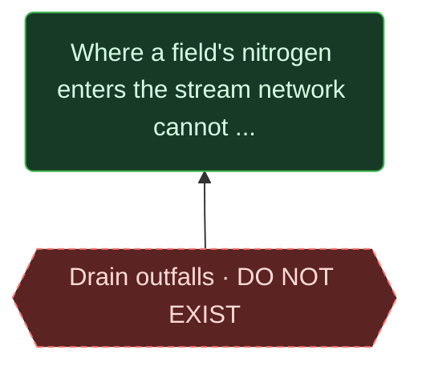

- **gap** — Drain outfalls DO NOT EXIST. No national layer. Private paper draenkort.

**Assessed** — no script computes this. It is a reading or a judgement, assessed by a person.

- **What it counts:** a mapped point where a tile drain discharges to a watercourse
- **Why it is believed:** No national outfall layer exists; draenkort are private paper records. Searched, and recorded in DATA_SOURCES.md.
- **How confident:** High that no national layer exists. The terrain approximation - outfall where a drained parcel's flow path meets the stream - is untested.
- **What would change it:** Digitised draenkort for one test catchment, against which the terrain approximation can be scored.

> Approximable from terrain, but the approximation is untested and there is nothing to test it against.

## FLOOD_GAP.md

### 5.847 km2 of modelled flooding on land at 0.1 m or deeper.

`C-FLOOD-AREA` · **measured** — rests on measurement

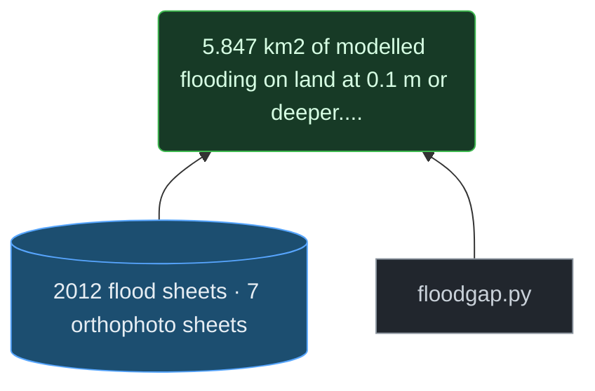

- **held** — 2012 flood sheets 7 orthophoto sheets. Recovered from PDF. Placed with 14-91 m stated error; meridian convergence of ~2.95 deg is NOT modelled.
- **script** — floodgap.py. Flood path against the cloudburst plan.

**Computed** — the chain is what was coded, and the script that computes it records how it counted.

*The script behind this does not yet record how it counted it. That is a gap in the justification, not a property of the number.*

> Depends on a sheet placement that does not model the ~2.95 degree meridian convergence, which displaces corners by 94-350 m - four to ten times the stated registration error.

## IF_YOU_HAVE_THE_DATA.md

### Oxygen at depth cannot be placed in the day: 53.7 million CTD measurements carry a date and no hour.

`C-DEPTH-UNTIMED` · **measured** — rests on measurement

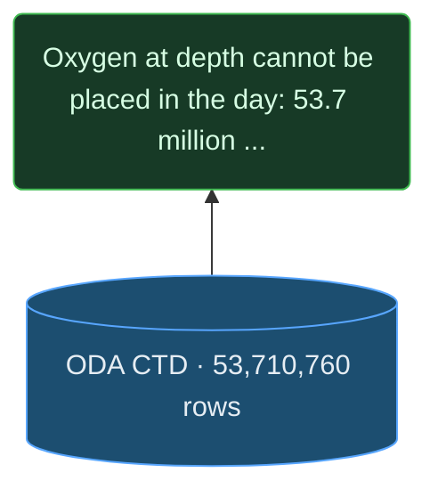

- **held** — ODA CTD 53,710,760 rows. Oxygen, temperature, salinity at depth. NO clock field: ODA offers none for this topic.

**Computed** — the chain is what was coded, and the script that computes it records how it counted.

*The script behind this does not yet record how it counted it. That is a gap in the justification, not a property of the number.*

> Verified against ODA's own output-field list, not inferred from our extract.

## INCIDENCE.md

### Danish nitrogen rules do not count animals. The animal unit has no legal force; the binding ceiling is 170 kg organic N per hectare of harmoniareal.

`C-DE-VOID` · **measured** — rests on measurement

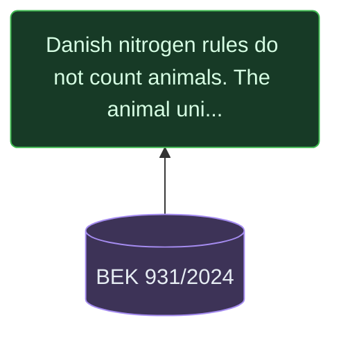

- **external** — BEK 931/2024. Read from retsinformation's primary text. 'dyreenhed' occurs zero times; 38 occurrences of 'harmoniareal'.

**Assessed** — no script computes this. It is a reading or a judgement, assessed by a person.

- **What it counts:** occurrences of dyreenhed (the animal unit) as a regulatory unit in the operative text of BEK 931/2024
- **Why it is believed:** Read from retsinformation's primary text: 0 occurrences of dyreenhed, 38 of harmoniareal. §14 binds on 170 kg organic nitrogen per hectare of harmoniareal; §26 stk. 3 keeps the 230 kg permissions only as a transitional provision.
- **How confident:** High for BEK 931 itself, which was read here. Medium for the general statement that the animal unit has no legal force: the other instruments (BEK 673, BEK 677, LOV 759) were read by the incidence agent and not by a second reader.
- **What would change it:** An operative regulation setting a limit in dyreenheder, or a court or agency reading that the unit still binds through another route.

> Read from the regulation itself. Qualifies C-MANURE, which is framed on DE/ha thresholds.

### At least 154 animal-keeping holdings are both exposed and thin, with a median 1.9 years of equity at current loss rates.

`C-NO-BUFFER` · **bounded** — a bound, not a point estimate

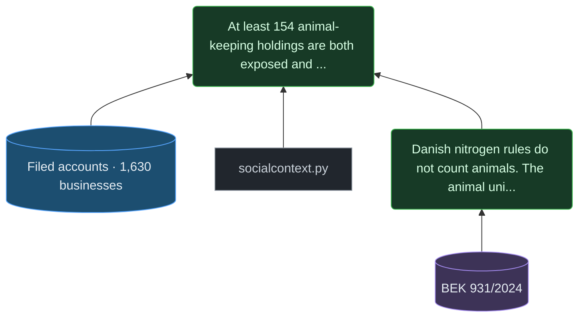

- **held** — Filed accounts 1,630 businesses. From the sibling project danish-livestock. A SAMPLE: 76.3% of the herd and 81.0% of farmland is on businesses filing nothing.
- **script** — socialcontext.py. Policy incidence from the regulations and the accounts.
- **measured** — Danish nitrogen rules do not count animals. The animal unit has no legal force; 

**Computed** — the chain is what was coded, and the script that computes it records how it counted.

*The script behind this does not yet record how it counted it. That is a gap in the justification, not a property of the number.*

> A FLOOR, not a count. 76.3% of the herd is on businesses filing no accounts, and the filers are the large end.

## METHOD_LAB.md

### The 09:00-15:00 sampling window loses about three quarters of a diurnal signal of any amplitude.

`C-WORKDAY` · **simulated** — about the instrument, not the world

- **synthetic** — Imposed diurnal signal on the real schedule. scripts/detectable.py. Real times, positions and visits; stipulated signal.
- **script** — detectable.py. Synthetic recovery on the real schedule.
- **held** — ODA vandkemi 1,805,827 rows, 1970-2026. Fetched 2026-09-10. Carries Startklok on 100.0% of rows. 14 of 147 parameters appear under more than one unit.
- **assumption** — Signal shape tracks sun elevation. The shape photosynthesis would impose. If the real cycle has another shape the recovery figure changes.

**Computed** — the chain is what was coded, and the script that computes it records how it counted.

*The script behind this does not yet record how it counted it. That is a gap in the justification, not a property of the number.*

> Nearly assumption-free: the same visits compared with themselves, only the hour redrawn. Does NOT claim the sea has such a cycle.

### The surface diurnal oxygen amplitude is below roughly 0.35 to 0.5 mg/l.

`C-DIURNAL-BOUND` · **bounded** — a bound, not a point estimate

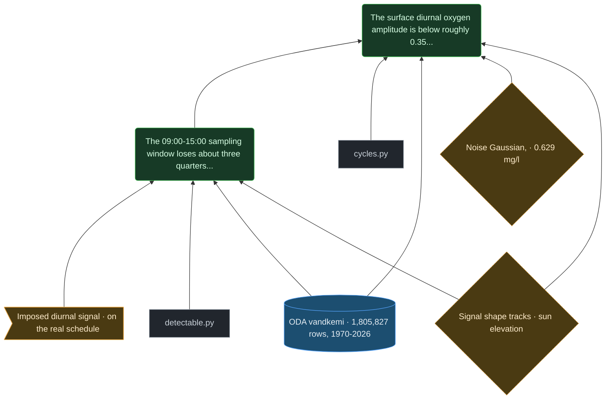

- **simulated** — The 09:00-15:00 sampling window loses about three quarters of a diurnal signal o
- **script** — cycles.py. Fixed effects in a moving window at each station; sun, moon, tide, temperature.
- **held** — ODA vandkemi 1,805,827 rows, 1970-2026. Fetched 2026-09-10. Carries Startklok on 100.0% of rows. 14 of 147 parameters appear under more than one unit.
- **assumption** — Noise Gaussian, 0.629 mg/l. Measured from single-sun-bin cells so the signal cannot inflate it. Gaussianity is stipulated.
- **assumption** — Signal shape tracks sun elevation. The shape photosynthesis would impose. If the real cycle has another shape the recovery figure changes.

**Computed** — the chain is what was coded, and the script that computes it records how it counted.

*The script behind this does not yet record how it counted it. That is a gap in the justification, not a property of the number.*

> A bound, not a null. Void if the signal has a shape unlike sun elevation, or if the noise is far from Gaussian.

### 80% of CTD station-days can borrow a clock from a same-day water-chemistry bottle.

`C-DEPTH-BORROW` · **provisional** — unchecked - see the graph for what would check it

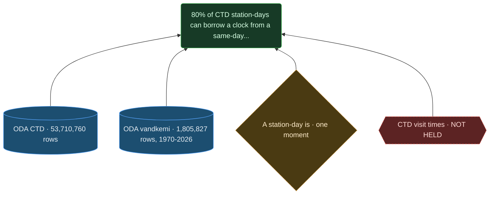

- **held** — ODA CTD 53,710,760 rows. Oxygen, temperature, salinity at depth. NO clock field: ODA offers none for this topic.
- **held** — ODA vandkemi 1,805,827 rows, 1970-2026. Fetched 2026-09-10. Carries Startklok on 100.0% of rows. 14 of 147 parameters appear under more than one unit.
- **assumption** — A station-day is one moment. 99% of kemi station-days carry a single Startklok. UNCHECKED against field sheets.
- **gap** — CTD visit times NOT HELD. Cruise logs or field sheets. Slot: data/dropin/ctd_visit_times.csv.

**Computed** — the chain is what was coded, and the script that computes it records how it counted.

*The script behind this does not yet record how it counted it. That is a gap in the justification, not a property of the number.*

> PROVISIONAL. The borrowing is unchecked, and G-CLOCK is what would check it. If casts systematically precede bottles, any diurnal pattern found at depth is partly an artefact.

## NITROGEN.md

### 2,662 businesses - 28% of those declaring land - hold animal units above 1.4 DE per declared hectare, and 56% of the national herd.

`C-MANURE` · **measured** — rests on measurement

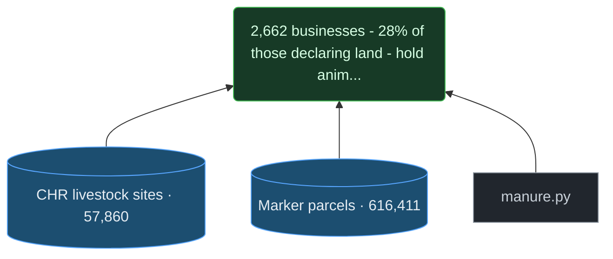

- **held** — CHR livestock sites 57,860. Animal units per site, joined to Marker parcels on CVR.
- **held** — Marker parcels 616,411. Declared hectares per CVR.
- **script** — manure.py. CHR x Marker on CVR.

**Computed** — the chain is what was coded, and the script that computes it records how it counted.

*The script behind this does not yet record how it counted it. That is a gap in the justification, not a property of the number.*

> QUALIFIED by C-DE-VOID: the threshold has no legal force. The physical statement, that this manure must leave the holding, stands.

## OPEN_PROBLEMS.md

### Nothing in the archive constrains the pre-dawn oxygen minimum, which is the value a threshold is about.

`C-PREDAWN` · **gap** — a statement that something cannot be established

- **gap** — Pre-dawn sampling NEVER TAKEN. 684 night and twilight samples in 91,072. The value an oxygen threshold is about is essentially unobserved.
- **held** — ODA vandkemi 1,805,827 rows, 1970-2026. Fetched 2026-09-10. Carries Startklok on 100.0% of rows. 14 of 147 parameters appear under more than one unit.
- **simulated** — The 09:00-15:00 sampling window loses about three quarters of a diurnal signal o

**Assessed** — no script computes this. It is a reading or a judgement, assessed by a person.

- **What it counts:** surface oxygen samples taken with the sun below the horizon - night and civil twilight - at a station's own position and instant
- **Why it is believed:** 684 of 91,072 surface oxygen samples. Spread over 57 years and about a thousand stations, that cannot characterise a minimum at any one place.
- **How confident:** High that the minimum is undersampled. The word 'nothing' is strong: the 684 exist, they are simply too thin to constrain anything local.
- **What would change it:** Moored continuous sensors, or one season of deliberate pre-dawn sampling at a handful of stations.

> Not a finding about the sea. A statement about when people are willing to be on a boat.

### Surface Si:DIN has risen from a median of 1.11 in 1985 to 3.41 in 2025, contradicting the premise of hypothesis K1.

`C-SIDIN` · **measured** — rests on measurement

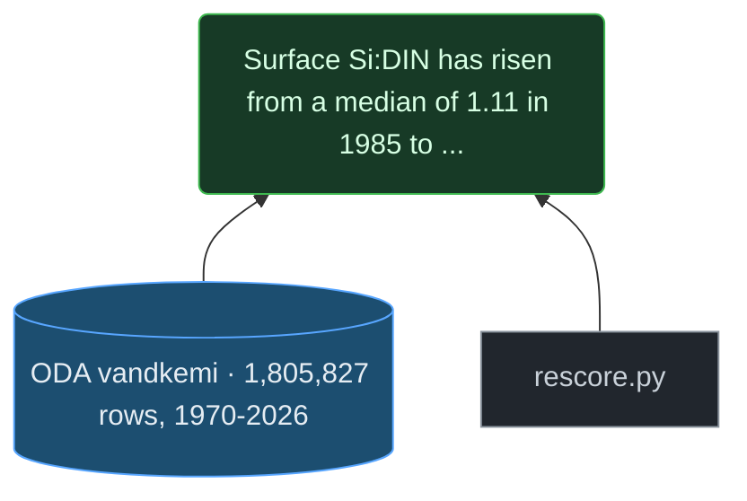

- **held** — ODA vandkemi 1,805,827 rows, 1970-2026. Fetched 2026-09-10. Carries Startklok on 100.0% of rows. 14 of 147 parameters appear under more than one unit.
- **script** — rescore.py. Availability matrix and tests for the nine hypotheses.

**Computed** — the chain is what was coded, and the script that computes it records how it counted.

*The script behind this does not yet record how it counted it. That is a gap in the justification, not a property of the number.*

> The DRIVER only. The assemblage response remains unscoreable - see G-SPECIES.

### Whether the diatom share actually fell cannot be scored.

`C-K1-BLOCKED` · **gap** — a statement that something cannot be established

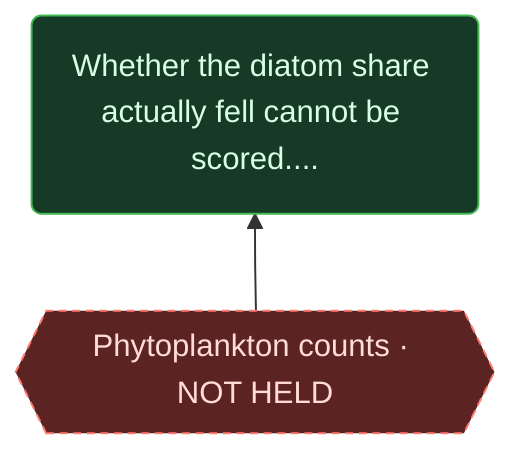

- **gap** — Phytoplankton counts NOT HELD. OBIS eMoF. Blocks the assemblage half of K1 and K2.

**Assessed** — no script computes this. It is a reading or a judgement, assessed by a person.

- **What it counts:** phytoplankton assemblage counts at stations where Si:DIN is measured
- **Why it is believed:** The water-chemistry fetch carries no species counts; OBIS eMoF, which may, has not been fetched.
- **How confident:** High that it is not in hand. Unassessed whether it exists at the needed resolution.
- **What would change it:** Fetching OBIS eMoF for the Danish stations and finding assemblage data co-located with nutrients.

> A blocker behind a blocker: K1 was listed as waiting on the vandkemi fetch, which has happened.

## PLAN.md

### The archive carries a clock time. Startklok is present on 100.0% of 1,805,827 water-chemistry rows.

`C-CLOCK-EXISTS` · **measured** — rests on measurement

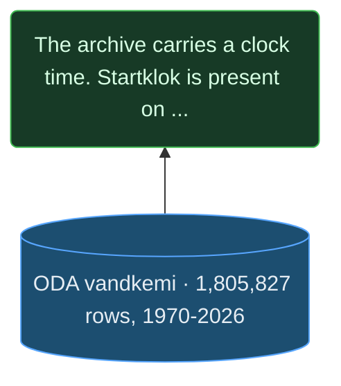

- **held** — ODA vandkemi 1,805,827 rows, 1970-2026. Fetched 2026-09-10. Carries Startklok on 100.0% of rows. 14 of 147 parameters appear under more than one unit.

**Computed** — the chain is what was coded, and the script that computes it records how it counted.

*The script behind this does not yet record how it counted it. That is a gap in the justification, not a property of the number.*

> Corrects a claim this project made for weeks, that no row in the archive carried a clock time. That was true of the CTD extract and inferred from the absence of a download.

## index.html

### The cloudburst plan holds 209.0 km of alignment that could carry water on the surface — 168.1 km classed as surface conveyance plus 40.9 km of mixed alignment — against 71.0 km of pipe.

`C-CONVEYANCE` · **measured** — rests on measurement

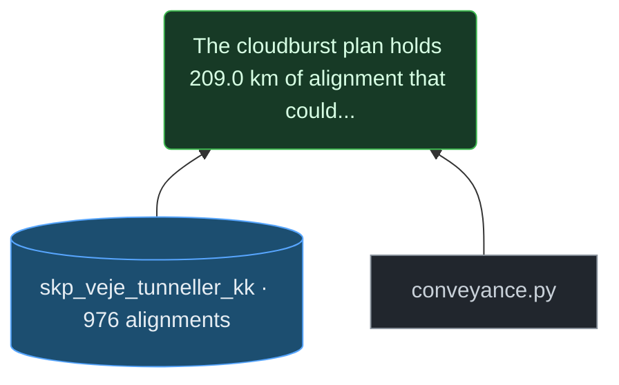

- **held** — skp_veje_tunneller_kk · 976 alignments. The cloudburst plan's roads and pipes, with a typologi per feature. 280.0 km end to end.
- **script** — conveyance.py. Measures alignment length by typologi instead of quoting it.

**Computed** — the chain is what was coded, and the script that computes it records how it counted.

**`surface_km`** — `data/derived/conveyance.json` → `surface_km`

- **Counted as the same thing:** an alignment whose typologi is Skybrudsveje, Groenne veje or Forsinkelsesveje - water carried where a person can see it. 'mix' is NOT counted: it carries water on the surface only in part, and nothing in the layer says which part.
- **Calculation:** sum of segment lengths over every LineString of those features, each segment = hypot(dlon x 111.320 x cos(lat), dlat x 110.574) km
- **Rows:** 976 in, 638 used
- **Excluded:** feature with no line geometry - nothing to measure (2)
- **Excluded:** typologi 'mix' - surface only in part (114)
- **Excluded:** typologi 'Skybrudsledning' - pipe, counted separately (222)
- **Other defensible definitions, and what each gives:** surface only: Skybrudsveje, Groenne veje, Forsinkelsesveje → 168.1; surface plus mixed alignment → 209.0; every alignment in the layer, pipe included → 280.0
- **Code:** [`scripts/conveyance.py:main`](../scripts/conveyance.py)

**`pipe_km`** — `data/derived/conveyance.json` → `pipe_km`

- **Counted as the same thing:** an alignment whose typologi is Skybrudsledning - water in a pipe, out of sight
- **Calculation:** sum of segment lengths over those features, as above
- **Rows:** 976 in, 222 used
- **Excluded:** feature with no line geometry - nothing to measure (2)
- **Excluded:** every surface and mixed typologi (754)
- **Code:** [`scripts/conveyance.py:main`](../scripts/conveyance.py)

**`surface_ratio`** — `data/derived/conveyance.json` → `surface_to_pipe`

- **Counted as the same thing:** the surface-only class against the pipe class - the ratio changes with the surface definition, so it carries it
- **Calculation:** surface_km / pipe_km
- **Rows:** 976 in, 860 used
- **Other defensible definitions, and what each gives:** surface only / pipe → 2.37; surface plus mix / pipe → 2.94
- **Code:** [`scripts/conveyance.py:main`](../scripts/conveyance.py)

**`surface_plus_mix_km`** — `data/derived/conveyance.json` → `surface_plus_mix_km`

- **Counted as the same thing:** the surface typologies AND 'mix' - every alignment that could carry water on the surface for some of its length
- **Calculation:** surface_km + the summed length of typologi 'mix'
- **Rows:** 976 in, 752 used
- **Excluded:** feature with no line geometry - nothing to measure (2)
- **Excluded:** typologi 'Skybrudsledning' - pipe (222)
- **Other defensible definitions, and what each gives:** surface only: Skybrudsveje, Groenne veje, Forsinkelsesveje → 168.1; surface plus mixed alignment → 209.0; every alignment in the layer, pipe included → 280.0
- **Code:** [`scripts/conveyance.py:main`](../scripts/conveyance.py)

> Three figures for this quantity were published and none was derived: 210 km on the landing page, 169 km in two documents, and a layer measuring 280 km. All three are defensible under different definitions of 'surface' and nothing said which was in use. 210 was surface plus mix (209.0); 169 was surface alone (168.1). The pipe figure, 71, was right to the kilometre.

---

## What is missing from this register

It covers the claims this project has examined, not every sentence it has
written. A claim absent from here is not endorsed by its absence — it simply
has not been put through this yet, and that is the honest state of it.
