# What each claim rests on

*Generated by `scripts/claims.py` from `data/manual/claims.json`. No number on this page is typed: every one is resolved from data, a pinned document, a past commit or a stated parameter, and links to where it came from. Each claim also records what it saw when it was last confirmed, and the page is refused if anything has changed since.*

Prose hides dependency. *The surface diurnal amplitude is below half a milligram* reads like a measurement. It is a bound, derived from a synthetic recovery run on a real sampling schedule, under a stipulated signal shape and a noise model — four kinds of thing, one of which is not data at all. The sentence cannot show you that. A graph can.

### How to read the shapes

| shape | kind | what it means for the claim above it |
|---|---|---|
| cylinder, blue | **held** | a dataset on disk, with whatever faults [DATA_SOURCES.md](DATA_SOURCES.md) records |
| cylinder, purple | **external** | somebody else's published document, pinned by its hash |
| hexagon, red dashed | **gap** | data that exists and we cannot reach, or that nobody has measured |
| flag, amber | **synthetic** | generated to test the method. Licenses claims about the *instrument*, never about the world |
| rhombus, amber dashed | **assumption** | stipulated rather than measured. **The claim is void if it is wrong** |
| box, grey | **script** | the code that does the work |
| rounded, green | **claim** | a statement on a page, which may rest on other claims |

---

## DATA_SOURCES.md

### Where a field's nitrogen enters the stream network cannot be established.

`C-DRAIN-ROUTE` · **gap** — a statement that something cannot be established

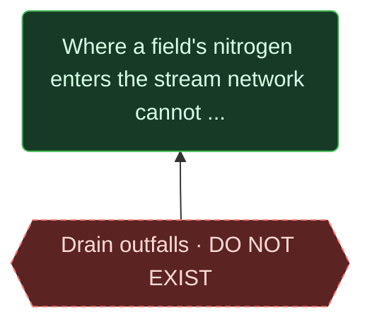

- **gap** — Drain outfalls DO NOT EXIST. No national layer. Private paper draenkort.

**Assessed** — no script computes this. It is a reading or a judgement, assessed by a person.

- **What it counts:** a mapped point where a tile drain discharges to a watercourse
- **Why it is believed:** No national outfall layer exists; draenkort are private paper records. Searched, and recorded in DATA_SOURCES.md.
- **How confident:** High that no national layer exists. The terrain approximation - outfall where a drained parcel's flow path meets the stream - is untested.
- **What would change it:** Digitised draenkort for one test catchment, against which the terrain approximation can be scored.

*Confirmed 2026-09-10 by Claude (initial conversion 2026-09-10; not yet read by the project owner). If anything shown here changes, this claim is refused until it is read again.*

> Approximable from terrain, but the approximation is untested and there is nothing to test it against.

## FLOOD_GAP.md

### [5.847](SOURCES.md#F-2335163685) km² of modelled flooding on land at [0.1](SOURCES.md#F-d04d245a78) m or deeper.

`C-FLOOD-AREA` · **measured** — rests on measurement

- **held** — 2012 flood sheets [7](SOURCES.md#F-17d442d3cc) orthophoto sheets. Recovered from PDF. Placed with [14.3](SOURCES.md#F-857821cb67)-[91](SOURCES.md#F-3e1120ac9a) m stated error; the meridian convergence is NOT modelled.
- **script** — floodgap.py. Flood path against the cloudburst plan.

**Computed** — the chain is what was coded, and the script that computes it records how it counted.

*The script behind this does not yet record how it counted it. That is a gap in the justification, not a property of the number.*

*Confirmed 2026-09-10 by Claude (initial conversion 2026-09-10; not yet read by the project owner). If anything shown here changes, this claim is refused until it is read again.*

> Depends on a sheet placement that does not model the meridian convergence of [2.897](SOURCES.md#F-501f30a23e)-[2.982](SOURCES.md#F-fc0fde2bc8) degrees, which displaces corners by [94](SOURCES.md#F-ab2d7eefd2)-[350](SOURCES.md#F-348096b730) m - [2.4](SOURCES.md#F-44a0407afe) to [7.5](SOURCES.md#F-bd0568af5a) times the registration error the pipeline states for each sheet. An earlier version of this note said [four to ten times](SOURCES.md#F-8aa919444b), worked out loosely by hand; the first stored figures contradicted it.

## IF_YOU_HAVE_THE_DATA.md

### Oxygen at depth cannot be placed in the day: [53,710,760](SOURCES.md#F-4df017f985) CTD measurements carry a date and no hour.

`C-DEPTH-UNTIMED` · **measured** — rests on measurement

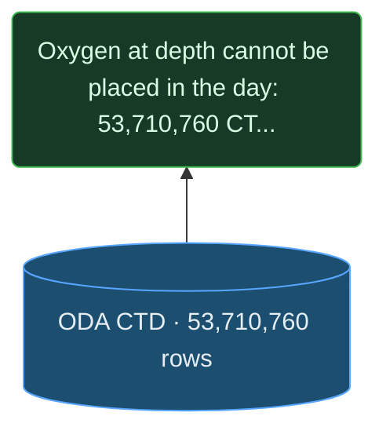

- **held** — ODA CTD [53,710,760](SOURCES.md#F-4df017f985) rows. Oxygen, temperature, salinity at depth. NO clock field: ODA offers none for this topic.

**Computed** — the chain is what was coded, and the script that computes it records how it counted.

*The script behind this does not yet record how it counted it. That is a gap in the justification, not a property of the number.*

*Confirmed 2026-09-10 by Claude (initial conversion 2026-09-10; not yet read by the project owner). If anything shown here changes, this claim is refused until it is read again.*

> Verified against ODA's own output-field list, not inferred from our extract.

## INCIDENCE.md

### Danish nitrogen rules do not count animals. The animal unit has no legal force; the binding ceiling is [170](SOURCES.md#F-bb5f71323f) kg organic N per hectare of harmoniareal.

`C-DE-VOID` · **measured** — rests on measurement

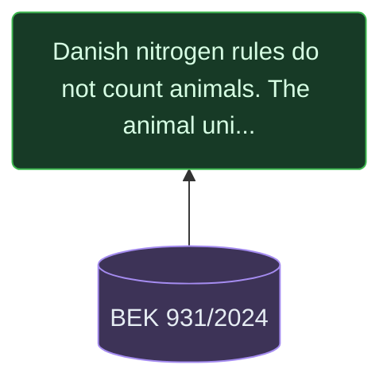

- **external** — BEK 931/2024. Pinned by the sha256 of its text. dyreenhed occurs [0](SOURCES.md#F-dc51124c36) times in it; harmoniareal [38](SOURCES.md#F-9a776cb143).

**Assessed** — no script computes this. It is a reading or a judgement, assessed by a person.

- **What it counts:** occurrences of dyreenhed (the animal unit) as a regulatory unit in the operative text of BEK 931/2024
- **Why it is believed:** Read from retsinformation's primary text: dyreenhed occurs [0](SOURCES.md#F-dc51124c36) times, harmoniareal [38](SOURCES.md#F-9a776cb143). § 14 binds on [170](SOURCES.md#F-bb5f71323f) kg organic nitrogen per hectare of harmoniareal; § 26 stk. 3 keeps the [230](SOURCES.md#F-fdfa079bf0) kg permissions only as a transitional provision.
- **How confident:** High for BEK 931 itself, which was read here. Medium for the general statement that the animal unit has no legal force: the other instruments (BEK 673, BEK 677, LOV 759) were read by the incidence agent and not by a second reader.
- **What would change it:** An operative regulation setting a limit in dyreenheder, or a court or agency reading that the unit still binds through another route.

*Confirmed 2026-09-10 by Claude (initial conversion 2026-09-10; not yet read by the project owner). If anything shown here changes, this claim is refused until it is read again.*

> Read from the regulation itself. Qualifies C-MANURE, which is framed on DE/ha thresholds.

### At least [154](SOURCES.md#F-d1ed488da6) animal-keeping holdings are both exposed and thin, with a median [1.9](SOURCES.md#F-a04b5dbab1) years of equity at current loss rates.

`C-NO-BUFFER` · **bounded** — a bound, not a point estimate

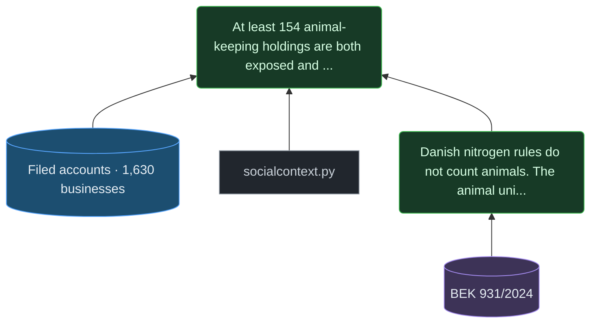

- **held** — Filed accounts [1,630](SOURCES.md#F-ad67b02b0c) businesses. From the sibling project danish-livestock. A SAMPLE: [76.3](SOURCES.md#F-8e90e830e5)% of the herd and [81.0](SOURCES.md#F-8b13c8e0be)% of farmland is on businesses filing nothing.
- **script** — socialcontext.py. Policy incidence from the regulations and the accounts.
- **claim** — [Danish nitrogen rules do not count animals. The animal unit has no legal force; …](CLAIMS.md#C-DE-VOID)

**Computed** — the chain is what was coded, and the script that computes it records how it counted.

*The script behind this does not yet record how it counted it. That is a gap in the justification, not a property of the number.*

*Confirmed 2026-09-10 by Claude (initial conversion 2026-09-10; not yet read by the project owner). If anything shown here changes, this claim is refused until it is read again.*

> A FLOOR, not a count. [76.3](SOURCES.md#F-8e90e830e5)% of the herd is on businesses filing no accounts, and the filers are the large end.

## METHOD_LAB.md

### The 09:00-15:00 sampling window loses [73](SOURCES.md#F-c2385140c2)% of a diurnal signal - and about the same share at every amplitude large enough to recover above the noise.

`C-WORKDAY` · **simulated** — about the instrument, not the world

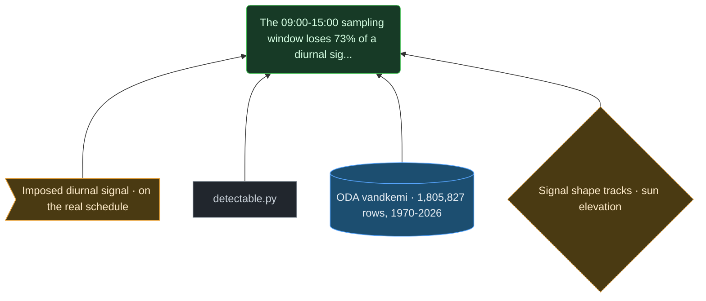

- **synthetic** — Imposed diurnal signal on the real schedule. scripts/detectable.py. Real times, positions and visits; stipulated signal.
- **script** — detectable.py. Synthetic recovery on the real schedule.
- **held** — ODA vandkemi [1,805,827](SOURCES.md#F-9fa9c3c21c) rows, 1970-2026. Fetched 2026-09-10. Carries Startklok on nearly every row, and several of its parameters appear under more than one unit - see DATA_SOURCES.md.
- **assumption** — Signal shape tracks sun elevation. The shape photosynthesis would impose. If the real cycle has another shape the recovery figure changes.

**Computed** — the chain is what was coded, and the script that computes it records how it counted.

*The script behind this does not yet record how it counted it. That is a gap in the justification, not a property of the number.*

*Confirmed 2026-09-10 by Claude (initial conversion 2026-09-10; not yet read by the project owner). If anything shown here changes, this claim is refused until it is read again.*

> Nearly assumption-free: the same visits compared with themselves, only the hour redrawn. Does NOT claim the sea has such a cycle.

### The surface diurnal oxygen amplitude is below roughly [0.36](SOURCES.md#F-760c9bed36) to [0.5](SOURCES.md#F-8ebae27cb6) mg/l.

`C-DIURNAL-BOUND` · **bounded** — a bound, not a point estimate

- **claim** — [The 09:00-15:00 sampling window loses 73% of a diurnal signal - and about the sa…](CLAIMS.md#C-WORKDAY)
- **script** — cycles.py. Fixed effects in a moving window at each station; sun, moon, tide, temperature.
- **held** — ODA vandkemi [1,805,827](SOURCES.md#F-9fa9c3c21c) rows, 1970-2026. Fetched 2026-09-10. Carries Startklok on nearly every row, and several of its parameters appear under more than one unit - see DATA_SOURCES.md.
- **assumption** — Noise Gaussian, [0.6286](SOURCES.md#F-1bae49478e) mg/l. Measured from single-sun-bin cells so the signal cannot inflate it. Gaussianity is stipulated.
- **assumption** — Signal shape tracks sun elevation. The shape photosynthesis would impose. If the real cycle has another shape the recovery figure changes.

**Computed** — the chain is what was coded, and the script that computes it records how it counted.

*The script behind this does not yet record how it counted it. That is a gap in the justification, not a property of the number.*

*Confirmed 2026-09-10 by Claude (initial conversion 2026-09-10; not yet read by the project owner). If anything shown here changes, this claim is refused until it is read again.*

> A bound, not a null. The lower figure interpolates between the two tested amplitudes the observed spread falls between; the upper is the first tested amplitude recovered above it. An earlier version gave the lower figure as [0.35](SOURCES.md#F-d849fa0786), interpolated by hand from older runs. Void if the signal has a shape unlike sun elevation, or if the noise is far from Gaussian.

### [6,085,887](SOURCES.md#F-d4ab94d60c) oxygen measurements at depth were placed in time with a clock borrowed from a same-day water-chemistry bottle; [1,054,275](SOURCES.md#F-566c0ca9ca) had no such bottle to borrow from.

`C-DEPTH-BORROW` · **provisional** — unchecked - see the graph for what would check it

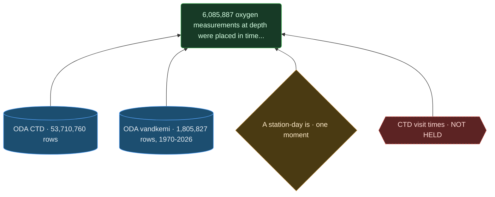

- **held** — ODA CTD [53,710,760](SOURCES.md#F-4df017f985) rows. Oxygen, temperature, salinity at depth. NO clock field: ODA offers none for this topic.
- **held** — ODA vandkemi [1,805,827](SOURCES.md#F-9fa9c3c21c) rows, 1970-2026. Fetched 2026-09-10. Carries Startklok on nearly every row, and several of its parameters appear under more than one unit - see DATA_SOURCES.md.
- **assumption** — A station-day is one moment. UNCHECKED: whether a cast and a bottle on the same station-day share a moment.
- **gap** — CTD visit times NOT HELD. Cruise logs or field sheets. Slot: data/dropin/ctd_visit_times.csv.

**Computed** — the chain is what was coded, and the script that computes it records how it counted.

*The script behind this does not yet record how it counted it. That is a gap in the justification, not a property of the number.*

*Confirmed 2026-09-10 by Claude (initial conversion 2026-09-10; not yet read by the project owner). If anything shown here changes, this claim is refused until it is read again.*

> PROVISIONAL. The borrowing is unchecked, and G-CLOCK is what would check it. If casts systematically precede bottles, any diurnal pattern found at depth is partly an artefact. The two counts are not a share of one population: the first is counted after depth_clock.py's quality filters and the second before them, so their ratio is not the fraction that can borrow a clock. An earlier version said [80%](SOURCES.md#F-0924f4dc60) of station-days, a figure computed by hand and never stored.

## NITROGEN.md

### [2,662](SOURCES.md#F-f7741a6ef7) businesses - [28](SOURCES.md#F-94530fd3a4)% of those declaring land - hold animal units above [1.4](SOURCES.md#F-e7d6dac80e) DE per declared hectare, and [56](SOURCES.md#F-f082811835)% of the national herd.

`C-MANURE` · **measured** — rests on measurement

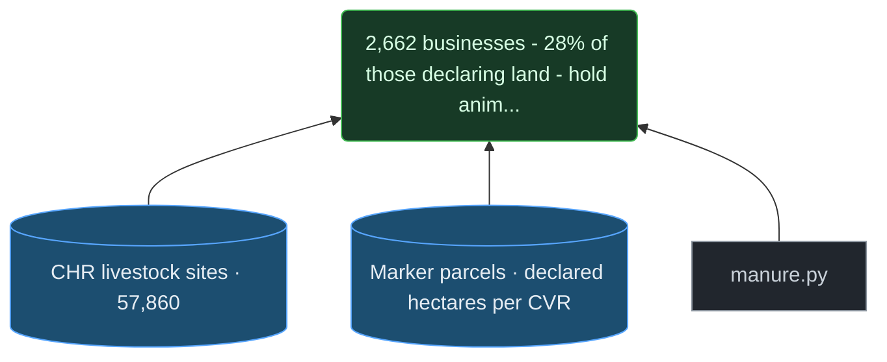

- **held** — CHR livestock sites [57,860](SOURCES.md#F-7b56edc8a8). Animal units per site, joined to Marker parcels on CVR.
- **held** — Marker parcels declared hectares per CVR. Declared hectares per CVR.
- **script** — manure.py. CHR x Marker on CVR.

**Computed** — the chain is what was coded, and the script that computes it records how it counted.

*The script behind this does not yet record how it counted it. That is a gap in the justification, not a property of the number.*

*Confirmed 2026-09-10 by Claude (initial conversion 2026-09-10; not yet read by the project owner). If anything shown here changes, this claim is refused until it is read again.*

> QUALIFIED by C-DE-VOID: the threshold has no legal force. The physical statement, that this manure must leave the holding, stands.

## OPEN_PROBLEMS.md

### Nothing in the archive constrains the pre-dawn oxygen minimum, which is the value a threshold is about.

`C-PREDAWN` · **gap** — a statement that something cannot be established

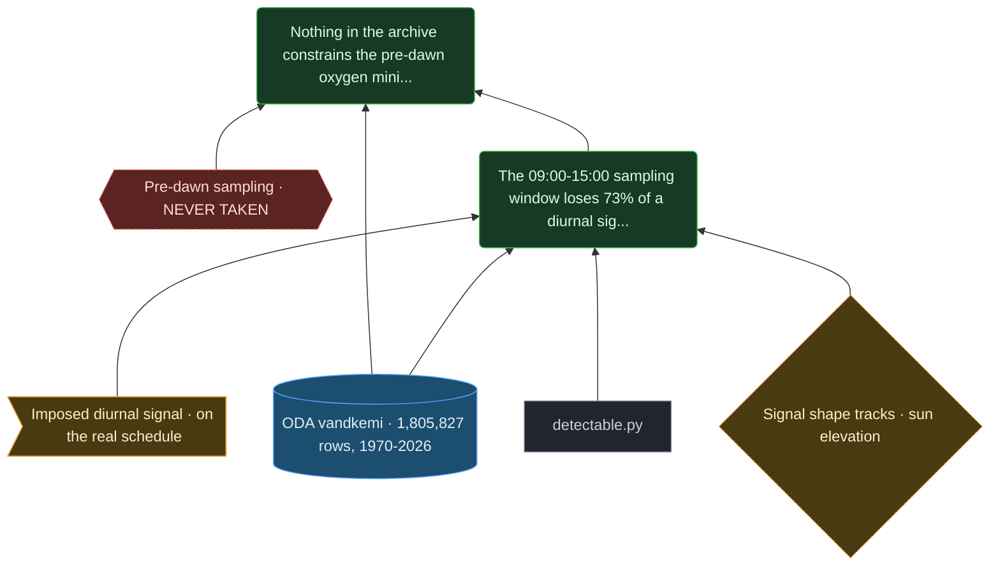

- **gap** — Pre-dawn sampling NEVER TAKEN. [684](SOURCES.md#F-fe2d6055d5) night and twilight samples in [91,072](SOURCES.md#F-6d47856cfe). The value an oxygen threshold is about is essentially unobserved.
- **held** — ODA vandkemi [1,805,827](SOURCES.md#F-9fa9c3c21c) rows, 1970-2026. Fetched 2026-09-10. Carries Startklok on nearly every row, and several of its parameters appear under more than one unit - see DATA_SOURCES.md.
- **claim** — [The 09:00-15:00 sampling window loses 73% of a diurnal signal - and about the sa…](CLAIMS.md#C-WORKDAY)

**Assessed** — no script computes this. It is a reading or a judgement, assessed by a person.

- **What it counts:** surface oxygen samples taken with the sun below the horizon - night and civil twilight - at a station's own position and instant
- **Why it is believed:** [324](SOURCES.md#F-54f0bb8a6f) night and [360](SOURCES.md#F-242af2c4af) twilight samples, of [91,072](SOURCES.md#F-6d47856cfe). Spread across the whole record since 1970 and all the stations that sampled, that cannot characterise a minimum at any one place.
- **How confident:** High that the minimum is undersampled. The word 'nothing' is strong: the [684](SOURCES.md#F-fe2d6055d5) exist, they are simply too thin to constrain anything local.
- **What would change it:** Moored continuous sensors, or one season of deliberate pre-dawn sampling at a handful of stations.

*Confirmed 2026-09-10 by Claude (initial conversion 2026-09-10; not yet read by the project owner). If anything shown here changes, this claim is refused until it is read again.*

> Not a finding about the sea. A statement about when people are willing to be on a boat.

### Surface Si:DIN has risen from a median of [1.11](SOURCES.md#F-46d5cbc06a) in 1985 to [3.41](SOURCES.md#F-e6348875d1) in 2025, contradicting the premise of hypothesis K1.

`C-SIDIN` · **measured** — rests on measurement

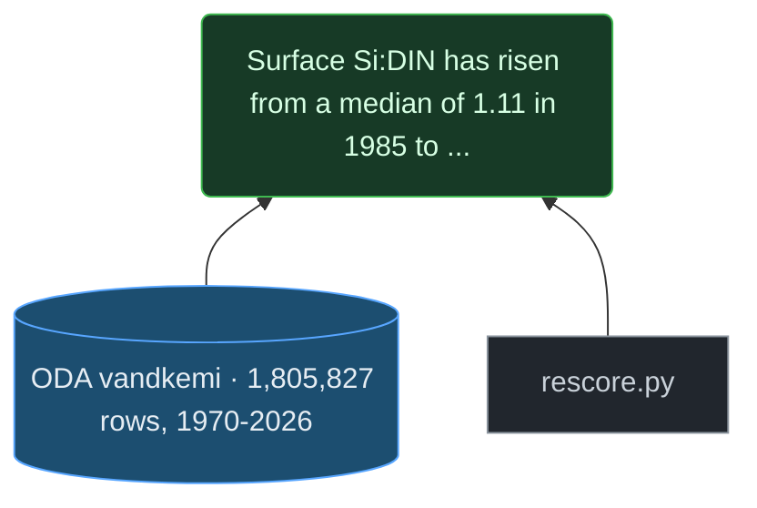

- **held** — ODA vandkemi [1,805,827](SOURCES.md#F-9fa9c3c21c) rows, 1970-2026. Fetched 2026-09-10. Carries Startklok on nearly every row, and several of its parameters appear under more than one unit - see DATA_SOURCES.md.
- **script** — rescore.py. Availability matrix and tests for the nine hypotheses.

**Computed** — the chain is what was coded, and the script that computes it records how it counted.

*The script behind this does not yet record how it counted it. That is a gap in the justification, not a property of the number.*

*Confirmed 2026-09-10 by Claude (initial conversion 2026-09-10; not yet read by the project owner). If anything shown here changes, this claim is refused until it is read again.*

> The DRIVER only. The assemblage response remains unscoreable - see G-SPECIES.

### Whether the diatom share actually fell cannot be scored.

`C-K1-BLOCKED` · **gap** — a statement that something cannot be established

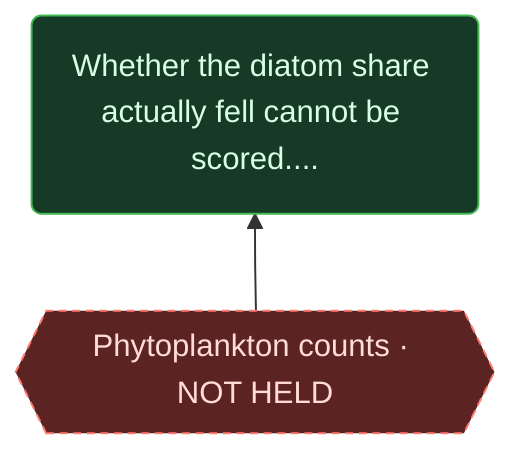

- **gap** — Phytoplankton counts NOT HELD. OBIS eMoF. Blocks the assemblage half of K1 and K2.

**Assessed** — no script computes this. It is a reading or a judgement, assessed by a person.

- **What it counts:** phytoplankton assemblage counts at stations where Si:DIN is measured
- **Why it is believed:** The water-chemistry fetch carries no species counts; OBIS eMoF, which may, has not been fetched.
- **How confident:** High that it is not in hand. Unassessed whether it exists at the needed resolution.
- **What would change it:** Fetching OBIS eMoF for the Danish stations and finding assemblage data co-located with nutrients.

*Confirmed 2026-09-10 by Claude (initial conversion 2026-09-10; not yet read by the project owner). If anything shown here changes, this claim is refused until it is read again.*

> A blocker behind a blocker: K1 was listed as waiting on the vandkemi fetch, which has happened.

## PLAN.md

### The archive carries a clock time. Startklok is present on [100.0](SOURCES.md#F-d0ec8d3e5b)% of [1,805,827](SOURCES.md#F-9fa9c3c21c) water-chemistry rows - all but [22](SOURCES.md#F-c20885b069).

`C-CLOCK-EXISTS` · **measured** — rests on measurement

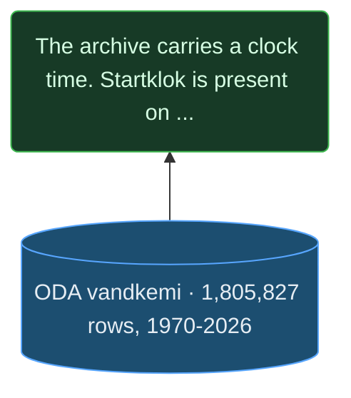

- **held** — ODA vandkemi [1,805,827](SOURCES.md#F-9fa9c3c21c) rows, 1970-2026. Fetched 2026-09-10. Carries Startklok on nearly every row, and several of its parameters appear under more than one unit - see DATA_SOURCES.md.

**Computed** — the chain is what was coded, and the script that computes it records how it counted.

*The script behind this does not yet record how it counted it. That is a gap in the justification, not a property of the number.*

*Confirmed 2026-09-10 by Claude (initial conversion 2026-09-10; not yet read by the project owner). If anything shown here changes, this claim is refused until it is read again.*

> Corrects a claim this project made for weeks, that no row in the archive carried a clock time. That was true of the CTD extract and inferred from the absence of a download.

## index.html

### The cloudburst plan holds [209.0](SOURCES.md#F-83543218b1) km of alignment that could carry water on the surface - [168.1](SOURCES.md#F-8c39a542a2) km classed as surface conveyance plus [40.9](SOURCES.md#F-7cdc1eac31) km of mixed alignment - against [71.0](SOURCES.md#F-777b25e425) km of pipe.

`C-CONVEYANCE` · **measured** — rests on measurement

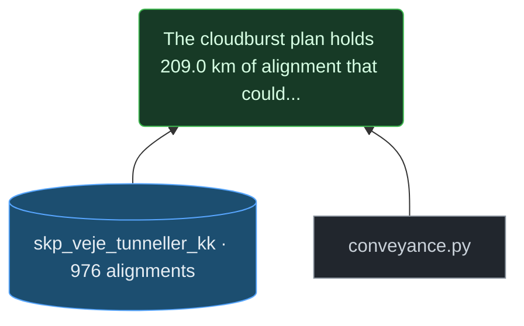

- **held** — skp_veje_tunneller_kk · [976](SOURCES.md#F-cb7e7c7b57) alignments. The cloudburst plan's roads and pipes, with a typologi per feature. [280.0](SOURCES.md#F-35e8d8dd04) km end to end.
- **script** — conveyance.py. Measures alignment length by typologi instead of quoting it.

**Computed** — the chain is what was coded, and the script that computes it records how it counted.

**`surface_km`** — `data/derived/conveyance.json` → `surface_km`

- **Counted as the same thing:** an alignment whose typologi is Skybrudsveje, Groenne veje or Forsinkelsesveje - water carried where a person can see it. 'mix' is NOT counted: it carries water on the surface only in part, and nothing in the layer says which part.
- **Calculation:** sum of segment lengths over every LineString of those features, each segment `hypot(dlon * 111.320 * cos(lat), dlat * 110.574)` km
- **Rows:** [976](SOURCES.md#F-acd4e9416b) in, [638](SOURCES.md#F-8c083c10c8) used
- **Excluded:** feature with no line geometry - nothing to measure ([2](SOURCES.md#F-105ab3dbee))
- **Excluded:** typologi 'mix' - surface only in part ([114](SOURCES.md#F-689525a824))
- **Excluded:** typologi 'Skybrudsledning' - pipe, counted separately ([222](SOURCES.md#F-e630ea6fa6))
- **Other defensible definitions, and what each gives:** surface only: Skybrudsveje, Groenne veje, Forsinkelsesveje → [168.1](SOURCES.md#F-251bf614e7); surface plus mixed alignment → [209](SOURCES.md#F-f6aed45f21); every alignment in the layer, pipe included → [280](SOURCES.md#F-43048d49f9)
- **Code:** [`scripts/conveyance.py:main`](../scripts/conveyance.py)

**`pipe_km`** — `data/derived/conveyance.json` → `pipe_km`

- **Counted as the same thing:** an alignment whose typologi is Skybrudsledning - water in a pipe, out of sight
- **Calculation:** sum of segment lengths over those features, as above
- **Rows:** [976](SOURCES.md#F-b26a658bdb) in, [222](SOURCES.md#F-71574efd11) used
- **Excluded:** feature with no line geometry - nothing to measure ([2](SOURCES.md#F-8e4f79cce0))
- **Excluded:** every surface and mixed typologi ([754](SOURCES.md#F-fc9935fe72))
- **Code:** [`scripts/conveyance.py:main`](../scripts/conveyance.py)

**`surface_ratio`** — `data/derived/conveyance.json` → `surface_to_pipe`

- **Counted as the same thing:** the surface-only class against the pipe class - the ratio changes with the surface definition, so it carries it
- **Calculation:** surface_km / pipe_km
- **Rows:** [976](SOURCES.md#F-bee3b38975) in, [860](SOURCES.md#F-7857d6fb97) used
- **Other defensible definitions, and what each gives:** surface only / pipe → [2.37](SOURCES.md#F-0cea4d0ae6); surface plus mix / pipe → [2.94](SOURCES.md#F-91bbc1443d)
- **Code:** [`scripts/conveyance.py:main`](../scripts/conveyance.py)

**`surface_plus_mix_km`** — `data/derived/conveyance.json` → `surface_plus_mix_km`

- **Counted as the same thing:** the surface typologies AND 'mix' - every alignment that could carry water on the surface for some of its length
- **Calculation:** surface_km + the summed length of typologi 'mix'
- **Rows:** [976](SOURCES.md#F-83f4ce7e89) in, [752](SOURCES.md#F-2e379d9d80) used
- **Excluded:** feature with no line geometry - nothing to measure ([2](SOURCES.md#F-67c693fb74))
- **Excluded:** typologi 'Skybrudsledning' - pipe ([222](SOURCES.md#F-bdf08e6967))
- **Other defensible definitions, and what each gives:** surface only: Skybrudsveje, Groenne veje, Forsinkelsesveje → [168.1](SOURCES.md#F-91d55572e3); surface plus mixed alignment → [209](SOURCES.md#F-73f3cb2e7b); every alignment in the layer, pipe included → [280](SOURCES.md#F-3d9ed6cb7b)
- **Code:** [`scripts/conveyance.py:main`](../scripts/conveyance.py)

*Confirmed 2026-09-10 by Claude (initial conversion 2026-09-10; not yet read by the project owner). If anything shown here changes, this claim is refused until it is read again.*

> Three figures for this quantity were published and none was derived: [210](SOURCES.md#F-f022c280a4) km on the landing page, [169](SOURCES.md#F-f3e1dcfbb0) km in two documents, and a layer measuring [280.0](SOURCES.md#F-35e8d8dd04) km. All three are defensible under different definitions of 'surface' and nothing said which was in use: the first was surface plus mix ([209.0](SOURCES.md#F-83543218b1)), the second surface alone ([168.1](SOURCES.md#F-8c39a542a2)). The pipe figure was right to the kilometre.

---

## What is missing from this register

It covers the claims this project has examined, not every sentence it has written. A claim absent from here is not endorsed by its absence — it simply has not been put through this yet.
