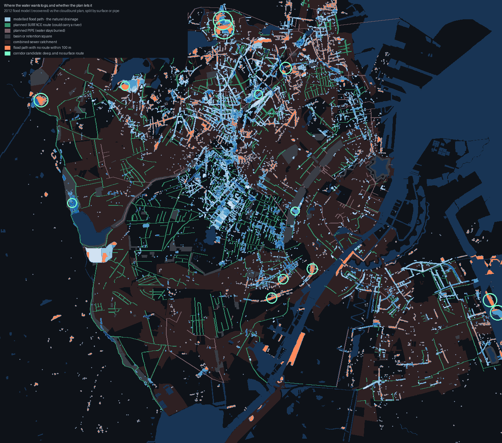
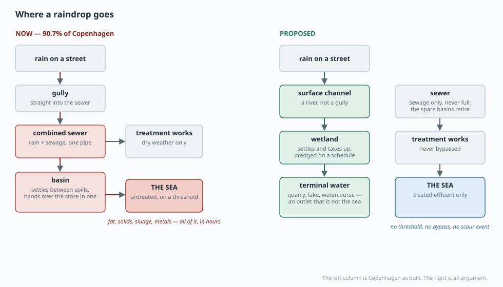
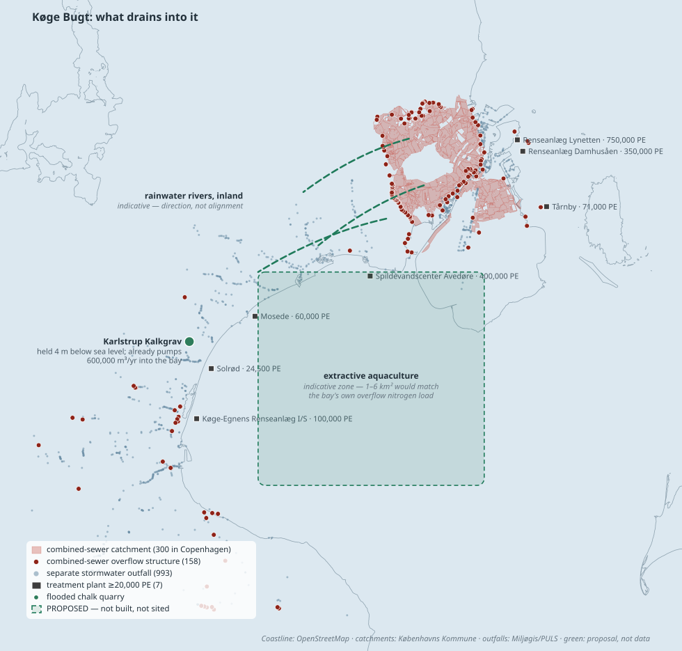

# The problem and the solution

> **This page is an argument.** Every other document in this project reports what the data supports and stops there. This one says what ought to be done, which is a different kind of claim, and it is labelled as one from here to the bottom. The numbers are pulled from the investigation pages and linked back; the *conclusions drawn from them* are mine and the reader is entitled to reject them.

## Part one — the problem

### It is not a number. It is a shore.

The thing that is wrong is not that a percentage is misattributed. It is that there are stretches of Danish coast where, from late summer into autumn, the water goes turbid and the shore goes putrid, and where the structural life that used to be there — eelgrass, weed with holdfasts, the animals that lived in both — has been replaced by mush.

Everything downstream of that observation is instrumentation. The observation does not depend on the instrument, and it is worth saying plainly that people who live on such a coast know it is happening long before any monitoring programme is designed to notice.

### Four reasons the current framing cannot fix it

1. **One unit, one culprit.** Nitrogen is the only quantity in the account, so it is the only quantity policy can act on. Fat has no nitrogen in it. Toxicants have no nitrogen in them. Neither can be represented, so neither gets addressed. See [CAUSATION.md](#CAUSATION.md).
2. **A linear instrument on a self-amplifying system.** An apportionment assumes the outcome is a weighted sum of the inputs. Oxygen depletion feeds itself: the dying releases the nutrients that drive the next round. Halving an input in such a system does not halve the outcome, and the record since 1990 shows exactly that.
3. **What is not measured cannot be acted on.** Benthic fauna is sampled 1 March – 31 May, so the autumn die-off is never observed. Fedtemøg has no national monitoring at all. Overflow mass is a modelled volume times an assumed concentration, quality-controlled against that same concentration. A programme cannot be held to account for what its own instruments are blind to.
4. **The countable source becomes the blamed source.** Every term that would shift attribution away from something easy to count — atmospheric deposition, sediment regeneration, submarine groundwater, legacy load, temperature, the state of the receiving bay — is precisely a term with no row in the table. That may be an accident of what is measurable. It is still what determines who gets a policy aimed at them.

### Who bears it is not who decides

This is the part that is genuinely political rather than technical.

Of Køge Bugt's combined-sewer basin storage, **92% sits in København, Hvidovre and Tårnby**, along with 47 of the bay's 85 combined overflows. Vallensbæk, Ishøj and Solrød have **zero** combined-sewer overflows — they separated their systems and physically cannot discharge sewage into the bay in a storm. Greve has two.

The bay opens to the southeast, so the discharge enters at the northern end and the whole shoreline is downstream of it. **The municipality that built the storage is not the municipality that smells it.**

And the bay does not flush: **73 days** to move water 20 km, against 3.4 for Aarhus Bugt ([CURRENTS.md](#CURRENTS.md)). What arrives, stays.

There is no authority whose jurisdiction is the bay. There are ten municipalities, several utilities, a state agency that maps oxygen in stratified bottom water, and a shoreline that belongs to whoever is standing on it. The cost is externalised across an administrative boundary, and the boundary is the reason nobody is answerable.

### What we would be asking for, said plainly

Not a lower number. A coast where the structural life comes back — where there is eelgrass to walk past, weed with a holdfast instead of a film, and a November shoreline that does not smell of putrefaction. That is the goal. Nitrogen loading is at most a proxy for it, and a poor one, because a system can hit its nitrogen target and stay dead.

## Part two — the solution

Seven things. They are ordered by how much evidence stands behind them, not by how appealing they are.

### 1. Rainwater rivers — and the alignments already exist

*The recovered 2012 cloudburst model against the cloudburst plan, with the plan split into routes where the water would be visible and routes where it stays in a pipe. Generated by `scripts/rivermap.py`.*

The 2012 flood model is usually read as a risk map. It is also a survey: at 10 m resolution, it is a record of where water in Copenhagen goes when you stop forcing it into a pipe. That is the natural drainage network of the city, and it has already been mapped.

Measured against it:

| | Share of modelled flood path |
|---|---:|
| Within 100 m of a planned **surface** route | **72%** |
| Within 100 m of a planned **pipe** | 24% |
| Within 100 m of anything in the plan | 81% |
| **With no surface route within 100 m** | **28%** |

So the surprise is a positive one. Copenhagen has already drawn the river network: **72% of the flood paths have a surface alignment planned beside them.** The city's cloudburst plan is 169 km of surface conveyance against 71 km of pipe ([SOLUTIONS.md](#SOLUTIONS.md)). The idea is not missing. The alignments are not missing.

**What is missing is the connection.** A skybrudsvej is designed against a hundred-year event: it activates when the system is already overwhelmed, a handful of times a decade. Ordinary heavy rain — the rain that actually causes overflows, many times a year — still goes down the gully into the combined pipe exactly as before. The surface network was built to protect the city from water, not to protect the sea from the city.

**The ask is therefore small and specific:** connect the everyday rain to the surface network that has already been designed and partly built, instead of only the cloudburst rain. That is a change in inlet design and drainage regulation, not a new masterplan.

And where no alignment exists — the 28% — the model names the places. 4 corridor candidates come out of it: stretches with more than 0.5 m of modelled water, no surface route within 100 m, and enough length to be a channel rather than a puddle. They are circled on the map and listed in `data/derived/rivermap.json`.

### 2. An outlet that is not the sea

A basin that overflows to the sea is a delay, not a solution. It holds the water until it fills, and then it releases both the water and the sediment that settled in it during every previous event — on a flow threshold, which is why the annual-average accounting cannot see it.

The alternative is a terminal water: an outlet that is a lake, a watercourse, a wetland or a quarry rather than the bay.

*Real: coastline, combined-sewer catchments, overflow structures, treatment plants, and the chalk quarry discussed below. Green and dashed: proposal, not data.*

**Case one: a flooded chalk quarry.** Karlstrup Kalkgrav sits behind Solrød Strand, separated from Køge Bugt by the motorway. Its water level is held **four metres below sea level** by a pump station that already removes about **600,000 m³ a year** and discharges it into the bay. As hydraulic geometry it looks close to ideal: a deep hole below sea level, next to the shore, with the pumping installed.

**It is the wrong site, and my first reason for saying so was out of date.** I originally rejected it as "Zealand's clearest lake", which is what the encyclopedia says. That claim carries no citation and no year. A resident who knows the place reports algal growth, an odour, a declining fishery where there had been a fishing culture, and accumulated plastic waste.

So the useful question is not whether the lake is clean. It is **what would have told us either way**, and the answer is close to nothing:

| | |
|---|---|
| Registered as | Karlstrup Sø (DKLAKE812), 0.06 km², catchment DK2.4 Køge bugt |
| Ecological status | **God økologisk tilstand** — assessed on the phytoplankton element only, from chlorophyll |
| Chemical status | **Ukendt kemisk tilstand - never determined** |
| Data window | **roughly 2014-2018 - the VP3 basis analysis; NOT current** |
| Bathing-water sampling | none — it is not a designated bathing water; the four within 3 km are all coastal |
| Litter, plastic, odour, fish kills | **not monitored by anything** |

A lake carrying one number, from a chlorophyll series that ended around 2018, with chemical status never determined and no instrument at all for the things the resident describes. **The disagreement about its condition cannot be settled from published data**, and that is the same failure this project keeps finding: the condition people can smell is the condition nothing measures.

And there is a better reason to reject the site, which does not depend on how clean it is now. The lake is 14 m deep with **poor circulation** — cold water immediately below a warm surface layer. That is precisely the configuration that stratifies and goes anoxic under nutrient load. Directing stormwater into it would reproduce Køge Bugt in miniature, in fresh water, half a kilometre inland. **A deep, still hole is a bad treatment basin.** What treatment wants is the opposite: shallow, wide, and vegetated.

#### Case two: Vestamager, which is the right shape

Behind the Amager dyke is a polder. Between 1939 and 1943 a 14 km dyke four metres high was built across a shallow bay, channels were dug, and about **20 km² was pumped dry**. Two pump stations still keep it that way. It is Kalvebod Fælled, now part of Naturpark Amager.

Everything the quarry only pretended to offer is actually there:

| | |
|---|---|
| Area | ~2,000 ha, held below sea level |
| Hydraulics | already a pumped polder — the pumps, dyke and channels exist |
| Feed | gravity, from an island that sits above it |
| Shape | shallow, wide and vegetated — what settling and uptake actually want |
| Ownership | public |

**And Amager is a third of the problem.** Splitting Copenhagen's combined-sewered impervious area by island:

| | Impervious hectares on the combined system |
|---|---:|
| **Amager** — upstream of the polder, no harbour to cross | **1,052 ha (31%)** |
| Mainland Copenhagen | 2,395 ha (69%) |

Stormwater treatment wetlands are conventionally sized at a few per cent of the impervious area draining to them. For Amager's share that is:

| Sizing | Treatment area | Share of Vestamager |
|---|---:|---:|
| 1% — a lean wet pond | 11 ha | **0.5%** |
| 2% | 21 ha | **1.1%** |
| 3% | 32 ha | **1.6%** |
| 5% — generous, wetland-type | 53 ha | **2.6%** |

**Between half a per cent and three per cent of the polder would do it.** That is the difference between this and the quarry: the quarry was two orders of magnitude too small and the wrong shape; this is two orders of magnitude larger than needed and exactly the right shape.

#### The objections, which are real

- **Natura 2000.** A bird protection area occupies the south-western corner, with no public access. That is a binding legal constraint on siting — though not automatically an argument against, because a shallow treatment wetland *is* wader habitat and the polder's water levels are already managed for exactly that. The tension is real and it is about which hectares, not whether.
- **Contaminant banking.** This is the serious one. Everything the treatment removes — metals, PAH, tyre wear, microplastics — accumulates in the sediment, and accumulating it inside a bird reserve puts it into a food chain. Treatment cells would have to sit outside the designated area, be lined, and be dredged on a schedule that is actually kept. A pond that is never dredged becomes the thing it was built to prevent, and doing that in a nature park would be worse than not building it.
- **It only serves a third of the city.** The mainland's 2,395 ha cannot reach the polder by gravity — the harbour is in the way. This is not the answer for Copenhagen. It is a good answer for Amager, and Amager is where a third of the combined-sewered surface is.
- **Groundwater and the polder's own water balance.** Adding a large managed inflow to a basin whose level is maintained by pumping changes the pumping duty and the salinity gradient. Neither is exotic; both have to be modelled before anyone draws a line on a map.

*What this is:* the case that the site meets the physical criteria, which is a much weaker claim than that it should be built. Nobody has run the numbers, and the four objections above are where the argument would actually be won or lost.

#### The specification, generalised

What the two cases together establish is the shopping list:

- **shallow and wide, not deep and still** — settling and plant uptake need surface area, and a deep unmixed basin stratifies and goes anoxic
- **below the contributing catchment**, so the feed is gravity
- **not hydraulically connected to the sea**, so there is no threshold at which it discharges
- **an area of order 1–5% of the impervious catchment**
- **and a dredging obligation written down before it is built**

Denmark has a public register of raw-material extraction areas and a great many low-lying reclaimed and drained areas. Screening them against that list is a desk exercise. It has not been done for this purpose, and that it has not been done is the finding.

*The standing objection.* Anything infiltrating toward the chalk aquifer is a groundwater question, and Copenhagen drinks its groundwater. A terminal water has to be lined, or sit where the aquifer is already written off, or discharge to a surface watercourse after treatment. That narrows the site list considerably. It does not empty it.

### 3. Light treatment at high throughput, which is a different machine

Separating rainwater does not mean discharging it raw. Untreated urban surface water is one of the main routes by which tyre particles, microplastics and metals reach the sea, and simply giving it its own pipe would move that problem rather than solve it.

But stormwater needs a **fundamentally lighter machine** than sewage does, and the reason is chemical rather than economic:

| | Sewage | Stormwater |
|---|---|---|
| Volume (national, rain-dependent) | 33 million m³/yr overflow | 195 million m³/yr |
| Strength (COD) | 320 mg/l | 50 mg/l |
| Nitrogen | 43 mg/l | 2 mg/l |
| Pollutants are mostly | dissolved and biological | **bound to particles** |
| So the removal mechanism is | biological process, aeration, energy | **gravity** |

That last row is the whole argument. Metals, PAH, tyre wear and microplastics in runoff travel attached to sediment, and sediment settles on its own. A treatment train of gross-pollutant trap, forebay, wet pond and filter strip has no aeration basin, no sludge recirculation, no energy input, and no process to upset. Its throughput is limited by area, and area is the cheap input.

What that buys, from the pond literature:

| Removed | Efficiency | Evidence |
|---|---:|---|
| Suspended solids (TSS) | **76–84%** | 76% mean across 72 ponds in Canada and the USA; 81% in a mature Swedish wetland; 84% at a Norwegian highway pond |
| Microplastics > 500 µm | **95%** | measured across Danish and Nordic stormwater ponds |
| Microplastics < 500 µm | **88%** | same programme |
| Tyre wear particles | **~95%** | below the detection limit in three of four pond effluents; found in every sediment sample |

**95% of tyre wear material, by letting water sit still.** That is the strongest single number in this document, and it is the answer to the objection that separated stormwater would just be pollution with a shorter pipe.

Two honest limits. Ponds do not remove dissolved fractions — chloride from road salt, dissolved copper, PFAS — so they are a complement to source control and not a substitute for it. And their performance depends entirely on the sediment being *removed* periodically rather than left to accumulate and eventually scour, which is the identical failure mode as the sewer basins. A pond that is never dredged becomes the thing it was built to prevent.

### 4. Where the captured material goes, which the same taxonomy decides

Sections 2 and 3 both end in the same objection, and it is a fair one. A treatment wetland concentrates contaminants in its sediment. Extractive aquaculture concentrates them in biomass. Neither is a solution if the answer to *and then what* is *we bank it somewhere and hope*.

The answer is that **the disposal route is decided by the same evolutionary prior that decides the source-control instrument.** It is one principle, applied twice:

> If life has met the substance before, the question is a **concentration**: there exists a level below which lifecycles absorb it and it becomes sediment and then soil. If life has never met it, there is no such level, and the only terminal option is **destruction**.

| Captured stream | Prior | Where it goes |
|---|---|---|
| **Organic matter — fat, solids, plant biomass** | Deepest prior of all: it is carbon. | Digest it. Denmark already runs sludge digestion for biogas. The end state is CO₂ and a digestate, and the fat is the highest-yield fraction there is. |
| **Nitrogen and phosphorus** | The whole point of the biology. | Harvest as biomass. Phosphorus especially is a finite mined resource and worth recovering rather than burying. |
| **Zinc, copper** | Deep prior — essential elements with transporters and homeostasis. | **Let it become soil, below a concentration threshold.** Danish counties already set limit values for metals in sediment destined for reuse. Below the limit it re-enters the terrestrial cycle; above it, a lined cell. |
| **Cadmium, mercury, lead** | Weak or no prior — detoxified, not used. | Burial, but stabilised. Mercury methylates in anoxic sediment, so an anoxic destination is the wrong one for that fraction specifically. |
| **6PPD-quinone and similar degradable novel entities** | No prior, but it breaks down. | Residence time *is* the treatment. What the pond does not settle, it outlives. |
| **PFAS** | No prior and no sink. | **Destruction, to specification.** And mostly it is not captured at all — it is dissolved and mobile, so a settling pond does not collect it. Destruction applies to the concentrated streams: spent filter media, firefighting foam, industrial waste. |

#### Why burial actually works on land and not in the bay

This is the part that makes the first half of the principle more than a hope, and it comes straight out of [SEABED.md](#SEABED.md).

Metals buried in **marine** sediment are held as sulphides in anoxic mud, and they are released again on re-oxidation. A dead bed crosses the resuspension threshold several times more often than a living one, so the marine sink is a store that storms keep re-opening — conditional on exactly the bed integrity that is failing.

**Soil does not resuspend under storm waves.** A terrestrial sink is terminal in a way a marine one is not. Which is a second, independent argument for intercepting the material on land: not only that it is easier to catch there, but that once caught, it stays caught.

#### And destruction has to mean destruction

The other half needs a specification, because burning a fluorinated compound badly does not destroy it — it makes different fluorinated compounds. The carbon–fluorine bond is the strongest single bond in organic chemistry, which is both why PFAS persists and why the conditions are extreme:

| Route | Conditions | Destruction | The catch |
|---|---|---|---|
| High-temperature incineration | >1,100 °C, 2–3 s residence, excess oxygen | **>99.99% mineralisation for AFFF and similar wastes** | Below that, the parent compound disappears but products of incomplete combustion form — perfluorocarboxylic acids, perfluoroalkanes, C₂F₆, CHF₃. Ordinary municipal waste incineration is **not** this. |
| Supercritical water oxidation | 650 °C, 22 MPa, ~11% excess O₂, 10–11 s | **>99.999% for all 12 PFAAs measured** | Also produces small volatile organofluorines including trifluoromethane, a potent greenhouse gas. Emerging, not yet at municipal scale. |

So *incinerate it* is not the policy. **Above 1,100 °C with adequate residence time** is the policy, and sending PFAS waste to a plant that cannot hold those conditions converts a known problem into an unmonitored one.

Which loops back to why the source-control instrument for PFAS is a use restriction rather than a treatment requirement. Destruction only works on a **collected, concentrated** stream. PFAS dispersed through textiles, packaging and coatings is never collected, so there is nothing to feed the furnace. **The taxonomy decides not only the disposal route but whether collection is possible at all** — and where it is not, the only lever left is upstream.

#### What this settles, and what it does not

It settles the objection raised against extractive aquaculture and against treatment wetlands: the harvested material is not an unanswered question. Organic matter is a fuel, nutrients are a resource, deep-prior metals are a concentration threshold with existing Danish limit values behind it, and the novel entities are a destruction problem on a stream small enough to handle.

It does not settle the cost, the logistics, or who pays for dredging a pond every fifteen years. Those are real and they are ordinary. The point is only that the material has somewhere to go, and that which somewhere is not a matter of preference — it follows from what the substance is.

### 5. Source control, sorted by what life has met before

The subsidy–stress argument in [CAUSATION.md](#CAUSATION.md) says nitrogen produces mush rather than meadow because the organisms that would have used it well are gone. If that is right, the substances that removed them sit upstream of the nutrient problem, and no amount of nutrient policy reaches them.

The useful way to sort those substances is **not by how toxic they are**. It is by whether life has an **evolutionary prior** for them — whether anything has met the molecule before. That single question decides whether adaptation is available, whether a sink exists, and therefore which instrument can work at all.

| Prior | Adaptation available? | Sink? | So the instrument is |
|---|---|---|---|
| **Deep** — essential elements (Zn, Cu) | Yes — transporters, homeostasis | Yes — particle-bound burial | **reduce the flux** |
| **Weak** — no biological role (Cd, Hg, Pb) | Detoxification only | Yes, but Hg methylates | **restrict, then guard the sediment** |
| **None**, degradable (6PPD-q) | No | Degradation | **stop production** |
| **None**, permanent (PFAS) | No | **None** | **restrict the mass use** |

That is a correction to an earlier draft of this page, which put all four on one list with one remedy. They are different categories of threat and they need different instruments.

#### Deep prior — essential elements

**Zinc** — *galvanised surfaces, tyres, roofing*

- **Prior:** **Essential micronutrient.** Life has transporters, metallothioneins and homeostasis for it, evolved over billions of years of exposure.
- **Sink:** Binds to particles and organic matter and buries in sediment.
- **Ask:** **Reduce the flux, and keep the sink working.** A building-regulation rule on roof and gutter materials costs nothing and compounds over the fifty-year life of a roof. Not a ban.

**Copper** — *brake pads, roofing, antifouling*

- **Prior:** **Essential, but a narrow window.** The prior exists and is thinner than zinc's — copper is acutely toxic to bivalve larvae and to fish olfaction at very low concentrations, which is to say to exactly the filter feeders and grazers whose loss the rest of this argument turns on.
- **Sink:** Same as zinc: particle-bound, buried.
- **Ask:** A product standard for brake pads. California legislated copper out of them and the industry complied.

#### Weak or no prior — elements with no biological role

**Cadmium, mercury, lead** — *combustion, legacy paint and plumbing, industry*

- **Prior:** **No metabolic function.** Being an element is not the same as having a prior; life has detoxification for these, not use.
- **Sink:** Buried — but mercury methylates in anoxic sediment, so the sink partly converts it into a worse form.
- **Ask:** Already restricted, and the restrictions largely worked. What is left is the legacy stock in sediment, which is a bed-integrity question rather than a chemicals one.

#### No prior, but degradable — novel entities that break down

**6PPD / 6PPD-quinone** — *tyre antiozonant and its oxidation product*

- **Prior:** **No organism has ever met this molecule.** Acutely lethal to coho salmon at nanogram-per-litre concentrations — among the most toxic substances ever found in urban runoff, at levels no evolved tolerance covers.
- **Sink:** It degrades, so the standing stock tracks the flux.
- **Ask:** Stop making it. A substance of concern under REACH since 2023, with a Dutch-Austrian restriction dossier in preparation. **The fastest payoff on this list**, because stopping the input drains the stock.

#### No prior and no sink — novel and permanent

**PFAS** — *textiles, packaging, coatings, foams, cosmetics — and a small number of uses nothing else can do*

- **Prior:** **No prior and no degradation route.** Nothing metabolises them; nothing buries them irreversibly. Every gram emitted is still in circulation.
- **Sink:** None. That is the category difference.
- **Ask:** **Restrict the mass use, not the molecule.** Reserve it for applications where no substitute exists and the volumes are small — reactor and chemical-plant seals, medical implants, some aerospace. This already has a name in the literature and in EU chemicals policy: the *essential-use* concept. The September 2025 EU water agreement adds a limit for 25 PFAS, and a concentration limit is a different instrument from a use restriction.

#### The PFAS case, in one analogy

The instrument for PFAS is the one used for antibiotics, and for the same reason. The harm from antibiotics does not come from the molecule; it comes from **volume and ubiquity**, which is what breeds resistance. So the response was never to ban them — it was to reserve them for the cases where nothing else works, and to stop putting them in livestock feed as a growth promoter.

PFAS is the same shape. The harm is environmental saturation by a substance nothing removes. Reactor seals and medical implants are not the problem; impregnated textiles, food packaging, cosmetics and ski wax are, because that is where the tonnage and the dispersal are. **Mass use is the target, not the chemistry.** That distinction is already the basis of the EU's essential-use framework, so the argument does not need to be invented — only applied.

#### Two caveats on the metals, which are this project's own findings

Zinc is the largest metal term in the Danish stormwater typetal by an order of magnitude — **170 µg/l** in combined overflow and 130 µg/l in separate stormwater, against 16 and 9 for copper, with a maximum observed of 400. The flux is not small.

**The sink is conditional, and the condition is failing.** Metals bury as sulphides in anoxic sediment and come back out on re-oxidation. [SEABED.md](#SEABED.md) computes that a dead bed crosses the resuspension threshold several times more often than a living one. So sediment is not a terminal sink — it is a store that the same degradation we are worried about keeps re-opening. Burial only counts while the bed stays intact, which ties metal policy directly to bed integrity and to trawling. The two cannot be argued separately.

**And adaptation has a specific price.** Communities do become metal-tolerant; the phenomenon is well documented and has a name, pollution-induced community tolerance. But tolerance at the community level is achieved by **losing the sensitive species**, and the sensitive ones are disproportionately the slow, structural, long-lived organisms. *Life adapts* and *the higher life is replaced by the simple life* are the same sentence read two ways — which is the mechanism this whole document is about, arriving from a different direction.

None of that makes zinc a PFAS. It makes the metal case an argument about **rate and community cost**, where the novel-entity case is an argument about **permanence**. Different arguments, different remedies, and conflating them weakens both.

#### The general principle

**You cannot filter out what you can decline to manufacture.** A substance regulated at the point of discharge has to be caught at 19,665 outfalls. The same substance regulated at the point of sale has to be caught once. Denmark regulates the outfall and imports the product.

*This remains the section furthest from what this project has measured.* We have not established that any of these is a binding constraint in Danish coastal water — only that the mechanisms are well founded, that the substances are present, and that the monitoring which would settle it rests on eleven stations which in Miljøstyrelsen's own words are limiting for *explicitly limiting for 'industriomraader og meget trafikerede veje'* — the industrial areas and heavily trafficked roads the substances come from. The same programme reports the same programme reports the highest median metal concentrations in sludge from basins.

### 6. Rebuild the thing that used to absorb it

Load reduction assumes the receiving system will recover once the pressure comes off. Where the structural life has already gone, that assumption is doing a lot of unexamined work — a bay with no filter feeders, no eelgrass and a loose bed does not return to 1960 because the load returns to 1960.

- **Extractive aquaculture.** Mussels and macroalgae remove nitrogen as biomass and are harvested rather than left to decay. At the loads computed for this bay, single-digit km² would match the overflow nitrogen. It is the only intervention on this list that removes what is already in the water rather than reducing what is added.
- **Eelgrass, where the light allows it.** Uptake, sediment stabilisation and habitat in one organism. Turbidity is the binding constraint, which links it directly to items 1 and 3.
- **Leave the bed alone where it is recovering.** A living bed resuspends several times less often than a dead one ([SEABED.md](#SEABED.md)), so bed integrity is not only a fisheries question — it changes how often the accumulated sulphide and metals come back into the water.
- **Harvest as a use, not a disposal.** Extracted biomass that is too contaminated for human consumption still has uses where accumulation is acceptable — which is a question about what we are willing to do with it, not a technical obstacle.

*The disposal question* — extractive aquaculture concentrates metals and organic contaminants in the harvest — is answered in section 4, and the answer splits the harvest rather than the idea. Biomass carrying deep-prior metals has a threshold below which it re-enters the terrestrial cycle; biomass carrying cadmium or mercury does not, because those biomagnify and have no prior. So where a harvest goes has to be settled by assay, before it is scaled, not after.

### 7. Measure the six things that would settle the argument

This is first in priority and last in the list because it is the least satisfying. Everything above is contestable, and it is contestable because the measurements that would resolve it were never taken.

| Measure | Cost | What it settles |
|---|---|---|
| Flow-proportional sampling at the 13 largest overflow structures | **weeks** | Whether load is as concentrated as volume is. 13 of 1,328 structures hold 24% of recorded storage; if load follows, most of the problem has 13 addresses. |
| Fat, oil, grease and total organic carbon added to the determinands | **trivial** | Whether the material the shore is named after is even in the discharge. |
| Autumn benthic sampling at existing stations | **one survey season** | The depth of the annual die-off, which the March–May window has never seen. |
| Fixed coastal cameras with a monthly index, year-round | **negligible** | Whether fedtemøg has the season everyone assumes. Currently unfalsifiable in either direction. |
| Iltsvind extent regressed on load, wind-work and temperature | **no new data** | Whether the extremes track load at all. All three series are already published by DCE. |
| A screen of disused extraction sites against the four criteria in item 2 | **a desk week** | Whether terminal storage is available at all, before anyone argues about whether it is desirable. |

## The order of operations

The interventions above split cleanly by timescale, and the split is the argument for what to do this year:

| | Timescale |
|---|---|
| Measure the tail; publish event-level flow | **weeks** |
| Empty basins before the season rather than letting flow scour them | **months** |
| Enforce grease separation at source | **months** |
| Screen extraction sites for terminal storage | **months** |
| Connect everyday rain to the existing surface network | **years** |
| Build the missing corridors and their treatment ponds | **years** |
| Product bans through REACH | **2–3 years, already started** |
| Genuine network separation | **decades — 13 of 300 catchments are planned for it** |

Which produces an uncomfortable conclusion for everyone. The people who want urgent action have to accept that the physical fix is a generational programme. The people who want to wait for better evidence have to accept that the evidence is cheap, available, and has been declined for decades.

**Is it solvable in a year?** Not the infrastructure. But the *measurement* is a season's work, the *operating* changes — basin emptying, grease enforcement, release timing — are a year's work and would act on exactly the pulsed, threshold-triggered discharge that the annual accounting is blind to. If the concentration in the register carries through to load, then a year of operational change on a few dozen structures is not a small intervention at all. Nobody knows whether it does, because nobody has measured it. That is the single most actionable sentence in this document.

## Who would have to do what

| Level | The ask |
|---|---|
| **Utility (HOFOR, Biofos, and the bay's others)** | Instrument the largest structures. Publish flow, not just event counts. Empty basins ahead of the season. |
| **Københavns Kommune** | In the next spildevandsplan revision: connect everyday rain to the surface network already designed, and report the separation figure net of *Separatkloakeret opland tilkoblet fællessystemet*. |
| **The bay's ten municipalities** | A joint body whose jurisdiction is the bay. There is currently none, and the asymmetry between who discharges and who receives is the reason there needs to be. |
| **Miljøstyrelsen** | Raise the required videnniveau for large structures. Add FOG and TOC to the determinands. Extend benthic sampling into autumn. Fund a fedtemøg index. |
| **Denmark, at EU level** | Support the 6PPD restriction dossier. Ask for a copper product standard for brake pads. Treat the PFAS limits as a floor. |

## What would make this wrong

A programme that cannot be refuted is not a programme. Each of these would damage the argument above, and each is testable:

- **If flow-proportional sampling at the largest structures finds loads close to the typetal**, then the concentration argument fails, the overflow term really is 0.6%, and the priority should go back to diffuse sources.
- **If autumn benthic sampling finds no die-off beyond what the spring survey implies**, the ratchet mechanism is wrong and the March–May window was adequate after all.
- **If a year-round fedtemøg index shows a clean summer peak and a quiet November**, then the seasonal argument here is wrong and the existing monitoring windows were correctly placed.
- **If iltsvind extent regresses cleanly on load once weather is controlled for**, the nitrogen-dominant model is vindicated and the state-dependence argument is unnecessary.
- **If retention in Køge Bugt disappears on a 1 km regional model**, the accumulation mechanism loses its main quantitative support.

Four of those five need no new instruments and no new money. That is the position this document is arguing from: not that it is right, but that it has been cheap to check for thirty years and nobody has checked.

---

*Figures generated by `scripts/programme.py`, `scripts/rivermap.py` and `scripts/programme_map.py`. Every number traces to an investigation page; the arguments do not. Sources for the treatment efficiencies are the stormwater pond and biofilter literature cited inline; sources for the chemical status are ECHA, the Danish Environmental Protection Agency and the September 2025 EU water agreement.*