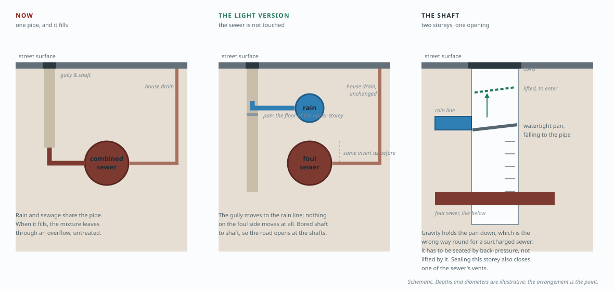
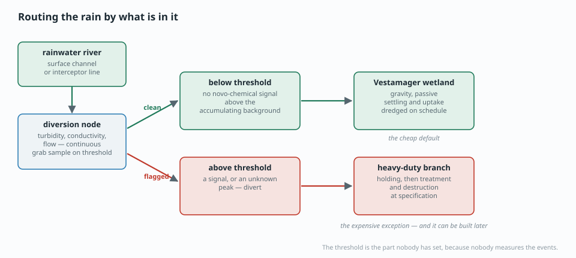

# The problem and the solution

> **This page is an argument.** Every other document in this project reports what the data supports and stops there. This one says what ought to be done, which is a different kind of claim, and it is labelled as one from here to the bottom. The numbers are pulled from the investigation pages and linked back; the *conclusions drawn from them* are mine and the reader is entitled to reject them.

## Part one — the problem

### The four words people actually use

This page takes its problem statement from the public, not from the monitoring programme, because the monitoring programme measures what it can and the public names what it minds. Across the recorded public argument ([POLITICS.md](#POLITICS.md)) the damage is named with four words, and it is worth noticing that **no one in that record — on any side — says the water is fine.**

| what people call it | what they mean by it | what Denmark measures | where the word and the measurement come apart |
|---|---|---|---|
| **iltsvind** | the sea is suffocating | dissolved oxygen below 4 mg/l **in stratified bottom water** | it needs depth and a sealed layer. Køge Bugt is shallow, mixes, and has no iltsvind on record — including 2023 and 2025 ([CURRENTS.md](#CURRENTS.md)). Whether the criterion is *structurally* unreachable there is our inference and is not settled |
| **fedtemøg** | greasy, foul water and a shore you do not want to walk on | nothing | there is no instrument. It is not a scientific term and no programme carries it |
| **fiskedød** | dead fish, visibly, in numbers | no open register | the events happen and are recorded nowhere the public can read |
| **livet i fjordene** | the structural life is gone | eelgrass depth limit, some bottom fauna | measured — through a light proxy that censors itself in shallow water ([LIGHT.md](#LIGHT.md)) |

**Three of the four have no usable measurement, and the fourth cannot be recorded in the bay next to Copenhagen.** Everything on this page is shaped by that: the things people mind are, for the most part, unmeasured, and any solution below has to be judged without being able to watch them improve.

### Where it is

The phrase in the record is *fjorde og indre farvande* — fjords and inner waters. The places people describe fall into four kinds, and they share neither a mechanism nor a fix:

- **Fjords** — enclosed, shallow, slow to exchange, and the setting for most of the public argument.
- **Inner waters** — the belts, sounds and bays, including ones like Køge Bugt that hold water rather than exchange it.
- **The open sea around Denmark**, which people also call dead.
- **The shoreline**, where material from any of the above lands, sits and smells, and where most people meet the problem directly.

[AREAS.md](#AREAS.md) is why the distinction earns a section: a fix that is true of Denmark is true of nowhere in it. Copenhagen carries the specifics in Part Two because it is the one place where the flow paths, the constructed drainage and the receiving water are mapped closely enough to name *which street, which volume, which site.* The same avenues apply elsewhere with the particulars still to be filled in.

### What sits underneath those four words

The register keeps a separate list, arrived at from the other direction — not what people call the damage but what is actually lost when it happens. The two lists are the same subject in two vocabularies, and the join is the point of this section.

| | what is lost | which public word points at it |
|---|---|---|
| `T1` | the large, slow, long-lived organisms, and the structure the rest of the community lived inside | *livet i fjordene* |
| `T2` | the ability to come back — the loss now maintains itself | none. **Nobody has a word for this, and it is the one that decides whether any of the rest is reversible** |
| `T3` | water fit and pleasant to be in | *fedtemøg* |
| `T4` | fish, shellfish, and the living made from them | *fiskedød* |
| `T5` | the shore as a place to be | *fedtemøg*, again |

Note what falls out of the table. **`iltsvind` is not on it** — oxygen deficit is a mechanism, not a loss, and it appears here only because it is the thing that got measured and so became the public name for everything. And `T2` has no public word at all: there is no everyday term for a system that has stopped being able to recover, which is precisely the state that determines whether spending money on any of Part Two is worth doing.

### Why the current framing does not reach those four words

The four words name losses. The public framing names one mechanism — nitrogen, to
oxygen, to damage — and then measures the mechanism. Five findings say why that does
not reach the losses. Each is recomputed on these pages, and each is stated with what
it does **not** establish, because this section has already had to be rewritten twice
for claiming past its evidence.

**1. The nutrient account never beat the alternatives; it is the one with a monitoring
programme.** All 166 mechanisms in [the register](#HYPOTHESES.md) have been
[triaged](hypodrafts/TRIAGE.md) against the data that exists. Twenty-four are testable
now — **and not one of them is in the nutrient group.** Every entry there is blocked on
a fetch, unscoreable, or unestablished. Forty mechanisms cannot be tested at all
because the deciding measurement has no column anywhere, and twenty more need an
experiment nobody has run. **Sixty of them have never been in a position to compete.**
*Does not establish:* that nutrients are innocent. It establishes that the contest
people believe has happened has not happened.

**2. The deciding number is usable as a sign and not as a coefficient.** *Markoverskud*
— the field surplus that drives the model — fell 40–53% across ten studied catchments.
The measured diffuse load fell by **10–14 kg N/ha where the surplus fell 30–52**, by
**3–5 where it fell 24–50**, and at Mariager by **nothing at all**. Pass-through runs
from zero to about a third. A load reduction predicted from a surplus reduction is
overestimated threefold to tenfold, or entirely. *Does not establish:* that the decline
was not real. Measured estuary nitrogen fell 24–62% over the same period.

**3. The national relation is tight because the local coefficient varies.** DCE report
*"en meget stærk, signifikant lineær relation"* between field surplus and diffuse load
at national scale. That is an aggregate over catchments whose individual pass-through
ranges from zero to a third. **The strength of the national fit is not evidence that
the local coefficient is stable — it is what aggregation does to a variable one.** The
same shape appears twice more here: [water bodies](#AREAS.md) that carry no signal
within themselves, and a national oxygen trend that [tracks which stations were
reporting](stations.html).

**4. The method does not produce an annual share.** The background/anthropogenic split
is made **only on five-year averages**, because DCE state it is too uncertain year by
year. Any yearly movement in a published percentage interpolates a quinquennial split.
And the diffuse term is defined to include scattered dwellings *because they could not
be separated from it* — the category is a mixture by its own definition.

**5. Three of the four words have no instrument.** *Fedtemøg* has no measurement.
*Fiskedød* has no open register. *Livet i fjordene* is a claim about structure that a
gas concentration does not address. **A framing that measures oxygen cannot report
progress on three of the four things people are actually complaining about**, and
[Køge Bugt](#PLACES.md) is the case: the loudest claim in the country, and among the
best-oxygenated waters in it, with no registered *iltsvind* in 2023 or 2025.

### What this changes about Part Two

Not much, and that is the point. **Every intervention below was chosen to act on what
arrives rather than on what it causes** — keeping rainwater out of the combined system,
an outlet that is not the bay, source control on what the water carries. Those hold
whichever of 166 mechanisms dominates, which is why they survive a finding that the
field cannot be resolved.

What the findings do change is the *order*: [Places, not
categories](#PLACES.md) takes the coasts one at a time, because one is four times worse
than anywhere else and is not the one anybody argues about — and because a trial at
Mariager says nothing about Lillebælt when the land-to-estuary coefficient varies
twenty-six-fold between them.

### What this page can and cannot honestly claim

Because three of the four public words have no measurement, **the solutions below cannot currently verify their own success.** Rainwater rivers, a wetland outlet, treatment and source control can each be built, costed and monitored for the things that *are* instrumented — volumes, loads, concentrations. None of that would tell anyone whether the shore stopped smelling.

That gap is fixable and cheap, and it is the argument for `X19` and `X20` in [EXPERIMENTS.md](#EXPERIMENTS.md): a panel that reports on a schedule including the days nothing happens, and a structured record from the people who have watched the same ground for forty years. Without an outcome record the whole of Part Two is an argument from mechanism, and it should be read as one.

Two things deliberately not on this page. The public argument itself — who said what, when, and whether it was checkable — is [POLITICS.md](#POLITICS.md), and it is a different object of study. And *how pollution becomes visible to the public at all*, which is a real problem and a genuinely separate project, is [OPEN_PROBLEMS.md](#OPEN_PROBLEMS.md) item 9.

## Part two — the solution

Seven things. They are ordered by how much evidence stands behind them, not by how appealing they are.

> **[Open the 3D view →](../viz/rivers3d.html)** — the whole proposal on the real city: buildings, terrain, the recovered flood paths, which alignments become open channels, which get the interceptor retrofit, and where the wetland sits. Real, recovered and proposed are labelled separately throughout.

### 1. Rainwater rivers — and the alignments already exist

*The recovered 2012 cloudburst model against the cloudburst plan, with the plan split into routes where the water would be visible and routes where it stays in a pipe. Generated by `scripts/rivermap.py`.*

The 2012 flood model is usually read as a risk map. It is also a survey: at 10 m resolution, it is a record of where water in Copenhagen goes when you stop forcing it into a pipe. That is the natural drainage network of the city, and it has already been mapped.

**What this covers.** The 2012 model was published as seven PDF sheets with the georeferencing stripped out. Four registered automatically against the water in them. The other three — Amager, Bispebjerg, København Vest — were placed from control points reported by a resident, who found marked dots on a web map one at a time. **All seven are now placed**, and everything below is **5.93 km² of modelled flood path** across the whole city.

The three assisted sheets are good to roughly ±90–140 m against 20–30 m for the automatic four, so treat the 50 m proximity band on those as indicative and the 200 m band as sound. Provenance and per-sheet accuracy are in `data/derived/floodmaps/_georef.json`.

Measured against it:

| | Share of the *inner-city* modelled flood path |
|---|---:|
| Within 100 m of a planned **surface** route | **54%** |
| Within 100 m of a planned **pipe** | 20% |
| Within 100 m of anything in the plan | 64% |
| **With no surface route within 100 m** | **46%** |

So the surprise is a positive one. Across the inner city, Copenhagen has already drawn the river network: **54% of the flood paths there have a surface alignment planned beside them.** The city's cloudburst plan is 169 km of surface conveyance against 71 km of pipe ([SOLUTIONS.md](#SOLUTIONS.md)). The idea is not missing. The alignments are not missing.

**What is missing is the connection.** A skybrudsvej is designed against a hundred-year event: it activates when the system is already overwhelmed, a handful of times a decade. Ordinary heavy rain — the rain that actually causes overflows, many times a year — still goes down the gully into the combined pipe exactly as before. The surface network was built to protect the city from water, not to protect the sea from the city.

**The ask is therefore small and specific:** connect the everyday rain to the surface network that has already been designed and partly built, instead of only the cloudburst rain. That is a change in inlet design and drainage regulation, not a new masterplan.

#### Where an open channel will not fit

Not every alignment can be a river. A dense street with no room to lose, a junction, a listed square — in those places the water still has to leave the sewage system, and the way to do it is vertical rather than horizontal.

**Drop the foul sewer by about a metre and put a rain-only line into the space above it.** Same trench, same street, same gully. The manhole connects to the new line instead of the old one; the house drains stay on the foul sewer, which is now deeper and, with the rain taken out, never full — which is a mixed blessing, and the next section but one is about why.

What this buys is the thing that matters: **there is no longer a mixture to overflow.** An overflow structure on a foul-only sewer has nothing to spill in a storm, because the storm is not in that pipe. It is more expensive per metre than a channel and far cheaper than a parallel corridor, and it is the reason the proposal does not have to stop where the street narrows.

**But the drawing above is the heavy version of the idea, and it should not be the first one tried.** The lighter version is to leave the sewer exactly where it is and thread a small rain line into the space that already exists between the street and the pipe. Nothing on the foul side is touched: the sewer keeps its depth, every house drain keeps its connection, and the only change is that the gullies are cut off the sewer and put onto the new line. That is strictly less work than dropping a sewer under live connections.

It works because **the new line does not have to carry the cloudburst.** The cloudburst already has a route — the surface network in the previous section, designed for exactly that event. What has to come out of the combined system is the ordinary rain that fills it many times a year. Sizing for the frequent rain rather than the hundred-year one is a much smaller pipe, and it turns the question from *can a storm sewer be fitted here* into *which rain do we take out of the sea* — a priced decision with a return period on it, rather than a structural impossibility. The residue is explicit: rain above that size still meets sewage in the old pipe and can still spill, so this variant reduces overflow frequency and volume, and does not abolish them the way a full separation does.

**And it does not have to be dug in.** The expensive part of urban pipework is the trench: the road opened along its whole length, the traffic, the reinstatement, and everything else in the ground found the hard way. A shallow line can be **bored or driven instead** — a pit at one manhole, a pit at the next, and the pipe pushed through the ground between them, taking the soil into the pipe as it goes to be augered or flushed out behind it. The road is then opened only at the manholes, which are the places the work has to happen anyway. For a gravity line the technique has to be one that holds a grade of millimetres per metre over the shot — pilot-tube guided boring rather than free-steered drilling — and the shots are short, manhole to manhole.

**And the length of the job is a length of street, which can be counted.** Road centreline inside Copenhagen's combined-sewered catchments comes to **1,296 km** (375 of it on Amager) — about 376 m of street for every impervious hectare drained. At a manhole every 80 m that is on the order of **16,000 shots**, and not one of them needs a new pit: a shot starts and ends at a shaft that is already there. *Upper bound* — the road extract carries no classification, so paths and service roads are counted with the carriageways, and a real programme works down from that figure as streets are ruled out rather than up from a guess. What a metre costs is the utility's number and not this project's; [the architecture view](architecture.html) takes a rate and gives back the total, the figure per person equivalent, and what that is a year over the life of the asset.

It is not free of the thing it avoids. **Open-cut finds an unmapped cable; a bore hits it.** Working blind in the busiest metre of the ground raises the value of everything that says what is down there — the utility register, a survey, and a trial hole at each crossing — so the method makes the information problem below more acute rather than less.

> **[The arrangement in three dimensions →](section3d.html)** — the same street at its real sizes: the bored line, the sewer left where it is, the shaft with its pan, and the liner. Every dimension is a named parameter that says whether it is measured or merely stated, and all of them move. It also answers the question this section keeps circling — whether a pipe that carries the flow is still fast enough to carry its own grit.

**The junction is where this gets interesting: one shaft, two floors.** At every existing street connection the shaft carries on through the new rain line rather than stopping at it. At rain-line level a **watertight pan forms the floor of that storey**: what comes off the street lands on it and is turned into the rain pipe, while the shaft below it stays a shaft. To reach the sewer, the pan is lifted — held down by its own weight the rest of the time — and the manhole is a manhole again. One opening in the road, one asset to maintain, the gully keeps its sand trap, and nothing about access to the foul sewer is given up.

Four conditions decide whether that detail is sound, and they are stated here as conditions rather than as answers:

- **It must not be liftable from below.** A pan held by gravity seals downward and is defeated by pressure upward — which is exactly the fault case, a surcharged sewer, and would put foul water into the rain line at every manhole at once. The seat has to be latched, or shaped so back-pressure seats it harder rather than lifting it. This is the same invariant as the outlet above: the separation is physical or it is not there.
- **It is a sump, so it is on a cleaning schedule or it is a problem.** Grit and leaves collect on a flat pan. Emptied with the gully, that is a feature and the first thing the rain line would otherwise carry. Not emptied, it is the basin argument again at the scale of one shaft.
- **Sealing a storey removes a vent.** A foul sewer is ventilated through its shafts, and a watertight floor at rain level closes one. The ventilation has to be re-made deliberately, or hydrogen sulphide accumulates in the place nobody now opens.
- **Entry gets harder, not easier.** Lifting a pan while standing over a live sewer, possibly with rain running in, is a confined-space job with a new step in it. It needs a lifting point, a way to secure the pan open, and a rule about when the storey above can be running.

Technical concerns about a small rain line — what makes it block, why a smaller pipe blocks less, and the one detector greywater costs you

**A small pipe blocks. That is its failure mode, and it is the right one to have.** A combined sewer that blocks backs sewage into a basement. A rain line that blocks puts rainwater on the street it came from — visible, local, and nobody's floor. The design question is therefore not whether it can block but whether the blockage is findable and reachable, and the construction method settles most of that before anything else does: with a shot from shaft to shaft, **no point on the line is more than half a spacing from an opening**, and a jetting hose can be put in at either end.

What actually accumulates, in order of how much of it there is:

- **Street grit and winter sand.** The largest mass, and it is caught before the pipe if the gully keeps its sand trap — which it does, because the gully is not being rebuilt. The pan in the shaft is a second trap, and it is a *designed* one: material that settles there is material that reached the one place in the system with a lid, a lorry and a schedule.
- **Leaves.** Seasonal, and an argument for street sweeping before the autumn rather than for a larger pipe. A leaf mat is a surface problem at the grating far more often than a blockage inside the line.
- **Fat and fibre, if greywater is admitted.** Laundry lint and kitchen fat are what actually build the deposits people picture, and they come from fixtures rather than from streets. This is the second argument for the fixture standard above: the kitchen sink is the one greywater fixture that should stay on the foul line.
- **Roots.** A shallow line under a street with trees. Root entry is a joint problem, and a bored or driven line is fused or welded rather than socketed — so the construction method that makes it cheap is also the one that gives roots nothing to enter.

**And a small pipe is better at keeping itself clean than a large one**, which is the part that reads backwards. A gravity line scours at roughly 0.6–0.75 m/s, and velocity comes from filling the bore. A line sized for the ordinary rain fills often; a line sized for the hundred-year storm runs as a trickle in a wide invert almost every time it runs at all, and drops its load. Sizing for the frequent rain is not only the cheaper choice, it is the self-cleansing one — the design condition is that the scouring velocity is reached at some stated frequency, not that the pipe is large.

Three more that belong in the same list, because they are what would actually be argued about:

- **Frost, and low points.** A shallow line with standing water in a sag is a freeze plug. The requirement is cover and continuous fall — no sag between shafts — which is the same requirement that the guided-boring method exists to meet.
- **Deformation at installation.** Driving a pipe through mixed urban fill can leave voids and joint offsets, and an offset is a sediment trap for the life of the asset. That is what post-installation CCTV and a laser profile are for, as an acceptance test rather than as a maintenance activity.
- **Misconnection — and the detector that greywater costs you.** In every separated system somebody's foul pipe ends up in the rain line. The cheapest detector for that is the simplest: **a rain line should be dry in dry weather**, so anything flowing is a misconnection. Admitting greywater deliberately puts a legitimate dry-weather flow into that pipe and takes the test away. It does not make detection impossible — flow with the wrong chemistry is still detectable, and the fixture standard means the expected dry-weather flow is known — but it is a real cost of the greywater idea and it belongs beside its benefits.

**And the air matters as much as the water**, which is the part that connects blockage to the thing everybody has heard of. Fat does not build up in a fast pipe; it comes out against a cold wall at the waterline, and in a concrete sewer it *saponifies* — the free fatty acids take up calcium out of the pipe and become soap, which is solid, sticky and no longer anything a jet of water dissolves. That reaction wants three things: fat, lime, and long slow contact. A rain line supplies none of them if the kitchen stays on the foul side; it supplies all three if it does not.

- **The rain line has to breathe too.** Danish street gullies carry a water seal, and a line whose every inlet is sealed is a closed pipe of standing humid air. With rain alone that is tolerable. With a greywater baseflow it is a weak foul pipe with no ventilation, which is a biofilm and an odour complaint — so admitting greywater means providing air, at the shafts, deliberately.
- **The pan closes a shaft that was doing that job.** This is the fourth condition on the two-storey shaft, arriving from the other direction: the foul sewer below is ventilated through its shafts, and a watertight floor at rain level takes one out of service. The vent has to be re-made through or around the pan, and it is easier to design in than to retrofit into a lid somebody already cast.

*None of this is settled here.* Cover depth, gradient, diameter and the cleaning interval are design outputs, and this project has computed none of them. What it can say is which of them decide the outcome, which is the list above.

#### Never full is also never scoured, and that decides which pipe gets which stream

Taking the rain out of a combined sewer leaves a pipe sized for rain carrying only sewage. **The same sentence read the other way is the problem:** a bore that never fills never reaches a scouring velocity, so solids settle, the flow goes septic in the deposit, and sulphide comes off it — which is odour and, at the crown, corrosion of the concrete itself. Fat behaves the same way: it comes out of solution against a cold wall and builds at the waterline, and a slow warm film is exactly where it builds fastest. The lumps people picture in a sewer are not a plumbing curiosity, they are what an oversized pipe does with a small flow over years.

It also loses a ventilation mechanism nobody counts. Storm flow is a piston: it pushes the air in front of it and drags fresh air behind it, and a combined system ventilates itself several times a year on that alone. Take the rain out and the air in the pipe stops moving with it — in the same system that has just become more septic. The retrofit therefore has to say how the foul line breathes, and the two-storey shaft above makes that sharper rather than softer, because a watertight pan closes a shaft that was part of the answer.

Which is why the arrangement question is really **which pipe gets which stream**, and there are three answers, not one:

| | What is built | What it costs | What it gets wrong |
|---|---|---|---|
| **Light** | a small bored rain line above; the old pipe keeps the sewage | cheapest — nothing on private ground | the old pipe is now enormously oversized for what it carries |
| **Heavy** | drop the sewer a metre, rain line into the space | a relaid sewer under live connections | pays for relaying, and then relays the same wrong diameter unless it is downsized on the way |
| **Swapped** | keep the big pipe for the rain it was sized for; bore a small new **foul** line | every house drain has to be moved onto it | the work crosses the property line, which is what makes separation slow |
**And there is a fourth that takes the good half of each.** The old combined sewer does not have to be abandoned at its diameter: it can be **lined down to a foul-sized bore from the same shafts**, using the pipe that is there as the duct. The rain goes in the new shallow line, the sewage goes in a bore sized to scour itself, no house drain moves, and no trench is opened for either. It is the same trenchless logic applied twice — once to add a pipe, once to shrink one — and it is the arrangement this section would actually argue for.

*Stated, not established:* this project has not costed lining, has not checked the condition of any sewer that would receive it, and has computed no diameters. What the argument does establish is the **criterion**: a pipe should be sized for the stream it carries, and the retrofit that leaves a rain-sized pipe carrying sewage has solved the overflow and created a maintenance liability in the same move.

*What this is:* an arrangement and a construction method, not a design. No clearance has been checked, no diameter or gradient computed, and it concerns an asset owned by a utility that would have to decide it. It is here because it changes what the retrofit costs — and because the two-storey shaft is the detail that makes the light version buildable at the point where every street already connects.

**What decides between the two is the first metre under the street, and this project cannot see it.** Water mains, district heating, gas, telecom and the gully leads themselves occupy that zone, and whether a new line clears them — with frost cover above and a continuous fall to its outlet — is a question the utility register answers and no public dataset here does. So the section is drawn as an arrangement, not as a design, and the sizing above is stated as the decision to be taken rather than as a diameter. Both variants stay on the public side of the property line; neither requires entering a building, which is the thing that makes conventional separation slow.

On this project's classification, **20% of the modelled flood path has a planned pipe within 100 m** — and that sentence has to be read narrowly, because it is a statement about **alignment and nothing else**. A *skybrudsledning* is conveyance for the extreme event: sized for it, and aimed at getting water off the city quickly, which means the nearest water that will take it. **It is not a river through the city to an inland settling ground, and that is the difference this whole section is about.** What a shared alignment buys is the trench, the corridor reservation and the disruption — which are the expensive parts. It does not buy the pipe, the diameter or the outlet.

And where each planned pipe discharges is not in the layer. The plan geometry is **segmented rather than routed**: of 222 planned cloudburst pipe segments, 23 have an end within 50 m of the shore or the harbour and the median segment's nearest end is 1.1 km from water. That measures the segmentation, not the destinations — a segment normally ends at the next segment. Tracing where any given route actually comes out means reading the project pages one at a time, and it is exactly what would decide whether an alignment can be reused as it stands or only as a trench.

And where no alignment exists — the 46% — the model names the places. 14 corridor candidates come out of it: stretches with more than 0.5 m of modelled water, no surface route within 100 m, and enough length to be a channel rather than a puddle. They are circled on the map and listed in `data/derived/rivermap.json`.

### 2. An outlet that is not the sea

> **[The same architecture, on the city →](architecture.html)** — the graph with every path that changes, and a map of which sewer catchments it acts on, each one carrying its own impervious area, person equivalents and the city's own plan for it. The scenarios in it are the ones argued below: rain out of the sewer, greywater moved to the rain line, the retired basins reused or stranded.

Section 1 does not improve the combined system. It ends it, and what is left is **two systems with different jobs**. A foul line: small, steady, running every hour of the year, going to a treatment plant. And a rain line: intermittent, far larger at the moment it arrives, carrying the surface of the city rather than the inside of a building. Everything below follows from keeping those two apart, and most of the existing argument about basins and overflows is an argument about the mixture that no longer exists.

**How much larger is worth doing in rates rather than in adjectives, because a year is exactly the window that hides it.** Sewage is produced at roughly the rate people live: taking the ordinary design figures — 130 litres per person per day, and a morning peak of 2× that — a thousand people peak at about 3 litres a second, and they do it at the same hour every day, which is a load a plant can be built for. Rain is not like that. Against 31 years of hourly rainfall over Copenhagen, **one hectare of paved surface in a 10 mm hour matches the morning peak of about 7,385 people**. Amager's 1,052 combined-sewered impervious hectares come to **23 m³/s — the morning peak of 7.8 million people**, from an island. Even the *median* hour with rain in it, three tenths of a millimetre, is 0.70 m³/s: the morning peak of 233 thousand. The two streams are not the same size and were never comparable; putting them in one pipe is what makes the small one uncontrollable.

The rain record behind those rates — 31 years of hourly Copenhagen rainfall, and why its wettest hour is an artefact

Rain is the measured side. Hourly ERA5 precipitation over Copenhagen, 31 years, 271,752 hours, already fetched for the wave work and recomputed by `scripts/streams.py`:

| | |
|---|---:|
| Mean annual rainfall | 677 mm |
| Hours a year with any rain | 1402 |
| Median hour that has rain in it | 0.3 mm |
| Hours a year at or above 2 mm | 40 |
| Hours a year at or above 5 mm | 1.7 |
| Wettest hour in the record | 11.9 mm |

**The last row is a warning about the instrument, not a fact about Copenhagen.** ERA5 is a reanalysis on a grid cell tens of kilometres across, and a cell mean cannot produce a cloudburst: the July 2011 event dropped more in two hours over the city than anything in this record does in one. So the record is used here for **ordinary rain**, which is what the system is being sized for and what actually causes the overflows, and the 10 mm design hour above is a stated convention sitting deliberately above what the reanalysis can resolve. Cloudburst intensities have to come from the rain-gauge network (SVK), which this project has not fetched.

The foul side carries no population figure on purpose. Nobody here has sourced one for the island, so the comparison is written as an equivalence — *how many people's morning peak* a hectare of rain matches — which needs no census. The dry-weather flow per person and the peak factor are design conventions and are named as such.

**So the basins retire.** A spare basin is an organ of the combined system: it exists to hold a mixture back until the plant can take it. Take the rain out and there is no mixture, the foul flow arrives at the rate it is produced, and the plant treats it as it comes. A basin then has nothing to buffer. It is not the instrument for the rain stream either, and the scale says why: the entire registered spare-basin volume on **Køge Bugt** — every basin in the water body, across 865 rain-conditioned outfalls — is **14,377 m³**. One hour of 10 mm of rain on Amager's 1,052 combined-sewered impervious hectares alone is about **84,120 m³** at a runoff coefficient of 0.8. The whole registered basin volume of the bay is about 10 minutes of that one hour, from one island. Basins were never storage for the rain; they are a device for postponing a spill.

**And postponement is where the material concentrates**, which is the reason not to answer this with more of them. Most rain fills a basin without ever spilling it: the water is held, drains back to the plant, and what it carried settles out and stays. So the store builds through every event that does **not** flush, and it leaves in the one that does. The overflow releases the water of that storm together with the accumulated sediment of all the quiet ones before it — the same behaviour a toilet has, and for the same reason. It is a flow threshold, which is why the annual-average accounting cannot see it: the ledger averages a quantity that is delivered in the few hours a year the threshold is crossed.

**And what is held between flushes is not the water that went in.** A basin holding settled sewage solids goes anoxic in the sediment within days, and what leaves in the flush is the reduced product of everything that settled since the last one. [OXYGEN.md](#OXYGEN.md) prices those routes and none of them is fertilisation: organic matter that arrived already made consumes **1.0 g O₂ per g COD** with no growth step, ammonium consumes **4.57 g O₂ per g N** as a reductant rather than a nutrient, sulphide out of reduced sediment **2.00 g O₂ per g S**, and fat about **2.9 g O₂ per g** — all of it immediate, and all of it arriving as a pulse rather than a season. The same anoxia releases iron-bound phosphate ([`A2`](#HYPOTHESES.md)), so the flush delivers the nutrient too, in the form the sediment lets go of. Not one of these routes is representable in a load ledger written in tonnes of nitrogen a year: they are oxygen demand, not nitrogen supply, and they land in hours.

The flush does more than take oxygen — eleven routes it also takes, and how many of them anything in Denmark records

**Oxygen is not the consequence. It is the one consequence that has a stoichiometry.** The paragraph above prices the flush in grams of O₂ per gram because that is the channel the ledger can be argued in — every route there converts to a number an accounting can hold. That is a property of the instrument, not of the event. What actually leaves the basin acts along several routes at once, and the oxygen one is simply the only one anybody can carry through an arithmetic.

**Start with the route that needs no chain at all: it is the substance.** What comes out is fat, solids, fibre, wipes and the sediment they were lying in. A person who meets that in the water is not encountering a downstream effect of an oxygen deficit — they are encountering the discharge, diluted. Dilution changes the concentration and not the identity. **That is *fedtemøg* in the sense the word is actually used**, and on this page's own count it is one of the three public words with no instrument behind it. The most direct route in the list is the one nothing measures.

The rest, with what each acts on and whether anything in Denmark records it:

| The flush also delivers | Which acts on | Recorded by |
|---|---|---|
| Oxygen demand — COD, ammonium, sulphide, fat | dissolved oxygen, and everything that needs it | **yes** — the oxygen series, at station-months |
| The material itself — fat, solids, fibre, wipes | what a person meets at the shore | **nothing** |
| Odour | whether the place is usable | **nothing** |
| Pathogens | bathing risk, for the days after | partly — bathing water, in season, at designated points only |
| Unionised ammonia (NH₃, set by pH and temperature) | gill-breathing animals, directly and quickly | as total ammonium sometimes; as toxicity, no |
| Phosphate, released as the sediment reduces ([`A2`](#HYPOTHESES.md)) | production weeks later, elsewhere | in some series; never attributed to an event |
| Turbidity, and the light it takes ([LIGHT.md](#LIGHT.md)) | eelgrass, which needs light to keep sulphide out ([`T1`](#HYPOTHESES.md)) | Secchi — which this project found **right-censored** at shallow stations |
| An organic blanket on the bed | benthic fauna, and the skin that stabilises sediment ([`D8`](#HYPOTHESES.md)) | bundfauna surveys, infrequent and rarely after an event |
| Metals, PAH, tyre wear, microplastics | a food chain, over years | well in pond effluent, almost nowhere in a receiving water |
| A kill, and then the decay of what it killed ([CAUSATION.md](#CAUSATION.md)) | the standing stock, which becomes the next oxygen demand | **nothing** — no open register of fish kills |
| Timing — a pulse into warm, stratified, still water | everything above, at the worst hour of the year for it | no instrument has a time axis this short |

Read down the third column. **One route is measured well, two partly, two by records that exist but cannot see an event, and six not at all** — and the six include both the direct human encounter and the kill. An annual nitrogen ledger sees none of the eleven. An oxygen series sees the first and reports it as a monthly value at a station that may be kilometres away.

*What this does not say:* that any of these happened at any Danish overflow. Nothing here quantifies a single event, and several rows are mechanisms rather than findings. What it establishes is narrower and harder to argue with — **the event is wider than the instrument**, so a defence of the current framing that rests on the oxygen record is a defence that has already discarded most of the question.

*Does not establish:* what any particular basin holds. Nobody in this project has measured basin sediment, and the composition would be site-specific if they had. What the arithmetic does establish is that a delayed, concentrated, reduced discharge cannot be priced by the quantity the accounting measures — which is the same failure as [the annual average](#RESIDUAL.md), one storey down.

**If the treated effluent is still not good enough for the water it enters, that is an argument about where the outlet is, not about how many basins there are.** A plant whose effluent a bay cannot absorb should discharge into a water that can hold it and work on it — the same terminal-water logic, applied to the small stream instead of the large one. What it should not do is keep the shore as its default outlet on the grounds that the pipe already goes there.

**The stream that actually needs somewhere to go is the rain.** It is the larger one, it arrives all at once, and what it carries is the city's surface: road sediment, metals, tyre wear, PAH, microplastics, road salt, litter — the general pollution of a city and the flush of everything that settled on it since the last rain. That is a different problem from sewage and it wants a different receiver: shallow, wide, vegetated, and able to keep what it settles.

**And it must stay unconnected.** The proposal below receives rain and never sewage. A break, a blockage or a misconnection is the one path by which foul water could reach it, so the separation has to be **physical rather than administrative**: no cross-connection to open in an emergency, and a fault that fails toward the plant or toward holding rather than toward the polder. A receiving water that can be used as an overflow once will be used as one again.

**A note on household plumbing, and an argument against leaving it to the household.** Once there are two pipes in the street a building can put a fixture on either one, and greywater — a shower, a washing machine, a sink — would sit oddly well on the rain line, where the worst thing in it is soap. Every litre moved that way is a litre the plant does not treat, and it makes the foul flow smaller and steadier, which is the direction everything else here pushes. It should still be a **fixture standard rather than a householder's discretion**: a pipe whose contents depend on who owns the building is a pipe nobody can characterise, and *you may put mild things down the rain line* is in practice a licence to put anything down it — emptying a bucket out of the window, with plumbing attached. If greywater is admitted it is admitted by rule and for named fixtures, and the wetland is then sized knowing it has surfactants to deal with, rather than finding out.

The alternative is therefore a terminal water for the rain: an outlet that is a lake, a watercourse, a wetland or a quarry rather than the bay.

*Real: coastline, combined-sewer catchments, overflow structures, treatment plants, and the chalk quarry discussed below. Green and dashed: proposal, not data.*

**Case one: a flooded chalk quarry.** Karlstrup Kalkgrav sits behind Solrød Strand, separated from Køge Bugt by the motorway. Its water level is held **four metres below sea level** by a pump station that already removes about **600,000 m³ a year** and discharges it into the bay. As hydraulic geometry it looks close to ideal: a deep hole below sea level, next to the shore, with the pumping installed.

**It is the wrong site — and the first reason I gave for saying so was out of date.**

The evaluation — is the lake actually clean? Nothing published can settle it, and this is everything that was checked

I originally rejected it as "Zealand's clearest lake", which is what the encyclopedia says. That claim carries no citation and no year. A resident who knows the place reports algal growth, an odour, a declining fishery where there had been a fishing culture, and accumulated plastic waste.

So the useful question is not whether the lake is clean. It is **what would have told us either way**, and the answer is close to nothing:

| | |
|---|---|
| Registered as | Karlstrup Sø (DKLAKE812), 0.06 km², catchment DK2.4 Køge bugt |
| Ecological status | **God økologisk tilstand** — assessed on the phytoplankton element only, from chlorophyll |
| Chemical status | **Ukendt kemisk tilstand - never determined** |
| Data window | **roughly 2014-2018 - the VP3 basis analysis; NOT current** |
| Bathing-water sampling | none — it is not a designated bathing water; the four within 3 km are all coastal |
| Litter, plastic, odour, fish kills | **not monitored by anything** |

A lake carrying one number, from a chlorophyll series that ended around 2018, with chemical status never determined and no instrument at all for the things the resident describes. That is the same failure this project keeps finding: the condition people can smell is the condition nothing measures.

And there is a better reason to reject the site, which does not depend on how clean it is now. The lake is 14 m deep with **poor circulation** — cold water immediately below a warm surface layer. That is precisely the configuration that stratifies and goes anoxic under nutrient load. Directing stormwater into it would reproduce Køge Bugt in miniature, in fresh water, half a kilometre inland. **A deep, still hole is a bad treatment basin.** What treatment wants is the opposite: shallow, wide, and vegetated.

#### Case two: Vestamager, which is the right shape

Behind the Amager dyke is a polder. Between 1939 and 1943 a 14 km dyke four metres high was built across a shallow bay, channels were dug, and about **20 km² was pumped dry**. Two pump stations still keep it that way. It is Kalvebod Fælled, now part of Naturpark Amager.

Everything the quarry only pretended to offer is actually there: the polder is already pumped, already public, fed by gravity from the island above it, and shallow, wide and vegetated — which is the shape settling and uptake want.

The evaluation — the polder's own numbers, Amager's 31% share of the combined-sewered city, and what a wetland for it would need

| | |
|---|---|
| Area | ~2,000 ha, held below sea level |
| Hydraulics | already a pumped polder — the pumps, dyke and channels exist |
| Feed | gravity, from an island that sits above it |
| Shape | shallow, wide and vegetated — what settling and uptake actually want |
| Ownership | public |

**And Amager is a third of the problem.** Splitting Copenhagen's combined-sewered impervious area by island:

| | Impervious hectares on the combined system |
|---|---:|
| **Amager** — upstream of the polder, no harbour to cross | **1,052 ha (31%)** |
| Mainland Copenhagen | 2,395 ha (69%) |

Stormwater treatment wetlands are conventionally sized at a few per cent of the impervious area draining to them. For Amager's share that is:

| Sizing | Treatment area | Share of Vestamager |
|---|---:|---:|
| 1% — a lean wet pond | 11 ha | **0.5%** |
| 2% | 21 ha | **1.1%** |
| 3% | 32 ha | **1.6%** |
| 5% — generous, wetland-type | 53 ha | **2.6%** |

**Between half a per cent and three per cent of the polder would do it.** That is the difference between this and the quarry: the quarry was two orders of magnitude too small and the wrong shape; this is two orders of magnitude larger than needed and exactly the right shape.

*And the evidence, now that it exists.* This section used to sit on ground the flood model did not cover — Amager was one of three sheets that never registered. All three have since been placed from resident-reported control points, so **the island this section proposes to drain has its modelled flood paths in the analysis**. Adding the three took the surface-route coverage in section 1 from 72% to 57%, which is the honest direction: the four sheets that registered easily were also the best-served ones.

#### The objections, which are real

- **Natura 2000.** A bird protection area occupies the south-western corner, with no public access. That is a binding legal constraint on siting — though not automatically an argument against, because a shallow treatment wetland *is* wader habitat and the polder's water levels are already managed for exactly that. The tension is real and it is about which hectares, not whether.
- **Contaminant banking.** This is the serious one. Everything the treatment removes — metals, PAH, tyre wear, microplastics — accumulates in the sediment, and accumulating it inside a bird reserve puts it into a food chain. Treatment cells would have to sit outside the designated area, be lined, and be dredged on a schedule that is actually kept. A pond that is never dredged becomes the thing it was built to prevent, and doing that in a nature park would be worse than not building it.
- **It only serves a third of the city.** The mainland's 2,395 ha cannot reach the polder by gravity — the harbour is in the way. This is not the answer for Copenhagen. It is a good answer for Amager, and Amager is where a third of the combined-sewered surface is.
- **Groundwater and the polder's own water balance.** Adding a large managed inflow to a basin whose level is maintained by pumping changes the pumping duty and the salinity gradient. Neither is exotic; both have to be modelled before anyone draws a line on a map.

*What this is:* the case that the site meets the physical criteria, which is a much weaker claim than that it should be built. Nobody has run the numbers, and the four objections above are where the argument would actually be won or lost.

#### The specification, generalised

What the two cases together establish is the shopping list:

- **shallow and wide, not deep and still** — settling and plant uptake need surface area, and a deep unmixed basin stratifies and goes anoxic
- **below the contributing catchment**, so the feed is gravity
- **not hydraulically connected to the sea**, so there is no threshold at which it discharges
- **an area of order 1–5% of the impervious catchment**
- **and a dredging obligation written down before it is built**

Denmark has a public register of raw-material extraction areas and a great many low-lying reclaimed and drained areas. Screening them against that list is a desk exercise. It has not been done for this purpose, and that it has not been done is the finding.

*The standing objection.* Anything infiltrating toward the chalk aquifer is a groundwater question, and Copenhagen drinks its groundwater. A terminal water has to be lined, or sit where the aquifer is already written off, or discharge to a surface watercourse after treatment. That narrows the site list considerably. It does not empty it.

### 3. Light treatment at high throughput, which is a different machine

Separating rainwater does not mean discharging it raw. Untreated urban surface water is one of the main routes by which tyre particles, microplastics and metals reach the sea, and simply giving it its own pipe would move that problem rather than solve it.

But stormwater needs a **fundamentally lighter machine** than sewage does, and the reason is chemical rather than economic:

| | Sewage | Stormwater |
|---|---|---|
| Volume (national, rain-dependent) | 33 million m³/yr overflow | 195 million m³/yr |
| Strength (COD) | 320 mg/l | 50 mg/l |
| Nitrogen | 43 mg/l | 2 mg/l |
| Pollutants are mostly | dissolved and biological | **bound to particles** |
| So the removal mechanism is | biological process, aeration, energy | **gravity** |

That last row is the whole argument. Metals, PAH, tyre wear and microplastics in runoff travel attached to sediment, and sediment settles on its own. A treatment train of gross-pollutant trap, forebay, wet pond and filter strip has no aeration basin, no sludge recirculation, no energy input, and no process to upset. Its throughput is limited by area, and area is the cheap input.

What that buys, from the pond literature:

| Removed | Efficiency | Evidence |
|---|---:|---|
| Suspended solids (TSS) | **76–84%** | 76% mean across 72 ponds in Canada and the USA; 81% in a mature Swedish wetland; 84% at a Norwegian highway pond |
| Microplastics > 500 µm | **95%** | measured across Danish and Nordic stormwater ponds |
| Microplastics < 500 µm | **88%** | same programme |
| Tyre wear particles | **~95%** | below the detection limit in three of four pond effluents; found in every sediment sample |

**95% of tyre wear material, by letting water sit still.** That is the strongest single number in this document, and it is the answer to the objection that separated stormwater would just be pollution with a shorter pipe.

Two honest limits. Ponds do not remove dissolved fractions — chloride from road salt, dissolved copper, PFAS — so they are a complement to source control and not a substitute for it. And their performance depends entirely on the sediment being *removed* periodically rather than left to accumulate and eventually scour, which is the identical failure mode as the sewer basins. A pond that is never dredged becomes the thing it was built to prevent.

#### How big, and the answer is: that depends on whether you store first

If the removal mechanism is gravity, the size of the machine is set by one number — how fast a grain falls — and a pond catches what has time to reach the bottom while the water crosses it. Settling velocity goes with the **square** of grain size, so the pond that catches sand is trivial and the pond that catches silt is not. Taking Amager's 1,052 combined-sewered impervious hectares as the catchment and Stokes settling in still water at 10 °C:

| Grain | Falls at | Pond area to catch it **at the design hour** | The same filter **fed steadily all year** |
|---|---:|---:|---:|
| 100 µm | 24.77 m/h | 0.3 ha | 26 m² |
| 50 µm | 6.19 m/h | 1.4 ha | 105 m² |
| 20 µm | 0.99 m/h | 8.5 ha | 656 m² |
| 10 µm | 0.25 m/h | 34.0 ha | 2,624 m² |
| 5 µm | 0.06 m/h | 135.8 ha | 10,495 m² |

**The two right-hand columns are the same filter, and they differ by two orders of magnitude.** A pond sized to take 23 m³/s as it arrives needs 8.5 ha to catch 20 µm silt. The same pond, fed at a steady rate with the same water spread over the year, needs 656 m² — a quarter of a football pitch. **So the design variable is not filter area. It is storage** — somewhere to put the hour so the filter can have the week. That is the argument for the polder in one line: Vestamager is not primarily a treatment area, it is 2,000 ha of the thing that makes a small treatment area work, and the pond sizing in the previous section sits comfortably between the two columns.

It also settles how the ponds are run. Cells in **rotation**, fed by gravity, with one cell out of service being drained and dredged while the others take the flow: with *n* cells that costs a factor of *n*/(*n*−1) in area — a quarter more for four cells, an eighth more for eight — which is affordable at these sizes and is the only way the periodic-removal condition above gets met in practice rather than in a maintenance plan. A cell that cannot be taken offline will not be cleaned.

*Stated, not measured:* the runoff coefficient, the design hour, and Stokes settling in still water. Real ponds are not still — wind and short-circuiting both cut capture — so these areas are **floors**, and the measured removal efficiencies in the table above are the thing to trust for what a built pond achieves. `scripts/streams.py` writes the arithmetic.

#### Where the load ends up is a choice, and the sea is the other option

The objection that a pond banks contaminants is right, and it is not an argument against the pond. **The city's surface load settles somewhere in every version of this**, including the one where nothing is built. Left to the outfall, it settles on the seabed of the bay it discharges into — which is banking too, in a basin nobody can drain, with no schedule and no operator.

The difference is what happens next. Sediment on a seabed is not at rest: a storm, a trawl, a propeller or a dredging campaign lifts it back into the water, and [OXYGEN.md](#OXYGEN.md) prices that route at **2.00 g O₂ per g of sulphide** oxidised on the way up — a demand that needs no nitrogen and appears in no load ledger. Anoxic sediment also releases the iron-bound phosphate it was holding ([`A2`](#HYPOTHESES.md)). And the metals, PAH, tyre wear and microplastics that came off the street are then in a food chain instead of in a bucket.

A pond cell is the same material in a place with an operator, a schedule and a lorry. That is the whole of the claim — not that treatment makes the load disappear, but that it decides **where the load accumulates and whether anyone can lift it out again**. The condition attached is the one in the objections: a cell that is never dredged is the seabed with a fence around it.

### 4. Where the captured material goes, which the same taxonomy decides

### A note on the menu

One structural point belongs here rather than in the investigation, because it has no observable in the water and every entry there has to have one.

**The set of chemicals available to be used is not chosen by environmental comparison.** It is the output of a registration and commercialisation process. A compound reaches the market because someone patented it, took it through approval, and could sell it; once it is approved and coupled to a delivery system, the scale at which it is applied is set by economics. Comparative non-target profile is a constraint on entry, not the criterion for selection among the entrants.

Glyphosate is the clearest illustration. Its herbicide patent expired in 2000, but engineering crops to survive it made herbicide and seed a single coupled product, and global use rose roughly fifteenfold between the mid-1990s and mid-2010s. So the compound applied more widely than any other in history is the one whose target pathway is shared by plants, bacteria and fungi — an antimicrobial at herbicide volumes. Denmark does not grow those crops and separately restricted glyphosate's pre-harvest use; the Danish connection is imported feed, and it is indirect.

The consequence for anything proposed on this page is concrete: **a chemical-load problem cannot be fixed by choosing better within a menu you did not write.** Substitution moves demand to the next compound on the same list, which was assembled by the same process. That is an argument for acting on total load and on the approval criteria, not for a better ranking of the existing options.

*What this deliberately does not claim.* Nothing about anyone's motives, national character or corporate culture. The agrochemical majors are a four-firm global oligopoly — Bayer, BASF, Syngenta, Corteva — of which two are German, one Swiss and Chinese-owned, and one American, so the common shorthand that this is an American arrangement is not accurate, and the structural argument does not need it. Motive claims are unquantifiable and would make the rest of this project dismissible for a reason unrelated to its evidence. The claim here is about how a menu is assembled, and it stands or falls on the approval record.

Sections 2 and 3 both end in the same objection, and it is a fair one. A treatment wetland concentrates contaminants in its sediment. Extractive aquaculture concentrates them in biomass. Neither is a solution if the answer to *and then what* is *we bank it somewhere and hope*.

The answer is that **the disposal route is decided by the same evolutionary prior that decides the source-control instrument.** It is one principle, applied twice:

> If life has met the substance before, the question is a **concentration**: there exists a level below which lifecycles absorb it and it becomes sediment and then soil. If life has never met it, there is no such level, and the only terminal option is **destruction**.

| Captured stream | Prior | Where it goes |
|---|---|---|
| **Organic matter — fat, solids, plant biomass** | Deepest prior of all: it is carbon. | Digest it. Denmark already runs sludge digestion for biogas. The end state is CO₂ and a digestate, and the fat is the highest-yield fraction there is. |
| **Nitrogen and phosphorus** | The whole point of the biology. | Harvest as biomass. Phosphorus especially is a finite mined resource and worth recovering rather than burying. |
| **Zinc, copper** | Deep prior — essential elements with transporters and homeostasis. | **Let it become soil, below a concentration threshold.** Danish counties already set limit values for metals in sediment destined for reuse. Below the limit it re-enters the terrestrial cycle; above it, a lined cell. |
| **Cadmium, mercury, lead** | Weak or no prior — detoxified, not used. | Burial, but stabilised. Mercury methylates in anoxic sediment, so an anoxic destination is the wrong one for that fraction specifically. |
| **6PPD-quinone and similar transients** | No prior, but the cascade terminates in the primed set. | Residence time *is* the treatment. What the pond does not settle, it outlives. |
| **PFAS — a novo-chemical** | No prior, and the cascade never terminates in one. | **Destruction, to specification.** And mostly it is not captured at all — it is dissolved and mobile, so a settling pond does not collect it. Destruction applies to the concentrated streams: spent filter media, firefighting foam, industrial waste. |

#### Why burial actually works on land and not in the bay

This is the part that makes the first half of the principle more than a hope, and it comes straight out of [SEABED.md](#SEABED.md).

Metals buried in **marine** sediment are held as sulphides in anoxic mud, and they are released again on re-oxidation. A dead bed crosses the resuspension threshold several times more often than a living one, so the marine sink is a store that storms keep re-opening — conditional on exactly the bed integrity that is failing.

**Soil does not resuspend under storm waves.** A terrestrial sink is terminal in a way a marine one is not. Which is a second, independent argument for intercepting the material on land: not only that it is easier to catch there, but that once caught, it stays caught.

#### And destruction has to mean destruction

The other half needs a specification, because burning a fluorinated compound badly does not destroy it — it makes different fluorinated compounds. The carbon–fluorine bond is the strongest single bond in organic chemistry, which is both why PFAS persists and why the conditions are extreme:

| Route | Conditions | Destruction | The catch |
|---|---|---|---|
| High-temperature incineration | >1,100 °C, 2–3 s residence, excess oxygen | **>99.99% mineralisation for AFFF and similar wastes** | Below that, the parent compound disappears but products of incomplete combustion form — perfluorocarboxylic acids, perfluoroalkanes, C₂F₆, CHF₃. Ordinary municipal waste incineration is **not** this. |
| Supercritical water oxidation | 650 °C, 22 MPa, ~11% excess O₂, 10–11 s | **>99.999% for all 12 PFAAs measured** | Also produces small volatile organofluorines including trifluoromethane, a potent greenhouse gas. Emerging, not yet at municipal scale. |

So *incinerate it* is not the policy, and neither is a temperature on a permit. **Roughly burning a fluorinated compound is worse than not burning it.**

The failure mode is specific and it is not a leak. Below the destruction condition the parent molecule disappears — a plant measuring only the parent reports success — while the fluorine leaves as volatile and ultrafine species through the stack. C₂F₆ has an atmospheric lifetime of the order of ten thousand years. CHF₃ is a greenhouse gas thousands of times more potent than CO₂. Partial combustion takes a water-borne problem that was at least *localised* and converts it into an airborne one that is global and permanent. That is a worse outcome than leaving it in the ground.

##### The verification is a fluorine mass balance, not a temperature

If the parent compound can vanish while the fluorine escapes, then measuring the parent compound proves nothing. The test has to follow the element:

| Measure | What it catches |
|---|---|
| **Total fluorine in**, on the feed | the denominator. Without it there is no balance and no claim. |
| **Fluoride captured**, in scrubber liquor and residue | the fraction actually mineralised and held. |
| **Total organic fluorine in the stack**, not a target-analyte list | the products of incomplete combustion, which by definition are compounds nobody put on the list. |
| **Ultrafine particulate**, with fluorine speciation | the route the user of a bag filter is least likely to be looking at. |
| **The unaccounted remainder** | presumed emitted. This is the number that matters and it is the one nobody reports. |

A plant that cannot close its fluorine balance is not destroying PFAS. It is relocating it, and the new location is the atmosphere.

There is also a route with no stack at all. **Mechanochemical destruction** — milling PFAS with phosphate or silicate salts — recovers close to the full fluorine content as potassium or sodium fluoride at ambient temperature. No combustion, therefore no flue gas, therefore no products of incomplete combustion. It is laboratory and pilot scale rather than municipal scale, and it is the most direct answer to the objection above.

Which loops back to why the source-control instrument for PFAS is a use restriction rather than a treatment requirement. Destruction only works on a **collected, concentrated** stream. PFAS dispersed through textiles, packaging and coatings is never collected, so there is nothing to feed the furnace. **The taxonomy decides not only the disposal route but whether collection is possible at all** — and where it is not, the only lever left is upstream.

##### Does the capacity already exist? Not established.

Danish practice reportedly already runs this route: PFAS is concentrated onto granular activated carbon or ion-exchange resin, and the spent media go as hazardous waste to Fortum Waste Solutions in Nyborg — the former Kommunekemi — for incineration above 1,200 °C. Miljøstyrelsen published a feasibility study on on-site ion exchange with regeneration and destruction in 2024.

**None of that has been verified here, and it should not be assumed.** What exists is a reported practice and a reported temperature, from secondary sources. What would establish the capability is the list above: the plant's permitted conditions, and a fluorine mass balance across it. Danish waste-sector reporting describes PFAS as an open problem for incineration plants rather than a solved one, which is a reason to check rather than to assume.

The same caution applies locally and more sharply. **ARC / Amager Bakke** is a municipal energy-from-waste plant on Amager, owned by five of the municipalities that discharge into the bay, and it is the obvious thing to point at. Municipal EfW typically operates below the destruction condition. Pointing the flagged stream at it because it is nearby and municipally owned would be exactly the *roughly burn it* failure.

> The design consequence: **the destruction branch is the one part of this programme that must not be built on an assumption.** Everything else degrades gracefully if it is half-right. This one, done half-right, is worse than not doing it.

##### And the fluorine is worth money, which is the same measurement

Destroying PFAS properly produces fluoride — captured in the scrubber as calcium fluoride, or recovered directly as KF by the mechanochemical route. **Fluorspar is on the EU critical raw materials list**, it is the feedstock for essentially all fluorochemistry including pharmaceuticals, and its reserves are being mined down.

Which produces an unusually clean alignment:

- **the proof of destruction and the product are the same measurement.** Fluorine you can weigh in the residue is fluorine that did not go up the stack. A plant with a closed balance has both a compliance case and something to sell; a plant without one has neither, and the absence is visible on the same spreadsheet.
- **it makes the failure mode economically legible.** Under a temperature-based permit, incomplete combustion is invisible and costs the operator nothing. Under a fluorine balance it shows up as lost product.
- **and it makes the facility an export service rather than a cost centre.** Destruction capacity that can prove its balance is a scarce thing that other countries need, and the feedstock is a waste stream people pay to be rid of. That is a genuine industrial prospect and it is the argument that would fund building the thing properly rather than cheaply.

*The caveats, because this is the part most likely to be over-sold.* Recovery as a saleable grade is demonstrated at laboratory and pilot scale, not at municipal scale. Scrubber residues from hazardous-waste incineration are themselves hazardous and Denmark currently exports air-pollution-control residue rather than using it. And an economic case for importing waste is an argument that runs away from you very easily — it is only a good one while the balance is closed and audited, which is the entire condition.

#### The dredged material has somewhere to go, and it is already being asked for

A wetland and its forebay have to be dredged, and section 4's threshold test says what happens next: below the Danish limit values for metals in sediment, the material is soil. The question is where soil is wanted.

On this coast, it is wanted now. **Avedøre Holme is 450 ha of existing reclamation** in Køge Bugt, and in January 2025 Hvidovre dropped the nine-island *Holmene* proposal in favour of a land-reclamation and storm-surge protection project — an engineered coastline with salt marsh, doing double duty as the flood defence. Køge Bugt Strandpark, further south, was built the same way between 1977 and 1980, and is the reason that shoreline has a dyke at all.

So the loop closes without anyone inventing a use: **a bay that needs its sediment intercepted, and a coast that needs fill for its own flood defence.** The material comes out of the treatment train and goes into the dyke.

*Two limits, and the second is firm.* Sediment above the threshold is not fill — it is a lined-cell problem, and the assay decides, not the convenience. And **incineration residue is not fill at all.** Air-pollution-control residue from hazardous-waste incineration is itself hazardous and Denmark currently exports it. A reclamation whose stated purpose is salt marsh and habitat is the last place to test that boundary — the fill has to clear the threshold on its own merits or go somewhere else.

#### Deciding which route, in real time

The two routes have very different costs, so the branch should be taken by measurement rather than by policy:

A diversion node needs nothing exotic — turbidity, conductivity and flow continuously, with a grab sample triggered on threshold. Clean flow takes the cheap default: gravity to the wetland, settle, take up, dredge on schedule. Flow that trips the sensor is held for the expensive branch.

**And the expensive branch can be built later.** The wetland accumulates; it does not fail suddenly. Sediment concentrations rise over years, which means the sequence can be: build the wetland, instrument the inflow, and let the measured accumulation rate decide when — and whether — a heavy-duty facility is worth building at all. That is the opposite of the usual order, where the expensive asset is specified first from an assumption.

The honest gap: **nobody has set the threshold**, because nobody measures the events. Which returns, as everything here does, to section 7.

#### What this settles, and what it does not

It settles the objection raised against extractive aquaculture and against treatment wetlands: the harvested material is not an unanswered question. Organic matter is a fuel, nutrients are a resource, deep-prior metals are a concentration threshold with existing Danish limit values behind it, and the novel entities are a destruction problem on a stream small enough to handle.

It does not settle the cost, the logistics, or who pays for dredging a pond every fifteen years. Those are real and they are ordinary. The point is only that the material has somewhere to go, and that which somewhere is not a matter of preference — it follows from what the substance is.

### 5. Source control, sorted by what life has met before

The subsidy–stress argument in [CAUSATION.md](#CAUSATION.md) says nitrogen produces mush rather than meadow because the organisms that would have used it well are gone. If that is right, the substances that removed them sit upstream of the nutrient problem, and no amount of nutrient policy reaches them.

The useful way to sort those substances is **not by how toxic they are**, and not by half-life either. It is by whether life has an **evolutionary prior** for them — and, where it does not, whether the substance *breaks down into something it does*.

That second clause is the whole test, because degrading is not the same as resolving. A novel compound can degrade into another novel compound. 6PPD degrades into 6PPD-quinone, which is the toxic one. PFAS precursors degrade into PFCAs and PFSAs, which the literature calls **terminal** transformation products precisely because that is where the chain stops.

So the criterion is the **terminus**:

> **Novo-chemical**: a substance that is not evolutionarily primed, whose presence is lasting or chronic, and **whose degradation cascade does not terminate in something life is primed for.**

Everything else is a transient — a nuisance with a clock on it. A novo-chemical has no clock.

| Prior | Where the cascade ends | Adaptation? | Sink? | Instrument |
|---|---|---|---|---|
| **Deep** — essential elements (Zn, Cu) | it is already an element | Yes — transporters, homeostasis | Particle-bound burial | **reduce the flux** |
| **Weak** — no biological role (Cd, Hg, Pb) | element, but Hg methylates | Detoxification only | Burial, stabilised | **restrict, guard the sediment** |
| **None**, but *terminates* (6PPD-q) | **mineralised, ~2 weeks in soil** | No — but it does not need to | Degradation | **stop production** |
| **None**, and *never terminates* — a novo-chemical (PFAS) | **PFCAs / PFSAs, and stops there** | No | **None** | **reserved use only** |

That is a correction to an earlier draft of this page, twice over. The first draft put all four on one list with one remedy. The second split them by persistence, which is nearly right and gets 6PPD wrong — it is novel and acutely lethal and it still belongs in a different category from PFAS, because its metabolites are assimilated and mineralised within weeks. **Persistence is a symptom. The terminus is the property.**

*One interaction worth naming.* The terminus is reached by microbes, and reached slowly where there is no oxygen — 6PPD persists roughly fifty times longer anaerobically. So anoxic sediment does two things at once: it re-opens the metal store on every resuspension, and it stalls the clock on the transients. The bed condition is upstream of both.

*And where this sits against existing regulation.* REACH screens for PBT and vPvB, and PMT and vPvM were added as a category of substance of very high concern under the Chemicals Strategy for Sustainability. Those are the right instincts, but they are **threshold criteria on half-life, bioaccumulation and mobility**. Transformation products are assessed as an addendum rather than as the organising question. The terminus test makes it the organising question, and it is the test that separates 6PPD-quinone from a PFAS precursor — two substances that would score similarly on a half-life screen and belong in different regimes.

#### Deep prior — essential elements

**Zinc** — *galvanised surfaces, tyres, roofing*

- **Prior:** **Essential micronutrient.** Life has transporters, metallothioneins and homeostasis for it, evolved over billions of years of exposure.
- **Sink:** Already terminal — it is an element. Binds to particles and buries.
- **Ask:** **Reduce the flux, and keep the sink working.** A building-regulation rule on roof and gutter materials costs nothing and compounds over the fifty-year life of a roof. Not a ban.

**Copper** — *brake pads, roofing, antifouling*

- **Prior:** **Essential, but a narrow window.** Thinner than zinc's — copper is acutely toxic to bivalve larvae and to fish olfaction at very low concentrations, which is to say to exactly the filter feeders and grazers whose loss the rest of this argument turns on.
- **Sink:** Element; particle-bound, buried.
- **Ask:** A product standard for brake pads. California legislated copper out of them and the industry complied.

#### Weak or no prior — elements with no biological role

**Cadmium, mercury, lead** — *combustion, legacy paint and plumbing, industry*

- **Prior:** **No metabolic function.** Being an element is not the same as having a prior; life has detoxification for these, not use.
- **Sink:** Element — but mercury methylates in anoxic sediment, so the sink partly converts it into a more bioavailable form.
- **Ask:** Already restricted, and the restrictions largely worked. What is left is the legacy stock in sediment, which is a bed-integrity question rather than a chemicals one.

#### Novel, but the cascade lands back in the primed set — a transient

**6PPD / 6PPD-quinone** — *tyre antiozonant and its oxidation product*

- **Prior:** **No organism has met this molecule.** Acutely lethal to coho salmon at nanogram-per-litre concentrations, at levels no evolved tolerance covers. And note that 6PPD's *degradation product* is the toxic one — degrading is not by itself resolution.
- **Sink:** **Terminates in the primed set.** Microbially mediated in soil, half-life 13.5–14.2 days for the quinone; the ring breaks, the carbon chain shortens, and the metabolites are assimilated and mineralised. Slower without light (~6 months) and slower anaerobically.
- **Ask:** Stop making it. A substance of concern under REACH since 2023, with a Dutch-Austrian restriction dossier in preparation. **The fastest payoff on this list**, because the terminus is reached in weeks — cut the input and the standing stock drains itself.

#### Novo-chemical — novel, chronic, and the cascade never lands

**PFAS, and its precursors** — *textiles, packaging, coatings, foams, cosmetics — and a small number of uses nothing else can do*

- **Prior:** **No prior anywhere in the cascade.** The carbon–fluorine bond is the strongest single bond in organic chemistry.
- **Sink:** **Never terminates.** The precursors *do* degrade — and they degrade into PFCAs and PFSAs, which the literature calls the *terminal* transformation products, because that is where the chain stops. Complete mineralisation and deep defluorination remain unsolved. Degradation here moves the problem without ending it.
- **Ask:** **Restrict the mass use, not the molecule.** Reserve it for the cases that pass both tests in the section below.

#### What the law actually asks, and what it does not

It is worth being exact about the terminology, because the argument is often conducted with the wrong words and the distinction that matters is not the one people reach for.

**Hazard is the intrinsic capacity to harm. Risk is that capacity combined with exposure.** Most European chemicals regulation is risk-based, which means a substance known to be hazardous is permitted where exposure is judged low enough. Whether that judgement is right depends on an exposure estimate, and exposure estimates for a substance in wide dispersive use are exactly the thing this project has spent its length showing are weak.

The burden of proof runs the way the vocabulary suggests. REACH's own slogan is *no data, no market* — the duty is on the registrant — but the data required scales with tonnage, existing substances were largely grandfathered in, and ECHA's compliance checks routinely find dossiers incomplete. The principle is proof-of-safety; the practice is closer to **absence of demonstrated harm**, which is a different thing and a much lower bar.

Two places the law is stronger than that, and both are worth knowing:

- **Positive listing.** Pesticides and biocides work the opposite way round: only approved active substances may be used at all. Industrial chemicals under REACH are effectively negative-listed — registered means usable unless someone restricts it.

- **Hazard-based cut-offs.** For plant protection products, approval is refused outright for substances that are carcinogenic, mutagenic, toxic to reproduction, endocrine-disrupting, or **PBT / vPvB** — persistent, bioaccumulative and toxic, or very persistent and very bioaccumulative. No exposure argument rescues them.

> That last criterion is the important one for this section, because **persistence is already the regulatory proxy for an absent evolutionary prior.** *vPvB* is the law's way of saying *nothing has evolved to take this apart*, expressed as a half-life threshold instead of as a claim about biochemistry. The concept this page has been building is not foreign to European law; it is present, subordinate, and applied to individual approvals rather than to whether a substance should be ubiquitous.

#### Why the ecolabels are evidence

There is a straightforward test of whether a regulatory floor matches what people actually want, and Denmark runs it continuously.

**Svanemærket** — the Nordic Swan — is a lifecycle ecolabel with criteria set by a Nordic board, verified by third parties, tightened on a cycle, and awarded only to the better performers in a product category. **Astma-Allergi Danmark's Den Blå Krans** excludes fragrance allergens and specific preservatives. Both restrict substances that are **entirely legal**.

If the legal floor were where consumers wanted it, a label whose whole value proposition is *we removed things the law permits* would have no market. It has a large one, and it has had for decades. That is evidence about the floor rather than about the label.

*The fair objection, and the reason this is not conclusive.* Ecolabels also sell reassurance, distinction and brand, so their existence alone does not prove the floor is too low. What makes the argument more than commercial is *which* substances they exclude: the additions cluster on persistence, allergenicity and endocrine activity — the three places where the risk-based assessment above is weakest, because all three do their damage at doses and over timescales that an exposure estimate handles badly.

It is also worth being accurate about who is being suspected. The instinct to locate this problem in American corporate conduct is common and, for the agrochemical case, factually off: the majors are a four-firm global oligopoly of which two are German, one Swiss and Chinese-owned. The structural argument does not need a villain, and is stronger without one — **and the belief that European regulation already handles it is the more consequential error**, because it is the one that stops people asking.

#### Occupying the niche instead of poisoning it

There is a route that follows directly from how defence actually works in nature, and it is neither speculative nor new. If a resident community's main protective function is **occupancy** — being there, so that something else is not — then the alternative to killing a pest is **filling the space with something benign first**.

It is already deployed, at scale, and the flagship case is not marginal. *Wolbachia* introduced into mosquito populations blocks dengue transmission and has been released across whole cities; it is among the most successful vector-control interventions of the past decade. In agriculture, *Bacillus* and *Trichoderma* preparations are ordinary commercial products. In soil, take-all decline in wheat happens by itself: crop the same field long enough and *Pseudomonas* populations build up until the disease subsides without anyone doing anything. Aquaculture is replacing antibiotics with probiotics for the same reason.

Four advantages, and they follow from the mechanism rather than from enthusiasm:

| | |
|---|---|
| **No target to mutate** | A biocide is one molecular target, so it selects for whoever can change it. Exclusion offers nothing to alter — an incomer has to out-compete a whole community for resources it also needs. |
| **Idempotent** | The niche is occupied or it is not. No dose to escalate, no residue, no gradient for anything to adapt along. |
| **Self-maintaining** | If the organism establishes, it does not need reapplying. |
| **Has a prior by construction** | The agent is something life already made, so the degradation question that governs every novo-chemical does not arise. |
*And one disadvantage that is worse than any of those is good, so it has to be said first in any proposal rather than last.* **An introduced organism cannot be recalled.** A chemical eventually degrades, or at worst persists unchanged; an organism reproduces, spreads, and evolves after release. The history of classical biological control contains real disasters, all of them from agents that did not stay on their intended target. And `T9` applies with full force: pathogen and mutualist are positions rather than kinds, so an organism benign in the context it was tested in can move along that spectrum in the context it was released into.

> Which gives a clean symmetry with this section's other argument, and it is worth holding both at once. **A novel chemical has no evolutionary prior and never degrades. A novel organism has a prior and never stops.** Both are irreversible, in different ways, and neither irreversibility is a reason to prefer the other by default. The test for an introduction is therefore the same shape as the test for a novo-chemical — host specificity demonstrated rather than assumed, and a bounded release rather than a dispersive one — and where the candidate is *already resident* and merely being restored to abundance, as in sediment inoculation, that test is largely already passed.

And there is a second reason to do it this way, which has nothing to do with ecology. **A substitution can be rolled out; a ban can only be imposed.** Because nobody has to absorb a loss to make it happen, it can be introduced catchment by catchment on a staggered schedule — which is simultaneously the intervention and the experiment. Each area is compared against its own record before it crosses over and against the areas that have not yet crossed, and no one is withheld from the treatment, only scheduled later. That design is `X17` in [EXPERIMENTS.md](#EXPERIMENTS.md), and it supplies the one thing the chemical argument has never had: **a counterfactual, at the scale the argument is made**. Every Danish catchment has been sprayed for decades, so there is currently nothing to compare against.

The agronomic outcome has to be measured with the same weight as the marine one, and published whichever way it falls. If biological substitution costs yield, that is a number this argument has to carry — not something for the people who farm to discover afterwards.

#### The instrument for a novo-chemical: reserved use

The instrument is the one used for antibiotics, and for the same reason. The harm from antibiotics never came from the molecule; it came from **volume and ubiquity**, which is what breeds resistance. So the response was not to ban them. It was to reserve them for cases where nothing else works, and to stop putting them in livestock feed as a growth promoter.

A novo-chemical needs the same treatment, and the test has **two prongs**, not one:

| | The test | Why it is necessary |
|---|---|---|
| **1. No substitute** | Does anything else do this job? | This is the *essential-use* concept, already in EU chemicals policy. It bounds the number of applications. |
| **2. Closed system** | Does the material stay somewhere it can be collected and destroyed at end of life? | This bounds the *dispersal*, and it is the prong usually left out. |

The second prong is not decoration. Section 4 established that destruction only works on a **collected, concentrated** stream — >1,100 °C with adequate residence time, or supercritical water oxidation — and that dispersed material is never collected, so there is nothing to feed the furnace. **A closed system is the condition that makes the disposal route exist at all.**

Which sorts the applications cleanly:

| Use | No substitute? | Closed system? | |
|---|---|---|---|
| Reactor and chemical-plant seals | Yes | Yes — inventoried, serviced, decommissioned under waste tracking | **reserved** |
| Medical implants and devices | Yes | Yes — explanted and disposed as clinical waste | **reserved** |
| Some aerospace and semiconductor process chemistry | Largely | Yes — closed process, captured waste streams | **reserved, under review** |
| Firefighting foam | Substitutes now exist | No — it is deployed by spraying it on the ground | **out** |
| Impregnated textiles, food packaging, cosmetics, ski wax | No | No — it is dispersed by design | **out** |

Note what the second prong catches that the first does not. Firefighting foam has a serious argument on prong one — it saves lives, and the substitutes took decades. It fails absolutely on prong two, because the method of use *is* dispersal into the ground. **The volume and the containment are the policy variables; the chemistry is not.**

So: *banned as a mass-adopted material, reserved for special products in special facilities.* That is not a compromise between banning and permitting. It is the only formulation that matches what the substance actually is — irreplaceable in a few places, and irretrievable everywhere else.

#### Two caveats on the metals, which are this project's own findings

Zinc is the largest metal term in the Danish stormwater typetal by an order of magnitude — **170 µg/l** in combined overflow and 130 µg/l in separate stormwater, against 16 and 9 for copper, with a maximum observed of 400. The flux is not small.

**The sink is conditional, and the condition is failing.** Metals bury as sulphides in anoxic sediment and come back out on re-oxidation. [SEABED.md](#SEABED.md) computes that a dead bed crosses the resuspension threshold several times more often than a living one. So sediment is not a terminal sink — it is a store that the same degradation we are worried about keeps re-opening. Burial only counts while the bed stays intact, which ties metal policy directly to bed integrity and to trawling. The two cannot be argued separately.

**And adaptation has a specific price.** Communities do become metal-tolerant; the phenomenon is well documented and has a name, pollution-induced community tolerance. But tolerance at the community level is achieved by **losing the sensitive species**, and the sensitive ones are disproportionately the slow, structural, long-lived organisms. *Life adapts* and *the higher life is replaced by the simple life* are the same sentence read two ways — which is the mechanism this whole document is about, arriving from a different direction.

None of that makes zinc a PFAS. It makes the metal case an argument about **rate and community cost**, where the novel-entity case is an argument about **permanence**. Different arguments, different remedies, and conflating them weakens both.

#### The general principle

**You cannot filter out what you can decline to manufacture.** A substance regulated at the point of discharge has to be caught at 19,665 outfalls. The same substance regulated at the point of sale has to be caught once. Denmark regulates the outfall and imports the product.

*This remains the section furthest from what this project has measured.* We have not established that any of these is a binding constraint in Danish coastal water — only that the mechanisms are well founded, that the substances are present, and that the monitoring which would settle it rests on eleven stations which in Miljøstyrelsen's own words are limiting for *explicitly limiting for 'industriomraader og meget trafikerede veje'* — the industrial areas and heavily trafficked roads the substances come from. The same programme reports the same programme reports the highest median metal concentrations in sludge from basins.

### 6. Rebuild the thing that used to absorb it

Load reduction assumes the receiving system will recover once the pressure comes off. Where the structural life has already gone, that assumption is doing a lot of unexamined work — a bay with no filter feeders, no eelgrass and a loose bed does not return to 1960 because the load returns to 1960.

### Why putting life back is not cosmetic

The obvious case for extractive aquaculture is a mass balance: mussels and seaweed take nitrogen up, you harvest them, the nitrogen leaves. True, and the weaker half of the argument. It treats a living bay as a filter, and predicts a benefit strictly proportional to the area farmed.

The stronger case is about **who is limited**. Liebig's law says growth is set by whichever necessary thing is scarcest — and the number of ways an organism can be stopped is the number of things it requires. Large, slow, structured life needs a particular substrate, particular partners, particular light, particular chemistry, a particular season, and years of quiet in which to mature. An opportunist needs carbon, some nutrient, and water.

So the competition is asymmetric, and not because one is fitter. **The low-requirement organism wins by being harder to stop.** Whatever goes wrong, it is more likely to have gone wrong for the demanding species than for the undemanding one, which is why every kind of damage ends in the same kind of community.

Which means a standing meadow or mussel bed is not a *symptom* of a healthy bay. It is a **cause** of one. It draws the surplus down, shades the water, filters the plankton, oxygenates and binds the sediment, and shelters the grazers that crop what is left. It manufactures scarcity for its competitor — it imposes Liebig limitation on the opportunists, which have almost none of their own.

And that is the same fact read backwards. Once the structural life is gone, nothing imposes the limitation any more, the surplus stays available, and the fast forms keep it. The state holds itself up, which is exactly why the load coming off does not bring the bay back.

> **The two arguments make different predictions, and the difference is testable.** Mass balance is linear in area: half the farm removes half the nitrogen. Imposed limitation is not — below some threshold of cover nothing changes, and above it the state flips and holds. If restoration turns out to be linear in area, aquaculture is a filter and should be costed as one. If it is threshold-shaped, it is a state change, and a small intervention in the right place is worth more than a large one spread thin.

*The honesty here.* This is well established in shallow lakes, where the clear-water plant-dominated state and the turbid algae-dominated state are documented alternative stable states with exactly this mechanism behind them. The coastal marine analogue is argued from the same ecology and is much less firmly demonstrated. It is a mechanism with good foundations, not a measured Danish result, and the experiment that would settle it — put it back where conditions are said to be adequate, and see whether it holds — is `X10` in [EXPERIMENTS.md](#EXPERIMENTS.md).

- **Extractive aquaculture.** Mussels and macroalgae remove nitrogen as biomass and are harvested rather than left to decay. At the loads computed for this bay, single-digit km² would match the overflow nitrogen. It is the only intervention on this list that removes what is already in the water rather than reducing what is added.
- **Eelgrass, where the light allows it.** Uptake, sediment stabilisation and habitat in one organism. Turbidity is the binding constraint, which links it directly to items 1 and 3.
- **Leave the bed alone where it is recovering.** A living bed resuspends several times less often than a dead one ([SEABED.md](#SEABED.md)), so bed integrity is not only a fisheries question — it changes how often the accumulated sulphide and metals come back into the water.
- **Harvest as a use, not a disposal.** Extracted biomass that is too contaminated for human consumption still has uses where accumulation is acceptable — which is a question about what we are willing to do with it, not a technical obstacle.

*The disposal question* — extractive aquaculture concentrates metals and organic contaminants in the harvest — is answered in section 4, and the answer splits the harvest rather than the idea. Biomass carrying deep-prior metals has a threshold below which it re-enters the terrestrial cycle; biomass carrying cadmium or mercury does not, because those biomagnify and have no prior. So where a harvest goes has to be settled by assay, before it is scaled, not after.

### 7. Measure the six things that would settle the argument

This is first in priority and last in the list because it is the least satisfying. Everything above is contestable, and it is contestable because the measurements that would resolve it were never taken.

| Measure | Cost | What it settles |
|---|---|---|
| Flow-proportional sampling at the 13 largest overflow structures | **weeks** | Whether load is as concentrated as volume is. 13 of 1,328 structures hold 24% of recorded storage; if load follows, most of the problem has 13 addresses. |
| Fat, oil, grease and total organic carbon added to the determinands | **trivial** | Whether the material the shore is named after is even in the discharge. |
| Autumn benthic sampling at existing stations | **one survey season** | The depth of the annual die-off, which the March–May window has never seen. |
| Fixed coastal cameras with a monthly index, year-round | **negligible** | Whether fedtemøg has the season everyone assumes. Currently unfalsifiable in either direction. |
| Iltsvind extent regressed on load, wind-work and temperature | **no new data** | Whether the extremes track load at all. All three series are already published by DCE. |
| A screen of disused extraction sites against the four criteria in item 2 | **a desk week** | Whether terminal storage is available at all, before anyone argues about whether it is desirable. |

## The order of operations

The interventions above split cleanly by timescale, and the split is the argument for what to do this year:

| | Timescale |
|---|---|
| Measure the tail; publish event-level flow | **weeks** |
| Empty basins before the season rather than letting flow scour them | **months** |
| Enforce grease separation at source | **months** |
| Screen extraction sites for terminal storage | **months** |
| Connect everyday rain to the existing surface network | **years** |
| Build the missing corridors and their treatment ponds | **years** |
| Product bans through REACH | **2–3 years, already started** |
| Genuine network separation | **decades — 13 of 300 catchments are planned for it** |

Which produces an uncomfortable conclusion for everyone. The people who want urgent action have to accept that the physical fix is a generational programme. The people who want to wait for better evidence have to accept that the evidence is cheap, available, and has been declined for decades.

**Is it solvable in a year?** Not the infrastructure. But the *measurement* is a season's work, the *operating* changes — basin emptying, grease enforcement, release timing — are a year's work and would act on exactly the pulsed, threshold-triggered discharge that the annual accounting is blind to. If the concentration in the register carries through to load, then a year of operational change on a few dozen structures is not a small intervention at all. Nobody knows whether it does, because nobody has measured it. That is the single most actionable sentence in this document.

## Is this a cost, or is it an industry?

The programme above reads as expenditure. It is worth asking whether it is actually the same shape as green energy was in 1990 — a cost centre that turns out to be a sector, and grows precisely because the problem does.

### The Danish precedent is exact, and it is not a metaphor

Denmark did this once already with wind, and is halfway through doing it again with water. Water technology export has gone from **DKK 12.5bn in 2006** to roughly **DKK 25bn by 2022**, growing at about **3× the rate of Danish exports overall**, with a stated national target of DKK 40bn by 2030.

The mechanism in both cases was the same and it is the relevant one here: **a domestic requirement created a domestic market before the technology was competitive**, and the export followed the reference plants. Nobody bought Danish wind turbines because Denmark wrote a good report about wind.

### The demand signal is liability, not subsidy — which is stronger

Green energy needed a subsidy because it was selling a commodity that already had a price, and selling it dearer. Clean-up sells the absence of a harm, which has no price at all until somebody is made to pay for it. That is normally the fatal weakness of the sector.

For PFAS it has stopped being true:

| | USD |
|---|---:|
| 3M, public water systems | **10.5–12.5bn** |
| DuPont / Chemours | **1.19bn** |
| Tyco Fire Products | **0.75bn** |
| US federal infrastructure allocation for PFAS in water systems | 10bn |
| *For comparison — the entire global PFAS remediation market, 2025* | *1.98bn/yr* |

**The settlements are several times the size of the industry that would do the work.** Around USD 13.6bn is committed to public water systems in the United States against a global remediation sector of roughly two billion a year. That is a demand overhang, and a demand overhang is the condition under which an industry scales rather than merely persists.

And it is a more durable signal than a subsidy, because it does not depend on a government keeping its nerve. It depends on courts, and on a science base that is firming up rather than softening. Forecast growth is unremarkable — 2.0 to 3.5bn globally by 2035, 2.5 to 5.2bn in North America — but forecasts of a sector this young are the least reliable number on the page.

### The third demand curve, which is the one that matters

Liability demand is real and it is bounded — by what courts award, and by settlement deadlines that can be missed. There is a third kind, and it does not behave like a market at all.

PFAS is already in the rain. Cousins and colleagues (*Environmental Science & Technology*, 2022) compared four perfluoroalkyl acids — PFOA, PFOS, PFHxS, PFNA — in rainwater, soil and surface water worldwide against published guideline levels, and concluded that **the planetary boundary for chemical pollution has been exceeded**. Not regionally. The lowest PFOA concentration they recorded anywhere was on the Tibetan Plateau, and Antarctic rainwater is in the same condition. Their benchmark for the sum of the four is, as it happens, **the Danish drinking water limit value**, which rainwater across the planet routinely exceeds.

*The caveat this project owes its own standards.* "Fourteen times the guideline" is partly a statement about where the guideline was set — the US advisory level for PFOA was lowered in 2022 to a concentration below routine laboratory detection, so the multiple moved because the yardstick moved. The underlying observation does not depend on that: the compounds are present everywhere, including places with no source within thousands of kilometres, and the stock only grows.

What follows is an economic point rather than a toxicological one. A pollutant that is globally distributed, that accumulates, and whose effects propagate through food webs in ways nobody can currently bound, carries a **threshold risk**: a level at which some function — reproduction in a taxon, a fishery, a drinking water source — stops working. Nobody knows where that level is. The relevant feature is what happens to demand if it is reached:

| Demand type | Set by | Bounded by |
|---|---|---|
| **Elastic** — green energy | the price of the commodity it replaces | the commodity price |
| **Liability** — PFAS now | courts and settlements | what is awarded |
| **Threshold** — PFAS if a function fails | nothing | **nothing** |

Under the third, willingness to pay stops being a variable. That is the *any cost* case, and it is the one the user of this document was pointing at.

#### Which creates an awkward asymmetry

**Capacity cannot be built at the moment it is needed.** Permitting and constructing high-temperature destruction is the better part of a decade. If the threshold arrives, the capacity that exists is the capacity someone built beforehand, and the rest is a queue.

That is an argument for building ahead of demonstrated need — which is exactly the argument made for renewables in 1990, and which turned out to be right. It also collides head-on with the moral hazard below, and the collision has a resolution: **size the capacity to the legacy stock, not to a projected flow.** What is already emitted is finite, already in the environment, and needs processing whether or not another gram is ever manufactured. It is a large enough job to justify serious capacity without requiring the production to continue.

And there is a second reason to move early that has nothing to do with cost. **Inelastic demand under crisis conditions produces bad procurement.** Things get deployed at scale because they are available, not because they were verified — which is how the world ends up discussing ocean iron fertilisation. The value of settling the fluorine mass balance standard now, calmly, is that when the hurry comes there is a method that has been checked, rather than whichever one sells fastest.

That, rather than any market forecast, is the strongest reason to treat this as an industry now: **not because it will be cheaper, but because a verified method is only buildable while there is still time to verify it.**

### Where the analogy breaks: two different cost curves

This is the part that decides what to build first, and it is usually skipped.

Solar got cheap because of Wright's law — cost falls a fixed percentage per doubling of cumulative production — and Wright's law applies to **manufactured, modular, repeated units**. It does not apply to bespoke civil engineering, which has historically shown the opposite: nuclear construction got *more* expensive with experience.

The programme above contains both, and they will behave differently:

| | Cost curve | Which parts |
|---|---|---|
| **Manufactured and modular** | falls with deployment | diversion sensors, ion-exchange and regeneration skids, mechanochemical destruction reactors, monitoring and telemetry, flow-proportional samplers |
| **Bespoke civil works** | flat or rising | the wetland and its forebay, the interceptor retrofit, open channels, land reclamation |

Which produces the same sequencing as section 7 arrived at from a completely different direction: **do the instrumented, modular things first** — they are cheap now, they get cheaper, and they are the exportable part. **Do the civil works last** — they will not get cheaper and they need the measurements to be specified correctly anyway.

It also says which half is the industry. Nobody exports a Danish wetland. They export the sensor, the skid, the reactor and the standard.

### The failure mode this creates, said plainly

An industry whose revenue grows with the pollution acquires an interest in the pollution continuing. This is not a hypothetical: it is the standing critique of waste incineration, which needs a waste stream to burn and has lobbied accordingly, and of carbon offsetting.

Build import-fed destruction capacity in Denmark and you create a domestic constituency whose business case is that PFAS keeps being manufactured somewhere. That constituency will, in the ordinary way of things, turn up in the consultation on the restriction dossier.

The antidote is a sequencing condition, and it should be written down before anything is built:

> **Source restriction leads; destruction capacity follows.** Capacity sized to the legacy stock and the reserved uses, not to a projected flow. A destruction industry scaled to a *continuing* input is not a clean-up industry — it is a disposal service for a business model that should have ended.

The same test distinguishes the good version of the fluorspar argument from the bad one. Recovering fluorine from a **finite legacy stock** is mining a waste dump, which is unambiguously good. Recovering it from an **ongoing production stream** is a subsidy to that production, dressed as circularity.

## Who would have to do what

| Level | The ask |
|---|---|
| **Utility (HOFOR, Biofos, and the bay's others)** | Instrument the largest structures. Publish flow, not just event counts. Empty basins ahead of the season. |
| **Københavns Kommune** | In the next spildevandsplan revision: connect everyday rain to the surface network already designed, and report the separation figure net of *Separatkloakeret opland tilkoblet fællessystemet*. |
| **The bay's ten municipalities** | A joint body whose jurisdiction is the bay. There is currently none, and the asymmetry between who discharges and who receives is the reason there needs to be. |
| **Miljøstyrelsen** | Raise the required videnniveau for large structures. Add FOG and TOC to the determinands. Extend benthic sampling into autumn. Fund a fedtemøg index. |
| **Anyone organising locally** | A community screening is a licence request, not a campaign — ask the distributor's educational arm. And the more useful evening is the local one: Korsør, then a map of the bay, then the question of who decides. |
| **Denmark, at EU level** | Support the 6PPD restriction dossier. Ask for a copper product standard for brake pads. Treat the PFAS limits as a floor. |

## What would make this wrong

A programme that cannot be refuted is not a programme. Each of these would damage the argument above, and each is testable:

- **If flow-proportional sampling at the largest structures finds loads close to the typetal**, then the concentration argument fails, the overflow term really is 0.6%, and the priority should go back to diffuse sources.
- **If autumn benthic sampling finds no die-off beyond what the spring survey implies**, the ratchet mechanism is wrong and the March–May window was adequate after all.
- **If a year-round fedtemøg index shows a clean summer peak and a quiet November**, then the seasonal argument here is wrong and the existing monitoring windows were correctly placed.
- **If iltsvind extent regresses cleanly on load once weather is controlled for**, the nitrogen-dominant model is vindicated and the state-dependence argument is unnecessary.
- **If retention in Køge Bugt disappears on a 1 km regional model**, the accumulation mechanism loses its main quantitative support.

Four of those five need no new instruments and no new money. That is the position this document is arguing from: not that it is right, but that it has been cheap to check for thirty years and nobody has checked.

## What we would be asking for, said plainly

Not a lower number. A coast, a fjord and an inner sea where the structural life comes back — where there is eelgrass to walk past, weed with a holdfast instead of a film, fish worth catching, and a November shoreline that does not smell of putrefaction. That is the goal, and it is `T1` through `T5` said without the letters.

Nitrogen loading is at most a proxy for it, and a poor one, because a system can hit its nitrogen target and stay dead. So can every other single number on this page. **The measure of success is the four words in Part One, and three of them are not yet measured** — which makes building the outcome record the first item, not the last.

---

*Figures generated by `scripts/programme.py`, `scripts/rivermap.py` and `scripts/programme_map.py`. Every number traces to an investigation page; the arguments do not. Sources for the treatment efficiencies are the stormwater pond and biofilter literature cited inline; sources for the chemical status are ECHA, the Danish Environmental Protection Agency and the September 2025 EU water agreement.*